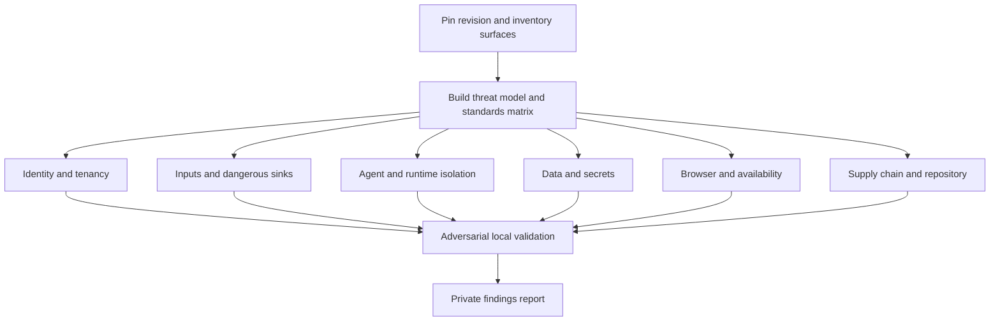
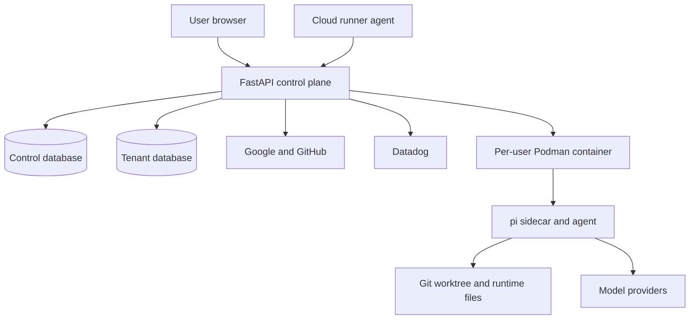

# fix: Audit repository security across every trust boundary

## Overview

Audit Yinshi at a pinned Git revision and produce a private report backed by code traces and safe local probes. Coverage spans the FastAPI backend, React frontend, Node.js/pi sidecar, Podman isolation, tenant data stores, OAuth and GitHub integrations, cloud runners, dependency supply chain, repository controls, and represented deployment defaults.

The selected scope is audit and report only. Application code, configuration, tests, databases, production infrastructure, third-party systems, and GitHub settings remain unchanged.

## Problem Frame

Yinshi gives a coding agent filesystem, shell, Git, network, credential, terminal, and extension access. Security depends on several controls working together: browser authentication, object-level tenant authorization, control-to-tenant database separation, backend-to-sidecar protocol integrity, Podman confinement, credential minimization, and safe handling of hostile repository content or model output.

Existing controls include per-user encryption, optional SQLCipher, path confinement, OAuth state handling, rate limiting, trusted-host and HTTPS middleware, narrow container mounts, capability dropping, and dedicated regression tests. Each control requires fresh verification. Commit `29bcd8c` refreshed the pi package after earlier hardening, which makes sidecar and supply-chain revalidation especially important.

Planning research used commit `29bcd8c`. Audit execution must record its own starting commit so the report describes one reproducible snapshot.

## Requirements Trace

| ID | Requirement |
|---|---|
| R1 | Record the Git revision, tracked-file manifest, public entry points, privileged operations, stores, credentials, integrations, and trust boundaries. Assign each surface to a workstream or document why it is not applicable. |
| R2 | Model unauthenticated attackers, malicious tenants, hostile repositories, prompt injection, hostile model output, untrusted pi extensions or skills, compromised third parties, a compromised sidecar/container, and operator error. |
| R3 | Confirm findings through a reachable path from attacker-controlled source to missing or bypassable control, dangerous sink, and concrete impact. Scanner output supplies leads only. |
| R4 | Map applicable coverage and findings to OWASP ASVS 5.0.0 Level 2, OWASP WSTG 4.2, RFC 9700, OWASP Top 10 for Agentic Applications 2026, Podman guidance, CWE, and CVSS 4.0 where useful. |
| R5 | Audit authentication, OAuth callbacks, sessions, CSRF, HTTP and WebSocket authorization, ownership, cross-tenant access, auth-disabled behavior, rate limits, and account lifecycle. |
| R6 | Trace untrusted input into SQL, subprocess and Git arguments, paths, archives, outbound HTTP, redirects, proxies, rendered Markdown, terminal streams, logs, and error responses. |
| R7 | Audit prompt-injection exposure, tool authority, sidecar protocol handling, Unix-socket isolation, Podman mounts and privileges, resource and network controls, terminals, uploaded pi artifacts, and runners. |
| R8 | Audit cryptography, key storage, provider and GitHub credentials, tenant database encryption, plaintext residue, backup and deletion behavior, logs, browser telemetry, current files, and Git history. |
| R9 | Audit XSS, unsafe URL schemes, browser storage and caching, cookies, CORS, trusted hosts, HTTPS/proxy handling, security headers, stream origins and lifecycle, input bounds, backpressure, and resource exhaustion. |
| R10 | Audit Python and npm dependencies, lockfiles, native modules, container/build inputs, update scripts, dependency automation, repository protections, CI posture, release provenance, and deployment defaults represented in the repository. |
| R11 | Produce a private report containing path and line, attack preconditions and path, impact, severity, confidence, CWE/standard mapping, evidence, mitigating controls, remediation guidance, validation status, coverage, tool limits, and residual risk. Record clean domains too. |
| R12 | Use disposable local data and non-production credentials. Never attack production or third parties, and never copy secret values into evidence or the report. |

## Success Criteria

| Check | Completion condition |
|---|---|
| File coverage | Each tracked production file, security-relevant configuration, lockfile, and reachable route has a completed workstream or documented exclusion. |
| Entry-point coverage | Each HTTP and WebSocket entry point records authentication, authorization, tenant ownership, CSRF/origin, input bounds, and rate/resource controls where applicable. |
| Sink coverage | Each high-risk SQL, subprocess, Git, filesystem, archive, network, rendering, and credential sink has an upstream input trace. |
| Finding quality | Each finding has manual code evidence. Critical and High findings also have a safe reproduction or a second independent evidence path. |
| False-positive control | Scanner-only alerts, unreachable theories, and generic hardening advice stay out of the findings list. Residual-risk entries carry clear labels. |
| Regression coverage | Container isolation, workspace confinement, SSE replay, credential validation, shell termination, and pi compaction fixes receive explicit revalidation. |
| Evidence hygiene | Reports and retained evidence contain no plaintext credentials, tokens, private keys, user content, or unnecessary exploit material. |

## Scope Boundaries

| Scope | Included work |
|---|---|
| In scope | Tracked security-relevant files under `backend/`, `frontend/`, `sidecar/`, `scripts/`, `.github/`, and `docs/security/`; manifests and lockfiles; redacted full-history secret scanning; read-only GitHub posture checks available to the authenticated `gh` session; disposable local runtime checks; security-sensitive fixes visible in Git history. |
| Out of scope | Source or configuration changes; test edits; database mutations outside disposable fixtures; remediation issues or pull requests; public disclosure; production VM or cloud-account inspection; social engineering; physical attacks; kernel exploit development; destructive load; attacks against Google, GitHub, model providers, Datadog, registries, or other third parties. Generated output, virtual environments, `node_modules/`, Playwright temp files, and SQLite contents do not receive manual source review. |
| Separate tasks | Remediation with regression tests; production host, proxy, firewall, backup, systemd, and cloud verification; external penetration testing; coordinated disclosure. |

## Context and Research

Yinshi is a FastAPI application with React/Vite in the browser and a Node.js sidecar built around the pi SDK. `README.md`, `backend/src/yinshi/main.py`, `backend/src/yinshi/config.py`, and `backend/src/yinshi/auth.py` establish middleware, sessions, OAuth, production validation, and startup behavior. `backend/src/yinshi/db.py`, `backend/src/yinshi/tenant.py`, and `backend/src/yinshi/services/keys.py` implement control and tenant storage. `backend/src/yinshi/services/container.py` launches a per-user Podman container, while `sidecar/src/sidecar.js` exposes coding-agent, Git, file, shell, extension, and terminal capabilities over a Unix socket.

Long-lived and remote execution paths live in `backend/src/yinshi/api/stream.py`, `backend/src/yinshi/api/terminals.py`, and `backend/src/yinshi/api/runners.py`. Repository and GitHub inputs cross `backend/src/yinshi/api/repos.py`, `backend/src/yinshi/api/github.py`, `backend/src/yinshi/services/git.py`, and `backend/src/yinshi/services/github_app.py`. Browser telemetry starts in `frontend/src/main.tsx`; agent-controlled output reaches `frontend/src/components/AssistantTurn.tsx`, `frontend/src/components/MessageBubble.tsx`, `frontend/src/components/ToolCallBlock.tsx`, and `frontend/src/components/WorkspaceInspector.tsx`.

`docs/security/middle-ground-threat-model.md` states the intended guarantee and acknowledges plaintext processing on the server. Security regression coverage exists in `backend/tests/test_security_fixes.py`, `backend/tests/test_auth.py`, `backend/tests/test_container.py`, `backend/tests/test_tenant.py`, `backend/tests/test_workspace_files.py`, `sidecar/tests/git_auth.test.js`, `sidecar/tests/git_guard.test.js`, and `sidecar/tests/terminal.test.js`.

Git history records isolation and ownership fixes in `6b5d101` and `c44512c`, sidecar argument ordering in `0a6cd96`, workspace confinement in `e11d95e`, credential validation in `2a132ab`, shell termination in `6fd5339`, SSE replay in `bc564cd`, and pi compaction in `92ce191`. These commits define regression targets; they do not prove current safety.

No `docs/solutions/` security learning or critical-patterns file exists. `.github/dependabot.yml` is the only tracked GitHub automation found during planning. The repository has no tracked CI workflow, `SECURITY.md`, or `CODEOWNERS`. GitHub reported `main` as unprotected during planning; execution must recheck current state. Local `plans/` and `code_reviews/` files informed research but are not portable sources because Git does not track them.

### External Baselines

| Source | Use in this audit |
|---|---|
| [OWASP ASVS 5.0.0](https://owasp.org/www-project-application-security-verification-standard/) | Level 2 control matrix and versioned finding references. |
| [OWASP WSTG 4.2](https://owasp.org/www-project-web-security-testing-guide/v42/) | Stable dynamic-test scenarios. WSTG 5.0 remains under development. |
| [RFC 9700](https://www.rfc-editor.org/rfc/rfc9700.html) | OAuth state/PKCE, redirect, mix-up, CSRF, token leakage, proxy, and least-privilege checks. |
| [OWASP Top 10 for Agentic Applications 2026](https://genai.owasp.org/resource/owasp-top-10-for-agentic-applications-for-2026/) and [Securing Agentic Applications Guide 1.0](https://genai.owasp.org/resource/securing-agentic-applications-guide-1-0/) | Goal hijack, tool misuse, privilege abuse, extension supply chain, unexpected execution, memory poisoning, agent communication, cascades, and human-trust risks. |
| [Podman run documentation](https://docs.podman.io/en/latest/markdown/podman-run.1.html) | User namespaces, capabilities, mounts, host namespaces, network policy, and resource limits. |
| [OpenSSF Scorecard](https://scorecard.dev/) | Repository and build posture prompts for dependencies, protections, workflows, tokens, SAST, pinning, and releases. |
| [GitHub installation-token change](https://github.blog/changelog/2026-04-24-notice-about-upcoming-new-format-for-github-app-installation-tokens/) | Verify that roughly 520-character installation tokens remain opaque and untruncated. |
| [CVSS 4.0](https://www.first.org/cvss/v4.0/) | Severity support where a vector adds useful detail. |

## Key Technical Decisions

| Decision | Reason | Effect on execution |
|---|---|---|
| Freeze one Git revision | Reproducible findings require stable code and dependency inputs. | Later commits receive a delta review. |
| Use ASVS 5.0.0 Level 2 | Credentials, private source code, and remote execution exceed a basic web-app risk profile. | Each applicable control receives pass, fail, not-applicable, or unverified status. |
| Add agentic and Podman baselines | Web controls do not cover hostile repositories, model-directed tool use, sidecar authority, mounts, or host boundaries. | Agent, extension, socket, container, credential, and network paths get dedicated analysis. |
| Run parent-controlled review passes | A branch-diff workflow cannot prove repository-wide coverage, and project policy excludes review subagent fan-out. | Apply `security-sentinel`, `security-reviewer`, `adversarial-reviewer`, `data-integrity-guardian`, `reliability-reviewer`, and `api-contract-reviewer` to explicit file groups, then synthesize once. |
| Require source-to-sink evidence | Scanner alerts and policy gaps can lack exploitability. | Reachable attack paths become findings; other concerns remain limitations or residual risks. |
| Calibrate severity to Yinshi's blast radius | CVSS alone can misrepresent tenant and host impact. | Critical covers host escape, unauthenticated code execution, broad cross-tenant compromise, or active credential compromise. High covers authentication bypass, cross-tenant access, persistent privileged XSS, or sensitive SSRF. Medium covers constrained exploits and practical denial of service with prerequisites. Low covers narrow, concrete exposure. Findings require confidence of at least 0.60; weaker concerns remain residual risks. |
| Confine active checks to disposable local state | The request authorizes repository review, not production penetration testing. | Provider, cloud, and production claims can remain unverified. |
| Keep findings private and untracked | This public repository may retain unfixed findings after an audit-only engagement. | Save the report under ignored `plans/security-reviews/`; do not commit or push it without disclosure approval. |
| Preserve code during discovery | Early fixes can erase evidence and obscure repeated root causes. | Remediation starts after report acceptance in separate plans. |

## Open Questions

| Status | Question | Resolution or execution rule |
|---|---|---|
| Resolved | Audit or remediation? | Audit and report only. |
| Resolved | Repository or production scope? | Repository, represented deployment configuration, GitHub posture, and a disposable local runtime. |
| Resolved | Disclosure location? | Keep the detailed report local and untracked. |
| Resolved | Scanner authority? | Treat output as leads requiring manual confirmation. |
| Deferred | Which optional scanners and container capabilities are available? | Use available read-only tools and record degraded or skipped coverage. |
| Deferred | Does local configuration match production? | Separate repository facts, local runtime facts, and production-unverified assumptions. |
| Deferred | Which GitHub controls and advisory feeds are visible? | Record access failure without inferring feature state. |
| Deferred | Can a candidate be reproduced safely? | Use a second code/configuration trace when a probe would touch a third party or risk host data. Mark runtime exploitability unverified. |

## Audit Flow

> *This illustrates the intended approach and is directional guidance for review, not implementation specification. The implementing agent should treat it as context, not code to reproduce.*

## Implementation Units

These units are read-only audit workstreams. Units 2-7 can run after Unit 1; Unit 8 depends on all six domain reviews. Test expectation: none — this plan changes no production behavior. Existing tests provide corroborating evidence, and local probes use disposable fixtures.

- [ ] Unit 1: Freeze scope, inventory the attack surface, and build the coverage matrix

| Field | Detail |
|---|---|
| Goal | Establish a reproducible baseline, enumerate assets and trust boundaries, and prevent silent coverage gaps. |
| Requirements | R1, R2, R4, R12 |
| Dependencies | None |
| Inspect | `README.md`; `docs/security/middle-ground-threat-model.md`; `backend/src/yinshi/main.py`; `backend/src/yinshi/config.py`; `backend/src/yinshi/models.py`; `backend/src/yinshi/api/`; `backend/src/yinshi/services/`; `frontend/src/`; `sidecar/src/`; `scripts/update-pi-package.sh` |
| Private output | `plans/security-reviews/2026-07-09-comprehensive-security-audit.md` |

Record the commit, branch, worktree state, tracked manifest, tool versions, date, and exclusions before analysis. Inventory HTTP and WebSocket routes, sidecar message types, subprocess and Git launches, file/archive handlers, database connections, outbound clients, credentials, rendering sinks, logs, containers, and runner boundaries. Build actor, asset, and control matrices with pass, fail, not-applicable, and unverified states. Claims in documentation need matching code evidence.

| Scenario | Expected result |
|---|---|
| Compare the tracked manifest with the matrix. | Each production file belongs to a workstream or has a reasoned exclusion. |
| Compare router registration, WebSocket handlers, and sidecar dispatch with the entry-point inventory. | No reachable handler is missing. |
| Trace each credential and sensitive asset through browser, backend, stores, container, sidecar, workspace, and third party. | Each boundary has an owner and expected control. |
| Reconcile documentation with implementation. | Each stated guarantee has code evidence or becomes a documented gap. |

Verification requires a report skeleton containing baseline metadata, exclusions, actors, assets, trust boundaries, standards controls, entry points, sinks, and workstream ownership.

- [ ] Unit 2: Audit identity, sessions, authorization, and tenant isolation

| Field | Detail |
|---|---|
| Goal | Determine whether each path enforces identity, session, ownership, and tenant boundaries. |
| Requirements | R3, R5, R9, R11, R12 |
| Dependencies | Unit 1 |
| Inspect | Every route under `backend/src/yinshi/api/`, with focused review of `backend/src/yinshi/auth.py`; `backend/src/yinshi/api/auth_routes.py`; `backend/src/yinshi/api/deps.py`; `backend/src/yinshi/api/workspaces.py`; `backend/src/yinshi/api/sessions.py`; `backend/src/yinshi/api/settings.py`; `backend/src/yinshi/api/runners.py`; `backend/src/yinshi/api/stream.py`; `backend/src/yinshi/api/terminals.py`; `backend/src/yinshi/db.py`; `backend/src/yinshi/tenant.py`; `backend/src/yinshi/services/accounts.py`; `backend/src/yinshi/rate_limit.py` |
| Existing tests | `backend/tests/test_auth.py`; `backend/tests/test_api.py`; `backend/tests/test_deps.py`; `backend/tests/test_provider_auth_routes.py`; `backend/tests/test_settings_api.py`; `backend/tests/test_tenant.py`; `backend/tests/test_security_fixes.py`; `backend/tests/test_journeys.py` |

Build an endpoint matrix for authentication, object authorization, tenant database selection, ownership, CSRF/origin controls, and rate limits. Trace Google and GitHub OAuth start/callback flows against RFC 9700, including state binding and single use, redirects, provider mix-up, account linking, verified claims, session rotation, logout, cookies, and proxy-derived scheme or host. Exercise direct-object-reference substitution with two disposable users. Review auth-disabled and partial configuration states for fail-open behavior.

| Scenario | Expected result |
|---|---|
| Send unauthenticated HTTP and WebSocket requests to protected entry points. | Rejection occurs before resource lookup or side effects. |
| User A substitutes User B's workspace, session, runner, terminal, repository, or file identifier. | No metadata, content, event, existence, or timing oracle crosses tenants. |
| Replay, omit, expire, provider-swap, or attacker-bind OAuth state. | Login fails without creating or linking an account. |
| Reuse a session across login, logout, account disablement, and user deletion. | Session identifiers rotate or become unusable as required. |
| Send state-changing requests with valid cookies from a hostile origin. | Protected operations do not execute. |
| Remove or weaken production auth/session settings. | Startup fails closed. |

Verification requires an explicit access-control result for each route and a reproducible denial or fully traced finding for every suspected bypass.

- [ ] Unit 3: Audit untrusted input, dangerous sinks, and external integrations

| Field | Detail |
|---|---|
| Goal | Establish whether attacker-controlled input can alter SQL, commands, Git, files, archives, outbound requests, proxies, redirects, or rendered output. |
| Requirements | R3, R6, R9, R11, R12 |
| Dependencies | Unit 1 |
| Inspect | `backend/src/yinshi/models.py`; `backend/src/yinshi/api/repos.py`; `backend/src/yinshi/api/github.py`; `backend/src/yinshi/api/datadog_proxy.py`; `backend/src/yinshi/api/settings.py`; `backend/src/yinshi/api/workspace_files.py`; `backend/src/yinshi/services/git.py`; `backend/src/yinshi/services/git_runtime.py`; `backend/src/yinshi/services/github_app.py`; `backend/src/yinshi/services/pi_config.py`; `backend/src/yinshi/services/pi_releases.py`; `backend/src/yinshi/services/workspace_files.py`; `backend/src/yinshi/utils/paths.py`; `sidecar/src/git_auth.js`; `sidecar/src/sidecar.js` |
| Existing tests | `backend/tests/test_api.py`; `backend/tests/test_datadog_proxy.py`; `backend/tests/test_git.py`; `backend/tests/test_github_app.py`; `backend/tests/test_pi_config.py`; `backend/tests/test_settings_api.py`; `backend/tests/test_workspace_files.py`; `sidecar/tests/git_auth.test.js`; `sidecar/tests/git_guard.test.js` |

Trace dynamic SQL, subprocess arguments, Git remotes/refs/paths, filesystem operations, archive entries, URLs, headers, redirects, proxy paths, and HTML or Markdown inputs from source to sink. Account for semantic Git option injection, remote helpers, hooks, submodules, credentials, and protocol handlers even where argument vectors avoid shell expansion. Review canonical paths, symlinks, archive confinement, destination restrictions, redirects, DNS/IP handling, credential forwarding, and response-size controls.

| Scenario | Expected result |
|---|---|
| Submit local paths, alternate schemes, embedded credentials, option-like values, Unicode separators, redirects, submodules, and malicious Git configuration. | Only intended protocols, hosts, paths, and arguments are accepted. |
| Supply archive entries with absolute paths, traversal, duplicates, symlinks, decompression bombs, malformed metadata, and oversized content. | Extraction rejects them or stays confined and bounded. |
| Race or encode workspace paths through symlinks and parent replacement. | Reads and writes stay in the selected workspace. |
| Target loopback, link-local, private networks, metadata services, alternate ports, redirect chains, and credential-bearing URLs. | Requests are blocked or constrained before credentials attach. |
| Put metacharacters, wildcards, null bytes, huge values, and option prefixes into SQL and command inputs. | Input remains data and cannot alter query or command structure. |
| Return secrets or hostile markup through GitHub, Git, archive, file, and provider errors. | Responses and logs expose bounded, escaped diagnostics. |

Verification requires a source, validation boundary, encoding or parameterization mechanism, and exploitability conclusion for each dangerous sink.

- [ ] Unit 4: Audit agent authority, sidecar protocol, containers, terminals, and runners

| Field | Detail |
|---|---|
| Goal | Stress-test hostile repository or model-directed actions that could reach coding tools, credentials, tenant workspaces, the host, or cloud runners. |
| Requirements | R2, R3, R7, R9, R10, R11, R12 |
| Dependencies | Unit 1 |
| Inspect | `backend/src/yinshi/api/stream.py`; `backend/src/yinshi/api/terminals.py`; `backend/src/yinshi/api/runners.py`; `backend/src/yinshi/runner_agent.py`; `backend/src/yinshi/services/container.py`; `backend/src/yinshi/services/sidecar.py`; `backend/src/yinshi/services/sidecar_runtime.py`; `backend/src/yinshi/services/run_coordinator.py`; `backend/src/yinshi/services/runners.py`; `backend/src/yinshi/services/workspace_runtime_paths.py`; `sidecar/Dockerfile`; `sidecar/src/index.js`; `sidecar/src/sidecar.js`; `sidecar/src/git_auth.js`; `scripts/update-pi-package.sh` |
| Existing tests | `backend/tests/test_api.py`; `backend/tests/test_container.py`; `backend/tests/test_runners.py`; `backend/tests/test_security_fixes.py`; `backend/tests/test_sidecar.py`; `backend/tests/test_sidecar_runtime.py`; `sidecar/tests/git_auth.test.js`; `sidecar/tests/git_guard.test.js`; `sidecar/tests/terminal.test.js` |

Apply OWASP agentic risks to concrete capabilities: goal hijack, tool misuse, identity and privilege abuse, extension poisoning, unexpected execution, memory/context poisoning, insecure sidecar communication, cascades, and misleading approval output. Compare Podman arguments and runtime facts with intended user, mount, namespace, capability, seccomp, SELinux, network, DNS, environment, process, descriptor, CPU, memory, and PID controls. Trace socket creation, permissions, ownership, path choice, framing, bounds, malformed messages, disconnects, and tenant binding. Review runner enrollment, bootstrap material, credentials, lifecycle, and cleanup without contacting cloud infrastructure. Treat uploaded settings, extensions, skills, and prompt/config artifacts as executable supply-chain inputs.

| Scenario | Expected result |
|---|---|
| A repository directs the agent to read mounted credentials, neighboring tenant paths, backend sockets, host paths, or cloud metadata and exfiltrate them. | Boundaries block the path or the report states the residual authority precisely. |
| The sidecar forks, fills memory/disk/PIDs, opens outbound connections, probes host aliases, and writes through each mount. | Runtime limits and mount modes match the threat model. |
| User A or a compromised local process guesses User B's socket. | Directory and socket permissions, protocol state, and tenant binding prevent control or observation. |
| Send malformed, oversized, duplicate, reordered, replayed, and unknown messages during startup, streaming, cancellation, reconnect, and shutdown. | The protocol fails closed without cross-session corruption. |
| Send terminal control sequences, binary input, extreme resize values, reconnect bursts, and abandoned sessions. | Authorization, bounds, output safety, and cleanup hold. |
| Upload an extension or skill with executable startup behavior or out-of-tree package resolution. | Effective authority and containment match documented guarantees. |
| Present stale, stolen, or cross-tenant runner credentials after reassignment or deletion. | The runner cannot claim work, obtain tenant secrets, or retain a live channel. |

Verification requires a precise capability statement for malicious repositories, model responses, extensions, sidecars, and tenants, plus every mismatch between intended and effective isolation.

- [ ] Unit 5: Audit cryptography, data lifecycle, secrets, logs, and privacy

| Field | Detail |
|---|---|
| Goal | Verify minimization, key separation, encryption, redaction, telemetry controls, retention, and deletion for sensitive data. |
| Requirements | R3, R8, R9, R11, R12 |
| Dependencies | Unit 1 |
| Inspect | `.env.example`; `.gitignore`; `docs/security/middle-ground-threat-model.md`; `docs/security/workspace-secrets-manager-plan.md`; `backend/src/yinshi/config.py`; `backend/src/yinshi/db.py`; `backend/src/yinshi/tenant.py`; `backend/src/yinshi/models.py`; `backend/src/yinshi/services/crypto.py`; `backend/src/yinshi/services/control_encryption.py`; `backend/src/yinshi/services/keys.py`; `backend/src/yinshi/services/provider_connections.py`; `backend/src/yinshi/services/user_settings.py`; `backend/src/yinshi/api/datadog_proxy.py`; `frontend/src/main.tsx` |
| Existing tests | `backend/tests/test_byok_enforcement.py`; `backend/tests/test_crypto.py`; `backend/tests/test_datadog_proxy.py`; `backend/tests/test_db.py`; `backend/tests/test_provider_auth_routes.py`; `backend/tests/test_settings_api.py`; `backend/tests/test_tenant.py` |

Trace each credential and sensitive field through API serialization, process environment, container mount, sidecar message, persistence, logging, telemetry, rotation, and deletion. Review AES-GCM nonce generation and associated data, HKDF context separation, key-file permissions, malformed ciphertext, rotation, and master-key loss. Confirm that SQLCipher-required mode proves encryption and examine temporary files, journals, backups, exports, permissions, deletion, and plaintext fallback. Scan tracked files and history with redacted evidence. Compare RUM and session replay with source code, chat, terminal, credential, and PII exposure.

| Scenario | Expected result |
|---|---|
| Encrypt the same plaintext repeatedly under each context, then tamper or swap contexts. | Nonces and ciphertext differ; cross-context and tampered decryptions fail closed. |
| Remove, weaken, corrupt, replace, or rotate key files while old ciphertext exists. | Startup and reads preserve protection and never return corrupt data as valid. |
| Require SQLCipher when support is absent, misconfigured, or pointed at plaintext data. | Access fails before sensitive writes; plaintext fallback does not occur. |
| Follow provider tokens, GitHub keys, model credentials, chat, terminal output, repository URLs, and OAuth data through success and error paths. | APIs, logs, telemetry, and browser storage expose only necessary values. |
| Secret scanning finds a candidate in current files or history. | Evidence records type, path, commit, and fingerprint without the value. |
| Delete a tenant with active sessions, containers, sockets, worktrees, journals, and key material. | Cleanup order and residue are documented; owned artifacts do not survive unnoticed. |

Verification requires a lifecycle map for each sensitive data class covering transit, storage, use, logs, telemetry, retention, and deletion.

- [ ] Unit 6: Audit browser, API transport, streaming, and resource-abuse controls

| Field | Detail |
|---|---|
| Goal | Verify output safety, transport boundaries, long-lived connection security, and resistance to practical resource exhaustion. |
| Requirements | R3, R5, R6, R9, R11, R12 |
| Dependencies | Unit 1 |
| Inspect | `frontend/index.html`; `frontend/vite.config.ts`; `frontend/src/App.tsx`; `frontend/src/main.tsx`; `frontend/src/api/client.ts`; `frontend/src/components/AssistantTurn.tsx`; `frontend/src/components/MessageBubble.tsx`; `frontend/src/components/PiReleaseNotesSection.tsx`; `frontend/src/components/ToolCallBlock.tsx`; `frontend/src/components/WorkspaceInspector.tsx`; `frontend/src/hooks/useAgentStream.ts`; `frontend/src/hooks/useAuth.tsx`; `frontend/src/hooks/useSession.ts`; `backend/src/yinshi/main.py`; `backend/src/yinshi/auth.py`; `backend/src/yinshi/api/stream.py`; `backend/src/yinshi/api/terminals.py`; `backend/src/yinshi/rate_limit.py` |
| Existing tests | `frontend/src/components/__tests__/AssistantTurn.test.tsx`; `frontend/src/components/__tests__/ChatView.test.tsx`; `frontend/src/components/__tests__/PiReleaseNotesSection.test.tsx`; `frontend/src/components/__tests__/WorkspaceInspector.test.tsx`; `frontend/src/hooks/__tests__/useAgentStream.test.tsx`; `frontend/src/hooks/__tests__/useAuth.test.tsx`; `frontend/e2e/chat-session.spec.ts`; `frontend/e2e/navigation.spec.ts`; `frontend/e2e/settings.spec.ts`; `backend/tests/test_api.py`; `backend/tests/test_main.py`; `backend/tests/test_security_fixes.py` |

Review agent-controlled Markdown, links, code blocks, errors, terminal bytes, URLs, downloads, and filenames for DOM XSS, dangerous schemes, tabnabbing, terminal escape effects, and content sniffing. Evaluate cookies, CORS, trusted hosts, HTTPS redirects, forwarded headers, HSTS, CSP, frame policy, referrer policy, MIME sniffing, cache policy, and OAuth transport as one proxy-aware boundary. Trace WebSocket and SSE authentication, origins, replay cursors, cancellation, stale authorization, queue bounds, backpressure, disconnect cleanup, and event isolation. Probe expensive operations at safe limits. Use OWASP ZAP against the disposable local application for passive, header, and authenticated route coverage; confirm each alert manually.

| Scenario | Expected result |
|---|---|
| Render scripts, handlers, raw HTML, dangerous schemes, malformed Markdown, oversized code blocks, and external links from agent output. | The browser executes nothing unintended and grants no opener access. |
| Render OSC/DCS/control sequences, bidirectional text, clipboard operations, and extreme terminal lines. | Output cannot trigger browser actions or unbounded rendering. |
| Spoof `Host`, `Origin`, forwarded scheme/host, and cross-origin credentials under direct and proxy-like conditions. | Redirects, cookies, CORS, and callbacks stay bound to configured origins. |
| Reuse valid cookies on WebSocket or SSE after logout, tenant deletion, and permission change. | Stale streams stop disclosing and mutating state. |
| Send oversized bodies, archives, queues, reconnect storms, terminal bursts, and parallel agent starts. | Bounds and cleanup prevent disproportionate CPU, memory, disk, process, and connection use. |
| Drive errors containing traces, provider responses, paths, tokens, and hostile text. | Responses remain generic and logs remain redacted. |

Verification requires source evidence plus safe local response/header and rendering checks, with availability limits documented for each expensive operation.

- [ ] Unit 7: Audit dependencies, build provenance, repository controls, and deployment defaults

| Field | Detail |
|---|---|
| Goal | Identify vulnerable dependencies, mutable build inputs, unsafe repository governance, and weak deployment defaults. |
| Requirements | R3, R10, R11, R12 |
| Dependencies | Unit 1 |
| Inspect | `backend/pyproject.toml`; `backend/requirements/base.txt`; `backend/requirements/dev.txt`; `frontend/package.json`; `frontend/package-lock.json`; `sidecar/package.json`; `sidecar/package-lock.json`; `sidecar/Dockerfile`; `scripts/update-pi-package.sh`; `.github/dependabot.yml`; `.gitignore`; `.env.example` |

Run Semgrep and Bandit for source patterns; `pip-audit` for Python advisories; `npm audit` for both npm trees; OSV-Scanner for lockfile coverage; gitleaks across current files and history; Trivy for filesystem, dependency, Dockerfile, and image findings; Hadolint for the sidecar build; and OpenSSF Scorecard for repository posture. All tools run read-only, with version, advisory timestamp, package path, dependency chain, and confidence preserved. Review pins, lock integrity, duplicate ecosystems, native modules, install scripts, release verification, base-image mutability, caches, and runtime identity. Inspect branch protection, dependency alerts, secret scanning, code scanning, review policy, workflow permissions, release practices, and security policy when current GitHub credentials expose them. GitHub installation tokens must remain opaque and support the current variable length.

| Scenario | Expected result |
|---|---|
| Scanners report direct and transitive advisories. | Each alert is matched to the locked version, dependency chain, reachable use, fix, and exploit relevance. |
| Manifests and lockfiles diverge or disappear. | Non-reproducible installs and silent drift become explicit findings or risks. |
| Releases, tarballs, base images, or package versions change under stable names. | Digest, signature, provenance, and rollback assumptions are documented. |
| A malicious pull request or maintainer targets update scripts or future workflows. | Branch, review, token, and workflow controls reveal the actual blast radius. |
| A GitHub App token is roughly 520 characters with variable opaque content. | Storage, validation, logs, headers, and sidecar transport do not truncate or parse it. |
| Secret and binary scans cover current files and history. | True positives stay private and redacted; exclusions do not create false assurance. |

Verification requires a dependency and repository posture table covering confirmed advisories, false-positive reasons, missing controls, inaccessible checks, and supply-chain assumptions.

- [ ] Unit 8: Validate attack chains and finalize the private report

| Field | Detail |
|---|---|
| Goal | Challenge cross-component assumptions, validate candidates, deduplicate root causes, and produce one prioritized report. |
| Requirements | R3, R4, R11, R12 |
| Dependencies | Units 2-7 |
| Private output | `plans/security-reviews/2026-07-09-comprehensive-security-audit.md` |
| Revalidation sources | `backend/tests/`; `frontend/src/`; `frontend/e2e/`; `sidecar/tests/` |

Construct chains across browser-to-OAuth-to-tenant lookup, repository-to-agent-to-tool-to-secret, extension-to-sidecar-to-container-to-host, runner-to-backend-to-tenant data, and telemetry-to-third-party disclosure. Use two disposable users, temporary repositories and credentials, isolated databases, temporary sockets, and local containers. Stubs or inert destinations prevent third-party calls. Existing tests distinguish expected controls from dead or unexercised paths; this audit does not edit them.

Each Critical and High candidate gets a second pass through upstream validation, middleware, ownership checks, framework guarantees, environment constraints, tests, and counterexamples. Deduplication follows root cause and attack path. Confirmed findings, defense-in-depth advice, false positives, inaccessible checks, and residual risks remain separate. Remediation order follows exploitability, blast radius, tenant/host impact, credential exposure, data loss, and dependency order.

| Scenario | Expected result |
|---|---|
| User A chains a valid session, guessed identifier, stream or terminal, and sidecar action against User B. | Each handoff enforces tenant identity or contributes to one consolidated finding. |
| A repository combines prompt injection, shell/Git tools, mounted credentials, network access, and persuasive agent output. | Effective exfiltration capability is proven or bounded without trusting prompt intent. |
| A dependency, OAuth provider, sidecar, container, or runner fails during a state change. | Partial state, retries, cleanup, and stale credentials do not widen impact. |
| Retest a Critical or High candidate against all visible controls and local behavior. | Only candidates that survive the counterexample search remain findings. |
| A scanner alert lacks an attacker-controlled source or reachable sink. | The report suppresses it and records the reason. |
| A workstream confirms no vulnerability. | The report still records files, controls, scenarios, tools, and limits. |

Verification requires an executive summary, pinned scope, method, threat model, standards coverage, severity-grouped findings, attack chains, confirmed controls, suppressed alerts, coverage gaps, residual risks, and ordered remediation guidance. The report stays untracked and off the public repository.

## System-Wide Impact

| Concern | Audit rule |
|---|---|
| Interaction graph | Follow identity and data through browser, API, control store, tenant store, OAuth/GitHub, Datadog, container, sidecar, workspace, providers, and runners. Adjacent authentication never substitutes for boundary-specific checks. |
| Error propagation | Provider, database, Git, file, container, sidecar, stream, and runner failures cannot reveal credentials, retain privileged state, or fail open. |
| State lifecycle | Review creation through destruction for sessions, OAuth state, tenant keys, worktrees, sockets, containers, terminals, runner tokens, credentials, event buffers, and deletion cleanup. |
| API parity | HTTP, WebSocket, SSE, sidecar messages, terminal frames, runner APIs, and browser navigation enforce equivalent identity and tenant assumptions when they reach the same resource. |
| Integration evidence | Cross-layer chains test confinement, credential minimization, stream revocation, and cleanup ordering beyond isolated unit coverage. |
| Unchanged invariants | Runtime behavior, tracked files besides this plan, tests, data, infrastructure, external services, and GitHub settings remain unchanged. Findings stay private. |

## Alternatives Considered

| Option | Decision |
|---|---|
| Standard branch-diff review extension | Rejected. Changed-line review cannot establish repository-wide coverage or revalidate old controls. |
| Scanner-only audit | Rejected. Scanners miss ownership logic, tenant isolation, agent authority, container composition, and multi-step chains. |
| Custom checklist | Rejected. Versioned ASVS, WSTG, OAuth, agentic, Podman, CWE, and CVSS sources offer traceable coverage. |
| Live deployment testing | Rejected. The request does not authorize production or third-party penetration testing. |
| Fixes during discovery | Rejected. Mutation can erase evidence and hide repeated root causes before triage. |

## Risks and Dependencies

| Risk or dependency | Control |
|---|---|
| Scope becomes shallow | The surface matrix requires a disposition for each entry point and dangerous sink. |
| Tools return stale or noisy results | Record versions and advisory timestamps; require manual reachability and impact confirmation. |
| Local behavior differs from production | Label source/config facts, local runtime facts, and production-unverified assumptions separately. |
| Probes damage data or contact outsiders | Use disposable local state, inert integrations, and bounded loads. |
| Secret evidence leaks a value | Record path, commit, type, and fingerprint only. |
| A public commit discloses unfixed vulnerabilities | Keep the detailed report local and untracked until remediation or approved disclosure. |
| Scanner, Podman, browser, network, or GitHub access fails | Continue manual review and name the skipped or degraded check. |
| Existing tests create false confidence | Trace production controls directly and use tests as corroboration. |
| The snapshot ages | Pin the revision and require a delta review for later commits. |
| Hostile fixtures threaten the host | Use synthetic inputs, least-privileged disposable containers, and no real secrets. |

## Operational Notes

The final detailed output is `plans/security-reviews/2026-07-09-comprehensive-security-audit.md`. The existing `.gitignore` keeps `plans/` private. The report cannot appear in a public issue, pull request, commit, or push while accepted findings remain unresolved.

A confirmed host escape, cross-tenant compromise, authentication bypass, or active credential exposure must be surfaced immediately. Any probe that could widen impact stops at that point.

Temporary tool evidence may remain local with secret values redacted. The final report is authoritative; raw scanner output has no finding status. Limitations must name unavailable production, cloud, provider, or GitHub evidence. Missing access never proves safety.

Remediation starts from separate plans that add regression tests and preserve the report's root-cause and dependency order.

## Sources and References

| Kind | Source |
|---|---|
| Architecture | `README.md` |
| Threat model | `docs/security/middle-ground-threat-model.md` |
| Security regressions | `backend/tests/test_security_fixes.py` |
| Container boundary | `backend/src/yinshi/services/container.py` |
| Agent boundary | `sidecar/src/sidecar.js` |
| Web controls | [OWASP ASVS 5.0.0](https://owasp.org/www-project-application-security-verification-standard/) and [OWASP WSTG 4.2](https://owasp.org/www-project-web-security-testing-guide/v42/) |
| OAuth | [RFC 9700](https://www.rfc-editor.org/rfc/rfc9700.html) |
| Agent security | [OWASP Top 10 for Agentic Applications 2026](https://genai.owasp.org/resource/owasp-top-10-for-agentic-applications-for-2026/) and [Securing Agentic Applications Guide 1.0](https://genai.owasp.org/resource/securing-agentic-applications-guide-1-0/) |
| Container security | [Podman run documentation](https://docs.podman.io/en/latest/markdown/podman-run.1.html) |
| Supply chain | [OpenSSF Scorecard](https://scorecard.dev/) |
| GitHub compatibility | [Installation-token format change](https://github.blog/changelog/2026-04-24-notice-about-upcoming-new-format-for-github-app-installation-tokens/) |
| Severity | [CVSS 4.0](https://www.first.org/cvss/v4.0/) |
