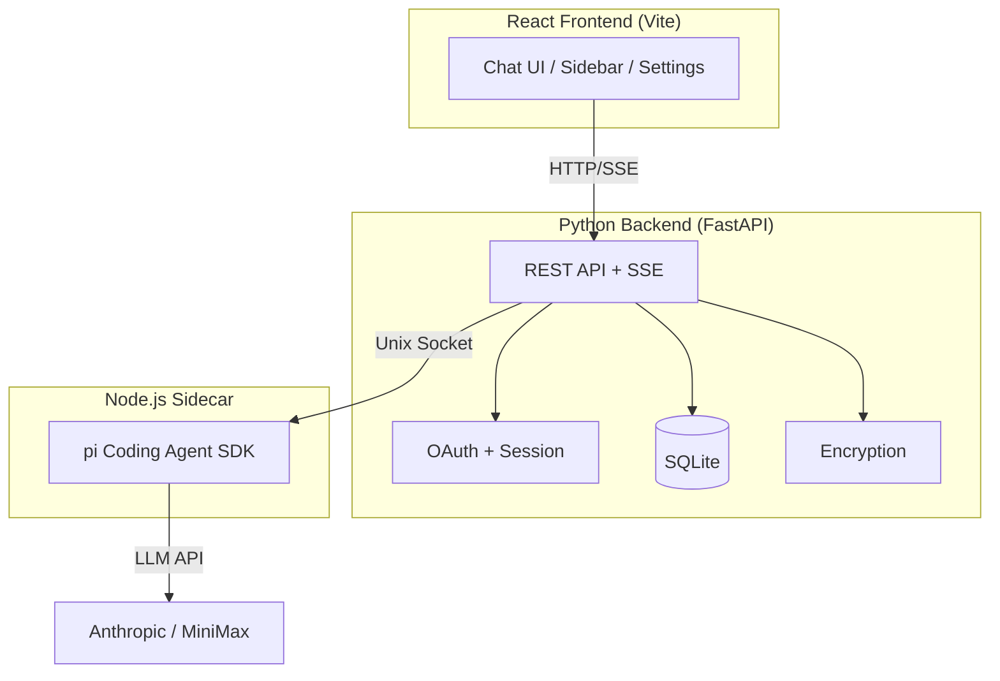
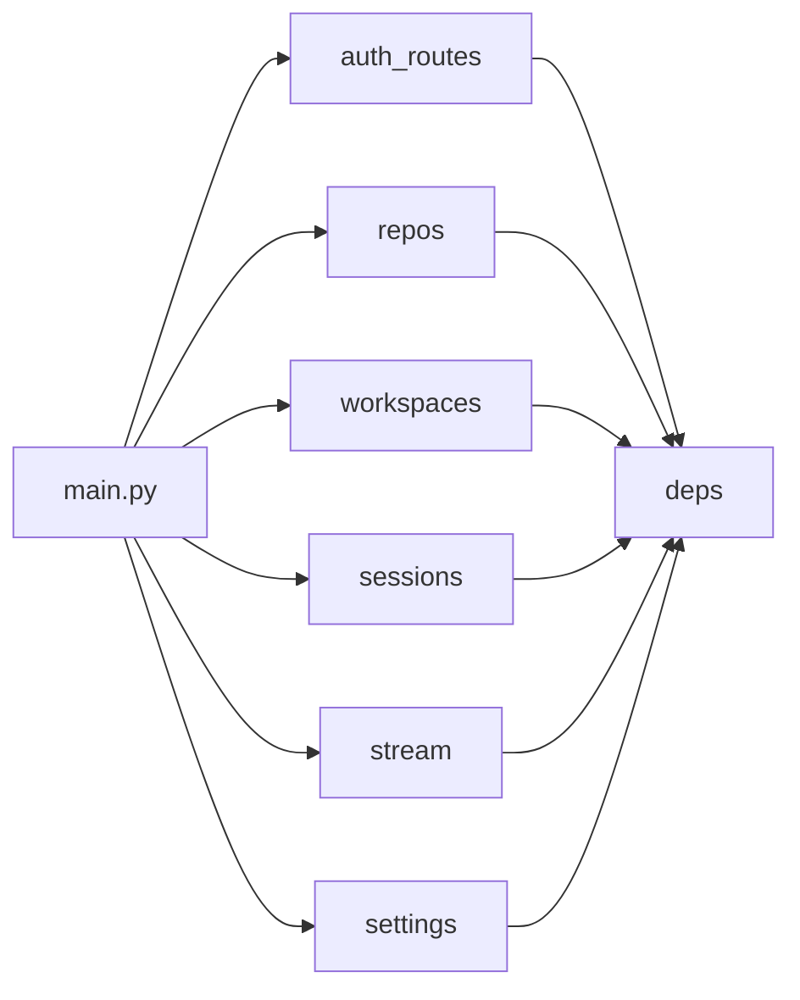
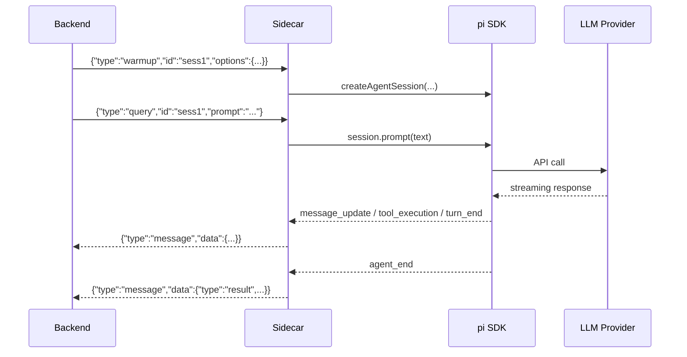
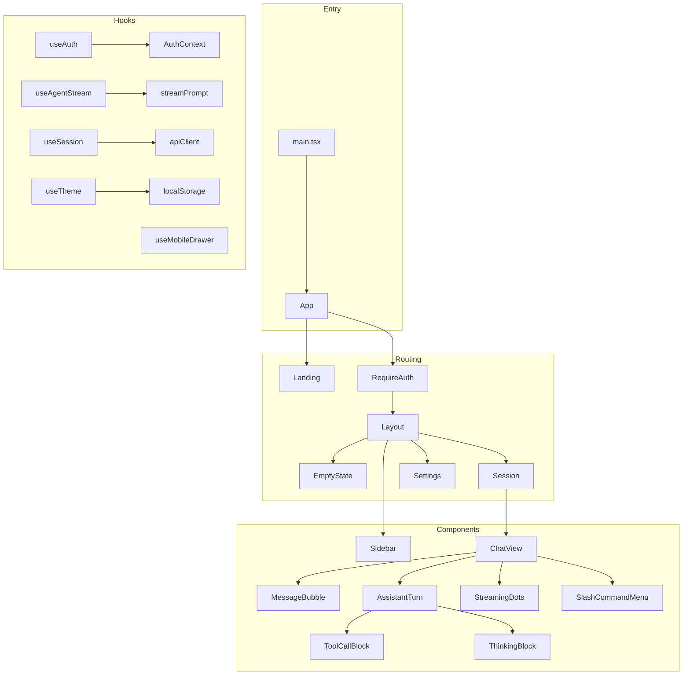

# Introduction

Yinshi is a web application for managing coding agent workspaces. Users import GitHub or local git repositories, Yinshi creates isolated worktrees with random branch names, and an AI coding agent (pi) operates freely on each branch. All conversations and worktree state live in SQLite.

The system comprises three tiers:

- **Python backend** (FastAPI): REST API, authentication, database management, key encryption, and SSE streaming.
- **Node.js sidecar**: Bridges the backend to the pi coding agent SDK via a Unix domain socket.
- **React frontend** (Vite): Chat interface, workspace navigation, and settings management.



Data flows from the browser through FastAPI, which authenticates requests, resolves API keys, and opens a Unix socket connection to the sidecar. The sidecar wraps the pi coding agent SDK, subscribing to agent events and streaming them back as JSON lines. The backend reformats these as SSE events for the frontend.

# Package Marker

The `yinshi` package identifies itself with a single docstring.

```python {chunk="package-init" file="backend/src/yinshi/__init__.py"}
"""Yinshi -- web-based coding agent orchestrator."""
```

# Configuration

All settings are loaded from environment variables (or `.env`) via Pydantic. The `Settings` class covers database paths, OAuth credentials for Google and GitHub, an encryption pepper for wrapping per-user DEKs, the sidecar socket path, and CORS/server settings.

The `get_settings` function is cached so the entire application shares one `Settings` instance. If no `secret_key` is provided, a random one is generated at startup -- suitable for single-process deployments.

```python {chunk="config" file="backend/src/yinshi/config.py"}
"""Application configuration via environment variables."""

import secrets
from functools import lru_cache

from pydantic_settings import BaseSettings


def _generate_secret() -> str:
    return secrets.token_hex(32)


class Settings(BaseSettings):
    """Application settings loaded from .env."""

    app_name: str = "Yinshi"
    debug: bool = False

    # Database (legacy single-DB mode)
    db_path: str = "yinshi.db"

    # Multi-tenant databases
    control_db_path: str = "/var/lib/yinshi/control.db"
    user_data_dir: str = "/var/lib/yinshi/users"

    # Encryption pepper for wrapping per-user DEKs (hex string, 32+ bytes)
    encryption_pepper: str = ""

    # Google OAuth
    google_client_id: str = ""
    google_client_secret: str = ""
    google_redirect_uri: str = "http://localhost:8000/auth/callback/google"

    # GitHub OAuth
    github_client_id: str = ""
    github_client_secret: str = ""
    github_redirect_uri: str = "http://localhost:8000/auth/callback/github"

    # Session secret for cookies -- generated randomly if not set
    secret_key: str = ""

    # Explicit flag to disable auth (empty google_client_id alone is not enough)
    disable_auth: bool = False

    # Platform-provided MiniMax API key for freemium users
    platform_minimax_api_key: str = ""

    # Sidecar
    sidecar_socket_path: str = "/tmp/yinshi-sidecar.sock"

    # CORS
    frontend_url: str = "http://localhost:5173"

    # Server
    host: str = "0.0.0.0"
    port: int = 8000

    # Allowed base directory for local repo imports (empty = no restriction)
    allowed_repo_base: str = ""

    model_config = {"env_file": ".env", "env_file_encoding": "utf-8", "case_sensitive": False}

    @property
    def encryption_pepper_bytes(self) -> bytes:
        """Return the encryption pepper as bytes."""
        if self.encryption_pepper:
            return bytes.fromhex(self.encryption_pepper)
        return b""


@lru_cache()
def get_settings() -> Settings:
    """Get cached settings instance."""
    settings = Settings()
    # Generate a random secret key if none provided
    if not settings.secret_key:
        settings.secret_key = _generate_secret()
    return settings
```

# Exception Hierarchy

A shallow exception tree rooted at `YinshiError` provides specific types for each failure mode. This lets API handlers catch domain errors and translate them to appropriate HTTP status codes.

```python {chunk="exceptions" file="backend/src/yinshi/exceptions.py"}
"""Custom exception hierarchy for Yinshi."""


class YinshiError(Exception):
    """Base exception for all Yinshi errors."""


class RepoNotFoundError(YinshiError):
    """Raised when a repository is not found."""


class WorkspaceNotFoundError(YinshiError):
    """Raised when a workspace is not found."""


class SessionNotFoundError(YinshiError):
    """Raised when a session is not found."""


class GitError(YinshiError):
    """Raised when a git operation fails."""


class SidecarError(YinshiError):
    """Raised when sidecar communication fails."""


class SidecarNotConnectedError(SidecarError):
    """Raised when the sidecar is not connected."""


class KeyNotFoundError(YinshiError):
    """Raised when no API key is available for a provider."""


class CreditExhaustedError(YinshiError):
    """Raised when freemium credit is exhausted."""


class EncryptionNotConfiguredError(YinshiError):
    """Raised when encryption pepper is not configured."""
```

# Database Layer

Yinshi uses two SQLite databases. The **main database** stores repos, workspaces, sessions, and messages in legacy single-user mode. The **control database** stores multi-tenant data: users, OAuth identities, API keys, and usage logs.

Both databases use WAL journal mode for concurrent reads and a 5-second busy timeout to handle SQLite lock contention. Foreign keys and `updated_at` triggers keep referential integrity and timestamps consistent.

```python {chunk="db" file="backend/src/yinshi/db.py"}
"""SQLite database connection and schema management."""

import logging
import sqlite3
from collections.abc import Iterator
from contextlib import contextmanager
from pathlib import Path

from yinshi.config import get_settings

logger = logging.getLogger(__name__)

_SCHEMA_VERSION = 1

SCHEMA_SQL = """
PRAGMA journal_mode = WAL;

CREATE TABLE IF NOT EXISTS repos (
    id TEXT PRIMARY KEY DEFAULT (lower(hex(randomblob(16)))),
    created_at TIMESTAMP DEFAULT CURRENT_TIMESTAMP NOT NULL,
    updated_at TIMESTAMP DEFAULT CURRENT_TIMESTAMP NOT NULL,
    name TEXT NOT NULL,
    remote_url TEXT,
    root_path TEXT NOT NULL,
    custom_prompt TEXT,
    owner_email TEXT
);

CREATE TABLE IF NOT EXISTS workspaces (
    id TEXT PRIMARY KEY DEFAULT (lower(hex(randomblob(16)))),
    created_at TIMESTAMP DEFAULT CURRENT_TIMESTAMP NOT NULL,
    updated_at TIMESTAMP DEFAULT CURRENT_TIMESTAMP NOT NULL,
    repo_id TEXT NOT NULL REFERENCES repos(id) ON DELETE CASCADE,
    name TEXT NOT NULL,
    branch TEXT NOT NULL,
    path TEXT NOT NULL,
    state TEXT DEFAULT 'ready' NOT NULL
);

CREATE TABLE IF NOT EXISTS sessions (
    id TEXT PRIMARY KEY DEFAULT (lower(hex(randomblob(16)))),
    created_at TIMESTAMP DEFAULT CURRENT_TIMESTAMP NOT NULL,
    updated_at TIMESTAMP DEFAULT CURRENT_TIMESTAMP NOT NULL,
    workspace_id TEXT NOT NULL REFERENCES workspaces(id) ON DELETE CASCADE,
    status TEXT DEFAULT 'idle' NOT NULL,
    model TEXT DEFAULT 'minimax'
);

CREATE TABLE IF NOT EXISTS messages (
    id TEXT PRIMARY KEY DEFAULT (lower(hex(randomblob(16)))),
    created_at TIMESTAMP DEFAULT CURRENT_TIMESTAMP NOT NULL,
    session_id TEXT NOT NULL REFERENCES sessions(id) ON DELETE CASCADE,
    role TEXT NOT NULL,
    content TEXT,
    full_message TEXT,
    turn_id TEXT
);

CREATE INDEX IF NOT EXISTS idx_messages_session ON messages(session_id, created_at);
CREATE INDEX IF NOT EXISTS idx_messages_turn_id ON messages(turn_id);
CREATE INDEX IF NOT EXISTS idx_sessions_workspace ON sessions(workspace_id);
CREATE INDEX IF NOT EXISTS idx_workspaces_repo ON workspaces(repo_id);

CREATE TRIGGER IF NOT EXISTS update_repos_updated_at AFTER UPDATE ON repos
BEGIN UPDATE repos SET updated_at = CURRENT_TIMESTAMP WHERE id = NEW.id; END;

CREATE TRIGGER IF NOT EXISTS update_workspaces_updated_at AFTER UPDATE ON workspaces
BEGIN UPDATE workspaces SET updated_at = CURRENT_TIMESTAMP WHERE id = NEW.id; END;

CREATE TRIGGER IF NOT EXISTS update_sessions_updated_at AFTER UPDATE ON sessions
BEGIN UPDATE sessions SET updated_at = CURRENT_TIMESTAMP WHERE id = NEW.id; END;
"""


def _open_connection(db_path: str, *, check_same_thread: bool = True) -> sqlite3.Connection:
    """Open a SQLite connection with standard settings."""
    conn = sqlite3.connect(db_path, check_same_thread=check_same_thread)
    conn.row_factory = sqlite3.Row
    conn.execute("PRAGMA foreign_keys = ON")
    conn.execute("PRAGMA busy_timeout = 5000")
    return conn


@contextmanager
def get_db() -> Iterator[sqlite3.Connection]:
    """Get a SQLite connection as a context manager."""
    settings = get_settings()
    conn = _open_connection(settings.db_path)
    try:
        yield conn
    finally:
        conn.close()


def _migrate(conn: sqlite3.Connection) -> None:
    """Apply versioned schema migrations."""
    conn.execute("CREATE TABLE IF NOT EXISTS schema_version (version INTEGER NOT NULL)")
    row = conn.execute("SELECT version FROM schema_version").fetchone()
    current = row[0] if row else 0

    if current < 1:
        columns = [r[1] for r in conn.execute("PRAGMA table_info(repos)").fetchall()]
        if "owner_email" not in columns:
            logger.info("Migration v1: adding owner_email column to repos")
            conn.execute("ALTER TABLE repos ADD COLUMN owner_email TEXT")

    if current != _SCHEMA_VERSION:
        conn.execute("DELETE FROM schema_version")
        conn.execute(
            "INSERT INTO schema_version (version) VALUES (?)", (_SCHEMA_VERSION,)
        )
        conn.commit()


def init_db() -> None:
    """Initialize the database schema."""
    settings = get_settings()
    logger.info("Initializing database at %s", settings.db_path)
    try:
        with get_db() as conn:
            conn.executescript(SCHEMA_SQL)
            _migrate(conn)
    except sqlite3.Error:
        logger.exception("Failed to initialize database at %s", settings.db_path)
        raise
    logger.info("Database initialized")


# --- Control plane database (multi-tenant) ---

CONTROL_SCHEMA_SQL = """
PRAGMA journal_mode = WAL;

CREATE TABLE IF NOT EXISTS users (
    id TEXT PRIMARY KEY DEFAULT (lower(hex(randomblob(16)))),
    created_at TIMESTAMP DEFAULT CURRENT_TIMESTAMP NOT NULL,
    updated_at TIMESTAMP DEFAULT CURRENT_TIMESTAMP NOT NULL,
    email TEXT NOT NULL UNIQUE,
    display_name TEXT,
    avatar_url TEXT,
    status TEXT DEFAULT 'active' NOT NULL,
    tier TEXT DEFAULT 'free' NOT NULL,
    disk_quota_mb INTEGER DEFAULT 5000,
    disk_used_mb INTEGER DEFAULT 0,
    encrypted_dek BLOB,
    credit_used_cents INTEGER DEFAULT 0,
    credit_limit_cents INTEGER DEFAULT 500,
    last_login_at TIMESTAMP,
    deletion_requested_at TIMESTAMP,
    deletion_scheduled_for TIMESTAMP
);

CREATE TABLE IF NOT EXISTS oauth_identities (
    id TEXT PRIMARY KEY DEFAULT (lower(hex(randomblob(16)))),
    created_at TIMESTAMP DEFAULT CURRENT_TIMESTAMP NOT NULL,
    user_id TEXT NOT NULL REFERENCES users(id) ON DELETE CASCADE,
    provider TEXT NOT NULL,
    provider_user_id TEXT NOT NULL,
    provider_email TEXT NOT NULL,
    provider_data TEXT,
    UNIQUE(provider, provider_user_id)
);

CREATE TABLE IF NOT EXISTS api_keys (
    id TEXT PRIMARY KEY DEFAULT (lower(hex(randomblob(16)))),
    created_at TIMESTAMP DEFAULT CURRENT_TIMESTAMP NOT NULL,
    user_id TEXT NOT NULL REFERENCES users(id) ON DELETE CASCADE,
    provider TEXT NOT NULL,
    encrypted_key BLOB NOT NULL,
    label TEXT DEFAULT '',
    last_used_at TIMESTAMP
);

CREATE TABLE IF NOT EXISTS usage_log (
    id TEXT PRIMARY KEY DEFAULT (lower(hex(randomblob(16)))),
    created_at TIMESTAMP DEFAULT CURRENT_TIMESTAMP NOT NULL,
    user_id TEXT NOT NULL REFERENCES users(id) ON DELETE CASCADE,
    session_id TEXT NOT NULL,
    provider TEXT NOT NULL,
    model TEXT NOT NULL,
    input_tokens INTEGER DEFAULT 0,
    output_tokens INTEGER DEFAULT 0,
    cache_read_tokens INTEGER DEFAULT 0,
    cache_write_tokens INTEGER DEFAULT 0,
    cost_cents REAL DEFAULT 0,
    key_source TEXT NOT NULL
);

CREATE INDEX IF NOT EXISTS idx_users_email ON users(email);
CREATE INDEX IF NOT EXISTS idx_oauth_user ON oauth_identities(user_id);
CREATE INDEX IF NOT EXISTS idx_api_keys_user ON api_keys(user_id);
CREATE INDEX IF NOT EXISTS idx_usage_user ON usage_log(user_id);
CREATE INDEX IF NOT EXISTS idx_usage_session ON usage_log(session_id);
"""


@contextmanager
def get_control_db() -> Iterator[sqlite3.Connection]:
    """Get a connection to the control plane database."""
    settings = get_settings()
    conn = _open_connection(settings.control_db_path)
    try:
        yield conn
    finally:
        conn.close()


def _migrate_control(conn: sqlite3.Connection) -> None:
    """Apply control DB schema migrations for existing databases."""
    columns = [r[1] for r in conn.execute("PRAGMA table_info(users)").fetchall()]
    if "credit_used_cents" not in columns:
        logger.info("Control migration: adding credit tracking columns to users")
        conn.execute("ALTER TABLE users ADD COLUMN credit_used_cents INTEGER DEFAULT 0")
        conn.execute("ALTER TABLE users ADD COLUMN credit_limit_cents INTEGER DEFAULT 500")
        conn.commit()


def init_control_db() -> None:
    """Initialize the control plane database schema."""
    settings = get_settings()
    Path(settings.control_db_path).parent.mkdir(parents=True, exist_ok=True)
    logger.info("Initializing control database at %s", settings.control_db_path)
    try:
        with get_control_db() as conn:
            conn.executescript(CONTROL_SCHEMA_SQL)
            _migrate_control(conn)
    except sqlite3.Error:
        logger.exception("Failed to initialize control database")
        raise
    logger.info("Control database initialized")
```

# Data Models

Pydantic models define the API contract. Request models validate inbound data with field constraints (max lengths, regex patterns). Response models serialize SQLite rows back to JSON.

The models split into core entities (repos, workspaces, sessions, messages) and multi-tenant entities (users, API keys). `WSPrompt` and `WSCancel` are WebSocket message schemas retained from an earlier WebSocket-based design.

```python {chunk="models" file="backend/src/yinshi/models.py"}
"""Pydantic models for API request/response schemas."""

from datetime import datetime

from pydantic import BaseModel, Field


class RepoCreate(BaseModel):
    """Request to import a repository."""

    name: str = Field(..., max_length=255)
    remote_url: str | None = Field(None, max_length=2048)
    local_path: str | None = Field(None, max_length=4096)
    custom_prompt: str | None = Field(None, max_length=10_000)


class RepoOut(BaseModel):
    """Repository response."""

    id: str
    created_at: datetime
    updated_at: datetime
    name: str
    remote_url: str | None = None
    root_path: str
    custom_prompt: str | None = None
    owner_email: str | None = None  # Legacy field, absent in tenant mode


class RepoUpdate(BaseModel):
    """Request to update a repository."""

    name: str | None = Field(None, max_length=255)
    custom_prompt: str | None = Field(None, max_length=10_000)


class WorkspaceCreate(BaseModel):
    """Request to create a worktree workspace."""

    name: str | None = Field(None, max_length=255)


class WorkspaceOut(BaseModel):
    """Workspace response."""

    id: str
    created_at: datetime
    updated_at: datetime
    repo_id: str
    name: str
    branch: str
    path: str
    state: str = "ready"


class WorkspaceUpdate(BaseModel):
    """Request to update a workspace."""

    state: str | None = Field(None, pattern=r"^(ready|archived)$")


class SessionCreate(BaseModel):
    """Request to create an agent session."""

    model: str = Field("minimax", max_length=100)


class SessionUpdate(BaseModel):
    """Request to update a session."""

    model: str | None = Field(None, max_length=100)


class SessionOut(BaseModel):
    """Session response."""

    id: str
    created_at: datetime
    updated_at: datetime
    workspace_id: str
    status: str = "idle"
    model: str = "minimax"


class MessageOut(BaseModel):
    """Message response."""

    id: str
    created_at: datetime
    session_id: str
    role: str
    content: str | None = None
    full_message: str | None = None
    turn_id: str | None = None


class WSPrompt(BaseModel):
    """WebSocket message from client to send a prompt."""

    type: str = "prompt"
    prompt: str = Field(..., max_length=100_000)
    model: str | None = Field(None, max_length=100)


class WSCancel(BaseModel):
    """WebSocket message from client to cancel."""

    type: str = "cancel"


# --- Multi-tenant models ---


class UserOut(BaseModel):
    """User account response (from control plane)."""

    id: str
    email: str
    display_name: str | None = None
    avatar_url: str | None = None
    status: str = "active"
    tier: str = "free"


class ApiKeyCreate(BaseModel):
    """Request to store an API key."""

    provider: str = Field(..., pattern=r"^(anthropic|minimax)$")
    key: str = Field(..., min_length=1, max_length=500)
    label: str = Field("", max_length=255)


class ApiKeyOut(BaseModel):
    """API key response (key value is never returned)."""

    id: str
    created_at: datetime
    provider: str
    label: str = ""
    last_used_at: datetime | None = None
```

# Multi-Tenant Context

Each authenticated user gets their own data directory and SQLite database. The `TenantContext` dataclass carries the user's identity and paths through the request lifecycle. User directories are sharded by a 2-character prefix of the user ID to avoid too many entries in a single directory.

The `validate_user_path` function prevents path traversal attacks -- every file operation must stay within the tenant's data directory.

The per-user schema mirrors the main schema but omits `owner_email` since tenant isolation makes it redundant.

```python {chunk="tenant" file="backend/src/yinshi/tenant.py"}
"""Multi-tenant context and per-user database management."""

import os
import sqlite3
from collections.abc import Iterator
from contextlib import contextmanager
from dataclasses import dataclass

from yinshi.db import _open_connection


@dataclass
class TenantContext:
    """Per-request tenant context resolved from authentication."""

    user_id: str
    email: str
    data_dir: str
    db_path: str


def user_data_dir(base_dir: str, user_id: str) -> str:
    """Compute the data directory for a user, using a 2-char prefix."""
    prefix = user_id[:2]
    return os.path.join(base_dir, prefix, user_id)


def validate_user_path(tenant: TenantContext, path: str) -> None:
    """Validate that a path is within the tenant's data directory.

    Raises ValueError if the path is outside the tenant's data_dir.
    """
    resolved = os.path.realpath(path)
    data_dir = os.path.realpath(tenant.data_dir)
    if not resolved.startswith(data_dir + os.sep) and resolved != data_dir:
        raise ValueError(f"Path {path} is outside tenant data directory")


# User DB schema -- identical to main schema but WITHOUT owner_email
USER_SCHEMA_SQL = """
PRAGMA journal_mode = WAL;

CREATE TABLE IF NOT EXISTS repos (
    id TEXT PRIMARY KEY DEFAULT (lower(hex(randomblob(16)))),
    created_at TIMESTAMP DEFAULT CURRENT_TIMESTAMP NOT NULL,
    updated_at TIMESTAMP DEFAULT CURRENT_TIMESTAMP NOT NULL,
    name TEXT NOT NULL,
    remote_url TEXT,
    root_path TEXT NOT NULL,
    custom_prompt TEXT
);

CREATE TABLE IF NOT EXISTS workspaces (
    id TEXT PRIMARY KEY DEFAULT (lower(hex(randomblob(16)))),
    created_at TIMESTAMP DEFAULT CURRENT_TIMESTAMP NOT NULL,
    updated_at TIMESTAMP DEFAULT CURRENT_TIMESTAMP NOT NULL,
    repo_id TEXT NOT NULL REFERENCES repos(id) ON DELETE CASCADE,
    name TEXT NOT NULL,
    branch TEXT NOT NULL,
    path TEXT NOT NULL,
    state TEXT DEFAULT 'ready' NOT NULL
);

CREATE TABLE IF NOT EXISTS sessions (
    id TEXT PRIMARY KEY DEFAULT (lower(hex(randomblob(16)))),
    created_at TIMESTAMP DEFAULT CURRENT_TIMESTAMP NOT NULL,
    updated_at TIMESTAMP DEFAULT CURRENT_TIMESTAMP NOT NULL,
    workspace_id TEXT NOT NULL REFERENCES workspaces(id) ON DELETE CASCADE,
    status TEXT DEFAULT 'idle' NOT NULL,
    model TEXT DEFAULT 'minimax'
);

CREATE TABLE IF NOT EXISTS messages (
    id TEXT PRIMARY KEY DEFAULT (lower(hex(randomblob(16)))),
    created_at TIMESTAMP DEFAULT CURRENT_TIMESTAMP NOT NULL,
    session_id TEXT NOT NULL REFERENCES sessions(id) ON DELETE CASCADE,
    role TEXT NOT NULL,
    content TEXT,
    full_message TEXT,
    turn_id TEXT
);

CREATE INDEX IF NOT EXISTS idx_messages_session ON messages(session_id, created_at);
CREATE INDEX IF NOT EXISTS idx_messages_turn_id ON messages(turn_id);
CREATE INDEX IF NOT EXISTS idx_sessions_workspace ON sessions(workspace_id);
CREATE INDEX IF NOT EXISTS idx_workspaces_repo ON workspaces(repo_id);

CREATE TRIGGER IF NOT EXISTS update_repos_updated_at AFTER UPDATE ON repos
BEGIN UPDATE repos SET updated_at = CURRENT_TIMESTAMP WHERE id = NEW.id; END;

CREATE TRIGGER IF NOT EXISTS update_workspaces_updated_at AFTER UPDATE ON workspaces
BEGIN UPDATE workspaces SET updated_at = CURRENT_TIMESTAMP WHERE id = NEW.id; END;

CREATE TRIGGER IF NOT EXISTS update_sessions_updated_at AFTER UPDATE ON sessions
BEGIN UPDATE sessions SET updated_at = CURRENT_TIMESTAMP WHERE id = NEW.id; END;
"""


def init_user_db(db_path: str) -> None:
    """Initialize a per-user SQLite database with the user schema."""
    conn = _open_connection(db_path)
    try:
        conn.executescript(USER_SCHEMA_SQL)
    finally:
        conn.close()


@contextmanager
def get_user_db(tenant: TenantContext) -> Iterator[sqlite3.Connection]:
    """Get a SQLite connection to a user's database."""
    conn = _open_connection(tenant.db_path)
    try:
        yield conn
    finally:
        conn.close()
```

# Authentication

Authentication uses OAuth 2.0 via authlib with two providers: Google (OIDC) and GitHub. Session state is stored in signed cookies using `itsdangerous.URLSafeTimedSerializer`. Sessions expire after 30 days.

The `AuthMiddleware` intercepts every request, skipping open paths (`/auth/`, `/health`, `/static/`). For protected paths it verifies the session cookie, resolves the tenant context, and attaches it to `request.state`. Mutating methods require an `X-Requested-With: XMLHttpRequest` header for CSRF protection.

```python {chunk="auth" file="backend/src/yinshi/auth.py"}
"""OAuth authentication and session middleware (Google + GitHub)."""

import logging

from authlib.integrations.starlette_client import OAuth
from fastapi import Request, Response
from itsdangerous import URLSafeTimedSerializer
from starlette.middleware.base import BaseHTTPMiddleware

from yinshi.config import get_settings
from yinshi.db import get_control_db
from yinshi.services.accounts import make_tenant
from yinshi.tenant import TenantContext

logger = logging.getLogger(__name__)

oauth = OAuth()

SESSION_MAX_AGE = 86400 * 30  # 30 days


def setup_oauth() -> None:
    """Register OAuth providers (Google and GitHub)."""
    settings = get_settings()
    if settings.google_client_id:
        oauth.register(
            name="google",
            client_id=settings.google_client_id,
            client_secret=settings.google_client_secret,
            server_metadata_url="https://accounts.google.com/.well-known/openid-configuration",
            client_kwargs={"scope": "openid email profile"},
        )
    else:
        logger.warning("Google OAuth not configured")

    if settings.github_client_id:
        oauth.register(
            name="github",
            client_id=settings.github_client_id,
            client_secret=settings.github_client_secret,
            authorize_url="https://github.com/login/oauth/authorize",
            access_token_url="https://github.com/login/oauth/access_token",
            api_base_url="https://api.github.com/",
            client_kwargs={"scope": "user:email"},
        )
    else:
        logger.warning("GitHub OAuth not configured")

    if not settings.google_client_id and not settings.github_client_id:
        logger.warning("No OAuth provider configured -- auth disabled")


def create_session_token(user_id: str) -> str:
    """Create a signed session token encoding a user_id."""
    settings = get_settings()
    serializer = URLSafeTimedSerializer(settings.secret_key)
    return serializer.dumps(user_id, salt="yinshi-session")


def verify_session_token(token: str) -> str | None:
    """Verify and decode a session token. Returns user_id or None."""
    settings = get_settings()
    serializer = URLSafeTimedSerializer(settings.secret_key)
    try:
        return serializer.loads(token, salt="yinshi-session", max_age=SESSION_MAX_AGE)
    except Exception:
        return None


def _auth_disabled() -> bool:
    """Check if authentication is disabled."""
    settings = get_settings()
    return settings.disable_auth or (
        not settings.google_client_id and not settings.github_client_id
    )


def _resolve_tenant_from_user_id(user_id: str) -> TenantContext | None:
    """Resolve TenantContext from a user_id in the control DB."""
    with get_control_db() as db:
        row = db.execute("SELECT id, email FROM users WHERE id = ?", (user_id,)).fetchone()
    if not row:
        return None
    return make_tenant(row["id"], row["email"])


class AuthMiddleware(BaseHTTPMiddleware):
    """Middleware that checks for valid session cookie on protected routes."""

    OPEN_PREFIXES = ("/auth/", "/health", "/static/")

    async def dispatch(self, request: Request, call_next):  # type: ignore[override]
        path = request.url.path

        # Skip auth if explicitly disabled
        if _auth_disabled():
            return await call_next(request)

        # Allow open paths
        if any(path.startswith(p) for p in self.OPEN_PREFIXES):
            return await call_next(request)

        # Check session cookie
        token = request.cookies.get("yinshi_session")
        if not token:
            return Response(status_code=401, content="Not authenticated")

        user_id = verify_session_token(token)
        if not user_id:
            return Response(status_code=401, content="Invalid session")

        # Resolve tenant context
        tenant = _resolve_tenant_from_user_id(user_id)
        if not tenant:
            return Response(status_code=401, content="User not found")

        request.state.user_email = tenant.email
        request.state.tenant = tenant

        # CSRF protection for mutating methods
        if request.method in ("POST", "PATCH", "PUT", "DELETE"):
            if request.headers.get("X-Requested-With") != "XMLHttpRequest":
                return Response(status_code=403, content="CSRF validation failed")

        return await call_next(request)
```

# Encryption

Per-user data encryption follows a two-tier key hierarchy. A server-wide **pepper** (from environment) and the user ID are fed into HKDF-SHA256 to derive a **Key Encryption Key** (KEK). The KEK wraps a random 256-bit **Data Encryption Key** (DEK) using AES-256-GCM. The DEK in turn encrypts individual API keys.

This design means rotating the pepper requires re-wrapping all DEKs, but individual API keys can be added or removed without touching the KEK.

```python {chunk="crypto" file="backend/src/yinshi/services/crypto.py"}
"""Encryption services for per-user data encryption.

Uses HKDF for key derivation and AES-256-GCM for wrapping/unwrapping
Data Encryption Keys (DEKs) and encrypting API keys.
"""

import os

from cryptography.hazmat.primitives.ciphers.aead import AESGCM
from cryptography.hazmat.primitives.kdf.hkdf import HKDF
from cryptography.hazmat.primitives import hashes


def generate_dek() -> bytes:
    """Generate a random 256-bit Data Encryption Key."""
    return os.urandom(32)


def _derive_kek(user_id: str, pepper: bytes) -> bytes:
    """Derive a Key Encryption Key from user_id and server pepper using HKDF."""
    hkdf = HKDF(
        algorithm=hashes.SHA256(),
        length=32,
        salt=pepper,
        info=f"yinshi-kek-{user_id}".encode(),
    )
    return hkdf.derive(user_id.encode())


def wrap_dek(dek: bytes, user_id: str, pepper: bytes) -> bytes:
    """Wrap (encrypt) a DEK using a KEK derived from user_id + pepper.

    Returns nonce (12 bytes) + ciphertext.
    """
    kek = _derive_kek(user_id, pepper)
    aesgcm = AESGCM(kek)
    nonce = os.urandom(12)
    ciphertext = aesgcm.encrypt(nonce, dek, None)
    return nonce + ciphertext


def unwrap_dek(wrapped: bytes, user_id: str, pepper: bytes) -> bytes:
    """Unwrap (decrypt) a DEK using a KEK derived from user_id + pepper."""
    kek = _derive_kek(user_id, pepper)
    aesgcm = AESGCM(kek)
    nonce = wrapped[:12]
    ciphertext = wrapped[12:]
    return aesgcm.decrypt(nonce, ciphertext, None)


def encrypt_api_key(api_key: str, dek: bytes) -> bytes:
    """Encrypt an API key string using the user's DEK.

    Returns nonce (12 bytes) + ciphertext.
    """
    aesgcm = AESGCM(dek)
    nonce = os.urandom(12)
    ciphertext = aesgcm.encrypt(nonce, api_key.encode(), None)
    return nonce + ciphertext


def decrypt_api_key(encrypted: bytes, dek: bytes) -> str:
    """Decrypt an API key using the user's DEK."""
    aesgcm = AESGCM(dek)
    nonce = encrypted[:12]
    ciphertext = encrypted[12:]
    return aesgcm.decrypt(nonce, ciphertext, None).decode()
```

# BYOK Key Resolution and Usage Tracking

The freemium model works as follows: each user gets 500 cents of free credit for MiniMax API calls. Users can also bring their own key (BYOK) for Anthropic or MiniMax. Key resolution follows a priority chain: BYOK first, then platform key with credit check, then error.

Cost estimation uses MiniMax M2.5 Highspeed pricing per million tokens. Usage is recorded per-turn with provider, model, token counts, and cost.

```python {chunk="keys" file="backend/src/yinshi/services/keys.py"}
"""BYOK key resolution and freemium usage tracking.

Handles API key lookup, platform credit enforcement, cost estimation,
and usage recording for the freemium model.
"""

import logging
import uuid

from yinshi.config import get_settings
from yinshi.db import get_control_db
from yinshi.exceptions import CreditExhaustedError, EncryptionNotConfiguredError, KeyNotFoundError
from yinshi.services.crypto import decrypt_api_key, generate_dek, unwrap_dek, wrap_dek

logger = logging.getLogger(__name__)

# MiniMax M2.5 Highspeed pricing (per 1M tokens, in cents)
_MINIMAX_COSTS = {
    "input": 30,         # $0.30/M
    "output": 120,       # $1.20/M
    "cache_read": 3,     # $0.03/M
    "cache_write": 3.75, # $0.0375/M
}


def get_user_dek(user_id: str) -> bytes:
    """Retrieve and unwrap the user's DEK from the control DB."""
    settings = get_settings()
    pepper = settings.encryption_pepper_bytes
    if not pepper:
        raise EncryptionNotConfiguredError("Encryption pepper not configured")

    with get_control_db() as db:
        row = db.execute(
            "SELECT encrypted_dek FROM users WHERE id = ?", (user_id,)
        ).fetchone()
    if not row:
        raise KeyNotFoundError(f"User {user_id} not found")

    if not row["encrypted_dek"]:
        # Lazy-generate DEK for accounts created before encryption was configured
        dek = generate_dek()
        encrypted_dek = wrap_dek(dek, user_id, pepper)
        with get_control_db() as db:
            db.execute(
                "UPDATE users SET encrypted_dek = ? WHERE id = ?",
                (encrypted_dek, user_id),
            )
            db.commit()
        logger.info("Generated DEK for user %s (legacy account)", user_id)
        return dek

    return unwrap_dek(row["encrypted_dek"], user_id, pepper)


def resolve_user_api_key(user_id: str, provider: str) -> str | None:
    """Look up and decrypt the user's stored BYOK key for a provider.

    Returns the plaintext API key, or None if no key is stored.
    """
    with get_control_db() as db:
        row = db.execute(
            "SELECT encrypted_key FROM api_keys WHERE user_id = ? AND provider = ? "
            "ORDER BY created_at DESC LIMIT 1",
            (user_id, provider),
        ).fetchone()

        if not row:
            return None

        dek = get_user_dek(user_id)
        key = decrypt_api_key(row["encrypted_key"], dek)

        db.execute(
            "UPDATE api_keys SET last_used_at = CURRENT_TIMESTAMP "
            "WHERE user_id = ? AND provider = ?",
            (user_id, provider),
        )
        db.commit()

    return key


def get_credit_remaining_cents(user_id: str) -> int:
    """Return remaining freemium credit in cents."""
    with get_control_db() as db:
        row = db.execute(
            "SELECT credit_limit_cents, credit_used_cents FROM users WHERE id = ?",
            (user_id,),
        ).fetchone()

    if not row:
        return 0

    return max(0, row["credit_limit_cents"] - row["credit_used_cents"])


def resolve_api_key_for_prompt(
    user_id: str, provider: str, platform_key: str | None
) -> tuple[str, str]:
    """Resolve which API key to use for a prompt.

    Returns (api_key, key_source) where key_source is 'byok' or 'platform'.

    Raises CreditExhaustedError or KeyNotFoundError if no key is available.
    """
    # 1. Check for BYOK key
    byok_key = resolve_user_api_key(user_id, provider)
    if byok_key:
        return byok_key, "byok"

    # 2. Platform key for minimax with remaining credit
    if provider == "minimax" and platform_key:
        remaining = get_credit_remaining_cents(user_id)
        if remaining > 0:
            return platform_key, "platform"

        raise CreditExhaustedError(
            "Free credit exhausted. Add your own MiniMax API key in Settings."
        )

    # 3. No key available
    raise KeyNotFoundError(
        f"No API key found for {provider}. Add one in Settings."
    )


def estimate_cost_cents(provider: str, usage: dict) -> float:
    """Estimate cost from token counts. Returns cents.

    Only MiniMax costs are tracked (platform credit). Other providers
    return 0 since the user pays directly via BYOK.
    """
    if provider != "minimax":
        return 0.0

    input_tokens = usage.get("input_tokens", 0)
    output_tokens = usage.get("output_tokens", 0)
    cache_read = usage.get("cache_read_tokens", 0)
    cache_write = usage.get("cache_write_tokens", 0)

    cost = (
        input_tokens * _MINIMAX_COSTS["input"]
        + output_tokens * _MINIMAX_COSTS["output"]
        + cache_read * _MINIMAX_COSTS["cache_read"]
        + cache_write * _MINIMAX_COSTS["cache_write"]
    ) / 1_000_000

    return cost


def record_usage(
    user_id: str,
    session_id: str,
    provider: str,
    model: str,
    usage: dict,
    key_source: str,
) -> None:
    """Insert a usage_log row. If key_source='platform', increment credit_used_cents."""
    cost = estimate_cost_cents(provider, usage)
    row_id = uuid.uuid4().hex

    with get_control_db() as db:
        db.execute(
            "INSERT INTO usage_log "
            "(id, user_id, session_id, provider, model, "
            "input_tokens, output_tokens, cache_read_tokens, cache_write_tokens, "
            "cost_cents, key_source) "
            "VALUES (?, ?, ?, ?, ?, ?, ?, ?, ?, ?, ?)",
            (
                row_id,
                user_id,
                session_id,
                provider,
                model,
                usage.get("input_tokens", 0),
                usage.get("output_tokens", 0),
                usage.get("cache_read_tokens", 0),
                usage.get("cache_write_tokens", 0),
                cost,
                key_source,
            ),
        )

        if key_source == "platform" and cost > 0:
            db.execute(
                "UPDATE users SET credit_used_cents = credit_used_cents + ? WHERE id = ?",
                (int(round(cost)), user_id),
            )

        db.commit()

    logger.info(
        "Usage recorded: user=%s provider=%s model=%s cost=%.2fc source=%s",
        user_id, provider, model, cost, key_source,
    )
```

# Account Management

User provisioning follows a three-step resolution: first check for an existing OAuth identity, then check by email (to link a new provider to an existing account), and finally create a new user with a freshly generated DEK.

On first OAuth login, `_migrate_legacy_data` copies any repos, workspaces, sessions, and messages from the legacy single-user database into the new per-user database.

```python {chunk="accounts" file="backend/src/yinshi/services/accounts.py"}
"""Account provisioning and resolution for multi-tenant users."""

import json
import logging
import os
import secrets
import sqlite3

from yinshi.config import get_settings
from yinshi.db import get_control_db
from yinshi.services.crypto import generate_dek, wrap_dek
from yinshi.tenant import TenantContext, get_user_db, init_user_db, user_data_dir

logger = logging.getLogger(__name__)


def make_tenant(user_id: str, email: str) -> TenantContext:
    """Build a TenantContext from user_id and email."""
    settings = get_settings()
    data_dir = user_data_dir(settings.user_data_dir, user_id)
    return TenantContext(
        user_id=user_id,
        email=email,
        data_dir=data_dir,
        db_path=os.path.join(data_dir, "yinshi.db"),
    )


def provision_user(user_id: str, email: str) -> TenantContext:
    """Create the data directory and initialize the user's database."""
    tenant = make_tenant(user_id, email)
    repos_dir = os.path.join(tenant.data_dir, "repos")
    os.makedirs(repos_dir, exist_ok=True)
    init_user_db(tenant.db_path)

    logger.info("Provisioned user %s at %s", user_id, tenant.data_dir)
    return tenant


def _migrate_legacy_data(tenant: TenantContext) -> None:
    """Copy repos/workspaces/sessions/messages from the legacy DB to the user's DB.

    Runs once on first login. Skips silently if no legacy DB exists or if the
    user has no data in it.
    """
    settings = get_settings()
    legacy_path = settings.db_path
    if not os.path.exists(legacy_path):
        return

    try:
        source = sqlite3.connect(legacy_path)
        source.row_factory = sqlite3.Row
    except sqlite3.Error:
        logger.warning("Could not open legacy DB at %s", legacy_path)
        return

    try:
        repos = source.execute(
            "SELECT * FROM repos WHERE owner_email = ? OR owner_email IS NULL",
            (tenant.email,),
        ).fetchall()

        if not repos:
            return

        with get_user_db(tenant) as dest:
            for repo in repos:
                r = dict(repo)
                dest.execute(
                    "INSERT OR IGNORE INTO repos (id, created_at, updated_at, name, remote_url, root_path, custom_prompt) "
                    "VALUES (?, ?, ?, ?, ?, ?, ?)",
                    (r["id"], r["created_at"], r["updated_at"], r["name"],
                     r["remote_url"], r["root_path"], r.get("custom_prompt")),
                )

                for ws in source.execute(
                    "SELECT * FROM workspaces WHERE repo_id = ?", (r["id"],)
                ).fetchall():
                    w = dict(ws)
                    dest.execute(
                        "INSERT OR IGNORE INTO workspaces (id, created_at, updated_at, repo_id, name, branch, path, state) "
                        "VALUES (?, ?, ?, ?, ?, ?, ?, ?)",
                        (w["id"], w["created_at"], w["updated_at"], w["repo_id"],
                         w["name"], w.get("branch", ""), w.get("path", ""), w["state"]),
                    )

                    for sess in source.execute(
                        "SELECT * FROM sessions WHERE workspace_id = ?", (w["id"],)
                    ).fetchall():
                        s = dict(sess)
                        dest.execute(
                            "INSERT OR IGNORE INTO sessions (id, created_at, updated_at, workspace_id, status, model) "
                            "VALUES (?, ?, ?, ?, ?, ?)",
                            (s["id"], s["created_at"], s["updated_at"],
                             s["workspace_id"], s["status"], s.get("model")),
                        )

                        for msg in source.execute(
                            "SELECT * FROM messages WHERE session_id = ?", (s["id"],)
                        ).fetchall():
                            m = dict(msg)
                            dest.execute(
                                "INSERT OR IGNORE INTO messages (id, created_at, session_id, role, content, full_message, turn_id) "
                                "VALUES (?, ?, ?, ?, ?, ?, ?)",
                                (m["id"], m["created_at"], m["session_id"],
                                 m["role"], m["content"], m.get("full_message"), m.get("turn_id")),
                            )

            dest.commit()
            logger.info("Migrated %d legacy repo(s) for %s", len(repos), tenant.email)
    except sqlite3.Error:
        logger.exception("Failed to migrate legacy data for %s", tenant.email)
    finally:
        source.close()


def _touch_last_login(db, user_id: str) -> None:
    """Update last_login_at for an existing user."""
    db.execute(
        "UPDATE users SET last_login_at = CURRENT_TIMESTAMP WHERE id = ?",
        (user_id,),
    )


def resolve_or_create_user(
    provider: str,
    provider_user_id: str,
    email: str,
    display_name: str | None = None,
    avatar_url: str | None = None,
    provider_data: dict | None = None,
) -> TenantContext:
    """Resolve an existing user or create a new one.

    1. Look up oauth_identities by (provider, provider_user_id) -- return if found
    2. Look up users by email -- link new identity if found
    3. Otherwise, provision a new user
    """
    provider_data_json = json.dumps(provider_data) if provider_data else None

    with get_control_db() as db:
        # 1. Check existing identity
        row = db.execute(
            "SELECT oi.user_id, u.email FROM oauth_identities oi "
            "JOIN users u ON oi.user_id = u.id "
            "WHERE oi.provider = ? AND oi.provider_user_id = ?",
            (provider, provider_user_id),
        ).fetchone()

        if row:
            _touch_last_login(db, row["user_id"])
            db.commit()
            return make_tenant(row["user_id"], row["email"])

        # 2. Check existing user by email
        user_row = db.execute(
            "SELECT id, email FROM users WHERE email = ?", (email,)
        ).fetchone()

        if user_row:
            user_id = user_row["id"]
            db.execute(
                "INSERT INTO oauth_identities "
                "(user_id, provider, provider_user_id, provider_email, provider_data) "
                "VALUES (?, ?, ?, ?, ?)",
                (user_id, provider, provider_user_id, email, provider_data_json),
            )
            _touch_last_login(db, user_id)
            db.commit()
            return make_tenant(user_id, email)

        # 3. Create new user
        user_id = secrets.token_hex(16)

        # Generate and wrap DEK
        dek = generate_dek()
        settings = get_settings()
        pepper = settings.encryption_pepper_bytes
        encrypted_dek = wrap_dek(dek, user_id, pepper) if pepper else None

        db.execute(
            "INSERT INTO users (id, email, display_name, avatar_url, encrypted_dek, last_login_at) "
            "VALUES (?, ?, ?, ?, ?, CURRENT_TIMESTAMP)",
            (user_id, email, display_name, avatar_url, encrypted_dek),
        )
        db.execute(
            "INSERT INTO oauth_identities "
            "(user_id, provider, provider_user_id, provider_email, provider_data) "
            "VALUES (?, ?, ?, ?, ?)",
            (user_id, provider, provider_user_id, email, provider_data_json),
        )
        db.commit()

    # Provision outside the control DB transaction
    tenant = provision_user(user_id, email)
    _migrate_legacy_data(tenant)
    return tenant
```

# Git Operations

Git operations are async subprocess wrappers. Branch names follow a `username/adjective-noun-suffix` pattern using curated word lists that produce readable, collision-resistant names.

Clone URL validation rejects dangerous schemes (`ext::`, `file://`, leading `-`). The `clone_repo` function reuses existing clones when possible, falling back to `git fetch --all` to update.

Worktree creation and deletion manage both the filesystem worktree and its backing branch.

```python {chunk="git" file="backend/src/yinshi/services/git.py"}
"""Git operations: clone repos and manage worktrees."""

import asyncio
import logging
import random
import string
from pathlib import Path

from yinshi.exceptions import GitError

logger = logging.getLogger(__name__)

_ADJECTIVES = [
    "swift", "bold", "calm", "dark", "keen", "warm", "cool", "pure", "wise", "fast",
    "bright", "quiet", "sharp", "smooth", "steady", "gentle", "vivid", "grand", "noble",
    "fresh", "prime", "lunar", "solar", "amber", "coral", "ivory", "olive", "azure",
]
_NOUNS = [
    "fox", "owl", "elk", "wolf", "hawk", "bear", "lynx", "crane", "drake", "finch",
    "heron", "raven", "otter", "tiger", "eagle", "falcon", "panda", "bison", "cedar",
    "maple", "river", "stone", "flame", "frost", "storm", "ridge", "grove", "brook",
]

_ALLOWED_URL_SCHEMES = ("https://", "ssh://", "git@")


def generate_branch_name(username: str | None = None) -> str:
    """Generate a random branch name like 'username/swift-fox-a3f2'."""
    adj = random.choice(_ADJECTIVES)
    noun = random.choice(_NOUNS)
    suffix = "".join(random.choices(string.ascii_lowercase + string.digits, k=4))
    bare = f"{adj}-{noun}-{suffix}"
    if username:
        return f"{username}/{bare}"
    return bare


def _validate_clone_url(url: str) -> None:
    """Reject dangerous git URL schemes."""
    if url.startswith("-"):
        raise GitError("Invalid repository URL")
    if url.startswith(("ext::", "file://")):
        raise GitError("URL scheme not allowed")
    if not any(url.startswith(s) for s in _ALLOWED_URL_SCHEMES):
        raise GitError("URL must start with https://, ssh://, or git@")


async def _run_git(args: list[str], cwd: str | None = None) -> str:
    """Run a git command asynchronously and return stdout."""
    cmd = ["git"] + args
    logger.debug("Running: %s (cwd=%s)", " ".join(cmd), cwd)
    proc = await asyncio.create_subprocess_exec(
        *cmd,
        cwd=cwd,
        stdout=asyncio.subprocess.PIPE,
        stderr=asyncio.subprocess.PIPE,
    )
    stdout, stderr = await proc.communicate()
    if proc.returncode != 0:
        logger.error("git %s failed (cwd=%s): %s", args[0], cwd, stderr.decode().strip())
        raise GitError(f"git {args[0]} failed")
    return stdout.decode().strip()


async def clone_repo(url: str, dest: str) -> str:
    """Clone a git repository. Returns the clone path.

    If dest already exists and is a valid git repo with matching remote, reuse it.
    """
    _validate_clone_url(url)

    dest_path = Path(dest)
    if dest_path.exists():
        if await validate_local_repo(dest):
            # Already cloned -- pull latest instead
            logger.info("Reusing existing clone at %s", dest)
            try:
                await _run_git(["fetch", "--all"], cwd=dest)
            except GitError:
                pass
            return dest
        raise GitError("Destination already exists but is not a git repository")
    dest_path.parent.mkdir(parents=True, exist_ok=True)
    await _run_git(["clone", url, dest])
    logger.info("Cloned %s to %s", url, dest)
    return dest


async def create_worktree(repo_path: str, worktree_path: str, branch: str) -> str:
    """Create a git worktree with a new branch. Returns the worktree path."""
    Path(worktree_path).parent.mkdir(parents=True, exist_ok=True)
    await _run_git(["worktree", "add", "-b", branch, worktree_path], cwd=repo_path)
    logger.info("Created worktree %s (branch: %s)", worktree_path, branch)
    return worktree_path


async def delete_worktree(repo_path: str, worktree_path: str) -> None:
    """Remove a git worktree and its branch."""
    try:
        branch = await _run_git(
            ["rev-parse", "--abbrev-ref", "HEAD"],
            cwd=worktree_path,
        )
    except GitError:
        branch = None

    await _run_git(["worktree", "remove", "--force", worktree_path], cwd=repo_path)

    if branch and branch not in ("main", "master"):
        try:
            await _run_git(["branch", "-D", branch], cwd=repo_path)
        except GitError:
            pass

    logger.info("Deleted worktree %s", worktree_path)


async def validate_local_repo(path: str) -> bool:
    """Check if a path is a valid git repository."""
    try:
        await _run_git(["rev-parse", "--git-dir"], cwd=path)
        return True
    except GitError:
        return False
```

# Workspace Lifecycle

Workspace creation combines git worktree creation with a database insert. Deletion removes the worktree from disk and cascades the delete through the database (sessions and messages are removed via foreign key constraints).

```python {chunk="workspace" file="backend/src/yinshi/services/workspace.py"}
"""Workspace lifecycle management."""

import logging
import os
import sqlite3

from yinshi.exceptions import RepoNotFoundError, WorkspaceNotFoundError
from yinshi.services.git import create_worktree, delete_worktree, generate_branch_name

logger = logging.getLogger(__name__)


async def create_workspace_for_repo(
    db: sqlite3.Connection,
    repo_id: str,
    name: str | None = None,
    username: str | None = None,
) -> dict:
    """Create a new worktree workspace for a repo."""
    repo = db.execute("SELECT * FROM repos WHERE id = ?", (repo_id,)).fetchone()
    if not repo:
        raise RepoNotFoundError(f"Repo {repo_id} not found")

    branch = generate_branch_name(username=username)
    if not name:
        name = branch

    repo_path = repo["root_path"]
    worktree_dir = os.path.join(repo_path, ".worktrees", branch)

    await create_worktree(repo_path, worktree_dir, branch)

    cursor = db.execute(
        """INSERT INTO workspaces (repo_id, name, branch, path, state)
           VALUES (?, ?, ?, ?, 'ready')""",
        (repo_id, name, branch, worktree_dir),
    )
    db.commit()

    row = db.execute(
        "SELECT * FROM workspaces WHERE rowid = ?", (cursor.lastrowid,)
    ).fetchone()
    return dict(row)


async def delete_workspace(db: sqlite3.Connection, workspace_id: str) -> None:
    """Delete a workspace and its worktree from disk."""
    workspace = db.execute(
        "SELECT * FROM workspaces WHERE id = ?", (workspace_id,)
    ).fetchone()
    if not workspace:
        raise WorkspaceNotFoundError(f"Workspace {workspace_id} not found")

    repo = db.execute(
        "SELECT * FROM repos WHERE id = ?", (workspace["repo_id"],)
    ).fetchone()
    if not repo:
        raise RepoNotFoundError(f"Repo {workspace['repo_id']} not found")

    try:
        await delete_worktree(repo["root_path"], workspace["path"])
    except Exception as e:
        logger.warning("Failed to delete worktree on disk: %s", e)

    db.execute("DELETE FROM workspaces WHERE id = ?", (workspace_id,))
    db.commit()
```

# Sidecar Client

The Python backend communicates with the Node.js sidecar over a Unix domain socket using a line-delimited JSON protocol. Each `SidecarClient` instance owns a single socket connection to avoid message interleaving between concurrent sessions.

The protocol supports five message types: `warmup` (pre-create a pi session), `query` (send a prompt and stream events), `resolve` (map a model key to provider details), `cancel` (abort an active session), and `ping` (health check).

```python {chunk="sidecar-client" file="backend/src/yinshi/services/sidecar.py"}
"""Async Unix socket client for communicating with the Node.js pi sidecar."""

import asyncio
import json
import logging
from typing import AsyncIterator

from yinshi.config import get_settings
from yinshi.exceptions import SidecarError, SidecarNotConnectedError

logger = logging.getLogger(__name__)


class SidecarClient:
    """Async client for a single sidecar connection via Unix domain socket.

    Each instance owns one socket connection. Use one per active session
    to avoid message interleaving between concurrent sessions.
    """

    def __init__(self) -> None:
        self._reader: asyncio.StreamReader | None = None
        self._writer: asyncio.StreamWriter | None = None
        self._connected = False

    @property
    def connected(self) -> bool:
        return self._connected

    async def connect(self) -> None:
        """Connect to the sidecar Unix socket."""
        settings = get_settings()
        socket_path = settings.sidecar_socket_path
        try:
            self._reader, self._writer = await asyncio.open_unix_connection(socket_path)
            self._connected = True

            init_line = await self._reader.readline()
            if init_line:
                init_msg = json.loads(init_line.decode())
                if init_msg.get("type") == "init_status" and init_msg.get("success"):
                    logger.info("Connected to sidecar at %s", socket_path)
                else:
                    raise SidecarError(f"Sidecar init failed: {init_msg}")
        except FileNotFoundError:
            raise SidecarNotConnectedError(
                f"Sidecar socket not found at {socket_path}. Is the sidecar running?"
            )
        except ConnectionRefusedError:
            raise SidecarNotConnectedError("Sidecar connection refused")

    async def disconnect(self) -> None:
        """Close the connection."""
        if self._writer:
            self._writer.close()
            try:
                await self._writer.wait_closed()
            except Exception:
                pass
        self._connected = False
        self._reader = None
        self._writer = None

    async def _send(self, message: dict) -> None:
        """Send a JSON message to the sidecar."""
        if not self._connected or not self._writer:
            raise SidecarNotConnectedError("Not connected to sidecar")
        data = json.dumps(message) + "\n"
        self._writer.write(data.encode())
        await self._writer.drain()

    async def _read_line(self) -> dict | None:
        """Read a single JSON line from the sidecar."""
        if not self._reader:
            return None
        line = await self._reader.readline()
        if not line:
            return None
        return json.loads(line.decode())

    async def warmup(
        self,
        session_id: str,
        model: str = "minimax",
        cwd: str = ".",
        api_key: str | None = None,
    ) -> None:
        """Pre-create a pi session on the sidecar."""
        options: dict = {"model": model, "cwd": cwd}
        if api_key:
            options["apiKey"] = api_key
        await self._send({
            "type": "warmup",
            "id": session_id,
            "options": options,
        })

    async def query(
        self,
        session_id: str,
        prompt: str,
        model: str = "minimax",
        cwd: str = ".",
        api_key: str | None = None,
    ) -> AsyncIterator[dict]:
        """Send a prompt and yield streaming events from the sidecar."""
        options: dict = {"model": model, "cwd": cwd}
        if api_key:
            options["apiKey"] = api_key
        await self._send({
            "type": "query",
            "id": session_id,
            "prompt": prompt,
            "options": options,
        })

        while True:
            msg = await self._read_line()
            if msg is None:
                raise SidecarError("Sidecar connection lost")

            # On a dedicated connection, all messages should be for this session,
            # but filter defensively in case of protocol quirks.
            if msg.get("id") and msg.get("id") != session_id:
                continue

            yield msg

            msg_type = msg.get("type")
            if msg_type == "error":
                break
            if msg_type == "message":
                data = msg.get("data", {})
                if data.get("type") == "result":
                    break

    async def resolve_model(self, model_key: str) -> dict:
        """Ask the sidecar to resolve a model key.

        Returns {'provider': '...', 'model': '...'}.
        """
        request_id = f"resolve-{model_key}"
        await self._send({"type": "resolve", "id": request_id, "model": model_key})

        msg = await self._read_line()
        if msg is None:
            raise SidecarError("Sidecar connection lost during model resolve")
        if msg.get("type") == "error":
            raise SidecarError(f"Model resolve failed: {msg.get('error', 'unknown')}")
        if msg.get("type") != "resolved":
            raise SidecarError(f"Unexpected response type: {msg.get('type')}")

        return {"provider": msg["provider"], "model": msg["model"]}

    async def cancel(self, session_id: str) -> None:
        """Cancel an active session."""
        await self._send({"type": "cancel", "id": session_id})

    async def ping(self) -> bool:
        """Health check the sidecar."""
        try:
            await self._send({"type": "ping"})
            msg = await self._read_line()
            return msg is not None and msg.get("type") == "pong"
        except Exception:
            return False


async def create_sidecar_connection() -> SidecarClient:
    """Create a new sidecar connection. Each caller gets its own socket."""
    client = SidecarClient()
    await client.connect()
    return client
```

# The API Layer

The REST API is organized into six router modules, each handling a distinct resource. A shared dependency module provides tenant extraction, database context management, and ownership checks that all routers rely on.



## API Dependencies

Every router needs to know *whose* database to query and *whether* the caller owns the resource. These helpers centralize that logic. In multi-tenant mode, `get_db_for_request` returns the per-user SQLite database; in legacy mode, it returns the shared database. The ownership checks are no-ops in tenant mode (the database itself is the boundary) but enforce email matching in legacy mode.

```python {chunk="api-deps" file="backend/src/yinshi/api/deps.py"}
"""Shared API dependency helpers (tenant extraction, DB context, legacy auth)."""

import sqlite3
from collections.abc import Iterator
from contextlib import contextmanager

from fastapi import HTTPException, Request

from yinshi.db import get_db
from yinshi.tenant import TenantContext, get_user_db


def get_tenant(request: Request) -> TenantContext | None:
    """Get the TenantContext from request state, or None if auth is disabled."""
    return getattr(request.state, "tenant", None)


def require_tenant(request: Request) -> TenantContext:
    """Get the TenantContext from request state, raising 401 if missing.

    Use this in endpoints that always require authentication.
    """
    tenant = get_tenant(request)
    if tenant is None:
        raise HTTPException(status_code=401, detail="Authentication required")
    return tenant


@contextmanager
def get_db_for_request(request: Request) -> Iterator[sqlite3.Connection]:
    """Return the correct DB connection for the current request.

    If a tenant is present (multi-tenant mode), returns the user's
    per-tenant database. Otherwise falls back to the shared legacy DB.
    """
    tenant = get_tenant(request)
    if tenant:
        with get_user_db(tenant) as db:
            yield db
    else:
        with get_db() as db:
            yield db


# --- Legacy helpers (kept for backward compatibility during migration) ---


def get_user_email(request: Request) -> str | None:
    """Get authenticated user email, or None if auth is disabled."""
    return getattr(request.state, "user_email", None)


def check_owner(owner_email: str | None, user_email: str | None) -> None:
    """Raise 403 if authenticated user doesn't own the resource.

    Access is allowed when:
    - Auth is disabled (user_email is None)
    - Resource has no owner (owner_email is None, e.g. pre-migration data)
    - Owner matches the authenticated user
    """
    if user_email and owner_email and owner_email != user_email:
        raise HTTPException(status_code=403, detail="Not authorized")


def check_workspace_owner(db, workspace_id: str, request: Request) -> None:
    """In legacy mode, verify the authenticated user owns the workspace's repo."""
    if get_tenant(request):
        return
    ws = db.execute(
        "SELECT w.id, r.owner_email FROM workspaces w "
        "JOIN repos r ON w.repo_id = r.id WHERE w.id = ?",
        (workspace_id,),
    ).fetchone()
    if ws:
        check_owner(ws["owner_email"], get_user_email(request))


def check_session_owner(db, session_id: str, request: Request) -> None:
    """In legacy mode, verify the authenticated user owns the session's repo."""
    if get_tenant(request):
        return
    row = db.execute(
        "SELECT s.id, r.owner_email FROM sessions s "
        "JOIN workspaces w ON s.workspace_id = w.id "
        "JOIN repos r ON w.repo_id = r.id "
        "WHERE s.id = ?",
        (session_id,),
    ).fetchone()
    if row:
        check_owner(row["owner_email"], get_user_email(request))
```

## Repository Endpoints

Repositories are the top-level resource. Users import them by providing either a remote URL (which triggers `git clone`) or a local path (validated against `allowed_repo_base`). The CRUD endpoints follow a consistent pattern: fetch the row, check ownership, mutate, return the updated row.

```python {chunk="api-repos" file="backend/src/yinshi/api/repos.py"}
"""CRUD endpoints for repositories."""

import logging
from pathlib import Path

from fastapi import APIRouter, HTTPException, Request

from yinshi.api.deps import check_owner, get_db_for_request, get_tenant, get_user_email
from yinshi.config import get_settings
from yinshi.exceptions import GitError
from yinshi.models import RepoCreate, RepoOut, RepoUpdate
from yinshi.services.git import clone_repo, validate_local_repo

logger = logging.getLogger(__name__)
router = APIRouter(prefix="/api/repos", tags=["repos"])

# Only these columns can be updated via PATCH
_UPDATABLE_COLUMNS = {"name", "custom_prompt"}


def _validate_local_path(path_str: str) -> str:
    """Validate and resolve a local path, checking against allowed base."""
    resolved = str(Path(path_str).resolve())
    settings = get_settings()
    if settings.allowed_repo_base:
        allowed = str(Path(settings.allowed_repo_base).resolve())
        if not resolved.startswith(allowed + "/") and resolved != allowed:
            raise HTTPException(status_code=400, detail="Path not in allowed directory")
    return resolved


def _check_repo_owner(row, request: Request) -> None:
    """In legacy mode, verify the authenticated user owns the repo."""
    tenant = get_tenant(request)
    if not tenant:
        check_owner(row["owner_email"], get_user_email(request))


@router.get("", response_model=list[RepoOut])
def list_repos(request: Request) -> list[dict]:
    """List all imported repositories."""
    tenant = get_tenant(request)
    with get_db_for_request(request) as db:
        if tenant:
            rows = db.execute(
                "SELECT * FROM repos ORDER BY created_at DESC"
            ).fetchall()
        else:
            email = get_user_email(request)
            if email:
                rows = db.execute(
                    "SELECT * FROM repos WHERE owner_email = ? OR owner_email IS NULL "
                    "ORDER BY created_at DESC",
                    (email,),
                ).fetchall()
            else:
                rows = db.execute(
                    "SELECT * FROM repos ORDER BY created_at DESC"
                ).fetchall()
        return [dict(r) for r in rows]


@router.post("", response_model=RepoOut, status_code=201)
async def import_repo(body: RepoCreate, request: Request) -> dict:
    """Import a repository (clone from URL or register local path)."""
    tenant = get_tenant(request)

    if body.local_path:
        resolved = _validate_local_path(body.local_path)
        if not Path(resolved).is_dir():
            raise HTTPException(status_code=400, detail="Path does not exist")
        is_repo = await validate_local_repo(resolved)
        if not is_repo:
            raise HTTPException(status_code=400, detail="Not a valid git repository")
        root_path = resolved
    elif body.remote_url:
        if tenant:
            clone_dir = str(Path(tenant.data_dir) / "repos" / body.name)
        else:
            clone_dir = str(Path.home() / ".yinshi" / "repos" / body.name)
        try:
            root_path = await clone_repo(body.remote_url, clone_dir)
        except GitError as e:
            raise HTTPException(status_code=400, detail=str(e))
    else:
        raise HTTPException(
            status_code=400, detail="Either remote_url or local_path is required"
        )

    with get_db_for_request(request) as db:
        if tenant:
            cursor = db.execute(
                """INSERT INTO repos (name, remote_url, root_path, custom_prompt)
                   VALUES (?, ?, ?, ?)""",
                (body.name, body.remote_url, root_path, body.custom_prompt),
            )
        else:
            email = get_user_email(request)
            cursor = db.execute(
                """INSERT INTO repos (name, remote_url, root_path, custom_prompt, owner_email)
                   VALUES (?, ?, ?, ?, ?)""",
                (body.name, body.remote_url, root_path, body.custom_prompt, email),
            )
        db.commit()
        row = db.execute(
            "SELECT * FROM repos WHERE rowid = ?", (cursor.lastrowid,)
        ).fetchone()
        return dict(row)


@router.get("/{repo_id}", response_model=RepoOut)
def get_repo(repo_id: str, request: Request) -> dict:
    """Get a single repository by ID."""
    with get_db_for_request(request) as db:
        row = db.execute("SELECT * FROM repos WHERE id = ?", (repo_id,)).fetchone()
        if not row:
            raise HTTPException(status_code=404, detail="Repo not found")
        _check_repo_owner(row, request)
        return dict(row)


@router.patch("/{repo_id}", response_model=RepoOut)
def update_repo(repo_id: str, body: RepoUpdate, request: Request) -> dict:
    """Update a repository."""
    with get_db_for_request(request) as db:
        row = db.execute("SELECT * FROM repos WHERE id = ?", (repo_id,)).fetchone()
        if not row:
            raise HTTPException(status_code=404, detail="Repo not found")
        _check_repo_owner(row, request)

        updates = {
            k: v
            for k, v in body.model_dump(exclude_unset=True).items()
            if k in _UPDATABLE_COLUMNS
        }
        if updates:
            set_clause = ", ".join(f"{k} = ?" for k in updates)
            values = list(updates.values()) + [repo_id]
            db.execute(f"UPDATE repos SET {set_clause} WHERE id = ?", values)
            db.commit()
        row = db.execute("SELECT * FROM repos WHERE id = ?", (repo_id,)).fetchone()
        return dict(row)


@router.delete("/{repo_id}", status_code=204)
def delete_repo(repo_id: str, request: Request) -> None:
    """Delete a repository and all its workspaces."""
    with get_db_for_request(request) as db:
        row = db.execute("SELECT * FROM repos WHERE id = ?", (repo_id,)).fetchone()
        if not row:
            raise HTTPException(status_code=404, detail="Repo not found")
        _check_repo_owner(row, request)
        db.execute("DELETE FROM repos WHERE id = ?", (repo_id,))
        db.commit()
```

## Workspace Endpoints

Workspaces sit beneath repositories. Creating a workspace spins up a new git worktree with an isolated branch, giving the coding agent a safe sandbox to operate in.

```python {chunk="api-workspaces" file="backend/src/yinshi/api/workspaces.py"}
"""Endpoints for workspace (worktree) management."""

import logging

from fastapi import APIRouter, HTTPException, Request

from yinshi.api.deps import (
    check_owner,
    check_workspace_owner,
    get_db_for_request,
    get_tenant,
    get_user_email,
)
from yinshi.exceptions import RepoNotFoundError, WorkspaceNotFoundError
from yinshi.models import WorkspaceCreate, WorkspaceOut, WorkspaceUpdate
from yinshi.services.workspace import create_workspace_for_repo, delete_workspace

logger = logging.getLogger(__name__)
router = APIRouter(tags=["workspaces"])

_UPDATABLE_COLUMNS = {"state"}


def _check_repo_owner(db, repo_id: str, request: Request) -> None:
    """In legacy mode, verify the authenticated user owns the repo."""
    if get_tenant(request):
        return
    repo = db.execute(
        "SELECT owner_email FROM repos WHERE id = ?", (repo_id,)
    ).fetchone()
    if repo:
        check_owner(repo["owner_email"], get_user_email(request))


@router.get("/api/repos/{repo_id}/workspaces", response_model=list[WorkspaceOut])
def list_workspaces(repo_id: str, request: Request) -> list[dict]:
    """List all workspaces for a repo."""
    with get_db_for_request(request) as db:
        _check_repo_owner(db, repo_id, request)
        rows = db.execute(
            "SELECT * FROM workspaces WHERE repo_id = ? ORDER BY created_at DESC",
            (repo_id,),
        ).fetchall()
        return [dict(r) for r in rows]


@router.post(
    "/api/repos/{repo_id}/workspaces",
    response_model=WorkspaceOut,
    status_code=201,
)
async def create_workspace(repo_id: str, body: WorkspaceCreate, request: Request) -> dict:
    """Create a new worktree workspace."""
    email = get_user_email(request)
    username = email.split("@")[0] if email else None

    with get_db_for_request(request) as db:
        _check_repo_owner(db, repo_id, request)
        try:
            return await create_workspace_for_repo(db, repo_id, body.name, username=username)
        except RepoNotFoundError:
            raise HTTPException(status_code=404, detail="Repo not found")


@router.patch("/api/workspaces/{workspace_id}", response_model=WorkspaceOut)
def update_workspace(workspace_id: str, body: WorkspaceUpdate, request: Request) -> dict:
    """Update workspace fields (currently only state)."""
    with get_db_for_request(request) as db:
        row = db.execute(
            "SELECT * FROM workspaces WHERE id = ?", (workspace_id,)
        ).fetchone()
        if not row:
            raise HTTPException(status_code=404, detail="Workspace not found")
        check_workspace_owner(db, workspace_id, request)

        updates = {
            k: v
            for k, v in body.model_dump(exclude_unset=True).items()
            if k in _UPDATABLE_COLUMNS
        }
        if updates:
            sets = ", ".join(f"{k} = ?" for k in updates)
            vals = list(updates.values()) + [workspace_id]
            db.execute(f"UPDATE workspaces SET {sets} WHERE id = ?", vals)  # noqa: S608
            db.commit()
        updated = db.execute(
            "SELECT * FROM workspaces WHERE id = ?", (workspace_id,)
        ).fetchone()
        return dict(updated)


@router.delete("/api/workspaces/{workspace_id}", status_code=204)
async def remove_workspace(workspace_id: str, request: Request) -> None:
    """Delete a workspace and its worktree."""
    with get_db_for_request(request) as db:
        check_workspace_owner(db, workspace_id, request)
        try:
            await delete_workspace(db, workspace_id)
        except (WorkspaceNotFoundError, RepoNotFoundError):
            raise HTTPException(status_code=404, detail="Workspace not found")
        except Exception:
            logger.exception("Failed to delete workspace %s", workspace_id)
            raise HTTPException(status_code=500, detail="Failed to delete workspace")
```

## Session Endpoints

Sessions represent individual agent conversations within a workspace. Each session tracks its status (idle/running) and the model being used. The file tree endpoint walks the workspace directory so the frontend can show the user what files exist.

```python {chunk="api-sessions" file="backend/src/yinshi/api/sessions.py"}
"""Endpoints for agent sessions."""

import logging
import os

from fastapi import APIRouter, HTTPException, Request

from yinshi.api.deps import (
    check_session_owner,
    check_workspace_owner,
    get_db_for_request,
)
from yinshi.models import MessageOut, SessionCreate, SessionOut, SessionUpdate

logger = logging.getLogger(__name__)
router = APIRouter(tags=["sessions"])

_UPDATABLE_COLUMNS = {"model"}


@router.get("/api/workspaces/{workspace_id}/sessions", response_model=list[SessionOut])
def list_sessions(workspace_id: str, request: Request) -> list[dict]:
    """List all sessions for a workspace."""
    with get_db_for_request(request) as db:
        check_workspace_owner(db, workspace_id, request)
        rows = db.execute(
            "SELECT * FROM sessions WHERE workspace_id = ? ORDER BY created_at DESC",
            (workspace_id,),
        ).fetchall()
        return [dict(r) for r in rows]


@router.post(
    "/api/workspaces/{workspace_id}/sessions",
    response_model=SessionOut,
    status_code=201,
)
def create_session(workspace_id: str, body: SessionCreate, request: Request) -> dict:
    """Create a new agent session for a workspace."""
    with get_db_for_request(request) as db:
        ws = db.execute(
            "SELECT id FROM workspaces WHERE id = ?", (workspace_id,)
        ).fetchone()
        if not ws:
            raise HTTPException(status_code=404, detail="Workspace not found")
        check_workspace_owner(db, workspace_id, request)

        cursor = db.execute(
            """INSERT INTO sessions (workspace_id, status, model)
               VALUES (?, 'idle', ?)""",
            (workspace_id, body.model),
        )
        db.commit()
        row = db.execute(
            "SELECT * FROM sessions WHERE rowid = ?", (cursor.lastrowid,)
        ).fetchone()
        return dict(row)


@router.get("/api/sessions/{session_id}", response_model=SessionOut)
def get_session(session_id: str, request: Request) -> dict:
    """Get a session by ID."""
    with get_db_for_request(request) as db:
        row = db.execute(
            "SELECT * FROM sessions WHERE id = ?", (session_id,)
        ).fetchone()
        if not row:
            raise HTTPException(status_code=404, detail="Session not found")
        check_session_owner(db, session_id, request)
        return dict(row)


@router.patch("/api/sessions/{session_id}", response_model=SessionOut)
def update_session(session_id: str, body: SessionUpdate, request: Request) -> dict:
    """Update session fields (currently only model)."""
    with get_db_for_request(request) as db:
        row = db.execute(
            "SELECT * FROM sessions WHERE id = ?", (session_id,)
        ).fetchone()
        if not row:
            raise HTTPException(status_code=404, detail="Session not found")
        check_session_owner(db, session_id, request)

        updates = {
            k: v
            for k, v in body.model_dump(exclude_unset=True).items()
            if k in _UPDATABLE_COLUMNS
        }
        if updates:
            sets = ", ".join(f"{k} = ?" for k in updates)
            vals = list(updates.values()) + [session_id]
            db.execute(f"UPDATE sessions SET {sets} WHERE id = ?", vals)  # noqa: S608
            db.commit()
        updated = db.execute(
            "SELECT * FROM sessions WHERE id = ?", (session_id,)
        ).fetchone()
        return dict(updated)


@router.get("/api/sessions/{session_id}/messages", response_model=list[MessageOut])
def get_messages(session_id: str, request: Request) -> list[dict]:
    """Get all messages for a session."""
    with get_db_for_request(request) as db:
        sess = db.execute(
            "SELECT id FROM sessions WHERE id = ?", (session_id,)
        ).fetchone()
        if not sess:
            raise HTTPException(status_code=404, detail="Session not found")
        check_session_owner(db, session_id, request)

        rows = db.execute(
            "SELECT * FROM messages WHERE session_id = ? ORDER BY created_at",
            (session_id,),
        ).fetchall()
        return [dict(r) for r in rows]


@router.get("/api/sessions/{session_id}/tree")
def get_session_tree(session_id: str, request: Request) -> dict:
    """Return the workspace file tree for a session."""
    with get_db_for_request(request) as db:
        row = db.execute(
            "SELECT s.id, w.path as workspace_path "
            "FROM sessions s "
            "JOIN workspaces w ON s.workspace_id = w.id "
            "WHERE s.id = ?",
            (session_id,),
        ).fetchone()
        if not row:
            raise HTTPException(status_code=404, detail="Session not found")
        check_session_owner(db, session_id, request)

    workspace_path = row["workspace_path"]
    files: list[str] = []
    for dirpath, dirnames, filenames in os.walk(workspace_path):
        dirnames[:] = [d for d in dirnames if d != ".git"]
        for fname in filenames:
            rel = os.path.relpath(os.path.join(dirpath, fname), workspace_path)
            files.append(rel)
    files.sort()
    return {"files": files}
```

## SSE Streaming

The streaming endpoint is the heart of the agent interaction. When a user sends a prompt, the backend resolves API keys, opens a sidecar connection, and streams events back as SSE. The `_summarize_prompt` function derives a short workspace name from the first prompt, stripping filler words and stop words.

Assistant content is persisted incrementally every 10 chunks to avoid data loss if the connection drops. On completion, the result event's usage data is recorded for credit tracking.

```python {chunk="api-stream" file="backend/src/yinshi/api/stream.py"}
"""SSE streaming endpoint for agent interaction.

Tests: test_prompt_session_not_found, test_prompt_streams_sidecar_events,
       test_prompt_saves_partial_on_sidecar_error, test_cancel_session_not_found,
       test_cancel_no_active_stream in tests/test_api.py
"""

import asyncio
import json
import logging
import uuid
from collections.abc import AsyncGenerator

from fastapi import APIRouter, HTTPException, Request
from fastapi.responses import StreamingResponse
from pydantic import BaseModel, Field

from yinshi.api.deps import check_owner, get_db_for_request, get_tenant, get_user_email
from yinshi.config import get_settings
from yinshi.exceptions import CreditExhaustedError, GitError, KeyNotFoundError, SidecarError
from yinshi.services.keys import record_usage, resolve_api_key_for_prompt
from yinshi.services.sidecar import SidecarClient, create_sidecar_connection

logger = logging.getLogger(__name__)
router = APIRouter()

# Active sessions: maps session_id -> SidecarClient for cancel support
_active_sessions: dict[str, SidecarClient] = {}
_active_sessions_lock = asyncio.Lock()

# Batch DB writes every N chunks to reduce I/O
_PERSIST_BATCH_SIZE = 10


class PromptRequest(BaseModel):
    prompt: str = Field(..., max_length=100_000)
    model: str | None = None


_FILLER_PREFIXES = [
    "please ", "can you ", "could you ", "would you ",
    "i want you to ", "i need you to ", "help me ",
    "i'd like you to ", "i would like you to ",
    "go ahead and ", "let's ", "we need to ", "we should ",
]

_STOP_WORDS = frozenset({
    "the", "a", "an", "and", "or", "but", "in", "on", "at", "to", "for",
    "of", "with", "by", "from", "is", "are", "was", "were", "be", "been",
    "have", "has", "had", "do", "does", "did", "this", "that", "it", "its",
    "my", "your", "our", "their", "some", "all", "any", "so", "up", "out",
    "about", "into", "me", "him", "her", "us", "them", "i", "you", "he",
    "she", "we", "they", "just", "also", "very", "really", "actually",
    "basically", "need", "needs", "want", "make", "sure", "there", "using",
    "how", "what", "when", "where", "which", "who", "why", "new", "now",
})


def _summarize_prompt(prompt: str, max_words: int = 3) -> str:
    """Derive a 2-3 word workspace name from a user prompt."""
    text = prompt.strip()
    if not text:
        return ""

    lower = text.lower()
    for prefix in _FILLER_PREFIXES:
        if lower.startswith(prefix):
            text = text[len(prefix):]
            break

    words = [w.strip(".,;:!?-\"\'()[]{}") for w in text.split()]
    words = [w for w in words if w]
    significant = [w for w in words if w.lower() not in _STOP_WORDS]

    if not significant:
        significant = words[:max_words] if words else [text[:30]]

    result = significant[:max_words]
    summary = "-".join(w.lower() for w in result)

    if len(summary) > 50:
        summary = summary[:50].rsplit("-", 1)[0]
    return summary or text[:30].lower()


def _lookup_session(db, session_id: str, request: Request):
    """Look up a session with workspace info, including owner_email in legacy mode."""
    tenant = get_tenant(request)
    if tenant:
        return db.execute(
            "SELECT s.*, w.path as workspace_path, w.id as workspace_id, "
            "w.name as workspace_name, w.branch as workspace_branch "
            "FROM sessions s "
            "JOIN workspaces w ON s.workspace_id = w.id "
            "WHERE s.id = ?",
            (session_id,),
        ).fetchone()

    return db.execute(
        "SELECT s.*, w.path as workspace_path, w.id as workspace_id, "
        "w.name as workspace_name, w.branch as workspace_branch, "
        "r.owner_email "
        "FROM sessions s "
        "JOIN workspaces w ON s.workspace_id = w.id "
        "JOIN repos r ON w.repo_id = r.id "
        "WHERE s.id = ?",
        (session_id,),
    ).fetchone()


@router.post("/api/sessions/{session_id}/prompt")
async def prompt_session(
    session_id: str, body: PromptRequest, request: Request
) -> StreamingResponse:
    """Send a prompt and stream agent events as SSE."""
    with get_db_for_request(request) as db:
        session = _lookup_session(db, session_id, request)

    if not session:
        raise HTTPException(status_code=404, detail="Session not found")

    if not get_tenant(request):
        check_owner(session["owner_email"], get_user_email(request))

    if session["status"] == "running":
        raise HTTPException(status_code=409, detail="Session already has an active stream")

    workspace_path = session["workspace_path"]
    model = body.model or session["model"]
    prompt = body.prompt
    turn_id = uuid.uuid4().hex

    # Key resolution (only in tenant mode)
    api_key: str | None = None
    key_source = "platform"
    provider: str | None = None
    tenant = get_tenant(request)

    if tenant:
        sidecar_tmp = await create_sidecar_connection()
        try:
            resolved = await sidecar_tmp.resolve_model(model)
            provider = resolved["provider"]
        finally:
            await sidecar_tmp.disconnect()

        settings = get_settings()
        platform_key = (
            settings.platform_minimax_api_key if provider == "minimax" else None
        )
        try:
            api_key, key_source = resolve_api_key_for_prompt(
                tenant.user_id, provider, platform_key
            )
        except (CreditExhaustedError, KeyNotFoundError) as exc:
            raise HTTPException(status_code=402, detail=str(exc))

    logger.info(
        "Prompt received: session=%s prompt_len=%d model=%s provider=%s key_source=%s",
        session_id, len(prompt), model, provider, key_source,
    )

    # Save user message + set status to running
    with get_db_for_request(request) as db:
        db.execute(
            "INSERT INTO messages (session_id, role, content, turn_id) VALUES (?, 'user', ?, ?)",
            (session_id, prompt, turn_id),
        )
        db.execute(
            "UPDATE sessions SET status = 'running' WHERE id = ?",
            (session_id,),
        )
        # Update workspace name on first prompt (when name == branch)
        if session["workspace_name"] == session["workspace_branch"]:
            display_name = _summarize_prompt(prompt)
            db.execute(
                "UPDATE workspaces SET name = ? WHERE id = ?",
                (display_name, session["workspace_id"]),
            )
        db.commit()

    async def event_stream() -> AsyncGenerator[str, None]:
        sidecar: SidecarClient | None = None
        accumulated = ""
        assistant_msg_id: str | None = None
        chunk_count = 0
        usage_data: dict = {}
        result_provider = provider or ""

        try:
            sidecar = await create_sidecar_connection()
            async with _active_sessions_lock:
                _active_sessions[session_id] = sidecar
            await sidecar.warmup(
                session_id, model=model, cwd=workspace_path, api_key=api_key
            )

            logger.info("Streaming started: session=%s turn_id=%s", session_id, turn_id)

            async for event in sidecar.query(
                session_id, prompt, model=model, cwd=workspace_path,
                api_key=api_key,
            ):
                event_type = event.get("type")
                logger.debug(
                    "Sidecar event: type=%s keys=%s",
                    event_type,
                    list(event.keys()),
                )

                if event_type == "message":
                    data = event.get("data", {})
                    logger.debug("SSE data: type=%s keys=%s", data.get("type"), list(data.keys()))

                    # Extract assistant text for persistence
                    if data.get("type") == "assistant":
                        content_blocks = data.get("message", {}).get("content", [])
                        for block in content_blocks:
                            if isinstance(block, dict) and block.get("type") == "text":
                                text = block.get("text", "")
                                if text:
                                    accumulated += text
                                    chunk_count += 1

                        # Batched incremental persistence
                        if accumulated and chunk_count % _PERSIST_BATCH_SIZE == 0:
                            with get_db_for_request(request) as db:
                                if assistant_msg_id is None:
                                    assistant_msg_id = uuid.uuid4().hex
                                    db.execute(
                                        "INSERT INTO messages (id, session_id, role, content, turn_id) "
                                        "VALUES (?, ?, 'assistant', ?, ?)",
                                        (assistant_msg_id, session_id, accumulated, turn_id),
                                    )
                                else:
                                    db.execute(
                                        "UPDATE messages SET content = ? WHERE id = ?",
                                        (accumulated, assistant_msg_id),
                                    )
                                db.commit()

                    # On result, capture usage and finalize with full_message
                    if data.get("type") == "result":
                        usage_data = data.get("usage", {})
                        result_provider = data.get("provider", result_provider)
                        if assistant_msg_id:
                            with get_db_for_request(request) as db:
                                db.execute(
                                    "UPDATE messages SET full_message = ? WHERE id = ?",
                                    (json.dumps(event), assistant_msg_id),
                                )
                                db.commit()

                    # Yield the SSE event with the inner data
                    yield f"data: {json.dumps(data)}\n\n"

                elif event_type == "error":
                    error_msg = event.get("error", "Unknown sidecar error")
                    yield f"data: {json.dumps({'type': 'error', 'error': error_msg})}\n\n"

                else:
                    # Forward any other event types (content_block_start, tool_use, etc.)
                    yield f"data: {json.dumps(event)}\n\n"

        except (ConnectionError, OSError, GitError, SidecarError) as e:
            logger.error(
                "Sidecar error: session=%s turn_id=%s error=%s",
                session_id, turn_id, e, exc_info=True,
            )
            yield f"data: {json.dumps({'type': 'error', 'error': 'An internal error occurred'})}\n\n"

        finally:
            with get_db_for_request(request) as db:
                # Save any unsaved partial content
                if accumulated and assistant_msg_id is None:
                    db.execute(
                        "INSERT INTO messages (session_id, role, content, turn_id) "
                        "VALUES (?, 'assistant', ?, ?)",
                        (session_id, accumulated, turn_id),
                    )
                elif accumulated and assistant_msg_id:
                    # Final flush of accumulated content
                    db.execute(
                        "UPDATE messages SET content = ? WHERE id = ?",
                        (accumulated, assistant_msg_id),
                    )
                # Reset session status
                db.execute(
                    "UPDATE sessions SET status = 'idle' WHERE id = ?",
                    (session_id,),
                )
                db.commit()

            # Record usage if in tenant mode
            if tenant and usage_data:
                try:
                    record_usage(
                        user_id=tenant.user_id,
                        session_id=session_id,
                        provider=result_provider,
                        model=model,
                        usage=usage_data,
                        key_source=key_source,
                    )
                except Exception:
                    logger.exception("Failed to record usage: session=%s", session_id)

            async with _active_sessions_lock:
                _active_sessions.pop(session_id, None)
            if sidecar:
                await sidecar.disconnect()

            logger.info(
                "Turn complete: session=%s turn_id=%s chunks=%d content_len=%d",
                session_id, turn_id, chunk_count, len(accumulated),
            )

    return StreamingResponse(
        event_stream(),
        media_type="text/event-stream",
        headers={"Cache-Control": "no-cache", "X-Accel-Buffering": "no"},
    )


@router.post("/api/sessions/{session_id}/cancel")
async def cancel_session(session_id: str, request: Request) -> dict[str, str]:
    """Cancel the active sidecar operation for a session."""
    with get_db_for_request(request) as db:
        session = _lookup_session(db, session_id, request)

    if not session:
        raise HTTPException(status_code=404, detail="Session not found")

    if not get_tenant(request):
        check_owner(session["owner_email"], get_user_email(request))

    sidecar = _active_sessions.get(session_id)
    if not sidecar:
        raise HTTPException(status_code=409, detail="No active stream for this session")

    await sidecar.cancel(session_id)
    logger.info("Cancel requested: session=%s", session_id)
    return {"status": "cancelled"}
```

## OAuth Routes

Authentication supports Google and GitHub via authlib. Each provider follows the same pattern: redirect to the provider, exchange the code for user info, call `resolve_or_create_user` to find or provision the account, and set a signed session cookie. The `/auth/me` endpoint manually checks the cookie since it lives under the open `/auth/` prefix.

```python {chunk="api-auth-routes" file="backend/src/yinshi/api/auth_routes.py"}
"""OAuth login/callback endpoints for Google and GitHub."""

import logging

import httpx
from fastapi import APIRouter, Request
from fastapi.responses import RedirectResponse

from yinshi.auth import (
    SESSION_MAX_AGE,
    _resolve_tenant_from_user_id,
    create_session_token,
    oauth,
    verify_session_token,
)
from yinshi.config import get_settings
from yinshi.services.accounts import resolve_or_create_user

logger = logging.getLogger(__name__)
router = APIRouter(prefix="/auth", tags=["auth"])


def _set_session_cookie(response: RedirectResponse, user_id: str) -> None:
    """Set the yinshi_session cookie on a response."""
    settings = get_settings()
    session_token = create_session_token(user_id)
    response.set_cookie(
        key="yinshi_session",
        value=session_token,
        httponly=True,
        secure=not settings.debug,
        max_age=SESSION_MAX_AGE,
        samesite="lax",
        path="/",
    )


# --- Google OAuth ---


@router.get("/login/google")
async def login_google(request: Request):
    """Redirect to Google OAuth."""
    settings = get_settings()
    if not settings.google_client_id:
        return {"error": "Google OAuth not configured"}
    return await oauth.google.authorize_redirect(request, settings.google_redirect_uri)


@router.get("/callback/google")
async def callback_google(request: Request):
    """Handle Google OAuth callback."""
    token = await oauth.google.authorize_access_token(request)
    user_info = token.get("userinfo")
    if not user_info:
        return RedirectResponse(url="/login?error=no_user_info")

    email = user_info["email"]
    tenant = resolve_or_create_user(
        provider="google",
        provider_user_id=user_info["sub"],
        email=email,
        display_name=user_info.get("name"),
        avatar_url=user_info.get("picture"),
        provider_data=dict(user_info),
    )

    response = RedirectResponse(url="/app")
    _set_session_cookie(response, tenant.user_id)
    logger.info("Google login: user=%s email=%s", tenant.user_id, email)
    return response


# --- GitHub OAuth ---


@router.get("/login/github")
async def login_github(request: Request):
    """Redirect to GitHub OAuth."""
    settings = get_settings()
    if not settings.github_client_id:
        return {"error": "GitHub OAuth not configured"}
    return await oauth.github.authorize_redirect(request, settings.github_redirect_uri)


@router.get("/callback/github")
async def callback_github(request: Request):
    """Handle GitHub OAuth callback."""
    token = await oauth.github.authorize_access_token(request)

    # GitHub doesn't include user info in the token; call the API
    async with httpx.AsyncClient() as client:
        headers = {"Authorization": f"Bearer {token['access_token']}"}
        user_resp = await client.get("https://api.github.com/user", headers=headers)
        user_data = user_resp.json()

        # Get verified email
        emails_resp = await client.get(
            "https://api.github.com/user/emails", headers=headers
        )
        emails = emails_resp.json()

    # Find the primary verified email, falling back to any verified email
    email = next(
        (e["email"] for e in emails if e.get("primary") and e.get("verified")),
        None,
    )
    if not email:
        email = next(
            (e["email"] for e in emails if e.get("verified")),
            None,
        )
    if not email:
        return RedirectResponse(url="/login?error=no_verified_email")

    tenant = resolve_or_create_user(
        provider="github",
        provider_user_id=str(user_data["id"]),
        email=email,
        display_name=user_data.get("name") or user_data.get("login"),
        avatar_url=user_data.get("avatar_url"),
        provider_data=user_data,
    )

    response = RedirectResponse(url="/app")
    _set_session_cookie(response, tenant.user_id)
    logger.info("GitHub login: user=%s email=%s", tenant.user_id, email)
    return response


# --- Backward compatibility: /auth/login redirects to /auth/login/google ---


@router.get("/login")
async def login_redirect(request: Request):
    """Legacy /auth/login redirects to Google OAuth."""
    return RedirectResponse(url="/auth/login/google", status_code=307)


@router.get("/callback")
async def callback_redirect(request: Request):
    """Legacy /auth/callback redirects to Google callback."""
    return RedirectResponse(url="/auth/callback/google", status_code=307)


# --- Common endpoints ---


@router.get("/me")
async def me(request: Request):
    """Return current user info.

    This endpoint is under /auth/ (an open path), so the middleware
    doesn't populate request.state.tenant. We manually check the cookie.
    """
    token = request.cookies.get("yinshi_session")
    if not token:
        return {"authenticated": False}

    user_id = verify_session_token(token)
    if not user_id:
        return {"authenticated": False}

    tenant = _resolve_tenant_from_user_id(user_id)
    if not tenant:
        return {"authenticated": False}

    return {
        "authenticated": True,
        "email": tenant.email,
        "user_id": tenant.user_id,
    }


@router.post("/logout")
async def logout():
    """Clear session cookie."""
    response = RedirectResponse(url="/")
    response.delete_cookie("yinshi_session")
    return response
```

## Settings Endpoints

The settings router handles BYOK (Bring Your Own Key) management. Keys are encrypted with the user's DEK before storage and never returned in plaintext. The list endpoint returns only metadata (provider, label, timestamps).

```python {chunk="api-settings" file="backend/src/yinshi/api/settings.py"}
"""API key management endpoints (BYOK -- Bring Your Own Key)."""

import logging

from fastapi import APIRouter, HTTPException, Request

from yinshi.api.deps import require_tenant
from yinshi.db import get_control_db
from yinshi.models import ApiKeyCreate, ApiKeyOut
from yinshi.services.crypto import encrypt_api_key
from yinshi.services.keys import get_user_dek

logger = logging.getLogger(__name__)
router = APIRouter(prefix="/api/settings", tags=["settings"])


@router.get("/keys", response_model=list[ApiKeyOut])
def list_keys(request: Request) -> list[dict]:
    """List API keys (provider + label only, never the key value)."""
    tenant = require_tenant(request)
    with get_control_db() as db:
        rows = db.execute(
            "SELECT id, created_at, provider, label, last_used_at "
            "FROM api_keys WHERE user_id = ? ORDER BY created_at DESC",
            (tenant.user_id,),
        ).fetchall()
        return [dict(r) for r in rows]


@router.post("/keys", response_model=ApiKeyOut, status_code=201)
def add_key(body: ApiKeyCreate, request: Request) -> dict:
    """Store an encrypted API key."""
    tenant = require_tenant(request)
    dek = get_user_dek(tenant.user_id)

    encrypted = encrypt_api_key(body.key, dek)

    with get_control_db() as db:
        cursor = db.execute(
            "INSERT INTO api_keys (user_id, provider, encrypted_key, label) "
            "VALUES (?, ?, ?, ?)",
            (tenant.user_id, body.provider, encrypted, body.label),
        )
        db.commit()
        row = db.execute(
            "SELECT id, created_at, provider, label, last_used_at "
            "FROM api_keys WHERE rowid = ?",
            (cursor.lastrowid,),
        ).fetchone()
        return dict(row)


@router.delete("/keys/{key_id}", status_code=204)
def delete_key(key_id: str, request: Request) -> None:
    """Revoke an API key."""
    tenant = require_tenant(request)
    with get_control_db() as db:
        row = db.execute(
            "SELECT id FROM api_keys WHERE id = ? AND user_id = ?",
            (key_id, tenant.user_id),
        ).fetchone()
        if not row:
            raise HTTPException(status_code=404, detail="Key not found")
        db.execute("DELETE FROM api_keys WHERE id = ?", (key_id,))
        db.commit()
```

The two API `__init__.py` files are empty -- Python requires them for package discovery but they contain no code.

```python {chunk="api-init" file="backend/src/yinshi/api/__init__.py"}
```

```python {chunk="services-init" file="backend/src/yinshi/services/__init__.py"}
```

## Application Entry Point

The FastAPI application ties everything together. On startup, it initializes both databases and configures OAuth. Middleware is layered in order: CORS first (outermost), then session storage for authlib, then the custom auth middleware that resolves tenant context.

```python {chunk="app-main" file="backend/src/yinshi/main.py"}
"""FastAPI application entry point."""

import logging
from contextlib import asynccontextmanager

from fastapi import FastAPI
from fastapi.middleware.cors import CORSMiddleware
from starlette.middleware.sessions import SessionMiddleware

from yinshi.api import auth_routes, repos, sessions, settings, stream, workspaces
from yinshi.auth import AuthMiddleware, setup_oauth
from yinshi.config import get_settings
from yinshi.db import init_control_db, init_db

logging.basicConfig(
    level=logging.INFO,
    format="%(asctime)s - %(name)s - %(levelname)s - %(message)s",
)
logger = logging.getLogger(__name__)


@asynccontextmanager
async def lifespan(app: FastAPI):
    """Application startup and shutdown."""
    app_settings = get_settings()
    logger.info("Starting %s", app_settings.app_name)
    init_db()
    init_control_db()
    setup_oauth()
    yield
    logger.info("Shutdown complete")


app_settings = get_settings()

app = FastAPI(
    title="Yinshi",
    lifespan=lifespan,
    docs_url="/docs" if app_settings.debug else None,
    openapi_url="/openapi.json" if app_settings.debug else None,
)

# CORS
_cors_origins = [app_settings.frontend_url]
if app_settings.debug:
    _cors_origins.append("http://localhost:5173")

app.add_middleware(
    CORSMiddleware,
    allow_origins=_cors_origins,
    allow_credentials=True,
    allow_methods=["GET", "POST", "PATCH", "DELETE"],
    allow_headers=["Content-Type", "X-Requested-With"],
)

# Session (authlib OAuth state storage)
app.add_middleware(SessionMiddleware, secret_key=app_settings.secret_key)

# Auth
app.add_middleware(AuthMiddleware)

# Routes
app.include_router(auth_routes.router)
app.include_router(repos.router)
app.include_router(workspaces.router)
app.include_router(sessions.router)
app.include_router(stream.router)
app.include_router(settings.router)


@app.get("/health")
async def health() -> dict[str, str]:
    """Health check endpoint."""
    return {"status": "ok"}


if __name__ == "__main__":
    import uvicorn

    uvicorn.run(app, host=app_settings.host, port=app_settings.port)
```

# The Sidecar

The Node.js sidecar bridges FastAPI to the pi coding agent SDK. It listens on a Unix domain socket, accepts JSON-line commands, creates pi agent sessions, and streams events back. Each session gets its own `AuthStorage` to prevent API key leakage between concurrent users.



## Constants

A single constant controls the health check interval logged by the sidecar.

```javascript {chunk="sidecar-constants" file="sidecar/src/constants.js"}
export const HEALTH_CHECK_INTERVAL = 30000;
```

## Entry Point

The sidecar entry point creates a `YinshiSidecar` instance, initializes it (loads `.env`, sets up the pi SDK auth storage), and starts the Unix socket server.

```javascript {chunk="sidecar-index" file="sidecar/src/index.js"}
import { YinshiSidecar } from "./sidecar.js";

async function main() {
  const sidecar = new YinshiSidecar();

  sidecar.initialize();

  await sidecar.start();
}

main().catch((err) => {
  console.error("[sidecar] Fatal error:", err.message);
  process.exit(1);
});
```

## Sidecar Server

The `YinshiSidecar` class is the core of the sidecar process. It manages:

- **Socket server**: Listens for newline-delimited JSON commands from the backend.
- **Model resolution**: Maps shorthand names ("minimax", "opus") to pi SDK model objects.
- **Session lifecycle**: Creates, warms up, queries, and cancels pi agent sessions.
- **Event forwarding**: Subscribes to pi SDK events and reformats them as JSON messages for the backend.

Each query creates or reuses a pi session. The event subscription translates pi SDK events (`message_update`, `tool_execution_start`, `turn_end`, `agent_end`) into the SSE-compatible format the backend expects.

```javascript {chunk="sidecar-server" file="sidecar/src/sidecar.js"}
import net from "node:net";
import fs from "node:fs";
import path from "node:path";
import { fileURLToPath } from "node:url";

import {
  createAgentSession,
  AuthStorage,
  ModelRegistry,
  SessionManager,
  SettingsManager,
  createCodingTools,
} from "@mariozechner/pi-coding-agent";
import { getModel } from "@mariozechner/pi-ai";

import { HEALTH_CHECK_INTERVAL } from "./constants.js";

const __sidecarDir = path.dirname(fileURLToPath(import.meta.url));

function sendToSocket(socket, message) {
  if (socket.destroyed) return;
  socket.write(JSON.stringify(message) + "\n");
}

const ANTHROPIC_MODEL_IDS = {
  opus: "claude-opus-4-20250514",
  sonnet: "claude-sonnet-4-20250514",
  haiku: "claude-haiku-4-5-20251001",
};

const MINIMAX_FALLBACK_MODEL = {
  id: "MiniMax-M2.5-highspeed",
  name: "MiniMax M2.5 Highspeed",
  api: "openai-completions",
  provider: "minimax",
  baseUrl: "https://api.minimaxi.chat/v1",
  reasoning: false,
  input: ["text"],
  contextWindow: 200000,
  maxTokens: 16384,
  cost: { input: 0, output: 0, cacheRead: 0, cacheWrite: 0 },
};

function resolveModel(modelKey) {
  if (ANTHROPIC_MODEL_IDS[modelKey]) {
    const model = getModel("anthropic", ANTHROPIC_MODEL_IDS[modelKey]);
    return model ? { model } : null;
  }

  if (modelKey === "minimax" || modelKey === "MiniMax-M2.5-highspeed") {
    const model = getModel("minimax", "MiniMax-M2.5-highspeed");
    return { model: model || MINIMAX_FALLBACK_MODEL };
  }

  return null;
}

export class YinshiSidecar {
  constructor() {
    this.activeSessions = new Map();
    this.socketPath = process.env.SIDECAR_SOCKET_PATH || "/tmp/yinshi-sidecar.sock";
    this.server = net.createServer((socket) => this.handleConnection(socket));
    this.healthCheckInterval = null;
    this.authStorage = null;
    this.modelRegistry = null;

    process.on("SIGINT", () => this.cleanup());
    process.on("SIGTERM", () => this.cleanup());
  }

  initialize() {
    this._loadDotEnv();
    this.authStorage = AuthStorage.create();
    this.modelRegistry = new ModelRegistry(this.authStorage);
    console.log(`[sidecar] Initialized with pi SDK`);
    return { success: true };
  }

  _loadDotEnv() {
    const envPath = path.join(__sidecarDir, "..", "..", ".env");
    if (!fs.existsSync(envPath)) {
      console.log("[sidecar] No .env file found, skipping");
      return;
    }
    const content = fs.readFileSync(envPath, "utf-8");
    for (const line of content.split("\n")) {
      const trimmed = line.trim();
      if (!trimmed || trimmed.startsWith("#")) continue;
      const eqIndex = trimmed.indexOf("=");
      if (eqIndex === -1) continue;
      const key = trimmed.slice(0, eqIndex).trim();
      const value = trimmed.slice(eqIndex + 1).trim();
      if (!process.env[key]) {
        process.env[key] = value;
        console.log(`[sidecar] Loaded env: ${key}=***`);
      }
    }
  }

  async start() {
    this.cleanup();

    return new Promise((resolve, reject) => {
      this.server.listen(this.socketPath, () => {
        console.log(`SOCKET_PATH=${this.socketPath}`);
        this.healthCheckInterval = setInterval(() => {
          console.log(`[sidecar] Health: ${this.activeSessions.size} session(s)`);
        }, HEALTH_CHECK_INTERVAL);
        resolve();
      });
      this.server.on("error", (err) => {
        console.error("[sidecar] Server error:", err.message);
        reject(err);
      });
    });
  }

  handleConnection(socket) {
    console.log("[sidecar] New connection");
    sendToSocket(socket, { id: "init", type: "init_status", success: true });

    let buffer = "";
    socket.on("data", (chunk) => {
      buffer += chunk.toString();
      const lines = buffer.split("\n");
      buffer = lines.pop() || "";
      for (const line of lines) {
        const trimmed = line.trim();
        if (trimmed.length === 0) continue;
        this.handleData(trimmed, socket);
      }
    });
    socket.on("error", (err) => console.error("[sidecar] Socket error:", err.message));
    socket.on("close", () => console.log("[sidecar] Connection closed"));
  }

  handleData(data, socket) {
    let parsed;
    try {
      parsed = JSON.parse(data);
    } catch (err) {
      sendToSocket(socket, { id: "unknown", type: "error", error: `Parse error: ${err.message}` });
      return;
    }
    this.handleRequest(parsed, socket);
  }

  handleRequest(request, socket) {
    const { type, id } = request;
    switch (type) {
      case "query":
        this.processQuery(id, socket, request.prompt, request.options || {});
        break;
      case "cancel":
        this.cancelSession(id);
        break;
      case "warmup":
        this.warmupSession(id, socket, request.options || {});
        break;
      case "resolve":
        this.handleResolve(id, socket, request.model);
        break;
      case "ping":
        sendToSocket(socket, { type: "pong" });
        break;
      default:
        sendToSocket(socket, { id: id || "unknown", type: "error", error: `Unknown request type: ${type}` });
    }
  }

  handleResolve(id, socket, modelKey) {
    if (!modelKey) {
      sendToSocket(socket, { id: id || "unknown", type: "error", error: "Model key required" });
      return;
    }
    const resolved = resolveModel(modelKey);
    if (!resolved) {
      sendToSocket(socket, { id: id || "unknown", type: "error", error: `Unknown model: ${modelKey}` });
      return;
    }
    sendToSocket(socket, {
      id,
      type: "resolved",
      provider: resolved.model.provider,
      model: resolved.model.id,
    });
  }

  async _createPiSession(sessionId, modelKey, cwd, userApiKey = null) {
    const resolved = resolveModel(modelKey);
    if (!resolved) {
      throw new Error(`Unknown model: ${modelKey}`);
    }

    const { model } = resolved;

    // Per-session auth storage to prevent key leakage between concurrent sessions
    const sessionAuth = AuthStorage.create();
    const sessionRegistry = new ModelRegistry(sessionAuth);

    // BYOK key from backend > env var fallback (for dev mode)
    const envKey = `${model.provider.toUpperCase()}_API_KEY`;
    const effectiveKey = userApiKey || process.env[envKey] || null;
    if (effectiveKey) {
      sessionAuth.setRuntimeApiKey(model.provider, effectiveKey);
    }

    const settingsManager = SettingsManager.inMemory({
      compaction: { enabled: true },
      retry: { enabled: true, maxRetries: 3 },
    });

    const { session } = await createAgentSession({
      cwd,
      model,
      thinkingLevel: "off",
      tools: createCodingTools(cwd),
      sessionManager: SessionManager.inMemory(),
      settingsManager,
      authStorage: sessionAuth,
      modelRegistry: sessionRegistry,
    });

    console.log(`[sidecar] Created pi session ${sessionId} with model ${model.name || model.id}`);
    return { session, model };
  }

  async warmupSession(sessionId, socket, options) {
    if (this.activeSessions.has(sessionId)) {
      console.log(`[sidecar] Session ${sessionId} already exists`);
      return;
    }

    const modelKey = options.model || "minimax";
    const cwd = options.cwd || process.cwd();
    const userApiKey = options.apiKey || null;

    try {
      const { session: piSession, model } = await this._createPiSession(sessionId, modelKey, cwd, userApiKey);
      this.activeSessions.set(sessionId, {
        piSession,
        model,
        modelKey,
        cwd,
        unsubscribe: null,
      });
      console.log(`[sidecar] Warmed up session ${sessionId}`);
    } catch (err) {
      console.error(`[sidecar] Warmup failed: ${err.message}`);
      sendToSocket(socket, { id: sessionId, type: "error", error: err.message });
    }
  }

  async processQuery(sessionId, socket, prompt, options) {
    const modelKey = options.model || "minimax";
    const cwd = options.cwd || process.cwd();
    const userApiKey = options.apiKey || null;

    try {
      let entry = this.activeSessions.get(sessionId);

      if (!entry || entry.modelKey !== modelKey) {
        if (entry) {
          entry.piSession.dispose();
        }
        const { session: piSession, model } = await this._createPiSession(sessionId, modelKey, cwd, userApiKey);
        entry = { piSession, model, modelKey, cwd, unsubscribe: null };
        this.activeSessions.set(sessionId, entry);
      }

      const { piSession, model } = entry;

      if (entry.unsubscribe) {
        entry.unsubscribe();
      }

      let usage = null;

      entry.unsubscribe = piSession.subscribe((event) => {
        switch (event.type) {
          case "message_update": {
            const ame = event.assistantMessageEvent;
            if (ame.type === "text_delta") {
              sendToSocket(socket, {
                id: sessionId,
                type: "message",
                data: {
                  type: "assistant",
                  message: {
                    content: [{ type: "text", text: ame.delta }],
                  },
                },
              });
            }
            break;
          }

          case "tool_execution_start":
            sendToSocket(socket, {
              id: sessionId,
              type: "message",
              data: {
                type: "tool_use",
                toolName: event.toolName,
                toolInput: event.args,
              },
            });
            break;

          case "tool_execution_end":
            break;

          case "turn_end":
            if (event.message && event.message.usage) {
              const u = event.message.usage;
              usage = {
                input_tokens: u.input || 0,
                output_tokens: u.output || 0,
                cache_read_input_tokens: u.cacheRead || 0,
                cache_creation_input_tokens: u.cacheWrite || 0,
              };
            }
            break;

          case "agent_end":
            sendToSocket(socket, {
              id: sessionId,
              type: "message",
              data: {
                type: "result",
                usage: usage || {},
                provider: model.provider,
              },
            });
            usage = null;
            break;

          case "auto_retry_start":
            console.log(`[sidecar] Retrying (attempt ${event.attempt}/${event.maxAttempts}): ${event.errorMessage}`);
            break;

          case "auto_compaction_start":
            console.log(`[sidecar] Auto-compacting context...`);
            break;
        }
      });

      await piSession.prompt(prompt);
    } catch (err) {
      console.error(`[sidecar] Error in session ${sessionId}:`, err.message);
      sendToSocket(socket, {
        id: sessionId,
        type: "error",
        error: err.message,
      });
    }
  }

  async cancelSession(sessionId) {
    const entry = this.activeSessions.get(sessionId);
    if (!entry) {
      console.log(`[sidecar] Session ${sessionId} not found`);
      return;
    }
    console.log(`[sidecar] Cancelling session ${sessionId}`);
    await entry.piSession.abort();
  }

  cleanup() {
    try {
      if (fs.existsSync(this.socketPath)) {
        fs.unlinkSync(this.socketPath);
      }
    } catch (_) {}

    if (this.server) {
      try { this.server.close(); } catch (_) {}
    }

    for (const [id, entry] of this.activeSessions) {
      try {
        if (entry.unsubscribe) entry.unsubscribe();
        entry.piSession.dispose();
      } catch (_) {}
    }
    this.activeSessions.clear();

    if (this.healthCheckInterval) {
      clearInterval(this.healthCheckInterval);
      this.healthCheckInterval = null;
    }
  }
}
```


# Frontend Application

The frontend is a React single-page application built with Vite and Tailwind CSS. It
communicates with the backend exclusively through JSON REST endpoints and one SSE
streaming endpoint. The UI follows a left-sidebar / main-content layout familiar from
IDEs and chat applications.



## Entry Points and Routing

The application boots from `main.tsx`, which wraps the `App` component in the
authentication provider and React Router's browser router. This ensures every
route has access to auth state and URL-based navigation.

```tsx {chunk="frontend-main" file="frontend/src/main.tsx"}
import React from "react";
import ReactDOM from "react-dom/client";
import { BrowserRouter } from "react-router-dom";
import App from "./App";
import { AuthProvider } from "./hooks/useAuth";
import "./index.css";

ReactDOM.createRoot(document.getElementById("root")!).render(
  <React.StrictMode>
    <BrowserRouter>
      <AuthProvider>
        <App />
      </AuthProvider>
    </BrowserRouter>
  </React.StrictMode>,
);
```

The `App` component defines three route tiers: the public landing page, and
authenticated routes that share the sidebar layout.

```tsx {chunk="frontend-app" file="frontend/src/App.tsx"}
import { Route, Routes } from "react-router-dom";
import Layout from "./components/Layout";
import RequireAuth from "./components/RequireAuth";
import EmptyState from "./pages/EmptyState";
import Landing from "./pages/Landing";
import Session from "./pages/Session";
import Settings from "./pages/Settings";

export default function App() {
  return (
    <Routes>
      <Route path="/" element={<Landing />} />
      <Route element={<RequireAuth />}>
        <Route element={<Layout />}>
          <Route path="/app" element={<EmptyState />} />
          <Route path="/app/session/:id" element={<Session />} />
          <Route path="/app/settings" element={<Settings />} />
        </Route>
      </Route>
    </Routes>
  );
}
```

## API Client

The API client module defines TypeScript interfaces for every domain entity,
a generic `request` helper that handles JSON serialization and 401 redirects,
and an SSE streaming generator for the prompt endpoint.

```ts {chunk="frontend-api-client" file="frontend/src/api/client.ts"}
export interface Repo {
  id: string;
  created_at: string;
  updated_at: string;
  name: string;
  remote_url: string | null;
  root_path: string;
  custom_prompt: string | null;
  owner_email?: string | null; // Legacy field, absent in tenant mode
}

export interface ApiKey {
  id: string;
  created_at: string;
  provider: string;
  label: string;
  last_used_at: string | null;
}

export interface Workspace {
  id: string;
  created_at: string;
  updated_at: string;
  repo_id: string;
  name: string;
  branch: string;
  path: string;
  state: string;
}

export interface SessionInfo {
  id: string;
  created_at: string;
  updated_at: string;
  workspace_id: string;
  status: string;
  model: string;
}

export interface Message {
  id: string;
  created_at: string;
  session_id: string;
  role: string;
  content: string | null;
  full_message: string | null;
  turn_id: string | null;
}

class ApiError extends Error {
  constructor(
    public status: number,
    message: string,
  ) {
    super(message);
    this.name = "ApiError";
  }
}

async function request<T>(
  method: string,
  path: string,
  body?: unknown,
): Promise<T> {
  const opts: RequestInit = {
    method,
    headers: { "Content-Type": "application/json", "X-Requested-With": "XMLHttpRequest" },
    credentials: "include",
  };
  if (body !== undefined) {
    opts.body = JSON.stringify(body);
  }
  const res = await fetch(path, opts);
  if (!res.ok) {
    if (res.status === 401 && window.location.pathname.startsWith("/app")) {
      window.location.href = "/";
    }
    const text = await res.text().catch(() => "");
    throw new ApiError(res.status, text || res.statusText);
  }
  if (res.status === 204) return undefined as T;
  return res.json();
}

export const api = {
  get: <T>(path: string) => request<T>("GET", path),
  post: <T>(path: string, body?: unknown) => request<T>("POST", path, body),
  patch: <T>(path: string, body?: unknown) => request<T>("PATCH", path, body),
  delete: (path: string) => request<void>("DELETE", path),
};

export type SSEEvent =
  | { type: "assistant"; message: { content: ContentBlock[] } }
  | { type: "tool_use"; name: string; tool_name?: string; id?: string; input: unknown }
  | { type: "tool_result"; tool_use_id: string; content: string | ContentBlock[] | unknown; is_error?: boolean }
  | { type: "content_block_start"; content_block: ContentBlock; index?: number }
  | { type: "content_block_delta"; delta: { type: string; text?: string; partial_json?: string; thinking?: string }; index?: number }
  | { type: "content_block_stop"; index?: number }
  | { type: "message_start"; message?: unknown }
  | { type: "message_delta"; delta?: unknown }
  | { type: "message_stop" }
  | { type: "result"; [key: string]: unknown }
  | { type: "error"; error: string };

export interface ContentBlock {
  type: string;
  text?: string;
  thinking?: string;
  id?: string;
  name?: string;
  input?: unknown;
}

function normalizeEvent(raw: Record<string, unknown>): SSEEvent {
  if (raw.type === "tool_use") {
    return {
      type: "tool_use",
      name: (raw.toolName || raw.name || raw.tool_name || "unknown") as string,
      id: raw.id as string,
      input: raw.toolInput ?? raw.input,
    };
  }
  return raw as SSEEvent;
}

export async function* streamPrompt(
  sessionId: string,
  prompt: string,
  model?: string,
  signal?: AbortSignal,
): AsyncGenerator<SSEEvent> {
  const res = await fetch(`/api/sessions/${sessionId}/prompt`, {
    method: "POST",
    headers: { "Content-Type": "application/json", "X-Requested-With": "XMLHttpRequest" },
    credentials: "include",
    body: JSON.stringify({ prompt, model }),
    signal,
  });

  if (!res.ok) {
    if (res.status === 401 && window.location.pathname.startsWith("/app")) {
      window.location.href = "/";
    }
    const text = await res.text().catch(() => "");
    throw new ApiError(res.status, text || res.statusText);
  }

  if (!res.body) {
    throw new ApiError(res.status, "Response body is null");
  }

  const reader = res.body.getReader();
  const decoder = new TextDecoder();
  let buffer = "";

  try {
    while (true) {
      const { done, value } = await reader.read();
      if (done) break;
      buffer += decoder.decode(value, { stream: true });

      // Parse complete SSE lines from buffer
      const lines = buffer.split("\n");
      buffer = lines.pop() ?? "";

      for (const line of lines) {
        const trimmed = line.trim();
        if (trimmed.startsWith("data: ")) {
          try {
            yield normalizeEvent(JSON.parse(trimmed.slice(6)));
          } catch {
            /* ignore malformed events */
          }
        }
      }
    }
  } finally {
    reader.releaseLock();
  }
}

export async function cancelSession(sessionId: string): Promise<void> {
  await request<{ status: string }>("POST", `/api/sessions/${sessionId}/cancel`);
}
```

## Hooks

React hooks encapsulate all stateful logic, keeping page components thin.

### Authentication Context

`useAuth` provides auth state to the entire component tree. On mount it probes
`/auth/me` to discover whether the user is logged in, and exposes a `logout`
function that clears the session cookie.

```tsx {chunk="frontend-use-auth" file="frontend/src/hooks/useAuth.tsx"}
import { createContext, useContext, useEffect, useState, type ReactNode } from "react";

type AuthStatus = "loading" | "authenticated" | "unauthenticated" | "disabled";

interface AuthState {
  status: AuthStatus;
  email: string | null;
  userId: string | null;
  logout: () => Promise<void>;
}

interface AuthProviderProps {
  children: ReactNode;
}

const AuthContext = createContext<AuthState>({
  status: "loading",
  email: null,
  userId: null,
  logout: async () => {},
});

export function AuthProvider({ children }: AuthProviderProps) {
  const [status, setStatus] = useState<AuthStatus>("loading");
  const [email, setEmail] = useState<string | null>(null);
  const [userId, setUserId] = useState<string | null>(null);

  useEffect(() => {
    async function checkAuth() {
      try {
        const res = await fetch("/auth/me", { credentials: "include" });
        if (!res.ok) {
          setStatus("unauthenticated");
          return;
        }
        const data = await res.json();
        if (data.authenticated) {
          setEmail(data.email);
          setUserId(data.user_id || null);
          setStatus("authenticated");
        } else {
          setStatus("disabled");
        }
      } catch {
        setStatus("unauthenticated");
      }
    }
    checkAuth();
  }, []);

  async function logout() {
    await fetch("/auth/logout", {
      method: "POST",
      credentials: "include",
      headers: { "X-Requested-With": "XMLHttpRequest" },
    }).catch(() => {});
    setStatus("unauthenticated");
    setEmail(null);
    setUserId(null);
    window.location.href = "/";
  }

  if (status === "loading") {
    return (
      <div className="flex min-h-screen items-center justify-center bg-gray-900">
        <div className="h-6 w-6 animate-spin rounded-full border-2 border-blue-500 border-t-transparent" />
      </div>
    );
  }

  return (
    <AuthContext.Provider value={{ status, email, userId, logout }}>
      {children}
    </AuthContext.Provider>
  );
}

export function useAuth(): AuthState {
  return useContext(AuthContext);
}
```

### Agent Streaming

The `useAgentStream` hook is the heart of the chat experience. It manages message
state, sends prompts via the SSE generator, and progressively builds `TurnBlock`
arrays from the heterogeneous event types that the pi agent emits. A
`requestAnimationFrame` throttle prevents excessive React re-renders during
rapid streaming.

```ts {chunk="frontend-use-agent-stream" file="frontend/src/hooks/useAgentStream.ts"}
import { useCallback, useRef, useState } from "react";
import { cancelSession, streamPrompt, type SSEEvent } from "../api/client";

export interface TurnBlock {
  id: string;
  type: "text" | "thinking" | "tool_use" | "error";
  text?: string;
  toolName?: string;
  toolInput?: unknown;
  toolId?: string;
  toolOutput?: string;
  toolError?: boolean;
}

export interface ChatMessage {
  id: string;
  role: "user" | "assistant" | "error";
  content: string;
  blocks: TurnBlock[];
  streaming?: boolean;
  timestamp: number;
}

let messageIdCounter = 0;
function nextId(): string {
  return `msg-${Date.now()}-${++messageIdCounter}`;
}

/** Append text to the last block if it matches type, otherwise create a new block. */
function appendOrCreate(blocks: TurnBlock[], type: "text" | "thinking", text: string) {
  const last = blocks[blocks.length - 1];
  if (last && last.type === type) {
    last.text = (last.text || "") + text;
  } else {
    blocks.push({ id: nextId(), type, text });
  }
}

export function useAgentStream(sessionId: string | undefined) {
  const [messages, setMessages] = useState<ChatMessage[]>([]);
  const [streaming, setStreaming] = useState(false);
  const abortRef = useRef<AbortController | null>(null);

  const sendPrompt = useCallback(
    async (prompt: string, model?: string) => {
      if (!sessionId || streaming) return;

      setMessages((prev) => [
        ...prev,
        {
          id: nextId(),
          role: "user",
          content: prompt,
          blocks: [],
          timestamp: Date.now(),
        },
      ]);

      setStreaming(true);
      const controller = new AbortController();
      abortRef.current = controller;

      const turnId = nextId();
      const blocks: TurnBlock[] = [];
      let rafId: number | null = null;

      function upsertTurn(done = false) {
        const allText = blocks
          .filter((b) => b.type === "text")
          .map((b) => b.text || "")
          .join("");
        const snapshot = blocks.map((b) => ({ ...b }));

        setMessages((prev) => {
          const msg: ChatMessage = {
            id: turnId,
            role: "assistant",
            content: allText,
            blocks: snapshot,
            streaming: !done,
            timestamp: Date.now(),
          };
          const idx = prev.findIndex((m) => m.id === turnId);
          if (idx >= 0) {
            const next = [...prev];
            next[idx] = msg;
            return next;
          }
          return [...prev, msg];
        });
      }

      function scheduleUpsert(done = false) {
        if (done) {
          if (rafId) cancelAnimationFrame(rafId);
          rafId = null;
          upsertTurn(true);
          return;
        }
        if (rafId) return;
        rafId = requestAnimationFrame(() => {
          rafId = null;
          upsertTurn(false);
        });
      }

      try {
        for await (const event of streamPrompt(
          sessionId,
          prompt,
          model,
          controller.signal,
        )) {
          if (event.type === "error") {
            blocks.push({ id: nextId(), type: "error", text: event.error });
            scheduleUpsert(true);
            break;
          }

          if (event.type === "assistant") {
            for (const block of event.message?.content ?? []) {
              if (block.type === "text" && block.text) {
                appendOrCreate(blocks, "text", block.text);
              } else if (
                block.type === "thinking" &&
                (block.thinking || block.text)
              ) {
                appendOrCreate(blocks, "thinking", block.thinking || block.text || "");
              } else if (block.type === "tool_use") {
                blocks.push({
                  id: block.id || nextId(),
                  type: "tool_use",
                  toolName: block.name || "unknown",
                  toolInput: block.input,
                  toolId: block.id,
                });
              }
            }
            scheduleUpsert();
          } else if (event.type === "tool_use") {
            blocks.push({
              id: event.id || nextId(),
              type: "tool_use",
              toolName: event.name || "unknown",
              toolInput: event.input,
              toolId: event.id,
            });
            scheduleUpsert();
          } else if (
            (event as Record<string, unknown>).type === "content_block_start"
          ) {
            const ev = event as Record<string, unknown>;
            const cb = ev.content_block as Record<string, unknown> | undefined;
            if (cb?.type === "tool_use" && cb.name) {
              blocks.push({
                id: (cb.id as string) || nextId(),
                type: "tool_use",
                toolName: cb.name as string,
                toolInput: cb.input,
                toolId: cb.id as string,
              });
              scheduleUpsert();
            } else if (cb?.type === "thinking") {
              blocks.push({
                id: nextId(),
                type: "thinking",
                text: (cb.thinking as string) || "",
              });
              scheduleUpsert();
            }
          } else if (
            (event as Record<string, unknown>).type === "content_block_delta"
          ) {
            const ev = event as Record<string, unknown>;
            const delta = ev.delta as Record<string, unknown> | undefined;
            if (delta?.type === "text_delta" && delta.text) {
              appendOrCreate(blocks, "text", delta.text as string);
              scheduleUpsert();
            } else if (delta?.type === "input_json_delta") {
              const last = blocks[blocks.length - 1];
              if (last && last.type === "tool_use") {
                const partial = (delta.partial_json as string) || "";
                last.toolInput =
                  ((last.toolInput as string) || "") + partial;
              }
              scheduleUpsert();
            } else if (delta?.type === "thinking_delta" && delta.thinking) {
              appendOrCreate(blocks, "thinking", delta.thinking as string);
              scheduleUpsert();
            }
          } else if (
            (event as Record<string, unknown>).type === "content_block_stop"
          ) {
            const last = blocks[blocks.length - 1];
            if (
              last &&
              last.type === "tool_use" &&
              typeof last.toolInput === "string"
            ) {
              try {
                last.toolInput = JSON.parse(last.toolInput);
              } catch {
                /* keep as string */
              }
            }
            scheduleUpsert();
          } else if (event.type === "tool_result") {
            const output =
              typeof event.content === "string"
                ? event.content
                : JSON.stringify(event.content, null, 2);
            const matching = blocks.find(
              (b) =>
                b.type === "tool_use" && b.toolId === event.tool_use_id,
            );
            if (matching) {
              matching.toolOutput = output;
              matching.toolError = event.is_error;
            }
            scheduleUpsert();
          } else if (
            event.type === "result" ||
            (event as Record<string, unknown>).type === "message_stop"
          ) {
            scheduleUpsert(true);
          }
        }
      } catch (e) {
        if (!(e instanceof DOMException && e.name === "AbortError")) {
          blocks.push({
            id: nextId(),
            type: "error",
            text: e instanceof Error ? e.message : "Stream failed",
          });
          scheduleUpsert(true);
        }
      } finally {
        if (rafId) cancelAnimationFrame(rafId);
        setStreaming(false);
        abortRef.current = null;
      }
    },
    [sessionId, streaming],
  );

  const cancel = useCallback(async () => {
    abortRef.current?.abort();
    setStreaming(false);
    if (sessionId) {
      try {
        await cancelSession(sessionId);
      } catch {
        /* best-effort */
      }
    }
  }, [sessionId]);

  return { messages, sendPrompt, cancel, streaming, setMessages };
}
```

### Session Management

A simple CRUD hook for listing, creating, and fetching sessions.

```ts {chunk="frontend-use-session" file="frontend/src/hooks/useSession.ts"}
import { useCallback, useState } from "react";
import { api, type SessionInfo } from "../api/client";

export function useSession() {
  const [sessions, setSessions] = useState<SessionInfo[]>([]);
  const [loading, setLoading] = useState(false);
  const [error, setError] = useState<string | null>(null);

  const listSessions = useCallback(async (workspaceId: string) => {
    setLoading(true);
    setError(null);
    try {
      const data = await api.get<SessionInfo[]>(
        `/api/workspaces/${workspaceId}/sessions`,
      );
      setSessions(data);
      return data;
    } catch (e) {
      const msg = e instanceof Error ? e.message : "Failed to load sessions";
      setError(msg);
      return [];
    } finally {
      setLoading(false);
    }
  }, []);

  const createSession = useCallback(
    async (workspaceId: string, model = "minimax") => {
      setLoading(true);
      setError(null);
      try {
        const session = await api.post<SessionInfo>(
          `/api/workspaces/${workspaceId}/sessions`,
          { model },
        );
        setSessions((prev) => [session, ...prev]);
        return session;
      } catch (e) {
        const msg =
          e instanceof Error ? e.message : "Failed to create session";
        setError(msg);
        return null;
      } finally {
        setLoading(false);
      }
    },
    [],
  );

  const getSession = useCallback(async (sessionId: string) => {
    try {
      return await api.get<SessionInfo>(`/api/sessions/${sessionId}`);
    } catch {
      return null;
    }
  }, []);

  return { sessions, loading, error, listSessions, createSession, getSession };
}
```

### Theme Toggle

Dark/light mode is persisted to `localStorage` and applied by toggling
the `dark` class on the document root element, which Tailwind uses for
its dark-mode variant.

```tsx {chunk="frontend-use-theme" file="frontend/src/hooks/useTheme.tsx"}
import { useCallback, useEffect, useState } from "react";

type Theme = "light" | "dark";

function getInitialTheme(): Theme {
  const stored = localStorage.getItem("theme");
  if (stored === "dark" || stored === "light") return stored;
  return "light";
}

export function useTheme() {
  const [theme, setTheme] = useState<Theme>(getInitialTheme);

  useEffect(() => {
    const root = document.documentElement;
    if (theme === "dark") {
      root.classList.add("dark");
    } else {
      root.classList.remove("dark");
    }
    localStorage.setItem("theme", theme);
  }, [theme]);

  const toggle = useCallback(() => {
    setTheme((t) => (t === "light" ? "dark" : "light"));
  }, []);

  return { theme, toggle };
}
```

### Mobile Drawer

A lightweight hook that manages sidebar visibility on small screens.

```ts {chunk="frontend-use-mobile-drawer" file="frontend/src/hooks/useMobileDrawer.ts"}
import { useCallback, useState } from "react";

export function useMobileDrawer() {
  const [open, setOpen] = useState(false);
  const toggle = useCallback(() => setOpen((o) => !o), []);
  const close = useCallback(() => setOpen(false), []);
  const panelClassName = `fixed inset-y-0 left-0 z-40 w-72 transition-transform duration-200 ease-out md:static md:translate-x-0 ${open ? "translate-x-0" : "-translate-x-full"}`;
  return { open, toggle, close, panelClassName };
}
```

## Utilities

Helper functions for parsing repository input strings.

```ts {chunk="frontend-repo-utils" file="frontend/src/utils/repo.ts"}
export function isGitUrl(s: string): boolean {
  return /^https?:\/\/.+\/.+/.test(s) || s.startsWith("git@");
}

export function isLocalPath(s: string): boolean {
  return s.startsWith("/") || s.startsWith("~") || s.startsWith("./");
}

export function deriveRepoName(input: string): string {
  const match = input.match(/\/([^/]+?)(?:\.git)?$/);
  if (match) return match[1];
  const parts = input.replace(/\/+$/, "").split("/");
  return parts[parts.length - 1] || input;
}
```

## Components

### Auth Guard

`RequireAuth` is a layout route that redirects unauthenticated users back to
the landing page. When auth is disabled (local dev mode), it passes through.

```tsx {chunk="frontend-require-auth" file="frontend/src/components/RequireAuth.tsx"}
import { Navigate, Outlet } from "react-router-dom";
import { useAuth } from "../hooks/useAuth";

export default function RequireAuth() {
  const { status } = useAuth();

  if (status === "unauthenticated") {
    return <Navigate to="/" replace />;
  }

  return <Outlet />;
}
```

### Application Layout

The `Layout` component creates the two-column structure: a fixed-width sidebar
and a flexible main content area. On mobile, the sidebar slides in from the
left as a drawer with a backdrop overlay.

```tsx {chunk="frontend-layout" file="frontend/src/components/Layout.tsx"}
import { Outlet } from "react-router-dom";
import Sidebar from "./Sidebar";
import { useMobileDrawer } from "../hooks/useMobileDrawer";

export default function Layout() {
  const { open, toggle, close, panelClassName } = useMobileDrawer();

  return (
    <div className="flex h-screen bg-gray-900">
      {/* Mobile hamburger */}
      <button
        onClick={toggle}
        aria-label="Toggle sidebar"
        className="fixed top-2 left-2 z-50 flex h-10 w-10 items-center justify-center rounded-lg bg-gray-800/90 text-gray-400 backdrop-blur md:hidden"
      >
        <svg className="h-5 w-5" fill="none" viewBox="0 0 24 24" strokeWidth={2} stroke="currentColor">
          <path strokeLinecap="round" strokeLinejoin="round" d="M3.75 6.75h16.5M3.75 12h16.5m-16.5 5.25h16.5" />
        </svg>
      </button>

      {/* Overlay */}
      {open && (
        <div
          data-testid="sidebar-overlay"
          className="fixed inset-0 z-40 bg-black/60 md:hidden"
          onClick={close}
        />
      )}

      {/* Sidebar panel: off-screen on mobile, static on desktop */}
      <div data-testid="sidebar-panel" className={panelClassName}>
        <Sidebar onNavigate={close} />
      </div>

      <main className="flex flex-1 flex-col overflow-hidden">
        <Outlet />
      </main>
    </div>
  );
}
```

### Sidebar

The sidebar is the primary navigation surface. It lists repositories, their
workspaces, and provides import, archive, and session controls. Repository
icons are deterministically colored by hashing the repo name. Workspace
status dots indicate whether the agent is idle, ready, or running.

```tsx {chunk="frontend-sidebar" file="frontend/src/components/Sidebar.tsx"}
import { useEffect, useState } from "react";
import { useNavigate, useParams } from "react-router-dom";
import { api, type Repo, type SessionInfo, type Workspace } from "../api/client";
import { useAuth } from "../hooks/useAuth";
import { useTheme } from "../hooks/useTheme";
import { deriveRepoName, isGitUrl, isLocalPath } from "../utils/repo";

const COLORS = [
  "bg-[#c23b22]",
  "bg-[#8c6d3f]",
  "bg-[#5a7247]",
  "bg-[#7a5230]",
  "bg-[#985a4a]",
  "bg-[#4a6b5a]",
  "bg-[#6b5040]",
  "bg-[#8a6848]",
];

function repoColor(name: string): string {
  let hash = 0;
  for (const ch of name) hash = (hash * 31 + ch.charCodeAt(0)) | 0;
  return COLORS[Math.abs(hash) % COLORS.length];
}

function statusDotClass(hasRunning: boolean, workspaceState: string): string {
  if (hasRunning) return "bg-[#d4543d] animate-pulse";
  if (workspaceState === "ready") return "bg-[#5a7247]";
  return "bg-[#b8963e]";
}

const PlusIcon = (
  <svg className="h-4 w-4" fill="none" viewBox="0 0 24 24" strokeWidth={2} stroke="currentColor">
    <path strokeLinecap="round" strokeLinejoin="round" d="M12 4.5v15m7.5-7.5h-15" />
  </svg>
);

function ThemeIcon({ theme }: { theme: string }) {
  if (theme === "light") {
    return (
      <svg className="h-4 w-4" fill="none" viewBox="0 0 24 24" strokeWidth={1.5} stroke="currentColor">
        <path strokeLinecap="round" strokeLinejoin="round" d="M21.752 15.002A9.72 9.72 0 0 1 18 15.75c-5.385 0-9.75-4.365-9.75-9.75 0-1.33.266-2.597.748-3.752A9.753 9.753 0 0 0 3 11.25C3 16.635 7.365 21 12.75 21a9.753 9.753 0 0 0 9.002-5.998Z" />
      </svg>
    );
  }
  return (
    <svg className="h-4 w-4" fill="none" viewBox="0 0 24 24" strokeWidth={1.5} stroke="currentColor">
      <path strokeLinecap="round" strokeLinejoin="round" d="M12 3v2.25m6.364.386-1.591 1.591M21 12h-2.25m-.386 6.364-1.591-1.591M12 18.75V21m-4.773-4.227-1.591 1.591M5.25 12H3m4.227-4.773L5.636 5.636M15.75 12a3.75 3.75 0 1 1-7.5 0 3.75 3.75 0 0 1 7.5 0Z" />
    </svg>
  );
}

export default function Sidebar({ onNavigate }: { onNavigate?: () => void }) {
  const { id: activeSessionId } = useParams<{ id: string }>();
  const navigate = useNavigate();
  const { status, email, logout } = useAuth();
  const { theme, toggle: toggleTheme } = useTheme();
  const [repos, setRepos] = useState<Repo[]>([]);
  const [loading, setLoading] = useState(true);
  const [showImport, setShowImport] = useState(false);

  useEffect(() => {
    api
      .get<Repo[]>("/api/repos")
      .then(setRepos)
      .catch(() => {})
      .finally(() => setLoading(false));
  }, []);

  function handleImported(repo: Repo | null) {
    if (repo) setRepos((prev) => [repo, ...prev]);
    setShowImport(false);
  }

  return (
    <aside className="flex h-full w-72 flex-col border-r border-gray-800 bg-gray-900">
      <div className="flex items-center justify-between px-4 py-3 border-b border-gray-800">
        <span className="text-xs font-semibold uppercase tracking-wider text-gray-500">
          Workspaces
        </span>
        <button
          onClick={() => setShowImport(true)}
          className="text-gray-500 hover:text-gray-300"
          title="Add repository"
        >
          {PlusIcon}
        </button>
      </div>

      {showImport && <ImportForm onDone={handleImported} />}

      <div className="flex-1 overflow-y-auto scrollbar-hide py-1">
        {loading && (
          <div className="flex justify-center py-8">
            <div className="h-5 w-5 animate-spin rounded-full border-2 border-blue-500 border-t-transparent" />
          </div>
        )}

        {!loading && repos.length === 0 && !showImport && (
          <div className="px-4 py-8 text-center text-sm text-gray-600">
            No repositories yet.
          </div>
        )}

        {repos.map((repo) => (
          <RepoSection
            key={repo.id}
            repo={repo}
            activeSessionId={activeSessionId}
            onNavigate={onNavigate}
          />
        ))}
      </div>

      <button
        onClick={() => setShowImport(true)}
        className="flex items-center gap-2 border-t border-gray-800 px-4 py-3 text-sm text-gray-500 hover:text-gray-300"
      >
        {PlusIcon}
        Add repository
      </button>

      <div className="flex items-center justify-between border-t border-gray-800 px-4 py-3">
        {status === "authenticated" && email ? (
          <>
            <span className="truncate text-xs text-gray-500" title={email}>
              {email}
            </span>
            <div className="flex items-center gap-2">
              <button
                onClick={() => { navigate("/app/settings"); onNavigate?.(); }}
                className="shrink-0 text-gray-600 hover:text-gray-400"
                title="Settings"
              >
                <svg className="h-4 w-4" fill="none" viewBox="0 0 24 24" strokeWidth={1.5} stroke="currentColor">
                  <path strokeLinecap="round" strokeLinejoin="round" d="M9.594 3.94c.09-.542.56-.94 1.11-.94h2.593c.55 0 1.02.398 1.11.94l.213 1.281c.063.374.313.686.645.87.074.04.147.083.22.127.325.196.72.257 1.075.124l1.217-.456a1.125 1.125 0 0 1 1.37.49l1.296 2.247a1.125 1.125 0 0 1-.26 1.431l-1.003.827c-.293.241-.438.613-.43.992a7.723 7.723 0 0 1 0 .255c-.008.378.137.75.43.991l1.004.827c.424.35.534.955.26 1.43l-1.298 2.247a1.125 1.125 0 0 1-1.369.491l-1.217-.456c-.355-.133-.75-.072-1.076.124a6.47 6.47 0 0 1-.22.128c-.331.183-.581.495-.644.869l-.213 1.281c-.09.543-.56.94-1.11.94h-2.594c-.55 0-1.019-.398-1.11-.94l-.213-1.281c-.062-.374-.312-.686-.644-.87a6.52 6.52 0 0 1-.22-.127c-.325-.196-.72-.257-1.076-.124l-1.217.456a1.125 1.125 0 0 1-1.369-.49l-1.297-2.247a1.125 1.125 0 0 1 .26-1.431l1.004-.827c.292-.24.437-.613.43-.991a6.932 6.932 0 0 1 0-.255c.007-.38-.138-.751-.43-.992l-1.004-.827a1.125 1.125 0 0 1-.26-1.43l1.297-2.247a1.125 1.125 0 0 1 1.37-.491l1.216.456c.356.133.751.072 1.076-.124.072-.044.146-.086.22-.128.332-.183.582-.495.644-.869l.214-1.28Z" />
                  <path strokeLinecap="round" strokeLinejoin="round" d="M15 12a3 3 0 1 1-6 0 3 3 0 0 1 6 0Z" />
                </svg>
              </button>
              <button
                onClick={toggleTheme}
                className="shrink-0 text-gray-600 hover:text-gray-400"
                title={theme === "light" ? "Switch to dark mode" : "Switch to light mode"}
              >
                <ThemeIcon theme={theme} />
              </button>
              <button
                onClick={logout}
                className="shrink-0 text-xs text-gray-600 hover:text-gray-400"
              >
                Logout
              </button>
            </div>
          </>
        ) : (
          <button
            onClick={toggleTheme}
            className="text-gray-600 hover:text-gray-400"
            title={theme === "light" ? "Switch to dark mode" : "Switch to light mode"}
          >
            <ThemeIcon theme={theme} />
          </button>
        )}
      </div>
    </aside>
  );
}

function RepoSection({
  repo,
  activeSessionId,
  onNavigate,
}: {
  repo: Repo;
  activeSessionId: string | undefined;
  onNavigate?: () => void;
}) {
  const navigate = useNavigate();
  const [workspaces, setWorkspaces] = useState<Workspace[]>([]);
  const [expanded, setExpanded] = useState(true);
  const [loaded, setLoaded] = useState(false);
  const [creating, setCreating] = useState(false);
  const [showArchived, setShowArchived] = useState(false);

  useEffect(() => {
    if (expanded && !loaded) {
      api
        .get<Workspace[]>(`/api/repos/${repo.id}/workspaces`)
        .then((data) => {
          setWorkspaces(data);
          setLoaded(true);
        })
        .catch(() => {});
    }
  }, [expanded, loaded, repo.id]);

  async function createBranch(e: React.MouseEvent) {
    e.stopPropagation();
    setCreating(true);
    try {
      const ws = await api.post<Workspace>(
        `/api/repos/${repo.id}/workspaces`,
        {},
      );
      setWorkspaces((prev) => [ws, ...prev]);
      setExpanded(true);
      // Auto-create a session and navigate to it
      const session = await api.post<SessionInfo>(
        `/api/workspaces/${ws.id}/sessions`,
        { model: "minimax" },
      );
      navigate(`/app/session/${session.id}`);
      onNavigate?.();
    } catch {
      /* ignore */
    } finally {
      setCreating(false);
    }
  }

  async function handleStateChange(workspaceId: string, newState: string) {
    try {
      const updated = await api.patch<Workspace>(
        `/api/workspaces/${workspaceId}`,
        { state: newState },
      );
      setWorkspaces((prev) =>
        prev.map((ws) => (ws.id === workspaceId ? updated : ws)),
      );
    } catch {
      /* ignore */
    }
  }

  const activeWorkspaces = workspaces.filter((ws) => ws.state !== "archived");
  const archivedWorkspaces = workspaces.filter((ws) => ws.state === "archived");
  const initial = repo.name.charAt(0).toUpperCase();

  return (
    <div className="py-0.5">
      <div className="flex items-center hover:bg-gray-800/50 group">
        <button
          onClick={() => setExpanded(!expanded)}
          className="flex flex-1 items-center gap-2.5 px-4 py-2 min-w-0"
        >
          <span
            className={`flex h-6 w-6 shrink-0 items-center justify-center rounded text-xs font-bold text-white ${repoColor(repo.name)}`}
          >
            {initial}
          </span>
          <span className="flex-1 truncate text-left text-sm font-medium text-gray-200">
            {repo.name}
          </span>
        </button>
        <button
          onClick={createBranch}
          disabled={creating}
          className="shrink-0 px-3 py-2 text-gray-600 opacity-0 group-hover:opacity-100 hover:text-gray-300 transition-opacity"
          title="New branch"
        >
          {creating ? (
            <div className="h-3.5 w-3.5 animate-spin rounded-full border-2 border-gray-500 border-t-transparent" />
          ) : (
            <svg className="h-3.5 w-3.5" fill="none" viewBox="0 0 24 24" strokeWidth={2} stroke="currentColor">
              <path strokeLinecap="round" strokeLinejoin="round" d="M12 4.5v15m7.5-7.5h-15" />
            </svg>
          )}
        </button>
      </div>

      {expanded && (
        <>
          {activeWorkspaces.map((ws) => (
            <WorkspaceItem
              key={ws.id}
              workspace={ws}
              activeSessionId={activeSessionId}
              onNavigate={onNavigate}
              onArchive={() => handleStateChange(ws.id, "archived")}
            />
          ))}

          {archivedWorkspaces.length > 0 && (
            <>
              <button
                onClick={() => setShowArchived(!showArchived)}
                className="flex w-full items-center gap-1 px-11 py-1 text-xs text-gray-600 hover:text-gray-400"
              >
                <svg
                  className={`h-3 w-3 transition-transform ${showArchived ? "rotate-90" : ""}`}
                  fill="none"
                  viewBox="0 0 24 24"
                  strokeWidth={2}
                  stroke="currentColor"
                >
                  <path strokeLinecap="round" strokeLinejoin="round" d="M8.25 4.5l7.5 7.5-7.5 7.5" />
                </svg>
                Archived ({archivedWorkspaces.length})
              </button>
              {showArchived &&
                archivedWorkspaces.map((ws) => (
                  <WorkspaceItem
                    key={ws.id}
                    workspace={ws}
                    activeSessionId={activeSessionId}
                    onNavigate={onNavigate}
                    onRestore={() => handleStateChange(ws.id, "ready")}
                  />
                ))}
            </>
          )}
        </>
      )}
    </div>
  );
}

function WorkspaceItem({
  workspace,
  activeSessionId,
  onNavigate,
  onArchive,
  onRestore,
}: {
  workspace: Workspace;
  activeSessionId: string | undefined;
  onNavigate?: () => void;
  onArchive?: () => void;
  onRestore?: () => void;
}) {
  const navigate = useNavigate();
  const [sessions, setSessions] = useState<SessionInfo[]>([]);
  const [loadedSessions, setLoadedSessions] = useState(false);

  useEffect(() => {
    if (!loadedSessions) {
      api
        .get<SessionInfo[]>(`/api/workspaces/${workspace.id}/sessions`)
        .then((data) => {
          setSessions(data);
          setLoadedSessions(true);
        })
        .catch(() => {});
    }
  }, [workspace.id, loadedSessions]);

  async function openOrCreateSession() {
    if (sessions.length > 0) {
      navigate(`/app/session/${sessions[0].id}`);
      onNavigate?.();
      return;
    }

    try {
      const session = await api.post<SessionInfo>(
        `/api/workspaces/${workspace.id}/sessions`,
        { model: "minimax" },
      );
      setSessions([session]);
      navigate(`/app/session/${session.id}`);
      onNavigate?.();
    } catch {
      /* ignore */
    }
  }

  const isActive = sessions.some((s) => s.id === activeSessionId);
  const hasRunning = sessions.some((s) => s.status === "running");

  return (
    <div
      className={`group flex w-full items-center py-1.5 pl-11 pr-4 hover:bg-gray-800/50 ${
        isActive ? "bg-gray-800/70" : ""
      }`}
    >
      <button
        onClick={openOrCreateSession}
        className="flex flex-1 items-center gap-2 min-w-0 text-left"
      >
        <span
          className={`h-2 w-2 shrink-0 rounded-full ${statusDotClass(hasRunning, workspace.state)}`}
        />
        <div className="flex-1 min-w-0">
          <div className="truncate text-sm text-gray-300">
            {workspace.name}
          </div>
        </div>
      </button>
      {onArchive && (
        <button
          onClick={(e) => { e.stopPropagation(); onArchive(); }}
          className="shrink-0 ml-1 text-gray-600 opacity-0 group-hover:opacity-100 hover:text-gray-300 transition-opacity"
          title="Archive"
        >
          <svg className="h-3.5 w-3.5" fill="none" viewBox="0 0 24 24" strokeWidth={1.5} stroke="currentColor">
            <path strokeLinecap="round" strokeLinejoin="round" d="m20.25 7.5-.625 10.632a2.25 2.25 0 0 1-2.247 2.118H6.622a2.25 2.25 0 0 1-2.247-2.118L3.75 7.5M10 11.25h4M3.375 7.5h17.25c.621 0 1.125-.504 1.125-1.125v-1.5c0-.621-.504-1.125-1.125-1.125H3.375c-.621 0-1.125.504-1.125 1.125v1.5c0 .621.504 1.125 1.125 1.125Z" />
          </svg>
        </button>
      )}
      {onRestore && (
        <button
          onClick={(e) => { e.stopPropagation(); onRestore(); }}
          className="shrink-0 ml-1 text-gray-600 opacity-0 group-hover:opacity-100 hover:text-gray-300 transition-opacity"
          title="Restore"
        >
          <svg className="h-3.5 w-3.5" fill="none" viewBox="0 0 24 24" strokeWidth={1.5} stroke="currentColor">
            <path strokeLinecap="round" strokeLinejoin="round" d="M9 15 3 9m0 0 6-6M3 9h12a6 6 0 0 1 0 12h-3" />
          </svg>
        </button>
      )}
    </div>
  );
}

function ImportForm({ onDone }: { onDone: (repo: Repo | null) => void }) {
  const [input, setInput] = useState("");
  const [submitting, setSubmitting] = useState(false);
  const [error, setError] = useState<string | null>(null);

  async function handleSubmit(e: React.FormEvent) {
    e.preventDefault();
    const value = input.trim();
    if (!value) return;
    setSubmitting(true);
    setError(null);
    try {
      const body: { name: string; remote_url?: string; local_path?: string } = {
        name: deriveRepoName(value),
      };
      if (isGitUrl(value)) {
        body.remote_url = value;
      } else if (isLocalPath(value)) {
        body.local_path = value;
      } else {
        body.remote_url = `https://github.com/${value}`;
      }
      const repo = await api.post<Repo>("/api/repos", body);
      onDone(repo);
    } catch (err) {
      setError(err instanceof Error ? err.message : "Import failed");
    } finally {
      setSubmitting(false);
    }
  }

  return (
    <form onSubmit={handleSubmit} className="border-b border-gray-800 px-4 py-3 space-y-2">
      <input
        type="text"
        placeholder="GitHub URL, user/repo, or local path"
        value={input}
        onChange={(e) => setInput(e.target.value)}
        className="w-full rounded-md bg-gray-800 px-3 py-2 text-sm text-gray-100 placeholder-gray-500 outline-none focus:ring-1 focus:ring-blue-500"
        autoFocus
      />
      {error && <p className="text-xs text-red-400">{error}</p>}
      <div className="flex gap-2">
        <button
          type="submit"
          disabled={submitting || !input.trim()}
          className="flex-1 rounded-md bg-blue-500 px-2 py-1.5 text-xs font-medium text-white disabled:opacity-40"
        >
          {submitting ? "Importing..." : "Import"}
        </button>
        <button
          type="button"
          onClick={() => onDone(null)}
          className="flex-1 rounded-md bg-gray-800 px-2 py-1.5 text-xs text-gray-400"
        >
          Cancel
        </button>
      </div>
    </form>
  );
}
```

### Chat View

The chat view renders the message list with auto-scrolling, a slash-command
autocomplete menu, and a resizable text input with send/cancel buttons.

```tsx {chunk="frontend-chat-view" file="frontend/src/components/ChatView.tsx"}
import { useCallback, useEffect, useRef, useState } from "react";
import type { ChatMessage } from "../hooks/useAgentStream";
import AssistantTurn from "./AssistantTurn";
import MessageBubble from "./MessageBubble";
import SlashCommandMenu, { type SlashCommand } from "./SlashCommandMenu";
import StreamingDots from "./StreamingDots";

const SLASH_COMMANDS: SlashCommand[] = [
  { name: "help", description: "List available commands" },
  { name: "model", description: "Show or change the AI model" },
  { name: "tree", description: "Show workspace file tree" },
  { name: "export", description: "Download chat as markdown" },
  { name: "clear", description: "Clear chat display" },
];

interface ChatViewProps {
  messages: ChatMessage[];
  streaming: boolean;
  onSend: (prompt: string) => void;
  onCancel: () => void;
  onCommand?: (name: string, args: string) => void;
}

export default function ChatView({
  messages,
  streaming,
  onSend,
  onCancel,
  onCommand,
}: ChatViewProps) {
  const [input, setInput] = useState("");
  const [showMenu, setShowMenu] = useState(false);
  const [menuIndex, setMenuIndex] = useState(0);
  const scrollRef = useRef<HTMLDivElement>(null);
  const inputRef = useRef<HTMLTextAreaElement>(null);
  const isNearBottom = useRef(true);

  const handleScroll = useCallback(() => {
    const el = scrollRef.current;
    if (el) {
      isNearBottom.current = el.scrollTop + el.clientHeight >= el.scrollHeight - 100;
    }
  }, []);

  // Auto-scroll to bottom only when near bottom
  useEffect(() => {
    if (isNearBottom.current) {
      requestAnimationFrame(() => {
        const el = scrollRef.current;
        if (el) el.scrollTop = el.scrollHeight;
      });
    }
  }, [messages]);

  // Compute slash command filter from current input
  const slashMatch = input.match(/^\/(\S*)$/);
  const slashFilter = slashMatch ? slashMatch[1] : null;
  const filteredCommands =
    slashFilter !== null
      ? SLASH_COMMANDS.filter((c) =>
          c.name.startsWith(slashFilter.toLowerCase()),
        )
      : [];
  const menuVisible = slashFilter !== null && filteredCommands.length > 0;

  const selectCommand = useCallback(
    (name: string) => {
      setInput("");
      setShowMenu(false);
      setMenuIndex(0);
      if (inputRef.current) inputRef.current.style.height = "auto";
      onCommand?.(name, "");
    },
    [onCommand],
  );

  const handleSubmit = useCallback(
    (e?: React.FormEvent) => {
      e?.preventDefault();
      const text = input.trim();
      if (!text || streaming) return;

      // Intercept slash commands
      if (text.startsWith("/")) {
        const parts = text.slice(1).split(/\s+/);
        const cmdName = parts[0]?.toLowerCase() ?? "";
        const cmdArgs = parts.slice(1).join(" ");
        const matched = SLASH_COMMANDS.find((c) => c.name === cmdName);
        if (matched) {
          setInput("");
          setShowMenu(false);
          setMenuIndex(0);
          if (inputRef.current) inputRef.current.style.height = "auto";
          onCommand?.(matched.name, cmdArgs);
          return;
        }
      }

      onSend(text);
      setInput("");
      setShowMenu(false);
      if (inputRef.current) {
        inputRef.current.style.height = "auto";
      }
    },
    [input, streaming, onSend, onCommand],
  );

  const handleKeyDown = useCallback(
    (e: React.KeyboardEvent) => {
      if (menuVisible) {
        if (e.key === "ArrowDown") {
          e.preventDefault();
          setMenuIndex((i) => Math.min(i + 1, filteredCommands.length - 1));
          return;
        }
        if (e.key === "ArrowUp") {
          e.preventDefault();
          setMenuIndex((i) => Math.max(i - 1, 0));
          return;
        }
        if (e.key === "Tab" || (e.key === "Enter" && !e.shiftKey)) {
          e.preventDefault();
          const cmd = filteredCommands[menuIndex];
          if (cmd) selectCommand(cmd.name);
          return;
        }
        if (e.key === "Escape") {
          e.preventDefault();
          setShowMenu(false);
          return;
        }
      }
      if (e.key === "Enter" && !e.shiftKey) {
        e.preventDefault();
        handleSubmit();
      }
    },
    [handleSubmit, menuVisible, filteredCommands, menuIndex, selectCommand],
  );

  const handleInputChange = useCallback(
    (e: React.ChangeEvent<HTMLTextAreaElement>) => {
      const val = e.target.value;
      setInput(val);
      setMenuIndex(0);
      const el = e.target;
      el.style.height = "auto";
      el.style.height = Math.min(el.scrollHeight, 120) + "px";
    },
    [],
  );

  return (
    <div className="flex h-full flex-col">
      {/* Messages area */}
      <div
        ref={scrollRef}
        onScroll={handleScroll}
        className="flex-1 overflow-y-auto scrollbar-hide px-3 py-4 space-y-3"
      >
        {messages.length === 0 && (
          <div className="flex h-full items-center justify-center">
            <p className="text-gray-600 text-sm">
              Send a message to start coding.
            </p>
          </div>
        )}

        {messages.map((msg) => {
          if (msg.role === "user") {
            return (
              <MessageBubble
                key={msg.id}
                role="user"
                content={msg.content}
              />
            );
          }
          if (msg.role === "assistant") {
            return (
              <AssistantTurn
                key={msg.id}
                blocks={msg.blocks ?? []}
                streaming={msg.streaming}
                fallbackContent={
                  (msg.blocks ?? []).length === 0 ? msg.content : undefined
                }
              />
            );
          }
          if (msg.role === "error") {
            return (
              <MessageBubble
                key={msg.id}
                role="error"
                content={msg.content}
              />
            );
          }
          return null;
        })}

        {streaming &&
          !messages.some((m) => m.role === "assistant" && m.streaming) && (
            <div className="flex items-center gap-2 px-2 py-1">
              <StreamingDots />
            </div>
          )}
      </div>

      {/* Input bar */}
      <div
        className="relative border-t border-gray-800 bg-gray-900 px-3 py-2"
        style={{ paddingBottom: "max(0.5rem, env(safe-area-inset-bottom))" }}
      >
        {menuVisible && (
          <SlashCommandMenu
            filter={slashFilter ?? ""}
            commands={SLASH_COMMANDS}
            selectedIndex={menuIndex}
            onSelect={selectCommand}
          />
        )}
        <form onSubmit={handleSubmit} className="flex items-end gap-2">
          <textarea
            ref={inputRef}
            value={input}
            onChange={handleInputChange}
            onKeyDown={handleKeyDown}
            placeholder="Describe what to build..."
            rows={1}
            className="flex-1 resize-none rounded-xl bg-gray-800 px-4 py-3 text-sm text-gray-100 placeholder-gray-500 outline-none focus:ring-2 focus:ring-blue-500"
            style={{ maxHeight: "120px" }}
          />
          {streaming ? (
            <button
              type="button"
              onClick={onCancel}
              className="flex h-11 w-11 items-center justify-center rounded-xl bg-red-500/20 text-red-400 active:bg-red-500/30"
              aria-label="Cancel"
            >
              <svg
                className="h-5 w-5"
                fill="none"
                viewBox="0 0 24 24"
                strokeWidth={2}
                stroke="currentColor"
              >
                <path
                  strokeLinecap="round"
                  strokeLinejoin="round"
                  d="M6 18 18 6M6 6l12 12"
                />
              </svg>
            </button>
          ) : (
            <button
              type="submit"
              disabled={!input.trim()}
              className="flex h-11 w-11 items-center justify-center rounded-xl bg-blue-500 text-white disabled:opacity-30 active:bg-blue-600"
              aria-label="Send"
            >
              <svg
                className="h-5 w-5"
                fill="none"
                viewBox="0 0 24 24"
                strokeWidth={2}
                stroke="currentColor"
              >
                <path
                  strokeLinecap="round"
                  strokeLinejoin="round"
                  d="M6 12 3.269 3.125A59.769 59.769 0 0 1 21.485 12 59.768 59.768 0 0 1 3.27 20.875L5.999 12Zm0 0h7.5"
                />
              </svg>
            </button>
          )}
        </form>
      </div>
    </div>
  );
}
```

### Message Bubble

User messages appear in blue bubbles on the right; error messages in red on the
left. Non-user messages are rendered through ReactMarkdown with GFM support.

```tsx {chunk="frontend-message-bubble" file="frontend/src/components/MessageBubble.tsx"}
import ReactMarkdown from "react-markdown";
import remarkGfm from "remark-gfm";

interface MessageBubbleProps {
  role: string;
  content: string;
  streaming?: boolean;
}

function bubbleStyle(role: string): string {
  if (role === "user") {
    return "bg-blue-500 text-white rounded-br-md";
  }
  if (role === "error") {
    return "bg-red-500/20 text-red-300 rounded-bl-md";
  }
  return "bg-gray-800 text-gray-200 rounded-bl-md";
}

export default function MessageBubble({
  role,
  content,
  streaming,
}: MessageBubbleProps) {
  const isUser = role === "user";

  return (
    <div
      className={`animate-message-in flex ${isUser ? "justify-end" : "justify-start"}`}
    >
      <div
        className={`max-w-[85%] rounded-2xl px-4 py-2.5 text-sm ${bubbleStyle(role)}`}
      >
        {isUser ? (
          <div className="whitespace-pre-wrap break-words leading-relaxed">
            {content}
          </div>
        ) : (
          <div className="markdown-prose break-words">
            <ReactMarkdown remarkPlugins={[remarkGfm]}>
              {content}
            </ReactMarkdown>
          </div>
        )}
        {streaming && (
          <span className="inline-block h-3 w-0.5 animate-pulse bg-blue-400 ml-0.5 align-middle" />
        )}
      </div>
    </div>
  );
}
```

### Assistant Turn

An assistant turn is a sequence of blocks -- text, thinking, tool calls, and
errors. A collapsible summary header shows tool counts and icons. The component
is memoized to avoid re-rendering completed turns during streaming.

```tsx {chunk="frontend-assistant-turn" file="frontend/src/components/AssistantTurn.tsx"}
import { memo, useState } from "react";
import ReactMarkdown from "react-markdown";
import remarkGfm from "remark-gfm";
import type { TurnBlock } from "../hooks/useAgentStream";
import StreamingDots from "./StreamingDots";
import ThinkingBlock from "./ThinkingBlock";
import ToolCallBlock, { ToolIcon } from "./ToolCallBlock";

interface AssistantTurnProps {
  blocks: TurnBlock[];
  streaming?: boolean;
  /** Fallback plain text when no blocks (e.g., loaded from history) */
  fallbackContent?: string;
}

function turnSummary(blocks: TurnBlock[]) {
  const tools = blocks.filter((b) => b.type === "tool_use");
  const thinking = blocks.filter((b) => b.type === "thinking");
  const errors = blocks.filter(
    (b) => b.type === "error" || b.toolError,
  );

  const toolNames = [...new Set(tools.map((t) => t.toolName || ""))];

  const parts: string[] = [];
  if (tools.length > 0) {
    parts.push(`${tools.length} tool call${tools.length !== 1 ? "s" : ""}`);
  }
  if (thinking.length > 0) {
    parts.push("reasoning");
  }
  if (errors.length > 0) {
    parts.push(`${errors.length} error${errors.length !== 1 ? "s" : ""}`);
  }

  return { text: parts.join(", "), toolNames, toolCount: tools.length };
}

const AssistantTurn = memo(function AssistantTurn({
  blocks,
  streaming,
  fallbackContent,
}: AssistantTurnProps) {
  const [collapsed, setCollapsed] = useState(false);
  const summary = turnSummary(blocks);
  const hasDetails = blocks.some(
    (b) => b.type === "tool_use" || b.type === "thinking",
  );

  // Fallback for history messages with no blocks
  if (blocks.length === 0 && fallbackContent) {
    return (
      <div className="animate-message-in px-2 py-1">
        <div className="markdown-prose text-sm text-gray-200">
          <ReactMarkdown remarkPlugins={[remarkGfm]}>
            {fallbackContent}
          </ReactMarkdown>
        </div>
      </div>
    );
  }

  return (
    <div className="animate-message-in space-y-1">
      {/* Turn summary header */}
      {hasDetails && (
        <button
          onClick={() => setCollapsed(!collapsed)}
          className="flex items-center gap-2 rounded-lg px-2 py-1 text-xs text-gray-500 hover:bg-gray-800/50 hover:text-gray-400"
        >
          <svg
            className={`h-3 w-3 shrink-0 transition-transform ${collapsed ? "-rotate-90" : ""}`}
            fill="none"
            viewBox="0 0 24 24"
            strokeWidth={2}
            stroke="currentColor"
          >
            <path
              strokeLinecap="round"
              strokeLinejoin="round"
              d="m19.5 8.25-7.5 7.5-7.5-7.5"
            />
          </svg>
          <span>{summary.text}</span>
          {summary.toolNames.length > 0 && (
            <span className="flex gap-1 text-gray-600">
              {summary.toolNames.map((name) => (
                <ToolIcon key={name} name={name} />
              ))}
            </span>
          )}
          {streaming && (
            <span className="ml-1">
              <StreamingDots size="sm" />
            </span>
          )}
        </button>
      )}

      {/* Blocks */}
      {!collapsed &&
        blocks.map((block) => {
          switch (block.type) {
            case "text":
              return (
                <div
                  key={block.id}
                  className="markdown-prose px-2 text-sm text-gray-200"
                >
                  <ReactMarkdown remarkPlugins={[remarkGfm]}>
                    {block.text || ""}
                  </ReactMarkdown>
                </div>
              );
            case "thinking":
              return <ThinkingBlock key={block.id} text={block.text || ""} />;
            case "tool_use":
              return (
                <ToolCallBlock
                  key={block.id}
                  toolName={block.toolName || "unknown"}
                  toolInput={block.toolInput}
                  toolOutput={block.toolOutput}
                  toolError={block.toolError}
                />
              );
            case "error":
              return (
                <div
                  key={block.id}
                  className="mx-2 rounded-lg bg-red-900/30 border border-red-800/50 px-3 py-2 text-sm text-red-300"
                >
                  <div className="flex items-center gap-2">
                    <svg
                      className="h-4 w-4 shrink-0"
                      fill="none"
                      viewBox="0 0 24 24"
                      strokeWidth={2}
                      stroke="currentColor"
                    >
                      <path
                        strokeLinecap="round"
                        strokeLinejoin="round"
                        d="M12 9v3.75m9-.75a9 9 0 1 1-18 0 9 9 0 0 1 18 0Zm-9 3.75h.008v.008H12v-.008Z"
                      />
                    </svg>
                    <span>{block.text}</span>
                  </div>
                </div>
              );
            default:
              return null;
          }
        })}

      {/* Streaming cursor when no summary header */}
      {streaming && !hasDetails && (
        <div className="flex items-center gap-1 px-2 py-1">
          <StreamingDots />
        </div>
      )}
    </div>
  );
});

export default AssistantTurn;
```

### Tool Call Block

Each tool invocation is rendered as a collapsible card. The header shows the
tool icon, name, a one-line summary (file path for Read/Edit/Write, command
preview for Bash, pattern for Grep/Glob), and added/removed line counts.
Expanded content shows inline diffs for Edit, command + output for Bash, and
raw JSON for other tools.

```tsx {chunk="frontend-tool-call-block" file="frontend/src/components/ToolCallBlock.tsx"}
import { memo, useState } from "react";

interface ToolCallBlockProps {
  toolName: string;
  toolInput: unknown;
  toolOutput?: string;
  toolError?: boolean;
}

/** Extract a human-readable summary from tool input */
function toolSummary(
  name: string,
  input: unknown,
): { label: string; added?: number; removed?: number } {
  const inp = input as Record<string, unknown> | null;
  if (!inp) return { label: "" };

  switch (name) {
    case "Read": {
      const path = (inp.file_path || inp.path || "") as string;
      return { label: shortPath(path) };
    }
    case "Edit":
    case "MultiEdit": {
      const path = (inp.file_path || "") as string;
      const oldStr = ((inp.old_string || "") as string).split("\n").length;
      const newStr = ((inp.new_string || "") as string).split("\n").length;
      return {
        label: shortPath(path),
        added: Math.max(0, newStr - 1),
        removed: Math.max(0, oldStr - 1),
      };
    }
    case "Write": {
      const path = (inp.file_path || "") as string;
      const lines = ((inp.content || "") as string).split("\n").length;
      return { label: shortPath(path), added: lines };
    }
    case "Bash": {
      const cmd = (inp.command || "") as string;
      const preview = cmd.length > 60 ? cmd.slice(0, 60) + "..." : cmd;
      return { label: preview };
    }
    case "Glob":
    case "Grep": {
      return { label: (inp.pattern || "") as string };
    }
    default: {
      const path = (inp.file_path || inp.path || inp.url || "") as string;
      return { label: path ? shortPath(path) : "" };
    }
  }
}

function shortPath(path: string): string {
  if (!path) return "";
  const parts = path.split("/");
  if (parts.length <= 3) return path;
  return parts.slice(-3).join("/");
}

/** Icon for tool type */
export function ToolIcon({ name }: { name: string }) {
  switch (name) {
    case "Read":
      return (
        <svg
          className="h-3.5 w-3.5"
          fill="none"
          viewBox="0 0 24 24"
          strokeWidth={2}
          stroke="currentColor"
        >
          <path
            strokeLinecap="round"
            strokeLinejoin="round"
            d="M19.5 14.25v-2.625a3.375 3.375 0 0 0-3.375-3.375h-1.5A1.125 1.125 0 0 1 13.5 7.125v-1.5a3.375 3.375 0 0 0-3.375-3.375H8.25m0 12.75h7.5m-7.5 3H12M10.5 2.25H5.625c-.621 0-1.125.504-1.125 1.125v17.25c0 .621.504 1.125 1.125 1.125h12.75c.621 0 1.125-.504 1.125-1.125V11.25a9 9 0 0 0-9-9Z"
          />
        </svg>
      );
    case "Edit":
    case "MultiEdit":
      return (
        <svg
          className="h-3.5 w-3.5"
          fill="none"
          viewBox="0 0 24 24"
          strokeWidth={2}
          stroke="currentColor"
        >
          <path
            strokeLinecap="round"
            strokeLinejoin="round"
            d="m16.862 4.487 1.687-1.688a1.875 1.875 0 1 1 2.652 2.652L10.582 16.07a4.5 4.5 0 0 1-1.897 1.13L6 18l.8-2.685a4.5 4.5 0 0 1 1.13-1.897l8.932-8.931Zm0 0L19.5 7.125M18 14v4.75A2.25 2.25 0 0 1 15.75 21H5.25A2.25 2.25 0 0 1 3 18.75V8.25A2.25 2.25 0 0 1 5.25 6H10"
          />
        </svg>
      );
    case "Write":
      return (
        <svg
          className="h-3.5 w-3.5"
          fill="none"
          viewBox="0 0 24 24"
          strokeWidth={2}
          stroke="currentColor"
        >
          <path
            strokeLinecap="round"
            strokeLinejoin="round"
            d="M19.5 14.25v-2.625a3.375 3.375 0 0 0-3.375-3.375h-1.5A1.125 1.125 0 0 1 13.5 7.125v-1.5a3.375 3.375 0 0 0-3.375-3.375H8.25m3.75 9v6m3-3H9m1.5-12H5.625c-.621 0-1.125.504-1.125 1.125v17.25c0 .621.504 1.125 1.125 1.125h12.75c.621 0 1.125-.504 1.125-1.125V11.25a9 9 0 0 0-9-9Z"
          />
        </svg>
      );
    case "Bash":
      return (
        <svg
          className="h-3.5 w-3.5"
          fill="none"
          viewBox="0 0 24 24"
          strokeWidth={2}
          stroke="currentColor"
        >
          <path
            strokeLinecap="round"
            strokeLinejoin="round"
            d="m6.75 7.5 3 2.25-3 2.25m4.5 0h3m-9 8.25h13.5A2.25 2.25 0 0 0 21 18V6a2.25 2.25 0 0 0-2.25-2.25H5.25A2.25 2.25 0 0 0 3 6v12a2.25 2.25 0 0 0 2.25 2.25Z"
          />
        </svg>
      );
    case "Glob":
    case "Grep":
    case "Search":
      return (
        <svg
          className="h-3.5 w-3.5"
          fill="none"
          viewBox="0 0 24 24"
          strokeWidth={2}
          stroke="currentColor"
        >
          <path
            strokeLinecap="round"
            strokeLinejoin="round"
            d="m21 21-5.197-5.197m0 0A7.5 7.5 0 1 0 5.196 5.196a7.5 7.5 0 0 0 10.607 10.607Z"
          />
        </svg>
      );
    case "Agent":
      return (
        <svg
          className="h-3.5 w-3.5"
          fill="none"
          viewBox="0 0 24 24"
          strokeWidth={2}
          stroke="currentColor"
        >
          <path
            strokeLinecap="round"
            strokeLinejoin="round"
            d="M15.75 6a3.75 3.75 0 1 1-7.5 0 3.75 3.75 0 0 1 7.5 0ZM4.501 20.118a7.5 7.5 0 0 1 14.998 0"
          />
        </svg>
      );
    default:
      return (
        <svg
          className="h-3.5 w-3.5"
          fill="none"
          viewBox="0 0 24 24"
          strokeWidth={2}
          stroke="currentColor"
        >
          <path
            strokeLinecap="round"
            strokeLinejoin="round"
            d="M11.42 15.17 17.25 21A2.652 2.652 0 0 0 21 17.25l-5.877-5.877M11.42 15.17l2.496-3.03c.317-.384.74-.626 1.208-.766M11.42 15.17l-4.655 5.653a2.548 2.548 0 1 1-3.586-3.586l6.837-5.63m5.108-.233c.55-.164 1.163-.188 1.743-.14a4.5 4.5 0 0 0 4.486-6.336l-3.276 3.277a3.004 3.004 0 0 1-2.25-2.25l3.276-3.276a4.5 4.5 0 0 0-6.336 4.486c.049.58.025 1.193-.14 1.743"
          />
        </svg>
      );
  }
}

/** Render a simple inline diff for Edit tool */
function InlineDiff({ input }: { input: Record<string, unknown> }) {
  const oldStr = (input.old_string || "") as string;
  const newStr = (input.new_string || "") as string;

  if (!oldStr && !newStr) return null;

  return (
    <div className="rounded-md bg-gray-900/80 text-xs font-mono overflow-x-auto">
      {oldStr && (
        <div className="border-b border-gray-800/50">
          {oldStr.split("\n").map((line, i) => (
            <div key={`old-${i}`} className="flex">
              <span className="w-8 shrink-0 select-none text-right pr-2 text-red-700/70">
                -
              </span>
              <span className="flex-1 bg-red-900/20 text-red-300/80 px-2 whitespace-pre">
                {line}
              </span>
            </div>
          ))}
        </div>
      )}
      {newStr && (
        <div>
          {newStr.split("\n").map((line, i) => (
            <div key={`new-${i}`} className="flex">
              <span className="w-8 shrink-0 select-none text-right pr-2 text-green-700/70">
                +
              </span>
              <span className="flex-1 bg-green-900/20 text-green-300/80 px-2 whitespace-pre">
                {line}
              </span>
            </div>
          ))}
        </div>
      )}
    </div>
  );
}

/** Render Bash command and output */
function BashContent({
  input,
  output,
}: {
  input: Record<string, unknown>;
  output?: string;
}) {
  const cmd = (input.command || "") as string;
  return (
    <div className="space-y-1">
      <div className="rounded-md bg-gray-900/80 px-3 py-2 text-xs font-mono text-gray-300 overflow-x-auto whitespace-pre">
        $ {cmd}
      </div>
      {output && (
        <div className="rounded-md bg-gray-900/60 px-3 py-2 text-xs font-mono text-gray-500 overflow-x-auto whitespace-pre max-h-48 overflow-y-auto">
          {output.length > 2000 ? output.slice(0, 2000) + "\n..." : output}
        </div>
      )}
    </div>
  );
}

function ExpandedContent({
  toolName,
  toolInput,
  toolOutput,
  toolError,
}: ToolCallBlockProps) {
  const inp = toolInput as Record<string, unknown> | null;

  if ((toolName === "Edit" || toolName === "MultiEdit") && inp) {
    return (
      <>
        <InlineDiff input={inp} />
        {toolOutput && (
          <div
            className={`rounded-md px-3 py-2 text-xs font-mono ${
              toolError
                ? "bg-red-900/30 text-red-300"
                : "bg-gray-900/40 text-gray-600"
            }`}
          >
            {toolOutput.length > 500
              ? toolOutput.slice(0, 500) + "..."
              : toolOutput}
          </div>
        )}
      </>
    );
  }

  if (toolName === "Bash" && inp) {
    return <BashContent input={inp} output={toolOutput} />;
  }

  return (
    <>
      {inp && (
        <div className="rounded-md bg-gray-900/60 px-3 py-2">
          <pre className="overflow-x-auto text-xs text-gray-500 whitespace-pre-wrap break-all font-mono">
            {JSON.stringify(inp, null, 2)}
          </pre>
        </div>
      )}
      {toolOutput && (
        <div className="rounded-md bg-gray-900/40 px-3 py-2 max-h-48 overflow-y-auto">
          <pre className="overflow-x-auto text-xs text-gray-600 whitespace-pre-wrap break-all font-mono">
            {toolOutput.length > 2000
              ? toolOutput.slice(0, 2000) + "\n..."
              : toolOutput}
          </pre>
        </div>
      )}
    </>
  );
}

const ToolCallBlock = memo(function ToolCallBlock({
  toolName,
  toolInput,
  toolOutput,
  toolError,
}: ToolCallBlockProps) {
  const [expanded, setExpanded] = useState(false);
  const summary = toolSummary(toolName, toolInput);

  return (
    <div className="mx-2">
      {/* Header */}
      <button
        onClick={() => setExpanded(!expanded)}
        className={`flex w-full items-center gap-2 rounded-lg px-3 py-1.5 text-left transition-colors ${
          toolError
            ? "bg-red-900/20 hover:bg-red-900/30"
            : "bg-gray-800/50 hover:bg-gray-800/70"
        }`}
      >
        <span
          className={`shrink-0 ${toolError ? "text-red-400" : "text-blue-400"}`}
        >
          <ToolIcon name={toolName} />
        </span>
        <span
          className={`text-xs font-medium ${toolError ? "text-red-400" : "text-gray-300"}`}
        >
          {toolName}
        </span>
        {summary.label && (
          <span className="truncate text-xs font-mono text-gray-500">
            {summary.label}
          </span>
        )}
        {(summary.added !== undefined || summary.removed !== undefined) && (
          <span className="shrink-0 text-xs font-mono">
            {summary.added !== undefined && (
              <span className="text-green-500">+{summary.added}</span>
            )}
            {summary.removed !== undefined && summary.removed > 0 && (
              <span className="text-red-500 ml-1">-{summary.removed}</span>
            )}
          </span>
        )}
        {toolError && (
          <span className="shrink-0 flex items-center gap-1 text-xs text-red-400">
            <svg
              className="h-3 w-3"
              fill="none"
              viewBox="0 0 24 24"
              strokeWidth={2}
              stroke="currentColor"
            >
              <path
                strokeLinecap="round"
                strokeLinejoin="round"
                d="M12 9v3.75m9-.75a9 9 0 1 1-18 0 9 9 0 0 1 18 0Zm-9 3.75h.008v.008H12v-.008Z"
              />
            </svg>
            Error
          </span>
        )}
        <svg
          className={`ml-auto h-3 w-3 shrink-0 text-gray-600 transition-transform ${expanded ? "rotate-180" : ""}`}
          fill="none"
          viewBox="0 0 24 24"
          strokeWidth={2}
          stroke="currentColor"
        >
          <path
            strokeLinecap="round"
            strokeLinejoin="round"
            d="m19.5 8.25-7.5 7.5-7.5-7.5"
          />
        </svg>
      </button>

      {/* Expanded content */}
      {expanded && (
        <div className="mt-1 space-y-1">
          <ExpandedContent
            toolName={toolName}
            toolInput={toolInput}
            toolOutput={toolOutput}
            toolError={toolError}
          />
        </div>
      )}
    </div>
  );
});

export default ToolCallBlock;
```

### Thinking Block

Agent reasoning is rendered in a collapsible block with a sparkle icon.
Collapsed state shows an 80-character preview.

```tsx {chunk="frontend-thinking-block" file="frontend/src/components/ThinkingBlock.tsx"}
import { useState } from "react";

interface ThinkingBlockProps {
  text: string;
}

export default function ThinkingBlock({ text }: ThinkingBlockProps) {
  const [expanded, setExpanded] = useState(false);

  // Show a short preview when collapsed
  const preview =
    text.length > 80 ? text.slice(0, 80).trimEnd() + "..." : text;

  return (
    <div className="mx-2">
      <button
        onClick={() => setExpanded(!expanded)}
        className="flex w-full items-start gap-2 rounded-lg bg-gray-800/40 px-3 py-2 text-left hover:bg-gray-800/60"
      >
        <svg
          className="mt-0.5 h-4 w-4 shrink-0 text-purple-400"
          fill="none"
          viewBox="0 0 24 24"
          strokeWidth={1.5}
          stroke="currentColor"
        >
          <path
            strokeLinecap="round"
            strokeLinejoin="round"
            d="M9.813 15.904 9 18.75l-.813-2.846a4.5 4.5 0 0 0-3.09-3.09L2.25 12l2.846-.813a4.5 4.5 0 0 0 3.09-3.09L9 5.25l.813 2.846a4.5 4.5 0 0 0 3.09 3.09L15.75 12l-2.846.813a4.5 4.5 0 0 0-3.09 3.09ZM18.259 8.715 18 9.75l-.259-1.035a3.375 3.375 0 0 0-2.455-2.456L14.25 6l1.036-.259a3.375 3.375 0 0 0 2.455-2.456L18 2.25l.259 1.035a3.375 3.375 0 0 0 2.455 2.456L21.75 6l-1.036.259a3.375 3.375 0 0 0-2.455 2.456Z"
          />
        </svg>
        <div className="flex-1 min-w-0">
          <div className="flex items-center gap-2">
            <span className="text-xs font-medium text-purple-400">
              Thinking
            </span>
            {!expanded && (
              <span className="truncate text-xs text-gray-600">
                {preview}
              </span>
            )}
          </div>
        </div>
        <svg
          className={`mt-0.5 h-3 w-3 shrink-0 text-gray-600 transition-transform ${expanded ? "rotate-180" : ""}`}
          fill="none"
          viewBox="0 0 24 24"
          strokeWidth={2}
          stroke="currentColor"
        >
          <path
            strokeLinecap="round"
            strokeLinejoin="round"
            d="m19.5 8.25-7.5 7.5-7.5-7.5"
          />
        </svg>
      </button>

      {expanded && (
        <div className="mt-1 rounded-lg bg-gray-800/30 px-3 py-2">
          <pre className="whitespace-pre-wrap break-words text-xs text-gray-500 font-mono leading-relaxed">
            {text}
          </pre>
        </div>
      )}
    </div>
  );
}
```

### Streaming Dots

A simple animated indicator shown while waiting for the first response.

```tsx {chunk="frontend-streaming-dots" file="frontend/src/components/StreamingDots.tsx"}
import { memo } from "react";

interface StreamingDotsProps {
  size?: "sm" | "md";
}

const StreamingDots = memo(function StreamingDots({ size = "md" }: StreamingDotsProps) {
  const s = size === "sm" ? "h-1 w-1" : "h-1.5 w-1.5";
  return (
    <span className="flex gap-0.5">
      <span className={`${s} animate-pulse rounded-full bg-blue-400`} />
      <span className={`${s} animate-pulse rounded-full bg-blue-400 [animation-delay:0.2s]`} />
      <span className={`${s} animate-pulse rounded-full bg-blue-400 [animation-delay:0.4s]`} />
    </span>
  );
});

export default StreamingDots;
```

### Slash Command Menu

An autocomplete dropdown that appears when the user types `/` in the chat
input. Keyboard navigation is handled by the parent `ChatView`.

```tsx {chunk="frontend-slash-command-menu" file="frontend/src/components/SlashCommandMenu.tsx"}
export interface SlashCommand {
  name: string;
  description: string;
}

interface SlashCommandMenuProps {
  filter: string;
  commands: SlashCommand[];
  selectedIndex: number;
  onSelect: (name: string) => void;
}

export default function SlashCommandMenu({
  filter,
  commands,
  selectedIndex,
  onSelect,
}: SlashCommandMenuProps) {
  const filtered = commands.filter((cmd) =>
    cmd.name.startsWith(filter.toLowerCase()),
  );

  if (filtered.length === 0) return null;

  return (
    <div
      role="listbox"
      className="absolute bottom-full left-0 right-0 mb-1 max-h-48 overflow-y-auto rounded-xl border border-gray-700 bg-gray-900 shadow-lg"
    >
      {filtered.map((cmd, i) => (
        <div
          key={cmd.name}
          role="option"
          aria-selected={i === selectedIndex}
          onMouseDown={(e) => {
            e.preventDefault();
            onSelect(cmd.name);
          }}
          className={`flex cursor-pointer items-center gap-3 px-4 py-2 text-sm ${
            i === selectedIndex
              ? "bg-gray-800 text-gray-100"
              : "text-gray-300 hover:bg-gray-800/50"
          }`}
        >
          <span className="font-mono font-medium text-blue-500">
            /{cmd.name}
          </span>
          <span className="text-gray-500">{cmd.description}</span>
        </div>
      ))}
    </div>
  );
}
```

## Pages

### Session Page

The session page is the primary interaction surface. It loads message history
from the API, wires up the streaming hook, and handles slash commands like
`/model`, `/tree`, `/export`, and `/clear`.

```tsx {chunk="frontend-session-page" file="frontend/src/pages/Session.tsx"}
import { useCallback, useEffect, useState } from "react";
import { useParams } from "react-router-dom";
import { api, type Message } from "../api/client";
import ChatView from "../components/ChatView";
import { useAgentStream, type ChatMessage } from "../hooks/useAgentStream";

let cmdIdCounter = 0;
function nextCmdId(): string {
  return `cmd-${Date.now()}-${++cmdIdCounter}`;
}

export default function Session() {
  const { id } = useParams<{ id: string }>();
  const { messages, sendPrompt, cancel, streaming, setMessages } =
    useAgentStream(id);
  const [loadingHistory, setLoadingHistory] = useState(true);

  // Load existing message history
  useEffect(() => {
    if (!id) return;
    let cancelled = false;

    async function loadHistory() {
      try {
        const history = await api.get<Message[]>(
          `/api/sessions/${id}/messages`,
        );
        if (cancelled) return;
        const mapped: ChatMessage[] = history.map((m) => ({
          id: m.id,
          role: m.role as ChatMessage["role"],
          content: m.content || "",
          blocks: [],
          timestamp: new Date(m.created_at).getTime(),
        }));
        setMessages(mapped);
      } catch {
        /* ignore */
      } finally {
        if (!cancelled) setLoadingHistory(false);
      }
    }

    loadHistory();
    return () => {
      cancelled = true;
    };
  }, [id, setMessages]);

  const addSystemMessage = useCallback(
    (content: string) => {
      setMessages((prev) => [
        ...prev,
        {
          id: nextCmdId(),
          role: "assistant" as const,
          content,
          blocks: [{ id: nextCmdId(), type: "text" as const, text: content }],
          timestamp: Date.now(),
        },
      ]);
    },
    [setMessages],
  );

  const handleCommand = useCallback(
    async (name: string, args: string) => {
      if (!id) return;

      switch (name) {
        case "help":
          addSystemMessage(
            "**Available commands:**\n\n" +
              "- `/help` -- List available commands\n" +
              "- `/model [name]` -- Show or change the AI model\n" +
              "- `/tree` -- Show workspace file tree\n" +
              "- `/export` -- Download chat as markdown\n" +
              "- `/clear` -- Clear chat display",
          );
          break;

        case "model":
          if (args.trim()) {
            try {
              const updated = await api.patch<{ model: string }>(
                `/api/sessions/${id}`,
                { model: args.trim() },
              );
              addSystemMessage(`Model changed to **${updated.model}**`);
            } catch {
              addSystemMessage("Failed to update model.");
            }
          } else {
            try {
              const session = await api.get<{ model: string }>(
                `/api/sessions/${id}`,
              );
              addSystemMessage(`Current model: **${session.model}**`);
            } catch {
              addSystemMessage("Failed to fetch session info.");
            }
          }
          break;

        case "tree":
          try {
            const data = await api.get<{ files: string[] }>(
              `/api/sessions/${id}/tree`,
            );
            if (data.files.length === 0) {
              addSystemMessage("Workspace is empty.");
            } else {
              const tree = data.files.map((f) => `- \`${f}\``).join("\n");
              addSystemMessage(
                `**Workspace files** (${data.files.length}):\n\n${tree}`,
              );
            }
          } catch {
            addSystemMessage("Failed to load file tree.");
          }
          break;

        case "export": {
          const md = messages
            .map((m) => {
              const label = m.role === "user" ? "**You**" : "**Assistant**";
              return `${label}:\n\n${m.content}\n`;
            })
            .join("\n---\n\n");
          const blob = new Blob([md], { type: "text/markdown" });
          const url = URL.createObjectURL(blob);
          const a = document.createElement("a");
          a.href = url;
          a.download = `session-${id?.slice(0, 8)}.md`;
          a.click();
          URL.revokeObjectURL(url);
          addSystemMessage("Chat exported as markdown.");
          break;
        }

        case "clear":
          setMessages([]);
          break;
      }
    },
    [id, messages, setMessages, addSystemMessage],
  );

  return (
    <>
      {/* Header */}
      <header className="flex items-center gap-3 border-b border-gray-800 px-4 py-2 pl-14 md:pl-4">
        <div className="flex-1 min-w-0">
          <div className="text-sm font-medium text-gray-100 truncate">
            Session {id?.slice(0, 8)}
          </div>
        </div>
        {streaming && (
          <div className="flex items-center gap-2">
            <div className="h-2 w-2 animate-pulse rounded-full bg-blue-500" />
            <span className="text-xs text-gray-500">Streaming</span>
          </div>
        )}
      </header>

      {/* Chat */}
      <div className="flex-1 overflow-hidden">
        {loadingHistory ? (
          <div className="flex h-full items-center justify-center">
            <div className="h-6 w-6 animate-spin rounded-full border-2 border-blue-500 border-t-transparent" />
          </div>
        ) : (
          <ChatView
            messages={messages}
            streaming={streaming}
            onSend={sendPrompt}
            onCancel={cancel}
            onCommand={handleCommand}
          />
        )}
      </div>
    </>
  );
}
```

### Landing Page

The landing page uses a "Hidden Scholar" ink-wash aesthetic with serif
typography, parchment backgrounds, and vermillion accent colors.

```tsx {chunk="frontend-landing-page" file="frontend/src/pages/Landing.tsx"}
import ReactMarkdown from "react-markdown";
import remarkGfm from "remark-gfm";

/* ------------------------------------------------------------------ */
/*  Landing page – "The Hidden Scholar" aesthetic                      */
/*  Ink-wash painting palette: parchment, ink black, vermillion seal   */
/* ------------------------------------------------------------------ */

const CAPABILITIES = [
  {
    title: "Git Workspaces",
    desc: "Import any GitHub repo or local path. Yinshi clones it, creates isolated worktrees with random branch names, and lets your agent operate freely without touching main.",
    icon: (
      <svg viewBox="0 0 24 24" fill="none" stroke="currentColor" strokeWidth={1.5} className="h-6 w-6">
        <path strokeLinecap="round" strokeLinejoin="round" d="M13.19 8.688a4.5 4.5 0 0 1 1.242 7.244l-4.5 4.5a4.5 4.5 0 0 1-6.364-6.364l1.757-1.757m9.553-4.07a4.5 4.5 0 0 0-1.242-7.244l4.5-4.5a4.5 4.5 0 0 1 6.364 6.364l-1.757 1.757" />
      </svg>
    ),
  },
  {
    title: "AI Agent Sessions",
    desc: "Converse with a coding agent that reads, writes, and refactors code inside your workspace. Every change is tracked on its own branch -- review, merge, or discard.",
    icon: (
      <svg viewBox="0 0 24 24" fill="none" stroke="currentColor" strokeWidth={1.5} className="h-6 w-6">
        <path strokeLinecap="round" strokeLinejoin="round" d="M8.625 12a.375.375 0 1 1-.75 0 .375.375 0 0 1 .75 0zm0 0H8.25m4.125 0a.375.375 0 1 1-.75 0 .375.375 0 0 1 .75 0zm0 0H12m4.125 0a.375.375 0 1 1-.75 0 .375.375 0 0 1 .75 0zm0 0h-.375M21 12c0 4.556-4.03 8.25-9 8.25a9.764 9.764 0 0 1-2.555-.337A5.972 5.972 0 0 1 5.41 20.97a5.969 5.969 0 0 1-.474-.065 4.48 4.48 0 0 0 .978-2.025c.09-.457-.133-.901-.467-1.226C3.93 16.178 3 14.189 3 12c0-4.556 4.03-8.25 9-8.25s9 3.694 9 8.25z" />
      </svg>
    ),
  },
  {
    title: "Mobile-First Interface",
    desc: "Work from anywhere. The responsive interface adapts from phone to desktop, keeping your agent sessions accessible on any device.",
    icon: (
      <svg viewBox="0 0 24 24" fill="none" stroke="currentColor" strokeWidth={1.5} className="h-6 w-6">
        <path strokeLinecap="round" strokeLinejoin="round" d="M10.5 1.5H8.25A2.25 2.25 0 0 0 6 3.75v16.5a2.25 2.25 0 0 0 2.25 2.25h7.5A2.25 2.25 0 0 0 18 20.25V3.75a2.25 2.25 0 0 0-2.25-2.25H13.5m-3 0V3h3V1.5m-3 0h3m-3 18.75h3" />
      </svg>
    ),
  },
  {
    title: "Branching by Default",
    desc: "Every workspace runs on a disposable git branch. Your main branch stays untouched. Review the agent's work through standard git diffs and merges.",
    icon: (
      <svg viewBox="0 0 24 24" fill="none" stroke="currentColor" strokeWidth={1.5} className="h-6 w-6">
        <path strokeLinecap="round" strokeLinejoin="round" d="M3 7.5 7.5 3m0 0L12 7.5M7.5 3v13.5m13.5-6L16.5 15m0 0L12 10.5m4.5 4.5V6" />
      </svg>
    ),
  },
];

export default function Landing() {
  return (
    <div className="landing-page">
      {/* ---- Parchment texture overlay ---- */}
      <div className="landing-texture" />

      {/* ---- Navigation ---- */}
      <nav className="landing-nav">
        <span className="landing-brand">Yinshi</span>
        <a href="/auth/login" className="landing-nav-link">
          Sign In / Sign Up
        </a>
      </nav>

      {/* ---- Hero ---- */}
      <section className="landing-hero">
        <div className="landing-hero-image">
          <div className="landing-seal" />
          
        </div>
        <div className="landing-hero-text">
          <h1 className="landing-title">Yinshi</h1>
          <p className="landing-subtitle">Browser-based coding with AI agents</p>
          <div className="landing-desc landing-markdown">
            <ReactMarkdown remarkPlugins={[remarkGfm]}>
              {`Point Yinshi at a repo. An AI agent writes code on an isolated branch while you review the diff. No local setup, no risk to main -- just open a browser and go.`}
            </ReactMarkdown>
          </div>
          <div className="landing-cta-group">
            <a href="/auth/login" className="landing-cta">
              Get Started
            </a>
            <a href="/architecture.html" className="landing-cta landing-cta-secondary">
              Architecture
            </a>
          </div>
        </div>
      </section>

      {/* ---- Divider ---- */}
      <div className="landing-divider">
        <svg viewBox="0 0 400 20" className="landing-brush-stroke">
          <path
            d="M0 10 Q50 2, 100 10 T200 10 T300 10 T400 10"
            fill="none"
            stroke="currentColor"
            strokeWidth="1.5"
            opacity="0.3"
          />
        </svg>
      </div>

      {/* ---- How it works ---- */}
      <section className="landing-philosophy">
        <blockquote className="landing-quote landing-markdown">
          <ReactMarkdown remarkPlugins={[remarkGfm]}>
            {`Import a GitHub repo. Yinshi creates a worktree on a throwaway branch, connects an AI agent, and lets you chat with it about your code -- from any device, anywhere.`}
          </ReactMarkdown>
        </blockquote>
      </section>

      {/* ---- Capabilities ---- */}
      <section className="landing-capabilities">
        <h2 className="landing-section-title">Capabilities</h2>
        <div className="landing-cap-grid">
          {CAPABILITIES.map((cap) => (
            <div key={cap.title} className="landing-cap-card">
              <div className="landing-cap-icon">{cap.icon}</div>
              <h3 className="landing-cap-title">{cap.title}</h3>
              <div className="landing-cap-desc landing-markdown">
                <ReactMarkdown remarkPlugins={[remarkGfm]}>{cap.desc}</ReactMarkdown>
              </div>
            </div>
          ))}
        </div>
      </section>

      {/* ---- Final CTA ---- */}
      <section className="landing-final">
        <div className="landing-final-text landing-markdown">
          <ReactMarkdown remarkPlugins={[remarkGfm]}>
            {`No IDE required. Just a browser and a repo.`}
          </ReactMarkdown>
        </div>
        <a href="/auth/login" className="landing-cta">
          Get Started
        </a>
      </section>

      {/* ---- Footer ---- */}
      <footer className="landing-footer">
        <span>Yinshi</span>
        <span className="landing-footer-sep">&middot;</span>
        <span>Code with AI agents, anywhere.</span>
      </footer>
    </div>
  );
}
```

### Empty State

A placeholder shown when no workspace is selected.

```tsx {chunk="frontend-empty-state" file="frontend/src/pages/EmptyState.tsx"}
export default function EmptyState() {
  return (
    <div className="flex h-full items-center justify-center">
      <p className="text-sm text-gray-600">
        Select a workspace from the sidebar to start coding.
      </p>
    </div>
  );
}
```

### Settings Page

The settings page lets users manage their BYOK API keys. Keys are encrypted
server-side and never displayed after saving.

```tsx {chunk="frontend-settings-page" file="frontend/src/pages/Settings.tsx"}
import { useEffect, useState } from "react";
import { api, type ApiKey } from "../api/client";
import { useAuth } from "../hooks/useAuth";

export default function Settings() {
  const { email } = useAuth();
  const [keys, setKeys] = useState<ApiKey[]>([]);
  const [provider, setProvider] = useState<"anthropic" | "minimax">("anthropic");
  const [keyValue, setKeyValue] = useState("");
  const [label, setLabel] = useState("");
  const [saving, setSaving] = useState(false);
  const [error, setError] = useState<string | null>(null);

  useEffect(() => {
    api.get<ApiKey[]>("/api/settings/keys").then(setKeys).catch(() => {});
  }, []);

  async function addKey(e: React.FormEvent) {
    e.preventDefault();
    if (!keyValue.trim()) return;
    setSaving(true);
    setError(null);
    try {
      const created = await api.post<ApiKey>("/api/settings/keys", {
        provider,
        key: keyValue,
        label,
      });
      setKeys((prev) => [created, ...prev]);
      setKeyValue("");
      setLabel("");
    } catch (err) {
      setError(err instanceof Error ? err.message : "Failed to save key");
    } finally {
      setSaving(false);
    }
  }

  async function deleteKey(id: string) {
    try {
      await api.delete(`/api/settings/keys/${id}`);
      setKeys((prev) => prev.filter((k) => k.id !== id));
    } catch {
      /* ignore */
    }
  }

  return (
    <div className="mx-auto max-w-2xl p-6">
      <h1 className="mb-6 text-2xl font-bold text-gray-100">Settings</h1>

      <section className="mb-8">
        <h2 className="mb-2 text-lg font-semibold text-gray-200">Account</h2>
        <p className="text-sm text-gray-400">{email}</p>
      </section>

      <section>
        <h2 className="mb-4 text-lg font-semibold text-gray-200">API Keys</h2>
        <p className="mb-4 text-sm text-gray-400">
          Provide your own API keys. Keys are encrypted at rest and never
          visible after saving.
        </p>

        <form onSubmit={addKey} className="mb-6 space-y-3">
          <div className="flex gap-3">
            <select
              value={provider}
              onChange={(e) => setProvider(e.target.value as "anthropic" | "minimax")}
              className="rounded border border-gray-700 bg-gray-800 px-3 py-2 text-sm text-gray-200"
            >
              <option value="anthropic">Anthropic</option>
              <option value="minimax">MiniMax</option>
            </select>
            <input
              type="text"
              value={label}
              onChange={(e) => setLabel(e.target.value)}
              placeholder="Label (optional)"
              className="rounded border border-gray-700 bg-gray-800 px-3 py-2 text-sm text-gray-200 placeholder-gray-500"
            />
          </div>
          <div className="flex gap-3">
            <input
              type="password"
              value={keyValue}
              onChange={(e) => setKeyValue(e.target.value)}
              placeholder="sk-..."
              className="flex-1 rounded border border-gray-700 bg-gray-800 px-3 py-2 text-sm text-gray-200 placeholder-gray-500"
            />
            <button
              type="submit"
              disabled={saving || !keyValue.trim()}
              className="btn-primary px-4 py-2 text-sm disabled:opacity-50"
            >
              {saving ? "Saving..." : "Add Key"}
            </button>
          </div>
          {error && <p className="text-sm text-red-400">{error}</p>}
        </form>

        {keys.length === 0 ? (
          <p className="text-sm text-gray-500">No API keys configured.</p>
        ) : (
          <ul className="space-y-2">
            {keys.map((k) => (
              <li
                key={k.id}
                className="flex items-center justify-between rounded border border-gray-700 bg-gray-800 px-4 py-3"
              >
                <div>
                  <span className="text-sm font-medium text-gray-200">
                    {k.provider}
                  </span>
                  {k.label && (
                    <span className="ml-2 text-sm text-gray-400">
                      {k.label}
                    </span>
                  )}
                  <span className="ml-2 text-xs text-gray-500">
                    Added {new Date(k.created_at).toLocaleDateString()}
                  </span>
                </div>
                <button
                  onClick={() => deleteKey(k.id)}
                  className="text-sm text-red-400 hover:text-red-300"
                >
                  Remove
                </button>
              </li>
            ))}
          </ul>
        )}
      </section>
    </div>
  );
}
```

### Login Page

OAuth login page with Google and GitHub buttons. Redirects to `/` if already
authenticated.

```tsx {chunk="frontend-login-page" file="frontend/src/pages/Login.tsx"}
import { Navigate } from "react-router-dom";
import { useAuth } from "../hooks/useAuth";

export default function Login() {
  const { status } = useAuth();

  if (status === "authenticated" || status === "disabled") {
    return <Navigate to="/" replace />;
  }

  return (
    <div className="flex min-h-screen flex-col items-center justify-center bg-gray-900 px-6">
      <div className="w-full max-w-sm space-y-8 text-center">
        <div>
          <h1 className="text-3xl font-bold text-gray-100">Yinshi</h1>
          <p className="mt-2 text-sm text-gray-500">
            Code with AI agents, anywhere.
          </p>
        </div>

        <div className="space-y-3">
          <button
            onClick={() => { window.location.href = "/auth/login/google"; }}
            className="btn-primary w-full gap-3"
          >
            <svg className="h-5 w-5" viewBox="0 0 24 24">
              <path
                fill="currentColor"
                d="M22.56 12.25c0-.78-.07-1.53-.2-2.25H12v4.26h5.92a5.06 5.06 0 0 1-2.2 3.32v2.77h3.57c2.08-1.92 3.28-4.74 3.28-8.1z"
              />
              <path
                fill="currentColor"
                d="M12 23c2.97 0 5.46-.98 7.28-2.66l-3.57-2.77c-.98.66-2.23 1.06-3.71 1.06-2.86 0-5.29-1.93-6.16-4.53H2.18v2.84C3.99 20.53 7.7 23 12 23z"
              />
              <path
                fill="currentColor"
                d="M5.84 14.09c-.22-.66-.35-1.36-.35-2.09s.13-1.43.35-2.09V7.07H2.18C1.43 8.55 1 10.22 1 12s.43 3.45 1.18 4.93l2.85-2.22.81-.62z"
              />
              <path
                fill="currentColor"
                d="M12 5.38c1.62 0 3.06.56 4.21 1.64l3.15-3.15C17.45 2.09 14.97 1 12 1 7.7 1 3.99 3.47 2.18 7.07l3.66 2.84c.87-2.6 3.3-4.53 6.16-4.53z"
              />
            </svg>
            Continue with Google
          </button>

          <button
            onClick={() => { window.location.href = "/auth/login/github"; }}
            className="btn-primary w-full gap-3 bg-gray-800 hover:bg-gray-700"
          >
            <svg className="h-5 w-5" viewBox="0 0 24 24" fill="currentColor">
              <path d="M12 0C5.374 0 0 5.373 0 12c0 5.302 3.438 9.8 8.207 11.387.599.111.793-.261.793-.577v-2.234c-3.338.726-4.033-1.416-4.033-1.416-.546-1.387-1.333-1.756-1.333-1.756-1.089-.745.083-.729.083-.729 1.205.084 1.839 1.237 1.839 1.237 1.07 1.834 2.807 1.304 3.492.997.107-.775.418-1.305.762-1.604-2.665-.305-5.467-1.334-5.467-5.931 0-1.311.469-2.381 1.236-3.221-.124-.303-.535-1.524.117-3.176 0 0 1.008-.322 3.301 1.23A11.509 11.509 0 0 1 12 5.803c1.02.005 2.047.138 3.006.404 2.291-1.552 3.297-1.23 3.297-1.23.653 1.653.242 2.874.118 3.176.77.84 1.235 1.911 1.235 3.221 0 4.609-2.807 5.624-5.479 5.921.43.372.823 1.102.823 2.222v3.293c0 .319.192.694.801.576C20.566 21.797 24 17.3 24 12c0-6.627-5.373-12-12-12z" />
            </svg>
            Continue with GitHub
          </button>
        </div>

        <p className="text-xs text-gray-600">
          Sign in or create an account. By continuing, you agree to the terms of service.
        </p>
      </div>
    </div>
  );
}
```

## Stylesheet

The global stylesheet imports Google Fonts, configures Tailwind layers, defines
markdown prose styles, and implements the landing page's ink-wash aesthetic
with CSS custom properties for light/dark mode.

```css {chunk="frontend-index-css" file="frontend/src/index.css"}
@import url('https://fonts.googleapis.com/css2?family=Cormorant+Garamond:ital,wght@0,300;0,400;0,600;0,700;1,300;1,400&family=EB+Garamond:ital,wght@0,400;0,500;0,600;1,400;1,500&display=swap');

@tailwind base;
@tailwind components;
@tailwind utilities;

@layer base {
  html {
    -webkit-tap-highlight-color: transparent;
    overscroll-behavior: none;
  }

  body {
    @apply bg-gray-900 text-gray-100;
    padding-top: env(safe-area-inset-top);
    padding-left: env(safe-area-inset-left);
    padding-right: env(safe-area-inset-right);
  }

  /* Prevent iOS zoom on input focus */
  input,
  textarea,
  select {
    font-size: 16px;
  }
}

@layer components {
  .btn-primary {
    @apply flex items-center justify-center rounded-lg bg-blue-500 px-4 py-3
           font-medium text-white transition-colors active:bg-blue-600
           min-h-touch min-w-touch;
  }

  .btn-secondary {
    @apply flex items-center justify-center rounded-lg border border-gray-600
           bg-gray-800 px-4 py-3 font-medium text-gray-200
           transition-colors active:bg-gray-700 min-h-touch min-w-touch;
  }

  .card {
    @apply rounded-xl bg-gray-800 p-4;
  }
}

@layer utilities {
  .scrollbar-hide {
    -ms-overflow-style: none;
    scrollbar-width: none;
  }
  .scrollbar-hide::-webkit-scrollbar {
    display: none;
  }

  .animate-message-in {
    animation: message-in 0.2s ease-out;
  }
}

/* Markdown prose styles for assistant messages */
.markdown-prose {
  line-height: 1.65;
}

.markdown-prose p {
  margin: 0.5em 0;
}

.markdown-prose p:first-child {
  margin-top: 0;
}

.markdown-prose p:last-child {
  margin-bottom: 0;
}

.markdown-prose h1,
.markdown-prose h2,
.markdown-prose h3,
.markdown-prose h4 {
  font-weight: 600;
  margin: 1em 0 0.5em;
  color: var(--prose-heading);
}

.markdown-prose h1 { font-size: 1.25em; }
.markdown-prose h2 { font-size: 1.125em; }
.markdown-prose h3 { font-size: 1em; }

.markdown-prose ul,
.markdown-prose ol {
  margin: 0.5em 0;
  padding-left: 1.5em;
}

.markdown-prose ul { list-style-type: disc; }
.markdown-prose ol { list-style-type: decimal; }

.markdown-prose li {
  margin: 0.25em 0;
}

.markdown-prose code {
  background: var(--prose-code-bg);
  border-radius: 4px;
  padding: 0.15em 0.35em;
  font-size: 0.875em;
  font-family: ui-monospace, SFMono-Regular, "SF Mono", Menlo, monospace;
}

.markdown-prose pre {
  background: var(--prose-pre-bg);
  border-radius: 8px;
  padding: 0.75em 1em;
  margin: 0.5em 0;
  overflow-x: auto;
}

.markdown-prose pre code {
  background: none;
  padding: 0;
  border-radius: 0;
  font-size: 0.8125em;
}

.markdown-prose blockquote {
  border-left: 3px solid var(--prose-border);
  padding-left: 0.75em;
  margin: 0.5em 0;
  color: var(--prose-muted);
}

.markdown-prose a {
  color: #d4543d;
  text-decoration: underline;
  text-underline-offset: 2px;
}

.markdown-prose hr {
  border: none;
  border-top: 1px solid var(--prose-border);
  margin: 0.75em 0;
}

.markdown-prose table {
  border-collapse: collapse;
  margin: 0.5em 0;
  font-size: 0.875em;
  width: 100%;
}

.markdown-prose th,
.markdown-prose td {
  border: 1px solid var(--prose-border);
  padding: 0.35em 0.6em;
  text-align: left;
}

.markdown-prose th {
  background: var(--prose-th-bg);
  font-weight: 600;
}

.markdown-prose strong {
  font-weight: 600;
  color: var(--prose-heading);
}

@keyframes message-in {
  from {
    opacity: 0;
    transform: translateY(8px);
  }
  to {
    opacity: 1;
    transform: translateY(0);
  }
}

/* =================================================================
   Landing Page – "The Hidden Scholar" 隐士
   Ink-wash painting aesthetic: parchment, ink, vermillion
   ================================================================= */

/* ---- Theme: gray scale CSS variables ---- */
:root {
  /* Light mode (default): parchment background, ink text */
  --gray-50: 15 12 9;
  --gray-100: 26 20 16;
  --gray-200: 45 37 32;
  --gray-300: 74 63 53;
  --gray-400: 107 93 79;
  --gray-500: 140 122 100;
  --gray-600: 168 148 120;
  --gray-700: 203 184 154;
  --gray-800: 224 209 184;
  --gray-900: 240 230 211;
  --gray-950: 247 240 227;

  /* Prose theme tokens */
  --prose-heading: rgb(var(--gray-100));
  --prose-code-bg: rgba(0, 0, 0, 0.07);
  --prose-pre-bg: rgba(0, 0, 0, 0.06);
  --prose-border: rgb(var(--gray-700));
  --prose-muted: rgb(var(--gray-400));
  --prose-th-bg: rgba(0, 0, 0, 0.04);

  /* Landing page tokens */
  --lp-parchment: #f0e6d3;
  --lp-parchment-light: #f7f0e3;
  --lp-ink: #1a1410;
  --lp-ink-light: #3d3228;
  --lp-ink-faded: #6b5d4f;
  --lp-vermillion: #c23b22;
  --lp-vermillion-dark: #a02e18;
  --lp-gold: #b8963e;
  --lp-wash: rgba(26, 20, 16, 0.06);
}

/* Dark mode: invert the gray scale */
.dark {
  --gray-50: 247 240 227;
  --gray-100: 240 230 211;
  --gray-200: 224 209 184;
  --gray-300: 203 184 154;
  --gray-400: 168 148 120;
  --gray-500: 140 122 100;
  --gray-600: 107 93 79;
  --gray-700: 74 63 53;
  --gray-800: 45 37 32;
  --gray-900: 26 20 16;
  --gray-950: 15 12 9;

  --prose-code-bg: rgba(255, 255, 255, 0.1);
  --prose-pre-bg: rgba(0, 0, 0, 0.3);
  --prose-th-bg: rgba(255, 255, 255, 0.05);
}

.landing-page {
  position: relative;
  min-height: 100vh;
  background: var(--lp-parchment);
  color: var(--lp-ink);
  font-family: 'EB Garamond', 'Georgia', serif;
  overflow-x: hidden;
}

/* Subtle paper grain texture */
.landing-texture {
  position: fixed;
  inset: 0;
  pointer-events: none;
  z-index: 1;
  opacity: 0.35;
  background-image:
    url("data:image/svg+xml,%3Csvg viewBox='0 0 256 256' xmlns='http://www.w3.org/2000/svg'%3E%3Cfilter id='n'%3E%3CfeTurbulence type='fractalNoise' baseFrequency='0.85' numOctaves='4' stitchTiles='stitch'/%3E%3C/filter%3E%3Crect width='100%25' height='100%25' filter='url(%23n)' opacity='0.5'/%3E%3C/svg%3E");
  background-size: 256px 256px;
}

/* ---- Navigation ---- */

.landing-nav {
  position: sticky;
  top: 0;
  z-index: 10;
  display: flex;
  align-items: center;
  justify-content: space-between;
  padding: 1.25rem 2rem;
  background: linear-gradient(
    to bottom,
    var(--lp-parchment) 60%,
    transparent
  );
  backdrop-filter: blur(4px);
}

.landing-brand {
  font-family: 'Cormorant Garamond', serif;
  font-weight: 700;
  font-size: 1.5rem;
  letter-spacing: 0.05em;
  color: var(--lp-ink);
}

.landing-nav-link {
  font-size: 0.875rem;
  font-weight: 500;
  letter-spacing: 0.08em;
  text-transform: uppercase;
  color: var(--lp-ink-faded);
  text-decoration: none;
  padding: 0.5rem 1.25rem;
  border: 1px solid var(--lp-ink-faded);
  border-radius: 2px;
  transition: all 0.3s ease;
}

.landing-nav-link:hover {
  color: var(--lp-parchment);
  background: var(--lp-ink);
  border-color: var(--lp-ink);
}

/* ---- Hero ---- */

.landing-hero {
  position: relative;
  z-index: 2;
  display: flex;
  flex-direction: column;
  align-items: center;
  gap: 3rem;
  padding: 2rem 2rem 4rem;
  max-width: 72rem;
  margin: 0 auto;
}

@media (min-width: 768px) {
  .landing-hero {
    flex-direction: row;
    gap: 5rem;
    padding: 4rem 4rem 6rem;
  }
}

.landing-hero-image {
  position: relative;
  flex-shrink: 0;
  width: 280px;
  animation: ink-fade-in 1.2s ease-out both;
}

@media (min-width: 768px) {
  .landing-hero-image {
    width: 360px;
  }
}

.landing-mascot {
  width: 100%;
  height: auto;
  border-radius: 4px;
  box-shadow:
    0 4px 24px rgba(26, 20, 16, 0.12),
    0 1px 3px rgba(26, 20, 16, 0.08);
  border: 1px solid rgba(26, 20, 16, 0.1);
}

/* Decorative vermillion seal mark */
.landing-seal {
  position: absolute;
  top: -12px;
  right: -12px;
  width: 48px;
  height: 48px;
  background: var(--lp-vermillion);
  border-radius: 3px;
  opacity: 0.85;
  transform: rotate(3deg);
  box-shadow: 0 2px 8px rgba(194, 59, 34, 0.3);
  z-index: 2;
}

.landing-seal::after {
  content: '隐';
  position: absolute;
  inset: 0;
  display: flex;
  align-items: center;
  justify-content: center;
  color: var(--lp-parchment-light);
  font-size: 1.5rem;
  font-weight: 700;
  font-family: serif;
}

.landing-hero-text {
  flex: 1;
  animation: ink-fade-in 1.2s ease-out 0.3s both;
}

.landing-title {
  font-family: 'Cormorant Garamond', serif;
  font-weight: 300;
  font-size: 4rem;
  line-height: 1;
  letter-spacing: 0.04em;
  color: var(--lp-ink);
  margin: 0;
}

@media (min-width: 768px) {
  .landing-title {
    font-size: 5.5rem;
  }
}

.landing-subtitle {
  font-family: 'EB Garamond', serif;
  font-style: italic;
  font-weight: 400;
  font-size: 1.35rem;
  color: var(--lp-ink-faded);
  margin: 0.75rem 0 0;
  letter-spacing: 0.02em;
}

.landing-desc {
  font-size: 1.125rem;
  line-height: 1.7;
  color: var(--lp-ink-light);
  margin: 1.5rem 0 0;
  max-width: 480px;
}

.landing-cta {
  display: inline-block;
  margin-top: 2rem;
  padding: 0.875rem 2.5rem;
  font-family: 'EB Garamond', serif;
  font-size: 1rem;
  font-weight: 500;
  letter-spacing: 0.12em;
  text-transform: uppercase;
  text-decoration: none;
  color: var(--lp-parchment);
  background: var(--lp-ink);
  border: none;
  border-radius: 2px;
  transition: all 0.35s ease;
  box-shadow: 0 2px 12px rgba(26, 20, 16, 0.15);
}

.landing-cta:hover {
  background: var(--lp-vermillion-dark);
  box-shadow: 0 4px 20px rgba(160, 46, 24, 0.25);
  transform: translateY(-1px);
}

.landing-cta-group {
  display: flex;
  gap: 1rem;
  align-items: center;
  margin-top: 2rem;
}

.landing-cta-group .landing-cta {
  margin-top: 0;
}

.landing-cta-secondary {
  background: transparent;
  color: var(--lp-ink);
  border: 1px solid var(--lp-ink-faded);
  box-shadow: none;
}

.landing-cta-secondary:hover {
  background: var(--lp-ink);
  color: var(--lp-parchment);
  border-color: var(--lp-ink);
  box-shadow: 0 2px 12px rgba(26, 20, 16, 0.15);
}

/* ---- Divider ---- */

.landing-divider {
  position: relative;
  z-index: 2;
  display: flex;
  justify-content: center;
  padding: 0 2rem;
}

.landing-brush-stroke {
  width: 100%;
  max-width: 400px;
  height: 20px;
  color: var(--lp-ink);
}

/* ---- Philosophy ---- */

.landing-philosophy {
  position: relative;
  z-index: 2;
  max-width: 44rem;
  margin: 0 auto;
  padding: 4rem 2rem;
}

.landing-quote {
  margin: 0;
  padding: 0;
  border: none;
}

.landing-quote p {
  font-family: 'Cormorant Garamond', serif;
  font-size: 1.4rem;
  font-weight: 300;
  line-height: 1.8;
  color: var(--lp-ink-light);
  text-align: center;
}

@media (min-width: 768px) {
  .landing-quote p {
    font-size: 1.65rem;
  }
}

.landing-quote em {
  font-style: italic;
  color: var(--lp-vermillion);
}

/* ---- Capabilities ---- */

.landing-capabilities {
  position: relative;
  z-index: 2;
  max-width: 72rem;
  margin: 0 auto;
  padding: 2rem 2rem 4rem;
}

.landing-section-title {
  font-family: 'Cormorant Garamond', serif;
  font-weight: 600;
  font-size: 1rem;
  letter-spacing: 0.2em;
  text-transform: uppercase;
  color: var(--lp-ink-faded);
  text-align: center;
  margin: 0 0 3rem;
}

.landing-section-title::after {
  content: '';
  display: block;
  width: 40px;
  height: 1px;
  background: var(--lp-ink-faded);
  margin: 0.75rem auto 0;
}

.landing-cap-grid {
  display: grid;
  grid-template-columns: 1fr;
  gap: 1.5rem;
}

@media (min-width: 640px) {
  .landing-cap-grid {
    grid-template-columns: 1fr 1fr;
    gap: 2rem;
  }
}

.landing-cap-card {
  padding: 2rem;
  background: var(--lp-parchment-light);
  border: 1px solid rgba(26, 20, 16, 0.08);
  border-radius: 3px;
  transition: all 0.3s ease;
  animation: ink-fade-in 0.8s ease-out both;
}

.landing-cap-card:nth-child(1) { animation-delay: 0.1s; }
.landing-cap-card:nth-child(2) { animation-delay: 0.2s; }
.landing-cap-card:nth-child(3) { animation-delay: 0.3s; }
.landing-cap-card:nth-child(4) { animation-delay: 0.4s; }

.landing-cap-card:hover {
  border-color: rgba(26, 20, 16, 0.2);
  box-shadow: 0 4px 16px rgba(26, 20, 16, 0.06);
  transform: translateY(-2px);
}

.landing-cap-icon {
  color: var(--lp-vermillion);
  margin-bottom: 1rem;
}

.landing-cap-title {
  font-family: 'Cormorant Garamond', serif;
  font-weight: 600;
  font-size: 1.25rem;
  color: var(--lp-ink);
  margin: 0 0 0.5rem;
}

.landing-cap-desc {
  font-size: 0.95rem;
  line-height: 1.65;
  color: var(--lp-ink-faded);
  margin: 0;
}

/* ---- Final CTA ---- */

.landing-final {
  position: relative;
  z-index: 2;
  text-align: center;
  padding: 4rem 2rem 5rem;
  background: linear-gradient(
    to bottom,
    transparent,
    rgba(26, 20, 16, 0.04) 40%,
    rgba(26, 20, 16, 0.08)
  );
}

.landing-final-text {
  font-family: 'Cormorant Garamond', serif;
  font-weight: 300;
  font-size: 1.5rem;
  color: var(--lp-ink-light);
  margin: 0 0 2rem;
  letter-spacing: 0.02em;
}

@media (min-width: 768px) {
  .landing-final-text {
    font-size: 1.75rem;
  }
}

/* ---- Footer ---- */

.landing-footer {
  position: relative;
  z-index: 2;
  display: flex;
  align-items: center;
  justify-content: center;
  gap: 0.5rem;
  padding: 2rem;
  font-size: 0.8rem;
  color: var(--lp-ink-faded);
  letter-spacing: 0.04em;
}

.landing-footer-sep {
  opacity: 0.4;
}

/* ---- Landing page markdown prose ---- */

.landing-markdown p {
  margin: 0;
}

.landing-markdown strong {
  font-weight: 600;
  color: var(--lp-ink);
}

.landing-markdown em {
  font-style: italic;
  color: var(--lp-vermillion);
}

.landing-markdown a {
  color: var(--lp-vermillion);
  text-decoration: underline;
  text-underline-offset: 2px;
  transition: color 0.2s ease;
}

.landing-markdown a:hover {
  color: var(--lp-vermillion-dark);
}

.landing-markdown code {
  background: rgba(26, 20, 16, 0.08);
  border-radius: 3px;
  padding: 0.1em 0.3em;
  font-size: 0.9em;
  font-family: ui-monospace, SFMono-Regular, "SF Mono", Menlo, monospace;
  color: var(--lp-ink);
}

.landing-markdown pre {
  background: rgba(26, 20, 16, 0.06);
  border-radius: 6px;
  padding: 0.75em 1em;
  margin: 0.75em 0;
  overflow-x: auto;
}

.landing-markdown pre code {
  background: none;
  padding: 0;
  font-size: 0.85em;
}

.landing-markdown ul,
.landing-markdown ol {
  margin: 0.5em 0;
  padding-left: 1.5em;
}

.landing-markdown ul { list-style-type: disc; }
.landing-markdown ol { list-style-type: decimal; }

.landing-markdown li {
  margin: 0.25em 0;
}

.landing-markdown blockquote {
  border-left: 2px solid var(--lp-ink-faded);
  padding-left: 0.75em;
  margin: 0.5em 0;
  color: var(--lp-ink-faded);
}

.landing-markdown hr {
  border: none;
  border-top: 1px solid rgba(26, 20, 16, 0.15);
  margin: 0.75em 0;
}

.landing-markdown table {
  border-collapse: collapse;
  margin: 0.5em 0;
  font-size: 0.9em;
  width: 100%;
}

.landing-markdown th,
.landing-markdown td {
  border: 1px solid rgba(26, 20, 16, 0.15);
  padding: 0.4em 0.6em;
  text-align: left;
}

.landing-markdown th {
  background: rgba(26, 20, 16, 0.04);
  font-weight: 600;
}

/* ---- Animations ---- */

@keyframes ink-fade-in {
  from {
    opacity: 0;
    transform: translateY(20px);
  }
  to {
    opacity: 1;
    transform: translateY(0);
  }
}
```
