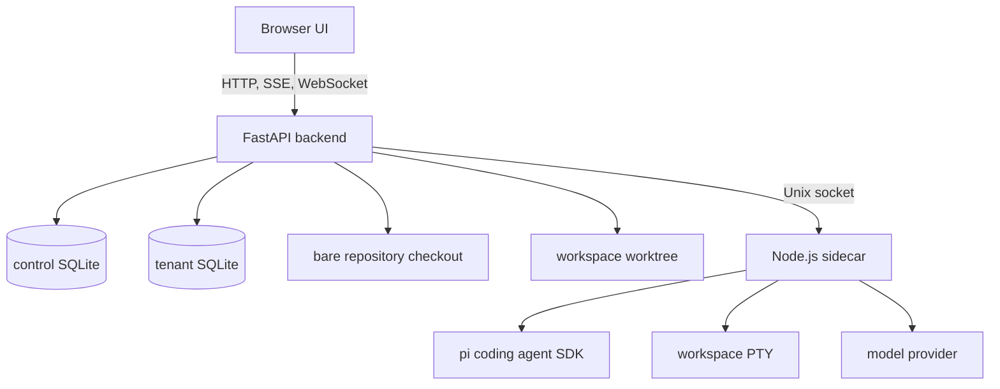
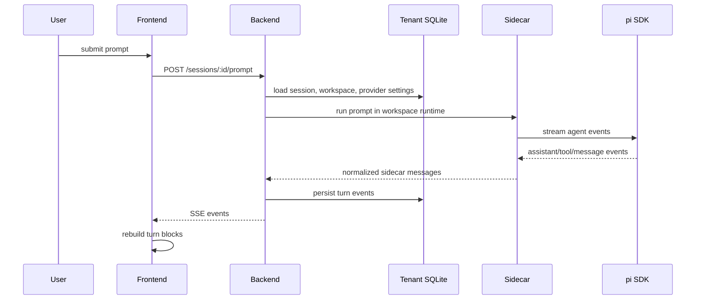
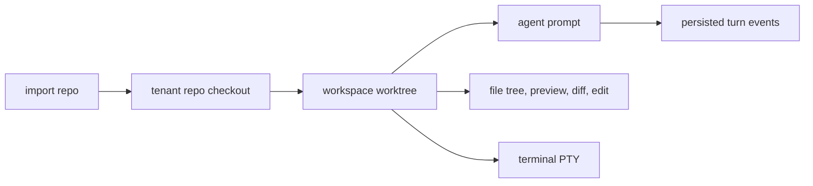

# Introduction

Yinshi turns a Git repository into a browser-accessible workspace for coding agents. A user signs in, imports a GitHub or approved local repository, opens a throwaway worktree branch, and then talks to the `pi` coding agent while the browser shows chat output, changed files, and an interactive workspace terminal.

The architecture has three active parts. The FastAPI backend owns authentication, tenant selection, SQLite data, repository materialization, and policy checks. The React frontend owns the workbench UI and reconstructs streamed agent turns into readable chat blocks. The Node.js sidecar owns the direct `pi` SDK integration, terminal PTYs, git-aware shell tooling, and runtime filesystem access.



The most important invariant is that the browser never receives raw host access and never talks to the `pi` SDK directly. Every request passes through backend ownership checks, path validation, and tenant runtime resolution before the sidecar touches workspace state.

This literate program is a rewritten snapshot of the runtime source. It tangles backend, frontend, and sidecar source files byte-for-byte; tests, lock files, generated build artifacts, and deployment-only assets are intentionally left outside the tangle. The generated HTML keeps the same Pandoc layout as the published architecture page.

# Request and Runtime Flow

A normal workspace session crosses all three tiers but keeps each tier's responsibility narrow. The backend chooses who the user is and where the workspace lives. The sidecar executes inside the chosen runtime. The frontend only renders state and sends explicit user intent.



Repository state follows a separate lifecycle. Importing a repository creates or refreshes a server-side checkout. Creating a workspace creates a Git worktree on an isolated branch. Prompt execution, file browsing, editing, diffing, and terminal access all resolve the same trusted workspace path before touching the filesystem.



The rest of the document presents the source in the order a request encounters it: configuration and app startup, data storage, authentication, repository/workspace lifecycle, agent runtime, file and terminal access, provider settings, frontend rendering, and sidecar execution.

# Backend Application Boundary

The backend boundary starts with environment-derived settings, FastAPI startup, shared schemas, and small primitives used by every route. These files make request handling predictable before tenant-specific work begins.

## main.py

The application entry point wires middleware, lifespan startup, route registration, and health checks before Uvicorn serves requests. The root chunk below tangles back to `backend/src/yinshi/main.py`.

```python {chunk="backend-src-yinshi-main-py" file="backend/src/yinshi/main.py"}
"""FastAPI application entry point."""

import asyncio
import logging
from collections.abc import AsyncIterator, Awaitable, Callable
from contextlib import asynccontextmanager
from typing import Any, cast

from fastapi import FastAPI, Request, Response
from fastapi.middleware.cors import CORSMiddleware
from slowapi import _rate_limit_exceeded_handler
from slowapi.errors import RateLimitExceeded
from starlette.middleware.base import BaseHTTPMiddleware
from starlette.middleware.sessions import SessionMiddleware
from starlette.responses import RedirectResponse
from starlette.types import ASGIApp

from yinshi.api import (
    auth_routes,
    catalog,
    datadog_proxy,
    github,
    repos,
    runners,
    sessions,
    settings,
    stream,
    terminals,
    workspace_files,
    workspaces,
)
from yinshi.auth import AuthMiddleware, setup_oauth
from yinshi.config import get_settings, https_required
from yinshi.db import init_control_db, init_db
from yinshi.rate_limit import limiter

logging.basicConfig(
    level=logging.INFO,
    format="%(asctime)s - %(name)s - %(levelname)s - %(message)s",
)
logger = logging.getLogger(__name__)


class TransportSecurityMiddleware(BaseHTTPMiddleware):
    """Enforce HTTPS and HSTS when production transport hardening is enabled."""

    def __init__(
        self,
        app: ASGIApp,
        *,
        require_https: bool,
        hsts_enabled: bool,
    ) -> None:
        """Configure transport security behavior from validated settings."""
        super().__init__(app)
        if not isinstance(require_https, bool):
            raise TypeError("require_https must be a boolean")
        if not isinstance(hsts_enabled, bool):
            raise TypeError("hsts_enabled must be a boolean")
        self._require_https = require_https
        self._hsts_enabled = hsts_enabled

    async def dispatch(
        self,
        request: Request,
        call_next: Callable[[Request], Awaitable[Response]],
    ) -> Response:
        """Redirect plaintext requests and attach HSTS to HTTPS responses."""
        forwarded_proto = request.headers.get("x-forwarded-proto", request.url.scheme)
        request_scheme = forwarded_proto.split(",", maxsplit=1)[0].strip().lower()
        if self._require_https:
            if request_scheme != "https":
                https_url = request.url.replace(scheme="https")
                return RedirectResponse(str(https_url), status_code=307)
        response = await call_next(request)
        if self._hsts_enabled:
            if request_scheme == "https":
                response.headers.setdefault(
                    "Strict-Transport-Security",
                    "max-age=31536000; includeSubDomains",
                )
        return response


@asynccontextmanager
async def lifespan(app: FastAPI) -> AsyncIterator[None]:
    """Application startup and shutdown."""
    app_settings = get_settings()
    logger.info("Starting %s", app_settings.app_name)
    init_db()
    init_control_db()
    setup_oauth()

    # Per-user container isolation
    reaper_task: asyncio.Task[None] | None = None
    if app_settings.container_enabled:
        from yinshi.services.container import ContainerManager

        mgr = ContainerManager(settings=app_settings)
        await mgr.initialize()
        app.state.container_manager = mgr
        reaper_task = asyncio.create_task(mgr.run_reaper())
        logger.info("Container isolation enabled (image=%s)", app_settings.container_image)
    else:
        app.state.container_manager = None

    yield

    if reaper_task:
        reaper_task.cancel()
        try:
            await reaper_task
        except asyncio.CancelledError:
            pass
    if app.state.container_manager:
        await app.state.container_manager.destroy_all()
    logger.info("Shutdown complete")


app_settings = get_settings()

app = FastAPI(
    title="Yinshi",
    lifespan=lifespan,
    docs_url="/docs" if app_settings.debug else None,
    openapi_url="/openapi.json" if app_settings.debug else None,
)
app.state.limiter = limiter
app.add_exception_handler(RateLimitExceeded, cast(Any, _rate_limit_exceeded_handler))

# CORS
_cors_origins = [app_settings.frontend_url]
if app_settings.debug and "http://localhost:5173" not in _cors_origins:
    _cors_origins.append("http://localhost:5173")

# Middleware order: last registered = outermost = runs first.
# Auth must run before session, and CORS must be outermost
# so preflight responses include the correct headers.
_https_required = https_required(app_settings)
app.add_middleware(
    SessionMiddleware,
    secret_key=app_settings.secret_key,
    https_only=_https_required,
    same_site="lax",
)
app.add_middleware(AuthMiddleware)
app.add_middleware(
    TransportSecurityMiddleware,
    require_https=_https_required,
    hsts_enabled=app_settings.hsts_enabled and not app_settings.debug,
)
app.add_middleware(
    CORSMiddleware,
    allow_origins=_cors_origins,
    allow_credentials=True,
    allow_methods=["GET", "POST", "PATCH", "PUT", "DELETE", "OPTIONS"],
    allow_headers=["Content-Type", "X-Requested-With"],
)

# Routes
app.include_router(auth_routes.router)
app.include_router(catalog.router)
app.include_router(datadog_proxy.router)
app.include_router(github.router)
app.include_router(repos.router)
app.include_router(runners.router)
app.include_router(workspaces.router)
app.include_router(workspace_files.router)
app.include_router(terminals.router)
app.include_router(sessions.router)
app.include_router(stream.router)
app.include_router(settings.router)


@app.get("/health")
async def health() -> dict[str, str]:
    """Health check endpoint."""
    return {"status": "ok"}


if __name__ == "__main__":
    import uvicorn

    uvicorn.run(app, host=app_settings.host, port=app_settings.port)
```

## config.py

Settings normalize environment variables into one explicit configuration object and fail fast when production safety requirements are missing. The root chunk below tangles back to `backend/src/yinshi/config.py`.

```python {chunk="backend-src-yinshi-config-py" file="backend/src/yinshi/config.py"}
"""Application configuration via environment variables."""

from __future__ import annotations

import secrets
from functools import lru_cache

from pydantic_settings import BaseSettings

_SECURITY_MODE_VALUES = {"auto", "disabled", "enabled", "required"}


def _generate_secret() -> str:
    return secrets.token_hex(32)


def _decode_hex_secret(value: str, name: str) -> bytes:
    """Decode a hex secret and reject values too weak for AES-256 use."""
    if not isinstance(value, str):
        raise TypeError(f"{name} must be a string")
    normalized_value = value.strip()
    if not normalized_value:
        return b""
    try:
        decoded_value = bytes.fromhex(normalized_value)
    except ValueError as exc:
        raise RuntimeError(f"{name} must be a valid hex string: {exc}") from exc
    if len(decoded_value) < 32:
        raise RuntimeError(f"{name} must be at least 32 bytes (64 hex characters)")
    return decoded_value


def _normalize_mode(value: str, name: str) -> str:
    """Normalize a security mode value and reject ambiguous configuration."""
    if not isinstance(value, str):
        raise TypeError(f"{name} must be a string")
    normalized_value = value.strip().lower()
    if normalized_value not in _SECURITY_MODE_VALUES:
        allowed_values = ", ".join(sorted(_SECURITY_MODE_VALUES))
        raise RuntimeError(f"{name} must be one of: {allowed_values}")
    return normalized_value


class Settings(BaseSettings):
    """Application settings loaded from .env."""

    app_name: str = "Yinshi"
    debug: bool = False

    # Database (legacy single-DB mode)
    db_path: str = "yinshi.db"

    # Multi-tenant databases
    control_db_path: str = "/var/lib/yinshi/control.db"
    user_data_dir: str = "/var/lib/yinshi/users"

    # Legacy pepper for wrapping per-user DEKs (hex string, 32+ bytes).
    # New deployments should use KEY_ENCRYPTION_KEY so wrapped DEKs carry a key id.
    encryption_pepper: str = ""
    key_encryption_key: str = ""
    key_encryption_key_id: str = "local-v1"

    # Middle-ground data protection controls. "auto" enables the control in
    # authenticated non-debug deployments while keeping local tests explicit.
    tenant_db_encryption: str = "auto"
    control_field_encryption: str = "auto"
    user_data_encryption: str = "disabled"

    # Google OAuth
    google_client_id: str = ""
    google_client_secret: str = ""
    google_redirect_uri: str = "http://localhost:8000/auth/callback/google"

    # GitHub OAuth
    github_client_id: str = ""
    github_client_secret: str = ""
    github_redirect_uri: str = "http://localhost:8000/auth/callback/github"
    github_app_id: str = ""
    github_app_private_key_path: str = ""
    github_app_slug: str = ""

    # Session secret for cookies -- generated randomly if not set
    secret_key: str = ""

    # Explicit flag to disable auth (empty google_client_id alone is not enough)
    disable_auth: bool = False

    # Sidecar
    sidecar_socket_path: str = "/tmp/yinshi-sidecar.sock"

    # Pi package update and release-note metadata
    pi_package_name: str = "@mariozechner/pi-coding-agent"
    pi_release_repository: str = "badlogic/pi-mono"
    pi_update_status_path: str = "/opt/yinshi/.runtime/pi-package-update.json"
    pi_update_schedule: str = "Daily around 04:17 UTC with up to 1 hour randomized delay"

    # CORS
    frontend_url: str = "http://localhost:5173"

    # Server
    host: str = "0.0.0.0"
    port: int = 8000

    # Production transport controls. "auto" requires HTTPS in authenticated
    # non-debug deployments and trusts the edge proxy to provide TLS.
    require_https: str = "auto"
    hsts_enabled: bool = True

    # Allowed base directory for local repo imports (empty = reject all local imports)
    allowed_repo_base: str = ""

    # Per-user container isolation
    container_enabled: bool = True
    container_image: str = "yinshi-sidecar:latest"
    container_idle_timeout_s: int = 300
    container_memory_limit: str = "256m"
    container_cpu_quota: int = 50000
    container_pids_limit: int = 256
    container_max_count: int = 10
    container_socket_base: str = "/var/run/yinshi"
    container_mount_mode: str = "narrow"

    # Browser terminal runtime controls
    terminal_keepalive_s: int = 7200
    terminal_scrollback_lines: int = 1000

    model_config = {"env_file": ".env", "env_file_encoding": "utf-8", "case_sensitive": False}

    @property
    def encryption_pepper_bytes(self) -> bytes:
        """Return the legacy encryption pepper as bytes."""
        return _decode_hex_secret(self.encryption_pepper, "ENCRYPTION_PEPPER")

    @property
    def key_encryption_key_bytes(self) -> bytes:
        """Return the current server-managed KEK bytes."""
        return _decode_hex_secret(self.key_encryption_key, "KEY_ENCRYPTION_KEY")

    @property
    def active_key_encryption_key_bytes(self) -> bytes:
        """Return the strongest configured key source for envelope encryption."""
        key_encryption_key_bytes = self.key_encryption_key_bytes
        if key_encryption_key_bytes:
            return key_encryption_key_bytes
        return self.encryption_pepper_bytes

    @property
    def tenant_db_encryption_mode(self) -> str:
        """Return the normalized tenant database encryption mode."""
        return _normalize_mode(self.tenant_db_encryption, "TENANT_DB_ENCRYPTION")

    @property
    def control_field_encryption_mode(self) -> str:
        """Return the normalized control-plane field encryption mode."""
        return _normalize_mode(self.control_field_encryption, "CONTROL_FIELD_ENCRYPTION")

    @property
    def user_data_encryption_mode(self) -> str:
        """Return the normalized filesystem encryption enforcement mode."""
        return _normalize_mode(self.user_data_encryption, "USER_DATA_ENCRYPTION")

    @property
    def require_https_mode(self) -> str:
        """Return the normalized HTTPS enforcement mode."""
        return _normalize_mode(self.require_https, "REQUIRE_HTTPS")


def auth_is_enabled(settings: Settings) -> bool:
    """Return whether authentication is configured to run."""
    if settings.disable_auth:
        return False
    if settings.google_client_id:
        return True
    if settings.github_client_id:
        return True
    return False


def _auth_is_enabled(settings: Settings) -> bool:
    """Backward-compatible wrapper for older internal tests and scripts."""
    return auth_is_enabled(settings)


def _mode_enabled(settings: Settings, mode: str) -> bool:
    """Resolve auto/enabled/required security modes against runtime posture."""
    if mode == "disabled":
        return False
    if mode == "enabled":
        return True
    if mode == "required":
        return True
    assert mode == "auto", "mode must be normalized before resolution"
    return auth_is_enabled(settings) and not settings.debug


def tenant_db_encryption_required(settings: Settings) -> bool:
    """Return whether tenant SQLite databases must use SQLCipher."""
    mode = settings.tenant_db_encryption_mode
    if mode == "enabled":
        return False
    return _mode_enabled(settings, mode)


def tenant_db_encryption_enabled(settings: Settings) -> bool:
    """Return whether tenant SQLite databases should use SQLCipher when possible."""
    return _mode_enabled(settings, settings.tenant_db_encryption_mode)


def control_field_encryption_enabled(settings: Settings) -> bool:
    """Return whether sensitive control-plane fields should be encrypted."""
    return _mode_enabled(settings, settings.control_field_encryption_mode)


def user_data_encryption_required(settings: Settings) -> bool:
    """Return whether user data directories must live on encrypted storage."""
    return _mode_enabled(settings, settings.user_data_encryption_mode)


def https_required(settings: Settings) -> bool:
    """Return whether HTTP requests must be upgraded or rejected in production."""
    mode = settings.require_https_mode
    if mode == "enabled":
        return True
    return _mode_enabled(settings, mode)


def _validate_settings(settings: Settings) -> None:
    """Reject invalid security-critical configuration."""
    if auth_is_enabled(settings) and not settings.secret_key:
        raise RuntimeError("SECRET_KEY must be set when authentication is enabled")

    settings.encryption_pepper_bytes
    settings.key_encryption_key_bytes

    if auth_is_enabled(settings):
        if not settings.debug:
            if not settings.active_key_encryption_key_bytes:
                raise RuntimeError(
                    "KEY_ENCRYPTION_KEY or ENCRYPTION_PEPPER must be set when "
                    "authentication is enabled outside debug mode"
                )

    settings.tenant_db_encryption_mode
    settings.control_field_encryption_mode
    settings.user_data_encryption_mode
    settings.require_https_mode

    normalized_key_id = settings.key_encryption_key_id.strip()
    if settings.key_encryption_key_bytes and not normalized_key_id:
        raise RuntimeError("KEY_ENCRYPTION_KEY_ID must not be empty when KEY_ENCRYPTION_KEY is set")
    settings.key_encryption_key_id = normalized_key_id or "local-v1"

    if settings.container_mount_mode not in {"narrow", "tenant-data"}:
        raise RuntimeError("CONTAINER_MOUNT_MODE must be either narrow or tenant-data")
    if settings.terminal_keepalive_s < 300:
        raise RuntimeError("TERMINAL_KEEPALIVE_S must be at least 300 seconds")
    if settings.terminal_scrollback_lines < 100:
        raise RuntimeError("TERMINAL_SCROLLBACK_LINES must be at least 100")


@lru_cache()
def get_settings() -> Settings:
    """Get cached settings instance."""
    settings = Settings()
    _validate_settings(settings)
    if not settings.secret_key:
        settings.secret_key = _generate_secret()
    return settings
```

## models.py

Pydantic models define the HTTP contract shared by the backend and TypeScript client. The root chunk below tangles back to `backend/src/yinshi/models.py`.

```python {chunk="backend-src-yinshi-models-py" file="backend/src/yinshi/models.py"}
"""Pydantic models for API request/response schemas."""

from datetime import datetime
from typing import Any, Literal

from pydantic import BaseModel, Field, ValidationInfo, field_validator

from yinshi.model_catalog import DEFAULT_SESSION_MODEL, get_provider_metadata, normalize_model_ref

PI_CONFIG_CATEGORY_ORDER = (
    "skills",
    "extensions",
    "prompts",
    "agents",
    "themes",
    "settings",
    "models",
    "sessions",
    "instructions",
)
PI_CONFIG_CATEGORIES = frozenset(PI_CONFIG_CATEGORY_ORDER)


def _strip_required_text(value: str, message: str) -> str:
    """Trim a required string field and raise the caller's validation message."""
    normalized_value = value.strip()
    if not normalized_value:
        raise ValueError(message)
    return normalized_value


def _strip_optional_text(value: str | None, message: str) -> str | None:
    """Trim an optional string field and reject explicit blank values."""
    if value is None:
        return None
    return _strip_required_text(value, message)


class RepoCreate(BaseModel):
    """Request to import a repository."""

    name: str = Field(..., max_length=255)
    remote_url: str | None = Field(None, max_length=2048)
    local_path: str | None = Field(None, max_length=4096)
    custom_prompt: str | None = Field(None, max_length=10_000)
    agents_md: str | None = Field(None, max_length=50_000)


class RepoOut(BaseModel):
    """Repository response."""

    id: str
    created_at: datetime
    updated_at: datetime
    name: str
    remote_url: str | None = None
    root_path: str
    custom_prompt: str | None = None
    agents_md: str | None = None


class RepoUpdate(BaseModel):
    """Request to update a repository."""

    name: str | None = Field(None, max_length=255)
    custom_prompt: str | None = Field(None, max_length=10_000)
    agents_md: str | None = Field(None, max_length=50_000)


class WorkspaceCreate(BaseModel):
    """Request to create a worktree workspace."""

    name: str | None = Field(None, max_length=255)


class WorkspaceOut(BaseModel):
    """Workspace response."""

    id: str
    created_at: datetime
    updated_at: datetime
    repo_id: str
    name: str
    branch: str
    path: str
    state: str = "ready"


class WorkspaceUpdate(BaseModel):
    """Request to update a workspace."""

    state: str | None = Field(None, pattern=r"^(ready|archived)$")


class SessionCreate(BaseModel):
    """Request to create an agent session."""

    model: str = Field(DEFAULT_SESSION_MODEL, max_length=100)

    @field_validator("model")
    @classmethod
    def validate_model(cls, value: str) -> str:
        """Normalize session model values to canonical refs."""
        return normalize_model_ref(value)


class SessionUpdate(BaseModel):
    """Request to update a session."""

    model: str | None = Field(None, max_length=100)

    @field_validator("model")
    @classmethod
    def validate_model(cls, value: str | None) -> str | None:
        """Normalize optional session model values to canonical refs.

        Rejects explicit null so that PATCH cannot write NULL into the
        database, which would break SessionOut deserialization.
        """
        if value is None:
            raise ValueError("model cannot be set to null")
        return normalize_model_ref(value)


class SessionOut(BaseModel):
    """Session response."""

    id: str
    created_at: datetime
    updated_at: datetime
    workspace_id: str
    status: str = "idle"
    model: str = DEFAULT_SESSION_MODEL


class MessageOut(BaseModel):
    """Message response."""

    id: str
    created_at: datetime
    session_id: str
    role: str
    content: str | None = None
    full_message: str | None = None
    turn_id: str | None = None
    turn_status: str | None = None


class WSPrompt(BaseModel):
    """WebSocket message from client to send a prompt."""

    type: str = "prompt"
    prompt: str = Field(..., max_length=100_000)
    model: str | None = Field(None, max_length=100)

    @field_validator("model")
    @classmethod
    def validate_model(cls, value: str | None) -> str | None:
        """Normalize optional prompt model values to canonical refs."""
        if value is None:
            return None
        return normalize_model_ref(value)


class WSCancel(BaseModel):
    """WebSocket message from client to cancel."""

    type: str = "cancel"


# --- Multi-tenant models ---

RunnerStorageProfile = Literal[
    "aws_ebs_s3_files",
    "archil_shared_files",
    "archil_all_posix",
]


class UserOut(BaseModel):
    """User account response (from control plane)."""

    id: str
    email: str
    display_name: str | None = None
    avatar_url: str | None = None
    status: str = "active"
    tier: str = "free"


class CloudRunnerCreate(BaseModel):
    """Request a one-time cloud runner registration token."""

    name: str = Field("AWS runner", min_length=1, max_length=120)
    cloud_provider: Literal["aws"] = "aws"
    region: str = Field("us-east-1", min_length=1, max_length=64)
    storage_profile: RunnerStorageProfile = "aws_ebs_s3_files"

    @field_validator("name", "region")
    @classmethod
    def validate_non_blank_text(cls, value: str) -> str:
        """Reject blank runner setup fields after trimming whitespace."""
        return _strip_required_text(value, "Runner setup fields must not be blank")


class CloudRunnerOut(BaseModel):
    """Safe cloud runner status returned to the frontend."""

    id: str
    created_at: datetime
    updated_at: datetime
    name: str
    cloud_provider: str
    region: str
    status: Literal["pending", "online", "offline", "revoked"]
    registered_at: datetime | None = None
    last_heartbeat_at: datetime | None = None
    runner_version: str | None = None
    capabilities: dict[str, Any] = Field(default_factory=dict)
    data_dir: str | None = None


class CloudRunnerRegistrationOut(BaseModel):
    """Cloud runner registration response with the one-time token."""

    runner: CloudRunnerOut
    registration_token: str
    registration_token_expires_at: datetime
    control_url: str
    environment: dict[str, str]


class RunnerRegisterIn(BaseModel):
    """Registration payload submitted by a freshly bootstrapped runner."""

    registration_token: str = Field(..., min_length=32, max_length=512)
    runner_version: str = Field(..., min_length=1, max_length=120)
    capabilities: dict[str, Any] = Field(default_factory=dict)
    data_dir: str = Field(..., min_length=1, max_length=4096)
    sqlite_dir: str | None = Field(None, min_length=1, max_length=4096)
    shared_files_dir: str | None = Field(None, min_length=1, max_length=4096)
    storage_profile: RunnerStorageProfile = "aws_ebs_s3_files"

    @field_validator("registration_token", "runner_version", "data_dir")
    @classmethod
    def validate_runner_registration_text(cls, value: str) -> str:
        """Reject blank runner registration strings."""
        return _strip_required_text(value, "Runner registration values must not be blank")

    @field_validator("sqlite_dir", "shared_files_dir")
    @classmethod
    def validate_runner_registration_path(cls, value: str | None) -> str | None:
        """Reject blank optional runner storage paths."""
        return _strip_optional_text(value, "Runner storage paths must not be blank")


class RunnerRegisterOut(BaseModel):
    """Registration response containing the runner's bearer token once."""

    runner_id: str
    runner_token: str
    status: Literal["online"] = "online"


class RunnerHeartbeatIn(BaseModel):
    """Heartbeat payload submitted by an already registered runner."""

    runner_version: str = Field(..., min_length=1, max_length=120)
    capabilities: dict[str, Any] = Field(default_factory=dict)
    data_dir: str = Field(..., min_length=1, max_length=4096)
    sqlite_dir: str | None = Field(None, min_length=1, max_length=4096)
    shared_files_dir: str | None = Field(None, min_length=1, max_length=4096)
    storage_profile: RunnerStorageProfile = "aws_ebs_s3_files"

    @field_validator("runner_version", "data_dir")
    @classmethod
    def validate_runner_heartbeat_text(cls, value: str) -> str:
        """Reject blank runner heartbeat strings."""
        return _strip_required_text(value, "Runner heartbeat values must not be blank")

    @field_validator("sqlite_dir", "shared_files_dir")
    @classmethod
    def validate_runner_heartbeat_path(cls, value: str | None) -> str | None:
        """Reject blank optional runner storage paths."""
        return _strip_optional_text(value, "Runner storage paths must not be blank")


class RunnerHeartbeatOut(BaseModel):
    """Heartbeat acknowledgement returned to the runner."""

    runner_id: str
    status: Literal["online"] = "online"


class ProviderSetupFieldOut(BaseModel):
    """Describe one provider setup field to the frontend."""

    key: str
    label: str
    required: bool
    secret: bool = False


class ProviderDescriptorOut(BaseModel):
    """One provider in the catalog response."""

    id: str
    label: str
    auth_strategies: list[str]
    setup_fields: list[ProviderSetupFieldOut]
    docs_url: str
    connected: bool
    model_count: int


class ModelDescriptorOut(BaseModel):
    """One model in the catalog response."""

    ref: str
    provider: str
    id: str
    label: str
    api: str
    reasoning: bool
    thinking_levels: list[str] = Field(default_factory=list)
    inputs: list[str]
    context_window: int
    max_tokens: int


class ProviderCatalogOut(BaseModel):
    """Catalog response for providers and models."""

    default_model: str
    providers: list[ProviderDescriptorOut]
    models: list[ModelDescriptorOut]


class ProviderAuthStartOut(BaseModel):
    """Response returned when a provider OAuth flow starts."""

    flow_id: str
    provider: str
    auth_url: str
    instructions: str | None = None
    manual_input_required: bool = False
    manual_input_prompt: str | None = None
    manual_input_submitted: bool = False


class ProviderAuthStatusOut(BaseModel):
    """Status payload for a provider OAuth flow."""

    status: str
    provider: str
    flow_id: str
    instructions: str | None = None
    progress: list[str] = Field(default_factory=list)
    manual_input_required: bool = False
    manual_input_prompt: str | None = None
    manual_input_submitted: bool = False
    error: str | None = None


class ProviderAuthInputIn(BaseModel):
    """Manual OAuth input submitted from the browser UI."""

    flow_id: str = Field(..., min_length=1, max_length=255)
    authorization_input: str = Field(..., min_length=1, max_length=8192)

    @field_validator("flow_id")
    @classmethod
    def validate_flow_id(cls, value: str) -> str:
        """Reject blank OAuth flow identifiers."""
        normalized_value = value.strip()
        if not normalized_value:
            raise ValueError("flow_id must not be empty")
        return normalized_value

    @field_validator("authorization_input")
    @classmethod
    def validate_authorization_input(cls, value: str) -> str:
        """Reject blank pasted OAuth callback input."""
        normalized_value = value.strip()
        if not normalized_value:
            raise ValueError("authorization_input must not be empty")
        return normalized_value


class ProviderConnectionCreate(BaseModel):
    """Request to create a provider connection."""

    provider: str = Field(..., min_length=1, max_length=100)
    auth_strategy: str = Field(..., min_length=1, max_length=100)
    secret: str | dict[str, Any]
    label: str = Field("", max_length=255)
    config: dict[str, Any] = Field(default_factory=dict)

    @field_validator("provider")
    @classmethod
    def validate_provider(cls, value: str) -> str:
        """Reject blank providers."""
        normalized_value = value.strip()
        if not normalized_value:
            raise ValueError("Provider must not be empty")
        return normalized_value

    @field_validator("auth_strategy")
    @classmethod
    def validate_auth_strategy(cls, value: str, info: ValidationInfo) -> str:
        """Require one of the provider's supported auth strategies."""
        normalized_value = value.strip()
        if not normalized_value:
            raise ValueError("Auth strategy must not be empty")
        provider = info.data.get("provider")
        if isinstance(provider, str):
            metadata = get_provider_metadata(provider)
            if normalized_value not in metadata.auth_strategies:
                raise ValueError(f"{provider} does not support auth strategy {normalized_value}")
        return normalized_value

    @field_validator("secret")
    @classmethod
    def validate_secret(
        cls,
        value: str | dict[str, Any],
        info: ValidationInfo,
    ) -> str | dict[str, Any]:
        """Match secret shape to the requested auth strategy."""
        auth_strategy = info.data.get("auth_strategy")
        if auth_strategy == "api_key":
            if not isinstance(value, str):
                raise TypeError("API key connections require a string secret")
            normalized_value = value.strip()
            if not normalized_value:
                raise ValueError("API key secret must not be empty")
            return normalized_value
        if auth_strategy == "api_key_with_config":
            if isinstance(value, str):
                normalized_value = value.strip()
                if not normalized_value:
                    raise ValueError("API key secret must not be empty")
                return normalized_value
            if not isinstance(value, dict):
                raise TypeError("API key + config connections require a string or object secret")
            if not value:
                raise ValueError("API key + config secret must not be empty")
            return value
        if auth_strategy == "oauth":
            if not isinstance(value, dict):
                raise TypeError("OAuth connections require an object secret")
            if not value:
                raise ValueError("OAuth secret must not be empty")
            return value
        return value


class ProviderConnectionOut(BaseModel):
    """Provider connection response without the secret payload."""

    id: str
    created_at: datetime
    updated_at: datetime
    provider: str
    auth_strategy: str
    label: str = ""
    config: dict[str, Any] = Field(default_factory=dict)
    status: str
    last_used_at: datetime | None = None
    expires_at: datetime | None = None


class ApiKeyCreate(BaseModel):
    """Compatibility wrapper for legacy API-key endpoints."""

    provider: str = Field(..., min_length=1, max_length=100)
    key: str = Field(..., min_length=1, max_length=500)
    label: str = Field("", max_length=255)


class ApiKeyOut(BaseModel):
    """Compatibility wrapper for legacy API-key responses."""

    id: str
    created_at: datetime
    provider: str
    label: str = ""
    last_used_at: datetime | None = None


class PiConfigImport(BaseModel):
    """Import a Pi config from a GitHub repository."""

    repo_url: str = Field(..., max_length=2048)

    @field_validator("repo_url")
    @classmethod
    def validate_repo_url(cls, value: str) -> str:
        """Reject blank repository URLs."""
        normalized_value = value.strip()
        if not normalized_value:
            raise ValueError("Repository URL must not be empty")
        return normalized_value


class PiConfigCategoryUpdate(BaseModel):
    """Toggle the enabled Pi resource categories."""

    enabled_categories: list[str]

    @field_validator("enabled_categories")
    @classmethod
    def validate_enabled_categories(cls, value: list[str]) -> list[str]:
        """Require unique, known category names."""
        seen_categories: set[str] = set()
        normalized_categories: list[str] = []
        for category in value:
            normalized_category = category.strip()
            if normalized_category not in PI_CONFIG_CATEGORIES:
                raise ValueError(f"Unsupported category: {category}")
            if normalized_category in seen_categories:
                raise ValueError(f"Duplicate category: {category}")
            seen_categories.add(normalized_category)
            normalized_categories.append(normalized_category)
        return normalized_categories


class PiConfigOut(BaseModel):
    """Pi config status response."""

    id: str
    created_at: datetime
    updated_at: datetime
    source_type: str
    source_label: str
    last_synced_at: datetime | None = None
    status: str
    error_message: str | None = None
    available_categories: list[str]
    enabled_categories: list[str]


class PiCommand(BaseModel):
    """One slash command exposed from the user's imported Pi config.

    The ``kind`` discriminator preserves the source of the command so the UI
    can group or style entries, while keeping the wire format flat. Fields
    are the minimum needed to render + invoke the command; host filesystem
    paths and rarely-used metadata are intentionally omitted.
    """

    kind: Literal["skill", "prompt", "extension"]
    name: str
    description: str = ""
    command_name: str


class PiConfigCommandsOut(BaseModel):
    """Slash commands resolved from the imported Pi config.

    See sidecar/src/sidecar.js listResources for the producer side. The
    wire contract is a single flat list; the ``kind`` field on each entry
    distinguishes skills, prompts, and extension-registered commands.
    """

    commands: list[PiCommand] = Field(default_factory=list)


class PiPackageUpdateStatusOut(BaseModel):
    """Last recorded result from the daily pi package updater."""

    checked_at: str | None = None
    status: str | None = None
    previous_version: str | None = None
    current_version: str | None = None
    latest_version: str | None = None
    updated: bool | None = None
    message: str | None = None


class PiPackageReleaseOut(BaseModel):
    """One upstream pi release note entry."""

    tag_name: str
    version: str
    name: str
    published_at: str | None = None
    html_url: str
    body_markdown: str


class PiReleaseNotesOut(BaseModel):
    """Runtime pi version plus recent upstream release notes."""

    package_name: str
    installed_version: str | None = None
    latest_version: str | None = None
    node_version: str | None = None
    release_notes_url: str
    update_schedule: str
    update_status: PiPackageUpdateStatusOut | None = None
    runtime_error: str | None = None
    release_error: str | None = None
    releases: list[PiPackageReleaseOut] = Field(default_factory=list)
```

## model_catalog.py

The model catalog normalizes provider metadata so UI labels, thinking levels, and sidecar requests use the same vocabulary. The root chunk below tangles back to `backend/src/yinshi/model_catalog.py`.

```python {chunk="backend-src-yinshi-model-catalog-py" file="backend/src/yinshi/model_catalog.py"}
"""Shared model and provider catalog helpers."""

from __future__ import annotations

from dataclasses import dataclass

DEFAULT_SESSION_MODEL = "minimax/MiniMax-M2.7"

LEGACY_MODEL_ALIASES = {
    "haiku": "anthropic/claude-haiku-4-5-20251001",
    "minimax": DEFAULT_SESSION_MODEL,
    "minimax-m2.5-highspeed": "minimax/MiniMax-M2.5-highspeed",
    "minimax-m2.7": DEFAULT_SESSION_MODEL,
    "minimax-m2.7-highspeed": "minimax/MiniMax-M2.7-highspeed",
    "opus": "anthropic/claude-opus-4-20250514",
    "sonnet": "anthropic/claude-sonnet-4-20250514",
}


@dataclass(frozen=True, slots=True)
class ProviderSetupField:
    """Describe one provider-specific setup field."""

    key: str
    label: str
    required: bool
    secret: bool = False


@dataclass(frozen=True, slots=True)
class ProviderMetadata:
    """Metadata that Yinshi adds on top of the pi provider registry."""

    id: str
    label: str
    auth_strategies: tuple[str, ...]
    setup_fields: tuple[ProviderSetupField, ...]
    docs_url: str
    supported: bool = True


def _titleize_provider(provider_id: str) -> str:
    """Convert a provider identifier into a readable label."""
    if not isinstance(provider_id, str):
        raise TypeError("provider_id must be a string")
    normalized_provider_id = provider_id.strip()
    if not normalized_provider_id:
        raise ValueError("provider_id must not be empty")
    pieces = normalized_provider_id.replace("-", " ").split()
    return " ".join(piece.upper() if len(piece) <= 3 else piece.capitalize() for piece in pieces)


_COMMON_DOCS_URL = "https://www.npmjs.com/package/@mariozechner/pi-ai"

PROVIDER_METADATA_BY_ID: dict[str, ProviderMetadata] = {
    "anthropic": ProviderMetadata(
        id="anthropic",
        label="Anthropic",
        auth_strategies=("api_key", "oauth"),
        setup_fields=(),
        docs_url=_COMMON_DOCS_URL,
    ),
    "azure-openai-responses": ProviderMetadata(
        id="azure-openai-responses",
        label="Azure OpenAI",
        auth_strategies=("api_key_with_config",),
        setup_fields=(
            ProviderSetupField("baseUrl", "Base URL", False),
            ProviderSetupField("resourceName", "Resource Name", False),
            ProviderSetupField("azureDeploymentName", "Deployment Name", False),
            ProviderSetupField("apiVersion", "API Version", False),
        ),
        docs_url=_COMMON_DOCS_URL,
    ),
    "github-copilot": ProviderMetadata(
        id="github-copilot",
        label="GitHub Copilot",
        auth_strategies=("oauth",),
        setup_fields=(),
        docs_url=_COMMON_DOCS_URL,
    ),
    "google-vertex": ProviderMetadata(
        id="google-vertex",
        label="Google Vertex AI",
        auth_strategies=("api_key",),
        setup_fields=(),
        docs_url=_COMMON_DOCS_URL,
    ),
    "google": ProviderMetadata(
        id="google",
        label="Google",
        auth_strategies=("api_key",),
        setup_fields=(),
        docs_url=_COMMON_DOCS_URL,
    ),
    "google-antigravity": ProviderMetadata(
        id="google-antigravity",
        label="Google Antigravity",
        auth_strategies=("oauth",),
        setup_fields=(),
        docs_url=_COMMON_DOCS_URL,
    ),
    "google-gemini-cli": ProviderMetadata(
        id="google-gemini-cli",
        label="Google Gemini CLI",
        auth_strategies=("oauth",),
        setup_fields=(),
        docs_url=_COMMON_DOCS_URL,
    ),
    "minimax": ProviderMetadata(
        id="minimax",
        label="MiniMax",
        auth_strategies=("api_key",),
        setup_fields=(),
        docs_url=_COMMON_DOCS_URL,
    ),
    "minimax-cn": ProviderMetadata(
        id="minimax-cn",
        label="MiniMax China",
        auth_strategies=("api_key",),
        setup_fields=(),
        docs_url=_COMMON_DOCS_URL,
    ),
    "mistral": ProviderMetadata(
        id="mistral",
        label="Mistral",
        auth_strategies=("api_key",),
        setup_fields=(),
        docs_url=_COMMON_DOCS_URL,
    ),
    "openai": ProviderMetadata(
        id="openai",
        label="OpenAI",
        auth_strategies=("api_key",),
        setup_fields=(),
        docs_url=_COMMON_DOCS_URL,
    ),
    "openai-codex": ProviderMetadata(
        id="openai-codex",
        label="OpenAI Codex",
        auth_strategies=("oauth",),
        setup_fields=(),
        docs_url=_COMMON_DOCS_URL,
    ),
    "openrouter": ProviderMetadata(
        id="openrouter",
        label="OpenRouter",
        auth_strategies=("api_key",),
        setup_fields=(),
        docs_url=_COMMON_DOCS_URL,
    ),
    "opencode": ProviderMetadata(
        id="opencode",
        label="OpenCode Zen",
        auth_strategies=("api_key",),
        setup_fields=(),
        docs_url=_COMMON_DOCS_URL,
    ),
    "opencode-go": ProviderMetadata(
        id="opencode-go",
        label="OpenCode Go",
        auth_strategies=("api_key",),
        setup_fields=(),
        docs_url=_COMMON_DOCS_URL,
    ),
    "vercel-ai-gateway": ProviderMetadata(
        id="vercel-ai-gateway",
        label="Vercel AI Gateway",
        auth_strategies=("api_key",),
        setup_fields=(),
        docs_url=_COMMON_DOCS_URL,
    ),
    "groq": ProviderMetadata(
        id="groq",
        label="Groq",
        auth_strategies=("api_key",),
        setup_fields=(),
        docs_url=_COMMON_DOCS_URL,
    ),
    "cerebras": ProviderMetadata(
        id="cerebras",
        label="Cerebras",
        auth_strategies=("api_key",),
        setup_fields=(),
        docs_url=_COMMON_DOCS_URL,
    ),
    "xai": ProviderMetadata(
        id="xai",
        label="xAI",
        auth_strategies=("api_key",),
        setup_fields=(),
        docs_url=_COMMON_DOCS_URL,
    ),
    "zai": ProviderMetadata(
        id="zai",
        label="ZAI",
        auth_strategies=("api_key",),
        setup_fields=(),
        docs_url=_COMMON_DOCS_URL,
    ),
    "huggingface": ProviderMetadata(
        id="huggingface",
        label="Hugging Face",
        auth_strategies=("api_key",),
        setup_fields=(),
        docs_url=_COMMON_DOCS_URL,
    ),
    "kimi-coding": ProviderMetadata(
        id="kimi-coding",
        label="Kimi Coding",
        auth_strategies=("api_key",),
        setup_fields=(),
        docs_url=_COMMON_DOCS_URL,
    ),
    # Bedrock requires AWS SDK credential resolution rather than the auth.json-style
    # API key path that Yinshi currently supports per session.
    "amazon-bedrock": ProviderMetadata(
        id="amazon-bedrock",
        label="Amazon Bedrock",
        auth_strategies=(),
        setup_fields=(),
        docs_url=_COMMON_DOCS_URL,
        supported=False,
    ),
}


def get_provider_metadata(provider_id: str) -> ProviderMetadata:
    """Return metadata for a provider id, defaulting to unsupported."""
    if not isinstance(provider_id, str):
        raise TypeError("provider_id must be a string")
    normalized_provider_id = provider_id.strip()
    if not normalized_provider_id:
        raise ValueError("provider_id must not be empty")
    metadata = PROVIDER_METADATA_BY_ID.get(normalized_provider_id)
    if metadata is not None:
        return metadata
    return ProviderMetadata(
        id=normalized_provider_id,
        label=_titleize_provider(normalized_provider_id),
        auth_strategies=(),
        setup_fields=(),
        docs_url=_COMMON_DOCS_URL,
        supported=False,
    )


def normalize_model_ref(model: str | None) -> str:
    """Normalize stored or user-provided model values into canonical refs."""
    if model is None:
        return DEFAULT_SESSION_MODEL
    if not isinstance(model, str):
        raise TypeError("model must be a string or None")
    normalized_model = model.strip()
    if not normalized_model:
        raise ValueError("model must not be empty")
    canonical_model = LEGACY_MODEL_ALIASES.get(normalized_model.lower())
    if canonical_model is not None:
        return canonical_model
    return normalized_model
```

## exceptions.py

Domain exceptions give routes and services typed failure modes instead of leaking low-level library errors. The root chunk below tangles back to `backend/src/yinshi/exceptions.py`.

```python {chunk="backend-src-yinshi-exceptions-py" file="backend/src/yinshi/exceptions.py"}
"""Custom exception hierarchy for Yinshi."""


class YinshiError(Exception):
    """Base exception for all Yinshi errors."""


class RepoNotFoundError(YinshiError):
    """Raised when a repository is not found."""


class WorkspaceNotFoundError(YinshiError):
    """Raised when a workspace is not found."""


class SessionNotFoundError(YinshiError):
    """Raised when a session is not found."""


class GitError(YinshiError):
    """Raised when a git operation fails."""


class PiConfigError(YinshiError):
    """Raised when Pi config management cannot complete."""


class PiConfigNotFoundError(PiConfigError):
    """Raised when a Pi config record or directory is not available."""


class GitHubAppError(YinshiError):
    """Raised when the GitHub App integration cannot complete."""


class GitHubAccessError(GitHubAppError):
    """Raised when GitHub access cannot be granted for a repository."""

    def __init__(
        self,
        message: str,
        *,
        code: str,
        connect_url: str | None = None,
        manage_url: str | None = None,
    ) -> None:
        assert code, "code must not be empty"
        super().__init__(message)
        self.code = code
        self.connect_url = connect_url
        self.manage_url = manage_url


class GitHubConnectRequiredError(GitHubAccessError):
    """Raised when a user must connect GitHub before importing a repo."""

    def __init__(self, message: str, *, connect_url: str | None = None) -> None:
        super().__init__(
            message,
            code="github_connect_required",
            connect_url=connect_url,
        )


class GitHubAccessNotGrantedError(GitHubAccessError):
    """Raised when an installation exists but cannot access the repo."""

    def __init__(
        self,
        message: str,
        *,
        connect_url: str | None = None,
        manage_url: str | None = None,
    ) -> None:
        super().__init__(
            message,
            code="github_access_not_granted",
            connect_url=connect_url,
            manage_url=manage_url,
        )


class GitHubInstallationUnusableError(GitHubAccessError):
    """Raised when a connected installation is no longer usable."""

    def __init__(self, message: str, *, manage_url: str | None = None) -> None:
        super().__init__(
            message,
            code="github_installation_unusable",
            manage_url=manage_url,
        )


class SidecarError(YinshiError):
    """Raised when sidecar communication fails."""


class SidecarNotConnectedError(SidecarError):
    """Raised when the sidecar is not connected."""


class KeyNotFoundError(YinshiError):
    """Raised when no API key is available for a provider."""


class CreditExhaustedError(YinshiError):
    """Raised when a legacy platform-credit path runs out of allowance."""


class EncryptionNotConfiguredError(YinshiError):
    """Raised when encryption pepper is not configured."""


class ContainerStartError(YinshiError):
    """Raised when a per-user sidecar container fails to start."""


class ContainerNotReadyError(YinshiError):
    """Raised when a container's sidecar socket is not ready in time."""


class RunnerRegistrationError(YinshiError):
    """Raised when a cloud runner registration token cannot be used."""


class RunnerAuthenticationError(YinshiError):
    """Raised when a cloud runner bearer token is missing or invalid."""
```

## rate_limit.py

Rate limiting uses tenant-aware keys so sensitive routes can be throttled without mixing users together. The root chunk below tangles back to `backend/src/yinshi/rate_limit.py`.

```python {chunk="backend-src-yinshi-rate-limit-py" file="backend/src/yinshi/rate_limit.py"}
"""Shared rate-limiting configuration for FastAPI routes."""

from __future__ import annotations

from fastapi import Request
from slowapi import Limiter
from slowapi.util import get_remote_address


def route_rate_limit_key(request: Request) -> str:
    """Return the tenant user id when available, otherwise the client IP."""
    tenant = getattr(request.state, "tenant", None)
    if tenant is not None:
        user_id = getattr(tenant, "user_id", None)
        if isinstance(user_id, str):
            normalized_user_id = user_id.strip()
            if normalized_user_id:
                return normalized_user_id

    client_address = get_remote_address(request)
    if isinstance(client_address, str):
        normalized_client_address = client_address.strip()
        if normalized_client_address:
            return normalized_client_address
    return "unknown-client"


limiter = Limiter(key_func=route_rate_limit_key)
```

## utils/paths.py

Path utilities provide a small, audited primitive for checking containment after path resolution. The root chunk below tangles back to `backend/src/yinshi/utils/paths.py`.

```python {chunk="backend-src-yinshi-utils-paths-py" file="backend/src/yinshi/utils/paths.py"}
"""Shared path utilities for security checks."""

import os


def is_path_inside(path: str, base: str) -> bool:
    """Check if *path* is inside *base* after resolving symlinks.

    Returns True when the resolved *path* equals *base* or is a descendant
    of it.  The check uses ``os.path.realpath`` to resolve symlinks so
    that ``../`` traversal tricks are neutralised.
    """
    resolved = os.path.realpath(path)
    resolved_base = os.path.realpath(base)
    return resolved == resolved_base or resolved.startswith(resolved_base + os.sep)
```

# Database Layer and Tenancy

Yinshi stores control data separately from user data. The control database tracks users, sessions, and runner records that must be found before a tenant database is opened. Tenant databases hold repositories, workspaces, messages, imported config, and provider secrets for one user.

## db.py

The database module opens SQLite connections and applies control-plane and tenant schema migrations. The root chunk below tangles back to `backend/src/yinshi/db.py`.

```python {chunk="backend-src-yinshi-db-py" file="backend/src/yinshi/db.py"}
"""SQLite database connection and schema management."""

import logging
import sqlite3
from collections.abc import Iterator
from contextlib import contextmanager
from pathlib import Path

from yinshi.config import control_field_encryption_enabled, get_settings
from yinshi.model_catalog import DEFAULT_SESSION_MODEL

logger = logging.getLogger(__name__)

_SCHEMA_VERSION = 4

SCHEMA_SQL = f"""
PRAGMA journal_mode = WAL;

CREATE TABLE IF NOT EXISTS repos (
    id TEXT PRIMARY KEY DEFAULT (lower(hex(randomblob(16)))),
    created_at TIMESTAMP DEFAULT CURRENT_TIMESTAMP NOT NULL,
    updated_at TIMESTAMP DEFAULT CURRENT_TIMESTAMP NOT NULL,
    name TEXT NOT NULL,
    remote_url TEXT,
    root_path TEXT NOT NULL,
    custom_prompt TEXT,
    agents_md TEXT,
    owner_email TEXT,
    installation_id INTEGER
);

CREATE TABLE IF NOT EXISTS workspaces (
    id TEXT PRIMARY KEY DEFAULT (lower(hex(randomblob(16)))),
    created_at TIMESTAMP DEFAULT CURRENT_TIMESTAMP NOT NULL,
    updated_at TIMESTAMP DEFAULT CURRENT_TIMESTAMP NOT NULL,
    repo_id TEXT NOT NULL REFERENCES repos(id) ON DELETE CASCADE,
    name TEXT NOT NULL,
    branch TEXT NOT NULL,
    path TEXT NOT NULL,
    state TEXT DEFAULT 'ready' NOT NULL
);

CREATE TABLE IF NOT EXISTS sessions (
    id TEXT PRIMARY KEY DEFAULT (lower(hex(randomblob(16)))),
    created_at TIMESTAMP DEFAULT CURRENT_TIMESTAMP NOT NULL,
    updated_at TIMESTAMP DEFAULT CURRENT_TIMESTAMP NOT NULL,
    workspace_id TEXT NOT NULL REFERENCES workspaces(id) ON DELETE CASCADE,
    status TEXT DEFAULT 'idle' NOT NULL,
    model TEXT DEFAULT '{DEFAULT_SESSION_MODEL}'
);

CREATE TABLE IF NOT EXISTS messages (
    id TEXT PRIMARY KEY DEFAULT (lower(hex(randomblob(16)))),
    created_at TIMESTAMP DEFAULT CURRENT_TIMESTAMP NOT NULL,
    session_id TEXT NOT NULL REFERENCES sessions(id) ON DELETE CASCADE,
    role TEXT NOT NULL,
    content TEXT,
    full_message TEXT,
    turn_id TEXT,
    turn_status TEXT
);

CREATE INDEX IF NOT EXISTS idx_messages_session ON messages(session_id, created_at);
CREATE INDEX IF NOT EXISTS idx_messages_turn_id ON messages(turn_id);
CREATE INDEX IF NOT EXISTS idx_sessions_workspace ON sessions(workspace_id);
CREATE INDEX IF NOT EXISTS idx_workspaces_repo ON workspaces(repo_id);

CREATE TRIGGER IF NOT EXISTS update_repos_updated_at AFTER UPDATE ON repos
BEGIN UPDATE repos SET updated_at = CURRENT_TIMESTAMP WHERE id = NEW.id; END;

CREATE TRIGGER IF NOT EXISTS update_workspaces_updated_at AFTER UPDATE ON workspaces
BEGIN UPDATE workspaces SET updated_at = CURRENT_TIMESTAMP WHERE id = NEW.id; END;

CREATE TRIGGER IF NOT EXISTS update_sessions_updated_at AFTER UPDATE ON sessions
BEGIN UPDATE sessions SET updated_at = CURRENT_TIMESTAMP WHERE id = NEW.id; END;
"""


def _open_connection(db_path: str, *, check_same_thread: bool = True) -> sqlite3.Connection:
    """Open a SQLite connection with standard settings."""
    conn = sqlite3.connect(db_path, check_same_thread=check_same_thread)
    conn.row_factory = sqlite3.Row
    conn.execute("PRAGMA foreign_keys = ON")
    conn.execute("PRAGMA busy_timeout = 5000")
    return conn


@contextmanager
def get_db() -> Iterator[sqlite3.Connection]:
    """Get a SQLite connection as a context manager."""
    settings = get_settings()
    conn = _open_connection(settings.db_path)
    try:
        yield conn
    finally:
        conn.close()


def _migrate(conn: sqlite3.Connection) -> None:
    """Apply versioned schema migrations."""
    conn.execute("CREATE TABLE IF NOT EXISTS schema_version (version INTEGER NOT NULL)")
    row = conn.execute("SELECT version FROM schema_version").fetchone()
    current = row[0] if row else 0

    if current < 1:
        columns = [r[1] for r in conn.execute("PRAGMA table_info(repos)").fetchall()]
        if "owner_email" not in columns:
            logger.info("Migration v1: adding owner_email column to repos")
            conn.execute("ALTER TABLE repos ADD COLUMN owner_email TEXT")

    if current < 2:
        columns = [r[1] for r in conn.execute("PRAGMA table_info(repos)").fetchall()]
        if "installation_id" not in columns:
            logger.info("Migration v2: adding installation_id column to repos")
            conn.execute("ALTER TABLE repos ADD COLUMN installation_id INTEGER")

    if current < 3:
        columns = [r[1] for r in conn.execute("PRAGMA table_info(messages)").fetchall()]
        if "turn_status" not in columns:
            logger.info("Migration v3: adding turn_status column to messages")
            conn.execute("ALTER TABLE messages ADD COLUMN turn_status TEXT")

    if current < 4:
        columns = [r[1] for r in conn.execute("PRAGMA table_info(repos)").fetchall()]
        if "agents_md" not in columns:
            logger.info("Migration v4: adding agents_md column to repos")
            conn.execute("ALTER TABLE repos ADD COLUMN agents_md TEXT")

    if current != _SCHEMA_VERSION:
        conn.execute("DELETE FROM schema_version")
        conn.execute("INSERT INTO schema_version (version) VALUES (?)", (_SCHEMA_VERSION,))
        conn.commit()


def init_db() -> None:
    """Initialize the database schema."""
    settings = get_settings()
    logger.info("Initializing database at %s", settings.db_path)
    try:
        with get_db() as conn:
            conn.executescript(SCHEMA_SQL)
            _migrate(conn)
    except sqlite3.Error:
        logger.exception("Failed to initialize database at %s", settings.db_path)
        raise
    logger.info("Database initialized")


# --- Control plane database (multi-tenant) ---

CONTROL_SCHEMA_SQL = """
PRAGMA journal_mode = WAL;

CREATE TABLE IF NOT EXISTS users (
    id TEXT PRIMARY KEY DEFAULT (lower(hex(randomblob(16)))),
    created_at TIMESTAMP DEFAULT CURRENT_TIMESTAMP NOT NULL,
    updated_at TIMESTAMP DEFAULT CURRENT_TIMESTAMP NOT NULL,
    email TEXT NOT NULL UNIQUE,
    display_name TEXT,
    avatar_url TEXT,
    status TEXT DEFAULT 'active' NOT NULL,
    tier TEXT DEFAULT 'free' NOT NULL,
    disk_quota_mb INTEGER DEFAULT 5000,
    disk_used_mb INTEGER DEFAULT 0,
    encrypted_dek BLOB,
    credit_used_cents INTEGER DEFAULT 0,
    credit_limit_cents INTEGER DEFAULT 500,
    last_login_at TIMESTAMP,
    deletion_requested_at TIMESTAMP,
    deletion_scheduled_for TIMESTAMP
);

CREATE TABLE IF NOT EXISTS oauth_identities (
    id TEXT PRIMARY KEY DEFAULT (lower(hex(randomblob(16)))),
    created_at TIMESTAMP DEFAULT CURRENT_TIMESTAMP NOT NULL,
    user_id TEXT NOT NULL REFERENCES users(id) ON DELETE CASCADE,
    provider TEXT NOT NULL,
    provider_user_id TEXT NOT NULL,
    provider_email TEXT NOT NULL,
    provider_data TEXT,
    UNIQUE(provider, provider_user_id)
);

CREATE TABLE IF NOT EXISTS api_keys (
    id TEXT PRIMARY KEY DEFAULT (lower(hex(randomblob(16)))),
    created_at TIMESTAMP DEFAULT CURRENT_TIMESTAMP NOT NULL,
    user_id TEXT NOT NULL REFERENCES users(id) ON DELETE CASCADE,
    provider TEXT NOT NULL,
    encrypted_key BLOB NOT NULL,
    label TEXT DEFAULT '',
    last_used_at TIMESTAMP
);

CREATE TABLE IF NOT EXISTS provider_connections (
    id TEXT PRIMARY KEY DEFAULT (lower(hex(randomblob(16)))),
    created_at TIMESTAMP DEFAULT CURRENT_TIMESTAMP NOT NULL,
    updated_at TIMESTAMP DEFAULT CURRENT_TIMESTAMP NOT NULL,
    user_id TEXT NOT NULL REFERENCES users(id) ON DELETE CASCADE,
    provider TEXT NOT NULL,
    auth_strategy TEXT NOT NULL,
    encrypted_secret BLOB NOT NULL,
    label TEXT DEFAULT '',
    config_json TEXT DEFAULT '{}' NOT NULL,
    status TEXT DEFAULT 'connected' NOT NULL,
    last_used_at TIMESTAMP,
    expires_at TIMESTAMP
);

CREATE TABLE IF NOT EXISTS auth_sessions (
    id TEXT PRIMARY KEY,
    user_id TEXT NOT NULL REFERENCES users(id) ON DELETE CASCADE,
    created_at TIMESTAMP DEFAULT CURRENT_TIMESTAMP NOT NULL,
    revoked_at TIMESTAMP
);

CREATE TABLE IF NOT EXISTS usage_log (
    id TEXT PRIMARY KEY DEFAULT (lower(hex(randomblob(16)))),
    created_at TIMESTAMP DEFAULT CURRENT_TIMESTAMP NOT NULL,
    user_id TEXT NOT NULL REFERENCES users(id) ON DELETE CASCADE,
    session_id TEXT NOT NULL,
    provider TEXT NOT NULL,
    model TEXT NOT NULL,
    input_tokens INTEGER DEFAULT 0,
    output_tokens INTEGER DEFAULT 0,
    cache_read_tokens INTEGER DEFAULT 0,
    cache_write_tokens INTEGER DEFAULT 0,
    cost_cents REAL DEFAULT 0,
    key_source TEXT NOT NULL
);

CREATE INDEX IF NOT EXISTS idx_users_email ON users(email);
CREATE INDEX IF NOT EXISTS idx_oauth_user ON oauth_identities(user_id);
CREATE INDEX IF NOT EXISTS idx_api_keys_user ON api_keys(user_id);
CREATE INDEX IF NOT EXISTS idx_provider_connections_user ON provider_connections(user_id);
CREATE INDEX IF NOT EXISTS idx_auth_sessions_user ON auth_sessions(user_id);
CREATE INDEX IF NOT EXISTS idx_usage_user ON usage_log(user_id);
CREATE INDEX IF NOT EXISTS idx_usage_session ON usage_log(session_id);

CREATE TABLE IF NOT EXISTS github_installations (
    id INTEGER PRIMARY KEY,
    user_id TEXT NOT NULL REFERENCES users(id) ON DELETE CASCADE,
    installation_id INTEGER NOT NULL,
    account_login TEXT NOT NULL,
    account_type TEXT NOT NULL,
    html_url TEXT NOT NULL,
    created_at TEXT NOT NULL DEFAULT (datetime('now')),
    UNIQUE(user_id, installation_id)
);

CREATE INDEX IF NOT EXISTS idx_github_installations_user ON github_installations(user_id);

CREATE TABLE IF NOT EXISTS pi_configs (
    id TEXT PRIMARY KEY DEFAULT (lower(hex(randomblob(16)))),
    created_at TIMESTAMP DEFAULT CURRENT_TIMESTAMP NOT NULL,
    updated_at TIMESTAMP DEFAULT CURRENT_TIMESTAMP NOT NULL,
    user_id TEXT NOT NULL UNIQUE REFERENCES users(id) ON DELETE CASCADE,
    source_type TEXT NOT NULL,
    source_label TEXT NOT NULL,
    repo_url TEXT,
    available_categories TEXT DEFAULT '[]' NOT NULL,
    enabled_categories TEXT DEFAULT '[]' NOT NULL,
    last_synced_at TIMESTAMP,
    status TEXT DEFAULT 'ready' NOT NULL,
    error_message TEXT
);

CREATE INDEX IF NOT EXISTS idx_pi_configs_user ON pi_configs(user_id);

CREATE TABLE IF NOT EXISTS user_settings (
    user_id TEXT PRIMARY KEY REFERENCES users(id) ON DELETE CASCADE,
    created_at TIMESTAMP DEFAULT CURRENT_TIMESTAMP NOT NULL,
    updated_at TIMESTAMP DEFAULT CURRENT_TIMESTAMP NOT NULL,
    pi_settings_json TEXT DEFAULT '{}' NOT NULL,
    pi_settings_enabled INTEGER DEFAULT 0 NOT NULL
);

CREATE TABLE IF NOT EXISTS user_runners (
    id TEXT PRIMARY KEY DEFAULT (lower(hex(randomblob(16)))),
    created_at TIMESTAMP DEFAULT CURRENT_TIMESTAMP NOT NULL,
    updated_at TIMESTAMP DEFAULT CURRENT_TIMESTAMP NOT NULL,
    user_id TEXT NOT NULL UNIQUE REFERENCES users(id) ON DELETE CASCADE,
    name TEXT NOT NULL,
    cloud_provider TEXT NOT NULL,
    region TEXT NOT NULL,
    status TEXT DEFAULT 'pending' NOT NULL,
    registration_token_hash TEXT,
    registration_token_expires_at TEXT,
    runner_token_hash TEXT,
    registered_at TEXT,
    last_heartbeat_at TEXT,
    runner_version TEXT,
    capabilities_json TEXT DEFAULT '{}' NOT NULL,
    data_dir TEXT,
    revoked_at TEXT
);

CREATE INDEX IF NOT EXISTS idx_user_runners_user ON user_runners(user_id);
CREATE INDEX IF NOT EXISTS idx_user_runners_registration_token
ON user_runners(registration_token_hash);
CREATE INDEX IF NOT EXISTS idx_user_runners_runner_token ON user_runners(runner_token_hash);

CREATE TRIGGER IF NOT EXISTS update_users_updated_at AFTER UPDATE ON users
BEGIN UPDATE users SET updated_at = CURRENT_TIMESTAMP WHERE id = NEW.id; END;

CREATE TRIGGER IF NOT EXISTS update_pi_configs_updated_at AFTER UPDATE ON pi_configs
BEGIN UPDATE pi_configs SET updated_at = CURRENT_TIMESTAMP WHERE id = NEW.id; END;

CREATE TRIGGER IF NOT EXISTS update_user_settings_updated_at AFTER UPDATE ON user_settings
BEGIN UPDATE user_settings SET updated_at = CURRENT_TIMESTAMP WHERE user_id = NEW.user_id; END;

CREATE TRIGGER IF NOT EXISTS update_user_runners_updated_at AFTER UPDATE ON user_runners
BEGIN UPDATE user_runners SET updated_at = CURRENT_TIMESTAMP WHERE id = NEW.id; END;

CREATE TRIGGER IF NOT EXISTS update_provider_connections_updated_at AFTER UPDATE ON provider_connections
BEGIN UPDATE provider_connections SET updated_at = CURRENT_TIMESTAMP WHERE id = NEW.id; END;
"""


@contextmanager
def get_control_db() -> Iterator[sqlite3.Connection]:
    """Get a connection to the control plane database."""
    settings = get_settings()
    conn = _open_connection(settings.control_db_path)
    try:
        yield conn
    finally:
        conn.close()


def _migrate_control(conn: sqlite3.Connection) -> None:
    """Apply control DB schema migrations for existing databases."""
    columns = [r[1] for r in conn.execute("PRAGMA table_info(users)").fetchall()]
    if "credit_used_cents" not in columns:
        logger.info("Control migration: adding credit tracking columns to users")
        conn.execute("ALTER TABLE users ADD COLUMN credit_used_cents INTEGER DEFAULT 0")
        conn.execute("ALTER TABLE users ADD COLUMN credit_limit_cents INTEGER DEFAULT 500")
        conn.commit()

    pi_config_columns = [row[1] for row in conn.execute("PRAGMA table_info(pi_configs)").fetchall()]
    if pi_config_columns and "available_categories" not in pi_config_columns:
        logger.info("Control migration: adding available_categories column to pi_configs")
        conn.execute(
            "ALTER TABLE pi_configs ADD COLUMN available_categories TEXT DEFAULT '[]' NOT NULL"
        )
        conn.commit()

    provider_connection_columns = [
        row[1] for row in conn.execute("PRAGMA table_info(provider_connections)").fetchall()
    ]
    if not provider_connection_columns:
        logger.info("Control migration: creating provider_connections table")
        conn.executescript("""
            CREATE TABLE IF NOT EXISTS provider_connections (
                id TEXT PRIMARY KEY DEFAULT (lower(hex(randomblob(16)))),
                created_at TIMESTAMP DEFAULT CURRENT_TIMESTAMP NOT NULL,
                updated_at TIMESTAMP DEFAULT CURRENT_TIMESTAMP NOT NULL,
                user_id TEXT NOT NULL REFERENCES users(id) ON DELETE CASCADE,
                provider TEXT NOT NULL,
                auth_strategy TEXT NOT NULL,
                encrypted_secret BLOB NOT NULL,
                label TEXT DEFAULT '',
                config_json TEXT DEFAULT '{}' NOT NULL,
                status TEXT DEFAULT 'connected' NOT NULL,
                last_used_at TIMESTAMP,
                expires_at TIMESTAMP
            );
            CREATE INDEX IF NOT EXISTS idx_provider_connections_user
            ON provider_connections(user_id);
            CREATE TRIGGER IF NOT EXISTS update_provider_connections_updated_at
            AFTER UPDATE ON provider_connections
            BEGIN
                UPDATE provider_connections SET updated_at = CURRENT_TIMESTAMP WHERE id = NEW.id;
            END;
            """)
        conn.commit()

    migrated_row = conn.execute(
        "SELECT COUNT(*) FROM provider_connections WHERE auth_strategy = 'api_key'"
    ).fetchone()
    api_key_count = conn.execute("SELECT COUNT(*) FROM api_keys").fetchone()
    assert migrated_row is not None, "provider connection count must be queryable"
    assert api_key_count is not None, "api key count must be queryable"
    if api_key_count[0] > 0 and migrated_row[0] < api_key_count[0]:
        logger.info("Control migration: backfilling api_keys into provider_connections")
        conn.execute("""
            INSERT INTO provider_connections
            (id, created_at, updated_at, user_id, provider, auth_strategy,
             encrypted_secret, label, config_json, status, last_used_at, expires_at)
            SELECT id, created_at, created_at, user_id, provider, 'api_key',
                   encrypted_key, label, '{}', 'connected', last_used_at, NULL
            FROM api_keys
            WHERE id NOT IN (SELECT id FROM provider_connections)
            """)
        conn.commit()

    runner_columns = [row[1] for row in conn.execute("PRAGMA table_info(user_runners)")]
    if not runner_columns:
        logger.info("Control migration: creating user_runners table")
        conn.executescript("""
            CREATE TABLE IF NOT EXISTS user_runners (
                id TEXT PRIMARY KEY DEFAULT (lower(hex(randomblob(16)))),
                created_at TIMESTAMP DEFAULT CURRENT_TIMESTAMP NOT NULL,
                updated_at TIMESTAMP DEFAULT CURRENT_TIMESTAMP NOT NULL,
                user_id TEXT NOT NULL UNIQUE REFERENCES users(id) ON DELETE CASCADE,
                name TEXT NOT NULL,
                cloud_provider TEXT NOT NULL,
                region TEXT NOT NULL,
                status TEXT DEFAULT 'pending' NOT NULL,
                registration_token_hash TEXT,
                registration_token_expires_at TEXT,
                runner_token_hash TEXT,
                registered_at TEXT,
                last_heartbeat_at TEXT,
                runner_version TEXT,
                capabilities_json TEXT DEFAULT '{}' NOT NULL,
                data_dir TEXT,
                revoked_at TEXT
            );
            CREATE INDEX IF NOT EXISTS idx_user_runners_user ON user_runners(user_id);
            CREATE INDEX IF NOT EXISTS idx_user_runners_registration_token
            ON user_runners(registration_token_hash);
            CREATE INDEX IF NOT EXISTS idx_user_runners_runner_token
            ON user_runners(runner_token_hash);
            CREATE TRIGGER IF NOT EXISTS update_user_runners_updated_at
            AFTER UPDATE ON user_runners
            BEGIN
                UPDATE user_runners SET updated_at = CURRENT_TIMESTAMP WHERE id = NEW.id;
            END;
            """)
        conn.commit()

    _migrate_encrypted_control_fields(conn)


def _migrate_encrypted_control_fields(conn: sqlite3.Connection) -> None:
    """Encrypt sensitive control-plane text fields when field encryption is active."""
    settings = get_settings()
    if not control_field_encryption_enabled(settings):
        return

    from yinshi.services.control_encryption import encrypt_control_text
    from yinshi.services.crypto import is_encrypted_text

    user_settings_rows = conn.execute(
        "SELECT user_id, pi_settings_json FROM user_settings"
    ).fetchall()
    for row in user_settings_rows:
        stored_value = row["pi_settings_json"]
        if isinstance(stored_value, str) and not is_encrypted_text(stored_value):
            conn.execute(
                "UPDATE user_settings SET pi_settings_json = ? WHERE user_id = ?",
                (
                    encrypt_control_text(
                        "user_settings.pi_settings_json",
                        row["user_id"],
                        stored_value,
                    ),
                    row["user_id"],
                ),
            )

    pi_config_rows = conn.execute(
        "SELECT id, user_id, source_label, repo_url, error_message FROM pi_configs"
    ).fetchall()
    for row in pi_config_rows:
        updates: list[str] = []
        values: list[object] = []
        for field_name in ("source_label", "repo_url", "error_message"):
            stored_value = row[field_name]
            if stored_value is None:
                continue
            if isinstance(stored_value, str) and not is_encrypted_text(stored_value):
                updates.append(f"{field_name} = ?")
                values.append(
                    encrypt_control_text(
                        f"pi_configs.{field_name}",
                        row["user_id"],
                        stored_value,
                    )
                )
        if updates:
            values.append(row["id"])
            conn.execute(
                f"UPDATE pi_configs SET {', '.join(updates)} WHERE id = ?",  # noqa: S608
                values,
            )
    conn.commit()


def init_control_db() -> None:
    """Initialize the control plane database schema."""
    settings = get_settings()
    Path(settings.control_db_path).parent.mkdir(parents=True, exist_ok=True)
    logger.info("Initializing control database at %s", settings.control_db_path)
    try:
        with get_control_db() as conn:
            conn.executescript(CONTROL_SCHEMA_SQL)
            _migrate_control(conn)
    except sqlite3.Error:
        logger.exception("Failed to initialize control database")
        raise
    logger.info("Control database initialized")
```

## tenant.py

Tenant management maps a signed-in user to a private data directory and an optional SQLCipher-backed SQLite database. The root chunk below tangles back to `backend/src/yinshi/tenant.py`.

```python {chunk="backend-src-yinshi-tenant-py" file="backend/src/yinshi/tenant.py"}
"""Multi-tenant context and per-user database management."""

from __future__ import annotations

import importlib
import logging
import os
import sqlite3
import time
from collections.abc import Iterator
from contextlib import contextmanager
from dataclasses import dataclass
from pathlib import Path
from types import ModuleType
from typing import Final, cast

from yinshi.config import (
    get_settings,
    tenant_db_encryption_enabled,
    tenant_db_encryption_required,
    user_data_encryption_required,
)
from yinshi.db import _open_connection
from yinshi.model_catalog import DEFAULT_SESSION_MODEL
from yinshi.services.crypto import derive_subkey

logger = logging.getLogger(__name__)

_SQLCIPHER_MODULE_NAMES: Final[tuple[str, ...]] = (
    "sqlcipher3.dbapi2",
    "pysqlcipher3.dbapi2",
)
_USER_TABLES: Final[tuple[str, ...]] = ("repos", "workspaces", "sessions", "messages")
_STORAGE_ENCRYPTION_MARKER: Final[str] = ".yinshi-encrypted-storage"


@dataclass
class TenantContext:
    """Per-request tenant context resolved from authentication."""

    user_id: str
    email: str
    data_dir: str
    db_path: str


def user_data_dir(base_dir: str, user_id: str) -> str:
    """Compute the data directory for a user, using a 2-char prefix."""
    prefix = user_id[:2]
    return os.path.join(base_dir, prefix, user_id)


def validate_user_path(tenant: TenantContext, path: str) -> None:
    """Validate that a path is within the tenant's data directory.

    Raises ValueError if the path is outside the tenant's data_dir.
    """
    resolved = os.path.realpath(path)
    data_dir = os.path.realpath(tenant.data_dir)
    if not resolved.startswith(data_dir + os.sep) and resolved != data_dir:
        raise ValueError(f"Path {path} is outside tenant data directory")


# User DB schema -- identical to main schema but WITHOUT owner_email
USER_SCHEMA_SQL = f"""
PRAGMA journal_mode = WAL;

CREATE TABLE IF NOT EXISTS repos (
    id TEXT PRIMARY KEY DEFAULT (lower(hex(randomblob(16)))),
    created_at TIMESTAMP DEFAULT CURRENT_TIMESTAMP NOT NULL,
    updated_at TIMESTAMP DEFAULT CURRENT_TIMESTAMP NOT NULL,
    name TEXT NOT NULL,
    remote_url TEXT,
    root_path TEXT NOT NULL,
    custom_prompt TEXT,
    agents_md TEXT,
    installation_id INTEGER
);

CREATE TABLE IF NOT EXISTS workspaces (
    id TEXT PRIMARY KEY DEFAULT (lower(hex(randomblob(16)))),
    created_at TIMESTAMP DEFAULT CURRENT_TIMESTAMP NOT NULL,
    updated_at TIMESTAMP DEFAULT CURRENT_TIMESTAMP NOT NULL,
    repo_id TEXT NOT NULL REFERENCES repos(id) ON DELETE CASCADE,
    name TEXT NOT NULL,
    branch TEXT NOT NULL,
    path TEXT NOT NULL,
    state TEXT DEFAULT 'ready' NOT NULL
);

CREATE TABLE IF NOT EXISTS sessions (
    id TEXT PRIMARY KEY DEFAULT (lower(hex(randomblob(16)))),
    created_at TIMESTAMP DEFAULT CURRENT_TIMESTAMP NOT NULL,
    updated_at TIMESTAMP DEFAULT CURRENT_TIMESTAMP NOT NULL,
    workspace_id TEXT NOT NULL REFERENCES workspaces(id) ON DELETE CASCADE,
    status TEXT DEFAULT 'idle' NOT NULL,
    model TEXT DEFAULT '{DEFAULT_SESSION_MODEL}'
);

CREATE TABLE IF NOT EXISTS messages (
    id TEXT PRIMARY KEY DEFAULT (lower(hex(randomblob(16)))),
    created_at TIMESTAMP DEFAULT CURRENT_TIMESTAMP NOT NULL,
    session_id TEXT NOT NULL REFERENCES sessions(id) ON DELETE CASCADE,
    role TEXT NOT NULL,
    content TEXT,
    full_message TEXT,
    turn_id TEXT,
    turn_status TEXT
);

CREATE INDEX IF NOT EXISTS idx_messages_session ON messages(session_id, created_at);
CREATE INDEX IF NOT EXISTS idx_messages_turn_id ON messages(turn_id);
CREATE INDEX IF NOT EXISTS idx_sessions_workspace ON sessions(workspace_id);
CREATE INDEX IF NOT EXISTS idx_workspaces_repo ON workspaces(repo_id);

CREATE TRIGGER IF NOT EXISTS update_repos_updated_at AFTER UPDATE ON repos
BEGIN UPDATE repos SET updated_at = CURRENT_TIMESTAMP WHERE id = NEW.id; END;

CREATE TRIGGER IF NOT EXISTS update_workspaces_updated_at AFTER UPDATE ON workspaces
BEGIN UPDATE workspaces SET updated_at = CURRENT_TIMESTAMP WHERE id = NEW.id; END;

CREATE TRIGGER IF NOT EXISTS update_sessions_updated_at AFTER UPDATE ON sessions
BEGIN UPDATE sessions SET updated_at = CURRENT_TIMESTAMP WHERE id = NEW.id; END;
"""


def _migrate_user_db(conn: sqlite3.Connection) -> None:
    """Apply forward-only schema fixes for existing per-user databases."""
    repo_columns = [row[1] for row in conn.execute("PRAGMA table_info(repos)").fetchall()]
    if "installation_id" not in repo_columns:
        conn.execute("ALTER TABLE repos ADD COLUMN installation_id INTEGER")

    message_columns = [row[1] for row in conn.execute("PRAGMA table_info(messages)").fetchall()]
    if "turn_status" not in message_columns:
        conn.execute("ALTER TABLE messages ADD COLUMN turn_status TEXT")

    # agents_md column for repo-level AGENTS.md override
    repo_columns = [row[1] for row in conn.execute("PRAGMA table_info(repos)").fetchall()]
    if "agents_md" not in repo_columns:
        conn.execute("ALTER TABLE repos ADD COLUMN agents_md TEXT")

    conn.commit()


def _ensure_user_db_schema(conn: sqlite3.Connection) -> None:
    """Create missing tables and apply migrations for a per-user database."""
    conn.executescript(USER_SCHEMA_SQL)
    _migrate_user_db(conn)


def _load_sqlcipher_module() -> ModuleType:
    """Load an installed SQLCipher DB-API module or raise a clear error."""
    import_errors: list[str] = []
    for module_name in _SQLCIPHER_MODULE_NAMES:
        try:
            module = importlib.import_module(module_name)
        except ImportError as exc:
            import_errors.append(f"{module_name}: {exc}")
            continue
        if not hasattr(module, "connect"):
            import_errors.append(f"{module_name}: missing connect")
            continue
        if not hasattr(module, "Row"):
            import_errors.append(f"{module_name}: missing Row")
            continue
        return module
    joined_errors = "; ".join(import_errors) or "no SQLCipher module candidates configured"
    raise RuntimeError(
        "TENANT_DB_ENCRYPTION requires sqlcipher3 or pysqlcipher3. "
        f"Import failures: {joined_errors}"
    )


def _tenant_database_key(tenant: TenantContext) -> bytes:
    """Derive the SQLCipher key for one tenant database from the user's DEK."""
    if tenant is None:
        raise ValueError("tenant is required when tenant DB encryption is enabled")
    from yinshi.services.keys import get_user_dek

    user_dek = get_user_dek(tenant.user_id)
    return derive_subkey(user_dek, purpose="tenant-sqlcipher", context=tenant.user_id)


def _open_sqlcipher_connection(db_path: str, sqlcipher_key: bytes) -> sqlite3.Connection:
    """Open a SQLCipher-backed SQLite connection and validate the key immediately."""
    if not isinstance(db_path, str):
        raise TypeError("db_path must be a string")
    if not db_path.strip():
        raise ValueError("db_path must not be empty")
    if not isinstance(sqlcipher_key, bytes):
        raise TypeError("sqlcipher_key must be bytes")
    if len(sqlcipher_key) != 32:
        raise ValueError("sqlcipher_key must be exactly 32 bytes")

    Path(db_path).parent.mkdir(parents=True, exist_ok=True)
    sqlcipher_module = _load_sqlcipher_module()
    conn = cast(sqlite3.Connection, sqlcipher_module.connect(db_path))
    conn.row_factory = getattr(sqlcipher_module, "Row")
    # The key is derived binary material, converted to hex locally, and never
    # includes user-controlled SQL. SQLCipher requires PRAGMA key syntax.
    conn.execute(f"PRAGMA key = \"x'{sqlcipher_key.hex()}'\"")  # noqa: S608
    conn.execute("PRAGMA foreign_keys = ON")
    conn.execute("PRAGMA busy_timeout = 5000")
    sqlcipher_database_error = getattr(sqlcipher_module, "DatabaseError", sqlite3.DatabaseError)
    if not isinstance(sqlcipher_database_error, type):
        sqlcipher_database_error = sqlite3.DatabaseError
    elif not issubclass(sqlcipher_database_error, Exception):
        sqlcipher_database_error = sqlite3.DatabaseError
    try:
        conn.execute("SELECT count(*) FROM sqlite_master").fetchone()
    except (sqlite3.DatabaseError, sqlcipher_database_error) as exc:
        conn.close()
        raise RuntimeError("Tenant database could not be opened with the configured key") from exc
    return conn


def _sqlite_table_columns(conn: sqlite3.Connection, table_name: str) -> list[str]:
    """Return column names for one SQLite table."""
    if table_name not in _USER_TABLES:
        raise ValueError("table_name must be a known user table")
    rows = conn.execute(f"PRAGMA table_info({table_name})").fetchall()  # noqa: S608
    return [str(row[1]) for row in rows]


def _plaintext_database_readable(db_path: str) -> bool:
    """Return whether a database can be opened by plaintext stdlib SQLite."""
    if not os.path.exists(db_path):
        return False
    try:
        conn = _open_connection(db_path)
        try:
            conn.execute("SELECT count(*) FROM sqlite_master").fetchone()
            return True
        finally:
            conn.close()
    except sqlite3.DatabaseError:
        return False


def _copy_plaintext_user_database(source_path: str, target_path: str, sqlcipher_key: bytes) -> None:
    """Copy a plaintext tenant DB into a newly encrypted SQLCipher database."""
    source = _open_connection(source_path)
    target = _open_sqlcipher_connection(target_path, sqlcipher_key)
    try:
        source.execute("PRAGMA wal_checkpoint(FULL)")
        _ensure_user_db_schema(target)
        for table_name in _USER_TABLES:
            source_columns = _sqlite_table_columns(source, table_name)
            target_columns = _sqlite_table_columns(target, table_name)
            common_columns = [column for column in target_columns if column in source_columns]
            if not common_columns:
                continue
            column_sql = ", ".join(common_columns)
            placeholders = ", ".join("?" for _ in common_columns)
            rows = source.execute(f"SELECT {column_sql} FROM {table_name}").fetchall()  # noqa: S608
            if rows:
                target.executemany(
                    f"INSERT INTO {table_name} ({column_sql}) VALUES ({placeholders})",  # noqa: S608
                    [tuple(row[column] for column in common_columns) for row in rows],
                )
        target.commit()
    finally:
        source.close()
        target.close()


def _migrate_plaintext_user_database(db_path: str, sqlcipher_key: bytes) -> None:
    """Replace a plaintext tenant DB with a SQLCipher-encrypted copy."""
    if not _plaintext_database_readable(db_path):
        return
    backup_path = f"{db_path}.plaintext.{int(time.time())}.bak"
    temp_path = f"{db_path}.encrypted.tmp"
    for stale_path in (temp_path, f"{temp_path}-wal", f"{temp_path}-shm"):
        if os.path.exists(stale_path):
            os.unlink(stale_path)
    _copy_plaintext_user_database(db_path, temp_path, sqlcipher_key)
    os.replace(db_path, backup_path)
    os.replace(temp_path, db_path)
    for suffix in ("-wal", "-shm"):
        stale_path = f"{db_path}{suffix}"
        if os.path.exists(stale_path):
            os.unlink(stale_path)
    os.chmod(db_path, 0o600)
    logger.info("Migrated plaintext tenant database to encrypted storage at %s", db_path)


def _encrypted_storage_marker_exists(data_dir: str) -> bool:
    """Return whether operations marked a user directory as encrypted storage."""
    current_path = Path(data_dir).resolve()
    for candidate in (current_path, *current_path.parents):
        marker_path = candidate / _STORAGE_ENCRYPTION_MARKER
        if marker_path.is_file():
            return True
    return False


def _ensure_user_data_encryption_marker(tenant: TenantContext) -> None:
    """Fail closed when configured encrypted user storage is absent."""
    settings = get_settings()
    if not user_data_encryption_required(settings):
        return
    if _encrypted_storage_marker_exists(tenant.data_dir):
        return
    raise RuntimeError(
        "USER_DATA_ENCRYPTION is required, but no .yinshi-encrypted-storage marker "
        f"was found for {tenant.data_dir}. Mount an fscrypt/LUKS/encrypted volume first."
    )


def _open_user_connection(
    db_path: str,
    tenant: TenantContext | None,
) -> sqlite3.Connection:
    """Open a tenant database using SQLCipher when policy enables it."""
    settings = get_settings()
    if tenant is not None:
        _ensure_user_data_encryption_marker(tenant)
    encryption_enabled = tenant_db_encryption_enabled(settings)
    encryption_required = tenant_db_encryption_required(settings)
    if not encryption_enabled:
        return _open_connection(db_path)
    if tenant is None:
        raise ValueError("tenant is required when tenant DB encryption is enabled")

    sqlcipher_key = _tenant_database_key(tenant)
    try:
        _load_sqlcipher_module()
    except RuntimeError:
        if encryption_required:
            raise
        logger.warning("SQLCipher unavailable; opening tenant database without encryption")
        return _open_connection(db_path)

    if os.path.exists(db_path):
        _migrate_plaintext_user_database(db_path, sqlcipher_key)
    return _open_sqlcipher_connection(db_path, sqlcipher_key)


def init_user_db(db_path: str, tenant: TenantContext | None = None) -> None:
    """Initialize a per-user SQLite database with the user schema."""
    conn = _open_user_connection(db_path, tenant)
    try:
        _ensure_user_db_schema(conn)
        if os.path.exists(db_path):
            os.chmod(db_path, 0o600)
    finally:
        conn.close()


@contextmanager
def get_user_db(tenant: TenantContext) -> Iterator[sqlite3.Connection]:
    """Get a SQLite connection to a user's database."""
    conn = _open_user_connection(tenant.db_path, tenant)
    try:
        _ensure_user_db_schema(conn)
        yield conn
    finally:
        conn.close()
```

# Authentication and Session Resolution

Every protected request needs the same three answers: who is calling, which tenant owns the data, and whether the requested object belongs to that tenant. Middleware and dependencies answer those questions once so route handlers can stay direct.

## auth.py

Authentication middleware verifies signed session cookies, resolves tenant context, and attaches identity to each request. The root chunk below tangles back to `backend/src/yinshi/auth.py`.

```python {chunk="backend-src-yinshi-auth-py" file="backend/src/yinshi/auth.py"}
"""OAuth authentication and session middleware (Google + GitHub)."""

import logging
import sqlite3
import uuid
from typing import cast

from authlib.integrations.starlette_client import OAuth
from fastapi import Request, Response
from itsdangerous import BadSignature, BadTimeSignature, URLSafeTimedSerializer
from starlette.middleware.base import BaseHTTPMiddleware, RequestResponseEndpoint

from yinshi.config import get_settings
from yinshi.db import get_control_db
from yinshi.services.accounts import make_tenant
from yinshi.tenant import TenantContext

logger = logging.getLogger(__name__)

oauth = OAuth()

SESSION_MAX_AGE = 86400 * 30  # 30 days


def setup_oauth() -> None:
    """Register OAuth providers (Google and GitHub)."""
    settings = get_settings()
    if settings.google_client_id:
        oauth.register(
            name="google",
            client_id=settings.google_client_id,
            client_secret=settings.google_client_secret,
            server_metadata_url="https://accounts.google.com/.well-known/openid-configuration",
            client_kwargs={"scope": "openid email profile"},
        )
    else:
        logger.warning("Google OAuth not configured")

    if settings.github_client_id:
        oauth.register(
            name="github",
            client_id=settings.github_client_id,
            client_secret=settings.github_client_secret,
            authorize_url="https://github.com/login/oauth/authorize",
            access_token_url="https://github.com/login/oauth/access_token",
            api_base_url="https://api.github.com/",
            client_kwargs={"scope": "user:email"},
        )
    else:
        logger.warning("GitHub OAuth not configured")

    if not settings.google_client_id and not settings.github_client_id:
        logger.warning("No OAuth provider configured -- auth disabled")


def _session_serializer() -> URLSafeTimedSerializer:
    """Build the serializer used for auth session cookies."""
    settings = get_settings()
    return URLSafeTimedSerializer(settings.secret_key)


def _normalize_user_id(user_id: str) -> str:
    """Return a validated user id string."""
    if not isinstance(user_id, str):
        raise TypeError("user_id must be a string")
    normalized_user_id = user_id.strip()
    if not normalized_user_id:
        raise ValueError("user_id must not be empty")
    return normalized_user_id


def _normalize_auth_session_id(auth_session_id: str) -> str:
    """Return a validated auth session id string."""
    if not isinstance(auth_session_id, str):
        raise TypeError("auth_session_id must be a string")
    normalized_auth_session_id = auth_session_id.strip()
    if not normalized_auth_session_id:
        raise ValueError("auth_session_id must not be empty")
    return normalized_auth_session_id


def _create_auth_session(user_id: str) -> str:
    """Insert and return a new auth session identifier."""
    normalized_user_id = _normalize_user_id(user_id)
    auth_session_id = uuid.uuid4().hex
    with get_control_db() as db:
        db.execute(
            "INSERT INTO auth_sessions (id, user_id) VALUES (?, ?)",
            (auth_session_id, normalized_user_id),
        )
        db.commit()
    return auth_session_id


def _serialize_session_token(user_id: str, auth_session_id: str) -> str:
    """Serialize the session payload into a signed token."""
    normalized_user_id = _normalize_user_id(user_id)
    normalized_auth_session_id = _normalize_auth_session_id(auth_session_id)
    serializer = _session_serializer()
    return serializer.dumps(
        {
            "user_id": normalized_user_id,
            "auth_session_id": normalized_auth_session_id,
        },
        salt="yinshi-session",
    )


def get_session_identity(token: str) -> tuple[str, str] | None:
    """Verify and decode a session token into user and auth session ids."""
    if not isinstance(token, str):
        return None
    normalized_token = token.strip()
    if not normalized_token:
        return None

    serializer = _session_serializer()
    try:
        payload = serializer.loads(
            normalized_token,
            salt="yinshi-session",
            max_age=SESSION_MAX_AGE,
        )
    except (BadSignature, BadTimeSignature):
        return None

    if not isinstance(payload, dict):
        return None

    user_id = payload.get("user_id")
    auth_session_id = payload.get("auth_session_id")
    if not isinstance(user_id, str):
        return None
    if not isinstance(auth_session_id, str):
        return None

    normalized_user_id = user_id.strip()
    normalized_auth_session_id = auth_session_id.strip()
    if not normalized_user_id:
        return None
    if not normalized_auth_session_id:
        return None

    session_row = _load_auth_session_row(normalized_user_id, normalized_auth_session_id)
    if session_row is None:
        return None
    if session_row["revoked_at"] is not None:
        return None
    return normalized_user_id, normalized_auth_session_id


def _load_auth_session_row(user_id: str, auth_session_id: str) -> sqlite3.Row | None:
    """Return the auth session row for a signed cookie payload."""
    normalized_user_id = _normalize_user_id(user_id)
    normalized_auth_session_id = _normalize_auth_session_id(auth_session_id)
    with get_control_db() as db:
        row = db.execute(
            "SELECT id, revoked_at FROM auth_sessions WHERE id = ? AND user_id = ?",
            (normalized_auth_session_id, normalized_user_id),
        ).fetchone()
    return cast(sqlite3.Row | None, row)


def revoke_auth_session(user_id: str, auth_session_id: str) -> None:
    """Revoke one auth session that belongs to one user."""
    normalized_user_id = _normalize_user_id(user_id)
    normalized_auth_session_id = _normalize_auth_session_id(auth_session_id)
    with get_control_db() as db:
        db.execute(
            """
            UPDATE auth_sessions
            SET revoked_at = CURRENT_TIMESTAMP
            WHERE id = ? AND user_id = ? AND revoked_at IS NULL
            """,
            (normalized_auth_session_id, normalized_user_id),
        )
        db.commit()


def revoke_auth_sessions(user_id: str) -> None:
    """Revoke every auth session that belongs to a user."""
    normalized_user_id = _normalize_user_id(user_id)
    with get_control_db() as db:
        db.execute(
            """
            UPDATE auth_sessions
            SET revoked_at = CURRENT_TIMESTAMP
            WHERE user_id = ? AND revoked_at IS NULL
            """,
            (normalized_user_id,),
        )
        db.commit()


def create_session_token(user_id: str) -> str:
    """Create a signed session token encoding user and auth session ids."""
    normalized_user_id = _normalize_user_id(user_id)
    auth_session_id = _create_auth_session(normalized_user_id)
    return _serialize_session_token(normalized_user_id, auth_session_id)


def verify_session_token(token: str) -> str | None:
    """Verify and decode a session token. Returns user_id or None."""
    session_identity = get_session_identity(token)
    if session_identity is None:
        return None
    return session_identity[0]


def resolve_tenant_from_session_token(token: str) -> TenantContext | None:
    """Return the tenant identified by a signed browser session token."""
    if not isinstance(token, str):
        raise TypeError("token must be a string")
    normalized_token = token.strip()
    if not normalized_token:
        raise ValueError("token must not be empty")
    user_id = verify_session_token(normalized_token)
    if user_id is None:
        return None
    return _resolve_tenant_from_user_id(user_id)


def auth_disabled() -> bool:
    """Check if authentication is disabled."""
    settings = get_settings()
    return settings.disable_auth or (
        not settings.google_client_id and not settings.github_client_id
    )


def _resolve_tenant_from_user_id(user_id: str) -> TenantContext | None:
    """Resolve TenantContext from a user_id in the control DB."""
    with get_control_db() as db:
        row = db.execute("SELECT id, email FROM users WHERE id = ?", (user_id,)).fetchone()
    if not row:
        return None
    return make_tenant(row["id"], row["email"])


class AuthMiddleware(BaseHTTPMiddleware):
    """Middleware that checks for valid session cookie on protected routes."""

    # `/rum/` is the Datadog browser-intake proxy; the SDK cannot send auth
    # cookies or the `X-Requested-With` CSRF header, so keep it public.
    OPEN_PREFIXES = ("/auth/", "/health", "/runner/", "/static/", "/rum/")

    async def dispatch(
        self,
        request: Request,
        call_next: RequestResponseEndpoint,
    ) -> Response:
        path = request.url.path

        # Allow CORS preflight requests to pass through to CORSMiddleware.
        if request.method == "OPTIONS":
            return await call_next(request)

        # Skip auth if explicitly disabled
        if auth_disabled():
            return await call_next(request)

        # Allow open paths
        if any(path.startswith(p) for p in self.OPEN_PREFIXES):
            return await call_next(request)

        # Check session cookie
        token = request.cookies.get("yinshi_session")
        if not token:
            return Response(status_code=401, content="Not authenticated")

        user_id = verify_session_token(token)
        if not user_id:
            return Response(status_code=401, content="Invalid session")

        # Resolve tenant context
        tenant = _resolve_tenant_from_user_id(user_id)
        if not tenant:
            return Response(status_code=401, content="User not found")

        request.state.user_email = tenant.email
        request.state.tenant = tenant

        # CSRF protection for mutating methods
        if request.method in ("POST", "PATCH", "PUT", "DELETE"):
            if request.headers.get("X-Requested-With") != "XMLHttpRequest":
                return Response(status_code=403, content="CSRF validation failed")

        return await call_next(request)
```

## api/auth_routes.py

Auth routes handle Google login, GitHub login, GitHub App installation state, logout, and provider-auth handoffs. The root chunk below tangles back to `backend/src/yinshi/api/auth_routes.py`.

```python {chunk="backend-src-yinshi-api-auth-routes-py" file="backend/src/yinshi/api/auth_routes.py"}
"""OAuth login/callback endpoints for Google and GitHub."""

import logging
import sqlite3
from typing import Any, cast
from urllib.parse import urlencode

import httpx
from authlib.integrations.starlette_client import OAuthError
from fastapi import APIRouter, HTTPException, Request
from fastapi.responses import JSONResponse, RedirectResponse, Response
from itsdangerous import BadSignature, BadTimeSignature, URLSafeTimedSerializer

from yinshi.auth import (
    SESSION_MAX_AGE,
    _resolve_tenant_from_user_id,
    create_session_token,
    get_session_identity,
    oauth,
    revoke_auth_session,
    revoke_auth_sessions,
    verify_session_token,
)
from yinshi.config import get_settings
from yinshi.db import get_control_db
from yinshi.exceptions import (
    ContainerNotReadyError,
    ContainerStartError,
    GitError,
    GitHubAppError,
    GitHubInstallationUnusableError,
    SidecarError,
)
from yinshi.models import ProviderAuthInputIn, ProviderAuthStartOut, ProviderAuthStatusOut
from yinshi.rate_limit import limiter
from yinshi.services.accounts import resolve_or_create_user
from yinshi.services.github_app import get_installation_details
from yinshi.services.provider_connections import create_provider_connection
from yinshi.services.sidecar import create_sidecar_connection
from yinshi.services.sidecar_runtime import (
    begin_tenant_container_activity,
    end_tenant_container_activity,
    protect_tenant_container,
    release_tenant_container,
    resolve_tenant_sidecar_context,
    touch_tenant_container,
)
from yinshi.services.workspace import relink_github_repos_for_tenant
from yinshi.tenant import TenantContext, get_user_db

logger = logging.getLogger(__name__)
router = APIRouter(prefix="/auth", tags=["auth"])
_GITHUB_INSTALL_STATE_MAX_AGE_S = 600
_PROVIDER_OAUTH_CONTAINER_LEASE_TIMEOUT_S = 1800


def _set_session_cookie(response: RedirectResponse, user_id: str) -> None:
    """Set the yinshi_session cookie on a response."""
    settings = get_settings()
    session_token = create_session_token(user_id)
    response.set_cookie(
        key="yinshi_session",
        value=session_token,
        httponly=True,
        secure=not settings.debug,
        max_age=SESSION_MAX_AGE,
        samesite="lax",
        path="/",
    )


def _clear_session_cookie(response: Response) -> None:
    """Remove the current session cookie from a response."""
    response.delete_cookie("yinshi_session", path="/")


def _github_install_state_serializer() -> URLSafeTimedSerializer:
    """Build a serializer dedicated to GitHub install state tokens."""
    settings = get_settings()
    return URLSafeTimedSerializer(settings.secret_key)


def _create_github_install_state(user_id: str) -> str:
    """Sign a user id into a GitHub install state token."""
    assert user_id, "user_id must not be empty"
    serializer = _github_install_state_serializer()
    return serializer.dumps(user_id, salt="github-install-state")


def _verify_github_install_state(state: str) -> str | None:
    """Verify a GitHub install state token and return the user id."""
    assert state, "state must not be empty"
    serializer = _github_install_state_serializer()
    try:
        user_id = serializer.loads(
            state,
            salt="github-install-state",
            max_age=_GITHUB_INSTALL_STATE_MAX_AGE_S,
        )
    except (BadSignature, BadTimeSignature):
        return None
    if isinstance(user_id, str):
        return user_id
    return None


def _current_session_identity(request: Request) -> tuple[str, str] | None:
    """Return the authenticated user and auth session ids from the session cookie."""
    token = request.cookies.get("yinshi_session")
    if not token:
        return None
    return get_session_identity(token)


def _current_user_id(request: Request) -> str | None:
    """Return the authenticated user id from the session cookie."""
    session_identity = _current_session_identity(request)
    if session_identity is None:
        return None
    return session_identity[0]


async def _refresh_connected_github_repos(
    user_id: str,
    account_login: str,
) -> None:
    """Backfill repo installation links after a GitHub App connect completes."""
    if not user_id:
        raise ValueError("user_id must not be empty")
    if not account_login:
        raise ValueError("account_login must not be empty")

    tenant = _resolve_tenant_from_user_id(user_id)
    if tenant is None:
        return

    try:
        with get_user_db(tenant) as db:
            await relink_github_repos_for_tenant(
                db,
                tenant,
                account_login,
            )
    except (GitError, GitHubAppError) as exc:
        logger.warning(
            "Failed to refresh GitHub repo links for user %s and owner %s: %s",
            user_id,
            account_login,
            exc,
        )


async def _resolve_provider_sidecar_socket(
    request: Request,
    user_id: str,
) -> tuple[TenantContext | None, str | None]:
    """Resolve the tenant record plus socket path for provider-auth sidecar calls."""
    if not isinstance(user_id, str):
        raise TypeError("user_id must be a string")
    normalized_user_id = user_id.strip()
    if not normalized_user_id:
        raise ValueError("user_id must not be empty")

    tenant = _resolve_tenant_from_user_id(normalized_user_id)
    try:
        tenant_sidecar_context = await resolve_tenant_sidecar_context(request, tenant)
    except (ContainerStartError, ContainerNotReadyError) as error:
        raise HTTPException(
            status_code=503,
            detail="Agent environment temporarily unavailable",
        ) from error
    return tenant, tenant_sidecar_context.socket_path


def _normalize_provider_flow_status(status: object) -> str:
    """Require a non-empty string OAuth flow status."""
    if not isinstance(status, str):
        raise HTTPException(status_code=500, detail="OAuth flow status is invalid")
    normalized_status = status.strip()
    if not normalized_status:
        raise HTTPException(status_code=500, detail="OAuth flow status is invalid")
    return normalized_status


def _provider_auth_lease_key(flow_id: str) -> str:
    """Build the container lease key used to protect one OAuth flow."""
    if not isinstance(flow_id, str):
        raise TypeError("flow_id must be a string")
    normalized_flow_id = flow_id.strip()
    if not normalized_flow_id:
        raise ValueError("flow_id must not be empty")
    return f"oauth:{normalized_flow_id}"


def _provider_auth_sidecar_http_error(error: Exception) -> HTTPException:
    """Translate provider-auth sidecar errors into stable HTTP responses."""
    message = str(error)
    if "OAuth flow not found" in message:
        return HTTPException(status_code=404, detail="OAuth flow not found")
    if "OAuth provider is not available" in message:
        detail = message.removeprefix("OAuth start failed: ")
        return HTTPException(status_code=400, detail=detail)
    return HTTPException(
        status_code=503,
        detail="Agent environment temporarily unavailable",
    )


def _build_provider_auth_start_payload(flow: dict[str, Any]) -> dict[str, Any]:
    """Validate and serialize one started provider OAuth flow."""
    if not isinstance(flow, dict):
        raise TypeError("flow must be a dictionary")
    flow_id = flow.get("flow_id")
    provider = flow.get("provider")
    auth_url = flow.get("auth_url")
    instructions = flow.get("instructions")
    manual_input_prompt = flow.get("manual_input_prompt")
    if not isinstance(flow_id, str) or not flow_id:
        raise HTTPException(status_code=500, detail="OAuth flow id is invalid")
    if not isinstance(provider, str) or not provider:
        raise HTTPException(status_code=500, detail="OAuth flow provider is invalid")
    if not isinstance(auth_url, str) or not auth_url:
        raise HTTPException(status_code=500, detail="OAuth flow auth URL is invalid")
    if instructions is not None and not isinstance(instructions, str):
        raise HTTPException(status_code=500, detail="OAuth flow instructions are invalid")
    if manual_input_prompt is not None and not isinstance(manual_input_prompt, str):
        raise HTTPException(status_code=500, detail="OAuth flow manual input prompt is invalid")
    return {
        "flow_id": flow_id,
        "provider": provider,
        "auth_url": auth_url,
        "instructions": instructions,
        "manual_input_required": bool(flow.get("manual_input_required", False)),
        "manual_input_prompt": manual_input_prompt,
        "manual_input_submitted": bool(flow.get("manual_input_submitted", False)),
    }


def _build_provider_auth_status_payload(
    flow: dict[str, Any],
    *,
    status: str,
    error: str | None = None,
) -> dict[str, Any]:
    """Validate and serialize one provider OAuth status payload."""
    if not isinstance(flow, dict):
        raise TypeError("flow must be a dictionary")
    normalized_status = _normalize_provider_flow_status(status)
    flow_id = flow.get("flow_id")
    provider = flow.get("provider")
    instructions = flow.get("instructions")
    manual_input_prompt = flow.get("manual_input_prompt")
    progress = flow.get("progress", [])
    if not isinstance(flow_id, str) or not flow_id:
        raise HTTPException(status_code=500, detail="OAuth flow id is invalid")
    if not isinstance(provider, str) or not provider:
        raise HTTPException(status_code=500, detail="OAuth flow provider is invalid")
    if instructions is not None and not isinstance(instructions, str):
        raise HTTPException(status_code=500, detail="OAuth flow instructions are invalid")
    if manual_input_prompt is not None and not isinstance(manual_input_prompt, str):
        raise HTTPException(status_code=500, detail="OAuth flow manual input prompt is invalid")
    if not isinstance(progress, list):
        raise HTTPException(status_code=500, detail="OAuth flow progress is invalid")
    normalized_progress: list[str] = []
    for progress_entry in progress:
        if not isinstance(progress_entry, str):
            raise HTTPException(status_code=500, detail="OAuth flow progress is invalid")
        normalized_progress.append(progress_entry)
    if error is not None and not isinstance(error, str):
        raise HTTPException(status_code=500, detail="OAuth flow error is invalid")
    return {
        "status": normalized_status,
        "provider": provider,
        "flow_id": flow_id,
        "instructions": instructions,
        "progress": normalized_progress,
        "manual_input_required": bool(flow.get("manual_input_required", False)),
        "manual_input_prompt": manual_input_prompt,
        "manual_input_submitted": bool(flow.get("manual_input_submitted", False)),
        "error": error,
    }


def _require_provider_match(provider: str, flow: dict[str, Any]) -> None:
    """Reject OAuth flows that do not belong to the requested provider."""
    if not isinstance(provider, str):
        raise TypeError("provider must be a string")
    normalized_provider = provider.strip()
    if not normalized_provider:
        raise ValueError("provider must not be empty")
    flow_provider = flow.get("provider")
    if not isinstance(flow_provider, str) or not flow_provider:
        raise HTTPException(status_code=500, detail="OAuth flow provider is invalid")
    if flow_provider != normalized_provider:
        raise HTTPException(status_code=400, detail="Provider mismatch")


async def _persist_completed_provider_auth(
    user_id: str,
    provider: str,
    flow: dict[str, Any],
    sidecar: Any,
) -> None:
    """Persist completed provider credentials and clear the finished flow."""
    flow_id = flow.get("flow_id")
    if not isinstance(flow_id, str) or not flow_id:
        raise HTTPException(status_code=500, detail="OAuth flow id is invalid")
    credentials = flow.get("credentials")
    if not isinstance(credentials, dict) or not credentials:
        raise HTTPException(status_code=500, detail="OAuth flow did not return credentials")
    create_provider_connection(
        user_id,
        provider,
        "oauth",
        credentials,
        label="",
    )
    try:
        await sidecar.clear_oauth_flow(flow_id)
    except SidecarError as error:
        if "OAuth flow not found" not in str(error):
            raise _provider_auth_sidecar_http_error(error) from error


# --- Google OAuth ---


@router.get("/login/google")
async def login_google(request: Request) -> Response:
    """Redirect to Google OAuth."""
    settings = get_settings()
    if not settings.google_client_id:
        return JSONResponse({"error": "Google OAuth not configured"})
    response = await oauth.google.authorize_redirect(
        request,
        settings.google_redirect_uri,
    )
    return cast(Response, response)


@router.get("/callback/google")
@limiter.limit("10/minute")
async def callback_google(request: Request) -> RedirectResponse:
    """Handle Google OAuth callback."""
    try:
        token = await oauth.google.authorize_access_token(request)
    except OAuthError as exc:
        logger.warning(
            "Google OAuth rejected: error=%s description=%s",
            exc.error,
            exc.description,
        )
        return RedirectResponse(url="/?error=oauth_error")
    except Exception as exc:
        # Catches state mismatch, missing session, and other authlib internals.
        logger.error("Google token exchange failed: %s", exc, exc_info=True)
        return RedirectResponse(url="/?error=oauth_error")

    user_info = token.get("userinfo")
    if not user_info:
        return RedirectResponse(url="/?error=no_user_info")

    email = user_info.get("email")
    if not email or not user_info.get("email_verified"):
        return RedirectResponse(url="/?error=email_not_verified")

    try:
        tenant = resolve_or_create_user(
            provider="google",
            provider_user_id=user_info["sub"],
            email=email,
            display_name=user_info.get("name"),
            avatar_url=user_info.get("picture"),
            provider_data=dict(user_info),
        )
    except (sqlite3.Error, OSError) as exc:
        logger.error(
            "Account provisioning failed for email=%s: %s",
            email,
            exc,
            exc_info=True,
        )
        return RedirectResponse(url="/?error=account_error")

    response = RedirectResponse(url="/app")
    _set_session_cookie(response, tenant.user_id)
    logger.info("Google login: user=%s email=%s", tenant.user_id, email)
    return response


# --- GitHub OAuth ---


@router.get("/login/github")
async def login_github(request: Request) -> Response:
    """Redirect to GitHub OAuth."""
    settings = get_settings()
    if not settings.github_client_id:
        return JSONResponse({"error": "GitHub OAuth not configured"})
    response = await oauth.github.authorize_redirect(
        request,
        settings.github_redirect_uri,
    )
    return cast(Response, response)


@router.get("/callback/github")
@limiter.limit("10/minute")
async def callback_github(request: Request) -> RedirectResponse:
    """Handle GitHub OAuth callback."""
    try:
        token = await oauth.github.authorize_access_token(request)
    except OAuthError as exc:
        logger.warning(
            "GitHub OAuth rejected: error=%s description=%s",
            exc.error,
            exc.description,
        )
        return RedirectResponse(url="/?error=oauth_error")
    except Exception as exc:
        logger.error("GitHub token exchange failed: %s", exc, exc_info=True)
        return RedirectResponse(url="/?error=oauth_error")

    # GitHub doesn't include user info in the token; call the API.
    try:
        async with httpx.AsyncClient() as client:
            headers = {"Authorization": f"Bearer {token['access_token']}"}
            user_resp = await client.get("https://api.github.com/user", headers=headers)
            user_resp.raise_for_status()
            user_data = user_resp.json()

            emails_resp = await client.get("https://api.github.com/user/emails", headers=headers)
            emails_resp.raise_for_status()
            emails = emails_resp.json()
    except (httpx.HTTPError, KeyError) as exc:
        logger.error("GitHub API call failed: %s", exc, exc_info=True)
        return RedirectResponse(url="/?error=github_api_error")

    # Find the primary verified email, falling back to any verified email.
    primary_email = next(
        (e["email"] for e in emails if e.get("primary") and e.get("verified")),
        None,
    )
    verified_email = next(
        (e["email"] for e in emails if e.get("verified")),
        None,
    )
    email = primary_email or verified_email
    if not email:
        return RedirectResponse(url="/?error=no_verified_email")

    try:
        tenant = resolve_or_create_user(
            provider="github",
            provider_user_id=str(user_data["id"]),
            email=email,
            display_name=user_data.get("name") or user_data.get("login"),
            avatar_url=user_data.get("avatar_url"),
            provider_data=user_data,
        )
    except (sqlite3.Error, OSError) as exc:
        logger.error(
            "Account provisioning failed for email=%s: %s",
            email,
            exc,
            exc_info=True,
        )
        return RedirectResponse(url="/?error=account_error")

    response = RedirectResponse(url="/app")
    _set_session_cookie(response, tenant.user_id)
    logger.info("GitHub login: user=%s email=%s", tenant.user_id, email)
    return response


@router.get("/github/install", response_model=None)
async def github_install(request: Request) -> Response:
    """Redirect an authenticated user to the GitHub App install flow."""
    settings = get_settings()
    if not settings.github_app_slug:
        return JSONResponse({"error": "GitHub App not configured"}, status_code=503)

    user_id = _current_user_id(request)
    if not user_id:
        return RedirectResponse(url="/?error=not_authenticated")

    state = _create_github_install_state(user_id)
    query = urlencode({"state": state})
    install_url = f"https://github.com/apps/{settings.github_app_slug}/installations/new?{query}"
    return RedirectResponse(url=install_url)


@router.get("/github/install/callback")
async def github_install_callback(request: Request) -> RedirectResponse:
    """Persist a GitHub installation after the GitHub App flow returns."""
    state = request.query_params.get("state")
    if not state:
        return RedirectResponse(url="/app?github_connect_error=invalid_state")

    state_user_id = _verify_github_install_state(state)
    if not state_user_id:
        return RedirectResponse(url="/app?github_connect_error=invalid_state")
    current_user_id = _current_user_id(request)
    if current_user_id != state_user_id:
        return RedirectResponse(url="/app?github_connect_error=invalid_state")
    user_id = state_user_id

    installation_id_text = request.query_params.get("installation_id")
    if not installation_id_text:
        return RedirectResponse(url="/app?github_connect_error=missing_installation")

    try:
        installation_id = int(installation_id_text)
    except ValueError:
        return RedirectResponse(url="/app?github_connect_error=missing_installation")

    if installation_id <= 0:
        return RedirectResponse(url="/app?github_connect_error=missing_installation")

    setup_action = request.query_params.get("setup_action")
    if setup_action == "request":
        return RedirectResponse(url="/app?github_connect_error=not_granted")

    try:
        installation = await get_installation_details(installation_id)
    except GitHubInstallationUnusableError:
        return RedirectResponse(url="/app?github_connect_error=not_granted")
    except GitHubAppError:
        logger.exception("GitHub App callback failed for installation=%s", installation_id)
        return RedirectResponse(url="/app?github_connect_error=install_failed")

    account = installation.get("account")
    if not isinstance(account, dict):
        return RedirectResponse(url="/app?github_connect_error=install_failed")

    account_login = account.get("login")
    account_type = account.get("type")
    html_url = installation.get("html_url")
    if installation.get("suspended_at"):
        return RedirectResponse(url="/app?github_connect_error=not_granted")
    if not isinstance(account_login, str):
        return RedirectResponse(url="/app?github_connect_error=install_failed")
    if not isinstance(account_type, str):
        return RedirectResponse(url="/app?github_connect_error=install_failed")
    if not isinstance(html_url, str):
        return RedirectResponse(url="/app?github_connect_error=install_failed")

    with get_control_db() as db:
        db.execute(
            """
            INSERT INTO github_installations (
                user_id, installation_id, account_login, account_type, html_url
            ) VALUES (?, ?, ?, ?, ?)
            ON CONFLICT(user_id, installation_id) DO UPDATE SET
                account_login = excluded.account_login,
                account_type = excluded.account_type,
                html_url = excluded.html_url
            """,
            (user_id, installation_id, account_login, account_type, html_url),
        )
        db.commit()

    await _refresh_connected_github_repos(user_id, account_login)

    return RedirectResponse(url="/app?github_connected=1")


@router.post("/providers/{provider}/start", response_model=ProviderAuthStartOut)
async def start_provider_auth(provider: str, request: Request) -> dict[str, Any]:
    """Start a provider OAuth flow through the sidecar."""
    user_id = _current_user_id(request)
    if user_id is None:
        raise HTTPException(status_code=401, detail="Not authenticated")
    tenant, socket_path = await _resolve_provider_sidecar_socket(request, user_id)
    sidecar = None
    begin_tenant_container_activity(request, tenant)
    try:
        sidecar = await create_sidecar_connection(socket_path)
        flow = await sidecar.start_oauth_flow(provider)
    except (OSError, SidecarError) as error:
        raise _provider_auth_sidecar_http_error(error) from error
    finally:
        end_tenant_container_activity(request, tenant)
        touch_tenant_container(request, tenant)
        if sidecar is not None:
            await sidecar.disconnect()
    payload = _build_provider_auth_start_payload(flow)
    protect_tenant_container(
        request,
        tenant,
        lease_key=_provider_auth_lease_key(payload["flow_id"]),
        timeout_s=_PROVIDER_OAUTH_CONTAINER_LEASE_TIMEOUT_S,
    )
    return payload


@router.get("/providers/{provider}/callback")
async def callback_provider_auth(provider: str, flow_id: str, request: Request) -> JSONResponse:
    """Poll an OAuth flow and persist its credential when complete."""
    user_id = _current_user_id(request)
    if user_id is None:
        raise HTTPException(status_code=401, detail="Not authenticated")
    tenant, socket_path = await _resolve_provider_sidecar_socket(request, user_id)
    lease_key = _provider_auth_lease_key(flow_id)
    sidecar = None
    begin_tenant_container_activity(request, tenant)
    try:
        sidecar = await create_sidecar_connection(socket_path)
        flow = await sidecar.get_oauth_flow_status(flow_id)
        _require_provider_match(provider, flow)
        status = _normalize_provider_flow_status(flow.get("status"))
        if status in {"pending", "starting"}:
            protect_tenant_container(
                request,
                tenant,
                lease_key=lease_key,
                timeout_s=_PROVIDER_OAUTH_CONTAINER_LEASE_TIMEOUT_S,
            )
            return JSONResponse(
                status_code=202,
                content=_build_provider_auth_status_payload(flow, status=status),
            )
        if status == "error":
            release_tenant_container(request, tenant, lease_key=lease_key)
            error_message = flow.get("error")
            if not isinstance(error_message, str) or not error_message:
                error_message = "OAuth flow failed"
            return JSONResponse(
                status_code=400,
                content=_build_provider_auth_status_payload(
                    flow,
                    status="error",
                    error=error_message,
                ),
            )
        if status != "complete":
            raise HTTPException(status_code=500, detail=f"Unexpected OAuth status: {status}")

        await _persist_completed_provider_auth(
            user_id,
            provider,
            flow,
            sidecar,
        )
        release_tenant_container(request, tenant, lease_key=lease_key)
        return JSONResponse(_build_provider_auth_status_payload(flow, status="complete"))
    except (OSError, SidecarError) as error:
        raise _provider_auth_sidecar_http_error(error) from error
    finally:
        end_tenant_container_activity(request, tenant)
        touch_tenant_container(request, tenant)
        if sidecar is not None:
            await sidecar.disconnect()


@router.post("/providers/{provider}/callback", response_model=ProviderAuthStatusOut)
async def submit_provider_auth_callback(
    provider: str,
    payload: ProviderAuthInputIn,
    request: Request,
) -> JSONResponse:
    """Submit pasted OAuth callback data into an active provider auth flow."""
    user_id = _current_user_id(request)
    if user_id is None:
        raise HTTPException(status_code=401, detail="Not authenticated")

    tenant, socket_path = await _resolve_provider_sidecar_socket(request, user_id)
    lease_key = _provider_auth_lease_key(payload.flow_id)
    sidecar = None
    begin_tenant_container_activity(request, tenant)
    try:
        sidecar = await create_sidecar_connection(socket_path)
        flow = await sidecar.get_oauth_flow_status(payload.flow_id)
        _require_provider_match(provider, flow)
        status = _normalize_provider_flow_status(flow.get("status"))
        if status == "complete":
            await _persist_completed_provider_auth(
                user_id,
                provider,
                flow,
                sidecar,
            )
            release_tenant_container(request, tenant, lease_key=lease_key)
            return JSONResponse(
                _build_provider_auth_status_payload(flow, status="complete"),
            )
        if status == "error":
            release_tenant_container(request, tenant, lease_key=lease_key)
            error_message = flow.get("error")
            if not isinstance(error_message, str) or not error_message:
                error_message = "OAuth flow failed"
            return JSONResponse(
                status_code=400,
                content=_build_provider_auth_status_payload(
                    flow,
                    status="error",
                    error=error_message,
                ),
            )

        await sidecar.submit_oauth_flow_input(
            payload.flow_id,
            payload.authorization_input,
        )
        protect_tenant_container(
            request,
            tenant,
            lease_key=lease_key,
            timeout_s=_PROVIDER_OAUTH_CONTAINER_LEASE_TIMEOUT_S,
        )
        return JSONResponse(
            status_code=202,
            content=_build_provider_auth_status_payload(
                {
                    **flow,
                    "manual_input_required": True,
                    "manual_input_submitted": True,
                },
                status="pending",
            ),
        )
    except (OSError, SidecarError) as error:
        raise _provider_auth_sidecar_http_error(error) from error
    finally:
        end_tenant_container_activity(request, tenant)
        touch_tenant_container(request, tenant)
        if sidecar is not None:
            await sidecar.disconnect()


# --- Backward compatibility: /auth/login redirects to /auth/login/google ---


@router.get("/login")
async def login_redirect(request: Request) -> RedirectResponse:
    """Legacy /auth/login redirects to Google OAuth."""
    return RedirectResponse(url="/auth/login/google", status_code=307)


@router.get("/callback")
async def callback_redirect(request: Request) -> RedirectResponse:
    """Legacy /auth/callback redirects to Google callback.

    Preserves query parameters (state, code, scope) from the OAuth
    provider -- dropping them causes a state mismatch error.
    """
    target = "/auth/callback/google"
    query_string = request.url.query
    if query_string:
        target = f"{target}?{query_string}"
    return RedirectResponse(url=target, status_code=307)


# --- Common endpoints ---


@router.get("/me")
async def me(request: Request) -> dict[str, Any]:
    """Return current user info.

    This endpoint is under /auth/ (an open path), so the middleware
    doesn't populate request.state.tenant. We manually check the cookie.
    """
    token = request.cookies.get("yinshi_session")
    if not token:
        return {"authenticated": False}

    user_id = verify_session_token(token)
    if not user_id:
        return {"authenticated": False}

    tenant = _resolve_tenant_from_user_id(user_id)
    if not tenant:
        return {"authenticated": False}

    return {
        "authenticated": True,
        "email": tenant.email,
        "user_id": tenant.user_id,
    }


@router.post("/logout")
async def logout(request: Request) -> RedirectResponse:
    """Revoke the current auth session and clear the session cookie."""
    session_identity = _current_session_identity(request)
    if session_identity is not None:
        user_id, auth_session_id = session_identity
        revoke_auth_session(user_id, auth_session_id)
    response = RedirectResponse(url="/")
    _clear_session_cookie(response)
    return response


@router.post("/logout-all")
async def logout_all(request: Request) -> JSONResponse:
    """Revoke all auth sessions for the current user and clear the cookie."""
    user_id = _current_user_id(request)
    if user_id is None:
        raise HTTPException(status_code=401, detail="Not authenticated")

    revoke_auth_sessions(user_id)
    response = JSONResponse({"status": "ok"})
    _clear_session_cookie(response)
    return response
```

## api/deps.py

Route dependencies centralize tenant extraction, database selection, and ownership checks. The root chunk below tangles back to `backend/src/yinshi/api/deps.py`.

```python {chunk="backend-src-yinshi-api-deps-py" file="backend/src/yinshi/api/deps.py"}
"""Shared API dependency helpers (tenant extraction, DB context, legacy auth)."""

import sqlite3
from collections.abc import Iterator
from contextlib import contextmanager

from fastapi import HTTPException, Request

from yinshi.db import get_db
from yinshi.tenant import TenantContext, get_user_db


def get_tenant(request: Request) -> TenantContext | None:
    """Get the TenantContext from request state, or None if auth is disabled."""
    return getattr(request.state, "tenant", None)


def require_tenant(request: Request) -> TenantContext:
    """Get the TenantContext from request state, raising 401 if missing.

    Use this in endpoints that always require authentication.
    """
    tenant = get_tenant(request)
    if tenant is None:
        raise HTTPException(status_code=401, detail="Authentication required")
    return tenant


@contextmanager
def get_db_for_request(request: Request) -> Iterator[sqlite3.Connection]:
    """Return the correct DB connection for the current request.

    If a tenant is present (multi-tenant mode), returns the user's
    per-tenant database. Otherwise falls back to the shared legacy DB.
    """
    tenant = get_tenant(request)
    if tenant:
        with get_user_db(tenant) as db:
            yield db
    else:
        with get_db() as db:
            yield db


# --- Legacy helpers (kept for backward compatibility during migration) ---


def get_user_email(request: Request) -> str | None:
    """Get authenticated user email, or None if auth is disabled."""
    return getattr(request.state, "user_email", None)


def check_owner(owner_email: str | None, user_email: str | None) -> None:
    """Raise 403 if authenticated user doesn't own the resource.

    Access is allowed when:
    - Auth is disabled (user_email is None)
    - Resource has no owner (owner_email is None, e.g. pre-migration data)
    - Owner matches the authenticated user
    """
    if user_email and owner_email and owner_email != user_email:
        raise HTTPException(status_code=403, detail="Not authorized")


def check_workspace_owner(
    db: sqlite3.Connection,
    workspace_id: str,
    request: Request,
) -> None:
    """In legacy mode, verify the authenticated user owns the workspace's repo."""
    if get_tenant(request):
        return
    ws = db.execute(
        "SELECT w.id, r.owner_email FROM workspaces w "
        "JOIN repos r ON w.repo_id = r.id WHERE w.id = ?",
        (workspace_id,),
    ).fetchone()
    if ws:
        check_owner(ws["owner_email"], get_user_email(request))
    else:
        raise HTTPException(status_code=404, detail="Workspace not found")


def check_session_owner(
    db: sqlite3.Connection,
    session_id: str,
    request: Request,
) -> None:
    """In legacy mode, verify the authenticated user owns the session's repo."""
    if get_tenant(request):
        return
    row = db.execute(
        "SELECT s.id, r.owner_email FROM sessions s "
        "JOIN workspaces w ON s.workspace_id = w.id "
        "JOIN repos r ON w.repo_id = r.id "
        "WHERE s.id = ?",
        (session_id,),
    ).fetchone()
    if row:
        check_owner(row["owner_email"], get_user_email(request))
    else:
        raise HTTPException(status_code=404, detail="Session not found")
```

# Repository and Workspace Lifecycle

Repositories are imported once and then materialized into workspaces as Git worktrees. Runtime path helpers keep prompt execution, terminal access, and file inspection pointed at the same trusted worktree.

## api/repos.py

Repository routes import, list, update, and delete local or GitHub repositories after validating ownership and clone access. The root chunk below tangles back to `backend/src/yinshi/api/repos.py`.

```python {chunk="backend-src-yinshi-api-repos-py" file="backend/src/yinshi/api/repos.py"}
"""CRUD endpoints for repositories."""

import logging
import sqlite3
import uuid
from pathlib import Path
from typing import Any

from fastapi import APIRouter, HTTPException, Request

from yinshi.api.deps import check_owner, get_db_for_request, get_tenant, get_user_email
from yinshi.config import get_settings
from yinshi.exceptions import (
    GitError,
    GitHubAccessError,
    GitHubAccessNotGrantedError,
    GitHubAppError,
    GitHubConnectRequiredError,
)
from yinshi.models import RepoCreate, RepoOut, RepoUpdate
from yinshi.rate_limit import limiter
from yinshi.services.git import clone_local_repo, clone_repo, validate_local_repo
from yinshi.services.github_app import GitHubCloneAccess, resolve_github_clone_access
from yinshi.services.workspace import delete_workspace
from yinshi.utils.paths import is_path_inside

logger = logging.getLogger(__name__)
router = APIRouter(prefix="/api/repos", tags=["repos"])

# Only these columns can be updated via PATCH
_UPDATABLE_COLUMNS = {"name", "custom_prompt", "agents_md"}


def _validate_local_path(path_str: str) -> str:
    """Validate and resolve a local path, checking against allowed base.

    Fail-closed: if ``allowed_repo_base`` is not configured, all local
    imports are rejected.
    """
    settings = get_settings()
    if not settings.allowed_repo_base:
        raise HTTPException(
            status_code=400,
            detail="Local repo imports are disabled (allowed_repo_base not set)",
        )
    resolved = str(Path(path_str).resolve())
    if not is_path_inside(resolved, settings.allowed_repo_base):
        raise HTTPException(status_code=400, detail="Path not in allowed directory")
    return resolved


def _check_repo_owner(row: sqlite3.Row, request: Request) -> None:
    """In legacy mode, verify the authenticated user owns the repo."""
    tenant = get_tenant(request)
    if not tenant:
        check_owner(row["owner_email"], get_user_email(request))


def _github_connect_url(request: Request) -> str | None:
    """Return the GitHub connect URL when the feature is usable for this request."""
    settings = get_settings()
    if not settings.github_app_slug:
        return None
    if get_tenant(request) is None:
        return None
    return "/auth/github/install"


def _github_http_exception(error: GitHubAccessError) -> HTTPException:
    """Convert a GitHub access error into a structured HTTP error."""
    detail = {
        "code": error.code,
        "message": str(error),
        "connect_url": error.connect_url,
        "manage_url": error.manage_url,
    }
    return HTTPException(status_code=400, detail=detail)


async def _resolve_clone_access(
    request: Request,
    remote_url: str,
) -> GitHubCloneAccess | None:
    """Resolve GitHub clone credentials for a remote, if applicable."""
    tenant = get_tenant(request)
    user_id = tenant.user_id if tenant else None
    try:
        return await resolve_github_clone_access(user_id, remote_url)
    except GitHubAccessError as error:
        raise _github_http_exception(error)
    except GitHubAppError as error:
        logger.exception("GitHub integration failed while resolving %s", remote_url)
        raise HTTPException(status_code=502, detail=str(error))


def _github_clone_failure(
    request: Request,
    clone_access: GitHubCloneAccess,
) -> HTTPException:
    """Translate an anonymous GitHub clone failure into an actionable error."""
    assert clone_access.access_token is None, "clone failure helper expects anonymous access"
    if clone_access.manage_url:
        return _github_http_exception(
            GitHubAccessNotGrantedError(
                "Grant this repository to the connected GitHub installation and try again.",
                manage_url=clone_access.manage_url,
            )
        )
    return _github_http_exception(
        GitHubConnectRequiredError(
            "Connect GitHub to import this private repository.",
            connect_url=_github_connect_url(request),
        )
    )


@router.get("", response_model=list[RepoOut])
def list_repos(request: Request) -> list[dict[str, Any]]:
    """List all imported repositories."""
    tenant = get_tenant(request)
    email = None if tenant else get_user_email(request)

    with get_db_for_request(request) as db:
        if email:
            rows = db.execute(
                "SELECT * FROM repos WHERE owner_email = ? OR owner_email IS NULL "
                "ORDER BY created_at DESC",
                (email,),
            ).fetchall()
        else:
            rows = db.execute("SELECT * FROM repos ORDER BY created_at DESC").fetchall()
        return [dict(r) for r in rows]


@router.post("", response_model=RepoOut, status_code=201)
@limiter.limit("10/hour")
async def import_repo(body: RepoCreate, request: Request) -> dict[str, Any]:
    """Import a repository (clone from URL or register local path)."""
    tenant = get_tenant(request)
    settings = get_settings()
    normalized_remote_url = body.remote_url
    clone_access: GitHubCloneAccess | None = None
    repo_id: str | None = None

    if body.local_path:
        resolved = _validate_local_path(body.local_path)
        if not Path(resolved).is_dir():
            raise HTTPException(status_code=400, detail="Path does not exist")
        is_repo = await validate_local_repo(resolved)
        if not is_repo:
            raise HTTPException(status_code=400, detail="Not a valid git repository")
        if tenant and settings.container_enabled:
            repo_id = uuid.uuid4().hex
            root_path = str(Path(tenant.data_dir) / "repos" / repo_id)
            try:
                await clone_local_repo(resolved, root_path)
            except GitError as error:
                raise HTTPException(status_code=400, detail=str(error)) from error
        else:
            root_path = resolved
    elif body.remote_url:
        clone_access = await _resolve_clone_access(request, body.remote_url)
        access_token = None
        if clone_access is not None:
            normalized_remote_url = clone_access.clone_url
            access_token = clone_access.access_token

        # Sanitize name to prevent path traversal.
        safe_name = Path(body.name).name
        if not safe_name or safe_name != body.name or ".." in body.name:
            raise HTTPException(
                status_code=400,
                detail="Invalid repository name (must be a simple directory name)",
            )

        if tenant:
            clone_dir = str(Path(tenant.data_dir) / "repos" / safe_name)
        else:
            clone_dir = str(Path.home() / ".yinshi" / "repos" / safe_name)
        try:
            root_path = await clone_repo(
                normalized_remote_url or body.remote_url,
                clone_dir,
                access_token=access_token,
            )
        except GitError as e:
            if clone_access is not None and clone_access.access_token is None:
                if clone_access.repository_installation_id is not None:
                    raise _github_clone_failure(request, clone_access)
                if clone_access.manage_url is not None:
                    raise _github_clone_failure(request, clone_access)
            else:
                assert clone_access is None or clone_access.access_token is not None
            raise HTTPException(status_code=400, detail=str(e))
    else:
        raise HTTPException(status_code=400, detail="Either remote_url or local_path is required")

    installation_id = None
    if clone_access is not None and clone_access.access_token is not None:
        installation_id = clone_access.installation_id
    with get_db_for_request(request) as db:
        if tenant:
            if repo_id is None:
                cursor = db.execute(
                    """INSERT INTO repos (name, remote_url, root_path, custom_prompt, agents_md, installation_id)
                       VALUES (?, ?, ?, ?, ?, ?)""",
                    (
                        body.name,
                        normalized_remote_url,
                        root_path,
                        body.custom_prompt,
                        body.agents_md,
                        installation_id,
                    ),
                )
            else:
                cursor = db.execute(
                    """INSERT INTO repos (id, name, remote_url, root_path, custom_prompt, agents_md, installation_id)
                       VALUES (?, ?, ?, ?, ?, ?, ?)""",
                    (
                        repo_id,
                        body.name,
                        normalized_remote_url,
                        root_path,
                        body.custom_prompt,
                        body.agents_md,
                        installation_id,
                    ),
                )
        else:
            email = get_user_email(request)
            cursor = db.execute(
                """INSERT INTO repos (name, remote_url, root_path, custom_prompt, agents_md, owner_email, installation_id)
                   VALUES (?, ?, ?, ?, ?, ?, ?)""",
                (
                    body.name,
                    normalized_remote_url,
                    root_path,
                    body.custom_prompt,
                    body.agents_md,
                    email,
                    installation_id,
                ),
            )
        db.commit()
        row = db.execute("SELECT * FROM repos WHERE rowid = ?", (cursor.lastrowid,)).fetchone()
        return dict(row)


@router.get("/{repo_id}", response_model=RepoOut)
def get_repo(repo_id: str, request: Request) -> dict[str, Any]:
    """Get a single repository by ID."""
    with get_db_for_request(request) as db:
        row = db.execute("SELECT * FROM repos WHERE id = ?", (repo_id,)).fetchone()
        if not row:
            raise HTTPException(status_code=404, detail="Repo not found")
        _check_repo_owner(row, request)
        return dict(row)


@router.patch("/{repo_id}", response_model=RepoOut)
def update_repo(
    repo_id: str,
    body: RepoUpdate,
    request: Request,
) -> dict[str, Any]:
    """Update a repository."""
    with get_db_for_request(request) as db:
        row = db.execute("SELECT * FROM repos WHERE id = ?", (repo_id,)).fetchone()
        if not row:
            raise HTTPException(status_code=404, detail="Repo not found")
        _check_repo_owner(row, request)

        updates = {
            k: v for k, v in body.model_dump(exclude_unset=True).items() if k in _UPDATABLE_COLUMNS
        }
        if updates:
            set_clause = ", ".join(f"{k} = ?" for k in updates)
            values = list(updates.values()) + [repo_id]
            db.execute(f"UPDATE repos SET {set_clause} WHERE id = ?", values)
            db.commit()
        row = db.execute("SELECT * FROM repos WHERE id = ?", (repo_id,)).fetchone()
        return dict(row)


@router.delete("/{repo_id}", status_code=204)
async def delete_repo(repo_id: str, request: Request) -> None:
    """Delete a repository and all its workspaces."""
    with get_db_for_request(request) as db:
        row = db.execute("SELECT * FROM repos WHERE id = ?", (repo_id,)).fetchone()
        if not row:
            raise HTTPException(status_code=404, detail="Repo not found")
        _check_repo_owner(row, request)
        workspace_rows = db.execute(
            "SELECT id FROM workspaces WHERE repo_id = ?",
            (repo_id,),
        ).fetchall()
        for workspace in workspace_rows:
            try:
                await delete_workspace(db, workspace["id"])
            except Exception:
                logger.warning(
                    "Failed to delete workspace %s while deleting repo %s",
                    workspace["id"],
                    repo_id,
                    exc_info=True,
                )
        db.execute("DELETE FROM repos WHERE id = ?", (repo_id,))
        db.commit()
```

## api/workspaces.py

Workspace routes create and remove Git worktrees while keeping branch state scoped to the owning repository. The root chunk below tangles back to `backend/src/yinshi/api/workspaces.py`.

```python {chunk="backend-src-yinshi-api-workspaces-py" file="backend/src/yinshi/api/workspaces.py"}
"""Endpoints for workspace (worktree) management."""

import logging
import sqlite3
from typing import Any

from fastapi import APIRouter, HTTPException, Request

from yinshi.api.deps import (
    check_owner,
    check_workspace_owner,
    get_db_for_request,
    get_tenant,
    get_user_email,
)
from yinshi.exceptions import GitError, RepoNotFoundError, WorkspaceNotFoundError
from yinshi.models import WorkspaceCreate, WorkspaceOut, WorkspaceUpdate
from yinshi.services.workspace import create_workspace_for_repo, delete_workspace

logger = logging.getLogger(__name__)
router = APIRouter(tags=["workspaces"])

_UPDATABLE_COLUMNS = {"state"}


def _check_repo_owner(
    db: sqlite3.Connection,
    repo_id: str,
    request: Request,
) -> None:
    """In legacy mode, verify the authenticated user owns the repo."""
    if get_tenant(request):
        return
    repo = db.execute(
        "SELECT owner_email FROM repos WHERE id = ?", (repo_id,)
    ).fetchone()
    if repo:
        check_owner(repo["owner_email"], get_user_email(request))
    else:
        raise HTTPException(status_code=404, detail="Repo not found")


@router.get("/api/repos/{repo_id}/workspaces", response_model=list[WorkspaceOut])
def list_workspaces(repo_id: str, request: Request) -> list[dict[str, Any]]:
    """List all workspaces for a repo."""
    with get_db_for_request(request) as db:
        _check_repo_owner(db, repo_id, request)
        rows = db.execute(
            "SELECT * FROM workspaces WHERE repo_id = ? ORDER BY created_at DESC",
            (repo_id,),
        ).fetchall()
        return [dict(r) for r in rows]


@router.post(
    "/api/repos/{repo_id}/workspaces",
    response_model=WorkspaceOut,
    status_code=201,
)
async def create_workspace(
    repo_id: str,
    body: WorkspaceCreate,
    request: Request,
) -> dict[str, Any]:
    """Create a new worktree workspace."""
    email = get_user_email(request)
    username = email.split("@")[0] if email else None
    tenant = get_tenant(request)

    with get_db_for_request(request) as db:
        _check_repo_owner(db, repo_id, request)
        try:
            return await create_workspace_for_repo(
                db,
                repo_id,
                body.name,
                username=username,
                tenant=tenant,
            )
        except RepoNotFoundError:
            raise HTTPException(status_code=404, detail="Repo not found")
        except GitError as exc:
            raise HTTPException(status_code=409, detail=str(exc))


@router.patch("/api/workspaces/{workspace_id}", response_model=WorkspaceOut)
def update_workspace(
    workspace_id: str,
    body: WorkspaceUpdate,
    request: Request,
) -> dict[str, Any]:
    """Update workspace fields (currently only state)."""
    with get_db_for_request(request) as db:
        row = db.execute(
            "SELECT * FROM workspaces WHERE id = ?", (workspace_id,)
        ).fetchone()
        if not row:
            raise HTTPException(status_code=404, detail="Workspace not found")
        check_workspace_owner(db, workspace_id, request)

        updates = {
            k: v
            for k, v in body.model_dump(exclude_unset=True).items()
            if k in _UPDATABLE_COLUMNS
        }
        if updates:
            sets = ", ".join(f"{k} = ?" for k in updates)
            vals = list(updates.values()) + [workspace_id]
            db.execute(f"UPDATE workspaces SET {sets} WHERE id = ?", vals)  # noqa: S608
            db.commit()
        updated = db.execute(
            "SELECT * FROM workspaces WHERE id = ?", (workspace_id,)
        ).fetchone()
        return dict(updated)


@router.delete("/api/workspaces/{workspace_id}", status_code=204)
async def remove_workspace(workspace_id: str, request: Request) -> None:
    """Delete a workspace and its worktree."""
    with get_db_for_request(request) as db:
        check_workspace_owner(db, workspace_id, request)
        try:
            await delete_workspace(db, workspace_id)
        except (WorkspaceNotFoundError, RepoNotFoundError):
            raise HTTPException(status_code=404, detail="Workspace not found")
        except Exception:
            logger.exception("Failed to delete workspace %s", workspace_id)
            raise HTTPException(status_code=500, detail="Failed to delete workspace")
```

## services/git.py

Git services clone repositories, maintain remotes, create worktrees, and run git commands with explicit timeouts and auth environment. The root chunk below tangles back to `backend/src/yinshi/services/git.py`.

```python {chunk="backend-src-yinshi-services-git-py" file="backend/src/yinshi/services/git.py"}
"""Git operations: clone repos and manage worktrees."""

import asyncio
import logging
import os
import random
import string
import tempfile
from collections.abc import Iterator
from contextlib import contextmanager
from pathlib import Path

from yinshi.exceptions import GitError

logger = logging.getLogger(__name__)

_ADJECTIVES = [
    "swift",
    "bold",
    "calm",
    "dark",
    "keen",
    "warm",
    "cool",
    "pure",
    "wise",
    "fast",
    "bright",
    "quiet",
    "sharp",
    "smooth",
    "steady",
    "gentle",
    "vivid",
    "grand",
    "noble",
    "fresh",
    "prime",
    "lunar",
    "solar",
    "amber",
    "coral",
    "ivory",
    "olive",
    "azure",
]
_NOUNS = [
    "fox",
    "owl",
    "elk",
    "wolf",
    "hawk",
    "bear",
    "lynx",
    "crane",
    "drake",
    "finch",
    "heron",
    "raven",
    "otter",
    "tiger",
    "eagle",
    "falcon",
    "panda",
    "bison",
    "cedar",
    "maple",
    "river",
    "stone",
    "flame",
    "frost",
    "storm",
    "ridge",
    "grove",
    "brook",
]

_ALLOWED_URL_SCHEMES = ("https://", "ssh://", "git@")


def generate_branch_name(username: str | None = None) -> str:
    """Generate a random branch name like 'username/swift-fox-a3f2'."""
    adj = random.choice(_ADJECTIVES)
    noun = random.choice(_NOUNS)
    suffix = "".join(random.choices(string.ascii_lowercase + string.digits, k=4))
    bare = f"{adj}-{noun}-{suffix}"
    if username:
        return f"{username}/{bare}"
    return bare


def _validate_clone_url(url: str) -> None:
    """Reject dangerous git URL schemes."""
    if url.startswith("-"):
        raise GitError("Invalid repository URL")
    if url.startswith(("ext::", "file://")):
        raise GitError("URL scheme not allowed")
    if not any(url.startswith(s) for s in _ALLOWED_URL_SCHEMES):
        raise GitError("URL must start with https://, ssh://, or git@")


@contextmanager
def _git_askpass_env(access_token: str | None) -> Iterator[dict[str, str] | None]:
    """Provide temporary environment variables for HTTPS token auth."""
    if access_token is None:
        yield None
        return

    if not access_token:
        raise GitError("Git access token must not be empty")

    with tempfile.TemporaryDirectory(prefix="yinshi-git-askpass-") as temp_dir:
        askpass_path = Path(temp_dir) / "askpass.sh"
        askpass_path.write_text(
            "#!/bin/sh\n"
            'case "$1" in\n'
            "  *Username*) printf '%s\\n' 'x-access-token' ;;\n"
            "  *) printf '%s\\n' \"$YINSHI_GIT_TOKEN\" ;;\n"
            "esac\n",
            encoding="utf-8",
        )
        askpass_path.chmod(0o700)
        yield {
            "GIT_ASKPASS": str(askpass_path),
            "GIT_TERMINAL_PROMPT": "0",
            "YINSHI_GIT_TOKEN": access_token,
        }


async def _run_git(
    args: list[str],
    cwd: str | None = None,
    env: dict[str, str] | None = None,
) -> str:
    """Run a git command asynchronously and return stdout."""
    cmd = ["git"] + args
    logger.debug("Running: %s (cwd=%s)", " ".join(cmd), cwd)
    child_env = os.environ.copy()
    if env is not None:
        child_env.update(env)
    proc = await asyncio.create_subprocess_exec(
        *cmd,
        cwd=cwd,
        env=child_env,
        stdout=asyncio.subprocess.PIPE,
        stderr=asyncio.subprocess.PIPE,
    )
    stdout, stderr = await proc.communicate()
    if proc.returncode != 0:
        logger.error("git %s failed (cwd=%s): %s", args[0], cwd, stderr.decode().strip())
        raise GitError(f"git {args[0]} failed")
    return stdout.decode().strip()


def _normalize_remote_url_for_compare(url: str) -> str:
    """Normalize a remote URL enough to compare logical equality."""
    if not url:
        raise ValueError("url must not be empty")
    normalized_url = url.strip()
    if not normalized_url:
        raise ValueError("url must not be blank")
    if normalized_url.endswith(".git"):
        normalized_url = normalized_url[:-4]
    return normalized_url.rstrip("/")


def _remote_urls_match(existing_remote_url: str, expected_remote_url: str) -> bool:
    """Return whether two remote URLs refer to the same repository."""
    if not isinstance(existing_remote_url, str):
        raise TypeError("existing_remote_url must be a string")
    if not isinstance(expected_remote_url, str):
        raise TypeError("expected_remote_url must be a string")
    if not existing_remote_url.strip():
        return False
    if not expected_remote_url.strip():
        raise ValueError("expected_remote_url must not be blank")
    return _normalize_remote_url_for_compare(
        existing_remote_url
    ) == _normalize_remote_url_for_compare(expected_remote_url)


async def _has_remote_refs(repo_path: str, remote_name: str = "origin") -> bool:
    """Return whether one local checkout has fetched refs for one remote."""
    if not isinstance(repo_path, str):
        raise TypeError("repo_path must be a string")
    if not isinstance(remote_name, str):
        raise TypeError("remote_name must be a string")
    normalized_repo_path = repo_path.strip()
    normalized_remote_name = remote_name.strip()
    if not normalized_repo_path:
        raise ValueError("repo_path must not be empty")
    if not normalized_remote_name:
        raise ValueError("remote_name must not be empty")

    refs_output = await _run_git(
        [
            "for-each-ref",
            "--format=%(refname)",
            f"refs/remotes/{normalized_remote_name}",
        ],
        cwd=normalized_repo_path,
    )
    for ref_name in refs_output.splitlines():
        normalized_ref_name = ref_name.strip()
        if not normalized_ref_name:
            continue
        if normalized_ref_name == f"refs/remotes/{normalized_remote_name}/HEAD":
            continue
        return True
    return False


async def get_remote_url(
    repo_path: str,
    remote_name: str = "origin",
) -> str | None:
    """Return one configured remote URL, or None when it is missing."""
    if not repo_path:
        raise ValueError("repo_path must not be empty")
    if not remote_name:
        raise ValueError("remote_name must not be empty")

    try:
        remote_url = await _run_git(
            ["remote", "get-url", remote_name],
            cwd=repo_path,
        )
    except GitError:
        return None

    normalized_remote_url = remote_url.strip()
    if not normalized_remote_url:
        return None
    return normalized_remote_url


async def ensure_remote_url(
    repo_path: str,
    remote_url: str,
    remote_name: str = "origin",
) -> bool:
    """Ensure a checkout points one named remote at the expected URL."""
    if not repo_path:
        raise ValueError("repo_path must not be empty")
    if not remote_name:
        raise ValueError("remote_name must not be empty")
    if not remote_url:
        raise ValueError("remote_url must not be empty")

    current_remote_url = await get_remote_url(repo_path, remote_name=remote_name)
    if current_remote_url is not None:
        if _normalize_remote_url_for_compare(
            current_remote_url
        ) == _normalize_remote_url_for_compare(remote_url):
            return False
        await _run_git(
            ["remote", "set-url", remote_name, remote_url],
            cwd=repo_path,
        )
        return True

    await _run_git(
        ["remote", "add", remote_name, remote_url],
        cwd=repo_path,
    )
    return True


async def clone_repo(
    url: str,
    dest: str,
    access_token: str | None = None,
) -> str:
    """Clone a git repository. Returns the clone path.

    If dest already exists and is a valid git repo with matching remote, reuse it.
    """
    _validate_clone_url(url)

    dest_path = Path(dest)
    if dest_path.exists():
        if await validate_local_repo(dest):
            # Verify the existing clone's remote matches the requested URL
            # before reusing it to prevent cross-repo data leakage.
            try:
                existing_remote = await _run_git(
                    ["remote", "get-url", "origin"],
                    cwd=dest,
                )
            except GitError:
                existing_remote = ""
            if not _remote_urls_match(existing_remote, url):
                raise GitError(f"Destination already contains a clone of a different repository")
            had_remote_refs_before_fetch = await _has_remote_refs(dest)
            logger.info("Reusing existing clone at %s", dest)
            try:
                with _git_askpass_env(access_token) as env:
                    await _run_git(["fetch", "--all"], cwd=dest, env=env)
            except GitError as error:
                if not had_remote_refs_before_fetch:
                    raise GitError(
                        "Existing clone is incomplete and could not be refreshed"
                    ) from error
                logger.warning(
                    "Fetch failed for existing clone at %s; reusing existing refs",
                    dest,
                )
                return dest
            if not had_remote_refs_before_fetch and not await _has_remote_refs(dest):
                raise GitError("Existing clone is incomplete and missing remote refs")
            return dest
        raise GitError("Destination already exists but is not a git repository")
    dest_path.parent.mkdir(parents=True, exist_ok=True)
    with _git_askpass_env(access_token) as env:
        await _run_git(["clone", url, dest], env=env)
    logger.info("Cloned %s to %s", url, dest)
    return dest


async def clone_local_repo(
    source: str,
    dest: str,
    remote_url: str | None = None,
) -> str:
    """Clone a local git repository for tenant path repairs.

    Using the existing checkout as the clone source preserves local branches
    that may not have been pushed to the remote yet.
    """
    if not await validate_local_repo(source):
        raise GitError("Source repository is not a valid git repository")

    dest_path = Path(dest)
    if dest_path.exists():
        if not await validate_local_repo(dest):
            raise GitError("Destination already exists but is not a git repository")
    else:
        dest_path.parent.mkdir(parents=True, exist_ok=True)
        await _run_git(["clone", "--no-hardlinks", source, dest])

    if remote_url:
        await _run_git(["remote", "set-url", "origin", remote_url], cwd=dest)

    logger.info("Cloned local repo %s to %s", source, dest)
    return dest


async def resolve_remote_base_ref(
    repo_path: str,
    access_token: str | None = None,
) -> str:
    """Fetch origin and return the tracked default remote branch reference."""
    assert repo_path, "repo_path must not be empty"

    with _git_askpass_env(access_token) as env:
        await _run_git(["fetch", "origin"], cwd=repo_path, env=env)
        try:
            symbolic_ref = await _run_git(
                ["symbolic-ref", "refs/remotes/origin/HEAD"],
                cwd=repo_path,
                env=env,
            )
        except GitError:
            symbolic_ref = ""

    normalized_symbolic_ref = symbolic_ref.strip()
    if normalized_symbolic_ref.startswith("refs/remotes/origin/"):
        remote_branch = normalized_symbolic_ref.removeprefix("refs/remotes/")
        assert remote_branch, "remote_branch must not be empty"
        return remote_branch

    for fallback_remote_branch in ("origin/main", "origin/master"):
        try:
            await _run_git(
                ["rev-parse", "--verify", fallback_remote_branch],
                cwd=repo_path,
            )
        except GitError:
            continue
        return fallback_remote_branch

    raise GitError("Could not determine the remote default branch")


async def create_worktree(
    repo_path: str,
    worktree_path: str,
    branch: str,
    *,
    base_ref: str | None = None,
) -> str:
    """Create a git worktree with a new branch. Returns the worktree path."""
    assert repo_path, "repo_path must not be empty"
    assert worktree_path, "worktree_path must not be empty"
    assert branch, "branch must not be empty"

    Path(worktree_path).parent.mkdir(parents=True, exist_ok=True)
    worktree_add_args = ["worktree", "add", "-b", branch, worktree_path]
    if base_ref is not None:
        normalized_base_ref = base_ref.strip()
        if not normalized_base_ref:
            raise ValueError("base_ref must not be empty when provided")
        worktree_add_args.append(normalized_base_ref)
    await _run_git(worktree_add_args, cwd=repo_path)
    logger.info("Created worktree %s (branch: %s)", worktree_path, branch)
    return worktree_path


async def restore_worktree(repo_path: str, worktree_path: str, branch: str) -> str:
    """Restore a worktree for an existing branch, creating the branch if needed."""
    assert repo_path, "repo_path must not be empty"
    assert worktree_path, "worktree_path must not be empty"
    assert branch, "branch must not be empty"

    worktree_dir = Path(worktree_path)
    if worktree_dir.exists():
        if await validate_local_repo(worktree_path):
            return worktree_path
        raise GitError("Worktree path already exists but is not a git repository")

    worktree_dir.parent.mkdir(parents=True, exist_ok=True)
    try:
        await _run_git(["worktree", "add", worktree_path, branch], cwd=repo_path)
    except GitError:
        await _run_git(["worktree", "add", "-b", branch, worktree_path], cwd=repo_path)

    logger.info("Restored worktree %s (branch: %s)", worktree_path, branch)
    return worktree_path


async def delete_worktree(repo_path: str, worktree_path: str) -> None:
    """Remove a git worktree and its branch."""
    try:
        branch = await _run_git(
            ["rev-parse", "--abbrev-ref", "HEAD"],
            cwd=worktree_path,
        )
    except GitError:
        branch = None

    await _run_git(["worktree", "remove", "--force", worktree_path], cwd=repo_path)

    if branch and branch not in ("main", "master"):
        try:
            await _run_git(["branch", "-D", branch], cwd=repo_path)
        except GitError:
            pass

    logger.info("Deleted worktree %s", worktree_path)


async def validate_local_repo(path: str) -> bool:
    """Check if a path is a valid git repository."""
    if not Path(path).exists():
        return False
    try:
        await _run_git(["rev-parse", "--git-dir"], cwd=path)
        return True
    except GitError:
        return False
```

## services/git_runtime.py

Runtime git helpers provide the sidecar with short-lived credentials when an agent or terminal must fetch from GitHub. The root chunk below tangles back to `backend/src/yinshi/services/git_runtime.py`.

```python {chunk="backend-src-yinshi-services-git-runtime-py" file="backend/src/yinshi/services/git_runtime.py"}
"""Runtime git authentication helpers for sidecar-backed agent sessions."""

from __future__ import annotations

from dataclasses import dataclass

from yinshi.services.github_app import resolve_github_runtime_access_token


@dataclass(frozen=True, slots=True)
class GitRuntimeAuth:
    """One short-lived git credential payload for the sidecar."""

    strategy: str
    host: str
    access_token: str

    def as_sidecar_payload(self) -> dict[str, object]:
        """Serialize the runtime credential into the sidecar wire format."""
        if self.strategy != "github_app_https":
            raise ValueError(f"Unsupported git auth strategy: {self.strategy}")
        if self.host != "github.com":
            raise ValueError(f"Unsupported git auth host: {self.host}")
        if not self.access_token:
            raise ValueError("access_token must not be empty")
        return {
            "strategy": self.strategy,
            "host": self.host,
            "accessToken": self.access_token,
        }


async def resolve_git_runtime_auth(
    user_id: str | None,
    remote_url: str | None,
    installation_id: int | None,
) -> GitRuntimeAuth | None:
    """Resolve one ephemeral git credential for the current prompt session."""
    if user_id is None:
        return None
    if not isinstance(user_id, str):
        raise TypeError("user_id must be a string or None")
    normalized_user_id = user_id.strip()
    if not normalized_user_id:
        raise ValueError("user_id must not be empty")
    if remote_url is None:
        return None
    if not isinstance(remote_url, str):
        raise TypeError("remote_url must be a string or None")
    normalized_remote_url = remote_url.strip()
    if not normalized_remote_url:
        return None
    if installation_id is not None and not isinstance(installation_id, int):
        raise TypeError("installation_id must be an integer or None")
    if installation_id is not None and installation_id <= 0:
        raise ValueError("installation_id must be positive")

    access_token = await resolve_github_runtime_access_token(
        normalized_user_id,
        normalized_remote_url,
        installation_id,
    )
    if access_token is None:
        return None
    return GitRuntimeAuth(
        strategy="github_app_https",
        host="github.com",
        access_token=access_token,
    )
```

## services/workspace.py

Workspace services materialize tenant checkouts, refresh GitHub repository metadata, and build trusted worktree paths. The root chunk below tangles back to `backend/src/yinshi/services/workspace.py`.

```python {chunk="backend-src-yinshi-services-workspace-py" file="backend/src/yinshi/services/workspace.py"}
"""Workspace lifecycle management."""

import logging
import os
import sqlite3
from typing import Any, cast

from yinshi.config import get_settings
from yinshi.exceptions import (
    GitError,
    GitHubAccessError,
    GitHubAppError,
    RepoNotFoundError,
    WorkspaceNotFoundError,
)
from yinshi.services.git import (
    clone_local_repo,
    clone_repo,
    create_worktree,
    delete_worktree,
    ensure_remote_url,
    generate_branch_name,
    get_remote_url,
    resolve_remote_base_ref,
    restore_worktree,
    validate_local_repo,
)
from yinshi.services.github_app import normalize_github_remote, resolve_github_clone_access
from yinshi.services.workspace_files import ensure_secret_guardrails
from yinshi.tenant import TenantContext
from yinshi.utils.paths import is_path_inside

logger = logging.getLogger(__name__)


def _fetch_repo(db: sqlite3.Connection, repo_id: str) -> sqlite3.Row:
    """Load a repo row or raise RepoNotFoundError."""
    assert repo_id, "repo_id must not be empty"
    repo = db.execute("SELECT * FROM repos WHERE id = ?", (repo_id,)).fetchone()
    if not repo:
        raise RepoNotFoundError(f"Repo {repo_id} not found")
    return cast(sqlite3.Row, repo)


def _fetch_workspace(db: sqlite3.Connection, workspace_id: str) -> sqlite3.Row:
    """Load a workspace row or raise WorkspaceNotFoundError."""
    assert workspace_id, "workspace_id must not be empty"
    workspace = db.execute(
        "SELECT * FROM workspaces WHERE id = ?",
        (workspace_id,),
    ).fetchone()
    if not workspace:
        raise WorkspaceNotFoundError(f"Workspace {workspace_id} not found")
    return cast(sqlite3.Row, workspace)


def _tenant_path_is_trusted(tenant: TenantContext, path: str) -> bool:
    """Return whether a tenant path is inside tenant-managed storage."""
    assert tenant.data_dir, "tenant.data_dir must not be empty"
    assert path, "path must not be empty"
    if is_path_inside(path, tenant.data_dir):
        return True

    settings = get_settings()
    if settings.container_enabled:
        return False
    if settings.allowed_repo_base and is_path_inside(path, settings.allowed_repo_base):
        return True
    return False


def _tenant_repo_path(tenant: TenantContext, repo_id: str) -> str:
    """Return the per-tenant repair target for a repo checkout."""
    assert tenant.data_dir, "tenant.data_dir must not be empty"
    assert repo_id, "repo_id must not be empty"
    return os.path.join(tenant.data_dir, "repos", repo_id)


def _workspace_path(repo_path: str, branch: str) -> str:
    """Build the canonical on-disk path for a worktree branch."""
    assert repo_path, "repo_path must not be empty"
    assert branch, "branch must not be empty"
    return os.path.join(repo_path, ".worktrees", branch)


async def _materialize_repo_checkout(
    source_path: str,
    target_path: str,
    remote_url: str | None,
    access_token: str | None = None,
) -> None:
    """Create or reuse a repaired repo checkout inside tenant storage."""
    assert target_path, "target_path must not be empty"

    if await validate_local_repo(target_path):
        return

    if source_path and await validate_local_repo(source_path):
        await clone_local_repo(source_path, target_path, remote_url=remote_url)
        return

    if remote_url:
        await clone_repo(remote_url, target_path, access_token=access_token)
        return

    raise RepoNotFoundError("Repo checkout is missing and cannot be repaired")


async def _sync_repo_checkout_remote(
    repo_path: str,
    remote_url: str | None,
) -> bool:
    """Ensure one valid checkout points at the canonical remote URL."""
    if not await validate_local_repo(repo_path):
        return False
    if remote_url is None:
        return False
    return await ensure_remote_url(repo_path, remote_url)


async def _resolve_remote_checkout(
    tenant: TenantContext,
    remote_url: str | None,
) -> tuple[str | None, str | None, int | None]:
    """Resolve a canonical remote URL plus any GitHub token for repairs."""
    if remote_url is None:
        return None, None, None

    try:
        clone_access = await resolve_github_clone_access(tenant.user_id, remote_url)
    except GitHubAccessError as exc:
        raise GitError(str(exc)) from exc
    except GitHubAppError as exc:
        raise GitError(str(exc)) from exc

    if clone_access is None:
        return remote_url, None, None

    return (
        clone_access.clone_url,
        clone_access.access_token,
        clone_access.installation_id,
    )


async def _refresh_repo_remote_metadata(
    tenant: TenantContext,
    repo_path: str,
    remote_url: str | None,
    installation_id: int | None,
) -> tuple[str | None, str | None, int | None]:
    """Refresh canonical remote metadata without breaking local-only recovery."""
    source_repo_is_available = await validate_local_repo(repo_path)
    access_token = None
    refreshed_remote_url = remote_url
    refreshed_installation_id = installation_id

    if remote_url:
        try:
            (
                refreshed_remote_url,
                access_token,
                resolved_installation_id,
            ) = await _resolve_remote_checkout(tenant, remote_url)
        except GitError as exc:
            if not source_repo_is_available:
                raise
            logger.warning(
                "Refreshing repo %s from local checkout because remote auth failed: %s",
                repo_path,
                exc,
            )
        else:
            if resolved_installation_id is not None:
                refreshed_installation_id = resolved_installation_id

    return refreshed_remote_url, access_token, refreshed_installation_id


async def _trusted_repo_needs_refresh(
    repo_path: str,
    remote_url: str | None,
    installation_id: int | None,
) -> bool:
    """Return whether a trusted repo should refresh remote metadata."""
    if not await validate_local_repo(repo_path):
        return True
    if remote_url is None:
        return False
    if installation_id is None:
        return True

    normalized_remote = normalize_github_remote(remote_url)
    if normalized_remote is None:
        return False

    current_remote_url = await get_remote_url(repo_path)
    if current_remote_url is None:
        return True
    return current_remote_url.rstrip("/") != normalized_remote.clone_url.rstrip("/")


async def ensure_repo_checkout_for_tenant(
    db: sqlite3.Connection,
    tenant: TenantContext,
    repo_id: str,
) -> dict[str, Any]:
    """Repair migrated tenant repo/workspace paths into the tenant data directory.

    Legacy migrations copied root_path and worktree paths into the per-user DB
    without relocating them. This lazily repairs those records the first time
    the repo is used after migration.
    """
    repo = _fetch_repo(db, repo_id)
    repo_path = repo["root_path"]
    assert repo_path, "repo root_path must not be empty"
    remote_url = repo["remote_url"]
    installation_id = repo["installation_id"] if "installation_id" in repo.keys() else None
    source_repo_is_available = await validate_local_repo(repo_path)

    if _tenant_path_is_trusted(tenant, repo_path):
        if source_repo_is_available and not await _trusted_repo_needs_refresh(
            repo_path,
            remote_url,
            installation_id,
        ):
            return dict(repo)

        refreshed_remote_url, _, refreshed_installation_id = await _refresh_repo_remote_metadata(
            tenant,
            repo_path,
            remote_url,
            installation_id,
        )
        remote_was_updated = await _sync_repo_checkout_remote(repo_path, refreshed_remote_url)
        metadata_changed = (
            refreshed_remote_url != remote_url or refreshed_installation_id != installation_id
        )
        if not remote_was_updated and not metadata_changed:
            return dict(repo)

        db.execute(
            "UPDATE repos SET remote_url = ?, installation_id = ? WHERE id = ?",
            (refreshed_remote_url, refreshed_installation_id, repo_id),
        )
        db.commit()
        return dict(_fetch_repo(db, repo_id))

    target_repo_path = _tenant_repo_path(tenant, repo_id)
    remote_url, access_token, installation_id = await _refresh_repo_remote_metadata(
        tenant,
        repo_path,
        remote_url,
        installation_id,
    )
    await _materialize_repo_checkout(
        repo_path,
        target_repo_path,
        remote_url,
        access_token=access_token,
    )

    workspaces = db.execute(
        "SELECT * FROM workspaces WHERE repo_id = ? ORDER BY created_at ASC",
        (repo_id,),
    ).fetchall()
    for workspace in workspaces:
        branch = workspace["branch"]
        if not branch:
            raise WorkspaceNotFoundError(f"Workspace {workspace['id']} is missing its branch name")
        target_workspace_path = _workspace_path(target_repo_path, branch)
        await restore_worktree(target_repo_path, target_workspace_path, branch)
        db.execute(
            "UPDATE workspaces SET path = ? WHERE id = ?",
            (target_workspace_path, workspace["id"]),
        )

    db.execute(
        "UPDATE repos SET root_path = ?, remote_url = ?, installation_id = ? WHERE id = ?",
        (target_repo_path, remote_url, installation_id, repo_id),
    )
    db.commit()
    logger.info("Repaired repo %s into tenant storage at %s", repo_id, target_repo_path)

    updated_repo = _fetch_repo(db, repo_id)
    return dict(updated_repo)


async def relink_github_repos_for_tenant(
    db: sqlite3.Connection,
    tenant: TenantContext,
    owner_login: str,
) -> int:
    """Refresh existing tenant repos after one GitHub App installation is connected."""
    if not owner_login:
        raise ValueError("owner_login must not be empty")
    refreshed_repo_count = 0
    repos = db.execute(
        "SELECT id FROM repos WHERE remote_url IS NOT NULL ORDER BY created_at ASC"
    ).fetchall()

    for repo_row in repos:
        repo = _fetch_repo(db, repo_row["id"])
        remote_url = repo["remote_url"]
        if not isinstance(remote_url, str) or not remote_url:
            continue
        github_remote = normalize_github_remote(remote_url)
        if github_remote is None:
            continue
        if github_remote.owner.lower() != owner_login.lower():
            continue

        refreshed_repo = await ensure_repo_checkout_for_tenant(db, tenant, repo["id"])
        if refreshed_repo["remote_url"] != repo["remote_url"]:
            refreshed_repo_count += 1
            continue
        if refreshed_repo["installation_id"] != repo["installation_id"]:
            refreshed_repo_count += 1

    return refreshed_repo_count


async def ensure_workspace_checkout_for_tenant(
    db: sqlite3.Connection,
    tenant: TenantContext,
    workspace_id: str,
) -> dict[str, Any]:
    """Repair the repo backing a workspace and return the updated workspace row."""
    workspace = _fetch_workspace(db, workspace_id)
    repo_id = workspace["repo_id"]
    assert repo_id, "workspace repo_id must not be empty"

    await ensure_repo_checkout_for_tenant(db, tenant, repo_id)
    updated_workspace = _fetch_workspace(db, workspace_id)
    return dict(updated_workspace)


async def create_workspace_for_repo(
    db: sqlite3.Connection,
    repo_id: str,
    name: str | None = None,
    username: str | None = None,
    tenant: TenantContext | None = None,
) -> dict[str, Any]:
    """Create a new worktree workspace for a repo."""
    if tenant is not None:
        await ensure_repo_checkout_for_tenant(db, tenant, repo_id)

    repo = _fetch_repo(db, repo_id)

    branch = generate_branch_name(username=username)
    if not name:
        name = branch

    repo_path = repo["root_path"]
    assert repo_path, "repo_path must not be empty"
    worktree_dir = _workspace_path(repo_path, branch)
    base_ref: str | None = None

    remote_url = repo["remote_url"]
    if remote_url:
        access_token = None
        try:
            if tenant is not None:
                _, access_token, _ = await _resolve_remote_checkout(tenant, remote_url)
            base_ref = await resolve_remote_base_ref(repo_path, access_token=access_token)
        except GitError as exc:
            logger.warning(
                "Creating worktree for repo %s from local HEAD because remote sync failed: %s",
                repo_id,
                exc,
            )
            base_ref = None

    await create_worktree(repo_path, worktree_dir, branch, base_ref=base_ref)
    ensure_secret_guardrails(repo_path)

    cursor = db.execute(
        """INSERT INTO workspaces (repo_id, name, branch, path, state)
           VALUES (?, ?, ?, ?, 'ready')""",
        (repo_id, name, branch, worktree_dir),
    )
    db.commit()

    row = db.execute("SELECT * FROM workspaces WHERE rowid = ?", (cursor.lastrowid,)).fetchone()
    return dict(row)


async def delete_workspace(db: sqlite3.Connection, workspace_id: str) -> None:
    """Delete a workspace and its worktree from disk."""
    workspace = _fetch_workspace(db, workspace_id)

    repo = _fetch_repo(db, workspace["repo_id"])

    try:
        await delete_worktree(repo["root_path"], workspace["path"])
    except Exception as e:
        logger.warning("Failed to delete worktree on disk: %s", e)

    db.execute("DELETE FROM workspaces WHERE id = ?", (workspace_id,))
    db.commit()
```

## services/workspace_runtime_paths.py

Runtime path preparation returns the workspace, tenant home, and sidecar-visible paths used by prompts and terminals. The root chunk below tangles back to `backend/src/yinshi/services/workspace_runtime_paths.py`.

```python {chunk="backend-src-yinshi-services-workspace-runtime-paths-py" file="backend/src/yinshi/services/workspace_runtime_paths.py"}
"""Shared workspace path preparation for tenant-scoped runtime features."""

from __future__ import annotations

import os
import sqlite3
from dataclasses import dataclass
from typing import cast

from yinshi.exceptions import WorkspaceNotFoundError
from yinshi.services.workspace import ensure_workspace_checkout_for_tenant
from yinshi.services.workspace_files import ensure_secret_guardrails
from yinshi.tenant import TenantContext
from yinshi.utils.paths import is_path_inside


@dataclass(frozen=True, slots=True)
class WorkspaceRuntimePaths:
    """Trusted host paths needed by workspace-scoped runtime features."""

    workspace_path: str
    repo_root_path: str
    agents_md: str | None


def _workspace_runtime_row(db: sqlite3.Connection, workspace_id: str) -> sqlite3.Row:
    """Load workspace plus repo path fields needed by runtime features."""
    if not isinstance(workspace_id, str):
        raise TypeError("workspace_id must be a string")
    normalized_workspace_id = workspace_id.strip()
    if not normalized_workspace_id:
        raise ValueError("workspace_id must not be empty")

    row = db.execute(
        "SELECT w.path, r.root_path, r.agents_md "
        "FROM workspaces w JOIN repos r ON w.repo_id = r.id WHERE w.id = ?",
        (normalized_workspace_id,),
    ).fetchone()
    if row is None:
        raise WorkspaceNotFoundError("Workspace not found")
    return cast(sqlite3.Row, row)


def _tenant_owned_path(path: str, tenant: TenantContext, path_name: str) -> str:
    """Return a real path after proving it stays inside tenant storage."""
    if not isinstance(path, str):
        raise TypeError(f"{path_name} must be a string")
    normalized_path = path.strip()
    if not normalized_path:
        raise ValueError(f"{path_name} must not be empty")
    real_path = os.path.realpath(normalized_path)
    if not is_path_inside(real_path, tenant.data_dir):
        raise PermissionError(f"{path_name} is outside tenant storage")
    return real_path


async def prepare_tenant_workspace_runtime_paths(
    db: sqlite3.Connection,
    tenant: TenantContext,
    workspace_id: str,
) -> WorkspaceRuntimePaths:
    """Repair, validate, and guard paths for one tenant workspace."""
    if tenant is None:
        raise TypeError("tenant must not be None")

    await ensure_workspace_checkout_for_tenant(db, tenant, workspace_id)
    row = _workspace_runtime_row(db, workspace_id)
    workspace_path = _tenant_owned_path(str(row["path"]), tenant, "workspace path")
    repo_root_path = _tenant_owned_path(str(row["root_path"]), tenant, "repo root path")
    ensure_secret_guardrails(repo_root_path)
    agents_md = row["agents_md"]
    if agents_md is not None and not isinstance(agents_md, str):
        raise TypeError("agents_md must be a string or None")
    return WorkspaceRuntimePaths(
        workspace_path=workspace_path,
        repo_root_path=repo_root_path,
        agents_md=agents_md,
    )
```

# Agent Streaming and Run Coordination

Prompt execution is streamed rather than polled. The backend composes the effective provider settings, starts one active run per session, persists each turn event, and sends browser-friendly SSE events as the sidecar reports progress.

## api/stream.py

The stream route builds effective model settings, launches prompt execution, persists turn events, and exposes cancellation. The root chunk below tangles back to `backend/src/yinshi/api/stream.py`.

```python {chunk="backend-src-yinshi-api-stream-py" file="backend/src/yinshi/api/stream.py"}
"""SSE streaming endpoint for agent interaction.

Tests: test_prompt_session_not_found, test_prompt_streams_sidecar_events,
       test_prompt_saves_partial_on_sidecar_error, test_cancel_session_not_found,
       test_cancel_no_active_stream in tests/test_api.py
"""

import json
import logging
import sqlite3
import uuid
from collections.abc import AsyncGenerator
from dataclasses import dataclass
from typing import Any, Literal, cast

from fastapi import APIRouter, HTTPException, Request
from fastapi.responses import StreamingResponse
from pydantic import BaseModel, Field, field_validator

from yinshi.api.deps import check_owner, get_db_for_request, get_tenant, get_user_email
from yinshi.config import get_settings
from yinshi.exceptions import (
    ContainerNotReadyError,
    ContainerStartError,
    GitError,
    KeyNotFoundError,
    RepoNotFoundError,
    SidecarError,
    WorkspaceNotFoundError,
)
from yinshi.model_catalog import get_provider_metadata, normalize_model_ref
from yinshi.rate_limit import limiter
from yinshi.services.git_runtime import resolve_git_runtime_auth
from yinshi.services.keys import record_usage
from yinshi.services.provider_connections import (
    resolve_provider_connection,
    update_provider_connection_secret,
)
from yinshi.services.run_coordinator import get_run_coordinator
from yinshi.services.sidecar import SidecarClient, create_sidecar_connection
from yinshi.services.sidecar_runtime import (
    begin_tenant_container_activity,
    end_tenant_container_activity,
    remap_path_for_container,
    resolve_tenant_sidecar_context,
    touch_tenant_container,
)
from yinshi.services.workspace import ensure_workspace_checkout_for_tenant
from yinshi.utils.paths import is_path_inside

logger = logging.getLogger(__name__)
router = APIRouter()

# Batch DB writes every N chunks to reduce I/O
_PERSIST_BATCH_SIZE = 10
_STORED_TURN_SCHEMA = "yinshi.assistant_turn.v1"
ThinkingLevel = Literal["off", "minimal", "low", "medium", "high", "xhigh"]

_THINKING_LEVEL_DEFAULT: ThinkingLevel = "medium"
_THINKING_LEVEL_OFF: ThinkingLevel = "off"
_THINKING_LEVEL_ORDER: tuple[ThinkingLevel, ...] = (
    "off",
    "minimal",
    "low",
    "medium",
    "high",
    "xhigh",
)
_THINKING_LEVELS = frozenset(_THINKING_LEVEL_ORDER)
_STANDARD_THINKING_LEVELS = _THINKING_LEVEL_ORDER[:-1]


@dataclass(frozen=True, slots=True)
class ExecutionContext:
    """Resolved sidecar execution inputs for a single prompt request."""

    sidecar_socket: str | None
    effective_cwd: str
    key_source: str
    provider: str
    provider_auth: dict[str, object] | None
    provider_config: dict[str, object] | None
    git_auth: dict[str, object] | None = None
    agent_dir: str | None = None
    settings_payload: dict[str, object] | None = None
    model_ref: str = ""
    runtime_id: str | None = None


class PromptRequest(BaseModel):
    prompt: str = Field(..., max_length=100_000)
    model: str | None = None
    thinking: ThinkingLevel | None = None

    @field_validator("thinking", mode="before")
    @classmethod
    def validate_thinking(cls, value: object) -> str | None:
        """Normalize legacy booleans and explicit thinking levels."""
        if value is None:
            return None
        if isinstance(value, bool):
            return _THINKING_LEVEL_DEFAULT if value else _THINKING_LEVEL_OFF
        if not isinstance(value, str):
            raise ValueError("thinking must be a valid thinking level")
        normalized_value = value.strip().lower()
        if normalized_value in _THINKING_LEVELS:
            return normalized_value
        valid_levels = ", ".join(_THINKING_LEVEL_ORDER)
        raise ValueError(f"thinking must be one of {valid_levels}")

    @field_validator("model")
    @classmethod
    def validate_model(cls, value: str | None) -> str | None:
        """Normalize optional model values into canonical refs."""
        if value is None:
            return None
        return normalize_model_ref(value)


def _catalog_model_thinking_levels(
    model_payload: dict[str, Any],
) -> tuple[ThinkingLevel, ...] | None:
    """Return model-specific thinking levels from one catalog row."""
    raw_levels = model_payload.get("thinking_levels")
    if isinstance(raw_levels, list):
        thinking_levels: list[ThinkingLevel] = []
        for raw_level in raw_levels:
            if raw_level not in _THINKING_LEVELS:
                continue
            level = cast(ThinkingLevel, raw_level)
            if level not in thinking_levels:
                thinking_levels.append(level)
        if thinking_levels:
            if _THINKING_LEVEL_OFF not in thinking_levels:
                thinking_levels.insert(0, _THINKING_LEVEL_OFF)
            return tuple(thinking_levels)

    reasoning_value = model_payload.get("reasoning")
    if isinstance(reasoning_value, bool):
        if reasoning_value:
            return _STANDARD_THINKING_LEVELS
        return (_THINKING_LEVEL_OFF,)
    return None


def _catalog_thinking_levels(
    catalog_payload: dict[str, Any],
    model_ref: str,
) -> tuple[ThinkingLevel, ...] | None:
    """Return available thinking levels for one catalog model."""
    if not isinstance(catalog_payload, dict):
        raise TypeError("catalog_payload must be a dictionary")
    if not isinstance(model_ref, str):
        raise TypeError("model_ref must be a string")
    normalized_model_ref = model_ref.strip()
    if not normalized_model_ref:
        raise ValueError("model_ref must not be empty")

    models_payload = catalog_payload.get("models")
    if not isinstance(models_payload, list):
        return None

    for model_payload in models_payload:
        if not isinstance(model_payload, dict):
            continue
        if model_payload.get("ref") != normalized_model_ref:
            continue

        thinking_levels = _catalog_model_thinking_levels(model_payload)
        if thinking_levels is None:
            logger.warning(
                "Catalog thinking metadata missing for model %s",
                normalized_model_ref,
            )
        return thinking_levels

    logger.warning("Catalog entry missing for model %s", normalized_model_ref)
    return None


def _clamp_thinking_level(
    requested_level: ThinkingLevel,
    available_levels: tuple[ThinkingLevel, ...],
) -> ThinkingLevel:
    """Clamp one requested thinking level to model-supported levels."""
    if requested_level in available_levels:
        return requested_level
    available_level_set = set(available_levels)
    requested_index = _THINKING_LEVEL_ORDER.index(requested_level)

    for candidate in _THINKING_LEVEL_ORDER[requested_index:]:
        if candidate in available_level_set:
            return candidate
    for candidate in reversed(_THINKING_LEVEL_ORDER[:requested_index]):
        if candidate in available_level_set:
            return candidate
    return available_levels[0] if available_levels else _THINKING_LEVEL_OFF


def _build_effective_settings(
    settings_payload: dict[str, object] | None,
    thinking_override: ThinkingLevel | None,
    available_levels: tuple[ThinkingLevel, ...] | None,
) -> dict[str, object] | None:
    """Merge one prompt-scoped thinking level into Pi-compatible settings."""
    if thinking_override is None:
        return settings_payload
    if available_levels == (_THINKING_LEVEL_OFF,):
        return settings_payload

    effective_settings = dict(settings_payload or {})
    effective_level = thinking_override
    if available_levels is not None:
        effective_level = _clamp_thinking_level(thinking_override, available_levels)
    effective_settings["defaultThinkingLevel"] = effective_level
    return effective_settings


def _stored_turn_event(event: dict[str, Any]) -> dict[str, Any]:
    """Return one JSON-safe turn event for persisted assistant history."""
    if not isinstance(event, dict):
        raise TypeError("event must be a dictionary")
    event_type = event.get("type")
    if not isinstance(event_type, str):
        raise ValueError("event type must be a string")
    safe_event = json.loads(json.dumps(event))
    assert isinstance(safe_event, dict), "serialized event must remain an object"
    return cast(dict[str, Any], safe_event)


def _serialize_stored_turn(events: list[dict[str, Any]]) -> str | None:
    """Serialize turn events using an explicit replay schema."""
    if not events:
        return None
    payload = {
        "schema": _STORED_TURN_SCHEMA,
        "events": events,
    }
    return json.dumps(payload)


_FILLER_PREFIXES = [
    "please ",
    "can you ",
    "could you ",
    "would you ",
    "i want you to ",
    "i need you to ",
    "help me ",
    "i'd like you to ",
    "i would like you to ",
    "go ahead and ",
    "let's ",
    "we need to ",
    "we should ",
]

_STOP_WORDS = frozenset(
    {
        "the",
        "a",
        "an",
        "and",
        "or",
        "but",
        "in",
        "on",
        "at",
        "to",
        "for",
        "of",
        "with",
        "by",
        "from",
        "is",
        "are",
        "was",
        "were",
        "be",
        "been",
        "have",
        "has",
        "had",
        "do",
        "does",
        "did",
        "this",
        "that",
        "it",
        "its",
        "my",
        "your",
        "our",
        "their",
        "some",
        "all",
        "any",
        "so",
        "up",
        "out",
        "about",
        "into",
        "me",
        "him",
        "her",
        "us",
        "them",
        "i",
        "you",
        "he",
        "she",
        "we",
        "they",
        "just",
        "also",
        "very",
        "really",
        "actually",
        "basically",
        "need",
        "needs",
        "want",
        "make",
        "sure",
        "there",
        "using",
        "how",
        "what",
        "when",
        "where",
        "which",
        "who",
        "why",
        "new",
        "now",
    }
)


def _summarize_prompt(prompt: str, max_words: int = 3) -> str:
    """Derive a 2-3 word workspace name from a user prompt."""
    text = prompt.strip()
    if not text:
        return ""

    lower = text.lower()
    for prefix in _FILLER_PREFIXES:
        if lower.startswith(prefix):
            text = text[len(prefix) :]
            break

    words = [w.strip(".,;:!?-\"'()[]{}") for w in text.split()]
    words = [w for w in words if w]
    significant = [w for w in words if w.lower() not in _STOP_WORDS]

    if not significant:
        collapsed_text = "-".join(text.split())
        significant = words[:max_words] if words else [collapsed_text[:30]]

    result = significant[:max_words]
    summary = "-".join(w.lower() for w in result)

    if len(summary) > 50:
        summary = summary[:50].rsplit("-", 1)[0]
    if not summary:
        summary = "-".join(text.lower().split())[:30]
    return summary


def _workspace_path_is_trusted(tenant: Any, workspace_path: str) -> bool:
    """Return whether a workspace path is inside tenant-managed storage."""
    assert workspace_path, "workspace_path must not be empty"
    if is_path_inside(workspace_path, tenant.data_dir):
        return True

    settings = get_settings()
    if settings.container_enabled:
        return False
    if settings.allowed_repo_base and is_path_inside(workspace_path, settings.allowed_repo_base):
        return True
    return False


def _validate_workspace_path(tenant: Any, workspace_path: str) -> None:
    """Reject workspace paths that are outside trusted directories."""
    if _workspace_path_is_trusted(tenant, workspace_path):
        return

    raise HTTPException(
        status_code=403,
        detail="Workspace path outside allowed directories",
    )


def _remap_path(
    host_path: str,
    data_dir: str,
    mount: str = "/data",
) -> str:
    """Translate a host workspace path to the container's mount namespace."""
    return remap_path_for_container(host_path, data_dir, mount_path=mount)


def _lookup_session(
    db: sqlite3.Connection,
    session_id: str,
    request: Request,
) -> sqlite3.Row | None:
    """Look up a session with workspace info, including owner_email in legacy mode."""
    tenant = get_tenant(request)
    if tenant:
        row = db.execute(
            "SELECT s.*, w.path as workspace_path, w.id as workspace_id, "
            "w.name as workspace_name, w.branch as workspace_branch, "
            "r.remote_url, r.installation_id, r.agents_md, r.root_path as repo_root_path "
            "FROM sessions s "
            "JOIN workspaces w ON s.workspace_id = w.id "
            "JOIN repos r ON w.repo_id = r.id "
            "WHERE s.id = ?",
            (session_id,),
        ).fetchone()
        return cast(sqlite3.Row | None, row)

    row = db.execute(
        "SELECT s.*, w.path as workspace_path, w.id as workspace_id, "
        "w.name as workspace_name, w.branch as workspace_branch, "
        "r.owner_email, r.remote_url, r.installation_id, r.agents_md, r.root_path as repo_root_path "
        "FROM sessions s "
        "JOIN workspaces w ON s.workspace_id = w.id "
        "JOIN repos r ON w.repo_id = r.id "
        "WHERE s.id = ?",
        (session_id,),
    ).fetchone()
    return cast(sqlite3.Row | None, row)


async def _resolve_execution_context(
    request: Request,
    tenant: Any,
    runtime_session_id: str,
    workspace_id: str,
    workspace_path: str,
    model: str,
    repo_root_path: str | None = None,
    remote_url: str | None = None,
    installation_id: int | None = None,
    agents_md: str | None = None,
) -> ExecutionContext:
    """Resolve all sidecar execution inputs for the current request."""
    if not tenant:
        return ExecutionContext(
            sidecar_socket=None,
            effective_cwd=workspace_path,
            key_source="platform",
            provider="",
            provider_auth=None,
            provider_config=None,
            git_auth=None,
            model_ref=model,
            runtime_id=None,
        )

    _validate_workspace_path(tenant, workspace_path)

    try:
        tenant_sidecar_context = await resolve_tenant_sidecar_context(
            request,
            tenant,
            runtime_session_id=runtime_session_id,
            repo_agents_md=agents_md,
            repo_root_path=repo_root_path,
            workspace_path=workspace_path,
            workspace_id=workspace_id,
        )
    except (ContainerStartError, ContainerNotReadyError):
        logger.exception("Container start failed for user %s", tenant.user_id[:8])
        raise HTTPException(
            status_code=503,
            detail="Agent environment temporarily unavailable",
        ) from None
    sidecar_socket = tenant_sidecar_context.socket_path
    effective_cwd = workspace_path
    agent_dir = tenant_sidecar_context.agent_dir
    settings_payload = tenant_sidecar_context.settings_payload

    if sidecar_socket is not None:
        try:
            effective_cwd = _remap_path(workspace_path, tenant.data_dir)
        except ValueError as exc:
            raise HTTPException(
                status_code=403,
                detail="Workspace path outside allowed directories",
            ) from exc

    sidecar_tmp = None
    begin_tenant_container_activity(
        request,
        tenant,
        runtime_id=tenant_sidecar_context.runtime_id,
    )
    try:
        sidecar_tmp = await create_sidecar_connection(sidecar_socket)
        resolved = await sidecar_tmp.resolve_model(model, agent_dir=agent_dir)
        provider: str | None = resolved["provider"]
        if not provider:
            raise HTTPException(
                status_code=400,
                detail="Could not determine provider for model",
            )
        provider_metadata = get_provider_metadata(provider)
        if not provider_metadata.supported:
            raise HTTPException(
                status_code=400,
                detail=f"Provider {provider} is not supported in Yinshi yet",
            )
        model_ref = cast(str, resolved["model"])
        connection = resolve_provider_connection(tenant.user_id, provider)
        provider_auth: dict[str, object] = {
            "provider": provider,
            "authStrategy": connection["auth_strategy"],
            "secret": cast(object, connection["secret"]),
        }
        provider_config = cast(dict[str, object], connection["config"])
        auth_resolved = await sidecar_tmp.resolve_provider_auth(
            provider=provider,
            model=model_ref,
            provider_auth=cast(dict[str, Any], provider_auth),
            provider_config=provider_config,
            agent_dir=agent_dir,
        )
        refreshed_auth = auth_resolved.get("auth")
        if refreshed_auth is not None and refreshed_auth != connection["secret"]:
            update_provider_connection_secret(
                tenant.user_id,
                connection["id"],
                connection["auth_strategy"],
                cast(str | dict[str, object], refreshed_auth),
            )
            provider_auth["secret"] = cast(object, refreshed_auth)
        resolved_model_ref = cast(str, auth_resolved.get("model_ref") or model_ref)
        resolved_provider_config = cast(
            dict[str, object] | None,
            auth_resolved.get("model_config"),
        )
        git_runtime_auth = await resolve_git_runtime_auth(
            tenant.user_id,
            remote_url,
            installation_id,
        )
    except KeyNotFoundError as exc:
        raise HTTPException(status_code=402, detail=str(exc)) from exc
    finally:
        end_tenant_container_activity(
            request,
            tenant,
            runtime_id=tenant_sidecar_context.runtime_id,
        )
        if sidecar_tmp is not None:
            await sidecar_tmp.disconnect()

    return ExecutionContext(
        sidecar_socket=sidecar_socket,
        effective_cwd=effective_cwd,
        key_source=connection["auth_strategy"],
        provider=provider,
        provider_auth=provider_auth,
        provider_config=resolved_provider_config or provider_config,
        git_auth=None if git_runtime_auth is None else git_runtime_auth.as_sidecar_payload(),
        agent_dir=agent_dir,
        settings_payload=settings_payload,
        model_ref=resolved_model_ref,
        runtime_id=tenant_sidecar_context.runtime_id,
    )


@router.post("/api/sessions/{session_id}/prompt")
@limiter.limit("120/hour")
async def prompt_session(
    session_id: str,
    body: PromptRequest,
    request: Request,
) -> StreamingResponse:
    """Send a prompt and stream agent events as SSE."""
    tenant = get_tenant(request)
    with get_db_for_request(request) as db:
        session = _lookup_session(db, session_id, request)
        if session and tenant:
            try:
                await ensure_workspace_checkout_for_tenant(
                    db,
                    tenant,
                    session["workspace_id"],
                )
            except (GitError, RepoNotFoundError, WorkspaceNotFoundError) as exc:
                raise HTTPException(status_code=409, detail=str(exc))
            session = _lookup_session(db, session_id, request)

    if not session:
        raise HTTPException(status_code=404, detail="Session not found")

    if not tenant:
        check_owner(session["owner_email"], get_user_email(request))

    if session["status"] == "running":
        raise HTTPException(status_code=409, detail="Session already has an active stream")

    workspace_path = session["workspace_path"]
    remote_url = session["remote_url"] if "remote_url" in session.keys() else None
    installation_id = session["installation_id"] if "installation_id" in session.keys() else None
    model = normalize_model_ref(body.model or session["model"])
    prompt = body.prompt
    turn_id = uuid.uuid4().hex

    # Atomically claim the session for this stream. The WHERE clause
    # ensures only one concurrent request can transition idle -> running.
    with get_db_for_request(request) as db:
        result = db.execute(
            "UPDATE sessions SET status = 'running' WHERE id = ? AND status = 'idle'",
            (session_id,),
        )
        if result.rowcount == 0:
            raise HTTPException(status_code=409, detail="Session already has an active stream")

        db.execute(
            "INSERT INTO messages (session_id, role, content, turn_id) VALUES (?, 'user', ?, ?)",
            (session_id, prompt, turn_id),
        )
        # Update workspace name on first prompt (when name == branch)
        if session["workspace_name"] == session["workspace_branch"]:
            display_name = _summarize_prompt(prompt)
            db.execute(
                "UPDATE workspaces SET name = ? WHERE id = ?",
                (display_name, session["workspace_id"]),
            )
        db.commit()

    try:
        context = await _resolve_execution_context(
            request,
            tenant,
            session_id,
            session["workspace_id"],
            workspace_path,
            model,
            repo_root_path=(
                session["repo_root_path"] if "repo_root_path" in session.keys() else None
            ),
            remote_url=remote_url,
            installation_id=installation_id,
            agents_md=session["agents_md"] if "agents_md" in session.keys() else None,
        )
    except Exception:
        with get_db_for_request(request) as db:
            db.execute(
                "UPDATE sessions SET status = 'idle' WHERE id = ?",
                (session_id,),
            )
            db.commit()
        raise

    logger.info(
        "Prompt received: session=%s prompt_len=%d model=%s provider=%s key_source=%s",
        session_id,
        len(prompt),
        model,
        context.provider,
        context.key_source,
    )

    async def event_stream() -> AsyncGenerator[str, None]:
        sidecar: SidecarClient | None = None
        coordinator = get_run_coordinator()
        accumulated = ""
        assistant_msg_id: str | None = None
        chunk_count = 0
        usage_data: dict[str, Any] = {}
        result_provider = context.provider or ""
        turn_status = "completed"
        turn_events: list[dict[str, Any]] = []

        begin_tenant_container_activity(request, tenant, runtime_id=context.runtime_id)

        try:
            sidecar = await create_sidecar_connection(context.sidecar_socket)
            await coordinator.register(session_id, sidecar)

            available_thinking_levels: tuple[ThinkingLevel, ...] | None = None
            if body.thinking is not None:
                catalog_payload = await sidecar.get_catalog(agent_dir=context.agent_dir)
                available_thinking_levels = _catalog_thinking_levels(
                    catalog_payload,
                    context.model_ref or model,
                )
                if available_thinking_levels == (_THINKING_LEVEL_OFF,):
                    logger.info(
                        "Ignoring thinking override for non-reasoning model: "
                        "session=%s model=%s",
                        session_id,
                        context.model_ref or model,
                    )

            effective_settings = _build_effective_settings(
                context.settings_payload,
                body.thinking,
                available_thinking_levels,
            )

            await sidecar.warmup(
                session_id,
                model=context.model_ref or model,
                cwd=context.effective_cwd,
                provider_auth=cast(dict[str, Any] | None, context.provider_auth),
                provider_config=cast(dict[str, Any] | None, context.provider_config),
                git_auth=cast(dict[str, Any] | None, context.git_auth),
                agent_dir=context.agent_dir,
                settings_payload=effective_settings,
            )

            logger.info("Streaming started: session=%s turn_id=%s", session_id, turn_id)

            async for event in sidecar.query(
                session_id,
                prompt,
                model=context.model_ref or model,
                cwd=context.effective_cwd,
                provider_auth=cast(dict[str, Any] | None, context.provider_auth),
                provider_config=cast(dict[str, Any] | None, context.provider_config),
                git_auth=cast(dict[str, Any] | None, context.git_auth),
                agent_dir=context.agent_dir,
                settings_payload=effective_settings,
            ):
                event_type = event.get("type")
                if not isinstance(event_type, str):
                    raise SidecarError("Sidecar event type must be a string")
                logger.debug(
                    "Sidecar event: type=%s keys=%s",
                    event_type,
                    list(event.keys()),
                )

                if event_type == "cancelled":
                    turn_status = "cancelled"
                    cancel_event = {"type": "cancelled", "reason": "user_stop"}
                    turn_events.append(_stored_turn_event(cancel_event))
                    yield f"data: {json.dumps(cancel_event)}\n\n"
                    break

                if event_type == "message":
                    data = event.get("data", {})
                    if not isinstance(data, dict):
                        raise SidecarError("Sidecar message event must contain object data")
                    logger.debug(
                        "SSE data: type=%s keys=%s",
                        data.get("type"),
                        list(data.keys()),
                    )
                    turn_events.append(_stored_turn_event(data))

                    # Extract assistant text for persistence
                    if data.get("type") == "assistant":
                        message_payload = data.get("message", {})
                        if not isinstance(message_payload, dict):
                            raise SidecarError("Assistant event message payload must be an object")
                        content_blocks = message_payload.get("content", [])
                        if not isinstance(content_blocks, list):
                            raise SidecarError("Assistant event content must be a list")
                        for block in content_blocks:
                            if isinstance(block, dict) and block.get("type") == "text":
                                text = block.get("text", "")
                                if isinstance(text, str) and text:
                                    accumulated += text
                                    chunk_count += 1

                        # Batched incremental persistence
                        if accumulated and chunk_count % _PERSIST_BATCH_SIZE == 0:
                            with get_db_for_request(request) as db:
                                if assistant_msg_id is None:
                                    assistant_msg_id = uuid.uuid4().hex
                                    db.execute(
                                        (
                                            "INSERT INTO messages "
                                            "(id, session_id, role, content, turn_id) "
                                            "VALUES (?, ?, 'assistant', ?, ?)"
                                        ),
                                        (assistant_msg_id, session_id, accumulated, turn_id),
                                    )
                                else:
                                    db.execute(
                                        "UPDATE messages SET content = ? WHERE id = ?",
                                        (accumulated, assistant_msg_id),
                                    )
                                db.commit()

                    # On result, capture usage and finalize with full_message
                    if data.get("type") == "result":
                        usage_payload = data.get("usage", {})
                        usage_data = usage_payload if isinstance(usage_payload, dict) else {}
                        provider_payload = data.get("provider")
                        if isinstance(provider_payload, str):
                            result_provider = provider_payload
                        stored_turn = _serialize_stored_turn(turn_events)
                        assert (
                            stored_turn is not None
                        ), "result event must be present in stored turn"
                        # Ensure an assistant message row exists even for
                        # short responses (< batch size) or tool-only turns.
                        with get_db_for_request(request) as db:
                            if assistant_msg_id is None:
                                assistant_msg_id = uuid.uuid4().hex
                                db.execute(
                                    (
                                        "INSERT INTO messages "
                                        "(id, session_id, role, content, turn_id) "
                                        "VALUES (?, ?, 'assistant', ?, ?)"
                                    ),
                                    (assistant_msg_id, session_id, accumulated, turn_id),
                                )
                            db.execute(
                                (
                                    "UPDATE messages SET full_message = ?, "
                                    "turn_status = ? WHERE id = ?"
                                ),
                                (stored_turn, turn_status, assistant_msg_id),
                            )
                            db.commit()

                    # Yield the SSE event with the inner data
                    yield f"data: {json.dumps(data)}\n\n"

                elif event_type == "error":
                    turn_status = "failed"
                    error_value = event.get("error", "Unknown sidecar error")
                    error_msg = error_value if isinstance(error_value, str) else str(error_value)
                    error_event = {"type": "error", "error": error_msg}
                    turn_events.append(_stored_turn_event(error_event))
                    yield f"data: {json.dumps(error_event)}\n\n"

                else:
                    # Forward any other event types (content_block_start, tool_use, etc.)
                    turn_events.append(_stored_turn_event(event))
                    yield f"data: {json.dumps(event)}\n\n"

        except (ConnectionError, OSError, GitError, SidecarError, TypeError, ValueError) as e:
            logger.error(
                "Sidecar error: session=%s turn_id=%s error=%s",
                session_id,
                turn_id,
                e,
                exc_info=True,
            )
            error_event = {
                "type": "error",
                "error": "An internal error occurred",
            }
            turn_events.append(_stored_turn_event(error_event))
            yield f"data: {json.dumps(error_event)}\n\n"
            turn_status = "failed"

        finally:
            with get_db_for_request(request) as db:
                stored_turn = _serialize_stored_turn(turn_events)
                if assistant_msg_id is None:
                    if accumulated or stored_turn is not None:
                        assistant_msg_id = uuid.uuid4().hex
                        db.execute(
                            (
                                "INSERT INTO messages "
                                "(id, session_id, role, content, full_message, "
                                "turn_id, turn_status) "
                                "VALUES (?, ?, 'assistant', ?, ?, ?, ?)"
                            ),
                            (
                                assistant_msg_id,
                                session_id,
                                accumulated,
                                stored_turn,
                                turn_id,
                                turn_status,
                            ),
                        )
                else:
                    db.execute(
                        (
                            "UPDATE messages SET content = ?, full_message = ?, "
                            "turn_status = ? WHERE id = ?"
                        ),
                        (accumulated, stored_turn, turn_status, assistant_msg_id),
                    )
                # Reset session status
                db.execute(
                    "UPDATE sessions SET status = 'idle' WHERE id = ?",
                    (session_id,),
                )
                db.commit()

            # Record usage if in tenant mode
            if tenant and usage_data:
                try:
                    record_usage(
                        user_id=tenant.user_id,
                        session_id=session_id,
                        provider=result_provider,
                        model=context.model_ref or model,
                        usage=usage_data,
                        key_source=context.key_source,
                    )
                except Exception:
                    logger.exception("Failed to record usage: session=%s", session_id)

            # Keep container alive after activity
            end_tenant_container_activity(request, tenant, runtime_id=context.runtime_id)
            touch_tenant_container(request, tenant, runtime_id=context.runtime_id)

            await coordinator.release(session_id)
            if sidecar:
                await sidecar.disconnect()

            logger.info(
                "Turn complete: session=%s turn_id=%s chunks=%d content_len=%d turn_status=%s",
                session_id,
                turn_id,
                chunk_count,
                len(accumulated),
                turn_status,
            )

    return StreamingResponse(
        event_stream(),
        media_type="text/event-stream",
        headers={"Cache-Control": "no-cache", "X-Accel-Buffering": "no"},
    )


@router.post("/api/sessions/{session_id}/cancel")
async def cancel_session(session_id: str, request: Request) -> dict[str, str]:
    """Cancel the active sidecar operation for a session."""
    with get_db_for_request(request) as db:
        session = _lookup_session(db, session_id, request)

    if not session:
        raise HTTPException(status_code=404, detail="Session not found")

    if not get_tenant(request):
        check_owner(session["owner_email"], get_user_email(request))

    coordinator = get_run_coordinator()
    found = await coordinator.request_cancel(session_id)
    if not found:
        raise HTTPException(status_code=409, detail="No active stream for this session")

    logger.info("Cancel requested: session=%s", session_id)
    return {"status": "stopping"}
```

## services/sidecar.py

The sidecar client speaks the Unix-socket protocol used to call catalog, prompt, runtime, and terminal operations. The root chunk below tangles back to `backend/src/yinshi/services/sidecar.py`.

```python {chunk="backend-src-yinshi-services-sidecar-py" file="backend/src/yinshi/services/sidecar.py"}
"""Async Unix socket client for communicating with the Node.js pi sidecar."""

import asyncio
import json
import logging
from collections.abc import AsyncGenerator
from typing import Any, TypedDict

from yinshi.config import get_settings
from yinshi.exceptions import SidecarError, SidecarNotConnectedError
from yinshi.model_catalog import DEFAULT_SESSION_MODEL


class PiCommandPayload(TypedDict):
    """One slash command as serialized over the sidecar socket."""

    kind: str
    name: str
    description: str
    command_name: str


class PiCommandsPayload(TypedDict):
    """Wire shape returned by the sidecar's list_resources handler."""

    commands: list[PiCommandPayload]


class PiRuntimeVersionPayload(TypedDict):
    """Wire shape returned by the sidecar's version handler."""

    package_name: str
    installed_version: str
    node_version: str


logger = logging.getLogger(__name__)

_SIDECAR_MESSAGE_LIMIT_BYTES = 1024 * 1024 * 8


class SidecarClient:
    """Async client for a single sidecar connection via Unix domain socket.

    Each instance owns one socket connection. Use one per active session
    to avoid message interleaving between concurrent sessions.

    Supports ``async with`` for automatic disconnect::

        async with await create_sidecar_connection() as sidecar:
            await sidecar.warmup(...)
    """

    def __init__(self) -> None:
        self._reader: asyncio.StreamReader | None = None
        self._writer: asyncio.StreamWriter | None = None
        self._connected = False

    @property
    def connected(self) -> bool:
        return self._connected

    async def __aenter__(self) -> "SidecarClient":
        return self

    async def __aexit__(self, *exc: object) -> None:
        await self.disconnect()

    async def connect(self, socket_path: str | None = None) -> None:
        """Connect to a sidecar Unix socket.

        Args:
            socket_path: Explicit path to the Unix socket.  When *None*,
                falls back to the global ``sidecar_socket_path`` setting
                used by host-side execution.
        """
        if socket_path is None:
            settings = get_settings()
            socket_path = settings.sidecar_socket_path
        assert isinstance(socket_path, str)
        assert socket_path
        try:
            self._reader, self._writer = await asyncio.open_unix_connection(
                socket_path,
                limit=_SIDECAR_MESSAGE_LIMIT_BYTES,
            )
            self._connected = True

            init_line = await self._reader.readline()
            if init_line:
                init_msg = json.loads(init_line.decode())
                if init_msg.get("type") == "init_status" and init_msg.get("success"):
                    logger.info("Connected to sidecar at %s", socket_path)
                else:
                    raise SidecarError(f"Sidecar init failed: {init_msg}")
        except FileNotFoundError:
            raise SidecarNotConnectedError(
                f"Sidecar socket not found at {socket_path}. Is the sidecar running?"
            )
        except ConnectionRefusedError:
            raise SidecarNotConnectedError("Sidecar connection refused")

    async def disconnect(self) -> None:
        """Close the connection."""
        if self._writer:
            self._writer.close()
            try:
                await self._writer.wait_closed()
            except OSError:
                pass
        self._connected = False
        self._reader = None
        self._writer = None

    async def _send(self, message: dict[str, Any]) -> None:
        """Send a JSON message to the sidecar."""
        if not self._connected or not self._writer:
            raise SidecarNotConnectedError("Not connected to sidecar")
        data = json.dumps(message) + "\n"
        self._writer.write(data.encode())
        await self._writer.drain()

    async def _read_line(self) -> dict[str, Any] | None:
        """Read a single JSON line from the sidecar."""
        if not self._reader:
            return None
        try:
            line = await self._reader.readline()
        except ValueError as exc:
            message_text = str(exc)
            if "longer than limit" in message_text:
                raise SidecarError("Sidecar message exceeded the configured read limit") from exc
            raise
        if not line:
            return None
        if len(line) > _SIDECAR_MESSAGE_LIMIT_BYTES:
            raise SidecarError("Sidecar message exceeded the configured read limit")
        message = json.loads(line.decode())
        if not isinstance(message, dict):
            raise SidecarError("Sidecar returned a non-object response")
        return message

    @staticmethod
    def _build_options(
        model: str,
        cwd: str,
        provider_auth: dict[str, Any] | None = None,
        provider_config: dict[str, Any] | None = None,
        git_auth: dict[str, Any] | None = None,
        agent_dir: str | None = None,
        settings_payload: dict[str, Any] | None = None,
    ) -> dict[str, Any]:
        """Build the options dict sent with warmup/query messages."""
        options: dict[str, Any] = {"model": model, "cwd": cwd}
        if provider_auth:
            options["providerAuth"] = provider_auth
        if provider_config:
            options["providerConfig"] = provider_config
        if git_auth:
            options["gitAuth"] = git_auth
        if agent_dir:
            options["agentDir"] = agent_dir
        if settings_payload:
            options["settings"] = settings_payload
        return options

    async def warmup(
        self,
        session_id: str,
        model: str = DEFAULT_SESSION_MODEL,
        cwd: str = ".",
        provider_auth: dict[str, Any] | None = None,
        provider_config: dict[str, Any] | None = None,
        git_auth: dict[str, Any] | None = None,
        agent_dir: str | None = None,
        settings_payload: dict[str, Any] | None = None,
    ) -> None:
        """Pre-create a pi session on the sidecar."""
        await self._send(
            {
                "type": "warmup",
                "id": session_id,
                "options": self._build_options(
                    model,
                    cwd,
                    provider_auth,
                    provider_config,
                    git_auth,
                    agent_dir=agent_dir,
                    settings_payload=settings_payload,
                ),
            }
        )

    async def query(
        self,
        session_id: str,
        prompt: str,
        model: str = DEFAULT_SESSION_MODEL,
        cwd: str = ".",
        provider_auth: dict[str, Any] | None = None,
        provider_config: dict[str, Any] | None = None,
        git_auth: dict[str, Any] | None = None,
        agent_dir: str | None = None,
        settings_payload: dict[str, Any] | None = None,
    ) -> AsyncGenerator[dict[str, Any], None]:
        """Send a prompt and yield streaming events from the sidecar."""
        await self._send(
            {
                "type": "query",
                "id": session_id,
                "prompt": prompt,
                "options": self._build_options(
                    model,
                    cwd,
                    provider_auth,
                    provider_config,
                    git_auth,
                    agent_dir=agent_dir,
                    settings_payload=settings_payload,
                ),
            }
        )

        while True:
            msg = await self._read_line()
            if msg is None:
                raise SidecarError("Sidecar connection lost")

            # On a dedicated connection, all messages should be for this session,
            # but filter defensively in case of protocol quirks.
            if msg.get("id") and msg.get("id") != session_id:
                continue

            yield msg

            msg_type = msg.get("type")
            if msg_type == "error":
                break
            if msg_type == "message":
                data = msg.get("data", {})
                if data.get("type") == "result":
                    break

    async def resolve_model(
        self,
        model_key: str,
        *,
        agent_dir: str | None = None,
        provider_auth: dict[str, Any] | None = None,
        provider_config: dict[str, Any] | None = None,
    ) -> dict[str, str | None]:
        """Ask the sidecar to resolve a model key.

        Returns {'provider': '...', 'model': '...'}.
        """
        request_id = f"resolve-{model_key}"
        await self._send(
            {
                "type": "resolve",
                "id": request_id,
                "model": model_key,
                "options": self._build_options(
                    model_key,
                    ".",
                    provider_auth,
                    provider_config,
                    agent_dir=agent_dir,
                ),
            }
        )

        msg = await self._read_line()
        if msg is None:
            raise SidecarError("Sidecar connection lost during model resolve")
        if msg.get("type") == "error":
            raise SidecarError(f"Model resolve failed: {msg.get('error', 'unknown')}")
        if msg.get("type") != "resolved":
            raise SidecarError(f"Unexpected response type: {msg.get('type')}")

        provider = msg.get("provider")
        if provider is not None and not isinstance(provider, str):
            raise SidecarError("Resolved provider must be a string or null")
        model = msg.get("model")
        if not isinstance(model, str) or not model:
            raise SidecarError("Resolved model must be a non-empty string")

        return {"provider": provider, "model": model}

    async def get_catalog(self, *, agent_dir: str | None = None) -> dict[str, Any]:
        """Request the provider/model catalog from the sidecar."""
        request_id = "catalog"
        await self._send(
            {
                "type": "catalog",
                "id": request_id,
                "options": {"agentDir": agent_dir} if agent_dir else {},
            }
        )
        msg = await self._read_line()
        if msg is None:
            raise SidecarError("Sidecar connection lost during catalog request")
        if msg.get("type") == "error":
            raise SidecarError(f"Catalog request failed: {msg.get('error', 'unknown')}")
        if msg.get("type") != "catalog":
            raise SidecarError(f"Unexpected response type: {msg.get('type')}")
        return msg

    async def get_runtime_version(self) -> PiRuntimeVersionPayload:
        """Request the installed pi package version from the sidecar runtime."""
        await self._send({"type": "version", "id": "version"})
        msg = await self._read_line()
        if msg is None:
            raise SidecarError("Sidecar connection lost during version request")
        if msg.get("type") == "error":
            raise SidecarError(f"Version request failed: {msg.get('error', 'unknown')}")
        if msg.get("type") != "version":
            raise SidecarError(f"Unexpected response type: {msg.get('type')}")

        package_name = msg.get("package_name")
        installed_version = msg.get("installed_version")
        node_version = msg.get("node_version")
        if not isinstance(package_name, str) or not package_name:
            raise SidecarError("Runtime package_name must be a non-empty string")
        if not isinstance(installed_version, str) or not installed_version:
            raise SidecarError("Runtime installed_version must be a non-empty string")
        if not isinstance(node_version, str) or not node_version:
            raise SidecarError("Runtime node_version must be a non-empty string")
        return {
            "package_name": package_name,
            "installed_version": installed_version,
            "node_version": node_version,
        }

    async def list_imported_commands(
        self, *, agent_dir: str | None = None
    ) -> PiCommandsPayload:
        """Request the slash commands discoverable from the user's imported Pi config.

        Returns a flat ``commands`` list where each entry carries ``kind`` to
        distinguish skills, prompts, and extension-registered commands.
        Requests run on a dedicated connection (see create_sidecar_connection)
        so the hardcoded request id never collides with concurrent calls.
        """
        await self._send(
            {
                "type": "list_resources",
                "id": "list_imported_commands",
                "options": {"agentDir": agent_dir} if agent_dir else {},
            }
        )
        msg = await self._read_line()
        if msg is None:
            raise SidecarError(
                "Sidecar connection lost during list_imported_commands request"
            )
        if msg.get("type") == "error":
            raise SidecarError(
                f"list_imported_commands failed: {msg.get('error', 'unknown')}"
            )
        if msg.get("type") != "resources":
            raise SidecarError(f"Unexpected response type: {msg.get('type')}")
        raw_commands = msg.get("commands", [])
        assert isinstance(raw_commands, list), "sidecar commands must be a list"
        return {"commands": raw_commands}

    async def resolve_provider_auth(
        self,
        *,
        provider: str,
        model: str,
        provider_auth: dict[str, Any],
        provider_config: dict[str, Any] | None = None,
        agent_dir: str | None = None,
    ) -> dict[str, Any]:
        """Resolve one provider auth payload into runtime-ready values."""
        request_id = f"auth-resolve-{provider}"
        await self._send(
            {
                "type": "auth_resolve",
                "id": request_id,
                "provider": provider,
                "model": model,
                "providerAuth": provider_auth,
                "providerConfig": provider_config,
                "agentDir": agent_dir,
            }
        )
        msg = await self._read_line()
        if msg is None:
            raise SidecarError("Sidecar connection lost during auth resolve")
        if msg.get("type") == "error":
            raise SidecarError(f"Provider auth resolve failed: {msg.get('error', 'unknown')}")
        if msg.get("type") != "auth_resolved":
            raise SidecarError(f"Unexpected response type: {msg.get('type')}")
        return msg

    async def start_oauth_flow(self, provider: str) -> dict[str, Any]:
        """Start an OAuth connection flow for a provider."""
        request_id = f"oauth-start-{provider}"
        await self._send({"type": "oauth_start", "id": request_id, "provider": provider})
        msg = await self._read_line()
        if msg is None:
            raise SidecarError("Sidecar connection lost during OAuth start")
        if msg.get("type") == "error":
            raise SidecarError(f"OAuth start failed: {msg.get('error', 'unknown')}")
        if msg.get("type") != "oauth_started":
            raise SidecarError(f"Unexpected response type: {msg.get('type')}")
        return msg

    async def get_oauth_flow_status(self, flow_id: str) -> dict[str, Any]:
        """Query the state of a started OAuth flow."""
        request_id = f"oauth-status-{flow_id}"
        await self._send({"type": "oauth_status", "id": request_id, "flowId": flow_id})
        msg = await self._read_line()
        if msg is None:
            raise SidecarError("Sidecar connection lost during OAuth status check")
        if msg.get("type") == "error":
            raise SidecarError(f"OAuth status failed: {msg.get('error', 'unknown')}")
        if msg.get("type") != "oauth_status":
            raise SidecarError(f"Unexpected response type: {msg.get('type')}")
        return msg

    async def submit_oauth_flow_input(
        self,
        flow_id: str,
        authorization_input: str,
    ) -> dict[str, Any]:
        """Submit a pasted OAuth callback URL or authorization code."""
        if not isinstance(flow_id, str):
            raise TypeError("flow_id must be a string")
        normalized_flow_id = flow_id.strip()
        if not normalized_flow_id:
            raise ValueError("flow_id must not be empty")
        if not isinstance(authorization_input, str):
            raise TypeError("authorization_input must be a string")
        normalized_authorization_input = authorization_input.strip()
        if not normalized_authorization_input:
            raise ValueError("authorization_input must not be empty")

        request_id = f"oauth-submit-{normalized_flow_id}"
        await self._send(
            {
                "type": "oauth_submit",
                "id": request_id,
                "flowId": normalized_flow_id,
                "authorizationInput": normalized_authorization_input,
            }
        )
        msg = await self._read_line()
        if msg is None:
            raise SidecarError("Sidecar connection lost during OAuth input submission")
        if msg.get("type") == "error":
            raise SidecarError(f"OAuth input submission failed: {msg.get('error', 'unknown')}")
        if msg.get("type") != "oauth_submitted":
            raise SidecarError(f"Unexpected response type: {msg.get('type')}")
        return msg

    async def clear_oauth_flow(self, flow_id: str) -> None:
        """Clear one completed or failed OAuth flow from the sidecar."""
        request_id = f"oauth-clear-{flow_id}"
        await self._send({"type": "oauth_clear", "id": request_id, "flowId": flow_id})
        msg = await self._read_line()
        if msg is None:
            raise SidecarError("Sidecar connection lost during OAuth cleanup")
        if msg.get("type") == "error":
            raise SidecarError(f"OAuth cleanup failed: {msg.get('error', 'unknown')}")
        if msg.get("type") != "oauth_cleared":
            raise SidecarError(f"Unexpected response type: {msg.get('type')}")

    async def cancel(self, session_id: str) -> None:
        """Cancel an active session."""
        await self._send({"type": "cancel", "id": session_id})

    async def ping(self) -> bool:
        """Health check the sidecar."""
        try:
            await self._send({"type": "ping"})
            msg = await self._read_line()
            return msg is not None and msg.get("type") == "pong"
        except Exception:
            return False


async def create_sidecar_connection(
    socket_path: str | None = None,
) -> SidecarClient:
    """Create a new sidecar connection.

    Args:
        socket_path: Explicit Unix socket path.  *None* uses the global
            host-sidecar setting.
    """
    client = SidecarClient()
    await client.connect(socket_path)
    return client
```

## services/run_coordinator.py

The run coordinator tracks active prompt tasks so duplicate runs and cancellation are handled consistently. The root chunk below tangles back to `backend/src/yinshi/services/run_coordinator.py`.

```python {chunk="backend-src-yinshi-services-run-coordinator-py" file="backend/src/yinshi/services/run_coordinator.py"}
"""Run coordinator for managing active prompt runs and cancellation."""

import asyncio
import logging

from yinshi.services.sidecar import SidecarClient

logger = logging.getLogger(__name__)


class RunCoordinator:
    """Manages active sidecar runs keyed by session id."""

    def __init__(self) -> None:
        self._runs: dict[str, SidecarClient] = {}
        self._lock = asyncio.Lock()

    async def register(self, session_id: str, sidecar: SidecarClient) -> None:
        """Register a new active run."""
        if not session_id:
            raise ValueError("session_id must be non-empty")
        cancel_method = getattr(sidecar, "cancel", None)
        if not callable(cancel_method):
            raise TypeError("sidecar must expose a callable cancel method")

        async with self._lock:
            self._runs[session_id] = sidecar
            logger.debug("Run registered: session=%s", session_id)

    async def request_cancel(self, session_id: str) -> bool:
        """Request cancellation for a run. Returns True when a run was found."""
        if not session_id:
            raise ValueError("session_id must be non-empty")

        async with self._lock:
            sidecar = self._runs.get(session_id)
        if sidecar is None:
            return False

        await sidecar.cancel(session_id)
        logger.info("Cancel requested: session=%s", session_id)
        return True

    async def release(self, session_id: str) -> None:
        """Remove a run record."""
        if not session_id:
            raise ValueError("session_id must be non-empty")

        async with self._lock:
            self._runs.pop(session_id, None)
            logger.debug("Run released: session=%s", session_id)


_coordinator: RunCoordinator | None = None


def get_run_coordinator() -> RunCoordinator:
    """Get the global run coordinator instance."""
    global _coordinator
    if _coordinator is None:
        _coordinator = RunCoordinator()
    return _coordinator
```

# Container Isolation

Tenant mode runs the sidecar behind a per-user container boundary. The backend mounts only the active runtime paths the sidecar needs, maps host paths into container paths explicitly, and tracks container activity so live prompts and terminals are not cleaned up underneath the user.

## services/container.py

Container management starts per-user Podman sidecars with narrow mounts instead of exposing the whole data directory. The root chunk below tangles back to `backend/src/yinshi/services/container.py`.

```python {chunk="backend-src-yinshi-services-container-py" file="backend/src/yinshi/services/container.py"}
"""Per-user Podman container management for sidecar isolation."""

import asyncio
import json
import logging
import os
import re
import tempfile
import time
from dataclasses import dataclass, field
from datetime import datetime, timedelta, timezone
from typing import IO, TYPE_CHECKING, Any

from yinshi.exceptions import ContainerNotReadyError, ContainerStartError

logger = logging.getLogger(__name__)

_SIDECAR_NET = "yinshi-sidecar-net"
_PODMAN_RUN_TIMEOUT_S = 90.0
_USER_ID_RE = re.compile(r"^[0-9a-f]{32}$")

if TYPE_CHECKING:
    from yinshi.config import Settings


@dataclass(frozen=True)
class ContainerMount:
    """One host path exposed to a sidecar container."""

    source_path: str
    target_path: str
    read_only: bool = False


@dataclass
class ContainerInfo:
    """Tracks one sidecar container runtime."""

    container_id: str
    user_id: str
    socket_path: str
    mounts: tuple[ContainerMount, ...] = field(default_factory=tuple)
    runtime_id: str | None = None
    environment: tuple[tuple[str, str], ...] = field(default_factory=lambda: (("HOME", "/tmp"),))
    created_at: datetime = field(default_factory=lambda: datetime.now(timezone.utc))
    last_activity: datetime = field(default_factory=lambda: datetime.now(timezone.utc))
    active_request_count: int = 0
    protected_operation_deadlines: dict[str, datetime] = field(default_factory=dict)


class ContainerManager:
    """Manages per-user Podman containers for sidecar isolation.

    Each user gets a dedicated container with only the paths required for the
    current sidecar operation mounted. Containers are reaped after an idle timeout.
    """

    def __init__(
        self,
        settings: "Settings",  # noqa: F821 -- forward ref avoids circular import
        podman_binary: str = "podman",
    ) -> None:
        self._settings = settings
        self._podman_bin = podman_binary
        self._containers: dict[str, ContainerInfo] = {}
        self._locks: dict[str, asyncio.Lock] = {}
        self._global_lock = asyncio.Lock()
        self._initialization_lock = asyncio.Lock()
        self._socket_poll_timeout_s: float = 10.0
        self._socket_poll_interval_s: float = 0.1
        self._initialized = False

    @staticmethod
    def _now() -> datetime:
        """Return the current UTC timestamp."""
        return datetime.now(timezone.utc)

    # -- Podman subprocess helper -------------------------------------------

    async def _run_podman(
        self,
        *args: str,
        check: bool = True,
        timeout: float = 30.0,
    ) -> tuple[int, str, str]:
        """Execute a podman command and return (returncode, stdout, stderr).

        Raises ``ContainerStartError`` when *check* is True and the
        command exits non-zero, or when the binary is missing / times out.
        """
        proc = await self._start_podman_process(
            *args,
            stdout=asyncio.subprocess.PIPE,
            stderr=asyncio.subprocess.PIPE,
        )

        try:
            stdout_data, stderr_data = await asyncio.wait_for(
                proc.communicate(),
                timeout=timeout,
            )
        except asyncio.TimeoutError:
            await self._stop_process(proc)
            raise ContainerStartError(
                f"Podman command timed out: podman {' '.join(args)}"
            ) from None

        return self._checked_podman_result(
            args,
            proc.returncode,
            self._decode_process_output(stdout_data),
            self._decode_process_output(stderr_data),
            check=check,
        )

    async def _run_podman_waiting_for_exit(
        self,
        *args: str,
        check: bool = True,
        timeout: float = 30.0,
    ) -> tuple[int, str, str]:
        """Execute Podman and wait on process exit instead of pipe EOF.

        Detached ``podman run`` can leave the captured pipes open in the
        spawned container monitor on some rootless runtimes. Waiting for the
        Podman process exit avoids turning a successful detached start into a
        false timeout while still preserving stdout and stderr for failures.
        """
        with tempfile.TemporaryFile() as stdout_file, tempfile.TemporaryFile() as stderr_file:
            proc = await self._start_podman_process(
                *args,
                stdout=stdout_file,
                stderr=stderr_file,
            )
            try:
                await asyncio.wait_for(proc.wait(), timeout=timeout)
            except asyncio.TimeoutError:
                await self._stop_process(proc)
                raise ContainerStartError(
                    f"Podman command timed out: podman {' '.join(args)}"
                ) from None

            stdout_file.seek(0)
            stderr_file.seek(0)
            stdout = self._decode_process_output(stdout_file.read())
            stderr = self._decode_process_output(stderr_file.read())

        return self._checked_podman_result(args, proc.returncode, stdout, stderr, check=check)

    async def _start_podman_process(
        self,
        *args: str,
        stdout: int | IO[Any] | None,
        stderr: int | IO[Any] | None,
    ) -> asyncio.subprocess.Process:
        """Start one Podman subprocess with explicit output destinations."""
        try:
            proc = await asyncio.create_subprocess_exec(
                self._podman_bin,
                *args,
                stdout=stdout,
                stderr=stderr,
            )
        except FileNotFoundError:
            raise ContainerStartError("podman binary not found") from None

        assert proc is not None, "create_subprocess_exec must return a process"
        return proc

    def _checked_podman_result(
        self,
        args: tuple[str, ...],
        returncode: int | None,
        stdout: str,
        stderr: str,
        *,
        check: bool,
    ) -> tuple[int, str, str]:
        """Validate one completed Podman process result."""
        if returncode is None:
            raise ContainerStartError("Podman process exited without a return code")

        if check:
            if returncode != 0:
                raise ContainerStartError(f"podman {args[0]} failed: {stderr}")

        return returncode, stdout, stderr

    @staticmethod
    def _decode_process_output(raw_data: bytes | str | None) -> str:
        """Decode subprocess output without truncating Podman's JSON responses."""
        if raw_data is None:
            return ""
        if isinstance(raw_data, str):
            return raw_data.strip()
        if not raw_data:
            return ""
        return raw_data.decode(errors="replace").strip()

    async def _stop_process(
        self,
        proc: asyncio.subprocess.Process,
    ) -> None:
        """Terminate one subprocess while tolerating races with an already-exited process."""
        if proc.returncode is not None:
            return

        try:
            proc.kill()
        except ProcessLookupError:
            return

        try:
            await asyncio.wait_for(proc.wait(), timeout=1.0)
        except asyncio.TimeoutError:
            logger.warning("Timed out waiting for Podman process shutdown")

    # -- Initialization -----------------------------------------------------

    async def initialize(self) -> None:
        """Create the Podman network and clean up orphaned containers.

        Idempotent -- safe to call more than once.  Called automatically
        on the first ``ensure_container`` invocation.
        """
        if self._initialized:
            return
        async with self._initialization_lock:
            if self._initialized:
                return
            self._ensure_socket_base_dir()
            await self._verify_podman_available()
            await self._ensure_network()
            await self._ensure_image()
            await self._cleanup_orphaned_containers()
            self._initialized = True

    # -- Podman network -----------------------------------------------------

    def _ensure_socket_base_dir(self) -> None:
        """Create the shared socket base directory with restricted permissions."""
        socket_base_dir = self._settings.container_socket_base
        if not isinstance(socket_base_dir, str):
            raise TypeError("container_socket_base must be a string")
        normalized_socket_base_dir = socket_base_dir.strip()
        if not normalized_socket_base_dir:
            raise ValueError("container_socket_base must not be empty")

        try:
            if os.path.exists(normalized_socket_base_dir):
                if not os.path.isdir(normalized_socket_base_dir):
                    raise ContainerStartError("container socket base path must be a directory")
            else:
                os.makedirs(normalized_socket_base_dir, mode=0o700, exist_ok=True)
            os.chmod(normalized_socket_base_dir, 0o700)
        except OSError as exc:
            raise ContainerStartError(
                f"Failed to prepare container socket base: {normalized_socket_base_dir}"
            ) from exc

    async def _verify_podman_available(self) -> None:
        """Fail fast when the Podman CLI is missing or unhealthy."""
        await self._run_podman("--version")

    async def _ensure_network(self) -> None:
        """Create the tenant network and repair old internal-only variants."""
        rc, stdout, _ = await self._run_podman(
            "network",
            "inspect",
            _SIDECAR_NET,
            check=False,
        )
        if rc != 0:
            await self._create_network()
            return

        if self._network_is_internal(stdout):
            await self._run_podman("network", "rm", _SIDECAR_NET)
            await self._create_network()
            logger.info("Recreated Podman network %s without internal isolation", _SIDECAR_NET)

    async def _create_network(self) -> None:
        """Create one Podman network with outbound access for model providers."""
        await self._run_podman(
            "network",
            "create",
            _SIDECAR_NET,
        )
        logger.info("Created Podman network %s", _SIDECAR_NET)

    def _network_is_internal(self, inspect_output: str) -> bool:
        """Return whether one inspected Podman network blocks outbound traffic."""
        if not isinstance(inspect_output, str):
            raise TypeError("inspect_output must be a string")
        normalized_inspect_output = inspect_output.strip()
        if not normalized_inspect_output:
            return False

        try:
            parsed_output = json.loads(normalized_inspect_output)
        except json.JSONDecodeError as exc:
            raise ContainerStartError("Podman network inspect returned invalid JSON") from exc
        if not isinstance(parsed_output, list):
            raise ContainerStartError("Podman network inspect returned an invalid payload")
        if not parsed_output:
            return False

        network_info = parsed_output[0]
        if not isinstance(network_info, dict):
            raise ContainerStartError("Podman network inspect returned a non-object network")

        internal_value = network_info.get("internal")
        if isinstance(internal_value, bool):
            return internal_value
        return False

    async def _ensure_image(self) -> None:
        """Require the configured sidecar image to be present locally."""
        image_name = self._settings.container_image
        if not isinstance(image_name, str):
            raise TypeError("container_image must be a string")
        normalized_image_name = image_name.strip()
        if not normalized_image_name:
            raise ValueError("container_image must not be empty")

        rc, _, _ = await self._run_podman(
            "image",
            "exists",
            normalized_image_name,
            check=False,
        )
        if rc != 0:
            raise ContainerStartError(
                f"Configured sidecar image is not available locally: {normalized_image_name}"
            )

    # -- Orphan cleanup -----------------------------------------------------

    async def _cleanup_orphaned_containers(self) -> None:
        """Remove containers left over from a previous process crash."""
        try:
            rc, stdout, _ = await self._run_podman(
                "ps",
                "-a",
                "--filter",
                "label=yinshi.user_id",
                "--format",
                "json",
                check=False,
            )
            if rc != 0 or not stdout:
                return
            containers = json.loads(stdout)
            for c in containers:
                cid = c.get("Id", c.get("id", ""))
                if cid:
                    await self._run_podman("rm", "-f", cid, check=False)
                    logger.info("Removed orphaned container %s", cid[:12])
        except (json.JSONDecodeError, ContainerStartError):
            logger.warning("Failed to clean up orphaned containers", exc_info=True)

    # -- Per-user locks -----------------------------------------------------

    async def _get_lock(self, user_id: str) -> asyncio.Lock:
        """Get or create a per-user lock."""
        async with self._global_lock:
            if user_id not in self._locks:
                self._locks[user_id] = asyncio.Lock()
            return self._locks[user_id]

    def _container_key(self, user_id: str, runtime_id: str | None = None) -> str:
        """Return the in-memory key for one user or workspace runtime."""
        if not isinstance(user_id, str):
            raise TypeError("user_id must be a string")
        normalized_user_id = user_id.strip()
        if not normalized_user_id:
            raise ValueError("user_id must not be empty")
        if runtime_id is None:
            return normalized_user_id
        if not isinstance(runtime_id, str):
            raise TypeError("runtime_id must be a string or None")
        normalized_runtime_id = runtime_id.strip()
        if not normalized_runtime_id:
            raise ValueError("runtime_id must not be empty when provided")
        if not re.match(r"^[0-9a-f]{32}$", normalized_runtime_id):
            raise ValueError(f"Invalid runtime_id format: {runtime_id!r}")
        return f"{normalized_user_id}:{normalized_runtime_id}"

    def _socket_dir(self, user_id: str, runtime_id: str | None = None) -> str:
        """Return the host socket directory for one sidecar runtime."""
        if runtime_id is None:
            return os.path.join(self._settings.container_socket_base, user_id)
        return os.path.join(self._settings.container_socket_base, user_id, runtime_id)

    def _container_name(self, user_id: str, runtime_id: str | None = None) -> str:
        """Return a Podman-safe, stable container name for one runtime."""
        if runtime_id is None:
            return f"yinshi-sidecar-{user_id}"
        return f"yinshi-sidecar-{user_id[:12]}-{runtime_id}"

    def _default_mounts(self, data_dir: str) -> tuple[ContainerMount, ...]:
        """Return the legacy tenant-data mount for compatibility paths."""
        real_data_dir = os.path.realpath(data_dir)
        return (ContainerMount(source_path=real_data_dir, target_path="/data", read_only=False),)

    def _normalize_mounts(
        self,
        data_dir: str,
        mounts: tuple[ContainerMount, ...] | None,
    ) -> tuple[ContainerMount, ...]:
        """Validate and normalize the host paths mounted into a container."""
        if mounts is None:
            return self._default_mounts(data_dir)
        real_data_dir = os.path.realpath(data_dir)
        normalized_mounts: list[ContainerMount] = []
        seen_targets: set[str] = set()
        for mount in mounts:
            if not isinstance(mount, ContainerMount):
                raise TypeError("mounts must contain ContainerMount values")
            source_path = os.path.realpath(mount.source_path)
            target_path = mount.target_path.strip()
            if not source_path.startswith(real_data_dir + os.sep):
                if source_path != real_data_dir:
                    raise ContainerStartError("container mount source must stay inside tenant data")
            if source_path == real_data_dir:
                raise ContainerStartError(
                    "narrow container mounts must not expose the tenant data root"
                )
            if not os.path.exists(source_path):
                raise ContainerStartError(f"container mount source does not exist: {source_path}")
            if not os.path.isabs(target_path):
                raise ContainerStartError("container mount target must be an absolute path")
            if target_path in seen_targets:
                raise ContainerStartError("container mount targets must be unique")
            seen_targets.add(target_path)
            normalized_mounts.append(
                ContainerMount(
                    source_path=source_path,
                    target_path=target_path,
                    read_only=mount.read_only,
                )
            )
        return tuple(sorted(normalized_mounts, key=lambda value: value.target_path))

    def _normalize_environment(
        self,
        environment: dict[str, str] | None,
    ) -> tuple[tuple[str, str], ...]:
        """Validate and normalize environment variables for one runtime."""
        if environment is None:
            return (("HOME", "/tmp"),)
        normalized_environment: list[tuple[str, str]] = []
        for key, value in environment.items():
            if not isinstance(key, str):
                raise TypeError("environment keys must be strings")
            if not isinstance(value, str):
                raise TypeError("environment values must be strings")
            normalized_key = key.strip()
            if not normalized_key:
                raise ValueError("environment keys must not be empty")
            if "=" in normalized_key or "\x00" in normalized_key:
                raise ValueError("environment keys must not contain '=' or NUL")
            if "\x00" in value:
                raise ValueError("environment values must not contain NUL")
            normalized_environment.append((normalized_key, value))
        return tuple(sorted(normalized_environment, key=lambda item: item[0]))

    def _container_has_busy_state(self, info: ContainerInfo) -> bool:
        """Return whether a container is unsafe to replace for mount changes."""
        if info.active_request_count > 0:
            return True
        return bool(info.protected_operation_deadlines)

    # -- Public API ---------------------------------------------------------

    async def ensure_container(
        self,
        user_id: str,
        data_dir: str,
        mounts: tuple[ContainerMount, ...] | None = None,
        *,
        runtime_id: str | None = None,
        environment: dict[str, str] | None = None,
    ) -> ContainerInfo:
        """Get or create a sidecar container for a user or workspace runtime.

        Raises ``ValueError`` if *user_id* is not a valid 32-char hex string.
        Raises ``ContainerStartError`` if the max container limit is reached.
        """
        if not _USER_ID_RE.match(user_id):
            raise ValueError(f"Invalid user_id format: {user_id!r}")
        container_key = self._container_key(user_id, runtime_id)
        normalized_mounts = self._normalize_mounts(data_dir, mounts)
        normalized_environment = self._normalize_environment(environment)

        if not self._initialized:
            await self.initialize()

        lock = await self._get_lock(container_key)
        async with lock:
            existing = self._containers.get(container_key)
            if existing:
                if await self._is_running(existing.container_id):
                    if (
                        existing.mounts == normalized_mounts
                        and existing.environment == normalized_environment
                    ):
                        existing.last_activity = datetime.now(timezone.utc)
                        return existing
                    if self._container_has_busy_state(existing):
                        raise ContainerStartError(
                            "Existing sidecar container is busy with a different runtime configuration"
                        )
                    await self._remove_container(existing.container_id)
                    del self._containers[container_key]
                else:
                    await self._remove_container(existing.container_id)
                    del self._containers[container_key]

            await self._enforce_container_limit()
            return await self._create_container(
                user_id,
                normalized_mounts,
                runtime_id=runtime_id,
                environment=normalized_environment,
            )

    async def _enforce_container_limit(self) -> None:
        """Fail before creating a new container when the configured quota is full."""
        max_count = getattr(self._settings, "container_max_count", 0)
        if not max_count:
            return
        if len(self._containers) < max_count:
            return
        await self.reap_idle()
        if len(self._containers) >= max_count:
            raise ContainerStartError("Maximum container limit reached")

    def touch(self, user_id: str, *, runtime_id: str | None = None) -> None:
        """Update last activity timestamp for a runtime container."""
        info = self._containers.get(self._container_key(user_id, runtime_id))
        if info:
            info.last_activity = self._now()

    def begin_activity(self, user_id: str, *, runtime_id: str | None = None) -> None:
        """Mark a container as busy for the lifetime of one request."""
        container_key = self._container_key(user_id, runtime_id)
        info = self._containers.get(container_key)
        if info is None:
            logger.warning("Cannot mark activity for missing container: %s", container_key[:41])
            return
        info.active_request_count += 1
        info.last_activity = self._now()

    def end_activity(self, user_id: str, *, runtime_id: str | None = None) -> None:
        """Release one active request marker for a runtime container."""
        container_key = self._container_key(user_id, runtime_id)
        info = self._containers.get(container_key)
        if info is None:
            logger.warning("Cannot end activity for missing container: %s", container_key[:41])
            return
        if info.active_request_count == 0:
            logger.warning(
                "Cannot end activity for container %s without a matching begin",
                container_key[:41],
            )
            return
        info.active_request_count -= 1
        info.last_activity = self._now()

    def protect(
        self,
        user_id: str,
        lease_key: str,
        timeout_s: int,
        *,
        runtime_id: str | None = None,
    ) -> None:
        """Keep one container alive for a named long-lived operation."""
        container_key = self._container_key(user_id, runtime_id)
        if not isinstance(lease_key, str):
            raise TypeError("lease_key must be a string")
        normalized_lease_key = lease_key.strip()
        if not normalized_lease_key:
            raise ValueError("lease_key must not be empty")
        if not isinstance(timeout_s, int):
            raise TypeError("timeout_s must be an integer")
        if timeout_s <= 0:
            raise ValueError("timeout_s must be positive")

        info = self._containers.get(container_key)
        if info is None:
            logger.warning("Cannot protect missing container: %s", container_key[:41])
            return
        info.protected_operation_deadlines[normalized_lease_key] = self._now() + timedelta(
            seconds=timeout_s
        )
        info.last_activity = self._now()

    def unprotect(
        self,
        user_id: str,
        lease_key: str,
        *,
        runtime_id: str | None = None,
    ) -> None:
        """Remove one named long-lived operation lease from a runtime container."""
        container_key = self._container_key(user_id, runtime_id)
        if not isinstance(lease_key, str):
            raise TypeError("lease_key must be a string")
        normalized_lease_key = lease_key.strip()
        if not normalized_lease_key:
            raise ValueError("lease_key must not be empty")

        info = self._containers.get(container_key)
        if info is None:
            logger.warning("Cannot unprotect missing container: %s", container_key[:41])
            return
        info.protected_operation_deadlines.pop(normalized_lease_key, None)
        info.last_activity = self._now()

    async def destroy_container(self, user_id: str, *, runtime_id: str | None = None) -> None:
        """Stop and remove a user's runtime container."""
        container_key = self._container_key(user_id, runtime_id)
        info = self._containers.pop(container_key, None)
        self._locks.pop(container_key, None)
        if not info:
            return
        await self._remove_container(info.container_id)
        logger.info("Destroyed container runtime %s", container_key[:41])

    async def reap_idle(self) -> int:
        """Destroy containers that have been idle past the timeout."""
        timeout = self._settings.container_idle_timeout_s
        cutoff = self._now()
        idle_keys = [
            container_key
            for container_key, info in self._containers.items()
            if self._container_is_reapable(info, cutoff, timeout)
        ]
        for container_key in idle_keys:
            await self._destroy_container_by_key(container_key)
        return len(idle_keys)

    async def run_reaper(self) -> None:
        """Background task that periodically reaps idle containers."""
        while True:
            await asyncio.sleep(60)
            try:
                count = await self.reap_idle()
                if count:
                    logger.info("Reaped %d idle container(s)", count)
            except Exception:
                logger.exception("Error in container reaper")

    async def destroy_all(self) -> None:
        """Destroy all managed containers (shutdown hook)."""
        container_keys = list(self._containers.keys())
        for container_key in container_keys:
            await self._destroy_container_by_key(container_key)
        logger.info("All sidecar containers destroyed")

    async def _destroy_container_by_key(self, container_key: str) -> None:
        """Stop and remove one runtime container by its internal key."""
        info = self._containers.pop(container_key, None)
        self._locks.pop(container_key, None)
        if info is None:
            return
        await self._remove_container(info.container_id)
        logger.info("Destroyed container runtime %s", container_key[:41])

    # -- Internal helpers ---------------------------------------------------

    async def _is_running(self, container_id: str) -> bool:
        """Check if a container is still running."""
        rc, stdout, _ = await self._run_podman(
            "inspect",
            "--format",
            "{{.State.Status}}",
            container_id,
            check=False,
        )
        return rc == 0 and stdout == "running"

    async def _remove_container(self, container_id: str) -> None:
        """Force-remove a container."""
        rc, _, _ = await self._run_podman(
            "rm",
            "-f",
            container_id,
            check=False,
        )
        if rc == 0:
            logger.info("Removed container %s", container_id[:12])

    async def _create_container(
        self,
        user_id: str,
        mounts: tuple[ContainerMount, ...],
        *,
        runtime_id: str | None = None,
        environment: tuple[tuple[str, str], ...] = (),
    ) -> ContainerInfo:
        """Start a new sidecar container for a user or workspace runtime."""
        s = self._settings
        container_key = self._container_key(user_id, runtime_id)
        socket_dir = self._socket_dir(user_id, runtime_id)
        socket_path = os.path.join(socket_dir, "sidecar.sock")
        cidfile_path = os.path.join(socket_dir, "container.cid")
        self._prepare_socket_dir(socket_dir, socket_path)
        self._remove_stale_file(cidfile_path, "container cidfile")

        cpus = str(s.container_cpu_quota / 100000)
        mount_args: list[str] = []
        for mount in mounts:
            mode = "ro" if mount.read_only else "rw"
            mount_args.extend(["-v", f"{mount.source_path}:{mount.target_path}:{mode}"])
        runtime_uid = os.getuid()
        runtime_gid = os.getgid()
        env_args = ["--env", "SIDECAR_SOCKET_PATH=/run/sidecar/sidecar.sock"]
        for key, value in environment or (("HOME", "/tmp"),):
            env_args.extend(["--env", f"{key}={value}"])

        _, container_id, _ = await self._run_podman_waiting_for_exit(
            "run",
            "-d",
            "--replace",
            "--cidfile",
            cidfile_path,
            "--name",
            self._container_name(user_id, runtime_id),
            "--userns",
            "keep-id",
            "--user",
            f"{runtime_uid}:{runtime_gid}",
            *env_args,
            "-v",
            f"{socket_dir}:/run/sidecar:rw",
            *mount_args,
            "--network",
            _SIDECAR_NET,
            "--memory",
            s.container_memory_limit,
            "--memory-swap",
            s.container_memory_limit,
            "--cpus",
            cpus,
            "--pids-limit",
            str(s.container_pids_limit),
            "--security-opt",
            "no-new-privileges",
            "--cap-drop",
            "ALL",
            "--label",
            f"yinshi.user_id={user_id}",
            "--label",
            f"yinshi.runtime_id={runtime_id or ''}",
            s.container_image,
            timeout=_PODMAN_RUN_TIMEOUT_S,
        )
        container_id = self._resolve_created_container_id(container_id, cidfile_path)

        await self._wait_for_socket(socket_path)

        info = ContainerInfo(
            container_id=container_id,
            user_id=user_id,
            socket_path=socket_path,
            mounts=mounts,
            runtime_id=runtime_id,
            environment=environment or (("HOME", "/tmp"),),
        )
        self._containers[container_key] = info
        logger.info(
            "Started container %s for runtime %s",
            container_id[:12],
            container_key[:41],
        )
        return info

    async def _wait_for_socket(self, socket_path: str) -> None:
        """Poll until the sidecar accepts a connection and sends its init message."""
        deadline = time.monotonic() + self._socket_poll_timeout_s
        while time.monotonic() < deadline:
            reader: asyncio.StreamReader | None = None
            writer: asyncio.StreamWriter | None = None
            try:
                reader, writer = await asyncio.open_unix_connection(socket_path)
                init_line = await asyncio.wait_for(
                    reader.readline(),
                    timeout=self._socket_poll_interval_s,
                )
                if init_line:
                    init_message = json.loads(init_line.decode())
                    if init_message.get("type") == "init_status" and init_message.get("success"):
                        return
                await asyncio.sleep(self._socket_poll_interval_s)
            except (
                asyncio.TimeoutError,
                ConnectionRefusedError,
                FileNotFoundError,
                OSError,
                json.JSONDecodeError,
            ):
                await asyncio.sleep(self._socket_poll_interval_s)
            finally:
                if writer is not None:
                    writer.close()
                    try:
                        await writer.wait_closed()
                    except OSError:
                        pass

        raise ContainerNotReadyError(
            f"Sidecar socket not ready after {self._socket_poll_timeout_s}s"
        )

    def _resolve_created_container_id(self, stdout: str, cidfile_path: str) -> str:
        """Return the created container id from Podman stdout or its cidfile."""
        if not isinstance(stdout, str):
            raise TypeError("stdout must be a string")
        if not isinstance(cidfile_path, str):
            raise TypeError("cidfile_path must be a string")

        normalized_stdout = stdout.strip()
        if normalized_stdout:
            return normalized_stdout

        try:
            with open(cidfile_path, encoding="utf-8") as cidfile:
                container_id = cidfile.read().strip()
        except OSError as exc:
            raise ContainerStartError("podman run did not report a container id") from exc

        if not container_id:
            raise ContainerStartError("podman run did not report a container id")
        return container_id

    def _prepare_socket_dir(self, socket_dir: str, socket_path: str) -> None:
        """Create one user socket directory and remove any stale socket file."""
        if not isinstance(socket_dir, str):
            raise TypeError("socket_dir must be a string")
        normalized_socket_dir = socket_dir.strip()
        if not normalized_socket_dir:
            raise ValueError("socket_dir must not be empty")
        if not isinstance(socket_path, str):
            raise TypeError("socket_path must be a string")
        normalized_socket_path = socket_path.strip()
        if not normalized_socket_path:
            raise ValueError("socket_path must not be empty")

        try:
            os.makedirs(normalized_socket_dir, mode=0o700, exist_ok=True)
            os.chmod(normalized_socket_dir, 0o700)
            if os.path.lexists(normalized_socket_path):
                if os.path.isdir(normalized_socket_path):
                    raise ContainerStartError("container socket path must not be a directory")
                os.unlink(normalized_socket_path)
        except OSError as exc:
            raise ContainerStartError(
                f"Failed to prepare socket directory for user container: {normalized_socket_dir}"
            ) from exc

    def _remove_stale_file(self, path: str, description: str) -> None:
        """Remove one stale filesystem entry before container creation."""
        if not isinstance(path, str):
            raise TypeError("path must be a string")
        if not isinstance(description, str):
            raise TypeError("description must be a string")
        normalized_path = path.strip()
        if not normalized_path:
            raise ValueError("path must not be empty")
        normalized_description = description.strip()
        if not normalized_description:
            raise ValueError("description must not be empty")

        try:
            if os.path.lexists(normalized_path):
                if os.path.isdir(normalized_path):
                    raise ContainerStartError(
                        f"{normalized_description} path must not be a directory"
                    )
                os.unlink(normalized_path)
        except OSError as exc:
            raise ContainerStartError(f"Failed to remove stale {normalized_description}") from exc

    def _container_is_reapable(
        self,
        info: ContainerInfo,
        cutoff: datetime,
        timeout_s: int,
    ) -> bool:
        """Return whether one container can be safely reaped."""
        if not isinstance(timeout_s, int):
            raise TypeError("timeout_s must be an integer")
        if timeout_s < 0:
            raise ValueError("timeout_s must not be negative")

        self._prune_expired_protection(info, cutoff)
        if info.active_request_count > 0:
            return False
        if info.protected_operation_deadlines:
            return False
        return (cutoff - info.last_activity).total_seconds() > timeout_s

    def _prune_expired_protection(self, info: ContainerInfo, cutoff: datetime) -> None:
        """Drop any expired protection lease from one container."""
        expired_lease_keys = [
            lease_key
            for lease_key, deadline in info.protected_operation_deadlines.items()
            if deadline <= cutoff
        ]
        for lease_key in expired_lease_keys:
            del info.protected_operation_deadlines[lease_key]
```

## services/sidecar_runtime.py

Sidecar runtime resolution maps tenant paths into container paths and protects active containers from idle cleanup. The root chunk below tangles back to `backend/src/yinshi/services/sidecar_runtime.py`.

```python {chunk="backend-src-yinshi-services-sidecar-runtime-py" file="backend/src/yinshi/services/sidecar_runtime.py"}
"""Shared tenant sidecar runtime resolution for containerized execution."""

from __future__ import annotations

import hashlib
import os
import re
from collections.abc import AsyncIterator
from contextlib import asynccontextmanager
from dataclasses import dataclass

from fastapi import Request

from yinshi.config import get_settings
from yinshi.exceptions import ContainerStartError
from yinshi.services.container import ContainerMount
from yinshi.services.pi_config import resolve_effective_pi_runtime
from yinshi.tenant import TenantContext
from yinshi.utils.paths import is_path_inside


@dataclass(frozen=True, slots=True)
class TenantSidecarContext:
    """Resolved sidecar runtime inputs for one tenant-scoped request."""

    socket_path: str | None
    agent_dir: str | None
    settings_payload: dict[str, object] | None
    runtime_id: str | None = None


_WORKSPACE_ID_RE = re.compile(r"^[0-9a-f]{32}$")
_WORKSPACE_HOME_TARGET = "/home/yinshi"
_WORKSPACE_PATH = (
    f"{_WORKSPACE_HOME_TARGET}/bin:"
    f"{_WORKSPACE_HOME_TARGET}/.local/bin:"
    f"{_WORKSPACE_HOME_TARGET}/.npm-global/bin:"
    "/app/node_modules/.bin:"
    "/usr/local/sbin:/usr/local/bin:/usr/sbin:/usr/bin:/sbin:/bin"
)


def remap_path_for_container(
    host_path: str,
    data_dir: str,
    *,
    mount_path: str = "/data",
) -> str:
    """Translate a host path into the tenant container mount namespace."""
    if not isinstance(host_path, str):
        raise TypeError("host_path must be a string")
    normalized_host_path = host_path.strip()
    if not normalized_host_path:
        raise ValueError("host_path must not be empty")
    if not isinstance(data_dir, str):
        raise TypeError("data_dir must be a string")
    normalized_data_dir = data_dir.strip()
    if not normalized_data_dir:
        raise ValueError("data_dir must not be empty")
    if not isinstance(mount_path, str):
        raise TypeError("mount_path must be a string")
    normalized_mount_path = mount_path.strip()
    if not normalized_mount_path:
        raise ValueError("mount_path must not be empty")

    if not is_path_inside(normalized_host_path, normalized_data_dir):
        raise ValueError("Path outside user data directory")

    resolved_host_path = os.path.realpath(normalized_host_path)
    resolved_data_dir = os.path.realpath(normalized_data_dir)
    if resolved_host_path == resolved_data_dir:
        return normalized_mount_path

    relative_path = os.path.relpath(resolved_host_path, resolved_data_dir)
    return os.path.join(normalized_mount_path, relative_path)


def _resolve_agent_dir_for_runtime(
    agent_dir: str | None,
    data_dir: str,
    *,
    container_enabled: bool,
) -> str | None:
    """Return the runtime-visible agent dir for the current execution mode."""
    if agent_dir is None:
        return None
    if not isinstance(agent_dir, str):
        raise TypeError("agent_dir must be a string or None")
    normalized_agent_dir = agent_dir.strip()
    if not normalized_agent_dir:
        raise ValueError("agent_dir must not be empty when provided")

    if not container_enabled:
        return normalized_agent_dir
    if not is_path_inside(normalized_agent_dir, data_dir):
        return normalized_agent_dir
    return remap_path_for_container(normalized_agent_dir, data_dir)


def _workspace_runtime_id(workspace_id: str | None) -> str | None:
    """Return stable container id for one workspace, or None for legacy runtime."""
    if workspace_id is None:
        return None
    if not isinstance(workspace_id, str):
        raise TypeError("workspace_id must be a string or None")
    normalized_workspace_id = workspace_id.strip()
    if not normalized_workspace_id:
        raise ValueError("workspace_id must not be empty when provided")
    if _WORKSPACE_ID_RE.match(normalized_workspace_id):
        return normalized_workspace_id
    return hashlib.sha256(normalized_workspace_id.encode("utf-8")).hexdigest()[:32]


def _workspace_home_source(tenant: TenantContext, workspace_id: str) -> str:
    """Return and create the persistent host home for one workspace runtime."""
    normalized_workspace_id = _workspace_runtime_id(workspace_id)
    assert normalized_workspace_id is not None, "workspace_id must be normalized"
    home_path = os.path.join(
        tenant.data_dir,
        "runtime",
        "workspaces",
        normalized_workspace_id,
        "home",
    )
    os.makedirs(home_path, mode=0o700, exist_ok=True)
    for subdirectory in ("bin", ".local/bin", ".npm-global/bin"):
        os.makedirs(os.path.join(home_path, subdirectory), mode=0o700, exist_ok=True)
    return os.path.realpath(home_path)


def workspace_runtime_environment(workspace_id: str | None) -> dict[str, str] | None:
    """Return container environment variables for a workspace runtime."""
    normalized_workspace_id = _workspace_runtime_id(workspace_id)
    if normalized_workspace_id is None:
        return None
    return {
        "HOME": _WORKSPACE_HOME_TARGET,
        "PATH": _WORKSPACE_PATH,
        "NPM_CONFIG_PREFIX": f"{_WORKSPACE_HOME_TARGET}/.npm-global",
        "PIPX_HOME": f"{_WORKSPACE_HOME_TARGET}/.local/pipx",
        "PIPX_BIN_DIR": f"{_WORKSPACE_HOME_TARGET}/.local/bin",
        "YINSHI_WORKSPACE_ID": normalized_workspace_id,
    }


def _append_runtime_mount(
    mounts: list[ContainerMount],
    mounts_by_target: dict[str, ContainerMount],
    *,
    source_path: str,
    target_path: str,
    read_only: bool,
) -> None:
    """Append one mount while preventing ambiguous target overlays."""
    if not os.path.isabs(source_path):
        raise ValueError("source_path must be absolute")
    if not os.path.isabs(target_path):
        raise ValueError("target_path must be absolute")

    mount = ContainerMount(
        source_path=source_path,
        target_path=target_path,
        read_only=read_only,
    )
    existing_mount = mounts_by_target.get(target_path)
    if existing_mount is not None:
        if existing_mount == mount:
            return
        raise ContainerStartError("Sidecar mount targets must be unique")

    mounts.append(mount)
    mounts_by_target[target_path] = mount


def _container_mounts_for_runtime(
    tenant: TenantContext,
    *,
    agent_dir: str | None,
    repo_root_path: str | None,
    workspace_path: str | None,
    workspace_id: str | None,
) -> tuple[ContainerMount, ...]:
    """Build the narrow mount set required by one sidecar operation."""
    mounts: list[ContainerMount] = []
    mounts_by_target: dict[str, ContainerMount] = {}
    normalized_workspace_id = _workspace_runtime_id(workspace_id)
    if normalized_workspace_id is not None:
        _append_runtime_mount(
            mounts,
            mounts_by_target,
            source_path=_workspace_home_source(tenant, normalized_workspace_id),
            target_path=_WORKSPACE_HOME_TARGET,
            read_only=False,
        )

    for source_path, read_only, mount_at_host_path in (
        (repo_root_path, False, True),
        (workspace_path, False, False),
        (agent_dir, True, False),
    ):
        if source_path is None:
            continue
        normalized_source_path = os.path.realpath(source_path)
        if not is_path_inside(normalized_source_path, tenant.data_dir):
            message = "Sidecar mount path is outside tenant data"
            raise ContainerStartError(message)
        _append_runtime_mount(
            mounts,
            mounts_by_target,
            source_path=normalized_source_path,
            target_path=remap_path_for_container(
                normalized_source_path,
                tenant.data_dir,
            ),
            read_only=read_only,
        )
        if mount_at_host_path:
            # Git worktrees store absolute gitdir pointers into the repo's
            # metadata. Mounting the repo at that same absolute path lets Git
            # resolve those pointers inside the sidecar while cwd stays in
            # /data.
            _append_runtime_mount(
                mounts,
                mounts_by_target,
                source_path=normalized_source_path,
                target_path=normalized_source_path,
                read_only=read_only,
            )
    return tuple(mounts)


async def resolve_tenant_sidecar_context(
    request: Request,
    tenant: TenantContext | None,
    runtime_session_id: str | None = None,
    repo_agents_md: str | None = None,
    repo_root_path: str | None = None,
    workspace_path: str | None = None,
    workspace_id: str | None = None,
) -> TenantSidecarContext:
    """Resolve the socket path and Pi runtime inputs for one request."""
    if tenant is None:
        return TenantSidecarContext(
            socket_path=None,
            agent_dir=None,
            settings_payload=None,
        )

    settings = get_settings()
    runtime_inputs = resolve_effective_pi_runtime(
        tenant.user_id,
        tenant.data_dir,
        runtime_session_id=runtime_session_id,
        repo_agents_md=repo_agents_md,
    )
    narrow_mounts = settings.container_mount_mode == "narrow"
    runtime_id = _workspace_runtime_id(workspace_id)
    runtime_agent_dir = _resolve_agent_dir_for_runtime(
        runtime_inputs.agent_dir,
        tenant.data_dir,
        container_enabled=settings.container_enabled,
    )

    if not settings.container_enabled:
        return TenantSidecarContext(
            socket_path=None,
            agent_dir=runtime_agent_dir,
            settings_payload=runtime_inputs.settings_payload,
            runtime_id=runtime_id,
        )

    container_manager = getattr(request.app.state, "container_manager", None)
    if container_manager is None:
        raise ContainerStartError("Container manager is not initialized")

    container_mounts = None
    if narrow_mounts:
        container_mounts = _container_mounts_for_runtime(
            tenant,
            agent_dir=runtime_inputs.agent_dir,
            repo_root_path=repo_root_path,
            workspace_path=workspace_path,
            workspace_id=runtime_id,
        )
    container_info = await container_manager.ensure_container(
        tenant.user_id,
        tenant.data_dir,
        mounts=container_mounts,
        runtime_id=runtime_id,
        environment=workspace_runtime_environment(runtime_id),
    )
    return TenantSidecarContext(
        socket_path=container_info.socket_path,
        agent_dir=runtime_agent_dir,
        settings_payload=runtime_inputs.settings_payload,
        runtime_id=runtime_id,
    )


def _call_container_method(
    method: object,
    user_id: str,
    *args: object,
    runtime_id: str | None = None,
) -> None:
    """Call a container manager lifecycle method for one runtime."""
    if not callable(method):
        return
    method(user_id, *args, runtime_id=runtime_id)


@asynccontextmanager
async def tenant_container_activity(
    request: Request,
    tenant: TenantContext | None,
    *,
    runtime_id: str | None = None,
    protect_lease_key: str | None = None,
    protect_timeout_s: int | None = None,
) -> AsyncIterator[None]:
    """Mark a container busy, then optionally keep it alive after work ends."""
    if protect_lease_key is not None and protect_timeout_s is None:
        raise ValueError("protect_timeout_s is required when protect_lease_key is set")
    if protect_timeout_s is not None and protect_timeout_s < 0:
        raise ValueError("protect_timeout_s must not be negative")

    begin_tenant_container_activity(request, tenant, runtime_id=runtime_id)
    try:
        yield
    finally:
        end_tenant_container_activity(request, tenant, runtime_id=runtime_id)
        if protect_lease_key is not None:
            assert protect_timeout_s is not None, "protect timeout must be validated"
            protect_tenant_container(
                request,
                tenant,
                lease_key=protect_lease_key,
                timeout_s=protect_timeout_s,
                runtime_id=runtime_id,
            )


def touch_tenant_container(
    request: Request,
    tenant: TenantContext | None,
    *,
    runtime_id: str | None = None,
) -> None:
    """Mark one tenant container as recently used when container mode is active."""
    container_manager, user_id = _tenant_container_manager(request, tenant)
    if container_manager is None or user_id is None:
        return
    _call_container_method(
        getattr(container_manager, "touch", None), user_id, runtime_id=runtime_id
    )


def begin_tenant_container_activity(
    request: Request,
    tenant: TenantContext | None,
    *,
    runtime_id: str | None = None,
) -> None:
    """Mark one tenant container as busy for the duration of a request step."""
    container_manager, user_id = _tenant_container_manager(request, tenant)
    if container_manager is None or user_id is None:
        return
    _call_container_method(
        getattr(container_manager, "begin_activity", None),
        user_id,
        runtime_id=runtime_id,
    )


def end_tenant_container_activity(
    request: Request,
    tenant: TenantContext | None,
    *,
    runtime_id: str | None = None,
) -> None:
    """Release one in-flight request marker from a tenant container."""
    container_manager, user_id = _tenant_container_manager(request, tenant)
    if container_manager is None or user_id is None:
        return
    _call_container_method(
        getattr(container_manager, "end_activity", None),
        user_id,
        runtime_id=runtime_id,
    )


def protect_tenant_container(
    request: Request,
    tenant: TenantContext | None,
    *,
    lease_key: str,
    timeout_s: int,
    runtime_id: str | None = None,
) -> None:
    """Keep one tenant container alive for a named long-lived operation."""
    container_manager, user_id = _tenant_container_manager(request, tenant)
    if container_manager is None or user_id is None:
        return
    _call_container_method(
        getattr(container_manager, "protect", None),
        user_id,
        lease_key,
        timeout_s,
        runtime_id=runtime_id,
    )


def release_tenant_container(
    request: Request,
    tenant: TenantContext | None,
    *,
    lease_key: str,
    runtime_id: str | None = None,
) -> None:
    """Remove one named long-lived keepalive lease from a tenant container."""
    container_manager, user_id = _tenant_container_manager(request, tenant)
    if container_manager is None or user_id is None:
        return
    _call_container_method(
        getattr(container_manager, "unprotect", None),
        user_id,
        lease_key,
        runtime_id=runtime_id,
    )


def _tenant_container_manager(
    request: Request,
    tenant: TenantContext | None,
) -> tuple[object | None, str | None]:
    """Return the container manager plus tenant user id when container mode is active."""
    if tenant is None:
        return None, None

    settings = get_settings()
    if not settings.container_enabled:
        return None, None

    container_manager = getattr(request.app.state, "container_manager", None)
    if container_manager is None:
        return None, None
    return container_manager, tenant.user_id
```

# Workspace Files and Terminals

The workspace inspector uses two transport styles. File tree, status, preview, diff, edit, and download operations are HTTP requests with path validation. The terminal is a WebSocket proxy to a sidecar-owned PTY so browser input and shell output stay low-latency.

## api/workspace_files.py

Workspace file routes expose safe tree, status, preview, diff, edit, and download operations for visible paths only. The root chunk below tangles back to `backend/src/yinshi/api/workspace_files.py`.

```python {chunk="backend-src-yinshi-api-workspace-files-py" file="backend/src/yinshi/api/workspace_files.py"}
"""Workspace file tree, status, preview, diff, edit, and download endpoints."""

from __future__ import annotations

import logging
import sqlite3
from typing import Any, cast

from fastapi import APIRouter, HTTPException, Query, Request
from fastapi.responses import FileResponse
from pydantic import BaseModel, Field

from yinshi.api.deps import check_workspace_owner, get_db_for_request, get_tenant
from yinshi.exceptions import GitError, WorkspaceNotFoundError
from yinshi.services.workspace_files import (
    build_file_tree,
    changed_files,
    changed_files_to_dicts,
    diff_file,
    ensure_secret_guardrails,
    file_tree_to_dicts,
    read_text_file,
    validate_visible_relative_path,
    write_text_file,
)
from yinshi.services.workspace_runtime_paths import prepare_tenant_workspace_runtime_paths

logger = logging.getLogger(__name__)
router = APIRouter()

_EXPECTED_FILE_ERRORS = (
    FileNotFoundError,
    PermissionError,
    TypeError,
    ValueError,
    GitError,
    WorkspaceNotFoundError,
)


class FileEditRequest(BaseModel):
    """Request body for browser-based workspace file edits."""

    content: str = Field(..., max_length=512 * 1024)


def _workspace_row(db: sqlite3.Connection, workspace_id: str, request: Request) -> sqlite3.Row:
    """Load one workspace and its repo paths after owner validation."""
    check_workspace_owner(db, workspace_id, request)
    row = db.execute(
        "SELECT w.id, w.path, r.root_path "
        "FROM workspaces w JOIN repos r ON w.repo_id = r.id WHERE w.id = ?",
        (workspace_id,),
    ).fetchone()
    if row is None:
        raise HTTPException(status_code=404, detail="Workspace not found")
    return cast(sqlite3.Row, row)


async def _prepare_workspace_files(
    db: sqlite3.Connection,
    workspace_id: str,
    request: Request,
) -> str:
    """Return a trusted workspace path, installing Git secret guardrails."""
    tenant = get_tenant(request)
    if tenant is not None:
        try:
            paths = await prepare_tenant_workspace_runtime_paths(db, tenant, workspace_id)
        except PermissionError:
            raise
        except OSError as exc:
            raise HTTPException(
                status_code=409,
                detail="Failed to prepare workspace paths",
            ) from exc
        return paths.workspace_path

    row = _workspace_row(db, workspace_id, request)
    workspace_path = str(row["path"])
    repo_root_path = str(row["root_path"])
    try:
        ensure_secret_guardrails(repo_root_path)
    except OSError as exc:
        raise HTTPException(status_code=409, detail="Failed to prepare secret guardrails") from exc
    return workspace_path


def _map_file_error(exc: Exception) -> HTTPException:
    """Convert file service exceptions into stable HTTP responses."""
    if isinstance(exc, (FileNotFoundError, WorkspaceNotFoundError)):
        return HTTPException(status_code=404, detail=str(exc) or "File not found")
    if isinstance(exc, PermissionError):
        return HTTPException(status_code=403, detail=str(exc) or "File is not available")
    if isinstance(exc, (TypeError, ValueError)):
        return HTTPException(status_code=400, detail=str(exc) or "Invalid file request")
    if isinstance(exc, GitError):
        return HTTPException(status_code=409, detail=str(exc) or "Git command failed")
    return HTTPException(status_code=500, detail="Workspace file operation failed")


def _http_file_error(exc: Exception, workspace_id: str) -> HTTPException:
    """Return an HTTP error, logging unexpected workspace file failures."""
    if isinstance(exc, HTTPException):
        return exc
    if not isinstance(exc, _EXPECTED_FILE_ERRORS):
        logger.exception("Unexpected workspace file error: workspace=%s", workspace_id)
    return _map_file_error(exc)


@router.get("/api/workspaces/{workspace_id}/files/tree")
async def get_workspace_file_tree(workspace_id: str, request: Request) -> dict[str, Any]:
    """Return a bounded visible nested file tree for one workspace."""
    try:
        with get_db_for_request(request) as db:
            workspace_path = await _prepare_workspace_files(db, workspace_id, request)
        nodes = build_file_tree(workspace_path)
    except Exception as exc:
        raise _http_file_error(exc, workspace_id) from exc
    return {"files": file_tree_to_dicts(nodes)}


@router.get("/api/workspaces/{workspace_id}/files/changed")
async def get_workspace_changed_files(workspace_id: str, request: Request) -> dict[str, Any]:
    """Return visible Git status changes for one workspace."""
    try:
        with get_db_for_request(request) as db:
            workspace_path = await _prepare_workspace_files(db, workspace_id, request)
        changes = await changed_files(workspace_path)
    except Exception as exc:
        raise _http_file_error(exc, workspace_id) from exc
    return {"files": changed_files_to_dicts(changes)}


@router.get("/api/workspaces/{workspace_id}/files/preview")
async def preview_workspace_file(
    workspace_id: str,
    request: Request,
    path: str = Query(..., min_length=1, max_length=4096),
) -> dict[str, str]:
    """Return text content for one visible workspace file."""
    try:
        with get_db_for_request(request) as db:
            workspace_path = await _prepare_workspace_files(db, workspace_id, request)
        return {"path": path, "content": read_text_file(workspace_path, path)}
    except Exception as exc:
        raise _http_file_error(exc, workspace_id) from exc


@router.get("/api/workspaces/{workspace_id}/files/diff")
async def diff_workspace_file(
    workspace_id: str,
    request: Request,
    path: str = Query(..., min_length=1, max_length=4096),
) -> dict[str, str]:
    """Return a Git diff for one visible workspace file."""
    try:
        with get_db_for_request(request) as db:
            workspace_path = await _prepare_workspace_files(db, workspace_id, request)
        return {"path": path, "diff": await diff_file(workspace_path, path)}
    except Exception as exc:
        raise _http_file_error(exc, workspace_id) from exc


@router.put("/api/workspaces/{workspace_id}/files/content")
async def edit_workspace_file(
    workspace_id: str,
    body: FileEditRequest,
    request: Request,
    path: str = Query(..., min_length=1, max_length=4096),
) -> dict[str, str]:
    """Replace one visible workspace text file from the browser editor."""
    try:
        with get_db_for_request(request) as db:
            workspace_path = await _prepare_workspace_files(db, workspace_id, request)
        write_text_file(workspace_path, path, body.content)
    except Exception as exc:
        raise _http_file_error(exc, workspace_id) from exc
    return {"path": path, "status": "saved"}


@router.get("/api/workspaces/{workspace_id}/files/download")
async def download_workspace_file(
    workspace_id: str,
    request: Request,
    path: str = Query(..., min_length=1, max_length=4096),
) -> FileResponse:
    """Download one visible workspace file."""
    try:
        with get_db_for_request(request) as db:
            workspace_path = await _prepare_workspace_files(db, workspace_id, request)
        file_path = validate_visible_relative_path(workspace_path, path)
        if not file_path.is_file():
            raise FileNotFoundError("file does not exist")
    except Exception as exc:
        raise _http_file_error(exc, workspace_id) from exc
    return FileResponse(file_path, filename=file_path.name)
```

## services/workspace_files.py

Workspace file services apply ignore rules, secret-path filters, text-size limits, git-status parsing, and edit validation. The root chunk below tangles back to `backend/src/yinshi/services/workspace_files.py`.

```python {chunk="backend-src-yinshi-services-workspace-files-py" file="backend/src/yinshi/services/workspace_files.py"}
"""Workspace file tree, Git status, and safe file access helpers."""

from __future__ import annotations

import asyncio
import os
import stat
from dataclasses import dataclass
from pathlib import Path
from typing import Literal

from yinshi.exceptions import GitError
from yinshi.utils.paths import is_path_inside

FileNodeType = Literal["file", "directory"]
ChangeKind = Literal["added", "copied", "deleted", "modified", "renamed", "untracked", "unknown"]

_EXCLUDED_DIRECTORY_NAMES = frozenset(
    {
        ".cache",
        ".git",
        ".hg",
        ".mypy_cache",
        ".next",
        ".parcel-cache",
        ".pytest_cache",
        ".ruff_cache",
        ".svn",
        ".tox",
        ".venv",
        "__pycache__",
        "build",
        "coverage",
        "dist",
        "htmlcov",
        "node_modules",
        "out",
        "target",
        "venv",
    }
)
_SECRET_FILE_NAMES = frozenset({".env"})
_SECRET_FILE_PREFIXES = (".env.",)
_MAX_TREE_ENTRIES = 5000
_MAX_TEXT_BYTES = 512 * 1024
_GUARDRAIL_MARKER = "# Yinshi secret guardrails"
_GUARDRAIL_PATTERNS = (".env", ".env.*")
_PRE_COMMIT_MARKER = "# Yinshi secret commit guard"
_PRE_PUSH_MARKER = "# Yinshi secret push guard"
_SECRET_PATH_GREP = "grep -E '(^|/)\\.env(\\..*)?$' >/dev/null"
_PRE_COMMIT_GUARD = f"""{_PRE_COMMIT_MARKER}
if git diff --cached --name-only --diff-filter=ACM | {_SECRET_PATH_GREP}; then
  echo 'Yinshi blocks committing .env files. Move secrets out of Git.' >&2
  exit 1
fi
"""
_PRE_PUSH_GUARD = f"""{_PRE_PUSH_MARKER}
if git ls-files | {_SECRET_PATH_GREP}; then
  echo 'Yinshi blocks pushing tracked .env files. Move secrets out of Git.' >&2
  exit 1
fi
"""


@dataclass(frozen=True, slots=True)
class FileNode:
    """One visible file tree node."""

    name: str
    path: str
    type: FileNodeType
    children: tuple["FileNode", ...] = ()


@dataclass(frozen=True, slots=True)
class ChangedFile:
    """One visible changed file from Git status."""

    path: str
    status: str
    kind: ChangeKind
    original_path: str | None = None


@dataclass(frozen=True, slots=True)
class _VisibleDirectoryEntry:
    """One lstat-classified child entry safe to include in the UI tree."""

    path: Path
    relative_path: str
    node_type: FileNodeType


def _workspace_root(workspace_path: str) -> Path:
    """Return a validated workspace root path."""
    if not isinstance(workspace_path, str):
        raise TypeError("workspace_path must be a string")
    normalized_workspace_path = workspace_path.strip()
    if not normalized_workspace_path:
        raise ValueError("workspace_path must not be empty")
    root = Path(normalized_workspace_path).resolve()
    if not root.is_dir():
        raise FileNotFoundError("workspace path does not exist")
    return root


def _repo_root(repo_root_path: str) -> Path | None:
    """Return a repository root path, or None when a mocked path is absent."""
    if not isinstance(repo_root_path, str):
        raise TypeError("repo_root_path must be a string")
    normalized_repo_root_path = repo_root_path.strip()
    if not normalized_repo_root_path:
        raise ValueError("repo_root_path must not be empty")
    root = Path(normalized_repo_root_path).resolve()
    if not root.is_dir():
        return None
    return root


def _is_secret_path(relative_path: str) -> bool:
    """Return whether a relative path points at a protected .env-style file."""
    parts = Path(relative_path).parts
    if not parts:
        return False
    for part in parts:
        if part in _SECRET_FILE_NAMES:
            return True
        if part.startswith(_SECRET_FILE_PREFIXES):
            return True
    return False


def _has_excluded_segment(relative_path: str) -> bool:
    """Return whether any path segment is intentionally hidden from the UI."""
    parts = Path(relative_path).parts
    return any(part in _EXCLUDED_DIRECTORY_NAMES for part in parts)


def _is_visible_relative_path(relative_path: str) -> bool:
    """Return whether a relative path is safe to show in workspace UI."""
    if not relative_path or relative_path == ".":
        return True
    if _is_secret_path(relative_path):
        return False
    return not _has_excluded_segment(relative_path)


def validate_visible_relative_path(workspace_path: str, relative_path: str) -> Path:
    """Resolve one user-supplied relative path inside the workspace and UI allowlist."""
    if not isinstance(relative_path, str):
        raise TypeError("relative_path must be a string")
    normalized_relative_path = relative_path.strip().lstrip("/")
    if not normalized_relative_path:
        raise ValueError("relative_path must not be empty")
    if os.path.isabs(relative_path):
        raise ValueError("relative_path must not be absolute")
    root = _workspace_root(workspace_path)
    candidate = (root / normalized_relative_path).resolve()
    if not is_path_inside(str(candidate), str(root)):
        raise ValueError("path must stay inside workspace")
    display_path = candidate.relative_to(root).as_posix()
    if not _is_visible_relative_path(display_path):
        raise PermissionError("path is not available through the workspace UI")
    return candidate


def _node_to_dict(node: FileNode) -> dict[str, object]:
    """Serialize one file node for API responses."""
    return {
        "name": node.name,
        "path": node.path,
        "type": node.type,
        "children": [_node_to_dict(child) for child in node.children],
    }


def file_tree_to_dicts(nodes: tuple[FileNode, ...]) -> list[dict[str, object]]:
    """Serialize file tree nodes for API responses."""
    return [_node_to_dict(node) for node in nodes]


def _visible_directory_entries(
    directory_path: Path, root: Path
) -> tuple[_VisibleDirectoryEntry, ...]:
    """Return visible child entries without following symlinks."""
    entries: list[_VisibleDirectoryEntry] = []
    for child in directory_path.iterdir():
        try:
            relative_path = child.relative_to(root).as_posix()
        except ValueError:
            continue
        if not _is_visible_relative_path(relative_path):
            continue
        try:
            child_stat = child.lstat()
        except OSError:
            continue
        if stat.S_ISLNK(child_stat.st_mode):
            continue
        if stat.S_ISDIR(child_stat.st_mode):
            node_type: FileNodeType = "directory"
        elif stat.S_ISREG(child_stat.st_mode):
            node_type = "file"
        else:
            continue
        entries.append(
            _VisibleDirectoryEntry(
                path=child,
                relative_path=relative_path,
                node_type=node_type,
            )
        )
    return tuple(
        sorted(entries, key=lambda entry: (entry.node_type == "file", entry.path.name.lower()))
    )


def build_file_tree(workspace_path: str) -> tuple[FileNode, ...]:
    """Build a bounded visible file tree for one workspace."""
    root = _workspace_root(workspace_path)
    entry_count = 0

    def build_directory(directory_path: Path) -> tuple[FileNode, ...]:
        nonlocal entry_count
        children: list[FileNode] = []
        for entry in _visible_directory_entries(directory_path, root):
            if entry_count >= _MAX_TREE_ENTRIES:
                break
            entry_count += 1
            if entry.node_type == "directory":
                children.append(
                    FileNode(
                        name=entry.path.name,
                        path=entry.relative_path,
                        type="directory",
                        children=build_directory(entry.path),
                    )
                )
            else:
                children.append(
                    FileNode(name=entry.path.name, path=entry.relative_path, type="file")
                )
        return tuple(children)

    return build_directory(root)


def _change_kind(status: str) -> ChangeKind:
    """Map Git porcelain status text to a UI change kind."""
    if "?" in status:
        return "untracked"
    if "R" in status:
        return "renamed"
    if "C" in status:
        return "copied"
    if "D" in status:
        return "deleted"
    if "A" in status:
        return "added"
    if "M" in status or "T" in status:
        return "modified"
    return "unknown"


def _parse_porcelain_z(output: bytes) -> tuple[ChangedFile, ...]:
    """Parse null-delimited Git porcelain v1 status output."""
    records = [
        record for record in output.decode("utf-8", errors="surrogateescape").split("\0") if record
    ]
    changes: list[ChangedFile] = []
    index = 0
    while index < len(records):
        record = records[index]
        if len(record) < 4:
            index += 1
            continue
        status = record[:2]
        path_text = record[3:]
        original_path = None
        index += 1
        if ("R" in status or "C" in status) and index < len(records):
            original_path = records[index]
            index += 1
        if _is_visible_relative_path(path_text):
            changes.append(
                ChangedFile(
                    path=path_text,
                    status=status,
                    kind=_change_kind(status),
                    original_path=original_path,
                )
            )
    return tuple(changes)


async def changed_files(workspace_path: str) -> tuple[ChangedFile, ...]:
    """Return visible changed files from Git status for one workspace."""
    root = _workspace_root(workspace_path)
    process = await asyncio.create_subprocess_exec(
        "git",
        "-C",
        str(root),
        "status",
        "--porcelain=v1",
        "-z",
        "--untracked-files=all",
        stdout=asyncio.subprocess.PIPE,
        stderr=asyncio.subprocess.PIPE,
    )
    stdout, stderr = await process.communicate()
    if process.returncode != 0:
        raise GitError(stderr.decode("utf-8", errors="replace") or "git status failed")
    return _parse_porcelain_z(stdout)


def changed_files_to_dicts(changes: tuple[ChangedFile, ...]) -> list[dict[str, object]]:
    """Serialize changed files for API responses."""
    return [
        {
            "path": change.path,
            "status": change.status,
            "kind": change.kind,
            "original_path": change.original_path,
        }
        for change in changes
    ]


def read_text_file(workspace_path: str, relative_path: str) -> str:
    """Read a bounded UTF-8-ish text file from a visible workspace path."""
    file_path = validate_visible_relative_path(workspace_path, relative_path)
    if not file_path.is_file():
        raise FileNotFoundError("file does not exist")
    data = file_path.read_bytes()
    if len(data) > _MAX_TEXT_BYTES:
        raise ValueError("file is too large to preview")
    if b"\x00" in data:
        raise ValueError("binary files cannot be previewed")
    return data.decode("utf-8", errors="replace")


def write_text_file(workspace_path: str, relative_path: str, content: str) -> None:
    """Write text content to a visible workspace file path."""
    if not isinstance(content, str):
        raise TypeError("content must be a string")
    encoded_content = content.encode("utf-8")
    if len(encoded_content) > _MAX_TEXT_BYTES:
        raise ValueError("file is too large to edit through the browser")
    file_path = validate_visible_relative_path(workspace_path, relative_path)
    if file_path.exists() and not file_path.is_file():
        raise ValueError("path is not a file")
    file_path.parent.mkdir(parents=True, exist_ok=True)
    file_path.write_text(content, encoding="utf-8")


async def _changed_file_for_path(root: Path, display_path: str) -> ChangedFile | None:
    """Return Git status for one path without scanning the whole worktree."""
    process = await asyncio.create_subprocess_exec(
        "git",
        "-C",
        str(root),
        "status",
        "--porcelain=v1",
        "-z",
        "--untracked-files=all",
        "--",
        display_path,
        stdout=asyncio.subprocess.PIPE,
        stderr=asyncio.subprocess.PIPE,
    )
    stdout, stderr = await process.communicate()
    if process.returncode != 0:
        raise GitError(stderr.decode("utf-8", errors="replace") or "git status failed")
    return next(iter(_parse_porcelain_z(stdout)), None)


async def diff_file(workspace_path: str, relative_path: str) -> str:
    """Return a Git diff for one visible file path."""
    root = _workspace_root(workspace_path)
    file_path = validate_visible_relative_path(workspace_path, relative_path)
    display_path = file_path.relative_to(root).as_posix()
    matching_change = await _changed_file_for_path(root, display_path)
    if matching_change is not None and matching_change.kind == "untracked":
        content = read_text_file(workspace_path, display_path)
        added_lines = [f"+{line}" for line in content.splitlines()]
        return "\n".join([f"+++ b/{display_path}", *added_lines])

    process = await asyncio.create_subprocess_exec(
        "git",
        "-C",
        str(root),
        "diff",
        "HEAD",
        "--",
        display_path,
        stdout=asyncio.subprocess.PIPE,
        stderr=asyncio.subprocess.PIPE,
    )
    stdout, stderr = await process.communicate()
    if process.returncode != 0:
        raise GitError(stderr.decode("utf-8", errors="replace") or "git diff failed")
    return stdout.decode("utf-8", errors="replace")


def _install_secret_hook_guard(hook_path: Path, marker: str, guard_script: str) -> None:
    """Install a secret guard before any existing hook body can exit."""
    existing_hook = hook_path.read_text(encoding="utf-8") if hook_path.exists() else "#!/bin/sh\n"
    if marker not in existing_hook:
        if existing_hook.startswith("#!"):
            shebang, separator, remainder = existing_hook.partition("\n")
            existing_body = remainder if separator else ""
            updated_hook = shebang + "\n" + guard_script + existing_body
        else:
            updated_hook = "#!/bin/sh\n" + guard_script + existing_hook
        hook_path.write_text(updated_hook, encoding="utf-8")
    hook_path.chmod(hook_path.stat().st_mode | stat.S_IXUSR)


def ensure_secret_guardrails(repo_root_path: str) -> None:
    """Install repo-local guardrails that keep .env files out of normal Git flow."""
    root = _repo_root(repo_root_path)
    if root is None:
        return
    git_dir = root / ".git"
    if not git_dir.is_dir():
        return
    info_dir = git_dir / "info"
    info_dir.mkdir(parents=True, exist_ok=True)
    exclude_path = info_dir / "exclude"
    existing_exclude = exclude_path.read_text(encoding="utf-8") if exclude_path.exists() else ""
    if _GUARDRAIL_MARKER not in existing_exclude:
        suffix = "" if existing_exclude.endswith("\n") or not existing_exclude else "\n"
        exclude_path.write_text(
            existing_exclude
            + suffix
            + _GUARDRAIL_MARKER
            + "\n"
            + "\n".join(_GUARDRAIL_PATTERNS)
            + "\n",
            encoding="utf-8",
        )

    hooks_dir = git_dir / "hooks"
    hooks_dir.mkdir(parents=True, exist_ok=True)
    _install_secret_hook_guard(hooks_dir / "pre-commit", _PRE_COMMIT_MARKER, _PRE_COMMIT_GUARD)
    _install_secret_hook_guard(hooks_dir / "pre-push", _PRE_PUSH_MARKER, _PRE_PUSH_GUARD)
```

## api/terminals.py

The terminal WebSocket authenticates the browser, checks Origin, resolves the workspace runtime, and proxies PTY messages to the sidecar. The root chunk below tangles back to `backend/src/yinshi/api/terminals.py`.

```python {chunk="backend-src-yinshi-api-terminals-py" file="backend/src/yinshi/api/terminals.py"}
"""Authenticated browser terminal WebSocket endpoint."""

from __future__ import annotations

import asyncio
import json
import logging
from typing import Any, cast

from fastapi import APIRouter, WebSocket, WebSocketDisconnect

from yinshi.auth import auth_disabled, resolve_tenant_from_session_token
from yinshi.config import get_settings
from yinshi.exceptions import (
    ContainerNotReadyError,
    ContainerStartError,
    GitError,
    WorkspaceNotFoundError,
)
from yinshi.services.sidecar_runtime import (
    remap_path_for_container,
    resolve_tenant_sidecar_context,
    tenant_container_activity,
)
from yinshi.services.workspace_runtime_paths import prepare_tenant_workspace_runtime_paths
from yinshi.tenant import TenantContext, get_user_db

logger = logging.getLogger(__name__)
router = APIRouter()

_TERMINAL_CLOSE_POLICY = 1008
_TERMINAL_CLOSE_UNAVAILABLE = 1011


def _allowed_origins() -> set[str]:
    """Return browser origins allowed to open terminal WebSockets."""
    settings = get_settings()
    origins = {settings.frontend_url.rstrip("/")}
    if settings.debug:
        origins.add("http://localhost:5173")
        origins.add("http://127.0.0.1:5173")
    return origins


def _origin_allowed(origin: str | None) -> bool:
    """Return whether a WebSocket Origin header is acceptable."""
    if origin is None:
        return False
    return origin.rstrip("/") in _allowed_origins()


def _tenant_from_websocket(websocket: WebSocket) -> TenantContext | None:
    """Resolve the authenticated tenant from a WebSocket cookie."""
    if auth_disabled():
        return None
    token = websocket.cookies.get("yinshi_session")
    if not token:
        return None
    return resolve_tenant_from_session_token(token)


async def _send_sidecar(
    writer: asyncio.StreamWriter,
    message: dict[str, Any],
) -> None:
    """Send one JSON line to the sidecar."""
    writer.write((json.dumps(message) + "\n").encode("utf-8"))
    await writer.drain()


async def _read_sidecar(reader: asyncio.StreamReader) -> dict[str, Any] | None:
    """Read one JSON line from the sidecar."""
    line = await reader.readline()
    if not line:
        return None
    message = json.loads(line.decode("utf-8"))
    if not isinstance(message, dict):
        raise ValueError("sidecar terminal message must be an object")
    return message


async def _proxy_browser_to_sidecar(
    websocket: WebSocket,
    writer: asyncio.StreamWriter,
    terminal_id: str,
    attach_options: dict[str, Any],
) -> None:
    """Forward browser terminal input and control messages to the sidecar."""
    while True:
        payload = await websocket.receive_json()
        if not isinstance(payload, dict):
            continue
        message_type = payload.get("type")
        if message_type == "input":
            data = payload.get("data", "")
            if isinstance(data, str):
                await _send_sidecar(
                    writer,
                    {"type": "terminal_input", "id": terminal_id, "data": data},
                )
        elif message_type == "resize":
            await _send_sidecar(
                writer,
                {
                    "type": "terminal_resize",
                    "id": terminal_id,
                    "cols": payload.get("cols"),
                    "rows": payload.get("rows"),
                },
            )
        elif message_type == "restart":
            await _send_sidecar(
                writer,
                {
                    "type": "terminal_restart",
                    "id": terminal_id,
                    "options": attach_options,
                },
            )
        elif message_type == "kill":
            await _send_sidecar(writer, {"type": "terminal_kill", "id": terminal_id})
        elif message_type == "ping":
            await websocket.send_json({"type": "pong"})
        else:
            await websocket.send_json({"type": "error", "error": "Unknown terminal message"})


async def _proxy_sidecar_to_browser(
    websocket: WebSocket,
    reader: asyncio.StreamReader,
) -> None:
    """Forward sidecar terminal events to the browser."""
    while True:
        message = await _read_sidecar(reader)
        if message is None:
            await websocket.send_json({"type": "error", "error": "Terminal runtime disconnected"})
            return
        if message.get("type") == "init_status":
            continue
        await websocket.send_json(message)


@router.websocket("/api/workspaces/{workspace_id}/terminal")
async def workspace_terminal(websocket: WebSocket, workspace_id: str) -> None:
    """Attach the browser to the persistent terminal for one workspace runtime."""
    if not _origin_allowed(websocket.headers.get("origin")):
        await websocket.close(code=_TERMINAL_CLOSE_POLICY)
        return

    tenant = _tenant_from_websocket(websocket)
    if tenant is None:
        await websocket.close(code=_TERMINAL_CLOSE_POLICY)
        return

    settings = get_settings()
    if not settings.container_enabled:
        await websocket.close(code=_TERMINAL_CLOSE_UNAVAILABLE)
        return

    try:
        with get_user_db(tenant) as db:
            paths = await prepare_tenant_workspace_runtime_paths(db, tenant, workspace_id)
    except (PermissionError, WorkspaceNotFoundError, TypeError, ValueError):
        await websocket.close(code=_TERMINAL_CLOSE_POLICY)
        return
    except (GitError, OSError):
        logger.exception("Failed to prepare terminal workspace: workspace=%s", workspace_id)
        await websocket.close(code=_TERMINAL_CLOSE_UNAVAILABLE)
        return

    workspace_path = paths.workspace_path
    repo_root_path = paths.repo_root_path

    try:
        runtime = await resolve_tenant_sidecar_context(
            cast(Any, websocket),
            tenant,
            repo_agents_md=paths.agents_md,
            repo_root_path=repo_root_path,
            workspace_path=workspace_path,
            workspace_id=workspace_id,
        )
    except (ContainerStartError, ContainerNotReadyError):
        logger.exception("Failed to start terminal runtime: workspace=%s", workspace_id)
        await websocket.close(code=_TERMINAL_CLOSE_UNAVAILABLE)
        return

    if runtime.socket_path is None:
        await websocket.close(code=_TERMINAL_CLOSE_UNAVAILABLE)
        return

    try:
        effective_cwd = remap_path_for_container(workspace_path, tenant.data_dir)
    except ValueError:
        await websocket.close(code=_TERMINAL_CLOSE_POLICY)
        return

    terminal_id = runtime.runtime_id or workspace_id
    await websocket.accept()
    logger.info("Terminal attached: workspace=%s", workspace_id)

    reader: asyncio.StreamReader | None = None
    writer: asyncio.StreamWriter | None = None
    try:
        async with tenant_container_activity(
            cast(Any, websocket),
            tenant,
            runtime_id=runtime.runtime_id,
            protect_lease_key=f"terminal:{workspace_id}",
            protect_timeout_s=settings.terminal_keepalive_s,
        ):
            reader, writer = await asyncio.open_unix_connection(runtime.socket_path)
            init_message = await _read_sidecar(reader)
            if init_message is not None and init_message.get("type") != "init_status":
                await websocket.send_json(init_message)

            attach_options = {
                "workspaceId": terminal_id,
                "cwd": effective_cwd,
                "cols": 100,
                "rows": 30,
                "scrollbackLines": settings.terminal_scrollback_lines,
            }
            await _send_sidecar(
                writer,
                {"type": "terminal_attach", "id": terminal_id, "options": attach_options},
            )
            browser_task = asyncio.create_task(
                _proxy_browser_to_sidecar(websocket, writer, terminal_id, attach_options)
            )
            sidecar_task = asyncio.create_task(_proxy_sidecar_to_browser(websocket, reader))
            done, pending = await asyncio.wait(
                {browser_task, sidecar_task},
                return_when=asyncio.FIRST_COMPLETED,
            )
            for task in pending:
                task.cancel()
            for task in done:
                task.result()
    except WebSocketDisconnect:
        logger.info("Terminal detached: workspace=%s", workspace_id)
    except (ConnectionError, OSError, ValueError, json.JSONDecodeError):
        logger.exception("Terminal proxy failed: workspace=%s", workspace_id)
        try:
            await websocket.send_json({"type": "error", "error": "Terminal proxy failed"})
        except RuntimeError:
            pass
    finally:
        if writer is not None:
            try:
                await _send_sidecar(writer, {"type": "terminal_detach", "id": terminal_id})
            except (ConnectionError, OSError):
                pass
            writer.close()
            try:
                await writer.wait_closed()
            except OSError:
                pass
```

# Encryption & Key Management

Yinshi is not zero-knowledge hosting: the server sees plaintext while it runs a user session. The storage model still limits damage at rest by wrapping per-user data keys, encrypting provider credentials, and optionally encrypting sensitive control-plane fields.

## services/crypto.py

Cryptographic helpers wrap user data keys and encrypt provider secrets with AES-256-GCM and derived subkeys. The root chunk below tangles back to `backend/src/yinshi/services/crypto.py`.

```python {chunk="backend-src-yinshi-services-crypto-py" file="backend/src/yinshi/services/crypto.py"}
"""Encryption services for per-user data encryption.

Uses HKDF for key derivation and AES-256-GCM for wrapping/unwrapping
Data Encryption Keys (DEKs), encrypting API keys, and encrypting small
control-plane fields under server-managed keys.
"""

from __future__ import annotations

import base64
import json
import os
from typing import Final

from cryptography.hazmat.primitives import hashes
from cryptography.hazmat.primitives.ciphers.aead import AESGCM
from cryptography.hazmat.primitives.kdf.hkdf import HKDF

_DEK_ENVELOPE_PREFIX: Final[bytes] = b"yinshi-dek-v1:"
_TEXT_ENVELOPE_PREFIX: Final[str] = "enc:v1:"


def generate_dek() -> bytes:
    """Generate a random 256-bit Data Encryption Key."""
    return os.urandom(32)


def _require_bytes(value: bytes, name: str, expected_length: int | None = None) -> None:
    """Validate cryptographic byte strings before using them as keys."""
    if not isinstance(value, bytes):
        raise TypeError(f"{name} must be bytes")
    if expected_length is not None:
        if len(value) != expected_length:
            raise ValueError(f"{name} must be exactly {expected_length} bytes")
    else:
        if not value:
            raise ValueError(f"{name} must not be empty")


def _require_text(value: str, name: str) -> None:
    """Validate text used as envelope context or payload."""
    if not isinstance(value, str):
        raise TypeError(f"{name} must be a string")
    if not value:
        raise ValueError(f"{name} must not be empty")


def derive_subkey(master_key: bytes, *, purpose: str, context: str) -> bytes:
    """Derive a deterministic AES-256 subkey for one encryption purpose."""
    _require_bytes(master_key, "master_key")
    _require_text(purpose, "purpose")
    _require_text(context, "context")
    hkdf = HKDF(
        algorithm=hashes.SHA256(),
        length=32,
        salt=f"yinshi:{purpose}".encode(),
        info=f"yinshi:{purpose}:{context}".encode(),
    )
    return hkdf.derive(master_key)


def _derive_kek(user_id: str, pepper: bytes) -> bytes:
    """Derive a legacy Key Encryption Key from user_id and server pepper."""
    _require_text(user_id, "user_id")
    _require_bytes(pepper, "pepper")
    hkdf = HKDF(
        algorithm=hashes.SHA256(),
        length=32,
        salt=pepper,
        info=f"yinshi-kek-{user_id}".encode(),
    )
    return hkdf.derive(user_id.encode())


def wrap_dek(dek: bytes, user_id: str, pepper: bytes) -> bytes:
    """Wrap a DEK using the legacy user_id + pepper derivation scheme.

    Returns nonce (12 bytes) + ciphertext.
    """
    _require_bytes(dek, "dek", expected_length=32)
    kek = _derive_kek(user_id, pepper)
    aesgcm = AESGCM(kek)
    nonce = os.urandom(12)
    ciphertext = aesgcm.encrypt(nonce, dek, None)
    return nonce + ciphertext


def unwrap_dek(wrapped: bytes, user_id: str, pepper: bytes) -> bytes:
    """Unwrap a DEK using the legacy user_id + pepper derivation scheme."""
    _require_bytes(wrapped, "wrapped")
    if len(wrapped) <= 12:
        raise ValueError("wrapped DEK must include nonce and ciphertext")
    kek = _derive_kek(user_id, pepper)
    aesgcm = AESGCM(kek)
    nonce = wrapped[:12]
    ciphertext = wrapped[12:]
    return aesgcm.decrypt(nonce, ciphertext, None)


def _aad(*parts: str) -> bytes:
    """Build authenticated-data bytes from already validated context parts."""
    if not parts:
        raise ValueError("at least one AAD part is required")
    for part in parts:
        _require_text(part, "aad_part")
    return "\x1f".join(parts).encode()


def wrap_dek_with_kek(dek: bytes, user_id: str, key_id: str, kek: bytes) -> bytes:
    """Wrap a per-user DEK with a server-managed KEK and key id metadata."""
    _require_bytes(dek, "dek", expected_length=32)
    _require_text(user_id, "user_id")
    _require_text(key_id, "key_id")
    dek_wrapping_key = derive_subkey(kek, purpose="dek-wrap", context=key_id)
    nonce = os.urandom(12)
    ciphertext = AESGCM(dek_wrapping_key).encrypt(
        nonce,
        dek,
        _aad("dek", user_id, key_id),
    )
    envelope = {
        "version": 1,
        "algorithm": "AES-256-GCM",
        "key_id": key_id,
        "nonce": base64.urlsafe_b64encode(nonce).decode(),
        "ciphertext": base64.urlsafe_b64encode(ciphertext).decode(),
    }
    return _DEK_ENVELOPE_PREFIX + json.dumps(envelope, sort_keys=True).encode()


def is_wrapped_dek_envelope(wrapped: bytes) -> bool:
    """Return whether a stored wrapped DEK uses the versioned envelope format."""
    if not isinstance(wrapped, bytes):
        return False
    return wrapped.startswith(_DEK_ENVELOPE_PREFIX)


def wrapped_dek_key_id(wrapped: bytes) -> str | None:
    """Return the key id from a wrapped DEK envelope, if present."""
    if not is_wrapped_dek_envelope(wrapped):
        return None
    envelope = _decode_dek_envelope(wrapped)
    key_id = envelope.get("key_id")
    if isinstance(key_id, str) and key_id:
        return key_id
    raise ValueError("wrapped DEK envelope is missing key_id")


def _decode_dek_envelope(wrapped: bytes) -> dict[str, object]:
    """Decode a versioned wrapped-DEK envelope from the control database."""
    _require_bytes(wrapped, "wrapped")
    if not wrapped.startswith(_DEK_ENVELOPE_PREFIX):
        raise ValueError("wrapped DEK is not a versioned envelope")
    payload = wrapped[len(_DEK_ENVELOPE_PREFIX) :]
    try:
        envelope = json.loads(payload.decode())
    except (UnicodeDecodeError, json.JSONDecodeError) as exc:
        raise ValueError("wrapped DEK envelope is invalid JSON") from exc
    if not isinstance(envelope, dict):
        raise ValueError("wrapped DEK envelope must be a JSON object")
    if envelope.get("version") != 1:
        raise ValueError("unsupported wrapped DEK envelope version")
    if envelope.get("algorithm") != "AES-256-GCM":
        raise ValueError("unsupported wrapped DEK envelope algorithm")
    return envelope


def unwrap_dek_with_keks(wrapped: bytes, user_id: str, keyring: dict[str, bytes]) -> bytes:
    """Unwrap a versioned DEK envelope using the matching key from a keyring."""
    _require_text(user_id, "user_id")
    if not keyring:
        raise ValueError("keyring must not be empty")
    envelope = _decode_dek_envelope(wrapped)
    key_id = envelope.get("key_id")
    if not isinstance(key_id, str) or not key_id:
        raise ValueError("wrapped DEK envelope is missing key_id")
    if key_id not in keyring:
        raise KeyError(f"No KEK configured for key id {key_id}")
    nonce_text = envelope.get("nonce")
    ciphertext_text = envelope.get("ciphertext")
    if not isinstance(nonce_text, str) or not isinstance(ciphertext_text, str):
        raise ValueError("wrapped DEK envelope is missing encrypted payload")
    dek_wrapping_key = derive_subkey(keyring[key_id], purpose="dek-wrap", context=key_id)
    nonce = base64.urlsafe_b64decode(nonce_text.encode())
    ciphertext = base64.urlsafe_b64decode(ciphertext_text.encode())
    return AESGCM(dek_wrapping_key).decrypt(
        nonce,
        ciphertext,
        _aad("dek", user_id, key_id),
    )


def encrypt_api_key(api_key: str, dek: bytes) -> bytes:
    """Encrypt an API key string using the user's DEK.

    Returns nonce (12 bytes) + ciphertext.
    """
    _require_text(api_key, "api_key")
    _require_bytes(dek, "dek", expected_length=32)
    aesgcm = AESGCM(dek)
    nonce = os.urandom(12)
    ciphertext = aesgcm.encrypt(nonce, api_key.encode(), None)
    return nonce + ciphertext


def decrypt_api_key(encrypted: bytes, dek: bytes) -> str:
    """Decrypt an API key using the user's DEK."""
    _require_bytes(encrypted, "encrypted")
    if len(encrypted) <= 12:
        raise ValueError("encrypted API key must include nonce and ciphertext")
    _require_bytes(dek, "dek", expected_length=32)
    aesgcm = AESGCM(dek)
    nonce = encrypted[:12]
    ciphertext = encrypted[12:]
    return aesgcm.decrypt(nonce, ciphertext, None).decode()


def encrypt_text(plaintext: str, key: bytes, *, aad: str) -> str:
    """Encrypt a small text field and return a portable envelope string."""
    _require_text(plaintext, "plaintext")
    _require_bytes(key, "key", expected_length=32)
    _require_text(aad, "aad")
    nonce = os.urandom(12)
    ciphertext = AESGCM(key).encrypt(nonce, plaintext.encode(), aad.encode())
    payload = base64.urlsafe_b64encode(nonce + ciphertext).decode()
    return f"{_TEXT_ENVELOPE_PREFIX}{payload}"


def decrypt_text(envelope: str, key: bytes, *, aad: str) -> str:
    """Decrypt an envelope string produced by encrypt_text."""
    _require_text(envelope, "envelope")
    _require_bytes(key, "key", expected_length=32)
    _require_text(aad, "aad")
    if not envelope.startswith(_TEXT_ENVELOPE_PREFIX):
        raise ValueError("text envelope has an unsupported prefix")
    payload = envelope[len(_TEXT_ENVELOPE_PREFIX) :]
    encrypted = base64.urlsafe_b64decode(payload.encode())
    if len(encrypted) <= 12:
        raise ValueError("text envelope must include nonce and ciphertext")
    nonce = encrypted[:12]
    ciphertext = encrypted[12:]
    return AESGCM(key).decrypt(nonce, ciphertext, aad.encode()).decode()


def is_encrypted_text(value: str) -> bool:
    """Return whether a text value is encrypted by encrypt_text."""
    if not isinstance(value, str):
        return False
    return value.startswith(_TEXT_ENVELOPE_PREFIX)
```

## services/control_encryption.py

Control-plane encryption protects sensitive shared database fields when field encryption is enabled. The root chunk below tangles back to `backend/src/yinshi/services/control_encryption.py`.

```python {chunk="backend-src-yinshi-services-control-encryption-py" file="backend/src/yinshi/services/control_encryption.py"}
"""Field-level encryption helpers for sensitive control-plane values."""

from __future__ import annotations

from yinshi.config import control_field_encryption_enabled, get_settings
from yinshi.exceptions import EncryptionNotConfiguredError
from yinshi.services.crypto import decrypt_text, derive_subkey, encrypt_text, is_encrypted_text


def _control_field_key() -> bytes:
    """Derive the AES key used for encrypted control-plane fields."""
    settings = get_settings()
    master_key = settings.active_key_encryption_key_bytes
    if not master_key:
        raise EncryptionNotConfiguredError(
            "KEY_ENCRYPTION_KEY or ENCRYPTION_PEPPER is required for control-field encryption"
        )
    return derive_subkey(master_key, purpose="control-field", context="v1")


def _aad(field_name: str, user_id: str) -> str:
    """Build stable AAD so encrypted control fields cannot be copied between users."""
    if not isinstance(field_name, str):
        raise TypeError("field_name must be a string")
    normalized_field_name = field_name.strip()
    if not normalized_field_name:
        raise ValueError("field_name must not be empty")
    if not isinstance(user_id, str):
        raise TypeError("user_id must be a string")
    normalized_user_id = user_id.strip()
    if not normalized_user_id:
        raise ValueError("user_id must not be empty")
    return f"{normalized_field_name}:{normalized_user_id}"


def encrypt_control_text(field_name: str, user_id: str, plaintext: str | None) -> str | None:
    """Encrypt a sensitive control-plane text field when policy requires it."""
    if plaintext is None:
        return None
    if not isinstance(plaintext, str):
        raise TypeError("plaintext must be a string or None")
    if is_encrypted_text(plaintext):
        return plaintext
    settings = get_settings()
    if not control_field_encryption_enabled(settings):
        return plaintext
    return encrypt_text(plaintext, _control_field_key(), aad=_aad(field_name, user_id))


def decrypt_control_text(field_name: str, user_id: str, stored_value: str | None) -> str | None:
    """Decrypt an encrypted control-plane text field and pass through plaintext legacy values."""
    if stored_value is None:
        return None
    if not isinstance(stored_value, str):
        raise TypeError("stored_value must be a string or None")
    if not is_encrypted_text(stored_value):
        return stored_value
    return decrypt_text(stored_value, _control_field_key(), aad=_aad(field_name, user_id))
```

## services/keys.py

Key services unwrap each user's data key, resolve provider credentials for prompts, estimate cost, and record usage. The root chunk below tangles back to `backend/src/yinshi/services/keys.py`.

```python {chunk="backend-src-yinshi-services-keys-py" file="backend/src/yinshi/services/keys.py"}
"""BYOK key resolution, DEK wrapping, and usage logging."""

from __future__ import annotations

import logging
import uuid

from yinshi.config import get_settings
from yinshi.db import get_control_db
from yinshi.exceptions import EncryptionNotConfiguredError, KeyNotFoundError
from yinshi.services.crypto import (
    decrypt_api_key,
    generate_dek,
    is_wrapped_dek_envelope,
    unwrap_dek,
    unwrap_dek_with_keks,
    wrap_dek,
    wrap_dek_with_kek,
    wrapped_dek_key_id,
)

logger = logging.getLogger(__name__)

# MiniMax M2.5 Highspeed pricing (per 1M tokens, in cents)
_MINIMAX_COSTS = {
    "input": 30,  # $0.30/M
    "output": 120,  # $1.20/M
    "cache_read": 3,  # $0.03/M
    "cache_write": 3.75,  # $0.0375/M
}


def _require_user_id(user_id: str) -> str:
    """Normalize user identifiers before using them in key derivation."""
    if not isinstance(user_id, str):
        raise TypeError("user_id must be a string")
    normalized_user_id = user_id.strip()
    if not normalized_user_id:
        raise ValueError("user_id must not be empty")
    return normalized_user_id


def _wrap_user_dek(dek: bytes, user_id: str) -> bytes:
    """Wrap a user DEK with the strongest configured server key source."""
    settings = get_settings()
    normalized_user_id = _require_user_id(user_id)
    key_encryption_key = settings.key_encryption_key_bytes
    if key_encryption_key:
        return wrap_dek_with_kek(
            dek,
            normalized_user_id,
            settings.key_encryption_key_id,
            key_encryption_key,
        )
    pepper = settings.encryption_pepper_bytes
    if pepper:
        return wrap_dek(dek, normalized_user_id, pepper)
    raise EncryptionNotConfiguredError("KEY_ENCRYPTION_KEY or ENCRYPTION_PEPPER is required")


def _unwrap_user_dek(wrapped: bytes, user_id: str) -> bytes:
    """Unwrap a stored user DEK from either current or legacy storage."""
    settings = get_settings()
    normalized_user_id = _require_user_id(user_id)
    if is_wrapped_dek_envelope(wrapped):
        key_encryption_key = settings.key_encryption_key_bytes
        if not key_encryption_key:
            raise EncryptionNotConfiguredError(
                "KEY_ENCRYPTION_KEY is required to unwrap versioned DEK envelopes"
            )
        keyring = {settings.key_encryption_key_id: key_encryption_key}
        return unwrap_dek_with_keks(wrapped, normalized_user_id, keyring)

    pepper = settings.encryption_pepper_bytes
    if not pepper:
        raise EncryptionNotConfiguredError("ENCRYPTION_PEPPER is required for legacy DEK unwrap")
    return unwrap_dek(wrapped, normalized_user_id, pepper)


def _stored_dek_needs_rewrap(wrapped: bytes) -> bool:
    """Return whether a DEK should be rewritten under the current KEK metadata."""
    settings = get_settings()
    if not settings.key_encryption_key_bytes:
        return False
    if not is_wrapped_dek_envelope(wrapped):
        return True
    return wrapped_dek_key_id(wrapped) != settings.key_encryption_key_id


def _store_wrapped_dek(user_id: str, encrypted_dek: bytes) -> None:
    """Persist a wrapped DEK for a user with a narrow update statement."""
    normalized_user_id = _require_user_id(user_id)
    if not isinstance(encrypted_dek, bytes):
        raise TypeError("encrypted_dek must be bytes")
    if not encrypted_dek:
        raise ValueError("encrypted_dek must not be empty")
    with get_control_db() as db:
        db.execute(
            "UPDATE users SET encrypted_dek = ? WHERE id = ?",
            (encrypted_dek, normalized_user_id),
        )
        db.commit()


def get_user_dek(user_id: str) -> bytes:
    """Retrieve and unwrap the user's DEK from the control DB."""
    normalized_user_id = _require_user_id(user_id)
    with get_control_db() as db:
        row = db.execute(
            "SELECT encrypted_dek FROM users WHERE id = ?",
            (normalized_user_id,),
        ).fetchone()
    if not row:
        raise KeyNotFoundError(f"User {normalized_user_id} not found")

    stored_dek = row["encrypted_dek"]
    if not stored_dek:
        # Lazy-generate DEKs for accounts created before encryption was configured.
        dek = generate_dek()
        encrypted_dek = _wrap_user_dek(dek, normalized_user_id)
        _store_wrapped_dek(normalized_user_id, encrypted_dek)
        logger.info("Generated DEK for user %s (legacy account)", normalized_user_id)
        return dek

    dek = _unwrap_user_dek(stored_dek, normalized_user_id)
    if _stored_dek_needs_rewrap(stored_dek):
        _store_wrapped_dek(normalized_user_id, _wrap_user_dek(dek, normalized_user_id))
        logger.info("Rewrapped DEK for user %s with current key id", normalized_user_id)
    return dek


def wrap_new_user_dek(dek: bytes, user_id: str) -> bytes:
    """Wrap a freshly generated user DEK for account provisioning."""
    return _wrap_user_dek(dek, user_id)


def resolve_user_api_key(user_id: str, provider: str) -> str | None:
    """Look up and decrypt the user's stored BYOK key for a provider.

    Returns the plaintext API key, or None if no key is stored.
    """
    normalized_user_id = _require_user_id(user_id)
    if not isinstance(provider, str):
        raise TypeError("provider must be a string")
    normalized_provider = provider.strip()
    if not normalized_provider:
        raise ValueError("provider must not be empty")

    with get_control_db() as db:
        row = db.execute(
            "SELECT encrypted_key FROM api_keys WHERE user_id = ? AND provider = ? "
            "ORDER BY created_at DESC LIMIT 1",
            (normalized_user_id, normalized_provider),
        ).fetchone()

        if not row:
            return None

        dek = get_user_dek(normalized_user_id)
        key = decrypt_api_key(row["encrypted_key"], dek)

        db.execute(
            "UPDATE api_keys SET last_used_at = CURRENT_TIMESTAMP "
            "WHERE user_id = ? AND provider = ?",
            (normalized_user_id, normalized_provider),
        )
        db.commit()

    return key


def resolve_api_key_for_prompt(user_id: str, provider: str) -> tuple[str, str]:
    """Resolve which API key to use for a prompt.

    Returns (api_key, key_source). Authenticated users must provide BYOK keys.
    """
    byok_key = resolve_user_api_key(user_id, provider)
    if byok_key:
        return byok_key, "byok"

    raise KeyNotFoundError(f"No API key found for {provider}. Add your own key in Settings.")


def estimate_cost_cents(provider: str, usage: dict[str, int]) -> float:
    """Estimate cost from token counts. Returns cents.

    MiniMax usage is estimated for reporting. Other providers return 0.
    """
    if provider != "minimax":
        return 0.0

    input_tokens = usage.get("input_tokens", 0)
    output_tokens = usage.get("output_tokens", 0)
    cache_read = usage.get("cache_read_tokens", 0)
    cache_write = usage.get("cache_write_tokens", 0)

    cost = (
        input_tokens * _MINIMAX_COSTS["input"]
        + output_tokens * _MINIMAX_COSTS["output"]
        + cache_read * _MINIMAX_COSTS["cache_read"]
        + cache_write * _MINIMAX_COSTS["cache_write"]
    ) / 1_000_000

    return cost


def record_usage(
    user_id: str,
    session_id: str,
    provider: str,
    model: str,
    usage: dict[str, int],
    key_source: str,
) -> None:
    """Insert a usage_log row for the completed prompt."""
    cost = estimate_cost_cents(provider, usage)
    row_id = uuid.uuid4().hex

    with get_control_db() as db:
        db.execute(
            "INSERT INTO usage_log "
            "(id, user_id, session_id, provider, model, "
            "input_tokens, output_tokens, cache_read_tokens, cache_write_tokens, "
            "cost_cents, key_source) "
            "VALUES (?, ?, ?, ?, ?, ?, ?, ?, ?, ?, ?)",
            (
                row_id,
                user_id,
                session_id,
                provider,
                model,
                usage.get("input_tokens", 0),
                usage.get("output_tokens", 0),
                usage.get("cache_read_tokens", 0),
                usage.get("cache_write_tokens", 0),
                cost,
                key_source,
            ),
        )
        db.commit()

    logger.info(
        "Usage recorded: user=%s provider=%s model=%s cost=%.2fc source=%s",
        user_id,
        provider,
        model,
        cost,
        key_source,
    )
```

# Provider Connections and Pi Configuration

Users bring model-provider access and optional Pi configuration. Settings code keeps credential storage, command import, release-note discovery, catalog metadata, and sidecar settings payloads separate so each path can scrub secrets before persistence or execution.

## api/settings.py

Settings routes manage BYOK keys, provider connections, imported Pi config, command discovery, and release notes. The root chunk below tangles back to `backend/src/yinshi/api/settings.py`.

```python {chunk="backend-src-yinshi-api-settings-py" file="backend/src/yinshi/api/settings.py"}
"""API key management endpoints (BYOK -- Bring Your Own Key)."""

import asyncio
import json
import logging
from typing import Any

from fastapi import APIRouter, BackgroundTasks, HTTPException, Request, UploadFile

from yinshi.api.deps import require_tenant
from yinshi.exceptions import (
    ContainerNotReadyError,
    ContainerStartError,
    GitHubAccessError,
    GitHubAppError,
    KeyNotFoundError,
    PiConfigError,
    PiConfigNotFoundError,
    SidecarError,
)
from yinshi.models import (
    ApiKeyCreate,
    ApiKeyOut,
    PiConfigCategoryUpdate,
    PiConfigCommandsOut,
    PiConfigImport,
    PiConfigOut,
    PiReleaseNotesOut,
    ProviderConnectionCreate,
    ProviderConnectionOut,
)
from yinshi.rate_limit import limiter
from yinshi.services.pi_config import (
    MAX_UPLOAD_BYTES,
    get_pi_config,
    import_from_github,
    import_from_upload,
    remove_pi_config,
    sync_pi_config,
    update_enabled_categories,
)
from yinshi.services.pi_releases import get_pi_release_notes
from yinshi.services.provider_connections import (
    create_provider_connection,
    delete_provider_connection,
    list_provider_connections,
)
from yinshi.services.sidecar import create_sidecar_connection
from yinshi.services.sidecar_runtime import (
    begin_tenant_container_activity,
    end_tenant_container_activity,
    resolve_tenant_sidecar_context,
    touch_tenant_container,
)

logger = logging.getLogger(__name__)
router = APIRouter(prefix="/api/settings", tags=["settings"])
_UPLOAD_READ_CHUNK_BYTES = 1024 * 1024
_UPLOAD_TOO_LARGE_DETAIL = "Uploaded archive exceeds the 50MB size limit"


def _github_http_exception(error: GitHubAccessError) -> HTTPException:
    """Convert a GitHub access error into a structured HTTP response."""
    detail = {
        "code": error.code,
        "message": str(error),
        "connect_url": error.connect_url,
        "manage_url": error.manage_url,
    }
    return HTTPException(status_code=400, detail=detail)


def _pi_config_http_exception(error: PiConfigError) -> HTTPException:
    """Convert Pi config service errors into stable HTTP status codes."""
    if isinstance(error, PiConfigNotFoundError):
        return HTTPException(status_code=404, detail=str(error))

    message = str(error)
    if "already exists" in message:
        return HTTPException(status_code=409, detail=message)
    if "still cloning" in message:
        return HTTPException(status_code=409, detail=message)
    return HTTPException(status_code=400, detail=message)


def _connection_http_exception(error: Exception) -> HTTPException:
    """Convert provider connection validation errors into user-facing 400s."""
    return HTTPException(status_code=400, detail=str(error))


def _upload_too_large_http_exception() -> HTTPException:
    """Return the stable 413 used for oversized Pi config uploads."""
    return HTTPException(status_code=413, detail=_UPLOAD_TOO_LARGE_DETAIL)


async def _read_upload_bytes(
    file: UploadFile,
    *,
    max_bytes: int,
) -> bytes:
    """Read one uploaded file while enforcing a hard byte limit."""
    if not isinstance(max_bytes, int):
        raise TypeError("max_bytes must be an integer")
    if max_bytes <= 0:
        raise ValueError("max_bytes must be positive")

    reported_size = getattr(file, "size", None)
    if isinstance(reported_size, int):
        if reported_size > max_bytes:
            raise _upload_too_large_http_exception()

    upload_bytes = bytearray()
    total_bytes_read = 0
    while True:
        chunk = await file.read(_UPLOAD_READ_CHUNK_BYTES)
        if not chunk:
            break
        total_bytes_read += len(chunk)
        if total_bytes_read > max_bytes:
            raise _upload_too_large_http_exception()
        upload_bytes.extend(chunk)

    assert total_bytes_read == len(upload_bytes)
    return bytes(upload_bytes)


@router.get("/keys", response_model=list[ApiKeyOut])
def list_keys(request: Request) -> list[dict[str, Any]]:
    """List API keys (provider + label only, never the key value)."""
    tenant = require_tenant(request)
    connections = list_provider_connections(tenant.user_id)
    return [
        {
            "id": connection["id"],
            "created_at": connection["created_at"],
            "provider": connection["provider"],
            "label": connection["label"],
            "last_used_at": connection["last_used_at"],
        }
        for connection in connections
        if connection["auth_strategy"] in {"api_key", "api_key_with_config"}
    ]


@router.post("/keys", response_model=ApiKeyOut, status_code=201)
def add_key(body: ApiKeyCreate, request: Request) -> dict[str, Any]:
    """Store an encrypted API key."""
    tenant = require_tenant(request)
    try:
        connection = create_provider_connection(
            tenant.user_id,
            body.provider,
            "api_key",
            body.key,
            label=body.label,
        )
    except (TypeError, ValueError) as error:
        raise _connection_http_exception(error) from error
    return {
        "id": connection["id"],
        "created_at": connection["created_at"],
        "provider": connection["provider"],
        "label": connection["label"],
        "last_used_at": connection["last_used_at"],
    }


@router.delete("/keys/{key_id}", status_code=204)
def delete_key(key_id: str, request: Request) -> None:
    """Revoke an API key."""
    tenant = require_tenant(request)
    try:
        delete_provider_connection(tenant.user_id, key_id)
    except KeyNotFoundError as error:
        raise HTTPException(status_code=404, detail="Key not found") from error


@router.get("/connections", response_model=list[ProviderConnectionOut])
def list_connections(request: Request) -> list[dict[str, Any]]:
    """List generic provider connections for the authenticated user."""
    tenant = require_tenant(request)
    return list_provider_connections(tenant.user_id)


@router.post("/connections", response_model=ProviderConnectionOut, status_code=201)
def add_connection(body: ProviderConnectionCreate, request: Request) -> dict[str, Any]:
    """Store one generic provider connection."""
    tenant = require_tenant(request)
    try:
        return create_provider_connection(
            tenant.user_id,
            body.provider,
            body.auth_strategy,
            body.secret,
            label=body.label,
            config=body.config,
        )
    except (TypeError, ValueError) as error:
        raise _connection_http_exception(error) from error


@router.delete("/connections/{connection_id}", status_code=204)
def delete_connection(connection_id: str, request: Request) -> None:
    """Delete one generic provider connection."""
    tenant = require_tenant(request)
    try:
        delete_provider_connection(tenant.user_id, connection_id)
    except KeyNotFoundError as error:
        raise HTTPException(status_code=404, detail="Connection not found") from error


@router.get("/pi-config", response_model=PiConfigOut)
def get_pi_config_route(request: Request) -> dict[str, Any]:
    """Return the current user's imported Pi config metadata."""
    tenant = require_tenant(request)
    config = get_pi_config(tenant.user_id)
    if config is None:
        raise HTTPException(status_code=404, detail="Pi config not found")
    return config


@router.get("/pi-release-notes", response_model=PiReleaseNotesOut)
async def get_pi_release_notes_route(request: Request) -> dict[str, Any]:
    """Return installed pi package metadata and recent upstream release notes."""
    require_tenant(request)
    return await get_pi_release_notes()


_SIDECAR_UNAVAILABLE_DETAIL = "Agent environment temporarily unavailable"


@router.get("/pi-config/commands", response_model=PiConfigCommandsOut)
async def list_pi_config_commands(request: Request) -> dict[str, Any]:
    """Return the slash commands discoverable from the user's imported Pi config."""
    tenant = require_tenant(request)
    assert tenant is not None, "require_tenant must raise rather than return None"

    try:
        tenant_sidecar_context = await resolve_tenant_sidecar_context(request, tenant)
    except (ContainerStartError, ContainerNotReadyError) as error:
        logger.warning(
            "pi-config/commands: container unavailable for user %s",
            tenant.user_id[:8],
            exc_info=True,
        )
        raise HTTPException(status_code=503, detail=_SIDECAR_UNAVAILABLE_DETAIL) from error

    # No imported config means no custom commands -- skip the sidecar round trip.
    if tenant_sidecar_context.agent_dir is None:
        return {"commands": []}

    resources = await _fetch_imported_commands(
        request, tenant, tenant_sidecar_context.socket_path, tenant_sidecar_context.agent_dir
    )
    assert isinstance(resources, dict), "sidecar list_imported_commands must return a dict"
    commands = resources.get("commands", [])
    logger.info(
        "pi-config/commands: returning %d commands for user %s",
        len(commands) if isinstance(commands, list) else -1,
        tenant.user_id[:8],
    )
    return {"commands": commands}


async def _fetch_imported_commands(
    request: Request,
    tenant: Any,
    socket_path: str | None,
    agent_dir: str,
) -> dict[str, Any]:
    """Open a sidecar connection, fetch commands, guarantee cleanup even on errors."""
    sidecar = None
    begin_tenant_container_activity(request, tenant)
    try:
        sidecar = await create_sidecar_connection(socket_path)
        resources = await sidecar.list_imported_commands(agent_dir=agent_dir)
        return {"commands": resources["commands"]}
    except (OSError, SidecarError, json.JSONDecodeError, asyncio.TimeoutError) as error:
        logger.warning(
            "pi-config/commands: sidecar call failed for user %s",
            tenant.user_id[:8],
            exc_info=True,
        )
        raise HTTPException(status_code=503, detail=_SIDECAR_UNAVAILABLE_DETAIL) from error
    finally:
        # Each cleanup call is independent. Guard individually so one failure
        # doesn't skip the rest -- a missed disconnect leaks the socket.
        try:
            end_tenant_container_activity(request, tenant)
        except Exception:
            logger.exception("end_tenant_container_activity failed")
        try:
            touch_tenant_container(request, tenant)
        except Exception:
            logger.exception("touch_tenant_container failed")
        if sidecar is not None:
            try:
                await sidecar.disconnect()
            except Exception:
                logger.exception("sidecar disconnect failed")


@router.post("/pi-config/github", response_model=PiConfigOut, status_code=201)
async def import_github_pi_config(
    body: PiConfigImport,
    request: Request,
    background_tasks: BackgroundTasks,
) -> dict[str, Any]:
    """Start importing a Pi config from GitHub."""
    tenant = require_tenant(request)
    try:
        return await import_from_github(
            user_id=tenant.user_id,
            data_dir=tenant.data_dir,
            repo_url=body.repo_url,
            background_tasks=background_tasks,
        )
    except GitHubAccessError as error:
        raise _github_http_exception(error) from error
    except GitHubAppError as error:
        logger.exception("GitHub Pi config import failed while resolving %s", body.repo_url)
        raise HTTPException(status_code=502, detail=str(error)) from error
    except PiConfigError as error:
        raise _pi_config_http_exception(error) from error


@router.post("/pi-config/upload", response_model=PiConfigOut, status_code=201)
@limiter.limit("10/hour")
async def upload_pi_config(file: UploadFile, request: Request) -> dict[str, Any]:
    """Import a Pi config from an uploaded zip archive."""
    tenant = require_tenant(request)
    filename = file.filename or "pi-config.zip"
    try:
        zip_data = await _read_upload_bytes(file, max_bytes=MAX_UPLOAD_BYTES)
        return await import_from_upload(
            user_id=tenant.user_id,
            data_dir=tenant.data_dir,
            zip_data=zip_data,
            filename=filename,
        )
    except PiConfigError as error:
        raise _pi_config_http_exception(error) from error
    finally:
        await file.close()


@router.patch("/pi-config/categories", response_model=PiConfigOut)
def update_pi_config_categories(
    body: PiConfigCategoryUpdate,
    request: Request,
) -> dict[str, Any]:
    """Enable and disable available Pi config categories."""
    tenant = require_tenant(request)
    try:
        return update_enabled_categories(
            user_id=tenant.user_id,
            data_dir=tenant.data_dir,
            categories=body.enabled_categories,
        )
    except PiConfigError as error:
        raise _pi_config_http_exception(error) from error


@router.post("/pi-config/sync", response_model=PiConfigOut)
async def sync_pi_config_route(request: Request) -> dict[str, Any]:
    """Sync the current user's GitHub-backed Pi config."""
    tenant = require_tenant(request)
    try:
        return await sync_pi_config(
            user_id=tenant.user_id,
            data_dir=tenant.data_dir,
        )
    except GitHubAccessError as error:
        raise _github_http_exception(error) from error
    except GitHubAppError as error:
        logger.exception("GitHub Pi config sync failed for user %s", tenant.user_id[:8])
        raise HTTPException(status_code=502, detail=str(error)) from error
    except PiConfigError as error:
        raise _pi_config_http_exception(error) from error


@router.delete("/pi-config", status_code=204)
async def delete_pi_config_route(request: Request) -> None:
    """Remove the current user's imported Pi config."""
    tenant = require_tenant(request)
    try:
        await remove_pi_config(
            user_id=tenant.user_id,
            data_dir=tenant.data_dir,
        )
    except PiConfigError as error:
        raise _pi_config_http_exception(error) from error
```

## services/provider_connections.py

Provider connection storage normalizes OAuth and API-key credentials before encrypting secrets in tenant storage. The root chunk below tangles back to `backend/src/yinshi/services/provider_connections.py`.

```python {chunk="backend-src-yinshi-services-provider-connections-py" file="backend/src/yinshi/services/provider_connections.py"}
"""Persistent provider connection storage and resolution."""

from __future__ import annotations

import json
import logging
from datetime import datetime
from typing import Any, cast

from yinshi.db import get_control_db
from yinshi.exceptions import KeyNotFoundError
from yinshi.model_catalog import ProviderMetadata, get_provider_metadata
from yinshi.services.crypto import decrypt_api_key, encrypt_api_key
from yinshi.services.keys import get_user_dek

logger = logging.getLogger(__name__)


def _normalize_user_id(user_id: str) -> str:
    """Require a non-empty user identifier."""
    if not isinstance(user_id, str):
        raise TypeError("user_id must be a string")
    normalized_user_id = user_id.strip()
    if not normalized_user_id:
        raise ValueError("user_id must not be empty")
    return normalized_user_id


def _normalize_provider(provider: str) -> str:
    """Require a non-empty provider identifier."""
    if not isinstance(provider, str):
        raise TypeError("provider must be a string")
    normalized_provider = provider.strip()
    if not normalized_provider:
        raise ValueError("provider must not be empty")
    return normalized_provider


def _normalize_auth_strategy(auth_strategy: str) -> str:
    """Require a supported auth strategy for a provider connection."""
    if not isinstance(auth_strategy, str):
        raise TypeError("auth_strategy must be a string")
    normalized_auth_strategy = auth_strategy.strip()
    if not normalized_auth_strategy:
        raise ValueError("auth_strategy must not be empty")
    if normalized_auth_strategy not in {"api_key", "api_key_with_config", "oauth"}:
        raise ValueError(f"Unsupported auth strategy: {auth_strategy}")
    return normalized_auth_strategy


def _serialize_secret(secret: str | dict[str, object], auth_strategy: str) -> str:
    """Serialize a provider secret into a stable encrypted payload."""
    normalized_auth_strategy = _normalize_auth_strategy(auth_strategy)
    if normalized_auth_strategy == "api_key":
        if not isinstance(secret, str):
            raise TypeError("API key secrets must be strings")
        normalized_secret = secret.strip()
        if not normalized_secret:
            raise ValueError("API key secret must not be empty")
        return normalized_secret
    if normalized_auth_strategy == "api_key_with_config":
        if not isinstance(secret, dict):
            raise TypeError("API key + config secrets must be objects")
        if not secret:
            raise ValueError("API key + config secret must not be empty")
        return json.dumps(secret, sort_keys=True)

    if not isinstance(secret, dict):
        raise TypeError("OAuth secrets must be objects")
    if not secret:
        raise ValueError("OAuth secrets must not be empty")
    return json.dumps(secret, sort_keys=True)


def _deserialize_secret(secret_payload: str, auth_strategy: str) -> str | dict[str, object]:
    """Decode an encrypted provider secret payload."""
    normalized_auth_strategy = _normalize_auth_strategy(auth_strategy)
    if normalized_auth_strategy == "api_key":
        if not isinstance(secret_payload, str):
            raise TypeError("Stored API key payload must be a string")
        return secret_payload
    if normalized_auth_strategy == "api_key_with_config":
        decoded_secret = json.loads(secret_payload)
        if not isinstance(decoded_secret, dict):
            raise ValueError("Stored API key + config payload must decode to an object")
        normalized_secret = {str(key): value for key, value in decoded_secret.items()}
        return cast(dict[str, object], normalized_secret)

    decoded_secret = json.loads(secret_payload)
    if not isinstance(decoded_secret, dict):
        raise ValueError("Stored OAuth payload must decode to an object")
    normalized_secret = {str(key): value for key, value in decoded_secret.items()}
    return cast(dict[str, object], normalized_secret)


def _normalize_text_setting(field_name: str, value: object) -> str:
    """Normalize one string-valued provider setting."""
    if not isinstance(field_name, str):
        raise TypeError("field_name must be a string")
    if not field_name:
        raise ValueError("field_name must not be empty")
    if not isinstance(value, str):
        raise TypeError(f"{field_name} must be a string")
    normalized_value = value.strip()
    if not normalized_value:
        raise ValueError(f"{field_name} must not be empty")
    return normalized_value


def _normalize_public_config(
    provider_metadata: ProviderMetadata,
    config: dict[str, object] | None,
) -> dict[str, object]:
    """Validate and normalize the non-secret config payload."""
    if config is None:
        config = {}
    if not isinstance(config, dict):
        raise TypeError("config must be a dictionary or None")
    secret_field_keys = {field.key for field in provider_metadata.setup_fields if field.secret}
    public_fields = [field for field in provider_metadata.setup_fields if not field.secret]
    public_field_keys = {field.key for field in public_fields}
    unexpected_keys = set(config) - public_field_keys
    if unexpected_keys:
        unexpected_key = sorted(unexpected_keys)[0]
        if unexpected_key in secret_field_keys:
            raise ValueError(f"{unexpected_key} is secret and must not be sent in config")
        raise ValueError(f"Unexpected config field for {provider_metadata.id}: {unexpected_key}")

    normalized_config: dict[str, object] = {}
    for field in public_fields:
        raw_value = config.get(field.key)
        if raw_value is None:
            if field.required:
                raise ValueError(f"{field.label} is required")
            continue
        normalized_value = _normalize_text_setting(field.label, raw_value)
        normalized_config[field.key] = normalized_value
    return normalized_config


def _normalize_api_key_with_config_secret(
    provider_metadata: ProviderMetadata,
    secret: str | dict[str, object],
) -> dict[str, object]:
    """Normalize encrypted secret payloads for api_key_with_config providers."""
    secret_field_keys = {field.key for field in provider_metadata.setup_fields if field.secret}
    required_secret_field_keys = {
        field.key
        for field in provider_metadata.setup_fields
        if field.secret and field.required
    }
    if isinstance(secret, str):
        normalized_api_key = _normalize_text_setting("API key", secret)
        normalized_secret: dict[str, object] = {"apiKey": normalized_api_key}
    else:
        if not isinstance(secret, dict):
            raise TypeError("API key + config secrets must be an object or string")
        normalized_secret = {}
        for key, value in secret.items():
            if key != "apiKey" and key not in secret_field_keys:
                raise ValueError(f"Unexpected secret field for {provider_metadata.id}: {key}")
            normalized_secret[key] = _normalize_text_setting(str(key), value)
        api_key = normalized_secret.get("apiKey")
        if not isinstance(api_key, str) or not api_key:
            raise ValueError("API key is required")

    missing_secret_keys = sorted(
        key for key in required_secret_field_keys if key not in normalized_secret
    )
    if missing_secret_keys:
        raise ValueError(f"Missing required secret field: {missing_secret_keys[0]}")
    return normalized_secret


def _normalize_connection_secret(
    provider_metadata: ProviderMetadata,
    auth_strategy: str,
    secret: str | dict[str, object],
) -> str | dict[str, object]:
    """Normalize one provider secret payload by auth strategy."""
    normalized_auth_strategy = _normalize_auth_strategy(auth_strategy)
    if normalized_auth_strategy == "api_key":
        return _normalize_text_setting("API key", secret)
    if normalized_auth_strategy == "api_key_with_config":
        return _normalize_api_key_with_config_secret(provider_metadata, secret)
    if normalized_auth_strategy != "oauth":
        raise ValueError(f"Unsupported auth strategy: {auth_strategy}")
    if not isinstance(secret, dict):
        raise TypeError("OAuth secrets must be objects")
    if not secret:
        raise ValueError("OAuth secrets must not be empty")
    normalized_secret = {str(key): value for key, value in secret.items()}
    return normalized_secret


def _encode_config(config: dict[str, object] | None) -> str:
    """Serialize non-secret provider config."""
    if config is None:
        return "{}"
    if not isinstance(config, dict):
        raise TypeError("config must be a dictionary or None")
    normalized_config = {str(key): value for key, value in config.items()}
    return json.dumps(normalized_config, sort_keys=True)


def _decode_config(config_json: str | None) -> dict[str, object]:
    """Deserialize non-secret provider config."""
    if not config_json:
        return {}
    decoded_config = json.loads(config_json)
    if not isinstance(decoded_config, dict):
        raise ValueError("Stored config must decode to an object")
    normalized_config = {str(key): value for key, value in decoded_config.items()}
    return cast(dict[str, object], normalized_config)


def list_provider_connections(user_id: str) -> list[dict[str, Any]]:
    """List provider connections for a user."""
    normalized_user_id = _normalize_user_id(user_id)
    with get_control_db() as db:
        rows = db.execute(
            "SELECT id, created_at, updated_at, provider, auth_strategy, label, "
            "config_json, status, last_used_at, expires_at "
            "FROM provider_connections WHERE user_id = ? "
            "ORDER BY updated_at DESC, created_at DESC",
            (normalized_user_id,),
        ).fetchall()
    connections: list[dict[str, Any]] = []
    for row in rows:
        connection = dict(row)
        connection["config"] = _decode_config(connection.pop("config_json", "{}"))
        connections.append(connection)
    return connections


def create_provider_connection(
    user_id: str,
    provider: str,
    auth_strategy: str,
    secret: str | dict[str, object],
    *,
    label: str = "",
    config: dict[str, object] | None = None,
    status: str = "connected",
    expires_at: datetime | None = None,
) -> dict[str, Any]:
    """Store an encrypted provider connection for a user."""
    normalized_user_id = _normalize_user_id(user_id)
    normalized_provider = _normalize_provider(provider)
    normalized_auth_strategy = _normalize_auth_strategy(auth_strategy)
    provider_metadata = get_provider_metadata(normalized_provider)
    if normalized_auth_strategy not in provider_metadata.auth_strategies:
        raise ValueError(
            f"{normalized_provider} does not support auth strategy {normalized_auth_strategy}"
        )
    if not isinstance(label, str):
        raise TypeError("label must be a string")
    if not isinstance(status, str):
        raise TypeError("status must be a string")
    normalized_secret_object = _normalize_connection_secret(
        provider_metadata,
        normalized_auth_strategy,
        secret,
    )
    normalized_config = _normalize_public_config(provider_metadata, config)
    normalized_secret = _serialize_secret(normalized_secret_object, normalized_auth_strategy)
    encrypted_secret = encrypt_api_key(normalized_secret, get_user_dek(normalized_user_id))
    config_json = _encode_config(normalized_config)

    with get_control_db() as db:
        cursor = db.execute(
            "INSERT INTO provider_connections "
            "(user_id, provider, auth_strategy, encrypted_secret, label, config_json, status, expires_at) "
            "VALUES (?, ?, ?, ?, ?, ?, ?, ?)",
            (
                normalized_user_id,
                normalized_provider,
                normalized_auth_strategy,
                encrypted_secret,
                label,
                config_json,
                status,
                expires_at.isoformat() if expires_at else None,
            ),
        )
        db.commit()
        row = db.execute(
            "SELECT id, created_at, updated_at, provider, auth_strategy, label, "
            "config_json, status, last_used_at, expires_at "
            "FROM provider_connections WHERE rowid = ?",
            (cursor.lastrowid,),
        ).fetchone()
    assert row is not None, "provider connection insert must return a row"
    connection = dict(row)
    connection["config"] = _decode_config(connection.pop("config_json", "{}"))
    return connection


def delete_provider_connection(user_id: str, connection_id: str) -> None:
    """Delete one provider connection belonging to a user."""
    normalized_user_id = _normalize_user_id(user_id)
    if not isinstance(connection_id, str):
        raise TypeError("connection_id must be a string")
    normalized_connection_id = connection_id.strip()
    if not normalized_connection_id:
        raise ValueError("connection_id must not be empty")
    with get_control_db() as db:
        row = db.execute(
            "SELECT id FROM provider_connections WHERE id = ? AND user_id = ?",
            (normalized_connection_id, normalized_user_id),
        ).fetchone()
        if row is None:
            raise KeyNotFoundError("Connection not found")
        db.execute("DELETE FROM provider_connections WHERE id = ?", (normalized_connection_id,))
        db.commit()


def resolve_provider_connection(
    user_id: str,
    provider: str,
) -> dict[str, Any]:
    """Return the newest provider connection for a provider, including decrypted secret."""
    normalized_user_id = _normalize_user_id(user_id)
    normalized_provider = _normalize_provider(provider)
    with get_control_db() as db:
        row = db.execute(
            "SELECT id, provider, auth_strategy, encrypted_secret, label, config_json, "
            "status, last_used_at, expires_at "
            "FROM provider_connections WHERE user_id = ? AND provider = ? "
            "ORDER BY updated_at DESC, created_at DESC LIMIT 1",
            (normalized_user_id, normalized_provider),
        ).fetchone()
        if row is not None:
            secret_payload = decrypt_api_key(
                row["encrypted_secret"],
                get_user_dek(normalized_user_id),
            )
            db.execute(
                "UPDATE provider_connections SET last_used_at = CURRENT_TIMESTAMP WHERE id = ?",
                (row["id"],),
            )
            db.commit()
            connection = dict(row)
            connection["secret"] = _deserialize_secret(secret_payload, connection["auth_strategy"])
            connection["config"] = _decode_config(connection.pop("config_json", "{}"))
            return connection

        # Keep reading legacy BYOK rows during the migration window so existing
        # users and tests continue to work before they are backfilled.
        legacy_row = db.execute(
            "SELECT rowid, encrypted_key FROM api_keys WHERE user_id = ? AND provider = ? "
            "ORDER BY created_at DESC LIMIT 1",
            (normalized_user_id, normalized_provider),
        ).fetchone()
        if legacy_row is None:
            raise KeyNotFoundError(
                f"No provider connection found for {normalized_provider}. Add it in Settings."
            )

        legacy_secret = decrypt_api_key(
            legacy_row["encrypted_key"],
            get_user_dek(normalized_user_id),
        )
        db.execute(
            "UPDATE api_keys SET last_used_at = CURRENT_TIMESTAMP WHERE rowid = ?",
            (legacy_row["rowid"],),
        )
        db.commit()

    return {
        "id": f"legacy-{normalized_provider}",
        "provider": normalized_provider,
        "auth_strategy": "api_key",
        "label": "",
        "status": "connected",
        "last_used_at": None,
        "expires_at": None,
        "secret": legacy_secret,
        "config": {},
    }


def update_provider_connection_secret(
    user_id: str,
    connection_id: str,
    auth_strategy: str,
    secret: str | dict[str, object],
) -> None:
    """Persist a refreshed provider secret payload."""
    normalized_user_id = _normalize_user_id(user_id)
    if not isinstance(connection_id, str):
        raise TypeError("connection_id must be a string")
    normalized_connection_id = connection_id.strip()
    if not normalized_connection_id:
        raise ValueError("connection_id must not be empty")
    normalized_auth_strategy = _normalize_auth_strategy(auth_strategy)
    with get_control_db() as db:
        row = db.execute(
            "SELECT provider FROM provider_connections WHERE id = ? AND user_id = ?",
            (normalized_connection_id, normalized_user_id),
        ).fetchone()
    if row is None:
        logger.warning("Skipping secret refresh for missing connection %s", normalized_connection_id[:8])
        return
    normalized_secret = _normalize_connection_secret(
        get_provider_metadata(row["provider"]),
        normalized_auth_strategy,
        secret,
    )
    encrypted_secret = encrypt_api_key(
        _serialize_secret(normalized_secret, normalized_auth_strategy),
        get_user_dek(normalized_user_id),
    )
    with get_control_db() as db:
        db.execute(
            "UPDATE provider_connections SET encrypted_secret = ?, last_used_at = CURRENT_TIMESTAMP "
            "WHERE id = ? AND user_id = ?",
            (encrypted_secret, normalized_connection_id, normalized_user_id),
        )
        db.commit()
    logger.info("Refreshed provider connection secret for %s", normalized_connection_id[:8])
```

## services/pi_config.py

Pi config services import user agent configuration, scrub secret-looking fields, store files, and prepare runtime settings. The root chunk below tangles back to `backend/src/yinshi/services/pi_config.py`.

```python {chunk="backend-src-yinshi-services-pi-config-py" file="backend/src/yinshi/services/pi_config.py"}
"""Import, store, and toggle per-user Pi config resources."""

from __future__ import annotations

import io
import json
import logging
import os
import shutil
import sqlite3
import stat
import tempfile
import zipfile
from dataclasses import dataclass
from pathlib import Path, PurePosixPath
from typing import Any, cast

from fastapi import BackgroundTasks

from yinshi.config import get_settings
from yinshi.db import get_control_db
from yinshi.exceptions import PiConfigError, PiConfigNotFoundError
from yinshi.models import PI_CONFIG_CATEGORIES, PI_CONFIG_CATEGORY_ORDER
from yinshi.services.control_encryption import decrypt_control_text, encrypt_control_text
from yinshi.services.git import _git_askpass_env, _run_git, _validate_clone_url, clone_repo
from yinshi.services.github_app import resolve_github_clone_access
from yinshi.services.user_settings import (
    _sanitize_pi_settings,
    clear_pi_settings,
    get_sidecar_settings_payload,
    set_pi_settings_enabled,
    store_pi_settings,
)

logger = logging.getLogger(__name__)

_PI_CONFIG_DIRECTORY_NAME = "pi-config"
_PI_RUNTIME_DIRECTORY_NAME = "pi-runtime"
_AGENT_DIRECTORY_NAME = "agent"
_SESSION_RUNTIME_DIRECTORY_NAME = "sessions"
MAX_UPLOAD_BYTES = 50 * 1024 * 1024
_MAX_EXTRACTED_BYTES = 200 * 1024 * 1024
_EXTRACT_CHUNK_BYTES = 64 * 1024
_INSTRUCTION_FILENAMES = ("AGENTS.md", "CLAUDE.md")
_SENSITIVE_JSON_FILENAMES = frozenset(
    {
        "auth.json",
        "credentials.json",
        "oauth.json",
        "tokens.json",
        "secrets.json",
    }
)
_DIRECTORY_CATEGORIES = frozenset(
    {"skills", "extensions", "prompts", "agents", "themes", "sessions"}
)
_FILE_CATEGORIES = frozenset({"settings", "models"})
_CATEGORY_PATHS = {
    "skills": Path("agent/skills"),
    "extensions": Path("agent/extensions"),
    "prompts": Path("agent/prompts"),
    "agents": Path("agent/agents"),
    "themes": Path("agent/themes"),
    "settings": Path("agent/settings.json"),
    "models": Path("agent/models.json"),
    "sessions": Path("agent/sessions"),
}


@dataclass(frozen=True, slots=True)
class PiRuntimeInputs:
    """One resolved Pi runtime configuration for sidecar execution."""

    agent_dir: str | None
    settings_payload: dict[str, object] | None


def _validate_user_id(user_id: str) -> str:
    """Require a non-empty user identifier."""
    if not isinstance(user_id, str):
        raise TypeError("user_id must be a string")
    normalized_user_id = user_id.strip()
    if not normalized_user_id:
        raise ValueError("user_id must not be empty")
    return normalized_user_id


def _validate_data_dir(data_dir: str) -> Path:
    """Require a non-empty data directory path."""
    if not isinstance(data_dir, str):
        raise TypeError("data_dir must be a string")
    normalized_data_dir = data_dir.strip()
    if not normalized_data_dir:
        raise ValueError("data_dir must not be empty")
    return Path(normalized_data_dir)


def _validate_runtime_session_id(runtime_session_id: str) -> str:
    """Require a non-empty session identifier for runtime override paths."""
    if not isinstance(runtime_session_id, str):
        raise TypeError("runtime_session_id must be a string")
    normalized_session_id = runtime_session_id.strip()
    if not normalized_session_id:
        raise ValueError("runtime_session_id must not be empty")
    return normalized_session_id


def _pi_config_root_path(data_dir: str) -> Path:
    """Return the root directory that stores a user's imported Pi config."""
    data_root = _validate_data_dir(data_dir)
    return data_root / _PI_CONFIG_DIRECTORY_NAME


def _pi_runtime_root_path(data_dir: str) -> Path:
    """Return the root directory that stores derived runtime-only Pi data."""
    data_root = _validate_data_dir(data_dir)
    return data_root / _PI_RUNTIME_DIRECTORY_NAME


def _pi_agent_dir_path(data_dir: str) -> Path:
    """Return the agentDir path for a user's imported Pi config."""
    return _pi_config_root_path(data_dir) / _AGENT_DIRECTORY_NAME


def _session_runtime_root_path(data_dir: str, runtime_session_id: str) -> Path:
    """Return the per-session runtime directory for repo instruction overlays."""
    normalized_session_id = _validate_runtime_session_id(runtime_session_id)
    return _pi_runtime_root_path(data_dir) / _SESSION_RUNTIME_DIRECTORY_NAME / normalized_session_id


def _ordered_categories(categories: set[str]) -> list[str]:
    """Return categories in a stable display and storage order."""
    return [category for category in PI_CONFIG_CATEGORY_ORDER if category in categories]


def _load_categories_json(encoded_categories: str) -> list[str]:
    """Decode stored categories and validate every entry."""
    if not isinstance(encoded_categories, str):
        raise TypeError("encoded_categories must be a string")
    decoded_categories = json.loads(encoded_categories)
    if not isinstance(decoded_categories, list):
        raise ValueError("Category JSON must decode to a list")

    normalized_categories: set[str] = set()
    for category in decoded_categories:
        if not isinstance(category, str):
            raise ValueError("Category names must be strings")
        if category not in PI_CONFIG_CATEGORIES:
            raise ValueError(f"Unsupported stored category: {category}")
        normalized_categories.add(category)
    return _ordered_categories(normalized_categories)


def _is_sensitive_filename(path: Path) -> bool:
    """Return whether one path name is a known secret-bearing config file."""
    file_name = path.name
    assert file_name, "path.name must not be empty"

    if file_name in _SENSITIVE_JSON_FILENAMES:
        return True
    if file_name == ".env":
        return True
    if file_name.startswith(".env."):
        return True
    return False


def _normalize_secret_key_name(key: str) -> str:
    """Collapse a JSON key into a token-comparable secret marker string."""
    if not isinstance(key, str):
        raise TypeError("key must be a string")
    return "".join(character for character in key.lower() if character.isalnum())


def _looks_like_secret_key(key: str) -> bool:
    """Return whether one JSON key name is likely to hold a credential."""
    normalized_key = _normalize_secret_key_name(key)
    if not normalized_key:
        return False
    if "secret" in normalized_key:
        return True
    if normalized_key.endswith("apikey"):
        return True
    if normalized_key.endswith("token"):
        return True
    if normalized_key.endswith("privatekey"):
        return True
    if normalized_key.endswith("clientkey"):
        return True
    if normalized_key in {
        "apikey",
        "accesskey",
        "accesstoken",
        "refreshtoken",
        "authtoken",
        "bearertoken",
        "clientsecret",
        "privatekey",
    }:
        return True
    return False


def _scrub_json_payload_secrets(payload: object) -> tuple[object, bool]:
    """Drop secret-bearing keys from one decoded JSON payload."""
    if isinstance(payload, dict):
        scrubbed_payload: dict[str, object] = {}
        did_remove_secret = False
        for key, value in payload.items():
            if not isinstance(key, str):
                raise TypeError("JSON object keys must be strings")
            if _looks_like_secret_key(key):
                did_remove_secret = True
                continue
            scrubbed_value, value_removed_secret = _scrub_json_payload_secrets(value)
            if value_removed_secret:
                did_remove_secret = True
            scrubbed_payload[key] = scrubbed_value
        return scrubbed_payload, did_remove_secret

    if isinstance(payload, list):
        scrubbed_items: list[object] = []
        did_remove_secret = False
        for item in payload:
            scrubbed_item, item_removed_secret = _scrub_json_payload_secrets(item)
            if item_removed_secret:
                did_remove_secret = True
            scrubbed_items.append(scrubbed_item)
        return scrubbed_items, did_remove_secret

    return payload, False


def _scrub_json_file_secrets(json_path: Path) -> None:
    """Rewrite one JSON file after removing secret-bearing keys."""
    if not json_path.is_file():
        raise ValueError("json_path must point to an existing file")
    if json_path.suffix.lower() != ".json":
        raise ValueError("json_path must be a JSON file")

    try:
        payload = json.loads(json_path.read_text(encoding="utf-8"))
    except json.JSONDecodeError:
        return

    scrubbed_payload, did_remove_secret = _scrub_json_payload_secrets(payload)
    if not did_remove_secret:
        return

    json_path.write_text(
        json.dumps(scrubbed_payload, indent=2, sort_keys=True) + "\n",
        encoding="utf-8",
    )


def _scrub_secret_files(config_root: Path) -> None:
    """Delete imported files that are primarily used to store credentials."""
    if not config_root.is_dir():
        raise ValueError("config_root must point to a directory")

    for candidate_path in config_root.rglob("*"):
        if not candidate_path.is_file():
            continue
        if not _is_sensitive_filename(candidate_path):
            continue
        _remove_path(candidate_path)


def _scrub_json_secrets(config_root: Path) -> None:
    """Rewrite imported JSON files after removing nested credential fields."""
    if not config_root.is_dir():
        raise ValueError("config_root must point to a directory")

    for json_path in config_root.rglob("*.json"):
        if not json_path.is_file():
            continue
        _scrub_json_file_secrets(json_path)


def _scrub_settings_payload(config_root: Path) -> None:
    """Rewrite settings.json so on-disk runtime config matches stored sanitized settings."""
    if not config_root.is_dir():
        raise ValueError("config_root must point to a directory")

    settings_path = config_root / _CATEGORY_PATHS["settings"]
    if not settings_path.is_file():
        return

    settings_payload = _read_settings_json(settings_path)
    sanitized_settings = _sanitize_pi_settings(settings_payload)
    settings_path.write_text(
        json.dumps(sanitized_settings, indent=2, sort_keys=True) + "\n",
        encoding="utf-8",
    )


def _dump_categories_json(categories: list[str]) -> str:
    """Serialize categories with a stable ordering."""
    normalized_categories = set(categories)
    return json.dumps(_ordered_categories(normalized_categories))


def _decrypt_pi_config_row(row: sqlite3.Row) -> dict[str, Any]:
    """Return a Pi config row with sensitive control fields decrypted."""
    config_dict = dict(row)
    user_id = str(config_dict["user_id"])
    for field_name in ("source_label", "repo_url", "error_message"):
        field_value = config_dict.get(field_name)
        if field_value is None:
            continue
        if not isinstance(field_value, str):
            raise ValueError(f"Pi config field {field_name} must be text or NULL")
        config_dict[field_name] = decrypt_control_text(
            f"pi_configs.{field_name}",
            user_id,
            field_value,
        )
    return config_dict


def _row_to_pi_config(row: dict[str, Any]) -> dict[str, Any]:
    """Convert a database row into an API-facing config dictionary."""
    config_dict = dict(row)
    config_dict["available_categories"] = _load_categories_json(row["available_categories"])
    config_dict["enabled_categories"] = _load_categories_json(row["enabled_categories"])
    return config_dict


def _get_pi_config_row(user_id: str) -> dict[str, Any] | None:
    """Return the decrypted Pi config database row for a user."""
    normalized_user_id = _validate_user_id(user_id)
    with get_control_db() as db:
        row = cast(
            sqlite3.Row | None,
            db.execute(
                "SELECT * FROM pi_configs WHERE user_id = ?",
                (normalized_user_id,),
            ).fetchone(),
        )
    if row is None:
        return None
    return _decrypt_pi_config_row(row)


def _require_pi_config_row(user_id: str) -> dict[str, Any]:
    """Return the Pi config row or raise when it does not exist."""
    row = _get_pi_config_row(user_id)
    if row is None:
        raise PiConfigNotFoundError("Pi config not found")
    return row


def _insert_pi_config_row(
    user_id: str,
    *,
    source_type: str,
    source_label: str,
    repo_url: str | None,
    status: str,
    available_categories: list[str],
    enabled_categories: list[str],
) -> dict[str, Any]:
    """Insert a new Pi config row and return it as a dictionary."""
    normalized_user_id = _validate_user_id(user_id)
    if not source_label.strip():
        raise ValueError("source_label must not be empty")

    with get_control_db() as db:
        cursor = db.execute(
            "INSERT INTO pi_configs (user_id, source_type, source_label, repo_url, "
            "available_categories, enabled_categories, status) "
            "VALUES (?, ?, ?, ?, ?, ?, ?)",
            (
                normalized_user_id,
                source_type,
                encrypt_control_text("pi_configs.source_label", normalized_user_id, source_label),
                encrypt_control_text("pi_configs.repo_url", normalized_user_id, repo_url),
                _dump_categories_json(available_categories),
                _dump_categories_json(enabled_categories),
                status,
            ),
        )
        db.commit()
        row = cast(
            sqlite3.Row | None,
            db.execute(
                "SELECT * FROM pi_configs WHERE rowid = ?",
                (cursor.lastrowid,),
            ).fetchone(),
        )
    assert row is not None, "inserted Pi config row must be readable"
    return _row_to_pi_config(_decrypt_pi_config_row(row))


def _update_pi_config_row(user_id: str, **fields: object) -> None:
    """Update the stored Pi config row using an allow-listed field set."""
    normalized_user_id = _validate_user_id(user_id)
    if not fields:
        raise ValueError("fields must not be empty")

    allowed_fields = {
        "source_label",
        "repo_url",
        "available_categories",
        "enabled_categories",
        "last_synced_at",
        "status",
        "error_message",
    }
    invalid_fields = set(fields) - allowed_fields
    if invalid_fields:
        raise ValueError(f"Unsupported update fields: {sorted(invalid_fields)}")

    assignments: list[str] = []
    values: list[object] = []
    encrypted_field_names = {"source_label", "repo_url", "error_message"}
    for field_name, field_value in fields.items():
        assignments.append(f"{field_name} = ?")
        if field_name in encrypted_field_names:
            if field_value is not None and not isinstance(field_value, str):
                raise TypeError(f"{field_name} must be text or None")
            values.append(
                encrypt_control_text(
                    f"pi_configs.{field_name}",
                    normalized_user_id,
                    field_value,
                )
            )
        else:
            values.append(field_value)
    values.append(normalized_user_id)

    with get_control_db() as db:
        db.execute(
            f"UPDATE pi_configs SET {', '.join(assignments)} WHERE user_id = ?",  # noqa: S608
            values,
        )
        db.commit()


def _delete_pi_config_row(user_id: str) -> None:
    """Remove the stored Pi config and imported settings rows for a user."""
    normalized_user_id = _validate_user_id(user_id)
    with get_control_db() as db:
        db.execute("DELETE FROM pi_configs WHERE user_id = ?", (normalized_user_id,))
        db.execute("DELETE FROM user_settings WHERE user_id = ?", (normalized_user_id,))
        db.commit()


def _remove_path(path: Path) -> None:
    """Delete a file or directory path when it exists."""
    if path.is_symlink() or path.is_file():
        path.unlink(missing_ok=True)
        return
    if path.is_dir():
        shutil.rmtree(path)


def _safe_zip_target(root_path: Path, archive_name: str) -> Path:
    """Resolve a zip member path and reject traversal or absolute paths."""
    normalized_name = archive_name.strip()
    if not normalized_name:
        raise PiConfigError("Archive contains an empty path entry")

    archive_path = PurePosixPath(normalized_name)
    if archive_path.is_absolute():
        raise PiConfigError("Archive contains an absolute path")
    if ".." in archive_path.parts:
        raise PiConfigError("Archive contains a parent directory traversal")

    relative_parts = [part for part in archive_path.parts if part not in ("", ".")]
    if not relative_parts:
        raise PiConfigError("Archive contains an invalid path entry")
    return root_path.joinpath(*relative_parts)


def _extract_archive(zip_data: bytes, temp_root: Path) -> None:
    """Extract a validated zip archive into a temporary directory."""
    if len(zip_data) > MAX_UPLOAD_BYTES:
        raise PiConfigError("Uploaded archive exceeds the 50MB size limit")
    if not zip_data.startswith(b"PK"):
        raise PiConfigError("Uploaded file is not a zip archive")

    total_extracted_bytes = 0
    with zipfile.ZipFile(io.BytesIO(zip_data)) as archive:
        members = archive.infolist()
        if not members:
            raise PiConfigError("Uploaded archive is empty")

        for member in members:
            mode_bits = member.external_attr >> 16
            if stat.S_ISLNK(mode_bits):
                raise PiConfigError("Archive must not contain symbolic links")

            target_path = _safe_zip_target(temp_root, member.filename)
            if member.is_dir():
                target_path.mkdir(parents=True, exist_ok=True)
                continue

            target_path.parent.mkdir(parents=True, exist_ok=True)
            with archive.open(member) as source_file:
                with target_path.open("wb") as target_file:
                    while True:
                        chunk = source_file.read(_EXTRACT_CHUNK_BYTES)
                        if not chunk:
                            break
                        total_extracted_bytes += len(chunk)
                        if total_extracted_bytes > _MAX_EXTRACTED_BYTES:
                            raise PiConfigError("Archive expands beyond the allowed size limit")
                        target_file.write(chunk)


def _find_extracted_config_root(extracted_root: Path) -> Path:
    """Locate the extracted Pi config root that contains an agent directory."""
    candidate_paths: dict[Path, int] = {}
    for path in sorted(extracted_root.rglob("*")):
        if not path.is_dir():
            continue
        if (path / _AGENT_DIRECTORY_NAME).is_dir():
            candidate_paths[path] = len(path.relative_to(extracted_root).parts)

    if (extracted_root / _AGENT_DIRECTORY_NAME).is_dir():
        candidate_paths[extracted_root] = 0
    if (extracted_root / ".pi" / _AGENT_DIRECTORY_NAME).is_dir():
        candidate_paths[extracted_root / ".pi"] = 1

    if not candidate_paths:
        raise PiConfigError("Archive must contain an agent/ directory")

    shallowest_depth = min(candidate_paths.values())
    shallowest_paths = [
        path for path, depth in candidate_paths.items() if depth == shallowest_depth
    ]
    if len(shallowest_paths) != 1:
        raise PiConfigError("Archive contains multiple candidate Pi config roots")
    return shallowest_paths[0]


def _prepare_destination(config_root: Path) -> None:
    """Clear any leftover config directory and recreate its parent path."""
    _remove_path(config_root)
    config_root.parent.mkdir(parents=True, exist_ok=True)


def _recreate_directory_root(root_path: Path) -> None:
    """Replace one directory tree with a new empty directory."""
    _remove_path(root_path)
    root_path.mkdir(parents=True, exist_ok=True)


def _mirror_instruction_files(config_root: Path) -> None:
    """Copy supported root instruction files into agent/ for SDK discovery."""
    agent_dir = config_root / _AGENT_DIRECTORY_NAME
    if not agent_dir.is_dir():
        raise PiConfigError("Imported Pi config is missing the agent directory")

    for filename in _INSTRUCTION_FILENAMES:
        source_path = config_root / filename
        if not source_path.is_file():
            continue
        shutil.copyfile(source_path, agent_dir / filename)


def _clear_instruction_runtime_files(config_root: Path) -> None:
    """Remove mirrored instruction files so sync can rebuild them from root files."""
    for instruction_path in _instruction_runtime_paths(config_root):
        disabled_path = instruction_path.with_name(f"{instruction_path.name}.disabled")
        _remove_path(instruction_path)
        _remove_path(disabled_path)


def _clear_disabled_category_artifacts(config_root: Path) -> None:
    """Remove local disabled artifacts so sync starts from the fetched tree."""
    for relative_path in _CATEGORY_PATHS.values():
        actual_path = config_root / relative_path
        disabled_path = actual_path.with_name(f"{actual_path.name}.disabled")
        _remove_path(disabled_path)


def _reset_runtime_artifacts_for_sync(config_root: Path) -> None:
    """Delete local runtime artifacts that are derived from toggle state."""
    _clear_disabled_category_artifacts(config_root)
    _clear_instruction_runtime_files(config_root)


def _instruction_runtime_paths(config_root: Path) -> list[Path]:
    """Return the mirrored instruction file paths inside agent/."""
    agent_dir = config_root / _AGENT_DIRECTORY_NAME
    return [agent_dir / filename for filename in _INSTRUCTION_FILENAMES]


def _link_runtime_agent_children(source_agent_dir: Path, target_agent_dir: Path) -> None:
    """Link all base agent assets into a runtime override directory except AGENTS.md."""
    if not source_agent_dir.exists():
        raise PiConfigError(f"Base agent directory does not exist: {source_agent_dir}")
    if not source_agent_dir.is_dir():
        raise PiConfigError(f"Base agent directory is not a directory: {source_agent_dir}")
    if not target_agent_dir.exists():
        raise PiConfigError(f"Target agent directory does not exist: {target_agent_dir}")
    if not target_agent_dir.is_dir():
        raise PiConfigError(f"Target agent directory is not a directory: {target_agent_dir}")

    for source_path in sorted(source_agent_dir.iterdir(), key=lambda path: path.name):
        if source_path.name == "AGENTS.md":
            continue
        target_path = target_agent_dir / source_path.name
        relative_source_path = os.path.relpath(source_path, target_agent_dir)
        target_path.symlink_to(
            relative_source_path,
            target_is_directory=source_path.is_dir(),
        )


def _materialize_repo_agent_override(
    data_dir: str,
    runtime_session_id: str,
    repo_agents_md: str,
    base_agent_dir: str | None,
) -> str:
    """Build one per-session agentDir that overlays repo instructions onto the base config."""
    if not isinstance(repo_agents_md, str):
        raise TypeError("repo_agents_md must be a string")

    runtime_root = _session_runtime_root_path(data_dir, runtime_session_id)
    _recreate_directory_root(runtime_root)

    runtime_agent_dir = runtime_root / _AGENT_DIRECTORY_NAME
    runtime_agent_dir.mkdir(parents=True, exist_ok=True)

    if base_agent_dir is not None:
        base_agent_path = Path(base_agent_dir)
        _link_runtime_agent_children(base_agent_path, runtime_agent_dir)

    # The runtime directory overlays only AGENTS.md so all other Pi assets stay shared.
    runtime_agents_md_path = runtime_agent_dir / "AGENTS.md"
    runtime_agents_md_path.write_text(repo_agents_md, encoding="utf-8")
    return str(runtime_agent_dir)


def _scan_categories(config_root: Path) -> list[str]:
    """Return available categories, including currently disabled ones."""
    if not config_root.is_dir():
        raise PiConfigError("Pi config directory does not exist")

    available_categories: set[str] = set()
    for category, relative_path in _CATEGORY_PATHS.items():
        actual_path = config_root / relative_path
        disabled_path = actual_path.with_name(f"{actual_path.name}.disabled")
        if actual_path.exists() or disabled_path.exists():
            available_categories.add(category)

    for instruction_path in _instruction_runtime_paths(config_root):
        disabled_instruction_path = instruction_path.with_name(f"{instruction_path.name}.disabled")
        if instruction_path.exists() or disabled_instruction_path.exists():
            available_categories.add("instructions")
            break

    return _ordered_categories(available_categories)


def _rename_if_present(source_path: Path, target_path: Path) -> None:
    """Rename a path when the source exists and the target does not."""
    if not source_path.exists():
        return
    if target_path.exists():
        raise PiConfigError(f"Target path already exists: {target_path}")
    source_path.rename(target_path)


def _set_category_enabled(config_root: Path, category: str, *, enabled: bool) -> None:
    """Rename a category path to either its enabled or disabled form."""
    if category in _DIRECTORY_CATEGORIES or category in _FILE_CATEGORIES:
        actual_path = config_root / _CATEGORY_PATHS[category]
        disabled_path = actual_path.with_name(f"{actual_path.name}.disabled")
        if enabled:
            _rename_if_present(disabled_path, actual_path)
        else:
            _rename_if_present(actual_path, disabled_path)
        return

    if category != "instructions":
        raise ValueError(f"Unsupported category: {category}")

    for instruction_path in _instruction_runtime_paths(config_root):
        disabled_path = instruction_path.with_name(f"{instruction_path.name}.disabled")
        if enabled:
            _rename_if_present(disabled_path, instruction_path)
        else:
            _rename_if_present(instruction_path, disabled_path)


def _apply_enabled_categories(
    config_root: Path,
    available_categories: list[str],
    enabled_categories: list[str],
) -> None:
    """Apply enabled category state by renaming category paths on disk."""
    available_set = set(available_categories)
    enabled_set = set(enabled_categories)
    for category in available_set:
        _set_category_enabled(config_root, category, enabled=category in enabled_set)


def _scrub_pi_config(config_root: Path, *, keep_git: bool) -> None:
    """Remove sensitive or host-specific files from an imported config."""
    if not config_root.is_dir():
        raise ValueError("config_root must point to a directory")
    _scrub_secret_files(config_root)
    _scrub_json_secrets(config_root)
    _scrub_settings_payload(config_root)
    _remove_path(config_root / "bin")
    _remove_path(config_root / _AGENT_DIRECTORY_NAME / "bin")
    if not keep_git:
        _remove_path(config_root / ".git")


def _read_settings_json(settings_path: Path) -> dict[str, object]:
    """Parse a settings.json file into a JSON object."""
    if not settings_path.is_file():
        raise PiConfigError("settings.json does not exist")
    try:
        payload = json.loads(settings_path.read_text(encoding="utf-8"))
    except json.JSONDecodeError as exc:
        raise PiConfigError("settings.json contains invalid JSON") from exc
    if not isinstance(payload, dict):
        raise PiConfigError("settings.json must contain a JSON object")
    return cast(dict[str, object], payload)


def _extract_and_store_settings(
    user_id: str,
    config_root: Path,
    *,
    settings_enabled: bool,
) -> None:
    """Persist imported settings or clear them when the file is absent."""
    settings_path = config_root / _CATEGORY_PATHS["settings"]
    if not settings_path.is_file():
        clear_pi_settings(user_id)
        return

    settings_payload = _read_settings_json(settings_path)
    store_pi_settings(user_id, settings_payload)
    set_pi_settings_enabled(user_id, enabled=settings_enabled)


async def _resolve_clone_details(user_id: str, repo_url: str) -> tuple[str, str | None]:
    """Normalize clone details and obtain credentials when GitHub access is available."""
    clone_access = await resolve_github_clone_access(user_id, repo_url)
    if clone_access is None:
        _validate_clone_url(repo_url)
        return repo_url, None
    _validate_clone_url(clone_access.clone_url)
    return clone_access.clone_url, clone_access.access_token


def _set_last_synced_at_now(user_id: str) -> None:
    """Update the sync timestamp using SQLite's current timestamp function."""
    normalized_user_id = _validate_user_id(user_id)
    with get_control_db() as db:
        db.execute(
            "UPDATE pi_configs SET last_synced_at = CURRENT_TIMESTAMP WHERE user_id = ?",
            (normalized_user_id,),
        )
        db.commit()


def get_pi_config(user_id: str) -> dict[str, Any] | None:
    """Return the stored Pi config metadata for a user."""
    row = _get_pi_config_row(user_id)
    if row is None:
        return None
    return _row_to_pi_config(row)


async def _finalize_github_import(
    user_id: str,
    data_dir: str,
    clone_url: str,
    source_label: str,
    access_token: str | None,
) -> None:
    """Clone, scrub, and index a GitHub-backed Pi config in the background."""
    config_root = _pi_config_root_path(data_dir)
    try:
        _prepare_destination(config_root)
        await clone_repo(clone_url, str(config_root), access_token=access_token)
        _scrub_pi_config(config_root, keep_git=True)
        _mirror_instruction_files(config_root)
        available_categories = _scan_categories(config_root)
        enabled_categories = list(available_categories)
        _extract_and_store_settings(
            user_id,
            config_root,
            settings_enabled="settings" in enabled_categories,
        )
        _update_pi_config_row(
            user_id,
            source_label=source_label,
            repo_url=clone_url,
            available_categories=_dump_categories_json(available_categories),
            enabled_categories=_dump_categories_json(enabled_categories),
            status="ready",
            error_message=None,
        )
    except Exception:
        logger.exception("Pi config GitHub import failed for user %s", user_id[:8])
        _remove_path(config_root)
        clear_pi_settings(user_id)
        _update_pi_config_row(
            user_id,
            status="error",
            error_message="Import failed. Check server logs for details.",
            available_categories=_dump_categories_json([]),
            enabled_categories=_dump_categories_json([]),
        )


async def import_from_github(
    user_id: str,
    data_dir: str,
    repo_url: str,
    background_tasks: BackgroundTasks,
    access_token: str | None = None,
) -> dict[str, Any]:
    """Create a Pi config record and clone it in the background."""
    normalized_user_id = _validate_user_id(user_id)
    normalized_repo_url = repo_url.strip()
    if get_pi_config(normalized_user_id) is not None:
        raise PiConfigError("Pi config already exists")

    clone_url, resolved_access_token = await _resolve_clone_details(
        normalized_user_id,
        normalized_repo_url,
    )
    # An explicit token must win over any token resolved from the GitHub app flow.
    effective_access_token = access_token or resolved_access_token
    config = _insert_pi_config_row(
        normalized_user_id,
        source_type="github",
        source_label=normalized_repo_url,
        repo_url=clone_url,
        status="cloning",
        available_categories=[],
        enabled_categories=[],
    )
    background_tasks.add_task(
        _finalize_github_import,
        normalized_user_id,
        data_dir,
        clone_url,
        normalized_repo_url,
        effective_access_token,
    )
    return config


async def import_from_upload(
    user_id: str,
    data_dir: str,
    zip_data: bytes,
    filename: str,
) -> dict[str, Any]:
    """Import a Pi config from an uploaded archive."""
    normalized_user_id = _validate_user_id(user_id)
    if get_pi_config(normalized_user_id) is not None:
        raise PiConfigError("Pi config already exists")
    if not isinstance(zip_data, bytes):
        raise TypeError("zip_data must be bytes")
    if not isinstance(filename, str) or not filename.strip():
        raise ValueError("filename must not be empty")

    config_root = _pi_config_root_path(data_dir)
    try:
        with tempfile.TemporaryDirectory(prefix="yinshi-pi-upload-") as temp_dir_text:
            temp_dir = Path(temp_dir_text)
            _extract_archive(zip_data, temp_dir)
            extracted_root = _find_extracted_config_root(temp_dir)
            _prepare_destination(config_root)
            shutil.move(str(extracted_root), str(config_root))

        _scrub_pi_config(config_root, keep_git=False)
        _mirror_instruction_files(config_root)
        available_categories = _scan_categories(config_root)
        enabled_categories = list(available_categories)
        _extract_and_store_settings(
            normalized_user_id,
            config_root,
            settings_enabled="settings" in enabled_categories,
        )
        return _insert_pi_config_row(
            normalized_user_id,
            source_type="upload",
            source_label=filename.strip(),
            repo_url=None,
            status="ready",
            available_categories=available_categories,
            enabled_categories=enabled_categories,
        )
    except Exception:
        _remove_path(config_root)
        clear_pi_settings(normalized_user_id)
        raise


async def sync_pi_config(
    user_id: str,
    data_dir: str,
    access_token: str | None = None,
) -> dict[str, Any]:
    """Sync an existing GitHub-backed Pi config with its remote origin."""
    normalized_user_id = _validate_user_id(user_id)
    row = _require_pi_config_row(normalized_user_id)
    if row["source_type"] != "github":
        raise PiConfigError("Only GitHub-backed Pi configs can be synced")
    if row["status"] in ("cloning", "syncing"):
        raise PiConfigError(f"Pi config is currently {row['status']}")

    repo_url = row["repo_url"]
    if not isinstance(repo_url, str) or not repo_url:
        raise PiConfigError("GitHub Pi config is missing its repository URL")

    previous_available = _load_categories_json(row["available_categories"])
    previous_enabled = _load_categories_json(row["enabled_categories"])
    disabled_categories = set(previous_available) - set(previous_enabled)
    config_root = _pi_config_root_path(data_dir)

    # Atomically transition to syncing. Only one caller can win this
    # race -- the rest will see rowcount == 0 and raise.
    with get_control_db() as db:
        result = db.execute(
            "UPDATE pi_configs SET status = 'syncing', error_message = NULL "
            "WHERE user_id = ? AND status = 'ready'",
            (normalized_user_id,),
        )
        if result.rowcount == 0:
            raise PiConfigError("Pi config is not ready for sync")
        db.commit()
    try:
        clone_url, resolved_access_token = await _resolve_clone_details(
            normalized_user_id, repo_url
        )
        effective_access_token = access_token or resolved_access_token
        await clone_repo(clone_url, str(config_root), access_token=effective_access_token)
        with _git_askpass_env(effective_access_token) as git_env:
            await _run_git(["reset", "--hard", "origin/HEAD"], cwd=str(config_root), env=git_env)

        _reset_runtime_artifacts_for_sync(config_root)
        _scrub_pi_config(config_root, keep_git=True)
        _mirror_instruction_files(config_root)
        available_categories = _scan_categories(config_root)
        enabled_categories = [
            category for category in available_categories if category not in disabled_categories
        ]
        _extract_and_store_settings(
            normalized_user_id,
            config_root,
            settings_enabled="settings" in enabled_categories,
        )
        _apply_enabled_categories(config_root, available_categories, enabled_categories)
        _update_pi_config_row(
            normalized_user_id,
            repo_url=clone_url,
            available_categories=_dump_categories_json(available_categories),
            enabled_categories=_dump_categories_json(enabled_categories),
            status="ready",
            error_message=None,
        )
        _set_last_synced_at_now(normalized_user_id)
        return cast(dict[str, Any], get_pi_config(normalized_user_id))
    except Exception:
        logger.exception("Pi config sync failed for user %s", normalized_user_id[:8])
        _update_pi_config_row(
            normalized_user_id,
            status="error",
            error_message="Sync failed. Check server logs for details.",
        )
        raise


async def remove_pi_config(user_id: str, data_dir: str) -> None:
    """Delete the imported Pi config directory and database rows."""
    _require_pi_config_row(user_id)
    config_root = _pi_config_root_path(data_dir)
    _remove_path(config_root)
    _delete_pi_config_row(user_id)


def update_enabled_categories(
    user_id: str,
    data_dir: str,
    categories: list[str],
) -> dict[str, Any]:
    """Enable and disable discovered categories by renaming their paths."""
    normalized_user_id = _validate_user_id(user_id)
    requested_categories = set(categories)
    unknown_categories = requested_categories - PI_CONFIG_CATEGORIES
    if unknown_categories:
        raise ValueError(f"Unsupported categories: {sorted(unknown_categories)}")

    row = _require_pi_config_row(normalized_user_id)
    if row["status"] != "ready":
        raise PiConfigError("Pi config is not ready")

    config_root = _pi_config_root_path(data_dir)
    if not config_root.is_dir():
        raise PiConfigNotFoundError("Pi config directory does not exist")

    available_categories = _scan_categories(config_root)
    available_set = set(available_categories)
    if not requested_categories.issubset(available_set):
        unavailable_categories = sorted(requested_categories - available_set)
        raise PiConfigError(f"Categories not available: {unavailable_categories}")

    enabled_categories = _ordered_categories(requested_categories)
    _apply_enabled_categories(config_root, available_categories, enabled_categories)
    set_pi_settings_enabled(
        normalized_user_id,
        enabled="settings" in enabled_categories and "settings" in available_set,
    )
    _update_pi_config_row(
        normalized_user_id,
        available_categories=_dump_categories_json(available_categories),
        enabled_categories=_dump_categories_json(enabled_categories),
        error_message=None,
    )
    return cast(dict[str, Any], get_pi_config(normalized_user_id))


def resolve_pi_runtime(user_id: str, data_dir: str) -> PiRuntimeInputs:
    """Return the active Pi runtime inputs when container mode is enabled."""
    settings = get_settings()
    if not settings.container_enabled:
        return PiRuntimeInputs(agent_dir=None, settings_payload=None)

    config = get_pi_config(user_id)
    if config is None:
        return PiRuntimeInputs(agent_dir=None, settings_payload=None)
    if config["status"] != "ready":
        return PiRuntimeInputs(agent_dir=None, settings_payload=None)

    agent_dir = _pi_agent_dir_path(data_dir)
    if not agent_dir.is_dir():
        return PiRuntimeInputs(agent_dir=None, settings_payload=None)

    settings_payload = get_sidecar_settings_payload(user_id)
    return PiRuntimeInputs(
        agent_dir=str(agent_dir),
        settings_payload=settings_payload,
    )


def resolve_agent_dir(user_id: str, data_dir: str) -> str | None:
    """Return the agentDir path when a ready Pi config should be active."""
    runtime_inputs = resolve_pi_runtime(user_id, data_dir)
    return runtime_inputs.agent_dir


def resolve_effective_pi_runtime(
    user_id: str,
    data_dir: str,
    *,
    runtime_session_id: str | None = None,
    repo_agents_md: str | None = None,
) -> PiRuntimeInputs:
    """Return runtime inputs with an optional repo-level AGENTS.md overlay applied."""
    runtime_inputs = resolve_pi_runtime(user_id, data_dir)

    if repo_agents_md is None:
        return runtime_inputs

    if runtime_session_id is None:
        raise ValueError("runtime_session_id must be provided when repo_agents_md is set")

    override_agent_dir = _materialize_repo_agent_override(
        data_dir,
        runtime_session_id,
        repo_agents_md,
        runtime_inputs.agent_dir,
    )
    return PiRuntimeInputs(
        agent_dir=override_agent_dir,
        settings_payload=runtime_inputs.settings_payload,
    )
```

## services/user_settings.py

User settings decide which imported Pi settings are enabled and which sanitized payload reaches the sidecar. The root chunk below tangles back to `backend/src/yinshi/services/user_settings.py`.

```python {chunk="backend-src-yinshi-services-user-settings-py" file="backend/src/yinshi/services/user_settings.py"}
"""Persist imported Pi settings and build safe sidecar settings payloads."""

from __future__ import annotations

import json
import sqlite3
from typing import cast

from yinshi.db import get_control_db
from yinshi.services.control_encryption import decrypt_control_text, encrypt_control_text

_BLOCKED_SETTING_KEYS = frozenset(
    {
        "packages",
        "extensions",
        "skills",
        "prompts",
        "themes",
        "enabledModels",
    }
)


def _validate_user_id(user_id: str) -> str:
    """Require a non-empty user identifier."""
    if not isinstance(user_id, str):
        raise TypeError("user_id must be a string")
    normalized_user_id = user_id.strip()
    if not normalized_user_id:
        raise ValueError("user_id must not be empty")
    return normalized_user_id


def _decode_settings_json(user_id: str, settings_json: str) -> dict[str, object]:
    """Decode a stored settings JSON object."""
    if not isinstance(settings_json, str):
        raise TypeError("settings_json must be a string")
    decrypted_settings_json = decrypt_control_text(
        "user_settings.pi_settings_json",
        user_id,
        settings_json,
    )
    if decrypted_settings_json is None:
        raise ValueError("Stored Pi settings must not be NULL")
    payload = json.loads(decrypted_settings_json)
    if not isinstance(payload, dict):
        raise ValueError("Stored Pi settings must decode to an object")
    normalized_payload = {str(key): value for key, value in payload.items()}
    return cast(dict[str, object], normalized_payload)


def _sanitize_pi_settings(settings_payload: dict[str, object]) -> dict[str, object]:
    """Drop resource-loading settings that would bypass agentDir controls."""
    if not isinstance(settings_payload, dict):
        raise TypeError("settings_payload must be a dictionary")
    sanitized_payload: dict[str, object] = {}
    for key, value in settings_payload.items():
        if not isinstance(key, str):
            raise TypeError("settings_payload keys must be strings")
        if key in _BLOCKED_SETTING_KEYS:
            continue
        sanitized_payload[key] = value
    return sanitized_payload


def _upsert_settings_row(
    user_id: str,
    settings_payload: dict[str, object],
    *,
    enabled: bool,
) -> None:
    """Insert or update the persisted settings row for a user."""
    normalized_user_id = _validate_user_id(user_id)
    sanitized_payload = _sanitize_pi_settings(settings_payload)
    serialized_payload = json.dumps(sanitized_payload, sort_keys=True)
    stored_payload = encrypt_control_text(
        "user_settings.pi_settings_json",
        normalized_user_id,
        serialized_payload,
    )
    assert stored_payload is not None, "serialized settings payload must not encrypt to NULL"

    with get_control_db() as db:
        db.execute(
            "INSERT INTO user_settings (user_id, pi_settings_json, pi_settings_enabled) "
            "VALUES (?, ?, ?) "
            "ON CONFLICT(user_id) DO UPDATE SET "
            "pi_settings_json = excluded.pi_settings_json, "
            "pi_settings_enabled = excluded.pi_settings_enabled",
            (normalized_user_id, stored_payload, int(enabled)),
        )
        db.commit()


def store_pi_settings(user_id: str, settings_payload: dict[str, object]) -> None:
    """Persist imported Pi settings with the enabled state turned on."""
    _upsert_settings_row(user_id, settings_payload, enabled=True)


def clear_pi_settings(user_id: str) -> None:
    """Clear stored Pi settings and disable forwarding."""
    _upsert_settings_row(user_id, {}, enabled=False)


def get_pi_settings(user_id: str) -> dict[str, object] | None:
    """Return the stored Pi settings payload for a user, if any."""
    normalized_user_id = _validate_user_id(user_id)
    with get_control_db() as db:
        row = cast(
            sqlite3.Row | None,
            db.execute(
                "SELECT pi_settings_json FROM user_settings WHERE user_id = ?",
                (normalized_user_id,),
            ).fetchone(),
        )
    if row is None:
        return None
    return _decode_settings_json(normalized_user_id, row["pi_settings_json"])


def set_pi_settings_enabled(user_id: str, enabled: bool) -> None:
    """Enable or disable forwarding of imported Pi settings."""
    normalized_user_id = _validate_user_id(user_id)
    if not isinstance(enabled, bool):
        raise TypeError("enabled must be a boolean")

    with get_control_db() as db:
        if enabled:
            db.execute(
                "INSERT INTO user_settings (user_id, pi_settings_json, pi_settings_enabled) "
                "VALUES (?, ?, ?) "
                "ON CONFLICT(user_id) DO UPDATE SET "
                "pi_settings_enabled = excluded.pi_settings_enabled",
                (
                    normalized_user_id,
                    encrypt_control_text(
                        "user_settings.pi_settings_json", normalized_user_id, "{}"
                    ),
                    1,
                ),
            )
        else:
            db.execute(
                "UPDATE user_settings SET pi_settings_enabled = 0 WHERE user_id = ?",
                (normalized_user_id,),
            )
        db.commit()


def get_sidecar_settings_payload(user_id: str) -> dict[str, object] | None:
    """Return the enabled, sidecar-safe settings payload for a user."""
    normalized_user_id = _validate_user_id(user_id)
    with get_control_db() as db:
        row = cast(
            sqlite3.Row | None,
            db.execute(
                "SELECT pi_settings_json, pi_settings_enabled "
                "FROM user_settings WHERE user_id = ?",
                (normalized_user_id,),
            ).fetchone(),
        )
    if row is None:
        return None
    if not row["pi_settings_enabled"]:
        return None

    settings_payload = _decode_settings_json(normalized_user_id, row["pi_settings_json"])
    if not settings_payload:
        return None
    return settings_payload
```

## services/pi_releases.py

Release helpers combine installed runtime information with GitHub release notes for the settings page. The root chunk below tangles back to `backend/src/yinshi/services/pi_releases.py`.

```python {chunk="backend-src-yinshi-services-pi-releases-py" file="backend/src/yinshi/services/pi_releases.py"}
"""Release-note and runtime-version helpers for the bundled pi package."""

from __future__ import annotations

import asyncio
import json
import logging
import time
from pathlib import Path
from typing import Any

import httpx

from yinshi.config import get_settings
from yinshi.exceptions import SidecarError
from yinshi.services.sidecar import (
    PiRuntimeVersionPayload,
    SidecarClient,
    create_sidecar_connection,
)

logger = logging.getLogger(__name__)

_RELEASES_PER_PAGE = 8
_RELEASE_BODY_LENGTH_MAX = 12_000
_RELEASE_CACHE_TTL_S = 300.0
_SIDECAR_VERSION_TIMEOUT_S = 5.0
_GITHUB_API_BASE_URL = "https://api.github.com"
_RUNTIME_VERSION_ERROR = "Failed to read sidecar pi package version"
_DISCONNECT_ERROR = "sidecar disconnect failed after version request"

_release_cache_lock = asyncio.Lock()
_release_cache_payload: dict[str, Any] | None = None
_release_cache_expires_at = 0.0


def _string_or_none(value: Any) -> str | None:
    """Return a non-empty string value or ``None`` for absent metadata."""
    if isinstance(value, str):
        normalized_value = value.strip()
        if normalized_value:
            return normalized_value
    return None


def _bool_or_none(value: Any) -> bool | None:
    """Return a boolean value or ``None`` for absent metadata."""
    if isinstance(value, bool):
        return value
    return None


def _normalize_release_version(tag_name: str) -> str:
    """Convert GitHub release tags such as ``v0.70.2`` to package versions."""
    if not isinstance(tag_name, str):
        raise TypeError("tag_name must be a string")
    normalized_tag = tag_name.strip()
    if not normalized_tag:
        raise ValueError("tag_name must not be empty")
    if normalized_tag.startswith("v"):
        return normalized_tag[1:]
    return normalized_tag


def _truncate_release_body(body: str) -> str:
    """Cap release body size so one note cannot bloat Settings JSON."""
    if not isinstance(body, str):
        raise TypeError("body must be a string")
    if len(body) <= _RELEASE_BODY_LENGTH_MAX:
        return body
    return f"{body[:_RELEASE_BODY_LENGTH_MAX]}\n\n[Release notes truncated.]"


def _normalize_github_release(raw_release: Any) -> dict[str, Any]:
    """Validate and normalize one GitHub release object."""
    if not isinstance(raw_release, dict):
        raise TypeError("GitHub release must be an object")

    tag_name = _string_or_none(raw_release.get("tag_name"))
    html_url = _string_or_none(raw_release.get("html_url"))
    if tag_name is None:
        raise ValueError("GitHub release is missing tag_name")
    if html_url is None:
        raise ValueError("GitHub release is missing html_url")

    name = _string_or_none(raw_release.get("name")) or tag_name
    body = raw_release.get("body")
    body_text = body if isinstance(body, str) else ""
    body_markdown = _truncate_release_body(body_text)
    return {
        "tag_name": tag_name,
        "version": _normalize_release_version(tag_name),
        "name": name,
        "published_at": _string_or_none(raw_release.get("published_at")),
        "html_url": html_url,
        "body_markdown": body_markdown,
    }


def _normalize_repository(repository: str) -> str:
    """Reject malformed GitHub repository strings."""
    if not isinstance(repository, str):
        raise TypeError("repository must be a string")
    normalized_repository = repository.strip()
    if normalized_repository.count("/") != 1:
        raise ValueError("repository must be in owner/name form")
    owner, name = normalized_repository.split("/", maxsplit=1)
    if not owner:
        raise ValueError("repository owner must not be empty")
    if not name:
        raise ValueError("repository name must not be empty")
    return normalized_repository


async def _fetch_github_releases(repository: str) -> dict[str, Any]:
    """Fetch recent release notes from GitHub's releases API."""
    normalized_repository = _normalize_repository(repository)
    url = f"{_GITHUB_API_BASE_URL}/repos/{normalized_repository}/releases"
    timeout = httpx.Timeout(timeout=5.0, connect=2.0)
    headers = {
        "Accept": "application/vnd.github+json",
        "User-Agent": "yinshi-pi-release-notes",
    }
    async with httpx.AsyncClient(
        follow_redirects=True,
        headers=headers,
        timeout=timeout,
    ) as client:
        response = await client.get(
            url,
            params={"per_page": _RELEASES_PER_PAGE},
        )
        response.raise_for_status()
        payload = response.json()

    if not isinstance(payload, list):
        raise ValueError("GitHub releases response must be a list")

    releases: list[dict[str, Any]] = []
    for raw_release in payload:
        try:
            releases.append(_normalize_github_release(raw_release))
        except (TypeError, ValueError):
            logger.warning("Skipping malformed GitHub release", exc_info=True)

    latest_version = releases[0]["version"] if releases else None
    return {"latest_version": latest_version, "releases": releases}


async def _get_cached_github_releases(
    repository: str,
) -> tuple[dict[str, Any], str | None]:
    """Return cached releases and preserve stale data after failures."""
    global _release_cache_expires_at, _release_cache_payload

    now = time.monotonic()
    async with _release_cache_lock:
        if _release_cache_payload is not None:
            if now < _release_cache_expires_at:
                return _release_cache_payload, None

        try:
            fetched_payload = await _fetch_github_releases(repository)
        except (httpx.HTTPError, TypeError, ValueError) as error:
            logger.warning("Failed to fetch pi release notes", exc_info=True)
            if _release_cache_payload is not None:
                return _release_cache_payload, str(error)
            return {"latest_version": None, "releases": []}, str(error)

        _release_cache_payload = fetched_payload
        _release_cache_expires_at = time.monotonic() + _RELEASE_CACHE_TTL_S
        return fetched_payload, None


def _read_update_status(status_path: str) -> dict[str, Any] | None:
    """Read the last updater status JSON written by the systemd timer."""
    normalized_status_path = _string_or_none(status_path)
    if normalized_status_path is None:
        return None

    path = Path(normalized_status_path).expanduser()
    if not path.exists():
        return None
    try:
        payload = json.loads(path.read_text(encoding="utf-8"))
    except (OSError, json.JSONDecodeError) as error:
        logger.warning(
            "Failed to read pi update status from %s",
            path,
            exc_info=True,
        )
        return {
            "status": "error",
            "message": f"Could not read update status: {error}",
        }
    if not isinstance(payload, dict):
        return {
            "status": "error",
            "message": "Update status file did not contain a JSON object",
        }

    return {
        "checked_at": _string_or_none(payload.get("checked_at")),
        "status": _string_or_none(payload.get("status")),
        "previous_version": _string_or_none(payload.get("previous_version")),
        "current_version": _string_or_none(payload.get("current_version")),
        "latest_version": _string_or_none(payload.get("latest_version")),
        "updated": _bool_or_none(payload.get("updated")),
        "message": _string_or_none(payload.get("message")),
    }


async def _read_runtime_version() -> tuple[PiRuntimeVersionPayload | None, str | None]:
    """Ask the live sidecar which pi package version it has loaded."""
    sidecar: SidecarClient | None = None
    try:
        sidecar = await asyncio.wait_for(
            create_sidecar_connection(),
            timeout=_SIDECAR_VERSION_TIMEOUT_S,
        )
        runtime_version = await asyncio.wait_for(
            sidecar.get_runtime_version(),
            timeout=_SIDECAR_VERSION_TIMEOUT_S,
        )
        return runtime_version, None
    except (
        OSError,
        SidecarError,
        json.JSONDecodeError,
        asyncio.TimeoutError,
    ) as error:
        logger.warning(_RUNTIME_VERSION_ERROR, exc_info=True)
        return None, str(error)
    finally:
        if sidecar is not None:
            try:
                await sidecar.disconnect()
            except OSError:
                logger.exception(_DISCONNECT_ERROR)


async def get_pi_release_notes() -> dict[str, Any]:
    """Return runtime pi package metadata and recent upstream release notes."""
    settings = get_settings()
    runtime_version, runtime_error = await _read_runtime_version()
    release_payload, release_error = await _get_cached_github_releases(
        settings.pi_release_repository
    )
    update_status = _read_update_status(settings.pi_update_status_path)

    installed_version = None
    node_version = None
    package_name = settings.pi_package_name
    if runtime_version is not None:
        installed_version = runtime_version.get("installed_version")
        node_version = runtime_version.get("node_version")
        package_name = runtime_version.get("package_name") or package_name

    release_notes_url = "/".join(
        (
            "https://github.com",
            settings.pi_release_repository,
            "releases",
        )
    )
    return {
        "package_name": package_name,
        "installed_version": installed_version,
        "latest_version": release_payload.get("latest_version"),
        "node_version": node_version,
        "release_notes_url": release_notes_url,
        "update_schedule": settings.pi_update_schedule,
        "update_status": update_status,
        "runtime_error": runtime_error,
        "release_error": release_error,
        "releases": release_payload.get("releases", []),
    }
```

## api/catalog.py

Catalog routes ask the sidecar for available providers and fall back to backend metadata when needed. The root chunk below tangles back to `backend/src/yinshi/api/catalog.py`.

```python {chunk="backend-src-yinshi-api-catalog-py" file="backend/src/yinshi/api/catalog.py"}
"""Catalog endpoints for provider and model discovery."""

from __future__ import annotations

from typing import Any

from fastapi import APIRouter, HTTPException, Request

from yinshi.api.deps import require_tenant
from yinshi.exceptions import ContainerNotReadyError, ContainerStartError, SidecarError
from yinshi.model_catalog import get_provider_metadata
from yinshi.models import ProviderCatalogOut
from yinshi.services.pi_config import resolve_effective_pi_runtime
from yinshi.services.provider_connections import list_provider_connections
from yinshi.services.sidecar import create_sidecar_connection
from yinshi.services.sidecar_runtime import (
    begin_tenant_container_activity,
    end_tenant_container_activity,
    resolve_tenant_sidecar_context,
    touch_tenant_container,
)
from yinshi.tenant import TenantContext

router = APIRouter(tags=["catalog"])


def _build_provider_entry(
    provider_row: dict[str, Any],
    connected_provider_ids: set[str],
) -> dict[str, Any]:
    """Merge sidecar provider rows with Yinshi metadata."""
    provider_id = provider_row["id"]
    metadata = get_provider_metadata(provider_id)
    return {
        "id": provider_id,
        "label": metadata.label,
        "auth_strategies": list(metadata.auth_strategies),
        "setup_fields": [
            {
                "key": field.key,
                "label": field.label,
                "required": field.required,
                "secret": field.secret,
            }
            for field in metadata.setup_fields
        ],
        "docs_url": metadata.docs_url,
        "connected": provider_id in connected_provider_ids,
        "model_count": provider_row["model_count"],
    }


async def _load_catalog_from_sidecar(
    *,
    socket_path: str | None,
    agent_dir: str | None,
) -> dict[str, Any]:
    """Load model catalog data from one sidecar socket."""
    sidecar = await create_sidecar_connection(socket_path)
    try:
        return await sidecar.get_catalog(agent_dir=agent_dir)
    finally:
        await sidecar.disconnect()


async def _load_catalog_with_tenant_container(
    request: Request,
    tenant: TenantContext,
) -> dict[str, Any]:
    """Fall back to the tenant container when no host sidecar is available."""
    try:
        tenant_sidecar_context = await resolve_tenant_sidecar_context(request, tenant)
    except (ContainerStartError, ContainerNotReadyError) as error:
        raise HTTPException(
            status_code=503,
            detail="Agent environment temporarily unavailable",
        ) from error

    begin_tenant_container_activity(request, tenant)
    try:
        return await _load_catalog_from_sidecar(
            socket_path=tenant_sidecar_context.socket_path,
            agent_dir=tenant_sidecar_context.agent_dir,
        )
    except (OSError, SidecarError) as error:
        raise HTTPException(
            status_code=503,
            detail="Agent environment temporarily unavailable",
        ) from error
    finally:
        end_tenant_container_activity(request, tenant)
        touch_tenant_container(request, tenant)


@router.get("/api/catalog", response_model=ProviderCatalogOut)
async def get_catalog(request: Request) -> dict[str, Any]:
    """Return the current user's provider/model catalog."""
    tenant = require_tenant(request)
    connections = list_provider_connections(tenant.user_id)
    connected_provider_ids = {connection["provider"] for connection in connections}
    runtime_inputs = resolve_effective_pi_runtime(tenant.user_id, tenant.data_dir)

    try:
        # Catalog construction reads model metadata only. Use the persistent host
        # sidecar so settings/model dropdowns do not wait for a tenant execution
        # container to cold-start. Execution paths still use tenant containers.
        catalog = await _load_catalog_from_sidecar(
            socket_path=None,
            agent_dir=runtime_inputs.agent_dir,
        )
    except (OSError, SidecarError):
        catalog = await _load_catalog_with_tenant_container(request, tenant)

    supported_provider_ids = {
        provider_row["id"]
        for provider_row in catalog["providers"]
        if get_provider_metadata(provider_row["id"]).supported
    }
    providers = [
        _build_provider_entry(provider_row, connected_provider_ids)
        for provider_row in catalog["providers"]
        if provider_row["id"] in supported_provider_ids
    ]
    models = [
        model_row
        for model_row in catalog["models"]
        if model_row["provider"] in supported_provider_ids
    ]
    return {
        "default_model": catalog["default_model"],
        "providers": providers,
        "models": models,
    }
```

# GitHub App Integration

GitHub access is intentionally installation-scoped. OAuth identifies the user, while the GitHub App grants repository clone access through installation tokens that can be refreshed and revoked independently of Yinshi sessions.

## api/github.py

GitHub status routes expose App installation information for connected users. The root chunk below tangles back to `backend/src/yinshi/api/github.py`.

```python {chunk="backend-src-yinshi-api-github-py" file="backend/src/yinshi/api/github.py"}
"""GitHub App status endpoints."""

from typing import Any

from fastapi import APIRouter, Request

from yinshi.api.deps import get_tenant
from yinshi.services.github_app import list_user_installations

router = APIRouter(prefix="/api/github", tags=["github"])


@router.get("/installations")
def list_installations(request: Request) -> list[dict[str, Any]]:
    """Return the saved GitHub installations for the current user."""
    tenant = get_tenant(request)
    if tenant is None:
        return []

    installations = list_user_installations(tenant.user_id)
    return [
        {
            "installation_id": installation.installation_id,
            "account_login": installation.account_login,
            "account_type": installation.account_type,
            "html_url": installation.html_url,
        }
        for installation in installations
    ]
```

## services/github_app.py

GitHub App helpers sign app JWTs, find usable installations, cache installation tokens, and build authenticated clone URLs. The root chunk below tangles back to `backend/src/yinshi/services/github_app.py`.

```python {chunk="backend-src-yinshi-services-github-app-py" file="backend/src/yinshi/services/github_app.py"}
"""GitHub App helpers for installation lookup and authenticated clone access."""

from __future__ import annotations

import logging
import re
import time
from dataclasses import dataclass
from datetime import datetime, timezone
from pathlib import Path
from typing import Any
from urllib.parse import urlparse

import httpx
from authlib.jose import jwt

from yinshi.config import get_settings
from yinshi.db import get_control_db
from yinshi.exceptions import (
    GitHubAppError,
    GitHubInstallationUnusableError,
)

logger = logging.getLogger(__name__)

_GITHUB_API_BASE_URL = "https://api.github.com"
_GITHUB_API_TIMEOUT_S = 15.0
_GITHUB_API_VERSION = "2022-11-28"
_INSTALLATION_REFRESH_WINDOW_S = 300
_GITHUB_SHORTHAND_RE = re.compile(
    r"^(?P<owner>[A-Za-z0-9](?:[A-Za-z0-9-]{0,38}))/"
    r"(?P<repo>[A-Za-z0-9._-]+?)(?:\.git)?$"
)
_GITHUB_SCP_RE = re.compile(
    r"^git@github\.com:(?P<owner>[^/\s]+)/(?P<repo>[^/\s]+?)(?:\.git)?$"
)


@dataclass(frozen=True)
class GitHubRemote:
    """A normalized GitHub repository reference."""

    owner: str
    repo: str
    clone_url: str


@dataclass(frozen=True)
class GitHubInstallation:
    """A saved GitHub installation associated with a Yinshi user."""

    installation_id: int
    account_login: str
    account_type: str
    html_url: str


@dataclass(frozen=True)
class GitHubCloneAccess:
    """The clone URL and optional credentials for a GitHub repository."""

    clone_url: str
    repository_installation_id: int | None
    installation_id: int | None
    access_token: str | None
    manage_url: str | None


@dataclass(frozen=True)
class _CachedInstallationToken:
    """A cached installation token plus its expiry timestamp."""

    token: str
    expires_at_epoch: float


_INSTALLATION_TOKEN_CACHE: dict[int, _CachedInstallationToken] = {}


def _build_clone_url(owner: str, repo: str) -> str:
    """Build the canonical HTTPS clone URL for a GitHub repo."""
    assert owner, "owner must not be empty"
    assert repo, "repo must not be empty"
    return f"https://github.com/{owner}/{repo}.git"


def _strip_dot_git(repo: str) -> str:
    """Remove a trailing .git suffix from a repository name."""
    assert repo, "repo must not be empty"
    if repo.endswith(".git"):
        return repo[:-4]
    return repo


def normalize_github_remote(value: str) -> GitHubRemote | None:
    """Normalize supported GitHub inputs to a canonical HTTPS remote."""
    assert value is not None, "value must not be None"

    candidate = value.strip()
    if not candidate:
        return None

    shorthand_match = _GITHUB_SHORTHAND_RE.fullmatch(candidate)
    if shorthand_match is not None:
        owner = shorthand_match.group("owner")
        repo = _strip_dot_git(shorthand_match.group("repo"))
        return GitHubRemote(owner=owner, repo=repo, clone_url=_build_clone_url(owner, repo))

    scp_match = _GITHUB_SCP_RE.fullmatch(candidate)
    if scp_match is not None:
        owner = scp_match.group("owner")
        repo = _strip_dot_git(scp_match.group("repo"))
        return GitHubRemote(owner=owner, repo=repo, clone_url=_build_clone_url(owner, repo))

    parsed = urlparse(candidate)
    if parsed.scheme == "https":
        if parsed.netloc.lower() != "github.com":
            return None
        parts = [part for part in parsed.path.split("/") if part]
        if len(parts) != 2:
            return None
        owner = parts[0]
        repo = _strip_dot_git(parts[1])
        if not owner or not repo:
            return None
        return GitHubRemote(owner=owner, repo=repo, clone_url=_build_clone_url(owner, repo))

    if parsed.scheme == "ssh":
        if parsed.netloc.lower() != "git@github.com":
            return None
        parts = [part for part in parsed.path.split("/") if part]
        if len(parts) != 2:
            return None
        owner = parts[0]
        repo = _strip_dot_git(parts[1])
        if not owner or not repo:
            return None
        return GitHubRemote(owner=owner, repo=repo, clone_url=_build_clone_url(owner, repo))

    return None


def _github_app_is_configured() -> bool:
    """Return whether the server has GitHub App settings configured."""
    settings = get_settings()
    if not settings.github_app_id:
        return False
    if not settings.github_app_private_key_path:
        return False
    if not settings.github_app_slug:
        return False
    return True


def _load_private_key_pem() -> str:
    """Load the configured GitHub App private key from disk."""
    settings = get_settings()
    if not settings.github_app_id:
        raise GitHubAppError("GitHub App ID is not configured")
    if not settings.github_app_private_key_path:
        raise GitHubAppError("GitHub App private key path is not configured")

    private_key_path = Path(settings.github_app_private_key_path)
    if not private_key_path.is_file():
        raise GitHubAppError("GitHub App private key file does not exist")

    private_key_pem = private_key_path.read_text(encoding="utf-8")
    if not private_key_pem.strip():
        raise GitHubAppError("GitHub App private key file is empty")
    return private_key_pem


def generate_app_jwt() -> str:
    """Generate a short-lived JWT for GitHub App API requests."""
    settings = get_settings()
    if not _github_app_is_configured():
        raise GitHubAppError("GitHub App is not fully configured")

    private_key_pem = _load_private_key_pem()
    issued_at_epoch = int(time.time()) - 60
    expires_at_epoch = issued_at_epoch + 540
    header = {"alg": "RS256", "typ": "JWT"}
    claims = {
        "iat": issued_at_epoch,
        "exp": expires_at_epoch,
        "iss": settings.github_app_id,
    }
    token = jwt.encode(header, claims, private_key_pem)
    if isinstance(token, bytes):
        return token.decode("utf-8")
    return str(token)


def _github_headers(bearer_token: str) -> dict[str, str]:
    """Build standard headers for GitHub API requests."""
    assert bearer_token, "bearer_token must not be empty"
    return {
        "Accept": "application/vnd.github+json",
        "Authorization": f"Bearer {bearer_token}",
        "X-GitHub-Api-Version": _GITHUB_API_VERSION,
    }


async def _request_github_json(
    method: str,
    path: str,
    *,
    bearer_token: str,
) -> tuple[int, dict[str, Any]]:
    """Issue a GitHub API request and return status plus parsed JSON."""
    assert method, "method must not be empty"
    assert path.startswith("/"), "path must start with /"

    try:
        async with httpx.AsyncClient(timeout=_GITHUB_API_TIMEOUT_S) as client:
            response = await client.request(
                method=method,
                url=f"{_GITHUB_API_BASE_URL}{path}",
                headers=_github_headers(bearer_token),
            )
    except httpx.HTTPError as exc:
        logger.error("GitHub API request failed for %s %s: %s", method, path, exc)
        raise GitHubAppError("GitHub API request failed") from exc
    if response.status_code == 204:
        return response.status_code, {}
    try:
        payload = response.json()
    except ValueError as exc:
        raise GitHubAppError("GitHub API returned invalid JSON") from exc
    return response.status_code, payload


def _parse_github_timestamp(timestamp_text: str) -> float:
    """Parse a GitHub ISO-8601 timestamp into epoch seconds."""
    assert timestamp_text, "timestamp_text must not be empty"
    parsed = datetime.fromisoformat(timestamp_text.replace("Z", "+00:00"))
    if parsed.tzinfo is None:
        parsed = parsed.replace(tzinfo=timezone.utc)
    return parsed.timestamp()


async def get_installation_details(installation_id: int) -> dict[str, Any]:
    """Fetch account details for a GitHub App installation."""
    assert installation_id > 0, "installation_id must be positive"

    app_jwt = generate_app_jwt()
    status_code, payload = await _request_github_json(
        "GET",
        f"/app/installations/{installation_id}",
        bearer_token=app_jwt,
    )
    if status_code == 404:
        raise GitHubInstallationUnusableError(
            "The GitHub installation is no longer available."
        )
    if status_code >= 400:
        raise GitHubAppError("Failed to fetch GitHub installation details")
    return payload


async def get_repo_installation(owner: str, repo: str) -> int | None:
    """Return the GitHub App installation id for a repo, if present."""
    assert owner, "owner must not be empty"
    assert repo, "repo must not be empty"

    app_jwt = generate_app_jwt()
    status_code, payload = await _request_github_json(
        "GET",
        f"/repos/{owner}/{repo}/installation",
        bearer_token=app_jwt,
    )
    if status_code == 404:
        return None
    if status_code >= 400:
        raise GitHubAppError("Failed to look up the repository installation")
    installation_id = payload.get("id")
    if not isinstance(installation_id, int):
        raise GitHubAppError("GitHub installation response is missing id")
    return installation_id


async def get_installation_token(installation_id: int) -> str:
    """Mint or reuse an access token for a GitHub App installation."""
    assert installation_id > 0, "installation_id must be positive"

    cached_entry = _INSTALLATION_TOKEN_CACHE.get(installation_id)
    if cached_entry is not None:
        refresh_before_epoch = cached_entry.expires_at_epoch - _INSTALLATION_REFRESH_WINDOW_S
        if time.time() < refresh_before_epoch:
            return cached_entry.token

    app_jwt = generate_app_jwt()
    status_code, payload = await _request_github_json(
        "POST",
        f"/app/installations/{installation_id}/access_tokens",
        bearer_token=app_jwt,
    )
    if status_code in (403, 404):
        raise GitHubInstallationUnusableError(
            "The connected GitHub installation is no longer usable."
        )
    if status_code >= 400:
        raise GitHubAppError("Failed to mint a GitHub installation token")

    access_token = payload.get("token")
    expires_at_text = payload.get("expires_at")
    if not isinstance(access_token, str):
        raise GitHubAppError("GitHub installation token response is missing token")
    if not isinstance(expires_at_text, str):
        raise GitHubAppError("GitHub installation token response is missing expiry")

    expires_at_epoch = _parse_github_timestamp(expires_at_text)
    _INSTALLATION_TOKEN_CACHE[installation_id] = _CachedInstallationToken(
        token=access_token,
        expires_at_epoch=expires_at_epoch,
    )
    return access_token


def list_user_installations(user_id: str) -> list[GitHubInstallation]:
    """Return the saved GitHub installations for a Yinshi user."""
    assert user_id, "user_id must not be empty"

    with get_control_db() as db:
        rows = db.execute(
            "SELECT installation_id, account_login, account_type, html_url "
            "FROM github_installations WHERE user_id = ? ORDER BY account_login ASC",
            (user_id,),
        ).fetchall()

    installations: list[GitHubInstallation] = []
    for row in rows:
        installations.append(
            GitHubInstallation(
                installation_id=row["installation_id"],
                account_login=row["account_login"],
                account_type=row["account_type"],
                html_url=row["html_url"],
            )
        )
    return installations


def _find_user_installation(
    user_id: str,
    installation_id: int,
) -> GitHubInstallation | None:
    """Return a user's saved installation row, if present."""
    assert user_id, "user_id must not be empty"
    assert installation_id > 0, "installation_id must be positive"

    with get_control_db() as db:
        row = db.execute(
            "SELECT installation_id, account_login, account_type, html_url "
            "FROM github_installations WHERE user_id = ? AND installation_id = ?",
            (user_id, installation_id),
        ).fetchone()
    if row is None:
        return None
    return GitHubInstallation(
        installation_id=row["installation_id"],
        account_login=row["account_login"],
        account_type=row["account_type"],
        html_url=row["html_url"],
    )


def _find_installation_manage_url_for_owner(
    user_id: str,
    owner_login: str,
) -> str | None:
    """Return the manage URL for an installation whose account matches the owner."""
    assert user_id, "user_id must not be empty"
    assert owner_login, "owner_login must not be empty"

    owner_login_lower = owner_login.lower()
    for installation in list_user_installations(user_id):
        if installation.account_login.lower() == owner_login_lower:
            return installation.html_url
    return None


async def resolve_github_clone_access(
    user_id: str | None,
    remote_url: str,
) -> GitHubCloneAccess | None:
    """Resolve the canonical URL plus any GitHub App credentials for a remote."""
    assert remote_url, "remote_url must not be empty"

    github_remote = normalize_github_remote(remote_url)
    if github_remote is None:
        return None

    if not _github_app_is_configured():
        return GitHubCloneAccess(
            clone_url=github_remote.clone_url,
            repository_installation_id=None,
            installation_id=None,
            access_token=None,
            manage_url=None,
        )

    installation_id = await get_repo_installation(github_remote.owner, github_remote.repo)
    if installation_id is None:
        manage_url = None
        if user_id:
            manage_url = _find_installation_manage_url_for_owner(user_id, github_remote.owner)
        return GitHubCloneAccess(
            clone_url=github_remote.clone_url,
            repository_installation_id=None,
            installation_id=None,
            access_token=None,
            manage_url=manage_url,
        )

    # A repo can have an app installation and still be public. Callers probe
    # anonymous clone first and only gate when that clone actually fails.
    if not user_id:
        return GitHubCloneAccess(
            clone_url=github_remote.clone_url,
            repository_installation_id=installation_id,
            installation_id=None,
            access_token=None,
            manage_url=None,
        )

    installation = _find_user_installation(user_id, installation_id)
    if installation is None:
        return GitHubCloneAccess(
            clone_url=github_remote.clone_url,
            repository_installation_id=installation_id,
            installation_id=None,
            access_token=None,
            manage_url=None,
        )

    try:
        access_token = await get_installation_token(installation_id)
    except GitHubInstallationUnusableError as exc:
        raise GitHubInstallationUnusableError(
            str(exc),
            manage_url=installation.html_url,
        ) from exc
    return GitHubCloneAccess(
        clone_url=github_remote.clone_url,
        repository_installation_id=installation_id,
        installation_id=installation_id,
        access_token=access_token,
        manage_url=installation.html_url,
    )


async def resolve_github_runtime_access_token(
    user_id: str,
    remote_url: str,
    installation_id: int | None,
) -> str | None:
    """Resolve a short-lived GitHub App token for runtime git operations.

    This helper returns ``None`` when token refresh is unavailable so prompt
    execution can continue even if git push/fetch credentials are temporarily
    missing.
    """
    assert user_id, "user_id must not be empty"
    assert remote_url, "remote_url must not be empty"

    github_remote = normalize_github_remote(remote_url)
    if github_remote is None:
        return None
    if not _github_app_is_configured():
        return None

    if installation_id is not None:
        installation = _find_user_installation(user_id, installation_id)
        if installation is None:
            return None
        try:
            return await get_installation_token(installation_id)
        except (GitHubAppError, GitHubInstallationUnusableError):
            logger.warning(
                "Failed to mint runtime GitHub token for installation %s",
                installation_id,
                exc_info=True,
            )
            return None

    try:
        clone_access = await resolve_github_clone_access(user_id, remote_url)
    except (GitHubAppError, GitHubInstallationUnusableError):
        logger.warning(
            "Failed to resolve runtime GitHub clone access for %s",
            remote_url,
            exc_info=True,
        )
        return None
    if clone_access is None:
        return None
    return clone_access.access_token
```

# Accounts, Runners, and Observability

The remaining backend modules cover account provisioning, bring-your-own cloud runners, and telemetry intake. They are operational support code, but each still follows the same tenant and validation boundaries as the core workspace flow.

## services/accounts.py

Account services provision user records, migrate legacy data, create tenant directories, and store encrypted data keys. The root chunk below tangles back to `backend/src/yinshi/services/accounts.py`.

```python {chunk="backend-src-yinshi-services-accounts-py" file="backend/src/yinshi/services/accounts.py"}
"""Account provisioning and resolution for multi-tenant users."""

import json
import logging
import os
import secrets
import sqlite3
from typing import Any

from yinshi.config import get_settings
from yinshi.db import get_control_db
from yinshi.services.crypto import generate_dek
from yinshi.services.keys import wrap_new_user_dek
from yinshi.tenant import TenantContext, get_user_db, init_user_db, user_data_dir

logger = logging.getLogger(__name__)


def make_tenant(user_id: str, email: str) -> TenantContext:
    """Build a TenantContext from user_id and email."""
    settings = get_settings()
    data_dir = user_data_dir(settings.user_data_dir, user_id)
    return TenantContext(
        user_id=user_id,
        email=email,
        data_dir=data_dir,
        db_path=os.path.join(data_dir, "yinshi.db"),
    )


def provision_user(user_id: str, email: str) -> TenantContext:
    """Create the data directory and initialize the user's database."""
    tenant = make_tenant(user_id, email)
    repos_dir = os.path.join(tenant.data_dir, "repos")
    os.makedirs(repos_dir, exist_ok=True)
    init_user_db(tenant.db_path, tenant=tenant)

    logger.info("Provisioned user %s at %s", user_id, tenant.data_dir)
    return tenant


def _ensure_tenant_provisioned(user_id: str, email: str) -> TenantContext:
    """Return one tenant context backed by an initialized user database."""
    tenant = make_tenant(user_id, email)
    if os.path.isfile(tenant.db_path):
        return tenant
    return provision_user(user_id, email)


def _migrate_legacy_data(tenant: TenantContext) -> None:
    """Copy repos/workspaces/sessions/messages from the legacy DB to the user's DB.

    Runs once on first login. Skips silently if no legacy DB exists or if the
    user has no data in it.
    """
    settings = get_settings()
    legacy_path = settings.db_path
    if not os.path.exists(legacy_path):
        return

    try:
        source = sqlite3.connect(legacy_path)
        source.row_factory = sqlite3.Row
    except sqlite3.Error:
        logger.warning("Could not open legacy DB at %s", legacy_path)
        return

    try:
        repos = source.execute(
            "SELECT * FROM repos WHERE owner_email = ?",
            (tenant.email,),
        ).fetchall()

        if not repos:
            return

        with get_user_db(tenant) as dest:
            for repo in repos:
                r = dict(repo)
                dest.execute(
                    (
                        "INSERT OR IGNORE INTO repos "
                        "(id, created_at, updated_at, name, remote_url, root_path, custom_prompt, agents_md, installation_id) "
                        "VALUES (?, ?, ?, ?, ?, ?, ?, ?, ?)"
                    ),
                    (
                        r["id"],
                        r["created_at"],
                        r["updated_at"],
                        r["name"],
                        r["remote_url"],
                        r["root_path"],
                        r.get("custom_prompt"),
                        r.get("agents_md"),
                        r.get("installation_id"),
                    ),
                )

                for ws in source.execute(
                    "SELECT * FROM workspaces WHERE repo_id = ?", (r["id"],)
                ).fetchall():
                    w = dict(ws)
                    dest.execute(
                        (
                            "INSERT OR IGNORE INTO workspaces "
                            "(id, created_at, updated_at, repo_id, name, branch, path, state) "
                            "VALUES (?, ?, ?, ?, ?, ?, ?, ?)"
                        ),
                        (
                            w["id"],
                            w["created_at"],
                            w["updated_at"],
                            w["repo_id"],
                            w["name"],
                            w.get("branch", ""),
                            w.get("path", ""),
                            w["state"],
                        ),
                    )

                    for sess in source.execute(
                        "SELECT * FROM sessions WHERE workspace_id = ?", (w["id"],)
                    ).fetchall():
                        s = dict(sess)
                        dest.execute(
                            (
                                "INSERT OR IGNORE INTO sessions "
                                "(id, created_at, updated_at, workspace_id, status, model) "
                                "VALUES (?, ?, ?, ?, ?, ?)"
                            ),
                            (
                                s["id"],
                                s["created_at"],
                                s["updated_at"],
                                s["workspace_id"],
                                s["status"],
                                s.get("model"),
                            ),
                        )

                        for msg in source.execute(
                            "SELECT * FROM messages WHERE session_id = ?", (s["id"],)
                        ).fetchall():
                            m = dict(msg)
                            dest.execute(
                                (
                                    "INSERT OR IGNORE INTO messages "
                                    "(id, created_at, session_id, role, "
                                    "content, full_message, turn_id, turn_status) "
                                    "VALUES (?, ?, ?, ?, ?, ?, ?, ?)"
                                ),
                                (
                                    m["id"],
                                    m["created_at"],
                                    m["session_id"],
                                    m["role"],
                                    m["content"],
                                    m.get("full_message"),
                                    m.get("turn_id"),
                                    m.get("turn_status"),
                                ),
                            )

            dest.commit()
            logger.info("Migrated %d legacy repo(s) for %s", len(repos), tenant.email)
    except sqlite3.Error:
        logger.exception("Failed to migrate legacy data for %s", tenant.email)
    finally:
        source.close()


def _touch_last_login(db: sqlite3.Connection, user_id: str) -> None:
    """Update last_login_at for an existing user."""
    db.execute(
        "UPDATE users SET last_login_at = CURRENT_TIMESTAMP WHERE id = ?",
        (user_id,),
    )


def _find_user_by_identity(
    db: sqlite3.Connection,
    provider: str,
    provider_user_id: str,
) -> sqlite3.Row | None:
    """Return one user row for one OAuth identity, or None when missing."""
    return db.execute(
        "SELECT oi.user_id, u.email FROM oauth_identities oi "
        "JOIN users u ON oi.user_id = u.id "
        "WHERE oi.provider = ? AND oi.provider_user_id = ?",
        (provider, provider_user_id),
    ).fetchone()


def _find_user_by_email(
    db: sqlite3.Connection,
    email: str,
) -> sqlite3.Row | None:
    """Return one user row for one email, or None when missing."""
    return db.execute(
        "SELECT id, email FROM users WHERE email = ?",
        (email,),
    ).fetchone()


def _insert_oauth_identity(
    db: sqlite3.Connection,
    *,
    user_id: str,
    provider: str,
    provider_user_id: str,
    email: str,
    provider_data_json: str | None,
) -> None:
    """Insert one OAuth identity, tolerating concurrent duplicate inserts."""
    try:
        db.execute(
            "INSERT INTO oauth_identities "
            "(user_id, provider, provider_user_id, provider_email, provider_data) "
            "VALUES (?, ?, ?, ?, ?)",
            (user_id, provider, provider_user_id, email, provider_data_json),
        )
    except sqlite3.IntegrityError as error:
        existing_identity_row = _find_user_by_identity(db, provider, provider_user_id)
        if existing_identity_row is None:
            raise
        if existing_identity_row["user_id"] != user_id:
            raise RuntimeError("OAuth identity already belongs to a different user") from error


def _generate_encrypted_dek(user_id: str) -> bytes | None:
    """Return a wrapped DEK for one user when encryption is configured."""
    if not isinstance(user_id, str):
        raise TypeError("user_id must be a string")
    normalized_user_id = user_id.strip()
    if not normalized_user_id:
        raise ValueError("user_id must not be empty")

    settings = get_settings()
    if not settings.active_key_encryption_key_bytes:
        return None

    dek = generate_dek()
    encrypted_dek = wrap_new_user_dek(dek, normalized_user_id)
    if not encrypted_dek:
        raise RuntimeError("Wrapped DEK must not be empty")
    return encrypted_dek


def _store_user_encrypted_dek(
    db: sqlite3.Connection,
    *,
    user_id: str,
) -> None:
    """Populate encrypted_dek for one newly inserted user row."""
    encrypted_dek = _generate_encrypted_dek(user_id)
    if encrypted_dek is None:
        return

    cursor = db.execute(
        "UPDATE users SET encrypted_dek = ? WHERE id = ? AND encrypted_dek IS NULL",
        (encrypted_dek, user_id),
    )
    if cursor.rowcount != 1:
        raise RuntimeError("Newly created user row must exist before storing encrypted DEK")


def _create_user_record(
    db: sqlite3.Connection,
    *,
    email: str,
    display_name: str | None,
    avatar_url: str | None,
) -> tuple[str, bool]:
    """Insert one user row or load the concurrently created row by email."""
    candidate_user_id = secrets.token_hex(16)

    try:
        db.execute(
            "INSERT INTO users (id, email, display_name, avatar_url, encrypted_dek, last_login_at) "
            "VALUES (?, ?, ?, ?, ?, CURRENT_TIMESTAMP)",
            (candidate_user_id, email, display_name, avatar_url, None),
        )
    except sqlite3.IntegrityError:
        existing_user_row = _find_user_by_email(db, email)
        if existing_user_row is None:
            raise
        return existing_user_row["id"], False

    _store_user_encrypted_dek(db, user_id=candidate_user_id)
    return candidate_user_id, True


def resolve_or_create_user(
    provider: str,
    provider_user_id: str,
    email: str,
    display_name: str | None = None,
    avatar_url: str | None = None,
    provider_data: dict[str, Any] | None = None,
) -> TenantContext:
    """Resolve an existing user or create a new one.

    1. Look up oauth_identities by (provider, provider_user_id) -- return if found
    2. Look up users by email -- link new identity if found
    3. Otherwise, provision a new user
    """
    provider_data_json = json.dumps(provider_data) if provider_data is not None else None

    with get_control_db() as db:
        # 1. Check existing identity
        row = _find_user_by_identity(db, provider, provider_user_id)

        if row:
            _touch_last_login(db, row["user_id"])
            db.commit()
            return _ensure_tenant_provisioned(row["user_id"], row["email"])

        # 2. Check existing user by email
        user_row = _find_user_by_email(db, email)

        if user_row:
            user_id = user_row["id"]
            _insert_oauth_identity(
                db,
                user_id=user_id,
                provider=provider,
                provider_user_id=provider_user_id,
                email=email,
                provider_data_json=provider_data_json,
            )
            _touch_last_login(db, user_id)
            db.commit()
            return _ensure_tenant_provisioned(user_id, email)

        # 3. Create new user
        user_id, user_was_created = _create_user_record(
            db,
            email=email,
            display_name=display_name,
            avatar_url=avatar_url,
        )
        _insert_oauth_identity(
            db,
            user_id=user_id,
            provider=provider,
            provider_user_id=provider_user_id,
            email=email,
            provider_data_json=provider_data_json,
        )
        if not user_was_created:
            _touch_last_login(db, user_id)
        db.commit()

    tenant = _ensure_tenant_provisioned(user_id, email)
    if not user_was_created:
        return tenant

    # Provision outside the control DB transaction.
    _migrate_legacy_data(tenant)
    return tenant
```

## api/runners.py

Runner routes register, heartbeat, revoke, and describe bring-your-own cloud runners. The root chunk below tangles back to `backend/src/yinshi/api/runners.py`.

```python {chunk="backend-src-yinshi-api-runners-py" file="backend/src/yinshi/api/runners.py"}
"""Cloud runner registration and heartbeat API routes."""

from __future__ import annotations

import logging
from typing import Any

from fastapi import APIRouter, HTTPException, Request, Response

from yinshi.api.deps import require_tenant
from yinshi.exceptions import RunnerAuthenticationError, RunnerRegistrationError
from yinshi.models import (
    CloudRunnerCreate,
    CloudRunnerOut,
    CloudRunnerRegistrationOut,
    RunnerHeartbeatIn,
    RunnerHeartbeatOut,
    RunnerRegisterIn,
    RunnerRegisterOut,
)
from yinshi.rate_limit import limiter
from yinshi.services.runners import (
    create_runner_registration,
    get_runner_for_user,
    record_runner_heartbeat,
    register_runner,
    revoke_runner_for_user,
)

logger = logging.getLogger(__name__)
router = APIRouter(tags=["runners"])
_RUNNER_BEARER_REQUIRED = "Runner bearer token is required"


def _forwarded_header_value(value: str | None, fallback: str) -> str:
    """Return the first proxy header value, or the request-derived fallback."""
    if value is None:
        return fallback
    return value.split(",", maxsplit=1)[0].strip()


def _request_control_url(request: Request) -> str:
    """Return the externally visible API base URL for runner callbacks."""
    normalized_proto = _forwarded_header_value(
        request.headers.get("x-forwarded-proto"),
        request.url.scheme,
    )
    normalized_host = _forwarded_header_value(
        request.headers.get("x-forwarded-host"),
        request.url.netloc,
    )

    if not normalized_proto:
        raise HTTPException(status_code=400, detail="Could not determine control URL scheme")
    if not normalized_host:
        raise HTTPException(status_code=400, detail="Could not determine control URL host")
    return f"{normalized_proto}://{normalized_host}"


def _bearer_token(request: Request) -> str:
    """Extract a bearer token from a runner Authorization header."""
    authorization = request.headers.get("authorization")
    if authorization is None:
        raise HTTPException(status_code=401, detail=_RUNNER_BEARER_REQUIRED)
    if not authorization.startswith("Bearer "):
        raise HTTPException(status_code=401, detail=_RUNNER_BEARER_REQUIRED)
    token = authorization.removeprefix("Bearer ").strip()
    if not token:
        raise HTTPException(status_code=401, detail=_RUNNER_BEARER_REQUIRED)
    return token


@router.get("/api/settings/runner", response_model=CloudRunnerOut | None)
def get_cloud_runner(request: Request) -> dict[str, Any] | None:
    """Return the current user's cloud runner status, if configured."""
    tenant = require_tenant(request)
    runner = get_runner_for_user(tenant.user_id)
    return runner


@router.post(
    "/api/settings/runner",
    response_model=CloudRunnerRegistrationOut,
    status_code=201,
)
def create_cloud_runner(
    body: CloudRunnerCreate,
    request: Request,
) -> dict[str, Any]:
    """Create a one-time registration token for a user-owned cloud runner."""
    tenant = require_tenant(request)
    try:
        return create_runner_registration(
            tenant.user_id,
            name=body.name,
            cloud_provider=body.cloud_provider,
            region=body.region,
            storage_profile=body.storage_profile,
            control_url=_request_control_url(request),
        )
    except (TypeError, ValueError) as error:
        raise HTTPException(status_code=400, detail=str(error)) from error


@router.delete("/api/settings/runner", status_code=204)
def revoke_cloud_runner(request: Request) -> Response:
    """Revoke the current user's cloud runner and all runner bearer tokens."""
    tenant = require_tenant(request)
    revoked = revoke_runner_for_user(tenant.user_id)
    if not revoked:
        raise HTTPException(status_code=404, detail="Cloud runner not found")
    return Response(status_code=204)


@router.post("/runner/register", response_model=RunnerRegisterOut, status_code=201)
@limiter.limit("30/minute")
def register_cloud_runner(body: RunnerRegisterIn, request: Request) -> dict[str, Any]:
    """Consume a one-time registration token from a freshly booted runner."""
    try:
        registered = register_runner(
            body.registration_token,
            runner_version=body.runner_version,
            capabilities=body.capabilities,
            data_dir=body.data_dir,
            sqlite_dir=body.sqlite_dir,
            shared_files_dir=body.shared_files_dir,
            storage_profile=body.storage_profile,
        )
    except RunnerRegistrationError as error:
        raise HTTPException(status_code=401, detail=str(error)) from error
    except (TypeError, ValueError) as error:
        raise HTTPException(status_code=400, detail=str(error)) from error

    logger.info("Cloud runner registered: runner=%s", registered["runner_id"])
    return registered


@router.post("/runner/heartbeat", response_model=RunnerHeartbeatOut)
@limiter.limit("120/minute")
def heartbeat_cloud_runner(body: RunnerHeartbeatIn, request: Request) -> dict[str, Any]:
    """Record liveness and capabilities from a registered cloud runner."""
    runner_token = _bearer_token(request)
    try:
        heartbeat = record_runner_heartbeat(
            runner_token,
            runner_version=body.runner_version,
            capabilities=body.capabilities,
            data_dir=body.data_dir,
            sqlite_dir=body.sqlite_dir,
            shared_files_dir=body.shared_files_dir,
            storage_profile=body.storage_profile,
        )
    except RunnerAuthenticationError as error:
        raise HTTPException(status_code=401, detail=str(error)) from error
    except (TypeError, ValueError) as error:
        raise HTTPException(status_code=400, detail=str(error)) from error
    return heartbeat
```

## services/runners.py

Runner services validate storage profiles, hash tokens, persist runner capabilities, and track heartbeat freshness. The root chunk below tangles back to `backend/src/yinshi/services/runners.py`.

```python {chunk="backend-src-yinshi-services-runners-py" file="backend/src/yinshi/services/runners.py"}
"""Control-plane records and tokens for bring-your-own-cloud runners."""

from __future__ import annotations

import hashlib
import json
import secrets
from dataclasses import dataclass
from datetime import datetime, timedelta, timezone
from pathlib import PurePosixPath
from typing import Any, Literal, cast

from yinshi.db import get_control_db
from yinshi.exceptions import RunnerAuthenticationError, RunnerRegistrationError

RunnerStorageProfile = Literal[
    "aws_ebs_s3_files",
    "archil_shared_files",
    "archil_all_posix",
]

_REGISTRATION_TOKEN_TTL_MINUTES = 60
_HEARTBEAT_ONLINE_WINDOW_SECONDS = 120
_DEFAULT_RUNNER_DATA_DIR = "/var/lib/yinshi"
_DEFAULT_SQLITE_DIR = f"{_DEFAULT_RUNNER_DATA_DIR}/sqlite"
_DEFAULT_SHARED_FILES_DIR = "/mnt/yinshi-s3-files"
_DEFAULT_ARCHIL_SHARED_FILES_DIR = "/mnt/archil/yinshi"
_DEFAULT_ARCHIL_SQLITE_DIR = f"{_DEFAULT_ARCHIL_SHARED_FILES_DIR}/sqlite"
_DEFAULT_RUNNER_TOKEN_FILE = f"{_DEFAULT_RUNNER_DATA_DIR}/runner-token"
_DEFAULT_RUNNER_ENV_FILE = "/etc/yinshi-runner.env"
_REGISTRATION_TOKEN_EXPIRED = "Runner registration token has expired"
_AWS_STORAGE_PROFILE: RunnerStorageProfile = "aws_ebs_s3_files"
_ARCHIL_SHARED_FILES_PROFILE: RunnerStorageProfile = "archil_shared_files"
_ARCHIL_ALL_POSIX_PROFILE: RunnerStorageProfile = "archil_all_posix"
_STORAGE_ARCHIL = "archil"
_STORAGE_RUNNER_EBS = "runner_ebs"
_STORAGE_S3_FILES_OR_LOCAL_POSIX = "s3_files_or_local_posix"
_STORAGE_S3_FILES_MOUNT = "s3_files_mount"
_STORAGE_LOCAL_POSIX = "local_posix"
_BASE_CAPABILITIES = {
    "posix_storage": True,
    "sqlite": True,
    "git_worktrees": True,
    "pi_sidecar": True,
}


@dataclass(frozen=True, slots=True)
class RunnerStorageProfileSpec:
    """Validation and default path facts for one runner storage profile."""

    value: RunnerStorageProfile
    sqlite_storage: str
    shared_files_storage: str
    requires_explicit_storage: bool
    default_sqlite_dir: str
    default_shared_files_dir: str
    live_sqlite_on_shared_files: bool
    experimental: bool
    allow_sqlite_under_shared_files: bool
    allowed_sqlite_storage: frozenset[str]
    allowed_shared_files_storage: frozenset[str]


_STORAGE_PROFILES: dict[RunnerStorageProfile, RunnerStorageProfileSpec] = {
    _AWS_STORAGE_PROFILE: RunnerStorageProfileSpec(
        value=_AWS_STORAGE_PROFILE,
        sqlite_storage=_STORAGE_RUNNER_EBS,
        shared_files_storage=_STORAGE_S3_FILES_OR_LOCAL_POSIX,
        requires_explicit_storage=False,
        default_sqlite_dir=_DEFAULT_SQLITE_DIR,
        default_shared_files_dir=_DEFAULT_SHARED_FILES_DIR,
        live_sqlite_on_shared_files=False,
        experimental=False,
        allow_sqlite_under_shared_files=False,
        allowed_sqlite_storage=frozenset({_STORAGE_RUNNER_EBS}),
        allowed_shared_files_storage=frozenset(
            {
                _STORAGE_S3_FILES_OR_LOCAL_POSIX,
                _STORAGE_S3_FILES_MOUNT,
                _STORAGE_LOCAL_POSIX,
            }
        ),
    ),
    _ARCHIL_SHARED_FILES_PROFILE: RunnerStorageProfileSpec(
        value=_ARCHIL_SHARED_FILES_PROFILE,
        sqlite_storage=_STORAGE_RUNNER_EBS,
        shared_files_storage=_STORAGE_ARCHIL,
        requires_explicit_storage=True,
        default_sqlite_dir=_DEFAULT_SQLITE_DIR,
        default_shared_files_dir=_DEFAULT_ARCHIL_SHARED_FILES_DIR,
        live_sqlite_on_shared_files=False,
        experimental=True,
        allow_sqlite_under_shared_files=False,
        allowed_sqlite_storage=frozenset({_STORAGE_RUNNER_EBS}),
        allowed_shared_files_storage=frozenset({_STORAGE_ARCHIL}),
    ),
    _ARCHIL_ALL_POSIX_PROFILE: RunnerStorageProfileSpec(
        value=_ARCHIL_ALL_POSIX_PROFILE,
        sqlite_storage=_STORAGE_ARCHIL,
        shared_files_storage=_STORAGE_ARCHIL,
        requires_explicit_storage=True,
        default_sqlite_dir=_DEFAULT_ARCHIL_SQLITE_DIR,
        default_shared_files_dir=_DEFAULT_ARCHIL_SHARED_FILES_DIR,
        live_sqlite_on_shared_files=True,
        experimental=True,
        allow_sqlite_under_shared_files=True,
        allowed_sqlite_storage=frozenset({_STORAGE_ARCHIL}),
        allowed_shared_files_storage=frozenset({_STORAGE_ARCHIL}),
    ),
}


def _require_user_id(user_id: str) -> str:
    """Return a normalized user id or raise for invalid caller state."""
    if not isinstance(user_id, str):
        raise TypeError("user_id must be a string")
    normalized_user_id = user_id.strip()
    if not normalized_user_id:
        raise ValueError("user_id must not be empty")
    return normalized_user_id


def _require_non_empty_text(value: str, name: str) -> str:
    """Return normalized text for fields that must be present."""
    if not isinstance(value, str):
        raise TypeError(f"{name} must be a string")
    normalized_value = value.strip()
    if not normalized_value:
        raise ValueError(f"{name} must not be empty")
    return normalized_value


def _optional_capability_text(capabilities: dict[str, Any], key: str) -> str | None:
    """Return one optional string capability after rejecting malformed values."""
    value = capabilities.get(key)
    if value is None:
        return None
    if not isinstance(value, str):
        raise ValueError(f"{key} capability must be a string")
    normalized_value = value.strip()
    if not normalized_value:
        return None
    return normalized_value


def _storage_profile_spec(storage_profile: str) -> RunnerStorageProfileSpec:
    """Return profile metadata after validating the stable profile value."""
    normalized_profile = _require_non_empty_text(storage_profile, "storage_profile")
    if normalized_profile not in _STORAGE_PROFILES:
        raise ValueError(f"Unsupported runner storage_profile: {normalized_profile}")
    return _STORAGE_PROFILES[normalized_profile]


def _storage_profile_from_capabilities(capabilities: dict[str, Any]) -> RunnerStorageProfile:
    """Read a persisted storage profile, defaulting prerelease rows to AWS BYOC."""
    storage_profile = _optional_capability_text(capabilities, "storage_profile")
    if storage_profile is None:
        return _AWS_STORAGE_PROFILE
    return _storage_profile_spec(storage_profile).value


def _require_storage_path(value: str, name: str) -> PurePosixPath:
    """Return a normalized absolute runner storage path."""
    normalized_value = _require_non_empty_text(value, name)
    path = PurePosixPath(normalized_value)
    if not path.is_absolute():
        raise ValueError(f"{name} must be an absolute path")
    if ".." in path.parts:
        raise ValueError(f"{name} must not contain parent directory references")
    return path


def _path_contains(parent: PurePosixPath, child: PurePosixPath) -> bool:
    """Return whether child is equal to or nested under parent."""
    if child == parent:
        return True
    return parent in child.parents


def _utc_now() -> datetime:
    """Return the current UTC time with stable second precision."""
    return datetime.now(timezone.utc).replace(microsecond=0)


def _datetime_to_storage(value: datetime) -> str:
    """Serialize a timezone-aware timestamp for lexical SQLite comparisons."""
    if not isinstance(value, datetime):
        raise TypeError("value must be a datetime")
    if value.tzinfo is None:
        raise ValueError("value must be timezone-aware")
    return value.astimezone(timezone.utc).replace(microsecond=0).isoformat()


def _datetime_from_storage(value: object) -> datetime | None:
    """Parse SQLite timestamp strings produced by Yinshi schemas."""
    if value is None:
        return None
    if not isinstance(value, str):
        raise TypeError("stored datetime values must be strings or None")
    normalized_value = value.strip()
    if not normalized_value:
        return None
    parsed_value = datetime.fromisoformat(normalized_value.replace(" ", "T"))
    if parsed_value.tzinfo is None:
        parsed_value = parsed_value.replace(tzinfo=timezone.utc)
    return parsed_value.astimezone(timezone.utc)


def _hash_token(token: str) -> str:
    """Hash a token before storage so bearer values are never persisted."""
    normalized_token = _require_non_empty_text(token, "token")
    return hashlib.sha256(normalized_token.encode("utf-8")).hexdigest()


def _new_token() -> str:
    """Generate one URL-safe high-entropy bearer token."""
    return secrets.token_urlsafe(32)


def _capabilities_json(capabilities: dict[str, Any]) -> str:
    """Serialize runner capabilities after rejecting non-object payloads."""
    if not isinstance(capabilities, dict):
        raise TypeError("capabilities must be a dictionary")
    try:
        serialized = json.dumps(capabilities, sort_keys=True, separators=(",", ":"))
    except (TypeError, ValueError) as exc:
        raise ValueError("capabilities must be JSON serializable") from exc
    if len(serialized.encode("utf-8")) > 16_384:
        raise ValueError("capabilities payload is too large")
    return serialized


def _decode_capabilities(capabilities_json: object) -> dict[str, Any]:
    """Decode a capabilities JSON object from the control database."""
    if not isinstance(capabilities_json, str):
        raise TypeError("capabilities_json must be a string")
    payload = json.loads(capabilities_json or "{}")
    if not isinstance(payload, dict):
        raise ValueError("capabilities_json must decode to an object")
    return cast(dict[str, Any], payload)


def _validated_storage_class(
    capabilities: dict[str, Any],
    *,
    key: str,
    profile: RunnerStorageProfileSpec,
    expected_value: str,
    allowed_values: frozenset[str],
    required: bool,
) -> str:
    """Return a canonical storage-class string for one profile-bound capability."""
    requested_value = _optional_capability_text(capabilities, key)
    if requested_value is None:
        if required:
            raise ValueError(f"{key} must be {expected_value} for {profile.value}")
        return expected_value
    if requested_value not in allowed_values:
        allowed_text = ", ".join(sorted(allowed_values))
        raise ValueError(f"{key} must be one of {allowed_text} for {profile.value}")
    return requested_value


def _storage_capabilities(
    capabilities: dict[str, Any],
    *,
    data_dir: str,
    sqlite_dir: str | None,
    shared_files_dir: str | None,
    storage_profile: str,
) -> dict[str, Any]:
    """Merge runner facts with profile defaults and profile-aware path checks."""
    if not isinstance(capabilities, dict):
        raise TypeError("capabilities must be a dictionary")

    profile = _storage_profile_spec(storage_profile)
    normalized_data_dir = _require_storage_path(data_dir, "data_dir")
    normalized_sqlite_dir = _require_storage_path(
        sqlite_dir or profile.default_sqlite_dir,
        "sqlite_dir",
    )
    normalized_shared_files_dir = _require_storage_path(
        shared_files_dir or profile.default_shared_files_dir,
        "shared_files_dir",
    )
    if not profile.allow_sqlite_under_shared_files:
        if _path_contains(normalized_shared_files_dir, normalized_sqlite_dir):
            raise ValueError("sqlite_dir must not live under shared_files_dir")

    sqlite_storage = _validated_storage_class(
        capabilities,
        key="sqlite_storage",
        profile=profile,
        expected_value=profile.sqlite_storage,
        allowed_values=profile.allowed_sqlite_storage,
        required=profile.requires_explicit_storage,
    )
    shared_files_storage = _validated_storage_class(
        capabilities,
        key="shared_files_storage",
        profile=profile,
        expected_value=profile.shared_files_storage,
        allowed_values=profile.allowed_shared_files_storage,
        required=profile.requires_explicit_storage,
    )

    merged_capabilities = {**_BASE_CAPABILITIES, **capabilities}
    merged_capabilities.update(
        {
            "data_dir": str(normalized_data_dir),
            "sqlite_dir": str(normalized_sqlite_dir),
            "shared_files_dir": str(normalized_shared_files_dir),
            "storage_profile": profile.value,
            "storage_profile_experimental": profile.experimental,
            "sqlite_storage": sqlite_storage,
            "shared_files_storage": shared_files_storage,
            "live_sqlite_on_shared_files": profile.live_sqlite_on_shared_files,
        }
    )
    return merged_capabilities


def _serialized_capabilities(capabilities_json: object) -> dict[str, Any]:
    """Return capabilities with profile defaults filled for legacy rows."""
    capabilities = _decode_capabilities(capabilities_json)
    storage_profile = _storage_profile_from_capabilities(capabilities)
    profile = _storage_profile_spec(storage_profile)
    data_dir = _optional_capability_text(capabilities, "data_dir") or _DEFAULT_RUNNER_DATA_DIR
    sqlite_dir = _optional_capability_text(capabilities, "sqlite_dir") or profile.default_sqlite_dir
    shared_files_dir = (
        _optional_capability_text(capabilities, "shared_files_dir")
        or profile.default_shared_files_dir
    )
    return _storage_capabilities(
        capabilities,
        data_dir=data_dir,
        sqlite_dir=sqlite_dir,
        shared_files_dir=shared_files_dir,
        storage_profile=storage_profile,
    )


def _requested_profile_matches(
    *,
    requested_profile: str,
    stored_capabilities: dict[str, Any],
) -> RunnerStorageProfile:
    """Return the stored profile, rejecting runner attempts to change it."""
    stored_profile = _storage_profile_from_capabilities(stored_capabilities)
    supplied_profile = _storage_profile_spec(requested_profile).value
    if supplied_profile != stored_profile:
        raise ValueError("storage_profile must match requested runner profile")
    return stored_profile


def _display_status(row: Any, *, now: datetime | None = None) -> str:
    """Compute the user-facing runner status from registration and heartbeat fields."""
    assert row is not None, "row must not be None"
    current_time = now or _utc_now()
    if row["revoked_at"] is not None:
        return "revoked"
    if row["registered_at"] is None:
        return "pending"

    last_heartbeat_at = _datetime_from_storage(row["last_heartbeat_at"])
    if last_heartbeat_at is None:
        return "offline"
    heartbeat_age = (current_time - last_heartbeat_at).total_seconds()
    if heartbeat_age <= _HEARTBEAT_ONLINE_WINDOW_SECONDS:
        return "online"
    return "offline"


def _serialize_runner(row: Any) -> dict[str, Any]:
    """Return the safe API representation for one runner row."""
    assert row is not None, "row must not be None"
    return {
        "id": row["id"],
        "created_at": row["created_at"],
        "updated_at": row["updated_at"],
        "name": row["name"],
        "cloud_provider": row["cloud_provider"],
        "region": row["region"],
        "status": _display_status(row),
        "registered_at": row["registered_at"],
        "last_heartbeat_at": row["last_heartbeat_at"],
        "runner_version": row["runner_version"],
        "capabilities": _serialized_capabilities(row["capabilities_json"]),
        "data_dir": row["data_dir"],
    }


def get_runner_for_user(user_id: str) -> dict[str, Any] | None:
    """Return the current runner status for a user, including revoked state."""
    normalized_user_id = _require_user_id(user_id)
    with get_control_db() as db:
        row = db.execute(
            "SELECT * FROM user_runners WHERE user_id = ?",
            (normalized_user_id,),
        ).fetchone()
    if row is None:
        return None
    return _serialize_runner(row)


def _runner_environment(
    *,
    control_url: str,
    registration_token: str,
    profile: RunnerStorageProfileSpec,
) -> dict[str, str]:
    """Return the systemd environment values needed to bootstrap one runner."""
    return {
        "YINSHI_CONTROL_URL": control_url,
        "YINSHI_REGISTRATION_TOKEN": registration_token,
        "YINSHI_RUNNER_STORAGE_PROFILE": profile.value,
        "YINSHI_RUNNER_SQLITE_STORAGE": profile.sqlite_storage,
        "YINSHI_RUNNER_SHARED_FILES_STORAGE": profile.shared_files_storage,
        "YINSHI_RUNNER_DATA_DIR": _DEFAULT_RUNNER_DATA_DIR,
        "YINSHI_RUNNER_SQLITE_DIR": profile.default_sqlite_dir,
        "YINSHI_RUNNER_SHARED_FILES_DIR": profile.default_shared_files_dir,
        "YINSHI_RUNNER_TOKEN_FILE": _DEFAULT_RUNNER_TOKEN_FILE,
        "YINSHI_RUNNER_ENV_FILE": _DEFAULT_RUNNER_ENV_FILE,
    }


def create_runner_registration(
    user_id: str,
    *,
    name: str,
    cloud_provider: str,
    region: str,
    storage_profile: str,
    control_url: str,
) -> dict[str, Any]:
    """Create or rotate a one-time runner registration token for a user."""
    normalized_user_id = _require_user_id(user_id)
    normalized_name = _require_non_empty_text(name, "name")
    normalized_provider = _require_non_empty_text(cloud_provider, "cloud_provider")
    normalized_region = _require_non_empty_text(region, "region")
    normalized_control_url = _require_non_empty_text(control_url, "control_url").rstrip("/")
    profile = _storage_profile_spec(storage_profile)
    if normalized_provider != "aws":
        raise ValueError("Only AWS runners are supported")

    registration_token = _new_token()
    registration_token_hash = _hash_token(registration_token)
    expires_at = _utc_now() + timedelta(minutes=_REGISTRATION_TOKEN_TTL_MINUTES)
    expires_at_text = _datetime_to_storage(expires_at)
    pending_capabilities = _capabilities_json(
        _storage_capabilities(
            {
                "sqlite_storage": profile.sqlite_storage,
                "shared_files_storage": profile.shared_files_storage,
            },
            data_dir=_DEFAULT_RUNNER_DATA_DIR,
            sqlite_dir=profile.default_sqlite_dir,
            shared_files_dir=profile.default_shared_files_dir,
            storage_profile=profile.value,
        )
    )

    with get_control_db() as db:
        db.execute(
            """
            INSERT INTO user_runners (
                user_id, name, cloud_provider, region, status,
                registration_token_hash, registration_token_expires_at,
                runner_token_hash, registered_at, last_heartbeat_at,
                runner_version, capabilities_json, data_dir, revoked_at
            )
            VALUES (?, ?, ?, ?, 'pending', ?, ?, NULL, NULL, NULL, NULL, ?, NULL, NULL)
            ON CONFLICT(user_id) DO UPDATE SET
                name = excluded.name,
                cloud_provider = excluded.cloud_provider,
                region = excluded.region,
                status = 'pending',
                registration_token_hash = excluded.registration_token_hash,
                registration_token_expires_at = excluded.registration_token_expires_at,
                runner_token_hash = NULL,
                registered_at = NULL,
                last_heartbeat_at = NULL,
                runner_version = NULL,
                capabilities_json = excluded.capabilities_json,
                data_dir = NULL,
                revoked_at = NULL
            """,
            (
                normalized_user_id,
                normalized_name,
                normalized_provider,
                normalized_region,
                registration_token_hash,
                expires_at_text,
                pending_capabilities,
            ),
        )
        db.commit()
        row = db.execute(
            "SELECT * FROM user_runners WHERE user_id = ?",
            (normalized_user_id,),
        ).fetchone()

    assert row is not None, "runner row must exist after registration upsert"
    return {
        "runner": _serialize_runner(row),
        "registration_token": registration_token,
        "registration_token_expires_at": expires_at_text,
        "control_url": normalized_control_url,
        "environment": _runner_environment(
            control_url=normalized_control_url,
            registration_token=registration_token,
            profile=profile,
        ),
    }


def revoke_runner_for_user(user_id: str) -> bool:
    """Revoke the current runner and all of its outstanding tokens."""
    normalized_user_id = _require_user_id(user_id)
    revoked_at = _datetime_to_storage(_utc_now())
    with get_control_db() as db:
        result = db.execute(
            """
            UPDATE user_runners
            SET status = 'revoked',
                revoked_at = ?,
                registration_token_hash = NULL,
                registration_token_expires_at = NULL,
                runner_token_hash = NULL
            WHERE user_id = ? AND revoked_at IS NULL
            """,
            (revoked_at, normalized_user_id),
        )
        db.commit()
    return result.rowcount > 0


def register_runner(
    registration_token: str,
    *,
    runner_version: str,
    capabilities: dict[str, Any],
    data_dir: str,
    sqlite_dir: str | None,
    shared_files_dir: str | None,
    storage_profile: str,
) -> dict[str, Any]:
    """Consume a one-time registration token and issue a runner bearer token."""
    token_hash = _hash_token(registration_token)
    normalized_version = _require_non_empty_text(runner_version, "runner_version")
    now_text = _datetime_to_storage(_utc_now())
    runner_token = _new_token()
    runner_token_hash = _hash_token(runner_token)

    with get_control_db() as db:
        row = db.execute(
            """
            SELECT * FROM user_runners
            WHERE registration_token_hash = ? AND revoked_at IS NULL
            """,
            (token_hash,),
        ).fetchone()
        if row is None:
            raise RunnerRegistrationError("Runner registration token is invalid")

        expires_at = _datetime_from_storage(row["registration_token_expires_at"])
        if expires_at is None:
            raise RunnerRegistrationError(_REGISTRATION_TOKEN_EXPIRED)
        if expires_at <= _utc_now():
            raise RunnerRegistrationError(_REGISTRATION_TOKEN_EXPIRED)

        stored_capabilities = _decode_capabilities(row["capabilities_json"])
        stored_profile = _requested_profile_matches(
            requested_profile=storage_profile,
            stored_capabilities=stored_capabilities,
        )
        merged_capabilities = _storage_capabilities(
            capabilities,
            data_dir=data_dir,
            sqlite_dir=sqlite_dir,
            shared_files_dir=shared_files_dir,
            storage_profile=stored_profile,
        )
        capabilities_text = _capabilities_json(merged_capabilities)
        normalized_data_dir = str(merged_capabilities["data_dir"])

        db.execute(
            """
            UPDATE user_runners
            SET status = 'online',
                registration_token_hash = NULL,
                registration_token_expires_at = NULL,
                runner_token_hash = ?,
                registered_at = ?,
                last_heartbeat_at = ?,
                runner_version = ?,
                capabilities_json = ?,
                data_dir = ?
            WHERE id = ?
            """,
            (
                runner_token_hash,
                now_text,
                now_text,
                normalized_version,
                capabilities_text,
                normalized_data_dir,
                row["id"],
            ),
        )
        db.commit()

    return {
        "runner_id": row["id"],
        "runner_token": runner_token,
        "status": "online",
    }


def record_runner_heartbeat(
    runner_token: str,
    *,
    runner_version: str,
    capabilities: dict[str, Any],
    data_dir: str,
    sqlite_dir: str | None,
    shared_files_dir: str | None,
    storage_profile: str,
) -> dict[str, Any]:
    """Record a heartbeat from a registered runner bearer token."""
    token_hash = _hash_token(runner_token)
    normalized_version = _require_non_empty_text(runner_version, "runner_version")
    now_text = _datetime_to_storage(_utc_now())

    with get_control_db() as db:
        row = db.execute(
            """
            SELECT * FROM user_runners
            WHERE runner_token_hash = ? AND revoked_at IS NULL
            """,
            (token_hash,),
        ).fetchone()
        if row is None:
            raise RunnerAuthenticationError("Runner token is invalid")

        stored_capabilities = _decode_capabilities(row["capabilities_json"])
        stored_profile = _requested_profile_matches(
            requested_profile=storage_profile,
            stored_capabilities=stored_capabilities,
        )
        merged_capabilities = _storage_capabilities(
            capabilities,
            data_dir=data_dir,
            sqlite_dir=sqlite_dir,
            shared_files_dir=shared_files_dir,
            storage_profile=stored_profile,
        )
        capabilities_text = _capabilities_json(merged_capabilities)
        normalized_data_dir = str(merged_capabilities["data_dir"])

        db.execute(
            """
            UPDATE user_runners
            SET status = 'online',
                last_heartbeat_at = ?,
                runner_version = ?,
                capabilities_json = ?,
                data_dir = ?
            WHERE id = ?
            """,
            (
                now_text,
                normalized_version,
                capabilities_text,
                normalized_data_dir,
                row["id"],
            ),
        )
        db.commit()

    return {"runner_id": row["id"], "status": "online"}
```

## runner_agent.py

The runner agent is the small process a cloud runner runs to register itself and send heartbeats to Yinshi. The root chunk below tangles back to `backend/src/yinshi/runner_agent.py`.

```python {chunk="backend-src-yinshi-runner-agent-py" file="backend/src/yinshi/runner_agent.py"}
"""Minimal cloud runner agent that registers and heartbeats to Yinshi.

The runner process is intentionally small: it proves that user-owned compute
and POSIX storage are reachable before higher-level job dispatch is enabled.
"""

from __future__ import annotations

import asyncio
import logging
import os
from dataclasses import dataclass
from pathlib import Path
from typing import Any, Literal

import httpx

logger = logging.getLogger(__name__)
RUNNER_VERSION = "0.1.0"
RunnerStorageProfile = Literal[
    "aws_ebs_s3_files",
    "archil_shared_files",
    "archil_all_posix",
]
_DEFAULT_CONTROL_URL = "http://localhost:8000"
_DEFAULT_DATA_DIR = "/var/lib/yinshi"
_DEFAULT_SQLITE_DIR = f"{_DEFAULT_DATA_DIR}/sqlite"
_DEFAULT_SHARED_FILES_DIR = "/mnt/yinshi-s3-files"
_DEFAULT_ARCHIL_SHARED_FILES_DIR = "/mnt/archil/yinshi"
_DEFAULT_ARCHIL_SQLITE_DIR = f"{_DEFAULT_ARCHIL_SHARED_FILES_DIR}/sqlite"
_DEFAULT_TOKEN_FILE = "/var/lib/yinshi/runner-token"
_DEFAULT_HEARTBEAT_INTERVAL_S = 30.0
_REQUEST_TIMEOUT_S = 15.0
_REGISTRATION_TOKEN_ENV_PREFIX = "YINSHI_REGISTRATION_TOKEN="
_AWS_STORAGE_PROFILE: RunnerStorageProfile = "aws_ebs_s3_files"
_ARCHIL_SHARED_FILES_PROFILE: RunnerStorageProfile = "archil_shared_files"
_ARCHIL_ALL_POSIX_PROFILE: RunnerStorageProfile = "archil_all_posix"
_STORAGE_ARCHIL = "archil"
_STORAGE_RUNNER_EBS = "runner_ebs"
_STORAGE_S3_FILES_OR_LOCAL_POSIX = "s3_files_or_local_posix"
_STORAGE_S3_FILES_MOUNT = "s3_files_mount"
_STORAGE_LOCAL_POSIX = "local_posix"


@dataclass(frozen=True, slots=True)
class RunnerStorageProfileSpec:
    """Environment defaults and validation rules for one runner storage profile."""

    value: RunnerStorageProfile
    sqlite_storage: str
    shared_files_storage: str
    requires_explicit_storage: bool
    default_sqlite_dir: str
    default_shared_files_dir: str
    live_sqlite_on_shared_files: bool
    experimental: bool
    allow_sqlite_under_shared_files: bool
    allowed_sqlite_storage: frozenset[str]
    allowed_shared_files_storage: frozenset[str]


_STORAGE_PROFILES: dict[RunnerStorageProfile, RunnerStorageProfileSpec] = {
    _AWS_STORAGE_PROFILE: RunnerStorageProfileSpec(
        value=_AWS_STORAGE_PROFILE,
        sqlite_storage=_STORAGE_RUNNER_EBS,
        shared_files_storage=_STORAGE_S3_FILES_OR_LOCAL_POSIX,
        requires_explicit_storage=False,
        default_sqlite_dir=_DEFAULT_SQLITE_DIR,
        default_shared_files_dir=_DEFAULT_SHARED_FILES_DIR,
        live_sqlite_on_shared_files=False,
        experimental=False,
        allow_sqlite_under_shared_files=False,
        allowed_sqlite_storage=frozenset({_STORAGE_RUNNER_EBS}),
        allowed_shared_files_storage=frozenset(
            {
                _STORAGE_S3_FILES_OR_LOCAL_POSIX,
                _STORAGE_S3_FILES_MOUNT,
                _STORAGE_LOCAL_POSIX,
            }
        ),
    ),
    _ARCHIL_SHARED_FILES_PROFILE: RunnerStorageProfileSpec(
        value=_ARCHIL_SHARED_FILES_PROFILE,
        sqlite_storage=_STORAGE_RUNNER_EBS,
        shared_files_storage=_STORAGE_ARCHIL,
        requires_explicit_storage=True,
        default_sqlite_dir=_DEFAULT_SQLITE_DIR,
        default_shared_files_dir=_DEFAULT_ARCHIL_SHARED_FILES_DIR,
        live_sqlite_on_shared_files=False,
        experimental=True,
        allow_sqlite_under_shared_files=False,
        allowed_sqlite_storage=frozenset({_STORAGE_RUNNER_EBS}),
        allowed_shared_files_storage=frozenset({_STORAGE_ARCHIL}),
    ),
    _ARCHIL_ALL_POSIX_PROFILE: RunnerStorageProfileSpec(
        value=_ARCHIL_ALL_POSIX_PROFILE,
        sqlite_storage=_STORAGE_ARCHIL,
        shared_files_storage=_STORAGE_ARCHIL,
        requires_explicit_storage=True,
        default_sqlite_dir=_DEFAULT_ARCHIL_SQLITE_DIR,
        default_shared_files_dir=_DEFAULT_ARCHIL_SHARED_FILES_DIR,
        live_sqlite_on_shared_files=True,
        experimental=True,
        allow_sqlite_under_shared_files=True,
        allowed_sqlite_storage=frozenset({_STORAGE_ARCHIL}),
        allowed_shared_files_storage=frozenset({_STORAGE_ARCHIL}),
    ),
}


@dataclass(frozen=True, slots=True)
class RunnerAgentConfig:
    """Environment-derived configuration for the cloud runner agent."""

    control_url: str
    registration_token: str | None
    runner_token_file: Path
    data_dir: Path
    sqlite_dir: Path
    shared_files_dir: Path
    storage_profile: RunnerStorageProfile
    sqlite_storage: str
    shared_files_storage: str | None
    heartbeat_interval_s: float
    env_file: Path | None


def _env_text(name: str, default: str | None = None) -> str | None:
    """Read and normalize an optional environment value."""
    value = os.environ.get(name, default)
    if value is None:
        return None
    normalized_value = value.strip()
    if not normalized_value:
        return None
    return normalized_value


def _env_float(name: str, default: float) -> float:
    """Read a positive float from the environment with explicit validation."""
    raw_value = _env_text(name)
    if raw_value is None:
        return default
    try:
        value = float(raw_value)
    except ValueError as exc:
        raise RuntimeError(f"{name} must be a number") from exc
    if value <= 0:
        raise RuntimeError(f"{name} must be positive")
    return value


def _env_path(name: str, default: str) -> Path:
    """Read a required absolute filesystem path from the environment."""
    path_text = _env_text(name, default)
    if path_text is None:
        raise RuntimeError(f"{name} must not be empty")
    path = Path(path_text)
    if not path.is_absolute():
        raise RuntimeError(f"{name} must be an absolute path")
    if ".." in path.parts:
        raise RuntimeError(f"{name} must not contain parent directory references")
    return path


def _storage_profile_spec(storage_profile: str) -> RunnerStorageProfileSpec:
    """Return storage profile metadata after validating the profile value."""
    normalized_profile = storage_profile.strip()
    if not normalized_profile:
        raise RuntimeError("YINSHI_RUNNER_STORAGE_PROFILE must not be empty")
    if normalized_profile not in _STORAGE_PROFILES:
        raise RuntimeError(f"Unsupported YINSHI_RUNNER_STORAGE_PROFILE: {normalized_profile}")
    return _STORAGE_PROFILES[normalized_profile]


def _validate_storage_class(
    *,
    env_name: str,
    value: str | None,
    profile: RunnerStorageProfileSpec,
    expected_value: str,
    allowed_values: frozenset[str],
    required: bool,
) -> str | None:
    """Validate one storage-class environment value against the selected profile."""
    if value is None:
        if required:
            raise RuntimeError(f"{env_name} must be {expected_value} for {profile.value}")
        return None
    if value not in allowed_values:
        allowed_text = ", ".join(sorted(allowed_values))
        raise RuntimeError(f"{env_name} must be one of {allowed_text} for {profile.value}")
    return value


def _load_storage_profile() -> RunnerStorageProfileSpec:
    """Read the selected runner storage profile from the environment."""
    storage_profile = _env_text("YINSHI_RUNNER_STORAGE_PROFILE", _AWS_STORAGE_PROFILE)
    assert storage_profile is not None, "default storage profile must be non-empty"
    return _storage_profile_spec(storage_profile)


def load_config() -> RunnerAgentConfig:
    """Build runner agent config from environment variables."""
    control_url = _env_text("YINSHI_CONTROL_URL", _DEFAULT_CONTROL_URL)
    assert control_url is not None, "default control URL must be non-empty"
    profile = _load_storage_profile()
    sqlite_storage = _validate_storage_class(
        env_name="YINSHI_RUNNER_SQLITE_STORAGE",
        value=_env_text("YINSHI_RUNNER_SQLITE_STORAGE", profile.sqlite_storage),
        profile=profile,
        expected_value=profile.sqlite_storage,
        allowed_values=profile.allowed_sqlite_storage,
        required=profile.requires_explicit_storage,
    )
    assert sqlite_storage is not None, "SQLite storage has a profile default"
    shared_files_storage = _validate_storage_class(
        env_name="YINSHI_RUNNER_SHARED_FILES_STORAGE",
        value=_env_text("YINSHI_RUNNER_SHARED_FILES_STORAGE"),
        profile=profile,
        expected_value=profile.shared_files_storage,
        allowed_values=profile.allowed_shared_files_storage,
        required=profile.requires_explicit_storage,
    )
    runner_token_file = _env_path("YINSHI_RUNNER_TOKEN_FILE", _DEFAULT_TOKEN_FILE)
    data_dir = _env_path("YINSHI_RUNNER_DATA_DIR", _DEFAULT_DATA_DIR)
    sqlite_dir = _env_path("YINSHI_RUNNER_SQLITE_DIR", profile.default_sqlite_dir)
    shared_files_dir = _env_path(
        "YINSHI_RUNNER_SHARED_FILES_DIR",
        profile.default_shared_files_dir,
    )
    env_file_text = _env_text("YINSHI_RUNNER_ENV_FILE")
    env_file = Path(env_file_text) if env_file_text else None
    return RunnerAgentConfig(
        control_url=control_url.rstrip("/"),
        registration_token=_env_text("YINSHI_REGISTRATION_TOKEN"),
        runner_token_file=runner_token_file,
        data_dir=data_dir,
        sqlite_dir=sqlite_dir,
        shared_files_dir=shared_files_dir,
        storage_profile=profile.value,
        sqlite_storage=sqlite_storage,
        shared_files_storage=shared_files_storage,
        heartbeat_interval_s=_env_float(
            "YINSHI_RUNNER_HEARTBEAT_INTERVAL_S",
            _DEFAULT_HEARTBEAT_INTERVAL_S,
        ),
        env_file=env_file,
    )


def _probe_writable_directory(directory: Path, label: str) -> None:
    """Create and probe a POSIX directory required by the runner."""
    directory.mkdir(parents=True, exist_ok=True)
    if not directory.is_dir():
        raise RuntimeError(f"Runner {label} path is not a directory: {directory}")

    probe_path = directory / ".yinshi-runner-write-check"
    probe_path.write_text("ok\n", encoding="utf-8")
    if probe_path.read_text(encoding="utf-8") != "ok\n":
        raise RuntimeError(f"Runner {label} directory failed read-after-write check")
    probe_path.unlink(missing_ok=True)


def _shared_files_storage(shared_files_dir: Path) -> str:
    """Describe whether the shared file path is a mounted filesystem."""
    if shared_files_dir.is_mount():
        return _STORAGE_S3_FILES_MOUNT
    return _STORAGE_LOCAL_POSIX


def _validate_storage_layout(config: RunnerAgentConfig) -> RunnerStorageProfileSpec:
    """Reject path layouts that violate the selected storage profile."""
    profile = _storage_profile_spec(config.storage_profile)
    if profile.allow_sqlite_under_shared_files:
        return profile
    try:
        config.sqlite_dir.relative_to(config.shared_files_dir)
    except ValueError:
        return profile
    raise RuntimeError(
        "YINSHI_RUNNER_SQLITE_DIR must not live under YINSHI_RUNNER_SHARED_FILES_DIR"
    )


def _resolved_shared_files_storage(config: RunnerAgentConfig) -> str:
    """Return explicit shared storage, or detect AWS mount/local storage."""
    if config.shared_files_storage is not None:
        return config.shared_files_storage
    return _shared_files_storage(config.shared_files_dir)


def _capabilities(config: RunnerAgentConfig) -> dict[str, Any]:
    """Return storage and execution capabilities advertised to the control plane."""
    profile = _validate_storage_layout(config)
    _probe_writable_directory(config.data_dir, "data")
    _probe_writable_directory(config.sqlite_dir, "sqlite")
    _probe_writable_directory(config.shared_files_dir, "shared files")
    return {
        "posix_storage": True,
        "sqlite": True,
        "git_worktrees": True,
        "pi_sidecar": True,
        "data_dir": str(config.data_dir),
        "sqlite_dir": str(config.sqlite_dir),
        "shared_files_dir": str(config.shared_files_dir),
        "storage_profile": profile.value,
        "storage_profile_experimental": profile.experimental,
        "sqlite_storage": config.sqlite_storage,
        "shared_files_storage": _resolved_shared_files_storage(config),
        "live_sqlite_on_shared_files": profile.live_sqlite_on_shared_files,
    }


def _read_runner_token(token_file: Path) -> str | None:
    """Read a previously issued runner bearer token from disk."""
    if not token_file.exists():
        return None
    token = token_file.read_text(encoding="utf-8").strip()
    if not token:
        raise RuntimeError(f"Runner token file is empty: {token_file}")
    return token


def _write_runner_token(token_file: Path, runner_token: str) -> None:
    """Persist the runner bearer token with owner-only permissions."""
    if not runner_token.strip():
        raise RuntimeError("Runner token must not be empty")
    token_file.parent.mkdir(parents=True, exist_ok=True)
    token_file.write_text(f"{runner_token}\n", encoding="utf-8")
    token_file.chmod(0o600)


def _scrub_registration_token(env_file: Path | None) -> None:
    """Remove the consumed one-time token from the systemd environment file."""
    if env_file is None:
        return
    if not env_file.exists():
        return
    lines = env_file.read_text(encoding="utf-8").splitlines()
    filtered_lines = [line for line in lines if not line.startswith(_REGISTRATION_TOKEN_ENV_PREFIX)]
    if filtered_lines == lines:
        return
    env_file.write_text("\n".join(filtered_lines) + "\n", encoding="utf-8")
    env_file.chmod(0o600)


def _runner_status_payload(config: RunnerAgentConfig) -> dict[str, Any]:
    """Build the runner status fields shared by registration and heartbeats."""
    return {
        "runner_version": RUNNER_VERSION,
        "capabilities": _capabilities(config),
        "data_dir": str(config.data_dir),
        "sqlite_dir": str(config.sqlite_dir),
        "shared_files_dir": str(config.shared_files_dir),
        "storage_profile": config.storage_profile,
    }


async def _register(config: RunnerAgentConfig, client: httpx.AsyncClient) -> str:
    """Register this runner and return the issued bearer token."""
    if config.registration_token is None:
        raise RuntimeError("YINSHI_REGISTRATION_TOKEN is required until a runner token file exists")
    payload = {
        "registration_token": config.registration_token,
        **_runner_status_payload(config),
    }
    response = await client.post("/runner/register", json=payload)
    response.raise_for_status()
    body = response.json()
    runner_token = body.get("runner_token")
    if not isinstance(runner_token, str) or not runner_token.strip():
        raise RuntimeError("Runner registration response did not include a bearer token")
    _write_runner_token(config.runner_token_file, runner_token)
    _scrub_registration_token(config.env_file)
    logger.info("Registered Yinshi cloud runner %s", body.get("runner_id", "unknown"))
    return runner_token


async def _heartbeat(
    config: RunnerAgentConfig,
    client: httpx.AsyncClient,
    runner_token: str,
) -> None:
    """Send one heartbeat to the control plane."""
    payload = _runner_status_payload(config)
    response = await client.post(
        "/runner/heartbeat",
        json=payload,
        headers={"Authorization": f"Bearer {runner_token}"},
    )
    response.raise_for_status()
    body = response.json()
    logger.info("Heartbeat accepted for Yinshi cloud runner %s", body.get("runner_id"))


async def run_agent(config: RunnerAgentConfig) -> None:
    """Run the cloud runner registration and heartbeat loop forever."""
    limits = httpx.Limits(max_connections=4, max_keepalive_connections=2)
    async with httpx.AsyncClient(
        base_url=config.control_url,
        timeout=_REQUEST_TIMEOUT_S,
        limits=limits,
    ) as client:
        runner_token = _read_runner_token(config.runner_token_file)
        if runner_token is None:
            runner_token = await _register(config, client)

        while True:
            try:
                await _heartbeat(config, client, runner_token)
            except httpx.HTTPStatusError as exc:
                if exc.response.status_code == 401:
                    raise RuntimeError("Runner token was rejected by the control plane") from exc
                raise
            await asyncio.sleep(config.heartbeat_interval_s)


def main() -> None:
    """Load configuration and run the cloud runner agent."""
    logging.basicConfig(
        level=logging.INFO,
        format="%(asctime)s - %(name)s - %(levelname)s - %(message)s",
    )
    config = load_config()
    logger.info(
        (
            "Starting Yinshi cloud runner agent against %s with profile %s, "
            "SQLite dir %s, and shared files dir %s"
        ),
        config.control_url,
        config.storage_profile,
        config.sqlite_dir,
        config.shared_files_dir,
    )
    asyncio.run(run_agent(config))


if __name__ == "__main__":
    main()
```

## api/datadog_proxy.py

The Datadog proxy keeps browser telemetry intake on the Yinshi domain while validating the forwarded path. The root chunk below tangles back to `backend/src/yinshi/api/datadog_proxy.py`.

```python {chunk="backend-src-yinshi-api-datadog-proxy-py" file="backend/src/yinshi/api/datadog_proxy.py"}
"""Proxy Datadog browser RUM/session-replay intake through our own domain.

Purpose: Some DNS-level blockers (e.g. NextDNS, Pi-hole) and ad-blockers target
`browser-intake-datadoghq.com` directly, returning a blockpage certificate that
breaks the browser SDK with `ERR_CERT_AUTHORITY_INVALID`. Proxying the intake
through our own origin keeps telemetry working without exposing the Datadog
hostname to clients.
"""

from __future__ import annotations

import logging

import httpx
from fastapi import APIRouter, HTTPException, Request, Response

logger = logging.getLogger(__name__)

router = APIRouter(tags=["datadog-proxy"])

# Site-specific intake host. This proxy pins to US1 (`datadoghq.com`) because
# that is what `frontend/src/main.tsx` configures. If the frontend site ever
# changes, update this constant in the same commit.
DATADOG_INTAKE_HOST = "browser-intake-datadoghq.com"

# Only forward to well-known intake endpoints so the proxy cannot be abused as
# an open redirect to arbitrary Datadog paths.
ALLOWED_INTAKE_PATHS = frozenset({"rum", "replay", "logs"})

# Upper bound on request body size. RUM batches are small; session replay
# segments can be larger but rarely exceed a few hundred KB.
MAX_BODY_BYTES = 5 * 1024 * 1024  # 5 MiB

# Connect quickly but allow slower uploads for replay segments on poor links.
INTAKE_TIMEOUT_S = httpx.Timeout(connect=5.0, read=15.0, write=15.0, pool=5.0)

# Hop-by-hop and transport-specific headers that must not be relayed to the
# caller. See RFC 7230 section 6.1; `content-encoding`/`content-length` are
# dropped because the downstream framework re-computes them for our response.
HOP_BY_HOP_HEADERS = frozenset(
    {
        "connection",
        "content-encoding",
        "content-length",
        "keep-alive",
        "proxy-authenticate",
        "proxy-authorization",
        "te",
        "trailer",
        "transfer-encoding",
        "upgrade",
    }
)


def _validate_intake_path(intake_path: str) -> str:
    """Return the validated intake path or raise 404."""
    if intake_path not in ALLOWED_INTAKE_PATHS:
        raise HTTPException(status_code=404, detail="Unknown intake path")
    return intake_path


@router.post("/rum/api/v2/{intake_path}")
async def proxy_datadog_intake(intake_path: str, request: Request) -> Response:
    """Forward a browser SDK intake POST to Datadog and relay the response."""
    validated_intake_path = _validate_intake_path(intake_path)

    # Enforce a hard upper bound before buffering the body in memory.
    content_length_header = request.headers.get("content-length")
    if content_length_header is not None:
        try:
            content_length_bytes = int(content_length_header)
        except ValueError as error:
            raise HTTPException(status_code=400, detail="Invalid Content-Length") from error
        if content_length_bytes < 0:
            raise HTTPException(status_code=400, detail="Negative Content-Length")
        if content_length_bytes > MAX_BODY_BYTES:
            raise HTTPException(status_code=413, detail="Intake payload too large")

    body_bytes = await request.body()
    if len(body_bytes) > MAX_BODY_BYTES:
        raise HTTPException(status_code=413, detail="Intake payload too large")

    # Preserve the original query string -- the SDK signs batches with
    # per-request parameters (e.g. `dd-api-key`, `dd-request-id`, `ddsource`).
    query_string = request.url.query

    target_url = f"https://{DATADOG_INTAKE_HOST}/api/v2/{validated_intake_path}"
    if query_string:
        target_url = f"{target_url}?{query_string}"

    # Only forward headers that Datadog actually uses. In particular, drop
    # `Host`, `Cookie`, and auth headers so we never leak app state upstream.
    content_type_header = request.headers.get("content-type", "text/plain;charset=UTF-8")
    forwarded_headers = {
        "Content-Type": content_type_header,
        "User-Agent": request.headers.get("user-agent", "yinshi-rum-proxy"),
    }

    try:
        async with httpx.AsyncClient(timeout=INTAKE_TIMEOUT_S) as client:
            upstream_response = await client.post(
                target_url,
                content=body_bytes,
                headers=forwarded_headers,
            )
    except httpx.TimeoutException:
        logger.warning("Datadog intake timeout for path=%s", validated_intake_path)
        raise HTTPException(status_code=504, detail="Intake timeout") from None
    except httpx.HTTPError as error:
        logger.warning(
            "Datadog intake transport error path=%s error=%s",
            validated_intake_path,
            error,
        )
        raise HTTPException(status_code=502, detail="Intake unreachable") from error

    # Strip hop-by-hop and transport-specific headers before relaying.
    relayed_headers = {
        name: value
        for name, value in upstream_response.headers.items()
        if name.lower() not in HOP_BY_HOP_HEADERS
    }

    return Response(
        content=upstream_response.content,
        status_code=upstream_response.status_code,
        headers=relayed_headers,
        media_type=upstream_response.headers.get("content-type"),
    )
```

# Frontend Shell and Routing

The frontend begins with a small router and a global stylesheet. Authenticated screens reuse the same layout and recover from stale deployed chunks without asking the user to understand Vite build artifacts.

## main.tsx

The frontend entry point installs browser observability and mounts React into the static shell. The root chunk below tangles back to `frontend/src/main.tsx`.

```tsx {chunk="frontend-src-main-tsx" file="frontend/src/main.tsx"}
import React from "react";
import ReactDOM from "react-dom/client";
import { BrowserRouter } from "react-router-dom";
import { datadogRum } from "@datadog/browser-rum";
import { reactPlugin } from "@datadog/browser-rum-react";
import App from "./App";
import { AuthProvider } from "./hooks/useAuth";
import "./index.css";

declare const __GIT_COMMIT_HASH__: string;

/* Defer Datadog RUM so it does not compete with first paint. */
const initDatadogRum = () => {
  datadogRum.init({
    applicationId: "6ca07893-ea15-4577-88cb-ef72b856ad3e",
    clientToken: "pubbe7e2760d9e429d5cda2d2eb49a408be",
    site: "datadoghq.com",
    service: "yinshi",
    env: "prod",
    version: __GIT_COMMIT_HASH__,
    sessionSampleRate: 100,
    sessionReplaySampleRate: 100,
    trackResources: true,
    trackUserInteractions: true,
    trackLongTasks: true,
    defaultPrivacyLevel: "allow",
    // Route intake through our own origin so DNS-level blockers targeting
    // `browser-intake-datadoghq.com` (e.g. NextDNS, Pi-hole) cannot break RUM.
    proxy: (options) => `/rum${options.path}?${options.parameters}`,
    plugins: [reactPlugin({ router: false })],
  });
};

if ("requestIdleCallback" in window) {
  window.requestIdleCallback(initDatadogRum);
} else {
  setTimeout(initDatadogRum, 0);
}

ReactDOM.createRoot(document.getElementById("root")!).render(
  <React.StrictMode>
    <BrowserRouter>
      <AuthProvider>
        <App />
      </AuthProvider>
    </BrowserRouter>
  </React.StrictMode>,
);
```

## App.tsx

The router defines the public landing page, auth callback pages, the session workbench, settings, and the empty state. The root chunk below tangles back to `frontend/src/App.tsx`.

```tsx {chunk="frontend-src-app-tsx" file="frontend/src/App.tsx"}
import React, { Suspense } from "react";
import { Route, Routes } from "react-router-dom";
import ChunkErrorBoundary from "./components/ChunkErrorBoundary";
import Layout from "./components/Layout";
import RequireAuth from "./components/RequireAuth";
import Landing from "./pages/Landing";

/* Code-split authenticated routes so landing page visitors download only what they need. */
const EmptyState = React.lazy(() => import("./pages/EmptyState"));
const Session = React.lazy(() => import("./pages/Session"));
const Settings = React.lazy(() => import("./pages/Settings"));

export default function App() {
  return (
    <Routes>
      <Route path="/" element={<Landing />} />
      <Route element={<RequireAuth />}>
        <Route element={<Layout />}>
          <Route
            path="/app"
            element={
              <ChunkErrorBoundary><Suspense><EmptyState /></Suspense></ChunkErrorBoundary>
            }
          />
          <Route
            path="/app/session/:id"
            element={
              <ChunkErrorBoundary><Suspense><Session /></Suspense></ChunkErrorBoundary>
            }
          />
          <Route
            path="/app/settings"
            element={
              <ChunkErrorBoundary><Suspense><Settings /></Suspense></ChunkErrorBoundary>
            }
          />
        </Route>
      </Route>
    </Routes>
  );
}
```

## index.css

Global CSS defines the light and dark visual language, landing-page styling, chat surfaces, and responsive workspace layout. The root chunk below tangles back to `frontend/src/index.css`.

```css {chunk="frontend-src-index-css" file="frontend/src/index.css"}
@tailwind base;
@tailwind components;
@tailwind utilities;

@layer base {
  html {
    -webkit-tap-highlight-color: transparent;
    overscroll-behavior: none;
  }

  body {
    @apply bg-gray-900 text-gray-100;
    padding-top: env(safe-area-inset-top);
    padding-left: env(safe-area-inset-left);
    padding-right: env(safe-area-inset-right);
  }

  /* Prevent iOS zoom on input focus */
  input,
  textarea,
  select {
    font-size: 16px;
  }
}

@layer components {
  .btn-primary {
    @apply flex items-center justify-center rounded-lg bg-blue-500 px-4 py-3
           font-medium text-white transition-colors active:bg-blue-600
           min-h-touch min-w-touch;
  }

  .btn-secondary {
    @apply flex items-center justify-center rounded-lg border border-gray-600
           bg-gray-800 px-4 py-3 font-medium text-gray-200
           transition-colors active:bg-gray-700 min-h-touch min-w-touch;
  }

  .card {
    @apply rounded-xl bg-gray-800 p-4;
  }
}

@layer utilities {
  .scrollbar-hide {
    -ms-overflow-style: none;
    scrollbar-width: none;
  }
  .scrollbar-hide::-webkit-scrollbar {
    display: none;
  }

  .animate-message-in {
    animation: message-in 0.2s ease-out;
  }
}

/* Markdown prose styles for assistant messages */
.markdown-prose {
  line-height: 1.65;
}

.markdown-prose p {
  margin: 0.5em 0;
}

.markdown-prose p:first-child {
  margin-top: 0;
}

.markdown-prose p:last-child {
  margin-bottom: 0;
}

.markdown-prose h1,
.markdown-prose h2,
.markdown-prose h3,
.markdown-prose h4 {
  font-weight: 600;
  margin: 1em 0 0.5em;
  color: var(--prose-heading);
}

.markdown-prose h1 { font-size: 1.25em; }
.markdown-prose h2 { font-size: 1.125em; }
.markdown-prose h3 { font-size: 1em; }

.markdown-prose ul,
.markdown-prose ol {
  margin: 0.5em 0;
  padding-left: 1.5em;
}

.markdown-prose ul { list-style-type: disc; }
.markdown-prose ol { list-style-type: decimal; }

.markdown-prose li {
  margin: 0.25em 0;
}

.markdown-prose code {
  background: var(--prose-code-bg);
  border-radius: 4px;
  padding: 0.15em 0.35em;
  font-size: 0.875em;
  font-family: ui-monospace, SFMono-Regular, "SF Mono", Menlo, monospace;
}

.markdown-prose pre {
  background: var(--prose-pre-bg);
  border-radius: 8px;
  padding: 0.75em 1em;
  margin: 0.5em 0;
  overflow-x: auto;
}

.markdown-prose pre code {
  background: none;
  padding: 0;
  border-radius: 0;
  font-size: 0.8125em;
}

.markdown-prose blockquote {
  border-left: 3px solid var(--prose-border);
  padding-left: 0.75em;
  margin: 0.5em 0;
  color: var(--prose-muted);
}

.markdown-prose a {
  color: #d4543d;
  text-decoration: underline;
  text-underline-offset: 2px;
}

.markdown-prose hr {
  border: none;
  border-top: 1px solid var(--prose-border);
  margin: 0.75em 0;
}

.markdown-prose table {
  border-collapse: collapse;
  margin: 0.5em 0;
  font-size: 0.875em;
  width: 100%;
}

.markdown-prose th,
.markdown-prose td {
  border: 1px solid var(--prose-border);
  padding: 0.35em 0.6em;
  text-align: left;
}

.markdown-prose th {
  background: var(--prose-th-bg);
  font-weight: 600;
}

.markdown-prose strong {
  font-weight: 600;
  color: var(--prose-heading);
}

@keyframes message-in {
  from {
    opacity: 0;
    transform: translateY(8px);
  }
  to {
    opacity: 1;
    transform: translateY(0);
  }
}

/* =================================================================
   Landing Page – "The Hidden Scholar" 隐士
   Ink-wash painting aesthetic: parchment, ink, vermillion
   ================================================================= */

/* ---- Theme: gray scale CSS variables ---- */
:root {
  /* Light mode (default): parchment background, ink text */
  --gray-50: 15 12 9;
  --gray-100: 26 20 16;
  --gray-200: 45 37 32;
  --gray-300: 74 63 53;
  --gray-400: 107 93 79;
  --gray-500: 140 122 100;
  --gray-600: 168 148 120;
  --gray-700: 203 184 154;
  --gray-800: 224 209 184;
  --gray-900: 240 230 211;
  --gray-950: 247 240 227;

  /* Prose theme tokens */
  --prose-heading: rgb(var(--gray-100));
  --prose-code-bg: rgba(0, 0, 0, 0.07);
  --prose-pre-bg: rgba(0, 0, 0, 0.06);
  --prose-border: rgb(var(--gray-700));
  --prose-muted: rgb(var(--gray-400));
  --prose-th-bg: rgba(0, 0, 0, 0.04);

  /* Landing page tokens */
  --lp-parchment: #f0e6d3;
  --lp-parchment-light: #f7f0e3;
  --lp-ink: #1a1410;
  --lp-ink-light: #3d3228;
  --lp-ink-faded: #6b5d4f;
  --lp-vermillion: #c23b22;
  --lp-vermillion-dark: #a02e18;
  --lp-gold: #b8963e;
  --lp-wash: rgba(26, 20, 16, 0.06);
}

/* Dark mode: invert the gray scale */
.dark {
  --gray-50: 247 240 227;
  --gray-100: 240 230 211;
  --gray-200: 224 209 184;
  --gray-300: 203 184 154;
  --gray-400: 168 148 120;
  --gray-500: 140 122 100;
  --gray-600: 107 93 79;
  --gray-700: 74 63 53;
  --gray-800: 45 37 32;
  --gray-900: 26 20 16;
  --gray-950: 15 12 9;

  --prose-code-bg: rgba(255, 255, 255, 0.1);
  --prose-pre-bg: rgba(0, 0, 0, 0.3);
  --prose-th-bg: rgba(255, 255, 255, 0.05);
}

.landing-page {
  position: relative;
  min-height: 100vh;
  background: var(--lp-parchment);
  color: var(--lp-ink);
  font-family: 'EB Garamond', 'Georgia', serif;
  overflow-x: hidden;
}

/* Subtle paper grain texture */
.landing-texture {
  position: fixed;
  inset: 0;
  pointer-events: none;
  z-index: 1;
  opacity: 0.35;
  background-image:
    url("data:image/svg+xml,%3Csvg viewBox='0 0 256 256' xmlns='http://www.w3.org/2000/svg'%3E%3Cfilter id='n'%3E%3CfeTurbulence type='fractalNoise' baseFrequency='0.85' numOctaves='4' stitchTiles='stitch'/%3E%3C/filter%3E%3Crect width='100%25' height='100%25' filter='url(%23n)' opacity='0.5'/%3E%3C/svg%3E");
  background-size: 256px 256px;
}

/* ---- Navigation ---- */

.landing-nav {
  position: sticky;
  top: 0;
  z-index: 10;
  display: flex;
  align-items: center;
  justify-content: space-between;
  padding: 1.25rem 2rem;
  background: linear-gradient(
    to bottom,
    var(--lp-parchment) 60%,
    transparent
  );
  backdrop-filter: blur(4px);
}

.landing-brand {
  font-family: 'Cormorant Garamond', serif;
  font-weight: 700;
  font-size: 1.5rem;
  letter-spacing: 0.05em;
  color: var(--lp-ink);
}

.landing-nav-link {
  font-size: 0.875rem;
  font-weight: 500;
  letter-spacing: 0.08em;
  text-transform: uppercase;
  color: var(--lp-ink-faded);
  text-decoration: none;
  padding: 0.5rem 1.25rem;
  border: 1px solid var(--lp-ink-faded);
  border-radius: 2px;
  transition: all 0.3s ease;
}

.landing-nav-link:hover {
  color: var(--lp-parchment);
  background: var(--lp-ink);
  border-color: var(--lp-ink);
}

.landing-nav-actions {
  display: flex;
  align-items: center;
  gap: 1rem;
}

.landing-github-link {
  color: var(--lp-ink-faded);
  transition: color 0.3s ease;
  display: flex;
  align-items: center;
}

.landing-github-link:hover {
  color: var(--lp-ink);
}

/* ---- Hero ---- */

.landing-hero {
  position: relative;
  z-index: 2;
  display: flex;
  flex-direction: column;
  align-items: center;
  gap: 3rem;
  padding: 2rem 2rem 4rem;
  max-width: 72rem;
  margin: 0 auto;
}

@media (min-width: 768px) {
  .landing-hero {
    flex-direction: row;
    gap: 5rem;
    padding: 4rem 4rem 6rem;
  }
}

.landing-hero-image {
  position: relative;
  flex-shrink: 0;
  width: 280px;
  animation: ink-fade-in 1.2s ease-out both;
}

@media (min-width: 768px) {
  .landing-hero-image {
    width: 360px;
  }
}

.landing-mascot {
  width: 100%;
  height: auto;
  border-radius: 4px;
  box-shadow:
    0 4px 24px rgba(26, 20, 16, 0.12),
    0 1px 3px rgba(26, 20, 16, 0.08);
  border: 1px solid rgba(26, 20, 16, 0.1);
}

/* Decorative vermillion seal mark */
.landing-seal {
  position: absolute;
  top: -12px;
  right: -12px;
  width: 48px;
  height: 48px;
  background: var(--lp-vermillion);
  border-radius: 3px;
  opacity: 0.85;
  transform: rotate(3deg);
  box-shadow: 0 2px 8px rgba(194, 59, 34, 0.3);
  z-index: 2;
}

.landing-seal::after {
  content: '隐';
  position: absolute;
  inset: 0;
  display: flex;
  align-items: center;
  justify-content: center;
  color: var(--lp-parchment-light);
  font-size: 1.5rem;
  font-weight: 700;
  font-family: serif;
}

.landing-hero-text {
  flex: 1;
  animation: ink-fade-in 1.2s ease-out 0.3s both;
}

.landing-title {
  font-family: 'Cormorant Garamond', serif;
  font-weight: 300;
  font-size: 4rem;
  line-height: 1;
  letter-spacing: 0.04em;
  color: var(--lp-ink);
  margin: 0;
}

@media (min-width: 768px) {
  .landing-title {
    font-size: 5.5rem;
  }
}

.landing-subtitle {
  font-family: 'EB Garamond', serif;
  font-style: italic;
  font-weight: 400;
  font-size: 1.35rem;
  color: var(--lp-ink-faded);
  margin: 0.75rem 0 0;
  letter-spacing: 0.02em;
}

.landing-desc {
  font-size: 1.125rem;
  line-height: 1.7;
  color: var(--lp-ink-light);
  margin: 1.5rem 0 0;
  max-width: 480px;
}

.landing-cta {
  display: inline-block;
  margin-top: 2rem;
  padding: 0.875rem 2.5rem;
  font-family: 'EB Garamond', serif;
  font-size: 1rem;
  font-weight: 500;
  letter-spacing: 0.12em;
  text-transform: uppercase;
  text-decoration: none;
  color: var(--lp-parchment);
  background: var(--lp-ink);
  border: none;
  border-radius: 2px;
  transition: all 0.35s ease;
  box-shadow: 0 2px 12px rgba(26, 20, 16, 0.15);
}

.landing-cta:hover {
  background: var(--lp-vermillion-dark);
  box-shadow: 0 4px 20px rgba(160, 46, 24, 0.25);
  transform: translateY(-1px);
}

.landing-cta-group {
  display: flex;
  gap: 1rem;
  align-items: center;
  margin-top: 2rem;
}

.landing-cta-group .landing-cta {
  margin-top: 0;
}

.landing-cta-secondary {
  background: transparent;
  color: var(--lp-ink);
  border: 1px solid var(--lp-ink-faded);
  box-shadow: none;
}

.landing-cta-secondary:hover {
  background: var(--lp-ink);
  color: var(--lp-parchment);
  border-color: var(--lp-ink);
  box-shadow: 0 2px 12px rgba(26, 20, 16, 0.15);
}

/* ---- Divider ---- */

.landing-divider {
  position: relative;
  z-index: 2;
  display: flex;
  justify-content: center;
  padding: 0 2rem;
}

.landing-brush-stroke {
  width: 100%;
  max-width: 400px;
  height: 20px;
  color: var(--lp-ink);
}

/* ---- Philosophy ---- */

.landing-philosophy {
  position: relative;
  z-index: 2;
  max-width: 44rem;
  margin: 0 auto;
  padding: 4rem 2rem;
}

.landing-quote {
  margin: 0;
  padding: 0;
  border: none;
}

.landing-quote p {
  font-family: 'Cormorant Garamond', serif;
  font-size: 1.4rem;
  font-weight: 300;
  line-height: 1.8;
  color: var(--lp-ink-light);
  text-align: center;
}

@media (min-width: 768px) {
  .landing-quote p {
    font-size: 1.65rem;
  }
}

.landing-quote em {
  font-style: italic;
  color: var(--lp-vermillion);
}

.landing-quote a {
  color: #2563eb;
  text-decoration: underline;
  text-underline-offset: 2px;
}

.landing-quote a:hover {
  color: #1d4ed8;
}

/* ---- Capabilities ---- */

.landing-capabilities {
  position: relative;
  z-index: 2;
  max-width: 72rem;
  margin: 0 auto;
  padding: 2rem 2rem 4rem;
}

.landing-section-title {
  font-family: 'Cormorant Garamond', serif;
  font-weight: 600;
  font-size: 1rem;
  letter-spacing: 0.2em;
  text-transform: uppercase;
  color: var(--lp-ink-faded);
  text-align: center;
  margin: 0 0 3rem;
}

.landing-section-title::after {
  content: '';
  display: block;
  width: 40px;
  height: 1px;
  background: var(--lp-ink-faded);
  margin: 0.75rem auto 0;
}

.landing-cap-grid {
  display: grid;
  grid-template-columns: 1fr;
  gap: 1.5rem;
}

@media (min-width: 640px) {
  .landing-cap-grid {
    grid-template-columns: 1fr 1fr;
    gap: 2rem;
  }
}

.landing-cap-card {
  padding: 2rem;
  background: var(--lp-parchment-light);
  border: 1px solid rgba(26, 20, 16, 0.08);
  border-radius: 3px;
  transition: all 0.3s ease;
  animation: ink-fade-in 0.8s ease-out both;
}

.landing-cap-card:nth-child(1) { animation-delay: 0.1s; }
.landing-cap-card:nth-child(2) { animation-delay: 0.2s; }
.landing-cap-card:nth-child(3) { animation-delay: 0.3s; }
.landing-cap-card:nth-child(4) { animation-delay: 0.4s; }

.landing-cap-card:hover {
  border-color: rgba(26, 20, 16, 0.2);
  box-shadow: 0 4px 16px rgba(26, 20, 16, 0.06);
  transform: translateY(-2px);
}

.landing-cap-icon {
  color: var(--lp-vermillion);
  margin-bottom: 1rem;
}

.landing-cap-title {
  font-family: 'Cormorant Garamond', serif;
  font-weight: 600;
  font-size: 1.25rem;
  color: var(--lp-ink);
  margin: 0 0 0.5rem;
}

.landing-cap-desc {
  font-size: 0.95rem;
  line-height: 1.65;
  color: var(--lp-ink-faded);
  margin: 0;
}

.landing-cap-links {
  display: flex;
  flex-wrap: wrap;
  gap: 0.75rem 1rem;
  margin-top: 1rem;
}

.landing-cap-link {
  color: var(--lp-ink);
  font-size: 0.85rem;
  letter-spacing: 0.02em;
  text-decoration: underline;
  text-decoration-color: rgba(26, 20, 16, 0.28);
  text-underline-offset: 0.2rem;
  transition: color 0.2s ease, text-decoration-color 0.2s ease;
}

.landing-cap-link:hover {
  color: var(--lp-vermillion);
  text-decoration-color: currentColor;
}

.landing-cap-link:focus-visible {
  outline: 2px solid rgba(194, 59, 34, 0.45);
  outline-offset: 3px;
  border-radius: 2px;
  color: var(--lp-vermillion);
  text-decoration-color: currentColor;
}

/* ---- Final CTA ---- */

.landing-final {
  position: relative;
  z-index: 2;
  text-align: center;
  padding: 4rem 2rem 5rem;
  background: linear-gradient(
    to bottom,
    transparent,
    rgba(26, 20, 16, 0.04) 40%,
    rgba(26, 20, 16, 0.08)
  );
}

.landing-final-text {
  font-family: 'Cormorant Garamond', serif;
  font-weight: 300;
  font-size: 1.5rem;
  color: var(--lp-ink-light);
  margin: 0 0 2rem;
  letter-spacing: 0.02em;
}

@media (min-width: 768px) {
  .landing-final-text {
    font-size: 1.75rem;
  }
}

/* ---- Footer ---- */

.landing-footer {
  position: relative;
  z-index: 2;
  display: flex;
  align-items: center;
  justify-content: center;
  gap: 0.5rem;
  padding: 2rem;
  font-size: 0.8rem;
  color: var(--lp-ink-faded);
  letter-spacing: 0.04em;
}

.landing-footer-sep {
  opacity: 0.4;
}

/* ---- Animations ---- */

@keyframes ink-fade-in {
  from {
    opacity: 0;
    transform: translateY(20px);
  }
  to {
    opacity: 1;
    transform: translateY(0);
  }
}
```

## components/Layout.tsx

The layout component wraps authenticated pages with the sidebar and main content frame. The root chunk below tangles back to `frontend/src/components/Layout.tsx`.

```tsx {chunk="frontend-src-components-layout-tsx" file="frontend/src/components/Layout.tsx"}
import { Outlet } from "react-router-dom";
import Sidebar from "./Sidebar";
import { useMobileDrawer } from "../hooks/useMobileDrawer";

export default function Layout() {
  const { open, toggle, close, panelClassName } = useMobileDrawer();

  return (
    <div className="flex h-screen bg-gray-900">
      {/* Mobile hamburger */}
      <button
        onClick={toggle}
        aria-label="Toggle sidebar"
        className="fixed top-2 left-2 z-50 flex h-10 w-10 items-center justify-center rounded-lg bg-gray-800/90 text-gray-400 backdrop-blur md:hidden"
      >
        <svg className="h-5 w-5" fill="none" viewBox="0 0 24 24" strokeWidth={2} stroke="currentColor">
          <path strokeLinecap="round" strokeLinejoin="round" d="M3.75 6.75h16.5M3.75 12h16.5m-16.5 5.25h16.5" />
        </svg>
      </button>

      {/* Overlay */}
      {open && (
        <div
          data-testid="sidebar-overlay"
          className="fixed inset-0 z-40 bg-black/60 md:hidden"
          onClick={close}
        />
      )}

      {/* Sidebar panel: off-screen on mobile, static on desktop */}
      <div data-testid="sidebar-panel" className={panelClassName}>
        <Sidebar onNavigate={close} />
      </div>

      <main className="flex min-h-0 flex-1 flex-col overflow-hidden">
        <Outlet />
      </main>
    </div>
  );
}
```

## components/RequireAuth.tsx

The auth guard blocks private routes until the current-user request has resolved. The root chunk below tangles back to `frontend/src/components/RequireAuth.tsx`.

```tsx {chunk="frontend-src-components-requireauth-tsx" file="frontend/src/components/RequireAuth.tsx"}
import { Navigate, Outlet } from "react-router-dom";
import { useAuth } from "../hooks/useAuth";

export default function RequireAuth() {
  const { status } = useAuth();

  if (status === "unauthenticated") {
    return <Navigate to="/" replace />;
  }

  return <Outlet />;
}
```

## components/ChunkErrorBoundary.tsx

The chunk boundary performs one safe reload when a deployed frontend references stale Vite chunks. The root chunk below tangles back to `frontend/src/components/ChunkErrorBoundary.tsx`.

```tsx {chunk="frontend-src-components-chunkerrorboundary-tsx" file="frontend/src/components/ChunkErrorBoundary.tsx"}
import React from "react";

interface State {
  hasError: boolean;
  reloadRecommended: boolean;
}

const CHUNK_RELOAD_STORAGE_KEY = "yinshi.chunk-reload-signature";
const CHUNK_ERROR_PATTERNS = [
  "chunkloaderror",
  "failed to fetch dynamically imported module",
  "error loading dynamically imported module",
  "importing a module script failed",
  "loading chunk",
] as const;

function readErrorSignature(error: unknown): string {
  if (error instanceof Error) {
    return `${error.name} ${error.message}`.toLowerCase();
  }
  return String(error).toLowerCase();
}

export function isChunkLoadError(error: unknown): boolean {
  const errorSignature = readErrorSignature(error);
  return CHUNK_ERROR_PATTERNS.some((pattern) => errorSignature.includes(pattern));
}

function isStorageAccessError(error: unknown): boolean {
  if (!(error instanceof DOMException)) {
    return false;
  }
  if (error.name === "QuotaExceededError") {
    return true;
  }
  if (error.name === "SecurityError") {
    return true;
  }
  return false;
}

function readEntryScriptSignature(): string {
  if (typeof document === "undefined") {
    return "server";
  }
  const entryScript = document.querySelector<HTMLScriptElement>('script[type="module"][src]');
  const entryScriptSource = entryScript?.src;
  if (typeof entryScriptSource === "string" && entryScriptSource.length > 0) {
    return entryScriptSource;
  }
  return "unknown-entry-script";
}

export function shouldReloadForChunkError(
  storage: Pick<Storage, "getItem" | "setItem">,
  pathname: string,
  entryScriptSignature: string,
): boolean {
  if (typeof pathname !== "string") {
    throw new TypeError("pathname must be a string");
  }
  if (!pathname) {
    throw new Error("pathname must not be empty");
  }
  if (typeof entryScriptSignature !== "string") {
    throw new TypeError("entryScriptSignature must be a string");
  }
  if (!entryScriptSignature) {
    throw new Error("entryScriptSignature must not be empty");
  }
  const reloadSignature = `${pathname}:${entryScriptSignature}`;
  if (storage.getItem(CHUNK_RELOAD_STORAGE_KEY) === reloadSignature) {
    return false;
  }
  storage.setItem(CHUNK_RELOAD_STORAGE_KEY, reloadSignature);
  return true;
}

/**
 * Catches errors thrown by React.lazy() when a code-split chunk fails to
 * load (network error, deploy mismatch, etc.) and renders a retry prompt
 * instead of crashing the entire app to a white screen.
 */
export default class ChunkErrorBoundary extends React.Component<
  React.PropsWithChildren,
  State
> {
  state: State = { hasError: false, reloadRecommended: false };

  static getDerivedStateFromError(): State {
    return { hasError: true, reloadRecommended: false };
  }

  componentDidCatch(error: unknown): void {
    if (typeof window === "undefined") {
      return;
    }
    if (!isChunkLoadError(error)) {
      return;
    }
    let shouldReload = false;
    try {
      shouldReload = shouldReloadForChunkError(
        window.sessionStorage,
        window.location.pathname,
        readEntryScriptSignature(),
      );
    } catch (storageError: unknown) {
      if (!isStorageAccessError(storageError)) {
        throw storageError;
      }
      this.setState({ reloadRecommended: true });
      return;
    }
    if (shouldReload) {
      window.location.reload();
      return;
    }
    this.setState({ reloadRecommended: true });
  }

  handleRetry = () => {
    if (this.state.reloadRecommended && typeof window !== "undefined") {
      window.location.reload();
      return;
    }
    this.setState({ hasError: false, reloadRecommended: false });
  };

  render() {
    if (this.state.hasError) {
      return (
        <div style={{ padding: "2rem", textAlign: "center" }}>
          <p>
            {this.state.reloadRecommended
              ? "This page needs a refresh after the latest deploy."
              : "Something went wrong loading this page."}
          </p>
          <button onClick={this.handleRetry} style={{ marginTop: "1rem" }}>
            {this.state.reloadRecommended ? "Reload page" : "Try again"}
          </button>
        </div>
      );
    }
    return this.props.children;
  }
}
```

# Frontend Pages

Pages hold product-level workflows: public explanation, OAuth entry, workspace sessions, settings, and the no-selection state. Most reusable behavior stays below them in hooks and components.

## pages/Landing.tsx

The landing page explains the product and links directly to the architecture anchors for isolation, GitHub access, and encryption. The root chunk below tangles back to `frontend/src/pages/Landing.tsx`.

```tsx {chunk="frontend-src-pages-landing-tsx" file="frontend/src/pages/Landing.tsx"}
import { useSearchParams } from "react-router-dom";

const ERROR_MESSAGES: Record<string, string> = {
  oauth_error: "Sign-in was cancelled or failed. Please try again.",
  github_api_error: "Could not retrieve your GitHub account details. Please try again.",
  account_error: "Account setup failed. Please try again or contact support.",
  no_user_info: "Could not retrieve your profile information. Please try again.",
  no_verified_email: "No verified email found on your GitHub account.",
};

/* ------------------------------------------------------------------ */
/*  Landing page – "The Hidden Scholar" aesthetic                      */
/*  Ink-wash painting palette: parchment, ink black, vermillion seal   */
/* ------------------------------------------------------------------ */

type CapabilityCard = {
  title: string;
  desc: string;
  icon: JSX.Element;
  links?: Array<{
    href: string;
    label: string;
  }>;
};

const CAPABILITIES: CapabilityCard[] = [
  {
    title: "Tenant Isolation",
    desc: "Each account runs in its own tenant boundary. Yinshi keeps per-user data separate and runs the sidecar in a dedicated container with dropped Linux capabilities, no-new-privileges, and resource limits. Private repos are supported through a GitHub App integration.",
    icon: (
      <svg viewBox="0 0 24 24" fill="none" stroke="currentColor" strokeWidth={1.5} className="h-6 w-6">
        <path strokeLinecap="round" strokeLinejoin="round" d="M9 12.75 11.25 15 15 9.75m6 2.25c0 4.97-4.03 9-9 9s-9-4.03-9-9 4.03-9 9-9 9 4.03 9 9Z" />
      </svg>
    ),
    links: [
      {
        href: "/architecture.html#container-isolation",
        label: "Container isolation",
      },
      {
        href: "/architecture.html#github-app-integration",
        label: "GitHub App integration",
      },
    ],
  },
  {
    title: "AI Agent Sessions",
    desc: "Converse with a coding agent that reads, writes, and refactors code inside your workspace. Every change is tracked on its own branch - review, merge, or discard.",
    icon: (
      <svg viewBox="0 0 24 24" fill="none" stroke="currentColor" strokeWidth={1.5} className="h-6 w-6">
        <path strokeLinecap="round" strokeLinejoin="round" d="M8.625 12a.375.375 0 1 1-.75 0 .375.375 0 0 1 .75 0zm0 0H8.25m4.125 0a.375.375 0 1 1-.75 0 .375.375 0 0 1 .75 0zm0 0H12m4.125 0a.375.375 0 1 1-.75 0 .375.375 0 0 1 .75 0zm0 0h-.375M21 12c0 4.556-4.03 8.25-9 8.25a9.764 9.764 0 0 1-2.555-.337A5.972 5.972 0 0 1 5.41 20.97a5.969 5.969 0 0 1-.474-.065 4.48 4.48 0 0 0 .978-2.025c.09-.457-.133-.901-.467-1.226C3.93 16.178 3 14.189 3 12c0-4.556 4.03-8.25 9-8.25s9 3.694 9 8.25z" />
      </svg>
    ),
  },
  {
    title: "Mobile-First Interface",
    desc: "Work from anywhere. The responsive interface adapts from phone to desktop, keeping your agent sessions accessible on any device.",
    icon: (
      <svg viewBox="0 0 24 24" fill="none" stroke="currentColor" strokeWidth={1.5} className="h-6 w-6">
        <path strokeLinecap="round" strokeLinejoin="round" d="M10.5 1.5H8.25A2.25 2.25 0 0 0 6 3.75v16.5a2.25 2.25 0 0 0 2.25 2.25h7.5A2.25 2.25 0 0 0 18 20.25V3.75a2.25 2.25 0 0 0-2.25-2.25H13.5m-3 0V3h3V1.5m-3 0h3m-3 18.75h3" />
      </svg>
    ),
  },
  {
    title: "Encrypted Secrets",
    desc: "Provider keys and connection secrets are encrypted at rest with AES-256-GCM. Per-user encryption keys are wrapped using HKDF-derived key encryption keys, so stored secrets are not kept as plaintext.",
    icon: (
      <svg viewBox="0 0 24 24" fill="none" stroke="currentColor" strokeWidth={1.5} className="h-6 w-6">
        <path strokeLinecap="round" strokeLinejoin="round" d="M16.5 10.5V6.75a4.5 4.5 0 1 0-9 0v3.75m-1.5 0h12A1.5 1.5 0 0 1 19.5 12v7.5A1.5 1.5 0 0 1 18 21H6A1.5 1.5 0 0 1 4.5 19.5V12A1.5 1.5 0 0 1 6 10.5Z" />
      </svg>
    ),
    links: [
      {
        href: "/architecture.html#encryption-key-management",
        label: "Encryption and key management",
      },
    ],
  },
];

export default function Landing() {
  const [searchParams] = useSearchParams();
  const errorCode = searchParams.get("error");
  const errorMessage = errorCode
    ? ERROR_MESSAGES[errorCode] ?? "Something went wrong. Please try again."
    : null;

  return (
    <div className="landing-page">
      {/* ---- Parchment texture overlay ---- */}
      <div className="landing-texture" />

      {/* ---- Navigation ---- */}
      <nav className="landing-nav">
        <span className="landing-brand">Yinshi</span>
        <div className="landing-nav-actions">
          <a
            href="https://github.com/codyborders/yinshi"
            target="_blank"
            rel="noopener noreferrer"
            className="landing-github-link"
            aria-label="GitHub repository"
          >
            <svg viewBox="0 0 24 24" fill="currentColor" className="h-5 w-5">
              <path d="M12 .297c-6.63 0-12 5.373-12 12 0 5.303 3.438 9.8 8.205 11.385.6.113.82-.258.82-.577 0-.285-.01-1.04-.015-2.04-3.338.724-4.042-1.61-4.042-1.61C4.422 18.07 3.633 17.7 3.633 17.7c-1.087-.744.084-.729.084-.729 1.205.084 1.838 1.236 1.838 1.236 1.07 1.835 2.809 1.305 3.495.998.108-.776.417-1.305.76-1.605-2.665-.3-5.466-1.332-5.466-5.93 0-1.31.465-2.38 1.235-3.22-.135-.303-.54-1.523.105-3.176 0 0 1.005-.322 3.3 1.23.96-.267 1.98-.399 3-.405 1.02.006 2.04.138 3 .405 2.28-1.552 3.285-1.23 3.285-1.23.645 1.653.24 2.873.12 3.176.765.84 1.23 1.91 1.23 3.22 0 4.61-2.805 5.625-5.475 5.92.42.36.81 1.096.81 2.22 0 1.606-.015 2.896-.015 3.286 0 .315.21.69.825.57C20.565 22.092 24 17.592 24 12.297c0-6.627-5.373-12-12-12" />
            </svg>
          </a>
          <a href="/auth/login" className="landing-nav-link">
            Sign In / Sign Up
          </a>
        </div>
      </nav>

      {errorMessage && (
        <div style={{
          maxWidth: "32rem",
          margin: "1rem auto",
          padding: "0.75rem 1rem",
          borderRadius: "0.5rem",
          backgroundColor: "rgba(194, 59, 34, 0.12)",
          border: "1px solid rgba(194, 59, 34, 0.3)",
          color: "var(--lp-ink)",
          fontSize: "0.875rem",
          textAlign: "center",
        }}>
          {errorMessage}
        </div>
      )}

      {/* ---- Hero ---- */}
      <section className="landing-hero">
        <div className="landing-hero-image">
          <div className="landing-seal" />
          
        </div>
        <div className="landing-hero-text">
          <h1 className="landing-title">Yinshi</h1>
          <p className="landing-subtitle">Run coding agents in your browser</p>
          <p className="landing-desc">
            Yinshi makes it easy to manage coding agents across git repos and worktrees.
          </p>
          <div className="landing-cta-group">
            <a href="/auth/login" className="landing-cta">
              Get Started
            </a>
            <a href="/architecture.html" className="landing-cta landing-cta-secondary">
              Architecture
            </a>
          </div>
        </div>
      </section>

      {/* ---- Divider ---- */}
      <div className="landing-divider">
        <svg viewBox="0 0 400 20" className="landing-brush-stroke">
          <path
            d="M0 10 Q50 2, 100 10 T200 10 T300 10 T400 10"
            fill="none"
            stroke="currentColor"
            strokeWidth="1.5"
            opacity="0.3"
          />
        </svg>
      </div>

      {/* ---- How it works ---- */}
      <section className="landing-philosophy">
        <blockquote className="landing-quote">
          <p>
            Import repos from Github or your local machine. Yinshi spawns a
            worktree, connects a{" "}
            <a href="https://pi.dev" target="_blank" rel="noopener noreferrer">
              pi agent
            </a>
            , and enables context engineering from any device, anywhere you have
            an internet connection.
          </p>
        </blockquote>
      </section>

      {/* ---- Capabilities ---- */}
      <section className="landing-capabilities">
        <h2 className="landing-section-title">Capabilities</h2>
        <div className="landing-cap-grid">
          {CAPABILITIES.map((cap) => (
            <div key={cap.title} className="landing-cap-card">
              <div className="landing-cap-icon">{cap.icon}</div>
              <h3 className="landing-cap-title">{cap.title}</h3>
              <p className="landing-cap-desc">{cap.desc}</p>
              {cap.links ? (
                <div className="landing-cap-links">
                  {cap.links.map((link) => (
                    <a key={link.href} href={link.href} className="landing-cap-link">
                      {link.label}
                    </a>
                  ))}
                </div>
              ) : null}
            </div>
          ))}
        </div>
      </section>

      {/* ---- Final CTA ---- */}
      <section className="landing-final">
        <p className="landing-final-text">
          No IDE or app required. Fire up your browser, import your repos and pi configs, and get to work.
        </p>
        <a href="/auth/login" className="landing-cta">
          Get Started
        </a>
      </section>

      {/* ---- Footer ---- */}
      <footer className="landing-footer">
        <span>Yinshi</span>
        <span className="landing-footer-sep">&middot;</span>
        <span>Code with AI agents, anywhere.</span>
      </footer>
    </div>
  );
}
```

## pages/Login.tsx

The login page starts OAuth and shows user-facing messages for expired, denied, or failed auth attempts. The root chunk below tangles back to `frontend/src/pages/Login.tsx`.

```tsx {chunk="frontend-src-pages-login-tsx" file="frontend/src/pages/Login.tsx"}
import { Navigate, useSearchParams } from "react-router-dom";
import { useAuth } from "../hooks/useAuth";

const ERROR_MESSAGES: Record<string, string> = {
  oauth_error: "Sign-in was cancelled or failed. Please try again.",
  github_api_error: "Could not retrieve your GitHub account details. Please try again.",
  account_error: "Account setup failed. Please try again or contact support.",
  no_user_info: "Could not retrieve your profile information. Please try again.",
  no_verified_email: "No verified email found on your GitHub account.",
};

export default function Login() {
  const { status } = useAuth();
  const [searchParams] = useSearchParams();
  const errorCode = searchParams.get("error");
  const errorMessage = errorCode
    ? ERROR_MESSAGES[errorCode] ?? "Something went wrong. Please try again."
    : null;

  if (status === "authenticated" || status === "disabled") {
    return <Navigate to="/" replace />;
  }

  return (
    <div className="flex min-h-screen flex-col items-center justify-center bg-gray-900 px-6">
      <div className="w-full max-w-sm space-y-8 text-center">
        <div>
          <h1 className="text-3xl font-bold text-gray-100">Yinshi</h1>
          <p className="mt-2 text-sm text-gray-500">
            Code with AI agents, anywhere.
          </p>
        </div>

        {errorMessage && (
          <div className="rounded-md bg-red-900/50 px-4 py-3 text-sm text-red-200">
            {errorMessage}
          </div>
        )}

        <div className="space-y-3">
          <button
            onClick={() => { window.location.href = "/auth/login/google"; }}
            className="btn-primary w-full gap-3"
          >
            <svg className="h-5 w-5" viewBox="0 0 24 24">
              <path
                fill="currentColor"
                d="M22.56 12.25c0-.78-.07-1.53-.2-2.25H12v4.26h5.92a5.06 5.06 0 0 1-2.2 3.32v2.77h3.57c2.08-1.92 3.28-4.74 3.28-8.1z"
              />
              <path
                fill="currentColor"
                d="M12 23c2.97 0 5.46-.98 7.28-2.66l-3.57-2.77c-.98.66-2.23 1.06-3.71 1.06-2.86 0-5.29-1.93-6.16-4.53H2.18v2.84C3.99 20.53 7.7 23 12 23z"
              />
              <path
                fill="currentColor"
                d="M5.84 14.09c-.22-.66-.35-1.36-.35-2.09s.13-1.43.35-2.09V7.07H2.18C1.43 8.55 1 10.22 1 12s.43 3.45 1.18 4.93l2.85-2.22.81-.62z"
              />
              <path
                fill="currentColor"
                d="M12 5.38c1.62 0 3.06.56 4.21 1.64l3.15-3.15C17.45 2.09 14.97 1 12 1 7.7 1 3.99 3.47 2.18 7.07l3.66 2.84c.87-2.6 3.3-4.53 6.16-4.53z"
              />
            </svg>
            Continue with Google
          </button>

          <button
            onClick={() => { window.location.href = "/auth/login/github"; }}
            className="btn-primary w-full gap-3 bg-gray-800 hover:bg-gray-700"
          >
            <svg className="h-5 w-5" viewBox="0 0 24 24" fill="currentColor">
              <path d="M12 0C5.374 0 0 5.373 0 12c0 5.302 3.438 9.8 8.207 11.387.599.111.793-.261.793-.577v-2.234c-3.338.726-4.033-1.416-4.033-1.416-.546-1.387-1.333-1.756-1.333-1.756-1.089-.745.083-.729.083-.729 1.205.084 1.839 1.237 1.839 1.237 1.07 1.834 2.807 1.304 3.492.997.107-.775.418-1.305.762-1.604-2.665-.305-5.467-1.334-5.467-5.931 0-1.311.469-2.381 1.236-3.221-.124-.303-.535-1.524.117-3.176 0 0 1.008-.322 3.301 1.23A11.509 11.509 0 0 1 12 5.803c1.02.005 2.047.138 3.006.404 2.291-1.552 3.297-1.23 3.297-1.23.653 1.653.242 2.874.118 3.176.77.84 1.235 1.911 1.235 3.221 0 4.609-2.807 5.624-5.479 5.921.43.372.823 1.102.823 2.222v3.293c0 .319.192.694.801.576C20.566 21.797 24 17.3 24 12c0-6.627-5.373-12-12-12z" />
            </svg>
            Continue with GitHub
          </button>
        </div>

        <p className="text-xs text-gray-600">
          Sign in or create an account. By continuing, you agree to the terms of service.
        </p>
      </div>
    </div>
  );
}
```

## pages/EmptyState.tsx

The empty state gives authenticated users a landing point when no session is selected. The root chunk below tangles back to `frontend/src/pages/EmptyState.tsx`.

```tsx {chunk="frontend-src-pages-emptystate-tsx" file="frontend/src/pages/EmptyState.tsx"}
export default function EmptyState() {
  return (
    <div className="flex h-full items-center justify-center">
      <p className="text-sm text-gray-600">
        Select a workspace from the sidebar to start coding.
      </p>
    </div>
  );
}
```

## pages/Session.tsx

The session page coordinates chat, sidebar selection, prompt submission, cancellation, and the resizable workspace inspector. The root chunk below tangles back to `frontend/src/pages/Session.tsx`.

```tsx {chunk="frontend-src-pages-session-tsx" file="frontend/src/pages/Session.tsx"}
import { useCallback, useEffect, useMemo, useRef, useState, type PointerEvent as ReactPointerEvent } from "react";
import { useParams } from "react-router-dom";
import { api, type Message, type ThinkingLevel } from "../api/client";
import ChatView from "../components/ChatView";
import WorkspaceInspector from "../components/WorkspaceInspector";
import { useAgentStream, type ChatMessage } from "../hooks/useAgentStream";
import { useCatalog } from "../hooks/useCatalog";
import { usePiCommands } from "../hooks/usePiCommands";
import {
  DEFAULT_SESSION_MODEL,
  availableSessionModelsMarkdown,
  describeSessionModel,
  formatSessionModelOptionLabel,
  formatThinkingLevelLabel,
  getModelThinkingLevels,
  getSessionModelOption,
  resolveSessionModelKey,
} from "../models/sessionModels";
import { parseStoredTurnBlocks } from "../utils/turnEvents";

let cmdIdCounter = 0;
function nextCmdId(): string {
  return `cmd-${Date.now()}-${++cmdIdCounter}`;
}

const INSPECTOR_WIDTH_DEFAULT = 420;
const INSPECTOR_WIDTH_MIN = 320;
const INSPECTOR_WIDTH_MAX = 760;
const DESKTOP_INSPECTOR_QUERY = "(min-width: 1024px)";

function useMediaQuery(query: string): boolean {
  const [matches, setMatches] = useState(() => {
    if (typeof window === "undefined" || typeof window.matchMedia !== "function") {
      return false;
    }
    return window.matchMedia(query).matches;
  });

  useEffect(() => {
    if (typeof window === "undefined" || typeof window.matchMedia !== "function") {
      return;
    }
    const mediaQuery = window.matchMedia(query);
    const updateMatches = () => setMatches(mediaQuery.matches);
    updateMatches();
    mediaQuery.addEventListener("change", updateMatches);
    return () => mediaQuery.removeEventListener("change", updateMatches);
  }, [query]);

  return matches;
}

function storedInspectorWidth(): number {
  const raw = sessionStorage.getItem("yinshi-inspector-width");
  const value = Number(raw);
  if (Number.isFinite(value)) {
    return Math.min(INSPECTOR_WIDTH_MAX, Math.max(INSPECTOR_WIDTH_MIN, value));
  }
  return INSPECTOR_WIDTH_DEFAULT;
}

export default function Session() {
  const { id } = useParams<{ id: string }>();
  const { messages, sendPrompt, cancel, streaming, setMessages } =
    useAgentStream(id);
  const { catalog, loading: loadingCatalog } = useCatalog();
  const piCommands = usePiCommands();
  const [sessionModel, setSessionModel] = useState(DEFAULT_SESSION_MODEL);
  const [loadingHistory, setLoadingHistory] = useState(true);
  const [historyError, setHistoryError] = useState<string | null>(null);
  const [updatingModel, setUpdatingModel] = useState(false);
  const [pendingModelSelection, setPendingModelSelection] = useState<
    string | null
  >(null);
  const [thinkingOverride, setThinkingOverride] =
    useState<ThinkingLevel | null>(null);
  const [workspaceId, setWorkspaceId] = useState<string | null>(null);
  const [workspacePanelOpen, setWorkspacePanelOpen] = useState(false);
  const [inspectorWidth, setInspectorWidth] = useState(storedInspectorWidth);
  const [fileRefreshKey, setFileRefreshKey] = useState(0);
  const isDesktopInspectorVisible = useMediaQuery(DESKTOP_INSPECTOR_QUERY);
  const wasStreamingRef = useRef(false);

  // Load existing message history
  useEffect(() => {
    if (!id) return;
    let cancelled = false;

    async function loadHistory() {
      try {
        const history = await api.get<Message[]>(
          `/api/sessions/${id}/messages`,
        );
        if (cancelled) return;
        const mapped: ChatMessage[] = history.map((m) => {
          let blockIndex = 0;
          const blocks =
            m.role === "assistant"
              ? parseStoredTurnBlocks(
                  m.full_message,
                  () => `${m.id}-block-${++blockIndex}`,
                )
              : [];
          return {
            id: m.id,
            role: m.role as ChatMessage["role"],
            content: m.content || "",
            blocks,
            timestamp: new Date(m.created_at).getTime(),
          };
        });
        setMessages(mapped);
        setHistoryError(null);
      } catch (error) {
        console.error(`Failed to load session history for ${id}`, error);
        if (!cancelled) {
          setHistoryError("Failed to load session history.");
        }
      } finally {
        if (!cancelled) setLoadingHistory(false);
      }
    }

    loadHistory();
    return () => {
      cancelled = true;
    };
  }, [id, setMessages]);

  useEffect(() => {
    if (!id) return;
    let cancelled = false;

    async function loadSession() {
      try {
        const session = await api.get<{ model: string; workspace_id: string }>(`/api/sessions/${id}`);
        if (cancelled) return;
        setSessionModel(session.model);
        setWorkspaceId(session.workspace_id);
      } catch (error) {
        console.error(`Failed to load session metadata for ${id}`, error);
      }
    }

    loadSession();
    return () => {
      cancelled = true;
    };
  }, [id]);

  useEffect(() => {
    setPendingModelSelection(null);
    setThinkingOverride(null);
  }, [id]);

  useEffect(() => {
    if (wasStreamingRef.current && !streaming) {
      setFileRefreshKey((value) => value + 1);
    }
    wasStreamingRef.current = streaming;
  }, [streaming]);

  const addSystemMessage = useCallback(
    (content: string) => {
      setMessages((prev) => [
        ...prev,
        {
          id: nextCmdId(),
          role: "assistant" as const,
          content,
          blocks: [{ id: nextCmdId(), type: "text" as const, text: content }],
          timestamp: Date.now(),
        },
      ]);
    },
    [setMessages],
  );

  const updateSessionModel = useCallback(
    async (requestedModel: string, announce: boolean) => {
      if (!id) return false;
      if (!catalog) return false;

      const connectedProviderIds = new Set(
        catalog.providers
          .filter((provider) => provider.connected)
          .map((provider) => provider.id),
      );
      const providerLabelById = new Map(
        catalog.providers.map(
          (provider) => [provider.id, provider.label] as const,
        ),
      );
      const resolvedModel = resolveSessionModelKey(
        requestedModel,
        catalog.models,
        connectedProviderIds,
      );
      if (!resolvedModel) {
        if (announce) {
          addSystemMessage(
            "Unknown model. Available models:\n\n" +
              availableSessionModelsMarkdown(catalog.models),
          );
        }
        return false;
      }
      const resolvedModelOption = getSessionModelOption(
        resolvedModel,
        catalog.models,
      );
      if (!resolvedModelOption) {
        if (announce) {
          addSystemMessage("Failed to resolve the requested model.");
        }
        return false;
      }
      if (!connectedProviderIds.has(resolvedModelOption.provider)) {
        const providerLabel =
          providerLabelById.get(resolvedModelOption.provider) ||
          resolvedModelOption.provider;
        if (announce) {
          addSystemMessage(
            `Model ${describeSessionModel(resolvedModelOption.ref, catalog.models)} requires a ${providerLabel} connection in Settings.`,
          );
        }
        return false;
      }

      setUpdatingModel(true);
      try {
        const updated = await api.patch<{ model: string }>(
          `/api/sessions/${id}`,
          { model: resolvedModel },
        );
        setSessionModel(updated.model);
        if (announce) {
          addSystemMessage(
            `Model changed to ${describeSessionModel(updated.model, catalog.models)}`,
          );
        }
        return true;
      } catch {
        if (announce) {
          addSystemMessage("Failed to update model.");
        }
        return false;
      } finally {
        setUpdatingModel(false);
      }
    },
    [addSystemMessage, catalog, id],
  );

  const handleCommand = useCallback(
    async (name: string, args: string) => {
      if (!id) return;

      const availableModelKeys = catalog
        ? catalog.models.map((model) => `\`${model.ref}\``).join(", ")
        : "";

      switch (name) {
        case "help":
          addSystemMessage(
            "**Available commands:**\n\n" +
              "- `/help` -- List available commands\n" +
              "- `/model [name]` -- Show or change the AI model\n" +
              "- `/tree` -- Show workspace file tree\n" +
              "- `/export` -- Download chat as markdown\n" +
              "- `/clear` -- Clear chat display\n\n" +
              `Available model keys: ${availableModelKeys}`,
          );
          break;

        case "model":
          if (args.trim()) {
            await updateSessionModel(args, true);
          } else {
            addSystemMessage(
              `Current model: ${describeSessionModel(sessionModel, catalog?.models || [])}\n\n` +
                "Available models:\n\n" +
                availableSessionModelsMarkdown(catalog?.models || []),
            );
          }
          break;

        case "tree":
          try {
            const data = await api.get<{ files: string[] }>(
              `/api/sessions/${id}/tree`,
            );
            if (data.files.length === 0) {
              addSystemMessage("Workspace is empty.");
            } else {
              const tree = data.files.map((f) => `- \`${f}\``).join("\n");
              addSystemMessage(
                `**Workspace files** (${data.files.length}):\n\n${tree}`,
              );
            }
          } catch {
            addSystemMessage("Failed to load file tree.");
          }
          break;

        case "export": {
          const md = messages
            .map((m) => {
              const label = m.role === "user" ? "**You**" : "**Assistant**";
              return `${label}:\n\n${m.content}\n`;
            })
            .join("\n---\n\n");
          const blob = new Blob([md], { type: "text/markdown" });
          const url = URL.createObjectURL(blob);
          const a = document.createElement("a");
          a.href = url;
          a.download = `session-${id?.slice(0, 8)}.md`;
          a.click();
          URL.revokeObjectURL(url);
          addSystemMessage("Chat exported as markdown.");
          break;
        }

        case "clear":
          setMessages([]);
          break;
      }
    },
    [
      addSystemMessage,
      catalog,
      id,
      messages,
      sessionModel,
      setMessages,
      updateSessionModel,
    ],
  );

  const { catalogModels, connectedProviderIds, providerLabelById } =
    useMemo(() => {
      const connectedProviderIds = new Set<string>();
      const providerLabelById = new Map<string, string>();
      const models = [...(catalog?.models || [])];

      for (const provider of catalog?.providers || []) {
        providerLabelById.set(provider.id, provider.label);
        if (provider.connected) {
          connectedProviderIds.add(provider.id);
        }
      }

      models.sort((leftModel, rightModel) => {
        const leftConnectionRank = connectedProviderIds.has(leftModel.provider)
          ? 0
          : 1;
        const rightConnectionRank = connectedProviderIds.has(
          rightModel.provider,
        )
          ? 0
          : 1;
        if (leftConnectionRank !== rightConnectionRank) {
          return leftConnectionRank - rightConnectionRank;
        }

        const leftProviderLabel =
          providerLabelById.get(leftModel.provider) || leftModel.provider;
        const rightProviderLabel =
          providerLabelById.get(rightModel.provider) || rightModel.provider;
        const providerComparison =
          leftProviderLabel.localeCompare(rightProviderLabel);
        if (providerComparison !== 0) {
          return providerComparison;
        }
        return leftModel.label.localeCompare(rightModel.label);
      });

      return {
        catalogModels: models,
        connectedProviderIds,
        providerLabelById,
      };
    }, [catalog]);
  const selectedModelRef = pendingModelSelection ?? sessionModel;
  const selectedModelOption = getSessionModelOption(
    selectedModelRef,
    catalogModels,
  );
  const selectedModelValue = selectedModelOption?.ref || selectedModelRef;
  const selectedProviderLabel = selectedModelOption
    ? providerLabelById.get(selectedModelOption.provider) ||
      selectedModelOption.provider
    : null;
  const selectedModelRequiresConnection = selectedModelOption
    ? !connectedProviderIds.has(selectedModelOption.provider)
    : false;
  const availableThinkingLevels = getModelThinkingLevels(selectedModelOption);
  const canOverrideThinking = availableThinkingLevels.some(
    (level) => level !== "off",
  );
  const selectedThinkingOverride =
    thinkingOverride && availableThinkingLevels.includes(thinkingOverride)
      ? thinkingOverride
      : null;
  const promptThinkingOverride = canOverrideThinking
    ? (selectedThinkingOverride ?? undefined)
    : undefined;

  const handleModelChange = useCallback(
    (requestedModel: string) => {
      setPendingModelSelection(requestedModel);
      void updateSessionModel(requestedModel, false).then((updated) => {
        setPendingModelSelection((currentModel) =>
          currentModel === requestedModel ? null : currentModel,
        );
        if (!updated) {
          addSystemMessage("Failed to update model.");
        }
      });
    },
    [addSystemMessage, updateSessionModel],
  );

  const handleSend = useCallback(
    async (prompt: string) => {
      // If the user starts a prompt while the model save is still in flight,
      // include the selected model in this prompt so the run does not fall back
      // to the previously persisted session model.
      await sendPrompt(
        prompt,
        pendingModelSelection ?? undefined,
        promptThinkingOverride,
      );
    },
    [pendingModelSelection, promptThinkingOverride, sendPrompt],
  );

  const beginInspectorResize = useCallback(
    (event: ReactPointerEvent<HTMLDivElement>) => {
      event.currentTarget.setPointerCapture(event.pointerId);
      const startX = event.clientX;
      const startWidth = inspectorWidth;
      const onMove = (moveEvent: PointerEvent) => {
        const nextWidth = Math.min(
          INSPECTOR_WIDTH_MAX,
          Math.max(INSPECTOR_WIDTH_MIN, startWidth - (moveEvent.clientX - startX)),
        );
        setInspectorWidth(nextWidth);
        sessionStorage.setItem("yinshi-inspector-width", String(nextWidth));
      };
      const onUp = () => {
        window.removeEventListener("pointermove", onMove);
        window.removeEventListener("pointerup", onUp);
      };
      window.addEventListener("pointermove", onMove);
      window.addEventListener("pointerup", onUp);
    },
    [inspectorWidth],
  );

  return (
    <>
      {/* Header */}
      <header className="flex items-center gap-3 border-b border-gray-800 px-4 py-2 pl-14 md:pl-4">
        <div className="flex-1 min-w-0">
          <div className="text-sm font-medium text-gray-100 truncate">
            Session {id?.slice(0, 8)}
          </div>
        </div>
        {workspaceId && (
          <button
            type="button"
            onClick={() => setWorkspacePanelOpen(true)}
            className="rounded-lg border border-gray-800 px-3 py-1 text-xs text-gray-300 hover:border-gray-700 hover:bg-gray-900 lg:hidden"
          >
            Workspace
          </button>
        )}
        <div className="flex items-center gap-2">
          <label
            htmlFor="session-model"
            className="hidden text-xs text-gray-500 sm:block"
          >
            Model
          </label>
          <select
            id="session-model"
            value={selectedModelValue}
            disabled={streaming || updatingModel || loadingCatalog}
            onChange={(event) => {
              handleModelChange(event.target.value);
            }}
            className="rounded-lg border border-gray-800 bg-gray-900 px-2 py-1 text-xs text-gray-300 outline-none focus:border-blue-500 disabled:cursor-not-allowed disabled:opacity-60"
          >
            {!selectedModelOption && (
              <option value={sessionModel}>{sessionModel}</option>
            )}
            {catalogModels.map((model) => (
              <option
                key={model.ref}
                value={model.ref}
                disabled={!connectedProviderIds.has(model.provider)}
              >
                {formatSessionModelOptionLabel(
                  model,
                  providerLabelById.get(model.provider),
                  connectedProviderIds.has(model.provider),
                )}
              </option>
            ))}
          </select>
          <label
            htmlFor="thinking-level"
            className="hidden text-xs text-gray-500 sm:block"
          >
            Thinking
          </label>
          <select
            id="thinking-level"
            value={selectedThinkingOverride ?? "default"}
            disabled={streaming || !canOverrideThinking}
            onChange={(event) => {
              const value = event.target.value;
              setThinkingOverride(
                value === "default" ? null : (value as ThinkingLevel),
              );
            }}
            className="rounded-lg border border-gray-800 bg-gray-900 px-2 py-1 text-xs text-gray-300 outline-none focus:border-blue-500 disabled:cursor-not-allowed disabled:opacity-40"
            title={
              canOverrideThinking
                ? "Select a thinking level for the next prompt"
                : "This model does not support thinking"
            }
          >
            <option value="default">Model default</option>
            {availableThinkingLevels.map((level) => (
              <option key={level} value={level}>
                {formatThinkingLevelLabel(level)}
              </option>
            ))}
          </select>
        </div>
        {streaming && (
          <div className="flex items-center gap-2">
            <div className="h-2 w-2 animate-pulse rounded-full bg-blue-500" />
            <span className="text-xs text-gray-500">Streaming</span>
          </div>
        )}
      </header>

      {/* Workspace */}
      <div className="flex min-h-0 flex-1 overflow-hidden">
        <main className="min-w-0 flex-1 overflow-hidden">
          {loadingHistory ? (
            <div className="flex h-full items-center justify-center">
              <div className="h-6 w-6 animate-spin rounded-full border-2 border-blue-500 border-t-transparent" />
            </div>
          ) : (
            <div className="flex h-full flex-col">
              {selectedModelRequiresConnection && selectedProviderLabel && (
                <div className="mx-4 mt-4 rounded-md border border-amber-500/40 bg-amber-500/10 px-3 py-2 text-sm text-amber-200">
                  Selected model requires a {selectedProviderLabel} connection.
                  Pick a connected provider from the model list or add{" "}
                  {selectedProviderLabel} in Settings.
                </div>
              )}
              {historyError && (
                <div className="mx-4 mt-4 rounded-md border border-red-500/40 bg-red-500/10 px-3 py-2 text-sm text-red-300">
                  {historyError}
                </div>
              )}
              <div className="flex-1 overflow-hidden">
                <ChatView
                  messages={messages}
                  streaming={streaming}
                  onSend={handleSend}
                  onCancel={cancel}
                  onCommand={handleCommand}
                  piCommands={piCommands}
                />
              </div>
            </div>
          )}
        </main>
        {workspaceId && isDesktopInspectorVisible && (
          <>
            <div
              role="separator"
              aria-label="Resize workspace panel"
              onPointerDown={beginInspectorResize}
              className="w-1.5 cursor-col-resize border-x border-gray-800 bg-gray-900 hover:bg-blue-500/40"
            />
            <WorkspaceInspector
              workspaceId={workspaceId}
              refreshKey={fileRefreshKey}
              className="flex"
              style={{ width: inspectorWidth }}
            />
          </>
        )}
      </div>
      {workspaceId && workspacePanelOpen && (
        <div className="fixed inset-0 z-50 bg-gray-950 lg:hidden">
          <div className="flex h-full min-h-0 flex-col">
            <div className="flex items-center justify-between border-b border-gray-800 px-4 py-3">
              <div className="text-sm font-medium text-gray-100">Workspace</div>
              <button
                type="button"
                onClick={() => setWorkspacePanelOpen(false)}
                className="rounded-lg border border-gray-800 px-3 py-1 text-xs text-gray-300"
              >
                Close
              </button>
            </div>
            <WorkspaceInspector
              workspaceId={workspaceId}
              refreshKey={fileRefreshKey}
              className="flex-1"
            />
          </div>
        </div>
      )}
    </>
  );
}
```

## pages/Settings.tsx

Settings group provider credentials, imported Pi config, release notes, and cloud runner setup into a tabbed screen. The root chunk below tangles back to `frontend/src/pages/Settings.tsx`.

```tsx {chunk="frontend-src-pages-settings-tsx" file="frontend/src/pages/Settings.tsx"}
import { useEffect, useMemo, useState } from "react";

import {
  api,
  pollAuthFlow,
  submitAuthFlowInput,
  type ProviderAuthStart,
  type ProviderAuthStatus,
  type ProviderConnection,
  type ProviderDescriptor,
} from "../api/client";
import CloudRunnerSection from "../components/CloudRunnerSection";
import PiConfigSection from "../components/PiConfigSection";
import PiReleaseNotesSection from "../components/PiReleaseNotesSection";
import { useAuth } from "../hooks/useAuth";
import { useCatalog } from "../hooks/useCatalog";

function formatTimestamp(timestamp: string | null): string {
  if (!timestamp) {
    return "Never used";
  }
  return new Date(timestamp).toLocaleString();
}

function buildInitialConfig(provider: ProviderDescriptor): Record<string, string> {
  const initialConfig: Record<string, string> = {};
  for (const field of provider.setup_fields) {
    initialConfig[field.key] = "";
  }
  return initialConfig;
}

function normalizeFieldValue(value: string | undefined): string {
  return (value || "").trim();
}

function defaultOauthInstructions(): string {
  return "Open the provider authorization flow in a new window, complete sign-in, and Yinshi will finish the connection automatically. If the provider redirects to localhost and the browser shows an error, copy the full URL from the address bar and paste it here.";
}

function ProviderCard({
  provider,
  connection,
  onConnectionChange,
}: {
  provider: ProviderDescriptor;
  connection: ProviderConnection | undefined;
  onConnectionChange: () => Promise<void>;
}) {
  const [authStrategy, setAuthStrategy] = useState(provider.auth_strategies[0] || "api_key");
  const [secret, setSecret] = useState("");
  const [label, setLabel] = useState("");
  const [config, setConfig] = useState<Record<string, string>>(() => buildInitialConfig(provider));
  const [saving, setSaving] = useState(false);
  const [connecting, setConnecting] = useState(false);
  const [oauthFlowId, setOauthFlowId] = useState<string | null>(null);
  const [oauthInstructions, setOauthInstructions] = useState<string | null>(null);
  const [oauthProgress, setOauthProgress] = useState<string[]>([]);
  const [oauthManualInputRequired, setOauthManualInputRequired] = useState(false);
  const [oauthManualInputPrompt, setOauthManualInputPrompt] = useState<string | null>(null);
  const [oauthManualInputSubmitted, setOauthManualInputSubmitted] = useState(false);
  const [oauthManualInputValue, setOauthManualInputValue] = useState("");
  const [submittingOauthInput, setSubmittingOauthInput] = useState(false);
  const [error, setError] = useState<string | null>(null);

  function resetOauthFlowState() {
    setOauthFlowId(null);
    setOauthInstructions(null);
    setOauthProgress([]);
    setOauthManualInputRequired(false);
    setOauthManualInputPrompt(null);
    setOauthManualInputSubmitted(false);
    setOauthManualInputValue("");
    setSubmittingOauthInput(false);
  }

  function applyOauthFlowState(flow: ProviderAuthStart | ProviderAuthStatus) {
    setOauthFlowId(flow.flow_id);
    if ("instructions" in flow) {
      setOauthInstructions(flow.instructions ?? null);
    }
    if ("progress" in flow && Array.isArray(flow.progress)) {
      setOauthProgress(flow.progress);
    }
    if ("manual_input_required" in flow) {
      setOauthManualInputRequired(Boolean(flow.manual_input_required));
    }
    if ("manual_input_prompt" in flow) {
      setOauthManualInputPrompt(flow.manual_input_prompt ?? null);
    }
    if ("manual_input_submitted" in flow) {
      setOauthManualInputSubmitted(Boolean(flow.manual_input_submitted));
    }
  }

  useEffect(() => {
    setAuthStrategy(provider.auth_strategies[0] || "api_key");
    setConfig(buildInitialConfig(provider));
    setSecret("");
    setLabel("");
    resetOauthFlowState();
    setError(null);
  }, [provider]);

  const hasKeyForm = authStrategy === "api_key" || authStrategy === "api_key_with_config";
  const hasOauth = authStrategy === "oauth";
  const secretSetupFields = useMemo(
    () => provider.setup_fields.filter((field) => field.secret),
    [provider.setup_fields],
  );
  const publicSetupFields = useMemo(
    () => provider.setup_fields.filter((field) => !field.secret),
    [provider.setup_fields],
  );
  const nonSecretConfig = useMemo(() => {
    const trimmedConfigEntries = publicSetupFields
      .map((field) => [field.key, normalizeFieldValue(config[field.key])] as const)
      .filter(([, value]) => value.length > 0);
    return Object.fromEntries(trimmedConfigEntries);
  }, [config, publicSetupFields]);
  const structuredSecret = useMemo(() => {
    const normalizedSecret = normalizeFieldValue(secret);
    if (authStrategy !== "api_key_with_config") {
      return normalizedSecret;
    }
    const secretPayload: Record<string, string> = { apiKey: normalizedSecret };
    for (const field of secretSetupFields) {
      const fieldValue = normalizeFieldValue(config[field.key]);
      if (fieldValue) {
        secretPayload[field.key] = fieldValue;
      }
    }
    return secretPayload;
  }, [authStrategy, config, secret, secretSetupFields]);
  const missingRequiredField = useMemo(() => {
    if (!hasKeyForm) {
      return null;
    }
    if (!normalizeFieldValue(secret)) {
      return "API key";
    }
    for (const field of provider.setup_fields) {
      if (!field.required) {
        continue;
      }
      if (!normalizeFieldValue(config[field.key])) {
        return field.label;
      }
    }
    return null;
  }, [config, hasKeyForm, provider.setup_fields, secret]);

  async function saveConnection() {
    if (!hasKeyForm || missingRequiredField) {
      return;
    }
    setSaving(true);
    setError(null);
    try {
      await api.post("/api/settings/connections", {
        provider: provider.id,
        auth_strategy: authStrategy,
        secret: structuredSecret,
        label,
        config: nonSecretConfig,
      });
      setSecret("");
      setLabel("");
      setConfig(buildInitialConfig(provider));
      await onConnectionChange();
    } catch (saveError) {
      setError(saveError instanceof Error ? saveError.message : "Failed to save provider connection");
    } finally {
      setSaving(false);
    }
  }

  async function connectProvider() {
    if (!hasOauth) {
      return;
    }
    setConnecting(true);
    resetOauthFlowState();
    setError(null);
    try {
      const started = await api.post<ProviderAuthStart>(`/auth/providers/${provider.id}/start`);
      applyOauthFlowState(started);
      if (started.auth_url) {
        window.open(started.auth_url, "_blank", "noopener,noreferrer");
      }
      for (let attempt = 0; attempt < 600; attempt += 1) {
        await new Promise((resolve) => window.setTimeout(resolve, 1000));
        const status = await pollAuthFlow(provider.id, started.flow_id);
        applyOauthFlowState(status);
        if (status.status === "complete") {
          resetOauthFlowState();
          await onConnectionChange();
          return;
        }
        if (status.status === "error") {
          throw new Error(status.error || "Provider authorization failed");
        }
      }
      throw new Error("Provider authorization timed out");
    } catch (connectError) {
      setError(connectError instanceof Error ? connectError.message : "Provider authorization failed");
    } finally {
      setConnecting(false);
    }
  }

  async function submitOauthCallbackInput() {
    if (!oauthFlowId) {
      setError("Provider authorization flow is not active");
      return;
    }
    const normalizedAuthorizationInput = normalizeFieldValue(oauthManualInputValue);
    if (!normalizedAuthorizationInput) {
      setError("Authorization input is required");
      return;
    }
    setSubmittingOauthInput(true);
    setError(null);
    try {
      const status = await submitAuthFlowInput(
        provider.id,
        oauthFlowId,
        normalizedAuthorizationInput,
      );
      applyOauthFlowState(status);
      setOauthManualInputValue("");
    } catch (submitError) {
      setError(submitError instanceof Error ? submitError.message : "Failed to submit authorization input");
    } finally {
      setSubmittingOauthInput(false);
    }
  }

  async function removeConnection() {
    if (!connection) {
      return;
    }
    try {
      await api.delete(`/api/settings/connections/${connection.id}`);
      await onConnectionChange();
    } catch (deleteError) {
      setError(deleteError instanceof Error ? deleteError.message : "Failed to remove provider connection");
    }
  }

  return (
    <div className="rounded-xl border border-gray-800 bg-gray-900/70 p-4">
      <div className="flex flex-wrap items-start justify-between gap-3">
        <div>
          <h3 className="text-base font-semibold text-gray-100">{provider.label}</h3>
          <p className="mt-1 text-sm text-gray-400">
            {provider.model_count} models
          </p>
        </div>
        {connection ? (
          <div className="text-right text-xs text-gray-500">
            <div className="text-green-400">Connected</div>
            {connection.label ? (
              <div className="text-gray-300">{connection.label}</div>
            ) : null}
            <div>{formatTimestamp(connection.last_used_at)}</div>
          </div>
        ) : (
          <div className="text-xs text-gray-500">Not connected</div>
        )}
      </div>

      {provider.auth_strategies.length > 1 && (
        <div className="mt-4 flex gap-2">
          {provider.auth_strategies.map((strategy) => (
            <button
              key={strategy}
              type="button"
              onClick={() => setAuthStrategy(strategy)}
              className={`rounded px-3 py-1 text-xs ${
                authStrategy === strategy
                  ? "bg-gray-200 text-gray-900"
                  : "border border-gray-700 text-gray-300"
              }`}
            >
              {strategy === "oauth" ? "Connect" : strategy === "api_key_with_config" ? "Key + Config" : "API Key"}
            </button>
          ))}
        </div>
      )}

      {hasKeyForm && (
        <div className="mt-4 space-y-3">
          <input
            type="text"
            value={label}
            onChange={(event) => setLabel(event.target.value)}
            placeholder="Label (optional)"
            className="w-full rounded border border-gray-700 bg-gray-800 px-3 py-2 text-sm text-gray-200 placeholder-gray-500"
          />
          <input
            type="password"
            value={secret}
            onChange={(event) => setSecret(event.target.value)}
            placeholder="Enter API key"
            className="w-full rounded border border-gray-700 bg-gray-800 px-3 py-2 text-sm text-gray-200 placeholder-gray-500"
          />
          {provider.setup_fields.map((field) => (
            <input
              key={field.key}
              type={field.secret ? "password" : "text"}
              value={config[field.key] || ""}
              onChange={(event) => {
                setConfig((previousConfig) => ({
                  ...previousConfig,
                  [field.key]: event.target.value,
                }));
              }}
              placeholder={field.label}
              className="w-full rounded border border-gray-700 bg-gray-800 px-3 py-2 text-sm text-gray-200 placeholder-gray-500"
            />
          ))}
          <button
            type="button"
            onClick={() => {
              void saveConnection();
            }}
            disabled={saving || missingRequiredField !== null}
            className="btn-primary px-4 py-2 text-sm disabled:opacity-50"
          >
            {saving ? "Saving..." : "Save Connection"}
          </button>
          {missingRequiredField ? (
            <p className="text-sm text-gray-500">{missingRequiredField} is required.</p>
          ) : null}
        </div>
      )}

      {hasOauth && (
        <div className="mt-4 space-y-3">
          <p className="text-sm text-gray-400">
            {oauthInstructions || defaultOauthInstructions()}
          </p>
          {oauthProgress.length > 0 ? (
            <p className="text-xs text-gray-500">
              {oauthProgress[oauthProgress.length - 1]}
            </p>
          ) : null}
          <button
            type="button"
            onClick={() => {
              void connectProvider();
            }}
            disabled={connecting}
            className="btn-primary px-4 py-2 text-sm disabled:opacity-50"
          >
            {connecting ? "Connecting..." : "Connect Provider"}
          </button>
          {oauthManualInputRequired && !connection ? (
            <div className="rounded-lg border border-gray-800 bg-gray-950/60 p-3">
              <p className="text-sm text-gray-300">
                {oauthManualInputPrompt || "Paste the final redirect URL or authorization code here."}
              </p>
              <textarea
                value={oauthManualInputValue}
                onChange={(event) => setOauthManualInputValue(event.target.value)}
                placeholder="http://localhost:1455/auth/callback?code=..."
                rows={3}
                className="mt-3 w-full rounded border border-gray-700 bg-gray-800 px-3 py-2 text-sm text-gray-200 placeholder-gray-500"
              />
              <div className="mt-3 flex flex-wrap items-center gap-3">
                <button
                  type="button"
                  onClick={() => {
                    void submitOauthCallbackInput();
                  }}
                  disabled={submittingOauthInput || oauthManualInputSubmitted}
                  className="rounded border border-gray-600 px-4 py-2 text-sm text-gray-100 disabled:opacity-50"
                >
                  {submittingOauthInput
                    ? "Submitting..."
                    : oauthManualInputSubmitted
                      ? "Submitted"
                      : "Submit Callback URL"}
                </button>
                {oauthManualInputSubmitted ? (
                  <span className="text-xs text-gray-500">
                    Waiting for the provider to finish the OAuth flow.
                  </span>
                ) : null}
              </div>
            </div>
          ) : null}
        </div>
      )}

      <div className="mt-4 flex flex-wrap items-center justify-between gap-3">
        <a
          href={provider.docs_url}
          target="_blank"
          rel="noopener noreferrer"
          className="text-xs text-blue-400 hover:text-blue-300"
        >
          Provider docs
        </a>
        {connection && (
          <button
            type="button"
            onClick={() => {
              void removeConnection();
            }}
            className="text-sm text-red-400 hover:text-red-300"
          >
            Remove
          </button>
        )}
      </div>

      {error && <p className="mt-3 text-sm text-red-400">{error}</p>}
    </div>
  );
}

type SettingsTab = "providers" | "cloud-runner" | "pi-config" | "pi-release-notes";

const SETTINGS_TABS: Array<{ id: SettingsTab; label: string }> = [
  { id: "providers", label: "Providers" },
  { id: "cloud-runner", label: "Cloud runner" },
  { id: "pi-config", label: "Pi config" },
  { id: "pi-release-notes", label: "Pi release notes" },
];

function ProvidersSection() {
  const { catalog, loading, error: catalogError } = useCatalog();
  const [connections, setConnections] = useState<ProviderConnection[]>([]);
  const [loadingConnections, setLoadingConnections] = useState(true);
  const [connectionsError, setConnectionsError] = useState<string | null>(null);

  async function loadConnections() {
    setLoadingConnections(true);
    try {
      const loadedConnections = await api.get<ProviderConnection[]>("/api/settings/connections");
      setConnections(loadedConnections);
      setConnectionsError(null);
    } catch (loadError) {
      setConnectionsError(loadError instanceof Error ? loadError.message : "Failed to load connections");
    } finally {
      setLoadingConnections(false);
    }
  }

  useEffect(() => {
    void loadConnections();
  }, []);

  const connectionByProviderId = useMemo(() => {
    const mappedConnections = new Map<string, ProviderConnection>();
    for (const connection of connections) {
      if (!mappedConnections.has(connection.provider)) {
        mappedConnections.set(connection.provider, connection);
      }
    }
    return mappedConnections;
  }, [connections]);

  return (
    <section aria-labelledby="providers-settings-heading">
      <h2 id="providers-settings-heading" className="mb-4 text-lg font-semibold text-gray-200">
        Providers
      </h2>
      <p className="mb-4 text-sm text-gray-400">
        Yinshi does not provide shared model credits. Connect your own model
        providers here before starting sessions. Secrets are encrypted at rest
        and never shown again after saving.
      </p>

      {(loading || loadingConnections) && (
        <div className="rounded border border-gray-700 bg-gray-800 px-4 py-3 text-sm text-gray-400">
          Loading provider catalog...
        </div>
      )}

      {(catalogError || connectionsError) && (
        <div className="mb-4 rounded border border-red-900/50 bg-gray-800 px-4 py-3 text-sm text-red-400">
          {catalogError || connectionsError}
        </div>
      )}

      {catalog && (
        <div className="grid gap-4 md:grid-cols-2">
          {catalog.providers.map((provider) => (
            <ProviderCard
              key={provider.id}
              provider={provider}
              connection={connectionByProviderId.get(provider.id)}
              onConnectionChange={loadConnections}
            />
          ))}
        </div>
      )}
    </section>
  );
}

function SettingsTabButton({
  tab,
  activeTab,
  onSelect,
}: {
  tab: { id: SettingsTab; label: string };
  activeTab: SettingsTab;
  onSelect: (tab: SettingsTab) => void;
}) {
  const selected = activeTab === tab.id;
  return (
    <button
      id={`settings-tab-${tab.id}`}
      type="button"
      role="tab"
      aria-selected={selected}
      aria-controls={`settings-panel-${tab.id}`}
      onClick={() => onSelect(tab.id)}
      className={`rounded-lg px-3 py-2 text-sm transition-colors ${
        selected
          ? "bg-gray-200 text-gray-950"
          : "border border-gray-800 text-gray-300 hover:bg-gray-800"
      }`}
    >
      {tab.label}
    </button>
  );
}

export default function Settings() {
  const { email } = useAuth();
  const [activeTab, setActiveTab] = useState<SettingsTab>("providers");

  return (
    <div className="h-full overflow-y-auto">
      <div className="mx-auto max-w-5xl p-6 pb-12">
        <h1 className="mb-6 text-2xl font-bold text-gray-100">Settings</h1>

        <section className="mb-8">
          <h2 className="mb-2 text-lg font-semibold text-gray-200">Account</h2>
          <p className="text-sm text-gray-400">{email}</p>
        </section>

        <div className="mb-6 flex flex-wrap gap-2" role="tablist" aria-label="Settings sections">
          {SETTINGS_TABS.map((tab) => (
            <SettingsTabButton
              key={tab.id}
              tab={tab}
              activeTab={activeTab}
              onSelect={setActiveTab}
            />
          ))}
        </div>

        <div
          id={`settings-panel-${activeTab}`}
          role="tabpanel"
          aria-labelledby={`settings-tab-${activeTab}`}
        >
          {activeTab === "providers" ? <ProvidersSection /> : null}
          {activeTab === "cloud-runner" ? <CloudRunnerSection /> : null}
          {activeTab === "pi-config" ? <PiConfigSection /> : null}
          {activeTab === "pi-release-notes" ? <PiReleaseNotesSection /> : null}
        </div>
      </div>
    </div>
  );
}
```

# Frontend API and State Hooks

Network code is typed at the boundary, then hooks turn it into page-level state. This keeps rendering code from duplicating fetch details, SSE parsing, retry behavior, or local-storage synchronization.

## api/client.ts

The API client centralizes typed HTTP calls, SSE parsing, WebSocket URL creation, and backend error translation. The root chunk below tangles back to `frontend/src/api/client.ts`.

```ts {chunk="frontend-src-api-client-ts" file="frontend/src/api/client.ts"}
export interface Repo {
  id: string;
  created_at: string;
  updated_at: string;
  name: string;
  remote_url: string | null;
  root_path: string;
  custom_prompt: string | null;
  agents_md: string | null;
}

export interface GitHubInstallation {
  installation_id: number;
  account_login: string;
  account_type: string;
  html_url: string;
}

export interface ApiKey {
  id: string;
  created_at: string;
  provider: string;
  label: string;
  last_used_at: string | null;
}

export interface ProviderSetupField {
  key: string;
  label: string;
  required: boolean;
  secret: boolean;
}

export interface ProviderDescriptor {
  id: string;
  label: string;
  auth_strategies: string[];
  setup_fields: ProviderSetupField[];
  docs_url: string;
  connected: boolean;
  model_count: number;
}

export type ThinkingLevel =
  | "off"
  | "minimal"
  | "low"
  | "medium"
  | "high"
  | "xhigh";

export interface ModelDescriptor {
  ref: string;
  provider: string;
  id: string;
  label: string;
  api: string;
  reasoning: boolean;
  thinking_levels?: ThinkingLevel[];
  inputs: string[];
  context_window: number;
  max_tokens: number;
}

export interface ProviderCatalog {
  default_model: string;
  providers: ProviderDescriptor[];
  models: ModelDescriptor[];
}

export interface ProviderConnection {
  id: string;
  created_at: string;
  updated_at: string;
  provider: string;
  auth_strategy: string;
  label: string;
  config: Record<string, unknown>;
  status: string;
  last_used_at: string | null;
  expires_at: string | null;
}

export type CloudRunnerStatus = "pending" | "online" | "offline" | "revoked";
export type RunnerStorageProfile =
  | "aws_ebs_s3_files"
  | "archil_shared_files"
  | "archil_all_posix";

export interface CloudRunner {
  id: string;
  created_at: string;
  updated_at: string;
  name: string;
  cloud_provider: string;
  region: string;
  status: CloudRunnerStatus;
  registered_at: string | null;
  last_heartbeat_at: string | null;
  runner_version: string | null;
  capabilities: Record<string, unknown>;
  data_dir: string | null;
}

export interface CloudRunnerRegistration {
  runner: CloudRunner;
  registration_token: string;
  registration_token_expires_at: string;
  control_url: string;
  environment: Record<string, string>;
}

export interface ProviderAuthStart {
  flow_id: string;
  provider: string;
  auth_url: string;
  instructions: string | null;
  manual_input_required: boolean;
  manual_input_prompt: string | null;
  manual_input_submitted: boolean;
}

export interface ProviderAuthStatus {
  status: string;
  provider: string;
  flow_id: string;
  instructions?: string | null;
  progress?: string[];
  manual_input_required?: boolean;
  manual_input_prompt?: string | null;
  manual_input_submitted?: boolean;
  error?: string | null;
}

export interface PiConfig {
  id: string;
  created_at: string;
  updated_at: string;
  source_type: "upload" | "github";
  source_label: string;
  last_synced_at: string | null;
  status: "ready" | "cloning" | "syncing" | "error";
  error_message: string | null;
  available_categories: string[];
  enabled_categories: string[];
}

export type PiCommandKind = "skill" | "prompt" | "extension";

export interface PiCommand {
  kind: PiCommandKind;
  name: string;
  description: string;
  command_name: string;
}

export interface PiConfigCommands {
  commands: PiCommand[];
}

export interface PiPackageUpdateStatus {
  checked_at: string | null;
  status: string | null;
  previous_version: string | null;
  current_version: string | null;
  latest_version: string | null;
  updated: boolean | null;
  message: string | null;
}

export interface PiPackageRelease {
  tag_name: string;
  version: string;
  name: string;
  published_at: string | null;
  html_url: string;
  body_markdown: string;
}

export interface PiReleaseNotes {
  package_name: string;
  installed_version: string | null;
  latest_version: string | null;
  node_version: string | null;
  release_notes_url: string;
  update_schedule: string;
  update_status: PiPackageUpdateStatus | null;
  runtime_error: string | null;
  release_error: string | null;
  releases: PiPackageRelease[];
}

export interface Workspace {
  id: string;
  created_at: string;
  updated_at: string;
  repo_id: string;
  name: string;
  branch: string;
  path: string;
  state: string;
}

export interface SessionInfo {
  id: string;
  created_at: string;
  updated_at: string;
  workspace_id: string;
  status: string;
  model: string;
}

export interface Message {
  id: string;
  created_at: string;
  session_id: string;
  role: string;
  content: string | null;
  full_message: string | null;
  turn_id: string | null;
  turn_status: string | null;
}

export interface WorkspaceFileNode {
  name: string;
  path: string;
  type: "file" | "directory";
  children: WorkspaceFileNode[];
}

export interface WorkspaceChangedFile {
  path: string;
  status: string;
  kind: "added" | "copied" | "deleted" | "modified" | "renamed" | "untracked" | "unknown";
  original_path: string | null;
}

interface StructuredApiErrorPayload {
  code?: string;
  message?: string;
  connect_url?: string | null;
  manage_url?: string | null;
}

export class ApiError extends Error {
  public code?: string;
  public connectUrl?: string | null;
  public manageUrl?: string | null;

  constructor(
    public status: number,
    message: string,
    payload?: StructuredApiErrorPayload,
  ) {
    super(message);
    this.name = "ApiError";
    this.code = payload?.code;
    this.connectUrl = payload?.connect_url;
    this.manageUrl = payload?.manage_url;
  }
}

function _normalizeErrorPayload(
  payload: unknown,
): StructuredApiErrorPayload | null {
  if (!payload || typeof payload !== "object") {
    return null;
  }

  const detail = "detail" in payload ? payload.detail : payload;
  if (!detail || typeof detail !== "object") {
    return null;
  }

  const candidate = detail as Record<string, unknown>;
  const normalized: StructuredApiErrorPayload = {};
  if (typeof candidate.code === "string") {
    normalized.code = candidate.code;
  }
  if (typeof candidate.message === "string") {
    normalized.message = candidate.message;
  }
  if (typeof candidate.connect_url === "string") {
    normalized.connect_url = candidate.connect_url;
  }
  if (candidate.connect_url === null) {
    normalized.connect_url = null;
  }
  if (typeof candidate.manage_url === "string") {
    normalized.manage_url = candidate.manage_url;
  }
  if (candidate.manage_url === null) {
    normalized.manage_url = null;
  }
  return normalized;
}

async function _readApiError(response: Response): Promise<ApiError> {
  const contentType = response.headers.get("content-type") || "";
  if (contentType.includes("application/json")) {
    const payload = await response.json().catch(() => null);
    const normalized = _normalizeErrorPayload(payload);
    if (normalized?.message) {
      return new ApiError(response.status, normalized.message, normalized);
    }
    if (
      payload &&
      typeof payload === "object" &&
      "detail" in payload &&
      typeof payload.detail === "string"
    ) {
      return new ApiError(response.status, payload.detail);
    }
  }

  const text = await response.text().catch(() => "");
  return new ApiError(response.status, text || response.statusText);
}

async function request<T>(
  method: string,
  path: string,
  body?: unknown,
): Promise<T> {
  const opts: RequestInit = {
    method,
    headers: {
      "Content-Type": "application/json",
      "X-Requested-With": "XMLHttpRequest",
    },
    credentials: "include",
  };
  if (body !== undefined) {
    opts.body = JSON.stringify(body);
  }
  const res = await fetch(path, opts);
  if (!res.ok) {
    if (res.status === 401 && window.location.pathname.startsWith("/app")) {
      window.location.href = "/";
    }
    throw await _readApiError(res);
  }
  if (res.status === 204) return undefined as T;
  return res.json();
}

export const api = {
  get: <T>(path: string) => request<T>("GET", path),
  post: <T>(path: string, body?: unknown) => request<T>("POST", path, body),
  patch: <T>(path: string, body?: unknown) => request<T>("PATCH", path, body),
  put: <T>(path: string, body?: unknown) => request<T>("PUT", path, body),
  delete: (path: string) => request<void>("DELETE", path),
  upload: async <T>(path: string, file: File): Promise<T> => {
    const form = new FormData();
    form.append("file", file);
    const response = await fetch(path, {
      method: "POST",
      credentials: "include",
      headers: { "X-Requested-With": "XMLHttpRequest" },
      body: form,
    });
    if (!response.ok) {
      if (
        response.status === 401 &&
        window.location.pathname.startsWith("/app")
      ) {
        window.location.href = "/";
      }
      throw await _readApiError(response);
    }
    return response.json();
  },
};

export async function pollAuthFlow(
  provider: string,
  flowId: string,
): Promise<ProviderAuthStatus> {
  return request<ProviderAuthStatus>(
    "GET",
    `/auth/providers/${provider}/callback?flow_id=${encodeURIComponent(flowId)}`,
  );
}

export async function submitAuthFlowInput(
  provider: string,
  flowId: string,
  authorizationInput: string,
): Promise<ProviderAuthStatus> {
  return request<ProviderAuthStatus>(
    "POST",
    `/auth/providers/${provider}/callback`,
    {
      flow_id: flowId,
      authorization_input: authorizationInput,
    },
  );
}

export type SSEEvent =
  | { type: "assistant"; message: { content: ContentBlock[] } }
  | {
      type: "tool_use";
      name: string;
      tool_name?: string;
      id?: string;
      input: unknown;
    }
  | {
      type: "tool_result";
      tool_use_id: string;
      content: string | ContentBlock[] | unknown;
      is_error?: boolean;
    }
  | { type: "content_block_start"; content_block: ContentBlock; index?: number }
  | {
      type: "content_block_delta";
      delta: {
        type: string;
        text?: string;
        partial_json?: string;
        thinking?: string;
      };
      index?: number;
    }
  | { type: "content_block_stop"; index?: number }
  | { type: "message_start"; message?: unknown }
  | { type: "message_delta"; delta?: unknown }
  | { type: "message_stop" }
  | { type: "result"; [key: string]: unknown }
  | { type: "cancelled"; reason?: string }
  | { type: "error"; error: string };

export interface ContentBlock {
  type: string;
  text?: string;
  thinking?: string;
  id?: string;
  name?: string;
  input?: unknown;
}

function normalizeEvent(raw: Record<string, unknown>): SSEEvent {
  if (raw.type === "tool_use") {
    return {
      type: "tool_use",
      name: (raw.toolName || raw.name || raw.tool_name || "unknown") as string,
      id: raw.id as string,
      input: raw.toolInput ?? raw.input,
    };
  }
  return raw as SSEEvent;
}

export async function* streamPrompt(
  sessionId: string,
  prompt: string,
  model?: string,
  thinking?: ThinkingLevel,
  signal?: AbortSignal,
): AsyncGenerator<SSEEvent> {
  const res = await fetch(`/api/sessions/${sessionId}/prompt`, {
    method: "POST",
    headers: {
      "Content-Type": "application/json",
      "X-Requested-With": "XMLHttpRequest",
    },
    credentials: "include",
    body: JSON.stringify({ prompt, model, thinking }),
    signal,
  });

  if (!res.ok) {
    if (res.status === 401 && window.location.pathname.startsWith("/app")) {
      window.location.href = "/";
    }
    throw await _readApiError(res);
  }

  if (!res.body) {
    throw new ApiError(res.status, "Response body is null");
  }

  const reader = res.body.getReader();
  const decoder = new TextDecoder();
  let buffer = "";

  try {
    while (true) {
      const { done, value } = await reader.read();
      if (done) break;
      buffer += decoder.decode(value, { stream: true });

      // Parse complete SSE lines from buffer
      const lines = buffer.split("\n");
      buffer = lines.pop() ?? "";

      for (const line of lines) {
        const trimmed = line.trim();
        if (trimmed.startsWith("data: ")) {
          try {
            yield normalizeEvent(JSON.parse(trimmed.slice(6)));
          } catch {
            /* ignore malformed events */
          }
        }
      }
    }
  } finally {
    reader.releaseLock();
  }
}

export function workspaceTerminalUrl(workspaceId: string): string {
  const protocol = window.location.protocol === "https:" ? "wss:" : "ws:";
  return `${protocol}//${window.location.host}/api/workspaces/${workspaceId}/terminal`;
}

export async function cancelSession(sessionId: string): Promise<void> {
  await request<{ status: string }>(
    "POST",
    `/api/sessions/${sessionId}/cancel`,
  );
}
```

## api/piCommandsCache.ts

The command cache keeps imported slash-command metadata fresh without refetching on every chat render. The root chunk below tangles back to `frontend/src/api/piCommandsCache.ts`.

```ts {chunk="frontend-src-api-picommandscache-ts" file="frontend/src/api/piCommandsCache.ts"}
import { ApiError, api, type PiConfigCommands } from "./client";
import type { SlashCommand } from "../components/SlashCommandMenu";

// Module-level cache shared across every Session mount. Without this, every
// session navigation triggers a new HTTP request which triggers the sidecar
// to re-evaluate every extension module (moduleCache:false in pi-mono).
let cachedPromise: Promise<SlashCommand[]> | null = null;
const subscribers = new Set<() => void>();

function toSlashCommand(command: PiConfigCommands["commands"][number]): SlashCommand {
  return {
    name: command.command_name,
    description: command.description,
    source: "pi",
  };
}

async function fetchCommands(): Promise<SlashCommand[]> {
  try {
    const payload = await api.get<PiConfigCommands>(
      "/api/settings/pi-config/commands",
    );
    return payload.commands.map(toSlashCommand);
  } catch (error) {
    // A missing Pi config has no imported commands. A 503 is different: the
    // sidecar or tenant container is still warming up, so callers must retry
    // rather than cache an empty palette for the rest of the browser session.
    if (error instanceof ApiError && error.status === 404) {
      return [];
    }
    throw error;
  }
}

export function getCachedPiCommands(): Promise<SlashCommand[]> {
  if (cachedPromise === null) {
    const promise = fetchCommands().catch((error) => {
      // Clear the cached promise on failure so the next caller can retry.
      // Guard against stale in-flight requests clearing a newer cache entry.
      if (cachedPromise === promise) {
        cachedPromise = null;
      }
      throw error;
    });
    cachedPromise = promise;
  }
  return cachedPromise;
}

export function invalidatePiCommands(): void {
  cachedPromise = null;
  for (const notify of subscribers) {
    notify();
  }
}

export function subscribePiCommands(notify: () => void): () => void {
  subscribers.add(notify);
  return () => {
    subscribers.delete(notify);
  };
}
```

## hooks/useAuth.tsx

Auth state is fetched once and distributed through React context. The root chunk below tangles back to `frontend/src/hooks/useAuth.tsx`.

```tsx {chunk="frontend-src-hooks-useauth-tsx" file="frontend/src/hooks/useAuth.tsx"}
import { createContext, useContext, useEffect, useState, type ReactNode } from "react";

type AuthStatus = "loading" | "authenticated" | "unauthenticated" | "disabled";

interface AuthState {
  status: AuthStatus;
  email: string | null;
  userId: string | null;
  logout: () => Promise<void>;
}

interface AuthProviderProps {
  children: ReactNode;
}

const AuthContext = createContext<AuthState>({
  status: "loading",
  email: null,
  userId: null,
  logout: async () => {},
});

export function AuthProvider({ children }: AuthProviderProps) {
  const [status, setStatus] = useState<AuthStatus>("loading");
  const [email, setEmail] = useState<string | null>(null);
  const [userId, setUserId] = useState<string | null>(null);

  useEffect(() => {
    async function checkAuth() {
      try {
        const res = await fetch("/auth/me", { credentials: "include" });
        if (!res.ok) {
          setStatus("unauthenticated");
          return;
        }
        const data = await res.json();
        if (data.authenticated) {
          setEmail(data.email);
          setUserId(data.user_id || null);
          setStatus("authenticated");
        } else {
          setStatus("disabled");
        }
      } catch {
        setStatus("unauthenticated");
      }
    }
    checkAuth();
  }, []);

  async function logout() {
    await fetch("/auth/logout", {
      method: "POST",
      credentials: "include",
      headers: { "X-Requested-With": "XMLHttpRequest" },
    }).catch(() => {});
    setStatus("unauthenticated");
    setEmail(null);
    setUserId(null);
    window.location.href = "/";
  }

  if (status === "loading") {
    return (
      <div className="flex min-h-screen items-center justify-center bg-gray-900">
        <div className="h-6 w-6 animate-spin rounded-full border-2 border-blue-500 border-t-transparent" />
      </div>
    );
  }

  return (
    <AuthContext.Provider value={{ status, email, userId, logout }}>
      {children}
    </AuthContext.Provider>
  );
}

export function useAuth(): AuthState {
  return useContext(AuthContext);
}
```

## hooks/useTheme.tsx

Theme state synchronizes the app's light or dark mode with local storage and the document root. The root chunk below tangles back to `frontend/src/hooks/useTheme.tsx`.

```tsx {chunk="frontend-src-hooks-usetheme-tsx" file="frontend/src/hooks/useTheme.tsx"}
import { useCallback, useEffect, useState } from "react";

type Theme = "light" | "dark";

function getInitialTheme(): Theme {
  const stored = localStorage.getItem("theme");
  if (stored === "dark" || stored === "light") return stored;
  return "light";
}

export function useTheme() {
  const [theme, setTheme] = useState<Theme>(getInitialTheme);

  useEffect(() => {
    const root = document.documentElement;
    if (theme === "dark") {
      root.classList.add("dark");
    } else {
      root.classList.remove("dark");
    }
    localStorage.setItem("theme", theme);
  }, [theme]);

  const toggle = useCallback(() => {
    setTheme((t) => (t === "light" ? "dark" : "light"));
  }, []);

  return { theme, toggle };
}
```

## hooks/useCatalog.ts

The catalog hook loads provider and model metadata used by prompt settings. The root chunk below tangles back to `frontend/src/hooks/useCatalog.ts`.

```ts {chunk="frontend-src-hooks-usecatalog-ts" file="frontend/src/hooks/useCatalog.ts"}
import { useEffect, useState } from "react";

import { api, type ProviderCatalog } from "../api/client";

export function useCatalog() {
  const [catalog, setCatalog] = useState<ProviderCatalog | null>(null);
  const [loading, setLoading] = useState(true);
  const [error, setError] = useState<string | null>(null);

  useEffect(() => {
    let cancelled = false;

    async function loadCatalog() {
      try {
        const loadedCatalog = await api.get<ProviderCatalog>("/api/catalog");
        if (cancelled) {
          return;
        }
        setCatalog(loadedCatalog);
        setError(null);
      } catch (loadError) {
        if (cancelled) {
          return;
        }
        setError(loadError instanceof Error ? loadError.message : "Failed to load catalog");
      } finally {
        if (!cancelled) {
          setLoading(false);
        }
      }
    }

    void loadCatalog();
    return () => {
      cancelled = true;
    };
  }, []);

  return { catalog, loading, error, setCatalog };
}
```

## hooks/usePiCommands.ts

The Pi command hook retries command discovery and subscribes to cache invalidation. The root chunk below tangles back to `frontend/src/hooks/usePiCommands.ts`.

```ts {chunk="frontend-src-hooks-usepicommands-ts" file="frontend/src/hooks/usePiCommands.ts"}
import { useEffect, useState } from "react";

import {
  getCachedPiCommands,
  subscribePiCommands,
} from "../api/piCommandsCache";
import type { SlashCommand } from "../components/SlashCommandMenu";

const EMPTY_COMMANDS: SlashCommand[] = [];
const COMMAND_RETRY_DELAY_MS = 3000;

export function usePiCommands(): SlashCommand[] {
  const [commands, setCommands] = useState<SlashCommand[]>(EMPTY_COMMANDS);

  useEffect(() => {
    let disposed = false;
    let retryTimer: number | null = null;
    let loadVersion = 0;

    function clearRetry(): void {
      if (retryTimer === null) {
        return;
      }
      window.clearTimeout(retryTimer);
      retryTimer = null;
    }

    function scheduleRetry(): void {
      if (disposed) {
        return;
      }
      if (retryTimer !== null) {
        return;
      }
      retryTimer = window.setTimeout(() => {
        retryTimer = null;
        void load();
      }, COMMAND_RETRY_DELAY_MS);
    }

    async function load(): Promise<void> {
      const currentVersion = loadVersion + 1;
      loadVersion = currentVersion;
      try {
        const loaded = await getCachedPiCommands();
        if (!disposed && currentVersion === loadVersion) {
          clearRetry();
          setCommands(loaded);
        }
      } catch {
        // Network/server failure -- fall back to no pi commands rather than
        // block the palette entirely. Transient sidecar startup errors retry so
        // a cold container does not leave the slash palette permanently empty.
        if (!disposed && currentVersion === loadVersion) {
          setCommands(EMPTY_COMMANDS);
          scheduleRetry();
        }
      }
    }

    void load();
    const unsubscribe = subscribePiCommands(() => {
      clearRetry();
      void load();
    });

    return () => {
      disposed = true;
      loadVersion += 1;
      clearRetry();
      unsubscribe();
    };
  }, []);

  return commands;
}
```

## hooks/usePiConfig.ts

The Pi config hook owns upload, GitHub import, enablement, deletion, and category toggles for imported agent config. The root chunk below tangles back to `frontend/src/hooks/usePiConfig.ts`.

```ts {chunk="frontend-src-hooks-usepiconfig-ts" file="frontend/src/hooks/usePiConfig.ts"}
import { useEffect, useRef, useState } from "react";

import { ApiError, api, type PiConfig } from "../api/client";
import { invalidatePiCommands } from "../api/piCommandsCache";

export interface UsePiConfigReturn {
  config: PiConfig | null;
  loading: boolean;
  error: string | null;
  importing: boolean;
  syncing: boolean;
  updatingCategories: boolean;
  loadConfig: () => Promise<void>;
  importFromGithub: (repoUrl: string) => Promise<boolean>;
  importFromUpload: (file: File) => Promise<boolean>;
  syncConfig: () => Promise<boolean>;
  removeConfig: () => Promise<boolean>;
  toggleCategory: (category: string, enabled: boolean) => Promise<boolean>;
}

function getErrorMessage(error: unknown, fallback: string): string {
  if (error instanceof Error && error.message) {
    return error.message;
  }
  return fallback;
}

function buildEnabledCategories(
  currentCategories: string[],
  category: string,
  enabled: boolean,
): string[] {
  const nextCategories = new Set(currentCategories);
  if (enabled) {
    nextCategories.add(category);
  } else {
    nextCategories.delete(category);
  }
  return Array.from(nextCategories);
}

export function usePiConfig(): UsePiConfigReturn {
  const [config, setConfig] = useState<PiConfig | null>(null);
  const [loading, setLoading] = useState(true);
  const [error, setError] = useState<string | null>(null);
  const [importing, setImporting] = useState(false);
  const [syncing, setSyncing] = useState(false);
  const [updatingCategories, setUpdatingCategories] = useState(false);
  const isMountedRef = useRef(true);

  async function loadConfigInternal(polling: boolean): Promise<void> {
    if (!polling) {
      setLoading(true);
    }
    try {
      const nextConfig = await api.get<PiConfig>("/api/settings/pi-config");
      if (!isMountedRef.current) {
        return;
      }
      setConfig(nextConfig);
      setError(null);
    } catch (requestError) {
      if (!isMountedRef.current) {
        return;
      }
      if (requestError instanceof ApiError && requestError.status === 404) {
        setConfig(null);
        setError(null);
      } else if (!polling) {
        setError(getErrorMessage(requestError, "Failed to load Pi config"));
      }
    } finally {
      if (!polling && isMountedRef.current) {
        setLoading(false);
      }
    }
  }

  async function loadConfig(): Promise<void> {
    await loadConfigInternal(false);
  }

  async function importFromGithub(repoUrl: string): Promise<boolean> {
    setImporting(true);
    setError(null);
    try {
      const nextConfig = await api.post<PiConfig>("/api/settings/pi-config/github", {
        repo_url: repoUrl,
      });
      if (isMountedRef.current) {
        setConfig(nextConfig);
      }
      invalidatePiCommands();
      return true;
    } catch (requestError) {
      if (isMountedRef.current) {
        setError(getErrorMessage(requestError, "Failed to import from GitHub"));
      }
      return false;
    } finally {
      if (isMountedRef.current) {
        setImporting(false);
      }
    }
  }

  async function importFromUpload(file: File): Promise<boolean> {
    setImporting(true);
    setError(null);
    try {
      const nextConfig = await api.upload<PiConfig>("/api/settings/pi-config/upload", file);
      if (isMountedRef.current) {
        setConfig(nextConfig);
      }
      invalidatePiCommands();
      return true;
    } catch (requestError) {
      if (isMountedRef.current) {
        setError(getErrorMessage(requestError, "Failed to upload Pi config"));
      }
      return false;
    } finally {
      if (isMountedRef.current) {
        setImporting(false);
      }
    }
  }

  async function syncConfig(): Promise<boolean> {
    setSyncing(true);
    setError(null);
    try {
      const nextConfig = await api.post<PiConfig>("/api/settings/pi-config/sync");
      if (isMountedRef.current) {
        setConfig(nextConfig);
      }
      invalidatePiCommands();
      return true;
    } catch (requestError) {
      if (isMountedRef.current) {
        setError(getErrorMessage(requestError, "Failed to sync Pi config"));
      }
      return false;
    } finally {
      if (isMountedRef.current) {
        setSyncing(false);
      }
    }
  }

  async function removeConfig(): Promise<boolean> {
    setError(null);
    try {
      await api.delete("/api/settings/pi-config");
      if (isMountedRef.current) {
        setConfig(null);
      }
      invalidatePiCommands();
      return true;
    } catch (requestError) {
      if (isMountedRef.current) {
        setError(getErrorMessage(requestError, "Failed to remove Pi config"));
      }
      return false;
    }
  }

  async function toggleCategory(category: string, enabled: boolean): Promise<boolean> {
    if (!config) {
      return false;
    }
    if (updatingCategories || syncing) {
      return false;
    }
    setError(null);
    setUpdatingCategories(true);
    const previousConfig = config;
    const enabledCategories = buildEnabledCategories(
      previousConfig.enabled_categories,
      category,
      enabled,
    );
    const optimisticConfig: PiConfig = {
      ...previousConfig,
      enabled_categories: enabledCategories,
    };
    if (isMountedRef.current) {
      setConfig(optimisticConfig);
    }
    try {
      const nextConfig = await api.patch<PiConfig>("/api/settings/pi-config/categories", {
        enabled_categories: enabledCategories,
      });
      if (isMountedRef.current) {
        setConfig(nextConfig);
      }
      invalidatePiCommands();
      return true;
    } catch (requestError) {
      if (isMountedRef.current) {
        setConfig(previousConfig);
        setError(getErrorMessage(requestError, "Failed to update Pi config categories"));
      }
      return false;
    } finally {
      if (isMountedRef.current) {
        setUpdatingCategories(false);
      }
    }
  }

  useEffect(() => {
    isMountedRef.current = true;
    void loadConfigInternal(false);
    return () => {
      isMountedRef.current = false;
    };
  }, []);

  useEffect(() => {
    if (config?.status !== "cloning") {
      return undefined;
    }
    const intervalId = window.setInterval(() => {
      void loadConfigInternal(true);
    }, 2000);
    return () => {
      window.clearInterval(intervalId);
    };
  }, [config?.status]);

  return {
    config,
    loading,
    error,
    importing,
    syncing,
    updatingCategories,
    loadConfig,
    importFromGithub,
    importFromUpload,
    syncConfig,
    removeConfig,
    toggleCategory,
  };
}
```

## hooks/usePiReleaseNotes.ts

Release-note state is isolated so the settings page can refresh it independently. The root chunk below tangles back to `frontend/src/hooks/usePiReleaseNotes.ts`.

```ts {chunk="frontend-src-hooks-usepireleasenotes-ts" file="frontend/src/hooks/usePiReleaseNotes.ts"}
import { useCallback, useEffect, useState } from "react";

import { api, type PiReleaseNotes } from "../api/client";

export function usePiReleaseNotes() {
  const [releaseNotes, setReleaseNotes] = useState<PiReleaseNotes | null>(null);
  const [loading, setLoading] = useState(true);
  const [error, setError] = useState<string | null>(null);

  const loadReleaseNotes = useCallback(async (isCancelled: () => boolean = () => false) => {
    setLoading(true);
    try {
      const loadedReleaseNotes = await api.get<PiReleaseNotes>("/api/settings/pi-release-notes");
      if (isCancelled()) {
        return;
      }
      setReleaseNotes(loadedReleaseNotes);
      setError(null);
    } catch (loadError) {
      if (isCancelled()) {
        return;
      }
      setError(loadError instanceof Error ? loadError.message : "Failed to load pi release notes");
    } finally {
      if (!isCancelled()) {
        setLoading(false);
      }
    }
  }, []);

  useEffect(() => {
    let cancelled = false;
    void loadReleaseNotes(() => cancelled);
    return () => {
      cancelled = true;
    };
  }, [loadReleaseNotes]);

  return {
    releaseNotes,
    loading,
    error,
    refresh: loadReleaseNotes,
  };
}
```

## hooks/useSession.ts

Session loading is kept in one hook so page components can focus on layout and actions. The root chunk below tangles back to `frontend/src/hooks/useSession.ts`.

```ts {chunk="frontend-src-hooks-usesession-ts" file="frontend/src/hooks/useSession.ts"}
import { useCallback, useState } from "react";
import { api, type SessionInfo } from "../api/client";
import { DEFAULT_SESSION_MODEL } from "../models/sessionModels";

export function useSession() {
  const [sessions, setSessions] = useState<SessionInfo[]>([]);
  const [loading, setLoading] = useState(false);
  const [error, setError] = useState<string | null>(null);

  const listSessions = useCallback(async (workspaceId: string) => {
    setLoading(true);
    setError(null);
    try {
      const data = await api.get<SessionInfo[]>(
        `/api/workspaces/${workspaceId}/sessions`,
      );
      setSessions(data);
      return data;
    } catch (e) {
      const msg = e instanceof Error ? e.message : "Failed to load sessions";
      setError(msg);
      return [];
    } finally {
      setLoading(false);
    }
  }, []);

  const createSession = useCallback(
    async (workspaceId: string, model = DEFAULT_SESSION_MODEL) => {
      setLoading(true);
      setError(null);
      try {
        const session = await api.post<SessionInfo>(
          `/api/workspaces/${workspaceId}/sessions`,
          { model },
        );
        setSessions((prev) => [session, ...prev]);
        return session;
      } catch (e) {
        const msg =
          e instanceof Error ? e.message : "Failed to create session";
        setError(msg);
        return null;
      } finally {
        setLoading(false);
      }
    },
    [],
  );

  const getSession = useCallback(async (sessionId: string) => {
    try {
      return await api.get<SessionInfo>(`/api/sessions/${sessionId}`);
    } catch {
      return null;
    }
  }, []);

  return { sessions, loading, error, listSessions, createSession, getSession };
}
```

## hooks/useAgentStream.ts

The stream hook turns backend SSE events into chat messages and run-state transitions. The root chunk below tangles back to `frontend/src/hooks/useAgentStream.ts`.

```ts {chunk="frontend-src-hooks-useagentstream-ts" file="frontend/src/hooks/useAgentStream.ts"}
import { useCallback, useRef, useState } from "react";
import { cancelSession, streamPrompt, type ThinkingLevel } from "../api/client";
import {
  applyTurnEventToBlocks,
  blocksToContent,
  type TurnBlock,
  type TurnStatus,
} from "../utils/turnEvents";

export type { TurnBlock } from "../utils/turnEvents";

export interface ChatMessage {
  id: string;
  role: "user" | "assistant" | "error";
  content: string;
  blocks: TurnBlock[];
  streaming?: boolean;
  turnStatus?: TurnStatus;
  timestamp: number;
}

let messageIdCounter = 0;
function nextId(): string {
  return `msg-${Date.now()}-${++messageIdCounter}`;
}

export type RunState = "idle" | "running" | "stopping";

export function useAgentStream(sessionId: string | undefined) {
  const [messages, setMessages] = useState<ChatMessage[]>([]);
  const [runState, setRunState] = useState<RunState>("idle");
  const abortRef = useRef<AbortController | null>(null);
  const queuedPromptRef = useRef<{
    prompt: string;
    model?: string;
    thinking?: ThinkingLevel;
  } | null>(null);

  const startPrompt = useCallback(
    async (prompt: string, model?: string, thinking?: ThinkingLevel) => {
      if (!sessionId) return;
      const normalizedPrompt = prompt.trim();
      if (!normalizedPrompt) return;

      setMessages((prev) => [
        ...prev,
        {
          id: nextId(),
          role: "user",
          content: normalizedPrompt,
          blocks: [],
          timestamp: Date.now(),
        },
      ]);

      setRunState("running");
      const controller = new AbortController();
      abortRef.current = controller;

      const turnId = nextId();
      const blocks: TurnBlock[] = [];
      let rafId: number | null = null;
      let turnStatus: TurnStatus = "completed";

      function upsertTurn(done = false) {
        const allText = blocksToContent(blocks);
        const snapshot = blocks.map((b) => ({ ...b }));

        setMessages((prev) => {
          const msg: ChatMessage = {
            id: turnId,
            role: "assistant",
            content: allText,
            blocks: snapshot,
            streaming: !done,
            turnStatus: done ? turnStatus : undefined,
            timestamp: Date.now(),
          };
          const idx = prev.findIndex((m) => m.id === turnId);
          if (idx >= 0) {
            const next = [...prev];
            next[idx] = msg;
            return next;
          }
          return [...prev, msg];
        });
      }

      function scheduleUpsert(done = false) {
        if (done) {
          if (rafId) cancelAnimationFrame(rafId);
          rafId = null;
          upsertTurn(true);
          return;
        }
        if (rafId) return;
        rafId = requestAnimationFrame(() => {
          rafId = null;
          upsertTurn(false);
        });
      }

      try {
        for await (const event of streamPrompt(
          sessionId,
          normalizedPrompt,
          model,
          thinking,
          controller.signal,
        )) {
          const applyResult = applyTurnEventToBlocks(blocks, event, nextId);
          if (applyResult.status) {
            turnStatus = applyResult.status;
            scheduleUpsert(true);
            if (applyResult.status !== "completed" || event.type === "result") {
              break;
            }
            continue;
          }
          if (applyResult.changed) {
            scheduleUpsert();
          }
        }
      } catch (e) {
        if (!(e instanceof DOMException && e.name === "AbortError")) {
          blocks.push({
            id: nextId(),
            type: "error",
            text: e instanceof Error ? e.message : "Stream failed",
          });
          turnStatus = "failed";
          scheduleUpsert(true);
        }
      } finally {
        if (rafId) cancelAnimationFrame(rafId);
        abortRef.current = null;

        const queuedPrompt = queuedPromptRef.current;
        queuedPromptRef.current = null;
        setRunState("idle");

        // Always replay a queued steering prompt once the active run finishes.
        if (queuedPrompt) {
          void startPrompt(
            queuedPrompt.prompt,
            queuedPrompt.model,
            queuedPrompt.thinking,
          );
        }
      }
    },
    [sessionId],
  );

  const cancel = useCallback(async () => {
    if (runState !== "running") return;
    setRunState("stopping");
    if (sessionId) {
      try {
        await cancelSession(sessionId);
      } catch {
        /* best-effort */
      }
    }
  }, [sessionId, runState]);

  const sendPrompt = useCallback(
    async (prompt: string, model?: string, thinking?: ThinkingLevel) => {
      if (!sessionId) return;
      const normalizedPrompt = prompt.trim();
      if (!normalizedPrompt) return;

      if (runState === "running") {
        // Queue steering prompt and request stop
        queuedPromptRef.current = { prompt: normalizedPrompt, model, thinking };
        await cancel();
        return;
      }

      if (runState === "stopping") {
        // Replace queued steering prompt
        queuedPromptRef.current = { prompt: normalizedPrompt, model, thinking };
        return;
      }

      // runState === "idle", start normally
      await startPrompt(normalizedPrompt, model, thinking);
    },
    [cancel, runState, startPrompt],
  );

  return {
    messages,
    sendPrompt,
    cancel,
    runState,
    setMessages,
    streaming: runState === "running" || runState === "stopping",
  };
}
```

## hooks/useMobileDrawer.ts

The mobile drawer hook keeps sidebar visibility local to narrow screens. The root chunk below tangles back to `frontend/src/hooks/useMobileDrawer.ts`.

```ts {chunk="frontend-src-hooks-usemobiledrawer-ts" file="frontend/src/hooks/useMobileDrawer.ts"}
import { useCallback, useState } from "react";

export function useMobileDrawer() {
  const [open, setOpen] = useState(false);
  const toggle = useCallback(() => setOpen((o) => !o), []);
  const close = useCallback(() => setOpen(false), []);
  const panelClassName = `fixed inset-y-0 left-0 z-40 w-72 transition-transform duration-200 ease-out md:static md:translate-x-0 ${open ? "translate-x-0" : "-translate-x-full"}`;
  return { open, toggle, close, panelClassName };
}
```

## models/sessionModels.ts

Session model helpers normalize model references, labels, provider preference, and thinking-level options. The root chunk below tangles back to `frontend/src/models/sessionModels.ts`.

```ts {chunk="frontend-src-models-sessionmodels-ts" file="frontend/src/models/sessionModels.ts"}
import type { ModelDescriptor, ThinkingLevel } from "../api/client";

export const DEFAULT_SESSION_MODEL = "minimax/MiniMax-M2.7";

export const STANDARD_THINKING_LEVELS: ThinkingLevel[] = [
  "off",
  "minimal",
  "low",
  "medium",
  "high",
];
const LEGACY_MODEL_ALIASES = new Map<string, string>([
  ["haiku", "anthropic/claude-haiku-4-5-20251001"],
  ["minimax", DEFAULT_SESSION_MODEL],
  ["minimax-m2.5-highspeed", "minimax/MiniMax-M2.5-highspeed"],
  ["minimax-m2.7", DEFAULT_SESSION_MODEL],
  ["minimax-m2.7-highspeed", "minimax/MiniMax-M2.7-highspeed"],
  ["opus", "anthropic/claude-opus-4-20250514"],
  ["sonnet", "anthropic/claude-sonnet-4-20250514"],
]);

function normalizeModelValue(value: string): string {
  return value.trim().toLowerCase();
}

function normalizePreferredProviderIds(
  preferredProviderIds: Iterable<string> | undefined,
): Set<string> {
  const normalizedProviderIds = new Set<string>();
  if (!preferredProviderIds) {
    return normalizedProviderIds;
  }
  for (const providerId of preferredProviderIds) {
    const normalizedProviderId = normalizeModelValue(providerId);
    if (normalizedProviderId) {
      normalizedProviderIds.add(normalizedProviderId);
    }
  }
  return normalizedProviderIds;
}

export function resolveSessionModelKey(
  model: string,
  models: ModelDescriptor[],
  preferredProviderIds?: Iterable<string>,
): string | null {
  const normalizedModel = normalizeModelValue(model);
  if (!normalizedModel) {
    return null;
  }
  const aliasMatch = LEGACY_MODEL_ALIASES.get(normalizedModel);
  if (aliasMatch) {
    return aliasMatch;
  }
  const directRefMatch = models.find((candidate) => {
    if (normalizeModelValue(candidate.ref) === normalizedModel) {
      return true;
    }
    return false;
  });
  if (directRefMatch) {
    return directRefMatch.ref;
  }

  const matchingModels = models.filter((candidate) => {
    if (normalizeModelValue(candidate.id) === normalizedModel) {
      return true;
    }
    return normalizeModelValue(candidate.label) === normalizedModel;
  });
  if (matchingModels.length === 0) {
    return null;
  }
  if (matchingModels.length === 1) {
    return matchingModels[0]?.ref || null;
  }

  const normalizedPreferredProviderIds =
    normalizePreferredProviderIds(preferredProviderIds);
  if (normalizedPreferredProviderIds.size === 0) {
    return null;
  }
  const preferredMatches = matchingModels.filter((candidate) =>
    normalizedPreferredProviderIds.has(normalizeModelValue(candidate.provider)),
  );
  if (preferredMatches.length === 1) {
    return preferredMatches[0]?.ref || null;
  }
  return null;
}

export function getSessionModelOption(
  model: string | null | undefined,
  models: ModelDescriptor[],
): ModelDescriptor | null {
  if (!model) {
    return null;
  }
  const resolvedKey = resolveSessionModelKey(model, models);
  if (!resolvedKey) {
    return null;
  }
  return models.find((candidate) => candidate.ref === resolvedKey) || null;
}

export function formatSessionModelOptionLabel(
  model: ModelDescriptor,
  providerLabel: string | undefined,
  connected: boolean,
): string {
  const normalizedProviderLabel =
    typeof providerLabel === "string" && providerLabel.trim()
      ? providerLabel.trim()
      : model.provider;
  const connectionSuffix = connected ? "" : " (not connected)";
  return `${normalizedProviderLabel} - ${model.label}${connectionSuffix}`;
}

export function getModelThinkingLevels(
  model: ModelDescriptor | null,
): ThinkingLevel[] {
  if (!model) {
    return ["off"];
  }
  if (!model.reasoning) {
    return ["off"];
  }
  if (model.thinking_levels?.length) {
    return model.thinking_levels;
  }
  return STANDARD_THINKING_LEVELS;
}

export function formatThinkingLevelLabel(level: ThinkingLevel): string {
  if (level === "xhigh") {
    return "XHigh";
  }
  return level.charAt(0).toUpperCase() + level.slice(1);
}

export function getSessionModelLabel(
  model: string,
  models: ModelDescriptor[],
): string {
  const matchingModel = getSessionModelOption(model, models);
  if (!matchingModel) {
    return model;
  }
  return matchingModel.label;
}

export function describeSessionModel(
  model: string,
  models: ModelDescriptor[],
): string {
  const matchingModel = getSessionModelOption(model, models);
  if (!matchingModel) {
    return `\`${model}\``;
  }
  return `**${matchingModel.label}** (\`${matchingModel.ref}\`)`;
}

export function availableSessionModelsMarkdown(
  models: ModelDescriptor[],
): string {
  return models
    .map((model) => `- **${model.label}** (\`${model.ref}\`)`)
    .join("\n");
}
```

## utils/repo.ts

Repository utilities recognize Git URLs, GitHub shorthand, and local paths before import. The root chunk below tangles back to `frontend/src/utils/repo.ts`.

```ts {chunk="frontend-src-utils-repo-ts" file="frontend/src/utils/repo.ts"}
const GITHUB_SHORTHAND_RE =
  /^[A-Za-z0-9](?:[A-Za-z0-9-]{0,38})\/[A-Za-z0-9._-]+(?:\.git)?$/;

export function isGitUrl(s: string): boolean {
  return /^https?:\/\/.+\/.+/.test(s) || s.startsWith("git@");
}

export function isLocalPath(s: string): boolean {
  return s.startsWith("/") || s.startsWith("~") || s.startsWith("./");
}

export function isGithubShorthand(s: string): boolean {
  return GITHUB_SHORTHAND_RE.test(s);
}

export function deriveRepoName(input: string): string {
  const match = input.match(/\/([^/]+?)(?:\.git)?$/);
  if (match) return match[1];
  const parts = input.replace(/\/+$/, "").split("/");
  return parts[parts.length - 1] || input;
}
```

## utils/turnEvents.ts

Turn-event utilities rebuild assistant responses, tool calls, and stored transcript blocks from incremental stream events. The root chunk below tangles back to `frontend/src/utils/turnEvents.ts`.

```ts {chunk="frontend-src-utils-turnevents-ts" file="frontend/src/utils/turnEvents.ts"}
import type { SSEEvent } from "../api/client";

export type TurnStatus = "completed" | "cancelled" | "failed";

export interface TurnBlock {
  id: string;
  type: "text" | "thinking" | "tool_use" | "error";
  text?: string;
  toolName?: string;
  toolInput?: unknown;
  toolId?: string;
  toolOutput?: string;
  toolError?: boolean;
}

export interface TurnEventApplyResult {
  changed: boolean;
  status?: TurnStatus;
}

const STORED_TURN_SCHEMA = "yinshi.assistant_turn.v1";

function appendOrCreate(
  blocks: TurnBlock[],
  type: "text" | "thinking",
  text: string,
  createBlockId: () => string,
): boolean {
  if (!text) {
    return false;
  }
  const last = blocks[blocks.length - 1];
  if (last && last.type === type) {
    last.text = (last.text || "") + text;
  } else {
    blocks.push({ id: createBlockId(), type, text });
  }
  return true;
}

function stringifyOutput(content: unknown): string {
  if (typeof content === "string") {
    return content;
  }
  if (content === null || content === undefined) {
    return "";
  }
  return JSON.stringify(content, null, 2);
}

function parseToolInput(block: TurnBlock): void {
  if (block.type !== "tool_use") {
    return;
  }
  if (typeof block.toolInput !== "string") {
    return;
  }
  try {
    block.toolInput = JSON.parse(block.toolInput);
  } catch {
    // Partial tool-call JSON is still useful to show as raw text.
  }
}

function applyAssistantEvent(
  blocks: TurnBlock[],
  event: Extract<SSEEvent, { type: "assistant" }>,
  createBlockId: () => string,
): boolean {
  let changed = false;
  for (const block of event.message?.content ?? []) {
    if (block.type === "text") {
      changed = appendOrCreate(blocks, "text", block.text || "", createBlockId) || changed;
    } else if (block.type === "thinking") {
      changed = appendOrCreate(
        blocks,
        "thinking",
        block.thinking || block.text || "",
        createBlockId,
      ) || changed;
    } else if (block.type === "tool_use") {
      blocks.push({
        id: block.id || createBlockId(),
        type: "tool_use",
        toolName: block.name || "unknown",
        toolInput: block.input,
        toolId: block.id,
      });
      changed = true;
    }
  }
  return changed;
}

function applyContentBlockStart(
  blocks: TurnBlock[],
  event: Extract<SSEEvent, { type: "content_block_start" }>,
  createBlockId: () => string,
): boolean {
  const contentBlock = event.content_block;
  if (contentBlock.type === "tool_use") {
    blocks.push({
      id: contentBlock.id || createBlockId(),
      type: "tool_use",
      toolName: contentBlock.name || "unknown",
      toolInput: contentBlock.input,
      toolId: contentBlock.id,
    });
    return true;
  }
  if (contentBlock.type === "thinking") {
    blocks.push({
      id: createBlockId(),
      type: "thinking",
      text: contentBlock.thinking || "",
    });
    return true;
  }
  if (contentBlock.type === "text") {
    blocks.push({
      id: createBlockId(),
      type: "text",
      text: contentBlock.text || "",
    });
    return true;
  }
  return false;
}

function applyContentBlockDelta(
  blocks: TurnBlock[],
  event: Extract<SSEEvent, { type: "content_block_delta" }>,
  createBlockId: () => string,
): boolean {
  const delta = event.delta;
  if (delta.type === "text_delta") {
    return appendOrCreate(blocks, "text", delta.text || "", createBlockId);
  }
  if (delta.type === "thinking_delta") {
    return appendOrCreate(blocks, "thinking", delta.thinking || delta.text || "", createBlockId);
  }
  if (delta.type === "input_json_delta") {
    const last = blocks[blocks.length - 1];
    if (last && last.type === "tool_use") {
      const partial = delta.partial_json || "";
      last.toolInput = ((last.toolInput as string) || "") + partial;
      return true;
    }
  }
  return false;
}

function applyToolResult(
  blocks: TurnBlock[],
  event: Extract<SSEEvent, { type: "tool_result" }>,
): boolean {
  const matching = blocks.find(
    (block) => block.type === "tool_use" && block.toolId === event.tool_use_id,
  );
  if (!matching) {
    return false;
  }
  matching.toolOutput = stringifyOutput(event.content);
  matching.toolError = event.is_error;
  return true;
}

export function applyTurnEventToBlocks(
  blocks: TurnBlock[],
  event: SSEEvent,
  createBlockId: () => string,
): TurnEventApplyResult {
  switch (event.type) {
    case "assistant":
      return { changed: applyAssistantEvent(blocks, event, createBlockId) };
    case "tool_use":
      blocks.push({
        id: event.id || createBlockId(),
        type: "tool_use",
        toolName: event.name || event.tool_name || "unknown",
        toolInput: event.input,
        toolId: event.id,
      });
      return { changed: true };
    case "content_block_start":
      return { changed: applyContentBlockStart(blocks, event, createBlockId) };
    case "content_block_delta":
      return { changed: applyContentBlockDelta(blocks, event, createBlockId) };
    case "content_block_stop": {
      const last = blocks[blocks.length - 1];
      if (last) {
        parseToolInput(last);
      }
      return { changed: true };
    }
    case "tool_result":
      return { changed: applyToolResult(blocks, event) };
    case "result":
    case "message_stop":
      return { changed: false, status: "completed" };
    case "cancelled":
      return { changed: false, status: "cancelled" };
    case "error":
      blocks.push({ id: createBlockId(), type: "error", text: event.error });
      return { changed: true, status: "failed" };
    case "message_start":
    case "message_delta":
      return { changed: false };
    default:
      return { changed: false };
  }
}

export function blocksToContent(blocks: TurnBlock[]): string {
  return blocks
    .filter((block) => block.type === "text")
    .map((block) => block.text || "")
    .join("");
}

function normalizeStoredEvent(rawEvent: unknown): SSEEvent | null {
  if (!rawEvent || typeof rawEvent !== "object") {
    return null;
  }
  const record = rawEvent as Record<string, unknown>;
  if (record.type === "message") {
    return normalizeStoredEvent(record.data);
  }
  if (record.type === "tool_use") {
    return {
      type: "tool_use",
      name: String(record.toolName || record.name || record.tool_name || "unknown"),
      id: typeof record.id === "string" ? record.id : undefined,
      input: record.toolInput ?? record.input,
    };
  }
  return record as SSEEvent;
}

function extractStoredEvents(fullMessage: string): SSEEvent[] {
  const parsed = JSON.parse(fullMessage) as unknown;
  if (!parsed || typeof parsed !== "object") {
    return [];
  }
  const record = parsed as Record<string, unknown>;
  if (record.schema === STORED_TURN_SCHEMA && Array.isArray(record.events)) {
    return record.events.flatMap((event) => {
      const normalizedEvent = normalizeStoredEvent(event);
      return normalizedEvent ? [normalizedEvent] : [];
    });
  }
  const normalizedEvent = normalizeStoredEvent(record);
  return normalizedEvent ? [normalizedEvent] : [];
}

export function parseStoredTurnBlocks(
  fullMessage: string | null | undefined,
  createBlockId: () => string,
): TurnBlock[] {
  if (!fullMessage) {
    return [];
  }

  let events: SSEEvent[];
  try {
    events = extractStoredEvents(fullMessage);
  } catch {
    return [];
  }

  const blocks: TurnBlock[] = [];
  for (const event of events) {
    applyTurnEventToBlocks(blocks, event, createBlockId);
  }
  return blocks;
}
```

# Frontend Chat and Workspace UI

The workbench presents streamed agent output and workspace state side by side. Chat components focus on turns and tool output, while the inspector focuses on files, diffs, edits, and terminal reconnect behavior.

## components/ChatView.tsx

The chat view manages prompt input, slash-command search, run controls, and message rendering. The root chunk below tangles back to `frontend/src/components/ChatView.tsx`.

```tsx {chunk="frontend-src-components-chatview-tsx" file="frontend/src/components/ChatView.tsx"}
import { useCallback, useEffect, useLayoutEffect, useMemo, useRef, useState } from "react";
import type { ChatMessage } from "../hooks/useAgentStream";
import AssistantTurn from "./AssistantTurn";
import MessageBubble from "./MessageBubble";
import SlashCommandMenu, { type SlashCommand } from "./SlashCommandMenu";
import StreamingDots from "./StreamingDots";

// Locate the slash-command token under the caret. A valid token is a "/" that
// is at the very start of the input OR immediately preceded by whitespace,
// followed by non-whitespace non-"/" characters up to the caret. Returns the
// starting index of the "/" and the partial token after it.
function computeSlashRegion(
  input: string,
  caret: number,
): { start: number; token: string } | null {
  let scanIndex = caret;
  while (
    scanIndex > 0 &&
    !/\s/.test(input[scanIndex - 1]) &&
    input[scanIndex - 1] !== "/"
  ) {
    scanIndex--;
  }
  if (scanIndex === 0 || input[scanIndex - 1] !== "/") {
    return null;
  }
  const slashIndex = scanIndex - 1;
  // A "/" must start a fresh token to qualify -- reject things like "a/b".
  if (slashIndex > 0 && !/\s/.test(input[slashIndex - 1])) {
    return null;
  }
  return { start: slashIndex, token: input.slice(scanIndex, caret) };
}

const SLASH_COMMANDS: SlashCommand[] = [
  { name: "help", description: "List available commands", source: "builtin" },
  { name: "model", description: "Show or change the AI model", source: "builtin" },
  { name: "tree", description: "Show workspace file tree", source: "builtin" },
  { name: "export", description: "Download chat as markdown", source: "builtin" },
  { name: "clear", description: "Clear chat display", source: "builtin" },
];

const BUILTIN_COMMAND_NAMES = new Set(SLASH_COMMANDS.map((c) => c.name));

// The textarea grows with content up to this height (in px); beyond that it scrolls.
const INPUT_HEIGHT_MAX = 120;

function resizeInput(element: HTMLTextAreaElement | null): void {
  if (element === null) return;
  element.style.height = "auto";
  element.style.height = Math.min(element.scrollHeight, INPUT_HEIGHT_MAX) + "px";
}

interface ChatViewProps {
  messages: ChatMessage[];
  streaming: boolean;
  onSend: (prompt: string) => void | Promise<void>;
  onCancel: () => void | Promise<void>;
  onCommand?: (name: string, args: string) => void | Promise<void>;
  // Pi-provided slash commands (skills, prompts, extension commands). These
  // are inserted into the input on click so the user can supply arguments,
  // then submitted as a regular prompt that pi handles internally.
  piCommands?: SlashCommand[];
}

export default function ChatView({
  messages,
  streaming,
  onSend,
  onCancel,
  onCommand,
  piCommands,
}: ChatViewProps) {
  const [input, setInput] = useState("");
  const [caret, setCaret] = useState(0);
  const [showMenu, setShowMenu] = useState(false);
  const [menuIndex, setMenuIndex] = useState(0);
  const scrollRef = useRef<HTMLDivElement>(null);
  const inputRef = useRef<HTMLTextAreaElement>(null);
  const isNearBottom = useRef(true);
  // When selectCommand mutates the input, it also needs to move the caret to
  // land right after the inserted command. React resets selection when the
  // textarea's value changes, so we record the desired caret here and apply
  // it in a useLayoutEffect after the value prop has been committed.
  const pendingCaretRef = useRef<number | null>(null);

  useLayoutEffect(() => {
    if (pendingCaretRef.current === null || inputRef.current === null) {
      return;
    }
    const desiredCaret = pendingCaretRef.current;
    pendingCaretRef.current = null;
    inputRef.current.focus();
    inputRef.current.setSelectionRange(desiredCaret, desiredCaret);
    setCaret(desiredCaret);
  }, [input]);

  const syncCaretFromInput = useCallback(() => {
    const pos = inputRef.current?.selectionStart ?? input.length;
    setCaret(pos);
  }, [input.length]);

  const handleScroll = useCallback(() => {
    const el = scrollRef.current;
    if (el) {
      isNearBottom.current = el.scrollTop + el.clientHeight >= el.scrollHeight - 100;
    }
  }, []);

  // Auto-scroll to bottom only when near bottom
  useEffect(() => {
    if (isNearBottom.current) {
      requestAnimationFrame(() => {
        const el = scrollRef.current;
        if (el) el.scrollTop = el.scrollHeight;
      });
    }
  }, [messages]);

  // Full palette = Yinshi UI commands + any imported pi skills/prompts/extensions.
  const allCommands = useMemo<SlashCommand[]>(
    () => [...SLASH_COMMANDS, ...(piCommands ?? [])],
    [piCommands],
  );

  // Slash palette fires on a "/" token wherever the caret sits, not just at
  // the very start of the input. That lets users compose prompts that reference
  // multiple commands ("run /skill:foo then /skill:bar on file.py").
  const slashRegion = useMemo(
    () => computeSlashRegion(input, caret),
    [input, caret],
  );
  const slashFilter = slashRegion?.token ?? null;
  const filteredCommands =
    slashFilter !== null
      ? allCommands.filter((c) =>
          c.name.startsWith(slashFilter.toLowerCase()),
        )
      : [];
  const menuVisible = slashFilter !== null && filteredCommands.length > 0;

  const selectCommand = useCallback(
    (command: SlashCommand) => {
      setShowMenu(false);
      setMenuIndex(0);
      const region = computeSlashRegion(input, caret);
      if (region === null) {
        return;
      }

      // A builtin dispatched when the slash token is the entire input keeps
      // the existing "click to execute" behavior. Anywhere else (mid-prompt,
      // or a pi command) we insert text so multiple commands can be chained.
      const selectionCoversEntireInput =
        region.start === 0 && caret === input.length;
      if (command.source === "builtin" && selectionCoversEntireInput) {
        setInput("");
        pendingCaretRef.current = 0;
        resizeInput(inputRef.current);
        onCommand?.(command.name, "");
        return;
      }

      // Only append a trailing space when the caret isn't already followed by
      // whitespace -- avoids "/name  more" double-space when inserting into
      // the middle of existing text.
      const nextChar = input.charAt(caret);
      const needsTrailingSpace = nextChar === "" || !/\s/.test(nextChar);
      const replacement = `/${command.name}${needsTrailingSpace ? " " : ""}`;
      const newText =
        input.slice(0, region.start) + replacement + input.slice(caret);
      pendingCaretRef.current = region.start + replacement.length;
      setInput(newText);
    },
    [input, caret, onCommand],
  );

  const handleSubmit = useCallback(
    (e?: React.FormEvent) => {
      e?.preventDefault();
      const text = input.trim();
      if (!text) return;

      // Only intercept slash commands whose first token matches a builtin Yinshi
      // UI command. Pi skill / prompt / extension commands pass through to onSend
      // and pi executes them internally via session.prompt(). Builtins win on name
      // collisions with imported pi commands by intent.
      if (text.startsWith("/")) {
        const parts = text.slice(1).split(/\s+/);
        const cmdName = parts[0]?.toLowerCase() ?? "";
        const cmdArgs = parts.slice(1).join(" ");
        if (BUILTIN_COMMAND_NAMES.has(cmdName)) {
          setInput("");
          setCaret(0);
          setShowMenu(false);
          setMenuIndex(0);
          resizeInput(inputRef.current);
          onCommand?.(cmdName, cmdArgs);
          return;
        }
      }

      void onSend(text);
      setInput("");
      setCaret(0);
      setShowMenu(false);
      resizeInput(inputRef.current);
    },
    [input, streaming, onSend, onCommand],
  );

  const hasInput = input.trim().length > 0;

  const handleKeyDown = useCallback(
    (e: React.KeyboardEvent) => {
      if (menuVisible) {
        if (e.key === "ArrowDown") {
          e.preventDefault();
          setMenuIndex((i) => Math.min(i + 1, filteredCommands.length - 1));
          return;
        }
        if (e.key === "ArrowUp") {
          e.preventDefault();
          setMenuIndex((i) => Math.max(i - 1, 0));
          return;
        }
        if (e.key === "Tab" || (e.key === "Enter" && !e.shiftKey)) {
          e.preventDefault();
          const cmd = filteredCommands[menuIndex];
          if (cmd) selectCommand(cmd);
          return;
        }
        if (e.key === "Escape") {
          e.preventDefault();
          setShowMenu(false);
          return;
        }
      }
      if (e.key === "Enter" && !e.shiftKey) {
        e.preventDefault();
        handleSubmit();
      }
    },
    [handleSubmit, menuVisible, filteredCommands, menuIndex, selectCommand],
  );

  const handleInputChange = useCallback(
    (e: React.ChangeEvent<HTMLTextAreaElement>) => {
      setInput(e.target.value);
      setCaret(e.target.selectionStart);
      setMenuIndex(0);
      resizeInput(e.target);
    },
    [],
  );

  return (
    <div className="flex h-full flex-col">
      {/* Messages area */}
      <div
        ref={scrollRef}
        onScroll={handleScroll}
        className="flex-1 overflow-y-auto scrollbar-hide px-3 py-4 space-y-3"
      >
        {messages.length === 0 && (
          <div className="flex h-full items-center justify-center">
            <p className="text-gray-600 text-sm">
              Send a message to start coding.
            </p>
          </div>
        )}

        {messages.map((msg) => {
          if (msg.role === "user") {
            return (
              <MessageBubble
                key={msg.id}
                role="user"
                content={msg.content}
              />
            );
          }
          if (msg.role === "assistant") {
            return (
              <AssistantTurn
                key={msg.id}
                blocks={msg.blocks ?? []}
                streaming={msg.streaming}
                fallbackContent={
                  (msg.blocks ?? []).length === 0 ? msg.content : undefined
                }
              />
            );
          }
          if (msg.role === "error") {
            return (
              <MessageBubble
                key={msg.id}
                role="error"
                content={msg.content}
              />
            );
          }
          return null;
        })}

        {streaming &&
          !messages.some((m) => m.role === "assistant" && m.streaming) && (
            <div className="flex items-center gap-2 px-2 py-1">
              <StreamingDots />
            </div>
          )}
      </div>

      {/* Input bar */}
      <div
        className="relative border-t border-gray-800 bg-gray-900 px-3 py-2"
        style={{ paddingBottom: "max(0.5rem, env(safe-area-inset-bottom))" }}
      >
        {menuVisible && (
          <SlashCommandMenu
            filter={slashFilter ?? ""}
            commands={allCommands}
            selectedIndex={menuIndex}
            onSelect={selectCommand}
          />
        )}
        <form onSubmit={handleSubmit} className="flex items-end gap-2">
          <textarea
            ref={inputRef}
            value={input}
            onChange={handleInputChange}
            onKeyDown={handleKeyDown}
            onKeyUp={syncCaretFromInput}
            onClick={syncCaretFromInput}
            onSelect={syncCaretFromInput}
            placeholder="Describe what to build..."
            rows={1}
            className="flex-1 resize-none rounded-xl bg-gray-800 px-4 py-3 text-sm text-gray-100 placeholder-gray-500 outline-none focus:ring-2 focus:ring-blue-500"
            style={{ maxHeight: "120px" }}
          />
          {streaming && !hasInput ? (
            <button
              type="button"
              onClick={() => {
                void onCancel();
              }}
              className="flex h-11 w-11 items-center justify-center rounded-xl bg-red-500/20 text-red-400 active:bg-red-500/30"
              aria-label="Cancel"
            >
              <svg
                className="h-5 w-5"
                fill="none"
                viewBox="0 0 24 24"
                strokeWidth={2}
                stroke="currentColor"
              >
                <path
                  strokeLinecap="round"
                  strokeLinejoin="round"
                  d="M6 18 18 6M6 6l12 12"
                />
              </svg>
            </button>
          ) : (
            <button
              type="submit"
              disabled={!hasInput}
              className="flex h-11 w-11 items-center justify-center rounded-xl bg-blue-500 text-white disabled:opacity-30 active:bg-blue-600"
              aria-label={streaming ? "Steer" : "Send"}
            >
              <svg
                className="h-5 w-5"
                fill="none"
                viewBox="0 0 24 24"
                strokeWidth={2}
                stroke="currentColor"
              >
                <path
                  strokeLinecap="round"
                  strokeLinejoin="round"
                  d="M6 12 3.269 3.125A59.769 59.769 0 0 1 21.485 12 59.768 59.768 0 0 1 3.27 20.875L5.999 12Zm0 0h7.5"
                />
              </svg>
            </button>
          )}
        </form>
      </div>
    </div>
  );
}
```

## components/AssistantTurn.tsx

Assistant turns render streamed content blocks, trace blocks, and response markdown. The root chunk below tangles back to `frontend/src/components/AssistantTurn.tsx`.

```tsx {chunk="frontend-src-components-assistantturn-tsx" file="frontend/src/components/AssistantTurn.tsx"}
import { memo, useState } from "react";
import ReactMarkdown from "react-markdown";
import remarkGfm from "remark-gfm";
import type { TurnBlock } from "../hooks/useAgentStream";
import StreamingDots from "./StreamingDots";
import ThinkingBlock from "./ThinkingBlock";
import ToolCallBlock, { ToolIcon } from "./ToolCallBlock";

interface AssistantTurnProps {
  blocks: TurnBlock[];
  streaming?: boolean;
  /** Fallback plain text when no blocks (e.g., loaded from history) */
  fallbackContent?: string;
}

function isTraceBlock(block: TurnBlock): boolean {
  return block.type === "tool_use" || block.type === "thinking";
}

function isResponseBlock(block: TurnBlock): boolean {
  return block.type === "text" || block.type === "error";
}

function turnSummary(blocks: TurnBlock[]) {
  const tools = blocks.filter((block) => block.type === "tool_use");
  const thinking = blocks.filter((block) => block.type === "thinking");
  const toolNames = [
    ...new Set(
      tools
        .map((tool) => tool.toolName || "")
        .filter((toolName) => toolName.length > 0),
    ),
  ];

  const parts: string[] = [];
  if (tools.length > 0) {
    parts.push(`${tools.length} tool call${tools.length !== 1 ? "s" : ""}`);
  }
  if (thinking.length > 0) {
    parts.push("reasoning");
  }

  return {
    text: parts.join(", ") || "no reasoning or tool use recorded",
    toolNames,
  };
}

function renderResponseBlock(block: TurnBlock) {
  switch (block.type) {
    case "text":
      return (
        <div key={block.id} className="markdown-prose px-2 text-sm text-gray-200">
          <ReactMarkdown remarkPlugins={[remarkGfm]}>
            {block.text || ""}
          </ReactMarkdown>
        </div>
      );
    case "error":
      return (
        <div
          key={block.id}
          className="mx-2 rounded-lg border border-red-800/50 bg-red-900/30 px-3 py-2 text-sm text-red-300"
        >
          <div className="flex items-center gap-2">
            <svg
              className="h-4 w-4 shrink-0"
              fill="none"
              viewBox="0 0 24 24"
              strokeWidth={2}
              stroke="currentColor"
            >
              <path
                strokeLinecap="round"
                strokeLinejoin="round"
                d="M12 9v3.75m9-.75a9 9 0 1 1-18 0 9 9 0 0 1 18 0Zm-9 3.75h.008v.008H12v-.008Z"
              />
            </svg>
            <span>{block.text}</span>
          </div>
        </div>
      );
    default:
      return null;
  }
}

function renderTraceBlock(block: TurnBlock) {
  switch (block.type) {
    case "thinking":
      return <ThinkingBlock key={block.id} text={block.text || ""} />;
    case "tool_use":
      return (
        <ToolCallBlock
          key={block.id}
          toolName={block.toolName || "unknown"}
          toolInput={block.toolInput}
          toolOutput={block.toolOutput}
          toolError={block.toolError}
        />
      );
    default:
      return null;
  }
}

const AssistantTurn = memo(function AssistantTurn({
  blocks,
  streaming,
  fallbackContent,
}: AssistantTurnProps) {
  const [traceExpanded, setTraceExpanded] = useState(false);
  const traceBlocks = blocks.filter(isTraceBlock);
  const responseBlocks = blocks.filter(isResponseBlock);
  const hasTraceBlocks = traceBlocks.length > 0;
  const hasResponseContent = responseBlocks.length > 0 || Boolean(fallbackContent);
  const summary = turnSummary(traceBlocks);

  return (
    <div className="animate-message-in space-y-1">
      <button
        type="button"
        aria-expanded={traceExpanded}
        onClick={() => setTraceExpanded((expanded) => !expanded)}
        className="flex max-w-full items-center gap-2 rounded-lg border border-gray-800 bg-gray-900/70 px-2 py-1 text-left text-xs text-gray-400 transition-colors hover:border-gray-700 hover:bg-gray-800/70 hover:text-gray-200 focus:outline-none focus:ring-1 focus:ring-blue-500"
      >
        <svg
          className={`h-3 w-3 shrink-0 transition-transform ${traceExpanded ? "rotate-180" : "-rotate-90"}`}
          fill="none"
          viewBox="0 0 24 24"
          strokeWidth={2}
          stroke="currentColor"
        >
          <path
            strokeLinecap="round"
            strokeLinejoin="round"
            d="m19.5 8.25-7.5 7.5-7.5-7.5"
          />
        </svg>
        <span className="truncate">
          {traceExpanded ? "Hide" : "Show"} trace: {summary.text}
        </span>
        {summary.toolNames.length > 0 && (
          <span className="flex shrink-0 gap-1 text-gray-600">
            {summary.toolNames.map((name) => (
              <ToolIcon key={name} name={name} />
            ))}
          </span>
        )}
        {streaming && (
          <span className="ml-1 shrink-0">
            <StreamingDots size="sm" />
          </span>
        )}
      </button>

      {traceExpanded && (
        <div className="space-y-1">
          {hasTraceBlocks ? (
            traceBlocks.map(renderTraceBlock)
          ) : (
            <div className="mx-2 rounded-lg border border-gray-800/70 bg-gray-900/50 px-3 py-2 text-xs text-gray-500">
              No reasoning or tool use was recorded for this response.
            </div>
          )}
        </div>
      )}

      {responseBlocks.map(renderResponseBlock)}

      {responseBlocks.length === 0 && fallbackContent && (
        <div className="px-2 py-1">
          <div className="markdown-prose text-sm text-gray-200">
            <ReactMarkdown remarkPlugins={[remarkGfm]}>
              {fallbackContent}
            </ReactMarkdown>
          </div>
        </div>
      )}

      {streaming && !hasResponseContent && (
        <div className="flex items-center gap-1 px-2 py-1">
          <StreamingDots />
        </div>
      )}
    </div>
  );
});

export default AssistantTurn;
```

## components/MessageBubble.tsx

Message bubbles give user and system messages consistent spacing and color. The root chunk below tangles back to `frontend/src/components/MessageBubble.tsx`.

```tsx {chunk="frontend-src-components-messagebubble-tsx" file="frontend/src/components/MessageBubble.tsx"}
import ReactMarkdown from "react-markdown";
import remarkGfm from "remark-gfm";

interface MessageBubbleProps {
  role: string;
  content: string;
  streaming?: boolean;
}

function bubbleStyle(role: string): string {
  if (role === "user") {
    return "bg-blue-500 text-white rounded-br-md";
  }
  if (role === "error") {
    return "bg-red-500/20 text-red-300 rounded-bl-md";
  }
  return "bg-gray-800 text-gray-200 rounded-bl-md";
}

export default function MessageBubble({
  role,
  content,
  streaming,
}: MessageBubbleProps) {
  const isUser = role === "user";

  return (
    <div
      className={`animate-message-in flex ${isUser ? "justify-end" : "justify-start"}`}
    >
      <div
        className={`max-w-[85%] rounded-2xl px-4 py-2.5 text-sm ${bubbleStyle(role)}`}
      >
        {isUser ? (
          <div className="whitespace-pre-wrap break-words leading-relaxed">
            {content}
          </div>
        ) : (
          <div className="markdown-prose break-words">
            <ReactMarkdown remarkPlugins={[remarkGfm]}>
              {content}
            </ReactMarkdown>
          </div>
        )}
        {streaming && (
          <span className="inline-block h-3 w-0.5 animate-pulse bg-blue-400 ml-0.5 align-middle" />
        )}
      </div>
    </div>
  );
}
```

## components/ThinkingBlock.tsx

Thinking blocks hide or reveal model reasoning traces without losing stream context. The root chunk below tangles back to `frontend/src/components/ThinkingBlock.tsx`.

```tsx {chunk="frontend-src-components-thinkingblock-tsx" file="frontend/src/components/ThinkingBlock.tsx"}
import { useState } from "react";

interface ThinkingBlockProps {
  text: string;
}

export default function ThinkingBlock({ text }: ThinkingBlockProps) {
  const [expanded, setExpanded] = useState(false);

  // Show a short preview when collapsed
  const preview =
    text.length > 80 ? text.slice(0, 80).trimEnd() + "..." : text;

  return (
    <div className="mx-2">
      <button
        onClick={() => setExpanded(!expanded)}
        className="flex w-full items-start gap-2 rounded-lg bg-gray-800/40 px-3 py-2 text-left hover:bg-gray-800/60"
      >
        <svg
          className="mt-0.5 h-4 w-4 shrink-0 text-purple-400"
          fill="none"
          viewBox="0 0 24 24"
          strokeWidth={1.5}
          stroke="currentColor"
        >
          <path
            strokeLinecap="round"
            strokeLinejoin="round"
            d="M9.813 15.904 9 18.75l-.813-2.846a4.5 4.5 0 0 0-3.09-3.09L2.25 12l2.846-.813a4.5 4.5 0 0 0 3.09-3.09L9 5.25l.813 2.846a4.5 4.5 0 0 0 3.09 3.09L15.75 12l-2.846.813a4.5 4.5 0 0 0-3.09 3.09ZM18.259 8.715 18 9.75l-.259-1.035a3.375 3.375 0 0 0-2.455-2.456L14.25 6l1.036-.259a3.375 3.375 0 0 0 2.455-2.456L18 2.25l.259 1.035a3.375 3.375 0 0 0 2.455 2.456L21.75 6l-1.036.259a3.375 3.375 0 0 0-2.455 2.456Z"
          />
        </svg>
        <div className="flex-1 min-w-0">
          <div className="flex items-center gap-2">
            <span className="text-xs font-medium text-purple-400">
              Thinking
            </span>
            {!expanded && (
              <span className="truncate text-xs text-gray-600">
                {preview}
              </span>
            )}
          </div>
        </div>
        <svg
          className={`mt-0.5 h-3 w-3 shrink-0 text-gray-600 transition-transform ${expanded ? "rotate-180" : ""}`}
          fill="none"
          viewBox="0 0 24 24"
          strokeWidth={2}
          stroke="currentColor"
        >
          <path
            strokeLinecap="round"
            strokeLinejoin="round"
            d="m19.5 8.25-7.5 7.5-7.5-7.5"
          />
        </svg>
      </button>

      {expanded && (
        <div className="mt-1 rounded-lg bg-gray-800/30 px-3 py-2">
          <pre className="whitespace-pre-wrap break-words text-xs text-gray-500 font-mono leading-relaxed">
            {text}
          </pre>
        </div>
      )}
    </div>
  );
}
```

## components/ToolCallBlock.tsx

Tool-call blocks summarize command execution, file edits, diffs, and expanded tool output. The root chunk below tangles back to `frontend/src/components/ToolCallBlock.tsx`.

```tsx {chunk="frontend-src-components-toolcallblock-tsx" file="frontend/src/components/ToolCallBlock.tsx"}
import { memo, useState } from "react";

interface ToolCallBlockProps {
  toolName: string;
  toolInput: unknown;
  toolOutput?: string;
  toolError?: boolean;
}

/** Extract a human-readable summary from tool input */
function toolSummary(
  name: string,
  input: unknown,
): { label: string; added?: number; removed?: number } {
  const inp = input as Record<string, unknown> | null;
  if (!inp) return { label: "" };

  switch (name) {
    case "Read": {
      const path = (inp.file_path || inp.path || "") as string;
      return { label: shortPath(path) };
    }
    case "Edit":
    case "MultiEdit": {
      const path = (inp.file_path || "") as string;
      const oldStr = ((inp.old_string || "") as string).split("\n").length;
      const newStr = ((inp.new_string || "") as string).split("\n").length;
      return {
        label: shortPath(path),
        added: Math.max(0, newStr - 1),
        removed: Math.max(0, oldStr - 1),
      };
    }
    case "Write": {
      const path = (inp.file_path || "") as string;
      const lines = ((inp.content || "") as string).split("\n").length;
      return { label: shortPath(path), added: lines };
    }
    case "Bash": {
      const cmd = (inp.command || "") as string;
      const preview = cmd.length > 60 ? cmd.slice(0, 60) + "..." : cmd;
      return { label: preview };
    }
    case "Glob":
    case "Grep": {
      return { label: (inp.pattern || "") as string };
    }
    default: {
      const path = (inp.file_path || inp.path || inp.url || "") as string;
      return { label: path ? shortPath(path) : "" };
    }
  }
}

function shortPath(path: string): string {
  if (!path) return "";
  const parts = path.split("/");
  if (parts.length <= 3) return path;
  return parts.slice(-3).join("/");
}

/** Icon for tool type */
export function ToolIcon({ name }: { name: string }) {
  switch (name) {
    case "Read":
      return (
        <svg
          className="h-3.5 w-3.5"
          fill="none"
          viewBox="0 0 24 24"
          strokeWidth={2}
          stroke="currentColor"
        >
          <path
            strokeLinecap="round"
            strokeLinejoin="round"
            d="M19.5 14.25v-2.625a3.375 3.375 0 0 0-3.375-3.375h-1.5A1.125 1.125 0 0 1 13.5 7.125v-1.5a3.375 3.375 0 0 0-3.375-3.375H8.25m0 12.75h7.5m-7.5 3H12M10.5 2.25H5.625c-.621 0-1.125.504-1.125 1.125v17.25c0 .621.504 1.125 1.125 1.125h12.75c.621 0 1.125-.504 1.125-1.125V11.25a9 9 0 0 0-9-9Z"
          />
        </svg>
      );
    case "Edit":
    case "MultiEdit":
      return (
        <svg
          className="h-3.5 w-3.5"
          fill="none"
          viewBox="0 0 24 24"
          strokeWidth={2}
          stroke="currentColor"
        >
          <path
            strokeLinecap="round"
            strokeLinejoin="round"
            d="m16.862 4.487 1.687-1.688a1.875 1.875 0 1 1 2.652 2.652L10.582 16.07a4.5 4.5 0 0 1-1.897 1.13L6 18l.8-2.685a4.5 4.5 0 0 1 1.13-1.897l8.932-8.931Zm0 0L19.5 7.125M18 14v4.75A2.25 2.25 0 0 1 15.75 21H5.25A2.25 2.25 0 0 1 3 18.75V8.25A2.25 2.25 0 0 1 5.25 6H10"
          />
        </svg>
      );
    case "Write":
      return (
        <svg
          className="h-3.5 w-3.5"
          fill="none"
          viewBox="0 0 24 24"
          strokeWidth={2}
          stroke="currentColor"
        >
          <path
            strokeLinecap="round"
            strokeLinejoin="round"
            d="M19.5 14.25v-2.625a3.375 3.375 0 0 0-3.375-3.375h-1.5A1.125 1.125 0 0 1 13.5 7.125v-1.5a3.375 3.375 0 0 0-3.375-3.375H8.25m3.75 9v6m3-3H9m1.5-12H5.625c-.621 0-1.125.504-1.125 1.125v17.25c0 .621.504 1.125 1.125 1.125h12.75c.621 0 1.125-.504 1.125-1.125V11.25a9 9 0 0 0-9-9Z"
          />
        </svg>
      );
    case "Bash":
      return (
        <svg
          className="h-3.5 w-3.5"
          fill="none"
          viewBox="0 0 24 24"
          strokeWidth={2}
          stroke="currentColor"
        >
          <path
            strokeLinecap="round"
            strokeLinejoin="round"
            d="m6.75 7.5 3 2.25-3 2.25m4.5 0h3m-9 8.25h13.5A2.25 2.25 0 0 0 21 18V6a2.25 2.25 0 0 0-2.25-2.25H5.25A2.25 2.25 0 0 0 3 6v12a2.25 2.25 0 0 0 2.25 2.25Z"
          />
        </svg>
      );
    case "Glob":
    case "Grep":
    case "Search":
      return (
        <svg
          className="h-3.5 w-3.5"
          fill="none"
          viewBox="0 0 24 24"
          strokeWidth={2}
          stroke="currentColor"
        >
          <path
            strokeLinecap="round"
            strokeLinejoin="round"
            d="m21 21-5.197-5.197m0 0A7.5 7.5 0 1 0 5.196 5.196a7.5 7.5 0 0 0 10.607 10.607Z"
          />
        </svg>
      );
    case "Agent":
      return (
        <svg
          className="h-3.5 w-3.5"
          fill="none"
          viewBox="0 0 24 24"
          strokeWidth={2}
          stroke="currentColor"
        >
          <path
            strokeLinecap="round"
            strokeLinejoin="round"
            d="M15.75 6a3.75 3.75 0 1 1-7.5 0 3.75 3.75 0 0 1 7.5 0ZM4.501 20.118a7.5 7.5 0 0 1 14.998 0"
          />
        </svg>
      );
    default:
      return (
        <svg
          className="h-3.5 w-3.5"
          fill="none"
          viewBox="0 0 24 24"
          strokeWidth={2}
          stroke="currentColor"
        >
          <path
            strokeLinecap="round"
            strokeLinejoin="round"
            d="M11.42 15.17 17.25 21A2.652 2.652 0 0 0 21 17.25l-5.877-5.877M11.42 15.17l2.496-3.03c.317-.384.74-.626 1.208-.766M11.42 15.17l-4.655 5.653a2.548 2.548 0 1 1-3.586-3.586l6.837-5.63m5.108-.233c.55-.164 1.163-.188 1.743-.14a4.5 4.5 0 0 0 4.486-6.336l-3.276 3.277a3.004 3.004 0 0 1-2.25-2.25l3.276-3.276a4.5 4.5 0 0 0-6.336 4.486c.049.58.025 1.193-.14 1.743"
          />
        </svg>
      );
  }
}

/** Render a simple inline diff for Edit tool */
function InlineDiff({ input }: { input: Record<string, unknown> }) {
  const oldStr = (input.old_string || "") as string;
  const newStr = (input.new_string || "") as string;

  if (!oldStr && !newStr) return null;

  return (
    <div className="rounded-md bg-gray-900/80 text-xs font-mono overflow-x-auto">
      {oldStr && (
        <div className="border-b border-gray-800/50">
          {oldStr.split("\n").map((line, i) => (
            <div key={`old-${i}`} className="flex">
              <span className="w-8 shrink-0 select-none text-right pr-2 text-red-700/70">
                -
              </span>
              <span className="flex-1 bg-red-900/20 text-red-300/80 px-2 whitespace-pre">
                {line}
              </span>
            </div>
          ))}
        </div>
      )}
      {newStr && (
        <div>
          {newStr.split("\n").map((line, i) => (
            <div key={`new-${i}`} className="flex">
              <span className="w-8 shrink-0 select-none text-right pr-2 text-green-700/70">
                +
              </span>
              <span className="flex-1 bg-green-900/20 text-green-300/80 px-2 whitespace-pre">
                {line}
              </span>
            </div>
          ))}
        </div>
      )}
    </div>
  );
}

/** Render Bash command and output */
function BashContent({
  input,
  output,
}: {
  input: Record<string, unknown>;
  output?: string;
}) {
  const cmd = (input.command || "") as string;
  return (
    <div className="space-y-1">
      <div className="rounded-md bg-gray-900/80 px-3 py-2 text-xs font-mono text-gray-300 overflow-x-auto whitespace-pre">
        $ {cmd}
      </div>
      {output && (
        <div className="rounded-md bg-gray-900/60 px-3 py-2 text-xs font-mono text-gray-500 overflow-x-auto whitespace-pre max-h-48 overflow-y-auto">
          {output.length > 2000 ? output.slice(0, 2000) + "\n..." : output}
        </div>
      )}
    </div>
  );
}

function ExpandedContent({
  toolName,
  toolInput,
  toolOutput,
  toolError,
}: ToolCallBlockProps) {
  const inp = toolInput as Record<string, unknown> | null;

  if ((toolName === "Edit" || toolName === "MultiEdit") && inp) {
    return (
      <>
        <InlineDiff input={inp} />
        {toolOutput && (
          <div
            className={`rounded-md px-3 py-2 text-xs font-mono ${
              toolError
                ? "bg-red-900/30 text-red-300"
                : "bg-gray-900/40 text-gray-600"
            }`}
          >
            {toolOutput.length > 500
              ? toolOutput.slice(0, 500) + "..."
              : toolOutput}
          </div>
        )}
      </>
    );
  }

  if (toolName === "Bash" && inp) {
    return <BashContent input={inp} output={toolOutput} />;
  }

  return (
    <>
      {inp && (
        <div className="rounded-md bg-gray-900/60 px-3 py-2">
          <pre className="overflow-x-auto text-xs text-gray-500 whitespace-pre-wrap break-all font-mono">
            {JSON.stringify(inp, null, 2)}
          </pre>
        </div>
      )}
      {toolOutput && (
        <div className="rounded-md bg-gray-900/40 px-3 py-2 max-h-48 overflow-y-auto">
          <pre className="overflow-x-auto text-xs text-gray-600 whitespace-pre-wrap break-all font-mono">
            {toolOutput.length > 2000
              ? toolOutput.slice(0, 2000) + "\n..."
              : toolOutput}
          </pre>
        </div>
      )}
    </>
  );
}

const ToolCallBlock = memo(function ToolCallBlock({
  toolName,
  toolInput,
  toolOutput,
  toolError,
}: ToolCallBlockProps) {
  const [expanded, setExpanded] = useState(false);
  const summary = toolSummary(toolName, toolInput);

  return (
    <div className="mx-2">
      {/* Header */}
      <button
        onClick={() => setExpanded(!expanded)}
        className={`flex w-full items-center gap-2 rounded-lg px-3 py-1.5 text-left transition-colors ${
          toolError
            ? "bg-red-900/20 hover:bg-red-900/30"
            : "bg-gray-800/50 hover:bg-gray-800/70"
        }`}
      >
        <span
          className={`shrink-0 ${toolError ? "text-red-400" : "text-blue-400"}`}
        >
          <ToolIcon name={toolName} />
        </span>
        <span
          className={`text-xs font-medium ${toolError ? "text-red-400" : "text-gray-300"}`}
        >
          {toolName}
        </span>
        {summary.label && (
          <span className="truncate text-xs font-mono text-gray-500">
            {summary.label}
          </span>
        )}
        {(summary.added !== undefined || summary.removed !== undefined) && (
          <span className="shrink-0 text-xs font-mono">
            {summary.added !== undefined && (
              <span className="text-green-500">+{summary.added}</span>
            )}
            {summary.removed !== undefined && summary.removed > 0 && (
              <span className="text-red-500 ml-1">-{summary.removed}</span>
            )}
          </span>
        )}
        {toolError && (
          <span className="shrink-0 flex items-center gap-1 text-xs text-red-400">
            <svg
              className="h-3 w-3"
              fill="none"
              viewBox="0 0 24 24"
              strokeWidth={2}
              stroke="currentColor"
            >
              <path
                strokeLinecap="round"
                strokeLinejoin="round"
                d="M12 9v3.75m9-.75a9 9 0 1 1-18 0 9 9 0 0 1 18 0Zm-9 3.75h.008v.008H12v-.008Z"
              />
            </svg>
            Error
          </span>
        )}
        <svg
          className={`ml-auto h-3 w-3 shrink-0 text-gray-600 transition-transform ${expanded ? "rotate-180" : ""}`}
          fill="none"
          viewBox="0 0 24 24"
          strokeWidth={2}
          stroke="currentColor"
        >
          <path
            strokeLinecap="round"
            strokeLinejoin="round"
            d="m19.5 8.25-7.5 7.5-7.5-7.5"
          />
        </svg>
      </button>

      {/* Expanded content */}
      {expanded && (
        <div className="mt-1 space-y-1">
          <ExpandedContent
            toolName={toolName}
            toolInput={toolInput}
            toolOutput={toolOutput}
            toolError={toolError}
          />
        </div>
      )}
    </div>
  );
});

export default ToolCallBlock;
```

## components/StreamingDots.tsx

Streaming dots provide the small in-progress affordance used while the agent is still emitting events. The root chunk below tangles back to `frontend/src/components/StreamingDots.tsx`.

```tsx {chunk="frontend-src-components-streamingdots-tsx" file="frontend/src/components/StreamingDots.tsx"}
import { memo } from "react";

interface StreamingDotsProps {
  size?: "sm" | "md";
}

const StreamingDots = memo(function StreamingDots({ size = "md" }: StreamingDotsProps) {
  const s = size === "sm" ? "h-1 w-1" : "h-1.5 w-1.5";
  return (
    <span className="flex gap-0.5">
      <span className={`${s} animate-pulse rounded-full bg-blue-400`} />
      <span className={`${s} animate-pulse rounded-full bg-blue-400 [animation-delay:0.2s]`} />
      <span className={`${s} animate-pulse rounded-full bg-blue-400 [animation-delay:0.4s]`} />
    </span>
  );
});

export default StreamingDots;
```

## components/SlashCommandMenu.tsx

The slash-command menu merges built-in commands with imported Pi commands and supports keyboard selection. The root chunk below tangles back to `frontend/src/components/SlashCommandMenu.tsx`.

```tsx {chunk="frontend-src-components-slashcommandmenu-tsx" file="frontend/src/components/SlashCommandMenu.tsx"}
import { useEffect, useRef } from "react";

export type SlashCommandSource = "builtin" | "pi";

export interface SlashCommand {
  name: string;
  description: string;
  // "builtin" dispatches to a Yinshi UI handler on click; "pi" inserts the
  // command into the input so the user can supply arguments before submit.
  source: SlashCommandSource;
}

interface SlashCommandMenuProps {
  filter: string;
  commands: SlashCommand[];
  selectedIndex: number;
  onSelect: (command: SlashCommand) => void;
}

export default function SlashCommandMenu({
  filter,
  commands,
  selectedIndex,
  onSelect,
}: SlashCommandMenuProps) {
  const selectedRef = useRef<HTMLDivElement>(null);

  const filtered = commands.filter((cmd) =>
    cmd.name.startsWith(filter.toLowerCase()),
  );

  // When arrow-key navigation moves the highlight past the visible fold,
  // keep the selected row on-screen by scrolling the container. Using
  // block:"nearest" avoids yanking the whole list on small moves. The
  // existence check covers jsdom, which does not implement scrollIntoView.
  useEffect(() => {
    const selected = selectedRef.current;
    if (selected === null || typeof selected.scrollIntoView !== "function") {
      return;
    }
    selected.scrollIntoView({ block: "nearest" });
  }, [selectedIndex, filtered.length]);

  if (filtered.length === 0) return null;

  const piCount = filtered.filter((cmd) => cmd.source === "pi").length;
  const builtinCount = filtered.length - piCount;

  return (
    <div
      role="listbox"
      // max-h-80 (20rem = 320px, ~8 items) with overflow scroll gives users a
      // clear signal that the list continues. Smaller caps (max-h-48) hid the
      // pi skills below the fold and made 130+ entries invisible without a
      // discoverable scroll affordance.
      className="absolute bottom-full left-0 right-0 mb-1 max-h-80 overflow-y-auto rounded-xl border border-gray-700 bg-gray-900 shadow-lg"
    >
      <div className="sticky top-0 flex items-center justify-between border-b border-gray-800 bg-gray-900 px-3 py-1.5 text-xs text-gray-500">
        <span>
          {filtered.length} command{filtered.length === 1 ? "" : "s"}
          {piCount > 0 && builtinCount > 0 && (
            <span className="ml-1 text-gray-600">
              ({builtinCount} builtin, {piCount} from Pi config)
            </span>
          )}
        </span>
        <span className="font-mono text-gray-600">
          &uarr;&darr; navigate &middot; tab to pick
        </span>
      </div>
      {filtered.map((cmd, i) => (
        <div
          key={`${cmd.source}:${cmd.name}`}
          ref={i === selectedIndex ? selectedRef : null}
          role="option"
          aria-selected={i === selectedIndex}
          onMouseDown={(e) => {
            e.preventDefault();
            onSelect(cmd);
          }}
          className={`flex cursor-pointer items-center gap-3 px-4 py-2 text-sm ${
            i === selectedIndex
              ? "bg-gray-800 text-gray-100"
              : "text-gray-300 hover:bg-gray-800/50"
          }`}
        >
          <span
            className={`font-mono font-medium ${
              cmd.source === "builtin" ? "text-blue-500" : "text-emerald-400"
            }`}
          >
            /{cmd.name}
          </span>
          <span className="truncate text-gray-500">{cmd.description}</span>
        </div>
      ))}
    </div>
  );
}
```

## components/Sidebar.tsx

The sidebar owns repository import, workspace selection, theme switching, and responsive navigation state. The root chunk below tangles back to `frontend/src/components/Sidebar.tsx`.

```tsx {chunk="frontend-src-components-sidebar-tsx" file="frontend/src/components/Sidebar.tsx"}
import { useEffect, useState } from "react";
import { useLocation, useNavigate, useParams } from "react-router-dom";
import {
  ApiError,
  api,
  type GitHubInstallation,
  type Repo,
  type SessionInfo,
  type Workspace,
} from "../api/client";
import { useAuth } from "../hooks/useAuth";
import { useTheme } from "../hooks/useTheme";
import { DEFAULT_SESSION_MODEL } from "../models/sessionModels";
import {
  deriveRepoName,
  isGithubShorthand,
  isGitUrl,
  isLocalPath,
} from "../utils/repo";

const COLORS = [
  "bg-[#c23b22]",
  "bg-[#8c6d3f]",
  "bg-[#5a7247]",
  "bg-[#7a5230]",
  "bg-[#985a4a]",
  "bg-[#4a6b5a]",
  "bg-[#6b5040]",
  "bg-[#8a6848]",
];

function repoColor(name: string): string {
  let hash = 0;
  for (const ch of name) hash = (hash * 31 + ch.charCodeAt(0)) | 0;
  return COLORS[Math.abs(hash) % COLORS.length];
}

function statusDotClass(hasRunning: boolean, workspaceState: string): string {
  if (hasRunning) return "bg-[#d4543d] animate-pulse";
  if (workspaceState === "ready") return "bg-[#5a7247]";
  return "bg-[#b8963e]";
}

const PlusIcon = (
  <svg className="h-4 w-4" fill="none" viewBox="0 0 24 24" strokeWidth={2} stroke="currentColor">
    <path strokeLinecap="round" strokeLinejoin="round" d="M12 4.5v15m7.5-7.5h-15" />
  </svg>
);

type SidebarNotice = {
  message: string;
  tone: "error" | "success";
};

type ImportAction = {
  label: string;
  href: string;
  external: boolean;
};

function githubNoticeFromSearch(search: string): SidebarNotice | null {
  const params = new URLSearchParams(search);
  if (params.get("github_connected") === "1") {
    return { message: "GitHub connected.", tone: "success" };
  }

  const errorCode = params.get("github_connect_error");
  if (errorCode === "not_granted") {
    return {
      message: "GitHub access was not granted for that installation.",
      tone: "error",
    };
  }
  if (errorCode === "invalid_state") {
    return {
      message: "GitHub connect session expired. Try again.",
      tone: "error",
    };
  }
  if (errorCode === "missing_installation") {
    return {
      message: "GitHub did not return an installation for this request.",
      tone: "error",
    };
  }
  if (errorCode === "install_failed") {
    return {
      message: "GitHub installation could not be completed.",
      tone: "error",
    };
  }
  return null;
}

function ThemeIcon({ theme }: { theme: string }) {
  if (theme === "light") {
    return (
      <svg className="h-4 w-4" fill="none" viewBox="0 0 24 24" strokeWidth={1.5} stroke="currentColor">
        <path strokeLinecap="round" strokeLinejoin="round" d="M21.752 15.002A9.72 9.72 0 0 1 18 15.75c-5.385 0-9.75-4.365-9.75-9.75 0-1.33.266-2.597.748-3.752A9.753 9.753 0 0 0 3 11.25C3 16.635 7.365 21 12.75 21a9.753 9.753 0 0 0 9.002-5.998Z" />
      </svg>
    );
  }
  return (
    <svg className="h-4 w-4" fill="none" viewBox="0 0 24 24" strokeWidth={1.5} stroke="currentColor">
      <path strokeLinecap="round" strokeLinejoin="round" d="M12 3v2.25m6.364.386-1.591 1.591M21 12h-2.25m-.386 6.364-1.591-1.591M12 18.75V21m-4.773-4.227-1.591 1.591M5.25 12H3m4.227-4.773L5.636 5.636M15.75 12a3.75 3.75 0 1 1-7.5 0 3.75 3.75 0 0 1 7.5 0Z" />
    </svg>
  );
}

export default function Sidebar({ onNavigate }: { onNavigate?: () => void }) {
  const { id: activeSessionId } = useParams<{ id: string }>();
  const location = useLocation();
  const navigate = useNavigate();
  const { status, email, logout } = useAuth();
  const { theme, toggle: toggleTheme } = useTheme();
  const [repos, setRepos] = useState<Repo[]>([]);
  const [githubInstallations, setGithubInstallations] = useState<GitHubInstallation[]>([]);
  const [githubNotice, setGithubNotice] = useState<SidebarNotice | null>(null);
  const [loading, setLoading] = useState(true);
  const [repoLoadError, setRepoLoadError] = useState<string | null>(null);
  const [showImport, setShowImport] = useState(false);

  async function loadRepos() {
    setLoading(true);
    setRepoLoadError(null);
    try {
      const data = await api.get<Repo[]>("/api/repos");
      setRepos(data);
    } catch (error) {
      console.error("Failed to load repositories", error);
      setRepoLoadError("Failed to load repositories.");
    } finally {
      setLoading(false);
    }
  }

  useEffect(() => {
    void loadRepos();
  }, []);

  async function loadGitHubInstallations() {
    if (status !== "authenticated") {
      setGithubInstallations([]);
      return;
    }

    try {
      const data = await api.get<GitHubInstallation[]>("/api/github/installations");
      setGithubInstallations(data);
    } catch (error) {
      console.error("Failed to load GitHub installations", error);
    }
  }

  useEffect(() => {
    void loadGitHubInstallations();
  }, [status]);

  useEffect(() => {
    const notice = githubNoticeFromSearch(location.search);
    if (!notice) {
      return;
    }

    setGithubNotice(notice);
    if (status === "authenticated") {
      void loadGitHubInstallations();
    }

    const params = new URLSearchParams(location.search);
    params.delete("github_connected");
    params.delete("github_connect_error");
    const nextSearch = params.toString();
    navigate(
      {
        pathname: location.pathname,
        search: nextSearch ? `?${nextSearch}` : "",
      },
      { replace: true },
    );
  }, [location.pathname, location.search, navigate, status]);

  function handleImported(repo: Repo | null) {
    if (repo) {
      setRepos((prev) => [repo, ...prev]);
      setRepoLoadError(null);
    }
    setShowImport(false);
  }

  function handleRepoUpdated(updatedRepo: Repo) {
    setRepos((prev) =>
      prev.map((repo) => (repo.id === updatedRepo.id ? updatedRepo : repo)),
    );
  }

  return (
    <aside className="flex h-full w-72 flex-col border-r border-gray-800 bg-gray-900">
      <div className="flex items-center justify-between px-4 py-3 border-b border-gray-800">
        <span className="text-xs font-semibold uppercase tracking-wider text-gray-500">
          Workspaces
        </span>
        <button
          onClick={() => setShowImport(true)}
          className="text-gray-500 hover:text-gray-300"
          title="Add repository"
        >
          {PlusIcon}
        </button>
      </div>

      {showImport && (
        <ImportForm
          onDone={handleImported}
          canConnectGitHub={status === "authenticated"}
          githubInstallations={githubInstallations}
        />
      )}

      <div className="flex-1 overflow-y-auto scrollbar-hide py-1">
        {githubNotice && (
          <div
            className={`mx-4 mt-4 rounded-md border px-3 py-2 text-xs ${
              githubNotice.tone === "success"
                ? "border-emerald-500/30 bg-emerald-500/10 text-emerald-200"
                : "border-red-500/40 bg-red-500/10 text-red-300"
            }`}
          >
            {githubNotice.message}
          </div>
        )}

        {loading && (
          <div className="flex justify-center py-8">
            <div className="h-5 w-5 animate-spin rounded-full border-2 border-blue-500 border-t-transparent" />
          </div>
        )}

        {!loading && repoLoadError && (
          <div className="mx-4 mt-4 rounded-md border border-red-500/40 bg-red-500/10 px-3 py-2 text-xs text-red-300">
            <div>{repoLoadError}</div>
            <button
              onClick={() => void loadRepos()}
              className="mt-2 text-red-200 underline underline-offset-2 hover:text-red-100"
              type="button"
            >
              Retry
            </button>
          </div>
        )}

        {!loading && !repoLoadError && repos.length === 0 && !showImport && (
          <div className="px-4 py-8 text-center text-sm text-gray-600">
            No repositories yet.
          </div>
        )}

        {repos.map((repo) => (
          <RepoSection
            key={repo.id}
            repo={repo}
            activeSessionId={activeSessionId}
            onRepoUpdated={handleRepoUpdated}
            onNavigate={onNavigate}
          />
        ))}
      </div>

      <button
        onClick={() => setShowImport(true)}
        className="flex items-center gap-2 border-t border-gray-800 px-4 py-3 text-sm text-gray-500 hover:text-gray-300"
      >
        {PlusIcon}
        Add repository
      </button>

      <div className="flex items-center justify-between border-t border-gray-800 px-4 py-3">
        {status === "authenticated" && email ? (
          <>
            <span className="truncate text-xs text-gray-500" title={email}>
              {email}
            </span>
            <div className="flex items-center gap-2">
              <button
                onClick={() => { navigate("/app/settings"); onNavigate?.(); }}
                className="shrink-0 text-gray-600 hover:text-gray-400"
                title="Settings"
              >
                <svg className="h-4 w-4" fill="none" viewBox="0 0 24 24" strokeWidth={1.5} stroke="currentColor">
                  <path strokeLinecap="round" strokeLinejoin="round" d="M9.594 3.94c.09-.542.56-.94 1.11-.94h2.593c.55 0 1.02.398 1.11.94l.213 1.281c.063.374.313.686.645.87.074.04.147.083.22.127.325.196.72.257 1.075.124l1.217-.456a1.125 1.125 0 0 1 1.37.49l1.296 2.247a1.125 1.125 0 0 1-.26 1.431l-1.003.827c-.293.241-.438.613-.43.992a7.723 7.723 0 0 1 0 .255c-.008.378.137.75.43.991l1.004.827c.424.35.534.955.26 1.43l-1.298 2.247a1.125 1.125 0 0 1-1.369.491l-1.217-.456c-.355-.133-.75-.072-1.076.124a6.47 6.47 0 0 1-.22.128c-.331.183-.581.495-.644.869l-.213 1.281c-.09.543-.56.94-1.11.94h-2.594c-.55 0-1.019-.398-1.11-.94l-.213-1.281c-.062-.374-.312-.686-.644-.87a6.52 6.52 0 0 1-.22-.127c-.325-.196-.72-.257-1.076-.124l-1.217.456a1.125 1.125 0 0 1-1.369-.49l-1.297-2.247a1.125 1.125 0 0 1 .26-1.431l1.004-.827c.292-.24.437-.613.43-.991a6.932 6.932 0 0 1 0-.255c.007-.38-.138-.751-.43-.992l-1.004-.827a1.125 1.125 0 0 1-.26-1.43l1.297-2.247a1.125 1.125 0 0 1 1.37-.491l1.216.456c.356.133.751.072 1.076-.124.072-.044.146-.086.22-.128.332-.183.582-.495.644-.869l.214-1.28Z" />
                  <path strokeLinecap="round" strokeLinejoin="round" d="M15 12a3 3 0 1 1-6 0 3 3 0 0 1 6 0Z" />
                </svg>
              </button>
              <button
                onClick={toggleTheme}
                className="shrink-0 text-gray-600 hover:text-gray-400"
                title={theme === "light" ? "Switch to dark mode" : "Switch to light mode"}
              >
                <ThemeIcon theme={theme} />
              </button>
              <button
                onClick={logout}
                className="shrink-0 text-xs text-gray-600 hover:text-gray-400"
              >
                Logout
              </button>
            </div>
          </>
        ) : (
          <button
            onClick={toggleTheme}
            className="text-gray-600 hover:text-gray-400"
            title={theme === "light" ? "Switch to dark mode" : "Switch to light mode"}
          >
            <ThemeIcon theme={theme} />
          </button>
        )}
      </div>
    </aside>
  );
}

function RepoSection({
  repo,
  activeSessionId,
  onRepoUpdated,
  onNavigate,
}: {
  repo: Repo;
  activeSessionId: string | undefined;
  onRepoUpdated: (repo: Repo) => void;
  onNavigate?: () => void;
}) {
  const navigate = useNavigate();
  const [workspaces, setWorkspaces] = useState<Workspace[]>([]);
  const [expanded, setExpanded] = useState(true);
  const [loaded, setLoaded] = useState(false);
  const [creating, setCreating] = useState(false);
  const [showArchived, setShowArchived] = useState(false);
  const [workspaceError, setWorkspaceError] = useState<string | null>(null);
  const [showSettings, setShowSettings] = useState(false);
  const [agentsMdDraft, setAgentsMdDraft] = useState(repo.agents_md ?? "");
  const [settingsSaving, setSettingsSaving] = useState(false);
  const [settingsError, setSettingsError] = useState<string | null>(null);
  const [settingsNotice, setSettingsNotice] = useState<string | null>(null);

  useEffect(() => {
    setAgentsMdDraft(repo.agents_md ?? "");
  }, [repo.agents_md]);

  useEffect(() => {
    if (expanded && !loaded) {
      api
        .get<Workspace[]>(`/api/repos/${repo.id}/workspaces`)
        .then((data) => {
          setWorkspaces(data);
          setWorkspaceError(null);
          setLoaded(true);
        })
        .catch((error) => {
          console.error(`Failed to load workspaces for repo ${repo.id}`, error);
          setWorkspaceError("Failed to load workspaces.");
        });
    }
  }, [expanded, loaded, repo.id]);

  async function createBranch(e: React.MouseEvent) {
    e.stopPropagation();
    setCreating(true);
    setWorkspaceError(null);
    try {
      const ws = await api.post<Workspace>(
        `/api/repos/${repo.id}/workspaces`,
        {},
      );
      setWorkspaces((prev) => [ws, ...prev]);
      setExpanded(true);
      // Auto-create a session and navigate to it
      const session = await api.post<SessionInfo>(
        `/api/workspaces/${ws.id}/sessions`,
        { model: DEFAULT_SESSION_MODEL },
      );
      navigate(`/app/session/${session.id}`);
      onNavigate?.();
    } catch (error) {
      console.error(`Failed to create workspace for repo ${repo.id}`, error);
      setWorkspaceError("Failed to create workspace.");
    } finally {
      setCreating(false);
    }
  }

  async function handleStateChange(workspaceId: string, newState: string) {
    try {
      const updated = await api.patch<Workspace>(
        `/api/workspaces/${workspaceId}`,
        { state: newState },
      );
      setWorkspaces((prev) =>
        prev.map((ws) => (ws.id === workspaceId ? updated : ws)),
      );
    } catch (error) {
      console.error(
        `Failed to update workspace ${workspaceId} to ${newState}`,
        error,
      );
    }
  }

  async function saveRepoSettings() {
    setSettingsSaving(true);
    setSettingsError(null);
    setSettingsNotice(null);
    try {
      const updatedRepo = await api.patch<Repo>(`/api/repos/${repo.id}`, {
        agents_md: agentsMdDraft.trim() ? agentsMdDraft : null,
      });
      onRepoUpdated(updatedRepo);
      setAgentsMdDraft(updatedRepo.agents_md ?? "");
      setSettingsNotice("Repo instructions saved.");
    } catch (error) {
      console.error(`Failed to update repo ${repo.id} settings`, error);
      setSettingsError(
        error instanceof Error ? error.message : "Failed to save repo instructions.",
      );
    } finally {
      setSettingsSaving(false);
    }
  }

  function cancelRepoSettings() {
    setAgentsMdDraft(repo.agents_md ?? "");
    setSettingsError(null);
    setSettingsNotice(null);
    setShowSettings(false);
  }

  function toggleRepoSettings(event: React.MouseEvent<HTMLButtonElement>) {
    event.stopPropagation();
    setSettingsError(null);
    setSettingsNotice(null);

    if (showSettings) {
      setShowSettings(false);
    } else {
      setExpanded(true);
      setShowSettings(true);
    }
  }

  const activeWorkspaces = workspaces.filter((ws) => ws.state !== "archived");
  const archivedWorkspaces = workspaces.filter((ws) => ws.state === "archived");
  const initial = repo.name.charAt(0).toUpperCase();

  return (
    <div className="py-0.5">
      <div className="flex items-center hover:bg-gray-800/50 group">
        <button
          onClick={() => setExpanded(!expanded)}
          className="flex flex-1 items-center gap-2.5 px-4 py-2 min-w-0"
        >
          <span
            className={`flex h-6 w-6 shrink-0 items-center justify-center rounded text-xs font-bold text-white ${repoColor(repo.name)}`}
          >
            {initial}
          </span>
          <span className="flex-1 truncate text-left text-sm font-medium text-gray-200">
            {repo.name}
          </span>
        </button>
        <button
          onClick={createBranch}
          disabled={creating}
          className="shrink-0 px-3 py-2 text-gray-600 opacity-0 group-hover:opacity-100 hover:text-gray-300 transition-opacity"
          title="New branch"
        >
          {creating ? (
            <div className="h-3.5 w-3.5 animate-spin rounded-full border-2 border-gray-500 border-t-transparent" />
          ) : (
            <svg className="h-3.5 w-3.5" fill="none" viewBox="0 0 24 24" strokeWidth={2} stroke="currentColor">
              <path strokeLinecap="round" strokeLinejoin="round" d="M12 4.5v15m7.5-7.5h-15" />
            </svg>
          )}
        </button>
        <button
          onClick={toggleRepoSettings}
          className="shrink-0 px-3 py-2 text-gray-600 opacity-0 group-hover:opacity-100 hover:text-gray-300 transition-opacity"
          title="Repo settings"
        >
          <svg
            className="h-3.5 w-3.5"
            fill="none"
            viewBox="0 0 24 24"
            strokeWidth={1.5}
            stroke="currentColor"
          >
            <path
              strokeLinecap="round"
              strokeLinejoin="round"
              d="M4.5 12a7.5 7.5 0 1 1 15 0 7.5 7.5 0 0 1-15 0Zm7.5-3.75v3.75l2.25 2.25"
            />
          </svg>
        </button>
      </div>

      {expanded && (
        <>
          {showSettings && (
            <div className="space-y-2 border-b border-gray-800/80 bg-gray-950/50 px-4 py-3">
              <div className="pl-9">
                <label
                  htmlFor={`repo-agents-md-${repo.id}`}
                  className="text-[11px] font-semibold uppercase tracking-wide text-gray-500"
                >
                  AGENTS.md override
                </label>
                <p className="mt-1 text-xs text-gray-400">
                  Used as the repo-level runtime instructions for new sessions from this repo.
                </p>
                <textarea
                  id={`repo-agents-md-${repo.id}`}
                  value={agentsMdDraft}
                  onChange={(event) => setAgentsMdDraft(event.target.value)}
                  rows={10}
                  spellCheck={false}
                  className="mt-2 w-full rounded-md border border-gray-800 bg-gray-900 px-3 py-2 text-sm text-gray-100 outline-none focus:border-blue-500"
                  placeholder="Leave blank to disable the repo-level override."
                />
                {settingsError && (
                  <div className="mt-2 rounded-md border border-red-500/40 bg-red-500/10 px-3 py-2 text-xs text-red-300">
                    {settingsError}
                  </div>
                )}
                {settingsNotice && !settingsError && (
                  <div className="mt-2 rounded-md border border-emerald-500/30 bg-emerald-500/10 px-3 py-2 text-xs text-emerald-200">
                    {settingsNotice}
                  </div>
                )}
                <div className="mt-3 flex gap-2">
                  <button
                    type="button"
                    onClick={() => void saveRepoSettings()}
                    disabled={settingsSaving}
                    className="rounded-md bg-blue-500 px-3 py-1.5 text-xs font-medium text-white disabled:opacity-40"
                  >
                    {settingsSaving ? "Saving..." : "Save AGENTS.md"}
                  </button>
                  <button
                    type="button"
                    onClick={cancelRepoSettings}
                    disabled={settingsSaving}
                    className="rounded-md bg-gray-800 px-3 py-1.5 text-xs text-gray-400 disabled:opacity-40"
                  >
                    Cancel
                  </button>
                </div>
              </div>
            </div>
          )}
          {workspaceError && (
            <div className="px-11 py-2 text-xs text-red-400">
              {workspaceError}
            </div>
          )}
          {activeWorkspaces.map((ws) => (
            <WorkspaceItem
              key={ws.id}
              workspace={ws}
              activeSessionId={activeSessionId}
              onNavigate={onNavigate}
              onArchive={() => handleStateChange(ws.id, "archived")}
            />
          ))}

          {archivedWorkspaces.length > 0 && (
            <>
              <button
                onClick={() => setShowArchived(!showArchived)}
                className="flex w-full items-center gap-1 px-11 py-1 text-xs text-gray-600 hover:text-gray-400"
              >
                <svg
                  className={`h-3 w-3 transition-transform ${showArchived ? "rotate-90" : ""}`}
                  fill="none"
                  viewBox="0 0 24 24"
                  strokeWidth={2}
                  stroke="currentColor"
                >
                  <path strokeLinecap="round" strokeLinejoin="round" d="M8.25 4.5l7.5 7.5-7.5 7.5" />
                </svg>
                Archived ({archivedWorkspaces.length})
              </button>
              {showArchived &&
                archivedWorkspaces.map((ws) => (
                  <WorkspaceItem
                    key={ws.id}
                    workspace={ws}
                    activeSessionId={activeSessionId}
                    onNavigate={onNavigate}
                    onRestore={() => handleStateChange(ws.id, "ready")}
                  />
                ))}
            </>
          )}
        </>
      )}
    </div>
  );
}

function WorkspaceItem({
  workspace,
  activeSessionId,
  onNavigate,
  onArchive,
  onRestore,
}: {
  workspace: Workspace;
  activeSessionId: string | undefined;
  onNavigate?: () => void;
  onArchive?: () => void;
  onRestore?: () => void;
}) {
  const navigate = useNavigate();
  const [sessions, setSessions] = useState<SessionInfo[]>([]);
  const [loadedSessions, setLoadedSessions] = useState(false);

  useEffect(() => {
    if (!loadedSessions) {
      api
        .get<SessionInfo[]>(`/api/workspaces/${workspace.id}/sessions`)
        .then((data) => {
          setSessions(data);
          setLoadedSessions(true);
        })
        .catch((error) => {
          console.error(
            `Failed to load sessions for workspace ${workspace.id}`,
            error,
          );
        });
    }
  }, [workspace.id, loadedSessions]);

  async function openOrCreateSession() {
    if (sessions.length > 0) {
      navigate(`/app/session/${sessions[0].id}`);
      onNavigate?.();
      return;
    }

    try {
      const session = await api.post<SessionInfo>(
        `/api/workspaces/${workspace.id}/sessions`,
        { model: DEFAULT_SESSION_MODEL },
      );
      setSessions([session]);
      navigate(`/app/session/${session.id}`);
      onNavigate?.();
    } catch (error) {
      console.error(
        `Failed to open or create a session for workspace ${workspace.id}`,
        error,
      );
    }
  }

  const isActive = sessions.some((s) => s.id === activeSessionId);
  const hasRunning = sessions.some((s) => s.status === "running");

  return (
    <div
      className={`group flex w-full items-center py-1.5 pl-11 pr-4 hover:bg-gray-800/50 ${
        isActive ? "bg-gray-800/70" : ""
      }`}
    >
      <button
        onClick={openOrCreateSession}
        className="flex flex-1 items-center gap-2 min-w-0 text-left"
      >
        <span
          className={`h-2 w-2 shrink-0 rounded-full ${statusDotClass(hasRunning, workspace.state)}`}
        />
        <div className="flex-1 min-w-0">
          <div className="truncate text-sm text-gray-300">
            {workspace.name}
          </div>
        </div>
      </button>
      {onArchive && (
        <button
          onClick={(e) => { e.stopPropagation(); onArchive(); }}
          className="shrink-0 ml-1 text-gray-600 opacity-0 group-hover:opacity-100 hover:text-gray-300 transition-opacity"
          title="Archive"
        >
          <svg className="h-3.5 w-3.5" fill="none" viewBox="0 0 24 24" strokeWidth={1.5} stroke="currentColor">
            <path strokeLinecap="round" strokeLinejoin="round" d="m20.25 7.5-.625 10.632a2.25 2.25 0 0 1-2.247 2.118H6.622a2.25 2.25 0 0 1-2.247-2.118L3.75 7.5M10 11.25h4M3.375 7.5h17.25c.621 0 1.125-.504 1.125-1.125v-1.5c0-.621-.504-1.125-1.125-1.125H3.375c-.621 0-1.125.504-1.125 1.125v1.5c0 .621.504 1.125 1.125 1.125Z" />
          </svg>
        </button>
      )}
      {onRestore && (
        <button
          onClick={(e) => { e.stopPropagation(); onRestore(); }}
          className="shrink-0 ml-1 text-gray-600 opacity-0 group-hover:opacity-100 hover:text-gray-300 transition-opacity"
          title="Restore"
        >
          <svg className="h-3.5 w-3.5" fill="none" viewBox="0 0 24 24" strokeWidth={1.5} stroke="currentColor">
            <path strokeLinecap="round" strokeLinejoin="round" d="M9 15 3 9m0 0 6-6M3 9h12a6 6 0 0 1 0 12h-3" />
          </svg>
        </button>
      )}
    </div>
  );
}

function ImportForm({
  onDone,
  canConnectGitHub,
  githubInstallations,
}: {
  onDone: (repo: Repo | null) => void;
  canConnectGitHub: boolean;
  githubInstallations: GitHubInstallation[];
}) {
  const [input, setInput] = useState("");
  const [submitting, setSubmitting] = useState(false);
  const [error, setError] = useState<string | null>(null);
  const [errorAction, setErrorAction] = useState<ImportAction | null>(null);

  async function handleSubmit(e: React.FormEvent) {
    e.preventDefault();
    const value = input.trim();
    if (!value) return;
    setSubmitting(true);
    setError(null);
    setErrorAction(null);
    try {
      const body: { name: string; remote_url?: string; local_path?: string } = {
        name: deriveRepoName(value),
      };
      if (isGitUrl(value)) {
        body.remote_url = value;
      } else if (isLocalPath(value)) {
        body.local_path = value;
      } else if (isGithubShorthand(value)) {
        body.remote_url = `https://github.com/${value}`;
      } else {
        setError("Enter a GitHub URL, owner/repo, or local path.");
        return;
      }
      const repo = await api.post<Repo>("/api/repos", body);
      onDone(repo);
    } catch (err) {
      if (err instanceof ApiError) {
        setError(err.message);
        if (err.manageUrl) {
          setErrorAction({
            label: "Manage GitHub",
            href: err.manageUrl,
            external: true,
          });
        } else if (err.connectUrl) {
          setErrorAction({
            label: "Connect GitHub",
            href: err.connectUrl,
            external: false,
          });
        }
      } else {
        setError(err instanceof Error ? err.message : "Import failed");
      }
    } finally {
      setSubmitting(false);
    }
  }

  return (
    <form onSubmit={handleSubmit} className="border-b border-gray-800 px-4 py-3 space-y-2">
      {canConnectGitHub && (
        <div className="rounded-md border border-gray-800 bg-gray-950/60 px-3 py-2">
          <div className="flex items-center justify-between gap-3">
            <div>
              <p className="text-[11px] font-semibold uppercase tracking-wide text-gray-500">
                Private GitHub repos
              </p>
              <p className="mt-1 text-xs text-gray-400">
                Connect GitHub once, then import private repos by URL.
              </p>
            </div>
            <a
              href="/auth/github/install"
              className="shrink-0 rounded-md border border-gray-700 px-2 py-1 text-[11px] text-gray-300 hover:border-gray-500 hover:text-gray-100"
            >
              Connect GitHub
            </a>
          </div>
          {githubInstallations.length > 0 && (
            <div className="mt-2 flex flex-wrap gap-1.5">
              {githubInstallations.map((installation) => (
                <a
                  key={installation.installation_id}
                  href={installation.html_url}
                  target="_blank"
                  rel="noreferrer"
                  className="rounded-full border border-gray-700 px-2 py-0.5 text-[11px] text-gray-300 hover:border-gray-500 hover:text-gray-100"
                  title={`${installation.account_login} (${installation.account_type})`}
                >
                  {installation.account_login}
                </a>
              ))}
            </div>
          )}
        </div>
      )}
      <input
        type="text"
        placeholder="GitHub URL, user/repo, or local path"
        value={input}
        onChange={(e) => setInput(e.target.value)}
        className="w-full rounded-md bg-gray-800 px-3 py-2 text-sm text-gray-100 placeholder-gray-500 outline-none focus:ring-1 focus:ring-blue-500"
        autoFocus
      />
      {error && (
        <div className="rounded-md border border-red-500/40 bg-red-500/10 px-3 py-2 text-xs text-red-300">
          <p>{error}</p>
          {errorAction && (
            <a
              href={errorAction.href}
              target={errorAction.external ? "_blank" : undefined}
              rel={errorAction.external ? "noreferrer" : undefined}
              className="mt-2 inline-flex text-red-100 underline underline-offset-2 hover:text-white"
            >
              {errorAction.label}
            </a>
          )}
        </div>
      )}
      <div className="flex gap-2">
        <button
          type="submit"
          disabled={submitting || !input.trim()}
          className="flex-1 rounded-md bg-blue-500 px-2 py-1.5 text-xs font-medium text-white disabled:opacity-40"
        >
          {submitting ? "Importing..." : "Import"}
        </button>
        <button
          type="button"
          onClick={() => onDone(null)}
          className="flex-1 rounded-md bg-gray-800 px-2 py-1.5 text-xs text-gray-400"
        >
          Cancel
        </button>
      </div>
    </form>
  );
}
```

## components/WorkspaceInspector.tsx

The workspace inspector shows changed files, previews, diffs, edits, downloads, and the reconnecting xterm terminal. The root chunk below tangles back to `frontend/src/components/WorkspaceInspector.tsx`.

```tsx {chunk="frontend-src-components-workspaceinspector-tsx" file="frontend/src/components/WorkspaceInspector.tsx"}
import {
  useCallback,
  useEffect,
  useRef,
  useState,
  type CSSProperties,
  type PointerEvent as ReactPointerEvent,
} from "react";
import { Terminal, type ITheme } from "@xterm/xterm";
import { FitAddon } from "@xterm/addon-fit";
import "@xterm/xterm/css/xterm.css";
import {
  api,
  workspaceTerminalUrl,
  type WorkspaceChangedFile,
  type WorkspaceFileNode,
} from "../api/client";

type InspectorTab = "files" | "changes";
type ViewerMode = "preview" | "diff" | "edit";

interface WorkspaceInspectorProps {
  workspaceId: string;
  refreshKey: number;
  active?: boolean;
  className?: string;
  style?: CSSProperties;
}

const TERMINAL_HEIGHT_DEFAULT = 260;
const TERMINAL_HEIGHT_MIN = 140;
const TERMINAL_HEIGHT_MAX = 620;
const FILE_STATUS_REFRESH_MS = 15000;
const TERMINAL_ACCESS_DENIED_CLOSE_CODE = 1008;
const TERMINAL_TEMPORARY_FAILURE_CLOSE_CODE = 1011;
const TERMINAL_RECONNECT_DELAY_MS = 2000;
const TERMINAL_ACCENT_COLOR = "#c23b22";
const TERMINAL_SELECTION_BACKGROUND = "rgba(194, 59, 34, 0.28)";

const LIGHT_TERMINAL_ANSI_COLORS: ITheme = {
  black: "#1a1410",
  red: "#a02e18",
  green: "#4f6f37",
  yellow: "#8a681d",
  blue: "#75543c",
  magenta: "#8a4d58",
  cyan: "#4d6b64",
  white: "#3d3228",
  brightBlack: "#8c7a64",
  brightRed: TERMINAL_ACCENT_COLOR,
  brightGreen: "#5f7f45",
  brightYellow: "#b8963e",
  brightBlue: "#946846",
  brightMagenta: "#a15f6c",
  brightCyan: "#5d8179",
  brightWhite: "#1a1410",
};

const DARK_TERMINAL_ANSI_COLORS: ITheme = {
  black: "#4a3f35",
  red: "#d4543d",
  green: "#b0bf80",
  yellow: "#d7b95d",
  blue: "#c79b75",
  magenta: "#d38a9b",
  cyan: "#8fbbb0",
  white: "#e0d1b8",
  brightBlack: "#a89478",
  brightRed: "#e86a52",
  brightGreen: "#c3d38f",
  brightYellow: "#e7ca72",
  brightBlue: "#d7ad88",
  brightMagenta: "#e0a0ae",
  brightCyan: "#a6d0c5",
  brightWhite: "#f7f0e3",
};

function storedTerminalHeight(): number {
  const raw = sessionStorage.getItem("yinshi-terminal-height");
  const value = Number(raw);
  if (Number.isFinite(value)) {
    return Math.min(TERMINAL_HEIGHT_MAX, Math.max(TERMINAL_HEIGHT_MIN, value));
  }
  return TERMINAL_HEIGHT_DEFAULT;
}

const CHANGE_LABELS: Partial<Record<WorkspaceChangedFile["kind"], string>> = {
  added: "A",
  copied: "C",
  deleted: "D",
  modified: "M",
  renamed: "R",
  untracked: "U",
};

function statusLabel(file: WorkspaceChangedFile): string {
  return (CHANGE_LABELS[file.kind] ?? file.status.trim()) || "?";
}

function countFiles(nodes: WorkspaceFileNode[]): number {
  return nodes.reduce((total, node) => {
    if (node.type === "file") return total + 1;
    return total + countFiles(node.children);
  }, 0);
}

function terminalReconnectStatus(closeCode: number): string {
  if (closeCode === TERMINAL_TEMPORARY_FAILURE_CLOSE_CODE) {
    return "Terminal unavailable. Retrying...";
  }
  return "Disconnected. Retrying...";
}

function themeVariableColor(variableName: string, fallback: string, alpha?: number): string {
  const rawValue = getComputedStyle(document.documentElement).getPropertyValue(variableName).trim();
  const components = rawValue.split(/\s+/).map(Number);
  if (components.length !== 3 || components.some((component) => !Number.isFinite(component))) {
    return fallback;
  }
  const [red, green, blue] = components;
  if (alpha === undefined) {
    return `rgb(${red}, ${green}, ${blue})`;
  }
  return `rgba(${red}, ${green}, ${blue}, ${alpha})`;
}

function terminalTheme(): ITheme {
  const ansiColors = document.documentElement.classList.contains("dark")
    ? DARK_TERMINAL_ANSI_COLORS
    : LIGHT_TERMINAL_ANSI_COLORS;
  const background = themeVariableColor("--gray-900", "#f0e6d3");
  return {
    ...ansiColors,
    background,
    foreground: themeVariableColor("--gray-200", "#2d2520"),
    cursor: TERMINAL_ACCENT_COLOR,
    cursorAccent: background,
    selectionBackground: TERMINAL_SELECTION_BACKGROUND,
    selectionForeground: themeVariableColor("--gray-50", "#0f0c09"),
    selectionInactiveBackground: themeVariableColor("--gray-600", "rgba(168, 148, 120, 0.24)", 0.24),
    scrollbarSliderBackground: themeVariableColor("--gray-400", "rgba(107, 93, 79, 0.24)", 0.24),
    scrollbarSliderHoverBackground: themeVariableColor("--gray-400", "rgba(107, 93, 79, 0.38)", 0.38),
    scrollbarSliderActiveBackground: themeVariableColor("--gray-400", "rgba(107, 93, 79, 0.5)", 0.5),
  };
}

function FileTree({
  nodes,
  selectedPath,
  onSelect,
}: {
  nodes: WorkspaceFileNode[];
  selectedPath: string | null;
  onSelect: (path: string) => void;
}) {
  return (
    <ul className="space-y-0.5">
      {nodes.map((node) => (
        <li key={node.path}>
          {node.type === "directory" ? (
            <details open className="group">
              <summary className="cursor-pointer select-none rounded px-2 py-1 text-xs font-medium text-gray-400 hover:bg-gray-800 hover:text-gray-200">
                {node.name}
              </summary>
              <div className="ml-3 border-l border-gray-800 pl-2">
                <FileTree nodes={node.children} selectedPath={selectedPath} onSelect={onSelect} />
              </div>
            </details>
          ) : (
            <button
              type="button"
              onClick={() => onSelect(node.path)}
              className={`block w-full truncate rounded px-2 py-1 text-left text-xs ${
                selectedPath === node.path
                  ? "bg-blue-500/15 text-blue-200"
                  : "text-gray-300 hover:bg-gray-800 hover:text-gray-100"
              }`}
              title={node.path}
            >
              {node.name}
            </button>
          )}
        </li>
      ))}
    </ul>
  );
}

function FileViewer({
  workspaceId,
  path,
  mode,
  onModeChange,
  onSaved,
}: {
  workspaceId: string;
  path: string | null;
  mode: ViewerMode;
  onModeChange: (mode: ViewerMode) => void;
  onSaved: () => void;
}) {
  const [content, setContent] = useState("");
  const [draft, setDraft] = useState("");
  const [loading, setLoading] = useState(false);
  const [error, setError] = useState<string | null>(null);

  useEffect(() => {
    if (!path) {
      setContent("");
      setDraft("");
      setError(null);
      return;
    }
    let cancelled = false;
    setLoading(true);
    setError(null);
    const encodedPath = encodeURIComponent(path);
    const endpoint =
      mode === "diff"
        ? `/api/workspaces/${workspaceId}/files/diff?path=${encodedPath}`
        : `/api/workspaces/${workspaceId}/files/preview?path=${encodedPath}`;
    api
      .get<{ content?: string; diff?: string }>(endpoint)
      .then((response) => {
        if (cancelled) return;
        const value = mode === "diff" ? response.diff ?? "" : response.content ?? "";
        setContent(value);
        setDraft(value);
      })
      .catch((apiError) => {
        if (cancelled) return;
        setError(apiError instanceof Error ? apiError.message : "Failed to load file");
      })
      .finally(() => {
        if (!cancelled) setLoading(false);
      });
    return () => {
      cancelled = true;
    };
  }, [mode, path, workspaceId]);

  const save = useCallback(async () => {
    if (!path) return;
    setLoading(true);
    setError(null);
    try {
      await api.put(`/api/workspaces/${workspaceId}/files/content?path=${encodeURIComponent(path)}`, {
        content: draft,
      });
      setContent(draft);
      onSaved();
    } catch (apiError) {
      setError(apiError instanceof Error ? apiError.message : "Failed to save file");
    } finally {
      setLoading(false);
    }
  }, [draft, onSaved, path, workspaceId]);

  if (!path) {
    return <div className="p-3 text-xs text-gray-500">Select a file to preview it.</div>;
  }

  return (
    <div className="flex h-full min-h-0 flex-col border-t border-gray-800 bg-gray-950/60">
      <div className="flex items-center gap-1 border-b border-gray-800 px-2 py-2">
        <div className="min-w-0 flex-1 truncate text-xs font-medium text-gray-300" title={path}>
          {path}
        </div>
        {(["preview", "diff", "edit"] as ViewerMode[]).map((viewerMode) => (
          <button
            key={viewerMode}
            type="button"
            onClick={() => onModeChange(viewerMode)}
            className={`rounded px-2 py-1 text-[11px] capitalize ${
              mode === viewerMode
                ? "bg-gray-700 text-gray-100"
                : "text-gray-500 hover:bg-gray-800 hover:text-gray-200"
            }`}
          >
            {viewerMode}
          </button>
        ))}
        <a
          href={`/api/workspaces/${workspaceId}/files/download?path=${encodeURIComponent(path)}`}
          className="rounded px-2 py-1 text-[11px] text-gray-500 hover:bg-gray-800 hover:text-gray-200"
        >
          Download
        </a>
      </div>
      {error && <div className="border-b border-red-900/40 bg-red-950/40 px-3 py-2 text-xs text-red-200">{error}</div>}
      {loading && <div className="px-3 py-2 text-xs text-gray-500">Loading...</div>}
      {mode === "edit" ? (
        <div className="flex min-h-0 flex-1 flex-col">
          <textarea
            value={draft}
            onChange={(event) => setDraft(event.target.value)}
            spellCheck={false}
            className="min-h-0 flex-1 resize-none bg-gray-950 p-3 font-mono text-xs leading-relaxed text-gray-200 outline-none focus:ring-1 focus:ring-blue-500"
          />
          <div className="border-t border-gray-800 p-2 text-right">
            <button
              type="button"
              onClick={save}
              disabled={loading || draft === content}
              className="rounded bg-blue-600 px-3 py-1 text-xs font-medium text-white disabled:cursor-not-allowed disabled:bg-gray-700 disabled:text-gray-400"
            >
              Save
            </button>
          </div>
        </div>
      ) : (
        <pre className="min-h-0 flex-1 overflow-auto whitespace-pre-wrap p-3 font-mono text-xs leading-relaxed text-gray-200">
          {content || (mode === "diff" ? "No diff for this file." : "")}
        </pre>
      )}
    </div>
  );
}

function TerminalPane({ workspaceId, active }: { workspaceId: string; active: boolean }) {
  const containerRef = useRef<HTMLDivElement | null>(null);
  const terminalRef = useRef<Terminal | null>(null);
  const fitRef = useRef<FitAddon | null>(null);
  const socketRef = useRef<WebSocket | null>(null);
  const [status, setStatus] = useState(active ? "Connecting..." : "Paused");
  const [connectionVersion, setConnectionVersion] = useState(0);

  const fit = useCallback(() => {
    const terminal = terminalRef.current;
    const fitAddon = fitRef.current;
    const socket = socketRef.current;
    if (!terminal || !fitAddon) return;
    try {
      fitAddon.fit();
      if (socket?.readyState === WebSocket.OPEN) {
        socket.send(JSON.stringify({ type: "resize", cols: terminal.cols, rows: terminal.rows }));
      }
    } catch {
      // The terminal can be hidden during mobile drawer transitions.
    }
  }, []);

  useEffect(() => {
    if (!active) {
      setStatus("Paused");
      return;
    }

    const container = containerRef.current;
    if (!container) return;
    setStatus("Connecting...");

    const terminal = new Terminal({
      cursorBlink: true,
      fontFamily: 'Menlo, Monaco, "Courier New", monospace',
      fontSize: 12,
      scrollback: 1000,
      theme: terminalTheme(),
    });
    const fitAddon = new FitAddon();
    terminal.loadAddon(fitAddon);
    terminal.open(container);
    terminalRef.current = terminal;
    fitRef.current = fitAddon;

    const socket = new WebSocket(workspaceTerminalUrl(workspaceId));
    socketRef.current = socket;
    let disposed = false;
    let reconnectTimer: number | null = null;
    const showStatus = (nextStatus: string) => {
      if (!disposed) setStatus(nextStatus);
    };
    const reconnect = (nextStatus: string) => {
      if (disposed) return;
      setStatus(nextStatus);
      reconnectTimer = window.setTimeout(() => {
        if (!disposed) {
          setConnectionVersion((value) => value + 1);
        }
      }, TERMINAL_RECONNECT_DELAY_MS);
    };
    const disposable = terminal.onData((data) => {
      if (socket.readyState === WebSocket.OPEN) {
        socket.send(JSON.stringify({ type: "input", data }));
      }
    });

    socket.addEventListener("open", () => {
      showStatus("Connected");
      fit();
    });
    socket.addEventListener("message", (event) => {
      try {
        const message = JSON.parse(String(event.data));
        if (message.type === "terminal_ready") {
          if (typeof message.replay === "string" && message.replay) {
            terminal.write(message.replay);
          }
          showStatus("Connected");
          fit();
        } else if (message.type === "terminal_data" && typeof message.data === "string") {
          terminal.write(message.data);
        } else if (message.type === "terminal_exit") {
          showStatus("Shell exited. Restart to open a new terminal.");
        } else if (message.type === "error") {
          showStatus(typeof message.error === "string" ? message.error : "Terminal error");
        }
      } catch {
        showStatus("Received malformed terminal event");
      }
    });
    socket.addEventListener("close", (event) => {
      if (event.code === TERMINAL_ACCESS_DENIED_CLOSE_CODE) {
        showStatus("Terminal access denied");
        return;
      }
      reconnect(terminalReconnectStatus(event.code));
    });
    socket.addEventListener("error", () => showStatus("Terminal connection failed"));

    const observer = new ResizeObserver(() => fit());
    observer.observe(container);
    const themeObserver = new MutationObserver(() => {
      terminal.options.theme = terminalTheme();
    });
    themeObserver.observe(document.documentElement, { attributes: true, attributeFilter: ["class"] });
    window.setTimeout(fit, 0);

    return () => {
      disposed = true;
      if (reconnectTimer !== null) {
        window.clearTimeout(reconnectTimer);
      }
      themeObserver.disconnect();
      observer.disconnect();
      disposable.dispose();
      socket.close();
      terminal.dispose();
      terminalRef.current = null;
      fitRef.current = null;
      socketRef.current = null;
    };
  }, [active, connectionVersion, fit, workspaceId]);

  const restart = useCallback(() => {
    const socket = socketRef.current;
    terminalRef.current?.reset();
    if (socket?.readyState === WebSocket.OPEN) {
      socket.send(JSON.stringify({ type: "restart" }));
      return;
    }
    setStatus("Connecting...");
    if (socket?.readyState !== WebSocket.CONNECTING) {
      setConnectionVersion((value) => value + 1);
    }
  }, []);

  return (
    <div className="flex h-full min-h-0 flex-col bg-gray-900">
      <div className="flex items-center justify-between border-b border-gray-800 px-3 py-2">
        <div className="text-xs font-medium text-gray-300">Terminal</div>
        <div className="flex items-center gap-2">
          <span className="text-[11px] text-gray-500">{status}</span>
          <button type="button" onClick={restart} className="rounded px-2 py-1 text-[11px] text-gray-400 hover:bg-gray-800 hover:text-gray-100">
            Restart
          </button>
        </div>
      </div>
      <div ref={containerRef} className="min-h-0 flex-1 overflow-hidden p-2" />
    </div>
  );
}

export default function WorkspaceInspector({ workspaceId, refreshKey, active = true, className = "", style }: WorkspaceInspectorProps) {
  const [tab, setTab] = useState<InspectorTab>("files");
  const [files, setFiles] = useState<WorkspaceFileNode[]>([]);
  const [changes, setChanges] = useState<WorkspaceChangedFile[]>([]);
  const [selectedPath, setSelectedPath] = useState<string | null>(null);
  const [viewerMode, setViewerMode] = useState<ViewerMode>("preview");
  const [terminalHeight, setTerminalHeight] = useState(storedTerminalHeight);
  const [error, setError] = useState<string | null>(null);

  const refresh = useCallback(async () => {
    if (!active) return;
    try {
      const [treeResponse, changedResponse] = await Promise.all([
        api.get<{ files: WorkspaceFileNode[] }>(`/api/workspaces/${workspaceId}/files/tree`),
        api.get<{ files: WorkspaceChangedFile[] }>(`/api/workspaces/${workspaceId}/files/changed`),
      ]);
      setFiles(treeResponse.files);
      setChanges(changedResponse.files);
      setError(null);
    } catch (apiError) {
      setError(apiError instanceof Error ? apiError.message : "Failed to load workspace files");
    }
  }, [active, workspaceId]);

  const refreshChanges = useCallback(async () => {
    if (!active) return;
    try {
      const changedResponse = await api.get<{ files: WorkspaceChangedFile[] }>(
        `/api/workspaces/${workspaceId}/files/changed`,
      );
      setChanges(changedResponse.files);
      setError(null);
    } catch (apiError) {
      setError(apiError instanceof Error ? apiError.message : "Failed to load workspace changes");
    }
  }, [active, workspaceId]);

  useEffect(() => {
    void refresh();
  }, [refresh, refreshKey]);

  useEffect(() => {
    if (!active) return;
    const interval = window.setInterval(() => {
      if (document.visibilityState === "visible") {
        void refreshChanges();
      }
    }, FILE_STATUS_REFRESH_MS);
    const onFocus = () => void refresh();
    window.addEventListener("focus", onFocus);
    return () => {
      window.clearInterval(interval);
      window.removeEventListener("focus", onFocus);
    };
  }, [active, refresh, refreshChanges]);

  const beginTerminalResize = useCallback(
    (event: ReactPointerEvent<HTMLDivElement>) => {
      event.currentTarget.setPointerCapture(event.pointerId);
      const startY = event.clientY;
      const startHeight = terminalHeight;
      const onMove = (moveEvent: PointerEvent) => {
        const nextHeight = Math.min(
          TERMINAL_HEIGHT_MAX,
          Math.max(TERMINAL_HEIGHT_MIN, startHeight - (moveEvent.clientY - startY)),
        );
        setTerminalHeight(nextHeight);
        sessionStorage.setItem("yinshi-terminal-height", String(nextHeight));
      };
      const onUp = () => {
        window.removeEventListener("pointermove", onMove);
        window.removeEventListener("pointerup", onUp);
      };
      window.addEventListener("pointermove", onMove);
      window.addEventListener("pointerup", onUp);
    },
    [terminalHeight],
  );

  return (
    <aside style={style} className={`flex min-h-0 flex-col border-l border-gray-800 bg-gray-900 ${className}`}>
      <div className="flex items-center border-b border-gray-800 px-3 py-2">
        <button
          type="button"
          onClick={() => setTab("files")}
          className={`rounded px-2 py-1 text-xs font-medium ${tab === "files" ? "bg-gray-800 text-gray-100" : "text-gray-500 hover:text-gray-200"}`}
        >
          All files <span className="text-gray-500">{countFiles(files)}</span>
        </button>
        <button
          type="button"
          onClick={() => setTab("changes")}
          className={`ml-1 rounded px-2 py-1 text-xs font-medium ${tab === "changes" ? "bg-gray-800 text-gray-100" : "text-gray-500 hover:text-gray-200"}`}
        >
          Changes <span className="text-gray-500">{changes.length}</span>
        </button>
        <button type="button" onClick={() => void refresh()} className="ml-auto rounded px-2 py-1 text-[11px] text-gray-500 hover:bg-gray-800 hover:text-gray-200">
          Refresh
        </button>
      </div>

      {error && <div className="border-b border-red-900/40 bg-red-950/40 px-3 py-2 text-xs text-red-200">{error}</div>}

      <div className="flex min-h-0 flex-1 flex-col">
        <div className="min-h-0 flex-1 overflow-auto p-2">
          {tab === "files" ? (
            files.length ? (
              <FileTree nodes={files} selectedPath={selectedPath} onSelect={(path) => { setSelectedPath(path); setViewerMode("preview"); }} />
            ) : (
              <div className="p-3 text-xs text-gray-500">No visible files.</div>
            )
          ) : changes.length ? (
            <div className="space-y-1">
              {changes.map((file) => (
                <button
                  key={`${file.status}-${file.path}`}
                  type="button"
                  onClick={() => {
                    setSelectedPath(file.path);
                    setViewerMode("diff");
                  }}
                  className={`flex w-full items-center gap-2 rounded px-2 py-1 text-left text-xs ${
                    selectedPath === file.path ? "bg-blue-500/15 text-blue-200" : "text-gray-300 hover:bg-gray-800 hover:text-gray-100"
                  }`}
                  title={file.path}
                >
                  <span className="w-5 shrink-0 rounded bg-gray-800 px-1 text-center font-mono text-[10px] text-gray-400">{statusLabel(file)}</span>
                  <span className="truncate">{file.path}</span>
                </button>
              ))}
            </div>
          ) : (
            <div className="p-3 text-xs text-gray-500">No uncommitted changes.</div>
          )}
        </div>
        <div className="h-[42%] min-h-[180px] max-h-[50%]">
          <FileViewer
            workspaceId={workspaceId}
            path={selectedPath}
            mode={viewerMode}
            onModeChange={setViewerMode}
            onSaved={() => void refresh()}
          />
        </div>
      </div>

      <div
        role="separator"
        aria-label="Resize terminal"
        onPointerDown={beginTerminalResize}
        className="h-1.5 cursor-row-resize border-y border-gray-800 bg-gray-800/80 hover:bg-blue-500/40"
      />
      <div style={{ height: terminalHeight }} className="shrink-0">
        <TerminalPane workspaceId={workspaceId} active={active} />
      </div>
    </aside>
  );
}
```

# Frontend Settings Components

Settings-specific components keep long forms and status panels out of the page container. They render cloud runners, imported Pi config, and release notes from the state hooks above.

## components/CloudRunnerSection.tsx

Cloud runner settings present registration commands, storage profiles, heartbeat status, and revocation controls. The root chunk below tangles back to `frontend/src/components/CloudRunnerSection.tsx`.

```tsx {chunk="frontend-src-components-cloudrunnersection-tsx" file="frontend/src/components/CloudRunnerSection.tsx"}
import { useEffect, useState } from "react";

import {
  api,
  type CloudRunner,
  type CloudRunnerRegistration,
  type CloudRunnerStatus,
  type RunnerStorageProfile,
} from "../api/client";

type RunnerOptionId = "hosted" | RunnerStorageProfile;

type RunnerSetupOption = {
  id: RunnerOptionId;
  title: string;
  status: "Supported" | "Experimental";
  description: string;
  details: string[];
  warning?: string;
  runnerBacked: boolean;
};

const RUNNER_STORAGE_PROFILES: RunnerStorageProfile[] = [
  "aws_ebs_s3_files",
  "archil_shared_files",
  "archil_all_posix",
];

const RUNNER_OPTIONS: RunnerSetupOption[] = [
  {
    id: "hosted",
    title: "Hosted Yinshi",
    status: "Supported",
    description: "Use Yinshi exactly as it runs today with no cloud setup or runner token.",
    details: [
      "No AWS or Archil account required.",
      "Yinshi's hosted deployment owns the runtime storage.",
    ],
    runnerBacked: false,
  },
  {
    id: "aws_ebs_s3_files",
    title: "AWS BYOC: EBS plus S3 Files",
    status: "Supported",
    description: "Run sessions on user-owned AWS compute with active storage in the AWS account.",
    details: [
      "Live SQLite stays on encrypted runner EBS.",
      "Repos, worktrees, Pi config, sessions, and artifacts use S3 Files or local POSIX storage.",
    ],
    runnerBacked: true,
  },
  {
    id: "archil_shared_files",
    title: "Archil shared-files mode",
    status: "Experimental",
    description: "Keep SQLite on runner EBS and place shared project files on Archil POSIX storage.",
    details: [
      "Requires a user Archil account or disk.",
      "Standard Archil uses Archil-managed active storage/cache even with a user-owned backing bucket.",
    ],
    warning: "Experimental: Yinshi has not certified full Git and Pi workloads on Archil yet.",
    runnerBacked: true,
  },
  {
    id: "archil_all_posix",
    title: "Archil all-POSIX mode",
    status: "Experimental",
    description: "Put live SQLite and shared project files on one Archil POSIX tree.",
    details: [
      "Requires a user Archil account or disk.",
      "Standard Archil uses Archil-managed active storage/cache for active data.",
    ],
    warning: "Strong warning: live SQLite on Archil needs Yinshi-specific WAL, crash-recovery, and concurrency stress testing before production use.",
    runnerBacked: true,
  },
];

const STORAGE_LABELS: Record<string, string> = {
  archil: "Archil POSIX",
  archil_all_posix: "Archil all-POSIX",
  archil_shared_files: "Archil shared files",
  aws_ebs_s3_files: "AWS EBS plus S3 Files",
  local_posix: "Local POSIX",
  runner_ebs: "Runner EBS",
  s3_files_mount: "S3 Files mount",
  s3_files_or_local_posix: "S3 Files or local POSIX",
};

const RUNNER_STATUS_CLASSES: Record<CloudRunnerStatus, string> = {
  offline: "border-gray-600 bg-gray-800 text-gray-300",
  online: "border-emerald-700/60 bg-emerald-100/80 text-emerald-950",
  pending: "border-amber-700/60 bg-amber-100/80 text-amber-950",
  revoked: "border-red-700/60 bg-red-100/80 text-red-950",
};

const OPTION_STATUS_CLASSES: Record<RunnerSetupOption["status"], string> = {
  Experimental: "border-amber-700/60 bg-amber-100/80 text-amber-950",
  Supported: "border-emerald-700/60 bg-emerald-100/80 text-emerald-950",
};

function formatTimestamp(value: string | null): string {
  if (!value) {
    return "Never used";
  }
  return new Date(value).toLocaleString();
}

function runnerStatusClass(status: string): string {
  return RUNNER_STATUS_CLASSES[status as CloudRunnerStatus] ?? RUNNER_STATUS_CLASSES.offline;
}

function runnerEnvironmentText(registration: CloudRunnerRegistration): string {
  return Object.entries(registration.environment)
    .map(([key, value]) => `${key}=${value}`)
    .join("\n");
}

function errorMessage(error: unknown, fallback: string): string {
  return error instanceof Error ? error.message : fallback;
}

function runnerCapability(runner: CloudRunner, key: string, fallback: string): string {
  const value = runner.capabilities[key];
  return typeof value === "string" && value ? value : fallback;
}

function storageLabel(value: string): string {
  return STORAGE_LABELS[value] ?? value;
}

function isRunnerStorageProfile(value: unknown): value is RunnerStorageProfile {
  if (typeof value !== "string") {
    return false;
  }
  return RUNNER_STORAGE_PROFILES.includes(value as RunnerStorageProfile);
}

function optionForRunner(runner: CloudRunner | null): RunnerOptionId {
  if (!runner) {
    return "hosted";
  }
  if (runner.status === "revoked") {
    return "hosted";
  }

  const profile = runner.capabilities.storage_profile;
  if (isRunnerStorageProfile(profile)) {
    return profile;
  }
  return "aws_ebs_s3_files";
}

function optionById(id: RunnerOptionId): RunnerSetupOption {
  const option = RUNNER_OPTIONS.find((candidate) => candidate.id === id);
  if (!option) {
    throw new Error(`Unknown runner option: ${id}`);
  }
  return option;
}

function runnerProfileValue(optionId: RunnerOptionId): RunnerStorageProfile | null {
  if (optionId === "hosted") {
    return null;
  }
  return optionId;
}

function optionCardClass(isSelected: boolean): string {
  const baseClass =
    "block h-full cursor-pointer rounded-xl border bg-gray-900/70 p-4 transition focus-within:ring-2 focus-within:ring-blue-400";
  if (isSelected) {
    return `${baseClass} border-blue-400/70 shadow-sm shadow-blue-900/20`;
  }
  return `${baseClass} border-gray-800 hover:border-gray-600`;
}

function CloudRunnerOptionCard({
  option,
  selectedOption,
  onSelect,
}: {
  option: RunnerSetupOption;
  selectedOption: RunnerOptionId;
  onSelect: (optionId: RunnerOptionId) => void;
}) {
  const isSelected = option.id === selectedOption;
  const statusClass = OPTION_STATUS_CLASSES[option.status];

  return (
    <label className={optionCardClass(isSelected)}>
      <input
        type="radio"
        name="runner-storage-option"
        value={option.id}
        checked={isSelected}
        onChange={() => onSelect(option.id)}
        className="sr-only"
      />
      <div className="flex items-start justify-between gap-3">
        <div>
          <div className="text-sm font-semibold text-gray-100">{option.title}</div>
          <div className="mt-1 text-xs text-gray-500">
            {option.runnerBacked ? "Runner-backed" : "No runner required"}
          </div>
        </div>
        <span className={`rounded-full border px-2 py-0.5 text-xs font-medium ${statusClass}`}>
          {option.status}
        </span>
      </div>
      <p className="mt-3 text-sm text-gray-300">{option.description}</p>
      <ul className="mt-3 space-y-1 text-xs text-gray-500">
        {option.details.map((detail) => (
          <li key={detail}>{detail}</li>
        ))}
      </ul>
      {option.warning ? (
        <p className="mt-3 rounded border border-amber-700/50 bg-amber-100/80 px-3 py-2 text-xs text-amber-950">
          {option.warning}
        </p>
      ) : null}
    </label>
  );
}

export default function CloudRunnerSection() {
  const [runner, setRunner] = useState<CloudRunner | null>(null);
  const [registration, setRegistration] = useState<CloudRunnerRegistration | null>(null);
  const [selectedOption, setSelectedOption] = useState<RunnerOptionId>("hosted");
  const [name, setName] = useState("AWS runner");
  const [region, setRegion] = useState("us-east-1");
  const [loading, setLoading] = useState(true);
  const [saving, setSaving] = useState(false);
  const [revoking, setRevoking] = useState(false);
  const [error, setError] = useState<string | null>(null);

  async function loadRunner() {
    setLoading(true);
    try {
      const loadedRunner = await api.get<CloudRunner | null>("/api/settings/runner");
      setRunner(loadedRunner);
      setSelectedOption(optionForRunner(loadedRunner));
      setError(null);
    } catch (loadError) {
      setError(errorMessage(loadError, "Failed to load cloud runner"));
    } finally {
      setLoading(false);
    }
  }

  useEffect(() => {
    void loadRunner();
  }, []);

  async function createRunner() {
    const storageProfile = runnerProfileValue(selectedOption);
    if (!storageProfile) {
      setError("Hosted Yinshi does not need a runner registration token.");
      return;
    }

    const normalizedName = name.trim();
    const normalizedRegion = region.trim();
    if (!normalizedName || !normalizedRegion) {
      setError("Runner name and AWS region are required.");
      return;
    }

    setSaving(true);
    setError(null);
    try {
      const createdRegistration = await api.post<CloudRunnerRegistration>("/api/settings/runner", {
        name: normalizedName,
        cloud_provider: "aws",
        region: normalizedRegion,
        storage_profile: storageProfile,
      });
      setRegistration(createdRegistration);
      setRunner(createdRegistration.runner);
      setSelectedOption(optionForRunner(createdRegistration.runner));
    } catch (createError) {
      setError(errorMessage(createError, "Failed to create cloud runner"));
    } finally {
      setSaving(false);
    }
  }

  async function revokeRunner() {
    if (!runner) {
      return;
    }
    setRevoking(true);
    setError(null);
    try {
      await api.delete("/api/settings/runner");
      setRegistration(null);
      await loadRunner();
    } catch (revokeError) {
      setError(errorMessage(revokeError, "Failed to revoke cloud runner"));
    } finally {
      setRevoking(false);
    }
  }

  const status = runner?.status ?? "offline";
  const createButtonLabel = runner && runner.status !== "revoked" ? "Replace Runner" : "Create Token";
  const statusLabel = loading ? "Loading" : runner?.status ?? "Not configured";
  const selectedRunnerProfile = runnerProfileValue(selectedOption);
  const selectedOptionDetails = optionById(selectedOption);

  return (
    <section className="mb-8 rounded-xl border border-gray-800 bg-gray-900/60 p-5">
      <div className="flex flex-wrap items-start justify-between gap-4">
        <div>
          <h2 className="text-lg font-semibold text-gray-200">Cloud Runner</h2>
          <p className="mt-2 max-w-3xl text-sm text-gray-400">
            Choose hosted Yinshi, supported AWS BYOC storage, or experimental Archil-backed
            POSIX storage. Archil options require the user to sign up for Archil and accept
            Archil-managed active storage/cache.
          </p>
        </div>
        <span className={`rounded-full border px-3 py-1 text-xs ${runnerStatusClass(status)}`}>
          {statusLabel}
        </span>
      </div>

      <fieldset className="mt-5">
        <legend className="text-sm font-medium text-gray-200">Storage option</legend>
        <div className="mt-3 grid gap-3 lg:grid-cols-2">
          {RUNNER_OPTIONS.map((option) => (
            <CloudRunnerOptionCard
              key={option.id}
              option={option}
              selectedOption={selectedOption}
              onSelect={setSelectedOption}
            />
          ))}
        </div>
      </fieldset>

      {runner ? (
        <div className="mt-5 grid gap-3 text-sm text-gray-400 md:grid-cols-3 lg:grid-cols-6">
          <div>
            <div className="text-xs uppercase tracking-wide text-gray-500">Runner</div>
            <div className="mt-1 text-gray-200">{runner.name}</div>
          </div>
          <div>
            <div className="text-xs uppercase tracking-wide text-gray-500">Region</div>
            <div className="mt-1 text-gray-200">{runner.region}</div>
          </div>
          <div>
            <div className="text-xs uppercase tracking-wide text-gray-500">Profile</div>
            <div className="mt-1 text-gray-200">
              {storageLabel(runnerCapability(runner, "storage_profile", "aws_ebs_s3_files"))}
            </div>
          </div>
          <div>
            <div className="text-xs uppercase tracking-wide text-gray-500">Last heartbeat</div>
            <div className="mt-1 text-gray-200">{formatTimestamp(runner.last_heartbeat_at)}</div>
          </div>
          <div>
            <div className="text-xs uppercase tracking-wide text-gray-500">SQLite</div>
            <div className="mt-1 text-gray-200">
              {storageLabel(runnerCapability(runner, "sqlite_storage", "Runner EBS"))}
            </div>
          </div>
          <div>
            <div className="text-xs uppercase tracking-wide text-gray-500">Shared files</div>
            <div className="mt-1 text-gray-200">
              {storageLabel(runnerCapability(runner, "shared_files_storage", "S3 Files ready"))}
            </div>
          </div>
        </div>
      ) : null}

      {selectedRunnerProfile ? (
        <div className="mt-5 rounded-lg border border-gray-800 bg-gray-950/50 p-4">
          <div className="mb-3">
            <h3 className="text-sm font-semibold text-gray-100">
              Create a runner token for {selectedOptionDetails.title}
            </h3>
            <p className="mt-1 text-sm text-gray-400">
              The runner starts on AWS EC2. The selected storage profile controls validation,
              default paths, and advertised capabilities.
            </p>
          </div>
          <div className="grid gap-3 md:grid-cols-[1fr_180px_auto]">
            <input
              type="text"
              value={name}
              onChange={(event) => setName(event.target.value)}
              placeholder="Runner name"
              className="rounded border border-gray-700 bg-gray-800 px-3 py-2 text-sm text-gray-200 placeholder-gray-500"
            />
            <input
              type="text"
              value={region}
              onChange={(event) => setRegion(event.target.value)}
              placeholder="AWS region"
              className="rounded border border-gray-700 bg-gray-800 px-3 py-2 text-sm text-gray-200 placeholder-gray-500"
            />
            <button
              type="button"
              onClick={() => {
                void createRunner();
              }}
              disabled={saving}
              className="btn-primary px-4 py-2 text-sm disabled:opacity-50"
            >
              {saving ? "Creating..." : createButtonLabel}
            </button>
          </div>
        </div>
      ) : (
        <div className="mt-5 rounded-lg border border-gray-800 bg-gray-950/50 p-4 text-sm text-gray-400">
          Hosted Yinshi does not create a runner record or registration token. Select a runner-backed
          option only when you want user-owned AWS compute.
        </div>
      )}

      {registration ? (
        <div className="mt-5 rounded-lg border border-blue-500/30 bg-blue-500/10 p-4">
          <h3 className="text-sm font-semibold text-blue-100">One-time registration values</h3>
          <p className="mt-1 text-sm text-blue-100/80">
            Store these in the AWS CloudFormation template or runner environment now.
            The token expires at {formatTimestamp(registration.registration_token_expires_at)}.
          </p>
          <textarea
            readOnly
            value={runnerEnvironmentText(registration)}
            rows={8}
            className="mt-3 w-full rounded border border-blue-400/30 bg-gray-950 px-3 py-2 font-mono text-xs text-blue-50"
          />
          <p className="mt-2 text-xs text-blue-100/70">
            Use docs/deployment/aws-runner-cloudformation.yaml and
            docs/deployment/runner-storage-options.md to launch the EC2 runner.
          </p>
        </div>
      ) : null}

      <div className="mt-4 flex flex-wrap items-center justify-between gap-3">
        <p className="text-xs text-gray-500">
          Registration tokens are shown once. Runner bearer tokens are hashed before storage.
        </p>
        {runner && runner.status !== "revoked" ? (
          <button
            type="button"
            onClick={() => {
              void revokeRunner();
            }}
            disabled={revoking}
            className="text-sm text-red-400 hover:text-red-300 disabled:opacity-50"
          >
            {revoking ? "Revoking..." : "Revoke Runner"}
          </button>
        ) : null}
      </div>

      {error ? <p className="mt-3 text-sm text-red-400">{error}</p> : null}
    </section>
  );
}
```

## components/PiConfigSection.tsx

Pi config settings show imported categories, upload state, GitHub import, and enablement controls. The root chunk below tangles back to `frontend/src/components/PiConfigSection.tsx`.

```tsx {chunk="frontend-src-components-piconfigsection-tsx" file="frontend/src/components/PiConfigSection.tsx"}
import { useState, type FormEvent } from "react";

import { usePiConfig } from "../hooks/usePiConfig";

const CATEGORY_LABELS: Record<string, string> = {
  skills: "Skills",
  extensions: "Extensions",
  prompts: "Prompts",
  agents: "Agents",
  themes: "Themes",
  settings: "Settings",
  models: "Models",
  sessions: "Sessions",
  instructions: "Instructions",
};

function getCategoryLabel(category: string): string {
  return CATEGORY_LABELS[category] ?? category;
}

function formatTimestamp(timestamp: string | null): string {
  if (!timestamp) {
    return "Never";
  }
  return new Date(timestamp).toLocaleString();
}

export default function PiConfigSection() {
  const {
    config,
    loading,
    error,
    importing,
    syncing,
    updatingCategories,
    importFromGithub,
    importFromUpload,
    syncConfig,
    removeConfig,
    toggleCategory,
  } = usePiConfig();
  const [mode, setMode] = useState<"upload" | "github">("upload");
  const [repoUrl, setRepoUrl] = useState("");
  const [selectedFile, setSelectedFile] = useState<File | null>(null);

  async function handleGithubImport(event: FormEvent) {
    event.preventDefault();
    if (!repoUrl.trim()) {
      return;
    }
    const success = await importFromGithub(repoUrl);
    if (success) {
      setRepoUrl("");
    }
  }

  async function handleUpload(event: FormEvent) {
    event.preventDefault();
    if (!selectedFile) {
      return;
    }
    const success = await importFromUpload(selectedFile);
    if (success) {
      setSelectedFile(null);
    }
  }

  async function handleRetry() {
    if (!config || config.source_type !== "github") {
      return;
    }
    await syncConfig();
  }

  return (
    <section className="mt-8">
      <h2 className="mb-4 text-lg font-semibold text-gray-200">
        Pi Agent Configuration
      </h2>
      <p className="mb-4 text-sm text-gray-400">
        Bring your own Pi agent setup with imported skills, prompts,
        extensions, and settings.
      </p>

      {loading ? (
        <div className="rounded border border-gray-700 bg-gray-800 px-4 py-3 text-sm text-gray-400">
          Loading Pi config...
        </div>
      ) : null}

      {!loading && config?.status === "cloning" ? (
        <div className="rounded border border-gray-700 bg-gray-800 px-4 py-4">
          <p className="text-sm text-gray-300">
            Importing from: {config.source_label}
          </p>
          <p className="mt-2 text-sm text-gray-400">Cloning repository...</p>
        </div>
      ) : null}

      {!loading && config?.status === "error" ? (
        <div className="rounded border border-red-900/50 bg-gray-800 px-4 py-4">
          <p className="text-sm text-red-400">
            Import failed: {config.error_message || "Unknown error"}
          </p>
          <div className="mt-3 flex gap-3">
            {config.source_type === "github" ? (
              <button
                type="button"
                onClick={handleRetry}
                disabled={syncing}
                className="rounded border border-gray-600 px-3 py-2 text-sm text-gray-200 disabled:opacity-50"
              >
                {syncing ? "Retrying..." : "Retry"}
              </button>
            ) : null}
            <button
              type="button"
              onClick={() => {
                void removeConfig();
              }}
              className="text-sm text-red-400 hover:text-red-300"
            >
              Remove
            </button>
          </div>
        </div>
      ) : null}

      {!loading && config && config.status === "ready" ? (
        <div className="rounded border border-gray-700 bg-gray-800 px-4 py-4">
          <div className="flex flex-wrap items-center justify-between gap-3">
            <div>
              <p className="text-sm text-gray-300">
                Imported from: {config.source_label}
              </p>
              {config.source_type === "github" ? (
                <p className="mt-1 text-xs text-gray-500">
                  Last synced: {formatTimestamp(config.last_synced_at)}
                </p>
              ) : null}
            </div>
            <div className="flex gap-3">
              {config.source_type === "github" ? (
                <button
                  type="button"
                  onClick={() => {
                    void syncConfig();
                  }}
                  disabled={syncing}
                  className="rounded border border-gray-600 px-3 py-2 text-sm text-gray-200 disabled:opacity-50"
                >
                  {syncing ? "Syncing..." : "Sync"}
                </button>
              ) : null}
              <button
                type="button"
                onClick={() => {
                  void removeConfig();
                }}
                className="text-sm text-red-400 hover:text-red-300"
              >
                Remove
              </button>
            </div>
          </div>

          <div className="mt-4 grid gap-3 md:grid-cols-2">
            {config.available_categories.map((category) => (
              <label
                key={category}
                className="flex items-center justify-between rounded border border-gray-700 px-3 py-2"
              >
                <span className="text-sm text-gray-200">
                  {getCategoryLabel(category)}
                </span>
                <input
                  type="checkbox"
                  checked={config.enabled_categories.includes(category)}
                  disabled={updatingCategories}
                  onChange={(event) => {
                    void toggleCategory(category, event.target.checked);
                  }}
                />
              </label>
            ))}
          </div>
        </div>
      ) : null}

      {!loading && !config ? (
        <div className="rounded border border-gray-700 bg-gray-800 px-4 py-4">
          <div className="mb-4 flex gap-2">
            <button
              type="button"
              onClick={() => setMode("upload")}
              className={`rounded px-3 py-2 text-sm ${
                mode === "upload"
                  ? "bg-gray-200 text-gray-900"
                  : "border border-gray-700 text-gray-300"
              }`}
            >
              Upload
            </button>
            <button
              type="button"
              onClick={() => setMode("github")}
              className={`rounded px-3 py-2 text-sm ${
                mode === "github"
                  ? "bg-gray-200 text-gray-900"
                  : "border border-gray-700 text-gray-300"
              }`}
            >
              GitHub
            </button>
          </div>

          {mode === "upload" ? (
            <form onSubmit={handleUpload} className="space-y-3">
              <input
                type="file"
                accept=".zip"
                onChange={(event) => {
                  setSelectedFile(event.target.files?.[0] ?? null);
                }}
                className="block w-full text-sm text-gray-300 file:mr-4 file:rounded file:border-0 file:bg-gray-200 file:px-3 file:py-2 file:text-sm file:text-gray-900"
              />
              <p className="text-xs text-gray-500">
                Upload a zip of your `.pi` directory or a partial archive rooted
                like `.pi`.
              </p>
              <button
                type="submit"
                disabled={importing || !selectedFile}
                className="btn-primary px-4 py-2 text-sm disabled:opacity-50"
              >
                {importing ? "Uploading..." : "Upload Pi Config"}
              </button>
            </form>
          ) : (
            <form onSubmit={handleGithubImport} className="space-y-3">
              <div className="flex gap-3">
                <input
                  type="text"
                  value={repoUrl}
                  onChange={(event) => setRepoUrl(event.target.value)}
                  placeholder="owner/repo or https://github.com/owner/repo"
                  className="flex-1 rounded border border-gray-700 bg-gray-900 px-3 py-2 text-sm text-gray-200 placeholder-gray-500"
                />
                <button
                  type="submit"
                  disabled={importing || !repoUrl.trim()}
                  className="btn-primary px-4 py-2 text-sm disabled:opacity-50"
                >
                  {importing ? "Importing..." : "Import"}
                </button>
              </div>
              <p className="text-xs text-gray-500">
                Import a Pi config from a GitHub repository.
              </p>
            </form>
          )}
        </div>
      ) : null}

      {error ? <p className="mt-3 text-sm text-red-400">{error}</p> : null}
    </section>
  );
}
```

## components/PiReleaseNotesSection.tsx

Release-note cards compare bundled runtime version with available Pi releases. The root chunk below tangles back to `frontend/src/components/PiReleaseNotesSection.tsx`.

```tsx {chunk="frontend-src-components-pireleasenotessection-tsx" file="frontend/src/components/PiReleaseNotesSection.tsx"}
import ReactMarkdown from "react-markdown";
import remarkGfm from "remark-gfm";

import { type PiPackageRelease, type PiReleaseNotes } from "../api/client";
import { usePiReleaseNotes } from "../hooks/usePiReleaseNotes";

function formatDate(timestamp: string | null): string {
  if (!timestamp) {
    return "Unknown date";
  }
  return new Date(timestamp).toLocaleDateString(undefined, {
    year: "numeric",
    month: "short",
    day: "numeric",
  });
}

function formatVersion(version: string | null): string {
  return version || "Unknown";
}

function buildVersionStatus(releaseNotes: PiReleaseNotes): { text: string; tone: "current" | "warning" } {
  if (!releaseNotes.installed_version) {
    return { text: "Runtime version unavailable", tone: "warning" };
  }
  if (!releaseNotes.latest_version) {
    return { text: "Latest version unavailable", tone: "warning" };
  }
  if (releaseNotes.installed_version === releaseNotes.latest_version) {
    return { text: "Up to date", tone: "current" };
  }
  return { text: "Update available", tone: "warning" };
}

function updateStatusText(releaseNotes: PiReleaseNotes): string {
  const updateStatus = releaseNotes.update_status;
  if (!updateStatus) {
    return "No daily update run recorded yet.";
  }
  if (updateStatus.message) {
    return updateStatus.message;
  }
  if (updateStatus.status === "current") {
    return "Daily updater found pi already current.";
  }
  if (updateStatus.status === "updated") {
    return "Daily updater installed a newer pi package.";
  }
  if (updateStatus.status === "failed") {
    return "Daily updater failed on the last run.";
  }
  return "Daily updater status recorded.";
}

function ReleaseMarkdown({ body }: { body: string }) {
  if (!body.trim()) {
    return <p className="text-sm text-gray-500">No release notes published.</p>;
  }
  return (
    <div className="markdown-prose text-sm text-gray-300">
      <ReactMarkdown
        remarkPlugins={[remarkGfm]}
        components={{
          a: ({ href, children }) => (
            <a href={href} target="_blank" rel="noopener noreferrer">
              {children}
            </a>
          ),
        }}
      >
        {body}
      </ReactMarkdown>
    </div>
  );
}

function ReleaseCard({ release }: { release: PiPackageRelease }) {
  return (
    <article className="rounded-xl border border-gray-800 bg-gray-900/70 p-4">
      <div className="mb-3 flex flex-wrap items-start justify-between gap-3">
        <div>
          <h3 className="text-base font-semibold text-gray-100">{release.name}</h3>
          <p className="mt-1 text-xs text-gray-500">
            {release.tag_name} · {formatDate(release.published_at)}
          </p>
        </div>
        <a
          href={release.html_url}
          target="_blank"
          rel="noopener noreferrer"
          className="text-xs text-blue-400 hover:text-blue-300"
        >
          View on GitHub
        </a>
      </div>
      <ReleaseMarkdown body={release.body_markdown} />
    </article>
  );
}

function RuntimeSummary({ releaseNotes }: { releaseNotes: PiReleaseNotes }) {
  const status = buildVersionStatus(releaseNotes);
  const statusClassName = status.tone === "current" ? "text-green-400" : "text-amber-300";
  return (
    <div className="grid gap-3 md:grid-cols-3">
      <div className="rounded-xl border border-gray-800 bg-gray-900/70 p-4">
        <div className="text-xs uppercase tracking-wide text-gray-500">Installed</div>
        <div className="mt-2 font-mono text-lg text-gray-100">
          {formatVersion(releaseNotes.installed_version)}
        </div>
        {releaseNotes.node_version ? (
          <div className="mt-1 text-xs text-gray-500">Node {releaseNotes.node_version}</div>
        ) : null}
      </div>
      <div className="rounded-xl border border-gray-800 bg-gray-900/70 p-4">
        <div className="text-xs uppercase tracking-wide text-gray-500">Latest</div>
        <div className="mt-2 font-mono text-lg text-gray-100">
          {formatVersion(releaseNotes.latest_version)}
        </div>
        <div className={`mt-1 text-xs ${statusClassName}`}>{status.text}</div>
      </div>
      <div className="rounded-xl border border-gray-800 bg-gray-900/70 p-4">
        <div className="text-xs uppercase tracking-wide text-gray-500">Daily updater</div>
        <div className="mt-2 text-sm text-gray-200">{updateStatusText(releaseNotes)}</div>
        {releaseNotes.update_status?.checked_at ? (
          <div className="mt-1 text-xs text-gray-500">
            Last checked {new Date(releaseNotes.update_status.checked_at).toLocaleString()}
          </div>
        ) : null}
      </div>
    </div>
  );
}

export default function PiReleaseNotesSection() {
  const { releaseNotes, loading, error, refresh } = usePiReleaseNotes();

  return (
    <section className="space-y-4" aria-labelledby="pi-release-notes-heading">
      <div className="flex flex-wrap items-start justify-between gap-3">
        <div>
          <h2 id="pi-release-notes-heading" className="text-lg font-semibold text-gray-200">
            Pi release notes
          </h2>
          <p className="mt-1 text-sm text-gray-400">
            Yinshi updates the bundled pi package daily and rebuilds the sidecar image when npm publishes a new version.
          </p>
          {releaseNotes ? (
            <a
              href={releaseNotes.release_notes_url}
              target="_blank"
              rel="noopener noreferrer"
              className="mt-2 inline-flex text-sm text-blue-400 hover:text-blue-300"
            >
              View all pi releases
            </a>
          ) : null}
        </div>
        <button
          type="button"
          onClick={() => {
            void refresh();
          }}
          disabled={loading}
          className="rounded border border-gray-700 px-3 py-2 text-sm text-gray-200 hover:bg-gray-800 disabled:opacity-50"
        >
          {loading ? "Refreshing..." : "Refresh"}
        </button>
      </div>

      {loading && !releaseNotes ? (
        <div className="rounded border border-gray-700 bg-gray-800 px-4 py-3 text-sm text-gray-400">
          Loading pi release notes...
        </div>
      ) : null}

      {error ? (
        <div className="rounded border border-red-900/50 bg-gray-800 px-4 py-3 text-sm text-red-400">
          {error}
        </div>
      ) : null}

      {releaseNotes ? (
        <>
          <RuntimeSummary releaseNotes={releaseNotes} />
          {releaseNotes.runtime_error ? (
            <div className="rounded border border-amber-900/50 bg-amber-950/20 px-4 py-3 text-sm text-amber-200">
              Runtime version unavailable: {releaseNotes.runtime_error}
            </div>
          ) : null}
          {releaseNotes.release_error ? (
            <div className="rounded border border-amber-900/50 bg-amber-950/20 px-4 py-3 text-sm text-amber-200">
              Showing cached release notes. Latest fetch failed: {releaseNotes.release_error}
            </div>
          ) : null}
          <div className="space-y-4">
            {releaseNotes.releases.map((release) => (
              <ReleaseCard key={release.tag_name} release={release} />
            ))}
            {releaseNotes.releases.length === 0 && !loading ? (
              <div className="rounded border border-gray-800 bg-gray-900/70 px-4 py-3 text-sm text-gray-500">
                No release notes are available yet.
              </div>
            ) : null}
          </div>
        </>
      ) : null}
    </section>
  );
}
```

# Sidecar Runtime

The sidecar is the execution boundary closest to the agent. It listens on a Unix socket, creates Pi SDK sessions, exposes catalog data, runs tool calls in workspace context, manages terminal PTYs, and wraps git commands with runtime credentials when needed.

## constants.js

Shared constants keep sidecar timing values consistent across modules. The root chunk below tangles back to `sidecar/src/constants.js`.

```javascript {chunk="sidecar-src-constants-js" file="sidecar/src/constants.js"}
export const HEALTH_CHECK_INTERVAL = 30000;
```

## index.js

The sidecar process entry point creates a sidecar server and starts listening on the configured Unix socket. The root chunk below tangles back to `sidecar/src/index.js`.

```javascript {chunk="sidecar-src-index-js" file="sidecar/src/index.js"}
import { YinshiSidecar } from "./sidecar.js";

async function main() {
  const sidecar = new YinshiSidecar();

  sidecar.initialize();

  await sidecar.start();
}

main().catch((err) => {
  console.error("[sidecar] Fatal error:", err.message);
  process.exit(1);
});
```

## sidecar.js

The sidecar server hosts the Pi SDK bridge, model catalog, runtime settings, prompt execution, and terminal lifecycle. The root chunk below tangles back to `sidecar/src/sidecar.js`.

```javascript {chunk="sidecar-src-sidecar-js" file="sidecar/src/sidecar.js"}
import fs from "node:fs";
import net from "node:net";
import os from "node:os";
import path from "node:path";
import { randomUUID } from "node:crypto";
import { fileURLToPath } from "node:url";
import * as pty from "node-pty";

import {
  createAgentSession,
  AuthStorage,
  DefaultResourceLoader,
  ModelRegistry,
  SessionManager,
  SettingsManager,
  createEditTool,
  createReadTool,
  createWriteTool,
} from "@mariozechner/pi-coding-agent";
import { supportsXhigh } from "@mariozechner/pi-ai";
import { getOAuthProvider } from "@mariozechner/pi-ai/oauth";

import { HEALTH_CHECK_INTERVAL } from "./constants.js";
import { createGitAwareBashTool } from "./git_auth.js";

const __sidecarDir = path.dirname(fileURLToPath(import.meta.url));
const PI_PACKAGE_NAME = "@mariozechner/pi-coding-agent";
const DEFAULT_MODEL_REF = "minimax/MiniMax-M2.7";
const DEFAULT_THINKING_LEVEL = "medium";
const OFF_THINKING_LEVEL = "off";
const STANDARD_THINKING_LEVELS = ["off", "minimal", "low", "medium", "high"];
const XHIGH_THINKING_LEVELS = [...STANDARD_THINKING_LEVELS, "xhigh"];
const THINKING_LEVELS = new Set(XHIGH_THINKING_LEVELS);
const LEGACY_MODEL_ALIASES = new Map([
  ["haiku", "anthropic/claude-haiku-4-5-20251001"],
  ["minimax", DEFAULT_MODEL_REF],
  ["minimax-m2.5-highspeed", "minimax/MiniMax-M2.5-highspeed"],
  ["minimax-m2.7", DEFAULT_MODEL_REF],
  ["minimax-m2.7-highspeed", "minimax/MiniMax-M2.7-highspeed"],
  ["opus", "anthropic/claude-opus-4-20250514"],
  ["sonnet", "anthropic/claude-sonnet-4-20250514"],
]);
const TERMINAL_ENVIRONMENT_KEYS = [
  "HOME",
  "LANG",
  "LC_ALL",
  "LOGNAME",
  "NPM_CONFIG_PREFIX",
  "PATH",
  "PIPX_BIN_DIR",
  "PIPX_HOME",
  "TZ",
  "USER",
  "YINSHI_WORKSPACE_ID",
];

function sendToSocket(socket, message) {
  if (socket.destroyed) {
    return;
  }
  socket.write(`${JSON.stringify(message)}\n`);
}

function normalizePositiveInteger(value, fallback, minValue, maxValue) {
  const numericValue = Number(value);
  if (!Number.isFinite(numericValue)) {
    return fallback;
  }
  const integerValue = Math.trunc(numericValue);
  if (integerValue < minValue) {
    return minValue;
  }
  if (integerValue > maxValue) {
    return maxValue;
  }
  return integerValue;
}

function normalizeTerminalId(value) {
  if (typeof value !== "string") {
    throw new Error("terminal workspaceId must be a string");
  }
  const normalized = value.trim();
  if (!/^[0-9a-f]{32}$/.test(normalized)) {
    throw new Error("terminal workspaceId must be a 32-character hex string");
  }
  return normalized;
}

function normalizeTerminalCwd(value) {
  if (typeof value !== "string") {
    throw new Error("terminal cwd must be a string");
  }
  const normalized = value.trim();
  if (!path.isAbsolute(normalized)) {
    throw new Error("terminal cwd must be absolute");
  }
  if (!fs.existsSync(normalized)) {
    throw new Error("terminal cwd does not exist");
  }
  return normalized;
}

export function buildTerminalEnvironment(cwd, shell) {
  const terminalEnvironment = {};
  for (const key of TERMINAL_ENVIRONMENT_KEYS) {
    if (process.env[key]) {
      terminalEnvironment[key] = process.env[key];
    }
  }
  terminalEnvironment.HOME = terminalEnvironment.HOME || "/home/yinshi";
  terminalEnvironment.PATH = terminalEnvironment.PATH || "/usr/local/bin:/usr/bin:/bin";
  terminalEnvironment.SHELL = shell;
  terminalEnvironment.TERM = "xterm-256color";
  terminalEnvironment.COLORTERM = "truecolor";
  terminalEnvironment.PWD = cwd;
  return terminalEnvironment;
}

function appendTerminalScrollback(entry, data) {
  if (typeof data !== "string" || data.length === 0) {
    return;
  }
  entry.scrollback += data;
  if (entry.scrollback.length > entry.scrollbackLimitBytes) {
    entry.scrollback = entry.scrollback.slice(-entry.scrollbackLimitBytes);
  }
}

function sendTerminalError(socket, id, err, fallback) {
  sendToSocket(socket, {
    id: id || "terminal",
    type: "error",
    error: err instanceof Error ? err.message : fallback,
  });
}

function normalizeImportedSettings(importedSettings) {
  if (importedSettings === null || importedSettings === undefined) {
    return null;
  }
  if (typeof importedSettings !== "object" || Array.isArray(importedSettings)) {
    throw new Error("Imported settings must be an object");
  }

  const normalizedSettings = { ...importedSettings };
  if (Object.prototype.hasOwnProperty.call(normalizedSettings, "thinking")) {
    const thinkingOverride = normalizedSettings.thinking;
    if (typeof thinkingOverride !== "boolean") {
      throw new Error("Imported thinking override must be a boolean");
    }
    delete normalizedSettings.thinking;
    if (thinkingOverride) {
      const requestedLevel = normalizedSettings.defaultThinkingLevel;
      if (
        !THINKING_LEVELS.has(requestedLevel)
        || requestedLevel === OFF_THINKING_LEVEL
      ) {
        normalizedSettings.defaultThinkingLevel = DEFAULT_THINKING_LEVEL;
      }
    } else {
      normalizedSettings.defaultThinkingLevel = OFF_THINKING_LEVEL;
    }
  }
  return normalizedSettings;
}

function stringifyToolContent(content) {
  if (typeof content === "string") {
    return content;
  }
  if (!content || typeof content !== "object") {
    return String(content ?? "");
  }
  if (content.type === "text" && typeof content.text === "string") {
    return content.text;
  }
  if (content.type === "image") {
    return "[image]";
  }
  return JSON.stringify(content);
}

function stringifyToolResult(result) {
  if (result === null || result === undefined) {
    return "";
  }
  if (typeof result === "string") {
    return result;
  }
  if (typeof result !== "object") {
    return String(result);
  }
  if (Array.isArray(result.content)) {
    return result.content.map(stringifyToolContent).filter(Boolean).join("\n");
  }
  return JSON.stringify(result, null, 2);
}

function normalizeModelLookup(modelKey) {
  if (typeof modelKey !== "string") {
    return "";
  }
  const trimmedKey = modelKey.trim();
  if (!trimmedKey) {
    return "";
  }
  const normalizedKey = trimmedKey.toLowerCase();
  if (LEGACY_MODEL_ALIASES.has(normalizedKey)) {
    return LEGACY_MODEL_ALIASES.get(normalizedKey) || "";
  }
  return trimmedKey;
}

function buildModelsJsonPath(agentDir) {
  if (!agentDir || typeof agentDir !== "string") {
    return null;
  }
  const modelsJsonPath = path.join(agentDir, "models.json");
  if (!fs.existsSync(modelsJsonPath)) {
    return null;
  }
  return modelsJsonPath;
}

function createYinshiCodingTools(cwd, gitAuth) {
  return [
    createReadTool(cwd),
    createGitAwareBashTool(cwd, gitAuth),
    createEditTool(cwd),
    createWriteTool(cwd),
  ];
}

// Pi's Theme is a color/styling helper for terminal output. In a web chat
// we have no ANSI support, so every helper returns the text unchanged. The
// shape matches interactive/theme/theme.d.ts so extensions calling
// ctx.ui.theme.fg(...) or ctx.ui.theme.strikethrough(...) don't throw.
function createPassthroughTheme() {
  const passthrough = (_color, text) => (typeof text === "string" ? text : String(text ?? ""));
  const onlyText = (text) => (typeof text === "string" ? text : String(text ?? ""));
  return {
    fg: passthrough,
    bg: passthrough,
    bold: onlyText,
    italic: onlyText,
    underline: onlyText,
    inverse: onlyText,
    strikethrough: onlyText,
    getFgAnsi() {
      return "";
    },
    getBgAnsi() {
      return "";
    },
    getColorMode() {
      return "none";
    },
    getThinkingBorderColor() {
      return onlyText;
    },
    getBashModeBorderColor() {
      return onlyText;
    },
    name: "web",
    path: undefined,
  };
}

// Extensions (rtk-metrics, plan-mode, etc.) drive their output through the
// same ExtensionUIContext that pi's interactive TUI implements. Without a
// bound context every method throws or no-ops and the command output never
// reaches the user. This adapter fills in the full surface: notify() is
// forwarded as chat text, dialog methods explain the limitation, and
// text-styling/theme helpers are passthroughs so calls like
// ctx.ui.theme.fg("accent", "...") don't throw inside a handler.
function createWebUIContext(sessionId, socket, model) {
  function emitAssistantText(message) {
    const text = typeof message === "string" ? message : String(message ?? "");
    sendToSocket(socket, {
      id: sessionId,
      type: "message",
      data: {
        type: "assistant",
        message: { content: [{ type: "text", text }] },
      },
    });
  }

  function emitWithLevel(message, level) {
    const prefix = level === "error" ? "Error: " : level === "warning" ? "Warning: " : "";
    emitAssistantText(prefix + (typeof message === "string" ? message : String(message ?? "")));
  }

  const theme = createPassthroughTheme();

  return {
    // ── notifications ────────────────────────────────────────────────
    notify(message, level = "info") {
      console.log(
        `[sidecar][ui.notify] session=${sessionId} level=${level} len=${String(message ?? "").length}`,
      );
      emitWithLevel(message, level);
    },
    // ── status/widget/title (TUI-only surfaces) ──────────────────────
    // Accept the calls so plan-mode and friends don't throw; the web UI
    // doesn't render these yet, so they're ignored rather than displayed.
    setStatus() {},
    setWorkingMessage() {},
    setWidget() {},
    setHeader() {},
    setFooter() {},
    setTitle() {},
    // ── interactive dialogs ──────────────────────────────────────────
    // None of these have a web equivalent yet. Emit a brief explanation
    // so the user understands why a command that would prompt in local
    // pi just terminates here, and return sensible defaults.
    async select() {
      emitAssistantText(
        "Interactive selection is not yet supported in the web UI; cancelling the prompt.",
      );
      return undefined;
    },
    async confirm() {
      emitAssistantText(
        "Interactive confirmation is not yet supported in the web UI; defaulting to no.",
      );
      return false;
    },
    async input() {
      emitAssistantText(
        "Interactive text input is not yet supported in the web UI; cancelling the prompt.",
      );
      return undefined;
    },
    async editor() {
      emitAssistantText(
        "The multi-line editor is not yet supported in the web UI; cancelling the prompt.",
      );
      return undefined;
    },
    async custom() {
      emitAssistantText(
        "Custom overlays are not yet supported in the web UI; cancelling the prompt.",
      );
      return undefined;
    },
    // ── editor shims (no-op since there's no pi TUI input line) ──────
    pasteToEditor() {},
    setEditorText() {},
    getEditorText() {
      return "";
    },
    setEditorComponent() {},
    onTerminalInput() {
      return () => {};
    },
    // ── theme surface ────────────────────────────────────────────────
    theme,
    getAllThemes() {
      return [{ name: theme.name, path: undefined }];
    },
    getTheme() {
      return theme;
    },
    setTheme() {
      return { success: false, error: "Theme switching is not supported in the web UI" };
    },
    // ── tool output expansion (TUI setting, N/A for chat) ────────────
    getToolsExpanded() {
      return true;
    },
    setToolsExpanded() {},
    // Defensive metadata in case extensions read non-standard properties.
    modelName: model?.name,
  };
}

function normalizeApiKeyWithConfigSecret(secret) {
  if (typeof secret === "string") {
    const normalizedSecret = secret.trim();
    if (!normalizedSecret) {
      throw new Error("API key + config auth requires a non-empty apiKey");
    }
    return { apiKey: normalizedSecret };
  }
  if (!secret || typeof secret !== "object" || Array.isArray(secret)) {
    throw new Error("API key + config auth requires an object secret");
  }
  const normalizedSecret = {};
  for (const [key, value] of Object.entries(secret)) {
    if (typeof value !== "string") {
      throw new Error(`API key + config secret field ${key} must be a string`);
    }
    const trimmedValue = value.trim();
    if (!trimmedValue) {
      throw new Error(`API key + config secret field ${key} must not be empty`);
    }
    normalizedSecret[key] = trimmedValue;
  }
  if (typeof normalizedSecret.apiKey !== "string" || !normalizedSecret.apiKey) {
    throw new Error("API key + config auth requires an apiKey field");
  }
  return normalizedSecret;
}

function createAuthStorage(providerAuth) {
  const authStorage = AuthStorage.inMemory();
  if (!providerAuth || typeof providerAuth !== "object") {
    return authStorage;
  }
  if (typeof providerAuth.provider !== "string" || !providerAuth.provider) {
    throw new Error("providerAuth.provider must be a non-empty string");
  }
  if (typeof providerAuth.authStrategy !== "string" || !providerAuth.authStrategy) {
    throw new Error("providerAuth.authStrategy must be a non-empty string");
  }
  if (providerAuth.authStrategy === "api_key") {
    if (typeof providerAuth.secret !== "string" || !providerAuth.secret) {
      throw new Error("API key auth requires a non-empty secret");
    }
    authStorage.set(providerAuth.provider, {
      type: "api_key",
      key: providerAuth.secret,
    });
    return authStorage;
  }
  if (providerAuth.authStrategy === "api_key_with_config") {
    const normalizedSecret = normalizeApiKeyWithConfigSecret(providerAuth.secret);
    authStorage.set(providerAuth.provider, {
      type: "api_key",
      key: normalizedSecret.apiKey,
    });
    return authStorage;
  }
  if (providerAuth.authStrategy === "oauth") {
    if (!providerAuth.secret || typeof providerAuth.secret !== "object" || Array.isArray(providerAuth.secret)) {
      throw new Error("OAuth auth requires an object secret");
    }
    authStorage.set(providerAuth.provider, {
      type: "oauth",
      ...providerAuth.secret,
    });
    return authStorage;
  }
  throw new Error(`Unsupported auth strategy: ${providerAuth.authStrategy}`);
}

function createModelRegistry(providerAuth, agentDir) {
  const authStorage = createAuthStorage(providerAuth);
  const modelsJsonPath = buildModelsJsonPath(agentDir);
  // Pass null when there is no imported agentDir so the SDK does not fall back
  // to the host machine's ~/.pi/agent/models.json and leak host-local models.
  const registry = new ModelRegistry(authStorage, modelsJsonPath);
  return { authStorage, registry };
}

function getThinkingLevels(model) {
  if (!model.reasoning) {
    return [OFF_THINKING_LEVEL];
  }
  return supportsXhigh(model) ? XHIGH_THINKING_LEVELS : STANDARD_THINKING_LEVELS;
}

function toCatalogModel(model) {
  return {
    ref: `${model.provider}/${model.id}`,
    provider: model.provider,
    id: model.id,
    label: model.name,
    api: model.api,
    reasoning: Boolean(model.reasoning),
    thinking_levels: getThinkingLevels(model),
    inputs: [...model.input],
    context_window: model.contextWindow,
    max_tokens: model.maxTokens,
  };
}

function toCatalogProvider(providerId, models) {
  return {
    id: providerId,
    model_count: models.length,
  };
}

function getCatalog(agentDir) {
  const { registry } = createModelRegistry(null, agentDir);
  const models = registry.getAll().map(toCatalogModel);
  const providerIds = new Set(models.map((model) => model.provider));
  const providers = [...providerIds]
    .sort()
    .map((providerId) => {
      const providerModels = models.filter((model) => model.provider === providerId);
      return toCatalogProvider(providerId, providerModels);
    });
  return {
    default_model: DEFAULT_MODEL_REF,
    providers,
    models,
  };
}

function findPackageJson(packageName) {
  if (typeof packageName !== "string" || !packageName) {
    throw new Error("packageName must be a non-empty string");
  }

  let currentPath = __sidecarDir;
  while (true) {
    const packageJsonPath = path.join(currentPath, "node_modules", packageName, "package.json");
    if (fs.existsSync(packageJsonPath)) {
      const packageJson = JSON.parse(fs.readFileSync(packageJsonPath, "utf-8"));
      if (packageJson.name === packageName) {
        return packageJson;
      }
    }
    const parentPath = path.dirname(currentPath);
    if (parentPath === currentPath) {
      break;
    }
    currentPath = parentPath;
  }
  throw new Error(`Unable to locate package.json for ${packageName}`);
}

function getRuntimeVersion() {
  const packageJson = findPackageJson(PI_PACKAGE_NAME);
  if (typeof packageJson.version !== "string" || !packageJson.version) {
    throw new Error(`${PI_PACKAGE_NAME} package.json is missing a version`);
  }
  return {
    package_name: PI_PACKAGE_NAME,
    installed_version: packageJson.version,
    node_version: process.version,
  };
}

// Pi skill/prompt/extension names come from user-uploaded zips. Constrain them
// to a conservative character class so they can't break palette rendering or
// leak control chars into any downstream string interpolation. 64 chars matches
// pi's own skill-name validation.
const NAME_PATTERN = /^[a-zA-Z0-9_:.\-]{1,64}$/;
const DESCRIPTION_LENGTH_MAX = 240;
// Hard cap per category so a pathological zip can't balloon the JSON line or
// the browser palette. Real configs are usually dozens; 500 is generous.
const COMMANDS_PER_CATEGORY_MAX = 500;

function safeName(rawName) {
  if (typeof rawName !== "string") {
    return null;
  }
  return NAME_PATTERN.test(rawName) ? rawName : null;
}

function safeDescription(rawDescription) {
  if (typeof rawDescription !== "string") {
    return "";
  }
  return rawDescription.length > DESCRIPTION_LENGTH_MAX
    ? rawDescription.slice(0, DESCRIPTION_LENGTH_MAX)
    : rawDescription;
}

function skillToCommand(skill) {
  const name = safeName(skill?.name);
  if (name === null) {
    return null;
  }
  return {
    kind: "skill",
    name,
    description: safeDescription(skill?.description),
    command_name: `skill:${name}`,
  };
}

function promptToCommand(prompt) {
  const name = safeName(prompt?.name);
  if (name === null) {
    return null;
  }
  return {
    kind: "prompt",
    name,
    description: safeDescription(prompt?.description),
    command_name: name,
  };
}

function extensionToCommands(extension) {
  // Pi exposes extension-registered slash commands via the Extension.commands map
  // populated during loader.reload(); keys are the invocation names.
  if (!extension || !(extension.commands instanceof Map)) {
    return [];
  }
  const commands = [];
  for (const [rawCommandName, registered] of extension.commands.entries()) {
    const name = safeName(rawCommandName);
    if (name === null) {
      continue;
    }
    commands.push({
      kind: "extension",
      name,
      description: safeDescription(registered?.description),
      command_name: name,
    });
  }
  return commands;
}

// Cache the list_resources payload per agentDir keyed by the most-recent
// mtime across the agent tree. Without this, every session mount re-evaluates
// every extension module via jiti (moduleCache:false in the pi SDK), which
// DoS-exposes the shared Node event loop.
const _listResourcesCache = new Map();

async function _collectAgentDirMtime(agentDir) {
  // Find the max mtime across the agent tree. A skill file edit, a new
  // extension dropped in, or a category-toggle rename all change this.
  let maxMtimeMs = 0;
  const pending = [agentDir];
  while (pending.length > 0) {
    const current = pending.pop();
    let stats;
    try {
      stats = await fs.promises.stat(current);
    } catch {
      continue;
    }
    if (stats.mtimeMs > maxMtimeMs) {
      maxMtimeMs = stats.mtimeMs;
    }
    if (!stats.isDirectory()) {
      continue;
    }
    let entries;
    try {
      entries = await fs.promises.readdir(current);
    } catch {
      continue;
    }
    for (const entry of entries) {
      pending.push(path.join(current, entry));
    }
  }
  return maxMtimeMs;
}

function _capCommands(commands) {
  return commands.length > COMMANDS_PER_CATEGORY_MAX
    ? commands.slice(0, COMMANDS_PER_CATEGORY_MAX)
    : commands;
}

async function listResources(agentDir) {
  // Without an imported agentDir we intentionally return nothing: the SDK would
  // otherwise fall back to the host's ~/.pi/agent and leak host-local resources.
  if (!agentDir || typeof agentDir !== "string") {
    return { commands: [] };
  }

  const mtimeMs = await _collectAgentDirMtime(agentDir);
  const cached = _listResourcesCache.get(agentDir);
  if (cached && cached.mtimeMs === mtimeMs) {
    return cached.payload;
  }

  const loader = new DefaultResourceLoader({
    // Use a neutral cwd so project-local .pi/ directories under the sidecar's
    // working directory don't bleed into this user's resource listing.
    cwd: os.tmpdir(),
    agentDir,
  });
  await loader.reload();

  const skillsResult = loader.getSkills();
  const promptsResult = loader.getPrompts();
  const extensionsResult = loader.getExtensions();

  const skills = Array.isArray(skillsResult?.skills) ? skillsResult.skills : [];
  const prompts = Array.isArray(promptsResult?.prompts) ? promptsResult.prompts : [];
  const extensions = Array.isArray(extensionsResult?.extensions) ? extensionsResult.extensions : [];

  const skillCommands = _capCommands(skills.map(skillToCommand).filter((c) => c !== null));
  const promptCommands = _capCommands(prompts.map(promptToCommand).filter((c) => c !== null));
  const extensionCommands = _capCommands(extensions.flatMap(extensionToCommands));

  const payload = {
    commands: [...skillCommands, ...promptCommands, ...extensionCommands],
  };
  _listResourcesCache.set(agentDir, { mtimeMs, payload });
  return payload;
}

function _normalizeManualInputPrompt(promptMessage) {
  if (typeof promptMessage === "string") {
    const normalizedPromptMessage = promptMessage.trim();
    if (normalizedPromptMessage) {
      return normalizedPromptMessage;
    }
  }
  return "Paste the final redirect URL or authorization code here.";
}

function _buildHostedCallbackInstructions(baseInstructions) {
  const instructionParts = [];
  if (typeof baseInstructions === "string") {
    const normalizedBaseInstructions = baseInstructions.trim();
    if (normalizedBaseInstructions) {
      instructionParts.push(normalizedBaseInstructions);
    }
  }
  instructionParts.push(
    "If the browser lands on a localhost URL and shows an error, copy the full URL from the address bar and paste it back into Yinshi.",
  );
  return instructionParts.join(" ");
}

function _waitForOAuthManualInput(flow, promptMessage) {
  if (!flow || typeof flow !== "object") {
    throw new Error("OAuth flow is required");
  }
  if (flow.manualInputSubmitted) {
    if (typeof flow.manualInputValue !== "string" || !flow.manualInputValue) {
      throw new Error("Submitted OAuth manual input is missing");
    }
    return Promise.resolve(flow.manualInputValue);
  }
  flow.manualInputRequired = true;
  flow.manualInputPrompt = _normalizeManualInputPrompt(promptMessage);
  if (flow.manualInputPromise) {
    return flow.manualInputPromise;
  }
  flow.manualInputPromise = new Promise((resolve, reject) => {
    flow.manualInputResolve = resolve;
    flow.manualInputReject = reject;
  });
  return flow.manualInputPromise;
}

function _submitOAuthManualInput(flow, authorizationInput) {
  if (!flow || typeof flow !== "object") {
    throw new Error("OAuth flow is required");
  }
  if (typeof authorizationInput !== "string") {
    throw new Error("authorizationInput must be a string");
  }
  const normalizedAuthorizationInput = authorizationInput.trim();
  if (!normalizedAuthorizationInput) {
    throw new Error("authorizationInput must not be empty");
  }
  if (flow.manualInputSubmitted) {
    throw new Error("OAuth manual input was already submitted");
  }
  flow.manualInputRequired = true;
  flow.manualInputSubmitted = true;
  flow.manualInputValue = normalizedAuthorizationInput;
  flow.progress.push("Received manual OAuth callback input.");
  if (flow.manualInputResolve) {
    flow.manualInputResolve(normalizedAuthorizationInput);
    flow.manualInputResolve = null;
    flow.manualInputReject = null;
  } else {
    flow.manualInputPromise = Promise.resolve(normalizedAuthorizationInput);
  }
}

function resolveModel(modelKey, providerAuth, agentDir, providerConfig) {
  const normalizedLookup = normalizeModelLookup(modelKey || DEFAULT_MODEL_REF);
  const { registry } = createModelRegistry(providerAuth, agentDir);
  const models = registry.getAll();

  if (normalizedLookup.includes("/")) {
    const slashIndex = normalizedLookup.indexOf("/");
    const provider = normalizedLookup.slice(0, slashIndex);
    const modelId = normalizedLookup.slice(slashIndex + 1);
    const resolved = registry.find(provider, modelId);
    if (!resolved) {
      throw new Error(`Unknown model: ${modelKey}`);
    }
    return applyProviderConfig(resolved, providerConfig);
  }

  const directMatches = models.filter(
    (model) => model.id.toLowerCase() === normalizedLookup.toLowerCase(),
  );
  if (directMatches.length === 1) {
    return applyProviderConfig(directMatches[0], providerConfig);
  }

  const labelMatches = models.filter(
    (model) => model.name.toLowerCase() === normalizedLookup.toLowerCase(),
  );
  if (labelMatches.length === 1) {
    return applyProviderConfig(labelMatches[0], providerConfig);
  }

  throw new Error(`Unknown model: ${modelKey}`);
}

function applyProviderConfig(model, providerConfig) {
  if (!providerConfig || typeof providerConfig !== "object") {
    return model;
  }
  if (model.provider !== "azure-openai-responses") {
    return model;
  }

  const configuredModel = { ...model };
  if (typeof providerConfig.baseUrl === "string" && providerConfig.baseUrl.trim()) {
    configuredModel.baseUrl = providerConfig.baseUrl.trim();
  }
  if (typeof providerConfig.azureDeploymentName === "string" && providerConfig.azureDeploymentName.trim()) {
    configuredModel.azureDeploymentName = providerConfig.azureDeploymentName.trim();
  }
  return configuredModel;
}

async function resolveProviderRuntimeAuth(provider, modelRef, providerAuth, agentDir, providerConfig) {
  if (!providerAuth || typeof providerAuth !== "object") {
    return {
      provider,
      auth: null,
      model_ref: modelRef,
      runtime_api_key: null,
      model_config: providerConfig || null,
    };
  }

  const { authStorage } = createModelRegistry(providerAuth, agentDir);
  const runtimeApiKey = await authStorage.getApiKey(provider, { includeFallback: false });
  const credential = authStorage.get(provider);
  const resolvedModel = resolveModel(modelRef, providerAuth, agentDir, providerConfig);
  const modelConfig = {};
  if (resolvedModel.provider === "github-copilot" && typeof resolvedModel.baseUrl === "string") {
    modelConfig.baseUrl = resolvedModel.baseUrl;
  }
  if (resolvedModel.provider === "azure-openai-responses") {
    if (typeof resolvedModel.baseUrl === "string" && resolvedModel.baseUrl) {
      modelConfig.baseUrl = resolvedModel.baseUrl;
    }
    if (typeof resolvedModel.azureDeploymentName === "string" && resolvedModel.azureDeploymentName) {
      modelConfig.azureDeploymentName = resolvedModel.azureDeploymentName;
    }
  }
  let returnedAuth = providerAuth.secret ?? null;
  if (providerAuth.authStrategy === "oauth") {
    returnedAuth = credential || null;
  }
  if (providerAuth.authStrategy === "api_key_with_config") {
    returnedAuth = normalizeApiKeyWithConfigSecret(providerAuth.secret);
  }
  return {
    provider,
    auth: returnedAuth,
    model_ref: `${resolvedModel.provider}/${resolvedModel.id}`,
    runtime_api_key: runtimeApiKey || null,
    model_config: Object.keys(modelConfig).length > 0 ? modelConfig : null,
  };
}

export class YinshiSidecar {
  constructor() {
    this.activeSessions = new Map();
    this.activeOAuthFlows = new Map();
    this.activeTerminals = new Map();
    this.socketPath = process.env.SIDECAR_SOCKET_PATH || "/tmp/yinshi-sidecar.sock";
    this.server = net.createServer((socket) => this.handleConnection(socket));
    this.healthCheckInterval = null;

    process.on("SIGINT", () => this.cleanup());
    process.on("SIGTERM", () => this.cleanup());
  }

  initialize() {
    if (process.env.SIDECAR_LOAD_DOTENV === "1") {
      this._loadDotEnv();
    }
    console.log("[sidecar] Initialized with pi SDK");
  }

  _loadDotEnv() {
    const envPath = path.join(__sidecarDir, "..", "..", ".env");
    if (!fs.existsSync(envPath)) {
      console.log("[sidecar] No .env file found, skipping");
      return;
    }
    const content = fs.readFileSync(envPath, "utf-8");
    for (const line of content.split("\n")) {
      const trimmed = line.trim();
      if (!trimmed || trimmed.startsWith("#")) {
        continue;
      }
      const eqIndex = trimmed.indexOf("=");
      if (eqIndex === -1) {
        continue;
      }
      const key = trimmed.slice(0, eqIndex).trim();
      const value = trimmed.slice(eqIndex + 1).trim();
      if (!process.env[key]) {
        process.env[key] = value;
        console.log(`[sidecar] Loaded env: ${key}=***`);
      }
    }
  }

  createTerminalEntry(id, options) {
    const cwd = normalizeTerminalCwd(options.cwd);
    const cols = normalizePositiveInteger(options.cols, 100, 20, 300);
    const rows = normalizePositiveInteger(options.rows, 30, 5, 120);
    const scrollbackLines = normalizePositiveInteger(options.scrollbackLines, 1000, 100, 5000);
    const shell = process.env.SHELL || "/bin/bash";
    const terminalEnvironment = buildTerminalEnvironment(cwd, shell);
    const terminal = pty.spawn(shell, ["-l"], {
      name: "xterm-256color",
      cols,
      rows,
      cwd,
      env: terminalEnvironment,
    });
    const entry = {
      id,
      cwd,
      terminal,
      sockets: new Set(),
      scrollback: "",
      scrollbackLimitBytes: scrollbackLines * 200,
      suppressExitEvent: false,
    };
    terminal.onData((data) => {
      appendTerminalScrollback(entry, data);
      for (const subscriber of entry.sockets) {
        sendToSocket(subscriber, { id, type: "terminal_data", data });
      }
    });
    terminal.onExit(({ exitCode, signal }) => {
      if (!entry.suppressExitEvent) {
        for (const subscriber of entry.sockets) {
          sendToSocket(subscriber, {
            id,
            type: "terminal_exit",
            exit_code: exitCode,
            signal,
          });
        }
      }
      if (this.activeTerminals.get(id) === entry) {
        this.activeTerminals.delete(id);
      }
    });
    this.activeTerminals.set(id, entry);
    return entry;
  }

  terminalEntry(id, options, restart = false) {
    if (restart) {
      this.killTerminal(id, { suppressExitEvent: true });
    }
    const existing = this.activeTerminals.get(id);
    if (existing) {
      return existing;
    }
    return this.createTerminalEntry(id, options);
  }

  attachTerminal(id, socket, options, restart = false) {
    const entry = this.terminalEntry(id, options, restart);
    entry.sockets.add(socket);
    sendToSocket(socket, {
      id,
      type: "terminal_ready",
      cwd: entry.cwd,
      pid: entry.terminal.pid,
      replay: entry.scrollback,
    });
  }

  detachTerminalSocket(socket) {
    for (const entry of this.activeTerminals.values()) {
      entry.sockets.delete(socket);
    }
  }

  writeTerminal(id, data) {
    const entry = this.activeTerminals.get(id);
    if (!entry) {
      throw new Error("Terminal is not running");
    }
    if (typeof data !== "string") {
      throw new Error("terminal input data must be a string");
    }
    entry.terminal.write(data);
  }

  resizeTerminal(id, cols, rows) {
    const entry = this.activeTerminals.get(id);
    if (!entry) {
      throw new Error("Terminal is not running");
    }
    entry.terminal.resize(
      normalizePositiveInteger(cols, 100, 20, 300),
      normalizePositiveInteger(rows, 30, 5, 120),
    );
  }

  killTerminal(id, { suppressExitEvent = false } = {}) {
    const entry = this.activeTerminals.get(id);
    if (!entry) {
      return;
    }
    entry.suppressExitEvent = Boolean(suppressExitEvent);
    entry.terminal.kill();
    this.activeTerminals.delete(id);
  }

  async start() {
    this.cleanup();

    return new Promise((resolve, reject) => {
      this.server.listen(this.socketPath, () => {
        console.log(`SOCKET_PATH=${this.socketPath}`);
        this.healthCheckInterval = setInterval(() => {
          console.log(
            `[sidecar] Health: ${this.activeSessions.size} session(s), ${this.activeOAuthFlows.size} auth flow(s), ${this.activeTerminals.size} terminal(s)`,
          );
        }, HEALTH_CHECK_INTERVAL);
        resolve();
      });
      this.server.on("error", (err) => {
        console.error("[sidecar] Server error:", err.message);
        reject(err);
      });
    });
  }

  handleConnection(socket) {
    console.log("[sidecar] New connection");
    sendToSocket(socket, { id: "init", type: "init_status", success: true });

    let buffer = "";
    socket.on("data", (chunk) => {
      buffer += chunk.toString();
      const lines = buffer.split("\n");
      buffer = lines.pop() || "";
      for (const line of lines) {
        const trimmed = line.trim();
        if (!trimmed) {
          continue;
        }
        this.handleData(trimmed, socket);
      }
    });
    socket.on("error", (err) => console.error("[sidecar] Socket error:", err.message));
    socket.on("close", () => {
      this.detachTerminalSocket(socket);
      console.log("[sidecar] Connection closed");
    });
  }

  handleData(data, socket) {
    let parsed;
    try {
      parsed = JSON.parse(data);
    } catch (err) {
      sendToSocket(socket, { id: "unknown", type: "error", error: `Parse error: ${err.message}` });
      return;
    }
    this.handleRequest(parsed, socket);
  }

  handleRequest(request, socket) {
    if (!request || typeof request !== "object") {
      sendToSocket(socket, { id: "unknown", type: "error", error: "Invalid request format" });
      return;
    }
    const { type, id } = request;
    switch (type) {
      case "auth_resolve":
        void this.handleAuthResolve(id, socket, request);
        break;
      case "cancel":
        void this.cancelSession(id);
        break;
      case "catalog":
        this.handleCatalog(id, socket, request.options || {});
        break;
      case "version":
        this.handleVersion(id, socket);
        break;
      case "list_resources":
        void this.handleListResources(id, socket, request.options || {});
        break;
      case "oauth_clear":
        this.clearOAuthFlow(id, socket, request.flowId);
        break;
      case "oauth_start":
        void this.startOAuthFlow(id, socket, request.provider);
        break;
      case "oauth_status":
        this.handleOAuthStatus(id, socket, request.flowId);
        break;
      case "oauth_submit":
        this.submitOAuthFlowInput(id, socket, request.flowId, request.authorizationInput);
        break;
      case "ping":
        sendToSocket(socket, { type: "pong" });
        break;
      case "terminal_attach":
        this.handleTerminalAttach(id, socket, request.options || {});
        break;
      case "terminal_detach":
        this.detachTerminalSocket(socket);
        sendToSocket(socket, { id: id || "terminal", type: "terminal_detached" });
        break;
      case "terminal_input":
        this.handleTerminalInput(id, socket, request.data);
        break;
      case "terminal_kill":
        this.handleTerminalKill(id, socket);
        break;
      case "terminal_resize":
        this.handleTerminalResize(id, socket, request.cols, request.rows);
        break;
      case "terminal_restart":
        this.handleTerminalAttach(id, socket, request.options || {}, true);
        break;
      case "query":
        void this.processQuery(id, socket, request.prompt, request.options || {});
        break;
      case "resolve":
        this.handleResolve(id, socket, request.model, request.options || {});
        break;
      case "warmup":
        void this.warmupSession(id, socket, request.options || {});
        break;
      default:
        sendToSocket(socket, { id: id || "unknown", type: "error", error: `Unknown request type: ${type}` });
    }
  }

  handleTerminalAttach(id, socket, options, restart = false) {
    try {
      const terminalId = normalizeTerminalId(options.workspaceId || id);
      this.attachTerminal(terminalId, socket, options, restart);
    } catch (err) {
      sendTerminalError(socket, id, err, "Failed to attach terminal");
    }
  }

  handleTerminalInput(id, socket, data) {
    try {
      const terminalId = normalizeTerminalId(id);
      this.writeTerminal(terminalId, data);
    } catch (err) {
      sendTerminalError(socket, id, err, "Failed to write terminal input");
    }
  }

  handleTerminalResize(id, socket, cols, rows) {
    try {
      const terminalId = normalizeTerminalId(id);
      this.resizeTerminal(terminalId, cols, rows);
    } catch (err) {
      sendTerminalError(socket, id, err, "Failed to resize terminal");
    }
  }

  handleTerminalKill(id, socket) {
    try {
      const terminalId = normalizeTerminalId(id);
      this.killTerminal(terminalId);
      sendToSocket(socket, { id: terminalId, type: "terminal_killed" });
    } catch (err) {
      sendTerminalError(socket, id, err, "Failed to kill terminal");
    }
  }

  handleCatalog(id, socket, options) {
    try {
      const catalog = getCatalog(options.agentDir || null);
      sendToSocket(socket, {
        id: id || "catalog",
        type: "catalog",
        ...catalog,
      });
    } catch (err) {
      sendToSocket(socket, {
        id: id || "catalog",
        type: "error",
        error: err instanceof Error ? err.message : "Failed to build model catalog",
      });
    }
  }

  handleVersion(id, socket) {
    try {
      sendToSocket(socket, {
        id: id || "version",
        type: "version",
        ...getRuntimeVersion(),
      });
    } catch (err) {
      sendToSocket(socket, {
        id: id || "version",
        type: "error",
        error: err instanceof Error ? err.message : "Failed to read pi package version",
      });
    }
  }

  async handleListResources(id, socket, options) {
    try {
      const resources = await listResources(options.agentDir || null);
      sendToSocket(socket, {
        id: id || "list_resources",
        type: "resources",
        ...resources,
      });
    } catch (err) {
      sendToSocket(socket, {
        id: id || "list_resources",
        type: "error",
        error:
          err instanceof Error
            ? err.message
            : "Failed to list imported pi resources",
      });
    }
  }

  handleResolve(id, socket, modelKey, options) {
    try {
      const resolved = resolveModel(
        modelKey,
        options.providerAuth || null,
        options.agentDir || null,
        options.providerConfig || null,
      );
      sendToSocket(socket, {
        id,
        type: "resolved",
        provider: resolved.provider,
        model: `${resolved.provider}/${resolved.id}`,
      });
    } catch (err) {
      sendToSocket(socket, {
        id: id || "unknown",
        type: "error",
        error: err instanceof Error ? err.message : `Unknown model: ${modelKey}`,
      });
    }
  }

  async handleAuthResolve(id, socket, request) {
    try {
      if (typeof request.provider !== "string" || !request.provider) {
        throw new Error("Provider is required");
      }
      if (typeof request.model !== "string" || !request.model) {
        throw new Error("Model is required");
      }
      const resolved = await resolveProviderRuntimeAuth(
        request.provider,
        request.model,
        request.providerAuth || null,
        request.agentDir || null,
        request.providerConfig || null,
      );
      sendToSocket(socket, {
        id,
        type: "auth_resolved",
        ...resolved,
      });
    } catch (err) {
      sendToSocket(socket, {
        id: id || "auth-resolve",
        type: "error",
        error: err instanceof Error ? err.message : "Failed to resolve provider auth",
      });
    }
  }

  async startOAuthFlow(id, socket, providerId) {
    try {
      if (typeof providerId !== "string" || !providerId) {
        throw new Error("Provider is required");
      }
      const provider = getOAuthProvider(providerId);
      if (!provider) {
        throw new Error(`OAuth provider is not available: ${providerId}`);
      }

      const flowId = randomUUID();
      const flow = {
        id: flowId,
        provider: providerId,
        status: "starting",
        authUrl: null,
        instructions: null,
        progress: [],
        credentials: null,
        error: null,
        manualInputRequired: Boolean(provider.usesCallbackServer),
        manualInputPrompt: provider.usesCallbackServer
          ? "Paste the final redirect URL or authorization code here."
          : null,
        manualInputSubmitted: false,
        manualInputValue: null,
        manualInputPromise: null,
        manualInputResolve: null,
        manualInputReject: null,
      };
      this.activeOAuthFlows.set(flowId, flow);

      const loginPromise = provider.login({
        onAuth: (info) => {
          flow.authUrl = info.url;
          if (provider.usesCallbackServer) {
            flow.instructions = _buildHostedCallbackInstructions(info.instructions || null);
          } else {
            flow.instructions = info.instructions || null;
          }
          flow.status = "pending";
        },
        onPrompt: async (prompt) => _waitForOAuthManualInput(flow, prompt?.message),
        onManualCodeInput: provider.usesCallbackServer
          ? async () => _waitForOAuthManualInput(flow, flow.manualInputPrompt)
          : undefined,
        onProgress: (message) => {
          flow.progress.push(message);
        },
      });

      loginPromise
        .then((credentials) => {
          flow.credentials = credentials;
          if (flow.status === "starting") {
            flow.status = "pending";
          }
          flow.status = "complete";
        })
        .catch((err) => {
          flow.error = err instanceof Error ? err.message : String(err);
          flow.status = "error";
        });

      const startDeadline = Date.now() + 5_000;
      while (!flow.authUrl && flow.status !== "error" && Date.now() < startDeadline) {
        await new Promise((resolve) => setTimeout(resolve, 20));
      }
      if (!flow.authUrl && flow.status !== "error") {
        throw new Error("OAuth flow did not expose an authorization URL");
      }

      sendToSocket(socket, {
        id,
        type: "oauth_started",
        flow_id: flowId,
        provider: providerId,
        auth_url: flow.authUrl,
        instructions: flow.instructions,
        manual_input_required: flow.manualInputRequired,
        manual_input_prompt: flow.manualInputPrompt,
        manual_input_submitted: flow.manualInputSubmitted,
      });
    } catch (err) {
      sendToSocket(socket, {
        id: id || "oauth-start",
        type: "error",
        error: err instanceof Error ? err.message : "Failed to start OAuth flow",
      });
    }
  }

  handleOAuthStatus(id, socket, flowId) {
    if (typeof flowId !== "string" || !flowId) {
      sendToSocket(socket, { id: id || "oauth-status", type: "error", error: "flowId is required" });
      return;
    }
    const flow = this.activeOAuthFlows.get(flowId);
    if (!flow) {
      sendToSocket(socket, { id: id || "oauth-status", type: "error", error: "OAuth flow not found" });
      return;
    }
    sendToSocket(socket, {
      id,
      type: "oauth_status",
      flow_id: flow.id,
      provider: flow.provider,
      status: flow.status,
      auth_url: flow.authUrl,
      instructions: flow.instructions,
      progress: flow.progress,
      credentials: flow.status === "complete" ? flow.credentials : null,
      error: flow.error,
      manual_input_required: flow.manualInputRequired,
      manual_input_prompt: flow.manualInputPrompt,
      manual_input_submitted: flow.manualInputSubmitted,
    });
  }

  submitOAuthFlowInput(id, socket, flowId, authorizationInput) {
    if (typeof flowId !== "string" || !flowId) {
      sendToSocket(socket, { id: id || "oauth-submit", type: "error", error: "flowId is required" });
      return;
    }
    const flow = this.activeOAuthFlows.get(flowId);
    if (!flow) {
      sendToSocket(socket, { id: id || "oauth-submit", type: "error", error: "OAuth flow not found" });
      return;
    }
    try {
      _submitOAuthManualInput(flow, authorizationInput);
      sendToSocket(socket, {
        id,
        type: "oauth_submitted",
        flow_id: flow.id,
        provider: flow.provider,
        manual_input_required: flow.manualInputRequired,
        manual_input_prompt: flow.manualInputPrompt,
        manual_input_submitted: flow.manualInputSubmitted,
      });
    } catch (err) {
      sendToSocket(socket, {
        id: id || "oauth-submit",
        type: "error",
        error: err instanceof Error ? err.message : "Failed to submit OAuth input",
      });
    }
  }

  clearOAuthFlow(id, socket, flowId) {
    if (typeof flowId !== "string" || !flowId) {
      sendToSocket(socket, { id: id || "oauth-clear", type: "error", error: "flowId is required" });
      return;
    }
    const flow = this.activeOAuthFlows.get(flowId);
    if (flow?.manualInputReject) {
      flow.manualInputReject(new Error("OAuth flow was cleared before manual input was consumed"));
    }
    this.activeOAuthFlows.delete(flowId);
    sendToSocket(socket, {
      id,
      type: "oauth_cleared",
      flow_id: flowId,
    });
  }

  async _createPiSession(sessionId, socket, modelRef, cwd, providerAuth, providerConfig, gitAuth, agentDir, importedSettings) {
    const { authStorage: sessionAuth } = createModelRegistry(providerAuth, agentDir);
    const sessionRegistry = new ModelRegistry(sessionAuth, buildModelsJsonPath(agentDir));
    const model = resolveModel(modelRef, providerAuth, agentDir, providerConfig);

    const settingsManager = SettingsManager.inMemory({
      compaction: { enabled: true },
      retry: { enabled: true, maxRetries: 3 },
    });
    const normalizedImportedSettings = normalizeImportedSettings(importedSettings);
    if (normalizedImportedSettings) {
      settingsManager.applyOverrides(normalizedImportedSettings);
    }

    const sessionOptions = {
      cwd,
      model,
      // The SDK's `tools` option is an allow-list of tool names. Pass Yinshi's
      // tool implementations as `customTools` so they replace the built-ins
      // while keeping read/bash/edit/write active for the model.
      customTools: createYinshiCodingTools(cwd, gitAuth),
      sessionManager: SessionManager.inMemory(),
      settingsManager,
      authStorage: sessionAuth,
      modelRegistry: sessionRegistry,
    };
    if (agentDir) {
      sessionOptions.agentDir = agentDir;
    }

    const { session } = await createAgentSession(sessionOptions);
    // Bind a web-friendly UI context so extensions (e.g. rtk-metrics) whose
    // handlers call ctx.ui.notify() can surface output in the chat. Without
    // this binding, notify() calls silently vanish in RPC mode.
    const runner = session.extensionRunner;
    console.log(
      `[sidecar] session ${sessionId} extensionRunner=${runner ? "present" : "MISSING"}`,
    );
    if (runner) {
      runner.setUIContext(createWebUIContext(sessionId, socket, model));
      console.log(`[sidecar] session ${sessionId} UI context bound`);
    }
    console.log(
      `[sidecar] Created pi session ${sessionId} with model ${model.name || model.id}`
      + (agentDir ? ` and agentDir ${agentDir}` : ""),
    );
    return { session, model };
  }

  async warmupSession(sessionId, socket, options) {
    if (this.activeSessions.has(sessionId)) {
      console.log(`[sidecar] Session ${sessionId} already exists`);
      return;
    }

    const modelRef = options.model || DEFAULT_MODEL_REF;
    const cwd = options.cwd || process.cwd();
    const providerAuth = options.providerAuth || null;
    const providerConfig = options.providerConfig || null;
    const gitAuth = options.gitAuth || null;
    const agentDir = options.agentDir || null;
    const importedSettings = options.settings || null;

    try {
      const { session: piSession, model } = await this._createPiSession(
        sessionId,
        socket,
        modelRef,
        cwd,
        providerAuth,
        providerConfig,
        gitAuth,
        agentDir,
        importedSettings,
      );
      this.activeSessions.set(sessionId, {
        piSession,
        model,
        modelRef,
        cwd,
        providerAuth,
        providerConfig,
        gitAuth,
        importedSettings,
        unsubscribe: null,
        cancelRequested: false,
      });
      console.log(`[sidecar] Warmed up session ${sessionId}`);
    } catch (err) {
      console.error(`[sidecar] Warmup failed: ${err.message}`);
      sendToSocket(socket, { id: sessionId, type: "error", error: err.message });
    }
  }

  async processQuery(sessionId, socket, prompt, options) {
    const modelRef = options.model || DEFAULT_MODEL_REF;
    const cwd = options.cwd || process.cwd();
    const providerAuth = options.providerAuth || null;
    const providerConfig = options.providerConfig || null;
    const gitAuth = options.gitAuth || null;
    const agentDir = options.agentDir || null;
    const importedSettings = options.settings || null;
    let entry = this.activeSessions.get(sessionId);
    console.log(
      `[sidecar] processQuery session=${sessionId} model=${modelRef} hasEntry=${!!entry} promptLen=${prompt?.length ?? 0}`,
    );

    try {
      const authChanged = JSON.stringify(entry?.providerAuth || null) !== JSON.stringify(providerAuth);
      const configChanged = JSON.stringify(entry?.providerConfig || null) !== JSON.stringify(providerConfig);
      const gitAuthChanged = JSON.stringify(entry?.gitAuth || null) !== JSON.stringify(gitAuth);
      const settingsChanged = JSON.stringify(entry?.importedSettings || null)
        !== JSON.stringify(importedSettings);
      if (
        !entry
        || entry.modelRef !== modelRef
        || authChanged
        || configChanged
        || gitAuthChanged
        || settingsChanged
      ) {
        if (entry) {
          if (entry.unsubscribe) {
            entry.unsubscribe();
          }
          entry.piSession.dispose();
        }
        const { session: piSession, model } = await this._createPiSession(
          sessionId,
          socket,
          modelRef,
          cwd,
          providerAuth,
          providerConfig,
          gitAuth,
          agentDir,
          importedSettings,
        );
        entry = {
          piSession,
          model,
          modelRef,
          cwd,
          providerAuth,
          providerConfig,
          gitAuth,
          importedSettings,
          unsubscribe: null,
          cancelRequested: false,
        };
        this.activeSessions.set(sessionId, entry);
      }

      const { piSession, model } = entry;

      if (entry.unsubscribe) {
        entry.unsubscribe();
      }

      let usage = null;
      // When pi handles a prompt as an extension command (text starting with
      // "/" that matches a registered command), it returns from prompt()
      // without firing "agent_end". The stream would hang forever waiting
      // for a "result" event. Track whether agent_end fired so we can emit
      // a synthetic one after prompt() resolves.
      let agentEndEmitted = false;

      entry.unsubscribe = piSession.subscribe((event) => {
        // Temporary diagnostic so we can see every event pi emits while we
        // track down why turns never reach the browser.
        console.log(`[sidecar][event] session=${sessionId} type=${event.type}`);
        switch (event.type) {
          case "message_update": {
            const assistantEvent = event.assistantMessageEvent;
            if (assistantEvent.type === "text_delta") {
              sendToSocket(socket, {
                id: sessionId,
                type: "message",
                data: {
                  type: "assistant",
                  message: {
                    content: [{ type: "text", text: assistantEvent.delta }],
                  },
                },
              });
            } else if (assistantEvent.type === "thinking_delta") {
              sendToSocket(socket, {
                id: sessionId,
                type: "message",
                data: {
                  type: "assistant",
                  message: {
                    content: [
                      { type: "thinking", thinking: assistantEvent.delta },
                    ],
                  },
                },
              });
            }
            break;
          }
          case "tool_execution_start":
            sendToSocket(socket, {
              id: sessionId,
              type: "message",
              data: {
                type: "tool_use",
                id: event.toolCallId,
                toolName: event.toolName,
                toolInput: event.args,
              },
            });
            break;
          case "tool_execution_update":
            sendToSocket(socket, {
              id: sessionId,
              type: "tool_result",
              tool_use_id: event.toolCallId,
              content: stringifyToolResult(event.partialResult),
              partial: true,
            });
            break;
          case "tool_execution_end":
            sendToSocket(socket, {
              id: sessionId,
              type: "tool_result",
              tool_use_id: event.toolCallId,
              content: stringifyToolResult(event.result),
              is_error: event.isError === true,
            });
            break;
          case "turn_end":
            if (event.message && event.message.usage) {
              const eventUsage = event.message.usage;
              usage = {
                input_tokens: eventUsage.input || 0,
                output_tokens: eventUsage.output || 0,
                cache_read_input_tokens: eventUsage.cacheRead || 0,
                cache_creation_input_tokens: eventUsage.cacheWrite || 0,
              };
            }
            break;
          case "agent_end":
            sendToSocket(socket, {
              id: sessionId,
              type: "message",
              data: {
                type: "result",
                usage: usage || {},
                provider: model.provider,
                model: `${model.provider}/${model.id}`,
              },
            });
            usage = null;
            agentEndEmitted = true;
            break;
          case "auto_retry_start":
            console.log(
              `[sidecar] Retrying (attempt ${event.attempt}/${event.maxAttempts}): ${event.errorMessage}`,
            );
            break;
          case "auto_compaction_start":
            console.log("[sidecar] Auto-compacting context...");
            break;
        }
      });

      console.log(`[sidecar] piSession.prompt start session=${sessionId}`);
      await piSession.prompt(prompt);
      console.log(`[sidecar] piSession.prompt end session=${sessionId}`);
      // Clear cancelRequested after normal completion
      entry.cancelRequested = false;

      // Pi returns from prompt() without firing agent_end when it handles an
      // extension command inline (e.g. `/rtk-stats`). Synthesise the result
      // event so the client stream loop terminates cleanly instead of hanging.
      if (!agentEndEmitted) {
        console.log(`[sidecar] synthesising result for session ${sessionId}`);
        sendToSocket(socket, {
          id: sessionId,
          type: "message",
          data: {
            type: "result",
            usage: usage || {},
            provider: model.provider,
            model: `${model.provider}/${model.id}`,
          },
        });
      }
    } catch (err) {
      const errorMessage = err instanceof Error ? err.message : String(err);
      if (entry?.cancelRequested) {
        console.log(`[sidecar] Session ${sessionId} cancelled by user`);
        sendToSocket(socket, {
          id: sessionId,
          type: "cancelled",
        });
        // Clear cancelRequested after handling cancellation
        entry.cancelRequested = false;
      } else {
        console.error(`[sidecar] Error in session ${sessionId}:`, errorMessage);
        sendToSocket(socket, {
          id: sessionId,
          type: "error",
          error: errorMessage,
        });
      }
    }
  }

  async cancelSession(sessionId) {
    const entry = this.activeSessions.get(sessionId);
    if (!entry) {
      console.log(`[sidecar] Session ${sessionId} not found`);
      return;
    }
    console.log(`[sidecar] Cancelling session ${sessionId}`);
    entry.cancelRequested = true;
    await entry.piSession.abort();
  }

  cleanup() {
    try {
      if (fs.existsSync(this.socketPath)) {
        fs.unlinkSync(this.socketPath);
      }
    } catch {
      // ignore cleanup races
    }

    if (this.server) {
      try {
        this.server.close();
      } catch {
        // ignore cleanup races
      }
    }

    for (const [, entry] of this.activeSessions) {
      try {
        if (entry.unsubscribe) {
          entry.unsubscribe();
        }
        entry.piSession.dispose();
      } catch {
        // ignore cleanup races
      }
    }
    this.activeSessions.clear();
    this.activeOAuthFlows.clear();
    for (const [, entry] of this.activeTerminals) {
      try {
        entry.terminal.kill();
      } catch {
        // ignore cleanup races
      }
    }
    this.activeTerminals.clear();

    if (this.healthCheckInterval) {
      clearInterval(this.healthCheckInterval);
      this.healthCheckInterval = null;
    }
  }
}
```

## git_auth.js

Git-auth helpers wrap the sidecar's bash tool so git commands can use runtime credentials without exposing secrets in prompts. The root chunk below tangles back to `sidecar/src/git_auth.js`.

```javascript {chunk="sidecar-src-git-auth-js" file="sidecar/src/git_auth.js"}
import fs from "node:fs";
import os from "node:os";
import path from "node:path";
import { spawn } from "node:child_process";

import { createBashTool, createLocalBashOperations } from "@mariozechner/pi-coding-agent";

const GIT_REMOTE_SUBCOMMANDS = new Set(["clone", "fetch", "ls-remote", "pull", "push"]);
const SHELL_AND_OPERATOR = "&&";

function assertNonEmptyString(value, name) {
  if (typeof value !== "string") {
    throw new TypeError(`${name} must be a string`);
  }
  const normalizedValue = value.trim();
  if (!normalizedValue) {
    throw new Error(`${name} must be a non-empty string`);
  }
  return normalizedValue;
}

function quoteShellLiteral(value) {
  const normalizedValue = assertNonEmptyString(value, "value");
  return `'${normalizedValue.replace(/'/g, `'\"'\"'`)}'`;
}

function buildGitAskpassScript(tokenFilePath) {
  const normalizedTokenFilePath = assertNonEmptyString(tokenFilePath, "tokenFilePath");
  return "#!/bin/sh\n"
    + "case \"$1\" in\n"
    + "  *Username*) printf '%s\\n' 'x-access-token' ;;\n"
    + `  *) cat ${quoteShellLiteral(normalizedTokenFilePath)} ;;\n`
    + "esac\n";
}

export function normalizeGitAuth(gitAuth) {
  if (gitAuth === null || gitAuth === undefined) {
    return null;
  }
  if (typeof gitAuth !== "object" || Array.isArray(gitAuth)) {
    throw new TypeError("gitAuth must be an object");
  }

  if (gitAuth.strategy !== "github_app_https") {
    throw new Error(`Unsupported git auth strategy: ${gitAuth.strategy}`);
  }
  const normalizedHost = assertNonEmptyString(gitAuth.host, "gitAuth.host");
  if (normalizedHost !== "github.com") {
    throw new Error("gitAuth.host must be github.com");
  }
  const normalizedAccessToken = assertNonEmptyString(
    gitAuth.accessToken,
    "gitAuth.accessToken",
  );
  return {
    strategy: gitAuth.strategy,
    host: normalizedHost,
    accessToken: normalizedAccessToken,
  };
}

export function tokenizeShellCommand(command) {
  const normalizedCommand = assertNonEmptyString(command, "command");
  const tokens = [];
  let currentToken = "";
  let quoteMode = null;

  const pushCurrentToken = () => {
    if (!currentToken) {
      return;
    }
    tokens.push(currentToken);
    currentToken = "";
  };

  for (let index = 0; index < normalizedCommand.length; index += 1) {
    const character = normalizedCommand[index];

    if (quoteMode === "single") {
      if (character === "'") {
        quoteMode = null;
      } else {
        currentToken += character;
      }
      continue;
    }
    if (quoteMode === "double") {
      if (character === "\"") {
        quoteMode = null;
        continue;
      }
      if (character === "\\") {
        index += 1;
        if (index >= normalizedCommand.length) {
          throw new Error("command ends with an incomplete escape sequence");
        }
        currentToken += normalizedCommand[index];
        continue;
      }
      currentToken += character;
      continue;
    }

    if (character === "'") {
      quoteMode = "single";
      continue;
    }
    if (character === "\"") {
      quoteMode = "double";
      continue;
    }
    if (character === "\\") {
      index += 1;
      if (index >= normalizedCommand.length) {
        throw new Error("command ends with an incomplete escape sequence");
      }
      currentToken += normalizedCommand[index];
      continue;
    }
    if (/\s/.test(character)) {
      pushCurrentToken();
      continue;
    }
    if (character === "&") {
      if (normalizedCommand[index + 1] !== "&") {
        throw new Error("unsupported shell operator: &");
      }
      pushCurrentToken();
      tokens.push(SHELL_AND_OPERATOR);
      index += 1;
      continue;
    }
    if (character === ";" || character === "|" || character === ">" || character === "<" || character === "`") {
      throw new Error(`unsupported shell operator: ${character}`);
    }
    if (character === "$") {
      throw new Error("unsupported shell expansion");
    }

    currentToken += character;
  }

  if (quoteMode !== null) {
    throw new Error("command contains an unterminated quote");
  }

  pushCurrentToken();
  return tokens;
}

function resolveGitWorkingDirectory(tokens, defaultCwd) {
  const normalizedDefaultCwd = assertNonEmptyString(defaultCwd, "defaultCwd");
  if (tokens.length === 0) {
    return { gitCwd: normalizedDefaultCwd, gitIndex: 0 };
  }
  if (tokens[0] !== "cd") {
    return { gitCwd: normalizedDefaultCwd, gitIndex: 0 };
  }
  if (tokens.length < 4) {
    return null;
  }
  if (tokens[2] !== SHELL_AND_OPERATOR) {
    return null;
  }
  if (!tokens[1]) {
    return null;
  }

  return {
    gitCwd: path.resolve(normalizedDefaultCwd, tokens[1]),
    gitIndex: 3,
  };
}

export function parseGitCommandForRuntimeAuth(command, defaultCwd) {
  let tokens = null;
  try {
    tokens = tokenizeShellCommand(command);
  } catch {
    return null;
  }
  const resolvedPrefix = resolveGitWorkingDirectory(tokens, defaultCwd);
  if (resolvedPrefix === null) {
    return null;
  }

  const { gitCwd, gitIndex } = resolvedPrefix;
  if (tokens.length <= gitIndex) {
    return null;
  }
  if (tokens[gitIndex] !== "git") {
    return null;
  }

  const gitArguments = tokens.slice(gitIndex + 1);
  if (gitArguments.length === 0) {
    return null;
  }
  if (gitArguments.includes(SHELL_AND_OPERATOR)) {
    return null;
  }
  if (gitArguments[0].startsWith("-")) {
    return null;
  }

  const normalizedSubcommand = gitArguments[0].toLowerCase();
  if (!GIT_REMOTE_SUBCOMMANDS.has(normalizedSubcommand)) {
    return null;
  }

  return {
    command: "git",
    cwd: gitCwd,
    gitArguments,
    subcommand: normalizedSubcommand,
  };
}

export function createGitAskpassBundle(accessToken) {
  const normalizedAccessToken = assertNonEmptyString(accessToken, "accessToken");
  const bundleDirPath = fs.mkdtempSync(path.join(os.tmpdir(), "yinshi-git-"));
  fs.chmodSync(bundleDirPath, 0o700);

  const tokenFilePath = path.join(bundleDirPath, "token");
  const askpassPath = path.join(bundleDirPath, "askpass.sh");
  fs.writeFileSync(tokenFilePath, normalizedAccessToken, { encoding: "utf-8", mode: 0o600 });
  fs.chmodSync(tokenFilePath, 0o600);
  fs.writeFileSync(
    askpassPath,
    buildGitAskpassScript(tokenFilePath),
    { encoding: "utf-8", mode: 0o700 },
  );
  fs.chmodSync(askpassPath, 0o700);

  return {
    askpassPath,
    bundleDirPath,
    cleanup() {
      fs.rmSync(bundleDirPath, { recursive: true, force: true });
    },
  };
}

function createGitExecutionEnvironment(baseEnv, askpassPath) {
  const normalizedAskpassPath = assertNonEmptyString(askpassPath, "askpassPath");
  const executionEnvironment = {
    ...process.env,
    ...(baseEnv || {}),
  };
  executionEnvironment.GCM_INTERACTIVE = "Never";
  executionEnvironment.GIT_ASKPASS = normalizedAskpassPath;
  executionEnvironment.GIT_CONFIG_NOSYSTEM = "1";
  executionEnvironment.GIT_CONFIG_GLOBAL = os.devNull;
  executionEnvironment.GIT_PAGER = "cat";
  executionEnvironment.GIT_TERMINAL_PROMPT = "0";
  return executionEnvironment;
}

function createGitCommandArguments(gitArguments) {
  if (!Array.isArray(gitArguments)) {
    throw new TypeError("gitArguments must be an array");
  }
  if (gitArguments.length === 0) {
    throw new Error("gitArguments must not be empty");
  }
  return [
    "-c",
    "core.hooksPath=/dev/null",
    "-c",
    "credential.helper=",
    ...gitArguments,
  ];
}

function executeGitCommand(parsedGitCommand, execOptions, gitAuth) {
  if (!parsedGitCommand || typeof parsedGitCommand !== "object") {
    throw new TypeError("parsedGitCommand is required");
  }
  const normalizedGitAuth = normalizeGitAuth(gitAuth);
  if (normalizedGitAuth === null) {
    throw new Error("gitAuth is required for authenticated git execution");
  }
  const askpassBundle = createGitAskpassBundle(normalizedGitAuth.accessToken);
  const gitCommandArguments = createGitCommandArguments(parsedGitCommand.gitArguments);
  const gitEnvironment = createGitExecutionEnvironment(execOptions?.env, askpassBundle.askpassPath);

  return new Promise((resolve, reject) => {
    const gitChild = spawn(
      parsedGitCommand.command,
      gitCommandArguments,
      {
        cwd: parsedGitCommand.cwd,
        detached: true,
        env: gitEnvironment,
        stdio: ["ignore", "pipe", "pipe"],
      },
    );

    let timedOut = false;
    const timeoutSeconds = execOptions?.timeout;
    const timeoutHandle = timeoutSeconds && timeoutSeconds > 0
      ? setTimeout(() => {
        timedOut = true;
        gitChild.kill();
      }, timeoutSeconds * 1000)
      : null;

    const onAbort = () => {
      gitChild.kill();
    };

    gitChild.stdout?.on("data", execOptions.onData);
    gitChild.stderr?.on("data", execOptions.onData);

    if (execOptions?.signal) {
      if (execOptions.signal.aborted) {
        onAbort();
      } else {
        execOptions.signal.addEventListener("abort", onAbort, { once: true });
      }
    }

    const cleanup = () => {
      if (timeoutHandle) {
        clearTimeout(timeoutHandle);
      }
      if (execOptions?.signal) {
        execOptions.signal.removeEventListener("abort", onAbort);
      }
      askpassBundle.cleanup();
    };

    gitChild.on("error", (error) => {
      cleanup();
      reject(error);
    });
    gitChild.on("close", (exitCode) => {
      cleanup();
      if (execOptions?.signal?.aborted) {
        reject(new Error("aborted"));
        return;
      }
      if (timedOut) {
        reject(new Error(`timeout:${timeoutSeconds}`));
        return;
      }
      resolve({ exitCode });
    });
  });
}

export function createGitRuntimeBashOperations(defaultCwd, gitAuth) {
  const normalizedDefaultCwd = assertNonEmptyString(defaultCwd, "defaultCwd");
  const normalizedGitAuth = normalizeGitAuth(gitAuth);
  const localBashOperations = createLocalBashOperations();

  return {
    exec(command, cwd, execOptions) {
      const effectiveCwd = assertNonEmptyString(cwd || normalizedDefaultCwd, "cwd");
      if (normalizedGitAuth === null) {
        return localBashOperations.exec(command, effectiveCwd, execOptions);
      }

      const parsedGitCommand = parseGitCommandForRuntimeAuth(command, effectiveCwd);
      if (parsedGitCommand === null) {
        return localBashOperations.exec(command, effectiveCwd, execOptions);
      }

      return executeGitCommand(parsedGitCommand, execOptions, normalizedGitAuth);
    },
  };
}

export function createGitAwareBashTool(cwd, gitAuth) {
  const normalizedCwd = assertNonEmptyString(cwd, "cwd");
  return createBashTool(normalizedCwd, {
    operations: createGitRuntimeBashOperations(normalizedCwd, gitAuth),
  });
}
```
