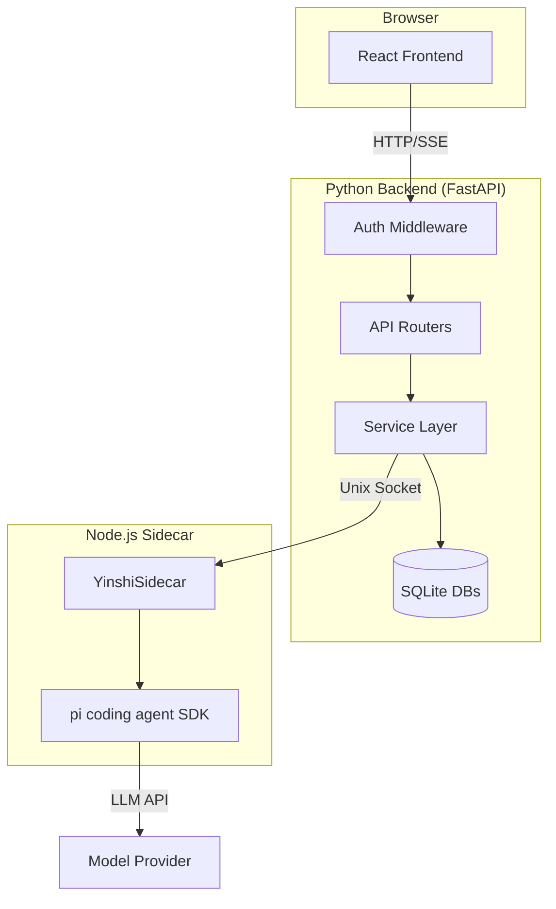
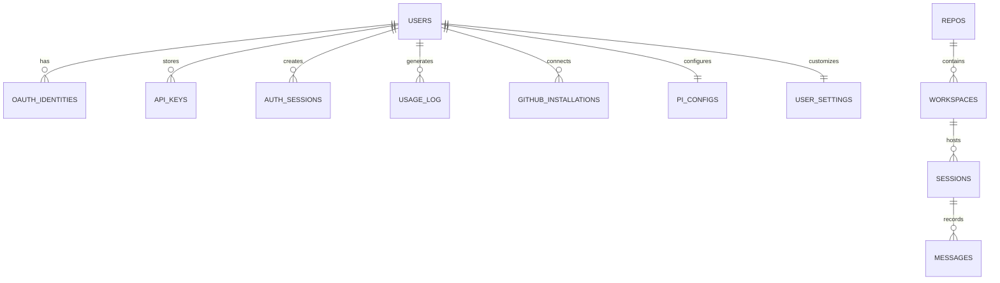
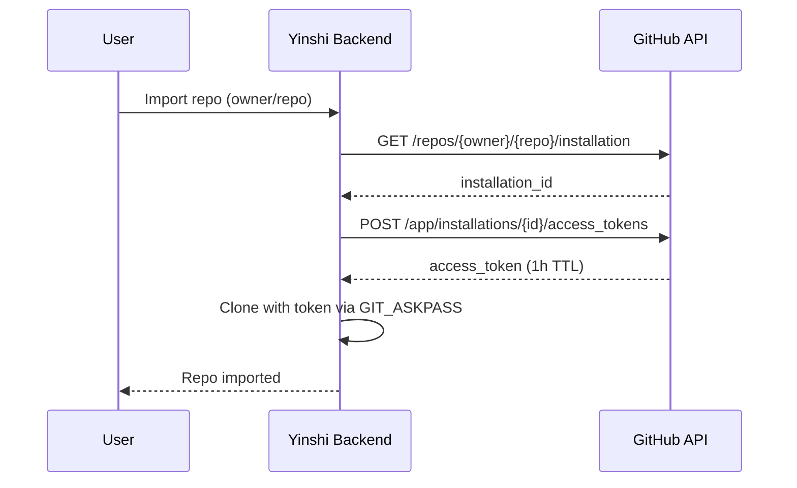
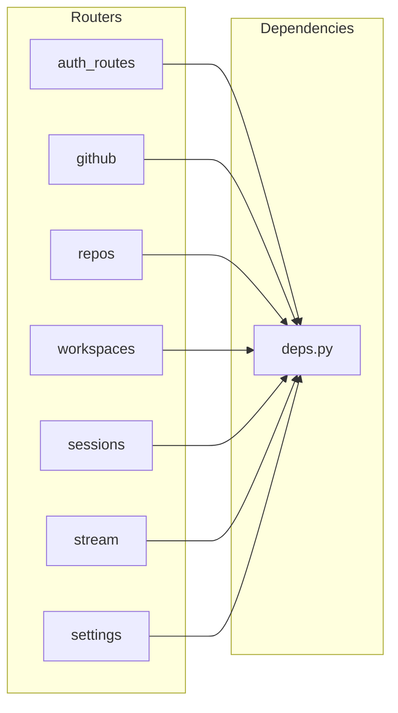
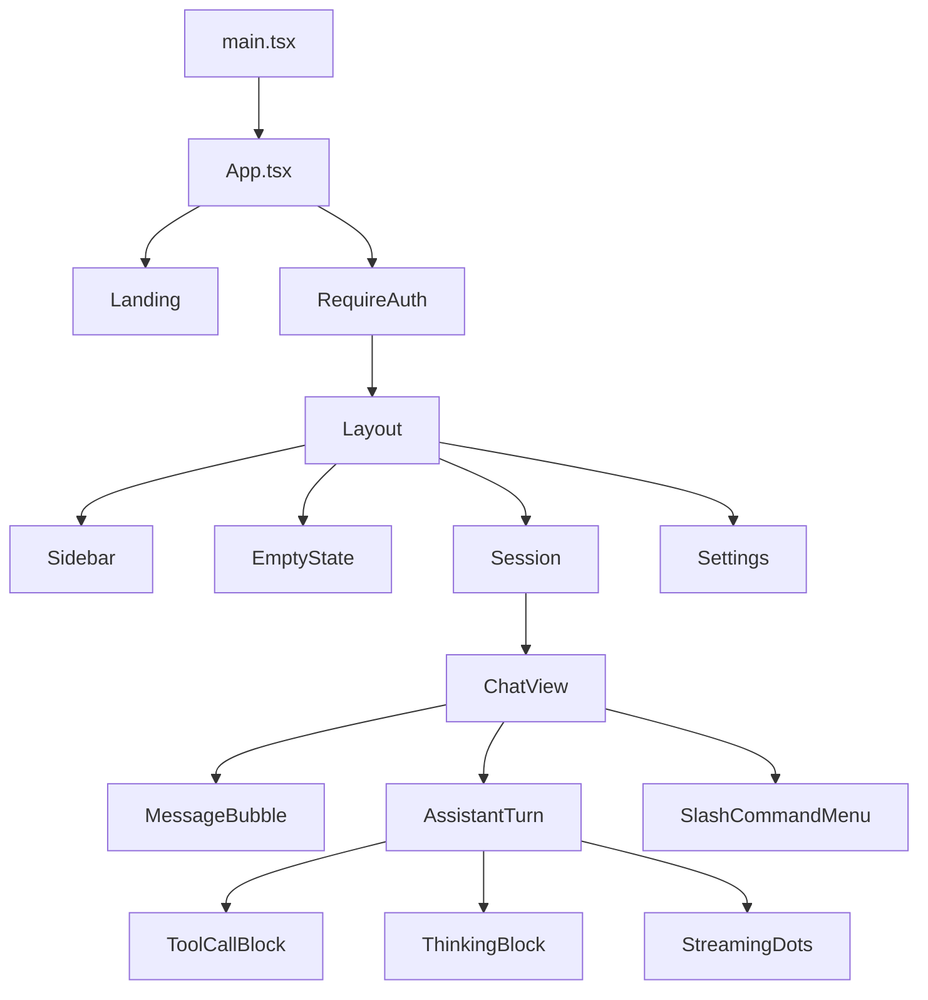
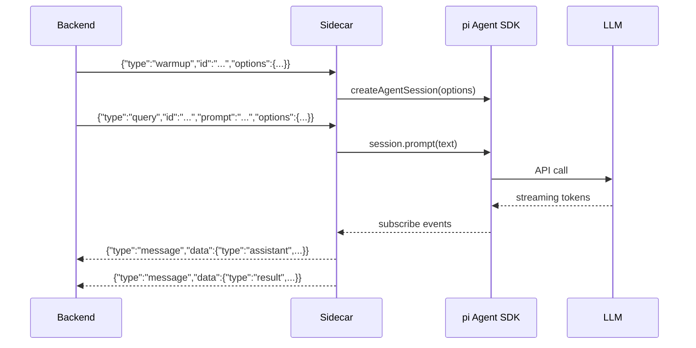

# Introduction

Yinshi is a web application for managing coding agent workspaces. Users import
GitHub or local git repositories, spawn isolated git worktrees with random branch
names, and converse with a `pi` coding agent that reads, writes, and refactors
code. All persistent state -- conversations, plans, Pi configs, worktrees -- lives
in SQLite databases.

The system is split into three deployable units: a Python FastAPI backend, a
React frontend, and a Node.js sidecar that bridges the backend to the `pi` agent
SDK over a Unix domain socket.



The backend follows a layered architecture: configuration feeds into a database
layer, which is consumed by service modules, which are exposed through FastAPI
routers. Authentication middleware gates access and resolves a per-user tenant
context that isolates data between users. The sidecar handles the stateful agent
session lifecycle and streams events back to the backend over a newline-delimited
JSON protocol.

# Configuration

## config.py

Application settings are loaded from environment variables and an optional `.env`
file using Pydantic's `BaseSettings`. The `Settings` class declares every tunable
parameter -- database paths, OAuth credentials, encryption pepper, CORS origins,
container isolation knobs -- with sensible defaults for local development. A
factory function caches the singleton instance and validates security-critical
invariants: when authentication is enabled, a `SECRET_KEY` must be provided.

```python {chunk="config" file="backend/src/yinshi/config.py"}
"""Application configuration via environment variables."""

import secrets
from functools import lru_cache

from pydantic_settings import BaseSettings


def _generate_secret() -> str:
    return secrets.token_hex(32)


class Settings(BaseSettings):
    """Application settings loaded from .env."""

    app_name: str = "Yinshi"
    debug: bool = False

    # Database (legacy single-DB mode)
    db_path: str = "yinshi.db"

    # Multi-tenant databases
    control_db_path: str = "/var/lib/yinshi/control.db"
    user_data_dir: str = "/var/lib/yinshi/users"

    # Encryption pepper for wrapping per-user DEKs (hex string, 32+ bytes)
    encryption_pepper: str = ""

    # Google OAuth
    google_client_id: str = ""
    google_client_secret: str = ""
    google_redirect_uri: str = "http://localhost:8000/auth/callback/google"

    # GitHub OAuth
    github_client_id: str = ""
    github_client_secret: str = ""
    github_redirect_uri: str = "http://localhost:8000/auth/callback/github"
    github_app_id: str = ""
    github_app_private_key_path: str = ""
    github_app_slug: str = ""

    # Session secret for cookies -- generated randomly if not set
    secret_key: str = ""

    # Explicit flag to disable auth (empty google_client_id alone is not enough)
    disable_auth: bool = False

    # Sidecar
    sidecar_socket_path: str = "/tmp/yinshi-sidecar.sock"

    # CORS
    frontend_url: str = "http://localhost:5173"

    # Server
    host: str = "0.0.0.0"
    port: int = 8000

    # Allowed base directory for local repo imports (empty = reject all local imports)
    allowed_repo_base: str = ""

    # Per-user container isolation
    container_enabled: bool = False
    container_image: str = "yinshi-sidecar:latest"
    container_idle_timeout_s: int = 300
    container_memory_limit: str = "256m"
    container_cpu_quota: int = 50000
    container_pids_limit: int = 256
    container_max_count: int = 10
    container_socket_base: str = "/var/run/yinshi"

    model_config = {"env_file": ".env", "env_file_encoding": "utf-8", "case_sensitive": False}

    @property
    def encryption_pepper_bytes(self) -> bytes:
        """Return the encryption pepper as bytes."""
        if self.encryption_pepper:
            return bytes.fromhex(self.encryption_pepper)
        return b""


def _auth_is_enabled(settings: Settings) -> bool:
    """Return whether authentication is configured to run."""
    if settings.disable_auth:
        return False
    if settings.google_client_id:
        return True
    if settings.github_client_id:
        return True
    return False


def _validate_settings(settings: Settings) -> None:
    """Reject invalid security-critical configuration."""
    if not _auth_is_enabled(settings):
        return
    if settings.secret_key:
        return
    raise RuntimeError("SECRET_KEY must be set when authentication is enabled")


@lru_cache()
def get_settings() -> Settings:
    """Get cached settings instance."""
    settings = Settings()
    _validate_settings(settings)
    if not settings.secret_key:
        settings.secret_key = _generate_secret()
    return settings
```

## model_catalog.py

A single constant shared between the backend and the sidecar establishes the
default session model. Keeping this in its own module avoids circular imports
when both `db.py` and `models.py` need the value.

```python {chunk="model_catalog" file="backend/src/yinshi/model_catalog.py"}
"""Shared backend constants for session model identifiers."""

DEFAULT_SESSION_MODEL = "minimax-m2.7"
```

# Exception Hierarchy

## exceptions.py

Every domain error has a dedicated exception class rooted at `YinshiError`.
This hierarchy lets API routers catch specific failures and translate them into
appropriate HTTP status codes without leaking implementation details. The GitHub
access errors carry structured metadata (error code, connect URL, manage URL) so
the frontend can render actionable resolution steps.

```python {chunk="exceptions" file="backend/src/yinshi/exceptions.py"}
"""Custom exception hierarchy for Yinshi."""


class YinshiError(Exception):
    """Base exception for all Yinshi errors."""


class RepoNotFoundError(YinshiError):
    """Raised when a repository is not found."""


class WorkspaceNotFoundError(YinshiError):
    """Raised when a workspace is not found."""


class SessionNotFoundError(YinshiError):
    """Raised when a session is not found."""


class GitError(YinshiError):
    """Raised when a git operation fails."""


class PiConfigError(YinshiError):
    """Raised when Pi config management cannot complete."""


class PiConfigNotFoundError(PiConfigError):
    """Raised when a Pi config record or directory is not available."""


class GitHubAppError(YinshiError):
    """Raised when the GitHub App integration cannot complete."""


class GitHubAccessError(GitHubAppError):
    """Raised when GitHub access cannot be granted for a repository."""

    def __init__(
        self,
        message: str,
        *,
        code: str,
        connect_url: str | None = None,
        manage_url: str | None = None,
    ) -> None:
        assert code, "code must not be empty"
        super().__init__(message)
        self.code = code
        self.connect_url = connect_url
        self.manage_url = manage_url


class GitHubConnectRequiredError(GitHubAccessError):
    """Raised when a user must connect GitHub before importing a repo."""

    def __init__(self, message: str, *, connect_url: str | None = None) -> None:
        super().__init__(
            message,
            code="github_connect_required",
            connect_url=connect_url,
        )


class GitHubAccessNotGrantedError(GitHubAccessError):
    """Raised when an installation exists but cannot access the repo."""

    def __init__(
        self,
        message: str,
        *,
        connect_url: str | None = None,
        manage_url: str | None = None,
    ) -> None:
        super().__init__(
            message,
            code="github_access_not_granted",
            connect_url=connect_url,
            manage_url=manage_url,
        )


class GitHubInstallationUnusableError(GitHubAccessError):
    """Raised when a connected installation is no longer usable."""

    def __init__(self, message: str, *, manage_url: str | None = None) -> None:
        super().__init__(
            message,
            code="github_installation_unusable",
            manage_url=manage_url,
        )


class SidecarError(YinshiError):
    """Raised when sidecar communication fails."""


class SidecarNotConnectedError(SidecarError):
    """Raised when the sidecar is not connected."""


class KeyNotFoundError(YinshiError):
    """Raised when no API key is available for a provider."""


class CreditExhaustedError(YinshiError):
    """Raised when a legacy platform-credit path runs out of allowance."""


class EncryptionNotConfiguredError(YinshiError):
    """Raised when encryption pepper is not configured."""


class ContainerStartError(YinshiError):
    """Raised when a per-user sidecar container fails to start."""


class ContainerNotReadyError(YinshiError):
    """Raised when a container's sidecar socket is not ready in time."""
```

# Database Layer



## db.py

The database module manages two SQLite databases. The per-user database stores
repos, workspaces, sessions, and messages. The control plane database stores user
accounts, OAuth identities, API keys, auth sessions, usage logs, GitHub
installations, Pi configs, and user settings. Both schemas use WAL mode for
concurrent read access and include auto-updating `updated_at` triggers. A
versioned migration system applies forward-only schema changes.

```python {chunk="db" file="backend/src/yinshi/db.py"}
"""SQLite database connection and schema management."""

import logging
import sqlite3
from collections.abc import Iterator
from contextlib import contextmanager
from pathlib import Path

from yinshi.config import get_settings
from yinshi.model_catalog import DEFAULT_SESSION_MODEL

logger = logging.getLogger(__name__)

_SCHEMA_VERSION = 2

SCHEMA_SQL = f"""
PRAGMA journal_mode = WAL;

CREATE TABLE IF NOT EXISTS repos (
    id TEXT PRIMARY KEY DEFAULT (lower(hex(randomblob(16)))),
    created_at TIMESTAMP DEFAULT CURRENT_TIMESTAMP NOT NULL,
    updated_at TIMESTAMP DEFAULT CURRENT_TIMESTAMP NOT NULL,
    name TEXT NOT NULL,
    remote_url TEXT,
    root_path TEXT NOT NULL,
    custom_prompt TEXT,
    owner_email TEXT,
    installation_id INTEGER
);

CREATE TABLE IF NOT EXISTS workspaces (
    id TEXT PRIMARY KEY DEFAULT (lower(hex(randomblob(16)))),
    created_at TIMESTAMP DEFAULT CURRENT_TIMESTAMP NOT NULL,
    updated_at TIMESTAMP DEFAULT CURRENT_TIMESTAMP NOT NULL,
    repo_id TEXT NOT NULL REFERENCES repos(id) ON DELETE CASCADE,
    name TEXT NOT NULL,
    branch TEXT NOT NULL,
    path TEXT NOT NULL,
    state TEXT DEFAULT 'ready' NOT NULL
);

CREATE TABLE IF NOT EXISTS sessions (
    id TEXT PRIMARY KEY DEFAULT (lower(hex(randomblob(16)))),
    created_at TIMESTAMP DEFAULT CURRENT_TIMESTAMP NOT NULL,
    updated_at TIMESTAMP DEFAULT CURRENT_TIMESTAMP NOT NULL,
    workspace_id TEXT NOT NULL REFERENCES workspaces(id) ON DELETE CASCADE,
    status TEXT DEFAULT 'idle' NOT NULL,
    model TEXT DEFAULT '{DEFAULT_SESSION_MODEL}'
);

CREATE TABLE IF NOT EXISTS messages (
    id TEXT PRIMARY KEY DEFAULT (lower(hex(randomblob(16)))),
    created_at TIMESTAMP DEFAULT CURRENT_TIMESTAMP NOT NULL,
    session_id TEXT NOT NULL REFERENCES sessions(id) ON DELETE CASCADE,
    role TEXT NOT NULL,
    content TEXT,
    full_message TEXT,
    turn_id TEXT
);

CREATE INDEX IF NOT EXISTS idx_messages_session ON messages(session_id, created_at);
CREATE INDEX IF NOT EXISTS idx_messages_turn_id ON messages(turn_id);
CREATE INDEX IF NOT EXISTS idx_sessions_workspace ON sessions(workspace_id);
CREATE INDEX IF NOT EXISTS idx_workspaces_repo ON workspaces(repo_id);

CREATE TRIGGER IF NOT EXISTS update_repos_updated_at AFTER UPDATE ON repos
BEGIN UPDATE repos SET updated_at = CURRENT_TIMESTAMP WHERE id = NEW.id; END;

CREATE TRIGGER IF NOT EXISTS update_workspaces_updated_at AFTER UPDATE ON workspaces
BEGIN UPDATE workspaces SET updated_at = CURRENT_TIMESTAMP WHERE id = NEW.id; END;

CREATE TRIGGER IF NOT EXISTS update_sessions_updated_at AFTER UPDATE ON sessions
BEGIN UPDATE sessions SET updated_at = CURRENT_TIMESTAMP WHERE id = NEW.id; END;
"""


def _open_connection(db_path: str, *, check_same_thread: bool = True) -> sqlite3.Connection:
    """Open a SQLite connection with standard settings."""
    conn = sqlite3.connect(db_path, check_same_thread=check_same_thread)
    conn.row_factory = sqlite3.Row
    conn.execute("PRAGMA foreign_keys = ON")
    conn.execute("PRAGMA busy_timeout = 5000")
    return conn


@contextmanager
def get_db() -> Iterator[sqlite3.Connection]:
    """Get a SQLite connection as a context manager."""
    settings = get_settings()
    conn = _open_connection(settings.db_path)
    try:
        yield conn
    finally:
        conn.close()


def _migrate(conn: sqlite3.Connection) -> None:
    """Apply versioned schema migrations."""
    conn.execute("CREATE TABLE IF NOT EXISTS schema_version (version INTEGER NOT NULL)")
    row = conn.execute("SELECT version FROM schema_version").fetchone()
    current = row[0] if row else 0

    if current < 1:
        columns = [r[1] for r in conn.execute("PRAGMA table_info(repos)").fetchall()]
        if "owner_email" not in columns:
            logger.info("Migration v1: adding owner_email column to repos")
            conn.execute("ALTER TABLE repos ADD COLUMN owner_email TEXT")

    if current < 2:
        columns = [r[1] for r in conn.execute("PRAGMA table_info(repos)").fetchall()]
        if "installation_id" not in columns:
            logger.info("Migration v2: adding installation_id column to repos")
            conn.execute("ALTER TABLE repos ADD COLUMN installation_id INTEGER")

    if current != _SCHEMA_VERSION:
        conn.execute("DELETE FROM schema_version")
        conn.execute("INSERT INTO schema_version (version) VALUES (?)", (_SCHEMA_VERSION,))
        conn.commit()


def init_db() -> None:
    """Initialize the database schema."""
    settings = get_settings()
    logger.info("Initializing database at %s", settings.db_path)
    try:
        with get_db() as conn:
            conn.executescript(SCHEMA_SQL)
            _migrate(conn)
    except sqlite3.Error:
        logger.exception("Failed to initialize database at %s", settings.db_path)
        raise
    logger.info("Database initialized")


# --- Control plane database (multi-tenant) ---

CONTROL_SCHEMA_SQL = """
PRAGMA journal_mode = WAL;

CREATE TABLE IF NOT EXISTS users (
    id TEXT PRIMARY KEY DEFAULT (lower(hex(randomblob(16)))),
    created_at TIMESTAMP DEFAULT CURRENT_TIMESTAMP NOT NULL,
    updated_at TIMESTAMP DEFAULT CURRENT_TIMESTAMP NOT NULL,
    email TEXT NOT NULL UNIQUE,
    display_name TEXT,
    avatar_url TEXT,
    status TEXT DEFAULT 'active' NOT NULL,
    tier TEXT DEFAULT 'free' NOT NULL,
    disk_quota_mb INTEGER DEFAULT 5000,
    disk_used_mb INTEGER DEFAULT 0,
    encrypted_dek BLOB,
    credit_used_cents INTEGER DEFAULT 0,
    credit_limit_cents INTEGER DEFAULT 500,
    last_login_at TIMESTAMP,
    deletion_requested_at TIMESTAMP,
    deletion_scheduled_for TIMESTAMP
);

CREATE TABLE IF NOT EXISTS oauth_identities (
    id TEXT PRIMARY KEY DEFAULT (lower(hex(randomblob(16)))),
    created_at TIMESTAMP DEFAULT CURRENT_TIMESTAMP NOT NULL,
    user_id TEXT NOT NULL REFERENCES users(id) ON DELETE CASCADE,
    provider TEXT NOT NULL,
    provider_user_id TEXT NOT NULL,
    provider_email TEXT NOT NULL,
    provider_data TEXT,
    UNIQUE(provider, provider_user_id)
);

CREATE TABLE IF NOT EXISTS api_keys (
    id TEXT PRIMARY KEY DEFAULT (lower(hex(randomblob(16)))),
    created_at TIMESTAMP DEFAULT CURRENT_TIMESTAMP NOT NULL,
    user_id TEXT NOT NULL REFERENCES users(id) ON DELETE CASCADE,
    provider TEXT NOT NULL,
    encrypted_key BLOB NOT NULL,
    label TEXT DEFAULT '',
    last_used_at TIMESTAMP
);

CREATE TABLE IF NOT EXISTS auth_sessions (
    id TEXT PRIMARY KEY,
    user_id TEXT NOT NULL REFERENCES users(id) ON DELETE CASCADE,
    created_at TIMESTAMP DEFAULT CURRENT_TIMESTAMP NOT NULL,
    revoked_at TIMESTAMP
);

CREATE TABLE IF NOT EXISTS usage_log (
    id TEXT PRIMARY KEY DEFAULT (lower(hex(randomblob(16)))),
    created_at TIMESTAMP DEFAULT CURRENT_TIMESTAMP NOT NULL,
    user_id TEXT NOT NULL REFERENCES users(id) ON DELETE CASCADE,
    session_id TEXT NOT NULL,
    provider TEXT NOT NULL,
    model TEXT NOT NULL,
    input_tokens INTEGER DEFAULT 0,
    output_tokens INTEGER DEFAULT 0,
    cache_read_tokens INTEGER DEFAULT 0,
    cache_write_tokens INTEGER DEFAULT 0,
    cost_cents REAL DEFAULT 0,
    key_source TEXT NOT NULL
);

CREATE INDEX IF NOT EXISTS idx_users_email ON users(email);
CREATE INDEX IF NOT EXISTS idx_oauth_user ON oauth_identities(user_id);
CREATE INDEX IF NOT EXISTS idx_api_keys_user ON api_keys(user_id);
CREATE INDEX IF NOT EXISTS idx_auth_sessions_user ON auth_sessions(user_id);
CREATE INDEX IF NOT EXISTS idx_usage_user ON usage_log(user_id);
CREATE INDEX IF NOT EXISTS idx_usage_session ON usage_log(session_id);

CREATE TABLE IF NOT EXISTS github_installations (
    id INTEGER PRIMARY KEY,
    user_id TEXT NOT NULL REFERENCES users(id) ON DELETE CASCADE,
    installation_id INTEGER NOT NULL,
    account_login TEXT NOT NULL,
    account_type TEXT NOT NULL,
    html_url TEXT NOT NULL,
    created_at TEXT NOT NULL DEFAULT (datetime('now')),
    UNIQUE(user_id, installation_id)
);

CREATE INDEX IF NOT EXISTS idx_github_installations_user ON github_installations(user_id);

CREATE TABLE IF NOT EXISTS pi_configs (
    id TEXT PRIMARY KEY DEFAULT (lower(hex(randomblob(16)))),
    created_at TIMESTAMP DEFAULT CURRENT_TIMESTAMP NOT NULL,
    updated_at TIMESTAMP DEFAULT CURRENT_TIMESTAMP NOT NULL,
    user_id TEXT NOT NULL UNIQUE REFERENCES users(id) ON DELETE CASCADE,
    source_type TEXT NOT NULL,
    source_label TEXT NOT NULL,
    repo_url TEXT,
    available_categories TEXT DEFAULT '[]' NOT NULL,
    enabled_categories TEXT DEFAULT '[]' NOT NULL,
    last_synced_at TIMESTAMP,
    status TEXT DEFAULT 'ready' NOT NULL,
    error_message TEXT
);

CREATE INDEX IF NOT EXISTS idx_pi_configs_user ON pi_configs(user_id);

CREATE TABLE IF NOT EXISTS user_settings (
    user_id TEXT PRIMARY KEY REFERENCES users(id) ON DELETE CASCADE,
    created_at TIMESTAMP DEFAULT CURRENT_TIMESTAMP NOT NULL,
    updated_at TIMESTAMP DEFAULT CURRENT_TIMESTAMP NOT NULL,
    pi_settings_json TEXT DEFAULT '{}' NOT NULL,
    pi_settings_enabled INTEGER DEFAULT 0 NOT NULL
);

CREATE TRIGGER IF NOT EXISTS update_users_updated_at AFTER UPDATE ON users
BEGIN UPDATE users SET updated_at = CURRENT_TIMESTAMP WHERE id = NEW.id; END;

CREATE TRIGGER IF NOT EXISTS update_pi_configs_updated_at AFTER UPDATE ON pi_configs
BEGIN UPDATE pi_configs SET updated_at = CURRENT_TIMESTAMP WHERE id = NEW.id; END;

CREATE TRIGGER IF NOT EXISTS update_user_settings_updated_at AFTER UPDATE ON user_settings
BEGIN UPDATE user_settings SET updated_at = CURRENT_TIMESTAMP WHERE user_id = NEW.user_id; END;
"""


@contextmanager
def get_control_db() -> Iterator[sqlite3.Connection]:
    """Get a connection to the control plane database."""
    settings = get_settings()
    conn = _open_connection(settings.control_db_path)
    try:
        yield conn
    finally:
        conn.close()


def _migrate_control(conn: sqlite3.Connection) -> None:
    """Apply control DB schema migrations for existing databases."""
    columns = [r[1] for r in conn.execute("PRAGMA table_info(users)").fetchall()]
    if "credit_used_cents" not in columns:
        logger.info("Control migration: adding credit tracking columns to users")
        conn.execute("ALTER TABLE users ADD COLUMN credit_used_cents INTEGER DEFAULT 0")
        conn.execute("ALTER TABLE users ADD COLUMN credit_limit_cents INTEGER DEFAULT 500")
        conn.commit()

    pi_config_columns = [row[1] for row in conn.execute("PRAGMA table_info(pi_configs)").fetchall()]
    if pi_config_columns and "available_categories" not in pi_config_columns:
        logger.info("Control migration: adding available_categories column to pi_configs")
        conn.execute(
            "ALTER TABLE pi_configs ADD COLUMN available_categories TEXT DEFAULT '[]' NOT NULL"
        )
        conn.commit()


def init_control_db() -> None:
    """Initialize the control plane database schema."""
    settings = get_settings()
    Path(settings.control_db_path).parent.mkdir(parents=True, exist_ok=True)
    logger.info("Initializing control database at %s", settings.control_db_path)
    try:
        with get_control_db() as conn:
            conn.executescript(CONTROL_SCHEMA_SQL)
            _migrate_control(conn)
    except sqlite3.Error:
        logger.exception("Failed to initialize control database")
        raise
    logger.info("Control database initialized")
```

# Data Models

## models.py

Pydantic models define the shape of every API request and response. Input models
carry field-level validation constraints (max lengths, regex patterns, custom
validators). Output models mirror database rows, exposing only safe fields. The
Pi config category system uses a canonical ordering tuple and a frozen set for
membership tests to ensure consistent serialization and reject unknown values.

```python {chunk="models" file="backend/src/yinshi/models.py"}
"""Pydantic models for API request/response schemas."""

from datetime import datetime

from pydantic import BaseModel, Field, field_validator

from yinshi.model_catalog import DEFAULT_SESSION_MODEL

PI_CONFIG_CATEGORY_ORDER = (
    "skills",
    "extensions",
    "prompts",
    "agents",
    "themes",
    "settings",
    "models",
    "sessions",
    "instructions",
)
PI_CONFIG_CATEGORIES = frozenset(PI_CONFIG_CATEGORY_ORDER)


class RepoCreate(BaseModel):
    """Request to import a repository."""

    name: str = Field(..., max_length=255)
    remote_url: str | None = Field(None, max_length=2048)
    local_path: str | None = Field(None, max_length=4096)
    custom_prompt: str | None = Field(None, max_length=10_000)


class RepoOut(BaseModel):
    """Repository response."""

    id: str
    created_at: datetime
    updated_at: datetime
    name: str
    remote_url: str | None = None
    root_path: str
    custom_prompt: str | None = None


class RepoUpdate(BaseModel):
    """Request to update a repository."""

    name: str | None = Field(None, max_length=255)
    custom_prompt: str | None = Field(None, max_length=10_000)


class WorkspaceCreate(BaseModel):
    """Request to create a worktree workspace."""

    name: str | None = Field(None, max_length=255)


class WorkspaceOut(BaseModel):
    """Workspace response."""

    id: str
    created_at: datetime
    updated_at: datetime
    repo_id: str
    name: str
    branch: str
    path: str
    state: str = "ready"


class WorkspaceUpdate(BaseModel):
    """Request to update a workspace."""

    state: str | None = Field(None, pattern=r"^(ready|archived)$")


class SessionCreate(BaseModel):
    """Request to create an agent session."""

    model: str = Field(DEFAULT_SESSION_MODEL, max_length=100)


class SessionUpdate(BaseModel):
    """Request to update a session."""

    model: str | None = Field(None, max_length=100)


class SessionOut(BaseModel):
    """Session response."""

    id: str
    created_at: datetime
    updated_at: datetime
    workspace_id: str
    status: str = "idle"
    model: str = DEFAULT_SESSION_MODEL


class MessageOut(BaseModel):
    """Message response."""

    id: str
    created_at: datetime
    session_id: str
    role: str
    content: str | None = None
    full_message: str | None = None
    turn_id: str | None = None


class WSPrompt(BaseModel):
    """WebSocket message from client to send a prompt."""

    type: str = "prompt"
    prompt: str = Field(..., max_length=100_000)
    model: str | None = Field(None, max_length=100)


class WSCancel(BaseModel):
    """WebSocket message from client to cancel."""

    type: str = "cancel"


# --- Multi-tenant models ---


class UserOut(BaseModel):
    """User account response (from control plane)."""

    id: str
    email: str
    display_name: str | None = None
    avatar_url: str | None = None
    status: str = "active"
    tier: str = "free"


class ApiKeyCreate(BaseModel):
    """Request to store an API key."""

    provider: str = Field(..., pattern=r"^(anthropic|minimax)$")
    key: str = Field(..., min_length=1, max_length=500)
    label: str = Field("", max_length=255)


class ApiKeyOut(BaseModel):
    """API key response (key value is never returned)."""

    id: str
    created_at: datetime
    provider: str
    label: str = ""
    last_used_at: datetime | None = None


class PiConfigImport(BaseModel):
    """Import a Pi config from a GitHub repository."""

    repo_url: str = Field(..., max_length=2048)

    @field_validator("repo_url")
    @classmethod
    def validate_repo_url(cls, value: str) -> str:
        """Reject blank repository URLs."""
        normalized_value = value.strip()
        if not normalized_value:
            raise ValueError("Repository URL must not be empty")
        return normalized_value


class PiConfigCategoryUpdate(BaseModel):
    """Toggle the enabled Pi resource categories."""

    enabled_categories: list[str]

    @field_validator("enabled_categories")
    @classmethod
    def validate_enabled_categories(cls, value: list[str]) -> list[str]:
        """Require unique, known category names."""
        seen_categories: set[str] = set()
        normalized_categories: list[str] = []
        for category in value:
            normalized_category = category.strip()
            if normalized_category not in PI_CONFIG_CATEGORIES:
                raise ValueError(f"Unsupported category: {category}")
            if normalized_category in seen_categories:
                raise ValueError(f"Duplicate category: {category}")
            seen_categories.add(normalized_category)
            normalized_categories.append(normalized_category)
        return normalized_categories


class PiConfigOut(BaseModel):
    """Pi config status response."""

    id: str
    created_at: datetime
    updated_at: datetime
    source_type: str
    source_label: str
    last_synced_at: datetime | None = None
    status: str
    error_message: str | None = None
    available_categories: list[str]
    enabled_categories: list[str]
```

# Multi-Tenancy

## tenant.py

The tenant module defines the `TenantContext` dataclass that travels with every
authenticated request. It carries the user's id, email, filesystem data directory,
and database path. Helper functions compute the per-user directory layout (using a
two-character prefix for filesystem fan-out), validate that paths stay inside the
tenant's sandbox, and manage the per-user SQLite schema lifecycle.

```python {chunk="tenant" file="backend/src/yinshi/tenant.py"}
"""Multi-tenant context and per-user database management."""

import os
import sqlite3
from collections.abc import Iterator
from contextlib import contextmanager
from dataclasses import dataclass

from yinshi.db import _open_connection
from yinshi.model_catalog import DEFAULT_SESSION_MODEL


@dataclass
class TenantContext:
    """Per-request tenant context resolved from authentication."""

    user_id: str
    email: str
    data_dir: str
    db_path: str


def user_data_dir(base_dir: str, user_id: str) -> str:
    """Compute the data directory for a user, using a 2-char prefix."""
    prefix = user_id[:2]
    return os.path.join(base_dir, prefix, user_id)


def validate_user_path(tenant: TenantContext, path: str) -> None:
    """Validate that a path is within the tenant's data directory.

    Raises ValueError if the path is outside the tenant's data_dir.
    """
    resolved = os.path.realpath(path)
    data_dir = os.path.realpath(tenant.data_dir)
    if not resolved.startswith(data_dir + os.sep) and resolved != data_dir:
        raise ValueError(f"Path {path} is outside tenant data directory")


# User DB schema -- identical to main schema but WITHOUT owner_email
USER_SCHEMA_SQL = f"""
PRAGMA journal_mode = WAL;

CREATE TABLE IF NOT EXISTS repos (
    id TEXT PRIMARY KEY DEFAULT (lower(hex(randomblob(16)))),
    created_at TIMESTAMP DEFAULT CURRENT_TIMESTAMP NOT NULL,
    updated_at TIMESTAMP DEFAULT CURRENT_TIMESTAMP NOT NULL,
    name TEXT NOT NULL,
    remote_url TEXT,
    root_path TEXT NOT NULL,
    custom_prompt TEXT,
    installation_id INTEGER
);

CREATE TABLE IF NOT EXISTS workspaces (
    id TEXT PRIMARY KEY DEFAULT (lower(hex(randomblob(16)))),
    created_at TIMESTAMP DEFAULT CURRENT_TIMESTAMP NOT NULL,
    updated_at TIMESTAMP DEFAULT CURRENT_TIMESTAMP NOT NULL,
    repo_id TEXT NOT NULL REFERENCES repos(id) ON DELETE CASCADE,
    name TEXT NOT NULL,
    branch TEXT NOT NULL,
    path TEXT NOT NULL,
    state TEXT DEFAULT 'ready' NOT NULL
);

CREATE TABLE IF NOT EXISTS sessions (
    id TEXT PRIMARY KEY DEFAULT (lower(hex(randomblob(16)))),
    created_at TIMESTAMP DEFAULT CURRENT_TIMESTAMP NOT NULL,
    updated_at TIMESTAMP DEFAULT CURRENT_TIMESTAMP NOT NULL,
    workspace_id TEXT NOT NULL REFERENCES workspaces(id) ON DELETE CASCADE,
    status TEXT DEFAULT 'idle' NOT NULL,
    model TEXT DEFAULT '{DEFAULT_SESSION_MODEL}'
);

CREATE TABLE IF NOT EXISTS messages (
    id TEXT PRIMARY KEY DEFAULT (lower(hex(randomblob(16)))),
    created_at TIMESTAMP DEFAULT CURRENT_TIMESTAMP NOT NULL,
    session_id TEXT NOT NULL REFERENCES sessions(id) ON DELETE CASCADE,
    role TEXT NOT NULL,
    content TEXT,
    full_message TEXT,
    turn_id TEXT
);

CREATE INDEX IF NOT EXISTS idx_messages_session ON messages(session_id, created_at);
CREATE INDEX IF NOT EXISTS idx_messages_turn_id ON messages(turn_id);
CREATE INDEX IF NOT EXISTS idx_sessions_workspace ON sessions(workspace_id);
CREATE INDEX IF NOT EXISTS idx_workspaces_repo ON workspaces(repo_id);

CREATE TRIGGER IF NOT EXISTS update_repos_updated_at AFTER UPDATE ON repos
BEGIN UPDATE repos SET updated_at = CURRENT_TIMESTAMP WHERE id = NEW.id; END;

CREATE TRIGGER IF NOT EXISTS update_workspaces_updated_at AFTER UPDATE ON workspaces
BEGIN UPDATE workspaces SET updated_at = CURRENT_TIMESTAMP WHERE id = NEW.id; END;

CREATE TRIGGER IF NOT EXISTS update_sessions_updated_at AFTER UPDATE ON sessions
BEGIN UPDATE sessions SET updated_at = CURRENT_TIMESTAMP WHERE id = NEW.id; END;
"""


def _migrate_user_db(conn: sqlite3.Connection) -> None:
    """Apply forward-only schema fixes for existing per-user databases."""
    columns = [row[1] for row in conn.execute("PRAGMA table_info(repos)").fetchall()]
    if "installation_id" not in columns:
        conn.execute("ALTER TABLE repos ADD COLUMN installation_id INTEGER")
        conn.commit()


def _ensure_user_db_schema(conn: sqlite3.Connection) -> None:
    """Create missing tables and apply migrations for a per-user database."""
    conn.executescript(USER_SCHEMA_SQL)
    _migrate_user_db(conn)


def init_user_db(db_path: str) -> None:
    """Initialize a per-user SQLite database with the user schema."""
    conn = _open_connection(db_path)
    try:
        _ensure_user_db_schema(conn)
    finally:
        conn.close()


@contextmanager
def get_user_db(tenant: TenantContext) -> Iterator[sqlite3.Connection]:
    """Get a SQLite connection to a user's database."""
    conn = _open_connection(tenant.db_path)
    try:
        _ensure_user_db_schema(conn)
        yield conn
    finally:
        conn.close()
```

## utils/paths.py

A single path-safety function resolves symlinks and verifies containment. This
is the lowest-level building block used by tenant path validation, workspace
trust checks, and repo import authorization.

```python {chunk="utils_paths" file="backend/src/yinshi/utils/paths.py"}
"""Shared path utilities for security checks."""

import os


def is_path_inside(path: str, base: str) -> bool:
    """Check if *path* is inside *base* after resolving symlinks.

    Returns True when the resolved *path* equals *base* or is a descendant
    of it.  The check uses ``os.path.realpath`` to resolve symlinks so
    that ``../`` traversal tricks are neutralised.
    """
    resolved = os.path.realpath(path)
    resolved_base = os.path.realpath(base)
    return resolved == resolved_base or resolved.startswith(resolved_base + os.sep)
```

# Authentication & Sessions

## auth.py

Authentication combines OAuth (Google and GitHub) with signed session cookies.
The middleware intercepts every request, skipping open paths like `/auth/` and
`/health`. For protected routes it decodes the `yinshi_session` cookie using
`itsdangerous`, verifies the embedded auth session has not been revoked, and
resolves the user into a `TenantContext` that is attached to `request.state`.
Mutating HTTP methods additionally require an `X-Requested-With` header as a
CSRF countermeasure.

```python {chunk="auth" file="backend/src/yinshi/auth.py"}
"""OAuth authentication and session middleware (Google + GitHub)."""

import logging
import sqlite3
import uuid

from authlib.integrations.starlette_client import OAuth
from fastapi import Request, Response
from itsdangerous import BadSignature, BadTimeSignature, URLSafeTimedSerializer
from starlette.middleware.base import BaseHTTPMiddleware, RequestResponseEndpoint

from yinshi.config import get_settings
from yinshi.db import get_control_db
from yinshi.services.accounts import make_tenant
from yinshi.tenant import TenantContext

logger = logging.getLogger(__name__)

oauth = OAuth()

SESSION_MAX_AGE = 86400 * 30  # 30 days


def setup_oauth() -> None:
    """Register OAuth providers (Google and GitHub)."""
    settings = get_settings()
    if settings.google_client_id:
        oauth.register(
            name="google",
            client_id=settings.google_client_id,
            client_secret=settings.google_client_secret,
            server_metadata_url="https://accounts.google.com/.well-known/openid-configuration",
            client_kwargs={"scope": "openid email profile"},
        )
    else:
        logger.warning("Google OAuth not configured")

    if settings.github_client_id:
        oauth.register(
            name="github",
            client_id=settings.github_client_id,
            client_secret=settings.github_client_secret,
            authorize_url="https://github.com/login/oauth/authorize",
            access_token_url="https://github.com/login/oauth/access_token",
            api_base_url="https://api.github.com/",
            client_kwargs={"scope": "user:email"},
        )
    else:
        logger.warning("GitHub OAuth not configured")

    if not settings.google_client_id and not settings.github_client_id:
        logger.warning("No OAuth provider configured -- auth disabled")


def _session_serializer() -> URLSafeTimedSerializer:
    """Build the serializer used for auth session cookies."""
    settings = get_settings()
    return URLSafeTimedSerializer(settings.secret_key)


def _normalize_user_id(user_id: str) -> str:
    """Return a validated user id string."""
    if not isinstance(user_id, str):
        raise TypeError("user_id must be a string")
    normalized_user_id = user_id.strip()
    if not normalized_user_id:
        raise ValueError("user_id must not be empty")
    return normalized_user_id


def _normalize_auth_session_id(auth_session_id: str) -> str:
    """Return a validated auth session id string."""
    if not isinstance(auth_session_id, str):
        raise TypeError("auth_session_id must be a string")
    normalized_auth_session_id = auth_session_id.strip()
    if not normalized_auth_session_id:
        raise ValueError("auth_session_id must not be empty")
    return normalized_auth_session_id


def _create_auth_session(user_id: str) -> str:
    """Insert and return a new auth session identifier."""
    normalized_user_id = _normalize_user_id(user_id)
    auth_session_id = uuid.uuid4().hex
    with get_control_db() as db:
        db.execute(
            "INSERT INTO auth_sessions (id, user_id) VALUES (?, ?)",
            (auth_session_id, normalized_user_id),
        )
        db.commit()
    return auth_session_id


def _serialize_session_token(user_id: str, auth_session_id: str) -> str:
    """Serialize the session payload into a signed token."""
    normalized_user_id = _normalize_user_id(user_id)
    normalized_auth_session_id = _normalize_auth_session_id(auth_session_id)
    serializer = _session_serializer()
    return serializer.dumps(
        {
            "user_id": normalized_user_id,
            "auth_session_id": normalized_auth_session_id,
        },
        salt="yinshi-session",
    )


def _load_auth_session_row(user_id: str, auth_session_id: str) -> sqlite3.Row | None:
    """Return the auth session row for a signed cookie payload."""
    normalized_user_id = _normalize_user_id(user_id)
    normalized_auth_session_id = _normalize_auth_session_id(auth_session_id)
    with get_control_db() as db:
        row = db.execute(
            "SELECT id, revoked_at FROM auth_sessions WHERE id = ? AND user_id = ?",
            (normalized_auth_session_id, normalized_user_id),
        ).fetchone()
    return row


def revoke_auth_sessions(user_id: str) -> None:
    """Revoke every auth session that belongs to a user."""
    normalized_user_id = _normalize_user_id(user_id)
    with get_control_db() as db:
        db.execute(
            """
            UPDATE auth_sessions
            SET revoked_at = CURRENT_TIMESTAMP
            WHERE user_id = ? AND revoked_at IS NULL
            """,
            (normalized_user_id,),
        )
        db.commit()


def create_session_token(user_id: str) -> str:
    """Create a signed session token encoding user and auth session ids."""
    normalized_user_id = _normalize_user_id(user_id)
    auth_session_id = _create_auth_session(normalized_user_id)
    return _serialize_session_token(normalized_user_id, auth_session_id)


def verify_session_token(token: str) -> str | None:
    """Verify and decode a session token. Returns user_id or None."""
    if not isinstance(token, str):
        return None
    normalized_token = token.strip()
    if not normalized_token:
        return None

    serializer = _session_serializer()
    try:
        payload = serializer.loads(
            normalized_token,
            salt="yinshi-session",
            max_age=SESSION_MAX_AGE,
        )
    except (BadSignature, BadTimeSignature):
        return None

    if not isinstance(payload, dict):
        return None

    user_id = payload.get("user_id")
    auth_session_id = payload.get("auth_session_id")
    if not isinstance(user_id, str):
        return None
    if not isinstance(auth_session_id, str):
        return None

    normalized_user_id = user_id.strip()
    normalized_auth_session_id = auth_session_id.strip()
    if not normalized_user_id:
        return None
    if not normalized_auth_session_id:
        return None

    session_row = _load_auth_session_row(normalized_user_id, normalized_auth_session_id)
    if session_row is None:
        return None
    if session_row["revoked_at"] is not None:
        return None
    return normalized_user_id


def _auth_disabled() -> bool:
    """Check if authentication is disabled."""
    settings = get_settings()
    return settings.disable_auth or (
        not settings.google_client_id and not settings.github_client_id
    )


def _resolve_tenant_from_user_id(user_id: str) -> TenantContext | None:
    """Resolve TenantContext from a user_id in the control DB."""
    with get_control_db() as db:
        row = db.execute("SELECT id, email FROM users WHERE id = ?", (user_id,)).fetchone()
    if not row:
        return None
    return make_tenant(row["id"], row["email"])


class AuthMiddleware(BaseHTTPMiddleware):
    """Middleware that checks for valid session cookie on protected routes."""

    OPEN_PREFIXES = ("/auth/", "/health", "/static/")

    async def dispatch(
        self,
        request: Request,
        call_next: RequestResponseEndpoint,
    ) -> Response:
        path = request.url.path

        # Skip auth if explicitly disabled
        if _auth_disabled():
            return await call_next(request)

        # Allow open paths
        if any(path.startswith(p) for p in self.OPEN_PREFIXES):
            return await call_next(request)

        # Check session cookie
        token = request.cookies.get("yinshi_session")
        if not token:
            return Response(status_code=401, content="Not authenticated")

        user_id = verify_session_token(token)
        if not user_id:
            return Response(status_code=401, content="Invalid session")

        # Resolve tenant context
        tenant = _resolve_tenant_from_user_id(user_id)
        if not tenant:
            return Response(status_code=401, content="User not found")

        request.state.user_email = tenant.email
        request.state.tenant = tenant

        # CSRF protection for mutating methods
        if request.method in ("POST", "PATCH", "PUT", "DELETE"):
            if request.headers.get("X-Requested-With") != "XMLHttpRequest":
                return Response(status_code=403, content="CSRF validation failed")

        return await call_next(request)
```

# Rate Limiting

## rate_limit.py

Rate limiting uses `slowapi` with a key function that prefers the authenticated
user id over the client IP address. This ensures that limits follow the user
across devices rather than penalizing shared NAT gateways.

```python {chunk="rate_limit" file="backend/src/yinshi/rate_limit.py"}
"""Shared rate-limiting configuration for FastAPI routes."""

from __future__ import annotations

from fastapi import Request
from slowapi import Limiter
from slowapi.util import get_remote_address


def route_rate_limit_key(request: Request) -> str:
    """Return the tenant user id when available, otherwise the client IP."""
    tenant = getattr(request.state, "tenant", None)
    if tenant is not None:
        user_id = getattr(tenant, "user_id", None)
        if isinstance(user_id, str):
            normalized_user_id = user_id.strip()
            if normalized_user_id:
                return normalized_user_id

    client_address = get_remote_address(request)
    if isinstance(client_address, str):
        normalized_client_address = client_address.strip()
        if normalized_client_address:
            return normalized_client_address
    return "unknown-client"


limiter = Limiter(key_func=route_rate_limit_key)
```

# Encryption & Key Management

## services/crypto.py

Per-user encryption uses a two-tier key hierarchy. A Data Encryption Key (DEK)
is generated per user and wrapped with a Key Encryption Key (KEK) derived via
HKDF from the user's id and a server-wide pepper. AES-256-GCM handles both
DEK wrapping and API key encryption. Each ciphertext is prefixed with a 12-byte
random nonce.

```python {chunk="crypto" file="backend/src/yinshi/services/crypto.py"}
"""Encryption services for per-user data encryption.

Uses HKDF for key derivation and AES-256-GCM for wrapping/unwrapping
Data Encryption Keys (DEKs) and encrypting API keys.
"""

import os

from cryptography.hazmat.primitives.ciphers.aead import AESGCM
from cryptography.hazmat.primitives.kdf.hkdf import HKDF
from cryptography.hazmat.primitives import hashes


def generate_dek() -> bytes:
    """Generate a random 256-bit Data Encryption Key."""
    return os.urandom(32)


def _derive_kek(user_id: str, pepper: bytes) -> bytes:
    """Derive a Key Encryption Key from user_id and server pepper using HKDF."""
    hkdf = HKDF(
        algorithm=hashes.SHA256(),
        length=32,
        salt=pepper,
        info=f"yinshi-kek-{user_id}".encode(),
    )
    return hkdf.derive(user_id.encode())


def wrap_dek(dek: bytes, user_id: str, pepper: bytes) -> bytes:
    """Wrap (encrypt) a DEK using a KEK derived from user_id + pepper.

    Returns nonce (12 bytes) + ciphertext.
    """
    kek = _derive_kek(user_id, pepper)
    aesgcm = AESGCM(kek)
    nonce = os.urandom(12)
    ciphertext = aesgcm.encrypt(nonce, dek, None)
    return nonce + ciphertext


def unwrap_dek(wrapped: bytes, user_id: str, pepper: bytes) -> bytes:
    """Unwrap (decrypt) a DEK using a KEK derived from user_id + pepper."""
    kek = _derive_kek(user_id, pepper)
    aesgcm = AESGCM(kek)
    nonce = wrapped[:12]
    ciphertext = wrapped[12:]
    return aesgcm.decrypt(nonce, ciphertext, None)


def encrypt_api_key(api_key: str, dek: bytes) -> bytes:
    """Encrypt an API key string using the user's DEK.

    Returns nonce (12 bytes) + ciphertext.
    """
    aesgcm = AESGCM(dek)
    nonce = os.urandom(12)
    ciphertext = aesgcm.encrypt(nonce, api_key.encode(), None)
    return nonce + ciphertext


def decrypt_api_key(encrypted: bytes, dek: bytes) -> str:
    """Decrypt an API key using the user's DEK."""
    aesgcm = AESGCM(dek)
    nonce = encrypted[:12]
    ciphertext = encrypted[12:]
    return aesgcm.decrypt(nonce, ciphertext, None).decode()
```

## services/keys.py

The key resolution service enforces a strict BYOK (Bring Your Own Key) policy
for authenticated users. When a prompt is about to be sent,
`resolve_api_key_for_prompt` looks up the user's encrypted key for the target
provider, decrypts it, and returns it alongside a `key_source` tag. If no key is
found, a `KeyNotFoundError` is raised. The module also estimates costs for
MiniMax models and logs token usage to the control database.

```python {chunk="keys" file="backend/src/yinshi/services/keys.py"}
"""BYOK key resolution and usage logging."""

import logging
import uuid

from yinshi.config import get_settings
from yinshi.db import get_control_db
from yinshi.exceptions import EncryptionNotConfiguredError, KeyNotFoundError
from yinshi.services.crypto import decrypt_api_key, generate_dek, unwrap_dek, wrap_dek

logger = logging.getLogger(__name__)

# MiniMax M2.5 Highspeed pricing (per 1M tokens, in cents)
_MINIMAX_COSTS = {
    "input": 30,  # $0.30/M
    "output": 120,  # $1.20/M
    "cache_read": 3,  # $0.03/M
    "cache_write": 3.75,  # $0.0375/M
}


def get_user_dek(user_id: str) -> bytes:
    """Retrieve and unwrap the user's DEK from the control DB."""
    settings = get_settings()
    pepper = settings.encryption_pepper_bytes
    if not pepper:
        raise EncryptionNotConfiguredError("Encryption pepper not configured")

    with get_control_db() as db:
        row = db.execute(
            "SELECT encrypted_dek FROM users WHERE id = ?", (user_id,)
        ).fetchone()
    if not row:
        raise KeyNotFoundError(f"User {user_id} not found")

    if not row["encrypted_dek"]:
        # Lazy-generate DEK for accounts created before encryption was configured
        dek = generate_dek()
        encrypted_dek = wrap_dek(dek, user_id, pepper)
        with get_control_db() as db:
            db.execute(
                "UPDATE users SET encrypted_dek = ? WHERE id = ?",
                (encrypted_dek, user_id),
            )
            db.commit()
        logger.info("Generated DEK for user %s (legacy account)", user_id)
        return dek

    return unwrap_dek(row["encrypted_dek"], user_id, pepper)


def resolve_user_api_key(user_id: str, provider: str) -> str | None:
    """Look up and decrypt the user's stored BYOK key for a provider.

    Returns the plaintext API key, or None if no key is stored.
    """
    with get_control_db() as db:
        row = db.execute(
            "SELECT encrypted_key FROM api_keys WHERE user_id = ? AND provider = ? "
            "ORDER BY created_at DESC LIMIT 1",
            (user_id, provider),
        ).fetchone()

        if not row:
            return None

        dek = get_user_dek(user_id)
        key = decrypt_api_key(row["encrypted_key"], dek)

        db.execute(
            "UPDATE api_keys SET last_used_at = CURRENT_TIMESTAMP "
            "WHERE user_id = ? AND provider = ?",
            (user_id, provider),
        )
        db.commit()

    return key


def resolve_api_key_for_prompt(user_id: str, provider: str) -> tuple[str, str]:
    """Resolve which API key to use for a prompt.

    Returns (api_key, key_source). Authenticated users must provide BYOK keys.
    """
    byok_key = resolve_user_api_key(user_id, provider)
    if byok_key:
        return byok_key, "byok"

    raise KeyNotFoundError(
        f"No API key found for {provider}. Add your own key in Settings."
    )


def estimate_cost_cents(provider: str, usage: dict[str, int]) -> float:
    """Estimate cost from token counts. Returns cents.

    MiniMax usage is estimated for reporting. Other providers return 0.
    """
    if provider != "minimax":
        return 0.0

    input_tokens = usage.get("input_tokens", 0)
    output_tokens = usage.get("output_tokens", 0)
    cache_read = usage.get("cache_read_tokens", 0)
    cache_write = usage.get("cache_write_tokens", 0)

    cost = (
        input_tokens * _MINIMAX_COSTS["input"]
        + output_tokens * _MINIMAX_COSTS["output"]
        + cache_read * _MINIMAX_COSTS["cache_read"]
        + cache_write * _MINIMAX_COSTS["cache_write"]
    ) / 1_000_000

    return cost


def record_usage(
    user_id: str,
    session_id: str,
    provider: str,
    model: str,
    usage: dict[str, int],
    key_source: str,
) -> None:
    """Insert a usage_log row for the completed prompt."""
    cost = estimate_cost_cents(provider, usage)
    row_id = uuid.uuid4().hex

    with get_control_db() as db:
        db.execute(
            "INSERT INTO usage_log "
            "(id, user_id, session_id, provider, model, "
            "input_tokens, output_tokens, cache_read_tokens, cache_write_tokens, "
            "cost_cents, key_source) "
            "VALUES (?, ?, ?, ?, ?, ?, ?, ?, ?, ?, ?)",
            (
                row_id,
                user_id,
                session_id,
                provider,
                model,
                usage.get("input_tokens", 0),
                usage.get("output_tokens", 0),
                usage.get("cache_read_tokens", 0),
                usage.get("cache_write_tokens", 0),
                cost,
                key_source,
            ),
        )
        db.commit()

    logger.info(
        "Usage recorded: user=%s provider=%s model=%s cost=%.2fc source=%s",
        user_id, provider, model, cost, key_source,
    )
```

# Account Management

## services/accounts.py

Account provisioning follows a three-step resolution: first check OAuth
identities for an existing login, then check by email to link a new provider to
an existing account, and finally create a brand new user. New users get a
generated DEK wrapped with the server pepper, a filesystem data directory, and an
initialized per-user SQLite database. Legacy single-tenant data is migrated on
first login.

```python {chunk="accounts" file="backend/src/yinshi/services/accounts.py"}
"""Account provisioning and resolution for multi-tenant users."""

import json
import logging
import os
import secrets
import sqlite3
from typing import Any

from yinshi.config import get_settings
from yinshi.db import get_control_db
from yinshi.services.crypto import generate_dek, wrap_dek
from yinshi.tenant import TenantContext, get_user_db, init_user_db, user_data_dir

logger = logging.getLogger(__name__)


def make_tenant(user_id: str, email: str) -> TenantContext:
    """Build a TenantContext from user_id and email."""
    settings = get_settings()
    data_dir = user_data_dir(settings.user_data_dir, user_id)
    return TenantContext(
        user_id=user_id,
        email=email,
        data_dir=data_dir,
        db_path=os.path.join(data_dir, "yinshi.db"),
    )


def provision_user(user_id: str, email: str) -> TenantContext:
    """Create the data directory and initialize the user's database."""
    tenant = make_tenant(user_id, email)
    repos_dir = os.path.join(tenant.data_dir, "repos")
    os.makedirs(repos_dir, exist_ok=True)
    init_user_db(tenant.db_path)

    logger.info("Provisioned user %s at %s", user_id, tenant.data_dir)
    return tenant


def _migrate_legacy_data(tenant: TenantContext) -> None:
    """Copy repos/workspaces/sessions/messages from the legacy DB to the user's DB.

    Runs once on first login. Skips silently if no legacy DB exists or if the
    user has no data in it.
    """
    settings = get_settings()
    legacy_path = settings.db_path
    if not os.path.exists(legacy_path):
        return

    try:
        source = sqlite3.connect(legacy_path)
        source.row_factory = sqlite3.Row
    except sqlite3.Error:
        logger.warning("Could not open legacy DB at %s", legacy_path)
        return

    try:
        repos = source.execute(
            "SELECT * FROM repos WHERE owner_email = ? OR owner_email IS NULL",
            (tenant.email,),
        ).fetchall()

        if not repos:
            return

        with get_user_db(tenant) as dest:
            for repo in repos:
                r = dict(repo)
                dest.execute(
                    (
                        "INSERT OR IGNORE INTO repos "
                        "(id, created_at, updated_at, name, remote_url, root_path, custom_prompt, installation_id) "
                        "VALUES (?, ?, ?, ?, ?, ?, ?, ?)"
                    ),
                    (
                        r["id"],
                        r["created_at"],
                        r["updated_at"],
                        r["name"],
                        r["remote_url"],
                        r["root_path"],
                        r.get("custom_prompt"),
                        r.get("installation_id"),
                    ),
                )

                for ws in source.execute(
                    "SELECT * FROM workspaces WHERE repo_id = ?", (r["id"],)
                ).fetchall():
                    w = dict(ws)
                    dest.execute(
                        (
                            "INSERT OR IGNORE INTO workspaces "
                            "(id, created_at, updated_at, repo_id, name, branch, path, state) "
                            "VALUES (?, ?, ?, ?, ?, ?, ?, ?)"
                        ),
                        (
                            w["id"],
                            w["created_at"],
                            w["updated_at"],
                            w["repo_id"],
                            w["name"],
                            w.get("branch", ""),
                            w.get("path", ""),
                            w["state"],
                        ),
                    )

                    for sess in source.execute(
                        "SELECT * FROM sessions WHERE workspace_id = ?", (w["id"],)
                    ).fetchall():
                        s = dict(sess)
                        dest.execute(
                            (
                                "INSERT OR IGNORE INTO sessions "
                                "(id, created_at, updated_at, workspace_id, status, model) "
                                "VALUES (?, ?, ?, ?, ?, ?)"
                            ),
                            (
                                s["id"],
                                s["created_at"],
                                s["updated_at"],
                                s["workspace_id"],
                                s["status"],
                                s.get("model"),
                            ),
                        )

                        for msg in source.execute(
                            "SELECT * FROM messages WHERE session_id = ?", (s["id"],)
                        ).fetchall():
                            m = dict(msg)
                            dest.execute(
                                (
                                    "INSERT OR IGNORE INTO messages "
                                    "(id, created_at, session_id, role, "
                                    "content, full_message, turn_id) "
                                    "VALUES (?, ?, ?, ?, ?, ?, ?)"
                                ),
                                (
                                    m["id"],
                                    m["created_at"],
                                    m["session_id"],
                                    m["role"],
                                    m["content"],
                                    m.get("full_message"),
                                    m.get("turn_id"),
                                ),
                            )

            dest.commit()
            logger.info("Migrated %d legacy repo(s) for %s", len(repos), tenant.email)
    except sqlite3.Error:
        logger.exception("Failed to migrate legacy data for %s", tenant.email)
    finally:
        source.close()


def _touch_last_login(db: sqlite3.Connection, user_id: str) -> None:
    """Update last_login_at for an existing user."""
    db.execute(
        "UPDATE users SET last_login_at = CURRENT_TIMESTAMP WHERE id = ?",
        (user_id,),
    )


def resolve_or_create_user(
    provider: str,
    provider_user_id: str,
    email: str,
    display_name: str | None = None,
    avatar_url: str | None = None,
    provider_data: dict[str, Any] | None = None,
) -> TenantContext:
    """Resolve an existing user or create a new one.

    1. Look up oauth_identities by (provider, provider_user_id) -- return if found
    2. Look up users by email -- link new identity if found
    3. Otherwise, provision a new user
    """
    provider_data_json = json.dumps(provider_data) if provider_data is not None else None

    with get_control_db() as db:
        # 1. Check existing identity
        row = db.execute(
            "SELECT oi.user_id, u.email FROM oauth_identities oi "
            "JOIN users u ON oi.user_id = u.id "
            "WHERE oi.provider = ? AND oi.provider_user_id = ?",
            (provider, provider_user_id),
        ).fetchone()

        if row:
            _touch_last_login(db, row["user_id"])
            db.commit()
            return make_tenant(row["user_id"], row["email"])

        # 2. Check existing user by email
        user_row = db.execute(
            "SELECT id, email FROM users WHERE email = ?", (email,)
        ).fetchone()

        if user_row:
            user_id = user_row["id"]
            db.execute(
                "INSERT INTO oauth_identities "
                "(user_id, provider, provider_user_id, provider_email, provider_data) "
                "VALUES (?, ?, ?, ?, ?)",
                (user_id, provider, provider_user_id, email, provider_data_json),
            )
            _touch_last_login(db, user_id)
            db.commit()
            return make_tenant(user_id, email)

        # 3. Create new user
        user_id = secrets.token_hex(16)

        # Generate and wrap DEK
        dek = generate_dek()
        settings = get_settings()
        pepper = settings.encryption_pepper_bytes
        encrypted_dek = wrap_dek(dek, user_id, pepper) if pepper else None

        db.execute(
            "INSERT INTO users (id, email, display_name, avatar_url, encrypted_dek, last_login_at) "
            "VALUES (?, ?, ?, ?, ?, CURRENT_TIMESTAMP)",
            (user_id, email, display_name, avatar_url, encrypted_dek),
        )
        db.execute(
            "INSERT INTO oauth_identities "
            "(user_id, provider, provider_user_id, provider_email, provider_data) "
            "VALUES (?, ?, ?, ?, ?)",
            (user_id, provider, provider_user_id, email, provider_data_json),
        )
        db.commit()

    # Provision outside the control DB transaction
    tenant = provision_user(user_id, email)
    _migrate_legacy_data(tenant)
    return tenant
```

# Git Operations

## services/git.py

All git interactions run as async subprocesses. The module generates whimsical
branch names (adjective-noun-suffix), validates clone URLs against an allowlist
of safe schemes, and provides an `askpass` helper that injects GitHub App
installation tokens for HTTPS authentication without persisting credentials to
disk. Worktree creation, restoration, and deletion handle the full lifecycle of
isolated branch checkouts.

```python {chunk="git" file="backend/src/yinshi/services/git.py"}
"""Git operations: clone repos and manage worktrees."""

import asyncio
import logging
import os
import random
import string
import tempfile
from collections.abc import Iterator
from contextlib import contextmanager
from pathlib import Path

from yinshi.exceptions import GitError

logger = logging.getLogger(__name__)

_ADJECTIVES = [
    "swift", "bold", "calm", "dark", "keen", "warm", "cool", "pure", "wise", "fast",
    "bright", "quiet", "sharp", "smooth", "steady", "gentle", "vivid", "grand", "noble",
    "fresh", "prime", "lunar", "solar", "amber", "coral", "ivory", "olive", "azure",
]
_NOUNS = [
    "fox", "owl", "elk", "wolf", "hawk", "bear", "lynx", "crane", "drake", "finch",
    "heron", "raven", "otter", "tiger", "eagle", "falcon", "panda", "bison", "cedar",
    "maple", "river", "stone", "flame", "frost", "storm", "ridge", "grove", "brook",
]

_ALLOWED_URL_SCHEMES = ("https://", "ssh://", "git@")


def generate_branch_name(username: str | None = None) -> str:
    """Generate a random branch name like 'username/swift-fox-a3f2'."""
    adj = random.choice(_ADJECTIVES)
    noun = random.choice(_NOUNS)
    suffix = "".join(random.choices(string.ascii_lowercase + string.digits, k=4))
    bare = f"{adj}-{noun}-{suffix}"
    if username:
        return f"{username}/{bare}"
    return bare


def _validate_clone_url(url: str) -> None:
    """Reject dangerous git URL schemes."""
    if url.startswith("-"):
        raise GitError("Invalid repository URL")
    if url.startswith(("ext::", "file://")):
        raise GitError("URL scheme not allowed")
    if not any(url.startswith(s) for s in _ALLOWED_URL_SCHEMES):
        raise GitError("URL must start with https://, ssh://, or git@")


@contextmanager
def _git_askpass_env(access_token: str | None) -> Iterator[dict[str, str] | None]:
    """Provide temporary environment variables for HTTPS token auth."""
    if access_token is None:
        yield None
        return

    if not access_token:
        raise GitError("Git access token must not be empty")

    with tempfile.TemporaryDirectory(prefix="yinshi-git-askpass-") as temp_dir:
        askpass_path = Path(temp_dir) / "askpass.sh"
        askpass_path.write_text(
            "#!/bin/sh\n"
            "case \"$1\" in\n"
            "  *Username*) printf '%s\\n' 'x-access-token' ;;\n"
            "  *) printf '%s\\n' \"$YINSHI_GIT_TOKEN\" ;;\n"
            "esac\n",
            encoding="utf-8",
        )
        askpass_path.chmod(0o700)
        yield {
            "GIT_ASKPASS": str(askpass_path),
            "GIT_TERMINAL_PROMPT": "0",
            "YINSHI_GIT_TOKEN": access_token,
        }


async def _run_git(
    args: list[str],
    cwd: str | None = None,
    env: dict[str, str] | None = None,
) -> str:
    """Run a git command asynchronously and return stdout."""
    cmd = ["git"] + args
    logger.debug("Running: %s (cwd=%s)", " ".join(cmd), cwd)
    child_env = os.environ.copy()
    if env is not None:
        child_env.update(env)
    proc = await asyncio.create_subprocess_exec(
        *cmd,
        cwd=cwd,
        env=child_env,
        stdout=asyncio.subprocess.PIPE,
        stderr=asyncio.subprocess.PIPE,
    )
    stdout, stderr = await proc.communicate()
    if proc.returncode != 0:
        logger.error("git %s failed (cwd=%s): %s", args[0], cwd, stderr.decode().strip())
        raise GitError(f"git {args[0]} failed")
    return stdout.decode().strip()


async def clone_repo(
    url: str,
    dest: str,
    access_token: str | None = None,
) -> str:
    """Clone a git repository. Returns the clone path.

    If dest already exists and is a valid git repo with matching remote, reuse it.
    """
    _validate_clone_url(url)

    dest_path = Path(dest)
    if dest_path.exists():
        if await validate_local_repo(dest):
            # Already cloned -- pull latest instead
            logger.info("Reusing existing clone at %s", dest)
            try:
                with _git_askpass_env(access_token) as env:
                    await _run_git(["fetch", "--all"], cwd=dest, env=env)
            except GitError:
                pass
            return dest
        raise GitError("Destination already exists but is not a git repository")
    dest_path.parent.mkdir(parents=True, exist_ok=True)
    with _git_askpass_env(access_token) as env:
        await _run_git(["clone", url, dest], env=env)
    logger.info("Cloned %s to %s", url, dest)
    return dest


async def clone_local_repo(
    source: str,
    dest: str,
    remote_url: str | None = None,
) -> str:
    """Clone a local git repository for tenant path repairs.

    Using the existing checkout as the clone source preserves local branches
    that may not have been pushed to the remote yet.
    """
    if not await validate_local_repo(source):
        raise GitError("Source repository is not a valid git repository")

    dest_path = Path(dest)
    if dest_path.exists():
        if not await validate_local_repo(dest):
            raise GitError("Destination already exists but is not a git repository")
    else:
        dest_path.parent.mkdir(parents=True, exist_ok=True)
        await _run_git(["clone", "--no-hardlinks", source, dest])

    if remote_url:
        await _run_git(["remote", "set-url", "origin", remote_url], cwd=dest)

    logger.info("Cloned local repo %s to %s", source, dest)
    return dest


async def create_worktree(repo_path: str, worktree_path: str, branch: str) -> str:
    """Create a git worktree with a new branch. Returns the worktree path."""
    Path(worktree_path).parent.mkdir(parents=True, exist_ok=True)
    await _run_git(["worktree", "add", "-b", branch, worktree_path], cwd=repo_path)
    logger.info("Created worktree %s (branch: %s)", worktree_path, branch)
    return worktree_path


async def restore_worktree(repo_path: str, worktree_path: str, branch: str) -> str:
    """Restore a worktree for an existing branch, creating the branch if needed."""
    assert repo_path, "repo_path must not be empty"
    assert worktree_path, "worktree_path must not be empty"
    assert branch, "branch must not be empty"

    worktree_dir = Path(worktree_path)
    if worktree_dir.exists():
        if await validate_local_repo(worktree_path):
            return worktree_path
        raise GitError("Worktree path already exists but is not a git repository")

    worktree_dir.parent.mkdir(parents=True, exist_ok=True)
    try:
        await _run_git(["worktree", "add", worktree_path, branch], cwd=repo_path)
    except GitError:
        await _run_git(["worktree", "add", "-b", branch, worktree_path], cwd=repo_path)

    logger.info("Restored worktree %s (branch: %s)", worktree_path, branch)
    return worktree_path


async def delete_worktree(repo_path: str, worktree_path: str) -> None:
    """Remove a git worktree and its branch."""
    try:
        branch = await _run_git(
            ["rev-parse", "--abbrev-ref", "HEAD"],
            cwd=worktree_path,
        )
    except GitError:
        branch = None

    await _run_git(["worktree", "remove", "--force", worktree_path], cwd=repo_path)

    if branch and branch not in ("main", "master"):
        try:
            await _run_git(["branch", "-D", branch], cwd=repo_path)
        except GitError:
            pass

    logger.info("Deleted worktree %s", worktree_path)


async def validate_local_repo(path: str) -> bool:
    """Check if a path is a valid git repository."""
    if not Path(path).exists():
        return False
    try:
        await _run_git(["rev-parse", "--git-dir"], cwd=path)
        return True
    except GitError:
        return False
```

# Workspace Management

## services/workspace.py

The workspace service orchestrates the complete lifecycle of a coding workspace:
creating worktrees, repairing migrated paths into tenant storage, and deleting
workspaces with their on-disk branches. The repair logic handles the transition
from a legacy single-tenant layout to per-user directories by cloning or
relocating repo checkouts and updating database records transparently.

```python {chunk="workspace" file="backend/src/yinshi/services/workspace.py"}
"""Workspace lifecycle management."""

import logging
import os
import sqlite3
from typing import Any, cast

from yinshi.config import get_settings
from yinshi.exceptions import (
    GitError,
    GitHubAccessError,
    GitHubAppError,
    RepoNotFoundError,
    WorkspaceNotFoundError,
)
from yinshi.services.github_app import resolve_github_clone_access
from yinshi.services.git import (
    clone_local_repo,
    clone_repo,
    create_worktree,
    delete_worktree,
    generate_branch_name,
    restore_worktree,
    validate_local_repo,
)
from yinshi.tenant import TenantContext
from yinshi.utils.paths import is_path_inside

logger = logging.getLogger(__name__)


def _fetch_repo(db: sqlite3.Connection, repo_id: str) -> sqlite3.Row:
    """Load a repo row or raise RepoNotFoundError."""
    assert repo_id, "repo_id must not be empty"
    repo = db.execute("SELECT * FROM repos WHERE id = ?", (repo_id,)).fetchone()
    if not repo:
        raise RepoNotFoundError(f"Repo {repo_id} not found")
    return cast(sqlite3.Row, repo)


def _fetch_workspace(db: sqlite3.Connection, workspace_id: str) -> sqlite3.Row:
    """Load a workspace row or raise WorkspaceNotFoundError."""
    assert workspace_id, "workspace_id must not be empty"
    workspace = db.execute(
        "SELECT * FROM workspaces WHERE id = ?",
        (workspace_id,),
    ).fetchone()
    if not workspace:
        raise WorkspaceNotFoundError(f"Workspace {workspace_id} not found")
    return cast(sqlite3.Row, workspace)


def _tenant_path_is_trusted(tenant: TenantContext, path: str) -> bool:
    """Return whether a tenant path is inside an allowed execution root."""
    assert tenant.data_dir, "tenant.data_dir must not be empty"
    assert path, "path must not be empty"

    if is_path_inside(path, tenant.data_dir):
        return True

    settings = get_settings()
    if settings.allowed_repo_base and is_path_inside(path, settings.allowed_repo_base):
        return True

    return False


def _tenant_repo_path(tenant: TenantContext, repo_id: str) -> str:
    """Return the per-tenant repair target for a repo checkout."""
    assert tenant.data_dir, "tenant.data_dir must not be empty"
    assert repo_id, "repo_id must not be empty"
    return os.path.join(tenant.data_dir, "repos", repo_id)


def _workspace_path(repo_path: str, branch: str) -> str:
    """Build the canonical on-disk path for a worktree branch."""
    assert repo_path, "repo_path must not be empty"
    assert branch, "branch must not be empty"
    return os.path.join(repo_path, ".worktrees", branch)


async def _materialize_repo_checkout(
    source_path: str,
    target_path: str,
    remote_url: str | None,
    access_token: str | None = None,
) -> None:
    """Create or reuse a repaired repo checkout inside tenant storage."""
    assert target_path, "target_path must not be empty"

    if await validate_local_repo(target_path):
        return

    if source_path and await validate_local_repo(source_path):
        await clone_local_repo(source_path, target_path, remote_url=remote_url)
        return

    if remote_url:
        await clone_repo(remote_url, target_path, access_token=access_token)
        return

    raise RepoNotFoundError("Repo checkout is missing and cannot be repaired")


async def _resolve_remote_checkout(
    tenant: TenantContext,
    remote_url: str | None,
) -> tuple[str | None, str | None, int | None]:
    """Resolve a canonical remote URL plus any GitHub token for repairs."""
    if remote_url is None:
        return None, None, None

    try:
        clone_access = await resolve_github_clone_access(tenant.user_id, remote_url)
    except GitHubAccessError as exc:
        raise GitError(str(exc)) from exc
    except GitHubAppError as exc:
        raise GitError(str(exc)) from exc

    if clone_access is None:
        return remote_url, None, None

    return (
        clone_access.clone_url,
        clone_access.access_token,
        clone_access.installation_id,
    )


async def ensure_repo_checkout_for_tenant(
    db: sqlite3.Connection,
    tenant: TenantContext,
    repo_id: str,
) -> dict[str, Any]:
    """Repair migrated tenant repo/workspace paths into the tenant data directory.

    Legacy migrations copied root_path and worktree paths into the per-user DB
    without relocating them. This lazily repairs those records the first time
    the repo is used after migration.
    """
    repo = _fetch_repo(db, repo_id)
    repo_path = repo["root_path"]
    assert repo_path, "repo root_path must not be empty"

    if _tenant_path_is_trusted(tenant, repo_path):
        return dict(repo)

    target_repo_path = _tenant_repo_path(tenant, repo_id)
    remote_url = repo["remote_url"]
    access_token = None
    installation_id = repo["installation_id"] if "installation_id" in repo.keys() else None
    source_repo_is_available = await validate_local_repo(repo_path)
    if remote_url:
        if source_repo_is_available:
            # Preserve existing local work even if the remote can no longer be
            # reached or re-authenticated.
            try:
                (
                    remote_url,
                    access_token,
                    resolved_installation_id,
                ) = await _resolve_remote_checkout(
                    tenant,
                    remote_url,
                )
            except GitError as exc:
                logger.warning(
                    "Repairing repo %s from local checkout because remote auth failed: %s",
                    repo_id,
                    exc,
                )
                access_token = None
            else:
                if resolved_installation_id is not None:
                    installation_id = resolved_installation_id
        else:
            (
                remote_url,
                access_token,
                resolved_installation_id,
            ) = await _resolve_remote_checkout(
                tenant,
                remote_url,
            )
            if resolved_installation_id is not None:
                installation_id = resolved_installation_id
    await _materialize_repo_checkout(
        repo_path,
        target_repo_path,
        remote_url,
        access_token=access_token,
    )

    workspaces = db.execute(
        "SELECT * FROM workspaces WHERE repo_id = ? ORDER BY created_at ASC",
        (repo_id,),
    ).fetchall()
    for workspace in workspaces:
        branch = workspace["branch"]
        if not branch:
            raise WorkspaceNotFoundError(
                f"Workspace {workspace['id']} is missing its branch name"
            )
        target_workspace_path = _workspace_path(target_repo_path, branch)
        await restore_worktree(target_repo_path, target_workspace_path, branch)
        db.execute(
            "UPDATE workspaces SET path = ? WHERE id = ?",
            (target_workspace_path, workspace["id"]),
        )

    db.execute(
        "UPDATE repos SET root_path = ?, remote_url = ?, installation_id = ? WHERE id = ?",
        (target_repo_path, remote_url, installation_id, repo_id),
    )
    db.commit()
    logger.info("Repaired repo %s into tenant storage at %s", repo_id, target_repo_path)

    updated_repo = _fetch_repo(db, repo_id)
    return dict(updated_repo)


async def ensure_workspace_checkout_for_tenant(
    db: sqlite3.Connection,
    tenant: TenantContext,
    workspace_id: str,
) -> dict[str, Any]:
    """Repair the repo backing a workspace and return the updated workspace row."""
    workspace = _fetch_workspace(db, workspace_id)
    repo_id = workspace["repo_id"]
    assert repo_id, "workspace repo_id must not be empty"

    await ensure_repo_checkout_for_tenant(db, tenant, repo_id)
    updated_workspace = _fetch_workspace(db, workspace_id)
    return dict(updated_workspace)


async def create_workspace_for_repo(
    db: sqlite3.Connection,
    repo_id: str,
    name: str | None = None,
    username: str | None = None,
    tenant: TenantContext | None = None,
) -> dict[str, Any]:
    """Create a new worktree workspace for a repo."""
    if tenant is not None:
        await ensure_repo_checkout_for_tenant(db, tenant, repo_id)

    repo = _fetch_repo(db, repo_id)

    branch = generate_branch_name(username=username)
    if not name:
        name = branch

    repo_path = repo["root_path"]
    assert repo_path, "repo_path must not be empty"
    worktree_dir = _workspace_path(repo_path, branch)

    await create_worktree(repo_path, worktree_dir, branch)

    cursor = db.execute(
        """INSERT INTO workspaces (repo_id, name, branch, path, state)
           VALUES (?, ?, ?, ?, 'ready')""",
        (repo_id, name, branch, worktree_dir),
    )
    db.commit()

    row = db.execute(
        "SELECT * FROM workspaces WHERE rowid = ?", (cursor.lastrowid,)
    ).fetchone()
    return dict(row)


async def delete_workspace(db: sqlite3.Connection, workspace_id: str) -> None:
    """Delete a workspace and its worktree from disk."""
    workspace = _fetch_workspace(db, workspace_id)

    repo = _fetch_repo(db, workspace["repo_id"])

    try:
        await delete_worktree(repo["root_path"], workspace["path"])
    except Exception as e:
        logger.warning("Failed to delete worktree on disk: %s", e)

    db.execute("DELETE FROM workspaces WHERE id = ?", (workspace_id,))
    db.commit()
```

# GitHub App Integration



## services/github_app.py

This module handles the GitHub App integration for authenticated repository
access. It normalizes GitHub remote URLs from multiple formats (HTTPS, SSH, SCP,
shorthand), generates short-lived JWTs for GitHub API requests, manages
installation tokens with a TTL-aware cache, and resolves the clone credentials
needed for private repositories. The resolution pipeline checks whether the App
is installed on the target repository and whether the current user has connected
that installation.

```python {chunk="github_app" file="backend/src/yinshi/services/github_app.py"}
"""GitHub App helpers for installation lookup and authenticated clone access."""

from __future__ import annotations

import logging
import re
import time
from dataclasses import dataclass
from datetime import datetime, timezone
from pathlib import Path
from typing import Any
from urllib.parse import urlparse

import httpx
from authlib.jose import jwt

from yinshi.config import get_settings
from yinshi.db import get_control_db
from yinshi.exceptions import (
    GitHubAppError,
    GitHubInstallationUnusableError,
)

logger = logging.getLogger(__name__)

_GITHUB_API_BASE_URL = "https://api.github.com"
_GITHUB_API_TIMEOUT_S = 15.0
_GITHUB_API_VERSION = "2022-11-28"
_INSTALLATION_REFRESH_WINDOW_S = 300
_GITHUB_SHORTHAND_RE = re.compile(
    r"^(?P<owner>[A-Za-z0-9](?:[A-Za-z0-9-]{0,38}))/"
    r"(?P<repo>[A-Za-z0-9._-]+?)(?:\.git)?$"
)
_GITHUB_SCP_RE = re.compile(
    r"^git@github\.com:(?P<owner>[^/\s]+)/(?P<repo>[^/\s]+?)(?:\.git)?$"
)


@dataclass(frozen=True)
class GitHubRemote:
    """A normalized GitHub repository reference."""

    owner: str
    repo: str
    clone_url: str


@dataclass(frozen=True)
class GitHubInstallation:
    """A saved GitHub installation associated with a Yinshi user."""

    installation_id: int
    account_login: str
    account_type: str
    html_url: str


@dataclass(frozen=True)
class GitHubCloneAccess:
    """The clone URL and optional credentials for a GitHub repository."""

    clone_url: str
    repository_installation_id: int | None
    installation_id: int | None
    access_token: str | None
    manage_url: str | None


@dataclass(frozen=True)
class _CachedInstallationToken:
    """A cached installation token plus its expiry timestamp."""

    token: str
    expires_at_epoch: float


_INSTALLATION_TOKEN_CACHE: dict[int, _CachedInstallationToken] = {}


def _build_clone_url(owner: str, repo: str) -> str:
    """Build the canonical HTTPS clone URL for a GitHub repo."""
    assert owner, "owner must not be empty"
    assert repo, "repo must not be empty"
    return f"https://github.com/{owner}/{repo}.git"


def _strip_dot_git(repo: str) -> str:
    """Remove a trailing .git suffix from a repository name."""
    assert repo, "repo must not be empty"
    if repo.endswith(".git"):
        return repo[:-4]
    return repo


def normalize_github_remote(value: str) -> GitHubRemote | None:
    """Normalize supported GitHub inputs to a canonical HTTPS remote."""
    assert value is not None, "value must not be None"

    candidate = value.strip()
    if not candidate:
        return None

    shorthand_match = _GITHUB_SHORTHAND_RE.fullmatch(candidate)
    if shorthand_match is not None:
        owner = shorthand_match.group("owner")
        repo = _strip_dot_git(shorthand_match.group("repo"))
        return GitHubRemote(owner=owner, repo=repo, clone_url=_build_clone_url(owner, repo))

    scp_match = _GITHUB_SCP_RE.fullmatch(candidate)
    if scp_match is not None:
        owner = scp_match.group("owner")
        repo = _strip_dot_git(scp_match.group("repo"))
        return GitHubRemote(owner=owner, repo=repo, clone_url=_build_clone_url(owner, repo))

    parsed = urlparse(candidate)
    if parsed.scheme == "https":
        if parsed.netloc.lower() != "github.com":
            return None
        parts = [part for part in parsed.path.split("/") if part]
        if len(parts) != 2:
            return None
        owner = parts[0]
        repo = _strip_dot_git(parts[1])
        if not owner or not repo:
            return None
        return GitHubRemote(owner=owner, repo=repo, clone_url=_build_clone_url(owner, repo))

    if parsed.scheme == "ssh":
        if parsed.netloc.lower() != "git@github.com":
            return None
        parts = [part for part in parsed.path.split("/") if part]
        if len(parts) != 2:
            return None
        owner = parts[0]
        repo = _strip_dot_git(parts[1])
        if not owner or not repo:
            return None
        return GitHubRemote(owner=owner, repo=repo, clone_url=_build_clone_url(owner, repo))

    return None


def _github_app_is_configured() -> bool:
    """Return whether the server has GitHub App settings configured."""
    settings = get_settings()
    if not settings.github_app_id:
        return False
    if not settings.github_app_private_key_path:
        return False
    if not settings.github_app_slug:
        return False
    return True


def _load_private_key_pem() -> str:
    """Load the configured GitHub App private key from disk."""
    settings = get_settings()
    if not settings.github_app_id:
        raise GitHubAppError("GitHub App ID is not configured")
    if not settings.github_app_private_key_path:
        raise GitHubAppError("GitHub App private key path is not configured")

    private_key_path = Path(settings.github_app_private_key_path)
    if not private_key_path.is_file():
        raise GitHubAppError("GitHub App private key file does not exist")

    private_key_pem = private_key_path.read_text(encoding="utf-8")
    if not private_key_pem.strip():
        raise GitHubAppError("GitHub App private key file is empty")
    return private_key_pem


def generate_app_jwt() -> str:
    """Generate a short-lived JWT for GitHub App API requests."""
    settings = get_settings()
    if not _github_app_is_configured():
        raise GitHubAppError("GitHub App is not fully configured")

    private_key_pem = _load_private_key_pem()
    issued_at_epoch = int(time.time()) - 60
    expires_at_epoch = issued_at_epoch + 540
    header = {"alg": "RS256", "typ": "JWT"}
    claims = {
        "iat": issued_at_epoch,
        "exp": expires_at_epoch,
        "iss": settings.github_app_id,
    }
    token = jwt.encode(header, claims, private_key_pem)
    if isinstance(token, bytes):
        return token.decode("utf-8")
    return str(token)


def _github_headers(bearer_token: str) -> dict[str, str]:
    """Build standard headers for GitHub API requests."""
    assert bearer_token, "bearer_token must not be empty"
    return {
        "Accept": "application/vnd.github+json",
        "Authorization": f"Bearer {bearer_token}",
        "X-GitHub-Api-Version": _GITHUB_API_VERSION,
    }


async def _request_github_json(
    method: str,
    path: str,
    *,
    bearer_token: str,
) -> tuple[int, dict[str, Any]]:
    """Issue a GitHub API request and return status plus parsed JSON."""
    assert method, "method must not be empty"
    assert path.startswith("/"), "path must start with /"

    try:
        async with httpx.AsyncClient(timeout=_GITHUB_API_TIMEOUT_S) as client:
            response = await client.request(
                method=method,
                url=f"{_GITHUB_API_BASE_URL}{path}",
                headers=_github_headers(bearer_token),
            )
    except httpx.HTTPError as exc:
        logger.error("GitHub API request failed for %s %s: %s", method, path, exc)
        raise GitHubAppError("GitHub API request failed") from exc
    if response.status_code == 204:
        return response.status_code, {}
    try:
        payload = response.json()
    except ValueError as exc:
        raise GitHubAppError("GitHub API returned invalid JSON") from exc
    return response.status_code, payload


def _parse_github_timestamp(timestamp_text: str) -> float:
    """Parse a GitHub ISO-8601 timestamp into epoch seconds."""
    assert timestamp_text, "timestamp_text must not be empty"
    parsed = datetime.fromisoformat(timestamp_text.replace("Z", "+00:00"))
    if parsed.tzinfo is None:
        parsed = parsed.replace(tzinfo=timezone.utc)
    return parsed.timestamp()


async def get_installation_details(installation_id: int) -> dict[str, Any]:
    """Fetch account details for a GitHub App installation."""
    assert installation_id > 0, "installation_id must be positive"

    app_jwt = generate_app_jwt()
    status_code, payload = await _request_github_json(
        "GET",
        f"/app/installations/{installation_id}",
        bearer_token=app_jwt,
    )
    if status_code == 404:
        raise GitHubInstallationUnusableError(
            "The GitHub installation is no longer available."
        )
    if status_code >= 400:
        raise GitHubAppError("Failed to fetch GitHub installation details")
    return payload


async def get_repo_installation(owner: str, repo: str) -> int | None:
    """Return the GitHub App installation id for a repo, if present."""
    assert owner, "owner must not be empty"
    assert repo, "repo must not be empty"

    app_jwt = generate_app_jwt()
    status_code, payload = await _request_github_json(
        "GET",
        f"/repos/{owner}/{repo}/installation",
        bearer_token=app_jwt,
    )
    if status_code == 404:
        return None
    if status_code >= 400:
        raise GitHubAppError("Failed to look up the repository installation")
    installation_id = payload.get("id")
    if not isinstance(installation_id, int):
        raise GitHubAppError("GitHub installation response is missing id")
    return installation_id


async def get_installation_token(installation_id: int) -> str:
    """Mint or reuse an access token for a GitHub App installation."""
    assert installation_id > 0, "installation_id must be positive"

    cached_entry = _INSTALLATION_TOKEN_CACHE.get(installation_id)
    if cached_entry is not None:
        refresh_before_epoch = cached_entry.expires_at_epoch - _INSTALLATION_REFRESH_WINDOW_S
        if time.time() < refresh_before_epoch:
            return cached_entry.token

    app_jwt = generate_app_jwt()
    status_code, payload = await _request_github_json(
        "POST",
        f"/app/installations/{installation_id}/access_tokens",
        bearer_token=app_jwt,
    )
    if status_code in (403, 404):
        raise GitHubInstallationUnusableError(
            "The connected GitHub installation is no longer usable."
        )
    if status_code >= 400:
        raise GitHubAppError("Failed to mint a GitHub installation token")

    access_token = payload.get("token")
    expires_at_text = payload.get("expires_at")
    if not isinstance(access_token, str):
        raise GitHubAppError("GitHub installation token response is missing token")
    if not isinstance(expires_at_text, str):
        raise GitHubAppError("GitHub installation token response is missing expiry")

    expires_at_epoch = _parse_github_timestamp(expires_at_text)
    _INSTALLATION_TOKEN_CACHE[installation_id] = _CachedInstallationToken(
        token=access_token,
        expires_at_epoch=expires_at_epoch,
    )
    return access_token


def list_user_installations(user_id: str) -> list[GitHubInstallation]:
    """Return the saved GitHub installations for a Yinshi user."""
    assert user_id, "user_id must not be empty"

    with get_control_db() as db:
        rows = db.execute(
            "SELECT installation_id, account_login, account_type, html_url "
            "FROM github_installations WHERE user_id = ? ORDER BY account_login ASC",
            (user_id,),
        ).fetchall()

    installations: list[GitHubInstallation] = []
    for row in rows:
        installations.append(
            GitHubInstallation(
                installation_id=row["installation_id"],
                account_login=row["account_login"],
                account_type=row["account_type"],
                html_url=row["html_url"],
            )
        )
    return installations


def _find_user_installation(
    user_id: str,
    installation_id: int,
) -> GitHubInstallation | None:
    """Return a user's saved installation row, if present."""
    assert user_id, "user_id must not be empty"
    assert installation_id > 0, "installation_id must be positive"

    with get_control_db() as db:
        row = db.execute(
            "SELECT installation_id, account_login, account_type, html_url "
            "FROM github_installations WHERE user_id = ? AND installation_id = ?",
            (user_id, installation_id),
        ).fetchone()
    if row is None:
        return None
    return GitHubInstallation(
        installation_id=row["installation_id"],
        account_login=row["account_login"],
        account_type=row["account_type"],
        html_url=row["html_url"],
    )


def _find_installation_manage_url_for_owner(
    user_id: str,
    owner_login: str,
) -> str | None:
    """Return the manage URL for an installation whose account matches the owner."""
    assert user_id, "user_id must not be empty"
    assert owner_login, "owner_login must not be empty"

    owner_login_lower = owner_login.lower()
    for installation in list_user_installations(user_id):
        if installation.account_login.lower() == owner_login_lower:
            return installation.html_url
    return None


async def resolve_github_clone_access(
    user_id: str | None,
    remote_url: str,
) -> GitHubCloneAccess | None:
    """Resolve the canonical URL plus any GitHub App credentials for a remote."""
    assert remote_url, "remote_url must not be empty"

    github_remote = normalize_github_remote(remote_url)
    if github_remote is None:
        return None

    if not _github_app_is_configured():
        return GitHubCloneAccess(
            clone_url=github_remote.clone_url,
            repository_installation_id=None,
            installation_id=None,
            access_token=None,
            manage_url=None,
        )

    installation_id = await get_repo_installation(github_remote.owner, github_remote.repo)
    if installation_id is None:
        manage_url = None
        if user_id:
            manage_url = _find_installation_manage_url_for_owner(user_id, github_remote.owner)
        return GitHubCloneAccess(
            clone_url=github_remote.clone_url,
            repository_installation_id=None,
            installation_id=None,
            access_token=None,
            manage_url=manage_url,
        )

    # A repo can have an app installation and still be public. Callers probe
    # anonymous clone first and only gate when that clone actually fails.
    if not user_id:
        return GitHubCloneAccess(
            clone_url=github_remote.clone_url,
            repository_installation_id=installation_id,
            installation_id=None,
            access_token=None,
            manage_url=None,
        )

    installation = _find_user_installation(user_id, installation_id)
    if installation is None:
        return GitHubCloneAccess(
            clone_url=github_remote.clone_url,
            repository_installation_id=installation_id,
            installation_id=None,
            access_token=None,
            manage_url=None,
        )

    try:
        access_token = await get_installation_token(installation_id)
    except GitHubInstallationUnusableError as exc:
        raise GitHubInstallationUnusableError(
            str(exc),
            manage_url=installation.html_url,
        ) from exc
    return GitHubCloneAccess(
        clone_url=github_remote.clone_url,
        repository_installation_id=installation_id,
        installation_id=installation_id,
        access_token=access_token,
        manage_url=installation.html_url,
    )
```

## api/github.py

A minimal API router that exposes the user's saved GitHub App installations.
The frontend uses this to show which GitHub accounts are connected and to display
manage links in the sidebar import form.

```python {chunk="github_api" file="backend/src/yinshi/api/github.py"}
"""GitHub App status endpoints."""

from typing import Any

from fastapi import APIRouter, Request

from yinshi.api.deps import get_tenant
from yinshi.services.github_app import list_user_installations

router = APIRouter(prefix="/api/github", tags=["github"])


@router.get("/installations")
def list_installations(request: Request) -> list[dict[str, Any]]:
    """Return the saved GitHub installations for the current user."""
    tenant = get_tenant(request)
    if tenant is None:
        return []

    installations = list_user_installations(tenant.user_id)
    return [
        {
            "installation_id": installation.installation_id,
            "account_login": installation.account_login,
            "account_type": installation.account_type,
            "html_url": installation.html_url,
        }
        for installation in installations
    ]
```

# Pi Config Management

## services/pi_config.py

Pi config management lets users import their own agent configuration -- skills,
extensions, prompts, themes, sessions, models, and settings -- from a GitHub
repository or a zip upload. The import pipeline clones the source, scrubs
sensitive files (auth tokens, binaries), mirrors instruction files into the agent
directory, scans for available categories, and persists the metadata to the
control database. Categories can be individually toggled by renaming their
directories between active and `.disabled` suffixes. Sync re-fetches a GitHub
source while preserving the user's toggle state.

```python {chunk="pi_config" file="backend/src/yinshi/services/pi_config.py"}
"""Import, store, and toggle per-user Pi config resources."""

from __future__ import annotations

import io
import json
import logging
import shutil
import sqlite3
import stat
import tempfile
import zipfile
from pathlib import Path, PurePosixPath
from typing import Any, cast

from fastapi import BackgroundTasks

from yinshi.config import get_settings
from yinshi.db import get_control_db
from yinshi.exceptions import PiConfigError, PiConfigNotFoundError
from yinshi.models import PI_CONFIG_CATEGORIES, PI_CONFIG_CATEGORY_ORDER
from yinshi.services.git import _git_askpass_env, _run_git, _validate_clone_url, clone_repo
from yinshi.services.github_app import resolve_github_clone_access
from yinshi.services.user_settings import (
    clear_pi_settings,
    get_sidecar_settings_payload,
    set_pi_settings_enabled,
    store_pi_settings,
)

logger = logging.getLogger(__name__)

_PI_CONFIG_DIRECTORY_NAME = "pi-config"
_AGENT_DIRECTORY_NAME = "agent"
_MAX_UPLOAD_BYTES = 50 * 1024 * 1024
_MAX_EXTRACTED_BYTES = 200 * 1024 * 1024
_EXTRACT_CHUNK_BYTES = 64 * 1024
_INSTRUCTION_FILENAMES = ("AGENTS.md", "CLAUDE.md")
_DIRECTORY_CATEGORIES = frozenset(
    {"skills", "extensions", "prompts", "agents", "themes", "sessions"}
)
_FILE_CATEGORIES = frozenset({"settings", "models"})
_CATEGORY_PATHS = {
    "skills": Path("agent/skills"),
    "extensions": Path("agent/extensions"),
    "prompts": Path("agent/prompts"),
    "agents": Path("agent/agents"),
    "themes": Path("agent/themes"),
    "settings": Path("agent/settings.json"),
    "models": Path("agent/models.json"),
    "sessions": Path("agent/sessions"),
}


def _validate_user_id(user_id: str) -> str:
    """Require a non-empty user identifier."""
    if not isinstance(user_id, str):
        raise TypeError("user_id must be a string")
    normalized_user_id = user_id.strip()
    if not normalized_user_id:
        raise ValueError("user_id must not be empty")
    return normalized_user_id


def _validate_data_dir(data_dir: str) -> Path:
    """Require a non-empty data directory path."""
    if not isinstance(data_dir, str):
        raise TypeError("data_dir must be a string")
    normalized_data_dir = data_dir.strip()
    if not normalized_data_dir:
        raise ValueError("data_dir must not be empty")
    return Path(normalized_data_dir)


def _ensure_container_support() -> None:
    """Reject Pi config mutations when container isolation is disabled."""
    settings = get_settings()
    if settings.container_enabled:
        return
    raise PiConfigError("Pi config requires container isolation to be enabled")


def _pi_config_root_path(data_dir: str) -> Path:
    """Return the root directory that stores a user's imported Pi config."""
    data_root = _validate_data_dir(data_dir)
    return data_root / _PI_CONFIG_DIRECTORY_NAME


def _pi_agent_dir_path(data_dir: str) -> Path:
    """Return the agentDir path for a user's imported Pi config."""
    return _pi_config_root_path(data_dir) / _AGENT_DIRECTORY_NAME


def _ordered_categories(categories: set[str]) -> list[str]:
    """Return categories in a stable display and storage order."""
    return [category for category in PI_CONFIG_CATEGORY_ORDER if category in categories]


def _load_categories_json(encoded_categories: str) -> list[str]:
    """Decode stored categories and validate every entry."""
    if not isinstance(encoded_categories, str):
        raise TypeError("encoded_categories must be a string")
    decoded_categories = json.loads(encoded_categories)
    if not isinstance(decoded_categories, list):
        raise ValueError("Category JSON must decode to a list")

    normalized_categories: set[str] = set()
    for category in decoded_categories:
        if not isinstance(category, str):
            raise ValueError("Category names must be strings")
        if category not in PI_CONFIG_CATEGORIES:
            raise ValueError(f"Unsupported stored category: {category}")
        normalized_categories.add(category)
    return _ordered_categories(normalized_categories)


def _dump_categories_json(categories: list[str]) -> str:
    """Serialize categories with a stable ordering."""
    normalized_categories = set(categories)
    return json.dumps(_ordered_categories(normalized_categories))


def _row_to_pi_config(row: sqlite3.Row) -> dict[str, Any]:
    """Convert a database row into an API-facing config dictionary."""
    config_dict = dict(row)
    config_dict["available_categories"] = _load_categories_json(row["available_categories"])
    config_dict["enabled_categories"] = _load_categories_json(row["enabled_categories"])
    return config_dict


def _get_pi_config_row(user_id: str) -> sqlite3.Row | None:
    """Return the raw Pi config database row for a user."""
    normalized_user_id = _validate_user_id(user_id)
    with get_control_db() as db:
        return cast(
            sqlite3.Row | None,
            db.execute(
                "SELECT * FROM pi_configs WHERE user_id = ?",
                (normalized_user_id,),
            ).fetchone(),
        )


def _require_pi_config_row(user_id: str) -> sqlite3.Row:
    """Return the Pi config row or raise when it does not exist."""
    row = _get_pi_config_row(user_id)
    if row is None:
        raise PiConfigNotFoundError("Pi config not found")
    return row


def _insert_pi_config_row(
    user_id: str,
    *,
    source_type: str,
    source_label: str,
    repo_url: str | None,
    status: str,
    available_categories: list[str],
    enabled_categories: list[str],
) -> dict[str, Any]:
    """Insert a new Pi config row and return it as a dictionary."""
    normalized_user_id = _validate_user_id(user_id)
    if not source_label.strip():
        raise ValueError("source_label must not be empty")

    with get_control_db() as db:
        cursor = db.execute(
            "INSERT INTO pi_configs (user_id, source_type, source_label, repo_url, "
            "available_categories, enabled_categories, status) "
            "VALUES (?, ?, ?, ?, ?, ?, ?)",
            (
                normalized_user_id,
                source_type,
                source_label,
                repo_url,
                _dump_categories_json(available_categories),
                _dump_categories_json(enabled_categories),
                status,
            ),
        )
        db.commit()
        row = cast(
            sqlite3.Row,
            db.execute(
                "SELECT * FROM pi_configs WHERE rowid = ?",
                (cursor.lastrowid,),
            ).fetchone(),
        )
    return _row_to_pi_config(row)


def _update_pi_config_row(user_id: str, **fields: object) -> None:
    """Update the stored Pi config row using an allow-listed field set."""
    normalized_user_id = _validate_user_id(user_id)
    if not fields:
        raise ValueError("fields must not be empty")

    allowed_fields = {
        "source_label",
        "repo_url",
        "available_categories",
        "enabled_categories",
        "last_synced_at",
        "status",
        "error_message",
    }
    invalid_fields = set(fields) - allowed_fields
    if invalid_fields:
        raise ValueError(f"Unsupported update fields: {sorted(invalid_fields)}")

    assignments: list[str] = []
    values: list[object] = []
    for field_name, field_value in fields.items():
        assignments.append(f"{field_name} = ?")
        values.append(field_value)
    values.append(normalized_user_id)

    with get_control_db() as db:
        db.execute(
            f"UPDATE pi_configs SET {', '.join(assignments)} WHERE user_id = ?",  # noqa: S608
            values,
        )
        db.commit()


def _delete_pi_config_row(user_id: str) -> None:
    """Remove the stored Pi config and imported settings rows for a user."""
    normalized_user_id = _validate_user_id(user_id)
    with get_control_db() as db:
        db.execute("DELETE FROM pi_configs WHERE user_id = ?", (normalized_user_id,))
        db.execute("DELETE FROM user_settings WHERE user_id = ?", (normalized_user_id,))
        db.commit()


def _remove_path(path: Path) -> None:
    """Delete a file or directory path when it exists."""
    if path.is_symlink() or path.is_file():
        path.unlink(missing_ok=True)
        return
    if path.is_dir():
        shutil.rmtree(path)


def _safe_zip_target(root_path: Path, archive_name: str) -> Path:
    """Resolve a zip member path and reject traversal or absolute paths."""
    normalized_name = archive_name.strip()
    if not normalized_name:
        raise PiConfigError("Archive contains an empty path entry")

    archive_path = PurePosixPath(normalized_name)
    if archive_path.is_absolute():
        raise PiConfigError("Archive contains an absolute path")
    if ".." in archive_path.parts:
        raise PiConfigError("Archive contains a parent directory traversal")

    relative_parts = [part for part in archive_path.parts if part not in ("", ".")]
    if not relative_parts:
        raise PiConfigError("Archive contains an invalid path entry")
    return root_path.joinpath(*relative_parts)


def _extract_archive(zip_data: bytes, temp_root: Path) -> None:
    """Extract a validated zip archive into a temporary directory."""
    if len(zip_data) > _MAX_UPLOAD_BYTES:
        raise PiConfigError("Uploaded archive exceeds the 50MB size limit")
    if not zip_data.startswith(b"PK"):
        raise PiConfigError("Uploaded file is not a zip archive")

    total_extracted_bytes = 0
    with zipfile.ZipFile(io.BytesIO(zip_data)) as archive:
        members = archive.infolist()
        if not members:
            raise PiConfigError("Uploaded archive is empty")

        for member in members:
            mode_bits = member.external_attr >> 16
            if stat.S_ISLNK(mode_bits):
                raise PiConfigError("Archive must not contain symbolic links")

            target_path = _safe_zip_target(temp_root, member.filename)
            if member.is_dir():
                target_path.mkdir(parents=True, exist_ok=True)
                continue

            target_path.parent.mkdir(parents=True, exist_ok=True)
            with archive.open(member) as source_file:
                with target_path.open("wb") as target_file:
                    while True:
                        chunk = source_file.read(_EXTRACT_CHUNK_BYTES)
                        if not chunk:
                            break
                        total_extracted_bytes += len(chunk)
                        if total_extracted_bytes > _MAX_EXTRACTED_BYTES:
                            raise PiConfigError("Archive expands beyond the allowed size limit")
                        target_file.write(chunk)


def _find_extracted_config_root(extracted_root: Path) -> Path:
    """Locate the extracted Pi config root that contains an agent directory."""
    candidate_paths: dict[Path, int] = {}
    for path in sorted(extracted_root.rglob("*")):
        if not path.is_dir():
            continue
        if (path / _AGENT_DIRECTORY_NAME).is_dir():
            candidate_paths[path] = len(path.relative_to(extracted_root).parts)

    if (extracted_root / _AGENT_DIRECTORY_NAME).is_dir():
        candidate_paths[extracted_root] = 0
    if (extracted_root / ".pi" / _AGENT_DIRECTORY_NAME).is_dir():
        candidate_paths[extracted_root / ".pi"] = 1

    if not candidate_paths:
        raise PiConfigError("Archive must contain an agent/ directory")

    shallowest_depth = min(candidate_paths.values())
    shallowest_paths = [
        path for path, depth in candidate_paths.items() if depth == shallowest_depth
    ]
    if len(shallowest_paths) != 1:
        raise PiConfigError("Archive contains multiple candidate Pi config roots")
    return shallowest_paths[0]


def _prepare_destination(config_root: Path) -> None:
    """Clear any leftover config directory and recreate its parent path."""
    _remove_path(config_root)
    config_root.parent.mkdir(parents=True, exist_ok=True)


def _mirror_instruction_files(config_root: Path) -> None:
    """Copy supported root instruction files into agent/ for SDK discovery."""
    agent_dir = config_root / _AGENT_DIRECTORY_NAME
    if not agent_dir.is_dir():
        raise PiConfigError("Imported Pi config is missing the agent directory")

    for filename in _INSTRUCTION_FILENAMES:
        source_path = config_root / filename
        if not source_path.is_file():
            continue
        shutil.copyfile(source_path, agent_dir / filename)


def _clear_instruction_runtime_files(config_root: Path) -> None:
    """Remove mirrored instruction files so sync can rebuild them from root files."""
    for instruction_path in _instruction_runtime_paths(config_root):
        disabled_path = instruction_path.with_name(f"{instruction_path.name}.disabled")
        _remove_path(instruction_path)
        _remove_path(disabled_path)


def _clear_disabled_category_artifacts(config_root: Path) -> None:
    """Remove local disabled artifacts so sync starts from the fetched tree."""
    for relative_path in _CATEGORY_PATHS.values():
        actual_path = config_root / relative_path
        disabled_path = actual_path.with_name(f"{actual_path.name}.disabled")
        _remove_path(disabled_path)


def _reset_runtime_artifacts_for_sync(config_root: Path) -> None:
    """Delete local runtime artifacts that are derived from toggle state."""
    _clear_disabled_category_artifacts(config_root)
    _clear_instruction_runtime_files(config_root)


def _instruction_runtime_paths(config_root: Path) -> list[Path]:
    """Return the mirrored instruction file paths inside agent/."""
    agent_dir = config_root / _AGENT_DIRECTORY_NAME
    return [agent_dir / filename for filename in _INSTRUCTION_FILENAMES]


def _scan_categories(config_root: Path) -> list[str]:
    """Return available categories, including currently disabled ones."""
    if not config_root.is_dir():
        raise PiConfigError("Pi config directory does not exist")

    available_categories: set[str] = set()
    for category, relative_path in _CATEGORY_PATHS.items():
        actual_path = config_root / relative_path
        disabled_path = actual_path.with_name(f"{actual_path.name}.disabled")
        if actual_path.exists() or disabled_path.exists():
            available_categories.add(category)

    for instruction_path in _instruction_runtime_paths(config_root):
        disabled_instruction_path = instruction_path.with_name(f"{instruction_path.name}.disabled")
        if instruction_path.exists() or disabled_instruction_path.exists():
            available_categories.add("instructions")
            break

    return _ordered_categories(available_categories)


def _rename_if_present(source_path: Path, target_path: Path) -> None:
    """Rename a path when the source exists and the target does not."""
    if not source_path.exists():
        return
    if target_path.exists():
        raise PiConfigError(f"Target path already exists: {target_path}")
    source_path.rename(target_path)


def _set_category_enabled(config_root: Path, category: str, *, enabled: bool) -> None:
    """Rename a category path to either its enabled or disabled form."""
    if category in _DIRECTORY_CATEGORIES or category in _FILE_CATEGORIES:
        actual_path = config_root / _CATEGORY_PATHS[category]
        disabled_path = actual_path.with_name(f"{actual_path.name}.disabled")
        if enabled:
            _rename_if_present(disabled_path, actual_path)
        else:
            _rename_if_present(actual_path, disabled_path)
        return

    if category != "instructions":
        raise ValueError(f"Unsupported category: {category}")

    for instruction_path in _instruction_runtime_paths(config_root):
        disabled_path = instruction_path.with_name(f"{instruction_path.name}.disabled")
        if enabled:
            _rename_if_present(disabled_path, instruction_path)
        else:
            _rename_if_present(instruction_path, disabled_path)


def _apply_enabled_categories(
    config_root: Path,
    available_categories: list[str],
    enabled_categories: list[str],
) -> None:
    """Apply enabled category state by renaming category paths on disk."""
    available_set = set(available_categories)
    enabled_set = set(enabled_categories)
    for category in available_set:
        _set_category_enabled(config_root, category, enabled=category in enabled_set)


def _scrub_pi_config(config_root: Path, *, keep_git: bool) -> None:
    """Remove sensitive or host-specific files from an imported config."""
    _remove_path(config_root / "auth.json")
    _remove_path(config_root / _AGENT_DIRECTORY_NAME / "auth.json")
    _remove_path(config_root / "bin")
    _remove_path(config_root / _AGENT_DIRECTORY_NAME / "bin")
    if not keep_git:
        _remove_path(config_root / ".git")


def _read_settings_json(settings_path: Path) -> dict[str, object]:
    """Parse a settings.json file into a JSON object."""
    if not settings_path.is_file():
        raise PiConfigError("settings.json does not exist")
    try:
        payload = json.loads(settings_path.read_text(encoding="utf-8"))
    except json.JSONDecodeError as exc:
        raise PiConfigError("settings.json contains invalid JSON") from exc
    if not isinstance(payload, dict):
        raise PiConfigError("settings.json must contain a JSON object")
    return cast(dict[str, object], payload)


def _extract_and_store_settings(
    user_id: str,
    config_root: Path,
    *,
    settings_enabled: bool,
) -> None:
    """Persist imported settings or clear them when the file is absent."""
    settings_path = config_root / _CATEGORY_PATHS["settings"]
    if not settings_path.is_file():
        clear_pi_settings(user_id)
        return

    settings_payload = _read_settings_json(settings_path)
    store_pi_settings(user_id, settings_payload)
    set_pi_settings_enabled(user_id, enabled=settings_enabled)


async def _resolve_clone_details(user_id: str, repo_url: str) -> tuple[str, str | None]:
    """Normalize clone details and obtain credentials when GitHub access is available."""
    clone_access = await resolve_github_clone_access(user_id, repo_url)
    if clone_access is None:
        _validate_clone_url(repo_url)
        return repo_url, None
    _validate_clone_url(clone_access.clone_url)
    return clone_access.clone_url, clone_access.access_token


def _set_last_synced_at_now(user_id: str) -> None:
    """Update the sync timestamp using SQLite's current timestamp function."""
    normalized_user_id = _validate_user_id(user_id)
    with get_control_db() as db:
        db.execute(
            "UPDATE pi_configs SET last_synced_at = CURRENT_TIMESTAMP WHERE user_id = ?",
            (normalized_user_id,),
        )
        db.commit()


def get_pi_config(user_id: str) -> dict[str, Any] | None:
    """Return the stored Pi config metadata for a user."""
    row = _get_pi_config_row(user_id)
    if row is None:
        return None
    return _row_to_pi_config(row)


async def _finalize_github_import(
    user_id: str,
    data_dir: str,
    clone_url: str,
    source_label: str,
    access_token: str | None,
) -> None:
    """Clone, scrub, and index a GitHub-backed Pi config in the background."""
    config_root = _pi_config_root_path(data_dir)
    try:
        _prepare_destination(config_root)
        await clone_repo(clone_url, str(config_root), access_token=access_token)
        _scrub_pi_config(config_root, keep_git=True)
        _mirror_instruction_files(config_root)
        available_categories = _scan_categories(config_root)
        enabled_categories = list(available_categories)
        _extract_and_store_settings(
            user_id,
            config_root,
            settings_enabled="settings" in enabled_categories,
        )
        _update_pi_config_row(
            user_id,
            source_label=source_label,
            repo_url=clone_url,
            available_categories=_dump_categories_json(available_categories),
            enabled_categories=_dump_categories_json(enabled_categories),
            status="ready",
            error_message=None,
        )
    except Exception:
        logger.exception("Pi config GitHub import failed for user %s", user_id[:8])
        _remove_path(config_root)
        clear_pi_settings(user_id)
        _update_pi_config_row(
            user_id,
            status="error",
            error_message="Import failed. Check server logs for details.",
            available_categories=_dump_categories_json([]),
            enabled_categories=_dump_categories_json([]),
        )


async def import_from_github(
    user_id: str,
    data_dir: str,
    repo_url: str,
    background_tasks: BackgroundTasks,
    access_token: str | None = None,
) -> dict[str, Any]:
    """Create a Pi config record and clone it in the background."""
    _ensure_container_support()
    normalized_user_id = _validate_user_id(user_id)
    normalized_repo_url = repo_url.strip()
    if get_pi_config(normalized_user_id) is not None:
        raise PiConfigError("Pi config already exists")

    clone_url, resolved_access_token = await _resolve_clone_details(
        normalized_user_id,
        normalized_repo_url,
    )
    # An explicit token must win over any token resolved from the GitHub app flow.
    effective_access_token = access_token or resolved_access_token
    config = _insert_pi_config_row(
        normalized_user_id,
        source_type="github",
        source_label=normalized_repo_url,
        repo_url=clone_url,
        status="cloning",
        available_categories=[],
        enabled_categories=[],
    )
    background_tasks.add_task(
        _finalize_github_import,
        normalized_user_id,
        data_dir,
        clone_url,
        normalized_repo_url,
        effective_access_token,
    )
    return config


async def import_from_upload(
    user_id: str,
    data_dir: str,
    zip_data: bytes,
    filename: str,
) -> dict[str, Any]:
    """Import a Pi config from an uploaded archive."""
    _ensure_container_support()
    normalized_user_id = _validate_user_id(user_id)
    if get_pi_config(normalized_user_id) is not None:
        raise PiConfigError("Pi config already exists")
    if not isinstance(zip_data, bytes):
        raise TypeError("zip_data must be bytes")
    if not isinstance(filename, str) or not filename.strip():
        raise ValueError("filename must not be empty")

    config_root = _pi_config_root_path(data_dir)
    try:
        with tempfile.TemporaryDirectory(prefix="yinshi-pi-upload-") as temp_dir_text:
            temp_dir = Path(temp_dir_text)
            _extract_archive(zip_data, temp_dir)
            extracted_root = _find_extracted_config_root(temp_dir)
            _prepare_destination(config_root)
            shutil.move(str(extracted_root), str(config_root))

        _scrub_pi_config(config_root, keep_git=False)
        _mirror_instruction_files(config_root)
        available_categories = _scan_categories(config_root)
        enabled_categories = list(available_categories)
        _extract_and_store_settings(
            normalized_user_id,
            config_root,
            settings_enabled="settings" in enabled_categories,
        )
        return _insert_pi_config_row(
            normalized_user_id,
            source_type="upload",
            source_label=filename.strip(),
            repo_url=None,
            status="ready",
            available_categories=available_categories,
            enabled_categories=enabled_categories,
        )
    except Exception:
        _remove_path(config_root)
        clear_pi_settings(normalized_user_id)
        raise


async def sync_pi_config(
    user_id: str,
    data_dir: str,
    access_token: str | None = None,
) -> dict[str, Any]:
    """Sync an existing GitHub-backed Pi config with its remote origin."""
    _ensure_container_support()
    normalized_user_id = _validate_user_id(user_id)
    row = _require_pi_config_row(normalized_user_id)
    if row["source_type"] != "github":
        raise PiConfigError("Only GitHub-backed Pi configs can be synced")
    if row["status"] == "cloning":
        raise PiConfigError("Pi config is still cloning")

    repo_url = row["repo_url"]
    if not isinstance(repo_url, str) or not repo_url:
        raise PiConfigError("GitHub Pi config is missing its repository URL")

    previous_available = _load_categories_json(row["available_categories"])
    previous_enabled = _load_categories_json(row["enabled_categories"])
    disabled_categories = set(previous_available) - set(previous_enabled)
    config_root = _pi_config_root_path(data_dir)

    _update_pi_config_row(normalized_user_id, status="syncing", error_message=None)
    try:
        clone_url, resolved_access_token = await _resolve_clone_details(
            normalized_user_id, repo_url
        )
        effective_access_token = access_token or resolved_access_token
        await clone_repo(clone_url, str(config_root), access_token=effective_access_token)
        with _git_askpass_env(effective_access_token) as git_env:
            await _run_git(["reset", "--hard", "origin/HEAD"], cwd=str(config_root), env=git_env)

        _reset_runtime_artifacts_for_sync(config_root)
        _scrub_pi_config(config_root, keep_git=True)
        _mirror_instruction_files(config_root)
        available_categories = _scan_categories(config_root)
        enabled_categories = [
            category for category in available_categories if category not in disabled_categories
        ]
        _extract_and_store_settings(
            normalized_user_id,
            config_root,
            settings_enabled="settings" in enabled_categories,
        )
        _apply_enabled_categories(config_root, available_categories, enabled_categories)
        _update_pi_config_row(
            normalized_user_id,
            repo_url=clone_url,
            available_categories=_dump_categories_json(available_categories),
            enabled_categories=_dump_categories_json(enabled_categories),
            status="ready",
            error_message=None,
        )
        _set_last_synced_at_now(normalized_user_id)
        return cast(dict[str, Any], get_pi_config(normalized_user_id))
    except Exception:
        logger.exception("Pi config sync failed for user %s", normalized_user_id[:8])
        _update_pi_config_row(
            normalized_user_id,
            status="error",
            error_message="Sync failed. Check server logs for details.",
        )
        raise


async def remove_pi_config(user_id: str, data_dir: str) -> None:
    """Delete the imported Pi config directory and database rows."""
    _require_pi_config_row(user_id)
    config_root = _pi_config_root_path(data_dir)
    _remove_path(config_root)
    _delete_pi_config_row(user_id)


def update_enabled_categories(
    user_id: str,
    data_dir: str,
    categories: list[str],
) -> dict[str, Any]:
    """Enable and disable discovered categories by renaming their paths."""
    normalized_user_id = _validate_user_id(user_id)
    requested_categories = set(categories)
    unknown_categories = requested_categories - PI_CONFIG_CATEGORIES
    if unknown_categories:
        raise ValueError(f"Unsupported categories: {sorted(unknown_categories)}")

    row = _require_pi_config_row(normalized_user_id)
    if row["status"] != "ready":
        raise PiConfigError("Pi config is not ready")

    config_root = _pi_config_root_path(data_dir)
    if not config_root.is_dir():
        raise PiConfigNotFoundError("Pi config directory does not exist")

    available_categories = _scan_categories(config_root)
    available_set = set(available_categories)
    if not requested_categories.issubset(available_set):
        unavailable_categories = sorted(requested_categories - available_set)
        raise PiConfigError(f"Categories not available: {unavailable_categories}")

    enabled_categories = _ordered_categories(requested_categories)
    _apply_enabled_categories(config_root, available_categories, enabled_categories)
    set_pi_settings_enabled(
        normalized_user_id,
        enabled="settings" in enabled_categories and "settings" in available_set,
    )
    _update_pi_config_row(
        normalized_user_id,
        available_categories=_dump_categories_json(available_categories),
        enabled_categories=_dump_categories_json(enabled_categories),
        error_message=None,
    )
    return cast(dict[str, Any], get_pi_config(normalized_user_id))


def resolve_pi_runtime(user_id: str, data_dir: str) -> tuple[str | None, dict[str, object] | None]:
    """Return the active Pi runtime inputs for the current request, if any."""
    settings = get_settings()
    if not settings.container_enabled:
        return None, None

    config = get_pi_config(user_id)
    if config is None:
        return None, None
    if config["status"] != "ready":
        return None, None

    agent_dir = _pi_agent_dir_path(data_dir)
    if not agent_dir.is_dir():
        return None, None

    settings_payload = get_sidecar_settings_payload(user_id)
    return str(agent_dir), settings_payload


def resolve_agent_dir(user_id: str, data_dir: str) -> str | None:
    """Return the agentDir path when a ready Pi config should be active."""
    agent_dir, _settings_payload = resolve_pi_runtime(user_id, data_dir)
    return agent_dir
```

# User Settings

## services/user_settings.py

Imported Pi settings (from `settings.json` inside a Pi config) are persisted in
the control database and forwarded to the sidecar when the user starts a prompt.
A blocklist strips resource-loading keys (`packages`, `extensions`, `skills`,
`prompts`, `themes`, `enabledModels`) that would bypass the agentDir-based
category toggle system. The enable/disable flag lets users turn off settings
forwarding without deleting the stored payload.

```python {chunk="user_settings" file="backend/src/yinshi/services/user_settings.py"}
"""Persist imported Pi settings and build safe sidecar settings payloads."""

from __future__ import annotations

import json
import sqlite3
from typing import Any, cast

from yinshi.db import get_control_db

_BLOCKED_SETTING_KEYS = frozenset({
    "packages",
    "extensions",
    "skills",
    "prompts",
    "themes",
    "enabledModels",
})


def _validate_user_id(user_id: str) -> str:
    """Require a non-empty user identifier."""
    if not isinstance(user_id, str):
        raise TypeError("user_id must be a string")
    normalized_user_id = user_id.strip()
    if not normalized_user_id:
        raise ValueError("user_id must not be empty")
    return normalized_user_id


def _decode_settings_json(settings_json: str) -> dict[str, object]:
    """Decode a stored settings JSON object."""
    if not isinstance(settings_json, str):
        raise TypeError("settings_json must be a string")
    payload = json.loads(settings_json)
    if not isinstance(payload, dict):
        raise ValueError("Stored Pi settings must decode to an object")
    normalized_payload = {str(key): value for key, value in payload.items()}
    return cast(dict[str, object], normalized_payload)


def _sanitize_pi_settings(settings_payload: dict[str, object]) -> dict[str, object]:
    """Drop resource-loading settings that would bypass agentDir controls."""
    if not isinstance(settings_payload, dict):
        raise TypeError("settings_payload must be a dictionary")
    sanitized_payload: dict[str, object] = {}
    for key, value in settings_payload.items():
        if not isinstance(key, str):
            raise TypeError("settings_payload keys must be strings")
        if key in _BLOCKED_SETTING_KEYS:
            continue
        sanitized_payload[key] = value
    return sanitized_payload


def _upsert_settings_row(
    user_id: str,
    settings_payload: dict[str, object],
    *,
    enabled: bool,
) -> None:
    """Insert or update the persisted settings row for a user."""
    normalized_user_id = _validate_user_id(user_id)
    sanitized_payload = _sanitize_pi_settings(settings_payload)
    serialized_payload = json.dumps(sanitized_payload, sort_keys=True)

    with get_control_db() as db:
        existing_row = db.execute(
            "SELECT user_id FROM user_settings WHERE user_id = ?",
            (normalized_user_id,),
        ).fetchone()
        if existing_row is None:
            db.execute(
                "INSERT INTO user_settings (user_id, pi_settings_json, pi_settings_enabled) "
                "VALUES (?, ?, ?)",
                (normalized_user_id, serialized_payload, int(enabled)),
            )
        else:
            db.execute(
                "UPDATE user_settings SET pi_settings_json = ?, pi_settings_enabled = ? "
                "WHERE user_id = ?",
                (serialized_payload, int(enabled), normalized_user_id),
            )
        db.commit()


def store_pi_settings(user_id: str, settings_payload: dict[str, object]) -> None:
    """Persist imported Pi settings with the enabled state turned on."""
    _upsert_settings_row(user_id, settings_payload, enabled=True)


def clear_pi_settings(user_id: str) -> None:
    """Clear stored Pi settings and disable forwarding."""
    _upsert_settings_row(user_id, {}, enabled=False)


def get_pi_settings(user_id: str) -> dict[str, object] | None:
    """Return the stored Pi settings payload for a user, if any."""
    normalized_user_id = _validate_user_id(user_id)
    with get_control_db() as db:
        row = cast(
            sqlite3.Row | None,
            db.execute(
                "SELECT pi_settings_json FROM user_settings WHERE user_id = ?",
                (normalized_user_id,),
            ).fetchone(),
        )
    if row is None:
        return None
    return _decode_settings_json(row["pi_settings_json"])


def set_pi_settings_enabled(user_id: str, enabled: bool) -> None:
    """Enable or disable forwarding of imported Pi settings."""
    normalized_user_id = _validate_user_id(user_id)
    if not isinstance(enabled, bool):
        raise TypeError("enabled must be a boolean")

    with get_control_db() as db:
        row = cast(
            sqlite3.Row | None,
            db.execute(
                "SELECT user_id FROM user_settings WHERE user_id = ?",
                (normalized_user_id,),
            ).fetchone(),
        )
        if row is None:
            if enabled:
                db.execute(
                    "INSERT INTO user_settings (user_id, pi_settings_json, pi_settings_enabled) "
                    "VALUES (?, ?, ?)",
                    (normalized_user_id, "{}", 1),
                )
                db.commit()
            return
        db.execute(
            "UPDATE user_settings SET pi_settings_enabled = ? WHERE user_id = ?",
            (int(enabled), normalized_user_id),
        )
        db.commit()


def get_sidecar_settings_payload(user_id: str) -> dict[str, object] | None:
    """Return the enabled, sidecar-safe settings payload for a user."""
    normalized_user_id = _validate_user_id(user_id)
    with get_control_db() as db:
        row = cast(
            sqlite3.Row | None,
            db.execute(
                "SELECT pi_settings_json, pi_settings_enabled "
                "FROM user_settings WHERE user_id = ?",
                (normalized_user_id,),
            ).fetchone(),
        )
    if row is None:
        return None
    if not row["pi_settings_enabled"]:
        return None

    settings_payload = _decode_settings_json(row["pi_settings_json"])
    if not settings_payload:
        return None
    return settings_payload
```

# Sidecar Communication

## services/sidecar.py

The sidecar client communicates with the Node.js pi sidecar over a Unix domain
socket using newline-delimited JSON. Each `SidecarClient` instance owns one
socket connection -- one per active session to prevent message interleaving. The
client supports warmup (pre-creating a pi session), query (streaming prompt
events), model resolution, cancellation, and health checks. The `async with`
protocol ensures connections are cleaned up even when exceptions occur.

```python {chunk="sidecar" file="backend/src/yinshi/services/sidecar.py"}
"""Async Unix socket client for communicating with the Node.js pi sidecar."""

import asyncio
import json
import logging
from collections.abc import AsyncGenerator
from typing import Any

from yinshi.config import get_settings
from yinshi.exceptions import SidecarError, SidecarNotConnectedError
from yinshi.model_catalog import DEFAULT_SESSION_MODEL

logger = logging.getLogger(__name__)


class SidecarClient:
    """Async client for a single sidecar connection via Unix domain socket.

    Each instance owns one socket connection. Use one per active session
    to avoid message interleaving between concurrent sessions.

    Supports ``async with`` for automatic disconnect::

        async with await create_sidecar_connection() as sidecar:
            await sidecar.warmup(...)
    """

    def __init__(self) -> None:
        self._reader: asyncio.StreamReader | None = None
        self._writer: asyncio.StreamWriter | None = None
        self._connected = False

    @property
    def connected(self) -> bool:
        return self._connected

    async def __aenter__(self) -> "SidecarClient":
        return self

    async def __aexit__(self, *exc: object) -> None:
        await self.disconnect()

    async def connect(self, socket_path: str | None = None) -> None:
        """Connect to a sidecar Unix socket.

        Args:
            socket_path: Explicit path to the Unix socket.  When *None*,
                falls back to the global ``sidecar_socket_path`` setting
                (backward-compatible for non-container mode).
        """
        if socket_path is None:
            settings = get_settings()
            socket_path = settings.sidecar_socket_path
        try:
            self._reader, self._writer = await asyncio.open_unix_connection(socket_path)
            self._connected = True

            init_line = await self._reader.readline()
            if init_line:
                init_msg = json.loads(init_line.decode())
                if init_msg.get("type") == "init_status" and init_msg.get("success"):
                    logger.info("Connected to sidecar at %s", socket_path)
                else:
                    raise SidecarError(f"Sidecar init failed: {init_msg}")
        except FileNotFoundError:
            raise SidecarNotConnectedError(
                f"Sidecar socket not found at {socket_path}. Is the sidecar running?"
            )
        except ConnectionRefusedError:
            raise SidecarNotConnectedError("Sidecar connection refused")

    async def disconnect(self) -> None:
        """Close the connection."""
        if self._writer:
            self._writer.close()
            try:
                await self._writer.wait_closed()
            except OSError:
                pass
        self._connected = False
        self._reader = None
        self._writer = None

    async def _send(self, message: dict[str, Any]) -> None:
        """Send a JSON message to the sidecar."""
        if not self._connected or not self._writer:
            raise SidecarNotConnectedError("Not connected to sidecar")
        data = json.dumps(message) + "\n"
        self._writer.write(data.encode())
        await self._writer.drain()

    async def _read_line(self) -> dict[str, Any] | None:
        """Read a single JSON line from the sidecar."""
        if not self._reader:
            return None
        line = await self._reader.readline()
        if not line:
            return None
        message = json.loads(line.decode())
        if not isinstance(message, dict):
            raise SidecarError("Sidecar returned a non-object response")
        return message

    @staticmethod
    def _build_options(
        model: str,
        cwd: str,
        api_key: str | None = None,
        agent_dir: str | None = None,
        settings_payload: dict[str, Any] | None = None,
    ) -> dict[str, Any]:
        """Build the options dict sent with warmup/query messages."""
        options: dict[str, Any] = {"model": model, "cwd": cwd}
        if api_key:
            options["apiKey"] = api_key
        if agent_dir:
            options["agentDir"] = agent_dir
        if settings_payload:
            options["settings"] = settings_payload
        return options

    async def warmup(
        self,
        session_id: str,
        model: str = DEFAULT_SESSION_MODEL,
        cwd: str = ".",
        api_key: str | None = None,
        agent_dir: str | None = None,
        settings_payload: dict[str, Any] | None = None,
    ) -> None:
        """Pre-create a pi session on the sidecar."""
        await self._send({
            "type": "warmup",
            "id": session_id,
            "options": self._build_options(
                model,
                cwd,
                api_key,
                agent_dir=agent_dir,
                settings_payload=settings_payload,
            ),
        })

    async def query(
        self,
        session_id: str,
        prompt: str,
        model: str = DEFAULT_SESSION_MODEL,
        cwd: str = ".",
        api_key: str | None = None,
        agent_dir: str | None = None,
        settings_payload: dict[str, Any] | None = None,
    ) -> AsyncGenerator[dict[str, Any], None]:
        """Send a prompt and yield streaming events from the sidecar."""
        await self._send({
            "type": "query",
            "id": session_id,
            "prompt": prompt,
            "options": self._build_options(
                model,
                cwd,
                api_key,
                agent_dir=agent_dir,
                settings_payload=settings_payload,
            ),
        })

        while True:
            msg = await self._read_line()
            if msg is None:
                raise SidecarError("Sidecar connection lost")

            # On a dedicated connection, all messages should be for this session,
            # but filter defensively in case of protocol quirks.
            if msg.get("id") and msg.get("id") != session_id:
                continue

            yield msg

            msg_type = msg.get("type")
            if msg_type == "error":
                break
            if msg_type == "message":
                data = msg.get("data", {})
                if data.get("type") == "result":
                    break

    async def resolve_model(self, model_key: str) -> dict[str, str | None]:
        """Ask the sidecar to resolve a model key.

        Returns {'provider': '...', 'model': '...'}.
        """
        request_id = f"resolve-{model_key}"
        await self._send({"type": "resolve", "id": request_id, "model": model_key})

        msg = await self._read_line()
        if msg is None:
            raise SidecarError("Sidecar connection lost during model resolve")
        if msg.get("type") == "error":
            raise SidecarError(f"Model resolve failed: {msg.get('error', 'unknown')}")
        if msg.get("type") != "resolved":
            raise SidecarError(f"Unexpected response type: {msg.get('type')}")

        provider = msg.get("provider")
        if provider is not None and not isinstance(provider, str):
            raise SidecarError("Resolved provider must be a string or null")
        model = msg.get("model")
        if not isinstance(model, str) or not model:
            raise SidecarError("Resolved model must be a non-empty string")

        return {"provider": provider, "model": model}

    async def cancel(self, session_id: str) -> None:
        """Cancel an active session."""
        await self._send({"type": "cancel", "id": session_id})

    async def ping(self) -> bool:
        """Health check the sidecar."""
        try:
            await self._send({"type": "ping"})
            msg = await self._read_line()
            return msg is not None and msg.get("type") == "pong"
        except Exception:
            return False


async def create_sidecar_connection(
    socket_path: str | None = None,
) -> SidecarClient:
    """Create a new sidecar connection.

    Args:
        socket_path: Explicit Unix socket path.  *None* uses the global
            setting (non-container mode).
    """
    client = SidecarClient()
    await client.connect(socket_path)
    return client
```

# Container Isolation

## services/container.py

Per-user Podman containers provide filesystem and network isolation for the
sidecar process. Each user gets a dedicated container with only their data
directory mounted. The `ContainerManager` creates an internal Podman network,
cleans up orphaned containers from previous crashes, enforces a maximum container
count, and runs a background reaper task that destroys containers idle past a
configurable timeout. Containers are created with strict security options: no new
privileges, all capabilities dropped, memory and PID limits enforced.

```python {chunk="container" file="backend/src/yinshi/services/container.py"}
"""Per-user Podman container management for sidecar isolation."""

import asyncio
import json
import logging
import os
import re
import time
from dataclasses import dataclass, field
from datetime import datetime, timezone
from typing import TYPE_CHECKING

from yinshi.exceptions import ContainerNotReadyError, ContainerStartError

logger = logging.getLogger(__name__)

_SIDECAR_NET = "yinshi-sidecar-net"
_USER_ID_RE = re.compile(r"^[0-9a-f]{32}$")

if TYPE_CHECKING:
    from yinshi.config import Settings


@dataclass
class ContainerInfo:
    """Tracks a running per-user sidecar container."""

    container_id: str
    user_id: str
    socket_path: str
    created_at: datetime = field(default_factory=lambda: datetime.now(timezone.utc))
    last_activity: datetime = field(default_factory=lambda: datetime.now(timezone.utc))


class ContainerManager:
    """Manages per-user Podman containers for sidecar isolation.

    Each user gets a dedicated container with only their data directory
    mounted. Containers are reaped after an idle timeout.
    """

    def __init__(
        self,
        settings: "Settings",  # noqa: F821 -- forward ref avoids circular import
        podman_binary: str = "podman",
    ) -> None:
        self._settings = settings
        self._podman_bin = podman_binary
        self._containers: dict[str, ContainerInfo] = {}
        self._locks: dict[str, asyncio.Lock] = {}
        self._global_lock = asyncio.Lock()
        self._socket_poll_timeout_s: float = 10.0
        self._socket_poll_interval_s: float = 0.1
        self._initialized = False

    # -- Podman subprocess helper -------------------------------------------

    async def _run_podman(
        self,
        *args: str,
        check: bool = True,
        timeout: float = 30.0,
    ) -> tuple[int, str, str]:
        """Execute a podman command and return (returncode, stdout, stderr).

        Raises ``ContainerStartError`` when *check* is True and the
        command exits non-zero, or when the binary is missing / times out.
        """
        proc: asyncio.subprocess.Process | None = None
        try:
            proc = await asyncio.create_subprocess_exec(
                self._podman_bin, *args,
                stdout=asyncio.subprocess.PIPE,
                stderr=asyncio.subprocess.PIPE,
            )
            raw_out, raw_err = await asyncio.wait_for(
                proc.communicate(), timeout=timeout,
            )
        except FileNotFoundError:
            raise ContainerStartError("podman binary not found") from None
        except asyncio.TimeoutError:
            if proc is not None:
                proc.kill()
            raise ContainerStartError(
                f"Podman command timed out: podman {' '.join(args)}"
            ) from None

        stdout = raw_out.decode().strip()
        stderr = raw_err.decode().strip()
        returncode = proc.returncode
        if returncode is None:
            raise ContainerStartError("Podman process exited without a return code")

        if check and returncode != 0:
            raise ContainerStartError(
                f"podman {args[0]} failed: {stderr}"
            )

        return returncode, stdout, stderr

    # -- Initialization -----------------------------------------------------

    async def initialize(self) -> None:
        """Create the Podman network and clean up orphaned containers.

        Idempotent -- safe to call more than once.  Called automatically
        on the first ``ensure_container`` invocation.
        """
        if self._initialized:
            return
        await self._ensure_network()
        await self._cleanup_orphaned_containers()
        self._initialized = True

    # -- Podman network -----------------------------------------------------

    async def _ensure_network(self) -> None:
        """Create the restricted Podman network if it doesn't exist."""
        rc, _, _ = await self._run_podman(
            "network", "exists", _SIDECAR_NET, check=False,
        )
        if rc != 0:
            await self._run_podman(
                "network", "create", "--internal", _SIDECAR_NET,
            )
            logger.info("Created Podman network %s", _SIDECAR_NET)

    # -- Orphan cleanup -----------------------------------------------------

    async def _cleanup_orphaned_containers(self) -> None:
        """Remove containers left over from a previous process crash."""
        try:
            rc, stdout, _ = await self._run_podman(
                "ps", "-a",
                "--filter", "label=yinshi.user_id",
                "--format", "json",
                check=False,
            )
            if rc != 0 or not stdout:
                return
            containers = json.loads(stdout)
            for c in containers:
                cid = c.get("Id", c.get("id", ""))
                if cid:
                    await self._run_podman("rm", "-f", cid, check=False)
                    logger.info("Removed orphaned container %s", cid[:12])
        except (json.JSONDecodeError, ContainerStartError):
            logger.warning("Failed to clean up orphaned containers", exc_info=True)

    # -- Per-user locks -----------------------------------------------------

    async def _get_lock(self, user_id: str) -> asyncio.Lock:
        """Get or create a per-user lock."""
        async with self._global_lock:
            if user_id not in self._locks:
                self._locks[user_id] = asyncio.Lock()
            return self._locks[user_id]

    # -- Public API ---------------------------------------------------------

    async def ensure_container(
        self, user_id: str, data_dir: str,
    ) -> ContainerInfo:
        """Get or create a sidecar container for a user.

        Raises ``ValueError`` if *user_id* is not a valid 32-char hex string.
        Raises ``ContainerStartError`` if the max container limit is reached.
        """
        if not _USER_ID_RE.match(user_id):
            raise ValueError(f"Invalid user_id format: {user_id!r}")

        if not self._initialized:
            await self.initialize()

        # Enforce max container count (0 = unlimited)
        max_count = getattr(self._settings, "container_max_count", 0)
        if max_count and len(self._containers) >= max_count:
            await self.reap_idle()
            if len(self._containers) >= max_count:
                raise ContainerStartError("Maximum container limit reached")

        lock = await self._get_lock(user_id)
        async with lock:
            existing = self._containers.get(user_id)
            if existing:
                if await self._is_running(existing.container_id):
                    existing.last_activity = datetime.now(timezone.utc)
                    return existing
                await self._remove_container(existing.container_id)
                del self._containers[user_id]

            return await self._create_container(user_id, data_dir)

    def touch(self, user_id: str) -> None:
        """Update last activity timestamp for a user's container."""
        info = self._containers.get(user_id)
        if info:
            info.last_activity = datetime.now(timezone.utc)

    async def destroy_container(self, user_id: str) -> None:
        """Stop and remove a user's container."""
        info = self._containers.pop(user_id, None)
        self._locks.pop(user_id, None)
        if not info:
            return
        await self._remove_container(info.container_id)
        logger.info("Destroyed container for user %s", user_id[:8])

    async def reap_idle(self) -> int:
        """Destroy containers that have been idle past the timeout."""
        timeout = self._settings.container_idle_timeout_s
        cutoff = datetime.now(timezone.utc)
        idle_users = [
            uid
            for uid, info in self._containers.items()
            if (cutoff - info.last_activity).total_seconds() > timeout
        ]
        for uid in idle_users:
            await self.destroy_container(uid)
        return len(idle_users)

    async def run_reaper(self) -> None:
        """Background task that periodically reaps idle containers."""
        while True:
            await asyncio.sleep(60)
            try:
                count = await self.reap_idle()
                if count:
                    logger.info("Reaped %d idle container(s)", count)
            except Exception:
                logger.exception("Error in container reaper")

    async def destroy_all(self) -> None:
        """Destroy all managed containers (shutdown hook)."""
        user_ids = list(self._containers.keys())
        for uid in user_ids:
            await self.destroy_container(uid)
        logger.info("All sidecar containers destroyed")

    # -- Internal helpers ---------------------------------------------------

    async def _is_running(self, container_id: str) -> bool:
        """Check if a container is still running."""
        rc, stdout, _ = await self._run_podman(
            "inspect", "--format", "{{.State.Status}}", container_id,
            check=False,
        )
        return rc == 0 and stdout == "running"

    async def _remove_container(self, container_id: str) -> None:
        """Force-remove a container."""
        rc, _, _ = await self._run_podman(
            "rm", "-f", container_id, check=False,
        )
        if rc == 0:
            logger.info("Removed container %s", container_id[:12])

    async def _create_container(
        self, user_id: str, data_dir: str,
    ) -> ContainerInfo:
        """Start a new sidecar container for a user."""
        s = self._settings
        socket_dir = os.path.join(s.container_socket_base, user_id)
        os.makedirs(socket_dir, mode=0o700, exist_ok=True)
        socket_path = os.path.join(socket_dir, "sidecar.sock")

        real_data_dir = os.path.realpath(data_dir)
        cpus = str(s.container_cpu_quota / 100000)

        _, container_id, _ = await self._run_podman(
            "run", "-d",
            "--name", f"yinshi-sidecar-{user_id}",
            "--env", "SIDECAR_SOCKET_PATH=/run/sidecar/sidecar.sock",
            "-v", f"{socket_dir}:/run/sidecar:rw",
            "-v", f"{real_data_dir}:/data:rw",
            "--network", _SIDECAR_NET,
            "--memory", s.container_memory_limit,
            "--memory-swap", s.container_memory_limit,
            "--cpus", cpus,
            "--pids-limit", str(s.container_pids_limit),
            "--security-opt", "no-new-privileges",
            "--cap-drop", "ALL",
            "--label", f"yinshi.user_id={user_id}",
            s.container_image,
        )

        await self._wait_for_socket(socket_path)

        info = ContainerInfo(
            container_id=container_id,
            user_id=user_id,
            socket_path=socket_path,
        )
        self._containers[user_id] = info
        logger.info(
            "Started container %s for user %s",
            container_id[:12],
            user_id[:8],
        )
        return info

    async def _wait_for_socket(self, socket_path: str) -> None:
        """Poll until the sidecar socket file appears."""
        deadline = time.monotonic() + self._socket_poll_timeout_s
        while time.monotonic() < deadline:
            exists = await asyncio.to_thread(os.path.exists, socket_path)
            if exists:
                return
            await asyncio.sleep(self._socket_poll_interval_s)

        raise ContainerNotReadyError(
            f"Sidecar socket not ready after {self._socket_poll_timeout_s}s"
        )
```

# API Layer



## deps.py

Shared dependency helpers extract the tenant context from request state, select
the correct database (per-user or legacy shared), and enforce ownership checks
in legacy mode. These functions are used by every router to avoid duplicating
auth and DB resolution logic.

```python {chunk="deps" file="backend/src/yinshi/api/deps.py"}
"""Shared API dependency helpers (tenant extraction, DB context, legacy auth)."""

import sqlite3
from collections.abc import Iterator
from contextlib import contextmanager

from fastapi import HTTPException, Request

from yinshi.db import get_db
from yinshi.tenant import TenantContext, get_user_db


def get_tenant(request: Request) -> TenantContext | None:
    """Get the TenantContext from request state, or None if auth is disabled."""
    return getattr(request.state, "tenant", None)


def require_tenant(request: Request) -> TenantContext:
    """Get the TenantContext from request state, raising 401 if missing.

    Use this in endpoints that always require authentication.
    """
    tenant = get_tenant(request)
    if tenant is None:
        raise HTTPException(status_code=401, detail="Authentication required")
    return tenant


@contextmanager
def get_db_for_request(request: Request) -> Iterator[sqlite3.Connection]:
    """Return the correct DB connection for the current request.

    If a tenant is present (multi-tenant mode), returns the user's
    per-tenant database. Otherwise falls back to the shared legacy DB.
    """
    tenant = get_tenant(request)
    if tenant:
        with get_user_db(tenant) as db:
            yield db
    else:
        with get_db() as db:
            yield db


# --- Legacy helpers (kept for backward compatibility during migration) ---


def get_user_email(request: Request) -> str | None:
    """Get authenticated user email, or None if auth is disabled."""
    return getattr(request.state, "user_email", None)


def check_owner(owner_email: str | None, user_email: str | None) -> None:
    """Raise 403 if authenticated user doesn't own the resource.

    Access is allowed when:
    - Auth is disabled (user_email is None)
    - Resource has no owner (owner_email is None, e.g. pre-migration data)
    - Owner matches the authenticated user
    """
    if user_email and owner_email and owner_email != user_email:
        raise HTTPException(status_code=403, detail="Not authorized")


def check_workspace_owner(
    db: sqlite3.Connection,
    workspace_id: str,
    request: Request,
) -> None:
    """In legacy mode, verify the authenticated user owns the workspace's repo."""
    if get_tenant(request):
        return
    ws = db.execute(
        "SELECT w.id, r.owner_email FROM workspaces w "
        "JOIN repos r ON w.repo_id = r.id WHERE w.id = ?",
        (workspace_id,),
    ).fetchone()
    if ws:
        check_owner(ws["owner_email"], get_user_email(request))
    else:
        raise HTTPException(status_code=404, detail="Workspace not found")


def check_session_owner(
    db: sqlite3.Connection,
    session_id: str,
    request: Request,
) -> None:
    """In legacy mode, verify the authenticated user owns the session's repo."""
    if get_tenant(request):
        return
    row = db.execute(
        "SELECT s.id, r.owner_email FROM sessions s "
        "JOIN workspaces w ON s.workspace_id = w.id "
        "JOIN repos r ON w.repo_id = r.id "
        "WHERE s.id = ?",
        (session_id,),
    ).fetchone()
    if row:
        check_owner(row["owner_email"], get_user_email(request))
    else:
        raise HTTPException(status_code=404, detail="Session not found")
```

## auth_routes.py

OAuth login, callback, and session management endpoints for Google and GitHub.
The Google callback extracts user info from the OIDC token; the GitHub callback
makes additional API calls to fetch user profile and verified email. Both paths
converge on `resolve_or_create_user` to provision or link accounts. The GitHub
App installation flow uses a signed state token to link the returning user to
their installation. Legacy redirect endpoints preserve backward compatibility.

```python {chunk="auth_routes" file="backend/src/yinshi/api/auth_routes.py"}
"""OAuth login/callback endpoints for Google and GitHub."""

import logging
import sqlite3
from typing import Any, cast
from urllib.parse import urlencode

import httpx
from authlib.integrations.starlette_client import OAuthError
from fastapi import APIRouter, HTTPException, Request
from fastapi.responses import JSONResponse, RedirectResponse, Response
from itsdangerous import BadSignature, BadTimeSignature, URLSafeTimedSerializer

from yinshi.auth import (
    SESSION_MAX_AGE,
    _resolve_tenant_from_user_id,
    create_session_token,
    oauth,
    revoke_auth_sessions,
    verify_session_token,
)
from yinshi.config import get_settings
from yinshi.db import get_control_db
from yinshi.exceptions import GitHubAppError, GitHubInstallationUnusableError
from yinshi.rate_limit import limiter
from yinshi.services.accounts import resolve_or_create_user
from yinshi.services.github_app import get_installation_details

logger = logging.getLogger(__name__)
router = APIRouter(prefix="/auth", tags=["auth"])
_GITHUB_INSTALL_STATE_MAX_AGE_S = 600


def _set_session_cookie(response: RedirectResponse, user_id: str) -> None:
    """Set the yinshi_session cookie on a response."""
    settings = get_settings()
    session_token = create_session_token(user_id)
    response.set_cookie(
        key="yinshi_session",
        value=session_token,
        httponly=True,
        secure=not settings.debug,
        max_age=SESSION_MAX_AGE,
        samesite="lax",
        path="/",
    )


def _clear_session_cookie(response: Response) -> None:
    """Remove the current session cookie from a response."""
    response.delete_cookie("yinshi_session", path="/")


def _github_install_state_serializer() -> URLSafeTimedSerializer:
    """Build a serializer dedicated to GitHub install state tokens."""
    settings = get_settings()
    return URLSafeTimedSerializer(settings.secret_key)


def _create_github_install_state(user_id: str) -> str:
    """Sign a user id into a GitHub install state token."""
    assert user_id, "user_id must not be empty"
    serializer = _github_install_state_serializer()
    return serializer.dumps(user_id, salt="github-install-state")


def _verify_github_install_state(state: str) -> str | None:
    """Verify a GitHub install state token and return the user id."""
    assert state, "state must not be empty"
    serializer = _github_install_state_serializer()
    try:
        user_id = serializer.loads(
            state,
            salt="github-install-state",
            max_age=_GITHUB_INSTALL_STATE_MAX_AGE_S,
        )
    except (BadSignature, BadTimeSignature):
        return None
    if isinstance(user_id, str):
        return user_id
    return None


def _current_user_id(request: Request) -> str | None:
    """Return the authenticated user id from the session cookie."""
    token = request.cookies.get("yinshi_session")
    if not token:
        return None
    return verify_session_token(token)


# --- Google OAuth ---


@router.get("/login/google")
async def login_google(request: Request) -> Response:
    """Redirect to Google OAuth."""
    settings = get_settings()
    if not settings.google_client_id:
        return JSONResponse({"error": "Google OAuth not configured"})
    response = await oauth.google.authorize_redirect(
        request,
        settings.google_redirect_uri,
    )
    return cast(Response, response)


@router.get("/callback/google")
@limiter.limit("10/minute")
async def callback_google(request: Request) -> RedirectResponse:
    """Handle Google OAuth callback."""
    try:
        token = await oauth.google.authorize_access_token(request)
    except OAuthError as exc:
        logger.warning(
            "Google OAuth rejected: error=%s description=%s",
            exc.error,
            exc.description,
        )
        return RedirectResponse(url="/?error=oauth_error")
    except Exception as exc:
        # Catches state mismatch, missing session, and other authlib internals.
        logger.error("Google token exchange failed: %s", exc, exc_info=True)
        return RedirectResponse(url="/?error=oauth_error")

    user_info = token.get("userinfo")
    if not user_info:
        return RedirectResponse(url="/?error=no_user_info")

    email = user_info["email"]

    try:
        tenant = resolve_or_create_user(
            provider="google",
            provider_user_id=user_info["sub"],
            email=email,
            display_name=user_info.get("name"),
            avatar_url=user_info.get("picture"),
            provider_data=dict(user_info),
        )
    except (sqlite3.Error, OSError) as exc:
        logger.error(
            "Account provisioning failed for email=%s: %s",
            email,
            exc,
            exc_info=True,
        )
        return RedirectResponse(url="/?error=account_error")

    response = RedirectResponse(url="/app")
    _set_session_cookie(response, tenant.user_id)
    logger.info("Google login: user=%s email=%s", tenant.user_id, email)
    return response


# --- GitHub OAuth ---


@router.get("/login/github")
async def login_github(request: Request) -> Response:
    """Redirect to GitHub OAuth."""
    settings = get_settings()
    if not settings.github_client_id:
        return JSONResponse({"error": "GitHub OAuth not configured"})
    response = await oauth.github.authorize_redirect(
        request,
        settings.github_redirect_uri,
    )
    return cast(Response, response)


@router.get("/callback/github")
@limiter.limit("10/minute")
async def callback_github(request: Request) -> RedirectResponse:
    """Handle GitHub OAuth callback."""
    try:
        token = await oauth.github.authorize_access_token(request)
    except OAuthError as exc:
        logger.warning(
            "GitHub OAuth rejected: error=%s description=%s",
            exc.error,
            exc.description,
        )
        return RedirectResponse(url="/?error=oauth_error")
    except Exception as exc:
        logger.error("GitHub token exchange failed: %s", exc, exc_info=True)
        return RedirectResponse(url="/?error=oauth_error")

    # GitHub doesn't include user info in the token; call the API.
    try:
        async with httpx.AsyncClient() as client:
            headers = {"Authorization": f"Bearer {token['access_token']}"}
            user_resp = await client.get("https://api.github.com/user", headers=headers)
            user_resp.raise_for_status()
            user_data = user_resp.json()

            emails_resp = await client.get("https://api.github.com/user/emails", headers=headers)
            emails_resp.raise_for_status()
            emails = emails_resp.json()
    except (httpx.HTTPError, KeyError) as exc:
        logger.error("GitHub API call failed: %s", exc, exc_info=True)
        return RedirectResponse(url="/?error=github_api_error")

    # Find the primary verified email, falling back to any verified email.
    primary_email = next(
        (e["email"] for e in emails if e.get("primary") and e.get("verified")),
        None,
    )
    verified_email = next(
        (e["email"] for e in emails if e.get("verified")),
        None,
    )
    email = primary_email or verified_email
    if not email:
        return RedirectResponse(url="/?error=no_verified_email")

    try:
        tenant = resolve_or_create_user(
            provider="github",
            provider_user_id=str(user_data["id"]),
            email=email,
            display_name=user_data.get("name") or user_data.get("login"),
            avatar_url=user_data.get("avatar_url"),
            provider_data=user_data,
        )
    except (sqlite3.Error, OSError) as exc:
        logger.error(
            "Account provisioning failed for email=%s: %s",
            email,
            exc,
            exc_info=True,
        )
        return RedirectResponse(url="/?error=account_error")

    response = RedirectResponse(url="/app")
    _set_session_cookie(response, tenant.user_id)
    logger.info("GitHub login: user=%s email=%s", tenant.user_id, email)
    return response


@router.get("/github/install", response_model=None)
async def github_install(request: Request) -> Response:
    """Redirect an authenticated user to the GitHub App install flow."""
    settings = get_settings()
    if not settings.github_app_slug:
        return JSONResponse({"error": "GitHub App not configured"}, status_code=503)

    user_id = _current_user_id(request)
    if not user_id:
        return RedirectResponse(url="/?error=not_authenticated")

    state = _create_github_install_state(user_id)
    query = urlencode({"state": state})
    install_url = f"https://github.com/apps/{settings.github_app_slug}/installations/new?{query}"
    return RedirectResponse(url=install_url)


@router.get("/github/install/callback")
async def github_install_callback(request: Request) -> RedirectResponse:
    """Persist a GitHub installation after the GitHub App flow returns."""
    state = request.query_params.get("state")
    if not state:
        return RedirectResponse(url="/app?github_connect_error=invalid_state")

    user_id = _verify_github_install_state(state)
    if not user_id:
        return RedirectResponse(url="/app?github_connect_error=invalid_state")

    installation_id_text = request.query_params.get("installation_id")
    if not installation_id_text:
        return RedirectResponse(url="/app?github_connect_error=missing_installation")

    try:
        installation_id = int(installation_id_text)
    except ValueError:
        return RedirectResponse(url="/app?github_connect_error=missing_installation")

    if installation_id <= 0:
        return RedirectResponse(url="/app?github_connect_error=missing_installation")

    setup_action = request.query_params.get("setup_action")
    if setup_action == "request":
        return RedirectResponse(url="/app?github_connect_error=not_granted")

    try:
        installation = await get_installation_details(installation_id)
    except GitHubInstallationUnusableError:
        return RedirectResponse(url="/app?github_connect_error=not_granted")
    except GitHubAppError:
        logger.exception("GitHub App callback failed for installation=%s", installation_id)
        return RedirectResponse(url="/app?github_connect_error=install_failed")

    account = installation.get("account")
    if not isinstance(account, dict):
        return RedirectResponse(url="/app?github_connect_error=install_failed")

    account_login = account.get("login")
    account_type = account.get("type")
    html_url = installation.get("html_url")
    if installation.get("suspended_at"):
        return RedirectResponse(url="/app?github_connect_error=not_granted")
    if not isinstance(account_login, str):
        return RedirectResponse(url="/app?github_connect_error=install_failed")
    if not isinstance(account_type, str):
        return RedirectResponse(url="/app?github_connect_error=install_failed")
    if not isinstance(html_url, str):
        return RedirectResponse(url="/app?github_connect_error=install_failed")

    with get_control_db() as db:
        db.execute(
            """
            INSERT INTO github_installations (
                user_id, installation_id, account_login, account_type, html_url
            ) VALUES (?, ?, ?, ?, ?)
            ON CONFLICT(user_id, installation_id) DO UPDATE SET
                account_login = excluded.account_login,
                account_type = excluded.account_type,
                html_url = excluded.html_url
            """,
            (user_id, installation_id, account_login, account_type, html_url),
        )
        db.commit()

    return RedirectResponse(url="/app?github_connected=1")


# --- Backward compatibility: /auth/login redirects to /auth/login/google ---


@router.get("/login")
async def login_redirect(request: Request) -> RedirectResponse:
    """Legacy /auth/login redirects to Google OAuth."""
    return RedirectResponse(url="/auth/login/google", status_code=307)


@router.get("/callback")
async def callback_redirect(request: Request) -> RedirectResponse:
    """Legacy /auth/callback redirects to Google callback.

    Preserves query parameters (state, code, scope) from the OAuth
    provider -- dropping them causes a state mismatch error.
    """
    target = "/auth/callback/google"
    query_string = request.url.query
    if query_string:
        target = f"{target}?{query_string}"
    return RedirectResponse(url=target, status_code=307)


# --- Common endpoints ---


@router.get("/me")
async def me(request: Request) -> dict[str, Any]:
    """Return current user info.

    This endpoint is under /auth/ (an open path), so the middleware
    doesn't populate request.state.tenant. We manually check the cookie.
    """
    token = request.cookies.get("yinshi_session")
    if not token:
        return {"authenticated": False}

    user_id = verify_session_token(token)
    if not user_id:
        return {"authenticated": False}

    tenant = _resolve_tenant_from_user_id(user_id)
    if not tenant:
        return {"authenticated": False}

    return {
        "authenticated": True,
        "email": tenant.email,
        "user_id": tenant.user_id,
    }


@router.post("/logout")
async def logout() -> RedirectResponse:
    """Clear session cookie."""
    response = RedirectResponse(url="/")
    _clear_session_cookie(response)
    return response


@router.post("/logout-all")
async def logout_all(request: Request) -> JSONResponse:
    """Revoke all auth sessions for the current user and clear the cookie."""
    user_id = _current_user_id(request)
    if user_id is None:
        raise HTTPException(status_code=401, detail="Not authenticated")

    revoke_auth_sessions(user_id)
    response = JSONResponse({"status": "ok"})
    _clear_session_cookie(response)
    return response
```

## repos.py

CRUD endpoints for repository management. Import supports three input modes:
GitHub HTTPS URL, SSH/SCP URL, and local path. The clone path resolves GitHub
App credentials when available, falls back to anonymous clone, and produces
actionable error messages (with connect/manage URLs) when access is denied.
Local imports are fail-closed: they require an explicitly configured
`allowed_repo_base` directory.

```python {chunk="repos" file="backend/src/yinshi/api/repos.py"}
"""CRUD endpoints for repositories."""

import logging
import sqlite3
from pathlib import Path
from typing import Any

from fastapi import APIRouter, HTTPException, Request

from yinshi.api.deps import check_owner, get_db_for_request, get_tenant, get_user_email
from yinshi.config import get_settings
from yinshi.exceptions import (
    GitError,
    GitHubAccessError,
    GitHubAccessNotGrantedError,
    GitHubAppError,
    GitHubConnectRequiredError,
)
from yinshi.models import RepoCreate, RepoOut, RepoUpdate
from yinshi.rate_limit import limiter
from yinshi.services.git import clone_repo, validate_local_repo
from yinshi.services.github_app import GitHubCloneAccess, resolve_github_clone_access
from yinshi.services.workspace import delete_workspace
from yinshi.utils.paths import is_path_inside

logger = logging.getLogger(__name__)
router = APIRouter(prefix="/api/repos", tags=["repos"])

# Only these columns can be updated via PATCH
_UPDATABLE_COLUMNS = {"name", "custom_prompt"}


def _validate_local_path(path_str: str) -> str:
    """Validate and resolve a local path, checking against allowed base.

    Fail-closed: if ``allowed_repo_base`` is not configured, all local
    imports are rejected.
    """
    settings = get_settings()
    if not settings.allowed_repo_base:
        raise HTTPException(
            status_code=400,
            detail="Local repo imports are disabled (allowed_repo_base not set)",
        )
    resolved = str(Path(path_str).resolve())
    if not is_path_inside(resolved, settings.allowed_repo_base):
        raise HTTPException(status_code=400, detail="Path not in allowed directory")
    return resolved


def _check_repo_owner(row: sqlite3.Row, request: Request) -> None:
    """In legacy mode, verify the authenticated user owns the repo."""
    tenant = get_tenant(request)
    if not tenant:
        check_owner(row["owner_email"], get_user_email(request))


def _github_connect_url(request: Request) -> str | None:
    """Return the GitHub connect URL when the feature is usable for this request."""
    settings = get_settings()
    if not settings.github_app_slug:
        return None
    if get_tenant(request) is None:
        return None
    return "/auth/github/install"


def _github_http_exception(error: GitHubAccessError) -> HTTPException:
    """Convert a GitHub access error into a structured HTTP error."""
    detail = {
        "code": error.code,
        "message": str(error),
        "connect_url": error.connect_url,
        "manage_url": error.manage_url,
    }
    return HTTPException(status_code=400, detail=detail)


async def _resolve_clone_access(
    request: Request,
    remote_url: str,
) -> GitHubCloneAccess | None:
    """Resolve GitHub clone credentials for a remote, if applicable."""
    tenant = get_tenant(request)
    user_id = tenant.user_id if tenant else None
    try:
        return await resolve_github_clone_access(user_id, remote_url)
    except GitHubAccessError as error:
        raise _github_http_exception(error)
    except GitHubAppError as error:
        logger.exception("GitHub integration failed while resolving %s", remote_url)
        raise HTTPException(status_code=502, detail=str(error))


def _github_clone_failure(
    request: Request,
    clone_access: GitHubCloneAccess,
) -> HTTPException:
    """Translate an anonymous GitHub clone failure into an actionable error."""
    assert clone_access.access_token is None, "clone failure helper expects anonymous access"
    if clone_access.manage_url:
        return _github_http_exception(
            GitHubAccessNotGrantedError(
                "Grant this repository to the connected GitHub installation and try again.",
                manage_url=clone_access.manage_url,
            )
        )
    return _github_http_exception(
        GitHubConnectRequiredError(
            "Connect GitHub to import this private repository.",
            connect_url=_github_connect_url(request),
        )
    )


@router.get("", response_model=list[RepoOut])
def list_repos(request: Request) -> list[dict[str, Any]]:
    """List all imported repositories."""
    tenant = get_tenant(request)
    email = None if tenant else get_user_email(request)

    with get_db_for_request(request) as db:
        if email:
            rows = db.execute(
                "SELECT * FROM repos WHERE owner_email = ? OR owner_email IS NULL "
                "ORDER BY created_at DESC",
                (email,),
            ).fetchall()
        else:
            rows = db.execute("SELECT * FROM repos ORDER BY created_at DESC").fetchall()
        return [dict(r) for r in rows]


@router.post("", response_model=RepoOut, status_code=201)
@limiter.limit("10/hour")
async def import_repo(body: RepoCreate, request: Request) -> dict[str, Any]:
    """Import a repository (clone from URL or register local path)."""
    tenant = get_tenant(request)
    normalized_remote_url = body.remote_url
    clone_access: GitHubCloneAccess | None = None

    if body.local_path:
        resolved = _validate_local_path(body.local_path)
        if not Path(resolved).is_dir():
            raise HTTPException(status_code=400, detail="Path does not exist")
        is_repo = await validate_local_repo(resolved)
        if not is_repo:
            raise HTTPException(status_code=400, detail="Not a valid git repository")
        root_path = resolved
    elif body.remote_url:
        clone_access = await _resolve_clone_access(request, body.remote_url)
        access_token = None
        if clone_access is not None:
            normalized_remote_url = clone_access.clone_url
            access_token = clone_access.access_token

        if tenant:
            clone_dir = str(Path(tenant.data_dir) / "repos" / body.name)
        else:
            clone_dir = str(Path.home() / ".yinshi" / "repos" / body.name)
        try:
            root_path = await clone_repo(
                normalized_remote_url or body.remote_url,
                clone_dir,
                access_token=access_token,
            )
        except GitError as e:
            if clone_access is not None and clone_access.access_token is None:
                if clone_access.repository_installation_id is not None:
                    raise _github_clone_failure(request, clone_access)
                if clone_access.manage_url is not None:
                    raise _github_clone_failure(request, clone_access)
            else:
                assert clone_access is None or clone_access.access_token is not None
            raise HTTPException(status_code=400, detail=str(e))
    else:
        raise HTTPException(status_code=400, detail="Either remote_url or local_path is required")

    installation_id = None
    if clone_access is not None and clone_access.access_token is not None:
        installation_id = clone_access.installation_id
    with get_db_for_request(request) as db:
        if tenant:
            cursor = db.execute(
                """INSERT INTO repos (name, remote_url, root_path, custom_prompt, installation_id)
                   VALUES (?, ?, ?, ?, ?)""",
                (
                    body.name,
                    normalized_remote_url,
                    root_path,
                    body.custom_prompt,
                    installation_id,
                ),
            )
        else:
            email = get_user_email(request)
            cursor = db.execute(
                """INSERT INTO repos (name, remote_url, root_path, custom_prompt, owner_email, installation_id)
                   VALUES (?, ?, ?, ?, ?, ?)""",
                (
                    body.name,
                    normalized_remote_url,
                    root_path,
                    body.custom_prompt,
                    email,
                    installation_id,
                ),
            )
        db.commit()
        row = db.execute("SELECT * FROM repos WHERE rowid = ?", (cursor.lastrowid,)).fetchone()
        return dict(row)


@router.get("/{repo_id}", response_model=RepoOut)
def get_repo(repo_id: str, request: Request) -> dict[str, Any]:
    """Get a single repository by ID."""
    with get_db_for_request(request) as db:
        row = db.execute("SELECT * FROM repos WHERE id = ?", (repo_id,)).fetchone()
        if not row:
            raise HTTPException(status_code=404, detail="Repo not found")
        _check_repo_owner(row, request)
        return dict(row)


@router.patch("/{repo_id}", response_model=RepoOut)
def update_repo(
    repo_id: str,
    body: RepoUpdate,
    request: Request,
) -> dict[str, Any]:
    """Update a repository."""
    with get_db_for_request(request) as db:
        row = db.execute("SELECT * FROM repos WHERE id = ?", (repo_id,)).fetchone()
        if not row:
            raise HTTPException(status_code=404, detail="Repo not found")
        _check_repo_owner(row, request)

        updates = {
            k: v for k, v in body.model_dump(exclude_unset=True).items() if k in _UPDATABLE_COLUMNS
        }
        if updates:
            set_clause = ", ".join(f"{k} = ?" for k in updates)
            values = list(updates.values()) + [repo_id]
            db.execute(f"UPDATE repos SET {set_clause} WHERE id = ?", values)
            db.commit()
        row = db.execute("SELECT * FROM repos WHERE id = ?", (repo_id,)).fetchone()
        return dict(row)


@router.delete("/{repo_id}", status_code=204)
async def delete_repo(repo_id: str, request: Request) -> None:
    """Delete a repository and all its workspaces."""
    with get_db_for_request(request) as db:
        row = db.execute("SELECT * FROM repos WHERE id = ?", (repo_id,)).fetchone()
        if not row:
            raise HTTPException(status_code=404, detail="Repo not found")
        _check_repo_owner(row, request)
        workspace_rows = db.execute(
            "SELECT id FROM workspaces WHERE repo_id = ?",
            (repo_id,),
        ).fetchall()
        for workspace in workspace_rows:
            try:
                await delete_workspace(db, workspace["id"])
            except Exception:
                logger.warning(
                    "Failed to delete workspace %s while deleting repo %s",
                    workspace["id"],
                    repo_id,
                    exc_info=True,
                )
        db.execute("DELETE FROM repos WHERE id = ?", (repo_id,))
        db.commit()
```

## workspaces.py

Endpoints for worktree workspace lifecycle: list, create, update state
(ready/archived), and delete. Workspace creation delegates to the workspace
service which generates a random branch, creates the git worktree, and inserts
the database record. Deletion removes both the database entry and the on-disk
worktree.

```python {chunk="workspaces" file="backend/src/yinshi/api/workspaces.py"}
"""Endpoints for workspace (worktree) management."""

import logging
import sqlite3
from typing import Any

from fastapi import APIRouter, HTTPException, Request

from yinshi.api.deps import (
    check_owner,
    check_workspace_owner,
    get_db_for_request,
    get_tenant,
    get_user_email,
)
from yinshi.exceptions import GitError, RepoNotFoundError, WorkspaceNotFoundError
from yinshi.models import WorkspaceCreate, WorkspaceOut, WorkspaceUpdate
from yinshi.services.workspace import create_workspace_for_repo, delete_workspace

logger = logging.getLogger(__name__)
router = APIRouter(tags=["workspaces"])

_UPDATABLE_COLUMNS = {"state"}


def _check_repo_owner(
    db: sqlite3.Connection,
    repo_id: str,
    request: Request,
) -> None:
    """In legacy mode, verify the authenticated user owns the repo."""
    if get_tenant(request):
        return
    repo = db.execute(
        "SELECT owner_email FROM repos WHERE id = ?", (repo_id,)
    ).fetchone()
    if repo:
        check_owner(repo["owner_email"], get_user_email(request))
    else:
        raise HTTPException(status_code=404, detail="Repo not found")


@router.get("/api/repos/{repo_id}/workspaces", response_model=list[WorkspaceOut])
def list_workspaces(repo_id: str, request: Request) -> list[dict[str, Any]]:
    """List all workspaces for a repo."""
    with get_db_for_request(request) as db:
        _check_repo_owner(db, repo_id, request)
        rows = db.execute(
            "SELECT * FROM workspaces WHERE repo_id = ? ORDER BY created_at DESC",
            (repo_id,),
        ).fetchall()
        return [dict(r) for r in rows]


@router.post(
    "/api/repos/{repo_id}/workspaces",
    response_model=WorkspaceOut,
    status_code=201,
)
async def create_workspace(
    repo_id: str,
    body: WorkspaceCreate,
    request: Request,
) -> dict[str, Any]:
    """Create a new worktree workspace."""
    email = get_user_email(request)
    username = email.split("@")[0] if email else None
    tenant = get_tenant(request)

    with get_db_for_request(request) as db:
        _check_repo_owner(db, repo_id, request)
        try:
            return await create_workspace_for_repo(
                db,
                repo_id,
                body.name,
                username=username,
                tenant=tenant,
            )
        except RepoNotFoundError:
            raise HTTPException(status_code=404, detail="Repo not found")
        except GitError as exc:
            raise HTTPException(status_code=409, detail=str(exc))


@router.patch("/api/workspaces/{workspace_id}", response_model=WorkspaceOut)
def update_workspace(
    workspace_id: str,
    body: WorkspaceUpdate,
    request: Request,
) -> dict[str, Any]:
    """Update workspace fields (currently only state)."""
    with get_db_for_request(request) as db:
        row = db.execute(
            "SELECT * FROM workspaces WHERE id = ?", (workspace_id,)
        ).fetchone()
        if not row:
            raise HTTPException(status_code=404, detail="Workspace not found")
        check_workspace_owner(db, workspace_id, request)

        updates = {
            k: v
            for k, v in body.model_dump(exclude_unset=True).items()
            if k in _UPDATABLE_COLUMNS
        }
        if updates:
            sets = ", ".join(f"{k} = ?" for k in updates)
            vals = list(updates.values()) + [workspace_id]
            db.execute(f"UPDATE workspaces SET {sets} WHERE id = ?", vals)  # noqa: S608
            db.commit()
        updated = db.execute(
            "SELECT * FROM workspaces WHERE id = ?", (workspace_id,)
        ).fetchone()
        return dict(updated)


@router.delete("/api/workspaces/{workspace_id}", status_code=204)
async def remove_workspace(workspace_id: str, request: Request) -> None:
    """Delete a workspace and its worktree."""
    with get_db_for_request(request) as db:
        check_workspace_owner(db, workspace_id, request)
        try:
            await delete_workspace(db, workspace_id)
        except (WorkspaceNotFoundError, RepoNotFoundError):
            raise HTTPException(status_code=404, detail="Workspace not found")
        except Exception:
            logger.exception("Failed to delete workspace %s", workspace_id)
            raise HTTPException(status_code=500, detail="Failed to delete workspace")
```

## sessions.py

Endpoints for agent session management: list, create, get, update model, list
messages, and retrieve the workspace file tree. The file tree endpoint walks the
workspace directory while excluding common build artifact directories (node_modules,
__pycache__, .git, etc.) and caps output at 5000 files.

```python {chunk="sessions" file="backend/src/yinshi/api/sessions.py"}
"""Endpoints for agent sessions."""

import logging
import os
from typing import Any

from fastapi import APIRouter, HTTPException, Request

from yinshi.api.deps import (
    check_session_owner,
    check_workspace_owner,
    get_db_for_request,
)
from yinshi.models import MessageOut, SessionCreate, SessionOut, SessionUpdate

logger = logging.getLogger(__name__)
router = APIRouter(tags=["sessions"])

_UPDATABLE_COLUMNS = {"model"}
_EXCLUDED_DIRS = frozenset(
    {
        ".git",
        "node_modules",
        ".venv",
        "venv",
        "__pycache__",
        ".tox",
        ".mypy_cache",
        "vendor",
        ".next",
        "dist",
        "build",
    }
)
_TREE_FILE_LIMIT = 5000


def _list_workspace_files(workspace_path: str) -> list[str]:
    """List workspace files while excluding bulky build directories."""
    if not os.path.isdir(workspace_path):
        return []

    files: list[str] = []
    for dirpath, dirnames, filenames in os.walk(workspace_path):
        dirnames[:] = sorted(
            dirname
            for dirname in dirnames
            if dirname not in _EXCLUDED_DIRS
        )
        for filename in sorted(filenames):
            relative_path = os.path.relpath(
                os.path.join(dirpath, filename),
                workspace_path,
            )
            files.append(relative_path)
            if len(files) >= _TREE_FILE_LIMIT:
                files.sort()
                return files

    files.sort()
    return files


@router.get("/api/workspaces/{workspace_id}/sessions", response_model=list[SessionOut])
def list_sessions(workspace_id: str, request: Request) -> list[dict[str, Any]]:
    """List all sessions for a workspace."""
    with get_db_for_request(request) as db:
        check_workspace_owner(db, workspace_id, request)
        rows = db.execute(
            "SELECT * FROM sessions WHERE workspace_id = ? ORDER BY created_at DESC",
            (workspace_id,),
        ).fetchall()
        return [dict(r) for r in rows]


@router.post(
    "/api/workspaces/{workspace_id}/sessions",
    response_model=SessionOut,
    status_code=201,
)
def create_session(
    workspace_id: str,
    body: SessionCreate,
    request: Request,
) -> dict[str, Any]:
    """Create a new agent session for a workspace."""
    with get_db_for_request(request) as db:
        ws = db.execute(
            "SELECT id FROM workspaces WHERE id = ?", (workspace_id,)
        ).fetchone()
        if not ws:
            raise HTTPException(status_code=404, detail="Workspace not found")
        check_workspace_owner(db, workspace_id, request)

        cursor = db.execute(
            """INSERT INTO sessions (workspace_id, status, model)
               VALUES (?, 'idle', ?)""",
            (workspace_id, body.model),
        )
        db.commit()
        row = db.execute(
            "SELECT * FROM sessions WHERE rowid = ?", (cursor.lastrowid,)
        ).fetchone()
        return dict(row)


@router.get("/api/sessions/{session_id}", response_model=SessionOut)
def get_session(session_id: str, request: Request) -> dict[str, Any]:
    """Get a session by ID."""
    with get_db_for_request(request) as db:
        row = db.execute(
            "SELECT * FROM sessions WHERE id = ?", (session_id,)
        ).fetchone()
        if not row:
            raise HTTPException(status_code=404, detail="Session not found")
        check_session_owner(db, session_id, request)
        return dict(row)


@router.patch("/api/sessions/{session_id}", response_model=SessionOut)
def update_session(
    session_id: str,
    body: SessionUpdate,
    request: Request,
) -> dict[str, Any]:
    """Update session fields (currently only model)."""
    with get_db_for_request(request) as db:
        row = db.execute(
            "SELECT * FROM sessions WHERE id = ?", (session_id,)
        ).fetchone()
        if not row:
            raise HTTPException(status_code=404, detail="Session not found")
        check_session_owner(db, session_id, request)

        updates = {
            k: v
            for k, v in body.model_dump(exclude_unset=True).items()
            if k in _UPDATABLE_COLUMNS
        }
        if updates:
            sets = ", ".join(f"{k} = ?" for k in updates)
            vals = list(updates.values()) + [session_id]
            db.execute(f"UPDATE sessions SET {sets} WHERE id = ?", vals)  # noqa: S608
            db.commit()
        updated = db.execute(
            "SELECT * FROM sessions WHERE id = ?", (session_id,)
        ).fetchone()
        return dict(updated)


@router.get("/api/sessions/{session_id}/messages", response_model=list[MessageOut])
def get_messages(session_id: str, request: Request) -> list[dict[str, Any]]:
    """Get all messages for a session."""
    with get_db_for_request(request) as db:
        sess = db.execute(
            "SELECT id FROM sessions WHERE id = ?", (session_id,)
        ).fetchone()
        if not sess:
            raise HTTPException(status_code=404, detail="Session not found")
        check_session_owner(db, session_id, request)

        rows = db.execute(
            "SELECT * FROM messages WHERE session_id = ? ORDER BY created_at",
            (session_id,),
        ).fetchall()
        return [dict(r) for r in rows]


@router.get("/api/sessions/{session_id}/tree")
def get_session_tree(session_id: str, request: Request) -> dict[str, list[str]]:
    """Return the workspace file tree for a session."""
    with get_db_for_request(request) as db:
        row = db.execute(
            "SELECT s.id, w.path as workspace_path "
            "FROM sessions s "
            "JOIN workspaces w ON s.workspace_id = w.id "
            "WHERE s.id = ?",
            (session_id,),
        ).fetchone()
        if not row:
            raise HTTPException(status_code=404, detail="Session not found")
        check_session_owner(db, session_id, request)

    workspace_path = row["workspace_path"]
    assert isinstance(workspace_path, str)
    return {"files": _list_workspace_files(workspace_path)}
```

## stream.py

The SSE streaming endpoint is the heart of agent interaction. When a prompt
arrives, the handler resolves the execution context (sidecar socket, working
directory, API key, Pi runtime configuration), opens a dedicated sidecar
connection, and streams events back as Server-Sent Events. Text is accumulated
and batch-persisted to the database every 10 chunks. Usage is logged after the
turn completes. A parallel cancel endpoint lets the frontend abort an active
stream. The prompt summarizer derives a 2-3 word workspace name from the first
user message.

```python {chunk="stream" file="backend/src/yinshi/api/stream.py"}
"""SSE streaming endpoint for agent interaction.

Tests: test_prompt_session_not_found, test_prompt_streams_sidecar_events,
       test_prompt_saves_partial_on_sidecar_error, test_cancel_session_not_found,
       test_cancel_no_active_stream in tests/test_api.py
"""

import asyncio
import json
import logging
import os
import sqlite3
import uuid
from collections.abc import AsyncGenerator
from dataclasses import dataclass
from typing import Any, cast

from fastapi import APIRouter, HTTPException, Request
from fastapi.responses import StreamingResponse
from pydantic import BaseModel, Field

from yinshi.api.deps import check_owner, get_db_for_request, get_tenant, get_user_email
from yinshi.config import get_settings
from yinshi.exceptions import (
    ContainerNotReadyError,
    ContainerStartError,
    GitError,
    KeyNotFoundError,
    RepoNotFoundError,
    SidecarError,
    WorkspaceNotFoundError,
)
from yinshi.rate_limit import limiter
from yinshi.services.keys import record_usage, resolve_api_key_for_prompt
from yinshi.services.sidecar import SidecarClient, create_sidecar_connection
from yinshi.services.workspace import ensure_workspace_checkout_for_tenant
from yinshi.utils.paths import is_path_inside

logger = logging.getLogger(__name__)
router = APIRouter()

# Active sessions: maps session_id -> SidecarClient for cancel support
_active_sessions: dict[str, SidecarClient] = {}
_active_sessions_lock = asyncio.Lock()

# Batch DB writes every N chunks to reduce I/O
_PERSIST_BATCH_SIZE = 10


@dataclass(frozen=True, slots=True)
class ExecutionContext:
    """Resolved sidecar execution inputs for a single prompt request."""

    sidecar_socket: str | None
    effective_cwd: str
    api_key: str | None
    key_source: str
    provider: str
    agent_dir: str | None = None
    settings_payload: dict[str, object] | None = None


class PromptRequest(BaseModel):
    prompt: str = Field(..., max_length=100_000)
    model: str | None = None


_FILLER_PREFIXES = [
    "please ",
    "can you ",
    "could you ",
    "would you ",
    "i want you to ",
    "i need you to ",
    "help me ",
    "i'd like you to ",
    "i would like you to ",
    "go ahead and ",
    "let's ",
    "we need to ",
    "we should ",
]

_STOP_WORDS = frozenset(
    {
        "the",
        "a",
        "an",
        "and",
        "or",
        "but",
        "in",
        "on",
        "at",
        "to",
        "for",
        "of",
        "with",
        "by",
        "from",
        "is",
        "are",
        "was",
        "were",
        "be",
        "been",
        "have",
        "has",
        "had",
        "do",
        "does",
        "did",
        "this",
        "that",
        "it",
        "its",
        "my",
        "your",
        "our",
        "their",
        "some",
        "all",
        "any",
        "so",
        "up",
        "out",
        "about",
        "into",
        "me",
        "him",
        "her",
        "us",
        "them",
        "i",
        "you",
        "he",
        "she",
        "we",
        "they",
        "just",
        "also",
        "very",
        "really",
        "actually",
        "basically",
        "need",
        "needs",
        "want",
        "make",
        "sure",
        "there",
        "using",
        "how",
        "what",
        "when",
        "where",
        "which",
        "who",
        "why",
        "new",
        "now",
    }
)


def _summarize_prompt(prompt: str, max_words: int = 3) -> str:
    """Derive a 2-3 word workspace name from a user prompt."""
    text = prompt.strip()
    if not text:
        return ""

    lower = text.lower()
    for prefix in _FILLER_PREFIXES:
        if lower.startswith(prefix):
            text = text[len(prefix) :]
            break

    words = [w.strip(".,;:!?-\"'()[]{}") for w in text.split()]
    words = [w for w in words if w]
    significant = [w for w in words if w.lower() not in _STOP_WORDS]

    if not significant:
        significant = words[:max_words] if words else [text[:30]]

    result = significant[:max_words]
    summary = "-".join(w.lower() for w in result)

    if len(summary) > 50:
        summary = summary[:50].rsplit("-", 1)[0]
    if not summary:
        summary = "-".join(text.lower().split())[:30]
    return summary


def _workspace_path_is_trusted(tenant: Any, workspace_path: str) -> bool:
    """Return whether a workspace path is inside the trusted execution roots."""
    assert workspace_path, "workspace_path must not be empty"

    if is_path_inside(workspace_path, tenant.data_dir):
        return True

    settings = get_settings()
    if settings.allowed_repo_base and is_path_inside(workspace_path, settings.allowed_repo_base):
        return True

    return False


def _validate_workspace_path(tenant: Any, workspace_path: str) -> None:
    """Reject workspace paths that are outside trusted directories."""
    if _workspace_path_is_trusted(tenant, workspace_path):
        return

    raise HTTPException(
        status_code=403,
        detail="Workspace path outside allowed directories",
    )


def _remap_path(
    host_path: str,
    data_dir: str,
    mount: str = "/data",
) -> str:
    """Translate a host workspace path to the container's mount namespace."""
    resolved = os.path.realpath(host_path)
    base = os.path.realpath(data_dir)
    if not is_path_inside(host_path, data_dir):
        raise ValueError("Path outside user data directory")
    if resolved == base:
        return mount
    relative = os.path.relpath(resolved, base)
    return os.path.join(mount, relative)


def _lookup_session(
    db: sqlite3.Connection,
    session_id: str,
    request: Request,
) -> sqlite3.Row | None:
    """Look up a session with workspace info, including owner_email in legacy mode."""
    tenant = get_tenant(request)
    if tenant:
        row = db.execute(
            "SELECT s.*, w.path as workspace_path, w.id as workspace_id, "
            "w.name as workspace_name, w.branch as workspace_branch "
            "FROM sessions s "
            "JOIN workspaces w ON s.workspace_id = w.id "
            "WHERE s.id = ?",
            (session_id,),
        ).fetchone()
        return cast(sqlite3.Row | None, row)

    row = db.execute(
        "SELECT s.*, w.path as workspace_path, w.id as workspace_id, "
        "w.name as workspace_name, w.branch as workspace_branch, "
        "r.owner_email "
        "FROM sessions s "
        "JOIN workspaces w ON s.workspace_id = w.id "
        "JOIN repos r ON w.repo_id = r.id "
        "WHERE s.id = ?",
        (session_id,),
    ).fetchone()
    return cast(sqlite3.Row | None, row)


async def _resolve_execution_context(
    request: Request,
    tenant: Any,
    workspace_path: str,
    model: str,
) -> ExecutionContext:
    """Resolve all sidecar execution inputs for the current request."""
    if not tenant:
        return ExecutionContext(
            sidecar_socket=None,
            effective_cwd=workspace_path,
            api_key=None,
            key_source="platform",
            provider="",
        )

    _validate_workspace_path(tenant, workspace_path)

    from yinshi.services.pi_config import resolve_pi_runtime

    container_mgr = getattr(request.app.state, "container_manager", None)
    sidecar_socket: str | None = None
    effective_cwd = workspace_path
    agent_dir: str | None = None

    if container_mgr and is_path_inside(workspace_path, tenant.data_dir):
        try:
            container_info = await container_mgr.ensure_container(
                tenant.user_id,
                tenant.data_dir,
            )
            sidecar_socket = container_info.socket_path
            effective_cwd = _remap_path(workspace_path, tenant.data_dir)
        except (ContainerStartError, ContainerNotReadyError):
            logger.exception("Container start failed for user %s", tenant.user_id[:8])
            raise HTTPException(
                status_code=503,
                detail="Agent environment temporarily unavailable",
            )
    elif container_mgr:
        logger.warning(
            "Container isolation bypassed: workspace %s is outside data_dir",
            workspace_path,
        )

    host_agent_dir, settings_payload = resolve_pi_runtime(tenant.user_id, tenant.data_dir)
    if host_agent_dir:
        if container_mgr and is_path_inside(host_agent_dir, tenant.data_dir):
            agent_dir = _remap_path(host_agent_dir, tenant.data_dir)
        else:
            agent_dir = host_agent_dir

    sidecar_tmp = await create_sidecar_connection(sidecar_socket)
    try:
        resolved = await sidecar_tmp.resolve_model(model)
        provider: str | None = resolved["provider"]
    finally:
        await sidecar_tmp.disconnect()

    if not provider:
        raise HTTPException(
            status_code=400,
            detail="Could not determine provider for model",
        )

    try:
        api_key, key_source = resolve_api_key_for_prompt(
            tenant.user_id,
            provider,
        )
    except KeyNotFoundError as exc:
        raise HTTPException(status_code=402, detail=str(exc)) from exc

    return ExecutionContext(
        sidecar_socket=sidecar_socket,
        effective_cwd=effective_cwd,
        api_key=api_key,
        key_source=key_source,
        provider=provider,
        agent_dir=agent_dir,
        settings_payload=settings_payload,
    )


@router.post("/api/sessions/{session_id}/prompt")
@limiter.limit("120/hour")
async def prompt_session(
    session_id: str,
    body: PromptRequest,
    request: Request,
) -> StreamingResponse:
    """Send a prompt and stream agent events as SSE."""
    tenant = get_tenant(request)
    with get_db_for_request(request) as db:
        session = _lookup_session(db, session_id, request)
        if session and tenant and not _workspace_path_is_trusted(tenant, session["workspace_path"]):
            try:
                await ensure_workspace_checkout_for_tenant(
                    db,
                    tenant,
                    session["workspace_id"],
                )
            except (GitError, RepoNotFoundError, WorkspaceNotFoundError) as exc:
                raise HTTPException(status_code=409, detail=str(exc))
            session = _lookup_session(db, session_id, request)

    if not session:
        raise HTTPException(status_code=404, detail="Session not found")

    if not tenant:
        check_owner(session["owner_email"], get_user_email(request))

    if session["status"] == "running":
        raise HTTPException(status_code=409, detail="Session already has an active stream")

    workspace_path = session["workspace_path"]
    model = body.model or session["model"]
    prompt = body.prompt
    turn_id = uuid.uuid4().hex

    context = await _resolve_execution_context(request, tenant, workspace_path, model)

    container_mgr = getattr(request.app.state, "container_manager", None)

    logger.info(
        "Prompt received: session=%s prompt_len=%d model=%s provider=%s key_source=%s",
        session_id,
        len(prompt),
        model,
        context.provider,
        context.key_source,
    )

    # Save user message + set status to running
    with get_db_for_request(request) as db:
        db.execute(
            "INSERT INTO messages (session_id, role, content, turn_id) VALUES (?, 'user', ?, ?)",
            (session_id, prompt, turn_id),
        )
        db.execute(
            "UPDATE sessions SET status = 'running' WHERE id = ?",
            (session_id,),
        )
        # Update workspace name on first prompt (when name == branch)
        if session["workspace_name"] == session["workspace_branch"]:
            display_name = _summarize_prompt(prompt)
            db.execute(
                "UPDATE workspaces SET name = ? WHERE id = ?",
                (display_name, session["workspace_id"]),
            )
        db.commit()

    async def event_stream() -> AsyncGenerator[str, None]:
        sidecar: SidecarClient | None = None
        accumulated = ""
        assistant_msg_id: str | None = None
        chunk_count = 0
        usage_data: dict[str, Any] = {}
        result_provider = context.provider or ""

        try:
            sidecar = await create_sidecar_connection(context.sidecar_socket)
            async with _active_sessions_lock:
                _active_sessions[session_id] = sidecar
            await sidecar.warmup(
                session_id,
                model=model,
                cwd=context.effective_cwd,
                api_key=context.api_key,
                agent_dir=context.agent_dir,
                settings_payload=context.settings_payload,
            )

            logger.info("Streaming started: session=%s turn_id=%s", session_id, turn_id)

            async for event in sidecar.query(
                session_id,
                prompt,
                model=model,
                cwd=context.effective_cwd,
                api_key=context.api_key,
                agent_dir=context.agent_dir,
                settings_payload=context.settings_payload,
            ):
                event_type = event.get("type")
                logger.debug(
                    "Sidecar event: type=%s keys=%s",
                    event_type,
                    list(event.keys()),
                )

                if event_type == "message":
                    data = event.get("data", {})
                    logger.debug("SSE data: type=%s keys=%s", data.get("type"), list(data.keys()))

                    # Extract assistant text for persistence
                    if data.get("type") == "assistant":
                        content_blocks = data.get("message", {}).get("content", [])
                        for block in content_blocks:
                            if isinstance(block, dict) and block.get("type") == "text":
                                text = block.get("text", "")
                                if text:
                                    accumulated += text
                                    chunk_count += 1

                        # Batched incremental persistence
                        if accumulated and chunk_count % _PERSIST_BATCH_SIZE == 0:
                            with get_db_for_request(request) as db:
                                if assistant_msg_id is None:
                                    assistant_msg_id = uuid.uuid4().hex
                                    db.execute(
                                        (
                                            "INSERT INTO messages "
                                            "(id, session_id, role, content, turn_id) "
                                            "VALUES (?, ?, 'assistant', ?, ?)"
                                        ),
                                        (assistant_msg_id, session_id, accumulated, turn_id),
                                    )
                                else:
                                    db.execute(
                                        "UPDATE messages SET content = ? WHERE id = ?",
                                        (accumulated, assistant_msg_id),
                                    )
                                db.commit()

                    # On result, capture usage and finalize with full_message
                    if data.get("type") == "result":
                        usage_data = data.get("usage", {})
                        result_provider = data.get("provider", result_provider)
                        if assistant_msg_id:
                            with get_db_for_request(request) as db:
                                db.execute(
                                    "UPDATE messages SET full_message = ? WHERE id = ?",
                                    (json.dumps(event), assistant_msg_id),
                                )
                                db.commit()

                    # Yield the SSE event with the inner data
                    yield f"data: {json.dumps(data)}\n\n"

                elif event_type == "error":
                    error_msg = event.get("error", "Unknown sidecar error")
                    yield f"data: {json.dumps({'type': 'error', 'error': error_msg})}\n\n"

                else:
                    # Forward any other event types (content_block_start, tool_use, etc.)
                    yield f"data: {json.dumps(event)}\n\n"

        except (ConnectionError, OSError, GitError, SidecarError) as e:
            logger.error(
                "Sidecar error: session=%s turn_id=%s error=%s",
                session_id,
                turn_id,
                e,
                exc_info=True,
            )
            error_event = {
                "type": "error",
                "error": "An internal error occurred",
            }
            yield f"data: {json.dumps(error_event)}\n\n"

        finally:
            with get_db_for_request(request) as db:
                # Save any unsaved partial content
                if accumulated and assistant_msg_id is None:
                    db.execute(
                        "INSERT INTO messages (session_id, role, content, turn_id) "
                        "VALUES (?, 'assistant', ?, ?)",
                        (session_id, accumulated, turn_id),
                    )
                elif accumulated and assistant_msg_id:
                    # Final flush of accumulated content
                    db.execute(
                        "UPDATE messages SET content = ? WHERE id = ?",
                        (accumulated, assistant_msg_id),
                    )
                # Reset session status
                db.execute(
                    "UPDATE sessions SET status = 'idle' WHERE id = ?",
                    (session_id,),
                )
                db.commit()

            # Record usage if in tenant mode
            if tenant and usage_data:
                try:
                    record_usage(
                        user_id=tenant.user_id,
                        session_id=session_id,
                        provider=result_provider,
                        model=model,
                        usage=usage_data,
                        key_source=context.key_source,
                    )
                except Exception:
                    logger.exception("Failed to record usage: session=%s", session_id)

            # Keep container alive after activity
            if container_mgr and tenant:
                container_mgr.touch(tenant.user_id)

            async with _active_sessions_lock:
                _active_sessions.pop(session_id, None)
            if sidecar:
                await sidecar.disconnect()

            logger.info(
                "Turn complete: session=%s turn_id=%s chunks=%d content_len=%d",
                session_id,
                turn_id,
                chunk_count,
                len(accumulated),
            )

    return StreamingResponse(
        event_stream(),
        media_type="text/event-stream",
        headers={"Cache-Control": "no-cache", "X-Accel-Buffering": "no"},
    )


@router.post("/api/sessions/{session_id}/cancel")
async def cancel_session(session_id: str, request: Request) -> dict[str, str]:
    """Cancel the active sidecar operation for a session."""
    with get_db_for_request(request) as db:
        session = _lookup_session(db, session_id, request)

    if not session:
        raise HTTPException(status_code=404, detail="Session not found")

    if not get_tenant(request):
        check_owner(session["owner_email"], get_user_email(request))

    sidecar = _active_sessions.get(session_id)
    if not sidecar:
        raise HTTPException(status_code=409, detail="No active stream for this session")

    await sidecar.cancel(session_id)
    logger.info("Cancel requested: session=%s", session_id)
    return {"status": "cancelled"}
```

## settings.py

API key management and Pi config endpoints. API keys are encrypted with the
user's DEK before storage and never returned in responses. Pi config endpoints
support GitHub import (background clone), zip upload, category toggling,
sync, and removal. Error translation maps service exceptions to stable HTTP
status codes.

```python {chunk="settings" file="backend/src/yinshi/api/settings.py"}
"""API key management endpoints (BYOK -- Bring Your Own Key)."""

import logging
from typing import Any

from fastapi import APIRouter, BackgroundTasks, HTTPException, Request, UploadFile

from yinshi.api.deps import require_tenant
from yinshi.db import get_control_db
from yinshi.exceptions import (
    GitHubAccessError,
    GitHubAppError,
    PiConfigError,
    PiConfigNotFoundError,
)
from yinshi.models import (
    ApiKeyCreate,
    ApiKeyOut,
    PiConfigCategoryUpdate,
    PiConfigImport,
    PiConfigOut,
)
from yinshi.rate_limit import limiter
from yinshi.services.crypto import encrypt_api_key
from yinshi.services.keys import get_user_dek
from yinshi.services.pi_config import (
    get_pi_config,
    import_from_github,
    import_from_upload,
    remove_pi_config,
    sync_pi_config,
    update_enabled_categories,
)

logger = logging.getLogger(__name__)
router = APIRouter(prefix="/api/settings", tags=["settings"])


def _github_http_exception(error: GitHubAccessError) -> HTTPException:
    """Convert a GitHub access error into a structured HTTP response."""
    detail = {
        "code": error.code,
        "message": str(error),
        "connect_url": error.connect_url,
        "manage_url": error.manage_url,
    }
    return HTTPException(status_code=400, detail=detail)


def _pi_config_http_exception(error: PiConfigError) -> HTTPException:
    """Convert Pi config service errors into stable HTTP status codes."""
    if isinstance(error, PiConfigNotFoundError):
        return HTTPException(status_code=404, detail=str(error))

    message = str(error)
    if "already exists" in message:
        return HTTPException(status_code=409, detail=message)
    if "container isolation" in message:
        return HTTPException(status_code=409, detail=message)
    if "still cloning" in message:
        return HTTPException(status_code=409, detail=message)
    return HTTPException(status_code=400, detail=message)


@router.get("/keys", response_model=list[ApiKeyOut])
def list_keys(request: Request) -> list[dict[str, Any]]:
    """List API keys (provider + label only, never the key value)."""
    tenant = require_tenant(request)
    with get_control_db() as db:
        rows = db.execute(
            "SELECT id, created_at, provider, label, last_used_at "
            "FROM api_keys WHERE user_id = ? ORDER BY created_at DESC",
            (tenant.user_id,),
        ).fetchall()
        return [dict(r) for r in rows]


@router.post("/keys", response_model=ApiKeyOut, status_code=201)
def add_key(body: ApiKeyCreate, request: Request) -> dict[str, Any]:
    """Store an encrypted API key."""
    tenant = require_tenant(request)
    dek = get_user_dek(tenant.user_id)

    encrypted = encrypt_api_key(body.key, dek)

    with get_control_db() as db:
        cursor = db.execute(
            "INSERT INTO api_keys (user_id, provider, encrypted_key, label) " "VALUES (?, ?, ?, ?)",
            (tenant.user_id, body.provider, encrypted, body.label),
        )
        db.commit()
        row = db.execute(
            "SELECT id, created_at, provider, label, last_used_at " "FROM api_keys WHERE rowid = ?",
            (cursor.lastrowid,),
        ).fetchone()
        return dict(row)


@router.delete("/keys/{key_id}", status_code=204)
def delete_key(key_id: str, request: Request) -> None:
    """Revoke an API key."""
    tenant = require_tenant(request)
    with get_control_db() as db:
        row = db.execute(
            "SELECT id FROM api_keys WHERE id = ? AND user_id = ?",
            (key_id, tenant.user_id),
        ).fetchone()
        if not row:
            raise HTTPException(status_code=404, detail="Key not found")
        db.execute("DELETE FROM api_keys WHERE id = ?", (key_id,))
        db.commit()


@router.get("/pi-config", response_model=PiConfigOut)
def get_pi_config_route(request: Request) -> dict[str, Any]:
    """Return the current user's imported Pi config metadata."""
    tenant = require_tenant(request)
    config = get_pi_config(tenant.user_id)
    if config is None:
        raise HTTPException(status_code=404, detail="Pi config not found")
    return config


@router.post("/pi-config/github", response_model=PiConfigOut, status_code=201)
async def import_github_pi_config(
    body: PiConfigImport,
    request: Request,
    background_tasks: BackgroundTasks,
) -> dict[str, Any]:
    """Start importing a Pi config from GitHub."""
    tenant = require_tenant(request)
    try:
        return await import_from_github(
            user_id=tenant.user_id,
            data_dir=tenant.data_dir,
            repo_url=body.repo_url,
            background_tasks=background_tasks,
        )
    except GitHubAccessError as error:
        raise _github_http_exception(error) from error
    except GitHubAppError as error:
        logger.exception("GitHub Pi config import failed while resolving %s", body.repo_url)
        raise HTTPException(status_code=502, detail=str(error)) from error
    except PiConfigError as error:
        raise _pi_config_http_exception(error) from error


@router.post("/pi-config/upload", response_model=PiConfigOut, status_code=201)
@limiter.limit("10/hour")
async def upload_pi_config(file: UploadFile, request: Request) -> dict[str, Any]:
    """Import a Pi config from an uploaded zip archive."""
    tenant = require_tenant(request)
    filename = file.filename or "pi-config.zip"
    zip_data = await file.read()
    try:
        return await import_from_upload(
            user_id=tenant.user_id,
            data_dir=tenant.data_dir,
            zip_data=zip_data,
            filename=filename,
        )
    except PiConfigError as error:
        raise _pi_config_http_exception(error) from error


@router.patch("/pi-config/categories", response_model=PiConfigOut)
def update_pi_config_categories(
    body: PiConfigCategoryUpdate,
    request: Request,
) -> dict[str, Any]:
    """Enable and disable available Pi config categories."""
    tenant = require_tenant(request)
    try:
        return update_enabled_categories(
            user_id=tenant.user_id,
            data_dir=tenant.data_dir,
            categories=body.enabled_categories,
        )
    except PiConfigError as error:
        raise _pi_config_http_exception(error) from error


@router.post("/pi-config/sync", response_model=PiConfigOut)
async def sync_pi_config_route(request: Request) -> dict[str, Any]:
    """Sync the current user's GitHub-backed Pi config."""
    tenant = require_tenant(request)
    try:
        return await sync_pi_config(
            user_id=tenant.user_id,
            data_dir=tenant.data_dir,
        )
    except GitHubAccessError as error:
        raise _github_http_exception(error) from error
    except GitHubAppError as error:
        logger.exception("GitHub Pi config sync failed for user %s", tenant.user_id[:8])
        raise HTTPException(status_code=502, detail=str(error)) from error
    except PiConfigError as error:
        raise _pi_config_http_exception(error) from error


@router.delete("/pi-config", status_code=204)
async def delete_pi_config_route(request: Request) -> None:
    """Remove the current user's imported Pi config."""
    tenant = require_tenant(request)
    try:
        await remove_pi_config(
            user_id=tenant.user_id,
            data_dir=tenant.data_dir,
        )
    except PiConfigError as error:
        raise _pi_config_http_exception(error) from error
```

# Package Markers

## backend/src/yinshi/__init__.py

The top-level package docstring identifies the project.

```python {chunk="yinshi_init" file="backend/src/yinshi/__init__.py"}
"""Yinshi -- web-based coding agent orchestrator."""
```

## backend/src/yinshi/utils/__init__.py

The utils package marker is an empty file.

```python {chunk="utils_init" file="backend/src/yinshi/utils/__init__.py"}
```

## backend/src/yinshi/services/__init__.py

The services package marker contains only a docstring.

```python {chunk="services_init" file="backend/src/yinshi/services/__init__.py"}
"""Service package."""
```

## backend/src/yinshi/api/__init__.py

The API package marker contains only a docstring.

```python {chunk="api_init" file="backend/src/yinshi/api/__init__.py"}
"""API package."""
```

# Application Entrypoint

## main.py

The FastAPI application is assembled here. The lifespan context manager
initializes both databases, registers OAuth providers, and optionally starts the
container manager with its background reaper task. Middleware is stacked in order:
CORS, session (for OAuth state), and authentication. All routers are included.
The rate limiter is attached as application state and its exception handler is
registered globally. A health check endpoint at `/health` is always available.

```python {chunk="main" file="backend/src/yinshi/main.py"}
"""FastAPI application entry point."""

import asyncio
import logging
from collections.abc import AsyncIterator
from contextlib import asynccontextmanager

from fastapi import FastAPI
from fastapi.middleware.cors import CORSMiddleware
from slowapi import _rate_limit_exceeded_handler
from slowapi.errors import RateLimitExceeded
from starlette.middleware.sessions import SessionMiddleware

from yinshi.api import auth_routes, github, repos, sessions, settings, stream, workspaces
from yinshi.auth import AuthMiddleware, setup_oauth
from yinshi.config import get_settings
from yinshi.db import init_control_db, init_db
from yinshi.rate_limit import limiter

logging.basicConfig(
    level=logging.INFO,
    format="%(asctime)s - %(name)s - %(levelname)s - %(message)s",
)
logger = logging.getLogger(__name__)


@asynccontextmanager
async def lifespan(app: FastAPI) -> AsyncIterator[None]:
    """Application startup and shutdown."""
    app_settings = get_settings()
    logger.info("Starting %s", app_settings.app_name)
    init_db()
    init_control_db()
    setup_oauth()

    # Per-user container isolation
    reaper_task: asyncio.Task[None] | None = None
    if app_settings.container_enabled:
        from yinshi.services.container import ContainerManager

        mgr = ContainerManager(settings=app_settings)
        await mgr.initialize()
        app.state.container_manager = mgr
        reaper_task = asyncio.create_task(mgr.run_reaper())
        logger.info("Container isolation enabled (image=%s)", app_settings.container_image)
    else:
        app.state.container_manager = None

    yield

    if reaper_task:
        reaper_task.cancel()
        try:
            await reaper_task
        except asyncio.CancelledError:
            pass
    if app.state.container_manager:
        await app.state.container_manager.destroy_all()
    logger.info("Shutdown complete")


app_settings = get_settings()

app = FastAPI(
    title="Yinshi",
    lifespan=lifespan,
    docs_url="/docs" if app_settings.debug else None,
    openapi_url="/openapi.json" if app_settings.debug else None,
)
app.state.limiter = limiter
app.add_exception_handler(RateLimitExceeded, _rate_limit_exceeded_handler)

# CORS
_cors_origins = [app_settings.frontend_url]
if app_settings.debug and "http://localhost:5173" not in _cors_origins:
    _cors_origins.append("http://localhost:5173")

app.add_middleware(
    CORSMiddleware,
    allow_origins=_cors_origins,
    allow_credentials=True,
    allow_methods=["GET", "POST", "PATCH", "DELETE"],
    allow_headers=["Content-Type", "X-Requested-With"],
)

# Session (authlib OAuth state storage)
app.add_middleware(SessionMiddleware, secret_key=app_settings.secret_key)

# Auth
app.add_middleware(AuthMiddleware)

# Routes
app.include_router(auth_routes.router)
app.include_router(github.router)
app.include_router(repos.router)
app.include_router(workspaces.router)
app.include_router(sessions.router)
app.include_router(stream.router)
app.include_router(settings.router)


@app.get("/health")
async def health() -> dict[str, str]:
    """Health check endpoint."""
    return {"status": "ok"}


if __name__ == "__main__":
    import uvicorn

    uvicorn.run(app, host=app_settings.host, port=app_settings.port)
```

# Frontend: Foundation



## main.tsx

The React application entry point mounts the component tree inside `StrictMode`
with `BrowserRouter` and `AuthProvider` wrapping the root `App` component.

```typescript {chunk="main_tsx" file="frontend/src/main.tsx"}
import React from "react";
import ReactDOM from "react-dom/client";
import { BrowserRouter } from "react-router-dom";
import App from "./App";
import { AuthProvider } from "./hooks/useAuth";
import "./index.css";

ReactDOM.createRoot(document.getElementById("root")!).render(
  <React.StrictMode>
    <BrowserRouter>
      <AuthProvider>
        <App />
      </AuthProvider>
    </BrowserRouter>
  </React.StrictMode>,
);
```

## App.tsx

Top-level routing. The landing page is public. All `/app` routes are wrapped in
`RequireAuth` and `Layout`, which provides the sidebar and main content area.

```typescript {chunk="app_tsx" file="frontend/src/App.tsx"}
import { Route, Routes } from "react-router-dom";
import Layout from "./components/Layout";
import RequireAuth from "./components/RequireAuth";
import EmptyState from "./pages/EmptyState";
import Landing from "./pages/Landing";
import Session from "./pages/Session";
import Settings from "./pages/Settings";

export default function App() {
  return (
    <Routes>
      <Route path="/" element={<Landing />} />
      <Route element={<RequireAuth />}>
        <Route element={<Layout />}>
          <Route path="/app" element={<EmptyState />} />
          <Route path="/app/session/:id" element={<Session />} />
          <Route path="/app/settings" element={<Settings />} />
        </Route>
      </Route>
    </Routes>
  );
}
```

## index.css

Global styles including Tailwind layers, markdown prose theming for both app and
landing page contexts, CSS custom properties for the dual light/dark gray scale,
landing page "ink-wash painting" aesthetic with parchment textures and vermillion
accents, and animation keyframes.

```css {chunk="index_css" file="frontend/src/index.css"}
@import url('https://fonts.googleapis.com/css2?family=Cormorant+Garamond:ital,wght@0,300;0,400;0,600;0,700;1,300;1,400&family=EB+Garamond:ital,wght@0,400;0,500;0,600;1,400;1,500&display=swap');

@tailwind base;
@tailwind components;
@tailwind utilities;

@layer base {
  html {
    -webkit-tap-highlight-color: transparent;
    overscroll-behavior: none;
  }

  body {
    @apply bg-gray-900 text-gray-100;
    padding-top: env(safe-area-inset-top);
    padding-left: env(safe-area-inset-left);
    padding-right: env(safe-area-inset-right);
  }

  /* Prevent iOS zoom on input focus */
  input,
  textarea,
  select {
    font-size: 16px;
  }
}

@layer components {
  .btn-primary {
    @apply flex items-center justify-center rounded-lg bg-blue-500 px-4 py-3
           font-medium text-white transition-colors active:bg-blue-600
           min-h-touch min-w-touch;
  }

  .btn-secondary {
    @apply flex items-center justify-center rounded-lg border border-gray-600
           bg-gray-800 px-4 py-3 font-medium text-gray-200
           transition-colors active:bg-gray-700 min-h-touch min-w-touch;
  }

  .card {
    @apply rounded-xl bg-gray-800 p-4;
  }
}

@layer utilities {
  .scrollbar-hide {
    -ms-overflow-style: none;
    scrollbar-width: none;
  }
  .scrollbar-hide::-webkit-scrollbar {
    display: none;
  }

  .animate-message-in {
    animation: message-in 0.2s ease-out;
  }
}

/* Markdown prose styles for assistant messages */
.markdown-prose {
  line-height: 1.65;
}

.markdown-prose p {
  margin: 0.5em 0;
}

.markdown-prose p:first-child {
  margin-top: 0;
}

.markdown-prose p:last-child {
  margin-bottom: 0;
}

.markdown-prose h1,
.markdown-prose h2,
.markdown-prose h3,
.markdown-prose h4 {
  font-weight: 600;
  margin: 1em 0 0.5em;
  color: var(--prose-heading);
}

.markdown-prose h1 { font-size: 1.25em; }
.markdown-prose h2 { font-size: 1.125em; }
.markdown-prose h3 { font-size: 1em; }

.markdown-prose ul,
.markdown-prose ol {
  margin: 0.5em 0;
  padding-left: 1.5em;
}

.markdown-prose ul { list-style-type: disc; }
.markdown-prose ol { list-style-type: decimal; }

.markdown-prose li {
  margin: 0.25em 0;
}

.markdown-prose code {
  background: var(--prose-code-bg);
  border-radius: 4px;
  padding: 0.15em 0.35em;
  font-size: 0.875em;
  font-family: ui-monospace, SFMono-Regular, "SF Mono", Menlo, monospace;
}

.markdown-prose pre {
  background: var(--prose-pre-bg);
  border-radius: 8px;
  padding: 0.75em 1em;
  margin: 0.5em 0;
  overflow-x: auto;
}

.markdown-prose pre code {
  background: none;
  padding: 0;
  border-radius: 0;
  font-size: 0.8125em;
}

.markdown-prose blockquote {
  border-left: 3px solid var(--prose-border);
  padding-left: 0.75em;
  margin: 0.5em 0;
  color: var(--prose-muted);
}

.markdown-prose a {
  color: #d4543d;
  text-decoration: underline;
  text-underline-offset: 2px;
}

.markdown-prose hr {
  border: none;
  border-top: 1px solid var(--prose-border);
  margin: 0.75em 0;
}

.markdown-prose table {
  border-collapse: collapse;
  margin: 0.5em 0;
  font-size: 0.875em;
  width: 100%;
}

.markdown-prose th,
.markdown-prose td {
  border: 1px solid var(--prose-border);
  padding: 0.35em 0.6em;
  text-align: left;
}

.markdown-prose th {
  background: var(--prose-th-bg);
  font-weight: 600;
}

.markdown-prose strong {
  font-weight: 600;
  color: var(--prose-heading);
}

@keyframes message-in {
  from {
    opacity: 0;
    transform: translateY(8px);
  }
  to {
    opacity: 1;
    transform: translateY(0);
  }
}

/* =================================================================
   Landing Page – "The Hidden Scholar" 隐士
   Ink-wash painting aesthetic: parchment, ink, vermillion
   ================================================================= */

/* ---- Theme: gray scale CSS variables ---- */
:root {
  /* Light mode (default): parchment background, ink text */
  --gray-50: 15 12 9;
  --gray-100: 26 20 16;
  --gray-200: 45 37 32;
  --gray-300: 74 63 53;
  --gray-400: 107 93 79;
  --gray-500: 140 122 100;
  --gray-600: 168 148 120;
  --gray-700: 203 184 154;
  --gray-800: 224 209 184;
  --gray-900: 240 230 211;
  --gray-950: 247 240 227;

  /* Prose theme tokens */
  --prose-heading: rgb(var(--gray-100));
  --prose-code-bg: rgba(0, 0, 0, 0.07);
  --prose-pre-bg: rgba(0, 0, 0, 0.06);
  --prose-border: rgb(var(--gray-700));
  --prose-muted: rgb(var(--gray-400));
  --prose-th-bg: rgba(0, 0, 0, 0.04);

  /* Landing page tokens */
  --lp-parchment: #f0e6d3;
  --lp-parchment-light: #f7f0e3;
  --lp-ink: #1a1410;
  --lp-ink-light: #3d3228;
  --lp-ink-faded: #6b5d4f;
  --lp-vermillion: #c23b22;
  --lp-vermillion-dark: #a02e18;
  --lp-gold: #b8963e;
  --lp-wash: rgba(26, 20, 16, 0.06);
}

/* Dark mode: invert the gray scale */
.dark {
  --gray-50: 247 240 227;
  --gray-100: 240 230 211;
  --gray-200: 224 209 184;
  --gray-300: 203 184 154;
  --gray-400: 168 148 120;
  --gray-500: 140 122 100;
  --gray-600: 107 93 79;
  --gray-700: 74 63 53;
  --gray-800: 45 37 32;
  --gray-900: 26 20 16;
  --gray-950: 15 12 9;

  --prose-code-bg: rgba(255, 255, 255, 0.1);
  --prose-pre-bg: rgba(0, 0, 0, 0.3);
  --prose-th-bg: rgba(255, 255, 255, 0.05);
}

.landing-page {
  position: relative;
  min-height: 100vh;
  background: var(--lp-parchment);
  color: var(--lp-ink);
  font-family: 'EB Garamond', 'Georgia', serif;
  overflow-x: hidden;
}

/* Subtle paper grain texture */
.landing-texture {
  position: fixed;
  inset: 0;
  pointer-events: none;
  z-index: 1;
  opacity: 0.35;
  background-image:
    url("data:image/svg+xml,%3Csvg viewBox='0 0 256 256' xmlns='http://www.w3.org/2000/svg'%3E%3Cfilter id='n'%3E%3CfeTurbulence type='fractalNoise' baseFrequency='0.85' numOctaves='4' stitchTiles='stitch'/%3E%3C/filter%3E%3Crect width='100%25' height='100%25' filter='url(%23n)' opacity='0.5'/%3E%3C/svg%3E");
  background-size: 256px 256px;
}

/* ---- Navigation ---- */

.landing-nav {
  position: sticky;
  top: 0;
  z-index: 10;
  display: flex;
  align-items: center;
  justify-content: space-between;
  padding: 1.25rem 2rem;
  background: linear-gradient(
    to bottom,
    var(--lp-parchment) 60%,
    transparent
  );
  backdrop-filter: blur(4px);
}

.landing-brand {
  font-family: 'Cormorant Garamond', serif;
  font-weight: 700;
  font-size: 1.5rem;
  letter-spacing: 0.05em;
  color: var(--lp-ink);
}

.landing-nav-link {
  font-size: 0.875rem;
  font-weight: 500;
  letter-spacing: 0.08em;
  text-transform: uppercase;
  color: var(--lp-ink-faded);
  text-decoration: none;
  padding: 0.5rem 1.25rem;
  border: 1px solid var(--lp-ink-faded);
  border-radius: 2px;
  transition: all 0.3s ease;
}

.landing-nav-link:hover {
  color: var(--lp-parchment);
  background: var(--lp-ink);
  border-color: var(--lp-ink);
}

/* ---- Hero ---- */

.landing-hero {
  position: relative;
  z-index: 2;
  display: flex;
  flex-direction: column;
  align-items: center;
  gap: 3rem;
  padding: 2rem 2rem 4rem;
  max-width: 72rem;
  margin: 0 auto;
}

@media (min-width: 768px) {
  .landing-hero {
    flex-direction: row;
    gap: 5rem;
    padding: 4rem 4rem 6rem;
  }
}

.landing-hero-image {
  position: relative;
  flex-shrink: 0;
  width: 280px;
  animation: ink-fade-in 1.2s ease-out both;
}

@media (min-width: 768px) {
  .landing-hero-image {
    width: 360px;
  }
}

.landing-mascot {
  width: 100%;
  height: auto;
  border-radius: 4px;
  box-shadow:
    0 4px 24px rgba(26, 20, 16, 0.12),
    0 1px 3px rgba(26, 20, 16, 0.08);
  border: 1px solid rgba(26, 20, 16, 0.1);
}

/* Decorative vermillion seal mark */
.landing-seal {
  position: absolute;
  top: -12px;
  right: -12px;
  width: 48px;
  height: 48px;
  background: var(--lp-vermillion);
  border-radius: 3px;
  opacity: 0.85;
  transform: rotate(3deg);
  box-shadow: 0 2px 8px rgba(194, 59, 34, 0.3);
  z-index: 2;
}

.landing-seal::after {
  content: '隐';
  position: absolute;
  inset: 0;
  display: flex;
  align-items: center;
  justify-content: center;
  color: var(--lp-parchment-light);
  font-size: 1.5rem;
  font-weight: 700;
  font-family: serif;
}

.landing-hero-text {
  flex: 1;
  animation: ink-fade-in 1.2s ease-out 0.3s both;
}

.landing-title {
  font-family: 'Cormorant Garamond', serif;
  font-weight: 300;
  font-size: 4rem;
  line-height: 1;
  letter-spacing: 0.04em;
  color: var(--lp-ink);
  margin: 0;
}

@media (min-width: 768px) {
  .landing-title {
    font-size: 5.5rem;
  }
}

.landing-subtitle {
  font-family: 'EB Garamond', serif;
  font-style: italic;
  font-weight: 400;
  font-size: 1.35rem;
  color: var(--lp-ink-faded);
  margin: 0.75rem 0 0;
  letter-spacing: 0.02em;
}

.landing-desc {
  font-size: 1.125rem;
  line-height: 1.7;
  color: var(--lp-ink-light);
  margin: 1.5rem 0 0;
  max-width: 480px;
}

.landing-cta {
  display: inline-block;
  margin-top: 2rem;
  padding: 0.875rem 2.5rem;
  font-family: 'EB Garamond', serif;
  font-size: 1rem;
  font-weight: 500;
  letter-spacing: 0.12em;
  text-transform: uppercase;
  text-decoration: none;
  color: var(--lp-parchment);
  background: var(--lp-ink);
  border: none;
  border-radius: 2px;
  transition: all 0.35s ease;
  box-shadow: 0 2px 12px rgba(26, 20, 16, 0.15);
}

.landing-cta:hover {
  background: var(--lp-vermillion-dark);
  box-shadow: 0 4px 20px rgba(160, 46, 24, 0.25);
  transform: translateY(-1px);
}

.landing-cta-group {
  display: flex;
  gap: 1rem;
  align-items: center;
  margin-top: 2rem;
}

.landing-cta-group .landing-cta {
  margin-top: 0;
}

.landing-cta-secondary {
  background: transparent;
  color: var(--lp-ink);
  border: 1px solid var(--lp-ink-faded);
  box-shadow: none;
}

.landing-cta-secondary:hover {
  background: var(--lp-ink);
  color: var(--lp-parchment);
  border-color: var(--lp-ink);
  box-shadow: 0 2px 12px rgba(26, 20, 16, 0.15);
}

/* ---- Divider ---- */

.landing-divider {
  position: relative;
  z-index: 2;
  display: flex;
  justify-content: center;
  padding: 0 2rem;
}

.landing-brush-stroke {
  width: 100%;
  max-width: 400px;
  height: 20px;
  color: var(--lp-ink);
}

/* ---- Philosophy ---- */

.landing-philosophy {
  position: relative;
  z-index: 2;
  max-width: 44rem;
  margin: 0 auto;
  padding: 4rem 2rem;
}

.landing-quote {
  margin: 0;
  padding: 0;
  border: none;
}

.landing-quote p {
  font-family: 'Cormorant Garamond', serif;
  font-size: 1.4rem;
  font-weight: 300;
  line-height: 1.8;
  color: var(--lp-ink-light);
  text-align: center;
}

@media (min-width: 768px) {
  .landing-quote p {
    font-size: 1.65rem;
  }
}

.landing-quote em {
  font-style: italic;
  color: var(--lp-vermillion);
}

/* ---- Capabilities ---- */

.landing-capabilities {
  position: relative;
  z-index: 2;
  max-width: 72rem;
  margin: 0 auto;
  padding: 2rem 2rem 4rem;
}

.landing-section-title {
  font-family: 'Cormorant Garamond', serif;
  font-weight: 600;
  font-size: 1rem;
  letter-spacing: 0.2em;
  text-transform: uppercase;
  color: var(--lp-ink-faded);
  text-align: center;
  margin: 0 0 3rem;
}

.landing-section-title::after {
  content: '';
  display: block;
  width: 40px;
  height: 1px;
  background: var(--lp-ink-faded);
  margin: 0.75rem auto 0;
}

.landing-cap-grid {
  display: grid;
  grid-template-columns: 1fr;
  gap: 1.5rem;
}

@media (min-width: 640px) {
  .landing-cap-grid {
    grid-template-columns: 1fr 1fr;
    gap: 2rem;
  }
}

.landing-cap-card {
  padding: 2rem;
  background: var(--lp-parchment-light);
  border: 1px solid rgba(26, 20, 16, 0.08);
  border-radius: 3px;
  transition: all 0.3s ease;
  animation: ink-fade-in 0.8s ease-out both;
}

.landing-cap-card:nth-child(1) { animation-delay: 0.1s; }
.landing-cap-card:nth-child(2) { animation-delay: 0.2s; }
.landing-cap-card:nth-child(3) { animation-delay: 0.3s; }
.landing-cap-card:nth-child(4) { animation-delay: 0.4s; }

.landing-cap-card:hover {
  border-color: rgba(26, 20, 16, 0.2);
  box-shadow: 0 4px 16px rgba(26, 20, 16, 0.06);
  transform: translateY(-2px);
}

.landing-cap-icon {
  color: var(--lp-vermillion);
  margin-bottom: 1rem;
}

.landing-cap-title {
  font-family: 'Cormorant Garamond', serif;
  font-weight: 600;
  font-size: 1.25rem;
  color: var(--lp-ink);
  margin: 0 0 0.5rem;
}

.landing-cap-desc {
  font-size: 0.95rem;
  line-height: 1.65;
  color: var(--lp-ink-faded);
  margin: 0;
}

/* ---- Final CTA ---- */

.landing-final {
  position: relative;
  z-index: 2;
  text-align: center;
  padding: 4rem 2rem 5rem;
  background: linear-gradient(
    to bottom,
    transparent,
    rgba(26, 20, 16, 0.04) 40%,
    rgba(26, 20, 16, 0.08)
  );
}

.landing-final-text {
  font-family: 'Cormorant Garamond', serif;
  font-weight: 300;
  font-size: 1.5rem;
  color: var(--lp-ink-light);
  margin: 0 0 2rem;
  letter-spacing: 0.02em;
}

@media (min-width: 768px) {
  .landing-final-text {
    font-size: 1.75rem;
  }
}

/* ---- Footer ---- */

.landing-footer {
  position: relative;
  z-index: 2;
  display: flex;
  align-items: center;
  justify-content: center;
  gap: 0.5rem;
  padding: 2rem;
  font-size: 0.8rem;
  color: var(--lp-ink-faded);
  letter-spacing: 0.04em;
}

.landing-footer-sep {
  opacity: 0.4;
}

/* ---- Landing page markdown prose ---- */

.landing-markdown p {
  margin: 0;
}

.landing-markdown strong {
  font-weight: 600;
  color: var(--lp-ink);
}

.landing-markdown em {
  font-style: italic;
  color: var(--lp-vermillion);
}

.landing-markdown a {
  color: var(--lp-vermillion);
  text-decoration: underline;
  text-underline-offset: 2px;
  transition: color 0.2s ease;
}

.landing-markdown a:hover {
  color: var(--lp-vermillion-dark);
}

.landing-markdown code {
  background: rgba(26, 20, 16, 0.08);
  border-radius: 3px;
  padding: 0.1em 0.3em;
  font-size: 0.9em;
  font-family: ui-monospace, SFMono-Regular, "SF Mono", Menlo, monospace;
  color: var(--lp-ink);
}

.landing-markdown pre {
  background: rgba(26, 20, 16, 0.06);
  border-radius: 6px;
  padding: 0.75em 1em;
  margin: 0.75em 0;
  overflow-x: auto;
}

.landing-markdown pre code {
  background: none;
  padding: 0;
  font-size: 0.85em;
}

.landing-markdown ul,
.landing-markdown ol {
  margin: 0.5em 0;
  padding-left: 1.5em;
}

.landing-markdown ul { list-style-type: disc; }
.landing-markdown ol { list-style-type: decimal; }

.landing-markdown li {
  margin: 0.25em 0;
}

.landing-markdown blockquote {
  border-left: 2px solid var(--lp-ink-faded);
  padding-left: 0.75em;
  margin: 0.5em 0;
  color: var(--lp-ink-faded);
}

.landing-markdown hr {
  border: none;
  border-top: 1px solid rgba(26, 20, 16, 0.15);
  margin: 0.75em 0;
}

.landing-markdown table {
  border-collapse: collapse;
  margin: 0.5em 0;
  font-size: 0.9em;
  width: 100%;
}

.landing-markdown th,
.landing-markdown td {
  border: 1px solid rgba(26, 20, 16, 0.15);
  padding: 0.4em 0.6em;
  text-align: left;
}

.landing-markdown th {
  background: rgba(26, 20, 16, 0.04);
  font-weight: 600;
}

/* ---- Animations ---- */

@keyframes ink-fade-in {
  from {
    opacity: 0;
    transform: translateY(20px);
  }
  to {
    opacity: 1;
    transform: translateY(0);
  }
}
```

## sessionModels.ts

The model catalog on the frontend side. Each model has a canonical value, a
display label, and a list of aliases. Resolution functions normalize user input
(from slash commands or the model selector dropdown) to the canonical key.

```typescript {chunk="session_models_ts" file="frontend/src/models/sessionModels.ts"}
export interface SessionModelOption {
  value: string;
  label: string;
  aliases: string[];
}

export const DEFAULT_SESSION_MODEL = "minimax-m2.7";

export const SESSION_MODEL_OPTIONS: SessionModelOption[] = [
  {
    value: "minimax-m2.7",
    label: "MiniMax M2.7",
    aliases: ["minimax", "MiniMax-M2.7"],
  },
  {
    value: "minimax-m2.7-highspeed",
    label: "MiniMax M2.7 Highspeed",
    aliases: ["MiniMax-M2.7-highspeed", "Minimax-M2.7-highspeed"],
  },
  {
    value: "sonnet",
    label: "Claude Sonnet 4",
    aliases: ["claude-sonnet-4-20250514"],
  },
  {
    value: "opus",
    label: "Claude Opus 4",
    aliases: ["claude-opus-4-20250514"],
  },
  {
    value: "haiku",
    label: "Claude Haiku 4.5",
    aliases: ["claude-haiku-4-5-20251001"],
  },
];

function normalizeModelValue(value: string): string {
  const trimmedValue = value.trim();
  return trimmedValue.toLowerCase();
}

export function resolveSessionModelKey(model: string): string | null {
  const normalizedModel = normalizeModelValue(model);
  if (!normalizedModel) {
    return null;
  }

  const matchingOption = SESSION_MODEL_OPTIONS.find((option) => {
    if (normalizeModelValue(option.value) === normalizedModel) {
      return true;
    }
    if (normalizeModelValue(option.label) === normalizedModel) {
      return true;
    }
    return option.aliases.some(
      (alias) => normalizeModelValue(alias) === normalizedModel,
    );
  });
  if (!matchingOption) {
    return null;
  }

  return matchingOption.value;
}

export function getSessionModelOption(
  model: string | null | undefined,
): SessionModelOption | null {
  if (!model) {
    return null;
  }

  const resolvedKey = resolveSessionModelKey(model);
  if (!resolvedKey) {
    return null;
  }

  const matchingOption = SESSION_MODEL_OPTIONS.find(
    (option) => option.value === resolvedKey,
  );
  if (!matchingOption) {
    return null;
  }

  return matchingOption;
}

export function getSessionModelLabel(model: string): string {
  const matchingOption = getSessionModelOption(model);
  if (!matchingOption) {
    return model;
  }

  return matchingOption.label;
}

export function describeSessionModel(model: string): string {
  const matchingOption = getSessionModelOption(model);
  if (!matchingOption) {
    return `\`${model}\``;
  }

  return `**${matchingOption.label}** (\`${matchingOption.value}\`)`;
}

export function availableSessionModelsMarkdown(): string {
  return SESSION_MODEL_OPTIONS.map(
    (option) => `- **${option.label}** (\`${option.value}\`)`,
  ).join("\n");
}
```

## repo.ts

URL and path classification utilities for the import form. Determines whether
user input is a git URL, a local path, or a GitHub shorthand (`owner/repo`),
and derives a repository name from any of those formats.

```typescript {chunk="repo_ts" file="frontend/src/utils/repo.ts"}
const GITHUB_SHORTHAND_RE =
  /^[A-Za-z0-9](?:[A-Za-z0-9-]{0,38})\/[A-Za-z0-9._-]+(?:\.git)?$/;

export function isGitUrl(s: string): boolean {
  return /^https?:\/\/.+\/.+/.test(s) || s.startsWith("git@");
}

export function isLocalPath(s: string): boolean {
  return s.startsWith("/") || s.startsWith("~") || s.startsWith("./");
}

export function isGithubShorthand(s: string): boolean {
  return GITHUB_SHORTHAND_RE.test(s);
}

export function deriveRepoName(input: string): string {
  const match = input.match(/\/([^/]+?)(?:\.git)?$/);
  if (match) return match[1];
  const parts = input.replace(/\/+$/, "").split("/");
  return parts[parts.length - 1] || input;
}
```

# Frontend: Auth & State

## useAuth.tsx

A React context provider that checks `/auth/me` on mount to determine
authentication status. The four states -- loading, authenticated,
unauthenticated, disabled -- drive conditional rendering throughout the app.
The logout function clears the session cookie and redirects to the landing page.

```typescript {chunk="use_auth" file="frontend/src/hooks/useAuth.tsx"}
import { createContext, useContext, useEffect, useState, type ReactNode } from "react";

type AuthStatus = "loading" | "authenticated" | "unauthenticated" | "disabled";

interface AuthState {
  status: AuthStatus;
  email: string | null;
  userId: string | null;
  logout: () => Promise<void>;
}

interface AuthProviderProps {
  children: ReactNode;
}

const AuthContext = createContext<AuthState>({
  status: "loading",
  email: null,
  userId: null,
  logout: async () => {},
});

export function AuthProvider({ children }: AuthProviderProps) {
  const [status, setStatus] = useState<AuthStatus>("loading");
  const [email, setEmail] = useState<string | null>(null);
  const [userId, setUserId] = useState<string | null>(null);

  useEffect(() => {
    async function checkAuth() {
      try {
        const res = await fetch("/auth/me", { credentials: "include" });
        if (!res.ok) {
          setStatus("unauthenticated");
          return;
        }
        const data = await res.json();
        if (data.authenticated) {
          setEmail(data.email);
          setUserId(data.user_id || null);
          setStatus("authenticated");
        } else {
          setStatus("disabled");
        }
      } catch {
        setStatus("unauthenticated");
      }
    }
    checkAuth();
  }, []);

  async function logout() {
    await fetch("/auth/logout", {
      method: "POST",
      credentials: "include",
      headers: { "X-Requested-With": "XMLHttpRequest" },
    }).catch(() => {});
    setStatus("unauthenticated");
    setEmail(null);
    setUserId(null);
    window.location.href = "/";
  }

  if (status === "loading") {
    return (
      <div className="flex min-h-screen items-center justify-center bg-gray-900">
        <div className="h-6 w-6 animate-spin rounded-full border-2 border-blue-500 border-t-transparent" />
      </div>
    );
  }

  return (
    <AuthContext.Provider value={{ status, email, userId, logout }}>
      {children}
    </AuthContext.Provider>
  );
}

export function useAuth(): AuthState {
  return useContext(AuthContext);
}
```

## useTheme.tsx

A light/dark theme toggle hook that persists the choice to `localStorage` and
applies the `dark` class to the document root element.

```typescript {chunk="use_theme" file="frontend/src/hooks/useTheme.tsx"}
import { useCallback, useEffect, useState } from "react";

type Theme = "light" | "dark";

function getInitialTheme(): Theme {
  const stored = localStorage.getItem("theme");
  if (stored === "dark" || stored === "light") return stored;
  return "light";
}

export function useTheme() {
  const [theme, setTheme] = useState<Theme>(getInitialTheme);

  useEffect(() => {
    const root = document.documentElement;
    if (theme === "dark") {
      root.classList.add("dark");
    } else {
      root.classList.remove("dark");
    }
    localStorage.setItem("theme", theme);
  }, [theme]);

  const toggle = useCallback(() => {
    setTheme((t) => (t === "light" ? "dark" : "light"));
  }, []);

  return { theme, toggle };
}
```

## useMobileDrawer.ts

A small hook managing the mobile sidebar drawer state: open, close, toggle, and a
computed CSS class name that translates the sidebar off-screen on mobile and keeps
it static on desktop.

```typescript {chunk="use_mobile_drawer" file="frontend/src/hooks/useMobileDrawer.ts"}
import { useCallback, useState } from "react";

export function useMobileDrawer() {
  const [open, setOpen] = useState(false);
  const toggle = useCallback(() => setOpen((o) => !o), []);
  const close = useCallback(() => setOpen(false), []);
  const panelClassName = `fixed inset-y-0 left-0 z-40 w-72 transition-transform duration-200 ease-out md:static md:translate-x-0 ${open ? "translate-x-0" : "-translate-x-full"}`;
  return { open, toggle, close, panelClassName };
}
```

# Frontend: API Client

## client.ts

The API client provides typed `get`, `post`, `patch`, `delete`, and `upload`
methods with automatic JSON serialization, CSRF headers, credential inclusion,
and structured error parsing. The SSE streaming function reads the response body
as a stream, parses `data:` lines, and yields normalized event objects. The
`ApiError` class carries optional structured payload fields (error code, connect
URL, manage URL) for GitHub access errors.

```typescript {chunk="client_ts" file="frontend/src/api/client.ts"}
export interface Repo {
  id: string;
  created_at: string;
  updated_at: string;
  name: string;
  remote_url: string | null;
  root_path: string;
  custom_prompt: string | null;
}

export interface GitHubInstallation {
  installation_id: number;
  account_login: string;
  account_type: string;
  html_url: string;
}

export interface ApiKey {
  id: string;
  created_at: string;
  provider: string;
  label: string;
  last_used_at: string | null;
}

export interface PiConfig {
  id: string;
  created_at: string;
  updated_at: string;
  source_type: "upload" | "github";
  source_label: string;
  last_synced_at: string | null;
  status: "ready" | "cloning" | "syncing" | "error";
  error_message: string | null;
  available_categories: string[];
  enabled_categories: string[];
}

export interface Workspace {
  id: string;
  created_at: string;
  updated_at: string;
  repo_id: string;
  name: string;
  branch: string;
  path: string;
  state: string;
}

export interface SessionInfo {
  id: string;
  created_at: string;
  updated_at: string;
  workspace_id: string;
  status: string;
  model: string;
}

export interface Message {
  id: string;
  created_at: string;
  session_id: string;
  role: string;
  content: string | null;
  full_message: string | null;
  turn_id: string | null;
}

interface StructuredApiErrorPayload {
  code?: string;
  message?: string;
  connect_url?: string | null;
  manage_url?: string | null;
}

export class ApiError extends Error {
  public code?: string;
  public connectUrl?: string | null;
  public manageUrl?: string | null;

  constructor(
    public status: number,
    message: string,
    payload?: StructuredApiErrorPayload,
  ) {
    super(message);
    this.name = "ApiError";
    this.code = payload?.code;
    this.connectUrl = payload?.connect_url;
    this.manageUrl = payload?.manage_url;
  }
}

function _normalizeErrorPayload(payload: unknown): StructuredApiErrorPayload | null {
  if (!payload || typeof payload !== "object") {
    return null;
  }

  const detail = "detail" in payload ? payload.detail : payload;
  if (!detail || typeof detail !== "object") {
    return null;
  }

  const candidate = detail as Record<string, unknown>;
  const normalized: StructuredApiErrorPayload = {};
  if (typeof candidate.code === "string") {
    normalized.code = candidate.code;
  }
  if (typeof candidate.message === "string") {
    normalized.message = candidate.message;
  }
  if (typeof candidate.connect_url === "string") {
    normalized.connect_url = candidate.connect_url;
  }
  if (candidate.connect_url === null) {
    normalized.connect_url = null;
  }
  if (typeof candidate.manage_url === "string") {
    normalized.manage_url = candidate.manage_url;
  }
  if (candidate.manage_url === null) {
    normalized.manage_url = null;
  }
  return normalized;
}

async function _readApiError(response: Response): Promise<ApiError> {
  const contentType = response.headers.get("content-type") || "";
  if (contentType.includes("application/json")) {
    const payload = await response.json().catch(() => null);
    const normalized = _normalizeErrorPayload(payload);
    if (normalized?.message) {
      return new ApiError(response.status, normalized.message, normalized);
    }
    if (payload && typeof payload === "object" && "detail" in payload && typeof payload.detail === "string") {
      return new ApiError(response.status, payload.detail);
    }
  }

  const text = await response.text().catch(() => "");
  return new ApiError(response.status, text || response.statusText);
}

async function request<T>(
  method: string,
  path: string,
  body?: unknown,
): Promise<T> {
  const opts: RequestInit = {
    method,
    headers: { "Content-Type": "application/json", "X-Requested-With": "XMLHttpRequest" },
    credentials: "include",
  };
  if (body !== undefined) {
    opts.body = JSON.stringify(body);
  }
  const res = await fetch(path, opts);
  if (!res.ok) {
    if (res.status === 401 && window.location.pathname.startsWith("/app")) {
      window.location.href = "/";
    }
    throw await _readApiError(res);
  }
  if (res.status === 204) return undefined as T;
  return res.json();
}

export const api = {
  get: <T>(path: string) => request<T>("GET", path),
  post: <T>(path: string, body?: unknown) => request<T>("POST", path, body),
  patch: <T>(path: string, body?: unknown) => request<T>("PATCH", path, body),
  delete: (path: string) => request<void>("DELETE", path),
  upload: async <T>(path: string, file: File): Promise<T> => {
    const form = new FormData();
    form.append("file", file);
    const response = await fetch(path, {
      method: "POST",
      credentials: "include",
      headers: { "X-Requested-With": "XMLHttpRequest" },
      body: form,
    });
    if (!response.ok) {
      if (response.status === 401 && window.location.pathname.startsWith("/app")) {
        window.location.href = "/";
      }
      throw await _readApiError(response);
    }
    return response.json();
  },
};

export type SSEEvent =
  | { type: "assistant"; message: { content: ContentBlock[] } }
  | { type: "tool_use"; name: string; tool_name?: string; id?: string; input: unknown }
  | { type: "tool_result"; tool_use_id: string; content: string | ContentBlock[] | unknown; is_error?: boolean }
  | { type: "content_block_start"; content_block: ContentBlock; index?: number }
  | { type: "content_block_delta"; delta: { type: string; text?: string; partial_json?: string; thinking?: string }; index?: number }
  | { type: "content_block_stop"; index?: number }
  | { type: "message_start"; message?: unknown }
  | { type: "message_delta"; delta?: unknown }
  | { type: "message_stop" }
  | { type: "result"; [key: string]: unknown }
  | { type: "error"; error: string };

export interface ContentBlock {
  type: string;
  text?: string;
  thinking?: string;
  id?: string;
  name?: string;
  input?: unknown;
}

function normalizeEvent(raw: Record<string, unknown>): SSEEvent {
  if (raw.type === "tool_use") {
    return {
      type: "tool_use",
      name: (raw.toolName || raw.name || raw.tool_name || "unknown") as string,
      id: raw.id as string,
      input: raw.toolInput ?? raw.input,
    };
  }
  return raw as SSEEvent;
}

export async function* streamPrompt(
  sessionId: string,
  prompt: string,
  model?: string,
  signal?: AbortSignal,
): AsyncGenerator<SSEEvent> {
  const res = await fetch(`/api/sessions/${sessionId}/prompt`, {
    method: "POST",
    headers: { "Content-Type": "application/json", "X-Requested-With": "XMLHttpRequest" },
    credentials: "include",
    body: JSON.stringify({ prompt, model }),
    signal,
  });

  if (!res.ok) {
    if (res.status === 401 && window.location.pathname.startsWith("/app")) {
      window.location.href = "/";
    }
    throw await _readApiError(res);
  }

  if (!res.body) {
    throw new ApiError(res.status, "Response body is null");
  }

  const reader = res.body.getReader();
  const decoder = new TextDecoder();
  let buffer = "";

  try {
    while (true) {
      const { done, value } = await reader.read();
      if (done) break;
      buffer += decoder.decode(value, { stream: true });

      // Parse complete SSE lines from buffer
      const lines = buffer.split("\n");
      buffer = lines.pop() ?? "";

      for (const line of lines) {
        const trimmed = line.trim();
        if (trimmed.startsWith("data: ")) {
          try {
            yield normalizeEvent(JSON.parse(trimmed.slice(6)));
          } catch {
            /* ignore malformed events */
          }
        }
      }
    }
  } finally {
    reader.releaseLock();
  }
}

export async function cancelSession(sessionId: string): Promise<void> {
  await request<{ status: string }>("POST", `/api/sessions/${sessionId}/cancel`);
}
```

# Frontend: Agent Streaming

## useAgentStream.ts

The core streaming hook. It manages the message list, sends prompts via the SSE
client, and incrementally builds assistant turns from streaming events. Text and
thinking blocks are coalesced; tool use blocks are tracked by id so that tool
results can be matched back. A `requestAnimationFrame`-based batching strategy
minimizes React re-renders during fast token streams.

```typescript {chunk="use_agent_stream" file="frontend/src/hooks/useAgentStream.ts"}
import { useCallback, useRef, useState } from "react";
import { cancelSession, streamPrompt, type SSEEvent } from "../api/client";

export interface TurnBlock {
  id: string;
  type: "text" | "thinking" | "tool_use" | "error";
  text?: string;
  toolName?: string;
  toolInput?: unknown;
  toolId?: string;
  toolOutput?: string;
  toolError?: boolean;
}

export interface ChatMessage {
  id: string;
  role: "user" | "assistant" | "error";
  content: string;
  blocks: TurnBlock[];
  streaming?: boolean;
  timestamp: number;
}

let messageIdCounter = 0;
function nextId(): string {
  return `msg-${Date.now()}-${++messageIdCounter}`;
}

/** Append text to the last block if it matches type, otherwise create a new block. */
function appendOrCreate(blocks: TurnBlock[], type: "text" | "thinking", text: string) {
  const last = blocks[blocks.length - 1];
  if (last && last.type === type) {
    last.text = (last.text || "") + text;
  } else {
    blocks.push({ id: nextId(), type, text });
  }
}

export function useAgentStream(sessionId: string | undefined) {
  const [messages, setMessages] = useState<ChatMessage[]>([]);
  const [streaming, setStreaming] = useState(false);
  const abortRef = useRef<AbortController | null>(null);

  const sendPrompt = useCallback(
    async (prompt: string, model?: string) => {
      if (!sessionId || streaming) return;

      setMessages((prev) => [
        ...prev,
        {
          id: nextId(),
          role: "user",
          content: prompt,
          blocks: [],
          timestamp: Date.now(),
        },
      ]);

      setStreaming(true);
      const controller = new AbortController();
      abortRef.current = controller;

      const turnId = nextId();
      const blocks: TurnBlock[] = [];
      let rafId: number | null = null;

      function upsertTurn(done = false) {
        const allText = blocks
          .filter((b) => b.type === "text")
          .map((b) => b.text || "")
          .join("");
        const snapshot = blocks.map((b) => ({ ...b }));

        setMessages((prev) => {
          const msg: ChatMessage = {
            id: turnId,
            role: "assistant",
            content: allText,
            blocks: snapshot,
            streaming: !done,
            timestamp: Date.now(),
          };
          const idx = prev.findIndex((m) => m.id === turnId);
          if (idx >= 0) {
            const next = [...prev];
            next[idx] = msg;
            return next;
          }
          return [...prev, msg];
        });
      }

      function scheduleUpsert(done = false) {
        if (done) {
          if (rafId) cancelAnimationFrame(rafId);
          rafId = null;
          upsertTurn(true);
          return;
        }
        if (rafId) return;
        rafId = requestAnimationFrame(() => {
          rafId = null;
          upsertTurn(false);
        });
      }

      try {
        for await (const event of streamPrompt(
          sessionId,
          prompt,
          model,
          controller.signal,
        )) {
          if (event.type === "error") {
            blocks.push({ id: nextId(), type: "error", text: event.error });
            scheduleUpsert(true);
            break;
          }

          if (event.type === "assistant") {
            for (const block of event.message?.content ?? []) {
              if (block.type === "text" && block.text) {
                appendOrCreate(blocks, "text", block.text);
              } else if (
                block.type === "thinking" &&
                (block.thinking || block.text)
              ) {
                appendOrCreate(blocks, "thinking", block.thinking || block.text || "");
              } else if (block.type === "tool_use") {
                blocks.push({
                  id: block.id || nextId(),
                  type: "tool_use",
                  toolName: block.name || "unknown",
                  toolInput: block.input,
                  toolId: block.id,
                });
              }
            }
            scheduleUpsert();
          } else if (event.type === "tool_use") {
            blocks.push({
              id: event.id || nextId(),
              type: "tool_use",
              toolName: event.name || "unknown",
              toolInput: event.input,
              toolId: event.id,
            });
            scheduleUpsert();
          } else if (
            (event as Record<string, unknown>).type === "content_block_start"
          ) {
            const ev = event as Record<string, unknown>;
            const cb = ev.content_block as Record<string, unknown> | undefined;
            if (cb?.type === "tool_use" && cb.name) {
              blocks.push({
                id: (cb.id as string) || nextId(),
                type: "tool_use",
                toolName: cb.name as string,
                toolInput: cb.input,
                toolId: cb.id as string,
              });
              scheduleUpsert();
            } else if (cb?.type === "thinking") {
              blocks.push({
                id: nextId(),
                type: "thinking",
                text: (cb.thinking as string) || "",
              });
              scheduleUpsert();
            }
          } else if (
            (event as Record<string, unknown>).type === "content_block_delta"
          ) {
            const ev = event as Record<string, unknown>;
            const delta = ev.delta as Record<string, unknown> | undefined;
            if (delta?.type === "text_delta" && delta.text) {
              appendOrCreate(blocks, "text", delta.text as string);
              scheduleUpsert();
            } else if (delta?.type === "input_json_delta") {
              const last = blocks[blocks.length - 1];
              if (last && last.type === "tool_use") {
                const partial = (delta.partial_json as string) || "";
                last.toolInput =
                  ((last.toolInput as string) || "") + partial;
              }
              scheduleUpsert();
            } else if (delta?.type === "thinking_delta" && delta.thinking) {
              appendOrCreate(blocks, "thinking", delta.thinking as string);
              scheduleUpsert();
            }
          } else if (
            (event as Record<string, unknown>).type === "content_block_stop"
          ) {
            const last = blocks[blocks.length - 1];
            if (
              last &&
              last.type === "tool_use" &&
              typeof last.toolInput === "string"
            ) {
              try {
                last.toolInput = JSON.parse(last.toolInput);
              } catch {
                /* keep as string */
              }
            }
            scheduleUpsert();
          } else if (event.type === "tool_result") {
            const output =
              typeof event.content === "string"
                ? event.content
                : JSON.stringify(event.content, null, 2);
            const matching = blocks.find(
              (b) =>
                b.type === "tool_use" && b.toolId === event.tool_use_id,
            );
            if (matching) {
              matching.toolOutput = output;
              matching.toolError = event.is_error;
            }
            scheduleUpsert();
          } else if (
            event.type === "result" ||
            (event as Record<string, unknown>).type === "message_stop"
          ) {
            scheduleUpsert(true);
          }
        }
      } catch (e) {
        if (!(e instanceof DOMException && e.name === "AbortError")) {
          blocks.push({
            id: nextId(),
            type: "error",
            text: e instanceof Error ? e.message : "Stream failed",
          });
          scheduleUpsert(true);
        }
      } finally {
        if (rafId) cancelAnimationFrame(rafId);
        setStreaming(false);
        abortRef.current = null;
      }
    },
    [sessionId, streaming],
  );

  const cancel = useCallback(async () => {
    abortRef.current?.abort();
    setStreaming(false);
    if (sessionId) {
      try {
        await cancelSession(sessionId);
      } catch {
        /* best-effort */
      }
    }
  }, [sessionId]);

  return { messages, sendPrompt, cancel, streaming, setMessages };
}
```

## useSession.ts

A convenience hook for session CRUD operations: list, create, and get. It wraps
the API client with loading and error state management.

```typescript {chunk="use_session" file="frontend/src/hooks/useSession.ts"}
import { useCallback, useState } from "react";
import { api, type SessionInfo } from "../api/client";
import { DEFAULT_SESSION_MODEL } from "../models/sessionModels";

export function useSession() {
  const [sessions, setSessions] = useState<SessionInfo[]>([]);
  const [loading, setLoading] = useState(false);
  const [error, setError] = useState<string | null>(null);

  const listSessions = useCallback(async (workspaceId: string) => {
    setLoading(true);
    setError(null);
    try {
      const data = await api.get<SessionInfo[]>(
        `/api/workspaces/${workspaceId}/sessions`,
      );
      setSessions(data);
      return data;
    } catch (e) {
      const msg = e instanceof Error ? e.message : "Failed to load sessions";
      setError(msg);
      return [];
    } finally {
      setLoading(false);
    }
  }, []);

  const createSession = useCallback(
    async (workspaceId: string, model = DEFAULT_SESSION_MODEL) => {
      setLoading(true);
      setError(null);
      try {
        const session = await api.post<SessionInfo>(
          `/api/workspaces/${workspaceId}/sessions`,
          { model },
        );
        setSessions((prev) => [session, ...prev]);
        return session;
      } catch (e) {
        const msg =
          e instanceof Error ? e.message : "Failed to create session";
        setError(msg);
        return null;
      } finally {
        setLoading(false);
      }
    },
    [],
  );

  const getSession = useCallback(async (sessionId: string) => {
    try {
      return await api.get<SessionInfo>(`/api/sessions/${sessionId}`);
    } catch {
      return null;
    }
  }, []);

  return { sessions, loading, error, listSessions, createSession, getSession };
}
```

# Frontend: Pi Config

## usePiConfig.ts

The Pi config hook manages the full import lifecycle: GitHub clone, zip upload,
sync, remove, and category toggling. It includes optimistic UI updates for
category toggles (reverted on failure) and a polling interval that checks for
clone completion every 2 seconds when the status is "cloning".

```typescript {chunk="use_pi_config" file="frontend/src/hooks/usePiConfig.ts"}
import { useEffect, useRef, useState } from "react";

import { ApiError, api, type PiConfig } from "../api/client";

export interface UsePiConfigReturn {
  config: PiConfig | null;
  loading: boolean;
  error: string | null;
  importing: boolean;
  syncing: boolean;
  updatingCategories: boolean;
  loadConfig: () => Promise<void>;
  importFromGithub: (repoUrl: string) => Promise<boolean>;
  importFromUpload: (file: File) => Promise<boolean>;
  syncConfig: () => Promise<boolean>;
  removeConfig: () => Promise<boolean>;
  toggleCategory: (category: string, enabled: boolean) => Promise<boolean>;
}

function getErrorMessage(error: unknown, fallback: string): string {
  if (error instanceof Error && error.message) {
    return error.message;
  }
  return fallback;
}

function buildEnabledCategories(
  currentCategories: string[],
  category: string,
  enabled: boolean,
): string[] {
  const nextCategories = new Set(currentCategories);
  if (enabled) {
    nextCategories.add(category);
  } else {
    nextCategories.delete(category);
  }
  return Array.from(nextCategories);
}

export function usePiConfig(): UsePiConfigReturn {
  const [config, setConfig] = useState<PiConfig | null>(null);
  const [loading, setLoading] = useState(true);
  const [error, setError] = useState<string | null>(null);
  const [importing, setImporting] = useState(false);
  const [syncing, setSyncing] = useState(false);
  const [updatingCategories, setUpdatingCategories] = useState(false);
  const isMountedRef = useRef(true);

  async function loadConfigInternal(polling: boolean): Promise<void> {
    if (!polling) {
      setLoading(true);
    }
    try {
      const nextConfig = await api.get<PiConfig>("/api/settings/pi-config");
      if (!isMountedRef.current) {
        return;
      }
      setConfig(nextConfig);
      setError(null);
    } catch (requestError) {
      if (!isMountedRef.current) {
        return;
      }
      if (requestError instanceof ApiError && requestError.status === 404) {
        setConfig(null);
        setError(null);
      } else if (!polling) {
        setError(getErrorMessage(requestError, "Failed to load Pi config"));
      }
    } finally {
      if (!polling && isMountedRef.current) {
        setLoading(false);
      }
    }
  }

  async function loadConfig(): Promise<void> {
    await loadConfigInternal(false);
  }

  async function importFromGithub(repoUrl: string): Promise<boolean> {
    setImporting(true);
    setError(null);
    try {
      const nextConfig = await api.post<PiConfig>("/api/settings/pi-config/github", {
        repo_url: repoUrl,
      });
      if (isMountedRef.current) {
        setConfig(nextConfig);
      }
      return true;
    } catch (requestError) {
      if (isMountedRef.current) {
        setError(getErrorMessage(requestError, "Failed to import from GitHub"));
      }
      return false;
    } finally {
      if (isMountedRef.current) {
        setImporting(false);
      }
    }
  }

  async function importFromUpload(file: File): Promise<boolean> {
    setImporting(true);
    setError(null);
    try {
      const nextConfig = await api.upload<PiConfig>("/api/settings/pi-config/upload", file);
      if (isMountedRef.current) {
        setConfig(nextConfig);
      }
      return true;
    } catch (requestError) {
      if (isMountedRef.current) {
        setError(getErrorMessage(requestError, "Failed to upload Pi config"));
      }
      return false;
    } finally {
      if (isMountedRef.current) {
        setImporting(false);
      }
    }
  }

  async function syncConfig(): Promise<boolean> {
    setSyncing(true);
    setError(null);
    try {
      const nextConfig = await api.post<PiConfig>("/api/settings/pi-config/sync");
      if (isMountedRef.current) {
        setConfig(nextConfig);
      }
      return true;
    } catch (requestError) {
      if (isMountedRef.current) {
        setError(getErrorMessage(requestError, "Failed to sync Pi config"));
      }
      return false;
    } finally {
      if (isMountedRef.current) {
        setSyncing(false);
      }
    }
  }

  async function removeConfig(): Promise<boolean> {
    setError(null);
    try {
      await api.delete("/api/settings/pi-config");
      if (isMountedRef.current) {
        setConfig(null);
      }
      return true;
    } catch (requestError) {
      if (isMountedRef.current) {
        setError(getErrorMessage(requestError, "Failed to remove Pi config"));
      }
      return false;
    }
  }

  async function toggleCategory(category: string, enabled: boolean): Promise<boolean> {
    if (!config) {
      return false;
    }
    if (updatingCategories) {
      return false;
    }
    setError(null);
    setUpdatingCategories(true);
    const previousConfig = config;
    const enabledCategories = buildEnabledCategories(
      previousConfig.enabled_categories,
      category,
      enabled,
    );
    const optimisticConfig: PiConfig = {
      ...previousConfig,
      enabled_categories: enabledCategories,
    };
    if (isMountedRef.current) {
      setConfig(optimisticConfig);
    }
    try {
      const nextConfig = await api.patch<PiConfig>("/api/settings/pi-config/categories", {
        enabled_categories: enabledCategories,
      });
      if (isMountedRef.current) {
        setConfig(nextConfig);
      }
      return true;
    } catch (requestError) {
      if (isMountedRef.current) {
        setConfig(previousConfig);
        setError(getErrorMessage(requestError, "Failed to update Pi config categories"));
      }
      return false;
    } finally {
      if (isMountedRef.current) {
        setUpdatingCategories(false);
      }
    }
  }

  useEffect(() => {
    isMountedRef.current = true;
    void loadConfigInternal(false);
    return () => {
      isMountedRef.current = false;
    };
  }, []);

  useEffect(() => {
    if (config?.status !== "cloning") {
      return undefined;
    }
    const intervalId = window.setInterval(() => {
      void loadConfigInternal(true);
    }, 2000);
    return () => {
      window.clearInterval(intervalId);
    };
  }, [config?.status]);

  return {
    config,
    loading,
    error,
    importing,
    syncing,
    updatingCategories,
    loadConfig,
    importFromGithub,
    importFromUpload,
    syncConfig,
    removeConfig,
    toggleCategory,
  };
}
```

## PiConfigSection.tsx

The settings page section for Pi agent configuration. It renders different UI
states: loading, cloning-in-progress, error with retry, ready with category
toggles, and the initial import form with upload/GitHub mode tabs.

```typescript {chunk="pi_config_section" file="frontend/src/components/PiConfigSection.tsx"}
import { useState, type FormEvent } from "react";

import { usePiConfig } from "../hooks/usePiConfig";

const CATEGORY_LABELS: Record<string, string> = {
  skills: "Skills",
  extensions: "Extensions",
  prompts: "Prompts",
  agents: "Agents",
  themes: "Themes",
  settings: "Settings",
  models: "Models",
  sessions: "Sessions",
  instructions: "Instructions",
};

function getCategoryLabel(category: string): string {
  return CATEGORY_LABELS[category] ?? category;
}

function formatTimestamp(timestamp: string | null): string {
  if (!timestamp) {
    return "Never";
  }
  return new Date(timestamp).toLocaleString();
}

export default function PiConfigSection() {
  const {
    config,
    loading,
    error,
    importing,
    syncing,
    updatingCategories,
    importFromGithub,
    importFromUpload,
    syncConfig,
    removeConfig,
    toggleCategory,
  } = usePiConfig();
  const [mode, setMode] = useState<"upload" | "github">("upload");
  const [repoUrl, setRepoUrl] = useState("");
  const [selectedFile, setSelectedFile] = useState<File | null>(null);

  async function handleGithubImport(event: FormEvent) {
    event.preventDefault();
    if (!repoUrl.trim()) {
      return;
    }
    const success = await importFromGithub(repoUrl);
    if (success) {
      setRepoUrl("");
    }
  }

  async function handleUpload(event: FormEvent) {
    event.preventDefault();
    if (!selectedFile) {
      return;
    }
    const success = await importFromUpload(selectedFile);
    if (success) {
      setSelectedFile(null);
    }
  }

  async function handleRetry() {
    if (!config || config.source_type !== "github") {
      return;
    }
    await syncConfig();
  }

  return (
    <section className="mt-8">
      <h2 className="mb-4 text-lg font-semibold text-gray-200">
        Pi Agent Configuration
      </h2>
      <p className="mb-4 text-sm text-gray-400">
        Bring your own Pi agent setup with imported skills, prompts,
        extensions, and settings.
      </p>

      {loading ? (
        <div className="rounded border border-gray-700 bg-gray-800 px-4 py-3 text-sm text-gray-400">
          Loading Pi config...
        </div>
      ) : null}

      {!loading && config?.status === "cloning" ? (
        <div className="rounded border border-gray-700 bg-gray-800 px-4 py-4">
          <p className="text-sm text-gray-300">
            Importing from: {config.source_label}
          </p>
          <p className="mt-2 text-sm text-gray-400">Cloning repository...</p>
        </div>
      ) : null}

      {!loading && config?.status === "error" ? (
        <div className="rounded border border-red-900/50 bg-gray-800 px-4 py-4">
          <p className="text-sm text-red-400">
            Import failed: {config.error_message || "Unknown error"}
          </p>
          <div className="mt-3 flex gap-3">
            {config.source_type === "github" ? (
              <button
                type="button"
                onClick={handleRetry}
                disabled={syncing}
                className="rounded border border-gray-600 px-3 py-2 text-sm text-gray-200 disabled:opacity-50"
              >
                {syncing ? "Retrying..." : "Retry"}
              </button>
            ) : null}
            <button
              type="button"
              onClick={() => {
                void removeConfig();
              }}
              className="text-sm text-red-400 hover:text-red-300"
            >
              Remove
            </button>
          </div>
        </div>
      ) : null}

      {!loading && config && config.status === "ready" ? (
        <div className="rounded border border-gray-700 bg-gray-800 px-4 py-4">
          <div className="flex flex-wrap items-center justify-between gap-3">
            <div>
              <p className="text-sm text-gray-300">
                Imported from: {config.source_label}
              </p>
              {config.source_type === "github" ? (
                <p className="mt-1 text-xs text-gray-500">
                  Last synced: {formatTimestamp(config.last_synced_at)}
                </p>
              ) : null}
            </div>
            <div className="flex gap-3">
              {config.source_type === "github" ? (
                <button
                  type="button"
                  onClick={() => {
                    void syncConfig();
                  }}
                  disabled={syncing}
                  className="rounded border border-gray-600 px-3 py-2 text-sm text-gray-200 disabled:opacity-50"
                >
                  {syncing ? "Syncing..." : "Sync"}
                </button>
              ) : null}
              <button
                type="button"
                onClick={() => {
                  void removeConfig();
                }}
                className="text-sm text-red-400 hover:text-red-300"
              >
                Remove
              </button>
            </div>
          </div>

          <div className="mt-4 grid gap-3 md:grid-cols-2">
            {config.available_categories.map((category) => (
              <label
                key={category}
                className="flex items-center justify-between rounded border border-gray-700 px-3 py-2"
              >
                <span className="text-sm text-gray-200">
                  {getCategoryLabel(category)}
                </span>
                <input
                  type="checkbox"
                  checked={config.enabled_categories.includes(category)}
                  disabled={updatingCategories}
                  onChange={(event) => {
                    void toggleCategory(category, event.target.checked);
                  }}
                />
              </label>
            ))}
          </div>
        </div>
      ) : null}

      {!loading && !config ? (
        <div className="rounded border border-gray-700 bg-gray-800 px-4 py-4">
          <div className="mb-4 flex gap-2">
            <button
              type="button"
              onClick={() => setMode("upload")}
              className={`rounded px-3 py-2 text-sm ${
                mode === "upload"
                  ? "bg-gray-200 text-gray-900"
                  : "border border-gray-700 text-gray-300"
              }`}
            >
              Upload
            </button>
            <button
              type="button"
              onClick={() => setMode("github")}
              className={`rounded px-3 py-2 text-sm ${
                mode === "github"
                  ? "bg-gray-200 text-gray-900"
                  : "border border-gray-700 text-gray-300"
              }`}
            >
              GitHub
            </button>
          </div>

          {mode === "upload" ? (
            <form onSubmit={handleUpload} className="space-y-3">
              <input
                type="file"
                accept=".zip"
                onChange={(event) => {
                  setSelectedFile(event.target.files?.[0] ?? null);
                }}
                className="block w-full text-sm text-gray-300 file:mr-4 file:rounded file:border-0 file:bg-gray-200 file:px-3 file:py-2 file:text-sm file:text-gray-900"
              />
              <p className="text-xs text-gray-500">
                Upload a zip of your `.pi` directory or a partial archive rooted
                like `.pi`.
              </p>
              <button
                type="submit"
                disabled={importing || !selectedFile}
                className="btn-primary px-4 py-2 text-sm disabled:opacity-50"
              >
                {importing ? "Uploading..." : "Upload Pi Config"}
              </button>
            </form>
          ) : (
            <form onSubmit={handleGithubImport} className="space-y-3">
              <div className="flex gap-3">
                <input
                  type="text"
                  value={repoUrl}
                  onChange={(event) => setRepoUrl(event.target.value)}
                  placeholder="owner/repo or https://github.com/owner/repo"
                  className="flex-1 rounded border border-gray-700 bg-gray-900 px-3 py-2 text-sm text-gray-200 placeholder-gray-500"
                />
                <button
                  type="submit"
                  disabled={importing || !repoUrl.trim()}
                  className="btn-primary px-4 py-2 text-sm disabled:opacity-50"
                >
                  {importing ? "Importing..." : "Import"}
                </button>
              </div>
              <p className="text-xs text-gray-500">
                Import a Pi config from a GitHub repository.
              </p>
            </form>
          )}
        </div>
      ) : null}

      {error ? <p className="mt-3 text-sm text-red-400">{error}</p> : null}
    </section>
  );
}
```

# Frontend: Layout & Navigation

## RequireAuth.tsx

A route guard that redirects unauthenticated users to the landing page. When auth
is disabled or the user is authenticated, it renders the child routes via
`Outlet`.

```typescript {chunk="require_auth" file="frontend/src/components/RequireAuth.tsx"}
import { Navigate, Outlet } from "react-router-dom";
import { useAuth } from "../hooks/useAuth";

export default function RequireAuth() {
  const { status } = useAuth();

  if (status === "unauthenticated") {
    return <Navigate to="/" replace />;
  }

  return <Outlet />;
}
```

## Layout.tsx

The application shell with a responsive sidebar. On mobile, the sidebar slides in
from the left with an overlay backdrop. On desktop, it is always visible. The
main content area fills the remaining space.

```typescript {chunk="layout" file="frontend/src/components/Layout.tsx"}
import { Outlet } from "react-router-dom";
import Sidebar from "./Sidebar";
import { useMobileDrawer } from "../hooks/useMobileDrawer";

export default function Layout() {
  const { open, toggle, close, panelClassName } = useMobileDrawer();

  return (
    <div className="flex h-screen bg-gray-900">
      {/* Mobile hamburger */}
      <button
        onClick={toggle}
        aria-label="Toggle sidebar"
        className="fixed top-2 left-2 z-50 flex h-10 w-10 items-center justify-center rounded-lg bg-gray-800/90 text-gray-400 backdrop-blur md:hidden"
      >
        <svg className="h-5 w-5" fill="none" viewBox="0 0 24 24" strokeWidth={2} stroke="currentColor">
          <path strokeLinecap="round" strokeLinejoin="round" d="M3.75 6.75h16.5M3.75 12h16.5m-16.5 5.25h16.5" />
        </svg>
      </button>

      {/* Overlay */}
      {open && (
        <div
          data-testid="sidebar-overlay"
          className="fixed inset-0 z-40 bg-black/60 md:hidden"
          onClick={close}
        />
      )}

      {/* Sidebar panel: off-screen on mobile, static on desktop */}
      <div data-testid="sidebar-panel" className={panelClassName}>
        <Sidebar onNavigate={close} />
      </div>

      <main className="flex flex-1 flex-col overflow-hidden">
        <Outlet />
      </main>
    </div>
  );
}
```

## Sidebar.tsx

The sidebar displays the workspace tree: repositories with their workspaces
nested underneath. Each repository section is collapsible and shows a color-coded
initial badge. Workspaces show a status dot (green for ready, amber for archived,
red pulsing for running). The import form at the bottom supports GitHub URLs,
owner/repo shorthand, and local paths, with connected GitHub installation badges
and actionable error messages for access failures.

```typescript {chunk="sidebar" file="frontend/src/components/Sidebar.tsx"}
import { useEffect, useState } from "react";
import { useLocation, useNavigate, useParams } from "react-router-dom";
import {
  ApiError,
  api,
  type GitHubInstallation,
  type Repo,
  type SessionInfo,
  type Workspace,
} from "../api/client";
import { useAuth } from "../hooks/useAuth";
import { useTheme } from "../hooks/useTheme";
import { DEFAULT_SESSION_MODEL } from "../models/sessionModels";
import {
  deriveRepoName,
  isGithubShorthand,
  isGitUrl,
  isLocalPath,
} from "../utils/repo";

const COLORS = [
  "bg-[#c23b22]",
  "bg-[#8c6d3f]",
  "bg-[#5a7247]",
  "bg-[#7a5230]",
  "bg-[#985a4a]",
  "bg-[#4a6b5a]",
  "bg-[#6b5040]",
  "bg-[#8a6848]",
];

function repoColor(name: string): string {
  let hash = 0;
  for (const ch of name) hash = (hash * 31 + ch.charCodeAt(0)) | 0;
  return COLORS[Math.abs(hash) % COLORS.length];
}

function statusDotClass(hasRunning: boolean, workspaceState: string): string {
  if (hasRunning) return "bg-[#d4543d] animate-pulse";
  if (workspaceState === "ready") return "bg-[#5a7247]";
  return "bg-[#b8963e]";
}

const PlusIcon = (
  <svg className="h-4 w-4" fill="none" viewBox="0 0 24 24" strokeWidth={2} stroke="currentColor">
    <path strokeLinecap="round" strokeLinejoin="round" d="M12 4.5v15m7.5-7.5h-15" />
  </svg>
);

type SidebarNotice = {
  message: string;
  tone: "error" | "success";
};

type ImportAction = {
  label: string;
  href: string;
  external: boolean;
};

function githubNoticeFromSearch(search: string): SidebarNotice | null {
  const params = new URLSearchParams(search);
  if (params.get("github_connected") === "1") {
    return { message: "GitHub connected.", tone: "success" };
  }

  const errorCode = params.get("github_connect_error");
  if (errorCode === "not_granted") {
    return {
      message: "GitHub access was not granted for that installation.",
      tone: "error",
    };
  }
  if (errorCode === "invalid_state") {
    return {
      message: "GitHub connect session expired. Try again.",
      tone: "error",
    };
  }
  if (errorCode === "missing_installation") {
    return {
      message: "GitHub did not return an installation for this request.",
      tone: "error",
    };
  }
  if (errorCode === "install_failed") {
    return {
      message: "GitHub installation could not be completed.",
      tone: "error",
    };
  }
  return null;
}

function ThemeIcon({ theme }: { theme: string }) {
  if (theme === "light") {
    return (
      <svg className="h-4 w-4" fill="none" viewBox="0 0 24 24" strokeWidth={1.5} stroke="currentColor">
        <path strokeLinecap="round" strokeLinejoin="round" d="M21.752 15.002A9.72 9.72 0 0 1 18 15.75c-5.385 0-9.75-4.365-9.75-9.75 0-1.33.266-2.597.748-3.752A9.753 9.753 0 0 0 3 11.25C3 16.635 7.365 21 12.75 21a9.753 9.753 0 0 0 9.002-5.998Z" />
      </svg>
    );
  }
  return (
    <svg className="h-4 w-4" fill="none" viewBox="0 0 24 24" strokeWidth={1.5} stroke="currentColor">
      <path strokeLinecap="round" strokeLinejoin="round" d="M12 3v2.25m6.364.386-1.591 1.591M21 12h-2.25m-.386 6.364-1.591-1.591M12 18.75V21m-4.773-4.227-1.591 1.591M5.25 12H3m4.227-4.773L5.636 5.636M15.75 12a3.75 3.75 0 1 1-7.5 0 3.75 3.75 0 0 1 7.5 0Z" />
    </svg>
  );
}

export default function Sidebar({ onNavigate }: { onNavigate?: () => void }) {
  const { id: activeSessionId } = useParams<{ id: string }>();
  const location = useLocation();
  const navigate = useNavigate();
  const { status, email, logout } = useAuth();
  const { theme, toggle: toggleTheme } = useTheme();
  const [repos, setRepos] = useState<Repo[]>([]);
  const [githubInstallations, setGithubInstallations] = useState<GitHubInstallation[]>([]);
  const [githubNotice, setGithubNotice] = useState<SidebarNotice | null>(null);
  const [loading, setLoading] = useState(true);
  const [repoLoadError, setRepoLoadError] = useState<string | null>(null);
  const [showImport, setShowImport] = useState(false);

  async function loadRepos() {
    setLoading(true);
    setRepoLoadError(null);
    try {
      const data = await api.get<Repo[]>("/api/repos");
      setRepos(data);
    } catch (error) {
      console.error("Failed to load repositories", error);
      setRepoLoadError("Failed to load repositories.");
    } finally {
      setLoading(false);
    }
  }

  useEffect(() => {
    void loadRepos();
  }, []);

  async function loadGitHubInstallations() {
    if (status !== "authenticated") {
      setGithubInstallations([]);
      return;
    }

    try {
      const data = await api.get<GitHubInstallation[]>("/api/github/installations");
      setGithubInstallations(data);
    } catch (error) {
      console.error("Failed to load GitHub installations", error);
    }
  }

  useEffect(() => {
    void loadGitHubInstallations();
  }, [status]);

  useEffect(() => {
    const notice = githubNoticeFromSearch(location.search);
    if (!notice) {
      return;
    }

    setGithubNotice(notice);
    if (status === "authenticated") {
      void loadGitHubInstallations();
    }

    const params = new URLSearchParams(location.search);
    params.delete("github_connected");
    params.delete("github_connect_error");
    const nextSearch = params.toString();
    navigate(
      {
        pathname: location.pathname,
        search: nextSearch ? `?${nextSearch}` : "",
      },
      { replace: true },
    );
  }, [location.pathname, location.search, navigate, status]);

  function handleImported(repo: Repo | null) {
    if (repo) {
      setRepos((prev) => [repo, ...prev]);
      setRepoLoadError(null);
    }
    setShowImport(false);
  }

  return (
    <aside className="flex h-full w-72 flex-col border-r border-gray-800 bg-gray-900">
      <div className="flex items-center justify-between px-4 py-3 border-b border-gray-800">
        <span className="text-xs font-semibold uppercase tracking-wider text-gray-500">
          Workspaces
        </span>
        <button
          onClick={() => setShowImport(true)}
          className="text-gray-500 hover:text-gray-300"
          title="Add repository"
        >
          {PlusIcon}
        </button>
      </div>

      {showImport && (
        <ImportForm
          onDone={handleImported}
          canConnectGitHub={status === "authenticated"}
          githubInstallations={githubInstallations}
        />
      )}

      <div className="flex-1 overflow-y-auto scrollbar-hide py-1">
        {githubNotice && (
          <div
            className={`mx-4 mt-4 rounded-md border px-3 py-2 text-xs ${
              githubNotice.tone === "success"
                ? "border-emerald-500/30 bg-emerald-500/10 text-emerald-200"
                : "border-red-500/40 bg-red-500/10 text-red-300"
            }`}
          >
            {githubNotice.message}
          </div>
        )}

        {loading && (
          <div className="flex justify-center py-8">
            <div className="h-5 w-5 animate-spin rounded-full border-2 border-blue-500 border-t-transparent" />
          </div>
        )}

        {!loading && repoLoadError && (
          <div className="mx-4 mt-4 rounded-md border border-red-500/40 bg-red-500/10 px-3 py-2 text-xs text-red-300">
            <div>{repoLoadError}</div>
            <button
              onClick={() => void loadRepos()}
              className="mt-2 text-red-200 underline underline-offset-2 hover:text-red-100"
              type="button"
            >
              Retry
            </button>
          </div>
        )}

        {!loading && !repoLoadError && repos.length === 0 && !showImport && (
          <div className="px-4 py-8 text-center text-sm text-gray-600">
            No repositories yet.
          </div>
        )}

        {repos.map((repo) => (
          <RepoSection
            key={repo.id}
            repo={repo}
            activeSessionId={activeSessionId}
            onNavigate={onNavigate}
          />
        ))}
      </div>

      <button
        onClick={() => setShowImport(true)}
        className="flex items-center gap-2 border-t border-gray-800 px-4 py-3 text-sm text-gray-500 hover:text-gray-300"
      >
        {PlusIcon}
        Add repository
      </button>

      <div className="flex items-center justify-between border-t border-gray-800 px-4 py-3">
        {status === "authenticated" && email ? (
          <>
            <span className="truncate text-xs text-gray-500" title={email}>
              {email}
            </span>
            <div className="flex items-center gap-2">
              <button
                onClick={() => { navigate("/app/settings"); onNavigate?.(); }}
                className="shrink-0 text-gray-600 hover:text-gray-400"
                title="Settings"
              >
                <svg className="h-4 w-4" fill="none" viewBox="0 0 24 24" strokeWidth={1.5} stroke="currentColor">
                  <path strokeLinecap="round" strokeLinejoin="round" d="M9.594 3.94c.09-.542.56-.94 1.11-.94h2.593c.55 0 1.02.398 1.11.94l.213 1.281c.063.374.313.686.645.87.074.04.147.083.22.127.325.196.72.257 1.075.124l1.217-.456a1.125 1.125 0 0 1 1.37.49l1.296 2.247a1.125 1.125 0 0 1-.26 1.431l-1.003.827c-.293.241-.438.613-.43.992a7.723 7.723 0 0 1 0 .255c-.008.378.137.75.43.991l1.004.827c.424.35.534.955.26 1.43l-1.298 2.247a1.125 1.125 0 0 1-1.369.491l-1.217-.456c-.355-.133-.75-.072-1.076.124a6.47 6.47 0 0 1-.22.128c-.331.183-.581.495-.644.869l-.213 1.281c-.09.543-.56.94-1.11.94h-2.594c-.55 0-1.019-.398-1.11-.94l-.213-1.281c-.062-.374-.312-.686-.644-.87a6.52 6.52 0 0 1-.22-.127c-.325-.196-.72-.257-1.076-.124l-1.217.456a1.125 1.125 0 0 1-1.369-.49l-1.297-2.247a1.125 1.125 0 0 1 .26-1.431l1.004-.827c.292-.24.437-.613.43-.991a6.932 6.932 0 0 1 0-.255c.007-.38-.138-.751-.43-.992l-1.004-.827a1.125 1.125 0 0 1-.26-1.43l1.297-2.247a1.125 1.125 0 0 1 1.37-.491l1.216.456c.356.133.751.072 1.076-.124.072-.044.146-.086.22-.128.332-.183.582-.495.644-.869l.214-1.28Z" />
                  <path strokeLinecap="round" strokeLinejoin="round" d="M15 12a3 3 0 1 1-6 0 3 3 0 0 1 6 0Z" />
                </svg>
              </button>
              <button
                onClick={toggleTheme}
                className="shrink-0 text-gray-600 hover:text-gray-400"
                title={theme === "light" ? "Switch to dark mode" : "Switch to light mode"}
              >
                <ThemeIcon theme={theme} />
              </button>
              <button
                onClick={logout}
                className="shrink-0 text-xs text-gray-600 hover:text-gray-400"
              >
                Logout
              </button>
            </div>
          </>
        ) : (
          <button
            onClick={toggleTheme}
            className="text-gray-600 hover:text-gray-400"
            title={theme === "light" ? "Switch to dark mode" : "Switch to light mode"}
          >
            <ThemeIcon theme={theme} />
          </button>
        )}
      </div>
    </aside>
  );
}

function RepoSection({
  repo,
  activeSessionId,
  onNavigate,
}: {
  repo: Repo;
  activeSessionId: string | undefined;
  onNavigate?: () => void;
}) {
  const navigate = useNavigate();
  const [workspaces, setWorkspaces] = useState<Workspace[]>([]);
  const [expanded, setExpanded] = useState(true);
  const [loaded, setLoaded] = useState(false);
  const [creating, setCreating] = useState(false);
  const [showArchived, setShowArchived] = useState(false);
  const [workspaceError, setWorkspaceError] = useState<string | null>(null);

  useEffect(() => {
    if (expanded && !loaded) {
      api
        .get<Workspace[]>(`/api/repos/${repo.id}/workspaces`)
        .then((data) => {
          setWorkspaces(data);
          setWorkspaceError(null);
          setLoaded(true);
        })
        .catch((error) => {
          console.error(`Failed to load workspaces for repo ${repo.id}`, error);
          setWorkspaceError("Failed to load workspaces.");
        });
    }
  }, [expanded, loaded, repo.id]);

  async function createBranch(e: React.MouseEvent) {
    e.stopPropagation();
    setCreating(true);
    setWorkspaceError(null);
    try {
      const ws = await api.post<Workspace>(
        `/api/repos/${repo.id}/workspaces`,
        {},
      );
      setWorkspaces((prev) => [ws, ...prev]);
      setExpanded(true);
      // Auto-create a session and navigate to it
      const session = await api.post<SessionInfo>(
        `/api/workspaces/${ws.id}/sessions`,
        { model: DEFAULT_SESSION_MODEL },
      );
      navigate(`/app/session/${session.id}`);
      onNavigate?.();
    } catch (error) {
      console.error(`Failed to create workspace for repo ${repo.id}`, error);
      setWorkspaceError("Failed to create workspace.");
    } finally {
      setCreating(false);
    }
  }

  async function handleStateChange(workspaceId: string, newState: string) {
    try {
      const updated = await api.patch<Workspace>(
        `/api/workspaces/${workspaceId}`,
        { state: newState },
      );
      setWorkspaces((prev) =>
        prev.map((ws) => (ws.id === workspaceId ? updated : ws)),
      );
    } catch (error) {
      console.error(
        `Failed to update workspace ${workspaceId} to ${newState}`,
        error,
      );
    }
  }

  const activeWorkspaces = workspaces.filter((ws) => ws.state !== "archived");
  const archivedWorkspaces = workspaces.filter((ws) => ws.state === "archived");
  const initial = repo.name.charAt(0).toUpperCase();

  return (
    <div className="py-0.5">
      <div className="flex items-center hover:bg-gray-800/50 group">
        <button
          onClick={() => setExpanded(!expanded)}
          className="flex flex-1 items-center gap-2.5 px-4 py-2 min-w-0"
        >
          <span
            className={`flex h-6 w-6 shrink-0 items-center justify-center rounded text-xs font-bold text-white ${repoColor(repo.name)}`}
          >
            {initial}
          </span>
          <span className="flex-1 truncate text-left text-sm font-medium text-gray-200">
            {repo.name}
          </span>
        </button>
        <button
          onClick={createBranch}
          disabled={creating}
          className="shrink-0 px-3 py-2 text-gray-600 opacity-0 group-hover:opacity-100 hover:text-gray-300 transition-opacity"
          title="New branch"
        >
          {creating ? (
            <div className="h-3.5 w-3.5 animate-spin rounded-full border-2 border-gray-500 border-t-transparent" />
          ) : (
            <svg className="h-3.5 w-3.5" fill="none" viewBox="0 0 24 24" strokeWidth={2} stroke="currentColor">
              <path strokeLinecap="round" strokeLinejoin="round" d="M12 4.5v15m7.5-7.5h-15" />
            </svg>
          )}
        </button>
      </div>

      {expanded && (
        <>
          {workspaceError && (
            <div className="px-11 py-2 text-xs text-red-400">
              {workspaceError}
            </div>
          )}
          {activeWorkspaces.map((ws) => (
            <WorkspaceItem
              key={ws.id}
              workspace={ws}
              activeSessionId={activeSessionId}
              onNavigate={onNavigate}
              onArchive={() => handleStateChange(ws.id, "archived")}
            />
          ))}

          {archivedWorkspaces.length > 0 && (
            <>
              <button
                onClick={() => setShowArchived(!showArchived)}
                className="flex w-full items-center gap-1 px-11 py-1 text-xs text-gray-600 hover:text-gray-400"
              >
                <svg
                  className={`h-3 w-3 transition-transform ${showArchived ? "rotate-90" : ""}`}
                  fill="none"
                  viewBox="0 0 24 24"
                  strokeWidth={2}
                  stroke="currentColor"
                >
                  <path strokeLinecap="round" strokeLinejoin="round" d="M8.25 4.5l7.5 7.5-7.5 7.5" />
                </svg>
                Archived ({archivedWorkspaces.length})
              </button>
              {showArchived &&
                archivedWorkspaces.map((ws) => (
                  <WorkspaceItem
                    key={ws.id}
                    workspace={ws}
                    activeSessionId={activeSessionId}
                    onNavigate={onNavigate}
                    onRestore={() => handleStateChange(ws.id, "ready")}
                  />
                ))}
            </>
          )}
        </>
      )}
    </div>
  );
}

function WorkspaceItem({
  workspace,
  activeSessionId,
  onNavigate,
  onArchive,
  onRestore,
}: {
  workspace: Workspace;
  activeSessionId: string | undefined;
  onNavigate?: () => void;
  onArchive?: () => void;
  onRestore?: () => void;
}) {
  const navigate = useNavigate();
  const [sessions, setSessions] = useState<SessionInfo[]>([]);
  const [loadedSessions, setLoadedSessions] = useState(false);

  useEffect(() => {
    if (!loadedSessions) {
      api
        .get<SessionInfo[]>(`/api/workspaces/${workspace.id}/sessions`)
        .then((data) => {
          setSessions(data);
          setLoadedSessions(true);
        })
        .catch((error) => {
          console.error(
            `Failed to load sessions for workspace ${workspace.id}`,
            error,
          );
        });
    }
  }, [workspace.id, loadedSessions]);

  async function openOrCreateSession() {
    if (sessions.length > 0) {
      navigate(`/app/session/${sessions[0].id}`);
      onNavigate?.();
      return;
    }

    try {
      const session = await api.post<SessionInfo>(
        `/api/workspaces/${workspace.id}/sessions`,
        { model: DEFAULT_SESSION_MODEL },
      );
      setSessions([session]);
      navigate(`/app/session/${session.id}`);
      onNavigate?.();
    } catch (error) {
      console.error(
        `Failed to open or create a session for workspace ${workspace.id}`,
        error,
      );
    }
  }

  const isActive = sessions.some((s) => s.id === activeSessionId);
  const hasRunning = sessions.some((s) => s.status === "running");

  return (
    <div
      className={`group flex w-full items-center py-1.5 pl-11 pr-4 hover:bg-gray-800/50 ${
        isActive ? "bg-gray-800/70" : ""
      }`}
    >
      <button
        onClick={openOrCreateSession}
        className="flex flex-1 items-center gap-2 min-w-0 text-left"
      >
        <span
          className={`h-2 w-2 shrink-0 rounded-full ${statusDotClass(hasRunning, workspace.state)}`}
        />
        <div className="flex-1 min-w-0">
          <div className="truncate text-sm text-gray-300">
            {workspace.name}
          </div>
        </div>
      </button>
      {onArchive && (
        <button
          onClick={(e) => { e.stopPropagation(); onArchive(); }}
          className="shrink-0 ml-1 text-gray-600 opacity-0 group-hover:opacity-100 hover:text-gray-300 transition-opacity"
          title="Archive"
        >
          <svg className="h-3.5 w-3.5" fill="none" viewBox="0 0 24 24" strokeWidth={1.5} stroke="currentColor">
            <path strokeLinecap="round" strokeLinejoin="round" d="m20.25 7.5-.625 10.632a2.25 2.25 0 0 1-2.247 2.118H6.622a2.25 2.25 0 0 1-2.247-2.118L3.75 7.5M10 11.25h4M3.375 7.5h17.25c.621 0 1.125-.504 1.125-1.125v-1.5c0-.621-.504-1.125-1.125-1.125H3.375c-.621 0-1.125.504-1.125 1.125v1.5c0 .621.504 1.125 1.125 1.125Z" />
          </svg>
        </button>
      )}
      {onRestore && (
        <button
          onClick={(e) => { e.stopPropagation(); onRestore(); }}
          className="shrink-0 ml-1 text-gray-600 opacity-0 group-hover:opacity-100 hover:text-gray-300 transition-opacity"
          title="Restore"
        >
          <svg className="h-3.5 w-3.5" fill="none" viewBox="0 0 24 24" strokeWidth={1.5} stroke="currentColor">
            <path strokeLinecap="round" strokeLinejoin="round" d="M9 15 3 9m0 0 6-6M3 9h12a6 6 0 0 1 0 12h-3" />
          </svg>
        </button>
      )}
    </div>
  );
}

function ImportForm({
  onDone,
  canConnectGitHub,
  githubInstallations,
}: {
  onDone: (repo: Repo | null) => void;
  canConnectGitHub: boolean;
  githubInstallations: GitHubInstallation[];
}) {
  const [input, setInput] = useState("");
  const [submitting, setSubmitting] = useState(false);
  const [error, setError] = useState<string | null>(null);
  const [errorAction, setErrorAction] = useState<ImportAction | null>(null);

  async function handleSubmit(e: React.FormEvent) {
    e.preventDefault();
    const value = input.trim();
    if (!value) return;
    setSubmitting(true);
    setError(null);
    setErrorAction(null);
    try {
      const body: { name: string; remote_url?: string; local_path?: string } = {
        name: deriveRepoName(value),
      };
      if (isGitUrl(value)) {
        body.remote_url = value;
      } else if (isLocalPath(value)) {
        body.local_path = value;
      } else if (isGithubShorthand(value)) {
        body.remote_url = `https://github.com/${value}`;
      } else {
        setError("Enter a GitHub URL, owner/repo, or local path.");
        return;
      }
      const repo = await api.post<Repo>("/api/repos", body);
      onDone(repo);
    } catch (err) {
      if (err instanceof ApiError) {
        setError(err.message);
        if (err.manageUrl) {
          setErrorAction({
            label: "Manage GitHub",
            href: err.manageUrl,
            external: true,
          });
        } else if (err.connectUrl) {
          setErrorAction({
            label: "Connect GitHub",
            href: err.connectUrl,
            external: false,
          });
        }
      } else {
        setError(err instanceof Error ? err.message : "Import failed");
      }
    } finally {
      setSubmitting(false);
    }
  }

  return (
    <form onSubmit={handleSubmit} className="border-b border-gray-800 px-4 py-3 space-y-2">
      {canConnectGitHub && (
        <div className="rounded-md border border-gray-800 bg-gray-950/60 px-3 py-2">
          <div className="flex items-center justify-between gap-3">
            <div>
              <p className="text-[11px] font-semibold uppercase tracking-wide text-gray-500">
                Private GitHub repos
              </p>
              <p className="mt-1 text-xs text-gray-400">
                Connect GitHub once, then import private repos by URL.
              </p>
            </div>
            <a
              href="/auth/github/install"
              className="shrink-0 rounded-md border border-gray-700 px-2 py-1 text-[11px] text-gray-300 hover:border-gray-500 hover:text-gray-100"
            >
              Connect GitHub
            </a>
          </div>
          {githubInstallations.length > 0 && (
            <div className="mt-2 flex flex-wrap gap-1.5">
              {githubInstallations.map((installation) => (
                <a
                  key={installation.installation_id}
                  href={installation.html_url}
                  target="_blank"
                  rel="noreferrer"
                  className="rounded-full border border-gray-700 px-2 py-0.5 text-[11px] text-gray-300 hover:border-gray-500 hover:text-gray-100"
                  title={`${installation.account_login} (${installation.account_type})`}
                >
                  {installation.account_login}
                </a>
              ))}
            </div>
          )}
        </div>
      )}
      <input
        type="text"
        placeholder="GitHub URL, user/repo, or local path"
        value={input}
        onChange={(e) => setInput(e.target.value)}
        className="w-full rounded-md bg-gray-800 px-3 py-2 text-sm text-gray-100 placeholder-gray-500 outline-none focus:ring-1 focus:ring-blue-500"
        autoFocus
      />
      {error && (
        <div className="rounded-md border border-red-500/40 bg-red-500/10 px-3 py-2 text-xs text-red-300">
          <p>{error}</p>
          {errorAction && (
            <a
              href={errorAction.href}
              target={errorAction.external ? "_blank" : undefined}
              rel={errorAction.external ? "noreferrer" : undefined}
              className="mt-2 inline-flex text-red-100 underline underline-offset-2 hover:text-white"
            >
              {errorAction.label}
            </a>
          )}
        </div>
      )}
      <div className="flex gap-2">
        <button
          type="submit"
          disabled={submitting || !input.trim()}
          className="flex-1 rounded-md bg-blue-500 px-2 py-1.5 text-xs font-medium text-white disabled:opacity-40"
        >
          {submitting ? "Importing..." : "Import"}
        </button>
        <button
          type="button"
          onClick={() => onDone(null)}
          className="flex-1 rounded-md bg-gray-800 px-2 py-1.5 text-xs text-gray-400"
        >
          Cancel
        </button>
      </div>
    </form>
  );
}
```

# Frontend: Chat Interface

## ChatView.tsx

The main chat container with a scrollable message list and an input bar. It
handles auto-scrolling (only when near bottom), slash command detection and
autocomplete, and textarea auto-resize. The slash command system intercepts
`/help`, `/model`, `/tree`, `/export`, and `/clear` before they reach the agent.

```typescript {chunk="chat_view" file="frontend/src/components/ChatView.tsx"}
import { useCallback, useEffect, useRef, useState } from "react";
import type { ChatMessage } from "../hooks/useAgentStream";
import AssistantTurn from "./AssistantTurn";
import MessageBubble from "./MessageBubble";
import SlashCommandMenu, { type SlashCommand } from "./SlashCommandMenu";
import StreamingDots from "./StreamingDots";

const SLASH_COMMANDS: SlashCommand[] = [
  { name: "help", description: "List available commands" },
  { name: "model", description: "Show or change the AI model" },
  { name: "tree", description: "Show workspace file tree" },
  { name: "export", description: "Download chat as markdown" },
  { name: "clear", description: "Clear chat display" },
];

interface ChatViewProps {
  messages: ChatMessage[];
  streaming: boolean;
  onSend: (prompt: string) => void;
  onCancel: () => void;
  onCommand?: (name: string, args: string) => void;
}

export default function ChatView({
  messages,
  streaming,
  onSend,
  onCancel,
  onCommand,
}: ChatViewProps) {
  const [input, setInput] = useState("");
  const [showMenu, setShowMenu] = useState(false);
  const [menuIndex, setMenuIndex] = useState(0);
  const scrollRef = useRef<HTMLDivElement>(null);
  const inputRef = useRef<HTMLTextAreaElement>(null);
  const isNearBottom = useRef(true);

  const handleScroll = useCallback(() => {
    const el = scrollRef.current;
    if (el) {
      isNearBottom.current = el.scrollTop + el.clientHeight >= el.scrollHeight - 100;
    }
  }, []);

  // Auto-scroll to bottom only when near bottom
  useEffect(() => {
    if (isNearBottom.current) {
      requestAnimationFrame(() => {
        const el = scrollRef.current;
        if (el) el.scrollTop = el.scrollHeight;
      });
    }
  }, [messages]);

  // Compute slash command filter from current input
  const slashMatch = input.match(/^\/(\S*)$/);
  const slashFilter = slashMatch ? slashMatch[1] : null;
  const filteredCommands =
    slashFilter !== null
      ? SLASH_COMMANDS.filter((c) =>
          c.name.startsWith(slashFilter.toLowerCase()),
        )
      : [];
  const menuVisible = slashFilter !== null && filteredCommands.length > 0;

  const selectCommand = useCallback(
    (name: string) => {
      setInput("");
      setShowMenu(false);
      setMenuIndex(0);
      if (inputRef.current) inputRef.current.style.height = "auto";
      onCommand?.(name, "");
    },
    [onCommand],
  );

  const handleSubmit = useCallback(
    (e?: React.FormEvent) => {
      e?.preventDefault();
      const text = input.trim();
      if (!text || streaming) return;

      // Intercept slash commands
      if (text.startsWith("/")) {
        const parts = text.slice(1).split(/\s+/);
        const cmdName = parts[0]?.toLowerCase() ?? "";
        const cmdArgs = parts.slice(1).join(" ");
        const matched = SLASH_COMMANDS.find((c) => c.name === cmdName);
        if (matched) {
          setInput("");
          setShowMenu(false);
          setMenuIndex(0);
          if (inputRef.current) inputRef.current.style.height = "auto";
          onCommand?.(matched.name, cmdArgs);
          return;
        }
      }

      onSend(text);
      setInput("");
      setShowMenu(false);
      if (inputRef.current) {
        inputRef.current.style.height = "auto";
      }
    },
    [input, streaming, onSend, onCommand],
  );

  const handleKeyDown = useCallback(
    (e: React.KeyboardEvent) => {
      if (menuVisible) {
        if (e.key === "ArrowDown") {
          e.preventDefault();
          setMenuIndex((i) => Math.min(i + 1, filteredCommands.length - 1));
          return;
        }
        if (e.key === "ArrowUp") {
          e.preventDefault();
          setMenuIndex((i) => Math.max(i - 1, 0));
          return;
        }
        if (e.key === "Tab" || (e.key === "Enter" && !e.shiftKey)) {
          e.preventDefault();
          const cmd = filteredCommands[menuIndex];
          if (cmd) selectCommand(cmd.name);
          return;
        }
        if (e.key === "Escape") {
          e.preventDefault();
          setShowMenu(false);
          return;
        }
      }
      if (e.key === "Enter" && !e.shiftKey) {
        e.preventDefault();
        handleSubmit();
      }
    },
    [handleSubmit, menuVisible, filteredCommands, menuIndex, selectCommand],
  );

  const handleInputChange = useCallback(
    (e: React.ChangeEvent<HTMLTextAreaElement>) => {
      const val = e.target.value;
      setInput(val);
      setMenuIndex(0);
      const el = e.target;
      el.style.height = "auto";
      el.style.height = Math.min(el.scrollHeight, 120) + "px";
    },
    [],
  );

  return (
    <div className="flex h-full flex-col">
      {/* Messages area */}
      <div
        ref={scrollRef}
        onScroll={handleScroll}
        className="flex-1 overflow-y-auto scrollbar-hide px-3 py-4 space-y-3"
      >
        {messages.length === 0 && (
          <div className="flex h-full items-center justify-center">
            <p className="text-gray-600 text-sm">
              Send a message to start coding.
            </p>
          </div>
        )}

        {messages.map((msg) => {
          if (msg.role === "user") {
            return (
              <MessageBubble
                key={msg.id}
                role="user"
                content={msg.content}
              />
            );
          }
          if (msg.role === "assistant") {
            return (
              <AssistantTurn
                key={msg.id}
                blocks={msg.blocks ?? []}
                streaming={msg.streaming}
                fallbackContent={
                  (msg.blocks ?? []).length === 0 ? msg.content : undefined
                }
              />
            );
          }
          if (msg.role === "error") {
            return (
              <MessageBubble
                key={msg.id}
                role="error"
                content={msg.content}
              />
            );
          }
          return null;
        })}

        {streaming &&
          !messages.some((m) => m.role === "assistant" && m.streaming) && (
            <div className="flex items-center gap-2 px-2 py-1">
              <StreamingDots />
            </div>
          )}
      </div>

      {/* Input bar */}
      <div
        className="relative border-t border-gray-800 bg-gray-900 px-3 py-2"
        style={{ paddingBottom: "max(0.5rem, env(safe-area-inset-bottom))" }}
      >
        {menuVisible && (
          <SlashCommandMenu
            filter={slashFilter ?? ""}
            commands={SLASH_COMMANDS}
            selectedIndex={menuIndex}
            onSelect={selectCommand}
          />
        )}
        <form onSubmit={handleSubmit} className="flex items-end gap-2">
          <textarea
            ref={inputRef}
            value={input}
            onChange={handleInputChange}
            onKeyDown={handleKeyDown}
            placeholder="Describe what to build..."
            rows={1}
            className="flex-1 resize-none rounded-xl bg-gray-800 px-4 py-3 text-sm text-gray-100 placeholder-gray-500 outline-none focus:ring-2 focus:ring-blue-500"
            style={{ maxHeight: "120px" }}
          />
          {streaming ? (
            <button
              type="button"
              onClick={onCancel}
              className="flex h-11 w-11 items-center justify-center rounded-xl bg-red-500/20 text-red-400 active:bg-red-500/30"
              aria-label="Cancel"
            >
              <svg
                className="h-5 w-5"
                fill="none"
                viewBox="0 0 24 24"
                strokeWidth={2}
                stroke="currentColor"
              >
                <path
                  strokeLinecap="round"
                  strokeLinejoin="round"
                  d="M6 18 18 6M6 6l12 12"
                />
              </svg>
            </button>
          ) : (
            <button
              type="submit"
              disabled={!input.trim()}
              className="flex h-11 w-11 items-center justify-center rounded-xl bg-blue-500 text-white disabled:opacity-30 active:bg-blue-600"
              aria-label="Send"
            >
              <svg
                className="h-5 w-5"
                fill="none"
                viewBox="0 0 24 24"
                strokeWidth={2}
                stroke="currentColor"
              >
                <path
                  strokeLinecap="round"
                  strokeLinejoin="round"
                  d="M6 12 3.269 3.125A59.769 59.769 0 0 1 21.485 12 59.768 59.768 0 0 1 3.27 20.875L5.999 12Zm0 0h7.5"
                />
              </svg>
            </button>
          )}
        </form>
      </div>
    </div>
  );
}
```

## MessageBubble.tsx

A single chat bubble. User messages are right-aligned with a blue background.
Assistant and error messages are left-aligned. Non-user messages are rendered
through ReactMarkdown with GFM support.

```typescript {chunk="message_bubble" file="frontend/src/components/MessageBubble.tsx"}
import ReactMarkdown from "react-markdown";
import remarkGfm from "remark-gfm";

interface MessageBubbleProps {
  role: string;
  content: string;
  streaming?: boolean;
}

function bubbleStyle(role: string): string {
  if (role === "user") {
    return "bg-blue-500 text-white rounded-br-md";
  }
  if (role === "error") {
    return "bg-red-500/20 text-red-300 rounded-bl-md";
  }
  return "bg-gray-800 text-gray-200 rounded-bl-md";
}

export default function MessageBubble({
  role,
  content,
  streaming,
}: MessageBubbleProps) {
  const isUser = role === "user";

  return (
    <div
      className={`animate-message-in flex ${isUser ? "justify-end" : "justify-start"}`}
    >
      <div
        className={`max-w-[85%] rounded-2xl px-4 py-2.5 text-sm ${bubbleStyle(role)}`}
      >
        {isUser ? (
          <div className="whitespace-pre-wrap break-words leading-relaxed">
            {content}
          </div>
        ) : (
          <div className="markdown-prose break-words">
            <ReactMarkdown remarkPlugins={[remarkGfm]}>
              {content}
            </ReactMarkdown>
          </div>
        )}
        {streaming && (
          <span className="inline-block h-3 w-0.5 animate-pulse bg-blue-400 ml-0.5 align-middle" />
        )}
      </div>
    </div>
  );
}
```

## AssistantTurn.tsx

An assistant turn is a composite of text blocks, thinking blocks, tool calls, and
errors. A collapsible summary header shows the count of tool calls, reasoning
steps, and errors with tool-type icons. The component is memoized to avoid
unnecessary re-renders during streaming.

```typescript {chunk="assistant_turn" file="frontend/src/components/AssistantTurn.tsx"}
import { memo, useState } from "react";
import ReactMarkdown from "react-markdown";
import remarkGfm from "remark-gfm";
import type { TurnBlock } from "../hooks/useAgentStream";
import StreamingDots from "./StreamingDots";
import ThinkingBlock from "./ThinkingBlock";
import ToolCallBlock, { ToolIcon } from "./ToolCallBlock";

interface AssistantTurnProps {
  blocks: TurnBlock[];
  streaming?: boolean;
  /** Fallback plain text when no blocks (e.g., loaded from history) */
  fallbackContent?: string;
}

function turnSummary(blocks: TurnBlock[]) {
  const tools = blocks.filter((b) => b.type === "tool_use");
  const thinking = blocks.filter((b) => b.type === "thinking");
  const errors = blocks.filter(
    (b) => b.type === "error" || b.toolError,
  );

  const toolNames = [...new Set(tools.map((t) => t.toolName || ""))];

  const parts: string[] = [];
  if (tools.length > 0) {
    parts.push(`${tools.length} tool call${tools.length !== 1 ? "s" : ""}`);
  }
  if (thinking.length > 0) {
    parts.push("reasoning");
  }
  if (errors.length > 0) {
    parts.push(`${errors.length} error${errors.length !== 1 ? "s" : ""}`);
  }

  return { text: parts.join(", "), toolNames, toolCount: tools.length };
}

const AssistantTurn = memo(function AssistantTurn({
  blocks,
  streaming,
  fallbackContent,
}: AssistantTurnProps) {
  const [collapsed, setCollapsed] = useState(false);
  const summary = turnSummary(blocks);
  const hasDetails = blocks.some(
    (b) => b.type === "tool_use" || b.type === "thinking",
  );

  // Fallback for history messages with no blocks
  if (blocks.length === 0 && fallbackContent) {
    return (
      <div className="animate-message-in px-2 py-1">
        <div className="markdown-prose text-sm text-gray-200">
          <ReactMarkdown remarkPlugins={[remarkGfm]}>
            {fallbackContent}
          </ReactMarkdown>
        </div>
      </div>
    );
  }

  return (
    <div className="animate-message-in space-y-1">
      {/* Turn summary header */}
      {hasDetails && (
        <button
          onClick={() => setCollapsed(!collapsed)}
          className="flex items-center gap-2 rounded-lg px-2 py-1 text-xs text-gray-500 hover:bg-gray-800/50 hover:text-gray-400"
        >
          <svg
            className={`h-3 w-3 shrink-0 transition-transform ${collapsed ? "-rotate-90" : ""}`}
            fill="none"
            viewBox="0 0 24 24"
            strokeWidth={2}
            stroke="currentColor"
          >
            <path
              strokeLinecap="round"
              strokeLinejoin="round"
              d="m19.5 8.25-7.5 7.5-7.5-7.5"
            />
          </svg>
          <span>{summary.text}</span>
          {summary.toolNames.length > 0 && (
            <span className="flex gap-1 text-gray-600">
              {summary.toolNames.map((name) => (
                <ToolIcon key={name} name={name} />
              ))}
            </span>
          )}
          {streaming && (
            <span className="ml-1">
              <StreamingDots size="sm" />
            </span>
          )}
        </button>
      )}

      {/* Blocks */}
      {!collapsed &&
        blocks.map((block) => {
          switch (block.type) {
            case "text":
              return (
                <div
                  key={block.id}
                  className="markdown-prose px-2 text-sm text-gray-200"
                >
                  <ReactMarkdown remarkPlugins={[remarkGfm]}>
                    {block.text || ""}
                  </ReactMarkdown>
                </div>
              );
            case "thinking":
              return <ThinkingBlock key={block.id} text={block.text || ""} />;
            case "tool_use":
              return (
                <ToolCallBlock
                  key={block.id}
                  toolName={block.toolName || "unknown"}
                  toolInput={block.toolInput}
                  toolOutput={block.toolOutput}
                  toolError={block.toolError}
                />
              );
            case "error":
              return (
                <div
                  key={block.id}
                  className="mx-2 rounded-lg bg-red-900/30 border border-red-800/50 px-3 py-2 text-sm text-red-300"
                >
                  <div className="flex items-center gap-2">
                    <svg
                      className="h-4 w-4 shrink-0"
                      fill="none"
                      viewBox="0 0 24 24"
                      strokeWidth={2}
                      stroke="currentColor"
                    >
                      <path
                        strokeLinecap="round"
                        strokeLinejoin="round"
                        d="M12 9v3.75m9-.75a9 9 0 1 1-18 0 9 9 0 0 1 18 0Zm-9 3.75h.008v.008H12v-.008Z"
                      />
                    </svg>
                    <span>{block.text}</span>
                  </div>
                </div>
              );
            default:
              return null;
          }
        })}

      {/* Streaming cursor when no summary header */}
      {streaming && !hasDetails && (
        <div className="flex items-center gap-1 px-2 py-1">
          <StreamingDots />
        </div>
      )}
    </div>
  );
});

export default AssistantTurn;
```

## ToolCallBlock.tsx

A collapsible tool call display. The header shows the tool name, a short summary
(file path for Read/Edit/Write, command preview for Bash, pattern for Grep/Glob),
and line-change counts. Expanded content varies by tool type: inline diffs for
Edit, terminal-style command+output for Bash, and JSON for everything else. Each
tool type has a distinctive SVG icon.

```typescript {chunk="tool_call_block" file="frontend/src/components/ToolCallBlock.tsx"}
import { memo, useState } from "react";

interface ToolCallBlockProps {
  toolName: string;
  toolInput: unknown;
  toolOutput?: string;
  toolError?: boolean;
}

/** Extract a human-readable summary from tool input */
function toolSummary(
  name: string,
  input: unknown,
): { label: string; added?: number; removed?: number } {
  const inp = input as Record<string, unknown> | null;
  if (!inp) return { label: "" };

  switch (name) {
    case "Read": {
      const path = (inp.file_path || inp.path || "") as string;
      return { label: shortPath(path) };
    }
    case "Edit":
    case "MultiEdit": {
      const path = (inp.file_path || "") as string;
      const oldStr = ((inp.old_string || "") as string).split("\n").length;
      const newStr = ((inp.new_string || "") as string).split("\n").length;
      return {
        label: shortPath(path),
        added: Math.max(0, newStr - 1),
        removed: Math.max(0, oldStr - 1),
      };
    }
    case "Write": {
      const path = (inp.file_path || "") as string;
      const lines = ((inp.content || "") as string).split("\n").length;
      return { label: shortPath(path), added: lines };
    }
    case "Bash": {
      const cmd = (inp.command || "") as string;
      const preview = cmd.length > 60 ? cmd.slice(0, 60) + "..." : cmd;
      return { label: preview };
    }
    case "Glob":
    case "Grep": {
      return { label: (inp.pattern || "") as string };
    }
    default: {
      const path = (inp.file_path || inp.path || inp.url || "") as string;
      return { label: path ? shortPath(path) : "" };
    }
  }
}

function shortPath(path: string): string {
  if (!path) return "";
  const parts = path.split("/");
  if (parts.length <= 3) return path;
  return parts.slice(-3).join("/");
}

/** Icon for tool type */
export function ToolIcon({ name }: { name: string }) {
  switch (name) {
    case "Read":
      return (
        <svg
          className="h-3.5 w-3.5"
          fill="none"
          viewBox="0 0 24 24"
          strokeWidth={2}
          stroke="currentColor"
        >
          <path
            strokeLinecap="round"
            strokeLinejoin="round"
            d="M19.5 14.25v-2.625a3.375 3.375 0 0 0-3.375-3.375h-1.5A1.125 1.125 0 0 1 13.5 7.125v-1.5a3.375 3.375 0 0 0-3.375-3.375H8.25m0 12.75h7.5m-7.5 3H12M10.5 2.25H5.625c-.621 0-1.125.504-1.125 1.125v17.25c0 .621.504 1.125 1.125 1.125h12.75c.621 0 1.125-.504 1.125-1.125V11.25a9 9 0 0 0-9-9Z"
          />
        </svg>
      );
    case "Edit":
    case "MultiEdit":
      return (
        <svg
          className="h-3.5 w-3.5"
          fill="none"
          viewBox="0 0 24 24"
          strokeWidth={2}
          stroke="currentColor"
        >
          <path
            strokeLinecap="round"
            strokeLinejoin="round"
            d="m16.862 4.487 1.687-1.688a1.875 1.875 0 1 1 2.652 2.652L10.582 16.07a4.5 4.5 0 0 1-1.897 1.13L6 18l.8-2.685a4.5 4.5 0 0 1 1.13-1.897l8.932-8.931Zm0 0L19.5 7.125M18 14v4.75A2.25 2.25 0 0 1 15.75 21H5.25A2.25 2.25 0 0 1 3 18.75V8.25A2.25 2.25 0 0 1 5.25 6H10"
          />
        </svg>
      );
    case "Write":
      return (
        <svg
          className="h-3.5 w-3.5"
          fill="none"
          viewBox="0 0 24 24"
          strokeWidth={2}
          stroke="currentColor"
        >
          <path
            strokeLinecap="round"
            strokeLinejoin="round"
            d="M19.5 14.25v-2.625a3.375 3.375 0 0 0-3.375-3.375h-1.5A1.125 1.125 0 0 1 13.5 7.125v-1.5a3.375 3.375 0 0 0-3.375-3.375H8.25m3.75 9v6m3-3H9m1.5-12H5.625c-.621 0-1.125.504-1.125 1.125v17.25c0 .621.504 1.125 1.125 1.125h12.75c.621 0 1.125-.504 1.125-1.125V11.25a9 9 0 0 0-9-9Z"
          />
        </svg>
      );
    case "Bash":
      return (
        <svg
          className="h-3.5 w-3.5"
          fill="none"
          viewBox="0 0 24 24"
          strokeWidth={2}
          stroke="currentColor"
        >
          <path
            strokeLinecap="round"
            strokeLinejoin="round"
            d="m6.75 7.5 3 2.25-3 2.25m4.5 0h3m-9 8.25h13.5A2.25 2.25 0 0 0 21 18V6a2.25 2.25 0 0 0-2.25-2.25H5.25A2.25 2.25 0 0 0 3 6v12a2.25 2.25 0 0 0 2.25 2.25Z"
          />
        </svg>
      );
    case "Glob":
    case "Grep":
    case "Search":
      return (
        <svg
          className="h-3.5 w-3.5"
          fill="none"
          viewBox="0 0 24 24"
          strokeWidth={2}
          stroke="currentColor"
        >
          <path
            strokeLinecap="round"
            strokeLinejoin="round"
            d="m21 21-5.197-5.197m0 0A7.5 7.5 0 1 0 5.196 5.196a7.5 7.5 0 0 0 10.607 10.607Z"
          />
        </svg>
      );
    case "Agent":
      return (
        <svg
          className="h-3.5 w-3.5"
          fill="none"
          viewBox="0 0 24 24"
          strokeWidth={2}
          stroke="currentColor"
        >
          <path
            strokeLinecap="round"
            strokeLinejoin="round"
            d="M15.75 6a3.75 3.75 0 1 1-7.5 0 3.75 3.75 0 0 1 7.5 0ZM4.501 20.118a7.5 7.5 0 0 1 14.998 0"
          />
        </svg>
      );
    default:
      return (
        <svg
          className="h-3.5 w-3.5"
          fill="none"
          viewBox="0 0 24 24"
          strokeWidth={2}
          stroke="currentColor"
        >
          <path
            strokeLinecap="round"
            strokeLinejoin="round"
            d="M11.42 15.17 17.25 21A2.652 2.652 0 0 0 21 17.25l-5.877-5.877M11.42 15.17l2.496-3.03c.317-.384.74-.626 1.208-.766M11.42 15.17l-4.655 5.653a2.548 2.548 0 1 1-3.586-3.586l6.837-5.63m5.108-.233c.55-.164 1.163-.188 1.743-.14a4.5 4.5 0 0 0 4.486-6.336l-3.276 3.277a3.004 3.004 0 0 1-2.25-2.25l3.276-3.276a4.5 4.5 0 0 0-6.336 4.486c.049.58.025 1.193-.14 1.743"
          />
        </svg>
      );
  }
}

/** Render a simple inline diff for Edit tool */
function InlineDiff({ input }: { input: Record<string, unknown> }) {
  const oldStr = (input.old_string || "") as string;
  const newStr = (input.new_string || "") as string;

  if (!oldStr && !newStr) return null;

  return (
    <div className="rounded-md bg-gray-900/80 text-xs font-mono overflow-x-auto">
      {oldStr && (
        <div className="border-b border-gray-800/50">
          {oldStr.split("\n").map((line, i) => (
            <div key={`old-${i}`} className="flex">
              <span className="w-8 shrink-0 select-none text-right pr-2 text-red-700/70">
                -
              </span>
              <span className="flex-1 bg-red-900/20 text-red-300/80 px-2 whitespace-pre">
                {line}
              </span>
            </div>
          ))}
        </div>
      )}
      {newStr && (
        <div>
          {newStr.split("\n").map((line, i) => (
            <div key={`new-${i}`} className="flex">
              <span className="w-8 shrink-0 select-none text-right pr-2 text-green-700/70">
                +
              </span>
              <span className="flex-1 bg-green-900/20 text-green-300/80 px-2 whitespace-pre">
                {line}
              </span>
            </div>
          ))}
        </div>
      )}
    </div>
  );
}

/** Render Bash command and output */
function BashContent({
  input,
  output,
}: {
  input: Record<string, unknown>;
  output?: string;
}) {
  const cmd = (input.command || "") as string;
  return (
    <div className="space-y-1">
      <div className="rounded-md bg-gray-900/80 px-3 py-2 text-xs font-mono text-gray-300 overflow-x-auto whitespace-pre">
        $ {cmd}
      </div>
      {output && (
        <div className="rounded-md bg-gray-900/60 px-3 py-2 text-xs font-mono text-gray-500 overflow-x-auto whitespace-pre max-h-48 overflow-y-auto">
          {output.length > 2000 ? output.slice(0, 2000) + "\n..." : output}
        </div>
      )}
    </div>
  );
}

function ExpandedContent({
  toolName,
  toolInput,
  toolOutput,
  toolError,
}: ToolCallBlockProps) {
  const inp = toolInput as Record<string, unknown> | null;

  if ((toolName === "Edit" || toolName === "MultiEdit") && inp) {
    return (
      <>
        <InlineDiff input={inp} />
        {toolOutput && (
          <div
            className={`rounded-md px-3 py-2 text-xs font-mono ${
              toolError
                ? "bg-red-900/30 text-red-300"
                : "bg-gray-900/40 text-gray-600"
            }`}
          >
            {toolOutput.length > 500
              ? toolOutput.slice(0, 500) + "..."
              : toolOutput}
          </div>
        )}
      </>
    );
  }

  if (toolName === "Bash" && inp) {
    return <BashContent input={inp} output={toolOutput} />;
  }

  return (
    <>
      {inp && (
        <div className="rounded-md bg-gray-900/60 px-3 py-2">
          <pre className="overflow-x-auto text-xs text-gray-500 whitespace-pre-wrap break-all font-mono">
            {JSON.stringify(inp, null, 2)}
          </pre>
        </div>
      )}
      {toolOutput && (
        <div className="rounded-md bg-gray-900/40 px-3 py-2 max-h-48 overflow-y-auto">
          <pre className="overflow-x-auto text-xs text-gray-600 whitespace-pre-wrap break-all font-mono">
            {toolOutput.length > 2000
              ? toolOutput.slice(0, 2000) + "\n..."
              : toolOutput}
          </pre>
        </div>
      )}
    </>
  );
}

const ToolCallBlock = memo(function ToolCallBlock({
  toolName,
  toolInput,
  toolOutput,
  toolError,
}: ToolCallBlockProps) {
  const [expanded, setExpanded] = useState(false);
  const summary = toolSummary(toolName, toolInput);

  return (
    <div className="mx-2">
      {/* Header */}
      <button
        onClick={() => setExpanded(!expanded)}
        className={`flex w-full items-center gap-2 rounded-lg px-3 py-1.5 text-left transition-colors ${
          toolError
            ? "bg-red-900/20 hover:bg-red-900/30"
            : "bg-gray-800/50 hover:bg-gray-800/70"
        }`}
      >
        <span
          className={`shrink-0 ${toolError ? "text-red-400" : "text-blue-400"}`}
        >
          <ToolIcon name={toolName} />
        </span>
        <span
          className={`text-xs font-medium ${toolError ? "text-red-400" : "text-gray-300"}`}
        >
          {toolName}
        </span>
        {summary.label && (
          <span className="truncate text-xs font-mono text-gray-500">
            {summary.label}
          </span>
        )}
        {(summary.added !== undefined || summary.removed !== undefined) && (
          <span className="shrink-0 text-xs font-mono">
            {summary.added !== undefined && (
              <span className="text-green-500">+{summary.added}</span>
            )}
            {summary.removed !== undefined && summary.removed > 0 && (
              <span className="text-red-500 ml-1">-{summary.removed}</span>
            )}
          </span>
        )}
        {toolError && (
          <span className="shrink-0 flex items-center gap-1 text-xs text-red-400">
            <svg
              className="h-3 w-3"
              fill="none"
              viewBox="0 0 24 24"
              strokeWidth={2}
              stroke="currentColor"
            >
              <path
                strokeLinecap="round"
                strokeLinejoin="round"
                d="M12 9v3.75m9-.75a9 9 0 1 1-18 0 9 9 0 0 1 18 0Zm-9 3.75h.008v.008H12v-.008Z"
              />
            </svg>
            Error
          </span>
        )}
        <svg
          className={`ml-auto h-3 w-3 shrink-0 text-gray-600 transition-transform ${expanded ? "rotate-180" : ""}`}
          fill="none"
          viewBox="0 0 24 24"
          strokeWidth={2}
          stroke="currentColor"
        >
          <path
            strokeLinecap="round"
            strokeLinejoin="round"
            d="m19.5 8.25-7.5 7.5-7.5-7.5"
          />
        </svg>
      </button>

      {/* Expanded content */}
      {expanded && (
        <div className="mt-1 space-y-1">
          <ExpandedContent
            toolName={toolName}
            toolInput={toolInput}
            toolOutput={toolOutput}
            toolError={toolError}
          />
        </div>
      )}
    </div>
  );
});

export default ToolCallBlock;
```

## ThinkingBlock.tsx

A collapsible thinking/reasoning block. When collapsed, it shows an 80-character
preview of the thinking text. When expanded, the full text is displayed in a
monospace font.

```typescript {chunk="thinking_block" file="frontend/src/components/ThinkingBlock.tsx"}
import { useState } from "react";

interface ThinkingBlockProps {
  text: string;
}

export default function ThinkingBlock({ text }: ThinkingBlockProps) {
  const [expanded, setExpanded] = useState(false);

  // Show a short preview when collapsed
  const preview =
    text.length > 80 ? text.slice(0, 80).trimEnd() + "..." : text;

  return (
    <div className="mx-2">
      <button
        onClick={() => setExpanded(!expanded)}
        className="flex w-full items-start gap-2 rounded-lg bg-gray-800/40 px-3 py-2 text-left hover:bg-gray-800/60"
      >
        <svg
          className="mt-0.5 h-4 w-4 shrink-0 text-purple-400"
          fill="none"
          viewBox="0 0 24 24"
          strokeWidth={1.5}
          stroke="currentColor"
        >
          <path
            strokeLinecap="round"
            strokeLinejoin="round"
            d="M9.813 15.904 9 18.75l-.813-2.846a4.5 4.5 0 0 0-3.09-3.09L2.25 12l2.846-.813a4.5 4.5 0 0 0 3.09-3.09L9 5.25l.813 2.846a4.5 4.5 0 0 0 3.09 3.09L15.75 12l-2.846.813a4.5 4.5 0 0 0-3.09 3.09ZM18.259 8.715 18 9.75l-.259-1.035a3.375 3.375 0 0 0-2.455-2.456L14.25 6l1.036-.259a3.375 3.375 0 0 0 2.455-2.456L18 2.25l.259 1.035a3.375 3.375 0 0 0 2.455 2.456L21.75 6l-1.036.259a3.375 3.375 0 0 0-2.455 2.456Z"
          />
        </svg>
        <div className="flex-1 min-w-0">
          <div className="flex items-center gap-2">
            <span className="text-xs font-medium text-purple-400">
              Thinking
            </span>
            {!expanded && (
              <span className="truncate text-xs text-gray-600">
                {preview}
              </span>
            )}
          </div>
        </div>
        <svg
          className={`mt-0.5 h-3 w-3 shrink-0 text-gray-600 transition-transform ${expanded ? "rotate-180" : ""}`}
          fill="none"
          viewBox="0 0 24 24"
          strokeWidth={2}
          stroke="currentColor"
        >
          <path
            strokeLinecap="round"
            strokeLinejoin="round"
            d="m19.5 8.25-7.5 7.5-7.5-7.5"
          />
        </svg>
      </button>

      {expanded && (
        <div className="mt-1 rounded-lg bg-gray-800/30 px-3 py-2">
          <pre className="whitespace-pre-wrap break-words text-xs text-gray-500 font-mono leading-relaxed">
            {text}
          </pre>
        </div>
      )}
    </div>
  );
}
```

## StreamingDots.tsx

An animated three-dot indicator shown while the agent is generating a response.
Available in small and medium sizes, each dot pulses with a staggered animation
delay.

```typescript {chunk="streaming_dots" file="frontend/src/components/StreamingDots.tsx"}
import { memo } from "react";

interface StreamingDotsProps {
  size?: "sm" | "md";
}

const StreamingDots = memo(function StreamingDots({ size = "md" }: StreamingDotsProps) {
  const s = size === "sm" ? "h-1 w-1" : "h-1.5 w-1.5";
  return (
    <span className="flex gap-0.5">
      <span className={`${s} animate-pulse rounded-full bg-blue-400`} />
      <span className={`${s} animate-pulse rounded-full bg-blue-400 [animation-delay:0.2s]`} />
      <span className={`${s} animate-pulse rounded-full bg-blue-400 [animation-delay:0.4s]`} />
    </span>
  );
});

export default StreamingDots;
```

## SlashCommandMenu.tsx

A dropdown menu that appears above the input bar when the user types a slash
command prefix. Items are filtered by the typed prefix, keyboard-navigable, and
selectable by click or Enter/Tab.

```typescript {chunk="slash_command_menu" file="frontend/src/components/SlashCommandMenu.tsx"}
export interface SlashCommand {
  name: string;
  description: string;
}

interface SlashCommandMenuProps {
  filter: string;
  commands: SlashCommand[];
  selectedIndex: number;
  onSelect: (name: string) => void;
}

export default function SlashCommandMenu({
  filter,
  commands,
  selectedIndex,
  onSelect,
}: SlashCommandMenuProps) {
  const filtered = commands.filter((cmd) =>
    cmd.name.startsWith(filter.toLowerCase()),
  );

  if (filtered.length === 0) return null;

  return (
    <div
      role="listbox"
      className="absolute bottom-full left-0 right-0 mb-1 max-h-48 overflow-y-auto rounded-xl border border-gray-700 bg-gray-900 shadow-lg"
    >
      {filtered.map((cmd, i) => (
        <div
          key={cmd.name}
          role="option"
          aria-selected={i === selectedIndex}
          onMouseDown={(e) => {
            e.preventDefault();
            onSelect(cmd.name);
          }}
          className={`flex cursor-pointer items-center gap-3 px-4 py-2 text-sm ${
            i === selectedIndex
              ? "bg-gray-800 text-gray-100"
              : "text-gray-300 hover:bg-gray-800/50"
          }`}
        >
          <span className="font-mono font-medium text-blue-500">
            /{cmd.name}
          </span>
          <span className="text-gray-500">{cmd.description}</span>
        </div>
      ))}
    </div>
  );
}
```

# Frontend: Pages

## Landing.tsx

The public landing page with the "Hidden Scholar" ink-wash aesthetic. It features
a hero section with a mascot image and vermillion seal, a philosophy quote, a
capability grid, and call-to-action buttons. OAuth error messages are displayed
when redirected back from a failed login.

```typescript {chunk="landing" file="frontend/src/pages/Landing.tsx"}
import { useSearchParams } from "react-router-dom";
import ReactMarkdown from "react-markdown";
import remarkGfm from "remark-gfm";

const ERROR_MESSAGES: Record<string, string> = {
  oauth_error: "Sign-in was cancelled or failed. Please try again.",
  github_api_error: "Could not retrieve your GitHub account details. Please try again.",
  account_error: "Account setup failed. Please try again or contact support.",
  no_user_info: "Could not retrieve your profile information. Please try again.",
  no_verified_email: "No verified email found on your GitHub account.",
};

/* ------------------------------------------------------------------ */
/*  Landing page – "The Hidden Scholar" aesthetic                      */
/*  Ink-wash painting palette: parchment, ink black, vermillion seal   */
/* ------------------------------------------------------------------ */

const CAPABILITIES = [
  {
    title: "Git Workspaces",
    desc: "Import any GitHub repo or local path. Yinshi clones it, creates isolated worktrees with random branch names, and lets your agent operate freely without touching main.",
    icon: (
      <svg viewBox="0 0 24 24" fill="none" stroke="currentColor" strokeWidth={1.5} className="h-6 w-6">
        <path strokeLinecap="round" strokeLinejoin="round" d="M13.19 8.688a4.5 4.5 0 0 1 1.242 7.244l-4.5 4.5a4.5 4.5 0 0 1-6.364-6.364l1.757-1.757m9.553-4.07a4.5 4.5 0 0 0-1.242-7.244l4.5-4.5a4.5 4.5 0 0 1 6.364 6.364l-1.757 1.757" />
      </svg>
    ),
  },
  {
    title: "AI Agent Sessions",
    desc: "Converse with a coding agent that reads, writes, and refactors code inside your workspace. Every change is tracked on its own branch -- review, merge, or discard.",
    icon: (
      <svg viewBox="0 0 24 24" fill="none" stroke="currentColor" strokeWidth={1.5} className="h-6 w-6">
        <path strokeLinecap="round" strokeLinejoin="round" d="M8.625 12a.375.375 0 1 1-.75 0 .375.375 0 0 1 .75 0zm0 0H8.25m4.125 0a.375.375 0 1 1-.75 0 .375.375 0 0 1 .75 0zm0 0H12m4.125 0a.375.375 0 1 1-.75 0 .375.375 0 0 1 .75 0zm0 0h-.375M21 12c0 4.556-4.03 8.25-9 8.25a9.764 9.764 0 0 1-2.555-.337A5.972 5.972 0 0 1 5.41 20.97a5.969 5.969 0 0 1-.474-.065 4.48 4.48 0 0 0 .978-2.025c.09-.457-.133-.901-.467-1.226C3.93 16.178 3 14.189 3 12c0-4.556 4.03-8.25 9-8.25s9 3.694 9 8.25z" />
      </svg>
    ),
  },
  {
    title: "Mobile-First Interface",
    desc: "Work from anywhere. The responsive interface adapts from phone to desktop, keeping your agent sessions accessible on any device.",
    icon: (
      <svg viewBox="0 0 24 24" fill="none" stroke="currentColor" strokeWidth={1.5} className="h-6 w-6">
        <path strokeLinecap="round" strokeLinejoin="round" d="M10.5 1.5H8.25A2.25 2.25 0 0 0 6 3.75v16.5a2.25 2.25 0 0 0 2.25 2.25h7.5A2.25 2.25 0 0 0 18 20.25V3.75a2.25 2.25 0 0 0-2.25-2.25H13.5m-3 0V3h3V1.5m-3 0h3m-3 18.75h3" />
      </svg>
    ),
  },
  {
    title: "Branching by Default",
    desc: "Every workspace runs on a disposable git branch. Your main branch stays untouched. Review the agent's work through standard git diffs and merges.",
    icon: (
      <svg viewBox="0 0 24 24" fill="none" stroke="currentColor" strokeWidth={1.5} className="h-6 w-6">
        <path strokeLinecap="round" strokeLinejoin="round" d="M3 7.5 7.5 3m0 0L12 7.5M7.5 3v13.5m13.5-6L16.5 15m0 0L12 10.5m4.5 4.5V6" />
      </svg>
    ),
  },
];

export default function Landing() {
  const [searchParams] = useSearchParams();
  const errorCode = searchParams.get("error");
  const errorMessage = errorCode
    ? ERROR_MESSAGES[errorCode] ?? "Something went wrong. Please try again."
    : null;

  return (
    <div className="landing-page">
      {/* ---- Parchment texture overlay ---- */}
      <div className="landing-texture" />

      {/* ---- Navigation ---- */}
      <nav className="landing-nav">
        <span className="landing-brand">Yinshi</span>
        <a href="/auth/login" className="landing-nav-link">
          Sign In / Sign Up
        </a>
      </nav>

      {errorMessage && (
        <div style={{
          maxWidth: "32rem",
          margin: "1rem auto",
          padding: "0.75rem 1rem",
          borderRadius: "0.5rem",
          backgroundColor: "rgba(194, 59, 34, 0.12)",
          border: "1px solid rgba(194, 59, 34, 0.3)",
          color: "var(--lp-ink)",
          fontSize: "0.875rem",
          textAlign: "center",
        }}>
          {errorMessage}
        </div>
      )}

      {/* ---- Hero ---- */}
      <section className="landing-hero">
        <div className="landing-hero-image">
          <div className="landing-seal" />
          
        </div>
        <div className="landing-hero-text">
          <h1 className="landing-title">Yinshi</h1>
          <p className="landing-subtitle">Browser-based coding with AI agents</p>
          <div className="landing-desc landing-markdown">
            <ReactMarkdown remarkPlugins={[remarkGfm]}>
              {`Point Yinshi at a repo. An AI agent writes code on an isolated branch while you review the diff. No local setup, no risk to main -- just open a browser and go.`}
            </ReactMarkdown>
          </div>
          <div className="landing-cta-group">
            <a href="/auth/login" className="landing-cta">
              Get Started
            </a>
            <a href="/architecture.html" className="landing-cta landing-cta-secondary">
              Architecture
            </a>
          </div>
        </div>
      </section>

      {/* ---- Divider ---- */}
      <div className="landing-divider">
        <svg viewBox="0 0 400 20" className="landing-brush-stroke">
          <path
            d="M0 10 Q50 2, 100 10 T200 10 T300 10 T400 10"
            fill="none"
            stroke="currentColor"
            strokeWidth="1.5"
            opacity="0.3"
          />
        </svg>
      </div>

      {/* ---- How it works ---- */}
      <section className="landing-philosophy">
        <blockquote className="landing-quote landing-markdown">
          <ReactMarkdown remarkPlugins={[remarkGfm]}>
            {`Import a GitHub repo. Yinshi creates a worktree on a throwaway branch, connects an AI agent, and lets you chat with it about your code -- from any device, anywhere.`}
          </ReactMarkdown>
        </blockquote>
      </section>

      {/* ---- Capabilities ---- */}
      <section className="landing-capabilities">
        <h2 className="landing-section-title">Capabilities</h2>
        <div className="landing-cap-grid">
          {CAPABILITIES.map((cap) => (
            <div key={cap.title} className="landing-cap-card">
              <div className="landing-cap-icon">{cap.icon}</div>
              <h3 className="landing-cap-title">{cap.title}</h3>
              <div className="landing-cap-desc landing-markdown">
                <ReactMarkdown remarkPlugins={[remarkGfm]}>{cap.desc}</ReactMarkdown>
              </div>
            </div>
          ))}
        </div>
      </section>

      {/* ---- Final CTA ---- */}
      <section className="landing-final">
        <div className="landing-final-text landing-markdown">
          <ReactMarkdown remarkPlugins={[remarkGfm]}>
            {`No IDE required. Just a browser and a repo.`}
          </ReactMarkdown>
        </div>
        <a href="/auth/login" className="landing-cta">
          Get Started
        </a>
      </section>

      {/* ---- Footer ---- */}
      <footer className="landing-footer">
        <span>Yinshi</span>
        <span className="landing-footer-sep">&middot;</span>
        <span>Code with AI agents, anywhere.</span>
      </footer>
    </div>
  );
}
```

## Login.tsx

The login page with Google and GitHub OAuth buttons. Already-authenticated users
are redirected to the app root. Error messages from failed OAuth flows are
displayed in a red banner.

```typescript {chunk="login" file="frontend/src/pages/Login.tsx"}
import { Navigate, useSearchParams } from "react-router-dom";
import { useAuth } from "../hooks/useAuth";

const ERROR_MESSAGES: Record<string, string> = {
  oauth_error: "Sign-in was cancelled or failed. Please try again.",
  github_api_error: "Could not retrieve your GitHub account details. Please try again.",
  account_error: "Account setup failed. Please try again or contact support.",
  no_user_info: "Could not retrieve your profile information. Please try again.",
  no_verified_email: "No verified email found on your GitHub account.",
};

export default function Login() {
  const { status } = useAuth();
  const [searchParams] = useSearchParams();
  const errorCode = searchParams.get("error");
  const errorMessage = errorCode
    ? ERROR_MESSAGES[errorCode] ?? "Something went wrong. Please try again."
    : null;

  if (status === "authenticated" || status === "disabled") {
    return <Navigate to="/" replace />;
  }

  return (
    <div className="flex min-h-screen flex-col items-center justify-center bg-gray-900 px-6">
      <div className="w-full max-w-sm space-y-8 text-center">
        <div>
          <h1 className="text-3xl font-bold text-gray-100">Yinshi</h1>
          <p className="mt-2 text-sm text-gray-500">
            Code with AI agents, anywhere.
          </p>
        </div>

        {errorMessage && (
          <div className="rounded-md bg-red-900/50 px-4 py-3 text-sm text-red-200">
            {errorMessage}
          </div>
        )}

        <div className="space-y-3">
          <button
            onClick={() => { window.location.href = "/auth/login/google"; }}
            className="btn-primary w-full gap-3"
          >
            <svg className="h-5 w-5" viewBox="0 0 24 24">
              <path
                fill="currentColor"
                d="M22.56 12.25c0-.78-.07-1.53-.2-2.25H12v4.26h5.92a5.06 5.06 0 0 1-2.2 3.32v2.77h3.57c2.08-1.92 3.28-4.74 3.28-8.1z"
              />
              <path
                fill="currentColor"
                d="M12 23c2.97 0 5.46-.98 7.28-2.66l-3.57-2.77c-.98.66-2.23 1.06-3.71 1.06-2.86 0-5.29-1.93-6.16-4.53H2.18v2.84C3.99 20.53 7.7 23 12 23z"
              />
              <path
                fill="currentColor"
                d="M5.84 14.09c-.22-.66-.35-1.36-.35-2.09s.13-1.43.35-2.09V7.07H2.18C1.43 8.55 1 10.22 1 12s.43 3.45 1.18 4.93l2.85-2.22.81-.62z"
              />
              <path
                fill="currentColor"
                d="M12 5.38c1.62 0 3.06.56 4.21 1.64l3.15-3.15C17.45 2.09 14.97 1 12 1 7.7 1 3.99 3.47 2.18 7.07l3.66 2.84c.87-2.6 3.3-4.53 6.16-4.53z"
              />
            </svg>
            Continue with Google
          </button>

          <button
            onClick={() => { window.location.href = "/auth/login/github"; }}
            className="btn-primary w-full gap-3 bg-gray-800 hover:bg-gray-700"
          >
            <svg className="h-5 w-5" viewBox="0 0 24 24" fill="currentColor">
              <path d="M12 0C5.374 0 0 5.373 0 12c0 5.302 3.438 9.8 8.207 11.387.599.111.793-.261.793-.577v-2.234c-3.338.726-4.033-1.416-4.033-1.416-.546-1.387-1.333-1.756-1.333-1.756-1.089-.745.083-.729.083-.729 1.205.084 1.839 1.237 1.839 1.237 1.07 1.834 2.807 1.304 3.492.997.107-.775.418-1.305.762-1.604-2.665-.305-5.467-1.334-5.467-5.931 0-1.311.469-2.381 1.236-3.221-.124-.303-.535-1.524.117-3.176 0 0 1.008-.322 3.301 1.23A11.509 11.509 0 0 1 12 5.803c1.02.005 2.047.138 3.006.404 2.291-1.552 3.297-1.23 3.297-1.23.653 1.653.242 2.874.118 3.176.77.84 1.235 1.911 1.235 3.221 0 4.609-2.807 5.624-5.479 5.921.43.372.823 1.102.823 2.222v3.293c0 .319.192.694.801.576C20.566 21.797 24 17.3 24 12c0-6.627-5.373-12-12-12z" />
            </svg>
            Continue with GitHub
          </button>
        </div>

        <p className="text-xs text-gray-600">
          Sign in or create an account. By continuing, you agree to the terms of service.
        </p>
      </div>
    </div>
  );
}
```

## EmptyState.tsx

A placeholder page shown at `/app` before any workspace is selected. It prompts
the user to select a workspace from the sidebar.

```typescript {chunk="empty_state" file="frontend/src/pages/EmptyState.tsx"}
export default function EmptyState() {
  return (
    <div className="flex h-full items-center justify-center">
      <p className="text-sm text-gray-600">
        Select a workspace from the sidebar to start coding.
      </p>
    </div>
  );
}
```

## Session.tsx

The main session page. It loads message history on mount, connects the agent
stream hook, and renders the chat view with a model selector in the header.
Slash commands are handled locally: `/help` shows available commands, `/model`
changes the session model via API, `/tree` fetches the workspace file listing,
`/export` downloads the conversation as markdown, and `/clear` resets the display.

```typescript {chunk="session_page" file="frontend/src/pages/Session.tsx"}
import { useCallback, useEffect, useState } from "react";
import { useParams } from "react-router-dom";
import { api, type Message } from "../api/client";
import ChatView from "../components/ChatView";
import { useAgentStream, type ChatMessage } from "../hooks/useAgentStream";
import {
  DEFAULT_SESSION_MODEL,
  SESSION_MODEL_OPTIONS,
  availableSessionModelsMarkdown,
  describeSessionModel,
  getSessionModelOption,
  resolveSessionModelKey,
} from "../models/sessionModels";

let cmdIdCounter = 0;
function nextCmdId(): string {
  return `cmd-${Date.now()}-${++cmdIdCounter}`;
}

const AVAILABLE_MODEL_KEYS = SESSION_MODEL_OPTIONS.map(
  (option) => `\`${option.value}\``,
).join(", ");

export default function Session() {
  const { id } = useParams<{ id: string }>();
  const { messages, sendPrompt, cancel, streaming, setMessages } =
    useAgentStream(id);
  const [sessionModel, setSessionModel] = useState(DEFAULT_SESSION_MODEL);
  const [loadingHistory, setLoadingHistory] = useState(true);
  const [historyError, setHistoryError] = useState<string | null>(null);
  const [updatingModel, setUpdatingModel] = useState(false);

  // Load existing message history
  useEffect(() => {
    if (!id) return;
    let cancelled = false;

    async function loadHistory() {
      try {
        const history = await api.get<Message[]>(
          `/api/sessions/${id}/messages`,
        );
        if (cancelled) return;
        const mapped: ChatMessage[] = history.map((m) => ({
          id: m.id,
          role: m.role as ChatMessage["role"],
          content: m.content || "",
          blocks: [],
          timestamp: new Date(m.created_at).getTime(),
        }));
        setMessages(mapped);
        setHistoryError(null);
      } catch (error) {
        console.error(`Failed to load session history for ${id}`, error);
        if (!cancelled) {
          setHistoryError("Failed to load session history.");
        }
      } finally {
        if (!cancelled) setLoadingHistory(false);
      }
    }

    loadHistory();
    return () => {
      cancelled = true;
    };
  }, [id, setMessages]);

  useEffect(() => {
    if (!id) return;
    let cancelled = false;

    async function loadSession() {
      try {
        const session = await api.get<{ model: string }>(`/api/sessions/${id}`);
        if (cancelled) return;
        setSessionModel(session.model);
      } catch (error) {
        console.error(`Failed to load session metadata for ${id}`, error);
      }
    }

    loadSession();
    return () => {
      cancelled = true;
    };
  }, [id]);

  const addSystemMessage = useCallback(
    (content: string) => {
      setMessages((prev) => [
        ...prev,
        {
          id: nextCmdId(),
          role: "assistant" as const,
          content,
          blocks: [{ id: nextCmdId(), type: "text" as const, text: content }],
          timestamp: Date.now(),
        },
      ]);
    },
    [setMessages],
  );

  const updateSessionModel = useCallback(
    async (requestedModel: string, announce: boolean) => {
      if (!id) return false;

      const resolvedModel = resolveSessionModelKey(requestedModel);
      if (!resolvedModel) {
        if (announce) {
          addSystemMessage(
            "Unknown model. Available models:\n\n" +
              availableSessionModelsMarkdown(),
          );
        }
        return false;
      }

      setUpdatingModel(true);
      try {
        const updated = await api.patch<{ model: string }>(
          `/api/sessions/${id}`,
          { model: resolvedModel },
        );
        setSessionModel(updated.model);
        if (announce) {
          addSystemMessage(
            `Model changed to ${describeSessionModel(updated.model)}`,
          );
        }
        return true;
      } catch {
        if (announce) {
          addSystemMessage("Failed to update model.");
        }
        return false;
      } finally {
        setUpdatingModel(false);
      }
    },
    [addSystemMessage, id],
  );

  const handleCommand = useCallback(
    async (name: string, args: string) => {
      if (!id) return;

      switch (name) {
        case "help":
          addSystemMessage(
            "**Available commands:**\n\n" +
              "- `/help` -- List available commands\n" +
              "- `/model [name]` -- Show or change the AI model\n" +
              "- `/tree` -- Show workspace file tree\n" +
              "- `/export` -- Download chat as markdown\n" +
              "- `/clear` -- Clear chat display\n\n" +
              `Available model keys: ${AVAILABLE_MODEL_KEYS}`,
          );
          break;

        case "model":
          if (args.trim()) {
            await updateSessionModel(args, true);
          } else {
            addSystemMessage(
              `Current model: ${describeSessionModel(sessionModel)}\n\n` +
                "Available models:\n\n" +
                availableSessionModelsMarkdown(),
            );
          }
          break;

        case "tree":
          try {
            const data = await api.get<{ files: string[] }>(
              `/api/sessions/${id}/tree`,
            );
            if (data.files.length === 0) {
              addSystemMessage("Workspace is empty.");
            } else {
              const tree = data.files.map((f) => `- \`${f}\``).join("\n");
              addSystemMessage(
                `**Workspace files** (${data.files.length}):\n\n${tree}`,
              );
            }
          } catch {
            addSystemMessage("Failed to load file tree.");
          }
          break;

        case "export": {
          const md = messages
            .map((m) => {
              const label = m.role === "user" ? "**You**" : "**Assistant**";
              return `${label}:\n\n${m.content}\n`;
            })
            .join("\n---\n\n");
          const blob = new Blob([md], { type: "text/markdown" });
          const url = URL.createObjectURL(blob);
          const a = document.createElement("a");
          a.href = url;
          a.download = `session-${id?.slice(0, 8)}.md`;
          a.click();
          URL.revokeObjectURL(url);
          addSystemMessage("Chat exported as markdown.");
          break;
        }

        case "clear":
          setMessages([]);
          break;
      }
    },
    [
      addSystemMessage,
      id,
      messages,
      sessionModel,
      setMessages,
      updateSessionModel,
    ],
  );

  const selectedModelOption = getSessionModelOption(sessionModel);
  const selectedModelValue = selectedModelOption?.value || sessionModel;

  return (
    <>
      {/* Header */}
      <header className="flex items-center gap-3 border-b border-gray-800 px-4 py-2 pl-14 md:pl-4">
        <div className="flex-1 min-w-0">
          <div className="text-sm font-medium text-gray-100 truncate">
            Session {id?.slice(0, 8)}
          </div>
        </div>
        <div className="flex items-center gap-2">
          <label
            htmlFor="session-model"
            className="hidden text-xs text-gray-500 sm:block"
          >
            Model
          </label>
          <select
            id="session-model"
            value={selectedModelValue}
            disabled={streaming || updatingModel}
            onChange={(event) => {
              void updateSessionModel(event.target.value, false);
            }}
            className="rounded-lg border border-gray-800 bg-gray-900 px-2 py-1 text-xs text-gray-300 outline-none focus:border-blue-500 disabled:cursor-not-allowed disabled:opacity-60"
          >
            {!selectedModelOption && (
              <option value={sessionModel}>{sessionModel}</option>
            )}
            {SESSION_MODEL_OPTIONS.map((option) => (
              <option key={option.value} value={option.value}>
                {option.label}
              </option>
            ))}
          </select>
        </div>
        {streaming && (
          <div className="flex items-center gap-2">
            <div className="h-2 w-2 animate-pulse rounded-full bg-blue-500" />
            <span className="text-xs text-gray-500">Streaming</span>
          </div>
        )}
      </header>

      {/* Chat */}
      <div className="flex-1 overflow-hidden">
        {loadingHistory ? (
          <div className="flex h-full items-center justify-center">
            <div className="h-6 w-6 animate-spin rounded-full border-2 border-blue-500 border-t-transparent" />
          </div>
        ) : (
          <div className="flex h-full flex-col">
            {historyError && (
              <div className="mx-4 mt-4 rounded-md border border-red-500/40 bg-red-500/10 px-3 py-2 text-sm text-red-300">
                {historyError}
              </div>
            )}
            <div className="flex-1 overflow-hidden">
              <ChatView
                messages={messages}
                streaming={streaming}
                onSend={sendPrompt}
                onCancel={cancel}
                onCommand={handleCommand}
              />
            </div>
          </div>
        )}
      </div>
    </>
  );
}
```

## Settings.tsx

The user settings page with two sections: API key management and Pi agent
configuration. The API key form supports Anthropic and MiniMax providers with
encrypted storage. Existing keys show provider, label, and creation date but
never the key value. The Pi config section is rendered by `PiConfigSection`.

```typescript {chunk="settings_page" file="frontend/src/pages/Settings.tsx"}
import { useEffect, useState } from "react";
import { api, type ApiKey } from "../api/client";
import PiConfigSection from "../components/PiConfigSection";
import { useAuth } from "../hooks/useAuth";

export default function Settings() {
  const { email } = useAuth();
  const [keys, setKeys] = useState<ApiKey[]>([]);
  const [provider, setProvider] = useState<"anthropic" | "minimax">("anthropic");
  const [keyValue, setKeyValue] = useState("");
  const [label, setLabel] = useState("");
  const [saving, setSaving] = useState(false);
  const [error, setError] = useState<string | null>(null);

  useEffect(() => {
    api.get<ApiKey[]>("/api/settings/keys").then(setKeys).catch(() => {});
  }, []);

  async function addKey(e: React.FormEvent) {
    e.preventDefault();
    if (!keyValue.trim()) return;
    setSaving(true);
    setError(null);
    try {
      const created = await api.post<ApiKey>("/api/settings/keys", {
        provider,
        key: keyValue,
        label,
      });
      setKeys((prev) => [created, ...prev]);
      setKeyValue("");
      setLabel("");
    } catch (err) {
      setError(err instanceof Error ? err.message : "Failed to save key");
    } finally {
      setSaving(false);
    }
  }

  async function deleteKey(id: string) {
    try {
      await api.delete(`/api/settings/keys/${id}`);
      setKeys((prev) => prev.filter((k) => k.id !== id));
    } catch {
      /* ignore */
    }
  }

  return (
    <div className="mx-auto max-w-2xl p-6">
      <h1 className="mb-6 text-2xl font-bold text-gray-100">Settings</h1>

      <section className="mb-8">
        <h2 className="mb-2 text-lg font-semibold text-gray-200">Account</h2>
        <p className="text-sm text-gray-400">{email}</p>
      </section>

      <section>
        <h2 className="mb-4 text-lg font-semibold text-gray-200">API Keys</h2>
        <p className="mb-4 text-sm text-gray-400">
          Yinshi does not provide shared model credits. Add your own API keys
          here before starting sessions. Keys are encrypted at rest and never
          visible after saving.
        </p>

        <form onSubmit={addKey} className="mb-6 space-y-3">
          <div className="flex gap-3">
            <select
              value={provider}
              onChange={(e) => setProvider(e.target.value as "anthropic" | "minimax")}
              className="rounded border border-gray-700 bg-gray-800 px-3 py-2 text-sm text-gray-200"
            >
              <option value="anthropic">Anthropic</option>
              <option value="minimax">MiniMax</option>
            </select>
            <input
              type="text"
              value={label}
              onChange={(e) => setLabel(e.target.value)}
              placeholder="Label (optional)"
              className="rounded border border-gray-700 bg-gray-800 px-3 py-2 text-sm text-gray-200 placeholder-gray-500"
            />
          </div>
          <div className="flex gap-3">
            <input
              type="password"
              value={keyValue}
              onChange={(e) => setKeyValue(e.target.value)}
              placeholder="sk-..."
              className="flex-1 rounded border border-gray-700 bg-gray-800 px-3 py-2 text-sm text-gray-200 placeholder-gray-500"
            />
            <button
              type="submit"
              disabled={saving || !keyValue.trim()}
              className="btn-primary px-4 py-2 text-sm disabled:opacity-50"
            >
              {saving ? "Saving..." : "Add Key"}
            </button>
          </div>
          {error && <p className="text-sm text-red-400">{error}</p>}
        </form>

        {keys.length === 0 ? (
          <p className="text-sm text-gray-500">
            No API keys configured yet. Add one before starting a session.
          </p>
        ) : (
          <ul className="space-y-2">
            {keys.map((k) => (
              <li
                key={k.id}
                className="flex items-center justify-between rounded border border-gray-700 bg-gray-800 px-4 py-3"
              >
                <div>
                  <span className="text-sm font-medium text-gray-200">
                    {k.provider}
                  </span>
                  {k.label && (
                    <span className="ml-2 text-sm text-gray-400">
                      {k.label}
                    </span>
                  )}
                  <span className="ml-2 text-xs text-gray-500">
                    Added {new Date(k.created_at).toLocaleDateString()}
                  </span>
                </div>
                <button
                  onClick={() => deleteKey(k.id)}
                  className="text-sm text-red-400 hover:text-red-300"
                >
                  Remove
                </button>
              </li>
            ))}
          </ul>
        )}
      </section>

      <PiConfigSection />
    </div>
  );
}
```

# Sidecar



## constants.js

A single constant defining the health check logging interval in milliseconds.

```javascript {chunk="constants_js" file="sidecar/src/constants.js"}
export const HEALTH_CHECK_INTERVAL = 30000;
```

## index.js

The sidecar entry point. It instantiates `YinshiSidecar`, initializes it (loading
dotenv if configured), and starts the Unix socket server. Fatal errors cause
immediate process exit.

```javascript {chunk="index_js" file="sidecar/src/index.js"}
import { YinshiSidecar } from "./sidecar.js";

async function main() {
  const sidecar = new YinshiSidecar();

  sidecar.initialize();

  await sidecar.start();
}

main().catch((err) => {
  console.error("[sidecar] Fatal error:", err.message);
  process.exit(1);
});
```

## sidecar.js

The sidecar implementation. It runs a `net.Server` on a Unix domain socket,
accepting newline-delimited JSON messages. Each connection can send warmup, query,
cancel, resolve, and ping requests. Model resolution maps friendly keys (like
"sonnet" or "minimax-m2.7") to provider-specific model objects. Per-session auth
storage prevents API key leakage between concurrent users. The query handler
subscribes to pi agent events (text deltas, tool executions, turn ends, agent
ends) and translates them into the wire protocol that the Python backend expects.
Imported Pi settings are normalized and applied via the SettingsManager before
the agent session is created.

```javascript {chunk="sidecar_js" file="sidecar/src/sidecar.js"}
import net from "node:net";
import fs from "node:fs";
import path from "node:path";
import { fileURLToPath } from "node:url";

import {
  createAgentSession,
  AuthStorage,
  ModelRegistry,
  SessionManager,
  SettingsManager,
  createCodingTools,
} from "@mariozechner/pi-coding-agent";
import { getModel } from "@mariozechner/pi-ai";

import { HEALTH_CHECK_INTERVAL } from "./constants.js";

const __sidecarDir = path.dirname(fileURLToPath(import.meta.url));

function sendToSocket(socket, message) {
  if (socket.destroyed) return;
  socket.write(JSON.stringify(message) + "\n");
}

const ANTHROPIC_MODEL_IDS = {
  opus: "claude-opus-4-20250514",
  sonnet: "claude-sonnet-4-20250514",
  haiku: "claude-haiku-4-5-20251001",
};

const DEFAULT_MODEL_KEY = "minimax-m2.7";

function createMinimaxFallbackModel(id, name) {
  return {
    id,
    name,
    api: "openai-completions",
    provider: "minimax",
    baseUrl: "https://api.minimaxi.chat/v1",
    reasoning: false,
    input: ["text"],
    contextWindow: 200000,
    maxTokens: 16384,
    cost: { input: 0, output: 0, cacheRead: 0, cacheWrite: 0 },
  };
}

const MINIMAX_FALLBACK_MODELS = {
  "MiniMax-M2.5-highspeed": createMinimaxFallbackModel(
    "MiniMax-M2.5-highspeed",
    "MiniMax M2.5 Highspeed",
  ),
  "MiniMax-M2.7": createMinimaxFallbackModel(
    "MiniMax-M2.7",
    "MiniMax M2.7",
  ),
  "MiniMax-M2.7-highspeed": createMinimaxFallbackModel(
    "MiniMax-M2.7-highspeed",
    "MiniMax M2.7 Highspeed",
  ),
};

const MINIMAX_MODEL_IDS_BY_KEY = {
  minimax: "MiniMax-M2.7",
  "minimax-m2.7": "MiniMax-M2.7",
  "minimax-m2.7-highspeed": "MiniMax-M2.7-highspeed",
  "minimax-m2.5-highspeed": "MiniMax-M2.5-highspeed",
};

function resolveMinimaxModel(modelKey) {
  if (typeof modelKey !== "string") {
    return null;
  }

  const normalizedKey = modelKey.trim().toLowerCase();
  if (!normalizedKey) {
    return null;
  }

  const modelId = MINIMAX_MODEL_IDS_BY_KEY[normalizedKey];
  if (!modelId) {
    return null;
  }

  const model = getModel("minimax", modelId);
  return { model: model || MINIMAX_FALLBACK_MODELS[modelId] };
}

function resolveModel(modelKey) {
  if (ANTHROPIC_MODEL_IDS[modelKey]) {
    const model = getModel("anthropic", ANTHROPIC_MODEL_IDS[modelKey]);
    return model ? { model } : null;
  }

  const minimaxModel = resolveMinimaxModel(modelKey);
  if (minimaxModel) {
    return minimaxModel;
  }

  return null;
}

export class YinshiSidecar {
  constructor() {
    this.activeSessions = new Map();
    this.socketPath = process.env.SIDECAR_SOCKET_PATH || "/tmp/yinshi-sidecar.sock";
    this.server = net.createServer((socket) => this.handleConnection(socket));
    this.healthCheckInterval = null;

    process.on("SIGINT", () => this.cleanup());
    process.on("SIGTERM", () => this.cleanup());
  }

  initialize() {
    // API keys come per-session from the backend via the socket protocol.
    // In containerized mode there is no .env file in the image.
    if (process.env.SIDECAR_LOAD_DOTENV === "1") {
      this._loadDotEnv();
    }
    console.log(`[sidecar] Initialized with pi SDK`);
  }

  _loadDotEnv() {
    const envPath = path.join(__sidecarDir, "..", "..", ".env");
    if (!fs.existsSync(envPath)) {
      console.log("[sidecar] No .env file found, skipping");
      return;
    }
    const content = fs.readFileSync(envPath, "utf-8");
    for (const line of content.split("\n")) {
      const trimmed = line.trim();
      if (!trimmed || trimmed.startsWith("#")) continue;
      const eqIndex = trimmed.indexOf("=");
      if (eqIndex === -1) continue;
      const key = trimmed.slice(0, eqIndex).trim();
      const value = trimmed.slice(eqIndex + 1).trim();
      if (!process.env[key]) {
        process.env[key] = value;
        console.log(`[sidecar] Loaded env: ${key}=***`);
      }
    }
  }

  async start() {
    this.cleanup();

    return new Promise((resolve, reject) => {
      this.server.listen(this.socketPath, () => {
        console.log(`SOCKET_PATH=${this.socketPath}`);
        this.healthCheckInterval = setInterval(() => {
          console.log(`[sidecar] Health: ${this.activeSessions.size} session(s)`);
        }, HEALTH_CHECK_INTERVAL);
        resolve();
      });
      this.server.on("error", (err) => {
        console.error("[sidecar] Server error:", err.message);
        reject(err);
      });
    });
  }

  handleConnection(socket) {
    console.log("[sidecar] New connection");
    sendToSocket(socket, { id: "init", type: "init_status", success: true });

    let buffer = "";
    socket.on("data", (chunk) => {
      buffer += chunk.toString();
      const lines = buffer.split("\n");
      buffer = lines.pop() || "";
      for (const line of lines) {
        const trimmed = line.trim();
        if (trimmed.length === 0) continue;
        this.handleData(trimmed, socket);
      }
    });
    socket.on("error", (err) => console.error("[sidecar] Socket error:", err.message));
    socket.on("close", () => console.log("[sidecar] Connection closed"));
  }

  handleData(data, socket) {
    let parsed;
    try {
      parsed = JSON.parse(data);
    } catch (err) {
      sendToSocket(socket, { id: "unknown", type: "error", error: `Parse error: ${err.message}` });
      return;
    }
    this.handleRequest(parsed, socket);
  }

  handleRequest(request, socket) {
    const { type, id } = request;
    switch (type) {
      case "query":
        this.processQuery(id, socket, request.prompt, request.options || {});
        break;
      case "cancel":
        this.cancelSession(id);
        break;
      case "warmup":
        this.warmupSession(id, socket, request.options || {});
        break;
      case "resolve":
        this.handleResolve(id, socket, request.model);
        break;
      case "ping":
        sendToSocket(socket, { type: "pong" });
        break;
      default:
        sendToSocket(socket, { id: id || "unknown", type: "error", error: `Unknown request type: ${type}` });
    }
  }

  handleResolve(id, socket, modelKey) {
    if (!modelKey) {
      sendToSocket(socket, { id: id || "unknown", type: "error", error: "Model key required" });
      return;
    }
    const resolved = resolveModel(modelKey);
    if (!resolved) {
      sendToSocket(socket, { id: id || "unknown", type: "error", error: `Unknown model: ${modelKey}` });
      return;
    }
    sendToSocket(socket, {
      id,
      type: "resolved",
      provider: resolved.model.provider,
      model: resolved.model.id,
    });
  }

  _normalizeImportedSettings(importedSettings) {
    if (importedSettings === null || importedSettings === undefined) {
      return null;
    }
    if (typeof importedSettings !== "object" || Array.isArray(importedSettings)) {
      throw new Error("Imported settings must be an object");
    }
    return importedSettings;
  }

  async _createPiSession(
    sessionId,
    modelKey,
    cwd,
    userApiKey = null,
    agentDir = null,
    importedSettings = null,
  ) {
    const resolved = resolveModel(modelKey);
    if (!resolved) {
      throw new Error(`Unknown model: ${modelKey}`);
    }

    const { model } = resolved;

    // Per-session auth storage to prevent key leakage between concurrent sessions
    const sessionAuth = AuthStorage.create();
    const sessionRegistry = new ModelRegistry(sessionAuth);

    // BYOK key from backend > env var fallback (for dev mode)
    const envKey = `${model.provider.toUpperCase()}_API_KEY`;
    const effectiveKey = userApiKey || process.env[envKey] || null;
    if (effectiveKey) {
      sessionAuth.setRuntimeApiKey(model.provider, effectiveKey);
    }

    const settingsManager = SettingsManager.inMemory({
      compaction: { enabled: true },
      retry: { enabled: true, maxRetries: 3 },
    });
    const normalizedImportedSettings = this._normalizeImportedSettings(importedSettings);
    if (normalizedImportedSettings) {
      settingsManager.applyOverrides(normalizedImportedSettings);
    }

    const sessionOptions = {
      cwd,
      model,
      thinkingLevel: "off",
      tools: createCodingTools(cwd),
      sessionManager: SessionManager.inMemory(),
      settingsManager,
      authStorage: sessionAuth,
      modelRegistry: sessionRegistry,
    };
    if (agentDir) {
      sessionOptions.agentDir = agentDir;
    }

    const { session } = await createAgentSession(sessionOptions);

    console.log(
      `[sidecar] Created pi session ${sessionId} with model ${model.name || model.id}`
      + (agentDir ? ` and agentDir ${agentDir}` : ""),
    );
    return { session, model };
  }

  async warmupSession(sessionId, socket, options) {
    if (this.activeSessions.has(sessionId)) {
      console.log(`[sidecar] Session ${sessionId} already exists`);
      return;
    }

    const modelKey = options.model || DEFAULT_MODEL_KEY;
    const cwd = options.cwd || process.cwd();
    const userApiKey = options.apiKey || null;
    const agentDir = options.agentDir || null;
    const importedSettings = options.settings || null;

    try {
      const { session: piSession, model } = await this._createPiSession(
        sessionId,
        modelKey,
        cwd,
        userApiKey,
        agentDir,
        importedSettings,
      );
      this.activeSessions.set(sessionId, {
        piSession,
        model,
        modelKey,
        cwd,
        unsubscribe: null,
      });
      console.log(`[sidecar] Warmed up session ${sessionId}`);
    } catch (err) {
      console.error(`[sidecar] Warmup failed: ${err.message}`);
      sendToSocket(socket, { id: sessionId, type: "error", error: err.message });
    }
  }

  async processQuery(sessionId, socket, prompt, options) {
    const modelKey = options.model || DEFAULT_MODEL_KEY;
    const cwd = options.cwd || process.cwd();
    const userApiKey = options.apiKey || null;
    const agentDir = options.agentDir || null;
    const importedSettings = options.settings || null;

    try {
      let entry = this.activeSessions.get(sessionId);

      if (!entry || entry.modelKey !== modelKey) {
        if (entry) {
          if (entry.unsubscribe) entry.unsubscribe();
          entry.piSession.dispose();
        }
        const { session: piSession, model } = await this._createPiSession(
          sessionId,
          modelKey,
          cwd,
          userApiKey,
          agentDir,
          importedSettings,
        );
        entry = { piSession, model, modelKey, cwd, unsubscribe: null };
        this.activeSessions.set(sessionId, entry);
      }

      const { piSession, model } = entry;

      if (entry.unsubscribe) {
        entry.unsubscribe();
      }

      let usage = null;

      entry.unsubscribe = piSession.subscribe((event) => {
        switch (event.type) {
          case "message_update": {
            const ame = event.assistantMessageEvent;
            if (ame.type === "text_delta") {
              sendToSocket(socket, {
                id: sessionId,
                type: "message",
                data: {
                  type: "assistant",
                  message: {
                    content: [{ type: "text", text: ame.delta }],
                  },
                },
              });
            }
            break;
          }

          case "tool_execution_start":
            sendToSocket(socket, {
              id: sessionId,
              type: "message",
              data: {
                type: "tool_use",
                toolName: event.toolName,
                toolInput: event.args,
              },
            });
            break;

          case "tool_execution_end":
            break;

          case "turn_end":
            if (event.message && event.message.usage) {
              const u = event.message.usage;
              usage = {
                input_tokens: u.input || 0,
                output_tokens: u.output || 0,
                cache_read_input_tokens: u.cacheRead || 0,
                cache_creation_input_tokens: u.cacheWrite || 0,
              };
            }
            break;

          case "agent_end":
            sendToSocket(socket, {
              id: sessionId,
              type: "message",
              data: {
                type: "result",
                usage: usage || {},
                provider: model.provider,
              },
            });
            usage = null;
            break;

          case "auto_retry_start":
            console.log(`[sidecar] Retrying (attempt ${event.attempt}/${event.maxAttempts}): ${event.errorMessage}`);
            break;

          case "auto_compaction_start":
            console.log(`[sidecar] Auto-compacting context...`);
            break;
        }
      });

      await piSession.prompt(prompt);
    } catch (err) {
      console.error(`[sidecar] Error in session ${sessionId}:`, err.message);
      sendToSocket(socket, {
        id: sessionId,
        type: "error",
        error: err.message,
      });
    }
  }

  async cancelSession(sessionId) {
    const entry = this.activeSessions.get(sessionId);
    if (!entry) {
      console.log(`[sidecar] Session ${sessionId} not found`);
      return;
    }
    console.log(`[sidecar] Cancelling session ${sessionId}`);
    await entry.piSession.abort();
  }

  cleanup() {
    try {
      if (fs.existsSync(this.socketPath)) {
        fs.unlinkSync(this.socketPath);
      }
    } catch (_) {}

    if (this.server) {
      try { this.server.close(); } catch (_) {}
    }

    for (const [id, entry] of this.activeSessions) {
      try {
        if (entry.unsubscribe) entry.unsubscribe();
        entry.piSession.dispose();
      } catch (_) {}
    }
    this.activeSessions.clear();

    if (this.healthCheckInterval) {
      clearInterval(this.healthCheckInterval);
      this.healthCheckInterval = null;
    }
  }
}
```
