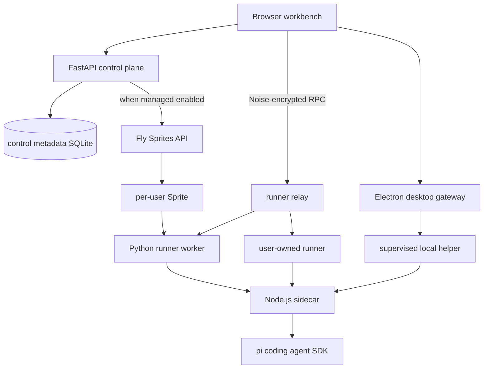
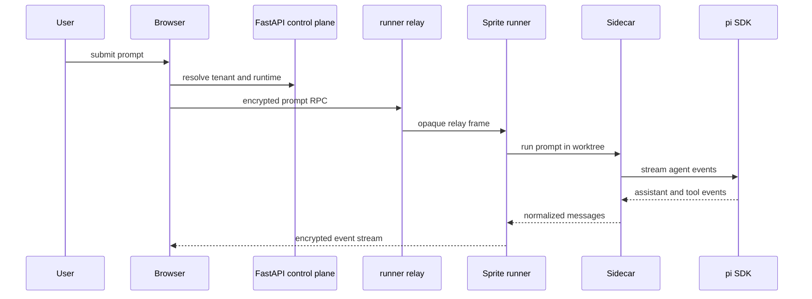
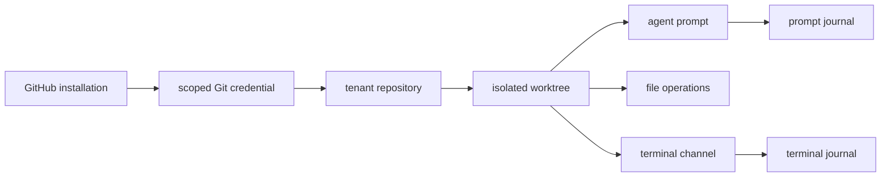
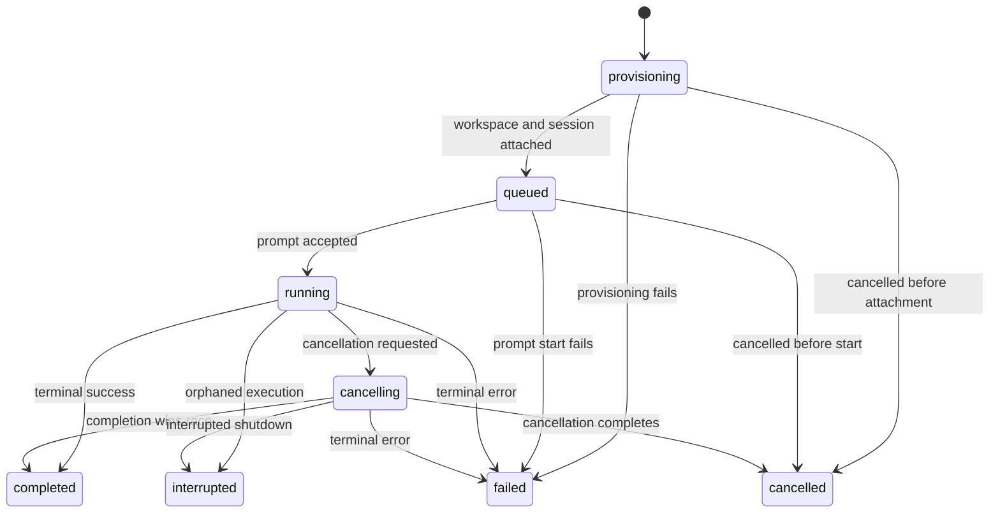

# Introduction

Yinshi turns a Git repository into a browser-accessible workspace for coding agents. A user signs in, binds a GitHub installation or chooses an approved local repository, creates an isolated worktree, and talks to the `pi` coding agent. The same workbench displays streamed messages, changed files, and an interactive terminal.

Hosted and desktop execution share one product contract. The FastAPI control plane owns identity, tenant records, encrypted configuration, managed-runtime state, and policy. Managed hosted work runs inside a per-user Fly Sprite when that provider is enabled; legacy hosted execution and user-owned BYOC runners remain separate supported code paths. Desktop work runs through a supervised local helper. The React frontend selects the runtime, then uses one transport contract for repository, prompt, file, and terminal operations. The Node.js sidecar owns direct `pi` SDK integration inside the selected runtime.


```mermaid
graph TD
    Browser[Browser workbench] --> Control[FastAPI control plane]
    Browser -->|Noise-encrypted RPC| Relay[runner relay]
    Control --> ControlDB[(control metadata SQLite)]
    Control -->|when managed enabled| Provider[Fly Sprites API]
    Provider --> Sprite[per-user Sprite]
    Sprite --> Runner[Python runner worker]
    Relay --> Runner
    Relay --> BYOC[user-owned runner]
    BYOC --> Sidecar
    Runner --> Sidecar[Node.js sidecar]
    Sidecar --> Pi[pi coding agent SDK]
    Browser --> Desktop[Electron desktop gateway]
    Desktop --> Helper[supervised local helper]
    Helper --> Sidecar
```

The browser exposes an authorized workspace terminal, not unrestricted control-plane shell access. Provider settings accept user-supplied credentials; stored secrets and GitHub App private key material are not returned as ordinary settings. Managed and BYOC RPC payloads are encrypted between the browser and runner. Control-plane routes enforce tenant ownership before they issue runtime capabilities. Managed cleanup requires durable ownership records instead of provider-name inference.

This document describes the tracked repository at commit `5e51a03a` on 2026-09-26. It captures 231 nonempty application source files byte-for-byte. Tests, package locks, deployment assets, package metadata, and historical documents are catalogued separately rather than made source-generation targets. Local credentials, databases, caches, dependency directories, and build output are excluded. The existing title, section style, typography, colors, and page-width rules are retained.

The repository is the authority for this refresh. This is not a live deployment audit. A feature present in source, an opt-in setting, a historical test report, and a verified running deployment are different states. The source listings intentionally retain original comments, including older phase labels; the prose describes the current wiring.

## Repository map and reading order

| Area | Responsibility | Start here |
| --- | --- | --- |
| Backend | Identity, tenant storage, control-plane policy, worker APIs and durable execution | `backend/src/yinshi/main.py` |
| Browser | React workbench, runtime-qualified resources, encrypted RPC, chat and thread trees | `frontend/src/App.tsx` |
| Desktop | Electron account boundary, local gateway, helper and sidecar supervision | `desktop/src/main.ts` |
| Sidecar | Pi SDK sessions, provider authorization, Git credentials, PTYs and delegation tools | `sidecar/src/index.js` |
| Deployment | Sprite artifacts/bootstrap and disabled broker/launcher systemd templates | `deploy/` |
| Operations | Storage, recovery, runner protocol and thread contracts | `docs/` |
| Validation | Python, Vitest, Node and Playwright suites; CI and release workflows | `.github/workflows/ci.yml` |
| Publications | Annotated source, mapping, HTML and downloadable editions | `lit/` and `frontend/public/architecture.html` |

Read the request flow and runtime matrix first. Then follow identity and storage into repositories, prompts and delegated work. The later chapters explain managed recovery, transport, desktop and browser adapters. The final reference chapters cover configuration, release tooling, tests, route declarations and every tracked support file.

## Feature status at this revision

| Capability | Source state and limit |
| --- | --- |
| Browser and desktop workbench | Implemented; execution location is selected explicitly. |
| Managed Fly Sprites | Implemented and configuration-gated; provider default is `disabled`, public launch default is `false`. |
| BYOC execution | Registration, pairing, encrypted worker routes and storage profiles are implemented; experimental storage profiles retain their documented restrictions. |
| Manual child threads | Implemented behind `THREAD_HIERARCHY_ENABLED`, default `true`. |
| Agent delegation | Six tools are implemented; `AGENT_DELEGATION_ENABLED` defaults to `false`; default depth is one. |
| Automatic merge or restart retry | Not part of the current delegation contract. Retrying creates a new delegation. |
| Broker/root-launcher isolation | Separate foundation and gated daemons, not the normal application execution path. Privileged effects default off. |
| Workspace replica reconciliation | Offline deterministic policy plus separately implemented artifact/storage components; not an enabled isolation guarantee. |
| Scheduled source-loss recovery workflow | Configuration validation exists, but the checked-in workflow intentionally fails while live staging integration is pending. |

`docs/thread-orchestration.md` records Phase 6 qualification through commit `22b66a93` and defers Phase 7. Those recorded results are historical, not test results from this documentation update. The recent commits `469afcd7`, `b53ba6d6`, and `5e51a03a` respectively preserve managed RPC connections after application errors, allow GitHub API access from managed Sprites, and protect live sidecar socket ownership.

# Request and Runtime Flow

A browser request first resolves identity and runtime mode. Control-plane operations stay on FastAPI. Workspace operations use the selected runtime transport. Managed and BYOC modes send encrypted RPC envelopes through the relay; legacy hosted routes use the authenticated HTTP boundary. Desktop mode sends the same logical request through the local gateway.


```mermaid
sequenceDiagram
    participant User
    participant Browser
    participant Control as FastAPI control plane
    participant Relay as runner relay
    participant Runner as Sprite runner
    participant Sidecar
    participant Pi as pi SDK

    User->>Browser: submit prompt
    Browser->>Control: resolve tenant and runtime
    Browser->>Relay: encrypted prompt RPC
    Relay->>Runner: opaque relay frame
    Runner->>Sidecar: run prompt in worktree
    Sidecar->>Pi: stream agent events
    Pi-->>Sidecar: assistant and tool events
    Sidecar-->>Runner: normalized messages
    Runner-->>Browser: encrypted event stream
```

Repository state follows one ownership chain. GitHub authorization remains in the control plane. A short-lived repository credential reaches only the authorized Git process. Created workspaces use separate worktrees; desktop-linked repositories also have an explicit local ownership path. Runtime journals make prompt and terminal reconnection deterministic.


```mermaid
graph LR
    Install[GitHub installation] --> Credential[scoped Git credential]
    Credential --> Checkout[tenant repository]
    Checkout --> Worktree[isolated worktree]
    Worktree --> Prompt[agent prompt]
    Worktree --> Files[file operations]
    Worktree --> Terminal[terminal channel]
    Prompt --> Journal[prompt journal]
    Terminal --> TJournal[terminal journal]
```

Managed persistence runs independently from request execution. Backup work stops runtime services in a fixed order and creates an encrypted archive. It verifies the remote object version before publication and restart. Recovery uses the archived data-protection key and rejects ambiguous ownership or incomplete inventory.

## Runtime modes and route ownership

`create_app` has three backend modes. These are not interchangeable with the browser runtime labels.

| Backend mode | Mounted API routes | Execution/storage ownership |
| --- | --- | --- |
| `hosted`, managed provider disabled | Control routes and execution routes | Hosted tenant storage and configured sidecar/container runtime |
| `hosted`, `fly_sprites` | Control routes only; staging drill routes require additional gates | Control metadata stays hosted; execution APIs and tenant work move to the selected runner |
| `desktop` | Execution routes with desktop identity middleware | Profile-local helper and local sidecar |
| `worker` | Execution routes behind worker principal validation | Runner-local database and shared-file roots |

Browser runtime references distinguish `local`, `hosted`, `byoc`, and resolved `managed`. Resource IDs preserve that choice: local IDs use `local.<id>`, desktop references to hosted resources use `hosted.<id>`, and BYOC references include an encoded runner qualifier. Bare IDs use the environment's default location. The resolver does not silently redirect an unavailable runner to another location. Managed provisioning is a separate explicit operation with bounded polling.

## One prompt, from admission to reconnect

1. The client resolves the selected runtime and fetches the appropriate repository, workspace, session, provider and model state.
2. Authenticated execution routes validate tenant ownership. Runtime admission and repository locks prevent prompts from entering a checkout during conflicting publication or cleanup.
3. The prompt journal records a durable run and idempotency identity. The coordinator owns the active task; the sidecar receives the workspace, model, credentials and session context needed for that run.
4. Pi emits text, reasoning and tool events. The backend stores bounded event records, while transport adapters provide SSE or encrypted RPC event delivery.
5. Reconnect reads durable run state and cursor-addressed events rather than submitting the prompt again. Cancellation follows the owning run and drains work before resources are released.
6. A terminal observation can finalize a delegated child's Git result. Process restart interrupts orphaned execution; it does not automatically repeat model work.

Prompt journals, terminal journals, Pi session JSONL and browser history caches serve different purposes. Database messages are durable product history. Pi files retain SDK context and compaction state. Terminal channels retain bounded live output and connection ownership. The encrypted browser cache accelerates history reads but is not authoritative storage or a backup.

## Background ownership and shutdown

Startup initializes the appropriate databases and auth providers. Hosted mode obtains a single-process relay lock. Managed startup performs object-store preflight, runtime reconciliation, registry reconciliation, backup-manager startup and the recurring Sprite reconciler. Configured container mode also starts an idle reaper. Runner agents maintain outbound relay connections and heartbeats; desktop supervisors own local child processes.

Shutdown attempts each cleanup even if an earlier cleanup fails: recovery controller, prompt journal, terminal channels, container reaper and containers, managed reconciler, backup manager, runtime manager, provider client and relay lock. Sidecar socket shutdown checks the bound socket's identity before unlinking it; a competing process must not remove a live owner's socket.

Managed backups are independent of prompt completion. They fence maintenance, quiesce runtime services, archive both configured data roots, encrypt and upload, then bind an immutable object version to a durable operation. Restore verifies inventory and database integrity before promotion. Once replacement authority is activated, recovery moves forward and never reactivates the retired source.

# Backend Application Boundary

The backend boundary starts with environment-derived settings, FastAPI startup, shared schemas, and small primitives used by every route. These files make request handling predictable before tenant-specific work begins.


Middleware applies body-size limits, trusted-host and HTTPS policy, response security headers, identity, tenant resolution and request-scoped recovery. The order matters: storage activation follows identity validation, not an anonymous request. `GET /health` is process liveness; `GET /health/managed` returns sanitized operational status and can fail independently. Route inclusion depends on the mode/provider matrix above, so a declared route is not automatically reachable in every process.

## main.py

The application entry point wires middleware, lifespan startup, route registration, and health checks before Uvicorn serves requests. The root chunk below tangles back to `backend/src/yinshi/main.py`.

```python {chunk="backend-src-yinshi-main-py" file="backend/src/yinshi/main.py"}
"""FastAPI application entry point."""

import asyncio
import logging
from collections.abc import AsyncIterator, Awaitable, Callable
from contextlib import asynccontextmanager
from datetime import UTC, datetime, timedelta
from pathlib import Path
from typing import Any, Literal, cast

import httpx
from fastapi import APIRouter, FastAPI, Request, Response
from fastapi.middleware.cors import CORSMiddleware
from slowapi import _rate_limit_exceeded_handler
from slowapi.errors import RateLimitExceeded
from starlette.exceptions import HTTPException as StarletteHTTPException
from starlette.middleware.base import BaseHTTPMiddleware, RequestResponseEndpoint
from starlette.middleware.sessions import SessionMiddleware
from starlette.middleware.trustedhost import TrustedHostMiddleware
from starlette.responses import JSONResponse, RedirectResponse
from starlette.staticfiles import StaticFiles
from starlette.types import ASGIApp, Message, Receive, Scope, Send

from yinshi import db as database_module
from yinshi.api import (
    auth_routes,
    catalog,
    datadog_proxy,
    desktop_devices,
    github,
    managed_recovery_drills,
    managed_runtime,
    prompt_runs,
    repos,
    runner_relay,
    runners,
    runtime_uploads,
    sessions,
    settings,
    stream,
    terminal_channels,
    terminals,
    threads,
    workspace_files,
    workspaces,
)
from yinshi.auth import AuthMiddleware, setup_oauth
from yinshi.config import Settings, get_settings, https_required
from yinshi.db import init_control_db, init_db
from yinshi.managed_recovery_drill_controller import ManagedRecoveryDrillController
from yinshi.managed_recovery_live import ManagedRecoveryLiveRunner
from yinshi.managed_recovery_staging import StagingManagedRecoveryBoundary
from yinshi.rate_limit import limiter
from yinshi.services import managed_operational_failures
from yinshi.services.encrypted_uploads import EncryptedUploadManager
from yinshi.services.managed_backup_manager import ManagedBackupManager
from yinshi.services.managed_backup_store import create_managed_backup_store
from yinshi.services.managed_backups import (
    complete_managed_backup_restore,
    start_managed_backup_deletion,
    start_managed_backup_restore,
)
from yinshi.services.managed_guest_installer import (
    ManagedGuestInstaller as ConcreteManagedGuestInstaller,
)
from yinshi.services.managed_hosted_runtime import HostedManagedRuntime
from yinshi.services.managed_operational_status import collect_managed_operational_status
from yinshi.services.managed_runtime_manager import ManagedRuntimeManager
from yinshi.services.managed_sprite_reconciliation import ManagedSpriteReconciler
from yinshi.services.prompt_journal import PromptJournal
from yinshi.services.relay_process_lock import RelayProcessLock
from yinshi.services.runner_relay import runner_relay_broker
from yinshi.services.sprites import SpritesClient
from yinshi.services.terminal_journal import TerminalJournal
from yinshi.services.thread_orchestration import ThreadOrchestrationService
from yinshi.tenant import TenantContext, TenantDatabaseTemporarilyUnavailable
from yinshi.worker_auth import (
    WorkerPrincipal,
    WorkerPrincipalMiddleware,
    prepare_worker_principal_storage,
)

logging.basicConfig(
    level=logging.INFO,
    format="%(asctime)s - %(name)s - %(levelname)s - %(message)s",
)
logger = logging.getLogger(__name__)

AppMode = Literal["desktop", "hosted", "worker"]

_MAX_BOOTSTRAP_SCRIPT_BYTES = 1024 * 1024
_MANAGED_REGION = "global"


class RequestBodyLimitMiddleware:
    """Reject declared or streamed HTTP bodies above a process-wide limit."""

    def __init__(self, app: ASGIApp, *, body_bytes_max: int) -> None:
        if body_bytes_max <= 0:
            raise ValueError("body_bytes_max must be positive")
        self._app = app
        self._body_bytes_max = body_bytes_max

    async def __call__(self, scope: Scope, receive: Receive, send: Send) -> None:
        if scope["type"] != "http":
            await self._app(scope, receive, send)
            return

        headers = {key.lower(): value for key, value in scope.get("headers", [])}
        content_length = headers.get(b"content-length")
        if content_length is not None:
            try:
                declared_bytes = int(content_length)
            except ValueError:
                await Response(status_code=400)(scope, receive, send)
                return
            if declared_bytes > self._body_bytes_max:
                await Response(status_code=413)(scope, receive, send)
                return

        received_bytes = 0

        async def limited_receive() -> Message:
            nonlocal received_bytes
            message = await receive()
            if message["type"] == "http.request":
                received_bytes += len(message.get("body", b""))
                if received_bytes > self._body_bytes_max:
                    raise _RequestBodyTooLarge
            return message

        try:
            await self._app(scope, limited_receive, send)
        except _RequestBodyTooLarge:
            await Response(status_code=413)(scope, receive, send)


class _RequestBodyTooLarge(Exception):
    """Signal an ASGI receive stream that crossed its configured body limit."""


class DesktopTenantMiddleware:
    """Inject one profile-local identity behind the desktop bootstrap boundary."""

    def __init__(self, application: ASGIApp, *, tenant: TenantContext) -> None:
        if not callable(application):
            raise TypeError("desktop tenant application must be callable")
        if not isinstance(tenant, TenantContext) or not tenant.user_id:
            raise ValueError("desktop tenant must have an identity")
        self._application = application
        self._tenant = tenant

    async def __call__(self, scope: Scope, receive: Receive, send: Send) -> None:
        if scope["type"] in {"http", "websocket"}:
            state = scope.setdefault("state", {})
            state["tenant"] = self._tenant
            state["user_email"] = self._tenant.email
        await self._application(scope, receive, send)


_API_CONTENT_SECURITY_POLICY = "default-src 'none'; frame-ancestors 'none'; base-uri 'none'"
_DESKTOP_CONTENT_SECURITY_POLICY = (
    "default-src 'self'; "
    "script-src 'self' 'wasm-unsafe-eval'; "
    "style-src 'self' 'unsafe-inline'; "
    "img-src 'self' data:; "
    "font-src 'self' data:; "
    "connect-src 'self' https://yinshi.io wss://yinshi.io; "
    "object-src 'none'; "
    "base-uri 'none'; "
    "frame-ancestors 'none'; "
    "form-action 'self'"
)


class ThreadRecoveryMiddleware(BaseHTTPMiddleware):
    """Activate execution storage only after the outer identity middleware passes."""

    async def dispatch(self, request: Request, call_next: RequestResponseEndpoint) -> Response:
        settings = get_settings()
        control_only = (
            request.app.state.mode == "hosted"
            and settings.managed_runtime_provider == "fly_sprites"
        )
        execution_context = request.app.state.mode == "desktop" or isinstance(
            getattr(request.state, "tenant", None),
            TenantContext,
        )
        if request.url.path.startswith("/api/") and execution_context and not control_only:
            try:
                await request.app.state.thread_orchestration.activate(request)
            except Exception:  # noqa: BLE001
                # The boundary returns only a safe availability failure.
                logger.warning("Thread runtime activation is unavailable")
                return JSONResponse(
                    status_code=503,
                    content={"detail": "Execution storage is temporarily unavailable"},
                )
        return await call_next(request)


class SecurityHeadersMiddleware(BaseHTTPMiddleware):
    """Attach browser hardening headers to every HTTP response."""

    def __init__(
        self,
        app: ASGIApp,
        *,
        content_security_policy: str = _API_CONTENT_SECURITY_POLICY,
    ) -> None:
        super().__init__(app)
        if not isinstance(content_security_policy, str):
            raise TypeError("content_security_policy must be a string")
        if not content_security_policy.strip():
            raise ValueError("content_security_policy must not be empty")
        self._content_security_policy = content_security_policy

    async def dispatch(
        self,
        request: Request,
        call_next: Callable[[Request], Awaitable[Response]],
    ) -> Response:
        response = await call_next(request)
        response.headers.setdefault(
            "Content-Security-Policy",
            self._content_security_policy,
        )
        response.headers.setdefault("Referrer-Policy", "no-referrer")
        response.headers.setdefault("X-Content-Type-Options", "nosniff")
        response.headers.setdefault("X-Frame-Options", "DENY")
        response.headers.setdefault(
            "Permissions-Policy",
            "camera=(), geolocation=(), microphone=()",
        )
        return response


class DesktopStaticFiles(StaticFiles):
    """Serve packaged assets and limit SPA fallback to known UI routes."""

    async def get_response(self, path: str, scope: Scope) -> Response:
        try:
            return await super().get_response(path, scope)
        except StarletteHTTPException as error:
            is_spa_route = path == "app" or path.startswith("app/")
            if error.status_code != 404 or not is_spa_route:
                raise
            return await super().get_response("index.html", scope)


class TransportSecurityMiddleware(BaseHTTPMiddleware):
    """Enforce HTTPS and HSTS when production transport hardening is enabled."""

    def __init__(
        self,
        app: ASGIApp,
        *,
        require_https: bool,
        hsts_enabled: bool,
        trusted_proxy_ips: set[str] | None = None,
    ) -> None:
        """Configure transport security behavior from validated settings."""
        super().__init__(app)
        if not isinstance(require_https, bool):
            raise TypeError("require_https must be a boolean")
        if not isinstance(hsts_enabled, bool):
            raise TypeError("hsts_enabled must be a boolean")
        if trusted_proxy_ips is not None and not isinstance(trusted_proxy_ips, set):
            raise TypeError("trusted_proxy_ips must be a set or None")
        self._require_https = require_https
        self._hsts_enabled = hsts_enabled
        self._trusted_proxy_ips = trusted_proxy_ips or set()

    async def dispatch(
        self,
        request: Request,
        call_next: Callable[[Request], Awaitable[Response]],
    ) -> Response:
        """Redirect plaintext requests and attach HSTS to HTTPS responses."""
        request_scheme = request.url.scheme.lower()
        client_host = request.client.host.lower() if request.client is not None else ""
        forwarded_proto = request.headers.get("x-forwarded-proto")
        if forwarded_proto and client_host in self._trusted_proxy_ips:
            request_scheme = forwarded_proto.split(",", maxsplit=1)[0].strip().lower()
        if self._require_https:
            if request_scheme != "https":
                https_url = request.url.replace(scheme="https")
                return RedirectResponse(str(https_url), status_code=307)
        response = await call_next(request)
        if self._hsts_enabled:
            if request_scheme == "https":
                response.headers.setdefault(
                    "Strict-Transport-Security",
                    "max-age=31536000; includeSubDomains",
                )
        return response


def _create_provider_http_client(app_settings: Settings) -> httpx.AsyncClient:
    """Create the dedicated Fly provider HTTP client."""
    return httpx.AsyncClient(
        base_url=app_settings.sprites_api_url,
        follow_redirects=False,
    )


def _create_artifact_http_client() -> httpx.AsyncClient:
    """Create the dedicated immutable artifact HTTP client."""
    return httpx.AsyncClient(follow_redirects=False)


def _read_bounded_bootstrap_script(path: Path) -> bytes:
    """Read one validated bootstrap script without unbounded allocation."""
    with path.open("rb") as script_file:
        bootstrap_script = script_file.read(_MAX_BOOTSTRAP_SCRIPT_BYTES + 1)
    if len(bootstrap_script) > _MAX_BOOTSTRAP_SCRIPT_BYTES:
        raise RuntimeError("Managed bootstrap script exceeds the 1 MiB limit")
    return bootstrap_script


async def _initialize_managed_runtime(
    app_settings: Settings,
) -> HostedManagedRuntime:
    """Build managed Fly services and close resources after partial failures."""
    bootstrap_script = await asyncio.to_thread(
        _read_bounded_bootstrap_script,
        Path(app_settings.sprites_bootstrap_script_path),
    )
    provider_http_client: httpx.AsyncClient | None = None
    artifact_http_client: httpx.AsyncClient | None = None
    manager: ManagedRuntimeManager | None = None
    try:
        provider_http_client = _create_provider_http_client(app_settings)
        artifact_http_client = _create_artifact_http_client()
        api_token = app_settings.sprites_api_token
        name_key = app_settings.sprites_name_key
        if api_token is None or name_key is None:
            raise RuntimeError("Validated managed runtime secrets are unavailable")
        provider = SpritesClient(
            api_token=api_token.get_secret_value(),
            http_client=provider_http_client,
        )
        guest_installer = ConcreteManagedGuestInstaller(
            client=provider,
            bootstrap_script=bootstrap_script,
            bootstrap_timeout_seconds=app_settings.sprites_operation_stale_seconds,
            storage_encryption_confirmed=app_settings.sprites_storage_encryption_confirmed,
            clock=asyncio.get_running_loop().time,
            sleep=asyncio.sleep,
        )
        manager = ManagedRuntimeManager(
            provider=provider,
            guest_installer=guest_installer,
            http_client=artifact_http_client,
            name_prefix=app_settings.sprites_name_prefix,
            name_key=name_key.get_secret_value(),
            artifact_url=app_settings.sprites_artifact_url,
            artifact_sha256=app_settings.sprites_artifact_sha256,
            artifact_version=app_settings.sprites_artifact_sha256,
            allowed_domains=tuple(app_settings.sprites_allowed_domains.split(",")),
            region=_MANAGED_REGION,
            control_url=app_settings.sprites_public_control_url,
            readiness_timeout_seconds=app_settings.sprites_wake_timeout_seconds,
            is_runner_connected=runner_relay_broker.is_runner_connected,
        )
        return HostedManagedRuntime(
            runtime_manager=manager,
            backup_provider=provider,
            inventory_provider=provider,
            provider_http_client=provider_http_client,
        )
    except BaseException:
        try:
            if manager is not None:
                await manager.aclose()
            elif artifact_http_client is not None:
                await artifact_http_client.aclose()
        finally:
            if provider_http_client is not None:
                await provider_http_client.aclose()
        raise


async def _attempt_shutdown_cleanup(
    cleanup: Callable[[], Awaitable[None]],
    first_error: BaseException | None,
) -> BaseException | None:
    """Run one shutdown cleanup and retain the first non-cancellation failure."""
    try:
        await cleanup()
    except asyncio.CancelledError:
        return first_error
    except BaseException as error:
        if first_error is None:
            return error
    return first_error


@asynccontextmanager
async def lifespan(app: FastAPI) -> AsyncIterator[None]:
    """Application startup and shutdown."""
    app_settings = get_settings()
    logger.info("Starting %s", app_settings.app_name)
    if not (app.state.mode == "hosted" and app_settings.managed_runtime_provider == "fly_sprites"):
        init_db()
    init_control_db()
    setup_oauth()

    # Per-user container isolation
    reaper_task: asyncio.Task[None] | None = None
    if app_settings.container_enabled:
        from yinshi.services.container import ContainerManager

        mgr = ContainerManager(settings=app_settings)
        await mgr.initialize()
        app.state.container_manager = mgr
        reaper_task = asyncio.create_task(mgr.run_reaper())
        logger.info("Container isolation enabled (image=%s)", app_settings.container_image)
    else:
        app.state.container_manager = None

    relay_process_lock: RelayProcessLock | None = None
    managed_runtime_manager: ManagedRuntimeManager | None = None
    managed_backup_manager: ManagedBackupManager | None = None
    managed_sprite_reconciler_task: asyncio.Task[None] | None = None
    provider_http_client: httpx.AsyncClient | None = None
    try:
        if app.state.mode == "hosted":
            relay_process_lock = RelayProcessLock(
                Path(app_settings.control_db_path).parent / "relay-process.lock"
            )
            relay_process_lock.acquire()
        if app.state.mode == "hosted" and app_settings.managed_runtime_provider == "fly_sprites":
            managed_backup_store = create_managed_backup_store(app_settings)
            preflight_alert = (
                managed_operational_failures.ManagedPersistentAlertClass.STORAGE_PREFLIGHT_FAILED
            )
            try:
                await managed_backup_store.preflight()
            except Exception:
                managed_operational_failures.record_managed_operational_failure(preflight_alert)
                logger.exception("managed_storage_preflight_failed")
                raise
            managed_operational_failures.clear_managed_operational_failure(preflight_alert)
            managed_runtime = await _initialize_managed_runtime(app_settings)
            managed_runtime_manager = managed_runtime.runtime_manager
            provider_http_client = managed_runtime.provider_http_client
            await managed_runtime_manager.reconcile_startup()
            sprites_name_key = app_settings.sprites_name_key
            if sprites_name_key is None:
                raise RuntimeError("Managed Sprite naming is unavailable")
            restore_name_prefix = f"{app_settings.sprites_name_prefix}-restore"[:30].rstrip("-")
            managed_sprite_reconciler = ManagedSpriteReconciler(
                provider=managed_runtime.inventory_provider,
                name_prefix=app_settings.sprites_name_prefix,
                restore_name_prefix=restore_name_prefix,
                restore_name_key=sprites_name_key.get_secret_value(),
                grace=timedelta(seconds=app_settings.sprites_reconcile_grace_seconds),
            )
            await managed_sprite_reconciler.reconcile_classified(raise_on_failure=True)
            backup_encryption_key = app_settings.backup_encryption_key
            sprites_name_key = app_settings.sprites_name_key
            if backup_encryption_key is None or sprites_name_key is None:
                raise RuntimeError("Managed backup encryption is unavailable")
            managed_backup_manager = ManagedBackupManager(
                provider=managed_runtime.backup_provider,
                store=managed_backup_store,
                relay=runner_relay_broker,
                runtime_service=managed_runtime_manager,
                restore_name_prefix=restore_name_prefix,
                restore_name_key=sprites_name_key.get_secret_value(),
                complete_restore=complete_managed_backup_restore,
                start_restore=start_managed_backup_restore,
                start_deletion=start_managed_backup_deletion,
                wrapping_key=bytes.fromhex(backup_encryption_key.get_secret_value()),
                object_prefix=app_settings.managed_backup_prefix,
                retention_days=app_settings.managed_backup_retention_days,
                staging_root=Path(app_settings.control_db_path).parent / "managed-backup-staging",
            )
            await managed_backup_manager.start()
            managed_sprite_reconciler_task = asyncio.create_task(
                managed_sprite_reconciler.run(
                    interval_seconds=app_settings.sprites_reconcile_interval_seconds
                )
            )
            app.state.managed_backup_store = managed_backup_store
            app.state.managed_backup_manager = managed_backup_manager
            app.state.managed_runtime_manager = managed_runtime_manager
            if app_settings.managed_recovery_drill_enabled:
                recovery_boundary = StagingManagedRecoveryBoundary(
                    runtime_manager=managed_runtime_manager,
                    backup_manager=managed_backup_manager,
                    provider=managed_runtime.backup_provider,
                    store=managed_backup_store,
                )
                await recovery_boundary.recover_retained_cleanup()
                recovery_runner = ManagedRecoveryLiveRunner(boundary=recovery_boundary)
                app.state.managed_recovery_drill_controller = ManagedRecoveryDrillController(
                    run_drill=recovery_runner.run
                )

        if not (
            app.state.mode == "hosted" and app_settings.managed_runtime_provider == "fly_sprites"
        ):
            activation_request = Request(
                {
                    "type": "http",
                    "app": app,
                    "state": {"tenant": app.state.activation_tenant},
                }
            )
            await app.state.thread_orchestration.activate(activation_request)
        yield
    finally:
        cleanup_error: BaseException | None = None
        recovery_controller = getattr(app.state, "managed_recovery_drill_controller", None)
        recovery_close = getattr(recovery_controller, "aclose", None)
        if callable(recovery_close):
            cleanup_error = await _attempt_shutdown_cleanup(
                recovery_close,
                cleanup_error,
            )
        prompt_journal = getattr(app.state, "prompt_journal", None)
        if isinstance(prompt_journal, PromptJournal):
            cleanup_error = await _attempt_shutdown_cleanup(
                prompt_journal.close,
                cleanup_error,
            )
        terminal_journal = getattr(app.state, "terminal_journal", None)
        if isinstance(terminal_journal, TerminalJournal):
            cleanup_error = await _attempt_shutdown_cleanup(
                terminal_journal.close_all,
                cleanup_error,
            )
        if reaper_task is not None:

            async def stop_reaper() -> None:
                reaper_task.cancel()
                await asyncio.gather(reaper_task, return_exceptions=True)

            cleanup_error = await _attempt_shutdown_cleanup(stop_reaper, cleanup_error)
        container_manager = getattr(app.state, "container_manager", None)
        if container_manager is not None:
            cleanup_error = await _attempt_shutdown_cleanup(
                container_manager.destroy_all,
                cleanup_error,
            )
        if managed_sprite_reconciler_task is not None:

            async def stop_managed_sprite_reconciler() -> None:
                managed_sprite_reconciler_task.cancel()
                await asyncio.gather(managed_sprite_reconciler_task, return_exceptions=True)

            cleanup_error = await _attempt_shutdown_cleanup(
                stop_managed_sprite_reconciler,
                cleanup_error,
            )
        if managed_backup_manager is not None:
            cleanup_error = await _attempt_shutdown_cleanup(
                managed_backup_manager.aclose,
                cleanup_error,
            )
        if managed_runtime_manager is not None:
            cleanup_error = await _attempt_shutdown_cleanup(
                managed_runtime_manager.aclose,
                cleanup_error,
            )
        if provider_http_client is not None:
            cleanup_error = await _attempt_shutdown_cleanup(
                provider_http_client.aclose,
                cleanup_error,
            )
        if relay_process_lock is not None:

            async def release_relay_process_lock() -> None:
                relay_process_lock.release()

            cleanup_error = await _attempt_shutdown_cleanup(
                release_relay_process_lock,
                cleanup_error,
            )
        if cleanup_error is not None:
            raise cleanup_error
    logger.info("Shutdown complete")


def _configure_middleware(
    application: FastAPI,
    app_settings: Settings,
    *,
    mode: AppMode,
    worker_principal: WorkerPrincipal | None,
) -> None:
    """Attach the shared hosted middleware stack to one application instance."""
    if not isinstance(application, FastAPI):
        raise TypeError("application must be a FastAPI instance")
    if not isinstance(app_settings, Settings):
        raise TypeError("app_settings must be Settings")

    application.add_middleware(ThreadRecoveryMiddleware)
    if mode == "worker":
        if worker_principal is None:
            raise ValueError("worker mode requires a WorkerPrincipal")
        application.add_middleware(
            RequestBodyLimitMiddleware,
            body_bytes_max=app_settings.request_body_max_bytes,
        )
        application.add_middleware(
            SecurityHeadersMiddleware,
            content_security_policy=_API_CONTENT_SECURITY_POLICY,
        )
        application.add_middleware(
            TrustedHostMiddleware,
            allowed_hosts=app_settings.trusted_host_list,
        )
        application.add_middleware(
            WorkerPrincipalMiddleware,
            principal=worker_principal,
        )
        return

    cors_origins = [app_settings.frontend_url]
    if app_settings.debug and "http://localhost:5173" not in cors_origins:
        cors_origins.append("http://localhost:5173")

    # Middleware order: last registered = outermost = runs first.
    # CORS must remain outermost so preflight responses carry its headers.
    require_https = https_required(app_settings)
    application.add_middleware(
        SessionMiddleware,
        secret_key=app_settings.secret_key,
        https_only=require_https,
        same_site="lax",
    )
    application.add_middleware(AuthMiddleware)
    if mode == "desktop":
        desktop_tenant = TenantContext(
            user_id="desktop-local",
            email="desktop-local@yinshi.invalid",
            data_dir=str(Path(app_settings.user_data_dir).resolve()),
            db_path=str(Path(app_settings.db_path).resolve()),
        )
        application.add_middleware(DesktopTenantMiddleware, tenant=desktop_tenant)
    application.add_middleware(
        TransportSecurityMiddleware,
        require_https=require_https,
        hsts_enabled=app_settings.hsts_enabled and not app_settings.debug,
        trusted_proxy_ips=app_settings.trusted_proxy_ip_set,
    )
    application.add_middleware(
        RequestBodyLimitMiddleware,
        body_bytes_max=app_settings.request_body_max_bytes,
    )
    content_security_policy = _API_CONTENT_SECURITY_POLICY
    if mode == "desktop":
        content_security_policy = _DESKTOP_CONTENT_SECURITY_POLICY
    application.add_middleware(
        SecurityHeadersMiddleware,
        content_security_policy=content_security_policy,
    )
    application.add_middleware(
        TrustedHostMiddleware,
        allowed_hosts=app_settings.trusted_host_list,
    )
    application.add_middleware(
        CORSMiddleware,
        allow_origins=cors_origins,
        allow_credentials=True,
        allow_methods=["GET", "POST", "PATCH", "PUT", "DELETE", "OPTIONS"],
        allow_headers=["Authorization", "Content-Type", "X-Requested-With"],
    )


def _include_routes(
    application: FastAPI,
    app_settings: Settings,
    *,
    mode: AppMode,
) -> None:
    """Attach only the route groups allowed for one application mode."""
    if not isinstance(application, FastAPI):
        raise TypeError("application must be a FastAPI instance")
    if not isinstance(app_settings, Settings):
        raise TypeError("app_settings must be Settings")
    if mode not in ("desktop", "hosted", "worker"):
        raise ValueError(f"Unsupported application mode: {mode}")

    shared_execution_routers: tuple[APIRouter, ...] = (
        auth_routes.provider_router,
        settings.router,
    )
    local_execution_routers: tuple[APIRouter, ...] = (
        catalog.router,
        repos.router,
        workspaces.router,
        workspace_files.router,
        terminals.router,
        terminal_channels.router,
        sessions.router,
        threads.router,
        prompt_runs.router,
        runtime_uploads.router,
        stream.router,
    )
    execution_routers: tuple[APIRouter, ...] = (
        *shared_execution_routers,
        *local_execution_routers,
    )
    control_routers: tuple[APIRouter, ...] = (
        auth_routes.router,
        datadog_proxy.router,
        desktop_devices.router,
        github.router,
        runner_relay.router,
        runners.router,
        managed_runtime.router,
    )
    selected_routers = list(execution_routers)
    if mode == "hosted":
        hosted_execution_routers = execution_routers
        if app_settings.managed_runtime_provider == "fly_sprites":
            hosted_execution_routers = ()
        selected_routers = [*control_routers, *hosted_execution_routers]
    if (
        mode == "hosted"
        and app_settings.managed_runtime_provider == "fly_sprites"
        and getattr(app_settings, "managed_recovery_drill_enabled", False)
        and getattr(app_settings, "deployment_environment", "local") == "staging"
        and bool(getattr(app_settings, "managed_recovery_operator_token_hash", ""))
    ):
        selected_routers.append(managed_recovery_drills.router)
    for router in selected_routers:
        application.include_router(router)


async def health() -> dict[str, str]:
    """Return process liveness without exposing runtime details."""
    return {"status": "ok"}


def managed_health() -> JSONResponse:
    """Return sanitized managed operational health for external monitoring."""
    try:
        settings = get_settings()
        with database_module.get_control_db() as database:
            status = collect_managed_operational_status(
                database,
                now=datetime.now(UTC),
                backup_stale_seconds=86_400,
                operation_stuck_seconds=settings.sprites_operation_stale_seconds,
            )
    except Exception:
        logger.error("managed_operational_health_failed")
        return JSONResponse(status_code=503, content={"status": "critical"})
    if status.alerts:
        return JSONResponse(status_code=503, content={"status": "critical"})
    return JSONResponse(status_code=200, content={"status": "ok"})


async def _temporary_tenant_storage_handler(
    _request: Request,
    _exc: TenantDatabaseTemporarilyUnavailable,
) -> JSONResponse:
    """Return a bounded retryable response without exposing database details."""
    return JSONResponse(
        status_code=503,
        content={"detail": "Tenant storage is temporarily unavailable"},
        headers={"Retry-After": "1"},
    )


def create_app(
    *,
    mode: AppMode = "hosted",
    desktop_asset_dir: str | Path | None = None,
    worker_principal: WorkerPrincipal | None = None,
) -> FastAPI:
    """Build one independently configured Yinshi application mode."""
    if mode not in ("desktop", "hosted", "worker"):
        raise ValueError(f"Unsupported application mode: {mode}")
    if desktop_asset_dir is not None and mode != "desktop":
        raise ValueError("desktop_asset_dir is only valid in desktop mode")
    if mode == "worker" and worker_principal is None:
        raise ValueError("worker mode requires a WorkerPrincipal")
    if mode != "worker" and worker_principal is not None:
        raise ValueError("worker_principal is only valid in worker mode")
    if worker_principal is not None:
        prepare_worker_principal_storage(worker_principal)
    asset_directory: Path | None = None
    if desktop_asset_dir is not None:
        asset_directory = Path(desktop_asset_dir).resolve()
        if not asset_directory.is_dir() or not (asset_directory / "index.html").is_file():
            raise ValueError("desktop_asset_dir must contain index.html")

    app_settings = get_settings()
    if not isinstance(app_settings, Settings):
        raise TypeError("get_settings must return Settings")

    application = FastAPI(
        title="Yinshi",
        lifespan=lifespan,
        docs_url="/docs" if app_settings.debug else None,
        openapi_url="/openapi.json" if app_settings.debug else None,
    )
    application.state.limiter = limiter
    application.state.mode = mode
    application.state.activation_tenant = (
        worker_principal.tenant if worker_principal is not None else None
    )
    application.state.encrypted_upload_manager = EncryptedUploadManager()
    application.state.managed_backup_manager = None
    application.state.managed_backup_store = None
    application.state.managed_runtime_manager = None
    application.state.managed_recovery_drill_controller = None
    application.state.managed_recovery_operator_token_hash = (
        app_settings.managed_recovery_operator_token_hash
    )
    application.state.sprites_public_launch_enabled = (
        mode == "hosted" and app_settings.sprites_public_launch_enabled
    )
    thread_orchestration = ThreadOrchestrationService()
    application.state.thread_orchestration = thread_orchestration
    application.state.prompt_journal = PromptJournal(
        terminal_observer=thread_orchestration.observe_terminal
    )
    application.state.terminal_journal = TerminalJournal()
    application.add_exception_handler(
        RateLimitExceeded,
        cast(Any, _rate_limit_exceeded_handler),
    )
    application.add_exception_handler(
        TenantDatabaseTemporarilyUnavailable,
        cast(Any, _temporary_tenant_storage_handler),
    )
    _configure_middleware(
        application,
        app_settings,
        mode=mode,
        worker_principal=worker_principal,
    )
    _include_routes(application, app_settings, mode=mode)
    application.add_api_route("/health", health, methods=["GET"])
    application.add_api_route("/health/managed", managed_health, methods=["GET"])
    if asset_directory is not None:
        application.mount(
            "/",
            DesktopStaticFiles(directory=str(asset_directory), html=True),
            name="desktop-ui",
        )
    return application


app = create_app()
app_settings = get_settings()


if __name__ == "__main__":
    import uvicorn

    uvicorn.run(app, host=app_settings.host, port=app_settings.port)
```

## config.py

Settings normalize environment variables into one explicit configuration object and fail fast when production safety requirements are missing. The root chunk below tangles back to `backend/src/yinshi/config.py`.

```python {chunk="backend-src-yinshi-config-py" file="backend/src/yinshi/config.py"}
"""Application configuration via environment variables."""

from __future__ import annotations

import ipaddress
import json
import re
import secrets
from functools import lru_cache
from pathlib import Path
from urllib.parse import urlsplit

from pydantic import SecretStr, field_validator, model_validator
from pydantic_settings import BaseSettings

_SECURITY_MODE_VALUES = {"auto", "disabled", "enabled", "required"}
_MANAGED_RUNTIME_PROVIDER_VALUES = {"disabled", "fly_sprites"}
_MANAGED_BACKUP_PROVIDER_VALUES = {"aws_s3", "digitalocean_spaces"}
_DNS_LABEL_PATTERN = re.compile(r"[a-z0-9](?:[a-z0-9-]{0,61}[a-z0-9])?\Z")
_SPRITE_PREFIX_PATTERN = re.compile(r"[a-z0-9](?:[a-z0-9-]{0,28}[a-z0-9])?\Z")
_SHA256_PATTERN = re.compile(r"[0-9a-f]{64}\Z")


def _generate_secret() -> str:
    return secrets.token_hex(32)


def _decode_hex_secret(value: str, name: str) -> bytes:
    """Decode a hex secret and reject values too weak for AES-256 use."""
    if not isinstance(value, str):
        raise TypeError(f"{name} must be a string")
    normalized_value = value.strip()
    if not normalized_value:
        return b""
    try:
        decoded_value = bytes.fromhex(normalized_value)
    except ValueError as exc:
        raise RuntimeError(f"{name} must be a valid hex string: {exc}") from exc
    if len(decoded_value) < 32:
        raise RuntimeError(f"{name} must be at least 32 bytes (64 hex characters)")
    return decoded_value


def _require_https_url(
    value: str,
    name: str,
    *,
    reject_routing_metadata: bool = False,
) -> None:
    """Require a safe absolute HTTPS URL."""
    parsed_url = urlsplit(value)
    try:
        port = parsed_url.port
    except ValueError as exc:
        raise RuntimeError(f"{name} must be a complete HTTPS URL") from exc
    invalid_routing_metadata = reject_routing_metadata and (
        "?" in value or "#" in value or port not in {None, 443}
    )
    if (
        parsed_url.scheme != "https"
        or not parsed_url.hostname
        or parsed_url.username is not None
        or parsed_url.password is not None
        or any(character.isspace() for character in value)
        or invalid_routing_metadata
    ):
        raise RuntimeError(f"{name} must be a complete HTTPS URL")


def _validate_allowed_domains(value: str) -> None:
    """Require unique lowercase public DNS names with optional leading wildcards."""
    if not value:
        return
    if any(character.isspace() for character in value):
        raise RuntimeError("SPRITES_ALLOWED_DOMAINS must not contain whitespace")
    entries = value.split(",")
    if len(entries) != len(set(entries)):
        raise RuntimeError("SPRITES_ALLOWED_DOMAINS must not contain duplicates")
    for entry in entries:
        if entry == "*":
            raise RuntimeError("SPRITES_ALLOWED_DOMAINS must not contain a global wildcard")
        domain = entry[2:] if entry.startswith("*.") else entry
        if "*" in domain:
            raise RuntimeError("SPRITES_ALLOWED_DOMAINS contains an invalid wildcard")
        labels = domain.split(".")
        if (
            len(domain) > 253
            or len(labels) < 2
            or any(_DNS_LABEL_PATTERN.fullmatch(label) is None for label in labels)
            or labels[-1].isdigit()
        ):
            raise RuntimeError("SPRITES_ALLOWED_DOMAINS must contain public DNS names")
        try:
            ipaddress.ip_address(domain)
        except ValueError:
            continue
        raise RuntimeError("SPRITES_ALLOWED_DOMAINS must not contain IP literals")


def _control_domain_is_allowed(control_hostname: str, allowed_domains: str) -> bool:
    """Return whether an allowed-domain entry covers the public control host."""
    for entry in allowed_domains.split(","):
        if entry == control_hostname:
            return True
        if entry.startswith("*.") and control_hostname.endswith(f".{entry[2:]}"):
            return True
    return False


def _normalize_mode(value: str, name: str) -> str:
    """Normalize a security mode value and reject ambiguous configuration."""
    if not isinstance(value, str):
        raise TypeError(f"{name} must be a string")
    normalized_value = value.strip().lower()
    if normalized_value not in _SECURITY_MODE_VALUES:
        allowed_values = ", ".join(sorted(_SECURITY_MODE_VALUES))
        raise RuntimeError(f"{name} must be one of: {allowed_values}")
    return normalized_value


class Settings(BaseSettings):
    """Application settings loaded from .env."""

    app_name: str = "Yinshi"
    debug: bool = False

    # Database (legacy single-DB mode)
    db_path: str = "yinshi.db"

    # Multi-tenant databases
    control_db_path: str = "/var/lib/yinshi/control.db"
    user_data_dir: str = "/var/lib/yinshi/users"

    # Legacy pepper for wrapping per-user DEKs (hex string, 32+ bytes).
    # New deployments should use KEY_ENCRYPTION_KEY so wrapped DEKs carry a key id.
    encryption_pepper: str = ""
    key_encryption_key: str = ""
    key_encryption_key_id: str = "local-v1"
    key_encryption_keys_previous: SecretStr | None = None

    # Middle-ground data protection controls. "auto" enables the control in
    # authenticated non-debug deployments while keeping local tests explicit.
    tenant_db_encryption: str = "auto"
    control_field_encryption: str = "auto"
    user_data_encryption: str = "disabled"

    # Google OAuth
    google_client_id: str = ""
    google_client_secret: str = ""
    google_redirect_uri: str = "http://localhost:8000/auth/callback/google"

    # GitHub OAuth
    github_client_id: str = ""
    github_client_secret: str = ""
    github_redirect_uri: str = "http://localhost:8000/auth/callback/github"
    github_app_id: str = ""
    github_app_private_key_path: str = ""
    github_app_slug: str = ""
    github_app_client_id: str = ""
    github_app_client_secret: SecretStr | None = None
    github_app_user_callback_url: str = ""

    # Session secret for cookies -- generated randomly if not set
    secret_key: str = ""

    # Explicit flag to disable auth (empty google_client_id alone is not enough)
    disable_auth: bool = False

    # Sidecar
    sidecar_socket_path: str = "/tmp/yinshi-sidecar.sock"

    # Pi package update and release-note metadata
    pi_package_name: str = "@earendil-works/pi-coding-agent"
    pi_release_repository: str = "earendil-works/pi"
    # Encrypted database backups
    backup_dir: str = "/var/lib/yinshi/backups"
    backup_encryption_key: SecretStr | None = None

    # CORS
    frontend_url: str = "http://localhost:5173"

    # Server
    host: str = "127.0.0.1"
    port: int = 8000

    # Production transport controls. "auto" requires HTTPS in authenticated
    # non-debug deployments and trusts the edge proxy to provide TLS.
    require_https: str = "auto"
    hsts_enabled: bool = True
    trusted_proxy_ips: str = "127.0.0.1,::1"
    trusted_hosts: str = "localhost,127.0.0.1,[::1]"
    request_body_max_bytes: int = 10 * 1024 * 1024

    # Allowed base directory for local repo imports (empty = reject all local imports)
    allowed_repo_base: str = ""

    # Per-user container isolation
    container_enabled: bool = True
    container_image: str = "yinshi-sidecar:latest"
    container_idle_timeout_s: int = 300
    container_memory_limit: str = "256m"
    container_cpu_quota: int = 50000
    container_pids_limit: int = 256
    container_max_count: int = 10
    container_socket_base: str = "/var/run/yinshi"
    container_mount_mode: str = "narrow"

    # Browser terminal runtime controls
    terminal_keepalive_s: int = 7200
    terminal_scrollback_lines: int = 1000

    # Thread hierarchy limits (docs/thread-orchestration.md)
    thread_hierarchy_enabled: bool = True
    agent_delegation_enabled: bool = False
    thread_max_depth: int = 1
    thread_max_direct_children: int = 4
    thread_max_active_descendants: int = 4
    thread_max_total: int = 20
    thread_max_spawns_per_turn: int = 4
    thread_wait_timeout_seconds_max: int = 60

    # Thread workspace snapshot bounds (docs/thread-orchestration.md)
    thread_snapshot_max_files: int = 20000
    thread_snapshot_max_bytes: int = 1024 * 1024 * 1024

    # Stale provisioning reconciliation threshold (Phase 3). A provisioning
    # reservation untouched for longer than this is interrupted and its
    # staged artifacts are cleaned before the next Phase 3 write.
    thread_provisioning_stale_seconds: int = 600

    @field_validator(
        "thread_max_depth",
        "thread_max_direct_children",
        "thread_max_active_descendants",
        "thread_max_total",
        "thread_max_spawns_per_turn",
        "thread_wait_timeout_seconds_max",
        "thread_snapshot_max_files",
        "thread_snapshot_max_bytes",
        "thread_provisioning_stale_seconds",
    )
    @classmethod
    def _validate_thread_limit_positive(cls, value: int, info: object) -> int:
        """Reject nonpositive thread limits before any tree math runs."""
        field_name = getattr(info, "field_name", "thread limit")
        if value < 1:
            raise ValueError(f"thread {field_name} must be a positive integer")
        return value

    @model_validator(mode="after")
    def _validate_thread_limit_coherence(self) -> "Settings":
        """Keep thread limits inside coherent hard bounds."""
        hard_depth_limit = 32
        if self.thread_max_depth > hard_depth_limit:
            raise ValueError(f"thread thread_max_depth must not exceed {hard_depth_limit}")
        minimum_total = max(
            self.thread_max_direct_children,
            self.thread_max_active_descendants,
        )
        if self.thread_max_total <= minimum_total:
            raise ValueError(
                "thread thread_max_total must allow the direct children and "
                "active descendants limits"
            )
        stale_seconds_limit = 86_400
        if self.thread_provisioning_stale_seconds > stale_seconds_limit:
            raise ValueError(
                "thread thread_provisioning_stale_seconds must not exceed " f"{stale_seconds_limit}"
            )
        return self

    # Managed Fly Sprites runtime
    managed_runtime_provider: str = "disabled"
    sprites_public_launch_enabled: bool = False
    sprites_storage_encryption_confirmed: bool = False
    sprites_api_token: SecretStr | None = None
    sprites_api_url: str = "https://api.sprites.dev/v1"
    sprites_name_prefix: str = "yinshi"
    sprites_name_key: SecretStr | None = None
    sprites_artifact_url: str = ""
    sprites_artifact_sha256: str = ""
    sprites_allowed_domains: str = ""
    sprites_public_control_url: str = ""
    sprites_bootstrap_script_path: str = ""
    sprites_wake_timeout_seconds: int = 30
    sprites_operation_stale_seconds: int = 1800
    sprites_reconcile_interval_seconds: int = 900
    sprites_reconcile_grace_seconds: int = 3600

    # Staging-only destructive recovery control
    deployment_environment: str = "local"
    managed_recovery_drill_enabled: bool = False
    managed_recovery_operator_token_hash: str = ""

    # Independent encrypted managed guest backups
    managed_backup_provider: str = "aws_s3"
    managed_backup_bucket: str = ""
    managed_backup_endpoint_url: str = ""
    managed_backup_region: str = ""
    managed_backup_access_key_id: SecretStr | None = None
    managed_backup_secret_access_key: SecretStr | None = None
    managed_backup_prefix: str = "yinshi-managed-v1"
    managed_backup_part_bytes: int = 16 * 1024 * 1024
    managed_backup_retention_days: int = 30

    model_config = {
        "env_file": ".env",
        "env_file_encoding": "utf-8",
        "case_sensitive": False,
        # The shared dotenv also contains sidecar provider credentials. Ignoring
        # unknown names prevents Pydantic from echoing their values on startup.
        "extra": "ignore",
    }

    @property
    def encryption_pepper_bytes(self) -> bytes:
        """Return the legacy encryption pepper as bytes."""
        return _decode_hex_secret(self.encryption_pepper, "ENCRYPTION_PEPPER")

    @property
    def key_encryption_key_bytes(self) -> bytes:
        """Return the current server-managed KEK bytes."""
        return _decode_hex_secret(self.key_encryption_key, "KEY_ENCRYPTION_KEY")

    @property
    def key_encryption_keyring_previous(self) -> dict[str, bytes]:
        """Return explicitly configured previous KEKs keyed by their stable IDs."""
        if self.key_encryption_keys_previous is None:
            return {}
        raw_keyring = self.key_encryption_keys_previous.get_secret_value().strip()
        if not raw_keyring:
            return {}
        try:
            payload = json.loads(raw_keyring)
        except json.JSONDecodeError as exc:
            raise RuntimeError("KEY_ENCRYPTION_KEYS_PREVIOUS must be a JSON object") from exc
        if not isinstance(payload, dict):
            raise RuntimeError("KEY_ENCRYPTION_KEYS_PREVIOUS must be a JSON object")
        keyring: dict[str, bytes] = {}
        for raw_key_id, raw_key in payload.items():
            if not isinstance(raw_key_id, str) or not raw_key_id.strip():
                raise RuntimeError("Previous key IDs must be non-empty strings")
            if not isinstance(raw_key, str):
                raise RuntimeError("Previous KEK values must be hexadecimal strings")
            key_id = raw_key_id.strip()
            if key_id == self.key_encryption_key_id.strip():
                raise RuntimeError("Previous KEK IDs must differ from KEY_ENCRYPTION_KEY_ID")
            keyring[key_id] = _decode_hex_secret(raw_key, "previous KEK")
        return keyring

    @property
    def active_key_encryption_key_bytes(self) -> bytes:
        """Return the strongest configured key source for envelope encryption."""
        key_encryption_key_bytes = self.key_encryption_key_bytes
        if key_encryption_key_bytes:
            return key_encryption_key_bytes
        return self.encryption_pepper_bytes

    @property
    def tenant_db_encryption_mode(self) -> str:
        """Return the normalized tenant database encryption mode."""
        return _normalize_mode(self.tenant_db_encryption, "TENANT_DB_ENCRYPTION")

    @property
    def control_field_encryption_mode(self) -> str:
        """Return the normalized control-plane field encryption mode."""
        return _normalize_mode(self.control_field_encryption, "CONTROL_FIELD_ENCRYPTION")

    @property
    def user_data_encryption_mode(self) -> str:
        """Return the normalized filesystem encryption enforcement mode."""
        return _normalize_mode(self.user_data_encryption, "USER_DATA_ENCRYPTION")

    @property
    def require_https_mode(self) -> str:
        """Return the normalized HTTPS enforcement mode."""
        return _normalize_mode(self.require_https, "REQUIRE_HTTPS")

    @property
    def trusted_host_list(self) -> list[str]:
        """Return explicit hosts plus the configured frontend hostname."""
        configured_hosts = [
            host.strip().lower() for host in self.trusted_hosts.split(",") if host.strip()
        ]
        frontend_host = urlsplit(self.frontend_url).hostname
        if frontend_host:
            configured_hosts.append(frontend_host.lower())
        return list(dict.fromkeys(configured_hosts))

    @property
    def trusted_proxy_ip_set(self) -> set[str]:
        """Return normalized proxy addresses trusted to set forwarding headers."""
        return {
            address.strip().lower()
            for address in self.trusted_proxy_ips.split(",")
            if address.strip()
        }


def auth_is_enabled(settings: Settings) -> bool:
    """Return whether the operator explicitly enabled authentication."""
    if not isinstance(settings, Settings):
        raise TypeError("settings must be a Settings instance")
    return not settings.disable_auth


def _auth_is_enabled(settings: Settings) -> bool:
    """Backward-compatible wrapper for older internal tests and scripts."""
    return auth_is_enabled(settings)


def _mode_enabled(settings: Settings, mode: str) -> bool:
    """Resolve auto/enabled/required security modes against runtime posture."""
    if mode == "disabled":
        return False
    if mode == "enabled":
        return True
    if mode == "required":
        return True
    assert mode == "auto", "mode must be normalized before resolution"
    return auth_is_enabled(settings) and not settings.debug


def tenant_db_encryption_required(settings: Settings) -> bool:
    """Return whether tenant SQLite databases must use SQLCipher."""
    mode = settings.tenant_db_encryption_mode
    if mode == "enabled":
        return False
    return _mode_enabled(settings, mode)


def tenant_db_encryption_enabled(settings: Settings) -> bool:
    """Return whether tenant SQLite databases should use SQLCipher when possible."""
    return _mode_enabled(settings, settings.tenant_db_encryption_mode)


def control_field_encryption_enabled(settings: Settings) -> bool:
    """Return whether sensitive control-plane fields should be encrypted."""
    return _mode_enabled(settings, settings.control_field_encryption_mode)


def user_data_encryption_required(settings: Settings) -> bool:
    """Return whether user data directories must live on encrypted storage."""
    return _mode_enabled(settings, settings.user_data_encryption_mode)


def https_required(settings: Settings) -> bool:
    """Return whether HTTP requests must be upgraded or rejected in production."""
    mode = settings.require_https_mode
    if mode == "enabled":
        return True
    return _mode_enabled(settings, mode)


def _validate_settings(settings: Settings) -> None:
    """Reject invalid security-critical configuration."""
    if settings.sprites_public_launch_enabled and not settings.sprites_storage_encryption_confirmed:
        raise RuntimeError(
            "SPRITES_PUBLIC_LAUNCH_ENABLED requires " "SPRITES_STORAGE_ENCRYPTION_CONFIRMED=true"
        )
    if (
        settings.sprites_public_launch_enabled
        and settings.managed_runtime_provider != "fly_sprites"
    ):
        raise RuntimeError(
            "SPRITES_PUBLIC_LAUNCH_ENABLED requires MANAGED_RUNTIME_PROVIDER=fly_sprites"
        )
    if settings.managed_runtime_provider not in _MANAGED_RUNTIME_PROVIDER_VALUES:
        allowed_values = ", ".join(sorted(_MANAGED_RUNTIME_PROVIDER_VALUES))
        raise RuntimeError(f"MANAGED_RUNTIME_PROVIDER must be one of: {allowed_values}")
    if settings.managed_backup_provider not in _MANAGED_BACKUP_PROVIDER_VALUES:
        allowed_values = ", ".join(sorted(_MANAGED_BACKUP_PROVIDER_VALUES))
        raise RuntimeError(f"MANAGED_BACKUP_PROVIDER must be one of: {allowed_values}")
    if settings.deployment_environment not in {"local", "staging", "production"}:
        raise RuntimeError("DEPLOYMENT_ENVIRONMENT must be one of: local, production, staging")
    if settings.managed_recovery_drill_enabled:
        if settings.deployment_environment != "staging":
            raise RuntimeError(
                "MANAGED_RECOVERY_DRILL_ENABLED requires DEPLOYMENT_ENVIRONMENT=staging"
            )
        if _SHA256_PATTERN.fullmatch(settings.managed_recovery_operator_token_hash) is None:
            raise RuntimeError(
                "MANAGED_RECOVERY_OPERATOR_TOKEN_HASH must be a lowercase SHA-256 digest"
            )
    if settings.managed_backup_provider == "digitalocean_spaces":
        expected_endpoint = f"https://{settings.managed_backup_region}.digitaloceanspaces.com"
        if settings.managed_backup_endpoint_url != expected_endpoint:
            raise RuntimeError(
                "MANAGED_BACKUP_ENDPOINT_URL must be the DigitalOcean Spaces regional endpoint"
            )
    if settings.managed_runtime_provider == "fly_sprites":
        _require_https_url(
            settings.sprites_api_url,
            "SPRITES_API_URL",
            reject_routing_metadata=True,
        )
        _require_https_url(settings.sprites_artifact_url, "SPRITES_ARTIFACT_URL")
        _require_https_url(
            settings.sprites_public_control_url,
            "SPRITES_PUBLIC_CONTROL_URL",
            reject_routing_metadata=True,
        )
        _validate_allowed_domains(settings.sprites_allowed_domains)
        if _SPRITE_PREFIX_PATTERN.fullmatch(settings.sprites_name_prefix) is None:
            raise RuntimeError(
                "SPRITES_NAME_PREFIX must be a lowercase DNS label of 1 to 30 characters"
            )
        if _SHA256_PATTERN.fullmatch(settings.sprites_artifact_sha256) is None:
            raise RuntimeError(
                "SPRITES_ARTIFACT_SHA256 must be 64 lowercase hexadecimal characters"
            )
        if not 5 <= settings.sprites_wake_timeout_seconds <= 120:
            raise RuntimeError("SPRITES_WAKE_TIMEOUT_SECONDS must be between 5 and 120")
        if not 600 <= settings.sprites_operation_stale_seconds <= 86400:
            raise RuntimeError("SPRITES_OPERATION_STALE_SECONDS must be between 600 and 86400")
        if not 60 <= settings.sprites_reconcile_interval_seconds <= 86400:
            raise RuntimeError("SPRITES_RECONCILE_INTERVAL_SECONDS must be between 60 and 86400")
        if not 300 <= settings.sprites_reconcile_grace_seconds <= 604800:
            raise RuntimeError("SPRITES_RECONCILE_GRACE_SECONDS must be between 300 and 604800")
        if (
            not isinstance(settings.sprites_api_token, SecretStr)
            or not settings.sprites_api_token.get_secret_value().strip()
        ):
            raise RuntimeError("SPRITES_API_TOKEN is required for Fly Sprites")
        if not isinstance(settings.sprites_name_key, SecretStr):
            raise RuntimeError("SPRITES_NAME_KEY is required for Fly Sprites")
        sprites_name_key = settings.sprites_name_key.get_secret_value()
        if not sprites_name_key.strip():
            raise RuntimeError("SPRITES_NAME_KEY is required for Fly Sprites")
        if not settings.sprites_artifact_url:
            raise RuntimeError("SPRITES_ARTIFACT_URL is required for Fly Sprites")
        if not settings.sprites_artifact_sha256:
            raise RuntimeError("SPRITES_ARTIFACT_SHA256 is required for Fly Sprites")
        if not settings.sprites_public_control_url:
            raise RuntimeError("SPRITES_PUBLIC_CONTROL_URL is required for Fly Sprites")
        if settings.container_enabled:
            raise RuntimeError("Fly Sprites mode requires CONTAINER_ENABLED=false")
        if not auth_is_enabled(settings):
            raise RuntimeError("Fly Sprites mode requires AUTH_ENABLED=true")
        if not https_required(settings):
            raise RuntimeError("Fly Sprites mode requires HTTPS enforcement through REQUIRE_HTTPS")
        if settings.control_field_encryption_mode != "required":
            raise RuntimeError("Fly Sprites mode requires CONTROL_FIELD_ENCRYPTION=required")
        if not settings.managed_backup_bucket:
            raise RuntimeError("MANAGED_BACKUP_BUCKET is required for Fly Sprites")
        _require_https_url(
            settings.managed_backup_endpoint_url,
            "MANAGED_BACKUP_ENDPOINT_URL",
            reject_routing_metadata=True,
        )
        if not settings.managed_backup_region.strip():
            raise RuntimeError("MANAGED_BACKUP_REGION is required for Fly Sprites")
        if (
            not settings.managed_backup_prefix
            or len(settings.managed_backup_prefix) > 128
            or any(
                character not in "abcdefghijklmnopqrstuvwxyz0123456789-_/"
                for character in settings.managed_backup_prefix
            )
            or ".." in settings.managed_backup_prefix.split("/")
        ):
            raise RuntimeError("MANAGED_BACKUP_PREFIX is invalid")
        if not 5 * 1024 * 1024 <= settings.managed_backup_part_bytes <= 5 * 1024**3:
            raise RuntimeError("MANAGED_BACKUP_PART_BYTES is outside S3 multipart limits")
        if not 1 <= settings.managed_backup_retention_days <= 3650:
            raise RuntimeError("MANAGED_BACKUP_RETENTION_DAYS must be between 1 and 3650")
        access_key = settings.managed_backup_access_key_id
        secret_key = settings.managed_backup_secret_access_key
        if (access_key is None) != (secret_key is None):
            raise RuntimeError("MANAGED_BACKUP credentials must be configured together")
        if isinstance(access_key, SecretStr) and not access_key.get_secret_value().strip():
            raise RuntimeError("MANAGED_BACKUP credentials must not be blank")
        if isinstance(secret_key, SecretStr) and not secret_key.get_secret_value().strip():
            raise RuntimeError("MANAGED_BACKUP credentials must not be blank")
        if not isinstance(settings.backup_encryption_key, SecretStr):
            raise RuntimeError("BACKUP_ENCRYPTION_KEY is required for Fly Sprites")
        backup_encryption_key = settings.backup_encryption_key.get_secret_value()
        if _SHA256_PATTERN.fullmatch(backup_encryption_key) is None:
            raise RuntimeError("BACKUP_ENCRYPTION_KEY must be 64 lowercase hexadecimal characters")
        control_hostname = urlsplit(settings.sprites_public_control_url).hostname
        if not control_hostname or not _control_domain_is_allowed(
            control_hostname.lower(), settings.sprites_allowed_domains
        ):
            raise RuntimeError("SPRITES_ALLOWED_DOMAINS must cover SPRITES_PUBLIC_CONTROL_URL")
        if len(sprites_name_key.encode("utf-8")) < 32:
            raise RuntimeError("SPRITES_NAME_KEY must contain at least 32 UTF-8 bytes")
        bootstrap_script_path = Path(settings.sprites_bootstrap_script_path)
        if (
            not settings.sprites_bootstrap_script_path.strip()
            or not bootstrap_script_path.is_absolute()
            or not bootstrap_script_path.is_file()
        ):
            raise RuntimeError(
                "SPRITES_BOOTSTRAP_SCRIPT_PATH must be an absolute regular-file path"
            )

    authentication_enabled = auth_is_enabled(settings)
    if not authentication_enabled:
        normalized_host = settings.host.strip().lower()
        if normalized_host not in {"127.0.0.1", "::1", "localhost"}:
            raise RuntimeError("No-auth mode must bind to a loopback host")
        if settings.container_enabled:
            raise RuntimeError("No-auth mode requires CONTAINER_ENABLED=false")
    if authentication_enabled:
        google_configured = bool(settings.google_client_id and settings.google_client_secret)
        github_configured = bool(settings.github_client_id and settings.github_client_secret)
        if not google_configured and not github_configured:
            raise RuntimeError(
                "At least one complete OAuth provider configuration is required when "
                "authentication is enabled"
            )
    if authentication_enabled and not settings.secret_key:
        raise RuntimeError("SECRET_KEY must be set when authentication is enabled")
    if authentication_enabled and len(settings.secret_key.encode("utf-8")) < 32:
        raise RuntimeError("SECRET_KEY must contain at least 32 bytes")
    if authentication_enabled and len(set(settings.secret_key)) < 8:
        raise RuntimeError("SECRET_KEY must contain at least 8 distinct characters")

    settings.encryption_pepper_bytes
    settings.key_encryption_key_bytes
    settings.key_encryption_keyring_previous

    if authentication_enabled:
        if not settings.debug:
            if not settings.active_key_encryption_key_bytes:
                raise RuntimeError(
                    "KEY_ENCRYPTION_KEY or ENCRYPTION_PEPPER must be set when "
                    "authentication is enabled outside debug mode"
                )

    required_key_material_modes: list[str] = []
    if tenant_db_encryption_required(settings):
        required_key_material_modes.append("TENANT_DB_ENCRYPTION")
    if settings.control_field_encryption_mode == "required":
        required_key_material_modes.append("CONTROL_FIELD_ENCRYPTION")
    if required_key_material_modes and not settings.active_key_encryption_key_bytes:
        raise RuntimeError(
            "KEY_ENCRYPTION_KEY or ENCRYPTION_PEPPER must be set when "
            f"{' or '.join(required_key_material_modes)} is required"
        )

    settings.tenant_db_encryption_mode
    settings.control_field_encryption_mode
    settings.user_data_encryption_mode
    settings.require_https_mode

    normalized_key_id = settings.key_encryption_key_id.strip()
    if settings.key_encryption_key_bytes and not normalized_key_id:
        raise RuntimeError("KEY_ENCRYPTION_KEY_ID must not be empty when KEY_ENCRYPTION_KEY is set")
    settings.key_encryption_key_id = normalized_key_id or "local-v1"

    if settings.container_mount_mode not in {"narrow", "tenant-data"}:
        raise RuntimeError("CONTAINER_MOUNT_MODE must be either narrow or tenant-data")
    if settings.terminal_keepalive_s < 300:
        raise RuntimeError("TERMINAL_KEEPALIVE_S must be at least 300 seconds")
    if settings.terminal_scrollback_lines < 100:
        raise RuntimeError("TERMINAL_SCROLLBACK_LINES must be at least 100")
    if settings.request_body_max_bytes < 1024:
        raise RuntimeError("REQUEST_BODY_MAX_BYTES must be at least 1024")
    if not settings.trusted_host_list:
        raise RuntimeError("TRUSTED_HOSTS must configure at least one host")
    if "*" in settings.trusted_host_list:
        raise RuntimeError("TRUSTED_HOSTS must not trust every host")
    settings.trusted_proxy_ip_set


@lru_cache()
def get_settings() -> Settings:
    """Get cached settings instance."""
    settings = Settings()
    _validate_settings(settings)
    if not settings.secret_key:
        settings.secret_key = _generate_secret()
    return settings
```

## models.py

These Pydantic models keep one HTTP contract between the backend and TypeScript client. Device codes exist only while OAuth is active. The root chunk below tangles back to `backend/src/yinshi/models.py`.

```python {chunk="backend-src-yinshi-models-py" file="backend/src/yinshi/models.py"}
"""Pydantic models for API request/response schemas."""

from datetime import datetime
from typing import Annotated, Any, Literal
from urllib.parse import urlsplit

from pydantic import (
    BaseModel,
    ConfigDict,
    Field,
    StringConstraints,
    ValidationInfo,
    field_validator,
    model_validator,
)

from yinshi.model_catalog import DEFAULT_SESSION_MODEL, get_provider_metadata, normalize_model_ref

PI_CONFIG_CATEGORY_ORDER = (
    "skills",
    "extensions",
    "prompts",
    "agents",
    "themes",
    "settings",
    "models",
    "sessions",
    "instructions",
)
PI_CONFIG_CATEGORIES = frozenset(PI_CONFIG_CATEGORY_ORDER)


def _strip_required_text(value: str, message: str) -> str:
    """Trim a required string field and raise the caller's validation message."""
    normalized_value = value.strip()
    if not normalized_value:
        raise ValueError(message)
    return normalized_value


def _strip_optional_text(value: str | None, message: str) -> str | None:
    """Trim an optional string field and reject explicit blank values."""
    if value is None:
        return None
    return _strip_required_text(value, message)


class DesktopAuthorizationRequestIn(BaseModel):
    """Start a PKCE-bound desktop account authorization request."""

    redirect_uri: str = Field(..., min_length=1, max_length=2048)
    code_challenge: str = Field(
        ...,
        min_length=43,
        max_length=43,
        pattern=r"^[A-Za-z0-9_-]+$",
    )
    state: str = Field(
        ...,
        min_length=16,
        max_length=128,
        pattern=r"^[A-Za-z0-9._~-]+$",
    )

    @field_validator("redirect_uri")
    @classmethod
    def validate_loopback_redirect(cls, value: str) -> str:
        """Accept only the desktop helper's exact numbered IPv4 callback."""
        if not isinstance(value, str):
            raise TypeError("redirect_uri must be a string")
        try:
            parsed = urlsplit(value)
            port = parsed.port
        except ValueError as error:
            raise ValueError("redirect_uri must contain a valid port") from error
        if parsed.scheme != "http" or parsed.hostname != "127.0.0.1" or port is None:
            raise ValueError("redirect_uri must use a numbered IPv4 loopback address")
        if parsed.path != "/auth/desktop/callback":
            raise ValueError("redirect_uri must use the desktop callback path")
        if parsed.username or parsed.password or parsed.query or parsed.fragment:
            raise ValueError("redirect_uri must not contain credentials, query, or fragment")
        return value


class DesktopAuthorizationRequestOut(BaseModel):
    """Opaque hosted authorization request returned to a desktop client."""

    request_id: str
    authorize_url: str
    expires_at: datetime


class DesktopRefreshRequestIn(BaseModel):
    """Rotate one current desktop refresh credential."""

    refresh_token: str = Field(..., min_length=32, max_length=256)


class DesktopTokenRequestIn(BaseModel):
    """Exchange one browser-approved code using its original PKCE verifier."""

    authorization_code: str = Field(..., min_length=32, max_length=128)
    code_verifier: str = Field(
        ...,
        min_length=43,
        max_length=128,
        pattern=r"^[A-Za-z0-9._~-]+$",
    )
    device_name: str = Field(..., min_length=1, max_length=120)


class DesktopTokenUserOut(BaseModel):
    """Account identity attached to newly issued desktop credentials."""

    id: str
    email: str


class DesktopTokenOut(BaseModel):
    """Initial credentials and verification material for one desktop device."""

    token_type: Literal["Bearer"] = "Bearer"
    access_token: str
    access_token_expires_at: int
    refresh_token: str
    refresh_token_expires_at: int
    account_lease: str
    account_lease_expires_at: int
    device_id: str
    signing_public_key: str
    user: DesktopTokenUserOut


class RepoCreate(BaseModel):
    """Request to import a repository."""

    name: str = Field(..., max_length=255)
    remote_url: str | None = Field(None, max_length=2048)
    local_path: str | None = Field(None, max_length=4096)
    custom_prompt: str | None = Field(None, max_length=10_000)
    agents_md: str | None = Field(None, max_length=50_000)


class RepoOut(BaseModel):
    """Repository response."""

    id: str
    created_at: datetime
    updated_at: datetime
    name: str
    remote_url: str | None = None
    root_path: str
    custom_prompt: str | None = None
    agents_md: str | None = None


class RepoUpdate(BaseModel):
    """Request to update a repository."""

    name: str | None = Field(None, max_length=255)
    custom_prompt: str | None = Field(None, max_length=10_000)
    agents_md: str | None = Field(None, max_length=50_000)


class WorkspaceCreate(BaseModel):
    """Request to create a worktree workspace."""

    name: str | None = Field(None, max_length=255)


class WorkspaceOut(BaseModel):
    """Workspace response."""

    id: str
    created_at: datetime
    updated_at: datetime
    repo_id: str
    name: str
    branch: str
    path: str
    state: str = "ready"
    kind: str = "primary"
    parent_workspace_id: str | None = None
    delegation_id: str | None = None
    delegation_status: str | None = None


class WorkspaceUpdate(BaseModel):
    """Request to update a workspace."""

    state: str | None = Field(None, pattern=r"^(ready|archived)$")

    @model_validator(mode="before")
    @classmethod
    def reject_explicit_null_state(cls, value: object) -> object:
        """Reject null state while preserving omitted-field semantics."""
        if isinstance(value, dict) and "state" in value and value["state"] is None:
            raise ValueError("state must not be null")
        return value


class SessionCreate(BaseModel):
    """Request to create an agent session."""

    model: str = Field(DEFAULT_SESSION_MODEL, max_length=100)
    title: str | None = Field(None, max_length=500)

    @field_validator("model")
    @classmethod
    def validate_model(cls, value: str) -> str:
        """Normalize session model values to canonical refs."""
        return normalize_model_ref(value)


class SessionUpdate(BaseModel):
    """Request to update a session."""

    model: str | None = Field(None, max_length=100)
    title: str | None = Field(None, max_length=500)

    @field_validator("model")
    @classmethod
    def validate_model(cls, value: str | None) -> str | None:
        """Normalize optional session model values to canonical refs.

        Rejects explicit null so that PATCH cannot write NULL into the
        database, which would break SessionOut deserialization.
        """
        if value is None:
            raise ValueError("model cannot be set to null")
        return normalize_model_ref(value)


class SessionOut(BaseModel):
    """Session response."""

    id: str
    created_at: datetime
    updated_at: datetime
    workspace_id: str
    status: str = "idle"
    model: str = DEFAULT_SESSION_MODEL
    pi_context_version: int = 0
    title: str | None = None


_THREAD_THINKING_LEVELS = ("off", "minimal", "low", "medium", "high", "xhigh")


class ThreadChildCreate(BaseModel):
    """Manual child-thread creation request.

    Tenant, repository, runtime location, branch, ref, path, parent
    workspace, provider credentials, and orchestration capabilities are
    derived by the backend and never accepted from clients.
    """

    model_config = ConfigDict(extra="forbid")

    idempotency_key: str = Field(..., max_length=36)
    title: str = Field(..., min_length=1, max_length=200)
    task: str = Field(..., min_length=1, max_length=20_000)
    context: str | None = Field(None, max_length=20_000)
    role: Literal["general", "research", "implementation", "test", "review", "debug"] = "general"
    model: str | None = Field(None, max_length=200)
    thinking: str | None = Field(None, max_length=20)
    start_immediately: bool = True

    @field_validator("idempotency_key")
    @classmethod
    def validate_idempotency_key(cls, value: str) -> str:
        """Require one canonical UUID so retries cannot alias."""
        import uuid as uuid_module

        try:
            normalized = str(uuid_module.UUID(value))
        except ValueError as exc:
            raise ValueError("idempotency_key must be a UUID") from exc
        if normalized != value:
            raise ValueError("idempotency_key must be canonical")
        return normalized

    @field_validator("thinking")
    @classmethod
    def validate_thinking(cls, value: str | None) -> str | None:
        """Normalize optional thinking values into canonical levels."""
        if value is None:
            return None
        normalized = value.strip().lower()
        if normalized not in _THREAD_THINKING_LEVELS:
            raise ValueError("thinking must be one of " + ", ".join(_THREAD_THINKING_LEVELS))
        return normalized


class ThreadRetryCreate(BaseModel):
    """Retry request for one delegated child thread.

    The retried child keeps its original title, task, context, role, and
    model choices. Only the idempotency key is mandatory; the optional model
    and thinking fields override the stored delegation choices.
    """

    model_config = ConfigDict(extra="forbid")

    idempotency_key: str = Field(..., max_length=36)
    model: str | None = Field(None, max_length=200)
    thinking: str | None = Field(None, max_length=20)

    @field_validator("idempotency_key")
    @classmethod
    def validate_idempotency_key(cls, value: str) -> str:
        """Require one canonical UUID so retries cannot alias."""
        import uuid as uuid_module

        try:
            normalized = str(uuid_module.UUID(value))
        except ValueError as exc:
            raise ValueError("idempotency_key must be a UUID") from exc
        if normalized != value:
            raise ValueError("idempotency_key must be canonical")
        return normalized

    @field_validator("thinking")
    @classmethod
    def validate_thinking(cls, value: str | None) -> str | None:
        """Normalize optional thinking values into canonical levels."""
        if value is None:
            return None
        normalized = value.strip().lower()
        if normalized not in _THREAD_THINKING_LEVELS:
            raise ValueError("thinking must be one of " + ", ".join(_THREAD_THINKING_LEVELS))
        return normalized


ThreadDelegationStatus = Literal[
    "provisioning",
    "queued",
    "running",
    "cancelling",
    "completed",
    "failed",
    "cancelled",
    "interrupted",
]


class ThreadSpawnOut(BaseModel):
    """Stable spawn response for one manual child-thread reservation."""

    delegation_id: str
    status: ThreadDelegationStatus
    child_session_id: str | None = None
    error_code: str | None = None


class ThreadOut(BaseModel):
    """One thread projection over an existing session."""

    id: str
    delegation_id: str | None = None
    parent_id: str | None = None
    root_id: str
    depth: int
    title: str | None = None
    role: str
    origin: str
    state: str
    workspace_id: str
    model: str
    child_count: int
    active_child_count: int
    can_spawn_child: bool
    created_at: datetime


class ThreadPlaceholderOut(BaseModel):
    """A reserved child whose session does not exist yet."""

    delegation_id: str
    parent_id: str
    title: str
    role: str
    status: str
    created_at: datetime


class ThreadTreeOut(BaseModel):
    """The bounded thread tree containing the requested session."""

    root: ThreadOut
    nodes: list[ThreadOut]
    placeholders: list[ThreadPlaceholderOut]
    thread_count: int
    active_descendant_count: int
    tree_depth: int


class ThreadLimitsOut(BaseModel):
    """Configured thread limits plus root-wide usage and allowances."""

    max_depth: int
    max_direct_children: int
    max_active_descendants: int
    max_total_threads: int
    tree_depth: int
    direct_children: int
    active_descendants: int
    total_threads: int
    can_spawn_child: bool


class ThreadResultReportTest(BaseModel):
    """One strict bounded test entry inside a reported thread result."""

    model_config = ConfigDict(extra="forbid")

    command: str = Field(..., max_length=2_000)
    status: Literal["passed", "failed", "skipped"]
    summary: str | None = Field(None, max_length=5_000)


class ThreadResultReportCreate(BaseModel):
    """Strict bounded result report for one delegated child thread."""

    model_config = ConfigDict(extra="forbid")

    expected_version: int = Field(..., ge=0)
    summary: str = Field(..., max_length=20_000)
    tests: list[ThreadResultReportTest] = Field(default_factory=list, max_length=50)
    warnings: list[Annotated[str, StringConstraints(max_length=2_000)]] = Field(
        default_factory=list, max_length=50
    )

    @field_validator("summary")
    @classmethod
    def validate_summary(cls, value: str) -> str:
        """Require one nonblank summary and store it trimmed."""
        return _strip_required_text(value, "summary must not be blank")


class ThreadResultOut(BaseModel):
    """The sealed stored result of a delegated child thread."""

    delegation_id: str
    version: int
    source: str
    sealed: bool
    summary: str | None = None
    tests: list[Any] = Field(default_factory=list)
    warnings: list[Any] = Field(default_factory=list)
    base_commit: str | None = None
    result_commit: str | None = None
    result_ref: str | None = None
    changed_files: list[Any] = Field(default_factory=list)
    created_at: datetime
    updated_at: datetime
    sealed_at: datetime | None = None


class MessageOut(BaseModel):
    """Message response."""

    id: str
    created_at: datetime
    session_id: str
    role: str
    content: str | None = None
    full_message: str | None = None
    turn_id: str | None = None
    turn_status: str | None = None


class MessageHistoryMetadataOut(BaseModel):
    """Message metadata returned without potentially large text fields."""

    id: str
    created_at: datetime
    session_id: str
    role: str
    content_length: int | None
    full_message_length: int | None
    turn_id: str | None = None
    turn_status: str | None = None


class MessageHistoryPageOut(BaseModel):
    """Bounded page of stable message metadata."""

    messages: list[MessageHistoryMetadataOut]
    next_cursor: str | None


class MessageHistoryBundleOut(BaseModel):
    """Bounded compressed page of complete stored messages."""

    model_config = ConfigDict(extra="forbid")

    version: Literal[1]
    encoding: Literal["gzip+base64url"]
    raw_bytes: int = Field(ge=0, le=4 * 1_024 * 1_024)
    message_count: int = Field(ge=0, le=64)
    cursor: str | None = Field(default=None, max_length=128)
    next_cursor: str | None = Field(default=None, max_length=128)
    through: str | None = Field(default=None, max_length=128)
    snapshot: int = Field(ge=0, le=9_007_199_254_740_991)
    snapshot_count: int = Field(ge=0, le=9_007_199_254_740_991)
    snapshot_tail: str | None = Field(default=None, max_length=128)
    active_run_id: str | None = Field(default=None, pattern=r"^[0-9a-f]{32}$")
    data: str = Field(max_length=900_000)


class MessageHistoryFieldChunkOut(BaseModel):
    """Bounded character chunk from one stored message field."""

    value: str
    offset: int
    next_offset: int | None


class WSPrompt(BaseModel):
    """WebSocket message from client to send a prompt."""

    type: str = "prompt"
    prompt: str = Field(..., max_length=100_000)
    model: str | None = Field(None, max_length=100)

    @field_validator("model")
    @classmethod
    def validate_model(cls, value: str | None) -> str | None:
        """Normalize optional prompt model values to canonical refs."""
        if value is None:
            return None
        return normalize_model_ref(value)


class WSCancel(BaseModel):
    """WebSocket message from client to cancel."""

    type: str = "cancel"


# --- Multi-tenant models ---

ByocRunnerStorageProfile = Literal[
    "aws_ebs_s3_files",
    "archil_shared_files",
    "archil_all_posix",
]
RunnerStorageProfile = Literal[
    "aws_ebs_s3_files",
    "archil_shared_files",
    "archil_all_posix",
    "fly_sprites_posix",
]


class UserOut(BaseModel):
    """User account response (from control plane)."""

    id: str
    email: str
    display_name: str | None = None
    avatar_url: str | None = None
    status: str = "active"
    tier: str = "free"


class CloudRunnerCreate(BaseModel):
    """Request a one-time cloud runner registration token."""

    name: str = Field("AWS runner", min_length=1, max_length=120)
    cloud_provider: Literal["aws"] = "aws"
    region: str = Field("us-east-1", min_length=1, max_length=64)
    storage_profile: ByocRunnerStorageProfile = "aws_ebs_s3_files"

    @field_validator("name", "region")
    @classmethod
    def validate_non_blank_text(cls, value: str) -> str:
        """Reject blank runner setup fields after trimming whitespace."""
        return _strip_required_text(value, "Runner setup fields must not be blank")


class CloudRunnerOut(BaseModel):
    """Safe cloud runner status returned to the frontend."""

    id: str
    created_at: datetime
    updated_at: datetime
    name: str
    cloud_provider: str
    region: str
    status: Literal["pending", "online", "offline", "revoked"]
    registered_at: datetime | None = None
    last_heartbeat_at: datetime | None = None
    runner_version: str | None = None
    capabilities: dict[str, Any] = Field(default_factory=dict)
    data_dir: str | None = None
    noise_public_key: str | None = None
    noise_key_fingerprint: str | None = None
    noise_key_confirmed: bool = False


class CloudRunnerRegistrationOut(BaseModel):
    """Cloud runner registration response with the one-time token."""

    runner: CloudRunnerOut
    registration_token: str
    registration_token_expires_at: datetime
    control_url: str
    environment: dict[str, str]


class RunnerRegisterIn(BaseModel):
    """Registration payload submitted by a freshly bootstrapped runner."""

    registration_token: str = Field(..., min_length=32, max_length=512)
    runner_version: str = Field(..., min_length=1, max_length=120)
    capabilities: dict[str, Any] = Field(default_factory=dict)
    data_dir: str = Field(..., min_length=1, max_length=4096)
    sqlite_dir: str | None = Field(None, min_length=1, max_length=4096)
    shared_files_dir: str | None = Field(None, min_length=1, max_length=4096)
    storage_profile: RunnerStorageProfile = "aws_ebs_s3_files"
    noise_public_key: str | None = Field(
        None, min_length=43, max_length=43, pattern=r"^[A-Za-z0-9_-]+$"
    )

    @field_validator("registration_token", "runner_version", "data_dir")
    @classmethod
    def validate_runner_registration_text(cls, value: str) -> str:
        """Reject blank runner registration strings."""
        return _strip_required_text(value, "Runner registration values must not be blank")

    @field_validator("sqlite_dir", "shared_files_dir")
    @classmethod
    def validate_runner_registration_path(cls, value: str | None) -> str | None:
        """Reject blank optional runner storage paths."""
        return _strip_optional_text(value, "Runner storage paths must not be blank")


class RunnerRegisterOut(BaseModel):
    """Registration response containing the runner's bearer token once."""

    runner_id: str
    runner_token: str
    capability_signing_public_key: str
    status: Literal["online"] = "online"


class RunnerNoiseKeyConfirmationIn(BaseModel):
    """Exact runner Noise identity a user has visually confirmed."""

    noise_public_key: str = Field(
        min_length=43,
        max_length=43,
        pattern=r"^[A-Za-z0-9_-]+$",
    )


class RunnerCapabilityCreateIn(BaseModel):
    """Requested least-privilege authority for one encrypted runner session."""

    initiator_public_key: str = Field(
        min_length=43,
        max_length=43,
        pattern=r"^[A-Za-z0-9_-]+$",
    )
    scopes: list[str] = Field(min_length=1, max_length=14)
    max_session_bytes: int = Field(ge=65_536, le=1_073_741_824)

    @field_validator("scopes")
    @classmethod
    def validate_scopes(cls, value: list[str]) -> list[str]:
        """Reject blank or repeated capability scopes before service validation."""
        normalized = [scope.strip() for scope in value]
        if any(not scope for scope in normalized):
            raise ValueError("scopes must not contain blank values")
        if len(set(normalized)) != len(normalized):
            raise ValueError("scopes must not contain duplicates")
        return normalized


class RunnerCapabilityOut(BaseModel):
    """Signed dispatch grant and pinned responder identity for one session."""

    capability: str
    transfer_id: str
    runner_id: str
    runner_public_key: str
    protocol: str
    issued_at: int
    expires_at: int
    max_frame_bytes: int
    max_session_bytes: int
    relay_url: str


class RunnerHeartbeatIn(BaseModel):
    """Heartbeat payload submitted by an already registered runner."""

    runner_version: str = Field(..., min_length=1, max_length=120)
    capabilities: dict[str, Any] = Field(default_factory=dict)
    data_dir: str = Field(..., min_length=1, max_length=4096)
    sqlite_dir: str | None = Field(None, min_length=1, max_length=4096)
    shared_files_dir: str | None = Field(None, min_length=1, max_length=4096)
    storage_profile: RunnerStorageProfile = "aws_ebs_s3_files"

    @field_validator("runner_version", "data_dir")
    @classmethod
    def validate_runner_heartbeat_text(cls, value: str) -> str:
        """Reject blank runner heartbeat strings."""
        return _strip_required_text(value, "Runner heartbeat values must not be blank")

    @field_validator("sqlite_dir", "shared_files_dir")
    @classmethod
    def validate_runner_heartbeat_path(cls, value: str | None) -> str | None:
        """Reject blank optional runner storage paths."""
        return _strip_optional_text(value, "Runner storage paths must not be blank")


class RunnerHeartbeatOut(BaseModel):
    """Heartbeat acknowledgement returned to the runner."""

    runner_id: str
    capability_signing_public_key: str
    status: Literal["online"] = "online"


class RunnerGitHubAccessIn(BaseModel):
    """Request body for runner-initiated GitHub clone access resolution."""

    model_config = ConfigDict(extra="forbid")

    remote_url: str = Field(..., min_length=1, max_length=4096)

    @field_validator("remote_url")
    @classmethod
    def validate_remote_url(cls, value: str) -> str:
        """Reject blank or invalid remote URLs."""
        normalized = value.strip()
        if not normalized:
            raise ValueError("remote_url must not be blank")
        return normalized


class RunnerGitHubAccessOut(BaseModel):
    """Response body for runner GitHub clone access resolution."""

    model_config = ConfigDict(
        extra="forbid",
        strict=True,
        hide_input_in_errors=True,
        from_attributes=True,
    )

    clone_url: str = Field(..., min_length=1, max_length=4096)
    repository_installation_id: int | None = Field(..., gt=0)
    installation_id: int | None = Field(..., gt=0)
    access_token: str | None = Field(
        ...,
        min_length=1,
        max_length=8192,
        repr=False,
    )
    manage_url: str | None = Field(..., min_length=1, max_length=4096)

    @field_validator("clone_url", "access_token", "manage_url")
    @classmethod
    def validate_response_text(cls, value: str | None) -> str | None:
        """Reject blank or padded broker response values."""
        if value is None:
            return None
        if not value.strip() or value != value.strip():
            raise ValueError("Runner GitHub access values must not be blank or padded")
        return value


class RunnerGitHubAccessErrorDetail(BaseModel):
    """Structured GitHub access failure returned to a runner."""

    model_config = ConfigDict(
        extra="forbid",
        strict=True,
        hide_input_in_errors=True,
    )

    code: str = Field(..., min_length=1, max_length=128)
    message: str = Field(..., min_length=1, max_length=2048)
    connect_url: str | None = Field(..., min_length=1, max_length=4096)
    manage_url: str | None = Field(..., min_length=1, max_length=4096)

    @field_validator("code", "message", "connect_url", "manage_url")
    @classmethod
    def validate_error_text(cls, value: str | None) -> str | None:
        """Reject blank or padded broker error values."""
        if value is None:
            return None
        if not value.strip() or value != value.strip():
            raise ValueError("Runner GitHub error values must not be blank or padded")
        return value


class RunnerGitHubAccessErrorOut(BaseModel):
    """Envelope for a structured runner GitHub access failure."""

    model_config = ConfigDict(
        extra="forbid",
        strict=True,
        hide_input_in_errors=True,
    )

    detail: RunnerGitHubAccessErrorDetail


class ProviderSetupFieldOut(BaseModel):
    """Describe one provider setup field to the frontend."""

    key: str
    label: str
    required: bool
    secret: bool = False


class ProviderDescriptorOut(BaseModel):
    """One provider in the catalog response."""

    id: str
    label: str
    auth_strategies: list[str]
    setup_fields: list[ProviderSetupFieldOut]
    docs_url: str
    connected: bool
    model_count: int


class ModelDescriptorOut(BaseModel):
    """One model in the catalog response."""

    ref: str
    provider: str
    id: str
    label: str
    api: str
    reasoning: bool
    thinking_levels: list[str] = Field(default_factory=list)
    inputs: list[str]
    context_window: int
    max_tokens: int


class ProviderCatalogOut(BaseModel):
    """Catalog response for providers and models."""

    default_model: str
    providers: list[ProviderDescriptorOut]
    models: list[ModelDescriptorOut]


class ProviderAuthStartOut(BaseModel):
    """Response returned when a provider OAuth flow starts."""

    flow_id: str
    provider: str
    auth_url: str
    authorization_mode: Literal["browser", "device_code"] = "browser"
    user_code: str | None = None
    instructions: str | None = None
    manual_input_required: bool = False
    manual_input_prompt: str | None = None
    manual_input_submitted: bool = False


class ProviderAuthStatusOut(BaseModel):
    """Status payload for a provider OAuth flow."""

    status: str
    provider: str
    flow_id: str
    authorization_mode: Literal["browser", "device_code"] = "browser"
    user_code: str | None = None
    instructions: str | None = None
    progress: list[str] = Field(default_factory=list)
    manual_input_required: bool = False
    manual_input_prompt: str | None = None
    manual_input_submitted: bool = False
    error: str | None = None


class ProviderAuthInputIn(BaseModel):
    """Manual OAuth input submitted from the browser UI."""

    flow_id: str = Field(..., min_length=1, max_length=255)
    authorization_input: str = Field(..., min_length=1, max_length=8192)

    @field_validator("flow_id")
    @classmethod
    def validate_flow_id(cls, value: str) -> str:
        """Reject blank OAuth flow identifiers."""
        normalized_value = value.strip()
        if not normalized_value:
            raise ValueError("flow_id must not be empty")
        return normalized_value

    @field_validator("authorization_input")
    @classmethod
    def validate_authorization_input(cls, value: str) -> str:
        """Reject blank pasted OAuth callback input."""
        normalized_value = value.strip()
        if not normalized_value:
            raise ValueError("authorization_input must not be empty")
        return normalized_value


class ProviderConnectionCreate(BaseModel):
    """Request to create a provider connection."""

    provider: str = Field(..., min_length=1, max_length=100)
    auth_strategy: str = Field(..., min_length=1, max_length=100)
    secret: str | dict[str, Any]
    label: str = Field("", max_length=255)
    config: dict[str, Any] = Field(default_factory=dict)

    @field_validator("provider")
    @classmethod
    def validate_provider(cls, value: str) -> str:
        """Reject blank providers."""
        normalized_value = value.strip()
        if not normalized_value:
            raise ValueError("Provider must not be empty")
        return normalized_value

    @field_validator("auth_strategy")
    @classmethod
    def validate_auth_strategy(cls, value: str, info: ValidationInfo) -> str:
        """Require one of the provider's supported auth strategies."""
        normalized_value = value.strip()
        if not normalized_value:
            raise ValueError("Auth strategy must not be empty")
        provider = info.data.get("provider")
        if isinstance(provider, str):
            metadata = get_provider_metadata(provider)
            if normalized_value not in metadata.auth_strategies:
                raise ValueError(f"{provider} does not support auth strategy {normalized_value}")
        return normalized_value

    @field_validator("secret")
    @classmethod
    def validate_secret(
        cls,
        value: str | dict[str, Any],
        info: ValidationInfo,
    ) -> str | dict[str, Any]:
        """Match secret shape to the requested auth strategy."""
        auth_strategy = info.data.get("auth_strategy")
        if auth_strategy == "api_key":
            if not isinstance(value, str):
                raise TypeError("API key connections require a string secret")
            normalized_value = value.strip()
            if not normalized_value:
                raise ValueError("API key secret must not be empty")
            return normalized_value
        if auth_strategy == "api_key_with_config":
            if isinstance(value, str):
                normalized_value = value.strip()
                if not normalized_value:
                    raise ValueError("API key secret must not be empty")
                return normalized_value
            if not isinstance(value, dict):
                raise TypeError("API key + config connections require a string or object secret")
            if not value:
                raise ValueError("API key + config secret must not be empty")
            return value
        if auth_strategy == "oauth":
            if not isinstance(value, dict):
                raise TypeError("OAuth connections require an object secret")
            if not value:
                raise ValueError("OAuth secret must not be empty")
            return value
        return value


class ProviderConnectionOut(BaseModel):
    """Provider connection response without the secret payload."""

    id: str
    created_at: datetime
    updated_at: datetime
    provider: str
    auth_strategy: str
    label: str = ""
    config: dict[str, Any] = Field(default_factory=dict)
    status: str
    last_used_at: datetime | None = None
    expires_at: datetime | None = None


class ApiKeyCreate(BaseModel):
    """Compatibility wrapper for legacy API-key endpoints."""

    provider: str = Field(..., min_length=1, max_length=100)
    key: str = Field(..., min_length=1, max_length=500)
    label: str = Field("", max_length=255)


class ApiKeyOut(BaseModel):
    """Compatibility wrapper for legacy API-key responses."""

    id: str
    created_at: datetime
    provider: str
    label: str = ""
    last_used_at: datetime | None = None


class PiConfigImport(BaseModel):
    """Import a Pi config from a GitHub repository."""

    repo_url: str = Field(..., max_length=2048)

    @field_validator("repo_url")
    @classmethod
    def validate_repo_url(cls, value: str) -> str:
        """Reject blank repository URLs."""
        normalized_value = value.strip()
        if not normalized_value:
            raise ValueError("Repository URL must not be empty")
        return normalized_value


class PiConfigCategoryUpdate(BaseModel):
    """Toggle the enabled Pi resource categories."""

    enabled_categories: list[str]

    @field_validator("enabled_categories")
    @classmethod
    def validate_enabled_categories(cls, value: list[str]) -> list[str]:
        """Require unique, known category names."""
        seen_categories: set[str] = set()
        normalized_categories: list[str] = []
        for category in value:
            normalized_category = category.strip()
            if normalized_category not in PI_CONFIG_CATEGORIES:
                raise ValueError(f"Unsupported category: {category}")
            if normalized_category in seen_categories:
                raise ValueError(f"Duplicate category: {category}")
            seen_categories.add(normalized_category)
            normalized_categories.append(normalized_category)
        return normalized_categories


class PiConfigOut(BaseModel):
    """Pi config status response."""

    id: str
    created_at: datetime
    updated_at: datetime
    source_type: str
    source_label: str
    last_synced_at: datetime | None = None
    status: str
    error_message: str | None = None
    available_categories: list[str]
    enabled_categories: list[str]


class PiCommand(BaseModel):
    """One slash command exposed from the user's imported Pi config.

    The ``kind`` discriminator preserves the source of the command so the UI
    can group or style entries, while keeping the wire format flat. Fields
    are the minimum needed to render + invoke the command; host filesystem
    paths and rarely-used metadata are intentionally omitted.
    """

    kind: Literal["skill", "prompt", "extension"]
    name: str
    description: str = ""
    command_name: str


class PiConfigCommandsOut(BaseModel):
    """Slash commands resolved from the imported Pi config.

    See sidecar/src/sidecar.js listResources for the producer side. The
    wire contract is a single flat list; the ``kind`` field on each entry
    distinguishes skills, prompts, and extension-registered commands.
    """

    commands: list[PiCommand] = Field(default_factory=list)


class PiPackageReleaseOut(BaseModel):
    """One upstream pi release note entry."""

    tag_name: str
    version: str
    name: str
    published_at: str | None = None
    html_url: str
    body_markdown: str


class PiReleaseNotesOut(BaseModel):
    """Runtime pi version plus recent upstream release notes."""

    package_name: str
    installed_version: str | None = None
    latest_version: str | None = None
    node_version: str | None = None
    release_notes_url: str
    update_policy: str
    runtime_error: str | None = None
    release_error: str | None = None
    releases: list[PiPackageReleaseOut] = Field(default_factory=list)
```

## model_catalog.py

The model catalog normalizes provider metadata so UI labels, thinking levels, and sidecar requests use the same vocabulary. The root chunk below tangles back to `backend/src/yinshi/model_catalog.py`.

```python {chunk="backend-src-yinshi-model-catalog-py" file="backend/src/yinshi/model_catalog.py"}
"""Shared model and provider catalog helpers."""

from __future__ import annotations

from dataclasses import dataclass

DEFAULT_SESSION_MODEL = "minimax/MiniMax-M2.7"

LEGACY_MODEL_ALIASES = {
    "haiku": "anthropic/claude-haiku-4-5-20251001",
    "minimax": DEFAULT_SESSION_MODEL,
    "minimax-m2.5-highspeed": "minimax/MiniMax-M2.5-highspeed",
    "minimax-m2.7": DEFAULT_SESSION_MODEL,
    "minimax-m2.7-highspeed": "minimax/MiniMax-M2.7-highspeed",
    "opus": "anthropic/claude-opus-4-20250514",
    "sonnet": "anthropic/claude-sonnet-4-20250514",
}


@dataclass(frozen=True, slots=True)
class ProviderSetupField:
    """Describe one provider-specific setup field."""

    key: str
    label: str
    required: bool
    secret: bool = False


@dataclass(frozen=True, slots=True)
class ProviderMetadata:
    """Metadata that Yinshi adds on top of the pi provider registry."""

    id: str
    label: str
    auth_strategies: tuple[str, ...]
    setup_fields: tuple[ProviderSetupField, ...]
    docs_url: str
    supported: bool = True


def _titleize_provider(provider_id: str) -> str:
    """Convert a provider identifier into a readable label."""
    if not isinstance(provider_id, str):
        raise TypeError("provider_id must be a string")
    normalized_provider_id = provider_id.strip()
    if not normalized_provider_id:
        raise ValueError("provider_id must not be empty")
    pieces = normalized_provider_id.replace("-", " ").split()
    return " ".join(piece.upper() if len(piece) <= 3 else piece.capitalize() for piece in pieces)


_COMMON_DOCS_URL = "https://www.npmjs.com/package/@earendil-works/pi-ai"

PROVIDER_METADATA_BY_ID: dict[str, ProviderMetadata] = {
    "anthropic": ProviderMetadata(
        id="anthropic",
        label="Anthropic",
        auth_strategies=("api_key", "oauth"),
        setup_fields=(),
        docs_url=_COMMON_DOCS_URL,
    ),
    "azure-openai-responses": ProviderMetadata(
        id="azure-openai-responses",
        label="Azure OpenAI",
        auth_strategies=("api_key_with_config",),
        setup_fields=(
            ProviderSetupField("baseUrl", "Base URL", False),
            ProviderSetupField("resourceName", "Resource Name", False),
            ProviderSetupField("azureDeploymentName", "Deployment Name", False),
            ProviderSetupField("apiVersion", "API Version", False),
        ),
        docs_url=_COMMON_DOCS_URL,
    ),
    "github-copilot": ProviderMetadata(
        id="github-copilot",
        label="GitHub Copilot",
        auth_strategies=("oauth",),
        setup_fields=(),
        docs_url=_COMMON_DOCS_URL,
    ),
    "google-vertex": ProviderMetadata(
        id="google-vertex",
        label="Google Vertex AI",
        auth_strategies=("api_key",),
        setup_fields=(),
        docs_url=_COMMON_DOCS_URL,
    ),
    "google": ProviderMetadata(
        id="google",
        label="Google",
        auth_strategies=("api_key",),
        setup_fields=(),
        docs_url=_COMMON_DOCS_URL,
    ),
    "google-antigravity": ProviderMetadata(
        id="google-antigravity",
        label="Google Antigravity",
        auth_strategies=("oauth",),
        setup_fields=(),
        docs_url=_COMMON_DOCS_URL,
    ),
    "google-gemini-cli": ProviderMetadata(
        id="google-gemini-cli",
        label="Google Gemini CLI",
        auth_strategies=("oauth",),
        setup_fields=(),
        docs_url=_COMMON_DOCS_URL,
    ),
    "minimax": ProviderMetadata(
        id="minimax",
        label="MiniMax",
        auth_strategies=("api_key",),
        setup_fields=(),
        docs_url=_COMMON_DOCS_URL,
    ),
    "minimax-cn": ProviderMetadata(
        id="minimax-cn",
        label="MiniMax China",
        auth_strategies=("api_key",),
        setup_fields=(),
        docs_url=_COMMON_DOCS_URL,
    ),
    "mistral": ProviderMetadata(
        id="mistral",
        label="Mistral",
        auth_strategies=("api_key",),
        setup_fields=(),
        docs_url=_COMMON_DOCS_URL,
    ),
    "openai": ProviderMetadata(
        id="openai",
        label="OpenAI",
        auth_strategies=("api_key",),
        setup_fields=(),
        docs_url=_COMMON_DOCS_URL,
    ),
    "openai-codex": ProviderMetadata(
        id="openai-codex",
        label="OpenAI Codex",
        auth_strategies=("oauth",),
        setup_fields=(),
        docs_url=_COMMON_DOCS_URL,
    ),
    "openrouter": ProviderMetadata(
        id="openrouter",
        label="OpenRouter",
        auth_strategies=("api_key",),
        setup_fields=(),
        docs_url=_COMMON_DOCS_URL,
    ),
    "opencode": ProviderMetadata(
        id="opencode",
        label="OpenCode Zen",
        auth_strategies=("api_key",),
        setup_fields=(),
        docs_url=_COMMON_DOCS_URL,
    ),
    "opencode-go": ProviderMetadata(
        id="opencode-go",
        label="OpenCode Go",
        auth_strategies=("api_key",),
        setup_fields=(),
        docs_url=_COMMON_DOCS_URL,
    ),
    "vercel-ai-gateway": ProviderMetadata(
        id="vercel-ai-gateway",
        label="Vercel AI Gateway",
        auth_strategies=("api_key",),
        setup_fields=(),
        docs_url=_COMMON_DOCS_URL,
    ),
    "groq": ProviderMetadata(
        id="groq",
        label="Groq",
        auth_strategies=("api_key",),
        setup_fields=(),
        docs_url=_COMMON_DOCS_URL,
    ),
    "cerebras": ProviderMetadata(
        id="cerebras",
        label="Cerebras",
        auth_strategies=("api_key",),
        setup_fields=(),
        docs_url=_COMMON_DOCS_URL,
    ),
    "xai": ProviderMetadata(
        id="xai",
        label="xAI",
        auth_strategies=("api_key",),
        setup_fields=(),
        docs_url=_COMMON_DOCS_URL,
    ),
    "zai": ProviderMetadata(
        id="zai",
        label="ZAI",
        auth_strategies=("api_key",),
        setup_fields=(),
        docs_url=_COMMON_DOCS_URL,
    ),
    "huggingface": ProviderMetadata(
        id="huggingface",
        label="Hugging Face",
        auth_strategies=("api_key",),
        setup_fields=(),
        docs_url=_COMMON_DOCS_URL,
    ),
    "kimi-coding": ProviderMetadata(
        id="kimi-coding",
        label="Kimi Coding",
        auth_strategies=("api_key",),
        setup_fields=(),
        docs_url=_COMMON_DOCS_URL,
    ),
    # Bedrock requires AWS SDK credential resolution rather than the auth.json-style
    # API key path that Yinshi currently supports per session.
    "amazon-bedrock": ProviderMetadata(
        id="amazon-bedrock",
        label="Amazon Bedrock",
        auth_strategies=(),
        setup_fields=(),
        docs_url=_COMMON_DOCS_URL,
        supported=False,
    ),
}


def get_provider_metadata(provider_id: str) -> ProviderMetadata:
    """Return metadata for a provider id, defaulting to unsupported."""
    if not isinstance(provider_id, str):
        raise TypeError("provider_id must be a string")
    normalized_provider_id = provider_id.strip()
    if not normalized_provider_id:
        raise ValueError("provider_id must not be empty")
    metadata = PROVIDER_METADATA_BY_ID.get(normalized_provider_id)
    if metadata is not None:
        return metadata
    return ProviderMetadata(
        id=normalized_provider_id,
        label=_titleize_provider(normalized_provider_id),
        auth_strategies=(),
        setup_fields=(),
        docs_url=_COMMON_DOCS_URL,
        supported=False,
    )


def normalize_model_ref(model: str | None) -> str:
    """Normalize stored or user-provided model values into canonical refs."""
    if model is None:
        return DEFAULT_SESSION_MODEL
    if not isinstance(model, str):
        raise TypeError("model must be a string or None")
    normalized_model = model.strip()
    if not normalized_model:
        raise ValueError("model must not be empty")
    canonical_model = LEGACY_MODEL_ALIASES.get(normalized_model.lower())
    if canonical_model is not None:
        return canonical_model
    return normalized_model
```

## exceptions.py

Domain exceptions give routes and services typed failure modes instead of leaking low-level library errors. The root chunk below tangles back to `backend/src/yinshi/exceptions.py`.

```python {chunk="backend-src-yinshi-exceptions-py" file="backend/src/yinshi/exceptions.py"}
"""Custom exception hierarchy for Yinshi."""


class YinshiError(Exception):
    """Base exception for all Yinshi errors."""


class RepoNotFoundError(YinshiError):
    """Raised when a repository is not found."""


class WorkspaceNotFoundError(YinshiError):
    """Raised when a workspace is not found."""


class WorkspaceHasDelegatedThreads(YinshiError):
    """Raised when deleting a workspace that parents delegated child threads."""


class SessionNotFoundError(YinshiError):
    """Raised when a session is not found."""


class GitError(YinshiError):
    """Raised when a git operation fails."""


class PiConfigError(YinshiError):
    """Raised when Pi config management cannot complete."""


class PiConfigNotFoundError(PiConfigError):
    """Raised when a Pi config record or directory is not available."""


class GitHubAppError(YinshiError):
    """Raised when the GitHub App integration cannot complete."""


class GitHubAccessError(GitHubAppError):
    """Raised when GitHub access cannot be granted for a repository."""

    def __init__(
        self,
        message: str,
        *,
        code: str,
        connect_url: str | None = None,
        manage_url: str | None = None,
    ) -> None:
        assert code, "code must not be empty"
        super().__init__(message)
        self.code = code
        self.connect_url = connect_url
        self.manage_url = manage_url


class GitHubConnectRequiredError(GitHubAccessError):
    """Raised when a user must connect GitHub before importing a repo."""

    def __init__(self, message: str, *, connect_url: str | None = None) -> None:
        super().__init__(
            message,
            code="github_connect_required",
            connect_url=connect_url,
        )


class GitHubAccessNotGrantedError(GitHubAccessError):
    """Raised when an installation exists but cannot access the repo."""

    def __init__(
        self,
        message: str,
        *,
        connect_url: str | None = None,
        manage_url: str | None = None,
    ) -> None:
        super().__init__(
            message,
            code="github_access_not_granted",
            connect_url=connect_url,
            manage_url=manage_url,
        )


class GitHubInstallationUnusableError(GitHubAccessError):
    """Raised when a connected installation is no longer usable."""

    def __init__(self, message: str, *, manage_url: str | None = None) -> None:
        super().__init__(
            message,
            code="github_installation_unusable",
            manage_url=manage_url,
        )


class SidecarError(YinshiError):
    """Raised when sidecar communication fails."""


class SidecarNotConnectedError(SidecarError):
    """Raised when the sidecar is not connected."""


class KeyNotFoundError(YinshiError):
    """Raised when no API key is available for a provider."""


class CreditExhaustedError(YinshiError):
    """Raised when a legacy platform-credit path runs out of allowance."""


class EncryptionNotConfiguredError(YinshiError):
    """Raised when encryption pepper is not configured."""


class ContainerStartError(YinshiError):
    """Raised when a per-user sidecar container fails to start."""


class ContainerNotReadyError(YinshiError):
    """Raised when a container's sidecar socket is not ready in time."""


class RunnerRegistrationError(YinshiError):
    """Raised when a cloud runner registration token cannot be used."""


class RunnerAuthenticationError(YinshiError):
    """Raised when a cloud runner bearer token is missing or invalid."""
```

## rate_limit.py

Rate limiting uses tenant-aware keys so sensitive routes can be throttled without mixing users together. The root chunk below tangles back to `backend/src/yinshi/rate_limit.py`.

```python {chunk="backend-src-yinshi-rate-limit-py" file="backend/src/yinshi/rate_limit.py"}
"""Shared rate-limiting configuration for FastAPI routes."""

from __future__ import annotations

from fastapi import Request
from slowapi import Limiter
from slowapi.util import get_remote_address


def route_rate_limit_key(request: Request) -> str:
    """Return the tenant user id when available, otherwise the client IP."""
    tenant = getattr(request.state, "tenant", None)
    if tenant is not None:
        user_id = getattr(tenant, "user_id", None)
        if isinstance(user_id, str):
            normalized_user_id = user_id.strip()
            if normalized_user_id:
                return normalized_user_id

    client_address = get_remote_address(request)
    if isinstance(client_address, str):
        normalized_client_address = client_address.strip()
        if normalized_client_address:
            return normalized_client_address
    return "unknown-client"


limiter = Limiter(key_func=route_rate_limit_key)
```

## utils/paths.py

Path utilities provide a small, audited primitive for checking containment after path resolution. The root chunk below tangles back to `backend/src/yinshi/utils/paths.py`.

```python {chunk="backend-src-yinshi-utils-paths-py" file="backend/src/yinshi/utils/paths.py"}
"""Shared path utilities for security checks."""

import os


def is_path_inside(path: str, base: str) -> bool:
    """Check if *path* is inside *base* after resolving symlinks.

    Returns True when the resolved *path* equals *base* or is a descendant
    of it.  The check uses ``os.path.realpath`` to resolve symlinks so
    that ``../`` traversal tricks are neutralised.
    """
    resolved = os.path.realpath(path)
    resolved_base = os.path.realpath(base)
    if resolved == resolved_base:
        return True
    if resolved_base == os.sep:
        return resolved.startswith(resolved_base)
    return resolved.startswith(resolved_base + os.sep)
```

## yinshi/\_\_init\_\_.py

Package identity and version for the Python application. The complete source is `backend/src/yinshi/__init__.py`.

```python {chunk="backend-src-yinshi-init-py" file="backend/src/yinshi/__init__.py"}
"""Yinshi -- web-based coding agent orchestrator."""
```

## yinshi/api/\_\_init\_\_.py

Marks the API route package; it does not mount routes or start services. The complete source is `backend/src/yinshi/api/__init__.py`.

```python {chunk="backend-src-yinshi-api-init-py" file="backend/src/yinshi/api/__init__.py"}
"""API package."""
```

## yinshi/services/\_\_init\_\_.py

Marks the service package without creating runtime owners at import time. The complete source is `backend/src/yinshi/services/__init__.py`.

```python {chunk="backend-src-yinshi-services-init-py" file="backend/src/yinshi/services/__init__.py"}
"""Service package."""
```

# Database Layer and Tenancy

Yinshi separates control metadata from execution data. The control schema tracks users, OAuth identities and auth sessions, GitHub installations, desktop devices, runner authority and transfer grants, managed runtime generations, backup operations, archives and operational failures. Tenant schemas hold repositories, workspaces, sessions, messages, prompt runs/events, delegations and results. Provider connections, user settings and Pi configuration are resolved through their location-specific control/settings services rather than assumed to live in every tenant database.

The shared schema version is 7; the user schema version is 3. Migrations preserve existing sessions as roots and add workspace kind/parent fields plus delegation/result tables. Parentage lives in `thread_delegations`, not in a mutable session parent field. Transactions reserve identity and capacity, close before filesystem or network work, then reauthorize before publishing results.

SQLite/SQLCipher files do not contain the entire workspace. Git repositories and worktrees, Pi JSONL, imported files, sockets and operation journals have distinct roots and lifetimes. A database-only backup cannot reconstruct every execution artifact. Runner SQLCipher key derivation and account binding are separate from hosted key wrapping.

## db.py

The database module opens SQLite connections and applies control-plane and tenant schema migrations. The root chunk below tangles back to `backend/src/yinshi/db.py`.

```python {chunk="backend-src-yinshi-db-py" file="backend/src/yinshi/db.py"}
"""SQLite database connection and schema management."""

import importlib
import logging
import os
import sqlite3
import stat
from collections.abc import Iterator
from contextlib import contextmanager
from pathlib import Path
from types import ModuleType
from typing import cast

from yinshi.config import (
    control_field_encryption_enabled,
    get_settings,
    tenant_db_encryption_enabled,
    tenant_db_encryption_required,
)
from yinshi.model_catalog import DEFAULT_SESSION_MODEL

logger = logging.getLogger(__name__)

_SCHEMA_VERSION = 7
_SQLCIPHER_MODULE_NAMES = ("sqlcipher3.dbapi2", "pysqlcipher3.dbapi2")
_PLAINTEXT_ROLLBACK_SUFFIX = ".plaintext.rollback"


class DatabaseEncryptionError(RuntimeError):
    """Raised when a required application database cannot be encrypted or unlocked."""


SCHEMA_SQL = f"""
PRAGMA journal_mode = WAL;

CREATE TABLE IF NOT EXISTS repos (
    id TEXT PRIMARY KEY DEFAULT (lower(hex(randomblob(16)))),
    created_at TIMESTAMP DEFAULT CURRENT_TIMESTAMP NOT NULL,
    updated_at TIMESTAMP DEFAULT CURRENT_TIMESTAMP NOT NULL,
    name TEXT NOT NULL,
    remote_url TEXT,
    root_path TEXT NOT NULL,
    custom_prompt TEXT,
    agents_md TEXT,
    owner_email TEXT,
    installation_id INTEGER
);

CREATE TABLE IF NOT EXISTS workspaces (
    id TEXT PRIMARY KEY DEFAULT (lower(hex(randomblob(16)))),
    created_at TIMESTAMP DEFAULT CURRENT_TIMESTAMP NOT NULL,
    updated_at TIMESTAMP DEFAULT CURRENT_TIMESTAMP NOT NULL,
    repo_id TEXT NOT NULL REFERENCES repos(id) ON DELETE CASCADE,
    name TEXT NOT NULL,
    branch TEXT NOT NULL,
    path TEXT NOT NULL,
    state TEXT DEFAULT 'ready' NOT NULL,
    kind TEXT NOT NULL DEFAULT 'user',
    parent_workspace_id TEXT
);

CREATE TABLE IF NOT EXISTS thread_delegations (
    id TEXT PRIMARY KEY DEFAULT (lower(hex(randomblob(16)))),
    created_at TIMESTAMP DEFAULT CURRENT_TIMESTAMP NOT NULL,
    updated_at TIMESTAMP DEFAULT CURRENT_TIMESTAMP NOT NULL,
    parent_session_id TEXT NOT NULL REFERENCES sessions(id) ON DELETE RESTRICT,
    child_session_id TEXT UNIQUE REFERENCES sessions(id) ON DELETE CASCADE,
    child_workspace_id TEXT REFERENCES workspaces(id) ON DELETE RESTRICT,
    idempotency_key TEXT NOT NULL,
    initiator TEXT NOT NULL CHECK (initiator IN ('user', 'agent')),
    delegated_by_turn_id TEXT,
    delegated_by_run_id TEXT,
    delegated_by_tool_call_id TEXT,
    title TEXT NOT NULL,
    task TEXT NOT NULL,
    context TEXT,
    role TEXT NOT NULL DEFAULT 'general' CHECK (
        role IN ('general', 'research', 'implementation', 'test', 'review', 'debug')
    ),
    requested_model TEXT NOT NULL,
    requested_thinking TEXT,
    status TEXT NOT NULL CHECK (
        status IN (
            'provisioning', 'queued', 'running', 'cancelling',
            'completed', 'failed', 'cancelled', 'interrupted'
        )
    ),
    base_kind TEXT CHECK (base_kind IN ('head', 'snapshot')),
    base_commit TEXT,
    snapshot_ref TEXT,
    error_code TEXT,
    error_detail_safe TEXT,
    started_at TIMESTAMP,
    completed_at TIMESTAMP,
    retry_of_delegation_id TEXT REFERENCES thread_delegations(id),
    UNIQUE (parent_session_id, idempotency_key),
    CHECK (
        child_session_id IS NULL OR child_session_id <> parent_session_id
    )
);

CREATE TABLE IF NOT EXISTS thread_results (
    delegation_id TEXT PRIMARY KEY REFERENCES thread_delegations(id) ON DELETE CASCADE,
    created_at TIMESTAMP DEFAULT CURRENT_TIMESTAMP NOT NULL,
    updated_at TIMESTAMP DEFAULT CURRENT_TIMESTAMP NOT NULL,
    version INTEGER NOT NULL DEFAULT 1,
    source TEXT NOT NULL CHECK (source IN ('reported', 'derived')),
    sealed INTEGER NOT NULL DEFAULT 0 CHECK (sealed IN (0, 1)),
    summary TEXT,
    tests_json TEXT NOT NULL DEFAULT '[]',
    warnings_json TEXT NOT NULL DEFAULT '[]',
    base_commit TEXT,
    result_commit TEXT,
    result_ref TEXT,
    changed_files_json TEXT NOT NULL DEFAULT '[]',
    sealed_at TIMESTAMP
);

CREATE TABLE IF NOT EXISTS sessions (
    id TEXT PRIMARY KEY DEFAULT (lower(hex(randomblob(16)))),
    created_at TIMESTAMP DEFAULT CURRENT_TIMESTAMP NOT NULL,
    updated_at TIMESTAMP DEFAULT CURRENT_TIMESTAMP NOT NULL,
    workspace_id TEXT NOT NULL REFERENCES workspaces(id) ON DELETE CASCADE,
    status TEXT DEFAULT 'idle' NOT NULL,
    model TEXT DEFAULT '{DEFAULT_SESSION_MODEL}',
    pi_context_version INTEGER DEFAULT 1 NOT NULL,
    title TEXT
);

CREATE TABLE IF NOT EXISTS messages (
    id TEXT PRIMARY KEY DEFAULT (lower(hex(randomblob(16)))),
    created_at TIMESTAMP DEFAULT CURRENT_TIMESTAMP NOT NULL,
    session_id TEXT NOT NULL REFERENCES sessions(id) ON DELETE CASCADE,
    role TEXT NOT NULL,
    content TEXT,
    full_message TEXT,
    turn_id TEXT,
    turn_status TEXT
);

CREATE TABLE IF NOT EXISTS prompt_runs (
    id TEXT PRIMARY KEY DEFAULT (lower(hex(randomblob(16)))),
    created_at TIMESTAMP DEFAULT CURRENT_TIMESTAMP NOT NULL,
    updated_at TIMESTAMP DEFAULT CURRENT_TIMESTAMP NOT NULL,
    session_id TEXT NOT NULL REFERENCES sessions(id) ON DELETE CASCADE,
    idempotency_key TEXT NOT NULL,
    status TEXT DEFAULT 'starting' NOT NULL CHECK (
        status IN ('starting', 'running', 'stopping', 'completed', 'failed', 'cancelled', 'interrupted')
    ),
    UNIQUE(session_id, idempotency_key)
);

CREATE TABLE IF NOT EXISTS prompt_events (
    run_id TEXT NOT NULL REFERENCES prompt_runs(id) ON DELETE CASCADE,
    sequence INTEGER NOT NULL CHECK (sequence >= 0),
    event_json TEXT NOT NULL,
    created_at TIMESTAMP DEFAULT CURRENT_TIMESTAMP NOT NULL,
    PRIMARY KEY(run_id, sequence)
);

CREATE UNIQUE INDEX IF NOT EXISTS idx_prompt_runs_active_session
    ON prompt_runs(session_id)
    WHERE status IN ('starting', 'running', 'stopping');
CREATE INDEX IF NOT EXISTS idx_prompt_events_run
    ON prompt_events(run_id, sequence);
CREATE INDEX IF NOT EXISTS idx_messages_session ON messages(session_id, created_at);
CREATE INDEX IF NOT EXISTS idx_messages_turn_id ON messages(turn_id);
CREATE INDEX IF NOT EXISTS idx_sessions_workspace ON sessions(workspace_id);
CREATE INDEX IF NOT EXISTS idx_workspaces_repo ON workspaces(repo_id);
CREATE INDEX IF NOT EXISTS idx_thread_delegations_parent
    ON thread_delegations(parent_session_id, created_at);
CREATE INDEX IF NOT EXISTS idx_thread_delegations_child
    ON thread_delegations(child_session_id);
CREATE INDEX IF NOT EXISTS idx_thread_delegations_status
    ON thread_delegations(status, updated_at);

CREATE TRIGGER IF NOT EXISTS update_repos_updated_at AFTER UPDATE ON repos
BEGIN UPDATE repos SET updated_at = CURRENT_TIMESTAMP WHERE id = NEW.id; END;

CREATE TRIGGER IF NOT EXISTS update_workspaces_updated_at AFTER UPDATE ON workspaces
BEGIN UPDATE workspaces SET updated_at = CURRENT_TIMESTAMP WHERE id = NEW.id; END;

CREATE TRIGGER IF NOT EXISTS update_sessions_updated_at AFTER UPDATE ON sessions
BEGIN UPDATE sessions SET updated_at = CURRENT_TIMESTAMP WHERE id = NEW.id; END;
"""

THREAD_SCHEMA_SQL = """
CREATE TABLE IF NOT EXISTS thread_delegations (
    id TEXT PRIMARY KEY DEFAULT (lower(hex(randomblob(16)))),
    created_at TIMESTAMP DEFAULT CURRENT_TIMESTAMP NOT NULL,
    updated_at TIMESTAMP DEFAULT CURRENT_TIMESTAMP NOT NULL,
    parent_session_id TEXT NOT NULL REFERENCES sessions(id) ON DELETE RESTRICT,
    child_session_id TEXT UNIQUE REFERENCES sessions(id) ON DELETE CASCADE,
    child_workspace_id TEXT REFERENCES workspaces(id) ON DELETE RESTRICT,
    idempotency_key TEXT NOT NULL,
    initiator TEXT NOT NULL CHECK (initiator IN ('user', 'agent')),
    delegated_by_turn_id TEXT,
    delegated_by_run_id TEXT,
    delegated_by_tool_call_id TEXT,
    title TEXT NOT NULL,
    task TEXT NOT NULL,
    context TEXT,
    role TEXT NOT NULL DEFAULT 'general' CHECK (
        role IN ('general', 'research', 'implementation', 'test', 'review', 'debug')
    ),
    requested_model TEXT NOT NULL,
    requested_thinking TEXT,
    status TEXT NOT NULL CHECK (
        status IN (
            'provisioning', 'queued', 'running', 'cancelling',
            'completed', 'failed', 'cancelled', 'interrupted'
        )
    ),
    base_kind TEXT CHECK (base_kind IN ('head', 'snapshot')),
    base_commit TEXT,
    snapshot_ref TEXT,
    error_code TEXT,
    error_detail_safe TEXT,
    started_at TIMESTAMP,
    completed_at TIMESTAMP,
    retry_of_delegation_id TEXT REFERENCES thread_delegations(id),
    UNIQUE (parent_session_id, idempotency_key),
    CHECK (
        child_session_id IS NULL OR child_session_id <> parent_session_id
    )
);

CREATE TABLE IF NOT EXISTS thread_results (
    delegation_id TEXT PRIMARY KEY REFERENCES thread_delegations(id) ON DELETE CASCADE,
    created_at TIMESTAMP DEFAULT CURRENT_TIMESTAMP NOT NULL,
    updated_at TIMESTAMP DEFAULT CURRENT_TIMESTAMP NOT NULL,
    version INTEGER NOT NULL DEFAULT 1,
    source TEXT NOT NULL CHECK (source IN ('reported', 'derived')),
    sealed INTEGER NOT NULL DEFAULT 0 CHECK (sealed IN (0, 1)),
    summary TEXT,
    tests_json TEXT NOT NULL DEFAULT '[]',
    warnings_json TEXT NOT NULL DEFAULT '[]',
    base_commit TEXT,
    result_commit TEXT,
    result_ref TEXT,
    changed_files_json TEXT NOT NULL DEFAULT '[]',
    sealed_at TIMESTAMP
);

CREATE INDEX IF NOT EXISTS idx_thread_delegations_parent
    ON thread_delegations(parent_session_id, created_at);
CREATE INDEX IF NOT EXISTS idx_thread_delegations_child
    ON thread_delegations(child_session_id);
CREATE INDEX IF NOT EXISTS idx_thread_delegations_status
    ON thread_delegations(status, updated_at);
CREATE INDEX IF NOT EXISTS idx_workspaces_kind ON workspaces(kind, repo_id);
"""


def _open_connection(db_path: str, *, check_same_thread: bool = True) -> sqlite3.Connection:
    """Open a SQLite connection with standard settings."""
    conn = sqlite3.connect(db_path, check_same_thread=check_same_thread)
    conn.row_factory = sqlite3.Row
    conn.execute("PRAGMA foreign_keys = ON")
    conn.execute("PRAGMA busy_timeout = 5000")
    return conn


def _load_sqlcipher_module() -> ModuleType:
    """Load a compatible SQLCipher DB-API driver or raise a sanitized error."""
    for module_name in _SQLCIPHER_MODULE_NAMES:
        try:
            module = importlib.import_module(module_name)
        except ImportError:
            continue
        if hasattr(module, "connect") and hasattr(module, "Row"):
            return module
    raise DatabaseEncryptionError("SQLCipher is unavailable for required database encryption")


def _application_database_key(*, context: str) -> bytes:
    """Derive one database key from the configured Keychain-injected pepper."""
    if context not in {"control", "local"}:
        raise ValueError("database key context is invalid")
    from yinshi.services.crypto import derive_subkey

    settings = get_settings()
    return derive_subkey(
        settings.encryption_pepper_bytes,
        purpose="application-sqlcipher",
        context=context,
    )


def _sqlcipher_error_type(sqlcipher_module: ModuleType) -> type[Exception]:
    """Return a safe exception class exported by one SQLCipher driver."""
    database_error = getattr(sqlcipher_module, "DatabaseError", sqlite3.DatabaseError)
    if not isinstance(database_error, type) or not issubclass(database_error, Exception):
        return sqlite3.DatabaseError
    return database_error


def _open_keyed_connection(
    db_path: str,
    *,
    sqlcipher_module: ModuleType,
    database_key: bytes,
) -> sqlite3.Connection:
    """Open and immediately validate one SQLCipher database with an exact key."""
    if len(database_key) != 32:
        raise ValueError("database_key must contain 32 bytes")
    Path(db_path).parent.mkdir(parents=True, exist_ok=True)
    connection = cast(sqlite3.Connection, sqlcipher_module.connect(db_path))
    connection.row_factory = getattr(sqlcipher_module, "Row")
    connection.execute(f"PRAGMA key = \"x'{database_key.hex()}'\"")  # noqa: S608
    connection.execute("PRAGMA cipher_memory_security = ON")
    connection.execute("PRAGMA foreign_keys = ON")
    connection.execute("PRAGMA busy_timeout = 5000")
    try:
        cipher_version = connection.execute("PRAGMA cipher_version").fetchone()
        connection.execute("SELECT count(*) FROM sqlite_master").fetchone()
    except (sqlite3.DatabaseError, _sqlcipher_error_type(sqlcipher_module)) as error:
        connection.close()
        raise DatabaseEncryptionError("Application database could not be unlocked") from error
    if cipher_version is None or not cipher_version[0]:
        connection.close()
        raise DatabaseEncryptionError("SQLCipher driver did not report a cipher version")
    os.chmod(db_path, 0o600)
    return connection


def _plaintext_database_readable(db_path: str) -> bool:
    """Return whether an existing application database is plaintext SQLite."""
    if not os.path.isfile(db_path):
        return False
    try:
        connection = _open_connection(db_path)
        try:
            connection.execute("SELECT count(*) FROM sqlite_master").fetchone()
            return True
        finally:
            connection.close()
    except sqlite3.DatabaseError:
        return False


def _validate_encrypted_database(
    db_path: str,
    *,
    sqlcipher_module: ModuleType,
    database_key: bytes,
) -> None:
    """Require an encrypted database to open and pass SQLCipher integrity checks."""
    connection = _open_keyed_connection(
        db_path,
        sqlcipher_module=sqlcipher_module,
        database_key=database_key,
    )
    try:
        integrity = connection.execute("PRAGMA integrity_check").fetchone()
        if integrity is None or str(integrity[0]).lower() != "ok":
            raise DatabaseEncryptionError(
                "Encrypted application database failed integrity validation"
            )
    finally:
        connection.close()


def _fsync_file(path: str) -> None:
    """Flush one regular file through its filesystem."""
    flags = os.O_RDONLY | getattr(os, "O_CLOEXEC", 0)
    descriptor = os.open(path, flags)
    try:
        os.fsync(descriptor)
    finally:
        os.close(descriptor)


def _fsync_parent_directory(path: str) -> None:
    """Flush directory entries for one filesystem path."""
    parent_path = os.path.dirname(os.path.abspath(path))
    flags = os.O_RDONLY | getattr(os, "O_CLOEXEC", 0)
    flags |= getattr(os, "O_DIRECTORY", 0)
    descriptor = os.open(parent_path, flags)
    try:
        os.fsync(descriptor)
    finally:
        os.close(descriptor)


def _create_private_rollback_copy(source_path: str, rollback_path: str) -> None:
    """Copy a plaintext database into a new owner-only rollback file."""
    flags = os.O_WRONLY | os.O_CREAT | os.O_EXCL
    flags |= getattr(os, "O_CLOEXEC", 0)
    flags |= getattr(os, "O_NOFOLLOW", 0)
    descriptor = os.open(rollback_path, flags, 0o600)
    try:
        with open(source_path, "rb") as source, os.fdopen(descriptor, "wb") as rollback:
            descriptor = -1
            while chunk := source.read(1024 * 1024):
                rollback.write(chunk)
            rollback.flush()
            os.fchmod(rollback.fileno(), 0o600)
    except Exception:
        if descriptor >= 0:
            os.close(descriptor)
        if os.path.exists(rollback_path):
            os.unlink(rollback_path)
        raise


def _remove_sqlite_sidecars(db_path: str) -> None:
    """Remove checkpointed WAL files and durably record their removal."""
    removed = False
    for suffix in ("-wal", "-shm"):
        sidecar_path = f"{db_path}{suffix}"
        if os.path.exists(sidecar_path):
            os.unlink(sidecar_path)
            removed = True
    if removed:
        _fsync_parent_directory(db_path)


def _application_rollback_is_trusted(descriptor: int, rollback_path: str) -> bool:
    """Return whether an open rollback still names one private owner-controlled file."""
    opened_stat = os.fstat(descriptor)
    try:
        path_stat = os.lstat(rollback_path)
    except FileNotFoundError:
        return False
    return (
        stat.S_ISREG(opened_stat.st_mode)
        and stat.S_ISREG(path_stat.st_mode)
        and not stat.S_ISLNK(path_stat.st_mode)
        and (opened_stat.st_dev, opened_stat.st_ino) == (path_stat.st_dev, path_stat.st_ino)
        and opened_stat.st_uid == os.geteuid()
        and opened_stat.st_nlink == 1
        and opened_stat.st_mode & 0o077 == 0
    )


def _open_trusted_application_rollback(rollback_path: str) -> int | None:
    """Open and validate an application rollback without following links."""
    flags = os.O_RDONLY | getattr(os, "O_CLOEXEC", 0)
    flags |= getattr(os, "O_NOFOLLOW", 0)
    flags |= getattr(os, "O_NONBLOCK", 0)
    try:
        descriptor = os.open(rollback_path, flags)
    except FileNotFoundError:
        return None
    except OSError as exc:
        raise DatabaseEncryptionError(
            "Application database migration rollback must be a trusted regular file"
        ) from exc
    if _application_rollback_is_trusted(descriptor, rollback_path):
        return descriptor
    os.close(descriptor)
    raise DatabaseEncryptionError(
        "Application database migration rollback must be a trusted regular file"
    )


def _recover_plaintext_migration_rollback(db_path: str) -> None:
    """Restore a durable rollback when an interrupted replacement lost its primary."""
    rollback_path = f"{db_path}{_PLAINTEXT_ROLLBACK_SUFFIX}"
    if os.path.lexists(db_path):
        return
    descriptor = _open_trusted_application_rollback(rollback_path)
    if descriptor is None:
        return
    try:
        os.fsync(descriptor)
        if os.path.lexists(db_path):
            return
        if not _application_rollback_is_trusted(descriptor, rollback_path):
            raise DatabaseEncryptionError(
                "Application database migration rollback must be a trusted regular file"
            )
        os.replace(rollback_path, db_path)
        os.chmod(db_path, 0o600)
        _fsync_file(db_path)
        _fsync_parent_directory(db_path)
    finally:
        os.close(descriptor)
    logger.warning("Recovered an interrupted application database migration")


def _remove_validated_migration_rollback(db_path: str) -> None:
    """Remove rollback only after the validated primary is durable."""
    rollback_path = f"{db_path}{_PLAINTEXT_ROLLBACK_SUFFIX}"
    if not os.path.exists(rollback_path):
        return
    _fsync_file(db_path)
    _fsync_parent_directory(db_path)
    os.unlink(rollback_path)
    _fsync_parent_directory(db_path)


def _migrate_plaintext_application_database(
    db_path: str,
    *,
    sqlcipher_module: ModuleType,
    database_key: bytes,
) -> None:
    """Export plaintext SQLite into SQLCipher and atomically replace the original."""
    temporary_path = f"{db_path}.encrypted.tmp"
    rollback_path = f"{db_path}{_PLAINTEXT_ROLLBACK_SUFFIX}"
    for path in (temporary_path, f"{temporary_path}-wal", f"{temporary_path}-shm"):
        if os.path.exists(path):
            os.unlink(path)

    if os.path.exists(rollback_path):
        _fsync_file(db_path)
        _fsync_parent_directory(db_path)
        os.unlink(rollback_path)
        _fsync_parent_directory(db_path)

    source = cast(sqlite3.Connection, sqlcipher_module.connect(db_path))
    try:
        checkpoint = source.execute("PRAGMA wal_checkpoint(TRUNCATE)").fetchone()
        if (
            checkpoint is None
            or len(checkpoint) < 3
            or int(checkpoint[0]) != 0
            or int(checkpoint[1]) != int(checkpoint[2])
        ):
            raise DatabaseEncryptionError("Application database WAL checkpoint did not complete")
        integrity = source.execute("PRAGMA integrity_check").fetchone()
        if integrity is None or str(integrity[0]).lower() != "ok":
            raise DatabaseEncryptionError(
                "Plaintext application database failed integrity validation"
            )
        source.execute(
            "ATTACH DATABASE ? AS encrypted KEY ?",
            (temporary_path, f"x'{database_key.hex()}'"),
        )
        try:
            source.execute("SELECT sqlcipher_export('encrypted')").fetchone()
        finally:
            source.execute("DETACH DATABASE encrypted")
    except (sqlite3.DatabaseError, _sqlcipher_error_type(sqlcipher_module)) as error:
        raise DatabaseEncryptionError("Application database encryption migration failed") from error
    finally:
        source.close()

    _remove_sqlite_sidecars(db_path)
    temporary_paths = (temporary_path, f"{temporary_path}-wal", f"{temporary_path}-shm")
    try:
        _validate_encrypted_database(
            temporary_path,
            sqlcipher_module=sqlcipher_module,
            database_key=database_key,
        )
        os.chmod(temporary_path, 0o600)
        _fsync_file(temporary_path)
        _create_private_rollback_copy(db_path, rollback_path)
        _fsync_file(rollback_path)
        _fsync_parent_directory(db_path)
        # Durable commit point: this replace installs the already-validated
        # encrypted database as the primary and the following directory sync
        # makes that rename durable. Failures before this point restore the
        # plaintext rollback. Failures after it must never reinstall the
        # plaintext database over the committed encrypted primary.
        os.replace(temporary_path, db_path)
        _fsync_parent_directory(db_path)
    except (DatabaseEncryptionError, OSError):
        if os.path.exists(rollback_path):
            os.replace(rollback_path, db_path)
            os.chmod(db_path, 0o600)
            _fsync_file(db_path)
            _fsync_parent_directory(db_path)
        for path in temporary_paths:
            if os.path.exists(path):
                os.unlink(path)
                _fsync_parent_directory(db_path)
        raise
    try:
        _validate_encrypted_database(
            db_path,
            sqlcipher_module=sqlcipher_module,
            database_key=database_key,
        )
        os.chmod(db_path, 0o600)
        _fsync_file(db_path)
        _fsync_parent_directory(db_path)
        os.unlink(rollback_path)
        _fsync_parent_directory(db_path)
    except (DatabaseEncryptionError, OSError):
        # Past the durable commit point: a later validation, chmod, fsync, or
        # cleanup failure must not restore the plaintext rollback. Keep the
        # committed encrypted primary; the next validated open removes the
        # retained rollback instead.
        for path in temporary_paths:
            try:
                if os.path.exists(path):
                    os.unlink(path)
            except OSError:
                logger.warning("Post-commit application migration cleanup failed for %s", path)
        raise
    _remove_sqlite_sidecars(db_path)
    logger.info("Migrated an application database to SQLCipher")


def _open_application_connection(db_path: str, *, context: str) -> sqlite3.Connection:
    """Open one application database under configured encryption policy."""
    settings = get_settings()
    _recover_plaintext_migration_rollback(db_path)
    if not tenant_db_encryption_enabled(settings):
        return _open_connection(db_path)
    try:
        sqlcipher_module = _load_sqlcipher_module()
    except DatabaseEncryptionError:
        if tenant_db_encryption_required(settings):
            raise
        logger.warning("SQLCipher unavailable; opening application database without encryption")
        return _open_connection(db_path)

    database_key = _application_database_key(context=context)
    if os.path.exists(db_path):
        try:
            connection = _open_keyed_connection(
                db_path,
                sqlcipher_module=sqlcipher_module,
                database_key=database_key,
            )
        except DatabaseEncryptionError:
            if not _plaintext_database_readable(db_path):
                raise
            _migrate_plaintext_application_database(
                db_path,
                sqlcipher_module=sqlcipher_module,
                database_key=database_key,
            )
        else:
            _remove_validated_migration_rollback(db_path)
            return connection
    return _open_keyed_connection(
        db_path,
        sqlcipher_module=sqlcipher_module,
        database_key=database_key,
    )


@contextmanager
def get_db() -> Iterator[sqlite3.Connection]:
    """Get a SQLite connection as a context manager."""
    settings = get_settings()
    conn = _open_application_connection(settings.db_path, context="local")
    try:
        yield conn
    finally:
        conn.close()


def _migrate(conn: sqlite3.Connection) -> None:
    """Apply versioned schema migrations."""
    conn.execute("CREATE TABLE IF NOT EXISTS schema_version (version INTEGER NOT NULL)")
    row = conn.execute("SELECT version FROM schema_version").fetchone()
    current = row[0] if row else 0

    if current < 1:
        columns = [r[1] for r in conn.execute("PRAGMA table_info(repos)").fetchall()]
        if "owner_email" not in columns:
            logger.info("Migration v1: adding owner_email column to repos")
            conn.execute("ALTER TABLE repos ADD COLUMN owner_email TEXT")

    if current < 2:
        columns = [r[1] for r in conn.execute("PRAGMA table_info(repos)").fetchall()]
        if "installation_id" not in columns:
            logger.info("Migration v2: adding installation_id column to repos")
            conn.execute("ALTER TABLE repos ADD COLUMN installation_id INTEGER")

    if current < 3:
        columns = [r[1] for r in conn.execute("PRAGMA table_info(messages)").fetchall()]
        if "turn_status" not in columns:
            logger.info("Migration v3: adding turn_status column to messages")
            conn.execute("ALTER TABLE messages ADD COLUMN turn_status TEXT")

    if current < 4:
        columns = [r[1] for r in conn.execute("PRAGMA table_info(repos)").fetchall()]
        if "agents_md" not in columns:
            logger.info("Migration v4: adding agents_md column to repos")
            conn.execute("ALTER TABLE repos ADD COLUMN agents_md TEXT")

    if current < 5:
        columns = [r[1] for r in conn.execute("PRAGMA table_info(sessions)").fetchall()]
        if "pi_context_version" not in columns:
            logger.info("Migration v5: adding pi_context_version column to sessions")
            conn.execute(
                "ALTER TABLE sessions ADD COLUMN pi_context_version INTEGER DEFAULT 0 NOT NULL"
            )

    if current < 6:
        _migrate_thread_schema(conn)

    if current < 7:
        migrate_thread_agent_schema(conn)

    if current != _SCHEMA_VERSION:
        conn.execute("DELETE FROM schema_version")
        conn.execute("INSERT INTO schema_version (version) VALUES (?)", (_SCHEMA_VERSION,))
        conn.commit()


def migrate_thread_agent_schema(conn: sqlite3.Connection) -> None:
    """Preserve manual queues and immutable tool report receipts during upgrades."""
    conn.execute(
        "CREATE TABLE IF NOT EXISTS thread_report_calls ("
        "run_id TEXT NOT NULL REFERENCES prompt_runs(id) ON DELETE CASCADE, "
        "tool_call_id TEXT NOT NULL CHECK (length(tool_call_id) BETWEEN 1 AND 256), "
        "delegation_id TEXT NOT NULL REFERENCES thread_delegations(id) ON DELETE CASCADE, "
        "payload_json TEXT NOT NULL, version INTEGER NOT NULL CHECK (version > 0), "
        "PRIMARY KEY (run_id, tool_call_id))"
    )
    columns = {row[1] for row in conn.execute("PRAGMA table_info(thread_delegations)")}
    if "git_artifacts_claimed" not in columns:
        conn.execute(
            "ALTER TABLE thread_delegations ADD COLUMN git_artifacts_claimed "
            "INTEGER NOT NULL DEFAULT 0 CHECK (git_artifacts_claimed IN (0, 1))"
        )
    if "git_artifact_namespace" not in columns:
        conn.execute(
            "ALTER TABLE thread_delegations ADD COLUMN git_artifact_namespace TEXT "
            "CHECK (git_artifacts_claimed = 0 OR git_artifact_namespace IS NOT NULL) "
            "CHECK (git_artifact_namespace IS NULL OR "
            "(length(git_artifact_namespace) = 64 AND git_artifact_namespace NOT GLOB '*[^0-9a-f]*'))"
        )
    conn.execute(
        "CREATE UNIQUE INDEX IF NOT EXISTS thread_delegations_git_namespace_claim "
        "ON thread_delegations(git_artifact_namespace) WHERE git_artifacts_claimed = 1"
    )
    if "cancel_scope" not in columns:
        conn.execute(
            "ALTER TABLE thread_delegations ADD COLUMN cancel_scope "
            "TEXT CHECK (cancel_scope IN ('self', 'subtree'))"
        )
    if "auto_start" not in columns:
        conn.execute(
            "ALTER TABLE thread_delegations ADD COLUMN auto_start "
            "INTEGER NOT NULL DEFAULT 0 CHECK (auto_start IN (0, 1))"
        )


def _migrate_thread_schema(conn: sqlite3.Connection) -> None:
    """Add session titles, workspace provenance, and thread tables additively."""
    session_columns = {r[1] for r in conn.execute("PRAGMA table_info(sessions)").fetchall()}
    if "title" not in session_columns:
        logger.info("Migration v6: adding title column to sessions")
        conn.execute("ALTER TABLE sessions ADD COLUMN title TEXT")

    workspace_columns = {r[1] for r in conn.execute("PRAGMA table_info(workspaces)").fetchall()}
    if "kind" not in workspace_columns:
        logger.info("Migration v6: adding kind column to workspaces")
        conn.execute("ALTER TABLE workspaces ADD COLUMN kind TEXT NOT NULL DEFAULT 'user'")
    if "parent_workspace_id" not in workspace_columns:
        logger.info("Migration v6: adding parent_workspace_id column to workspaces")
        conn.execute("ALTER TABLE workspaces ADD COLUMN parent_workspace_id TEXT")

    conn.executescript(THREAD_SCHEMA_SQL)
    conn.commit()


def init_db() -> None:
    """Initialize the database schema."""
    logger.info("Initializing application database")
    try:
        with get_db() as conn:
            conn.executescript(SCHEMA_SQL)
            _migrate(conn)
    except sqlite3.Error:
        logger.error("Failed to initialize application database")
        raise
    logger.info("Database initialized")


# --- Control plane database (multi-tenant) ---

CONTROL_SCHEMA_SQL = """
PRAGMA journal_mode = WAL;

CREATE TABLE IF NOT EXISTS users (
    id TEXT PRIMARY KEY DEFAULT (lower(hex(randomblob(16)))),
    created_at TIMESTAMP DEFAULT CURRENT_TIMESTAMP NOT NULL,
    updated_at TIMESTAMP DEFAULT CURRENT_TIMESTAMP NOT NULL,
    email TEXT NOT NULL UNIQUE,
    display_name TEXT,
    avatar_url TEXT,
    status TEXT DEFAULT 'active' NOT NULL,
    tier TEXT DEFAULT 'free' NOT NULL,
    disk_quota_mb INTEGER DEFAULT 5000,
    disk_used_mb INTEGER DEFAULT 0,
    encrypted_dek BLOB,
    credit_used_cents INTEGER DEFAULT 0,
    credit_limit_cents INTEGER DEFAULT 500,
    last_login_at TIMESTAMP,
    deletion_requested_at TIMESTAMP,
    deletion_scheduled_for TIMESTAMP
);

CREATE TABLE IF NOT EXISTS oauth_identities (
    id TEXT PRIMARY KEY DEFAULT (lower(hex(randomblob(16)))),
    created_at TIMESTAMP DEFAULT CURRENT_TIMESTAMP NOT NULL,
    user_id TEXT NOT NULL REFERENCES users(id) ON DELETE CASCADE,
    provider TEXT NOT NULL,
    provider_user_id TEXT NOT NULL,
    provider_email TEXT NOT NULL,
    provider_data TEXT,
    UNIQUE(provider, provider_user_id)
);

CREATE TABLE IF NOT EXISTS api_keys (
    id TEXT PRIMARY KEY DEFAULT (lower(hex(randomblob(16)))),
    created_at TIMESTAMP DEFAULT CURRENT_TIMESTAMP NOT NULL,
    user_id TEXT NOT NULL REFERENCES users(id) ON DELETE CASCADE,
    provider TEXT NOT NULL,
    encrypted_key BLOB NOT NULL,
    label TEXT DEFAULT '',
    last_used_at TIMESTAMP
);

CREATE TABLE IF NOT EXISTS provider_connections (
    id TEXT PRIMARY KEY DEFAULT (lower(hex(randomblob(16)))),
    created_at TIMESTAMP DEFAULT CURRENT_TIMESTAMP NOT NULL,
    updated_at TIMESTAMP DEFAULT CURRENT_TIMESTAMP NOT NULL,
    user_id TEXT NOT NULL REFERENCES users(id) ON DELETE CASCADE,
    provider TEXT NOT NULL,
    auth_strategy TEXT NOT NULL,
    encrypted_secret BLOB NOT NULL,
    label TEXT DEFAULT '',
    config_json TEXT DEFAULT '{}' NOT NULL,
    status TEXT DEFAULT 'connected' NOT NULL,
    last_used_at TIMESTAMP,
    expires_at TIMESTAMP
);

CREATE TABLE IF NOT EXISTS auth_sessions (
    id TEXT PRIMARY KEY,
    user_id TEXT NOT NULL REFERENCES users(id) ON DELETE CASCADE,
    created_at TIMESTAMP DEFAULT CURRENT_TIMESTAMP NOT NULL,
    revoked_at TIMESTAMP
);

CREATE TABLE IF NOT EXISTS desktop_authorization_requests (
    request_id_hash TEXT PRIMARY KEY,
    created_at INTEGER NOT NULL,
    expires_at INTEGER NOT NULL,
    redirect_uri TEXT NOT NULL,
    code_challenge TEXT NOT NULL,
    state TEXT NOT NULL,
    user_id TEXT REFERENCES users(id) ON DELETE CASCADE,
    authorization_code_hash TEXT,
    approved_at INTEGER,
    consumed_at INTEGER
);

CREATE INDEX IF NOT EXISTS idx_desktop_authorization_requests_expiry
ON desktop_authorization_requests(expires_at);

CREATE TABLE IF NOT EXISTS desktop_devices (
    id TEXT PRIMARY KEY,
    user_id TEXT NOT NULL REFERENCES users(id) ON DELETE CASCADE,
    name TEXT NOT NULL,
    created_at INTEGER NOT NULL,
    refresh_token_hash TEXT NOT NULL UNIQUE,
    refresh_token_expires_at INTEGER NOT NULL,
    revoked_at INTEGER,
    last_seen_at INTEGER
);

CREATE INDEX IF NOT EXISTS idx_desktop_devices_user ON desktop_devices(user_id);

CREATE TABLE IF NOT EXISTS desktop_used_refresh_tokens (
    token_hash TEXT PRIMARY KEY,
    device_id TEXT NOT NULL REFERENCES desktop_devices(id) ON DELETE CASCADE,
    rotated_at INTEGER NOT NULL
);

CREATE INDEX IF NOT EXISTS idx_desktop_used_refresh_tokens_device
ON desktop_used_refresh_tokens(device_id);

CREATE TABLE IF NOT EXISTS usage_log (
    id TEXT PRIMARY KEY DEFAULT (lower(hex(randomblob(16)))),
    created_at TIMESTAMP DEFAULT CURRENT_TIMESTAMP NOT NULL,
    user_id TEXT NOT NULL REFERENCES users(id) ON DELETE CASCADE,
    session_id TEXT NOT NULL,
    provider TEXT NOT NULL,
    model TEXT NOT NULL,
    input_tokens INTEGER DEFAULT 0,
    output_tokens INTEGER DEFAULT 0,
    cache_read_tokens INTEGER DEFAULT 0,
    cache_write_tokens INTEGER DEFAULT 0,
    cost_cents REAL DEFAULT 0,
    key_source TEXT NOT NULL
);

CREATE INDEX IF NOT EXISTS idx_users_email ON users(email);
CREATE INDEX IF NOT EXISTS idx_oauth_user ON oauth_identities(user_id);
CREATE INDEX IF NOT EXISTS idx_api_keys_user ON api_keys(user_id);
CREATE INDEX IF NOT EXISTS idx_provider_connections_user ON provider_connections(user_id);
CREATE INDEX IF NOT EXISTS idx_auth_sessions_user ON auth_sessions(user_id);
CREATE INDEX IF NOT EXISTS idx_usage_user ON usage_log(user_id);
CREATE INDEX IF NOT EXISTS idx_usage_session ON usage_log(session_id);

CREATE TABLE IF NOT EXISTS github_installations (
    id INTEGER PRIMARY KEY,
    user_id TEXT NOT NULL REFERENCES users(id) ON DELETE CASCADE,
    installation_id INTEGER NOT NULL,
    account_login TEXT NOT NULL,
    account_type TEXT NOT NULL,
    html_url TEXT NOT NULL,
    created_at TEXT NOT NULL DEFAULT (datetime('now')),
    UNIQUE(user_id, installation_id)
);

CREATE INDEX IF NOT EXISTS idx_github_installations_user ON github_installations(user_id);

CREATE TABLE IF NOT EXISTS github_install_flows (
    state_digest TEXT PRIMARY KEY,
    user_id TEXT NOT NULL REFERENCES users(id) ON DELETE CASCADE,
    installation_id INTEGER,
    expires_at INTEGER NOT NULL,
    created_at TEXT NOT NULL DEFAULT (datetime('now'))
);

CREATE INDEX IF NOT EXISTS idx_github_install_flows_user ON github_install_flows(user_id);
CREATE INDEX IF NOT EXISTS idx_github_install_flows_expiry ON github_install_flows(expires_at);

CREATE TABLE IF NOT EXISTS pi_configs (
    id TEXT PRIMARY KEY DEFAULT (lower(hex(randomblob(16)))),
    created_at TIMESTAMP DEFAULT CURRENT_TIMESTAMP NOT NULL,
    updated_at TIMESTAMP DEFAULT CURRENT_TIMESTAMP NOT NULL,
    user_id TEXT NOT NULL UNIQUE REFERENCES users(id) ON DELETE CASCADE,
    source_type TEXT NOT NULL,
    source_label TEXT NOT NULL,
    repo_url TEXT,
    available_categories TEXT DEFAULT '[]' NOT NULL,
    enabled_categories TEXT DEFAULT '[]' NOT NULL,
    last_synced_at TIMESTAMP,
    status TEXT DEFAULT 'ready' NOT NULL,
    error_message TEXT
);

CREATE INDEX IF NOT EXISTS idx_pi_configs_user ON pi_configs(user_id);

CREATE TABLE IF NOT EXISTS user_settings (
    user_id TEXT PRIMARY KEY REFERENCES users(id) ON DELETE CASCADE,
    created_at TIMESTAMP DEFAULT CURRENT_TIMESTAMP NOT NULL,
    updated_at TIMESTAMP DEFAULT CURRENT_TIMESTAMP NOT NULL,
    pi_settings_json TEXT DEFAULT '{}' NOT NULL,
    pi_settings_enabled INTEGER DEFAULT 0 NOT NULL
);

CREATE TABLE IF NOT EXISTS user_runners (
    id TEXT PRIMARY KEY DEFAULT (lower(hex(randomblob(16)))),
    created_at TIMESTAMP DEFAULT CURRENT_TIMESTAMP NOT NULL,
    updated_at TIMESTAMP DEFAULT CURRENT_TIMESTAMP NOT NULL,
    user_id TEXT NOT NULL REFERENCES users(id) ON DELETE CASCADE,
    kind TEXT DEFAULT 'byoc' NOT NULL
        CHECK (kind IN ('byoc', 'managed', 'managed_restore', 'managed_retired')),
    name TEXT NOT NULL,
    cloud_provider TEXT NOT NULL,
    region TEXT NOT NULL,
    status TEXT DEFAULT 'pending' NOT NULL,
    registration_token_hash TEXT,
    registration_token_expires_at TEXT,
    runner_token_hash TEXT,
    registered_at TEXT,
    last_heartbeat_at TEXT,
    runner_version TEXT,
    capabilities_json TEXT DEFAULT '{}' NOT NULL,
    data_dir TEXT,
    revoked_at TEXT,
    noise_public_key TEXT,
    noise_public_key_confirmed_at TEXT,
    restore_job_id TEXT,
    UNIQUE(user_id, kind)
);

CREATE INDEX IF NOT EXISTS idx_user_runners_user ON user_runners(user_id);
CREATE INDEX IF NOT EXISTS idx_user_runners_registration_token
ON user_runners(registration_token_hash);
CREATE INDEX IF NOT EXISTS idx_user_runners_runner_token ON user_runners(runner_token_hash);

CREATE TABLE IF NOT EXISTS runner_transfer_grants (
    transfer_id TEXT PRIMARY KEY,
    user_id TEXT NOT NULL REFERENCES users(id) ON DELETE CASCADE,
    runner_id TEXT NOT NULL REFERENCES user_runners(id) ON DELETE CASCADE,
    capability_hash TEXT UNIQUE NOT NULL,
    expires_at INTEGER NOT NULL,
    max_session_bytes INTEGER NOT NULL,
    claimed_at INTEGER,
    created_at TIMESTAMP DEFAULT CURRENT_TIMESTAMP NOT NULL
);

CREATE INDEX IF NOT EXISTS idx_runner_transfer_grants_runner
ON runner_transfer_grants(runner_id, expires_at);

CREATE TABLE IF NOT EXISTS managed_runtimes (
    user_id TEXT PRIMARY KEY REFERENCES users(id) ON DELETE CASCADE,
    runner_id TEXT NOT NULL UNIQUE REFERENCES user_runners(id) ON DELETE CASCADE,
    provider_name TEXT NOT NULL CHECK (provider_name = 'fly_sprites'),
    sprite_external_id TEXT NOT NULL UNIQUE,
    lifecycle_status TEXT NOT NULL CHECK (
        lifecycle_status IN ('provisioning', 'ready', 'failed', 'deleting')
    ),
    generation INTEGER DEFAULT 1 NOT NULL CHECK (generation > 0),
    artifact_version TEXT NOT NULL,
    created_at TIMESTAMP DEFAULT CURRENT_TIMESTAMP NOT NULL,
    updated_at TIMESTAMP DEFAULT CURRENT_TIMESTAMP NOT NULL,
    last_error TEXT CHECK (last_error IS NULL OR length(last_error) <= 1000)
);

CREATE TABLE IF NOT EXISTS managed_sprite_identities (
    sprite_name TEXT PRIMARY KEY,
    provider_name TEXT NOT NULL CHECK (provider_name = 'fly_sprites'),
    identity_kind TEXT NOT NULL CHECK (identity_kind IN ('runtime', 'restore_candidate')),
    user_id TEXT NOT NULL,
    job_id TEXT,
    lifecycle_status TEXT NOT NULL CHECK (
        lifecycle_status IN ('creating', 'active', 'retired', 'deleting')
    ),
    created_at TEXT NOT NULL,
    updated_at TEXT NOT NULL,
    CHECK (
        (identity_kind = 'runtime' AND job_id IS NULL)
        OR (identity_kind = 'restore_candidate' AND job_id IS NOT NULL)
    )
);

CREATE TABLE IF NOT EXISTS managed_operational_failures (
    alert_class TEXT PRIMARY KEY CHECK (
        alert_class IN (
            'managed_sprite_reconciliation_failed',
            'managed_storage_preflight_failed'
        )
    ),
    first_seen_at TEXT NOT NULL,
    last_seen_at TEXT NOT NULL
);

CREATE TABLE IF NOT EXISTS managed_backup_archives (
    id TEXT PRIMARY KEY,
    user_id TEXT NOT NULL REFERENCES users(id) ON DELETE CASCADE,
    runtime_generation INTEGER NOT NULL CHECK (runtime_generation > 0),
    status TEXT NOT NULL CHECK (
        status IN ('creating', 'uploaded', 'ready', 'failed', 'deleting', 'deleted')
    ),
    object_key TEXT NOT NULL UNIQUE,
    object_version TEXT,
    size_bytes INTEGER CHECK (size_bytes IS NULL OR size_bytes > 0),
    sha256 TEXT CHECK (sha256 IS NULL OR length(sha256) = 64),
    wrapped_key BLOB NOT NULL,
    key_id TEXT NOT NULL,
    owner_digest TEXT NOT NULL CHECK (length(owner_digest) = 64),
    created_at TEXT NOT NULL,
    completed_at TEXT,
    last_error TEXT CHECK (last_error IS NULL OR length(last_error) <= 1000)
);

CREATE INDEX IF NOT EXISTS idx_managed_backup_archives_user_created
ON managed_backup_archives(user_id, created_at DESC);

CREATE TABLE IF NOT EXISTS managed_backup_operations (
    user_id TEXT PRIMARY KEY REFERENCES users(id) ON DELETE CASCADE,
    job_id TEXT NOT NULL UNIQUE,
    archive_id TEXT NOT NULL REFERENCES managed_backup_archives(id) ON DELETE CASCADE,
    operation TEXT NOT NULL CHECK (operation IN ('create', 'restore', 'delete')),
    status TEXT NOT NULL CHECK (status IN ('running', 'failed')),
    runtime_generation INTEGER NOT NULL CHECK (runtime_generation > 0),
    phase TEXT NOT NULL DEFAULT 'claimed',
    lease_owner TEXT,
    lease_token TEXT,
    lease_expires_at TEXT,
    attempt_count INTEGER NOT NULL DEFAULT 0,
    next_attempt_at TEXT,
    source_runner_id TEXT,
    source_sprite_id TEXT,
    source_lost INTEGER NOT NULL DEFAULT 0 CHECK (source_lost IN (0, 1)),
    candidate_runner_id TEXT,
    candidate_sprite_id TEXT,
    activation_generation INTEGER,
    started_at TEXT NOT NULL,
    updated_at TEXT NOT NULL,
    last_error TEXT CHECK (last_error IS NULL OR length(last_error) <= 1000),
    failure_class TEXT CHECK (
        failure_class IS NULL OR failure_class IN ('restore_failed', 'deletion_failed')
    )
);

CREATE TABLE IF NOT EXISTS managed_runtime_activation_guards (
    user_id TEXT PRIMARY KEY REFERENCES users(id) ON DELETE CASCADE,
    job_id TEXT NOT NULL UNIQUE,
    lease_token TEXT NOT NULL
);

CREATE TRIGGER IF NOT EXISTS validate_managed_runtime_runner_insert
BEFORE INSERT ON managed_runtimes
WHEN NOT EXISTS (
    SELECT 1 FROM user_runners
    WHERE id = NEW.runner_id AND user_id = NEW.user_id AND kind = 'managed'
)
BEGIN SELECT RAISE(ABORT, 'managed runtime must reference matching managed runner'); END;

CREATE TRIGGER IF NOT EXISTS validate_managed_runtime_runner_update
BEFORE UPDATE OF user_id, runner_id ON managed_runtimes
WHEN NOT EXISTS (
    SELECT 1 FROM user_runners
    WHERE id = NEW.runner_id AND user_id = NEW.user_id AND kind = 'managed'
)
AND NOT EXISTS (
    SELECT 1 FROM managed_runtime_activation_guards WHERE user_id = NEW.user_id
)
BEGIN SELECT RAISE(ABORT, 'managed runtime must reference matching managed runner'); END;

CREATE TRIGGER IF NOT EXISTS protect_linked_managed_runner_update
BEFORE UPDATE OF user_id, kind ON user_runners
WHEN EXISTS (SELECT 1 FROM managed_runtimes WHERE runner_id = OLD.id)
    AND (NEW.user_id != OLD.user_id OR NEW.kind != OLD.kind)
    AND NOT EXISTS (
        SELECT 1 FROM managed_runtime_activation_guards WHERE user_id = OLD.user_id
    )
BEGIN SELECT RAISE(ABORT, 'cannot change linked managed runtime runner'); END;

CREATE TRIGGER IF NOT EXISTS update_users_updated_at AFTER UPDATE ON users
BEGIN UPDATE users SET updated_at = CURRENT_TIMESTAMP WHERE id = NEW.id; END;

CREATE TRIGGER IF NOT EXISTS update_pi_configs_updated_at AFTER UPDATE ON pi_configs
BEGIN UPDATE pi_configs SET updated_at = CURRENT_TIMESTAMP WHERE id = NEW.id; END;

CREATE TRIGGER IF NOT EXISTS update_user_settings_updated_at AFTER UPDATE ON user_settings
BEGIN UPDATE user_settings SET updated_at = CURRENT_TIMESTAMP WHERE user_id = NEW.user_id; END;

CREATE TRIGGER IF NOT EXISTS update_user_runners_updated_at AFTER UPDATE ON user_runners
BEGIN UPDATE user_runners SET updated_at = CURRENT_TIMESTAMP WHERE id = NEW.id; END;

CREATE TRIGGER IF NOT EXISTS update_managed_runtimes_updated_at AFTER UPDATE ON managed_runtimes
BEGIN UPDATE managed_runtimes SET updated_at = CURRENT_TIMESTAMP WHERE user_id = NEW.user_id; END;

CREATE TRIGGER IF NOT EXISTS update_provider_connections_updated_at AFTER UPDATE ON provider_connections
BEGIN UPDATE provider_connections SET updated_at = CURRENT_TIMESTAMP WHERE id = NEW.id; END;
"""


@contextmanager
def get_control_db() -> Iterator[sqlite3.Connection]:
    """Get a connection to the control plane database."""
    settings = get_settings()
    conn = _open_application_connection(settings.control_db_path, context="control")
    try:
        yield conn
    finally:
        conn.close()


def _migrate_control(conn: sqlite3.Connection) -> None:
    """Apply control DB schema migrations for existing databases."""
    columns = [r[1] for r in conn.execute("PRAGMA table_info(users)").fetchall()]
    if "credit_used_cents" not in columns:
        logger.info("Control migration: adding credit tracking columns to users")
        conn.execute("ALTER TABLE users ADD COLUMN credit_used_cents INTEGER DEFAULT 0")
        conn.execute("ALTER TABLE users ADD COLUMN credit_limit_cents INTEGER DEFAULT 500")
        conn.commit()

    pi_config_columns = [row[1] for row in conn.execute("PRAGMA table_info(pi_configs)").fetchall()]
    if pi_config_columns and "available_categories" not in pi_config_columns:
        logger.info("Control migration: adding available_categories column to pi_configs")
        conn.execute(
            "ALTER TABLE pi_configs ADD COLUMN available_categories TEXT DEFAULT '[]' NOT NULL"
        )
        conn.commit()

    provider_connection_columns = [
        row[1] for row in conn.execute("PRAGMA table_info(provider_connections)").fetchall()
    ]
    if not provider_connection_columns:
        logger.info("Control migration: creating provider_connections table")
        conn.executescript("""
            CREATE TABLE IF NOT EXISTS provider_connections (
                id TEXT PRIMARY KEY DEFAULT (lower(hex(randomblob(16)))),
                created_at TIMESTAMP DEFAULT CURRENT_TIMESTAMP NOT NULL,
                updated_at TIMESTAMP DEFAULT CURRENT_TIMESTAMP NOT NULL,
                user_id TEXT NOT NULL REFERENCES users(id) ON DELETE CASCADE,
                provider TEXT NOT NULL,
                auth_strategy TEXT NOT NULL,
                encrypted_secret BLOB NOT NULL,
                label TEXT DEFAULT '',
                config_json TEXT DEFAULT '{}' NOT NULL,
                status TEXT DEFAULT 'connected' NOT NULL,
                last_used_at TIMESTAMP,
                expires_at TIMESTAMP
            );
            CREATE INDEX IF NOT EXISTS idx_provider_connections_user
            ON provider_connections(user_id);
            CREATE TRIGGER IF NOT EXISTS update_provider_connections_updated_at
            AFTER UPDATE ON provider_connections
            BEGIN
                UPDATE provider_connections SET updated_at = CURRENT_TIMESTAMP WHERE id = NEW.id;
            END;
            """)
        conn.commit()

    migrated_row = conn.execute(
        "SELECT COUNT(*) FROM provider_connections WHERE auth_strategy = 'api_key'"
    ).fetchone()
    api_key_count = conn.execute("SELECT COUNT(*) FROM api_keys").fetchone()
    assert migrated_row is not None, "provider connection count must be queryable"
    assert api_key_count is not None, "api key count must be queryable"
    if api_key_count[0] > 0 and migrated_row[0] < api_key_count[0]:
        logger.info("Control migration: backfilling api_keys into provider_connections")
        conn.execute("""
            INSERT INTO provider_connections
            (id, created_at, updated_at, user_id, provider, auth_strategy,
             encrypted_secret, label, config_json, status, last_used_at, expires_at)
            SELECT id, created_at, created_at, user_id, provider, 'api_key',
                   encrypted_key, label, '{}', 'connected', last_used_at, NULL
            FROM api_keys
            WHERE id NOT IN (SELECT id FROM provider_connections)
            """)
        conn.commit()

    desktop_device_columns = {row[1] for row in conn.execute("PRAGMA table_info(desktop_devices)")}
    desktop_device_migrations = {
        "revoked_at": "ALTER TABLE desktop_devices ADD COLUMN revoked_at INTEGER",
        "last_seen_at": "ALTER TABLE desktop_devices ADD COLUMN last_seen_at INTEGER",
    }
    for column_name, statement in desktop_device_migrations.items():
        if column_name not in desktop_device_columns:
            conn.execute(statement)
    conn.commit()

    desktop_request_columns = {
        row[1] for row in conn.execute("PRAGMA table_info(desktop_authorization_requests)")
    }
    desktop_request_migrations = {
        "user_id": "ALTER TABLE desktop_authorization_requests ADD COLUMN user_id TEXT REFERENCES users(id) ON DELETE CASCADE",
        "authorization_code_hash": "ALTER TABLE desktop_authorization_requests ADD COLUMN authorization_code_hash TEXT",
        "approved_at": "ALTER TABLE desktop_authorization_requests ADD COLUMN approved_at INTEGER",
        "consumed_at": "ALTER TABLE desktop_authorization_requests ADD COLUMN consumed_at INTEGER",
    }
    for column_name, statement in desktop_request_migrations.items():
        if column_name not in desktop_request_columns:
            conn.execute(statement)
    conn.execute("""
        CREATE UNIQUE INDEX IF NOT EXISTS idx_desktop_authorization_code_hash
        ON desktop_authorization_requests(authorization_code_hash)
        """)
    conn.commit()

    runner_columns = [row[1] for row in conn.execute("PRAGMA table_info(user_runners)")]
    if not runner_columns:
        logger.info("Control migration: creating user_runners table")
        conn.executescript("""
            CREATE TABLE IF NOT EXISTS user_runners (
                id TEXT PRIMARY KEY DEFAULT (lower(hex(randomblob(16)))),
                created_at TIMESTAMP DEFAULT CURRENT_TIMESTAMP NOT NULL,
                updated_at TIMESTAMP DEFAULT CURRENT_TIMESTAMP NOT NULL,
                user_id TEXT NOT NULL REFERENCES users(id) ON DELETE CASCADE,
                kind TEXT DEFAULT 'byoc' NOT NULL CHECK (kind IN ('byoc', 'managed')),
                name TEXT NOT NULL,
                cloud_provider TEXT NOT NULL,
                region TEXT NOT NULL,
                status TEXT DEFAULT 'pending' NOT NULL,
                registration_token_hash TEXT,
                registration_token_expires_at TEXT,
                runner_token_hash TEXT,
                registered_at TEXT,
                last_heartbeat_at TEXT,
                runner_version TEXT,
                capabilities_json TEXT DEFAULT '{}' NOT NULL,
                data_dir TEXT,
                revoked_at TEXT,
                noise_public_key TEXT,
                noise_public_key_confirmed_at TEXT,
                restore_job_id TEXT,
                UNIQUE(user_id, kind)
            );
            CREATE INDEX IF NOT EXISTS idx_user_runners_user ON user_runners(user_id);
            CREATE INDEX IF NOT EXISTS idx_user_runners_registration_token
            ON user_runners(registration_token_hash);
            CREATE INDEX IF NOT EXISTS idx_user_runners_runner_token
            ON user_runners(runner_token_hash);
            CREATE TRIGGER IF NOT EXISTS update_user_runners_updated_at
            AFTER UPDATE ON user_runners
            BEGIN
                UPDATE user_runners SET updated_at = CURRENT_TIMESTAMP WHERE id = NEW.id;
            END;
            """)
        conn.commit()

    runner_columns = [row[1] for row in conn.execute("PRAGMA table_info(user_runners)")]
    if runner_columns and "noise_public_key" not in runner_columns:
        logger.info("Control migration: adding Noise identity to user_runners")
        conn.execute("ALTER TABLE user_runners ADD COLUMN noise_public_key TEXT")
        conn.commit()
        runner_columns.append("noise_public_key")
    if runner_columns and "noise_public_key_confirmed_at" not in runner_columns:
        logger.info("Control migration: adding Noise key confirmation to user_runners")
        conn.execute("ALTER TABLE user_runners ADD COLUMN noise_public_key_confirmed_at TEXT")
        conn.commit()
    if runner_columns and "restore_job_id" not in runner_columns:
        logger.info("Control migration: adding restore job binding to user_runners")
        conn.execute("ALTER TABLE user_runners ADD COLUMN restore_job_id TEXT")
        conn.commit()

    _migrate_runner_kinds(conn)
    _migrate_managed_restore_runner_kind(conn)

    conn.execute("""
        CREATE TABLE IF NOT EXISTS runner_transfer_grants (
            transfer_id TEXT PRIMARY KEY,
            user_id TEXT NOT NULL REFERENCES users(id) ON DELETE CASCADE,
            runner_id TEXT NOT NULL REFERENCES user_runners(id) ON DELETE CASCADE,
            capability_hash TEXT UNIQUE NOT NULL,
            expires_at INTEGER NOT NULL,
            max_session_bytes INTEGER NOT NULL,
            claimed_at INTEGER,
            created_at TIMESTAMP DEFAULT CURRENT_TIMESTAMP NOT NULL
        )
        """)
    conn.execute(
        "CREATE INDEX IF NOT EXISTS idx_runner_transfer_grants_runner "
        "ON runner_transfer_grants(runner_id, expires_at)"
    )
    conn.executescript("""
        CREATE TABLE IF NOT EXISTS managed_runtimes (
            user_id TEXT PRIMARY KEY REFERENCES users(id) ON DELETE CASCADE,
            runner_id TEXT NOT NULL UNIQUE REFERENCES user_runners(id) ON DELETE CASCADE,
            provider_name TEXT NOT NULL CHECK (provider_name = 'fly_sprites'),
            sprite_external_id TEXT NOT NULL UNIQUE,
            lifecycle_status TEXT NOT NULL CHECK (
                lifecycle_status IN ('provisioning', 'ready', 'failed', 'deleting')
            ),
            generation INTEGER DEFAULT 1 NOT NULL CHECK (generation > 0),
            artifact_version TEXT NOT NULL,
            created_at TIMESTAMP DEFAULT CURRENT_TIMESTAMP NOT NULL,
            updated_at TIMESTAMP DEFAULT CURRENT_TIMESTAMP NOT NULL,
            last_error TEXT CHECK (last_error IS NULL OR length(last_error) <= 1000)
        );
        CREATE TABLE IF NOT EXISTS managed_backup_archives (
            id TEXT PRIMARY KEY,
            user_id TEXT NOT NULL REFERENCES users(id) ON DELETE CASCADE,
            runtime_generation INTEGER NOT NULL CHECK (runtime_generation > 0),
            status TEXT NOT NULL CHECK (
                status IN ('creating', 'uploaded', 'ready', 'failed', 'deleting')
            ),
            object_key TEXT NOT NULL UNIQUE,
            object_version TEXT,
            size_bytes INTEGER CHECK (size_bytes IS NULL OR size_bytes > 0),
            sha256 TEXT CHECK (sha256 IS NULL OR length(sha256) = 64),
            wrapped_key BLOB NOT NULL,
            key_id TEXT NOT NULL,
            owner_digest TEXT NOT NULL CHECK (length(owner_digest) = 64),
            created_at TEXT NOT NULL,
            completed_at TEXT,
            last_error TEXT CHECK (last_error IS NULL OR length(last_error) <= 1000)
        );
        CREATE INDEX IF NOT EXISTS idx_managed_backup_archives_user_created
        ON managed_backup_archives(user_id, created_at DESC);
        CREATE TABLE IF NOT EXISTS managed_backup_operations (
            user_id TEXT PRIMARY KEY REFERENCES users(id) ON DELETE CASCADE,
            job_id TEXT NOT NULL UNIQUE,
            archive_id TEXT NOT NULL REFERENCES managed_backup_archives(id) ON DELETE CASCADE,
            operation TEXT NOT NULL CHECK (operation IN ('create', 'restore', 'delete')),
            status TEXT NOT NULL CHECK (status IN ('running', 'failed')),
            runtime_generation INTEGER NOT NULL CHECK (runtime_generation > 0),
            phase TEXT NOT NULL DEFAULT 'claimed',
            lease_owner TEXT,
            lease_token TEXT,
            lease_expires_at TEXT,
            attempt_count INTEGER NOT NULL DEFAULT 0,
            next_attempt_at TEXT,
            source_runner_id TEXT,
            source_sprite_id TEXT,
            source_lost INTEGER NOT NULL DEFAULT 0 CHECK (source_lost IN (0, 1)),
            candidate_runner_id TEXT,
            candidate_sprite_id TEXT,
            activation_generation INTEGER,
            started_at TEXT NOT NULL,
            updated_at TEXT NOT NULL,
            last_error TEXT CHECK (last_error IS NULL OR length(last_error) <= 1000),
            failure_class TEXT CHECK (
                failure_class IS NULL OR failure_class IN ('restore_failed', 'deletion_failed')
            )
        );
        CREATE TRIGGER IF NOT EXISTS validate_managed_runtime_runner_insert
        BEFORE INSERT ON managed_runtimes
        WHEN NOT EXISTS (
            SELECT 1 FROM user_runners
            WHERE id = NEW.runner_id AND user_id = NEW.user_id AND kind = 'managed'
        )
        BEGIN
            SELECT RAISE(ABORT, 'managed runtime must reference matching managed runner');
        END;
        CREATE TRIGGER IF NOT EXISTS validate_managed_runtime_runner_update
        BEFORE UPDATE OF user_id, runner_id ON managed_runtimes
        WHEN NOT EXISTS (
            SELECT 1 FROM user_runners
            WHERE id = NEW.runner_id AND user_id = NEW.user_id AND kind = 'managed'
        )
        BEGIN
            SELECT RAISE(ABORT, 'managed runtime must reference matching managed runner');
        END;
        CREATE TRIGGER IF NOT EXISTS protect_linked_managed_runner_update
        BEFORE UPDATE OF user_id, kind ON user_runners
        WHEN EXISTS (SELECT 1 FROM managed_runtimes WHERE runner_id = OLD.id)
            AND (NEW.user_id != OLD.user_id OR NEW.kind != OLD.kind)
        BEGIN
            SELECT RAISE(ABORT, 'cannot change linked managed runtime runner');
        END;
        CREATE TRIGGER IF NOT EXISTS update_managed_runtimes_updated_at
        AFTER UPDATE ON managed_runtimes
        BEGIN
            UPDATE managed_runtimes SET updated_at = CURRENT_TIMESTAMP
            WHERE user_id = NEW.user_id;
        END;
        """)
    _migrate_managed_runtime_activation_guards(conn)
    _migrate_managed_backup_archive_statuses(conn)
    _migrate_managed_backup_operation_columns(conn)
    _migrate_managed_sprite_identity_ownership(conn)
    _backfill_managed_sprite_identities(conn)
    conn.commit()

    _migrate_encrypted_control_fields(conn)


_USER_RUNNER_DEPENDENT_TRIGGER_NAMES: tuple[str, ...] = (
    "update_user_runners_updated_at",
    "validate_managed_runtime_runner_insert",
    "validate_managed_runtime_runner_update",
    "protect_linked_managed_runner_update",
)
_USER_RUNNER_DEPENDENT_TRIGGER_DDL: tuple[str, ...] = (
    """CREATE TRIGGER IF NOT EXISTS update_user_runners_updated_at
    AFTER UPDATE ON user_runners
    BEGIN
        UPDATE user_runners SET updated_at = CURRENT_TIMESTAMP WHERE id = NEW.id;
    END""",
    """CREATE TRIGGER IF NOT EXISTS validate_managed_runtime_runner_insert
    BEFORE INSERT ON managed_runtimes
    WHEN NOT EXISTS (
        SELECT 1 FROM user_runners
        WHERE id = NEW.runner_id AND user_id = NEW.user_id AND kind = 'managed'
    )
    BEGIN
        SELECT RAISE(ABORT, 'managed runtime must reference matching managed runner');
    END""",
    """CREATE TRIGGER IF NOT EXISTS validate_managed_runtime_runner_update
    BEFORE UPDATE OF user_id, runner_id ON managed_runtimes
    WHEN NOT EXISTS (
        SELECT 1 FROM user_runners
        WHERE id = NEW.runner_id AND user_id = NEW.user_id AND kind = 'managed'
    )
    AND NOT EXISTS (
        SELECT 1 FROM managed_runtime_activation_guards WHERE user_id = NEW.user_id
    )
    BEGIN
        SELECT RAISE(ABORT, 'managed runtime must reference matching managed runner');
    END""",
    """CREATE TRIGGER IF NOT EXISTS protect_linked_managed_runner_update
    BEFORE UPDATE OF user_id, kind ON user_runners
    WHEN EXISTS (SELECT 1 FROM managed_runtimes WHERE runner_id = OLD.id)
        AND (NEW.user_id != OLD.user_id OR NEW.kind != OLD.kind)
        AND NOT EXISTS (
            SELECT 1 FROM managed_runtime_activation_guards WHERE user_id = OLD.user_id
        )
    BEGIN
        SELECT RAISE(ABORT, 'cannot change linked managed runtime runner');
    END""",
)


def _drop_user_runner_dependent_triggers(conn: sqlite3.Connection) -> None:
    """Drop every trigger that depends on user_runners before table replacement."""
    for trigger_name in _USER_RUNNER_DEPENDENT_TRIGGER_NAMES:
        conn.execute(f"DROP TRIGGER IF EXISTS {trigger_name}")


def _recreate_user_runner_dependent_triggers(conn: sqlite3.Connection) -> None:
    """Recreate the canonical guard-aware triggers around a user_runners table."""
    for trigger_definition in _USER_RUNNER_DEPENDENT_TRIGGER_DDL:
        conn.execute(trigger_definition)


def _migrate_managed_runtime_activation_guards(conn: sqlite3.Connection) -> None:
    """Install the durable guard and replacement-aware integrity triggers."""
    conn.commit()
    try:
        conn.execute("BEGIN IMMEDIATE")
        conn.execute("""CREATE TABLE IF NOT EXISTS managed_runtime_activation_guards (
               user_id TEXT PRIMARY KEY REFERENCES users(id) ON DELETE CASCADE,
               job_id TEXT NOT NULL UNIQUE,
               lease_token TEXT NOT NULL
           )""")
        conn.execute("DROP TRIGGER IF EXISTS validate_managed_runtime_runner_update")
        conn.execute("DROP TRIGGER IF EXISTS protect_linked_managed_runner_update")
        _recreate_user_runner_dependent_triggers(conn)
        conn.commit()
    except sqlite3.Error:
        conn.rollback()
        raise


def _migrate_managed_backup_archive_statuses(conn: sqlite3.Connection) -> None:
    """Expand existing archive status checks to include deleted tombstones."""
    schema_row = conn.execute(
        "SELECT sql FROM sqlite_master WHERE type = 'table' " "AND name = 'managed_backup_archives'"
    ).fetchone()
    if schema_row is None or "'deleted'" in str(schema_row["sql"]):
        return
    conn.commit()
    conn.execute("PRAGMA foreign_keys = OFF")
    conn.execute("PRAGMA legacy_alter_table = ON")
    try:
        conn.execute("ALTER TABLE managed_backup_archives RENAME TO managed_backup_archives_old")
        conn.execute("""CREATE TABLE managed_backup_archives (
                   id TEXT PRIMARY KEY,
                   user_id TEXT NOT NULL REFERENCES users(id) ON DELETE CASCADE,
                   runtime_generation INTEGER NOT NULL CHECK (runtime_generation > 0),
                   status TEXT NOT NULL CHECK (
                       status IN (
                           'creating', 'uploaded', 'ready', 'failed', 'deleting', 'deleted'
                       )
                   ),
                   object_key TEXT NOT NULL UNIQUE,
                   object_version TEXT,
                   size_bytes INTEGER CHECK (size_bytes IS NULL OR size_bytes > 0),
                   sha256 TEXT CHECK (sha256 IS NULL OR length(sha256) = 64),
                   wrapped_key BLOB NOT NULL,
                   key_id TEXT NOT NULL,
                   owner_digest TEXT NOT NULL CHECK (length(owner_digest) = 64),
                   created_at TEXT NOT NULL,
                   completed_at TEXT,
                   last_error TEXT CHECK (last_error IS NULL OR length(last_error) <= 1000)
               )""")
        conn.execute("""INSERT INTO managed_backup_archives
               SELECT * FROM managed_backup_archives_old""")
        conn.execute("DROP TABLE managed_backup_archives_old")
        conn.execute(
            "CREATE INDEX idx_managed_backup_archives_user_created "
            "ON managed_backup_archives(user_id, created_at DESC)"
        )
        violation = conn.execute("PRAGMA foreign_key_check").fetchone()
        if violation is not None:
            raise sqlite3.IntegrityError("Managed backup archive migration left an invalid key")
        conn.commit()
    except sqlite3.Error:
        conn.rollback()
        raise
    finally:
        conn.execute("PRAGMA legacy_alter_table = OFF")
        conn.execute("PRAGMA foreign_keys = ON")


def _migrate_managed_backup_operation_columns(conn: sqlite3.Connection) -> None:
    """Add resumable maintenance fields to existing managed backup tables."""
    columns = {row[1] for row in conn.execute("PRAGMA table_info(managed_backup_operations)")}
    if not columns:
        return
    migrations = {
        "phase": "ALTER TABLE managed_backup_operations ADD COLUMN phase TEXT NOT NULL DEFAULT 'claimed'",
        "lease_owner": "ALTER TABLE managed_backup_operations ADD COLUMN lease_owner TEXT",
        "lease_token": "ALTER TABLE managed_backup_operations ADD COLUMN lease_token TEXT",
        "lease_expires_at": (
            "ALTER TABLE managed_backup_operations ADD COLUMN lease_expires_at TEXT"
        ),
        "attempt_count": (
            "ALTER TABLE managed_backup_operations "
            "ADD COLUMN attempt_count INTEGER NOT NULL DEFAULT 0"
        ),
        "next_attempt_at": (
            "ALTER TABLE managed_backup_operations ADD COLUMN next_attempt_at TEXT"
        ),
        "source_runner_id": (
            "ALTER TABLE managed_backup_operations ADD COLUMN source_runner_id TEXT"
        ),
        "source_sprite_id": (
            "ALTER TABLE managed_backup_operations ADD COLUMN source_sprite_id TEXT"
        ),
        "source_lost": (
            "ALTER TABLE managed_backup_operations "
            "ADD COLUMN source_lost INTEGER NOT NULL DEFAULT 0 CHECK (source_lost IN (0, 1))"
        ),
        "candidate_runner_id": (
            "ALTER TABLE managed_backup_operations ADD COLUMN candidate_runner_id TEXT"
        ),
        "candidate_sprite_id": (
            "ALTER TABLE managed_backup_operations ADD COLUMN candidate_sprite_id TEXT"
        ),
        "activation_generation": (
            "ALTER TABLE managed_backup_operations ADD COLUMN activation_generation INTEGER"
        ),
        "failure_class": "ALTER TABLE managed_backup_operations ADD COLUMN failure_class TEXT",
    }
    for column_name, statement in migrations.items():
        if column_name not in columns:
            conn.execute(statement)
    conn.execute("""
        UPDATE managed_backup_operations
        SET source_runner_id = (
                SELECT runtime.runner_id
                FROM managed_runtimes AS runtime
                WHERE runtime.user_id = managed_backup_operations.user_id
                  AND runtime.generation = managed_backup_operations.runtime_generation
            ),
            source_sprite_id = (
                SELECT runtime.sprite_external_id
                FROM managed_runtimes AS runtime
                WHERE runtime.user_id = managed_backup_operations.user_id
                  AND runtime.generation = managed_backup_operations.runtime_generation
            )
        WHERE status = 'running'
          AND source_runner_id IS NULL
          AND source_sprite_id IS NULL
          AND EXISTS (
              SELECT 1
              FROM managed_runtimes AS runtime
              WHERE runtime.user_id = managed_backup_operations.user_id
                AND runtime.generation = managed_backup_operations.runtime_generation
          )
        """)
    conn.commit()


def _migrate_managed_sprite_identity_ownership(conn: sqlite3.Connection) -> None:
    """Keep provider ownership after the related user row is removed."""
    foreign_keys = conn.execute("PRAGMA foreign_key_list(managed_sprite_identities)").fetchall()
    if not foreign_keys:
        return
    conn.commit()
    conn.execute("PRAGMA foreign_keys = OFF")
    conn.execute("PRAGMA legacy_alter_table = ON")
    try:
        conn.execute(
            "ALTER TABLE managed_sprite_identities " "RENAME TO managed_sprite_identities_old"
        )
        conn.execute("""CREATE TABLE managed_sprite_identities (
                   sprite_name TEXT PRIMARY KEY,
                   provider_name TEXT NOT NULL CHECK (provider_name = 'fly_sprites'),
                   identity_kind TEXT NOT NULL CHECK (
                       identity_kind IN ('runtime', 'restore_candidate')
                   ),
                   user_id TEXT NOT NULL,
                   job_id TEXT,
                   lifecycle_status TEXT NOT NULL CHECK (
                       lifecycle_status IN ('creating', 'active', 'retired', 'deleting')
                   ),
                   created_at TEXT NOT NULL,
                   updated_at TEXT NOT NULL,
                   CHECK (
                       (identity_kind = 'runtime' AND job_id IS NULL)
                       OR (identity_kind = 'restore_candidate' AND job_id IS NOT NULL)
                   )
               )""")
        conn.execute("""INSERT INTO managed_sprite_identities
               SELECT * FROM managed_sprite_identities_old""")
        conn.execute("DROP TABLE managed_sprite_identities_old")
        violation = conn.execute("PRAGMA foreign_key_check").fetchone()
        if violation is not None:
            raise sqlite3.IntegrityError("Managed Sprite identity migration left an invalid key")
        conn.commit()
    except sqlite3.Error:
        conn.rollback()
        raise
    finally:
        conn.execute("PRAGMA legacy_alter_table = OFF")
        conn.execute("PRAGMA foreign_keys = ON")


def _backfill_managed_sprite_identities(conn: sqlite3.Connection) -> None:
    """Register only provider identities already bound to durable control state."""
    conn.execute("""INSERT OR IGNORE INTO managed_sprite_identities
           (sprite_name, provider_name, identity_kind, user_id, job_id,
            lifecycle_status, created_at, updated_at)
           SELECT sprite_external_id, provider_name, 'runtime', user_id, NULL,
                  CASE WHEN lifecycle_status = 'ready' THEN 'active' ELSE 'creating' END,
                  created_at, updated_at
           FROM managed_runtimes WHERE provider_name = 'fly_sprites'""")
    conn.execute("""INSERT OR IGNORE INTO managed_sprite_identities
           (sprite_name, provider_name, identity_kind, user_id, job_id,
            lifecycle_status, created_at, updated_at)
           SELECT candidate_sprite_id, 'fly_sprites', 'restore_candidate', user_id, job_id,
                  'creating', started_at, updated_at
           FROM managed_backup_operations
           WHERE operation = 'restore' AND status = 'running'
             AND candidate_sprite_id IS NOT NULL""")


def _migrate_runner_kinds(conn: sqlite3.Connection) -> None:
    """Rebuild the runner table so one BYOC and one managed runner can coexist."""
    runner_columns = {row[1] for row in conn.execute("PRAGMA table_info(user_runners)")}
    if not runner_columns or "kind" in runner_columns:
        return

    logger.info("Control migration: adding runner kinds to user_runners")
    conn.commit()
    conn.execute("PRAGMA foreign_keys = OFF")
    try:
        conn.execute("BEGIN IMMEDIATE")
        _drop_user_runner_dependent_triggers(conn)
        conn.execute("""
            CREATE TABLE user_runners_with_kinds (
                id TEXT PRIMARY KEY DEFAULT (lower(hex(randomblob(16)))),
                created_at TIMESTAMP DEFAULT CURRENT_TIMESTAMP NOT NULL,
                updated_at TIMESTAMP DEFAULT CURRENT_TIMESTAMP NOT NULL,
                user_id TEXT NOT NULL REFERENCES users(id) ON DELETE CASCADE,
                kind TEXT DEFAULT 'byoc' NOT NULL CHECK (kind IN ('byoc', 'managed')),
                name TEXT NOT NULL,
                cloud_provider TEXT NOT NULL,
                region TEXT NOT NULL,
                status TEXT DEFAULT 'pending' NOT NULL,
                registration_token_hash TEXT,
                registration_token_expires_at TEXT,
                runner_token_hash TEXT,
                registered_at TEXT,
                last_heartbeat_at TEXT,
                runner_version TEXT,
                capabilities_json TEXT DEFAULT '{}' NOT NULL,
                data_dir TEXT,
                revoked_at TEXT,
                noise_public_key TEXT,
                noise_public_key_confirmed_at TEXT,
                restore_job_id TEXT,
                UNIQUE(user_id, kind)
            )
            """)
        conn.execute("""
            INSERT INTO user_runners_with_kinds (
                id, created_at, updated_at, user_id, kind, name, cloud_provider,
                region, status, registration_token_hash,
                registration_token_expires_at, runner_token_hash, registered_at,
                last_heartbeat_at, runner_version, capabilities_json, data_dir,
                revoked_at, noise_public_key, noise_public_key_confirmed_at,
                restore_job_id
            )
            SELECT
                id, created_at, updated_at, user_id, 'byoc', name, cloud_provider,
                region, status, registration_token_hash,
                registration_token_expires_at, runner_token_hash, registered_at,
                last_heartbeat_at, runner_version, capabilities_json, data_dir,
                revoked_at, noise_public_key, noise_public_key_confirmed_at,
                restore_job_id
            FROM user_runners
            """)
        conn.execute("DROP TABLE user_runners")
        conn.execute("ALTER TABLE user_runners_with_kinds RENAME TO user_runners")
        conn.execute("CREATE INDEX idx_user_runners_user ON user_runners(user_id)")
        conn.execute(
            "CREATE INDEX idx_user_runners_registration_token "
            "ON user_runners(registration_token_hash)"
        )
        conn.execute(
            "CREATE INDEX idx_user_runners_runner_token ON user_runners(runner_token_hash)"
        )
        _recreate_user_runner_dependent_triggers(conn)
        foreign_key_issue = conn.execute("PRAGMA foreign_key_check").fetchone()
        if foreign_key_issue is not None:
            raise sqlite3.IntegrityError("Runner kind migration left an invalid foreign key")
        conn.commit()
    except sqlite3.Error:
        conn.rollback()
        raise
    finally:
        conn.execute("PRAGMA foreign_keys = ON")


def _migrate_managed_restore_runner_kind(conn: sqlite3.Connection) -> None:
    """Expand existing runner kinds while preserving rows and foreign keys."""
    schema_row = conn.execute(
        "SELECT sql FROM sqlite_master WHERE type = 'table' AND name = 'user_runners'"
    ).fetchone()
    if schema_row is None or "managed_retired" in str(schema_row["sql"]):
        return
    conn.commit()
    conn.execute("PRAGMA foreign_keys = OFF")
    try:
        conn.execute("BEGIN IMMEDIATE")
        _drop_user_runner_dependent_triggers(conn)
        conn.execute("""CREATE TABLE user_runners_expanded (
                   id TEXT PRIMARY KEY DEFAULT (lower(hex(randomblob(16)))),
                   created_at TIMESTAMP DEFAULT CURRENT_TIMESTAMP NOT NULL,
                   updated_at TIMESTAMP DEFAULT CURRENT_TIMESTAMP NOT NULL,
                   user_id TEXT NOT NULL REFERENCES users(id) ON DELETE CASCADE,
                   kind TEXT DEFAULT 'byoc' NOT NULL CHECK (
                       kind IN ('byoc', 'managed', 'managed_restore', 'managed_retired')
                   ),
                   name TEXT NOT NULL, cloud_provider TEXT NOT NULL, region TEXT NOT NULL,
                   status TEXT DEFAULT 'pending' NOT NULL, registration_token_hash TEXT,
                   registration_token_expires_at TEXT, runner_token_hash TEXT,
                   registered_at TEXT, last_heartbeat_at TEXT, runner_version TEXT,
                   capabilities_json TEXT DEFAULT '{}' NOT NULL, data_dir TEXT,
                   revoked_at TEXT, noise_public_key TEXT,
                   noise_public_key_confirmed_at TEXT, restore_job_id TEXT,
                   UNIQUE(user_id, kind)
               )""")
        conn.execute("""INSERT INTO user_runners_expanded
               SELECT * FROM user_runners""")
        conn.execute("DROP TABLE user_runners")
        conn.execute("ALTER TABLE user_runners_expanded RENAME TO user_runners")
        conn.execute("CREATE INDEX idx_user_runners_user ON user_runners(user_id)")
        conn.execute(
            "CREATE INDEX idx_user_runners_registration_token "
            "ON user_runners(registration_token_hash)"
        )
        conn.execute(
            "CREATE INDEX idx_user_runners_runner_token ON user_runners(runner_token_hash)"
        )
        _recreate_user_runner_dependent_triggers(conn)
        if conn.execute("PRAGMA foreign_key_check").fetchone() is not None:
            raise sqlite3.IntegrityError(
                "Managed restore runner migration left an invalid foreign key"
            )
        conn.commit()
    except sqlite3.Error:
        conn.rollback()
        raise
    finally:
        conn.execute("PRAGMA foreign_keys = ON")


def _migrate_encrypted_control_fields(conn: sqlite3.Connection) -> None:
    """Encrypt sensitive control-plane text fields when field encryption is active."""
    settings = get_settings()
    if not control_field_encryption_enabled(settings):
        return

    from yinshi.services.control_encryption import (
        control_field_is_stored_envelope,
        encrypt_control_text,
    )

    user_settings_rows = conn.execute(
        "SELECT user_id, pi_settings_json FROM user_settings"
    ).fetchall()
    for row in user_settings_rows:
        stored_value = row["pi_settings_json"]
        if isinstance(stored_value, str) and not control_field_is_stored_envelope(
            "user_settings.pi_settings_json",
            row["user_id"],
            stored_value,
        ):
            conn.execute(
                "UPDATE user_settings SET pi_settings_json = ? WHERE user_id = ?",
                (
                    encrypt_control_text(
                        "user_settings.pi_settings_json",
                        row["user_id"],
                        stored_value,
                    ),
                    row["user_id"],
                ),
            )

    pi_config_rows = conn.execute(
        "SELECT id, user_id, source_label, repo_url, error_message FROM pi_configs"
    ).fetchall()
    for row in pi_config_rows:
        updates: list[str] = []
        values: list[object] = []
        for field_name in ("source_label", "repo_url", "error_message"):
            stored_value = row[field_name]
            if stored_value is None:
                continue
            if isinstance(stored_value, str) and not control_field_is_stored_envelope(
                f"pi_configs.{field_name}",
                row["user_id"],
                stored_value,
            ):
                updates.append(f"{field_name} = ?")
                values.append(
                    encrypt_control_text(
                        f"pi_configs.{field_name}",
                        row["user_id"],
                        stored_value,
                    )
                )
        if updates:
            values.append(row["id"])
            conn.execute(
                f"UPDATE pi_configs SET {', '.join(updates)} WHERE id = ?",  # noqa: S608
                values,
            )
    conn.commit()


def init_control_db() -> None:
    """Initialize the control plane database schema."""
    settings = get_settings()
    Path(settings.control_db_path).parent.mkdir(parents=True, exist_ok=True)
    logger.info("Initializing control database")
    try:
        with get_control_db() as conn:
            conn.executescript(CONTROL_SCHEMA_SQL)
            _migrate_control(conn)
    except sqlite3.Error:
        logger.error("Failed to initialize control database")
        raise
    logger.info("Control database initialized")
```

## tenant.py

Tenant management maps a signed-in user to a private data directory and an optional SQLCipher-backed SQLite database. SQLCipher opens retry brief disk I/O faults, while wrong keys and persistent storage failures still stop immediately. The root chunk below tangles back to `backend/src/yinshi/tenant.py`.

```python {chunk="backend-src-yinshi-tenant-py" file="backend/src/yinshi/tenant.py"}
"""Multi-tenant context and per-user database management."""

from __future__ import annotations

import errno
import fcntl
import importlib
import logging
import os
import sqlite3
import stat
import threading
import time
from collections.abc import Iterator
from contextlib import contextmanager
from dataclasses import dataclass
from pathlib import Path
from types import ModuleType
from typing import Final, cast

from yinshi.config import (
    get_settings,
    tenant_db_encryption_enabled,
    tenant_db_encryption_required,
    user_data_encryption_required,
)
from yinshi.db import THREAD_SCHEMA_SQL, _open_connection, migrate_thread_agent_schema
from yinshi.model_catalog import DEFAULT_SESSION_MODEL
from yinshi.services.crypto import derive_subkey

logger = logging.getLogger(__name__)

_SQLCIPHER_MODULE_NAMES: Final[tuple[str, ...]] = (
    "sqlcipher3.dbapi2",
    "pysqlcipher3.dbapi2",
)
_SQLCIPHER_OPEN_ATTEMPTS: Final[int] = 3
_SQLCIPHER_OPEN_RETRY_DELAY_SECONDS: Final[float] = 0.05
_SQLITE_PLAINTEXT_HEADER: Final[bytes] = b"SQLite format 3\x00"
_STORAGE_ENCRYPTION_MARKER: Final[str] = ".yinshi-encrypted-storage"
_SCHEMA_OBJECT_TYPES: Final[tuple[str, ...]] = ("index", "table", "trigger", "view")
_MIGRATION_LOCK_SUFFIX: Final[str] = ".migration.lock"
_PLAINTEXT_ROLLBACK_SUFFIX: Final[str] = ".plaintext.rollback"
_USER_SCHEMA_VERSION: Final[int] = 3
_LEGACY_USER_SCHEMA_COLUMNS: Final[dict[str, frozenset[str]]] = {
    "messages": frozenset(
        {"content", "created_at", "full_message", "id", "role", "session_id", "turn_id"}
    ),
    "repos": frozenset(
        {"created_at", "custom_prompt", "id", "name", "remote_url", "root_path", "updated_at"}
    ),
}
_LEGACY_USER_SCHEMA_PRIMARY_KEYS: Final[dict[str, tuple[str, ...]]] = {
    "messages": ("id",),
    "repos": ("id",),
}
_CURRENT_USER_SCHEMA_COLUMNS: Final[dict[str, frozenset[str]]] = {
    **_LEGACY_USER_SCHEMA_COLUMNS,
    "messages": _LEGACY_USER_SCHEMA_COLUMNS["messages"] | {"turn_status"},
    "prompt_events": frozenset({"created_at", "event_json", "run_id", "sequence"}),
    "prompt_runs": frozenset(
        {"created_at", "id", "idempotency_key", "session_id", "status", "updated_at"}
    ),
    "repos": _LEGACY_USER_SCHEMA_COLUMNS["repos"] | {"agents_md", "installation_id"},
    "sessions": frozenset(
        {
            "created_at",
            "id",
            "model",
            "pi_context_version",
            "status",
            "title",
            "updated_at",
            "workspace_id",
        }
    ),
    "workspaces": frozenset(
        {
            "branch",
            "created_at",
            "id",
            "kind",
            "name",
            "parent_workspace_id",
            "path",
            "repo_id",
            "state",
            "updated_at",
        }
    ),
    "thread_delegations": frozenset(
        {
            "auto_start",
            "base_commit",
            "base_kind",
            "cancel_scope",
            "child_session_id",
            "child_workspace_id",
            "completed_at",
            "context",
            "created_at",
            "delegated_by_run_id",
            "delegated_by_tool_call_id",
            "delegated_by_turn_id",
            "error_code",
            "error_detail_safe",
            "git_artifact_namespace",
            "git_artifacts_claimed",
            "id",
            "idempotency_key",
            "initiator",
            "parent_session_id",
            "requested_model",
            "requested_thinking",
            "retry_of_delegation_id",
            "role",
            "snapshot_ref",
            "started_at",
            "status",
            "task",
            "title",
            "updated_at",
        }
    ),
    "thread_report_calls": frozenset(
        {"run_id", "tool_call_id", "delegation_id", "payload_json", "version"}
    ),
    "thread_results": frozenset(
        {
            "base_commit",
            "changed_files_json",
            "created_at",
            "delegation_id",
            "result_commit",
            "result_ref",
            "sealed",
            "sealed_at",
            "source",
            "summary",
            "tests_json",
            "updated_at",
            "version",
            "warnings_json",
        }
    ),
}
_CURRENT_USER_SCHEMA_PRIMARY_KEYS: Final[dict[str, tuple[str, ...]]] = {
    **_LEGACY_USER_SCHEMA_PRIMARY_KEYS,
    "prompt_events": ("run_id", "sequence"),
    "prompt_runs": ("id",),
    "thread_report_calls": ("run_id", "tool_call_id"),
    "sessions": ("id",),
    "workspaces": ("id",),
}
_MIGRATION_THREAD_LOCKS: dict[str, threading.Lock] = {}
_MIGRATION_THREAD_LOCKS_GUARD: threading.Lock = threading.Lock()


class TenantDatabaseTemporarilyUnavailable(RuntimeError):
    """Tenant database storage could not complete an exact transient operation."""


class _TenantDatabaseKeyOrFormatError(RuntimeError):
    """A keyed database could not be authenticated as SQLCipher."""


@dataclass
class TenantContext:
    """Per-request tenant context resolved from authentication."""

    user_id: str
    email: str
    data_dir: str
    db_path: str


def user_data_dir(base_dir: str, user_id: str) -> str:
    """Compute the data directory for a user, using a 2-char prefix."""
    prefix = user_id[:2]
    return os.path.join(base_dir, prefix, user_id)


def validate_user_path(tenant: TenantContext, path: str) -> None:
    """Validate that a path is within the tenant's data directory.

    Raises ValueError if the path is outside the tenant's data_dir.
    """
    resolved = os.path.realpath(path)
    data_dir = os.path.realpath(tenant.data_dir)
    if not resolved.startswith(data_dir + os.sep) and resolved != data_dir:
        raise ValueError(f"Path {path} is outside tenant data directory")


# User DB schema -- identical to main schema but WITHOUT owner_email
USER_SCHEMA_SQL = f"""
CREATE TABLE IF NOT EXISTS repos (
    id TEXT PRIMARY KEY DEFAULT (lower(hex(randomblob(16)))),
    created_at TIMESTAMP DEFAULT CURRENT_TIMESTAMP NOT NULL,
    updated_at TIMESTAMP DEFAULT CURRENT_TIMESTAMP NOT NULL,
    name TEXT NOT NULL,
    remote_url TEXT,
    root_path TEXT NOT NULL,
    custom_prompt TEXT,
    agents_md TEXT,
    installation_id INTEGER
);

CREATE TABLE IF NOT EXISTS workspaces (
    id TEXT PRIMARY KEY DEFAULT (lower(hex(randomblob(16)))),
    created_at TIMESTAMP DEFAULT CURRENT_TIMESTAMP NOT NULL,
    updated_at TIMESTAMP DEFAULT CURRENT_TIMESTAMP NOT NULL,
    repo_id TEXT NOT NULL REFERENCES repos(id) ON DELETE CASCADE,
    name TEXT NOT NULL,
    branch TEXT NOT NULL,
    path TEXT NOT NULL,
    state TEXT DEFAULT 'ready' NOT NULL,
    kind TEXT NOT NULL DEFAULT 'user',
    parent_workspace_id TEXT
);

CREATE TABLE IF NOT EXISTS thread_delegations (
    id TEXT PRIMARY KEY DEFAULT (lower(hex(randomblob(16)))),
    created_at TIMESTAMP DEFAULT CURRENT_TIMESTAMP NOT NULL,
    updated_at TIMESTAMP DEFAULT CURRENT_TIMESTAMP NOT NULL,
    parent_session_id TEXT NOT NULL REFERENCES sessions(id) ON DELETE RESTRICT,
    child_session_id TEXT UNIQUE REFERENCES sessions(id) ON DELETE CASCADE,
    child_workspace_id TEXT REFERENCES workspaces(id) ON DELETE RESTRICT,
    idempotency_key TEXT NOT NULL,
    initiator TEXT NOT NULL CHECK (initiator IN ('user', 'agent')),
    delegated_by_turn_id TEXT,
    delegated_by_run_id TEXT,
    delegated_by_tool_call_id TEXT,
    title TEXT NOT NULL,
    task TEXT NOT NULL,
    context TEXT,
    role TEXT NOT NULL DEFAULT 'general' CHECK (
        role IN ('general', 'research', 'implementation', 'test', 'review', 'debug')
    ),
    requested_model TEXT NOT NULL,
    requested_thinking TEXT,
    status TEXT NOT NULL CHECK (
        status IN (
            'provisioning', 'queued', 'running', 'cancelling',
            'completed', 'failed', 'cancelled', 'interrupted'
        )
    ),
    base_kind TEXT CHECK (base_kind IN ('head', 'snapshot')),
    base_commit TEXT,
    snapshot_ref TEXT,
    error_code TEXT,
    error_detail_safe TEXT,
    started_at TIMESTAMP,
    completed_at TIMESTAMP,
    retry_of_delegation_id TEXT REFERENCES thread_delegations(id),
    UNIQUE (parent_session_id, idempotency_key),
    CHECK (
        child_session_id IS NULL OR child_session_id <> parent_session_id
    )
);

CREATE TABLE IF NOT EXISTS thread_results (
    delegation_id TEXT PRIMARY KEY REFERENCES thread_delegations(id) ON DELETE CASCADE,
    created_at TIMESTAMP DEFAULT CURRENT_TIMESTAMP NOT NULL,
    updated_at TIMESTAMP DEFAULT CURRENT_TIMESTAMP NOT NULL,
    version INTEGER NOT NULL DEFAULT 1,
    source TEXT NOT NULL CHECK (source IN ('reported', 'derived')),
    sealed INTEGER NOT NULL DEFAULT 0 CHECK (sealed IN (0, 1)),
    summary TEXT,
    tests_json TEXT NOT NULL DEFAULT '[]',
    warnings_json TEXT NOT NULL DEFAULT '[]',
    base_commit TEXT,
    result_commit TEXT,
    result_ref TEXT,
    changed_files_json TEXT NOT NULL DEFAULT '[]',
    sealed_at TIMESTAMP
);

CREATE TABLE IF NOT EXISTS sessions (
    id TEXT PRIMARY KEY DEFAULT (lower(hex(randomblob(16)))),
    created_at TIMESTAMP DEFAULT CURRENT_TIMESTAMP NOT NULL,
    updated_at TIMESTAMP DEFAULT CURRENT_TIMESTAMP NOT NULL,
    workspace_id TEXT NOT NULL REFERENCES workspaces(id) ON DELETE CASCADE,
    status TEXT DEFAULT 'idle' NOT NULL,
    model TEXT DEFAULT '{DEFAULT_SESSION_MODEL}',
    pi_context_version INTEGER DEFAULT 1 NOT NULL,
    title TEXT
);

CREATE TABLE IF NOT EXISTS messages (
    id TEXT PRIMARY KEY DEFAULT (lower(hex(randomblob(16)))),
    created_at TIMESTAMP DEFAULT CURRENT_TIMESTAMP NOT NULL,
    session_id TEXT NOT NULL REFERENCES sessions(id) ON DELETE CASCADE,
    role TEXT NOT NULL,
    content TEXT,
    full_message TEXT,
    turn_id TEXT,
    turn_status TEXT
);

CREATE TABLE IF NOT EXISTS prompt_runs (
    id TEXT PRIMARY KEY DEFAULT (lower(hex(randomblob(16)))),
    created_at TIMESTAMP DEFAULT CURRENT_TIMESTAMP NOT NULL,
    updated_at TIMESTAMP DEFAULT CURRENT_TIMESTAMP NOT NULL,
    session_id TEXT NOT NULL REFERENCES sessions(id) ON DELETE CASCADE,
    idempotency_key TEXT NOT NULL,
    status TEXT DEFAULT 'starting' NOT NULL CHECK (
        status IN ('starting', 'running', 'stopping', 'completed', 'failed', 'cancelled', 'interrupted')
    ),
    UNIQUE(session_id, idempotency_key)
);

CREATE TABLE IF NOT EXISTS prompt_events (
    run_id TEXT NOT NULL REFERENCES prompt_runs(id) ON DELETE CASCADE,
    sequence INTEGER NOT NULL CHECK (sequence >= 0),
    event_json TEXT NOT NULL,
    created_at TIMESTAMP DEFAULT CURRENT_TIMESTAMP NOT NULL,
    PRIMARY KEY(run_id, sequence)
);

CREATE UNIQUE INDEX IF NOT EXISTS idx_prompt_runs_active_session
    ON prompt_runs(session_id)
    WHERE status IN ('starting', 'running', 'stopping');
CREATE INDEX IF NOT EXISTS idx_prompt_events_run
    ON prompt_events(run_id, sequence);
CREATE INDEX IF NOT EXISTS idx_messages_session ON messages(session_id, created_at);
CREATE INDEX IF NOT EXISTS idx_messages_turn_id ON messages(turn_id);
CREATE INDEX IF NOT EXISTS idx_sessions_workspace ON sessions(workspace_id);
CREATE INDEX IF NOT EXISTS idx_workspaces_repo ON workspaces(repo_id);
CREATE INDEX IF NOT EXISTS idx_thread_delegations_parent
    ON thread_delegations(parent_session_id, created_at);
CREATE INDEX IF NOT EXISTS idx_thread_delegations_child
    ON thread_delegations(child_session_id);
CREATE INDEX IF NOT EXISTS idx_thread_delegations_status
    ON thread_delegations(status, updated_at);

CREATE TRIGGER IF NOT EXISTS update_repos_updated_at AFTER UPDATE ON repos
BEGIN UPDATE repos SET updated_at = CURRENT_TIMESTAMP WHERE id = NEW.id; END;

CREATE TRIGGER IF NOT EXISTS update_workspaces_updated_at AFTER UPDATE ON workspaces
BEGIN UPDATE workspaces SET updated_at = CURRENT_TIMESTAMP WHERE id = NEW.id; END;

CREATE TRIGGER IF NOT EXISTS update_sessions_updated_at AFTER UPDATE ON sessions
BEGIN UPDATE sessions SET updated_at = CURRENT_TIMESTAMP WHERE id = NEW.id; END;
"""


def _migrate_user_db(conn: sqlite3.Connection) -> None:
    """Apply forward-only schema fixes for existing per-user databases."""
    repo_columns = [row[1] for row in conn.execute("PRAGMA table_info(repos)").fetchall()]
    if "installation_id" not in repo_columns:
        conn.execute("ALTER TABLE repos ADD COLUMN installation_id INTEGER")

    message_columns = [row[1] for row in conn.execute("PRAGMA table_info(messages)").fetchall()]
    if "turn_status" not in message_columns:
        conn.execute("ALTER TABLE messages ADD COLUMN turn_status TEXT")

    # agents_md column for repo-level AGENTS.md override
    repo_columns = [row[1] for row in conn.execute("PRAGMA table_info(repos)").fetchall()]
    if "agents_md" not in repo_columns:
        conn.execute("ALTER TABLE repos ADD COLUMN agents_md TEXT")

    session_columns = [row[1] for row in conn.execute("PRAGMA table_info(sessions)").fetchall()]
    if "pi_context_version" not in session_columns:
        conn.execute(
            "ALTER TABLE sessions ADD COLUMN pi_context_version INTEGER DEFAULT 0 NOT NULL"
        )

    _migrate_thread_schema(conn)


def _migrate_thread_schema(conn: sqlite3.Connection) -> None:
    """Add session titles, workspace provenance, and thread tables additively."""
    session_columns = {row[1] for row in conn.execute("PRAGMA table_info(sessions)").fetchall()}
    if "title" not in session_columns:
        logger.info("Tenant migration: adding title column to sessions")
        conn.execute("ALTER TABLE sessions ADD COLUMN title TEXT")

    workspace_columns = {row[1] for row in conn.execute("PRAGMA table_info(workspaces)").fetchall()}
    if "kind" not in workspace_columns:
        logger.info("Tenant migration: adding kind column to workspaces")
        conn.execute("ALTER TABLE workspaces ADD COLUMN kind TEXT NOT NULL DEFAULT 'user'")
    if "parent_workspace_id" not in workspace_columns:
        logger.info("Tenant migration: adding parent_workspace_id column to workspaces")
        conn.execute("ALTER TABLE workspaces ADD COLUMN parent_workspace_id TEXT")

    statement = ""
    for line in THREAD_SCHEMA_SQL.splitlines(keepends=True):
        statement += line
        if sqlite3.complete_statement(statement):
            if statement.strip():
                conn.execute(statement)
            statement = ""
    if statement.strip():
        raise RuntimeError("Tenant thread schema script is incomplete")


def _execute_user_schema_script(conn: sqlite3.Connection) -> None:
    """Execute the static schema without the implicit commits from executescript."""
    statement = ""
    for line in USER_SCHEMA_SQL.splitlines(keepends=True):
        statement += line
        if sqlite3.complete_statement(statement):
            if statement.strip():
                conn.execute(statement)
            statement = ""
    if statement.strip():
        raise RuntimeError("Tenant database schema script is incomplete")


def _ensure_user_db_schema(conn: sqlite3.Connection) -> None:
    """Create missing tables and apply migrations for a per-user database."""
    _execute_user_schema_script(conn)
    _migrate_user_db(conn)
    migrate_thread_agent_schema(conn)


def _schema_has_required_columns(
    conn: sqlite3.Connection,
    required_columns: dict[str, frozenset[str]],
) -> bool:
    """Return whether each required table contains its required columns."""
    for table_name, expected_columns in required_columns.items():
        actual_columns = {
            str(row[1]) for row in conn.execute(f"PRAGMA table_info({table_name})").fetchall()
        }
        if not expected_columns.issubset(actual_columns):
            return False
    return True


def _schema_has_required_primary_keys(
    conn: sqlite3.Connection,
    required_primary_keys: dict[str, tuple[str, ...]],
) -> bool:
    """Return whether each required table has its ordered primary key."""
    for table_name, expected_primary_key in required_primary_keys.items():
        table_rows = conn.execute(f"PRAGMA table_info({table_name})").fetchall()
        actual_primary_key = tuple(
            str(row[1]) for row in sorted(table_rows, key=lambda row: int(row[5])) if row[5]
        )
        if actual_primary_key != expected_primary_key:
            return False
    return True


def _validate_legacy_user_schema(conn: sqlite3.Connection) -> None:
    """Accept an empty database or a recognized unversioned Yinshi database."""
    user_tables = {str(row[0]) for row in conn.execute("""SELECT name FROM sqlite_master
               WHERE type = 'table' AND name NOT LIKE 'sqlite_%'""").fetchall()}
    if user_tables and (
        not _schema_has_required_columns(conn, _LEGACY_USER_SCHEMA_COLUMNS)
        or not _schema_has_required_primary_keys(conn, _LEGACY_USER_SCHEMA_PRIMARY_KEYS)
    ):
        raise RuntimeError("Tenant database legacy schema is not recognized")


def _schema_has_thread_claim_index(conn: sqlite3.Connection) -> bool:
    """Require the exact unique active-ownership index, not merely its name."""
    index_name = "thread_delegations_git_namespace_claim"
    row = next(
        (
            row
            for row in conn.execute("PRAGMA index_list(thread_delegations)")
            if row[1] == index_name
        ),
        None,
    )
    if row is None or row[2] != 1 or row[4] != 1:
        return False
    columns = tuple(
        str(row[2])
        for row in conn.execute("PRAGMA index_info(thread_delegations_git_namespace_claim)")
    )
    if columns != ("git_artifact_namespace",):
        return False
    definition = conn.execute(
        "SELECT sql FROM sqlite_master WHERE type = 'index' AND name = ?", (index_name,)
    ).fetchone()
    if definition is None or not isinstance(definition[0], str):
        return False
    normalized = "".join(definition[0].split()).casefold()
    return normalized == (
        "createuniqueindexthread_delegations_git_namespace_claim"
        "onthread_delegations(git_artifact_namespace)wheregit_artifacts_claimed=1"
    )


def _validate_current_user_schema(conn: sqlite3.Connection) -> None:
    """Reject a migration result that lacks required current structure."""
    if (
        not _schema_has_required_columns(conn, _CURRENT_USER_SCHEMA_COLUMNS)
        or not _schema_has_required_primary_keys(conn, _CURRENT_USER_SCHEMA_PRIMARY_KEYS)
        or not _schema_has_thread_claim_index(conn)
    ):
        raise RuntimeError("Tenant database current schema is incomplete")


def _ensure_current_user_db_schema(conn: sqlite3.Connection) -> None:
    """Initialize stale schema once while the caller holds the migration lock."""
    version_row = conn.execute("PRAGMA user_version").fetchone()
    if version_row is None or type(version_row[0]) is not int:
        raise RuntimeError("Tenant database schema version is invalid")
    schema_version = version_row[0]
    if schema_version < 0 or schema_version > _USER_SCHEMA_VERSION:
        raise RuntimeError("Tenant database schema version is unsupported")
    if schema_version == _USER_SCHEMA_VERSION:
        return

    _validate_legacy_user_schema(conn)
    journal_row = conn.execute("PRAGMA journal_mode = WAL").fetchone()
    if journal_row is None or str(journal_row[0]).lower() != "wal":
        raise RuntimeError("Tenant database WAL mode could not be enabled")
    conn.execute("BEGIN IMMEDIATE")
    try:
        _ensure_user_db_schema(conn)
        _validate_current_user_schema(conn)
        conn.execute(f"PRAGMA user_version = {_USER_SCHEMA_VERSION}")
        conn.commit()
    except Exception:
        conn.rollback()
        raise


def _load_sqlcipher_module() -> ModuleType:
    """Load an installed SQLCipher DB-API module or raise a clear error."""
    import_errors: list[str] = []
    for module_name in _SQLCIPHER_MODULE_NAMES:
        try:
            module = importlib.import_module(module_name)
        except ImportError as exc:
            import_errors.append(f"{module_name}: {exc}")
            continue
        if not hasattr(module, "connect"):
            import_errors.append(f"{module_name}: missing connect")
            continue
        if not hasattr(module, "Row"):
            import_errors.append(f"{module_name}: missing Row")
            continue
        return module
    joined_errors = "; ".join(import_errors) or "no SQLCipher module candidates configured"
    raise RuntimeError(
        "TENANT_DB_ENCRYPTION requires sqlcipher3 or pysqlcipher3. "
        f"Import failures: {joined_errors}"
    )


def _tenant_database_key(tenant: TenantContext) -> bytes:
    """Derive the SQLCipher key for one tenant database from the user's DEK."""
    if tenant is None:
        raise ValueError("tenant is required when tenant DB encryption is enabled")
    from yinshi.services.keys import get_user_dek

    user_dek = get_user_dek(tenant.user_id)
    return derive_subkey(user_dek, purpose="tenant-sqlcipher", context=tenant.user_id)


def _is_transient_sqlcipher_error(exc: BaseException, module: ModuleType) -> bool:
    """Return whether one driver exception is the exact temporary storage error."""
    operational_error = getattr(module, "OperationalError", sqlite3.OperationalError)
    if not isinstance(operational_error, type) or not issubclass(operational_error, Exception):
        return False
    return isinstance(exc, operational_error) and str(exc) == "disk I/O error"


def is_temporary_tenant_database_error(exc: BaseException) -> bool:
    """Return whether a database operation failed from exact temporary storage I/O."""
    if isinstance(exc, TenantDatabaseTemporarilyUnavailable):
        return True
    try:
        module = _load_sqlcipher_module()
    except RuntimeError:
        return False
    return _is_transient_sqlcipher_error(exc, module)


def _open_sqlcipher_connection(db_path: str, sqlcipher_key: bytes) -> sqlite3.Connection:
    """Open a SQLCipher-backed SQLite connection and validate the key immediately."""
    if not isinstance(db_path, str):
        raise TypeError("db_path must be a string")
    if not db_path.strip():
        raise ValueError("db_path must not be empty")
    if not isinstance(sqlcipher_key, bytes):
        raise TypeError("sqlcipher_key must be bytes")
    if len(sqlcipher_key) != 32:
        raise ValueError("sqlcipher_key must be exactly 32 bytes")

    Path(db_path).parent.mkdir(parents=True, exist_ok=True)
    sqlcipher_module = _load_sqlcipher_module()
    sqlcipher_database_error = getattr(
        sqlcipher_module,
        "DatabaseError",
        sqlite3.DatabaseError,
    )
    if not isinstance(sqlcipher_database_error, type) or not issubclass(
        sqlcipher_database_error,
        Exception,
    ):
        sqlcipher_database_error = sqlite3.DatabaseError
    for attempt in range(_SQLCIPHER_OPEN_ATTEMPTS):
        conn: sqlite3.Connection | None = None
        try:
            conn = cast(sqlite3.Connection, sqlcipher_module.connect(db_path))
            conn.row_factory = getattr(sqlcipher_module, "Row")
            # The key is derived binary material, converted to hex locally, and never
            # includes user-controlled SQL. SQLCipher requires PRAGMA key syntax.
            conn.execute(f"PRAGMA key = \"x'{sqlcipher_key.hex()}'\"")  # noqa: S608
            conn.execute("PRAGMA foreign_keys = ON")
            conn.execute("PRAGMA busy_timeout = 5000")
            conn.execute("SELECT count(*) FROM sqlite_master").fetchone()
            return conn
        except (sqlite3.DatabaseError, sqlcipher_database_error) as exc:
            if conn is not None:
                conn.close()
            is_transient = _is_transient_sqlcipher_error(exc, sqlcipher_module)
            if is_transient and attempt + 1 >= _SQLCIPHER_OPEN_ATTEMPTS:
                raise TenantDatabaseTemporarilyUnavailable(
                    "Tenant database storage is temporarily unavailable"
                ) from exc
            if not is_transient:
                raise _TenantDatabaseKeyOrFormatError(
                    "Tenant database could not be opened with the configured key"
                ) from exc
            time.sleep(_SQLCIPHER_OPEN_RETRY_DELAY_SECONDS * (attempt + 1))

    raise AssertionError("SQLCipher connection attempts must return or raise")


def _read_database_header(db_path: str) -> bytes | None:
    """Read one trusted regular database header without following links."""
    try:
        path_stat = os.lstat(db_path)
    except FileNotFoundError:
        return None
    except OSError as exc:
        raise RuntimeError("Tenant database header could not be inspected") from exc
    if (
        stat.S_ISLNK(path_stat.st_mode)
        or not stat.S_ISREG(path_stat.st_mode)
        or path_stat.st_uid != os.geteuid()
        or path_stat.st_nlink != 1
    ):
        raise RuntimeError("Tenant database must be a trusted regular file")

    flags = os.O_RDONLY | getattr(os, "O_CLOEXEC", 0)
    flags |= getattr(os, "O_NOFOLLOW", 0)
    flags |= getattr(os, "O_NONBLOCK", 0)
    try:
        descriptor = os.open(db_path, flags)
    except FileNotFoundError:
        return None
    except OSError as exc:
        raise RuntimeError("Tenant database header could not be inspected") from exc
    try:
        opened_stat = os.fstat(descriptor)
        current_path_stat = os.lstat(db_path)
        if (
            not stat.S_ISREG(opened_stat.st_mode)
            or stat.S_ISLNK(current_path_stat.st_mode)
            or not stat.S_ISREG(current_path_stat.st_mode)
            or opened_stat.st_uid != os.geteuid()
            or current_path_stat.st_uid != os.geteuid()
            or opened_stat.st_nlink != 1
            or current_path_stat.st_nlink != 1
            or (opened_stat.st_dev, opened_stat.st_ino)
            != (current_path_stat.st_dev, current_path_stat.st_ino)
        ):
            raise RuntimeError("Tenant database must be a trusted regular file")
        return os.read(descriptor, len(_SQLITE_PLAINTEXT_HEADER))
    except RuntimeError:
        raise
    except OSError as exc:
        raise RuntimeError("Tenant database header could not be inspected") from exc
    finally:
        try:
            os.close(descriptor)
        except OSError as exc:
            raise RuntimeError("Tenant database header could not be inspected") from exc


def _database_has_plaintext_header(db_path: str) -> bool:
    """Return whether a database starts with the canonical plaintext header."""
    return _read_database_header(db_path) == _SQLITE_PLAINTEXT_HEADER


def _plaintext_database_readable(db_path: str) -> bool:
    """Return whether a canonical plaintext database opens with stdlib SQLite."""
    if not _database_has_plaintext_header(db_path):
        return False
    try:
        conn = _open_connection(db_path)
        try:
            conn.execute("SELECT count(*) FROM sqlite_master").fetchone()
            return True
        finally:
            conn.close()
    except sqlite3.DatabaseError:
        return False


def _copy_plaintext_user_database(source_path: str, target_path: str, sqlcipher_key: bytes) -> None:
    """Export a complete plaintext tenant DB into a SQLCipher database."""
    sqlcipher_module = _load_sqlcipher_module()
    source = cast(sqlite3.Connection, sqlcipher_module.connect(source_path))
    attached = False
    try:
        checkpoint = source.execute("PRAGMA wal_checkpoint(TRUNCATE)").fetchone()
        if (
            checkpoint is None
            or len(checkpoint) < 3
            or int(checkpoint[0]) != 0
            or int(checkpoint[1]) != int(checkpoint[2])
        ):
            raise RuntimeError("Tenant database WAL checkpoint did not complete")
        integrity_row = source.execute("PRAGMA integrity_check").fetchone()
        if integrity_row is None or str(integrity_row[0]).lower() != "ok":
            raise RuntimeError("Plaintext tenant database failed integrity validation")
        source.execute(
            "ATTACH DATABASE ? AS encrypted KEY ?",
            (target_path, f"x'{sqlcipher_key.hex()}'"),
        )
        attached = True
        source.execute("SELECT sqlcipher_export('encrypted')").fetchone()
    finally:
        try:
            if attached:
                source.execute("DETACH DATABASE encrypted")
        finally:
            source.close()


def _database_schema_objects(
    connection: sqlite3.Connection,
) -> list[tuple[str, str, str, str | None]]:
    """Return all application-defined SQLite schema objects in stable order."""
    placeholders = ", ".join("?" for _ in _SCHEMA_OBJECT_TYPES)
    rows = connection.execute(
        f"""SELECT type, name, tbl_name, sql FROM sqlite_master
            WHERE type IN ({placeholders}) AND name NOT LIKE 'sqlite_%'
            ORDER BY type, name""",  # noqa: S608
        _SCHEMA_OBJECT_TYPES,
    ).fetchall()
    return [
        (str(row[0]), str(row[1]), str(row[2]), None if row[3] is None else str(row[3]))
        for row in rows
    ]


def _quote_sqlite_identifier(identifier: str) -> str:
    """Quote one SQLite identifier obtained from trusted schema metadata."""
    return '"' + identifier.replace('"', '""') + '"'


def _database_table_rows(
    connection: sqlite3.Connection,
    table_name: str,
) -> Iterator[tuple[object, ...]]:
    """Yield rows from one table in primary-key or rowid order."""
    quoted_table = _quote_sqlite_identifier(table_name)
    columns = connection.execute(f"PRAGMA table_info({quoted_table})").fetchall()  # noqa: S608
    primary_key_columns = sorted(
        ((int(row[5]), str(row[1])) for row in columns if int(row[5]) > 0),
        key=lambda item: item[0],
    )
    if primary_key_columns:
        ordering = ", ".join(
            _quote_sqlite_identifier(column_name) for _, column_name in primary_key_columns
        )
    else:
        ordering = "rowid"
    rows = connection.execute(f"SELECT * FROM {quoted_table} ORDER BY {ordering}")  # noqa: S608
    for row in rows:
        yield tuple(row)


def _database_table_row_count(connection: sqlite3.Connection, table_name: str) -> int:
    """Return row count for one table."""
    quoted_table = _quote_sqlite_identifier(table_name)
    row = connection.execute(f"SELECT count(*) FROM {quoted_table}").fetchone()  # noqa: S608
    if row is None:
        raise RuntimeError("Tenant database row count query failed")
    return int(row[0])


def _validate_export_matches_source(
    source_path: str,
    target_path: str,
    sqlcipher_key: bytes,
) -> None:
    """Require exported schema, row counts, values, and ordering to match source."""
    source = _open_connection(source_path)
    target = _open_sqlcipher_connection(target_path, sqlcipher_key)
    try:
        source_schema = _database_schema_objects(source)
        if _database_schema_objects(target) != source_schema:
            raise RuntimeError("Encrypted tenant database export does not match source schema")
        table_names = [name for object_type, name, _, _ in source_schema if object_type == "table"]
        for table_name in table_names:
            source_count = _database_table_row_count(source, table_name)
            if _database_table_row_count(target, table_name) != source_count:
                raise RuntimeError("Encrypted tenant database export does not match source data")
            source_rows = _database_table_rows(source, table_name)
            target_rows = _database_table_rows(target, table_name)
            for source_row, target_row in zip(source_rows, target_rows, strict=True):
                if target_row != source_row:
                    raise RuntimeError(
                        "Encrypted tenant database export does not match source data"
                    )
    finally:
        source.close()
        target.close()


def _validate_encrypted_user_database(db_path: str, sqlcipher_key: bytes) -> None:
    """Require an encrypted database to open and pass SQLCipher integrity checks."""
    if not db_path:
        raise ValueError("db_path must not be empty")
    if len(sqlcipher_key) != 32:
        raise ValueError("sqlcipher_key must contain 32 bytes")
    connection = _open_sqlcipher_connection(db_path, sqlcipher_key)
    try:
        integrity_row = connection.execute("PRAGMA integrity_check").fetchone()
        if integrity_row is None or str(integrity_row[0]).lower() != "ok":
            raise RuntimeError("Encrypted tenant database failed integrity validation")
        connection.execute("SELECT count(*) FROM sqlite_master").fetchone()
    finally:
        connection.close()


def _reset_migration_locks_after_fork() -> None:
    """Replace inherited thread locks after a process fork."""
    global _MIGRATION_THREAD_LOCKS, _MIGRATION_THREAD_LOCKS_GUARD
    _MIGRATION_THREAD_LOCKS = {}
    _MIGRATION_THREAD_LOCKS_GUARD = threading.Lock()


if hasattr(os, "register_at_fork"):
    os.register_at_fork(after_in_child=_reset_migration_locks_after_fork)


def _migration_thread_lock(db_path: str) -> threading.Lock:
    """Return the process-local lock for one tenant database path."""
    canonical_path = os.path.realpath(os.path.abspath(db_path))
    with _MIGRATION_THREAD_LOCKS_GUARD:
        return _MIGRATION_THREAD_LOCKS.setdefault(canonical_path, threading.Lock())


@contextmanager
def _tenant_migration_lock(db_path: str) -> Iterator[None]:
    """Hold an owner-only advisory lock for tenant database open and close work."""
    if not db_path:
        raise ValueError("db_path must not be empty")
    canonical_path = os.path.realpath(os.path.abspath(db_path))
    lock_path = f"{canonical_path}{_MIGRATION_LOCK_SUFFIX}"
    open_flags = os.O_CREAT | os.O_RDWR
    open_flags |= getattr(os, "O_CLOEXEC", 0)
    open_flags |= getattr(os, "O_NOFOLLOW", 0)
    thread_lock = _migration_thread_lock(canonical_path)

    with thread_lock:
        try:
            lock_fd = os.open(lock_path, open_flags, 0o600)
        except OSError as exc:
            if exc.errno == errno.ELOOP:
                raise RuntimeError(
                    "Tenant database migration lock path must not be a symlink"
                ) from exc
            raise RuntimeError("Tenant database migration lock could not be opened") from exc
        try:
            lock_stat = os.fstat(lock_fd)
            path_stat = os.lstat(lock_path)
            if stat.S_ISLNK(path_stat.st_mode):
                raise RuntimeError("Tenant database migration lock path must not be a symlink")
            if not stat.S_ISREG(lock_stat.st_mode) or not stat.S_ISREG(path_stat.st_mode):
                raise RuntimeError("Tenant database migration lock must be a regular file")
            if (lock_stat.st_dev, lock_stat.st_ino) != (
                path_stat.st_dev,
                path_stat.st_ino,
            ):
                raise RuntimeError("Tenant database migration lock path changed during open")
            if lock_stat.st_uid != os.geteuid():
                raise RuntimeError("Tenant database migration lock must be owned by this user")
            os.fchmod(lock_fd, 0o600)
            fcntl.flock(lock_fd, fcntl.LOCK_EX)
            locked_path_stat = os.lstat(lock_path)
            if stat.S_ISLNK(locked_path_stat.st_mode) or (
                lock_stat.st_dev,
                lock_stat.st_ino,
            ) != (locked_path_stat.st_dev, locked_path_stat.st_ino):
                raise RuntimeError("Tenant database migration lock path changed while waiting")
            yield
        finally:
            try:
                fcntl.flock(lock_fd, fcntl.LOCK_UN)
            finally:
                os.close(lock_fd)


def _fsync_file(path: str) -> None:
    """Flush one regular file through its filesystem."""
    flags = os.O_RDONLY | getattr(os, "O_CLOEXEC", 0)
    descriptor = os.open(path, flags)
    try:
        os.fsync(descriptor)
    finally:
        os.close(descriptor)


def _fsync_parent_directory(path: str) -> None:
    """Flush directory entries for one filesystem path."""
    parent_path = os.path.dirname(os.path.abspath(path))
    flags = os.O_RDONLY | getattr(os, "O_CLOEXEC", 0)
    flags |= getattr(os, "O_DIRECTORY", 0)
    descriptor = os.open(parent_path, flags)
    try:
        os.fsync(descriptor)
    finally:
        os.close(descriptor)


def _create_private_rollback_copy(source_path: str, rollback_path: str) -> None:
    """Copy a plaintext database into a new owner-only rollback file."""
    flags = os.O_WRONLY | os.O_CREAT | os.O_EXCL
    flags |= getattr(os, "O_CLOEXEC", 0)
    flags |= getattr(os, "O_NOFOLLOW", 0)
    descriptor = os.open(rollback_path, flags, 0o600)
    try:
        with open(source_path, "rb") as source, os.fdopen(descriptor, "wb") as rollback:
            descriptor = -1
            while chunk := source.read(1024 * 1024):
                rollback.write(chunk)
            rollback.flush()
            os.fchmod(rollback.fileno(), 0o600)
    except Exception:
        if descriptor >= 0:
            os.close(descriptor)
        if os.path.exists(rollback_path):
            os.unlink(rollback_path)
        raise


def _remove_sqlite_sidecars(db_path: str) -> None:
    """Remove checkpointed WAL files and durably record their removal."""
    removed = False
    for suffix in ("-wal", "-shm"):
        sidecar_path = f"{db_path}{suffix}"
        if os.path.exists(sidecar_path):
            os.unlink(sidecar_path)
            removed = True
    if removed:
        _fsync_parent_directory(db_path)


def _tenant_rollback_is_trusted(descriptor: int, rollback_path: str) -> bool:
    """Return whether an open rollback still names one private owner-controlled file."""
    opened_stat = os.fstat(descriptor)
    try:
        path_stat = os.lstat(rollback_path)
    except FileNotFoundError:
        return False
    return (
        stat.S_ISREG(opened_stat.st_mode)
        and stat.S_ISREG(path_stat.st_mode)
        and not stat.S_ISLNK(path_stat.st_mode)
        and (opened_stat.st_dev, opened_stat.st_ino) == (path_stat.st_dev, path_stat.st_ino)
        and opened_stat.st_uid == os.geteuid()
        and opened_stat.st_nlink == 1
        and opened_stat.st_mode & 0o077 == 0
    )


def _open_trusted_tenant_rollback(rollback_path: str) -> int | None:
    """Open and validate a tenant rollback without following links."""
    flags = os.O_RDONLY | getattr(os, "O_CLOEXEC", 0)
    flags |= getattr(os, "O_NOFOLLOW", 0)
    flags |= getattr(os, "O_NONBLOCK", 0)
    try:
        descriptor = os.open(rollback_path, flags)
    except FileNotFoundError:
        return None
    except OSError as exc:
        raise RuntimeError(
            "Tenant database migration rollback must be a trusted regular file"
        ) from exc
    if _tenant_rollback_is_trusted(descriptor, rollback_path):
        return descriptor
    os.close(descriptor)
    raise RuntimeError("Tenant database migration rollback must be a trusted regular file")


def _recover_plaintext_migration_rollback(db_path: str) -> None:
    """Restore a durable rollback when an interrupted replacement lost its primary."""
    rollback_path = f"{db_path}{_PLAINTEXT_ROLLBACK_SUFFIX}"
    if os.path.lexists(db_path):
        return
    descriptor = _open_trusted_tenant_rollback(rollback_path)
    if descriptor is None:
        return
    try:
        os.fsync(descriptor)
        if os.path.lexists(db_path):
            return
        if not _tenant_rollback_is_trusted(descriptor, rollback_path):
            raise RuntimeError("Tenant database migration rollback must be a trusted regular file")
        os.replace(rollback_path, db_path)
        os.chmod(db_path, 0o600)
        _fsync_file(db_path)
        _fsync_parent_directory(db_path)
    finally:
        os.close(descriptor)
    logger.warning("Recovered an interrupted tenant database migration")


def _remove_validated_migration_rollback(db_path: str) -> None:
    """Remove rollback only after the validated primary is durable."""
    rollback_path = f"{db_path}{_PLAINTEXT_ROLLBACK_SUFFIX}"
    if not os.path.exists(rollback_path):
        return
    _fsync_file(db_path)
    _fsync_parent_directory(db_path)
    os.unlink(rollback_path)
    _fsync_parent_directory(db_path)


def _migrate_plaintext_user_database(db_path: str, sqlcipher_key: bytes) -> None:
    """Replace a plaintext tenant DB without retaining the original copy."""
    if not _plaintext_database_readable(db_path):
        return
    rollback_path = f"{db_path}{_PLAINTEXT_ROLLBACK_SUFFIX}"
    temp_path = f"{db_path}.encrypted.tmp"
    temporary_paths = (temp_path, f"{temp_path}-wal", f"{temp_path}-shm")
    for stale_path in temporary_paths:
        if os.path.exists(stale_path):
            os.unlink(stale_path)
    if os.path.exists(rollback_path):
        _fsync_file(db_path)
        _fsync_parent_directory(db_path)
        os.unlink(rollback_path)
        _fsync_parent_directory(db_path)
    try:
        _copy_plaintext_user_database(db_path, temp_path, sqlcipher_key)
        _remove_sqlite_sidecars(db_path)
        _validate_encrypted_user_database(temp_path, sqlcipher_key)
        _validate_export_matches_source(db_path, temp_path, sqlcipher_key)
        os.chmod(temp_path, 0o600)
        _fsync_file(temp_path)
        _create_private_rollback_copy(db_path, rollback_path)
        _fsync_file(rollback_path)
        _fsync_parent_directory(db_path)
        # Durable commit point: this replace installs the already-validated
        # encrypted database as the primary and the following directory sync
        # makes that rename durable. Failures before this point restore the
        # plaintext rollback. Failures after it must never reinstall the
        # plaintext database over the committed encrypted primary.
        os.replace(temp_path, db_path)
        _fsync_parent_directory(db_path)
    except Exception:
        if os.path.exists(rollback_path):
            os.replace(rollback_path, db_path)
            os.chmod(db_path, 0o600)
            _fsync_file(db_path)
            _fsync_parent_directory(db_path)
        for temporary_path in temporary_paths:
            if os.path.exists(temporary_path):
                os.unlink(temporary_path)
        raise
    try:
        _validate_encrypted_user_database(db_path, sqlcipher_key)
        os.chmod(db_path, 0o600)
        _fsync_file(db_path)
        _fsync_parent_directory(db_path)
        os.unlink(rollback_path)
        _fsync_parent_directory(db_path)
    except Exception:
        # Past the durable commit point: a later validation, chmod, fsync, or
        # cleanup failure must not restore the plaintext rollback. Keep the
        # committed encrypted primary; the next validated open removes the
        # retained rollback instead.
        for temporary_path in temporary_paths:
            try:
                if os.path.exists(temporary_path):
                    os.unlink(temporary_path)
            except OSError:
                logger.warning("Post-commit tenant migration cleanup failed for %s", temporary_path)
        raise
    _remove_sqlite_sidecars(db_path)
    logger.info("Migrated plaintext tenant database to encrypted storage")


def _remove_plaintext_migration_backups(db_path: str) -> None:
    """Remove legacy plaintext backups after the encrypted primary is validated."""
    if not db_path:
        raise ValueError("db_path must not be empty")
    database_path = Path(db_path)
    pattern = f"{database_path.name}.plaintext.*.bak"
    for backup_path in database_path.parent.glob(pattern):
        backup_path.unlink()
        logger.info("Removed legacy plaintext tenant database backup")


def _encrypted_storage_marker_exists(data_dir: str) -> bool:
    """Return whether operations marked a user directory as encrypted storage."""
    current_path = Path(data_dir).resolve()
    for candidate in (current_path, *current_path.parents):
        marker_path = candidate / _STORAGE_ENCRYPTION_MARKER
        if marker_path.is_file():
            return True
    return False


def _ensure_user_data_encryption_marker(tenant: TenantContext) -> None:
    """Fail closed when configured encrypted user storage is absent."""
    settings = get_settings()
    if not user_data_encryption_required(settings):
        return
    if _encrypted_storage_marker_exists(tenant.data_dir):
        return
    raise RuntimeError(
        "USER_DATA_ENCRYPTION is required, but no .yinshi-encrypted-storage marker "
        "was found. Mount an fscrypt, LUKS, or encrypted volume first."
    )


def _open_user_connection_with_lock_held(
    db_path: str,
    tenant: TenantContext | None,
) -> sqlite3.Connection:
    """Open a tenant database while the caller holds its migration lock."""
    settings = get_settings()
    if tenant is not None:
        _ensure_user_data_encryption_marker(tenant)
    encryption_enabled = tenant_db_encryption_enabled(settings)
    encryption_required = tenant_db_encryption_required(settings)
    _recover_plaintext_migration_rollback(db_path)
    if not encryption_enabled:
        connection = _open_connection(db_path)
        try:
            _ensure_current_user_db_schema(connection)
        except Exception:
            connection.close()
            raise
        return connection
    if tenant is None:
        raise ValueError("tenant is required when tenant DB encryption is enabled")
    try:
        _load_sqlcipher_module()
    except RuntimeError:
        if encryption_required:
            raise
        database_header = _read_database_header(db_path)
        if database_header is not None and database_header != _SQLITE_PLAINTEXT_HEADER:
            raise RuntimeError("Tenant database cannot be opened without SQLCipher") from None
        logger.warning("SQLCipher unavailable; opening tenant database without encryption")
        connection = _open_connection(db_path)
        try:
            _ensure_current_user_db_schema(connection)
        except Exception:
            connection.close()
            raise
        return connection

    sqlcipher_key = _tenant_database_key(tenant)
    try:
        connection = _open_sqlcipher_connection(db_path, sqlcipher_key)
    except TenantDatabaseTemporarilyUnavailable:
        raise
    except _TenantDatabaseKeyOrFormatError:
        if not _database_has_plaintext_header(db_path):
            raise
        _migrate_plaintext_user_database(db_path, sqlcipher_key)
        connection = _open_sqlcipher_connection(db_path, sqlcipher_key)
    try:
        _ensure_current_user_db_schema(connection)
        _remove_validated_migration_rollback(db_path)
        _remove_plaintext_migration_backups(db_path)
        return connection
    except Exception:
        connection.close()
        raise


def _open_user_connection(
    db_path: str,
    tenant: TenantContext | None,
) -> sqlite3.Connection:
    """Open a tenant database while serializing native connection preparation."""
    with _tenant_migration_lock(db_path):
        return _open_user_connection_with_lock_held(db_path, tenant)


def init_user_db(db_path: str, tenant: TenantContext | None = None) -> None:
    """Initialize a per-user SQLite database with the user schema."""
    conn = _open_user_connection(db_path, tenant)
    try:
        if os.path.exists(db_path):
            os.chmod(db_path, 0o600)
    finally:
        with _tenant_migration_lock(db_path):
            conn.close()


@contextmanager
def get_user_db(tenant: TenantContext) -> Iterator[sqlite3.Connection]:
    """Get a SQLite connection to a user's database."""
    conn = _open_user_connection(tenant.db_path, tenant)
    try:
        yield conn
    finally:
        with _tenant_migration_lock(tenant.db_path):
            conn.close()
```

# Authentication and Session Resolution

Every protected request needs the same three answers: who is calling, which tenant owns the data, and whether the requested object belongs to that tenant. Middleware and dependencies answer those questions once so route handlers can stay direct.


OAuth login, GitHub App repository authorization, desktop device authorization, worker principal authentication and provider OAuth are distinct flows. A user being signed in does not authorize an arbitrary GitHub installation or runner. Logout/revocation updates durable authority and wakes locally registered long-lived connections. Unknown or cross-owner resources remain hidden rather than exposing metadata through authorization errors.

## backup.py

Backup tooling copies each SQLite database through its live connection and verifies each copy. It encrypts the validated archive before it leaves private staging storage.

```python {chunk="backend-src-yinshi-backup-py" file="backend/src/yinshi/backup.py"}
"""Encrypted, SQLCipher-aware backup creation and archive decryption."""

from __future__ import annotations

import argparse
import json
import os
import shutil
import sqlite3
import stat
import tarfile
import tempfile
from dataclasses import dataclass
from datetime import UTC, datetime
from pathlib import Path, PurePosixPath
from typing import BinaryIO

from cryptography.hazmat.primitives.ciphers import Cipher, algorithms, modes
from cryptography.hazmat.primitives.ciphers.base import CipherContext

from yinshi.config import get_settings, tenant_db_encryption_enabled
from yinshi.db import get_control_db
from yinshi.services.accounts import make_tenant
from yinshi.services.crypto import (
    derive_subkey,
    is_wrapped_dek_envelope,
    unwrap_dek,
    unwrap_dek_with_keks,
)
from yinshi.tenant import (
    TenantContext,
    _open_sqlcipher_connection,
    _tenant_database_key,
    _validate_encrypted_user_database,
    get_user_db,
)

_ARCHIVE_MAGIC = b"YINSHI-BACKUP-V1\n"
_BACKUP_CHUNK_BYTES = 1024 * 1024
_GCM_NONCE_BYTES = 12
_GCM_TAG_BYTES = 16
_MAX_ENCRYPTED_ARCHIVE_BYTES = 100 * 1024 * 1024 * 1024
_MAX_ARCHIVE_MEMBERS = 100_000
_MAX_ARCHIVE_MEMBER_BYTES = 32 * 1024 * 1024 * 1024
_MAX_ARCHIVE_TOTAL_BYTES = 100 * 1024 * 1024 * 1024
_MAX_MANIFEST_BYTES = 64 * 1024
_MANIFEST_KEYS = {"created_at", "format", "tenant_database_count"}
_MANAGED_FLY_BACKUP_ERROR = "Local backup commands are unavailable in managed Fly mode"


@dataclass(frozen=True)
class _RestoreArchive:
    """Validated archive metadata needed for restore."""

    tenant_members: dict[str, tarfile.TarInfo]
    control_member: tarfile.TarInfo


def _backup_key_from_settings() -> bytes:
    """Decode the separately managed 256-bit backup key."""
    settings = get_settings()
    if settings.backup_encryption_key is None:
        raise RuntimeError("BACKUP_ENCRYPTION_KEY must be configured for backups")
    encoded_key = settings.backup_encryption_key.get_secret_value().strip()
    try:
        key = bytes.fromhex(encoded_key)
    except ValueError as exc:
        raise RuntimeError("BACKUP_ENCRYPTION_KEY must be 64 hexadecimal characters") from exc
    if len(key) != 32:
        raise RuntimeError("BACKUP_ENCRYPTION_KEY must decode to exactly 32 bytes")
    return key


def _write_encrypted_chunks(
    source: BinaryIO,
    target: BinaryIO,
    encryptor: CipherContext,
) -> None:
    """Encrypt a source stream into a target stream with bounded memory."""
    if source.closed or target.closed:
        raise ValueError("source and target must be open")
    while True:
        chunk = source.read(_BACKUP_CHUNK_BYTES)
        if not chunk:
            break
        target.write(encryptor.update(chunk))
    target.write(encryptor.finalize())


def _encrypt_archive(source_path: Path, target_path: Path, key: bytes) -> None:
    """Encrypt one tar archive with AES-256-GCM and an authenticated header."""
    if len(key) != 32:
        raise ValueError("key must contain exactly 32 bytes")
    if not source_path.is_file():
        raise FileNotFoundError(source_path)
    if target_path.exists():
        raise FileExistsError(target_path)

    nonce = os.urandom(_GCM_NONCE_BYTES)
    encryptor = Cipher(algorithms.AES(key), modes.GCM(nonce)).encryptor()
    encryptor.authenticate_additional_data(_ARCHIVE_MAGIC)
    file_descriptor = os.open(target_path, os.O_WRONLY | os.O_CREAT | os.O_EXCL, 0o600)
    try:
        with (
            source_path.open("rb") as source,
            os.fdopen(file_descriptor, "wb", closefd=False) as target,
        ):
            target.write(_ARCHIVE_MAGIC)
            target.write(nonce)
            _write_encrypted_chunks(source, target, encryptor)
            target.write(encryptor.tag)
            target.flush()
            os.fsync(target.fileno())
    except Exception:
        target_path.unlink(missing_ok=True)
        raise
    finally:
        os.close(file_descriptor)
    os.chmod(target_path, 0o600)


def decrypt_backup_archive(source_path: Path, target_path: Path, key: bytes) -> None:
    """Decrypt and authenticate one backup into a tar archive."""
    if len(key) != 32:
        raise ValueError("key must contain exactly 32 bytes")
    if not source_path.is_file():
        raise FileNotFoundError(source_path)
    if target_path.exists():
        raise FileExistsError(target_path)

    source_size = source_path.stat().st_size
    if source_size > _MAX_ENCRYPTED_ARCHIVE_BYTES:
        raise ValueError("encrypted backup exceeds the restore size limit")
    minimum_size = len(_ARCHIVE_MAGIC) + _GCM_NONCE_BYTES + _GCM_TAG_BYTES
    if source_size <= minimum_size:
        raise ValueError("encrypted backup is truncated")

    with source_path.open("rb") as source:
        magic = source.read(len(_ARCHIVE_MAGIC))
        if magic != _ARCHIVE_MAGIC:
            raise ValueError("encrypted backup header is invalid")
        nonce = source.read(_GCM_NONCE_BYTES)
        source.seek(-_GCM_TAG_BYTES, os.SEEK_END)
        tag = source.read(_GCM_TAG_BYTES)
        ciphertext_bytes = source_size - minimum_size
        source.seek(len(_ARCHIVE_MAGIC) + _GCM_NONCE_BYTES)

        decryptor = Cipher(algorithms.AES(key), modes.GCM(nonce, tag)).decryptor()
        decryptor.authenticate_additional_data(_ARCHIVE_MAGIC)
        file_descriptor = os.open(target_path, os.O_WRONLY | os.O_CREAT | os.O_EXCL, 0o600)
        try:
            with os.fdopen(file_descriptor, "wb", closefd=False) as target:
                remaining = ciphertext_bytes
                while remaining > 0:
                    chunk = source.read(min(_BACKUP_CHUNK_BYTES, remaining))
                    if not chunk:
                        raise ValueError("encrypted backup is truncated")
                    remaining -= len(chunk)
                    target.write(decryptor.update(chunk))
                target.write(decryptor.finalize())
                target.flush()
                os.fsync(target.fileno())
        except Exception:
            target_path.unlink(missing_ok=True)
            raise
        finally:
            os.close(file_descriptor)
    os.chmod(target_path, 0o600)


def _backup_sqlite_connection(source: sqlite3.Connection, target_path: Path) -> None:
    """Write and validate one plaintext SQLite snapshot."""
    if target_path.exists():
        raise FileExistsError(target_path)
    target_path.parent.mkdir(mode=0o700, parents=True, exist_ok=True)
    cipher_row = source.execute("PRAGMA cipher_version").fetchone()
    if cipher_row is not None and cipher_row[0]:
        attached = False
        try:
            source.execute(
                "ATTACH DATABASE ? AS backup_snapshot KEY ''",
                (str(target_path),),
            )
            attached = True
            source.execute("SELECT sqlcipher_export('backup_snapshot')").fetchone()
        except Exception:
            target_path.unlink(missing_ok=True)
            raise
        finally:
            if attached:
                source.execute("DETACH DATABASE backup_snapshot")
    else:
        target = sqlite3.connect(target_path)
        try:
            source.backup(target)
            target.commit()
        finally:
            target.close()

    target = sqlite3.connect(target_path)
    try:
        integrity_row = target.execute("PRAGMA integrity_check").fetchone()
        if integrity_row is None or str(integrity_row[0]).lower() != "ok":
            raise RuntimeError("SQLite backup failed integrity validation")
    finally:
        target.close()
    for suffix in ("-wal", "-shm"):
        Path(f"{target_path}{suffix}").unlink(missing_ok=True)
    os.chmod(target_path, 0o600)


def _backup_tenant_database(tenant: TenantContext, target_path: Path) -> None:
    """Snapshot one tenant database under its configured encryption policy."""
    settings = get_settings()
    target_path.parent.mkdir(mode=0o700, parents=True, exist_ok=True)
    with get_user_db(tenant) as source:
        if tenant_db_encryption_enabled(settings):
            key = _tenant_database_key(tenant)
            target = _open_sqlcipher_connection(str(target_path), key)
            try:
                source.backup(target)
                target.commit()
                integrity_row = target.execute("PRAGMA integrity_check").fetchone()
                if integrity_row is None or str(integrity_row[0]).lower() != "ok":
                    raise RuntimeError("Encrypted tenant backup failed integrity validation")
            finally:
                target.close()
            for suffix in ("-wal", "-shm"):
                Path(f"{target_path}{suffix}").unlink(missing_ok=True)
            os.chmod(target_path, 0o600)
        else:
            _backup_sqlite_connection(source, target_path)


def _purge_stale_staging(backup_directory: Path) -> None:
    """Remove abandoned private staging directories from interrupted backups."""
    for candidate in backup_directory.glob(".staging-*"):
        if candidate.is_symlink():
            candidate.unlink()
        elif candidate.is_dir():
            shutil.rmtree(candidate)
    for candidate in backup_directory.glob(".archive-*.tar.gz"):
        if candidate.is_file() and not candidate.is_symlink():
            candidate.unlink()


def create_backup() -> Path:
    """Create an encrypted control and tenant database backup archive."""
    settings = get_settings()
    if settings.managed_runtime_provider == "fly_sprites":
        raise RuntimeError(_MANAGED_FLY_BACKUP_ERROR)
    backup_key = _backup_key_from_settings()
    backup_directory = Path(settings.backup_dir).resolve()
    backup_directory.mkdir(mode=0o700, parents=True, exist_ok=True)
    os.chmod(backup_directory, 0o700)
    _purge_stale_staging(backup_directory)

    timestamp = datetime.now(UTC).strftime("%Y%m%dT%H%M%S%fZ")
    archive_path = backup_directory / f"yinshi-{timestamp}.tar.gz.enc"
    temporary_tar = backup_directory / f".archive-{timestamp}.tar.gz"
    previous_umask = os.umask(0o077)
    try:
        with tempfile.TemporaryDirectory(prefix=".staging-", dir=backup_directory) as staging_name:
            staging_directory = Path(staging_name)
            os.chmod(staging_directory, 0o700)
            with get_control_db() as control_database:
                control_database.execute("BEGIN IMMEDIATE")
                try:
                    user_rows = control_database.execute(
                        "SELECT id, email FROM users ORDER BY id"
                    ).fetchall()
                    with get_control_db() as snapshot_database:
                        _backup_sqlite_connection(
                            snapshot_database,
                            staging_directory / "control.db",
                        )

                    tenant_count = 0
                    for user_row in user_rows:
                        tenant = make_tenant(str(user_row["id"]), str(user_row["email"]))
                        if not Path(tenant.db_path).is_file():
                            continue
                        target_path = (
                            staging_directory
                            / "users"
                            / tenant.user_id[:2]
                            / tenant.user_id
                            / "yinshi.db"
                        )
                        _backup_tenant_database(tenant, target_path)
                        tenant_count += 1
                finally:
                    control_database.rollback()

            manifest = {
                "created_at": datetime.now(UTC).isoformat(),
                "format": "yinshi-backup-v1",
                "tenant_database_count": tenant_count,
            }
            manifest_path = staging_directory / "manifest.json"
            manifest_path.write_text(
                json.dumps(manifest, indent=2, sort_keys=True) + "\n",
                encoding="utf-8",
            )
            os.chmod(manifest_path, 0o600)

            with tarfile.open(temporary_tar, mode="w:gz") as archive:
                for child in sorted(staging_directory.iterdir(), key=lambda path: path.name):
                    archive.add(child, arcname=child.name, recursive=True)
            os.chmod(temporary_tar, 0o600)
            _encrypt_archive(temporary_tar, archive_path, backup_key)
    finally:
        temporary_tar.unlink(missing_ok=True)
        os.umask(previous_umask)

    return archive_path


def _read_member(archive: tarfile.TarFile, member: tarfile.TarInfo, limit: int) -> bytes:
    """Read one regular archive member under a strict byte limit."""
    if member.size > limit:
        raise ValueError(f"archive member exceeds size limit: {member.name}")
    source = archive.extractfile(member)
    if source is None:
        raise ValueError(f"archive member cannot be read: {member.name}")
    payload = source.read(limit + 1)
    if len(payload) != member.size or len(payload) > limit:
        raise ValueError(f"archive member has an invalid size: {member.name}")
    return payload


def _validate_manifest(archive: tarfile.TarFile, member: tarfile.TarInfo) -> int:
    """Require the exact version-one manifest object and field types."""
    try:
        manifest = json.loads(_read_member(archive, member, _MAX_MANIFEST_BYTES))
    except (UnicodeDecodeError, json.JSONDecodeError) as exc:
        raise ValueError("backup manifest is not valid UTF-8 JSON") from exc
    if not isinstance(manifest, dict) or set(manifest) != _MANIFEST_KEYS:
        raise ValueError("backup manifest must contain the exact v1 fields")
    if manifest["format"] != "yinshi-backup-v1":
        raise ValueError("backup manifest format is unsupported")
    created_at = manifest["created_at"]
    if not isinstance(created_at, str):
        raise ValueError("backup manifest created_at must be a timestamp")
    try:
        parsed_created_at = datetime.fromisoformat(created_at)
    except ValueError as exc:
        raise ValueError("backup manifest created_at must be an ISO timestamp") from exc
    if parsed_created_at.tzinfo is None:
        raise ValueError("backup manifest created_at must include a timezone")
    tenant_count = manifest["tenant_database_count"]
    if type(tenant_count) is not int or tenant_count < 0:
        raise ValueError("backup manifest tenant_database_count must be nonnegative")
    return tenant_count


def _tenant_id_from_member(name: str) -> str | None:
    """Return the tenant ID when a member follows the version-one database path."""
    parts = PurePosixPath(name).parts
    if len(parts) != 4 or parts[0] != "users" or parts[3] != "yinshi.db":
        return None
    prefix, user_id = parts[1], parts[2]
    if not user_id or prefix != user_id[:2]:
        return None
    return user_id


def _inspect_archive_members(tar_path: Path) -> _RestoreArchive:
    """Reject unsafe members and require the exact version-one archive layout."""
    members: dict[str, tarfile.TarInfo] = {}
    total_size = 0
    with tarfile.open(tar_path, mode="r:gz") as archive:
        for index, member in enumerate(archive, start=1):
            if index > _MAX_ARCHIVE_MEMBERS:
                raise ValueError("backup archive contains too many members")
            raw_name = member.name
            name = raw_name.rstrip("/") if member.isdir() else raw_name
            parts = name.split("/")
            if (
                not name
                or name.startswith("/")
                or "\\" in name
                or any(part in {"", ".", ".."} for part in parts)
            ):
                raise ValueError(f"backup archive contains an unsafe path: {raw_name}")
            if name in members:
                raise ValueError(f"backup archive contains a duplicate path: {name}")
            if not member.isfile() and not member.isdir():
                raise ValueError(f"backup archive contains an unsafe member: {name}")
            if member.size < 0 or member.size > _MAX_ARCHIVE_MEMBER_BYTES:
                raise ValueError(f"backup archive member exceeds size limit: {name}")
            total_size += member.size
            if total_size > _MAX_ARCHIVE_TOTAL_BYTES:
                raise ValueError("backup archive exceeds the expanded size limit")
            members[name] = member

        file_members = {name: member for name, member in members.items() if member.isfile()}
        if "manifest.json" not in file_members or "control.db" not in file_members:
            raise ValueError("backup archive is missing required v1 files")
        tenant_members: dict[str, tarfile.TarInfo] = {}
        for name, member in file_members.items():
            if name in {"manifest.json", "control.db"}:
                continue
            user_id = _tenant_id_from_member(name)
            if user_id is None:
                raise ValueError(f"backup archive contains an unexpected file: {name}")
            if user_id in tenant_members:
                raise ValueError(f"backup archive contains duplicate tenant data: {user_id}")
            tenant_members[user_id] = member

        allowed_directories = {"users"}
        for member in tenant_members.values():
            path = PurePosixPath(member.name)
            allowed_directories.add(str(path.parent))
            allowed_directories.add(str(path.parent.parent))
        directory_names = {name for name, member in members.items() if member.isdir()}
        if not directory_names.issubset(allowed_directories):
            raise ValueError("backup archive contains unexpected directories")

        tenant_count = _validate_manifest(archive, file_members["manifest.json"])
        if tenant_count != len(tenant_members):
            raise ValueError("backup manifest tenant count does not match archive")
        return _RestoreArchive(
            tenant_members=tenant_members,
            control_member=file_members["control.db"],
        )


def _copy_archive_member(
    archive: tarfile.TarFile,
    member: tarfile.TarInfo,
    target: Path,
) -> None:
    """Copy one archive member with bounded memory and private permissions."""
    target.parent.mkdir(mode=0o700, parents=True, exist_ok=True)
    source = archive.extractfile(member)
    if source is None:
        raise ValueError(f"archive member cannot be read: {member.name}")
    descriptor = os.open(target, os.O_WRONLY | os.O_CREAT | os.O_EXCL, 0o600)
    try:
        with os.fdopen(descriptor, "wb", closefd=False) as output:
            remaining = member.size
            while remaining:
                chunk = source.read(min(_BACKUP_CHUNK_BYTES, remaining))
                if not chunk:
                    raise ValueError(f"archive member is truncated: {member.name}")
                output.write(chunk)
                remaining -= len(chunk)
            output.flush()
            os.fsync(output.fileno())
    finally:
        os.close(descriptor)


def _validate_control_database(path: Path) -> None:
    """Require restored control database integrity before installation."""
    with path.open("rb") as database_file:
        if database_file.read(16) != b"SQLite format 3\x00":
            raise ValueError("control database is invalid")
    try:
        database = sqlite3.connect(path)
        try:
            rows = database.execute("PRAGMA integrity_check").fetchall()
            if len(rows) != 1 or str(rows[0][0]).lower() != "ok":
                raise ValueError("control database failed SQLite integrity validation")
        finally:
            database.close()
    except sqlite3.DatabaseError as exc:
        raise ValueError("control database is invalid") from exc


def _validate_plain_tenant_database(path: Path) -> None:
    """Require one staged plaintext tenant database to pass integrity checks."""
    with path.open("rb") as database_file:
        if database_file.read(16) != b"SQLite format 3\x00":
            raise ValueError("tenant database is invalid")
    try:
        database = sqlite3.connect(path)
        try:
            rows = database.execute("PRAGMA integrity_check").fetchall()
            if len(rows) != 1 or str(rows[0][0]).lower() != "ok":
                raise ValueError("tenant database failed SQLite integrity validation")
        finally:
            database.close()
    except sqlite3.DatabaseError as exc:
        raise ValueError("tenant database is invalid") from exc


def _staged_tenant_database_key(control_path: Path, user_id: str) -> bytes:
    """Derive one tenant database key from staged control data only."""
    database = sqlite3.connect(control_path)
    try:
        row = database.execute(
            "SELECT encrypted_dek FROM users WHERE id = ?",
            (user_id,),
        ).fetchone()
    finally:
        database.close()
    if row is None:
        raise ValueError("staged control database is missing the tenant user")
    wrapped_dek = row[0]
    if not isinstance(wrapped_dek, bytes) or not wrapped_dek:
        raise ValueError("staged control database is missing the tenant encryption key")

    settings = get_settings()
    try:
        if is_wrapped_dek_envelope(wrapped_dek):
            keyring = settings.key_encryption_keyring_previous
            current_kek = settings.key_encryption_key_bytes
            if current_kek:
                keyring[settings.key_encryption_key_id] = current_kek
            if not keyring:
                raise RuntimeError(
                    "KEY_ENCRYPTION_KEY must be configured to restore encrypted tenant databases"
                )
            user_dek = unwrap_dek_with_keks(wrapped_dek, user_id, keyring)
        else:
            pepper = settings.encryption_pepper_bytes
            if not pepper:
                raise ValueError("legacy encryption pepper is unavailable")
            user_dek = unwrap_dek(wrapped_dek, user_id, pepper)
    except RuntimeError as exc:
        raise ValueError(str(exc)) from None
    except Exception:
        raise ValueError("staged tenant encryption key could not be unwrapped") from None
    return derive_subkey(
        user_dek,
        purpose="tenant-sqlcipher",
        context=user_id,
    )


def _validate_staged_tenant_database(
    path: Path,
    user_id: str,
    control_path: Path,
) -> None:
    """Validate one staged tenant under the configured encryption policy."""
    if not tenant_db_encryption_enabled(get_settings()):
        _validate_plain_tenant_database(path)
        return
    sqlcipher_key = _staged_tenant_database_key(control_path, user_id)
    try:
        _validate_encrypted_user_database(str(path), sqlcipher_key)
    except Exception:
        raise ValueError("encrypted tenant database is invalid") from None


def _assert_no_symlink_components(path: Path) -> None:
    """Reject every existing symlink component without resolving it."""
    absolute_path = Path(os.path.abspath(path))
    current = Path(absolute_path.anchor)
    for component in absolute_path.parts[1:]:
        current /= component
        try:
            component_stat = os.lstat(current)
        except FileNotFoundError:
            continue
        if stat.S_ISLNK(component_stat.st_mode):
            raise ValueError(f"restore destination contains a symlink: {current}")


def _prepare_destination_parent(path: Path) -> None:
    """Create missing destination parents without following existing symlinks."""
    absolute_path = Path(os.path.abspath(path))
    current = Path(absolute_path.anchor)
    for component in absolute_path.parts[1:]:
        current /= component
        try:
            component_stat = os.lstat(current)
        except FileNotFoundError:
            current.mkdir(mode=0o700)
            component_stat = os.lstat(current)
        if stat.S_ISLNK(component_stat.st_mode):
            raise ValueError(f"restore destination contains a symlink: {current}")
        if not stat.S_ISDIR(component_stat.st_mode):
            raise NotADirectoryError(current)


def _sync_directory(path: Path) -> None:
    """Persist directory entry changes before rollback data is removed."""
    descriptor = os.open(path, os.O_RDONLY | getattr(os, "O_DIRECTORY", 0))
    try:
        os.fsync(descriptor)
    finally:
        os.close(descriptor)


def _copy_private_file(source: Path, target: Path) -> None:
    """Copy one rollback file with bounded memory and private permissions."""
    target.parent.mkdir(mode=0o700, parents=True, exist_ok=True)
    descriptor = os.open(target, os.O_WRONLY | os.O_CREAT | os.O_EXCL, 0o600)
    try:
        with (
            source.open("rb") as input_file,
            os.fdopen(descriptor, "wb", closefd=False) as output_file,
        ):
            shutil.copyfileobj(input_file, output_file, _BACKUP_CHUNK_BYTES)
            output_file.flush()
            os.fsync(output_file.fileno())
    finally:
        os.close(descriptor)


def _restore_private_file(source: Path, target: Path) -> None:
    """Restore one file without consuming its private recovery copy."""
    descriptor, temporary_name = tempfile.mkstemp(
        prefix=".yinshi-restore-recover-",
        dir=target.parent,
    )
    os.close(descriptor)
    temporary_path = Path(temporary_name)
    temporary_path.unlink()
    try:
        _copy_private_file(source, temporary_path)
        os.replace(temporary_path, target)
    finally:
        temporary_path.unlink(missing_ok=True)


def _existing_tenant_database_paths(users_root: Path) -> set[Path]:
    """Find tenant database files without traversing symlinked directories."""
    if not users_root.exists():
        return set()
    if not users_root.is_dir():
        raise NotADirectoryError(users_root)

    database_paths: set[Path] = set()
    for prefix_directory in users_root.iterdir():
        prefix_stat = os.lstat(prefix_directory)
        if stat.S_ISLNK(prefix_stat.st_mode):
            raise ValueError(f"restore destination contains a symlink: {prefix_directory}")
        if not stat.S_ISDIR(prefix_stat.st_mode):
            continue
        for tenant_directory in prefix_directory.iterdir():
            tenant_stat = os.lstat(tenant_directory)
            if stat.S_ISLNK(tenant_stat.st_mode):
                raise ValueError(f"restore destination contains a symlink: {tenant_directory}")
            if not stat.S_ISDIR(tenant_stat.st_mode):
                continue
            database_path = tenant_directory / "yinshi.db"
            try:
                database_stat = os.lstat(database_path)
            except FileNotFoundError:
                continue
            if stat.S_ISLNK(database_stat.st_mode):
                raise ValueError(f"restore destination contains a symlink: {database_path}")
            if not stat.S_ISREG(database_stat.st_mode):
                raise ValueError(f"restore destination is not a regular file: {database_path}")
            database_paths.add(database_path)
    return database_paths


def _install_staged_databases(
    installations: list[tuple[Path, Path]],
    removals: set[Path] | None = None,
) -> None:
    """Replace staged databases while retaining durable rollback copies."""
    removal_targets = set() if removals is None else set(removals)
    installation_targets = {target for _, target in installations}
    if removal_targets & installation_targets:
        raise ValueError("restore targets cannot be installed and removed")
    for target in installation_targets | removal_targets:
        _assert_no_symlink_components(target)
        _prepare_destination_parent(target.parent)
        _assert_no_symlink_components(target)
    sidecars = {
        Path(f"{target}{suffix}")
        for target in installation_targets | removal_targets
        for suffix in ("-wal", "-shm")
    }
    for sidecar in sidecars:
        _assert_no_symlink_components(sidecar)
    existing = {path for path in installation_targets | removal_targets | sidecars if path.exists()}
    rollback_roots: dict[Path, Path] = {}
    rollback_paths: dict[Path, Path] = {}
    changed: set[Path] = set()
    remove_rollback_roots = True
    try:
        for index, path in enumerate(sorted(existing, key=str)):
            root = rollback_roots.get(path.parent)
            if root is None:
                root = Path(tempfile.mkdtemp(prefix=".yinshi-restore-rollback-", dir=path.parent))
                os.chmod(root, 0o700)
                rollback_roots[path.parent] = root
            rollback = root / str(index)
            _copy_private_file(path, rollback)
            rollback_paths[path] = rollback

        for root in rollback_roots.values():
            _sync_directory(root)
            _sync_directory(root.parent)

        try:
            for sidecar in sidecars & existing:
                sidecar.unlink()
                changed.add(sidecar)
            for target in removal_targets & existing:
                target.unlink()
                changed.add(target)
            for stage, target in installations:
                os.replace(stage, target)
                changed.add(target)
                os.chmod(target, 0o600)
            for directory in {path.parent for path in changed}:
                _sync_directory(directory)
        except Exception as installation_error:
            rollback_errors: list[Exception] = []
            for target in sorted(changed, key=str, reverse=True):
                rollback_candidate = rollback_paths.get(target)
                try:
                    if rollback_candidate is None:
                        target.unlink(missing_ok=True)
                    else:
                        _restore_private_file(rollback_candidate, target)
                except Exception as rollback_error:
                    rollback_errors.append(rollback_error)
            for path, rollback in rollback_paths.items():
                if path in changed or path.exists() or not rollback.exists():
                    continue
                try:
                    _restore_private_file(rollback, path)
                except Exception as rollback_error:
                    rollback_errors.append(rollback_error)
            for directory in {path.parent for path in changed}:
                try:
                    _sync_directory(directory)
                except Exception as rollback_error:
                    rollback_errors.append(rollback_error)
            if rollback_errors:
                remove_rollback_roots = False
                raise rollback_errors[0] from installation_error
            raise
    finally:
        if remove_rollback_roots:
            for root in rollback_roots.values():
                shutil.rmtree(root)


def restore_backup(archive_path: Path, *, confirm_replace: bool = False) -> None:
    """Authenticate an encrypted backup before inspecting restore destinations."""
    settings = get_settings()
    if settings.managed_runtime_provider == "fly_sprites":
        raise RuntimeError(_MANAGED_FLY_BACKUP_ERROR)
    source_path = Path(archive_path).resolve(strict=True)
    backup_key = _backup_key_from_settings()
    with tempfile.TemporaryDirectory(prefix="yinshi-restore-decrypt-") as decrypt_name:
        tar_path = Path(decrypt_name) / "archive.tar.gz"
        decrypt_backup_archive(source_path, tar_path, backup_key)
        restore_archive = _inspect_archive_members(tar_path)
        control_target = Path(os.path.abspath(settings.control_db_path))
        users_target = Path(os.path.abspath(settings.user_data_dir))
        _assert_no_symlink_components(control_target)
        _assert_no_symlink_components(users_target)
        if control_target.exists() and not confirm_replace:
            raise FileExistsError("restore replacement requires explicit confirmation")
        _prepare_destination_parent(control_target.parent)
        _prepare_destination_parent(users_target.parent)
        _assert_no_symlink_components(control_target)
        _assert_no_symlink_components(users_target)
        with (
            tempfile.TemporaryDirectory(
                prefix=".yinshi-restore-stage-", dir=control_target.parent
            ) as control_stage_name,
            tempfile.TemporaryDirectory(
                prefix=".yinshi-restore-stage-", dir=users_target.parent
            ) as tenant_stage_name,
            tarfile.open(tar_path, mode="r:gz") as archive,
        ):
            control_stage = Path(control_stage_name) / "control.db"
            tenant_stage = Path(tenant_stage_name)
            _copy_archive_member(archive, restore_archive.control_member, control_stage)
            _validate_control_database(control_stage)
            installations: list[tuple[Path, Path]] = []
            staged_tenants: list[tuple[str, Path]] = []
            for user_id, member in restore_archive.tenant_members.items():
                staged = tenant_stage / user_id[:2] / user_id / "yinshi.db"
                target = users_target / user_id[:2] / user_id / "yinshi.db"
                _copy_archive_member(archive, member, staged)
                installations.append((staged, target))
                staged_tenants.append((user_id, staged))
            for user_id, staged in staged_tenants:
                _validate_staged_tenant_database(staged, user_id, control_stage)
            installations.append((control_stage, control_target))
            archived_tenant_targets = {
                target for _, target in installations if target != control_target
            }
            removed_tenant_targets = (
                _existing_tenant_database_paths(users_target) - archived_tenant_targets
            )
            _install_staged_databases(installations, removed_tenant_targets)


def _main() -> int:
    """Run the backup command-line interface."""
    parser = argparse.ArgumentParser(
        description="Create or restore an encrypted Yinshi database backup"
    )
    commands = parser.add_subparsers(dest="command")
    commands.add_parser("create", help="create an encrypted backup")
    restore_parser = commands.add_parser(
        "restore",
        help="restore an encrypted backup while application writers are stopped",
    )
    restore_parser.add_argument("archive", type=Path)
    restore_parser.add_argument(
        "--confirm-replace",
        "--confirm",
        action="store_true",
        dest="confirm_replace",
        help="confirm replacement of configured databases",
    )
    arguments = parser.parse_args()
    if arguments.command == "restore":
        restore_backup(
            arguments.archive,
            confirm_replace=arguments.confirm_replace,
        )
        return 0
    archive_path = create_backup()
    print(archive_path)
    return 0


if __name__ == "__main__":
    raise SystemExit(_main())
```

## auth.py

Authentication middleware verifies signed session cookies, resolves tenant context, and attaches identity to each request. The root chunk below tangles back to `backend/src/yinshi/auth.py`.

```python {chunk="backend-src-yinshi-auth-py" file="backend/src/yinshi/auth.py"}
"""OAuth authentication and session middleware (Google + GitHub)."""

import logging
import sqlite3
import uuid
from typing import cast

from authlib.integrations.starlette_client import OAuth
from fastapi import Request, Response
from itsdangerous import BadSignature, BadTimeSignature, URLSafeTimedSerializer
from starlette.middleware.base import BaseHTTPMiddleware, RequestResponseEndpoint

from yinshi.config import get_settings
from yinshi.db import get_control_db
from yinshi.services.accounts import make_tenant
from yinshi.services.desktop_tokens import VerifiedDesktopAccess, verify_desktop_access_token
from yinshi.services.live_auth_sessions import (
    signal_auth_session_revoked,
    signal_user_sessions_revoked,
)
from yinshi.tenant import TenantContext

logger = logging.getLogger(__name__)

oauth = OAuth()

SESSION_MAX_AGE = 86400 * 30  # 30 days


def setup_oauth() -> None:
    """Register OAuth providers (Google and GitHub)."""
    settings = get_settings()
    if settings.google_client_id:
        oauth.register(
            name="google",
            client_id=settings.google_client_id,
            client_secret=settings.google_client_secret,
            server_metadata_url="https://accounts.google.com/.well-known/openid-configuration",
            client_kwargs={"scope": "openid email profile"},
        )
    else:
        logger.warning("Google OAuth not configured")

    if settings.github_client_id:
        oauth.register(
            name="github",
            client_id=settings.github_client_id,
            client_secret=settings.github_client_secret,
            authorize_url="https://github.com/login/oauth/authorize",
            access_token_url="https://github.com/login/oauth/access_token",
            api_base_url="https://api.github.com/",
            client_kwargs={"scope": "user:email"},
        )
    else:
        logger.warning("GitHub OAuth not configured")

    if not settings.google_client_id and not settings.github_client_id:
        logger.warning("No OAuth provider configured -- auth disabled")


def _session_serializer() -> URLSafeTimedSerializer:
    """Build the serializer used for auth session cookies."""
    settings = get_settings()
    return URLSafeTimedSerializer(settings.secret_key)


def _normalize_user_id(user_id: str) -> str:
    """Return a validated user id string."""
    if not isinstance(user_id, str):
        raise TypeError("user_id must be a string")
    normalized_user_id = user_id.strip()
    if not normalized_user_id:
        raise ValueError("user_id must not be empty")
    return normalized_user_id


def _normalize_auth_session_id(auth_session_id: str) -> str:
    """Return a validated auth session id string."""
    if not isinstance(auth_session_id, str):
        raise TypeError("auth_session_id must be a string")
    normalized_auth_session_id = auth_session_id.strip()
    if not normalized_auth_session_id:
        raise ValueError("auth_session_id must not be empty")
    return normalized_auth_session_id


def _create_auth_session(user_id: str) -> str:
    """Insert and return a new auth session identifier."""
    normalized_user_id = _normalize_user_id(user_id)
    auth_session_id = uuid.uuid4().hex
    with get_control_db() as db:
        db.execute(
            "INSERT INTO auth_sessions (id, user_id) VALUES (?, ?)",
            (auth_session_id, normalized_user_id),
        )
        db.commit()
    return auth_session_id


def _serialize_session_token(user_id: str, auth_session_id: str) -> str:
    """Serialize the session payload into a signed token."""
    normalized_user_id = _normalize_user_id(user_id)
    normalized_auth_session_id = _normalize_auth_session_id(auth_session_id)
    serializer = _session_serializer()
    return serializer.dumps(
        {
            "user_id": normalized_user_id,
            "auth_session_id": normalized_auth_session_id,
        },
        salt="yinshi-session",
    )


def get_session_identity(token: str) -> tuple[str, str] | None:
    """Verify and decode a session token into user and auth session ids."""
    if not isinstance(token, str):
        return None
    normalized_token = token.strip()
    if not normalized_token:
        return None

    serializer = _session_serializer()
    try:
        payload = serializer.loads(
            normalized_token,
            salt="yinshi-session",
            max_age=SESSION_MAX_AGE,
        )
    except (BadSignature, BadTimeSignature):
        return None

    if not isinstance(payload, dict):
        return None

    user_id = payload.get("user_id")
    auth_session_id = payload.get("auth_session_id")
    if not isinstance(user_id, str):
        return None
    if not isinstance(auth_session_id, str):
        return None

    normalized_user_id = user_id.strip()
    normalized_auth_session_id = auth_session_id.strip()
    if not normalized_user_id:
        return None
    if not normalized_auth_session_id:
        return None

    session_row = _load_auth_session_row(normalized_user_id, normalized_auth_session_id)
    if session_row is None:
        return None
    if session_row["revoked_at"] is not None:
        return None
    if session_row["user_status"] != "active":
        return None
    return normalized_user_id, normalized_auth_session_id


def _load_auth_session_row(user_id: str, auth_session_id: str) -> sqlite3.Row | None:
    """Return the auth session row for a signed cookie payload."""
    normalized_user_id = _normalize_user_id(user_id)
    normalized_auth_session_id = _normalize_auth_session_id(auth_session_id)
    with get_control_db() as db:
        row = db.execute(
            "SELECT a.id, a.revoked_at, u.status AS user_status "
            "FROM auth_sessions a JOIN users u ON u.id = a.user_id "
            "WHERE a.id = ? AND a.user_id = ?",
            (normalized_auth_session_id, normalized_user_id),
        ).fetchone()
    return cast(sqlite3.Row | None, row)


def revoke_auth_session(user_id: str, auth_session_id: str) -> None:
    """Revoke one auth session that belongs to one user."""
    normalized_user_id = _normalize_user_id(user_id)
    normalized_auth_session_id = _normalize_auth_session_id(auth_session_id)
    with get_control_db() as db:
        db.execute(
            """
            UPDATE auth_sessions
            SET revoked_at = CURRENT_TIMESTAMP
            WHERE id = ? AND user_id = ? AND revoked_at IS NULL
            """,
            (normalized_auth_session_id, normalized_user_id),
        )
        db.commit()
    signal_auth_session_revoked(normalized_auth_session_id)


def revoke_auth_sessions(user_id: str) -> None:
    """Revoke every auth session that belongs to a user."""
    normalized_user_id = _normalize_user_id(user_id)
    with get_control_db() as db:
        db.execute(
            """
            UPDATE auth_sessions
            SET revoked_at = CURRENT_TIMESTAMP
            WHERE user_id = ? AND revoked_at IS NULL
            """,
            (normalized_user_id,),
        )
        db.commit()
    signal_user_sessions_revoked(normalized_user_id)


def create_session_token(user_id: str) -> str:
    """Create a signed session token encoding user and auth session ids."""
    normalized_user_id = _normalize_user_id(user_id)
    auth_session_id = _create_auth_session(normalized_user_id)
    return _serialize_session_token(normalized_user_id, auth_session_id)


def verify_session_token(token: str) -> str | None:
    """Verify and decode a session token. Returns user_id or None."""
    session_identity = get_session_identity(token)
    if session_identity is None:
        return None
    return session_identity[0]


def resolve_tenant_from_session_token(token: str) -> TenantContext | None:
    """Return the tenant identified by a signed browser session token."""
    if not isinstance(token, str):
        raise TypeError("token must be a string")
    normalized_token = token.strip()
    if not normalized_token:
        raise ValueError("token must not be empty")
    user_id = verify_session_token(normalized_token)
    if user_id is None:
        return None
    return _resolve_tenant_from_user_id(user_id)


def auth_disabled() -> bool:
    """Return whether authentication was explicitly disabled."""
    settings = get_settings()
    return settings.disable_auth


def resolve_desktop_principal(
    token: str,
) -> tuple[TenantContext, VerifiedDesktopAccess] | None:
    """Resolve active account and device authority from one access token."""
    if not isinstance(token, str) or not token:
        return None
    identity = verify_desktop_access_token(token)
    if identity is None:
        return None
    with get_control_db() as db:
        row = db.execute(
            """
            SELECT u.id, u.email, u.status, d.revoked_at
            FROM desktop_devices d
            JOIN users u ON u.id = d.user_id
            WHERE d.id = ? AND d.user_id = ?
            """,
            (identity.device_id, identity.user_id),
        ).fetchone()
    if row is None or row["status"] != "active" or row["revoked_at"] is not None:
        return None
    return make_tenant(row["id"], row["email"]), identity


def resolve_tenant_from_desktop_token(token: str) -> TenantContext | None:
    """Resolve an active desktop device and account from one access token."""
    principal = resolve_desktop_principal(token)
    return None if principal is None else principal[0]


def _resolve_tenant_from_user_id(user_id: str) -> TenantContext | None:
    """Resolve TenantContext from a user_id in the control DB."""
    with get_control_db() as db:
        row = db.execute("SELECT id, email FROM users WHERE id = ?", (user_id,)).fetchone()
    if not row:
        return None
    return make_tenant(row["id"], row["email"])


class AuthMiddleware(BaseHTTPMiddleware):
    """Middleware that checks for valid session cookie on protected routes."""

    # `/rum/` is the Datadog browser-intake proxy; the SDK cannot send auth
    # cookies or the `X-Requested-With` CSRF header, so keep it public.
    OPEN_PREFIXES = (
        "/auth/",
        "/health",
        "/internal/managed-recovery/",
        "/runner/",
        "/static/",
        "/rum/",
    )
    PROTECTED_AUTH_PREFIX = "/auth/providers/"

    @classmethod
    def _is_open_path(cls, path: str) -> bool:
        if not isinstance(path, str) or not path.startswith("/"):
            raise ValueError("authentication path must be absolute")
        if path.startswith(cls.PROTECTED_AUTH_PREFIX):
            return False
        return any(path.startswith(prefix) for prefix in cls.OPEN_PREFIXES)

    async def dispatch(
        self,
        request: Request,
        call_next: RequestResponseEndpoint,
    ) -> Response:
        path = request.url.path

        # Allow CORS preflight requests to pass through to CORSMiddleware.
        if request.method == "OPTIONS":
            return await call_next(request)

        # Skip auth if explicitly disabled
        if auth_disabled():
            return await call_next(request)

        # Allow open paths
        if self._is_open_path(path):
            return await call_next(request)

        authorization = request.headers.get("Authorization")
        tenant: TenantContext | None = None
        if authorization is not None:
            scheme, separator, bearer_token = authorization.partition(" ")
            if scheme.lower() != "bearer" or separator != " " or not bearer_token:
                return Response(status_code=401, content="Invalid bearer token")
            desktop_principal = resolve_desktop_principal(bearer_token)
            if desktop_principal is None:
                return Response(status_code=401, content="Invalid bearer token")
            tenant, desktop_identity = desktop_principal
            request.state.desktop_device_id = desktop_identity.device_id
        else:
            token = request.cookies.get("yinshi_session")
            if not token:
                return Response(status_code=401, content="Not authenticated")

            user_id = verify_session_token(token)
            if not user_id:
                return Response(status_code=401, content="Invalid session")
            tenant = _resolve_tenant_from_user_id(user_id)
            if tenant is None:
                return Response(status_code=401, content="User not found")

        request.state.user_email = tenant.email
        request.state.tenant = tenant

        # CSRF protection for mutating methods
        if request.method in ("POST", "PATCH", "PUT", "DELETE"):
            if request.headers.get("X-Requested-With") != "XMLHttpRequest":
                return Response(status_code=403, content="CSRF validation failed")

        return await call_next(request)
```

## live_auth_sessions.py

Long-lived SSE and terminal connections register one local revocation signal. Durable database checks remain authoritative across processes, while the in-process registry lets logout wake connections immediately within the serving process.

```python {chunk="backend-src-yinshi-services-live-auth-sessions-py" file="backend/src/yinshi/services/live_auth_sessions.py"}
"""In-process revocation signals for long-lived authenticated connections."""

from __future__ import annotations

import asyncio
import threading
from dataclasses import dataclass


@dataclass(frozen=True, slots=True)
class LiveAuthSessionRegistration:
    """One event-loop-bound connection waiting for auth-session revocation."""

    user_id: str
    auth_session_id: str
    event: asyncio.Event
    loop: asyncio.AbstractEventLoop

    def close(self) -> None:
        """Remove this registration after its connection closes."""
        _remove_registration(self)


_registry_lock = threading.Lock()
_registrations_by_session: dict[str, dict[int, LiveAuthSessionRegistration]] = {}
_registrations_by_user: dict[str, dict[int, LiveAuthSessionRegistration]] = {}


def _normalize_identifier(value: str, name: str) -> str:
    """Return one non-empty registry identifier."""
    if not isinstance(value, str):
        raise TypeError(f"{name} must be a string")
    normalized_value = value.strip()
    if not normalized_value:
        raise ValueError(f"{name} must not be empty")
    return normalized_value


def register_live_auth_session(
    user_id: str,
    auth_session_id: str,
) -> LiveAuthSessionRegistration:
    """Register one long-lived connection on the current event loop."""
    normalized_user_id = _normalize_identifier(user_id, "user_id")
    normalized_auth_session_id = _normalize_identifier(auth_session_id, "auth_session_id")
    loop = asyncio.get_running_loop()
    registration = LiveAuthSessionRegistration(
        user_id=normalized_user_id,
        auth_session_id=normalized_auth_session_id,
        event=asyncio.Event(),
        loop=loop,
    )
    registration_key = id(registration)
    with _registry_lock:
        _registrations_by_session.setdefault(normalized_auth_session_id, {})[
            registration_key
        ] = registration
        _registrations_by_user.setdefault(normalized_user_id, {})[registration_key] = registration
    return registration


def register_live_desktop_device(
    user_id: str,
    device_id: str,
) -> LiveAuthSessionRegistration:
    """Register one connection bound to a desktop device."""
    normalized_device_id = _normalize_identifier(device_id, "device_id")
    return register_live_auth_session(
        user_id=user_id,
        auth_session_id=f"desktop-device:{normalized_device_id}",
    )


def _remove_registration(registration: LiveAuthSessionRegistration) -> None:
    """Remove one registration from both indexes without assuming it exists."""
    if not isinstance(registration, LiveAuthSessionRegistration):
        raise TypeError("registration must be a LiveAuthSessionRegistration")
    registration_key = id(registration)
    with _registry_lock:
        session_registrations = _registrations_by_session.get(registration.auth_session_id)
        if session_registrations is not None:
            session_registrations.pop(registration_key, None)
            if not session_registrations:
                _registrations_by_session.pop(registration.auth_session_id, None)
        user_registrations = _registrations_by_user.get(registration.user_id)
        if user_registrations is not None:
            user_registrations.pop(registration_key, None)
            if not user_registrations:
                _registrations_by_user.pop(registration.user_id, None)


def _signal_registrations(registrations: tuple[LiveAuthSessionRegistration, ...]) -> None:
    """Signal registrations safely from event-loop or worker threads."""
    for registration in registrations:
        try:
            registration.loop.call_soon_threadsafe(registration.event.set)
        except RuntimeError:
            _remove_registration(registration)


def signal_auth_session_revoked(auth_session_id: str) -> None:
    """Wake every local connection created by one auth session."""
    normalized_auth_session_id = _normalize_identifier(auth_session_id, "auth_session_id")
    with _registry_lock:
        registrations = tuple(
            _registrations_by_session.get(normalized_auth_session_id, {}).values()
        )
    _signal_registrations(registrations)


def signal_desktop_device_revoked(device_id: str) -> None:
    """Wake every local connection created by one desktop device."""
    normalized_device_id = _normalize_identifier(device_id, "device_id")
    signal_auth_session_revoked(f"desktop-device:{normalized_device_id}")


def signal_user_sessions_revoked(user_id: str) -> None:
    """Wake every local connection owned by one user."""
    normalized_user_id = _normalize_identifier(user_id, "user_id")
    with _registry_lock:
        registrations = tuple(_registrations_by_user.get(normalized_user_id, {}).values())
    _signal_registrations(registrations)
```

## api/auth_routes.py

Auth routes reject device data that conflicts with browser callbacks. The root chunk below tangles back to `backend/src/yinshi/api/auth_routes.py`.

```python {chunk="backend-src-yinshi-api-auth-routes-py" file="backend/src/yinshi/api/auth_routes.py"}
"""OAuth login/callback endpoints for Google and GitHub."""

import hashlib
import logging
import secrets
import sqlite3
import time
from typing import Any, cast
from urllib.parse import urlencode

import httpx
from authlib.integrations.starlette_client import OAuthError
from fastapi import APIRouter, HTTPException, Request
from fastapi.responses import JSONResponse, RedirectResponse, Response
from itsdangerous import BadSignature, BadTimeSignature, URLSafeTimedSerializer

from yinshi.auth import (
    SESSION_MAX_AGE,
    _resolve_tenant_from_user_id,
    create_session_token,
    get_session_identity,
    oauth,
    resolve_tenant_from_desktop_token,
    revoke_auth_session,
    revoke_auth_sessions,
    verify_session_token,
)
from yinshi.config import get_settings
from yinshi.db import get_control_db
from yinshi.exceptions import (
    ContainerNotReadyError,
    ContainerStartError,
    GitError,
    GitHubAppError,
    GitHubInstallationUnusableError,
    SidecarError,
)
from yinshi.models import (
    DesktopAuthorizationRequestIn,
    DesktopAuthorizationRequestOut,
    DesktopRefreshRequestIn,
    DesktopTokenOut,
    DesktopTokenRequestIn,
    ProviderAuthInputIn,
    ProviderAuthStartOut,
    ProviderAuthStatusOut,
)
from yinshi.rate_limit import limiter
from yinshi.services.accounts import resolve_or_create_user
from yinshi.services.desktop_auth import (
    DesktopAccountUnavailableError,
    DesktopAuthorizationExpiredError,
    DesktopAuthorizationNotFoundError,
    DesktopAuthorizationUsedError,
    DesktopCodeInvalidError,
    DesktopPkceMismatchError,
    DesktopRefreshInvalidError,
    DesktopTokenExchange,
    approve_desktop_authorization_request,
    create_desktop_authorization_request as store_desktop_request,
    exchange_desktop_authorization_code as exchange_desktop_code,
    rotate_desktop_refresh_token,
)
from yinshi.services.github_app import get_installation_details
from yinshi.services.provider_connections import create_provider_connection
from yinshi.services.sidecar import create_sidecar_connection
from yinshi.services.sidecar_runtime import (
    protect_tenant_container,
    release_tenant_container,
    resolve_tenant_sidecar_context,
    tenant_container_activity,
    touch_tenant_container,
)
from yinshi.services.workspace import relink_github_repos_for_tenant
from yinshi.tenant import TenantContext, get_user_db

logger = logging.getLogger(__name__)
router = APIRouter(prefix="/auth", tags=["auth"])
provider_router = APIRouter(prefix="/auth", tags=["provider-auth"])
_GITHUB_INSTALL_STATE_MAX_AGE_S = 600
_PROVIDER_OAUTH_CONTAINER_LEASE_TIMEOUT_S = 1800


def _set_session_cookie(response: RedirectResponse, user_id: str) -> None:
    """Set the yinshi_session cookie on a response."""
    settings = get_settings()
    session_token = create_session_token(user_id)
    response.set_cookie(
        key="yinshi_session",
        value=session_token,
        httponly=True,
        secure=not settings.debug,
        max_age=SESSION_MAX_AGE,
        samesite="lax",
        path="/",
    )


def _clear_session_cookie(response: Response) -> None:
    """Remove the current session cookie from a response."""
    response.delete_cookie("yinshi_session", path="/")


def _github_install_state_serializer() -> URLSafeTimedSerializer:
    """Build a serializer dedicated to GitHub install state tokens."""
    settings = get_settings()
    return URLSafeTimedSerializer(settings.secret_key)


def _github_install_flow_digest(flow_token: str) -> str:
    """Hash an unguessable install-flow token for control-database storage."""
    if not flow_token:
        raise ValueError("flow_token must not be empty")
    return hashlib.sha256(flow_token.encode("utf-8")).hexdigest()


def _create_github_install_state(user_id: str) -> str:
    """Create a signed, database-backed GitHub install state token."""
    if not user_id:
        raise ValueError("user_id must not be empty")
    flow_token = secrets.token_urlsafe(32)
    state_digest = _github_install_flow_digest(flow_token)
    expires_at = int(time.time()) + _GITHUB_INSTALL_STATE_MAX_AGE_S
    with get_control_db() as db:
        db.execute("DELETE FROM github_install_flows WHERE expires_at < ?", (int(time.time()),))
        db.execute(
            "INSERT INTO github_install_flows (state_digest, user_id, expires_at) "
            "VALUES (?, ?, ?)",
            (state_digest, user_id, expires_at),
        )
        db.commit()
    serializer = _github_install_state_serializer()
    return serializer.dumps(
        {"user_id": user_id, "flow_token": flow_token},
        salt="github-install-state",
    )


def _create_github_install_verification_state(
    user_id: str,
    installation_id: int,
    flow_token: str,
) -> str:
    """Sign a user, installation, and one-time flow token for authorization."""
    if not user_id:
        raise ValueError("user_id must not be empty")
    if installation_id <= 0:
        raise ValueError("installation_id must be positive")
    if not flow_token:
        raise ValueError("flow_token must not be empty")
    serializer = _github_install_state_serializer()
    return serializer.dumps(
        {
            "user_id": user_id,
            "installation_id": installation_id,
            "flow_token": flow_token,
        },
        salt="github-install-verification-state",
    )


def _verify_github_install_verification_state(state: str) -> tuple[str, int, str] | None:
    """Return the signed user, installation, and flow digest when valid."""
    if not state:
        raise ValueError("state must not be empty")
    serializer = _github_install_state_serializer()
    try:
        payload = serializer.loads(
            state,
            salt="github-install-verification-state",
            max_age=_GITHUB_INSTALL_STATE_MAX_AGE_S,
        )
    except (BadSignature, BadTimeSignature):
        return None
    if not isinstance(payload, dict):
        return None
    user_id = payload.get("user_id")
    installation_id = payload.get("installation_id")
    flow_token = payload.get("flow_token")
    if not isinstance(user_id, str) or not user_id:
        return None
    if not isinstance(installation_id, int) or installation_id <= 0:
        return None
    if not isinstance(flow_token, str) or not flow_token:
        return None
    return user_id, installation_id, _github_install_flow_digest(flow_token)


def _verify_github_install_state(state: str) -> tuple[str, str] | None:
    """Verify initial state and return its user id and raw one-time token."""
    if not state:
        raise ValueError("state must not be empty")
    serializer = _github_install_state_serializer()
    try:
        payload = serializer.loads(
            state,
            salt="github-install-state",
            max_age=_GITHUB_INSTALL_STATE_MAX_AGE_S,
        )
    except (BadSignature, BadTimeSignature):
        return None
    if not isinstance(payload, dict):
        return None
    user_id = payload.get("user_id")
    flow_token = payload.get("flow_token")
    if not isinstance(user_id, str) or not user_id:
        return None
    if not isinstance(flow_token, str) or not flow_token:
        return None
    return user_id, flow_token


def _current_session_identity(request: Request) -> tuple[str, str] | None:
    """Return the authenticated user and auth session ids from the session cookie."""
    token = request.cookies.get("yinshi_session")
    if not token:
        return None
    return get_session_identity(token)


def _current_user_id(request: Request) -> str | None:
    """Return the authenticated cookie, bearer, worker, or desktop identity."""
    session_identity = _current_session_identity(request)
    if session_identity is not None:
        return session_identity[0]
    authorization = request.headers.get("Authorization")
    if authorization is not None:
        scheme, separator, token = authorization.partition(" ")
        if scheme.lower() != "bearer" or separator != " " or not token:
            return None
        tenant = resolve_tenant_from_desktop_token(token)
        if tenant is not None:
            return tenant.user_id
    tenant = getattr(request.state, "tenant", None)
    if isinstance(tenant, TenantContext) and tenant.user_id:
        return tenant.user_id
    return None


async def _refresh_connected_github_repos(
    user_id: str,
    account_login: str,
) -> None:
    """Backfill repo installation links after a GitHub App connect completes."""
    if not user_id:
        raise ValueError("user_id must not be empty")
    if not account_login:
        raise ValueError("account_login must not be empty")

    tenant = _resolve_tenant_from_user_id(user_id)
    if tenant is None:
        return

    try:
        with get_user_db(tenant) as db:
            await relink_github_repos_for_tenant(
                db,
                tenant,
                account_login,
            )
    except (GitError, GitHubAppError):
        logger.warning("Failed to refresh GitHub repo links")


async def _resolve_provider_sidecar_socket(
    request: Request,
    user_id: str,
) -> tuple[TenantContext | None, str | None]:
    """Resolve the tenant record plus socket path for provider-auth sidecar calls."""
    if not isinstance(user_id, str):
        raise TypeError("user_id must be a string")
    normalized_user_id = user_id.strip()
    if not normalized_user_id:
        raise ValueError("user_id must not be empty")

    request_tenant = getattr(request.state, "tenant", None)
    tenant: TenantContext | None
    if isinstance(request_tenant, TenantContext) and request_tenant.user_id == normalized_user_id:
        tenant = request_tenant
    else:
        tenant = _resolve_tenant_from_user_id(normalized_user_id)
    try:
        tenant_sidecar_context = await resolve_tenant_sidecar_context(request, tenant)
    except (ContainerStartError, ContainerNotReadyError) as error:
        raise HTTPException(
            status_code=503,
            detail="Agent environment temporarily unavailable",
        ) from error
    return tenant, tenant_sidecar_context.socket_path


def _normalize_provider_flow_status(status: object) -> str:
    """Require a non-empty string OAuth flow status."""
    if not isinstance(status, str):
        raise HTTPException(status_code=500, detail="OAuth flow status is invalid")
    normalized_status = status.strip()
    if not normalized_status:
        raise HTTPException(status_code=500, detail="OAuth flow status is invalid")
    return normalized_status


def _provider_auth_lease_key(flow_id: str) -> str:
    """Build the container lease key used to protect one OAuth flow."""
    if not isinstance(flow_id, str):
        raise TypeError("flow_id must be a string")
    normalized_flow_id = flow_id.strip()
    if not normalized_flow_id:
        raise ValueError("flow_id must not be empty")
    return f"oauth:{normalized_flow_id}"


def _provider_auth_sidecar_http_error(error: Exception) -> HTTPException:
    """Translate provider-auth sidecar errors into stable HTTP responses."""
    message = str(error)
    if "OAuth flow not found" in message:
        return HTTPException(status_code=404, detail="OAuth flow not found")
    if "OAuth provider is not available" in message:
        detail = message.removeprefix("OAuth start failed: ")
        return HTTPException(status_code=400, detail=detail)
    if "OAuth flow does not accept manual input" in message:
        return HTTPException(
            status_code=409,
            detail="OAuth flow does not accept manual input",
        )
    return HTTPException(
        status_code=503,
        detail="Agent environment temporarily unavailable",
    )


def _normalize_provider_authorization(
    flow: dict[str, Any],
) -> tuple[str, str | None, bool, str | None]:
    """Validate transient authorization fields from the provider sidecar."""
    authorization_mode = flow.get("authorization_mode", "browser")
    user_code = flow.get("user_code")
    manual_input_required = flow.get("manual_input_required", False)
    manual_input_prompt = flow.get("manual_input_prompt")
    if authorization_mode not in {"browser", "device_code"}:
        raise HTTPException(status_code=500, detail="OAuth authorization mode is invalid")
    if not isinstance(manual_input_required, bool):
        raise HTTPException(status_code=500, detail="OAuth manual input state is invalid")
    if manual_input_prompt is not None and not isinstance(manual_input_prompt, str):
        raise HTTPException(status_code=500, detail="OAuth flow manual input prompt is invalid")
    if authorization_mode == "device_code":
        if not isinstance(user_code, str):
            raise HTTPException(status_code=500, detail="OAuth device code is invalid")
        normalized_user_code = user_code.strip()
        if (
            not normalized_user_code
            or len(normalized_user_code) > 256
            or any(character in normalized_user_code for character in "\r\n\0")
        ):
            raise HTTPException(status_code=500, detail="OAuth device code is invalid")
        if manual_input_required or manual_input_prompt is not None:
            raise HTTPException(status_code=500, detail="OAuth device input state is invalid")
        return authorization_mode, normalized_user_code, False, None
    if user_code is not None:
        raise HTTPException(status_code=500, detail="OAuth browser code state is invalid")
    return authorization_mode, None, manual_input_required, manual_input_prompt


def _build_provider_auth_start_payload(flow: dict[str, Any]) -> dict[str, Any]:
    """Validate and serialize one started provider OAuth flow."""
    if not isinstance(flow, dict):
        raise TypeError("flow must be a dictionary")
    flow_id = flow.get("flow_id")
    provider = flow.get("provider")
    auth_url = flow.get("auth_url")
    instructions = flow.get("instructions")
    (
        authorization_mode,
        user_code,
        manual_input_required,
        manual_input_prompt,
    ) = _normalize_provider_authorization(flow)
    if not isinstance(flow_id, str) or not flow_id:
        raise HTTPException(status_code=500, detail="OAuth flow id is invalid")
    if not isinstance(provider, str) or not provider:
        raise HTTPException(status_code=500, detail="OAuth flow provider is invalid")
    if not isinstance(auth_url, str) or not auth_url:
        raise HTTPException(status_code=500, detail="OAuth flow auth URL is invalid")
    if instructions is not None and not isinstance(instructions, str):
        raise HTTPException(status_code=500, detail="OAuth flow instructions are invalid")
    return {
        "flow_id": flow_id,
        "provider": provider,
        "auth_url": auth_url,
        "authorization_mode": authorization_mode,
        "user_code": user_code,
        "instructions": instructions,
        "manual_input_required": manual_input_required,
        "manual_input_prompt": manual_input_prompt,
        "manual_input_submitted": bool(flow.get("manual_input_submitted", False)),
    }


def _build_provider_auth_status_payload(
    flow: dict[str, Any],
    *,
    status: str,
    error: str | None = None,
) -> dict[str, Any]:
    """Validate and serialize one provider OAuth status payload."""
    if not isinstance(flow, dict):
        raise TypeError("flow must be a dictionary")
    normalized_status = _normalize_provider_flow_status(status)
    flow_id = flow.get("flow_id")
    provider = flow.get("provider")
    instructions = flow.get("instructions")
    (
        authorization_mode,
        user_code,
        manual_input_required,
        manual_input_prompt,
    ) = _normalize_provider_authorization(flow)
    progress = flow.get("progress", [])
    if not isinstance(flow_id, str) or not flow_id:
        raise HTTPException(status_code=500, detail="OAuth flow id is invalid")
    if not isinstance(provider, str) or not provider:
        raise HTTPException(status_code=500, detail="OAuth flow provider is invalid")
    if instructions is not None and not isinstance(instructions, str):
        raise HTTPException(status_code=500, detail="OAuth flow instructions are invalid")
    if not isinstance(progress, list):
        raise HTTPException(status_code=500, detail="OAuth flow progress is invalid")
    normalized_progress: list[str] = []
    for progress_entry in progress:
        if not isinstance(progress_entry, str):
            raise HTTPException(status_code=500, detail="OAuth flow progress is invalid")
        normalized_progress.append(progress_entry)
    if error is not None and not isinstance(error, str):
        raise HTTPException(status_code=500, detail="OAuth flow error is invalid")
    return {
        "status": normalized_status,
        "provider": provider,
        "flow_id": flow_id,
        "authorization_mode": authorization_mode,
        "user_code": user_code,
        "instructions": instructions,
        "progress": normalized_progress,
        "manual_input_required": manual_input_required,
        "manual_input_prompt": manual_input_prompt,
        "manual_input_submitted": bool(flow.get("manual_input_submitted", False)),
        "error": error,
    }


def _require_provider_match(provider: str, flow: dict[str, Any]) -> None:
    """Reject OAuth flows that do not belong to the requested provider."""
    if not isinstance(provider, str):
        raise TypeError("provider must be a string")
    normalized_provider = provider.strip()
    if not normalized_provider:
        raise ValueError("provider must not be empty")
    flow_provider = flow.get("provider")
    if not isinstance(flow_provider, str) or not flow_provider:
        raise HTTPException(status_code=500, detail="OAuth flow provider is invalid")
    if flow_provider != normalized_provider:
        raise HTTPException(status_code=400, detail="Provider mismatch")


async def _persist_completed_provider_auth(
    user_id: str,
    provider: str,
    flow: dict[str, Any],
    sidecar: Any,
) -> None:
    """Persist completed provider credentials and clear the finished flow."""
    flow_id = flow.get("flow_id")
    if not isinstance(flow_id, str) or not flow_id:
        raise HTTPException(status_code=500, detail="OAuth flow id is invalid")
    credentials = flow.get("credentials")
    if not isinstance(credentials, dict) or not credentials:
        raise HTTPException(status_code=500, detail="OAuth flow did not return credentials")
    create_provider_connection(
        user_id,
        provider,
        "oauth",
        credentials,
        label="",
    )
    try:
        await sidecar.clear_oauth_flow(flow_id)
    except SidecarError as error:
        if "OAuth flow not found" not in str(error):
            raise _provider_auth_sidecar_http_error(error) from error


@router.get("/desktop/authorize/{request_id}")
async def authorize_desktop_request(
    request_id: str,
    request: Request,
) -> RedirectResponse:
    """Return a PKCE authorization code to one validated desktop callback."""
    user_id = _current_user_id(request)
    if user_id is None:
        raise HTTPException(status_code=401, detail="Sign in before authorizing the desktop app")
    try:
        approved_request = approve_desktop_authorization_request(
            request_id=request_id,
            user_id=user_id,
        )
    except DesktopAuthorizationNotFoundError:
        raise HTTPException(
            status_code=404,
            detail="Desktop authorization request not found",
        ) from None
    except DesktopAuthorizationExpiredError:
        raise HTTPException(
            status_code=410,
            detail="Desktop authorization request expired",
        ) from None
    except DesktopAuthorizationUsedError:
        raise HTTPException(
            status_code=409,
            detail="Desktop authorization request was used",
        ) from None
    return RedirectResponse(url=approved_request.callback_url, status_code=307)


def _desktop_token_response(exchange: DesktopTokenExchange) -> dict[str, object]:
    """Serialize one service-issued desktop credential set for the API."""
    if not isinstance(exchange, DesktopTokenExchange):
        raise TypeError("exchange must be DesktopTokenExchange")
    if not exchange.access_token or not exchange.refresh_token or not exchange.account_lease:
        raise ValueError("desktop credential set must be complete")
    return {
        "token_type": "Bearer",
        "access_token": exchange.access_token,
        "access_token_expires_at": exchange.access_token_expires_at,
        "refresh_token": exchange.refresh_token,
        "refresh_token_expires_at": exchange.refresh_token_expires_at,
        "account_lease": exchange.account_lease,
        "account_lease_expires_at": exchange.account_lease_expires_at,
        "device_id": exchange.device_id,
        "signing_public_key": exchange.signing_public_key,
        "user": {"id": exchange.user_id, "email": exchange.user_email},
    }


@router.post("/desktop/refresh", response_model=DesktopTokenOut)
@limiter.limit("60/minute")
async def refresh_desktop_credentials(
    request: Request,
    body: DesktopRefreshRequestIn,
) -> dict[str, object]:
    """Rotate one current desktop refresh credential."""
    del request
    try:
        exchange = rotate_desktop_refresh_token(refresh_token=body.refresh_token)
    except DesktopRefreshInvalidError:
        raise HTTPException(
            status_code=401,
            detail="Desktop refresh credential is invalid",
        ) from None
    except sqlite3.Error:
        raise HTTPException(
            status_code=503,
            detail="Desktop credential storage is temporarily unavailable",
        ) from None
    return _desktop_token_response(exchange)


@router.post("/desktop/token", response_model=DesktopTokenOut)
@limiter.limit("20/minute")
async def exchange_desktop_authorization_code(
    request: Request,
    body: DesktopTokenRequestIn,
) -> dict[str, object]:
    """Consume a PKCE code and issue the first desktop device credentials."""
    del request
    try:
        exchange = exchange_desktop_code(
            authorization_code=body.authorization_code,
            code_verifier=body.code_verifier,
            device_name=body.device_name,
        )
    except (DesktopCodeInvalidError, DesktopPkceMismatchError):
        raise HTTPException(
            status_code=400,
            detail="Desktop authorization code or PKCE verifier is invalid",
        ) from None
    except DesktopAuthorizationUsedError:
        raise HTTPException(
            status_code=409,
            detail="Desktop authorization code was used",
        ) from None
    except DesktopAuthorizationExpiredError:
        raise HTTPException(
            status_code=410,
            detail="Desktop authorization code expired",
        ) from None
    except DesktopAccountUnavailableError:
        raise HTTPException(
            status_code=403,
            detail="Desktop account is unavailable",
        ) from None
    except sqlite3.Error:
        raise HTTPException(
            status_code=503,
            detail="Desktop credential storage is temporarily unavailable",
        ) from None
    return _desktop_token_response(exchange)


@router.post(
    "/desktop/requests",
    response_model=DesktopAuthorizationRequestOut,
    status_code=201,
)
@limiter.limit("20/minute")
async def create_desktop_authorization_request(
    request: Request,
    body: DesktopAuthorizationRequestIn,
) -> dict[str, object]:
    """Issue one short-lived opaque desktop authorization request."""
    del request
    stored_request = store_desktop_request(
        redirect_uri=body.redirect_uri,
        code_challenge=body.code_challenge,
        state=body.state,
        frontend_url=get_settings().frontend_url,
    )
    return {
        "request_id": stored_request.request_id,
        "authorize_url": stored_request.authorize_url,
        "expires_at": stored_request.expires_at,
    }


# --- Google OAuth ---


@router.get("/login/google")
async def login_google(request: Request) -> Response:
    """Redirect to Google OAuth."""
    settings = get_settings()
    if not settings.google_client_id:
        return JSONResponse({"error": "Google OAuth not configured"})
    response = await oauth.google.authorize_redirect(
        request,
        settings.google_redirect_uri,
    )
    return cast(Response, response)


@router.get("/callback/google")
@limiter.limit("10/minute")
async def callback_google(request: Request) -> RedirectResponse:
    """Handle Google OAuth callback."""
    try:
        token = await oauth.google.authorize_access_token(request)
    except OAuthError:
        logger.warning("Google OAuth rejected")
        return RedirectResponse(url="/?error=oauth_error")
    except (ConnectionError, httpx.HTTPError, OSError, TypeError, ValueError):
        logger.error("Google token exchange failed")
        return RedirectResponse(url="/?error=oauth_error")

    user_info = token.get("userinfo")
    if not user_info:
        return RedirectResponse(url="/?error=no_user_info")

    email = user_info.get("email")
    if not email or not user_info.get("email_verified"):
        return RedirectResponse(url="/?error=email_not_verified")

    try:
        tenant = resolve_or_create_user(
            provider="google",
            provider_user_id=user_info["sub"],
            email=email,
            display_name=user_info.get("name"),
            avatar_url=user_info.get("picture"),
            provider_data=dict(user_info),
        )
    except (sqlite3.Error, OSError):
        logger.error("Google account provisioning failed")
        return RedirectResponse(url="/?error=account_error")

    response = RedirectResponse(url="/app")
    _set_session_cookie(response, tenant.user_id)
    logger.info("Google login completed")
    return response


# --- GitHub OAuth ---


@router.get("/login/github")
async def login_github(request: Request) -> Response:
    """Redirect to GitHub OAuth."""
    settings = get_settings()
    if not settings.github_client_id:
        return JSONResponse({"error": "GitHub OAuth not configured"})
    response = await oauth.github.authorize_redirect(
        request,
        settings.github_redirect_uri,
    )
    return cast(Response, response)


@router.get("/callback/github")
@limiter.limit("10/minute")
async def callback_github(request: Request) -> RedirectResponse:
    """Handle GitHub OAuth callback."""
    try:
        token = await oauth.github.authorize_access_token(request)
    except OAuthError:
        logger.warning("GitHub OAuth rejected")
        return RedirectResponse(url="/?error=oauth_error")
    except (ConnectionError, httpx.HTTPError, OSError, TypeError, ValueError):
        logger.error("GitHub token exchange failed")
        return RedirectResponse(url="/?error=oauth_error")

    # GitHub doesn't include user info in the token; call the API.
    try:
        async with httpx.AsyncClient() as client:
            headers = {"Authorization": f"Bearer {token['access_token']}"}
            user_resp = await client.get("https://api.github.com/user", headers=headers)
            user_resp.raise_for_status()
            user_data = user_resp.json()

            emails_resp = await client.get("https://api.github.com/user/emails", headers=headers)
            emails_resp.raise_for_status()
            emails = emails_resp.json()
    except (httpx.HTTPError, KeyError):
        logger.error("GitHub API call failed")
        return RedirectResponse(url="/?error=github_api_error")

    # Find the primary verified email, falling back to any verified email.
    primary_email = next(
        (e["email"] for e in emails if e.get("primary") and e.get("verified")),
        None,
    )
    verified_email = next(
        (e["email"] for e in emails if e.get("verified")),
        None,
    )
    email = primary_email or verified_email
    if not email:
        return RedirectResponse(url="/?error=no_verified_email")

    try:
        tenant = resolve_or_create_user(
            provider="github",
            provider_user_id=str(user_data["id"]),
            email=email,
            display_name=user_data.get("name") or user_data.get("login"),
            avatar_url=user_data.get("avatar_url"),
            provider_data=user_data,
        )
    except (sqlite3.Error, OSError):
        logger.error("GitHub account provisioning failed")
        return RedirectResponse(url="/?error=account_error")

    response = RedirectResponse(url="/app")
    _set_session_cookie(response, tenant.user_id)
    logger.info("GitHub login completed")
    return response


async def verify_github_user_installation(code: str, installation_id: int) -> bool:
    """Verify that the authorized GitHub user can access one installation."""
    if not code:
        raise ValueError("code must not be empty")
    if installation_id <= 0:
        raise ValueError("installation_id must be positive")
    settings = get_settings()
    if not settings.github_app_client_id:
        raise GitHubAppError("GitHub App client ID is not configured")
    if settings.github_app_client_secret is None:
        raise GitHubAppError("GitHub App client secret is not configured")
    if not settings.github_app_user_callback_url:
        raise GitHubAppError("GitHub App user callback URL is not configured")

    try:
        async with httpx.AsyncClient(timeout=15.0) as client:
            token_response = await client.post(
                "https://github.com/login/oauth/access_token",
                headers={"Accept": "application/json"},
                data={
                    "client_id": settings.github_app_client_id,
                    "client_secret": settings.github_app_client_secret.get_secret_value(),
                    "code": code,
                    "redirect_uri": settings.github_app_user_callback_url,
                },
            )
            if token_response.status_code >= 400:
                return False
            token_payload = token_response.json()
            access_token = token_payload.get("access_token")
            if not isinstance(access_token, str) or not access_token:
                return False
            installation_response = await client.get(
                f"https://api.github.com/user/installations/"
                f"{installation_id}/repositories?per_page=1",
                headers={
                    "Accept": "application/vnd.github+json",
                    "Authorization": f"Bearer {access_token}",
                    "X-GitHub-Api-Version": "2022-11-28",
                },
            )
    except (httpx.HTTPError, ValueError) as exc:
        raise GitHubAppError("GitHub user authorization verification failed") from exc

    if installation_response.status_code in {401, 403, 404}:
        return False
    if installation_response.status_code >= 400:
        raise GitHubAppError("GitHub installation access verification failed")
    return True


@router.get("/github/install", response_model=None)
async def github_install(request: Request) -> Response:
    """Redirect an authenticated user to the GitHub App install flow."""
    settings = get_settings()
    if not settings.github_app_slug:
        return JSONResponse({"error": "GitHub App not configured"}, status_code=503)

    user_id = _current_user_id(request)
    if not user_id:
        return RedirectResponse(url="/?error=not_authenticated")

    state = _create_github_install_state(user_id)
    query = urlencode({"state": state})
    install_url = f"https://github.com/apps/{settings.github_app_slug}/installations/new?{query}"
    return RedirectResponse(url=install_url)


@router.get("/github/install/callback")
async def github_install_callback(request: Request) -> RedirectResponse:
    """Persist a GitHub installation after the GitHub App flow returns."""
    state = request.query_params.get("state")
    if not state:
        return RedirectResponse(url="/app?github_connect_error=invalid_state")

    state_payload = _verify_github_install_state(state)
    if state_payload is None:
        return RedirectResponse(url="/app?github_connect_error=invalid_state")
    user_id, flow_token = state_payload
    current_user_id = _current_user_id(request)
    if current_user_id != user_id:
        return RedirectResponse(url="/app?github_connect_error=invalid_state")

    installation_id_text = request.query_params.get("installation_id")
    if not installation_id_text:
        return RedirectResponse(url="/app?github_connect_error=missing_installation")

    try:
        installation_id = int(installation_id_text)
    except ValueError:
        return RedirectResponse(url="/app?github_connect_error=missing_installation")

    if installation_id <= 0:
        return RedirectResponse(url="/app?github_connect_error=missing_installation")

    setup_action = request.query_params.get("setup_action")
    if setup_action == "request":
        return RedirectResponse(url="/app?github_connect_error=not_granted")

    settings = get_settings()
    if not settings.github_app_client_id:
        return RedirectResponse(url="/app?github_connect_error=install_failed")
    if settings.github_app_client_secret is None:
        return RedirectResponse(url="/app?github_connect_error=install_failed")
    if not settings.github_app_user_callback_url:
        return RedirectResponse(url="/app?github_connect_error=install_failed")

    state_digest = _github_install_flow_digest(flow_token)
    with get_control_db() as db:
        cursor = db.execute(
            "UPDATE github_install_flows SET installation_id = ? "
            "WHERE state_digest = ? AND user_id = ? AND installation_id IS NULL "
            "AND expires_at >= ?",
            (installation_id, state_digest, user_id, int(time.time())),
        )
        db.commit()
    if cursor.rowcount != 1:
        return RedirectResponse(url="/app?github_connect_error=invalid_state")

    verification_state = _create_github_install_verification_state(
        user_id,
        installation_id,
        flow_token,
    )
    authorization_query = urlencode(
        {
            "client_id": settings.github_app_client_id,
            "redirect_uri": settings.github_app_user_callback_url,
            "state": verification_state,
        }
    )
    return RedirectResponse(url=f"https://github.com/login/oauth/authorize?{authorization_query}")


@router.get("/github/install/verify")
async def github_install_verify(request: Request) -> RedirectResponse:
    """Bind an installation after a GitHub user authorization callback."""
    state = request.query_params.get("state")
    code = request.query_params.get("code")
    if not state or not code:
        return RedirectResponse(url="/app?github_connect_error=invalid_state")

    state_payload = _verify_github_install_verification_state(state)
    if state_payload is None:
        return RedirectResponse(url="/app?github_connect_error=invalid_state")
    user_id, installation_id, state_digest = state_payload
    if _current_user_id(request) != user_id:
        return RedirectResponse(url="/app?github_connect_error=invalid_state")
    with get_control_db() as db:
        active_flow = db.execute(
            "SELECT 1 FROM github_install_flows "
            "WHERE state_digest = ? AND user_id = ? AND installation_id = ? "
            "AND expires_at >= ?",
            (state_digest, user_id, installation_id, int(time.time())),
        ).fetchone()
    if active_flow is None:
        return RedirectResponse(url="/app?github_connect_error=invalid_state")

    try:
        user_has_access = await verify_github_user_installation(code, installation_id)
    except GitHubAppError:
        logger.error("GitHub user installation verification failed")
        return RedirectResponse(url="/app?github_connect_error=install_failed")
    if not user_has_access:
        return RedirectResponse(url="/app?github_connect_error=not_granted")

    try:
        installation = await get_installation_details(installation_id)
    except GitHubInstallationUnusableError:
        return RedirectResponse(url="/app?github_connect_error=not_granted")
    except GitHubAppError:
        logger.error("GitHub App installation verification failed")
        return RedirectResponse(url="/app?github_connect_error=install_failed")

    account = installation.get("account")
    account_login = account.get("login") if isinstance(account, dict) else None
    account_type = account.get("type") if isinstance(account, dict) else None
    html_url = installation.get("html_url")
    if installation.get("suspended_at"):
        return RedirectResponse(url="/app?github_connect_error=not_granted")
    if not isinstance(account_login, str) or not account_login:
        return RedirectResponse(url="/app?github_connect_error=install_failed")
    if not isinstance(account_type, str) or not account_type:
        return RedirectResponse(url="/app?github_connect_error=install_failed")
    if not isinstance(html_url, str) or not html_url:
        return RedirectResponse(url="/app?github_connect_error=install_failed")

    with get_control_db() as db:
        db.execute("BEGIN IMMEDIATE")
        active_flow = db.execute(
            "SELECT 1 FROM github_install_flows "
            "WHERE state_digest = ? AND user_id = ? AND installation_id = ? "
            "AND expires_at >= ?",
            (state_digest, user_id, installation_id, int(time.time())),
        ).fetchone()
        if active_flow is None:
            db.rollback()
            return RedirectResponse(url="/app?github_connect_error=invalid_state")
        db.execute(
            """
            INSERT INTO github_installations (
                user_id, installation_id, account_login, account_type, html_url
            ) VALUES (?, ?, ?, ?, ?)
            ON CONFLICT(user_id, installation_id) DO UPDATE SET
                account_login = excluded.account_login,
                account_type = excluded.account_type,
                html_url = excluded.html_url
            """,
            (user_id, installation_id, account_login, account_type, html_url),
        )
        delete_cursor = db.execute(
            "DELETE FROM github_install_flows WHERE state_digest = ?",
            (state_digest,),
        )
        if delete_cursor.rowcount != 1:
            db.rollback()
            return RedirectResponse(url="/app?github_connect_error=invalid_state")
        db.commit()

    await _refresh_connected_github_repos(user_id, account_login)
    return RedirectResponse(url="/app?github_connected=1")


@provider_router.post("/providers/{provider}/start", response_model=ProviderAuthStartOut)
async def start_provider_auth(
    provider: str,
    request: Request,
    response: Response,
) -> dict[str, Any]:
    """Start a provider OAuth flow through the sidecar."""
    user_id = _current_user_id(request)
    if user_id is None:
        raise HTTPException(status_code=401, detail="Not authenticated")
    tenant, socket_path = await _resolve_provider_sidecar_socket(request, user_id)
    sidecar = None
    try:
        async with tenant_container_activity(request, tenant):
            sidecar = await create_sidecar_connection(socket_path)
            flow = await sidecar.start_oauth_flow(provider)
            payload = _build_provider_auth_start_payload(flow)
            protect_tenant_container(
                request,
                tenant,
                lease_key=_provider_auth_lease_key(payload["flow_id"]),
                timeout_s=_PROVIDER_OAUTH_CONTAINER_LEASE_TIMEOUT_S,
            )
    except (ContainerNotReadyError, ContainerStartError, OSError, SidecarError) as error:
        raise _provider_auth_sidecar_http_error(error) from error
    finally:
        touch_tenant_container(request, tenant)
        if sidecar is not None:
            await sidecar.disconnect()
    response.headers["Cache-Control"] = "no-store"
    return payload


@provider_router.get("/providers/{provider}/callback")
async def callback_provider_auth(provider: str, flow_id: str, request: Request) -> JSONResponse:
    """Poll an OAuth flow and persist its credential when complete."""
    user_id = _current_user_id(request)
    if user_id is None:
        raise HTTPException(status_code=401, detail="Not authenticated")
    tenant, socket_path = await _resolve_provider_sidecar_socket(request, user_id)
    lease_key = _provider_auth_lease_key(flow_id)
    sidecar = None
    try:
        async with tenant_container_activity(request, tenant):
            sidecar = await create_sidecar_connection(socket_path)
            flow = await sidecar.get_oauth_flow_status(flow_id)
            _require_provider_match(provider, flow)
            status = _normalize_provider_flow_status(flow.get("status"))
            if status in {"pending", "starting"}:
                protect_tenant_container(
                    request,
                    tenant,
                    lease_key=lease_key,
                    timeout_s=_PROVIDER_OAUTH_CONTAINER_LEASE_TIMEOUT_S,
                )
                return JSONResponse(
                    status_code=202,
                    content=_build_provider_auth_status_payload(flow, status=status),
                    headers={"Cache-Control": "no-store"},
                )
            if status == "error":
                release_tenant_container(request, tenant, lease_key=lease_key)
                error_message = flow.get("error")
                if not isinstance(error_message, str) or not error_message:
                    error_message = "OAuth flow failed"
                return JSONResponse(
                    status_code=400,
                    content=_build_provider_auth_status_payload(
                        flow,
                        status="error",
                        error=error_message,
                    ),
                    headers={"Cache-Control": "no-store"},
                )
            if status != "complete":
                raise HTTPException(status_code=500, detail=f"Unexpected OAuth status: {status}")

            await _persist_completed_provider_auth(
                user_id,
                provider,
                flow,
                sidecar,
            )
            release_tenant_container(request, tenant, lease_key=lease_key)
            return JSONResponse(
                _build_provider_auth_status_payload(flow, status="complete"),
                headers={"Cache-Control": "no-store"},
            )
    except sqlite3.Error as error:
        logger.exception("Provider OAuth credential persistence failed")
        raise HTTPException(
            status_code=503,
            detail="Provider credentials could not be saved",
        ) from error
    except (ContainerNotReadyError, ContainerStartError, OSError, SidecarError) as error:
        raise _provider_auth_sidecar_http_error(error) from error
    finally:
        touch_tenant_container(request, tenant)
        if sidecar is not None:
            await sidecar.disconnect()


@provider_router.post("/providers/{provider}/callback", response_model=ProviderAuthStatusOut)
async def submit_provider_auth_callback(
    provider: str,
    payload: ProviderAuthInputIn,
    request: Request,
) -> JSONResponse:
    """Submit pasted OAuth callback data into an active provider auth flow."""
    user_id = _current_user_id(request)
    if user_id is None:
        raise HTTPException(status_code=401, detail="Not authenticated")

    tenant, socket_path = await _resolve_provider_sidecar_socket(request, user_id)
    lease_key = _provider_auth_lease_key(payload.flow_id)
    sidecar = None
    try:
        async with tenant_container_activity(request, tenant):
            sidecar = await create_sidecar_connection(socket_path)
            flow = await sidecar.get_oauth_flow_status(payload.flow_id)
            _require_provider_match(provider, flow)
            status = _normalize_provider_flow_status(flow.get("status"))
            authorization_mode, _, _, _ = _normalize_provider_authorization(flow)
            if authorization_mode == "device_code":
                raise HTTPException(
                    status_code=409,
                    detail="OAuth flow does not accept manual input",
                )
            if status == "complete":
                await _persist_completed_provider_auth(
                    user_id,
                    provider,
                    flow,
                    sidecar,
                )
                release_tenant_container(request, tenant, lease_key=lease_key)
                return JSONResponse(
                    _build_provider_auth_status_payload(flow, status="complete"),
                    headers={"Cache-Control": "no-store"},
                )
            if status == "error":
                release_tenant_container(request, tenant, lease_key=lease_key)
                error_message = flow.get("error")
                if not isinstance(error_message, str) or not error_message:
                    error_message = "OAuth flow failed"
                return JSONResponse(
                    status_code=400,
                    content=_build_provider_auth_status_payload(
                        flow,
                        status="error",
                        error=error_message,
                    ),
                    headers={"Cache-Control": "no-store"},
                )

            await sidecar.submit_oauth_flow_input(
                payload.flow_id,
                payload.authorization_input,
            )
            protect_tenant_container(
                request,
                tenant,
                lease_key=lease_key,
                timeout_s=_PROVIDER_OAUTH_CONTAINER_LEASE_TIMEOUT_S,
            )
            return JSONResponse(
                status_code=202,
                content=_build_provider_auth_status_payload(
                    {
                        **flow,
                        "manual_input_required": True,
                        "manual_input_submitted": True,
                    },
                    status="pending",
                ),
                headers={"Cache-Control": "no-store"},
            )
    except sqlite3.Error as error:
        logger.exception("Provider OAuth credential persistence failed")
        raise HTTPException(
            status_code=503,
            detail="Provider credentials could not be saved",
        ) from error
    except (ContainerNotReadyError, ContainerStartError, OSError, SidecarError) as error:
        raise _provider_auth_sidecar_http_error(error) from error
    finally:
        touch_tenant_container(request, tenant)
        if sidecar is not None:
            await sidecar.disconnect()


# --- Backward-compatible provider-neutral OAuth entrypoint ---


@router.get("/login")
async def login_redirect(request: Request) -> Response:
    """Redirect to a configured OAuth provider, preferring GitHub."""
    del request
    settings = get_settings()
    if settings.disable_auth:
        return RedirectResponse(url="/app", status_code=307)
    if settings.github_client_id and settings.github_client_secret:
        return RedirectResponse(url="/auth/login/github", status_code=307)
    if settings.google_client_id and settings.google_client_secret:
        return RedirectResponse(url="/auth/login/google", status_code=307)
    return JSONResponse({"error": "OAuth is not configured"}, status_code=503)


@router.get("/callback")
async def callback_redirect(request: Request) -> RedirectResponse:
    """Legacy /auth/callback redirects to Google callback.

    Preserves query parameters (state, code, scope) from the OAuth
    provider -- dropping them causes a state mismatch error.
    """
    target = "/auth/callback/google"
    query_string = request.url.query
    if query_string:
        target = f"{target}?{query_string}"
    return RedirectResponse(url=target, status_code=307)


# --- Common endpoints ---


@router.get("/me")
async def me(request: Request) -> dict[str, Any]:
    """Return current user info.

    This endpoint is under /auth/ (an open path), so the middleware
    doesn't populate request.state.tenant. We manually check the cookie.
    """
    if get_settings().disable_auth:
        return {"authenticated": False, "auth_disabled": True}

    token = request.cookies.get("yinshi_session")
    if not token:
        return {"authenticated": False}

    user_id = verify_session_token(token)
    if not user_id:
        return {"authenticated": False}

    tenant = _resolve_tenant_from_user_id(user_id)
    if not tenant:
        return {"authenticated": False}

    return {
        "authenticated": True,
        "email": tenant.email,
        "user_id": tenant.user_id,
    }


@router.post("/logout")
async def logout(request: Request) -> RedirectResponse:
    """Revoke the current auth session and clear the session cookie."""
    session_identity = _current_session_identity(request)
    if session_identity is not None:
        user_id, auth_session_id = session_identity
        revoke_auth_session(user_id, auth_session_id)
    response = RedirectResponse(url="/")
    _clear_session_cookie(response)
    return response


@router.post("/logout-all")
async def logout_all(request: Request) -> JSONResponse:
    """Revoke all auth sessions for the current user and clear the cookie."""
    user_id = _current_user_id(request)
    if user_id is None:
        raise HTTPException(status_code=401, detail="Not authenticated")

    revoke_auth_sessions(user_id)
    response = JSONResponse({"status": "ok"})
    _clear_session_cookie(response)
    return response
```

## api/deps.py

Route dependencies centralize tenant extraction, database selection, and ownership checks. The root chunk below tangles back to `backend/src/yinshi/api/deps.py`.

```python {chunk="backend-src-yinshi-api-deps-py" file="backend/src/yinshi/api/deps.py"}
"""Shared API dependency helpers (tenant extraction, DB context, legacy auth)."""

import asyncio
import os
import sqlite3
from collections.abc import Callable, Iterator
from contextlib import contextmanager, suppress
from typing import Final, TypeVar, cast

from fastapi import HTTPException, Request

from yinshi.config import get_settings
from yinshi.db import get_db
from yinshi.services.github_app import GitHubCloneAccessResolver
from yinshi.tenant import (
    TenantContext,
    TenantDatabaseTemporarilyUnavailable,
    get_user_db,
    is_temporary_tenant_database_error,
)

_T = TypeVar("_T")
_TENANT_DB_RETRY_DEADLINE_SECONDS: Final[float] = 20.0
_TENANT_DB_REQUEST_RETRY_BUDGET_SECONDS: Final[float] = 18.0
_TENANT_DB_RETRY_DELAY_SECONDS: Final[float] = 0.05
_TENANT_DB_RETRY_DELAY_MAX_SECONDS: Final[float] = 1.0


def get_github_clone_access_resolver(
    request: Request,
) -> GitHubCloneAccessResolver | None:
    """Return the configured runtime GitHub clone access resolver."""
    resolver = getattr(request.app.state, "github_clone_access_resolver", None)
    if resolver is None:
        return None
    if not callable(resolver):
        raise RuntimeError("github_clone_access_resolver must be callable")
    return cast(GitHubCloneAccessResolver, resolver)


def get_tenant(request: Request) -> TenantContext | None:
    """Get the TenantContext from request state, or None if auth is disabled."""
    return getattr(request.state, "tenant", None)


def require_tenant(request: Request) -> TenantContext:
    """Get the TenantContext from request state, raising 401 if missing.

    Use this in endpoints that always require authentication.
    """
    tenant = get_tenant(request)
    if tenant is None:
        raise HTTPException(status_code=401, detail="Authentication required")
    return tenant


def request_database_identity(request: Request) -> str:
    """Normalize the selected database identity without traversing the filesystem.

    Desktop mode selects the legacy database even when a tenant is present.
    Distinct path aliases fail closed rather than probing filesystem identity.
    """
    tenant = get_tenant(request)
    mode = getattr(request.app.state, "mode", None)
    path = tenant.db_path if tenant is not None and mode != "desktop" else get_settings().db_path
    if not isinstance(path, str) or not path:
        raise RuntimeError("Request database is unavailable")
    return os.path.normcase(os.path.abspath(path))


@contextmanager
def get_db_for_request(request: Request) -> Iterator[sqlite3.Connection]:
    """Return the correct DB connection for the current request.

    If a tenant is present (multi-tenant mode), returns the user's
    per-tenant database. Otherwise falls back to the shared legacy DB.
    """
    tenant = get_tenant(request)
    application_mode = getattr(request.app.state, "mode", None)
    if tenant and application_mode != "desktop":
        with get_user_db(tenant) as db:
            yield db
    else:
        with get_db() as db:
            yield db


def _run_db_operation_attempt(
    request: Request,
    operation: Callable[[sqlite3.Connection], _T],
) -> _T:
    """Run one blocking operation and discard any connection that observes failure."""
    with get_db_for_request(request) as database:
        try:
            return operation(database)
        except Exception:
            with suppress(Exception):
                database.rollback()
            raise


async def _drain_task_after_cancellation(attempt: asyncio.Task[_T]) -> None:
    """Wait through repeated cancellation until one shielded task finishes."""
    while not attempt.done():
        try:
            await asyncio.shield(attempt)
        except asyncio.CancelledError:
            continue
        except BaseException:
            break
    if not attempt.cancelled():
        with suppress(BaseException):
            attempt.result()


async def _await_database_attempt(attempt: asyncio.Task[_T]) -> _T:
    """Wait for a thread attempt to finish before propagating caller cancellation."""
    try:
        return await asyncio.shield(attempt)
    except asyncio.CancelledError:
        await _drain_task_after_cancellation(attempt)
        raise


def _database_retry_deadline(
    request: Request,
    loop: asyncio.AbstractEventLoop,
    *,
    shared_request_budget: bool,
) -> float:
    """Return one absolute retry deadline shared by foreground request operations."""
    if not shared_request_budget or not hasattr(request, "state"):
        return loop.time() + _TENANT_DB_RETRY_DEADLINE_SECONDS
    deadline = getattr(request.state, "tenant_database_retry_deadline", None)
    if isinstance(deadline, float):
        return deadline
    deadline = loop.time() + _TENANT_DB_REQUEST_RETRY_BUDGET_SECONDS
    request.state.tenant_database_retry_deadline = deadline
    return deadline


async def run_db_operation_for_request(
    request: Request,
    operation: Callable[[sqlite3.Connection], _T],
    *,
    shared_request_budget: bool = True,
) -> _T:
    """Retry exact temporary tenant storage failures on fresh connections."""
    if not callable(operation):
        raise TypeError("database operation must be callable")
    loop = asyncio.get_running_loop()
    deadline = _database_retry_deadline(
        request,
        loop,
        shared_request_budget=shared_request_budget,
    )
    delay = _TENANT_DB_RETRY_DELAY_SECONDS
    while True:
        attempt = asyncio.create_task(
            asyncio.to_thread(_run_db_operation_attempt, request, operation)
        )
        try:
            return await _await_database_attempt(attempt)
        except Exception as exc:
            if not is_temporary_tenant_database_error(exc):
                raise
            remaining = deadline - loop.time()
            if remaining <= 0:
                cause = (
                    exc.__cause__
                    if isinstance(exc, TenantDatabaseTemporarilyUnavailable)
                    and exc.__cause__ is not None
                    else exc
                )
                raise TenantDatabaseTemporarilyUnavailable(
                    "Tenant database storage is temporarily unavailable"
                ) from cause
            await asyncio.sleep(min(delay, remaining))
            delay = min(delay * 2, _TENANT_DB_RETRY_DELAY_MAX_SECONDS)


# --- Legacy helpers (kept for backward compatibility during migration) ---


def get_user_email(request: Request) -> str | None:
    """Get authenticated user email, or None if auth is disabled."""
    return getattr(request.state, "user_email", None)


def check_owner(owner_email: str | None, user_email: str | None) -> None:
    """Raise 403 if authenticated user doesn't own the resource.

    Access is allowed when:
    - Auth is disabled (user_email is None)
    - Resource has no owner (owner_email is None, e.g. pre-migration data)
    - Owner matches the authenticated user
    """
    if user_email and owner_email and owner_email != user_email:
        raise HTTPException(status_code=403, detail="Not authorized")


def check_workspace_owner(
    db: sqlite3.Connection,
    workspace_id: str,
    request: Request,
) -> None:
    """In legacy mode, verify the authenticated user owns the workspace's repo."""
    if get_tenant(request):
        return
    ws = db.execute(
        "SELECT w.id, r.owner_email FROM workspaces w "
        "JOIN repos r ON w.repo_id = r.id WHERE w.id = ?",
        (workspace_id,),
    ).fetchone()
    if ws:
        check_owner(ws["owner_email"], get_user_email(request))
    else:
        raise HTTPException(status_code=404, detail="Workspace not found")


def check_session_owner(
    db: sqlite3.Connection,
    session_id: str,
    request: Request,
) -> None:
    """In legacy mode, verify the authenticated user owns the session's repo."""
    if get_tenant(request):
        return
    row = db.execute(
        "SELECT s.id, r.owner_email FROM sessions s "
        "JOIN workspaces w ON s.workspace_id = w.id "
        "JOIN repos r ON w.repo_id = r.id "
        "WHERE s.id = ?",
        (session_id,),
    ).fetchone()
    if row:
        check_owner(row["owner_email"], get_user_email(request))
    else:
        raise HTTPException(status_code=404, detail="Session not found")
```

# Repository and Workspace Lifecycle

Repositories are imported once and then materialized into workspaces as Git worktrees. Runtime path helpers keep prompt execution, terminal access, and file inspection pointed at the same trusted worktree.


Logical repository locks, physical Git identity locks and durable admission markers solve different races. Linked worktrees are validated against their common repository; hidden delegation refs are bound to the selected database and physical namespace. Checkout repair/publication stages privately and uses atomic no-replace publication instead of overwriting another writer. Workspace deletion validates ownership before cancellation, sidecar release or Git removal, and retains a retryable deletion claim when cleanup cannot finish.

## api/repos.py

Repository routes import, list, update, and delete local or GitHub repositories after validating ownership and clone access. The root chunk below tangles back to `backend/src/yinshi/api/repos.py`.

```python {chunk="backend-src-yinshi-api-repos-py" file="backend/src/yinshi/api/repos.py"}
"""CRUD endpoints for repositories."""

import logging
import sqlite3
import uuid
from contextlib import nullcontext
from pathlib import Path
from typing import Any

from fastapi import APIRouter, HTTPException, Request

from yinshi.api.deps import (
    check_owner,
    get_db_for_request,
    get_github_clone_access_resolver,
    get_tenant,
    get_user_email,
)
from yinshi.config import get_settings
from yinshi.exceptions import (
    GitError,
    GitHubAccessError,
    GitHubAccessNotGrantedError,
    GitHubAppError,
    GitHubConnectRequiredError,
)
from yinshi.models import RepoCreate, RepoOut, RepoUpdate
from yinshi.rate_limit import limiter
from yinshi.services.git import (
    cleanup_repository_worktrees,
    clone_local_repo,
    clone_repo,
    validate_local_repo,
)
from yinshi.services.github_app import GitHubCloneAccess, resolve_github_clone_access
from yinshi.services.repository_lifecycle import (
    ManagedPathQuarantine,
    repository_lifecycle,
    repository_lifecycle_root,
)
from yinshi.services.run_coordinator import get_run_coordinator
from yinshi.services.sidecar import release_sessions
from yinshi.services.sidecar_runtime import (
    _workspace_home_expected_path,
    local_pi_session_file,
)
from yinshi.tenant import TenantContext, validate_user_path
from yinshi.utils.paths import is_path_inside

logger = logging.getLogger(__name__)
router = APIRouter(prefix="/api/repos", tags=["repos"])

# Only these columns can be updated via PATCH
_UPDATABLE_COLUMNS = {"name", "custom_prompt", "agents_md"}
_RUNTIME_BUSY_DETAIL = "Workspace is still stopping; deletion can be retried"


def _validate_local_path(path_str: str) -> str:
    """Validate and resolve a local path, checking against allowed base.

    Fail-closed: if ``allowed_repo_base`` is not configured, all local
    imports are rejected.
    """
    settings = get_settings()
    if not settings.allowed_repo_base:
        raise HTTPException(
            status_code=400,
            detail="Local repo imports are disabled (allowed_repo_base not set)",
        )
    resolved = str(Path(path_str).resolve())
    if not is_path_inside(resolved, settings.allowed_repo_base):
        raise HTTPException(status_code=400, detail="Path not in allowed directory")
    return resolved


def _check_repo_owner(row: sqlite3.Row, request: Request) -> None:
    """In legacy mode, verify the authenticated user owns the repo."""
    tenant = get_tenant(request)
    if not tenant:
        check_owner(row["owner_email"], get_user_email(request))


def _github_connect_url(request: Request) -> str | None:
    """Return the GitHub connect URL when the feature is usable for this request."""
    settings = get_settings()
    if not settings.github_app_slug:
        return None
    if get_tenant(request) is None:
        return None
    return "/auth/github/install"


def _github_http_exception(error: GitHubAccessError) -> HTTPException:
    """Convert a GitHub access error into a structured HTTP error."""
    detail = {
        "code": error.code,
        "message": str(error),
        "connect_url": error.connect_url,
        "manage_url": error.manage_url,
    }
    return HTTPException(status_code=400, detail=detail)


async def _resolve_clone_access(
    request: Request,
    remote_url: str,
) -> GitHubCloneAccess | None:
    """Resolve GitHub clone credentials for a remote, if applicable."""
    resolver = get_github_clone_access_resolver(request)
    if resolver is not None:
        try:
            return await resolver(remote_url)
        except GitHubAccessError as error:
            raise _github_http_exception(error)
        except GitHubAppError as error:
            logger.error("GitHub integration failed during repository credential resolution")
            raise HTTPException(status_code=502, detail=str(error))
    tenant = get_tenant(request)
    user_id = tenant.user_id if tenant else None
    try:
        return await resolve_github_clone_access(user_id, remote_url)
    except GitHubAccessError as error:
        raise _github_http_exception(error)
    except GitHubAppError as error:
        logger.error("GitHub integration failed during repository credential resolution")
        raise HTTPException(status_code=502, detail=str(error))


def _github_clone_failure(
    request: Request,
    clone_access: GitHubCloneAccess,
) -> HTTPException:
    """Translate an anonymous GitHub clone failure into an actionable error."""
    assert clone_access.access_token is None, "clone failure helper expects anonymous access"
    if clone_access.manage_url:
        return _github_http_exception(
            GitHubAccessNotGrantedError(
                "Grant this repository to the connected GitHub installation and try again.",
                manage_url=clone_access.manage_url,
            )
        )
    return _github_http_exception(
        GitHubConnectRequiredError(
            "Connect GitHub to import this private repository.",
            connect_url=_github_connect_url(request),
        )
    )


@router.get("", response_model=list[RepoOut])
def list_repos(request: Request) -> list[dict[str, Any]]:
    """List all imported repositories."""
    tenant = get_tenant(request)
    email = None if tenant else get_user_email(request)

    with get_db_for_request(request) as db:
        if email:
            rows = db.execute(
                "SELECT * FROM repos WHERE owner_email = ? OR owner_email IS NULL "
                "ORDER BY created_at DESC",
                (email,),
            ).fetchall()
        else:
            rows = db.execute("SELECT * FROM repos ORDER BY created_at DESC").fetchall()
        return [dict(r) for r in rows]


@router.post("", response_model=RepoOut, status_code=201)
@limiter.limit("10/hour")
async def import_repo(body: RepoCreate, request: Request) -> dict[str, Any]:
    """Import a repository (clone from URL or register local path)."""
    tenant = get_tenant(request)
    settings = get_settings()
    normalized_remote_url = body.remote_url
    clone_access: GitHubCloneAccess | None = None
    repo_id: str | None = None

    if body.local_path:
        resolved = _validate_local_path(body.local_path)
        if not Path(resolved).is_dir():
            raise HTTPException(status_code=400, detail="Path does not exist")
        is_repo = await validate_local_repo(resolved)
        if not is_repo:
            raise HTTPException(status_code=400, detail="Not a valid git repository")
        if tenant and settings.container_enabled:
            repo_id = uuid.uuid4().hex
            root_path = str(Path(tenant.data_dir) / "repos" / repo_id)
            try:
                await clone_local_repo(resolved, root_path)
            except GitError as error:
                raise HTTPException(status_code=400, detail=str(error)) from error
        else:
            root_path = resolved
    elif body.remote_url:
        clone_access = await _resolve_clone_access(request, body.remote_url)
        access_token = None
        if clone_access is not None:
            normalized_remote_url = clone_access.clone_url
            access_token = clone_access.access_token

        # Sanitize name to prevent path traversal.
        safe_name = Path(body.name).name
        if not safe_name or safe_name != body.name or ".." in body.name:
            raise HTTPException(
                status_code=400,
                detail="Invalid repository name (must be a simple directory name)",
            )

        if tenant:
            clone_dir = str(Path(tenant.data_dir) / "repos" / safe_name)
        else:
            clone_dir = str(Path.home() / ".yinshi" / "repos" / safe_name)
        try:
            root_path = await clone_repo(
                normalized_remote_url or body.remote_url,
                clone_dir,
                access_token=access_token,
            )
        except GitError as e:
            if clone_access is not None and clone_access.access_token is None:
                if clone_access.repository_installation_id is not None:
                    raise _github_clone_failure(request, clone_access)
                if clone_access.manage_url is not None:
                    raise _github_clone_failure(request, clone_access)
            else:
                assert clone_access is None or clone_access.access_token is not None
            raise HTTPException(status_code=400, detail=str(e))
    else:
        raise HTTPException(status_code=400, detail="Either remote_url or local_path is required")

    installation_id = None
    if clone_access is not None and clone_access.access_token is not None:
        installation_id = clone_access.installation_id
    with get_db_for_request(request) as db:
        if tenant:
            if repo_id is None:
                cursor = db.execute(
                    """INSERT INTO repos (name, remote_url, root_path, custom_prompt, agents_md, installation_id)
                       VALUES (?, ?, ?, ?, ?, ?)""",
                    (
                        body.name,
                        normalized_remote_url,
                        root_path,
                        body.custom_prompt,
                        body.agents_md,
                        installation_id,
                    ),
                )
            else:
                cursor = db.execute(
                    """INSERT INTO repos (id, name, remote_url, root_path, custom_prompt, agents_md, installation_id)
                       VALUES (?, ?, ?, ?, ?, ?, ?)""",
                    (
                        repo_id,
                        body.name,
                        normalized_remote_url,
                        root_path,
                        body.custom_prompt,
                        body.agents_md,
                        installation_id,
                    ),
                )
        else:
            email = get_user_email(request)
            cursor = db.execute(
                """INSERT INTO repos (name, remote_url, root_path, custom_prompt, agents_md, owner_email, installation_id)
                   VALUES (?, ?, ?, ?, ?, ?, ?)""",
                (
                    body.name,
                    normalized_remote_url,
                    root_path,
                    body.custom_prompt,
                    body.agents_md,
                    email,
                    installation_id,
                ),
            )
        db.commit()
        row = db.execute("SELECT * FROM repos WHERE rowid = ?", (cursor.lastrowid,)).fetchone()
        return dict(row)


@router.get("/{repo_id}", response_model=RepoOut)
def get_repo(repo_id: str, request: Request) -> dict[str, Any]:
    """Get a single repository by ID."""
    with get_db_for_request(request) as db:
        row = db.execute("SELECT * FROM repos WHERE id = ?", (repo_id,)).fetchone()
        if not row:
            raise HTTPException(status_code=404, detail="Repo not found")
        _check_repo_owner(row, request)
        return dict(row)


@router.patch("/{repo_id}", response_model=RepoOut)
def update_repo(
    repo_id: str,
    body: RepoUpdate,
    request: Request,
) -> dict[str, Any]:
    """Update a repository."""
    with get_db_for_request(request) as db:
        row = db.execute("SELECT * FROM repos WHERE id = ?", (repo_id,)).fetchone()
        if not row:
            raise HTTPException(status_code=404, detail="Repo not found")
        _check_repo_owner(row, request)

        updates = {
            k: v for k, v in body.model_dump(exclude_unset=True).items() if k in _UPDATABLE_COLUMNS
        }
        if updates:
            set_clause = ", ".join(f"{k} = ?" for k in updates)
            values = list(updates.values()) + [repo_id]
            db.execute(f"UPDATE repos SET {set_clause} WHERE id = ?", values)
            db.commit()
        row = db.execute("SELECT * FROM repos WHERE id = ?", (repo_id,)).fetchone()
        return dict(row)


def _workspace_path_plans(
    repo: sqlite3.Row,
    workspaces: list[sqlite3.Row],
) -> list[tuple[Path, Path, str]]:
    """Return managed worktrees after checking their repository ownership."""
    repo_root = Path(str(repo["root_path"]))
    worktree_root = repo_root / ".worktrees"
    allowed_repo_base = Path(get_settings().allowed_repo_base)
    plans: list[tuple[Path, Path, str]] = []
    for workspace in workspaces:
        workspace_path = Path(str(workspace["path"]))
        if workspace_path.exists() and not _workspace_belongs_to_repo(
            repo_root,
            workspace_path,
        ):
            raise ValueError("workspace is not owned by its repository")
        branch = str(workspace["branch"])
        if is_path_inside(str(workspace_path), str(worktree_root)):
            plans.append((workspace_path, worktree_root, branch))
        elif get_settings().allowed_repo_base and is_path_inside(
            str(workspace_path),
            str(allowed_repo_base),
        ):
            plans.append((workspace_path, allowed_repo_base, branch))
        else:
            raise ValueError("workspace path is outside its managed root")
    return plans


def _workspace_belongs_to_repo(repo_root: Path, workspace_path: Path) -> bool:
    """Check a linked worktree's gitdir points into the selected repository."""
    git_file = workspace_path / ".git"
    if git_file.is_symlink() or not git_file.is_file():
        return False
    try:
        if git_file.stat().st_size > 4096:
            return False
        content = git_file.read_text(encoding="utf-8").strip()
    except (OSError, UnicodeError):
        return False
    prefix = "gitdir: "
    if not content.startswith(prefix):
        return False
    git_directory = Path(content[len(prefix) :])
    if not git_directory.is_absolute():
        git_directory = workspace_path / git_directory
    return is_path_inside(
        str(git_directory),
        str(repo_root / ".git" / "worktrees"),
    )


def _managed_repo_plan(
    repo: sqlite3.Row,
    tenant: TenantContext | None,
) -> tuple[Path, Path] | None:
    """Return a Yinshi-owned checkout and its trusted root."""
    root_path = Path(str(repo["root_path"]))
    if tenant is not None:
        if not is_path_inside(str(root_path), tenant.data_dir):
            return None
        validate_user_path(tenant, str(root_path))
        return root_path, Path(tenant.data_dir)

    legacy_repo_directory = Path.home() / ".yinshi" / "repos"
    if bool(repo["remote_url"]) and is_path_inside(
        str(root_path),
        str(legacy_repo_directory),
    ):
        return root_path, legacy_repo_directory
    return None


@router.delete("/{repo_id}", status_code=204)
async def delete_repo(repo_id: str, request: Request) -> None:
    """Delete a repository while holding its lifecycle lock."""
    tenant = get_tenant(request)
    with get_db_for_request(request) as db:
        lock_root = repository_lifecycle_root(db, tenant)
        async with repository_lifecycle(repo_id, lock_root):
            await _delete_repo_locked(repo_id, request, db)


async def _delete_repo_locked(
    repo_id: str,
    request: Request,
    database: sqlite3.Connection,
) -> None:
    """Delete a repository after lifecycle serialization."""
    with nullcontext(database) as db:
        row = db.execute("SELECT * FROM repos WHERE id = ?", (repo_id,)).fetchone()
        if not row:
            raise HTTPException(status_code=404, detail="Repo not found")
        _check_repo_owner(row, request)
        tenant = get_tenant(request)
        workspace_rows = db.execute(
            "SELECT * FROM workspaces WHERE repo_id = ? ORDER BY rowid ASC",
            (repo_id,),
        ).fetchall()
        session_ids: list[str] = []
        try:
            coordinator = get_run_coordinator()
            for workspace in workspace_rows:
                workspace_id = str(workspace["id"])
                session_rows = db.execute(
                    "SELECT id FROM sessions WHERE workspace_id = ?",
                    (workspace_id,),
                ).fetchall()
                for session_row in session_rows:
                    session_id = str(session_row["id"])
                    session_ids.append(session_id)
                    await coordinator.request_cancel(session_id)

            busy_workspace_found = False
            if request.app.state.mode == "desktop":
                await release_sessions(get_settings().sidecar_socket_path, session_ids)
            elif tenant is not None:
                container_manager = getattr(request.app.state, "container_manager", None)
                if container_manager is None and get_settings().container_enabled:
                    raise RuntimeError("container manager is unavailable")
                if container_manager is not None:
                    for workspace in workspace_rows:
                        workspace_id = str(workspace["id"])
                        container_removed = await container_manager.destroy_container(
                            tenant.user_id,
                            runtime_id=workspace_id,
                        )
                        if not container_removed:
                            busy_workspace_found = True
        except (OSError, RuntimeError, ValueError):
            logger.error("Failed to stop workspace runtime while deleting repository")
            raise HTTPException(
                status_code=500,
                detail="Repository cleanup failed; deletion can be retried",
            ) from None

        if busy_workspace_found:
            raise HTTPException(status_code=409, detail=_RUNTIME_BUSY_DETAIL)

        quarantine = ManagedPathQuarantine()
        try:
            workspace_plans = _workspace_path_plans(row, list(workspace_rows))
            runtime_root = Path(tenant.data_dir) if tenant is not None else None
            runtime_paths = (
                [
                    _workspace_home_expected_path(tenant, str(workspace["id"]))
                    for workspace in workspace_rows
                ]
                if tenant is not None
                else []
            )
            session_paths = (
                [Path(local_pi_session_file(session_id)) for session_id in session_ids]
                if tenant is None
                else []
            )
            managed_repo = _managed_repo_plan(row, tenant)
            cleanup_repo_root = Path(str(row["root_path"]))
            git_worktrees = [
                (str(workspace_path), branch)
                for workspace_path, _workspace_root, branch in workspace_plans
            ]
            if runtime_root is not None:
                for runtime_path in runtime_paths:
                    quarantine.validate(runtime_path, runtime_root)
            for session_path in session_paths:
                quarantine.validate(session_path, session_path.parent)
            for workspace_path, workspace_root, _branch in workspace_plans:
                quarantine.validate(workspace_path, workspace_root)
            if managed_repo is not None:
                quarantine.validate(*managed_repo)
            if runtime_root is not None:
                for runtime_path in runtime_paths:
                    quarantine.move(runtime_path, runtime_root)
            for session_path in session_paths:
                quarantine.move(session_path, session_path.parent)
            for workspace_path, workspace_root, _branch in workspace_plans:
                quarantine.move(workspace_path, workspace_root)
            if managed_repo is not None:
                quarantine.move(*managed_repo)
                for entry in reversed(quarantine.entries):
                    if entry.source == managed_repo[0]:
                        cleanup_repo_root = entry.target
                        break
            db.execute("DELETE FROM repos WHERE id = ?", (repo_id,))
            db.commit()
        except (OSError, RuntimeError, ValueError, sqlite3.Error):
            db.rollback()
            try:
                quarantine.restore()
            except (OSError, RuntimeError, ValueError):
                logger.error("Repository path restoration failed")
            logger.error("Repository deletion failed before database commit")
            raise HTTPException(
                status_code=500,
                detail="Repository cleanup failed; deletion can be retried",
            ) from None

        try:
            await cleanup_repository_worktrees(
                str(cleanup_repo_root),
                git_worktrees,
            )
        except (GitError, OSError, ValueError):
            logger.error("Repository Git cleanup failed")

        try:
            quarantine.discard()
        except (OSError, RuntimeError, ValueError):
            logger.error("Repository durable cleanup failed")
```

## api/workspaces.py

Workspace routes create and remove Git worktrees while keeping branch state scoped to the owning repository. The root chunk below tangles back to `backend/src/yinshi/api/workspaces.py`.

```python {chunk="backend-src-yinshi-api-workspaces-py" file="backend/src/yinshi/api/workspaces.py"}
"""Endpoints for workspace (worktree) management."""

import asyncio
import logging
import sqlite3
from typing import Any

from fastapi import APIRouter, HTTPException, Request

from yinshi.api.deps import (
    check_owner,
    check_workspace_owner,
    get_db_for_request,
    get_tenant,
    get_user_email,
    run_db_operation_for_request,
)
from yinshi.config import get_settings
from yinshi.exceptions import (
    GitError,
    RepoNotFoundError,
    WorkspaceHasDelegatedThreads,
    WorkspaceNotFoundError,
)
from yinshi.models import WorkspaceCreate, WorkspaceOut, WorkspaceUpdate
from yinshi.services.run_coordinator import get_run_coordinator
from yinshi.services.sidecar import release_sessions
from yinshi.services.workspace import (
    WorkspaceDeletionTarget,
    apply_workspace_deletion,
    claim_workspace_deletion,
    create_workspace_for_repo,
    ensure_workspace_has_no_delegated_children,
    finalize_workspace_deletion,
    prepare_workspace_deletion,
    release_workspace_deletion,
    transition_workspace_state,
    workspace_deletion_lifecycle,
)

logger = logging.getLogger(__name__)
router = APIRouter(tags=["workspaces"])

_UPDATABLE_COLUMNS = {"state"}
_RUNTIME_BUSY_DETAIL = "Workspace is still stopping; deletion can be retried"
_WORKSPACE_PROJECTION = """
    SELECT w.id, w.created_at, w.updated_at, w.repo_id, w.name, w.branch,
           w.path, w.state,
           CASE WHEN w.kind = 'delegated' THEN 'delegated' ELSE 'primary' END AS kind,
           w.parent_workspace_id,
           d.id AS delegation_id,
           d.status AS delegation_status
      FROM workspaces w
      LEFT JOIN thread_delegations d ON d.child_workspace_id = w.id
"""


def _workspace_projection(
    db: sqlite3.Connection,
    workspace_id: str,
) -> dict[str, Any]:
    """Load one workspace with delegated-thread metadata."""
    row = db.execute(
        _WORKSPACE_PROJECTION + " WHERE w.id = ?",
        (workspace_id,),
    ).fetchone()
    if row is None:
        raise HTTPException(status_code=404, detail="Workspace not found")
    return dict(row)


def _thread_children_present_error() -> HTTPException:
    """Return the public conflict for a workspace with delegated children."""
    return HTTPException(
        status_code=409,
        detail={
            "code": "thread_children_present",
            "message": "Workspace sessions parent delegated child threads",
        },
    )


def _reject_delegated_parent_workspace(
    db: sqlite3.Connection,
    workspace_id: str,
) -> None:
    """Refuse deletion before any teardown when sessions parent children."""
    try:
        ensure_workspace_has_no_delegated_children(db, workspace_id)
    except WorkspaceHasDelegatedThreads as exc:
        raise _thread_children_present_error() from exc


def _check_repo_owner(
    db: sqlite3.Connection,
    repo_id: str,
    request: Request,
) -> None:
    """In legacy mode, verify the authenticated user owns the repo."""
    if get_tenant(request):
        return
    repo = db.execute("SELECT owner_email FROM repos WHERE id = ?", (repo_id,)).fetchone()
    if repo:
        check_owner(repo["owner_email"], get_user_email(request))
    else:
        raise HTTPException(status_code=404, detail="Repo not found")


@router.get("/api/repos/{repo_id}/workspaces", response_model=list[WorkspaceOut])
def list_workspaces(repo_id: str, request: Request) -> list[dict[str, Any]]:
    """List all workspaces for a repo."""
    with get_db_for_request(request) as db:
        _check_repo_owner(db, repo_id, request)
        rows = db.execute(
            _WORKSPACE_PROJECTION + " WHERE w.repo_id = ? ORDER BY w.created_at DESC",
            (repo_id,),
        ).fetchall()
        return [dict(r) for r in rows]


@router.post(
    "/api/repos/{repo_id}/workspaces",
    response_model=WorkspaceOut,
    status_code=201,
)
async def create_workspace(
    repo_id: str,
    body: WorkspaceCreate,
    request: Request,
) -> dict[str, Any]:
    """Create a new worktree workspace."""
    email = get_user_email(request)
    username = email.split("@")[0] if email else None
    tenant = get_tenant(request)

    with get_db_for_request(request) as db:
        _check_repo_owner(db, repo_id, request)
        try:
            created = await create_workspace_for_repo(
                db,
                repo_id,
                body.name,
                username=username,
                tenant=tenant,
            )
            return _workspace_projection(db, str(created["id"]))
        except RepoNotFoundError:
            raise HTTPException(status_code=404, detail="Repo not found")
        except GitError as exc:
            raise HTTPException(status_code=409, detail=str(exc))


@router.patch("/api/workspaces/{workspace_id}", response_model=WorkspaceOut)
def update_workspace(
    workspace_id: str,
    body: WorkspaceUpdate,
    request: Request,
) -> dict[str, Any]:
    """Update workspace fields (currently only state)."""
    with get_db_for_request(request) as db:
        row = db.execute("SELECT * FROM workspaces WHERE id = ?", (workspace_id,)).fetchone()
        if not row:
            raise HTTPException(status_code=404, detail="Workspace not found")
        check_workspace_owner(db, workspace_id, request)

        updates = {
            k: v for k, v in body.model_dump(exclude_unset=True).items() if k in _UPDATABLE_COLUMNS
        }
        if updates and not transition_workspace_state(
            db,
            workspace_id,
            str(updates["state"]),
        ):
            raise HTTPException(status_code=409, detail=_RUNTIME_BUSY_DETAIL)
        return _workspace_projection(db, workspace_id)


@router.delete("/api/workspaces/{workspace_id}", status_code=204)
async def remove_workspace(workspace_id: str, request: Request) -> None:
    """Stop runtime activity, then delete a workspace and its durable paths."""
    tenant = get_tenant(request)

    def authorize(db: sqlite3.Connection) -> WorkspaceDeletionTarget:
        check_workspace_owner(db, workspace_id, request)
        _reject_delegated_parent_workspace(db, workspace_id)
        return prepare_workspace_deletion(db, workspace_id, tenant=tenant)

    try:
        target = await run_db_operation_for_request(request, authorize)
        async with workspace_deletion_lifecycle(target):
            await run_db_operation_for_request(
                request,
                lambda db: claim_workspace_deletion(db, target),
            )
            try:
                coordinator = get_run_coordinator()
                for session_id in target.session_ids:
                    await coordinator.request_cancel(session_id)
                if request.app.state.mode == "desktop":
                    # Desktop shares one long-lived sidecar. Release its sessions
                    # before removing their workspace paths.
                    await release_sessions(
                        get_settings().sidecar_socket_path,
                        list(target.session_ids),
                    )
                elif tenant is not None:
                    container_manager = getattr(request.app.state, "container_manager", None)
                    if container_manager is not None:
                        container_removed = await container_manager.destroy_container(
                            tenant.user_id,
                            runtime_id=workspace_id,
                        )
                        if not container_removed:
                            raise HTTPException(status_code=409, detail=_RUNTIME_BUSY_DETAIL)
                    elif get_settings().container_enabled:
                        raise RuntimeError("container manager is unavailable")
            except BaseException:
                await asyncio.shield(
                    run_db_operation_for_request(
                        request,
                        lambda db: release_workspace_deletion(db, target),
                    )
                )
                raise
            await apply_workspace_deletion(target, tenant=tenant)
            await run_db_operation_for_request(
                request,
                lambda db: finalize_workspace_deletion(db, target),
            )
    except (WorkspaceNotFoundError, RepoNotFoundError):
        raise HTTPException(status_code=404, detail="Workspace not found")
    except WorkspaceHasDelegatedThreads as exc:
        raise _thread_children_present_error() from exc
    except HTTPException:
        raise
    except Exception as exc:  # noqa: BLE001
        logger.error("Failed to delete workspace: %s", type(exc).__name__)
        raise HTTPException(status_code=500, detail="Failed to delete workspace")
```

## services/git.py

Git services clone repositories, maintain remotes, create worktrees, and run git commands with explicit timeouts and auth environment. The root chunk below tangles back to `backend/src/yinshi/services/git.py`.

```python {chunk="backend-src-yinshi-services-git-py" file="backend/src/yinshi/services/git.py"}
"""Git operations: clone repos and manage worktrees."""

import asyncio
import logging
import os
import re
import secrets
import stat
import string
import sys
import tempfile
from collections.abc import Iterator, Sequence
from contextlib import ExitStack, contextmanager, suppress
from pathlib import Path
from urllib.parse import urlparse

from yinshi.exceptions import GitError

logger = logging.getLogger(__name__)

_ADJECTIVES = [
    "swift",
    "bold",
    "calm",
    "dark",
    "keen",
    "warm",
    "cool",
    "pure",
    "wise",
    "fast",
    "bright",
    "quiet",
    "sharp",
    "smooth",
    "steady",
    "gentle",
    "vivid",
    "grand",
    "noble",
    "fresh",
    "prime",
    "lunar",
    "solar",
    "amber",
    "coral",
    "ivory",
    "olive",
    "azure",
]
_NOUNS = [
    "fox",
    "owl",
    "elk",
    "wolf",
    "hawk",
    "bear",
    "lynx",
    "crane",
    "drake",
    "finch",
    "heron",
    "raven",
    "otter",
    "tiger",
    "eagle",
    "falcon",
    "panda",
    "bison",
    "cedar",
    "maple",
    "river",
    "stone",
    "flame",
    "frost",
    "storm",
    "ridge",
    "grove",
    "brook",
]

_GIT_COMMAND_TIMEOUT_S = 300.0
_GIT_EXECUTABLE_PATH = "/usr/bin/git"
_GITHUB_HOST = "github.com"


class _StableDirectory(str):
    """A named directory retained by descriptor for one external effect sequence."""

    descriptor: int
    device: int
    inode: int

    def __new__(cls, path: str, descriptor: int) -> "_StableDirectory":  # noqa: PYI034
        instance = super().__new__(cls, os.path.abspath(path))
        identity = os.fstat(descriptor)
        instance.descriptor = descriptor
        instance.device = identity.st_dev
        instance.inode = identity.st_ino
        return instance

    def process_path(self, *, modeled: bool) -> str:
        """Return a child-visible stable locator or a modeled-test fallback."""
        if sys.platform.startswith("linux"):
            return f"/proc/self/fd/{self.descriptor}"
        if modeled:
            return str(self)
        raise GitError("Stable Git directory descriptors are unavailable on this platform")


def _directory_open_flags() -> int:
    """Return no-follow directory flags shared by retained Git objects."""
    return (
        os.O_RDONLY
        | getattr(os, "O_DIRECTORY", 0)
        | getattr(os, "O_CLOEXEC", 0)
        | getattr(os, "O_NOFOLLOW", 0)
    )


def _stable_directory_name_matches(directory: _StableDirectory) -> bool:
    """Return whether a retained directory still owns its accepted name."""
    try:
        named = os.lstat(directory)
    except OSError:
        return False
    return bool(
        stat.S_ISDIR(named.st_mode)
        and not stat.S_ISLNK(named.st_mode)
        and (named.st_dev, named.st_ino) == (directory.device, directory.inode)
    )


def _require_exclusive_directory(
    descriptor: int,
    *,
    expected_device: int | None = None,
) -> os.stat_result:
    """Require one broker-owned namespace inaccessible to other identities."""
    identity = os.fstat(descriptor)
    exclusive = (
        stat.S_ISDIR(identity.st_mode)
        and identity.st_uid == os.geteuid()
        and identity.st_mode & (stat.S_IWGRP | stat.S_IWOTH) == 0
        and (expected_device is None or identity.st_dev == expected_device)
    )
    if not exclusive:
        raise GitError("Git directory lacks exclusive ownership")
    return identity


@contextmanager
def _retain_directory(path: str) -> Iterator[_StableDirectory]:
    """Retain one exact no-follow directory object until its effects finish."""
    absolute = os.path.abspath(path)
    try:
        descriptor = os.open(absolute, _directory_open_flags())
    except OSError as exc:
        raise GitError("Git working directory is unavailable") from exc
    directory = _StableDirectory(absolute, descriptor)
    try:
        if not _stable_directory_name_matches(directory):
            raise GitError("Git working directory changed during open")
        yield directory
    finally:
        os.close(descriptor)


@contextmanager
def _retain_directory_argument(path: str) -> Iterator[_StableDirectory]:
    """Reuse an already-retained argument or retain its current named object."""
    if isinstance(path, _StableDirectory):
        yield path
        return
    with _retain_directory(path) as directory:
        yield directory


def _require_stable_directory_name(
    directory: _StableDirectory,
    *,
    object_name: str,
) -> None:
    """Fail when an accepted directory no longer owns its original name."""
    if not _stable_directory_name_matches(directory):
        raise GitError(f"Git {object_name} changed during operation")


def _stable_directory_is_empty(directory: _StableDirectory) -> bool:
    """Return whether a retained directory has no entries."""
    with os.scandir(directory.descriptor) as entries:
        return next(entries, None) is None


@contextmanager
def _retain_parent_directory(path: Path) -> Iterator[_StableDirectory]:
    """Retain or create an exact parent through one exclusive descriptor chain."""
    absolute_parent = Path(os.path.abspath(path)).parent
    missing: list[str] = []
    existing = absolute_parent
    while not os.path.lexists(existing):
        missing.append(existing.name)
        if existing == existing.parent:
            raise GitError("Git destination parent is unavailable")
        existing = existing.parent

    with ExitStack() as stack:
        parent = stack.enter_context(_retain_directory(str(existing)))
        parent_identity = _require_exclusive_directory(parent.descriptor)
        current = existing
        for component in reversed(missing):
            try:
                os.mkdir(component, mode=0o700, dir_fd=parent.descriptor)
            except FileExistsError:
                pass
            descriptor = os.open(component, _directory_open_flags(), dir_fd=parent.descriptor)
            stack.callback(os.close, descriptor)
            child_identity = _require_exclusive_directory(
                descriptor,
                expected_device=parent_identity.st_dev,
            )
            named = os.stat(component, dir_fd=parent.descriptor, follow_symlinks=False)
            if (named.st_dev, named.st_ino) != (child_identity.st_dev, child_identity.st_ino):
                raise GitError("Git destination parent changed during creation")
            current /= component
            parent = _StableDirectory(str(current), descriptor)
            parent_identity = child_identity
        yield parent


@contextmanager
def _retain_new_directory(path: Path) -> Iterator[_StableDirectory]:
    """Create and retain one exact destination below a retained parent."""
    absolute = Path(os.path.abspath(path))
    with _retain_parent_directory(absolute) as parent:
        parent_identity = _require_exclusive_directory(parent.descriptor)
        try:
            os.mkdir(absolute.name, mode=0o700, dir_fd=parent.descriptor)
        except FileExistsError as exc:
            raise GitError("Destination already exists but is not a git repository") from exc
        descriptor = os.open(
            absolute.name,
            _directory_open_flags(),
            dir_fd=parent.descriptor,
        )
        directory = _StableDirectory(str(absolute), descriptor)
        try:
            opened = _require_exclusive_directory(
                descriptor,
                expected_device=parent_identity.st_dev,
            )
            named = os.stat(absolute.name, dir_fd=parent.descriptor, follow_symlinks=False)
            if (named.st_dev, named.st_ino) != (opened.st_dev, opened.st_ino):
                raise GitError("Git destination changed during creation")
            yield directory
        finally:
            os.close(descriptor)


@contextmanager
def _retain_empty_worktree(path: str) -> Iterator[_StableDirectory]:
    """Retain an existing empty worktree stage or create one securely."""
    if isinstance(path, _StableDirectory):
        _require_exclusive_directory(path.descriptor)
        if not _stable_directory_is_empty(path):
            raise GitError("Worktree path already exists but is not a git repository")
        yield path
        return
    absolute = Path(os.path.abspath(path))
    with _retain_parent_directory(absolute) as parent:
        parent_identity = _require_exclusive_directory(parent.descriptor)
        try:
            named = os.stat(absolute.name, dir_fd=parent.descriptor, follow_symlinks=False)
        except FileNotFoundError:
            named = None
        if named is None:
            try:
                os.mkdir(absolute.name, mode=0o700, dir_fd=parent.descriptor)
            except FileExistsError as exc:
                raise GitError("Worktree path changed during creation") from exc
        descriptor = os.open(absolute.name, _directory_open_flags(), dir_fd=parent.descriptor)
        directory = _StableDirectory(str(absolute), descriptor)
        try:
            opened = _require_exclusive_directory(
                descriptor,
                expected_device=parent_identity.st_dev,
            )
            current = os.stat(absolute.name, dir_fd=parent.descriptor, follow_symlinks=False)
            if (current.st_dev, current.st_ino) != (opened.st_dev, opened.st_ino):
                raise GitError("Git worktree target changed during open")
            if not _stable_directory_is_empty(directory):
                raise GitError("Worktree path already exists but is not a git repository")
            yield directory
        finally:
            os.close(descriptor)


def _read_descriptor_file(parent: int, name: str) -> bytes:
    """Read one no-follow Git metadata file through its retained parent."""
    descriptor = os.open(
        name,
        os.O_RDONLY | getattr(os, "O_CLOEXEC", 0) | getattr(os, "O_NOFOLLOW", 0),
        dir_fd=parent,
    )
    try:
        opened = os.fstat(descriptor)
        named = os.stat(name, dir_fd=parent, follow_symlinks=False)
        if not stat.S_ISREG(opened.st_mode) or (opened.st_dev, opened.st_ino) != (
            named.st_dev,
            named.st_ino,
        ):
            raise GitError("Git worktree metadata changed during cleanup")
        value = os.read(descriptor, 4097)
        if len(value) > 4096:
            raise GitError("Git worktree metadata is too large")
        return value
    finally:
        os.close(descriptor)


def _remove_directory_contents(descriptor: int) -> None:
    """Remove entries only below one retained exclusive metadata directory."""
    parent_identity = _require_exclusive_directory(descriptor)
    with os.scandir(descriptor) as entries:
        names = [entry.name for entry in entries]
    for name in names:
        before = os.stat(name, dir_fd=descriptor, follow_symlinks=False)
        if before.st_dev != parent_identity.st_dev or before.st_uid != os.geteuid():
            raise GitError("Git worktree metadata lacks exclusive ownership")
        if stat.S_ISDIR(before.st_mode) and not stat.S_ISLNK(before.st_mode):
            child = os.open(name, _directory_open_flags(), dir_fd=descriptor)
            try:
                opened = _require_exclusive_directory(
                    child,
                    expected_device=parent_identity.st_dev,
                )
                if (opened.st_dev, opened.st_ino) != (before.st_dev, before.st_ino):
                    raise GitError("Git worktree metadata changed during cleanup")
                _remove_directory_contents(child)
                named = os.stat(name, dir_fd=descriptor, follow_symlinks=False)
                if (named.st_dev, named.st_ino) != (opened.st_dev, opened.st_ino):
                    raise GitError("Git worktree metadata changed during cleanup")
                os.rmdir(name, dir_fd=descriptor)
            finally:
                os.close(child)
        elif stat.S_ISREG(before.st_mode):
            child = os.open(
                name,
                os.O_RDONLY | getattr(os, "O_CLOEXEC", 0) | getattr(os, "O_NOFOLLOW", 0),
                dir_fd=descriptor,
            )
            try:
                opened = os.fstat(child)
                latest = os.stat(name, dir_fd=descriptor, follow_symlinks=False)
                if (opened.st_dev, opened.st_ino) != (before.st_dev, before.st_ino) or (
                    latest.st_dev,
                    latest.st_ino,
                ) != (opened.st_dev, opened.st_ino):
                    raise GitError("Git worktree metadata changed during cleanup")
                os.unlink(name, dir_fd=descriptor)
            finally:
                os.close(child)
        else:
            raise GitError("Git worktree metadata has an unsupported file type")
    os.fsync(descriptor)


def _remove_missing_worktree_registration(
    repository: _StableDirectory,
    worktree_path: str,
) -> None:
    """Remove only metadata whose backlink names one absent selected worktree."""
    repository_identity = _require_exclusive_directory(repository.descriptor)
    git_directory = os.open(".git", _directory_open_flags(), dir_fd=repository.descriptor)
    try:
        git_identity = _require_exclusive_directory(
            git_directory,
            expected_device=repository_identity.st_dev,
        )
        try:
            worktrees_directory = os.open(
                "worktrees", _directory_open_flags(), dir_fd=git_directory
            )
        except FileNotFoundError:
            return
        try:
            _require_exclusive_directory(
                worktrees_directory,
                expected_device=git_identity.st_dev,
            )
            expected = os.fsencode(f"{os.path.abspath(worktree_path)}/.git")
            matches: list[tuple[str, int, int]] = []
            with os.scandir(worktrees_directory) as entries:
                names = [entry.name for entry in entries]
            for name in names:
                try:
                    candidate = os.open(name, _directory_open_flags(), dir_fd=worktrees_directory)
                except OSError:
                    continue
                try:
                    identity = _require_exclusive_directory(
                        candidate,
                        expected_device=git_identity.st_dev,
                    )
                    if _read_descriptor_file(candidate, "gitdir").strip() == expected:
                        matches.append((name, identity.st_dev, identity.st_ino))
                except (GitError, OSError):
                    pass
                finally:
                    os.close(candidate)
            if not matches:
                return
            if len(matches) != 1:
                raise GitError("Git worktree registration is unavailable")
            name, device, inode = matches[0]
            candidate = os.open(name, _directory_open_flags(), dir_fd=worktrees_directory)
            try:
                opened = os.fstat(candidate)
                if (opened.st_dev, opened.st_ino) != (device, inode):
                    raise GitError("Git worktree metadata changed during cleanup")
                _remove_directory_contents(candidate)
                named = os.stat(name, dir_fd=worktrees_directory, follow_symlinks=False)
                if (named.st_dev, named.st_ino) != (device, inode):
                    raise GitError("Git worktree metadata changed during cleanup")
                os.rmdir(name, dir_fd=worktrees_directory)
                os.fsync(worktrees_directory)
                os.fsync(git_directory)
            finally:
                os.close(candidate)
        finally:
            os.close(worktrees_directory)
    finally:
        os.close(git_directory)


async def _remove_worktree(
    repository: _StableDirectory,
    worktree_path: str,
) -> None:
    """Remove one exact existing worktree or one exact stale registration."""
    if isinstance(worktree_path, _StableDirectory):
        await _run_git(["worktree", "remove", "--force", worktree_path], cwd=repository)
        return
    absolute = Path(os.path.abspath(worktree_path))
    claimed_absent = not os.path.lexists(absolute)
    if not os.path.lexists(absolute.parent):
        _remove_missing_worktree_registration(repository, str(absolute))
        return
    try:
        with _retain_directory(str(absolute.parent)) as parent:
            parent_identity = _require_exclusive_directory(parent.descriptor)
            try:
                named = os.stat(
                    absolute.name,
                    dir_fd=parent.descriptor,
                    follow_symlinks=False,
                )
            except FileNotFoundError:
                claimed_absent = True
            if claimed_absent:
                _remove_missing_worktree_registration(repository, str(absolute))
                return
            descriptor = os.open(
                absolute.name,
                _directory_open_flags(),
                dir_fd=parent.descriptor,
            )
            worktree = _StableDirectory(str(absolute), descriptor)
            try:
                opened = _require_exclusive_directory(
                    descriptor,
                    expected_device=parent_identity.st_dev,
                )
                if (named.st_dev, named.st_ino) != (opened.st_dev, opened.st_ino):
                    raise GitError("Git worktree path changed during cleanup")
                await _run_git(["worktree", "remove", "--force", worktree], cwd=repository)
            finally:
                os.close(descriptor)
    except GitError:
        if os.path.lexists(absolute.parent):
            raise
        _remove_missing_worktree_registration(repository, str(absolute))


def generate_branch_name(username: str | None = None) -> str:
    """Generate a random branch name like 'username/swift-fox-a3f2'."""
    adjective = secrets.choice(_ADJECTIVES)
    noun = secrets.choice(_NOUNS)
    suffix = "".join(secrets.choice(string.ascii_lowercase + string.digits) for _ in range(4))
    bare = f"{adjective}-{noun}-{suffix}"
    if username:
        return f"{username}/{bare}"
    return bare


def _validate_clone_url(url: str) -> None:
    """Allow only canonical GitHub HTTPS repository URLs on the host."""
    if not isinstance(url, str):
        raise TypeError("url must be a string")
    if url.startswith("-"):
        raise GitError("Invalid repository URL")
    if url.startswith(("ext::", "file://")):
        raise GitError("URL scheme not allowed")

    parsed = urlparse(url)
    try:
        port = parsed.port
    except ValueError as exc:
        raise GitError("Only canonical GitHub HTTPS repository URLs are allowed") from exc
    path_parts = [part for part in parsed.path.split("/") if part]
    canonical = (
        parsed.scheme == "https"
        and parsed.hostname == _GITHUB_HOST
        and parsed.username is None
        and parsed.password is None
        and port is None
        and len(path_parts) == 2
        and not parsed.query
        and not parsed.fragment
    )
    if not canonical:
        raise GitError("Only canonical GitHub HTTPS repository URLs are allowed")


@contextmanager
def _git_askpass_env(access_token: str | None) -> Iterator[dict[str, str] | None]:
    """Provide temporary environment variables for HTTPS token auth."""
    if access_token is None:
        yield None
        return

    if not access_token:
        raise GitError("Git access token must not be empty")

    with tempfile.TemporaryDirectory(prefix="yinshi-git-askpass-") as temp_dir:
        askpass_path = Path(temp_dir) / "askpass.sh"
        askpass_path.write_text(
            "#!/bin/sh\n"
            'case "$1" in\n'
            "  *Username*) printf '%s\\n' 'x-access-token' ;;\n"
            "  *) printf '%s\\n' \"$YINSHI_GIT_TOKEN\" ;;\n"
            "esac\n",
            encoding="utf-8",
        )
        askpass_path.chmod(0o700)
        yield {
            "GIT_ASKPASS": str(askpass_path),
            "GIT_TERMINAL_PROMPT": "0",
            "YINSHI_GIT_TOKEN": access_token,
        }


async def _terminate_and_drain_git_process(process: asyncio.subprocess.Process) -> None:
    """Kill and drain one piped Git child before returning."""
    if process.returncode is None:
        try:
            process.kill()
        except ProcessLookupError:
            pass
    drain_task = asyncio.create_task(process.communicate())
    while not drain_task.done():
        try:
            await asyncio.shield(drain_task)
        except asyncio.CancelledError:
            continue
        except BaseException:  # noqa: BLE001 - drain waits out the local effect
            break
    if not drain_task.cancelled():
        with suppress(BaseException):
            drain_task.result()


async def _read_bounded_git_stream(
    stream: asyncio.StreamReader | None,
    *,
    byte_limit: int | None,
    process: asyncio.subprocess.Process,
) -> tuple[bytes, bool]:
    """Read one child stream, stop on overflow, then drain without accumulating."""
    if stream is None:
        raise GitError("Git child stream is unavailable")
    chunks: list[bytes] = []
    byte_count = 0
    exceeded = False
    while True:
        if byte_limit is None or exceeded:
            chunk_limit = 64 * 1024
        else:
            chunk_limit = min(64 * 1024, byte_limit - byte_count + 1)
        chunk = await stream.read(chunk_limit)
        if not chunk:
            return b"".join(chunks), exceeded
        byte_count += len(chunk)
        if byte_limit is not None and byte_count > byte_limit:
            exceeded = True
            if process.returncode is None:
                with suppress(ProcessLookupError):
                    process.kill()
        if not exceeded:
            chunks.append(chunk)


async def _write_git_stdin(
    stream: asyncio.StreamWriter | None,
    content: bytes | None,
) -> None:
    """Write exact child input while tolerating a concurrent bounded stop."""
    if content is None:
        return
    if stream is None:
        raise GitError("Git child stdin is unavailable")
    try:
        stream.write(content)
        await stream.drain()
    except (BrokenPipeError, ConnectionResetError):
        pass
    finally:
        stream.close()
        with suppress(BrokenPipeError, ConnectionResetError):
            await stream.wait_closed()


async def _await_bounded_git_cleanup(
    process: asyncio.subprocess.Process,
    completion: asyncio.Task[tuple[tuple[bytes, bool], tuple[bytes, bool], int]],
) -> None:
    """Stop one bounded child, drain both pipes, and reap despite cancellation."""
    if process.returncode is None:
        with suppress(ProcessLookupError):
            process.kill()
    while not completion.done():
        try:
            await asyncio.shield(completion)
        except asyncio.CancelledError:
            continue
        except BaseException:  # noqa: BLE001 - cleanup consumes local child failures
            break
    if not completion.cancelled():
        with suppress(BaseException):
            completion.result()


async def _run_git(
    args: list[str],
    cwd: str | None = None,
    env: dict[str, str] | None = None,
) -> str:
    """Run a git command asynchronously and return stdout."""
    stdout = await run_git_bytes(args, cwd=cwd, env=env)
    return stdout.decode().strip()


async def run_git_bytes(
    args: list[str],
    cwd: str | None = None,
    env: dict[str, str] | None = None,
    *,
    stdin_bytes: bytes | None = None,
    stdin_descriptor: int | None = None,
    stdout_bytes_max: int | None = None,
    stderr_bytes_max: int | None = None,
    accepted_returncodes: tuple[int, ...] = (0,),
) -> bytes:
    """Run a git command and return raw stdout bytes without decoding.

    Text and bytes runners share one executable, one sanitized environment,
    one timeout, one kill-and-drain cancellation path, and one error path.
    NUL-delimited stream output such as ``-z`` listings must stay raw:
    decoding or stripping here would corrupt filenames that contain leading
    whitespace or non-UTF-8 bytes.
    """
    if not args:
        raise ValueError("args must not be empty")
    if stdin_bytes is not None and type(stdin_bytes) is not bytes:
        raise TypeError("stdin_bytes must be bytes or None")
    if stdin_descriptor is not None and (type(stdin_descriptor) is not int or stdin_descriptor < 0):
        raise TypeError("stdin_descriptor must be a nonnegative integer or None")
    if stdin_bytes is not None and stdin_descriptor is not None:
        raise ValueError("stdin_bytes and stdin_descriptor are mutually exclusive")
    if stdout_bytes_max is not None and (type(stdout_bytes_max) is not int or stdout_bytes_max < 0):
        raise ValueError("stdout_bytes_max must be a nonnegative integer or None")
    if stderr_bytes_max is not None and (type(stderr_bytes_max) is not int or stderr_bytes_max < 0):
        raise ValueError("stderr_bytes_max must be a nonnegative integer or None")
    if (
        type(accepted_returncodes) is not tuple
        or not accepted_returncodes
        or any(type(code) is not int or code < 0 or code > 255 for code in accepted_returncodes)
        or len(set(accepted_returncodes)) != len(accepted_returncodes)
    ):
        raise ValueError("accepted_returncodes must contain unique process return codes")
    modeled = not sys.platform.startswith("linux")
    logger.debug("Running git operation %s", args[0])
    child_env = {
        "GCM_INTERACTIVE": "Never",
        "GIT_CONFIG_GLOBAL": os.devnull,
        "GIT_CONFIG_NOSYSTEM": "1",
        "GIT_PAGER": "cat",
        "GIT_TERMINAL_PROMPT": "0",
        "HOME": "/nonexistent",
        "LANG": os.environ.get("LANG", "C.UTF-8"),
        "PATH": "/usr/bin:/bin",
    }
    if env is not None:
        child_env.update(env)
    with ExitStack() as stack:
        stable_cwd: _StableDirectory | None
        if cwd is None:
            stable_cwd = None
        elif isinstance(cwd, _StableDirectory):
            stable_cwd = cwd
        else:
            stable_cwd = stack.enter_context(_retain_directory(cwd))
        stable_arguments = [argument for argument in args if isinstance(argument, _StableDirectory)]
        descriptors = tuple(
            dict.fromkeys(
                directory.descriptor
                for directory in [stable_cwd, *stable_arguments]
                if directory is not None
            )
        )
        command_args = [
            (
                argument.process_path(modeled=modeled)
                if isinstance(argument, _StableDirectory)
                else argument
            )
            for argument in args
        ]
        cmd = [_GIT_EXECUTABLE_PATH, *command_args]
        process_cwd = None if stable_cwd is None else stable_cwd.process_path(modeled=modeled)
        proc = await asyncio.create_subprocess_exec(
            *cmd,
            cwd=process_cwd,
            env=child_env,
            pass_fds=descriptors,
            stdin=(
                stdin_descriptor
                if stdin_descriptor is not None
                else (asyncio.subprocess.PIPE if stdin_bytes is not None else None)
            ),
            stdout=asyncio.subprocess.PIPE,
            stderr=asyncio.subprocess.PIPE,
        )
        if stdout_bytes_max is None and stderr_bytes_max is None:
            try:
                communication = (
                    proc.communicate() if stdin_bytes is None else proc.communicate(stdin_bytes)
                )
                stdout, _stderr = await asyncio.wait_for(
                    communication,
                    timeout=_GIT_COMMAND_TIMEOUT_S,
                )
            except asyncio.CancelledError:
                await _terminate_and_drain_git_process(proc)
                raise
            except TimeoutError as exc:
                await _terminate_and_drain_git_process(proc)
                raise GitError(f"git {args[0]} timed out") from exc
        else:
            stderr_limit = 16 * 1024 if stderr_bytes_max is None else stderr_bytes_max

            async def collect_bounded_streams() -> (
                tuple[tuple[bytes, bool], tuple[bytes, bool], int]
            ):
                stdout_result, stderr_result, returncode, _stdin_result = await asyncio.gather(
                    _read_bounded_git_stream(
                        proc.stdout,
                        byte_limit=stdout_bytes_max,
                        process=proc,
                    ),
                    _read_bounded_git_stream(
                        proc.stderr,
                        byte_limit=stderr_limit,
                        process=proc,
                    ),
                    proc.wait(),
                    _write_git_stdin(proc.stdin, stdin_bytes),
                )
                return stdout_result, stderr_result, returncode

            completion = asyncio.create_task(collect_bounded_streams())
            try:
                (
                    (stdout, stdout_exceeded),
                    (_stderr, stderr_exceeded),
                    _returncode,
                ) = await asyncio.wait_for(
                    asyncio.shield(completion),
                    timeout=_GIT_COMMAND_TIMEOUT_S,
                )
            except asyncio.CancelledError:
                await _await_bounded_git_cleanup(proc, completion)
                raise
            except TimeoutError as exc:
                await _await_bounded_git_cleanup(proc, completion)
                raise GitError(f"git {args[0]} timed out") from exc
            if stdout_exceeded or stderr_exceeded:
                raise GitError(f"git {args[0]} output exceeded limit")
        if proc.returncode not in accepted_returncodes:
            logger.error("Git operation %s failed", args[0])
            raise GitError(f"git {args[0]} failed")
        if stable_cwd is not None and not _stable_directory_name_matches(stable_cwd):
            raise GitError("Git working directory changed during operation")
        return stdout


def _normalize_remote_url_for_compare(url: str) -> str:
    """Normalize a remote URL enough to compare logical equality."""
    if not url:
        raise ValueError("url must not be empty")
    normalized_url = url.strip()
    if not normalized_url:
        raise ValueError("url must not be blank")
    normalized_url = normalized_url.removesuffix(".git")
    return normalized_url.rstrip("/")


def _remote_urls_match(existing_remote_url: str, expected_remote_url: str) -> bool:
    """Return whether two remote URLs refer to the same repository."""
    if not isinstance(existing_remote_url, str):
        raise TypeError("existing_remote_url must be a string")
    if not isinstance(expected_remote_url, str):
        raise TypeError("expected_remote_url must be a string")
    if not existing_remote_url.strip():
        return False
    if not expected_remote_url.strip():
        raise ValueError("expected_remote_url must not be blank")
    return _normalize_remote_url_for_compare(
        existing_remote_url
    ) == _normalize_remote_url_for_compare(expected_remote_url)


async def _has_remote_refs(repo_path: str, remote_name: str = "origin") -> bool:
    """Return whether one local checkout has fetched refs for one remote."""
    if not isinstance(repo_path, str):
        raise TypeError("repo_path must be a string")
    if not isinstance(remote_name, str):
        raise TypeError("remote_name must be a string")
    normalized_repo_path = repo_path.strip()
    normalized_remote_name = remote_name.strip()
    if not normalized_repo_path:
        raise ValueError("repo_path must not be empty")
    if not normalized_remote_name:
        raise ValueError("remote_name must not be empty")

    refs_output = await _run_git(
        [
            "for-each-ref",
            "--format=%(refname)",
            f"refs/remotes/{normalized_remote_name}",
        ],
        cwd=normalized_repo_path,
    )
    for ref_name in refs_output.splitlines():
        normalized_ref_name = ref_name.strip()
        if not normalized_ref_name:
            continue
        if normalized_ref_name == f"refs/remotes/{normalized_remote_name}/HEAD":
            continue
        return True
    return False


async def get_remote_url(
    repo_path: str,
    remote_name: str = "origin",
) -> str | None:
    """Return one configured remote URL, or None when it is missing."""
    if not repo_path:
        raise ValueError("repo_path must not be empty")
    if not remote_name:
        raise ValueError("remote_name must not be empty")

    try:
        remote_url = await _run_git(
            ["remote", "get-url", remote_name],
            cwd=repo_path,
        )
    except GitError:
        return None

    normalized_remote_url = remote_url.strip()
    if not normalized_remote_url:
        return None
    return normalized_remote_url


async def ensure_remote_url(
    repo_path: str,
    remote_url: str,
    remote_name: str = "origin",
) -> bool:
    """Ensure a checkout points one named remote at the expected URL."""
    if not repo_path:
        raise ValueError("repo_path must not be empty")
    if not remote_name:
        raise ValueError("remote_name must not be empty")
    if not remote_url:
        raise ValueError("remote_url must not be empty")

    with _retain_directory_argument(repo_path) as repository:
        current_remote_url = await get_remote_url(repository, remote_name=remote_name)
        if current_remote_url is not None:
            if _normalize_remote_url_for_compare(
                current_remote_url
            ) == _normalize_remote_url_for_compare(remote_url):
                return False
            await _run_git(
                ["remote", "set-url", remote_name, remote_url],
                cwd=repository,
            )
            return True

        await _run_git(
            ["remote", "add", remote_name, remote_url],
            cwd=repository,
        )
        return True


async def clone_repo(
    url: str,
    dest: str,
    access_token: str | None = None,
    *,
    destination_must_be_absent: bool = False,
) -> str:
    """Clone a repository, with optional strict new-storage ownership."""
    _validate_clone_url(url)

    dest_path = Path(dest)
    if dest_path.exists():
        if destination_must_be_absent:
            raise GitError("Clone destination already exists")
        with _retain_directory_argument(dest) as destination:
            if await validate_local_repo(destination):
                # Verify the existing clone's remote matches the requested URL
                # before reusing it to prevent cross-repo data leakage.
                try:
                    existing_remote = await _run_git(
                        ["remote", "get-url", "origin"],
                        cwd=destination,
                    )
                except GitError:
                    existing_remote = ""
                if not _remote_urls_match(existing_remote, url):
                    raise GitError("Destination already contains a clone of a different repository")
                had_remote_refs_before_fetch = await _has_remote_refs(destination)
                logger.info("Reusing an existing repository clone")
                try:
                    with _git_askpass_env(access_token) as env:
                        await _run_git(["fetch", "--all"], cwd=destination, env=env)
                except GitError as error:
                    if not had_remote_refs_before_fetch:
                        raise GitError(
                            "Existing clone is incomplete and could not be refreshed"
                        ) from error
                    logger.warning("Repository refresh failed; reusing existing refs")
                    return dest
                if not had_remote_refs_before_fetch and not await _has_remote_refs(destination):
                    # The origin already matched and the fetch reached it, so zero
                    # refs mean a valid empty remote rather than a damaged clone.
                    logger.info("Reusing an existing clone of an empty remote repository")
                return dest
            raise GitError("Destination already exists but is not a git repository")
    with (
        _retain_new_directory(dest_path) as destination,
        _git_askpass_env(access_token) as env,
    ):
        await _run_git(["clone", url, "."], cwd=destination, env=env)
    logger.info("Repository clone completed")
    return dest


async def clone_local_repo(
    source: str,
    dest: str,
    remote_url: str | None = None,
    *,
    destination_must_be_absent: bool = False,
) -> str:
    """Clone a local git repository for tenant path repairs.

    Using the existing checkout as the clone source preserves local branches
    that may not have been pushed to the remote yet.
    """
    with _retain_directory_argument(source) as source_directory:
        if not await validate_local_repo(source_directory):
            raise GitError("Source repository is not a valid git repository")

        dest_path = Path(dest)
        if dest_path.exists():
            if destination_must_be_absent:
                raise GitError("Clone destination already exists")
            with _retain_directory_argument(dest) as destination:
                if not await validate_local_repo(destination):
                    raise GitError("Destination already exists but is not a git repository")
                if remote_url:
                    await _run_git(["remote", "set-url", "origin", remote_url], cwd=destination)
        else:
            with _retain_new_directory(dest_path) as destination:
                await _run_git(
                    ["clone", "--no-hardlinks", source_directory, "."],
                    cwd=destination,
                )
                if remote_url:
                    await _run_git(["remote", "set-url", "origin", remote_url], cwd=destination)

    logger.info("Local repository clone completed")
    return dest


async def resolve_remote_base_ref(
    repo_path: str,
    access_token: str | None = None,
) -> str:
    """Fetch origin and return the tracked default remote branch reference."""
    assert repo_path, "repo_path must not be empty"

    with _retain_directory_argument(repo_path) as repository:
        with _git_askpass_env(access_token) as env:
            await _run_git(["fetch", "origin"], cwd=repository, env=env)
            try:
                symbolic_ref = await _run_git(
                    ["symbolic-ref", "refs/remotes/origin/HEAD"],
                    cwd=repository,
                    env=env,
                )
            except GitError:
                symbolic_ref = ""

        normalized_symbolic_ref = symbolic_ref.strip()
        if normalized_symbolic_ref.startswith("refs/remotes/origin/"):
            remote_branch = normalized_symbolic_ref.removeprefix("refs/remotes/")
            assert remote_branch, "remote_branch must not be empty"
            return remote_branch

        for fallback_remote_branch in ("origin/main", "origin/master"):
            try:
                await _run_git(
                    ["rev-parse", "--verify", fallback_remote_branch],
                    cwd=repository,
                )
            except GitError:
                continue
            return fallback_remote_branch

    raise GitError("Could not determine the remote default branch")


async def _head_commit_exists(repo_path: str) -> bool:
    """Return whether HEAD resolves to a commit."""
    try:
        await _run_git(["rev-parse", "--verify", "--quiet", "HEAD"], cwd=repo_path)
    except GitError:
        return False
    return True


async def _create_empty_root_commit(repo_path: str) -> str:
    """Create one empty root commit for a repository with an unborn branch.

    ``git worktree add`` cannot branch from an unborn HEAD, so a clone of an
    empty remote needs an explicit base commit. The commit carries the empty
    tree only, uses a fixed Yinshi identity, and leaves every existing branch
    untouched.
    """
    empty_tree_id = await _run_git(
        ["hash-object", "-w", "-t", "tree", os.devnull],
        cwd=repo_path,
    )
    commit_id = await _run_git(
        [
            "-c",
            "user.name=Yinshi",
            "-c",
            "user.email=noreply@yinshi.local",
            "commit-tree",
            empty_tree_id,
            "-m",
            "Initialize workspace on an empty repository",
        ],
        cwd=repo_path,
    )
    return commit_id


async def create_worktree(
    repo_path: str,
    worktree_path: str,
    branch: str,
    *,
    base_ref: str | None = None,
) -> str:
    """Create a git worktree with a new branch. Returns the worktree path."""
    assert repo_path, "repo_path must not be empty"
    assert worktree_path, "worktree_path must not be empty"
    assert branch, "branch must not be empty"

    with (
        _retain_directory_argument(repo_path) as repository,
        _retain_empty_worktree(worktree_path) as worktree,
    ):
        worktree_add_args = ["worktree", "add", "-b", branch, worktree]
        if base_ref is not None:
            normalized_base_ref = base_ref.strip()
            if not normalized_base_ref:
                raise ValueError("base_ref must not be empty when provided")
            worktree_add_args.append(normalized_base_ref)
        elif not await _head_commit_exists(repository):
            worktree_add_args.append(await _create_empty_root_commit(repository))
        await _run_git(worktree_add_args, cwd=repository)
        _require_stable_directory_name(worktree, object_name="worktree target")
    logger.info("Repository worktree created")
    return worktree_path


async def restore_worktree(repo_path: str, worktree_path: str, branch: str) -> str:
    """Restore a worktree for an existing branch, creating the branch if needed."""
    assert repo_path, "repo_path must not be empty"
    assert worktree_path, "worktree_path must not be empty"
    assert branch, "branch must not be empty"

    with _retain_directory_argument(repo_path) as repository:
        worktree_dir = Path(worktree_path)
        if worktree_dir.exists():
            with _retain_directory_argument(worktree_path) as existing_worktree:
                try:
                    os.stat(".git", dir_fd=existing_worktree.descriptor, follow_symlinks=False)
                except FileNotFoundError:
                    pass
                else:
                    if await validate_local_repo(existing_worktree):
                        return worktree_path
        with _retain_empty_worktree(worktree_path) as worktree:
            try:
                await _run_git(["worktree", "add", worktree, branch], cwd=repository)
            except GitError:
                await _run_git(["worktree", "add", "-b", branch, worktree], cwd=repository)
            _require_stable_directory_name(worktree, object_name="worktree target")

    logger.info("Repository worktree restored")
    return worktree_path


async def delete_worktree(repo_path: str, worktree_path: str) -> None:
    """Remove a git worktree and its branch."""
    with _retain_directory_argument(repo_path) as repository, ExitStack() as stack:
        try:
            existing_worktree = stack.enter_context(_retain_directory_argument(worktree_path))
        except GitError:
            existing_worktree = None
        branch = None
        if existing_worktree is not None:
            try:
                branch = await _run_git(
                    ["rev-parse", "--abbrev-ref", "HEAD"],
                    cwd=existing_worktree,
                )
            except GitError:
                pass
            await _remove_worktree(repository, existing_worktree)
        else:
            await _remove_worktree(repository, worktree_path)

        if branch and branch not in ("main", "master"):
            try:
                await _run_git(["branch", "-D", branch], cwd=repository)
            except GitError:
                pass

    logger.info("Repository worktree deleted")


async def read_local_branch_oid(repo_path: str, branch: str) -> str | None:
    """Read one local branch generation before durable cleanup planning."""
    if not repo_path or not branch:
        raise ValueError("branch lookup values must not be empty")
    value = await _run_git(
        ["for-each-ref", "--format=%(objectname)", f"refs/heads/{branch}"],
        cwd=repo_path,
    )
    oid = value.strip()
    if not oid:
        return None
    if re.fullmatch(r"[0-9a-f]{40,64}", oid) is None:
        raise GitError("Local branch identity is invalid")
    return oid


async def cleanup_repository_worktrees(
    repo_path: str,
    worktrees: Sequence[tuple[str, str] | tuple[str, str, str | None]],
) -> None:
    """Remove selected linked-worktree metadata and local branches after commit."""
    if not repo_path:
        raise ValueError("repo_path must not be empty")
    normalized: list[tuple[str, str, str | None]] = []
    for item in worktrees:
        if len(item) == 2:
            worktree_path, branch = item
            branch_oid: str | None = ""
        else:
            worktree_path, branch, branch_oid = item
        if not worktree_path or not branch:
            raise ValueError("worktree cleanup values must not be empty")
        if (
            branch_oid is not None
            and branch_oid != ""
            and re.fullmatch(r"[0-9a-f]{40,64}", branch_oid) is None
        ):
            raise ValueError("worktree cleanup branch identity is invalid")
        normalized.append((worktree_path, branch, branch_oid))

    first_error: GitError | None = None
    with _retain_directory_argument(repo_path) as repository:
        for worktree_path, _branch, _branch_oid in normalized:
            try:
                await _remove_worktree(repository, worktree_path)
            except GitError as exc:
                if first_error is None:
                    first_error = exc

        existing_refs: set[str] = set()
        try:
            refs_output = await _run_git(
                ["for-each-ref", "--format=%(refname)", "refs/heads"],
                cwd=repository,
            )
            existing_refs = set(refs_output.splitlines())
        except GitError as exc:
            if first_error is None:
                first_error = exc

        for _worktree_path, branch, branch_oid in normalized:
            if f"refs/heads/{branch}" not in existing_refs or branch_oid is None:
                continue
            try:
                if branch_oid:
                    await _run_git(
                        ["update-ref", "-d", f"refs/heads/{branch}", branch_oid],
                        cwd=repository,
                    )
                else:
                    await _run_git(["branch", "-D", "--", branch], cwd=repository)
            except GitError as exc:
                if first_error is None:
                    first_error = exc

    if first_error is not None:
        raise GitError("Repository worktree cleanup failed") from first_error
    logger.info("Repository worktrees cleaned up")


async def validate_local_repo(path: str) -> bool:
    """Check if a path is a valid git repository."""
    if not Path(path).exists():
        return False
    try:
        await _run_git(["rev-parse", "--git-dir"], cwd=path)
        return True
    except GitError:
        return False
```

## services/git_runtime.py

Runtime git helpers provide the sidecar with short-lived credentials when an agent or terminal must fetch from GitHub. The root chunk below tangles back to `backend/src/yinshi/services/git_runtime.py`.

```python {chunk="backend-src-yinshi-services-git-runtime-py" file="backend/src/yinshi/services/git_runtime.py"}
"""Runtime git authentication helpers for sidecar-backed agent sessions."""

from __future__ import annotations

from dataclasses import dataclass

from yinshi.services.github_app import resolve_github_runtime_access_token


@dataclass(frozen=True, slots=True)
class GitRuntimeAuth:
    """One short-lived git credential payload for the sidecar."""

    strategy: str
    host: str
    access_token: str

    def as_sidecar_payload(self) -> dict[str, object]:
        """Serialize the runtime credential into the sidecar wire format."""
        if self.strategy != "github_app_https":
            raise ValueError(f"Unsupported git auth strategy: {self.strategy}")
        if self.host != "github.com":
            raise ValueError(f"Unsupported git auth host: {self.host}")
        if not self.access_token:
            raise ValueError("access_token must not be empty")
        return {
            "strategy": self.strategy,
            "host": self.host,
            "accessToken": self.access_token,
        }


async def resolve_git_runtime_auth(
    user_id: str | None,
    remote_url: str | None,
    installation_id: int | None,
) -> GitRuntimeAuth | None:
    """Resolve one ephemeral git credential for the current prompt session."""
    if user_id is None:
        return None
    if not isinstance(user_id, str):
        raise TypeError("user_id must be a string or None")
    normalized_user_id = user_id.strip()
    if not normalized_user_id:
        raise ValueError("user_id must not be empty")
    if remote_url is None:
        return None
    if not isinstance(remote_url, str):
        raise TypeError("remote_url must be a string or None")
    normalized_remote_url = remote_url.strip()
    if not normalized_remote_url:
        return None
    if installation_id is not None and not isinstance(installation_id, int):
        raise TypeError("installation_id must be an integer or None")
    if installation_id is not None and installation_id <= 0:
        raise ValueError("installation_id must be positive")

    access_token = await resolve_github_runtime_access_token(
        normalized_user_id,
        normalized_remote_url,
        installation_id,
    )
    if access_token is None:
        return None
    return GitRuntimeAuth(
        strategy="github_app_https",
        host="github.com",
        access_token=access_token,
    )
```

## services/workspace.py

Workspace services materialize tenant checkouts, refresh GitHub repository metadata, and build trusted worktree paths. The root chunk below tangles back to `backend/src/yinshi/services/workspace.py`.

```python {chunk="backend-src-yinshi-services-workspace-py" file="backend/src/yinshi/services/workspace.py"}
"""Workspace lifecycle management."""

import logging
import os
import sqlite3
from collections.abc import AsyncIterator
from contextlib import asynccontextmanager
from dataclasses import dataclass
from pathlib import Path
from typing import Any, cast

from yinshi.config import get_settings
from yinshi.exceptions import (
    GitError,
    GitHubAccessError,
    GitHubAppError,
    RepoNotFoundError,
    WorkspaceHasDelegatedThreads,
    WorkspaceNotFoundError,
)
from yinshi.services.git import (
    _run_git,
    clone_local_repo,
    clone_repo,
    create_worktree,
    delete_worktree,
    ensure_remote_url,
    generate_branch_name,
    get_remote_url,
    resolve_remote_base_ref,
    restore_worktree,
    run_git_bytes,
    validate_local_repo,
)
from yinshi.services.github_app import normalize_github_remote, resolve_github_clone_access
from yinshi.services.repository_lifecycle import (
    repository_lifecycle,
    repository_lifecycle_root,
)
from yinshi.services.sidecar_runtime import (
    delete_local_pi_session_file,
    delete_workspace_runtime_home,
)
from yinshi.services.workspace_files import ensure_secret_guardrails
from yinshi.tenant import TenantContext
from yinshi.utils.paths import is_path_inside

logger = logging.getLogger(__name__)


@dataclass(frozen=True, slots=True)
class WorkspaceCheckoutState:
    """Database snapshot needed to prepare one tenant workspace checkout."""

    workspace_id: str
    repo_id: str
    repo_path: str
    remote_url: str | None
    installation_id: int | None
    workspaces: tuple[tuple[str, str], ...]
    workspace_paths: tuple[tuple[str, str], ...] = ()


@dataclass(frozen=True, slots=True)
class WorkspaceDeletionTarget:
    """Authorized database snapshot for public workspace cleanup."""

    workspace_id: str
    repo_id: str
    repo_path: str
    workspace_path: str
    branch: str
    session_ids: tuple[str, ...]
    lock_root: str
    delegation_id: str | None
    snapshot_ref: str | None
    snapshot_commit: str | None
    result_ref: str | None
    result_commit: str | None


@dataclass(frozen=True, slots=True)
class WorkspaceCheckoutPreparation:
    """Deterministic database updates produced by filesystem preparation."""

    workspace_id: str
    repo_id: str
    repo_path: str
    remote_url: str | None
    installation_id: int | None
    workspace_paths: tuple[tuple[str, str], ...]
    update_repo_metadata: bool
    repaired_repo: bool


def _fetch_repo(db: sqlite3.Connection, repo_id: str) -> sqlite3.Row:
    """Load a repo row or raise RepoNotFoundError."""
    assert repo_id, "repo_id must not be empty"
    repo = db.execute("SELECT * FROM repos WHERE id = ?", (repo_id,)).fetchone()
    if not repo:
        raise RepoNotFoundError(f"Repo {repo_id} not found")
    return cast(sqlite3.Row, repo)


def _fetch_workspace(db: sqlite3.Connection, workspace_id: str) -> sqlite3.Row:
    """Load a workspace row or raise WorkspaceNotFoundError."""
    assert workspace_id, "workspace_id must not be empty"
    workspace = db.execute(
        "SELECT * FROM workspaces WHERE id = ?",
        (workspace_id,),
    ).fetchone()
    if not workspace:
        raise WorkspaceNotFoundError(f"Workspace {workspace_id} not found")
    return cast(sqlite3.Row, workspace)


def _tenant_path_is_trusted(tenant: TenantContext, path: str) -> bool:
    """Return whether a tenant path is inside tenant-managed storage."""
    assert tenant.data_dir, "tenant.data_dir must not be empty"
    assert path, "path must not be empty"
    if is_path_inside(path, tenant.data_dir):
        return True

    settings = get_settings()
    if settings.container_enabled:
        return False
    if settings.allowed_repo_base and is_path_inside(path, settings.allowed_repo_base):
        return True
    return False


def _tenant_repo_path(tenant: TenantContext, repo_id: str) -> str:
    """Return the per-tenant repair target for a repo checkout."""
    assert tenant.data_dir, "tenant.data_dir must not be empty"
    assert repo_id, "repo_id must not be empty"
    return os.path.join(tenant.data_dir, "repos", repo_id)


def _workspace_path(repo_path: str, branch: str) -> str:
    """Build the canonical on-disk path for a worktree branch."""
    assert repo_path, "repo_path must not be empty"
    assert branch, "branch must not be empty"
    return os.path.join(repo_path, ".worktrees", branch)


async def _materialize_repo_checkout(
    source_path: str,
    target_path: str,
    remote_url: str | None,
    access_token: str | None = None,
) -> None:
    """Create or reuse a repaired repo checkout inside tenant storage."""
    assert target_path, "target_path must not be empty"

    if await validate_local_repo(target_path):
        return

    if source_path and await validate_local_repo(source_path):
        await clone_local_repo(source_path, target_path, remote_url=remote_url)
        return

    if remote_url:
        await clone_repo(remote_url, target_path, access_token=access_token)
        return

    raise RepoNotFoundError("Repo checkout is missing and cannot be repaired")


async def _sync_repo_checkout_remote(
    repo_path: str,
    remote_url: str | None,
) -> bool:
    """Ensure one valid checkout points at the canonical remote URL."""
    if not await validate_local_repo(repo_path):
        return False
    if remote_url is None:
        return False
    return await ensure_remote_url(repo_path, remote_url)


async def _resolve_remote_checkout(
    tenant: TenantContext,
    remote_url: str | None,
) -> tuple[str | None, str | None, int | None]:
    """Resolve a canonical remote URL plus any GitHub token for repairs."""
    if remote_url is None:
        return None, None, None

    try:
        clone_access = await resolve_github_clone_access(tenant.user_id, remote_url)
    except GitHubAccessError as exc:
        raise GitError(str(exc)) from exc
    except GitHubAppError as exc:
        raise GitError(str(exc)) from exc

    if clone_access is None:
        return remote_url, None, None

    return (
        clone_access.clone_url,
        clone_access.access_token,
        clone_access.installation_id,
    )


async def _refresh_repo_remote_metadata(
    tenant: TenantContext,
    repo_path: str,
    remote_url: str | None,
    installation_id: int | None,
) -> tuple[str | None, str | None, int | None]:
    """Refresh canonical remote metadata without breaking local-only recovery."""
    source_repo_is_available = await validate_local_repo(repo_path)
    access_token = None
    refreshed_remote_url = remote_url
    refreshed_installation_id = installation_id

    if remote_url:
        try:
            (
                refreshed_remote_url,
                access_token,
                resolved_installation_id,
            ) = await _resolve_remote_checkout(tenant, remote_url)
        except GitError:
            if not source_repo_is_available:
                raise
            logger.warning("Refreshing repository from local checkout after remote auth failure")
        else:
            if resolved_installation_id is not None:
                refreshed_installation_id = resolved_installation_id

    return refreshed_remote_url, access_token, refreshed_installation_id


async def _trusted_repo_needs_refresh(
    repo_path: str,
    remote_url: str | None,
    installation_id: int | None,
) -> bool:
    """Return whether a trusted repo should refresh remote metadata."""
    if not await validate_local_repo(repo_path):
        return True
    if remote_url is None:
        return False
    if installation_id is None:
        return True

    normalized_remote = normalize_github_remote(remote_url)
    if normalized_remote is None:
        return False

    current_remote_url = await get_remote_url(repo_path)
    if current_remote_url is None:
        return True
    return current_remote_url.rstrip("/") != normalized_remote.clone_url.rstrip("/")


def ensure_workspace_has_no_delegated_children(
    db: sqlite3.Connection,
    workspace_id: str,
) -> None:
    """Apply the deletion policy: workspace sessions must not parent children."""
    delegation_row = db.execute(
        """SELECT count(*) AS child_count
           FROM thread_delegations d
           JOIN sessions s ON s.id = d.parent_session_id
           WHERE s.workspace_id = ?""",
        (workspace_id,),
    ).fetchone()
    assert delegation_row is not None
    if int(delegation_row["child_count"]) > 0:
        raise WorkspaceHasDelegatedThreads("Workspace sessions parent delegated child threads")


def load_workspace_checkout_state(
    db: sqlite3.Connection,
    workspace_id: str,
) -> WorkspaceCheckoutState:
    """Load immutable checkout inputs in one database operation."""
    workspace = _fetch_workspace(db, workspace_id)
    repo_id = workspace["repo_id"]
    assert repo_id, "workspace repo_id must not be empty"
    repo = _fetch_repo(db, repo_id)
    repo_path = repo["root_path"]
    assert repo_path, "repo root_path must not be empty"
    workspaces = db.execute(
        "SELECT id, branch, path FROM workspaces WHERE repo_id = ? ORDER BY created_at ASC",
        (repo_id,),
    ).fetchall()
    workspace_branches: list[tuple[str, str]] = []
    workspace_paths: list[tuple[str, str]] = []
    for row in workspaces:
        branch = row["branch"]
        if not branch:
            raise WorkspaceNotFoundError(f"Workspace {row['id']} is missing its branch name")
        workspace_branches.append((row["id"], branch))
        workspace_paths.append((row["id"], str(row["path"])))
    repo_keys = repo.keys()
    return WorkspaceCheckoutState(
        workspace_id=workspace_id,
        repo_id=repo_id,
        repo_path=repo_path,
        remote_url=repo["remote_url"],
        installation_id=(repo["installation_id"] if "installation_id" in repo_keys else None),
        workspaces=tuple(workspace_branches),
        workspace_paths=tuple(workspace_paths),
    )


async def prepare_workspace_checkout_for_tenant(
    tenant: TenantContext,
    state: WorkspaceCheckoutState,
) -> WorkspaceCheckoutPreparation:
    """Prepare idempotent filesystem state without holding a database connection."""
    source_repo_is_available = await validate_local_repo(state.repo_path)
    if _tenant_path_is_trusted(tenant, state.repo_path):
        if source_repo_is_available and not await _trusted_repo_needs_refresh(
            state.repo_path,
            state.remote_url,
            state.installation_id,
        ):
            return WorkspaceCheckoutPreparation(
                workspace_id=state.workspace_id,
                repo_id=state.repo_id,
                repo_path=state.repo_path,
                remote_url=state.remote_url,
                installation_id=state.installation_id,
                workspace_paths=(),
                update_repo_metadata=False,
                repaired_repo=False,
            )

        remote_url, _, installation_id = await _refresh_repo_remote_metadata(
            tenant,
            state.repo_path,
            state.remote_url,
            state.installation_id,
        )
        remote_was_updated = await _sync_repo_checkout_remote(state.repo_path, remote_url)
        metadata_changed = (
            remote_url != state.remote_url or installation_id != state.installation_id
        )
        return WorkspaceCheckoutPreparation(
            workspace_id=state.workspace_id,
            repo_id=state.repo_id,
            repo_path=state.repo_path,
            remote_url=remote_url,
            installation_id=installation_id,
            workspace_paths=(),
            update_repo_metadata=remote_was_updated or metadata_changed,
            repaired_repo=False,
        )

    target_repo_path = _tenant_repo_path(tenant, state.repo_id)
    remote_url, access_token, installation_id = await _refresh_repo_remote_metadata(
        tenant,
        state.repo_path,
        state.remote_url,
        state.installation_id,
    )
    await _materialize_repo_checkout(
        state.repo_path,
        target_repo_path,
        remote_url,
        access_token=access_token,
    )
    workspace_paths: list[tuple[str, str]] = []
    for workspace_id, branch in state.workspaces:
        target_workspace_path = _workspace_path(target_repo_path, branch)
        await restore_worktree(target_repo_path, target_workspace_path, branch)
        workspace_paths.append((workspace_id, target_workspace_path))
    return WorkspaceCheckoutPreparation(
        workspace_id=state.workspace_id,
        repo_id=state.repo_id,
        repo_path=target_repo_path,
        remote_url=remote_url,
        installation_id=installation_id,
        workspace_paths=tuple(workspace_paths),
        update_repo_metadata=True,
        repaired_repo=True,
    )


def apply_workspace_checkout_preparation(
    db: sqlite3.Connection,
    preparation: WorkspaceCheckoutPreparation,
) -> dict[str, Any]:
    """Apply deterministic checkout metadata updates in one transaction."""
    if preparation.update_repo_metadata:
        for workspace_id, workspace_path in preparation.workspace_paths:
            db.execute(
                "UPDATE workspaces SET path = ? WHERE id = ?",
                (workspace_path, workspace_id),
            )
        db.execute(
            """UPDATE repos
               SET root_path = ?, remote_url = ?, installation_id = ? WHERE id = ?""",
            (
                preparation.repo_path,
                preparation.remote_url,
                preparation.installation_id,
                preparation.repo_id,
            ),
        )
        db.commit()
        if preparation.repaired_repo:
            logger.info("Repaired repository into tenant storage")
    return dict(_fetch_workspace(db, preparation.workspace_id))


async def ensure_repo_checkout_for_tenant(
    db: sqlite3.Connection,
    tenant: TenantContext,
    repo_id: str,
) -> dict[str, Any]:
    """Repair migrated tenant repo/workspace paths into the tenant data directory.

    Legacy migrations copied root_path and worktree paths into the per-user DB
    without relocating them. This lazily repairs those records the first time
    the repo is used after migration.
    """
    repo = _fetch_repo(db, repo_id)
    repo_path = repo["root_path"]
    assert repo_path, "repo root_path must not be empty"
    remote_url = repo["remote_url"]
    installation_id = repo["installation_id"] if "installation_id" in repo.keys() else None
    source_repo_is_available = await validate_local_repo(repo_path)

    if _tenant_path_is_trusted(tenant, repo_path):
        if source_repo_is_available and not await _trusted_repo_needs_refresh(
            repo_path,
            remote_url,
            installation_id,
        ):
            return dict(repo)

        refreshed_remote_url, _, refreshed_installation_id = await _refresh_repo_remote_metadata(
            tenant,
            repo_path,
            remote_url,
            installation_id,
        )
        remote_was_updated = await _sync_repo_checkout_remote(repo_path, refreshed_remote_url)
        metadata_changed = (
            refreshed_remote_url != remote_url or refreshed_installation_id != installation_id
        )
        if not remote_was_updated and not metadata_changed:
            return dict(repo)

        db.execute(
            "UPDATE repos SET remote_url = ?, installation_id = ? WHERE id = ?",
            (refreshed_remote_url, refreshed_installation_id, repo_id),
        )
        db.commit()
        return dict(_fetch_repo(db, repo_id))

    target_repo_path = _tenant_repo_path(tenant, repo_id)
    remote_url, access_token, installation_id = await _refresh_repo_remote_metadata(
        tenant,
        repo_path,
        remote_url,
        installation_id,
    )
    await _materialize_repo_checkout(
        repo_path,
        target_repo_path,
        remote_url,
        access_token=access_token,
    )

    workspaces = db.execute(
        "SELECT * FROM workspaces WHERE repo_id = ? ORDER BY created_at ASC",
        (repo_id,),
    ).fetchall()
    for workspace in workspaces:
        branch = workspace["branch"]
        if not branch:
            raise WorkspaceNotFoundError(f"Workspace {workspace['id']} is missing its branch name")
        target_workspace_path = _workspace_path(target_repo_path, branch)
        await restore_worktree(target_repo_path, target_workspace_path, branch)
        db.execute(
            "UPDATE workspaces SET path = ? WHERE id = ?",
            (target_workspace_path, workspace["id"]),
        )

    db.execute(
        "UPDATE repos SET root_path = ?, remote_url = ?, installation_id = ? WHERE id = ?",
        (target_repo_path, remote_url, installation_id, repo_id),
    )
    db.commit()
    logger.info("Repaired repository into tenant storage")

    updated_repo = _fetch_repo(db, repo_id)
    return dict(updated_repo)


async def relink_github_repos_for_tenant(
    db: sqlite3.Connection,
    tenant: TenantContext,
    owner_login: str,
) -> int:
    """Refresh existing tenant repos after one GitHub App installation is connected."""
    if not owner_login:
        raise ValueError("owner_login must not be empty")
    refreshed_repo_count = 0
    repos = db.execute(
        "SELECT id FROM repos WHERE remote_url IS NOT NULL ORDER BY created_at ASC"
    ).fetchall()

    for repo_row in repos:
        repo = _fetch_repo(db, repo_row["id"])
        remote_url = repo["remote_url"]
        if not isinstance(remote_url, str) or not remote_url:
            continue
        github_remote = normalize_github_remote(remote_url)
        if github_remote is None:
            continue
        if github_remote.owner.lower() != owner_login.lower():
            continue

        refreshed_repo = await ensure_repo_checkout_for_tenant(db, tenant, repo["id"])
        if refreshed_repo["remote_url"] != repo["remote_url"]:
            refreshed_repo_count += 1
            continue
        if refreshed_repo["installation_id"] != repo["installation_id"]:
            refreshed_repo_count += 1

    return refreshed_repo_count


async def ensure_workspace_checkout_for_tenant(
    db: sqlite3.Connection,
    tenant: TenantContext,
    workspace_id: str,
) -> dict[str, Any]:
    """Repair the repo backing a workspace and return the updated workspace row."""
    workspace = _fetch_workspace(db, workspace_id)
    repo_id = workspace["repo_id"]
    assert repo_id, "workspace repo_id must not be empty"

    await ensure_repo_checkout_for_tenant(db, tenant, repo_id)
    updated_workspace = _fetch_workspace(db, workspace_id)
    return dict(updated_workspace)


async def create_workspace_for_repo(
    db: sqlite3.Connection,
    repo_id: str,
    name: str | None = None,
    username: str | None = None,
    tenant: TenantContext | None = None,
) -> dict[str, Any]:
    """Create a new worktree while holding its repository lifecycle lock."""
    lock_root = repository_lifecycle_root(db, tenant)
    async with repository_lifecycle(repo_id, lock_root):
        return await _create_workspace_for_repo_unlocked(
            db,
            repo_id,
            name=name,
            username=username,
            tenant=tenant,
        )


async def _create_workspace_for_repo_unlocked(
    db: sqlite3.Connection,
    repo_id: str,
    name: str | None = None,
    username: str | None = None,
    tenant: TenantContext | None = None,
) -> dict[str, Any]:
    """Create a new worktree after repository lifecycle serialization."""
    if tenant is not None:
        await ensure_repo_checkout_for_tenant(db, tenant, repo_id)

    repo = _fetch_repo(db, repo_id)

    branch = generate_branch_name(username=username)
    if not name:
        name = branch

    repo_path = repo["root_path"]
    assert repo_path, "repo_path must not be empty"
    worktree_dir = _workspace_path(repo_path, branch)
    base_ref: str | None = None

    remote_url = repo["remote_url"]
    if remote_url:
        access_token = None
        try:
            if tenant is not None:
                _, access_token, _ = await _resolve_remote_checkout(tenant, remote_url)
            base_ref = await resolve_remote_base_ref(repo_path, access_token=access_token)
        except GitError:
            logger.warning("Creating worktree from local HEAD after remote sync failure")
            base_ref = None

    await create_worktree(repo_path, worktree_dir, branch, base_ref=base_ref)
    ensure_secret_guardrails(repo_path)

    cursor = db.execute(
        """INSERT INTO workspaces (repo_id, name, branch, path, state)
           VALUES (?, ?, ?, ?, 'ready')""",
        (repo_id, name, branch, worktree_dir),
    )
    db.commit()

    row = db.execute("SELECT * FROM workspaces WHERE rowid = ?", (cursor.lastrowid,)).fetchone()
    return dict(row)


def _workspace_matches_deletion_target(
    workspace: sqlite3.Row,
    target: WorkspaceDeletionTarget,
) -> bool:
    return (
        str(workspace["repo_id"]) == target.repo_id
        and str(workspace["path"]) == target.workspace_path
        and str(workspace["branch"]) == target.branch
    )


def _validate_delegated_deletion_refs(target: WorkspaceDeletionTarget) -> None:
    if target.delegation_id is None:
        return
    refs = (
        (target.snapshot_ref, f"refs/yinshi/snapshots/{target.delegation_id}"),
        (target.result_ref, f"refs/yinshi/results/{target.delegation_id}"),
    )
    if any(ref is not None and ref != expected for ref, expected in refs):
        raise GitError("delegated workspace ref ownership is invalid")


def prepare_workspace_deletion(
    db: sqlite3.Connection,
    workspace_id: str,
    *,
    tenant: TenantContext | None = None,
) -> WorkspaceDeletionTarget:
    """Authorize cleanup and return immutable values needed outside SQLite."""
    workspace = _fetch_workspace(db, workspace_id)
    ensure_workspace_has_no_delegated_children(db, workspace_id)
    repo = _fetch_repo(db, workspace["repo_id"])
    session_rows = db.execute(
        "SELECT id FROM sessions WHERE workspace_id = ? ORDER BY id",
        (workspace_id,),
    ).fetchall()
    delegated_rows = db.execute(
        "SELECT d.id, d.snapshot_ref, d.base_commit AS snapshot_commit, "
        "r.result_ref, r.result_commit FROM thread_delegations d "
        "JOIN sessions s ON s.id = d.child_session_id "
        "LEFT JOIN thread_results r ON r.delegation_id = d.id "
        "WHERE s.workspace_id = ?",
        (workspace_id,),
    ).fetchall()
    if len(delegated_rows) > 1:
        raise WorkspaceHasDelegatedThreads("Workspace has conflicting delegated ownership")
    delegated = delegated_rows[0] if delegated_rows else None
    target = WorkspaceDeletionTarget(
        workspace_id=workspace_id,
        repo_id=str(workspace["repo_id"]),
        repo_path=str(repo["root_path"]),
        workspace_path=str(workspace["path"]),
        branch=str(workspace["branch"]),
        session_ids=tuple(str(row["id"]) for row in session_rows),
        lock_root=str(repository_lifecycle_root(db, tenant)),
        delegation_id=str(delegated["id"]) if delegated is not None else None,
        snapshot_ref=(
            str(delegated["snapshot_ref"])
            if delegated is not None and delegated["snapshot_ref"] is not None
            else None
        ),
        snapshot_commit=(
            str(delegated["snapshot_commit"])
            if delegated is not None and delegated["snapshot_commit"] is not None
            else None
        ),
        result_ref=(
            str(delegated["result_ref"])
            if delegated is not None and delegated["result_ref"] is not None
            else None
        ),
        result_commit=(
            str(delegated["result_commit"])
            if delegated is not None and delegated["result_commit"] is not None
            else None
        ),
    )
    _validate_delegated_deletion_refs(target)
    return target


def transition_workspace_state(
    db: sqlite3.Connection,
    workspace_id: str,
    state: str,
) -> bool:
    """Change public workspace state unless cleanup already owns it."""
    cursor = db.execute(
        "UPDATE workspaces SET state = ? WHERE id = ? AND state != 'deleting'",
        (state, workspace_id),
    )
    db.commit()
    return cursor.rowcount == 1


def claim_workspace_deletion(
    db: sqlite3.Connection,
    target: WorkspaceDeletionTarget,
) -> None:
    """Block new child reservations before external cleanup starts."""
    db.execute("BEGIN IMMEDIATE")
    try:
        workspace = _fetch_workspace(db, target.workspace_id)
        if not _workspace_matches_deletion_target(workspace, target):
            raise WorkspaceNotFoundError(target.workspace_id)
        _validate_delegated_deletion_refs(target)
        ensure_workspace_has_no_delegated_children(db, target.workspace_id)
        if workspace["state"] == "deleting":
            db.commit()
            return
        if workspace["state"] != "ready":
            raise WorkspaceNotFoundError(target.workspace_id)
        updated = db.execute(
            "UPDATE workspaces SET state = 'deleting' WHERE id = ? AND state = 'ready'",
            (target.workspace_id,),
        ).rowcount
        if updated != 1:
            raise WorkspaceNotFoundError(target.workspace_id)
        db.commit()
    except BaseException:
        db.rollback()
        raise


def release_workspace_deletion(
    db: sqlite3.Connection,
    target: WorkspaceDeletionTarget,
) -> None:
    """Release a cleanup claim when no Git removal has started."""
    db.execute("BEGIN IMMEDIATE")
    try:
        workspace = db.execute(
            "SELECT * FROM workspaces WHERE id = ?",
            (target.workspace_id,),
        ).fetchone()
        if (
            workspace is not None
            and _workspace_matches_deletion_target(workspace, target)
            and workspace["state"] == "deleting"
        ):
            db.execute(
                "UPDATE workspaces SET state = 'ready' WHERE id = ? AND state = 'deleting'",
                (target.workspace_id,),
            )
        db.commit()
    except BaseException:
        db.rollback()
        raise


@asynccontextmanager
async def workspace_deletion_lifecycle(
    target: WorkspaceDeletionTarget,
) -> AsyncIterator[None]:
    """Serialize one cleanup owner across database and external effects."""
    async with repository_lifecycle(target.repo_id, Path(target.lock_root)):
        yield


async def _delete_owned_ref_if_matches(
    repo_path: str,
    ref: str,
    expected_oid: str,
) -> None:
    current = (
        await run_git_bytes(
            ["for-each-ref", "--count=1", "--format=%(objectname)", ref],
            cwd=repo_path,
        )
    ).strip()
    if not current:
        return
    if current.decode("ascii", errors="strict") != expected_oid:
        raise GitError("delegated workspace ref ownership changed")
    await _run_git(
        ["update-ref", "--no-deref", "-d", ref, expected_oid],
        cwd=repo_path,
    )


async def apply_workspace_deletion(
    target: WorkspaceDeletionTarget,
    *,
    tenant: TenantContext | None = None,
) -> None:
    """Remove one workspace while its deletion lifecycle is held."""
    await delete_worktree(target.repo_path, target.workspace_path)
    if target.delegation_id is not None:
        refs = (
            (target.snapshot_ref, target.snapshot_commit),
            (target.result_ref, target.result_commit),
        )
        for ref, expected_oid in refs:
            if ref is not None and expected_oid is not None:
                await _delete_owned_ref_if_matches(
                    target.repo_path,
                    ref,
                    expected_oid,
                )
    if tenant is not None:
        delete_workspace_runtime_home(tenant, target.workspace_id)
    else:
        for session_id in target.session_ids:
            try:
                delete_local_pi_session_file(session_id)
            except OSError:
                logger.warning("Failed to delete Pi session file")


def finalize_workspace_deletion(
    db: sqlite3.Connection,
    target: WorkspaceDeletionTarget,
) -> None:
    """Reauthorize the exact workspace row before removing database state."""
    workspace = _fetch_workspace(db, target.workspace_id)
    if (
        not _workspace_matches_deletion_target(workspace, target)
        or workspace["state"] != "deleting"
    ):
        raise WorkspaceNotFoundError(target.workspace_id)
    ensure_workspace_has_no_delegated_children(db, target.workspace_id)
    db.execute("DELETE FROM workspaces WHERE id = ?", (target.workspace_id,))
    db.commit()


async def delete_workspace(
    db: sqlite3.Connection,
    workspace_id: str,
    *,
    tenant: TenantContext | None = None,
) -> None:
    """Delete a workspace while holding its repository lifecycle lock."""
    workspace = _fetch_workspace(db, workspace_id)
    repo_id = str(workspace["repo_id"])
    lock_root = repository_lifecycle_root(db, tenant)
    async with repository_lifecycle(repo_id, lock_root):
        await _delete_workspace_unlocked(db, workspace_id, tenant=tenant)


async def _delete_workspace_unlocked(
    db: sqlite3.Connection,
    workspace_id: str,
    *,
    tenant: TenantContext | None = None,
) -> None:
    """Delete one workspace after repository lifecycle serialization."""
    workspace = _fetch_workspace(db, workspace_id)
    ensure_workspace_has_no_delegated_children(db, workspace_id)

    session_rows = []
    if tenant is None:
        session_rows = db.execute(
            "SELECT id FROM sessions WHERE workspace_id = ?",
            (workspace_id,),
        ).fetchall()

    repo = _fetch_repo(db, workspace["repo_id"])
    await delete_worktree(repo["root_path"], workspace["path"])

    if tenant is not None:
        delete_workspace_runtime_home(tenant, workspace_id)
    else:
        for session_row in session_rows:
            try:
                delete_local_pi_session_file(session_row["id"])
            except OSError:
                logger.warning("Failed to delete Pi session file")

    db.execute("DELETE FROM workspaces WHERE id = ?", (workspace_id,))
    db.commit()
```

## services/workspace_runtime_paths.py

Runtime path preparation returns the workspace, tenant home, and sidecar-visible paths used by prompts and terminals. The root chunk below tangles back to `backend/src/yinshi/services/workspace_runtime_paths.py`.

```python {chunk="backend-src-yinshi-services-workspace-runtime-paths-py" file="backend/src/yinshi/services/workspace_runtime_paths.py"}
"""Shared workspace path preparation for tenant-scoped runtime features."""

from __future__ import annotations

import asyncio
import os
import sqlite3
from collections.abc import Callable
from contextlib import suppress
from dataclasses import dataclass
from pathlib import Path
from typing import Protocol, TypeVar, cast

from yinshi.exceptions import WorkspaceNotFoundError
from yinshi.services.repository_lifecycle import repository_lifecycle, repository_lifecycle_root
from yinshi.services.workspace import (
    WorkspaceCheckoutPreparation,
    WorkspaceCheckoutState,
    apply_workspace_checkout_preparation,
    load_workspace_checkout_state,
    prepare_workspace_checkout_for_tenant,
)
from yinshi.services.workspace_files import ensure_secret_guardrails
from yinshi.tenant import TenantContext
from yinshi.utils.paths import is_path_inside

_T = TypeVar("_T")


class DatabaseOperationRunner(Protocol):
    """Run one callback with a short-lived request database connection."""

    async def __call__(self, operation: Callable[[sqlite3.Connection], _T]) -> _T: ...


async def _run_local_operation(operation: Callable[[], _T]) -> _T:
    """Run local filesystem work and drain it after caller cancellation."""
    if not callable(operation):
        raise TypeError("operation must be callable")
    attempt = asyncio.create_task(asyncio.to_thread(operation))
    try:
        return await asyncio.shield(attempt)
    except asyncio.CancelledError:
        while not attempt.done():
            try:
                await asyncio.shield(attempt)
            except asyncio.CancelledError:
                continue
            except BaseException:
                break
        if not attempt.cancelled():
            with suppress(BaseException):
                attempt.result()
        raise


@dataclass(frozen=True, slots=True)
class WorkspaceRuntimePaths:
    """Trusted host paths needed by workspace-scoped runtime features."""

    workspace_path: str
    repo_root_path: str
    agents_md: str | None


def _workspace_runtime_row(db: sqlite3.Connection, workspace_id: str) -> sqlite3.Row:
    """Load workspace plus repo path fields needed by runtime features."""
    if not isinstance(workspace_id, str):
        raise TypeError("workspace_id must be a string")
    normalized_workspace_id = workspace_id.strip()
    if not normalized_workspace_id:
        raise ValueError("workspace_id must not be empty")

    row = db.execute(
        "SELECT w.path, r.root_path, r.agents_md "
        "FROM workspaces w JOIN repos r ON w.repo_id = r.id WHERE w.id = ?",
        (normalized_workspace_id,),
    ).fetchone()
    if row is None:
        raise WorkspaceNotFoundError("Workspace not found")
    return cast(sqlite3.Row, row)


def _tenant_owned_path(path: str, tenant: TenantContext, path_name: str) -> str:
    """Return a real path after proving it stays inside tenant storage."""
    if not isinstance(path, str):
        raise TypeError(f"{path_name} must be a string")
    normalized_path = path.strip()
    if not normalized_path:
        raise ValueError(f"{path_name} must not be empty")
    real_path = os.path.realpath(normalized_path)
    if not is_path_inside(real_path, tenant.data_dir):
        raise PermissionError(f"{path_name} is outside tenant storage")
    return real_path


def _load_checkout_and_lock_root(
    db: sqlite3.Connection,
    tenant: TenantContext,
    workspace_id: str,
) -> tuple[WorkspaceCheckoutState, Path]:
    """Load checkout inputs and their process-shared lock root."""
    state = load_workspace_checkout_state(db, workspace_id)
    return state, repository_lifecycle_root(db, tenant)


def _apply_checkout_and_load_paths(
    db: sqlite3.Connection,
    preparation: WorkspaceCheckoutPreparation,
    workspace_id: str,
) -> sqlite3.Row:
    """Apply prepared metadata and load final runtime paths in one operation."""
    apply_workspace_checkout_preparation(db, preparation)
    return _workspace_runtime_row(db, workspace_id)


def _validate_runtime_paths(
    row: sqlite3.Row,
    tenant: TenantContext,
) -> WorkspaceRuntimePaths:
    """Validate tenant containment and install local secret guardrails."""
    workspace_path = _tenant_owned_path(str(row["path"]), tenant, "workspace path")
    repo_root_path = _tenant_owned_path(str(row["root_path"]), tenant, "repo root path")
    ensure_secret_guardrails(repo_root_path)
    agents_md = row["agents_md"]
    if agents_md is not None and not isinstance(agents_md, str):
        raise TypeError("agents_md must be a string or None")
    return WorkspaceRuntimePaths(
        workspace_path=workspace_path,
        repo_root_path=repo_root_path,
        agents_md=agents_md,
    )


async def prepare_tenant_workspace_runtime_paths(
    tenant: TenantContext,
    workspace_id: str,
    run_database_operation: DatabaseOperationRunner,
) -> WorkspaceRuntimePaths:
    """Repair and validate one tenant workspace without blocking the event loop."""
    if tenant is None:
        raise TypeError("tenant must not be None")
    if not callable(run_database_operation):
        raise TypeError("run_database_operation must be callable")

    checkout_state, lock_root = await run_database_operation(
        lambda db: _load_checkout_and_lock_root(db, tenant, workspace_id)
    )
    async with repository_lifecycle(checkout_state.repo_id, lock_root):
        locked_state = await run_database_operation(
            lambda db: load_workspace_checkout_state(db, workspace_id)
        )
        if locked_state.repo_id != checkout_state.repo_id:
            raise WorkspaceNotFoundError("Workspace repository changed during preparation")
        preparation = await prepare_workspace_checkout_for_tenant(tenant, locked_state)
        row = await run_database_operation(
            lambda db: _apply_checkout_and_load_paths(db, preparation, workspace_id)
        )
        return await _run_local_operation(lambda: _validate_runtime_paths(row, tenant))
```

## yinshi/services/workspace\_admission.py

Durable admission and deletion markers serialize access to a physical checkout across prompt, publication and cleanup paths. The complete source is `backend/src/yinshi/services/workspace_admission.py`.

```python {chunk="backend-src-yinshi-services-workspace-admission-py" file="backend/src/yinshi/services/workspace_admission.py"}
"""Durable admission markers serialize work on a physical Git checkout.

Markers contain opaque authority hashes, not credentials. A live advisory lock
also distinguishes an executing legacy SSE request from a crashed owner. Closing
a lease retains its marker. Only explicit completion removes the exact owner.
"""

from __future__ import annotations

import asyncio
import fcntl
import hashlib
import json
import logging
import os
import re
import stat
import uuid
from dataclasses import dataclass, field
from pathlib import Path

from yinshi.exceptions import GitError
from yinshi.services.git import run_git_bytes
from yinshi.services.repository_lifecycle import repository_lifecycle
from yinshi.services.thread_git_ownership import (
    ThreadGitOwnershipError,
    _common_directory,
    _storage_node,
    _validate_storage_layout,
    _validate_workspace_binding,
)

_DIRECTORY = ".yinshi-workspace-admission-v1"
_DELETION_SUFFIX = ".deletion.json"
logger = logging.getLogger(__name__)


class WorkspaceAdmissionError(RuntimeError):
    """Admission is busy or its ownership cannot be established safely."""

    def __init__(self) -> None:
        super().__init__("Workspace is busy or its admission ownership is unavailable")


def _validate_file(fd: int) -> None:
    info = os.fstat(fd)
    if not stat.S_ISREG(info.st_mode) or info.st_uid != os.geteuid():
        raise WorkspaceAdmissionError()
    if stat.S_IMODE(info.st_mode) != 0o600 or info.st_nlink != 1 or info.st_size > 1024:
        raise WorkspaceAdmissionError()


def _open_directory(common: Path) -> int:
    root = common / _DIRECTORY
    _storage_node(common, directory=True)
    created = False
    try:
        root.mkdir(mode=0o700)
        created = True
    except FileExistsError:
        pass
    fd = os.open(root, os.O_RDONLY | os.O_DIRECTORY | os.O_NOFOLLOW)
    try:
        info = os.fstat(fd)
        if info.st_uid != os.geteuid() or stat.S_IMODE(info.st_mode) != 0o700:
            raise WorkspaceAdmissionError()
        if created:
            parent = os.open(common, os.O_RDONLY | os.O_DIRECTORY | os.O_NOFOLLOW)
            try:
                os.fsync(parent)
            finally:
                os.close(parent)
        return fd
    except BaseException:
        os.close(fd)
        raise


def _read_marker(directory: int, key: str) -> dict[str, object] | None:
    try:
        fd = os.open(key + ".json", os.O_RDONLY | os.O_NOFOLLOW | os.O_NONBLOCK, dir_fd=directory)
    except FileNotFoundError:
        return None
    try:
        _validate_file(fd)
        payload = json.loads(os.read(fd, 1025))
        if not isinstance(payload, dict) or set(payload) != {
            "version",
            "authority",
            "operation",
            "kind",
        }:
            raise WorkspaceAdmissionError()
        if type(payload["version"]) is not int or payload["version"] != 1:
            raise WorkspaceAdmissionError()
        if payload["kind"] not in ("integration", "prompt", "legacy"):
            raise WorkspaceAdmissionError()
        for name, length in (("authority", 64), ("operation", 32)):
            value = payload[name]
            if not isinstance(value, str) or re.fullmatch(f"[0-9a-f]{{{length}}}", value) is None:
                raise WorkspaceAdmissionError()
        return payload
    except (ValueError, TypeError) as error:
        raise WorkspaceAdmissionError() from error
    finally:
        os.close(fd)


def _publish_marker(
    directory: int, key: str, payload: dict[str, object], *, suffix: str = ".json"
) -> None:
    temporary = f"{uuid.uuid4().hex}.tmp"
    fd = os.open(
        temporary, os.O_WRONLY | os.O_CREAT | os.O_EXCL | os.O_NOFOLLOW, 0o600, dir_fd=directory
    )
    try:
        remaining = memoryview(
            json.dumps(payload, sort_keys=True, separators=(",", ":")).encode("ascii")
        )
        while remaining:
            written = os.write(fd, remaining)
            if written <= 0:
                raise WorkspaceAdmissionError()
            remaining = remaining[written:]
        os.fsync(fd)
    finally:
        os.close(fd)
    try:
        os.link(
            temporary,
            key + suffix,
            src_dir_fd=directory,
            dst_dir_fd=directory,
            follow_symlinks=False,
        )
    finally:
        os.unlink(temporary, dir_fd=directory)
    os.fsync(directory)


def _read_deletion_marker(directory: int, key: str) -> dict[str, object] | None:
    """Read the exact-owner physical deletion claim for one workspace."""
    try:
        fd = os.open(
            key + _DELETION_SUFFIX, os.O_RDONLY | os.O_NOFOLLOW | os.O_NONBLOCK, dir_fd=directory
        )
    except FileNotFoundError:
        return None
    try:
        _validate_file(fd)
        payload = json.loads(os.read(fd, 1025))
        if not isinstance(payload, dict) or set(payload) != {
            "version",
            "authority",
            "operation",
            "kind",
        }:
            raise WorkspaceAdmissionError()
        if (
            type(payload["version"]) is not int
            or payload["version"] != 1
            or payload["kind"] != "deletion"
        ):
            raise WorkspaceAdmissionError()
        for name, length in (("authority", 64), ("operation", 32)):
            value = payload[name]
            if not isinstance(value, str) or re.fullmatch(f"[0-9a-f]{{{length}}}", value) is None:
                raise WorkspaceAdmissionError()
        return payload
    except (ValueError, TypeError) as error:
        raise WorkspaceAdmissionError() from error
    finally:
        os.close(fd)


def _publish_deletion(directory: int, key: str, owner: dict[str, object]) -> None:
    existing = _read_deletion_marker(directory, key)
    if existing == owner:
        # Re-publishing this exact claim is idempotent across crash retries.
        return
    if existing is not None:
        raise WorkspaceAdmissionError()
    _publish_marker(directory, key, owner, suffix=_DELETION_SUFFIX)


def _publish_deletion_opened(common: Path, key: str, owner: dict[str, object]) -> None:
    directory = _open_directory(common)
    try:
        _publish_deletion(directory, key, owner)
    finally:
        os.close(directory)


def _fsync_directory(path: Path) -> None:
    """Synchronize one already-validated directory without creating storage."""
    descriptor = os.open(path, os.O_RDONLY | os.O_DIRECTORY | os.O_NOFOLLOW)
    try:
        os.fsync(descriptor)
    finally:
        os.close(descriptor)


def _remove_deletion(directory: int, key: str, owner: dict[str, object]) -> None:
    existing = _read_deletion_marker(directory, key)
    if existing is None:
        # Confirmed absence inside the validated storage directory: an earlier
        # authorized release already unlinked this exact marker. Synchronize
        # the containing directory so the recovered absence outlives a power
        # loss before any terminal bookkeeping records the release.
        os.fsync(directory)
        return
    if existing != owner:
        raise WorkspaceAdmissionError()
    os.unlink(key + _DELETION_SUFFIX, dir_fd=directory)
    os.fsync(directory)


@dataclass
class WorkspaceAdmissionLease:
    """One live owner whose durable marker survives uncertain work or restart."""

    common: Path = field(repr=False)
    key: str
    owner: dict[str, object] = field(repr=False)
    descriptor: int = field(repr=False)

    def close(self) -> None:
        """Drop liveness without claiming that durable work completed."""
        if self.descriptor >= 0:
            os.close(self.descriptor)
            self.descriptor = -1

    def _release(self) -> None:
        if self.descriptor < 0:
            raise WorkspaceAdmissionError()
        directory = -1
        try:
            directory = _open_directory(self.common)
            existing = _read_marker(directory, self.key)
            if existing != self.owner:
                raise WorkspaceAdmissionError()
            os.unlink(self.key + ".json", dir_fd=directory)
            os.fsync(directory)
        finally:
            if directory >= 0:
                os.close(directory)
            self.close()

    async def release(self) -> None:
        """Remove only this exact marker after execution is known to have stopped."""
        async with repository_lifecycle("admission:" + self.key, self.common):
            attempt = asyncio.create_task(asyncio.to_thread(self._release))
            try:
                await asyncio.shield(attempt)
            except asyncio.CancelledError:
                while not attempt.done():
                    try:
                        await asyncio.shield(attempt)
                    except asyncio.CancelledError:
                        continue
                attempt.result()
                raise


def _claim(
    common: Path, key: str, owner: dict[str, object], *, resume: bool
) -> WorkspaceAdmissionLease:
    directory = _open_directory(common)
    live = -1
    try:
        if _read_deletion_marker(directory, key) is not None:
            raise WorkspaceAdmissionError()
        live = os.open(
            key + ".live",
            os.O_RDWR | os.O_CREAT | os.O_NOFOLLOW | os.O_NONBLOCK,
            0o600,
            dir_fd=directory,
        )
        _validate_file(live)
        try:
            fcntl.flock(live, fcntl.LOCK_EX | fcntl.LOCK_NB)
        except BlockingIOError as error:
            raise WorkspaceAdmissionError() from error
        existing = _read_marker(directory, key)
        if existing is not None and (not resume or existing != owner):
            raise WorkspaceAdmissionError()
        if existing is None:
            _publish_marker(directory, key, owner)
        lease = WorkspaceAdmissionLease(common, key, owner, live)
        live = -1
        return lease
    except OSError as error:
        raise WorkspaceAdmissionError() from error
    finally:
        if live >= 0:
            os.close(live)
        os.close(directory)


async def _workspace_location(repo_path: str, workspace_path: str) -> tuple[Path, str, str]:
    common = await _common_directory(repo_path)
    await asyncio.to_thread(_storage_node, common, directory=True)
    await asyncio.to_thread(_validate_storage_layout, common)
    await _validate_workspace_binding(repo_path, common)
    if await _common_directory(workspace_path) != common:
        raise WorkspaceAdmissionError()
    await _validate_workspace_binding(workspace_path, common)
    raw = await run_git_bytes(["rev-parse", "--absolute-git-dir"], cwd=workspace_path)
    metadata = Path(os.fsdecode(raw.removesuffix(b"\n"))).resolve(strict=True)
    relative = str(metadata.relative_to(common))
    if relative != "." and (
        metadata.parent != common / "worktrees" or metadata.name in {".", ".."}
    ):
        raise WorkspaceAdmissionError()
    key = hashlib.sha256(relative.encode("utf-8")).hexdigest()
    workspace = await asyncio.to_thread(Path(workspace_path).resolve, strict=True)
    for name in ("HEAD", "ORIG_HEAD", "index", "logs/HEAD"):
        await asyncio.to_thread(_storage_node, metadata / name, directory=False)
    metadata_stat = await asyncio.to_thread(_storage_node, metadata, directory=True)
    workspace_stat = await asyncio.to_thread(_storage_node, workspace, directory=True)
    if metadata_stat is None or workspace_stat is None:
        raise WorkspaceAdmissionError()
    identity = json.dumps(
        {
            "common": str(common),
            "metadata": relative,
            "workspace": str(workspace),
            "metadata_device": metadata_stat.st_dev,
            "metadata_inode": metadata_stat.st_ino,
            "workspace_device": workspace_stat.st_dev,
            "workspace_inode": workspace_stat.st_ino,
        },
        sort_keys=True,
        separators=(",", ":"),
    )
    return common, key, identity


async def read_workspace_identity(*, repo_path: str, workspace_path: str) -> str:
    """Capture stable Git metadata identity with validation facts, without opening a database."""
    try:
        return (await _workspace_location(repo_path, workspace_path))[2]
    except (ThreadGitOwnershipError, GitError, OSError, ValueError) as error:
        raise WorkspaceAdmissionError() from error


@dataclass(frozen=True)
class WorkspaceAdmissionSnapshot:
    owner: dict[str, object]
    live: bool
    physical_identity: str


def _read_snapshot(
    common: Path, key: str, authority: str, identity: str
) -> WorkspaceAdmissionSnapshot | None:
    if not os.path.lexists(common / _DIRECTORY):
        return None
    directory = _open_directory(common)
    live = -1
    try:
        owner = _read_marker(directory, key)
        if owner is None:
            return None
        if owner["authority"] != authority:
            raise WorkspaceAdmissionError()
        live = os.open(key + ".live", os.O_RDWR | os.O_NOFOLLOW | os.O_NONBLOCK, dir_fd=directory)
        _validate_file(live)
        try:
            fcntl.flock(live, fcntl.LOCK_EX | fcntl.LOCK_NB)
        except BlockingIOError:
            return WorkspaceAdmissionSnapshot(owner, True, identity)
        fcntl.flock(live, fcntl.LOCK_UN)
        return WorkspaceAdmissionSnapshot(owner, False, identity)
    except OSError as error:
        raise WorkspaceAdmissionError() from error
    finally:
        if live >= 0:
            os.close(live)
        os.close(directory)


async def inspect_workspace_admission(
    *, repo_path: str, workspace_path: str, authority_hash: str
) -> WorkspaceAdmissionSnapshot | None:
    """Read only this authority's validated marker. Other authorities remain opaque."""
    common, key, identity = await _workspace_location(repo_path, workspace_path)
    async with repository_lifecycle("admission:" + key, common):
        if (await _workspace_location(repo_path, workspace_path))[2] != identity:
            raise WorkspaceAdmissionError()
        return await asyncio.to_thread(_read_snapshot, common, key, authority_hash, identity)


async def _claim_cancellation_safe(
    common: Path,
    key: str,
    owner: dict[str, object],
    *,
    resume: bool,
) -> WorkspaceAdmissionLease:
    """Drain a cancelled worker and close any lease it won after cancellation."""
    attempt = asyncio.create_task(asyncio.to_thread(_claim, common, key, owner, resume=resume))
    try:
        return await asyncio.shield(attempt)
    except asyncio.CancelledError:
        while not attempt.done():
            try:
                await asyncio.shield(attempt)
            except asyncio.CancelledError:
                continue
            except BaseException:  # noqa: BLE001
                break
        try:
            acquired = attempt.result()
        except BaseException:
            logger.warning(
                "Workspace admission failed while cancellation was pending", exc_info=True
            )
        else:
            acquired.close()
        raise


async def acquire_workspace_admission(
    *,
    repo_path: str,
    workspace_path: str,
    authority_hash: str,
    operation_id: str,
    kind: str,
    resume: bool = False,
    physical_identity: str | None = None,
) -> WorkspaceAdmissionLease:
    """Publish physical admission only after the caller's durable reservation."""
    if (
        re.fullmatch(r"[0-9a-f]{64}", authority_hash) is None
        or re.fullmatch(r"[0-9a-f]{32}", operation_id) is None
    ):
        raise WorkspaceAdmissionError()
    if kind not in {"integration", "prompt", "legacy"}:
        raise WorkspaceAdmissionError()
    try:
        common, key, observed = await _workspace_location(repo_path, workspace_path)
        if physical_identity is not None and observed != physical_identity:
            raise WorkspaceAdmissionError()
        owner: dict[str, object] = {
            "version": 1,
            "authority": authority_hash,
            "operation": operation_id,
            "kind": kind,
        }
        async with repository_lifecycle("admission:" + key, common):
            if (await _workspace_location(repo_path, workspace_path))[2] != observed:
                raise WorkspaceAdmissionError()
            return await _claim_cancellation_safe(common, key, owner, resume=resume)
    except GitError as exc:
        raise WorkspaceAdmissionError() from exc


async def resume_workspace_admission_marker(
    *,
    common_directory: str,
    marker_key: str,
    authority_hash: str,
    operation_id: str,
    kind: str,
) -> WorkspaceAdmissionLease:
    """Resume an exact durable marker when private backlinks already name final paths."""
    if re.fullmatch(r"[0-9a-f]{64}", marker_key) is None:
        raise WorkspaceAdmissionError()
    if re.fullmatch(r"[0-9a-f]{64}", authority_hash) is None:
        raise WorkspaceAdmissionError()
    if re.fullmatch(r"[0-9a-f]{32}", operation_id) is None:
        raise WorkspaceAdmissionError()
    if kind not in {"integration", "prompt", "legacy"}:
        raise WorkspaceAdmissionError()
    common = Path(common_directory)
    await asyncio.to_thread(_storage_node, common, directory=True)
    await asyncio.to_thread(_validate_storage_layout, common)
    owner: dict[str, object] = {
        "version": 1,
        "authority": authority_hash,
        "operation": operation_id,
        "kind": kind,
    }
    async with repository_lifecycle("admission:" + marker_key, common):
        return await _claim_cancellation_safe(common, marker_key, owner, resume=True)


async def publish_workspace_deletion_marker(
    *,
    repo_path: str,
    workspace_path: str,
    authority_hash: str,
    operation_id: str,
) -> dict[str, str]:
    """Publish one exact-owner physical deletion claim for one workspace."""
    if (
        re.fullmatch(r"[0-9a-f]{64}", authority_hash) is None
        or re.fullmatch(r"[0-9a-f]{32}", operation_id) is None
    ):
        raise WorkspaceAdmissionError()
    common, key, identity = await _workspace_location(repo_path, workspace_path)
    owner: dict[str, object] = {
        "version": 1,
        "authority": authority_hash,
        "operation": operation_id,
        "kind": "deletion",
    }
    async with repository_lifecycle("admission:" + key, common):
        if (await _workspace_location(repo_path, workspace_path))[2] != identity:
            raise WorkspaceAdmissionError()
        await asyncio.to_thread(_publish_deletion_opened, common, key, owner)
    return {"identity": identity, "directory": str(common / _DIRECTORY), "key": key}


def read_workspace_deletion_marker_sync(
    marker_directory: str, key: str
) -> dict[str, object] | None:
    """Read one validated deletion claim without requiring a live workspace."""
    if re.fullmatch(r"[0-9a-f]{64}", key) is None:
        raise WorkspaceAdmissionError()
    common = _validated_deletion_directory(marker_directory)
    directory = _open_directory(common.parent)
    try:
        return _read_deletion_marker(directory, key)
    finally:
        os.close(directory)


def remove_workspace_deletion_marker_sync(
    marker_directory: str, key: str, authority_hash: str, operation_id: str
) -> None:
    """Remove only this exact deletion claim after the workspace row is gone."""
    if (
        re.fullmatch(r"[0-9a-f]{64}", authority_hash) is None
        or re.fullmatch(r"[0-9a-f]{32}", operation_id) is None
    ):
        raise WorkspaceAdmissionError()
    if re.fullmatch(r"[0-9a-f]{64}", key) is None:
        raise WorkspaceAdmissionError()
    owner: dict[str, object] = {
        "version": 1,
        "authority": authority_hash,
        "operation": operation_id,
        "kind": "deletion",
    }
    common = _validated_deletion_directory(marker_directory)
    if not os.path.lexists(common):
        # The whole validated admission directory is absent: no marker of any
        # owner can remain there, so this authorized release is complete once
        # the parent directory itself is synchronized.
        _fsync_directory(common.parent)
        return
    directory = _open_directory(common.parent)
    try:
        _remove_deletion(directory, key, owner)
    finally:
        os.close(directory)


def _validated_deletion_directory(marker_directory: str) -> Path:
    """Reject redirected or foreign marker directories before any marker IO."""
    if (
        not isinstance(marker_directory, str)
        or not os.path.isabs(marker_directory)
        or len(marker_directory) > 4096
    ):
        raise WorkspaceAdmissionError()
    common = Path(marker_directory)
    if common.name != _DIRECTORY:
        raise WorkspaceAdmissionError()
    _storage_node(common.parent, directory=True)
    return common
```

## yinshi/services/workspace\_publication.py

Stages repaired tenant checkouts privately, validates stable directory identities, rewrites linked-worktree backlinks, and publishes with atomic no-replace behavior and recoverable state. The complete source is `backend/src/yinshi/services/workspace_publication.py`.

```python {chunk="backend-src-yinshi-services-workspace-publication-py" file="backend/src/yinshi/services/workspace_publication.py"}
"""Durable private publication for repaired tenant Git checkouts."""

from __future__ import annotations

import asyncio
import ctypes
import errno
import hashlib
import json
import os
import secrets
import sqlite3
import stat
import sys
from collections.abc import Awaitable, Callable, Iterator
from contextlib import ExitStack, contextmanager
from dataclasses import dataclass
from pathlib import Path
from typing import Final, Protocol, TypeVar

from yinshi.exceptions import GitError
from yinshi.services.git import (
    _git_askpass_env,
    _retain_directory,
    _retain_directory_argument,
    _run_git,
    _StableDirectory,
    _validate_clone_url,
    ensure_remote_url,
    restore_worktree,
    validate_local_repo,
)
from yinshi.services.workspace import (
    WorkspaceCheckoutPreparation,
    WorkspaceCheckoutState,
    _refresh_repo_remote_metadata,
    _tenant_path_is_trusted,
    _tenant_repo_path,
    _workspace_path,
    prepare_workspace_checkout_for_tenant as _prepare_trusted_checkout,
)
from yinshi.services.workspace_admission import (
    WorkspaceAdmissionLease,
    acquire_workspace_admission,
    read_workspace_identity,
    resume_workspace_admission_marker,
)
from yinshi.tenant import TenantContext

_BACKLINK_BYTES_MAX: Final[int] = 4096
_LINUX_RENAME_NOREPLACE: Final[int] = 1
_DARWIN_RENAME_EXCL: Final[int] = 0x00000004


class WorkspacePublicationError(RuntimeError):
    """A checkout cannot be published without weakening exclusion."""


class WorkspacePublicationCollisionError(WorkspacePublicationError):
    """Another filesystem object won the final publication name."""


def _directory_open_flags() -> int:
    """Return no-follow flags for one retained publication directory."""
    return (
        os.O_RDONLY
        | getattr(os, "O_DIRECTORY", 0)
        | getattr(os, "O_CLOEXEC", 0)
        | getattr(os, "O_NOFOLLOW", 0)
    )


def _open_owned_directory(path: Path, *, expected_identity: str | None = None) -> int:
    """Open one real directory and require stable ownership by this process."""
    flags = _directory_open_flags()
    try:
        descriptor = os.open(path, flags)
    except OSError as exc:
        raise WorkspacePublicationError("Checkout publication parent is unavailable") from exc
    try:
        opened = os.fstat(descriptor)
        named = os.lstat(path)
        if not stat.S_ISDIR(opened.st_mode):
            raise WorkspacePublicationError("Checkout publication parent is not a directory")
        if not stat.S_ISDIR(named.st_mode) or stat.S_ISLNK(named.st_mode):
            raise WorkspacePublicationError("Checkout publication parent is redirected")
        if (opened.st_dev, opened.st_ino) != (named.st_dev, named.st_ino):
            raise WorkspacePublicationError("Checkout publication parent changed during open")
        if opened.st_uid != os.geteuid():
            raise WorkspacePublicationError("Checkout publication parent has a different owner")
        if opened.st_mode & (stat.S_IWGRP | stat.S_IWOTH):
            raise WorkspacePublicationError("Checkout publication parent lacks exclusive ownership")
        if expected_identity is not None:
            expected = json.loads(expected_identity)
            if not isinstance(expected, dict) or (opened.st_dev, opened.st_ino) != (
                expected.get("device"),
                expected.get("inode"),
            ):
                raise WorkspacePublicationError("Checkout publication object changed")
        return descriptor
    except BaseException:
        os.close(descriptor)
        raise


def _open_owned_descendant(
    root: Path,
    descendant: Path,
    *,
    expected_root_identity: str | None = None,
) -> int:
    """Open an owned descendant by walking every component without following links."""
    try:
        relative = descendant.relative_to(root)
    except ValueError as exc:
        raise WorkspacePublicationError("Owned publication path leaves its root") from exc
    descriptor = _open_owned_directory(root, expected_identity=expected_root_identity)
    try:
        root_device = os.fstat(descriptor).st_dev
        for component in relative.parts:
            if component in {"", ".", ".."}:
                raise WorkspacePublicationError("Owned publication path is invalid")
            next_descriptor = os.open(
                component,
                os.O_RDONLY
                | getattr(os, "O_DIRECTORY", 0)
                | getattr(os, "O_CLOEXEC", 0)
                | getattr(os, "O_NOFOLLOW", 0),
                dir_fd=descriptor,
            )
            opened = os.fstat(next_descriptor)
            if (
                not stat.S_ISDIR(opened.st_mode)
                or opened.st_uid != os.geteuid()
                or opened.st_mode & (stat.S_IWGRP | stat.S_IWOTH)
                or opened.st_dev != root_device
            ):
                os.close(next_descriptor)
                raise WorkspacePublicationError("Owned publication ancestry is untrusted")
            os.close(descriptor)
            descriptor = next_descriptor
        return descriptor
    except OSError as exc:
        os.close(descriptor)
        raise WorkspacePublicationError("Owned publication ancestry is redirected") from exc
    except BaseException:
        os.close(descriptor)
        raise


def _direct_child(path: Path) -> tuple[Path, bytes]:
    """Return one parent and a non-special encoded child name."""
    absolute = Path(os.path.abspath(path))
    name = absolute.name
    if not name or name in {".", ".."}:
        raise WorkspacePublicationError("Checkout publication path is invalid")
    encoded = os.fsencode(name)
    if b"/" in encoded or b"\x00" in encoded:
        raise WorkspacePublicationError("Checkout publication path name is invalid")
    return absolute.parent, encoded


def _raise_rename_error(error_number: int) -> None:
    """Map no-replace outcomes to stable publication errors."""
    if error_number in {errno.EEXIST, errno.ENOTEMPTY}:
        raise WorkspacePublicationCollisionError("Checkout publication target already exists")
    if error_number in {errno.ENOSYS, errno.EINVAL, getattr(errno, "EOPNOTSUPP", 95)}:
        raise WorkspacePublicationError("Atomic no-replace publication is unavailable")
    raise OSError(error_number, os.strerror(error_number))


def _linux_rename_no_replace(
    source_parent: int,
    source_name: bytes,
    target_parent: int,
    target_name: bytes,
) -> None:
    """Call Linux renameat2 with RENAME_NOREPLACE."""
    libc = ctypes.CDLL(None, use_errno=True)
    renameat2 = getattr(libc, "renameat2", None)
    if renameat2 is None:
        raise WorkspacePublicationError("Atomic no-replace publication is unavailable")
    renameat2.argtypes = [
        ctypes.c_int,
        ctypes.c_char_p,
        ctypes.c_int,
        ctypes.c_char_p,
        ctypes.c_uint,
    ]
    renameat2.restype = ctypes.c_int
    if (
        renameat2(
            source_parent,
            source_name,
            target_parent,
            target_name,
            _LINUX_RENAME_NOREPLACE,
        )
        != 0
    ):
        _raise_rename_error(ctypes.get_errno())


def _darwin_rename_no_replace(
    source_parent: int,
    source_name: bytes,
    target_parent: int,
    target_name: bytes,
) -> None:
    """Call Darwin renameatx_np with RENAME_EXCL."""
    libc = ctypes.CDLL(None, use_errno=True)
    renameatx_np = getattr(libc, "renameatx_np", None)
    if renameatx_np is None:
        raise WorkspacePublicationError("Atomic no-replace publication is unavailable")
    renameatx_np.argtypes = [
        ctypes.c_int,
        ctypes.c_char_p,
        ctypes.c_int,
        ctypes.c_char_p,
        ctypes.c_uint,
    ]
    renameatx_np.restype = ctypes.c_int
    if (
        renameatx_np(
            source_parent,
            source_name,
            target_parent,
            target_name,
            _DARWIN_RENAME_EXCL,
        )
        != 0
    ):
        _raise_rename_error(ctypes.get_errno())


def require_atomic_no_replace_support() -> None:
    """Fail before checkout work when the host lacks an approved primitive."""
    libc = ctypes.CDLL(None, use_errno=True)
    if sys.platform.startswith("linux"):
        if getattr(libc, "renameat2", None) is None:
            raise WorkspacePublicationError("Atomic no-replace publication is unavailable")
        return
    if sys.platform == "darwin":
        if getattr(libc, "renameatx_np", None) is None:
            raise WorkspacePublicationError("Atomic no-replace publication is unavailable")
        return
    raise WorkspacePublicationError("Checkout publication platform is unsupported")


def atomic_rename_no_replace(
    source: Path,
    target: Path,
    *,
    source_parent_identity: str | None = None,
    target_parent_identity: str | None = None,
    source_identity: str | None = None,
    allow_regular_file: bool = False,
) -> None:
    """Publish one exact directory or approved regular file without replacement."""
    require_atomic_no_replace_support()
    source_parent_path, source_name = _direct_child(source)
    target_parent_path, target_name = _direct_child(target)
    try:
        source_parent = _open_owned_directory(
            source_parent_path,
            expected_identity=source_parent_identity,
        )
    except WorkspacePublicationError as exc:
        raise WorkspacePublicationError("Checkout publication source parent changed") from exc
    try:
        try:
            target_parent = _open_owned_directory(
                target_parent_path,
                expected_identity=target_parent_identity,
            )
        except WorkspacePublicationError as exc:
            raise WorkspacePublicationError("Checkout publication target parent changed") from exc
        try:
            source_parent_stat = os.fstat(source_parent)
            target_parent_stat = os.fstat(target_parent)
            if source_parent_stat.st_dev != target_parent_stat.st_dev:
                raise WorkspacePublicationError(
                    "Checkout publication must remain on one filesystem"
                )
            try:
                source_flags = _directory_open_flags()
                if allow_regular_file:
                    source_flags = (
                        os.O_RDONLY | getattr(os, "O_CLOEXEC", 0) | getattr(os, "O_NOFOLLOW", 0)
                    )
                source_descriptor = os.open(
                    source_name,
                    source_flags,
                    dir_fd=source_parent,
                )
            except OSError as exc:
                raise WorkspacePublicationError(
                    "Checkout publication stage is unavailable"
                ) from exc
            try:
                source_stat = os.fstat(source_descriptor)
                named_source = os.stat(
                    source_name,
                    dir_fd=source_parent,
                    follow_symlinks=False,
                )
                source_type_is_valid = (
                    stat.S_ISREG(source_stat.st_mode)
                    if allow_regular_file
                    else stat.S_ISDIR(source_stat.st_mode)
                )
                if not source_type_is_valid:
                    raise WorkspacePublicationError("Checkout publication stage type is invalid")
                if source_stat.st_uid != os.geteuid():
                    raise WorkspacePublicationError(
                        "Checkout publication stage has a different owner"
                    )
                if source_stat.st_mode & (stat.S_IWGRP | stat.S_IWOTH):
                    raise WorkspacePublicationError(
                        "Checkout publication stage lacks exclusive ownership"
                    )
                if source_stat.st_dev != source_parent_stat.st_dev:
                    raise WorkspacePublicationError(
                        "Checkout publication must remain on one filesystem"
                    )
                if (named_source.st_dev, named_source.st_ino) != (
                    source_stat.st_dev,
                    source_stat.st_ino,
                ):
                    raise WorkspacePublicationError("Checkout publication stage changed")
                if source_identity is not None:
                    expected_source = json.loads(source_identity)
                    if not isinstance(expected_source, dict) or (
                        source_stat.st_dev,
                        source_stat.st_ino,
                    ) != (expected_source.get("device"), expected_source.get("inode")):
                        raise WorkspacePublicationError("Checkout publication stage changed")
                if sys.platform.startswith("linux"):
                    _linux_rename_no_replace(
                        source_parent,
                        source_name,
                        target_parent,
                        target_name,
                    )
                elif sys.platform == "darwin":
                    _darwin_rename_no_replace(
                        source_parent,
                        source_name,
                        target_parent,
                        target_name,
                    )
                else:
                    raise WorkspacePublicationError("Checkout publication platform is unsupported")
                published = os.stat(
                    target_name,
                    dir_fd=target_parent,
                    follow_symlinks=False,
                )
                if (published.st_dev, published.st_ino) != (
                    source_stat.st_dev,
                    source_stat.st_ino,
                ):
                    raise WorkspacePublicationError(
                        "Checkout publication published an unexpected object"
                    )
                os.fsync(target_parent)
                if source_parent_path != target_parent_path:
                    os.fsync(source_parent)
            finally:
                os.close(source_descriptor)
        finally:
            os.close(target_parent)
    finally:
        os.close(source_parent)


@contextmanager
def _retain_owned_regular_file(
    parent: int,
    name: str,
) -> Iterator[tuple[int, bytes, os.stat_result]]:
    """Retain one exact backlink under an exclusive parent authority."""
    parent_identity = os.fstat(parent)
    if (
        not stat.S_ISDIR(parent_identity.st_mode)
        or parent_identity.st_uid != os.geteuid()
        or parent_identity.st_mode & (stat.S_IWGRP | stat.S_IWOTH)
    ):
        raise WorkspacePublicationError("Git backlink parent lacks exclusive ownership")
    flags = os.O_RDONLY | getattr(os, "O_CLOEXEC", 0) | getattr(os, "O_NOFOLLOW", 0)
    try:
        descriptor = os.open(name, flags, dir_fd=parent)
    except OSError as exc:
        raise WorkspacePublicationError("Git backlink could not be opened safely") from exc
    try:
        opened = os.fstat(descriptor)
        named = os.stat(name, dir_fd=parent, follow_symlinks=False)
        if not stat.S_ISREG(opened.st_mode) or opened.st_nlink != 1:
            raise WorkspacePublicationError("Git backlink is not a private regular file")
        if opened.st_uid != os.geteuid() or opened.st_dev != parent_identity.st_dev:
            raise WorkspacePublicationError("Git backlink has a different owner")
        if (opened.st_dev, opened.st_ino) != (named.st_dev, named.st_ino):
            raise WorkspacePublicationError("Git backlink changed during open")
        if opened.st_size < 1 or opened.st_size > _BACKLINK_BYTES_MAX:
            raise WorkspacePublicationError("Git backlink size is invalid")
        value = os.read(descriptor, _BACKLINK_BYTES_MAX + 1)
        if len(value) != opened.st_size:
            raise WorkspacePublicationError("Git backlink changed during read")
        yield descriptor, value, opened
    finally:
        os.close(descriptor)


def _read_owned_regular_file(parent: int, name: str) -> tuple[bytes, os.stat_result]:
    """Read one bounded no-follow file whose named identity stays stable."""
    with _retain_owned_regular_file(parent, name) as (_descriptor, value, opened):
        return value, opened


def _replace_owned_regular_file(parent: int, name: str, expected: bytes, value: bytes) -> None:
    """Replace one exact backlink while retaining its parent and old identity."""
    with _retain_owned_regular_file(parent, name) as (_accepted, current, identity):
        if current != expected:
            raise WorkspacePublicationError("Git backlink does not match its staged path")
        temporary_name = f".{name}.yinshi-{os.getpid()}-{identity.st_ino:x}"
        flags = os.O_WRONLY | os.O_CREAT | os.O_EXCL | getattr(os, "O_CLOEXEC", 0)
        descriptor = os.open(temporary_name, flags, 0o600, dir_fd=parent)
        try:
            written = 0
            while written < len(value):
                count = os.write(descriptor, value[written:])
                if count < 1:
                    raise WorkspacePublicationError("Git backlink write made no progress")
                written += count
            os.fsync(descriptor)
            latest = os.stat(name, dir_fd=parent, follow_symlinks=False)
            if (latest.st_dev, latest.st_ino) != (identity.st_dev, identity.st_ino):
                raise WorkspacePublicationError("Git backlink changed before replacement")
            os.replace(temporary_name, name, src_dir_fd=parent, dst_dir_fd=parent)
            replacement = os.open(
                name,
                os.O_RDONLY | getattr(os, "O_CLOEXEC", 0) | getattr(os, "O_NOFOLLOW", 0),
                dir_fd=parent,
            )
            try:
                replaced = os.fstat(replacement)
                if replaced.st_dev != identity.st_dev or replaced.st_uid != os.geteuid():
                    raise WorkspacePublicationError("Git backlink replacement changed identity")
                if os.read(replacement, len(value) + 1) != value:
                    raise WorkspacePublicationError("Git backlink replacement changed content")
                os.fsync(replacement)
            finally:
                os.close(replacement)
            os.fsync(parent)
        finally:
            os.close(descriptor)
            try:
                os.unlink(temporary_name, dir_fd=parent)
            except FileNotFoundError:
                pass


def rewrite_linked_worktree_backlinks(
    *,
    staging_repo_path: Path,
    staging_workspace_path: Path,
    final_repo_path: Path,
    final_workspace_path: Path,
    staging_repo_identity: str | None = None,
) -> str:
    """Rewrite both linked-worktree backlinks to their post-rename locations."""
    staging_repo = Path(os.path.abspath(staging_repo_path))
    staging_workspace = Path(os.path.abspath(staging_workspace_path))
    final_repo = Path(os.path.abspath(final_repo_path))
    final_workspace = Path(os.path.abspath(final_workspace_path))
    try:
        workspace_parent = _open_owned_descendant(
            staging_repo,
            staging_workspace,
            expected_root_identity=staging_repo_identity,
        )
    except WorkspacePublicationError as exc:
        if staging_repo_identity is not None:
            raise WorkspacePublicationError(
                "Staged repository changed before backlink rewrite"
            ) from exc
        raise
    try:
        git_file, _identity = _read_owned_regular_file(workspace_parent, ".git")
        prefix = b"gitdir: "
        if not git_file.startswith(prefix) or not git_file.endswith(b"\n"):
            raise WorkspacePublicationError("Linked worktree Git file is invalid")
        encoded_registration = git_file[len(prefix) : -1]
        if b"\n" in encoded_registration or b"\x00" in encoded_registration:
            raise WorkspacePublicationError("Linked worktree registration path is invalid")
        observed_registration = Path(os.fsdecode(encoded_registration))
        if not observed_registration.is_absolute():
            raise WorkspacePublicationError("Linked worktree registration path is not absolute")
        try:
            registration_relative = observed_registration.relative_to(staging_repo / ".git")
        except ValueError:
            try:
                registration_relative = observed_registration.relative_to(final_repo / ".git")
            except ValueError as exc:
                raise WorkspacePublicationError(
                    "Linked worktree registration leaves owned metadata"
                ) from exc
        if len(registration_relative.parts) != 2 or registration_relative.parts[0] != "worktrees":
            raise WorkspacePublicationError("Linked worktree registration path is invalid")
        staging_registration = staging_repo / ".git" / registration_relative
        final_registration = final_repo / ".git" / registration_relative
        registration_parent = _open_owned_descendant(
            staging_repo,
            staging_registration,
            expected_root_identity=staging_repo_identity,
        )
        try:
            registration_identity = _directory_identity_from_stat(
                os.fstat(registration_parent), staging_registration
            )
            worktrees_descriptor = os.open(
                "..", _directory_open_flags(), dir_fd=registration_parent
            )
            try:
                registration_parent_identity = _directory_identity_from_stat(
                    os.fstat(worktrees_descriptor), staging_registration.parent
                )
                metadata_descriptor = os.open(
                    "..", _directory_open_flags(), dir_fd=worktrees_descriptor
                )
                try:
                    metadata_identity = _directory_identity_from_stat(
                        os.fstat(metadata_descriptor), staging_registration.parent.parent
                    )
                finally:
                    os.close(metadata_descriptor)
            finally:
                os.close(worktrees_descriptor)
            staged_gitdir = f"{staging_workspace / '.git'}\n".encode()
            final_gitdir = f"{final_workspace / '.git'}\n".encode()
            observed_gitdir, _gitdir_identity = _read_owned_regular_file(
                registration_parent, "gitdir"
            )
            if observed_gitdir == staged_gitdir:
                _replace_owned_regular_file(
                    registration_parent,
                    "gitdir",
                    staged_gitdir,
                    final_gitdir,
                )
            elif observed_gitdir != final_gitdir:
                raise WorkspacePublicationError("Git backlink does not match its owned path")
        finally:
            os.close(registration_parent)
        staged_git_file = f"gitdir: {staging_registration}\n".encode()
        final_git_file = f"gitdir: {final_registration}\n".encode()
        if git_file == staged_git_file:
            _replace_owned_regular_file(
                workspace_parent,
                ".git",
                staged_git_file,
                final_git_file,
            )
        elif git_file != final_git_file:
            raise WorkspacePublicationError("Git backlink does not match its owned path")
        workspace_identity = _directory_identity_from_stat(
            os.fstat(workspace_parent), staging_workspace
        )
    finally:
        os.close(workspace_parent)
    return json.dumps(
        {
            "metadata_identity": metadata_identity,
            "registration_identity": registration_identity,
            "registration_parent_identity": registration_parent_identity,
            "registration_path_final": str(final_registration),
            "registration_path_staging": str(staging_registration),
            "workspace_git_final": str(final_workspace / ".git"),
            "workspace_git_staging": str(staging_workspace / ".git"),
            "workspace_identity": workspace_identity,
        },
        sort_keys=True,
        separators=(",", ":"),
    )


# Publication orchestration stays below filesystem primitives. Callers provide
# database operations so no SQLite handle survives across Git or filesystem work.
_T = TypeVar("_T")


class DatabaseOperationRunner(Protocol):
    """Run one callback with a short-lived selected database connection."""

    async def __call__(self, operation: Callable[[sqlite3.Connection], _T]) -> _T: ...


CheckoutAuthorizer = Callable[[sqlite3.Connection], WorkspaceCheckoutState]


@dataclass
class WorkspaceCheckoutPublication:
    """Prepared checkout plus a held selected marker ready for caller binding."""

    preparation: WorkspaceCheckoutPreparation
    selected_lease: WorkspaceAdmissionLease
    selected_identity: str
    operation_id: str
    owner_token: str
    final_repo_identity: str

    async def complete(
        self,
        *,
        run_database_operation: DatabaseOperationRunner,
        authorize: CheckoutAuthorizer,
        release_marker: bool,
    ) -> None:
        """Finish logical binding after caller commits every repaired database path."""
        if release_marker:

            def authorize_release(database: sqlite3.Connection) -> None:
                current = authorize(database)
                if current.repo_path != self.preparation.repo_path:
                    raise WorkspacePublicationError("Checkout repair release authority changed")

            await run_database_operation(authorize_release)
            await self.selected_lease.release()

        def bind(database: sqlite3.Connection) -> None:
            current = authorize(database)
            if current.repo_path != self.preparation.repo_path:
                raise WorkspacePublicationError("Checkout repair binding was not committed")
            changed = database.execute(
                "UPDATE workspace_checkout_repairs SET state = 'bound', "
                "updated_at = CURRENT_TIMESTAMP WHERE operation_id = ? AND owner_token = ? "
                "AND state = 'published'",
                (self.operation_id, self.owner_token),
            )
            if changed.rowcount != 1:
                existing = database.execute(
                    "SELECT state FROM workspace_checkout_repairs WHERE operation_id = ? "
                    "AND owner_token = ?",
                    (self.operation_id, self.owner_token),
                ).fetchone()
                if existing is None or existing[0] != "bound":
                    raise WorkspacePublicationError("Checkout repair binding is unavailable")
            database.commit()

        await run_database_operation(bind)


def _logical_selection_hash(state: WorkspaceCheckoutState) -> str:
    """Hash path-independent logical checkout selection for relocation recovery."""
    value = [state.workspace_id, state.repo_id, list(state.workspaces)]
    return hashlib.sha256(
        json.dumps(value, sort_keys=True, separators=(",", ":")).encode()
    ).hexdigest()


def _authorize_checkout(
    database: sqlite3.Connection,
    authorize: CheckoutAuthorizer,
    expected: WorkspaceCheckoutState,
) -> WorkspaceCheckoutState:
    """Recheck current logical selection before one durable or external transition."""
    current = authorize(database)
    if _logical_selection_hash(current) != _logical_selection_hash(expected):
        raise WorkspacePublicationError("Checkout repair authority changed")
    if current.repo_path != expected.repo_path:
        raise WorkspacePublicationError("Checkout repair repository changed")
    return current


def _directory_identity_from_stat(info: os.stat_result, path: Path) -> str:
    """Encode one already-opened owned directory identity."""
    if not stat.S_ISDIR(info.st_mode):
        raise WorkspacePublicationError("Checkout publication object is not a directory")
    if info.st_uid != os.geteuid():
        raise WorkspacePublicationError("Checkout publication object has a different owner")
    return json.dumps(
        {
            "device": info.st_dev,
            "inode": info.st_ino,
            "path": str(path),
            "user": info.st_uid,
        },
        sort_keys=True,
        separators=(",", ":"),
    )


def _directory_identity_json(path: Path, *, projected_path: Path | None = None) -> str:
    """Capture one owned no-follow directory identity with an explicit locator."""
    descriptor = _open_owned_directory(path)
    try:
        return _directory_identity_from_stat(
            os.fstat(descriptor),
            projected_path if projected_path is not None else path,
        )
    finally:
        os.close(descriptor)


def _descriptor_matches_identity(descriptor: int, expected_json: str) -> bool:
    """Return whether one retained directory has its recorded device and inode."""
    try:
        expected = json.loads(expected_json)
        observed = os.fstat(descriptor)
    except (OSError, TypeError, ValueError):
        return False
    return bool(
        isinstance(expected, dict)
        and stat.S_ISDIR(observed.st_mode)
        and observed.st_uid == os.geteuid()
        and observed.st_dev == expected.get("device")
        and observed.st_ino == expected.get("inode")
    )


def _identity_matches(path: Path, expected_json: str) -> bool:
    """Return whether one named directory retains its recorded device and inode."""
    try:
        expected = json.loads(expected_json)
        observed = os.lstat(path)
    except (FileNotFoundError, OSError, TypeError, ValueError):
        return False
    return bool(
        isinstance(expected, dict)
        and stat.S_ISDIR(observed.st_mode)
        and not stat.S_ISLNK(observed.st_mode)
        and observed.st_uid == os.geteuid()
        and observed.st_dev == expected.get("device")
        and observed.st_ino == expected.get("inode")
    )


def _project_workspace_identity(
    identity_json: str,
    *,
    staging_repo: Path,
    staging_workspace: Path,
    final_repo: Path,
    final_workspace: Path,
) -> str:
    """Project stable staged inodes onto their post-rename absolute locators."""
    identity = json.loads(identity_json)
    if not isinstance(identity, dict):
        raise WorkspacePublicationError("Staged workspace identity is invalid")
    if identity.get("common") != str(staging_repo / ".git"):
        raise WorkspacePublicationError("Staged workspace common directory changed")
    if identity.get("workspace") != str(staging_workspace):
        raise WorkspacePublicationError("Staged workspace path changed")
    identity["common"] = str(final_repo / ".git")
    identity["workspace"] = str(final_workspace)
    return json.dumps(identity, sort_keys=True, separators=(",", ":"))


def _sync_private_directory(descriptor: int) -> None:
    """Synchronize one retained directory tree through descriptor-relative opens."""
    with os.scandir(descriptor) as entries:
        for entry in entries:
            entry_info = entry.stat(follow_symlinks=False)
            if stat.S_ISREG(entry_info.st_mode):
                child = os.open(
                    entry.name,
                    os.O_RDONLY | getattr(os, "O_CLOEXEC", 0) | getattr(os, "O_NOFOLLOW", 0),
                    dir_fd=descriptor,
                )
                try:
                    opened = os.fstat(child)
                    if (opened.st_dev, opened.st_ino) != (
                        entry_info.st_dev,
                        entry_info.st_ino,
                    ):
                        raise WorkspacePublicationError("Private checkout changed during sync")
                    os.fsync(child)
                finally:
                    os.close(child)
            elif stat.S_ISDIR(entry_info.st_mode) and not stat.S_ISLNK(entry_info.st_mode):
                child = os.open(
                    entry.name,
                    os.O_RDONLY
                    | getattr(os, "O_DIRECTORY", 0)
                    | getattr(os, "O_CLOEXEC", 0)
                    | getattr(os, "O_NOFOLLOW", 0),
                    dir_fd=descriptor,
                )
                try:
                    opened = os.fstat(child)
                    if (opened.st_dev, opened.st_ino) != (
                        entry_info.st_dev,
                        entry_info.st_ino,
                    ):
                        raise WorkspacePublicationError("Private checkout changed during sync")
                    _sync_private_directory(child)
                finally:
                    os.close(child)
    os.fsync(descriptor)


def _sync_private_tree(root: Path, *, expected_identity: str | None = None) -> None:
    """Synchronize one exact private tree without following links."""
    try:
        root_descriptor = _open_owned_directory(root, expected_identity=expected_identity)
    except WorkspacePublicationError as exc:
        if expected_identity is None:
            raise
        raise WorkspacePublicationError("Private checkout changed before sync") from exc
    try:
        _sync_private_directory(root_descriptor)
        if not _identity_matches(
            root,
            expected_identity or _directory_identity_from_stat(os.fstat(root_descriptor), root),
        ):
            raise WorkspacePublicationError("Private checkout changed during sync")
    finally:
        os.close(root_descriptor)


def _chmod_owned_directory(
    path: Path,
    mode: int,
    *,
    expected_identity: str,
) -> None:
    """Change mode only on one retained owned directory identity."""
    try:
        descriptor = _open_owned_directory(path, expected_identity=expected_identity)
    except WorkspacePublicationError as exc:
        raise WorkspacePublicationError("Private checkout changed before chmod") from exc
    try:
        os.fchmod(descriptor, mode)
        os.fsync(descriptor)
    finally:
        os.close(descriptor)


async def _require_git_worktree_synchronization(
    repo_path: Path,
    expected_paths: tuple[Path, ...],
    *,
    repo_identity: str,
) -> None:
    """Require Git command-level visibility from one exact published repository."""
    try:
        with _retain_directory(str(repo_path)) as repository:
            if not _descriptor_matches_identity(repository.descriptor, repo_identity):
                raise WorkspacePublicationError("Published repository changed before Git sync")
            output = await _run_git(["worktree", "list", "--porcelain"], cwd=repository)
    except GitError as exc:
        raise WorkspacePublicationError("Published repository changed before Git sync") from exc
    observed = {
        os.path.abspath(line.removeprefix("worktree "))
        for line in output.splitlines()
        if line.startswith("worktree ")
    }
    if any(os.path.abspath(path) not in observed for path in expected_paths):
        raise WorkspacePublicationError("Git worktree registration is not synchronized")


def _sync_worktree_registration(backlink_json: str) -> None:
    """Synchronize linked-worktree registration files and both owning directories."""
    payload = json.loads(backlink_json)
    registration = Path(payload["registration_path_staging"])
    registration_identity = payload.get("registration_identity")
    if not isinstance(registration_identity, str):
        raise WorkspacePublicationError("Worktree registration identity is unavailable")
    _sync_private_tree(registration, expected_identity=registration_identity)
    parent_facts = (
        (registration.parent, payload.get("registration_parent_identity")),
        (registration.parent.parent, payload.get("metadata_identity")),
    )
    for directory, expected_identity in parent_facts:
        if not isinstance(expected_identity, str):
            raise WorkspacePublicationError("Worktree registration parent identity is unavailable")
        descriptor = _open_owned_directory(directory, expected_identity=expected_identity)
        try:
            os.fsync(descriptor)
        finally:
            os.close(descriptor)


def _sync_publication_parents(
    staging_path: Path,
    final_path: Path,
    *,
    staging_parent_identity: str,
    final_parent_identity: str,
) -> None:
    """Synchronize exact entry-owning parents in destination-first order."""
    synchronized: set[tuple[int, int]] = set()
    parent_facts = (
        (final_path.parent, final_parent_identity),
        (staging_path.parent, staging_parent_identity),
    )
    for parent_path, expected_identity in parent_facts:
        try:
            descriptor = _open_owned_directory(
                parent_path,
                expected_identity=expected_identity,
            )
        except WorkspacePublicationError as exc:
            raise WorkspacePublicationError("Checkout publication parent changed") from exc
        try:
            identity = os.fstat(descriptor)
            key = (identity.st_dev, identity.st_ino)
            if key not in synchronized:
                os.fsync(descriptor)
                synchronized.add(key)
            if not _identity_matches(parent_path, expected_identity):
                raise WorkspacePublicationError("Checkout publication parent changed")
        finally:
            os.close(descriptor)


def _ensure_publication_parent(tenant: TenantContext, final_repo: Path) -> str:
    """Create only the tenant repository parent through an owned descriptor."""
    tenant_root = Path(os.path.abspath(tenant.data_dir))
    expected_parent = tenant_root / "repos"
    if final_repo.parent != expected_parent:
        raise WorkspacePublicationError(
            "Checkout repair target is outside tenant repository storage"
        )
    tenant_descriptor = _open_owned_directory(tenant_root)
    try:
        try:
            os.mkdir("repos", mode=0o700, dir_fd=tenant_descriptor)
        except FileExistsError:
            pass
        parent_descriptor = os.open(
            "repos",
            os.O_RDONLY
            | getattr(os, "O_DIRECTORY", 0)
            | getattr(os, "O_CLOEXEC", 0)
            | getattr(os, "O_NOFOLLOW", 0),
            dir_fd=tenant_descriptor,
        )
        try:
            parent_identity = os.fstat(parent_descriptor)
            if not stat.S_ISDIR(parent_identity.st_mode) or parent_identity.st_uid != os.geteuid():
                raise WorkspacePublicationError("Checkout publication parent is untrusted")
            os.fchmod(parent_descriptor, 0o700)
            os.fsync(parent_descriptor)
            os.fsync(tenant_descriptor)
            return _directory_identity_from_stat(parent_identity, expected_parent)
        finally:
            os.close(parent_descriptor)
    finally:
        os.close(tenant_descriptor)


def _validate_repo_child(final_repo: Path, repo_id: str) -> None:
    """Require a direct, non-special repository name below the managed parent."""
    if final_repo.name != repo_id or repo_id in {"", ".", ".."}:
        raise WorkspacePublicationError("Checkout repair repository ID is not path-safe")
    if "/" in repo_id or "\x00" in repo_id:
        raise WorkspacePublicationError("Checkout repair repository ID is not path-safe")


def _has_workspace_deletion_owner(database: sqlite3.Connection, repo_id: str) -> bool:
    """Check optional deletion ownership without requiring its deferred schema."""
    table = database.execute(
        "SELECT 1 FROM sqlite_master WHERE type = 'table' AND name = 'workspace_deletions'"
    ).fetchone()
    if table is None:
        return False
    owner = database.execute(
        "SELECT 1 FROM workspace_deletions WHERE repo_id = ? "
        "AND state IN ('claiming', 'claimed', 'draining') LIMIT 1",
        (repo_id,),
    ).fetchone()
    return owner is not None


def _has_active_workspace_execution(
    database: sqlite3.Connection,
    repo_id: str,
    execution_operation_id: str | None,
) -> bool:
    """Check optional execution ownership without requiring its deferred schema."""
    table = database.execute(
        "SELECT 1 FROM sqlite_master WHERE type = 'table' AND name = 'workspace_execution_receipts'"
    ).fetchone()
    if table is None:
        return False
    execution = database.execute(
        "SELECT e.operation_id FROM workspace_execution_receipts e "
        "JOIN workspaces w ON w.id = e.workspace_id WHERE w.repo_id = ? "
        "AND e.status IN ('reserved', 'prepared') AND e.operation_id != COALESCE(?, '') "
        "LIMIT 1",
        (repo_id, execution_operation_id),
    ).fetchone()
    return execution is not None


def _has_active_thread_integration(database: sqlite3.Connection, repo_id: str) -> bool:
    """Check optional integration ownership without requiring its removed schema."""
    table = database.execute(
        "SELECT 1 FROM sqlite_master WHERE type = 'table' AND name = 'thread_integrations'"
    ).fetchone()
    if table is None:
        return False
    integration = database.execute(
        "SELECT 1 FROM thread_integrations i JOIN workspaces w "
        "ON w.id = i.parent_workspace_id WHERE w.repo_id = ? "
        "AND i.status IN ('checking', 'applying', 'blocked') LIMIT 1",
        (repo_id,),
    ).fetchone()
    return integration is not None


def _begin_repair_locked(
    database: sqlite3.Connection,
    *,
    authorize: CheckoutAuthorizer,
    expected: WorkspaceCheckoutState,
    tenant: TenantContext,
    authority_hash: str,
    database_identity: str,
    execution_operation_id: str | None,
    operation_id: str,
    owner_token: str,
    final_repo_path: str,
    requires_publication: bool,
) -> tuple[str, str, str] | None:
    """Create or recover one exact logical repair owner before filesystem work."""
    current = _authorize_checkout(database, authorize, expected)
    deletion_owner = _has_workspace_deletion_owner(database, expected.repo_id)
    deleting_workspace = database.execute(
        "SELECT 1 FROM workspaces WHERE repo_id = ? AND state = 'deleting' LIMIT 1",
        (expected.repo_id,),
    ).fetchone()
    if deletion_owner or deleting_workspace is not None:
        raise WorkspacePublicationError("Checkout repair conflicts with workspace deletion")
    if _has_active_workspace_execution(
        database,
        expected.repo_id,
        execution_operation_id,
    ):
        raise WorkspacePublicationError("Checkout repair conflicts with active execution")
    if _has_active_thread_integration(database, expected.repo_id):
        raise WorkspacePublicationError("Checkout repair conflicts with active integration")
    selection_hash = _logical_selection_hash(current)
    row = database.execute(
        "SELECT operation_id, owner_token, state, authority_hash, selection_hash, "
        "database_identity, tenant_id, source_repo_path, final_repo_path, "
        "execution_operation_id FROM workspace_checkout_repairs WHERE repo_id = ? "
        "AND state IN ('active', 'published', 'unresolved')",
        (expected.repo_id,),
    ).fetchone()
    if row is not None:
        exact = (
            row[2] != "unresolved"
            and row[3] == authority_hash
            and row[4] == selection_hash
            and row[5] == database_identity
            and row[6] == tenant.user_id
            and expected.repo_path in {row[7], row[8]}
            and row[8] == final_repo_path
            and row[9] == execution_operation_id
            and (execution_operation_id is None or row[0] == execution_operation_id)
        )
        if not exact:
            raise WorkspacePublicationError("Checkout repair has unresolved durable ownership")
        return str(row[0]), str(row[1]), str(row[2])
    if current.repo_path == final_repo_path and not requires_publication:
        return None
    database.execute(
        "INSERT INTO workspace_checkout_repairs "
        "(operation_id, workspace_id, repo_id, authority_hash, selection_hash, owner_token, "
        "execution_operation_id, database_identity, tenant_id, state, source_repo_path, "
        "final_repo_path) VALUES (?, ?, ?, ?, ?, ?, ?, ?, ?, 'active', ?, ?)",
        (
            operation_id,
            expected.workspace_id,
            expected.repo_id,
            authority_hash,
            selection_hash,
            owner_token,
            execution_operation_id,
            database_identity,
            tenant.user_id,
            expected.repo_path,
            final_repo_path,
        ),
    )
    return operation_id, owner_token, "active"


def _begin_repair(
    database: sqlite3.Connection,
    *,
    authorize: CheckoutAuthorizer,
    expected: WorkspaceCheckoutState,
    tenant: TenantContext,
    authority_hash: str,
    database_identity: str,
    execution_operation_id: str | None,
    operation_id: str,
    owner_token: str,
    final_repo_path: str,
    requires_publication: bool,
) -> tuple[str, str, str] | None:
    """Serialize repair admission against prompt and integration reservations."""
    database.execute("BEGIN IMMEDIATE")
    try:
        result = _begin_repair_locked(
            database,
            authorize=authorize,
            expected=expected,
            tenant=tenant,
            authority_hash=authority_hash,
            database_identity=database_identity,
            execution_operation_id=execution_operation_id,
            operation_id=operation_id,
            owner_token=owner_token,
            final_repo_path=final_repo_path,
            requires_publication=requires_publication,
        )
        database.commit()
        return result
    except BaseException:
        database.rollback()
        raise


def _publication_row(database: sqlite3.Connection, operation_id: str) -> tuple[object, ...] | None:
    """Load one repository publication receipt in stable column order."""
    row = database.execute(
        "SELECT state, staging_path, final_path, owner_token, staging_identity_json, "
        "final_identity_json, marker_directory, marker_key, marker_authority_hash, "
        "marker_operation_id, marker_physical_identity_json, backlink_json, "
        "backlinks_validated, rename_started, rename_completed, directory_synced, "
        "cleanup_state, staging_parent_identity_json, final_parent_identity_json, object_kind "
        "FROM workspace_checkout_publications WHERE operation_id = ? "
        "AND generation = 0",
        (operation_id,),
    ).fetchone()
    return tuple(row) if row is not None else None


def _set_publication_unresolved(
    database: sqlite3.Connection,
    operation_id: str,
    owner_token: str,
) -> None:
    """Fence both durable records after ambiguous or conflicting observation."""
    database.execute("BEGIN IMMEDIATE")
    try:
        database.execute(
            "UPDATE workspace_checkout_publications SET state = 'unresolved', "
            "cleanup_state = 'retained', updated_at = CURRENT_TIMESTAMP "
            "WHERE operation_id = ? AND owner_token = ?",
            (operation_id, owner_token),
        )
        database.execute(
            "UPDATE workspace_checkout_repairs SET state = 'unresolved', "
            "updated_at = CURRENT_TIMESTAMP WHERE operation_id = ? AND owner_token = ?",
            (operation_id, owner_token),
        )
        database.commit()
    except BaseException:
        database.rollback()
        raise


async def _authorize_external(
    run_database_operation: DatabaseOperationRunner,
    authorize: CheckoutAuthorizer,
    expected: WorkspaceCheckoutState,
) -> WorkspaceCheckoutState:
    """Use a fresh database callback immediately before one external effect."""
    return await run_database_operation(
        lambda database: _authorize_checkout(database, authorize, expected)
    )


@dataclass
class _RetainedPrivateStage:
    """Owned stage plus its retained entry-owning parent authority."""

    directory: _StableDirectory
    parent_descriptor: int
    identity: str
    _closed: bool = False

    def close(self) -> None:
        """Release retained descriptors after every stage effect finishes."""
        if self._closed:
            return
        self._closed = True
        os.close(self.directory.descriptor)
        os.close(self.parent_descriptor)


def _create_private_stage(
    path: Path,
    *,
    parent_identity: str | None = None,
) -> _RetainedPrivateStage:
    """Create and retain one private stage below its exact owned parent."""
    parent_descriptor = _open_owned_directory(
        path.parent,
        expected_identity=parent_identity,
    )
    stage_descriptor: int | None = None
    name = os.fsencode(path.name)
    created = False
    try:
        parent_stat = os.fstat(parent_descriptor)
        os.mkdir(name, mode=0o700, dir_fd=parent_descriptor)
        created = True
        stage_descriptor = os.open(name, _directory_open_flags(), dir_fd=parent_descriptor)
        stage_identity = os.fstat(stage_descriptor)
        named = os.stat(name, dir_fd=parent_descriptor, follow_symlinks=False)
        if (
            not stat.S_ISDIR(stage_identity.st_mode)
            or stage_identity.st_uid != os.geteuid()
            or stage_identity.st_mode & (stat.S_IWGRP | stat.S_IWOTH)
            or stage_identity.st_dev != parent_stat.st_dev
            or (named.st_dev, named.st_ino) != (stage_identity.st_dev, stage_identity.st_ino)
        ):
            raise WorkspacePublicationError("Private checkout changed during creation")
        os.fsync(parent_descriptor)
        identity = _directory_identity_from_stat(stage_identity, path)
        retained = _RetainedPrivateStage(
            _StableDirectory(str(path), stage_descriptor),
            parent_descriptor,
            identity,
        )
        stage_descriptor = None
        parent_descriptor = -1
        return retained
    except BaseException:
        if stage_descriptor is not None:
            os.close(stage_descriptor)
            stage_descriptor = None
        if created:
            try:
                os.rmdir(name, dir_fd=parent_descriptor)
                os.fsync(parent_descriptor)
            except OSError as cleanup_error:
                raise WorkspacePublicationError(
                    "Private checkout creation cleanup failed"
                ) from cleanup_error
        raise
    finally:
        if stage_descriptor is not None:
            os.close(stage_descriptor)
        if parent_descriptor >= 0:
            os.close(parent_descriptor)


def _reopen_private_stage(
    path: Path,
    *,
    parent_identity: str,
    stage_identity: str,
) -> _RetainedPrivateStage:
    """Reopen persisted parent and stage identities for restart recovery."""
    parent_descriptor = _open_owned_directory(
        path.parent,
        expected_identity=parent_identity,
    )
    stage_descriptor: int | None = None
    try:
        parent_stat = os.fstat(parent_descriptor)
        stage_descriptor = os.open(
            os.fsencode(path.name),
            _directory_open_flags(),
            dir_fd=parent_descriptor,
        )
        stage_stat = os.fstat(stage_descriptor)
        if (
            stage_stat.st_dev != parent_stat.st_dev
            or not _descriptor_matches_identity(stage_descriptor, stage_identity)
            or stage_stat.st_uid != os.geteuid()
            or stage_stat.st_mode & (stat.S_IWGRP | stat.S_IWOTH)
        ):
            raise WorkspacePublicationError("Private checkout identity is unresolved")
        retained = _RetainedPrivateStage(
            _StableDirectory(str(path), stage_descriptor),
            parent_descriptor,
            stage_identity,
        )
        stage_descriptor = None
        parent_descriptor = -1
        return retained
    except OSError as exc:
        raise WorkspacePublicationError("Private checkout identity is unresolved") from exc
    finally:
        if stage_descriptor is not None:
            os.close(stage_descriptor)
        if parent_descriptor >= 0:
            os.close(parent_descriptor)


def _remove_cancelled_private_stage(retained: _RetainedPrivateStage | None) -> None:
    """Remove an empty retained stage before cancellation loses its identity."""
    if retained is None:
        raise WorkspacePublicationError("Private checkout identity is unresolved")
    try:
        stage_stat = os.fstat(retained.directory.descriptor)
        name = os.fsencode(Path(str(retained.directory)).name)
        named = os.stat(name, dir_fd=retained.parent_descriptor, follow_symlinks=False)
        if (named.st_dev, named.st_ino) != (stage_stat.st_dev, stage_stat.st_ino):
            raise WorkspacePublicationError("Private checkout changed during cancellation")
        if os.listdir(retained.directory.descriptor):
            raise WorkspacePublicationError("Private checkout changed during cancellation")
        os.rmdir(name, dir_fd=retained.parent_descriptor)
        os.fsync(retained.parent_descriptor)
    finally:
        retained.close()


async def _await_local_effect(
    operation: Callable[[], _T],
    *,
    cancel_result: Callable[[_T], None] | None = None,
) -> _T:
    """Drain one local mutation before propagating request cancellation."""
    attempt = asyncio.create_task(asyncio.to_thread(operation))
    try:
        return await asyncio.shield(attempt)
    except asyncio.CancelledError:
        while not attempt.done():
            try:
                await asyncio.shield(attempt)
            except asyncio.CancelledError:
                continue
            except BaseException:  # noqa: BLE001 - drain waits out the local effect
                break
        if not attempt.cancelled():
            try:
                result = attempt.result()
            except BaseException:  # noqa: BLE001, S110 - drained failure is discarded
                pass
            else:
                if cancel_result is not None:
                    cancel_result(result)
        raise


async def _persist_created_private_stage(
    retained: _RetainedPrivateStage,
    operation: Callable[[], Awaitable[_T]],
) -> _T:
    """Persist stage identity before cancellation can release retained authority."""
    attempt: asyncio.Future[_T] = asyncio.ensure_future(operation())
    cancelled = False
    result: _T
    try:
        while True:
            try:
                result = await asyncio.shield(attempt)
                break
            except asyncio.CancelledError:
                cancelled = True
                if attempt.done():
                    result = attempt.result()
                    break
    except BaseException:
        _remove_cancelled_private_stage(retained)
        raise
    if cancelled:
        raise asyncio.CancelledError
    return result


async def _restore_exact_worktree(
    repo_path: Path | _StableDirectory,
    worktree_path: Path | _StableDirectory,
    branch: str,
    *,
    repo_identity: str,
    worktree_identity: str | None,
) -> None:
    """Restore one worktree while retaining both accepted directory objects."""
    try:
        repository_argument = (
            repo_path if isinstance(repo_path, _StableDirectory) else str(repo_path)
        )
        worktree_argument = (
            worktree_path if isinstance(worktree_path, _StableDirectory) else str(worktree_path)
        )
        with _retain_directory_argument(repository_argument) as repository:
            if not _descriptor_matches_identity(repository.descriptor, repo_identity):
                raise WorkspacePublicationError("Worktree repository changed before restoration")
            if worktree_identity is None:
                await restore_worktree(repository, worktree_argument, branch)
            else:
                with _retain_directory_argument(worktree_argument) as worktree:
                    if not _descriptor_matches_identity(worktree.descriptor, worktree_identity):
                        raise WorkspacePublicationError(
                            "Private worktree changed before restoration"
                        )
                    await restore_worktree(repository, worktree, branch)
    except GitError as exc:
        raise WorkspacePublicationError("Private worktree changed before restoration") from exc


async def _materialize_owned_repo_checkout(
    source_path: str,
    target_path: str | _StableDirectory,
    remote_url: str | None,
    *,
    staging_identity: str,
    access_token: str | None,
) -> None:
    """Materialize only inside the exact private stage recorded before Git work."""
    target = Path(target_path)
    try:
        target_argument = (
            target_path if isinstance(target_path, _StableDirectory) else str(target_path)
        )
        with _retain_directory_argument(target_argument) as target_directory:
            if not _descriptor_matches_identity(target_directory.descriptor, staging_identity):
                raise WorkspacePublicationError("Private repo stage changed before materialization")
            with os.scandir(target_directory.descriptor) as entries:
                target_has_entries = next(entries, None) is not None
            target_is_repository = await validate_local_repo(target_directory)
            if not target_is_repository and target_has_entries:
                raise WorkspacePublicationError("Private repo stage is incomplete")

            if target_is_repository:
                if remote_url:
                    await ensure_remote_url(target_directory, remote_url)
            else:
                with ExitStack() as stack:
                    try:
                        source_directory = stack.enter_context(_retain_directory(source_path))
                    except GitError:
                        source_directory = None
                    if source_directory is not None and await validate_local_repo(source_directory):
                        await _run_git(
                            ["clone", "--no-hardlinks", source_directory, "."],
                            cwd=target_directory,
                        )
                        if remote_url:
                            await ensure_remote_url(target_directory, remote_url)
                    else:
                        if not remote_url:
                            raise WorkspacePublicationError(
                                "Repository clone source is unavailable"
                            )
                        _validate_clone_url(remote_url)
                        with _git_askpass_env(access_token) as environment:
                            await _run_git(
                                ["clone", remote_url, "."],
                                cwd=target_directory,
                                env=environment,
                            )
            if not _identity_matches(target, staging_identity):
                raise WorkspacePublicationError("Private repo stage changed during materialization")
    except GitError as exc:
        raise WorkspacePublicationError(
            "Private repo stage changed before materialization"
        ) from exc


async def _acquire_or_resume_marker(
    *,
    row: tuple[object, ...] | None,
    staging_repo: Path,
    staging_workspace: Path,
    authority_hash: str,
    operation_id: str,
    marker_kind: str,
    staged_identity: str,
) -> WorkspaceAdmissionLease:
    """Acquire the selected stage marker or resume its exact durable owner."""
    if row is not None and row[6] is not None and row[7] is not None:
        return await resume_workspace_admission_marker(
            common_directory=str(row[6]),
            marker_key=str(row[7]),
            authority_hash=authority_hash,
            operation_id=operation_id,
            kind=marker_kind,
        )
    return await acquire_workspace_admission(
        repo_path=str(staging_repo),
        workspace_path=str(staging_workspace),
        authority_hash=authority_hash,
        operation_id=operation_id,
        kind=marker_kind,
        resume=True,
        physical_identity=staged_identity,
    )


def _persist_planned_publication(
    database: sqlite3.Connection,
    *,
    authorize: CheckoutAuthorizer,
    expected: WorkspaceCheckoutState,
    operation_id: str,
    owner_token: str,
    staging_path: str,
    final_path: str,
    parent_identity: str,
    object_kind: str = "repository",
    workspace_id: str | None = None,
) -> None:
    """Write no-replace intent before creating the private checkout."""
    _authorize_checkout(database, authorize, expected)
    database.execute(
        "INSERT OR IGNORE INTO workspace_checkout_publications "
        "(operation_id, generation, object_kind, workspace_id, state, staging_path, "
        "final_path, owner_token, staging_parent_identity_json, final_parent_identity_json) "
        "VALUES (?, 0, ?, ?, 'planned', ?, ?, ?, ?, ?)",
        (
            operation_id,
            object_kind,
            workspace_id,
            staging_path,
            final_path,
            owner_token,
            parent_identity,
            parent_identity,
        ),
    )
    row = database.execute(
        "SELECT staging_path, final_path, owner_token FROM workspace_checkout_publications "
        "WHERE operation_id = ? AND generation = 0",
        (operation_id,),
    ).fetchone()
    if row is None or tuple(row) != (staging_path, final_path, owner_token):
        raise WorkspacePublicationError("Checkout publication receipt does not match its owner")
    database.commit()


def _persist_materializing(
    database: sqlite3.Connection,
    *,
    authorize: CheckoutAuthorizer,
    expected: WorkspaceCheckoutState,
    operation_id: str,
    owner_token: str,
    staging_identity: str,
) -> None:
    """Record private materialization before clone starts."""
    _authorize_checkout(database, authorize, expected)
    changed = database.execute(
        "UPDATE workspace_checkout_publications SET state = 'materializing', "
        "staging_identity_json = ?, updated_at = CURRENT_TIMESTAMP "
        "WHERE operation_id = ? AND owner_token = ? AND state = 'planned'",
        (staging_identity, operation_id, owner_token),
    )
    if changed.rowcount != 1:
        raise WorkspacePublicationError("Checkout materialization transition failed")
    database.commit()


def _persist_staged(
    database: sqlite3.Connection,
    *,
    authorize: CheckoutAuthorizer,
    expected: WorkspaceCheckoutState,
    operation_id: str,
    owner_token: str,
    staging_identity: str,
    remote_url: str | None,
    installation_id: int | None,
    workspace_paths: tuple[tuple[str, str], ...],
) -> None:
    """Record exact private identity before marker publication."""
    _authorize_checkout(database, authorize, expected)
    changed = database.execute(
        "UPDATE workspace_checkout_publications SET state = 'staged', "
        "staging_identity_json = ?, updated_at = CURRENT_TIMESTAMP "
        "WHERE operation_id = ? AND owner_token = ? AND state IN ('materializing', 'staged')",
        (staging_identity, operation_id, owner_token),
    )
    if changed.rowcount != 1:
        raise WorkspacePublicationError("Staged checkout receipt is unavailable")
    database.execute(
        "UPDATE workspace_checkout_repairs SET remote_url = ?, installation_id = ?, "
        "workspace_paths_json = ?, updated_at = CURRENT_TIMESTAMP "
        "WHERE operation_id = ? AND owner_token = ? AND state = 'active'",
        (
            remote_url,
            installation_id,
            json.dumps(workspace_paths, separators=(",", ":")),
            operation_id,
            owner_token,
        ),
    )
    database.commit()


def _persist_marker(
    database: sqlite3.Connection,
    *,
    authorize: CheckoutAuthorizer,
    expected: WorkspaceCheckoutState,
    operation_id: str,
    owner_token: str,
    lease: WorkspaceAdmissionLease,
    selected_identity: str,
) -> None:
    """Record exact marker ownership before backlink mutation."""
    _authorize_checkout(database, authorize, expected)
    changed = database.execute(
        "UPDATE workspace_checkout_publications SET marker_directory = ?, marker_key = ?, "
        "marker_authority_hash = ?, marker_operation_id = ?, "
        "marker_physical_identity_json = ?, updated_at = CURRENT_TIMESTAMP "
        "WHERE operation_id = ? AND owner_token = ? AND state IN ('staged', 'publishing')",
        (
            str(lease.common),
            lease.key,
            str(lease.owner["authority"]),
            str(lease.owner["operation"]),
            selected_identity,
            operation_id,
            owner_token,
        ),
    )
    if changed.rowcount != 1:
        raise WorkspacePublicationError("Checkout marker receipt is unavailable")
    database.commit()


def _persist_publishing(
    database: sqlite3.Connection,
    *,
    authorize: CheckoutAuthorizer,
    expected: WorkspaceCheckoutState,
    operation_id: str,
    owner_token: str,
    final_identity: str,
    backlink_json: str,
) -> None:
    """Commit final identity and rename intent before public visibility."""
    _authorize_checkout(database, authorize, expected)
    changed = database.execute(
        "UPDATE workspace_checkout_publications SET state = 'publishing', "
        "final_identity_json = ?, backlink_json = ?, backlinks_validated = 1, "
        "rename_started = 1, updated_at = CURRENT_TIMESTAMP "
        "WHERE operation_id = ? AND owner_token = ? AND state IN ('staged', 'publishing')",
        (final_identity, backlink_json, operation_id, owner_token),
    )
    if changed.rowcount != 1:
        raise WorkspacePublicationError("Checkout rename intent is unavailable")
    database.commit()


def _persist_rename_completed(
    database: sqlite3.Connection,
    *,
    authorize: CheckoutAuthorizer,
    expected: WorkspaceCheckoutState,
    operation_id: str,
    owner_token: str,
) -> None:
    """Record exact final-object observation separately from synchronization."""
    _authorize_checkout(database, authorize, expected)
    changed = database.execute(
        "UPDATE workspace_checkout_publications SET rename_completed = 1, "
        "updated_at = CURRENT_TIMESTAMP WHERE operation_id = ? AND owner_token = ? "
        "AND state = 'publishing' AND rename_started = 1 AND final_identity_json IS NOT NULL",
        (operation_id, owner_token),
    )
    if changed.rowcount != 1:
        existing = database.execute(
            "SELECT state, rename_completed FROM workspace_checkout_publications "
            "WHERE operation_id = ? AND owner_token = ?",
            (operation_id, owner_token),
        ).fetchone()
        if existing is None or existing[0] != "published" or existing[1] != 1:
            database.rollback()
            raise WorkspacePublicationError("Checkout rename completion is unavailable")
    database.commit()


def _persist_directory_synced(
    database: sqlite3.Connection,
    *,
    authorize: CheckoutAuthorizer,
    expected: WorkspaceCheckoutState,
    operation_id: str,
    owner_token: str,
) -> None:
    """Record synchronization only after exact post-sync validation succeeds."""
    _authorize_checkout(database, authorize, expected)
    changed = database.execute(
        "UPDATE workspace_checkout_publications SET directory_synced = 1, "
        "updated_at = CURRENT_TIMESTAMP WHERE operation_id = ? AND owner_token = ? "
        "AND state = 'publishing' AND rename_completed = 1",
        (operation_id, owner_token),
    )
    if changed.rowcount != 1:
        existing = database.execute(
            "SELECT state, directory_synced FROM workspace_checkout_publications "
            "WHERE operation_id = ? AND owner_token = ?",
            (operation_id, owner_token),
        ).fetchone()
        if existing is None or existing[0] != "published" or existing[1] != 1:
            database.rollback()
            raise WorkspacePublicationError("Checkout synchronization receipt is unavailable")
    database.commit()


def _persist_published(
    database: sqlite3.Connection,
    *,
    authorize: CheckoutAuthorizer,
    expected: WorkspaceCheckoutState,
    operation_id: str,
    owner_token: str,
) -> None:
    """Acknowledge only a synchronized exact final object and held marker."""
    _authorize_checkout(database, authorize, expected)
    changed = database.execute(
        "UPDATE workspace_checkout_publications SET state = 'published', "
        "cleanup_state = 'cleaned', updated_at = CURRENT_TIMESTAMP "
        "WHERE operation_id = ? AND owner_token = ? AND state IN ('publishing', 'published') "
        "AND rename_completed = 1 AND directory_synced = 1",
        (operation_id, owner_token),
    )
    if changed.rowcount != 1:
        raise WorkspacePublicationError("Published checkout receipt is unavailable")
    database.execute(
        "UPDATE workspace_checkout_repairs SET state = 'published', "
        "updated_at = CURRENT_TIMESTAMP WHERE operation_id = ? AND owner_token = ? "
        "AND state IN ('active', 'published')",
        (operation_id, owner_token),
    )
    database.commit()


def _ensure_worktree_parent(
    final_repo: Path,
    final_workspace: Path,
    *,
    final_repo_identity: str | None = None,
) -> str:
    """Create and validate the managed worktree parent without following links."""
    try:
        relative_parent = final_workspace.parent.relative_to(final_repo)
    except ValueError as exc:
        raise WorkspacePublicationError("Worktree publication leaves its repository") from exc
    if not relative_parent.parts or relative_parent.parts[0] != ".worktrees":
        raise WorkspacePublicationError("Worktree publication parent is invalid")
    descriptor = _open_owned_directory(final_repo, expected_identity=final_repo_identity)
    current = final_repo
    try:
        for component in relative_parent.parts:
            if component in {"", ".", ".."}:
                raise WorkspacePublicationError("Worktree publication parent is invalid")
            try:
                os.mkdir(component, mode=0o700, dir_fd=descriptor)
                os.fsync(descriptor)
            except FileExistsError:
                pass
            next_descriptor = os.open(
                component,
                os.O_RDONLY
                | getattr(os, "O_DIRECTORY", 0)
                | getattr(os, "O_CLOEXEC", 0)
                | getattr(os, "O_NOFOLLOW", 0),
                dir_fd=descriptor,
            )
            os.close(descriptor)
            descriptor = next_descriptor
            current /= component
            opened = os.fstat(descriptor)
            if not stat.S_ISDIR(opened.st_mode) or opened.st_uid != os.geteuid():
                raise WorkspacePublicationError("Worktree publication parent is untrusted")
        os.fchmod(descriptor, 0o700)
        os.fsync(descriptor)
        return _directory_identity_from_stat(os.fstat(descriptor), current)
    finally:
        os.close(descriptor)


async def _publish_missing_selected_worktree(
    tenant: TenantContext,
    state: WorkspaceCheckoutState,
    *,
    run_database_operation: DatabaseOperationRunner,
    authorize: CheckoutAuthorizer,
    authority_hash: str,
    marker_kind: str,
    operation_id: str,
    owner_token: str,
    final_repo: Path,
) -> WorkspaceCheckoutPublication:
    """Publish one missing selected worktree below an existing managed repository."""
    branches = dict(state.workspaces)
    branch = branches.get(state.workspace_id)
    if branch is None:
        raise WorkspacePublicationError("Selected worktree branch is unavailable")
    final_workspace = Path(_workspace_path(str(final_repo), branch))
    final_repo_identity = _directory_identity_json(final_repo)
    await _authorize_external(run_database_operation, authorize, state)
    parent_identity = await _await_local_effect(
        lambda: _ensure_worktree_parent(
            final_repo,
            final_workspace,
            final_repo_identity=final_repo_identity,
        )
    )
    staging_workspace = final_workspace.parent / (
        f".{final_workspace.name}.yinshi-publication-{owner_token[:16]}"
    )
    await run_database_operation(
        lambda database: _persist_planned_publication(
            database,
            authorize=authorize,
            expected=state,
            operation_id=operation_id,
            owner_token=owner_token,
            staging_path=str(staging_workspace),
            final_path=str(final_workspace),
            parent_identity=parent_identity,
            object_kind="worktree",
            workspace_id=state.workspace_id,
        )
    )
    publication = await run_database_operation(
        lambda database: _publication_row(database, operation_id)
    )
    if publication is None:
        raise WorkspacePublicationError("Worktree publication receipt is missing")
    staging_parent_identity = str(publication[17])
    final_parent_identity = str(publication[18])
    stage_exists = os.path.lexists(staging_workspace)
    final_exists = os.path.lexists(final_workspace)
    if stage_exists and final_exists:
        await run_database_operation(
            lambda database: _set_publication_unresolved(database, operation_id, owner_token)
        )
        raise WorkspacePublicationCollisionError("Both private and final worktree paths exist")

    preparation = WorkspaceCheckoutPreparation(
        workspace_id=state.workspace_id,
        repo_id=state.repo_id,
        repo_path=str(final_repo),
        remote_url=state.remote_url,
        installation_id=state.installation_id,
        workspace_paths=((state.workspace_id, str(final_workspace)),),
        update_repo_metadata=False,
        repaired_repo=False,
    )
    lease: WorkspaceAdmissionLease | None = None
    retained_stage: _RetainedPrivateStage | None = None
    try:
        if final_exists:
            final_identity_value = publication[5]
            selected_identity_value = publication[10]
            marker_key = publication[7]
            if not isinstance(final_identity_value, str) or not _identity_matches(
                final_workspace, final_identity_value
            ):
                raise WorkspacePublicationCollisionError(
                    "Final worktree does not match its publication receipt"
                )
            if not isinstance(selected_identity_value, str) or not isinstance(marker_key, str):
                raise WorkspacePublicationError("Published worktree marker facts are missing")
            observed = await read_workspace_identity(
                repo_path=str(final_repo), workspace_path=str(final_workspace)
            )
            if observed != selected_identity_value:
                raise WorkspacePublicationError("Published worktree identity changed")
            lease = await resume_workspace_admission_marker(
                common_directory=str(final_repo / ".git"),
                marker_key=marker_key,
                authority_hash=authority_hash,
                operation_id=operation_id,
                kind=marker_kind,
            )
            backlink_value = publication[11]
            if not isinstance(backlink_value, str):
                raise WorkspacePublicationError("Published worktree backlink facts are missing")
            await run_database_operation(
                lambda database: _persist_rename_completed(
                    database,
                    authorize=authorize,
                    expected=state,
                    operation_id=operation_id,
                    owner_token=owner_token,
                )
            )
            await _authorize_external(run_database_operation, authorize, state)
            await _await_local_effect(lambda: _sync_worktree_registration(backlink_value))
            await _await_local_effect(
                lambda: _sync_private_tree(
                    final_workspace,
                    expected_identity=final_identity_value,
                )
            )
            await _await_local_effect(
                lambda: _sync_publication_parents(
                    staging_workspace,
                    final_workspace,
                    staging_parent_identity=staging_parent_identity,
                    final_parent_identity=final_parent_identity,
                )
            )
            await _authorize_external(run_database_operation, authorize, state)
            await _require_git_worktree_synchronization(
                final_repo,
                (final_workspace,),
                repo_identity=final_repo_identity,
            )
            if (
                await read_workspace_identity(
                    repo_path=str(final_repo), workspace_path=str(final_workspace)
                )
                != selected_identity_value
            ):
                raise WorkspacePublicationError("Published worktree changed during synchronization")
            await run_database_operation(
                lambda database: _persist_directory_synced(
                    database,
                    authorize=authorize,
                    expected=state,
                    operation_id=operation_id,
                    owner_token=owner_token,
                )
            )
            await run_database_operation(
                lambda database: _persist_published(
                    database,
                    authorize=authorize,
                    expected=state,
                    operation_id=operation_id,
                    owner_token=owner_token,
                )
            )
            return WorkspaceCheckoutPublication(
                preparation,
                lease,
                selected_identity_value,
                operation_id,
                owner_token,
                final_identity_value,
            )

        state_name = str(publication[0])
        staging_identity_value = publication[4]
        if not stage_exists:
            if state_name != "planned":
                raise WorkspacePublicationError("Private worktree disappeared before publication")
            await _authorize_external(run_database_operation, authorize, state)
            retained_stage = await _await_local_effect(
                lambda: _create_private_stage(
                    staging_workspace,
                    parent_identity=staging_parent_identity,
                ),
                cancel_result=_remove_cancelled_private_stage,
            )
            created_identity = retained_stage.identity
            staging_identity_value = created_identity
            await _persist_created_private_stage(
                retained_stage,
                lambda: run_database_operation(
                    lambda database: _persist_materializing(
                        database,
                        authorize=authorize,
                        expected=state,
                        operation_id=operation_id,
                        owner_token=owner_token,
                        staging_identity=created_identity,
                    )
                ),
            )
            state_name = "materializing"
        if not isinstance(staging_identity_value, str) or not _identity_matches(
            staging_workspace, staging_identity_value
        ):
            raise WorkspacePublicationError("Private worktree identity is unresolved")
        if retained_stage is None:
            retained_stage = _reopen_private_stage(
                staging_workspace,
                parent_identity=staging_parent_identity,
                stage_identity=staging_identity_value,
            )
        if state_name == "materializing":
            await _authorize_external(run_database_operation, authorize, state)
            await _restore_exact_worktree(
                final_repo,
                retained_stage.directory,
                branch,
                repo_identity=final_repo_identity,
                worktree_identity=staging_identity_value,
            )
            if not _identity_matches(staging_workspace, staging_identity_value):
                raise WorkspacePublicationError("Private worktree changed during materialization")
            await _authorize_external(run_database_operation, authorize, state)
            await _await_local_effect(
                lambda: _chmod_owned_directory(
                    staging_workspace,
                    0o700,
                    expected_identity=staging_identity_value,
                )
            )
            await run_database_operation(
                lambda database: _persist_staged(
                    database,
                    authorize=authorize,
                    expected=state,
                    operation_id=operation_id,
                    owner_token=owner_token,
                    staging_identity=staging_identity_value,
                    remote_url=state.remote_url,
                    installation_id=state.installation_id,
                    workspace_paths=((state.workspace_id, str(final_workspace)),),
                )
            )
            publication = await run_database_operation(
                lambda database: _publication_row(database, operation_id)
            )
            if publication is None:
                raise WorkspacePublicationError("Staged worktree receipt disappeared")

        projected_identity_value = publication[10]
        if publication[6] is not None and isinstance(projected_identity_value, str):
            staged_payload = json.loads(projected_identity_value)
            staged_payload["workspace"] = str(staging_workspace)
            staged_identity = json.dumps(staged_payload, sort_keys=True, separators=(",", ":"))
        else:
            staged_identity = await read_workspace_identity(
                repo_path=str(final_repo), workspace_path=str(staging_workspace)
            )
        await _authorize_external(run_database_operation, authorize, state)
        lease = await _acquire_or_resume_marker(
            row=publication,
            staging_repo=final_repo,
            staging_workspace=staging_workspace,
            authority_hash=authority_hash,
            operation_id=operation_id,
            marker_kind=marker_kind,
            staged_identity=staged_identity,
        )
        final_selected_identity = _project_workspace_identity(
            staged_identity,
            staging_repo=final_repo,
            staging_workspace=staging_workspace,
            final_repo=final_repo,
            final_workspace=final_workspace,
        )
        await run_database_operation(
            lambda database: _persist_marker(
                database,
                authorize=authorize,
                expected=state,
                operation_id=operation_id,
                owner_token=owner_token,
                lease=lease,
                selected_identity=final_selected_identity,
            )
        )
        await _authorize_external(run_database_operation, authorize, state)
        backlink = rewrite_linked_worktree_backlinks(
            staging_repo_path=final_repo,
            staging_workspace_path=staging_workspace,
            final_repo_path=final_repo,
            final_workspace_path=final_workspace,
            staging_repo_identity=final_repo_identity,
        )
        await _authorize_external(run_database_operation, authorize, state)
        await _await_local_effect(lambda: _sync_worktree_registration(backlink))
        await _authorize_external(run_database_operation, authorize, state)
        await _await_local_effect(
            lambda: _sync_private_tree(
                staging_workspace,
                expected_identity=staging_identity_value,
            )
        )
        final_identity = _directory_identity_json(staging_workspace, projected_path=final_workspace)
        await run_database_operation(
            lambda database: _persist_publishing(
                database,
                authorize=authorize,
                expected=state,
                operation_id=operation_id,
                owner_token=owner_token,
                final_identity=final_identity,
                backlink_json=backlink,
            )
        )
        await _authorize_external(run_database_operation, authorize, state)
        if not _identity_matches(final_workspace.parent, str(publication[18])):
            raise WorkspacePublicationError("Worktree publication parent identity changed")
        await _await_local_effect(
            lambda: atomic_rename_no_replace(
                staging_workspace,
                final_workspace,
                source_parent_identity=staging_parent_identity,
                target_parent_identity=final_parent_identity,
                source_identity=final_identity,
            )
        )
        observed = await read_workspace_identity(
            repo_path=str(final_repo), workspace_path=str(final_workspace)
        )
        if observed != final_selected_identity:
            raise WorkspacePublicationError("Published worktree is not the staged object")
        await run_database_operation(
            lambda database: _persist_rename_completed(
                database,
                authorize=authorize,
                expected=state,
                operation_id=operation_id,
                owner_token=owner_token,
            )
        )
        await _authorize_external(run_database_operation, authorize, state)
        await _await_local_effect(
            lambda: _sync_publication_parents(
                staging_workspace,
                final_workspace,
                staging_parent_identity=staging_parent_identity,
                final_parent_identity=final_parent_identity,
            )
        )
        await _authorize_external(run_database_operation, authorize, state)
        await _require_git_worktree_synchronization(
            final_repo,
            (final_workspace,),
            repo_identity=final_repo_identity,
        )
        if (
            await read_workspace_identity(
                repo_path=str(final_repo), workspace_path=str(final_workspace)
            )
            != final_selected_identity
        ):
            raise WorkspacePublicationError("Published worktree changed during synchronization")
        await run_database_operation(
            lambda database: _persist_directory_synced(
                database,
                authorize=authorize,
                expected=state,
                operation_id=operation_id,
                owner_token=owner_token,
            )
        )
        await run_database_operation(
            lambda database: _persist_published(
                database,
                authorize=authorize,
                expected=state,
                operation_id=operation_id,
                owner_token=owner_token,
            )
        )
        return WorkspaceCheckoutPublication(
            preparation,
            lease,
            observed,
            operation_id,
            owner_token,
            final_identity,
        )
    except BaseException as exc:
        if lease is not None:
            lease.close()
        if isinstance(exc, (WorkspacePublicationCollisionError, WorkspacePublicationError)):
            await run_database_operation(
                lambda database: _set_publication_unresolved(database, operation_id, owner_token)
            )
        raise
    finally:
        if retained_stage is not None:
            retained_stage.close()


async def publish_apply_workspace_checkout_for_tenant(
    tenant: TenantContext,
    state: WorkspaceCheckoutState,
    *,
    run_database_operation: DatabaseOperationRunner,
    authorize: CheckoutAuthorizer,
    authority_hash: str,
    database_identity: str,
    apply: Callable[[sqlite3.Connection, WorkspaceCheckoutPreparation], _T],
    bind_published: Callable[[WorkspaceCheckoutPublication], Awaitable[None]] | None = None,
    execution_operation_id: str | None = None,
    marker_kind: str = "legacy",
) -> tuple[WorkspaceCheckoutPreparation, _T]:
    """Own publication, optional execution handoff, database binding, and completion."""
    prepared = await publish_workspace_checkout_for_tenant(
        tenant,
        state,
        run_database_operation=run_database_operation,
        authorize=authorize,
        authority_hash=authority_hash,
        database_identity=database_identity,
        execution_operation_id=execution_operation_id,
        marker_kind=marker_kind,
    )
    publication: WorkspaceCheckoutPublication | None
    preparation: WorkspaceCheckoutPreparation
    if isinstance(prepared, WorkspaceCheckoutPublication):
        publication = prepared
        preparation = prepared.preparation
    else:
        publication = None
        preparation = prepared
    marker_transferred = False
    try:
        if publication is not None and bind_published is not None:
            await bind_published(publication)
            marker_transferred = True

        def apply_locked(database: sqlite3.Connection) -> _T:
            _authorize_checkout(database, authorize, state)
            return apply(database, preparation)

        result = await run_database_operation(apply_locked)
        if publication is not None:
            await publication.complete(
                run_database_operation=run_database_operation,
                authorize=authorize,
                release_marker=bind_published is None,
            )
        return preparation, result
    finally:
        if publication is not None and (bind_published is None or not marker_transferred):
            publication.selected_lease.close()


async def publish_workspace_checkout_for_tenant(
    tenant: TenantContext,
    state: WorkspaceCheckoutState,
    *,
    run_database_operation: DatabaseOperationRunner,
    authorize: CheckoutAuthorizer,
    authority_hash: str,
    database_identity: str,
    execution_operation_id: str | None = None,
    marker_kind: str = "legacy",
) -> WorkspaceCheckoutPreparation | WorkspaceCheckoutPublication:
    """Prepare one repaired checkout privately and publish it with its marker held."""
    if len(authority_hash) != 64 or any(
        character not in "0123456789abcdef" for character in authority_hash
    ):
        raise WorkspacePublicationError("Checkout repair authority is invalid")
    if not database_identity:
        raise WorkspacePublicationError("Checkout repair database identity is unavailable")
    if marker_kind not in {"prompt", "legacy"}:
        raise WorkspacePublicationError("Checkout repair marker kind is invalid")
    require_atomic_no_replace_support()

    final_repo = Path(os.path.abspath(_tenant_repo_path(tenant, state.repo_id)))
    _validate_repo_child(final_repo, state.repo_id)
    selected_recorded_path = dict(state.workspace_paths).get(state.workspace_id)
    await _authorize_external(run_database_operation, authorize, state)
    repo_available = await validate_local_repo(state.repo_path)
    selected_worktree_missing = False
    if selected_recorded_path is not None:
        await _authorize_external(run_database_operation, authorize, state)
        selected_worktree_missing = not await validate_local_repo(selected_recorded_path)
    if selected_worktree_missing and repo_available and state.repo_path == str(final_repo):
        branch = dict(state.workspaces).get(state.workspace_id)
        expected_workspace_path = (
            None if branch is None else _workspace_path(str(final_repo), branch)
        )
        if selected_recorded_path != expected_workspace_path:
            raise WorkspacePublicationError(
                "Missing worktree path does not match its managed final location"
            )
    if (
        _tenant_path_is_trusted(tenant, state.repo_path)
        and state.repo_path != str(final_repo)
        and not selected_worktree_missing
    ):
        await _authorize_external(run_database_operation, authorize, state)
        return await _prepare_trusted_checkout(tenant, state)
    proposed_operation = execution_operation_id or secrets.token_hex(16)
    proposed_owner = secrets.token_hex(32)
    begin = await run_database_operation(
        lambda database: _begin_repair(
            database,
            authorize=authorize,
            expected=state,
            tenant=tenant,
            authority_hash=authority_hash,
            database_identity=database_identity,
            execution_operation_id=execution_operation_id,
            operation_id=proposed_operation,
            owner_token=proposed_owner,
            final_repo_path=str(final_repo),
            requires_publication=selected_worktree_missing,
        )
    )
    if begin is None:
        await _authorize_external(run_database_operation, authorize, state)
        return await _prepare_trusted_checkout(tenant, state)
    operation_id, owner_token, _repair_state = begin
    owned_publication = await run_database_operation(
        lambda database: _publication_row(database, operation_id)
    )

    if owned_publication is not None and owned_publication[19] == "worktree":
        return await _publish_missing_selected_worktree(
            tenant,
            state,
            run_database_operation=run_database_operation,
            authorize=authorize,
            authority_hash=authority_hash,
            marker_kind=marker_kind,
            operation_id=operation_id,
            owner_token=owner_token,
            final_repo=final_repo,
        )
    if selected_worktree_missing and repo_available and state.repo_path == str(final_repo):
        return await _publish_missing_selected_worktree(
            tenant,
            state,
            run_database_operation=run_database_operation,
            authorize=authorize,
            authority_hash=authority_hash,
            marker_kind=marker_kind,
            operation_id=operation_id,
            owner_token=owner_token,
            final_repo=final_repo,
        )

    if repo_available and state.repo_path == str(final_repo):
        publication = await run_database_operation(
            lambda database: _publication_row(database, operation_id)
        )
        if publication is None:
            await _authorize_external(run_database_operation, authorize, state)
            return await _prepare_trusted_checkout(tenant, state)

    await _authorize_external(run_database_operation, authorize, state)
    parent_identity = await _await_local_effect(
        lambda: _ensure_publication_parent(tenant, final_repo)
    )
    staging_repo = final_repo.parent / f".yinshi-publication-{owner_token[:24]}"
    await run_database_operation(
        lambda database: _persist_planned_publication(
            database,
            authorize=authorize,
            expected=state,
            operation_id=operation_id,
            owner_token=owner_token,
            staging_path=str(staging_repo),
            final_path=str(final_repo),
            parent_identity=parent_identity,
        )
    )
    publication = await run_database_operation(
        lambda database: _publication_row(database, operation_id)
    )
    if publication is None:
        raise WorkspacePublicationError("Checkout publication receipt is missing")
    staging_parent_identity = str(publication[17])
    final_parent_identity = str(publication[18])
    if str(publication[1]) != str(staging_repo) or str(publication[2]) != str(final_repo):
        raise WorkspacePublicationError("Checkout publication paths changed")

    stage_exists = os.path.lexists(staging_repo)
    final_exists = os.path.lexists(final_repo)
    if stage_exists and final_exists:
        await run_database_operation(
            lambda database: _set_publication_unresolved(database, operation_id, owner_token)
        )
        raise WorkspacePublicationCollisionError("Both private and final checkout paths exist")

    preparation: WorkspaceCheckoutPreparation
    selected_stage = staging_repo / ".worktrees" / dict(state.workspaces)[state.workspace_id]
    selected_final = final_repo / ".worktrees" / dict(state.workspaces)[state.workspace_id]
    selected_staged_identity: str
    lease: WorkspaceAdmissionLease | None = None
    retained_stage: _RetainedPrivateStage | None = None

    try:
        if final_exists:
            final_identity_value = publication[5]
            if not isinstance(final_identity_value, str) or not _identity_matches(
                final_repo, final_identity_value
            ):
                raise WorkspacePublicationCollisionError(
                    "Final checkout does not match the publication receipt"
                )
            selected_final_identity_value = publication[10]
            if not isinstance(selected_final_identity_value, str):
                raise WorkspacePublicationError("Published marker identity is missing")
            if (
                await read_workspace_identity(
                    repo_path=str(final_repo), workspace_path=str(selected_final)
                )
                != selected_final_identity_value
            ):
                raise WorkspacePublicationError("Published workspace identity changed")
            marker_directory = publication[6]
            marker_key = publication[7]
            if not isinstance(marker_directory, str) or not isinstance(marker_key, str):
                raise WorkspacePublicationError("Published marker ownership is missing")
            final_common = str(final_repo / ".git")
            lease = await resume_workspace_admission_marker(
                common_directory=final_common,
                marker_key=marker_key,
                authority_hash=authority_hash,
                operation_id=operation_id,
                kind=marker_kind,
            )
            workspace_paths = tuple(
                (workspace_id, _workspace_path(str(final_repo), branch))
                for workspace_id, branch in state.workspaces
            )
            preparation = WorkspaceCheckoutPreparation(
                workspace_id=state.workspace_id,
                repo_id=state.repo_id,
                repo_path=str(final_repo),
                remote_url=state.remote_url,
                installation_id=state.installation_id,
                workspace_paths=workspace_paths,
                update_repo_metadata=True,
                repaired_repo=True,
            )
            await run_database_operation(
                lambda database: _persist_rename_completed(
                    database,
                    authorize=authorize,
                    expected=state,
                    operation_id=operation_id,
                    owner_token=owner_token,
                )
            )
            await _authorize_external(run_database_operation, authorize, state)
            await _await_local_effect(
                lambda: _sync_private_tree(
                    final_repo,
                    expected_identity=final_identity_value,
                )
            )
            await _await_local_effect(
                lambda: _sync_publication_parents(
                    staging_repo,
                    final_repo,
                    staging_parent_identity=staging_parent_identity,
                    final_parent_identity=final_parent_identity,
                )
            )
            await _authorize_external(run_database_operation, authorize, state)
            await _require_git_worktree_synchronization(
                final_repo,
                tuple(Path(path) for _workspace_id, path in workspace_paths),
                repo_identity=final_identity_value,
            )
            if not _identity_matches(final_repo, final_identity_value):
                raise WorkspacePublicationError("Published checkout changed during synchronization")
            if (
                await read_workspace_identity(
                    repo_path=str(final_repo), workspace_path=str(selected_final)
                )
                != selected_final_identity_value
            ):
                raise WorkspacePublicationError(
                    "Published workspace changed during synchronization"
                )
            await run_database_operation(
                lambda database: _persist_directory_synced(
                    database,
                    authorize=authorize,
                    expected=state,
                    operation_id=operation_id,
                    owner_token=owner_token,
                )
            )
            await run_database_operation(
                lambda database: _persist_published(
                    database,
                    authorize=authorize,
                    expected=state,
                    operation_id=operation_id,
                    owner_token=owner_token,
                )
            )
            return WorkspaceCheckoutPublication(
                preparation,
                lease,
                selected_final_identity_value,
                operation_id,
                owner_token,
                final_identity_value,
            )

        state_name = str(publication[0])
        staging_identity_value = publication[4]
        if not stage_exists:
            if state_name != "planned":
                raise WorkspacePublicationError("Private checkout disappeared before publication")
            await _authorize_external(run_database_operation, authorize, state)
            retained_stage = await _await_local_effect(
                lambda: _create_private_stage(
                    staging_repo,
                    parent_identity=staging_parent_identity,
                ),
                cancel_result=_remove_cancelled_private_stage,
            )
            created_identity = retained_stage.identity
            staging_identity_value = created_identity
            await _persist_created_private_stage(
                retained_stage,
                lambda: run_database_operation(
                    lambda database: _persist_materializing(
                        database,
                        authorize=authorize,
                        expected=state,
                        operation_id=operation_id,
                        owner_token=owner_token,
                        staging_identity=created_identity,
                    )
                ),
            )
            state_name = "materializing"
        if not isinstance(staging_identity_value, str) or not _identity_matches(
            staging_repo, staging_identity_value
        ):
            raise WorkspacePublicationError("Private checkout identity is unresolved")
        if retained_stage is None:
            retained_stage = _reopen_private_stage(
                staging_repo,
                parent_identity=staging_parent_identity,
                stage_identity=staging_identity_value,
            )
        workspace_paths = tuple(
            (workspace_id, _workspace_path(str(final_repo), branch))
            for workspace_id, branch in state.workspaces
        )
        if state_name == "materializing":
            await _authorize_external(run_database_operation, authorize, state)
            remote_url, access_token, installation_id = await _refresh_repo_remote_metadata(
                tenant,
                state.repo_path,
                state.remote_url,
                state.installation_id,
            )
            await _authorize_external(run_database_operation, authorize, state)
            await _materialize_owned_repo_checkout(
                state.repo_path,
                retained_stage.directory,
                remote_url,
                access_token=access_token,
                staging_identity=staging_identity_value,
            )
            await _authorize_external(run_database_operation, authorize, state)
            await _await_local_effect(
                lambda: _chmod_owned_directory(
                    staging_repo,
                    0o700,
                    expected_identity=staging_identity_value,
                )
            )
            for workspace_id, branch in state.workspaces:
                await _authorize_external(run_database_operation, authorize, state)
                await _restore_exact_worktree(
                    retained_stage.directory,
                    Path(_workspace_path(str(staging_repo), branch)),
                    branch,
                    repo_identity=staging_identity_value,
                    worktree_identity=None,
                )
            await run_database_operation(
                lambda database: _persist_staged(
                    database,
                    authorize=authorize,
                    expected=state,
                    operation_id=operation_id,
                    owner_token=owner_token,
                    staging_identity=staging_identity_value,
                    remote_url=remote_url,
                    installation_id=installation_id,
                    workspace_paths=workspace_paths,
                )
            )
            publication = await run_database_operation(
                lambda database: _publication_row(database, operation_id)
            )
            if publication is None:
                raise WorkspacePublicationError("Staged checkout receipt disappeared")
        else:
            remote_url = state.remote_url
            installation_id = state.installation_id

        projected_selected_identity = publication[10]
        if publication[6] is not None and isinstance(projected_selected_identity, str):
            staged_payload = json.loads(projected_selected_identity)
            staged_payload["common"] = str(staging_repo / ".git")
            staged_payload["workspace"] = str(selected_stage)
            selected_staged_identity = json.dumps(
                staged_payload, sort_keys=True, separators=(",", ":")
            )
        else:
            selected_staged_identity = await read_workspace_identity(
                repo_path=str(staging_repo), workspace_path=str(selected_stage)
            )
        await _authorize_external(run_database_operation, authorize, state)
        lease = await _acquire_or_resume_marker(
            row=publication,
            staging_repo=staging_repo,
            staging_workspace=selected_stage,
            authority_hash=authority_hash,
            operation_id=operation_id,
            marker_kind=marker_kind,
            staged_identity=selected_staged_identity,
        )
        await run_database_operation(
            lambda database: _persist_marker(
                database,
                authorize=authorize,
                expected=state,
                operation_id=operation_id,
                owner_token=owner_token,
                lease=lease,
                selected_identity=_project_workspace_identity(
                    selected_staged_identity,
                    staging_repo=staging_repo,
                    staging_workspace=selected_stage,
                    final_repo=final_repo,
                    final_workspace=selected_final,
                ),
            )
        )

        backlinks: list[dict[str, object]] = []
        for workspace_id, branch in state.workspaces:
            await _authorize_external(run_database_operation, authorize, state)
            staging_workspace = Path(_workspace_path(str(staging_repo), branch))
            final_workspace = Path(_workspace_path(str(final_repo), branch))
            backlink = rewrite_linked_worktree_backlinks(
                staging_repo_path=staging_repo,
                staging_workspace_path=staging_workspace,
                final_repo_path=final_repo,
                final_workspace_path=final_workspace,
                staging_repo_identity=staging_identity_value,
            )
            backlinks.append({"workspace_id": workspace_id, "paths": json.loads(backlink)})
        await _authorize_external(run_database_operation, authorize, state)
        await _await_local_effect(
            lambda: _sync_private_tree(
                staging_repo,
                expected_identity=staging_identity_value,
            )
        )
        final_identity = _directory_identity_json(staging_repo, projected_path=final_repo)
        backlink_json = json.dumps(backlinks, sort_keys=True, separators=(",", ":"))
        await run_database_operation(
            lambda database: _persist_publishing(
                database,
                authorize=authorize,
                expected=state,
                operation_id=operation_id,
                owner_token=owner_token,
                final_identity=final_identity,
                backlink_json=backlink_json,
            )
        )
        await _authorize_external(run_database_operation, authorize, state)
        if not _identity_matches(final_repo.parent, str(publication[18])):
            raise WorkspacePublicationError("Repository publication parent identity changed")
        await _await_local_effect(
            lambda: atomic_rename_no_replace(
                staging_repo,
                final_repo,
                source_parent_identity=staging_parent_identity,
                target_parent_identity=final_parent_identity,
                source_identity=final_identity,
            )
        )
        lease.common = final_repo / ".git"
        selected_final_identity = await read_workspace_identity(
            repo_path=str(final_repo), workspace_path=str(selected_final)
        )
        expected_final_identity = _project_workspace_identity(
            selected_staged_identity,
            staging_repo=staging_repo,
            staging_workspace=selected_stage,
            final_repo=final_repo,
            final_workspace=selected_final,
        )
        if selected_final_identity != expected_final_identity:
            raise WorkspacePublicationError("Published workspace identity is not the staged object")
        await run_database_operation(
            lambda database: _persist_rename_completed(
                database,
                authorize=authorize,
                expected=state,
                operation_id=operation_id,
                owner_token=owner_token,
            )
        )
        await _authorize_external(run_database_operation, authorize, state)
        await _await_local_effect(
            lambda: _sync_publication_parents(
                staging_repo,
                final_repo,
                staging_parent_identity=staging_parent_identity,
                final_parent_identity=final_parent_identity,
            )
        )
        await _authorize_external(run_database_operation, authorize, state)
        await _require_git_worktree_synchronization(
            final_repo,
            tuple(Path(path) for _workspace_id, path in workspace_paths),
            repo_identity=final_identity,
        )
        if not _identity_matches(final_repo, final_identity):
            raise WorkspacePublicationError("Published checkout changed during synchronization")
        if (
            await read_workspace_identity(
                repo_path=str(final_repo), workspace_path=str(selected_final)
            )
            != expected_final_identity
        ):
            raise WorkspacePublicationError("Published workspace changed during synchronization")
        await run_database_operation(
            lambda database: _persist_directory_synced(
                database,
                authorize=authorize,
                expected=state,
                operation_id=operation_id,
                owner_token=owner_token,
            )
        )
        await run_database_operation(
            lambda database: _persist_published(
                database,
                authorize=authorize,
                expected=state,
                operation_id=operation_id,
                owner_token=owner_token,
            )
        )
        preparation = WorkspaceCheckoutPreparation(
            workspace_id=state.workspace_id,
            repo_id=state.repo_id,
            repo_path=str(final_repo),
            remote_url=remote_url,
            installation_id=installation_id,
            workspace_paths=workspace_paths,
            update_repo_metadata=True,
            repaired_repo=True,
        )
        return WorkspaceCheckoutPublication(
            preparation,
            lease,
            selected_final_identity,
            operation_id,
            owner_token,
            final_identity,
        )
    except BaseException as exc:
        if lease is not None:
            lease.close()
        if isinstance(exc, (WorkspacePublicationCollisionError, WorkspacePublicationError)):
            await run_database_operation(
                lambda database: _set_publication_unresolved(database, operation_id, owner_token)
            )
        raise
    finally:
        if retained_stage is not None:
            retained_stage.close()
```

# Agent Streaming and Run Coordination

Prompt execution is streamed rather than polled. The backend composes provider settings and starts one active run per session. It stores each turn event and sends SSE events during sidecar work.

## api/stream.py

The stream route builds effective model settings, launches prompt execution, persists turn events, and exposes cancellation. The root chunk below tangles back to `backend/src/yinshi/api/stream.py`.

```python {chunk="backend-src-yinshi-api-stream-py" file="backend/src/yinshi/api/stream.py"}
"""SSE streaming endpoint for agent interaction.

Tests: test_prompt_session_not_found, test_prompt_streams_sidecar_events,
       test_prompt_saves_partial_on_sidecar_error, test_cancel_session_not_found,
       test_cancel_no_active_stream in tests/test_api.py
"""

import asyncio
import json
import logging
import sqlite3
import sys
import uuid
from collections.abc import AsyncGenerator, AsyncIterator, Callable
from dataclasses import dataclass
from typing import Any, Literal, TypeVar, cast

from fastapi import APIRouter, HTTPException, Request
from fastapi.responses import StreamingResponse
from pydantic import BaseModel, Field, field_validator

from yinshi.api.deps import (
    check_owner,
    get_tenant,
    get_user_email,
    request_database_identity,
    run_db_operation_for_request,
)
from yinshi.auth import get_session_identity
from yinshi.config import get_settings
from yinshi.exceptions import (
    ContainerNotReadyError,
    ContainerStartError,
    GitError,
    KeyNotFoundError,
    RepoNotFoundError,
    SidecarError,
    WorkspaceNotFoundError,
)
from yinshi.model_catalog import get_provider_metadata, normalize_model_ref
from yinshi.rate_limit import limiter
from yinshi.services.container import (
    ContainerActivityReservation,
    ContainerManager,
)
from yinshi.services.desktop_devices import desktop_device_is_active
from yinshi.services.git_runtime import resolve_git_runtime_auth
from yinshi.services.keys import record_usage
from yinshi.services.live_auth_sessions import (
    LiveAuthSessionRegistration,
    register_live_auth_session,
    register_live_desktop_device,
)
from yinshi.services.orchestration_bridge import (
    generate_orchestration_capability,
)
from yinshi.services.provider_connections import (
    resolve_provider_connection,
    update_provider_connection_secret,
)
from yinshi.services.repository_lifecycle import (
    repository_lifecycle,
    repository_lifecycle_root,
)
from yinshi.services.run_coordinator import CancelOutcome, get_run_coordinator
from yinshi.services.sidecar import SidecarClient, create_sidecar_connection
from yinshi.services.sidecar_runtime import (
    local_pi_session_file,
    remap_path_for_container,
    resolve_tenant_sidecar_context,
    touch_tenant_container,
)
from yinshi.services.workspace import (
    WorkspaceCheckoutState,
    apply_workspace_checkout_preparation,
    load_workspace_checkout_state,
    prepare_workspace_checkout_for_tenant,
)
from yinshi.tenant import TenantContext
from yinshi.utils.paths import is_path_inside

logger = logging.getLogger(__name__)


_T = TypeVar("_T")
router = APIRouter()

# Batch DB writes every N chunks to reduce I/O
_PERSIST_BATCH_SIZE = 10
_STORED_TURN_SCHEMA = "yinshi.assistant_turn.v1"
ThinkingLevel = Literal["off", "minimal", "low", "medium", "high", "xhigh"]

_AUTH_SESSION_RECHECK_INTERVAL_S = 1.0
_STREAM_LIFETIME_S_MAX = 2 * 60 * 60
_THINKING_LEVEL_DEFAULT: ThinkingLevel = "medium"
_THINKING_LEVEL_OFF: ThinkingLevel = "off"
_THINKING_LEVEL_ORDER: tuple[ThinkingLevel, ...] = (
    "off",
    "minimal",
    "low",
    "medium",
    "high",
    "xhigh",
)
_THINKING_LEVELS = frozenset(_THINKING_LEVEL_ORDER)
_STANDARD_THINKING_LEVELS = _THINKING_LEVEL_ORDER[:-1]


@dataclass(frozen=True, slots=True)
class ExecutionContext:
    """Resolved sidecar execution inputs for a single prompt request."""

    sidecar_socket: str | None
    effective_cwd: str
    key_source: str
    provider: str
    provider_auth: dict[str, object] | None
    provider_config: dict[str, object] | None
    git_auth: dict[str, object] | None = None
    agent_dir: str | None = None
    settings_payload: dict[str, object] | None = None
    model_ref: str = ""
    runtime_id: str | None = None
    pi_session_file: str | None = None


@dataclass(frozen=True, slots=True)
class _ContainerActivity:
    """Bind one reservation to the manager that issued it."""

    manager: ContainerManager
    reservation: ContainerActivityReservation


async def _acquire_tenant_container_activity(
    request: Request,
    tenant: Any,
    *,
    runtime_id: str | None,
    required: bool,
) -> _ContainerActivity | None:
    """Acquire the current tenant runtime before any sidecar operation."""
    if tenant is None:
        return None
    manager = cast(
        ContainerManager | None,
        getattr(request.app.state, "container_manager", None),
    )
    if manager is None:
        if required:
            raise ContainerNotReadyError("Container manager is not initialized")
        return None
    reservation = await manager.acquire_activity(
        tenant.user_id,
        runtime_id=runtime_id,
    )
    if reservation is None:
        if required:
            raise ContainerNotReadyError("Container runtime is no longer available")
        return None
    return _ContainerActivity(manager, reservation)


async def _release_tenant_container_activity(
    activity: _ContainerActivity | None,
) -> None:
    """Release the exact container reservation acquired by this caller."""
    if activity is not None:
        await activity.manager.release_activity(activity.reservation)


class _AuthSessionRevoked(Exception):
    """Signal that an active stream's originating auth session was revoked."""


class _StreamLifetimeReached(Exception):
    """Signal that a response reached its independent connection deadline."""


async def _authority_bound_events(
    *,
    events: AsyncIterator[dict[str, Any]],
    sidecar: SidecarClient,
    session_id: str,
    registration: LiveAuthSessionRegistration,
    authority_is_active: Callable[[], bool],
) -> AsyncGenerator[dict[str, Any], None]:
    """Yield sidecar events while one durable authority remains active."""
    if not session_id:
        raise ValueError("session_id must not be empty")
    if not authority_is_active():
        registration.close()
        await sidecar.cancel(session_id)
        raise _AuthSessionRevoked

    loop = asyncio.get_running_loop()
    connection_deadline = loop.time() + _STREAM_LIFETIME_S_MAX
    event_iterator = aiter(events)
    next_event_task: asyncio.Future[dict[str, Any]] | None = None
    revocation_task = asyncio.create_task(registration.event.wait())
    try:
        while True:
            if loop.time() >= connection_deadline:
                await sidecar.cancel(session_id)
                raise _StreamLifetimeReached
            next_event_task = asyncio.ensure_future(anext(event_iterator))
            while not next_event_task.done():
                remaining_lifetime_s = connection_deadline - loop.time()
                if remaining_lifetime_s <= 0:
                    next_event_task.cancel()
                    await sidecar.cancel(session_id)
                    raise _StreamLifetimeReached
                done, _ = await asyncio.wait(
                    {next_event_task, revocation_task},
                    timeout=min(_AUTH_SESSION_RECHECK_INTERVAL_S, remaining_lifetime_s),
                    return_when=asyncio.FIRST_COMPLETED,
                )
                if revocation_task in done:
                    next_event_task.cancel()
                    await sidecar.cancel(session_id)
                    raise _AuthSessionRevoked
                if next_event_task in done:
                    break
                if loop.time() >= connection_deadline:
                    next_event_task.cancel()
                    await sidecar.cancel(session_id)
                    raise _StreamLifetimeReached
                if not authority_is_active():
                    next_event_task.cancel()
                    await sidecar.cancel(session_id)
                    raise _AuthSessionRevoked
            try:
                event = next_event_task.result()
            except StopAsyncIteration:
                return
            finally:
                next_event_task = None
            if registration.event.is_set() or not authority_is_active():
                await sidecar.cancel(session_id)
                raise _AuthSessionRevoked
            if loop.time() >= connection_deadline:
                await sidecar.cancel(session_id)
                raise _StreamLifetimeReached
            yield event
    finally:
        registration.close()
        revocation_task.cancel()
        if next_event_task is not None and not next_event_task.done():
            next_event_task.cancel()


async def _session_bound_events(
    events: AsyncIterator[dict[str, Any]],
    session_token: str,
    sidecar: SidecarClient,
    session_id: str,
) -> AsyncGenerator[dict[str, Any], None]:
    """Yield sidecar events until browser-session revocation occurs."""
    if not session_token:
        raise ValueError("session_token must not be empty")
    identity = get_session_identity(session_token)
    if identity is None:
        await sidecar.cancel(session_id)
        raise _AuthSessionRevoked
    user_id, auth_session_id = identity
    registration = register_live_auth_session(
        user_id=user_id,
        auth_session_id=auth_session_id,
    )
    async for event in _authority_bound_events(
        events=events,
        sidecar=sidecar,
        session_id=session_id,
        registration=registration,
        authority_is_active=lambda: get_session_identity(session_token) is not None,
    ):
        yield event


async def _desktop_device_bound_events(
    events: AsyncIterator[dict[str, Any]],
    *,
    user_id: str,
    device_id: str,
    sidecar: SidecarClient,
    session_id: str,
) -> AsyncGenerator[dict[str, Any], None]:
    """Yield sidecar events until desktop-device revocation occurs."""
    registration = register_live_desktop_device(
        user_id=user_id,
        device_id=device_id,
    )
    async for event in _authority_bound_events(
        events=events,
        sidecar=sidecar,
        session_id=session_id,
        registration=registration,
        authority_is_active=lambda: desktop_device_is_active(
            user_id=user_id,
            device_id=device_id,
        ),
    ):
        yield event


class PromptRequest(BaseModel):
    prompt: str = Field(..., max_length=100_000)
    model: str | None = None
    thinking: ThinkingLevel | None = None

    @field_validator("thinking", mode="before")
    @classmethod
    def validate_thinking(cls, value: object) -> str | None:
        """Normalize legacy booleans and explicit thinking levels."""
        if value is None:
            return None
        if isinstance(value, bool):
            return _THINKING_LEVEL_DEFAULT if value else _THINKING_LEVEL_OFF
        if not isinstance(value, str):
            raise ValueError("thinking must be a valid thinking level")
        normalized_value = value.strip().lower()
        if normalized_value in _THINKING_LEVELS:
            return normalized_value
        valid_levels = ", ".join(_THINKING_LEVEL_ORDER)
        raise ValueError(f"thinking must be one of {valid_levels}")

    @field_validator("model")
    @classmethod
    def validate_model(cls, value: str | None) -> str | None:
        """Normalize optional model values into canonical refs."""
        if value is None:
            return None
        return normalize_model_ref(value)


def _catalog_model_thinking_levels(
    model_payload: dict[str, Any],
) -> tuple[ThinkingLevel, ...] | None:
    """Return model-specific thinking levels from one catalog row."""
    raw_levels = model_payload.get("thinking_levels")
    if isinstance(raw_levels, list):
        thinking_levels: list[ThinkingLevel] = []
        for raw_level in raw_levels:
            if raw_level not in _THINKING_LEVELS:
                continue
            level = cast(ThinkingLevel, raw_level)
            if level not in thinking_levels:
                thinking_levels.append(level)
        if thinking_levels:
            if _THINKING_LEVEL_OFF not in thinking_levels:
                thinking_levels.insert(0, _THINKING_LEVEL_OFF)
            return tuple(thinking_levels)

    reasoning_value = model_payload.get("reasoning")
    if isinstance(reasoning_value, bool):
        if reasoning_value:
            return _STANDARD_THINKING_LEVELS
        return (_THINKING_LEVEL_OFF,)
    return None


def _catalog_thinking_levels(
    catalog_payload: dict[str, Any],
    model_ref: str,
) -> tuple[ThinkingLevel, ...] | None:
    """Return available thinking levels for one catalog model."""
    if not isinstance(catalog_payload, dict):
        raise TypeError("catalog_payload must be a dictionary")
    if not isinstance(model_ref, str):
        raise TypeError("model_ref must be a string")
    normalized_model_ref = model_ref.strip()
    if not normalized_model_ref:
        raise ValueError("model_ref must not be empty")

    models_payload = catalog_payload.get("models")
    if not isinstance(models_payload, list):
        return None

    for model_payload in models_payload:
        if not isinstance(model_payload, dict):
            continue
        if model_payload.get("ref") != normalized_model_ref:
            continue

        thinking_levels = _catalog_model_thinking_levels(model_payload)
        if thinking_levels is None:
            logger.warning(
                "Catalog thinking metadata missing for model %s",
                normalized_model_ref,
            )
        return thinking_levels

    logger.warning("Requested catalog entry is unavailable")
    return None


def _clamp_thinking_level(
    requested_level: ThinkingLevel,
    available_levels: tuple[ThinkingLevel, ...],
) -> ThinkingLevel:
    """Clamp one requested thinking level to model-supported levels."""
    if requested_level in available_levels:
        return requested_level
    available_level_set = set(available_levels)
    requested_index = _THINKING_LEVEL_ORDER.index(requested_level)

    for candidate in _THINKING_LEVEL_ORDER[requested_index:]:
        if candidate in available_level_set:
            return candidate
    for candidate in reversed(_THINKING_LEVEL_ORDER[:requested_index]):
        if candidate in available_level_set:
            return candidate
    return available_levels[0] if available_levels else _THINKING_LEVEL_OFF


def _build_effective_settings(
    settings_payload: dict[str, object] | None,
    thinking_override: ThinkingLevel | None,
    available_levels: tuple[ThinkingLevel, ...] | None,
) -> dict[str, object] | None:
    """Merge one prompt-scoped thinking level into Pi-compatible settings."""
    if thinking_override is None:
        return settings_payload
    if available_levels == (_THINKING_LEVEL_OFF,):
        return settings_payload

    effective_settings = dict(settings_payload or {})
    effective_level = thinking_override
    if available_levels is not None:
        effective_level = _clamp_thinking_level(thinking_override, available_levels)
    effective_settings["defaultThinkingLevel"] = effective_level
    return effective_settings


def _stored_turn_event(event: dict[str, Any]) -> dict[str, Any]:
    """Return one JSON-safe turn event for persisted assistant history."""
    if not isinstance(event, dict):
        raise TypeError("event must be a dictionary")
    event_type = event.get("type")
    if not isinstance(event_type, str):
        raise ValueError("event type must be a string")
    safe_event = json.loads(json.dumps(event))
    assert isinstance(safe_event, dict), "serialized event must remain an object"
    return cast(dict[str, Any], safe_event)


def _serialize_stored_turn(events: list[dict[str, Any]]) -> str | None:
    """Serialize turn events using an explicit replay schema."""
    if not events:
        return None
    payload = {
        "schema": _STORED_TURN_SCHEMA,
        "events": events,
    }
    return json.dumps(payload)


_FILLER_PREFIXES = [
    "please ",
    "can you ",
    "could you ",
    "would you ",
    "i want you to ",
    "i need you to ",
    "help me ",
    "i'd like you to ",
    "i would like you to ",
    "go ahead and ",
    "let's ",
    "we need to ",
    "we should ",
]

_STOP_WORDS = frozenset(
    {
        "the",
        "a",
        "an",
        "and",
        "or",
        "but",
        "in",
        "on",
        "at",
        "to",
        "for",
        "of",
        "with",
        "by",
        "from",
        "is",
        "are",
        "was",
        "were",
        "be",
        "been",
        "have",
        "has",
        "had",
        "do",
        "does",
        "did",
        "this",
        "that",
        "it",
        "its",
        "my",
        "your",
        "our",
        "their",
        "some",
        "all",
        "any",
        "so",
        "up",
        "out",
        "about",
        "into",
        "me",
        "him",
        "her",
        "us",
        "them",
        "i",
        "you",
        "he",
        "she",
        "we",
        "they",
        "just",
        "also",
        "very",
        "really",
        "actually",
        "basically",
        "need",
        "needs",
        "want",
        "make",
        "sure",
        "there",
        "using",
        "how",
        "what",
        "when",
        "where",
        "which",
        "who",
        "why",
        "new",
        "now",
    }
)


def _summarize_prompt(prompt: str, max_words: int = 3) -> str:
    """Derive a 2-3 word workspace name from a user prompt."""
    text = prompt.strip()
    if not text:
        return ""

    lower = text.lower()
    for prefix in _FILLER_PREFIXES:
        if lower.startswith(prefix):
            text = text[len(prefix) :]
            break

    words = [w.strip(".,;:!?-\"'()[]{}") for w in text.split()]
    words = [w for w in words if w]
    significant = [w for w in words if w.lower() not in _STOP_WORDS]

    if not significant:
        collapsed_text = "-".join(text.split())
        significant = words[:max_words] if words else [collapsed_text[:30]]

    result = significant[:max_words]
    summary = "-".join(w.lower() for w in result)

    if len(summary) > 50:
        summary = summary[:50].rsplit("-", 1)[0]
    if not summary:
        summary = "-".join(text.lower().split())[:30]
    return summary


def _workspace_path_is_trusted(tenant: Any, workspace_path: str) -> bool:
    """Return whether a workspace path is inside tenant-managed storage."""
    assert workspace_path, "workspace_path must not be empty"
    if is_path_inside(workspace_path, tenant.data_dir):
        return True

    settings = get_settings()
    if settings.container_enabled:
        return False
    if settings.allowed_repo_base and is_path_inside(workspace_path, settings.allowed_repo_base):
        return True
    return False


def _validate_workspace_path(tenant: Any, workspace_path: str) -> None:
    """Reject workspace paths that are outside trusted directories."""
    if _workspace_path_is_trusted(tenant, workspace_path):
        return

    raise HTTPException(
        status_code=403,
        detail="Workspace path outside allowed directories",
    )


def _remap_path(
    host_path: str,
    data_dir: str,
    mount: str = "/data",
) -> str:
    """Translate a host workspace path to the container's mount namespace."""
    return remap_path_for_container(host_path, data_dir, mount_path=mount)


def _session_pi_context_version(session: sqlite3.Row) -> int:
    """Return durable Pi context version for one session row."""
    if "pi_context_version" not in session.keys():
        return 0
    try:
        return int(session["pi_context_version"] or 0)
    except (TypeError, ValueError):
        return 0


def _message_count_for_session(db: sqlite3.Connection, session_id: str) -> int:
    """Return stored transcript message count for one session."""
    assert session_id, "session_id must not be empty"
    row = db.execute(
        "SELECT COUNT(*) AS message_count FROM messages WHERE session_id = ?",
        (session_id,),
    ).fetchone()
    assert row is not None, "message count query must return one row"
    return int(row["message_count"])


def _ensure_promptable_pi_context(db: sqlite3.Connection, session: sqlite3.Row) -> None:
    """Reject legacy transcript-only sessions that cannot resume exact Pi context.

    The session row must come from the caller's current transaction snapshot so
    the context version and the transcript count cannot disagree after a
    concurrent reservation commits between the two reads. The caller owns the
    surrounding transaction and performs the commit.
    """
    session_id = session["id"]
    assert isinstance(session_id, str), "session id must be a string"
    if _session_pi_context_version(session) >= 1:
        return

    if _message_count_for_session(db, session_id) > 0:
        raise HTTPException(
            status_code=409,
            detail={
                "code": "legacy_pi_context",
                "message": (
                    "This session predates durable Pi context and cannot continue "
                    "with exact model context. Start a new session in this workspace."
                ),
            },
        )

    db.execute(
        "UPDATE sessions SET pi_context_version = 1 WHERE id = ?",
        (session_id,),
    )


def _lookup_session(
    db: sqlite3.Connection,
    session_id: str,
    request: Request,
) -> sqlite3.Row | None:
    """Look up a session with workspace info, including owner_email in legacy mode."""
    tenant = get_tenant(request)
    if tenant:
        row = db.execute(
            "SELECT s.*, w.path as workspace_path, w.id as workspace_id, "
            "w.name as workspace_name, w.branch as workspace_branch, "
            "r.remote_url, r.installation_id, r.agents_md, r.root_path as repo_root_path "
            "FROM sessions s "
            "JOIN workspaces w ON s.workspace_id = w.id "
            "JOIN repos r ON w.repo_id = r.id "
            "WHERE s.id = ?",
            (session_id,),
        ).fetchone()
        return cast(sqlite3.Row | None, row)

    row = db.execute(
        "SELECT s.*, w.path as workspace_path, w.id as workspace_id, "
        "w.name as workspace_name, w.branch as workspace_branch, "
        "r.owner_email, r.remote_url, r.installation_id, r.agents_md, r.root_path as repo_root_path "
        "FROM sessions s "
        "JOIN workspaces w ON s.workspace_id = w.id "
        "JOIN repos r ON w.repo_id = r.id "
        "WHERE s.id = ?",
        (session_id,),
    ).fetchone()
    return cast(sqlite3.Row | None, row)


async def _resolve_execution_context(
    request: Request,
    tenant: Any,
    runtime_session_id: str,
    workspace_id: str,
    workspace_path: str,
    model: str,
    repo_root_path: str | None = None,
    remote_url: str | None = None,
    installation_id: int | None = None,
    agents_md: str | None = None,
) -> ExecutionContext:
    """Resolve all sidecar execution inputs for the current request."""
    if not tenant:
        return ExecutionContext(
            sidecar_socket=None,
            effective_cwd=workspace_path,
            key_source="platform",
            provider="",
            provider_auth=None,
            provider_config=None,
            git_auth=None,
            model_ref=model,
            runtime_id=None,
            pi_session_file=local_pi_session_file(runtime_session_id),
        )

    _validate_workspace_path(tenant, workspace_path)

    try:
        tenant_sidecar_context = await resolve_tenant_sidecar_context(
            request,
            tenant,
            runtime_session_id=runtime_session_id,
            repo_agents_md=agents_md,
            repo_root_path=repo_root_path,
            workspace_path=workspace_path,
            workspace_id=workspace_id,
        )
    except (ContainerStartError, ContainerNotReadyError):
        logger.error("Container start failed")
        raise HTTPException(
            status_code=503,
            detail="Agent environment temporarily unavailable",
        ) from None
    sidecar_socket = tenant_sidecar_context.socket_path
    effective_cwd = workspace_path
    agent_dir = tenant_sidecar_context.agent_dir
    settings_payload = tenant_sidecar_context.settings_payload

    if sidecar_socket is not None:
        try:
            effective_cwd = _remap_path(workspace_path, tenant.data_dir)
        except ValueError as exc:
            raise HTTPException(
                status_code=403,
                detail="Workspace path outside allowed directories",
            ) from exc

    sidecar_tmp = None
    try:
        activity = await _acquire_tenant_container_activity(
            request,
            tenant,
            runtime_id=tenant_sidecar_context.runtime_id,
            required=sidecar_socket is not None,
        )
    except (ContainerStartError, ContainerNotReadyError):
        logger.error("Container activity acquisition failed")
        raise HTTPException(
            status_code=503,
            detail="Agent environment temporarily unavailable",
        ) from None
    try:
        sidecar_tmp = await create_sidecar_connection(sidecar_socket)
        resolved = await sidecar_tmp.resolve_model(model, agent_dir=agent_dir)
        provider: str | None = resolved["provider"]
        if not provider:
            raise HTTPException(
                status_code=400,
                detail="Could not determine provider for model",
            )
        provider_metadata = get_provider_metadata(provider)
        if not provider_metadata.supported:
            raise HTTPException(
                status_code=400,
                detail=f"Provider {provider} is not supported in Yinshi yet",
            )
        model_ref = cast(str, resolved["model"])
        connection = resolve_provider_connection(tenant.user_id, provider)
        provider_auth: dict[str, object] = {
            "provider": provider,
            "authStrategy": connection["auth_strategy"],
            "secret": cast(object, connection["secret"]),
        }
        provider_config = cast(dict[str, object], connection["config"])
        auth_resolved = await sidecar_tmp.resolve_provider_auth(
            provider=provider,
            model=model_ref,
            provider_auth=cast(dict[str, Any], provider_auth),
            provider_config=provider_config,
            agent_dir=agent_dir,
        )
        refreshed_auth = auth_resolved.get("auth")
        if refreshed_auth is not None and refreshed_auth != connection["secret"]:
            update_provider_connection_secret(
                tenant.user_id,
                connection["id"],
                connection["auth_strategy"],
                cast(str | dict[str, object], refreshed_auth),
            )
            provider_auth["secret"] = cast(object, refreshed_auth)
        resolved_model_ref = cast(str, auth_resolved.get("model_ref") or model_ref)
        resolved_provider_config = cast(
            dict[str, object] | None,
            auth_resolved.get("model_config"),
        )
        git_runtime_auth = await resolve_git_runtime_auth(
            tenant.user_id,
            remote_url,
            installation_id,
        )
    except KeyNotFoundError as exc:
        raise HTTPException(status_code=402, detail=str(exc)) from exc
    finally:
        try:
            if sidecar_tmp is not None:
                await sidecar_tmp.disconnect()
        finally:
            await _release_tenant_container_activity(activity)

    return ExecutionContext(
        sidecar_socket=sidecar_socket,
        effective_cwd=effective_cwd,
        key_source=connection["auth_strategy"],
        provider=provider,
        provider_auth=provider_auth,
        provider_config=resolved_provider_config or provider_config,
        git_auth=None if git_runtime_auth is None else git_runtime_auth.as_sidecar_payload(),
        agent_dir=agent_dir,
        settings_payload=settings_payload,
        model_ref=resolved_model_ref,
        runtime_id=tenant_sidecar_context.runtime_id,
        pi_session_file=tenant_sidecar_context.pi_session_file,
    )


async def _prompt_database_operation(
    request: Request,
    operation: Callable[[sqlite3.Connection], _T],
    *,
    background: bool = False,
) -> _T:
    """Run prompt persistence with foreground or per-operation retry budget."""
    return await run_db_operation_for_request(
        request,
        operation,
        shared_request_budget=not background,
    )


def _release_prompt_session_if_owned(
    database: sqlite3.Connection,
    session_id: str,
    turn_id: str,
) -> None:
    """Release a session only while its latest user message owns this turn."""
    database.execute(
        """UPDATE sessions SET status = 'idle'
           WHERE id = ? AND status = 'running'
             AND ? = (
                 SELECT turn_id FROM messages
                 WHERE session_id = ? AND role = 'user'
                 ORDER BY rowid DESC LIMIT 1
             )""",
        (session_id, turn_id, session_id),
    )


async def _set_prompt_session_idle(
    request: Request,
    session_id: str,
    turn_id: str,
    *,
    background: bool = False,
) -> None:
    """Idempotently release one owned prompt session reservation."""

    def release(database: sqlite3.Connection) -> None:
        _release_prompt_session_if_owned(database, session_id, turn_id)
        database.commit()

    await _prompt_database_operation(request, release, background=background)


async def _cleanup_cancelled_prompt_reservation(
    request: Request,
    session_id: str,
    turn_id: str,
) -> None:
    """Release an owned reservation without replacing caller cancellation."""
    try:
        await _set_prompt_session_idle(request, session_id, turn_id, background=True)
    except Exception:
        logger.exception("Prompt reservation cleanup failed during cancellation")


async def _persist_assistant_turn(
    request: Request,
    *,
    message_id: str,
    session_id: str,
    turn_id: str,
    content: str,
    full_message: str | None = None,
    turn_status: str | None = None,
    finalize_session: bool = False,
) -> None:
    """Upsert one assistant turn and optionally release its session atomically."""

    def persist(database: sqlite3.Connection) -> None:
        row = database.execute(
            "SELECT session_id, role, turn_id FROM messages WHERE id = ?",
            (message_id,),
        ).fetchone()
        if row is None:
            database.execute(
                """INSERT INTO messages
                   (id, session_id, role, content, full_message, turn_id, turn_status)
                   VALUES (?, ?, 'assistant', ?, ?, ?, ?)""",
                (message_id, session_id, content, full_message, turn_id, turn_status),
            )
        else:
            if row["session_id"] != session_id or row["role"] != "assistant":
                raise RuntimeError("assistant message identity conflict")
            if row["turn_id"] != turn_id:
                raise RuntimeError("assistant message turn conflict")
            database.execute(
                """UPDATE messages SET content = ?, full_message = COALESCE(?, full_message),
                   turn_status = COALESCE(?, turn_status) WHERE id = ?""",
                (content, full_message, turn_status, message_id),
            )
        if finalize_session:
            _release_prompt_session_if_owned(database, session_id, turn_id)
        database.commit()

    await _prompt_database_operation(request, persist, background=True)


async def _prepare_prompt_workspace_checkout(
    request: Request,
    tenant: TenantContext,
    workspace_id: str,
) -> dict[str, Any]:
    """Prepare and apply prompt checkout state under its repository lock."""

    def load_checkout(database: sqlite3.Connection) -> WorkspaceCheckoutState:
        return load_workspace_checkout_state(database, workspace_id)

    checkout_state = await _prompt_database_operation(request, load_checkout)
    lock_root = await _prompt_database_operation(
        request,
        lambda database: repository_lifecycle_root(database, tenant),
    )
    async with repository_lifecycle(checkout_state.repo_id, lock_root):
        locked_checkout_state = await _prompt_database_operation(request, load_checkout)
        if locked_checkout_state.repo_id != checkout_state.repo_id:
            raise WorkspaceNotFoundError("Workspace repository changed during preparation")
        checkout_preparation = await prepare_workspace_checkout_for_tenant(
            tenant,
            locked_checkout_state,
        )
        return await _prompt_database_operation(
            request,
            lambda database: apply_workspace_checkout_preparation(
                database,
                checkout_preparation,
            ),
        )


@router.post("/api/sessions/{session_id}/prompt")
@limiter.limit("120/hour")
async def prompt_session(
    session_id: str,
    body: PromptRequest,
    request: Request,
) -> StreamingResponse:
    """Send a prompt and stream agent events as SSE."""
    tenant = get_tenant(request)
    desktop_device_id = getattr(request.state, "desktop_device_id", None)
    if desktop_device_id is not None and (
        not isinstance(desktop_device_id, str) or not desktop_device_id
    ):
        raise RuntimeError("desktop device authority is invalid")
    requires_auth_session = (
        tenant is not None and request.app.state.mode != "worker" and desktop_device_id is None
    )
    auth_session_token = request.cookies.get("yinshi_session") if requires_auth_session else None

    def lookup_session(database: sqlite3.Connection) -> sqlite3.Row | None:
        return _lookup_session(database, session_id, request)

    session = await _prompt_database_operation(request, lookup_session)
    if session and tenant:
        workspace_id = session["workspace_id"]
        try:
            await _prepare_prompt_workspace_checkout(
                request,
                tenant,
                workspace_id,
            )
        except (GitError, RepoNotFoundError, WorkspaceNotFoundError) as exc:
            raise HTTPException(status_code=409, detail=str(exc))
        session = await _prompt_database_operation(request, lookup_session)

    if not session:
        raise HTTPException(status_code=404, detail="Session not found")

    if not tenant:
        check_owner(session["owner_email"], get_user_email(request))

    if session["status"] == "running":
        raise HTTPException(status_code=409, detail="Session already has an active stream")

    workspace_path = session["workspace_path"]
    remote_url = session["remote_url"] if "remote_url" in session.keys() else None
    installation_id = session["installation_id"] if "installation_id" in session.keys() else None
    model = normalize_model_ref(body.model or session["model"])
    prompt = body.prompt
    from yinshi.services.prompt_journal import get_active_prompt_run_id

    durable_run_id = get_active_prompt_run_id()
    turn_id = durable_run_id or uuid.uuid4().hex

    # Atomically claim the session and persist one deterministic user turn.
    def reserve_prompt(database: sqlite3.Connection) -> None:
        # One immediate write transaction serializes the reservation. A
        # competing reservation blocks on the write lock instead of entering
        # the context-count decision against a snapshot it can change.
        database.execute("BEGIN IMMEDIATE")
        existing = database.execute(
            """SELECT content FROM messages
               WHERE session_id = ? AND role = 'user' AND turn_id = ?""",
            (session_id, turn_id),
        ).fetchone()
        status_row = database.execute(
            "SELECT id, status, pi_context_version FROM sessions WHERE id = ?",
            (session_id,),
        ).fetchone()
        if status_row is None:
            raise HTTPException(status_code=404, detail="Session not found")
        if existing is not None:
            if existing["content"] != prompt or status_row["status"] != "running":
                raise RuntimeError("prompt reservation identity conflict")
            # Close the idempotent existing-turn check without leaving the
            # immediate transaction open; there is nothing to write.
            database.commit()
            return
        # One current snapshot decides the Pi context gate and the session
        # claim, so a concurrent first prompt can never pair a stale context
        # version with a fresh transcript count.
        _ensure_promptable_pi_context(database, status_row)
        result = database.execute(
            "UPDATE sessions SET status = 'running' WHERE id = ? AND status = 'idle'",
            (session_id,),
        )
        if result.rowcount == 0:
            raise HTTPException(status_code=409, detail="Session already has an active stream")
        database.execute(
            "INSERT INTO messages (session_id, role, content, turn_id) VALUES (?, 'user', ?, ?)",
            (session_id, prompt, turn_id),
        )
        if session["workspace_name"] == session["workspace_branch"]:
            database.execute(
                "UPDATE workspaces SET name = ? WHERE id = ?",
                (_summarize_prompt(prompt), session["workspace_id"]),
            )
        database.commit()

    try:
        await _prompt_database_operation(request, reserve_prompt)
    except asyncio.CancelledError:
        await _cleanup_cancelled_prompt_reservation(request, session_id, turn_id)
        raise

    try:
        context = await _resolve_execution_context(
            request,
            tenant,
            session_id,
            session["workspace_id"],
            workspace_path,
            model,
            repo_root_path=(
                session["repo_root_path"] if "repo_root_path" in session.keys() else None
            ),
            remote_url=remote_url,
            installation_id=installation_id,
            agents_md=session["agents_md"] if "agents_md" in session.keys() else None,
        )
    except asyncio.CancelledError:
        await _cleanup_cancelled_prompt_reservation(request, session_id, turn_id)
        raise
    except Exception:
        await _set_prompt_session_idle(request, session_id, turn_id, background=True)
        raise

    logger.info(
        "Prompt received: prompt_len=%d model=%s provider=%s",
        len(prompt),
        model,
        context.provider,
    )

    async def event_stream() -> AsyncGenerator[str, None]:
        sidecar: SidecarClient | None = None
        coordinator = get_run_coordinator()
        accumulated = ""
        assistant_msg_id: str | None = None
        chunk_count = 0
        usage_data: dict[str, Any] = {}
        result_provider = context.provider or ""
        turn_status = "completed"
        turn_events: list[dict[str, Any]] = []
        activity: _ContainerActivity | None = None

        try:
            activity = await _acquire_tenant_container_activity(
                request,
                tenant,
                runtime_id=context.runtime_id,
                required=context.sidecar_socket is not None,
            )
            sidecar = await create_sidecar_connection(context.sidecar_socket)
            await coordinator.register(session_id, sidecar)

            available_thinking_levels: tuple[ThinkingLevel, ...] | None = None
            if body.thinking is not None:
                catalog_payload = await sidecar.get_catalog(agent_dir=context.agent_dir)
                available_thinking_levels = _catalog_thinking_levels(
                    catalog_payload,
                    context.model_ref or model,
                )
                if available_thinking_levels == (_THINKING_LEVEL_OFF,):
                    logger.info(
                        "Ignoring thinking override for non-reasoning model: model=%s",
                        context.model_ref or model,
                    )

            effective_settings = _build_effective_settings(
                context.settings_payload,
                body.thinking,
                available_thinking_levels,
            )

            await sidecar.warmup(
                session_id,
                model=context.model_ref or model,
                cwd=context.effective_cwd,
                provider_auth=cast(dict[str, Any] | None, context.provider_auth),
                provider_config=cast(dict[str, Any] | None, context.provider_config),
                git_auth=cast(dict[str, Any] | None, context.git_auth),
                agent_dir=context.agent_dir,
                settings_payload=effective_settings,
                pi_session_file=context.pi_session_file,
            )

            logger.info("Prompt stream started")

            from yinshi.services.thread_tool_handlers import build_thread_handlers

            thread_service = request.app.state.thread_orchestration
            operations = await thread_service.query_operations(
                request,
                session_id=session_id,
                run_id=durable_run_id,
            )
            handlers = None
            if operations != frozenset({"ping_thread_bridge"}):
                handlers = build_thread_handlers(
                    request,
                    thread_service,
                    runtime_ready=lambda: sidecar is not None and sidecar.connected,
                )
            sidecar_events = sidecar.query(
                session_id,
                prompt,
                orchestration_capability=generate_orchestration_capability(
                    session_id,
                    run_id=turn_id,
                    tenant_id=tenant.user_id if tenant is not None else None,
                    runtime_id=context.runtime_id,
                    allowed_operations=operations,
                    database_path=request_database_identity(request),
                ),
                orchestration_handlers=handlers,
                model=context.model_ref or model,
                cwd=context.effective_cwd,
                provider_auth=cast(dict[str, Any] | None, context.provider_auth),
                provider_config=cast(dict[str, Any] | None, context.provider_config),
                git_auth=cast(dict[str, Any] | None, context.git_auth),
                agent_dir=context.agent_dir,
                settings_payload=effective_settings,
                pi_session_file=context.pi_session_file,
            )
            if desktop_device_id is not None:
                assert tenant is not None, "desktop authority requires a tenant"
                event_source = _desktop_device_bound_events(
                    sidecar_events,
                    user_id=tenant.user_id,
                    device_id=desktop_device_id,
                    sidecar=sidecar,
                    session_id=session_id,
                )
            elif requires_auth_session:
                if not auth_session_token:
                    raise _AuthSessionRevoked
                event_source = _session_bound_events(
                    sidecar_events,
                    auth_session_token,
                    sidecar,
                    session_id,
                )
            else:
                event_source = sidecar_events

            async for event in event_source:
                event_type = event.get("type")
                if not isinstance(event_type, str):
                    raise SidecarError("Sidecar event type must be a string")
                logger.debug("Sidecar event received")

                if event_type == "cancelled":
                    turn_status = "cancelled"
                    cancel_event = {"type": "cancelled", "reason": "user_stop"}
                    turn_events.append(_stored_turn_event(cancel_event))
                    yield f"data: {json.dumps(cancel_event)}\n\n"
                    break

                if event_type == "message":
                    data = event.get("data", {})
                    if not isinstance(data, dict):
                        raise SidecarError("Sidecar message event must contain object data")
                    logger.debug("Sidecar message event received")
                    turn_events.append(_stored_turn_event(data))

                    # Extract assistant text for persistence
                    if data.get("type") == "assistant":
                        message_payload = data.get("message", {})
                        if not isinstance(message_payload, dict):
                            raise SidecarError("Assistant event message payload must be an object")
                        content_blocks = message_payload.get("content", [])
                        if not isinstance(content_blocks, list):
                            raise SidecarError("Assistant event content must be a list")
                        for block in content_blocks:
                            if isinstance(block, dict) and block.get("type") == "text":
                                text = block.get("text", "")
                                if isinstance(text, str) and text:
                                    accumulated += text
                                    chunk_count += 1

                        # Batched incremental persistence
                        if accumulated and chunk_count % _PERSIST_BATCH_SIZE == 0:
                            if assistant_msg_id is None:
                                assistant_msg_id = uuid.uuid4().hex
                            await _persist_assistant_turn(
                                request,
                                message_id=assistant_msg_id,
                                session_id=session_id,
                                turn_id=turn_id,
                                content=accumulated,
                            )

                    # On result, capture usage and finalize with full_message
                    if data.get("type") == "result":
                        usage_payload = data.get("usage", {})
                        usage_data = usage_payload if isinstance(usage_payload, dict) else {}
                        provider_payload = data.get("provider")
                        if isinstance(provider_payload, str):
                            result_provider = provider_payload
                        stored_turn = _serialize_stored_turn(turn_events)
                        assert (
                            stored_turn is not None
                        ), "result event must be present in stored turn"
                        # Ensure an assistant message row exists even for
                        # short responses (< batch size) or tool-only turns.
                        if assistant_msg_id is None:
                            assistant_msg_id = uuid.uuid4().hex
                        await _persist_assistant_turn(
                            request,
                            message_id=assistant_msg_id,
                            session_id=session_id,
                            turn_id=turn_id,
                            content=accumulated,
                            full_message=stored_turn,
                            turn_status=turn_status,
                        )

                    # Yield the SSE event with the inner data
                    yield f"data: {json.dumps(data)}\n\n"

                elif event_type == "error":
                    turn_status = "failed"
                    error_value = event.get("error", "Unknown sidecar error")
                    error_msg = error_value if isinstance(error_value, str) else str(error_value)
                    error_event = {"type": "error", "error": error_msg}
                    turn_events.append(_stored_turn_event(error_event))
                    yield f"data: {json.dumps(error_event)}\n\n"

                else:
                    # Forward any other event types (content_block_start, tool_use, etc.)
                    turn_events.append(_stored_turn_event(event))
                    yield f"data: {json.dumps(event)}\n\n"

        except _AuthSessionRevoked:
            turn_status = "cancelled"
            logger.info("Prompt stream revoked")
        except _StreamLifetimeReached:
            turn_status = "cancelled"
            logger.info("Prompt stream lifetime reached")
        except (
            ConnectionError,
            ContainerNotReadyError,
            ContainerStartError,
            OSError,
            GitError,
            SidecarError,
            TypeError,
            ValueError,
        ):
            logger.error("Sidecar prompt execution failed")
            error_event = {
                "type": "error",
                "error": "An internal error occurred",
            }
            turn_events.append(_stored_turn_event(error_event))
            yield f"data: {json.dumps(error_event)}\n\n"
            turn_status = "failed"

        finally:
            active_error = sys.exception()
            finalization_error: BaseException | None = None

            try:
                stored_turn = _serialize_stored_turn(turn_events)
                if assistant_msg_id is None and (accumulated or stored_turn is not None):
                    assistant_msg_id = uuid.uuid4().hex
                if assistant_msg_id is None:
                    await _set_prompt_session_idle(
                        request,
                        session_id,
                        turn_id,
                        background=True,
                    )
                else:
                    await _persist_assistant_turn(
                        request,
                        message_id=assistant_msg_id,
                        session_id=session_id,
                        turn_id=turn_id,
                        content=accumulated,
                        full_message=stored_turn,
                        turn_status=turn_status,
                        finalize_session=True,
                    )
            except BaseException as exc:
                logger.error("Prompt persistence finalization failed")
                if active_error is None:
                    finalization_error = exc

            if tenant and usage_data:
                try:
                    record_usage(
                        user_id=tenant.user_id,
                        session_id=session_id,
                        provider=result_provider,
                        model=context.model_ref or model,
                        usage=usage_data,
                        key_source=context.key_source,
                    )
                except Exception:
                    logger.error("Failed to record prompt usage")

            try:
                touch_tenant_container(request, tenant, runtime_id=context.runtime_id)
            except BaseException as exc:
                logger.error("Prompt container touch failed")
                if active_error is None and finalization_error is None:
                    finalization_error = exc

            try:
                await coordinator.release(session_id)
            except BaseException as exc:
                logger.error("Prompt run release failed")
                if active_error is None and finalization_error is None:
                    finalization_error = exc

            if sidecar:
                try:
                    await sidecar.disconnect()
                except BaseException as exc:
                    logger.error("Prompt sidecar disconnect failed")
                    if active_error is None and finalization_error is None:
                        finalization_error = exc

            try:
                await _release_tenant_container_activity(activity)
            except BaseException as exc:
                logger.error("Prompt container activity release failed")
                if active_error is None and finalization_error is None:
                    finalization_error = exc

            if finalization_error is not None:
                raise finalization_error

            logger.info(
                "Turn complete: chunks=%d content_len=%d turn_status=%s",
                chunk_count,
                len(accumulated),
                turn_status,
            )

    return StreamingResponse(
        event_stream(),
        media_type="text/event-stream",
        headers={"Cache-Control": "no-cache", "X-Accel-Buffering": "no"},
    )


@router.post("/api/sessions/{session_id}/cancel")
async def cancel_session(session_id: str, request: Request) -> dict[str, str]:
    """Cancel the active sidecar operation for a session."""
    session = await _prompt_database_operation(
        request,
        lambda database: _lookup_session(database, session_id, request),
    )

    if not session:
        raise HTTPException(status_code=404, detail="Session not found")

    if not get_tenant(request):
        check_owner(session["owner_email"], get_user_email(request))

    coordinator = get_run_coordinator()
    outcome = await coordinator.request_cancel(session_id)
    if outcome is CancelOutcome.ABSENT:
        raise HTTPException(status_code=409, detail="No active stream for this session")
    if outcome is CancelOutcome.FINISHED:
        logger.info("Prompt run finished before cancellation completed")
        return {"status": "stopped"}

    logger.info("Prompt cancellation requested")
    return {"status": "stopping"}
```

## services/sidecar.py

The sidecar client speaks the Unix-socket protocol used to call catalog, prompt, runtime, and terminal operations. The root chunk below tangles back to `backend/src/yinshi/services/sidecar.py`.

```python {chunk="backend-src-yinshi-services-sidecar-py" file="backend/src/yinshi/services/sidecar.py"}
"""Async Unix socket client for communicating with the Node.js pi sidecar."""

import asyncio
import json
import logging
import uuid
from collections.abc import AsyncGenerator, Iterable, Mapping
from typing import Any, TypedDict, cast

from yinshi.config import get_settings
from yinshi.exceptions import SidecarError, SidecarNotConnectedError
from yinshi.model_catalog import DEFAULT_SESSION_MODEL
from yinshi.services.orchestration_bridge import (
    ORCHESTRATION_CANCEL_TYPE,
    ORCHESTRATION_OPERATION_PING,
    ORCHESTRATION_REQUEST_TYPE,
    ORCHESTRATION_RESPONSE_MAX_BYTES,
    ORCHESTRATION_RESPONSE_TYPE,
    OrchestrationCapability,
    OrchestrationHandler,
    OrchestrationProtocolError,
    ThreadOrchestrationHandler,
    build_orchestration_error,
    build_orchestration_success,
    handle_ping_thread_bridge,
    parse_orchestration_request,
    verify_orchestration_cancel,
    verify_orchestration_request,
)


class PiCommandPayload(TypedDict):
    """One slash command as serialized over the sidecar socket."""

    kind: str
    name: str
    description: str
    command_name: str


class PiCommandsPayload(TypedDict):
    """Wire shape returned by the sidecar's list_resources handler."""

    commands: list[PiCommandPayload]


class PiRuntimeVersionPayload(TypedDict):
    """Wire shape returned by the sidecar's version handler."""

    package_name: str
    installed_version: str
    node_version: str


logger = logging.getLogger(__name__)

_SIDECAR_MESSAGE_LIMIT_BYTES = 1024 * 1024 * 8

#: Orchestration bridge bound: seconds before an in-flight handler is cut off.
_ORCHESTRATION_HANDLER_TIMEOUT_SECONDS = 65.0
_SIDECAR_WARMUP_TIMEOUT_SECONDS = 30.0
_SIDECAR_CATALOG_TIMEOUT_SECONDS = 5.0
_SIDECAR_CANCELLATION_TIMEOUT_SECONDS = 30.0


#: Fixed operation allowlist. Phase 5 extends this deliberately.
ORCHESTRATION_HANDLERS: dict[str, OrchestrationHandler] = {
    ORCHESTRATION_OPERATION_PING: handle_ping_thread_bridge,
}


class SidecarClient:
    """Async client for a single sidecar connection via Unix domain socket.

    Each instance owns one socket connection. Use one per active session
    to avoid message interleaving between concurrent sessions.

    Supports ``async with`` for automatic disconnect::

        async with await create_sidecar_connection() as sidecar:
            await sidecar.warmup(...)
    """

    def __init__(
        self,
        orchestration_handlers: (
            Mapping[str, OrchestrationHandler | ThreadOrchestrationHandler] | None
        ) = None,
        orchestration_max_pending: int = 16,
        orchestration_handler_timeout: float = _ORCHESTRATION_HANDLER_TIMEOUT_SECONDS,
    ) -> None:
        self._reader: asyncio.StreamReader | None = None
        self._writer: asyncio.StreamWriter | None = None
        self._connected = False
        self._active_query_ids: set[str] = set()
        self._pending_cancellations: dict[str, asyncio.Future[dict[str, Any] | None]] = {}
        self._pending_cancellation_waiters: dict[str, int] = {}
        self._cancelled_before_query: set[str] = set()
        self._connection_id = uuid.uuid4().hex
        self._orchestration_capability: OrchestrationCapability | None = None
        self._last_frame_bytes = 0
        self._orchestration_handler_registry: Mapping[
            str, OrchestrationHandler | ThreadOrchestrationHandler
        ] = (
            dict(orchestration_handlers)
            if orchestration_handlers is not None
            else ORCHESTRATION_HANDLERS
        )
        self._orchestration_tasks: set[asyncio.Task[None]] = set()
        self._orchestration_handlers: dict[str, asyncio.Task[None]] = {}
        self._orchestration_max_pending = orchestration_max_pending
        self._orchestration_handler_timeout = orchestration_handler_timeout
        self._write_lock = asyncio.Lock()

    @property
    def connected(self) -> bool:
        return self._connected

    async def __aenter__(self) -> "SidecarClient":
        return self

    async def __aexit__(self, *exc: object) -> None:
        await self.disconnect()

    async def connect(self, socket_path: str | None = None) -> None:
        """Connect to a sidecar Unix socket.

        Args:
            socket_path: Explicit path to the Unix socket.  When *None*,
                falls back to the global ``sidecar_socket_path`` setting
                used by host-side execution.
        """
        if socket_path is None:
            settings = get_settings()
            socket_path = settings.sidecar_socket_path
        assert isinstance(socket_path, str)
        assert socket_path
        try:
            self._reader, self._writer = await asyncio.open_unix_connection(
                socket_path,
                limit=_SIDECAR_MESSAGE_LIMIT_BYTES,
            )

            init_line = await self._reader.readline()
            if not init_line:
                # An immediate peer close is a failed handshake, not a live
                # connection. Clear transport state so later operations fail
                # with the accurate not-connected error.
                await self.disconnect()
                raise SidecarError("Sidecar closed the connection before the init handshake")
            init_msg = json.loads(init_line.decode())
            if init_msg.get("type") == "init_status" and init_msg.get("success"):
                self._connected = True
                logger.info("Connected to sidecar runtime")
            else:
                raise SidecarError(f"Sidecar init failed: {init_msg}")
        except FileNotFoundError:
            raise SidecarNotConnectedError(
                f"Sidecar socket not found at {socket_path}. Is the sidecar running?"
            )
        except ConnectionRefusedError:
            raise SidecarNotConnectedError("Sidecar connection refused")

    async def disconnect(self) -> None:
        """Revoke query authority, drain handlers, and close the connection."""
        self._connected = False
        await self._teardown_orchestration()
        if self._writer:
            self._writer.close()
            try:
                await self._writer.wait_closed()
            except OSError:
                pass
        self._connected = False
        self._reader = None
        self._writer = None

    async def _send(self, message: dict[str, Any]) -> None:
        """Send a JSON message to the sidecar."""
        if not self._connected or not self._writer:
            raise SidecarNotConnectedError("Not connected to sidecar")
        data = json.dumps(message) + "\n"
        async with self._write_lock:
            if not self._connected or not self._writer:
                raise SidecarNotConnectedError("Not connected to sidecar")
            self._writer.write(data.encode())
            await self._writer.drain()

    async def _read_line(self) -> dict[str, Any] | None:
        """Read a single JSON line from the sidecar."""
        if not self._reader:
            return None
        try:
            line = await self._reader.readline()
        except ValueError as exc:
            message_text = str(exc)
            if "longer than limit" in message_text:
                raise SidecarError("Sidecar message exceeded the configured read limit") from exc
            raise
        if not line:
            return None
        if len(line) > _SIDECAR_MESSAGE_LIMIT_BYTES:
            raise SidecarError("Sidecar message exceeded the configured read limit")
        self._last_frame_bytes = len(line)
        message = json.loads(line.decode())
        if not isinstance(message, dict):
            raise SidecarError("Sidecar returned a non-object response")
        return message

    def _route_cancellation(self, session_id: str, message: dict[str, Any]) -> bool:
        """Route a cancellation response to waiters without reading concurrently."""
        acknowledgement = self._pending_cancellations.get(session_id)
        if message.get("type") != "cancel_status" or acknowledgement is None:
            return False
        if not acknowledgement.done():
            acknowledgement.set_result(message)
            if (
                message
                == {
                    "id": session_id,
                    "type": "cancel_status",
                    "success": True,
                }
                and session_id not in self._active_query_ids
            ):
                self._cancelled_before_query.add(session_id)
        return True

    def _fail_pending_cancellation(self, session_id: str) -> None:
        """Fail a cancellation when its socket reader exits first."""
        acknowledgement = self._pending_cancellations.get(session_id)
        if acknowledgement is not None and not acknowledgement.done():
            acknowledgement.set_result(None)

    @staticmethod
    def _build_options(
        model: str,
        cwd: str,
        provider_auth: dict[str, Any] | None = None,
        provider_config: dict[str, Any] | None = None,
        git_auth: dict[str, Any] | None = None,
        agent_dir: str | None = None,
        settings_payload: dict[str, Any] | None = None,
        pi_session_file: str | None = None,
    ) -> dict[str, Any]:
        """Build the options dict sent with warmup/query messages."""
        options: dict[str, Any] = {"model": model, "cwd": cwd}
        if provider_auth:
            options["providerAuth"] = provider_auth
        if provider_config:
            options["providerConfig"] = provider_config
        if git_auth:
            options["gitAuth"] = git_auth
        if agent_dir:
            options["agentDir"] = agent_dir
        if settings_payload:
            options["settings"] = settings_payload
        if pi_session_file:
            options["piSessionFile"] = pi_session_file
        return options

    async def warmup(
        self,
        session_id: str,
        model: str = DEFAULT_SESSION_MODEL,
        cwd: str = ".",
        provider_auth: dict[str, Any] | None = None,
        provider_config: dict[str, Any] | None = None,
        git_auth: dict[str, Any] | None = None,
        agent_dir: str | None = None,
        settings_payload: dict[str, Any] | None = None,
        pi_session_file: str | None = None,
    ) -> None:
        """Pre-create a pi session on the sidecar."""
        await self._send(
            {
                "type": "warmup",
                "id": session_id,
                "options": self._build_options(
                    model,
                    cwd,
                    provider_auth,
                    provider_config,
                    git_auth,
                    agent_dir=agent_dir,
                    settings_payload=settings_payload,
                    pi_session_file=pi_session_file,
                ),
            }
        )

        try:
            async with asyncio.timeout(_SIDECAR_WARMUP_TIMEOUT_SECONDS):
                while True:
                    msg = await self._read_line()
                    if msg is None:
                        raise SidecarError("Sidecar connection lost during warmup")
                    if msg.get("id") != session_id:
                        continue
                    if self._route_cancellation(session_id, msg):
                        continue
                    if msg.get("type") != "warmup_status":
                        raise SidecarError(f"Unexpected warmup response type: {msg.get('type')}")
                    if msg.get("success") is not True:
                        raise SidecarError(f"Sidecar warmup failed: {msg.get('error', 'unknown')}")
                    return
        except TimeoutError as exc:
            raise SidecarError("Sidecar warmup timed out") from exc
        finally:
            self._fail_pending_cancellation(session_id)

    async def query(
        self,
        session_id: str,
        prompt: str,
        model: str = DEFAULT_SESSION_MODEL,
        cwd: str = ".",
        provider_auth: dict[str, Any] | None = None,
        provider_config: dict[str, Any] | None = None,
        git_auth: dict[str, Any] | None = None,
        agent_dir: str | None = None,
        settings_payload: dict[str, Any] | None = None,
        pi_session_file: str | None = None,
        orchestration_capability: OrchestrationCapability | None = None,
        orchestration_handlers: (
            Mapping[str, OrchestrationHandler | ThreadOrchestrationHandler] | None
        ) = None,
    ) -> AsyncGenerator[dict[str, Any], None]:
        """Send a prompt and yield streaming events from the sidecar."""
        if self._active_query_ids:
            raise SidecarError("The connection already has an active query")
        if session_id in self._cancelled_before_query:
            self._cancelled_before_query.discard(session_id)
            yield {"id": session_id, "type": "cancelled"}
            return

        previous_handlers = self._orchestration_handler_registry
        if orchestration_handlers is not None and (
            orchestration_capability is None
            or not orchestration_capability.allowed_operations <= orchestration_handlers.keys()
        ):
            raise SidecarError("Query handlers do not match its capability")
        if orchestration_capability is not None:
            orchestration_capability.claim(session_id=session_id, connection_id=self._connection_id)
            self._orchestration_capability = orchestration_capability
        self._active_query_ids.add(session_id)
        try:
            if orchestration_handlers is not None:
                self._orchestration_handler_registry = dict(orchestration_handlers)
            query_options = self._build_options(
                model,
                cwd,
                provider_auth,
                provider_config,
                git_auth,
                agent_dir=agent_dir,
                settings_payload=settings_payload,
                pi_session_file=pi_session_file,
            )
            if self._orchestration_capability is not None:
                query_options["orchestration"] = {
                    "capability": self._orchestration_capability.token,
                }
                operations = self._orchestration_capability.allowed_operations
                if operations != frozenset({ORCHESTRATION_OPERATION_PING}):
                    query_options["orchestration"].update(
                        {
                            "protocol_version": 2,
                            "allowed_operations": sorted(operations),
                        }
                    )
            await self._send(
                {
                    "type": "query",
                    "id": session_id,
                    "prompt": prompt,
                    "options": query_options,
                }
            )

            while True:
                msg = await self._read_line()
                if msg is None:
                    raise SidecarError("Sidecar connection lost")

                # Internal orchestration frames are consumed before any event
                # yield. Each one is answered by an independent bounded task
                # so the reader stays responsive and cancellations remain
                # readable while a handler is still running.
                if msg.get("type") == ORCHESTRATION_RESPONSE_TYPE:
                    continue
                if msg.get("type") == ORCHESTRATION_CANCEL_TYPE:
                    self._cancel_orchestration_handler(msg)
                    continue
                if msg.get("type") == ORCHESTRATION_REQUEST_TYPE or (
                    "capability" in msg and "request_id" in msg
                ):
                    try:
                        self._spawn_orchestration_handler(msg)
                    except SidecarError:
                        await self.disconnect()
                        raise
                    continue

                # On a dedicated connection, all messages should be for this session,
                # but filter defensively in case of protocol quirks.
                if msg.get("id") and msg.get("id") != session_id:
                    continue

                if self._route_cancellation(session_id, msg):
                    continue

                yield msg

                msg_type = msg.get("type")
                if msg_type in {"cancelled", "error"}:
                    break
                if msg_type == "message":
                    data = msg.get("data", {})
                    if data.get("type") == "result":
                        break
        finally:
            self._active_query_ids.discard(session_id)
            self._fail_pending_cancellation(session_id)
            await self._teardown_orchestration()
            self._orchestration_handler_registry = previous_handlers

    def _cancel_orchestration_handler(self, message: dict[str, Any]) -> None:
        """Ignore invalid cancellation without disturbing the active query."""
        capability = self._orchestration_capability
        if capability is None:
            return
        try:
            request_id = verify_orchestration_cancel(
                capability,
                message,
                connection_id=self._connection_id,
                frame_bytes=self._last_frame_bytes,
            )
        except OrchestrationProtocolError:
            logger.debug("Invalid orchestration cancellation ignored")
            return
        task = self._orchestration_handlers.get(request_id)
        if task is not None and not task.done() and task.cancelling() == 0:
            task.cancel()

    def _spawn_orchestration_handler(self, message: dict[str, Any]) -> None:
        """Dispatch one inbound orchestration frame without blocking the reader.

        A request id that is already in flight is rejected instead of
        dispatched, so retries cannot replay a request into the handlers.
        """
        request_id = message.get("request_id")
        bounded_request_id = request_id if isinstance(request_id, str) else ""
        is_duplicate = bool(
            bounded_request_id and bounded_request_id in self._orchestration_handlers
        )
        at_capacity = len(self._orchestration_tasks) >= self._orchestration_max_pending
        if is_duplicate or at_capacity:
            raise SidecarError("Orchestration request capacity or correlation conflict")
        task = asyncio.get_running_loop().create_task(
            self._run_orchestration_handler(message, frame_bytes=self._last_frame_bytes)
        )
        self._orchestration_tasks.add(task)

        def completed(completed_task: asyncio.Task[None]) -> None:
            self._orchestration_tasks.discard(completed_task)
            if self._orchestration_handlers.get(bounded_request_id) is completed_task:
                self._orchestration_handlers.pop(bounded_request_id)

        task.add_done_callback(completed)
        if bounded_request_id:
            self._orchestration_handlers[bounded_request_id] = task

    async def _run_orchestration_handler(
        self, message: dict[str, Any], *, frame_bytes: int
    ) -> None:
        """Validate, execute, and answer one request. Never raises."""
        raw_session_id = message.get("id")
        raw_request_id = message.get("request_id")
        session_id = raw_session_id if isinstance(raw_session_id, str) else "unknown"
        request_id = raw_request_id if isinstance(raw_request_id, str) else ""
        try:
            request = parse_orchestration_request(message, frame_bytes=frame_bytes)
            capability = self._orchestration_capability
            if capability is None:
                raise OrchestrationProtocolError(
                    "capability_invalid",
                    "No orchestration capability is active for this query.",
                )
            caller = verify_orchestration_request(
                capability,
                request,
                connection_id=self._connection_id,
            )
            handler = self._orchestration_handler_registry[request.operation]
            if caller is None or request.operation == ORCHESTRATION_OPERATION_PING:
                operation = cast(OrchestrationHandler, handler)(
                    request.arguments,
                    session_id=capability.session_id,
                )
            else:
                operation = cast(ThreadOrchestrationHandler, handler)(
                    request.arguments, caller=caller
                )
            result = await asyncio.wait_for(operation, timeout=self._orchestration_handler_timeout)
            if not isinstance(result, dict):
                raise ValueError("Orchestration results must be objects")
            response = build_orchestration_success(
                session_id=request.session_id,
                request_id=request.request_id,
                result=result,
            )
            if (
                len(json.dumps(response, allow_nan=False).encode()) + 1
                > ORCHESTRATION_RESPONSE_MAX_BYTES
            ):
                raise OrchestrationProtocolError(
                    "response_too_large",
                    "The orchestration response exceeded the 256 KiB limit.",
                )
        except OrchestrationProtocolError as exc:
            response = build_orchestration_error(
                session_id=session_id,
                request_id=request_id,
                code=exc.code,
                message=exc.message,
            )
        except TimeoutError:
            logger.warning("Orchestration handler timed out")
            response = build_orchestration_error(
                session_id=session_id,
                request_id=request_id,
                code="handler_timeout",
                message="The orchestration operation did not finish in time.",
            )
        except Exception:
            logger.warning("Orchestration handler failed")
            response = build_orchestration_error(
                session_id=session_id,
                request_id=request_id,
                code="handler_failed",
                message="The orchestration operation failed.",
            )
        try:
            await self._send(response)
        except (SidecarError, OSError, RuntimeError):
            logger.warning("Orchestration response could not be delivered")

    async def _teardown_orchestration(self) -> None:
        """Cancel and drain outstanding handler tasks and drop the binding."""
        if self._orchestration_capability is not None:
            self._orchestration_capability.revoke()
        self._orchestration_capability = None
        self._orchestration_handlers.clear()
        pending = [task for task in self._orchestration_tasks if not task.done()]
        for task in pending:
            task.cancel()
        if pending:
            await asyncio.gather(*pending, return_exceptions=True)

    async def resolve_model(
        self,
        model_key: str,
        *,
        agent_dir: str | None = None,
        provider_auth: dict[str, Any] | None = None,
        provider_config: dict[str, Any] | None = None,
    ) -> dict[str, str | None]:
        """Ask the sidecar to resolve a model key.

        Returns {'provider': '...', 'model': '...'}.
        """
        request_id = f"resolve-{model_key}"
        await self._send(
            {
                "type": "resolve",
                "id": request_id,
                "model": model_key,
                "options": self._build_options(
                    model_key,
                    ".",
                    provider_auth,
                    provider_config,
                    agent_dir=agent_dir,
                ),
            }
        )

        msg = await self._read_line()
        if msg is None:
            raise SidecarError("Sidecar connection lost during model resolve")
        if msg.get("type") == "error":
            raise SidecarError(f"Model resolve failed: {msg.get('error', 'unknown')}")
        if msg.get("type") != "resolved":
            raise SidecarError(f"Unexpected response type: {msg.get('type')}")

        provider = msg.get("provider")
        if provider is not None and not isinstance(provider, str):
            raise SidecarError("Resolved provider must be a string or null")
        model = msg.get("model")
        if not isinstance(model, str) or not model:
            raise SidecarError("Resolved model must be a non-empty string")

        return {"provider": provider, "model": model}

    async def get_catalog(self, *, agent_dir: str | None = None) -> dict[str, Any]:
        """Request the provider/model catalog from the sidecar."""
        request_id = "catalog"
        await self._send(
            {
                "type": "catalog",
                "id": request_id,
                "options": {"agentDir": agent_dir} if agent_dir else {},
            }
        )
        try:
            async with asyncio.timeout(_SIDECAR_CATALOG_TIMEOUT_SECONDS):
                msg = await self._read_line()
        except (asyncio.TimeoutError, json.JSONDecodeError) as exc:
            raise SidecarError("Catalog response unavailable") from exc
        if msg is None:
            raise SidecarError("Sidecar connection lost during catalog request")
        if msg.get("type") == "error":
            raise SidecarError(f"Catalog request failed: {msg.get('error', 'unknown')}")
        if msg.get("type") != "catalog":
            raise SidecarError(f"Unexpected response type: {msg.get('type')}")
        return msg

    async def get_runtime_version(self) -> PiRuntimeVersionPayload:
        """Request the installed pi package version from the sidecar runtime."""
        await self._send({"type": "version", "id": "version"})
        msg = await self._read_line()
        if msg is None:
            raise SidecarError("Sidecar connection lost during version request")
        if msg.get("type") == "error":
            raise SidecarError(f"Version request failed: {msg.get('error', 'unknown')}")
        if msg.get("type") != "version":
            raise SidecarError(f"Unexpected response type: {msg.get('type')}")

        package_name = msg.get("package_name")
        installed_version = msg.get("installed_version")
        node_version = msg.get("node_version")
        if not isinstance(package_name, str) or not package_name:
            raise SidecarError("Runtime package_name must be a non-empty string")
        if not isinstance(installed_version, str) or not installed_version:
            raise SidecarError("Runtime installed_version must be a non-empty string")
        if not isinstance(node_version, str) or not node_version:
            raise SidecarError("Runtime node_version must be a non-empty string")
        return {
            "package_name": package_name,
            "installed_version": installed_version,
            "node_version": node_version,
        }

    async def list_imported_commands(self, *, agent_dir: str | None = None) -> PiCommandsPayload:
        """Request the slash commands discoverable from the user's imported Pi config.

        Returns a flat ``commands`` list where each entry carries ``kind`` to
        distinguish skills, prompts, and extension-registered commands.
        Requests run on a dedicated connection (see create_sidecar_connection)
        so the hardcoded request id never collides with concurrent calls.
        """
        await self._send(
            {
                "type": "list_resources",
                "id": "list_imported_commands",
                "options": {"agentDir": agent_dir} if agent_dir else {},
            }
        )
        msg = await self._read_line()
        if msg is None:
            raise SidecarError("Sidecar connection lost during list_imported_commands request")
        if msg.get("type") == "error":
            raise SidecarError(f"list_imported_commands failed: {msg.get('error', 'unknown')}")
        if msg.get("type") != "resources":
            raise SidecarError(f"Unexpected response type: {msg.get('type')}")
        raw_commands = msg.get("commands", [])
        assert isinstance(raw_commands, list), "sidecar commands must be a list"
        return {"commands": raw_commands}

    async def resolve_provider_auth(
        self,
        *,
        provider: str,
        model: str,
        provider_auth: dict[str, Any],
        provider_config: dict[str, Any] | None = None,
        agent_dir: str | None = None,
    ) -> dict[str, Any]:
        """Resolve one provider auth payload into runtime-ready values."""
        request_id = f"auth-resolve-{provider}"
        await self._send(
            {
                "type": "auth_resolve",
                "id": request_id,
                "provider": provider,
                "model": model,
                "providerAuth": provider_auth,
                "providerConfig": provider_config,
                "agentDir": agent_dir,
            }
        )
        msg = await self._read_line()
        if msg is None:
            raise SidecarError("Sidecar connection lost during auth resolve")
        if msg.get("type") == "error":
            raise SidecarError(f"Provider auth resolve failed: {msg.get('error', 'unknown')}")
        if msg.get("type") != "auth_resolved":
            raise SidecarError(f"Unexpected response type: {msg.get('type')}")
        return msg

    async def start_oauth_flow(self, provider: str) -> dict[str, Any]:
        """Start an OAuth connection flow for a provider."""
        request_id = f"oauth-start-{provider}"
        await self._send({"type": "oauth_start", "id": request_id, "provider": provider})
        msg = await self._read_line()
        if msg is None:
            raise SidecarError("Sidecar connection lost during OAuth start")
        if msg.get("type") == "error":
            raise SidecarError(f"OAuth start failed: {msg.get('error', 'unknown')}")
        if msg.get("type") != "oauth_started":
            raise SidecarError(f"Unexpected response type: {msg.get('type')}")
        return msg

    async def get_oauth_flow_status(self, flow_id: str) -> dict[str, Any]:
        """Query the state of a started OAuth flow."""
        request_id = f"oauth-status-{flow_id}"
        await self._send({"type": "oauth_status", "id": request_id, "flowId": flow_id})
        msg = await self._read_line()
        if msg is None:
            raise SidecarError("Sidecar connection lost during OAuth status check")
        if msg.get("type") == "error":
            raise SidecarError(f"OAuth status failed: {msg.get('error', 'unknown')}")
        if msg.get("type") != "oauth_status":
            raise SidecarError(f"Unexpected response type: {msg.get('type')}")
        return msg

    async def submit_oauth_flow_input(
        self,
        flow_id: str,
        authorization_input: str,
    ) -> dict[str, Any]:
        """Submit a pasted OAuth callback URL or authorization code."""
        if not isinstance(flow_id, str):
            raise TypeError("flow_id must be a string")
        normalized_flow_id = flow_id.strip()
        if not normalized_flow_id:
            raise ValueError("flow_id must not be empty")
        if not isinstance(authorization_input, str):
            raise TypeError("authorization_input must be a string")
        normalized_authorization_input = authorization_input.strip()
        if not normalized_authorization_input:
            raise ValueError("authorization_input must not be empty")

        request_id = f"oauth-submit-{normalized_flow_id}"
        await self._send(
            {
                "type": "oauth_submit",
                "id": request_id,
                "flowId": normalized_flow_id,
                "authorizationInput": normalized_authorization_input,
            }
        )
        msg = await self._read_line()
        if msg is None:
            raise SidecarError("Sidecar connection lost during OAuth input submission")
        if msg.get("type") == "error":
            raise SidecarError(f"OAuth input submission failed: {msg.get('error', 'unknown')}")
        if msg.get("type") != "oauth_submitted":
            raise SidecarError(f"Unexpected response type: {msg.get('type')}")
        return msg

    async def clear_oauth_flow(self, flow_id: str) -> None:
        """Clear one completed or failed OAuth flow from the sidecar."""
        request_id = f"oauth-clear-{flow_id}"
        await self._send({"type": "oauth_clear", "id": request_id, "flowId": flow_id})
        msg = await self._read_line()
        if msg is None:
            raise SidecarError("Sidecar connection lost during OAuth cleanup")
        if msg.get("type") == "error":
            raise SidecarError(f"OAuth cleanup failed: {msg.get('error', 'unknown')}")
        if msg.get("type") != "oauth_cleared":
            raise SidecarError(f"Unexpected response type: {msg.get('type')}")

    async def cancel(self, session_id: str) -> None:
        """Cancel a session after receiving its exact acknowledgement."""
        acknowledgement = self._pending_cancellations.get(session_id)
        should_send = acknowledgement is None
        if acknowledgement is None:
            acknowledgement = asyncio.get_running_loop().create_future()
            self._pending_cancellations[session_id] = acknowledgement
        self._pending_cancellation_waiters[session_id] = (
            self._pending_cancellation_waiters.get(session_id, 0) + 1
        )

        try:
            async with asyncio.timeout(_SIDECAR_CANCELLATION_TIMEOUT_SECONDS):
                if should_send:
                    try:
                        await self._send({"type": "cancel", "id": session_id})
                    except Exception:
                        if not acknowledgement.done():
                            acknowledgement.set_result(None)
                        raise
                response = await asyncio.shield(acknowledgement)
            if response != {
                "id": session_id,
                "type": "cancel_status",
                "success": True,
            }:
                raise SidecarError("Sidecar cancellation failed")
        except Exception as exc:
            raise SidecarError("Sidecar cancellation failed") from exc
        finally:
            remaining_waiters = self._pending_cancellation_waiters[session_id] - 1
            if remaining_waiters:
                self._pending_cancellation_waiters[session_id] = remaining_waiters
            else:
                self._pending_cancellation_waiters.pop(session_id, None)
                if self._pending_cancellations.get(session_id) is acknowledgement:
                    self._pending_cancellations.pop(session_id, None)

    async def release_session(self, session_id: str) -> None:
        """Drop one pi session so the sidecar can free its context.

        The sidecar also expires idle sessions on its own, so this is an
        optimisation rather than a correctness requirement. Callers therefore
        treat failure as harmless.
        """
        await self._send({"type": "session_release", "id": session_id})

    async def ping(self) -> bool:
        """Health check the sidecar."""
        try:
            await self._send({"type": "ping"})
            msg = await self._read_line()
            return msg is not None and msg.get("type") == "pong"
        except Exception:
            return False


async def release_sessions(socket_path: str | None, session_ids: Iterable[str]) -> None:
    """Ask the sidecar to drop pi sessions that can never be used again.

    The sidecar expires idle sessions and caps how many it holds, so this only
    returns the memory sooner. Any failure is logged and swallowed.
    """
    ids = [session_id for session_id in session_ids if session_id]
    if not ids:
        return

    client = None
    try:
        client = await create_sidecar_connection(socket_path)
        for session_id in ids:
            await client.release_session(session_id)
    except Exception:
        logger.warning("Could not release pi sessions from the sidecar")
    finally:
        if client is not None:
            await client.disconnect()


async def create_sidecar_connection(
    socket_path: str | None = None,
) -> SidecarClient:
    """Create a new sidecar connection.

    Args:
        socket_path: Explicit Unix socket path.  *None* uses the global
            host-sidecar setting.
    """
    client = SidecarClient()
    await client.connect(socket_path)
    return client
```

## services/run_coordinator.py

The run coordinator tracks active prompt tasks so duplicate runs and cancellation are handled consistently. The root chunk below tangles back to `backend/src/yinshi/services/run_coordinator.py`.

```python {chunk="backend-src-yinshi-services-run-coordinator-py" file="backend/src/yinshi/services/run_coordinator.py"}
"""Run coordinator for managing active prompt runs and cancellation."""

import asyncio
import logging
from dataclasses import dataclass, field
from enum import Enum

from yinshi.exceptions import SidecarError
from yinshi.services.sidecar import SidecarClient

logger = logging.getLogger(__name__)


class CancelOutcome(Enum):
    """Terminal result of one cancellation request."""

    REQUESTED = "requested"
    FINISHED = "finished"
    ABSENT = "absent"


@dataclass
class _RegisteredRun:
    """One active run registration plus its release bookkeeping."""

    sidecar: SidecarClient
    released: bool = field(default=False)


class RunCoordinator:
    """Manages active sidecar runs keyed by session id."""

    def __init__(self) -> None:
        self._runs: dict[str, _RegisteredRun] = {}
        self._lock = asyncio.Lock()

    async def register(self, session_id: str, sidecar: SidecarClient) -> None:
        """Register a new active run."""
        if not session_id:
            raise ValueError("session_id must be non-empty")
        cancel_method = getattr(sidecar, "cancel", None)
        if not callable(cancel_method):
            raise TypeError("sidecar must expose a callable cancel method")

        async with self._lock:
            self._runs[session_id] = _RegisteredRun(sidecar=sidecar)
            logger.debug("Run registered")

    async def request_cancel(self, session_id: str) -> CancelOutcome:
        """Request cancellation for a run.

        The sidecar cancellation runs without the coordinator lock because it
        can wait on sidecar network traffic. When release wins that race the
        run is already terminal, so its transport failure becomes a finished
        outcome instead of an error. Failures on a run that stays registered
        remain errors callers can act on.
        """
        if not session_id:
            raise ValueError("session_id must be non-empty")

        async with self._lock:
            entry = self._runs.get(session_id)
            if entry is None:
                return CancelOutcome.ABSENT

        try:
            await entry.sidecar.cancel(session_id)
        except SidecarError:
            async with self._lock:
                run_was_released = entry.released
            if not run_was_released:
                raise
            logger.info("Run finished before its cancellation completed")
            return CancelOutcome.FINISHED
        logger.info("Run cancellation requested")
        return CancelOutcome.REQUESTED

    async def release(self, session_id: str) -> None:
        """Remove a run record and mark its registration as released."""
        if not session_id:
            raise ValueError("session_id must be non-empty")

        async with self._lock:
            entry = self._runs.pop(session_id, None)
            if entry is not None:
                entry.released = True
            logger.debug("Run released")


_coordinator: RunCoordinator | None = None


def get_run_coordinator() -> RunCoordinator:
    """Get the global run coordinator instance."""
    global _coordinator
    if _coordinator is None:
        _coordinator = RunCoordinator()
    return _coordinator
```

# Thread Orchestration and Isolated Child Work

A thread is a projection over an existing session. A delegation owns the parent/child relationship, reservation identity, requested task, isolated workspace, status and retry lineage. The result is a separately versioned record combining a bounded model report with backend-verified Git metadata. Existing sessions remain valid roots.

## Admission, execution and results

Agent replay is resolved before feature, runtime or Git preflight. A new request reads and closes its database snapshot, checks the existing runtime and parent Git state without creating files or refs, then reauthorizes and reserves capacity in an immediate transaction. Parent and child share tenant, repository and execution location. The default maximum depth is one; children do not delegate in the current release scope.

Provisioning uses exact clean HEAD or a synthetic dirty snapshot through an alternate Git index. Hidden `refs/yinshi/` refs preserve snapshot/result reachability. Protected secret paths, dirty submodules, unsafe links, collisions and snapshot limits cause rejection rather than partial capture. Parent HEAD, branch, real index and working files are not overwritten.

After attachment the child runs through the same prompt service as an ordinary session. A completed child does not merge automatically. Finalization creates a result commit and seals exact result metadata. Public reads only expose sealed results. Reports do not let model-supplied refs become trusted Git authority.


```mermaid
stateDiagram-v2
    [*] --> provisioning
    provisioning --> queued: workspace and session attached
    provisioning --> failed: provisioning fails
    provisioning --> cancelled: cancelled before attachment
    queued --> running: prompt accepted
    queued --> failed: prompt start fails
    queued --> cancelled: cancelled before start
    running --> cancelling: cancellation requested
    running --> completed: terminal success
    running --> failed: terminal error
    running --> interrupted: orphaned execution
    cancelling --> completed: completion wins race
    cancelling --> cancelled: cancellation completes
    cancelling --> failed: terminal error
    cancelling --> interrupted: interrupted shutdown
```

Reconciliation also claims stale provisioning separately; the ordinary transition table is not its recovery algorithm. Terminal delegations do not reopen. Retry creates a new record and distinct workspace. Parent deletion is blocked while it owns children. Cleanup rechecks database and hidden-ref ownership before any destructive effect and retains unresolved claims for serialized retry.

## Tools, limits and release boundary

The six tools are `spawn_thread`, `list_children`, `get_thread`, `wait_for_threads`, `cancel_thread`, and `report_thread_result`. Backend-generated per-query capabilities never enter prompts, environment variables, logs or persisted events. They bind the tenant, runtime, session, prompt run, connection and expiration. The sidecar's allowlist is an additional guard, not the authority for mutations.

Defaults are four direct children, four active descendants, twenty total threads, four spawns per turn, a sixty-second wait ceiling, 20,000 snapshot files, 1 GiB snapshot bytes and 600 seconds before provisioning is stale. Bounded tree reads also reject cycles and excessive depth. These limits apply inside reservation transactions as well as in UI projections.

Historical Phase 6 qualification covered desktop/local execution through the real Node sidecar and a Linux smoke run. The contract explicitly does not extend that end-to-end claim to managed or BYOC locations. Agent delegation remains disabled by default, nested delegation and automatic integration remain outside the released scope, and this refresh changes no feature flag.

## yinshi/api/threads.py

Authenticated hierarchy reads and manual child creation, cancellation, retry and result reporting. Disabled hierarchy returns 404, ownership is checked before reads, and public result reads wait for a sealed result. The complete source is `backend/src/yinshi/api/threads.py`.

```python {chunk="backend-src-yinshi-api-threads-py" file="backend/src/yinshi/api/threads.py"}
"""Thread hierarchy and manual delegation endpoints.

Threads are projections over existing sessions. Parentage comes from
``thread_delegations``. Every endpoint performs the same session-ownership
check as the existing session APIs before returning data.
"""

import logging
from collections.abc import Callable
from typing import Annotated, Any, TypeVar, cast

from fastapi import APIRouter, Depends, HTTPException, Request

from yinshi.api.deps import (
    check_session_owner,
    get_db_for_request,
    get_tenant,
    get_user_email,
)
from yinshi.config import get_settings
from yinshi.exceptions import YinshiError
from yinshi.models import (
    ThreadChildCreate,
    ThreadDelegationStatus,
    ThreadLimitsOut,
    ThreadOut,
    ThreadResultOut,
    ThreadResultReportCreate,
    ThreadRetryCreate,
    ThreadSpawnOut,
    ThreadTreeOut,
)
from yinshi.services.thread_orchestration import (
    ThreadHierarchyDisabledError,
    ThreadOrchestrationError,
    ThreadOrchestrationService,
    ThreadParentNotAuthorizedError,
    ThreadPromptStartError,
    ThreadResultSealedError,
    ThreadResultVersionConflictError,
    ThreadRetryNotAllowedError,
    ThreadSpawnOutcome,
)
from yinshi.services.thread_queries import (
    ThreadNotFoundError,
    get_thread,
    get_thread_limits,
    list_children,
)

logger = logging.getLogger(__name__)
router = APIRouter(tags=["threads"])

_QueryResult = TypeVar("_QueryResult")


def get_thread_orchestration(request: Request) -> ThreadOrchestrationService:
    """Use the application owner rather than creating isolated notification state."""
    if not get_settings().thread_hierarchy_enabled:
        raise HTTPException(status_code=404, detail="Thread hierarchy is disabled")
    service = getattr(request.app.state, "thread_orchestration", None)
    if not isinstance(service, ThreadOrchestrationService):
        raise HTTPException(status_code=503, detail="Execution storage is temporarily unavailable")
    return service


def _resolve_authorized_thread(
    db: Any,
    session_id: str,
    request: Request,
) -> None:
    """Fail with 404 when the session is missing or not owned."""
    session = db.execute("SELECT id FROM sessions WHERE id = ?", (session_id,)).fetchone()
    if session is None:
        raise HTTPException(status_code=404, detail="Session not found")
    check_session_owner(db, session_id, request)


def _hierarchy_enabled() -> bool:
    """Return whether the thread hierarchy feature flag is enabled."""
    return get_settings().thread_hierarchy_enabled


def _legacy_owner_email(request: Request) -> str | None:
    """Return the legacy per-repo owner filter for this request, when any."""
    if get_tenant(request) is not None:
        return None
    return get_user_email(request)


def _run_visible_query(operation: Callable[[], _QueryResult]) -> _QueryResult:
    """Map hidden ancestry to the standard not-found response."""
    try:
        return operation()
    except ThreadNotFoundError as exc:
        raise HTTPException(status_code=404, detail="Session not found") from exc


@router.get("/api/threads/{session_id}", response_model=ThreadOut)
def get_thread_route(session_id: str, request: Request) -> dict[str, Any]:
    """Return one thread projection."""
    if not _hierarchy_enabled():
        raise HTTPException(status_code=404, detail="Thread hierarchy is disabled")
    with get_db_for_request(request) as db:
        _resolve_authorized_thread(db, session_id, request)
        return _run_visible_query(
            lambda: get_thread(db, session_id, owner_email=_legacy_owner_email(request))
        )


@router.get(
    "/api/threads/{session_id}/children",
    response_model=list[ThreadOut],
)
def get_thread_children_route(session_id: str, request: Request) -> list[dict[str, Any]]:
    """Return the direct children of a thread."""
    if not _hierarchy_enabled():
        raise HTTPException(status_code=404, detail="Thread hierarchy is disabled")
    with get_db_for_request(request) as db:
        _resolve_authorized_thread(db, session_id, request)
        return _run_visible_query(
            lambda: list_children(db, session_id, owner_email=_legacy_owner_email(request))
        )


@router.get("/api/threads/{session_id}/limits", response_model=ThreadLimitsOut)
def get_thread_limits_route(session_id: str, request: Request) -> dict[str, Any]:
    """Return thread limits plus current usage and remaining allowances."""
    if not _hierarchy_enabled():
        raise HTTPException(status_code=404, detail="Thread hierarchy is disabled")
    with get_db_for_request(request) as db:
        _resolve_authorized_thread(db, session_id, request)
        return _run_visible_query(
            lambda: get_thread_limits(db, session_id, owner_email=_legacy_owner_email(request))
        )


@router.get("/api/threads/{session_id}/result", response_model=ThreadResultOut)
async def get_thread_result_route(
    session_id: str,
    request: Request,
    service: Annotated[ThreadOrchestrationService, Depends(get_thread_orchestration)],
) -> dict[str, Any]:
    """Refresh the authorized child and return only its sealed result."""
    try:
        result = await service.get_manual_result(request, session_id=session_id)
    except (ThreadNotFoundError, ThreadParentNotAuthorizedError) as exc:
        raise HTTPException(status_code=404, detail="Session not found") from exc
    if result is None:
        raise HTTPException(status_code=404, detail="Thread result not found")
    return result


@router.post(
    "/api/threads/{child_session_id}/report",
    response_model=ThreadResultOut,
)
async def report_thread_result(
    child_session_id: str,
    body: ThreadResultReportCreate,
    request: Request,
    service: Annotated[ThreadOrchestrationService, Depends(get_thread_orchestration)],
) -> dict[str, Any]:
    """Store one reported result draft for a delegated child thread."""
    if not _hierarchy_enabled():
        raise HTTPException(status_code=404, detail="Thread hierarchy is disabled")
    try:
        return await service.report_result(
            request,
            child_session_id=child_session_id,
            body=body,
        )
    except ThreadNotFoundError as exc:
        raise HTTPException(status_code=404, detail="Session not found") from exc
    except ThreadParentNotAuthorizedError as exc:
        raise HTTPException(status_code=404, detail="Session not found") from exc
    except ThreadHierarchyDisabledError as exc:
        raise HTTPException(status_code=404, detail="Thread hierarchy is disabled") from exc
    except (ThreadResultVersionConflictError, ThreadResultSealedError) as exc:
        raise HTTPException(
            status_code=409,
            detail={"code": exc.code, "message": str(exc)},
        ) from exc


@router.get("/api/threads/{session_id}/tree", response_model=ThreadTreeOut)
async def get_thread_tree_route(
    session_id: str,
    request: Request,
    service: Annotated[ThreadOrchestrationService, Depends(get_thread_orchestration)],
) -> dict[str, Any]:
    """Refresh and return the authorized bounded root tree."""
    try:
        return await service.get_manual_tree(request, session_id=session_id)
    except (ThreadNotFoundError, ThreadParentNotAuthorizedError) as exc:
        raise HTTPException(status_code=404, detail="Session not found") from exc


_PROVISION_FAILED_MESSAGE = "child workspace provisioning failed"


def _spawn_out(outcome: ThreadSpawnOutcome) -> ThreadSpawnOut:
    """Project one stored spawn outcome as the public response model."""
    return ThreadSpawnOut(
        delegation_id=outcome.delegation_id,
        status=cast(ThreadDelegationStatus, outcome.status),
        child_session_id=outcome.child_session_id,
        error_code=outcome.error_code,
    )


@router.post(
    "/api/threads/{thread_id}/cancel",
    response_model=ThreadSpawnOut,
)
async def cancel_thread_child(
    thread_id: str,
    request: Request,
    service: Annotated[ThreadOrchestrationService, Depends(get_thread_orchestration)],
) -> ThreadSpawnOut:
    """Cancel one child thread by attached session ID or delegation ID."""
    if not _hierarchy_enabled():
        raise HTTPException(status_code=404, detail="Thread hierarchy is disabled")
    try:
        outcome = await service.cancel_child(
            request,
            thread_id=thread_id,
        )
    except ThreadNotFoundError as exc:
        raise HTTPException(status_code=404, detail="Session not found") from exc
    except ThreadParentNotAuthorizedError as exc:
        raise HTTPException(status_code=404, detail="Session not found") from exc
    except ThreadHierarchyDisabledError as exc:
        raise HTTPException(status_code=404, detail="Thread hierarchy is disabled") from exc
    except ThreadOrchestrationError as exc:
        raise HTTPException(
            status_code=409,
            detail={"code": exc.code, "message": str(exc)},
        ) from exc
    return _spawn_out(outcome)


@router.post(
    "/api/threads/{child_session_id}/retry",
    response_model=ThreadSpawnOut,
    status_code=201,
)
async def retry_thread_child(
    child_session_id: str,
    body: ThreadRetryCreate,
    request: Request,
    service: Annotated[ThreadOrchestrationService, Depends(get_thread_orchestration)],
) -> ThreadSpawnOut:
    """Retry one failed, cancelled, or interrupted child as a new child."""
    if not _hierarchy_enabled():
        raise HTTPException(status_code=404, detail="Thread hierarchy is disabled")
    try:
        outcome = await service.retry_child(
            request,
            child_session_id=child_session_id,
            body=body,
        )
    except ThreadNotFoundError as exc:
        raise HTTPException(status_code=404, detail="Session not found") from exc
    except ThreadParentNotAuthorizedError as exc:
        raise HTTPException(status_code=404, detail="Session not found") from exc
    except ThreadHierarchyDisabledError as exc:
        raise HTTPException(status_code=404, detail="Thread hierarchy is disabled") from exc
    except ThreadRetryNotAllowedError as exc:
        raise HTTPException(
            status_code=409,
            detail={"code": exc.code, "message": str(exc)},
        ) from exc
    except ThreadOrchestrationError as exc:
        status_code = 500 if isinstance(exc, ThreadPromptStartError) else 409
        raise HTTPException(
            status_code=status_code,
            detail={"code": exc.code, "message": str(exc)},
        ) from exc
    except YinshiError as exc:
        # Git provisioning failures are already recorded under provision_failed.
        raise HTTPException(
            status_code=500,
            detail={"code": "provision_failed", "message": _PROVISION_FAILED_MESSAGE},
        ) from exc
    return _spawn_out(outcome)


@router.post(
    "/api/threads/{parent_session_id}/children",
    response_model=ThreadSpawnOut,
    status_code=201,
)
async def spawn_thread_child(
    parent_session_id: str,
    body: ThreadChildCreate,
    request: Request,
    service: Annotated[ThreadOrchestrationService, Depends(get_thread_orchestration)],
) -> ThreadSpawnOut:
    """Reserve, attach, and optionally start one manual child thread."""
    if not _hierarchy_enabled():
        raise HTTPException(status_code=404, detail="Thread hierarchy is disabled")
    try:
        outcome = await service.spawn_child(
            request,
            parent_session_id=parent_session_id,
            body=body,
        )
    except ThreadNotFoundError as exc:
        raise HTTPException(status_code=404, detail="Session not found") from exc
    except ThreadParentNotAuthorizedError as exc:
        raise HTTPException(status_code=404, detail="Session not found") from exc
    except ThreadHierarchyDisabledError as exc:
        raise HTTPException(status_code=404, detail="Thread hierarchy is disabled") from exc
    except ThreadOrchestrationError as exc:
        status_code = 500 if isinstance(exc, ThreadPromptStartError) else 409
        raise HTTPException(
            status_code=status_code,
            detail={"code": exc.code, "message": str(exc)},
        ) from exc
    except YinshiError as exc:
        # Git provisioning failures are already recorded under provision_failed.
        raise HTTPException(
            status_code=500,
            detail={"code": "provision_failed", "message": _PROVISION_FAILED_MESSAGE},
        ) from exc
    return _spawn_out(outcome)
```

## yinshi/services/thread\_lifecycle.py

Pure delegation status and transition rules. Terminal states have no outgoing transitions; a retry is a new delegation with lineage, not a reset of the old row. The complete source is `backend/src/yinshi/services/thread_lifecycle.py`.

```python {chunk="backend-src-yinshi-services-thread-lifecycle-py" file="backend/src/yinshi/services/thread_lifecycle.py"}
"""Centralized thread delegation status and transition policy.

Pure domain policy for the thread orchestration layer. This module holds the
delegation status vocabulary and the legal transitions between statuses. It
deliberately performs no I/O so every caller shares one definition of the
Phase 3 state machine from the thread orchestration plan.
"""

from __future__ import annotations

import uuid

DELEGATION_STATUS_PROVISIONING = "provisioning"
DELEGATION_STATUS_QUEUED = "queued"
DELEGATION_STATUS_RUNNING = "running"
DELEGATION_STATUS_CANCELLING = "cancelling"
DELEGATION_STATUS_COMPLETED = "completed"
DELEGATION_STATUS_FAILED = "failed"
DELEGATION_STATUS_CANCELLED = "cancelled"
DELEGATION_STATUS_INTERRUPTED = "interrupted"

TERMINAL_DELEGATION_STATUSES = frozenset(
    {
        DELEGATION_STATUS_COMPLETED,
        DELEGATION_STATUS_FAILED,
        DELEGATION_STATUS_CANCELLED,
        DELEGATION_STATUS_INTERRUPTED,
    }
)


def is_terminal_delegation_status(status: str) -> bool:
    """Return whether one delegation status can never change again."""
    return status in TERMINAL_DELEGATION_STATUSES


# The Phase 3 delegation state machine. Every delegation starts in
# provisioning and ends in exactly one terminal status. Terminal statuses
# deliberately map to no outgoing transitions: retries create a new
# delegation linked to the original instead of reusing the old one.
#   provisioning -> queued   child session attached and ready to start
#   provisioning -> failed   workspace provisioning failed unrecoverably
#   provisioning -> cancelled cancellation arrived before provisioning done
#   queued -> running        initial prompt run started successfully
#   queued -> failed         initial prompt-run startup failed
#   queued -> cancelled      cancellation arrived before the run started
#   running -> cancelling    cancellation requested against a running child
#   running -> terminal      run reached its natural or failed end
#   cancelling -> terminal   final outcome, where completion beats cancellation
_ALLOWED_TRANSITIONS: dict[str, frozenset[str]] = {
    DELEGATION_STATUS_PROVISIONING: frozenset(
        {
            DELEGATION_STATUS_QUEUED,
            DELEGATION_STATUS_FAILED,
            DELEGATION_STATUS_CANCELLED,
        }
    ),
    DELEGATION_STATUS_QUEUED: frozenset(
        {
            DELEGATION_STATUS_RUNNING,
            DELEGATION_STATUS_FAILED,
            DELEGATION_STATUS_CANCELLED,
        }
    ),
    DELEGATION_STATUS_RUNNING: frozenset(
        {
            DELEGATION_STATUS_CANCELLING,
            DELEGATION_STATUS_COMPLETED,
            DELEGATION_STATUS_FAILED,
            DELEGATION_STATUS_INTERRUPTED,
        }
    ),
    DELEGATION_STATUS_CANCELLING: frozenset(
        {
            DELEGATION_STATUS_COMPLETED,
            DELEGATION_STATUS_FAILED,
            DELEGATION_STATUS_CANCELLED,
            DELEGATION_STATUS_INTERRUPTED,
        }
    ),
}


def can_transition(current: str, target: str) -> bool:
    """Return whether one delegation status may move to another."""
    return target in _ALLOWED_TRANSITIONS.get(current, frozenset())


def cancellation_target(status: str) -> str:
    """Return the stable resulting status when cancellation is requested."""
    targets = {
        DELEGATION_STATUS_PROVISIONING: DELEGATION_STATUS_CANCELLED,
        DELEGATION_STATUS_QUEUED: DELEGATION_STATUS_CANCELLED,
        DELEGATION_STATUS_RUNNING: DELEGATION_STATUS_CANCELLING,
        DELEGATION_STATUS_CANCELLING: DELEGATION_STATUS_CANCELLING,
        DELEGATION_STATUS_COMPLETED: DELEGATION_STATUS_COMPLETED,
        DELEGATION_STATUS_FAILED: DELEGATION_STATUS_FAILED,
        DELEGATION_STATUS_CANCELLED: DELEGATION_STATUS_CANCELLED,
        DELEGATION_STATUS_INTERRUPTED: DELEGATION_STATUS_INTERRUPTED,
    }
    return targets[status]


def initial_run_idempotency_key(delegation_id: str) -> str:
    """Derive the deterministic initial prompt-run idempotency key."""
    normalized = str(delegation_id).strip().lower()
    if len(normalized) != 32 or any(
        character not in "0123456789abcdef" for character in normalized
    ):
        raise ValueError("delegation_id must be 32 lowercase hexadecimal characters")
    return str(uuid.uuid5(uuid.NAMESPACE_URL, f"yinshi:thread-initial-run:{normalized}"))
```

## yinshi/services/thread\_queries.py

Builds one bounded root-tree snapshot for projections, descendants, placeholders and capacity. It rejects cycles and hidden ancestry rather than returning partial cross-owner trees. The complete source is `backend/src/yinshi/services/thread_queries.py`.

```python {chunk="backend-src-yinshi-services-thread-queries-py" file="backend/src/yinshi/services/thread_queries.py"}
"""Read-only thread projections over existing sessions and delegations.

A thread is a projection over an existing ``sessions`` row. Parentage comes
exclusively from ``thread_delegations.child_session_id``. Each metadata read
resolves one bounded root-tree snapshot (``_RootTreeSnapshot``) that owns root
resolution, visible descendants, placeholders, depths, counts, and the
configured limits. Projections are pure views over that snapshot. Every walk
is bounded and fails closed on cycles.
"""

from __future__ import annotations

import json
import sqlite3
from collections import Counter, deque
from collections.abc import Mapping
from dataclasses import dataclass
from typing import Any, Final, cast

from yinshi.config import get_settings

ACTIVE_DELEGATION_STATUSES: Final[frozenset[str]] = frozenset(
    {"provisioning", "queued", "running", "cancelling"}
)
TERMINAL_DELEGATION_STATUSES: Final[frozenset[str]] = frozenset(
    {"completed", "failed", "cancelled", "interrupted"}
)
_ANCESTRY_HOP_LIMIT: Final[int] = 32
_TREE_NODE_LIMIT: Final[int] = 500


class ThreadCycleError(RuntimeError):
    """Raised when parentage records contain a cycle."""


class ThreadTreeSizeError(RuntimeError):
    """Raised when a thread tree exceeds the size bounds."""


class ThreadNotFoundError(KeyError):
    """Raised when a session does not exist."""


@dataclass(frozen=True, slots=True)
class _TreeLimits:
    """Configured spawn bounds applied to one root-tree snapshot."""

    max_depth: int
    max_direct_children: int
    max_active_descendants: int
    max_total_threads: int

    @classmethod
    def from_settings(cls) -> _TreeLimits:
        """Capture the currently configured thread limits."""
        settings = get_settings()
        return cls(
            max_depth=settings.thread_max_depth,
            max_direct_children=settings.thread_max_direct_children,
            max_active_descendants=settings.thread_max_active_descendants,
            max_total_threads=settings.thread_max_total,
        )

    def allows_spawn(
        self,
        depth: int,
        own_children: int,
        active_descendants: int,
        total_threads: int,
    ) -> bool:
        """Return whether one candidate spawn stays inside every limit."""
        return (
            depth < self.max_depth
            and own_children < self.max_direct_children
            and active_descendants < self.max_active_descendants
            and total_threads < self.max_total_threads
        )


@dataclass(frozen=True, slots=True)
class _DelegationView:
    """Owner-agnostic view of one delegation row from any query shape."""

    id: str
    parent_id: str
    role: str
    status: str
    initiator: str

    @classmethod
    def from_chain_row(cls, row: sqlite3.Row) -> _DelegationView:
        """Read a delegation from an ancestry-chain ``SELECT *`` row."""
        return cls(
            id=str(row["id"]),
            parent_id=str(row["parent_session_id"]),
            role=str(row["role"]),
            status=str(row["status"]),
            initiator=str(row["initiator"]),
        )

    @classmethod
    def from_walk_row(cls, row: sqlite3.Row) -> _DelegationView:
        """Read a delegation from a joined descendant-walk row alias."""
        return cls(
            id=str(row["delegation_id"]),
            parent_id=str(row["parent_session_id"]),
            role=str(row["delegation_role"]),
            status=str(row["delegation_status"]),
            initiator=str(row["initiator"]),
        )


@dataclass(frozen=True, slots=True)
class _TreeDescendant:
    """One visible delegated child row plus its depth below the root."""

    row: sqlite3.Row
    depth: int

    @property
    def session_id(self) -> str:
        """Return the child session id."""
        return str(self.row["id"])

    @property
    def parent_id(self) -> str:
        """Return the session id this child was delegated from."""
        return str(self.row["parent_session_id"])

    @property
    def is_active(self) -> bool:
        """Return whether the child's delegation is still active."""
        return str(self.row["delegation_status"]) in ACTIVE_DELEGATION_STATUSES


@dataclass(frozen=True, slots=True)
class _RootTreeSnapshot:
    """One bounded root-tree read shared by every projection.

    The snapshot owns root resolution, the visible descendant walk, bounded
    placeholders, per-parent child counts, active/total counts, the tree
    depth, and the configured limits. It is immutable and never cached, so
    each metadata read reuses one captured traversal.
    """

    root_id: str
    root_session: sqlite3.Row
    member_session: sqlite3.Row
    member_chain: tuple[sqlite3.Row, ...]
    descendants: tuple[_TreeDescendant, ...]
    placeholders: tuple[dict[str, Any], ...]
    child_counts: Mapping[str, int]
    active_child_counts: Mapping[str, int]
    active_descendants: int
    total_threads: int
    tree_depth: int
    limits: _TreeLimits

    @property
    def member_depth(self) -> int:
        """Return the requested session's hop distance below the root."""
        return len(self.member_chain)

    @property
    def member_delegation(self) -> sqlite3.Row | None:
        """Return the delegation that made the requested session a child."""
        return self.member_chain[0] if self.member_chain else None

    def child_count(self, session_id: str) -> int:
        """Return the visible direct-child count for one session."""
        return int(self.child_counts.get(session_id, 0))

    def active_child_count(self, session_id: str) -> int:
        """Return the visible active direct-child count for one session."""
        return int(self.active_child_counts.get(session_id, 0))

    def allows_spawn(self, depth: int, own_children: int) -> bool:
        """Apply the configured limits using root-wide active/total counts."""
        return self.limits.allows_spawn(
            depth,
            own_children,
            self.active_descendants,
            self.total_threads,
        )


def _fetch_session(db: sqlite3.Connection, session_id: str) -> sqlite3.Row:
    """Load one session row or raise ThreadNotFoundError."""
    row = cast(
        sqlite3.Row,
        db.execute("SELECT * FROM sessions WHERE id = ?", (session_id,)).fetchone(),
    )
    if row is None:
        raise ThreadNotFoundError(session_id)
    return row


def _child_delegation(
    db: sqlite3.Connection,
    session_id: str,
) -> sqlite3.Row | None:
    """Return the delegation that made this session a child, when present."""
    return cast(
        sqlite3.Row | None,
        db.execute(
            "SELECT * FROM thread_delegations WHERE child_session_id = ?",
            (session_id,),
        ).fetchone(),
    )


def _direct_children(
    db: sqlite3.Connection,
    session_id: str,
    owner_email: str | None = None,
) -> list[sqlite3.Row]:
    """Return child session rows joined with their delegations.

    With ``owner_email`` set (legacy mode), children in workspaces owned by a
    different account are excluded so foreign metadata is never disclosed.
    """
    if owner_email is None:
        return db.execute(
            """SELECT s.*, d.id AS delegation_id, d.status AS delegation_status,
                  d.role AS delegation_role, d.created_at AS delegated_at,
                  d.parent_session_id AS parent_session_id,
                  d.initiator AS initiator
           FROM thread_delegations d
           JOIN sessions s ON s.id = d.child_session_id
           WHERE d.parent_session_id = :session_id
           ORDER BY d.created_at, d.id""",
            {"session_id": session_id},
        ).fetchall()
    return db.execute(
        """SELECT s.*, d.id AS delegation_id, d.status AS delegation_status,
                  d.role AS delegation_role, d.created_at AS delegated_at,
                  d.parent_session_id AS parent_session_id,
                  d.initiator AS initiator
           FROM thread_delegations d
           JOIN sessions s ON s.id = d.child_session_id
           JOIN workspaces w ON s.workspace_id = w.id
           JOIN repos r ON w.repo_id = r.id
           WHERE d.parent_session_id = :session_id
             AND (:owner_email IS NULL
                  OR r.owner_email IS NULL
                  OR r.owner_email = :owner_email)
           ORDER BY d.created_at, d.id""",
        {"owner_email": owner_email, "session_id": session_id},
    ).fetchall()


def _ancestry_chain(
    db: sqlite3.Connection,
    session_id: str,
    owner_email: str | None = None,
) -> list[sqlite3.Row]:
    """Return child-delegation rows from this session up to its visible root."""
    chain: list[sqlite3.Row] = []
    visited: set[str] = {session_id}
    current: str | None = session_id
    while current is not None:
        delegation = _child_delegation(db, current)
        if delegation is None:
            break
        parent_id = str(delegation["parent_session_id"])
        if owner_email is not None:
            parent = db.execute(
                "SELECT r.owner_email FROM sessions s "
                "JOIN workspaces w ON s.workspace_id = w.id "
                "JOIN repos r ON w.repo_id = r.id WHERE s.id = ?",
                (parent_id,),
            ).fetchone()
            if parent is None or parent["owner_email"] not in {None, owner_email}:
                raise ThreadNotFoundError(session_id)
        if parent_id in visited:
            raise ThreadCycleError("thread parentage records contain a cycle")
        chain.append(delegation)
        visited.add(parent_id)
        current = parent_id
        if len(chain) > _ANCESTRY_HOP_LIMIT:
            raise ThreadCycleError("thread parentage ancestry exceeds the hop limit")
    return chain


def _descendant_nodes(
    db: sqlite3.Connection,
    root_id: str,
    *,
    owner_email: str | None = None,
) -> list[_TreeDescendant]:
    """Collect visible descendant nodes with strict depth and node bounds."""
    nodes: list[_TreeDescendant] = []
    frontier: deque[tuple[str, int]] = deque([(root_id, 0)])
    seen: set[str] = {root_id}
    while frontier:
        parent_id, depth = frontier.popleft()
        if depth >= _ANCESTRY_HOP_LIMIT:
            continue
        for row in _direct_children(db, parent_id, owner_email=owner_email):
            child_id = str(row["id"])
            if child_id in seen:
                raise ThreadCycleError("thread parentage records contain a cycle")
            seen.add(child_id)
            nodes.append(_TreeDescendant(row=row, depth=depth + 1))
            if len(nodes) > _TREE_NODE_LIMIT:
                raise ThreadTreeSizeError("thread tree exceeds the size bound")
            frontier.append((child_id, depth + 1))
    return nodes


def _placeholder_rows(
    db: sqlite3.Connection,
    session_ids: list[str],
    *,
    max_rows: int,
    owner_email: str | None = None,
) -> list[dict[str, Any]]:
    """Return bounded provisioning delegations without child sessions."""
    placeholders: list[dict[str, Any]] = []
    for parent_id in session_ids:
        if owner_email is None:
            rows = db.execute(
                """SELECT id, parent_session_id, title, role, status, created_at
                   FROM thread_delegations
                   WHERE child_session_id IS NULL AND parent_session_id = ?
                   ORDER BY created_at, id""",
                (parent_id,),
            ).fetchall()
        else:
            rows = db.execute(
                """SELECT d.id, d.parent_session_id, d.title, d.role,
                          d.status, d.created_at
                   FROM thread_delegations d
                   JOIN sessions s ON s.id = d.parent_session_id
                   JOIN workspaces w ON s.workspace_id = w.id
                   JOIN repos r ON w.repo_id = r.id
                   WHERE d.child_session_id IS NULL AND d.parent_session_id = :parent_id
                     AND (r.owner_email IS NULL OR r.owner_email = :owner_email)
                   ORDER BY d.created_at, d.id""",
                {"owner_email": owner_email, "parent_id": parent_id},
            ).fetchall()
        for row in rows:
            placeholders.append(
                {
                    "delegation_id": str(row["id"]),
                    "parent_id": str(row["parent_session_id"]),
                    "title": row["title"],
                    "role": str(row["role"]),
                    "status": str(row["status"]),
                    "created_at": row["created_at"],
                }
            )
            if len(placeholders) > max_rows:
                raise ThreadTreeSizeError("thread placeholders exceed the size bound")
    return placeholders


def _build_root_tree_snapshot(
    db: sqlite3.Connection,
    session_id: str,
    owner_email: str | None = None,
) -> _RootTreeSnapshot:
    """Resolve one bounded root-tree snapshot with a single traversal."""
    session = _fetch_session(db, session_id)
    chain = _ancestry_chain(db, session_id, owner_email=owner_email)
    root_id = str(chain[-1]["parent_session_id"]) if chain else session_id
    root_session = session if root_id == session_id else _fetch_session(db, root_id)

    descendants = _descendant_nodes(db, root_id, owner_email=owner_email)
    placeholders = _placeholder_rows(
        db,
        [root_id] + [node.session_id for node in descendants],
        max_rows=_TREE_NODE_LIMIT - len(descendants),
        owner_email=owner_email,
    )

    child_counts: Counter[str] = Counter()
    active_child_counts: Counter[str] = Counter()
    active_descendants = 0
    tree_depth = 0
    for node in descendants:
        child_counts[node.parent_id] += 1
        if node.is_active:
            active_child_counts[node.parent_id] += 1
            active_descendants += 1
        tree_depth = max(tree_depth, node.depth)
    for placeholder in placeholders:
        parent_id = str(placeholder["parent_id"])
        child_counts[parent_id] += 1
        if str(placeholder["status"]) in ACTIVE_DELEGATION_STATUSES:
            active_child_counts[parent_id] += 1
            active_descendants += 1

    return _RootTreeSnapshot(
        root_id=root_id,
        root_session=root_session,
        member_session=session,
        member_chain=tuple(chain),
        descendants=tuple(descendants),
        placeholders=tuple(placeholders),
        child_counts=child_counts,
        active_child_counts=active_child_counts,
        active_descendants=active_descendants,
        total_threads=1 + len(descendants) + len(placeholders),
        tree_depth=tree_depth,
        limits=_TreeLimits.from_settings(),
    )


def _project_thread(
    snapshot: _RootTreeSnapshot,
    *,
    session: sqlite3.Row,
    delegation: _DelegationView | None,
    depth: int,
) -> dict[str, Any]:
    """Project one session row and its child delegation as a thread."""
    session_id = str(session["id"])
    child_count = snapshot.child_count(session_id)
    return {
        "id": session_id,
        "delegation_id": None if delegation is None else delegation.id,
        "parent_id": None if delegation is None else delegation.parent_id,
        "root_id": snapshot.root_id,
        "depth": depth,
        "title": session["title"],
        "role": "general" if delegation is None else delegation.role,
        "origin": "user" if delegation is None else delegation.initiator,
        "state": str(session["status"]) if delegation is None else delegation.status,
        "workspace_id": str(session["workspace_id"]),
        "model": str(session["model"]),
        "child_count": child_count,
        "active_child_count": snapshot.active_child_count(session_id),
        "can_spawn_child": snapshot.allows_spawn(depth, child_count),
        "created_at": session["created_at"],
    }


def _project_root_thread(snapshot: _RootTreeSnapshot) -> dict[str, Any]:
    """Project the snapshot root, which never carries a child delegation."""
    return _project_thread(snapshot, session=snapshot.root_session, delegation=None, depth=0)


def _project_descendant_thread(
    snapshot: _RootTreeSnapshot,
    node: _TreeDescendant,
) -> dict[str, Any]:
    """Project one visible descendant from its joined walk row."""
    return _project_thread(
        snapshot,
        session=node.row,
        delegation=_DelegationView.from_walk_row(node.row),
        depth=node.depth,
    )


def get_thread(
    db: sqlite3.Connection,
    session_id: str,
    owner_email: str | None = None,
) -> dict[str, Any]:
    """Return one bounded thread projection for a session."""
    snapshot = _build_root_tree_snapshot(db, session_id, owner_email=owner_email)
    member_delegation = snapshot.member_delegation
    return _project_thread(
        snapshot,
        session=snapshot.member_session,
        delegation=(
            _DelegationView.from_chain_row(member_delegation)
            if member_delegation is not None
            else None
        ),
        depth=snapshot.member_depth,
    )


def get_tree(
    db: sqlite3.Connection,
    session_id: str,
    owner_email: str | None = None,
) -> dict[str, Any]:
    """Return the bounded thread tree containing the requested session."""
    snapshot = _build_root_tree_snapshot(db, session_id, owner_email=owner_email)
    return {
        "root": _project_root_thread(snapshot),
        "nodes": [_project_descendant_thread(snapshot, node) for node in snapshot.descendants],
        "placeholders": list(snapshot.placeholders),
        "thread_count": snapshot.total_threads,
        "active_descendant_count": snapshot.active_descendants,
        "tree_depth": snapshot.tree_depth,
    }


def list_children(
    db: sqlite3.Connection,
    session_id: str,
    owner_email: str | None = None,
) -> list[dict[str, Any]]:
    """Return bounded projections for the direct children of a session."""
    snapshot = _build_root_tree_snapshot(db, session_id, owner_email=owner_email)
    return [
        _project_descendant_thread(snapshot, node)
        for node in snapshot.descendants
        if node.parent_id == session_id
    ]


def get_thread_limits(
    db: sqlite3.Connection,
    session_id: str,
    owner_email: str | None = None,
) -> dict[str, Any]:
    """Return configured limits with root-wide usage and remaining allowances."""
    snapshot = _build_root_tree_snapshot(db, session_id, owner_email=owner_email)
    direct_children = snapshot.child_count(session_id)
    return {
        "max_depth": snapshot.limits.max_depth,
        "max_direct_children": snapshot.limits.max_direct_children,
        "max_active_descendants": snapshot.limits.max_active_descendants,
        "max_total_threads": snapshot.limits.max_total_threads,
        "tree_depth": snapshot.tree_depth,
        "direct_children": direct_children,
        "active_descendants": snapshot.active_descendants,
        "total_threads": snapshot.total_threads,
        "can_spawn_child": snapshot.allows_spawn(snapshot.member_depth, direct_children),
    }


def get_tool_result(db: sqlite3.Connection, delegation_id: str) -> dict[str, Any] | None:
    """Preview an authorized result with explicit omissions and a byte budget."""
    row = db.execute(
        "SELECT version, source, sealed, substr(summary, 1, 4000) AS summary, "
        "length(summary) > 4000 AS summary_truncated, "
        "substr(base_commit, 1, 128) AS base_commit, substr(result_commit, 1, 128) AS result_commit, "
        "substr(result_ref, 1, 256) AS result_ref, "
        "CASE WHEN length(tests_json) <= 4000000 THEN tests_json END AS tests_json, "
        "CASE WHEN length(warnings_json) <= 4000000 THEN warnings_json END AS warnings_json, "
        "CASE WHEN length(changed_files_json) <= 4000000 THEN changed_files_json END AS changed_files_json "
        "FROM thread_results WHERE delegation_id = ?",
        (delegation_id,),
    ).fetchone()
    if row is None:
        return None
    result: dict[str, Any] = {
        "version": int(row["version"]),
        "source": str(row["source"]),
        "sealed": bool(row["sealed"]),
        "summary": row["summary"],
        "summary_truncated": bool(row["summary_truncated"]),
        "base_commit": row["base_commit"],
        "result_commit": row["result_commit"],
        "result_ref": row["result_ref"],
        "truncated": bool(row["summary_truncated"]),
    }
    fields = {
        "tests": (10, {"command": 256, "status": 20, "summary": 512}),
        "warnings": (10, {}),
        "changed_files": (20, {"path": 256, "original_path": 256, "status": 20, "kind": 20}),
    }
    for name, (limit, limits) in fields.items():
        try:
            items = json.loads(row[f"{name}_json"]) if row[f"{name}_json"] is not None else None
        except (TypeError, ValueError):
            items = None
        result[f"{name}_total"] = len(items) if isinstance(items, list) else None
        truncated = not isinstance(items, list)
        preview: list[Any] = []
        if isinstance(items, list):
            truncated = len(items) > limit
            for item in items[:limit]:
                if name == "warnings" and isinstance(item, str):
                    preview.append(item[:256])
                    truncated |= len(item) > 256
                elif limits and isinstance(item, dict):
                    entry = {}
                    for key, maximum in limits.items():
                        value = item.get(key)
                        entry[key] = value[:maximum] if isinstance(value, str) else None
                        truncated |= isinstance(value, str) and len(value) > maximum
                    preview.append(entry)
                else:
                    truncated = True
        result[name] = preview
        result[f"{name}_truncated"] = truncated
        result["truncated"] |= truncated
    # Reserve space for the thread, optional messages, envelope and JSON escaping.
    while len(json.dumps(result, ensure_ascii=True).encode("utf-8")) > 120_000:
        for name in ("changed_files", "tests", "warnings"):
            if result[name]:
                result[name].pop()
                result[f"{name}_truncated"] = True
                result["truncated"] = True
                break
        else:
            raise ThreadTreeSizeError("thread result metadata exceeds the tool response bound")
    return result


def get_thread_result(
    db: sqlite3.Connection,
    session_id: str,
    owner_email: str | None = None,
) -> dict[str, Any] | None:
    """Return the stored result for a visible delegated child, when present."""
    _fetch_session(db, session_id)
    _ancestry_chain(db, session_id, owner_email=owner_email)
    row = db.execute(
        """SELECT r.*
           FROM thread_results r
           JOIN thread_delegations d ON d.id = r.delegation_id
           WHERE d.child_session_id = ? AND r.sealed = 1""",
        (session_id,),
    ).fetchone()
    if row is None:
        return None
    return {
        "delegation_id": str(row["delegation_id"]),
        "version": int(row["version"]),
        "source": str(row["source"]),
        "sealed": bool(row["sealed"]),
        "summary": row["summary"],
        "tests": json.loads(str(row["tests_json"])),
        "warnings": json.loads(str(row["warnings_json"])),
        "base_commit": row["base_commit"],
        "result_commit": row["result_commit"],
        "result_ref": row["result_ref"],
        "changed_files": json.loads(str(row["changed_files_json"])),
        "created_at": row["created_at"],
        "updated_at": row["updated_at"],
        "sealed_at": row["sealed_at"],
    }
```

## yinshi/services/thread\_orchestration.py

Coordinates reservation, provisioning, attachment, scheduling, cancellation, retry, reports and immutable result sealing. Exact replay identity is checked before new-work admission; transactions do not remain open across external work. The older introductory phase comment is historical, not a statement that scheduling is absent. The complete source is `backend/src/yinshi/services/thread_orchestration.py`.

```python {chunk="backend-src-yinshi-services-thread-orchestration-py" file="backend/src/yinshi/services/thread_orchestration.py"}
"""Write-side coordination for manual child thread creation.

Phase 3 of the thread orchestration plan. This service owns the spawn
reservation: one canonical idempotency key reserves exactly one
``provisioning`` delegation inside a ``BEGIN IMMEDIATE`` transaction, which
also atomically enforces parent authorization and the configured tree
limits. Child workspace provisioning, child session attachment, prompt
scheduling, cancellation, retry, reconciliation, and results arrive in
later passes, so a successful spawn currently ends at the queued
outcome and a replay returns the stored reservation unchanged.
"""

from __future__ import annotations

import asyncio
import json
import logging
import sqlite3
import time
import uuid
from collections.abc import Callable
from dataclasses import dataclass
from typing import Any, Literal, cast

from fastapi import Request

from yinshi.api.deps import (
    get_tenant,
    get_user_email,
    request_database_identity,
    run_db_operation_for_request,
)
from yinshi.exceptions import YinshiError
from yinshi.model_catalog import normalize_model_ref
from yinshi.models import ThreadChildCreate, ThreadResultReportCreate, ThreadRetryCreate
from yinshi.services.orchestration_bridge import THREAD_OPERATIONS, VerifiedThreadCaller
from yinshi.services.prompt_journal import PromptJournal, PromptRun, PromptRunNotFoundError
from yinshi.services.thread_git_ownership import (
    ThreadGitClaim,
    ThreadGitFinalization,
    ThreadGitOwnershipError,
    ThreadGitWorktree,
)
from yinshi.services.thread_lifecycle import (
    DELEGATION_STATUS_CANCELLED,
    DELEGATION_STATUS_CANCELLING,
    DELEGATION_STATUS_COMPLETED,
    DELEGATION_STATUS_FAILED,
    DELEGATION_STATUS_INTERRUPTED,
    DELEGATION_STATUS_PROVISIONING,
    DELEGATION_STATUS_QUEUED,
    DELEGATION_STATUS_RUNNING,
    TERMINAL_DELEGATION_STATUSES,
    initial_run_idempotency_key,
)
from yinshi.services.thread_queries import (
    ThreadCycleError,
    ThreadNotFoundError,
    get_thread,
    get_thread_limits,
)
from yinshi.services.thread_reconciliation import (
    cleanup_provisioning_artifacts,
    reconcile_stale_provisioning,
)
from yinshi.services.thread_workspaces import (
    FinalizedThreadGitResult,
    ThreadParentGitContext,
    ThreadWorkspaceService,
)
from yinshi.services.workspace_files import ChangedFile

logger = logging.getLogger(__name__)

_PROVISION_FAILED_ERROR_CODE = "provision_failed"
_PROVISION_FAILED_SAFE_DETAIL = "child workspace provisioning failed"
_START_FAILED_ERROR_CODE = "start_failed"
_START_FAILED_SAFE_DETAIL = "initial prompt run failed to start"
_PROMPT_CHAR_BUDGET = 100_000


def _report_tests_json(body: ThreadResultReportCreate) -> str:
    """Serialize the report's strict test entries in canonical form."""
    tests = [
        {"command": test.command, "status": test.status, "summary": test.summary}
        for test in body.tests
    ]
    return json.dumps(tests, separators=(",", ":"))


def _report_warnings_json(body: ThreadResultReportCreate) -> str:
    """Serialize the report's bounded warning strings in canonical form."""
    return json.dumps(list(body.warnings), separators=(",", ":"))


def _report_incoming_payload(body: ThreadResultReportCreate) -> dict[str, Any]:
    """Return the normalized incoming payload for exact replay comparison."""
    return {
        "summary": body.summary.strip(),
        "tests": [
            {"command": test.command, "status": test.status, "summary": test.summary}
            for test in body.tests
        ],
        "warnings": list(body.warnings),
    }


def _report_stored_payload(row: sqlite3.Row) -> dict[str, Any]:
    """Return the stored row's payload in the same normalized shape."""
    tests = json.loads(str(row["tests_json"]))
    warnings = json.loads(str(row["warnings_json"]))
    return {
        "summary": "" if row["summary"] is None else str(row["summary"]).strip(),
        "tests": [
            {
                "command": str(test.get("command", "")),
                "status": str(test.get("status", "")),
                "summary": test.get("summary"),
            }
            for test in tests
        ],
        "warnings": [str(warning) for warning in warnings],
    }


def _report_canonical(payload: dict[str, Any]) -> str:
    """Return one deterministic JSON text for payload comparison."""
    return json.dumps(payload, sort_keys=True, separators=(",", ":"))


def _changed_files_json(changed_files: tuple[ChangedFile, ...]) -> str:
    """Serialize finalized changed files as one compact JSON list."""
    entries = [
        {
            "path": item.path,
            "status": item.status,
            "kind": item.kind,
            "original_path": item.original_path,
        }
        for item in changed_files
    ]
    return json.dumps(entries, separators=(",", ":"))


def _sealed_git_fields_match(
    row: sqlite3.Row,
    finalized: FinalizedThreadGitResult,
) -> bool:
    """Return whether the stored sealed Git fields match this attempt."""
    return (
        (row["base_commit"] or "") == finalized.base_commit
        and (row["result_commit"] or "") == finalized.result_commit
        and (row["result_ref"] or "") == finalized.result_ref
    )


def _project_result_row(row: sqlite3.Row) -> dict[str, Any]:
    """Project one stored thread_results row as the public result shape."""
    return {
        "delegation_id": str(row["delegation_id"]),
        "version": int(row["version"]),
        "source": str(row["source"]),
        "sealed": bool(row["sealed"]),
        "summary": row["summary"],
        "tests": json.loads(str(row["tests_json"])),
        "warnings": json.loads(str(row["warnings_json"])),
        "base_commit": row["base_commit"],
        "result_commit": row["result_commit"],
        "result_ref": row["result_ref"],
        "changed_files": json.loads(str(row["changed_files_json"])),
        "created_at": row["created_at"],
        "updated_at": row["updated_at"],
        "sealed_at": row["sealed_at"],
    }


# Durable prompt-run terminal states adopt the delegation directly, where a
# completed run always beats a losing cancellation.
_RUN_STATUS_TO_DELEGATION_STATUS = {
    "completed": DELEGATION_STATUS_COMPLETED,
    "failed": DELEGATION_STATUS_FAILED,
    "cancelled": DELEGATION_STATUS_CANCELLED,
    "interrupted": DELEGATION_STATUS_INTERRUPTED,
}


def build_initial_prompt(
    *,
    title: str,
    role: str,
    task: str,
    context: str | None,
) -> str:
    """Build one bounded deterministic manual prompt for a new child thread.

    Sections appear in a fixed order so replayed spawns and tests observe
    identical content. The result never exceeds the budget, matching the
    prompt route's 100,000-character input bound.
    """
    sections = [f"Role: {role}", "", f"# {title}", "", "## Task", task]
    if context:
        sections.extend(["", "## Context", context])
    return "\n".join(sections)[:_PROMPT_CHAR_BUDGET]


@dataclass(slots=True)
class _ThreadWaitChannel:
    """A generation changes before notification so subscriptions never clear a wakeup."""

    event: asyncio.Event
    generation: int = 0
    waiters: int = 0


@dataclass(frozen=True, slots=True)
class ThreadSpawnOutcome:
    """Stable spawn result for one idempotency key.

    ``status`` mirrors the stored delegation status. ``child_session_id`` is
    set once the delegation owns a child session. ``error_code`` carries the
    stored safe failure code so a failed reservation replays stably.
    """

    delegation_id: str
    status: str
    child_session_id: str | None
    error_code: str | None = None

    @classmethod
    def from_row(cls, row: sqlite3.Row) -> ThreadSpawnOutcome:
        """Project one delegation row as a stable spawn outcome."""
        child_session_id = row["child_session_id"]
        error_code = row["error_code"]
        return cls(
            delegation_id=str(row["id"]),
            status=str(row["status"]),
            child_session_id=None if child_session_id is None else str(child_session_id),
            error_code=None if error_code is None else str(error_code),
        )


class ThreadOrchestrationError(YinshiError):
    """Base class for orchestration failures carrying one safe error code."""

    def __init__(self, code: str, message: str) -> None:
        assert code, "safe error code must not be empty"
        super().__init__(message)
        self.code = code


class ThreadHierarchyDisabledError(ThreadOrchestrationError):
    """Raised when the thread hierarchy feature flag is disabled."""

    def __init__(self, message: str = "thread hierarchy is disabled") -> None:
        super().__init__("thread_hierarchy_disabled", message)


class ThreadRuntimeUnavailableError(ThreadOrchestrationError):
    """Raised when the selected existing runtime is not healthy."""

    def __init__(self, message: str = "selected runtime is unavailable") -> None:
        super().__init__("runtime_unavailable", message)


class ThreadParentNotAuthorizedError(ThreadOrchestrationError):
    """Raised when the authenticated caller does not own the parent session."""

    def __init__(self, message: str = "parent session is not owned by this user") -> None:
        super().__init__("parent_not_authorized", message)


class ThreadDepthLimitError(ThreadOrchestrationError):
    """Raised when the spawn would exceed the configured maximum depth."""

    def __init__(self, message: str = "thread depth limit exceeded") -> None:
        super().__init__("depth_exceeded", message)


class ThreadChildLimitError(ThreadOrchestrationError):
    """Raised when the parent already holds the configured direct-child maximum."""

    def __init__(self, message: str = "thread direct-child limit exceeded") -> None:
        super().__init__("child_limit_exceeded", message)


class ThreadActiveDescendantsLimitError(ThreadOrchestrationError):
    """Raised when the root tree already holds the active-descendant maximum."""

    def __init__(self, message: str = "thread active-descendant limit exceeded") -> None:
        super().__init__("active_thread_limit_exceeded", message)


class ThreadTreeLimitError(ThreadOrchestrationError):
    """Raised when the root tree already holds the total-thread maximum."""

    def __init__(self, message: str = "thread tree size limit exceeded") -> None:
        super().__init__("tree_limit_exceeded", message)


class ThreadIdempotencyConflictError(ThreadOrchestrationError):
    """Raised when one idempotency key is reused with a different request."""

    def __init__(self, message: str = "idempotency key was already used") -> None:
        super().__init__("idempotency_key_conflict", message)


class ThreadRetryNotAllowedError(ThreadOrchestrationError):
    """Raised when the delegation status does not qualify for retry."""

    def __init__(self, message: str = "thread retry is not available for this status") -> None:
        super().__init__("retry_not_allowed", message)


class ThreadAttachConflictError(ThreadOrchestrationError):
    """Raised when the attach loses the reservation to a concurrent writer."""

    def __init__(self, message: str = "child attach lost the reservation") -> None:
        super().__init__("attach_conflict", message)


class ThreadPromptStartError(ThreadOrchestrationError):
    """Raised when the child's initial prompt run could not be accepted."""

    def __init__(self, message: str = "initial prompt run failed to start") -> None:
        super().__init__("start_failed", message)


class ThreadResultVersionConflictError(ThreadOrchestrationError):
    """Raised when one report carries a stale version with a changed payload."""

    def __init__(self, message: str = "thread result draft version conflict") -> None:
        super().__init__("result_version_conflict", message)


class ThreadResultSealedError(ThreadOrchestrationError):
    """Raised when a report targets a sealed, immutable result row."""

    def __init__(self, message: str = "thread result is sealed") -> None:
        super().__init__("result_sealed", message)


class ThreadResultNotSealableError(ThreadOrchestrationError):
    """Raised when the delegation is not in a terminal, sealable state."""

    def __init__(self, message: str = "thread result is not sealable yet") -> None:
        super().__init__("result_not_terminal", message)


class ThreadResultDraftMissingError(ThreadOrchestrationError):
    """Raised when sealing finds no existing reported draft."""

    def __init__(self, message: str = "no reported thread result draft exists") -> None:
        super().__init__("result_draft_missing", message)


class ThreadResultSealConflictError(ThreadOrchestrationError):
    """Raised when stored seal identity or Git metadata no longer matches."""

    def __init__(self, message: str = "thread result seal state conflicts") -> None:
        super().__init__("result_seal_conflict", message)


class ThreadOrchestrationService:
    """Coordinate durable manual and agent child-thread lifecycles."""

    def __init__(self) -> None:
        self._wait_channels: dict[str, _ThreadWaitChannel] = {}
        self._activation_locks: dict[str, asyncio.Lock] = {}
        self._activated_databases: set[str] = set()

    async def activate(self, request: Request) -> None:
        """Recover one selected execution database before accepting runtime work."""
        identity = request_database_identity(request)
        if identity in self._activated_databases:
            return
        lock = self._activation_locks.setdefault(identity, asyncio.Lock())
        async with lock:
            if identity in self._activated_databases:
                return
            journal = getattr(request.app.state, "prompt_journal", None)
            if not isinstance(journal, PromptJournal):
                raise ThreadPromptStartError("Prompt recovery is unavailable.")
            await journal.recover(request)
            await self.reconcile(request)
            self._activated_databases.add(identity)

    @staticmethod
    def _authorize_caller_identity(
        db: sqlite3.Connection,
        request: Request,
        caller: VerifiedThreadCaller,
    ) -> None:
        """Require the calling session to own its active durable prompt run."""
        tenant = get_tenant(request)
        tenant_id = tenant.user_id if tenant is not None else None
        if (
            caller.tenant_id != tenant_id
            or caller.expires_at <= time.monotonic()
            or caller.database_path != request_database_identity(request)
        ):
            raise ThreadNotFoundError(caller.session_id)
        _authorize_session(db, request, caller.session_id)
        run = db.execute(
            "SELECT status FROM prompt_runs WHERE id = ? AND session_id = ?",
            (caller.run_id, caller.session_id),
        ).fetchone()
        if run is None or run["status"] != "running":
            raise ThreadNotFoundError(caller.session_id)

    @classmethod
    def authorize_caller(
        cls,
        db: sqlite3.Connection,
        request: Request,
        caller: VerifiedThreadCaller,
    ) -> None:
        """Apply feature policy before authorizing one active caller."""
        from yinshi.config import get_settings

        settings = get_settings()
        if not settings.thread_hierarchy_enabled or not settings.agent_delegation_enabled:
            raise ThreadHierarchyDisabledError()
        cls._authorize_caller_identity(db, request, caller)

    def authorize_descendant(
        self,
        db: sqlite3.Connection,
        request: Request,
        caller: VerifiedThreadCaller,
        thread_id: str,
    ) -> sqlite3.Row:
        """Resolve a child or placeholder within the caller's permitted subtree."""
        self.authorize_caller(db, request, caller)
        if thread_id == caller.session_id:
            raise ThreadNotFoundError(thread_id)
        target = self._resolve_cancel_target(db, request, thread_id)
        caller_repo = self._session_repository(db, caller.session_id)
        child_id = target["child_session_id"]
        if child_id is not None and self._session_repository(db, str(child_id)) != caller_repo:
            raise ThreadNotFoundError(thread_id)
        if child_id == caller.session_id:
            raise ThreadNotFoundError(thread_id)
        current = target
        visited = {thread_id}
        for _ in range(64):
            parent_id = str(current["parent_session_id"])
            if parent_id in visited:
                raise ThreadNotFoundError(thread_id)
            _authorize_session(db, request, parent_id)
            if self._session_repository(db, parent_id) != caller_repo:
                raise ThreadNotFoundError(thread_id)
            if parent_id == caller.session_id:
                return target
            visited.add(parent_id)
            current = db.execute(
                "SELECT * FROM thread_delegations WHERE child_session_id = ?",
                (parent_id,),
            ).fetchone()
            if current is None:
                break
        raise ThreadNotFoundError(thread_id)

    @staticmethod
    def _assert_no_cancellation(db: sqlite3.Connection, parent_session_id: str) -> None:
        """Check the whole ancestor barrier inside the writer's transaction."""
        current = parent_session_id
        seen = set()
        for _ in range(32):
            if current in seen:
                raise ThreadCycleError("thread ancestry contains a cycle")
            seen.add(current)
            row = db.execute(
                "SELECT parent_session_id, cancel_scope, status FROM thread_delegations WHERE child_session_id = ?",
                (current,),
            ).fetchone()
            if row is None:
                return
            if row["cancel_scope"] is not None or row["status"] == DELEGATION_STATUS_CANCELLING:
                raise ThreadOrchestrationError(
                    "thread_cancel_pending", "An ancestor cancellation is pending."
                )
            current = str(row["parent_session_id"])
        raise ThreadTreeLimitError("thread ancestry exceeds the depth bound")

    @staticmethod
    def _session_repository(db: sqlite3.Connection, session_id: str) -> str:
        row = db.execute(
            "SELECT w.repo_id FROM sessions s JOIN workspaces w ON s.workspace_id = w.id "
            "WHERE s.id = ?",
            (session_id,),
        ).fetchone()
        if row is None:
            raise ThreadNotFoundError(session_id)
        return str(row["repo_id"])

    async def query_operations(
        self,
        request: Request,
        *,
        session_id: str,
        run_id: str | None,
    ) -> frozenset[str]:
        """Select tools from the durable actor and backend feature policy."""
        from yinshi.config import get_settings

        settings = get_settings()
        if (
            run_id is None
            or not settings.thread_hierarchy_enabled
            or not settings.agent_delegation_enabled
        ):
            return frozenset({"ping_thread_bridge"})
        tenant = get_tenant(request)
        actor = VerifiedThreadCaller(
            session_id=session_id,
            run_id=run_id,
            tenant_id=tenant.user_id if tenant is not None else None,
            runtime_id=None,
            tool_call_id="query-binding",
            expires_at=time.monotonic() + 60,
            database_path=request_database_identity(request),
        )

        def select(db: sqlite3.Connection) -> frozenset[str]:
            self.authorize_caller(db, request, actor)
            child = db.execute(
                "SELECT id FROM thread_delegations WHERE child_session_id = ?",
                (session_id,),
            ).fetchone()
            return (
                THREAD_OPERATIONS
                if child is not None
                else THREAD_OPERATIONS - {"report_thread_result"}
            )

        return await run_db_operation_for_request(request, select)

    async def list_agent_children(
        self,
        request: Request,
        *,
        caller: VerifiedThreadCaller,
        include_terminal: bool = True,
    ) -> dict[str, Any]:
        """List authorized direct children and placeholders with current limits."""

        def load(db: sqlite3.Connection) -> dict[str, Any]:
            self.authorize_caller(db, request, caller)
            selection = "parent_session_id = ? AND (? OR status IN ('provisioning', 'queued', 'running', 'cancelling'))"
            parameters = (caller.session_id, include_terminal)
            rows = db.execute(
                "SELECT id FROM thread_delegations WHERE "
                + selection
                + " ORDER BY created_at, id LIMIT 20",
                parameters,
            ).fetchall()
            count = db.execute(
                "SELECT COUNT(*) FROM thread_delegations WHERE " + selection,
                parameters,
            ).fetchone()[0]
            return {
                "children": [
                    self._agent_thread_snapshot(db, request, caller, str(row["id"])) for row in rows
                ],
                "children_total": int(count),
                "truncated": int(count) > len(rows),
                "limits": get_thread_limits(
                    db, caller.session_id, owner_email=_spawn_owner_email(request)
                ),
            }

        selected = await run_db_operation_for_request(request, load)
        await self._refresh_selection(
            request, [str(row["delegation_id"]) for row in selected["children"]], caller=caller
        )
        return await run_db_operation_for_request(request, load)

    async def get_agent_thread(
        self,
        request: Request,
        *,
        caller: VerifiedThreadCaller,
        thread_id: str,
        include_result: bool = True,
    ) -> dict[str, Any]:
        """Read an authorized descendant with a bounded result preview."""
        from yinshi.services.thread_queries import get_tool_result

        def load(db: sqlite3.Connection) -> dict[str, Any]:
            thread = self._agent_thread_snapshot(db, request, caller, thread_id)
            return {
                "thread": thread,
                "result": get_tool_result(db, thread["delegation_id"]) if include_result else None,
            }

        selected = await run_db_operation_for_request(request, load)
        await self._refresh_selection(
            request, [str(selected["thread"]["delegation_id"])], caller=caller
        )
        return await run_db_operation_for_request(request, load)

    async def get_manual_tree(
        self,
        request: Request,
        *,
        session_id: str,
    ) -> dict[str, Any]:
        """Refresh only delegations in the authorized bounded tree projection."""
        from yinshi.services.thread_queries import get_tree

        def load(db: sqlite3.Connection) -> dict[str, Any]:
            _authorize_session(db, request, session_id)
            return get_tree(db, session_id, owner_email=_spawn_owner_email(request))

        def selection(tree: dict[str, Any]) -> set[str]:
            return {str(row["delegation_id"]) for row in [*tree["nodes"], *tree["placeholders"]]}

        identifiers = selection(await run_db_operation_for_request(request, load))

        def authorize(db: sqlite3.Connection) -> None:
            if not identifiers.issubset(selection(load(db))):
                raise ThreadNotFoundError(session_id)

        await self._refresh_selection(request, sorted(identifiers), authorization_guard=authorize)
        return await run_db_operation_for_request(request, load)

    async def get_manual_result(
        self,
        request: Request,
        *,
        session_id: str,
    ) -> dict[str, Any] | None:
        """Retry only the authorized child's result and return sealed data only."""
        from yinshi.services.thread_queries import get_thread_result

        def load(db: sqlite3.Connection) -> tuple[dict[str, Any] | None, list[str]]:
            _authorize_session(db, request, session_id)
            result = get_thread_result(db, session_id, owner_email=_spawn_owner_email(request))
            row = db.execute(
                "SELECT id FROM thread_delegations WHERE child_session_id = ?",
                (session_id,),
            ).fetchone()
            return result, [] if row is None else [str(row["id"])]

        _, identifiers = await run_db_operation_for_request(request, load)

        def authorize(db: sqlite3.Connection) -> None:
            if load(db)[1] != identifiers:
                raise ThreadNotFoundError(session_id)

        await self._refresh_selection(request, identifiers, authorization_guard=authorize)
        return (await run_db_operation_for_request(request, load))[0]

    async def _refresh_selection(
        self,
        request: Request,
        delegation_ids: list[str],
        *,
        caller: VerifiedThreadCaller | None = None,
        authorization_guard: Callable[[sqlite3.Connection], None] | None = None,
    ) -> None:
        """Cancel and drain only this read's bounded optional recovery work."""
        recovery = asyncio.create_task(
            self.reconcile(
                request,
                delegation_ids=delegation_ids,
                caller=caller,
                authorization_guard=authorization_guard,
            ),
            name="thread-read-reconciliation",
        )
        try:
            async with asyncio.timeout(2.0):
                await asyncio.shield(recovery)
        except TimeoutError:
            logger.debug("Thread read reconciliation remains pending")
        finally:
            if not recovery.done():
                recovery.cancel()
            await asyncio.gather(recovery, return_exceptions=True)

    async def reconcile(
        self,
        request: Request,
        *,
        delegation_ids: list[str] | None = None,
        caller: VerifiedThreadCaller | None = None,
        authorization_guard: Callable[[sqlite3.Connection], None] | None = None,
    ) -> None:
        """Recover a trusted runtime or a fully authorized, bounded selection."""
        parameters: tuple[str, ...] = ()
        scope = ""
        parents: set[str] | None = None
        read_guard = authorization_guard
        if caller is not None and delegation_ids is None:
            raise ThreadNotFoundError(caller.session_id)
        if delegation_ids is not None:
            if len(delegation_ids) > 500 or len(set(delegation_ids)) != len(delegation_ids):
                raise ThreadTreeLimitError("reconciliation selection exceeds its bound")
            if not delegation_ids:
                return
            identifiers = tuple(delegation_ids)

            def authorize(db: sqlite3.Connection) -> list[sqlite3.Row]:
                if read_guard is not None:
                    read_guard(db)
                return [
                    (
                        self.authorize_descendant(db, request, caller, identifier)
                        if caller is not None
                        else self._resolve_cancel_target(db, request, identifier)
                    )
                    for identifier in identifiers
                ]

            def authorize_claim(db: sqlite3.Connection) -> None:
                authorize(db)

            authorization_guard = authorize_claim
            selected = await run_db_operation_for_request(request, authorize)
            parameters = tuple(str(row["id"]) for row in selected)
            parents = {str(row["parent_session_id"]) for row in selected}
            scope = " AND d.id IN (" + ",".join("?" for _ in parameters) + ") "
        # Selected reads must not expand a persisted subtree cancellation.
        # Explicit cancellation and trusted runtime recovery own that work.
        cancellations = (
            []
            if delegation_ids is not None
            else await run_db_operation_for_request(
                request,
                lambda db: db.execute(
                    "SELECT d.id, d.cancel_scope FROM thread_delegations d WHERE d.cancel_scope IS NOT NULL "
                    "ORDER BY d.cancel_scope DESC, d.updated_at, d.id LIMIT 128",
                ).fetchall(),
            )
        )
        for row in cancellations:
            try:
                await self._cancel_claimed_scope(
                    request,
                    str(row["id"]),
                    caller,
                    row["cancel_scope"] == "subtree",
                )
            except (ThreadNotFoundError, ThreadParentNotAuthorizedError):
                continue
            except Exception:
                logger.warning("Thread cancellation recovery remains pending")
        if parents is None:
            await reconcile_stale_provisioning(request)
        else:
            for parent in sorted(parents):
                await reconcile_stale_provisioning(
                    request,
                    parent_session_id=parent,
                    authorization_guard=authorization_guard,
                    delegation_ids=parameters,
                )

        def load(db: sqlite3.Connection) -> tuple[list[tuple[str, str, str]], list[sqlite3.Row]]:
            delegations = db.execute(
                "SELECT d.* FROM thread_delegations d LEFT JOIN thread_results r ON r.delegation_id = d.id "
                "WHERE d.child_session_id IS NOT NULL AND COALESCE(r.sealed, 0) = 0 "
                + scope
                + " ORDER BY d.updated_at, d.id LIMIT 128",
                parameters,
            ).fetchall()
            outcomes = []
            pending = []
            for row in delegations:
                try:
                    _authorize_session(db, request, str(row["child_session_id"]))
                except (ThreadNotFoundError, ThreadParentNotAuthorizedError):
                    continue
                try:
                    initial_key = initial_run_idempotency_key(str(row["id"]))
                except ValueError:
                    # Legacy identifiers remain readable, never adopted for execution.
                    continue
                run = db.execute(
                    "SELECT id, status FROM prompt_runs WHERE session_id = ? AND idempotency_key = ?",
                    (row["child_session_id"], initial_key),
                ).fetchone()
                if run is not None and str(run["status"]) in _RUN_STATUS_TO_DELEGATION_STATUS:
                    outcomes.append(
                        (str(row["child_session_id"]), str(run["id"]), str(run["status"]))
                    )
                elif (
                    run is None
                    and row["status"] == DELEGATION_STATUS_QUEUED
                    and int(row["auto_start"]) == 1
                ):
                    if delegation_ids is not None:
                        try:
                            self._assert_no_cancellation(db, str(row["child_session_id"]))
                        except ThreadOrchestrationError as error:
                            if error.code != "thread_cancel_pending":
                                raise
                            continue
                    pending.append(row)
            return outcomes, pending

        outcomes, pending = await run_db_operation_for_request(request, load)
        workspace_service = ThreadWorkspaceService()
        intents: list[dict[str, Any]] = []
        for session_id, run_id, _status in outcomes:

            def prepare(
                db: sqlite3.Connection,
                session_id: str = session_id,
                run_id: str = run_id,
            ) -> dict[str, Any] | None:
                return self._prepare_terminal_result(
                    db,
                    request,
                    workspace_service,
                    session_id,
                    run_id,
                    authorization_guard=authorization_guard,
                )

            try:
                intent = await run_db_operation_for_request(request, prepare)
                if intent is not None:
                    intents.append(intent)
                    self._notify_thread_change(request)
            except Exception:
                logger.warning("Thread outcome reconciliation remains pending")
        for row in pending:
            try:
                body = ThreadChildCreate(
                    idempotency_key=str(row["idempotency_key"]),
                    title=str(row["title"]),
                    task=str(row["task"]),
                    context=row["context"],
                    role=row["role"],
                    model=row["requested_model"],
                    thinking=row["requested_thinking"],
                    start_immediately=True,
                )
                await self._start_initial_prompt(
                    request,
                    ThreadSpawnOutcome.from_row(row),
                    body,
                    authorization_guard=authorization_guard,
                )
            except Exception:
                await self._fail_queued_start(
                    request, str(row["id"]), authorization_guard=authorization_guard
                )
                logger.warning("Queued thread recovery failed")
        for intent in intents:
            try:
                await self._finalize_terminal_result(request, workspace_service, intent)
            except Exception:
                logger.warning("Thread result reconciliation remains pending")

    async def wait_for_threads(
        self,
        request: Request,
        *,
        caller: VerifiedThreadCaller,
        thread_ids: list[str],
        timeout_seconds: float,
    ) -> dict[str, Any]:
        """Wait for selected descendants with bounded durable-state rechecks."""
        from yinshi.config import get_settings

        if not 1 <= len(thread_ids) <= 20 or len(set(thread_ids)) != len(thread_ids):
            raise ValueError("wait requires one to twenty distinct thread IDs")
        if type(timeout_seconds) not in {int, float} or not 0 <= timeout_seconds <= 60:
            raise ValueError("wait timeout must be between zero and sixty seconds")
        timeout_effective = min(timeout_seconds, get_settings().thread_wait_timeout_seconds_max, 60)
        key = request_database_identity(request)
        channel = self._wait_channels.setdefault(key, _ThreadWaitChannel(asyncio.Event()))
        channel.waiters += 1
        deadline = time.monotonic() + timeout_effective
        reconciliation: asyncio.Task[None] | None = None
        try:
            while True:
                generation, event = channel.generation, channel.event
                threads = await run_db_operation_for_request(
                    request,
                    lambda db: [
                        self._agent_thread_snapshot(db, request, caller, thread_id)
                        for thread_id in thread_ids
                    ],
                )
                terminal = all(item["status"] in TERMINAL_DELEGATION_STATUSES for item in threads)
                remaining = deadline - time.monotonic()
                if terminal or remaining <= 0:
                    return {"threads": threads, "all_terminal": terminal, "timed_out": not terminal}
                if reconciliation is not None and reconciliation.done():
                    if not reconciliation.cancelled() and reconciliation.exception() is not None:
                        logger.warning("Thread wait reconciliation remains pending")
                    reconciliation = None
                if reconciliation is None:
                    reconciliation = asyncio.create_task(
                        self.reconcile(
                            request,
                            delegation_ids=[str(item["delegation_id"]) for item in threads],
                            caller=caller,
                        ),
                        name="thread-wait-reconciliation",
                    )
                if channel.generation != generation:
                    continue
                try:
                    await asyncio.wait_for(event.wait(), timeout=min(remaining, 0.25))
                except TimeoutError:
                    # Durable rereads also cover notifications from another process.
                    continue
        finally:
            channel.waiters -= 1
            if channel.waiters == 0 and self._wait_channels.get(key) is channel:
                self._wait_channels.pop(key, None)
            if reconciliation is not None:
                if not reconciliation.done():
                    reconciliation.cancel()
                await asyncio.gather(reconciliation, return_exceptions=True)

    def _notify_thread_change(self, request: Request) -> None:
        channel = self._wait_channels.get(request_database_identity(request))
        if channel is not None:
            channel.generation += 1
            event, channel.event = channel.event, asyncio.Event()
            event.set()

    def _agent_thread_snapshot(
        self,
        db: sqlite3.Connection,
        request: Request,
        caller: VerifiedThreadCaller,
        thread_id: str,
    ) -> dict[str, Any]:
        row = self.authorize_descendant(db, request, caller, thread_id)
        result = db.execute(
            "SELECT sealed, substr(summary, 1, 2001) AS summary, "
            "CASE WHEN length(changed_files_json) <= 4000000 THEN "
            "CASE WHEN json_valid(changed_files_json) THEN "
            "CASE WHEN json_type(changed_files_json) = 'array' THEN json_array_length(changed_files_json) END "
            "END END AS changed_files_count FROM thread_results WHERE delegation_id = ?",
            (row["id"],),
        ).fetchone()
        snapshot = {
            "id": str(row["child_session_id"] or row["id"]),
            "delegation_id": str(row["id"]),
            "parent_id": str(row["parent_session_id"]),
            "title": str(row["title"]),
            "status": str(row["status"]),
            "role": row["role"],
            "model": row["requested_model"],
            "started_at": row["started_at"],
            "completed_at": row["completed_at"],
            "changed_files_count": None if result is None else result["changed_files_count"],
            "result_available": result is not None and int(result["sealed"]) == 1,
            "result_pending": str(row["status"]) in TERMINAL_DELEGATION_STATUSES
            and (result is None or int(result["sealed"]) == 0),
            "summary": None if result is None else result["summary"],
            "truncated": False,
        }
        for key, limit in (
            ("title", 200),
            ("model", 200),
            ("role", 32),
            ("summary", 2000),
            ("started_at", 64),
            ("completed_at", 64),
        ):
            value = snapshot[key]
            if isinstance(value, str) and len(value) > limit:
                snapshot[key] = value[:limit]
                snapshot["truncated"] = True
        return snapshot

    async def observe_terminal(
        self,
        request: Request,
        session_id: str,
        run_id: str,
        status: str,
    ) -> None:
        """Seal the delegated initial run after its journal outcome commits."""
        if status not in _RUN_STATUS_TO_DELEGATION_STATUS:
            raise ValueError("terminal prompt status is invalid")
        workspace_service = ThreadWorkspaceService()
        intent = await run_db_operation_for_request(
            request,
            lambda db: self._prepare_terminal_result(
                db,
                request,
                workspace_service,
                session_id,
                run_id,
            ),
        )
        if intent is None:
            return
        self._notify_thread_change(request)
        await self._finalize_terminal_result(request, workspace_service, intent)

    async def _finalize_terminal_result(
        self,
        request: Request,
        workspace_service: ThreadWorkspaceService,
        intent: dict[str, Any],
    ) -> None:
        """Finalize outside database transactions after terminal state becomes visible."""
        try:
            finalized = await workspace_service.finalize_child_context(
                intent["context"],
                ownership=self._finalization_ownership(request, intent),
            )
            await run_db_operation_for_request(
                request,
                lambda db: self._commit_seal(db, request, intent, finalized),
            )
        except Exception:
            try:
                await run_db_operation_for_request(
                    request,
                    lambda db: self._record_finalization_failure(db, request, intent),
                )
            except Exception as error:  # noqa: BLE001
                # Preserve the original finalization failure.
                logger.warning(
                    "Thread finalization failure remains unrecorded (%s)", type(error).__name__
                )
            raise
        finally:
            self._notify_thread_change(request)

    def _prepare_terminal_result(
        self,
        db: sqlite3.Connection,
        request: Request,
        workspace_service: ThreadWorkspaceService,
        session_id: str,
        run_id: str,
        *,
        authorization_guard: Callable[[sqlite3.Connection], None] | None = None,
    ) -> dict[str, Any] | None:
        """Load exact initial-run authority and preserve one derived fallback draft."""
        db.execute("BEGIN IMMEDIATE")
        try:
            if authorization_guard is not None:
                authorization_guard(db)
            delegation = db.execute(
                "SELECT * FROM thread_delegations WHERE child_session_id = ?",
                (session_id,),
            ).fetchone()
            if delegation is None:
                db.rollback()
                return None
            delegation_id = str(delegation["id"])
            run = db.execute(
                "SELECT status FROM prompt_runs WHERE id = ? AND session_id = ? "
                "AND idempotency_key = ?",
                (run_id, session_id, initial_run_idempotency_key(delegation_id)),
            ).fetchone()
            if run is None or str(run["status"]) not in _RUN_STATUS_TO_DELEGATION_STATUS:
                db.rollback()
                return None
            result = db.execute(
                "SELECT sealed FROM thread_results WHERE delegation_id = ?",
                (delegation_id,),
            ).fetchone()
            if result is not None and int(result["sealed"]) == 1:
                db.rollback()
                return None
            if result is None:
                message = db.execute(
                    "SELECT substr(content, 1, 20000) AS summary FROM messages "
                    "WHERE session_id = ? AND turn_id = ? AND role = 'assistant' "
                    "AND COALESCE(content, '') <> '' ORDER BY rowid DESC LIMIT 1",
                    (session_id, run_id),
                ).fetchone()
                summary = "" if message is None else str(message["summary"])
                db.execute(
                    "INSERT INTO thread_results (delegation_id, version, source, summary, "
                    "tests_json, warnings_json) VALUES (?, 1, 'derived', ?, '[]', ?)",
                    (
                        delegation_id,
                        summary,
                        json.dumps(["Child did not submit a structured result report."]),
                    ),
                )
            intent = self._load_seal_intent(
                db,
                request,
                workspace_service,
                session_id,
                observed_terminal=True,
            )
            intent["terminal_run_id"] = run_id
            intent["authorization_guard"] = authorization_guard
            current_status = str(delegation["status"])
            intent["terminal_status"] = (
                current_status
                if current_status in TERMINAL_DELEGATION_STATUSES
                else _RUN_STATUS_TO_DELEGATION_STATUS[str(run["status"])]
            )
            db.execute(
                "UPDATE thread_delegations SET status = ?, completed_at = COALESCE(completed_at, CURRENT_TIMESTAMP), "
                "updated_at = CURRENT_TIMESTAMP WHERE id = ?",
                (intent["terminal_status"], delegation_id),
            )
            db.commit()
            return intent
        except BaseException:
            db.rollback()
            raise

    def _record_finalization_failure(
        self,
        db: sqlite3.Connection,
        request: Request,
        intent: dict[str, Any],
    ) -> None:
        """Record pending finalization without changing a terminal winner."""
        db.execute("BEGIN IMMEDIATE")
        try:
            self._validate_seal_identity(db, request, intent, require_ownership=False)
            db.execute(
                "UPDATE thread_delegations SET error_code = 'result_finalization_failed', "
                "updated_at = CURRENT_TIMESTAMP WHERE id = ? "
                "AND NOT EXISTS (SELECT 1 FROM thread_results WHERE delegation_id = ? AND sealed = 1)",
                (intent["delegation_id"], intent["delegation_id"]),
            )
            db.commit()
        except BaseException:
            db.rollback()
            raise

    async def spawn_child(
        self,
        request: Request,
        *,
        parent_session_id: str,
        body: ThreadChildCreate,
        retry_of_delegation_id: str | None = None,
        caller: VerifiedThreadCaller | None = None,
        runtime_ready: Callable[[], bool] | None = None,
    ) -> ThreadSpawnOutcome:
        """Reserve one child after bounded authorization and physical preflight."""
        if not isinstance(parent_session_id, str) or not parent_session_id.strip():
            raise ValueError("parent_session_id must be a non-empty string")
        from yinshi.config import get_settings

        if caller is not None:
            body = body.model_copy(
                update={
                    "idempotency_key": str(
                        uuid.uuid5(
                            uuid.NAMESPACE_URL,
                            f"yinshi:thread-spawn:{caller.run_id}:{caller.tool_call_id}",
                        )
                    ),
                }
            )
        idempotency_key = _canonical_idempotency_key(body.idempotency_key)
        workspace_service = ThreadWorkspaceService()
        reservation_id = uuid.uuid4().hex
        expected_parent_context: ThreadParentGitContext | None = None

        if caller is not None:
            existing = await run_db_operation_for_request(
                request,
                lambda db: self._existing_spawn(
                    db,
                    request,
                    parent_session_id,
                    idempotency_key,
                    body,
                    retry_of_delegation_id,
                    caller,
                ),
            )
            if existing is not None:
                return ThreadSpawnOutcome.from_row(existing)
            settings = get_settings()
            if not settings.thread_hierarchy_enabled or not settings.agent_delegation_enabled:
                raise ThreadHierarchyDisabledError()

            def load_preflight(db: sqlite3.Connection) -> ThreadParentGitContext:
                self._authorize_spawn_parent(db, request, parent_session_id, caller)
                row = db.execute(
                    "SELECT workspace_id FROM sessions WHERE id = ?",
                    (parent_session_id,),
                ).fetchone()
                if row is None:
                    raise ThreadNotFoundError(parent_session_id)
                return workspace_service.load_parent_context(
                    db,
                    get_tenant(request),
                    parent_workspace_id=str(row["workspace_id"]),
                    delegation_id=reservation_id,
                )

            expected_parent_context = await run_db_operation_for_request(request, load_preflight)
            if runtime_ready is None or runtime_ready() is not True:
                raise ThreadRuntimeUnavailableError()
            await workspace_service.preflight_child_admission(
                expected_parent_context,
                database_identity=request_database_identity(request),
            )
        else:
            if not get_settings().thread_hierarchy_enabled:
                raise ThreadHierarchyDisabledError()
            await run_db_operation_for_request(
                request,
                lambda db: self._authorize_spawn_parent(db, request, parent_session_id, None),
            )

        if caller is None:
            await reconcile_stale_provisioning(
                request,
                parent_session_id=parent_session_id,
                authorization_guard=lambda db: self._authorize_spawn_parent(
                    db, request, parent_session_id, None
                ),
            )
        reservation = await run_db_operation_for_request(
            request,
            lambda db: self._reserve(
                db,
                request,
                parent_session_id,
                idempotency_key,
                body,
                retry_of_delegation_id,
                reservation_id=reservation_id,
                caller=caller,
                expected_parent_context=expected_parent_context,
            ),
        )
        outcome = ThreadSpawnOutcome.from_row(reservation)
        if (
            outcome.delegation_id != reservation_id
            or outcome.status != DELEGATION_STATUS_PROVISIONING
        ):
            # Only the reservation winner may create its Git artifacts.
            return outcome

        def load_context(db: sqlite3.Connection) -> ThreadParentGitContext:
            row = db.execute(
                "SELECT workspace_id FROM sessions WHERE id = ?",
                (parent_session_id,),
            ).fetchone()
            if row is None:
                raise ThreadNotFoundError(parent_session_id)
            return workspace_service.load_parent_context(
                db,
                get_tenant(request),
                parent_workspace_id=str(row["workspace_id"]),
                delegation_id=outcome.delegation_id,
            )

        context = await run_db_operation_for_request(request, load_context)

        async def claim_namespace(namespace: str) -> None:
            await run_db_operation_for_request(
                request,
                lambda db: self._claim_git_artifacts(
                    db,
                    request,
                    context,
                    parent_session_id,
                    reservation_id,
                    namespace,
                    caller,
                ),
            )

        async def record_snapshot(namespace: str, ref: str, oid: str) -> None:
            await run_db_operation_for_request(
                request,
                lambda db: self._record_snapshot_intent(
                    db,
                    request,
                    context,
                    parent_session_id,
                    reservation_id,
                    namespace,
                    ref,
                    oid,
                    caller,
                ),
            )

        def load_owned_worktrees(db: sqlite3.Connection) -> tuple[ThreadGitWorktree, ...]:
            db.execute("BEGIN IMMEDIATE")
            try:
                self._authorize_spawn_parent(db, request, parent_session_id, caller)
                self._assert_no_cancellation(db, parent_session_id)
                current = db.execute(
                    "SELECT * FROM thread_delegations WHERE id = ?", (reservation_id,)
                ).fetchone()
                if (
                    current is None
                    or current["status"] != DELEGATION_STATUS_PROVISIONING
                    or current["git_artifacts_claimed"] != 1
                    or current["cancel_scope"] is not None
                    or current["child_session_id"] is not None
                    or current["child_workspace_id"] is not None
                ):
                    raise ThreadGitOwnershipError()
                rows = db.execute(
                    "SELECT d.id, d.git_artifact_namespace, d.child_session_id, d.child_workspace_id, "
                    "c.workspace_id AS session_workspace_id, "
                    "child.path AS child_path, child.branch AS child_branch, child.kind AS child_kind "
                    "FROM thread_delegations d JOIN sessions p ON p.id = d.parent_session_id "
                    "JOIN workspaces w ON w.id = p.workspace_id JOIN repos r ON r.id = w.repo_id "
                    "LEFT JOIN sessions c ON c.id = d.child_session_id "
                    "LEFT JOIN workspaces child ON child.id = d.child_workspace_id "
                    "WHERE d.git_artifacts_claimed = 1 AND r.root_path = ? LIMIT 501",
                    (context.repo_path,),
                ).fetchall()
                if len(rows) > 500:
                    raise ThreadGitOwnershipError()
                owned = []
                for row in rows:
                    branch, path = workspace_service.child_artifact_location(
                        context.repo_path, str(row["id"])
                    )
                    if (
                        row["child_session_id"] is not None or row["child_workspace_id"] is not None
                    ) and (
                        row["child_session_id"] is None
                        or row["child_workspace_id"] is None
                        or row["session_workspace_id"] != row["child_workspace_id"]
                        or row["child_path"] != path
                        or row["child_branch"] != branch
                        or row["child_kind"] != "delegated"
                    ):
                        raise ThreadGitOwnershipError()
                    owned.append(
                        ThreadGitWorktree(str(row["id"]), str(row["git_artifact_namespace"]), path)
                    )
                return tuple(owned)
            finally:
                db.rollback()

        async def owned_worktrees() -> tuple[ThreadGitWorktree, ...]:
            return await run_db_operation_for_request(request, load_owned_worktrees)

        ownership = ThreadGitClaim(
            request_database_identity(request), claim_namespace, record_snapshot, owned_worktrees
        )
        try:
            staged = await workspace_service.create_child_git_artifacts(
                context, ownership=ownership
            )
        except BaseException:
            # Publish failure before cleanup without changing a terminal winner.
            await self._fail_reservation_best_effort(request, outcome.delegation_id)
            await cleanup_provisioning_artifacts(request, outcome.delegation_id)
            raise

        def attach(db: sqlite3.Connection) -> sqlite3.Row:
            db.execute("BEGIN IMMEDIATE")
            try:
                workspace_cursor = db.execute(
                    """INSERT INTO workspaces (repo_id, name, branch, path, state, kind,
                                               parent_workspace_id)
                       VALUES (?, ?, ?, ?, 'ready', 'delegated', ?)""",
                    (
                        context.repo_id,
                        context.branch,
                        context.branch,
                        context.worktree_path,
                        context.parent_workspace_id,
                    ),
                )
                workspace_row = db.execute(
                    "SELECT id FROM workspaces WHERE rowid = ?",
                    (workspace_cursor.lastrowid,),
                ).fetchone()
                assert workspace_row is not None
                workspace_id = str(workspace_row["id"])
                session_cursor = db.execute(
                    "INSERT INTO sessions (workspace_id, title) VALUES (?, ?)",
                    (workspace_id, body.title.strip()),
                )
                session_row = db.execute(
                    "SELECT id FROM sessions WHERE rowid = ?",
                    (session_cursor.lastrowid,),
                ).fetchone()
                assert session_row is not None
                session_id = str(session_row["id"])
                claim = db.execute(
                    """UPDATE thread_delegations
                       SET child_workspace_id = ?, child_session_id = ?,
                           base_kind = ?, base_commit = ?, snapshot_ref = ?,
                           status = ?, updated_at = CURRENT_TIMESTAMP
                       WHERE id = ? AND status = ?""",
                    (
                        workspace_id,
                        session_id,
                        staged.base_kind,
                        staged.base_commit,
                        staged.snapshot_ref,
                        DELEGATION_STATUS_QUEUED,
                        outcome.delegation_id,
                        DELEGATION_STATUS_PROVISIONING,
                    ),
                )
                if claim.rowcount != 1:
                    # A concurrent writer claimed the reservation. Committing
                    # would overwrite its decision, so roll the attach back.
                    raise ThreadAttachConflictError()
                attached = cast(
                    sqlite3.Row,
                    db.execute(
                        "SELECT * FROM thread_delegations WHERE id = ?",
                        (outcome.delegation_id,),
                    ).fetchone(),
                )
                db.commit()
                return attached
            except BaseException:
                db.rollback()
                raise

        try:
            attached = await run_db_operation_for_request(request, attach)
        except BaseException:
            # An uncertain commit may already own an attached child.
            await self._fail_reservation_best_effort(request, outcome.delegation_id)
            await cleanup_provisioning_artifacts(request, outcome.delegation_id)
            raise
        outcome = ThreadSpawnOutcome.from_row(attached)
        if not body.start_immediately or outcome.status != DELEGATION_STATUS_QUEUED:
            return outcome
        return await self._start_initial_prompt(request, outcome, body)

    _RETRY_ALLOWED_STATUSES = frozenset(
        {
            DELEGATION_STATUS_FAILED,
            DELEGATION_STATUS_CANCELLED,
            DELEGATION_STATUS_INTERRUPTED,
        }
    )

    async def retry_child(
        self,
        request: Request,
        *,
        child_session_id: str,
        body: ThreadRetryCreate,
    ) -> ThreadSpawnOutcome:
        """Retry one terminal delegated child as a fresh lineage child.

        Only failed, cancelled, or interrupted delegated children qualify;
        every other status is rejected with one safe code. The new child is
        a full spawn under the original parent: it copies the stored title,
        task, context, role, and model choices unless overridden, forces
        ``start_immediately``, and records ``retry_of_delegation_id`` on the
        new reservation atomically. The same retry key replays to the same
        new child, and the original child's resources and result stay
        untouched.
        """
        if not isinstance(child_session_id, str) or not child_session_id.strip():
            raise ValueError("child_session_id must be a non-empty string")
        from yinshi.config import get_settings

        if not get_settings().thread_hierarchy_enabled:
            raise ThreadHierarchyDisabledError()

        def resolve(db: sqlite3.Connection) -> sqlite3.Row:
            return self._load_child_delegation(db, request, child_session_id)

        authorized = await run_db_operation_for_request(request, resolve)
        await reconcile_stale_provisioning(
            request,
            parent_session_id=str(authorized["parent_session_id"]),
            authorization_guard=lambda db: _authorize_parent(
                db, request, str(authorized["parent_session_id"])
            ),
        )
        delegation = await run_db_operation_for_request(request, resolve)
        status = str(delegation["status"])
        if status not in self._RETRY_ALLOWED_STATUSES:
            raise ThreadRetryNotAllowedError(
                "thread retry requires a failed, cancelled, or interrupted child",
            )
        stored_model = str(delegation["requested_model"] or "")
        stored_thinking = delegation["requested_thinking"]
        retry_body = ThreadChildCreate(
            idempotency_key=body.idempotency_key,
            title=str(delegation["title"]),
            task=str(delegation["task"]),
            context=None if delegation["context"] is None else str(delegation["context"]),
            role=cast(
                Literal["general", "research", "implementation", "test", "review", "debug"],
                str(delegation["role"]),
            ),
            model=body.model if body.model is not None else stored_model,
            thinking=(
                body.thinking
                if body.thinking is not None
                else (None if stored_thinking is None else str(stored_thinking))
            ),
            start_immediately=True,
        )
        return await self.spawn_child(
            request,
            parent_session_id=str(delegation["parent_session_id"]),
            body=retry_body,
            retry_of_delegation_id=str(delegation["id"]),
        )

    async def cancel_child(
        self,
        request: Request,
        *,
        thread_id: str,
        caller: VerifiedThreadCaller | None = None,
        cascade: bool = False,
    ) -> ThreadSpawnOutcome:
        """Cancel one delegated child thread and return its stable outcome.

        ``thread_id`` accepts an attached child session ID or, before the
        child attaches, the provisioning delegation ID. The child session is
        authorized like the read API first, so unknown and foreign threads
        hide behind the same not-found error. Queued children lose their
        reservation atomically while every attached resource stays in place,
        provisioning claims clean only their own staged artifacts, and
        repeats return the stored outcome.
        """
        if not isinstance(thread_id, str) or not thread_id.strip():
            raise ValueError("thread_id must be a non-empty string")
        from yinshi.config import get_settings

        if not get_settings().thread_hierarchy_enabled:
            raise ThreadHierarchyDisabledError()
        if caller is not None or cascade:
            return await self._cancel_claimed_scope(request, thread_id, caller, cascade)
        row = await run_db_operation_for_request(
            request,
            lambda db: self._resolve_cancel_target(db, request, thread_id),
        )
        await reconcile_stale_provisioning(
            request,
            parent_session_id=str(row["parent_session_id"]),
            authorization_guard=lambda db: _authorize_parent(
                db, request, str(row["parent_session_id"])
            ),
        )
        delegation_id = str(row["id"])
        row = await self._reload_delegation(request, delegation_id)
        for _ in range(4):
            delegation_id = str(row["id"])
            status = str(row["status"])
            if status == DELEGATION_STATUS_PROVISIONING:
                await self._cancel_provisioning(request, delegation_id)
                row = await self._reload_delegation(request, delegation_id)
                continue
            if status == DELEGATION_STATUS_QUEUED:
                await self._cancel_queued(request, delegation_id)
                row = await self._reload_delegation(request, delegation_id)
                continue
            if status in (DELEGATION_STATUS_RUNNING, DELEGATION_STATUS_CANCELLING):
                outcome = await self._cancel_running(
                    request,
                    delegation_id,
                    str(row["child_session_id"]),
                    already_cancelling=status == DELEGATION_STATUS_CANCELLING,
                )
                if outcome is not None:
                    return outcome
                row = await self._reload_delegation(request, delegation_id)
                continue
            # Terminal statuses, including an adopted cancellation outcome
            # and a provisioning reservation another writer advanced, repeat
            # stably without touching the stored decision.
            return ThreadSpawnOutcome.from_row(row)
        return ThreadSpawnOutcome.from_row(await self._reload_delegation(request, delegation_id))

    async def _cancel_claimed_scope(
        self,
        request: Request,
        thread_id: str,
        caller: VerifiedThreadCaller | None,
        cascade: bool,
    ) -> ThreadSpawnOutcome:
        targets = await run_db_operation_for_request(
            request,
            lambda db: self._claim_cancel_targets(db, request, thread_id, caller, cascade),
        )
        try:
            for target in reversed(targets):
                await self.cancel_child(request, thread_id=str(target["id"]))
            await run_db_operation_for_request(
                request, lambda db: self._clear_cancel_claims(db, targets)
            )
            return ThreadSpawnOutcome.from_row(
                await self._reload_delegation(request, str(targets[0]["id"]))
            )
        finally:
            self._notify_thread_change(request)

    def _claim_cancel_targets(
        self,
        db: sqlite3.Connection,
        request: Request,
        thread_id: str,
        caller: VerifiedThreadCaller | None,
        cascade: bool,
    ) -> list[sqlite3.Row]:
        """Persist the authorized cancellation barrier before any external stop."""
        db.execute("BEGIN IMMEDIATE")
        try:
            targets = self._cancel_targets(db, request, thread_id, caller, cascade)
            for index, row in enumerate(targets):
                scope = (
                    "subtree"
                    if index == 0 and (cascade or row["cancel_scope"] == "subtree")
                    else "self"
                )
                db.execute(
                    "UPDATE thread_delegations SET cancel_scope = CASE WHEN cancel_scope = 'subtree' "
                    "THEN cancel_scope ELSE ? END, updated_at = CURRENT_TIMESTAMP WHERE id = ?",
                    (scope, row["id"]),
                )
            db.commit()
            return targets
        except BaseException:
            db.rollback()
            raise

    @staticmethod
    def _clear_cancel_claims(db: sqlite3.Connection, targets: list[sqlite3.Row]) -> None:
        """Keep a subtree barrier until every selected initial run is quiescent."""
        db.execute("BEGIN IMMEDIATE")
        try:
            complete = []
            for target in targets:
                row = db.execute(
                    "SELECT * FROM thread_delegations WHERE id = ?", (target["id"],)
                ).fetchone()
                if row is None or row["status"] not in TERMINAL_DELEGATION_STATUSES:
                    continue
                run = db.execute(
                    "SELECT status FROM prompt_runs WHERE session_id = ? AND idempotency_key = ?",
                    (row["child_session_id"], initial_run_idempotency_key(str(row["id"]))),
                ).fetchone()
                if run is None or run["status"] in _RUN_STATUS_TO_DELEGATION_STATUS:
                    complete.append(row)
            all_done = len(complete) == len(targets)
            for row in complete:
                if row["cancel_scope"] != "subtree" or all_done:
                    db.execute(
                        "UPDATE thread_delegations SET cancel_scope = NULL WHERE id = ?",
                        (row["id"],),
                    )
            db.commit()
        except BaseException:
            db.rollback()
            raise

    def _cancel_targets(
        self,
        db: sqlite3.Connection,
        request: Request,
        thread_id: str,
        caller: VerifiedThreadCaller | None,
        cascade: bool,
    ) -> list[sqlite3.Row]:
        """Authorize every selected node before any cancellation is requested."""
        root = (
            self.authorize_descendant(db, request, caller, thread_id)
            if caller is not None
            else self._resolve_cancel_target(db, request, thread_id)
        )
        cascade = cascade or root["cancel_scope"] == "subtree"
        targets = [root]
        frontier = [(root, 0)]
        seen = {str(root["id"])}
        while frontier and cascade:
            parent, depth = frontier.pop(0)
            if parent["child_session_id"] is None:
                continue
            children = db.execute(
                "SELECT id FROM thread_delegations WHERE parent_session_id = ? ORDER BY id LIMIT 501",
                (parent["child_session_id"],),
            ).fetchall()
            if children and depth >= 32:
                raise ThreadTreeLimitError("cancellation tree exceeds the depth bound")
            for child in children:
                identifier = str(child["id"])
                if identifier in seen or len(seen) >= 500:
                    raise ThreadTreeLimitError("cancellation tree exceeds its graph bound")
                seen.add(identifier)
                row = (
                    self.authorize_descendant(db, request, caller, identifier)
                    if caller is not None
                    else self._resolve_cancel_target(db, request, identifier)
                )
                targets.append(row)
                frontier.append((row, depth + 1))
        return targets

    def _resolve_cancel_target(
        self,
        db: sqlite3.Connection,
        request: Request,
        thread_id: str,
    ) -> sqlite3.Row:
        """Resolve one cancel target as an attached child or provisioning row.

        The child session wins when ``thread_id`` names one, keeping the
        established session authorization and delegation lookup. Otherwise
        the thread ID names a provisioning delegation, which is authorized
        through its parent session before any detail is revealed. A
        delegation that already advanced keeps its winner decision and is
        returned unchanged.
        """
        session = db.execute(
            "SELECT id FROM sessions WHERE id = ?",
            (thread_id,),
        ).fetchone()
        if session is not None:
            return self._load_child_delegation(db, request, thread_id)
        row = db.execute(
            "SELECT * FROM thread_delegations WHERE id = ?",
            (thread_id,),
        ).fetchone()
        if row is None:
            raise ThreadNotFoundError(thread_id)
        parent_session_id = str(row["parent_session_id"])
        _authorize_session(db, request, parent_session_id)
        return cast(sqlite3.Row, row)

    async def _cancel_running(
        self,
        request: Request,
        delegation_id: str,
        child_session_id: str,
        *,
        already_cancelling: bool,
    ) -> ThreadSpawnOutcome | None:
        """Drive one running child to its stable cancellation outcome.

        The cancelling claim is a conditional update, so a run that finished
        first keeps its terminal decision. The journal cancel call happens
        between short transactions, never inside one, because the journal
        opens its own tenant-scoped connections. The delegation then adopts
        the durable prompt-run state, where completion beats cancellation.
        """
        if not already_cancelling:
            rowcount = await run_db_operation_for_request(
                request,
                lambda db: self._claim_cancelling(db, delegation_id),
            )
            if rowcount != 1:
                return None
        run = await self._cancel_child_prompt_run(request, delegation_id, child_session_id)
        target = None if run is None else _RUN_STATUS_TO_DELEGATION_STATUS.get(str(run.status))
        if target is not None:
            await run_db_operation_for_request(
                request,
                lambda db: self._adopt_terminal_cancellation(db, delegation_id, target),
            )
        return ThreadSpawnOutcome.from_row(await self._reload_delegation(request, delegation_id))

    @staticmethod
    def _claim_cancelling(db: sqlite3.Connection, delegation_id: str) -> int:
        """CAS one running delegation to cancelling inside one transaction."""
        db.execute("BEGIN IMMEDIATE")
        try:
            result = db.execute(
                """UPDATE thread_delegations
                   SET status = ?, updated_at = CURRENT_TIMESTAMP
                   WHERE id = ? AND status = ?""",
                (
                    DELEGATION_STATUS_CANCELLING,
                    delegation_id,
                    DELEGATION_STATUS_RUNNING,
                ),
            )
            db.commit()
            return int(result.rowcount)
        except BaseException:
            db.rollback()
            raise

    @staticmethod
    def _adopt_terminal_cancellation(
        db: sqlite3.Connection,
        delegation_id: str,
        target: str,
    ) -> None:
        """Resolve one cancelling delegation to the durable run outcome."""
        db.execute("BEGIN IMMEDIATE")
        try:
            db.execute(
                """UPDATE thread_delegations
                   SET status = ?, completed_at = COALESCE(completed_at, CURRENT_TIMESTAMP),
                       updated_at = CURRENT_TIMESTAMP
                   WHERE id = ? AND status = ?""",
                (target, delegation_id, DELEGATION_STATUS_CANCELLING),
            )
            db.commit()
        except BaseException:
            db.rollback()
            raise

    async def _cancel_child_prompt_run(
        self,
        request: Request,
        delegation_id: str,
        child_session_id: str,
    ) -> PromptRun | None:
        """Stop the child's deterministic initial run with no held transaction.

        The run is located by the delegation-derived idempotency key, and the
        journal's own durable cancel flow decides the final run state. A run
        that never started, vanished, or failed to stop leaves the delegation
        in cancelling so a repeat can converge without destroying state.
        """
        journal = getattr(request.app.state, "prompt_journal", None)
        if not isinstance(journal, PromptJournal):
            logger.warning(
                "Thread delegation %s has no prompt journal; cancellation stays pending",
                delegation_id,
            )
            return None
        run_key = initial_run_idempotency_key(delegation_id)

        def find_run(db: sqlite3.Connection) -> str | None:
            row = db.execute(
                """SELECT id FROM prompt_runs
                   WHERE session_id = ? AND idempotency_key = ?""",
                (child_session_id, run_key),
            ).fetchone()
            return None if row is None else str(row["id"])

        run_id = await run_db_operation_for_request(request, find_run)
        if run_id is None:
            logger.warning(
                "Thread delegation %s has no initial prompt run; cancellation stays pending",
                delegation_id,
            )
            return None
        try:
            return await journal.cancel(
                request=request,
                session_id=child_session_id,
                run_id=run_id,
            )
        except PromptRunNotFoundError:
            logger.warning(
                "Thread delegation %s prompt run vanished before cancellation",
                delegation_id,
            )
            return None
        except Exception as exc:
            logger.warning(
                "Thread delegation %s prompt cancel failed with %s",
                delegation_id,
                type(exc).__name__,
            )
            return None

    async def seal_result(
        self,
        request: Request,
        *,
        child_session_id: str,
    ) -> dict[str, Any]:
        """Seal one reported result draft with an immutable Git publication.

        The first database operation authorizes the delegated child and
        captures the immutable finalization context, then the connection
        closes before any Git or repository lock runs. Git publication is
        create-only and retry safe. The database reopens with
        ``BEGIN IMMEDIATE`` and the seal CASes the unsealed row plus the
        delegation, workspace, and base identity. A Git failure leaves the
        draft unsealed and the delegation untouched.
        """
        if not isinstance(child_session_id, str) or not child_session_id.strip():
            raise ValueError("child_session_id must be a non-empty string")
        from yinshi.config import get_settings

        if not get_settings().thread_hierarchy_enabled:
            raise ThreadHierarchyDisabledError()
        workspace_service = ThreadWorkspaceService()

        intent = await run_db_operation_for_request(
            request,
            lambda db: self._load_seal_intent(
                db,
                request,
                workspace_service,
                child_session_id,
            ),
        )
        finalized = await workspace_service.finalize_child_context(
            intent["context"],
            ownership=self._finalization_ownership(request, intent),
        )
        sealed = await run_db_operation_for_request(
            request,
            lambda db: self._commit_seal(db, request, intent, finalized),
        )
        return _project_result_row(sealed)

    def _load_seal_intent(
        self,
        db: sqlite3.Connection,
        request: Request,
        workspace_service: ThreadWorkspaceService,
        child_session_id: str,
        *,
        observed_terminal: bool = False,
    ) -> dict[str, Any]:
        """Authorize the child and capture the immutable seal context."""
        delegation = self._load_child_delegation(db, request, child_session_id)
        status = str(delegation["status"])
        if not observed_terminal and status not in TERMINAL_DELEGATION_STATUSES:
            raise ThreadResultNotSealableError()
        delegation_id = str(delegation["id"])
        child_workspace_id = delegation["child_workspace_id"]
        base_commit = delegation["base_commit"]
        if child_workspace_id is None or base_commit is None:
            raise ThreadResultSealConflictError(
                "delegation lacks its workspace or base identity",
            )
        row = db.execute(
            "SELECT * FROM thread_results WHERE delegation_id = ?",
            (delegation_id,),
        ).fetchone()
        if row is None or str(row["source"]) not in {"reported", "derived"}:
            raise ThreadResultDraftMissingError()
        context = workspace_service.load_finalization_context(
            db,
            get_tenant(request),
            delegation_id=delegation_id,
            workspace_id=str(child_workspace_id),
            base_commit=str(base_commit),
        )
        return {
            "delegation_id": delegation_id,
            "child_session_id": child_session_id,
            "child_workspace_id": str(child_workspace_id),
            "base_commit": str(base_commit),
            "parent_session_id": str(delegation["parent_session_id"]),
            "git_artifacts_claimed": int(delegation["git_artifacts_claimed"]),
            "git_artifact_namespace": delegation["git_artifact_namespace"],
            "result_version": int(row["version"]),
            "context": context,
        }

    def _finalization_ownership(
        self, request: Request, intent: dict[str, Any]
    ) -> ThreadGitFinalization:
        if intent["git_artifacts_claimed"] != 1 or not intent["git_artifact_namespace"]:
            raise ThreadGitOwnershipError()

        async def validate_claim() -> None:
            def validate(db: sqlite3.Connection) -> None:
                db.execute("BEGIN IMMEDIATE")
                try:
                    self._validate_seal_identity(db, request, intent)
                finally:
                    db.rollback()

            await run_db_operation_for_request(request, validate)

        return ThreadGitFinalization(
            request_database_identity(request),
            str(intent["git_artifact_namespace"]),
            validate_claim,
        )

    def _validate_seal_identity(
        self,
        db: sqlite3.Connection,
        request: Request,
        intent: dict[str, Any],
        *,
        require_ownership: bool = True,
    ) -> None:
        """Reauthorize a fixed result and workspace identity inside a writer transaction."""
        from yinshi.config import get_settings

        if not get_settings().thread_hierarchy_enabled:
            raise ThreadHierarchyDisabledError()
        guard = intent.get("authorization_guard")
        if guard is not None:
            guard(db)
        delegation = self._load_child_delegation(db, request, str(intent["child_session_id"]))
        _authorize_parent(db, request, str(delegation["parent_session_id"]))
        if (
            str(delegation["id"]) != intent["delegation_id"]
            or str(delegation["parent_session_id"]) != intent["parent_session_id"]
            or str(delegation["child_workspace_id"]) != intent["child_workspace_id"]
            or str(delegation["base_commit"]) != intent["base_commit"]
            or delegation["git_artifact_namespace"] != intent["git_artifact_namespace"]
            or int(delegation["git_artifacts_claimed"]) != intent["git_artifacts_claimed"]
            or str(delegation["status"]) not in TERMINAL_DELEGATION_STATUSES
        ):
            raise ThreadResultSealConflictError("Delegation identity changed during finalization.")
        if require_ownership and (
            delegation["git_artifacts_claimed"] != 1 or not delegation["git_artifact_namespace"]
        ):
            raise ThreadGitOwnershipError()
        context = intent["context"]
        workspace = db.execute(
            "SELECT w.repo_id, w.path, r.root_path FROM workspaces w JOIN repos r ON r.id = w.repo_id WHERE w.id = ?",
            (intent["child_workspace_id"],),
        ).fetchone()
        if workspace is None or tuple(workspace) != (
            context.repo_id,
            context.workspace_path,
            context.repo_path,
        ):
            raise ThreadResultSealConflictError("Workspace identity changed during finalization.")
        if self._session_repository(db, str(delegation["parent_session_id"])) != context.repo_id:
            raise ThreadResultSealConflictError("Parent repository changed during finalization.")
        result = db.execute(
            "SELECT version FROM thread_results WHERE delegation_id = ?", (intent["delegation_id"],)
        ).fetchone()
        if result is None or int(result["version"]) != intent["result_version"]:
            raise ThreadResultSealConflictError("Result version changed during finalization.")

    def _commit_seal(
        self,
        db: sqlite3.Connection,
        request: Request,
        intent: dict[str, Any],
        finalized: FinalizedThreadGitResult,
    ) -> sqlite3.Row:
        """CAS the unsealed draft to sealed with the finalized Git identity."""
        delegation_id = str(intent["delegation_id"])
        db.execute("BEGIN IMMEDIATE")
        try:
            self._validate_seal_identity(db, request, intent)
            delegation = db.execute(
                "SELECT * FROM thread_delegations WHERE id = ?",
                (delegation_id,),
            ).fetchone()
            if (
                delegation is None
                or str(delegation["child_session_id"]) != intent["child_session_id"]
                or str(delegation["child_workspace_id"]) != intent["child_workspace_id"]
                or str(delegation["base_commit"]) != intent["base_commit"]
            ):
                raise ThreadResultSealConflictError(
                    "delegation identity changed during finalization",
                )
            if "terminal_run_id" in intent:
                run = db.execute(
                    "SELECT status FROM prompt_runs WHERE id = ? AND session_id = ? "
                    "AND idempotency_key = ?",
                    (
                        intent["terminal_run_id"],
                        intent["child_session_id"],
                        initial_run_idempotency_key(delegation_id),
                    ),
                ).fetchone()
                if run is None or str(run["status"]) not in _RUN_STATUS_TO_DELEGATION_STATUS:
                    raise ThreadResultSealConflictError("initial run identity changed")
            row = db.execute(
                "SELECT * FROM thread_results WHERE delegation_id = ?",
                (delegation_id,),
            ).fetchone()
            if row is None:
                raise ThreadResultDraftMissingError()
            changed_json = _changed_files_json(finalized.changed_files)
            if int(row["sealed"]) == 1:
                if not _sealed_git_fields_match(row, finalized):
                    raise ThreadResultSealConflictError(
                        "stored sealed Git metadata differs from this attempt",
                    )
                db.rollback()
                return cast(sqlite3.Row, row)
            result = db.execute(
                """UPDATE thread_results
                   SET sealed = 1, base_commit = ?, result_commit = ?, result_ref = ?,
                       changed_files_json = ?, sealed_at = CURRENT_TIMESTAMP,
                       updated_at = CURRENT_TIMESTAMP
                   WHERE delegation_id = ? AND sealed = 0 AND version = ?""",
                (
                    finalized.base_commit,
                    finalized.result_commit,
                    finalized.result_ref,
                    changed_json,
                    delegation_id,
                    int(row["version"]),
                ),
            )
            if result.rowcount != 1:
                raise ThreadResultSealConflictError(
                    "another writer sealed this draft first",
                )
            if "terminal_status" in intent:
                db.execute(
                    "UPDATE thread_delegations SET status = CASE WHEN status IN ('completed', 'failed', 'cancelled', 'interrupted') "
                    "THEN status ELSE ? END, error_code = NULL, completed_at = COALESCE(completed_at, CURRENT_TIMESTAMP), "
                    "updated_at = CURRENT_TIMESTAMP WHERE id = ?",
                    (intent["terminal_status"], delegation_id),
                )
            sealed = cast(
                sqlite3.Row,
                db.execute(
                    "SELECT * FROM thread_results WHERE delegation_id = ?",
                    (delegation_id,),
                ).fetchone(),
            )
            db.commit()
            return sealed
        except BaseException:
            db.rollback()
            raise

    def _load_child_delegation(
        self,
        db: sqlite3.Connection,
        request: Request,
        child_session_id: str,
    ) -> sqlite3.Row:
        """Authorize the child session and return its delegation row."""
        _authorize_session(db, request, child_session_id)
        row = db.execute(
            "SELECT * FROM thread_delegations WHERE child_session_id = ?",
            (child_session_id,),
        ).fetchone()
        if row is None:
            raise ThreadNotFoundError(child_session_id)
        return cast(sqlite3.Row, row)

    async def report_agent_result(
        self,
        request: Request,
        *,
        caller: VerifiedThreadCaller,
        body: ThreadResultReportCreate,
    ) -> dict[str, Any]:
        """Record a child report with a durable receipt for its SDK call."""
        row = await run_db_operation_for_request(
            request,
            lambda db: self._report_result_write(
                db,
                request,
                caller.session_id,
                body,
                caller=caller,
            ),
        )
        return {"delegation_id": str(row["delegation_id"]), "version": int(row["version"])}

    async def report_result(
        self,
        request: Request,
        *,
        child_session_id: str,
        body: ThreadResultReportCreate,
    ) -> dict[str, Any]:
        """Store one reported result draft for a delegated child thread."""
        if not isinstance(child_session_id, str) or not child_session_id.strip():
            raise ValueError("child_session_id must be a non-empty string")
        from yinshi.config import get_settings

        if not get_settings().thread_hierarchy_enabled:
            raise ThreadHierarchyDisabledError()
        authorized = await run_db_operation_for_request(
            request,
            lambda db: self._load_child_delegation(db, request, child_session_id),
        )
        await reconcile_stale_provisioning(
            request,
            parent_session_id=str(authorized["parent_session_id"]),
            authorization_guard=lambda db: _authorize_parent(
                db, request, str(authorized["parent_session_id"])
            ),
        )

        def operate(db: sqlite3.Connection) -> sqlite3.Row:
            return self._report_result_write(db, request, child_session_id, body)

        row = await run_db_operation_for_request(request, operate)
        return _project_result_row(row)

    def _report_result_write(
        self,
        db: sqlite3.Connection,
        request: Request,
        child_session_id: str,
        body: ThreadResultReportCreate,
        *,
        caller: VerifiedThreadCaller | None = None,
    ) -> sqlite3.Row:
        """Apply one report against the draft row inside one transaction."""
        db.execute("BEGIN IMMEDIATE")
        try:
            if caller is not None:
                self.authorize_caller(db, request, caller)
            delegation = self._load_child_delegation(db, request, child_session_id)
            delegation_id = str(delegation["id"])
            if caller is not None:
                initial = db.execute(
                    "SELECT id FROM prompt_runs WHERE id = ? AND session_id = ? AND idempotency_key = ?",
                    (caller.run_id, caller.session_id, initial_run_idempotency_key(delegation_id)),
                ).fetchone()
                if initial is None:
                    raise ThreadNotFoundError(child_session_id)
                receipt = db.execute(
                    "SELECT * FROM thread_report_calls WHERE run_id = ? AND tool_call_id = ?",
                    (caller.run_id, caller.tool_call_id),
                ).fetchone()
                if receipt is not None:
                    if str(receipt["delegation_id"]) != delegation_id or str(
                        receipt["payload_json"]
                    ) != _report_canonical(_report_incoming_payload(body)):
                        raise ThreadIdempotencyConflictError("report call payload changed")
                    db.rollback()
                    return cast(sqlite3.Row, receipt)
            row = db.execute(
                "SELECT * FROM thread_results WHERE delegation_id = ?",
                (delegation_id,),
            ).fetchone()
            if caller is not None:
                body = body.model_copy(
                    update={"expected_version": 0 if row is None else int(row["version"])}
                )
            if row is None:
                if body.expected_version != 0:
                    raise ThreadResultVersionConflictError()
                db.execute(
                    """INSERT INTO thread_results (
                           delegation_id, version, source, summary,
                           tests_json, warnings_json
                       ) VALUES (?, 1, 'reported', ?, ?, ?)""",
                    (
                        delegation_id,
                        body.summary,
                        _report_tests_json(body),
                        _report_warnings_json(body),
                    ),
                )
            else:
                if int(row["sealed"]) == 1:
                    raise ThreadResultSealedError()
                current_version = int(row["version"])
                if current_version != body.expected_version:
                    if _report_canonical(_report_stored_payload(row)) == _report_canonical(
                        _report_incoming_payload(body)
                    ):
                        db.rollback()
                        return cast(sqlite3.Row, row)
                    raise ThreadResultVersionConflictError()
                db.execute(
                    """UPDATE thread_results
                       SET version = ?, summary = ?, tests_json = ?, warnings_json = ?,
                           updated_at = CURRENT_TIMESTAMP
                       WHERE delegation_id = ? AND sealed = 0 AND version = ?""",
                    (
                        current_version + 1,
                        body.summary,
                        _report_tests_json(body),
                        _report_warnings_json(body),
                        delegation_id,
                        current_version,
                    ),
                )
            updated = cast(
                sqlite3.Row,
                db.execute(
                    "SELECT * FROM thread_results WHERE delegation_id = ?",
                    (delegation_id,),
                ).fetchone(),
            )
            if caller is not None:
                db.execute(
                    "INSERT INTO thread_report_calls "
                    "(run_id, tool_call_id, delegation_id, payload_json, version) VALUES (?, ?, ?, ?, ?)",
                    (
                        caller.run_id,
                        caller.tool_call_id,
                        delegation_id,
                        _report_canonical(_report_incoming_payload(body)),
                        int(updated["version"]),
                    ),
                )
            db.commit()
            return updated
        except BaseException:
            db.rollback()
            raise

    async def _cancel_provisioning(self, request: Request, delegation_id: str) -> None:
        """Claim one provisioning reservation, then clean its staged artifacts.

        The atomic claim is the coordination point with an in-flight spawn:
        a losing attach rolls back and discards its own staged Git artifacts,
        while a winner has cancelled the reservation and stamped completion.
        Only a claim over a row without an attached child runs the artifact
        cleanup, and the database stays closed while Git subprocesses run.
        Cleanup failures stay logged for later maintenance and never mask
        the cancellation outcome.
        """
        won, has_child = await run_db_operation_for_request(
            request,
            lambda db: self._claim_provisioning_cancel(db, delegation_id),
        )
        if not won or has_child:
            # Another writer advanced the reservation, or an attached child
            # exists: its decision and resources are the winner and stand.
            if won and has_child:
                logger.warning(
                    "Thread delegation %s cancelled while a child was attached; "
                    "keeping its resources",
                    delegation_id,
                )
            return
        await cleanup_provisioning_artifacts(request, delegation_id)

    @staticmethod
    def _claim_provisioning_cancel(
        db: sqlite3.Connection,
        delegation_id: str,
    ) -> tuple[bool, bool]:
        """CAS one provisioning reservation to cancelled in one transaction.

        Returns whether the claim won and whether a child session is already
        attached. The status decision and the attached-child observation are
        read atomically so cleanup can never race an attach.
        """
        db.execute("BEGIN IMMEDIATE")
        try:
            row = db.execute(
                "SELECT child_session_id FROM thread_delegations WHERE id = ?",
                (delegation_id,),
            ).fetchone()
            has_child = row is not None and row["child_session_id"] is not None
            result = db.execute(
                """UPDATE thread_delegations
                   SET status = ?, completed_at = CURRENT_TIMESTAMP,
                       updated_at = CURRENT_TIMESTAMP
                   WHERE id = ? AND status = ?""",
                (
                    DELEGATION_STATUS_CANCELLED,
                    delegation_id,
                    DELEGATION_STATUS_PROVISIONING,
                ),
            )
            db.commit()
            return (int(result.rowcount) == 1, bool(has_child))
        except BaseException:
            db.rollback()
            raise

    async def _cancel_queued(self, request: Request, delegation_id: str) -> None:
        """CAS one queued delegation to cancelled and stamp its completion.

        The conditional update keeps a concurrent start or retry decision
        authoritative. Attached child resources are deliberately untouched.
        """

        def cancel(db: sqlite3.Connection) -> int:
            db.execute("BEGIN IMMEDIATE")
            try:
                result = db.execute(
                    """UPDATE thread_delegations
                       SET status = ?, completed_at = CURRENT_TIMESTAMP,
                           updated_at = CURRENT_TIMESTAMP
                       WHERE id = ? AND status = ?""",
                    (
                        DELEGATION_STATUS_CANCELLED,
                        delegation_id,
                        DELEGATION_STATUS_QUEUED,
                    ),
                )
                db.commit()
                return int(result.rowcount)
            except BaseException:
                db.rollback()
                raise

        rowcount = await run_db_operation_for_request(request, cancel)
        if rowcount != 1:
            logger.warning(
                "Thread delegation %s left the queued state before cancellation",
                delegation_id,
            )

    async def _reload_delegation(self, request: Request, delegation_id: str) -> sqlite3.Row:
        """Reload one delegation row through one short connection."""

        def reload(db: sqlite3.Connection) -> sqlite3.Row:
            row = db.execute(
                "SELECT * FROM thread_delegations WHERE id = ?",
                (delegation_id,),
            ).fetchone()
            assert row is not None
            return cast(sqlite3.Row, row)

        return await run_db_operation_for_request(request, reload)

    async def _start_initial_prompt(
        self,
        request: Request,
        outcome: ThreadSpawnOutcome,
        body: ThreadChildCreate,
        *,
        authorization_guard: Callable[[sqlite3.Connection], None] | None = None,
    ) -> ThreadSpawnOutcome:
        """Start the child's initial run and promote the queued delegation.

        The journal receives the caller's request so the run commits in the
        same tenant database runtime as the attached child session. Only an
        accepted start promotes the delegation to running. Any start failure
        marks the delegation failed while the attached workspace survives. If
        a concurrent cancellation wins the queued-to-cancelled transition
        before the running CAS, the exact accepted run is compensated through
        the journal so no orphaned prompt keeps executing.
        """
        journal = getattr(request.app.state, "prompt_journal", None)
        if not isinstance(journal, PromptJournal) or outcome.child_session_id is None:
            await self._fail_queued_start(
                request, outcome.delegation_id, authorization_guard=authorization_guard
            )
            raise ThreadPromptStartError()
        from yinshi.api.stream import PromptRequest, ThinkingLevel

        prompt_body = PromptRequest(
            prompt=build_initial_prompt(
                title=body.title.strip(),
                role=body.role,
                task=body.task.strip(),
                context=None if body.context is None else body.context.strip() or None,
            ),
            model=body.model,
            thinking=cast("ThinkingLevel | None", body.thinking),
        )
        try:
            accepted_run = await journal.start(
                request=request,
                session_id=outcome.child_session_id,
                idempotency_key=initial_run_idempotency_key(outcome.delegation_id),
                body=prompt_body,
                admission_guard=lambda db: self._admit_initial_run(
                    db, outcome, authorization_guard=authorization_guard
                ),
            )
        except ThreadOrchestrationError as exc:
            if exc.code == "thread_cancel_pending":
                if authorization_guard is None:
                    await self._cancel_queued(request, outcome.delegation_id)
                return ThreadSpawnOutcome.from_row(
                    await self._reload_delegation(request, outcome.delegation_id)
                )
            await self._fail_queued_start(
                request, outcome.delegation_id, authorization_guard=authorization_guard
            )
            raise ThreadPromptStartError() from exc
        except Exception as exc:
            await self._fail_queued_start(
                request, outcome.delegation_id, authorization_guard=authorization_guard
            )
            raise ThreadPromptStartError() from exc
        promoted = await self._mark_running(
            request, outcome, authorization_guard=authorization_guard
        )
        if promoted.status != DELEGATION_STATUS_RUNNING:
            await self._cancel_accepted_run(request, journal, accepted_run, promoted)
        return promoted

    def _admit_initial_run(
        self,
        db: sqlite3.Connection,
        outcome: ThreadSpawnOutcome,
        *,
        authorization_guard: Callable[[sqlite3.Connection], None] | None = None,
    ) -> None:
        """Check child and ancestor claims in the journal's acceptance transaction."""
        if authorization_guard is not None:
            authorization_guard(db)
        row = db.execute(
            "SELECT * FROM thread_delegations WHERE id = ?", (outcome.delegation_id,)
        ).fetchone()
        if (
            row is None
            or row["status"] != DELEGATION_STATUS_QUEUED
            or row["cancel_scope"] is not None
        ):
            raise ThreadOrchestrationError(
                "thread_cancel_pending", "Child initial execution is no longer available."
            )
        assert outcome.child_session_id is not None
        self._assert_no_cancellation(db, outcome.child_session_id)
        from yinshi.config import get_settings

        settings = get_settings()
        if not settings.thread_hierarchy_enabled or (
            row["initiator"] == "agent" and not settings.agent_delegation_enabled
        ):
            raise ThreadHierarchyDisabledError()
        if row["initiator"] == "agent":
            origin = db.execute(
                "SELECT id FROM prompt_runs WHERE id = ? AND session_id = ? AND status = 'running'",
                (row["delegated_by_run_id"], row["parent_session_id"]),
            ).fetchone()
            if origin is None:
                raise ThreadOrchestrationError(
                    "thread_actor_inactive", "The originating agent run is no longer active."
                )

    async def _cancel_accepted_run(
        self,
        request: Request,
        journal: PromptJournal,
        accepted_run: PromptRun,
        outcome: ThreadSpawnOutcome,
    ) -> None:
        """Cancel the exact accepted run after the running CAS was lost.

        The start call already returned this run's durable identity, so
        compensation cancels it directly and never re-queries for a run.
        Journal cancellation is idempotent on retries, a run that already
        finished keeps its existing terminal status, and no database
        connection is held across the journal call. Failures are logged with
        safe identifiers and never mask the winning delegation decision.
        """
        try:
            durable_run = await journal.cancel(
                request=request,
                session_id=accepted_run.session_id,
                run_id=accepted_run.id,
            )
        except Exception as exc:
            logger.warning(
                "Compensating accepted run %s for delegation %s failed: %s",
                accepted_run.id,
                outcome.delegation_id,
                type(exc).__name__,
            )
            return
        logger.info(
            "Compensated accepted run %s for delegation %s with durable status %s",
            accepted_run.id,
            outcome.delegation_id,
            durable_run.status,
        )

    async def _mark_running(
        self,
        request: Request,
        outcome: ThreadSpawnOutcome,
        *,
        authorization_guard: Callable[[sqlite3.Connection], None] | None = None,
    ) -> ThreadSpawnOutcome:
        """Promote one queued delegation to running with a conditional update."""

        def mark(db: sqlite3.Connection) -> int:
            db.execute("BEGIN IMMEDIATE")
            try:
                if authorization_guard is not None:
                    authorization_guard(db)
                result = db.execute(
                    """UPDATE thread_delegations
                       SET status = ?, started_at = CURRENT_TIMESTAMP,
                           updated_at = CURRENT_TIMESTAMP
                       WHERE id = ? AND status = ?""",
                    (
                        DELEGATION_STATUS_RUNNING,
                        outcome.delegation_id,
                        DELEGATION_STATUS_QUEUED,
                    ),
                )
                db.commit()
                return int(result.rowcount)
            except BaseException:
                db.rollback()
                raise

        try:
            rowcount = await run_db_operation_for_request(request, mark)
        except Exception as mark_error:
            logger.warning(
                "Marking thread delegation %s running failed with %s",
                outcome.delegation_id,
                type(mark_error).__name__,
            )
            return outcome
        if rowcount != 1:
            logger.warning(
                "Thread delegation %s left the queued state before running",
                outcome.delegation_id,
            )

        def reload(db: sqlite3.Connection) -> sqlite3.Row:
            row = db.execute(
                "SELECT * FROM thread_delegations WHERE id = ?",
                (outcome.delegation_id,),
            ).fetchone()
            assert row is not None
            return cast(sqlite3.Row, row)

        return ThreadSpawnOutcome.from_row(await run_db_operation_for_request(request, reload))

    async def _fail_queued_start(
        self,
        request: Request,
        delegation_id: str,
        *,
        authorization_guard: Callable[[sqlite3.Connection], None] | None = None,
    ) -> None:
        """Mark one queued delegation failed after its prompt start failed.

        The conditional update only applies while the delegation is still
        queued, so a concurrent decision always wins. The attached child
        workspace and session rows are deliberately left untouched. Only the
        delegation carries the safe failure code. Failures here are logged
        and never mask the original start error.
        """

        def fail(db: sqlite3.Connection) -> None:
            db.execute("BEGIN IMMEDIATE")
            try:
                if authorization_guard is not None:
                    authorization_guard(db)
                db.execute(
                    """UPDATE thread_delegations
                       SET status = ?, error_code = ?, error_detail_safe = ?,
                           updated_at = CURRENT_TIMESTAMP
                       WHERE id = ? AND status = ?""",
                    (
                        DELEGATION_STATUS_FAILED,
                        _START_FAILED_ERROR_CODE,
                        _START_FAILED_SAFE_DETAIL,
                        delegation_id,
                        DELEGATION_STATUS_QUEUED,
                    ),
                )
                db.commit()
            except BaseException:
                db.rollback()
                raise

        try:
            await run_db_operation_for_request(request, fail)
        except Exception as failure_error:
            logger.warning(
                "Marking thread delegation %s start-failed failed with %s",
                delegation_id,
                type(failure_error).__name__,
            )

    async def _fail_reservation_best_effort(
        self,
        request: Request,
        delegation_id: str,
    ) -> None:
        """Mark one provisioning reservation failed with safe sanitized fields.

        The conditional update only applies while the delegation still sits in
        ``provisioning``, so a concurrent cancellation or retry decision always
        wins. Failures here are logged and never mask the original spawn error.
        """

        def fail(db: sqlite3.Connection) -> None:
            db.execute("BEGIN IMMEDIATE")
            try:
                db.execute(
                    """UPDATE thread_delegations
                       SET status = ?, error_code = ?, error_detail_safe = ?,
                           updated_at = CURRENT_TIMESTAMP
                       WHERE id = ? AND status = ?
                         AND child_session_id IS NULL AND child_workspace_id IS NULL""",
                    (
                        DELEGATION_STATUS_FAILED,
                        _PROVISION_FAILED_ERROR_CODE,
                        _PROVISION_FAILED_SAFE_DETAIL,
                        delegation_id,
                        DELEGATION_STATUS_PROVISIONING,
                    ),
                )
                db.commit()
            except BaseException:
                db.rollback()
                raise

        try:
            await run_db_operation_for_request(request, fail)
        except Exception as failure_error:
            logger.warning(
                "Marking thread delegation %s failed failed with %s",
                delegation_id,
                type(failure_error).__name__,
            )

    def _claim_git_artifacts(
        self,
        db: sqlite3.Connection,
        request: Request,
        context: ThreadParentGitContext,
        parent_session_id: str,
        reservation_id: str,
        namespace: str,
        caller: VerifiedThreadCaller | None,
    ) -> None:
        """Claim an available physical namespace while its Git lifecycle lock is held."""
        db.execute("BEGIN IMMEDIATE")
        try:
            from yinshi.config import get_settings

            if not get_settings().thread_hierarchy_enabled:
                raise ThreadHierarchyDisabledError()
            self._authorize_spawn_parent(db, request, parent_session_id, caller)
            row = db.execute(
                "SELECT * FROM thread_delegations WHERE id = ?", (context.delegation_id,)
            ).fetchone()
            if (
                row is None
                or row["status"] != DELEGATION_STATUS_PROVISIONING
                or row["id"] != reservation_id
                or row["child_session_id"] is not None
                or row["cancel_scope"] is not None
                or row["git_artifacts_claimed"] != 0
                or row["parent_session_id"] != parent_session_id
            ):
                raise ThreadAttachConflictError(
                    "The provisioning reservation is no longer available."
                )
            self._assert_no_cancellation(db, parent_session_id)
            existing = db.execute(
                "SELECT id FROM thread_delegations WHERE git_artifacts_claimed = 1 AND git_artifact_namespace = ?",
                (namespace,),
            ).fetchone()
            if existing is not None:
                raise ThreadAttachConflictError("The thread Git namespace is already claimed.")
            db.execute(
                "UPDATE thread_delegations SET git_artifacts_claimed = 1, git_artifact_namespace = ?, "
                "updated_at = CURRENT_TIMESTAMP WHERE id = ?",
                (namespace, context.delegation_id),
            )
            db.commit()
        except BaseException:
            db.rollback()
            raise

    def _record_snapshot_intent(
        self,
        db: sqlite3.Connection,
        request: Request,
        context: ThreadParentGitContext,
        parent_session_id: str,
        reservation_id: str,
        namespace: str,
        ref: str,
        oid: str,
        caller: VerifiedThreadCaller | None,
    ) -> None:
        """Commit immutable snapshot intent under the physical lifecycle lock."""
        from yinshi.config import get_settings

        db.execute("BEGIN IMMEDIATE")
        try:
            if not get_settings().thread_hierarchy_enabled:
                raise ThreadHierarchyDisabledError()
            self._authorize_spawn_parent(db, request, parent_session_id, caller)
            self._assert_no_cancellation(db, parent_session_id)
            row = db.execute(
                "SELECT * FROM thread_delegations WHERE id = ?", (context.delegation_id,)
            ).fetchone()
            if (
                row is None
                or row["id"] != reservation_id
                or row["parent_session_id"] != parent_session_id
                or row["status"] != DELEGATION_STATUS_PROVISIONING
                or row["child_session_id"] is not None
                or row["child_workspace_id"] is not None
                or row["cancel_scope"] is not None
                or row["git_artifacts_claimed"] != 1
                or row["git_artifact_namespace"] != namespace
            ):
                raise ThreadAttachConflictError(
                    "The provisioning reservation is no longer available."
                )
            parent = db.execute(
                "SELECT s.workspace_id, w.repo_id, w.path, r.root_path FROM sessions s "
                "JOIN workspaces w ON w.id = s.workspace_id JOIN repos r ON r.id = w.repo_id WHERE s.id = ?",
                (parent_session_id,),
            ).fetchone()
            if parent is None or tuple(parent) != (
                context.parent_workspace_id,
                context.repo_id,
                context.parent_workspace_path,
                context.repo_path,
            ):
                raise ThreadAttachConflictError("The provisioning parent has changed.")
            if db.execute(
                "SELECT 1 FROM thread_results WHERE delegation_id = ?", (reservation_id,)
            ).fetchone():
                raise ThreadAttachConflictError(
                    "The provisioning reservation already has a result."
                )
            if (
                ref != f"refs/yinshi/snapshots/{context.delegation_id}"
                or len(oid) not in {40, 64}
                or any(character not in "0123456789abcdef" for character in oid)
            ):
                raise ThreadAttachConflictError("The snapshot intent is invalid.")
            previous = (row["snapshot_ref"], row["base_commit"], row["base_kind"])
            if previous not in ((None, None, None), (ref, oid, "snapshot")):
                raise ThreadAttachConflictError("The snapshot intent has already been recorded.")
            db.execute(
                "UPDATE thread_delegations SET snapshot_ref = ?, base_commit = ?, base_kind = 'snapshot', "
                "updated_at = CURRENT_TIMESTAMP WHERE id = ?",
                (ref, oid, reservation_id),
            )
            db.commit()
        except BaseException:
            db.rollback()
            raise

    def _existing_spawn(
        self,
        db: sqlite3.Connection,
        request: Request,
        parent_session_id: str,
        idempotency_key: str,
        body: ThreadChildCreate,
        retry_of_delegation_id: str | None,
        caller: VerifiedThreadCaller,
    ) -> sqlite3.Row | None:
        """Return one authorized exact replay before new admission checks."""
        _authorize_parent(db, request, parent_session_id)
        if caller.session_id != parent_session_id:
            raise ThreadNotFoundError(parent_session_id)
        self._authorize_caller_identity(db, request, caller)
        row = db.execute(
            "SELECT * FROM thread_delegations WHERE parent_session_id = ? AND idempotency_key = ?",
            (parent_session_id, idempotency_key),
        ).fetchone()
        if row is None:
            return None
        _assert_spawn_replay_matches(row, body, retry_of_delegation_id, caller)
        return cast(sqlite3.Row, row)

    def _authorize_spawn_parent(
        self,
        db: sqlite3.Connection,
        request: Request,
        parent_session_id: str,
        caller: VerifiedThreadCaller | None,
    ) -> None:
        _authorize_parent(db, request, parent_session_id)
        if caller is not None:
            if caller.session_id != parent_session_id:
                raise ThreadNotFoundError(parent_session_id)
            self.authorize_caller(db, request, caller)

    def _reserve(
        self,
        db: sqlite3.Connection,
        request: Request,
        parent_session_id: str,
        idempotency_key: str,
        body: ThreadChildCreate,
        retry_of_delegation_id: str | None = None,
        *,
        reservation_id: str | None = None,
        caller: VerifiedThreadCaller | None = None,
        expected_parent_context: ThreadParentGitContext | None = None,
    ) -> sqlite3.Row:
        """Insert one provisioning delegation inside one immediate transaction."""
        db.execute("BEGIN IMMEDIATE")
        try:
            self._authorize_spawn_parent(db, request, parent_session_id, caller)
            existing = cast(
                sqlite3.Row,
                db.execute(
                    """SELECT * FROM thread_delegations
                       WHERE parent_session_id = ? AND idempotency_key = ?""",
                    (parent_session_id, idempotency_key),
                ).fetchone(),
            )
            if existing is not None:
                db.rollback()
                _assert_spawn_replay_matches(existing, body, retry_of_delegation_id, caller)
                return existing
            parent = db.execute(
                "SELECT s.workspace_id, w.state FROM sessions s "
                "JOIN workspaces w ON w.id = s.workspace_id WHERE s.id = ?",
                (parent_session_id,),
            ).fetchone()
            if parent is None or parent["state"] != "ready":
                raise ThreadNotFoundError(parent_session_id)
            if expected_parent_context is not None:
                current_parent_context = ThreadWorkspaceService().load_parent_context(
                    db,
                    get_tenant(request),
                    parent_workspace_id=str(parent["workspace_id"]),
                    delegation_id=expected_parent_context.delegation_id,
                )
                if current_parent_context != expected_parent_context:
                    raise ThreadGitOwnershipError()
            self._assert_no_cancellation(db, parent_session_id)
            _enforce_spawn_limits(db, request, parent_session_id)
            if caller is not None:
                from yinshi.config import get_settings

                count = db.execute(
                    "SELECT COUNT(*) FROM thread_delegations WHERE parent_session_id = ? "
                    "AND delegated_by_run_id = ? AND initiator = 'agent'",
                    (parent_session_id, caller.run_id),
                ).fetchone()[0]
                if int(count) >= get_settings().thread_max_spawns_per_turn:
                    raise ThreadOrchestrationError(
                        "spawn_limit_exceeded",
                        "The current turn has reached its child spawn limit.",
                    )
            db.execute(
                """INSERT INTO thread_delegations (
                       id, parent_session_id, idempotency_key, initiator,
                       title, task, context, role,
                       requested_model, requested_thinking, status,
                       retry_of_delegation_id, auto_start,
                       delegated_by_run_id, delegated_by_tool_call_id
                   ) VALUES (?, ?, ?, ?, ?, ?, ?, ?, ?, ?, ?, ?, ?, ?, ?)""",
                (
                    reservation_id or uuid.uuid4().hex,
                    parent_session_id,
                    idempotency_key,
                    "agent" if caller is not None else "user",
                    body.title.strip(),
                    body.task.strip(),
                    None if body.context is None else body.context.strip() or None,
                    body.role,
                    normalize_model_ref(body.model),
                    None if body.thinking is None else body.thinking.strip() or None,
                    DELEGATION_STATUS_PROVISIONING,
                    retry_of_delegation_id,
                    int(body.start_immediately),
                    caller.run_id if caller is not None else None,
                    caller.tool_call_id if caller is not None else None,
                ),
            )
            row = cast(
                sqlite3.Row,
                db.execute(
                    """SELECT * FROM thread_delegations
                       WHERE parent_session_id = ? AND idempotency_key = ?""",
                    (parent_session_id, idempotency_key),
                ).fetchone(),
            )
            db.commit()
            return row
        except BaseException:
            db.rollback()
            raise


def _assert_spawn_replay_matches(
    row: sqlite3.Row,
    body: ThreadChildCreate,
    retry_of_delegation_id: str | None,
    caller: VerifiedThreadCaller | None,
) -> None:
    """Require request metadata and exact initiator identity for one replay."""
    _assert_request_matches(row, body, retry_of_delegation_id)
    if caller is None:
        return
    if (
        row["initiator"] != "agent"
        or row["delegated_by_run_id"] != caller.run_id
        or row["delegated_by_tool_call_id"] != caller.tool_call_id
        or int(row["auto_start"]) != int(body.start_immediately)
    ):
        raise ThreadIdempotencyConflictError(
            "idempotency key was already used by a different initiator",
        )


def _authorize_session(
    db: sqlite3.Connection,
    request: Request,
    session_id: str,
) -> None:
    """Authorize one session before its delegation is revealed.

    Tenant mode isolates sessions per tenant database, so membership in the
    tenant database is the authorization. Legacy mode keeps the per-repo
    ``owner_email`` ownership check, and unknown or foreign sessions map to
    the same not-found error so foreign delegations never disclose existence.
    """
    if get_tenant(request) is not None:
        session = db.execute(
            "SELECT id FROM sessions WHERE id = ?",
            (session_id,),
        ).fetchone()
    else:
        session = db.execute(
            """SELECT s.id AS id, r.owner_email AS owner_email
               FROM sessions s
               JOIN workspaces w ON s.workspace_id = w.id
               JOIN repos r ON w.repo_id = r.id
               WHERE s.id = ?""",
            (session_id,),
        ).fetchone()
        if session is not None:
            owner_email = session["owner_email"]
            user_email = get_user_email(request)
            if user_email and owner_email and owner_email != user_email:
                raise ThreadParentNotAuthorizedError(
                    "session is not owned by this user",
                )
    if session is None:
        raise ThreadNotFoundError(session_id)


def _spawn_owner_email(request: Request) -> str | None:
    """Return the legacy visibility owner for reads, mirroring the read API."""
    if get_tenant(request) is not None:
        return None
    return get_user_email(request)


def _enforce_spawn_limits(
    db: sqlite3.Connection,
    request: Request,
    parent_session_id: str,
) -> None:
    """Reject one spawn whose child would sit beyond the maximum depth."""
    owner_email = _spawn_owner_email(request)
    parent_thread = get_thread(db, parent_session_id, owner_email=owner_email)
    limits = get_thread_limits(db, parent_session_id, owner_email=owner_email)
    candidate_depth = int(parent_thread["depth"]) + 1
    if candidate_depth > int(limits["max_depth"]):
        raise ThreadDepthLimitError(
            "thread depth limit exceeded for this root tree",
        )
    if int(limits["direct_children"]) >= int(limits["max_direct_children"]):
        raise ThreadChildLimitError(
            "thread direct-child limit exceeded for the parent",
        )
    if int(limits["active_descendants"]) >= int(limits["max_active_descendants"]):
        raise ThreadActiveDescendantsLimitError(
            "thread active-descendant limit exceeded for the root tree",
        )
    if int(limits["total_threads"]) >= int(limits["max_total_threads"]):
        raise ThreadTreeLimitError(
            "thread tree size limit exceeded for the root tree",
        )


def _authorize_parent(
    db: sqlite3.Connection,
    request: Request,
    parent_session_id: str,
) -> None:
    """Authorize the parent before its existence or metadata is revealed.

    Tenant mode isolates sessions per tenant database, so membership in the
    tenant database is the authorization. Legacy mode keeps the long-standing
    per-repo ``owner_email`` ownership check with the same mismatch rule as
    the session APIs. Callers must already hold the write transaction so the
    check and the reservation commit atomically.
    """
    if get_tenant(request) is not None:
        parent = db.execute(
            "SELECT id FROM sessions WHERE id = ?",
            (parent_session_id,),
        ).fetchone()
    else:
        parent = db.execute(
            """SELECT s.id AS id, r.owner_email AS owner_email
               FROM sessions s
               JOIN workspaces w ON s.workspace_id = w.id
               JOIN repos r ON w.repo_id = r.id
               WHERE s.id = ?""",
            (parent_session_id,),
        ).fetchone()
        if parent is not None:
            owner_email = parent["owner_email"]
            user_email = get_user_email(request)
            if user_email and owner_email and owner_email != user_email:
                raise ThreadParentNotAuthorizedError(
                    "parent session is not owned by this user",
                )
    if parent is None:
        raise ThreadNotFoundError(parent_session_id)


def _canonical_idempotency_key(value: str) -> str:
    """Return one canonical UUID string for the idempotency key.

    Retries must never alias: ``2c2fbe56-...`` and its uppercase or
    brace-wrapped spelling resolve to the same canonical key.
    """
    try:
        return str(uuid.UUID(str(value)))
    except (ValueError, AttributeError, TypeError) as exc:
        raise ValueError("idempotency_key must be a UUID") from exc


def _assert_request_matches(
    row: sqlite3.Row,
    body: ThreadChildCreate,
    retry_of_delegation_id: str | None = None,
) -> None:
    """Reject one idempotency key reuse whose normalized request differs.

    Retry lineage participates in the comparison so a lineage-less manual
    spawn can never replay a retry's key and vice versa.
    """
    stored = {
        "title": str(row["title"] or "").strip(),
        "task": str(row["task"] or "").strip(),
        "context": (None if row["context"] is None else str(row["context"]).strip() or None),
        "role": str(row["role"]),
        "model": normalize_model_ref(str(row["requested_model"] or "")),
        "thinking": (
            None
            if row["requested_thinking"] is None
            else str(row["requested_thinking"]).strip() or None
        ),
        "retry_of_delegation_id": (
            None if row["retry_of_delegation_id"] is None else str(row["retry_of_delegation_id"])
        ),
    }
    incoming = {
        "title": body.title.strip(),
        "task": body.task.strip(),
        "context": None if body.context is None else body.context.strip() or None,
        "role": str(body.role),
        "model": normalize_model_ref(body.model),
        "thinking": None if body.thinking is None else body.thinking.strip() or None,
        "retry_of_delegation_id": retry_of_delegation_id,
    }
    if stored != incoming:
        raise ThreadIdempotencyConflictError(
            "idempotency key was already used with a different request",
        )
```

## yinshi/services/thread\_workspaces.py

Captures clean or dirty parent state without changing the real index, stages isolated child Git work, and finalizes a bounded result commit. It rejects protected paths, dirty submodules, collisions, redirected storage and invalid ownership. The complete source is `backend/src/yinshi/services/thread_workspaces.py`.

```python {chunk="backend-src-yinshi-services-thread-workspaces-py" file="backend/src/yinshi/services/thread_workspaces.py"}
"""Isolated child-thread workspace provisioning and Git result finalization.

Phase 2 of the thread orchestration plan. This service captures an immutable
parent Git base, creates delegated child worktrees from exact commits, and
finalizes child filesystem state into one synthetic result commit. Parent
branches, HEAD, the real Git index, and parent working files are never
modified. Hidden refs under ``refs/yinshi/`` keep snapshots and results
addressable without polluting the branch namespace.
"""

from __future__ import annotations

import logging
import os
import re
import shutil
import sqlite3
import stat
import tempfile
from collections.abc import AsyncIterator, Awaitable, Callable
from contextlib import asynccontextmanager, suppress
from dataclasses import dataclass, replace
from pathlib import Path

from yinshi.config import get_settings
from yinshi.exceptions import (
    GitError,
    RepoNotFoundError,
    WorkspaceNotFoundError,
    YinshiError,
)
from yinshi.services.git import (
    _run_git,
    create_worktree,
    run_git_bytes as _run_git_bytes,
)
from yinshi.services.repository_lifecycle import (
    repository_lifecycle,
    repository_lifecycle_root,
)
from yinshi.services.thread_git_ownership import (
    ThreadGitClaim,
    ThreadGitCleanup,
    ThreadGitFinalization,
    ThreadGitOwnershipError,
    ThreadGitWorktree,
    preflight_thread_git_workspace,
    thread_git_claim_namespace,
    thread_git_namespace,
    verify_thread_git_workspace,
)
from yinshi.services.workspace_files import (
    ChangedFile,
    ChangeKind,
    ensure_secret_guardrails,
    is_secret_path,
)
from yinshi.tenant import TenantContext

logger = logging.getLogger(__name__)

_BRANCH_NAMESPACE = "yinshi/thread-"
_SHORT_DELEGATION_ID_LENGTH = 8
_WORKTREE_DIRECTORY = ".worktrees"
_SNAPSHOT_REF_PREFIX = "refs/yinshi/snapshots/"
_RESULT_REF_PREFIX = "refs/yinshi/results/"
_COMMIT_IDENTITY_ARGS = (
    "-c",
    "user.name=Yinshi",
    "-c",
    "user.email=noreply@yinshi.local",
)
_MISSING_REF_OID = ""


class ThreadProtectedPathError(YinshiError):
    """Raised when one snapshot would capture a protected secret path."""


class ThreadSnapshotLimitError(YinshiError):
    """Raised when one snapshot exceeds the configured size bounds."""


class ThreadDirtySubmoduleError(YinshiError):
    """Raised when the parent worktree contains dirty submodules."""


class ThreadBranchCollisionError(YinshiError):
    """Raised when the generated child branch or worktree path exists."""


class ThreadSnapshotRefExistsError(YinshiError):
    """Raised when a snapshot ref already exists for one delegation."""


class ThreadResultBoundsError(YinshiError):
    """Raised when one result violates the configured result bounds."""


class ThreadResultRefConflictError(YinshiError):
    """Raised when publication would replace an existing result ref."""


class ThreadUnsafePathError(YinshiError):
    """Raised when a thread path would traverse a symlinked root."""


class ThreadWorkspaceKindError(YinshiError):
    """Raised when a child-only operation receives another workspace kind."""


_MAX_CHANGED_FILE_ENTRIES = 5000
_DELEGATION_ID_PATTERN = re.compile(r"[0-9a-f]{32}\Z")


@dataclass(frozen=True, slots=True)
class ProvisionedChildWorkspace:
    """Stable metadata for one provisioned delegated child workspace."""

    workspace_id: str
    repo_id: str
    path: str
    branch: str
    base_kind: str
    base_commit: str
    snapshot_ref: str | None


@dataclass(frozen=True, slots=True)
class ThreadParentGitContext:
    """Immutable parent Git context for one delegation attempt.

    Everything here is resolved through one short database read so callers can
    close the connection before any Git subprocess runs. ``lock_root`` is the
    repository lifecycle lock root derived from the same database view.
    """

    delegation_id: str
    repo_id: str
    repo_path: str
    parent_workspace_id: str
    parent_workspace_path: str
    branch: str
    worktree_path: str
    lock_root: Path


@dataclass(frozen=True, slots=True)
class ThreadStagedChildGit:
    """Git artifacts created for one delegation but not yet attached."""

    base_kind: str
    base_commit: str
    snapshot_ref: str | None
    snapshot_published: bool


@asynccontextmanager
async def _thread_staging_lifecycle(
    context: ThreadParentGitContext,
    ownership: ThreadGitClaim | None,
) -> AsyncIterator[str | None]:
    """Keep logical then physical repository lock ordering consistent."""
    async with repository_lifecycle(context.repo_id, context.lock_root):
        if ownership is None:
            yield None
        else:
            async with thread_git_namespace(
                context.repo_path,
                context.branch,
                ownership.database_identity,
                create_owner=True,
            ) as namespace:
                yield namespace


@dataclass(frozen=True, slots=True)
class _ParentLocation:
    """Database-resolved parent workspace and repository locations."""

    workspace_id: str
    repo_id: str
    repo_path: str
    workspace_path: str


def _require_identifier(value: str, name: str) -> str:
    """Return one non-empty trimmed identifier."""
    if not isinstance(value, str):
        raise TypeError(f"{name} must be a string")
    normalized = value.strip()
    if not normalized:
        raise ValueError(f"{name} must not be empty")
    return normalized


def _require_delegation_id(value: str) -> str:
    """Return one delegation ID matching the repository's generated shape."""
    normalized = _require_identifier(value, "delegation_id")
    if _DELEGATION_ID_PATTERN.fullmatch(normalized) is None:
        raise ValueError("delegation_id must be 32 lowercase hexadecimal characters")
    return normalized


def _snapshot_ref(delegation_id: str) -> str:
    """Return the hidden snapshot ref for one delegation."""
    return f"{_SNAPSHOT_REF_PREFIX}{delegation_id}"


def _child_branch_name(delegation_id: str) -> str:
    """Return the server-generated child branch for one delegation."""
    return f"{_BRANCH_NAMESPACE}{delegation_id[:_SHORT_DELEGATION_ID_LENGTH]}"


def _result_ref(delegation_id: str) -> str:
    """Return the hidden result ref for one delegation."""
    return f"{_RESULT_REF_PREFIX}{delegation_id}"


@dataclass(frozen=True, slots=True)
class ThreadChildFinalizationContext:
    """Immutable Git finalization context for one delegated child.

    Everything here is captured through one short database read so callers
    can close the connection before any Git subprocess runs. ``lock_root``
    is the repository lifecycle lock root derived from the same view.
    """

    delegation_id: str
    repo_id: str
    repo_path: str
    workspace_id: str
    workspace_path: str
    base_commit: str
    lock_root: Path


@dataclass(frozen=True, slots=True)
class FinalizedThreadGitResult:
    """Stable backend-verified Git result for one finished child thread."""

    base_commit: str
    result_commit: str
    result_ref: str
    changed_files: tuple[ChangedFile, ...]


def _changed_file_kind(status: str) -> ChangeKind:
    """Map one ``diff --name-status`` letter to a stable change kind."""
    letter = status[:1]
    if letter == "A":
        return "added"
    if letter == "D":
        return "deleted"
    if letter == "R":
        return "renamed"
    if letter == "C":
        return "copied"
    if letter in {"M", "T", "U", "X"}:
        return "modified"
    return "unknown"


def _parse_changed_files(output: bytes) -> tuple[ChangedFile, ...]:
    """Parse null-delimited ``diff --name-status -z -M`` output."""
    records = output.split(b"\0")
    changes: list[ChangedFile] = []
    index = 0
    while index < len(records):
        record = records[index]
        index += 1
        if not record:
            continue
        status = record.decode("utf-8", errors="surrogateescape")
        original_path = None
        if status[:1] in {"R", "C"} and index < len(records):
            # Empirically, ``git diff --name-status -z`` lists renames and
            # copies as source first, then the destination.
            original_path = records[index].decode("utf-8", errors="surrogateescape")
            index += 1
        if index >= len(records):
            break
        path = records[index].decode("utf-8", errors="surrogateescape")
        index += 1
        if is_secret_path(path):
            continue
        changes.append(
            ChangedFile(
                path=path,
                status=status,
                kind=_changed_file_kind(status),
                original_path=original_path,
            )
        )
    return tuple(changes)


def _load_parent_location(
    db: sqlite3.Connection,
    parent_workspace_id: str,
) -> _ParentLocation:
    """Resolve the parent workspace row and its repository root path."""
    workspace = db.execute(
        "SELECT * FROM workspaces WHERE id = ?",
        (parent_workspace_id,),
    ).fetchone()
    if workspace is None or workspace["state"] != "ready":
        raise WorkspaceNotFoundError(f"Workspace {parent_workspace_id} not found")
    repo_id = str(workspace["repo_id"])
    repo = db.execute(
        "SELECT * FROM repos WHERE id = ?",
        (repo_id,),
    ).fetchone()
    if repo is None:
        raise RepoNotFoundError(f"Repo {repo_id} not found")
    repo_path = str(repo["root_path"])
    return _ParentLocation(
        workspace_id=str(workspace["id"]),
        repo_id=repo_id,
        repo_path=repo_path,
        workspace_path=str(workspace["path"]),
    )


async def _assert_submodules_clean(workspace_path: str) -> None:
    """Reject parents whose submodules carry uncommitted or moved state.

    Every listing is parsed as raw Git bytes. Text stripping and whitespace
    splitting corrupt submodule paths that contain leading, trailing, or
    embedded whitespace, which would silently drop the dirty-state rejection.
    """
    listing = await _run_git_bytes(
        ["submodule", "status", "--recursive"],
        cwd=workspace_path,
    )
    for record in listing.split(b"\n"):
        if not record:
            continue
        # The leading status byte is position-stable: ``-`` uninitialized,
        # ``+`` checked-out mismatch, ``U`` merge conflict.
        if record[:1] in {b"-", b"+", b"U"}:
            raise ThreadDirtySubmoduleError("thread parent has dirty submodules")
    # Uncommitted content inside a checkout keeps a space prefix in
    # ``submodule status``, so scan porcelain with submodule checks forced on.
    # Gitlink index entries carry the exact raw submodule paths that porcelain
    # records use, so match those bytes without any whitespace repair.
    index_listing = await _run_git_bytes(["ls-files", "-z", "-s"], cwd=workspace_path)
    submodule_paths: set[bytes] = set()
    for record in index_listing.split(b"\0"):
        if not record:
            continue
        meta, separator, entry_path = record.partition(b"\t")
        fields = meta.split(b" ")
        if separator and len(fields) == 3 and fields[0] == b"160000":
            submodule_paths.add(entry_path)
    if not submodule_paths:
        return
    status = await _run_git_bytes(
        ["status", "--porcelain=v1", "-z", "--ignore-submodules=none"],
        cwd=workspace_path,
    )
    records = status.split(b"\0")
    index_position = 0
    while index_position < len(records):
        record = records[index_position]
        index_position += 1
        if len(record) < 4:
            continue
        entry_path = record[3:]
        if entry_path in submodule_paths:
            raise ThreadDirtySubmoduleError("thread parent has dirty submodules")
        if b"R" in record[:2] or b"C" in record[:2]:
            # Rename and copy records repeat the original path next.
            index_position += 1


_ALTERNATE_INDEX_PREFIX = "yinshi-thread-alt-index-"


async def _write_tree_through_alternate_index(
    workspace_path: str,
    *,
    base_treeish: str | None,
    excluded_worktrees: tuple[str, ...] = (),
) -> str:
    """Write one tree from the workspace through a private temporary index.

    The real Git index stays untouched: every index-touching subprocess runs
    with ``GIT_INDEX_FILE`` pointing at one temporary alternate index file.
    ``base_treeish`` seeds the index when given; read-tree accepts any
    tree-ish there. Without it the index starts empty and captures only
    workspace content. The temporary file is always removed.
    """
    index_descriptor, index_path = tempfile.mkstemp(
        prefix=_ALTERNATE_INDEX_PREFIX,
    )
    os.close(index_descriptor)
    # Git refuses to read a zero-byte index file, so let it create the
    # alternate index at this unique path instead.
    os.unlink(index_path)
    try:
        index_env = {"GIT_INDEX_FILE": index_path}
        if base_treeish is not None:
            await _run_git(
                ["read-tree", base_treeish],
                cwd=workspace_path,
                env=index_env,
            )
        if excluded_worktrees and await _run_git_bytes(
            ["ls-files", "-z", "--", *(f":(top,literal){path}" for path in excluded_worktrees)],
            cwd=workspace_path,
            env=index_env,
        ):
            raise ThreadGitOwnershipError()
        await _run_git(
            [
                "add",
                "-A",
                "--",
                ".",
                *(f":(top,literal,exclude){path}" for path in excluded_worktrees),
            ],
            cwd=workspace_path,
            env=index_env,
        )
        return await _run_git(
            ["write-tree"],
            cwd=workspace_path,
            env=index_env,
        )
    finally:
        with suppress(OSError):
            os.unlink(index_path)


async def _assert_no_protected_candidates(workspace_path: str) -> None:
    """Reject snapshot inputs that contain protected secret paths."""
    tracked = await _run_git_bytes(["ls-files", "-z"], cwd=workspace_path)
    untracked = await _run_git_bytes(
        ["ls-files", "-z", "-o", "--exclude-standard"],
        cwd=workspace_path,
    )
    for record in (tracked + b"\0" + untracked).split(b"\0"):
        if not record:
            continue
        candidate = record.decode("utf-8", errors="surrogateescape")
        if is_secret_path(candidate):
            raise ThreadProtectedPathError("thread snapshot contains a protected secret path")


async def _worktree_status_output(
    workspace_path: str, *, excluded_worktrees: tuple[str, ...] = ()
) -> bytes:
    """Return user status without validated backend-owned internal worktrees."""
    pathspec = (
        ["--", ".", *(f":(top,literal,exclude){path}" for path in excluded_worktrees)]
        if excluded_worktrees
        else []
    )
    return await _run_git_bytes(
        ["status", "--porcelain=v1", "-z", "--untracked-files=all", *pathspec],
        cwd=workspace_path,
    )


async def _ref_exists(repo_path: str, ref: str) -> bool:
    """Return whether one fully qualified ref exists in an accessible repository."""
    output = await _run_git(
        ["for-each-ref", "--format=%(refname)", ref],
        cwd=repo_path,
    )
    return ref in output.splitlines()


class ThreadWorkspaceService:
    """Provision and finalize isolated Git workspaces for child threads."""

    async def preflight_child_admission(
        self,
        context: ThreadParentGitContext,
        *,
        database_identity: str,
    ) -> None:
        """Check parent storage and Git worktree support without mutation."""
        if os.path.islink(context.repo_path):
            raise ThreadGitOwnershipError()
        if os.path.islink(context.parent_workspace_path):
            raise ThreadGitOwnershipError()
        worktree_root = os.path.join(context.repo_path, _WORKTREE_DIRECTORY)
        if os.path.islink(worktree_root):
            raise ThreadGitOwnershipError()
        await preflight_thread_git_workspace(
            context.repo_path,
            context.parent_workspace_path,
            database_identity,
        )
        listing = await _run_git_bytes(
            ["worktree", "list", "--porcelain", "-z"],
            cwd=context.repo_path,
        )
        expected = b"worktree " + os.fsencode(os.path.realpath(context.parent_workspace_path))
        if not any(record == expected for record in listing.split(b"\0")):
            raise ThreadGitOwnershipError()

    @staticmethod
    def child_artifact_location(repo_path: str, delegation_id: str) -> tuple[str, str]:
        """Derive internal names without reading storage or resolving paths."""
        branch = _child_branch_name(_require_delegation_id(delegation_id))
        return branch, os.path.join(repo_path, _WORKTREE_DIRECTORY, branch)

    def load_parent_context(
        self,
        db: sqlite3.Connection,
        tenant: TenantContext | None,
        *,
        parent_workspace_id: str,
        delegation_id: str,
    ) -> ThreadParentGitContext:
        """Resolve the immutable parent Git context in one short database read."""
        normalized_delegation_id = _require_delegation_id(delegation_id)
        location = _load_parent_location(db, parent_workspace_id)
        branch, worktree_path = self.child_artifact_location(
            location.repo_path, normalized_delegation_id
        )
        return ThreadParentGitContext(
            delegation_id=normalized_delegation_id,
            repo_id=location.repo_id,
            repo_path=location.repo_path,
            parent_workspace_id=location.workspace_id,
            parent_workspace_path=location.workspace_path,
            branch=branch,
            worktree_path=worktree_path,
            lock_root=repository_lifecycle_root(db, tenant),
        )

    async def create_child_git_artifacts(
        self,
        context: ThreadParentGitContext,
        *,
        ownership: ThreadGitClaim | None = None,
    ) -> ThreadStagedChildGit:
        """Create one delegated worktree without touching any database.

        Symlink roots are rejected, targets are claimed before any mutation,
        and a dirty parent is snapshotted behind the hidden snapshot ref. Any
        failure removes only the artifacts claimed by this attempt. Callers
        attach the staged result in one short database transaction later.
        """
        # A symlinked root would let child paths escape the repository.
        if os.path.islink(context.repo_path):
            raise ThreadUnsafePathError("repository root must not be a symlink")
        if os.path.islink(context.parent_workspace_path):
            raise ThreadUnsafePathError("parent workspace path must not be a symlink")
        worktree_root = os.path.join(context.repo_path, _WORKTREE_DIRECTORY)
        if os.path.islink(worktree_root):
            raise ThreadUnsafePathError("repository worktree directory must not be a symlink")

        base_kind = "head"
        base_commit: str | None = None
        snapshot_ref: str | None = None
        # Cleanup may delete a snapshot ref only after this attempt
        # definitely published it. Cancellation during publication leaves
        # ownership uncertain, and an uncertain ref is preserved.
        snapshot_published = False

        async with _thread_staging_lifecycle(context, ownership) as namespace:
            claimed = False
            try:
                # Claim the target before any mutation so a collision can
                # never delete a pre-existing branch or worktree. A snapshot
                # ref owned by another attempt is likewise never overwritten.
                await self._assert_child_target_available(context.repo_path, context.branch)
                if await _ref_exists(context.repo_path, _snapshot_ref(context.delegation_id)):
                    raise ThreadSnapshotRefExistsError(
                        "snapshot ref already exists for this delegation",
                    )
                if ownership is not None:
                    assert namespace is not None
                    await self._exact_ref_value(context.repo_path, f"refs/heads/{context.branch}")
                    await self._exact_ref_value(
                        context.repo_path, _snapshot_ref(context.delegation_id)
                    )
                    if (
                        await self._exact_ref_value(
                            context.repo_path, _result_ref(context.delegation_id)
                        )
                        is not None
                    ):
                        raise ThreadResultRefConflictError(
                            "A result ref already exists for this delegation."
                        )
                    await ownership.claim_namespace(namespace)
                    await verify_thread_git_workspace(
                        context.parent_workspace_path, context.branch, namespace
                    )
                claimed = True
                excluded_worktrees: tuple[str, ...] = ()
                if ownership is not None:
                    if ownership.owned_worktrees is None:
                        raise ThreadGitOwnershipError()
                    excluded_worktrees = await self._owned_snapshot_exclusions(
                        context, await ownership.owned_worktrees()
                    )
                await _assert_submodules_clean(context.parent_workspace_path)
                status_before = await _worktree_status_output(
                    context.parent_workspace_path, excluded_worktrees=excluded_worktrees
                )
                head = await _resolve_head_commit(context.parent_workspace_path)
                if status_before:
                    base_kind = "snapshot"
                    snapshot_ref = _snapshot_ref(context.delegation_id)

                    async def record_intent(ref: str, oid: str) -> None:
                        if ownership is None:
                            return
                        if ownership.record_snapshot is None or namespace is None:
                            raise ThreadGitOwnershipError()
                        await ownership.record_snapshot(namespace, ref, oid)

                    base_commit = await self._create_snapshot(
                        context.repo_path,
                        context.parent_workspace_path,
                        context.delegation_id,
                        head,
                        record_intent=record_intent,
                        excluded_worktrees=excluded_worktrees,
                    )
                    snapshot_published = True
                else:
                    base_kind = "head"
                    base_commit = head
                await create_worktree(
                    context.repo_path,
                    context.worktree_path,
                    context.branch,
                    base_ref=base_commit,
                )
                ensure_secret_guardrails(context.repo_path)
                if base_commit is None:
                    # Unborn clean parent: create_worktree materialized the
                    # existing empty-root behavior; report its commit.
                    base_commit = await _run_git(
                        ["rev-parse", f"refs/heads/{context.branch}"],
                        cwd=context.repo_path,
                    )
            except BaseException as original_error:
                # Only artifacts claimed by this attempt may be removed. A
                # failed claim means nothing was mutated and pre-existing
                # branches and worktrees must survive untouched.
                if claimed and ownership is None:
                    # Durable claims use core cleanup after the terminal decision.
                    failures = await self._cleanup_artifacts_unlocked(
                        None,
                        context.repo_path,
                        context.delegation_id,
                        context.branch,
                        workspace_path=None,
                        workspace_id=None,
                        delete_snapshot_ref=snapshot_published,
                        delete_result_ref=False,
                    )
                    if failures:
                        logger.warning(
                            "Thread workspace cleanup left %d artifact(s) for "
                            "delegation reconciliation",
                            len(failures),
                        )
                raise original_error

        return ThreadStagedChildGit(
            base_kind=base_kind,
            base_commit=base_commit or "",
            snapshot_ref=snapshot_ref,
            snapshot_published=snapshot_published,
        )

    async def discard_staged_child_git_artifacts(
        self,
        context: ThreadParentGitContext,
        staged: ThreadStagedChildGit,
        *,
        ownership: ThreadGitCleanup | None = None,
    ) -> None:
        """Remove staged artifacts without retaining a database connection.

        Phase 2 callers retain their existing best-effort cleanup policy.
        Orchestration callers supply recorded ownership and receive an error
        if cleanup cannot establish absence. Incomplete ownership stays pending.
        """
        async with repository_lifecycle(context.repo_id, context.lock_root):
            if ownership is not None:
                await self._discard_owned_artifacts(context, staged, ownership)
                return
            failures = await self._cleanup_artifacts_unlocked(
                None,
                context.repo_path,
                context.delegation_id,
                context.branch,
                workspace_path=context.worktree_path,
                workspace_id=None,
                delete_snapshot_ref=staged.snapshot_published,
                delete_result_ref=False,
            )
        if failures:
            logger.warning(
                "Thread workspace cleanup left %d artifact(s) for delegation reconciliation",
                len(failures),
            )

    async def _discard_owned_artifacts(
        self,
        context: ThreadParentGitContext,
        staged: ThreadStagedChildGit,
        ownership: ThreadGitCleanup,
    ) -> None:
        """Hold the physical lock through ownership checks, deletion, and release."""
        async with thread_git_namespace(
            context.repo_path,
            context.branch,
            ownership.database_identity,
            create_owner=False,
        ) as namespace:
            if namespace != ownership.namespace:
                raise ThreadGitOwnershipError()
            if not await ownership.validate_claim():
                return
            ref_storage = await _run_git(["rev-parse", "--show-ref-format"], cwd=context.repo_path)
            if ref_storage == "--show-ref-format":
                ref_storage = await _run_git(
                    ["config", "--local", "--default", "files", "--get", "extensions.refStorage"],
                    cwd=context.repo_path,
                )
            if ref_storage != "files":
                raise ThreadGitOwnershipError()
            snapshot = _snapshot_ref(context.delegation_id)
            expected: str | None = None
            if staged.snapshot_ref is not None:
                if (
                    staged.snapshot_ref != snapshot
                    or staged.base_kind != "snapshot"
                    or re.fullmatch(r"[0-9a-f]{40}|[0-9a-f]{64}", staged.base_commit) is None
                ):
                    raise ThreadGitOwnershipError()
                expected = staged.base_commit
            actual = await self._exact_ref_value(context.repo_path, snapshot)
            if actual is not None and actual != expected:
                raise ThreadGitOwnershipError()
            branch_ref = f"refs/heads/{context.branch}"
            branch_oid = await self._exact_ref_value(context.repo_path, branch_ref)
            self._verify_cleanup_path(context)
            await self._verify_worktree_registration(context, require_absent=False)
            if os.path.lexists(context.worktree_path):
                await verify_thread_git_workspace(context.worktree_path, context.branch, namespace)
            failures = await self._cleanup_artifacts_unlocked(
                None,
                context.repo_path,
                context.delegation_id,
                context.branch,
                workspace_path=context.worktree_path,
                workspace_id=None,
                delete_snapshot_ref=False,
                delete_result_ref=False,
                prune_worktrees=False,
                delete_branch=False,
            )
            if failures:
                raise ThreadGitOwnershipError()
            for ref, oid in ((branch_ref, branch_oid), (snapshot, expected)):
                if oid is None:
                    continue
                try:
                    await _run_git(
                        ["update-ref", "--no-deref", "-d", ref, oid],
                        cwd=context.repo_path,
                    )
                except GitError:
                    if await self._exact_ref_value(context.repo_path, ref) is not None:
                        raise ThreadGitOwnershipError() from None
            if await self._exact_ref_value(context.repo_path, branch_ref) is not None:
                raise ThreadGitOwnershipError()
            if await self._exact_ref_value(context.repo_path, snapshot) is not None:
                raise ThreadGitOwnershipError()
            self._verify_cleanup_path(context)
            try:
                os.lstat(context.worktree_path)
            except FileNotFoundError:
                pass
            else:
                raise ThreadGitOwnershipError()
            await self._verify_worktree_registration(context, require_absent=True)
            await ownership.release_claim()

    @staticmethod
    def _verify_cleanup_path(context: ThreadParentGitContext) -> None:
        """Reject redirected cleanup targets instead of following their links."""
        root = Path(context.repo_path)
        expected = root / _WORKTREE_DIRECTORY / _child_branch_name(context.delegation_id)
        if context.branch != _child_branch_name(context.delegation_id):
            raise ThreadGitOwnershipError()
        if os.path.abspath(context.worktree_path) != os.path.abspath(expected):
            raise ThreadGitOwnershipError()
        for candidate in (root, root / _WORKTREE_DIRECTORY, expected.parent, expected):
            try:
                info = os.lstat(candidate)
            except FileNotFoundError:
                continue
            if stat.S_ISLNK(info.st_mode):
                raise ThreadGitOwnershipError()

    @staticmethod
    async def _exact_ref_value(repo_path: str, ref: str) -> str | None:
        """Reject redirected references and require positive absence checks."""
        common_raw = await _run_git_bytes(
            ["rev-parse", "--path-format=absolute", "--git-common-dir"],
            cwd=repo_path,
        )
        common = Path(os.fsdecode(common_raw.removesuffix(b"\n"))).resolve(strict=True)
        path_raw = await _run_git_bytes(
            ["rev-parse", "--path-format=absolute", "--git-path", ref],
            cwd=repo_path,
        )
        loose_path = Path(os.fsdecode(path_raw.removesuffix(b"\n")))
        storage_root = loose_path
        for component in reversed(ref.split("/")):
            if storage_root.name != component:
                raise ThreadGitOwnershipError()
            storage_root = storage_root.parent
        if storage_root.resolve(strict=True) != common:
            raise ThreadGitOwnershipError()
        candidate = common
        loose_present = False
        for component in ref.split("/"):
            candidate /= component
            try:
                info = os.lstat(candidate)
            except FileNotFoundError:
                continue
            if stat.S_ISLNK(info.st_mode):
                raise ThreadGitOwnershipError()
            loose_present = candidate == common / ref
        output = await _run_git(
            ["for-each-ref", "--count=1", "--format=%(refname) %(objectname) %(symref) END", ref],
            cwd=repo_path,
        )
        fields = output.split(" ")
        if not fields or fields[0] != ref:
            if loose_present:
                raise ThreadGitOwnershipError()
            return None
        if (
            len(fields) != 4
            or fields[2] != ""
            or fields[3] != "END"
            or re.fullmatch(r"[0-9a-f]{40}|[0-9a-f]{64}", fields[1]) is None
        ):
            raise ThreadGitOwnershipError()
        return fields[1]

    @staticmethod
    async def _verify_worktree_registration(
        context: ThreadParentGitContext,
        *,
        require_absent: bool,
    ) -> None:
        """Reject cleanup when another registration occupies the owned path."""
        output = await _run_git_bytes(
            ["worktree", "list", "--porcelain", "-z"], cwd=context.repo_path
        )
        expected_path = os.path.normcase(os.path.realpath(context.worktree_path))
        expected_branch = f"refs/heads/{context.branch}"
        path: str | None = None
        branch: str | None = None
        for field in output.split(b"\0"):
            if field.startswith(b"worktree "):
                path = os.path.normcase(os.path.realpath(os.fsdecode(field[9:])))
            elif field.startswith(b"branch "):
                branch = os.fsdecode(field[7:])
            elif not field:
                if path == expected_path and (require_absent or branch != expected_branch):
                    raise ThreadGitOwnershipError()
                if branch == expected_branch and path != expected_path:
                    raise ThreadGitOwnershipError()
                path, branch = None, None

    async def provision_child(
        self,
        db: sqlite3.Connection,
        tenant: TenantContext | None,
        *,
        parent_workspace_id: str,
        delegation_id: str,
    ) -> ProvisionedChildWorkspace:
        """Provision one delegated child workspace from an exact parent base.

        Phase 2 wrapper: the caller's single connection spans the context
        load, the Git work, and the delegated workspace row commit, so the
        historical provision-then-row contract is preserved.
        """
        context = self.load_parent_context(
            db,
            tenant,
            parent_workspace_id=parent_workspace_id,
            delegation_id=delegation_id,
        )
        staged = await self.create_child_git_artifacts(context)
        try:
            workspace_id = self._insert_workspace_row(
                db,
                context.repo_id,
                context.parent_workspace_id,
                context.branch,
                context.worktree_path,
            )
        except BaseException:
            async with repository_lifecycle(context.repo_id, context.lock_root):
                failures = await self._cleanup_artifacts_unlocked(
                    None,
                    context.repo_path,
                    context.delegation_id,
                    context.branch,
                    workspace_path=context.worktree_path,
                    workspace_id=None,
                    delete_snapshot_ref=staged.snapshot_published,
                    delete_result_ref=False,
                )
            if failures:
                logger.warning(
                    "Thread workspace cleanup left %d artifact(s) for delegation reconciliation",
                    len(failures),
                )
            raise
        return ProvisionedChildWorkspace(
            workspace_id=workspace_id,
            repo_id=context.repo_id,
            path=context.worktree_path,
            branch=context.branch,
            base_kind=staged.base_kind,
            base_commit=staged.base_commit,
            snapshot_ref=staged.snapshot_ref,
        )

    async def discard_partial_child(
        self,
        db: sqlite3.Connection,
        tenant: TenantContext | None,
        *,
        delegation_id: str,
        workspace_id: str | None = None,
        repo_id: str | None = None,
    ) -> None:
        """Remove every artifact from one attempt; safe to repeat."""
        normalized_delegation_id = _require_delegation_id(delegation_id)
        workspace_row = None
        if workspace_id is not None:
            workspace_row = db.execute(
                "SELECT * FROM workspaces WHERE id = ?",
                (workspace_id,),
            ).fetchone()
        if workspace_row is not None and workspace_row["kind"] != "delegated":
            raise ThreadWorkspaceKindError("child operation requires a delegated workspace")
        resolved_repo_id = repo_id or (
            str(workspace_row["repo_id"]) if workspace_row is not None else None
        )
        if resolved_repo_id is None:
            if workspace_id is not None:
                self._delete_delegated_workspace_row(db, workspace_id)
            return
        repo_row = db.execute(
            "SELECT root_path FROM repos WHERE id = ?",
            (resolved_repo_id,),
        ).fetchone()
        if repo_row is None:
            if workspace_id is not None:
                self._delete_delegated_workspace_row(db, workspace_id)
            return
        repo_path = str(repo_row["root_path"])
        branch = (
            str(workspace_row["branch"])
            if workspace_row is not None
            else _child_branch_name(normalized_delegation_id)
        )
        stored_path = str(workspace_row["path"]) if workspace_row is not None else None
        lock_root = repository_lifecycle_root(db, tenant)
        async with repository_lifecycle(resolved_repo_id, lock_root):
            failures = await self._cleanup_artifacts_unlocked(
                db,
                repo_path,
                normalized_delegation_id,
                branch,
                workspace_path=stored_path,
                workspace_id=workspace_id,
                delete_snapshot_ref=True,
                delete_result_ref=True,
            )
        if failures:
            raise GitError(
                f"thread workspace cleanup failed for delegation {normalized_delegation_id}"
            ) from failures[0]
        logger.info("Discarded partial child thread workspace artifacts")

    async def _cleanup_artifacts_unlocked(
        self,
        db: sqlite3.Connection | None,
        repo_path: str,
        delegation_id: str,
        branch: str,
        *,
        workspace_path: str | None,
        workspace_id: str | None,
        delete_snapshot_ref: bool,
        delete_result_ref: bool,
        prune_worktrees: bool = True,
        delete_branch: bool = True,
    ) -> list[GitError]:
        """Remove one attempt's Git artifacts, then its row.

        Missing artifacts are tolerated. The workspace row is deleted only
        when every Git cleanup step succeeds. Provisioning-failure cleanup
        never touches result refs, and deletes the snapshot ref only when the
        caller confirms this attempt definitely published it. Uncertain or
        competing refs stay for reconciliation. Only explicit discard deletes
        both refs. Callers must already hold the repository lifecycle lock.
        """
        failures: list[GitError] = []
        if repo_path:
            worktree_target = workspace_path or os.path.join(
                repo_path,
                _WORKTREE_DIRECTORY,
                branch,
            )
            with suppress(GitError):
                await _run_git(
                    ["worktree", "remove", "--force", worktree_target],
                    cwd=repo_path,
                )
            if prune_worktrees:
                with suppress(GitError):
                    await _run_git(["worktree", "prune"], cwd=repo_path)
            # A drifted directory makes the Git removal fail above. Removing
            # the leftover turns that into success; a persistent target is
            # the only cleanup failure worth reporting.
            self._remove_leftover_worktree_directory(
                repo_path,
                worktree_target,
                failures,
            )
            ref_deletions: list[list[str]] = []
            if delete_branch:
                ref_deletions.append(["branch", "-D", "--", branch])
            if delete_snapshot_ref:
                ref_deletions.append(["update-ref", "-d", _snapshot_ref(delegation_id)])
            if delete_result_ref:
                ref_deletions.append(["update-ref", "-d", _result_ref(delegation_id)])
            for args in ref_deletions:
                try:
                    await _run_git(args, cwd=repo_path)
                except GitError as exc:
                    # Deletion of an already-absent artifact is success.
                    # Verify absence before recording a real failure.
                    ref = args[2] if args[0] == "update-ref" else f"refs/heads/{branch}"
                    if await _ref_exists(repo_path, ref):
                        failures.append(exc)
        if not failures and workspace_id is not None and db is not None:
            self._delete_delegated_workspace_row(db, workspace_id)
        return failures

    @staticmethod
    def _remove_leftover_worktree_directory(
        repo_path: str,
        worktree_target: str,
        failures: list[GitError],
    ) -> None:
        """Delete one leftover child directory below the repo worktree root.

        Git cannot remove worktree directories that drifted from their
        registered path. The target must stay inside the repository's own
        worktree root, and any failure is reported, never swallowed.
        """
        if not os.path.lexists(worktree_target):
            return
        allowed_root = os.path.realpath(
            os.path.join(repo_path, _WORKTREE_DIRECTORY),
        )
        resolved_target = os.path.realpath(worktree_target)
        if not resolved_target.startswith(allowed_root + os.sep):
            failures.append(
                GitError("thread worktree path escaped the worktree root"),
            )
            return
        try:
            target = Path(resolved_target)
            if target.is_symlink() or target.is_file():
                target.unlink()
            else:
                shutil.rmtree(target)
        except OSError as exc:
            failures.append(GitError("thread worktree directory removal failed"))
            failures[-1].__cause__ = exc

    @staticmethod
    def _delete_delegated_workspace_row(
        db: sqlite3.Connection,
        workspace_id: str,
    ) -> None:
        """Delete only delegated workspace rows, never user workspaces."""
        db.execute(
            "DELETE FROM workspaces WHERE id = ? AND kind = 'delegated'",
            (workspace_id,),
        )
        db.commit()

    def load_finalization_context(
        self,
        db: sqlite3.Connection,
        tenant: TenantContext | None,
        *,
        delegation_id: str,
        workspace_id: str,
        base_commit: str,
    ) -> ThreadChildFinalizationContext:
        """Resolve the immutable child finalization context in one short read."""
        normalized_delegation_id = _require_delegation_id(delegation_id)
        normalized_workspace_id = _require_identifier(workspace_id, "workspace_id")
        normalized_base_commit = _require_identifier(base_commit, "base_commit")
        workspace_row = db.execute(
            "SELECT * FROM workspaces WHERE id = ?",
            (normalized_workspace_id,),
        ).fetchone()
        if workspace_row is None:
            raise WorkspaceNotFoundError(f"Workspace {workspace_id} not found")
        if workspace_row["kind"] != "delegated":
            raise ThreadWorkspaceKindError("child operation requires a delegated workspace")
        repo_id = str(workspace_row["repo_id"])
        workspace_path = str(workspace_row["path"])
        repo_row = db.execute(
            "SELECT root_path FROM repos WHERE id = ?",
            (repo_id,),
        ).fetchone()
        if repo_row is None:
            raise RepoNotFoundError(f"Repo {repo_id} not found")
        return ThreadChildFinalizationContext(
            delegation_id=normalized_delegation_id,
            repo_id=repo_id,
            repo_path=str(repo_row["root_path"]),
            workspace_id=normalized_workspace_id,
            workspace_path=workspace_path,
            base_commit=normalized_base_commit,
            lock_root=repository_lifecycle_root(db, tenant),
        )

    async def finalize_child_context(
        self,
        context: ThreadChildFinalizationContext,
        *,
        ownership: ThreadGitFinalization | None = None,
    ) -> FinalizedThreadGitResult:
        """Finalize one child from its captured context with no open database.

        This is the connection-free entry point. Orchestration callers must
        use it after closing the database; the historical ``finalize_child``
        wrapper exists only for Phase 2 compatibility.
        """
        normalized_delegation_id = _require_delegation_id(context.delegation_id)
        normalized_base_commit = _require_identifier(context.base_commit, "base_commit")
        async with repository_lifecycle(context.repo_id, context.lock_root):
            if ownership is not None:
                async with thread_git_namespace(
                    context.repo_path,
                    _child_branch_name(normalized_delegation_id),
                    ownership.database_identity,
                    create_owner=False,
                ) as namespace:
                    if namespace != ownership.namespace:
                        raise ThreadGitOwnershipError()
                    await ownership.validate_claim()
                    ref_storage = await _run_git(
                        ["rev-parse", "--show-ref-format"], cwd=context.repo_path
                    )
                    if ref_storage == "--show-ref-format":
                        ref_storage = await _run_git(
                            [
                                "config",
                                "--local",
                                "--default",
                                "files",
                                "--get",
                                "extensions.refStorage",
                            ],
                            cwd=context.repo_path,
                        )
                    if ref_storage != "files":
                        raise ThreadGitOwnershipError()
                    expected = (
                        Path(context.repo_path)
                        / _WORKTREE_DIRECTORY
                        / _child_branch_name(normalized_delegation_id)
                    )
                    if os.path.abspath(context.workspace_path) != os.path.abspath(expected):
                        raise ThreadGitOwnershipError()
                    for path in (
                        Path(context.repo_path),
                        expected.parent.parent,
                        expected.parent,
                        expected,
                    ):
                        if stat.S_ISLNK(os.lstat(path).st_mode):
                            raise ThreadGitOwnershipError()
                    if not stat.S_ISREG(os.lstat(expected / ".git").st_mode):
                        raise ThreadGitOwnershipError()
                    await verify_thread_git_workspace(
                        context.workspace_path,
                        _child_branch_name(normalized_delegation_id),
                        ownership.namespace,
                    )
                    await self._exact_ref_value(
                        context.repo_path, _result_ref(normalized_delegation_id)
                    )
                    result = await self._finalize_locked(
                        context.repo_path,
                        context.workspace_path,
                        normalized_delegation_id,
                        normalized_base_commit,
                    )
                    if (
                        await self._exact_ref_value(context.repo_path, result.result_ref)
                        != result.result_commit
                    ):
                        raise ThreadGitOwnershipError()
                    return result
            return await self._finalize_locked(
                context.repo_path,
                context.workspace_path,
                normalized_delegation_id,
                normalized_base_commit,
            )

    async def finalize_child(
        self,
        db: sqlite3.Connection,
        tenant: TenantContext | None,
        *,
        delegation_id: str,
        workspace_id: str,
        base_commit: str,
    ) -> FinalizedThreadGitResult:
        """Seal the child's final filesystem into one synthetic result commit.

        Phase 2 compatibility wrapper: the caller's connection spans the
        context load, the Git work, and the lock, so the historical behavior
        is preserved. Orchestration code must instead capture the immutable
        context with ``load_finalization_context``, close the database, and
        call ``finalize_child_context`` so no database connection stays open
        during Git.
        """
        context = self.load_finalization_context(
            db,
            tenant,
            delegation_id=delegation_id,
            workspace_id=workspace_id,
            base_commit=base_commit,
        )
        return await self.finalize_child_context(context)

    async def _finalize_locked(
        self,
        repo_path: str,
        workspace_path: str,
        delegation_id: str,
        base_commit: str,
    ) -> FinalizedThreadGitResult:
        """Build the result commit while holding the repository lock."""
        await _run_git(
            ["cat-file", "-e", f"{base_commit}^{{commit}}"],
            cwd=repo_path,
        )
        await _assert_submodules_clean(workspace_path)
        await _assert_no_protected_candidates(workspace_path)
        tree_id = await _write_tree_through_alternate_index(
            workspace_path,
            base_treeish=base_commit,
        )
        await self._assert_snapshot_within_limits(workspace_path, tree_id)

        result_ref = _result_ref(delegation_id)
        existing_commit = await self._resolve_existing_result_commit(
            repo_path,
            result_ref,
            tree_id,
            base_commit,
        )
        if existing_commit is not None:
            result_commit = existing_commit
        else:
            result_commit = await _run_git(
                [
                    *_COMMIT_IDENTITY_ARGS,
                    "commit-tree",
                    tree_id,
                    "-p",
                    base_commit,
                    "-m",
                    f"Yinshi thread result for delegation {delegation_id}",
                ],
                cwd=repo_path,
            )
        # Changed files and their bound are verified before the ref moves, so
        # a bound failure never publishes a new result ref. A rejected new
        # commit stays unreferenced and unreachable.
        changed_files = await self._changed_files_since_base(
            repo_path,
            base_commit,
            result_commit,
        )
        if existing_commit is None:
            try:
                await _run_git(
                    ["update-ref", "--no-deref", result_ref, result_commit, _MISSING_REF_OID],
                    cwd=repo_path,
                )
            except GitError as exc:
                # A lost publication race means another writer now owns the
                # ref; a missing ref means a real Git fault. Both fail closed
                # and leave every published ref untouched.
                if await _ref_exists(repo_path, result_ref):
                    raise ThreadResultRefConflictError(
                        "thread result ref was published concurrently",
                    ) from exc
                raise
            logger.info("Created thread result commit for one delegation")
        return FinalizedThreadGitResult(
            base_commit=base_commit,
            result_commit=result_commit,
            result_ref=result_ref,
            changed_files=changed_files,
        )

    async def _resolve_existing_result_commit(
        self,
        repo_path: str,
        result_ref: str,
        tree_id: str,
        base_commit: str,
    ) -> str | None:
        """Return an existing result only when its tree and parent match."""
        if not await _ref_exists(repo_path, result_ref):
            return None
        existing_commit = await _run_git(
            ["rev-parse", "--verify", result_ref],
            cwd=repo_path,
        )
        existing_tree = await _run_git(
            ["rev-parse", f"{existing_commit}^{{tree}}"],
            cwd=repo_path,
        )
        commit_line = await _run_git(
            ["rev-list", "--parents", "-n", "1", existing_commit],
            cwd=repo_path,
        )
        existing_parents = commit_line.split()[1:]
        if existing_tree != tree_id or existing_parents != [base_commit]:
            raise ThreadResultRefConflictError(
                "existing thread result ref has different commit content",
            )
        return existing_commit

    async def _changed_files_since_base(
        self,
        repo_path: str,
        base_commit: str,
        result_commit: str,
    ) -> tuple[ChangedFile, ...]:
        """Return visible changed files between the base and result commits."""
        output = await _run_git_bytes(
            ["diff", "--name-status", "-z", "-M", base_commit, result_commit],
            cwd=repo_path,
        )
        changes = _parse_changed_files(output)
        if len(changes) > _MAX_CHANGED_FILE_ENTRIES:
            raise ThreadResultBoundsError(
                "thread result exceeds the changed-file entry limit",
            )
        return changes

    async def _assert_child_target_available(self, repo_path: str, branch: str) -> None:
        """Reject branch or worktree path collisions before creating anything."""
        refs_output = await _run_git(
            ["for-each-ref", "--format=%(refname)", f"refs/heads/{branch}"],
            cwd=repo_path,
        )
        if refs_output:
            raise ThreadBranchCollisionError(f"thread branch {branch} already exists")
        if os.path.lexists(os.path.join(repo_path, _WORKTREE_DIRECTORY, branch)):
            raise ThreadBranchCollisionError(f"thread worktree path for {branch} already exists")

    async def _owned_snapshot_exclusions(
        self,
        context: ThreadParentGitContext,
        owned: tuple[ThreadGitWorktree, ...],
    ) -> tuple[str, ...]:
        """Exclude only recorded internal paths with exact physical registration."""
        common_raw = await _run_git_bytes(
            ["rev-parse", "--path-format=absolute", "--git-common-dir"],
            cwd=context.repo_path,
        )
        common = Path(os.fsdecode(common_raw.removesuffix(b"\n"))).resolve(strict=True)
        listing = await _run_git_bytes(
            ["worktree", "list", "--porcelain", "-z"], cwd=context.repo_path
        )
        registrations: list[tuple[str | None, str | None]] = []
        registered_path: str | None = None
        registered_branch: str | None = None
        for value in listing.split(b"\0"):
            if value.startswith(b"worktree "):
                registered_path = os.path.normcase(os.path.realpath(os.fsdecode(value[9:])))
            elif value.startswith(b"branch "):
                registered_branch = os.fsdecode(value[7:])
            elif not value and registered_path is not None:
                registrations.append((registered_path, registered_branch))
                registered_path, registered_branch = None, None
        excluded = []
        parent = Path(os.path.abspath(context.parent_workspace_path))
        for worktree in owned:
            path = Path(os.path.abspath(worktree.path))
            if path == parent or not path.is_relative_to(parent):
                continue
            branch = _child_branch_name(_require_delegation_id(worktree.delegation_id))
            if worktree.namespace != thread_git_claim_namespace(common, branch):
                raise ThreadGitOwnershipError()
            target = replace(
                context,
                delegation_id=worktree.delegation_id,
                branch=branch,
                worktree_path=worktree.path,
            )
            self._verify_cleanup_path(target)
            normalized = os.path.normcase(os.path.realpath(path))
            branch_ref = f"refs/heads/{branch}"
            matches = [
                item for item in registrations if item[0] == normalized or item[1] == branch_ref
            ]
            if not matches and not os.path.lexists(path):
                continue
            if matches != [(normalized, branch_ref)] or not path.is_dir():
                raise ThreadGitOwnershipError()
            if await self._exact_ref_value(context.repo_path, branch_ref) is None:
                raise ThreadGitOwnershipError()
            await verify_thread_git_workspace(worktree.path, branch, worktree.namespace)
            excluded.append(path.relative_to(parent).as_posix())
        if excluded and await _run_git_bytes(
            ["ls-files", "-z", "--", *(f":(top,literal){path}" for path in excluded)],
            cwd=context.parent_workspace_path,
        ):
            raise ThreadGitOwnershipError()
        return tuple(excluded)

    async def _create_snapshot(
        self,
        repo_path: str,
        workspace_path: str,
        delegation_id: str,
        head: str | None,
        *,
        record_intent: Callable[[str, str], Awaitable[None]] | None = None,
        excluded_worktrees: tuple[str, ...] = (),
    ) -> str:
        """Capture and publish one immutable snapshot commit.

        A private index preserves parent Git state. Atomic publication rejects
        a competing snapshot ref without replacing it.
        """
        await _assert_no_protected_candidates(workspace_path)
        tree_id = await _write_tree_through_alternate_index(
            workspace_path,
            base_treeish=head,
            excluded_worktrees=excluded_worktrees,
        )
        await self._assert_snapshot_within_limits(workspace_path, tree_id)

        commit_args = [
            *_COMMIT_IDENTITY_ARGS,
            "commit-tree",
            tree_id,
            "-m",
            f"Yinshi thread snapshot for delegation {delegation_id}",
        ]
        if head is not None:
            commit_args.append("-p")
            commit_args.append(head)
        snapshot_commit = await _run_git(commit_args, cwd=repo_path)
        if record_intent is not None:
            await record_intent(_snapshot_ref(delegation_id), snapshot_commit)
        try:
            await _run_git(
                [
                    "update-ref",
                    "--no-deref",
                    _snapshot_ref(delegation_id),
                    snapshot_commit,
                    _MISSING_REF_OID,
                ],
                cwd=repo_path,
            )
        except GitError as exc:
            # A lost publication race means another writer now owns the ref;
            # a missing ref means a real Git fault. Both fail closed.
            if await _ref_exists(repo_path, _snapshot_ref(delegation_id)):
                raise ThreadSnapshotRefExistsError(
                    "snapshot ref already exists for this delegation",
                ) from exc
            raise
        logger.info("Captured thread snapshot ref for one delegation")
        return snapshot_commit

    async def _assert_snapshot_within_limits(
        self,
        workspace_path: str,
        tree_id: str,
    ) -> None:
        """Reject snapshots beyond the configured file-count and byte bounds."""
        settings = get_settings()
        output = await _run_git_bytes(
            ["ls-tree", "-r", "-l", "-z", tree_id],
            cwd=workspace_path,
        )
        file_count = 0
        total_bytes = 0
        for record in output.split(b"\0"):
            if not record:
                continue
            fields = record.split(b"\t")
            meta = fields[0].split()
            if len(meta) < 3 or meta[1] != b"blob":
                continue
            file_count += 1
            # ``ls-tree -l`` prints the object size space-padded before the
            # path tab, so the size is the last metadata token.
            if len(meta) >= 4 and meta[3].isdigit():
                total_bytes += int(meta[3])
        if file_count > settings.thread_snapshot_max_files:
            raise ThreadSnapshotLimitError(
                "thread snapshot exceeds the configured file-count limit"
            )
        if total_bytes > settings.thread_snapshot_max_bytes:
            raise ThreadSnapshotLimitError("thread snapshot exceeds the configured byte limit")

    def _insert_workspace_row(
        self,
        db: sqlite3.Connection,
        repo_id: str,
        parent_workspace_id: str,
        branch: str,
        worktree_path: str,
    ) -> str:
        """Insert one delegated workspace row and return its ID."""
        cursor = db.execute(
            """INSERT INTO workspaces (repo_id, name, branch, path, state, kind,
                                       parent_workspace_id)
               VALUES (?, ?, ?, ?, 'ready', 'delegated', ?)""",
            (repo_id, branch, branch, worktree_path, parent_workspace_id),
        )
        db.commit()
        row = db.execute(
            "SELECT id FROM workspaces WHERE rowid = ?",
            (cursor.lastrowid,),
        ).fetchone()
        assert row is not None
        return str(row["id"])


async def _resolve_head_commit(workspace_path: str) -> str | None:
    """Return the workspace HEAD commit, or None for an unborn branch."""
    try:
        return await _run_git(
            ["rev-parse", "--verify", "--quiet", "HEAD"],
            cwd=workspace_path,
        )
    except GitError:
        return None
```

## yinshi/services/thread\_git\_ownership.py

Binds hidden refs, internal worktrees and finalization/cleanup claims to the physical Git common directory and selected database. Preflight is read-only; mutation requires the serialized namespace owner. The complete source is `backend/src/yinshi/services/thread_git_ownership.py`.

```python {chunk="backend-src-yinshi-services-thread-git-ownership-py" file="backend/src/yinshi/services/thread_git_ownership.py"}
"""Bind thread Git namespaces to one physical repository and selected database.

Ownership records contain hashes, not credentials or operation queues. The
physical lifecycle lock encloses record checks, database claims, and Git work.
"""

from __future__ import annotations

import asyncio
import hashlib
import json
import os
import stat
import uuid
from collections.abc import AsyncIterator, Awaitable, Callable
from contextlib import asynccontextmanager, suppress
from dataclasses import dataclass, field
from pathlib import Path

from yinshi.exceptions import YinshiError
from yinshi.services.git import run_git_bytes
from yinshi.services.repository_lifecycle import repository_lifecycle

_OWNER_RECORD = ".yinshi-thread-owner-v1.json"


class ThreadGitOwnershipError(YinshiError):
    """Physical Git ownership is missing, unsafe, or belongs elsewhere."""

    def __init__(self) -> None:
        super().__init__("Thread Git storage ownership is unavailable.")


@dataclass(frozen=True)
class ThreadGitWorktree:
    """Recorded ownership for one internal path, before Git registration checks."""

    delegation_id: str
    namespace: str
    path: str = field(repr=False)


@dataclass(frozen=True)
class ThreadGitClaim:
    """Backend claim callback executed while physical Git ownership is locked."""

    database_identity: str = field(repr=False)
    claim_namespace: Callable[[str], Awaitable[None]] = field(repr=False)
    record_snapshot: Callable[[str, str, str], Awaitable[None]] | None = field(
        default=None, repr=False
    )
    owned_worktrees: Callable[[], Awaitable[tuple[ThreadGitWorktree, ...]]] | None = field(
        default=None, repr=False
    )


@dataclass(frozen=True)
class ThreadGitFinalization:
    """Validate recorded ownership before publishing an immutable result."""

    database_identity: str = field(repr=False)
    namespace: str
    validate_claim: Callable[[], Awaitable[None]] = field(repr=False)


@dataclass(frozen=True)
class ThreadGitCleanup:
    """Validate and release one durable claim under its physical Git lock."""

    database_identity: str = field(repr=False)
    namespace: str
    validate_claim: Callable[[], Awaitable[bool]] = field(repr=False)
    release_claim: Callable[[], Awaitable[None]] = field(repr=False)


def _identity_hash(path: str) -> str:
    return hashlib.sha256(os.fsencode(path)).hexdigest()


async def _common_directory(repo_path: str) -> Path:
    output = await run_git_bytes(
        ["rev-parse", "--path-format=absolute", "--git-common-dir"],
        cwd=repo_path,
    )
    raw_path = output[:-1] if output.endswith(b"\n") else output
    try:
        common = Path(os.fsdecode(raw_path)).resolve(strict=True)
        if not common.is_dir():
            raise ThreadGitOwnershipError()
        return common
    except (OSError, ValueError) as exc:
        raise ThreadGitOwnershipError() from exc


def _owner_payload(common: Path, database_identity: str) -> dict[str, object]:
    database = Path(database_identity).resolve(strict=True)
    return {
        "version": 1,
        "database_hash": _identity_hash(str(database)),
        "common_directory_hash": _identity_hash(str(common)),
    }


def _read_record(directory_fd: int, expected: dict[str, object]) -> bool:
    try:
        fd = os.open(
            _OWNER_RECORD,
            os.O_RDONLY | os.O_NOFOLLOW | os.O_NONBLOCK,
            dir_fd=directory_fd,
        )
    except FileNotFoundError:
        return False
    try:
        info = os.fstat(fd)
        if not stat.S_ISREG(info.st_mode) or info.st_uid != os.geteuid() or info.st_mode & 0o022:
            raise ThreadGitOwnershipError()
        if info.st_size > 1024:
            raise ThreadGitOwnershipError()
        payload = json.loads(os.read(fd, 1025))
        if (
            not isinstance(payload, dict)
            or type(payload.get("version")) is not int
            or payload != expected
        ):
            raise ThreadGitOwnershipError()
        return True
    finally:
        os.close(fd)


def _check_record(common: Path, expected: dict[str, object], *, create: bool) -> bool:
    """Publish complete metadata without replacing an existing directory entry."""
    directory_fd = os.open(common, os.O_RDONLY | os.O_DIRECTORY | os.O_NOFOLLOW)
    temporary: str | None = None
    try:
        if _read_record(directory_fd, expected):
            return True
        if not create:
            return False
        candidate = f".yinshi-thread-owner-{uuid.uuid4().hex}.tmp"
        fd = os.open(
            candidate,
            os.O_WRONLY | os.O_CREAT | os.O_EXCL | os.O_NOFOLLOW,
            0o600,
            dir_fd=directory_fd,
        )
        temporary = candidate
        try:
            raw = json.dumps(expected, sort_keys=True, separators=(",", ":")).encode("ascii")
            remaining = memoryview(raw)
            while remaining:
                written = os.write(fd, remaining)
                if written == 0:
                    raise ThreadGitOwnershipError()
                remaining = remaining[written:]
            os.fsync(fd)
        finally:
            os.close(fd)
        try:
            os.link(
                temporary,
                _OWNER_RECORD,
                src_dir_fd=directory_fd,
                dst_dir_fd=directory_fd,
                follow_symlinks=False,
            )
            os.fsync(directory_fd)
        except FileExistsError:
            if not _read_record(directory_fd, expected):
                raise ThreadGitOwnershipError() from None
        return True
    finally:
        try:
            if temporary is not None:
                with suppress(FileNotFoundError):
                    os.unlink(temporary, dir_fd=directory_fd)
        finally:
            os.close(directory_fd)


async def _record_operation(common: Path, expected: dict[str, object], *, create: bool) -> bool:
    """Drain publication before releasing its lifecycle lock on cancellation."""
    task = asyncio.create_task(asyncio.to_thread(_check_record, common, expected, create=create))
    try:
        return await asyncio.shield(task)
    except asyncio.CancelledError:
        while not task.done():
            try:
                await asyncio.shield(task)
            except asyncio.CancelledError:
                continue
            except (OSError, ValueError, ThreadGitOwnershipError):
                break
        with suppress(OSError, ValueError, ThreadGitOwnershipError):
            task.result()
        raise
    except (OSError, ValueError) as exc:
        raise ThreadGitOwnershipError() from exc


def _legacy_worktree_directory(repo_path: str) -> bool:
    try:
        with os.scandir(Path(repo_path) / ".worktrees" / "yinshi") as entries:
            for index, entry in enumerate(entries):
                if index >= 128 or entry.name.startswith("thread-"):
                    return True
        return False
    except FileNotFoundError:
        return False


def _legacy_ref_metadata(common: Path) -> bool:
    """Detect loose metadata that Git omits for broken or dangling references."""
    directories = (
        "refs",
        "refs/heads",
        "refs/heads/yinshi",
        "refs/yinshi",
        "refs/yinshi/snapshots",
        "refs/yinshi/results",
    )
    for relative in directories:
        path = common / relative
        try:
            info = os.lstat(path)
        except FileNotFoundError:
            continue
        if not stat.S_ISDIR(info.st_mode):
            return True
    for relative, prefix in (
        ("refs/heads/yinshi", "thread-"),
        ("refs/yinshi/snapshots", ""),
        ("refs/yinshi/results", ""),
    ):
        try:
            with os.scandir(common / relative) as entries:
                for index, entry in enumerate(entries):
                    if index >= 128 or entry.name.startswith(prefix):
                        return True
        except FileNotFoundError:
            continue
    return False


async def _unknown_thread_artifacts(repo_path: str, common: Path) -> bool:
    refs = await run_git_bytes(
        [
            "for-each-ref",
            "--format=%(refname)",
            "refs/heads/yinshi/thread-*",
            "refs/yinshi/snapshots/",
            "refs/yinshi/results/",
        ],
        cwd=repo_path,
    )
    if refs:
        return True
    if await asyncio.to_thread(_legacy_ref_metadata, common):
        return True
    return await asyncio.to_thread(_legacy_worktree_directory, repo_path)


def _storage_node(path: Path, *, directory: bool) -> os.stat_result | None:
    """Check a mutation target without following a symbolic link."""
    try:
        info = os.lstat(path)
    except FileNotFoundError:
        return None
    expected_type = stat.S_ISDIR if directory else stat.S_ISREG
    if not expected_type(info.st_mode):
        raise ThreadGitOwnershipError()
    return info


def _validate_storage_layout(common: Path) -> None:
    """Reject redirected reference, object, and worktree metadata storage."""
    for relative in (
        "objects",
        "objects/info",
        "objects/pack",
        "refs",
        "refs/heads",
        "refs/heads/yinshi",
        "refs/yinshi",
        "refs/yinshi/snapshots",
        "refs/yinshi/results",
        "worktrees",
        "logs",
        "logs/refs",
        "logs/refs/heads",
        "logs/refs/heads/yinshi",
        "logs/refs/yinshi",
        "logs/refs/yinshi/snapshots",
        "logs/refs/yinshi/results",
    ):
        _storage_node(common / relative, directory=True)
    for relative in (
        "logs/refs/heads/yinshi",
        "logs/refs/yinshi/snapshots",
        "logs/refs/yinshi/results",
    ):
        try:
            with os.scandir(common / relative) as entries:
                for entry in entries:
                    _storage_node(Path(entry.path), directory=False)
        except FileNotFoundError:
            pass
    _storage_node(common / "packed-refs", directory=False)
    for prefix in range(256):
        _storage_node(common / "objects" / f"{prefix:02x}", directory=True)
    alternates = _storage_node(common / "objects/info/alternates", directory=False)
    if alternates is not None and alternates.st_size:
        raise ThreadGitOwnershipError()
    try:
        with os.scandir(common / "worktrees") as entries:
            for entry in entries:
                metadata = Path(entry.path)
                _storage_node(metadata, directory=True)
                _storage_node(metadata / "logs", directory=True)
                for name in ("HEAD", "index", "commondir", "gitdir", "logs/HEAD"):
                    _storage_node(metadata / name, directory=False)
    except FileNotFoundError:
        pass


def _check_workspace_binding(
    workspace_path: str, common: Path, git_directory: bytes, top_level: bytes
) -> None:
    """Require a real checkout or a linked checkout with the exact backlink."""
    workspace = Path(workspace_path).resolve(strict=True)
    git_dir = Path(os.fsdecode(git_directory.removesuffix(b"\n"))).resolve(strict=True)
    actual_root = Path(os.fsdecode(top_level.removesuffix(b"\n"))).resolve(strict=True)
    if actual_root != workspace:
        raise ThreadGitOwnershipError()
    descriptor = workspace / ".git"
    info = os.lstat(descriptor)
    if stat.S_ISDIR(info.st_mode):
        if descriptor.resolve(strict=True) != common or git_dir != common:
            raise ThreadGitOwnershipError()
        return
    if not stat.S_ISREG(info.st_mode) or git_dir.parent != common / "worktrees":
        raise ThreadGitOwnershipError()
    backlink = git_dir / "gitdir"
    recorded = _storage_node(backlink, directory=False)
    if recorded is None or recorded.st_size > 4096:
        raise ThreadGitOwnershipError()
    descriptor_fd = os.open(backlink, os.O_RDONLY | getattr(os, "O_NOFOLLOW", 0))
    try:
        value = os.read(descriptor_fd, 4097)
    finally:
        os.close(descriptor_fd)
    if not value or len(value) > 4096:
        raise ThreadGitOwnershipError()
    linked_path = Path(os.fsdecode(value.removesuffix(b"\n")))
    if not linked_path.is_absolute():
        linked_path = git_dir / linked_path
    if linked_path.resolve(strict=True) != descriptor:
        raise ThreadGitOwnershipError()


async def _validate_workspace_binding(workspace_path: str, common: Path) -> None:
    git_directory = await run_git_bytes(["rev-parse", "--absolute-git-dir"], cwd=workspace_path)
    top_level = await run_git_bytes(
        ["rev-parse", "--path-format=absolute", "--show-toplevel"], cwd=workspace_path
    )
    await asyncio.to_thread(
        _check_workspace_binding, workspace_path, common, git_directory, top_level
    )


async def preflight_thread_git_workspace(
    repo_path: str,
    workspace_path: str,
    database_identity: str,
) -> None:
    """Inspect existing physical Git ownership without creating storage."""
    try:
        common = await _common_directory(repo_path)
        expected_owner = await asyncio.to_thread(_owner_payload, common, database_identity)
        if await _common_directory(repo_path) != common:
            raise ThreadGitOwnershipError()
        if await _common_directory(workspace_path) != common:
            raise ThreadGitOwnershipError()
        await asyncio.to_thread(_validate_storage_layout, common)
        await _validate_workspace_binding(repo_path, common)
        await _validate_workspace_binding(workspace_path, common)
        owner_exists = await _record_operation(common, expected_owner, create=False)
        if not owner_exists and await _unknown_thread_artifacts(repo_path, common):
            raise ThreadGitOwnershipError()
    except (OSError, ValueError) as exc:
        raise ThreadGitOwnershipError() from exc


async def verify_thread_git_workspace(workspace_path: str, branch: str, namespace: str) -> None:
    """Validate a checkout under an already held physical namespace lock."""
    try:
        common = await _common_directory(workspace_path)
        if thread_git_claim_namespace(common, branch) != namespace:
            raise ThreadGitOwnershipError()
        await _validate_workspace_binding(workspace_path, common)
    except (OSError, ValueError) as exc:
        raise ThreadGitOwnershipError() from exc


def thread_git_claim_namespace(common: Path, branch: str) -> str:
    """Identify a branch inside an already canonical physical common directory."""
    return hashlib.sha256(os.fsencode(str(common)) + b"\0" + branch.encode("utf-8")).hexdigest()


@asynccontextmanager
async def thread_git_namespace(
    repo_path: str,
    branch: str,
    database_identity: str,
    *,
    create_owner: bool,
) -> AsyncIterator[str]:
    """Lock physical Git identity before checking persistent database ownership.

    Callers hold the existing logical repository lock first. No caller may
    acquire a logical repository lock while holding this physical lock.
    """
    common = await _common_directory(repo_path)
    try:
        expected = await asyncio.to_thread(_owner_payload, common, database_identity)
        async with repository_lifecycle("yinshi-thread-git", common):
            if await _common_directory(repo_path) != common:
                raise ThreadGitOwnershipError()
            await asyncio.to_thread(_validate_storage_layout, common)
            await _validate_workspace_binding(repo_path, common)
            exists = await _record_operation(common, expected, create=False)
            if not exists:
                if not create_owner or await _unknown_thread_artifacts(repo_path, common):
                    raise ThreadGitOwnershipError()
                await _record_operation(common, expected, create=True)
            yield thread_git_claim_namespace(common, branch)
    except (OSError, ValueError) as exc:
        raise ThreadGitOwnershipError() from exc
```

## yinshi/services/thread\_reconciliation.py

Claims stale provisioning records and retries cleanup of durably recorded Git artifacts. Incomplete cleanup retains authority for a later scoped retry; late attachment cannot replace the winner. The complete source is `backend/src/yinshi/services/thread_reconciliation.py`.

```python {chunk="backend-src-yinshi-services-thread-reconciliation-py" file="backend/src/yinshi/services/thread_reconciliation.py"}
"""Interrupt stale reservations and retry cleanup of recorded Git ownership.

Claims prevent late attachment. Cleanup checks durable ownership under the
physical repository lock. Incomplete cleanup retains its claim for later
request-scoped retries. No database connection spans Git operations.
"""

from __future__ import annotations

import logging
import sqlite3
from collections.abc import Callable

from fastapi import Request

from yinshi.api.deps import (
    get_tenant,
    get_user_email,
    request_database_identity,
    run_db_operation_for_request,
)
from yinshi.config import get_settings
from yinshi.services.thread_git_ownership import (
    ThreadGitCleanup,
    ThreadGitOwnershipError,
)
from yinshi.services.thread_lifecycle import (
    DELEGATION_STATUS_INTERRUPTED,
    DELEGATION_STATUS_PROVISIONING,
)
from yinshi.services.thread_workspaces import (
    ThreadStagedChildGit,
    ThreadWorkspaceService,
)

logger = logging.getLogger(__name__)

_PROVISIONING_STALE_ERROR_CODE = "provisioning_stale"
_PROVISIONING_STALE_SAFE_DETAIL = "stale provisioning was interrupted before completion"

_OWNED_CLEANUP_FROM = (
    "FROM thread_delegations d JOIN sessions s ON s.id = d.parent_session_id "
    "JOIN workspaces w ON w.id = s.workspace_id JOIN repos r ON r.id = w.repo_id "
    "WHERE d.git_artifacts_claimed = 1 "
    "AND d.child_session_id IS NULL AND d.child_workspace_id IS NULL "
    "AND d.status IN ('completed', 'failed', 'cancelled', 'interrupted') "
    "AND NOT EXISTS (SELECT 1 FROM thread_results result WHERE result.delegation_id = d.id) "
)
_CLEANUP_MATCH_FIELDS = (
    "git_artifact_namespace",
    "status",
    "parent_session_id",
    "cleanup_parent_workspace",
    "cleanup_repo_id",
    "cleanup_parent_path",
    "cleanup_repo_path",
    "snapshot_ref",
    "base_commit",
    "base_kind",
)


def _cleanup_owner_filter(request: Request) -> tuple[str, tuple[str, ...]]:
    owner = None if get_tenant(request) is not None else get_user_email(request) or None
    if owner is None:
        return "", ()
    return " AND (r.owner_email IS NULL OR r.owner_email = ?) ", (owner,)


def _cleanup_selection(delegation_ids: tuple[str, ...] | None) -> tuple[str, tuple[str, ...]]:
    if delegation_ids is None:
        return "", ()
    if len(delegation_ids) > 500 or len(set(delegation_ids)) != len(delegation_ids):
        raise ValueError("cleanup selection must contain at most 500 distinct delegation IDs")
    if not delegation_ids:
        return " AND 0", ()
    return " AND d.id IN (" + ",".join("?" for _ in delegation_ids) + ")", delegation_ids


def _owned_cleanup_row(
    db: sqlite3.Connection,
    request: Request,
    delegation_id: str,
) -> sqlite3.Row | None:
    owner_filter, owner_parameters = _cleanup_owner_filter(request)
    row: sqlite3.Row | None = db.execute(
        "SELECT d.*, s.workspace_id AS cleanup_parent_workspace, w.repo_id AS cleanup_repo_id, "
        "w.path AS cleanup_parent_path, r.root_path AS cleanup_repo_path "
        + _OWNED_CLEANUP_FROM
        + owner_filter
        + "AND d.id = ?",
        (*owner_parameters, delegation_id),
    ).fetchone()
    return row


def _pending_owned_cleanup_page(
    db: sqlite3.Connection,
    request: Request,
    parent_session_id: str | None,
    delegation_ids: tuple[str, ...] | None,
) -> list[tuple[str, float]]:
    owner_filter, owner_parameters = _cleanup_owner_filter(request)
    selection, identifiers = _cleanup_selection(delegation_ids)
    rows = db.execute(
        "SELECT d.id, MAX(COALESCE(julianday(d.updated_at), 0)) OVER () AS retry_after "
        + _OWNED_CLEANUP_FROM
        + owner_filter
        + "AND (? IS NULL OR d.parent_session_id = ?) "
        + selection
        + " ORDER BY COALESCE(julianday(d.updated_at), 0), d.id LIMIT 128",
        (*owner_parameters, parent_session_id, parent_session_id, *identifiers),
    ).fetchall()
    return [(str(row["id"]), float(row["retry_after"])) for row in rows]


async def cleanup_provisioning_artifacts(
    request: Request,
    delegation_id: str,
    *,
    authorization_guard: Callable[[sqlite3.Connection], None] | None = None,
    retry_after: float = 0.0,
) -> bool:
    """Clean recorded terminal ownership and retain incomplete cleanup for retry."""
    workspace_service = ThreadWorkspaceService()
    try:
        loaded = await run_db_operation_for_request(
            request,
            lambda db: _owned_cleanup_row(db, request, delegation_id),
        )
        if loaded is None:
            return True
        original = loaded
        namespace = str(original["git_artifact_namespace"])

        def matches(row: sqlite3.Row | None) -> bool:
            return row is not None and all(
                row[key] == original[key] for key in _CLEANUP_MATCH_FIELDS
            )

        def record_attempt(db: sqlite3.Connection) -> bool:
            db.execute("BEGIN IMMEDIATE")
            try:
                if authorization_guard is not None:
                    authorization_guard(db)
                if not matches(_owned_cleanup_row(db, request, delegation_id)):
                    db.rollback()
                    return False
                db.execute(
                    "UPDATE thread_delegations SET updated_at = strftime('%Y-%m-%d %H:%M:%f', "
                    "MAX(julianday('now'), COALESCE(julianday(updated_at), 0), ?) + 1.0 / 86400000.0) "
                    "WHERE id = ? AND git_artifact_namespace = ? AND git_artifacts_claimed = 1",
                    (retry_after, delegation_id, namespace),
                )
                db.commit()
                return True
            except BaseException:
                db.rollback()
                raise

        if not await run_db_operation_for_request(request, record_attempt):
            return True
        context = await run_db_operation_for_request(
            request,
            lambda db: workspace_service.load_parent_context(
                db,
                get_tenant(request),
                parent_workspace_id=str(original["cleanup_parent_workspace"]),
                delegation_id=delegation_id,
            ),
        )

        def validate(db: sqlite3.Connection) -> bool:
            db.execute("BEGIN IMMEDIATE")
            try:
                if authorization_guard is not None:
                    authorization_guard(db)
                return matches(_owned_cleanup_row(db, request, delegation_id))
            finally:
                db.rollback()

        def release(db: sqlite3.Connection) -> None:
            db.execute("BEGIN IMMEDIATE")
            try:
                if authorization_guard is not None:
                    authorization_guard(db)
                if not matches(_owned_cleanup_row(db, request, delegation_id)):
                    raise ThreadGitOwnershipError()
                changed = db.execute(
                    "UPDATE thread_delegations SET git_artifacts_claimed = 0, updated_at = CURRENT_TIMESTAMP "
                    "WHERE id = ? AND git_artifact_namespace = ? AND git_artifacts_claimed = 1",
                    (delegation_id, namespace),
                )
                if changed.rowcount != 1:
                    raise ThreadGitOwnershipError()
                db.commit()
            except BaseException:
                db.rollback()
                raise

        async def validate_claim() -> bool:
            return await run_db_operation_for_request(request, validate)

        async def release_claim() -> None:
            await run_db_operation_for_request(request, release)

        ownership = ThreadGitCleanup(
            request_database_identity(request),
            namespace,
            validate_claim,
            release_claim,
        )
        staged = ThreadStagedChildGit(
            base_kind=str(original["base_kind"] or "head"),
            base_commit=str(original["base_commit"] or ""),
            snapshot_ref=(
                None if original["snapshot_ref"] is None else str(original["snapshot_ref"])
            ),
            snapshot_published=original["snapshot_ref"] is not None,
        )
        await workspace_service.discard_staged_child_git_artifacts(
            context, staged, ownership=ownership
        )
        return True
    except Exception as error:
        logger.warning("Thread artifact cleanup remains pending (%s)", type(error).__name__)
        return False


def _claim_stale_provisioning(
    db: sqlite3.Connection,
    stale_seconds: int,
    parent_session_id: str | None = None,
    authorization_guard: Callable[[sqlite3.Connection], None] | None = None,
    *,
    delegation_ids: tuple[str, ...] | None = None,
) -> list[str]:
    """Atomically interrupt selected stale reservations without reopening winners."""
    selection, identifiers = _cleanup_selection(delegation_ids)
    if delegation_ids is not None and not delegation_ids:
        return []
    threshold = f"-{int(stale_seconds)} seconds"
    db.execute("BEGIN IMMEDIATE")
    try:
        if authorization_guard is not None:
            authorization_guard(db)
        rows = db.execute(
            "SELECT d.id FROM thread_delegations d "
            "WHERE d.status = ? AND d.child_session_id IS NULL "
            "AND d.updated_at < datetime('now', ?) "
            "AND (? IS NULL OR d.parent_session_id = ?) "
            + selection
            + " ORDER BY d.created_at, d.id",
            (
                DELEGATION_STATUS_PROVISIONING,
                threshold,
                parent_session_id,
                parent_session_id,
                *identifiers,
            ),
        ).fetchall()
        claimed: list[str] = []
        for row in rows:
            delegation_id = str(row["id"])
            result = db.execute(
                """UPDATE thread_delegations
                   SET status = ?, completed_at = CURRENT_TIMESTAMP,
                       error_code = ?, error_detail_safe = ?,
                       updated_at = CURRENT_TIMESTAMP
                   WHERE id = ? AND status = ? AND child_session_id IS NULL
                     AND updated_at < datetime('now', ?)""",
                (
                    DELEGATION_STATUS_INTERRUPTED,
                    _PROVISIONING_STALE_ERROR_CODE,
                    _PROVISIONING_STALE_SAFE_DETAIL,
                    delegation_id,
                    DELEGATION_STATUS_PROVISIONING,
                    threshold,
                ),
            )
            if result.rowcount == 1:
                claimed.append(delegation_id)
        db.commit()
        return claimed
    except BaseException:
        db.rollback()
        raise


async def reconcile_stale_provisioning(
    request: Request,
    *,
    parent_session_id: str | None = None,
    authorization_guard: Callable[[sqlite3.Connection], None] | None = None,
    delegation_ids: tuple[str, ...] | None = None,
) -> None:
    """Interrupt eligible reservations and retry one scoped cleanup page.

    Explicit selections restrict interruption and cleanup. Empty selections do
    no work. Authorization callbacks run inside short writer transactions and
    must not await, perform external I/O, or retain the connection.
    """
    if delegation_ids is not None and not delegation_ids:
        return
    _cleanup_selection(delegation_ids)
    stale_seconds = get_settings().thread_provisioning_stale_seconds
    claimed = await run_db_operation_for_request(
        request,
        lambda db: _claim_stale_provisioning(
            db,
            stale_seconds,
            parent_session_id,
            authorization_guard,
            delegation_ids=delegation_ids,
        ),
    )
    pending = await run_db_operation_for_request(
        request,
        lambda db: _pending_owned_cleanup_page(db, request, parent_session_id, delegation_ids),
    )
    for delegation_id, retry_after in pending:
        await cleanup_provisioning_artifacts(
            request,
            delegation_id,
            authorization_guard=authorization_guard,
            retry_after=retry_after,
        )
    if claimed:
        logger.info(
            "Reconciled %d stale provisioning delegation(s): %s",
            len(claimed),
            ",".join(claimed),
        )
```

## yinshi/services/orchestration\_bridge.py

Validates query-bound in-memory capabilities and strict duplex request/cancel frames. Authority includes tenant, runtime, session, run and connection; failures become bounded safe codes. The complete source is `backend/src/yinshi/services/orchestration_bridge.py`.

```python {chunk="backend-src-yinshi-services-orchestration-bridge-py" file="backend/src/yinshi/services/orchestration_bridge.py"}
"""Query-bound capability and strict wire policy for the orchestration bridge.

Phase 4 of the thread orchestration plan introduces a duplex protocol between
the Python backend and the Node sidecar. Pi custom tools inside the sidecar
send ``orchestration_request`` frames over the existing per-query Unix socket;
the backend validates them against a query-bound capability and answers with a
bounded ``orchestration_response``.

Security invariants enforced here:

- The capability token is random per query and lives only in backend memory
  and the in-memory query options handed to the sidecar. It never enters
  prompts, files, environment variables, logs, or persisted event journals.
- The capability is bound to the exact tenant, runtime, session, prompt run,
  connection, and expiration window.
- Every frame is validated against an explicit strict shape with a fixed
  operation allowlist. Unknown operations, unknown fields, oversized frames,
  and stale capabilities fail closed.
- Handler failures are mapped to bounded, safe error codes. Raw exception
  details never reach the sidecar, logs, or telemetry.
"""

from __future__ import annotations

import secrets
import time
from dataclasses import dataclass, field
from typing import Any, Protocol, cast

ORCHESTRATION_REQUEST_TYPE = "orchestration_request"
ORCHESTRATION_CANCEL_TYPE = "orchestration_cancel"
ORCHESTRATION_RESPONSE_TYPE = "orchestration_response"

ORCHESTRATION_OPERATION_PING = "ping_thread_bridge"

THREAD_OPERATIONS: frozenset[str] = frozenset(
    {
        "spawn_thread",
        "list_children",
        "get_thread",
        "wait_for_threads",
        "cancel_thread",
        "report_thread_result",
    }
)
ORCHESTRATION_OPERATIONS: frozenset[str] = THREAD_OPERATIONS | {ORCHESTRATION_OPERATION_PING}

ORCHESTRATION_REQUEST_MAX_BYTES = 64 * 1024
ORCHESTRATION_RESPONSE_MAX_BYTES = 256 * 1024

_ORCHESTRATION_CAPABILITY_TTL_SECONDS = 30 * 60.0

_ID_MAX_CHARS = 128
_REQUEST_ID_MAX_CHARS = 64
_CAPABILITY_MAX_CHARS = 256
_OPERATION_MAX_CHARS = 64
_PING_ECHO_MAX_CHARS = 256

REQUEST_FRAME_FIELDS: frozenset[str] = frozenset(
    {"type", "id", "request_id", "capability", "operation", "arguments"}
)

THREAD_ERROR_MESSAGES: dict[str, str] = {
    "depth_exceeded": "The thread depth limit has been reached.",
    "child_limit_exceeded": "The direct-child limit has been reached.",
    "active_thread_limit_exceeded": "The active-thread limit has been reached.",
    "tree_limit_exceeded": "The thread tree limit has been reached.",
    "spawn_turn_limit_exceeded": "The current turn has reached its child spawn limit.",
    "thread_not_found": "Thread not found.",
    "runtime_unavailable": "The thread runtime is unavailable.",
    "workspace_provisioning_failed": "The child workspace could not be provisioned.",
}

_ALLOWED_ERROR_CODES: frozenset[str] = frozenset(
    {
        "invalid_request",
        "request_too_large",
        "unknown_operation",
        "invalid_arguments",
        "capability_invalid",
        "capability_expired",
        "session_mismatch",
        "duplicate_request",
        "too_many_requests",
        "handler_timeout",
        "handler_failed",
        "response_too_large",
    }
) | frozenset(THREAD_ERROR_MESSAGES)


class OrchestrationHandler(Protocol):
    """Connection-free handler for validated operation arguments."""

    async def __call__(self, arguments: dict[str, Any], *, session_id: str) -> dict[str, Any]: ...


class OrchestrationProtocolError(Exception):
    """A wire-protocol or capability violation with a bounded error code."""

    def __init__(self, code: str, message: str) -> None:
        if code not in _ALLOWED_ERROR_CODES:
            raise ValueError(f"Unknown orchestration error code: {code}")
        self.code = code
        self.message = message
        super().__init__(message)


@dataclass(frozen=True)
class OrchestrationRequest:
    """One strictly validated inbound orchestration request frame."""

    session_id: str
    request_id: str
    capability: str = field(repr=False)
    operation: str
    arguments: dict[str, Any]
    protocol_version: int = 1
    tool_call_id: str | None = None


@dataclass(frozen=True, slots=True)
class VerifiedThreadCaller:
    """Backend authority for one SDK tool call, without the capability secret."""

    session_id: str
    run_id: str
    tenant_id: str | None
    runtime_id: str | None
    tool_call_id: str
    expires_at: float
    database_path: str | None = field(default=None, repr=False)


class ThreadOrchestrationHandler(Protocol):
    """A thread operation receives only a caller verified by the transport."""

    async def __call__(
        self,
        arguments: dict[str, Any],
        *,
        caller: VerifiedThreadCaller,
    ) -> dict[str, Any]: ...


@dataclass
class OrchestrationCapability:
    """A random per-query secret bound to one exact execution context.

    The token lives in backend memory and the sidecar's in-memory query
    options for the duration of one query. It is never persisted, logged, or
    placed in prompts, files, or environment variables.
    """

    token: str = field(repr=False)
    session_id: str
    run_id: str | None
    tenant_id: str | None
    runtime_id: str | None
    connection_id: str
    expires_at: float
    allowed_operations: frozenset[str] = frozenset({ORCHESTRATION_OPERATION_PING})
    database_path: str | None = field(default=None, repr=False)
    _claimed: bool = field(default=False, init=False, repr=False)
    _revoked: bool = field(default=False, init=False, repr=False)

    def claim(self, *, session_id: str, connection_id: str) -> None:
        """Bind this single-use lease before any query bytes are sent."""
        if self._claimed or self._revoked or self.expires_at <= time.monotonic():
            raise ValueError("The orchestration capability is no longer available")
        if self.session_id != session_id or not connection_id:
            raise ValueError("The orchestration capability context does not match")
        if self.connection_id and self.connection_id != connection_id:
            raise ValueError("The orchestration capability connection does not match")
        self.connection_id = connection_id
        self._claimed = True

    def revoke(self) -> None:
        """Permanently retire the lease, including after partial query setup."""
        self._revoked = True


def verify_orchestration_request(
    capability: OrchestrationCapability,
    request: OrchestrationRequest,
    *,
    connection_id: str,
) -> VerifiedThreadCaller | None:
    """Verify an inbound request against the query-bound capability.

    Fails closed on token mismatch, foreign connections, expired windows,
    and session mismatches. Binds the request to the exact tenant, runtime,
    session, prompt run, connection, and expiration of the active query.
    """
    _verify_query_identity(capability, request.session_id, request.capability, connection_id)
    if request.operation not in capability.allowed_operations:
        raise OrchestrationProtocolError("unknown_operation", "The operation is not allowed.")
    if request.protocol_version == 1:
        return None
    if not capability.run_id or not request.tool_call_id or not capability.database_path:
        raise OrchestrationProtocolError(
            "capability_invalid", "A durable run and database binding are required."
        )
    return VerifiedThreadCaller(
        session_id=capability.session_id,
        run_id=capability.run_id,
        tenant_id=capability.tenant_id,
        runtime_id=capability.runtime_id,
        tool_call_id=request.tool_call_id,
        expires_at=capability.expires_at,
        database_path=capability.database_path,
    )


def _verify_query_identity(
    capability: OrchestrationCapability,
    session_id: str,
    token: str,
    connection_id: str,
) -> None:
    if capability._revoked or not connection_id or capability.connection_id != connection_id:
        raise OrchestrationProtocolError(
            "capability_invalid", "The capability connection does not match."
        )
    if not token.isascii() or not secrets.compare_digest(capability.token, token):
        raise OrchestrationProtocolError(
            "capability_invalid", "The capability token does not match."
        )
    if capability.expires_at <= time.monotonic():
        raise OrchestrationProtocolError("capability_expired", "The capability has expired.")
    if capability.session_id != session_id:
        raise OrchestrationProtocolError("session_mismatch", "The active session does not match.")


def verify_orchestration_cancel(
    capability: OrchestrationCapability,
    message: dict[str, Any],
    *,
    connection_id: str,
    frame_bytes: int,
) -> str:
    """Authenticate one strict cancellation before resolving its pending request."""
    fields = {"type", "protocol_version", "id", "request_id", "capability"}
    if frame_bytes > ORCHESTRATION_REQUEST_MAX_BYTES or set(message) != fields:
        raise OrchestrationProtocolError("invalid_request", "Invalid cancellation frame.")
    if (
        message["type"] != ORCHESTRATION_CANCEL_TYPE
        or type(message["protocol_version"]) is not int
        or message["protocol_version"] != 2
    ):
        raise OrchestrationProtocolError("invalid_request", "Invalid cancellation version.")
    for identity_field, maximum in (("id", 128), ("request_id", 256), ("capability", 256)):
        if not _require_bounded_string(message[identity_field], max_chars=maximum):
            raise OrchestrationProtocolError("invalid_request", "Invalid cancellation identity.")
    _verify_query_identity(capability, message["id"], message["capability"], connection_id)
    return str(message["request_id"])


def generate_orchestration_capability(
    session_id: str,
    *,
    run_id: str | None = None,
    tenant_id: str | None = None,
    runtime_id: str | None = None,
    connection_id: str = "",
    ttl_seconds: float = _ORCHESTRATION_CAPABILITY_TTL_SECONDS,
    allowed_operations: frozenset[str] = frozenset({ORCHESTRATION_OPERATION_PING}),
    database_path: str | None = None,
) -> OrchestrationCapability:
    """Create a fresh random capability bound to one query's context.

    An empty connection identity permits one later claim by the query owner.
    A supplied connection identity must match that owner.
    """
    if not session_id:
        raise ValueError("session_id is required for an orchestration capability")
    if not allowed_operations or not allowed_operations <= ORCHESTRATION_OPERATIONS:
        raise ValueError("orchestration operations are invalid")
    if allowed_operations & THREAD_OPERATIONS and not run_id:
        raise ValueError("thread operations require a durable run")
    return OrchestrationCapability(
        token=secrets.token_urlsafe(32),
        session_id=session_id,
        run_id=run_id,
        tenant_id=tenant_id,
        runtime_id=runtime_id,
        connection_id=connection_id,
        expires_at=time.monotonic() + ttl_seconds,
        allowed_operations=allowed_operations,
        database_path=database_path,
    )


def _require_bounded_string(value: Any, *, max_chars: int) -> bool:
    return isinstance(value, str) and 0 < len(value) <= max_chars


async def handle_ping_thread_bridge(
    arguments: dict[str, Any],
    *,
    session_id: str,
) -> dict[str, Any]:
    """The single Phase 4 operation: a harmless bounded round trip.

    Accepts an optional ``message`` string of at most 256 characters and
    echoes it back with a fixed status. No database, filesystem, network,
    or credential access. Unknown fields and wrong types fail closed.
    """
    if set(arguments) - {"message"}:
        raise OrchestrationProtocolError(
            "invalid_arguments",
            "The ping operation accepts only the bounded message field.",
        )
    message = arguments.get("message", "")
    if (
        not isinstance(message, str)
        or len(message) > _PING_ECHO_MAX_CHARS
        or any(
            ord(char) < 32 or 127 <= ord(char) <= 159 or 0xD800 <= ord(char) <= 0xDFFF
            for char in message
        )
    ):
        raise OrchestrationProtocolError(
            "invalid_arguments",
            "The ping message must be a string of at most 256 characters.",
        )
    return {
        "status": "ok",
        "echo": message,
        "session_bound": True,
        "session_id": session_id,
    }


def build_orchestration_success(
    *,
    session_id: str,
    request_id: str,
    result: dict[str, Any],
) -> dict[str, Any]:
    """Build one success response frame with the exact wire shape."""
    return {
        "type": ORCHESTRATION_RESPONSE_TYPE,
        "id": session_id,
        "request_id": request_id,
        "ok": True,
        "result": result,
    }


def build_orchestration_error(
    *,
    session_id: str,
    request_id: str,
    code: str,
    message: str,
) -> dict[str, Any]:
    """Build one failure response frame with a bounded safe error."""
    if code not in _ALLOWED_ERROR_CODES:
        raise ValueError(f"Unknown orchestration error code: {code}")
    if not _require_bounded_string(session_id, max_chars=_ID_MAX_CHARS):
        session_id = "unknown"
    if not _require_bounded_string(request_id, max_chars=_REQUEST_ID_MAX_CHARS):
        request_id = ""
    return {
        "type": ORCHESTRATION_RESPONSE_TYPE,
        "id": session_id,
        "request_id": request_id,
        "ok": False,
        "error": {"code": code, "message": message},
    }


def parse_orchestration_request(
    message: Any,
    *,
    frame_bytes: int,
) -> OrchestrationRequest:
    """Validate one inbound frame against the strict wire shape.

    Raises :class:`OrchestrationProtocolError` with a bounded error code for
    every malformed input. Unknown operations fail closed here.
    """
    if frame_bytes > ORCHESTRATION_REQUEST_MAX_BYTES:
        raise OrchestrationProtocolError(
            "request_too_large",
            "The orchestration request frame exceeded the 64 KiB limit.",
        )
    if not isinstance(message, dict):
        raise OrchestrationProtocolError(
            "invalid_request", "The orchestration request must be a JSON object."
        )
    protocol_version = message.get("protocol_version", 1)
    if type(protocol_version) is not int or protocol_version not in {1, 2}:
        raise OrchestrationProtocolError("invalid_request", "Unknown protocol version.")
    expected_fields = REQUEST_FRAME_FIELDS
    if protocol_version == 2:
        expected_fields = expected_fields | {"protocol_version", "tool_call_id"}
        if not _require_bounded_string(message.get("tool_call_id"), max_chars=256):
            raise OrchestrationProtocolError("invalid_request", "The tool call ID is invalid.")
    if set(message) != set(expected_fields):
        raise OrchestrationProtocolError(
            "invalid_request",
            "The orchestration request fields do not match the strict schema.",
        )
    if message.get("type") != ORCHESTRATION_REQUEST_TYPE:
        raise OrchestrationProtocolError(
            "invalid_request", "Unknown orchestration request frame type."
        )
    if not _require_bounded_string(message.get("id"), max_chars=_ID_MAX_CHARS):
        raise OrchestrationProtocolError(
            "invalid_request", "The orchestration request id must be a bounded string."
        )
    if not _require_bounded_string(message.get("request_id"), max_chars=_REQUEST_ID_MAX_CHARS):
        raise OrchestrationProtocolError(
            "invalid_request",
            "The orchestration request_id must be a bounded string.",
        )
    token = message.get("capability")
    if not (
        isinstance(token, str)
        and _require_bounded_string(token, max_chars=_CAPABILITY_MAX_CHARS)
        and token.isascii()
    ):
        raise OrchestrationProtocolError(
            "invalid_request",
            "The orchestration capability must be a bounded string.",
        )
    operation = message.get("operation")
    if not _require_bounded_string(operation, max_chars=_OPERATION_MAX_CHARS):
        raise OrchestrationProtocolError(
            "invalid_request",
            "The orchestration operation must be a bounded string.",
        )
    allowed = ORCHESTRATION_OPERATIONS if protocol_version == 2 else {ORCHESTRATION_OPERATION_PING}
    if operation not in allowed:
        raise OrchestrationProtocolError(
            "unknown_operation", "The orchestration operation is not allowed."
        )
    arguments = message.get("arguments")
    if not isinstance(arguments, dict):
        raise OrchestrationProtocolError(
            "invalid_request", "The orchestration arguments must be a JSON object."
        )
    return OrchestrationRequest(
        session_id=str(message["id"]),
        request_id=str(message["request_id"]),
        capability=str(message["capability"]),
        operation=cast(str, operation),
        arguments=arguments,
        protocol_version=protocol_version,
        tool_call_id=message.get("tool_call_id"),
    )
```

## yinshi/services/thread\_tool\_handlers.py

Adapts the six model-facing tools to the shared domain service. Strict input schemas and bounded response previews do not replace backend ownership or replay authorization. The complete source is `backend/src/yinshi/services/thread_tool_handlers.py`.

```python {chunk="backend-src-yinshi-services-thread-tool-handlers-py" file="backend/src/yinshi/services/thread_tool_handlers.py"}
"""Strict model-facing adapters for the backend-owned thread lifecycle."""

import json
from collections.abc import Callable
from typing import Annotated, Any, Literal

from fastapi import Request
from pydantic import BaseModel, ConfigDict, Field, ValidationError, field_validator

from yinshi.exceptions import SidecarNotConnectedError
from yinshi.models import (
    ThreadChildCreate,
    ThreadResultReportCreate,
    ThreadResultReportTest,
)
from yinshi.services.orchestration_bridge import (
    THREAD_ERROR_MESSAGES,
    OrchestrationProtocolError,
    ThreadOrchestrationHandler,
    VerifiedThreadCaller,
)
from yinshi.services.thread_git_ownership import ThreadGitOwnershipError
from yinshi.services.thread_orchestration import (
    ThreadOrchestrationError,
    ThreadOrchestrationService,
    ThreadSpawnOutcome,
)
from yinshi.services.thread_queries import ThreadNotFoundError
from yinshi.tenant import TenantDatabaseTemporarilyUnavailable

_CORE_ERROR_CODES = {
    "depth_exceeded": "depth_exceeded",
    "child_limit_exceeded": "child_limit_exceeded",
    "active_thread_limit_exceeded": "active_thread_limit_exceeded",
    "tree_limit_exceeded": "tree_limit_exceeded",
    "spawn_limit_exceeded": "spawn_turn_limit_exceeded",
    "parent_not_authorized": "thread_not_found",
    "runtime_unavailable": "runtime_unavailable",
}


class _ToolInput(BaseModel):
    model_config = ConfigDict(extra="forbid", strict=True)


class _SpawnInput(_ToolInput):
    title: str = Field(min_length=1, max_length=200)
    task: str = Field(min_length=1, max_length=20_000)
    context: str | None = Field(default=None, max_length=20_000)
    role: Literal["general", "research", "implementation", "test", "review", "debug"] = "general"
    model: str | None = Field(default=None, max_length=200)
    thinking: Literal["off", "minimal", "low", "medium", "high", "xhigh"] | None = None

    @field_validator("title", "task")
    @classmethod
    def require_content(cls, value: str) -> str:
        if not value.strip():
            raise ValueError("thread text must not be empty")
        return value


class _ListInput(_ToolInput):
    include_terminal: bool = True


class _GetInput(_ToolInput):
    thread_id: str = Field(min_length=1, max_length=128)
    include_result: bool = True


class _WaitInput(_ToolInput):
    thread_ids: list[Annotated[str, Field(min_length=1, max_length=128)]] = Field(
        min_length=1, max_length=20
    )
    timeout_seconds: int = Field(default=60, ge=0, le=60)

    @field_validator("thread_ids")
    @classmethod
    def require_unique_ids(cls, value: list[str]) -> list[str]:
        if len(set(value)) != len(value):
            raise ValueError("thread IDs must be distinct")
        return value


class _CancelInput(_ToolInput):
    thread_id: str = Field(min_length=1, max_length=128)
    cascade: bool = True


class _ToolTest(ThreadResultReportTest):
    model_config = ConfigDict(extra="forbid", strict=True)
    summary: str | None = Field(default=None, max_length=4000)


class _ReportInput(_ToolInput):
    summary: str = Field(min_length=1, max_length=20_000)
    tests: list[_ToolTest] = Field(default_factory=list, max_length=50)
    warnings: list[Annotated[str, Field(max_length=4000)]] = Field(
        default_factory=list, max_length=20
    )


class _AgentReportBody(ThreadResultReportCreate):
    """Keep the manual report limit unchanged while accepting the tool warning bound."""

    model_config = ConfigDict(extra="forbid", strict=True)
    warnings: list[Annotated[str, Field(max_length=4000)]] = Field(
        default_factory=list, max_length=20
    )


_INPUTS: dict[str, type[_ToolInput]] = {
    "spawn_thread": _SpawnInput,
    "list_children": _ListInput,
    "get_thread": _GetInput,
    "wait_for_threads": _WaitInput,
    "cancel_thread": _CancelInput,
    "report_thread_result": _ReportInput,
}


def build_thread_handlers(
    request: Request,
    service: ThreadOrchestrationService,
    *,
    runtime_ready: Callable[[], bool] | None = None,
) -> dict[str, ThreadOrchestrationHandler]:
    """Bind strict tools to one backend request without repeating domain authority."""

    def bind(operation: str) -> ThreadOrchestrationHandler:
        async def handler(
            arguments: dict[str, Any], *, caller: VerifiedThreadCaller
        ) -> dict[str, Any]:
            try:
                body = _INPUTS[operation].model_validate(arguments)
                return await _dispatch(
                    request,
                    service,
                    caller,
                    operation,
                    body,
                    runtime_ready=runtime_ready,
                )
            except ValidationError as exc:
                raise OrchestrationProtocolError(
                    "invalid_arguments", "Invalid thread tool arguments."
                ) from exc
            except ThreadNotFoundError as exc:
                raise OrchestrationProtocolError(
                    "thread_not_found", THREAD_ERROR_MESSAGES["thread_not_found"]
                ) from exc
            except ThreadOrchestrationError as exc:
                code = _CORE_ERROR_CODES.get(exc.code)
                if code is None:
                    raise
                raise OrchestrationProtocolError(code, THREAD_ERROR_MESSAGES[code]) from exc
            except (TenantDatabaseTemporarilyUnavailable, SidecarNotConnectedError) as exc:
                raise OrchestrationProtocolError(
                    "runtime_unavailable", THREAD_ERROR_MESSAGES["runtime_unavailable"]
                ) from exc
            except ThreadGitOwnershipError as exc:
                if operation != "spawn_thread":
                    raise
                raise OrchestrationProtocolError(
                    "workspace_provisioning_failed",
                    THREAD_ERROR_MESSAGES["workspace_provisioning_failed"],
                ) from exc

        return handler

    return {operation: bind(operation) for operation in _INPUTS}


async def _dispatch(
    request: Request,
    service: ThreadOrchestrationService,
    caller: VerifiedThreadCaller,
    operation: str,
    body: _ToolInput,
    *,
    runtime_ready: Callable[[], bool] | None = None,
) -> dict[str, Any]:
    if isinstance(body, _SpawnInput):
        # The legacy request type requires a UUID. Core replaces this value with trusted call identity.
        spawn = ThreadChildCreate(
            idempotency_key="00000000-0000-0000-0000-000000000000",
            start_immediately=True,
            **body.model_dump(),
        )
        outcome = await service.spawn_child(
            request,
            parent_session_id=caller.session_id,
            body=spawn,
            caller=caller,
            runtime_ready=runtime_ready,
        )
        return _outcome(outcome)
    if isinstance(body, _GetInput):
        value = await service.get_agent_thread(request, caller=caller, **body.model_dump())
        return _read_preview({"thread": _snapshot(value["thread"]), "result": value["result"]})
    if isinstance(body, _WaitInput):
        value = await service.wait_for_threads(request, caller=caller, **body.model_dump())
        return _read_preview(
            {
                "threads": [_snapshot(item) for item in value["threads"]],
                "complete": value["all_terminal"],
                "timed_out": value["timed_out"],
            }
        )
    if isinstance(body, _CancelInput):
        outcome = await service.cancel_child(request, caller=caller, **body.model_dump())
        return _outcome(outcome)
    if isinstance(body, _ReportInput):
        report = _AgentReportBody(expected_version=0, **body.model_dump())
        return await service.report_agent_result(request, caller=caller, body=report)
    if operation == "list_children":
        value = await service.list_agent_children(request, caller=caller, **body.model_dump())
        return _read_preview(
            {
                "children": [_snapshot(item) for item in value["children"]],
                "children_total": value["children_total"],
                "limits": value["limits"],
                "truncated": value["truncated"],
            }
        )
    raise OrchestrationProtocolError("unknown_operation", "The thread operation is not allowed.")


def _snapshot(value: dict[str, Any]) -> dict[str, Any]:
    """Publish only documented metadata, without exposing internal actor fields."""
    fields = (
        "delegation_id",
        "parent_id",
        "title",
        "role",
        "model",
        "started_at",
        "completed_at",
        "summary",
        "changed_files_count",
        "result_available",
        "result_pending",
        "truncated",
    )
    return {
        "thread_id": value["id"],
        "state": value["status"],
        **{key: value.get(key) for key in fields},
    }


def _read_preview(value: dict[str, Any]) -> dict[str, Any]:
    """Budget ASCII-escaped JSON and keep every selected identity and count."""
    rows = value.get("children", value.get("threads", []))
    if "thread" in value:
        rows = [value["thread"]]
    result = value.get("result")
    value["truncated"] = (
        bool(value.get("truncated"))
        or any(bool(row.get("truncated")) for row in rows)
        or bool(result and result.get("truncated"))
    )
    text_fields = ("summary", "title", "model", "role", "started_at", "completed_at")
    while len(json.dumps(value, ensure_ascii=True).encode()) > 150_000:
        candidates = [
            (len(row[key]), index, key)
            for index, row in enumerate(rows)
            for key in text_fields
            if isinstance(row.get(key), str) and len(row[key]) > 1
        ]
        if not candidates:
            raise OrchestrationProtocolError(
                "response_too_large", "Thread preview exceeds its output budget."
            )
        length, index, key = max(candidates)
        rows[index][key] = rows[index][key][: max(1, length // 2)]
        rows[index]["truncated"] = value["truncated"] = True
    return value


def _outcome(outcome: ThreadSpawnOutcome) -> dict[str, Any]:
    return {
        "thread_id": outcome.child_session_id or outcome.delegation_id,
        "delegation_id": outcome.delegation_id,
        "state": outcome.status,
        "error_code": outcome.error_code,
    }
```

# Container Isolation

The configured container-backed execution path runs the sidecar behind a per-user Podman boundary; desktop and runner paths use their own runtime owners. The backend mounts only the active runtime paths that the sidecar needs. Explicit path mapping and activity tracking protect live prompts and terminals from cleanup.

## services/container.py

Container management starts per-user Podman sidecars with narrow mounts instead of exposing the whole data directory. The root chunk below tangles back to `backend/src/yinshi/services/container.py`.

```python {chunk="backend-src-yinshi-services-container-py" file="backend/src/yinshi/services/container.py"}
"""Per-user Podman container management for sidecar isolation."""

import asyncio
import json
import logging
import os
import re
import tempfile
import time
from contextlib import asynccontextmanager
from dataclasses import dataclass, field
from datetime import datetime, timedelta, timezone
from typing import IO, TYPE_CHECKING, Any, AsyncIterator

from yinshi.exceptions import ContainerNotReadyError, ContainerStartError

logger = logging.getLogger(__name__)

_SIDECAR_NET = "yinshi-sidecar-net"
_PODMAN_RUN_TIMEOUT_S = 90.0
_USER_ID_RE = re.compile(r"^[0-9a-f]{32}$")

if TYPE_CHECKING:
    from yinshi.config import Settings


@dataclass(frozen=True)
class ContainerMount:
    """One host path exposed to a sidecar container."""

    source_path: str
    target_path: str
    read_only: bool = False


@dataclass
class ContainerInfo:
    """Tracks one sidecar container runtime."""

    container_id: str
    user_id: str
    socket_path: str
    mounts: tuple[ContainerMount, ...] = field(default_factory=tuple)
    runtime_id: str | None = None
    environment: tuple[tuple[str, str], ...] = field(default_factory=lambda: (("HOME", "/tmp"),))
    created_at: datetime = field(default_factory=lambda: datetime.now(timezone.utc))
    last_activity: datetime = field(default_factory=lambda: datetime.now(timezone.utc))
    active_request_count: int = 0
    protected_operation_deadlines: dict[str, datetime] = field(default_factory=dict)


@dataclass(frozen=True, slots=True)
class ContainerActivityReservation:
    """Identifies one acquired container generation."""

    container_key: str
    container: ContainerInfo = field(repr=False, compare=False)


class ContainerManager:
    """Manages per-user Podman containers for sidecar isolation.

    Each user gets a dedicated container with only the paths required for the
    current sidecar operation mounted. Containers are reaped after an idle timeout.
    """

    def __init__(
        self,
        settings: "Settings",  # noqa: F821 -- forward ref avoids circular import
        podman_binary: str = "podman",
    ) -> None:
        self._settings = settings
        self._podman_bin = podman_binary
        self._containers: dict[str, ContainerInfo] = {}
        self._pending_container_keys: set[str] = set()
        self._locks: dict[str, asyncio.Lock] = {}
        self._lock_ref_counts: dict[str, int] = {}
        self._global_lock = asyncio.Lock()
        self._initialization_lock = asyncio.Lock()
        self._socket_poll_timeout_s: float = 10.0
        self._socket_poll_interval_s: float = 0.1
        self._initialized = False

    @staticmethod
    def _now() -> datetime:
        """Return the current UTC timestamp."""
        return datetime.now(timezone.utc)

    # -- Podman subprocess helper -------------------------------------------

    async def _run_podman(
        self,
        *args: str,
        check: bool = True,
        timeout: float = 30.0,
    ) -> tuple[int, str, str]:
        """Execute a podman command and return (returncode, stdout, stderr).

        Raises ``ContainerStartError`` when *check* is True and the
        command exits non-zero, or when the binary is missing / times out.
        """
        proc = await self._start_podman_process(
            *args,
            stdout=asyncio.subprocess.PIPE,
            stderr=asyncio.subprocess.PIPE,
        )

        try:
            stdout_data, stderr_data = await asyncio.wait_for(
                proc.communicate(),
                timeout=timeout,
            )
        except asyncio.TimeoutError:
            await self._stop_process(proc)
            raise ContainerStartError(
                f"Podman command timed out: podman {' '.join(args)}"
            ) from None

        return self._checked_podman_result(
            args,
            proc.returncode,
            self._decode_process_output(stdout_data),
            self._decode_process_output(stderr_data),
            check=check,
        )

    async def _run_podman_waiting_for_exit(
        self,
        *args: str,
        check: bool = True,
        timeout: float = 30.0,
    ) -> tuple[int, str, str]:
        """Execute Podman and wait on process exit instead of pipe EOF.

        Detached ``podman run`` can leave the captured pipes open in the
        spawned container monitor on some rootless runtimes. Waiting for the
        Podman process exit avoids turning a successful detached start into a
        false timeout while still preserving stdout and stderr for failures.
        """
        with tempfile.TemporaryFile() as stdout_file, tempfile.TemporaryFile() as stderr_file:
            proc = await self._start_podman_process(
                *args,
                stdout=stdout_file,
                stderr=stderr_file,
            )
            try:
                await asyncio.wait_for(proc.wait(), timeout=timeout)
            except asyncio.CancelledError:
                await asyncio.shield(self._stop_process(proc))
                raise
            except asyncio.TimeoutError:
                await self._stop_process(proc)
                raise ContainerStartError(
                    f"Podman command timed out: podman {' '.join(args)}"
                ) from None

            stdout_file.seek(0)
            stderr_file.seek(0)
            stdout = self._decode_process_output(stdout_file.read())
            stderr = self._decode_process_output(stderr_file.read())

        return self._checked_podman_result(args, proc.returncode, stdout, stderr, check=check)

    async def _start_podman_process(
        self,
        *args: str,
        stdout: int | IO[Any] | None,
        stderr: int | IO[Any] | None,
    ) -> asyncio.subprocess.Process:
        """Start one Podman subprocess with explicit output destinations."""
        try:
            proc = await asyncio.create_subprocess_exec(
                self._podman_bin,
                *args,
                stdout=stdout,
                stderr=stderr,
            )
        except FileNotFoundError:
            raise ContainerStartError("podman binary not found") from None

        assert proc is not None, "create_subprocess_exec must return a process"
        return proc

    def _checked_podman_result(
        self,
        args: tuple[str, ...],
        returncode: int | None,
        stdout: str,
        stderr: str,
        *,
        check: bool,
    ) -> tuple[int, str, str]:
        """Validate one completed Podman process result."""
        if returncode is None:
            raise ContainerStartError("Podman process exited without a return code")

        if check:
            if returncode != 0:
                raise ContainerStartError(f"podman {args[0]} failed: {stderr}")

        return returncode, stdout, stderr

    @staticmethod
    def _decode_process_output(raw_data: bytes | str | None) -> str:
        """Decode subprocess output without truncating Podman's JSON responses."""
        if raw_data is None:
            return ""
        if isinstance(raw_data, str):
            return raw_data.strip()
        if not raw_data:
            return ""
        return raw_data.decode(errors="replace").strip()

    async def _stop_process(
        self,
        proc: asyncio.subprocess.Process,
    ) -> None:
        """Terminate one subprocess while tolerating races with an already-exited process."""
        if proc.returncode is not None:
            return

        try:
            proc.kill()
        except ProcessLookupError:
            return

        try:
            await asyncio.wait_for(proc.wait(), timeout=1.0)
        except asyncio.TimeoutError:
            logger.warning("Timed out waiting for Podman process shutdown")

    # -- Initialization -----------------------------------------------------

    async def initialize(self) -> None:
        """Create the Podman network and clean up orphaned containers.

        Idempotent -- safe to call more than once.  Called automatically
        on the first ``ensure_container`` invocation.
        """
        if self._initialized:
            return
        async with self._initialization_lock:
            if self._initialized:
                return
            self._ensure_socket_base_dir()
            await self._verify_podman_available()
            await self._ensure_network()
            await self._ensure_image()
            await self._cleanup_orphaned_containers()
            self._initialized = True

    # -- Podman network -----------------------------------------------------

    def _ensure_socket_base_dir(self) -> None:
        """Create the shared socket base directory with restricted permissions."""
        socket_base_dir = self._settings.container_socket_base
        if not isinstance(socket_base_dir, str):
            raise TypeError("container_socket_base must be a string")
        normalized_socket_base_dir = socket_base_dir.strip()
        if not normalized_socket_base_dir:
            raise ValueError("container_socket_base must not be empty")

        try:
            if os.path.exists(normalized_socket_base_dir):
                if not os.path.isdir(normalized_socket_base_dir):
                    raise ContainerStartError("container socket base path must be a directory")
            else:
                os.makedirs(normalized_socket_base_dir, mode=0o700, exist_ok=True)
            os.chmod(normalized_socket_base_dir, 0o700)
        except OSError as exc:
            raise ContainerStartError(
                f"Failed to prepare container socket base: {normalized_socket_base_dir}"
            ) from exc

    async def _verify_podman_available(self) -> None:
        """Fail fast when the Podman CLI is missing or unhealthy."""
        await self._run_podman("--version")

    async def _ensure_network(self) -> None:
        """Create the tenant network and repair old internal-only variants."""
        rc, stdout, _ = await self._run_podman(
            "network",
            "inspect",
            _SIDECAR_NET,
            check=False,
        )
        if rc != 0:
            await self._create_network()
            return

        if self._network_is_internal(stdout):
            await self._run_podman("network", "rm", _SIDECAR_NET)
            await self._create_network()
            logger.info("Recreated Podman network %s without internal isolation", _SIDECAR_NET)

    async def _create_network(self) -> None:
        """Create one Podman network with outbound access for model providers."""
        await self._run_podman(
            "network",
            "create",
            _SIDECAR_NET,
        )
        logger.info("Created Podman network %s", _SIDECAR_NET)

    def _network_is_internal(self, inspect_output: str) -> bool:
        """Return whether one inspected Podman network blocks outbound traffic."""
        if not isinstance(inspect_output, str):
            raise TypeError("inspect_output must be a string")
        normalized_inspect_output = inspect_output.strip()
        if not normalized_inspect_output:
            return False

        try:
            parsed_output = json.loads(normalized_inspect_output)
        except json.JSONDecodeError as exc:
            raise ContainerStartError("Podman network inspect returned invalid JSON") from exc
        if not isinstance(parsed_output, list):
            raise ContainerStartError("Podman network inspect returned an invalid payload")
        if not parsed_output:
            return False

        network_info = parsed_output[0]
        if not isinstance(network_info, dict):
            raise ContainerStartError("Podman network inspect returned a non-object network")

        internal_value = network_info.get("internal")
        if isinstance(internal_value, bool):
            return internal_value
        return False

    async def _ensure_image(self) -> None:
        """Require the configured sidecar image to be present locally."""
        image_name = self._settings.container_image
        if not isinstance(image_name, str):
            raise TypeError("container_image must be a string")
        normalized_image_name = image_name.strip()
        if not normalized_image_name:
            raise ValueError("container_image must not be empty")

        rc, _, _ = await self._run_podman(
            "image",
            "exists",
            normalized_image_name,
            check=False,
        )
        if rc != 0:
            raise ContainerStartError(
                f"Configured sidecar image is not available locally: {normalized_image_name}"
            )

    # -- Orphan cleanup -----------------------------------------------------

    async def _cleanup_orphaned_containers(self) -> None:
        """Remove containers left over from a previous process crash."""
        try:
            rc, stdout, _ = await self._run_podman(
                "ps",
                "-a",
                "--filter",
                "label=yinshi.user_id",
                "--format",
                "json",
                check=False,
            )
            if rc != 0 or not stdout:
                return
            containers = json.loads(stdout)
            for c in containers:
                cid = c.get("Id", c.get("id", ""))
                if cid:
                    await self._run_podman("rm", "-f", cid, check=False)
                    logger.info("Removed orphaned sidecar container")
        except (json.JSONDecodeError, ContainerStartError):
            logger.warning("Failed to clean up orphaned containers")

    # -- Per-user locks -----------------------------------------------------

    @asynccontextmanager
    async def _runtime_lock(self, container_key: str) -> AsyncIterator[None]:
        """Serialize work for one runtime without blocking unrelated runtimes."""
        async with self._global_lock:
            lock = self._locks.setdefault(container_key, asyncio.Lock())
            self._lock_ref_counts[container_key] = self._lock_ref_counts.get(container_key, 0) + 1

        acquired = False
        try:
            await lock.acquire()
            acquired = True
            yield
        finally:
            if acquired:
                lock.release()
            async with self._global_lock:
                remaining = self._lock_ref_counts[container_key] - 1
                if remaining:
                    self._lock_ref_counts[container_key] = remaining
                else:
                    del self._lock_ref_counts[container_key]
                    if (
                        container_key not in self._containers
                        and container_key not in self._pending_container_keys
                    ):
                        self._locks.pop(container_key, None)

    def _container_key(self, user_id: str, runtime_id: str | None = None) -> str:
        """Return the in-memory key for one user or workspace runtime."""
        if not isinstance(user_id, str):
            raise TypeError("user_id must be a string")
        normalized_user_id = user_id.strip()
        if not normalized_user_id:
            raise ValueError("user_id must not be empty")
        if runtime_id is None:
            return normalized_user_id
        if not isinstance(runtime_id, str):
            raise TypeError("runtime_id must be a string or None")
        normalized_runtime_id = runtime_id.strip()
        if not normalized_runtime_id:
            raise ValueError("runtime_id must not be empty when provided")
        if not re.match(r"^[0-9a-f]{32}$", normalized_runtime_id):
            raise ValueError(f"Invalid runtime_id format: {runtime_id!r}")
        return f"{normalized_user_id}:{normalized_runtime_id}"

    def _socket_dir(self, user_id: str, runtime_id: str | None = None) -> str:
        """Return the host socket directory for one sidecar runtime."""
        if runtime_id is None:
            return os.path.join(self._settings.container_socket_base, user_id)
        return os.path.join(self._settings.container_socket_base, user_id, runtime_id)

    def _container_name(self, user_id: str, runtime_id: str | None = None) -> str:
        """Return a Podman-safe, stable container name for one runtime."""
        if runtime_id is None:
            return f"yinshi-sidecar-{user_id}"
        return f"yinshi-sidecar-{user_id[:12]}-{runtime_id}"

    def _default_mounts(self, data_dir: str) -> tuple[ContainerMount, ...]:
        """Return the legacy tenant-data mount for compatibility paths."""
        real_data_dir = os.path.realpath(data_dir)
        return (ContainerMount(source_path=real_data_dir, target_path="/data", read_only=False),)

    def _normalize_mounts(
        self,
        data_dir: str,
        mounts: tuple[ContainerMount, ...] | None,
    ) -> tuple[ContainerMount, ...]:
        """Validate and normalize the host paths mounted into a container."""
        if mounts is None:
            return self._default_mounts(data_dir)
        real_data_dir = os.path.realpath(data_dir)
        normalized_mounts: list[ContainerMount] = []
        seen_targets: set[str] = set()
        for mount in mounts:
            if not isinstance(mount, ContainerMount):
                raise TypeError("mounts must contain ContainerMount values")
            source_path = os.path.realpath(mount.source_path)
            target_path = mount.target_path.strip()
            if not source_path.startswith(real_data_dir + os.sep):
                if source_path != real_data_dir:
                    raise ContainerStartError("container mount source must stay inside tenant data")
            if source_path == real_data_dir:
                raise ContainerStartError(
                    "narrow container mounts must not expose the tenant data root"
                )
            if not os.path.exists(source_path):
                raise ContainerStartError(f"container mount source does not exist: {source_path}")
            if not os.path.isabs(target_path):
                raise ContainerStartError("container mount target must be an absolute path")
            if target_path in seen_targets:
                raise ContainerStartError("container mount targets must be unique")
            seen_targets.add(target_path)
            normalized_mounts.append(
                ContainerMount(
                    source_path=source_path,
                    target_path=target_path,
                    read_only=mount.read_only,
                )
            )
        return tuple(sorted(normalized_mounts, key=lambda value: value.target_path))

    def _normalize_environment(
        self,
        environment: dict[str, str] | None,
    ) -> tuple[tuple[str, str], ...]:
        """Validate and normalize environment variables for one runtime."""
        if environment is None:
            return (("HOME", "/tmp"),)
        normalized_environment: list[tuple[str, str]] = []
        for key, value in environment.items():
            if not isinstance(key, str):
                raise TypeError("environment keys must be strings")
            if not isinstance(value, str):
                raise TypeError("environment values must be strings")
            normalized_key = key.strip()
            if not normalized_key:
                raise ValueError("environment keys must not be empty")
            if "=" in normalized_key or "\x00" in normalized_key:
                raise ValueError("environment keys must not contain '=' or NUL")
            if "\x00" in value:
                raise ValueError("environment values must not contain NUL")
            normalized_environment.append((normalized_key, value))
        return tuple(sorted(normalized_environment, key=lambda item: item[0]))

    def _container_has_busy_state(self, info: ContainerInfo) -> bool:
        """Return whether a container is unsafe to replace for mount changes."""
        if info.active_request_count > 0:
            return True
        return bool(info.protected_operation_deadlines)

    # -- Public API ---------------------------------------------------------

    async def ensure_container(
        self,
        user_id: str,
        data_dir: str,
        mounts: tuple[ContainerMount, ...] | None = None,
        *,
        runtime_id: str | None = None,
        environment: dict[str, str] | None = None,
    ) -> ContainerInfo:
        """Get or create a sidecar container for a user or workspace runtime.

        Raises ``ValueError`` if *user_id* is not a valid 32-char hex string.
        Raises ``ContainerStartError`` if the max container limit is reached.
        """
        if not _USER_ID_RE.match(user_id):
            raise ValueError(f"Invalid user_id format: {user_id!r}")
        container_key = self._container_key(user_id, runtime_id)
        normalized_mounts = self._normalize_mounts(data_dir, mounts)
        normalized_environment = self._normalize_environment(environment)

        if not self._initialized:
            await self.initialize()

        async with self._runtime_lock(container_key):
            existing = self._containers.get(container_key)
            if existing:
                if await self._is_running(existing.container_id):
                    if (
                        existing.mounts == normalized_mounts
                        and existing.environment == normalized_environment
                    ):
                        existing.last_activity = datetime.now(timezone.utc)
                        return existing
                    if self._container_has_busy_state(existing):
                        raise ContainerStartError(
                            "Existing sidecar container is busy with a different runtime configuration"
                        )
                removed = await self._remove_container(existing.container_id)
                if not removed:
                    raise ContainerStartError("Failed to remove existing sidecar container")
                self._reserve_replacement(container_key, existing)
            else:
                await self._reserve_container_slot(container_key)

            info: ContainerInfo | None = None
            try:
                info = await self._create_container(
                    user_id,
                    normalized_mounts,
                    runtime_id=runtime_id,
                    environment=normalized_environment,
                )
                self._publish_container(container_key, info)
                return info
            except BaseException:
                if info is not None:
                    await asyncio.shield(self._remove_container(info.container_id))
                    if self._containers.get(container_key) is info:
                        del self._containers[container_key]
                raise
            finally:
                self._release_container_slot(container_key)

    async def _reserve_container_slot(self, container_key: str) -> None:
        """Reserve quota before starting Podman for one new runtime."""
        max_count = getattr(self._settings, "container_max_count", 0)
        async with self._global_lock:
            tracked_count = len(self._containers) + len(self._pending_container_keys)
            if not max_count or tracked_count < max_count:
                self._pending_container_keys.add(container_key)
                return

        await self.reap_idle()

        async with self._global_lock:
            tracked_count = len(self._containers) + len(self._pending_container_keys)
            if max_count and tracked_count >= max_count:
                raise ContainerStartError("Maximum container limit reached")
            self._pending_container_keys.add(container_key)

    def _reserve_replacement(
        self,
        container_key: str,
        existing: ContainerInfo,
    ) -> None:
        """Convert one tracked container into a creation reservation."""
        if self._containers.get(container_key) is not existing:
            raise ContainerStartError("Container runtime changed during replacement")
        del self._containers[container_key]
        self._pending_container_keys.add(container_key)

    def _publish_container(
        self,
        container_key: str,
        info: ContainerInfo,
    ) -> None:
        """Replace one quota reservation with its ready container."""
        if container_key not in self._pending_container_keys:
            raise ContainerStartError("Container quota reservation was lost")
        self._pending_container_keys.remove(container_key)
        self._containers[container_key] = info

    def _release_container_slot(self, container_key: str) -> None:
        """Release a failed or cancelled creation reservation."""
        self._pending_container_keys.discard(container_key)

    def touch(self, user_id: str, *, runtime_id: str | None = None) -> None:
        """Update last activity timestamp for a runtime container."""
        info = self._containers.get(self._container_key(user_id, runtime_id))
        if info:
            info.last_activity = self._now()

    async def acquire_activity(
        self,
        user_id: str,
        *,
        runtime_id: str | None = None,
    ) -> ContainerActivityReservation | None:
        """Reserve the current runtime generation before a caller uses it."""
        container_key = self._container_key(user_id, runtime_id)
        async with self._runtime_lock(container_key):
            info = self._containers.get(container_key)
            if info is None:
                logger.warning("Cannot acquire activity for missing container")
                return None
            info.active_request_count += 1
            info.last_activity = self._now()
            return ContainerActivityReservation(container_key, info)

    async def release_activity(
        self,
        reservation: ContainerActivityReservation,
    ) -> None:
        """Release the exact runtime generation represented by a reservation."""
        if not isinstance(reservation, ContainerActivityReservation):
            raise TypeError("reservation must be a ContainerActivityReservation")
        async with self._runtime_lock(reservation.container_key):
            info = reservation.container
            if info.active_request_count == 0:
                logger.warning("Cannot release container activity without a matching acquire")
                return
            info.active_request_count -= 1
            info.last_activity = self._now()

    def begin_activity(self, user_id: str, *, runtime_id: str | None = None) -> None:
        """Mark a container as busy for the lifetime of one request."""
        container_key = self._container_key(user_id, runtime_id)
        info = self._containers.get(container_key)
        if info is None:
            logger.warning("Cannot mark activity for missing container")
            return
        info.active_request_count += 1
        info.last_activity = self._now()

    def end_activity(self, user_id: str, *, runtime_id: str | None = None) -> None:
        """Release one active request marker for a runtime container."""
        container_key = self._container_key(user_id, runtime_id)
        info = self._containers.get(container_key)
        if info is None:
            logger.warning("Cannot end activity for missing container")
            return
        if info.active_request_count == 0:
            logger.warning("Cannot end container activity without a matching begin")
            return
        info.active_request_count -= 1
        info.last_activity = self._now()

    def protect(
        self,
        user_id: str,
        lease_key: str,
        timeout_s: int,
        *,
        runtime_id: str | None = None,
    ) -> None:
        """Keep one container alive for a named long-lived operation."""
        container_key = self._container_key(user_id, runtime_id)
        if not isinstance(lease_key, str):
            raise TypeError("lease_key must be a string")
        normalized_lease_key = lease_key.strip()
        if not normalized_lease_key:
            raise ValueError("lease_key must not be empty")
        if not isinstance(timeout_s, int):
            raise TypeError("timeout_s must be an integer")
        if timeout_s <= 0:
            raise ValueError("timeout_s must be positive")

        info = self._containers.get(container_key)
        if info is None:
            logger.warning("Cannot protect missing container")
            return
        info.protected_operation_deadlines[normalized_lease_key] = self._now() + timedelta(
            seconds=timeout_s
        )
        info.last_activity = self._now()

    def unprotect(
        self,
        user_id: str,
        lease_key: str,
        *,
        runtime_id: str | None = None,
    ) -> None:
        """Remove one named long-lived operation lease from a runtime container."""
        container_key = self._container_key(user_id, runtime_id)
        if not isinstance(lease_key, str):
            raise TypeError("lease_key must be a string")
        normalized_lease_key = lease_key.strip()
        if not normalized_lease_key:
            raise ValueError("lease_key must not be empty")

        info = self._containers.get(container_key)
        if info is None:
            logger.warning("Cannot unprotect missing container")
            return
        info.protected_operation_deadlines.pop(normalized_lease_key, None)
        info.last_activity = self._now()

    async def destroy_container(self, user_id: str, *, runtime_id: str | None = None) -> bool:
        """Stop the current runtime and report whether workspace deletion is safe."""
        container_key = self._container_key(user_id, runtime_id)
        async with self._runtime_lock(container_key):
            current = self._containers.get(container_key)
            if current is None:
                return True
            self._prune_expired_protection(current, self._now())
            if self._container_has_busy_state(current):
                return False
            removed = await self._remove_container(current.container_id)
            if not removed:
                return False
            del self._containers[container_key]
            logger.info("Destroyed container runtime")
            return True

    async def reap_idle(self) -> int:
        """Destroy containers that remain idle after acquiring their runtime lock."""
        timeout = self._settings.container_idle_timeout_s
        cutoff = self._now()
        idle_candidates = [
            (container_key, info)
            for container_key, info in self._containers.items()
            if self._container_is_reapable(info, cutoff, timeout)
        ]
        removed_count = 0
        for container_key, expected in idle_candidates:
            async with self._runtime_lock(container_key):
                current = self._containers.get(container_key)
                if current is not expected:
                    continue
                if not self._container_is_reapable(current, self._now(), timeout):
                    continue
                removed = await self._remove_container(current.container_id)
                if not removed:
                    continue
                if self._containers.get(container_key) is current:
                    del self._containers[container_key]
                    removed_count += 1
                    logger.info("Destroyed container runtime")
        return removed_count

    async def run_reaper(self) -> None:
        """Background task that periodically reaps idle containers."""
        while True:
            await asyncio.sleep(60)
            try:
                count = await self.reap_idle()
                if count:
                    logger.info("Reaped %d idle container(s)", count)
            except Exception:
                logger.error("Error in container reaper")

    async def destroy_all(self) -> None:
        """Destroy all managed containers (shutdown hook)."""
        container_entries = list(self._containers.items())
        for container_key, expected in container_entries:
            await self._destroy_container_by_key(container_key, expected, allow_busy=True)
        logger.info("All sidecar containers destroyed")

    async def _destroy_container_by_key(
        self,
        container_key: str,
        expected: ContainerInfo | None,
        *,
        allow_busy: bool = False,
    ) -> bool:
        """Remove the selected runtime container after serializing its lifecycle."""
        async with self._runtime_lock(container_key):
            current = self._containers.get(container_key)
            if expected is None or current is not expected:
                return False
            self._prune_expired_protection(current, self._now())
            if not allow_busy and self._container_has_busy_state(current):
                return False
            removed = await self._remove_container(current.container_id)
            if not removed:
                return False
            if self._containers.get(container_key) is not current:
                return False
            del self._containers[container_key]
            logger.info("Destroyed container runtime")
            return True

    # -- Internal helpers ---------------------------------------------------

    async def _is_running(self, container_id: str) -> bool:
        """Check if a container is still running."""
        rc, stdout, _ = await self._run_podman(
            "inspect",
            "--format",
            "{{.State.Status}}",
            container_id,
            check=False,
        )
        return rc == 0 and stdout == "running"

    async def _remove_container(self, container_id: str) -> bool:
        """Force-remove a container and report whether Podman succeeded."""
        rc, _, _ = await self._run_podman(
            "rm",
            "-f",
            container_id,
            check=False,
        )
        if rc != 0:
            logger.warning("Failed to remove container")
            return False
        logger.info("Removed container")
        return True

    async def _create_container(
        self,
        user_id: str,
        mounts: tuple[ContainerMount, ...],
        *,
        runtime_id: str | None = None,
        environment: tuple[tuple[str, str], ...] = (),
    ) -> ContainerInfo:
        """Start a new sidecar container for a user or workspace runtime."""
        s = self._settings
        socket_dir = self._socket_dir(user_id, runtime_id)
        socket_path = os.path.join(socket_dir, "sidecar.sock")
        cidfile_path = os.path.join(socket_dir, "container.cid")
        self._prepare_socket_dir(socket_dir, socket_path)
        self._remove_stale_file(cidfile_path, "container cidfile")

        cpus = str(s.container_cpu_quota / 100000)
        mount_args: list[str] = []
        for mount in mounts:
            mode = "ro" if mount.read_only else "rw"
            mount_args.extend(["-v", f"{mount.source_path}:{mount.target_path}:{mode}"])
        runtime_uid = os.getuid()
        runtime_gid = os.getgid()
        env_args = ["--env", "SIDECAR_SOCKET_PATH=/run/sidecar/sidecar.sock"]
        for key, value in environment or (("HOME", "/tmp"),):
            env_args.extend(["--env", f"{key}={value}"])

        container_id: str | None = None
        container_name = self._container_name(user_id, runtime_id)
        try:
            _, run_stdout, _ = await self._run_podman_waiting_for_exit(
                "run",
                "-d",
                "--replace",
                "--cidfile",
                cidfile_path,
                "--name",
                container_name,
                "--userns",
                "keep-id",
                "--user",
                f"{runtime_uid}:{runtime_gid}",
                *env_args,
                "-v",
                f"{socket_dir}:/run/sidecar:rw",
                *mount_args,
                "--network",
                _SIDECAR_NET,
                "--memory",
                s.container_memory_limit,
                "--memory-swap",
                s.container_memory_limit,
                "--cpus",
                cpus,
                "--pids-limit",
                str(s.container_pids_limit),
                "--security-opt",
                "no-new-privileges",
                "--cap-drop",
                "ALL",
                "--label",
                f"yinshi.user_id={user_id}",
                "--label",
                f"yinshi.runtime_id={runtime_id or ''}",
                s.container_image,
                timeout=_PODMAN_RUN_TIMEOUT_S,
            )
            container_id = self._resolve_created_container_id(run_stdout, cidfile_path)
            self._discard_runtime_file(cidfile_path, "container cidfile")
            await self._wait_for_socket(socket_path)
        except BaseException as error:
            if container_id is None:
                container_id = self._read_optional_container_id(cidfile_path)
            if container_id is not None:
                await asyncio.shield(self._remove_container(container_id))
            elif isinstance(error, asyncio.CancelledError):
                await asyncio.shield(self._remove_container(container_name))
            self._discard_runtime_file(cidfile_path, "container cidfile")
            self._discard_runtime_file(socket_path, "container socket")
            raise

        info = ContainerInfo(
            container_id=container_id,
            user_id=user_id,
            socket_path=socket_path,
            mounts=mounts,
            runtime_id=runtime_id,
            environment=environment or (("HOME", "/tmp"),),
        )
        logger.info("Started container runtime")
        return info

    async def _wait_for_socket(self, socket_path: str) -> None:
        """Poll until the sidecar accepts a connection and sends its init message."""
        deadline = time.monotonic() + self._socket_poll_timeout_s
        while time.monotonic() < deadline:
            reader: asyncio.StreamReader | None = None
            writer: asyncio.StreamWriter | None = None
            try:
                reader, writer = await asyncio.open_unix_connection(socket_path)
                init_line = await asyncio.wait_for(
                    reader.readline(),
                    timeout=self._socket_poll_interval_s,
                )
                if init_line:
                    init_message = json.loads(init_line.decode())
                    if init_message.get("type") == "init_status" and init_message.get("success"):
                        return
                await asyncio.sleep(self._socket_poll_interval_s)
            except (
                asyncio.TimeoutError,
                ConnectionRefusedError,
                FileNotFoundError,
                OSError,
                json.JSONDecodeError,
            ):
                await asyncio.sleep(self._socket_poll_interval_s)
            finally:
                if writer is not None:
                    writer.close()
                    try:
                        await writer.wait_closed()
                    except OSError:
                        pass

        raise ContainerNotReadyError(
            f"Sidecar socket not ready after {self._socket_poll_timeout_s}s"
        )

    def _resolve_created_container_id(self, stdout: str, cidfile_path: str) -> str:
        """Return the created container id from Podman stdout or its cidfile."""
        if not isinstance(stdout, str):
            raise TypeError("stdout must be a string")
        if not isinstance(cidfile_path, str):
            raise TypeError("cidfile_path must be a string")

        normalized_stdout = stdout.strip()
        if normalized_stdout:
            return normalized_stdout

        try:
            with open(cidfile_path, encoding="utf-8") as cidfile:
                container_id = cidfile.read().strip()
        except OSError as exc:
            raise ContainerStartError("podman run did not report a container id") from exc

        if not container_id:
            raise ContainerStartError("podman run did not report a container id")
        return container_id

    def _read_optional_container_id(self, cidfile_path: str) -> str | None:
        """Read a container id written before a failed or cancelled Podman run."""
        try:
            with open(cidfile_path, encoding="utf-8") as cidfile:
                container_id = cidfile.read().strip()
        except OSError:
            return None
        return container_id or None

    def _discard_runtime_file(self, path: str, description: str) -> None:
        """Remove a runtime file without masking its primary lifecycle result."""
        try:
            if os.path.lexists(path) and not os.path.isdir(path):
                os.unlink(path)
        except OSError:
            logger.warning("Failed to remove container runtime file")

    def _prepare_socket_dir(self, socket_dir: str, socket_path: str) -> None:
        """Create one user socket directory and remove any stale socket file."""
        if not isinstance(socket_dir, str):
            raise TypeError("socket_dir must be a string")
        normalized_socket_dir = socket_dir.strip()
        if not normalized_socket_dir:
            raise ValueError("socket_dir must not be empty")
        if not isinstance(socket_path, str):
            raise TypeError("socket_path must be a string")
        normalized_socket_path = socket_path.strip()
        if not normalized_socket_path:
            raise ValueError("socket_path must not be empty")

        try:
            os.makedirs(normalized_socket_dir, mode=0o700, exist_ok=True)
            os.chmod(normalized_socket_dir, 0o700)
            if os.path.lexists(normalized_socket_path):
                if os.path.isdir(normalized_socket_path):
                    raise ContainerStartError("container socket path must not be a directory")
                os.unlink(normalized_socket_path)
        except OSError as exc:
            raise ContainerStartError(
                f"Failed to prepare socket directory for user container: {normalized_socket_dir}"
            ) from exc

    def _remove_stale_file(self, path: str, description: str) -> None:
        """Remove one stale filesystem entry before container creation."""
        if not isinstance(path, str):
            raise TypeError("path must be a string")
        if not isinstance(description, str):
            raise TypeError("description must be a string")
        normalized_path = path.strip()
        if not normalized_path:
            raise ValueError("path must not be empty")
        normalized_description = description.strip()
        if not normalized_description:
            raise ValueError("description must not be empty")

        try:
            if os.path.lexists(normalized_path):
                if os.path.isdir(normalized_path):
                    raise ContainerStartError(
                        f"{normalized_description} path must not be a directory"
                    )
                os.unlink(normalized_path)
        except OSError as exc:
            raise ContainerStartError(f"Failed to remove stale {normalized_description}") from exc

    def _container_is_reapable(
        self,
        info: ContainerInfo,
        cutoff: datetime,
        timeout_s: int,
    ) -> bool:
        """Return whether one container can be safely reaped."""
        if not isinstance(timeout_s, int):
            raise TypeError("timeout_s must be an integer")
        if timeout_s < 0:
            raise ValueError("timeout_s must not be negative")

        self._prune_expired_protection(info, cutoff)
        if info.active_request_count > 0:
            return False
        if info.protected_operation_deadlines:
            return False
        return (cutoff - info.last_activity).total_seconds() > timeout_s

    def _prune_expired_protection(self, info: ContainerInfo, cutoff: datetime) -> None:
        """Drop any expired protection lease from one container."""
        expired_lease_keys = [
            lease_key
            for lease_key, deadline in info.protected_operation_deadlines.items()
            if deadline <= cutoff
        ]
        for lease_key in expired_lease_keys:
            del info.protected_operation_deadlines[lease_key]
```

## services/sidecar_runtime.py

Sidecar runtime resolution maps tenant paths into container paths and protects active containers from idle cleanup. The root chunk below tangles back to `backend/src/yinshi/services/sidecar_runtime.py`.

```python {chunk="backend-src-yinshi-services-sidecar-runtime-py" file="backend/src/yinshi/services/sidecar_runtime.py"}
"""Shared tenant sidecar runtime resolution for containerized execution."""

from __future__ import annotations

import asyncio
import hashlib
import logging
import os
import posixpath
import re
import shutil
import stat
from collections.abc import AsyncIterator, Callable
from contextlib import asynccontextmanager, suppress
from dataclasses import dataclass
from pathlib import Path
from typing import TypeVar, cast

from fastapi import Request

from yinshi.config import get_settings
from yinshi.exceptions import ContainerNotReadyError, ContainerStartError
from yinshi.services.container import (
    ContainerActivityReservation,
    ContainerManager,
    ContainerMount,
)
from yinshi.services.pi_config import resolve_effective_pi_runtime
from yinshi.tenant import TenantContext
from yinshi.utils.paths import is_path_inside

logger = logging.getLogger(__name__)

_T = TypeVar("_T")


@dataclass(frozen=True, slots=True)
class TenantSidecarContext:
    """Resolved sidecar runtime inputs for one tenant-scoped request."""

    socket_path: str | None
    agent_dir: str | None
    settings_payload: dict[str, object] | None
    runtime_id: str | None = None
    pi_session_file: str | None = None


@dataclass(frozen=True, slots=True)
class _TenantSidecarPreparation:
    """Local runtime inputs prepared before async container interaction."""

    container_enabled: bool
    runtime_id: str | None
    pi_session_file: str | None
    runtime_agent_dir: str | None
    settings_payload: dict[str, object] | None
    container_mounts: tuple[ContainerMount, ...] | None
    environment: dict[str, str] | None


_RUNTIME_ID_RE = re.compile(r"^[0-9a-f]{32}$")
_WORKSPACE_HOME_TARGET = "/home/yinshi"
_PI_SESSION_DIRECTORY = ".yinshi/pi-sessions"
_PI_SESSION_PATH_PARTS = tuple(_PI_SESSION_DIRECTORY.split("/"))
_WORKSPACE_PATH = (
    f"{_WORKSPACE_HOME_TARGET}/bin:"
    f"{_WORKSPACE_HOME_TARGET}/.local/bin:"
    f"{_WORKSPACE_HOME_TARGET}/.npm-global/bin:"
    "/app/node_modules/.bin:"
    "/usr/local/sbin:/usr/local/bin:/usr/sbin:/usr/bin:/sbin:/bin"
)


def remap_path_for_container(
    host_path: str,
    data_dir: str,
    *,
    mount_path: str = "/data",
) -> str:
    """Translate a host path into the tenant container mount namespace."""
    if not isinstance(host_path, str):
        raise TypeError("host_path must be a string")
    normalized_host_path = host_path.strip()
    if not normalized_host_path:
        raise ValueError("host_path must not be empty")
    if not isinstance(data_dir, str):
        raise TypeError("data_dir must be a string")
    normalized_data_dir = data_dir.strip()
    if not normalized_data_dir:
        raise ValueError("data_dir must not be empty")
    if not isinstance(mount_path, str):
        raise TypeError("mount_path must be a string")
    normalized_mount_path = mount_path.strip()
    if not normalized_mount_path:
        raise ValueError("mount_path must not be empty")

    if not is_path_inside(normalized_host_path, normalized_data_dir):
        raise ValueError("Path outside user data directory")

    resolved_host_path = os.path.realpath(normalized_host_path)
    resolved_data_dir = os.path.realpath(normalized_data_dir)
    if resolved_host_path == resolved_data_dir:
        return normalized_mount_path

    relative_path = os.path.relpath(resolved_host_path, resolved_data_dir)
    return os.path.join(normalized_mount_path, relative_path)


def _resolve_agent_dir_for_runtime(
    agent_dir: str | None,
    data_dir: str,
    *,
    container_enabled: bool,
) -> str | None:
    """Return the runtime-visible agent dir for the current execution mode."""
    if agent_dir is None:
        return None
    if not isinstance(agent_dir, str):
        raise TypeError("agent_dir must be a string or None")
    normalized_agent_dir = agent_dir.strip()
    if not normalized_agent_dir:
        raise ValueError("agent_dir must not be empty when provided")

    if not container_enabled:
        return normalized_agent_dir
    if not is_path_inside(normalized_agent_dir, data_dir):
        return normalized_agent_dir
    return remap_path_for_container(normalized_agent_dir, data_dir)


def _runtime_safe_id(value: str | None, name: str) -> str | None:
    """Return a stable 32-character hex id for one runtime-owned path segment."""
    if value is None:
        return None
    if not isinstance(value, str):
        raise TypeError(f"{name} must be a string or None")
    normalized_value = value.strip()
    if not normalized_value:
        raise ValueError(f"{name} must not be empty when provided")
    if _RUNTIME_ID_RE.match(normalized_value):
        return normalized_value
    return hashlib.sha256(normalized_value.encode("utf-8")).hexdigest()[:32]


def _workspace_runtime_id(workspace_id: str | None) -> str | None:
    """Return stable container id for one workspace, or None for legacy runtime."""
    return _runtime_safe_id(workspace_id, "workspace_id")


def _pi_session_file_name(session_id: str) -> str:
    """Return path-safe Pi session file name for one Yinshi session id."""
    normalized_session_id = _runtime_safe_id(session_id, "session_id")
    assert normalized_session_id is not None, "session_id must be normalized"
    return f"{normalized_session_id}.jsonl"


def _workspace_pi_session_directory(home_path: Path) -> Path:
    """Return the Pi session directory below one workspace home."""
    if not home_path.is_absolute():
        raise ValueError("home_path must be absolute")
    return home_path.joinpath(*_PI_SESSION_PATH_PARTS)


def _workspace_pi_session_host_directory(
    tenant: TenantContext,
    workspace_id: str,
    *,
    create: bool,
) -> Path:
    """Return host directory for workspace-scoped durable Pi session files."""
    if tenant is None:
        raise ValueError("tenant is required")
    if not tenant.data_dir:
        raise ValueError("tenant data_dir must not be empty")
    if create:
        home_path = Path(_workspace_home_source(tenant, workspace_id))
    else:
        home_path = _workspace_home_expected_path(tenant, workspace_id)
    session_directory = _workspace_pi_session_directory(home_path)
    if create:
        yinshi_directory = home_path / ".yinshi"
        if yinshi_directory.is_symlink() or session_directory.is_symlink():
            raise ValueError("workspace Pi session path must not contain symlinks")
        session_directory.mkdir(mode=0o700, parents=True, exist_ok=True)
    return session_directory


def _workspace_pi_session_host_file(
    tenant: TenantContext,
    workspace_id: str,
    session_id: str,
) -> str:
    """Return host path for a workspace-scoped durable Pi session file."""
    session_directory = _workspace_pi_session_host_directory(
        tenant,
        workspace_id,
        create=True,
    )
    return str(session_directory / _pi_session_file_name(session_id))


def _workspace_pi_session_runtime_file(
    tenant: TenantContext,
    workspace_id: str,
    session_id: str,
    *,
    container_enabled: bool,
    narrow_mounts: bool,
) -> str:
    """Return the path a sidecar process should use for Pi session persistence."""
    host_file = _workspace_pi_session_host_file(tenant, workspace_id, session_id)
    if not container_enabled:
        return host_file
    if narrow_mounts:
        return posixpath.join(
            _WORKSPACE_HOME_TARGET,
            _PI_SESSION_DIRECTORY,
            _pi_session_file_name(session_id),
        )
    return remap_path_for_container(host_file, tenant.data_dir)


def _local_pi_session_directory(*, create: bool) -> str:
    """Return the legacy no-tenant Pi session directory."""
    settings = get_settings()
    db_path = os.path.abspath(settings.db_path)
    if not db_path:
        raise ValueError("settings.db_path must not be empty")
    session_directory = os.path.join(os.path.dirname(db_path), "pi-sessions")
    if create:
        os.makedirs(session_directory, mode=0o700, exist_ok=True)
    return session_directory


def local_pi_session_file(session_id: str) -> str:
    """Return host path for durable Pi sessions in legacy no-tenant mode."""
    return os.path.join(
        _local_pi_session_directory(create=True),
        _pi_session_file_name(session_id),
    )


def delete_local_pi_session_file(session_id: str) -> None:
    """Delete one durable Pi session file in legacy no-tenant mode."""
    session_directory = _local_pi_session_directory(create=False)
    session_file = os.path.join(session_directory, _pi_session_file_name(session_id))
    if os.path.exists(session_file):
        os.unlink(session_file)


def _pi_session_directory_is_safe_for_delete(
    home_path: Path,
    session_directory: Path,
) -> bool:
    """Return whether one Pi session directory can be safely removed."""
    if not home_path.is_absolute():
        raise ValueError("home_path must be absolute")
    if not session_directory.is_absolute():
        raise ValueError("session_directory must be absolute")

    expected_session_directory = _workspace_pi_session_directory(home_path)
    if session_directory != expected_session_directory:
        raise ValueError("session_directory must belong to home_path")

    yinshi_directory = home_path / ".yinshi"
    for path in (home_path, yinshi_directory, session_directory):
        if path.is_symlink():
            logger.warning("Refusing to delete Pi session files through a symlink")
            return False

    try:
        resolved_session_directory = session_directory.resolve(strict=False)
    except OSError:
        logger.warning("Refusing to delete Pi session files because path resolution failed")
        return False

    if resolved_session_directory != expected_session_directory:
        logger.warning("Refusing to delete Pi session files outside workspace home")
        return False

    return True


def delete_workspace_runtime_home(tenant: TenantContext, workspace_id: str) -> None:
    """Delete the complete persistent home for one workspace runtime."""
    if tenant is None:
        raise ValueError("tenant is required")
    if not workspace_id:
        raise ValueError("workspace_id must not be empty")
    home_path = _workspace_home_expected_path(tenant, workspace_id)
    runtime_directory = home_path.parent
    if not runtime_directory.exists():
        return
    if runtime_directory.is_symlink() or home_path.is_symlink():
        raise ValueError("workspace runtime path must not contain symlinks")
    if not shutil.rmtree.avoids_symlink_attacks:
        raise RuntimeError("safe descriptor-based directory deletion is unavailable")

    directory_flags = os.O_RDONLY | os.O_DIRECTORY | os.O_NOFOLLOW | os.O_CLOEXEC
    parent_fd = os.open(runtime_directory, directory_flags)
    try:
        try:
            home_stat = os.stat("home", dir_fd=parent_fd, follow_symlinks=False)
        except FileNotFoundError:
            return
        if not stat.S_ISDIR(home_stat.st_mode):
            raise ValueError("workspace home must be a directory")
        shutil.rmtree("home", dir_fd=parent_fd)
    finally:
        os.close(parent_fd)
    try:
        runtime_directory.rmdir()
    except OSError:
        logger.warning("Workspace runtime directory was not empty after cleanup")


def delete_workspace_pi_sessions(tenant: TenantContext | None, workspace_id: str) -> None:
    """Delete durable Pi session files for one workspace runtime."""
    if tenant is None:
        return
    if not workspace_id:
        raise ValueError("workspace_id must not be empty")
    home_path = _workspace_home_expected_path(tenant, workspace_id)
    session_directory = _workspace_pi_session_directory(home_path)
    if not _pi_session_directory_is_safe_for_delete(home_path, session_directory):
        return
    if session_directory.exists():
        shutil.rmtree(session_directory)


def _workspace_home_expected_path(tenant: TenantContext, workspace_id: str) -> Path:
    """Return the non-symlink workspace home path owned by Yinshi."""
    if not tenant.data_dir:
        raise ValueError("tenant data_dir must not be empty")
    normalized_workspace_id = _workspace_runtime_id(workspace_id)
    assert normalized_workspace_id is not None, "workspace_id must be normalized"
    data_dir = Path(tenant.data_dir).resolve(strict=False)
    return data_dir / "runtime" / "workspaces" / normalized_workspace_id / "home"


def _workspace_home_path(tenant: TenantContext, workspace_id: str) -> str:
    """Return the persistent host home path for one workspace runtime."""
    return str(_workspace_home_expected_path(tenant, workspace_id).resolve(strict=False))


def _workspace_home_source(tenant: TenantContext, workspace_id: str) -> str:
    """Return and create the persistent host home for one workspace runtime."""
    home_path = _workspace_home_expected_path(tenant, workspace_id)
    if home_path.is_symlink():
        raise ValueError("workspace home must not be a symlink")
    home_path.mkdir(mode=0o700, parents=True, exist_ok=True)
    for subdirectory in ("bin", ".local/bin", ".npm-global/bin"):
        (home_path / subdirectory).mkdir(mode=0o700, parents=True, exist_ok=True)
    return str(home_path)


def workspace_runtime_environment(workspace_id: str | None) -> dict[str, str] | None:
    """Return container environment variables for a workspace runtime."""
    normalized_workspace_id = _workspace_runtime_id(workspace_id)
    if normalized_workspace_id is None:
        return None
    return {
        "HOME": _WORKSPACE_HOME_TARGET,
        "PATH": _WORKSPACE_PATH,
        "NPM_CONFIG_PREFIX": f"{_WORKSPACE_HOME_TARGET}/.npm-global",
        "PIPX_HOME": f"{_WORKSPACE_HOME_TARGET}/.local/pipx",
        "PIPX_BIN_DIR": f"{_WORKSPACE_HOME_TARGET}/.local/bin",
        "YINSHI_WORKSPACE_ID": normalized_workspace_id,
    }


def _append_runtime_mount(
    mounts: list[ContainerMount],
    mounts_by_target: dict[str, ContainerMount],
    *,
    source_path: str,
    target_path: str,
    read_only: bool,
) -> None:
    """Append one mount while preventing ambiguous target overlays."""
    if not os.path.isabs(source_path):
        raise ValueError("source_path must be absolute")
    if not os.path.isabs(target_path):
        raise ValueError("target_path must be absolute")

    mount = ContainerMount(
        source_path=source_path,
        target_path=target_path,
        read_only=read_only,
    )
    existing_mount = mounts_by_target.get(target_path)
    if existing_mount is not None:
        if existing_mount == mount:
            return
        raise ContainerStartError("Sidecar mount targets must be unique")

    mounts.append(mount)
    mounts_by_target[target_path] = mount


def _container_mounts_for_runtime(
    tenant: TenantContext,
    *,
    agent_dir: str | None,
    repo_root_path: str | None,
    workspace_path: str | None,
    workspace_id: str | None,
) -> tuple[ContainerMount, ...]:
    """Build the narrow mount set required by one sidecar operation."""
    mounts: list[ContainerMount] = []
    mounts_by_target: dict[str, ContainerMount] = {}
    normalized_workspace_id = _workspace_runtime_id(workspace_id)
    if normalized_workspace_id is not None:
        _append_runtime_mount(
            mounts,
            mounts_by_target,
            source_path=_workspace_home_source(tenant, normalized_workspace_id),
            target_path=_WORKSPACE_HOME_TARGET,
            read_only=False,
        )

    for source_path, read_only, mount_at_host_path in (
        (repo_root_path, False, True),
        (workspace_path, False, False),
        (agent_dir, True, False),
    ):
        if source_path is None:
            continue
        normalized_source_path = os.path.realpath(source_path)
        if not is_path_inside(normalized_source_path, tenant.data_dir):
            message = "Sidecar mount path is outside tenant data"
            raise ContainerStartError(message)
        _append_runtime_mount(
            mounts,
            mounts_by_target,
            source_path=normalized_source_path,
            target_path=remap_path_for_container(
                normalized_source_path,
                tenant.data_dir,
            ),
            read_only=read_only,
        )
        if mount_at_host_path:
            # Git worktrees store absolute gitdir pointers into the repo's
            # metadata. Mounting the repo at that same absolute path lets Git
            # resolve those pointers inside the sidecar while cwd stays in
            # /data.
            _append_runtime_mount(
                mounts,
                mounts_by_target,
                source_path=normalized_source_path,
                target_path=normalized_source_path,
                read_only=read_only,
            )
    return tuple(mounts)


async def _run_local_preparation(operation: Callable[[], _T]) -> _T:
    """Run local preparation and drain it before propagating cancellation."""
    if not callable(operation):
        raise TypeError("operation must be callable")
    attempt = asyncio.create_task(asyncio.to_thread(operation))
    try:
        return await asyncio.shield(attempt)
    except asyncio.CancelledError:
        while not attempt.done():
            try:
                await asyncio.shield(attempt)
            except asyncio.CancelledError:
                continue
            except BaseException:
                break
        if not attempt.cancelled():
            with suppress(BaseException):
                attempt.result()
        raise


def _prepare_tenant_sidecar_context(
    tenant: TenantContext,
    application_mode: str,
    runtime_session_id: str | None,
    repo_agents_md: str | None,
    repo_root_path: str | None,
    workspace_path: str | None,
    workspace_id: str | None,
) -> _TenantSidecarPreparation:
    """Resolve database and filesystem inputs without container interaction."""
    if tenant is None:
        raise ValueError("tenant is required")
    settings = get_settings()
    runtime_inputs = resolve_effective_pi_runtime(
        tenant.user_id,
        tenant.data_dir,
        application_mode=application_mode,
        runtime_session_id=runtime_session_id,
        repo_agents_md=repo_agents_md,
    )
    narrow_mounts = settings.container_mount_mode == "narrow"
    runtime_id = _workspace_runtime_id(workspace_id)
    pi_session_file = None
    if runtime_session_id is not None and workspace_id is not None:
        pi_session_file = _workspace_pi_session_runtime_file(
            tenant,
            workspace_id,
            runtime_session_id,
            container_enabled=settings.container_enabled,
            narrow_mounts=narrow_mounts,
        )
    runtime_agent_dir = _resolve_agent_dir_for_runtime(
        runtime_inputs.agent_dir,
        tenant.data_dir,
        container_enabled=settings.container_enabled,
    )
    container_mounts = None
    if settings.container_enabled and narrow_mounts:
        container_mounts = _container_mounts_for_runtime(
            tenant,
            agent_dir=runtime_inputs.agent_dir,
            repo_root_path=repo_root_path,
            workspace_path=workspace_path,
            workspace_id=runtime_id,
        )
    return _TenantSidecarPreparation(
        container_enabled=settings.container_enabled,
        runtime_id=runtime_id,
        pi_session_file=pi_session_file,
        runtime_agent_dir=runtime_agent_dir,
        settings_payload=runtime_inputs.settings_payload,
        container_mounts=container_mounts,
        environment=workspace_runtime_environment(runtime_id),
    )


async def resolve_tenant_sidecar_context(
    request: Request,
    tenant: TenantContext | None,
    runtime_session_id: str | None = None,
    repo_agents_md: str | None = None,
    repo_root_path: str | None = None,
    workspace_path: str | None = None,
    workspace_id: str | None = None,
) -> TenantSidecarContext:
    """Resolve the socket path and Pi runtime inputs for one request."""
    if tenant is None:
        return TenantSidecarContext(
            socket_path=None,
            agent_dir=None,
            settings_payload=None,
        )

    application_mode = getattr(request.app.state, "mode", "hosted")
    preparation = await _run_local_preparation(
        lambda: _prepare_tenant_sidecar_context(
            tenant,
            application_mode,
            runtime_session_id,
            repo_agents_md,
            repo_root_path,
            workspace_path,
            workspace_id,
        )
    )
    if not preparation.container_enabled:
        return TenantSidecarContext(
            socket_path=None,
            agent_dir=preparation.runtime_agent_dir,
            settings_payload=preparation.settings_payload,
            runtime_id=preparation.runtime_id,
            pi_session_file=preparation.pi_session_file,
        )

    container_manager = getattr(request.app.state, "container_manager", None)
    if container_manager is None:
        raise ContainerStartError("Container manager is not initialized")

    container_info = await container_manager.ensure_container(
        tenant.user_id,
        tenant.data_dir,
        mounts=preparation.container_mounts,
        runtime_id=preparation.runtime_id,
        environment=preparation.environment,
    )
    return TenantSidecarContext(
        socket_path=container_info.socket_path,
        agent_dir=preparation.runtime_agent_dir,
        settings_payload=preparation.settings_payload,
        runtime_id=preparation.runtime_id,
        pi_session_file=preparation.pi_session_file,
    )


def _call_container_method(
    method: object,
    user_id: str,
    *args: object,
    runtime_id: str | None = None,
) -> None:
    """Call a container manager lifecycle method for one runtime."""
    if not callable(method):
        return
    method(user_id, *args, runtime_id=runtime_id)


@asynccontextmanager
async def tenant_container_activity(
    request: Request,
    tenant: TenantContext | None,
    *,
    runtime_id: str | None = None,
    protect_lease_key: str | None = None,
    protect_timeout_s: int | None = None,
) -> AsyncIterator[None]:
    """Mark a container busy, then optionally keep it alive after work ends."""
    if protect_lease_key is not None and protect_timeout_s is None:
        raise ValueError("protect_timeout_s is required when protect_lease_key is set")
    if protect_timeout_s is not None and protect_timeout_s < 0:
        raise ValueError("protect_timeout_s must not be negative")

    container_manager, user_id = _tenant_container_manager(request, tenant)
    reservation: ContainerActivityReservation | None = None
    if container_manager is not None and user_id is not None:
        reservation = await container_manager.acquire_activity(
            user_id,
            runtime_id=runtime_id,
        )
        if reservation is None:
            raise ContainerNotReadyError("Container runtime is no longer available")
    elif tenant is not None and get_settings().container_enabled:
        raise ContainerNotReadyError("Container manager is not initialized")

    try:
        yield
    finally:
        try:
            if protect_lease_key is not None:
                assert protect_timeout_s is not None, "protect timeout must be validated"
                protect_tenant_container(
                    request,
                    tenant,
                    lease_key=protect_lease_key,
                    timeout_s=protect_timeout_s,
                    runtime_id=runtime_id,
                )
        finally:
            if reservation is not None:
                assert container_manager is not None
                await container_manager.release_activity(reservation)


def touch_tenant_container(
    request: Request,
    tenant: TenantContext | None,
    *,
    runtime_id: str | None = None,
) -> None:
    """Mark one tenant container as recently used when container mode is active."""
    container_manager, user_id = _tenant_container_manager(request, tenant)
    if container_manager is None or user_id is None:
        return
    _call_container_method(
        getattr(container_manager, "touch", None), user_id, runtime_id=runtime_id
    )


def begin_tenant_container_activity(
    request: Request,
    tenant: TenantContext | None,
    *,
    runtime_id: str | None = None,
) -> None:
    """Mark one tenant container as busy for the duration of a request step."""
    container_manager, user_id = _tenant_container_manager(request, tenant)
    if container_manager is None or user_id is None:
        return
    _call_container_method(
        getattr(container_manager, "begin_activity", None),
        user_id,
        runtime_id=runtime_id,
    )


def end_tenant_container_activity(
    request: Request,
    tenant: TenantContext | None,
    *,
    runtime_id: str | None = None,
) -> None:
    """Release one in-flight request marker from a tenant container."""
    container_manager, user_id = _tenant_container_manager(request, tenant)
    if container_manager is None or user_id is None:
        return
    _call_container_method(
        getattr(container_manager, "end_activity", None),
        user_id,
        runtime_id=runtime_id,
    )


def protect_tenant_container(
    request: Request,
    tenant: TenantContext | None,
    *,
    lease_key: str,
    timeout_s: int,
    runtime_id: str | None = None,
) -> None:
    """Keep one tenant container alive for a named long-lived operation."""
    container_manager, user_id = _tenant_container_manager(request, tenant)
    if container_manager is None or user_id is None:
        return
    _call_container_method(
        getattr(container_manager, "protect", None),
        user_id,
        lease_key,
        timeout_s,
        runtime_id=runtime_id,
    )


def release_tenant_container(
    request: Request,
    tenant: TenantContext | None,
    *,
    lease_key: str,
    runtime_id: str | None = None,
) -> None:
    """Remove one named long-lived keepalive lease from a tenant container."""
    container_manager, user_id = _tenant_container_manager(request, tenant)
    if container_manager is None or user_id is None:
        return
    _call_container_method(
        getattr(container_manager, "unprotect", None),
        user_id,
        lease_key,
        runtime_id=runtime_id,
    )


def _tenant_container_manager(
    request: Request,
    tenant: TenantContext | None,
) -> tuple[ContainerManager | None, str | None]:
    """Return the container manager plus tenant user id when container mode is active."""
    if tenant is None:
        return None, None

    settings = get_settings()
    if not settings.container_enabled:
        return None, None

    container_manager = cast(
        ContainerManager | None,
        getattr(request.app.state, "container_manager", None),
    )
    if container_manager is None:
        return None, None
    return container_manager, tenant.user_id
```

# Workspace Files and Terminals

The workspace inspector uses two transport styles. File tree, status, preview, diff, edit, and download operations are HTTP requests with path validation. The terminal is a WebSocket proxy to a sidecar-owned PTY so browser input and shell output stay low-latency.


File access is descriptor-based where necessary: lexical containment alone is insufficient when a symlink or directory changes between validation and read/write. The inspector filters secret paths and excluded directories, bounds content and diff sizes, and uses Git object reads for committed content. A terminal is intentionally an execution feature; hiding a path in the inspector is not an OS sandbox. Durable terminal-channel endpoints support runtime-neutral reconnect, while the legacy WebSocket route enforces Origin and session ownership.

## api/workspace_files.py

Workspace file routes expose safe tree, status, preview, diff, edit, and download operations for visible paths only. The root chunk below tangles back to `backend/src/yinshi/api/workspace_files.py`.

```python {chunk="backend-src-yinshi-api-workspace-files-py" file="backend/src/yinshi/api/workspace_files.py"}
"""Workspace file tree, status, preview, diff, edit, and download endpoints."""

from __future__ import annotations

import asyncio
import errno
import logging
import os
import sqlite3
import stat
from collections.abc import Callable, Iterator
from contextlib import suppress
from typing import Any, BinaryIO, TypeVar, cast
from urllib.parse import quote

from fastapi import APIRouter, HTTPException, Query, Request
from fastapi.responses import StreamingResponse
from pydantic import BaseModel, Field

from yinshi.api.deps import check_workspace_owner, get_tenant, run_db_operation_for_request
from yinshi.exceptions import GitError, RepoNotFoundError, WorkspaceNotFoundError
from yinshi.services.workspace_files import (
    _open_workspace_parent,
    build_file_tree,
    changed_files,
    changed_files_to_dicts,
    diff_file,
    ensure_secret_guardrails,
    file_tree_to_dicts,
    read_text_file,
    write_text_file,
)
from yinshi.services.workspace_runtime_paths import prepare_tenant_workspace_runtime_paths

logger = logging.getLogger(__name__)
router = APIRouter()

_T = TypeVar("_T")

_EXPECTED_FILE_ERRORS = (
    FileNotFoundError,
    PermissionError,
    TypeError,
    ValueError,
    GitError,
    RepoNotFoundError,
    WorkspaceNotFoundError,
)


class FileEditRequest(BaseModel):
    """Request body for browser-based workspace file edits."""

    content: str = Field(..., max_length=512 * 1024)


def _workspace_row(db: sqlite3.Connection, workspace_id: str, request: Request) -> sqlite3.Row:
    """Load one workspace and its repo paths after owner validation."""
    check_workspace_owner(db, workspace_id, request)
    row = db.execute(
        "SELECT w.id, w.path, r.root_path "
        "FROM workspaces w JOIN repos r ON w.repo_id = r.id WHERE w.id = ?",
        (workspace_id,),
    ).fetchone()
    if row is None:
        raise HTTPException(status_code=404, detail="Workspace not found")
    return cast(sqlite3.Row, row)


async def _drain_local_attempt(attempt: asyncio.Task[_T]) -> None:
    """Wait through repeated cancellation until local work finishes."""
    while not attempt.done():
        try:
            await asyncio.shield(attempt)
        except asyncio.CancelledError:
            continue
        except BaseException:
            break
    if not attempt.cancelled():
        with suppress(BaseException):
            attempt.result()


async def _run_local_operation(operation: Callable[[], _T]) -> _T:
    """Run blocking local work without abandoning it after cancellation."""
    if not callable(operation):
        raise TypeError("operation must be callable")
    attempt = asyncio.create_task(asyncio.to_thread(operation))
    try:
        return await asyncio.shield(attempt)
    except asyncio.CancelledError:
        await _drain_local_attempt(attempt)
        raise


async def _prepare_workspace_files(
    workspace_id: str,
    request: Request,
) -> str:
    """Return a trusted workspace path, installing Git secret guardrails."""
    tenant = get_tenant(request)
    if tenant is not None:
        try:
            paths = await prepare_tenant_workspace_runtime_paths(
                tenant,
                workspace_id,
                lambda operation: run_db_operation_for_request(request, operation),
            )
        except PermissionError:
            raise
        except OSError as exc:
            raise HTTPException(
                status_code=409,
                detail="Failed to prepare workspace paths",
            ) from exc
        return paths.workspace_path

    def load_paths(db: sqlite3.Connection) -> tuple[str, str]:
        row = _workspace_row(db, workspace_id, request)
        return str(row["path"]), str(row["root_path"])

    workspace_path, repo_root_path = await run_db_operation_for_request(request, load_paths)
    try:
        await _run_local_operation(lambda: ensure_secret_guardrails(repo_root_path))
    except OSError as exc:
        raise HTTPException(status_code=409, detail="Failed to prepare secret guardrails") from exc
    return workspace_path


def _map_file_error(exc: Exception) -> HTTPException:
    """Convert file service exceptions into stable HTTP responses."""
    if isinstance(exc, RepoNotFoundError):
        return HTTPException(status_code=404, detail="Repo not found")
    if isinstance(exc, (FileNotFoundError, WorkspaceNotFoundError)):
        return HTTPException(status_code=404, detail=str(exc) or "File not found")
    if isinstance(exc, PermissionError):
        return HTTPException(status_code=403, detail=str(exc) or "File is not available")
    if isinstance(exc, (TypeError, ValueError)):
        return HTTPException(status_code=400, detail=str(exc) or "Invalid file request")
    if isinstance(exc, GitError):
        return HTTPException(status_code=409, detail=str(exc) or "Git command failed")
    return HTTPException(status_code=500, detail="Workspace file operation failed")


def _http_file_error(exc: Exception, workspace_id: str) -> HTTPException:
    """Return an HTTP error, logging unexpected workspace file failures."""
    if isinstance(exc, HTTPException):
        return exc
    if not isinstance(exc, _EXPECTED_FILE_ERRORS):
        logger.error("Unexpected workspace file operation failure")
    return _map_file_error(exc)


@router.get("/api/workspaces/{workspace_id}/files/tree")
async def get_workspace_file_tree(workspace_id: str, request: Request) -> dict[str, Any]:
    """Return a bounded visible nested file tree for one workspace."""
    try:
        workspace_path = await _prepare_workspace_files(workspace_id, request)
        nodes = await _run_local_operation(lambda: build_file_tree(workspace_path))
    except Exception as exc:
        raise _http_file_error(exc, workspace_id) from exc
    return {"files": file_tree_to_dicts(nodes)}


@router.get("/api/workspaces/{workspace_id}/files/changed")
async def get_workspace_changed_files(workspace_id: str, request: Request) -> dict[str, Any]:
    """Return visible Git status changes for one workspace."""
    try:
        workspace_path = await _prepare_workspace_files(workspace_id, request)
        changes = await changed_files(workspace_path)
    except Exception as exc:
        raise _http_file_error(exc, workspace_id) from exc
    return {"files": changed_files_to_dicts(changes)}


@router.get("/api/workspaces/{workspace_id}/files/preview")
async def preview_workspace_file(
    workspace_id: str,
    request: Request,
    path: str = Query(..., min_length=1, max_length=4096),
) -> dict[str, str]:
    """Return text content for one visible workspace file."""
    try:
        workspace_path = await _prepare_workspace_files(workspace_id, request)
        content = await _run_local_operation(lambda: read_text_file(workspace_path, path))
        return {"path": path, "content": content}
    except Exception as exc:
        raise _http_file_error(exc, workspace_id) from exc


@router.get("/api/workspaces/{workspace_id}/files/diff")
async def diff_workspace_file(
    workspace_id: str,
    request: Request,
    path: str = Query(..., min_length=1, max_length=4096),
) -> dict[str, str]:
    """Return a Git diff for one visible workspace file."""
    try:
        workspace_path = await _prepare_workspace_files(workspace_id, request)
        return {"path": path, "diff": await diff_file(workspace_path, path)}
    except Exception as exc:
        raise _http_file_error(exc, workspace_id) from exc


@router.put("/api/workspaces/{workspace_id}/files/content")
async def edit_workspace_file(
    workspace_id: str,
    body: FileEditRequest,
    request: Request,
    path: str = Query(..., min_length=1, max_length=4096),
) -> dict[str, str]:
    """Replace one visible workspace text file from the browser editor."""
    try:
        workspace_path = await _prepare_workspace_files(workspace_id, request)
        await _run_local_operation(lambda: write_text_file(workspace_path, path, body.content))
    except Exception as exc:
        raise _http_file_error(exc, workspace_id) from exc
    return {"path": path, "status": "saved"}


def _stream_open_file(file_handle: BinaryIO) -> Iterator[bytes]:
    """Yield fixed-size chunks and close the pre-opened file on completion."""
    if file_handle.closed:
        raise ValueError("file_handle must be open")
    try:
        while True:
            chunk = file_handle.read(64 * 1024)
            if not chunk:
                break
            yield chunk
    finally:
        file_handle.close()


def _open_stable_download(
    workspace_path: str,
    path: str,
) -> tuple[BinaryIO, str, os.stat_result]:
    """Open one regular workspace file through a stable descriptor."""
    file_flags = os.O_RDONLY | os.O_NOFOLLOW | os.O_CLOEXEC
    file_descriptor: int | None = None
    try:
        with _open_workspace_parent(workspace_path, path) as (parent_fd, file_name):
            try:
                file_descriptor = os.open(file_name, file_flags, dir_fd=parent_fd)
            except OSError as exc:
                if exc.errno in {errno.ELOOP, errno.ENOTDIR}:
                    raise PermissionError("path contains a symlink") from exc
                raise
        file_stat = os.fstat(file_descriptor)
        if not stat.S_ISREG(file_stat.st_mode):
            raise FileNotFoundError("file does not exist")
        file_handle = os.fdopen(file_descriptor, "rb", closefd=True)
        file_descriptor = None
        return file_handle, file_name, file_stat
    except BaseException:
        if file_descriptor is not None:
            with suppress(OSError):
                os.close(file_descriptor)
        raise


async def _open_stable_download_async(
    workspace_path: str,
    path: str,
) -> tuple[BinaryIO, str, os.stat_result]:
    """Open a stable descriptor and close it when its caller is cancelled."""
    attempt = asyncio.create_task(asyncio.to_thread(_open_stable_download, workspace_path, path))
    try:
        return await asyncio.shield(attempt)
    except asyncio.CancelledError:
        await _drain_local_attempt(attempt)
        if not attempt.cancelled() and attempt.exception() is None:
            file_handle, _file_name, _file_stat = attempt.result()
            file_handle.close()
        raise


@router.get("/api/workspaces/{workspace_id}/files/download")
async def download_workspace_file(
    workspace_id: str,
    request: Request,
    path: str = Query(..., min_length=1, max_length=4096),
) -> StreamingResponse:
    """Download one visible workspace file through a stable descriptor."""
    file_handle: BinaryIO | None = None
    try:
        workspace_path = await _prepare_workspace_files(workspace_id, request)
        file_handle, file_name, file_stat = await _open_stable_download_async(
            workspace_path,
            path,
        )
    except Exception as exc:
        if file_handle is not None:
            file_handle.close()
        raise _http_file_error(exc, workspace_id) from exc

    encoded_name = quote(file_name, safe="")
    return StreamingResponse(
        _stream_open_file(file_handle),
        media_type="application/octet-stream",
        headers={
            "Content-Disposition": f"attachment; filename*=UTF-8''{encoded_name}",
            "Content-Length": str(file_stat.st_size),
        },
    )
```

## services/workspace_files.py

Workspace file services apply ignore rules, secret-path filters, text-size limits, git-status parsing, and edit validation. The root chunk below tangles back to `backend/src/yinshi/services/workspace_files.py`.

```python {chunk="backend-src-yinshi-services-workspace-files-py" file="backend/src/yinshi/services/workspace_files.py"}
"""Workspace file tree, Git status, and safe file access helpers."""

from __future__ import annotations

import asyncio
import difflib
import errno
import os
import stat
from contextlib import contextmanager, suppress
from dataclasses import dataclass
from pathlib import Path
from typing import Iterator, Literal

from yinshi.exceptions import GitError

FileNodeType = Literal["file", "directory"]
ChangeKind = Literal["added", "copied", "deleted", "modified", "renamed", "untracked", "unknown"]

_EXCLUDED_DIRECTORY_NAMES = frozenset(
    {
        ".cache",
        ".git",
        ".hg",
        ".mypy_cache",
        ".next",
        ".parcel-cache",
        ".pytest_cache",
        ".ruff_cache",
        ".svn",
        ".tox",
        ".venv",
        "__pycache__",
        "build",
        "coverage",
        "dist",
        "htmlcov",
        "node_modules",
        "out",
        "target",
        "venv",
    }
)
_SECRET_FILE_NAMES = frozenset({".env"})
_SECRET_FILE_PREFIXES = (".env.",)
_MAX_TREE_ENTRIES = 5000
_MAX_TEXT_BYTES = 512 * 1024
_GUARDRAIL_MARKER = "# Yinshi secret guardrails"
_GUARDRAIL_PATTERNS = (".env", ".env.*")
_PRE_COMMIT_LEGACY_MARKER = "# Yinshi secret commit guard"
_PRE_PUSH_LEGACY_MARKER = "# Yinshi secret push guard"
_PRE_COMMIT_MARKER = "# Yinshi secret commit guard v2"
_PRE_PUSH_MARKER = "# Yinshi secret push guard v2"
_SECRET_PATH_GREP = "grep -E '(^|/)\\.env(\\..*)?$' >/dev/null"
_PRE_COMMIT_GUARD = f"""{_PRE_COMMIT_MARKER}
if git diff --cached --name-only --diff-filter=ACM | {_SECRET_PATH_GREP}; then
  echo 'Yinshi blocks committing .env files. Move secrets out of Git.' >&2
  exit 1
fi
"""
_PRE_PUSH_GUARD = f"""{_PRE_PUSH_MARKER}
if git ls-files | {_SECRET_PATH_GREP}; then
  echo 'Yinshi blocks pushing tracked .env files. Move secrets out of Git.' >&2
  exit 1
fi
"""
_PRE_COMMIT_LEGACY_GUARD = _PRE_COMMIT_GUARD.replace(
    _PRE_COMMIT_MARKER,
    _PRE_COMMIT_LEGACY_MARKER,
)
_PRE_PUSH_LEGACY_GUARD = _PRE_PUSH_GUARD.replace(
    _PRE_PUSH_MARKER,
    _PRE_PUSH_LEGACY_MARKER,
)


@dataclass(frozen=True, slots=True)
class FileNode:
    """One visible file tree node."""

    name: str
    path: str
    type: FileNodeType
    children: tuple["FileNode", ...] = ()


@dataclass(frozen=True, slots=True)
class ChangedFile:
    """One visible changed file from Git status."""

    path: str
    status: str
    kind: ChangeKind
    original_path: str | None = None


def _workspace_root(workspace_path: str) -> Path:
    """Return a validated workspace root path."""
    if not isinstance(workspace_path, str):
        raise TypeError("workspace_path must be a string")
    normalized_workspace_path = workspace_path.strip()
    if not normalized_workspace_path:
        raise ValueError("workspace_path must not be empty")
    root = Path(normalized_workspace_path).resolve()
    if not root.is_dir():
        raise FileNotFoundError("workspace path does not exist")
    return root


def _repo_root(repo_root_path: str) -> Path | None:
    """Return a repository root path, or None when a mocked path is absent."""
    if not isinstance(repo_root_path, str):
        raise TypeError("repo_root_path must be a string")
    normalized_repo_root_path = repo_root_path.strip()
    if not normalized_repo_root_path:
        raise ValueError("repo_root_path must not be empty")
    root = Path(normalized_repo_root_path).resolve()
    if not root.is_dir():
        return None
    return root


def is_secret_path(relative_path: str) -> bool:
    """Return whether a relative path points at a protected .env-style file.

    This is the shared secret-path policy for every service that inspects
    workspace paths, including thread snapshot and result filtering.
    """
    parts = Path(relative_path).parts
    if not parts:
        return False
    for part in parts:
        if part in _SECRET_FILE_NAMES:
            return True
        if part.startswith(_SECRET_FILE_PREFIXES):
            return True
    return False


def _has_excluded_segment(relative_path: str) -> bool:
    """Return whether any path segment is intentionally hidden from the UI."""
    parts = Path(relative_path).parts
    return any(part in _EXCLUDED_DIRECTORY_NAMES for part in parts)


def _is_visible_relative_path(relative_path: str) -> bool:
    """Return whether a relative path is safe to show in workspace UI."""
    if not relative_path or relative_path == ".":
        return True
    if is_secret_path(relative_path):
        return False
    return not _has_excluded_segment(relative_path)


def _visible_relative_path_parts(relative_path: str) -> tuple[str, ...]:
    """Return validated lexical components for one workspace-relative path."""
    if not isinstance(relative_path, str):
        raise TypeError("relative_path must be a string")
    normalized_relative_path = relative_path.strip()
    if not normalized_relative_path:
        raise ValueError("relative_path must not be empty")
    if os.path.isabs(normalized_relative_path):
        raise ValueError("relative_path must not be absolute")
    parts = Path(normalized_relative_path).parts
    if not parts or any(part in {"", ".", ".."} for part in parts):
        raise ValueError("path must stay inside workspace")
    display_path = Path(*parts).as_posix()
    if not _is_visible_relative_path(display_path):
        raise PermissionError("path is not available through the workspace UI")
    return parts


def validate_visible_relative_path(workspace_path: str, relative_path: str) -> Path:
    """Return one lexically valid workspace path without following child symlinks."""
    root = _workspace_root(workspace_path)
    parts = _visible_relative_path_parts(relative_path)
    return root.joinpath(*parts)


@contextmanager
def _open_workspace_parent(
    workspace_path: str,
    relative_path: str,
    *,
    create: bool = False,
) -> Iterator[tuple[int, str]]:
    """Open a stable parent directory descriptor beneath one workspace."""
    root = _workspace_root(workspace_path)
    parts = _visible_relative_path_parts(relative_path)
    directory_flags = os.O_RDONLY | os.O_DIRECTORY | os.O_NOFOLLOW | os.O_CLOEXEC
    current_fd = os.open(root, directory_flags)
    try:
        for part in parts[:-1]:
            if create:
                try:
                    os.mkdir(part, mode=0o700, dir_fd=current_fd)
                except FileExistsError:
                    pass
            try:
                next_fd = os.open(part, directory_flags, dir_fd=current_fd)
            except OSError as exc:
                if exc.errno in {errno.ELOOP, errno.ENOTDIR}:
                    raise PermissionError("path contains a symlink") from exc
                raise
            os.close(current_fd)
            current_fd = next_fd
        yield current_fd, parts[-1]
    finally:
        os.close(current_fd)


def _read_bounded_file_descriptor(file_descriptor: int) -> bytes:
    """Read one regular file up to the browser preview limit."""
    if file_descriptor < 0:
        raise ValueError("file_descriptor must be non-negative")
    file_stat = os.fstat(file_descriptor)
    if not stat.S_ISREG(file_stat.st_mode):
        raise FileNotFoundError("file does not exist")
    data = bytearray()
    while len(data) <= _MAX_TEXT_BYTES:
        chunk = os.read(file_descriptor, min(64 * 1024, _MAX_TEXT_BYTES + 1 - len(data)))
        if not chunk:
            break
        data.extend(chunk)
    return bytes(data)


def _node_to_dict(node: FileNode) -> dict[str, object]:
    """Serialize one file node for API responses."""
    return {
        "name": node.name,
        "path": node.path,
        "type": node.type,
        "children": [_node_to_dict(child) for child in node.children],
    }


def file_tree_to_dicts(nodes: tuple[FileNode, ...]) -> list[dict[str, object]]:
    """Serialize file tree nodes for API responses."""
    return [_node_to_dict(node) for node in nodes]


def build_file_tree(workspace_path: str) -> tuple[FileNode, ...]:
    """Build a bounded visible file tree through stable directory descriptors."""
    root = _workspace_root(workspace_path)
    directory_flags = os.O_RDONLY | os.O_DIRECTORY | os.O_NOFOLLOW | os.O_CLOEXEC
    root_fd = os.open(root, directory_flags)
    entry_count = 0

    def build_directory(directory_fd: int, parent_path: str = "") -> tuple[FileNode, ...]:
        nonlocal entry_count
        classified_entries: list[tuple[str, str, FileNodeType]] = []
        for name in os.listdir(directory_fd):
            relative_path = f"{parent_path}/{name}" if parent_path else name
            if not _is_visible_relative_path(relative_path):
                continue
            try:
                child_stat = os.stat(name, dir_fd=directory_fd, follow_symlinks=False)
            except OSError:
                continue
            if stat.S_ISDIR(child_stat.st_mode):
                node_type: FileNodeType = "directory"
            elif stat.S_ISREG(child_stat.st_mode):
                node_type = "file"
            else:
                continue
            classified_entries.append((name, relative_path, node_type))

        classified_entries.sort(key=lambda entry: (entry[2] == "file", entry[0].lower()))
        children: list[FileNode] = []
        for name, relative_path, node_type in classified_entries:
            if entry_count >= _MAX_TREE_ENTRIES:
                break
            entry_count += 1
            if node_type == "file":
                children.append(FileNode(name=name, path=relative_path, type="file"))
                continue
            try:
                child_fd = os.open(name, directory_flags, dir_fd=directory_fd)
            except OSError as exc:
                if exc.errno in {errno.ELOOP, errno.ENOENT, errno.ENOTDIR}:
                    continue
                raise
            try:
                child_nodes = build_directory(child_fd, relative_path)
            finally:
                os.close(child_fd)
            children.append(
                FileNode(
                    name=name,
                    path=relative_path,
                    type="directory",
                    children=child_nodes,
                )
            )
        return tuple(children)

    try:
        return build_directory(root_fd)
    finally:
        os.close(root_fd)


def _change_kind(status: str) -> ChangeKind:
    """Map Git porcelain status text to a UI change kind."""
    if "?" in status:
        return "untracked"
    if "R" in status:
        return "renamed"
    if "C" in status:
        return "copied"
    if "D" in status:
        return "deleted"
    if "A" in status:
        return "added"
    if "M" in status or "T" in status:
        return "modified"
    return "unknown"


async def _drain_cancelled_process(process: asyncio.subprocess.Process) -> None:
    """Kill and drain one piped child despite repeated caller cancellation."""
    if process.returncode is None:
        try:
            process.kill()
        except ProcessLookupError:
            pass
    drain_task = asyncio.create_task(process.communicate())
    while not drain_task.done():
        try:
            await asyncio.shield(drain_task)
        except asyncio.CancelledError:
            continue
        except BaseException:
            break
    if not drain_task.cancelled():
        with suppress(BaseException):
            drain_task.result()


async def _communicate_process(
    process: asyncio.subprocess.Process,
) -> tuple[bytes, bytes]:
    """Communicate with one child and drain it before cancellation escapes."""
    try:
        return await process.communicate()
    except asyncio.CancelledError:
        await _drain_cancelled_process(process)
        raise


def _parse_porcelain_z(output: bytes) -> tuple[ChangedFile, ...]:
    """Parse null-delimited Git porcelain v1 status output."""
    records = [
        record for record in output.decode("utf-8", errors="surrogateescape").split("\0") if record
    ]
    changes: list[ChangedFile] = []
    index = 0
    while index < len(records):
        record = records[index]
        if len(record) < 4:
            index += 1
            continue
        status = record[:2]
        path_text = record[3:]
        original_path = None
        index += 1
        if ("R" in status or "C" in status) and index < len(records):
            original_path = records[index]
            index += 1
        if _is_visible_relative_path(path_text):
            changes.append(
                ChangedFile(
                    path=path_text,
                    status=status,
                    kind=_change_kind(status),
                    original_path=original_path,
                )
            )
    return tuple(changes)


async def changed_files(workspace_path: str) -> tuple[ChangedFile, ...]:
    """Return visible changed files from Git status for one workspace."""
    root = await asyncio.to_thread(_workspace_root, workspace_path)
    process = await asyncio.create_subprocess_exec(
        "/usr/bin/git",
        "-C",
        str(root),
        "status",
        "--porcelain=v1",
        "-z",
        "--untracked-files=all",
        stdout=asyncio.subprocess.PIPE,
        stderr=asyncio.subprocess.PIPE,
    )
    stdout, stderr = await _communicate_process(process)
    if process.returncode != 0:
        raise GitError(stderr.decode("utf-8", errors="replace") or "git status failed")
    return await asyncio.to_thread(_parse_porcelain_z, stdout)


def changed_files_to_dicts(changes: tuple[ChangedFile, ...]) -> list[dict[str, object]]:
    """Serialize changed files for API responses."""
    return [
        {
            "path": change.path,
            "status": change.status,
            "kind": change.kind,
            "original_path": change.original_path,
        }
        for change in changes
    ]


def read_text_file(workspace_path: str, relative_path: str) -> str:
    """Read a bounded text file through symlink-resistant descriptors."""
    file_flags = os.O_RDONLY | os.O_NOFOLLOW | os.O_CLOEXEC
    with _open_workspace_parent(workspace_path, relative_path) as (parent_fd, file_name):
        try:
            file_descriptor = os.open(file_name, file_flags, dir_fd=parent_fd)
        except OSError as exc:
            if exc.errno in {errno.ELOOP, errno.ENOTDIR}:
                raise PermissionError("path contains a symlink") from exc
            raise
        try:
            data = _read_bounded_file_descriptor(file_descriptor)
        finally:
            os.close(file_descriptor)
    if len(data) > _MAX_TEXT_BYTES:
        raise ValueError("file is too large to preview")
    if b"\x00" in data:
        raise ValueError("binary files cannot be previewed")
    return data.decode("utf-8", errors="replace")


def write_text_file(workspace_path: str, relative_path: str, content: str) -> None:
    """Atomically replace one text file through a stable parent descriptor."""
    if not isinstance(content, str):
        raise TypeError("content must be a string")
    encoded_content = content.encode("utf-8")
    if len(encoded_content) > _MAX_TEXT_BYTES:
        raise ValueError("file is too large to edit through the browser")

    with _open_workspace_parent(
        workspace_path,
        relative_path,
        create=True,
    ) as (parent_fd, file_name):
        temporary_name = f".{file_name}.yinshi-tmp-{os.getpid()}"
        file_flags = os.O_WRONLY | os.O_CREAT | os.O_EXCL | os.O_NOFOLLOW | os.O_CLOEXEC
        file_descriptor = os.open(temporary_name, file_flags, 0o600, dir_fd=parent_fd)
        try:
            remaining_content = memoryview(encoded_content)
            while remaining_content:
                bytes_written = os.write(file_descriptor, remaining_content)
                if bytes_written <= 0:
                    raise OSError("failed to write workspace file")
                remaining_content = remaining_content[bytes_written:]
            os.fsync(file_descriptor)
        finally:
            os.close(file_descriptor)
        try:
            os.replace(temporary_name, file_name, src_dir_fd=parent_fd, dst_dir_fd=parent_fd)
            os.fsync(parent_fd)
        finally:
            try:
                os.unlink(temporary_name, dir_fd=parent_fd)
            except FileNotFoundError:
                pass


async def _changed_file_for_path(root: Path, display_path: str) -> ChangedFile | None:
    """Return Git status for one path without scanning the whole worktree."""
    process = await asyncio.create_subprocess_exec(
        "/usr/bin/git",
        "-C",
        str(root),
        "status",
        "--porcelain=v1",
        "-z",
        "--untracked-files=all",
        "--",
        display_path,
        stdout=asyncio.subprocess.PIPE,
        stderr=asyncio.subprocess.PIPE,
    )
    stdout, stderr = await _communicate_process(process)
    if process.returncode != 0:
        raise GitError(stderr.decode("utf-8", errors="replace") or "git status failed")
    changes = await asyncio.to_thread(_parse_porcelain_z, stdout)
    return next(iter(changes), None)


async def _head_file_text(root: Path, display_path: str) -> str | None:
    """Read one committed file from Git's object database without touching the worktree."""
    process = await asyncio.create_subprocess_exec(
        "/usr/bin/git",
        "-C",
        str(root),
        "show",
        f"HEAD:{display_path}",
        stdout=asyncio.subprocess.PIPE,
        stderr=asyncio.subprocess.PIPE,
    )
    stdout, _ = await _communicate_process(process)
    if process.returncode != 0:
        return None
    if len(stdout) > _MAX_TEXT_BYTES:
        raise ValueError("file is too large to preview")
    if b"\x00" in stdout:
        raise ValueError("binary files cannot be previewed")
    return stdout.decode("utf-8", errors="replace")


def _diff_paths(workspace_path: str, relative_path: str) -> tuple[Path, str]:
    """Resolve validated paths used by one workspace diff."""
    root = _workspace_root(workspace_path)
    file_path = validate_visible_relative_path(workspace_path, relative_path)
    return root, file_path.relative_to(root).as_posix()


def _render_diff(display_path: str, committed_content: str, current_content: str) -> str:
    """Render one bounded unified diff outside the event loop."""
    diff_lines = difflib.unified_diff(
        committed_content.splitlines(),
        current_content.splitlines(),
        fromfile=f"a/{display_path}",
        tofile=f"b/{display_path}",
        lineterm="",
    )
    return "\n".join(diff_lines)


async def diff_file(workspace_path: str, relative_path: str) -> str:
    """Return a text diff using stable worktree reads and Git object data."""
    root, display_path = await asyncio.to_thread(
        _diff_paths,
        workspace_path,
        relative_path,
    )
    matching_change = await _changed_file_for_path(root, display_path)
    if matching_change is not None and matching_change.kind == "deleted":
        current_content = ""
    else:
        current_content = await asyncio.to_thread(
            read_text_file,
            workspace_path,
            display_path,
        )

    committed_content = await _head_file_text(root, display_path)
    if committed_content is None:
        if matching_change is None:
            raise GitError("file does not exist in Git HEAD")
        committed_content = ""

    return await asyncio.to_thread(
        _render_diff,
        display_path,
        committed_content,
        current_content,
    )


def _install_secret_hook_guard(
    hook_path: Path,
    marker: str,
    guard_script: str,
    legacy_guard_script: str = "",
) -> None:
    """Install current secret guard before any existing hook body can exit."""
    existing_hook = hook_path.read_text(encoding="utf-8") if hook_path.exists() else "#!/bin/sh\n"
    if marker not in existing_hook:
        if legacy_guard_script:
            existing_hook = existing_hook.replace(legacy_guard_script, "")
        if existing_hook.startswith("#!"):
            shebang, separator, remainder = existing_hook.partition("\n")
            existing_body = remainder if separator else ""
            updated_hook = shebang + "\n" + guard_script + existing_body
        else:
            updated_hook = "#!/bin/sh\n" + guard_script + existing_hook
        hook_path.write_text(updated_hook, encoding="utf-8")
    hook_path.chmod(hook_path.stat().st_mode | stat.S_IXUSR)


def ensure_secret_guardrails(repo_root_path: str) -> None:
    """Install repo-local guardrails that keep .env files out of normal Git flow."""
    root = _repo_root(repo_root_path)
    if root is None:
        return
    git_dir = root / ".git"
    if not git_dir.is_dir():
        return
    info_dir = git_dir / "info"
    info_dir.mkdir(parents=True, exist_ok=True)
    exclude_path = info_dir / "exclude"
    existing_exclude = exclude_path.read_text(encoding="utf-8") if exclude_path.exists() else ""
    if _GUARDRAIL_MARKER not in existing_exclude:
        suffix = "" if existing_exclude.endswith("\n") or not existing_exclude else "\n"
        exclude_path.write_text(
            existing_exclude
            + suffix
            + _GUARDRAIL_MARKER
            + "\n"
            + "\n".join(_GUARDRAIL_PATTERNS)
            + "\n",
            encoding="utf-8",
        )

    hooks_dir = git_dir / "hooks"
    hooks_dir.mkdir(parents=True, exist_ok=True)
    _install_secret_hook_guard(
        hooks_dir / "pre-commit",
        _PRE_COMMIT_MARKER,
        _PRE_COMMIT_GUARD,
        _PRE_COMMIT_LEGACY_GUARD,
    )
    _install_secret_hook_guard(
        hooks_dir / "pre-push",
        _PRE_PUSH_MARKER,
        _PRE_PUSH_GUARD,
        _PRE_PUSH_LEGACY_GUARD,
    )
```

## api/terminals.py

The terminal WebSocket authenticates the browser, checks Origin, resolves the workspace runtime, and proxies PTY messages to the sidecar. The root chunk below tangles back to `backend/src/yinshi/api/terminals.py`.

```python {chunk="backend-src-yinshi-api-terminals-py" file="backend/src/yinshi/api/terminals.py"}
"""Authenticated browser terminal WebSocket endpoint."""

from __future__ import annotations

import asyncio
import json
import logging
import os
import stat
from typing import Any, cast

from fastapi import APIRouter, Request, WebSocket, WebSocketDisconnect

from yinshi.api.deps import run_db_operation_for_request
from yinshi.auth import auth_disabled, get_session_identity, resolve_tenant_from_session_token
from yinshi.config import get_settings
from yinshi.exceptions import (
    ContainerNotReadyError,
    ContainerStartError,
    GitError,
    WorkspaceNotFoundError,
)
from yinshi.services.desktop_terminal import (
    DesktopTerminalContext,
    resolve_desktop_terminal_context,
)
from yinshi.services.live_auth_sessions import (
    LiveAuthSessionRegistration,
    register_live_auth_session,
)
from yinshi.services.sidecar_runtime import (
    remap_path_for_container,
    resolve_tenant_sidecar_context,
    tenant_container_activity,
)
from yinshi.services.workspace_runtime_paths import prepare_tenant_workspace_runtime_paths
from yinshi.tenant import TenantContext

logger = logging.getLogger(__name__)
router = APIRouter()

_TERMINAL_CLOSE_POLICY = 1008
_TERMINAL_CLOSE_UNAVAILABLE = 1011


def _allowed_origins() -> set[str]:
    """Return browser origins allowed to open terminal WebSockets."""
    settings = get_settings()
    origins = {settings.frontend_url.rstrip("/")}
    if settings.debug:
        origins.add("http://localhost:5173")
        origins.add("http://127.0.0.1:5173")
    return origins


def _origin_allowed(origin: str | None) -> bool:
    """Return whether a WebSocket Origin header is acceptable."""
    if origin is None:
        return False
    return origin.rstrip("/") in _allowed_origins()


def _tenant_from_websocket(websocket: WebSocket) -> TenantContext | None:
    """Resolve the authenticated tenant from a WebSocket cookie."""
    if auth_disabled():
        return None
    token = websocket.cookies.get("yinshi_session")
    if not token:
        return None
    return resolve_tenant_from_session_token(token)


async def _session_identity(session_token: str) -> tuple[str, str] | None:
    """Resolve one auth session without blocking terminal event processing."""
    if not session_token:
        raise ValueError("session_token must not be empty")
    return await asyncio.to_thread(get_session_identity, session_token)


async def _send_sidecar(
    writer: asyncio.StreamWriter,
    message: dict[str, Any],
) -> None:
    """Send one JSON line to the sidecar."""
    writer.write((json.dumps(message) + "\n").encode("utf-8"))
    await writer.drain()


async def _read_sidecar(reader: asyncio.StreamReader) -> dict[str, Any] | None:
    """Read one JSON line from the sidecar."""
    line = await reader.readline()
    if not line:
        return None
    message = json.loads(line.decode("utf-8"))
    if not isinstance(message, dict):
        raise ValueError("sidecar terminal message must be an object")
    return message


async def _proxy_browser_to_sidecar(
    websocket: WebSocket,
    writer: asyncio.StreamWriter,
    terminal_id: str,
    attach_options: dict[str, Any],
    session_token: str | None,
) -> None:
    """Forward input while the originating auth session remains active."""
    while True:
        payload = await websocket.receive_json()
        if session_token is not None and await _session_identity(session_token) is None:
            await websocket.close(code=_TERMINAL_CLOSE_POLICY)
            return
        if not isinstance(payload, dict):
            continue
        message_type = payload.get("type")
        if message_type == "input":
            data = payload.get("data", "")
            if isinstance(data, str):
                await _send_sidecar(
                    writer,
                    {"type": "terminal_input", "id": terminal_id, "data": data},
                )
        elif message_type == "resize":
            await _send_sidecar(
                writer,
                {
                    "type": "terminal_resize",
                    "id": terminal_id,
                    "cols": payload.get("cols"),
                    "rows": payload.get("rows"),
                },
            )
        elif message_type == "restart":
            await _send_sidecar(
                writer,
                {
                    "type": "terminal_restart",
                    "id": terminal_id,
                    "options": attach_options,
                },
            )
        elif message_type == "kill":
            await _send_sidecar(writer, {"type": "terminal_kill", "id": terminal_id})
        elif message_type == "ping":
            await websocket.send_json({"type": "pong"})
        else:
            await websocket.send_json({"type": "error", "error": "Unknown terminal message"})


async def _monitor_terminal_session(
    websocket: WebSocket,
    session_token: str,
    revocation_event: asyncio.Event,
    connection_lifetime_s_max: int,
) -> None:
    """Close a revoked or expired terminal even while both proxies are idle."""
    if not session_token:
        raise ValueError("session_token must not be empty")
    if not isinstance(revocation_event, asyncio.Event):
        raise TypeError("revocation_event must be an asyncio.Event")
    if connection_lifetime_s_max <= 0:
        raise ValueError("connection_lifetime_s_max must be positive")
    loop = asyncio.get_running_loop()
    deadline = loop.time() + connection_lifetime_s_max
    while True:
        remaining_s = deadline - loop.time()
        session_revoked = revocation_event.is_set()
        if not session_revoked:
            session_revoked = await _session_identity(session_token) is None
        if remaining_s <= 0 or session_revoked:
            await websocket.close(code=_TERMINAL_CLOSE_POLICY)
            return
        try:
            await asyncio.wait_for(revocation_event.wait(), timeout=min(1.0, remaining_s))
        except TimeoutError:
            continue


async def _proxy_sidecar_to_browser(
    websocket: WebSocket,
    reader: asyncio.StreamReader,
    session_token: str | None,
) -> None:
    """Forward terminal events while the originating session remains active."""
    while True:
        message = await _read_sidecar(reader)
        if session_token is not None and await _session_identity(session_token) is None:
            await websocket.close(code=_TERMINAL_CLOSE_POLICY)
            return
        if message is None:
            await websocket.send_json({"type": "error", "error": "Terminal runtime disconnected"})
            return
        if message.get("type") == "init_status":
            continue
        await websocket.send_json(message)


async def _run_desktop_terminal_proxy(
    websocket: WebSocket,
    context: DesktopTerminalContext,
    workspace_id: str,
) -> None:
    """Attach a bootstrapped desktop renderer directly to its local sidecar."""
    if not isinstance(context, DesktopTerminalContext):
        raise TypeError("context must be DesktopTerminalContext")
    if not workspace_id:
        raise ValueError("workspace_id must not be empty")
    try:
        socket_information = await asyncio.to_thread(
            os.stat,
            context.socket_path,
            follow_symlinks=False,
        )
    except OSError:
        await websocket.close(code=_TERMINAL_CLOSE_UNAVAILABLE)
        return
    if not stat.S_ISSOCK(socket_information.st_mode) or socket_information.st_mode & 0o077:
        await websocket.close(code=_TERMINAL_CLOSE_POLICY)
        return
    if hasattr(os, "getuid") and socket_information.st_uid != os.getuid():
        await websocket.close(code=_TERMINAL_CLOSE_POLICY)
        return

    settings = get_settings()
    await websocket.accept()
    reader: asyncio.StreamReader | None = None
    writer: asyncio.StreamWriter | None = None
    try:
        reader, writer = await asyncio.open_unix_connection(context.socket_path)
        init_message = await _read_sidecar(reader)
        if init_message is not None and init_message.get("type") != "init_status":
            await websocket.send_json(init_message)
        attach_options = {
            "workspaceId": workspace_id,
            "cwd": context.workspace_path,
            "cols": 100,
            "rows": 30,
            "scrollbackLines": settings.terminal_scrollback_lines,
        }
        await _send_sidecar(
            writer,
            {"type": "terminal_attach", "id": workspace_id, "options": attach_options},
        )
        browser_task = asyncio.create_task(
            _proxy_browser_to_sidecar(
                websocket,
                writer,
                workspace_id,
                attach_options,
                None,
            )
        )
        sidecar_task = asyncio.create_task(_proxy_sidecar_to_browser(websocket, reader, None))
        done, pending = await asyncio.wait(
            {browser_task, sidecar_task},
            return_when=asyncio.FIRST_COMPLETED,
        )
        for task in pending:
            task.cancel()
        await asyncio.gather(*pending, return_exceptions=True)
        for task in done:
            task.result()
    except WebSocketDisconnect:
        logger.info("Desktop terminal detached")
    except (ConnectionError, OSError, ValueError, json.JSONDecodeError):
        logger.error("Desktop terminal proxy failed")
        try:
            await websocket.send_json({"type": "error", "error": "Terminal proxy failed"})
        except RuntimeError:
            pass
    finally:
        if writer is not None:
            try:
                await _send_sidecar(
                    writer,
                    {"type": "terminal_detach", "id": workspace_id},
                )
            except (ConnectionError, OSError):
                pass
            writer.close()
            try:
                await writer.wait_closed()
            except OSError:
                pass


@router.websocket("/api/workspaces/{workspace_id}/terminal")
async def workspace_terminal(websocket: WebSocket, workspace_id: str) -> None:
    """Attach the browser to the persistent terminal for one workspace runtime."""
    if not _origin_allowed(websocket.headers.get("origin")):
        await websocket.close(code=_TERMINAL_CLOSE_POLICY)
        return

    if getattr(websocket.app.state, "mode", None) == "desktop":
        try:
            desktop_context = await asyncio.to_thread(
                resolve_desktop_terminal_context,
                workspace_id,
            )
        except (LookupError, PermissionError, TypeError, ValueError):
            await websocket.close(code=_TERMINAL_CLOSE_POLICY)
            return
        await _run_desktop_terminal_proxy(websocket, desktop_context, workspace_id)
        return

    session_token = websocket.cookies.get("yinshi_session")
    tenant = await asyncio.to_thread(_tenant_from_websocket, websocket)
    if tenant is None or not session_token:
        await websocket.close(code=_TERMINAL_CLOSE_POLICY)
        return

    settings = get_settings()
    if not settings.container_enabled:
        await websocket.close(code=_TERMINAL_CLOSE_UNAVAILABLE)
        return

    websocket.state.tenant = tenant
    try:
        paths = await prepare_tenant_workspace_runtime_paths(
            tenant,
            workspace_id,
            lambda operation: run_db_operation_for_request(
                cast(Request, websocket),
                operation,
            ),
        )
    except (PermissionError, WorkspaceNotFoundError, TypeError, ValueError):
        await websocket.close(code=_TERMINAL_CLOSE_POLICY)
        return
    except (GitError, OSError):
        logger.error("Failed to prepare terminal workspace")
        await websocket.close(code=_TERMINAL_CLOSE_UNAVAILABLE)
        return

    workspace_path = paths.workspace_path
    repo_root_path = paths.repo_root_path

    try:
        runtime = await resolve_tenant_sidecar_context(
            cast(Any, websocket),
            tenant,
            repo_agents_md=paths.agents_md,
            repo_root_path=repo_root_path,
            workspace_path=workspace_path,
            workspace_id=workspace_id,
        )
    except (ContainerStartError, ContainerNotReadyError):
        logger.error("Failed to start terminal runtime")
        await websocket.close(code=_TERMINAL_CLOSE_UNAVAILABLE)
        return

    if runtime.socket_path is None:
        await websocket.close(code=_TERMINAL_CLOSE_UNAVAILABLE)
        return

    try:
        effective_cwd = await asyncio.to_thread(
            remap_path_for_container,
            workspace_path,
            tenant.data_dir,
        )
    except ValueError:
        await websocket.close(code=_TERMINAL_CLOSE_POLICY)
        return

    terminal_id = runtime.runtime_id or workspace_id
    await websocket.accept()
    logger.info("Terminal attached")

    reader: asyncio.StreamReader | None = None
    writer: asyncio.StreamWriter | None = None
    registration: LiveAuthSessionRegistration | None = None
    try:
        async with tenant_container_activity(
            cast(Any, websocket),
            tenant,
            runtime_id=runtime.runtime_id,
            protect_lease_key=f"terminal:{workspace_id}",
            protect_timeout_s=settings.terminal_keepalive_s,
        ):
            reader, writer = await asyncio.open_unix_connection(runtime.socket_path)
            init_message = await _read_sidecar(reader)
            if init_message is not None and init_message.get("type") != "init_status":
                await websocket.send_json(init_message)

            identity = await _session_identity(session_token)
            if identity is None:
                await websocket.close(code=_TERMINAL_CLOSE_POLICY)
                return
            user_id, auth_session_id = identity
            registration = register_live_auth_session(
                user_id=user_id,
                auth_session_id=auth_session_id,
            )
            attach_options = {
                "workspaceId": terminal_id,
                "cwd": effective_cwd,
                "cols": 100,
                "rows": 30,
                "scrollbackLines": settings.terminal_scrollback_lines,
            }
            await _send_sidecar(
                writer,
                {"type": "terminal_attach", "id": terminal_id, "options": attach_options},
            )
            browser_task = asyncio.create_task(
                _proxy_browser_to_sidecar(
                    websocket,
                    writer,
                    terminal_id,
                    attach_options,
                    session_token,
                )
            )
            sidecar_task = asyncio.create_task(
                _proxy_sidecar_to_browser(websocket, reader, session_token)
            )
            session_task = asyncio.create_task(
                _monitor_terminal_session(
                    websocket,
                    session_token,
                    registration.event,
                    settings.terminal_keepalive_s,
                )
            )
            done, pending = await asyncio.wait(
                {browser_task, sidecar_task, session_task},
                return_when=asyncio.FIRST_COMPLETED,
            )
            for task in pending:
                task.cancel()
            for task in done:
                task.result()
    except WebSocketDisconnect:
        logger.info("Terminal detached")
    except (ConnectionError, OSError, ValueError, json.JSONDecodeError):
        logger.error("Terminal proxy failed")
        try:
            await websocket.send_json({"type": "error", "error": "Terminal proxy failed"})
        except RuntimeError:
            pass
    finally:
        if registration is not None:
            registration.close()
        if writer is not None:
            try:
                await _send_sidecar(writer, {"type": "terminal_detach", "id": terminal_id})
            except (ConnectionError, OSError):
                pass
            writer.close()
            try:
                await writer.wait_closed()
            except OSError:
                pass
```

# Encryption & Key Management

Yinshi is not zero-knowledge hosting: the server sees plaintext while it runs a user session. The storage model still limits damage at rest by wrapping per-user data keys, encrypting provider credentials, and optionally encrypting sensitive control-plane fields.


Security layers are independent: TLS protects the browser/control connection; Noise authenticates and encrypts browser/runner traffic; SQLCipher protects configured databases; AES-GCM protects credentials, selected fields, archives and cached history; encrypted storage must protect plaintext worktrees and Pi files. A marker asserting encrypted storage does not create encryption. Runtime administrators and compromised execution processes remain inside the plaintext trust boundary. No production values from `.env` are part of this publication.

## services/crypto.py

Cryptographic helpers wrap user data keys and encrypt provider secrets with AES-256-GCM and derived subkeys. The root chunk below tangles back to `backend/src/yinshi/services/crypto.py`.

```python {chunk="backend-src-yinshi-services-crypto-py" file="backend/src/yinshi/services/crypto.py"}
"""Encryption services for per-user data encryption.

Uses HKDF for key derivation and AES-256-GCM for wrapping/unwrapping
Data Encryption Keys (DEKs), encrypting API keys, and encrypting small
control-plane fields under server-managed keys.
"""

from __future__ import annotations

import base64
import json
import os
from typing import Final

from cryptography.hazmat.primitives import hashes
from cryptography.hazmat.primitives.ciphers.aead import AESGCM
from cryptography.hazmat.primitives.kdf.hkdf import HKDF

_DEK_ENVELOPE_PREFIX: Final[bytes] = b"yinshi-dek-v1:"
_TEXT_ENVELOPE_PREFIX: Final[str] = "enc:v1:"


def generate_dek() -> bytes:
    """Generate a random 256-bit Data Encryption Key."""
    return os.urandom(32)


def _require_bytes(value: bytes, name: str, expected_length: int | None = None) -> None:
    """Validate cryptographic byte strings before using them as keys."""
    if not isinstance(value, bytes):
        raise TypeError(f"{name} must be bytes")
    if expected_length is not None:
        if len(value) != expected_length:
            raise ValueError(f"{name} must be exactly {expected_length} bytes")
    else:
        if not value:
            raise ValueError(f"{name} must not be empty")


def _require_text(value: str, name: str) -> None:
    """Validate text used as envelope context or payload."""
    if not isinstance(value, str):
        raise TypeError(f"{name} must be a string")
    if not value:
        raise ValueError(f"{name} must not be empty")


def derive_subkey(master_key: bytes, *, purpose: str, context: str) -> bytes:
    """Derive a deterministic AES-256 subkey for one encryption purpose."""
    _require_bytes(master_key, "master_key")
    _require_text(purpose, "purpose")
    _require_text(context, "context")
    hkdf = HKDF(
        algorithm=hashes.SHA256(),
        length=32,
        salt=f"yinshi:{purpose}".encode(),
        info=f"yinshi:{purpose}:{context}".encode(),
    )
    return hkdf.derive(master_key)


def _derive_kek(user_id: str, pepper: bytes) -> bytes:
    """Derive a legacy Key Encryption Key from user_id and server pepper."""
    _require_text(user_id, "user_id")
    _require_bytes(pepper, "pepper")
    hkdf = HKDF(
        algorithm=hashes.SHA256(),
        length=32,
        salt=pepper,
        info=f"yinshi-kek-{user_id}".encode(),
    )
    return hkdf.derive(user_id.encode())


def wrap_dek(dek: bytes, user_id: str, pepper: bytes) -> bytes:
    """Wrap a DEK using the legacy user_id + pepper derivation scheme.

    Returns nonce (12 bytes) + ciphertext.
    """
    _require_bytes(dek, "dek", expected_length=32)
    kek = _derive_kek(user_id, pepper)
    aesgcm = AESGCM(kek)
    nonce = os.urandom(12)
    ciphertext = aesgcm.encrypt(nonce, dek, None)
    return nonce + ciphertext


def unwrap_dek(wrapped: bytes, user_id: str, pepper: bytes) -> bytes:
    """Unwrap a DEK using the legacy user_id + pepper derivation scheme."""
    _require_bytes(wrapped, "wrapped")
    if len(wrapped) <= 12:
        raise ValueError("wrapped DEK must include nonce and ciphertext")
    kek = _derive_kek(user_id, pepper)
    aesgcm = AESGCM(kek)
    nonce = wrapped[:12]
    ciphertext = wrapped[12:]
    return aesgcm.decrypt(nonce, ciphertext, None)


def _aad(*parts: str) -> bytes:
    """Build authenticated-data bytes from already validated context parts."""
    if not parts:
        raise ValueError("at least one AAD part is required")
    for part in parts:
        _require_text(part, "aad_part")
    return "\x1f".join(parts).encode()


def wrap_dek_with_kek(dek: bytes, user_id: str, key_id: str, kek: bytes) -> bytes:
    """Wrap a per-user DEK with a server-managed KEK and key id metadata."""
    _require_bytes(dek, "dek", expected_length=32)
    _require_text(user_id, "user_id")
    _require_text(key_id, "key_id")
    dek_wrapping_key = derive_subkey(kek, purpose="dek-wrap", context=key_id)
    nonce = os.urandom(12)
    ciphertext = AESGCM(dek_wrapping_key).encrypt(
        nonce,
        dek,
        _aad("dek", user_id, key_id),
    )
    envelope = {
        "version": 1,
        "algorithm": "AES-256-GCM",
        "key_id": key_id,
        "nonce": base64.urlsafe_b64encode(nonce).decode(),
        "ciphertext": base64.urlsafe_b64encode(ciphertext).decode(),
    }
    return _DEK_ENVELOPE_PREFIX + json.dumps(envelope, sort_keys=True).encode()


def is_wrapped_dek_envelope(wrapped: bytes) -> bool:
    """Return whether a stored wrapped DEK uses the versioned envelope format."""
    if not isinstance(wrapped, bytes):
        return False
    return wrapped.startswith(_DEK_ENVELOPE_PREFIX)


def wrapped_dek_key_id(wrapped: bytes) -> str | None:
    """Return the key id from a wrapped DEK envelope, if present."""
    if not is_wrapped_dek_envelope(wrapped):
        return None
    envelope = _decode_dek_envelope(wrapped)
    key_id = envelope.get("key_id")
    if isinstance(key_id, str) and key_id:
        return key_id
    raise ValueError("wrapped DEK envelope is missing key_id")


def _decode_dek_envelope(wrapped: bytes) -> dict[str, object]:
    """Decode a versioned wrapped-DEK envelope from the control database."""
    _require_bytes(wrapped, "wrapped")
    if not wrapped.startswith(_DEK_ENVELOPE_PREFIX):
        raise ValueError("wrapped DEK is not a versioned envelope")
    payload = wrapped[len(_DEK_ENVELOPE_PREFIX) :]
    try:
        envelope = json.loads(payload.decode())
    except (UnicodeDecodeError, json.JSONDecodeError) as exc:
        raise ValueError("wrapped DEK envelope is invalid JSON") from exc
    if not isinstance(envelope, dict):
        raise ValueError("wrapped DEK envelope must be a JSON object")
    if envelope.get("version") != 1:
        raise ValueError("unsupported wrapped DEK envelope version")
    if envelope.get("algorithm") != "AES-256-GCM":
        raise ValueError("unsupported wrapped DEK envelope algorithm")
    return envelope


def unwrap_dek_with_keks(wrapped: bytes, user_id: str, keyring: dict[str, bytes]) -> bytes:
    """Unwrap a versioned DEK envelope using the matching key from a keyring."""
    _require_text(user_id, "user_id")
    if not keyring:
        raise ValueError("keyring must not be empty")
    envelope = _decode_dek_envelope(wrapped)
    key_id = envelope.get("key_id")
    if not isinstance(key_id, str) or not key_id:
        raise ValueError("wrapped DEK envelope is missing key_id")
    if key_id not in keyring:
        raise KeyError(f"No KEK configured for key id {key_id}")
    nonce_text = envelope.get("nonce")
    ciphertext_text = envelope.get("ciphertext")
    if not isinstance(nonce_text, str) or not isinstance(ciphertext_text, str):
        raise ValueError("wrapped DEK envelope is missing encrypted payload")
    dek_wrapping_key = derive_subkey(keyring[key_id], purpose="dek-wrap", context=key_id)
    nonce = base64.urlsafe_b64decode(nonce_text.encode())
    ciphertext = base64.urlsafe_b64decode(ciphertext_text.encode())
    return AESGCM(dek_wrapping_key).decrypt(
        nonce,
        ciphertext,
        _aad("dek", user_id, key_id),
    )


def encrypt_api_key(api_key: str, dek: bytes) -> bytes:
    """Encrypt an API key string using the user's DEK.

    Returns nonce (12 bytes) + ciphertext.
    """
    _require_text(api_key, "api_key")
    _require_bytes(dek, "dek", expected_length=32)
    aesgcm = AESGCM(dek)
    nonce = os.urandom(12)
    ciphertext = aesgcm.encrypt(nonce, api_key.encode(), None)
    return nonce + ciphertext


def decrypt_api_key(encrypted: bytes, dek: bytes) -> str:
    """Decrypt an API key using the user's DEK."""
    _require_bytes(encrypted, "encrypted")
    if len(encrypted) <= 12:
        raise ValueError("encrypted API key must include nonce and ciphertext")
    _require_bytes(dek, "dek", expected_length=32)
    aesgcm = AESGCM(dek)
    nonce = encrypted[:12]
    ciphertext = encrypted[12:]
    return aesgcm.decrypt(nonce, ciphertext, None).decode()


def encrypt_text(plaintext: str, key: bytes, *, aad: str) -> str:
    """Encrypt a small text field and return a portable envelope string."""
    _require_text(plaintext, "plaintext")
    _require_bytes(key, "key", expected_length=32)
    _require_text(aad, "aad")
    nonce = os.urandom(12)
    ciphertext = AESGCM(key).encrypt(nonce, plaintext.encode(), aad.encode())
    payload = base64.urlsafe_b64encode(nonce + ciphertext).decode()
    return f"{_TEXT_ENVELOPE_PREFIX}{payload}"


def decrypt_text(envelope: str, key: bytes, *, aad: str) -> str:
    """Decrypt an envelope string produced by encrypt_text."""
    _require_text(envelope, "envelope")
    _require_bytes(key, "key", expected_length=32)
    _require_text(aad, "aad")
    if not envelope.startswith(_TEXT_ENVELOPE_PREFIX):
        raise ValueError("text envelope has an unsupported prefix")
    payload = envelope[len(_TEXT_ENVELOPE_PREFIX) :]
    encrypted = base64.urlsafe_b64decode(payload.encode())
    if len(encrypted) <= 12:
        raise ValueError("text envelope must include nonce and ciphertext")
    nonce = encrypted[:12]
    ciphertext = encrypted[12:]
    return AESGCM(key).decrypt(nonce, ciphertext, aad.encode()).decode()


def is_encrypted_text(value: str) -> bool:
    """Return whether a text value is encrypted by encrypt_text."""
    if not isinstance(value, str):
        return False
    return value.startswith(_TEXT_ENVELOPE_PREFIX)
```

## services/control_encryption.py

Control-plane encryption protects sensitive shared database fields when field encryption is enabled. The root chunk below tangles back to `backend/src/yinshi/services/control_encryption.py`.

```python {chunk="backend-src-yinshi-services-control-encryption-py" file="backend/src/yinshi/services/control_encryption.py"}
"""Field-level encryption helpers for sensitive control-plane values."""

from __future__ import annotations

from cryptography.exceptions import InvalidTag

from yinshi.config import control_field_encryption_enabled, get_settings
from yinshi.exceptions import EncryptionNotConfiguredError
from yinshi.services.crypto import decrypt_text, derive_subkey, encrypt_text, is_encrypted_text


def _control_field_keys() -> tuple[bytes, ...]:
    """Derive current and previous AES keys for control-field rotation overlap."""
    settings = get_settings()
    master_key = settings.active_key_encryption_key_bytes
    if not master_key:
        raise EncryptionNotConfiguredError(
            "KEY_ENCRYPTION_KEY or ENCRYPTION_PEPPER is required for control-field encryption"
        )
    keys = [derive_subkey(master_key, purpose="control-field", context="v1")]
    for previous_key in settings.key_encryption_keyring_previous.values():
        derived_key = derive_subkey(previous_key, purpose="control-field", context="v1")
        if derived_key not in keys:
            keys.append(derived_key)
    return tuple(keys)


def _control_field_key() -> bytes:
    """Return the current AES key used for new control-field encryption."""
    return _control_field_keys()[0]


def _aad(field_name: str, user_id: str) -> str:
    """Build stable AAD so encrypted control fields cannot be copied between users."""
    if not isinstance(field_name, str):
        raise TypeError("field_name must be a string")
    normalized_field_name = field_name.strip()
    if not normalized_field_name:
        raise ValueError("field_name must not be empty")
    if not isinstance(user_id, str):
        raise TypeError("user_id must be a string")
    normalized_user_id = user_id.strip()
    if not normalized_user_id:
        raise ValueError("user_id must not be empty")
    return f"{normalized_field_name}:{normalized_user_id}"


def encrypt_control_text(field_name: str, user_id: str, plaintext: str | None) -> str | None:
    """Encrypt a sensitive control-plane text field when policy requires it."""
    if plaintext is None:
        return None
    if not isinstance(plaintext, str):
        raise TypeError("plaintext must be a string or None")
    settings = get_settings()
    if not control_field_encryption_enabled(settings):
        return plaintext
    # The input is always new plaintext. A string that merely carries the
    # envelope prefix is not trusted as an existing envelope, so it is
    # encrypted like any other value and cannot bypass envelope creation.
    return encrypt_text(plaintext, _control_field_key(), aad=_aad(field_name, user_id))


def decrypt_control_text(field_name: str, user_id: str, stored_value: str | None) -> str | None:
    """Decrypt an encrypted control-plane text field and pass through plaintext legacy values."""
    if stored_value is None:
        return None
    if not isinstance(stored_value, str):
        raise TypeError("stored_value must be a string or None")
    if not is_encrypted_text(stored_value):
        return stored_value
    associated_data = _aad(field_name, user_id)
    for key in _control_field_keys():
        try:
            return decrypt_text(stored_value, key, aad=associated_data)
        except InvalidTag:
            continue
        except ValueError:
            # The payload does not parse as an envelope this code could have
            # written, so treat it as legacy plaintext rather than failing the
            # read. Genuine envelopes are always parseable.
            return stored_value
    raise InvalidTag("No configured control-field key could decrypt the value")


def control_field_is_stored_envelope(
    field_name: str,
    user_id: str,
    stored_value: str | None,
) -> bool:
    """Return whether a stored value decrypts as a trusted control-field envelope.

    A string prefix alone is not trust. Only a payload that decrypts under a
    configured key counts, so legacy plaintext that happens to carry the
    envelope prefix is treated as plaintext and remains eligible for
    encryption.
    """
    if not isinstance(stored_value, str) or not is_encrypted_text(stored_value):
        return False
    associated_data = _aad(field_name, user_id)
    for key in _control_field_keys():
        try:
            decrypt_text(stored_value, key, aad=associated_data)
            return True
        except InvalidTag:
            continue
        except ValueError:
            return False
    return False
```

## services/keys.py

Key services unwrap each user's data key, resolve provider credentials for prompts, estimate cost, and record usage. The root chunk below tangles back to `backend/src/yinshi/services/keys.py`.

```python {chunk="backend-src-yinshi-services-keys-py" file="backend/src/yinshi/services/keys.py"}
"""BYOK key resolution, DEK wrapping, and usage logging."""

from __future__ import annotations

import logging
import uuid

from yinshi.config import get_settings
from yinshi.db import get_control_db
from yinshi.exceptions import EncryptionNotConfiguredError, KeyNotFoundError
from yinshi.services.crypto import (
    decrypt_api_key,
    generate_dek,
    is_wrapped_dek_envelope,
    unwrap_dek,
    unwrap_dek_with_keks,
    wrap_dek,
    wrap_dek_with_kek,
    wrapped_dek_key_id,
)

logger = logging.getLogger(__name__)

# MiniMax M2.5 Highspeed pricing (per 1M tokens, in cents)
_MINIMAX_COSTS = {
    "input": 30,  # $0.30/M
    "output": 120,  # $1.20/M
    "cache_read": 3,  # $0.03/M
    "cache_write": 3.75,  # $0.0375/M
}


def _require_user_id(user_id: str) -> str:
    """Normalize user identifiers before using them in key derivation."""
    if not isinstance(user_id, str):
        raise TypeError("user_id must be a string")
    normalized_user_id = user_id.strip()
    if not normalized_user_id:
        raise ValueError("user_id must not be empty")
    return normalized_user_id


def _wrap_user_dek(dek: bytes, user_id: str) -> bytes:
    """Wrap a user DEK with the strongest configured server key source."""
    settings = get_settings()
    normalized_user_id = _require_user_id(user_id)
    key_encryption_key = settings.key_encryption_key_bytes
    if key_encryption_key:
        return wrap_dek_with_kek(
            dek,
            normalized_user_id,
            settings.key_encryption_key_id,
            key_encryption_key,
        )
    pepper = settings.encryption_pepper_bytes
    if pepper:
        return wrap_dek(dek, normalized_user_id, pepper)
    raise EncryptionNotConfiguredError("KEY_ENCRYPTION_KEY or ENCRYPTION_PEPPER is required")


def _unwrap_user_dek(wrapped: bytes, user_id: str) -> bytes:
    """Unwrap a stored user DEK from either current or legacy storage."""
    settings = get_settings()
    normalized_user_id = _require_user_id(user_id)
    if is_wrapped_dek_envelope(wrapped):
        key_encryption_key = settings.key_encryption_key_bytes
        if not key_encryption_key:
            raise EncryptionNotConfiguredError(
                "KEY_ENCRYPTION_KEY is required to unwrap versioned DEK envelopes"
            )
        keyring = settings.key_encryption_keyring_previous
        keyring[settings.key_encryption_key_id] = key_encryption_key
        return unwrap_dek_with_keks(wrapped, normalized_user_id, keyring)

    pepper = settings.encryption_pepper_bytes
    if not pepper:
        raise EncryptionNotConfiguredError("ENCRYPTION_PEPPER is required for legacy DEK unwrap")
    return unwrap_dek(wrapped, normalized_user_id, pepper)


def _stored_dek_needs_rewrap(wrapped: bytes) -> bool:
    """Return whether a DEK should be rewritten under the current KEK metadata."""
    settings = get_settings()
    if not settings.key_encryption_key_bytes:
        return False
    if not is_wrapped_dek_envelope(wrapped):
        return True
    return wrapped_dek_key_id(wrapped) != settings.key_encryption_key_id


def _store_wrapped_dek(user_id: str, encrypted_dek: bytes) -> None:
    """Persist a wrapped DEK for a user with a narrow update statement."""
    normalized_user_id = _require_user_id(user_id)
    if not isinstance(encrypted_dek, bytes):
        raise TypeError("encrypted_dek must be bytes")
    if not encrypted_dek:
        raise ValueError("encrypted_dek must not be empty")
    with get_control_db() as db:
        db.execute(
            "UPDATE users SET encrypted_dek = ? WHERE id = ?",
            (encrypted_dek, normalized_user_id),
        )
        db.commit()


def get_user_dek(user_id: str) -> bytes:
    """Retrieve and unwrap the user's DEK from the control DB."""
    normalized_user_id = _require_user_id(user_id)
    with get_control_db() as db:
        row = db.execute(
            "SELECT encrypted_dek FROM users WHERE id = ?",
            (normalized_user_id,),
        ).fetchone()
        if not row:
            raise KeyNotFoundError(f"User {normalized_user_id} not found")

        stored_dek = row["encrypted_dek"]
        if not stored_dek:
            # Serialize lazy creation, then recheck under the write lock.
            db.execute("BEGIN IMMEDIATE")
            row = db.execute(
                "SELECT encrypted_dek FROM users WHERE id = ?",
                (normalized_user_id,),
            ).fetchone()
            if not row:
                raise KeyNotFoundError(f"User {normalized_user_id} not found")
            stored_dek = row["encrypted_dek"]
            if not stored_dek:
                dek = generate_dek()
                encrypted_dek = _wrap_user_dek(dek, normalized_user_id)
                db.execute(
                    "UPDATE users SET encrypted_dek = ? WHERE id = ?",
                    (encrypted_dek, normalized_user_id),
                )
                db.commit()
                logger.info("Generated legacy account data-encryption key")
                return dek
            db.commit()

    dek = _unwrap_user_dek(stored_dek, normalized_user_id)
    if _stored_dek_needs_rewrap(stored_dek):
        _store_wrapped_dek(normalized_user_id, _wrap_user_dek(dek, normalized_user_id))
        logger.info("Rewrapped account data-encryption key")
    return dek


def wrap_new_user_dek(dek: bytes, user_id: str) -> bytes:
    """Wrap a freshly generated user DEK for account provisioning."""
    return _wrap_user_dek(dek, user_id)


def resolve_user_api_key(user_id: str, provider: str) -> str | None:
    """Look up and decrypt the user's stored BYOK key for a provider.

    Returns the plaintext API key, or None if no key is stored.
    """
    normalized_user_id = _require_user_id(user_id)
    if not isinstance(provider, str):
        raise TypeError("provider must be a string")
    normalized_provider = provider.strip()
    if not normalized_provider:
        raise ValueError("provider must not be empty")

    with get_control_db() as db:
        row = db.execute(
            "SELECT encrypted_key FROM api_keys WHERE user_id = ? AND provider = ? "
            "ORDER BY created_at DESC LIMIT 1",
            (normalized_user_id, normalized_provider),
        ).fetchone()

        if not row:
            return None

        dek = get_user_dek(normalized_user_id)
        key = decrypt_api_key(row["encrypted_key"], dek)

        db.execute(
            "UPDATE api_keys SET last_used_at = CURRENT_TIMESTAMP "
            "WHERE user_id = ? AND provider = ?",
            (normalized_user_id, normalized_provider),
        )
        db.commit()

    return key


def resolve_api_key_for_prompt(user_id: str, provider: str) -> tuple[str, str]:
    """Resolve which API key to use for a prompt.

    Returns (api_key, key_source). Authenticated users must provide BYOK keys.
    """
    byok_key = resolve_user_api_key(user_id, provider)
    if byok_key:
        return byok_key, "byok"

    raise KeyNotFoundError(f"No API key found for {provider}. Add your own key in Settings.")


def estimate_cost_cents(provider: str, usage: dict[str, int]) -> float:
    """Estimate cost from token counts. Returns cents.

    MiniMax usage is estimated for reporting. Other providers return 0.
    """
    if provider != "minimax":
        return 0.0

    input_tokens = usage.get("input_tokens", 0)
    output_tokens = usage.get("output_tokens", 0)
    cache_read = usage.get("cache_read_tokens", 0)
    cache_write = usage.get("cache_write_tokens", 0)

    cost = (
        input_tokens * _MINIMAX_COSTS["input"]
        + output_tokens * _MINIMAX_COSTS["output"]
        + cache_read * _MINIMAX_COSTS["cache_read"]
        + cache_write * _MINIMAX_COSTS["cache_write"]
    ) / 1_000_000

    return cost


def record_usage(
    user_id: str,
    session_id: str,
    provider: str,
    model: str,
    usage: dict[str, int],
    key_source: str,
) -> None:
    """Insert a usage_log row for the completed prompt."""
    cost = estimate_cost_cents(provider, usage)
    row_id = uuid.uuid4().hex

    with get_control_db() as db:
        db.execute(
            "INSERT INTO usage_log "
            "(id, user_id, session_id, provider, model, "
            "input_tokens, output_tokens, cache_read_tokens, cache_write_tokens, "
            "cost_cents, key_source) "
            "VALUES (?, ?, ?, ?, ?, ?, ?, ?, ?, ?, ?)",
            (
                row_id,
                user_id,
                session_id,
                provider,
                model,
                usage.get("input_tokens", 0),
                usage.get("output_tokens", 0),
                usage.get("cache_read_tokens", 0),
                usage.get("cache_write_tokens", 0),
                cost,
                key_source,
            ),
        )
        db.commit()

    logger.info(
        "Usage recorded: provider=%s model=%s cost=%.2fc source=%s",
        provider,
        model,
        cost,
        key_source,
    )
```

# Provider Connections and Pi Configuration

Users bring model-provider access and optional Pi configuration. Settings code separates credential storage, command import, release notes, catalog metadata, and sidecar payloads. Imported configuration is scrubbed of secret-like fields; actual provider credentials are encrypted at rest and resolved only for authorized execution.

## api/settings.py

Settings routes manage BYOK keys, provider connections, imported Pi config, command discovery, and release notes. The root chunk below tangles back to `backend/src/yinshi/api/settings.py`.

```python {chunk="backend-src-yinshi-api-settings-py" file="backend/src/yinshi/api/settings.py"}
"""API key management endpoints (BYOK -- Bring Your Own Key)."""

import asyncio
import json
import logging
from typing import Any

from fastapi import APIRouter, BackgroundTasks, HTTPException, Request, UploadFile

from yinshi.api.deps import get_github_clone_access_resolver, require_tenant
from yinshi.exceptions import (
    ContainerNotReadyError,
    ContainerStartError,
    GitHubAccessError,
    GitHubAppError,
    KeyNotFoundError,
    PiConfigError,
    PiConfigNotFoundError,
    SidecarError,
)
from yinshi.models import (
    ApiKeyCreate,
    ApiKeyOut,
    PiConfigCategoryUpdate,
    PiConfigCommandsOut,
    PiConfigImport,
    PiConfigOut,
    PiReleaseNotesOut,
    ProviderConnectionCreate,
    ProviderConnectionOut,
)
from yinshi.rate_limit import limiter
from yinshi.services.pi_config import (
    MAX_UPLOAD_BYTES,
    get_pi_config,
    import_from_github,
    import_from_upload,
    remove_pi_config,
    sync_pi_config,
    update_enabled_categories,
)
from yinshi.services.pi_releases import get_pi_release_notes
from yinshi.services.provider_connections import (
    create_provider_connection,
    delete_provider_connection,
    list_provider_connections,
)
from yinshi.services.sidecar import create_sidecar_connection
from yinshi.services.sidecar_runtime import (
    resolve_tenant_sidecar_context,
    tenant_container_activity,
    touch_tenant_container,
)

logger = logging.getLogger(__name__)
router = APIRouter(prefix="/api/settings", tags=["settings"])
_UPLOAD_READ_CHUNK_BYTES = 1024 * 1024
_UPLOAD_TOO_LARGE_DETAIL = "Uploaded archive exceeds the 50MB size limit"


def _github_http_exception(error: GitHubAccessError) -> HTTPException:
    """Convert a GitHub access error into a structured HTTP response."""
    detail = {
        "code": error.code,
        "message": str(error),
        "connect_url": error.connect_url,
        "manage_url": error.manage_url,
    }
    return HTTPException(status_code=400, detail=detail)


def _pi_config_http_exception(error: PiConfigError) -> HTTPException:
    """Convert Pi config service errors into stable HTTP status codes."""
    if isinstance(error, PiConfigNotFoundError):
        return HTTPException(status_code=404, detail=str(error))

    message = str(error)
    if "already exists" in message:
        return HTTPException(status_code=409, detail=message)
    if "still cloning" in message:
        return HTTPException(status_code=409, detail=message)
    return HTTPException(status_code=400, detail=message)


def _connection_http_exception(error: Exception) -> HTTPException:
    """Convert provider connection validation errors into user-facing 400s."""
    return HTTPException(status_code=400, detail=str(error))


def _upload_too_large_http_exception() -> HTTPException:
    """Return the stable 413 used for oversized Pi config uploads."""
    return HTTPException(status_code=413, detail=_UPLOAD_TOO_LARGE_DETAIL)


async def _read_upload_bytes(
    file: UploadFile,
    *,
    max_bytes: int,
) -> bytes:
    """Read one uploaded file while enforcing a hard byte limit."""
    if not isinstance(max_bytes, int):
        raise TypeError("max_bytes must be an integer")
    if max_bytes <= 0:
        raise ValueError("max_bytes must be positive")

    reported_size = getattr(file, "size", None)
    if isinstance(reported_size, int):
        if reported_size > max_bytes:
            raise _upload_too_large_http_exception()

    upload_bytes = bytearray()
    total_bytes_read = 0
    while True:
        chunk = await file.read(_UPLOAD_READ_CHUNK_BYTES)
        if not chunk:
            break
        total_bytes_read += len(chunk)
        if total_bytes_read > max_bytes:
            raise _upload_too_large_http_exception()
        upload_bytes.extend(chunk)

    assert total_bytes_read == len(upload_bytes)
    return bytes(upload_bytes)


@router.get("/keys", response_model=list[ApiKeyOut])
def list_keys(request: Request) -> list[dict[str, Any]]:
    """List API keys (provider + label only, never the key value)."""
    tenant = require_tenant(request)
    connections = list_provider_connections(tenant.user_id)
    return [
        {
            "id": connection["id"],
            "created_at": connection["created_at"],
            "provider": connection["provider"],
            "label": connection["label"],
            "last_used_at": connection["last_used_at"],
        }
        for connection in connections
        if connection["auth_strategy"] in {"api_key", "api_key_with_config"}
    ]


@router.post("/keys", response_model=ApiKeyOut, status_code=201)
def add_key(body: ApiKeyCreate, request: Request) -> dict[str, Any]:
    """Store an encrypted API key."""
    tenant = require_tenant(request)
    try:
        connection = create_provider_connection(
            tenant.user_id,
            body.provider,
            "api_key",
            body.key,
            label=body.label,
        )
    except (TypeError, ValueError) as error:
        raise _connection_http_exception(error) from error
    return {
        "id": connection["id"],
        "created_at": connection["created_at"],
        "provider": connection["provider"],
        "label": connection["label"],
        "last_used_at": connection["last_used_at"],
    }


@router.delete("/keys/{key_id}", status_code=204)
def delete_key(key_id: str, request: Request) -> None:
    """Revoke an API key."""
    tenant = require_tenant(request)
    try:
        delete_provider_connection(tenant.user_id, key_id)
    except KeyNotFoundError as error:
        raise HTTPException(status_code=404, detail="Key not found") from error


@router.get("/connections", response_model=list[ProviderConnectionOut])
def list_connections(request: Request) -> list[dict[str, Any]]:
    """List generic provider connections for the authenticated user."""
    tenant = require_tenant(request)
    return list_provider_connections(tenant.user_id)


@router.post("/connections", response_model=ProviderConnectionOut, status_code=201)
def add_connection(body: ProviderConnectionCreate, request: Request) -> dict[str, Any]:
    """Store one generic provider connection."""
    tenant = require_tenant(request)
    try:
        return create_provider_connection(
            tenant.user_id,
            body.provider,
            body.auth_strategy,
            body.secret,
            label=body.label,
            config=body.config,
        )
    except (TypeError, ValueError) as error:
        raise _connection_http_exception(error) from error


@router.delete("/connections/{connection_id}", status_code=204)
def delete_connection(connection_id: str, request: Request) -> None:
    """Delete one generic provider connection."""
    tenant = require_tenant(request)
    try:
        delete_provider_connection(tenant.user_id, connection_id)
    except KeyNotFoundError as error:
        raise HTTPException(status_code=404, detail="Connection not found") from error


@router.get("/pi-config", response_model=PiConfigOut)
def get_pi_config_route(request: Request) -> dict[str, Any]:
    """Return the current user's imported Pi config metadata."""
    tenant = require_tenant(request)
    config = get_pi_config(tenant.user_id)
    if config is None:
        raise HTTPException(status_code=404, detail="Pi config not found")
    return config


@router.get("/pi-release-notes", response_model=PiReleaseNotesOut)
async def get_pi_release_notes_route(request: Request) -> dict[str, Any]:
    """Return installed pi package metadata and recent upstream release notes."""
    require_tenant(request)
    return await get_pi_release_notes()


_SIDECAR_UNAVAILABLE_DETAIL = "Agent environment temporarily unavailable"


@router.get("/pi-config/commands", response_model=PiConfigCommandsOut)
async def list_pi_config_commands(request: Request) -> dict[str, Any]:
    """Return the slash commands discoverable from the user's imported Pi config."""
    tenant = require_tenant(request)
    assert tenant is not None, "require_tenant must raise rather than return None"

    try:
        tenant_sidecar_context = await resolve_tenant_sidecar_context(request, tenant)
    except (ContainerStartError, ContainerNotReadyError) as error:
        logger.warning("Pi config command runtime is unavailable")
        raise HTTPException(status_code=503, detail=_SIDECAR_UNAVAILABLE_DETAIL) from error

    # No imported config means no custom commands -- skip the sidecar round trip.
    if tenant_sidecar_context.agent_dir is None:
        return {"commands": []}

    resources = await _fetch_imported_commands(
        request, tenant, tenant_sidecar_context.socket_path, tenant_sidecar_context.agent_dir
    )
    assert isinstance(resources, dict), "sidecar list_imported_commands must return a dict"
    commands = resources.get("commands", [])
    logger.info(
        "pi-config/commands: returning %d commands",
        len(commands) if isinstance(commands, list) else -1,
    )
    return {"commands": commands}


async def _fetch_imported_commands(
    request: Request,
    tenant: Any,
    socket_path: str | None,
    agent_dir: str,
) -> dict[str, Any]:
    """Open a sidecar connection, fetch commands, guarantee cleanup even on errors."""
    sidecar = None
    try:
        async with tenant_container_activity(request, tenant):
            sidecar = await create_sidecar_connection(socket_path)
            resources = await sidecar.list_imported_commands(agent_dir=agent_dir)
            return {"commands": resources["commands"]}
    except (
        ContainerNotReadyError,
        ContainerStartError,
        OSError,
        SidecarError,
        json.JSONDecodeError,
        asyncio.TimeoutError,
    ) as error:
        logger.warning("Pi config command runtime request failed")
        raise HTTPException(status_code=503, detail=_SIDECAR_UNAVAILABLE_DETAIL) from error
    finally:
        # Each cleanup call is independent. Guard individually so one failure
        # does not skip the rest. A missed disconnect leaks the socket.
        try:
            touch_tenant_container(request, tenant)
        except Exception:
            logger.error("touch_tenant_container failed")
        if sidecar is not None:
            try:
                await sidecar.disconnect()
            except Exception:
                logger.error("sidecar disconnect failed")


@router.post("/pi-config/github", response_model=PiConfigOut, status_code=201)
async def import_github_pi_config(
    body: PiConfigImport,
    request: Request,
    background_tasks: BackgroundTasks,
) -> dict[str, Any]:
    """Start importing a Pi config from GitHub."""
    tenant = require_tenant(request)
    clone_access_resolver = get_github_clone_access_resolver(request)
    try:
        return await import_from_github(
            user_id=tenant.user_id,
            data_dir=tenant.data_dir,
            repo_url=body.repo_url,
            background_tasks=background_tasks,
            clone_access_resolver=clone_access_resolver,
        )
    except GitHubAccessError as error:
        raise _github_http_exception(error) from error
    except GitHubAppError as error:
        logger.error("GitHub Pi config import failed during credential resolution")
        raise HTTPException(status_code=502, detail=str(error)) from error
    except PiConfigError as error:
        raise _pi_config_http_exception(error) from error


@router.post("/pi-config/upload", response_model=PiConfigOut, status_code=201)
@limiter.limit("10/hour")
async def upload_pi_config(file: UploadFile, request: Request) -> dict[str, Any]:
    """Import a Pi config from an uploaded zip archive."""
    tenant = require_tenant(request)
    filename = file.filename or "pi-config.zip"
    try:
        zip_data = await _read_upload_bytes(file, max_bytes=MAX_UPLOAD_BYTES)
        return await import_from_upload(
            user_id=tenant.user_id,
            data_dir=tenant.data_dir,
            zip_data=zip_data,
            filename=filename,
        )
    except PiConfigError as error:
        raise _pi_config_http_exception(error) from error
    finally:
        await file.close()


@router.patch("/pi-config/categories", response_model=PiConfigOut)
def update_pi_config_categories(
    body: PiConfigCategoryUpdate,
    request: Request,
) -> dict[str, Any]:
    """Enable and disable available Pi config categories."""
    tenant = require_tenant(request)
    try:
        return update_enabled_categories(
            user_id=tenant.user_id,
            data_dir=tenant.data_dir,
            categories=body.enabled_categories,
        )
    except PiConfigError as error:
        raise _pi_config_http_exception(error) from error


@router.post("/pi-config/sync", response_model=PiConfigOut)
async def sync_pi_config_route(request: Request) -> dict[str, Any]:
    """Sync the current user's GitHub-backed Pi config."""
    tenant = require_tenant(request)
    clone_access_resolver = get_github_clone_access_resolver(request)
    try:
        return await sync_pi_config(
            user_id=tenant.user_id,
            data_dir=tenant.data_dir,
            clone_access_resolver=clone_access_resolver,
        )
    except GitHubAccessError as error:
        raise _github_http_exception(error) from error
    except GitHubAppError as error:
        logger.error("GitHub Pi config sync failed")
        raise HTTPException(status_code=502, detail=str(error)) from error
    except PiConfigError as error:
        raise _pi_config_http_exception(error) from error


@router.delete("/pi-config", status_code=204)
async def delete_pi_config_route(request: Request) -> None:
    """Remove the current user's imported Pi config."""
    tenant = require_tenant(request)
    try:
        await remove_pi_config(
            user_id=tenant.user_id,
            data_dir=tenant.data_dir,
        )
    except PiConfigError as error:
        raise _pi_config_http_exception(error) from error
```

## services/provider_connections.py

Provider connection storage normalizes OAuth and API-key credentials before encrypting secrets in tenant storage. The root chunk below tangles back to `backend/src/yinshi/services/provider_connections.py`.

```python {chunk="backend-src-yinshi-services-provider-connections-py" file="backend/src/yinshi/services/provider_connections.py"}
"""Persistent provider connection storage and resolution."""

from __future__ import annotations

import json
import logging
from datetime import datetime
from typing import Any, cast

from yinshi.db import get_control_db
from yinshi.exceptions import KeyNotFoundError
from yinshi.model_catalog import ProviderMetadata, get_provider_metadata
from yinshi.services.crypto import decrypt_api_key, encrypt_api_key
from yinshi.services.keys import get_user_dek

logger = logging.getLogger(__name__)


def _normalize_user_id(user_id: str) -> str:
    """Require a non-empty user identifier."""
    if not isinstance(user_id, str):
        raise TypeError("user_id must be a string")
    normalized_user_id = user_id.strip()
    if not normalized_user_id:
        raise ValueError("user_id must not be empty")
    return normalized_user_id


def _normalize_provider(provider: str) -> str:
    """Require a non-empty provider identifier."""
    if not isinstance(provider, str):
        raise TypeError("provider must be a string")
    normalized_provider = provider.strip()
    if not normalized_provider:
        raise ValueError("provider must not be empty")
    return normalized_provider


def _normalize_auth_strategy(auth_strategy: str) -> str:
    """Require a supported auth strategy for a provider connection."""
    if not isinstance(auth_strategy, str):
        raise TypeError("auth_strategy must be a string")
    normalized_auth_strategy = auth_strategy.strip()
    if not normalized_auth_strategy:
        raise ValueError("auth_strategy must not be empty")
    if normalized_auth_strategy not in {"api_key", "api_key_with_config", "oauth"}:
        raise ValueError(f"Unsupported auth strategy: {auth_strategy}")
    return normalized_auth_strategy


def _serialize_secret(secret: str | dict[str, object], auth_strategy: str) -> str:
    """Serialize a provider secret into a stable encrypted payload."""
    normalized_auth_strategy = _normalize_auth_strategy(auth_strategy)
    if normalized_auth_strategy == "api_key":
        if not isinstance(secret, str):
            raise TypeError("API key secrets must be strings")
        normalized_secret = secret.strip()
        if not normalized_secret:
            raise ValueError("API key secret must not be empty")
        return normalized_secret
    if normalized_auth_strategy == "api_key_with_config":
        if not isinstance(secret, dict):
            raise TypeError("API key + config secrets must be objects")
        if not secret:
            raise ValueError("API key + config secret must not be empty")
        return json.dumps(secret, sort_keys=True)

    if not isinstance(secret, dict):
        raise TypeError("OAuth secrets must be objects")
    if not secret:
        raise ValueError("OAuth secrets must not be empty")
    return json.dumps(secret, sort_keys=True)


def _deserialize_secret(secret_payload: str, auth_strategy: str) -> str | dict[str, object]:
    """Decode an encrypted provider secret payload."""
    normalized_auth_strategy = _normalize_auth_strategy(auth_strategy)
    if normalized_auth_strategy == "api_key":
        if not isinstance(secret_payload, str):
            raise TypeError("Stored API key payload must be a string")
        return secret_payload
    if normalized_auth_strategy == "api_key_with_config":
        decoded_secret = json.loads(secret_payload)
        if not isinstance(decoded_secret, dict):
            raise ValueError("Stored API key + config payload must decode to an object")
        normalized_secret = {str(key): value for key, value in decoded_secret.items()}
        return cast(dict[str, object], normalized_secret)

    decoded_secret = json.loads(secret_payload)
    if not isinstance(decoded_secret, dict):
        raise ValueError("Stored OAuth payload must decode to an object")
    normalized_secret = {str(key): value for key, value in decoded_secret.items()}
    return cast(dict[str, object], normalized_secret)


def _normalize_text_setting(field_name: str, value: object) -> str:
    """Normalize one string-valued provider setting."""
    if not isinstance(field_name, str):
        raise TypeError("field_name must be a string")
    if not field_name:
        raise ValueError("field_name must not be empty")
    if not isinstance(value, str):
        raise TypeError(f"{field_name} must be a string")
    normalized_value = value.strip()
    if not normalized_value:
        raise ValueError(f"{field_name} must not be empty")
    return normalized_value


def _normalize_public_config(
    provider_metadata: ProviderMetadata,
    config: dict[str, object] | None,
) -> dict[str, object]:
    """Validate and normalize the non-secret config payload."""
    if config is None:
        config = {}
    if not isinstance(config, dict):
        raise TypeError("config must be a dictionary or None")
    secret_field_keys = {field.key for field in provider_metadata.setup_fields if field.secret}
    public_fields = [field for field in provider_metadata.setup_fields if not field.secret]
    public_field_keys = {field.key for field in public_fields}
    unexpected_keys = set(config) - public_field_keys
    if unexpected_keys:
        unexpected_key = sorted(unexpected_keys)[0]
        if unexpected_key in secret_field_keys:
            raise ValueError(f"{unexpected_key} is secret and must not be sent in config")
        raise ValueError(f"Unexpected config field for {provider_metadata.id}: {unexpected_key}")

    normalized_config: dict[str, object] = {}
    for field in public_fields:
        raw_value = config.get(field.key)
        if raw_value is None:
            if field.required:
                raise ValueError(f"{field.label} is required")
            continue
        normalized_value = _normalize_text_setting(field.label, raw_value)
        normalized_config[field.key] = normalized_value
    return normalized_config


def _normalize_api_key_with_config_secret(
    provider_metadata: ProviderMetadata,
    secret: str | dict[str, object],
) -> dict[str, object]:
    """Normalize encrypted secret payloads for api_key_with_config providers."""
    secret_field_keys = {field.key for field in provider_metadata.setup_fields if field.secret}
    required_secret_field_keys = {
        field.key for field in provider_metadata.setup_fields if field.secret and field.required
    }
    if isinstance(secret, str):
        normalized_api_key = _normalize_text_setting("API key", secret)
        normalized_secret: dict[str, object] = {"apiKey": normalized_api_key}
    else:
        if not isinstance(secret, dict):
            raise TypeError("API key + config secrets must be an object or string")
        normalized_secret = {}
        for key, value in secret.items():
            if key != "apiKey" and key not in secret_field_keys:
                raise ValueError(f"Unexpected secret field for {provider_metadata.id}: {key}")
            normalized_secret[key] = _normalize_text_setting(str(key), value)
        api_key = normalized_secret.get("apiKey")
        if not isinstance(api_key, str) or not api_key:
            raise ValueError("API key is required")

    missing_secret_keys = sorted(
        key for key in required_secret_field_keys if key not in normalized_secret
    )
    if missing_secret_keys:
        raise ValueError(f"Missing required secret field: {missing_secret_keys[0]}")
    return normalized_secret


def _normalize_connection_secret(
    provider_metadata: ProviderMetadata,
    auth_strategy: str,
    secret: str | dict[str, object],
) -> str | dict[str, object]:
    """Normalize one provider secret payload by auth strategy."""
    normalized_auth_strategy = _normalize_auth_strategy(auth_strategy)
    if normalized_auth_strategy == "api_key":
        return _normalize_text_setting("API key", secret)
    if normalized_auth_strategy == "api_key_with_config":
        return _normalize_api_key_with_config_secret(provider_metadata, secret)
    if normalized_auth_strategy != "oauth":
        raise ValueError(f"Unsupported auth strategy: {auth_strategy}")
    if not isinstance(secret, dict):
        raise TypeError("OAuth secrets must be objects")
    if not secret:
        raise ValueError("OAuth secrets must not be empty")
    normalized_secret = {str(key): value for key, value in secret.items()}
    return normalized_secret


def _encode_config(config: dict[str, object] | None) -> str:
    """Serialize non-secret provider config."""
    if config is None:
        return "{}"
    if not isinstance(config, dict):
        raise TypeError("config must be a dictionary or None")
    normalized_config = {str(key): value for key, value in config.items()}
    return json.dumps(normalized_config, sort_keys=True)


def _decode_config(config_json: str | None) -> dict[str, object]:
    """Deserialize non-secret provider config."""
    if not config_json:
        return {}
    decoded_config = json.loads(config_json)
    if not isinstance(decoded_config, dict):
        raise ValueError("Stored config must decode to an object")
    normalized_config = {str(key): value for key, value in decoded_config.items()}
    return cast(dict[str, object], normalized_config)


def list_provider_connections(user_id: str) -> list[dict[str, Any]]:
    """List provider connections for a user."""
    normalized_user_id = _normalize_user_id(user_id)
    with get_control_db() as db:
        rows = db.execute(
            "SELECT id, created_at, updated_at, provider, auth_strategy, label, "
            "config_json, status, last_used_at, expires_at "
            "FROM provider_connections WHERE user_id = ? "
            "ORDER BY updated_at DESC, created_at DESC",
            (normalized_user_id,),
        ).fetchall()
    connections: list[dict[str, Any]] = []
    for row in rows:
        connection = dict(row)
        connection["config"] = _decode_config(connection.pop("config_json", "{}"))
        connections.append(connection)
    return connections


def create_provider_connection(
    user_id: str,
    provider: str,
    auth_strategy: str,
    secret: str | dict[str, object],
    *,
    label: str = "",
    config: dict[str, object] | None = None,
    status: str = "connected",
    expires_at: datetime | None = None,
) -> dict[str, Any]:
    """Store an encrypted provider connection for a user."""
    normalized_user_id = _normalize_user_id(user_id)
    normalized_provider = _normalize_provider(provider)
    normalized_auth_strategy = _normalize_auth_strategy(auth_strategy)
    provider_metadata = get_provider_metadata(normalized_provider)
    if normalized_auth_strategy not in provider_metadata.auth_strategies:
        raise ValueError(
            f"{normalized_provider} does not support auth strategy {normalized_auth_strategy}"
        )
    if not isinstance(label, str):
        raise TypeError("label must be a string")
    if not isinstance(status, str):
        raise TypeError("status must be a string")
    normalized_secret_object = _normalize_connection_secret(
        provider_metadata,
        normalized_auth_strategy,
        secret,
    )
    normalized_config = _normalize_public_config(provider_metadata, config)
    normalized_secret = _serialize_secret(normalized_secret_object, normalized_auth_strategy)
    encrypted_secret = encrypt_api_key(normalized_secret, get_user_dek(normalized_user_id))
    config_json = _encode_config(normalized_config)

    with get_control_db() as db:
        cursor = db.execute(
            "INSERT INTO provider_connections "
            "(user_id, provider, auth_strategy, encrypted_secret, label, config_json, status, expires_at) "
            "VALUES (?, ?, ?, ?, ?, ?, ?, ?)",
            (
                normalized_user_id,
                normalized_provider,
                normalized_auth_strategy,
                encrypted_secret,
                label,
                config_json,
                status,
                expires_at.isoformat() if expires_at else None,
            ),
        )
        db.commit()
        row = db.execute(
            "SELECT id, created_at, updated_at, provider, auth_strategy, label, "
            "config_json, status, last_used_at, expires_at "
            "FROM provider_connections WHERE rowid = ?",
            (cursor.lastrowid,),
        ).fetchone()
    assert row is not None, "provider connection insert must return a row"
    connection = dict(row)
    connection["config"] = _decode_config(connection.pop("config_json", "{}"))
    return connection


def delete_provider_connection(user_id: str, connection_id: str) -> None:
    """Delete one provider connection belonging to a user."""
    normalized_user_id = _normalize_user_id(user_id)
    if not isinstance(connection_id, str):
        raise TypeError("connection_id must be a string")
    normalized_connection_id = connection_id.strip()
    if not normalized_connection_id:
        raise ValueError("connection_id must not be empty")
    with get_control_db() as db:
        row = db.execute(
            "SELECT id FROM provider_connections WHERE id = ? AND user_id = ?",
            (normalized_connection_id, normalized_user_id),
        ).fetchone()
        if row is None:
            raise KeyNotFoundError("Connection not found")
        db.execute("DELETE FROM provider_connections WHERE id = ?", (normalized_connection_id,))
        db.commit()


def resolve_provider_connection(
    user_id: str,
    provider: str,
) -> dict[str, Any]:
    """Return the newest provider connection for a provider, including decrypted secret."""
    normalized_user_id = _normalize_user_id(user_id)
    normalized_provider = _normalize_provider(provider)
    with get_control_db() as db:
        row = db.execute(
            "SELECT id, provider, auth_strategy, encrypted_secret, label, config_json, "
            "status, last_used_at, expires_at "
            "FROM provider_connections WHERE user_id = ? AND provider = ? "
            "ORDER BY updated_at DESC, created_at DESC LIMIT 1",
            (normalized_user_id, normalized_provider),
        ).fetchone()
        if row is not None:
            secret_payload = decrypt_api_key(
                row["encrypted_secret"],
                get_user_dek(normalized_user_id),
            )
            db.execute(
                "UPDATE provider_connections SET last_used_at = CURRENT_TIMESTAMP WHERE id = ?",
                (row["id"],),
            )
            db.commit()
            connection = dict(row)
            connection["secret"] = _deserialize_secret(secret_payload, connection["auth_strategy"])
            connection["config"] = _decode_config(connection.pop("config_json", "{}"))
            return connection

        # Keep reading legacy BYOK rows during the migration window so existing
        # users and tests continue to work before they are backfilled.
        legacy_row = db.execute(
            "SELECT rowid, encrypted_key FROM api_keys WHERE user_id = ? AND provider = ? "
            "ORDER BY created_at DESC LIMIT 1",
            (normalized_user_id, normalized_provider),
        ).fetchone()
        if legacy_row is None:
            raise KeyNotFoundError(
                f"No provider connection found for {normalized_provider}. Add it in Settings."
            )

        legacy_secret = decrypt_api_key(
            legacy_row["encrypted_key"],
            get_user_dek(normalized_user_id),
        )
        db.execute(
            "UPDATE api_keys SET last_used_at = CURRENT_TIMESTAMP WHERE rowid = ?",
            (legacy_row["rowid"],),
        )
        db.commit()

    return {
        "id": f"legacy-{normalized_provider}",
        "provider": normalized_provider,
        "auth_strategy": "api_key",
        "label": "",
        "status": "connected",
        "last_used_at": None,
        "expires_at": None,
        "secret": legacy_secret,
        "config": {},
    }


def update_provider_connection_secret(
    user_id: str,
    connection_id: str,
    auth_strategy: str,
    secret: str | dict[str, object],
) -> None:
    """Persist a refreshed provider secret payload."""
    normalized_user_id = _normalize_user_id(user_id)
    if not isinstance(connection_id, str):
        raise TypeError("connection_id must be a string")
    normalized_connection_id = connection_id.strip()
    if not normalized_connection_id:
        raise ValueError("connection_id must not be empty")
    normalized_auth_strategy = _normalize_auth_strategy(auth_strategy)
    with get_control_db() as db:
        row = db.execute(
            "SELECT provider FROM provider_connections WHERE id = ? AND user_id = ?",
            (normalized_connection_id, normalized_user_id),
        ).fetchone()
    if row is None:
        logger.warning("Skipping refresh for missing provider connection")
        return
    normalized_secret = _normalize_connection_secret(
        get_provider_metadata(row["provider"]),
        normalized_auth_strategy,
        secret,
    )
    encrypted_secret = encrypt_api_key(
        _serialize_secret(normalized_secret, normalized_auth_strategy),
        get_user_dek(normalized_user_id),
    )
    with get_control_db() as db:
        db.execute(
            "UPDATE provider_connections SET encrypted_secret = ?, last_used_at = CURRENT_TIMESTAMP "
            "WHERE id = ? AND user_id = ?",
            (encrypted_secret, normalized_connection_id, normalized_user_id),
        )
        db.commit()
    logger.info("Refreshed provider connection")
```

## services/pi_config.py

Pi config services import user agent configuration, scrub secret-looking fields, store files, and prepare runtime settings. The root chunk below tangles back to `backend/src/yinshi/services/pi_config.py`.

```python {chunk="backend-src-yinshi-services-pi-config-py" file="backend/src/yinshi/services/pi_config.py"}
"""Import, store, and toggle per-user Pi config resources."""

from __future__ import annotations

import io
import json
import logging
import os
import shutil
import sqlite3
import stat
import tempfile
import zipfile
from dataclasses import dataclass
from pathlib import Path, PurePosixPath
from typing import Any, cast

from fastapi import BackgroundTasks

from yinshi.config import get_settings
from yinshi.db import get_control_db
from yinshi.exceptions import PiConfigError, PiConfigNotFoundError
from yinshi.models import PI_CONFIG_CATEGORIES, PI_CONFIG_CATEGORY_ORDER
from yinshi.services.control_encryption import decrypt_control_text, encrypt_control_text
from yinshi.services.git import _git_askpass_env, _run_git, _validate_clone_url, clone_repo
from yinshi.services.github_app import (
    GitHubCloneAccessResolver,
    resolve_github_clone_access,
)
from yinshi.services.user_settings import (
    _sanitize_pi_settings,
    clear_pi_settings,
    get_sidecar_settings_payload,
    set_pi_settings_enabled,
    store_pi_settings,
)

logger = logging.getLogger(__name__)

_PI_CONFIG_DIRECTORY_NAME = "pi-config"
_PI_RUNTIME_DIRECTORY_NAME = "pi-runtime"
_AGENT_DIRECTORY_NAME = "agent"
_SESSION_RUNTIME_DIRECTORY_NAME = "sessions"
MAX_UPLOAD_BYTES = 50 * 1024 * 1024
_MAX_EXTRACTED_BYTES = 200 * 1024 * 1024
_MAX_ARCHIVE_MEMBERS = 4096
_EXTRACT_CHUNK_BYTES = 64 * 1024
_INSTRUCTION_FILENAMES = ("AGENTS.md", "CLAUDE.md")
_SENSITIVE_JSON_FILENAMES = frozenset(
    {
        "auth.json",
        "credentials.json",
        "oauth.json",
        "tokens.json",
        "secrets.json",
    }
)
_DIRECTORY_CATEGORIES = frozenset(
    {"skills", "extensions", "prompts", "agents", "themes", "sessions"}
)
_FILE_CATEGORIES = frozenset({"settings", "models"})
_CATEGORY_PATHS = {
    "skills": Path("agent/skills"),
    "extensions": Path("agent/extensions"),
    "prompts": Path("agent/prompts"),
    "agents": Path("agent/agents"),
    "themes": Path("agent/themes"),
    "settings": Path("agent/settings.json"),
    "models": Path("agent/models.json"),
    "sessions": Path("agent/sessions"),
}


@dataclass(frozen=True, slots=True)
class PiRuntimeInputs:
    """One resolved Pi runtime configuration for sidecar execution."""

    agent_dir: str | None
    settings_payload: dict[str, object] | None


def _validate_user_id(user_id: str) -> str:
    """Require a non-empty user identifier."""
    if not isinstance(user_id, str):
        raise TypeError("user_id must be a string")
    normalized_user_id = user_id.strip()
    if not normalized_user_id:
        raise ValueError("user_id must not be empty")
    return normalized_user_id


def _validate_data_dir(data_dir: str) -> Path:
    """Require a non-empty data directory path."""
    if not isinstance(data_dir, str):
        raise TypeError("data_dir must be a string")
    normalized_data_dir = data_dir.strip()
    if not normalized_data_dir:
        raise ValueError("data_dir must not be empty")
    return Path(normalized_data_dir)


def _validate_runtime_session_id(runtime_session_id: str) -> str:
    """Require a non-empty session identifier for runtime override paths."""
    if not isinstance(runtime_session_id, str):
        raise TypeError("runtime_session_id must be a string")
    normalized_session_id = runtime_session_id.strip()
    if not normalized_session_id:
        raise ValueError("runtime_session_id must not be empty")
    return normalized_session_id


def _pi_config_root_path(data_dir: str) -> Path:
    """Return the root directory that stores a user's imported Pi config."""
    data_root = _validate_data_dir(data_dir)
    return data_root / _PI_CONFIG_DIRECTORY_NAME


def _pi_runtime_root_path(data_dir: str) -> Path:
    """Return the root directory that stores derived runtime-only Pi data."""
    data_root = _validate_data_dir(data_dir)
    return data_root / _PI_RUNTIME_DIRECTORY_NAME


def _pi_agent_dir_path(data_dir: str) -> Path:
    """Return the agentDir path for a user's imported Pi config."""
    return _pi_config_root_path(data_dir) / _AGENT_DIRECTORY_NAME


def _session_runtime_root_path(data_dir: str, runtime_session_id: str) -> Path:
    """Return the per-session runtime directory for repo instruction overlays."""
    normalized_session_id = _validate_runtime_session_id(runtime_session_id)
    return _pi_runtime_root_path(data_dir) / _SESSION_RUNTIME_DIRECTORY_NAME / normalized_session_id


def _ordered_categories(categories: set[str]) -> list[str]:
    """Return categories in a stable display and storage order."""
    return [category for category in PI_CONFIG_CATEGORY_ORDER if category in categories]


def _load_categories_json(encoded_categories: str) -> list[str]:
    """Decode stored categories and validate every entry."""
    if not isinstance(encoded_categories, str):
        raise TypeError("encoded_categories must be a string")
    decoded_categories = json.loads(encoded_categories)
    if not isinstance(decoded_categories, list):
        raise ValueError("Category JSON must decode to a list")

    normalized_categories: set[str] = set()
    for category in decoded_categories:
        if not isinstance(category, str):
            raise ValueError("Category names must be strings")
        if category not in PI_CONFIG_CATEGORIES:
            raise ValueError(f"Unsupported stored category: {category}")
        normalized_categories.add(category)
    return _ordered_categories(normalized_categories)


def _is_sensitive_filename(path: Path) -> bool:
    """Return whether one path name is a known secret-bearing config file."""
    file_name = path.name
    assert file_name, "path.name must not be empty"

    if file_name in _SENSITIVE_JSON_FILENAMES:
        return True
    if file_name == ".env":
        return True
    if file_name.startswith(".env."):
        return True
    return False


def _normalize_secret_key_name(key: str) -> str:
    """Collapse a JSON key into a token-comparable secret marker string."""
    if not isinstance(key, str):
        raise TypeError("key must be a string")
    return "".join(character for character in key.lower() if character.isalnum())


def _looks_like_secret_key(key: str) -> bool:
    """Return whether one JSON key name is likely to hold a credential."""
    normalized_key = _normalize_secret_key_name(key)
    if not normalized_key:
        return False
    if "secret" in normalized_key:
        return True
    if normalized_key.endswith("apikey"):
        return True
    if normalized_key.endswith("token"):
        return True
    if normalized_key.endswith("privatekey"):
        return True
    if normalized_key.endswith("clientkey"):
        return True
    if normalized_key in {
        "apikey",
        "accesskey",
        "accesstoken",
        "refreshtoken",
        "authtoken",
        "bearertoken",
        "clientsecret",
        "privatekey",
    }:
        return True
    return False


def _scrub_json_payload_secrets(payload: object) -> tuple[object, bool]:
    """Drop secret-bearing keys from one decoded JSON payload."""
    if isinstance(payload, dict):
        scrubbed_payload: dict[str, object] = {}
        did_remove_secret = False
        for key, value in payload.items():
            if not isinstance(key, str):
                raise TypeError("JSON object keys must be strings")
            if _looks_like_secret_key(key):
                did_remove_secret = True
                continue
            scrubbed_value, value_removed_secret = _scrub_json_payload_secrets(value)
            if value_removed_secret:
                did_remove_secret = True
            scrubbed_payload[key] = scrubbed_value
        return scrubbed_payload, did_remove_secret

    if isinstance(payload, list):
        scrubbed_items: list[object] = []
        did_remove_secret = False
        for item in payload:
            scrubbed_item, item_removed_secret = _scrub_json_payload_secrets(item)
            if item_removed_secret:
                did_remove_secret = True
            scrubbed_items.append(scrubbed_item)
        return scrubbed_items, did_remove_secret

    return payload, False


def _scrub_json_file_secrets(json_path: Path) -> None:
    """Rewrite one JSON file after removing secret-bearing keys."""
    if not json_path.is_file():
        raise ValueError("json_path must point to an existing file")
    if json_path.suffix.lower() != ".json":
        raise ValueError("json_path must be a JSON file")

    try:
        payload = json.loads(json_path.read_text(encoding="utf-8"))
    except json.JSONDecodeError:
        return

    scrubbed_payload, did_remove_secret = _scrub_json_payload_secrets(payload)
    if not did_remove_secret:
        return

    json_path.write_text(
        json.dumps(scrubbed_payload, indent=2, sort_keys=True) + "\n",
        encoding="utf-8",
    )


def _scrub_secret_files(config_root: Path) -> None:
    """Delete imported files that are primarily used to store credentials."""
    if not config_root.is_dir():
        raise ValueError("config_root must point to a directory")

    for candidate_path in config_root.rglob("*"):
        if not candidate_path.is_file():
            continue
        if not _is_sensitive_filename(candidate_path):
            continue
        _remove_path(candidate_path)


def _scrub_json_secrets(config_root: Path) -> None:
    """Rewrite imported JSON files after removing nested credential fields."""
    if not config_root.is_dir():
        raise ValueError("config_root must point to a directory")

    for json_path in config_root.rglob("*.json"):
        if not json_path.is_file():
            continue
        _scrub_json_file_secrets(json_path)


def _scrub_settings_payload(config_root: Path) -> None:
    """Rewrite settings.json so on-disk runtime config matches stored sanitized settings."""
    if not config_root.is_dir():
        raise ValueError("config_root must point to a directory")

    settings_path = config_root / _CATEGORY_PATHS["settings"]
    if not settings_path.is_file():
        return

    settings_payload = _read_settings_json(settings_path)
    sanitized_settings = _sanitize_pi_settings(settings_payload)
    settings_path.write_text(
        json.dumps(sanitized_settings, indent=2, sort_keys=True) + "\n",
        encoding="utf-8",
    )


def _dump_categories_json(categories: list[str]) -> str:
    """Serialize categories with a stable ordering."""
    normalized_categories = set(categories)
    return json.dumps(_ordered_categories(normalized_categories))


def _decrypt_pi_config_row(row: sqlite3.Row) -> dict[str, Any]:
    """Return a Pi config row with sensitive control fields decrypted."""
    config_dict = dict(row)
    user_id = str(config_dict["user_id"])
    for field_name in ("source_label", "repo_url", "error_message"):
        field_value = config_dict.get(field_name)
        if field_value is None:
            continue
        if not isinstance(field_value, str):
            raise ValueError(f"Pi config field {field_name} must be text or NULL")
        config_dict[field_name] = decrypt_control_text(
            f"pi_configs.{field_name}",
            user_id,
            field_value,
        )
    return config_dict


def _row_to_pi_config(row: dict[str, Any]) -> dict[str, Any]:
    """Convert a database row into an API-facing config dictionary."""
    config_dict = dict(row)
    config_dict["available_categories"] = _load_categories_json(row["available_categories"])
    config_dict["enabled_categories"] = _load_categories_json(row["enabled_categories"])
    return config_dict


def _get_pi_config_row(user_id: str) -> dict[str, Any] | None:
    """Return the decrypted Pi config database row for a user."""
    normalized_user_id = _validate_user_id(user_id)
    with get_control_db() as db:
        row = cast(
            sqlite3.Row | None,
            db.execute(
                "SELECT * FROM pi_configs WHERE user_id = ?",
                (normalized_user_id,),
            ).fetchone(),
        )
    if row is None:
        return None
    return _decrypt_pi_config_row(row)


def _require_pi_config_row(user_id: str) -> dict[str, Any]:
    """Return the Pi config row or raise when it does not exist."""
    row = _get_pi_config_row(user_id)
    if row is None:
        raise PiConfigNotFoundError("Pi config not found")
    return row


def _pi_config_row_exists(user_id: str) -> bool:
    """Return whether a Pi config row exists without decrypting metadata."""
    normalized_user_id = _validate_user_id(user_id)
    with get_control_db() as db:
        row = db.execute(
            "SELECT 1 FROM pi_configs WHERE user_id = ?",
            (normalized_user_id,),
        ).fetchone()
    return row is not None


def _insert_pi_config_row(
    user_id: str,
    *,
    source_type: str,
    source_label: str,
    repo_url: str | None,
    status: str,
    available_categories: list[str],
    enabled_categories: list[str],
) -> dict[str, Any]:
    """Insert a new Pi config row and return it as a dictionary."""
    normalized_user_id = _validate_user_id(user_id)
    if not source_label.strip():
        raise ValueError("source_label must not be empty")

    with get_control_db() as db:
        cursor = db.execute(
            "INSERT INTO pi_configs (user_id, source_type, source_label, repo_url, "
            "available_categories, enabled_categories, status) "
            "VALUES (?, ?, ?, ?, ?, ?, ?)",
            (
                normalized_user_id,
                source_type,
                encrypt_control_text("pi_configs.source_label", normalized_user_id, source_label),
                encrypt_control_text("pi_configs.repo_url", normalized_user_id, repo_url),
                _dump_categories_json(available_categories),
                _dump_categories_json(enabled_categories),
                status,
            ),
        )
        db.commit()
        row = cast(
            sqlite3.Row | None,
            db.execute(
                "SELECT * FROM pi_configs WHERE rowid = ?",
                (cursor.lastrowid,),
            ).fetchone(),
        )
    assert row is not None, "inserted Pi config row must be readable"
    return _row_to_pi_config(_decrypt_pi_config_row(row))


def _update_pi_config_row(user_id: str, **fields: object) -> None:
    """Update the stored Pi config row using an allow-listed field set."""
    normalized_user_id = _validate_user_id(user_id)
    if not fields:
        raise ValueError("fields must not be empty")

    allowed_fields = {
        "source_label",
        "repo_url",
        "available_categories",
        "enabled_categories",
        "last_synced_at",
        "status",
        "error_message",
    }
    invalid_fields = set(fields) - allowed_fields
    if invalid_fields:
        raise ValueError(f"Unsupported update fields: {sorted(invalid_fields)}")

    assignments: list[str] = []
    values: list[object] = []
    encrypted_field_names = {"source_label", "repo_url", "error_message"}
    for field_name, field_value in fields.items():
        assignments.append(f"{field_name} = ?")
        if field_name in encrypted_field_names:
            if field_value is not None and not isinstance(field_value, str):
                raise TypeError(f"{field_name} must be text or None")
            values.append(
                encrypt_control_text(
                    f"pi_configs.{field_name}",
                    normalized_user_id,
                    field_value,
                )
            )
        else:
            values.append(field_value)
    values.append(normalized_user_id)

    with get_control_db() as db:
        db.execute(
            f"UPDATE pi_configs SET {', '.join(assignments)} WHERE user_id = ?",  # noqa: S608
            values,
        )
        db.commit()


def _delete_pi_config_row(user_id: str) -> None:
    """Remove the stored Pi config and imported settings rows for a user."""
    normalized_user_id = _validate_user_id(user_id)
    with get_control_db() as db:
        db.execute("DELETE FROM pi_configs WHERE user_id = ?", (normalized_user_id,))
        db.execute("DELETE FROM user_settings WHERE user_id = ?", (normalized_user_id,))
        db.commit()


def _remove_path(path: Path) -> None:
    """Delete a file or directory path when it exists."""
    if path.is_symlink() or path.is_file():
        path.unlink(missing_ok=True)
        return
    if path.is_dir():
        shutil.rmtree(path)


def _safe_zip_target(root_path: Path, archive_name: str) -> Path:
    """Resolve a zip member path and reject traversal or absolute paths."""
    normalized_name = archive_name.strip()
    if not normalized_name:
        raise PiConfigError("Archive contains an empty path entry")

    archive_path = PurePosixPath(normalized_name)
    if archive_path.is_absolute():
        raise PiConfigError("Archive contains an absolute path")
    if ".." in archive_path.parts:
        raise PiConfigError("Archive contains a parent directory traversal")

    relative_parts = [part for part in archive_path.parts if part not in ("", ".")]
    if not relative_parts:
        raise PiConfigError("Archive contains an invalid path entry")
    return root_path.joinpath(*relative_parts)


def _extract_archive(zip_data: bytes, temp_root: Path) -> None:
    """Extract a validated zip archive into a temporary directory."""
    if len(zip_data) > MAX_UPLOAD_BYTES:
        raise PiConfigError("Uploaded archive exceeds the 50MB size limit")
    if not zip_data.startswith(b"PK"):
        raise PiConfigError("Uploaded file is not a zip archive")

    total_extracted_bytes = 0
    with zipfile.ZipFile(io.BytesIO(zip_data)) as archive:
        members = archive.infolist()
        if not members:
            raise PiConfigError("Uploaded archive is empty")
        if len(members) > _MAX_ARCHIVE_MEMBERS:
            raise PiConfigError("Uploaded archive contains too many files")

        for member in members:
            mode_bits = member.external_attr >> 16
            if stat.S_ISLNK(mode_bits):
                raise PiConfigError("Archive must not contain symbolic links")

            target_path = _safe_zip_target(temp_root, member.filename)
            if member.is_dir():
                target_path.mkdir(parents=True, exist_ok=True)
                continue

            target_path.parent.mkdir(parents=True, exist_ok=True)
            with archive.open(member) as source_file:
                with target_path.open("wb") as target_file:
                    while True:
                        chunk = source_file.read(_EXTRACT_CHUNK_BYTES)
                        if not chunk:
                            break
                        total_extracted_bytes += len(chunk)
                        if total_extracted_bytes > _MAX_EXTRACTED_BYTES:
                            raise PiConfigError("Archive expands beyond the allowed size limit")
                        target_file.write(chunk)


def _find_extracted_config_root(extracted_root: Path) -> Path:
    """Locate the extracted Pi config root that contains an agent directory."""
    candidate_paths: dict[Path, int] = {}
    for path in sorted(extracted_root.rglob("*")):
        if not path.is_dir():
            continue
        if (path / _AGENT_DIRECTORY_NAME).is_dir():
            candidate_paths[path] = len(path.relative_to(extracted_root).parts)

    if (extracted_root / _AGENT_DIRECTORY_NAME).is_dir():
        candidate_paths[extracted_root] = 0
    if (extracted_root / ".pi" / _AGENT_DIRECTORY_NAME).is_dir():
        candidate_paths[extracted_root / ".pi"] = 1

    if not candidate_paths:
        raise PiConfigError("Archive must contain an agent/ directory")

    shallowest_depth = min(candidate_paths.values())
    shallowest_paths = [
        path for path, depth in candidate_paths.items() if depth == shallowest_depth
    ]
    if len(shallowest_paths) != 1:
        raise PiConfigError("Archive contains multiple candidate Pi config roots")
    return shallowest_paths[0]


def _prepare_destination(config_root: Path) -> None:
    """Clear any leftover config directory and recreate its parent path."""
    _remove_path(config_root)
    config_root.parent.mkdir(parents=True, exist_ok=True)


def _recreate_directory_root(root_path: Path) -> None:
    """Replace one directory tree with a new empty directory."""
    _remove_path(root_path)
    root_path.mkdir(parents=True, exist_ok=True)


def _mirror_instruction_files(config_root: Path) -> None:
    """Copy supported root instruction files into agent/ for SDK discovery."""
    agent_dir = config_root / _AGENT_DIRECTORY_NAME
    if not agent_dir.is_dir():
        raise PiConfigError("Imported Pi config is missing the agent directory")

    for filename in _INSTRUCTION_FILENAMES:
        source_path = config_root / filename
        if not source_path.is_file():
            continue
        shutil.copyfile(source_path, agent_dir / filename)


def _clear_instruction_runtime_files(config_root: Path) -> None:
    """Remove mirrored instruction files so sync can rebuild them from root files."""
    for instruction_path in _instruction_runtime_paths(config_root):
        disabled_path = instruction_path.with_name(f"{instruction_path.name}.disabled")
        _remove_path(instruction_path)
        _remove_path(disabled_path)


def _clear_disabled_category_artifacts(config_root: Path) -> None:
    """Remove local disabled artifacts so sync starts from the fetched tree."""
    for relative_path in _CATEGORY_PATHS.values():
        actual_path = config_root / relative_path
        disabled_path = actual_path.with_name(f"{actual_path.name}.disabled")
        _remove_path(disabled_path)


def _reset_runtime_artifacts_for_sync(config_root: Path) -> None:
    """Delete local runtime artifacts that are derived from toggle state."""
    _clear_disabled_category_artifacts(config_root)
    _clear_instruction_runtime_files(config_root)


def _instruction_runtime_paths(config_root: Path) -> list[Path]:
    """Return the mirrored instruction file paths inside agent/."""
    agent_dir = config_root / _AGENT_DIRECTORY_NAME
    return [agent_dir / filename for filename in _INSTRUCTION_FILENAMES]


def _link_runtime_agent_children(source_agent_dir: Path, target_agent_dir: Path) -> None:
    """Link all base agent assets into a runtime override directory except AGENTS.md."""
    if not source_agent_dir.exists():
        raise PiConfigError(f"Base agent directory does not exist: {source_agent_dir}")
    if not source_agent_dir.is_dir():
        raise PiConfigError(f"Base agent directory is not a directory: {source_agent_dir}")
    if not target_agent_dir.exists():
        raise PiConfigError(f"Target agent directory does not exist: {target_agent_dir}")
    if not target_agent_dir.is_dir():
        raise PiConfigError(f"Target agent directory is not a directory: {target_agent_dir}")

    for source_path in sorted(source_agent_dir.iterdir(), key=lambda path: path.name):
        if source_path.name == "AGENTS.md":
            continue
        target_path = target_agent_dir / source_path.name
        relative_source_path = os.path.relpath(source_path, target_agent_dir)
        target_path.symlink_to(
            relative_source_path,
            target_is_directory=source_path.is_dir(),
        )


def _materialize_repo_agent_override(
    data_dir: str,
    runtime_session_id: str,
    repo_agents_md: str,
    base_agent_dir: str | None,
) -> str:
    """Build one per-session agentDir that overlays repo instructions onto the base config."""
    if not isinstance(repo_agents_md, str):
        raise TypeError("repo_agents_md must be a string")

    runtime_root = _session_runtime_root_path(data_dir, runtime_session_id)
    _recreate_directory_root(runtime_root)

    runtime_agent_dir = runtime_root / _AGENT_DIRECTORY_NAME
    runtime_agent_dir.mkdir(parents=True, exist_ok=True)

    if base_agent_dir is not None:
        base_agent_path = Path(base_agent_dir)
        _link_runtime_agent_children(base_agent_path, runtime_agent_dir)

    # The runtime directory overlays only AGENTS.md so all other Pi assets stay shared.
    runtime_agents_md_path = runtime_agent_dir / "AGENTS.md"
    runtime_agents_md_path.write_text(repo_agents_md, encoding="utf-8")
    return str(runtime_agent_dir)


def _scan_categories(config_root: Path) -> list[str]:
    """Return available categories, including currently disabled ones."""
    if not config_root.is_dir():
        raise PiConfigError("Pi config directory does not exist")

    available_categories: set[str] = set()
    for category, relative_path in _CATEGORY_PATHS.items():
        actual_path = config_root / relative_path
        disabled_path = actual_path.with_name(f"{actual_path.name}.disabled")
        if actual_path.exists() or disabled_path.exists():
            available_categories.add(category)

    for instruction_path in _instruction_runtime_paths(config_root):
        disabled_instruction_path = instruction_path.with_name(f"{instruction_path.name}.disabled")
        if instruction_path.exists() or disabled_instruction_path.exists():
            available_categories.add("instructions")
            break

    return _ordered_categories(available_categories)


def _rename_if_present(source_path: Path, target_path: Path) -> None:
    """Rename a path when the source exists and the target does not."""
    if not source_path.exists():
        return
    if target_path.exists():
        raise PiConfigError(f"Target path already exists: {target_path}")
    source_path.rename(target_path)


def _set_category_enabled(config_root: Path, category: str, *, enabled: bool) -> None:
    """Rename a category path to either its enabled or disabled form."""
    if category in _DIRECTORY_CATEGORIES or category in _FILE_CATEGORIES:
        actual_path = config_root / _CATEGORY_PATHS[category]
        disabled_path = actual_path.with_name(f"{actual_path.name}.disabled")
        if enabled:
            _rename_if_present(disabled_path, actual_path)
        else:
            _rename_if_present(actual_path, disabled_path)
        return

    if category != "instructions":
        raise ValueError(f"Unsupported category: {category}")

    for instruction_path in _instruction_runtime_paths(config_root):
        disabled_path = instruction_path.with_name(f"{instruction_path.name}.disabled")
        if enabled:
            _rename_if_present(disabled_path, instruction_path)
        else:
            _rename_if_present(instruction_path, disabled_path)


def _apply_enabled_categories(
    config_root: Path,
    available_categories: list[str],
    enabled_categories: list[str],
) -> None:
    """Apply enabled category state by renaming category paths on disk."""
    available_set = set(available_categories)
    enabled_set = set(enabled_categories)
    for category in available_set:
        _set_category_enabled(config_root, category, enabled=category in enabled_set)


def _scrub_pi_config(config_root: Path, *, keep_git: bool) -> None:
    """Remove sensitive or host-specific files from an imported config."""
    if not config_root.is_dir():
        raise ValueError("config_root must point to a directory")
    _scrub_secret_files(config_root)
    _scrub_json_secrets(config_root)
    _scrub_settings_payload(config_root)
    _remove_path(config_root / "bin")
    _remove_path(config_root / _AGENT_DIRECTORY_NAME / "bin")
    if not keep_git:
        _remove_path(config_root / ".git")


def _read_settings_json(settings_path: Path) -> dict[str, object]:
    """Parse a settings.json file into a JSON object."""
    if not settings_path.is_file():
        raise PiConfigError("settings.json does not exist")
    try:
        payload = json.loads(settings_path.read_text(encoding="utf-8"))
    except json.JSONDecodeError as exc:
        raise PiConfigError("settings.json contains invalid JSON") from exc
    if not isinstance(payload, dict):
        raise PiConfigError("settings.json must contain a JSON object")
    return cast(dict[str, object], payload)


def _extract_and_store_settings(
    user_id: str,
    config_root: Path,
    *,
    settings_enabled: bool,
) -> None:
    """Persist imported settings or clear them when the file is absent."""
    settings_path = config_root / _CATEGORY_PATHS["settings"]
    if not settings_path.is_file():
        clear_pi_settings(user_id)
        return

    settings_payload = _read_settings_json(settings_path)
    store_pi_settings(user_id, settings_payload)
    set_pi_settings_enabled(user_id, enabled=settings_enabled)


async def _resolve_clone_details(
    user_id: str,
    repo_url: str,
    clone_access_resolver: GitHubCloneAccessResolver | None = None,
) -> tuple[str, str | None]:
    """Normalize clone details and obtain credentials when GitHub access is available."""
    if clone_access_resolver is None:
        clone_access = await resolve_github_clone_access(user_id, repo_url)
    else:
        clone_access = await clone_access_resolver(repo_url)
    if clone_access is None:
        _validate_clone_url(repo_url)
        return repo_url, None
    _validate_clone_url(clone_access.clone_url)
    return clone_access.clone_url, clone_access.access_token


def _set_last_synced_at_now(user_id: str) -> None:
    """Update the sync timestamp using SQLite's current timestamp function."""
    normalized_user_id = _validate_user_id(user_id)
    with get_control_db() as db:
        db.execute(
            "UPDATE pi_configs SET last_synced_at = CURRENT_TIMESTAMP WHERE user_id = ?",
            (normalized_user_id,),
        )
        db.commit()


def get_pi_config(user_id: str) -> dict[str, Any] | None:
    """Return the stored Pi config metadata for a user."""
    row = _get_pi_config_row(user_id)
    if row is None:
        return None
    return _row_to_pi_config(row)


async def _finalize_github_import(
    user_id: str,
    data_dir: str,
    clone_url: str,
    source_label: str,
    access_token: str | None,
) -> None:
    """Clone, scrub, and index a GitHub-backed Pi config in the background."""
    config_root = _pi_config_root_path(data_dir)
    try:
        _prepare_destination(config_root)
        await clone_repo(clone_url, str(config_root), access_token=access_token)
        _scrub_pi_config(config_root, keep_git=True)
        _mirror_instruction_files(config_root)
        available_categories = _scan_categories(config_root)
        enabled_categories = list(available_categories)
        _extract_and_store_settings(
            user_id,
            config_root,
            settings_enabled="settings" in enabled_categories,
        )
        _update_pi_config_row(
            user_id,
            source_label=source_label,
            repo_url=clone_url,
            available_categories=_dump_categories_json(available_categories),
            enabled_categories=_dump_categories_json(enabled_categories),
            status="ready",
            error_message=None,
        )
    except Exception:
        logger.error("Pi config GitHub import failed")
        _remove_path(config_root)
        clear_pi_settings(user_id)
        _update_pi_config_row(
            user_id,
            status="error",
            error_message="Import failed. Check server logs for details.",
            available_categories=_dump_categories_json([]),
            enabled_categories=_dump_categories_json([]),
        )


async def import_from_github(
    user_id: str,
    data_dir: str,
    repo_url: str,
    background_tasks: BackgroundTasks,
    clone_access_resolver: GitHubCloneAccessResolver | None = None,
) -> dict[str, Any]:
    """Create a Pi config record and clone it in the background."""
    normalized_user_id = _validate_user_id(user_id)
    normalized_repo_url = repo_url.strip()
    if get_pi_config(normalized_user_id) is not None:
        raise PiConfigError("Pi config already exists")

    clone_url, access_token = await _resolve_clone_details(
        normalized_user_id,
        normalized_repo_url,
        clone_access_resolver,
    )
    config = _insert_pi_config_row(
        normalized_user_id,
        source_type="github",
        source_label=normalized_repo_url,
        repo_url=clone_url,
        status="cloning",
        available_categories=[],
        enabled_categories=[],
    )
    background_tasks.add_task(
        _finalize_github_import,
        normalized_user_id,
        data_dir,
        clone_url,
        normalized_repo_url,
        access_token,
    )
    return config


async def import_from_upload(
    user_id: str,
    data_dir: str,
    zip_data: bytes,
    filename: str,
) -> dict[str, Any]:
    """Import a Pi config from an uploaded archive."""
    normalized_user_id = _validate_user_id(user_id)
    if get_pi_config(normalized_user_id) is not None:
        raise PiConfigError("Pi config already exists")
    if not isinstance(zip_data, bytes):
        raise TypeError("zip_data must be bytes")
    if not isinstance(filename, str) or not filename.strip():
        raise ValueError("filename must not be empty")

    config_root = _pi_config_root_path(data_dir)
    try:
        with tempfile.TemporaryDirectory(prefix="yinshi-pi-upload-") as temp_dir_text:
            temp_dir = Path(temp_dir_text)
            _extract_archive(zip_data, temp_dir)
            extracted_root = _find_extracted_config_root(temp_dir)
            _prepare_destination(config_root)
            shutil.move(str(extracted_root), str(config_root))

        _scrub_pi_config(config_root, keep_git=False)
        _mirror_instruction_files(config_root)
        available_categories = _scan_categories(config_root)
        enabled_categories = list(available_categories)
        _extract_and_store_settings(
            normalized_user_id,
            config_root,
            settings_enabled="settings" in enabled_categories,
        )
        return _insert_pi_config_row(
            normalized_user_id,
            source_type="upload",
            source_label=filename.strip(),
            repo_url=None,
            status="ready",
            available_categories=available_categories,
            enabled_categories=enabled_categories,
        )
    except Exception:
        _remove_path(config_root)
        clear_pi_settings(normalized_user_id)
        raise


async def sync_pi_config(
    user_id: str,
    data_dir: str,
    clone_access_resolver: GitHubCloneAccessResolver | None = None,
) -> dict[str, Any]:
    """Sync an existing GitHub-backed Pi config with its remote origin."""
    normalized_user_id = _validate_user_id(user_id)
    row = _require_pi_config_row(normalized_user_id)
    if row["source_type"] != "github":
        raise PiConfigError("Only GitHub-backed Pi configs can be synced")
    if row["status"] in ("cloning", "syncing"):
        raise PiConfigError(f"Pi config is currently {row['status']}")

    repo_url = row["repo_url"]
    if not isinstance(repo_url, str) or not repo_url:
        raise PiConfigError("GitHub Pi config is missing its repository URL")

    clone_url, access_token = await _resolve_clone_details(
        normalized_user_id,
        repo_url,
        clone_access_resolver,
    )
    previous_available = _load_categories_json(row["available_categories"])
    previous_enabled = _load_categories_json(row["enabled_categories"])
    disabled_categories = set(previous_available) - set(previous_enabled)
    config_root = _pi_config_root_path(data_dir)

    # Atomically transition to syncing. Only one caller can win this
    # race -- the rest will see rowcount == 0 and raise.
    with get_control_db() as db:
        result = db.execute(
            "UPDATE pi_configs SET status = 'syncing', error_message = NULL "
            "WHERE user_id = ? AND status IN ('ready', 'error')",
            (normalized_user_id,),
        )
        if result.rowcount == 0:
            raise PiConfigError("Pi config is currently syncing")
        db.commit()
    try:
        await clone_repo(clone_url, str(config_root), access_token=access_token)
        with _git_askpass_env(access_token) as git_env:
            await _run_git(["reset", "--hard", "origin/HEAD"], cwd=str(config_root), env=git_env)

        _reset_runtime_artifacts_for_sync(config_root)
        _scrub_pi_config(config_root, keep_git=True)
        _mirror_instruction_files(config_root)
        available_categories = _scan_categories(config_root)
        enabled_categories = [
            category for category in available_categories if category not in disabled_categories
        ]
        _extract_and_store_settings(
            normalized_user_id,
            config_root,
            settings_enabled="settings" in enabled_categories,
        )
        _apply_enabled_categories(config_root, available_categories, enabled_categories)
        _update_pi_config_row(
            normalized_user_id,
            repo_url=clone_url,
            available_categories=_dump_categories_json(available_categories),
            enabled_categories=_dump_categories_json(enabled_categories),
            status="ready",
            error_message=None,
        )
        _set_last_synced_at_now(normalized_user_id)
        return cast(dict[str, Any], get_pi_config(normalized_user_id))
    except Exception:
        logger.error("Pi config sync failed")
        _update_pi_config_row(
            normalized_user_id,
            status="error",
            error_message="Sync failed. Check server logs for details.",
        )
        raise


async def remove_pi_config(user_id: str, data_dir: str) -> None:
    """Delete the imported Pi config directory and database rows."""
    # Deletion must stay possible when optional stored metadata is malformed
    # or undecryptable, so existence is checked without decrypting fields.
    if not _pi_config_row_exists(user_id):
        raise PiConfigNotFoundError("Pi config not found")
    config_root = _pi_config_root_path(data_dir)
    _remove_path(config_root)
    _delete_pi_config_row(user_id)


def update_enabled_categories(
    user_id: str,
    data_dir: str,
    categories: list[str],
) -> dict[str, Any]:
    """Enable and disable discovered categories by renaming their paths."""
    normalized_user_id = _validate_user_id(user_id)
    requested_categories = set(categories)
    unknown_categories = requested_categories - PI_CONFIG_CATEGORIES
    if unknown_categories:
        raise ValueError(f"Unsupported categories: {sorted(unknown_categories)}")

    row = _require_pi_config_row(normalized_user_id)
    if row["status"] != "ready":
        raise PiConfigError("Pi config is not ready")

    config_root = _pi_config_root_path(data_dir)
    if not config_root.is_dir():
        raise PiConfigNotFoundError("Pi config directory does not exist")

    available_categories = _scan_categories(config_root)
    available_set = set(available_categories)
    if not requested_categories.issubset(available_set):
        unavailable_categories = sorted(requested_categories - available_set)
        raise PiConfigError(f"Categories not available: {unavailable_categories}")

    enabled_categories = _ordered_categories(requested_categories)
    _apply_enabled_categories(config_root, available_categories, enabled_categories)
    set_pi_settings_enabled(
        normalized_user_id,
        enabled="settings" in enabled_categories and "settings" in available_set,
    )
    _update_pi_config_row(
        normalized_user_id,
        available_categories=_dump_categories_json(available_categories),
        enabled_categories=_dump_categories_json(enabled_categories),
        error_message=None,
    )
    return cast(dict[str, Any], get_pi_config(normalized_user_id))


def resolve_pi_runtime(
    user_id: str,
    data_dir: str,
    *,
    application_mode: str = "hosted",
) -> PiRuntimeInputs:
    """Return Pi inputs allowed for the current application execution mode."""
    if application_mode not in {"desktop", "hosted", "worker"}:
        raise ValueError(f"Unsupported application mode: {application_mode}")
    settings = get_settings()
    if not settings.container_enabled and application_mode == "hosted":
        return PiRuntimeInputs(agent_dir=None, settings_payload=None)

    agent_dir = _pi_agent_dir_path(data_dir)
    if not agent_dir.is_dir():
        return PiRuntimeInputs(agent_dir=None, settings_payload=None)

    config = get_pi_config(user_id)
    if config is None:
        return PiRuntimeInputs(agent_dir=None, settings_payload=None)
    if config["status"] != "ready":
        return PiRuntimeInputs(agent_dir=None, settings_payload=None)

    settings_payload = get_sidecar_settings_payload(user_id)
    return PiRuntimeInputs(
        agent_dir=str(agent_dir),
        settings_payload=settings_payload,
    )


def resolve_agent_dir(
    user_id: str,
    data_dir: str,
    *,
    application_mode: str = "hosted",
) -> str | None:
    """Return the agentDir path when a ready Pi config should be active."""
    runtime_inputs = resolve_pi_runtime(
        user_id,
        data_dir,
        application_mode=application_mode,
    )
    return runtime_inputs.agent_dir


def resolve_effective_pi_runtime(
    user_id: str,
    data_dir: str,
    *,
    application_mode: str = "hosted",
    runtime_session_id: str | None = None,
    repo_agents_md: str | None = None,
) -> PiRuntimeInputs:
    """Return runtime inputs with an optional repo-level AGENTS.md overlay applied."""
    runtime_inputs = resolve_pi_runtime(
        user_id,
        data_dir,
        application_mode=application_mode,
    )

    if repo_agents_md is None:
        return runtime_inputs

    if runtime_session_id is None:
        raise ValueError("runtime_session_id must be provided when repo_agents_md is set")

    override_agent_dir = _materialize_repo_agent_override(
        data_dir,
        runtime_session_id,
        repo_agents_md,
        runtime_inputs.agent_dir,
    )
    return PiRuntimeInputs(
        agent_dir=override_agent_dir,
        settings_payload=runtime_inputs.settings_payload,
    )
```

## services/user_settings.py

User settings decide which imported Pi settings are enabled and which sanitized payload reaches the sidecar. The root chunk below tangles back to `backend/src/yinshi/services/user_settings.py`.

```python {chunk="backend-src-yinshi-services-user-settings-py" file="backend/src/yinshi/services/user_settings.py"}
"""Persist imported Pi settings and build safe sidecar settings payloads."""

from __future__ import annotations

import json
import sqlite3
from typing import cast

from yinshi.db import get_control_db
from yinshi.services.control_encryption import decrypt_control_text, encrypt_control_text

_BLOCKED_SETTING_KEYS = frozenset(
    {
        "packages",
        "extensions",
        "skills",
        "prompts",
        "themes",
        "enabledModels",
    }
)


def _validate_user_id(user_id: str) -> str:
    """Require a non-empty user identifier."""
    if not isinstance(user_id, str):
        raise TypeError("user_id must be a string")
    normalized_user_id = user_id.strip()
    if not normalized_user_id:
        raise ValueError("user_id must not be empty")
    return normalized_user_id


def _decode_settings_json(user_id: str, settings_json: str) -> dict[str, object]:
    """Decode a stored settings JSON object."""
    if not isinstance(settings_json, str):
        raise TypeError("settings_json must be a string")
    decrypted_settings_json = decrypt_control_text(
        "user_settings.pi_settings_json",
        user_id,
        settings_json,
    )
    if decrypted_settings_json is None:
        raise ValueError("Stored Pi settings must not be NULL")
    payload = json.loads(decrypted_settings_json)
    if not isinstance(payload, dict):
        raise ValueError("Stored Pi settings must decode to an object")
    normalized_payload = {str(key): value for key, value in payload.items()}
    return cast(dict[str, object], normalized_payload)


def _sanitize_pi_settings(settings_payload: dict[str, object]) -> dict[str, object]:
    """Drop resource-loading settings that would bypass agentDir controls."""
    if not isinstance(settings_payload, dict):
        raise TypeError("settings_payload must be a dictionary")
    sanitized_payload: dict[str, object] = {}
    for key, value in settings_payload.items():
        if not isinstance(key, str):
            raise TypeError("settings_payload keys must be strings")
        if key in _BLOCKED_SETTING_KEYS:
            continue
        sanitized_payload[key] = value
    return sanitized_payload


def _upsert_settings_row(
    user_id: str,
    settings_payload: dict[str, object],
    *,
    enabled: bool,
) -> None:
    """Insert or update the persisted settings row for a user."""
    normalized_user_id = _validate_user_id(user_id)
    sanitized_payload = _sanitize_pi_settings(settings_payload)
    serialized_payload = json.dumps(sanitized_payload, sort_keys=True)
    stored_payload = encrypt_control_text(
        "user_settings.pi_settings_json",
        normalized_user_id,
        serialized_payload,
    )
    assert stored_payload is not None, "serialized settings payload must not encrypt to NULL"

    with get_control_db() as db:
        db.execute(
            "INSERT INTO user_settings (user_id, pi_settings_json, pi_settings_enabled) "
            "VALUES (?, ?, ?) "
            "ON CONFLICT(user_id) DO UPDATE SET "
            "pi_settings_json = excluded.pi_settings_json, "
            "pi_settings_enabled = excluded.pi_settings_enabled",
            (normalized_user_id, stored_payload, int(enabled)),
        )
        db.commit()


def store_pi_settings(user_id: str, settings_payload: dict[str, object]) -> None:
    """Persist imported Pi settings with the enabled state turned on."""
    _upsert_settings_row(user_id, settings_payload, enabled=True)


def clear_pi_settings(user_id: str) -> None:
    """Clear stored Pi settings and disable forwarding."""
    _upsert_settings_row(user_id, {}, enabled=False)


def get_pi_settings(user_id: str) -> dict[str, object] | None:
    """Return the stored Pi settings payload for a user, if any."""
    normalized_user_id = _validate_user_id(user_id)
    with get_control_db() as db:
        row = cast(
            sqlite3.Row | None,
            db.execute(
                "SELECT pi_settings_json FROM user_settings WHERE user_id = ?",
                (normalized_user_id,),
            ).fetchone(),
        )
    if row is None:
        return None
    return _decode_settings_json(normalized_user_id, row["pi_settings_json"])


def set_pi_settings_enabled(user_id: str, enabled: bool) -> None:
    """Enable or disable forwarding of imported Pi settings."""
    normalized_user_id = _validate_user_id(user_id)
    if not isinstance(enabled, bool):
        raise TypeError("enabled must be a boolean")

    with get_control_db() as db:
        if enabled:
            db.execute(
                "INSERT INTO user_settings (user_id, pi_settings_json, pi_settings_enabled) "
                "VALUES (?, ?, ?) "
                "ON CONFLICT(user_id) DO UPDATE SET "
                "pi_settings_enabled = excluded.pi_settings_enabled",
                (
                    normalized_user_id,
                    encrypt_control_text(
                        "user_settings.pi_settings_json", normalized_user_id, "{}"
                    ),
                    1,
                ),
            )
        else:
            db.execute(
                "UPDATE user_settings SET pi_settings_enabled = 0 WHERE user_id = ?",
                (normalized_user_id,),
            )
        db.commit()


def get_sidecar_settings_payload(user_id: str) -> dict[str, object] | None:
    """Return the enabled, sidecar-safe settings payload for a user."""
    normalized_user_id = _validate_user_id(user_id)
    with get_control_db() as db:
        row = cast(
            sqlite3.Row | None,
            db.execute(
                "SELECT pi_settings_json, pi_settings_enabled "
                "FROM user_settings WHERE user_id = ?",
                (normalized_user_id,),
            ).fetchone(),
        )
    if row is None:
        return None
    if not row["pi_settings_enabled"]:
        return None

    settings_payload = _decode_settings_json(normalized_user_id, row["pi_settings_json"])
    if not settings_payload:
        return None
    return settings_payload
```

## services/pi_releases.py

Release helpers combine installed runtime information with GitHub release notes for the settings page. The root chunk below tangles back to `backend/src/yinshi/services/pi_releases.py`.

```python {chunk="backend-src-yinshi-services-pi-releases-py" file="backend/src/yinshi/services/pi_releases.py"}
"""Release-note and runtime-version helpers for the bundled pi package."""

from __future__ import annotations

import asyncio
import json
import logging
import time
from typing import Any

import httpx

from yinshi.config import get_settings
from yinshi.exceptions import SidecarError
from yinshi.services.sidecar import (
    PiRuntimeVersionPayload,
    SidecarClient,
    create_sidecar_connection,
)

logger = logging.getLogger(__name__)

_RELEASES_PER_PAGE = 8
_RELEASE_BODY_LENGTH_MAX = 12_000
_RELEASE_CACHE_TTL_S = 300.0
_SIDECAR_VERSION_TIMEOUT_S = 5.0
_GITHUB_API_BASE_URL = "https://api.github.com"
_RUNTIME_VERSION_ERROR = "Failed to read sidecar pi package version"
_DISCONNECT_ERROR = "sidecar disconnect failed after version request"
_UPDATE_POLICY = "Updated through reviewed lockfile deployments"

_release_cache_lock = asyncio.Lock()
_release_cache_payload: dict[str, Any] | None = None
_release_cache_expires_at = 0.0


def _string_or_none(value: Any) -> str | None:
    """Return a non-empty string value or ``None`` for absent metadata."""
    if isinstance(value, str):
        normalized_value = value.strip()
        if normalized_value:
            return normalized_value
    return None


def _normalize_release_version(tag_name: str) -> str:
    """Convert GitHub release tags such as ``v0.70.2`` to package versions."""
    if not isinstance(tag_name, str):
        raise TypeError("tag_name must be a string")
    normalized_tag = tag_name.strip()
    if not normalized_tag:
        raise ValueError("tag_name must not be empty")
    if normalized_tag.startswith("v"):
        return normalized_tag[1:]
    return normalized_tag


def _truncate_release_body(body: str) -> str:
    """Cap release body size so one note cannot bloat Settings JSON."""
    if not isinstance(body, str):
        raise TypeError("body must be a string")
    if len(body) <= _RELEASE_BODY_LENGTH_MAX:
        return body
    return f"{body[:_RELEASE_BODY_LENGTH_MAX]}\n\n[Release notes truncated.]"


def _normalize_github_release(raw_release: Any) -> dict[str, Any]:
    """Validate and normalize one GitHub release object."""
    if not isinstance(raw_release, dict):
        raise TypeError("GitHub release must be an object")

    tag_name = _string_or_none(raw_release.get("tag_name"))
    html_url = _string_or_none(raw_release.get("html_url"))
    if tag_name is None:
        raise ValueError("GitHub release is missing tag_name")
    if html_url is None:
        raise ValueError("GitHub release is missing html_url")

    name = _string_or_none(raw_release.get("name")) or tag_name
    body = raw_release.get("body")
    body_text = body if isinstance(body, str) else ""
    body_markdown = _truncate_release_body(body_text)
    return {
        "tag_name": tag_name,
        "version": _normalize_release_version(tag_name),
        "name": name,
        "published_at": _string_or_none(raw_release.get("published_at")),
        "html_url": html_url,
        "body_markdown": body_markdown,
    }


def _normalize_repository(repository: str) -> str:
    """Reject malformed GitHub repository strings."""
    if not isinstance(repository, str):
        raise TypeError("repository must be a string")
    normalized_repository = repository.strip()
    if normalized_repository.count("/") != 1:
        raise ValueError("repository must be in owner/name form")
    owner, name = normalized_repository.split("/", maxsplit=1)
    if not owner:
        raise ValueError("repository owner must not be empty")
    if not name:
        raise ValueError("repository name must not be empty")
    return normalized_repository


async def _fetch_github_releases(repository: str) -> dict[str, Any]:
    """Fetch recent release notes from GitHub's releases API."""
    normalized_repository = _normalize_repository(repository)
    url = f"{_GITHUB_API_BASE_URL}/repos/{normalized_repository}/releases"
    timeout = httpx.Timeout(timeout=5.0, connect=2.0)
    headers = {
        "Accept": "application/vnd.github+json",
        "User-Agent": "yinshi-pi-release-notes",
    }
    async with httpx.AsyncClient(
        follow_redirects=True,
        headers=headers,
        timeout=timeout,
    ) as client:
        response = await client.get(
            url,
            params={"per_page": _RELEASES_PER_PAGE},
        )
        response.raise_for_status()
        payload = response.json()

    if not isinstance(payload, list):
        raise ValueError("GitHub releases response must be a list")

    releases: list[dict[str, Any]] = []
    for raw_release in payload:
        try:
            releases.append(_normalize_github_release(raw_release))
        except (TypeError, ValueError):
            logger.warning("Skipping malformed GitHub release")

    latest_version = releases[0]["version"] if releases else None
    return {"latest_version": latest_version, "releases": releases}


async def _get_cached_github_releases(
    repository: str,
) -> tuple[dict[str, Any], str | None]:
    """Return cached releases and preserve stale data after failures."""
    global _release_cache_expires_at, _release_cache_payload

    now = time.monotonic()
    async with _release_cache_lock:
        if _release_cache_payload is not None:
            if now < _release_cache_expires_at:
                return _release_cache_payload, None

        try:
            fetched_payload = await _fetch_github_releases(repository)
        except (httpx.HTTPError, TypeError, ValueError) as error:
            logger.warning("Failed to fetch pi release notes")
            if _release_cache_payload is not None:
                return _release_cache_payload, str(error)
            return {"latest_version": None, "releases": []}, str(error)

        _release_cache_payload = fetched_payload
        _release_cache_expires_at = time.monotonic() + _RELEASE_CACHE_TTL_S
        return fetched_payload, None


async def _read_runtime_version() -> tuple[PiRuntimeVersionPayload | None, str | None]:
    """Ask the live sidecar which pi package version it has loaded."""
    sidecar: SidecarClient | None = None
    try:
        sidecar = await asyncio.wait_for(
            create_sidecar_connection(),
            timeout=_SIDECAR_VERSION_TIMEOUT_S,
        )
        runtime_version = await asyncio.wait_for(
            sidecar.get_runtime_version(),
            timeout=_SIDECAR_VERSION_TIMEOUT_S,
        )
        return runtime_version, None
    except (
        OSError,
        SidecarError,
        json.JSONDecodeError,
        asyncio.TimeoutError,
    ) as error:
        logger.warning(_RUNTIME_VERSION_ERROR)
        return None, str(error)
    finally:
        if sidecar is not None:
            try:
                await sidecar.disconnect()
            except OSError:
                logger.error(_DISCONNECT_ERROR)


async def get_pi_release_notes() -> dict[str, Any]:
    """Return runtime pi package metadata and recent upstream release notes."""
    settings = get_settings()
    runtime_version, runtime_error = await _read_runtime_version()
    release_payload, release_error = await _get_cached_github_releases(
        settings.pi_release_repository
    )
    installed_version = None
    node_version = None
    package_name = settings.pi_package_name
    if runtime_version is not None:
        installed_version = runtime_version.get("installed_version")
        node_version = runtime_version.get("node_version")
        package_name = runtime_version.get("package_name") or package_name

    release_notes_url = "/".join(
        (
            "https://github.com",
            settings.pi_release_repository,
            "releases",
        )
    )
    return {
        "package_name": package_name,
        "installed_version": installed_version,
        "latest_version": release_payload.get("latest_version"),
        "node_version": node_version,
        "release_notes_url": release_notes_url,
        "update_policy": _UPDATE_POLICY,
        "runtime_error": runtime_error,
        "release_error": release_error,
        "releases": release_payload.get("releases", []),
    }
```

## api/catalog.py

Catalog routes ask the sidecar for available providers and fall back to backend metadata when needed. The root chunk below tangles back to `backend/src/yinshi/api/catalog.py`.

```python {chunk="backend-src-yinshi-api-catalog-py" file="backend/src/yinshi/api/catalog.py"}
"""Catalog endpoints for provider and model discovery."""

from __future__ import annotations

import asyncio
import json
from typing import Any

from fastapi import APIRouter, HTTPException, Request

from yinshi.api.deps import require_tenant
from yinshi.exceptions import ContainerNotReadyError, ContainerStartError, SidecarError
from yinshi.model_catalog import get_provider_metadata
from yinshi.models import ProviderCatalogOut
from yinshi.services.pi_config import resolve_effective_pi_runtime
from yinshi.services.provider_connections import list_provider_connections
from yinshi.services.sidecar import create_sidecar_connection
from yinshi.services.sidecar_runtime import (
    resolve_tenant_sidecar_context,
    tenant_container_activity,
    touch_tenant_container,
)
from yinshi.tenant import TenantContext

router = APIRouter(tags=["catalog"])


def _build_provider_entry(
    provider_row: dict[str, Any],
    connected_provider_ids: set[str],
) -> dict[str, Any]:
    """Merge sidecar provider rows with Yinshi metadata."""
    provider_id = provider_row["id"]
    metadata = get_provider_metadata(provider_id)
    return {
        "id": provider_id,
        "label": metadata.label,
        "auth_strategies": list(metadata.auth_strategies),
        "setup_fields": [
            {
                "key": field.key,
                "label": field.label,
                "required": field.required,
                "secret": field.secret,
            }
            for field in metadata.setup_fields
        ],
        "docs_url": metadata.docs_url,
        "connected": provider_id in connected_provider_ids,
        "model_count": provider_row["model_count"],
    }


async def _load_catalog_from_sidecar(
    *,
    socket_path: str | None,
    agent_dir: str | None,
) -> dict[str, Any]:
    """Load model catalog data from one sidecar socket."""
    sidecar = await create_sidecar_connection(socket_path)
    try:
        return await sidecar.get_catalog(agent_dir=agent_dir)
    finally:
        await sidecar.disconnect()


async def _load_catalog_with_tenant_container(
    request: Request,
    tenant: TenantContext,
) -> dict[str, Any]:
    """Fall back to the tenant container when no host sidecar is available."""
    try:
        tenant_sidecar_context = await resolve_tenant_sidecar_context(request, tenant)
    except (ContainerStartError, ContainerNotReadyError) as error:
        raise HTTPException(
            status_code=503,
            detail="Agent environment temporarily unavailable",
        ) from error

    try:
        async with tenant_container_activity(request, tenant):
            return await _load_catalog_from_sidecar(
                socket_path=tenant_sidecar_context.socket_path,
                agent_dir=tenant_sidecar_context.agent_dir,
            )
    except (
        ContainerNotReadyError,
        ContainerStartError,
        OSError,
        SidecarError,
        asyncio.TimeoutError,
        json.JSONDecodeError,
    ) as error:
        raise HTTPException(
            status_code=503,
            detail="Agent environment temporarily unavailable",
        ) from error
    finally:
        touch_tenant_container(request, tenant)


@router.get("/api/catalog", response_model=ProviderCatalogOut)
async def get_catalog(request: Request) -> dict[str, Any]:
    """Return the current user's provider/model catalog."""
    tenant = require_tenant(request)
    connections = list_provider_connections(tenant.user_id)
    connected_provider_ids = {connection["provider"] for connection in connections}
    runtime_inputs = resolve_effective_pi_runtime(
        tenant.user_id,
        tenant.data_dir,
        application_mode=getattr(request.app.state, "mode", "hosted"),
    )

    try:
        # Catalog construction reads model metadata only. Use the persistent host
        # sidecar so settings/model dropdowns do not wait for a tenant execution
        # container to cold-start. Execution paths still use tenant containers.
        catalog = await _load_catalog_from_sidecar(
            socket_path=None,
            agent_dir=runtime_inputs.agent_dir,
        )
    except (OSError, SidecarError, asyncio.TimeoutError, json.JSONDecodeError):
        catalog = await _load_catalog_with_tenant_container(request, tenant)

    supported_provider_ids = {
        provider_row["id"]
        for provider_row in catalog["providers"]
        if get_provider_metadata(provider_row["id"]).supported
    }
    providers = [
        _build_provider_entry(provider_row, connected_provider_ids)
        for provider_row in catalog["providers"]
        if provider_row["id"] in supported_provider_ids
    ]
    models = [
        model_row
        for model_row in catalog["models"]
        if model_row["provider"] in supported_provider_ids
    ]
    return {
        "default_model": catalog["default_model"],
        "providers": providers,
        "models": models,
    }
```

# GitHub App Integration

GitHub access is intentionally installation-scoped. OAuth identifies the user, while the GitHub App grants repository clone access through installation tokens that can be refreshed and revoked independently of Yinshi sessions.

## api/github.py

GitHub status routes expose App installation information for connected users. The root chunk below tangles back to `backend/src/yinshi/api/github.py`.

```python {chunk="backend-src-yinshi-api-github-py" file="backend/src/yinshi/api/github.py"}
"""GitHub App status endpoints."""

from typing import Any

from fastapi import APIRouter, Request

from yinshi.api.deps import get_tenant
from yinshi.services.github_app import list_user_installations

router = APIRouter(prefix="/api/github", tags=["github"])


@router.get("/installations")
def list_installations(request: Request) -> list[dict[str, Any]]:
    """Return the saved GitHub installations for the current user."""
    tenant = get_tenant(request)
    if tenant is None:
        return []

    installations = list_user_installations(tenant.user_id)
    return [
        {
            "installation_id": installation.installation_id,
            "account_login": installation.account_login,
            "account_type": installation.account_type,
            "html_url": installation.html_url,
        }
        for installation in installations
    ]
```

## services/github_app.py

GitHub App helpers sign app JWTs, validate installation access, cache short-lived installation tokens, and supply authorized Git credential flows. The root chunk below tangles back to `backend/src/yinshi/services/github_app.py`.

```python {chunk="backend-src-yinshi-services-github-app-py" file="backend/src/yinshi/services/github_app.py"}
"""GitHub App helpers for installation lookup and authenticated clone access."""

from __future__ import annotations

import logging
import re
import time
from collections.abc import Awaitable, Callable
from dataclasses import dataclass, field
from datetime import datetime, timezone
from pathlib import Path
from typing import Any
from urllib.parse import urlparse

import httpx
from authlib.jose import jwt

from yinshi.config import get_settings
from yinshi.db import get_control_db
from yinshi.exceptions import (
    GitHubAppError,
    GitHubInstallationUnusableError,
)

logger = logging.getLogger(__name__)

_GITHUB_API_BASE_URL = "https://api.github.com"
_GITHUB_API_TIMEOUT_S = 15.0
_GITHUB_API_VERSION = "2022-11-28"
_INSTALLATION_REFRESH_WINDOW_S = 300
_GITHUB_SHORTHAND_RE = re.compile(
    r"^(?P<owner>[A-Za-z0-9](?:[A-Za-z0-9-]{0,38}))/" r"(?P<repo>[A-Za-z0-9._-]+?)(?:\.git)?$"
)
_GITHUB_SCP_RE = re.compile(r"^git@github\.com:(?P<owner>[^/\s]+)/(?P<repo>[^/\s]+?)(?:\.git)?$")


@dataclass(frozen=True)
class GitHubRemote:
    """A normalized GitHub repository reference."""

    owner: str
    repo: str
    clone_url: str


@dataclass(frozen=True)
class GitHubInstallation:
    """A saved GitHub installation associated with a Yinshi user."""

    installation_id: int
    account_login: str
    account_type: str
    html_url: str


@dataclass(frozen=True)
class GitHubCloneAccess:
    """The clone URL and optional credentials for a GitHub repository."""

    clone_url: str
    repository_installation_id: int | None
    installation_id: int | None
    access_token: str | None = field(repr=False)
    manage_url: str | None


GitHubCloneAccessResolver = Callable[
    [str],
    Awaitable[GitHubCloneAccess | None],
]


@dataclass(frozen=True)
class _CachedInstallationToken:
    """A cached installation token plus its expiry timestamp."""

    token: str = field(repr=False)
    expires_at_epoch: float


_INSTALLATION_TOKEN_CACHE: dict[tuple[int, str], _CachedInstallationToken] = {}


def _build_clone_url(owner: str, repo: str) -> str:
    """Build the canonical HTTPS clone URL for a GitHub repo."""
    assert owner, "owner must not be empty"
    assert repo, "repo must not be empty"
    return f"https://github.com/{owner}/{repo}.git"


def _strip_dot_git(repo: str) -> str:
    """Remove a trailing .git suffix from a repository name."""
    assert repo, "repo must not be empty"
    if repo.endswith(".git"):
        return repo[:-4]
    return repo


def normalize_github_remote(value: str) -> GitHubRemote | None:
    """Normalize supported GitHub inputs to a canonical HTTPS remote."""
    assert value is not None, "value must not be None"

    candidate = value.strip()
    if not candidate:
        return None

    shorthand_match = _GITHUB_SHORTHAND_RE.fullmatch(candidate)
    if shorthand_match is not None:
        owner = shorthand_match.group("owner")
        repo = _strip_dot_git(shorthand_match.group("repo"))
        return GitHubRemote(owner=owner, repo=repo, clone_url=_build_clone_url(owner, repo))

    scp_match = _GITHUB_SCP_RE.fullmatch(candidate)
    if scp_match is not None:
        owner = scp_match.group("owner")
        repo = _strip_dot_git(scp_match.group("repo"))
        return GitHubRemote(owner=owner, repo=repo, clone_url=_build_clone_url(owner, repo))

    parsed = urlparse(candidate)
    if parsed.scheme == "https":
        if parsed.netloc.lower() != "github.com":
            return None
        parts = [part for part in parsed.path.split("/") if part]
        if len(parts) != 2:
            return None
        owner = parts[0]
        repo = _strip_dot_git(parts[1])
        if not owner or not repo:
            return None
        return GitHubRemote(owner=owner, repo=repo, clone_url=_build_clone_url(owner, repo))

    if parsed.scheme == "ssh":
        if parsed.netloc.lower() != "git@github.com":
            return None
        parts = [part for part in parsed.path.split("/") if part]
        if len(parts) != 2:
            return None
        owner = parts[0]
        repo = _strip_dot_git(parts[1])
        if not owner or not repo:
            return None
        return GitHubRemote(owner=owner, repo=repo, clone_url=_build_clone_url(owner, repo))

    return None


def _github_app_is_configured() -> bool:
    """Return whether the server has GitHub App settings configured."""
    settings = get_settings()
    if not settings.github_app_id:
        return False
    if not settings.github_app_private_key_path:
        return False
    if not settings.github_app_slug:
        return False
    return True


def _load_private_key_pem() -> str:
    """Load the configured GitHub App private key from disk."""
    settings = get_settings()
    if not settings.github_app_id:
        raise GitHubAppError("GitHub App ID is not configured")
    if not settings.github_app_private_key_path:
        raise GitHubAppError("GitHub App private key path is not configured")

    private_key_path = Path(settings.github_app_private_key_path)
    if not private_key_path.is_file():
        raise GitHubAppError("GitHub App private key file does not exist")

    private_key_pem = private_key_path.read_text(encoding="utf-8")
    if not private_key_pem.strip():
        raise GitHubAppError("GitHub App private key file is empty")
    return private_key_pem


def generate_app_jwt() -> str:
    """Generate a short-lived JWT for GitHub App API requests."""
    settings = get_settings()
    if not _github_app_is_configured():
        raise GitHubAppError("GitHub App is not fully configured")

    private_key_pem = _load_private_key_pem()
    issued_at_epoch = int(time.time()) - 60
    expires_at_epoch = issued_at_epoch + 540
    header = {"alg": "RS256", "typ": "JWT"}
    claims = {
        "iat": issued_at_epoch,
        "exp": expires_at_epoch,
        "iss": settings.github_app_id,
    }
    token = jwt.encode(header, claims, private_key_pem)
    if isinstance(token, bytes):
        return token.decode("utf-8")
    return str(token)


def _github_headers(bearer_token: str) -> dict[str, str]:
    """Build standard headers for GitHub API requests."""
    assert bearer_token, "bearer_token must not be empty"
    return {
        "Accept": "application/vnd.github+json",
        "Authorization": f"Bearer {bearer_token}",
        "X-GitHub-Api-Version": _GITHUB_API_VERSION,
    }


async def _request_github_json(
    method: str,
    path: str,
    *,
    bearer_token: str,
    json_payload: dict[str, Any] | None = None,
) -> tuple[int, dict[str, Any]]:
    """Issue a GitHub API request and return status plus parsed JSON."""
    assert method, "method must not be empty"
    assert path.startswith("/"), "path must start with /"

    try:
        async with httpx.AsyncClient(timeout=_GITHUB_API_TIMEOUT_S) as client:
            request_arguments: dict[str, Any] = {
                "method": method,
                "url": f"{_GITHUB_API_BASE_URL}{path}",
                "headers": _github_headers(bearer_token),
            }
            if json_payload is not None:
                request_arguments["json"] = json_payload
            response = await client.request(**request_arguments)
    except httpx.HTTPError as exc:
        logger.error("GitHub API request failed for method %s", method)
        raise GitHubAppError("GitHub API request failed") from exc
    if response.status_code == 204:
        return response.status_code, {}
    try:
        payload = response.json()
    except ValueError as exc:
        raise GitHubAppError("GitHub API returned invalid JSON") from exc
    return response.status_code, payload


def _parse_github_timestamp(timestamp_text: str) -> float:
    """Parse a GitHub ISO-8601 timestamp into epoch seconds."""
    assert timestamp_text, "timestamp_text must not be empty"
    parsed = datetime.fromisoformat(timestamp_text.replace("Z", "+00:00"))
    if parsed.tzinfo is None:
        parsed = parsed.replace(tzinfo=timezone.utc)
    return parsed.timestamp()


async def get_installation_details(installation_id: int) -> dict[str, Any]:
    """Fetch account details for a GitHub App installation."""
    assert installation_id > 0, "installation_id must be positive"

    app_jwt = generate_app_jwt()
    status_code, payload = await _request_github_json(
        "GET",
        f"/app/installations/{installation_id}",
        bearer_token=app_jwt,
    )
    if status_code == 404:
        raise GitHubInstallationUnusableError("The GitHub installation is no longer available.")
    if status_code >= 400:
        raise GitHubAppError("Failed to fetch GitHub installation details")
    return payload


async def get_repo_installation(owner: str, repo: str) -> int | None:
    """Return the GitHub App installation id for a repo, if present."""
    assert owner, "owner must not be empty"
    assert repo, "repo must not be empty"

    app_jwt = generate_app_jwt()
    status_code, payload = await _request_github_json(
        "GET",
        f"/repos/{owner}/{repo}/installation",
        bearer_token=app_jwt,
    )
    if status_code == 404:
        return None
    if status_code >= 400:
        raise GitHubAppError("Failed to look up the repository installation")
    installation_id = payload.get("id")
    if not isinstance(installation_id, int):
        raise GitHubAppError("GitHub installation response is missing id")
    return installation_id


async def get_installation_token(installation_id: int, repository_name: str) -> str:
    """Mint or reuse a token restricted to one GitHub repository."""
    if installation_id <= 0:
        raise ValueError("installation_id must be positive")
    normalized_repository_name = repository_name.strip()
    if not normalized_repository_name:
        raise ValueError("repository_name must not be empty")
    if "/" in normalized_repository_name or "\\" in normalized_repository_name:
        raise ValueError("repository_name must not contain a path separator")

    cache_key = (installation_id, normalized_repository_name.lower())
    cached_entry = _INSTALLATION_TOKEN_CACHE.get(cache_key)
    if cached_entry is not None:
        refresh_before_epoch = cached_entry.expires_at_epoch - _INSTALLATION_REFRESH_WINDOW_S
        if time.time() < refresh_before_epoch:
            return cached_entry.token

    app_jwt = generate_app_jwt()
    status_code, payload = await _request_github_json(
        "POST",
        f"/app/installations/{installation_id}/access_tokens",
        bearer_token=app_jwt,
        json_payload={
            "repositories": [normalized_repository_name],
            "permissions": {"contents": "write"},
        },
    )
    if status_code in (403, 404):
        raise GitHubInstallationUnusableError(
            "The connected GitHub installation is no longer usable."
        )
    if status_code >= 400:
        raise GitHubAppError("Failed to mint a GitHub installation token")

    access_token = payload.get("token")
    expires_at_text = payload.get("expires_at")
    if not isinstance(access_token, str):
        raise GitHubAppError("GitHub installation token response is missing token")
    if not isinstance(expires_at_text, str):
        raise GitHubAppError("GitHub installation token response is missing expiry")

    expires_at_epoch = _parse_github_timestamp(expires_at_text)
    _INSTALLATION_TOKEN_CACHE[cache_key] = _CachedInstallationToken(
        token=access_token,
        expires_at_epoch=expires_at_epoch,
    )
    return access_token


def list_user_installations(user_id: str) -> list[GitHubInstallation]:
    """Return the saved GitHub installations for a Yinshi user."""
    assert user_id, "user_id must not be empty"

    with get_control_db() as db:
        rows = db.execute(
            "SELECT installation_id, account_login, account_type, html_url "
            "FROM github_installations WHERE user_id = ? ORDER BY account_login ASC",
            (user_id,),
        ).fetchall()

    installations: list[GitHubInstallation] = []
    for row in rows:
        installations.append(
            GitHubInstallation(
                installation_id=row["installation_id"],
                account_login=row["account_login"],
                account_type=row["account_type"],
                html_url=row["html_url"],
            )
        )
    return installations


def _find_user_installation(
    user_id: str,
    installation_id: int,
) -> GitHubInstallation | None:
    """Return a user's saved installation row, if present."""
    assert user_id, "user_id must not be empty"
    assert installation_id > 0, "installation_id must be positive"

    with get_control_db() as db:
        row = db.execute(
            "SELECT installation_id, account_login, account_type, html_url "
            "FROM github_installations WHERE user_id = ? AND installation_id = ?",
            (user_id, installation_id),
        ).fetchone()
    if row is None:
        return None
    return GitHubInstallation(
        installation_id=row["installation_id"],
        account_login=row["account_login"],
        account_type=row["account_type"],
        html_url=row["html_url"],
    )


def _find_installation_manage_url_for_owner(
    user_id: str,
    owner_login: str,
) -> str | None:
    """Return the manage URL for an installation whose account matches the owner."""
    assert user_id, "user_id must not be empty"
    assert owner_login, "owner_login must not be empty"

    owner_login_lower = owner_login.lower()
    for installation in list_user_installations(user_id):
        if installation.account_login.lower() == owner_login_lower:
            return installation.html_url
    return None


async def resolve_github_clone_access(
    user_id: str | None,
    remote_url: str,
) -> GitHubCloneAccess | None:
    """Resolve the canonical URL plus any GitHub App credentials for a remote."""
    assert remote_url, "remote_url must not be empty"

    github_remote = normalize_github_remote(remote_url)
    if github_remote is None:
        return None

    if not _github_app_is_configured():
        return GitHubCloneAccess(
            clone_url=github_remote.clone_url,
            repository_installation_id=None,
            installation_id=None,
            access_token=None,
            manage_url=None,
        )

    installation_id = await get_repo_installation(github_remote.owner, github_remote.repo)
    if installation_id is None:
        manage_url = None
        if user_id:
            manage_url = _find_installation_manage_url_for_owner(user_id, github_remote.owner)
        return GitHubCloneAccess(
            clone_url=github_remote.clone_url,
            repository_installation_id=None,
            installation_id=None,
            access_token=None,
            manage_url=manage_url,
        )

    # A repo can have an app installation and still be public. Callers probe
    # anonymous clone first and only gate when that clone actually fails.
    if not user_id:
        return GitHubCloneAccess(
            clone_url=github_remote.clone_url,
            repository_installation_id=installation_id,
            installation_id=None,
            access_token=None,
            manage_url=None,
        )

    installation = _find_user_installation(user_id, installation_id)
    if installation is None:
        return GitHubCloneAccess(
            clone_url=github_remote.clone_url,
            repository_installation_id=installation_id,
            installation_id=None,
            access_token=None,
            manage_url=None,
        )

    try:
        access_token = await get_installation_token(installation_id, github_remote.repo)
    except GitHubInstallationUnusableError as exc:
        raise GitHubInstallationUnusableError(
            str(exc),
            manage_url=installation.html_url,
        ) from exc
    return GitHubCloneAccess(
        clone_url=github_remote.clone_url,
        repository_installation_id=installation_id,
        installation_id=installation_id,
        access_token=access_token,
        manage_url=installation.html_url,
    )


async def resolve_github_runtime_access_token(
    user_id: str,
    remote_url: str,
    installation_id: int | None,
) -> str | None:
    """Resolve a short-lived GitHub App token for runtime git operations.

    This helper returns ``None`` when token refresh is unavailable so prompt
    execution can continue even if git push/fetch credentials are temporarily
    missing.
    """
    assert user_id, "user_id must not be empty"
    assert remote_url, "remote_url must not be empty"

    github_remote = normalize_github_remote(remote_url)
    if github_remote is None:
        return None
    if not _github_app_is_configured():
        return None

    if installation_id is not None:
        installation = _find_user_installation(user_id, installation_id)
        if installation is None:
            return None
        try:
            return await get_installation_token(installation_id, github_remote.repo)
        except (GitHubAppError, GitHubInstallationUnusableError):
            logger.warning("Failed to authorize a runtime Git operation")
            return None

    try:
        clone_access = await resolve_github_clone_access(user_id, remote_url)
    except (GitHubAppError, GitHubInstallationUnusableError):
        logger.warning("Failed to resolve runtime GitHub clone access")
        return None
    if clone_access is None:
        return None
    return clone_access.access_token
```

# Accounts, Runners, and Observability

The remaining backend modules cover account provisioning, bring-your-own cloud runners, and telemetry intake. They are operational support code, but each still follows the same tenant and validation boundaries as the core workspace flow.

## services/accounts.py

Account services provision user records, migrate legacy data, create tenant directories, and store encrypted data keys. The root chunk below tangles back to `backend/src/yinshi/services/accounts.py`.

```python {chunk="backend-src-yinshi-services-accounts-py" file="backend/src/yinshi/services/accounts.py"}
"""Account provisioning and resolution for multi-tenant users."""

import json
import logging
import os
import secrets
import sqlite3
from typing import Any, cast

from yinshi.config import get_settings
from yinshi.db import get_control_db
from yinshi.services.crypto import generate_dek
from yinshi.services.keys import wrap_new_user_dek
from yinshi.tenant import TenantContext, get_user_db, init_user_db, user_data_dir

logger = logging.getLogger(__name__)


def make_tenant(user_id: str, email: str) -> TenantContext:
    """Build a TenantContext from user_id and email."""
    settings = get_settings()
    data_dir = user_data_dir(settings.user_data_dir, user_id)
    return TenantContext(
        user_id=user_id,
        email=email,
        data_dir=data_dir,
        db_path=os.path.join(data_dir, "yinshi.db"),
    )


def provision_user(user_id: str, email: str) -> TenantContext:
    """Create the data directory and initialize the user's database."""
    tenant = make_tenant(user_id, email)
    repos_dir = os.path.join(tenant.data_dir, "repos")
    os.makedirs(repos_dir, exist_ok=True)
    init_user_db(tenant.db_path, tenant=tenant)

    logger.info("Provisioned account storage")
    return tenant


def _ensure_tenant_provisioned(user_id: str, email: str) -> TenantContext:
    """Return one tenant context backed by an initialized user database."""
    tenant = make_tenant(user_id, email)
    if os.path.isfile(tenant.db_path):
        return tenant
    return provision_user(user_id, email)


def _migrate_legacy_data(tenant: TenantContext) -> None:
    """Copy repos/workspaces/sessions/messages from the legacy DB to the user's DB.

    Runs once on first login. Skips silently if no legacy DB exists or if the
    user has no data in it.
    """
    settings = get_settings()
    legacy_path = settings.db_path
    if not os.path.exists(legacy_path):
        return

    try:
        source = sqlite3.connect(legacy_path)
        source.row_factory = sqlite3.Row
    except sqlite3.Error:
        logger.warning("Could not open legacy account database")
        return

    try:
        repos = source.execute(
            "SELECT * FROM repos WHERE owner_email = ?",
            (tenant.email,),
        ).fetchall()

        if not repos:
            return

        with get_user_db(tenant) as dest:
            for repo in repos:
                r = dict(repo)
                dest.execute(
                    (
                        "INSERT OR IGNORE INTO repos "
                        "(id, created_at, updated_at, name, remote_url, root_path, custom_prompt, agents_md, installation_id) "
                        "VALUES (?, ?, ?, ?, ?, ?, ?, ?, ?)"
                    ),
                    (
                        r["id"],
                        r["created_at"],
                        r["updated_at"],
                        r["name"],
                        r["remote_url"],
                        r["root_path"],
                        r.get("custom_prompt"),
                        r.get("agents_md"),
                        r.get("installation_id"),
                    ),
                )

                for ws in source.execute(
                    "SELECT * FROM workspaces WHERE repo_id = ?", (r["id"],)
                ).fetchall():
                    w = dict(ws)
                    dest.execute(
                        (
                            "INSERT OR IGNORE INTO workspaces "
                            "(id, created_at, updated_at, repo_id, name, branch, path, state) "
                            "VALUES (?, ?, ?, ?, ?, ?, ?, ?)"
                        ),
                        (
                            w["id"],
                            w["created_at"],
                            w["updated_at"],
                            w["repo_id"],
                            w["name"],
                            w.get("branch", ""),
                            w.get("path", ""),
                            w["state"],
                        ),
                    )

                    for sess in source.execute(
                        "SELECT * FROM sessions WHERE workspace_id = ?", (w["id"],)
                    ).fetchall():
                        s = dict(sess)
                        dest.execute(
                            (
                                "INSERT OR IGNORE INTO sessions "
                                "(id, created_at, updated_at, workspace_id, status, model) "
                                "VALUES (?, ?, ?, ?, ?, ?)"
                            ),
                            (
                                s["id"],
                                s["created_at"],
                                s["updated_at"],
                                s["workspace_id"],
                                s["status"],
                                s.get("model"),
                            ),
                        )

                        for msg in source.execute(
                            "SELECT * FROM messages WHERE session_id = ?", (s["id"],)
                        ).fetchall():
                            m = dict(msg)
                            dest.execute(
                                (
                                    "INSERT OR IGNORE INTO messages "
                                    "(id, created_at, session_id, role, "
                                    "content, full_message, turn_id, turn_status) "
                                    "VALUES (?, ?, ?, ?, ?, ?, ?, ?)"
                                ),
                                (
                                    m["id"],
                                    m["created_at"],
                                    m["session_id"],
                                    m["role"],
                                    m["content"],
                                    m.get("full_message"),
                                    m.get("turn_id"),
                                    m.get("turn_status"),
                                ),
                            )

            dest.commit()
            logger.info("Migrated %d legacy repository rows", len(repos))
    except sqlite3.Error:
        logger.error("Failed to migrate legacy account data")
    finally:
        source.close()


def _touch_last_login(db: sqlite3.Connection, user_id: str) -> None:
    """Update last_login_at for an existing user."""
    db.execute(
        "UPDATE users SET last_login_at = CURRENT_TIMESTAMP WHERE id = ?",
        (user_id,),
    )


def _find_user_by_identity(
    db: sqlite3.Connection,
    provider: str,
    provider_user_id: str,
) -> sqlite3.Row | None:
    """Return one user row for one OAuth identity, or None when missing."""
    row = db.execute(
        "SELECT oi.user_id, u.email FROM oauth_identities oi "
        "JOIN users u ON oi.user_id = u.id "
        "WHERE oi.provider = ? AND oi.provider_user_id = ?",
        (provider, provider_user_id),
    ).fetchone()
    return cast(sqlite3.Row | None, row)


def _find_user_by_email(
    db: sqlite3.Connection,
    email: str,
) -> sqlite3.Row | None:
    """Return one user row for one email, or None when missing."""
    row = db.execute(
        "SELECT id, email FROM users WHERE email = ?",
        (email,),
    ).fetchone()
    return cast(sqlite3.Row | None, row)


def _insert_oauth_identity(
    db: sqlite3.Connection,
    *,
    user_id: str,
    provider: str,
    provider_user_id: str,
    email: str,
    provider_data_json: str | None,
) -> None:
    """Insert one OAuth identity, tolerating concurrent duplicate inserts."""
    try:
        db.execute(
            "INSERT INTO oauth_identities "
            "(user_id, provider, provider_user_id, provider_email, provider_data) "
            "VALUES (?, ?, ?, ?, ?)",
            (user_id, provider, provider_user_id, email, provider_data_json),
        )
    except sqlite3.IntegrityError as error:
        existing_identity_row = _find_user_by_identity(db, provider, provider_user_id)
        if existing_identity_row is None:
            raise
        if existing_identity_row["user_id"] != user_id:
            raise RuntimeError("OAuth identity already belongs to a different user") from error


def _generate_encrypted_dek(user_id: str) -> bytes | None:
    """Return a wrapped DEK for one user when encryption is configured."""
    if not isinstance(user_id, str):
        raise TypeError("user_id must be a string")
    normalized_user_id = user_id.strip()
    if not normalized_user_id:
        raise ValueError("user_id must not be empty")

    settings = get_settings()
    if not settings.active_key_encryption_key_bytes:
        return None

    dek = generate_dek()
    encrypted_dek = wrap_new_user_dek(dek, normalized_user_id)
    if not encrypted_dek:
        raise RuntimeError("Wrapped DEK must not be empty")
    return encrypted_dek


def _store_user_encrypted_dek(
    db: sqlite3.Connection,
    *,
    user_id: str,
) -> None:
    """Populate encrypted_dek for one newly inserted user row."""
    encrypted_dek = _generate_encrypted_dek(user_id)
    if encrypted_dek is None:
        return

    cursor = db.execute(
        "UPDATE users SET encrypted_dek = ? WHERE id = ? AND encrypted_dek IS NULL",
        (encrypted_dek, user_id),
    )
    if cursor.rowcount != 1:
        raise RuntimeError("Newly created user row must exist before storing encrypted DEK")


def _create_user_record(
    db: sqlite3.Connection,
    *,
    email: str,
    display_name: str | None,
    avatar_url: str | None,
) -> tuple[str, bool]:
    """Insert one user row or load the concurrently created row by email."""
    candidate_user_id = secrets.token_hex(16)

    try:
        db.execute(
            "INSERT INTO users (id, email, display_name, avatar_url, encrypted_dek, last_login_at) "
            "VALUES (?, ?, ?, ?, ?, CURRENT_TIMESTAMP)",
            (candidate_user_id, email, display_name, avatar_url, None),
        )
    except sqlite3.IntegrityError:
        existing_user_row = _find_user_by_email(db, email)
        if existing_user_row is None:
            raise
        return existing_user_row["id"], False

    _store_user_encrypted_dek(db, user_id=candidate_user_id)
    return candidate_user_id, True


def resolve_or_create_user(
    provider: str,
    provider_user_id: str,
    email: str,
    display_name: str | None = None,
    avatar_url: str | None = None,
    provider_data: dict[str, Any] | None = None,
) -> TenantContext:
    """Resolve an existing user or create a new one.

    1. Look up oauth_identities by (provider, provider_user_id) -- return if found
    2. Look up users by email -- link new identity if found
    3. Otherwise, provision a new user
    """
    provider_data_json = json.dumps(provider_data) if provider_data is not None else None

    with get_control_db() as db:
        # 1. Check existing identity
        row = _find_user_by_identity(db, provider, provider_user_id)

        if row:
            _touch_last_login(db, row["user_id"])
            db.commit()
            return _ensure_tenant_provisioned(row["user_id"], row["email"])

        # 2. Check existing user by email
        user_row = _find_user_by_email(db, email)

        if user_row:
            user_id = user_row["id"]
            _insert_oauth_identity(
                db,
                user_id=user_id,
                provider=provider,
                provider_user_id=provider_user_id,
                email=email,
                provider_data_json=provider_data_json,
            )
            _touch_last_login(db, user_id)
            db.commit()
            return _ensure_tenant_provisioned(user_id, email)

        # 3. Create new user
        user_id, user_was_created = _create_user_record(
            db,
            email=email,
            display_name=display_name,
            avatar_url=avatar_url,
        )
        _insert_oauth_identity(
            db,
            user_id=user_id,
            provider=provider,
            provider_user_id=provider_user_id,
            email=email,
            provider_data_json=provider_data_json,
        )
        if not user_was_created:
            _touch_last_login(db, user_id)
        db.commit()

    tenant = _ensure_tenant_provisioned(user_id, email)
    if not user_was_created:
        return tenant

    # Provision outside the control DB transaction.
    _migrate_legacy_data(tenant)
    return tenant
```

## api/runners.py

Runner routes register, heartbeat, revoke, and describe bring-your-own cloud runners. The root chunk below tangles back to `backend/src/yinshi/api/runners.py`.

```python {chunk="backend-src-yinshi-api-runners-py" file="backend/src/yinshi/api/runners.py"}
"""Cloud runner registration and heartbeat API routes."""

from __future__ import annotations

import logging
from typing import Any
from urllib.parse import urlsplit

from fastapi import APIRouter, HTTPException, Request, Response

from yinshi.api.deps import require_tenant
from yinshi.config import get_settings
from yinshi.exceptions import (
    GitHubAccessError,
    GitHubAppError,
    RunnerAuthenticationError,
    RunnerRegistrationError,
)
from yinshi.models import (
    CloudRunnerCreate,
    CloudRunnerOut,
    CloudRunnerRegistrationOut,
    RunnerCapabilityCreateIn,
    RunnerCapabilityOut,
    RunnerGitHubAccessErrorDetail,
    RunnerGitHubAccessIn,
    RunnerGitHubAccessOut,
    RunnerHeartbeatIn,
    RunnerHeartbeatOut,
    RunnerNoiseKeyConfirmationIn,
    RunnerRegisterIn,
    RunnerRegisterOut,
)
from yinshi.rate_limit import limiter
from yinshi.services.github_app import resolve_github_clone_access as _resolve_github_clone_access
from yinshi.services.runner_capabilities import (
    RUNNER_PROTOCOL_VERSION,
    create_runner_capability,
)
from yinshi.services.runner_relay import (
    runner_relay_broker,
    store_runner_transfer_grant,
)
from yinshi.services.runners import (
    authenticate_runner_token,
    confirm_runner_noise_key,
    create_runner_registration,
    get_runner_for_user,
    record_runner_heartbeat,
    register_runner,
    revoke_runner_for_user,
)

logger = logging.getLogger(__name__)
router = APIRouter(tags=["runners"])
_RUNNER_BEARER_REQUIRED = "Runner bearer token is required"


def _request_control_url(request: Request) -> str:
    """Return the external origin, honoring forwarding only from configured proxies."""
    scheme = request.url.scheme
    netloc = request.url.netloc
    client_host = request.client.host.lower() if request.client is not None else ""
    if client_host in get_settings().trusted_proxy_ip_set:
        forwarded_scheme = request.headers.get("x-forwarded-proto")
        forwarded_host = request.headers.get("x-forwarded-host")
        if forwarded_scheme:
            scheme = forwarded_scheme.split(",", maxsplit=1)[0].strip().lower()
        if forwarded_host:
            netloc = forwarded_host.split(",", maxsplit=1)[0].strip()
    if scheme not in {"http", "https"}:
        raise HTTPException(status_code=400, detail="Could not determine control URL scheme")
    candidate = urlsplit(f"{scheme}://{netloc}")
    try:
        candidate_port = candidate.port
    except ValueError as error:
        raise HTTPException(
            status_code=400, detail="Could not determine control URL host"
        ) from error
    if (
        not candidate.hostname
        or candidate.username is not None
        or candidate.password is not None
        or candidate.path
        or candidate.query
        or candidate.fragment
        or any(character.isspace() for character in netloc)
    ):
        raise HTTPException(status_code=400, detail="Could not determine control URL host")
    if candidate_port is not None and not 1 <= candidate_port <= 65_535:
        raise HTTPException(status_code=400, detail="Could not determine control URL host")
    return f"{scheme}://{netloc}"


def _request_relay_url(request: Request, transfer_id: str) -> str:
    """Return an externally visible WebSocket URL without embedding credentials."""
    control_url = _request_control_url(request)
    if control_url.startswith("https://"):
        relay_origin = f"wss://{control_url.removeprefix('https://')}"
    elif control_url.startswith("http://"):
        relay_origin = f"ws://{control_url.removeprefix('http://')}"
    else:
        raise HTTPException(status_code=400, detail="Could not determine relay URL scheme")
    return f"{relay_origin}/api/runner/relay/{transfer_id}"


def _bearer_token(request: Request) -> str:
    """Extract a bearer token from a runner Authorization header."""
    authorization = request.headers.get("authorization")
    if authorization is None:
        raise HTTPException(status_code=401, detail=_RUNNER_BEARER_REQUIRED)
    if not authorization.startswith("Bearer "):
        raise HTTPException(status_code=401, detail=_RUNNER_BEARER_REQUIRED)
    token = authorization.removeprefix("Bearer ").strip()
    if not token:
        raise HTTPException(status_code=401, detail=_RUNNER_BEARER_REQUIRED)
    return token


@router.get("/api/settings/runner", response_model=CloudRunnerOut | None)
def get_cloud_runner(request: Request) -> dict[str, Any] | None:
    """Return the current user's cloud runner status, if configured."""
    tenant = require_tenant(request)
    runner = get_runner_for_user(tenant.user_id)
    return runner


@router.post(
    "/api/settings/runner",
    response_model=CloudRunnerRegistrationOut,
    status_code=201,
)
def create_cloud_runner(
    body: CloudRunnerCreate,
    request: Request,
) -> dict[str, Any]:
    """Create a one-time registration token for a user-owned cloud runner."""
    tenant = require_tenant(request)
    try:
        return create_runner_registration(
            tenant.user_id,
            name=body.name,
            cloud_provider=body.cloud_provider,
            region=body.region,
            storage_profile=body.storage_profile,
            control_url=_request_control_url(request),
        )
    except (TypeError, ValueError) as error:
        raise HTTPException(status_code=400, detail=str(error)) from error


@router.post(
    "/api/settings/runner/noise-key/confirm",
    response_model=CloudRunnerOut,
)
@limiter.limit("10/minute")
def confirm_cloud_runner_noise_key(
    body: RunnerNoiseKeyConfirmationIn,
    request: Request,
) -> dict[str, Any]:
    """Record explicit confirmation of the runner's displayed Noise fingerprint."""
    tenant = require_tenant(request)
    try:
        return confirm_runner_noise_key(tenant.user_id, body.noise_public_key)
    except (RunnerRegistrationError, ValueError) as error:
        raise HTTPException(status_code=409, detail=str(error)) from error


@router.post(
    "/api/settings/runner/capabilities",
    response_model=RunnerCapabilityOut,
    status_code=201,
)
@limiter.limit("60/minute")
def issue_cloud_runner_capability(
    body: RunnerCapabilityCreateIn,
    request: Request,
) -> RunnerCapabilityOut:
    """Issue least-privilege authority for one paired encrypted runner session."""
    tenant = require_tenant(request)
    runner = get_runner_for_user(tenant.user_id)
    if runner is None:
        raise HTTPException(status_code=404, detail="Runner not configured")
    if runner["status"] != "online":
        raise HTTPException(status_code=409, detail="Runner is not online")
    if not runner["noise_key_confirmed"]:
        raise HTTPException(status_code=409, detail="Runner Noise key must be confirmed")
    runner_public_key = runner["noise_public_key"]
    if not isinstance(runner_public_key, str) or not runner_public_key:
        raise HTTPException(status_code=409, detail="Runner Noise key is not available")
    try:
        capability, claims = create_runner_capability(
            user_id=tenant.user_id,
            runner_id=str(runner["id"]),
            runner_public_key=runner_public_key,
            initiator_public_key=body.initiator_public_key,
            scopes=body.scopes,
            max_session_bytes=body.max_session_bytes,
        )
    except (TypeError, ValueError) as error:
        raise HTTPException(status_code=400, detail=str(error)) from error
    store_runner_transfer_grant(capability, claims)
    return RunnerCapabilityOut(
        capability=capability,
        transfer_id=claims.transfer_id,
        runner_id=claims.runner_id,
        runner_public_key=claims.runner_public_key,
        protocol=RUNNER_PROTOCOL_VERSION,
        issued_at=claims.issued_at,
        expires_at=claims.expires_at,
        max_frame_bytes=claims.max_frame_bytes,
        max_session_bytes=claims.max_session_bytes,
        relay_url=_request_relay_url(request, claims.transfer_id),
    )


@router.delete("/api/settings/runner", status_code=204)
async def revoke_cloud_runner(request: Request) -> Response:
    """Revoke all runner authority and immediately close its outbound relay."""
    tenant = require_tenant(request)
    runner = get_runner_for_user(tenant.user_id)
    revoked = revoke_runner_for_user(tenant.user_id)
    if not revoked or runner is None:
        raise HTTPException(status_code=404, detail="Cloud runner not found")
    await runner_relay_broker.disconnect_runner(str(runner["id"]))
    return Response(status_code=204)


@router.post("/runner/register", response_model=RunnerRegisterOut, status_code=201)
@limiter.limit("30/minute")
def register_cloud_runner(body: RunnerRegisterIn, request: Request) -> dict[str, Any]:
    """Consume a one-time registration token from a freshly booted runner."""
    try:
        registered = register_runner(
            body.registration_token,
            runner_version=body.runner_version,
            capabilities=body.capabilities,
            data_dir=body.data_dir,
            sqlite_dir=body.sqlite_dir,
            shared_files_dir=body.shared_files_dir,
            storage_profile=body.storage_profile,
            noise_public_key=body.noise_public_key,
        )
    except RunnerRegistrationError as error:
        raise HTTPException(status_code=401, detail=str(error)) from error
    except (TypeError, ValueError) as error:
        raise HTTPException(status_code=400, detail=str(error)) from error

    logger.info("Cloud runner registered")
    return registered


@router.post("/runner/heartbeat", response_model=RunnerHeartbeatOut)
@limiter.limit("120/minute")
def heartbeat_cloud_runner(body: RunnerHeartbeatIn, request: Request) -> dict[str, Any]:
    """Record liveness and capabilities from a registered cloud runner."""
    runner_token = _bearer_token(request)
    try:
        heartbeat = record_runner_heartbeat(
            runner_token,
            runner_version=body.runner_version,
            capabilities=body.capabilities,
            data_dir=body.data_dir,
            sqlite_dir=body.sqlite_dir,
            shared_files_dir=body.shared_files_dir,
            storage_profile=body.storage_profile,
        )
    except RunnerAuthenticationError as error:
        raise HTTPException(status_code=401, detail=str(error)) from error
    except (TypeError, ValueError) as error:
        raise HTTPException(status_code=400, detail=str(error)) from error
    return heartbeat


@router.post("/runner/github-access", response_model=RunnerGitHubAccessOut | None)
async def resolve_runner_github_access(
    body: RunnerGitHubAccessIn,
    request: Request,
) -> RunnerGitHubAccessOut | None:
    """Resolve GitHub clone access for the runner owner using the bearer token."""
    runner_token = _bearer_token(request)
    try:
        runner_info = authenticate_runner_token(runner_token)
    except RunnerAuthenticationError as error:
        raise HTTPException(status_code=401, detail=str(error)) from error

    user_id = runner_info["user_id"]
    try:
        clone_access = await _resolve_github_clone_access(user_id, body.remote_url)
    except GitHubAccessError as error:
        error_detail = RunnerGitHubAccessErrorDetail(
            code=error.code,
            message=str(error),
            connect_url=error.connect_url,
            manage_url=error.manage_url,
        )
        raise HTTPException(
            status_code=400,
            detail=error_detail.model_dump(mode="json"),
        ) from error
    except GitHubAppError as error:
        logger.error("GitHub integration failed")
        raise HTTPException(status_code=502, detail="GitHub integration error") from error
    if clone_access is None:
        return None
    return RunnerGitHubAccessOut.model_validate(clone_access)
```

## services/runners.py

Runner services validate storage profiles, hash tokens, persist runner capabilities, and track heartbeat freshness. The root chunk below tangles back to `backend/src/yinshi/services/runners.py`.

```python {chunk="backend-src-yinshi-services-runners-py" file="backend/src/yinshi/services/runners.py"}
"""Control-plane records and tokens for bring-your-own-cloud runners."""

from __future__ import annotations

import base64
import binascii
import hashlib
import json
import secrets
import sqlite3
from dataclasses import dataclass
from datetime import datetime, timedelta, timezone
from pathlib import PurePosixPath
from typing import Any, Literal, cast

from cryptography.hazmat.primitives.asymmetric.x25519 import (
    X25519PrivateKey,
    X25519PublicKey,
)

from yinshi.db import get_control_db
from yinshi.exceptions import RunnerAuthenticationError, RunnerRegistrationError
from yinshi.services.runner_capabilities import runner_capability_signing_public_key

RunnerKind = Literal["byoc", "managed", "managed_restore", "managed_retired"]
RunnerStorageProfile = Literal[
    "aws_ebs_s3_files",
    "archil_shared_files",
    "archil_all_posix",
    "fly_sprites_posix",
]

_REGISTRATION_TOKEN_TTL_MINUTES = 60
_HEARTBEAT_ONLINE_WINDOW_SECONDS = 120
_DEFAULT_RUNNER_DATA_DIR = "/var/lib/yinshi"
_DEFAULT_SQLITE_DIR = f"{_DEFAULT_RUNNER_DATA_DIR}/sqlite"
_DEFAULT_SHARED_FILES_DIR = "/mnt/yinshi-s3-files"
_DEFAULT_FLY_SPRITES_SHARED_FILES_DIR = f"{_DEFAULT_RUNNER_DATA_DIR}/files"
_DEFAULT_ARCHIL_SHARED_FILES_DIR = "/mnt/archil/yinshi"
_DEFAULT_ARCHIL_SQLITE_DIR = f"{_DEFAULT_ARCHIL_SHARED_FILES_DIR}/sqlite"
_DEFAULT_RUNNER_TOKEN_FILE = f"{_DEFAULT_RUNNER_DATA_DIR}/runner-token"
_DEFAULT_RUNNER_ENV_FILE = "/etc/yinshi-runner.env"
_REGISTRATION_TOKEN_EXPIRED = "Runner registration token has expired"
_AWS_STORAGE_PROFILE: RunnerStorageProfile = "aws_ebs_s3_files"
_ARCHIL_SHARED_FILES_PROFILE: RunnerStorageProfile = "archil_shared_files"
_ARCHIL_ALL_POSIX_PROFILE: RunnerStorageProfile = "archil_all_posix"
_FLY_SPRITES_POSIX_PROFILE: RunnerStorageProfile = "fly_sprites_posix"
_STORAGE_ARCHIL = "archil"
_STORAGE_RUNNER_EBS = "runner_ebs"
_STORAGE_S3_FILES_OR_LOCAL_POSIX = "s3_files_or_local_posix"
_STORAGE_S3_FILES_MOUNT = "s3_files_mount"
_STORAGE_LOCAL_POSIX = "local_posix"
_RUNNER_NOISE_PUBLIC_KEY_LENGTH = 32
_RUNNER_NOISE_VALIDATION_PRIVATE_KEY = X25519PrivateKey.from_private_bytes(b"\x01" * 32)
_BASE_CAPABILITIES = {
    "posix_storage": True,
    "sqlite": True,
    "git_worktrees": True,
    "pi_sidecar": True,
}


@dataclass(frozen=True, slots=True)
class RunnerStorageProfileSpec:
    """Validation and default path facts for one runner storage profile."""

    value: RunnerStorageProfile
    sqlite_storage: str
    shared_files_storage: str
    requires_explicit_storage: bool
    default_sqlite_dir: str
    default_shared_files_dir: str
    live_sqlite_on_shared_files: bool
    experimental: bool
    allow_sqlite_under_shared_files: bool
    allowed_sqlite_storage: frozenset[str]
    allowed_shared_files_storage: frozenset[str]


_STORAGE_PROFILES: dict[RunnerStorageProfile, RunnerStorageProfileSpec] = {
    _AWS_STORAGE_PROFILE: RunnerStorageProfileSpec(
        value=_AWS_STORAGE_PROFILE,
        sqlite_storage=_STORAGE_RUNNER_EBS,
        shared_files_storage=_STORAGE_S3_FILES_OR_LOCAL_POSIX,
        requires_explicit_storage=False,
        default_sqlite_dir=_DEFAULT_SQLITE_DIR,
        default_shared_files_dir=_DEFAULT_SHARED_FILES_DIR,
        live_sqlite_on_shared_files=False,
        experimental=False,
        allow_sqlite_under_shared_files=False,
        allowed_sqlite_storage=frozenset({_STORAGE_RUNNER_EBS}),
        allowed_shared_files_storage=frozenset(
            {
                _STORAGE_S3_FILES_OR_LOCAL_POSIX,
                _STORAGE_S3_FILES_MOUNT,
                _STORAGE_LOCAL_POSIX,
            }
        ),
    ),
    _ARCHIL_SHARED_FILES_PROFILE: RunnerStorageProfileSpec(
        value=_ARCHIL_SHARED_FILES_PROFILE,
        sqlite_storage=_STORAGE_RUNNER_EBS,
        shared_files_storage=_STORAGE_ARCHIL,
        requires_explicit_storage=True,
        default_sqlite_dir=_DEFAULT_SQLITE_DIR,
        default_shared_files_dir=_DEFAULT_ARCHIL_SHARED_FILES_DIR,
        live_sqlite_on_shared_files=False,
        experimental=True,
        allow_sqlite_under_shared_files=False,
        allowed_sqlite_storage=frozenset({_STORAGE_RUNNER_EBS}),
        allowed_shared_files_storage=frozenset({_STORAGE_ARCHIL}),
    ),
    _ARCHIL_ALL_POSIX_PROFILE: RunnerStorageProfileSpec(
        value=_ARCHIL_ALL_POSIX_PROFILE,
        sqlite_storage=_STORAGE_ARCHIL,
        shared_files_storage=_STORAGE_ARCHIL,
        requires_explicit_storage=True,
        default_sqlite_dir=_DEFAULT_ARCHIL_SQLITE_DIR,
        default_shared_files_dir=_DEFAULT_ARCHIL_SHARED_FILES_DIR,
        live_sqlite_on_shared_files=True,
        experimental=True,
        allow_sqlite_under_shared_files=True,
        allowed_sqlite_storage=frozenset({_STORAGE_ARCHIL}),
        allowed_shared_files_storage=frozenset({_STORAGE_ARCHIL}),
    ),
    _FLY_SPRITES_POSIX_PROFILE: RunnerStorageProfileSpec(
        value=_FLY_SPRITES_POSIX_PROFILE,
        sqlite_storage=_STORAGE_LOCAL_POSIX,
        shared_files_storage=_STORAGE_LOCAL_POSIX,
        requires_explicit_storage=False,
        default_sqlite_dir=_DEFAULT_SQLITE_DIR,
        default_shared_files_dir=_DEFAULT_FLY_SPRITES_SHARED_FILES_DIR,
        live_sqlite_on_shared_files=False,
        experimental=False,
        allow_sqlite_under_shared_files=False,
        allowed_sqlite_storage=frozenset({_STORAGE_LOCAL_POSIX}),
        allowed_shared_files_storage=frozenset({_STORAGE_LOCAL_POSIX}),
    ),
}


def _require_user_id(user_id: str) -> str:
    """Return a normalized user id or raise for invalid caller state."""
    if not isinstance(user_id, str):
        raise TypeError("user_id must be a string")
    normalized_user_id = user_id.strip()
    if not normalized_user_id:
        raise ValueError("user_id must not be empty")
    return normalized_user_id


def _require_non_empty_text(value: str, name: str) -> str:
    """Return normalized text for fields that must be present."""
    if not isinstance(value, str):
        raise TypeError(f"{name} must be a string")
    normalized_value = value.strip()
    if not normalized_value:
        raise ValueError(f"{name} must not be empty")
    return normalized_value


def _optional_capability_text(capabilities: dict[str, Any], key: str) -> str | None:
    """Return one optional string capability after rejecting malformed values."""
    value = capabilities.get(key)
    if value is None:
        return None
    if not isinstance(value, str):
        raise ValueError(f"{key} capability must be a string")
    normalized_value = value.strip()
    if not normalized_value:
        return None
    return normalized_value


def _storage_profile_spec(storage_profile: str) -> RunnerStorageProfileSpec:
    """Return profile metadata after validating the stable profile value."""
    normalized_profile = _require_non_empty_text(storage_profile, "storage_profile")
    if normalized_profile not in _STORAGE_PROFILES:
        raise ValueError(f"Unsupported runner storage_profile: {normalized_profile}")
    return _STORAGE_PROFILES[normalized_profile]


def _storage_profile_from_capabilities(capabilities: dict[str, Any]) -> RunnerStorageProfile:
    """Read a persisted storage profile, defaulting prerelease rows to AWS BYOC."""
    storage_profile = _optional_capability_text(capabilities, "storage_profile")
    if storage_profile is None:
        return _AWS_STORAGE_PROFILE
    return _storage_profile_spec(storage_profile).value


def _require_storage_path(value: str, name: str) -> PurePosixPath:
    """Return a normalized absolute runner storage path."""
    normalized_value = _require_non_empty_text(value, name)
    path = PurePosixPath(normalized_value)
    if not path.is_absolute():
        raise ValueError(f"{name} must be an absolute path")
    if ".." in path.parts:
        raise ValueError(f"{name} must not contain parent directory references")
    return path


def _path_contains(parent: PurePosixPath, child: PurePosixPath) -> bool:
    """Return whether child is equal to or nested under parent."""
    if child == parent:
        return True
    return parent in child.parents


def _utc_now() -> datetime:
    """Return the current UTC time with stable second precision."""
    return datetime.now(timezone.utc).replace(microsecond=0)


def _datetime_to_storage(value: datetime) -> str:
    """Serialize a timezone-aware timestamp for lexical SQLite comparisons."""
    if not isinstance(value, datetime):
        raise TypeError("value must be a datetime")
    if value.tzinfo is None:
        raise ValueError("value must be timezone-aware")
    return value.astimezone(timezone.utc).replace(microsecond=0).isoformat()


def _datetime_from_storage(value: object) -> datetime | None:
    """Parse SQLite timestamp strings produced by Yinshi schemas."""
    if value is None:
        return None
    if not isinstance(value, str):
        raise TypeError("stored datetime values must be strings or None")
    normalized_value = value.strip()
    if not normalized_value:
        return None
    parsed_value = datetime.fromisoformat(normalized_value.replace(" ", "T"))
    if parsed_value.tzinfo is None:
        parsed_value = parsed_value.replace(tzinfo=timezone.utc)
    return parsed_value.astimezone(timezone.utc)


def _hash_token(token: str) -> str:
    """Hash a token before storage so bearer values are never persisted."""
    normalized_token = _require_non_empty_text(token, "token")
    return hashlib.sha256(normalized_token.encode("utf-8")).hexdigest()


def _new_token() -> str:
    """Generate one URL-safe high-entropy bearer token."""
    return secrets.token_urlsafe(32)


def _validate_noise_public_key(value: str | None) -> str | None:
    """Return one canonical usable X25519 public key from runner input."""
    if value is None:
        return None
    normalized_value = _require_non_empty_text(value, "noise_public_key")
    try:
        public_key_bytes = base64.b64decode(
            normalized_value + "=",
            altchars=b"-_",
            validate=True,
        )
    except (binascii.Error, ValueError) as exc:
        raise ValueError("noise_public_key must be canonical base64url") from exc
    canonical_value = base64.urlsafe_b64encode(public_key_bytes).rstrip(b"=").decode("ascii")
    if canonical_value != normalized_value:
        raise ValueError("noise_public_key must be canonical base64url")
    if len(public_key_bytes) != _RUNNER_NOISE_PUBLIC_KEY_LENGTH:
        raise ValueError("noise_public_key must contain exactly 32 bytes")
    try:
        public_key = X25519PublicKey.from_public_bytes(public_key_bytes)
        _RUNNER_NOISE_VALIDATION_PRIVATE_KEY.exchange(public_key)
    except ValueError as exc:
        raise ValueError("noise_public_key is not a usable X25519 key") from exc
    return canonical_value


def _capabilities_json(capabilities: dict[str, Any]) -> str:
    """Serialize runner capabilities after rejecting non-object payloads."""
    if not isinstance(capabilities, dict):
        raise TypeError("capabilities must be a dictionary")
    try:
        serialized = json.dumps(capabilities, sort_keys=True, separators=(",", ":"))
    except (TypeError, ValueError) as exc:
        raise ValueError("capabilities must be JSON serializable") from exc
    if len(serialized.encode("utf-8")) > 16_384:
        raise ValueError("capabilities payload is too large")
    return serialized


def _decode_capabilities(capabilities_json: object) -> dict[str, Any]:
    """Decode a capabilities JSON object from the control database."""
    if not isinstance(capabilities_json, str):
        raise TypeError("capabilities_json must be a string")
    payload = json.loads(capabilities_json or "{}")
    if not isinstance(payload, dict):
        raise ValueError("capabilities_json must decode to an object")
    return cast(dict[str, Any], payload)


def _validated_storage_class(
    capabilities: dict[str, Any],
    *,
    key: str,
    profile: RunnerStorageProfileSpec,
    expected_value: str,
    allowed_values: frozenset[str],
    required: bool,
) -> str:
    """Return a canonical storage-class string for one profile-bound capability."""
    requested_value = _optional_capability_text(capabilities, key)
    if requested_value is None:
        if required:
            raise ValueError(f"{key} must be {expected_value} for {profile.value}")
        return expected_value
    if requested_value not in allowed_values:
        allowed_text = ", ".join(sorted(allowed_values))
        raise ValueError(f"{key} must be one of {allowed_text} for {profile.value}")
    return requested_value


def _storage_capabilities(
    capabilities: dict[str, Any],
    *,
    data_dir: str,
    sqlite_dir: str | None,
    shared_files_dir: str | None,
    storage_profile: str,
) -> dict[str, Any]:
    """Merge runner facts with profile defaults and profile-aware path checks."""
    if not isinstance(capabilities, dict):
        raise TypeError("capabilities must be a dictionary")

    profile = _storage_profile_spec(storage_profile)
    normalized_data_dir = _require_storage_path(data_dir, "data_dir")
    normalized_sqlite_dir = _require_storage_path(
        sqlite_dir or profile.default_sqlite_dir,
        "sqlite_dir",
    )
    normalized_shared_files_dir = _require_storage_path(
        shared_files_dir or profile.default_shared_files_dir,
        "shared_files_dir",
    )
    if not profile.allow_sqlite_under_shared_files:
        if _path_contains(normalized_shared_files_dir, normalized_sqlite_dir):
            raise ValueError("sqlite_dir must not live under shared_files_dir")

    sqlite_storage = _validated_storage_class(
        capabilities,
        key="sqlite_storage",
        profile=profile,
        expected_value=profile.sqlite_storage,
        allowed_values=profile.allowed_sqlite_storage,
        required=profile.requires_explicit_storage,
    )
    shared_files_storage = _validated_storage_class(
        capabilities,
        key="shared_files_storage",
        profile=profile,
        expected_value=profile.shared_files_storage,
        allowed_values=profile.allowed_shared_files_storage,
        required=profile.requires_explicit_storage,
    )

    merged_capabilities = {**_BASE_CAPABILITIES, **capabilities}
    merged_capabilities.update(
        {
            "data_dir": str(normalized_data_dir),
            "sqlite_dir": str(normalized_sqlite_dir),
            "shared_files_dir": str(normalized_shared_files_dir),
            "storage_profile": profile.value,
            "storage_profile_experimental": profile.experimental,
            "sqlite_storage": sqlite_storage,
            "shared_files_storage": shared_files_storage,
            "live_sqlite_on_shared_files": profile.live_sqlite_on_shared_files,
        }
    )
    return merged_capabilities


def _serialized_capabilities(capabilities_json: object) -> dict[str, Any]:
    """Return capabilities with profile defaults filled for legacy rows."""
    capabilities = _decode_capabilities(capabilities_json)
    storage_profile = _storage_profile_from_capabilities(capabilities)
    profile = _storage_profile_spec(storage_profile)
    data_dir = _optional_capability_text(capabilities, "data_dir") or _DEFAULT_RUNNER_DATA_DIR
    sqlite_dir = _optional_capability_text(capabilities, "sqlite_dir") or profile.default_sqlite_dir
    shared_files_dir = (
        _optional_capability_text(capabilities, "shared_files_dir")
        or profile.default_shared_files_dir
    )
    return _storage_capabilities(
        capabilities,
        data_dir=data_dir,
        sqlite_dir=sqlite_dir,
        shared_files_dir=shared_files_dir,
        storage_profile=storage_profile,
    )


def _requested_profile_matches(
    *,
    requested_profile: str,
    stored_capabilities: dict[str, Any],
) -> RunnerStorageProfile:
    """Return the stored profile, rejecting runner attempts to change it."""
    stored_profile = _storage_profile_from_capabilities(stored_capabilities)
    supplied_profile = _storage_profile_spec(requested_profile).value
    if supplied_profile != stored_profile:
        raise ValueError("storage_profile must match requested runner profile")
    return stored_profile


def _display_status(row: Any, *, now: datetime | None = None) -> str:
    """Compute the user-facing runner status from registration and heartbeat fields."""
    assert row is not None, "row must not be None"
    current_time = now or _utc_now()
    if row["revoked_at"] is not None:
        return "revoked"
    if row["registered_at"] is None:
        return "pending"

    last_heartbeat_at = _datetime_from_storage(row["last_heartbeat_at"])
    if last_heartbeat_at is None:
        return "offline"
    heartbeat_age = (current_time - last_heartbeat_at).total_seconds()
    if heartbeat_age <= _HEARTBEAT_ONLINE_WINDOW_SECONDS:
        return "online"
    return "offline"


def _noise_key_fingerprint(noise_public_key: str | None) -> str | None:
    """Return a full SHA-256 fingerprint suitable for explicit user pairing."""
    if noise_public_key is None:
        return None
    validated_key = _validate_noise_public_key(noise_public_key)
    assert validated_key is not None
    key_bytes = base64.urlsafe_b64decode(validated_key + "=")
    return f"SHA256:{hashlib.sha256(key_bytes).hexdigest()}"


def _serialize_runner(row: Any) -> dict[str, Any]:
    """Return the safe API representation for one runner row."""
    assert row is not None, "row must not be None"
    noise_public_key = row["noise_public_key"]
    return {
        "id": row["id"],
        "kind": row["kind"],
        "created_at": row["created_at"],
        "updated_at": row["updated_at"],
        "name": row["name"],
        "cloud_provider": row["cloud_provider"],
        "region": row["region"],
        "status": _display_status(row),
        "registered_at": row["registered_at"],
        "last_heartbeat_at": row["last_heartbeat_at"],
        "runner_version": row["runner_version"],
        "capabilities": _serialized_capabilities(row["capabilities_json"]),
        "data_dir": row["data_dir"],
        "noise_public_key": noise_public_key,
        "noise_key_fingerprint": _noise_key_fingerprint(noise_public_key),
        "noise_key_confirmed": bool(noise_public_key and row["noise_public_key_confirmed_at"]),
        "restore_job_id": row["restore_job_id"] if "restore_job_id" in row.keys() else None,
    }


def get_runner_for_user(user_id: str) -> dict[str, Any] | None:
    """Return the current BYOC runner status for a user, including revoked state."""
    normalized_user_id = _require_user_id(user_id)
    with get_control_db() as db:
        row = db.execute(
            "SELECT * FROM user_runners WHERE user_id = ? AND kind = 'byoc'",
            (normalized_user_id,),
        ).fetchone()
    if row is None:
        return None
    return _serialize_runner(row)


def get_managed_runner_for_user(user_id: str) -> dict[str, Any] | None:
    """Return the internal managed runner status for a user, including revoked state."""
    normalized_user_id = _require_user_id(user_id)
    with get_control_db() as db:
        row = db.execute(
            "SELECT * FROM user_runners WHERE user_id = ? AND kind = 'managed'",
            (normalized_user_id,),
        ).fetchone()
    if row is None:
        return None
    return _serialize_runner(row)


def confirm_runner_noise_key(user_id: str, noise_public_key: str) -> dict[str, Any]:
    """Confirm the exact current runner identity after an out-of-band fingerprint check."""
    normalized_user_id = _require_user_id(user_id)
    normalized_public_key = _validate_noise_public_key(noise_public_key)
    assert normalized_public_key is not None
    confirmed_at = _datetime_to_storage(_utc_now())
    with get_control_db() as db:
        row = db.execute(
            "SELECT * FROM user_runners "
            "WHERE user_id = ? AND kind = 'byoc' AND revoked_at IS NULL",
            (normalized_user_id,),
        ).fetchone()
        if row is None or row["noise_public_key"] is None:
            raise RunnerRegistrationError("Runner Noise key is not available")
        if not secrets.compare_digest(row["noise_public_key"], normalized_public_key):
            raise RunnerRegistrationError("Runner Noise key does not match")
        db.execute(
            "UPDATE user_runners SET noise_public_key_confirmed_at = ? WHERE id = ?",
            (confirmed_at, row["id"]),
        )
        db.commit()
        confirmed_row = db.execute(
            "SELECT * FROM user_runners WHERE id = ?",
            (row["id"],),
        ).fetchone()
    assert confirmed_row is not None, "confirmed runner row must still exist"
    return _serialize_runner(confirmed_row)


def _runner_environment(
    *,
    control_url: str,
    registration_token: str,
    profile: RunnerStorageProfileSpec,
) -> dict[str, str]:
    """Return the systemd environment values needed to bootstrap one runner."""
    return {
        "YINSHI_CONTROL_URL": control_url,
        "YINSHI_REGISTRATION_TOKEN": registration_token,
        "YINSHI_RUNNER_STORAGE_PROFILE": profile.value,
        "YINSHI_RUNNER_SQLITE_STORAGE": profile.sqlite_storage,
        "YINSHI_RUNNER_SHARED_FILES_STORAGE": profile.shared_files_storage,
        "YINSHI_RUNNER_DATA_DIR": _DEFAULT_RUNNER_DATA_DIR,
        "YINSHI_RUNNER_SQLITE_DIR": profile.default_sqlite_dir,
        "YINSHI_RUNNER_DATA_PROTECTION_KEY_FILE": (
            f"{profile.default_sqlite_dir}/.yinshi-data-protection-key"
        ),
        "YINSHI_RUNNER_SHARED_FILES_DIR": profile.default_shared_files_dir,
        "YINSHI_RUNNER_TOKEN_FILE": _DEFAULT_RUNNER_TOKEN_FILE,
        "YINSHI_RUNNER_NOISE_KEY_FILE": f"{_DEFAULT_RUNNER_DATA_DIR}/runner-noise.key",
        "YINSHI_RUNNER_CAPABILITY_SIGNING_KEY_FILE": (
            f"{_DEFAULT_RUNNER_DATA_DIR}/control-capability-signing.pub"
        ),
        "YINSHI_RUNNER_REPLAY_DATABASE_FILE": (
            f"{_DEFAULT_RUNNER_DATA_DIR}/runner-capability-replay.sqlite3"
        ),
        "YINSHI_RUNNER_ENV_FILE": _DEFAULT_RUNNER_ENV_FILE,
    }


def _create_runner_registration_in_connection(
    db: sqlite3.Connection,
    user_id: str,
    *,
    name: str,
    cloud_provider: str,
    region: str,
    storage_profile: str,
    control_url: str,
    runner_kind: RunnerKind = "byoc",
    now: datetime | None = None,
) -> dict[str, Any]:
    """Upsert registration state without committing the caller-owned transaction."""
    normalized_user_id = _require_user_id(user_id)
    normalized_name = _require_non_empty_text(name, "name")
    normalized_provider = _require_non_empty_text(cloud_provider, "cloud_provider")
    normalized_region = _require_non_empty_text(region, "region")
    normalized_control_url = _require_non_empty_text(control_url, "control_url").rstrip("/")
    normalized_kind = _require_non_empty_text(runner_kind, "runner_kind")
    profile = _storage_profile_spec(storage_profile)
    if normalized_kind == "byoc":
        if normalized_provider != "aws":
            raise ValueError("Only AWS runners are supported")
    elif normalized_kind in {"managed", "managed_restore"}:
        if normalized_provider != "fly_sprites":
            raise ValueError("Managed runners require fly_sprites")
    else:
        raise ValueError(f"Unsupported runner kind: {normalized_kind}")

    registration_token = _new_token()
    registration_token_hash = _hash_token(registration_token)
    expires_at = (now or _utc_now()) + timedelta(minutes=_REGISTRATION_TOKEN_TTL_MINUTES)
    expires_at_text = _datetime_to_storage(expires_at)
    pending_capabilities = _capabilities_json(
        _storage_capabilities(
            {
                "sqlite_storage": profile.sqlite_storage,
                "shared_files_storage": profile.shared_files_storage,
            },
            data_dir=_DEFAULT_RUNNER_DATA_DIR,
            sqlite_dir=profile.default_sqlite_dir,
            shared_files_dir=profile.default_shared_files_dir,
            storage_profile=profile.value,
        )
    )
    db.execute(
        """
        INSERT INTO user_runners (
            user_id, kind, name, cloud_provider, region, status,
            registration_token_hash, registration_token_expires_at,
            runner_token_hash, registered_at, last_heartbeat_at,
            runner_version, capabilities_json, data_dir, revoked_at
        )
        VALUES (?, ?, ?, ?, ?, 'pending', ?, ?, NULL, NULL, NULL, NULL, ?, NULL, NULL)
        ON CONFLICT(user_id, kind) DO UPDATE SET
            name = excluded.name,
            cloud_provider = excluded.cloud_provider,
            region = excluded.region,
            status = 'pending',
            registration_token_hash = excluded.registration_token_hash,
            registration_token_expires_at = excluded.registration_token_expires_at,
            runner_token_hash = NULL,
            registered_at = NULL,
            last_heartbeat_at = NULL,
            runner_version = NULL,
            capabilities_json = excluded.capabilities_json,
            data_dir = NULL,
            revoked_at = NULL,
            noise_public_key = CASE
                WHEN excluded.kind = 'managed' THEN user_runners.noise_public_key
                ELSE NULL
            END,
            noise_public_key_confirmed_at = CASE
                WHEN excluded.kind = 'managed'
                THEN user_runners.noise_public_key_confirmed_at
                ELSE NULL
            END
        """,
        (
            normalized_user_id,
            normalized_kind,
            normalized_name,
            normalized_provider,
            normalized_region,
            registration_token_hash,
            expires_at_text,
            pending_capabilities,
        ),
    )
    row = db.execute(
        "SELECT * FROM user_runners WHERE user_id = ? AND kind = ?",
        (normalized_user_id, normalized_kind),
    ).fetchone()
    assert row is not None, "runner row must exist after registration upsert"
    return {
        "runner": _serialize_runner(row),
        "registration_token": registration_token,
        "registration_token_expires_at": expires_at_text,
        "control_url": normalized_control_url,
        "environment": _runner_environment(
            control_url=normalized_control_url,
            registration_token=registration_token,
            profile=profile,
        ),
    }


def create_managed_restore_registration(
    user_id: str,
    *,
    job_id: str,
    name: str,
    region: str,
    control_url: str,
) -> dict[str, Any]:
    """Create replacement authority bound to one exact restore job."""
    normalized_user_id = _require_user_id(user_id)
    normalized_job_id = _require_non_empty_text(job_id, "job_id")
    with get_control_db() as database:
        registration = _create_runner_registration_in_connection(
            database,
            normalized_user_id,
            name=name,
            cloud_provider="fly_sprites",
            region=region,
            storage_profile="fly_sprites_posix",
            control_url=control_url,
            runner_kind="managed_restore",
        )
        result = database.execute(
            "UPDATE user_runners SET restore_job_id = ? WHERE id = ?",
            (normalized_job_id, registration["runner"]["id"]),
        )
        if result.rowcount != 1:
            database.rollback()
            raise RunnerRegistrationError("Restore runner registration could not be bound")
        database.commit()
    return registration


def get_managed_restore_runner_for_job(
    user_id: str,
    job_id: str,
) -> dict[str, Any] | None:
    """Return only replacement authority bound to one exact restore job."""
    normalized_user_id = _require_user_id(user_id)
    normalized_job_id = _require_non_empty_text(job_id, "job_id")
    with get_control_db() as database:
        row = database.execute(
            """SELECT * FROM user_runners
               WHERE user_id = ? AND kind = 'managed_restore' AND restore_job_id = ?""",
            (normalized_user_id, normalized_job_id),
        ).fetchone()
    return _serialize_runner(row) if row is not None else None


def revoke_managed_restore_runner_for_job(user_id: str, job_id: str) -> bool:
    """Revoke only replacement authority bound to one exact restore job."""
    normalized_user_id = _require_user_id(user_id)
    normalized_job_id = _require_non_empty_text(job_id, "job_id")
    revoked_at = _datetime_to_storage(_utc_now())
    with get_control_db() as database:
        result = database.execute(
            """UPDATE user_runners
               SET status = 'revoked', revoked_at = ?, registration_token_hash = NULL,
                   registration_token_expires_at = NULL, runner_token_hash = NULL
               WHERE user_id = ? AND kind = 'managed_restore'
                 AND restore_job_id = ? AND revoked_at IS NULL""",
            (revoked_at, normalized_user_id, normalized_job_id),
        )
        database.commit()
    return result.rowcount == 1


def get_managed_restore_runner_for_user(user_id: str) -> dict[str, Any] | None:
    """Return the non-active replacement runner for one managed restore."""
    normalized_user_id = _require_user_id(user_id)
    with get_control_db() as database:
        row = database.execute(
            "SELECT * FROM user_runners WHERE user_id = ? AND kind = 'managed_restore'",
            (normalized_user_id,),
        ).fetchone()
    return _serialize_runner(row) if row is not None else None


def create_runner_registration(
    user_id: str,
    *,
    name: str,
    cloud_provider: str,
    region: str,
    storage_profile: str,
    control_url: str,
    runner_kind: RunnerKind = "byoc",
) -> dict[str, Any]:
    """Create or rotate a one-time BYOC or internal managed registration token."""
    with get_control_db() as db:
        registration = _create_runner_registration_in_connection(
            db,
            user_id,
            name=name,
            cloud_provider=cloud_provider,
            region=region,
            storage_profile=storage_profile,
            control_url=control_url,
            runner_kind=runner_kind,
        )
        db.commit()
    return registration


def revoke_managed_restore_runner_for_user(user_id: str) -> bool:
    """Revoke the non-active replacement runner and all of its credentials."""
    normalized_user_id = _require_user_id(user_id)
    revoked_at = _datetime_to_storage(_utc_now())
    with get_control_db() as database:
        result = database.execute(
            """UPDATE user_runners
               SET status = 'revoked', revoked_at = ?,
                   registration_token_hash = NULL,
                   registration_token_expires_at = NULL,
                   runner_token_hash = NULL
               WHERE user_id = ? AND kind = 'managed_restore' AND revoked_at IS NULL""",
            (revoked_at, normalized_user_id),
        )
        database.commit()
    return result.rowcount == 1


def revoke_runner_for_user(user_id: str) -> bool:
    """Revoke the current runner and all of its outstanding tokens."""
    normalized_user_id = _require_user_id(user_id)
    revoked_at = _datetime_to_storage(_utc_now())
    with get_control_db() as db:
        result = db.execute(
            """
            UPDATE user_runners
            SET status = 'revoked',
                revoked_at = ?,
                registration_token_hash = NULL,
                registration_token_expires_at = NULL,
                runner_token_hash = NULL
            WHERE user_id = ? AND kind = 'byoc' AND revoked_at IS NULL
            """,
            (revoked_at, normalized_user_id),
        )
        db.commit()
    return result.rowcount > 0


def register_runner(
    registration_token: str,
    *,
    runner_version: str,
    capabilities: dict[str, Any],
    data_dir: str,
    sqlite_dir: str | None,
    shared_files_dir: str | None,
    storage_profile: str,
    noise_public_key: str | None,
) -> dict[str, Any]:
    """Consume a one-time registration token and issue a runner bearer token."""
    token_hash = _hash_token(registration_token)
    normalized_version = _require_non_empty_text(runner_version, "runner_version")
    normalized_noise_public_key = _validate_noise_public_key(noise_public_key)
    now_text = _datetime_to_storage(_utc_now())
    runner_token = _new_token()
    runner_token_hash = _hash_token(runner_token)

    with get_control_db() as db:
        row = db.execute(
            """
            SELECT * FROM user_runners
            WHERE registration_token_hash = ? AND revoked_at IS NULL
            """,
            (token_hash,),
        ).fetchone()
        if row is None:
            raise RunnerRegistrationError("Runner registration token is invalid")

        expires_at = _datetime_from_storage(row["registration_token_expires_at"])
        if expires_at is None:
            raise RunnerRegistrationError(_REGISTRATION_TOKEN_EXPIRED)
        if expires_at <= _utc_now():
            raise RunnerRegistrationError(_REGISTRATION_TOKEN_EXPIRED)

        stored_noise_public_key = row["noise_public_key"]
        if row["kind"] in {"managed", "managed_restore"} and stored_noise_public_key is not None:
            if normalized_noise_public_key is None or not secrets.compare_digest(
                stored_noise_public_key,
                normalized_noise_public_key,
            ):
                raise RunnerRegistrationError("Managed runner Noise identity does not match")

        stored_capabilities = _decode_capabilities(row["capabilities_json"])
        stored_profile = _requested_profile_matches(
            requested_profile=storage_profile,
            stored_capabilities=stored_capabilities,
        )
        merged_capabilities = _storage_capabilities(
            capabilities,
            data_dir=data_dir,
            sqlite_dir=sqlite_dir,
            shared_files_dir=shared_files_dir,
            storage_profile=stored_profile,
        )
        capabilities_text = _capabilities_json(merged_capabilities)
        normalized_data_dir = str(merged_capabilities["data_dir"])

        registration_update = db.execute(
            """
            UPDATE user_runners
            SET status = 'online',
                registration_token_hash = NULL,
                registration_token_expires_at = NULL,
                runner_token_hash = ?,
                registered_at = ?,
                last_heartbeat_at = ?,
                runner_version = ?,
                capabilities_json = ?,
                data_dir = ?,
                noise_public_key = ?,
                noise_public_key_confirmed_at = CASE
                    WHEN kind IN ('managed', 'managed_restore') THEN ?
                    WHEN noise_public_key = ? THEN noise_public_key_confirmed_at
                    ELSE NULL
                END
            WHERE id = ? AND revoked_at IS NULL
            """,
            (
                runner_token_hash,
                now_text,
                now_text,
                normalized_version,
                capabilities_text,
                normalized_data_dir,
                normalized_noise_public_key,
                now_text,
                normalized_noise_public_key,
                row["id"],
            ),
        )
        if registration_update.rowcount != 1:
            db.rollback()
            raise RunnerRegistrationError("Runner was revoked during registration")
        db.commit()

    return {
        "runner_id": row["id"],
        "runner_token": runner_token,
        "capability_signing_public_key": runner_capability_signing_public_key(),
        "status": "online",
    }


def authenticate_runner_token(runner_token: str) -> dict[str, str]:
    """Return relay identity for one current non-revoked runner bearer token."""
    token_hash = _hash_token(runner_token)
    with get_control_db() as database:
        row = database.execute(
            """
            SELECT id, user_id, noise_public_key
            FROM user_runners
            WHERE runner_token_hash = ? AND revoked_at IS NULL
            """,
            (token_hash,),
        ).fetchone()
    if row is None:
        raise RunnerAuthenticationError("Runner token is invalid")
    noise_public_key = row["noise_public_key"]
    if not isinstance(noise_public_key, str) or not noise_public_key:
        raise RunnerAuthenticationError("Runner Noise identity is unavailable")
    return {
        "runner_id": row["id"],
        "user_id": row["user_id"],
        "noise_public_key": noise_public_key,
    }


def record_runner_heartbeat(
    runner_token: str,
    *,
    runner_version: str,
    capabilities: dict[str, Any],
    data_dir: str,
    sqlite_dir: str | None,
    shared_files_dir: str | None,
    storage_profile: str,
) -> dict[str, Any]:
    """Record a heartbeat from a registered runner bearer token."""
    token_hash = _hash_token(runner_token)
    normalized_version = _require_non_empty_text(runner_version, "runner_version")
    now_text = _datetime_to_storage(_utc_now())

    with get_control_db() as db:
        row = db.execute(
            """
            SELECT * FROM user_runners
            WHERE runner_token_hash = ? AND revoked_at IS NULL
            """,
            (token_hash,),
        ).fetchone()
        if row is None:
            raise RunnerAuthenticationError("Runner token is invalid")

        stored_capabilities = _decode_capabilities(row["capabilities_json"])
        stored_profile = _requested_profile_matches(
            requested_profile=storage_profile,
            stored_capabilities=stored_capabilities,
        )
        merged_capabilities = _storage_capabilities(
            capabilities,
            data_dir=data_dir,
            sqlite_dir=sqlite_dir,
            shared_files_dir=shared_files_dir,
            storage_profile=stored_profile,
        )
        capabilities_text = _capabilities_json(merged_capabilities)
        normalized_data_dir = str(merged_capabilities["data_dir"])

        heartbeat_update = db.execute(
            """
            UPDATE user_runners
            SET status = 'online',
                last_heartbeat_at = ?,
                runner_version = ?,
                capabilities_json = ?,
                data_dir = ?
            WHERE id = ? AND revoked_at IS NULL
            """,
            (
                now_text,
                normalized_version,
                capabilities_text,
                normalized_data_dir,
                row["id"],
            ),
        )
        if heartbeat_update.rowcount != 1:
            db.rollback()
            raise RunnerAuthenticationError("Runner token is invalid")
        db.commit()

    return {
        "runner_id": row["id"],
        "capability_signing_public_key": runner_capability_signing_public_key(),
        "status": "online",
    }
```

## runner_agent.py

The runner agent registers or resumes identity, validates account and storage bindings, sends heartbeats, maintains the encrypted relay transport, and dispatches worker RPC. Application-level failures remain request failures rather than unnecessarily terminating a healthy managed connection. The root chunk below tangles back to `backend/src/yinshi/runner_agent.py`.

```python {chunk="backend-src-yinshi-runner-agent-py" file="backend/src/yinshi/runner_agent.py"}
"""Cloud runner agent for registration and encrypted restricted worker RPC."""

from __future__ import annotations

import asyncio
import base64
import binascii
import json
import logging
import math
import os
import re
import secrets
import stat
import time
import uuid
from dataclasses import dataclass, field
from pathlib import Path
from typing import Any, Literal
from urllib.parse import urlsplit, urlunsplit

import httpx
from pydantic import ValidationError
from websockets.asyncio.client import ClientConnection, connect
from websockets.exceptions import ConnectionClosed, InvalidStatus
from websockets.typing import Origin

from yinshi.exceptions import GitHubAccessError, GitHubAppError
from yinshi.models import RunnerGitHubAccessErrorOut, RunnerGitHubAccessOut
from yinshi.runner_worker import (
    RunnerUserDataEncryptionMode,
    RunnerWorkerManager,
    validate_user_data_encryption_mode,
)
from yinshi.services.event_loop_watchdog import EventLoopWatchdog
from yinshi.services.github_app import GitHubCloneAccess, GitHubCloneAccessResolver
from yinshi.services.runner_agent_relay import (
    RunnerAgentRelayRuntime,
    RunnerRelaySessionError,
)
from yinshi.services.runner_data_key import load_or_create_runner_data_key
from yinshi.services.runner_noise import load_or_create_runner_noise_keypair
from yinshi.services.sprite_task_lease import SpriteTaskLease

logger = logging.getLogger(__name__)
RUNNER_VERSION = "0.2.0"
RunnerStorageProfile = Literal[
    "aws_ebs_s3_files",
    "archil_shared_files",
    "archil_all_posix",
    "fly_sprites_posix",
]
_DEFAULT_CONTROL_URL = "http://localhost:8000"
_DEFAULT_DATA_DIR = "/var/lib/yinshi"
_DEFAULT_SQLITE_DIR = f"{_DEFAULT_DATA_DIR}/sqlite"
_DEFAULT_SHARED_FILES_DIR = "/mnt/yinshi-s3-files"
_DEFAULT_FLY_SPRITES_SHARED_FILES_DIR = f"{_DEFAULT_DATA_DIR}/files"
_DEFAULT_ARCHIL_SHARED_FILES_DIR = "/mnt/archil/yinshi"
_DEFAULT_ARCHIL_SQLITE_DIR = f"{_DEFAULT_ARCHIL_SHARED_FILES_DIR}/sqlite"
_DEFAULT_TOKEN_FILE = "/var/lib/yinshi/runner-token"
_DEFAULT_HEARTBEAT_INTERVAL_S = 30.0
_HEARTBEAT_RETRY_DELAY_MAX_S = 30.0
_REQUEST_TIMEOUT_S = 15.0
_RUNNER_GITHUB_ACCESS_RESPONSE_BYTES_MAX = 65536
_REGISTRATION_TOKEN_ENV_PREFIX = "YINSHI_REGISTRATION_TOKEN="
_SHA256_PATTERN = re.compile(r"[0-9a-f]{64}\Z")
_AWS_STORAGE_PROFILE: RunnerStorageProfile = "aws_ebs_s3_files"
_ARCHIL_SHARED_FILES_PROFILE: RunnerStorageProfile = "archil_shared_files"
_ARCHIL_ALL_POSIX_PROFILE: RunnerStorageProfile = "archil_all_posix"
_FLY_SPRITES_POSIX_PROFILE: RunnerStorageProfile = "fly_sprites_posix"
_STORAGE_ARCHIL = "archil"
_STORAGE_RUNNER_EBS = "runner_ebs"
_STORAGE_S3_FILES_OR_LOCAL_POSIX = "s3_files_or_local_posix"
_STORAGE_S3_FILES_MOUNT = "s3_files_mount"
_STORAGE_LOCAL_POSIX = "local_posix"


@dataclass(frozen=True, slots=True)
class RunnerStorageProfileSpec:
    """Environment defaults and validation rules for one runner storage profile."""

    value: RunnerStorageProfile
    sqlite_storage: str
    shared_files_storage: str
    requires_explicit_storage: bool
    default_sqlite_dir: str
    default_shared_files_dir: str
    live_sqlite_on_shared_files: bool
    experimental: bool
    allow_sqlite_under_shared_files: bool
    allowed_sqlite_storage: frozenset[str]
    allowed_shared_files_storage: frozenset[str]


_STORAGE_PROFILES: dict[RunnerStorageProfile, RunnerStorageProfileSpec] = {
    _AWS_STORAGE_PROFILE: RunnerStorageProfileSpec(
        value=_AWS_STORAGE_PROFILE,
        sqlite_storage=_STORAGE_RUNNER_EBS,
        shared_files_storage=_STORAGE_S3_FILES_OR_LOCAL_POSIX,
        requires_explicit_storage=False,
        default_sqlite_dir=_DEFAULT_SQLITE_DIR,
        default_shared_files_dir=_DEFAULT_SHARED_FILES_DIR,
        live_sqlite_on_shared_files=False,
        experimental=False,
        allow_sqlite_under_shared_files=False,
        allowed_sqlite_storage=frozenset({_STORAGE_RUNNER_EBS}),
        allowed_shared_files_storage=frozenset(
            {
                _STORAGE_S3_FILES_OR_LOCAL_POSIX,
                _STORAGE_S3_FILES_MOUNT,
                _STORAGE_LOCAL_POSIX,
            }
        ),
    ),
    _ARCHIL_SHARED_FILES_PROFILE: RunnerStorageProfileSpec(
        value=_ARCHIL_SHARED_FILES_PROFILE,
        sqlite_storage=_STORAGE_RUNNER_EBS,
        shared_files_storage=_STORAGE_ARCHIL,
        requires_explicit_storage=True,
        default_sqlite_dir=_DEFAULT_SQLITE_DIR,
        default_shared_files_dir=_DEFAULT_ARCHIL_SHARED_FILES_DIR,
        live_sqlite_on_shared_files=False,
        experimental=True,
        allow_sqlite_under_shared_files=False,
        allowed_sqlite_storage=frozenset({_STORAGE_RUNNER_EBS}),
        allowed_shared_files_storage=frozenset({_STORAGE_ARCHIL}),
    ),
    _ARCHIL_ALL_POSIX_PROFILE: RunnerStorageProfileSpec(
        value=_ARCHIL_ALL_POSIX_PROFILE,
        sqlite_storage=_STORAGE_ARCHIL,
        shared_files_storage=_STORAGE_ARCHIL,
        requires_explicit_storage=True,
        default_sqlite_dir=_DEFAULT_ARCHIL_SQLITE_DIR,
        default_shared_files_dir=_DEFAULT_ARCHIL_SHARED_FILES_DIR,
        live_sqlite_on_shared_files=True,
        experimental=True,
        allow_sqlite_under_shared_files=True,
        allowed_sqlite_storage=frozenset({_STORAGE_ARCHIL}),
        allowed_shared_files_storage=frozenset({_STORAGE_ARCHIL}),
    ),
    _FLY_SPRITES_POSIX_PROFILE: RunnerStorageProfileSpec(
        value=_FLY_SPRITES_POSIX_PROFILE,
        sqlite_storage=_STORAGE_LOCAL_POSIX,
        shared_files_storage=_STORAGE_LOCAL_POSIX,
        requires_explicit_storage=False,
        default_sqlite_dir=_DEFAULT_SQLITE_DIR,
        default_shared_files_dir=_DEFAULT_FLY_SPRITES_SHARED_FILES_DIR,
        live_sqlite_on_shared_files=False,
        experimental=False,
        allow_sqlite_under_shared_files=False,
        allowed_sqlite_storage=frozenset({_STORAGE_LOCAL_POSIX}),
        allowed_shared_files_storage=frozenset({_STORAGE_LOCAL_POSIX}),
    ),
}


@dataclass(frozen=True, slots=True)
class RunnerAgentConfig:
    """Environment-derived configuration for the cloud runner agent."""

    control_url: str
    registration_token: str | None = field(repr=False)
    runner_token_file: Path
    noise_private_key_file: Path
    data_protection_key_file: Path
    capability_signing_key_file: Path
    replay_database_file: Path
    data_dir: Path
    sqlite_dir: Path
    shared_files_dir: Path
    storage_profile: RunnerStorageProfile
    sqlite_storage: str
    shared_files_storage: str | None
    user_data_encryption: RunnerUserDataEncryptionMode
    heartbeat_interval_s: float
    relay_idle_timeout_seconds: float | None
    sprite_task_lease: bool
    env_file: Path | None
    artifact_sha256: str | None = None
    artifact_attestation_file: Path | None = None


def _env_text(name: str, default: str | None = None) -> str | None:
    """Read and normalize an optional environment value."""
    value = os.environ.get(name, default)
    if value is None:
        return None
    normalized_value = value.strip()
    if not normalized_value:
        return None
    return normalized_value


def _env_user_data_encryption() -> RunnerUserDataEncryptionMode:
    """Read the dedicated runner user-data encryption setting."""
    env_name = "YINSHI_RUNNER_USER_DATA_ENCRYPTION"
    raw_value = _env_text(env_name, "disabled")
    if raw_value is None:
        raise RuntimeError(f"{env_name} must be disabled or required")
    try:
        return validate_user_data_encryption_mode(raw_value)
    except (TypeError, ValueError) as exc:
        raise RuntimeError(f"{env_name} must be disabled or required") from exc


def _env_float(name: str, default: float) -> float:
    """Read a positive float from the environment with explicit validation."""
    raw_value = _env_text(name)
    if raw_value is None:
        return default
    try:
        value = float(raw_value)
    except ValueError as exc:
        raise RuntimeError(f"{name} must be a number") from exc
    if value <= 0:
        raise RuntimeError(f"{name} must be positive")
    return value


def _env_optional_positive_float(name: str) -> float | None:
    """Read an absent or positive finite float without accepting empty text."""
    raw_value = os.environ.get(name)
    if raw_value is None:
        return None
    try:
        value = float(raw_value.strip())
    except ValueError:
        raise RuntimeError(f"{name} must be a positive finite number") from None
    if not math.isfinite(value) or value <= 0:
        raise RuntimeError(f"{name} must be a positive finite number")
    return value


def _env_disabled_or_enabled(name: str) -> bool:
    """Read one exact disabled or enabled feature setting."""
    raw_value = os.environ.get(name, "disabled").strip()
    if raw_value == "disabled":
        return False
    if raw_value == "enabled":
        return True
    raise RuntimeError(f"{name} must be disabled or enabled")


def _env_path(name: str, default: str) -> Path:
    """Read a required absolute filesystem path from the environment."""
    path_text = _env_text(name, default)
    if path_text is None:
        raise RuntimeError(f"{name} must not be empty")
    path = Path(path_text)
    if not path.is_absolute():
        raise RuntimeError(f"{name} must be an absolute path")
    if ".." in path.parts:
        raise RuntimeError(f"{name} must not contain parent directory references")
    return path


def _storage_profile_spec(storage_profile: str) -> RunnerStorageProfileSpec:
    """Return storage profile metadata after validating the profile value."""
    normalized_profile = storage_profile.strip()
    if not normalized_profile:
        raise RuntimeError("YINSHI_RUNNER_STORAGE_PROFILE must not be empty")
    if normalized_profile not in _STORAGE_PROFILES:
        raise RuntimeError(f"Unsupported YINSHI_RUNNER_STORAGE_PROFILE: {normalized_profile}")
    return _STORAGE_PROFILES[normalized_profile]


def _validate_storage_class(
    *,
    env_name: str,
    value: str | None,
    profile: RunnerStorageProfileSpec,
    expected_value: str,
    allowed_values: frozenset[str],
    required: bool,
) -> str | None:
    """Validate one storage-class environment value against the selected profile."""
    if value is None:
        if required:
            raise RuntimeError(f"{env_name} must be {expected_value} for {profile.value}")
        return None
    if value not in allowed_values:
        allowed_text = ", ".join(sorted(allowed_values))
        raise RuntimeError(f"{env_name} must be one of {allowed_text} for {profile.value}")
    return value


def _load_storage_profile() -> RunnerStorageProfileSpec:
    """Read the selected runner storage profile from the environment."""
    storage_profile = _env_text("YINSHI_RUNNER_STORAGE_PROFILE", _AWS_STORAGE_PROFILE)
    assert storage_profile is not None, "default storage profile must be non-empty"
    return _storage_profile_spec(storage_profile)


def load_config() -> RunnerAgentConfig:
    """Build runner agent config from environment variables."""
    control_url = _env_text("YINSHI_CONTROL_URL", _DEFAULT_CONTROL_URL)
    assert control_url is not None, "default control URL must be non-empty"
    profile = _load_storage_profile()
    sqlite_storage = _validate_storage_class(
        env_name="YINSHI_RUNNER_SQLITE_STORAGE",
        value=_env_text("YINSHI_RUNNER_SQLITE_STORAGE", profile.sqlite_storage),
        profile=profile,
        expected_value=profile.sqlite_storage,
        allowed_values=profile.allowed_sqlite_storage,
        required=profile.requires_explicit_storage,
    )
    assert sqlite_storage is not None, "SQLite storage has a profile default"
    shared_files_storage_default = (
        profile.shared_files_storage if profile.value == _FLY_SPRITES_POSIX_PROFILE else None
    )
    shared_files_storage = _validate_storage_class(
        env_name="YINSHI_RUNNER_SHARED_FILES_STORAGE",
        value=_env_text(
            "YINSHI_RUNNER_SHARED_FILES_STORAGE",
            shared_files_storage_default,
        ),
        profile=profile,
        expected_value=profile.shared_files_storage,
        allowed_values=profile.allowed_shared_files_storage,
        required=profile.requires_explicit_storage,
    )
    runner_token_file = _env_path("YINSHI_RUNNER_TOKEN_FILE", _DEFAULT_TOKEN_FILE)
    data_dir = _env_path("YINSHI_RUNNER_DATA_DIR", _DEFAULT_DATA_DIR)
    noise_private_key_file = _env_path(
        "YINSHI_RUNNER_NOISE_KEY_FILE",
        str(data_dir / "runner-noise.key"),
    )
    capability_signing_key_file = _env_path(
        "YINSHI_RUNNER_CAPABILITY_SIGNING_KEY_FILE",
        str(data_dir / "control-capability-signing.pub"),
    )
    replay_database_file = _env_path(
        "YINSHI_RUNNER_REPLAY_DATABASE_FILE",
        str(data_dir / "runner-capability-replay.sqlite3"),
    )
    sqlite_dir = _env_path("YINSHI_RUNNER_SQLITE_DIR", profile.default_sqlite_dir)
    data_protection_key_file = _env_path(
        "YINSHI_RUNNER_DATA_PROTECTION_KEY_FILE",
        str(sqlite_dir / ".yinshi-data-protection-key"),
    )
    if data_protection_key_file.parent != sqlite_dir:
        raise RuntimeError(
            "YINSHI_RUNNER_DATA_PROTECTION_KEY_FILE must be inside YINSHI_RUNNER_SQLITE_DIR"
        )
    shared_files_dir = _env_path(
        "YINSHI_RUNNER_SHARED_FILES_DIR",
        profile.default_shared_files_dir,
    )
    env_file_text = _env_text("YINSHI_RUNNER_ENV_FILE")
    env_file = Path(env_file_text) if env_file_text else None
    artifact_sha256 = _env_text("YINSHI_RUNNER_ARTIFACT_SHA256")
    artifact_attestation_text = _env_text("YINSHI_RUNNER_ARTIFACT_ATTESTATION_FILE")
    artifact_attestation_file = (
        Path(artifact_attestation_text) if artifact_attestation_text is not None else None
    )
    artifact_sha256 = _verify_artifact_attestation(
        profile.value,
        artifact_sha256,
        artifact_attestation_file,
    )
    relay_idle_timeout_seconds = _env_optional_positive_float(
        "YINSHI_RUNNER_RELAY_IDLE_TIMEOUT_SECONDS"
    )
    sprite_task_lease = _env_disabled_or_enabled("YINSHI_RUNNER_SPRITE_TASK_LEASE")
    if sprite_task_lease and profile.value != _FLY_SPRITES_POSIX_PROFILE:
        raise RuntimeError(
            "YINSHI_RUNNER_SPRITE_TASK_LEASE requires fly_sprites_posix storage profile"
        )
    return RunnerAgentConfig(
        control_url=control_url.rstrip("/"),
        registration_token=_env_text("YINSHI_REGISTRATION_TOKEN"),
        runner_token_file=runner_token_file,
        noise_private_key_file=noise_private_key_file,
        data_protection_key_file=data_protection_key_file,
        capability_signing_key_file=capability_signing_key_file,
        replay_database_file=replay_database_file,
        data_dir=data_dir,
        sqlite_dir=sqlite_dir,
        shared_files_dir=shared_files_dir,
        storage_profile=profile.value,
        sqlite_storage=sqlite_storage,
        shared_files_storage=shared_files_storage,
        user_data_encryption=_env_user_data_encryption(),
        heartbeat_interval_s=_env_float(
            "YINSHI_RUNNER_HEARTBEAT_INTERVAL_S",
            _DEFAULT_HEARTBEAT_INTERVAL_S,
        ),
        relay_idle_timeout_seconds=relay_idle_timeout_seconds,
        sprite_task_lease=sprite_task_lease,
        env_file=env_file,
        artifact_sha256=artifact_sha256,
        artifact_attestation_file=artifact_attestation_file,
    )


def _probe_writable_directory(directory: Path, label: str) -> None:
    """Create and probe a POSIX directory required by the runner."""
    directory.mkdir(mode=0o700, parents=True, exist_ok=True)
    directory_flags = os.O_RDONLY | getattr(os, "O_DIRECTORY", 0)
    directory_flags |= getattr(os, "O_NOFOLLOW", 0) | getattr(os, "O_CLOEXEC", 0)
    try:
        directory_descriptor = os.open(directory, directory_flags)
    except OSError:
        raise RuntimeError(f"Runner {label} path is not a directory: {directory}") from None
    probe_name = f".yinshi-runner-write-check.{secrets.token_hex(16)}"
    failure_message = f"Runner {label} directory failed read-after-write check"
    probe_descriptor: int | None = None
    primary_error: BaseException | None = None
    cleanup_failed = False
    try:
        metadata = os.fstat(directory_descriptor)
        if not stat.S_ISDIR(metadata.st_mode):
            raise RuntimeError(f"Runner {label} path is not a directory: {directory}")
        if metadata.st_uid != os.geteuid():
            raise RuntimeError(f"Runner {label} directory is not owned by the runner user")
        os.fchmod(directory_descriptor, 0o700)
        probe_flags = os.O_RDWR | os.O_CREAT | os.O_EXCL
        probe_flags |= getattr(os, "O_NOFOLLOW", 0) | getattr(os, "O_CLOEXEC", 0)
        probe_descriptor = os.open(
            probe_name,
            probe_flags,
            0o600,
            dir_fd=directory_descriptor,
        )
        expected = b"ok\n"
        if os.write(probe_descriptor, expected) != len(expected):
            raise RuntimeError(failure_message)
        os.fsync(probe_descriptor)
        os.lseek(probe_descriptor, 0, os.SEEK_SET)
        if os.read(probe_descriptor, len(expected) + 1) != expected:
            raise RuntimeError(failure_message)
    except OSError:
        primary_error = RuntimeError(failure_message)
    except BaseException as error:
        primary_error = error
    finally:
        if probe_descriptor is not None:
            try:
                os.close(probe_descriptor)
            except OSError:
                cleanup_failed = True
            try:
                os.unlink(probe_name, dir_fd=directory_descriptor)
            except OSError:
                cleanup_failed = True
        try:
            os.close(directory_descriptor)
        except OSError:
            cleanup_failed = True
    if primary_error is not None:
        raise primary_error from None
    if cleanup_failed:
        raise RuntimeError(failure_message)


def _shared_files_storage(shared_files_dir: Path) -> str:
    """Describe whether the shared file path is a mounted filesystem."""
    if shared_files_dir.is_mount():
        return _STORAGE_S3_FILES_MOUNT
    return _STORAGE_LOCAL_POSIX


def _validate_storage_layout(config: RunnerAgentConfig) -> RunnerStorageProfileSpec:
    """Reject path layouts that violate the selected storage profile."""
    profile = _storage_profile_spec(config.storage_profile)
    if profile.allow_sqlite_under_shared_files:
        return profile
    try:
        config.sqlite_dir.relative_to(config.shared_files_dir)
    except ValueError:
        return profile
    raise RuntimeError(
        "YINSHI_RUNNER_SQLITE_DIR must not live under YINSHI_RUNNER_SHARED_FILES_DIR"
    )


def _resolved_shared_files_storage(config: RunnerAgentConfig) -> str:
    """Return explicit shared storage, or detect AWS mount/local storage."""
    if config.shared_files_storage is not None:
        return config.shared_files_storage
    return _shared_files_storage(config.shared_files_dir)


def _capabilities(config: RunnerAgentConfig) -> dict[str, Any]:
    """Return storage and execution capabilities advertised to the control plane."""
    profile = _validate_storage_layout(config)
    _probe_writable_directory(config.data_dir, "data")
    _probe_writable_directory(config.sqlite_dir, "sqlite")
    _probe_writable_directory(config.shared_files_dir, "shared files")
    capabilities: dict[str, Any] = {
        "posix_storage": True,
        "sqlite": True,
        "git_worktrees": True,
        "pi_sidecar": True,
        "data_dir": str(config.data_dir),
        "sqlite_dir": str(config.sqlite_dir),
        "shared_files_dir": str(config.shared_files_dir),
        "storage_profile": profile.value,
        "storage_profile_experimental": profile.experimental,
        "sqlite_storage": config.sqlite_storage,
        "shared_files_storage": _resolved_shared_files_storage(config),
        "live_sqlite_on_shared_files": profile.live_sqlite_on_shared_files,
    }
    if config.artifact_sha256 is not None:
        capabilities["artifact_sha256"] = config.artifact_sha256
    return capabilities


def _read_owner_only_text_file(path: Path, label: str) -> str | None:
    """Read a regular owner-only text file without following symlinks."""
    if not path.exists() and not path.is_symlink():
        return None
    no_follow = getattr(os, "O_NOFOLLOW", 0)
    try:
        descriptor = os.open(path, os.O_RDONLY | no_follow)
    except OSError as exc:
        raise RuntimeError(f"{label} file could not be opened safely") from exc
    try:
        metadata = os.fstat(descriptor)
        if not stat.S_ISREG(metadata.st_mode):
            raise RuntimeError(f"{label} file must be regular")
        if metadata.st_uid != os.geteuid():
            raise RuntimeError(f"{label} file must be owned by the runner user")
        if stat.S_IMODE(metadata.st_mode) != 0o600:
            raise RuntimeError(f"{label} file must have owner-only permissions")
        encoded_value = os.read(descriptor, 8_193)
    finally:
        os.close(descriptor)
    if len(encoded_value) > 8_192:
        raise RuntimeError(f"{label} file is too large")
    try:
        value = encoded_value.decode("ascii").strip()
    except UnicodeDecodeError as exc:
        raise RuntimeError(f"{label} file must contain ASCII text") from exc
    if not value:
        raise RuntimeError(f"{label} file is empty")
    return value


def _verify_artifact_attestation(
    storage_profile: str,
    expected_sha256: str | None,
    attestation_file: Path | None,
) -> str | None:
    """Return artifact digest only after validating its private local attestation."""
    required = storage_profile == _FLY_SPRITES_POSIX_PROFILE
    if expected_sha256 is None:
        if required:
            raise RuntimeError("YINSHI_RUNNER_ARTIFACT_SHA256 is required for fly_sprites_posix")
        if attestation_file is not None:
            raise RuntimeError(
                "YINSHI_RUNNER_ARTIFACT_SHA256 is required when "
                "YINSHI_RUNNER_ARTIFACT_ATTESTATION_FILE is set"
            )
        return None
    if _SHA256_PATTERN.fullmatch(expected_sha256) is None:
        raise RuntimeError(
            "YINSHI_RUNNER_ARTIFACT_SHA256 must contain exactly "
            "64 lowercase hexadecimal characters"
        )
    if attestation_file is None:
        profile_suffix = " for fly_sprites_posix" if required else ""
        raise RuntimeError("YINSHI_RUNNER_ARTIFACT_ATTESTATION_FILE is required" + profile_suffix)
    if not attestation_file.is_absolute():
        raise RuntimeError("YINSHI_RUNNER_ARTIFACT_ATTESTATION_FILE must be an absolute path")
    if ".." in attestation_file.parts:
        raise RuntimeError(
            "YINSHI_RUNNER_ARTIFACT_ATTESTATION_FILE must not contain "
            "parent directory references"
        )
    attested_sha256 = _read_owner_only_text_file(
        attestation_file,
        "Runner artifact attestation",
    )
    if attested_sha256 is None:
        raise RuntimeError("Runner artifact attestation file is missing")
    if _SHA256_PATTERN.fullmatch(attested_sha256) is None:
        raise RuntimeError(
            "Runner artifact attestation must contain exactly "
            "64 lowercase hexadecimal characters"
        )
    if not secrets.compare_digest(attested_sha256, expected_sha256):
        raise RuntimeError("Runner artifact attestation does not match expected SHA-256")
    return expected_sha256


def _write_owner_only_text_file(path: Path, value: str, label: str) -> None:
    """Atomically persist one owner-only ASCII value."""
    if not isinstance(value, str) or not value.strip():
        raise RuntimeError(f"{label} must not be empty")
    try:
        encoded_value = f"{value.strip()}\n".encode("ascii")
    except UnicodeEncodeError as exc:
        raise RuntimeError(f"{label} must contain ASCII text") from exc
    path.parent.mkdir(mode=0o700, parents=True, exist_ok=True)
    temporary_path = path.with_name(f".{path.name}.{secrets.token_hex(8)}.tmp")
    no_follow = getattr(os, "O_NOFOLLOW", 0)
    descriptor = os.open(
        temporary_path,
        os.O_WRONLY | os.O_CREAT | os.O_EXCL | no_follow,
        0o600,
    )
    try:
        written = os.write(descriptor, encoded_value)
        if written != len(encoded_value):
            raise RuntimeError(f"{label} write was incomplete")
        os.fsync(descriptor)
    except BaseException:
        temporary_path.unlink(missing_ok=True)
        raise
    finally:
        os.close(descriptor)
    os.replace(temporary_path, path)
    directory_flags = os.O_RDONLY | getattr(os, "O_DIRECTORY", 0)
    directory_descriptor = os.open(path.parent, directory_flags)
    try:
        os.fsync(directory_descriptor)
    finally:
        os.close(directory_descriptor)


def _read_runner_token(token_file: Path) -> str | None:
    """Read a previously issued runner bearer token from owner-only storage."""
    return _read_owner_only_text_file(token_file, "Runner token")


def _write_runner_token(token_file: Path, runner_token: str) -> None:
    """Persist the runner bearer token with owner-only permissions."""
    _write_owner_only_text_file(token_file, runner_token, "Runner token")


def _validate_capability_signing_public_key(value: object) -> str:
    """Return a canonical raw Ed25519 public key from a control response."""
    if not isinstance(value, str) or not value:
        raise RuntimeError("Control response did not include a capability signing key")
    try:
        key_bytes = base64.b64decode(value + "=", altchars=b"-_", validate=True)
    except (binascii.Error, ValueError) as exc:
        raise RuntimeError("Control capability signing key is not valid base64url") from exc
    canonical_value = base64.urlsafe_b64encode(key_bytes).rstrip(b"=").decode("ascii")
    if canonical_value != value or len(key_bytes) != 32:
        raise RuntimeError("Control capability signing key is not a canonical 32-byte key")
    return canonical_value


def _pin_capability_signing_key(path: Path, value: object) -> str:
    """Persist first control key and reject every later key change."""
    validated_value = _validate_capability_signing_public_key(value)
    existing_value = _read_owner_only_text_file(path, "Control capability signing key")
    if existing_value is None:
        _write_owner_only_text_file(path, validated_value, "Control capability signing key")
        return validated_value
    if not secrets.compare_digest(existing_value, validated_value):
        raise RuntimeError("Control capability signing key changed; runner re-pairing is required")
    return existing_value


def _scrub_registration_token(env_file: Path | None) -> None:
    """Remove the consumed one-time token from the systemd environment file."""
    if env_file is None:
        return
    if not env_file.exists():
        return
    lines = env_file.read_text(encoding="utf-8").splitlines()
    filtered_lines = [line for line in lines if not line.startswith(_REGISTRATION_TOKEN_ENV_PREFIX)]
    if filtered_lines == lines:
        return
    env_file.write_text("\n".join(filtered_lines) + "\n", encoding="utf-8")
    env_file.chmod(0o600)


def _runner_status_payload(config: RunnerAgentConfig) -> dict[str, Any]:
    """Build the runner status fields shared by registration and heartbeats."""
    return {
        "runner_version": RUNNER_VERSION,
        "capabilities": _capabilities(config),
        "data_dir": str(config.data_dir),
        "sqlite_dir": str(config.sqlite_dir),
        "shared_files_dir": str(config.shared_files_dir),
        "storage_profile": config.storage_profile,
    }


def _runner_registration_payload(config: RunnerAgentConfig) -> dict[str, Any]:
    """Build registration fields including the persistent Noise responder identity."""
    if config.registration_token is None:
        raise RuntimeError("YINSHI_REGISTRATION_TOKEN is required until a runner token file exists")
    noise_keypair = load_or_create_runner_noise_keypair(config.noise_private_key_file)
    return {
        "registration_token": config.registration_token,
        "noise_public_key": noise_keypair.public_key_base64url,
        **_runner_status_payload(config),
    }


async def _register(config: RunnerAgentConfig, client: httpx.AsyncClient) -> str:
    """Register this runner and return the issued bearer token."""
    payload = _runner_registration_payload(config)
    response = await client.post("/runner/register", json=payload)
    response.raise_for_status()
    body = response.json()
    runner_token = body.get("runner_token")
    if not isinstance(runner_token, str) or not runner_token.strip():
        raise RuntimeError("Runner registration response did not include a bearer token")
    _pin_capability_signing_key(
        config.capability_signing_key_file,
        body.get("capability_signing_public_key"),
    )
    _write_runner_token(config.runner_token_file, runner_token)
    _scrub_registration_token(config.env_file)
    logger.info("Registered Yinshi cloud runner")
    return runner_token


async def _heartbeat(
    config: RunnerAgentConfig,
    client: httpx.AsyncClient,
    runner_token: str,
) -> None:
    """Send one heartbeat to the control plane."""
    payload = _runner_status_payload(config)
    response = await client.post(
        "/runner/heartbeat",
        json=payload,
        headers={"Authorization": f"Bearer {runner_token}"},
    )
    response.raise_for_status()
    body = response.json()
    _pin_capability_signing_key(
        config.capability_signing_key_file,
        body.get("capability_signing_public_key"),
    )
    logger.info("Heartbeat accepted for Yinshi cloud runner")


async def _request_runner_github_access(
    client: httpx.AsyncClient,
    runner_token: str,
    remote_url: str,
) -> GitHubCloneAccess | None:
    """Resolve GitHub clone access via the runner control-plane broker."""
    if not runner_token or not runner_token.strip():
        raise GitHubAppError("runner token must not be blank")
    if not remote_url or not remote_url.strip():
        raise GitHubAppError("remote_url must not be blank")

    try:
        async with client.stream(
            "POST",
            "/runner/github-access",
            json={"remote_url": remote_url.strip()},
            headers={"Authorization": f"Bearer {runner_token.strip()}"},
        ) as response:
            response_status = response.status_code
            response_body = bytearray()
            async for response_chunk in response.aiter_bytes():
                if (
                    len(response_body) + len(response_chunk)
                    > _RUNNER_GITHUB_ACCESS_RESPONSE_BYTES_MAX
                ):
                    raise GitHubAppError("GitHub integration error") from None
                response_body.extend(response_chunk)
    except GitHubAppError:
        raise
    except httpx.HTTPError:
        raise GitHubAppError("GitHub integration error") from None

    if response_status >= 500:
        raise GitHubAppError("GitHub integration error") from None

    if response_status == 400:
        try:
            error_response = RunnerGitHubAccessErrorOut.model_validate_json(response_body)
        except (json.JSONDecodeError, ValueError, UnicodeDecodeError, ValidationError):
            raise GitHubAppError("GitHub integration error") from None
        error_detail = error_response.detail
        raise GitHubAccessError(
            code=error_detail.code,
            message=error_detail.message,
            connect_url=error_detail.connect_url,
            manage_url=error_detail.manage_url,
        ) from None

    if response_status != 200:
        raise GitHubAppError("GitHub integration error") from None

    if response_body.strip() == b"null":
        return None
    try:
        parsed = RunnerGitHubAccessOut.model_validate_json(response_body)
    except (json.JSONDecodeError, ValueError, UnicodeDecodeError, ValidationError):
        raise GitHubAppError("GitHub integration error") from None
    return GitHubCloneAccess(
        clone_url=parsed.clone_url,
        repository_installation_id=parsed.repository_installation_id,
        installation_id=parsed.installation_id,
        access_token=parsed.access_token,
        manage_url=parsed.manage_url,
    )


def _runner_relay_url(control_url: str) -> str:
    """Convert one validated HTTP control origin to its WebSocket relay URL."""
    parsed_url = urlsplit(control_url)
    if parsed_url.scheme not in {"http", "https"} or not parsed_url.netloc:
        raise ValueError("YINSHI_CONTROL_URL must be an HTTP or HTTPS origin")
    if parsed_url.path not in {"", "/"} or parsed_url.query or parsed_url.fragment:
        raise ValueError("YINSHI_CONTROL_URL must not include a path, query, or fragment")
    websocket_scheme = "wss" if parsed_url.scheme == "https" else "ws"
    return urlunsplit((websocket_scheme, parsed_url.netloc, "/runner/relay", "", ""))


def _runner_relay_runtime(
    config: RunnerAgentConfig,
    worker_manager: RunnerWorkerManager,
    task_lease: SpriteTaskLease | None,
) -> RunnerAgentRelayRuntime:
    """Load pinned key material for one fresh relay connection."""
    noise_keypair = load_or_create_runner_noise_keypair(config.noise_private_key_file)
    signing_key_text = _read_owner_only_text_file(
        config.capability_signing_key_file,
        "Control capability signing key",
    )
    if signing_key_text is None:
        raise RuntimeError("Control capability signing key is missing")
    validated_signing_key = _validate_capability_signing_public_key(signing_key_text)
    signing_key_bytes = base64.urlsafe_b64decode(validated_signing_key + "=")
    assert len(signing_key_bytes) == 32
    return RunnerAgentRelayRuntime(
        runner_static_private_key=noise_keypair.private_key,
        capability_signing_public_key=signing_key_bytes,
        replay_database_path=config.replay_database_file,
        dispatcher_factory=worker_manager.dispatcher,
        task_lease=task_lease,
        maintenance_handler=worker_manager.quiesce,
    )


async def _consume_runner_relay_messages(
    runtime: RunnerAgentRelayRuntime,
    websocket: ClientConnection,
    *,
    idle_timeout_seconds: float | None = None,
) -> bool:
    """Consume controls while dispatching one binary operation per transfer."""
    send_lock = asyncio.Lock()
    binary_tasks: dict[str, set[asyncio.Task[None]]] = {}
    busy_transfer_tasks: dict[str, asyncio.Task[None]] = {}
    all_binary_tasks: set[asyncio.Task[None]] = set()
    protocol_error = asyncio.Event()

    async def send(message: str | bytes) -> None:
        """Serialize one control or transfer write."""
        async with send_lock:
            await websocket.send(message)

    async def send_many(messages: tuple[bytes, ...]) -> None:
        """Serialize one pushed response batch without interleaving writes."""
        async with send_lock:
            for message in messages:
                await websocket.send(message)

    async def cancel_binary_tasks(tasks: tuple[asyncio.Task[None], ...]) -> None:
        """Stop selected operations before their control state is retired."""
        for task in tasks:
            task.cancel()
        if tasks:
            await asyncio.gather(*tasks, return_exceptions=True)

    async def apply_control(message: str) -> str | None:
        """Make close and maintenance controls barriers for active operations."""
        payload = json.loads(message)
        if isinstance(payload, dict) and payload.get("type") == "close":
            if set(payload) == {"transfer_id", "type"}:
                raw_transfer_id = payload.get("transfer_id")
                if isinstance(raw_transfer_id, str):
                    try:
                        transfer_id = str(uuid.UUID(raw_transfer_id))
                    except ValueError:
                        transfer_id = ""
                    if transfer_id == raw_transfer_id:
                        tasks = binary_tasks.get(transfer_id)
                        await cancel_binary_tasks(() if tasks is None else tuple(tasks))
        elif isinstance(payload, dict) and payload.get("type") == "quiesce":
            if set(payload) == {"job_id", "type"}:
                await cancel_binary_tasks(
                    tuple(task for tasks in binary_tasks.values() for task in tasks)
                )
        return await runtime.handle_control(message)

    async def dispatch_binary(transfer_id: str, frame: bytes) -> None:
        """Run one transfer operation without blocking unrelated controls."""
        try:
            try:
                responses = await runtime.handle_binary(
                    frame,
                    current_time=int(time.time()),
                )
            except RunnerRelaySessionError as error:
                await send(
                    json.dumps(
                        {"transfer_id": error.transfer_id, "type": "close"},
                        separators=(",", ":"),
                        sort_keys=True,
                    )
                )
            else:
                await send_many(responses)
        except asyncio.CancelledError:
            raise
        except Exception:
            protocol_error.set()
            try:
                await websocket.close(code=1008, reason="Runner relay frame rejected")
            except Exception:
                pass
        finally:
            current_task = asyncio.current_task()
            if busy_transfer_tasks.get(transfer_id) is current_task:
                busy_transfer_tasks.pop(transfer_id, None)
            tasks = binary_tasks.get(transfer_id)
            if current_task is not None and tasks is not None:
                tasks.discard(current_task)
                if not tasks:
                    binary_tasks.pop(transfer_id, None)

    try:
        while True:
            try:
                if idle_timeout_seconds is not None and not runtime.active_transfer_ids:
                    message = await asyncio.wait_for(
                        websocket.recv(),
                        timeout=idle_timeout_seconds,
                    )
                else:
                    message = await websocket.recv()
            except TimeoutError:
                return True
            if isinstance(message, str):
                acknowledgement = await apply_control(message)
                if acknowledgement is not None:
                    await send(acknowledgement)
                continue
            frame = bytes(message)
            if len(frame) <= 16:
                raise ValueError("Runner relay frame has an invalid length")
            transfer_id = str(uuid.UUID(bytes=frame[:16]))
            if transfer_id in busy_transfer_tasks:
                raise ValueError("Runner relay transfer already has an active operation")
            task = asyncio.create_task(dispatch_binary(transfer_id, frame))
            busy_transfer_tasks[transfer_id] = task
            binary_tasks.setdefault(transfer_id, set()).add(task)
            all_binary_tasks.add(task)
            task.add_done_callback(all_binary_tasks.discard)
    except (RuntimeError, TypeError, ValueError):
        try:
            await websocket.close(code=1008, reason="Runner relay frame rejected")
        except Exception:
            pass
        raise RuntimeError("Runner relay protocol rejected a frame") from None
    finally:
        await cancel_binary_tasks(tuple(all_binary_tasks))
        if protocol_error.is_set():
            raise RuntimeError("Runner relay protocol rejected a frame")


async def _serve_runner_relay_connection(
    config: RunnerAgentConfig,
    runner_token: str,
    worker_manager: RunnerWorkerManager,
    task_lease: SpriteTaskLease | None,
) -> bool:
    """Serve one outbound relay connection until transport closure or idle expiry."""
    runtime = _runner_relay_runtime(config, worker_manager, task_lease)
    try:
        async with connect(
            _runner_relay_url(config.control_url),
            origin=Origin(config.control_url.rstrip("/")),
            compression=None,
            additional_headers={"Authorization": f"Bearer {runner_token}"},
            proxy=True,
            open_timeout=_REQUEST_TIMEOUT_S,
            ping_interval=20.0,
            ping_timeout=20.0,
            close_timeout=5.0,
            max_size=65_551,
            max_queue=16,
        ) as websocket:
            return await _consume_runner_relay_messages(
                runtime,
                websocket,
                idle_timeout_seconds=config.relay_idle_timeout_seconds,
            )
    finally:
        await runtime.aclose()


async def _runner_relay_loop(
    config: RunnerAgentConfig,
    runner_token: str,
    control_client: httpx.AsyncClient | None = None,
) -> None:
    """Reconnect the outbound relay with bounded backoff until cancelled."""
    task_lease = SpriteTaskLease() if config.sprite_task_lease else None
    github_clone_access_resolver: GitHubCloneAccessResolver | None = None
    if control_client is not None:

        async def _resolve_worker_clone_access(
            remote_url: str,
        ) -> GitHubCloneAccess | None:
            return await _request_runner_github_access(
                control_client,
                runner_token,
                remote_url,
            )

        github_clone_access_resolver = _resolve_worker_clone_access
    try:
        if task_lease is not None:
            await task_lease.acquire()
        noise_keypair = load_or_create_runner_noise_keypair(config.noise_private_key_file)
        data_protection_key = load_or_create_runner_data_key(
            config.data_protection_key_file,
            config.sqlite_dir,
            noise_keypair.private_key,
        )
        worker_manager = RunnerWorkerManager(
            data_directory=config.data_dir / "worker-runtime",
            database_directory=config.sqlite_dir,
            user_data_directory=config.shared_files_dir / "users",
            data_protection_key=data_protection_key,
            user_data_encryption=config.user_data_encryption,
            github_clone_access_resolver=github_clone_access_resolver,
        )
        reconnect_delay_seconds = 1.0
        while True:
            try:
                idle_expired = await _serve_runner_relay_connection(
                    config,
                    runner_token,
                    worker_manager,
                    task_lease,
                )
                if idle_expired:
                    return
                reconnect_delay_seconds = 1.0
            except InvalidStatus as error:
                status_code = error.response.status_code
                if status_code in {401, 403}:
                    raise RuntimeError("Runner relay authentication was rejected") from None
                logger.warning("Runner relay unavailable with HTTP status %s", status_code)
            except (ConnectionClosed, OSError, TimeoutError):
                logger.warning("Runner relay connection unavailable; retrying")
            await asyncio.sleep(reconnect_delay_seconds)
            reconnect_delay_seconds = min(reconnect_delay_seconds * 2, 30.0)
    finally:
        if task_lease is not None:
            await task_lease.aclose()


async def _heartbeat_loop(
    config: RunnerAgentConfig,
    client: httpx.AsyncClient,
    runner_token: str,
) -> None:
    """Send recurring authenticated heartbeats until cancelled or revoked."""
    retry_delay_seconds = 1.0
    while True:
        try:
            await _heartbeat(config, client, runner_token)
        except httpx.HTTPStatusError as exc:
            status_code = exc.response.status_code
            if status_code == 401:
                raise RuntimeError("Runner token was rejected by the control plane") from None
            if status_code != 429 and not 500 <= status_code < 600:
                raise RuntimeError("Runner heartbeat was rejected by the control plane") from None
            logger.warning(
                "Runner heartbeat temporarily unavailable with HTTP status %s; retrying",
                status_code,
            )
        except httpx.TransportError:
            logger.warning("Runner heartbeat temporarily unavailable after network error; retrying")
        else:
            retry_delay_seconds = 1.0
            await asyncio.sleep(config.heartbeat_interval_s)
            continue
        await asyncio.sleep(retry_delay_seconds)
        retry_delay_seconds = min(
            retry_delay_seconds * 2,
            _HEARTBEAT_RETRY_DELAY_MAX_S,
        )


async def run_agent(config: RunnerAgentConfig) -> None:
    """Run heartbeats and outbound encrypted relay until either fails."""
    watchdog = EventLoopWatchdog()
    watchdog.start()
    watchdog_task = asyncio.create_task(
        watchdog.run(),
        name="runner-event-loop-watchdog",
    )
    try:
        limits = httpx.Limits(max_connections=4, max_keepalive_connections=2)
        async with httpx.AsyncClient(
            base_url=config.control_url,
            timeout=_REQUEST_TIMEOUT_S,
            limits=limits,
            follow_redirects=False,
        ) as client:
            runner_token = _read_runner_token(config.runner_token_file)
            if runner_token is None:
                runner_token = await _register(config, client)
            else:
                pinned_key = _read_owner_only_text_file(
                    config.capability_signing_key_file,
                    "Control capability signing key",
                )
                if pinned_key is None:
                    raise RuntimeError(
                        "Control capability signing key is missing; runner re-registration is required"
                    )
                _validate_capability_signing_public_key(pinned_key)

            logger.info("Runner Noise identity loaded")
            heartbeat_task = asyncio.create_task(
                _heartbeat_loop(config, client, runner_token),
                name="runner-heartbeat",
            )
            relay_task = asyncio.create_task(
                _runner_relay_loop(config, runner_token, client),
                name="runner-relay",
            )
            tasks = (heartbeat_task, relay_task)
            try:
                done, pending = await asyncio.wait(
                    tasks,
                    return_when=asyncio.FIRST_COMPLETED,
                )
                for task in pending:
                    task.cancel()
                await asyncio.gather(*pending, return_exceptions=True)
                for task in tasks:
                    if task in done:
                        task.result()
            finally:
                for task in tasks:
                    if not task.done():
                        task.cancel()
                await asyncio.gather(*tasks, return_exceptions=True)
    finally:
        watchdog.stop()
        if not watchdog_task.done():
            watchdog_task.cancel()
        await asyncio.gather(watchdog_task, return_exceptions=True)


def main() -> None:
    """Load configuration and run the cloud runner agent."""
    logging.basicConfig(
        level=logging.INFO,
        format="%(asctime)s - %(name)s - %(levelname)s - %(message)s",
    )
    config = load_config()
    logger.info(
        "Starting Yinshi cloud runner agent against %s with profile %s",
        config.control_url,
        config.storage_profile,
    )
    asyncio.run(run_agent(config))


if __name__ == "__main__":
    main()
```

## api/datadog_proxy.py

The Datadog proxy keeps browser telemetry intake on the Yinshi domain while validating the forwarded path. The root chunk below tangles back to `backend/src/yinshi/api/datadog_proxy.py`.

```python {chunk="backend-src-yinshi-api-datadog-proxy-py" file="backend/src/yinshi/api/datadog_proxy.py"}
"""Proxy Datadog browser RUM/session-replay intake through our own domain.

Purpose: Some DNS-level blockers (e.g. NextDNS, Pi-hole) and ad-blockers target
`browser-intake-datadoghq.com` directly, returning a blockpage certificate that
breaks the browser SDK with `ERR_CERT_AUTHORITY_INVALID`. Proxying the intake
through our own origin keeps telemetry working without exposing the Datadog
hostname to clients.
"""

from __future__ import annotations

import asyncio
import logging
from collections.abc import AsyncIterator
from contextlib import asynccontextmanager

import httpx
from fastapi import APIRouter, Depends, HTTPException, Request, Response

from yinshi.rate_limit import limiter

logger = logging.getLogger(__name__)

router = APIRouter(tags=["datadog-proxy"])

# Site-specific intake host. This proxy pins to US1 (`datadoghq.com`) because
# that is what `frontend/src/main.tsx` configures. If the frontend site ever
# changes, update this constant in the same commit.
DATADOG_INTAKE_HOST = "browser-intake-datadoghq.com"

# Only forward to well-known intake endpoints so the proxy cannot be abused as
# an open redirect to arbitrary Datadog paths.
ALLOWED_INTAKE_PATHS = frozenset({"rum", "replay", "logs"})

# Upper bound on request body size. RUM batches are small; session replay
# segments can be larger but rarely exceed a few hundred KB.
MAX_BODY_BYTES = 5 * 1024 * 1024  # 5 MiB

# Connect quickly but allow slower uploads for replay segments on poor links.
INTAKE_TIMEOUT_S = httpx.Timeout(connect=5.0, read=15.0, write=15.0, pool=5.0)
_INTAKE_CONCURRENCY_MAX = 16
_INTAKE_SLOT_WAIT_TIMEOUT_S = 0.1
_intake_concurrency = asyncio.Semaphore(_INTAKE_CONCURRENCY_MAX)

# Hop-by-hop and transport-specific headers that must not be relayed to the
# caller. See RFC 7230 section 6.1; `content-encoding`/`content-length` are
# dropped because the downstream framework re-computes them for our response.
HOP_BY_HOP_HEADERS = frozenset(
    {
        "connection",
        "content-encoding",
        "content-length",
        "keep-alive",
        "proxy-authenticate",
        "proxy-authorization",
        "te",
        "trailer",
        "transfer-encoding",
        "upgrade",
    }
)


def _validate_intake_path(intake_path: str) -> str:
    """Return the validated intake path or raise 404."""
    if intake_path not in ALLOWED_INTAKE_PATHS:
        raise HTTPException(status_code=404, detail="Unknown intake path")
    return intake_path


@asynccontextmanager
async def _intake_concurrency_slot() -> AsyncIterator[None]:
    """Bound concurrent body reads and upstream requests across this process."""
    try:
        await asyncio.wait_for(
            _intake_concurrency.acquire(),
            timeout=_INTAKE_SLOT_WAIT_TIMEOUT_S,
        )
    except TimeoutError:
        raise HTTPException(
            status_code=503,
            detail="Intake concurrency limit reached",
            headers={"Retry-After": "1"},
        ) from None
    try:
        yield
    finally:
        _intake_concurrency.release()


async def _intake_concurrency_dependency() -> AsyncIterator[None]:
    """Hold one global intake slot for the duration of a proxy request."""
    async with _intake_concurrency_slot():
        yield


async def _read_bounded_body(request: Request) -> bytes:
    """Read request chunks while enforcing the intake memory boundary."""
    if not isinstance(request, Request):
        raise TypeError("request must be a Request")
    body = bytearray()
    async for chunk in request.stream():
        if len(body) + len(chunk) > MAX_BODY_BYTES:
            raise HTTPException(status_code=413, detail="Intake payload too large")
        body.extend(chunk)
    return bytes(body)


@router.post("/rum/api/v2/{intake_path}")
@limiter.limit("120/minute")
async def proxy_datadog_intake(
    intake_path: str,
    request: Request,
    _concurrency_slot: None = Depends(_intake_concurrency_dependency),
) -> Response:
    """Forward a browser SDK intake POST to Datadog and relay the response."""
    validated_intake_path = _validate_intake_path(intake_path)

    # Enforce a hard upper bound before buffering the body in memory.
    content_length_header = request.headers.get("content-length")
    if content_length_header is not None:
        try:
            content_length_bytes = int(content_length_header)
        except ValueError as error:
            raise HTTPException(status_code=400, detail="Invalid Content-Length") from error
        if content_length_bytes < 0:
            raise HTTPException(status_code=400, detail="Negative Content-Length")
        if content_length_bytes > MAX_BODY_BYTES:
            raise HTTPException(status_code=413, detail="Intake payload too large")

    body_bytes = await _read_bounded_body(request)

    # Preserve the original query string -- the SDK signs batches with
    # per-request parameters (e.g. `dd-api-key`, `dd-request-id`, `ddsource`).
    query_string = request.url.query

    target_url = f"https://{DATADOG_INTAKE_HOST}/api/v2/{validated_intake_path}"
    if query_string:
        target_url = f"{target_url}?{query_string}"

    # Only forward headers that Datadog actually uses. In particular, drop
    # `Host`, `Cookie`, and auth headers so we never leak app state upstream.
    content_type_header = request.headers.get("content-type", "text/plain;charset=UTF-8")
    forwarded_headers = {
        "Content-Type": content_type_header,
        "User-Agent": request.headers.get("user-agent", "yinshi-rum-proxy"),
    }

    try:
        async with httpx.AsyncClient(timeout=INTAKE_TIMEOUT_S) as client:
            upstream_response = await client.post(
                target_url,
                content=body_bytes,
                headers=forwarded_headers,
            )
    except httpx.TimeoutException:
        logger.warning("Datadog intake request timed out")
        raise HTTPException(status_code=504, detail="Intake timeout") from None
    except httpx.HTTPError as error:
        logger.warning("Datadog intake transport error")
        raise HTTPException(status_code=502, detail="Intake unreachable") from error

    # Strip hop-by-hop and transport-specific headers before relaying.
    relayed_headers = {
        name: value
        for name, value in upstream_response.headers.items()
        if name.lower() not in HOP_BY_HOP_HEADERS
    }

    return Response(
        content=upstream_response.content,
        status_code=upstream_response.status_code,
        headers=relayed_headers,
        media_type=upstream_response.headers.get("content-type"),
    )
```

## yinshi/services/event\_loop\_watchdog.py

Arms a thread-stack dump when the managed runner event loop stops advancing; diagnostic timing is separate from request success. The complete source is `backend/src/yinshi/services/event_loop_watchdog.py`.

```python {chunk="backend-src-yinshi-services-event-loop-watchdog-py" file="backend/src/yinshi/services/event_loop_watchdog.py"}
"""Dump managed runner thread stacks when its asyncio event loop stops advancing."""

from __future__ import annotations

import asyncio
import faulthandler
import logging
import math
import threading
from collections.abc import Callable
from typing import Protocol

logger = logging.getLogger(__name__)

_TIMER_OWNER_LOCK = threading.Lock()
_TIMER_OWNER: object | None = None


class TracebackArmer(Protocol):
    """Arm one process-wide traceback timer."""

    def __call__(
        self,
        timeout: float,
        *,
        repeat: bool = False,
        exit: bool = False,
    ) -> None: ...


class EventLoopWatchdog:
    """Maintain one native traceback timer from healthy event-loop pulses."""

    def __init__(
        self,
        *,
        timeout_seconds: float = 15.0,
        pulse_interval_seconds: float = 5.0,
        arm_traceback: TracebackArmer = faulthandler.dump_traceback_later,
        cancel_traceback: Callable[[], None] = faulthandler.cancel_dump_traceback_later,
    ) -> None:
        if not math.isfinite(timeout_seconds) or timeout_seconds <= 0:
            raise ValueError("timeout_seconds must be a positive finite number")
        if not math.isfinite(pulse_interval_seconds) or pulse_interval_seconds <= 0:
            raise ValueError("pulse_interval_seconds must be a positive finite number")
        if pulse_interval_seconds >= timeout_seconds:
            raise ValueError("pulse_interval_seconds must be less than timeout_seconds")
        if not callable(arm_traceback) or not callable(cancel_traceback):
            raise TypeError("traceback timer operations must be callable")
        self._timeout_seconds = timeout_seconds
        self._pulse_interval_seconds = pulse_interval_seconds
        self._arm_traceback = arm_traceback
        self._cancel_traceback = cancel_traceback
        self._running = False
        self._owns_timer = False

    def _claim_timer(self) -> bool:
        """Claim the process timer when no other watchdog owns it."""
        global _TIMER_OWNER
        with _TIMER_OWNER_LOCK:
            if _TIMER_OWNER is not None and _TIMER_OWNER is not self:
                return False
            _TIMER_OWNER = self
            self._owns_timer = True
            return True

    def _release_timer(self) -> None:
        """Release process timer ownership only from its current owner."""
        global _TIMER_OWNER
        with _TIMER_OWNER_LOCK:
            if _TIMER_OWNER is self:
                _TIMER_OWNER = None
            self._owns_timer = False

    def _arm(self) -> bool:
        """Arm one nonrepeating native timer or disable diagnostics safely."""
        try:
            self._arm_traceback(
                self._timeout_seconds,
                repeat=False,
                exit=False,
            )
        except (OSError, RuntimeError, ValueError):
            logger.warning("Runner event-loop diagnostics could not be armed")
            return False
        return True

    def _cancel(self) -> bool:
        """Cancel the process timer without allowing diagnostics to fail the runner."""
        try:
            self._cancel_traceback()
        except (OSError, RuntimeError, ValueError):
            logger.warning("Runner event-loop diagnostics could not be cancelled")
            return False
        return True

    def start(self) -> None:
        """Arm diagnostics once while preserving process-wide ownership."""
        if self._running or self._owns_timer:
            return
        if not self._claim_timer():
            return
        self._running = self._arm()
        if not self._running:
            self._release_timer()

    def stop(self) -> None:
        """Stop pulses and cancel only this watchdog's process timer."""
        if not self._owns_timer:
            self._running = False
            return
        was_running = self._running
        self._running = False
        try:
            if was_running:
                self._cancel()
        finally:
            self._release_timer()

    def _pulse(self) -> None:
        """Replace the pending timer only while this watchdog owns it."""
        if not self._running or not self._owns_timer:
            return
        if not self._cancel():
            self._running = False
            self._release_timer()
            return
        if not self._arm():
            self._running = False
            self._release_timer()

    async def run(self) -> None:
        """Rearm diagnostics while the event loop continues to make progress."""
        self.start()
        try:
            while self._running:
                await asyncio.sleep(self._pulse_interval_seconds)
                self._pulse()
        finally:
            self.stop()
```

# Desktop Runtime Bridge

Desktop mode moves local privileges into a supervised helper. Device registration, short-lived access, terminal ownership, and helper startup remain explicit backend responsibilities.

## yinshi/api/desktop_devices.py

These hosted routes list and revoke the signed-in account's desktop devices. Device authorization and token exchange live in the authentication routes.
```python {chunk="backend-src-yinshi-api-desktop-devices-py" file="backend/src/yinshi/api/desktop_devices.py"}
"""Hosted account API for registered desktop devices."""

from __future__ import annotations

from fastapi import APIRouter, HTTPException, Request, Response
from pydantic import BaseModel, ConfigDict

from yinshi.api.deps import require_tenant
from yinshi.rate_limit import limiter
from yinshi.services.desktop_devices import list_desktop_devices, revoke_desktop_device

router = APIRouter(prefix="/api/account/desktop-devices", tags=["desktop-devices"])


class DesktopDeviceOut(BaseModel):
    """Account-visible metadata for one registered desktop device."""

    model_config = ConfigDict(extra="forbid")

    id: str
    name: str
    created_at: int
    last_seen_at: int | None
    revoked_at: int | None


@router.get("", response_model=list[DesktopDeviceOut])
@limiter.limit("60/minute")
async def get_desktop_devices(request: Request) -> list[DesktopDeviceOut]:
    """List desktop registrations belonging to the authenticated account."""
    tenant = require_tenant(request)
    devices = list_desktop_devices(user_id=tenant.user_id)
    return [DesktopDeviceOut.model_validate(device, from_attributes=True) for device in devices]


@router.delete("/{device_id}", status_code=204)
@limiter.limit("30/minute")
async def delete_desktop_device(request: Request, device_id: str) -> Response:
    """Revoke one owned desktop registration without exposing foreign IDs."""
    tenant = require_tenant(request)
    if len(device_id) != 32:
        raise HTTPException(status_code=404, detail="Desktop device not found")
    revoked = revoke_desktop_device(user_id=tenant.user_id, device_id=device_id)
    if not revoked:
        raise HTTPException(status_code=404, detail="Desktop device not found")
    return Response(status_code=204)
```

## yinshi/desktop_bootstrap.py

This bootstrap process validates desktop launch inputs before it starts the local backend and emits its connection record.
```python {chunk="backend-src-yinshi-desktop-bootstrap-py" file="backend/src/yinshi/desktop_bootstrap.py"}
"""One-time inherited-capability bootstrap for the loopback desktop helper."""

from __future__ import annotations

import asyncio
import hashlib
import hmac
import re
import secrets
from http.cookies import CookieError, SimpleCookie

from starlette.types import ASGIApp, Message, Receive, Scope, Send

_BOOTSTRAP_HEADER = b"x-yinshi-bootstrap"
_BOOTSTRAP_PATH = "/desktop/bootstrap"
_SESSION_COOKIE = "yinshi_desktop_session"
_TOKEN_PATTERN = re.compile(r"^[A-Za-z0-9_-]{32,128}$")


def _hash_token(token: str) -> bytes:
    """Hash a validated capability before retaining it in helper memory."""
    if not isinstance(token, str):
        raise TypeError("token must be a string")
    if _TOKEN_PATTERN.fullmatch(token) is None:
        raise ValueError("token must be a 32-128 character base64url value")
    return hashlib.sha256(token.encode("ascii")).digest()


def _header_values(scope: Scope, name: bytes) -> list[bytes]:
    """Return every exact ASGI header value for duplicate rejection."""
    headers = scope.get("headers")
    if not isinstance(headers, list):
        return []
    return [value for header_name, value in headers if header_name.lower() == name]


def _cookie_token(scope: Scope) -> str | None:
    """Parse one host-only desktop session cookie without accepting duplicates."""
    cookie_values = _header_values(scope, b"cookie")
    if not cookie_values:
        return None
    try:
        cookie_text = b"; ".join(cookie_values).decode("ascii")
        cookies = SimpleCookie(cookie_text)
    except (CookieError, UnicodeDecodeError):
        return None
    morsel = cookies.get(_SESSION_COOKIE)
    if morsel is None or _TOKEN_PATTERN.fullmatch(morsel.value) is None:
        return None
    return morsel.value


async def _send_http_response(
    send: Send,
    *,
    status_code: int,
    headers: list[tuple[bytes, bytes]] | None = None,
) -> None:
    """Send one empty, non-cacheable bootstrap boundary response."""
    response_headers = [(b"cache-control", b"no-store")]
    if headers is not None:
        response_headers.extend(headers)
    response_start: Message = {
        "type": "http.response.start",
        "status": status_code,
        "headers": response_headers,
    }
    response_body: Message = {"type": "http.response.body", "body": b""}
    await send(response_start)
    await send(response_body)


class DesktopBootstrapMiddleware:
    """Exchange one inherited nonce for a random HttpOnly helper session."""

    def __init__(self, application: ASGIApp, *, instance_nonce: str) -> None:
        if not callable(application):
            raise TypeError("application must be callable")
        self._application = application
        self._nonce_hash = _hash_token(instance_nonce)
        self._session_hash: bytes | None = None
        self._nonce_consumed = False
        self._lock = asyncio.Lock()

    def _session_is_valid(self, scope: Scope) -> bool:
        """Compare a presented session cookie to the in-memory session hash."""
        if self._session_hash is None:
            return False
        token = _cookie_token(scope)
        if token is None:
            return False
        return hmac.compare_digest(_hash_token(token), self._session_hash)

    async def _bootstrap(self, scope: Scope, send: Send) -> None:
        """Consume one exact nonce and return a fresh browser session cookie."""
        if scope.get("method") != "POST":
            await _send_http_response(send, status_code=405)
            return
        nonce_values = _header_values(scope, _BOOTSTRAP_HEADER)
        if len(nonce_values) != 1:
            await _send_http_response(send, status_code=403)
            return
        try:
            nonce = nonce_values[0].decode("ascii")
            nonce_hash = _hash_token(nonce)
        except (UnicodeDecodeError, ValueError):
            await _send_http_response(send, status_code=403)
            return

        async with self._lock:
            if self._nonce_consumed:
                await _send_http_response(send, status_code=409)
                return
            if not hmac.compare_digest(nonce_hash, self._nonce_hash):
                await _send_http_response(send, status_code=403)
                return
            session_token = secrets.token_urlsafe(32)
            self._session_hash = _hash_token(session_token)
            self._nonce_consumed = True

        cookie = (f"{_SESSION_COOKIE}={session_token}; HttpOnly; Path=/; SameSite=Strict").encode(
            "ascii"
        )
        await _send_http_response(
            send,
            status_code=204,
            headers=[(b"set-cookie", cookie)],
        )

    async def __call__(self, scope: Scope, receive: Receive, send: Send) -> None:
        """Protect every helper HTTP and WebSocket route after bootstrap."""
        scope_type = scope.get("type")
        if scope_type not in {"http", "websocket"}:
            await self._application(scope, receive, send)
            return
        if scope_type == "http" and scope.get("path") == _BOOTSTRAP_PATH:
            await self._bootstrap(scope, send)
            return
        if self._session_is_valid(scope):
            await self._application(scope, receive, send)
            return
        if scope_type == "websocket":
            close_message: Message = {
                "type": "websocket.close",
                "code": 4401,
                "reason": "Not authenticated",
            }
            await send(close_message)
            return
        await _send_http_response(send, status_code=401)
```

## yinshi/desktop_runtime.py

Desktop runtime assembly constrains local paths, selects loopback endpoints, and creates the helper configuration consumed by the Electron process.
```python {chunk="backend-src-yinshi-desktop-runtime-py" file="backend/src/yinshi/desktop_runtime.py"}
"""Desktop helper process protocol and loopback runtime primitives."""

from __future__ import annotations

import argparse
import asyncio
import json
import os
import re
import secrets
import socket
from collections.abc import Sequence
from pathlib import Path

import uvicorn

DESKTOP_HELPER_PROTOCOL_VERSION = 1
_INSTANCE_NONCE_PATTERN = re.compile(r"^[A-Za-z0-9_-]{32,128}$")
_LOOPBACK_HOST = "127.0.0.1"


def serialize_ready_message(*, port: int, instance_nonce: str) -> bytes:
    """Return one validated newline-delimited readiness message."""
    if isinstance(port, bool) or not isinstance(port, int):
        raise TypeError("port must be an integer")
    if port < 1 or port > 65535:
        raise ValueError("port must be between 1 and 65535")
    if not isinstance(instance_nonce, str):
        raise TypeError("instance_nonce must be a string")
    if _INSTANCE_NONCE_PATTERN.fullmatch(instance_nonce) is None:
        raise ValueError("instance_nonce must be 32-128 base64url characters")

    payload = {
        "type": "ready",
        "protocolVersion": DESKTOP_HELPER_PROTOCOL_VERSION,
        "port": port,
        "instanceNonce": instance_nonce,
    }
    message = json.dumps(
        payload,
        ensure_ascii=True,
        separators=(",", ":"),
        sort_keys=True,
    )
    return f"{message}\n".encode("ascii")


def _write_all(file_descriptor: int, payload: bytes) -> None:
    """Write a small protocol message completely, then close the inherited pipe."""
    if isinstance(file_descriptor, bool) or not isinstance(file_descriptor, int):
        raise TypeError("file_descriptor must be an integer")
    if file_descriptor < 0:
        raise ValueError("file_descriptor must not be negative")
    if not payload:
        raise ValueError("payload must not be empty")

    remaining = memoryview(payload)
    try:
        while remaining:
            written = os.write(file_descriptor, remaining)
            if written <= 0:
                raise OSError("readiness pipe write made no progress")
            remaining = remaining[written:]
    finally:
        os.close(file_descriptor)


def _bind_loopback_socket() -> tuple[socket.socket, int]:
    """Bind an inheritable-disabled TCP socket to an OS-assigned loopback port."""
    listener = socket.socket(socket.AF_INET, socket.SOCK_STREAM)
    try:
        listener.set_inheritable(False)
        listener.bind((_LOOPBACK_HOST, 0))
        listener.listen(socket.SOMAXCONN)
        address = listener.getsockname()
        port = int(address[1])
        if port < 1 or port > 65535:
            raise RuntimeError("operating system returned an invalid loopback port")
        return listener, port
    except (OSError, RuntimeError):
        listener.close()
        raise


async def _wait_until_started(server: uvicorn.Server, task: asyncio.Task[None]) -> None:
    """Wait until Uvicorn finishes startup or propagate an early exit."""
    while not server.started:
        if task.done():
            await task
            raise RuntimeError("desktop helper exited before readiness")
        await asyncio.sleep(0.01)


async def serve_desktop_helper(
    *,
    ready_fd: int,
    asset_dir: str | Path | None = None,
) -> None:
    """Serve the restricted desktop app and signal readiness over one pipe."""
    if isinstance(ready_fd, bool) or not isinstance(ready_fd, int):
        raise TypeError("ready_fd must be an integer")
    if ready_fd < 0:
        raise ValueError("ready_fd must not be negative")

    from yinshi.config import get_settings
    from yinshi.desktop_bootstrap import DesktopBootstrapMiddleware
    from yinshi.main import create_app

    listener, port = _bind_loopback_socket()
    os.environ["FRONTEND_URL"] = f"http://127.0.0.1:{port}"
    get_settings.cache_clear()
    instance_nonce = secrets.token_urlsafe(32)
    application = DesktopBootstrapMiddleware(
        create_app(mode="desktop", desktop_asset_dir=asset_dir),
        instance_nonce=instance_nonce,
    )
    config = uvicorn.Config(
        application,
        host=_LOOPBACK_HOST,
        port=port,
        log_level="warning",
        access_log=False,
    )
    server = uvicorn.Server(config)
    server_task = asyncio.create_task(server.serve(sockets=[listener]))
    try:
        await _wait_until_started(server, server_task)
        ready_message = serialize_ready_message(
            port=port,
            instance_nonce=instance_nonce,
        )
        _write_all(ready_fd, ready_message)
        await server_task
    finally:
        if not server_task.done():
            server.should_exit = True
            await server_task
        listener.close()


def _parse_args(arguments: Sequence[str] | None) -> argparse.Namespace:
    """Parse the private desktop helper command-line contract."""
    parser = argparse.ArgumentParser(prog="yinshi-desktop-helper")
    parser.add_argument("--ready-fd", required=True, type=int)
    parser.add_argument("--asset-dir", type=Path)
    parsed = parser.parse_args(arguments)
    if parsed.ready_fd < 0:
        parser.error("--ready-fd must not be negative")
    return parsed


def main(arguments: Sequence[str] | None = None) -> None:
    """Run the desktop helper until terminated by its Electron parent."""
    parsed = _parse_args(arguments)
    asyncio.run(
        serve_desktop_helper(
            ready_fd=parsed.ready_fd,
            asset_dir=parsed.asset_dir,
        )
    )


if __name__ == "__main__":
    main()
```

## yinshi/services/desktop_auth.py

Desktop authentication verifies device-bound bearer credentials without reusing browser session cookies.
```python {chunk="backend-src-yinshi-services-desktop-auth-py" file="backend/src/yinshi/services/desktop_auth.py"}
"""Hosted account authorization records for desktop clients."""

from __future__ import annotations

import base64
import hashlib
import secrets
import time
from dataclasses import dataclass
from datetime import datetime, timedelta, timezone
from urllib.parse import urlencode

from yinshi.db import get_control_db
from yinshi.services.desktop_tokens import (
    create_desktop_token,
    desktop_signing_public_key,
)
from yinshi.services.live_auth_sessions import signal_desktop_device_revoked

_AUTHORIZATION_TTL = timedelta(minutes=10)


class DesktopAuthorizationNotFoundError(Exception):
    """Raised when an opaque request id has no matching stored record."""


class DesktopAuthorizationExpiredError(Exception):
    """Raised when a stored request is past its authorization window."""


class DesktopAuthorizationUsedError(Exception):
    """Raised when a stored request or code has already been consumed."""


class DesktopCodeInvalidError(Exception):
    """Raised when a desktop authorization code cannot identify an account."""


class DesktopPkceMismatchError(Exception):
    """Raised when the submitted verifier does not match the stored challenge."""


class DesktopAccountUnavailableError(Exception):
    """Raised when the approved account can no longer receive credentials."""


class DesktopRefreshInvalidError(Exception):
    """Raised after an invalid, expired, revoked, or replayed refresh credential."""


@dataclass(frozen=True, slots=True)
class DesktopTokenExchange:
    """Initial account and credential material for one registered desktop."""

    access_token: str
    access_token_expires_at: int
    refresh_token: str
    refresh_token_expires_at: int
    account_lease: str
    account_lease_expires_at: int
    device_id: str
    signing_public_key: str
    user_id: str
    user_email: str


def _issue_desktop_tokens(
    *,
    user_id: str,
    user_email: str,
    device_id: str,
    issued_at: int,
) -> DesktopTokenExchange:
    """Create one internally consistent access, refresh, and lease credential set."""
    if not user_id or not user_email or not device_id:
        raise ValueError("desktop token identity fields must not be empty")
    if not isinstance(issued_at, int) or issued_at < 1:
        raise ValueError("issued_at must be a positive integer")

    access_expires_at = issued_at + 15 * 60
    lease_expires_at = issued_at + 30 * 24 * 60 * 60
    refresh_expires_at = issued_at + 90 * 24 * 60 * 60
    return DesktopTokenExchange(
        access_token=create_desktop_token(
            token_type="access",
            user_id=user_id,
            device_id=device_id,
            issued_at=issued_at,
            expires_at=access_expires_at,
        ),
        access_token_expires_at=access_expires_at,
        refresh_token=secrets.token_urlsafe(48),
        refresh_token_expires_at=refresh_expires_at,
        account_lease=create_desktop_token(
            token_type="lease",
            user_id=user_id,
            device_id=device_id,
            issued_at=issued_at,
            expires_at=lease_expires_at,
        ),
        account_lease_expires_at=lease_expires_at,
        device_id=device_id,
        signing_public_key=desktop_signing_public_key(),
        user_id=user_id,
        user_email=user_email,
    )


@dataclass(frozen=True, slots=True)
class ApprovedDesktopAuthorization:
    """One callback URL containing a newly issued authorization code."""

    callback_url: str


@dataclass(frozen=True, slots=True)
class DesktopAuthorizationRequest:
    """One newly stored opaque desktop authorization request."""

    request_id: str
    authorize_url: str
    expires_at: datetime


def exchange_desktop_authorization_code(
    *,
    authorization_code: str,
    code_verifier: str,
    device_name: str,
) -> DesktopTokenExchange:
    """Atomically consume a PKCE code and store one desktop refresh credential."""
    for name, value in (
        ("authorization_code", authorization_code),
        ("code_verifier", code_verifier),
        ("device_name", device_name),
    ):
        if not isinstance(value, str):
            raise TypeError(f"{name} must be a string")
        if not value.strip():
            raise ValueError(f"{name} must not be empty")

    code_hash = hashlib.sha256(authorization_code.encode("utf-8")).hexdigest()
    verifier_challenge = (
        base64.urlsafe_b64encode(hashlib.sha256(code_verifier.encode("ascii")).digest())
        .rstrip(b"=")
        .decode("ascii")
    )
    current_time = int(time.time())

    with get_control_db() as database:
        database.execute("BEGIN IMMEDIATE")
        row = database.execute(
            """
            SELECT request_id_hash, user_id, code_challenge, expires_at, consumed_at
            FROM desktop_authorization_requests
            WHERE authorization_code_hash = ?
            """,
            (code_hash,),
        ).fetchone()
        if row is None or row["user_id"] is None:
            raise DesktopCodeInvalidError
        if row["consumed_at"] is not None:
            raise DesktopAuthorizationUsedError
        if int(row["expires_at"]) <= current_time:
            raise DesktopAuthorizationExpiredError
        if not secrets.compare_digest(row["code_challenge"], verifier_challenge):
            raise DesktopPkceMismatchError
        user = database.execute(
            "SELECT id, email FROM users WHERE id = ? AND status = 'active'",
            (row["user_id"],),
        ).fetchone()
        if user is None:
            raise DesktopAccountUnavailableError

        credentials = _issue_desktop_tokens(
            user_id=user["id"],
            user_email=user["email"],
            device_id=secrets.token_hex(16),
            issued_at=current_time,
        )
        refresh_token_hash = hashlib.sha256(credentials.refresh_token.encode("utf-8")).hexdigest()
        device_result = database.execute(
            """
            INSERT INTO desktop_devices (
                id, user_id, name, created_at,
                refresh_token_hash, refresh_token_expires_at, last_seen_at
            ) VALUES (?, ?, ?, ?, ?, ?, ?)
            """,
            (
                credentials.device_id,
                user["id"],
                device_name.strip(),
                current_time,
                refresh_token_hash,
                credentials.refresh_token_expires_at,
                current_time,
            ),
        )
        if device_result.rowcount != 1:
            raise RuntimeError("desktop device was not stored")
        consume_result = database.execute(
            """
            UPDATE desktop_authorization_requests
            SET consumed_at = ?
            WHERE request_id_hash = ? AND consumed_at IS NULL
            """,
            (current_time, row["request_id_hash"]),
        )
        if consume_result.rowcount != 1:
            raise DesktopAuthorizationUsedError
        database.commit()

    return credentials


def rotate_desktop_refresh_token(*, refresh_token: str) -> DesktopTokenExchange:
    """Rotate a current refresh token or revoke its device when an old token reappears."""
    if not isinstance(refresh_token, str):
        raise TypeError("refresh_token must be a string")
    if len(refresh_token) < 32 or len(refresh_token) > 256:
        raise DesktopRefreshInvalidError

    refresh_token_hash = hashlib.sha256(refresh_token.encode("utf-8")).hexdigest()
    current_time = int(time.time())
    with get_control_db() as database:
        database.execute("BEGIN IMMEDIATE")
        device = database.execute(
            """
            SELECT d.*, u.email, u.status AS user_status
            FROM desktop_devices d
            JOIN users u ON u.id = d.user_id
            WHERE d.refresh_token_hash = ?
            """,
            (refresh_token_hash,),
        ).fetchone()
        if device is None:
            used_token = database.execute(
                """
                SELECT device_id FROM desktop_used_refresh_tokens
                WHERE token_hash = ?
                """,
                (refresh_token_hash,),
            ).fetchone()
            if used_token is not None:
                database.execute(
                    """
                    UPDATE desktop_devices
                    SET revoked_at = ?
                    WHERE id = ? AND revoked_at IS NULL
                    """,
                    (current_time, used_token["device_id"]),
                )
                database.commit()
                signal_desktop_device_revoked(used_token["device_id"])
            raise DesktopRefreshInvalidError
        if device["user_status"] != "active" or device["revoked_at"] is not None:
            raise DesktopRefreshInvalidError
        if int(device["refresh_token_expires_at"]) <= current_time:
            raise DesktopRefreshInvalidError

        credentials = _issue_desktop_tokens(
            user_id=device["user_id"],
            user_email=device["email"],
            device_id=device["id"],
            issued_at=current_time,
        )
        new_refresh_token_hash = hashlib.sha256(
            credentials.refresh_token.encode("utf-8")
        ).hexdigest()
        database.execute(
            """
            INSERT INTO desktop_used_refresh_tokens (token_hash, device_id, rotated_at)
            VALUES (?, ?, ?)
            """,
            (refresh_token_hash, device["id"], current_time),
        )
        result = database.execute(
            """
            UPDATE desktop_devices
            SET refresh_token_hash = ?, refresh_token_expires_at = ?, last_seen_at = ?
            WHERE id = ? AND refresh_token_hash = ? AND revoked_at IS NULL
            """,
            (
                new_refresh_token_hash,
                credentials.refresh_token_expires_at,
                current_time,
                device["id"],
                refresh_token_hash,
            ),
        )
        if result.rowcount != 1:
            raise DesktopRefreshInvalidError
        database.commit()
    return credentials


def approve_desktop_authorization_request(
    *,
    request_id: str,
    user_id: str,
) -> ApprovedDesktopAuthorization:
    """Bind one pending request to a user and issue its one-time callback code."""
    if not isinstance(request_id, str) or len(request_id) < 32 or len(request_id) > 128:
        raise DesktopAuthorizationNotFoundError
    if not isinstance(user_id, str) or not user_id:
        raise ValueError("user_id must not be empty")

    request_id_hash = hashlib.sha256(request_id.encode("utf-8")).hexdigest()
    with get_control_db() as database:
        database.execute("BEGIN IMMEDIATE")
        row = database.execute(
            """
            SELECT redirect_uri, state, expires_at, approved_at,
                   authorization_code_hash
            FROM desktop_authorization_requests
            WHERE request_id_hash = ?
            """,
            (request_id_hash,),
        ).fetchone()
        if row is None:
            raise DesktopAuthorizationNotFoundError
        if row["approved_at"] is not None or row["authorization_code_hash"] is not None:
            raise DesktopAuthorizationUsedError
        current_time = int(time.time())
        if int(row["expires_at"]) <= current_time:
            raise DesktopAuthorizationExpiredError

        authorization_code = secrets.token_urlsafe(32)
        authorization_code_hash = hashlib.sha256(authorization_code.encode("utf-8")).hexdigest()
        result = database.execute(
            """
            UPDATE desktop_authorization_requests
            SET user_id = ?, authorization_code_hash = ?, approved_at = ?
            WHERE request_id_hash = ?
              AND approved_at IS NULL
              AND authorization_code_hash IS NULL
            """,
            (user_id, authorization_code_hash, current_time, request_id_hash),
        )
        if result.rowcount != 1:
            raise DesktopAuthorizationUsedError
        database.commit()

    callback_query = urlencode({"code": authorization_code, "state": row["state"]})
    return ApprovedDesktopAuthorization(
        callback_url=f"{row['redirect_uri']}?{callback_query}",
    )


def create_desktop_authorization_request(
    *,
    redirect_uri: str,
    code_challenge: str,
    state: str,
    frontend_url: str,
) -> DesktopAuthorizationRequest:
    """Store and return one short-lived PKCE-bound desktop request."""
    for name, value in (
        ("redirect_uri", redirect_uri),
        ("code_challenge", code_challenge),
        ("state", state),
        ("frontend_url", frontend_url),
    ):
        if not isinstance(value, str):
            raise TypeError(f"{name} must be a string")
        if not value:
            raise ValueError(f"{name} must not be empty")

    request_id = secrets.token_urlsafe(32)
    if len(request_id) < 32:
        raise RuntimeError("generated desktop request id was unexpectedly short")
    created_at = datetime.now(timezone.utc)
    expires_at = created_at + _AUTHORIZATION_TTL
    request_id_hash = hashlib.sha256(request_id.encode("utf-8")).hexdigest()

    with get_control_db() as database:
        cursor = database.execute(
            """
            INSERT INTO desktop_authorization_requests (
                request_id_hash, created_at, expires_at,
                redirect_uri, code_challenge, state
            ) VALUES (?, ?, ?, ?, ?, ?)
            """,
            (
                request_id_hash,
                int(created_at.timestamp()),
                int(expires_at.timestamp()),
                redirect_uri,
                code_challenge,
                state,
            ),
        )
        if cursor.rowcount != 1:
            raise RuntimeError("desktop authorization request was not stored")
        database.commit()

    authorize_url = f"{frontend_url.rstrip('/')}/auth/desktop/authorize/{request_id}"
    return DesktopAuthorizationRequest(
        request_id=request_id,
        authorize_url=authorize_url,
        expires_at=expires_at,
    )
```

## yinshi/services/desktop_devices.py

Device services list account-owned devices, check active authority and revoke a device while signaling affected long-lived connections.
```python {chunk="backend-src-yinshi-services-desktop-devices-py" file="backend/src/yinshi/services/desktop_devices.py"}
"""Hosted desktop device listing and account-scoped revocation."""

from __future__ import annotations

import time
from dataclasses import dataclass

from yinshi.db import get_control_db
from yinshi.services.live_auth_sessions import signal_desktop_device_revoked


@dataclass(frozen=True, slots=True)
class DesktopDevice:
    """Persisted desktop device metadata safe to return to its account owner."""

    id: str
    name: str
    created_at: int
    last_seen_at: int | None
    revoked_at: int | None


def list_desktop_devices(*, user_id: str) -> list[DesktopDevice]:
    """Return every desktop device owned by one account, newest first."""
    if not isinstance(user_id, str):
        raise TypeError("user_id must be a string")
    if not user_id:
        raise ValueError("user_id must not be empty")
    with get_control_db() as database:
        rows = database.execute(
            """
            SELECT id, name, created_at, last_seen_at, revoked_at
            FROM desktop_devices
            WHERE user_id = ?
            ORDER BY created_at DESC, id ASC
            """,
            (user_id,),
        ).fetchall()
    return [
        DesktopDevice(
            id=row["id"],
            name=row["name"],
            created_at=int(row["created_at"]),
            last_seen_at=(int(row["last_seen_at"]) if row["last_seen_at"] is not None else None),
            revoked_at=(int(row["revoked_at"]) if row["revoked_at"] is not None else None),
        )
        for row in rows
    ]


def desktop_device_is_active(*, user_id: str, device_id: str) -> bool:
    """Return whether one desktop device still grants account authority."""
    for name, value in (("user_id", user_id), ("device_id", device_id)):
        if not isinstance(value, str):
            raise TypeError(f"{name} must be a string")
        if not value:
            raise ValueError(f"{name} must not be empty")
    with get_control_db() as database:
        row = database.execute(
            """
            SELECT d.revoked_at, u.status AS user_status
            FROM desktop_devices d
            JOIN users u ON u.id = d.user_id
            WHERE d.id = ? AND d.user_id = ?
            """,
            (device_id, user_id),
        ).fetchone()
    return row is not None and row["revoked_at"] is None and row["user_status"] == "active"


def revoke_desktop_device(*, user_id: str, device_id: str) -> bool:
    """Revoke one owned device and return false without exposing foreign devices."""
    for name, value in (("user_id", user_id), ("device_id", device_id)):
        if not isinstance(value, str):
            raise TypeError(f"{name} must be a string")
        if not value:
            raise ValueError(f"{name} must not be empty")

    with get_control_db() as database:
        database.execute("BEGIN IMMEDIATE")
        device = database.execute(
            "SELECT revoked_at FROM desktop_devices WHERE id = ? AND user_id = ?",
            (device_id, user_id),
        ).fetchone()
        if device is None:
            return False
        if device["revoked_at"] is None:
            result = database.execute(
                """
                UPDATE desktop_devices
                SET revoked_at = ?
                WHERE id = ? AND user_id = ? AND revoked_at IS NULL
                """,
                (int(time.time()), device_id, user_id),
            )
            if result.rowcount != 1:
                raise RuntimeError("desktop device revocation was not stored")
            database.commit()
    signal_desktop_device_revoked(device_id)
    return True
```

## yinshi/services/desktop_terminal.py

Desktop terminal grants restrict channel access to the authenticated local device and active tenant.
```python {chunk="backend-src-yinshi-services-desktop-terminal-py" file="backend/src/yinshi/services/desktop_terminal.py"}
"""Desktop-local terminal context resolution."""

from __future__ import annotations

import os
from dataclasses import dataclass
from pathlib import Path

from yinshi.config import get_settings
from yinshi.db import get_db
from yinshi.utils.paths import is_path_inside


@dataclass(frozen=True, slots=True)
class DesktopTerminalContext:
    """Validated host paths and sidecar socket for one local workspace terminal."""

    workspace_path: str
    repo_root_path: str
    socket_path: str


def _managed_directory(path_value: str, *, base_path: str) -> str:
    """Resolve an existing directory and require it to remain inside managed storage."""
    if not path_value or not os.path.isabs(path_value):
        raise PermissionError("Desktop terminal path is outside managed storage")
    try:
        resolved_path = str(Path(path_value).resolve(strict=True))
        resolved_base = str(Path(base_path).resolve(strict=True))
    except OSError as error:
        raise PermissionError("Desktop terminal path is outside managed storage") from error
    if not os.path.isdir(resolved_path) or not is_path_inside(resolved_path, resolved_base):
        raise PermissionError("Desktop terminal path is outside managed storage")
    return resolved_path


def resolve_desktop_terminal_context(workspace_id: str) -> DesktopTerminalContext:
    """Resolve one local workspace terminal context from app-managed storage."""
    if not isinstance(workspace_id, str):
        raise TypeError("workspace_id must be a string")
    if not workspace_id or len(workspace_id) > 128:
        raise ValueError("workspace_id must contain 1-128 characters")
    settings = get_settings()
    if not settings.allowed_repo_base or not os.path.isabs(settings.allowed_repo_base):
        raise PermissionError("Desktop repository storage is not configured")
    if not os.path.isabs(settings.sidecar_socket_path):
        raise PermissionError("Desktop sidecar socket path is invalid")

    with get_db() as database:
        row = database.execute(
            """
            SELECT w.path AS workspace_path, r.root_path AS repo_root_path
            FROM workspaces w
            JOIN repos r ON r.id = w.repo_id
            WHERE w.id = ?
            """,
            (workspace_id,),
        ).fetchone()
    if row is None:
        raise LookupError("Desktop workspace not found")

    profile_directory = str(Path(settings.db_path).resolve().parent)
    socket_path = str(Path(settings.sidecar_socket_path).resolve())
    if not is_path_inside(socket_path, profile_directory):
        raise PermissionError("Desktop sidecar socket is outside managed storage")
    return DesktopTerminalContext(
        workspace_path=_managed_directory(
            row["workspace_path"],
            base_path=settings.allowed_repo_base,
        ),
        repo_root_path=_managed_directory(
            row["repo_root_path"],
            base_path=settings.allowed_repo_base,
        ),
        socket_path=socket_path,
    )
```

## yinshi/services/desktop_tokens.py

Short-lived desktop tokens limit credential exposure while preserving automatic local reconnection.
```python {chunk="backend-src-yinshi-services-desktop-tokens-py" file="backend/src/yinshi/services/desktop_tokens.py"}
"""Asymmetric compact tokens for desktop access and offline account leases."""

from __future__ import annotations

import base64
import binascii
import json
import time
from dataclasses import dataclass
from typing import Literal

from cryptography.exceptions import InvalidSignature
from cryptography.hazmat.primitives import hashes, serialization
from cryptography.hazmat.primitives.asymmetric.ed25519 import Ed25519PrivateKey
from cryptography.hazmat.primitives.kdf.hkdf import HKDF

from yinshi.config import get_settings

DesktopTokenType = Literal["access", "lease"]
_TOKEN_TYPE_HEADERS: dict[DesktopTokenType, str] = {
    "access": "YINSHI-ACCESS",
    "lease": "YINSHI-LEASE",
}


@dataclass(frozen=True, slots=True)
class VerifiedDesktopAccess:
    """Identity claims from one valid unexpired desktop access token."""

    user_id: str
    device_id: str


def _decode_base64url(value: str) -> bytes:
    """Strictly decode one unpadded compact-token segment."""
    if not isinstance(value, str) or not value:
        raise ValueError("compact token segment must not be empty")
    padding = "=" * (-len(value) % 4)
    try:
        decoded = base64.b64decode(
            f"{value}{padding}",
            altchars=b"-_",
            validate=True,
        )
    except (binascii.Error, ValueError) as error:
        raise ValueError("compact token segment is not valid base64url") from error
    canonical_value = base64.urlsafe_b64encode(decoded).rstrip(b"=").decode("ascii")
    if canonical_value != value:
        raise ValueError("compact token segment is not canonical base64url")
    return decoded


def _encode_base64url(value: bytes) -> str:
    """Encode one compact-token segment without padding."""
    if not isinstance(value, bytes):
        raise TypeError("value must be bytes")
    if not value:
        raise ValueError("value must not be empty")
    return base64.urlsafe_b64encode(value).rstrip(b"=").decode("ascii")


def _signing_key() -> Ed25519PrivateKey:
    """Derive a domain-separated Ed25519 key from the stable session secret."""
    secret = get_settings().secret_key.encode("utf-8")
    if len(secret) < 32:
        raise RuntimeError("desktop token signing requires a 32-byte session secret")
    seed = HKDF(
        algorithm=hashes.SHA256(),
        length=32,
        salt=b"yinshi-desktop-token-signing-v1",
        info=b"Ed25519 compact tokens",
    ).derive(secret)
    if len(seed) != 32:
        raise RuntimeError("desktop token signing key derivation failed")
    return Ed25519PrivateKey.from_private_bytes(seed)


def verify_desktop_access_token(
    token: str,
    *,
    current_time: int | None = None,
) -> VerifiedDesktopAccess | None:
    """Verify one compact access token and return only its identity claims."""
    if not isinstance(token, str) or not token:
        return None
    segments = token.split(".")
    if len(segments) != 3:
        return None
    encoded_header, encoded_payload, encoded_signature = segments
    try:
        header = json.loads(_decode_base64url(encoded_header))
        payload = json.loads(_decode_base64url(encoded_payload))
        signature = _decode_base64url(encoded_signature)
    except (UnicodeDecodeError, ValueError, json.JSONDecodeError):
        return None
    if header != {"alg": "EdDSA", "typ": "YINSHI-ACCESS", "v": 1}:
        return None
    if not isinstance(payload, dict):
        return None
    if payload.get("aud") != "yinshi-desktop" or payload.get("v") != 1:
        return None

    user_id = payload.get("sub")
    device_id = payload.get("device_id")
    issued_at = payload.get("iat")
    expires_at = payload.get("exp")
    if not isinstance(user_id, str) or not user_id:
        return None
    if not isinstance(device_id, str) or not device_id:
        return None
    if not isinstance(issued_at, int) or not isinstance(expires_at, int):
        return None
    now = int(time.time()) if current_time is None else current_time
    if issued_at > now + 60 or expires_at <= now or expires_at - issued_at > 15 * 60:
        return None

    signing_input = f"{encoded_header}.{encoded_payload}".encode("ascii")
    try:
        _signing_key().public_key().verify(signature, signing_input)
    except InvalidSignature:
        return None
    return VerifiedDesktopAccess(user_id=user_id, device_id=device_id)


def desktop_signing_public_key() -> str:
    """Return the unpadded raw Ed25519 public key for desktop verification."""
    public_key = (
        _signing_key()
        .public_key()
        .public_bytes(
            encoding=serialization.Encoding.Raw,
            format=serialization.PublicFormat.Raw,
        )
    )
    if len(public_key) != 32:
        raise RuntimeError("desktop token public key must contain 32 bytes")
    return _encode_base64url(public_key)


def create_desktop_token(
    *,
    token_type: DesktopTokenType,
    user_id: str,
    device_id: str,
    issued_at: int,
    expires_at: int,
) -> str:
    """Create one Ed25519-signed access token or offline account lease."""
    if token_type not in _TOKEN_TYPE_HEADERS:
        raise ValueError(f"Unsupported desktop token type: {token_type}")
    if not isinstance(user_id, str) or not user_id:
        raise ValueError("user_id must not be empty")
    if not isinstance(device_id, str) or not device_id:
        raise ValueError("device_id must not be empty")
    if not isinstance(issued_at, int) or not isinstance(expires_at, int):
        raise TypeError("token timestamps must be integers")
    if expires_at <= issued_at:
        raise ValueError("expires_at must be after issued_at")

    header = {
        "alg": "EdDSA",
        "typ": _TOKEN_TYPE_HEADERS[token_type],
        "v": 1,
    }
    payload = {
        "aud": "yinshi-desktop",
        "device_id": device_id,
        "exp": expires_at,
        "iat": issued_at,
        "sub": user_id,
        "v": 1,
    }
    encoded_header = _encode_base64url(
        json.dumps(header, separators=(",", ":"), sort_keys=True).encode("utf-8")
    )
    encoded_payload = _encode_base64url(
        json.dumps(payload, separators=(",", ":"), sort_keys=True).encode("utf-8")
    )
    signing_input = f"{encoded_header}.{encoded_payload}"
    signature = _signing_key().sign(signing_input.encode("ascii"))
    if len(signature) != 64:
        raise RuntimeError("desktop token signature must contain 64 bytes")
    return f"{signing_input}.{_encode_base64url(signature)}"
```

# Managed Runtime Control Plane

When `MANAGED_RUNTIME_PROVIDER=fly_sprites`, hosted execution uses per-user Fly Sprites. The control plane owns durable runtime identity, exact provider inventory, artifact rollout, network policy, task leases, reconciliation, and guarded deletion.


Provisioning binds a deployment-owned provider identity, digest-checked runtime artifact, network allowlist and runner registration. Database operation claims and leases prevent competing managers from treating one runtime as two independent jobs. Reconciliation uses the durable Sprite registry and references, not a matching provider-name prefix. The network configuration must cover intended providers and GitHub API access; the sample settings now include `api.github.com`. Defaults in source do not establish the current deployed configuration.

## yinshi/api/managed_runtime.py

Managed runtime routes expose readiness, activation, backup requests, and sanitized operator status without returning provider credentials.
```python {chunk="backend-src-yinshi-api-managed-runtime-py" file="backend/src/yinshi/api/managed_runtime.py"}
"""Authenticated managed runtime status and capability routes."""

from __future__ import annotations

import base64
import hashlib
import hmac
from typing import Literal

from fastapi import APIRouter, HTTPException, Request, Response
from pydantic import AliasChoices, BaseModel, ConfigDict, Field

from yinshi.api.deps import require_tenant
from yinshi.api.runners import _request_relay_url
from yinshi.config import get_settings
from yinshi.models import RunnerCapabilityCreateIn, RunnerCapabilityOut
from yinshi.rate_limit import limiter
from yinshi.services.managed_backups import (
    ManagedBackupConflictError,
    get_managed_backup_operation,
    list_managed_backup_archives,
)
from yinshi.services.managed_runners import (
    ManagedRuntimeStatus,
    get_managed_runtime_status,
)
from yinshi.services.managed_runtime_manager import (
    ManagedRuntimeIdentityError,
    ManagedRuntimeProviderError,
    ManagedRuntimeStateError,
    ManagedRuntimeTimeoutError,
)
from yinshi.services.runner_capabilities import (
    RUNNER_PROTOCOL_VERSION,
    create_runner_capability,
)
from yinshi.services.runner_relay import store_runner_transfer_grant
from yinshi.services.runners import get_managed_runner_for_user


class ManagedBackupOut(BaseModel):
    """Safe archive state without storage location or key material."""

    id: str
    status: str
    size_bytes: int | None
    created_at: str
    completed_at: str | None
    last_error: str | None


class ManagedBackupJobOut(BaseModel):
    """Safe maintenance progress without worker or provider ownership."""

    model_config = ConfigDict(from_attributes=True)

    id: str = Field(validation_alias=AliasChoices("id", "job_id"))
    archive_id: str
    operation: str
    status: str
    phase: str
    started_at: str
    updated_at: str
    last_error: str | None


class HistoryCacheKeyOut(BaseModel):
    """Authenticated browser cache key material."""

    model_config = ConfigDict(extra="forbid")

    version: Literal[1]
    user_id: str
    key_id: str
    key: str


class ManagedRuntimeOut(BaseModel):
    """Public runtime state without provider authority or tenant identity."""

    provider: Literal["local", "fly_sprites"]
    status: str
    artifact_version: str | None = None
    last_error: str | None = None
    runner_public_key: str | None = None
    history_bundle_supported: bool = False
    runner_rpc_push_supported: bool = False


router = APIRouter(tags=["runtime"])

_HISTORY_CACHE_KEY_DOMAIN = b"yinshi/history-cache/aes-key/v1\x00"
_HISTORY_CACHE_KEY_ID_DOMAIN = b"yinshi/history-cache/key-id/v1\x00"


def _derive_history_cache_key(secret: str, user_id: str) -> tuple[str, str]:
    """Derive stable, domain-separated browser cache key material."""
    secret_bytes = secret.encode("utf-8")
    user_bytes = user_id.encode("utf-8")
    key_bytes = hmac.new(
        secret_bytes,
        _HISTORY_CACHE_KEY_DOMAIN + user_bytes,
        hashlib.sha256,
    ).digest()
    key_id = hmac.new(
        secret_bytes,
        _HISTORY_CACHE_KEY_ID_DOMAIN + user_bytes,
        hashlib.sha256,
    ).hexdigest()[:16]
    key = base64.urlsafe_b64encode(key_bytes).decode("ascii").rstrip("=")
    return key_id, key


@router.get(
    "/api/runtime/history-cache-key",
    response_model=HistoryCacheKeyOut,
)
def get_history_cache_key(request: Request, response: Response) -> HistoryCacheKeyOut:
    """Return one authenticated tenant's tab-cache encryption key."""
    tenant = require_tenant(request)
    key_id, key = _derive_history_cache_key(get_settings().secret_key, tenant.user_id)
    response.headers["Cache-Control"] = "no-store"
    response.headers["Pragma"] = "no-cache"
    return HistoryCacheKeyOut(
        version=1,
        user_id=tenant.user_id,
        key_id=key_id,
        key=key,
    )


def _safe_runtime_status(
    user_id: str,
    runtime: ManagedRuntimeStatus | None,
    *,
    expected_artifact_version: str,
) -> ManagedRuntimeOut:
    """Convert persisted state to fixed public response fields."""
    if runtime is None:
        return ManagedRuntimeOut(provider="fly_sprites", status="absent")
    runner = get_managed_runner_for_user(user_id)
    runner_public_key = None
    if (
        runner is not None
        and runner.get("id") == runtime.runner_id
        and runner.get("kind") == "managed"
        and runner.get("cloud_provider") == runtime.provider_name
        and runner.get("noise_key_confirmed")
    ):
        candidate = runner.get("noise_public_key")
        if isinstance(candidate, str) and candidate:
            runner_public_key = candidate
    return ManagedRuntimeOut(
        provider=runtime.provider_name,
        status=runtime.lifecycle_status,
        artifact_version=runtime.artifact_version,
        last_error=runtime.last_error,
        runner_public_key=runner_public_key,
        history_bundle_supported=(
            runtime.lifecycle_status == "ready"
            and runtime.artifact_version == expected_artifact_version
        ),
        runner_rpc_push_supported=(
            runtime.lifecycle_status == "ready"
            and runtime.artifact_version == expected_artifact_version
        ),
    )


@router.get("/api/runtime/backups", response_model=list[ManagedBackupOut])
def list_runtime_backups(request: Request) -> list[ManagedBackupOut]:
    """Return bounded safe archive states owned by the authenticated tenant."""
    tenant = require_tenant(request)
    return [
        ManagedBackupOut(
            id=archive.id,
            status=archive.status,
            size_bytes=archive.size_bytes,
            created_at=archive.created_at,
            completed_at=archive.completed_at,
            last_error=archive.last_error,
        )
        for archive in list_managed_backup_archives(tenant.user_id)
    ]


@router.post(
    "/api/runtime/backups",
    response_model=ManagedBackupJobOut,
    status_code=202,
)
@limiter.limit("5/hour")
def create_runtime_backup(request: Request) -> ManagedBackupJobOut:
    """Queue one encrypted managed backup for the authenticated tenant."""
    tenant = require_tenant(request)
    manager = getattr(request.app.state, "managed_backup_manager", None)
    if manager is None:
        raise HTTPException(status_code=503, detail="Managed backups are unavailable")
    try:
        job = manager.enqueue_create(tenant.user_id)
    except (ManagedBackupConflictError, ValueError) as error:
        raise HTTPException(status_code=409, detail="Managed backup state is invalid") from error
    manager.wake()
    return ManagedBackupJobOut.model_validate(job)


def _queue_backup_mutation(
    request: Request,
    archive_id: str,
    method_name: str,
) -> ManagedBackupJobOut:
    tenant = require_tenant(request)
    manager = getattr(request.app.state, "managed_backup_manager", None)
    if manager is None:
        raise HTTPException(status_code=503, detail="Managed backups are unavailable")
    try:
        job = getattr(manager, method_name)(tenant.user_id, archive_id)
    except LookupError as error:
        raise HTTPException(status_code=404, detail="Managed backup was not found") from error
    except (ManagedBackupConflictError, ValueError) as error:
        raise HTTPException(status_code=409, detail="Managed backup state is invalid") from error
    manager.wake()
    return ManagedBackupJobOut.model_validate(job)


@router.post(
    "/api/runtime/backups/{archive_id}/restore",
    response_model=ManagedBackupJobOut,
    status_code=202,
)
@limiter.limit("3/hour")
def restore_runtime_backup(archive_id: str, request: Request) -> ManagedBackupJobOut:
    """Queue one tenant-owned replacement restore."""
    return _queue_backup_mutation(request, archive_id, "enqueue_restore")


@router.delete(
    "/api/runtime/backups/{archive_id}",
    response_model=ManagedBackupJobOut,
    status_code=202,
)
@limiter.limit("5/hour")
def delete_runtime_backup(archive_id: str, request: Request) -> ManagedBackupJobOut:
    """Queue one tenant-owned exact-version archive deletion."""
    return _queue_backup_mutation(request, archive_id, "enqueue_delete")


@router.get(
    "/api/runtime/backup-jobs/{job_id}",
    response_model=ManagedBackupJobOut,
)
def get_runtime_backup_job(job_id: str, request: Request) -> ManagedBackupJobOut:
    """Return safe progress for one tenant-owned managed maintenance job."""
    tenant = require_tenant(request)
    operation = get_managed_backup_operation(tenant.user_id, job_id)
    if operation is None:
        raise HTTPException(status_code=404, detail="Managed backup job was not found")
    return ManagedBackupJobOut(
        id=operation.job_id,
        archive_id=operation.archive_id,
        operation=operation.operation,
        status=operation.status,
        phase=operation.phase,
        started_at=operation.started_at,
        updated_at=operation.updated_at,
        last_error=operation.last_error,
    )


@router.get("/api/runtime", response_model=ManagedRuntimeOut)
def get_runtime(request: Request) -> ManagedRuntimeOut:
    """Return the authenticated tenant's safe runtime state."""
    tenant = require_tenant(request)
    manager = getattr(request.app.state, "managed_runtime_manager", None)
    if manager is None:
        return ManagedRuntimeOut(provider="local", status="ready")
    return _safe_runtime_status(
        tenant.user_id,
        get_managed_runtime_status(tenant.user_id),
        expected_artifact_version=manager.artifact_version,
    )


@router.post("/api/runtime/provision", response_model=ManagedRuntimeOut)
@limiter.limit("10/minute")
async def provision_runtime(request: Request) -> ManagedRuntimeOut:
    """Provision the tenant's managed runtime and return safe state."""
    tenant = require_tenant(request)
    public_launch_enabled = getattr(
        request.app.state,
        "sprites_public_launch_enabled",
        False,
    )
    if public_launch_enabled is not True:
        raise HTTPException(
            status_code=503,
            detail="Managed runtime public launch is disabled",
        )
    manager = getattr(request.app.state, "managed_runtime_manager", None)
    if manager is None:
        raise HTTPException(status_code=503, detail="Managed runtime is unavailable")
    try:
        runtime = await manager.provision(tenant.user_id)
    except ManagedRuntimeStateError as error:
        raise HTTPException(
            status_code=409,
            detail="Managed runtime state is invalid",
        ) from error
    except ManagedRuntimeIdentityError as error:
        raise HTTPException(
            status_code=409,
            detail="Managed runtime identity changed",
        ) from error
    except ManagedRuntimeProviderError as error:
        raise HTTPException(
            status_code=503,
            detail="Managed runtime provider unavailable",
        ) from error
    except ManagedRuntimeTimeoutError as error:
        raise HTTPException(
            status_code=503,
            detail="Managed runtime wake timed out",
        ) from error
    return _safe_runtime_status(
        tenant.user_id,
        runtime,
        expected_artifact_version=manager.artifact_version,
    )


@router.post(
    "/api/runtime/capabilities",
    response_model=RunnerCapabilityOut,
    status_code=201,
)
@limiter.limit("60/minute")
async def issue_managed_runtime_capability(
    body: RunnerCapabilityCreateIn,
    request: Request,
) -> RunnerCapabilityOut:
    """Wake and revalidate one managed runner before signing authority."""
    tenant = require_tenant(request)
    manager = getattr(request.app.state, "managed_runtime_manager", None)
    if manager is None:
        raise HTTPException(status_code=503, detail="Managed runtime is unavailable")
    try:
        runner = await manager.ensure_online(tenant.user_id)
    except ManagedRuntimeStateError as error:
        raise HTTPException(status_code=409, detail="Managed runtime state is invalid") from error
    except ManagedRuntimeIdentityError as error:
        raise HTTPException(status_code=409, detail="Managed runtime identity changed") from error
    except ManagedRuntimeProviderError as error:
        raise HTTPException(
            status_code=503,
            detail="Managed runtime provider unavailable",
        ) from error
    except ManagedRuntimeTimeoutError as error:
        raise HTTPException(status_code=503, detail="Managed runtime wake timed out") from error

    try:
        capability, claims = create_runner_capability(
            user_id=tenant.user_id,
            runner_id=runner.runner_id,
            runner_public_key=runner.runner_public_key,
            initiator_public_key=body.initiator_public_key,
            scopes=body.scopes,
            max_session_bytes=body.max_session_bytes,
        )
    except (TypeError, ValueError) as error:
        raise HTTPException(status_code=400, detail=str(error)) from error
    store_runner_transfer_grant(capability, claims)
    return RunnerCapabilityOut(
        capability=capability,
        transfer_id=claims.transfer_id,
        runner_id=claims.runner_id,
        runner_public_key=claims.runner_public_key,
        protocol=RUNNER_PROTOCOL_VERSION,
        issued_at=claims.issued_at,
        expires_at=claims.expires_at,
        max_frame_bytes=claims.max_frame_bytes,
        max_session_bytes=claims.max_session_bytes,
        relay_url=_request_relay_url(request, claims.transfer_id),
    )
```

## yinshi/managed_sprite_cleanup.py

The cleanup command reports candidates by default and requires explicit confirmation before deleting durably owned Sprites.
```python {chunk="backend-src-yinshi-managed-sprite-cleanup-py" file="backend/src/yinshi/managed_sprite_cleanup.py"}
"""Guarded operator command for managed Sprite cleanup."""

from __future__ import annotations

import argparse
import asyncio
import json
from collections.abc import Sequence
from datetime import timedelta
from typing import Any

import httpx

from yinshi.config import get_settings
from yinshi.services.managed_sprite_reconciliation import (
    ManagedSpriteReconciler,
    ManagedSpriteReconciliationResult,
)
from yinshi.services.sprites import SpritesClient


def _parser() -> argparse.ArgumentParser:
    """Build cleanup arguments without reading settings."""
    parser = argparse.ArgumentParser(prog="yinshi-managed-sprite-cleanup")
    parser.add_argument("--execute", action="store_true")
    parser.add_argument(
        "--confirm-delete-unreferenced-managed-sprites",
        action="store_true",
    )
    return parser


async def _run_cleanup(*, execute: bool) -> ManagedSpriteReconciliationResult:
    """Build validated provider dependencies and run one reconciliation."""
    settings = get_settings()
    api_token = settings.sprites_api_token
    name_key = settings.sprites_name_key
    if settings.managed_runtime_provider != "fly_sprites" or api_token is None or name_key is None:
        raise RuntimeError("Managed Sprite cleanup is unavailable")
    restore_name_prefix = f"{settings.sprites_name_prefix}-restore"[:30].rstrip("-")
    async with httpx.AsyncClient(
        base_url=settings.sprites_api_url,
        follow_redirects=False,
    ) as http_client:
        provider = SpritesClient(
            api_token=api_token.get_secret_value(),
            http_client=http_client,
        )
        reconciler = ManagedSpriteReconciler(
            provider=provider,
            name_prefix=settings.sprites_name_prefix,
            restore_name_prefix=restore_name_prefix,
            restore_name_key=name_key.get_secret_value(),
            grace=timedelta(seconds=settings.sprites_reconcile_grace_seconds),
        )
        return await reconciler.reconcile_once(dry_run=not execute)


def _result_payload(
    result: ManagedSpriteReconciliationResult,
    *,
    execute: bool,
) -> dict[str, Any]:
    """Return count-only output for one successful command."""
    return {
        "deleted": len(result.deleted),
        "deferred": result.deferred,
        "eligible": len(result.eligible),
        "examined": result.examined,
        "mode": "execute" if execute else "dry-run",
        "retained": result.retained,
        "status": "ok",
    }


def main(arguments: Sequence[str] | None = None) -> int:
    """Run one dry or explicitly confirmed cleanup pass."""
    parser = _parser()
    options = parser.parse_args(arguments)
    if options.execute != options.confirm_delete_unreferenced_managed_sprites:
        parser.error(
            "--execute and --confirm-delete-unreferenced-managed-sprites must be used together"
        )
    execute = bool(options.execute)
    try:
        result = asyncio.run(_run_cleanup(execute=execute))
    except Exception:
        print(json.dumps({"status": "failed"}, separators=(",", ":"), sort_keys=True))
        return 1
    print(
        json.dumps(
            _result_payload(result, execute=execute),
            separators=(",", ":"),
            sort_keys=True,
        )
    )
    return 0


if __name__ == "__main__":
    raise SystemExit(main())
```

## yinshi/services/managed_artifacts.py

Artifact metadata pins each guest release to an immutable version and expected digest before installation.
```python {chunk="backend-src-yinshi-services-managed-artifacts-py" file="backend/src/yinshi/services/managed_artifacts.py"}
"""Secure retrieval for pinned managed guest artifacts."""

from __future__ import annotations

import asyncio
import hashlib
import hmac
import re
from urllib.parse import urlsplit

import httpx

MAX_ARTIFACT_BYTES = 10 * 1024 * 1024
CONNECT_TIMEOUT_SECONDS = 5.0
READ_TIMEOUT_SECONDS = 10.0
TOTAL_TIMEOUT_SECONDS = 30.0


class ManagedArtifactError(Exception):
    """Base error for managed artifact retrieval."""


class ManagedArtifactValidationError(ManagedArtifactError):
    """Raised when artifact metadata is invalid."""


class ManagedArtifactHTTPError(ManagedArtifactError):
    """Raised when the artifact server returns a non-success response."""


class ManagedArtifactSizeError(ManagedArtifactError):
    """Raised when artifact size constraints fail."""


class ManagedArtifactTransportError(ManagedArtifactError):
    """Raised when artifact transport fails."""


class ManagedArtifactTimeoutError(ManagedArtifactError):
    """Raised when artifact retrieval times out."""


class ManagedArtifactDigestError(ManagedArtifactError):
    """Raised when artifact digest verification fails."""


def _validate_artifact_url(artifact_url: str) -> None:
    """Validate an artifact URL without including it in failure details."""
    try:
        parsed_url = urlsplit(artifact_url)
        has_user_information = parsed_url.username is not None or parsed_url.password is not None
        hostname = parsed_url.hostname
    except (TypeError, ValueError):
        raise ManagedArtifactValidationError("Invalid artifact URL") from None

    if (
        parsed_url.scheme != "https"
        or hostname is None
        or has_user_information
        or "#" in artifact_url
    ):
        raise ManagedArtifactValidationError("Invalid artifact URL")


def _validate_expected_sha256(expected_sha256: str) -> None:
    """Require a canonical lowercase SHA-256 digest."""
    if (
        not isinstance(expected_sha256, str)
        or re.fullmatch(r"[0-9a-f]{64}", expected_sha256) is None
    ):
        raise ManagedArtifactValidationError("Invalid artifact digest")


def _decode_content_payload(response: httpx.Response, encoded: bytes) -> bytes:
    """Decode one bounded payload using its declared encoded representation."""
    content_encoding = response.headers.get("content-encoding", "").strip().lower()
    if content_encoding in ("", "identity"):
        return encoded
    decoded_response = httpx.Response(
        200,
        headers={"Content-Encoding": content_encoding},
        content=encoded,
    )
    decoded: bytearray = bytearray()
    for chunk in decoded_response.iter_bytes():
        decoded.extend(chunk)
        if len(decoded) > MAX_ARTIFACT_BYTES:
            raise ManagedArtifactSizeError("Invalid artifact size")
    return bytes(decoded)


async def fetch_pinned_artifact(
    http_client: httpx.AsyncClient,
    artifact_url: str,
    expected_sha256: str,
) -> bytes:
    """Fetch one bounded HTTPS artifact and verify its pinned SHA-256 digest."""
    _validate_artifact_url(artifact_url)
    _validate_expected_sha256(expected_sha256)
    request_timeout = httpx.Timeout(
        connect=CONNECT_TIMEOUT_SECONDS,
        read=READ_TIMEOUT_SECONDS,
        write=CONNECT_TIMEOUT_SECONDS,
        pool=CONNECT_TIMEOUT_SECONDS,
    )
    try:
        async with asyncio.timeout(TOTAL_TIMEOUT_SECONDS):
            async with http_client.stream(
                "GET",
                artifact_url,
                follow_redirects=False,
                timeout=request_timeout,
            ) as response:
                response.raise_for_status()
                content_length_values = response.headers.get_list("content-length")
                declared_length: int | None = None
                if content_length_values:
                    declared_value = content_length_values[0]
                    if (
                        len(content_length_values) != 1
                        or re.fullmatch(r"[0-9]+", declared_value) is None
                    ):
                        raise ManagedArtifactSizeError("Invalid artifact size")
                    declared_length = int(declared_value)
                    if declared_length > MAX_ARTIFACT_BYTES:
                        raise ManagedArtifactSizeError("Invalid artifact size")
                if response.is_stream_consumed:
                    encoded_content = response.content
                    if len(encoded_content) > MAX_ARTIFACT_BYTES:
                        raise ManagedArtifactSizeError("Invalid artifact size")
                else:
                    content_buffer = bytearray()
                    async for chunk in response.aiter_raw():
                        content_buffer.extend(chunk)
                        if len(content_buffer) > MAX_ARTIFACT_BYTES:
                            raise ManagedArtifactSizeError("Invalid artifact size")
                    encoded_content = bytes(content_buffer)
                if declared_length is not None and len(encoded_content) != declared_length:
                    raise ManagedArtifactSizeError("Invalid artifact size")
            content = _decode_content_payload(response, encoded_content)
            if not content or len(content) > MAX_ARTIFACT_BYTES:
                raise ManagedArtifactSizeError("Invalid artifact size")
    except httpx.HTTPStatusError:
        raise ManagedArtifactHTTPError("Artifact HTTP failure") from None
    except httpx.TimeoutException:
        raise ManagedArtifactTimeoutError("Artifact retrieval timed out") from None
    except httpx.RequestError:
        raise ManagedArtifactTransportError("Artifact transport failure") from None
    except TimeoutError:
        raise ManagedArtifactTimeoutError("Artifact retrieval timed out") from None

    actual_sha256 = hashlib.sha256(content).hexdigest()
    if not hmac.compare_digest(actual_sha256, expected_sha256):
        raise ManagedArtifactDigestError("Artifact digest mismatch")
    return content
```

## yinshi/services/managed_guest_installer.py

Guest installation verifies each archive before replacing runtime files. Tenant data stays in persistent directories during upgrades. Only managed sidecars receive the device-authorization policy, which leaves desktop and local browser callbacks unchanged.
```python {chunk="backend-src-yinshi-services-managed-guest-installer-py" file="backend/src/yinshi/services/managed_guest_installer.py"}
"""Install managed runner services inside a private Fly Sprite."""

from __future__ import annotations

import hashlib
import hmac
import logging
import re
import shlex
from collections.abc import Awaitable, Callable
from math import isfinite
from typing import Any, Literal, TypeVar

_CONFIG_ROOT = "/home/sprite/.config/yinshi"
_ARTIFACT_PATH = f"{_CONFIG_ROOT}/artifact.tar.gz"
_BOOTSTRAP_PATH = f"{_CONFIG_ROOT}/bootstrap.sh"
_RUNNER_ENV_PATH = f"{_CONFIG_ROOT}/runner.env"
_STORAGE_ENCRYPTION_MARKER_PATH = "/var/lib/yinshi/.yinshi-encrypted-storage"
_ARTIFACT_ATTESTATION_PATH = "/opt/yinshi/current/.artifact-sha256"
_MAX_FILE_BYTES = 10 * 1024 * 1024
_MAX_ENVIRONMENT_VALUE_CHARS = 4096
_MIN_BOOTSTRAP_TIMEOUT_SECONDS = 600.0
_MAX_BOOTSTRAP_TIMEOUT_SECONDS = 86400.0
_SPRITE_NAME_PATTERN = re.compile(r"[a-z0-9](?:[a-z0-9-]{0,61}[a-z0-9])?\Z")
_ARTIFACT_VERSION_PATTERN = re.compile(r"[A-Za-z0-9][A-Za-z0-9._-]{0,127}\Z")
_SHA256_PATTERN = re.compile(r"[0-9a-f]{64}\Z")
_VARIABLE_CLAIM_KEYS = {"YINSHI_CONTROL_URL", "YINSHI_REGISTRATION_TOKEN"}
_FIXED_CLAIM_ENVIRONMENT = {
    "YINSHI_RUNNER_STORAGE_PROFILE": "fly_sprites_posix",
    "YINSHI_RUNNER_SQLITE_STORAGE": "local_posix",
    "YINSHI_RUNNER_SHARED_FILES_STORAGE": "local_posix",
    "YINSHI_RUNNER_DATA_DIR": "/var/lib/yinshi",
    "YINSHI_RUNNER_SQLITE_DIR": "/var/lib/yinshi/sqlite",
    "YINSHI_RUNNER_DATA_PROTECTION_KEY_FILE": (
        "/var/lib/yinshi/sqlite/.yinshi-data-protection-key"
    ),
    "YINSHI_RUNNER_SHARED_FILES_DIR": "/var/lib/yinshi/files",
    "YINSHI_RUNNER_TOKEN_FILE": "/var/lib/yinshi/runner-token",
    "YINSHI_RUNNER_NOISE_KEY_FILE": "/var/lib/yinshi/runner-noise.key",
    "YINSHI_RUNNER_CAPABILITY_SIGNING_KEY_FILE": ("/var/lib/yinshi/control-capability-signing.pub"),
    "YINSHI_RUNNER_REPLAY_DATABASE_FILE": ("/var/lib/yinshi/runner-capability-replay.sqlite3"),
    "YINSHI_RUNNER_ENV_FILE": "/etc/yinshi-runner.env",
}
_CLAIM_KEYS = _VARIABLE_CLAIM_KEYS | _FIXED_CLAIM_ENVIRONMENT.keys()
_PROVIDER_ERROR = "Managed Sprite installation failed"
_ProviderStage = Literal[
    "write_storage_marker",
    "write_artifact",
    "write_bootstrap",
    "write_runner_environment",
    "delete_stale_runner_token",
    "configure_bootstrap",
    "configure_sidecar",
    "configure_runner",
]
_Result = TypeVar("_Result")

logger = logging.getLogger(__name__)


def _validate_claim_environment(environment: dict[str, str]) -> None:
    """Reject claims outside the exact managed Fly Sprite runner contract."""
    if not isinstance(environment, dict) or environment.keys() != _CLAIM_KEYS:
        raise ValueError("environment must contain exactly the managed runner claim keys")
    if any(
        not isinstance(value, str)
        or not value
        or len(value) > _MAX_ENVIRONMENT_VALUE_CHARS
        or any(character in value for character in "\0\r\n")
        for value in environment.values()
    ):
        raise ValueError("environment values must be valid bounded strings")
    if any(environment[key] != value for key, value in _FIXED_CLAIM_ENVIRONMENT.items()):
        raise ValueError("environment fixed values do not match the managed runner profile")


async def _provider_call(
    call: Callable[[], Awaitable[_Result]],
    *,
    stage: _ProviderStage,
) -> _Result:
    """Run one provider call and log only its fixed stage on failure."""
    try:
        return await call()
    except Exception:
        logger.error("managed_sprite_installation_failed stage=%s", stage)
        raise RuntimeError(_PROVIDER_ERROR) from None


class ManagedGuestInstaller:
    """Write verified inputs and configure private managed Sprite services."""

    def __init__(
        self,
        *,
        client: Any,
        bootstrap_script: bytes,
        bootstrap_timeout_seconds: float,
        storage_encryption_confirmed: bool,
        clock: Callable[[], float],
        sleep: Callable[[float], Awaitable[None]],
    ) -> None:
        if (
            not isinstance(bootstrap_script, bytes)
            or not bootstrap_script
            or len(bootstrap_script) > _MAX_FILE_BYTES
        ):
            raise ValueError("bootstrap_script must be non-empty bounded bytes")
        if isinstance(bootstrap_timeout_seconds, bool) or not isinstance(
            bootstrap_timeout_seconds, (int, float)
        ):
            raise ValueError("bootstrap_timeout_seconds must be between 600 and 86400")
        try:
            bootstrap_timeout = float(bootstrap_timeout_seconds)
        except OverflowError:
            raise ValueError("bootstrap_timeout_seconds must be between 600 and 86400") from None
        if (
            not isfinite(bootstrap_timeout)
            or not _MIN_BOOTSTRAP_TIMEOUT_SECONDS
            <= bootstrap_timeout
            <= _MAX_BOOTSTRAP_TIMEOUT_SECONDS
        ):
            raise ValueError("bootstrap_timeout_seconds must be between 600 and 86400")
        if storage_encryption_confirmed is not True:
            raise ValueError("storage_encryption_confirmed must be explicitly true")
        if not callable(clock):
            raise ValueError("clock must be callable")
        if not callable(sleep):
            raise ValueError("sleep must be callable")
        self._client = client
        self._bootstrap_script = bootstrap_script
        self._bootstrap_timeout_seconds = bootstrap_timeout
        self._clock = clock
        self._sleep = sleep

    async def install(
        self,
        *,
        sprite_name: str,
        artifact: bytes,
        environment: dict[str, str],
        artifact_version: str,
        artifact_sha256: str,
    ) -> None:
        """Install one verified release and start its private services."""
        if _SPRITE_NAME_PATTERN.fullmatch(sprite_name) is None:
            raise ValueError("sprite_name must be a lowercase DNS label of 1 to 63 characters")
        if not isinstance(artifact, bytes) or not artifact or len(artifact) > _MAX_FILE_BYTES:
            raise ValueError("artifact must be non-empty bytes within the 10 MiB limit")
        if (
            not isinstance(artifact_version, str)
            or _ARTIFACT_VERSION_PATTERN.fullmatch(artifact_version) is None
        ):
            raise ValueError("artifact_version must be a valid release identifier")
        if _SHA256_PATTERN.fullmatch(artifact_sha256) is None:
            raise ValueError("artifact_sha256 must be exactly 64 lowercase hexadecimal characters")
        actual_sha256 = hashlib.sha256(artifact).hexdigest()
        if not hmac.compare_digest(actual_sha256, artifact_sha256):
            raise ValueError("artifact does not match artifact_sha256")
        _validate_claim_environment(environment)
        await _provider_call(
            lambda: self._client.write_file(
                sprite_name,
                path=_STORAGE_ENCRYPTION_MARKER_PATH,
                content=b"fly-sprites-encrypted-storage\n",
                mode="0600",
                mkdir=True,
            ),
            stage="write_storage_marker",
        )
        await _provider_call(
            lambda: self._client.write_file(
                sprite_name,
                path=_ARTIFACT_PATH,
                content=artifact,
                mode="0600",
                mkdir=True,
            ),
            stage="write_artifact",
        )
        await _provider_call(
            lambda: self._client.write_file(
                sprite_name,
                path=_BOOTSTRAP_PATH,
                content=self._bootstrap_script,
                mode="0700",
                mkdir=True,
            ),
            stage="write_bootstrap",
        )
        runner_environment = dict(environment)
        runner_environment.update(
            {
                "YINSHI_RUNNER_STORAGE_PROFILE": "fly_sprites_posix",
                "YINSHI_RUNNER_DATA_DIR": "/var/lib/yinshi",
                "YINSHI_RUNNER_ARTIFACT_SHA256": artifact_sha256,
                "YINSHI_RUNNER_ARTIFACT_ATTESTATION_FILE": _ARTIFACT_ATTESTATION_PATH,
                "YINSHI_RUNNER_USER_DATA_ENCRYPTION": "required",
                "YINSHI_RUNNER_SPRITE_TASK_LEASE": "enabled",
                "YINSHI_RUNNER_ENV_FILE": _RUNNER_ENV_PATH,
                "SIDECAR_SOCKET_PATH": "/var/lib/yinshi/sidecar.sock",
            }
        )
        runner_env = "".join(
            f"{key}={shlex.quote(runner_environment[key])}\n" for key in sorted(runner_environment)
        ).encode("utf-8")
        await _provider_call(
            lambda: self._client.write_file(
                sprite_name,
                path=_RUNNER_ENV_PATH,
                content=runner_env,
                mode="0600",
                mkdir=True,
            ),
            stage="write_runner_environment",
        )
        await _provider_call(
            lambda: self._client.delete_file(
                sprite_name,
                path=_FIXED_CLAIM_ENVIRONMENT["YINSHI_RUNNER_TOKEN_FILE"],
            ),
            stage="delete_stale_runner_token",
        )
        await _provider_call(
            lambda: self._client.configure_service(
                sprite_name,
                service_name="yinshi-bootstrap",
                command="/bin/bash",
                args=(
                    _BOOTSTRAP_PATH,
                    _ARTIFACT_PATH,
                    artifact_sha256,
                    artifact_version,
                ),
                environment={},
                directory=_CONFIG_ROOT,
                needs=(),
                http_port=None,
                monitor_duration=self._bootstrap_timeout_seconds,
            ),
            stage="configure_bootstrap",
        )
        await _provider_call(
            lambda: self._client.configure_service(
                sprite_name,
                service_name="yinshi-sidecar",
                command="/usr/bin/env",
                args=("node", "/opt/yinshi/current/sidecar/src/index.js"),
                environment={
                    "SIDECAR_SOCKET_PATH": "/var/lib/yinshi/sidecar.sock",
                    "YINSHI_SIDECAR_OAUTH_MODE": "device_code",
                },
                directory="/opt/yinshi/current/sidecar",
                needs=(),
                http_port=None,
                monitor_duration=None,
            ),
            stage="configure_sidecar",
        )
        runner_command = (
            "set -a; . /home/sprite/.config/yinshi/runner.env; set +a; "
            "exec /opt/yinshi/current/venv/bin/python -m yinshi.runner_agent"
        )
        await _provider_call(
            lambda: self._client.configure_service(
                sprite_name,
                service_name="yinshi-runner",
                command="/bin/bash",
                args=("-lc", runner_command),
                environment={},
                directory="/opt/yinshi/current/backend",
                needs=("yinshi-sidecar",),
                http_port=None,
                monitor_duration=None,
            ),
            stage="configure_runner",
        )
```

## yinshi/services/managed_hosted_runtime.py

This coordinator joins provider operations, registry ownership, activation, reconciliation, and backup capabilities behind one hosted runtime interface.
```python {chunk="backend-src-yinshi-services-managed-hosted-runtime-py" file="backend/src/yinshi/services/managed_hosted_runtime.py"}
"""Compose hosted managed runtime capabilities and owned resources."""

from __future__ import annotations

from dataclasses import dataclass
from typing import Any


@dataclass(frozen=True, slots=True)
class HostedManagedRuntime:
    """Own hosted runtime services and narrow provider capabilities."""

    runtime_manager: Any
    backup_provider: Any
    inventory_provider: Any
    provider_http_client: Any

    async def aclose(self) -> None:
        """Close runtime work before its provider transport."""
        error: BaseException | None = None
        try:
            await self.runtime_manager.aclose()
        except BaseException as caught:
            error = caught
        try:
            await self.provider_http_client.aclose()
        except BaseException as caught:
            if error is None:
                error = caught
        if error is not None:
            raise error
```

## yinshi/services/managed_operation_failures.py

Typed failure records retain sanitized operational faults for health checks and later recovery.
```python {chunk="backend-src-yinshi-services-managed-operation-failures-py" file="backend/src/yinshi/services/managed_operation_failures.py"}
"""Persist typed managed operation failures."""

from __future__ import annotations

from datetime import datetime
from typing import Literal

from yinshi.db import get_control_db
from yinshi.services.managed_backups import _timestamp

ManagedOperationFailureClass = Literal["restore_failed", "deletion_failed"]


def fail_managed_backup_operation(
    *,
    job_id: str,
    runtime_generation: int,
    lease_owner: str | None,
    lease_token: str | None,
    failure_class: ManagedOperationFailureClass,
    error_code: str,
    now: datetime,
) -> bool:
    """Persist one exact semantic operation failure for monitoring."""
    timestamp = _timestamp(now)
    with get_control_db() as database:
        result = database.execute(
            """UPDATE managed_backup_operations
               SET status = 'failed', failure_class = ?, last_error = ?, updated_at = ?
               WHERE job_id = ? AND runtime_generation = ? AND status = 'running'
                 AND lease_owner IS ? AND lease_token IS ?""",
            (
                failure_class,
                error_code,
                timestamp,
                job_id,
                runtime_generation,
                lease_owner,
                lease_token,
            ),
        )
        database.commit()
    return result.rowcount == 1
```

## yinshi/services/managed_runners.py

Managed runner records bind a tenant runtime to its relay identity, token generation, heartbeat state, and artifact version.
```python {chunk="backend-src-yinshi-services-managed-runners-py" file="backend/src/yinshi/services/managed_runners.py"}
"""Atomic lifecycle state for managed runner infrastructure."""

from __future__ import annotations

import base64
import hashlib
import hmac
import re
import sqlite3
from dataclasses import dataclass
from datetime import datetime, timedelta, timezone
from typing import Any, Literal, cast, get_args

from yinshi.db import get_control_db
from yinshi.services.runners import (
    _HEARTBEAT_ONLINE_WINDOW_SECONDS,
    _create_runner_registration_in_connection,
    _datetime_from_storage,
    _datetime_to_storage,
    _decode_capabilities,
    _require_user_id,
)

ManagedRuntimeLifecycleStatus = Literal["provisioning", "ready", "failed", "deleting"]
ManagedRuntimeErrorCode = Literal[
    "artifact_invalid",
    "provider_unavailable",
    "network_policy_failed",
    "bootstrap_failed",
    "runner_registration_failed",
    "runner_identity_changed",
    "wake_timeout",
    "checkpoint_failed",
    "delete_failed",
]

_MANAGED_RUNTIME_ERROR_CODES = frozenset(get_args(ManagedRuntimeErrorCode))
_SPRITE_PREFIX_PATTERN = re.compile(r"^[a-z0-9](?:[a-z0-9-]{0,28}[a-z0-9])?$")
_SPRITE_DIGEST_LENGTH = 32
_PROVISIONING_STALE_AFTER = timedelta(minutes=10)


@dataclass(frozen=True, slots=True)
class ManagedRuntimeStatus:
    """Safe persisted status for one user's managed runtime."""

    user_id: str
    runner_id: str
    provider_name: Literal["fly_sprites"]
    sprite_name: str
    lifecycle_status: ManagedRuntimeLifecycleStatus
    generation: int
    artifact_version: str
    created_at: str
    updated_at: str
    last_error: ManagedRuntimeErrorCode | None


@dataclass(frozen=True, slots=True)
class ProvisioningClaimResult:
    """Provisioning ownership plus authority returned only to claim owners."""

    claimed: bool
    runtime: ManagedRuntimeStatus
    registration_token: str | None = None
    registration_token_expires_at: str | None = None
    control_url: str | None = None
    environment: dict[str, str] | None = None


@dataclass(frozen=True, slots=True)
class DeletionClaimResult:
    """Deletion ownership and persisted runtime state."""

    claimed: bool
    runtime: ManagedRuntimeStatus


ManagedRuntimeProvisioningClaim = ProvisioningClaimResult


def managed_sprite_name(user_id: str, *, prefix: str, secret_key: str) -> str:
    """Return one deterministic provider-safe name without exposing user identity."""
    normalized_user_id = _require_user_id(user_id)
    if not isinstance(prefix, str) or _SPRITE_PREFIX_PATTERN.fullmatch(prefix) is None:
        raise ValueError("prefix must be a lowercase DNS label of 1 to 30 characters")
    if not isinstance(secret_key, str) or not secret_key:
        raise ValueError("secret_key must not be empty")
    digest = hmac.new(
        secret_key.encode("utf-8"),
        normalized_user_id.encode("utf-8"),
        hashlib.sha256,
    ).digest()
    encoded_digest = base64.b32encode(digest).decode("ascii").lower().rstrip("=")
    return f"{prefix}-{encoded_digest[:_SPRITE_DIGEST_LENGTH]}"


def _normalized_now(now: datetime | None) -> datetime:
    """Return injected or current UTC time at stable second precision."""
    value = now or datetime.now(timezone.utc)
    if not isinstance(value, datetime):
        raise TypeError("now must be a datetime")
    if value.tzinfo is None:
        raise ValueError("now must be timezone-aware")
    return value.astimezone(timezone.utc).replace(microsecond=0)


def _required_text(value: str, name: str) -> str:
    """Return normalized required text."""
    if not isinstance(value, str):
        raise TypeError(f"{name} must be a string")
    normalized = value.strip()
    if not normalized:
        raise ValueError(f"{name} must not be empty")
    return normalized


def _runtime_status(row: sqlite3.Row) -> ManagedRuntimeStatus:
    """Convert one runtime row to its safe typed representation."""
    return ManagedRuntimeStatus(
        user_id=row["user_id"],
        runner_id=row["runner_id"],
        provider_name=cast(Literal["fly_sprites"], row["provider_name"]),
        sprite_name=row["sprite_external_id"],
        lifecycle_status=cast(ManagedRuntimeLifecycleStatus, row["lifecycle_status"]),
        generation=row["generation"],
        artifact_version=row["artifact_version"],
        created_at=str(row["created_at"]),
        updated_at=str(row["updated_at"]),
        last_error=cast(ManagedRuntimeErrorCode | None, row["last_error"]),
    )


def activate_managed_restore_candidate(
    user_id: str,
    *,
    source_generation: int,
    candidate_runner_id: str,
    candidate_sprite_id: str,
    artifact_version: str,
    now: datetime,
    job_id: str,
    lease_token: str,
) -> bool:
    """Atomically promote one replacement runner and revoke old authority."""
    normalized_user_id = _require_user_id(user_id)
    if type(source_generation) is not int or source_generation <= 0:
        raise ValueError("source_generation must be a positive integer")
    candidate_runner = _required_text(candidate_runner_id, "candidate_runner_id")
    candidate_sprite = _required_text(candidate_sprite_id, "candidate_sprite_id")
    artifact = _required_text(artifact_version, "artifact_version")
    normalized_job_id = _required_text(job_id, "job_id")
    normalized_lease_token = _required_text(lease_token, "lease_token")
    now_text = _datetime_to_storage(_normalized_now(now)).replace("+00:00", "Z")
    with get_control_db() as database:
        try:
            database.execute("BEGIN IMMEDIATE")
            runtime = database.execute(
                """SELECT runner_id, sprite_external_id FROM managed_runtimes
                   WHERE user_id = ? AND generation = ? AND lifecycle_status = 'ready'""",
                (normalized_user_id, source_generation),
            ).fetchone()
            candidate = database.execute(
                """SELECT id FROM user_runners
                   WHERE id = ? AND user_id = ? AND kind = 'managed_restore'
                     AND status = 'online' AND runner_token_hash IS NOT NULL
                     AND registered_at IS NOT NULL AND last_heartbeat_at IS NOT NULL
                     AND noise_public_key IS NOT NULL
                     AND noise_public_key_confirmed_at IS NOT NULL
                     AND revoked_at IS NULL""",
                (candidate_runner, normalized_user_id),
            ).fetchone()
            if runtime is None or candidate is None:
                database.rollback()
                return False
            source_identity = database.execute(
                """SELECT identity_kind, user_id, job_id, lifecycle_status
                   FROM managed_sprite_identities WHERE sprite_name = ?""",
                (runtime["sprite_external_id"],),
            ).fetchone()
            candidate_identity = database.execute(
                """SELECT identity_kind, user_id, job_id, lifecycle_status
                   FROM managed_sprite_identities WHERE sprite_name = ?""",
                (candidate_sprite,),
            ).fetchone()
            identity_tracking_exists = source_identity is not None or candidate_identity is not None
            if identity_tracking_exists and (
                source_identity is None
                or source_identity["identity_kind"] != "runtime"
                or source_identity["user_id"] != normalized_user_id
                or source_identity["job_id"] is not None
                or source_identity["lifecycle_status"] != "active"
                or candidate_identity is None
                or candidate_identity["identity_kind"] != "restore_candidate"
                or candidate_identity["user_id"] != normalized_user_id
                or candidate_identity["job_id"] != normalized_job_id
                or candidate_identity["lifecycle_status"] != "creating"
                or candidate_sprite == runtime["sprite_external_id"]
            ):
                database.rollback()
                return False
            operation = database.execute(
                """SELECT 1 FROM managed_backup_operations
                   WHERE user_id = ? AND job_id = ? AND operation = 'restore'
                     AND status = 'running' AND runtime_generation = ?
                     AND lease_token = ? AND lease_expires_at > ?""",
                (
                    normalized_user_id,
                    normalized_job_id,
                    source_generation,
                    normalized_lease_token,
                    now_text,
                ),
            ).fetchone()
            if operation is None:
                database.rollback()
                return False
            old_runner_id = runtime["runner_id"]
            database.execute(
                """UPDATE user_runners
                   SET status = 'revoked', revoked_at = ?, registration_token_hash = NULL,
                       registration_token_expires_at = NULL, runner_token_hash = NULL
                   WHERE id = ? AND user_id = ? AND kind = 'managed'""",
                (now_text, old_runner_id, normalized_user_id),
            )
            database.execute(
                """INSERT INTO managed_runtime_activation_guards (
                       user_id, job_id, lease_token
                   ) VALUES (?, ?, ?)""",
                (normalized_user_id, normalized_job_id, normalized_lease_token),
            )
            database.execute(
                "DELETE FROM user_runners WHERE user_id = ? AND kind = 'managed_retired'",
                (normalized_user_id,),
            )
            database.execute(
                "UPDATE user_runners SET kind = 'managed_retired' WHERE id = ?",
                (old_runner_id,),
            )
            database.execute(
                "UPDATE user_runners SET kind = 'managed' WHERE id = ?",
                (candidate_runner,),
            )
            result = database.execute(
                """UPDATE managed_runtimes
                   SET runner_id = ?, sprite_external_id = ?, generation = ?,
                       artifact_version = ?, updated_at = ?, last_error = NULL
                   WHERE user_id = ? AND generation = ? AND lifecycle_status = 'ready'""",
                (
                    candidate_runner,
                    candidate_sprite,
                    source_generation + 1,
                    artifact,
                    now_text,
                    normalized_user_id,
                    source_generation,
                ),
            )
            if result.rowcount != 1:
                database.rollback()
                return False
            operation_result = database.execute(
                """UPDATE managed_backup_operations
                   SET phase = 'activated', activation_generation = ?, updated_at = ?
                   WHERE user_id = ? AND job_id = ? AND operation = 'restore'
                     AND status = 'running' AND runtime_generation = ?
                     AND lease_token = ? AND lease_expires_at > ?""",
                (
                    source_generation + 1,
                    now_text,
                    normalized_user_id,
                    normalized_job_id,
                    source_generation,
                    normalized_lease_token,
                    now_text,
                ),
            )
            if operation_result.rowcount != 1:
                database.rollback()
                return False
            if identity_tracking_exists:
                source_identity_result = database.execute(
                    """UPDATE managed_sprite_identities
                       SET lifecycle_status = 'retired', updated_at = ?
                       WHERE sprite_name = ? AND identity_kind = 'runtime'
                         AND user_id = ? AND job_id IS NULL
                         AND lifecycle_status = 'active'""",
                    (now_text, runtime["sprite_external_id"], normalized_user_id),
                )
                candidate_identity_result = database.execute(
                    """UPDATE managed_sprite_identities
                       SET identity_kind = 'runtime', job_id = NULL,
                           lifecycle_status = 'active', updated_at = ?
                       WHERE sprite_name = ? AND identity_kind = 'restore_candidate'
                         AND user_id = ? AND job_id = ?
                         AND lifecycle_status = 'creating'""",
                    (
                        now_text,
                        candidate_sprite,
                        normalized_user_id,
                        normalized_job_id,
                    ),
                )
                if source_identity_result.rowcount != 1 or candidate_identity_result.rowcount != 1:
                    database.rollback()
                    return False
            database.execute(
                "DELETE FROM managed_runtime_activation_guards WHERE user_id = ?",
                (normalized_user_id,),
            )
            database.commit()
            return True
        except sqlite3.IntegrityError:
            database.rollback()
            return False
        except Exception:
            database.rollback()
            raise


def get_managed_runtime_status(user_id: str) -> ManagedRuntimeStatus | None:
    """Return safe persisted state without registration authority."""
    normalized_user_id = _require_user_id(user_id)
    with get_control_db() as database:
        row = database.execute(
            "SELECT * FROM managed_runtimes WHERE user_id = ?",
            (normalized_user_id,),
        ).fetchone()
    if row is None:
        return None
    return _runtime_status(row)


def claim_managed_runtime_deletion(
    user_id: str,
    now: datetime,
) -> DeletionClaimResult | None:
    """Claim deletion and revoke linked managed runner authority atomically."""
    normalized_user_id = _require_user_id(user_id)
    current_time = _normalized_now(now)
    now_text = _datetime_to_storage(current_time).replace("+00:00", "Z")

    with get_control_db() as database:
        try:
            database.execute("BEGIN IMMEDIATE")
            maintenance = database.execute(
                """SELECT 1 FROM managed_backup_operations
                   WHERE user_id = ? AND status = 'running'""",
                (normalized_user_id,),
            ).fetchone()
            if maintenance is not None:
                raise RuntimeError("managed runtime maintenance is active")
            row = database.execute(
                """
                SELECT runtime.*, runner.kind AS runner_kind
                FROM managed_runtimes AS runtime
                JOIN user_runners AS runner ON runner.id = runtime.runner_id
                WHERE runtime.user_id = ?
                """,
                (normalized_user_id,),
            ).fetchone()
            if row is None:
                database.commit()
                return None
            if row["lifecycle_status"] == "deleting":
                database.commit()
                return DeletionClaimResult(claimed=False, runtime=_runtime_status(row))

            runtime_result = database.execute(
                """
                INSERT OR REPLACE INTO managed_runtimes (
                    user_id, runner_id, provider_name, sprite_external_id,
                    lifecycle_status, generation, artifact_version,
                    created_at, updated_at, last_error
                )
                SELECT user_id, runner_id, provider_name, sprite_external_id,
                       'deleting', generation + 1, artifact_version,
                       created_at, ?, NULL
                FROM managed_runtimes
                WHERE user_id = ? AND lifecycle_status != 'deleting'
                """,
                (now_text, normalized_user_id),
            )
            runner_result = database.execute(
                """
                UPDATE user_runners
                SET status = 'revoked', revoked_at = ?,
                    registration_token_hash = NULL,
                    registration_token_expires_at = NULL,
                    runner_token_hash = NULL
                WHERE id = ? AND user_id = ? AND kind = 'managed'
                """,
                (now_text, row["runner_id"], normalized_user_id),
            )
            if runtime_result.rowcount != 1 or runner_result.rowcount != 1:
                raise RuntimeError("managed runtime deletion claim was not stored")
            claimed_row = database.execute(
                "SELECT * FROM managed_runtimes WHERE user_id = ?",
                (normalized_user_id,),
            ).fetchone()
            assert claimed_row is not None, "managed runtime deletion claim must exist"
            database.commit()
            return DeletionClaimResult(claimed=True, runtime=_runtime_status(claimed_row))
        except Exception:
            database.rollback()
            raise


def finalize_managed_runtime_deletion(user_id: str, generation: int) -> bool:
    """Delete one matching deleting runtime followed by its managed runner."""
    normalized_user_id = _require_user_id(user_id)
    if type(generation) is not int or generation <= 0:
        raise ValueError("generation must be a positive integer")

    with get_control_db() as database:
        try:
            database.execute("BEGIN IMMEDIATE")
            row = database.execute(
                """
                SELECT runner_id
                FROM managed_runtimes
                WHERE user_id = ? AND generation = ?
                  AND lifecycle_status = 'deleting'
                """,
                (normalized_user_id, generation),
            ).fetchone()
            if row is None:
                database.rollback()
                return False
            runtime_result = database.execute(
                """
                DELETE FROM managed_runtimes
                WHERE user_id = ? AND generation = ?
                  AND lifecycle_status = 'deleting'
                """,
                (normalized_user_id, generation),
            )
            runner_result = database.execute(
                """
                DELETE FROM user_runners
                WHERE id = ? AND user_id = ? AND kind = 'managed'
                """,
                (row["runner_id"], normalized_user_id),
            )
            if runtime_result.rowcount != 1 or runner_result.rowcount != 1:
                raise RuntimeError("managed runtime deletion was not finalized")
            database.commit()
            return True
        except Exception:
            database.rollback()
            raise


def refresh_managed_runtime_provisioning(
    user_id: str,
    generation: int,
    now: datetime,
) -> bool:
    """Refresh one current provisioning generation's ownership timestamp."""
    normalized_user_id = _require_user_id(user_id)
    if type(generation) is not int or generation <= 0:
        raise ValueError("generation must be a positive integer")
    current_time = _normalized_now(now)
    now_text = _datetime_to_storage(current_time).replace("+00:00", "Z")

    with get_control_db() as database:
        result = database.execute(
            """
            INSERT OR REPLACE INTO managed_runtimes (
                user_id, runner_id, provider_name, sprite_external_id,
                lifecycle_status, generation, artifact_version,
                created_at, updated_at, last_error
            )
            SELECT user_id, runner_id, provider_name, sprite_external_id,
                   lifecycle_status, generation, artifact_version,
                   created_at, ?, last_error
            FROM managed_runtimes
            WHERE user_id = ? AND generation = ?
              AND lifecycle_status = 'provisioning'
            """,
            (now_text, normalized_user_id, generation),
        )
        database.commit()
        return result.rowcount == 1


def mark_managed_runtime_ready(
    user_id: str,
    generation: int,
    now: datetime,
) -> bool:
    """Mark one current provisioning generation ready after runner validation."""
    normalized_user_id = _require_user_id(user_id)
    if type(generation) is not int or generation <= 0:
        raise ValueError("generation must be a positive integer")
    current_time = _normalized_now(now)
    now_text = _datetime_to_storage(current_time).replace("+00:00", "Z")

    with get_control_db() as database:
        try:
            database.execute("BEGIN IMMEDIATE")
            row = database.execute(
                """
                SELECT runtime.lifecycle_status, runtime.generation,
                       runtime.provider_name, runner.kind,
                       runner.cloud_provider, runner.status AS runner_status,
                       runner.last_heartbeat_at, runner.capabilities_json,
                       runner.noise_public_key,
                       runner.noise_public_key_confirmed_at
                FROM managed_runtimes AS runtime
                JOIN user_runners AS runner ON runner.id = runtime.runner_id
                WHERE runtime.user_id = ?
                """,
                (normalized_user_id,),
            ).fetchone()
            heartbeat_at = None if row is None else _datetime_from_storage(row["last_heartbeat_at"])
            capabilities = {} if row is None else _decode_capabilities(row["capabilities_json"])
            heartbeat_age = (
                None if heartbeat_at is None else (current_time - heartbeat_at).total_seconds()
            )
            heartbeat_is_current = (
                heartbeat_age is not None and 0 <= heartbeat_age <= _HEARTBEAT_ONLINE_WINDOW_SECONDS
            )
            if (
                row is None
                or row["lifecycle_status"] != "provisioning"
                or row["generation"] != generation
                or row["provider_name"] != "fly_sprites"
                or row["kind"] != "managed"
                or row["cloud_provider"] != "fly_sprites"
                or row["runner_status"] != "online"
                or not heartbeat_is_current
                or capabilities.get("storage_profile") != "fly_sprites_posix"
                or not row["noise_public_key"]
                or row["noise_public_key_confirmed_at"] is None
            ):
                database.rollback()
                return False
            result = database.execute(
                """
                INSERT OR REPLACE INTO managed_runtimes (
                    user_id, runner_id, provider_name, sprite_external_id,
                    lifecycle_status, generation, artifact_version,
                    created_at, updated_at, last_error
                )
                SELECT user_id, runner_id, provider_name, sprite_external_id,
                       'ready', generation, artifact_version,
                       created_at, ?, NULL
                FROM managed_runtimes
                WHERE user_id = ? AND generation = ?
                  AND lifecycle_status = 'provisioning'
                """,
                (now_text, normalized_user_id, generation),
            )
            database.commit()
            return result.rowcount == 1
        except Exception:
            database.rollback()
            raise


def reconcile_managed_runtime_provisioning(
    active_owners: set[tuple[str, int]],
    now: datetime,
) -> int:
    """Fail abandoned provisioning while preserving current process ownership."""
    current_time = _normalized_now(now)
    now_text = _datetime_to_storage(current_time).replace("+00:00", "Z")

    with get_control_db() as database:
        try:
            database.execute("BEGIN IMMEDIATE")
            rows = database.execute("""
                SELECT user_id, runner_id, generation
                FROM managed_runtimes
                WHERE lifecycle_status = 'provisioning'
                """).fetchall()
            changed = 0
            for row in rows:
                owner = (row["user_id"], row["generation"])
                if owner in active_owners:
                    continue
                runtime_result = database.execute(
                    """
                    UPDATE managed_runtimes
                    SET lifecycle_status = 'failed', updated_at = ?,
                        last_error = 'provider_unavailable'
                    WHERE user_id = ? AND generation = ?
                      AND lifecycle_status = 'provisioning'
                    """,
                    (now_text, row["user_id"], row["generation"]),
                )
                if runtime_result.rowcount != 1:
                    continue
                runner_result = database.execute(
                    """
                    UPDATE user_runners
                    SET status = 'revoked', revoked_at = ?,
                        registration_token_hash = NULL,
                        registration_token_expires_at = NULL,
                        runner_token_hash = NULL
                    WHERE id = ? AND user_id = ? AND kind = 'managed'
                    """,
                    (now_text, row["runner_id"], row["user_id"]),
                )
                if runner_result.rowcount != 1:
                    raise RuntimeError("managed runtime reconciliation was not stored")
                changed += 1
            database.commit()
            return changed
        except Exception:
            database.rollback()
            raise


def mark_managed_runtime_failed(
    user_id: str,
    generation: int,
    error_code: str,
    now: datetime,
) -> bool:
    """Fail one current provisioning generation and revoke its runner authority."""
    normalized_user_id = _require_user_id(user_id)
    if type(generation) is not int or generation <= 0:
        raise ValueError("generation must be a positive integer")
    if error_code not in _MANAGED_RUNTIME_ERROR_CODES:
        raise ValueError("error_code is not an allowed managed runtime failure code")
    current_time = _normalized_now(now)
    now_text = _datetime_to_storage(current_time).replace("+00:00", "Z")

    with get_control_db() as database:
        try:
            database.execute("BEGIN IMMEDIATE")
            row = database.execute(
                """
                SELECT runtime.*, runner.kind AS runner_kind
                FROM managed_runtimes AS runtime
                JOIN user_runners AS runner ON runner.id = runtime.runner_id
                WHERE runtime.user_id = ?
                """,
                (normalized_user_id,),
            ).fetchone()
            if (
                row is None
                or row["lifecycle_status"] != "provisioning"
                or row["generation"] != generation
                or row["runner_kind"] != "managed"
            ):
                database.rollback()
                return False
            runtime_result = database.execute(
                """
                INSERT OR REPLACE INTO managed_runtimes (
                    user_id, runner_id, provider_name, sprite_external_id,
                    lifecycle_status, generation, artifact_version,
                    created_at, updated_at, last_error
                )
                SELECT user_id, runner_id, provider_name, sprite_external_id,
                       'failed', generation, artifact_version,
                       created_at, ?, ?
                FROM managed_runtimes
                WHERE user_id = ? AND generation = ?
                  AND lifecycle_status = 'provisioning'
                """,
                (now_text, error_code, normalized_user_id, generation),
            )
            runner_result = database.execute(
                """
                UPDATE user_runners
                SET status = 'revoked', revoked_at = ?,
                    registration_token_hash = NULL,
                    registration_token_expires_at = NULL,
                    runner_token_hash = NULL
                WHERE id = ? AND user_id = ? AND kind = 'managed'
                """,
                (now_text, row["runner_id"], normalized_user_id),
            )
            if runtime_result.rowcount != 1 or runner_result.rowcount != 1:
                raise RuntimeError("managed runtime failure transition was not stored")
            database.commit()
            return True
        except Exception:
            database.rollback()
            raise


def _observer(row: sqlite3.Row) -> ProvisioningClaimResult:
    """Return runtime state without bearer authority."""
    return ProvisioningClaimResult(claimed=False, runtime=_runtime_status(row))


def _owner(row: sqlite3.Row, registration: dict[str, Any]) -> ProvisioningClaimResult:
    """Return runtime state plus newly generated registration authority."""
    return ProvisioningClaimResult(
        claimed=True,
        runtime=_runtime_status(row),
        registration_token=registration["registration_token"],
        registration_token_expires_at=registration["registration_token_expires_at"],
        control_url=registration["control_url"],
        environment=registration["environment"],
    )


def claim_managed_runtime_provisioning(
    user_id: str,
    *,
    name_prefix: str,
    name_key: str,
    artifact_version: str,
    region: str,
    control_url: str,
    allow_upgrade: bool = False,
    now: datetime | None = None,
    stale_after: timedelta = _PROVISIONING_STALE_AFTER,
) -> ProvisioningClaimResult:
    """Claim provisioning with registration state in one immediate transaction."""
    if type(allow_upgrade) is not bool:
        raise TypeError("allow_upgrade must be a boolean")
    normalized_user_id = _require_user_id(user_id)
    normalized_artifact = _required_text(artifact_version, "artifact_version")
    normalized_region = _required_text(region, "region")
    current_time = _normalized_now(now)
    if not isinstance(stale_after, timedelta) or stale_after.total_seconds() <= 0:
        raise ValueError("stale_after must be a positive timedelta")
    generated_name = managed_sprite_name(
        normalized_user_id,
        prefix=name_prefix,
        secret_key=name_key,
    )
    now_text = _datetime_to_storage(current_time)

    with get_control_db() as database:
        try:
            database.execute("BEGIN IMMEDIATE")
            row = database.execute(
                "SELECT * FROM managed_runtimes WHERE user_id = ?",
                (normalized_user_id,),
            ).fetchone()
            if row is not None:
                row_time = _datetime_from_storage(row["updated_at"])
                assert row_time is not None, "managed runtime timestamp must exist"
                is_stale = current_time - row_time >= stale_after
                should_claim = row["lifecycle_status"] == "failed" or (
                    row["lifecycle_status"] == "provisioning" and is_stale
                )
                should_claim = should_claim or (
                    allow_upgrade
                    and row["lifecycle_status"] == "ready"
                    and row["artifact_version"] != normalized_artifact
                )
                if not should_claim:
                    database.commit()
                    return _observer(row)
                sprite_name = row["sprite_external_id"]
                generation = int(row["generation"]) + 1
            else:
                sprite_name = generated_name
                generation = 1

            registration = _create_runner_registration_in_connection(
                database,
                normalized_user_id,
                name="Managed Fly Sprite",
                cloud_provider="fly_sprites",
                region=normalized_region,
                storage_profile="fly_sprites_posix",
                control_url=control_url,
                runner_kind="managed",
                now=current_time,
            )
            runner_id = registration["runner"]["id"]
            if row is None:
                database.execute(
                    """
                    INSERT INTO managed_runtimes (
                        user_id, runner_id, provider_name, sprite_external_id,
                        lifecycle_status, generation, artifact_version,
                        created_at, updated_at, last_error
                    ) VALUES (?, ?, 'fly_sprites', ?, 'provisioning', 1, ?, ?, ?, NULL)
                    """,
                    (
                        normalized_user_id,
                        runner_id,
                        sprite_name,
                        normalized_artifact,
                        now_text,
                        now_text,
                    ),
                )
            else:
                database.execute(
                    """
                    UPDATE managed_runtimes
                    SET runner_id = ?, lifecycle_status = 'provisioning',
                        generation = ?, artifact_version = ?, updated_at = ?,
                        last_error = NULL
                    WHERE user_id = ?
                    """,
                    (
                        runner_id,
                        generation,
                        normalized_artifact,
                        now_text,
                        normalized_user_id,
                    ),
                )
            claimed_row = database.execute(
                "SELECT * FROM managed_runtimes WHERE user_id = ?",
                (normalized_user_id,),
            ).fetchone()
            assert claimed_row is not None, "managed runtime claim must exist"
            database.commit()
            return _owner(claimed_row, registration)
        except Exception:
            database.rollback()
            raise
```

## yinshi/services/managed_runtime_manager.py

The manager serializes provisioning and upgrades while enforcing artifact, network, encryption, and ownership prerequisites.
```python {chunk="backend-src-yinshi-services-managed-runtime-manager-py" file="backend/src/yinshi/services/managed_runtime_manager.py"}
"""Coordinate managed Fly Sprite provisioning."""

from __future__ import annotations

import asyncio
import hmac
import logging
from collections.abc import Awaitable, Callable
from dataclasses import dataclass
from datetime import datetime, timedelta, timezone
from typing import Any, Protocol, TypeVar

import httpx

from yinshi.services.managed_artifacts import fetch_pinned_artifact
from yinshi.services.managed_backups import managed_backup_operation_is_running
from yinshi.services.managed_runners import (
    ManagedRuntimeStatus,
    ProvisioningClaimResult,
    claim_managed_runtime_provisioning,
    get_managed_runtime_status,
    mark_managed_runtime_failed,
    mark_managed_runtime_ready,
    reconcile_managed_runtime_provisioning,
    refresh_managed_runtime_provisioning,
)
from yinshi.services.managed_sprite_registry import register_managed_sprite_identity
from yinshi.services.runners import (
    _HEARTBEAT_ONLINE_WINDOW_SECONDS,
    _datetime_from_storage,
    create_managed_restore_registration,
    get_managed_restore_runner_for_job,
    get_managed_runner_for_user,
)
from yinshi.services.sprites import SpriteRecord


class ManagedRuntimeWakeError(RuntimeError):
    """Base error for safe managed runtime wake failures."""


class ManagedRuntimeProviderError(ManagedRuntimeWakeError):
    """The managed runtime provider could not restart the service."""


class ManagedRuntimeTimeoutError(ManagedRuntimeWakeError):
    """The managed runner did not become reachable before the deadline."""


class ManagedRuntimeStateError(ManagedRuntimeWakeError):
    """Persisted managed runtime state cannot authorize a wake."""


class ManagedRuntimeIdentityError(ManagedRuntimeWakeError):
    """The managed runner identity changed during a wake."""


_PROVIDER_ERROR_MESSAGE = "Managed runtime provider unavailable"
_TIMEOUT_ERROR_MESSAGE = "Managed runtime wake timed out"
_STATE_ERROR_MESSAGE = "Managed runtime state is invalid"
_MAINTENANCE_ERROR_MESSAGE = "Managed runtime maintenance is active"
_IDENTITY_ERROR_MESSAGE = "Managed runtime identity changed"
_PROVISIONING_HEARTBEAT_INTERVAL_SECONDS = 30.0

logger = logging.getLogger(__name__)

_Result = TypeVar("_Result")


@dataclass(frozen=True, slots=True)
class OnlineManagedRunner:
    """Validated managed runner identity authorized for capability issue."""

    runner_id: str
    runner_public_key: str


class ManagedRuntimeProvider(Protocol):
    """Provider operations needed during provisioning and wake."""

    async def get_sprite(self, name: str) -> SpriteRecord | None: ...

    async def create_sprite(self, name: str) -> SpriteRecord: ...

    async def delete_sprite(self, name: str) -> None: ...

    async def set_network_policy(
        self,
        name: str,
        *,
        allowed_domains: tuple[str, ...],
    ) -> None: ...

    async def restart_service(
        self,
        name: str,
        *,
        service_name: str,
        monitor_duration: float | None,
    ) -> None: ...

    async def stop_service(
        self,
        name: str,
        *,
        service_name: str,
        timeout_seconds: int,
    ) -> None: ...


class ManagedGuestInstaller(Protocol):
    """Install verified managed runner content inside a Sprite."""

    async def install(
        self,
        *,
        sprite_name: str,
        artifact: bytes,
        environment: dict[str, str],
        artifact_version: str,
        artifact_sha256: str,
    ) -> None: ...


class ManagedRuntimeManager:
    """Coordinate managed runtime provisioning."""

    def __init__(
        self,
        *,
        provider: ManagedRuntimeProvider,
        guest_installer: ManagedGuestInstaller,
        http_client: httpx.AsyncClient,
        name_prefix: str,
        name_key: str,
        artifact_url: str,
        artifact_sha256: str,
        artifact_version: str,
        allowed_domains: tuple[str, ...],
        region: str,
        control_url: str,
        readiness_timeout_seconds: float,
        is_runner_connected: Callable[[str], bool],
        poll_interval_seconds: float = 1.0,
        clock: Callable[[], datetime] | None = None,
        sleep: Callable[[float], Awaitable[None]] = asyncio.sleep,
        heartbeat_sleep: Callable[[float], Awaitable[None]] = asyncio.sleep,
        register_sprite_identity: Callable[..., None] = register_managed_sprite_identity,
    ) -> None:
        self._provider = provider
        self._guest_installer = guest_installer
        self._http_client = http_client
        self._name_prefix = name_prefix
        self._name_key = name_key
        self._artifact_url = artifact_url
        self._artifact_sha256 = artifact_sha256
        self._artifact_version = artifact_version
        self._allowed_domains = allowed_domains
        self._region = region
        self._control_url = control_url
        if readiness_timeout_seconds <= 0:
            raise ValueError("readiness_timeout_seconds must be positive")
        if poll_interval_seconds <= 0:
            raise ValueError("poll_interval_seconds must be positive")
        self._readiness_timeout = timedelta(seconds=readiness_timeout_seconds)
        self._poll_interval_seconds = poll_interval_seconds
        self._is_runner_connected = is_runner_connected
        self._clock = clock or (lambda: datetime.now(timezone.utc))
        self._sleep = sleep
        self._heartbeat_sleep = heartbeat_sleep
        self._register_sprite_identity = register_sprite_identity
        self._fetch_restore_artifact: Callable[[], Awaitable[bytes]] = (
            lambda: fetch_pinned_artifact(
                self._http_client,
                self._artifact_url,
                self._artifact_sha256,
            )
        )
        self._create_restore_registration: Callable[[str, str], dict[str, Any]] = (
            self._new_restore_registration
        )
        self._get_restore_runner: Callable[[str, str], dict[str, Any] | None] = (
            get_managed_restore_runner_for_job
        )
        self._provisioning_tasks: dict[asyncio.Task[ManagedRuntimeStatus], tuple[str, int]] = {}
        self._online_lock = asyncio.Lock()
        self._online_tasks: dict[str, asyncio.Task[OnlineManagedRunner]] = {}
        self._closing = False

    @property
    def artifact_version(self) -> str:
        """Return the exact installed artifact version for replacement activation."""
        return self._artifact_version

    async def reconcile_startup(self) -> int:
        """Fail abandoned provisioning before this manager serves requests."""
        active_owners = set(self._provisioning_tasks.values())
        return reconcile_managed_runtime_provisioning(active_owners, self._now())

    async def aclose(self) -> None:
        """Cancel manager-owned work before closing the artifact client."""
        async with self._online_lock:
            self._closing = True
            online_tasks = list(self._online_tasks.values())
        for online_task in online_tasks:
            online_task.cancel()
        if online_tasks:
            await asyncio.gather(*online_tasks, return_exceptions=True)

        tracked = list(self._provisioning_tasks.items())
        for provisioning_task, _ in tracked:
            provisioning_task.cancel()
        if tracked:
            await asyncio.gather(
                *(provisioning_task for provisioning_task, _ in tracked),
                return_exceptions=True,
            )
        for provisioning_task, (user_id, generation) in tracked:
            if provisioning_task.cancelled():
                try:
                    mark_managed_runtime_failed(
                        user_id,
                        generation,
                        "provider_unavailable",
                        self._now(),
                    )
                except Exception:
                    pass
        await self._http_client.aclose()

    async def provision_restore_candidate(
        self,
        user_id: str,
        *,
        job_id: str,
        candidate_sprite_name: str,
        candidate_runner_id: str | None = None,
    ) -> OnlineManagedRunner:
        """Install a fresh candidate or resume one exact persisted replacement."""
        if not user_id or not job_id or not candidate_sprite_name:
            raise ManagedRuntimeStateError(_STATE_ERROR_MESSAGE)
        self._register_sprite_identity(
            sprite_name=candidate_sprite_name,
            identity_kind="restore_candidate",
            user_id=user_id,
            job_id=job_id,
            lifecycle_status="creating",
            now=self._now(),
        )
        sprite = await self._provider.get_sprite(candidate_sprite_name)
        if candidate_runner_id is not None:
            runner = self._get_restore_runner(user_id, job_id)
            if (
                sprite is None
                or runner is None
                or runner.get("id") != candidate_runner_id
                or runner.get("kind") != "managed_restore"
                or runner.get("status") != "online"
                or runner.get("noise_key_confirmed") is not True
                or not self._artifact_attestation_matches(runner)
                or not self._is_runner_connected(candidate_runner_id)
            ):
                raise ManagedRuntimeStateError(_STATE_ERROR_MESSAGE)
            noise_key = runner.get("noise_public_key")
            if not isinstance(noise_key, str) or not noise_key:
                raise ManagedRuntimeIdentityError(_IDENTITY_ERROR_MESSAGE)
            return OnlineManagedRunner(candidate_runner_id, noise_key)
        registration = self._create_restore_registration(user_id, job_id)
        candidate_runner_id = registration["runner"]["id"]
        environment = registration.get("environment")
        if not isinstance(environment, dict):
            raise ManagedRuntimeStateError(_STATE_ERROR_MESSAGE)
        artifact = await self._fetch_restore_artifact()
        if sprite is None:
            sprite = await self._provider.create_sprite(candidate_sprite_name)
        if sprite.name != candidate_sprite_name:
            raise ManagedRuntimeProviderError(_PROVIDER_ERROR_MESSAGE)
        await self._provider.set_network_policy(
            candidate_sprite_name,
            allowed_domains=self._allowed_domains,
        )
        await self._guest_installer.install(
            sprite_name=candidate_sprite_name,
            artifact=artifact,
            environment=dict(environment),
            artifact_version=self._artifact_version,
            artifact_sha256=self._artifact_sha256,
        )
        deadline = self._now() + self._readiness_timeout
        while True:
            runner = self._get_restore_runner(user_id, job_id)
            if runner is not None:
                noise_key = runner.get("noise_public_key")
                ready = (
                    runner.get("id") == candidate_runner_id
                    and runner.get("kind") == "managed_restore"
                    and runner.get("status") == "online"
                    and runner.get("registered_at") is not None
                    and isinstance(noise_key, str)
                    and runner.get("noise_key_confirmed") is True
                    and self._artifact_attestation_matches(runner)
                    and self._is_runner_connected(candidate_runner_id)
                )
                if ready:
                    for service in ("yinshi-runner", "yinshi-sidecar"):
                        await self._provider.stop_service(
                            candidate_sprite_name,
                            service_name=service,
                            timeout_seconds=30,
                        )
                    assert isinstance(noise_key, str)
                    return OnlineManagedRunner(candidate_runner_id, noise_key)
            if self._now() >= deadline:
                raise ManagedRuntimeTimeoutError(_TIMEOUT_ERROR_MESSAGE)
            await self._sleep(self._poll_interval_seconds)

    def _new_restore_registration(self, user_id: str, job_id: str) -> dict[str, Any]:
        """Create candidate authority bound to one exact restore job."""
        return create_managed_restore_registration(
            user_id,
            job_id=job_id,
            name="Managed restore candidate",
            region=self._region,
            control_url=self._control_url,
        )

    async def verify_restore_candidate(
        self,
        user_id: str,
        *,
        job_id: str,
        candidate_runner_id: str,
        candidate_sprite_name: str,
        expected_public_key: str,
    ) -> None:
        """Revalidate candidate identity, attestation, heartbeat, and relay connection."""
        if not job_id or not candidate_sprite_name:
            raise ManagedRuntimeStateError(_STATE_ERROR_MESSAGE)
        deadline = self._now() + self._readiness_timeout
        while True:
            runner = self._get_restore_runner(user_id, job_id)
            if runner is not None:
                noise_key = runner.get("noise_public_key")
                if noise_key != expected_public_key:
                    raise ManagedRuntimeIdentityError(_IDENTITY_ERROR_MESSAGE)
                if (
                    runner.get("id") == candidate_runner_id
                    and runner.get("kind") == "managed_restore"
                    and runner.get("status") == "online"
                    and runner.get("noise_key_confirmed") is True
                    and self._artifact_attestation_matches(runner)
                    and self._is_runner_connected(candidate_runner_id)
                ):
                    return
            if self._now() >= deadline:
                raise ManagedRuntimeTimeoutError(_TIMEOUT_ERROR_MESSAGE)
            await self._sleep(self._poll_interval_seconds)

    async def ensure_online(self, user_id: str) -> OnlineManagedRunner:
        """Join one manager-owned wake operation for the user's runtime."""
        if not isinstance(user_id, str) or not user_id:
            raise ManagedRuntimeStateError(_STATE_ERROR_MESSAGE)
        if managed_backup_operation_is_running(user_id):
            raise ManagedRuntimeStateError(_MAINTENANCE_ERROR_MESSAGE)
        async with self._online_lock:
            if self._closing:
                raise ManagedRuntimeStateError(_STATE_ERROR_MESSAGE)
            task = self._online_tasks.get(user_id)
            if task is None:
                task = asyncio.create_task(self._ensure_online(user_id))
                self._online_tasks[user_id] = task
                task.add_done_callback(self._online_task_finished)
        return await asyncio.shield(task)

    async def _ensure_online(self, user_id: str) -> OnlineManagedRunner:
        """Wake one ready managed runtime and return its validated identity."""
        runtime, runner, expected_noise_key = self._load_ready_runner(user_id)
        heartbeat_current = self._runner_heartbeat_is_current(runner)
        relay_connected = self._runner_relay_is_connected(runtime)
        if heartbeat_current and relay_connected:
            logger.info("Managed runtime wake decision=connected")
            return OnlineManagedRunner(runtime.runner_id, expected_noise_key)

        reconnect_deadline = self._now() + self._readiness_timeout
        if heartbeat_current or relay_connected:
            logger.info("Managed runtime wake decision=wait_reconnect")
            while True:
                remaining_seconds = (reconnect_deadline - self._now()).total_seconds()
                if remaining_seconds <= 0:
                    logger.info("Managed runtime wake decision=timeout")
                    raise ManagedRuntimeTimeoutError(_TIMEOUT_ERROR_MESSAGE)
                await self._sleep(min(self._poll_interval_seconds, remaining_seconds))
                current_runtime, runner, current_noise_key = self._load_ready_runner(user_id)
                self._validate_wake_identity(
                    runtime,
                    expected_noise_key,
                    current_runtime,
                    current_noise_key,
                )
                heartbeat_current = self._runner_heartbeat_is_current(runner)
                relay_connected = self._runner_relay_is_connected(current_runtime)
                observed_at = self._now()
                if observed_at > reconnect_deadline:
                    logger.info("Managed runtime wake decision=timeout")
                    raise ManagedRuntimeTimeoutError(_TIMEOUT_ERROR_MESSAGE)
                if heartbeat_current and relay_connected:
                    logger.info("Managed runtime wake decision=reconnected")
                    return OnlineManagedRunner(runtime.runner_id, expected_noise_key)
                if observed_at == reconnect_deadline:
                    logger.info("Managed runtime wake decision=timeout")
                    raise ManagedRuntimeTimeoutError(_TIMEOUT_ERROR_MESSAGE)

        logger.info("Managed runtime wake decision=restart_stale")
        try:
            await self._provider.restart_service(
                runtime.sprite_name,
                service_name="yinshi-runner",
                monitor_duration=None,
            )
        except Exception:
            raise ManagedRuntimeProviderError(_PROVIDER_ERROR_MESSAGE) from None

        deadline = self._now() + self._readiness_timeout
        while True:
            current_runtime, runner, current_noise_key = self._load_ready_runner(user_id)
            self._validate_wake_identity(
                runtime,
                expected_noise_key,
                current_runtime,
                current_noise_key,
            )
            heartbeat_current = self._runner_heartbeat_is_current(runner)
            relay_connected = self._runner_relay_is_connected(current_runtime)
            observed_at = self._now()
            if observed_at > deadline:
                logger.info("Managed runtime wake decision=timeout")
                raise ManagedRuntimeTimeoutError(_TIMEOUT_ERROR_MESSAGE)
            if heartbeat_current and relay_connected:
                logger.info("Managed runtime wake decision=connected_after_restart")
                return OnlineManagedRunner(runtime.runner_id, expected_noise_key)
            if observed_at == deadline:
                logger.info("Managed runtime wake decision=timeout")
                raise ManagedRuntimeTimeoutError(_TIMEOUT_ERROR_MESSAGE)
            remaining_seconds = (deadline - observed_at).total_seconds()
            await self._sleep(min(self._poll_interval_seconds, remaining_seconds))

    @staticmethod
    def _validate_wake_identity(
        expected_runtime: ManagedRuntimeStatus,
        expected_noise_key: str,
        current_runtime: ManagedRuntimeStatus,
        current_noise_key: str,
    ) -> None:
        """Reject runtime or confirmed identity changes during one wake."""
        if (
            current_runtime.runner_id != expected_runtime.runner_id
            or current_runtime.sprite_name != expected_runtime.sprite_name
        ):
            raise ManagedRuntimeStateError(_STATE_ERROR_MESSAGE)
        if current_noise_key != expected_noise_key:
            raise ManagedRuntimeIdentityError(_IDENTITY_ERROR_MESSAGE)

    def _load_ready_runner(
        self,
        user_id: str,
    ) -> tuple[ManagedRuntimeStatus, dict[str, Any], str]:
        """Load one internally consistent ready runtime and confirmed runner."""
        try:
            runtime = get_managed_runtime_status(user_id)
            runner = get_managed_runner_for_user(user_id)
        except Exception:
            raise ManagedRuntimeStateError(_STATE_ERROR_MESSAGE) from None
        if (
            runtime is None
            or runtime.lifecycle_status != "ready"
            or runtime.provider_name != "fly_sprites"
            or runner is None
            or runner.get("id") != runtime.runner_id
            or runner.get("kind") != "managed"
            or runner.get("cloud_provider") != runtime.provider_name
        ):
            raise ManagedRuntimeStateError(_STATE_ERROR_MESSAGE)
        noise_key = runner.get("noise_public_key")
        if not isinstance(noise_key, str) or not runner.get("noise_key_confirmed"):
            raise ManagedRuntimeStateError(_STATE_ERROR_MESSAGE)
        return runtime, runner, noise_key

    def _runner_is_connected(
        self,
        runtime: ManagedRuntimeStatus,
        runner: dict[str, Any],
    ) -> bool:
        """Return whether heartbeat and relay state authorize immediate use."""
        return self._runner_heartbeat_is_current(runner) and self._runner_relay_is_connected(
            runtime
        )

    def _runner_relay_is_connected(self, runtime: ManagedRuntimeStatus) -> bool:
        """Return whether the authenticated relay is currently attached."""
        try:
            return self._is_runner_connected(runtime.runner_id)
        except Exception:
            raise ManagedRuntimeStateError(_STATE_ERROR_MESSAGE) from None

    def _runner_heartbeat_is_current(self, runner: dict[str, Any]) -> bool:
        """Return whether persisted runner liveness is current."""
        try:
            heartbeat_at = _datetime_from_storage(runner.get("last_heartbeat_at"))
        except Exception:
            raise ManagedRuntimeStateError(_STATE_ERROR_MESSAGE) from None
        if heartbeat_at is None:
            return False
        heartbeat_age = (self._now() - heartbeat_at).total_seconds()
        return (
            runner.get("status") == "online"
            and 0 <= heartbeat_age <= _HEARTBEAT_ONLINE_WINDOW_SECONDS
        )

    def _online_task_finished(
        self,
        task: asyncio.Task[OnlineManagedRunner],
    ) -> None:
        """Consume one wake result and remove only its current registry entry."""
        for user_id, current_task in tuple(self._online_tasks.items()):
            if current_task is task:
                self._online_tasks.pop(user_id, None)
                break
        if not task.cancelled():
            task.exception()

    async def provision(
        self,
        user_id: str,
        allow_upgrade: bool = False,
    ) -> ManagedRuntimeStatus:
        """Return observer state without external calls when another caller owns claim."""
        if managed_backup_operation_is_running(user_id):
            raise ManagedRuntimeStateError(_MAINTENANCE_ERROR_MESSAGE)
        claim = claim_managed_runtime_provisioning(
            user_id,
            name_prefix=self._name_prefix,
            name_key=self._name_key,
            artifact_version=self._artifact_version,
            region=self._region,
            control_url=self._control_url,
            allow_upgrade=allow_upgrade,
            now=self._now(),
        )
        if not claim.claimed:
            return claim.runtime

        generation = claim.runtime.generation
        task = asyncio.create_task(self._complete_provision(user_id, claim))
        self._provisioning_tasks[task] = (user_id, generation)
        task.add_done_callback(self._provisioning_task_finished)
        return await asyncio.shield(task)

    async def _complete_provision(
        self,
        user_id: str,
        claim: ProvisioningClaimResult,
    ) -> ManagedRuntimeStatus:
        """Complete manager-owned provisioning after a successful claim."""
        generation = claim.runtime.generation
        ownership_lost = asyncio.Event()
        heartbeat = asyncio.create_task(
            self._maintain_provisioning_heartbeat(
                user_id,
                generation,
                ownership_lost,
            )
        )
        try:
            return await self._run_provisioning(user_id, claim, ownership_lost)
        finally:
            heartbeat.cancel()
            await asyncio.gather(heartbeat, return_exceptions=True)

    async def _run_provisioning(
        self,
        user_id: str,
        claim: ProvisioningClaimResult,
        ownership_lost: asyncio.Event,
    ) -> ManagedRuntimeStatus:
        """Run external provisioning work for one current owner."""
        generation = claim.runtime.generation
        if claim.runtime.provider_name != "fly_sprites":
            return self._fail(user_id, generation, "provider_unavailable", claim.runtime)
        if claim.environment is None:
            return self._fail(
                user_id,
                generation,
                "runner_registration_failed",
                claim.runtime,
            )
        try:
            runner = get_managed_runner_for_user(user_id)
        except Exception:
            return self._fail(
                user_id,
                generation,
                "runner_registration_failed",
                claim.runtime,
            )
        if (
            runner is None
            or runner.get("id") != claim.runtime.runner_id
            or runner.get("kind") != "managed"
            or runner.get("cloud_provider") != "fly_sprites"
        ):
            return self._fail(
                user_id,
                generation,
                "runner_registration_failed",
                claim.runtime,
            )
        expected_noise_key = (
            runner.get("noise_public_key") if runner.get("noise_key_confirmed") else None
        )
        try:
            artifact = await self._await_owned(
                fetch_pinned_artifact(
                    self._http_client,
                    self._artifact_url,
                    self._artifact_sha256,
                ),
                user_id,
                generation,
                ownership_lost,
            )
        except ManagedRuntimeStateError:
            raise
        except Exception:
            return self._fail(user_id, generation, "artifact_invalid", claim.runtime)

        try:
            self._register_sprite_identity(
                sprite_name=claim.runtime.sprite_name,
                identity_kind="runtime",
                user_id=user_id,
                job_id=None,
                lifecycle_status="creating",
                now=self._now(),
            )
            sprite = await self._await_owned(
                self._provider.get_sprite(claim.runtime.sprite_name),
                user_id,
                generation,
                ownership_lost,
            )
            if sprite is None:
                sprite = await self._await_owned(
                    self._provider.create_sprite(claim.runtime.sprite_name),
                    user_id,
                    generation,
                    ownership_lost,
                )
            if sprite.name != claim.runtime.sprite_name:
                raise ValueError("inconsistent Sprite name")
        except ManagedRuntimeStateError:
            raise
        except Exception:
            return self._fail(user_id, generation, "provider_unavailable", claim.runtime)

        try:
            await self._await_owned(
                self._provider.set_network_policy(
                    claim.runtime.sprite_name,
                    allowed_domains=self._allowed_domains,
                ),
                user_id,
                generation,
                ownership_lost,
            )
        except ManagedRuntimeStateError:
            raise
        except Exception:
            return self._fail(
                user_id,
                generation,
                "network_policy_failed",
                claim.runtime,
            )

        try:
            await self._await_owned(
                self._guest_installer.install(
                    sprite_name=claim.runtime.sprite_name,
                    artifact=artifact,
                    environment=dict(claim.environment),
                    artifact_version=self._artifact_version,
                    artifact_sha256=self._artifact_sha256,
                ),
                user_id,
                generation,
                ownership_lost,
            )
        except ManagedRuntimeStateError:
            raise
        except Exception:
            return self._fail(user_id, generation, "bootstrap_failed", claim.runtime)

        deadline = self._now() + self._readiness_timeout
        while True:
            now = self._now()
            try:
                runner = get_managed_runner_for_user(user_id)
            except Exception:
                return self._fail(
                    user_id,
                    generation,
                    "runner_registration_failed",
                    claim.runtime,
                )
            if runner is None or runner.get("id") != claim.runtime.runner_id:
                return self._fail(
                    user_id,
                    generation,
                    "runner_registration_failed",
                    claim.runtime,
                )
            noise_key = runner.get("noise_public_key")
            if expected_noise_key is not None and noise_key != expected_noise_key:
                return self._fail(
                    user_id,
                    generation,
                    "runner_identity_changed",
                    claim.runtime,
                )
            identity_is_confirmed = isinstance(noise_key, str) and bool(
                runner.get("noise_key_confirmed")
            )
            if runner.get("status") == "online" and not identity_is_confirmed:
                return self._fail(
                    user_id,
                    generation,
                    "runner_registration_failed",
                    claim.runtime,
                )
            if runner.get("registered_at") is not None and identity_is_confirmed:
                if not self._artifact_attestation_matches(runner):
                    return self._fail(
                        user_id,
                        generation,
                        "bootstrap_failed",
                        claim.runtime,
                    )
                if mark_managed_runtime_ready(
                    user_id,
                    claim.runtime.generation,
                    now,
                ):
                    self._register_sprite_identity(
                        sprite_name=claim.runtime.sprite_name,
                        identity_kind="runtime",
                        user_id=user_id,
                        job_id=None,
                        lifecycle_status="active",
                        now=now,
                    )
                    status = get_managed_runtime_status(user_id)
                    assert status is not None
                    return status
            self._refresh_ownership(user_id, generation, ownership_lost)
            if now >= deadline:
                return self._fail(user_id, generation, "wake_timeout", claim.runtime)
            await self._await_owned(
                self._sleep(self._poll_interval_seconds),
                user_id,
                generation,
                ownership_lost,
            )

    async def _maintain_provisioning_heartbeat(
        self,
        user_id: str,
        generation: int,
        ownership_lost: asyncio.Event,
    ) -> None:
        """Refresh ownership until completion or generation loss."""
        while True:
            await self._heartbeat_sleep(_PROVISIONING_HEARTBEAT_INTERVAL_SECONDS)
            try:
                refreshed = refresh_managed_runtime_provisioning(
                    user_id,
                    generation,
                    self._now(),
                )
            except Exception:
                refreshed = False
            if not refreshed:
                ownership_lost.set()
                return

    async def _await_owned(
        self,
        awaitable: Awaitable[_Result],
        user_id: str,
        generation: int,
        ownership_lost: asyncio.Event,
    ) -> _Result:
        """Cancel one operation when its provisioning ownership is lost."""
        operation = asyncio.ensure_future(awaitable)
        lost_waiter = asyncio.create_task(ownership_lost.wait())
        try:
            done, _ = await asyncio.wait(
                (operation, lost_waiter),
                return_when=asyncio.FIRST_COMPLETED,
            )
            if lost_waiter in done:
                operation.cancel()
                await asyncio.gather(operation, return_exceptions=True)
                raise ManagedRuntimeStateError(_STATE_ERROR_MESSAGE)
            lost_waiter.cancel()
            await asyncio.gather(lost_waiter, return_exceptions=True)
            self._refresh_ownership(user_id, generation, ownership_lost)
            return operation.result()
        finally:
            if not operation.done():
                operation.cancel()
            if not lost_waiter.done():
                lost_waiter.cancel()
            await asyncio.gather(operation, lost_waiter, return_exceptions=True)

    def _refresh_ownership(
        self,
        user_id: str,
        generation: int,
        ownership_lost: asyncio.Event,
    ) -> None:
        """Refresh current ownership or raise the fixed state error."""
        try:
            refreshed = refresh_managed_runtime_provisioning(
                user_id,
                generation,
                self._now(),
            )
        except Exception:
            refreshed = False
        if not refreshed:
            ownership_lost.set()
            raise ManagedRuntimeStateError(_STATE_ERROR_MESSAGE)

    def _provisioning_task_finished(
        self,
        task: asyncio.Task[ManagedRuntimeStatus],
    ) -> None:
        """Forget finished work and consume its fixed completion result."""
        self._provisioning_tasks.pop(task, None)
        if not task.cancelled():
            task.exception()

    def _artifact_attestation_matches(self, runner: dict[str, Any]) -> bool:
        """Return whether managed guest reports configured artifact digest."""
        capabilities = runner.get("capabilities")
        if not isinstance(capabilities, dict):
            return False
        artifact_sha256 = capabilities.get("artifact_sha256")
        return isinstance(artifact_sha256, str) and hmac.compare_digest(
            artifact_sha256,
            self._artifact_sha256,
        )

    def _fail(
        self,
        user_id: str,
        generation: int,
        error_code: str,
        fallback: ManagedRuntimeStatus,
    ) -> ManagedRuntimeStatus:
        """Fail only the matching generation and return safe current state."""
        mark_managed_runtime_failed(user_id, generation, error_code, self._now())
        return get_managed_runtime_status(user_id) or fallback

    def _now(self) -> datetime:
        """Return one validated injected UTC clock value."""
        now = self._clock()
        if not isinstance(now, datetime):
            raise TypeError("clock must return a datetime")
        if now.tzinfo is None:
            raise ValueError("clock must return a timezone-aware datetime")
        return now.astimezone(timezone.utc)
```

## yinshi/services/managed_sprite_reconciliation.py

Reconciliation compares durable ownership with provider inventory and repairs only states that have one unambiguous owner.
```python {chunk="backend-src-yinshi-services-managed-sprite-reconciliation-py" file="backend/src/yinshi/services/managed_sprite_reconciliation.py"}
"""Reconcile managed provider Sprites against durable control-plane ownership."""

from __future__ import annotations

import asyncio
import logging
from collections.abc import Awaitable, Callable
from dataclasses import dataclass
from datetime import datetime, timedelta, timezone
from typing import Protocol

from yinshi.db import get_control_db
from yinshi.services import managed_operational_failures
from yinshi.services.managed_runners import managed_sprite_name
from yinshi.services.managed_sprite_registry import (
    list_managed_sprite_identities,
    remove_managed_sprite_identity,
)
from yinshi.services.runners import revoke_managed_restore_runner_for_job
from yinshi.services.sprites import SpriteInventoryRecord, SpriteRecord

logger = logging.getLogger(__name__)


class ManagedSpriteInventoryProvider(Protocol):
    """Provider operations required for inventory reconciliation."""

    async def list_sprites(self, *, prefix: str) -> tuple[SpriteInventoryRecord, ...]: ...

    async def get_sprite(self, name: str) -> SpriteRecord | None: ...

    async def delete_sprite(self, name: str) -> None: ...


@dataclass(frozen=True, slots=True)
class ManagedSpriteReconciliationResult:
    """Sanitized result for one complete reconciliation pass."""

    examined: int
    retained: int
    deleted: tuple[str, ...]
    deferred: int
    eligible: tuple[str, ...] = ()


@dataclass(frozen=True, slots=True)
class _ManagedSpriteReferences:
    names: frozenset[str]
    restore_jobs_by_name: dict[str, tuple[str, str]]


def _parse_registry_created_at(value: str) -> datetime | None:
    """Parse one registry timestamp without treating malformed state as old."""
    try:
        created_at = datetime.fromisoformat(value.replace("Z", "+00:00"))
    except ValueError:
        return None
    if created_at.tzinfo is None:
        return None
    return created_at.astimezone(timezone.utc)


def _managed_sprite_references(
    *,
    restore_name_prefix: str,
    restore_name_key: str,
) -> _ManagedSpriteReferences:
    """Read all durable runtime and running-operation provider references."""
    names: set[str] = set()
    restore_jobs: dict[str, tuple[str, str]] = {}
    with get_control_db() as database:
        runtime_rows = database.execute(
            """SELECT sprite_external_id FROM managed_runtimes
               WHERE provider_name = ?""",
            ("fly_sprites",),
        ).fetchall()
        operation_rows = database.execute(
            """SELECT user_id, job_id, operation, source_sprite_id, candidate_sprite_id
               FROM managed_backup_operations WHERE status = ?""",
            ("running",),
        ).fetchall()
        restore_runner_rows = database.execute("""SELECT user_id, restore_job_id FROM user_runners
               WHERE kind = 'managed_restore' AND restore_job_id IS NOT NULL
                 AND revoked_at IS NULL""").fetchall()
    names.update(row["sprite_external_id"] for row in runtime_rows)
    for row in operation_rows:
        source_name = row["source_sprite_id"]
        candidate_name = row["candidate_sprite_id"]
        if source_name:
            names.add(source_name)
        if candidate_name:
            names.add(candidate_name)
            if row["operation"] == "restore":
                restore_jobs[candidate_name] = (row["user_id"], row["job_id"])
        if row["operation"] == "restore":
            deterministic_name = managed_sprite_name(
                f"{row['user_id']}:{row['job_id']}",
                prefix=restore_name_prefix,
                secret_key=restore_name_key,
            )
            names.add(deterministic_name)
            restore_jobs[deterministic_name] = (row["user_id"], row["job_id"])
    for row in restore_runner_rows:
        deterministic_name = managed_sprite_name(
            f"{row['user_id']}:{row['restore_job_id']}",
            prefix=restore_name_prefix,
            secret_key=restore_name_key,
        )
        restore_jobs[deterministic_name] = (row["user_id"], row["restore_job_id"])
    return _ManagedSpriteReferences(frozenset(names), restore_jobs)


class ManagedSpriteReconciler:
    """Delete old managed Sprites that have no durable owner."""

    def __init__(
        self,
        *,
        provider: ManagedSpriteInventoryProvider,
        name_prefix: str,
        restore_name_prefix: str,
        restore_name_key: str,
        grace: timedelta,
        clock: Callable[[], datetime] | None = None,
        sleep: Callable[[float], Awaitable[None]] = asyncio.sleep,
    ) -> None:
        if not name_prefix or not restore_name_prefix or not restore_name_key:
            raise ValueError("Sprite reconciliation names and key must not be empty")
        if grace.total_seconds() <= 0:
            raise ValueError("Sprite reconciliation grace must be positive")
        self._provider = provider
        self._name_prefix = name_prefix
        self._restore_name_prefix = restore_name_prefix
        self._restore_name_key = restore_name_key
        self._grace = grace
        self._clock = clock or (lambda: datetime.now(timezone.utc))
        self._sleep = sleep
        self._task: asyncio.Task[None] | None = None

    async def reconcile_once(
        self,
        *,
        dry_run: bool = False,
    ) -> ManagedSpriteReconciliationResult:
        """Reconcile one fully validated provider inventory."""
        inventory_names: set[str] = set()
        for prefix in self._inventory_prefixes():
            for inventory_record in await self._provider.list_sprites(prefix=prefix):
                inventory_names.add(inventory_record.name)
        references = _managed_sprite_references(
            restore_name_prefix=self._restore_name_prefix,
            restore_name_key=self._restore_name_key,
        )
        registered_by_name = {
            identity.sprite_name: identity
            for identity in list_managed_sprite_identities()
            if self._owns_name(identity.sprite_name)
        }
        registered_names = set(registered_by_name)
        absent_registered_names = registered_names - inventory_names
        candidate_names = (inventory_names & registered_names) | absent_registered_names
        records_by_name = {
            name: await self._provider.get_sprite(name) for name in sorted(candidate_names)
        }
        now = self._clock().astimezone(timezone.utc)
        deleted: list[str] = []
        eligible: list[str] = []
        retained = 0
        deferred = 0
        for name in sorted(candidate_names):
            if name in references.names:
                retained += 1
                continue
            record = records_by_name[name]
            provider_absent = name in absent_registered_names and record is None
            if name in absent_registered_names and record is not None:
                deferred += 1
                continue
            if record is None and not provider_absent:
                deferred += 1
                continue
            created_at = (
                _parse_registry_created_at(registered_by_name[name].created_at)
                if provider_absent
                else record.created_at if record is not None else None
            )
            if created_at is None or now - created_at < self._grace:
                deferred += 1
                continue
            current = _managed_sprite_references(
                restore_name_prefix=self._restore_name_prefix,
                restore_name_key=self._restore_name_key,
            )
            if name in current.names:
                retained += 1
                continue
            if dry_run:
                eligible.append(name)
                continue
            restore_job = current.restore_jobs_by_name.get(name)
            if restore_job is not None:
                revoke_managed_restore_runner_for_job(*restore_job)
            if not provider_absent:
                await self._provider.delete_sprite(name)
            remove_managed_sprite_identity(name)
            deleted.append(name)
        return ManagedSpriteReconciliationResult(
            examined=len(inventory_names | absent_registered_names),
            retained=retained,
            deleted=tuple(deleted),
            deferred=deferred,
            eligible=tuple(eligible),
        )

    async def reconcile_classified(
        self,
        *,
        raise_on_failure: bool,
    ) -> ManagedSpriteReconciliationResult | None:
        """Run one pass with the same stable failure classification for every caller."""
        alert_class = (
            managed_operational_failures.ManagedPersistentAlertClass.SPRITE_RECONCILIATION_FAILED
        )
        try:
            result = await self.reconcile_once()
        except asyncio.CancelledError:
            raise
        except Exception:
            managed_operational_failures.record_managed_operational_failure(alert_class)
            logger.exception("managed_sprite_reconciliation_failed")
            if raise_on_failure:
                raise
            return None
        managed_operational_failures.clear_managed_operational_failure(alert_class)
        return result

    async def run(self, *, interval_seconds: float) -> None:
        """Run recurring passes until cancelled."""
        if interval_seconds <= 0:
            raise ValueError("interval_seconds must be positive")
        while True:
            await self._sleep(interval_seconds)
            await self.reconcile_classified(raise_on_failure=False)

    def _inventory_prefixes(self) -> tuple[str, ...]:
        """Return distinct provider query prefixes including delimiter."""
        prefixes = (f"{self._name_prefix}-", f"{self._restore_name_prefix}-")
        return tuple(dict.fromkeys(prefixes))

    def _owns_name(self, name: str) -> bool:
        """Return whether a name belongs to an exact configured namespace."""
        return any(name.startswith(prefix) for prefix in self._inventory_prefixes())
```

## yinshi/services/managed_sprite_registry.py

The Sprite registry preserves provider ownership after user deletion so later cleanup never relies on name matching.
```python {chunk="backend-src-yinshi-services-managed-sprite-registry-py" file="backend/src/yinshi/services/managed_sprite_registry.py"}
"""Persist provider identities owned by this Yinshi deployment."""

from __future__ import annotations

from dataclasses import dataclass
from datetime import UTC, datetime
from typing import Literal, cast

from yinshi.db import get_control_db

ManagedSpriteIdentityKind = Literal["runtime", "restore_candidate"]
ManagedSpriteIdentityStatus = Literal["creating", "active", "retired", "deleting"]


@dataclass(frozen=True, slots=True)
class ManagedSpriteIdentity:
    """One deployment-owned provider identity."""

    sprite_name: str
    provider_name: str
    identity_kind: ManagedSpriteIdentityKind
    user_id: str
    job_id: str | None
    lifecycle_status: ManagedSpriteIdentityStatus
    created_at: str
    updated_at: str


def _timestamp(now: datetime) -> str:
    if not isinstance(now, datetime) or now.tzinfo is None:
        raise ValueError("now must be timezone-aware")
    return now.astimezone(UTC).isoformat()


def register_managed_sprite_identity(
    *,
    sprite_name: str,
    identity_kind: ManagedSpriteIdentityKind,
    user_id: str,
    job_id: str | None,
    lifecycle_status: ManagedSpriteIdentityStatus,
    now: datetime,
) -> None:
    """Register one intended provider identity before external creation."""
    if not sprite_name or not user_id:
        raise ValueError("Sprite identity and owner must not be empty")
    if identity_kind == "runtime" and job_id is not None:
        raise ValueError("Runtime Sprite identity must not have a job")
    if identity_kind == "restore_candidate" and not job_id:
        raise ValueError("Restore Sprite identity must have a job")
    timestamp = _timestamp(now)
    with get_control_db() as database:
        result = database.execute(
            """INSERT INTO managed_sprite_identities
               (sprite_name, provider_name, identity_kind, user_id, job_id,
                lifecycle_status, created_at, updated_at)
               VALUES (?, 'fly_sprites', ?, ?, ?, ?, ?, ?)
               ON CONFLICT(sprite_name) DO UPDATE SET
                   lifecycle_status = excluded.lifecycle_status,
                   updated_at = excluded.updated_at
               WHERE managed_sprite_identities.provider_name = 'fly_sprites'
                 AND managed_sprite_identities.identity_kind = excluded.identity_kind
                 AND managed_sprite_identities.user_id = excluded.user_id
                 AND managed_sprite_identities.job_id IS excluded.job_id""",
            (
                sprite_name,
                identity_kind,
                user_id,
                job_id,
                lifecycle_status,
                timestamp,
                timestamp,
            ),
        )
        if result.rowcount != 1:
            database.rollback()
            raise ValueError("Sprite identity conflicts with another owner")
        database.commit()


def list_managed_sprite_identities() -> tuple[ManagedSpriteIdentity, ...]:
    """Return all provider identities owned by this deployment."""
    with get_control_db() as database:
        rows = database.execute(
            """SELECT sprite_name, provider_name, identity_kind, user_id, job_id,
                      lifecycle_status, created_at, updated_at
               FROM managed_sprite_identities ORDER BY sprite_name"""
        ).fetchall()
    return tuple(
        ManagedSpriteIdentity(
            sprite_name=row["sprite_name"],
            provider_name=row["provider_name"],
            identity_kind=cast(ManagedSpriteIdentityKind, row["identity_kind"]),
            user_id=row["user_id"],
            job_id=row["job_id"],
            lifecycle_status=cast(ManagedSpriteIdentityStatus, row["lifecycle_status"]),
            created_at=row["created_at"],
            updated_at=row["updated_at"],
        )
        for row in rows
    )


def remove_managed_sprite_identity(sprite_name: str) -> bool:
    """Forget one identity only after confirmed provider absence."""
    if not sprite_name:
        raise ValueError("sprite_name must not be empty")
    with get_control_db() as database:
        result = database.execute(
            "DELETE FROM managed_sprite_identities WHERE sprite_name = ?",
            (sprite_name,),
        )
        database.commit()
    return result.rowcount == 1
```

## yinshi/services/sprite_task_lease.py

Task leases prevent concurrent maintenance operations from changing one Sprite at the same time.
```python {chunk="backend-src-yinshi-services-sprite-task-lease-py" file="backend/src/yinshi/services/sprite_task_lease.py"}
"""Reference-counted local task lease for managed Fly Sprites."""

from __future__ import annotations

import asyncio
import logging
from collections.abc import Awaitable, Callable

import httpx

logger = logging.getLogger(__name__)

_TASK_PATH = "/v1/tasks/yinshi-active"
_TASK_PAYLOAD = {"expire": "5m"}
_REFRESH_INTERVAL_SECONDS = 60.0
_DEFAULT_REQUEST_TIMEOUT_SECONDS = 5.0
_SPRITE_API_SOCKET = "/.sprite/api.sock"

Sleep = Callable[[float], Awaitable[None]]


class SpriteTaskLeaseError(RuntimeError):
    """Raised when a managed Sprite task cannot be acquired."""


class SpriteTaskLease:
    """Keep one bounded Sprite task alive while relay transfers exist."""

    def __init__(
        self,
        *,
        transport: httpx.AsyncBaseTransport | None = None,
        sleep: Sleep = asyncio.sleep,
        request_timeout_seconds: float = _DEFAULT_REQUEST_TIMEOUT_SECONDS,
    ) -> None:
        if not callable(sleep):
            raise TypeError("sleep must be callable")
        if (
            isinstance(request_timeout_seconds, bool)
            or not isinstance(request_timeout_seconds, (int, float))
            or request_timeout_seconds <= 0
        ):
            raise ValueError("request_timeout_seconds must be positive")
        if transport is None:
            transport = httpx.AsyncHTTPTransport(uds=_SPRITE_API_SOCKET)
        self._client = httpx.AsyncClient(
            base_url="http://sprite",
            transport=transport,
            follow_redirects=False,
        )
        self._sleep = sleep
        self._request_timeout_seconds = float(request_timeout_seconds)
        self._lock = asyncio.Lock()
        self._references = 0
        self._refresh_task: asyncio.Task[None] | None = None
        self._closed = False

    async def acquire(self) -> None:
        """Acquire one reference and create the local task when needed."""
        async with self._lock:
            if self._closed:
                raise RuntimeError("Sprite task lease is closed")
            if self._references == 0:
                await self._put_task()
                self._refresh_task = asyncio.create_task(
                    self._refresh_loop(),
                    name="sprite-task-lease-refresh",
                )
            self._references += 1

    async def release(self) -> None:
        """Release one reference and delete the task after the final reference."""
        async with self._lock:
            if self._references == 0:
                raise RuntimeError("Sprite task lease has no references")
            self._references -= 1
            if self._references != 0:
                return
            await self._stop_refresh()
            await self._delete_task()

    async def aclose(self) -> None:
        """Delete any held task and close the local HTTP client."""
        async with self._lock:
            if self._closed:
                return
            self._closed = True
            had_references = self._references > 0
            self._references = 0
            await self._stop_refresh()
            if had_references:
                await self._delete_task()
        await self._client.aclose()

    async def _refresh_loop(self) -> None:
        """Refresh the task expiry once per minute while references remain."""
        while True:
            await self._sleep(_REFRESH_INTERVAL_SECONDS)
            async with self._lock:
                if self._references == 0 or self._closed:
                    return
                try:
                    await self._put_task()
                except SpriteTaskLeaseError:
                    logger.warning("Could not refresh managed Sprite task lease")

    async def _stop_refresh(self) -> None:
        """Stop and join the current refresh task."""
        refresh_task = self._refresh_task
        self._refresh_task = None
        if refresh_task is None or refresh_task is asyncio.current_task():
            return
        refresh_task.cancel()
        try:
            await refresh_task
        except asyncio.CancelledError:
            pass

    async def _put_task(self) -> None:
        """Create or refresh the fixed local task without exposing HTTP errors."""
        failed = False
        try:
            response = await self._client.put(
                _TASK_PATH,
                json=_TASK_PAYLOAD,
                timeout=self._request_timeout_seconds,
            )
            failed = not 200 <= response.status_code < 300
        except (httpx.RequestError, TimeoutError):
            failed = True
        if failed:
            raise SpriteTaskLeaseError("Could not acquire managed Sprite task lease")

    async def _delete_task(self) -> None:
        """Best-effort delete the task while retaining expiry as crash fallback."""
        failed = False
        try:
            response = await self._client.delete(
                _TASK_PATH,
                timeout=self._request_timeout_seconds,
            )
            failed = not 200 <= response.status_code < 300 and response.status_code != 404
        except (httpx.RequestError, TimeoutError):
            failed = True
        if failed:
            logger.warning("Could not delete managed Sprite task lease; expiry remains active")
```

## yinshi/services/sprites.py

The provider client validates identifiers, bounds responses, sanitizes failures, and implements exact Sprite and service lifecycle calls.
```python {chunk="backend-src-yinshi-services-sprites-py" file="backend/src/yinshi/services/sprites.py"}
"""Validated asynchronous client for the Fly Sprites HTTP API."""

from __future__ import annotations

import asyncio
import hashlib
import ipaddress
import json
import os
import re
from collections.abc import AsyncIterator, Iterator, Mapping
from contextlib import contextmanager
from dataclasses import dataclass
from datetime import datetime, timezone
from math import isfinite
from pathlib import Path
from typing import Literal, cast

import httpx


class SpritesProtocolError(RuntimeError):
    """Raised when Fly returns an invalid Sprite response."""


class SpritesProviderError(RuntimeError):
    """Raised when Fly rejects or cannot complete a request."""


_SPRITE_NAME_PATTERN = re.compile(r"[a-z0-9](?:[a-z0-9-]{0,61}[a-z0-9])?\Z")
_SERVICE_NAME_PATTERN = _SPRITE_NAME_PATTERN
_CHECKPOINT_ID_PATTERN = re.compile(r"v[0-9]+\Z")
_FILE_MODE_PATTERN = re.compile(r"0[0-7]{3}\Z")
_DNS_LABEL_PATTERN = re.compile(r"[a-z0-9](?:[a-z0-9-]{0,61}[a-z0-9])?\Z")
_POSIX_ENVIRONMENT_NAME_PATTERN = re.compile(r"[A-Za-z_][A-Za-z0-9_]*\Z")
_STANDARD_OPERATION_TIMEOUT_SECONDS = 30.0
_LONG_OPERATION_TIMEOUT_SECONDS = 120.0
_SERVICE_STREAM_TRANSPORT_MARGIN_SECONDS = 30.0
_MAX_STREAM_RESPONSE_BYTES = 1024 * 1024
_MAX_STREAM_EVENTS = 1000
_MAX_PATH_LENGTH = 4096
_MAX_FILE_CONTENT_BYTES = 10 * 1024 * 1024
_MAX_SPRITE_ID_LENGTH = 256
_MAX_SPRITE_STATUS_LENGTH = 64
_MAX_SPRITE_INVENTORY_PAGES = 100
_MAX_SPRITE_INVENTORY_ITEMS = 5000
_MAX_CONTINUATION_TOKEN_LENGTH = 4096
_MAX_SERVICE_COMMAND_LENGTH = 4096
_MAX_SERVICE_LIST_ITEMS = 256
_MAX_SERVICE_VALUE_LENGTH = 4096
_MAX_ALLOWED_DOMAINS = 256
_MAX_DNS_NAME_LENGTH = 253
_MAX_CHECKPOINT_COMMENT_LENGTH = 4096
_MAX_MONITOR_DURATION_SECONDS = 86400.0
_MAX_STATE_STARTED_AT_LENGTH = 128
_MAX_STATE_ERROR_LENGTH = 4096
_FILE_TRANSFER_CHUNK_BYTES = 4 * 1024 * 1024
_FILE_TRANSFER_BYTES_MAX = 200 * 1024 * 1024 * 1024
_CONTENT_RANGE_PATTERN = re.compile(r"bytes ([0-9]+)-([0-9]+)/([0-9]+)\Z")


async def _read_bounded_response(
    response: httpx.Response,
    description: str,
    *,
    max_bytes: int = _MAX_STREAM_RESPONSE_BYTES,
    maximum: int = _MAX_STREAM_RESPONSE_BYTES,
) -> bytes:
    """Read one provider response without exceeding its byte limit."""
    if type(maximum) is not int or not 1 <= maximum <= _MAX_FILE_CONTENT_BYTES:
        raise ValueError("maximum is outside the provider response limit")
    if type(max_bytes) is not int or not 1 <= max_bytes <= maximum:
        raise ValueError("max_bytes is outside the provider response limit")
    content_length = response.headers.get("Content-Length")
    if content_length is not None:
        try:
            declared_length = int(content_length)
        except ValueError:
            declared_length = 0
        if declared_length > max_bytes:
            raise SpritesProtocolError(f"{description} exceeds size limit")
    body = bytearray()
    async for chunk in response.aiter_bytes():
        if len(body) + len(chunk) > max_bytes:
            raise SpritesProtocolError(f"{description} exceeds size limit")
        body.extend(chunk)
    return bytes(body)


def _validate_sprite_name(name: str) -> str:
    """Require one lowercase provider-safe DNS label."""
    if not isinstance(name, str) or _SPRITE_NAME_PATTERN.fullmatch(name) is None:
        raise ValueError("Sprite name must be a lowercase DNS label of 1 to 63 characters")
    return name


def _validate_service_name(name: str) -> str:
    """Require one lowercase provider-safe service label."""
    if not isinstance(name, str) or _SERVICE_NAME_PATTERN.fullmatch(name) is None:
        raise ValueError("Service name must be a lowercase DNS label of 1 to 63 characters")
    return name


def _validate_monitor_duration(monitor_duration: float | None) -> float | None:
    """Require a finite positive provider monitoring duration within one day."""
    if monitor_duration is None:
        return None
    if isinstance(monitor_duration, bool) or not isinstance(monitor_duration, (int, float)):
        raise ValueError("Monitor duration must be between 0 and 86400 seconds")
    try:
        validated_duration = float(monitor_duration)
    except OverflowError:
        raise ValueError("Monitor duration must be between 0 and 86400 seconds") from None
    if (
        not isfinite(validated_duration)
        or not 0 < validated_duration <= _MAX_MONITOR_DURATION_SECONDS
    ):
        raise ValueError("Monitor duration must be between 0 and 86400 seconds")
    return validated_duration


def _service_stream_timeout(monitor_duration: float | None) -> float:
    """Allow provider monitoring plus a bounded transport completion margin."""
    if monitor_duration is None:
        return _LONG_OPERATION_TIMEOUT_SECONDS
    return max(
        _LONG_OPERATION_TIMEOUT_SECONDS,
        monitor_duration + _SERVICE_STREAM_TRANSPORT_MARGIN_SECONDS,
    )


def _validate_service_command(command: str) -> str:
    """Require one bounded nonblank command without a null byte."""
    if (
        not isinstance(command, str)
        or not command.strip()
        or len(command) > _MAX_SERVICE_COMMAND_LENGTH
        or "\x00" in command
    ):
        raise ValueError("Command must be bounded nonblank text without null bytes")
    return command


def _validate_service_args(args: tuple[str, ...]) -> tuple[str, ...]:
    """Require a bounded tuple of bounded string arguments."""
    if (
        not isinstance(args, tuple)
        or len(args) > _MAX_SERVICE_LIST_ITEMS
        or not all(
            isinstance(value, str)
            and len(value) <= _MAX_SERVICE_VALUE_LENGTH
            and "\x00" not in value
            for value in args
        )
    ):
        raise ValueError("Service args must be a bounded tuple of strings")
    return args


def _validate_service_environment(environment: Mapping[str, str]) -> dict[str, str]:
    """Require bounded POSIX environment names and bounded string values."""
    if not isinstance(environment, Mapping) or len(environment) > _MAX_SERVICE_LIST_ITEMS:
        raise ValueError("Service environment must be a bounded mapping")
    for key, value in environment.items():
        if (
            not isinstance(key, str)
            or len(key) > _MAX_SERVICE_VALUE_LENGTH
            or _POSIX_ENVIRONMENT_NAME_PATTERN.fullmatch(key) is None
            or not isinstance(value, str)
            or len(value) > _MAX_SERVICE_VALUE_LENGTH
            or "\x00" in value
        ):
            raise ValueError("Service environment keys and values are invalid")
    return dict(environment)


def _validate_service_dependencies(needs: tuple[str, ...]) -> tuple[str, ...]:
    """Require unique bounded service labels in one tuple."""
    if not isinstance(needs, tuple) or len(needs) > _MAX_SERVICE_LIST_ITEMS:
        raise ValueError("Service dependencies must be a bounded tuple")
    validated = tuple(_validate_service_name(value) for value in needs)
    if len(set(validated)) != len(validated):
        raise ValueError("Service dependencies must not contain duplicates")
    return validated


def _validate_http_port(http_port: int | None) -> int | None:
    """Require an exact TCP port integer when present."""
    if http_port is not None and (type(http_port) is not int or not 1 <= http_port <= 65535):
        raise ValueError("HTTP port must be an integer between 1 and 65535")
    return http_port


def _validate_checkpoint_comment(comment: str) -> str:
    """Require bounded printable nonblank checkpoint text."""
    if (
        not isinstance(comment, str)
        or not comment.strip()
        or len(comment) > _MAX_CHECKPOINT_COMMENT_LENGTH
        or not all(character.isprintable() for character in comment)
    ):
        raise ValueError("Checkpoint comment must be bounded safe nonblank text")
    return comment


def _validate_checkpoint_id(checkpoint_id: str) -> str:
    """Require the provider checkpoint identifier format."""
    if (
        not isinstance(checkpoint_id, str)
        or _CHECKPOINT_ID_PATTERN.fullmatch(checkpoint_id) is None
    ):
        raise ValueError("Checkpoint ID must use the provider v<number> format")
    return checkpoint_id


def _validate_file_path(path: str, *, field: str, allow_root: bool) -> str:
    """Require a bounded absolute POSIX path without traversal."""
    if (
        not isinstance(path, str)
        or not path.startswith("/")
        or len(path) > _MAX_PATH_LENGTH
        or "\x00" in path
        or any(part in {".", ".."} for part in path.split("/"))
        or (not allow_root and path == "/")
    ):
        raise ValueError(f"{field} must be a safe absolute path")
    return path


def _validate_allowed_domains(domains: tuple[str, ...]) -> tuple[str, ...]:
    """Require a bounded tuple of unique public DNS allow rules."""
    if not isinstance(domains, tuple) or len(domains) > _MAX_ALLOWED_DOMAINS:
        raise ValueError("Allowed domains must be a bounded tuple")
    if not all(isinstance(entry, str) for entry in domains):
        raise ValueError("Allowed domains must contain public DNS names")
    if len(set(domains)) != len(domains):
        raise ValueError("Allowed domains must not contain duplicates")
    for entry in domains:
        if entry == "*":
            raise ValueError("Allowed domains must contain public DNS names")
        domain = entry[2:] if entry.startswith("*.") else entry
        labels = domain.split(".")
        if (
            "*" in domain
            or len(domain) > _MAX_DNS_NAME_LENGTH
            or len(labels) < 2
            or any(_DNS_LABEL_PATTERN.fullmatch(label) is None for label in labels)
            or labels[-1].isdigit()
        ):
            raise ValueError("Allowed domains must contain public DNS names")
        try:
            ipaddress.ip_address(domain)
        except ValueError:
            continue
        raise ValueError("Allowed domains must not contain IP addresses")
    return domains


@contextmanager
def _translate_transport_errors(operation: str) -> Iterator[None]:
    """Replace request-bearing transport errors with a stable provider error."""
    try:
        yield
    except (httpx.RequestError, TimeoutError):
        raise SpritesProviderError(f"Fly could not {operation}") from None


@dataclass(frozen=True, slots=True)
class SpriteFileTransfer:
    """Validated metadata for one completed Sprite file transfer."""

    size_bytes: int
    sha256: str


@dataclass(frozen=True, slots=True)
class SpriteInventoryRecord:
    """Minimal provider inventory identity from the list endpoint."""

    name: str


@dataclass(frozen=True, slots=True)
class SpriteRecord:
    """Provider identity and lifecycle state for one Sprite."""

    id: str
    name: str
    status: str
    created_at: datetime | None = None


ServiceStatus = Literal["stopped", "starting", "running", "stopping", "failed"]
_SERVICE_STATUSES = {"stopped", "starting", "running", "stopping", "failed"}


@dataclass(frozen=True, slots=True)
class ServiceState:
    """Current provider runtime state for one Sprite service."""

    name: str
    status: ServiceStatus
    pid: int | None
    started_at: str | None
    error: str | None


@dataclass(frozen=True, slots=True)
class ServiceRecord:
    """Provider definition and runtime state for one Sprite service."""

    name: str
    command: str
    args: tuple[str, ...]
    needs: tuple[str, ...]
    http_port: int | None
    state: ServiceState | None


def _raise_for_stream_error(response: httpx.Response, operation: str) -> None:
    """Translate an NDJSON error event without copying provider details."""
    if len(response.content) > _MAX_STREAM_RESPONSE_BYTES:
        raise SpritesProtocolError(f"Sprite {operation} response exceeds size limit")
    lines = [line for line in response.text.splitlines() if line.strip()]
    if len(lines) > _MAX_STREAM_EVENTS:
        raise SpritesProtocolError(f"Sprite {operation} response exceeds event limit")
    try:
        events = [json.loads(line) for line in lines]
    except json.JSONDecodeError:
        raise SpritesProtocolError(f"Sprite {operation} response is not valid NDJSON") from None
    if any(isinstance(event, dict) and event.get("type") == "error" for event in events):
        raise SpritesProtocolError(f"Sprite {operation} failed")
    if any(
        isinstance(event, dict)
        and event.get("type") == "exit"
        and (type(event.get("exit_code")) is not int or event.get("exit_code") != 0)
        for event in events
    ):
        raise SpritesProtocolError(f"Sprite {operation} failed")
    if not events or not isinstance(events[-1], dict) or events[-1].get("type") != "complete":
        raise SpritesProtocolError(f"Sprite {operation} response did not complete")


def _parse_sprite_response(
    response: httpx.Response,
    expected_name: str,
) -> SpriteRecord:
    """Decode and validate one provider Sprite response."""
    try:
        payload = response.json()
    except ValueError:
        raise SpritesProtocolError("Sprite response is not valid JSON") from None
    return _parse_sprite_record(payload, expected_name)


def _parse_provider_timestamp(value: object) -> datetime | None:
    """Parse one optional provider timestamp into an aware UTC value."""
    if value is None:
        return None
    if not isinstance(value, str) or not value or len(value) > 128:
        raise SpritesProtocolError("Sprite response creation timestamp is invalid")
    try:
        parsed = datetime.fromisoformat(value.replace("Z", "+00:00"))
    except ValueError:
        raise SpritesProtocolError("Sprite response creation timestamp is invalid") from None
    if parsed.tzinfo is None:
        raise SpritesProtocolError("Sprite response creation timestamp is invalid")
    return parsed.astimezone(timezone.utc)


def _parse_sprite_record(payload: object, expected_name: str) -> SpriteRecord:
    """Validate one provider Sprite record."""
    if not isinstance(payload, dict):
        raise SpritesProtocolError("Sprite response record is invalid")
    values = (payload.get("id"), payload.get("name"), payload.get("status"))
    if any(not isinstance(value, str) or not value for value in values):
        raise SpritesProtocolError("Sprite response record is invalid")
    if (
        len(payload["id"]) > _MAX_SPRITE_ID_LENGTH
        or len(payload["status"]) > _MAX_SPRITE_STATUS_LENGTH
    ):
        raise SpritesProtocolError("Sprite response record is invalid")
    if payload["name"] != expected_name:
        raise SpritesProtocolError("Sprite response name does not match the request")
    return SpriteRecord(
        id=payload["id"],
        name=payload["name"],
        status=payload["status"],
        created_at=_parse_provider_timestamp(payload.get("created_at")),
    )


def _parse_service_response(response: httpx.Response, expected_name: str) -> ServiceRecord:
    """Decode and validate one provider service response."""
    try:
        payload = response.json()
    except ValueError:
        raise SpritesProtocolError("Sprite service response is not valid JSON") from None
    if not isinstance(payload, dict):
        raise SpritesProtocolError("Sprite service response is invalid")
    name = payload.get("name")
    command = payload.get("cmd")
    args = payload.get("args")
    needs = payload.get("needs")
    http_port = payload.get("http_port")
    if (
        name != expected_name
        or not isinstance(command, str)
        or not command
        or len(command) > _MAX_SERVICE_COMMAND_LENGTH
    ):
        raise SpritesProtocolError("Sprite service response is invalid")
    if (
        not isinstance(args, list)
        or len(args) > _MAX_SERVICE_LIST_ITEMS
        or not all(
            isinstance(value, str) and len(value) <= _MAX_SERVICE_VALUE_LENGTH for value in args
        )
    ):
        raise SpritesProtocolError("Sprite service response is invalid")
    if needs is None:
        needs = []
    if (
        not isinstance(needs, list)
        or len(needs) > _MAX_SERVICE_LIST_ITEMS
        or not all(
            isinstance(value, str) and len(value) <= _MAX_SERVICE_VALUE_LENGTH for value in needs
        )
    ):
        raise SpritesProtocolError("Sprite service response is invalid")
    if http_port is not None and (
        not isinstance(http_port, int) or isinstance(http_port, bool) or not 1 <= http_port <= 65535
    ):
        raise SpritesProtocolError("Sprite service response is invalid")
    return ServiceRecord(
        name=name,
        command=command,
        args=tuple(args),
        needs=tuple(needs),
        http_port=http_port,
        state=_parse_service_state(payload.get("state"), expected_name),
    )


def _parse_service_state(payload: object, expected_name: str) -> ServiceState | None:
    """Validate optional runtime state from a service response."""
    if payload is None:
        return None
    if not isinstance(payload, dict):
        raise SpritesProtocolError("Sprite service state is invalid")
    name = payload.get("name")
    status = payload.get("status")
    pid = payload.get("pid")
    started_at = payload.get("started_at")
    error = payload.get("error")
    if name != expected_name or status not in _SERVICE_STATUSES:
        raise SpritesProtocolError("Sprite service state is invalid")
    if pid is not None and (not isinstance(pid, int) or isinstance(pid, bool)):
        raise SpritesProtocolError("Sprite service state is invalid")
    if started_at is not None and (
        not isinstance(started_at, str) or len(started_at) > _MAX_STATE_STARTED_AT_LENGTH
    ):
        raise SpritesProtocolError("Sprite service state is invalid")
    if error is not None and (not isinstance(error, str) or len(error) > _MAX_STATE_ERROR_LENGTH):
        raise SpritesProtocolError("Sprite service state is invalid")
    return ServiceState(
        name=name,
        status=cast(ServiceStatus, status),
        pid=pid,
        started_at=started_at,
        error=error,
    )


class SpritesClient:
    """Call the Fly Sprites API without exposing provider details to callers."""

    def __init__(self, *, api_token: str, http_client: httpx.AsyncClient) -> None:
        if not isinstance(api_token, str) or not api_token.strip():
            raise ValueError("api_token must be a non-empty string")
        self._api_token = api_token
        self._http_client = http_client

    async def list_sprites(self, *, prefix: str) -> tuple[SpriteInventoryRecord, ...]:
        """Return complete provider inventory for one exact managed prefix."""
        if not isinstance(prefix, str) or not prefix or len(prefix) > 63:
            raise ValueError("prefix must be bounded non-empty text")
        records: list[SpriteInventoryRecord] = []
        names: set[str] = set()
        tokens: set[str] = set()
        continuation_token: str | None = None
        for _ in range(_MAX_SPRITE_INVENTORY_PAGES):
            params = {"prefix": prefix, "max_results": "50"}
            if continuation_token is not None:
                params["continuation_token"] = continuation_token
            with _translate_transport_errors("list Sprites"):
                async with asyncio.timeout(_STANDARD_OPERATION_TIMEOUT_SECONDS):
                    async with self._http_client.stream(
                        "GET",
                        "/v1/sprites",
                        headers={"Authorization": f"Bearer {self._api_token}"},
                        params=params,
                        timeout=_STANDARD_OPERATION_TIMEOUT_SECONDS,
                    ) as response:
                        body = await _read_bounded_response(response, "Sprite inventory response")
                        status_code = response.status_code
            if not 200 <= status_code < 300:
                raise SpritesProviderError(
                    f"Fly could not list Sprites (status {status_code})"
                ) from None
            try:
                payload = json.loads(body)
            except (json.JSONDecodeError, UnicodeDecodeError):
                raise SpritesProtocolError("Sprite inventory response is not valid JSON") from None
            if not isinstance(payload, dict):
                raise SpritesProtocolError("Sprite inventory response is invalid")
            entries = payload.get("sprites")
            has_more = payload.get("has_more")
            has_next_token_field = "next_continuation_token" in payload
            next_token = payload.get("next_continuation_token")
            if not isinstance(entries, list) or len(entries) > 50 or type(has_more) is not bool:
                raise SpritesProtocolError("Sprite inventory response is invalid")
            page_names: list[str] = []
            for entry in entries:
                if not isinstance(entry, dict):
                    raise SpritesProtocolError("Sprite inventory record is invalid")
                name = entry.get("name")
                if not isinstance(name, str) or _SPRITE_NAME_PATTERN.fullmatch(name) is None:
                    raise SpritesProtocolError("Sprite inventory record is invalid")
                if not name.startswith(prefix) or name in names:
                    raise SpritesProtocolError("Sprite inventory record is invalid")
                names.add(name)
                page_names.append(name)
            if len(names) > _MAX_SPRITE_INVENTORY_ITEMS:
                raise SpritesProtocolError("Sprite inventory exceeds item limit")
            records.extend(SpriteInventoryRecord(name=name) for name in page_names)
            if not has_more or (has_next_token_field and next_token is None):
                if not has_more and next_token is not None:
                    raise SpritesProtocolError("Sprite inventory continuation is invalid")
                return tuple(records)
            if (
                not isinstance(next_token, str)
                or not next_token
                or len(next_token) > _MAX_CONTINUATION_TOKEN_LENGTH
                or next_token in tokens
            ):
                raise SpritesProtocolError("Sprite inventory continuation is invalid")
            tokens.add(next_token)
            continuation_token = next_token
        raise SpritesProtocolError("Sprite inventory exceeds page limit")

    async def create_sprite(self, name: str) -> SpriteRecord:
        """Create one private Sprite and return its validated provider record."""
        name = _validate_sprite_name(name)
        with _translate_transport_errors("create Sprite"):
            async with asyncio.timeout(_LONG_OPERATION_TIMEOUT_SECONDS):
                async with self._http_client.stream(
                    "POST",
                    "/v1/sprites",
                    headers={"Authorization": f"Bearer {self._api_token}"},
                    json={
                        "name": name,
                        "url_settings": {"auth": "sprite"},
                        "wait_for_capacity": True,
                    },
                    timeout=_LONG_OPERATION_TIMEOUT_SECONDS,
                ) as response:
                    body = await _read_bounded_response(response, "Sprite response")
                    status_code = response.status_code
        if not 200 <= status_code < 300:
            raise SpritesProviderError(
                f"Fly could not create Sprite (status {status_code})"
            ) from None
        return _parse_sprite_response(httpx.Response(status_code, content=body), name)

    async def get_sprite(self, name: str) -> SpriteRecord | None:
        """Return one Sprite or None when Fly reports it missing."""
        name = _validate_sprite_name(name)
        with _translate_transport_errors("get Sprite"):
            async with asyncio.timeout(_STANDARD_OPERATION_TIMEOUT_SECONDS):
                async with self._http_client.stream(
                    "GET",
                    f"/v1/sprites/{name}",
                    headers={"Authorization": f"Bearer {self._api_token}"},
                    timeout=_STANDARD_OPERATION_TIMEOUT_SECONDS,
                ) as response:
                    body = await _read_bounded_response(response, "Sprite response")
                    status_code = response.status_code
        if status_code == 404:
            return None
        if not 200 <= status_code < 300:
            raise SpritesProviderError(f"Fly could not get Sprite (status {status_code})") from None
        return _parse_sprite_response(httpx.Response(status_code, content=body), name)

    async def set_network_policy(
        self,
        name: str,
        *,
        allowed_domains: tuple[str, ...],
    ) -> None:
        """Restrict Sprite egress to explicit domains."""
        name = _validate_sprite_name(name)
        allowed_domains = _validate_allowed_domains(allowed_domains)
        rules = [{"action": "allow", "domain": domain} for domain in allowed_domains]
        rules.append({"action": "deny", "domain": "*"})
        with _translate_transport_errors("set network policy"):
            async with asyncio.timeout(_STANDARD_OPERATION_TIMEOUT_SECONDS):
                async with self._http_client.stream(
                    "POST",
                    f"/v1/sprites/{name}/policy/network",
                    headers={"Authorization": f"Bearer {self._api_token}"},
                    json={"rules": rules},
                    timeout=_STANDARD_OPERATION_TIMEOUT_SECONDS,
                ) as response:
                    body = await _read_bounded_response(
                        response,
                        "Sprite network policy response",
                    )
                    status_code = response.status_code
        if not 200 <= status_code < 300:
            raise SpritesProviderError(
                f"Fly could not set network policy (status {status_code})"
            ) from None
        if not body:
            return
        try:
            payload = httpx.Response(status_code, content=body).json()
        except ValueError:
            raise SpritesProtocolError("Sprite network policy response is not valid JSON") from None
        if not isinstance(payload, dict) or payload.get("rules") != rules:
            raise SpritesProtocolError("Sprite network policy response is invalid")

    async def write_file(
        self,
        name: str,
        *,
        path: str,
        content: bytes,
        mode: str,
        mkdir: bool,
    ) -> None:
        """Write raw bytes to one Sprite filesystem path."""
        name = _validate_sprite_name(name)
        path = _validate_file_path(path, field="File path", allow_root=False)
        if not isinstance(content, bytes) or len(content) > _MAX_FILE_CONTENT_BYTES:
            raise ValueError("File content must be bytes within the 10 MiB limit")
        if not isinstance(mode, str) or _FILE_MODE_PATTERN.fullmatch(mode) is None:
            raise ValueError("File mode must be a four-digit octal permission string")
        if type(mkdir) is not bool:
            raise ValueError("mkdir must be a Boolean")
        with _translate_transport_errors("write Sprite file"):
            async with asyncio.timeout(_STANDARD_OPERATION_TIMEOUT_SECONDS):
                async with self._http_client.stream(
                    "PUT",
                    f"/v1/sprites/{name}/fs/write",
                    headers={
                        "Authorization": f"Bearer {self._api_token}",
                        "Content-Type": "application/octet-stream",
                    },
                    params={
                        "path": path,
                        "workingDir": "/",
                        "mode": mode,
                        "mkdir": str(mkdir).lower(),
                    },
                    content=content,
                    timeout=_STANDARD_OPERATION_TIMEOUT_SECONDS,
                ) as response:
                    await _read_bounded_response(response, "Sprite file write response")
                    status_code = response.status_code
        if not 200 <= status_code < 300:
            raise SpritesProviderError(
                f"Fly could not write Sprite file (status {status_code})"
            ) from None

    async def read_file(
        self,
        name: str,
        *,
        path: str,
        max_bytes: int,
    ) -> bytes:
        """Read one small guest file under an explicit byte limit."""
        name = _validate_sprite_name(name)
        path = _validate_file_path(path, field="File path", allow_root=False)
        if type(max_bytes) is not int or not 1 <= max_bytes <= _MAX_FILE_CONTENT_BYTES:
            raise ValueError("max_bytes is outside the small-file limit")
        with _translate_transport_errors("read Sprite file"):
            async with asyncio.timeout(_STANDARD_OPERATION_TIMEOUT_SECONDS):
                async with self._http_client.stream(
                    "GET",
                    f"/v1/sprites/{name}/fs/read",
                    headers={"Authorization": f"Bearer {self._api_token}"},
                    params={"path": path, "workingDir": "/"},
                    timeout=_STANDARD_OPERATION_TIMEOUT_SECONDS,
                ) as response:
                    body = await _read_bounded_response(
                        response,
                        "Sprite file read response",
                        max_bytes=max_bytes,
                        maximum=_MAX_FILE_CONTENT_BYTES,
                    )
                    status_code = response.status_code
        if not 200 <= status_code < 300:
            raise SpritesProviderError(
                f"Fly could not read Sprite file (status {status_code})"
            ) from None
        return body

    async def delete_file(
        self,
        name: str,
        *,
        path: str,
    ) -> None:
        """Delete one exact guest file without recursive behavior."""
        name = _validate_sprite_name(name)
        path = _validate_file_path(path, field="File path", allow_root=False)
        with _translate_transport_errors("delete Sprite file"):
            async with asyncio.timeout(_STANDARD_OPERATION_TIMEOUT_SECONDS):
                async with self._http_client.stream(
                    "DELETE",
                    f"/v1/sprites/{name}/fs/delete",
                    headers={"Authorization": f"Bearer {self._api_token}"},
                    params={"path": path, "workingDir": "/", "recursive": "false"},
                    timeout=_STANDARD_OPERATION_TIMEOUT_SECONDS,
                ) as response:
                    await _read_bounded_response(response, "Sprite file delete response")
                    status_code = response.status_code
        if status_code == 404:
            return
        if not 200 <= status_code < 300:
            raise SpritesProviderError(
                f"Fly could not delete Sprite file (status {status_code})"
            ) from None

    async def upload_file(
        self,
        name: str,
        *,
        source_path: Path,
        path: str,
        expected_size: int,
        expected_sha256: str,
        mode: str,
    ) -> SpriteFileTransfer:
        """Upload one verified ciphertext file without loading it into memory."""
        name = _validate_sprite_name(name)
        path = _validate_file_path(path, field="File path", allow_root=False)
        if (
            not isinstance(source_path, Path)
            or not source_path.is_file()
            or source_path.is_symlink()
        ):
            raise ValueError("source_path must be a regular pathlib.Path")
        if type(expected_size) is not int or not 1 <= expected_size <= _FILE_TRANSFER_BYTES_MAX:
            raise ValueError("expected_size is outside the transfer limit")
        if source_path.stat().st_size != expected_size:
            raise ValueError("source file size does not match expected_size")
        if (
            not isinstance(expected_sha256, str)
            or len(expected_sha256) != 64
            or any(character not in "0123456789abcdef" for character in expected_sha256)
        ):
            raise ValueError("expected_sha256 must be 64 lowercase hexadecimal characters")
        if not isinstance(mode, str) or _FILE_MODE_PATTERN.fullmatch(mode) is None:
            raise ValueError("File mode must be a four-digit octal permission string")
        digest = hashlib.sha256()

        async def content() -> AsyncIterator[bytes]:
            source_flags = os.O_RDONLY | getattr(os, "O_NOFOLLOW", 0)
            descriptor = os.open(source_path, source_flags)
            try:
                with os.fdopen(descriptor, "rb", closefd=False) as source:
                    while chunk := await asyncio.to_thread(source.read, _FILE_TRANSFER_CHUNK_BYTES):
                        digest.update(chunk)
                        yield chunk
            finally:
                os.close(descriptor)

        with _translate_transport_errors("write Sprite file"):
            async with asyncio.timeout(_LONG_OPERATION_TIMEOUT_SECONDS):
                async with self._http_client.stream(
                    "PUT",
                    f"/v1/sprites/{name}/fs/write",
                    headers={
                        "Authorization": f"Bearer {self._api_token}",
                        "Content-Type": "application/octet-stream",
                    },
                    params={
                        "path": path,
                        "workingDir": "/",
                        "mode": mode,
                        "mkdir": "true",
                    },
                    content=content(),
                    timeout=_LONG_OPERATION_TIMEOUT_SECONDS,
                ) as response:
                    await _read_bounded_response(response, "Sprite file write response")
                    status_code = response.status_code
        if not 200 <= status_code < 300:
            raise SpritesProviderError(
                f"Fly could not write Sprite file (status {status_code})"
            ) from None
        actual_sha256 = digest.hexdigest()
        if actual_sha256 != expected_sha256:
            raise SpritesProtocolError("Sprite upload source checksum did not match")
        return SpriteFileTransfer(size_bytes=expected_size, sha256=actual_sha256)

    async def download_file(
        self,
        name: str,
        *,
        path: str,
        target_path: Path,
        expected_size: int,
        expected_sha256: str,
    ) -> SpriteFileTransfer:
        """Download one guest ciphertext file through validated byte ranges."""
        name = _validate_sprite_name(name)
        path = _validate_file_path(path, field="File path", allow_root=False)
        if not isinstance(target_path, Path) or not target_path.is_absolute():
            raise ValueError("target_path must be an absolute pathlib.Path")
        if target_path.exists() or target_path.is_symlink():
            raise FileExistsError(target_path)
        if type(expected_size) is not int or not 1 <= expected_size <= _FILE_TRANSFER_BYTES_MAX:
            raise ValueError("expected_size is outside the transfer limit")
        if (
            not isinstance(expected_sha256, str)
            or len(expected_sha256) != 64
            or any(character not in "0123456789abcdef" for character in expected_sha256)
        ):
            raise ValueError("expected_sha256 must be 64 lowercase hexadecimal characters")
        target_path.parent.mkdir(mode=0o700, parents=True, exist_ok=True)
        descriptor = os.open(target_path, os.O_WRONLY | os.O_CREAT | os.O_EXCL, 0o600)
        digest = hashlib.sha256()
        written = 0
        try:
            with os.fdopen(descriptor, "wb", closefd=False) as output:
                while written < expected_size:
                    end = min(written + _FILE_TRANSFER_CHUNK_BYTES, expected_size) - 1
                    with _translate_transport_errors("read Sprite file"):
                        async with asyncio.timeout(_LONG_OPERATION_TIMEOUT_SECONDS):
                            async with self._http_client.stream(
                                "GET",
                                f"/v1/sprites/{name}/fs/read",
                                headers={
                                    "Authorization": f"Bearer {self._api_token}",
                                    "Range": f"bytes={written}-{end}",
                                },
                                params={"path": path, "workingDir": "/"},
                                timeout=_LONG_OPERATION_TIMEOUT_SECONDS,
                            ) as response:
                                if response.status_code != 206:
                                    raise SpritesProtocolError(
                                        "Sprite file read did not honor the byte range"
                                    )
                                content_range = response.headers.get("Content-Range", "")
                                match = _CONTENT_RANGE_PATTERN.fullmatch(content_range)
                                if (
                                    match is None
                                    or int(match.group(1)) != written
                                    or int(match.group(2)) != end
                                    or int(match.group(3)) != expected_size
                                ):
                                    raise SpritesProtocolError(
                                        "Sprite file read returned an invalid content range"
                                    )
                                range_bytes = 0
                                async for chunk in response.aiter_bytes():
                                    range_bytes += len(chunk)
                                    if range_bytes > end - written + 1:
                                        raise SpritesProtocolError(
                                            "Sprite file read exceeded the requested range"
                                        )
                                    output.write(chunk)
                                    digest.update(chunk)
                                if range_bytes != end - written + 1:
                                    raise SpritesProtocolError(
                                        "Sprite file read returned an incomplete range"
                                    )
                    written = end + 1
                output.flush()
                os.fsync(output.fileno())
        except BaseException:
            target_path.unlink(missing_ok=True)
            raise
        finally:
            os.close(descriptor)
        actual_sha256 = digest.hexdigest()
        if actual_sha256 != expected_sha256:
            target_path.unlink(missing_ok=True)
            raise SpritesProtocolError("Sprite file checksum did not match")
        os.chmod(target_path, 0o600)
        return SpriteFileTransfer(size_bytes=written, sha256=actual_sha256)

    async def configure_service(
        self,
        name: str,
        *,
        service_name: str,
        command: str,
        args: tuple[str, ...],
        environment: Mapping[str, str],
        directory: str,
        needs: tuple[str, ...],
        http_port: int | None = None,
        monitor_duration: float | None = None,
    ) -> None:
        """Create or update one named Sprite service."""
        name = _validate_sprite_name(name)
        service_name = _validate_service_name(service_name)
        monitor_duration = _validate_monitor_duration(monitor_duration)
        command = _validate_service_command(command)
        args = _validate_service_args(args)
        validated_environment = _validate_service_environment(environment)
        directory = _validate_file_path(directory, field="Service directory", allow_root=True)
        needs = _validate_service_dependencies(needs)
        http_port = _validate_http_port(http_port)
        payload: dict[str, object] = {
            "cmd": command,
            "args": list(args),
            "env": validated_environment,
            "dir": directory,
            "needs": list(needs),
        }
        if http_port is not None:
            payload["http_port"] = http_port
        params = None
        if monitor_duration is not None:
            params = {"duration": f"{monitor_duration:g}s"}
        operation = (
            "configure runner service" if service_name == "yinshi-runner" else "configure service"
        )
        stream_operation = "runner service" if service_name == "yinshi-runner" else "service"
        stream_timeout = _service_stream_timeout(monitor_duration)
        with _translate_transport_errors(operation):
            async with asyncio.timeout(stream_timeout):
                async with self._http_client.stream(
                    "PUT",
                    f"/v1/sprites/{name}/services/{service_name}",
                    headers={"Authorization": f"Bearer {self._api_token}"},
                    params=params,
                    json=payload,
                    timeout=stream_timeout,
                ) as response:
                    try:
                        response.raise_for_status()
                    except httpx.HTTPStatusError:
                        raise SpritesProviderError(
                            f"Fly could not {operation} (status {response.status_code})"
                        ) from None
                    body = bytearray()
                    async for chunk in response.aiter_bytes():
                        if len(body) + len(chunk) > _MAX_STREAM_RESPONSE_BYTES:
                            raise SpritesProtocolError(
                                f"Sprite {stream_operation} response exceeds size limit"
                            )
                        body.extend(chunk)
        _raise_for_stream_error(
            httpx.Response(200, content=bytes(body)),
            stream_operation,
        )

    async def start_service(
        self,
        name: str,
        *,
        service_name: str,
        monitor_duration: float | None,
    ) -> None:
        """Start one service and require started plus complete progress events."""
        name = _validate_sprite_name(name)
        service_name = _validate_service_name(service_name)
        monitor_duration = _validate_monitor_duration(monitor_duration)
        params = None
        if monitor_duration is not None:
            params = {"duration": f"{monitor_duration:g}s"}
        stream_timeout = _service_stream_timeout(monitor_duration)
        with _translate_transport_errors("start service"):
            async with asyncio.timeout(stream_timeout):
                async with self._http_client.stream(
                    "POST",
                    f"/v1/sprites/{name}/services/{service_name}/start",
                    headers={"Authorization": f"Bearer {self._api_token}"},
                    params=params,
                    timeout=stream_timeout,
                ) as response:
                    try:
                        response.raise_for_status()
                    except httpx.HTTPStatusError:
                        raise SpritesProviderError(
                            f"Fly could not start service (status {response.status_code})"
                        ) from None
                    body = await _read_bounded_response(response, "Sprite service start response")
        parsed = httpx.Response(200, content=body)
        _raise_for_stream_error(parsed, "service start")
        events = [json.loads(line) for line in parsed.text.splitlines() if line.strip()]
        if not any(isinstance(event, dict) and event.get("type") == "started" for event in events):
            raise SpritesProtocolError("Sprite service start response did not start")

    async def stop_service(
        self,
        name: str,
        *,
        service_name: str,
        timeout_seconds: int,
    ) -> None:
        """Stop one service and require stopped plus complete progress events."""
        name = _validate_sprite_name(name)
        service_name = _validate_service_name(service_name)
        if type(timeout_seconds) is not int or not 1 <= timeout_seconds <= 300:
            raise ValueError("timeout_seconds must be between 1 and 300")
        stream_timeout = float(timeout_seconds + 15)
        with _translate_transport_errors("stop service"):
            async with asyncio.timeout(stream_timeout):
                async with self._http_client.stream(
                    "POST",
                    f"/v1/sprites/{name}/services/{service_name}/stop",
                    headers={"Authorization": f"Bearer {self._api_token}"},
                    params={"timeout": f"{timeout_seconds}s"},
                    timeout=stream_timeout,
                ) as response:
                    try:
                        response.raise_for_status()
                    except httpx.HTTPStatusError:
                        raise SpritesProviderError(
                            f"Fly could not stop service (status {response.status_code})"
                        ) from None
                    body = await _read_bounded_response(response, "Sprite service stop response")
        parsed = httpx.Response(200, content=body)
        _raise_for_stream_error(parsed, "service stop")
        events = [json.loads(line) for line in parsed.text.splitlines() if line.strip()]
        if not any(isinstance(event, dict) and event.get("type") == "stopped" for event in events):
            raise SpritesProtocolError("Sprite service stop response did not stop")

    async def delete_service(
        self,
        name: str,
        *,
        service_name: str,
    ) -> None:
        """Delete one exact service definition with a bounded response."""
        name = _validate_sprite_name(name)
        service_name = _validate_service_name(service_name)
        with _translate_transport_errors("delete service"):
            async with asyncio.timeout(_STANDARD_OPERATION_TIMEOUT_SECONDS):
                async with self._http_client.stream(
                    "DELETE",
                    f"/v1/sprites/{name}/services/{service_name}",
                    headers={"Authorization": f"Bearer {self._api_token}"},
                    timeout=_STANDARD_OPERATION_TIMEOUT_SECONDS,
                ) as response:
                    if response.status_code == 404:
                        return
                    try:
                        response.raise_for_status()
                    except httpx.HTTPStatusError:
                        raise SpritesProviderError(
                            f"Fly could not delete service (status {response.status_code})"
                        ) from None
                    await _read_bounded_response(response, "Sprite service delete response")

    async def restart_service(
        self,
        name: str,
        *,
        service_name: str,
        monitor_duration: float | None,
    ) -> None:
        """Restart one service and consume bounded provider progress."""
        name = _validate_sprite_name(name)
        service_name = _validate_service_name(service_name)
        monitor_duration = _validate_monitor_duration(monitor_duration)
        params = None
        if monitor_duration is not None:
            params = {"duration": f"{monitor_duration:g}s"}
        stream_timeout = _service_stream_timeout(monitor_duration)
        with _translate_transport_errors("restart service"):
            async with asyncio.timeout(stream_timeout):
                async with self._http_client.stream(
                    "POST",
                    f"/v1/sprites/{name}/services/{service_name}/restart",
                    headers={"Authorization": f"Bearer {self._api_token}"},
                    params=params,
                    timeout=stream_timeout,
                ) as response:
                    try:
                        response.raise_for_status()
                    except httpx.HTTPStatusError:
                        raise SpritesProviderError(
                            f"Fly could not restart service (status {response.status_code})"
                        ) from None
                    body = bytearray()
                    async for chunk in response.aiter_bytes():
                        if len(body) + len(chunk) > _MAX_STREAM_RESPONSE_BYTES:
                            raise SpritesProtocolError(
                                "Sprite service restart response exceeds size limit"
                            )
                        body.extend(chunk)
        _raise_for_stream_error(
            httpx.Response(200, content=bytes(body)),
            "service restart",
        )

    async def get_service(
        self,
        name: str,
        *,
        service_name: str,
    ) -> ServiceRecord | None:
        """Return one typed Sprite service record when it exists."""
        name = _validate_sprite_name(name)
        service_name = _validate_service_name(service_name)
        with _translate_transport_errors("get service"):
            async with asyncio.timeout(_STANDARD_OPERATION_TIMEOUT_SECONDS):
                async with self._http_client.stream(
                    "GET",
                    f"/v1/sprites/{name}/services/{service_name}",
                    headers={"Authorization": f"Bearer {self._api_token}"},
                    timeout=_STANDARD_OPERATION_TIMEOUT_SECONDS,
                ) as response:
                    body = await _read_bounded_response(
                        response,
                        "Sprite service response",
                    )
                    status_code = response.status_code
        if status_code == 404:
            return None
        if not 200 <= status_code < 300:
            raise SpritesProviderError(
                f"Fly could not get service (status {status_code})"
            ) from None
        return _parse_service_response(
            httpx.Response(status_code, content=body),
            service_name,
        )

    async def configure_private_runner(
        self,
        name: str,
        *,
        command: str,
        args: tuple[str, ...],
        environment: Mapping[str, str],
        working_directory: str,
    ) -> None:
        """Create or update the private Yinshi runner service."""
        await self.configure_service(
            name,
            service_name="yinshi-runner",
            command=command,
            args=args,
            environment=environment,
            directory=working_directory,
            needs=(),
            http_port=None,
            monitor_duration=None,
        )

    async def wake_sprite(self, name: str) -> None:
        """Wake one cold Sprite through the simple HTTP Exec endpoint."""
        name = _validate_sprite_name(name)
        with _translate_transport_errors("wake Sprite"):
            async with asyncio.timeout(_STANDARD_OPERATION_TIMEOUT_SECONDS):
                async with self._http_client.stream(
                    "POST",
                    f"/v1/sprites/{name}/exec",
                    headers={"Authorization": f"Bearer {self._api_token}"},
                    params=[("cmd", "true")],
                    timeout=_STANDARD_OPERATION_TIMEOUT_SECONDS,
                ) as response:
                    await _read_bounded_response(response, "Sprite wake response")
                    status_code = response.status_code
        if not 200 <= status_code < 300:
            raise SpritesProviderError(
                f"Fly could not wake Sprite (status {status_code})"
            ) from None

    async def delete_sprite(self, name: str) -> None:
        """Permanently delete one Sprite."""
        name = _validate_sprite_name(name)
        with _translate_transport_errors("delete Sprite"):
            async with asyncio.timeout(_STANDARD_OPERATION_TIMEOUT_SECONDS):
                async with self._http_client.stream(
                    "DELETE",
                    f"/v1/sprites/{name}",
                    headers={"Authorization": f"Bearer {self._api_token}"},
                    timeout=_STANDARD_OPERATION_TIMEOUT_SECONDS,
                ) as response:
                    await _read_bounded_response(response, "Sprite delete response")
                    status_code = response.status_code
        if status_code == 404:
            return
        if not 200 <= status_code < 300:
            raise SpritesProviderError(
                f"Fly could not delete Sprite (status {status_code})"
            ) from None

    async def restore_checkpoint(self, name: str, *, checkpoint_id: str) -> None:
        """Restore one checkpoint and consume bounded provider progress."""
        name = _validate_sprite_name(name)
        checkpoint_id = _validate_checkpoint_id(checkpoint_id)
        with _translate_transport_errors("restore checkpoint"):
            async with asyncio.timeout(_LONG_OPERATION_TIMEOUT_SECONDS):
                async with self._http_client.stream(
                    "POST",
                    f"/v1/sprites/{name}/checkpoints/{checkpoint_id}/restore",
                    headers={"Authorization": f"Bearer {self._api_token}"},
                    timeout=_LONG_OPERATION_TIMEOUT_SECONDS,
                ) as response:
                    try:
                        response.raise_for_status()
                    except httpx.HTTPStatusError:
                        raise SpritesProviderError(
                            f"Fly could not restore checkpoint (status {response.status_code})"
                        ) from None
                    body = bytearray()
                    async for chunk in response.aiter_bytes():
                        if len(body) + len(chunk) > _MAX_STREAM_RESPONSE_BYTES:
                            raise SpritesProtocolError(
                                "Sprite checkpoint restore response exceeds size limit"
                            )
                        body.extend(chunk)
        _raise_for_stream_error(
            httpx.Response(200, content=bytes(body)),
            "checkpoint restore",
        )

    async def create_checkpoint(self, name: str, *, comment: str) -> None:
        """Create a filesystem checkpoint after reading its progress response."""
        name = _validate_sprite_name(name)
        comment = _validate_checkpoint_comment(comment)
        with _translate_transport_errors("create checkpoint"):
            async with asyncio.timeout(_LONG_OPERATION_TIMEOUT_SECONDS):
                async with self._http_client.stream(
                    "POST",
                    f"/v1/sprites/{name}/checkpoint",
                    headers={"Authorization": f"Bearer {self._api_token}"},
                    json={"comment": comment},
                    timeout=_LONG_OPERATION_TIMEOUT_SECONDS,
                ) as response:
                    try:
                        response.raise_for_status()
                    except httpx.HTTPStatusError:
                        raise SpritesProviderError(
                            f"Fly could not create checkpoint (status {response.status_code})"
                        ) from None
                    body = bytearray()
                    async for chunk in response.aiter_bytes():
                        if len(body) + len(chunk) > _MAX_STREAM_RESPONSE_BYTES:
                            raise SpritesProtocolError(
                                "Sprite checkpoint response exceeds size limit"
                            )
                        body.extend(chunk)
        _raise_for_stream_error(httpx.Response(200, content=bytes(body)), "checkpoint")
```

# Managed Backup and Recovery

Managed storage uses encrypted archives, immutable object versions, persisted operation state, and staged recovery. Recovery drills use separate identities and retain enough state to prevent an unsafe restart.


The guest/manager result contract is centralized in `managed_backup_protocol.py`. Restore completion checks exact job, generation, lease, archived data-key identity and both restored roots. Deletion can continue without a reachable runtime using persisted catalog and provider identity; ambiguous state is retained rather than guessed away. Ready archives refer to immutable object versions and checksums, not just an object name.

The scheduled workflow in `.github/workflows/managed-source-loss-recovery.yml` does not execute a full live restore: it expects `pending_live_staging_integration` from configuration validation and then deliberately fails. Implemented live/staging adapters and operator-only routes must not be described as an already successful scheduled recovery exercise.

## yinshi/api/managed_recovery_drills.py

Recovery drill routes start controlled exercises and return sanitized progress for authorized operators.
```python {chunk="backend-src-yinshi-api-managed-recovery-drills-py" file="backend/src/yinshi/api/managed_recovery_drills.py"}
"""Staging-only operator boundary for destructive managed recovery drills."""

from __future__ import annotations

import hashlib
import hmac

from fastapi import APIRouter, Depends, HTTPException, Request
from pydantic import BaseModel, Field

router = APIRouter(prefix="/internal/managed-recovery", tags=["managed-recovery"])


class ManagedRecoveryDrillStartIn(BaseModel):
    """Bounded source revision attached to one retained drill result."""

    commit_sha: str = Field(pattern=r"^[0-9a-f]{40}$")


def _require_operator(request: Request) -> None:
    """Require one exact dedicated staging bearer token."""
    authorization = request.headers.get("Authorization", "")
    scheme, separator, token = authorization.partition(" ")
    configured_hash = request.app.state.managed_recovery_operator_token_hash
    presented_hash = hashlib.sha256(token.encode("utf-8")).hexdigest()
    if (
        scheme.lower() != "bearer"
        or separator != " "
        or not token
        or not hmac.compare_digest(presented_hash, configured_hash)
    ):
        raise HTTPException(status_code=401, detail="Invalid operator token")


@router.post("/drills", status_code=202, dependencies=[Depends(_require_operator)])
async def start_managed_recovery_drill(
    body: ManagedRecoveryDrillStartIn,
    request: Request,
) -> dict[str, object]:
    """Start one application-owned staging recovery drill."""
    controller = getattr(request.app.state, "managed_recovery_drill_controller", None)
    if controller is None:
        raise HTTPException(status_code=503, detail="Managed recovery drill is unavailable")
    try:
        result = await controller.start(commit_sha=body.commit_sha)
    except RuntimeError as error:
        raise HTTPException(status_code=409, detail="Managed recovery drill is active") from error
    if not isinstance(result, dict):
        raise HTTPException(status_code=503, detail="Managed recovery drill is unavailable")
    return result


@router.get("/drills/latest", dependencies=[Depends(_require_operator)])
def get_managed_recovery_drill_status(request: Request) -> dict[str, object]:
    """Return the latest sanitized aggregate drill state."""
    controller = getattr(request.app.state, "managed_recovery_drill_controller", None)
    if controller is None:
        raise HTTPException(status_code=503, detail="Managed recovery drill is unavailable")
    result = controller.status()
    if not isinstance(result, dict):
        raise HTTPException(status_code=503, detail="Managed recovery drill is unavailable")
    return result
```

## yinshi/managed_backup_guest.py

The guest archive worker executes sealed maintenance jobs, creates authenticated encrypted archives, stages and restores both data roots, and records durable restore/cleanup results. The manager owns external service quiescence and transfer coordination.
```python {chunk="backend-src-yinshi-managed-backup-guest-py" file="backend/src/yinshi/managed_backup_guest.py"}
"""Create and restore encrypted managed guest archives."""

from __future__ import annotations

import argparse
import asyncio
import base64
import binascii
import hashlib
import io
import json
import os
import re
import shutil
import stat
import tarfile
import tempfile
from collections.abc import Callable
from dataclasses import asdict, dataclass
from pathlib import Path, PurePosixPath
from typing import BinaryIO

from cryptography.hazmat.primitives.ciphers import Cipher, algorithms, modes

from yinshi.services.managed_backup_crypto import open_managed_backup_job
from yinshi.services.managed_backup_protocol import parse_managed_restore_result
from yinshi.services.runner_noise import load_or_create_runner_noise_keypair
from yinshi.services.sprite_task_lease import SpriteTaskLease

_ARCHIVE_MAGIC = b"YINSHI-MANAGED-BACKUP-V1\n"
_CHUNK_BYTES = 1024 * 1024
_NONCE_BYTES = 12
_TAG_BYTES = 16
_MANIFEST_NAME = "manifest.json"
_PORTABLE_DATA_KEY_MEMBER = "sqlite/.yinshi-data-protection-key"
_PORTABLE_DATA_KEY_ERROR = "managed backup portable data-protection key is invalid"
_MEMBER_COUNT_MAX = 200_000
_MANIFEST_BYTES_MAX = 64 * 1024 * 1024
_MEMBER_BYTES_MAX = 64 * 1024 * 1024 * 1024
_EXPANDED_BYTES_MAX = 200 * 1024 * 1024 * 1024
_STATE_ROOT = Path("/var/lib/yinshi")
_RESTORE_TRANSACTION_NAME = ".yinshi-restore-active"
_RESTORE_CLEANUP_NAME = ".yinshi-restore-cleanup"
_JOB_ID_PATTERN = re.compile(r"[0-9a-f]{8}-[0-9a-f]{4}-[0-9a-f]{4}-[0-9a-f]{4}-[0-9a-f]{12}\Z")


@dataclass(frozen=True, slots=True)
class ManagedArchiveContext:
    """Authenticated identity and lifecycle binding for one guest archive."""

    archive_id: str
    created_at: str
    owner_digest: str
    runtime_generation: int


@dataclass(frozen=True, slots=True)
class ManagedArchiveRecord:
    """Ciphertext metadata returned after durable archive creation."""

    size_bytes: int
    sha256: str


@dataclass(frozen=True, slots=True)
class ManagedRestoreResult:
    """Durable restore commit outcome with independent cleanup state."""

    committed: bool
    cleanup_pending: bool


def _require_context(context: ManagedArchiveContext) -> None:
    """Validate bounded archive context before writing authenticated metadata."""
    if not isinstance(context, ManagedArchiveContext):
        raise TypeError("context must be ManagedArchiveContext")
    if not context.archive_id or len(context.archive_id) > 128:
        raise ValueError("archive_id must be bounded non-empty text")
    if not context.created_at or len(context.created_at) > 128:
        raise ValueError("created_at must be bounded non-empty text")
    if len(context.owner_digest) != 64 or any(
        character not in "0123456789abcdef" for character in context.owner_digest
    ):
        raise ValueError("owner_digest must be 64 lowercase hexadecimal characters")
    if type(context.runtime_generation) is not int or context.runtime_generation <= 0:
        raise ValueError("runtime_generation must be a positive integer")


def _require_key(key: bytes) -> bytes:
    """Copy one exact AES-256 archive key."""
    if not isinstance(key, bytes) or len(key) != 32:
        raise ValueError("archive_key must contain exactly 32 bytes")
    return bytes(key)


def _regular_files(root: Path, archive_root: str) -> list[tuple[Path, str, os.stat_result]]:
    """List regular files without following links or accepting special entries."""
    if not isinstance(root, Path) or not root.is_absolute():
        raise ValueError(f"{archive_root}_root must be an absolute path")
    metadata = root.lstat()
    if not stat.S_ISDIR(metadata.st_mode) or root.is_symlink():
        raise ValueError(f"{archive_root}_root must be a real directory")
    files: list[tuple[Path, str, os.stat_result]] = []
    for directory_name, directory_names, file_names in os.walk(root, followlinks=False):
        directory = Path(directory_name)
        for name in tuple(directory_names):
            candidate = directory / name
            candidate_metadata = candidate.lstat()
            if not stat.S_ISDIR(candidate_metadata.st_mode) or candidate.is_symlink():
                raise ValueError("managed backup roots must not contain links or special entries")
        for name in file_names:
            candidate = directory / name
            candidate_metadata = candidate.lstat()
            if not stat.S_ISREG(candidate_metadata.st_mode) or candidate.is_symlink():
                raise ValueError("managed backup roots must contain regular files only")
            relative = candidate.relative_to(root)
            member_name = str(PurePosixPath(archive_root, *relative.parts))
            files.append((candidate, member_name, candidate_metadata))
    return sorted(files, key=lambda item: item[1])


def _validate_portable_data_key_descriptor(descriptor: int) -> None:
    """Validate exact portable storage-key descriptor and reset its offset."""
    metadata = os.fstat(descriptor)
    if (
        not stat.S_ISREG(metadata.st_mode)
        or metadata.st_uid != os.geteuid()
        or metadata.st_nlink != 1
        or stat.S_IMODE(metadata.st_mode) != 0o600
        or metadata.st_size != 32
    ):
        raise ValueError(_PORTABLE_DATA_KEY_ERROR)
    if len(os.read(descriptor, 33)) != 32 or os.read(descriptor, 1):
        raise ValueError(_PORTABLE_DATA_KEY_ERROR)
    os.lseek(descriptor, 0, os.SEEK_SET)


def _validate_portable_data_key(source_path: Path) -> None:
    """Require exact portable storage-key metadata without following links."""
    try:
        descriptor = os.open(source_path, os.O_RDONLY | getattr(os, "O_NOFOLLOW", 0))
    except OSError as exc:
        raise ValueError(_PORTABLE_DATA_KEY_ERROR) from exc
    try:
        _validate_portable_data_key_descriptor(descriptor)
    finally:
        os.close(descriptor)


def _manifest(context: ManagedArchiveContext, member_names: tuple[str, ...]) -> bytes:
    """Serialize exact authenticated archive metadata."""
    return (
        json.dumps(
            {
                "context": asdict(context),
                "format": "yinshi-managed-backup-v2",
                "members": list(member_names),
            },
            separators=(",", ":"),
            sort_keys=True,
        )
        + "\n"
    ).encode("utf-8")


def _write_tar(
    target: BinaryIO,
    files: list[tuple[Path, str, os.stat_result]],
    manifest: bytes,
) -> None:
    """Write a deterministic uncompressed archive with bounded copy buffers."""
    with tarfile.open(fileobj=target, mode="w") as archive:
        manifest_member = tarfile.TarInfo(_MANIFEST_NAME)
        manifest_member.size = len(manifest)
        manifest_member.mode = 0o600
        manifest_member.mtime = 0
        archive.addfile(manifest_member, io.BytesIO(manifest))
        for source_path, member_name, listed_metadata in files:
            descriptor = os.open(source_path, os.O_RDONLY | getattr(os, "O_NOFOLLOW", 0))
            try:
                source_metadata = os.fstat(descriptor)
                source_changed = (
                    not stat.S_ISREG(source_metadata.st_mode)
                    or source_metadata.st_dev != listed_metadata.st_dev
                    or source_metadata.st_ino != listed_metadata.st_ino
                    or source_metadata.st_size != listed_metadata.st_size
                    or stat.S_IMODE(source_metadata.st_mode)
                    != stat.S_IMODE(listed_metadata.st_mode)
                )
                if member_name == _PORTABLE_DATA_KEY_MEMBER:
                    if source_changed:
                        raise ValueError(_PORTABLE_DATA_KEY_ERROR)
                    _validate_portable_data_key_descriptor(descriptor)
                elif source_changed:
                    raise ValueError("managed backup source changed during creation")
                member = tarfile.TarInfo(member_name)
                member.size = source_metadata.st_size
                member.mode = 0o600
                member.mtime = 0
                with os.fdopen(descriptor, "rb", closefd=False) as source:
                    archive.addfile(member, source)
            finally:
                os.close(descriptor)


def _encrypt_file(source_path: Path, archive_path: Path, key: bytes) -> None:
    """Encrypt one staged tar with AES-256-GCM and durable private output."""
    archive_path.parent.mkdir(mode=0o700, parents=True, exist_ok=True)
    if archive_path.exists() or archive_path.is_symlink():
        raise FileExistsError(archive_path)
    nonce = os.urandom(_NONCE_BYTES)
    encryptor = Cipher(algorithms.AES(key), modes.GCM(nonce)).encryptor()
    encryptor.authenticate_additional_data(_ARCHIVE_MAGIC)
    descriptor = os.open(archive_path, os.O_WRONLY | os.O_CREAT | os.O_EXCL, 0o600)
    try:
        with source_path.open("rb") as source, os.fdopen(descriptor, "wb", closefd=False) as output:
            output.write(_ARCHIVE_MAGIC)
            output.write(nonce)
            for chunk in iter(lambda: source.read(_CHUNK_BYTES), b""):
                output.write(encryptor.update(chunk))
            output.write(encryptor.finalize())
            output.write(encryptor.tag)
            output.flush()
            os.fsync(output.fileno())
    except BaseException:
        archive_path.unlink(missing_ok=True)
        raise
    finally:
        os.close(descriptor)


def create_managed_backup_archive(
    *,
    sqlite_root: Path,
    files_root: Path,
    archive_path: Path,
    archive_key: bytes,
    context: ManagedArchiveContext,
) -> ManagedArchiveRecord:
    """Create one encrypted archive from the managed guest's durable roots."""
    _require_context(context)
    key = _require_key(archive_key)
    sqlite_files = _regular_files(sqlite_root, "sqlite")
    portable_keys = [
        source_path
        for source_path, member_name, _metadata in sqlite_files
        if member_name == _PORTABLE_DATA_KEY_MEMBER
    ]
    if len(portable_keys) != 1:
        raise ValueError(_PORTABLE_DATA_KEY_ERROR)
    shared_files = _regular_files(files_root, "files")
    files = sorted(sqlite_files + shared_files, key=lambda item: item[1])
    member_names = tuple(member_name for _path, member_name, _metadata in files)
    manifest = _manifest(context, member_names)
    if len(manifest) > _MANIFEST_BYTES_MAX:
        raise ValueError("managed backup manifest exceeds the size limit")
    temporary_parent = archive_path.parent
    temporary_parent.mkdir(mode=0o700, parents=True, exist_ok=True)
    descriptor, temporary_name = tempfile.mkstemp(prefix=".archive-", dir=temporary_parent)
    os.close(descriptor)
    temporary_path = Path(temporary_name)
    os.chmod(temporary_path, 0o600)
    try:
        with temporary_path.open("wb") as target:
            _write_tar(target, files, manifest)
            target.flush()
            os.fsync(target.fileno())
        _encrypt_file(temporary_path, archive_path, key)
    finally:
        temporary_path.unlink(missing_ok=True)
    digest = hashlib.sha256()
    with archive_path.open("rb") as source:
        for chunk in iter(lambda: source.read(_CHUNK_BYTES), b""):
            digest.update(chunk)
    return ManagedArchiveRecord(
        size_bytes=archive_path.stat().st_size,
        sha256=digest.hexdigest(),
    )


def _decrypt_to_temporary(archive_path: Path, key: bytes, target_path: Path) -> None:
    """Authenticate and decrypt one managed archive into a private tar file."""
    source_size = archive_path.stat().st_size
    minimum = len(_ARCHIVE_MAGIC) + _NONCE_BYTES + _TAG_BYTES
    if source_size <= minimum:
        raise ValueError("managed backup archive is truncated")
    with archive_path.open("rb") as source:
        if source.read(len(_ARCHIVE_MAGIC)) != _ARCHIVE_MAGIC:
            raise ValueError("managed backup archive header is invalid")
        nonce = source.read(_NONCE_BYTES)
        source.seek(-_TAG_BYTES, os.SEEK_END)
        tag = source.read(_TAG_BYTES)
        remaining = source_size - minimum
        source.seek(len(_ARCHIVE_MAGIC) + _NONCE_BYTES)
        decryptor = Cipher(algorithms.AES(key), modes.GCM(nonce, tag)).decryptor()
        decryptor.authenticate_additional_data(_ARCHIVE_MAGIC)
        with target_path.open("wb") as output:
            while remaining:
                chunk = source.read(min(_CHUNK_BYTES, remaining))
                if not chunk:
                    raise ValueError("managed backup archive is truncated")
                remaining -= len(chunk)
                output.write(decryptor.update(chunk))
            output.write(decryptor.finalize())
            output.flush()
            os.fsync(output.fileno())
    os.chmod(target_path, 0o600)


def _inspect_tar(tar_path: Path, expected_context: ManagedArchiveContext) -> tuple[str, ...]:
    """Validate exact archive layout and return ordered payload member names."""
    members: dict[str, tarfile.TarInfo] = {}
    expanded_bytes = 0
    with tarfile.open(tar_path, mode="r") as archive:
        for index, member in enumerate(archive, start=1):
            if index > _MEMBER_COUNT_MAX:
                raise ValueError("managed backup contains too many members")
            path = PurePosixPath(member.name)
            if (
                not member.isfile()
                or member.name in members
                or member.name.startswith("/")
                or "\\" in member.name
                or any(part in {"", ".", ".."} for part in path.parts)
            ):
                raise ValueError("managed backup contains an unsafe member")
            if member.size < 0 or member.size > _MEMBER_BYTES_MAX:
                raise ValueError("managed backup member exceeds the size limit")
            expanded_bytes += member.size
            if expanded_bytes > _EXPANDED_BYTES_MAX:
                raise ValueError("managed backup exceeds the expanded size limit")
            members[member.name] = member
        manifest_member = members.pop(_MANIFEST_NAME, None)
        if manifest_member is None or manifest_member.size > _MANIFEST_BYTES_MAX:
            raise ValueError("managed backup manifest is missing or too large")
        manifest_source = archive.extractfile(manifest_member)
        if manifest_source is None:
            raise ValueError("managed backup manifest cannot be read")
        try:
            manifest = json.loads(manifest_source.read().decode("utf-8"))
        except (UnicodeDecodeError, json.JSONDecodeError):
            raise ValueError("managed backup manifest is invalid") from None
    if isinstance(manifest, dict) and manifest.get("format") == "yinshi-managed-backup-v1":
        raise ValueError("managed backup archive predates portable data-key support")
    expected_manifest = {
        "context": asdict(expected_context),
        "format": "yinshi-managed-backup-v2",
        "members": sorted(members),
    }
    if manifest != expected_manifest:
        raise ValueError("managed backup manifest does not match expected context")
    portable_key = members.get(_PORTABLE_DATA_KEY_MEMBER)
    if portable_key is None or portable_key.size != 32 or stat.S_IMODE(portable_key.mode) != 0o600:
        raise ValueError(_PORTABLE_DATA_KEY_ERROR)
    for name in members:
        root = PurePosixPath(name).parts[0]
        if root not in {"sqlite", "files"}:
            raise ValueError("managed backup contains an unexpected root")
    return tuple(sorted(members))


def inspect_managed_backup_archive(
    archive_path: Path,
    *,
    archive_key: bytes,
    expected_context: ManagedArchiveContext,
) -> tuple[str, ...]:
    """Authenticate one managed archive and return its validated members."""
    _require_context(expected_context)
    key = _require_key(archive_key)
    if not isinstance(archive_path, Path) or not archive_path.is_file():
        raise FileNotFoundError(archive_path)
    with tempfile.TemporaryDirectory(prefix="yinshi-managed-inspect-") as directory_name:
        tar_path = Path(directory_name) / "archive.tar"
        _decrypt_to_temporary(archive_path, key, tar_path)
        return _inspect_tar(tar_path, expected_context)


def _extract_validated_tar(tar_path: Path, stage_root: Path) -> None:
    """Copy previously validated members into private restore staging."""
    with tarfile.open(tar_path, mode="r") as archive:
        for member in archive:
            if member.name == _MANIFEST_NAME:
                continue
            target = stage_root.joinpath(*PurePosixPath(member.name).parts)
            target.parent.mkdir(mode=0o700, parents=True, exist_ok=True)
            parent = target.parent
            while parent != stage_root:
                os.chmod(parent, 0o700)
                parent = parent.parent
            source = archive.extractfile(member)
            if source is None:
                raise ValueError("managed backup member cannot be read")
            descriptor = os.open(target, os.O_WRONLY | os.O_CREAT | os.O_EXCL, 0o600)
            try:
                with os.fdopen(descriptor, "wb", closefd=False) as output:
                    remaining = member.size
                    while remaining:
                        chunk = source.read(min(_CHUNK_BYTES, remaining))
                        if not chunk:
                            raise ValueError("managed backup member is truncated")
                        output.write(chunk)
                        remaining -= len(chunk)
                    output.flush()
                    os.fsync(output.fileno())
            finally:
                os.close(descriptor)


def _sync_directory(path: Path) -> None:
    """Persist directory entry changes before the next restore transition."""
    descriptor = os.open(path, os.O_RDONLY | getattr(os, "O_DIRECTORY", 0))
    try:
        os.fsync(descriptor)
    finally:
        os.close(descriptor)


def _sync_directory_tree(root: Path) -> None:
    """Persist a validated directory tree from leaves through its root."""
    if root.is_symlink() or not root.is_dir():
        raise ValueError("managed restore staging root must be a real directory")
    directories: list[Path] = []
    for directory_name, child_names, file_names in os.walk(root, followlinks=False):
        directory = Path(directory_name)
        for child_name in child_names:
            child = directory / child_name
            if child.is_symlink() or not child.is_dir():
                raise ValueError("managed restore staging contains unsafe directory")
        for file_name in file_names:
            file_path = directory / file_name
            if file_path.is_symlink() or not file_path.is_file():
                raise ValueError("managed restore staging contains unsafe file")
        directories.append(directory)
    for directory in reversed(directories):
        _sync_directory(directory)


def _write_restore_state(transaction_root: Path, phase: str) -> None:
    """Persist one exact restore phase inside the fixed transaction directory."""
    state_path = transaction_root / "state.json"
    temporary_path = transaction_root / ".state.json.tmp"
    payload = json.dumps(
        {"phase": phase, "version": 1},
        separators=(",", ":"),
        sort_keys=True,
    )
    with temporary_path.open("w", encoding="utf-8") as output:
        output.write(payload + "\n")
        output.flush()
        os.fsync(output.fileno())
    os.chmod(temporary_path, 0o600)
    os.replace(temporary_path, state_path)
    _sync_directory(transaction_root)


def _publish_restore_transaction(state_root: Path) -> Path:
    """Publish a complete prepared journal before changing live roots."""
    transaction_root = state_root / _RESTORE_TRANSACTION_NAME
    if transaction_root.exists() or transaction_root.is_symlink():
        raise FileExistsError(transaction_root)
    preparation_root = Path(tempfile.mkdtemp(prefix=".yinshi-restore-prepare-", dir=state_root))
    try:
        (preparation_root / "rollback").mkdir(mode=0o700)
        _write_restore_state(preparation_root, "prepared")
        _sync_directory(preparation_root)
        os.replace(preparation_root, transaction_root)
        _sync_directory(state_root)
    except BaseException:
        if preparation_root.exists() and not preparation_root.is_symlink():
            shutil.rmtree(preparation_root)
        raise
    if not transaction_root.is_dir() or transaction_root.is_symlink():
        raise RuntimeError("managed restore transaction was not published")
    return transaction_root


def _remove_restore_cleanup(state_root: Path) -> None:
    """Finish removal of a committed restore journal."""
    cleanup_root = state_root / _RESTORE_CLEANUP_NAME
    if not cleanup_root.exists() and not cleanup_root.is_symlink():
        return
    if cleanup_root.is_symlink() or not cleanup_root.is_dir():
        raise ValueError("managed restore cleanup path is unsafe")
    shutil.rmtree(cleanup_root)
    _sync_directory(state_root)


def _recover_restore_transaction(sqlite_root: Path, files_root: Path) -> None:
    """Recover old roots from one interrupted pre-commit replacement."""
    transaction_root = sqlite_root.parent / _RESTORE_TRANSACTION_NAME
    if not transaction_root.exists() and not transaction_root.is_symlink():
        return
    if transaction_root.is_symlink() or not transaction_root.is_dir():
        raise ValueError("managed restore transaction path is unsafe")
    state_path = transaction_root / "state.json"
    if state_path.is_symlink() or not state_path.is_file():
        raise ValueError("managed restore transaction state is missing")
    try:
        state = json.loads(state_path.read_text(encoding="utf-8"))
    except (UnicodeDecodeError, json.JSONDecodeError):
        raise ValueError("managed restore transaction state is invalid") from None
    if (
        not isinstance(state, dict)
        or state.get("version") != 1
        or state.get("phase")
        not in {"prepared", "old_sqlite_moved", "old_roots_moved", "new_sqlite_installed"}
    ):
        raise ValueError("managed restore transaction state is invalid")
    rollback_root = transaction_root / "rollback"
    for live_root in (sqlite_root, files_root):
        rollback = rollback_root / live_root.name
        if rollback.exists():
            if rollback.is_symlink() or not rollback.is_dir():
                raise ValueError("managed restore rollback root is unsafe")
            if live_root.exists() or live_root.is_symlink():
                failed_root = transaction_root / f"failed-{live_root.name}"
                if failed_root.exists() or failed_root.is_symlink():
                    shutil.rmtree(failed_root)
                os.replace(live_root, failed_root)
            os.replace(rollback, live_root)
            _sync_directory(sqlite_root.parent)
    if not sqlite_root.is_dir() or not files_root.is_dir():
        raise ValueError("managed restore rollback is incomplete")
    shutil.rmtree(transaction_root)
    _sync_directory(sqlite_root.parent)


def restore_managed_backup_archive(
    archive_path: Path,
    *,
    archive_key: bytes,
    expected_context: ManagedArchiveContext,
    sqlite_root: Path,
    files_root: Path,
) -> ManagedRestoreResult:
    """Replace both guest data roots after full authentication and staging."""
    _require_context(expected_context)
    key = _require_key(archive_key)
    if sqlite_root.parent != files_root.parent or sqlite_root == files_root:
        raise ValueError("managed restore roots must be distinct siblings")
    state_root = sqlite_root.parent
    if not state_root.is_dir() or state_root.is_symlink():
        raise ValueError("managed restore state root must be a real directory")
    _remove_restore_cleanup(state_root)
    _recover_restore_transaction(sqlite_root, files_root)
    for root in (sqlite_root, files_root):
        if root.is_symlink() or not root.is_dir():
            raise ValueError("managed restore targets must be real directories")
    with tempfile.TemporaryDirectory(prefix=".yinshi-restore-stage-", dir=state_root) as stage_name:
        stage_root = Path(stage_name)
        tar_path = stage_root / "archive.tar"
        _decrypt_to_temporary(archive_path, key, tar_path)
        _inspect_tar(tar_path, expected_context)
        extracted_root = stage_root / "extracted"
        extracted_root.mkdir(mode=0o700)
        staged_sqlite = extracted_root / "sqlite"
        staged_files = extracted_root / "files"
        staged_sqlite.mkdir(mode=0o700)
        staged_files.mkdir(mode=0o700)
        _extract_validated_tar(tar_path, extracted_root)
        if not staged_sqlite.is_dir() or not staged_files.is_dir():
            raise ValueError("managed backup is missing required data roots")
        _validate_portable_data_key(staged_sqlite / ".yinshi-data-protection-key")
        _sync_directory_tree(staged_sqlite)
        _sync_directory_tree(staged_files)
        _sync_directory(extracted_root)
        transaction_root = _publish_restore_transaction(state_root)
        rollback_root = transaction_root / "rollback"
        rollback_sqlite = rollback_root / "sqlite"
        rollback_files = rollback_root / "files"
        try:
            os.replace(sqlite_root, rollback_sqlite)
            _sync_directory(state_root)
            _write_restore_state(transaction_root, "old_sqlite_moved")
            os.replace(files_root, rollback_files)
            _sync_directory(state_root)
            _write_restore_state(transaction_root, "old_roots_moved")
            os.replace(staged_sqlite, sqlite_root)
            _sync_directory(state_root)
            _write_restore_state(transaction_root, "new_sqlite_installed")
            os.replace(staged_files, files_root)
            _sync_directory(state_root)
        except BaseException:
            _recover_restore_transaction(sqlite_root, files_root)
            raise
        else:
            cleanup_root = state_root / _RESTORE_CLEANUP_NAME
            if cleanup_root.exists() or cleanup_root.is_symlink():
                raise FileExistsError(cleanup_root)
            os.replace(transaction_root, cleanup_root)
            _sync_directory(state_root)
            try:
                _remove_restore_cleanup(state_root)
            except OSError:
                return ManagedRestoreResult(committed=True, cleanup_pending=True)
    return ManagedRestoreResult(committed=True, cleanup_pending=False)


def _decode_archive_key(value: object) -> bytes:
    """Decode one canonical unpadded archive key from a sealed job."""
    if not isinstance(value, str) or not value:
        raise ValueError("managed backup job archive_key is invalid")
    try:
        decoded = base64.b64decode(
            value + "=" * (-len(value) % 4),
            altchars=b"-_",
            validate=True,
        )
    except (binascii.Error, ValueError):
        raise ValueError("managed backup job archive_key is invalid") from None
    canonical = base64.urlsafe_b64encode(decoded).rstrip(b"=").decode("ascii")
    if len(decoded) != 32 or canonical != value:
        raise ValueError("managed backup job archive_key is invalid")
    return decoded


def _job_context(value: object) -> ManagedArchiveContext:
    """Parse exact authenticated archive context from one sealed job."""
    if not isinstance(value, dict) or set(value) != {
        "archive_id",
        "created_at",
        "owner_digest",
        "runtime_generation",
    }:
        raise ValueError("managed backup job archive context is invalid")
    context = ManagedArchiveContext(
        archive_id=value["archive_id"],
        created_at=value["created_at"],
        owner_digest=value["owner_digest"],
        runtime_generation=value["runtime_generation"],
    )
    _require_context(context)
    return context


def _read_existing_restore_result(path: Path, *, job_id: str) -> bool | None:
    """Accept one committed restore result and report pending journal cleanup."""
    if not path.exists() and not path.is_symlink():
        return None
    if path.is_symlink() or not path.is_file():
        raise ValueError("managed backup result path is unsafe")
    return parse_managed_restore_result(path.read_text(encoding="utf-8"), job_id=job_id)


def _retry_pending_restore_cleanup(state_root: Path, result_path: Path, *, job_id: str) -> None:
    """Retry rollback-journal removal after one committed restore left it pending."""
    try:
        _remove_restore_cleanup(state_root)
    except (OSError, ValueError):
        return
    _write_job_result(
        result_path,
        {"cleanup_pending": False, "job_id": job_id, "status": "restored"},
        replace=True,
    )


def _read_existing_create_result(
    path: Path,
    *,
    archive_path: Path,
    job_id: str,
) -> bool:
    """Accept only complete same-job output from an interrupted control transfer."""
    if not path.exists() and not path.is_symlink():
        return False
    if path.is_symlink() or not path.is_file():
        raise ValueError("managed backup result path is unsafe")
    try:
        result = json.loads(path.read_text(encoding="utf-8"))
    except (UnicodeDecodeError, json.JSONDecodeError):
        raise ValueError("managed backup result is invalid") from None
    if (
        not isinstance(result, dict)
        or set(result) != {"job_id", "sha256", "size_bytes", "status"}
        or result.get("job_id") != job_id
        or result.get("status") != "ready"
        or type(result.get("size_bytes")) is not int
        or result["size_bytes"] <= 0
        or not isinstance(result.get("sha256"), str)
        or len(result["sha256"]) != 64
        or any(character not in "0123456789abcdef" for character in result["sha256"])
        or archive_path.is_symlink()
        or not archive_path.is_file()
        or archive_path.stat().st_size != result["size_bytes"]
    ):
        raise ValueError("managed backup result is invalid")
    digest = hashlib.sha256()
    with archive_path.open("rb") as source:
        for chunk in iter(lambda: source.read(_CHUNK_BYTES), b""):
            digest.update(chunk)
    if digest.hexdigest() != result["sha256"]:
        raise ValueError("managed backup result is invalid")
    return True


def _write_job_result(path: Path, payload: dict[str, object], *, replace: bool = False) -> None:
    """Atomically write one private fixed-shape maintenance result."""
    if not replace and (path.exists() or path.is_symlink()):
        raise FileExistsError(path)
    path.parent.mkdir(mode=0o700, parents=True, exist_ok=True)
    descriptor, temporary_name = tempfile.mkstemp(prefix=".result-", dir=path.parent)
    temporary_path = Path(temporary_name)
    try:
        with os.fdopen(descriptor, "w", encoding="utf-8") as output:
            json.dump(payload, output, separators=(",", ":"), sort_keys=True)
            output.write("\n")
            output.flush()
            os.fsync(output.fileno())
        os.chmod(temporary_path, 0o600)
        os.replace(temporary_path, path)
        _sync_directory(path.parent)
    finally:
        temporary_path.unlink(missing_ok=True)


def run_managed_backup_job(
    *,
    job_path: Path,
    result_path: Path,
    runner_private_key: bytes,
    sqlite_root: Path,
    files_root: Path,
    maintenance_root: Path,
    expected_job_id: str,
) -> None:
    """Open and execute one exact managed backup maintenance job."""
    if job_path.parent != maintenance_root or result_path.parent != maintenance_root:
        raise ValueError("managed backup job paths must be inside maintenance_root")
    if job_path.is_symlink() or not job_path.is_file():
        raise ValueError("managed backup job must be a regular file")
    payload = open_managed_backup_job(
        job_path.read_bytes(),
        runner_private_key=runner_private_key,
        expected_job_id=expected_job_id,
    )
    if not isinstance(payload, dict) or set(payload) != {
        "archive_context",
        "archive_key",
        "job_id",
        "operation",
        "version",
    }:
        raise ValueError("managed backup job has an invalid shape")
    operation = payload["operation"]
    if (
        payload["version"] != 1
        or payload["job_id"] != expected_job_id
        or operation not in {"create", "restore"}
    ):
        raise ValueError("managed backup job is invalid")
    context = _job_context(payload["archive_context"])
    archive_path = maintenance_root / f"{expected_job_id}.archive.enc"
    if operation == "restore":
        cleanup_pending = _read_existing_restore_result(result_path, job_id=expected_job_id)
        if cleanup_pending is not None:
            if cleanup_pending:
                _retry_pending_restore_cleanup(
                    sqlite_root.parent,
                    result_path,
                    job_id=expected_job_id,
                )
            return
    elif _read_existing_create_result(
        result_path,
        archive_path=archive_path,
        job_id=expected_job_id,
    ):
        return
    archive_key = _decode_archive_key(payload["archive_key"])
    if operation == "create":
        record = create_managed_backup_archive(
            sqlite_root=sqlite_root,
            files_root=files_root,
            archive_path=archive_path,
            archive_key=archive_key,
            context=context,
        )
        result = {
            "job_id": expected_job_id,
            "sha256": record.sha256,
            "size_bytes": record.size_bytes,
            "status": "ready",
        }
    else:
        restore_result = restore_managed_backup_archive(
            archive_path,
            archive_key=archive_key,
            expected_context=context,
            sqlite_root=sqlite_root,
            files_root=files_root,
        )
        result = {
            "cleanup_pending": restore_result.cleanup_pending,
            "job_id": expected_job_id,
            "status": "restored",
        }
    _write_job_result(result_path, result)


async def hold_managed_backup_job(
    *,
    job_id: str,
    maintenance_root: Path,
    run_job: Callable[[], None],
    timeout_seconds: int,
) -> None:
    """Hold one expiring Sprite task through control-plane transfer completion."""
    if _JOB_ID_PATTERN.fullmatch(job_id) is None:
        raise ValueError("job_id must be a canonical lowercase UUID")
    if maintenance_root.is_symlink() or not maintenance_root.is_dir():
        raise ValueError("maintenance_root must be a real directory")
    if not callable(run_job):
        raise TypeError("run_job must be callable")
    if type(timeout_seconds) is not int or not 1 <= timeout_seconds <= 3600:
        raise ValueError("timeout_seconds must be between 1 and 3600")
    release_path = maintenance_root / f"{job_id}.release"
    tracked_paths = (
        maintenance_root / f"{job_id}.job",
        maintenance_root / f"{job_id}.result",
        maintenance_root / f"{job_id}.archive.enc",
        release_path,
    )
    lease = SpriteTaskLease()
    await lease.acquire()
    released = False
    job_completed = False
    try:
        await asyncio.to_thread(run_job)
        job_completed = True
        deadline = asyncio.get_running_loop().time() + timeout_seconds
        while not release_path.is_file() or release_path.is_symlink():
            if asyncio.get_running_loop().time() >= deadline:
                raise TimeoutError("managed backup release timed out")
            await asyncio.sleep(1.0)
        released = True
    finally:
        await lease.aclose()
        if released or not job_completed:
            for path in tracked_paths:
                if path.is_file() and not path.is_symlink():
                    path.unlink(missing_ok=True)


def main(argv: list[str] | None = None) -> int:
    """Run one sealed guest job using only fixed managed paths."""
    parser = argparse.ArgumentParser(prog="yinshi-managed-backup")
    parser.add_argument("operation", choices=("create", "restore"))
    parser.add_argument("--job-id", required=True)
    parser.add_argument("--hold-seconds", type=int)
    arguments = parser.parse_args(argv)
    if _JOB_ID_PATTERN.fullmatch(arguments.job_id) is None:
        parser.error("--job-id must be a canonical lowercase UUID")
    maintenance_root = _STATE_ROOT / "maintenance"

    def run_job() -> None:
        run_managed_backup_job(
            job_path=maintenance_root / f"{arguments.job_id}.job",
            result_path=maintenance_root / f"{arguments.job_id}.result",
            runner_private_key=load_or_create_runner_noise_keypair(
                _STATE_ROOT / "runner-noise.key"
            ).private_key,
            sqlite_root=_STATE_ROOT / "sqlite",
            files_root=_STATE_ROOT / "files",
            maintenance_root=maintenance_root,
            expected_job_id=arguments.job_id,
        )

    if arguments.hold_seconds is None:
        run_job()
    else:
        asyncio.run(
            hold_managed_backup_job(
                job_id=arguments.job_id,
                maintenance_root=maintenance_root,
                run_job=run_job,
                timeout_seconds=arguments.hold_seconds,
            )
        )
    return 0


if __name__ == "__main__":
    raise SystemExit(main())
```

## yinshi/managed_operations_check.py

This read-only operator check prints sanitized managed-status counts and returns a monitoring-compatible exit status. It does not itself exercise a restore or qualify a release.
```python {chunk="backend-src-yinshi-managed-operations-check-py" file="backend/src/yinshi/managed_operations_check.py"}
"""Command-line managed runtime operational status check."""

from __future__ import annotations

import argparse
import json
import sqlite3
from collections.abc import Sequence
from datetime import UTC, datetime

from yinshi.services.managed_operational_status import collect_managed_operational_status


def _parse_utc_timestamp(value: str) -> datetime:
    """Parse one explicit UTC timestamp."""
    try:
        timestamp = datetime.fromisoformat(value.replace("Z", "+00:00"))
    except ValueError as exc:
        raise argparse.ArgumentTypeError("timestamp must be ISO 8601") from exc
    if timestamp.tzinfo is None:
        raise argparse.ArgumentTypeError("timestamp must include timezone information")
    return timestamp.astimezone(UTC)


def _parser() -> argparse.ArgumentParser:
    """Build checker arguments without reading application settings."""
    parser = argparse.ArgumentParser(prog="yinshi-managed-operations-check")
    parser.add_argument("--control-db", required=True)
    parser.add_argument("--backup-stale-seconds", type=int, default=86_400)
    parser.add_argument("--operation-stuck-seconds", type=int, default=3_600)
    parser.add_argument("--now", type=_parse_utc_timestamp)
    return parser


def main(arguments: Sequence[str] | None = None) -> int:
    """Print sanitized JSON and return a monitoring-compatible status."""
    options = _parser().parse_args(arguments)
    now = options.now or datetime.now(UTC)
    database = sqlite3.connect(f"file:{options.control_db}?mode=ro", uri=True)
    database.row_factory = sqlite3.Row
    try:
        status = collect_managed_operational_status(
            database,
            now=now,
            backup_stale_seconds=options.backup_stale_seconds,
            operation_stuck_seconds=options.operation_stuck_seconds,
        )
    finally:
        database.close()
    print(json.dumps(status.to_dict(), separators=(",", ":"), sort_keys=True))
    return 2 if status.critical else 0


if __name__ == "__main__":
    raise SystemExit(main())
```

## yinshi/managed_recovery_drill_controller.py

The application-owned controller runs one staging drill task and exposes bounded aggregate progress/results. The injected live boundary owns provider effects and isolated cleanup.
```python {chunk="backend-src-yinshi-managed-recovery-drill-controller-py" file="backend/src/yinshi/managed_recovery_drill_controller.py"}
"""Application-owned execution state for staging recovery drills."""

from __future__ import annotations

import asyncio
import logging
from collections.abc import Awaitable, Callable
from datetime import UTC, datetime

from yinshi.managed_source_loss_recovery import (
    ManagedSourceLossReceipt,
    ManagedSourceLossResult,
)

logger = logging.getLogger(__name__)


class ManagedRecoveryDrillController:
    """Own one drill task and expose only sanitized aggregate state."""

    def __init__(
        self,
        *,
        run_drill: Callable[[], Awaitable[ManagedSourceLossReceipt]],
    ) -> None:
        if not callable(run_drill):
            raise TypeError("run_drill must be callable")
        self._run_drill = run_drill
        self._task: asyncio.Task[None] | None = None
        self._result: dict[str, object] = {
            "schema_version": 1,
            "status": "not_started",
        }

    async def start(self, *, commit_sha: str) -> dict[str, object]:
        """Start one run unless current work is still active."""
        if len(commit_sha) != 40 or any(
            character not in "0123456789abcdef" for character in commit_sha
        ):
            raise ValueError("commit_sha must be 40 lowercase hexadecimal characters")
        if self._task is not None and not self._task.done():
            raise RuntimeError("managed recovery drill is active")
        checks = self._result.get("checks")
        if (
            isinstance(checks, dict)
            and checks.get("cleanup_verified") is not True
            and self._result.get("status") in {"failed", "passed"}
        ):
            raise RuntimeError("managed recovery cleanup must be retried")
        started_at = datetime.now(UTC).isoformat().replace("+00:00", "Z")
        self._result = {"schema_version": 1, "status": "running"}
        self._task = asyncio.create_task(
            self._execute(commit_sha=commit_sha, started_at=started_at),
            name="managed-recovery-drill",
        )
        return dict(self._result)

    def status(self) -> dict[str, object]:
        """Return a detached copy of current aggregate state."""
        result = dict(self._result)
        checks = result.get("checks")
        if isinstance(checks, dict):
            result["checks"] = dict(checks)
        return result

    async def aclose(self) -> None:
        """Cancel unfinished work during application shutdown."""
        task = self._task
        if task is None or task.done():
            return
        task.cancel()
        await asyncio.gather(task, return_exceptions=True)

    async def _execute(self, *, commit_sha: str, started_at: str) -> None:
        try:
            receipt = await self._run_drill()
            result = ManagedSourceLossResult(
                commit_sha=commit_sha,
                started_at=started_at,
                checks={
                    "archive_version_count": receipt.archive_version_count,
                    "cleanup_verified": receipt.cleanup_verified,
                    "data_verified": receipt.data_verified,
                    "multipart_upload_count": receipt.multipart_upload_count,
                    "replacement_authority_verified": (receipt.replacement_authority_verified),
                },
            )
            self._result = result.to_dict()
        except asyncio.CancelledError:
            raise
        except Exception:
            logger.exception("managed_recovery_drill_failed")
            self._result = {
                "schema_version": 1,
                "status": "failed",
                "commit_sha": commit_sha,
                "started_at": started_at,
                "checks": {
                    "archive_version_count": 0,
                    "cleanup_verified": False,
                    "data_verified": False,
                    "multipart_upload_count": 0,
                    "replacement_authority_verified": False,
                },
            }
```

## yinshi/managed_recovery_live.py

The destructive staging runner drives a complete source-loss drill through injected capabilities and guarantees an attempted cleanup path, returning aggregate checks rather than sensitive identifiers.
```python {chunk="backend-src-yinshi-managed-recovery-live-py" file="backend/src/yinshi/managed_recovery_live.py"}
"""Destructive staging recovery runner with guaranteed cleanup."""

from __future__ import annotations

from typing import Protocol

from yinshi.managed_source_loss_recovery import ManagedSourceLossReceipt


class ManagedRecoveryLiveBoundary(Protocol):
    """Narrow live capabilities required by one destructive drill."""

    async def provision(self) -> None: ...
    async def write_fixtures(self) -> None: ...
    async def backup_with_lost_completion(self) -> None: ...
    async def delete_source(self) -> None: ...
    async def restore(self) -> None: ...
    async def verify(self) -> tuple[int, int, bool, bool]: ...
    async def cleanup(self) -> bool: ...


class ManagedRecoveryLiveRunner:
    """Run one complete source-loss drill and emit aggregate checks only."""

    def __init__(self, *, boundary: ManagedRecoveryLiveBoundary) -> None:
        self._boundary = boundary

    async def run(self) -> ManagedSourceLossReceipt:
        """Execute destructive recovery and require cleanup before success."""
        try:
            await self._boundary.provision()
            await self._boundary.write_fixtures()
            await self._boundary.backup_with_lost_completion()
            await self._boundary.delete_source()
            await self._boundary.restore()
            (
                archive_version_count,
                multipart_upload_count,
                data_verified,
                replacement_authority_verified,
            ) = await self._boundary.verify()
        finally:
            cleanup_verified = await self._boundary.cleanup()
        return ManagedSourceLossReceipt(
            archive_version_count=archive_version_count,
            cleanup_verified=cleanup_verified,
            data_verified=data_verified,
            multipart_upload_count=multipart_upload_count,
            replacement_authority_verified=replacement_authority_verified,
        )
```

## yinshi/managed_recovery_staging.py

The staging boundary composes hosted managers for an isolated internal tenant and retains enough identity to recover drill cleanup after restart.
```python {chunk="backend-src-yinshi-managed-recovery-staging-py" file="backend/src/yinshi/managed_recovery_staging.py"}
"""Concrete isolated staging boundary for destructive managed recovery drills."""

from __future__ import annotations

import asyncio
import hashlib
import shutil
import sqlite3
import tempfile
import uuid
from datetime import UTC, datetime
from pathlib import Path
from typing import Any

from yinshi.db import get_control_db
from yinshi.services.accounts import resolve_or_create_user
from yinshi.services.managed_backups import (
    get_managed_backup_operation,
    list_managed_backup_archives,
)
from yinshi.services.managed_runners import (
    claim_managed_runtime_deletion,
    finalize_managed_runtime_deletion,
    get_managed_runtime_status,
)
from yinshi.services.managed_sprite_registry import (
    list_managed_sprite_identities,
    remove_managed_sprite_identity,
)

_SQLITE_PATH = "/var/lib/yinshi/sqlite/drill.db"
_SQLITE_FIXTURE_MAX_BYTES = 10 * 1024 * 1024
_TEXT_PATH = "/var/lib/yinshi/files/nested/canary.txt"
_BINARY_PATH = "/var/lib/yinshi/files/canary.bin"
_EMPTY_PATH = "/var/lib/yinshi/files/empty"
_POLL_SECONDS = 2.0
_TIMEOUT_SECONDS = 900.0


def list_retained_managed_recovery_tenants() -> tuple[str, ...]:
    """Return durable internal drill tenant IDs across a process restart."""
    with get_control_db() as database:
        rows = database.execute("""SELECT user_id FROM oauth_identities
               WHERE provider = 'managed_recovery_drill' ORDER BY user_id""").fetchall()
    return tuple(str(row["user_id"]) for row in rows)


class StagingManagedRecoveryBoundary:
    """Compose existing hosted managers for one isolated internal tenant."""

    def __init__(
        self,
        *,
        runtime_manager: Any,
        backup_manager: Any,
        provider: Any,
        store: Any,
    ) -> None:
        self._runtime_manager = runtime_manager
        self._backup_manager = backup_manager
        self._provider = provider
        self._store = store
        self._tenant: Any | None = None
        self._source_name: str | None = None
        self._archive_id: str | None = None
        self._object_key: str | None = None
        self._fixtures = self._make_fixtures()

    @staticmethod
    def _make_fixtures() -> dict[str, bytes]:
        """Build valid representative SQLite, text, binary, and empty fixtures."""
        with tempfile.TemporaryDirectory(prefix="yinshi-drill-sqlite-") as directory:
            database_path = Path(directory) / "drill.db"
            with sqlite3.connect(database_path) as database:
                database.execute("CREATE TABLE canary (value TEXT NOT NULL)")
                database.execute("INSERT INTO canary (value) VALUES (?)", ("restored",))
                database.commit()
            sqlite_payload = database_path.read_bytes()
        return {
            _SQLITE_PATH: sqlite_payload,
            _TEXT_PATH: b"nested managed recovery canary\n",
            _BINARY_PATH: bytes(range(256)) * 4,
            _EMPTY_PATH: b"",
        }

    async def recover_retained_cleanup(self) -> None:
        """Fail closed before new work when an earlier drill still exists."""
        if list_retained_managed_recovery_tenants():
            raise RuntimeError("managed recovery retained cleanup failed")

    async def provision(self) -> None:
        """Create one internal tenant and wait for its managed runtime."""
        identity = uuid.uuid4().hex
        self._tenant = await asyncio.to_thread(
            resolve_or_create_user,
            "managed_recovery_drill",
            identity,
            f"managed-recovery-{identity}@invalid.local",
        )
        await self._runtime_manager.provision(self._required_user_id())
        runtime = await self._wait_runtime("ready")
        self._source_name = runtime.sprite_name

    async def write_fixtures(self) -> None:
        """Write representative bounded state and verify exact source bytes."""
        sprite_name = self._required_source_name()
        for path, content in self._fixtures.items():
            await self._provider.write_file(
                sprite_name,
                path=path,
                content=content,
                mode="0600",
                mkdir=True,
            )
        await self._verify_fixture_bytes(sprite_name)

    async def backup_with_lost_completion(self) -> None:
        """Create one encrypted backup while losing one successful completion response."""
        user_id = self._required_user_id()
        reservation = self._backup_manager.reserve_create()
        self._archive_id = reservation.archive_id
        self._object_key = reservation.object_key
        self._store.arm_lost_completion_response(
            object_key=reservation.object_key,
            archive_id=reservation.archive_id,
        )
        operation = self._backup_manager.enqueue_create(
            user_id,
            reservation=reservation,
        )
        self._backup_manager.wake()
        await self._wait_operation_complete(operation.job_id)
        archive = next(
            (
                value
                for value in list_managed_backup_archives(user_id)
                if value.id == operation.archive_id
            ),
            None,
        )
        if archive is None or archive.status != "ready" or archive.object_version is None:
            raise RuntimeError("managed recovery backup did not become ready")
        self._object_key = archive.object_key
        inventory = await self._store.inspect_object(object_key=archive.object_key)
        if inventory.version_count != 1 or inventory.multipart_upload_ids:
            raise RuntimeError("managed recovery backup object inventory is invalid")

    async def delete_source(self) -> None:
        """Delete the exact source Sprite after a durable ready archive exists."""
        source_name = self._required_source_name()
        await self._provider.delete_sprite(source_name)
        if await self._provider.get_sprite(source_name) is not None:
            raise RuntimeError("managed recovery source Sprite still exists")

    async def restore(self) -> None:
        """Claim explicit source loss and wait for replacement publication."""
        operation = self._backup_manager.enqueue_source_loss_restore(
            self._required_user_id(),
            self._required_archive_id(),
        )
        self._backup_manager.wake()
        await self._wait_operation_complete(operation.job_id)
        runtime = await self._wait_runtime("ready")
        if runtime.sprite_name == self._required_source_name():
            raise RuntimeError("managed recovery replacement did not change authority")

    async def verify(self) -> tuple[int, int, bool, bool]:
        """Verify restored bytes, SQLite integrity, and sole replacement authority."""
        runtime = await self._wait_runtime("ready")
        await self._verify_fixture_bytes(runtime.sprite_name)
        database_payload = await self._provider.read_file(
            runtime.sprite_name,
            path=_SQLITE_PATH,
            max_bytes=_SQLITE_FIXTURE_MAX_BYTES,
        )
        data_verified = await asyncio.to_thread(self._verify_sqlite, database_payload)
        source_absent = await self._provider.get_sprite(self._required_source_name()) is None
        inventory = await self._store.inspect_object(object_key=self._required_object_key())
        authority_verified = source_absent and runtime.sprite_name != self._required_source_name()
        return (
            inventory.version_count,
            len(inventory.multipart_upload_ids),
            data_verified,
            authority_verified,
        )

    async def cleanup(self) -> bool:
        """Delete archive, replacement, registry state, and internal tenant data."""
        if self._tenant is None:
            return True
        user_id = self._tenant.user_id
        try:
            if self._object_key is None and self._archive_id is not None:
                archives = list_managed_backup_archives(user_id)
                archive = next((value for value in archives if value.id == self._archive_id), None)
                if archive is not None:
                    self._object_key = archive.object_key
            if self._object_key is not None:
                await self._store.purge_object(object_key=self._object_key)
                inventory = await self._store.inspect_object(object_key=self._object_key)
                if (
                    inventory.version_count
                    or inventory.delete_marker_count
                    or inventory.multipart_upload_ids
                ):
                    return False
            runtime = get_managed_runtime_status(user_id)
            if runtime is not None:
                claim = claim_managed_runtime_deletion(user_id, datetime.now(UTC))
                if claim is not None:
                    await self._provider.delete_sprite(claim.runtime.sprite_name)
                    if await self._provider.get_sprite(claim.runtime.sprite_name) is not None:
                        raise RuntimeError("managed recovery replacement still exists")
                    if not finalize_managed_runtime_deletion(user_id, claim.runtime.generation):
                        raise RuntimeError("managed recovery runtime cleanup was not stored")
            owned_identities = tuple(
                identity
                for identity in list_managed_sprite_identities()
                if identity.user_id == user_id
            )
            for identity in owned_identities:
                if await self._provider.get_sprite(identity.sprite_name) is not None:
                    return False
                remove_managed_sprite_identity(identity.sprite_name)
            if any(identity.user_id == user_id for identity in list_managed_sprite_identities()):
                return False
            with get_control_db() as database:
                database.execute("DELETE FROM users WHERE id = ?", (user_id,))
                database.commit()
            shutil.rmtree(self._tenant.data_dir, ignore_errors=True)
            return get_managed_runtime_status(user_id) is None
        except Exception:
            return False

    async def _wait_runtime(self, status: str) -> Any:
        deadline = asyncio.get_running_loop().time() + _TIMEOUT_SECONDS
        while True:
            runtime = get_managed_runtime_status(self._required_user_id())
            if runtime is not None and runtime.lifecycle_status == status:
                return runtime
            if runtime is not None and runtime.lifecycle_status == "failed":
                raise RuntimeError("managed recovery runtime failed")
            if asyncio.get_running_loop().time() >= deadline:
                raise TimeoutError("managed recovery runtime timed out")
            await asyncio.sleep(_POLL_SECONDS)

    async def _wait_operation_complete(self, job_id: str) -> None:
        deadline = asyncio.get_running_loop().time() + _TIMEOUT_SECONDS
        while True:
            operation = get_managed_backup_operation(self._required_user_id(), job_id)
            if operation is None:
                return
            if operation.status == "failed":
                raise RuntimeError("managed recovery operation failed")
            if asyncio.get_running_loop().time() >= deadline:
                raise TimeoutError("managed recovery operation timed out")
            await asyncio.sleep(_POLL_SECONDS)

    async def _verify_fixture_bytes(self, sprite_name: str) -> None:
        for path, expected in self._fixtures.items():
            actual = await self._provider.read_file(
                sprite_name,
                path=path,
                max_bytes=max(len(expected), 1) + 1024,
            )
            if not hashlib.sha256(actual).digest() == hashlib.sha256(expected).digest():
                raise RuntimeError("managed recovery fixture digest did not match")

    @staticmethod
    def _verify_sqlite(payload: bytes) -> bool:
        with tempfile.TemporaryDirectory(prefix="yinshi-drill-verify-") as directory:
            path = Path(directory) / "drill.db"
            path.write_bytes(payload)
            with sqlite3.connect(path) as database:
                integrity = database.execute("PRAGMA integrity_check").fetchone()
                canary = database.execute("SELECT value FROM canary").fetchone()
        return bool(integrity == ("ok",) and canary == ("restored",))

    def _required_user_id(self) -> str:
        if self._tenant is None:
            raise RuntimeError("managed recovery tenant is unavailable")
        return str(self._tenant.user_id)

    def _required_source_name(self) -> str:
        if self._source_name is None:
            raise RuntimeError("managed recovery source is unavailable")
        return self._source_name

    def _required_archive_id(self) -> str:
        if self._archive_id is None:
            raise RuntimeError("managed recovery archive is unavailable")
        return self._archive_id

    def _required_object_key(self) -> str:
        if self._object_key is None:
            raise RuntimeError("managed recovery object is unavailable")
        return self._object_key
```

## yinshi/managed_source_loss_recovery.py

The typed source-loss harness validates staging capabilities and sanitizes drill receipts. Its configuration-only entry point explicitly reports pending live integration rather than claiming recovery succeeded.
```python {chunk="backend-src-yinshi-managed-source-loss-recovery-py" file="backend/src/yinshi/managed_source_loss_recovery.py"}
"""Typed staging harness for destructive managed source-loss drills."""

from __future__ import annotations

import json
import os
from collections.abc import Mapping
from dataclasses import dataclass
from datetime import UTC, datetime
from typing import Any, Protocol

_REQUIRED_ENVIRONMENT_NAMES = (
    "STAGING_CONTROL_URL",
    "STAGING_OPERATOR_TOKEN",
    "STAGING_SPRITES_API_TOKEN",
    "STAGING_SPRITES_NAME_KEY",
    "STAGING_BACKUP_BUCKET",
    "STAGING_BACKUP_ENDPOINT_URL",
    "STAGING_BACKUP_REGION",
    "STAGING_BACKUP_ACCESS_KEY_ID",
    "STAGING_BACKUP_SECRET_ACCESS_KEY",
    "STAGING_BACKUP_ENCRYPTION_KEY",
)


class DrillConfigurationError(RuntimeError):
    """Raised when a staging drill cannot safely start."""


_COUNT_CHECK_NAMES = ("archive_version_count", "multipart_upload_count")
_BOOLEAN_CHECK_NAMES = (
    "cleanup_verified",
    "data_verified",
    "replacement_authority_verified",
)
_CHECK_NAMES = _COUNT_CHECK_NAMES + _BOOLEAN_CHECK_NAMES


@dataclass(frozen=True, slots=True)
class ManagedRecoveryControl:
    """Control-plane capability used by the staging drill."""

    url: str
    operator_token: str


@dataclass(frozen=True, slots=True)
class ManagedRecoveryProvider:
    """Sprite provider capability used by the staging drill."""

    api_token: str
    name_key: str


@dataclass(frozen=True, slots=True)
class ManagedRecoveryStorage:
    """Versioned backup-store capability used by the staging drill."""

    bucket: str
    endpoint_url: str
    region: str
    access_key_id: str
    secret_access_key: str
    encryption_key: str


@dataclass(frozen=True, slots=True)
class ManagedSourceLossConfiguration:
    """Complete typed capabilities kept outside drill output."""

    control: ManagedRecoveryControl
    provider: ManagedRecoveryProvider
    storage: ManagedRecoveryStorage


@dataclass(frozen=True, slots=True)
class ManagedSourceLossReceipt:
    """Typed aggregate checks returned after destructive cleanup."""

    archive_version_count: int
    cleanup_verified: bool
    data_verified: bool
    multipart_upload_count: int
    replacement_authority_verified: bool

    def __post_init__(self) -> None:
        if type(self.archive_version_count) is not int or self.archive_version_count < 0:
            raise ValueError("archive_version_count must be a nonnegative integer")
        if type(self.multipart_upload_count) is not int or self.multipart_upload_count < 0:
            raise ValueError("multipart_upload_count must be a nonnegative integer")
        for name in (
            "cleanup_verified",
            "data_verified",
            "replacement_authority_verified",
        ):
            if type(getattr(self, name)) is not bool:
                raise TypeError(f"{name} must be Boolean")


class ManagedSourceLossBoundary(Protocol):
    """Run provider-specific destructive drill actions."""

    def run(self, configuration: ManagedSourceLossConfiguration) -> ManagedSourceLossReceipt:
        """Return required verification fields after cleanup."""
        ...


@dataclass(frozen=True, slots=True)
class ManagedSourceLossResult:
    """Sanitized drill result suitable for a retained CI artifact."""

    commit_sha: str
    started_at: str
    checks: dict[str, bool | int]

    def to_dict(self) -> dict[str, Any]:
        """Return only allow-listed, non-sensitive drill fields."""
        passed = (
            self.checks["archive_version_count"] == 1
            and self.checks["multipart_upload_count"] == 0
            and self.checks["cleanup_verified"] is True
            and self.checks["data_verified"] is True
            and self.checks["replacement_authority_verified"] is True
        )
        return {
            "schema_version": 1,
            "status": "passed" if passed else "failed",
            "commit_sha": self.commit_sha,
            "started_at": self.started_at,
            "checks": dict(self.checks),
        }


def load_drill_configuration(
    environment: Mapping[str, str],
) -> ManagedSourceLossConfiguration:
    """Copy required staging settings for boundary use."""
    values: dict[str, str] = {}
    for name in _REQUIRED_ENVIRONMENT_NAMES:
        value = environment.get(name, "").strip()
        if not value:
            raise DrillConfigurationError(f"missing required staging setting: {name}")
        values[name] = value
    return ManagedSourceLossConfiguration(
        control=ManagedRecoveryControl(
            url=values["STAGING_CONTROL_URL"],
            operator_token=values["STAGING_OPERATOR_TOKEN"],
        ),
        provider=ManagedRecoveryProvider(
            api_token=values["STAGING_SPRITES_API_TOKEN"],
            name_key=values["STAGING_SPRITES_NAME_KEY"],
        ),
        storage=ManagedRecoveryStorage(
            bucket=values["STAGING_BACKUP_BUCKET"],
            endpoint_url=values["STAGING_BACKUP_ENDPOINT_URL"],
            region=values["STAGING_BACKUP_REGION"],
            access_key_id=values["STAGING_BACKUP_ACCESS_KEY_ID"],
            secret_access_key=values["STAGING_BACKUP_SECRET_ACCESS_KEY"],
            encryption_key=values["STAGING_BACKUP_ENCRYPTION_KEY"],
        ),
    )


def sanitized_configuration_status(
    configuration: ManagedSourceLossConfiguration,
) -> dict[str, bool | int | str]:
    """Describe workflow readiness without exposing configured values."""
    if not configuration.control.url or not configuration.storage.bucket:
        raise ValueError("configuration is incomplete")
    return {
        "schema_version": 1,
        "status": "pending_live_staging_integration",
        "required_settings_configured": True,
        "live_staging_execution": False,
    }


def configuration_check_main() -> int:
    """Validate workflow settings and report that live work remains pending."""
    configuration = load_drill_configuration(os.environ)
    payload = sanitized_configuration_status(configuration)
    print(json.dumps(payload, separators=(",", ":"), sort_keys=True))
    return 3


class ManagedSourceLossDrill:
    """Emit only allow-listed recovery results from a drill boundary."""

    def __init__(self, boundary: ManagedSourceLossBoundary) -> None:
        self._boundary = boundary

    def run(
        self,
        configuration: ManagedSourceLossConfiguration,
        *,
        commit_sha: str,
    ) -> ManagedSourceLossResult:
        """Run staging boundary and retain only aggregate checks."""
        receipt = self._boundary.run(configuration)
        checks: dict[str, bool | int] = {}
        for name in _CHECK_NAMES:
            value = getattr(receipt, name)
            if name in _COUNT_CHECK_NAMES:
                if type(value) is not int or value < 0:
                    raise RuntimeError(f"drill boundary returned invalid check: {name}")
            elif type(value) is not bool:
                raise RuntimeError(f"drill boundary returned invalid check: {name}")
            checks[name] = value
        return ManagedSourceLossResult(
            commit_sha=commit_sha,
            started_at=datetime.now(UTC).isoformat().replace("+00:00", "Z"),
            checks=checks,
        )
```

## yinshi/services/managed_backup_crypto.py

Backup cryptography derives archive keys from portable data-protection material and authenticates each encrypted payload.
```python {chunk="backend-src-yinshi-services-managed-backup-crypto-py" file="backend/src/yinshi/services/managed_backup_crypto.py"}
"""Seal managed-backup jobs to one persisted runner identity."""

from __future__ import annotations

import base64
import binascii
import json
import os
from typing import Any

from cryptography.hazmat.primitives import hashes
from cryptography.hazmat.primitives.asymmetric.x25519 import (
    X25519PrivateKey,
    X25519PublicKey,
)
from cryptography.hazmat.primitives.ciphers.aead import AESGCM
from cryptography.hazmat.primitives.kdf.hkdf import HKDF

_ENVELOPE_MAGIC = b"YINSHI-MANAGED-JOB-V1\n"
_X25519_KEY_BYTES = 32
_NONCE_BYTES = 12
_ARCHIVE_KEY_ENVELOPE = b"YINSHI-MANAGED-ARCHIVE-KEY-V1\n"


def _decode_public_key(value: str) -> bytes:
    """Decode one canonical unpadded X25519 public key."""
    if not isinstance(value, str) or not value:
        raise ValueError("runner_public_key must not be empty")
    try:
        decoded = base64.b64decode(
            value + "=" * (-len(value) % 4),
            altchars=b"-_",
            validate=True,
        )
    except (binascii.Error, ValueError) as error:
        raise ValueError("runner_public_key is not canonical base64url") from error
    canonical = base64.urlsafe_b64encode(decoded).rstrip(b"=").decode("ascii")
    if len(decoded) != _X25519_KEY_BYTES or canonical != value:
        raise ValueError("runner_public_key must contain 32 canonical bytes")
    return decoded


def _job_aad(job_id: str) -> bytes:
    """Return authenticated context for one exact maintenance job."""
    if not isinstance(job_id, str) or not job_id or len(job_id) > 128:
        raise ValueError("job_id must be bounded non-empty text")
    return _ENVELOPE_MAGIC + job_id.encode("utf-8")


def _job_key(shared_secret: bytes, ephemeral_public_key: bytes, runner_public_key: bytes) -> bytes:
    """Derive one job key from both envelope identities."""
    return HKDF(
        algorithm=hashes.SHA256(),
        length=32,
        salt=b"yinshi-managed-job-seal-v1",
        info=ephemeral_public_key + runner_public_key,
    ).derive(shared_secret)


def _archive_key_aad(user_id: str, archive_id: str, key_id: str) -> bytes:
    """Build exact authenticated context for one stored archive key."""
    values = (user_id, archive_id, key_id)
    if any(not isinstance(value, str) or not value or len(value) > 256 for value in values):
        raise ValueError("archive key context must contain bounded non-empty text")
    return _ARCHIVE_KEY_ENVELOPE + "\x1f".join(values).encode("utf-8")


def wrap_managed_archive_key(
    archive_key: bytes,
    *,
    user_id: str,
    archive_id: str,
    key_id: str,
    wrapping_key: bytes,
) -> bytes:
    """Wrap one random archive key under server-controlled key material."""
    if not isinstance(archive_key, bytes) or len(archive_key) != 32:
        raise ValueError("archive_key must contain exactly 32 bytes")
    if not isinstance(wrapping_key, bytes) or len(wrapping_key) < 32:
        raise ValueError("wrapping_key must contain at least 32 bytes")
    aad = _archive_key_aad(user_id, archive_id, key_id)
    derived_key = HKDF(
        algorithm=hashes.SHA256(),
        length=32,
        salt=b"yinshi-managed-archive-key-wrap-v1",
        info=key_id.encode("utf-8"),
    ).derive(wrapping_key)
    nonce = os.urandom(_NONCE_BYTES)
    ciphertext = AESGCM(derived_key).encrypt(nonce, archive_key, aad)
    payload = {
        "ciphertext": base64.urlsafe_b64encode(ciphertext).decode("ascii"),
        "key_id": key_id,
        "nonce": base64.urlsafe_b64encode(nonce).decode("ascii"),
        "version": 1,
    }
    return _ARCHIVE_KEY_ENVELOPE + json.dumps(
        payload, separators=(",", ":"), sort_keys=True
    ).encode("utf-8")


def unwrap_managed_archive_key(
    envelope: bytes,
    *,
    user_id: str,
    archive_id: str,
    keyring: dict[str, bytes],
) -> bytes:
    """Unwrap one archive key after checking every stored context field."""
    if not isinstance(envelope, bytes) or not envelope.startswith(_ARCHIVE_KEY_ENVELOPE):
        raise ValueError("managed archive key could not be unwrapped")
    try:
        payload = json.loads(envelope[len(_ARCHIVE_KEY_ENVELOPE) :].decode("utf-8"))
        if not isinstance(payload, dict) or set(payload) != {
            "ciphertext",
            "key_id",
            "nonce",
            "version",
        }:
            raise ValueError
        key_id = payload["key_id"]
        if payload["version"] != 1 or not isinstance(key_id, str) or key_id not in keyring:
            raise ValueError
        wrapping_key = keyring[key_id]
        if not isinstance(wrapping_key, bytes) or len(wrapping_key) < 32:
            raise ValueError
        derived_key = HKDF(
            algorithm=hashes.SHA256(),
            length=32,
            salt=b"yinshi-managed-archive-key-wrap-v1",
            info=key_id.encode("utf-8"),
        ).derive(wrapping_key)
        nonce = base64.b64decode(payload["nonce"], altchars=b"-_", validate=True)
        ciphertext = base64.b64decode(payload["ciphertext"], altchars=b"-_", validate=True)
        archive_key = AESGCM(derived_key).decrypt(
            nonce,
            ciphertext,
            _archive_key_aad(user_id, archive_id, key_id),
        )
    except Exception:
        raise ValueError("managed archive key could not be unwrapped") from None
    if len(archive_key) != 32:
        raise ValueError("managed archive key could not be unwrapped")
    return archive_key


def seal_managed_backup_job(
    payload: dict[str, Any],
    *,
    runner_public_key: str,
    job_id: str,
) -> bytes:
    """Encrypt one JSON job so only the intended runner can open it."""
    if not isinstance(payload, dict):
        raise TypeError("payload must be a dictionary")
    try:
        plaintext = json.dumps(payload, separators=(",", ":"), sort_keys=True).encode("utf-8")
    except (TypeError, ValueError) as error:
        raise ValueError("payload must be JSON-serializable") from error
    runner_public_bytes = _decode_public_key(runner_public_key)
    runner_public = X25519PublicKey.from_public_bytes(runner_public_bytes)
    ephemeral_private = X25519PrivateKey.generate()
    ephemeral_public = ephemeral_private.public_key().public_bytes_raw()
    shared_secret = ephemeral_private.exchange(runner_public)
    nonce = os.urandom(_NONCE_BYTES)
    ciphertext = AESGCM(_job_key(shared_secret, ephemeral_public, runner_public_bytes)).encrypt(
        nonce, plaintext, _job_aad(job_id)
    )
    return _ENVELOPE_MAGIC + ephemeral_public + nonce + ciphertext


def open_managed_backup_job(
    envelope: bytes,
    *,
    runner_private_key: bytes,
    expected_job_id: str,
) -> dict[str, Any]:
    """Open one identity-bound job and return its strict JSON object."""
    if not isinstance(envelope, bytes) or not envelope.startswith(_ENVELOPE_MAGIC):
        raise ValueError("managed backup job could not be opened")
    if not isinstance(runner_private_key, bytes) or len(runner_private_key) != 32:
        raise ValueError("runner_private_key must contain exactly 32 bytes")
    minimum = len(_ENVELOPE_MAGIC) + _X25519_KEY_BYTES + _NONCE_BYTES + 16
    if len(envelope) <= minimum:
        raise ValueError("managed backup job could not be opened")
    offset = len(_ENVELOPE_MAGIC)
    ephemeral_public_bytes = envelope[offset : offset + _X25519_KEY_BYTES]
    offset += _X25519_KEY_BYTES
    nonce = envelope[offset : offset + _NONCE_BYTES]
    ciphertext = envelope[offset + _NONCE_BYTES :]
    try:
        runner_private = X25519PrivateKey.from_private_bytes(runner_private_key)
        runner_public_bytes = runner_private.public_key().public_bytes_raw()
        shared_secret = runner_private.exchange(
            X25519PublicKey.from_public_bytes(ephemeral_public_bytes)
        )
        plaintext = AESGCM(
            _job_key(shared_secret, ephemeral_public_bytes, runner_public_bytes)
        ).decrypt(nonce, ciphertext, _job_aad(expected_job_id))
        payload = json.loads(plaintext.decode("utf-8"))
    except Exception:
        raise ValueError("managed backup job could not be opened") from None
    if not isinstance(payload, dict):
        raise ValueError("managed backup job must contain a JSON object")
    return payload
```

## yinshi/services/managed_backup_manager.py

The backup manager coordinates quiescence, upload, durable publication, maintenance cleanup, restart, and interrupted-operation recovery.
```python {chunk="backend-src-yinshi-services-managed-backup-manager-py" file="backend/src/yinshi/services/managed_backup_manager.py"}
"""Lifecycle owner for durable managed backup work."""

from __future__ import annotations

import asyncio
import base64
import hashlib
import json
import logging
import os
import stat
import tempfile
import time
import uuid
from collections.abc import Awaitable, Callable
from contextlib import suppress
from datetime import datetime, timedelta, timezone
from pathlib import Path
from typing import Any, NamedTuple

from yinshi.services.managed_backup_crypto import (
    seal_managed_backup_job,
    unwrap_managed_archive_key,
    wrap_managed_archive_key,
)
from yinshi.services.managed_backup_protocol import parse_managed_restore_result
from yinshi.services.managed_backup_store import (
    PendingManagedBackupUploads,
    StoredManagedBackup,
)
from yinshi.services.managed_backups import (
    ManagedBackupArchive,
    ManagedBackupCreationClaim,
    ManagedBackupOperation,
    claim_due_managed_backup_operation,
    clear_managed_backup_candidate,
    complete_managed_backup_creation,
    complete_managed_backup_deletion,
    get_managed_backup_archive,
    list_managed_backup_retention_candidates,
    record_managed_backup_candidate,
    record_managed_backup_upload,
    record_managed_backup_upload_intent,
    renew_managed_backup_operation_lease,
    start_managed_backup_creation,
    start_managed_source_loss_restore,
)
from yinshi.services.managed_operation_failures import fail_managed_backup_operation
from yinshi.services.managed_runners import (
    ManagedRuntimeStatus,
    activate_managed_restore_candidate,
    get_managed_runtime_status,
    managed_sprite_name,
)
from yinshi.services.runners import (
    get_managed_runner_for_user,
    revoke_managed_restore_runner_for_job,
)
from yinshi.services.sprites import SpritesProviderError

_MAINTENANCE_ROOT = "/var/lib/yinshi/maintenance"
_RESULT_BYTES_MAX = 4096

logger = logging.getLogger(__name__)


def _prepare_staging_root(staging_root: Path | None) -> Path | None:
    """Create and validate one owner-only local ciphertext staging directory."""
    if staging_root is None:
        return None
    try:
        staging_root.mkdir(mode=0o700, parents=True, exist_ok=True)
        metadata = staging_root.lstat()
    except OSError:
        raise ValueError("managed backup staging root is invalid") from None
    if not stat.S_ISDIR(metadata.st_mode):
        raise ValueError("managed backup staging root is invalid")
    if hasattr(os, "geteuid") and metadata.st_uid != os.geteuid():
        raise ValueError("managed backup staging root is invalid")
    try:
        staging_root.chmod(0o700)
    except OSError:
        raise ValueError("managed backup staging root is invalid") from None
    return staging_root


class ManagedBackupReservation(NamedTuple):
    """Non-runnable exact backup identity reserved by one manager call."""

    archive_id: str
    job_id: str
    object_key: str


class ManagedBackupManager:
    """Own managed backup startup and shutdown outside request handlers."""

    def __init__(
        self,
        *,
        reconcile_once: Callable[[], Awaitable[bool]] | None = None,
        interval_seconds: float = 5.0,
        start_creation: Callable[..., Any] = start_managed_backup_creation,
        start_restore: Callable[..., Any] | None = None,
        start_source_loss_restore: Callable[..., Any] | None = start_managed_source_loss_restore,
        start_deletion: Callable[..., Any] | None = None,
        get_runtime: Callable[[str], ManagedRuntimeStatus | None] = get_managed_runtime_status,
        get_runner: Callable[[str], dict[str, Any] | None] = get_managed_runner_for_user,
        wrapping_key: bytes | None = None,
        key_id: str = "backup-v1",
        object_prefix: str = "yinshi-managed-v1",
        now: Callable[[], datetime] | None = None,
        new_id: Callable[[], str] | None = None,
        provider: Any | None = None,
        store: Any | None = None,
        relay: Any | None = None,
        worker_id: str = "managed-backup-worker",
        claim_operation: Callable[
            ..., ManagedBackupOperation | None
        ] = claim_due_managed_backup_operation,
        renew_lease: Callable[..., bool] = renew_managed_backup_operation_lease,
        fail_operation: Callable[..., bool] = fail_managed_backup_operation,
        lease_renew_interval_seconds: float = 60.0,
        get_archive: Callable[[str, str], ManagedBackupArchive | None] = get_managed_backup_archive,
        unwrap_key: Callable[..., bytes] = unwrap_managed_archive_key,
        record_upload_intent: Callable[..., bool] = record_managed_backup_upload_intent,
        record_upload: Callable[..., bool] = record_managed_backup_upload,
        complete_creation: Callable[..., bool] = complete_managed_backup_creation,
        complete_deletion: Callable[..., bool] = complete_managed_backup_deletion,
        runtime_service: Any | None = None,
        restore_name_prefix: str = "managed-restore",
        restore_name_key: str | None = None,
        record_candidate: Callable[..., bool] = record_managed_backup_candidate,
        clear_candidate: Callable[..., bool] = clear_managed_backup_candidate,
        activate_candidate: Callable[..., bool] = activate_managed_restore_candidate,
        complete_restore: Callable[..., bool] | None = None,
        revoke_restore_runner: Callable[[str, str], bool] = (revoke_managed_restore_runner_for_job),
        coordinate_restore: (
            Callable[[ManagedBackupOperation, ManagedBackupArchive], Awaitable[None]] | None
        ) = None,
        new_lease_token: Callable[[], str] | None = None,
        staging_root: Path | None = None,
        retention_days: int = 30,
        retention_batch_size: int = 20,
        list_retention: Callable[..., tuple[ManagedBackupArchive, ...]] = (
            list_managed_backup_retention_candidates
        ),
        enqueue_retention: Callable[[str, str], Any] | None = None,
        sleep: Callable[[float], Awaitable[None]] = asyncio.sleep,
        monotonic: Callable[[], float] = time.monotonic,
        create_result_timeout_seconds: float = 240.0,
    ) -> None:
        if interval_seconds <= 0:
            raise ValueError("interval_seconds must be positive")
        if create_result_timeout_seconds <= 0:
            raise ValueError("create_result_timeout_seconds must be positive")
        if wrapping_key is not None and len(wrapping_key) != 32:
            raise ValueError("wrapping_key must contain exactly 32 bytes")
        if not key_id or not object_prefix:
            raise ValueError("managed backup key and object prefix are required")
        self._reconcile_once = reconcile_once or self.run_once
        self._interval_seconds = interval_seconds
        self._start_creation = start_creation
        self._start_restore = start_restore
        self._start_source_loss_restore = start_source_loss_restore
        self._start_deletion = start_deletion
        self._get_runtime = get_runtime
        self._get_runner = get_runner
        self._wrapping_key = wrapping_key
        self._key_id = key_id
        self._object_prefix = object_prefix.rstrip("/")
        self._now = now or (lambda: datetime.now(timezone.utc))
        self._new_id = new_id or (lambda: str(uuid.uuid4()))
        self._provider = provider
        self._sleep = sleep
        self._monotonic = monotonic
        self._create_result_timeout_seconds = create_result_timeout_seconds
        self._store = store
        self._relay = relay
        self._worker_id = worker_id
        self._claim_operation = claim_operation
        if lease_renew_interval_seconds <= 0:
            raise ValueError("lease_renew_interval_seconds must be positive")
        self._renew_lease = renew_lease
        self._fail_operation = fail_operation
        self._lease_renew_interval_seconds = lease_renew_interval_seconds
        self._get_archive = get_archive
        self._unwrap_key = unwrap_key
        self._record_upload_intent = record_upload_intent
        self._record_upload = record_upload
        self._complete_creation = complete_creation
        self._complete_deletion = complete_deletion
        self._runtime_service = runtime_service
        self._restore_name_prefix = restore_name_prefix
        self._restore_name_key = restore_name_key
        self._record_candidate = record_candidate
        self._clear_candidate = clear_candidate
        self._activate_candidate = activate_candidate
        self._complete_restore = complete_restore
        self._revoke_restore_runner = revoke_restore_runner
        self._coordinate_restore_job = coordinate_restore or self._coordinate_restore
        self._new_lease_token = new_lease_token or (lambda: uuid.uuid4().hex)
        if not 1 <= retention_days <= 3650 or not 1 <= retention_batch_size <= 100:
            raise ValueError("managed backup retention bounds are invalid")
        self._staging_root = _prepare_staging_root(staging_root)
        self._retention_days = retention_days
        self._retention_batch_size = retention_batch_size
        self._list_retention = list_retention
        self._enqueue_retention = enqueue_retention or self.enqueue_delete
        self._next_retention_at: datetime | None = None
        self._wake_event = asyncio.Event()
        self._wake_generation = 0
        self._handled_wake_generation = 0
        self._stop_event = asyncio.Event()
        self._task: asyncio.Task[None] | None = None

    def reserve_create(self) -> ManagedBackupReservation:
        """Reserve exact identifiers before publishing a runnable operation."""
        archive_id = self._new_id()
        return ManagedBackupReservation(
            archive_id=archive_id,
            job_id=self._new_id(),
            object_key=f"{self._object_prefix}/{archive_id}.enc",
        )

    def enqueue_create(
        self,
        user_id: str,
        *,
        reservation: ManagedBackupReservation | None = None,
    ) -> ManagedBackupOperation:
        """Persist one server-authorized encrypted backup request."""
        if self._wrapping_key is None:
            raise ValueError("managed backups are unavailable")
        runtime = self._get_runtime(user_id)
        runner = self._get_runner(user_id)
        if (
            runtime is None
            or runtime.lifecycle_status != "ready"
            or runner is None
            or runner.get("id") != runtime.runner_id
            or runner.get("noise_key_confirmed") is not True
        ):
            raise ValueError("managed runtime is not ready for backup")
        reserved = reservation or self.reserve_create()
        archive_id = reserved.archive_id
        job_id = reserved.job_id
        archive_key = os.urandom(32)
        owner_digest = hashlib.sha256(user_id.encode("utf-8")).hexdigest()
        wrapped_key = wrap_managed_archive_key(
            archive_key,
            user_id=user_id,
            archive_id=archive_id,
            key_id=self._key_id,
            wrapping_key=self._wrapping_key,
        )
        claim = self._start_creation(
            user_id,
            runtime_generation=runtime.generation,
            archive_id=archive_id,
            job_id=job_id,
            object_key=reserved.object_key,
            wrapped_key=wrapped_key,
            key_id=self._key_id,
            owner_digest=owner_digest,
            now=self._now(),
        )
        if isinstance(claim, ManagedBackupCreationClaim):
            return claim.operation
        if isinstance(claim, ManagedBackupOperation):
            return claim
        return ManagedBackupOperation(
            user_id=user_id,
            job_id=job_id,
            archive_id=archive_id,
            operation="create",
            status="running",
            runtime_generation=runtime.generation,
            started_at=self._now().isoformat(),
            updated_at=self._now().isoformat(),
            last_error=None,
        )

    def enqueue_restore(self, user_id: str, archive_id: str) -> ManagedBackupOperation:
        """Persist one tenant-owned replacement restore request."""
        runtime = self._get_runtime(user_id)
        archive = self._get_archive(user_id, archive_id)
        if archive is None:
            raise LookupError("managed backup archive was not found")
        if (
            runtime is None
            or runtime.lifecycle_status != "ready"
            or archive.status not in ("ready", "deleting")
            or archive.object_version is None
            or self._start_restore is None
        ):
            raise ValueError("managed backup archive is not restorable")
        job_id = self._new_id()
        claim = self._start_restore(
            user_id,
            archive_id=archive_id,
            runtime_generation=runtime.generation,
            job_id=job_id,
            now=self._now(),
        )
        if isinstance(claim, ManagedBackupCreationClaim):
            return claim.operation
        if isinstance(claim, ManagedBackupOperation):
            return claim
        return ManagedBackupOperation(
            user_id=user_id,
            job_id=job_id,
            archive_id=archive_id,
            operation="restore",
            status="running",
            runtime_generation=runtime.generation,
            started_at=self._now().isoformat(),
            updated_at=self._now().isoformat(),
            last_error=None,
        )

    def enqueue_source_loss_restore(
        self,
        user_id: str,
        archive_id: str,
    ) -> ManagedBackupOperation:
        """Persist one explicitly destructive source-loss restore request."""
        runtime = self._get_runtime(user_id)
        archive = self._get_archive(user_id, archive_id)
        if archive is None:
            raise LookupError("managed backup archive was not found")
        if (
            runtime is None
            or runtime.lifecycle_status != "ready"
            or archive.status != "ready"
            or archive.object_version is None
            or self._start_source_loss_restore is None
        ):
            raise ValueError("managed backup archive is not restorable after source loss")
        job_id = self._new_id()
        claim = self._start_source_loss_restore(
            user_id,
            archive_id=archive_id,
            runtime_generation=runtime.generation,
            job_id=job_id,
            now=self._now(),
        )
        if isinstance(claim, ManagedBackupCreationClaim):
            return claim.operation
        if isinstance(claim, ManagedBackupOperation):
            return claim
        raise RuntimeError("managed source-loss restore claim is invalid")

    def enqueue_delete(self, user_id: str, archive_id: str) -> ManagedBackupOperation:
        """Persist one tenant-owned exact-version deletion request."""
        archive = self._get_archive(user_id, archive_id)
        if archive is None:
            raise LookupError("managed backup archive was not found")
        if (
            archive.status not in ("ready", "deleting")
            or archive.object_version is None
            or self._start_deletion is None
        ):
            raise ValueError("managed backup archive is not deletable")
        runtime = self._get_runtime(user_id)
        deletion_generation = (
            runtime.generation if runtime is not None else archive.runtime_generation
        )
        job_id = self._new_id()
        claim = self._start_deletion(
            user_id,
            archive_id=archive_id,
            runtime_generation=deletion_generation,
            job_id=job_id,
            now=self._now(),
        )
        if isinstance(claim, ManagedBackupCreationClaim):
            return claim.operation
        if isinstance(claim, ManagedBackupOperation):
            return claim
        return ManagedBackupOperation(
            user_id=user_id,
            job_id=job_id,
            archive_id=archive_id,
            operation="delete",
            status="running",
            runtime_generation=deletion_generation,
            started_at=self._now().isoformat(),
            updated_at=self._now().isoformat(),
            last_error=None,
        )

    def schedule_retention(self) -> int:
        """Queue bounded old archives no more than once per minute."""
        now = self._now()
        if self._next_retention_at is not None and now < self._next_retention_at:
            return 0
        self._next_retention_at = now + timedelta(minutes=1)
        cutoff = (now - timedelta(days=self._retention_days)).isoformat()
        candidates = self._list_retention(
            cutoff=cutoff,
            limit=self._retention_batch_size,
        )
        bounded_candidates = candidates[: self._retention_batch_size]
        for archive in bounded_candidates:
            self._enqueue_retention(archive.user_id, archive.id)
        return len(bounded_candidates)

    async def run_once(self) -> bool:
        """Claim and complete one exact managed backup creation."""
        if self._provider is None or self._store is None or self._relay is None:
            return False
        now = self._now()
        operation = self._claim_operation(
            worker_id=self._worker_id,
            lease_token=self._new_lease_token(),
            now=now,
            lease_expires_at=now + timedelta(minutes=15),
        )
        if operation is None:
            return False
        work_task = asyncio.create_task(
            self._coordinate_operation(operation),
            name="managed-backup-operation",
        )
        lease_task = asyncio.create_task(
            self._renew_operation_lease(operation),
            name="managed-backup-lease-renewal",
        )
        try:
            done, _pending = await asyncio.wait(
                (work_task, lease_task),
                return_when=asyncio.FIRST_COMPLETED,
            )
            if lease_task in done:
                work_task.cancel()
                await asyncio.gather(work_task, return_exceptions=True)
                lease_task.result()
                raise RuntimeError("managed backup lease task ended unexpectedly")
            lease_task.cancel()
            await asyncio.gather(lease_task, return_exceptions=True)
            return work_task.result()
        finally:
            work_task.cancel()
            lease_task.cancel()
            await asyncio.gather(work_task, lease_task, return_exceptions=True)

    async def _coordinate_operation(self, operation: ManagedBackupOperation) -> bool:
        """Dispatch one leased operation while the caller supervises ownership."""
        archive = self._get_archive(operation.user_id, operation.archive_id)
        if operation.operation == "delete":
            try:
                if archive is not None:
                    await self._coordinate_delete(operation, archive)
            except Exception:
                with suppress(Exception):
                    self._persist_operation_failure(operation, "deletion_failed")
                raise
            return True
        if operation.operation == "restore":
            try:
                if archive is not None and self._coordinate_restore_job is not None:
                    await self._coordinate_restore_job(operation, archive)
            except Exception:
                with suppress(Exception):
                    self._persist_operation_failure(operation, "restore_failed")
                raise
            return True
        if operation.operation != "create":
            return True
        runtime = self._get_runtime(operation.user_id)
        runner = self._get_runner(operation.user_id)
        assert self._provider is not None
        assert self._store is not None
        assert self._relay is not None
        if archive is None or runtime is None or runner is None:
            return True
        await self._coordinate_create(operation, archive, runtime, runner)
        return True

    def _persist_operation_failure(
        self,
        operation: ManagedBackupOperation,
        failure_class: str,
    ) -> None:
        """Persist a sanitized semantic class at the dispatch boundary."""
        self._fail_operation(
            job_id=operation.job_id,
            runtime_generation=operation.runtime_generation,
            lease_owner=operation.lease_owner,
            lease_token=operation.lease_token,
            failure_class=failure_class,
            error_code=f"{operation.operation}_coordination_failed",
            now=self._now(),
        )

    async def _renew_operation_lease(self, operation: ManagedBackupOperation) -> None:
        """Keep exact job ownership alive while external work remains active."""
        if operation.lease_token is None or operation.lease_owner is None:
            raise RuntimeError("managed backup operation lease is incomplete")
        while True:
            await asyncio.sleep(self._lease_renew_interval_seconds)
            now = self._now()
            renewed = await asyncio.to_thread(
                self._renew_lease,
                job_id=operation.job_id,
                worker_id=operation.lease_owner,
                lease_token=operation.lease_token,
                runtime_generation=operation.runtime_generation,
                now=now,
                lease_expires_at=now + timedelta(minutes=15),
            )
            if not renewed:
                raise RuntimeError("managed backup operation lease was lost")

    async def _coordinate_restore(
        self,
        operation: ManagedBackupOperation,
        archive: ManagedBackupArchive,
    ) -> None:
        """Restore one exact archive into a private replacement before cutover."""
        assert self._provider is not None
        assert self._store is not None
        assert self._relay is not None
        if (
            self._runtime_service is None
            or self._restore_name_key is None
            or self._wrapping_key is None
            or operation.lease_token is None
            or operation.source_runner_id is None
            or operation.source_sprite_id is None
            or archive.object_version is None
            or archive.size_bytes is None
            or archive.sha256 is None
        ):
            return
        if operation.phase == "activated":
            if operation.candidate_sprite_id is None:
                raise RuntimeError("activated restore candidate is missing")
            await self._finish_activated_restore(
                operation,
                operation.candidate_sprite_id,
            )
            return
        candidate_name = operation.candidate_sprite_id or managed_sprite_name(
            f"{operation.user_id}:{operation.job_id}",
            prefix=self._restore_name_prefix,
            secret_key=self._restore_name_key,
        )
        try:
            candidate = await self._runtime_service.provision_restore_candidate(
                operation.user_id,
                job_id=operation.job_id,
                candidate_sprite_name=candidate_name,
                candidate_runner_id=operation.candidate_runner_id,
            )
        except BaseException:
            await self._recover_failed_restore(operation, candidate_name)
            raise
        if operation.candidate_sprite_id is None and not self._record_candidate(
            job_id=operation.job_id,
            lease_token=operation.lease_token,
            runtime_generation=operation.runtime_generation,
            candidate_runner_id=candidate.runner_id,
            candidate_sprite_id=candidate_name,
            now=self._now(),
        ):
            await self._recover_failed_restore(operation, candidate_name)
            return
        try:
            activated = await self._prepare_restore_candidate(
                operation,
                archive,
                candidate_name,
                candidate,
            )
        except BaseException:
            await self._recover_failed_restore(operation, candidate_name)
            raise
        if not activated:
            await self._recover_failed_restore(operation, candidate_name)
            return
        await self._finish_activated_restore(operation, candidate_name)

    async def _prepare_restore_candidate(
        self,
        operation: ManagedBackupOperation,
        archive: ManagedBackupArchive,
        candidate_name: str,
        candidate: Any,
    ) -> bool:
        """Run replacement restore and report whether cutover became irreversible."""
        assert self._provider is not None
        assert self._store is not None
        assert self._relay is not None
        assert self._wrapping_key is not None
        assert operation.lease_token is not None
        assert operation.source_runner_id is not None
        assert operation.source_sprite_id is not None
        assert archive.object_version is not None
        assert archive.size_bytes is not None
        assert archive.sha256 is not None
        with tempfile.TemporaryDirectory(
            prefix="yinshi-managed-restore-", dir=self._staging_root
        ) as directory:
            local_path = Path(directory) / "archive.enc"
            await self._store.get_file(
                object_key=archive.object_key,
                object_version=archive.object_version,
                target_path=local_path,
                expected_size=archive.size_bytes,
                expected_sha256=archive.sha256,
            )
            root = f"{_MAINTENANCE_ROOT}/{operation.job_id}"
            await self._provider.upload_file(
                candidate_name,
                path=f"{root}.archive.enc",
                source_path=local_path,
                expected_size=archive.size_bytes,
                expected_sha256=archive.sha256,
                mode="0600",
            )
        archive_key = self._unwrap_key(
            envelope=archive.wrapped_key,
            user_id=operation.user_id,
            archive_id=archive.id,
            keyring={archive.key_id: self._wrapping_key},
        )
        sealed_job = seal_managed_backup_job(
            {
                "archive_context": {
                    "archive_id": archive.id,
                    "created_at": archive.created_at,
                    "owner_digest": archive.owner_digest,
                    "runtime_generation": archive.runtime_generation,
                },
                "archive_key": base64.urlsafe_b64encode(archive_key).rstrip(b"=").decode("ascii"),
                "job_id": operation.job_id,
                "operation": "restore",
                "version": 1,
            },
            runner_public_key=candidate.runner_public_key,
            job_id=operation.job_id,
        )
        await self._provider.write_file(
            candidate_name,
            path=f"{root}.job",
            content=sealed_job,
            mode="0600",
            mkdir=True,
        )
        await self._provider.configure_service(
            candidate_name,
            service_name="yinshi-maintenance",
            command="/opt/yinshi/current/venv/bin/python",
            args=("-m", "yinshi.managed_backup_guest", "restore", "--job-id", operation.job_id),
            environment={},
            directory="/opt/yinshi/current/backend",
            needs=(),
            http_port=None,
            monitor_duration=None,
        )
        await self._provider.start_service(
            candidate_name,
            service_name="yinshi-maintenance",
            monitor_duration=300,
        )
        self._parse_restore_result(
            await self._provider.read_file(
                candidate_name,
                path=f"{root}.result",
                max_bytes=_RESULT_BYTES_MAX,
            ),
            operation.job_id,
        )
        for service in ("yinshi-sidecar", "yinshi-runner"):
            await self._provider.start_service(
                candidate_name,
                service_name=service,
                monitor_duration=30,
            )
        assert self._runtime_service is not None
        await self._runtime_service.verify_restore_candidate(
            operation.user_id,
            job_id=operation.job_id,
            candidate_runner_id=candidate.runner_id,
            candidate_sprite_name=candidate_name,
            expected_public_key=candidate.runner_public_key,
        )
        if not operation.source_lost:
            await self._relay.quiesce_runner(
                operation.source_runner_id,
                job_id=operation.job_id,
                timeout_seconds=30,
            )
        artifact_version = self._runtime_service.artifact_version
        if not self._activate_candidate(
            operation.user_id,
            source_generation=operation.runtime_generation,
            candidate_runner_id=candidate.runner_id,
            candidate_sprite_id=candidate_name,
            artifact_version=artifact_version,
            now=self._now(),
            job_id=operation.job_id,
            lease_token=operation.lease_token,
        ):
            return False
        return True

    async def _finish_activated_restore(
        self,
        operation: ManagedBackupOperation,
        candidate_name: str,
    ) -> None:
        """Finish post-cutover cleanup without reverting active authority."""
        assert self._provider is not None
        assert operation.source_sprite_id is not None
        if not operation.source_lost:
            await self._provider.delete_sprite(operation.source_sprite_id)
        root = f"{_MAINTENANCE_ROOT}/{operation.job_id}"
        for suffix in (".job", ".result", ".archive.enc", ".release"):
            with suppress(Exception):
                await self._provider.delete_file(candidate_name, path=f"{root}{suffix}")
        if self._complete_restore is not None:
            self._complete_restore(
                job_id=operation.job_id,
                lease_token=operation.lease_token,
                runtime_generation=operation.runtime_generation,
                now=self._now(),
            )

    async def _recover_failed_restore(
        self,
        operation: ManagedBackupOperation,
        candidate_name: str,
    ) -> None:
        """Delete failed replacement and restore source availability before cutover."""
        assert self._provider is not None
        assert self._relay is not None
        with suppress(Exception):
            self._revoke_restore_runner(operation.user_id, operation.job_id)
        candidate_deleted = False
        try:
            await self._provider.delete_sprite(candidate_name)
            candidate_deleted = True
        except Exception:
            pass
        if (
            candidate_deleted
            and operation.lease_token is not None
            and operation.candidate_runner_id is not None
            and operation.candidate_sprite_id is not None
        ):
            with suppress(Exception):
                self._clear_candidate(
                    job_id=operation.job_id,
                    lease_token=operation.lease_token,
                    runtime_generation=operation.runtime_generation,
                    candidate_runner_id=operation.candidate_runner_id,
                    candidate_sprite_id=operation.candidate_sprite_id,
                    now=self._now(),
                )
        if operation.source_sprite_id is not None and not operation.source_lost:
            for service in ("yinshi-sidecar", "yinshi-runner"):
                with suppress(Exception):
                    await self._provider.start_service(
                        operation.source_sprite_id,
                        service_name=service,
                        monitor_duration=30,
                    )
        if operation.source_runner_id is not None and not operation.source_lost:
            with suppress(Exception):
                await self._relay.release_maintenance(
                    operation.source_runner_id,
                    job_id=operation.job_id,
                )

    @staticmethod
    def _parse_restore_result(payload: bytes, job_id: str) -> bool:
        """Accept one committed restore result and report pending cleanup."""
        return parse_managed_restore_result(payload, job_id=job_id)

    async def _coordinate_delete(
        self,
        operation: ManagedBackupOperation,
        archive: ManagedBackupArchive,
    ) -> None:
        """Delete one exact version before cryptographic catalog erasure."""
        assert self._store is not None
        if archive.status != "deleting" or archive.object_version is None:
            return
        await self._store.delete_file(
            object_key=archive.object_key,
            object_version=archive.object_version,
        )
        self._complete_deletion(
            operation.user_id,
            job_id=operation.job_id,
            lease_token=operation.lease_token,
            runtime_generation=operation.runtime_generation,
            now=self._now(),
        )

    async def _coordinate_create(
        self,
        operation: ManagedBackupOperation,
        archive: ManagedBackupArchive,
        runtime: ManagedRuntimeStatus,
        runner: dict[str, Any],
    ) -> None:
        assert self._provider is not None
        assert self._store is not None
        assert self._relay is not None
        if runtime.generation != operation.runtime_generation or runtime.runner_id != runner.get(
            "id"
        ):
            return
        if archive.status == "uploaded":
            await self._recover_uploaded_create(operation, archive, runtime)
            return
        if operation.phase == "object_uploading":
            if archive.size_bytes is None or archive.sha256 is None:
                raise RuntimeError("managed backup upload metadata is incomplete")
            try:
                stored = await self._store.reconcile_upload(
                    object_key=archive.object_key,
                    archive_id=archive.id,
                    expected_size=archive.size_bytes,
                    expected_sha256=archive.sha256,
                )
            except asyncio.CancelledError:
                await self._restore_create_runtime_if_owned(operation, runtime)
                raise
            except Exception:
                await self._restore_create_runtime(operation, runtime)
                raise
            if isinstance(stored, PendingManagedBackupUploads):
                if operation.lease_owner is None or operation.lease_token is None:
                    raise RuntimeError("managed backup operation lease is incomplete")
                renewed_at = self._now()
                renewed = await asyncio.to_thread(
                    self._renew_lease,
                    job_id=operation.job_id,
                    worker_id=operation.lease_owner,
                    lease_token=operation.lease_token,
                    runtime_generation=operation.runtime_generation,
                    now=renewed_at,
                    lease_expires_at=renewed_at + timedelta(minutes=15),
                )
                if not renewed:
                    raise RuntimeError("managed backup operation lease was lost")
                try:
                    await self._store.abort_uploads(
                        object_key=archive.object_key,
                        upload_ids=stored.upload_ids,
                    )
                    stored = await self._store.reconcile_upload(
                        object_key=archive.object_key,
                        archive_id=archive.id,
                        expected_size=archive.size_bytes,
                        expected_sha256=archive.sha256,
                    )
                    if isinstance(stored, PendingManagedBackupUploads):
                        raise RuntimeError("managed backup upload cleanup did not converge")
                except asyncio.CancelledError:
                    await self._restore_create_runtime_if_owned(operation, runtime)
                    raise
                except Exception:
                    await self._restore_create_runtime(operation, runtime)
                    raise
            if stored is None:
                try:
                    stored = await self._upload_preserved_create(
                        operation,
                        archive,
                        runtime,
                    )
                except asyncio.CancelledError:
                    await self._restore_create_runtime_if_owned(operation, runtime)
                    raise
                except Exception:
                    await self._restore_create_runtime(operation, runtime)
                    raise
            if not self._record_upload(
                operation.user_id,
                job_id=operation.job_id,
                lease_token=operation.lease_token,
                runtime_generation=operation.runtime_generation,
                size_bytes=stored.size_bytes,
                sha256=stored.sha256,
                object_version=stored.version,
                now=self._now(),
            ):
                return
            await self._recover_recorded_create(operation, stored, runtime)
            return
        assert self._wrapping_key is not None
        archive_key = self._unwrap_key(
            envelope=archive.wrapped_key,
            user_id=operation.user_id,
            archive_id=archive.id,
            keyring={self._key_id: self._wrapping_key},
        )
        payload = {
            "archive_context": {
                "archive_id": archive.id,
                "created_at": archive.created_at,
                "owner_digest": archive.owner_digest,
                "runtime_generation": operation.runtime_generation,
            },
            "archive_key": base64.urlsafe_b64encode(archive_key).rstrip(b"=").decode("ascii"),
            "job_id": operation.job_id,
            "operation": "create",
            "version": 1,
        }
        sealed_job = seal_managed_backup_job(
            payload,
            runner_public_key=str(runner["noise_public_key"]),
            job_id=operation.job_id,
        )
        root = f"{_MAINTENANCE_ROOT}/{operation.job_id}"
        maintenance_started = False
        try:
            await self._relay.quiesce_runner(
                runtime.runner_id, job_id=operation.job_id, timeout_seconds=30
            )
            maintenance_started = True
            for service in ("yinshi-runner", "yinshi-sidecar"):
                await self._provider.stop_service(
                    runtime.sprite_name,
                    service_name=service,
                    timeout_seconds=30,
                )
            await self._provider.write_file(
                runtime.sprite_name,
                path=f"{root}.job",
                content=sealed_job,
                mode="0600",
                mkdir=True,
            )
            await self._provider.configure_service(
                runtime.sprite_name,
                service_name="yinshi-maintenance",
                command="/opt/yinshi/current/venv/bin/python",
                args=(
                    "-m",
                    "yinshi.managed_backup_guest",
                    "create",
                    "--job-id",
                    operation.job_id,
                    "--hold-seconds",
                    "300",
                ),
                environment={},
                directory="/opt/yinshi/current/backend",
                needs=(),
                http_port=None,
                monitor_duration=None,
            )
            await self._provider.start_service(
                runtime.sprite_name,
                service_name="yinshi-maintenance",
                monitor_duration=5,
            )
            result = await self._wait_for_create_result(
                runtime.sprite_name,
                root,
                operation.job_id,
            )
        except BaseException:
            if maintenance_started:
                await self._recover_failed_create(operation, runtime, root)
            raise
        try:
            with tempfile.TemporaryDirectory(
                prefix="yinshi-managed-backup-", dir=self._staging_root
            ) as directory:
                local_path = Path(directory) / "archive.enc"
                await self._provider.download_file(
                    runtime.sprite_name,
                    path=f"{root}.archive.enc",
                    target_path=local_path,
                    expected_size=result["size_bytes"],
                    expected_sha256=result["sha256"],
                )
                if not self._record_upload_intent(
                    job_id=operation.job_id,
                    lease_token=operation.lease_token,
                    runtime_generation=operation.runtime_generation,
                    size_bytes=result["size_bytes"],
                    sha256=result["sha256"],
                    now=self._now(),
                ):
                    await self._recover_failed_create(operation, runtime, root)
                    return
                stored = await self._store.put_file(
                    local_path,
                    object_key=archive.object_key,
                    expected_size=result["size_bytes"],
                    expected_sha256=result["sha256"],
                    archive_id=archive.id,
                )
        except BaseException:
            await self._restore_create_runtime(operation, runtime)
            raise
        if not self._record_upload(
            operation.user_id,
            job_id=operation.job_id,
            lease_token=operation.lease_token,
            runtime_generation=operation.runtime_generation,
            size_bytes=stored.size_bytes,
            sha256=stored.sha256,
            object_version=stored.version,
            now=self._now(),
        ):
            await self._recover_failed_create(operation, runtime, root)
            return
        await self._provider.write_file(
            runtime.sprite_name,
            path=f"{root}.release",
            content=b"release\n",
            mode="0600",
            mkdir=True,
        )
        await self._provider.delete_service(
            runtime.sprite_name,
            service_name="yinshi-maintenance",
        )
        for service in ("yinshi-sidecar", "yinshi-runner"):
            await self._provider.start_service(
                runtime.sprite_name, service_name=service, monitor_duration=30
            )
        await self._relay.release_maintenance(runtime.runner_id, job_id=operation.job_id)
        self._complete_creation(
            operation.user_id,
            job_id=operation.job_id,
            lease_token=operation.lease_token,
            runtime_generation=operation.runtime_generation,
            size_bytes=stored.size_bytes,
            sha256=stored.sha256,
            object_version=stored.version,
            now=self._now(),
        )
        for suffix in (".job", ".result", ".archive.enc", ".release"):
            await self._provider.delete_file(runtime.sprite_name, path=f"{root}{suffix}")

    async def _wait_for_create_result(
        self,
        sprite_name: str,
        root: str,
        job_id: str,
    ) -> dict[str, Any]:
        """Wait a bounded interval for one valid maintenance result file."""
        assert self._provider is not None
        deadline = self._monotonic() + self._create_result_timeout_seconds
        while True:
            remaining = deadline - self._monotonic()
            if remaining <= 0:
                raise TimeoutError("managed backup result timed out") from None
            try:
                async with asyncio.timeout(remaining):
                    payload = await self._provider.read_file(
                        sprite_name,
                        path=f"{root}.result",
                        max_bytes=_RESULT_BYTES_MAX,
                    )
                return self._parse_create_result(payload, job_id)
            except TimeoutError:
                raise TimeoutError("managed backup result timed out") from None
            except SpritesProviderError:
                remaining = deadline - self._monotonic()
                if remaining <= 0:
                    raise TimeoutError("managed backup result timed out") from None
                try:
                    async with asyncio.timeout(remaining):
                        await self._sleep(min(1.0, remaining))
                except TimeoutError:
                    raise TimeoutError("managed backup result timed out") from None

    async def _upload_preserved_create(
        self,
        operation: ManagedBackupOperation,
        archive: ManagedBackupArchive,
        runtime: ManagedRuntimeStatus,
    ) -> StoredManagedBackup:
        """Conditionally re-upload trusted guest output after confirmed absence."""
        assert self._provider is not None
        assert self._store is not None
        assert archive.size_bytes is not None
        assert archive.sha256 is not None
        root = f"{_MAINTENANCE_ROOT}/{operation.job_id}"
        with tempfile.TemporaryDirectory(
            prefix="yinshi-managed-backup-retry-",
            dir=self._staging_root,
        ) as directory:
            local_path = Path(directory) / "archive.enc"
            await self._provider.download_file(
                runtime.sprite_name,
                path=f"{root}.archive.enc",
                target_path=local_path,
                expected_size=archive.size_bytes,
                expected_sha256=archive.sha256,
            )
            stored = await self._store.put_file(
                local_path,
                object_key=archive.object_key,
                expected_size=archive.size_bytes,
                expected_sha256=archive.sha256,
                archive_id=archive.id,
            )
        if not isinstance(stored, StoredManagedBackup):
            raise RuntimeError("backup upload returned invalid object metadata")
        return stored

    async def _recover_failed_create(
        self,
        operation: ManagedBackupOperation,
        runtime: ManagedRuntimeStatus,
        root: str,
    ) -> None:
        """Restore source availability after a failed pre-upload create step."""
        assert self._provider is not None
        await self._restore_create_runtime(operation, runtime)
        for suffix in (".job", ".result", ".archive.enc", ".release"):
            with suppress(Exception):
                await self._provider.delete_file(
                    runtime.sprite_name,
                    path=f"{root}{suffix}",
                )

    async def _restore_create_runtime_if_owned(
        self,
        operation: ManagedBackupOperation,
        runtime: ManagedRuntimeStatus,
    ) -> None:
        """Restore source access only after extending the exact current lease."""
        if operation.lease_owner is None or operation.lease_token is None:
            return
        renewed_at = self._now()
        try:
            renewed = await asyncio.to_thread(
                self._renew_lease,
                job_id=operation.job_id,
                worker_id=operation.lease_owner,
                lease_token=operation.lease_token,
                runtime_generation=operation.runtime_generation,
                now=renewed_at,
                lease_expires_at=renewed_at + timedelta(minutes=15),
            )
        except Exception:
            return
        if renewed:
            await self._restore_create_runtime(operation, runtime)

    async def _restore_create_runtime(
        self,
        operation: ManagedBackupOperation,
        runtime: ManagedRuntimeStatus,
    ) -> None:
        """Restore source access without changing durable guest backup output."""
        assert self._provider is not None
        assert self._relay is not None
        with suppress(Exception):
            await self._provider.stop_service(
                runtime.sprite_name,
                service_name="yinshi-maintenance",
                timeout_seconds=30,
            )
        with suppress(Exception):
            await self._provider.delete_service(
                runtime.sprite_name,
                service_name="yinshi-maintenance",
            )
        for service in ("yinshi-sidecar", "yinshi-runner"):
            with suppress(Exception):
                await self._provider.start_service(
                    runtime.sprite_name,
                    service_name=service,
                    monitor_duration=30,
                )
        with suppress(Exception):
            await self._relay.release_maintenance(
                runtime.runner_id,
                job_id=operation.job_id,
            )

    async def _recover_uploaded_create(
        self,
        operation: ManagedBackupOperation,
        archive: ManagedBackupArchive,
        runtime: ManagedRuntimeStatus,
    ) -> None:
        """Resume the exact source and publish one previously recorded object."""
        if archive.object_version is None or archive.size_bytes is None or archive.sha256 is None:
            return
        await self._recover_recorded_create(
            operation,
            StoredManagedBackup(
                version=archive.object_version,
                size_bytes=archive.size_bytes,
                sha256=archive.sha256,
            ),
            runtime,
        )

    async def _recover_recorded_create(
        self,
        operation: ManagedBackupOperation,
        stored: StoredManagedBackup,
        runtime: ManagedRuntimeStatus,
    ) -> None:
        """Resume one source runtime after exact object metadata is durable."""
        assert self._provider is not None
        assert self._relay is not None
        if operation.lease_token is None:
            return
        root = f"{_MAINTENANCE_ROOT}/{operation.job_id}"
        await self._provider.write_file(
            runtime.sprite_name,
            path=f"{root}.release",
            content=b"release\n",
            mode="0600",
            mkdir=True,
        )
        await self._provider.delete_service(
            runtime.sprite_name,
            service_name="yinshi-maintenance",
        )
        for service in ("yinshi-sidecar", "yinshi-runner"):
            await self._provider.start_service(
                runtime.sprite_name,
                service_name=service,
                monitor_duration=30,
            )
        await self._relay.release_maintenance(
            runtime.runner_id,
            job_id=operation.job_id,
        )
        completed = self._complete_creation(
            operation.user_id,
            job_id=operation.job_id,
            lease_token=operation.lease_token,
            runtime_generation=operation.runtime_generation,
            size_bytes=stored.size_bytes,
            sha256=stored.sha256,
            object_version=stored.version,
            now=self._now(),
        )
        if not completed:
            return
        for suffix in (".job", ".result", ".archive.enc", ".release"):
            await self._provider.delete_file(runtime.sprite_name, path=f"{root}{suffix}")

    @staticmethod
    def _parse_create_result(payload: bytes, job_id: str) -> dict[str, Any]:
        try:
            result = json.loads(payload.decode("utf-8"))
        except (UnicodeDecodeError, json.JSONDecodeError):
            raise ValueError("managed backup guest result is invalid") from None
        if not isinstance(result, dict) or set(result) != {
            "job_id",
            "sha256",
            "size_bytes",
            "status",
        }:
            raise ValueError("managed backup guest result is invalid")
        size = result["size_bytes"]
        digest = result["sha256"]
        if result["job_id"] != job_id or result["status"] != "ready":
            raise ValueError("managed backup guest result is invalid")
        if type(size) is not int or size <= 0 or not isinstance(digest, str) or len(digest) != 64:
            raise ValueError("managed backup guest result is invalid")
        if any(character not in "0123456789abcdef" for character in digest):
            raise ValueError("managed backup guest result is invalid")
        return result

    async def start(self) -> None:
        """Start background maintenance ownership."""
        if self._task is not None:
            raise RuntimeError("managed backup manager is already started")
        self._stop_event.clear()
        self._task = asyncio.create_task(self._run(), name="managed-backup-manager")

    def wake(self) -> None:
        """Request prompt reconciliation."""
        if self._task is None:
            raise RuntimeError("managed backup manager is not started")
        self._wake_generation += 1
        self._wake_event.set()

    async def aclose(self) -> None:
        """Stop background maintenance ownership."""
        task = self._task
        if task is None:
            return
        self._stop_event.set()
        self._wake_event.set()
        task.cancel()
        with suppress(asyncio.CancelledError):
            await task
        self._task = None

    async def _run(self) -> None:
        while not self._stop_event.is_set():
            reconcile_generation = self._wake_generation
            try:
                self.schedule_retention()
                did_work = await self._reconcile_once()
            except asyncio.CancelledError:
                raise
            except Exception:
                logger.exception("Managed backup reconciliation failed")
                did_work = False
            self._handled_wake_generation = reconcile_generation
            if did_work:
                continue
            self._wake_event.clear()
            if self._wake_generation != self._handled_wake_generation:
                continue
            try:
                await asyncio.wait_for(
                    self._wake_event.wait(),
                    timeout=self._interval_seconds,
                )
            except TimeoutError:
                continue

    async def _idle_reconcile(self) -> bool:
        return False
```

## yinshi/services/managed_backup_store.py

Object storage access uses exact versions, remote digest checks, retention rules, and explicit provider capability profiles.
```python {chunk="backend-src-yinshi-services-managed-backup-store-py" file="backend/src/yinshi/services/managed_backup_store.py"}
"""S3-compatible storage for encrypted managed guest backups."""

from __future__ import annotations

import asyncio
import base64
import hashlib
import os
import re
from dataclasses import dataclass
from pathlib import Path
from typing import Any, Protocol

_BUCKET_PATTERN = re.compile(r"[a-z0-9][a-z0-9.-]{1,61}[a-z0-9]\Z")
_OBJECT_KEY_PATTERN = re.compile(r"[A-Za-z0-9][A-Za-z0-9._/-]{0,1023}\Z")
_SHA256_PATTERN = re.compile(r"[0-9a-f]{64}\Z")
_PART_BYTES_MIN = 5 * 1024 * 1024
_PART_BYTES_MAX = 5 * 1024 * 1024 * 1024
_OBJECT_BYTES_MAX = 200 * 1024 * 1024 * 1024
_RECONCILIATION_PAGES_MAX = 8


def create_managed_backup_store(settings: Any) -> "S3ManagedBackupStore":
    """Build one bounded S3 backup store from validated application settings."""
    import boto3
    from botocore.config import Config

    client_options: dict[str, Any] = {
        "endpoint_url": settings.managed_backup_endpoint_url,
        "region_name": settings.managed_backup_region,
    }
    if settings.managed_backup_access_key_id is not None:
        client_options["aws_access_key_id"] = (
            settings.managed_backup_access_key_id.get_secret_value().strip()
        )
        client_options["aws_secret_access_key"] = (
            settings.managed_backup_secret_access_key.get_secret_value().strip()
        )
    client = boto3.client(
        "s3",
        **client_options,
        config=Config(
            connect_timeout=5,
            read_timeout=30,
            retries={"max_attempts": 3, "mode": "standard"},
            s3={"addressing_style": "path"},
        ),
    )
    return S3ManagedBackupStore(
        client=client,
        bucket=settings.managed_backup_bucket,
        server_side_encryption="AES256",
        require_bucket_default_encryption=(settings.managed_backup_provider == "aws_s3"),
        require_part_checksum_confirmation=(settings.managed_backup_provider == "aws_s3"),
        require_object_encryption_confirmation=(settings.managed_backup_provider == "aws_s3"),
        part_bytes=settings.managed_backup_part_bytes,
    )


class S3Client(Protocol):
    def create_multipart_upload(self, **request: Any) -> dict[str, Any]: ...
    def upload_part(self, **request: Any) -> dict[str, Any]: ...
    def complete_multipart_upload(self, **request: Any) -> dict[str, Any]: ...
    def abort_multipart_upload(self, **request: Any) -> dict[str, Any]: ...
    def head_object(self, **request: Any) -> dict[str, Any]: ...
    def list_object_versions(self, **request: Any) -> dict[str, Any]: ...
    def list_multipart_uploads(self, **request: Any) -> dict[str, Any]: ...
    def get_object(self, **request: Any) -> dict[str, Any]: ...
    def delete_object(self, **request: Any) -> dict[str, Any]: ...
    def get_bucket_versioning(self, **request: Any) -> dict[str, Any]: ...
    def get_bucket_encryption(self, **request: Any) -> dict[str, Any]: ...


@dataclass(frozen=True, slots=True)
class StoredManagedBackup:
    """Verified immutable object metadata after upload completion."""

    version: str
    size_bytes: int
    sha256: str


@dataclass(frozen=True, slots=True)
class PendingManagedBackupUploads:
    """Exact unfinished upload IDs found during read-only reconciliation."""

    upload_ids: tuple[str, ...]


@dataclass(frozen=True, slots=True)
class ManagedBackupObjectInventory:
    """Bounded exact-key counts used by staging cleanup checks."""

    version_count: int
    delete_marker_count: int
    multipart_upload_ids: tuple[str, ...]


class S3ManagedBackupStore:
    """Store already encrypted archives under immutable versioned object keys."""

    def __init__(
        self,
        *,
        client: S3Client,
        bucket: str,
        server_side_encryption: str,
        require_bucket_default_encryption: bool = True,
        require_part_checksum_confirmation: bool = True,
        require_object_encryption_confirmation: bool = True,
        part_bytes: int = 16 * 1024 * 1024,
    ) -> None:
        if _BUCKET_PATTERN.fullmatch(bucket) is None:
            raise ValueError("bucket must be a valid S3 bucket name")
        if server_side_encryption != "AES256":
            raise ValueError("server_side_encryption must be AES256")
        if type(require_bucket_default_encryption) is not bool:
            raise TypeError("require_bucket_default_encryption must be Boolean")
        if type(require_part_checksum_confirmation) is not bool:
            raise TypeError("require_part_checksum_confirmation must be Boolean")
        if type(require_object_encryption_confirmation) is not bool:
            raise TypeError("require_object_encryption_confirmation must be Boolean")
        if type(part_bytes) is not int or not _PART_BYTES_MIN <= part_bytes <= _PART_BYTES_MAX:
            raise ValueError("part_bytes is outside S3 multipart limits")
        self._client = client
        self._bucket = bucket
        self._server_side_encryption = server_side_encryption
        self._require_bucket_default_encryption = require_bucket_default_encryption
        self._require_part_checksum_confirmation = require_part_checksum_confirmation
        self._require_object_encryption_confirmation = require_object_encryption_confirmation
        self._part_bytes = part_bytes
        self._lost_completion_response_target: tuple[str, str] | None = None

    @property
    def lost_completion_response_target(self) -> tuple[str, str] | None:
        """Return the exact staging fault target without mutating it."""
        return self._lost_completion_response_target

    def arm_lost_completion_response(self, *, object_key: str, archive_id: str) -> None:
        """Lose one completion response only for one exact staging archive."""
        key = self._object_key(object_key)
        if not isinstance(archive_id, str) or not archive_id or len(archive_id) > 128:
            raise ValueError("archive_id must be bounded non-empty text")
        if self._lost_completion_response_target is not None:
            raise RuntimeError("backup completion response fault is already armed")
        self._lost_completion_response_target = (key, archive_id)

    @staticmethod
    def _object_key(value: str) -> str:
        if _OBJECT_KEY_PATTERN.fullmatch(value) is None or ".." in value.split("/"):
            raise ValueError("object_key is invalid")
        return value

    @staticmethod
    def _expected(expected_size: int, expected_sha256: str) -> None:
        if type(expected_size) is not int or not 1 <= expected_size <= _OBJECT_BYTES_MAX:
            raise ValueError("expected_size is outside the backup object limit")
        if _SHA256_PATTERN.fullmatch(expected_sha256) is None:
            raise ValueError("expected_sha256 must be 64 lowercase hexadecimal characters")

    async def preflight(self) -> None:
        """Require enabled versioning and AES256 bucket default encryption."""
        versioning = await asyncio.to_thread(
            self._client.get_bucket_versioning,
            Bucket=self._bucket,
        )
        if versioning.get("Status") != "Enabled":
            raise RuntimeError("managed backup bucket versioning is not enabled")
        if not self._require_bucket_default_encryption:
            return
        encryption = await asyncio.to_thread(
            self._client.get_bucket_encryption,
            Bucket=self._bucket,
        )
        configuration = encryption.get("ServerSideEncryptionConfiguration")
        rules = configuration.get("Rules") if isinstance(configuration, dict) else None
        if not isinstance(rules, list) or not any(
            isinstance(rule, dict)
            and isinstance(rule.get("ApplyServerSideEncryptionByDefault"), dict)
            and rule["ApplyServerSideEncryptionByDefault"].get("SSEAlgorithm") == "AES256"
            for rule in rules
        ):
            raise RuntimeError("managed backup bucket encryption is not AES256")

    async def put_file(
        self,
        source_path: Path,
        *,
        object_key: str,
        expected_size: int,
        expected_sha256: str,
        archive_id: str,
    ) -> StoredManagedBackup:
        """Upload one file with multipart checksums and conditional completion."""
        key = self._object_key(object_key)
        self._expected(expected_size, expected_sha256)
        if not source_path.is_file() or source_path.is_symlink():
            raise ValueError("source_path must be a regular file")
        if source_path.stat().st_size != expected_size:
            raise ValueError("source file size does not match expected_size")
        if not archive_id or len(archive_id) > 128:
            raise ValueError("archive object metadata is invalid")
        metadata = {
            "archive-id": archive_id,
            "format": "yinshi-managed-backup-v1",
            "sha256": expected_sha256,
        }
        created = await asyncio.to_thread(
            self._client.create_multipart_upload,
            Bucket=self._bucket,
            Key=key,
            ServerSideEncryption=self._server_side_encryption,
            ChecksumAlgorithm="SHA256",
            ContentType="application/octet-stream",
            Metadata=metadata,
        )
        upload_id = created.get("UploadId")
        if not isinstance(upload_id, str) or not upload_id:
            raise RuntimeError("backup object upload did not return an upload ID")
        completed_parts: list[dict[str, object]] = []
        digest = hashlib.sha256()
        total = 0
        completion_response_lost = False
        try:
            with source_path.open("rb") as source:
                part_number = 1
                while chunk := await asyncio.to_thread(source.read, self._part_bytes):
                    total += len(chunk)
                    digest.update(chunk)
                    checksum = base64.b64encode(hashlib.sha256(chunk).digest()).decode("ascii")
                    uploaded = await asyncio.to_thread(
                        self._client.upload_part,
                        Bucket=self._bucket,
                        Key=key,
                        UploadId=upload_id,
                        PartNumber=part_number,
                        Body=chunk,
                        ContentLength=len(chunk),
                        ChecksumSHA256=checksum,
                    )
                    if not isinstance(uploaded.get("ETag"), str):
                        raise RuntimeError("backup object part ETag was not returned")
                    if (
                        self._require_part_checksum_confirmation
                        and uploaded.get("ChecksumSHA256") != checksum
                    ):
                        raise RuntimeError("backup object part checksum was not confirmed")
                    completed_parts.append(
                        {
                            "ETag": uploaded["ETag"],
                            "PartNumber": part_number,
                            "ChecksumSHA256": checksum,
                        }
                    )
                    part_number += 1
            if total != expected_size or digest.hexdigest() != expected_sha256:
                raise RuntimeError("backup object source checksum did not match")
            completed = await asyncio.to_thread(
                self._client.complete_multipart_upload,
                Bucket=self._bucket,
                Key=key,
                UploadId=upload_id,
                IfNoneMatch="*",
                MultipartUpload={"Parts": completed_parts},
                ChecksumType="COMPOSITE",
            )
            if self._lost_completion_response_target == (key, archive_id):
                self._lost_completion_response_target = None
                completion_response_lost = True
        except BaseException:
            await asyncio.to_thread(
                self._client.abort_multipart_upload,
                Bucket=self._bucket,
                Key=key,
                UploadId=upload_id,
            )
            raise
        if completion_response_lost:
            reconciled = await self.reconcile_upload(
                object_key=object_key,
                archive_id=archive_id,
                expected_size=expected_size,
                expected_sha256=expected_sha256,
            )
            if isinstance(reconciled, StoredManagedBackup):
                return reconciled
            raise RuntimeError("backup completion response could not be reconciled")
        version = completed.get("VersionId")
        if not isinstance(version, str) or not version:
            raise RuntimeError("backup object upload did not return a version")
        head = await asyncio.to_thread(
            self._client.head_object,
            Bucket=self._bucket,
            Key=key,
            VersionId=version,
        )
        if (
            head.get("ContentLength") != expected_size
            or head.get("Metadata") != metadata
            or (
                self._require_object_encryption_confirmation
                and head.get("ServerSideEncryption") != self._server_side_encryption
            )
            or head.get("VersionId") != version
        ):
            await self._delete_invalid_version(key, version)
            raise RuntimeError("backup object metadata validation failed")
        if not self._require_object_encryption_confirmation:
            try:
                await self._verify_remote_digest(
                    key=key,
                    version=version,
                    expected_size=expected_size,
                    expected_sha256=expected_sha256,
                )
            except RuntimeError:
                await self._delete_invalid_version(key, version)
                raise
        return StoredManagedBackup(
            version=version, size_bytes=expected_size, sha256=expected_sha256
        )

    async def _delete_invalid_version(self, key: str, version: str) -> None:
        """Remove one uploaded version that failed validation."""
        await asyncio.to_thread(
            self._client.delete_object,
            Bucket=self._bucket,
            Key=key,
            VersionId=version,
        )

    async def _verify_remote_digest(
        self,
        *,
        key: str,
        version: str,
        expected_size: int,
        expected_sha256: str,
    ) -> None:
        """Confirm exact remote ciphertext when provider metadata is insufficient."""
        response = await asyncio.to_thread(
            self._client.get_object,
            Bucket=self._bucket,
            Key=key,
            VersionId=version,
        )
        body = response.get("Body")
        read = getattr(body, "read", None)
        close = getattr(body, "close", None)
        try:
            if response.get("ContentLength") != expected_size or not callable(read):
                raise RuntimeError("backup object checksum could not be confirmed")
            digest = hashlib.sha256()
            total = 0
            while chunk := await asyncio.to_thread(read, self._part_bytes):
                total += len(chunk)
                digest.update(chunk)
        finally:
            if callable(close):
                close()
        if total != expected_size or digest.hexdigest() != expected_sha256:
            raise RuntimeError("backup object checksum did not match")

    async def reconcile_upload(
        self,
        *,
        object_key: str,
        archive_id: str,
        expected_size: int,
        expected_sha256: str,
    ) -> StoredManagedBackup | PendingManagedBackupUploads | None:
        """Recover one exact version, pending uploads, or confirmed absence."""
        key = self._object_key(object_key)
        self._expected(expected_size, expected_sha256)
        if not isinstance(archive_id, str) or not archive_id or len(archive_id) > 128:
            raise ValueError("archive_id must be bounded non-empty text")
        matching_versions, matching_markers = await self._list_exact_versions(key)
        if not matching_versions and not matching_markers:
            matching_uploads = await self._list_exact_uploads(key)
            if matching_uploads:
                return PendingManagedBackupUploads(tuple(matching_uploads))
            matching_versions, matching_markers = await self._list_exact_versions(key)
            if not matching_versions and not matching_markers:
                matching_uploads = await self._list_exact_uploads(key)
                if matching_uploads:
                    return PendingManagedBackupUploads(tuple(matching_uploads))
                matching_versions, matching_markers = await self._list_exact_versions(key)
                if not matching_versions and not matching_markers:
                    return None
        if len(matching_versions) != 1 or matching_markers:
            raise RuntimeError("backup upload reconciliation was ambiguous")
        version = matching_versions[0]
        head = await asyncio.to_thread(
            self._client.head_object,
            Bucket=self._bucket,
            Key=key,
            VersionId=version,
        )
        metadata = head.get("Metadata")
        size_bytes = head.get("ContentLength")
        created_by_this_operation = (
            isinstance(metadata, dict)
            and metadata.get("archive-id") == archive_id
            and metadata.get("format") == "yinshi-managed-backup-v1"
        )
        if (
            size_bytes != expected_size
            or not isinstance(metadata, dict)
            or metadata.get("archive-id") != archive_id
            or metadata.get("format") != "yinshi-managed-backup-v1"
            or metadata.get("sha256") != expected_sha256
            or (
                self._require_object_encryption_confirmation
                and head.get("ServerSideEncryption") != self._server_side_encryption
            )
            or head.get("VersionId") != version
        ):
            if created_by_this_operation:
                await self._delete_invalid_version(key, version)
            raise RuntimeError("backup upload reconciliation validation failed")
        if not self._require_object_encryption_confirmation:
            try:
                await self._verify_remote_digest(
                    key=key,
                    version=version,
                    expected_size=expected_size,
                    expected_sha256=expected_sha256,
                )
            except RuntimeError:
                await self._delete_invalid_version(key, version)
                raise
        return StoredManagedBackup(
            version=version,
            size_bytes=size_bytes,
            sha256=expected_sha256,
        )

    async def _list_exact_versions(self, key: str) -> tuple[list[str], list[dict[str, Any]]]:
        request: dict[str, Any] = {
            "Bucket": self._bucket,
            "Prefix": key,
            "MaxKeys": 3,
        }
        matching_versions: list[str] = []
        matching_markers: list[dict[str, Any]] = []
        for _page in range(_RECONCILIATION_PAGES_MAX):
            response = await asyncio.to_thread(
                self._client.list_object_versions,
                **request,
            )
            versions = response.get("Versions")
            markers = response.get("DeleteMarkers")
            version_entries = versions if isinstance(versions, list) else []
            marker_entries = markers if isinstance(markers, list) else []
            matching_versions.extend(
                str(version["VersionId"])
                for version in version_entries
                if isinstance(version, dict)
                and version.get("Key") == key
                and isinstance(version.get("VersionId"), str)
                and version.get("VersionId")
            )
            matching_markers.extend(
                marker
                for marker in marker_entries
                if isinstance(marker, dict) and marker.get("Key") == key
            )
            returned_keys = [
                str(entry["Key"])
                for entry in (*version_entries, *marker_entries)
                if isinstance(entry, dict) and isinstance(entry.get("Key"), str)
            ]
            if any(returned_key > key for returned_key in returned_keys):
                return matching_versions, matching_markers
            if response.get("IsTruncated") is not True:
                return matching_versions, matching_markers
            next_key = response.get("NextKeyMarker")
            next_version = response.get("NextVersionIdMarker")
            if next_key != key or not isinstance(next_version, str) or not next_version:
                raise RuntimeError("backup upload reconciliation was ambiguous")
            request["KeyMarker"] = next_key
            request["VersionIdMarker"] = next_version
        raise RuntimeError("backup upload reconciliation was ambiguous")

    async def _list_exact_uploads(self, key: str) -> list[str]:
        request: dict[str, Any] = {
            "Bucket": self._bucket,
            "Prefix": key,
            "MaxUploads": 2,
        }
        matching_uploads: list[str] = []
        for _page in range(_RECONCILIATION_PAGES_MAX):
            response = await asyncio.to_thread(
                self._client.list_multipart_uploads,
                **request,
            )
            uploads = response.get("Uploads")
            upload_entries = uploads if isinstance(uploads, list) else []
            matching_uploads.extend(
                str(upload["UploadId"])
                for upload in upload_entries
                if isinstance(upload, dict)
                and upload.get("Key") == key
                and isinstance(upload.get("UploadId"), str)
                and upload.get("UploadId")
            )
            returned_keys = [
                str(upload["Key"])
                for upload in upload_entries
                if isinstance(upload, dict) and isinstance(upload.get("Key"), str)
            ]
            if any(returned_key > key for returned_key in returned_keys):
                return matching_uploads
            if response.get("IsTruncated") is not True:
                return matching_uploads
            next_key = response.get("NextKeyMarker")
            next_upload = response.get("NextUploadIdMarker")
            if next_key != key or not isinstance(next_upload, str) or not next_upload:
                raise RuntimeError("backup upload reconciliation was ambiguous")
            request["KeyMarker"] = next_key
            request["UploadIdMarker"] = next_upload
        raise RuntimeError("backup upload reconciliation was ambiguous")

    async def inspect_object(self, *, object_key: str) -> ManagedBackupObjectInventory:
        """Return bounded exact-key version and multipart state."""
        key = self._object_key(object_key)
        versions, markers = await self._list_exact_versions(key)
        uploads = await self._list_exact_uploads(key)
        return ManagedBackupObjectInventory(
            version_count=len(versions),
            delete_marker_count=len(markers),
            multipart_upload_ids=tuple(uploads),
        )

    async def purge_object(self, *, object_key: str) -> None:
        """Remove every version, delete marker, and upload for one exact key."""
        key = self._object_key(object_key)
        versions, markers = await self._list_exact_versions(key)
        uploads = await self._list_exact_uploads(key)
        for upload_id in uploads:
            await asyncio.to_thread(
                self._client.abort_multipart_upload,
                Bucket=self._bucket,
                Key=key,
                UploadId=upload_id,
            )
        marker_versions = tuple(
            str(marker["VersionId"])
            for marker in markers
            if isinstance(marker.get("VersionId"), str) and marker["VersionId"]
        )
        for version in (*versions, *marker_versions):
            await asyncio.to_thread(
                self._client.delete_object,
                Bucket=self._bucket,
                Key=key,
                VersionId=version,
            )

    async def abort_uploads(
        self,
        *,
        object_key: str,
        upload_ids: tuple[str, ...],
    ) -> None:
        """Abort a bounded set of exact multipart upload IDs."""
        key = self._object_key(object_key)
        if (
            not isinstance(upload_ids, tuple)
            or not upload_ids
            or len(upload_ids) > _RECONCILIATION_PAGES_MAX * 2
            or len(set(upload_ids)) != len(upload_ids)
        ):
            raise ValueError("upload_ids must be a bounded unique tuple")
        if any(
            not isinstance(upload_id, str) or not upload_id or len(upload_id) > 2048
            for upload_id in upload_ids
        ):
            raise ValueError("upload_ids contain invalid text")
        for upload_id in upload_ids:
            await asyncio.to_thread(
                self._client.abort_multipart_upload,
                Bucket=self._bucket,
                Key=key,
                UploadId=upload_id,
            )

    async def delete_file(
        self,
        *,
        object_key: str,
        object_version: str,
    ) -> None:
        """Delete one exact immutable object version."""
        key = self._object_key(object_key)
        if not isinstance(object_version, str) or not object_version or len(object_version) > 1024:
            raise ValueError("object_version must be bounded non-empty text")
        deleted = await asyncio.to_thread(
            self._client.delete_object,
            Bucket=self._bucket,
            Key=key,
            VersionId=object_version,
        )
        if isinstance(deleted, dict) and deleted.get("VersionId") == object_version:
            return
        try:
            await asyncio.to_thread(
                self._client.head_object,
                Bucket=self._bucket,
                Key=key,
                VersionId=object_version,
            )
        except Exception as error:
            response = getattr(error, "response", None)
            code = response.get("Error", {}).get("Code") if isinstance(response, dict) else None
            if code in {"404", "NoSuchKey", "NoSuchVersion", "NotFound"}:
                return
            raise RuntimeError("backup object version deletion could not be confirmed") from None
        raise RuntimeError("backup object version deletion was not confirmed")

    async def get_file(
        self,
        *,
        object_key: str,
        object_version: str,
        target_path: Path,
        expected_size: int,
        expected_sha256: str,
    ) -> StoredManagedBackup:
        """Download one exact object version and validate its ciphertext digest."""
        key = self._object_key(object_key)
        self._expected(expected_size, expected_sha256)
        if not object_version or target_path.exists() or target_path.is_symlink():
            raise ValueError("object version or target path is invalid")
        response = await asyncio.to_thread(
            self._client.get_object,
            Bucket=self._bucket,
            Key=key,
            VersionId=object_version,
        )
        if response.get("ContentLength") != expected_size:
            raise RuntimeError("backup object size did not match")
        body = response.get("Body")
        if body is None or not callable(getattr(body, "read", None)):
            raise RuntimeError("backup object body is unavailable")
        target_path.parent.mkdir(mode=0o700, parents=True, exist_ok=True)
        descriptor = os.open(target_path, os.O_WRONLY | os.O_CREAT | os.O_EXCL, 0o600)
        digest = hashlib.sha256()
        total = 0
        try:
            with os.fdopen(descriptor, "wb", closefd=False) as output:
                while chunk := await asyncio.to_thread(body.read, self._part_bytes):
                    total += len(chunk)
                    digest.update(chunk)
                    output.write(chunk)
                output.flush()
                os.fsync(output.fileno())
        except BaseException:
            target_path.unlink(missing_ok=True)
            raise
        finally:
            os.close(descriptor)
            close = getattr(body, "close", None)
            if callable(close):
                close()
        if total != expected_size or digest.hexdigest() != expected_sha256:
            target_path.unlink(missing_ok=True)
            raise RuntimeError("backup object checksum did not match")
        return StoredManagedBackup(
            version=object_version,
            size_bytes=expected_size,
            sha256=expected_sha256,
        )
```

## yinshi/services/managed_backups.py

Backup records track reservation, publication, restore claims, purge state, and archive lineage in control storage.
```python {chunk="backend-src-yinshi-services-managed-backups-py" file="backend/src/yinshi/services/managed_backups.py"}
"""Durable managed backup catalog and operation claims."""

from __future__ import annotations

import sqlite3
from dataclasses import dataclass
from datetime import datetime, timezone
from typing import Literal, cast

from yinshi.db import get_control_db
from yinshi.services.runners import _require_user_id

ArchiveStatus = Literal["creating", "uploaded", "ready", "failed", "deleting", "deleted"]
OperationStatus = Literal["running", "failed"]
OperationKind = Literal["create", "restore", "delete"]
ManagedOperationFailureClass = Literal["restore_failed", "deletion_failed"]


class ManagedBackupConflictError(RuntimeError):
    """The account already owns an active managed backup operation."""


@dataclass(frozen=True, slots=True)
class ManagedBackupArchive:
    id: str
    user_id: str
    runtime_generation: int
    status: ArchiveStatus
    object_key: str
    object_version: str | None
    size_bytes: int | None
    sha256: str | None
    wrapped_key: bytes
    key_id: str
    owner_digest: str
    created_at: str
    completed_at: str | None
    last_error: str | None


@dataclass(frozen=True, slots=True)
class ManagedBackupOperation:
    user_id: str
    job_id: str
    archive_id: str
    operation: OperationKind
    status: OperationStatus
    runtime_generation: int
    started_at: str
    updated_at: str
    last_error: str | None
    phase: str = "claimed"
    lease_owner: str | None = None
    lease_token: str | None = None
    lease_expires_at: str | None = None
    attempt_count: int = 0
    next_attempt_at: str | None = None
    source_runner_id: str | None = None
    source_sprite_id: str | None = None
    source_lost: bool = False
    candidate_runner_id: str | None = None
    candidate_sprite_id: str | None = None
    activation_generation: int | None = None
    failure_class: ManagedOperationFailureClass | None = None


@dataclass(frozen=True, slots=True)
class ManagedBackupCreationClaim:
    archive: ManagedBackupArchive
    operation: ManagedBackupOperation


def _timestamp(now: datetime) -> str:
    """Normalize one aware time for durable catalog comparisons."""
    if not isinstance(now, datetime) or now.tzinfo is None:
        raise ValueError("now must be a timezone-aware datetime")
    return now.astimezone(timezone.utc).replace(microsecond=0).isoformat().replace("+00:00", "Z")


def _archive(row: sqlite3.Row) -> ManagedBackupArchive:
    """Convert one trusted catalog row to its public typed form."""
    return ManagedBackupArchive(
        id=row["id"],
        user_id=row["user_id"],
        runtime_generation=row["runtime_generation"],
        status=cast(ArchiveStatus, row["status"]),
        object_key=row["object_key"],
        object_version=row["object_version"],
        size_bytes=row["size_bytes"],
        sha256=row["sha256"],
        wrapped_key=row["wrapped_key"],
        key_id=row["key_id"],
        owner_digest=row["owner_digest"],
        created_at=row["created_at"],
        completed_at=row["completed_at"],
        last_error=row["last_error"],
    )


def _operation(row: sqlite3.Row) -> ManagedBackupOperation:
    """Convert one trusted operation row to its public typed form."""
    return ManagedBackupOperation(
        user_id=row["user_id"],
        job_id=row["job_id"],
        archive_id=row["archive_id"],
        operation=cast(OperationKind, row["operation"]),
        status=cast(OperationStatus, row["status"]),
        runtime_generation=row["runtime_generation"],
        started_at=row["started_at"],
        updated_at=row["updated_at"],
        last_error=row["last_error"],
        phase=row["phase"],
        lease_owner=row["lease_owner"],
        lease_token=row["lease_token"],
        lease_expires_at=row["lease_expires_at"],
        attempt_count=row["attempt_count"],
        next_attempt_at=row["next_attempt_at"],
        source_runner_id=row["source_runner_id"],
        source_sprite_id=row["source_sprite_id"],
        source_lost=bool(row["source_lost"]),
        candidate_runner_id=row["candidate_runner_id"],
        candidate_sprite_id=row["candidate_sprite_id"],
        activation_generation=row["activation_generation"],
        failure_class=cast(ManagedOperationFailureClass | None, row["failure_class"]),
    )


def claim_due_managed_backup_operation(
    *,
    worker_id: str,
    lease_token: str,
    now: datetime,
    lease_expires_at: datetime,
) -> ManagedBackupOperation | None:
    """Claim one due running operation with an exact expiring owner token."""
    for value, name in ((worker_id, "worker_id"), (lease_token, "lease_token")):
        if not isinstance(value, str) or not value or len(value) > 128:
            raise ValueError(f"{name} must be bounded non-empty text")
    now_text = _timestamp(now)
    expiry_text = _timestamp(lease_expires_at)
    if expiry_text <= now_text:
        raise ValueError("lease_expires_at must be after now")
    with get_control_db() as database:
        try:
            database.execute("BEGIN IMMEDIATE")
            row = database.execute(
                """SELECT job_id FROM managed_backup_operations
                   WHERE status = 'running'
                     AND (next_attempt_at IS NULL OR next_attempt_at <= ?)
                     AND (lease_expires_at IS NULL OR lease_expires_at <= ?)
                   ORDER BY started_at, job_id LIMIT 1""",
                (now_text, now_text),
            ).fetchone()
            if row is None:
                database.rollback()
                return None
            result = database.execute(
                """UPDATE managed_backup_operations
                   SET lease_owner = ?, lease_token = ?, lease_expires_at = ?,
                       attempt_count = attempt_count + 1, updated_at = ?
                   WHERE job_id = ? AND status = 'running'
                     AND (lease_expires_at IS NULL OR lease_expires_at <= ?)""",
                (
                    worker_id,
                    lease_token,
                    expiry_text,
                    now_text,
                    row["job_id"],
                    now_text,
                ),
            )
            if result.rowcount != 1:
                database.rollback()
                return None
            claimed = database.execute(
                "SELECT * FROM managed_backup_operations WHERE job_id = ?",
                (row["job_id"],),
            ).fetchone()
            assert claimed is not None
            database.commit()
        except Exception:
            database.rollback()
            raise
    return _operation(claimed)


def renew_managed_backup_operation_lease(
    *,
    job_id: str,
    worker_id: str,
    lease_token: str,
    runtime_generation: int,
    now: datetime,
    lease_expires_at: datetime,
) -> bool:
    """Extend one unexpired operation lease held by its exact current owner."""
    for value, name in (
        (job_id, "job_id"),
        (worker_id, "worker_id"),
        (lease_token, "lease_token"),
    ):
        if not isinstance(value, str) or not value or len(value) > 128:
            raise ValueError(f"{name} must be bounded non-empty text")
    if type(runtime_generation) is not int or runtime_generation <= 0:
        raise ValueError("runtime_generation must be a positive integer")
    now_text = _timestamp(now)
    expiry_text = _timestamp(lease_expires_at)
    if expiry_text <= now_text:
        raise ValueError("lease_expires_at must be after now")
    with get_control_db() as database:
        result = database.execute(
            """UPDATE managed_backup_operations
               SET lease_expires_at = ?, updated_at = ?
               WHERE job_id = ? AND status = 'running' AND runtime_generation = ?
                 AND lease_owner = ? AND lease_token = ? AND lease_expires_at > ?""",
            (
                expiry_text,
                now_text,
                job_id,
                runtime_generation,
                worker_id,
                lease_token,
                now_text,
            ),
        )
        database.commit()
    return result.rowcount == 1


def record_managed_backup_candidate(
    *,
    job_id: str,
    lease_token: str,
    runtime_generation: int,
    candidate_runner_id: str,
    candidate_sprite_id: str,
    now: datetime,
) -> bool:
    """Persist exact restore candidate identity for the current leased job."""
    for value, name in (
        (job_id, "job_id"),
        (lease_token, "lease_token"),
        (candidate_runner_id, "candidate_runner_id"),
        (candidate_sprite_id, "candidate_sprite_id"),
    ):
        if not isinstance(value, str) or not value or len(value) > 128:
            raise ValueError(f"{name} must be bounded non-empty text")
    if type(runtime_generation) is not int or runtime_generation <= 0:
        raise ValueError("runtime_generation must be a positive integer")
    timestamp = _timestamp(now)
    with get_control_db() as database:
        result = database.execute(
            """UPDATE managed_backup_operations
               SET candidate_runner_id = ?, candidate_sprite_id = ?,
                   phase = 'candidate_provisioning', updated_at = ?
               WHERE job_id = ? AND lease_token = ? AND operation = 'restore'
                 AND status = 'running' AND runtime_generation = ?
                 AND (
                     phase = 'claimed'
                     OR (
                         phase = 'candidate_provisioning'
                         AND candidate_runner_id = ? AND candidate_sprite_id = ?
                     )
                 )
                 AND lease_expires_at > ?""",
            (
                candidate_runner_id,
                candidate_sprite_id,
                timestamp,
                job_id,
                lease_token,
                runtime_generation,
                candidate_runner_id,
                candidate_sprite_id,
                timestamp,
            ),
        )
        database.commit()
    return result.rowcount == 1


def clear_managed_backup_candidate(
    *,
    job_id: str,
    lease_token: str,
    runtime_generation: int,
    candidate_runner_id: str,
    candidate_sprite_id: str,
    now: datetime,
) -> bool:
    """Clear one failed replacement identity from its exact leased restore job."""
    for value, name in (
        (job_id, "job_id"),
        (lease_token, "lease_token"),
        (candidate_runner_id, "candidate_runner_id"),
        (candidate_sprite_id, "candidate_sprite_id"),
    ):
        if not isinstance(value, str) or not value or len(value) > 128:
            raise ValueError(f"{name} must be bounded non-empty text")
    if type(runtime_generation) is not int or runtime_generation <= 0:
        raise ValueError("runtime_generation must be a positive integer")
    timestamp = _timestamp(now)
    with get_control_db() as database:
        result = database.execute(
            """UPDATE managed_backup_operations
               SET candidate_runner_id = NULL, candidate_sprite_id = NULL,
                   phase = 'claimed', updated_at = ?
               WHERE job_id = ? AND lease_token = ? AND operation = 'restore'
                 AND status = 'running' AND runtime_generation = ?
                 AND phase = 'candidate_provisioning'
                 AND candidate_runner_id = ? AND candidate_sprite_id = ?
                 AND lease_expires_at > ?""",
            (
                timestamp,
                job_id,
                lease_token,
                runtime_generation,
                candidate_runner_id,
                candidate_sprite_id,
                timestamp,
            ),
        )
        database.commit()
    return result.rowcount == 1


def advance_managed_backup_operation(
    *,
    job_id: str,
    lease_token: str,
    runtime_generation: int,
    expected_phase: str,
    next_phase: str,
    now: datetime,
) -> bool:
    """Advance one owned job only across its expected durable boundary."""
    for value, name in (
        (job_id, "job_id"),
        (lease_token, "lease_token"),
        (expected_phase, "expected_phase"),
        (next_phase, "next_phase"),
    ):
        if not isinstance(value, str) or not value or len(value) > 128:
            raise ValueError(f"{name} must be bounded non-empty text")
    if type(runtime_generation) is not int or runtime_generation <= 0:
        raise ValueError("runtime_generation must be a positive integer")
    timestamp = _timestamp(now)
    with get_control_db() as database:
        result = database.execute(
            """UPDATE managed_backup_operations
               SET phase = ?, updated_at = ?
               WHERE job_id = ? AND lease_token = ? AND status = 'running'
                 AND runtime_generation = ? AND phase = ?
                 AND lease_expires_at > ?""",
            (
                next_phase,
                timestamp,
                job_id,
                lease_token,
                runtime_generation,
                expected_phase,
                timestamp,
            ),
        )
        database.commit()
    return result.rowcount == 1


def record_managed_backup_upload_intent(
    *,
    job_id: str,
    lease_token: str,
    runtime_generation: int,
    size_bytes: int,
    sha256: str,
    now: datetime,
) -> bool:
    """Persist trusted guest metadata before immutable object publication."""
    for value, name in ((job_id, "job_id"), (lease_token, "lease_token")):
        if not isinstance(value, str) or not value or len(value) > 128:
            raise ValueError(f"{name} must be bounded non-empty text")
    if type(runtime_generation) is not int or runtime_generation <= 0:
        raise ValueError("runtime_generation must be a positive integer")
    if type(size_bytes) is not int or size_bytes <= 0:
        raise ValueError("size_bytes must be a positive integer")
    if len(sha256) != 64 or any(character not in "0123456789abcdef" for character in sha256):
        raise ValueError("sha256 must be 64 lowercase hexadecimal characters")
    timestamp = _timestamp(now)
    with get_control_db() as database:
        try:
            database.execute("BEGIN IMMEDIATE")
            operation = database.execute(
                """SELECT archive_id FROM managed_backup_operations
                   WHERE job_id = ? AND lease_token = ? AND operation = 'create'
                     AND status = 'running' AND runtime_generation = ?
                     AND phase = 'claimed' AND lease_expires_at > ?""",
                (job_id, lease_token, runtime_generation, timestamp),
            ).fetchone()
            if operation is None:
                database.rollback()
                return False
            archive_result = database.execute(
                """UPDATE managed_backup_archives
                   SET size_bytes = ?, sha256 = ?, last_error = NULL
                   WHERE id = ? AND status = 'creating'
                     AND runtime_generation = ? AND object_version IS NULL""",
                (size_bytes, sha256, operation["archive_id"], runtime_generation),
            )
            operation_result = database.execute(
                """UPDATE managed_backup_operations
                   SET phase = 'object_uploading', updated_at = ?
                   WHERE job_id = ? AND lease_token = ? AND operation = 'create'
                     AND status = 'running' AND runtime_generation = ?
                     AND phase = 'claimed' AND lease_expires_at > ?""",
                (
                    timestamp,
                    job_id,
                    lease_token,
                    runtime_generation,
                    timestamp,
                ),
            )
            if archive_result.rowcount != 1 or operation_result.rowcount != 1:
                database.rollback()
                return False
            database.commit()
            return True
        except Exception:
            database.rollback()
            raise


def complete_managed_backup_restore(
    *,
    job_id: str,
    lease_token: str,
    runtime_generation: int,
    now: datetime,
) -> bool:
    """Complete one activated restore after exact old-Sprite deletion."""
    for value, name in ((job_id, "job_id"), (lease_token, "lease_token")):
        if not isinstance(value, str) or not value or len(value) > 128:
            raise ValueError(f"{name} must be bounded non-empty text")
    if type(runtime_generation) is not int or runtime_generation <= 0:
        raise ValueError("runtime_generation must be a positive integer")
    timestamp = _timestamp(now)
    with get_control_db() as database:
        result = database.execute(
            """DELETE FROM managed_backup_operations
               WHERE job_id = ? AND lease_token = ? AND operation = 'restore'
                 AND status = 'running' AND runtime_generation = ?
                 AND phase = 'activated' AND lease_expires_at > ?""",
            (job_id, lease_token, runtime_generation, timestamp),
        )
        database.commit()
    return result.rowcount == 1


def start_managed_backup_creation(
    user_id: str,
    *,
    runtime_generation: int,
    archive_id: str,
    job_id: str,
    object_key: str,
    wrapped_key: bytes,
    key_id: str,
    owner_digest: str,
    now: datetime,
) -> ManagedBackupCreationClaim:
    """Atomically create one archive row and exclusive active operation."""
    normalized_user_id = _require_user_id(user_id)
    if type(runtime_generation) is not int or runtime_generation <= 0:
        raise ValueError("runtime_generation must be a positive integer")
    for value, name, limit in (
        (archive_id, "archive_id", 128),
        (job_id, "job_id", 128),
        (object_key, "object_key", 1024),
        (key_id, "key_id", 128),
    ):
        if not isinstance(value, str) or not value or len(value) > limit:
            raise ValueError(f"{name} must be bounded non-empty text")
    if not isinstance(wrapped_key, bytes) or not wrapped_key:
        raise ValueError("wrapped_key must be non-empty bytes")
    if len(owner_digest) != 64 or any(
        character not in "0123456789abcdef" for character in owner_digest
    ):
        raise ValueError("owner_digest must be 64 lowercase hexadecimal characters")
    timestamp = _timestamp(now)
    with get_control_db() as database:
        try:
            database.execute("BEGIN IMMEDIATE")
            _retire_failed_managed_operation(database, normalized_user_id)
            runtime = database.execute(
                """SELECT generation, lifecycle_status, runner_id, sprite_external_id
                   FROM managed_runtimes WHERE user_id = ?""",
                (normalized_user_id,),
            ).fetchone()
            if (
                runtime is None
                or runtime["generation"] != runtime_generation
                or runtime["lifecycle_status"] != "ready"
            ):
                raise ManagedBackupConflictError("Managed runtime is not ready for backup")
            database.execute(
                """INSERT INTO managed_backup_archives (
                       id, user_id, runtime_generation, status, object_key,
                       wrapped_key, key_id, owner_digest, created_at
                   ) VALUES (?, ?, ?, 'creating', ?, ?, ?, ?, ?)""",
                (
                    archive_id,
                    normalized_user_id,
                    runtime_generation,
                    object_key,
                    wrapped_key,
                    key_id,
                    owner_digest,
                    timestamp,
                ),
            )
            database.execute(
                """INSERT INTO managed_backup_operations (
                       user_id, job_id, archive_id, operation, status,
                       runtime_generation, source_runner_id, source_sprite_id,
                       started_at, updated_at
                   ) VALUES (?, ?, ?, 'create', 'running', ?, ?, ?, ?, ?)""",
                (
                    normalized_user_id,
                    job_id,
                    archive_id,
                    runtime_generation,
                    runtime["runner_id"],
                    runtime["sprite_external_id"],
                    timestamp,
                    timestamp,
                ),
            )
            archive_row = database.execute(
                "SELECT * FROM managed_backup_archives WHERE id = ?",
                (archive_id,),
            ).fetchone()
            operation_row = database.execute(
                "SELECT * FROM managed_backup_operations WHERE user_id = ?",
                (normalized_user_id,),
            ).fetchone()
            assert archive_row is not None and operation_row is not None
            database.commit()
        except ManagedBackupConflictError:
            database.rollback()
            raise
        except Exception:
            database.rollback()
            raise
    return ManagedBackupCreationClaim(
        archive=_archive(archive_row),
        operation=_operation(operation_row),
    )


def _retire_failed_managed_operation(
    database: sqlite3.Connection,
    user_id: str,
) -> None:
    """Release one durably failed account fence before an exact new claim.

    A running row keeps its exclusive fence. A failed row is deleted inside the
    caller's claim transaction, and a failed deletion returns its archive from
    ``deleting`` to the explicit retryable ``ready`` state while exact object
    metadata and wrapped key material stay intact.
    """
    row = database.execute(
        """SELECT status, operation, archive_id FROM managed_backup_operations
           WHERE user_id = ?""",
        (user_id,),
    ).fetchone()
    if row is None:
        return
    if row["status"] == "running":
        raise ManagedBackupConflictError("Managed backup operation is already active")
    database.execute(
        "DELETE FROM managed_backup_operations WHERE user_id = ?",
        (user_id,),
    )
    if row["operation"] == "delete":
        database.execute(
            """UPDATE managed_backup_archives
               SET status = 'ready'
               WHERE id = ? AND user_id = ? AND status = 'deleting'""",
            (row["archive_id"], user_id),
        )


def _start_managed_backup_restore(
    user_id: str,
    *,
    archive_id: str,
    runtime_generation: int,
    job_id: str,
    now: datetime,
    source_lost: bool,
) -> ManagedBackupCreationClaim:
    """Claim one tenant-owned ready archive with explicit source state."""
    normalized_user_id = _require_user_id(user_id)
    if not isinstance(archive_id, str) or not archive_id:
        raise ValueError("archive_id must not be empty")
    if not isinstance(job_id, str) or not job_id:
        raise ValueError("job_id must not be empty")
    if type(runtime_generation) is not int or runtime_generation <= 0:
        raise ValueError("runtime_generation must be a positive integer")
    timestamp = _timestamp(now)
    with get_control_db() as database:
        try:
            database.execute("BEGIN IMMEDIATE")
            _retire_failed_managed_operation(database, normalized_user_id)
            runtime = database.execute(
                """SELECT generation, runner_id, sprite_external_id
                   FROM managed_runtimes
                   WHERE user_id = ? AND lifecycle_status = 'ready'""",
                (normalized_user_id,),
            ).fetchone()
            archive_row = database.execute(
                """SELECT * FROM managed_backup_archives
                   WHERE id = ? AND user_id = ? AND status = 'ready'
                     AND object_version IS NOT NULL""",
                (archive_id, normalized_user_id),
            ).fetchone()
            if runtime is None or runtime["generation"] != runtime_generation:
                raise ManagedBackupConflictError("managed runtime generation changed")
            if archive_row is None:
                raise ManagedBackupConflictError("managed backup archive is not ready")
            database.execute(
                """INSERT INTO managed_backup_operations (
                       user_id, job_id, archive_id, operation, status,
                       runtime_generation, source_runner_id, source_sprite_id,
                       source_lost, started_at, updated_at, last_error
                   ) VALUES (?, ?, ?, 'restore', 'running', ?, ?, ?, ?, ?, ?, NULL)""",
                (
                    normalized_user_id,
                    job_id,
                    archive_id,
                    runtime_generation,
                    runtime["runner_id"],
                    runtime["sprite_external_id"],
                    int(source_lost),
                    timestamp,
                    timestamp,
                ),
            )
            database.commit()
        except sqlite3.IntegrityError:
            database.rollback()
            raise ManagedBackupConflictError("managed backup operation is active") from None
        except Exception:
            database.rollback()
            raise
    return ManagedBackupCreationClaim(
        archive=_archive(archive_row),
        operation=ManagedBackupOperation(
            user_id=normalized_user_id,
            job_id=job_id,
            archive_id=archive_id,
            operation="restore",
            status="running",
            runtime_generation=runtime_generation,
            started_at=timestamp,
            updated_at=timestamp,
            last_error=None,
            source_runner_id=runtime["runner_id"],
            source_sprite_id=runtime["sprite_external_id"],
            source_lost=source_lost,
        ),
    )


def start_managed_backup_restore(
    user_id: str,
    *,
    archive_id: str,
    runtime_generation: int,
    job_id: str,
    now: datetime,
) -> ManagedBackupCreationClaim:
    """Claim one tenant-owned ready archive for replacement-runtime restore."""
    return _start_managed_backup_restore(
        user_id,
        archive_id=archive_id,
        runtime_generation=runtime_generation,
        job_id=job_id,
        now=now,
        source_lost=False,
    )


def start_managed_source_loss_restore(
    user_id: str,
    *,
    archive_id: str,
    runtime_generation: int,
    job_id: str,
    now: datetime,
) -> ManagedBackupCreationClaim:
    """Atomically claim one ready archive after confirmed source loss."""
    return _start_managed_backup_restore(
        user_id,
        archive_id=archive_id,
        runtime_generation=runtime_generation,
        job_id=job_id,
        now=now,
        source_lost=True,
    )


def start_managed_backup_deletion(
    user_id: str,
    *,
    archive_id: str,
    runtime_generation: int,
    job_id: str,
    now: datetime,
) -> ManagedBackupCreationClaim:
    """Claim exact-version deletion while retaining wrapped recovery material."""
    normalized_user_id = _require_user_id(user_id)
    if not isinstance(archive_id, str) or not archive_id:
        raise ValueError("archive_id must not be empty")
    if not isinstance(job_id, str) or not job_id:
        raise ValueError("job_id must not be empty")
    if type(runtime_generation) is not int or runtime_generation <= 0:
        raise ValueError("runtime_generation must be a positive integer")
    timestamp = _timestamp(now)
    with get_control_db() as database:
        try:
            database.execute("BEGIN IMMEDIATE")
            _retire_failed_managed_operation(database, normalized_user_id)
            result = database.execute(
                """UPDATE managed_backup_archives SET status = 'deleting'
                   WHERE id = ? AND user_id = ? AND status = 'ready'
                     AND object_version IS NOT NULL""",
                (archive_id, normalized_user_id),
            )
            if result.rowcount != 1:
                raise ManagedBackupConflictError("managed backup archive is not ready")
            database.execute(
                """INSERT INTO managed_backup_operations (
                       user_id, job_id, archive_id, operation, status,
                       runtime_generation, started_at, updated_at, last_error
                   ) VALUES (?, ?, ?, 'delete', 'running', ?, ?, ?, NULL)""",
                (
                    normalized_user_id,
                    job_id,
                    archive_id,
                    runtime_generation,
                    timestamp,
                    timestamp,
                ),
            )
            archive_row = database.execute(
                "SELECT * FROM managed_backup_archives WHERE id = ?",
                (archive_id,),
            ).fetchone()
            assert archive_row is not None
            database.commit()
        except sqlite3.IntegrityError:
            database.rollback()
            raise ManagedBackupConflictError("managed backup operation is active") from None
        except Exception:
            database.rollback()
            raise
    return ManagedBackupCreationClaim(
        archive=_archive(archive_row),
        operation=ManagedBackupOperation(
            user_id=normalized_user_id,
            job_id=job_id,
            archive_id=archive_id,
            operation="delete",
            status="running",
            runtime_generation=runtime_generation,
            started_at=timestamp,
            updated_at=timestamp,
            last_error=None,
        ),
    )


def complete_managed_backup_deletion(
    user_id: str,
    *,
    job_id: str,
    lease_token: str,
    runtime_generation: int,
    now: datetime,
) -> bool:
    """Retire one exact remotely deleted archive and release its fence."""
    normalized_user_id = _require_user_id(user_id)
    if not isinstance(job_id, str) or not job_id:
        raise ValueError("job_id must not be empty")
    if not isinstance(lease_token, str) or not lease_token:
        raise ValueError("lease_token must not be empty")
    if type(runtime_generation) is not int or runtime_generation <= 0:
        raise ValueError("runtime_generation must be a positive integer")
    timestamp = _timestamp(now)
    with get_control_db() as database:
        try:
            database.execute("BEGIN IMMEDIATE")
            operation = database.execute(
                """SELECT archive_id FROM managed_backup_operations
                   WHERE user_id = ? AND job_id = ? AND operation = 'delete'
                     AND status = 'running' AND runtime_generation = ?
                     AND lease_token = ? AND lease_expires_at > ?""",
                (
                    normalized_user_id,
                    job_id,
                    runtime_generation,
                    lease_token,
                    timestamp,
                ),
            ).fetchone()
            if operation is None:
                database.rollback()
                return False
            result = database.execute(
                """UPDATE managed_backup_archives
                   SET status = 'deleted', object_version = NULL, size_bytes = NULL,
                       sha256 = NULL, wrapped_key = X'', completed_at = ?,
                       last_error = NULL
                   WHERE id = ? AND user_id = ? AND status = 'deleting'""",
                (timestamp, operation["archive_id"], normalized_user_id),
            )
            if result.rowcount != 1:
                database.rollback()
                return False
            database.execute(
                "DELETE FROM managed_backup_operations WHERE user_id = ? AND job_id = ?",
                (normalized_user_id, job_id),
            )
            database.commit()
            return True
        except Exception:
            database.rollback()
            raise


def fail_managed_backup_creation(
    user_id: str,
    *,
    job_id: str,
    runtime_generation: int,
    error_code: str,
    now: datetime,
) -> bool:
    """Fail one matching create operation and release its maintenance fence."""
    normalized_user_id = _require_user_id(user_id)
    if not isinstance(job_id, str) or not job_id:
        raise ValueError("job_id must not be empty")
    if type(runtime_generation) is not int or runtime_generation <= 0:
        raise ValueError("runtime_generation must be a positive integer")
    if (
        not isinstance(error_code, str)
        or not error_code
        or len(error_code) > 100
        or any(character not in "abcdefghijklmnopqrstuvwxyz_" for character in error_code)
    ):
        raise ValueError("error_code must be bounded lowercase identifier text")
    timestamp = _timestamp(now)
    with get_control_db() as database:
        try:
            database.execute("BEGIN IMMEDIATE")
            operation = database.execute(
                """SELECT archive_id FROM managed_backup_operations
                   WHERE user_id = ? AND job_id = ? AND operation = 'create'
                     AND status = 'running' AND runtime_generation = ?""",
                (normalized_user_id, job_id, runtime_generation),
            ).fetchone()
            if operation is None:
                database.rollback()
                return False
            result = database.execute(
                """UPDATE managed_backup_archives
                   SET status = 'failed', completed_at = ?, last_error = ?
                   WHERE id = ? AND user_id = ? AND status = 'creating'
                     AND runtime_generation = ?""",
                (
                    timestamp,
                    error_code,
                    operation["archive_id"],
                    normalized_user_id,
                    runtime_generation,
                ),
            )
            if result.rowcount != 1:
                database.rollback()
                return False
            database.execute(
                """UPDATE managed_backup_operations
                   SET status = 'failed', updated_at = ?, last_error = ?
                   WHERE user_id = ? AND job_id = ? AND status = 'running'""",
                (timestamp, error_code, normalized_user_id, job_id),
            )
            database.commit()
            return True
        except Exception:
            database.rollback()
            raise


def list_managed_backup_retention_candidates(
    *,
    cutoff: str,
    limit: int,
) -> tuple[ManagedBackupArchive, ...]:
    """Return bounded old ready archives not owned by active operations."""
    if not isinstance(cutoff, str) or not cutoff:
        raise ValueError("cutoff must not be empty")
    if type(limit) is not int or not 1 <= limit <= 100:
        raise ValueError("limit must be between 1 and 100")
    with get_control_db() as database:
        rows = database.execute(
            """SELECT archive.* FROM managed_backup_archives AS archive
               WHERE archive.status = 'ready' AND archive.created_at < ?
                 AND archive.object_version IS NOT NULL
                 AND NOT EXISTS (
                     SELECT 1 FROM managed_backup_operations AS operation
                     WHERE operation.archive_id = archive.id
                       AND operation.status = 'running'
                 )
               ORDER BY archive.created_at, archive.id LIMIT ?""",
            (cutoff, limit),
        ).fetchall()
    return tuple(_archive(row) for row in rows)


def get_managed_backup_operation(
    user_id: str,
    job_id: str,
) -> ManagedBackupOperation | None:
    """Return one tenant-owned operation without exposing another account."""
    normalized_user_id = _require_user_id(user_id)
    if not isinstance(job_id, str) or not job_id:
        raise ValueError("job_id must not be empty")
    with get_control_db() as database:
        row = database.execute(
            """SELECT * FROM managed_backup_operations
               WHERE user_id = ? AND job_id = ?""",
            (normalized_user_id, job_id),
        ).fetchone()
    return None if row is None else _operation(row)


def managed_backup_operation_is_running(user_id: str) -> bool:
    """Return whether one account has a durable managed maintenance fence."""
    normalized_user_id = _require_user_id(user_id)
    with get_control_db() as database:
        row = database.execute(
            """SELECT 1 FROM managed_backup_operations
               WHERE user_id = ? AND status = 'running'""",
            (normalized_user_id,),
        ).fetchone()
    return row is not None


def get_running_managed_backup_operation_for_runner(
    runner_id: str,
) -> ManagedBackupOperation | None:
    """Return the running maintenance job that fences one exact source runner."""
    if not isinstance(runner_id, str) or not runner_id or len(runner_id) > 128:
        raise ValueError("runner_id must be bounded non-empty text")
    with get_control_db() as database:
        row = database.execute(
            """SELECT * FROM managed_backup_operations
               WHERE source_runner_id = ? AND status = 'running'""",
            (runner_id,),
        ).fetchone()
    return None if row is None else _operation(row)


def list_managed_backup_archives(
    user_id: str,
    *,
    limit: int = 100,
) -> tuple[ManagedBackupArchive, ...]:
    """Return bounded newest-first archive rows owned by one account."""
    normalized_user_id = _require_user_id(user_id)
    if type(limit) is not int or not 1 <= limit <= 100:
        raise ValueError("limit must be between 1 and 100")
    with get_control_db() as database:
        rows = database.execute(
            """SELECT * FROM managed_backup_archives
               WHERE user_id = ? ORDER BY created_at DESC, id DESC LIMIT ?""",
            (normalized_user_id, limit),
        ).fetchall()
    return tuple(_archive(row) for row in rows)


def get_managed_backup_archive(
    user_id: str,
    archive_id: str,
) -> ManagedBackupArchive | None:
    """Return one tenant-owned archive without exposing another account."""
    normalized_user_id = _require_user_id(user_id)
    if not isinstance(archive_id, str) or not archive_id:
        raise ValueError("archive_id must not be empty")
    with get_control_db() as database:
        row = database.execute(
            "SELECT * FROM managed_backup_archives WHERE user_id = ? AND id = ?",
            (normalized_user_id, archive_id),
        ).fetchone()
    return None if row is None else _archive(row)


def record_managed_backup_upload(
    user_id: str,
    *,
    job_id: str,
    lease_token: str,
    runtime_generation: int,
    size_bytes: int,
    sha256: str,
    object_version: str,
    now: datetime,
) -> bool:
    """Persist exact uploaded object metadata before runtime recovery."""
    normalized_user_id = _require_user_id(user_id)
    if not isinstance(job_id, str) or not job_id:
        raise ValueError("job_id must not be empty")
    if not isinstance(lease_token, str) or not lease_token:
        raise ValueError("lease_token must not be empty")
    if type(runtime_generation) is not int or runtime_generation <= 0:
        raise ValueError("runtime_generation must be a positive integer")
    if type(size_bytes) is not int or size_bytes <= 0:
        raise ValueError("size_bytes must be a positive integer")
    if len(sha256) != 64 or any(character not in "0123456789abcdef" for character in sha256):
        raise ValueError("sha256 must be 64 lowercase hexadecimal characters")
    if not isinstance(object_version, str) or not object_version or len(object_version) > 1024:
        raise ValueError("object_version must be bounded non-empty text")
    timestamp = _timestamp(now)
    with get_control_db() as database:
        try:
            database.execute("BEGIN IMMEDIATE")
            operation = database.execute(
                """SELECT archive_id FROM managed_backup_operations
                   WHERE user_id = ? AND job_id = ? AND operation = 'create'
                     AND status = 'running' AND runtime_generation = ?
                     AND lease_token = ? AND lease_expires_at > ?""",
                (
                    normalized_user_id,
                    job_id,
                    runtime_generation,
                    lease_token,
                    timestamp,
                ),
            ).fetchone()
            if operation is None:
                database.rollback()
                return False
            result = database.execute(
                """UPDATE managed_backup_archives
                   SET status = 'uploaded', object_version = ?, size_bytes = ?,
                       sha256 = ?, completed_at = ?, last_error = NULL
                   WHERE id = ? AND user_id = ? AND status = 'creating'
                     AND runtime_generation = ?""",
                (
                    object_version,
                    size_bytes,
                    sha256,
                    timestamp,
                    operation["archive_id"],
                    normalized_user_id,
                    runtime_generation,
                ),
            )
            database.commit()
            return result.rowcount == 1
        except Exception:
            database.rollback()
            raise


def complete_managed_backup_creation(
    user_id: str,
    *,
    job_id: str,
    lease_token: str | None = None,
    runtime_generation: int,
    size_bytes: int,
    sha256: str,
    object_version: str | None,
    now: datetime,
) -> bool:
    """Publish verified object metadata for the matching active creation."""
    normalized_user_id = _require_user_id(user_id)
    if not isinstance(job_id, str) or not job_id:
        raise ValueError("job_id must not be empty")
    if not isinstance(lease_token, str) or not lease_token:
        raise ValueError("lease_token must not be empty")
    if type(runtime_generation) is not int or runtime_generation <= 0:
        raise ValueError("runtime_generation must be a positive integer")
    if type(size_bytes) is not int or size_bytes <= 0:
        raise ValueError("size_bytes must be a positive integer")
    if len(sha256) != 64 or any(character not in "0123456789abcdef" for character in sha256):
        raise ValueError("sha256 must be 64 lowercase hexadecimal characters")
    if not isinstance(object_version, str) or not object_version or len(object_version) > 1024:
        return False
    timestamp = _timestamp(now)
    with get_control_db() as database:
        try:
            database.execute("BEGIN IMMEDIATE")
            operation = database.execute(
                """SELECT archive_id FROM managed_backup_operations
                   WHERE user_id = ? AND job_id = ? AND operation = 'create'
                     AND status = 'running' AND runtime_generation = ?
                     AND lease_token = ? AND lease_expires_at > ?""",
                (
                    normalized_user_id,
                    job_id,
                    runtime_generation,
                    lease_token,
                    timestamp,
                ),
            ).fetchone()
            runtime = database.execute(
                "SELECT generation, lifecycle_status FROM managed_runtimes WHERE user_id = ?",
                (normalized_user_id,),
            ).fetchone()
            if (
                operation is None
                or runtime is None
                or runtime["generation"] != runtime_generation
                or runtime["lifecycle_status"] != "ready"
            ):
                database.rollback()
                return False
            result = database.execute(
                """UPDATE managed_backup_archives
                   SET status = 'ready', object_version = ?, size_bytes = ?,
                       sha256 = ?, completed_at = ?, last_error = NULL
                   WHERE id = ? AND user_id = ?
                     AND status IN ('creating', 'uploaded')
                     AND runtime_generation = ?""",
                (
                    object_version,
                    size_bytes,
                    sha256,
                    timestamp,
                    operation["archive_id"],
                    normalized_user_id,
                    runtime_generation,
                ),
            )
            if result.rowcount != 1:
                database.rollback()
                return False
            database.execute(
                "DELETE FROM managed_backup_operations WHERE user_id = ? AND job_id = ?",
                (normalized_user_id, job_id),
            )
            database.commit()
            return True
        except Exception:
            database.rollback()
            raise
```

## yinshi/services/managed_operational_failures.py

Operational failure storage keeps current sanitized faults separate from normal runtime lifecycle state.
```python {chunk="backend-src-yinshi-services-managed-operational-failures-py" file="backend/src/yinshi/services/managed_operational_failures.py"}
"""Durable active failures used by managed operational monitoring."""

from __future__ import annotations

from datetime import UTC, datetime
from enum import Enum

from yinshi.db import get_control_db


class ManagedPersistentAlertClass(str, Enum):
    """Service failures approved for durable operational state."""

    SPRITE_RECONCILIATION_FAILED = "managed_sprite_reconciliation_failed"
    STORAGE_PREFLIGHT_FAILED = "managed_storage_preflight_failed"


def _validate_alert_class(
    alert_class: ManagedPersistentAlertClass,
) -> ManagedPersistentAlertClass:
    if not isinstance(alert_class, ManagedPersistentAlertClass):
        raise ValueError("alert class is not approved for durable monitoring")
    return alert_class


def _format_utc(timestamp: datetime) -> str:
    if timestamp.tzinfo is None:
        raise ValueError("failure timestamp must include timezone information")
    return timestamp.astimezone(UTC).isoformat().replace("+00:00", "Z")


def record_managed_operational_failure(
    alert_class: ManagedPersistentAlertClass,
    *,
    now: datetime | None = None,
) -> None:
    """Record one active service failure without storing provider details."""
    approved_class = _validate_alert_class(alert_class)
    timestamp = _format_utc(now or datetime.now(UTC))
    with get_control_db() as database:
        database.execute(
            """INSERT INTO managed_operational_failures (
                   alert_class, first_seen_at, last_seen_at
               ) VALUES (?, ?, ?)
               ON CONFLICT(alert_class) DO UPDATE SET last_seen_at = excluded.last_seen_at""",
            (approved_class.value, timestamp, timestamp),
        )
        database.commit()


def clear_managed_operational_failure(
    alert_class: ManagedPersistentAlertClass,
) -> None:
    """Clear one active service failure after a complete successful operation."""
    approved_class = _validate_alert_class(alert_class)
    with get_control_db() as database:
        database.execute(
            "DELETE FROM managed_operational_failures WHERE alert_class = ?",
            (approved_class.value,),
        )
        database.commit()
```

## yinshi/services/managed_operational_status.py

Operational status reduces detailed runtime findings into safe public health and richer authenticated diagnostics.
```python {chunk="backend-src-yinshi-services-managed-operational-status-py" file="backend/src/yinshi/services/managed_operational_status.py"}
"""Sanitized operational findings for managed runtime monitoring."""

from __future__ import annotations

import sqlite3
from dataclasses import dataclass
from datetime import UTC, datetime, timedelta
from enum import Enum
from typing import Any


class ManagedAlertClass(str, Enum):
    """Stable alert identifiers consumed by external monitoring."""

    BACKUP_STALE = "managed_backup_stale"
    OPERATION_STUCK = "managed_operation_stuck"
    OPERATION_LEASE_EXPIRED = "managed_operation_lease_expired"
    RESTORE_FAILED = "managed_restore_failed"
    SPRITE_RECONCILIATION_FAILED = "managed_sprite_reconciliation_failed"
    STORAGE_PREFLIGHT_FAILED = "managed_storage_preflight_failed"
    DELETION_FAILED = "managed_deletion_failed"


@dataclass(frozen=True, slots=True)
class ManagedOperationalAlert:
    """One aggregated finding with no resource identifiers."""

    alert_class: ManagedAlertClass
    count: int
    oldest_age_seconds: int

    def __post_init__(self) -> None:
        if self.count < 1:
            raise ValueError("alert count must be positive")
        if self.oldest_age_seconds < 0:
            raise ValueError("alert age must not be negative")

    def to_dict(self) -> dict[str, int | str]:
        """Return bounded public monitoring fields."""
        return {
            "alert_class": self.alert_class.value,
            "count": self.count,
            "oldest_age_seconds": self.oldest_age_seconds,
        }


@dataclass(frozen=True, slots=True)
class ManagedOperationalStatus:
    """Aggregated status returned by monitoring commands."""

    generated_at: str
    alerts: tuple[ManagedOperationalAlert, ...]

    @property
    def critical(self) -> bool:
        """Return whether monitoring must alert."""
        return bool(self.alerts)

    def to_dict(self) -> dict[str, Any]:
        """Serialize only sanitized aggregate data."""
        return {
            "schema_version": 1,
            "generated_at": self.generated_at,
            "status": "critical" if self.critical else "ok",
            "alerts": [alert.to_dict() for alert in self.alerts],
        }


def _parse_timestamp(value: object, *, now: datetime) -> datetime:
    """Parse one database timestamp into UTC or mark it maximally stale."""
    if not isinstance(value, str) or not value.strip():
        return datetime.min.replace(tzinfo=UTC)
    try:
        parsed = datetime.fromisoformat(value.strip().replace("Z", "+00:00"))
    except ValueError:
        return datetime.min.replace(tzinfo=UTC)
    if parsed.tzinfo is None:
        parsed = parsed.replace(tzinfo=UTC)
    return min(parsed.astimezone(UTC), now)


def _age_seconds(timestamp: datetime, *, now: datetime) -> int:
    """Return a nonnegative bounded age."""
    seconds = int((now - timestamp).total_seconds())
    return min(max(seconds, 0), 2_147_483_647)


def _append_alert(
    alerts: list[ManagedOperationalAlert],
    alert_class: ManagedAlertClass,
    timestamps: list[object],
    *,
    now: datetime,
) -> None:
    """Append one finding when matching records exist."""
    if not timestamps:
        return
    oldest = min(_parse_timestamp(value, now=now) for value in timestamps)
    alerts.append(
        ManagedOperationalAlert(
            alert_class=alert_class,
            count=len(timestamps),
            oldest_age_seconds=_age_seconds(oldest, now=now),
        )
    )


def collect_managed_operational_status(
    database: sqlite3.Connection,
    *,
    now: datetime,
    backup_stale_seconds: int,
    operation_stuck_seconds: int,
) -> ManagedOperationalStatus:
    """Read control state and return sanitized critical findings."""
    if now.tzinfo is None:
        raise ValueError("now must include timezone information")
    if backup_stale_seconds < 60 or operation_stuck_seconds < 60:
        raise ValueError("operational thresholds must be at least 60 seconds")
    now = now.astimezone(UTC)
    backup_cutoff = (now - timedelta(seconds=backup_stale_seconds)).isoformat()
    operation_cutoff = (now - timedelta(seconds=operation_stuck_seconds)).isoformat()
    alerts: list[ManagedOperationalAlert] = []

    stale_backup_rows = database.execute(
        """SELECT MAX(archive.completed_at) AS finding_at
           FROM managed_runtimes AS runtime
           LEFT JOIN managed_backup_archives AS archive
             ON archive.user_id = runtime.user_id AND archive.status = ?
           WHERE runtime.lifecycle_status = ?
           GROUP BY runtime.user_id
           HAVING finding_at IS NULL OR finding_at < ?""",
        ("ready", "ready", backup_cutoff),
    ).fetchall()
    _append_alert(
        alerts,
        ManagedAlertClass.BACKUP_STALE,
        [row["finding_at"] for row in stale_backup_rows],
        now=now,
    )

    stuck_rows = database.execute(
        """SELECT updated_at FROM managed_backup_operations
           WHERE status = ? AND updated_at < ?""",
        ("running", operation_cutoff),
    ).fetchall()
    _append_alert(
        alerts,
        ManagedAlertClass.OPERATION_STUCK,
        [row["updated_at"] for row in stuck_rows],
        now=now,
    )

    expired_lease_rows = database.execute(
        """SELECT lease_expires_at FROM managed_backup_operations
           WHERE status = ? AND lease_token IS NOT NULL AND lease_expires_at <= ?""",
        ("running", now.isoformat()),
    ).fetchall()
    _append_alert(
        alerts,
        ManagedAlertClass.OPERATION_LEASE_EXPIRED,
        [row["lease_expires_at"] for row in expired_lease_rows],
        now=now,
    )

    restore_rows = database.execute(
        """SELECT updated_at FROM managed_backup_operations
           WHERE failure_class = ? AND status = ?""",
        ("restore_failed", "failed"),
    ).fetchall()
    _append_alert(
        alerts,
        ManagedAlertClass.RESTORE_FAILED,
        [row["updated_at"] for row in restore_rows],
        now=now,
    )

    deletion_rows = database.execute(
        """SELECT updated_at AS finding_at FROM managed_backup_operations
           WHERE failure_class = ? AND status = ?""",
        ("deletion_failed", "failed"),
    ).fetchall()
    _append_alert(
        alerts,
        ManagedAlertClass.DELETION_FAILED,
        [row["finding_at"] for row in deletion_rows],
        now=now,
    )

    persistent_rows = database.execute(
        "SELECT alert_class, first_seen_at FROM managed_operational_failures"
    ).fetchall()
    for row in persistent_rows:
        _append_alert(
            alerts,
            ManagedAlertClass(row["alert_class"]),
            [row["first_seen_at"]],
            now=now,
        )

    alerts.sort(key=lambda alert: alert.alert_class.value)
    return ManagedOperationalStatus(
        generated_at=now.isoformat().replace("+00:00", "Z"),
        alerts=tuple(alerts),
    )
```

## yinshi/services/managed\_backup\_protocol.py

Parses the canonical restore result shared by guest and manager; rejects malformed fields instead of accepting an incomplete restored-root report. The complete source is `backend/src/yinshi/services/managed_backup_protocol.py`.

```python {chunk="backend-src-yinshi-services-managed-backup-protocol-py" file="backend/src/yinshi/services/managed_backup_protocol.py"}
"""Canonical managed backup guest-result contract shared by manager and guest."""

from __future__ import annotations

import json

RESTORE_RESULT_STATUS = "restored"
RESTORE_RESULT_FIELDS = frozenset({"cleanup_pending", "job_id", "status"})


def parse_managed_restore_result(payload: bytes | str, *, job_id: str) -> bool:
    """Validate one restore result and report whether journal cleanup is pending.

    A committed restore reports ``cleanup_pending`` as a Boolean. Both values
    describe a durable commit; ``True`` only means rollback-journal removal has
    not finished and remains retryable.
    """
    if isinstance(payload, bytes):
        try:
            payload = payload.decode("utf-8")
        except UnicodeDecodeError:
            raise ValueError("managed restore guest result is invalid") from None
    if not isinstance(payload, str):
        raise ValueError("managed restore guest result is invalid")
    try:
        result = json.loads(payload)
    except json.JSONDecodeError:
        raise ValueError("managed restore guest result is invalid") from None
    if (
        not isinstance(result, dict)
        or set(result) != RESTORE_RESULT_FIELDS
        or result.get("job_id") != job_id
        or result.get("status") != RESTORE_RESULT_STATUS
        or type(result.get("cleanup_pending")) is not bool
    ):
        raise ValueError("managed restore guest result is invalid")
    return bool(result["cleanup_pending"])
```

# Encrypted Runner Relay

The browser reaches managed and BYOC workspaces through Noise-encrypted RPC messages; legacy hosted HTTP remains a distinct path. A long-lived runner relay carries repository, prompt, file, upload, and terminal operations without exposing runtime credentials in control-plane responses.


Noise uses `Noise_IK_25519_ChaChaPoly_SHA256`. BYOC pairing requires explicit confirmation of the runner key. Signed capabilities bind account, runner, initiator key, transfer, scopes, expiry and byte budget; replay identifiers are consumed durably. The relay sees routing metadata and ciphertext sizes/timing, not runtime request bodies. Fragmentation and stream framing sit above the Noise frame bound, with aggregate budgets and bounded queues.

Only one hosted process may own the local relay lock; scaling across hosts requires separate coordination. Worker routes are dispatched only after principal and scope validation. Provider configuration stays location-specific. A transport reconnect is not permission to replay a mutating operation without its durable idempotency contract.

## yinshi/api/prompt_runs.py

Prompt routes start one journaled run and reconnect clients to stored events after transport interruption.
```python {chunk="backend-src-yinshi-api-prompt-runs-py" file="backend/src/yinshi/api/prompt_runs.py"}
"""Reconnectable JSON prompt-run routes for local, hosted, and BYOC transports."""

from __future__ import annotations

import sqlite3
import uuid
from typing import Any, Literal, cast

from fastapi import APIRouter, HTTPException, Path, Request, status
from pydantic import BaseModel, Field, field_validator

from yinshi.api.deps import check_session_owner, run_db_operation_for_request
from yinshi.api.stream import PromptRequest
from yinshi.services.prompt_journal import (
    PromptEventBatch,
    PromptJournal,
    PromptRun,
    PromptRunConflictError,
    PromptRunNotFoundError,
)

router = APIRouter()
RunStatus = Literal[
    "starting",
    "running",
    "stopping",
    "completed",
    "failed",
    "cancelled",
    "interrupted",
]


class PromptRunStart(PromptRequest):
    """Prompt content plus a client-stable idempotency key."""

    idempotency_key: str = Field(..., max_length=36)

    @field_validator("idempotency_key")
    @classmethod
    def validate_idempotency_key(cls, value: str) -> str:
        """Require one canonical UUID so retries cannot alias."""
        try:
            normalized = str(uuid.UUID(value))
        except ValueError as exc:
            raise ValueError("idempotency_key must be a UUID") from exc
        if normalized != value:
            raise ValueError("idempotency_key must be canonical")
        return normalized


class PromptRunResponse(BaseModel):
    id: str
    session_id: str
    status: RunStatus


class PromptEventBatchResponse(BaseModel):
    run_id: str
    status: RunStatus
    events: list[dict[str, Any]]
    next_sequence: int


def _prompt_journal(request: Request) -> PromptJournal:
    journal = getattr(request.app.state, "prompt_journal", None)
    if not isinstance(journal, PromptJournal):
        raise RuntimeError("prompt journal is unavailable")
    return journal


async def _require_session(request: Request, session_id: str) -> None:
    def require(database: sqlite3.Connection) -> None:
        row = database.execute(
            "SELECT id FROM sessions WHERE id = ?",
            (session_id,),
        ).fetchone()
        if row is None:
            raise HTTPException(status_code=404, detail="Session not found")
        check_session_owner(database, session_id, request)

    await run_db_operation_for_request(request, require)


def _run_response(run: PromptRun) -> PromptRunResponse:
    return PromptRunResponse(
        id=run.id,
        session_id=run.session_id,
        status=cast(RunStatus, run.status),
    )


def _event_response(batch: PromptEventBatch) -> PromptEventBatchResponse:
    return PromptEventBatchResponse(
        run_id=batch.run_id,
        status=cast(RunStatus, batch.status),
        events=list(batch.events),
        next_sequence=batch.next_sequence,
    )


@router.post(
    "/api/sessions/{session_id}/runs",
    response_model=PromptRunResponse,
    status_code=status.HTTP_202_ACCEPTED,
)
async def start_prompt_run(
    session_id: str,
    body: PromptRunStart,
    request: Request,
) -> PromptRunResponse:
    """Start one durable prompt run or return its idempotent predecessor."""
    await _require_session(request, session_id)
    prompt_body = PromptRequest(
        prompt=body.prompt,
        model=body.model,
        thinking=body.thinking,
    )
    try:
        run = await _prompt_journal(request).start(
            request=request,
            session_id=session_id,
            idempotency_key=body.idempotency_key,
            body=prompt_body,
        )
    except PromptRunNotFoundError as exc:
        raise HTTPException(status_code=404, detail="Session not found") from exc
    except PromptRunConflictError as exc:
        raise HTTPException(status_code=409, detail=str(exc)) from exc
    return _run_response(run)


@router.get(
    "/api/sessions/{session_id}/runs/active",
    response_model=PromptRunResponse | None,
)
async def get_active_prompt_run(
    session_id: str,
    request: Request,
) -> PromptRunResponse | None:
    """Return the current durable run without starting or cancelling it."""
    await _require_session(request, session_id)
    try:
        run = await _prompt_journal(request).active(
            request=request,
            session_id=session_id,
        )
    except PromptRunNotFoundError as exc:
        raise HTTPException(status_code=404, detail="Session not found") from exc
    return _run_response(run) if run is not None else None


@router.get(
    "/api/sessions/{session_id}/runs/{run_id}/events/{next_sequence}",
    response_model=PromptEventBatchResponse,
)
async def get_prompt_events(
    session_id: str,
    request: Request,
    run_id: str = Path(..., pattern=r"^[0-9a-f]{32}$"),
    next_sequence: int = Path(..., ge=0),
) -> PromptEventBatchResponse:
    """Return one bounded contiguous journal page from the supplied cursor."""
    await _require_session(request, session_id)
    try:
        batch = await _prompt_journal(request).events(
            request=request,
            session_id=session_id,
            run_id=run_id,
            next_sequence=next_sequence,
        )
    except (PromptRunNotFoundError, ValueError) as exc:
        raise HTTPException(status_code=404, detail="Prompt run not found") from exc
    return _event_response(batch)


@router.post(
    "/api/sessions/{session_id}/runs/{run_id}/cancel",
    response_model=PromptRunResponse,
)
async def cancel_prompt_run(
    session_id: str,
    request: Request,
    run_id: str = Path(..., pattern=r"^[0-9a-f]{32}$"),
) -> PromptRunResponse:
    """Cancel one run idempotently without depending on a live HTTP stream."""
    await _require_session(request, session_id)
    try:
        run = await _prompt_journal(request).cancel(
            request=request,
            session_id=session_id,
            run_id=run_id,
        )
    except (PromptRunNotFoundError, ValueError) as exc:
        raise HTTPException(status_code=404, detail="Prompt run not found") from exc
    return _run_response(run)
```

## yinshi/api/runner_relay.py

The relay endpoint authenticates one browser or runner role, then forwards opaque encrypted frames without inspecting payload content.
```python {chunk="backend-src-yinshi-api-runner-relay-py" file="backend/src/yinshi/api/runner_relay.py"}
"""Opaque WebSocket relay between browser clients and outbound BYOC runners."""

from __future__ import annotations

import asyncio
import json
import logging

from fastapi import APIRouter, WebSocket, WebSocketDisconnect
from starlette.websockets import WebSocketState

from yinshi.exceptions import RunnerAuthenticationError
from yinshi.services.runner_relay import (
    RunnerRelayAuthorizationError,
    claim_runner_transfer_grant,
    runner_relay_broker,
)
from yinshi.services.runners import authenticate_runner_token

router = APIRouter(tags=["runner-relay"])
_CLIENT_AUTH_TIMEOUT_SECONDS = 10.0
_CLIENT_CONNECTION_MAX_SECONDS = 3_600.0
_CLIENT_CONNECTION_LIMIT = asyncio.Semaphore(128)
_CLIENT_SLOT_TIMEOUT_SECONDS = 0.05
_CLOSE_ALREADY_SENT_ERROR = 'Cannot call "send" once a close message has been sent.'

logger = logging.getLogger(__name__)


def _disconnect_code(value: object) -> int:
    """Return one bounded WebSocket close code without peer-supplied reason text."""
    if isinstance(value, int) and not isinstance(value, bool) and 1000 <= value <= 4999:
        return value
    return 1006


def _log_runner_relay_disconnect(value: object) -> None:
    """Log only the normalized close code for one runner relay."""
    logger.info("Runner relay disconnected code=%s", _disconnect_code(value))


async def _close_websocket(websocket: WebSocket, *, code: int, reason: str) -> None:
    """Send one close frame unless another teardown path already sent it."""
    if websocket.application_state is WebSocketState.DISCONNECTED:
        return
    try:
        await websocket.close(code=code, reason=reason)
    except RuntimeError as error:
        if str(error) != _CLOSE_ALREADY_SENT_ERROR:
            raise


def _runner_bearer_token(websocket: WebSocket) -> str:
    """Extract one runner bearer token without accepting the WebSocket first."""
    authorization = websocket.headers.get("authorization")
    if authorization is None or not authorization.startswith("Bearer "):
        raise RunnerAuthenticationError("Runner bearer token is required")
    token = authorization.removeprefix("Bearer ").strip()
    if not token:
        raise RunnerAuthenticationError("Runner bearer token is required")
    return token


@router.websocket("/runner/relay")
async def runner_relay_socket(websocket: WebSocket) -> None:
    """Accept one authenticated outbound runner and route only framed ciphertext."""
    try:
        runner = authenticate_runner_token(_runner_bearer_token(websocket))
    except (RunnerAuthenticationError, TypeError, ValueError):
        await _close_websocket(
            websocket,
            code=4401,
            reason="Runner authentication failed",
        )
        return

    runner_id = runner["runner_id"]
    await websocket.accept()
    await websocket.send_json(
        {
            "runner_id": runner_id,
            "type": "welcome",
        }
    )
    await runner_relay_broker.register_runner(runner_id, websocket)
    try:
        while True:
            message = await websocket.receive()
            if message["type"] == "websocket.disconnect":
                _log_runner_relay_disconnect(message.get("code"))
                break
            control_text = message.get("text")
            if isinstance(control_text, str):
                try:
                    control = json.loads(control_text)
                    if not isinstance(control, dict):
                        raise ValueError("invalid runner relay control")
                    if (
                        set(control) == {"transfer_id", "type"}
                        and control.get("type") == "close"
                        and isinstance(control.get("transfer_id"), str)
                    ):
                        await runner_relay_broker.runner_closed_transfer(
                            runner_id,
                            control["transfer_id"],
                        )
                        continue
                    if (
                        set(control) == {"job_id", "type"}
                        and control.get("type") == "quiesced"
                        and isinstance(control.get("job_id"), str)
                    ):
                        await runner_relay_broker.runner_quiesced(
                            runner_id,
                            control["job_id"],
                        )
                        continue
                    raise ValueError("invalid runner relay control")
                except (json.JSONDecodeError, RunnerRelayAuthorizationError, ValueError):
                    _log_runner_relay_disconnect(4400)
                    await _close_websocket(
                        websocket,
                        code=4400,
                        reason="Runner relay control was rejected",
                    )
                    break
            ciphertext = message.get("bytes")
            if not isinstance(ciphertext, bytes):
                _log_runner_relay_disconnect(4400)
                await _close_websocket(
                    websocket,
                    code=4400,
                    reason="Binary relay frames are required",
                )
                break
            try:
                await runner_relay_broker.runner_frame(runner_id, ciphertext)
            except (RunnerRelayAuthorizationError, TypeError, ValueError):
                _log_runner_relay_disconnect(4400)
                await _close_websocket(
                    websocket,
                    code=4400,
                    reason="Runner relay frame was rejected",
                )
                break
    except WebSocketDisconnect as error:
        _log_runner_relay_disconnect(error.code)
    finally:
        await runner_relay_broker.unregister_runner(runner_id, websocket)


@router.websocket("/api/runner/relay/{transfer_id}")
async def client_relay_socket(websocket: WebSocket, transfer_id: str) -> None:
    """Authorize one capability and relay bounded ciphertext without persistence."""
    try:
        await asyncio.wait_for(
            _CLIENT_CONNECTION_LIMIT.acquire(),
            timeout=_CLIENT_SLOT_TIMEOUT_SECONDS,
        )
    except TimeoutError:
        await _close_websocket(
            websocket,
            code=4429,
            reason="Runner relay connection limit reached",
        )
        return
    sender_task: asyncio.Task[None] | None = None
    attached = False
    try:
        await websocket.accept()
        async with asyncio.timeout(_CLIENT_AUTH_TIMEOUT_SECONDS):
            capability = await websocket.receive_text()
        grant = claim_runner_transfer_grant(transfer_id, capability)
        await runner_relay_broker.attach_client(grant, websocket)
        attached = True
        await websocket.send_json({"type": "ready"})
        sender_task = asyncio.create_task(
            runner_relay_broker.send_client_frames(transfer_id),
            name=f"runner-relay-client-{transfer_id}",
        )
        async with asyncio.timeout(_CLIENT_CONNECTION_MAX_SECONDS):
            while True:
                message = await websocket.receive()
                if message["type"] == "websocket.disconnect":
                    break
                ciphertext = message.get("bytes")
                if not isinstance(ciphertext, bytes):
                    await _close_websocket(
                        websocket,
                        code=4400,
                        reason="Binary relay frames are required",
                    )
                    break
                await runner_relay_broker.client_frame(transfer_id, ciphertext)
    except TimeoutError:
        await _close_websocket(
            websocket,
            code=4408,
            reason="Runner relay timed out",
        )
    except (RunnerRelayAuthorizationError, TypeError, ValueError):
        await _close_websocket(
            websocket,
            code=4403,
            reason="Runner relay authorization failed",
        )
    except WebSocketDisconnect:
        pass
    finally:
        # The connection permit is owned by this block and must release even
        # when broker detach or sender-task cleanup raises or is cancelled.
        pending_cancellation: BaseException | None = None
        cleanup_error: Exception | None = None
        try:
            if attached:
                try:
                    await runner_relay_broker.detach_client(transfer_id, websocket)
                except asyncio.CancelledError as error:
                    if pending_cancellation is None:
                        pending_cancellation = error
                except Exception as error:
                    if cleanup_error is None:
                        cleanup_error = error
            if sender_task is not None:
                sender_task.cancel()
                try:
                    await sender_task
                except asyncio.CancelledError as error:
                    if not sender_task.cancelled() and pending_cancellation is None:
                        pending_cancellation = error
                except Exception as error:
                    if cleanup_error is None:
                        cleanup_error = error
        finally:
            _CLIENT_CONNECTION_LIMIT.release()
        if cleanup_error is not None:
            logger.warning(
                "Runner relay client cleanup failed transfer_id=%s error=%r",
                transfer_id,
                cleanup_error,
            )
        if pending_cancellation is not None:
            raise pending_cancellation
```

## yinshi/api/runtime_uploads.py

Upload routes reserve owner-scoped Pi-config transfers, validate ordered chunks and digests, and finalize imports inside the selected execution runtime after transport decryption.
```python {chunk="backend-src-yinshi-api-runtime-uploads-py" file="backend/src/yinshi/api/runtime_uploads.py"}
"""Chunked encrypted upload routes for browser-to-runner file operations."""

from __future__ import annotations

import base64
import binascii
from typing import Any

from fastapi import APIRouter, HTTPException, Request, status
from pydantic import BaseModel, Field

from yinshi.api.deps import require_tenant
from yinshi.exceptions import PiConfigError
from yinshi.services.encrypted_uploads import (
    EncryptedUpload,
    EncryptedUploadManager,
)
from yinshi.services.pi_config import import_from_upload

router = APIRouter()


class EncryptedUploadStartRequest(BaseModel):
    purpose: str = Field(..., min_length=1, max_length=32)
    filename: str = Field(..., min_length=1, max_length=255)
    size_bytes: int = Field(..., ge=1, le=50 * 1024 * 1024)
    sha256: str = Field(..., min_length=64, max_length=64)


class EncryptedUploadChunkRequest(BaseModel):
    data: str = Field(..., min_length=1, max_length=32_000)


class EncryptedUploadResponse(BaseModel):
    id: str
    purpose: str
    filename: str
    size_bytes: int
    next_chunk_index: int


def _manager(request: Request) -> EncryptedUploadManager:
    manager = getattr(request.app.state, "encrypted_upload_manager", None)
    if not isinstance(manager, EncryptedUploadManager):
        raise RuntimeError("encrypted upload manager is unavailable")
    return manager


def _response(upload: EncryptedUpload) -> EncryptedUploadResponse:
    return EncryptedUploadResponse(
        id=upload.id,
        purpose=upload.purpose,
        filename=upload.filename,
        size_bytes=upload.size_bytes,
        next_chunk_index=upload.next_chunk_index,
    )


def _decode_chunk(value: str) -> bytes:
    if not isinstance(value, str) or not value or "=" in value:
        raise ValueError("encrypted upload chunk encoding is invalid")
    padded = value + "=" * (-len(value) % 4)
    try:
        decoded = base64.b64decode(
            padded.encode("ascii"),
            altchars=b"-_",
            validate=True,
        )
    except (UnicodeEncodeError, binascii.Error) as exc:
        raise ValueError("encrypted upload chunk encoding is invalid") from exc
    canonical = base64.urlsafe_b64encode(decoded).rstrip(b"=").decode("ascii")
    if canonical != value:
        raise ValueError("encrypted upload chunk encoding is not canonical")
    return decoded


@router.post(
    "/api/settings/pi-config/uploads",
    response_model=EncryptedUploadResponse,
    status_code=status.HTTP_201_CREATED,
)
def start_encrypted_upload(
    body: EncryptedUploadStartRequest,
    request: Request,
) -> EncryptedUploadResponse:
    """Reserve one bounded owner-scoped Pi config upload."""
    tenant = require_tenant(request)
    try:
        upload = _manager(request).start(
            user_id=tenant.user_id,
            purpose=body.purpose,
            filename=body.filename,
            size_bytes=body.size_bytes,
            sha256_hex=body.sha256,
        )
    except (RuntimeError, ValueError) as exc:
        raise HTTPException(status_code=400, detail=str(exc)) from exc
    return _response(upload)


@router.post(
    "/api/settings/pi-config/uploads/{upload_id}/chunks/{chunk_index}",
    response_model=EncryptedUploadResponse,
)
def append_encrypted_upload_chunk(
    upload_id: str,
    chunk_index: int,
    body: EncryptedUploadChunkRequest,
    request: Request,
) -> EncryptedUploadResponse:
    """Append or idempotently retry one exact encrypted upload chunk."""
    tenant = require_tenant(request)
    try:
        upload = _manager(request).append(
            user_id=tenant.user_id,
            upload_id=upload_id,
            chunk_index=chunk_index,
            chunk=_decode_chunk(body.data),
        )
    except LookupError as exc:
        raise HTTPException(status_code=404, detail="Encrypted upload not found") from exc
    except ValueError as exc:
        raise HTTPException(status_code=400, detail=str(exc)) from exc
    return _response(upload)


@router.post(
    "/api/settings/pi-config/uploads/{upload_id}/complete",
    status_code=status.HTTP_201_CREATED,
)
async def complete_encrypted_upload(upload_id: str, request: Request) -> dict[str, Any]:
    """Verify and consume one upload before invoking the existing Pi importer."""
    tenant = require_tenant(request)
    try:
        completed = _manager(request).complete(
            user_id=tenant.user_id,
            upload_id=upload_id,
        )
    except LookupError as exc:
        raise HTTPException(status_code=404, detail="Encrypted upload not found") from exc
    except ValueError as exc:
        raise HTTPException(status_code=400, detail=str(exc)) from exc
    if completed.purpose != "pi_config":
        raise RuntimeError("encrypted upload purpose changed before completion")
    try:
        return await import_from_upload(
            user_id=tenant.user_id,
            data_dir=tenant.data_dir,
            zip_data=completed.data,
            filename=completed.filename,
        )
    except PiConfigError as exc:
        raise HTTPException(status_code=400, detail=str(exc)) from exc


@router.delete(
    "/api/settings/pi-config/uploads/{upload_id}",
    status_code=status.HTTP_204_NO_CONTENT,
)
def cancel_encrypted_upload(upload_id: str, request: Request) -> None:
    """Discard one incomplete upload idempotently."""
    tenant = require_tenant(request)
    try:
        _manager(request).cancel(user_id=tenant.user_id, upload_id=upload_id)
    except LookupError as exc:
        raise HTTPException(status_code=404, detail="Encrypted upload not found") from exc
```

## yinshi/api/sessions.py

Session routes create, list, rename, and remove agent conversations within tenant-owned workspaces.
```python {chunk="backend-src-yinshi-api-sessions-py" file="backend/src/yinshi/api/sessions.py"}
"""Endpoints for agent sessions."""

import base64
import binascii
import gzip
import json
import logging
import os
import re
from datetime import datetime
from typing import Any, Literal, NoReturn

from fastapi import APIRouter, HTTPException, Query, Request

from yinshi.api.deps import (
    check_session_owner,
    check_workspace_owner,
    get_db_for_request,
    run_db_operation_for_request,
)
from yinshi.model_catalog import normalize_model_ref
from yinshi.models import (
    MessageHistoryBundleOut,
    MessageHistoryFieldChunkOut,
    MessageHistoryPageOut,
    MessageOut,
    SessionCreate,
    SessionOut,
    SessionUpdate,
)

logger = logging.getLogger(__name__)
router = APIRouter(tags=["sessions"])

_UPDATABLE_COLUMNS = {"model", "title"}
_EXCLUDED_DIRS = frozenset(
    {
        ".git",
        "node_modules",
        ".venv",
        "venv",
        "__pycache__",
        ".tox",
        ".mypy_cache",
        "vendor",
        ".next",
        "dist",
        "build",
    }
)
_TREE_FILE_LIMIT = 5000
_MESSAGE_HISTORY_PAGE_LIMIT = 64
_MESSAGE_HISTORY_PAGE_BYTES_MAX = 262_144
_MESSAGE_HISTORY_FIELD_CHARS_MAX = 262_144
_MESSAGE_HISTORY_FIELD_BYTES_MAX = 900_000
_MESSAGE_HISTORY_CURSOR_PATTERN = re.compile(r"^[A-Za-z0-9_-]{1,128}$")
_MESSAGE_HISTORY_CURSOR_VERSION = 1
_MESSAGE_HISTORY_BUNDLE_PAGE_LIMIT = 64
_MESSAGE_HISTORY_BUNDLE_RAW_BYTES_MAX = 4 * 1_024 * 1_024
_MESSAGE_HISTORY_BUNDLE_RESPONSE_BYTES_MAX = 900_000
_MESSAGE_HISTORY_SNAPSHOT_MAX = 9_007_199_254_740_991


def _normalize_session_row(db: Any, row: Any) -> dict[str, Any]:
    """Normalize stored session models and persist repairs on read."""
    normalized_row = dict(row)
    original_model = normalized_row["model"]
    normalized_model = normalize_model_ref(original_model)
    if normalized_model != original_model:
        db.execute(
            "UPDATE sessions SET model = ? WHERE id = ?", (normalized_model, normalized_row["id"])
        )
        db.commit()
        normalized_row["model"] = normalized_model
    if "pi_context_version" not in normalized_row or normalized_row["pi_context_version"] is None:
        normalized_row["pi_context_version"] = 0
    return normalized_row


def _list_workspace_files(workspace_path: str) -> list[str]:
    """List workspace files while excluding bulky build directories."""
    if not os.path.isdir(workspace_path):
        return []

    files: list[str] = []
    for dirpath, dirnames, filenames in os.walk(workspace_path):
        dirnames[:] = sorted(dirname for dirname in dirnames if dirname not in _EXCLUDED_DIRS)
        for filename in sorted(filenames):
            relative_path = os.path.relpath(
                os.path.join(dirpath, filename),
                workspace_path,
            )
            files.append(relative_path)
            if len(files) >= _TREE_FILE_LIMIT:
                files.sort()
                return files

    files.sort()
    return files


@router.get("/api/workspaces/{workspace_id}/sessions", response_model=list[SessionOut])
def list_sessions(workspace_id: str, request: Request) -> list[dict[str, Any]]:
    """List all sessions for a workspace."""
    with get_db_for_request(request) as db:
        check_workspace_owner(db, workspace_id, request)
        rows = db.execute(
            "SELECT * FROM sessions WHERE workspace_id = ? ORDER BY created_at DESC",
            (workspace_id,),
        ).fetchall()
        return [_normalize_session_row(db, row) for row in rows]


@router.post(
    "/api/workspaces/{workspace_id}/sessions",
    response_model=SessionOut,
    status_code=201,
)
def create_session(
    workspace_id: str,
    body: SessionCreate,
    request: Request,
) -> dict[str, Any]:
    """Create a new agent session for a workspace."""
    with get_db_for_request(request) as db:
        ws = db.execute("SELECT id FROM workspaces WHERE id = ?", (workspace_id,)).fetchone()
        if not ws:
            raise HTTPException(status_code=404, detail="Workspace not found")
        check_workspace_owner(db, workspace_id, request)

        cursor = db.execute(
            """INSERT INTO sessions (workspace_id, status, model, pi_context_version, title)
               VALUES (?, 'idle', ?, 1, ?)""",
            (workspace_id, body.model, body.title),
        )
        db.commit()
        row = db.execute("SELECT * FROM sessions WHERE rowid = ?", (cursor.lastrowid,)).fetchone()
        assert row is not None, "created session must be queryable"
        return _normalize_session_row(db, row)


@router.get("/api/sessions/{session_id}", response_model=SessionOut)
def get_session(session_id: str, request: Request) -> dict[str, Any]:
    """Get a session by ID."""
    with get_db_for_request(request) as db:
        row = db.execute("SELECT * FROM sessions WHERE id = ?", (session_id,)).fetchone()
        if not row:
            raise HTTPException(status_code=404, detail="Session not found")
        check_session_owner(db, session_id, request)
        return _normalize_session_row(db, row)


@router.patch("/api/sessions/{session_id}", response_model=SessionOut)
def update_session(
    session_id: str,
    body: SessionUpdate,
    request: Request,
) -> dict[str, Any]:
    """Update session fields (currently only model)."""
    with get_db_for_request(request) as db:
        row = db.execute("SELECT * FROM sessions WHERE id = ?", (session_id,)).fetchone()
        if not row:
            raise HTTPException(status_code=404, detail="Session not found")
        check_session_owner(db, session_id, request)

        updates = {
            k: v for k, v in body.model_dump(exclude_unset=True).items() if k in _UPDATABLE_COLUMNS
        }
        if updates:
            sets = ", ".join(f"{k} = ?" for k in updates)
            vals = list(updates.values()) + [session_id]
            db.execute(f"UPDATE sessions SET {sets} WHERE id = ?", vals)  # noqa: S608
            db.commit()
        updated = db.execute("SELECT * FROM sessions WHERE id = ?", (session_id,)).fetchone()
        assert updated is not None, "updated session must be queryable"
        return _normalize_session_row(db, updated)


@router.get("/api/sessions/{session_id}/messages", response_model=list[MessageOut])
def get_messages(session_id: str, request: Request) -> list[dict[str, Any]]:
    """Get all messages for a session."""
    with get_db_for_request(request) as db:
        sess = db.execute("SELECT id FROM sessions WHERE id = ?", (session_id,)).fetchone()
        if not sess:
            raise HTTPException(status_code=404, detail="Session not found")
        check_session_owner(db, session_id, request)

        rows = db.execute(
            "SELECT * FROM messages WHERE session_id = ? ORDER BY created_at",
            (session_id,),
        ).fetchall()
        return [dict(r) for r in rows]


def _encode_message_history_cursor(created_at: str, message_id: str) -> str:
    """Encode one canonical keyset cursor without exposing message content."""
    created_at_bytes = created_at.encode("utf-8")
    if not 1 <= len(created_at_bytes) <= 64:
        raise RuntimeError("message history timestamp has an invalid length")
    try:
        message_id_bytes = bytes.fromhex(message_id)
    except ValueError as exc:
        raise RuntimeError("message history ID is invalid") from exc
    if len(message_id_bytes) != 16 or message_id_bytes.hex() != message_id:
        raise RuntimeError("message history ID is invalid")
    raw = (
        bytes(
            (
                _MESSAGE_HISTORY_CURSOR_VERSION,
                len(created_at_bytes),
            )
        )
        + created_at_bytes
        + message_id_bytes
    )
    return base64.urlsafe_b64encode(raw).rstrip(b"=").decode("ascii")


def _decode_message_history_cursor(cursor: str) -> tuple[str, str]:
    """Decode and strictly validate one canonical keyset cursor."""
    if _MESSAGE_HISTORY_CURSOR_PATTERN.fullmatch(cursor) is None:
        raise HTTPException(status_code=422, detail="Invalid message history cursor")
    padding = "=" * (-len(cursor) % 4)
    try:
        raw = base64.b64decode(
            cursor.replace("-", "+").replace("_", "/") + padding,
            validate=True,
        )
    except (binascii.Error, ValueError) as exc:
        raise HTTPException(status_code=422, detail="Invalid message history cursor") from exc
    canonical = base64.urlsafe_b64encode(raw).rstrip(b"=").decode("ascii")
    if canonical != cursor or len(raw) < 19:
        raise HTTPException(status_code=422, detail="Invalid message history cursor")
    version = raw[0]
    created_at_length = raw[1]
    if (
        version != _MESSAGE_HISTORY_CURSOR_VERSION
        or not 1 <= created_at_length <= 64
        or len(raw) != 2 + created_at_length + 16
    ):
        raise HTTPException(status_code=422, detail="Invalid message history cursor")
    try:
        created_at = raw[2 : 2 + created_at_length].decode("utf-8")
        datetime.fromisoformat(created_at.replace("Z", "+00:00"))
    except (UnicodeDecodeError, ValueError) as exc:
        raise HTTPException(status_code=422, detail="Invalid message history cursor") from exc
    message_id = raw[-16:].hex()
    return created_at, message_id


def _utf8_character_length(value: bytes | None) -> int | None:
    """Count Unicode characters without treating embedded nulls as terminators."""
    if value is None:
        return None
    return len(value.decode("utf-8"))


def _message_history_page(
    db: Any,
    session_id: str,
    request: Request,
    cursor: tuple[str, str] | None,
) -> dict[str, Any]:
    """Read one bounded metadata page from a single database connection."""
    session = db.execute("SELECT id FROM sessions WHERE id = ?", (session_id,)).fetchone()
    if not session:
        raise HTTPException(status_code=404, detail="Session not found")
    check_session_owner(db, session_id, request)

    db.create_function(
        "yinshi_character_length",
        1,
        _utf8_character_length,
        deterministic=True,
    )
    parameters: list[Any] = [session_id]
    cursor_clause = ""
    if cursor is not None:
        created_at, message_id = cursor
        cursor_clause = "AND (created_at > ? OR (created_at = ? AND id > ?)) "
        parameters.extend((created_at, created_at, message_id))
    parameters.append(_MESSAGE_HISTORY_PAGE_LIMIT + 1)
    rows = db.execute(
        "SELECT id, created_at, session_id, role, "
        "yinshi_character_length(CAST(content AS BLOB)) AS content_length, "
        "yinshi_character_length(CAST(full_message AS BLOB)) AS full_message_length, "
        "turn_id, turn_status "
        "FROM messages WHERE session_id = ? "
        f"{cursor_clause}"  # noqa: S608
        "ORDER BY created_at, id LIMIT ?",
        parameters,
    ).fetchall()

    messages: list[dict[str, Any]] = []
    page_bytes = 32
    for row in rows[:_MESSAGE_HISTORY_PAGE_LIMIT]:
        message = dict(row)
        message_bytes = len(json.dumps(message, separators=(",", ":"), default=str).encode("utf-8"))
        if page_bytes + message_bytes > _MESSAGE_HISTORY_PAGE_BYTES_MAX:
            if not messages:
                raise RuntimeError("message history metadata exceeded the size limit")
            break
        messages.append(message)
        page_bytes += message_bytes

    has_more = len(rows) > len(messages)
    next_cursor = None
    if has_more:
        last_message = messages[-1]
        next_cursor = _encode_message_history_cursor(
            str(last_message["created_at"]),
            str(last_message["id"]),
        )
    return {"messages": messages, "next_cursor": next_cursor}


@router.get(
    "/api/sessions/{session_id}/messages/page",
    response_model=MessageHistoryPageOut,
)
async def get_message_history_page(
    session_id: str,
    request: Request,
    cursor: str | None = Query(default=None, min_length=1, max_length=128),
) -> dict[str, Any]:
    """Return bounded message metadata using deterministic keyset pagination."""
    decoded_cursor = _decode_message_history_cursor(cursor) if cursor is not None else None
    return await run_db_operation_for_request(
        request,
        lambda db: _message_history_page(db, session_id, request, decoded_cursor),
    )


def _message_history_field_response(
    field_value: str,
    offset: int,
    chunk_length: int,
) -> dict[str, Any]:
    """Build one exact field response for bounded byte measurement."""
    field_length = len(field_value)
    if chunk_length < 0 or offset + chunk_length > field_length:
        raise ValueError("message history field chunk length is invalid")
    chunk_end = offset + chunk_length
    next_offset: int | None = chunk_end if chunk_end < field_length else None
    return {
        "value": field_value[offset:chunk_end],
        "offset": offset,
        "next_offset": next_offset,
    }


def _message_history_field_response_bytes(response: dict[str, Any]) -> int:
    """Return bytes from Starlette's compact UTF-8 JSON response encoding."""
    return len(
        json.dumps(
            response,
            ensure_ascii=False,
            allow_nan=False,
            separators=(",", ":"),
        ).encode("utf-8")
    )


def _fit_message_history_field_response(field_value: str, offset: int) -> dict[str, Any]:
    """Select the longest candidate field prefix within the response byte cap."""
    remaining = len(field_value) - offset
    candidate_length = min(remaining, _MESSAGE_HISTORY_FIELD_CHARS_MAX)
    candidate = _message_history_field_response(field_value, offset, candidate_length)
    if _message_history_field_response_bytes(candidate) <= _MESSAGE_HISTORY_FIELD_BYTES_MAX:
        return candidate
    if candidate_length == 0:
        raise RuntimeError("empty message history field response exceeded the size limit")

    best_response: dict[str, Any] | None = None
    low = 1
    high = candidate_length - 1
    while low <= high:
        chunk_length = (low + high) // 2
        response = _message_history_field_response(field_value, offset, chunk_length)
        if _message_history_field_response_bytes(response) <= _MESSAGE_HISTORY_FIELD_BYTES_MAX:
            best_response = response
            low = chunk_length + 1
        else:
            high = chunk_length - 1
    if best_response is None:
        raise RuntimeError("message history field response exceeded the size limit")
    return best_response


def _message_history_field_chunk(
    db: Any,
    session_id: str,
    message_id: str,
    request: Request,
    field_name: Literal["content", "full_message"],
    offset: int,
) -> dict[str, Any]:
    """Read one bounded character chunk from an allowlisted message field."""
    session = db.execute("SELECT id FROM sessions WHERE id = ?", (session_id,)).fetchone()
    if not session:
        raise HTTPException(status_code=404, detail="Session not found")
    check_session_owner(db, session_id, request)
    row = db.execute(
        f"SELECT {field_name} AS value "  # noqa: S608
        "FROM messages WHERE id = ? AND session_id = ?",
        (message_id, session_id),
    ).fetchone()
    if row is None:
        raise HTTPException(status_code=404, detail="Message not found")
    field_value = row["value"]
    if field_value is None:
        raise HTTPException(status_code=404, detail="Message field not found")
    assert isinstance(field_value, str)
    field_length = len(field_value)
    if offset > field_length or (field_length > 0 and offset == field_length):
        raise HTTPException(status_code=416, detail="Invalid message field offset")
    return _fit_message_history_field_response(field_value, offset)


def _history_bundle_json_bytes(value: Any) -> bytes:
    """Encode JSON exactly like Starlette while preserving UTF-8 text."""
    return json.dumps(
        value,
        ensure_ascii=False,
        allow_nan=False,
        separators=(",", ":"),
    ).encode("utf-8")


def _history_bundle_envelope(
    records: list[dict[str, Any]],
    *,
    cursor: str | None,
    next_cursor: str | None,
    through: str | None,
    snapshot: int,
    snapshot_count: int,
    snapshot_tail: str | None,
    active_run_id: str | None,
) -> dict[str, Any]:
    """Compress complete message records into one deterministic envelope."""
    payload = _history_bundle_json_bytes(records)
    compressed = gzip.compress(payload, compresslevel=6, mtime=0)
    encoded = base64.urlsafe_b64encode(compressed).rstrip(b"=").decode("ascii")
    return {
        "version": 1,
        "encoding": "gzip+base64url",
        "raw_bytes": len(payload),
        "message_count": len(records),
        "cursor": cursor,
        "next_cursor": next_cursor,
        "through": through,
        "snapshot": snapshot,
        "snapshot_count": snapshot_count,
        "snapshot_tail": snapshot_tail,
        "active_run_id": active_run_id,
        "data": encoded,
    }


def _raise_history_bundle_snapshot_changed() -> NoReturn:
    """Reject a continuation whose durable snapshot no longer exists."""
    raise HTTPException(
        status_code=409,
        detail={
            "code": "history_bundle_snapshot_changed",
            "message": "Stored message history changed during bundle loading",
        },
    )


def _message_history_bundle(
    db: Any,
    session_id: str,
    request: Request,
    cursor: tuple[str, str] | None,
    cursor_encoded: str | None,
    through: tuple[str, str] | None,
    through_encoded: str | None,
    snapshot: int | None,
    snapshot_count: int | None,
    snapshot_tail: tuple[str, str] | None,
    snapshot_tail_encoded: str | None,
    bundled_active_run_id: str | None,
) -> dict[str, Any]:
    """Read one snapshot-bound compressed page from one database connection."""
    db.execute("BEGIN")
    session = db.execute("SELECT id FROM sessions WHERE id = ?", (session_id,)).fetchone()
    if not session:
        raise HTTPException(status_code=404, detail="Session not found")
    check_session_owner(db, session_id, request)
    if cursor is None:
        active_run_row = db.execute(
            "SELECT id FROM prompt_runs WHERE session_id = ? "
            "AND status IN ('starting', 'running', 'stopping')",
            (session_id,),
        ).fetchone()
        active_run_id = str(active_run_row["id"]) if active_run_row is not None else None
    else:
        active_run_id = bundled_active_run_id
        if active_run_id is not None:
            active_run_row = db.execute(
                "SELECT 1 FROM prompt_runs WHERE id = ? AND session_id = ?",
                (active_run_id, session_id),
            ).fetchone()
            if active_run_row is None:
                _raise_history_bundle_snapshot_changed()

    if cursor is None:
        snapshot_row = db.execute(
            "SELECT coalesce(max(rowid), 0) AS snapshot, count(*) AS snapshot_count "
            "FROM messages WHERE session_id = ?",
            (session_id,),
        ).fetchone()
        assert snapshot_row is not None
        snapshot = int(snapshot_row["snapshot"])
        snapshot_count = int(snapshot_row["snapshot_count"])
        if snapshot > _MESSAGE_HISTORY_SNAPSHOT_MAX:
            raise HTTPException(
                status_code=422,
                detail="Message history snapshot exceeds supported range",
            )
        if snapshot_count > _MESSAGE_HISTORY_SNAPSHOT_MAX:
            raise HTTPException(
                status_code=422,
                detail="Message history snapshot exceeds supported range",
            )
        through_row = db.execute(
            "SELECT created_at, id FROM messages WHERE session_id = ? AND rowid <= ? "
            "ORDER BY created_at DESC, id DESC LIMIT 1",
            (session_id, snapshot),
        ).fetchone()
        snapshot_tail_row = db.execute(
            "SELECT created_at, id FROM messages WHERE session_id = ? AND rowid = ?",
            (session_id, snapshot),
        ).fetchone()
        if through_row is None or snapshot_tail_row is None:
            return _history_bundle_envelope(
                [],
                cursor=None,
                next_cursor=None,
                through=None,
                snapshot=0,
                snapshot_count=0,
                snapshot_tail=None,
                active_run_id=active_run_id,
            )
        through = (str(through_row["created_at"]), str(through_row["id"]))
        through_encoded = _encode_message_history_cursor(*through)
        snapshot_tail = (
            str(snapshot_tail_row["created_at"]),
            str(snapshot_tail_row["id"]),
        )
        snapshot_tail_encoded = _encode_message_history_cursor(*snapshot_tail)
    else:
        assert through is not None
        assert snapshot is not None
        assert snapshot_count is not None
        assert snapshot_tail is not None
        assert snapshot_tail_encoded is not None
        count_row = db.execute(
            "SELECT count(*) AS snapshot_count FROM messages "
            "WHERE session_id = ? AND rowid <= ?",
            (session_id, snapshot),
        ).fetchone()
        assert count_row is not None
        through_row = db.execute(
            "SELECT 1 FROM messages WHERE session_id = ? AND rowid <= ? "
            "AND created_at = ? AND id = ?",
            (session_id, snapshot, through[0], through[1]),
        ).fetchone()
        snapshot_tail_row = db.execute(
            "SELECT 1 FROM messages WHERE session_id = ? AND rowid = ? "
            "AND created_at = ? AND id = ?",
            (session_id, snapshot, snapshot_tail[0], snapshot_tail[1]),
        ).fetchone()
        if (
            int(count_row["snapshot_count"]) != snapshot_count
            or through_row is None
            or snapshot_tail_row is None
        ):
            _raise_history_bundle_snapshot_changed()
    assert through is not None
    assert through_encoded is not None
    assert snapshot is not None
    assert snapshot_count is not None
    assert snapshot_tail_encoded is not None

    parameters: list[Any] = [session_id, snapshot]
    cursor_clause = ""
    if cursor is not None:
        cursor_clause = "AND (created_at > ? OR (created_at = ? AND id > ?)) "
        parameters.extend((cursor[0], cursor[0], cursor[1]))
    parameters.extend((through[0], through[0], through[1]))
    range_parameters = tuple(parameters)
    metadata_rows = db.execute(
        "SELECT created_at, id, "
        "coalesce(length(CAST(content AS BLOB)), 0) + "
        "coalesce(length(CAST(full_message AS BLOB)), 0) AS field_bytes "
        "FROM messages WHERE session_id = ? AND rowid <= ? "
        f"{cursor_clause}"  # noqa: S608
        "AND (created_at < ? OR (created_at = ? AND id <= ?)) "
        "ORDER BY created_at, id LIMIT ?",
        (*range_parameters, _MESSAGE_HISTORY_BUNDLE_PAGE_LIMIT + 1),
    ).fetchall()
    candidate_count = 0
    estimated_raw_bytes = 2
    for row in metadata_rows[:_MESSAGE_HISTORY_BUNDLE_PAGE_LIMIT]:
        candidate_bytes = int(row["field_bytes"])
        if estimated_raw_bytes + candidate_bytes > _MESSAGE_HISTORY_BUNDLE_RAW_BYTES_MAX:
            break
        estimated_raw_bytes += candidate_bytes
        candidate_count += 1
    if metadata_rows and candidate_count == 0:
        raise HTTPException(
            status_code=413,
            detail={
                "code": "history_bundle_message_too_large",
                "message": "Stored message does not fit a bounded history bundle",
            },
        )
    candidate_rows = db.execute(
        "SELECT * FROM messages WHERE session_id = ? AND rowid <= ? "
        f"{cursor_clause}"  # noqa: S608
        "AND (created_at < ? OR (created_at = ? AND id <= ?)) "
        "ORDER BY created_at, id LIMIT ?",
        (*range_parameters, candidate_count),
    ).fetchall()
    candidates = [
        MessageOut.model_validate(dict(row)).model_dump(mode="json") for row in candidate_rows
    ]

    raw_prefix_count = 0
    raw_bytes = 2
    for candidate in candidates:
        candidate_bytes = len(_history_bundle_json_bytes(candidate))
        separator_bytes = 1 if raw_prefix_count else 0
        if raw_bytes + separator_bytes + candidate_bytes > _MESSAGE_HISTORY_BUNDLE_RAW_BYTES_MAX:
            break
        raw_bytes += separator_bytes + candidate_bytes
        raw_prefix_count += 1
    if candidates and raw_prefix_count == 0:
        raise HTTPException(
            status_code=413,
            detail={
                "code": "history_bundle_message_too_large",
                "message": "Stored message does not fit a bounded history bundle",
            },
        )

    best: dict[str, Any] | None = None
    low = 1
    high = raw_prefix_count
    while low <= high:
        count = (low + high) // 2
        has_more = len(metadata_rows) > count
        next_cursor = None
        if has_more:
            row = candidate_rows[count - 1]
            next_cursor = _encode_message_history_cursor(str(row["created_at"]), str(row["id"]))
        envelope = _history_bundle_envelope(
            candidates[:count],
            cursor=cursor_encoded,
            next_cursor=next_cursor,
            through=through_encoded,
            snapshot=snapshot,
            snapshot_count=snapshot_count,
            snapshot_tail=snapshot_tail_encoded,
            active_run_id=active_run_id,
        )
        if len(_history_bundle_json_bytes(envelope)) <= _MESSAGE_HISTORY_BUNDLE_RESPONSE_BYTES_MAX:
            best = envelope
            low = count + 1
        else:
            high = count - 1
    if best is None and candidates:
        raise HTTPException(
            status_code=413,
            detail={
                "code": "history_bundle_message_too_large",
                "message": "Stored message does not fit a bounded history bundle",
            },
        )
    if best is not None:
        return best
    return _history_bundle_envelope(
        [],
        cursor=cursor_encoded,
        next_cursor=None,
        through=through_encoded,
        snapshot=snapshot,
        snapshot_count=snapshot_count,
        snapshot_tail=snapshot_tail_encoded,
        active_run_id=active_run_id,
    )


@router.get(
    "/api/sessions/{session_id}/messages/bundle",
    response_model=MessageHistoryBundleOut,
)
async def get_message_history_bundle(
    session_id: str,
    request: Request,
    cursor: str | None = Query(default=None, min_length=1, max_length=128),
    through: str | None = Query(default=None, min_length=1, max_length=128),
    snapshot: int | None = Query(
        default=None,
        ge=0,
        le=_MESSAGE_HISTORY_SNAPSHOT_MAX,
    ),
    snapshot_count: int | None = Query(
        default=None,
        ge=0,
        le=_MESSAGE_HISTORY_SNAPSHOT_MAX,
    ),
    snapshot_tail: str | None = Query(default=None, min_length=1, max_length=128),
    active_run_id: str | None = Query(
        default=None,
        min_length=4,
        max_length=32,
        pattern=r"^(?:none|[0-9a-f]{32})$",
    ),
) -> dict[str, Any]:
    """Return complete messages in a bounded compressed snapshot page."""
    continuation_values = (
        cursor,
        through,
        snapshot,
        snapshot_count,
        snapshot_tail,
        active_run_id,
    )
    if any(value is not None for value in continuation_values) and not all(
        value is not None for value in continuation_values
    ):
        raise HTTPException(status_code=422, detail="Invalid message history bundle cursor")
    if cursor is not None and snapshot == 0:
        raise HTTPException(status_code=422, detail="Invalid message history bundle cursor")
    decoded_cursor = _decode_message_history_cursor(cursor) if cursor is not None else None
    decoded_through = _decode_message_history_cursor(through) if through is not None else None
    decoded_snapshot_tail = (
        _decode_message_history_cursor(snapshot_tail) if snapshot_tail is not None else None
    )
    if decoded_cursor is not None and decoded_through is not None:
        if decoded_cursor >= decoded_through:
            raise HTTPException(status_code=422, detail="Invalid message history bundle cursor")
    return await run_db_operation_for_request(
        request,
        lambda db: _message_history_bundle(
            db,
            session_id,
            request,
            decoded_cursor,
            cursor,
            decoded_through,
            through,
            snapshot,
            snapshot_count,
            decoded_snapshot_tail,
            snapshot_tail,
            None if active_run_id == "none" else active_run_id,
        ),
    )


@router.get(
    "/api/sessions/{session_id}/messages/{message_id}/field",
    response_model=MessageHistoryFieldChunkOut,
)
async def get_message_history_field(
    session_id: str,
    message_id: str,
    request: Request,
    name: Literal["content", "full_message"] = Query(),
    offset: int = Query(default=0, ge=0, le=1_000_000_000),
) -> dict[str, Any]:
    """Return one bounded text chunk for a message in the same session."""
    return await run_db_operation_for_request(
        request,
        lambda db: _message_history_field_chunk(
            db,
            session_id,
            message_id,
            request,
            name,
            offset,
        ),
    )


@router.get("/api/sessions/{session_id}/tree")
def get_session_tree(session_id: str, request: Request) -> dict[str, list[str]]:
    """Return the workspace file tree for a session."""
    with get_db_for_request(request) as db:
        row = db.execute(
            "SELECT s.id, w.path as workspace_path "
            "FROM sessions s "
            "JOIN workspaces w ON s.workspace_id = w.id "
            "WHERE s.id = ?",
            (session_id,),
        ).fetchone()
        if not row:
            raise HTTPException(status_code=404, detail="Session not found")
        check_session_owner(db, session_id, request)

    workspace_path = row["workspace_path"]
    assert isinstance(workspace_path, str)
    return {"files": _list_workspace_files(workspace_path)}
```

## yinshi/api/terminal_channels.py

Terminal routes allocate reconnectable channels and enforce workspace ownership before input or resize operations.
```python {chunk="backend-src-yinshi-api-terminal-channels-py" file="backend/src/yinshi/api/terminal_channels.py"}
"""Reconnectable terminal channels for encrypted and JSON runtime transports."""

from __future__ import annotations

import asyncio
from collections.abc import AsyncIterator
from contextlib import asynccontextmanager
from typing import Any, Literal

from fastapi import APIRouter, HTTPException, Request, status
from pydantic import BaseModel, Field

from yinshi.api.deps import get_tenant, run_db_operation_for_request
from yinshi.config import get_settings
from yinshi.exceptions import (
    ContainerNotReadyError,
    ContainerStartError,
    GitError,
    SidecarError,
    SidecarNotConnectedError,
    WorkspaceNotFoundError,
)
from yinshi.services.sidecar_runtime import (
    protect_tenant_container,
    release_tenant_container,
    remap_path_for_container,
    resolve_tenant_sidecar_context,
    tenant_container_activity,
)
from yinshi.services.terminal_journal import (
    TerminalCursorExpiredError,
    TerminalEventBatch,
    TerminalJournal,
    TerminalLimitError,
    TerminalNotFoundError,
)
from yinshi.services.workspace_runtime_paths import prepare_tenant_workspace_runtime_paths

router = APIRouter()


class TerminalStartRequest(BaseModel):
    cols: int = Field(default=100, ge=2, le=500)
    rows: int = Field(default=30, ge=2, le=500)
    owner_id: str | None = Field(
        default=None,
        min_length=32,
        max_length=32,
        pattern=r"^[0-9a-f]{32}$",
    )


class TerminalStartResponse(BaseModel):
    id: str
    workspace_id: str
    status: Literal["attached"]


class TerminalInputRequest(BaseModel):
    data: str = Field(..., min_length=1, max_length=16_384)


class TerminalResizeRequest(BaseModel):
    cols: int = Field(..., ge=2, le=500)
    rows: int = Field(..., ge=2, le=500)


class TerminalEventBatchResponse(BaseModel):
    terminal_id: str
    events: list[dict[str, Any]]
    next_sequence: int
    closed: bool


def _journal(request: Request) -> TerminalJournal:
    terminal_journal = getattr(request.app.state, "terminal_journal", None)
    if not isinstance(terminal_journal, TerminalJournal):
        raise RuntimeError("terminal journal is unavailable")
    return terminal_journal


def _tenant_identity(request: Request) -> tuple[str, Any]:
    tenant = get_tenant(request)
    if tenant is None:
        raise HTTPException(status_code=403, detail="Terminal account context is required")
    if not tenant.user_id:
        raise RuntimeError("terminal tenant user ID is empty")
    return tenant.user_id, tenant


async def _terminal_context(
    request: Request,
    workspace_id: str,
) -> tuple[str, Any, str, str, str | None]:
    user_id, tenant = _tenant_identity(request)
    try:
        paths = await prepare_tenant_workspace_runtime_paths(
            tenant,
            workspace_id,
            lambda operation: run_db_operation_for_request(request, operation),
        )
        runtime = await resolve_tenant_sidecar_context(
            request,
            tenant,
            repo_agents_md=paths.agents_md,
            repo_root_path=paths.repo_root_path,
            workspace_path=paths.workspace_path,
            workspace_id=workspace_id,
        )
        if runtime.socket_path is None:
            socket_path = get_settings().sidecar_socket_path
            effective_cwd = paths.workspace_path
        else:
            socket_path = runtime.socket_path
            effective_cwd = await asyncio.to_thread(
                remap_path_for_container,
                paths.workspace_path,
                tenant.data_dir,
            )
    except (PermissionError, WorkspaceNotFoundError):
        raise HTTPException(status_code=404, detail="Workspace not found") from None
    except (ContainerStartError, ContainerNotReadyError, GitError, OSError, ValueError):
        raise HTTPException(status_code=503, detail="Terminal runtime unavailable") from None
    return user_id, tenant, socket_path, effective_cwd, runtime.runtime_id


def _batch_response(batch: TerminalEventBatch) -> TerminalEventBatchResponse:
    return TerminalEventBatchResponse(
        terminal_id=batch.terminal_id,
        events=list(batch.events),
        next_sequence=batch.next_sequence,
        closed=batch.closed,
    )


def _terminal_lease_key(workspace_id: str, terminal_id: str) -> str:
    return f"terminal:{workspace_id}:{terminal_id}"


def _refresh_terminal_lease(
    request: Request,
    tenant: Any,
    workspace_id: str,
    terminal_id: str,
) -> None:
    protect_tenant_container(
        request,
        tenant,
        lease_key=_terminal_lease_key(workspace_id, terminal_id),
        timeout_s=get_settings().terminal_keepalive_s,
        runtime_id=workspace_id,
    )


def _release_terminal_lease(
    request: Request,
    tenant: Any,
    workspace_id: str,
    terminal_id: str,
) -> None:
    release_tenant_container(
        request,
        tenant,
        lease_key=_terminal_lease_key(workspace_id, terminal_id),
        runtime_id=workspace_id,
    )


@asynccontextmanager
async def _terminal_runtime_activity(
    request: Request,
    tenant: Any,
    workspace_id: str,
) -> AsyncIterator[None]:
    try:
        async with tenant_container_activity(
            request,
            tenant,
            runtime_id=workspace_id,
        ):
            yield
    except ContainerNotReadyError:
        raise HTTPException(
            status_code=503,
            detail="Terminal runtime unavailable",
        ) from None


@router.post(
    "/api/workspaces/{workspace_id}/terminals",
    response_model=TerminalStartResponse,
    status_code=status.HTTP_201_CREATED,
)
async def start_terminal_channel(
    workspace_id: str,
    body: TerminalStartRequest,
    request: Request,
) -> TerminalStartResponse:
    """Attach one account-scoped terminal to the workspace sidecar."""
    user_id, tenant, socket_path, cwd, runtime_id = await _terminal_context(
        request,
        workspace_id,
    )
    try:
        async with tenant_container_activity(
            request,
            tenant,
            runtime_id=runtime_id,
        ):
            start_task = asyncio.create_task(
                _journal(request).start(
                    user_id=user_id,
                    workspace_id=workspace_id,
                    socket_path=socket_path,
                    cwd=cwd,
                    cols=body.cols,
                    rows=body.rows,
                    owner_id=body.owner_id,
                )
            )
            cancellation: asyncio.CancelledError | None = None
            while True:
                try:
                    start_result = await asyncio.shield(start_task)
                except asyncio.CancelledError as exc:
                    cancellation = cancellation or exc
                    if not start_task.done():
                        continue
                    try:
                        start_result = start_task.result()
                    except BaseException:
                        raise cancellation
                break
            terminal_id = start_result.terminal_id
            _refresh_terminal_lease(request, tenant, workspace_id, terminal_id)
            if start_result.replaced_terminal_id is not None:
                if start_result.replaced_workspace_id is None:
                    raise RuntimeError("replaced terminal workspace is missing")
                _release_terminal_lease(
                    request,
                    tenant,
                    start_result.replaced_workspace_id,
                    start_result.replaced_terminal_id,
                )
            elif start_result.replaced_workspace_id is not None:
                raise RuntimeError("replaced terminal ID is missing")
            if cancellation is not None:
                raise cancellation
    except TerminalLimitError as exc:
        raise HTTPException(status_code=429, detail=str(exc)) from exc
    except (
        ConnectionError,
        ContainerNotReadyError,
        OSError,
        SidecarError,
        SidecarNotConnectedError,
    ):
        raise HTTPException(status_code=503, detail="Terminal runtime unavailable") from None
    return TerminalStartResponse(
        id=terminal_id,
        workspace_id=workspace_id,
        status="attached",
    )


@router.post("/api/workspaces/{workspace_id}/terminals/{terminal_id}/input", status_code=204)
async def send_terminal_input(
    workspace_id: str,
    terminal_id: str,
    body: TerminalInputRequest,
    request: Request,
) -> None:
    """Forward one bounded input fragment to an attached terminal."""
    user_id, tenant = _tenant_identity(request)
    try:
        async with _terminal_runtime_activity(request, tenant, workspace_id):
            await _journal(request).input(
                user_id=user_id,
                workspace_id=workspace_id,
                terminal_id=terminal_id,
                data=body.data,
            )
            _refresh_terminal_lease(request, tenant, workspace_id, terminal_id)
    except TerminalNotFoundError as exc:
        raise HTTPException(status_code=404, detail="Terminal not found") from exc


@router.post("/api/workspaces/{workspace_id}/terminals/{terminal_id}/resize", status_code=204)
async def resize_terminal_channel(
    workspace_id: str,
    terminal_id: str,
    body: TerminalResizeRequest,
    request: Request,
) -> None:
    """Resize one attached terminal."""
    user_id, tenant = _tenant_identity(request)
    try:
        async with _terminal_runtime_activity(request, tenant, workspace_id):
            await _journal(request).resize(
                user_id=user_id,
                workspace_id=workspace_id,
                terminal_id=terminal_id,
                cols=body.cols,
                rows=body.rows,
            )
            _refresh_terminal_lease(request, tenant, workspace_id, terminal_id)
    except TerminalNotFoundError as exc:
        raise HTTPException(status_code=404, detail="Terminal not found") from exc


@router.post("/api/workspaces/{workspace_id}/terminals/{terminal_id}/restart", status_code=204)
async def restart_terminal_channel(
    workspace_id: str,
    terminal_id: str,
    request: Request,
) -> None:
    """Restart one attached terminal with its original options."""
    user_id, tenant = _tenant_identity(request)
    try:
        async with _terminal_runtime_activity(request, tenant, workspace_id):
            await _journal(request).restart(
                user_id=user_id,
                workspace_id=workspace_id,
                terminal_id=terminal_id,
            )
            _refresh_terminal_lease(request, tenant, workspace_id, terminal_id)
    except TerminalNotFoundError as exc:
        raise HTTPException(status_code=404, detail="Terminal not found") from exc


@router.get(
    "/api/workspaces/{workspace_id}/terminals/{terminal_id}/events/{next_sequence}",
    response_model=TerminalEventBatchResponse,
)
async def get_terminal_events(
    workspace_id: str,
    terminal_id: str,
    next_sequence: int,
    request: Request,
) -> TerminalEventBatchResponse:
    """Poll one contiguous bounded terminal-output page."""
    user_id, tenant = _tenant_identity(request)
    try:
        async with _terminal_runtime_activity(request, tenant, workspace_id):
            batch = await _journal(request).events(
                user_id=user_id,
                workspace_id=workspace_id,
                terminal_id=terminal_id,
                next_sequence=next_sequence,
            )
            if batch.closed:
                _release_terminal_lease(request, tenant, workspace_id, terminal_id)
            else:
                _refresh_terminal_lease(request, tenant, workspace_id, terminal_id)
    except TerminalNotFoundError as exc:
        raise HTTPException(status_code=404, detail="Terminal not found") from exc
    except TerminalCursorExpiredError as exc:
        raise HTTPException(status_code=409, detail="Terminal output cursor expired") from exc
    return _batch_response(batch)


@router.delete(
    "/api/workspaces/{workspace_id}/terminals/{terminal_id}",
    status_code=204,
)
async def close_terminal_channel(
    workspace_id: str,
    terminal_id: str,
    request: Request,
) -> None:
    """Detach one terminal channel idempotently."""
    user_id, tenant = _tenant_identity(request)
    await _journal(request).close(
        user_id=user_id,
        workspace_id=workspace_id,
        terminal_id=terminal_id,
    )
    _release_terminal_lease(request, tenant, workspace_id, terminal_id)
```

## yinshi/runner_worker.py

Runner-worker assembly derives stable storage and bearer material, binds one account, prepares local database/file roots and creates the restricted dispatcher. Runner-agent relay code owns the live connection.
```python {chunk="backend-src-yinshi-runner-worker-py" file="backend/src/yinshi/runner_worker.py"}
"""Stable runner-local configuration and restricted worker dispatcher factory."""

from __future__ import annotations

import base64
import hashlib
import os
import secrets
import stat
import uuid
from collections.abc import Callable
from pathlib import Path
from typing import Literal

from cryptography.hazmat.primitives import hashes
from cryptography.hazmat.primitives.kdf.hkdf import HKDF

from yinshi.services.github_app import GitHubCloneAccessResolver
from yinshi.tenant import TenantContext, get_user_db, init_user_db
from yinshi.worker_auth import WorkerPrincipal, prepare_worker_principal_storage
from yinshi.worker_runtime import WorkerHttpDispatcher

EnvironmentSetter = Callable[[str, str], None]

RunnerUserDataEncryptionMode = Literal["disabled", "required"]
_X25519_PRIVATE_KEY_LENGTH = 32
_PROMPT_EVENT_COUNT_MAX = 100_000


def validate_user_data_encryption_mode(
    value: object,
) -> RunnerUserDataEncryptionMode:
    """Return one supported runner user-data encryption mode."""
    if not isinstance(value, str):
        raise TypeError("user_data_encryption must be a string")
    if value == "disabled":
        return "disabled"
    if value == "required":
        return "required"
    raise ValueError("user_data_encryption must be disabled or required")


def _derive_worker_secrets(data_protection_key: bytes) -> tuple[str, str]:
    """Derive stable domain-separated application and field-encryption secrets."""
    if not isinstance(data_protection_key, bytes):
        raise TypeError("data_protection_key must be bytes")
    if len(data_protection_key) != _X25519_PRIVATE_KEY_LENGTH:
        raise ValueError("data_protection_key must contain exactly 32 bytes")
    key_material = HKDF(
        algorithm=hashes.SHA256(),
        length=64,
        salt=b"yinshi-runner-worker-storage-v1",
        info=b"runner-local database and field keys",
    ).derive(data_protection_key)
    secret_key = base64.urlsafe_b64encode(key_material[:32]).decode("ascii")
    encryption_pepper = key_material[32:].hex()
    assert len(secret_key) >= 32
    assert len(encryption_pepper) == 64
    return secret_key, encryption_pepper


def _derive_worker_bearer_root(data_protection_key: bytes) -> bytes:
    """Derive a domain-separated root from the persistent storage key."""
    if len(data_protection_key) != _X25519_PRIVATE_KEY_LENGTH:
        raise ValueError("data_protection_key must contain exactly 32 bytes")
    bearer_root = HKDF(
        algorithm=hashes.SHA256(),
        length=32,
        salt=b"yinshi-runner-worker-bearer-root-v1",
        info=b"runner-local account bearer derivation",
    ).derive(data_protection_key)
    assert len(bearer_root) == 32
    return bearer_root


def _prepare_owner_directory(path: Path) -> None:
    """Create one real owner-only runner directory or reject unsafe storage."""
    path.mkdir(mode=0o700, parents=True, exist_ok=True)
    metadata = path.lstat()
    if not stat.S_ISDIR(metadata.st_mode) or path.is_symlink():
        raise RuntimeError("runner worker data directory must be a real directory")
    if metadata.st_uid != os.geteuid():
        raise RuntimeError("runner worker data directory must be owned by the runner user")
    if stat.S_IMODE(metadata.st_mode) != 0o700:
        raise RuntimeError("runner worker data directory must have owner-only permissions")


def _bind_runner_account(binding_path: Path, user_id: str) -> None:
    """Persist an opaque owner-only account binding and compare it on restart."""
    expected_digest = hashlib.sha256(user_id.encode("utf-8")).hexdigest().encode("ascii")
    flags = os.O_WRONLY | os.O_CREAT | os.O_EXCL
    flags |= getattr(os, "O_NOFOLLOW", 0)
    try:
        file_descriptor = os.open(binding_path, flags, 0o600)
    except FileExistsError:
        metadata = binding_path.lstat()
        if not stat.S_ISREG(metadata.st_mode) or binding_path.is_symlink():
            raise RuntimeError("runner account binding must be a real file")
        if metadata.st_uid != os.geteuid() or stat.S_IMODE(metadata.st_mode) != 0o600:
            raise RuntimeError("runner account binding must be owner-only")
        stored_digest = binding_path.read_bytes()
        if len(stored_digest) != len(expected_digest):
            raise RuntimeError("runner account binding is corrupt")
        if not secrets.compare_digest(stored_digest, expected_digest):
            raise ValueError("runner worker cannot accept a different account")
        return

    try:
        written_bytes = 0
        while written_bytes < len(expected_digest):
            chunk_bytes = os.write(file_descriptor, expected_digest[written_bytes:])
            if chunk_bytes <= 0:
                raise RuntimeError("runner account binding write made no progress")
            written_bytes += chunk_bytes
        os.fsync(file_descriptor)
    finally:
        os.close(file_descriptor)
    metadata = binding_path.stat()
    if metadata.st_size != len(expected_digest):
        raise RuntimeError("runner account binding write was incomplete")


def _recover_interrupted_prompt_runs(tenant: TenantContext) -> None:
    """Preserve committed outcomes before interrupting orphaned worker runs."""
    from yinshi.services.prompt_journal import recover_prompt_database

    with get_user_db(tenant) as database:
        recover_prompt_database(database, reset_sessions=True)


class RunnerWorkerManager:
    """Create one account-bound worker app with stable encrypted local stores."""

    def __init__(
        self,
        *,
        data_directory: Path,
        data_protection_key: bytes,
        database_directory: Path | None = None,
        user_data_directory: Path | None = None,
        user_data_encryption: RunnerUserDataEncryptionMode = "disabled",
        environment_setter: EnvironmentSetter | None = None,
        github_clone_access_resolver: GitHubCloneAccessResolver | None = None,
    ) -> None:
        if github_clone_access_resolver is not None and not callable(github_clone_access_resolver):
            raise TypeError("github_clone_access_resolver must be callable")
        if not isinstance(data_directory, Path):
            raise TypeError("data_directory must be a pathlib.Path")
        if not data_directory.is_absolute():
            raise ValueError("runner worker data directory must be absolute")
        validated_user_data_encryption = validate_user_data_encryption_mode(user_data_encryption)
        storage_key = bytes(data_protection_key)
        secret_key, encryption_pepper = _derive_worker_secrets(storage_key)
        set_environment = environment_setter or os.environ.__setitem__
        if not callable(set_environment):
            raise TypeError("environment_setter must be callable")

        selected_database_directory = database_directory or data_directory
        selected_user_data_directory = user_data_directory or data_directory / "users"
        for selected_path, name in (
            (selected_database_directory, "database_directory"),
            (selected_user_data_directory, "user_data_directory"),
        ):
            if not isinstance(selected_path, Path) or not selected_path.is_absolute():
                raise ValueError(f"runner worker {name} must be an absolute pathlib.Path")
        _prepare_owner_directory(data_directory)
        import_directory = selected_user_data_directory / "imports"
        _prepare_owner_directory(selected_database_directory)
        _prepare_owner_directory(selected_user_data_directory)
        _prepare_owner_directory(import_directory)
        environment = {
            "ALLOWED_REPO_BASE": str(import_directory),
            "CONTAINER_ENABLED": "false",
            "CONTROL_DB_PATH": str(selected_database_directory / "control.db"),
            "CONTROL_FIELD_ENCRYPTION": "required",
            "DB_PATH": str(selected_database_directory / "legacy.db"),
            "DISABLE_AUTH": "true",
            "ENCRYPTION_PEPPER": encryption_pepper,
            "HOST": "127.0.0.1",
            "REQUIRE_HTTPS": "disabled",
            "SECRET_KEY": secret_key,
            "TENANT_DB_ENCRYPTION": "required",
            "TRUSTED_HOSTS": "localhost,127.0.0.1,[::1]",
            "USER_DATA_DIR": str(selected_user_data_directory),
            "USER_DATA_ENCRYPTION": validated_user_data_encryption,
        }
        for name, value in environment.items():
            set_environment(name, value)

        from yinshi.config import get_settings
        from yinshi.db import init_control_db, init_db

        get_settings.cache_clear()
        settings = get_settings()
        if settings.control_db_path != environment["CONTROL_DB_PATH"]:
            raise RuntimeError("runner worker control database configuration did not apply")
        if settings.user_data_dir != environment["USER_DATA_DIR"]:
            raise RuntimeError("runner worker user data configuration did not apply")
        if settings.user_data_encryption_mode != validated_user_data_encryption:
            raise RuntimeError("runner worker user data encryption configuration did not apply")
        init_control_db()
        init_db()

        self._data_directory = data_directory
        self._database_directory = selected_database_directory
        self._user_data_directory = selected_user_data_directory
        self._account_binding_path = data_directory / "account.binding"
        self._bearer_root = _derive_worker_bearer_root(storage_key)
        self._account_id: str | None = None
        self._dispatcher: WorkerHttpDispatcher | None = None
        self._github_clone_access_resolver = github_clone_access_resolver

    def dispatcher(self, user_id: str) -> WorkerHttpDispatcher:
        """Return the sole account dispatcher, rejecting cross-account capabilities."""
        if not isinstance(user_id, str) or not user_id or len(user_id) > 256:
            raise ValueError("runner worker user_id has an invalid length")
        if self._account_id is not None and not secrets.compare_digest(
            self._account_id,
            user_id,
        ):
            raise ValueError("runner worker cannot accept a different account")
        if self._dispatcher is not None:
            return self._dispatcher

        _bind_runner_account(self._account_binding_path, user_id)
        account_directory_name = hashlib.sha256(user_id.encode("utf-8")).hexdigest()
        account_data_prefix = self._user_data_directory / account_directory_name[:2]
        account_directory = account_data_prefix / account_directory_name
        _prepare_owner_directory(account_data_prefix)
        _prepare_owner_directory(account_directory)
        database_users_directory = self._database_directory / "users"
        account_database_prefix = database_users_directory / account_directory_name[:2]
        account_database_directory = account_database_prefix / account_directory_name
        _prepare_owner_directory(database_users_directory)
        _prepare_owner_directory(account_database_prefix)
        _prepare_owner_directory(account_database_directory)
        database_path = account_database_directory / "yinshi.db"
        bearer_key = HKDF(
            algorithm=hashes.SHA256(),
            length=32,
            salt=b"yinshi-runner-worker-bearer-v1",
            info=user_id.encode("utf-8"),
        ).derive(self._bearer_root)
        bearer_token = base64.urlsafe_b64encode(bearer_key).rstrip(b"=").decode("ascii")
        principal = WorkerPrincipal(
            tenant=TenantContext(
                user_id=user_id,
                email=f"{account_directory_name[:16]}@runner.invalid",
                data_dir=str(account_directory),
                db_path=str(database_path),
            ),
            bearer_token=bearer_token,
            database_root=str(self._database_directory),
        )

        from yinshi.db import get_control_db
        from yinshi.main import create_app

        with get_control_db() as control_database:
            control_database.execute(
                """
                INSERT INTO users (id, email, status)
                VALUES (?, ?, 'active')
                ON CONFLICT(id) DO NOTHING
                """,
                (user_id, principal.tenant.email),
            )
            control_database.commit()
            user_row = control_database.execute(
                "SELECT email, status FROM users WHERE id = ?",
                (user_id,),
            ).fetchone()
        if user_row is None or user_row["email"] != principal.tenant.email:
            raise RuntimeError("runner worker account metadata conflicts with local storage")
        if user_row["status"] != "active":
            raise RuntimeError("runner worker account is not active")

        prepare_worker_principal_storage(principal)
        init_user_db(str(database_path), tenant=principal.tenant)
        _recover_interrupted_prompt_runs(principal.tenant)
        worker_app = create_app(mode="worker", worker_principal=principal)
        worker_app.state.container_manager = None
        if self._github_clone_access_resolver is not None:
            worker_app.state.github_clone_access_resolver = self._github_clone_access_resolver
        dispatcher = WorkerHttpDispatcher(app=worker_app, principal=principal)
        self._account_id = user_id
        self._dispatcher = dispatcher
        return dispatcher

    async def quiesce(self, job_id: str) -> None:
        """Close worker resources and checkpoint all runner-owned databases."""
        try:
            normalized_job_id = str(uuid.UUID(job_id))
        except (AttributeError, ValueError) as exc:
            raise ValueError("job_id must be a UUID") from exc
        if normalized_job_id != job_id:
            raise ValueError("job_id must be canonical")
        dispatcher = self._dispatcher
        if dispatcher is None:
            return
        prompt_journal = dispatcher.app.state.prompt_journal
        terminal_journal = dispatcher.app.state.terminal_journal
        await prompt_journal.close()
        await terminal_journal.close_all()
        from yinshi.db import get_control_db

        for connection_factory in (
            get_control_db,
            lambda: get_user_db(dispatcher.tenant),
        ):
            with connection_factory() as database:
                result = database.execute("PRAGMA wal_checkpoint(TRUNCATE)").fetchone()
                if result is None or len(result) != 3 or result[0] != 0:
                    raise RuntimeError("runner database checkpoint failed")
```

## yinshi/services/encrypted_uploads.py

The upload manager assembles retry-safe plaintext chunks in bounded owner-scoped memory after Noise decryption. It checks digest, order, expiry, limits and final consumption; the relay transport, not this buffer, provides encryption.
```python {chunk="backend-src-yinshi-services-encrypted-uploads-py" file="backend/src/yinshi/services/encrypted_uploads.py"}
"""Owner-scoped in-memory assembly for encrypted runner file uploads."""

from __future__ import annotations

import hashlib
import time
import uuid
from collections.abc import Callable
from dataclasses import dataclass, field

_UPLOAD_BYTES_MAX = 50 * 1024 * 1024
_UPLOAD_BYTES_RESERVED_MAX = 100 * 1024 * 1024
_UPLOAD_COUNT_MAX = 8
_UPLOAD_CHUNK_BYTES_MAX = 24_000
_UPLOAD_LIFETIME_SECONDS = 15 * 60


@dataclass(frozen=True, slots=True)
class EncryptedUpload:
    id: str
    purpose: str
    filename: str
    size_bytes: int
    next_chunk_index: int


@dataclass(frozen=True, slots=True)
class CompletedEncryptedUpload:
    purpose: str
    filename: str
    data: bytes


@dataclass(slots=True)
class _UploadState:
    id: str
    user_id: str
    purpose: str
    filename: str
    size_bytes: int
    sha256_hex: str
    expires_at: float
    data: bytearray = field(default_factory=bytearray)
    chunk_digests: list[tuple[int, str]] = field(default_factory=list)


class EncryptedUploadManager:
    """Assemble retry-safe chunks only after Noise has decrypted each request."""

    def __init__(self, *, clock: Callable[[], float] = time.monotonic) -> None:
        if not callable(clock):
            raise TypeError("clock must be callable")
        self._clock = clock
        self._uploads: dict[str, _UploadState] = {}

    def start(
        self,
        *,
        user_id: str,
        purpose: str,
        filename: str,
        size_bytes: int,
        sha256_hex: str,
    ) -> EncryptedUpload:
        """Reserve one bounded upload after validating immutable metadata."""
        self._validate_user_id(user_id)
        self._validate_metadata(purpose, filename, size_bytes, sha256_hex)
        self._reap_expired()
        if len(self._uploads) >= _UPLOAD_COUNT_MAX:
            raise RuntimeError("encrypted upload count limit reached")
        reserved_bytes = sum(upload.size_bytes for upload in self._uploads.values())
        if reserved_bytes + size_bytes > _UPLOAD_BYTES_RESERVED_MAX:
            raise RuntimeError("encrypted upload byte limit reached")
        upload_id = uuid.uuid4().hex
        if upload_id in self._uploads:
            raise RuntimeError("encrypted upload ID collision")
        state = _UploadState(
            id=upload_id,
            user_id=user_id,
            purpose=purpose,
            filename=filename,
            size_bytes=size_bytes,
            sha256_hex=sha256_hex,
            expires_at=self._clock() + _UPLOAD_LIFETIME_SECONDS,
        )
        self._uploads[upload_id] = state
        return self._public_upload(state)

    def append(
        self,
        *,
        user_id: str,
        upload_id: str,
        chunk_index: int,
        chunk: bytes,
    ) -> EncryptedUpload:
        """Append the next chunk or accept an exact digest-matching retry."""
        state = self._owned_upload(user_id, upload_id)
        if type(chunk_index) is not int or chunk_index < 0:
            raise ValueError("encrypted upload chunk_index must be non-negative")
        if not isinstance(chunk, bytes) or not chunk or len(chunk) > _UPLOAD_CHUNK_BYTES_MAX:
            raise ValueError("encrypted upload chunk has an invalid length")
        chunk_digest = hashlib.sha256(chunk).hexdigest()
        next_chunk_index = len(state.chunk_digests)
        if chunk_index < next_chunk_index:
            stored_length, stored_digest = state.chunk_digests[chunk_index]
            if stored_length != len(chunk) or stored_digest != chunk_digest:
                raise ValueError("encrypted upload retry does not match stored chunk")
            return self._public_upload(state)
        if chunk_index != next_chunk_index:
            raise ValueError("encrypted upload chunk sequence is not contiguous")
        if len(state.data) + len(chunk) > state.size_bytes:
            raise ValueError("encrypted upload exceeds declared size")
        state.data.extend(chunk)
        state.chunk_digests.append((len(chunk), chunk_digest))
        state.expires_at = self._clock() + _UPLOAD_LIFETIME_SECONDS
        return self._public_upload(state)

    def complete(self, *, user_id: str, upload_id: str) -> CompletedEncryptedUpload:
        """Consume one upload only when size and SHA-256 match declared metadata."""
        state = self._owned_upload(user_id, upload_id)
        self._uploads.pop(upload_id, None)
        if len(state.data) != state.size_bytes:
            raise ValueError("encrypted upload size does not match declaration")
        if hashlib.sha256(state.data).hexdigest() != state.sha256_hex:
            state.data[:] = b"\x00" * len(state.data)
            raise ValueError("encrypted upload digest does not match declaration")
        data = bytes(state.data)
        state.data[:] = b"\x00" * len(state.data)
        return CompletedEncryptedUpload(
            purpose=state.purpose,
            filename=state.filename,
            data=data,
        )

    def cancel(self, *, user_id: str, upload_id: str) -> None:
        """Discard one upload idempotently without exposing another owner's state."""
        self._validate_user_id(user_id)
        self._validate_upload_id(upload_id)
        state = self._uploads.get(upload_id)
        if state is None:
            return
        if state.user_id != user_id:
            raise LookupError("encrypted upload not found")
        self._uploads.pop(upload_id, None)
        state.data[:] = b"\x00" * len(state.data)

    def _owned_upload(self, user_id: str, upload_id: str) -> _UploadState:
        self._validate_user_id(user_id)
        self._validate_upload_id(upload_id)
        self._reap_expired()
        state = self._uploads.get(upload_id)
        if state is None or state.user_id != user_id:
            raise LookupError("encrypted upload not found")
        return state

    def _reap_expired(self) -> None:
        current_time = self._clock()
        expired_ids = [
            upload_id
            for upload_id, state in self._uploads.items()
            if state.expires_at <= current_time
        ]
        for upload_id in expired_ids:
            state = self._uploads.pop(upload_id)
            state.data[:] = b"\x00" * len(state.data)

    @staticmethod
    def _public_upload(state: _UploadState) -> EncryptedUpload:
        return EncryptedUpload(
            id=state.id,
            purpose=state.purpose,
            filename=state.filename,
            size_bytes=state.size_bytes,
            next_chunk_index=len(state.chunk_digests),
        )

    @staticmethod
    def _validate_metadata(
        purpose: str,
        filename: str,
        size_bytes: int,
        sha256_hex: str,
    ) -> None:
        if purpose != "pi_config":
            raise ValueError("encrypted upload purpose is unsupported")
        if (
            not isinstance(filename, str)
            or not filename
            or len(filename) > 255
            or filename != filename.strip()
            or "/" in filename
            or "\\" in filename
            or not filename.lower().endswith(".zip")
        ):
            raise ValueError("encrypted upload filename must be a simple zip name")
        if type(size_bytes) is not int or not 1 <= size_bytes <= _UPLOAD_BYTES_MAX:
            raise ValueError("encrypted upload size is invalid")
        if (
            not isinstance(sha256_hex, str)
            or len(sha256_hex) != 64
            or any(character not in "0123456789abcdef" for character in sha256_hex)
        ):
            raise ValueError("encrypted upload SHA-256 is invalid")

    @staticmethod
    def _validate_user_id(user_id: str) -> None:
        if not isinstance(user_id, str) or not user_id or len(user_id) > 256:
            raise ValueError("encrypted upload user_id is invalid")

    @staticmethod
    def _validate_upload_id(upload_id: str) -> None:
        if (
            not isinstance(upload_id, str)
            or len(upload_id) != 32
            or any(character not in "0123456789abcdef" for character in upload_id)
        ):
            raise ValueError("encrypted upload ID is invalid")
```

## yinshi/services/prompt_journal.py

The prompt journal gives each run ordered events, resumable cursors, terminal status, and bounded retention.
```python {chunk="backend-src-yinshi-services-prompt-journal-py" file="backend/src/yinshi/services/prompt_journal.py"}
"""Durable prompt-event journal used by reconnectable runtime transports."""

from __future__ import annotations

import asyncio
import json
import logging
import sqlite3
import uuid
from collections.abc import AsyncIterator, Awaitable, Callable
from contextlib import suppress
from contextvars import ContextVar, Token
from dataclasses import dataclass
from typing import Any

from fastapi import Request

from yinshi.api.deps import request_database_identity, run_db_operation_for_request
from yinshi.services.run_coordinator import CancelOutcome, get_run_coordinator

logger = logging.getLogger(__name__)

PromptExecutor = Callable[[Request, str, Any], AsyncIterator[dict[str, Any]]]
TerminalObserver = Callable[[Request, str, str, str], Awaitable[None]]
_EVENT_BYTES_MAX = 1_048_576
_EVENT_BATCH_BYTES_MAX = 48_000
_EVENT_COUNT_MAX = 100_000
_EVENT_BATCH_MAX = 100
_ACTIVE_STATUSES = frozenset({"starting", "running", "stopping"})
_TERMINAL_STATUSES = frozenset({"completed", "failed", "cancelled", "interrupted"})
_RESOURCE_ID_LENGTH = 32
_TERMINAL_STATUS_ATTEMPTS = 3
_TERMINAL_STATUS_RETRY_DELAY_SECONDS = 0.05
_SQLITE_BUSY_CODES = frozenset({sqlite3.SQLITE_BUSY, sqlite3.SQLITE_LOCKED})
_SQLITE_BUSY_MESSAGES = frozenset({"database is locked", "database table is locked"})
_TERMINAL_EVENT_FINAL_STATUSES = {
    "result": "completed",
    "cancelled": "cancelled",
    "error": "failed",
}
_ACTIVE_PROMPT_RUN_ID: ContextVar[str | None] = ContextVar(
    "active_prompt_run_id",
    default=None,
)


def get_active_prompt_run_id() -> str | None:
    """Return the journal run that owns the current stream turn."""
    return _ACTIVE_PROMPT_RUN_ID.get()


class PromptRunNotFoundError(LookupError):
    """Requested session or prompt run does not exist in the active tenant."""


class PromptRunConflictError(RuntimeError):
    """Session already owns a different active prompt run."""


class _PromptRunStoppingError(RuntimeError):
    """Prompt cancellation won before executor startup."""


async def _drain_task_after_cancellation(attempt: asyncio.Task[Any]) -> None:
    """Wait through repeated cancellation until one shielded task finishes."""
    while not attempt.done():
        try:
            await asyncio.shield(attempt)
        except asyncio.CancelledError:
            continue
        except BaseException:
            break
    if not attempt.cancelled():
        with suppress(BaseException):
            attempt.result()


@dataclass(frozen=True, slots=True)
class PromptRun:
    """Public durable state for one prompt execution."""

    id: str
    session_id: str
    status: str


@dataclass(frozen=True, slots=True)
class PromptEventBatch:
    """Ordered journal events and next reconnect cursor."""

    run_id: str
    status: str
    events: tuple[dict[str, Any], ...]
    next_sequence: int


def recover_prompt_database(
    database: sqlite3.Connection,
    *,
    reset_sessions: bool = False,
) -> list[PromptRun]:
    """Commit orphan recovery for the journal and a newly activated worker.

    Only worker process activation may reset all recovered sessions. Lazy
    journal recovery must preserve a session already owned by another turn.
    No observer or external operation runs inside this transaction.
    """
    recovered = []
    event_json = json.dumps(
        {"type": "error", "error": "Prompt run was interrupted"},
        separators=(",", ":"),
        sort_keys=True,
    )
    database.execute("BEGIN IMMEDIATE")
    try:
        rows = database.execute(
            "SELECT id, session_id, status FROM prompt_runs WHERE status IN ('starting', 'running', 'stopping')",
        ).fetchall()
        for row in rows:
            derived = PromptJournal._derive_terminal_status_from_events(database, row["id"])
            if derived is None:
                sequence = database.execute(
                    "SELECT COALESCE(MAX(sequence), -1) + 1 FROM prompt_events WHERE run_id = ?",
                    (row["id"],),
                ).fetchone()
                if sequence is None or type(sequence[0]) is not int:
                    raise RuntimeError("prompt journal recovery sequence is invalid")
                if sequence[0] < _EVENT_COUNT_MAX:
                    database.execute(
                        "INSERT INTO prompt_events (run_id, sequence, event_json) VALUES (?, ?, ?)",
                        (row["id"], sequence[0], event_json),
                    )
                status = "interrupted"
            else:
                status = "cancelled" if row["status"] == "stopping" else derived
            database.execute(
                "UPDATE sessions SET status = 'idle' WHERE id = ? AND status = 'running' "
                "AND (? OR ? = (SELECT turn_id FROM messages WHERE session_id = ? AND role = 'user' ORDER BY rowid DESC LIMIT 1))",
                (row["session_id"], reset_sessions, row["id"], row["session_id"]),
            )
            database.execute(
                "UPDATE prompt_runs SET status = ?, updated_at = CURRENT_TIMESTAMP "
                "WHERE id = ? AND status IN ('starting', 'running', 'stopping')",
                (status, row["id"]),
            )
            recovered.append(
                PromptRun(id=str(row["id"]), session_id=str(row["session_id"]), status=status)
            )
        database.commit()
        return recovered
    except BaseException:
        database.rollback()
        raise


async def _default_prompt_executor(
    request: Request,
    session_id: str,
    body: Any,
) -> AsyncIterator[dict[str, Any]]:
    """Adapt the existing SSE route generator to structured journal events."""
    from yinshi.api.stream import prompt_session

    response = await prompt_session(session_id, body, request)
    body_iterator = response.body_iterator
    buffer = ""
    try:
        async for chunk in body_iterator:
            if isinstance(chunk, str):
                text = chunk
            elif isinstance(chunk, bytes):
                text = chunk.decode("utf-8", errors="strict")
            else:
                raise TypeError("prompt stream yielded an invalid chunk type")
            buffer += text
            while "\n\n" in buffer:
                frame, buffer = buffer.split("\n\n", maxsplit=1)
                data_lines = [line[6:] for line in frame.splitlines() if line.startswith("data: ")]
                if len(data_lines) != 1:
                    raise ValueError("prompt stream yielded an invalid SSE frame")
                event = json.loads(data_lines[0])
                if not isinstance(event, dict):
                    raise ValueError("prompt stream event must be an object")
                yield event
        if buffer.strip():
            raise ValueError("prompt stream ended with an incomplete SSE frame")
    finally:
        close_body_iterator = getattr(body_iterator, "aclose", None)
        if close_body_iterator is not None:
            await close_body_iterator()


class PromptJournal:
    """Run prompts in background tasks while durably journaling ordered events."""

    def __init__(
        self,
        *,
        executor: PromptExecutor | None = None,
        terminal_observer: TerminalObserver | None = None,
    ) -> None:
        selected_executor = executor or _default_prompt_executor
        if not callable(selected_executor):
            raise TypeError("prompt executor must be callable")
        self._executor = selected_executor
        if terminal_observer is not None and not callable(terminal_observer):
            raise TypeError("terminal observer must be callable")
        self._terminal_observer = terminal_observer
        self._tasks: dict[str, asyncio.Task[None]] = {}
        self._tasks_lock = asyncio.Lock()
        self._start_lock = asyncio.Lock()
        self._recovery_lock = asyncio.Lock()
        self._recovered_database_paths: set[str] = set()
        self._pending_terminal_statuses: dict[str, tuple[str, str]] = {}
        self._append_locks: dict[str, asyncio.Lock] = {}
        self._closing = False

    async def start(
        self,
        *,
        request: Request,
        session_id: str,
        idempotency_key: str,
        body: Any,
        admission_guard: Callable[[sqlite3.Connection], None] | None = None,
    ) -> PromptRun:
        """Create one run, with an optional synchronous guard inside its write transaction.

        The guard must not perform external I/O, control the transaction, or
        retain the connection. Existing-run replay does not invoke it again.
        """
        self._validate_resource_id(session_id, "session_id")
        self._validate_idempotency_key(idempotency_key)
        if self._closing:
            raise RuntimeError("prompt journal is closing")
        if body is None:
            raise TypeError("prompt body must not be None")
        await self._recover_database(request)
        await self._reconcile_pending_for_database(request)
        async with self._start_lock:
            if self._closing:
                raise RuntimeError("prompt journal is closing")
            start_task = asyncio.create_task(
                self._start_serialized(
                    request=request,
                    session_id=session_id,
                    idempotency_key=idempotency_key,
                    body=body,
                    admission_guard=admission_guard,
                )
            )
            try:
                return await asyncio.shield(start_task)
            except asyncio.CancelledError:
                await _drain_task_after_cancellation(start_task)
                raise

    async def _start_serialized(
        self,
        *,
        request: Request,
        session_id: str,
        idempotency_key: str,
        body: Any,
        admission_guard: Callable[[sqlite3.Connection], None] | None = None,
    ) -> PromptRun:
        """Commit and register one prompt task while concurrent starts are excluded."""
        run_id = uuid.uuid4().hex

        def create_run(database: sqlite3.Connection) -> tuple[PromptRun, bool]:
            existing = database.execute(
                """SELECT id, session_id, status FROM prompt_runs
                   WHERE session_id = ? AND idempotency_key = ?""",
                (session_id, idempotency_key),
            ).fetchone()
            if existing is not None:
                run = self._row_to_run(existing)
                return run, run.id == run_id
            session = database.execute(
                "SELECT id FROM sessions WHERE id = ?",
                (session_id,),
            ).fetchone()
            if session is None:
                raise PromptRunNotFoundError("session not found")
            try:
                database.execute("BEGIN IMMEDIATE")
                # Another writer can accept this key before this lock is held.
                existing = database.execute(
                    "SELECT id, session_id, status FROM prompt_runs WHERE session_id = ? AND idempotency_key = ?",
                    (session_id, idempotency_key),
                ).fetchone()
                if existing is not None:
                    database.rollback()
                    run = self._row_to_run(existing)
                    return run, run.id == run_id
                if admission_guard is not None:
                    admission_guard(database)
                database.execute(
                    """INSERT INTO prompt_runs
                       (id, session_id, idempotency_key, status)
                       VALUES (?, ?, ?, 'starting')""",
                    (run_id, session_id, idempotency_key),
                )
                database.commit()
            except sqlite3.IntegrityError as exc:
                database.rollback()
                existing = database.execute(
                    """SELECT id, session_id, status FROM prompt_runs
                       WHERE session_id = ? AND idempotency_key = ?""",
                    (session_id, idempotency_key),
                ).fetchone()
                if existing is not None:
                    run = self._row_to_run(existing)
                    return run, run.id == run_id
                active = database.execute(
                    """SELECT id FROM prompt_runs
                       WHERE session_id = ?
                         AND status IN ('starting', 'running', 'stopping')""",
                    (session_id,),
                ).fetchone()
                if active is not None:
                    raise PromptRunConflictError(
                        "session already has an active prompt run"
                    ) from exc
                raise
            except BaseException:
                database.rollback()
                raise
            return PromptRun(id=run_id, session_id=session_id, status="starting"), True

        run, created = await run_db_operation_for_request(request, create_run)
        async with self._tasks_lock:
            active_task = self._tasks.get(run.id)
            should_start = created or (run.status == "starting" and active_task is None)
            if not should_start:
                return run
            task = asyncio.create_task(
                self._consume(
                    request=request,
                    session_id=session_id,
                    run_id=run.id,
                    body=body,
                ),
                name=f"prompt-journal-{run.id}",
            )
            previous_task = self._tasks.setdefault(run.id, task)
        assert previous_task is task, "new run ID must not collide with an active task"
        return run

    async def active(
        self,
        *,
        request: Request,
        session_id: str,
    ) -> PromptRun | None:
        """Return the session's current durable run without starting another."""
        self._validate_resource_id(session_id, "session_id")
        await self._recover_database(request)
        await self._reconcile_pending_for_database(request)

        def read_active(database: sqlite3.Connection) -> PromptRun | None:
            row = database.execute(
                """SELECT id, session_id, status FROM prompt_runs
                   WHERE session_id = ?
                     AND status IN ('starting', 'running', 'stopping')""",
                (session_id,),
            ).fetchone()
            return self._row_to_run(row) if row is not None else None

        return await run_db_operation_for_request(request, read_active)

    async def events(
        self,
        *,
        request: Request,
        session_id: str,
        run_id: str,
        next_sequence: int,
    ) -> PromptEventBatch:
        """Read one bounded ordered event page from an exact reconnect cursor."""
        self._validate_resource_id(session_id, "session_id")
        self._validate_resource_id(run_id, "run_id")
        if type(next_sequence) is not int or next_sequence < 0:
            raise ValueError("next_sequence must be a non-negative integer")
        await self._recover_database(request)
        await self._reconcile_pending_terminal_status(request, run_id)

        def read_events(database: sqlite3.Connection) -> PromptEventBatch:
            run = database.execute(
                "SELECT id, status FROM prompt_runs WHERE id = ? AND session_id = ?",
                (run_id, session_id),
            ).fetchone()
            if run is None:
                raise PromptRunNotFoundError("prompt run not found")
            rows = database.execute(
                """SELECT sequence, event_json FROM prompt_events
                   WHERE run_id = ? AND sequence >= ?
                   ORDER BY sequence ASC LIMIT ?""",
                (run_id, next_sequence, _EVENT_BATCH_MAX),
            )
            events: list[dict[str, Any]] = []
            cursor = next_sequence
            event_bytes = 0
            for row in rows:
                sequence = row["sequence"]
                if type(sequence) is not int or sequence != cursor:
                    raise RuntimeError("prompt journal sequence is not contiguous")
                serialized_event = row["event_json"]
                if not isinstance(serialized_event, str):
                    raise RuntimeError("prompt journal event JSON is invalid")
                serialized_bytes = len(serialized_event.encode("utf-8"))
                if events and event_bytes + serialized_bytes > _EVENT_BATCH_BYTES_MAX:
                    break
                event = json.loads(serialized_event)
                if not isinstance(event, dict):
                    raise RuntimeError("prompt journal event is not an object")
                events.append(event)
                event_bytes += serialized_bytes
                cursor += 1
            return PromptEventBatch(
                run_id=run_id,
                status=run["status"],
                events=tuple(events),
                next_sequence=cursor,
            )

        return await run_db_operation_for_request(request, read_events)

    async def cancel(
        self,
        *,
        request: Request,
        session_id: str,
        run_id: str,
    ) -> PromptRun:
        """Request cancellation once and return stable terminal state on retries."""
        self._validate_resource_id(session_id, "session_id")
        self._validate_resource_id(run_id, "run_id")
        await self._recover_database(request)
        await self._reconcile_pending_terminal_status(request, run_id)

        def request_stop(database: sqlite3.Connection) -> tuple[PromptRun, bool]:
            row = database.execute(
                "SELECT id, session_id, status FROM prompt_runs WHERE id = ? AND session_id = ?",
                (run_id, session_id),
            ).fetchone()
            if row is None:
                raise PromptRunNotFoundError("prompt run not found")
            run = self._row_to_run(row)
            if run.status in _TERMINAL_STATUSES:
                return run, False
            if run.status == "stopping":
                return run, True
            if run.status not in _ACTIVE_STATUSES:
                raise RuntimeError("prompt run has an invalid status")
            result = database.execute(
                """UPDATE prompt_runs SET status = 'stopping', updated_at = CURRENT_TIMESTAMP
                   WHERE id = ? AND status IN ('starting', 'running')""",
                (run_id,),
            )
            if result.rowcount == 1:
                database.commit()
                return (
                    PromptRun(
                        id=run.id,
                        session_id=run.session_id,
                        status="stopping",
                    ),
                    True,
                )
            database.rollback()
            current = database.execute(
                "SELECT id, session_id, status FROM prompt_runs WHERE id = ? AND session_id = ?",
                (run_id, session_id),
            ).fetchone()
            if current is None:
                raise PromptRunNotFoundError("prompt run not found")
            reconciled = self._row_to_run(current)
            if reconciled.status in _TERMINAL_STATUSES:
                return reconciled, False
            if reconciled.status == "stopping":
                return reconciled, True
            raise RuntimeError("prompt cancellation transition was rejected")

        run, should_cancel = await run_db_operation_for_request(request, request_stop)
        if not should_cancel:
            return run
        cancellation_outcome = await get_run_coordinator().request_cancel(session_id)
        if cancellation_outcome is CancelOutcome.ABSENT:
            async with self._tasks_lock:
                task = self._tasks.get(run_id)
            if task is not None and not task.done():
                task.cancel()
                with suppress(asyncio.CancelledError):
                    await task
            await self._append_event(
                request,
                run_id,
                {"type": "cancelled", "reason": "user_stop"},
                deduplicate=True,
            )
            await self._set_terminal_status(request, run_id, "cancelled")
            self._append_locks.pop(run_id, None)
        return await self._load_run(request=request, session_id=session_id, run_id=run_id)

    async def close(self) -> None:
        """Cancel active tasks and wait for their cleanup before app shutdown."""
        async with self._start_lock:
            async with self._tasks_lock:
                self._closing = True
                tasks = tuple(self._tasks.values())
            for task in tasks:
                if not task.done():
                    task.cancel()
            try:
                await asyncio.gather(*tasks, return_exceptions=True)
            finally:
                async with self._tasks_lock:
                    self._tasks.clear()
                    self._append_locks.clear()

    @staticmethod
    def _derive_terminal_status_from_events(
        database: sqlite3.Connection,
        run_id: str,
    ) -> str | None:
        """Derive one terminal status from the last persisted terminal event."""
        for row in database.execute(
            "SELECT event_json FROM prompt_events WHERE run_id = ? ORDER BY sequence DESC",
            (run_id,),
        ):
            try:
                event = json.loads(row["event_json"])
            except (TypeError, ValueError):
                continue
            if not isinstance(event, dict):
                continue
            event_type = event.get("type")
            if not isinstance(event_type, str):
                continue
            final_status = _TERMINAL_EVENT_FINAL_STATUSES.get(event_type)
            if final_status is not None:
                return final_status
        return None

    async def recover(self, request: Request) -> None:
        """Recover the selected database before runtime or account activation."""
        await self._recover_database(request)

    async def _recover_database(self, request: Request) -> None:
        """Mark active rows from a previous process as interrupted once per tenant DB."""
        database_path = self._database_path(request)
        async with self._recovery_lock:
            if database_path in self._recovered_database_paths:
                return
            recovered = await run_db_operation_for_request(request, recover_prompt_database)
            self._recovered_database_paths.add(database_path)
        # Observers can perform Git work or re-enter the journal. No database or
        # recovery lock remains held across these best-effort notifications.
        for run in recovered:
            await self._set_terminal_status(request, run.id, run.status)

    async def _consume(
        self,
        *,
        request: Request,
        session_id: str,
        run_id: str,
        body: Any,
    ) -> None:
        final_status = "completed"
        event_source: AsyncIterator[dict[str, Any]] | None = None
        executor_token: Token[str | None] | None = None
        try:
            await self._set_status(
                request,
                run_id,
                "running",
                expected={"starting"},
                background=True,
            )
            executor_token = _ACTIVE_PROMPT_RUN_ID.set(run_id)
            event_source = self._executor(request, session_id, body)
            async for event in event_source:
                await self._append_event(
                    request,
                    run_id,
                    event,
                    deduplicate=event.get("type") == "cancelled",
                    background=True,
                )
                event_type = event.get("type")
                if event_type == "cancelled":
                    final_status = "cancelled"
                elif event_type == "error":
                    final_status = "failed"
        except _PromptRunStoppingError:
            final_status = "cancelled"
        except asyncio.CancelledError:
            if self._closing:
                final_status = "interrupted"
                event = {"type": "error", "error": "Prompt run was interrupted"}
            else:
                final_status = "cancelled"
                event = {"type": "cancelled", "reason": "user_stop"}
            await self._append_terminal_event_safely(request, run_id, event)
            raise
        except Exception:
            final_status = "failed"
            await self._append_terminal_event_safely(
                request,
                run_id,
                {"type": "error", "error": "Prompt execution failed"},
            )
        finally:
            try:
                if event_source is not None:
                    close_event_source = getattr(event_source, "aclose", None)
                    if close_event_source is not None:
                        with suppress(Exception):
                            await close_event_source()
            finally:
                if executor_token is not None:
                    _ACTIVE_PROMPT_RUN_ID.reset(executor_token)
                try:
                    try:
                        await self._persist_terminal_status(
                            request,
                            run_id,
                            final_status,
                        )
                    except Exception:
                        await self._remember_pending_terminal_status(
                            request,
                            run_id,
                            final_status,
                        )
                        logger.exception("Prompt terminal status persistence failed")
                        raise
                finally:
                    async with self._tasks_lock:
                        current_task = asyncio.current_task()
                        if self._tasks.get(run_id) is current_task:
                            self._tasks.pop(run_id, None)
                            self._append_locks.pop(run_id, None)

    async def _append_terminal_event_safely(
        self,
        request: Request,
        run_id: str,
        event: dict[str, Any],
    ) -> None:
        """Best-effort terminal event persistence without blocking status cleanup."""
        try:
            await self._append_event(
                request,
                run_id,
                event,
                unless_terminal=True,
                deduplicate=event.get("type") == "cancelled",
                background=True,
            )
        except (PromptRunNotFoundError, RuntimeError, TypeError, ValueError, sqlite3.Error):
            return

    async def _append_event(
        self,
        request: Request,
        run_id: str,
        event: dict[str, Any],
        *,
        unless_terminal: bool = False,
        deduplicate: bool = False,
        background: bool = False,
    ) -> None:
        if not isinstance(event, dict) or not isinstance(event.get("type"), str):
            raise ValueError("prompt journal event must have a string type")
        serialized = json.dumps(event, separators=(",", ":"), sort_keys=True)
        if len(serialized.encode("utf-8")) > _EVENT_BYTES_MAX:
            raise ValueError("prompt journal event exceeds the byte limit")
        intended_sequence: int | None = None
        append_lock = self._append_locks.setdefault(run_id, asyncio.Lock())

        def append(database: sqlite3.Connection) -> None:
            nonlocal intended_sequence
            database.execute("BEGIN IMMEDIATE")
            run = database.execute(
                "SELECT status FROM prompt_runs WHERE id = ?",
                (run_id,),
            ).fetchone()
            if run is None:
                raise PromptRunNotFoundError("prompt run not found")
            if unless_terminal and (
                run["status"] in _TERMINAL_STATUSES or run["status"] == "stopping"
            ):
                database.rollback()
                return
            if deduplicate:
                duplicate = database.execute(
                    "SELECT 1 FROM prompt_events WHERE run_id = ? AND event_json = ? LIMIT 1",
                    (run_id, serialized),
                ).fetchone()
                if duplicate is not None:
                    database.rollback()
                    return
            if intended_sequence is None:
                sequence_row = database.execute(
                    "SELECT MAX(sequence) AS sequence_max FROM prompt_events WHERE run_id = ?",
                    (run_id,),
                ).fetchone()
                assert sequence_row is not None
                sequence_max = sequence_row["sequence_max"]
                if sequence_max is not None and type(sequence_max) is not int:
                    raise RuntimeError("prompt journal sequence is invalid")
                intended_sequence = 0 if sequence_max is None else sequence_max + 1
            if intended_sequence >= _EVENT_COUNT_MAX:
                raise RuntimeError("prompt journal event count exceeded the limit")
            existing = database.execute(
                "SELECT event_json FROM prompt_events WHERE run_id = ? AND sequence = ?",
                (run_id, intended_sequence),
            ).fetchone()
            if existing is not None:
                if existing["event_json"] != serialized:
                    raise RuntimeError("prompt journal sequence contains a different event")
                database.rollback()
                return
            database.execute(
                "INSERT INTO prompt_events (run_id, sequence, event_json) VALUES (?, ?, ?)",
                (run_id, intended_sequence, serialized),
            )
            database.execute(
                "UPDATE prompt_runs SET updated_at = CURRENT_TIMESTAMP WHERE id = ?",
                (run_id,),
            )
            database.commit()

        async with append_lock:
            await run_db_operation_for_request(
                request,
                append,
                shared_request_budget=not background,
            )

    async def _set_status(
        self,
        request: Request,
        run_id: str,
        status: str,
        *,
        expected: set[str],
        background: bool = False,
    ) -> None:
        def update(database: sqlite3.Connection) -> None:
            row = database.execute(
                "SELECT status FROM prompt_runs WHERE id = ?",
                (run_id,),
            ).fetchone()
            if row is not None and row["status"] == status:
                return
            if status == "running" and row is not None and row["status"] == "stopping":
                raise _PromptRunStoppingError("prompt cancellation won before startup")
            placeholders = ",".join("?" for _ in expected)
            result = database.execute(
                f"""UPDATE prompt_runs SET status = ?, updated_at = CURRENT_TIMESTAMP
                    WHERE id = ? AND status IN ({placeholders})""",
                (status, run_id, *sorted(expected)),
            )
            database.commit()
            if result.rowcount != 1:
                raise RuntimeError("prompt run status transition was rejected")

        await run_db_operation_for_request(
            request,
            update,
            shared_request_budget=not background,
        )

    async def _remember_pending_terminal_status(
        self,
        request: Request,
        run_id: str,
        status: str,
    ) -> None:
        """Retain an intended terminal transition after persistence fails."""
        pending = (self._database_path(request), status)
        async with self._tasks_lock:
            self._pending_terminal_statuses[run_id] = pending

    async def _reconcile_pending_terminal_status(
        self,
        request: Request,
        run_id: str,
    ) -> None:
        """Retry one retained terminal transition before returning its run."""
        database_path = self._database_path(request)
        async with self._tasks_lock:
            pending = self._pending_terminal_statuses.get(run_id)
        if pending is None or pending[0] != database_path:
            return
        await self._persist_terminal_status(request, run_id, pending[1])
        async with self._tasks_lock:
            if self._pending_terminal_statuses.get(run_id) == pending:
                self._pending_terminal_statuses.pop(run_id, None)

    async def _reconcile_pending_for_database(self, request: Request) -> None:
        """Reconcile retained transitions before starting another prompt."""
        database_path = self._database_path(request)
        async with self._tasks_lock:
            run_ids = tuple(
                run_id
                for run_id, pending in self._pending_terminal_statuses.items()
                if pending[0] == database_path
            )
        for run_id in run_ids:
            await self._reconcile_pending_terminal_status(request, run_id)

    async def _persist_terminal_status(
        self,
        request: Request,
        run_id: str,
        status: str,
    ) -> None:
        """Persist one idempotent terminal transition across bounded lock contention."""
        for attempt in range(_TERMINAL_STATUS_ATTEMPTS):
            try:
                await self._set_terminal_status(
                    request,
                    run_id,
                    status,
                    background=True,
                )
                return
            except Exception as exc:
                if not self._is_sqlite_busy(exc) or attempt + 1 >= _TERMINAL_STATUS_ATTEMPTS:
                    raise
                await asyncio.sleep(_TERMINAL_STATUS_RETRY_DELAY_SECONDS * (attempt + 1))
        raise AssertionError("Terminal status attempts must return or raise")

    @staticmethod
    def _is_sqlite_busy(exc: Exception) -> bool:
        """Return whether an exception is exact SQLite lock contention."""
        error_code = getattr(exc, "sqlite_errorcode", None)
        if type(error_code) is int and error_code & 0xFF in _SQLITE_BUSY_CODES:
            return True
        return str(exc) in _SQLITE_BUSY_MESSAGES

    async def _set_terminal_status(
        self,
        request: Request,
        run_id: str,
        status: str,
        *,
        background: bool = False,
    ) -> None:
        if status not in _TERMINAL_STATUSES:
            raise ValueError("prompt terminal status is invalid")

        def update(database: sqlite3.Connection) -> tuple[str, str]:
            row = database.execute(
                "SELECT status, session_id FROM prompt_runs WHERE id = ?",
                (run_id,),
            ).fetchone()
            if row is None:
                raise PromptRunNotFoundError("prompt run not found")
            if row["status"] in _TERMINAL_STATUSES:
                return str(row["session_id"]), str(row["status"])
            effective_status = "cancelled" if row["status"] == "stopping" else status
            result = database.execute(
                """UPDATE prompt_runs SET status = ?, updated_at = CURRENT_TIMESTAMP
                   WHERE id = ? AND status IN ('starting', 'running', 'stopping')""",
                (effective_status, run_id),
            )
            if result.rowcount != 1:
                database.rollback()
                current = database.execute(
                    "SELECT status FROM prompt_runs WHERE id = ?",
                    (run_id,),
                ).fetchone()
                if current is not None and current["status"] in _TERMINAL_STATUSES:
                    return str(row["session_id"]), str(current["status"])
                raise RuntimeError("prompt terminal status transition was rejected")
            database.execute(
                """UPDATE sessions SET status = 'idle'
                   WHERE id = ? AND status = 'running'
                     AND ? = (
                         SELECT turn_id FROM messages
                         WHERE session_id = ? AND role = 'user'
                         ORDER BY rowid DESC LIMIT 1
                     )""",
                (row["session_id"], run_id, row["session_id"]),
            )
            database.commit()
            return str(row["session_id"]), effective_status

        session_id, effective_status = await run_db_operation_for_request(
            request,
            update,
            shared_request_budget=not background,
        )
        if self._terminal_observer is not None:
            try:
                await self._terminal_observer(request, session_id, run_id, effective_status)
            except Exception:  # noqa: BLE001
                # Optional observers must preserve the committed run outcome.
                # Reconciliation retries observation from the committed journal state.
                logger.warning("Thread terminal observation failed")

    async def _load_run(
        self,
        *,
        request: Request,
        session_id: str,
        run_id: str,
    ) -> PromptRun:
        def load(database: sqlite3.Connection) -> PromptRun:
            row = database.execute(
                "SELECT id, session_id, status FROM prompt_runs WHERE id = ? AND session_id = ?",
                (run_id, session_id),
            ).fetchone()
            if row is None:
                raise PromptRunNotFoundError("prompt run not found")
            return self._row_to_run(row)

        return await run_db_operation_for_request(request, load)

    @staticmethod
    def _database_path(request: Request) -> str:
        return request_database_identity(request)

    @staticmethod
    def _row_to_run(row: sqlite3.Row) -> PromptRun:
        run = PromptRun(id=row["id"], session_id=row["session_id"], status=row["status"])
        if len(run.id) != _RESOURCE_ID_LENGTH or run.status not in (
            _ACTIVE_STATUSES | _TERMINAL_STATUSES
        ):
            raise RuntimeError("prompt run row is invalid")
        return run

    @staticmethod
    def _validate_resource_id(value: str, name: str) -> None:
        if not isinstance(value, str) or len(value) != _RESOURCE_ID_LENGTH:
            raise ValueError(f"{name} must contain exactly 32 characters")
        if any(character not in "0123456789abcdef" for character in value):
            raise ValueError(f"{name} must be lowercase hexadecimal")

    @staticmethod
    def _validate_idempotency_key(value: str) -> None:
        if not isinstance(value, str):
            raise TypeError("idempotency_key must be a string")
        try:
            normalized = str(uuid.UUID(value))
        except ValueError as exc:
            raise ValueError("idempotency_key must be a UUID") from exc
        if normalized != value:
            raise ValueError("idempotency_key must be canonical")
```

## yinshi/services/relay_process_lock.py

A host-local process lock prevents unsupported multi-process routing in the hosted in-memory relay. It does not lock a runner's persistent transport key.
```python {chunk="backend-src-yinshi-services-relay-process-lock-py" file="backend/src/yinshi/services/relay_process_lock.py"}
"""Host-local process lock for the in-memory opaque runner relay."""

from __future__ import annotations

import fcntl
import os
import stat
import threading
from dataclasses import dataclass
from pathlib import Path


@dataclass(slots=True)
class _HeldProcessLock:
    file_descriptor: int
    reference_count: int
    process_id: int


_REGISTRY_LOCK = threading.RLock()
_HELD_PROCESS_LOCKS: dict[Path, _HeldProcessLock] = {}


class RelayProcessLock:
    """Prevent unsupported multi-process relay routing on one deployment host."""

    def __init__(self, path: Path) -> None:
        if not isinstance(path, Path) or not path.is_absolute():
            raise ValueError("relay process lock path must be absolute")
        self._path = path
        self._acquired = False

    def acquire(self) -> None:
        """Acquire exclusive ownership without blocking another API process."""
        with _REGISTRY_LOCK:
            if self._acquired:
                return
            process_id = os.getpid()
            held_lock = _HELD_PROCESS_LOCKS.get(self._path)
            if held_lock is not None and held_lock.process_id == process_id:
                held_lock.reference_count += 1
                self._acquired = True
                return
            if held_lock is not None:
                # A fork inherits Python memory and file descriptors. The child must
                # discard that inherited descriptor before testing the kernel lock.
                os.close(held_lock.file_descriptor)
                del _HELD_PROCESS_LOCKS[self._path]

            file_descriptor = self._acquire_file_descriptor(process_id)
            _HELD_PROCESS_LOCKS[self._path] = _HeldProcessLock(
                file_descriptor=file_descriptor,
                reference_count=1,
                process_id=process_id,
            )
            self._acquired = True

    def _acquire_file_descriptor(self, process_id: int) -> int:
        """Open, validate, and lock the owner-controlled relay lock file."""
        self._path.parent.mkdir(mode=0o700, parents=True, exist_ok=True)
        flags = os.O_RDWR | os.O_CREAT | os.O_CLOEXEC | getattr(os, "O_NOFOLLOW", 0)
        file_descriptor = os.open(self._path, flags, 0o600)
        try:
            metadata = os.fstat(file_descriptor)
            if not stat.S_ISREG(metadata.st_mode) or metadata.st_uid != os.geteuid():
                raise RuntimeError("relay process lock must be an owner-controlled file")
            if stat.S_IMODE(metadata.st_mode) != 0o600:
                os.fchmod(file_descriptor, 0o600)
            try:
                fcntl.flock(file_descriptor, fcntl.LOCK_EX | fcntl.LOCK_NB)
            except BlockingIOError as exc:
                raise RuntimeError(
                    "runner relay requires a single hosted process or affinity routing"
                ) from exc
            os.ftruncate(file_descriptor, 0)
            os.write(file_descriptor, str(process_id).encode("ascii"))
            os.fsync(file_descriptor)
        except (OSError, RuntimeError):
            os.close(file_descriptor)
            raise
        return file_descriptor

    def release(self) -> None:
        """Release process ownership during graceful application shutdown."""
        with _REGISTRY_LOCK:
            if not self._acquired:
                return
            self._acquired = False
            held_lock = _HELD_PROCESS_LOCKS.get(self._path)
            if held_lock is None or held_lock.process_id != os.getpid():
                return
            held_lock.reference_count -= 1
            assert held_lock.reference_count >= 0
            if held_lock.reference_count > 0:
                return
            del _HELD_PROCESS_LOCKS[self._path]
            try:
                fcntl.flock(held_lock.file_descriptor, fcntl.LOCK_UN)
            finally:
                os.close(held_lock.file_descriptor)
```

## yinshi/services/repository_lifecycle.py

Repository lifecycle rules serialize clone, upgrade, removal, and worktree cleanup for tenant-owned checkouts.
```python {chunk="backend-src-yinshi-services-repository-lifecycle-py" file="backend/src/yinshi/services/repository_lifecycle.py"}
"""Repository lifecycle locking and reversible managed-path moves."""

from __future__ import annotations

import asyncio
import errno
import fcntl
import hashlib
import os
import shutil
import sqlite3
import stat
import threading
import uuid
from collections.abc import AsyncIterator
from contextlib import asynccontextmanager, suppress
from dataclasses import dataclass
from pathlib import Path

from yinshi.config import get_settings
from yinshi.tenant import TenantContext
from yinshi.utils.paths import is_path_inside


@dataclass(slots=True)
class _LockState:
    """Track one keyed lock while callers hold or await it."""

    lock: asyncio.Lock
    references: int = 0


@dataclass(frozen=True, slots=True)
class QuarantinedPath:
    """Record one reversible managed-path move."""

    source: Path
    target: Path
    run_directory: Path


_LOCK_STATES: dict[str, _LockState] = {}
_LOCK_STATES_GUARD = threading.Lock()
_LOCK_DIRECTORY = ".repository-lifecycle-locks"
_LOCK_POLL_INTERVAL_SECONDS = 0.05


def _validate_directory(path_stat: os.stat_result, *, private: bool) -> None:
    """Require an owner-controlled directory."""
    if not stat.S_ISDIR(path_stat.st_mode):
        raise ValueError("repository lock path must be a directory")
    if path_stat.st_uid != os.geteuid():
        raise ValueError("repository lock directory must be owned by this user")
    mode = stat.S_IMODE(path_stat.st_mode)
    if mode & 0o022 or private and mode != 0o700:
        raise ValueError("repository lock directory permissions are unsafe")


def _directory_open_flags() -> int:
    """Return secure flags for opening a directory descriptor."""
    flags = os.O_RDONLY
    flags |= getattr(os, "O_DIRECTORY", 0)
    flags |= getattr(os, "O_NOFOLLOW", 0)
    flags |= getattr(os, "O_CLOEXEC", 0)
    return flags


def _open_lock_file(lock_root: Path, repo_id: str) -> int:
    """Open a stable owner-only lock file below a trusted root."""
    if not lock_root.is_absolute():
        raise ValueError("repository lock root must be absolute")
    try:
        root_path_stat = os.lstat(lock_root)
    except OSError as exc:
        raise ValueError("repository lock root is unavailable") from exc
    if stat.S_ISLNK(root_path_stat.st_mode):
        raise ValueError("repository lock root must not be a link")
    _validate_directory(root_path_stat, private=False)

    root_fd = -1
    lock_directory_fd = -1
    try:
        root_fd = os.open(lock_root, _directory_open_flags())
        root_fd_stat = os.fstat(root_fd)
        if (root_fd_stat.st_dev, root_fd_stat.st_ino) != (
            root_path_stat.st_dev,
            root_path_stat.st_ino,
        ):
            raise ValueError("repository lock root changed during validation")
        _validate_directory(root_fd_stat, private=False)

        try:
            os.mkdir(_LOCK_DIRECTORY, mode=0o700, dir_fd=root_fd)
        except FileExistsError:
            pass
        lock_directory_stat = os.stat(
            _LOCK_DIRECTORY,
            dir_fd=root_fd,
            follow_symlinks=False,
        )
        if stat.S_ISLNK(lock_directory_stat.st_mode):
            raise ValueError("repository lock directory must not be a link")
        _validate_directory(lock_directory_stat, private=True)

        lock_directory_fd = os.open(
            _LOCK_DIRECTORY,
            _directory_open_flags(),
            dir_fd=root_fd,
        )
        opened_directory_stat = os.fstat(lock_directory_fd)
        if (opened_directory_stat.st_dev, opened_directory_stat.st_ino) != (
            lock_directory_stat.st_dev,
            lock_directory_stat.st_ino,
        ):
            raise ValueError("repository lock directory changed during validation")
        _validate_directory(opened_directory_stat, private=True)

        lock_name = f"{hashlib.sha256(repo_id.encode('utf-8')).hexdigest()}.lock"
        file_flags = os.O_RDWR | os.O_CREAT
        file_flags |= getattr(os, "O_NOFOLLOW", 0)
        file_flags |= getattr(os, "O_CLOEXEC", 0)
        lock_fd = os.open(lock_name, file_flags, 0o600, dir_fd=lock_directory_fd)
        try:
            lock_path_stat = os.stat(
                lock_name,
                dir_fd=lock_directory_fd,
                follow_symlinks=False,
            )
            lock_fd_stat = os.fstat(lock_fd)
            if stat.S_ISLNK(lock_path_stat.st_mode) or not stat.S_ISREG(lock_fd_stat.st_mode):
                raise ValueError("repository lock file must be a regular non-link file")
            if (lock_fd_stat.st_dev, lock_fd_stat.st_ino) != (
                lock_path_stat.st_dev,
                lock_path_stat.st_ino,
            ):
                raise ValueError("repository lock file changed during validation")
            if lock_fd_stat.st_uid != os.geteuid():
                raise ValueError("repository lock file must be owned by this user")
            if stat.S_IMODE(lock_fd_stat.st_mode) != 0o600:
                raise ValueError("repository lock file permissions are unsafe")
            return lock_fd
        except BaseException:
            os.close(lock_fd)
            raise
    except OSError as exc:
        raise ValueError("repository lock path validation failed") from exc
    finally:
        if lock_directory_fd >= 0:
            os.close(lock_directory_fd)
        if root_fd >= 0:
            os.close(root_fd)


def repository_lifecycle_root(
    db: sqlite3.Connection,
    tenant: TenantContext | None,
) -> Path:
    """Choose a shared lock root from the operation database and tenant."""
    application_root = Path(get_settings().db_path).expanduser().absolute().parent
    if tenant is None:
        return application_root
    database_row = db.execute("PRAGMA database_list").fetchone()
    if database_row is None or not database_row[2]:
        return application_root
    database_path = Path(str(database_row[2])).expanduser().absolute()
    if not is_path_inside(str(database_path), tenant.data_dir):
        return application_root
    return Path(tenant.data_dir)


async def _open_lock_file_async(lock_root: Path, repo_id: str) -> int:
    """Open one lock descriptor without blocking or leaking after cancellation."""
    attempt = asyncio.create_task(asyncio.to_thread(_open_lock_file, lock_root, repo_id))
    try:
        return await asyncio.shield(attempt)
    except asyncio.CancelledError:
        while not attempt.done():
            try:
                await asyncio.shield(attempt)
            except asyncio.CancelledError:
                continue
            except BaseException:
                break
        if not attempt.cancelled():
            with suppress(BaseException):
                os.close(attempt.result())
        raise


async def _acquire_file_lock(lock_fd: int) -> None:
    """Acquire an advisory lock with cancellation-friendly polling."""
    while True:
        try:
            fcntl.flock(lock_fd, fcntl.LOCK_EX | fcntl.LOCK_NB)
            return
        except OSError as exc:
            if exc.errno not in {errno.EACCES, errno.EAGAIN}:
                raise
        await asyncio.sleep(_LOCK_POLL_INTERVAL_SECONDS)


@asynccontextmanager
async def repository_lifecycle(repo_id: str, lock_root: Path) -> AsyncIterator[None]:
    """Serialize lifecycle work for one repository across worker processes."""
    if not repo_id:
        raise ValueError("repo_id must not be empty")

    state_key = f"{lock_root.absolute()}:{repo_id}"
    with _LOCK_STATES_GUARD:
        state = _LOCK_STATES.setdefault(state_key, _LockState(lock=asyncio.Lock()))
        state.references += 1

    acquired = False
    lock_fd = -1
    try:
        await state.lock.acquire()
        acquired = True
        lock_fd = await _open_lock_file_async(lock_root, repo_id)
        await _acquire_file_lock(lock_fd)
        yield
    finally:
        if lock_fd >= 0:
            os.close(lock_fd)
        if acquired:
            state.lock.release()
        with _LOCK_STATES_GUARD:
            state.references -= 1
            if state.references == 0 and not state.lock.locked():
                _LOCK_STATES.pop(state_key, None)


class ManagedPathQuarantine:
    """Move trusted managed paths aside until database deletion succeeds."""

    def __init__(self) -> None:
        self._token = uuid.uuid4().hex
        self._entries: list[QuarantinedPath] = []

    @property
    def entries(self) -> tuple[QuarantinedPath, ...]:
        """Return current moved-path records for cleanup reporting."""
        return tuple(self._entries)

    def validate(self, source: Path, trusted_root: Path) -> None:
        """Validate one existing source against its trusted owner-controlled root."""
        if not source.is_absolute() or not trusted_root.is_absolute():
            raise ValueError("managed deletion paths must be absolute")
        if not source.exists() and not source.is_symlink():
            return
        if source.is_symlink():
            raise ValueError("managed deletion source must not be a symlink")
        if trusted_root.is_symlink() or not trusted_root.is_dir():
            raise ValueError("managed deletion root must be a real directory")
        if not is_path_inside(str(source), str(trusted_root)):
            raise ValueError("managed deletion source is outside its trusted root")

        root_stat = trusted_root.stat()
        if root_stat.st_uid != os.geteuid():
            raise ValueError("managed deletion root must be owned by this user")

    def move(self, source: Path, trusted_root: Path) -> None:
        """Move one validated source into an owner-only directory on its filesystem."""
        self.validate(source, trusted_root)
        if not source.exists():
            return

        parent = trusted_root / ".yinshi-delete-quarantine"
        run_directory = parent / self._token
        self._ensure_private_directory(parent)
        self._ensure_private_directory(run_directory)
        target = run_directory / f"{len(self._entries):04d}"
        if target.exists() or target.is_symlink():
            raise RuntimeError("managed deletion target already exists")

        os.rename(source, target)
        self._entries.append(
            QuarantinedPath(
                source=source,
                target=target,
                run_directory=run_directory,
            )
        )

    def restore(self) -> None:
        """Restore every moved path in reverse order."""
        first_error: OSError | RuntimeError | ValueError | None = None
        for entry in reversed(self._entries.copy()):
            try:
                if entry.source.exists() or entry.source.is_symlink():
                    raise RuntimeError("managed deletion source was recreated during rollback")
                if entry.target.exists() or entry.target.is_symlink():
                    os.rename(entry.target, entry.source)
                self._entries.remove(entry)
                self._remove_empty_directories(entry.run_directory)
            except (OSError, RuntimeError, ValueError) as exc:
                if first_error is None:
                    first_error = exc
        if first_error is not None:
            raise first_error

    def discard(self) -> None:
        """Permanently remove every moved path after database commit."""
        first_error: OSError | RuntimeError | ValueError | None = None
        for entry in reversed(self._entries.copy()):
            try:
                self._remove_target(entry.target)
                self._entries.remove(entry)
                self._remove_empty_directories(entry.run_directory)
            except (OSError, RuntimeError, ValueError) as exc:
                if first_error is None:
                    first_error = exc
        if first_error is not None:
            raise first_error

    @staticmethod
    def _ensure_private_directory(path: Path) -> None:
        """Create or validate one owner-only non-symlink directory."""
        if path.is_symlink():
            raise ValueError("managed deletion directory must not be a symlink")
        path.mkdir(mode=0o700, parents=True, exist_ok=True)
        path_stat = path.stat()
        if not stat.S_ISDIR(path_stat.st_mode):
            raise ValueError("managed deletion path must be a directory")
        if path_stat.st_uid != os.geteuid():
            raise ValueError("managed deletion directory must be owned by this user")
        if stat.S_IMODE(path_stat.st_mode) != 0o700:
            os.chmod(path, 0o700)

    @staticmethod
    def _remove_target(target: Path) -> None:
        """Remove one non-symlink target without following directory links."""
        if target.is_symlink():
            raise ValueError("managed deletion target must not be a symlink")
        if not target.exists():
            return
        if target.is_dir():
            if not shutil.rmtree.avoids_symlink_attacks:
                raise RuntimeError("safe descriptor-based directory deletion is unavailable")
            shutil.rmtree(target)
            return
        target.unlink()

    @staticmethod
    def _remove_empty_directories(run_directory: Path) -> None:
        """Remove empty per-run and shared quarantine directories."""
        try:
            run_directory.rmdir()
        except OSError:
            return
        try:
            run_directory.parent.rmdir()
        except OSError:
            return
```

## yinshi/services/runner_agent_relay.py

This client maintains authenticated runner WebSocket state and translates connection loss into bounded retries.
```python {chunk="backend-src-yinshi-services-runner-agent-relay-py" file="backend/src/yinshi/services/runner_agent_relay.py"}
"""Runner-side multiplexing for control messages and encrypted RPC frames."""

from __future__ import annotations

import json
import time
import uuid
from collections import OrderedDict
from collections.abc import Awaitable, Callable
from pathlib import Path
from typing import Protocol

from yinshi.services.runner_noise_session import (
    RunnerCapabilityReplayStore,
    RunnerNoiseSession,
)
from yinshi.services.runner_rpc import DispatcherFactory, EncryptedRunnerRpcSession

_UUID_BYTES_LENGTH = 16
_RELAY_FRAME_BYTES_MAX = 65_535
_ACTIVE_TRANSFERS_MAX = 32
_RETIRED_TRANSFERS_MAX = 128
_RETIRED_TRANSFER_TTL_SECONDS = 300.0
_WELCOME_KEYS = {"runner_id", "type"}
_TRANSFER_CONTROL_KEYS = {"transfer_id", "type"}
_MAINTENANCE_CONTROL_KEYS = {"job_id", "type"}
MaintenanceHandler = Callable[[str], Awaitable[None]]


class RunnerTaskLease(Protocol):
    """Task reference operations needed by managed relay transfers."""

    async def acquire(self) -> None:
        """Acquire one active-transfer reference."""
        ...

    async def release(self) -> None:
        """Release one active-transfer reference."""
        ...


class RunnerRelaySessionError(ValueError):
    """One known transfer failed without invalidating the shared runner socket."""

    def __init__(self, transfer_id: str) -> None:
        super().__init__("Runner relay transfer frame was rejected")
        self.transfer_id = transfer_id


def _canonical_uuid(value: object, name: str) -> str:
    """Return a canonical UUID string from one untrusted control value."""
    if not isinstance(value, str) or not value:
        raise ValueError(f"{name} must not be empty")
    try:
        normalized_value = str(uuid.UUID(value))
    except ValueError as exc:
        raise ValueError(f"{name} must be a UUID") from exc
    if normalized_value != value:
        raise ValueError(f"{name} must be canonical")
    return normalized_value


class RunnerAgentRelayRuntime:
    """Own connection-scoped runner identity and per-transfer encrypted sessions."""

    def __init__(
        self,
        *,
        runner_static_private_key: bytes,
        capability_signing_public_key: bytes,
        replay_database_path: Path,
        dispatcher_factory: DispatcherFactory | None = None,
        task_lease: RunnerTaskLease | None = None,
        maintenance_handler: MaintenanceHandler | None = None,
    ) -> None:
        if not isinstance(runner_static_private_key, bytes) or len(runner_static_private_key) != 32:
            raise ValueError("runner_static_private_key must contain exactly 32 bytes")
        if not isinstance(capability_signing_public_key, bytes):
            raise TypeError("capability_signing_public_key must be bytes")
        if len(capability_signing_public_key) != 32:
            raise ValueError("capability_signing_public_key must contain exactly 32 bytes")
        if not isinstance(replay_database_path, Path):
            raise TypeError("replay_database_path must be a pathlib.Path")
        if dispatcher_factory is not None and not callable(dispatcher_factory):
            raise TypeError("dispatcher_factory must be callable or None")
        if maintenance_handler is not None and not callable(maintenance_handler):
            raise TypeError("maintenance_handler must be callable or None")

        self._runner_static_private_key = bytes(runner_static_private_key)
        self._capability_signing_public_key = bytes(capability_signing_public_key)
        self._replay_store = RunnerCapabilityReplayStore(replay_database_path)
        self._dispatcher_factory = dispatcher_factory
        self._task_lease = task_lease
        self._maintenance_handler = maintenance_handler
        self._runner_id: str | None = None
        self._maintenance_job_id: str | None = None
        self._sessions: dict[str, EncryptedRunnerRpcSession] = {}
        self._retired_transfers: OrderedDict[str, float] = OrderedDict()

    @property
    def active_transfer_ids(self) -> tuple[str, ...]:
        """Return random routing IDs only, excluding capability and payload data."""
        return tuple(sorted(self._sessions))

    async def aclose(self) -> None:
        """Clear open transfers and release their managed task references once."""
        reference_count = len(self._sessions)
        self._sessions.clear()
        self._retired_transfers.clear()
        if self._task_lease is not None:
            for _ in range(reference_count):
                await self._task_lease.release()

    async def handle_control(self, message: str) -> str | None:
        """Apply one exact welcome, transfer, or maintenance control message."""
        if not isinstance(message, str) or not message or len(message) > 1_024:
            raise ValueError("Runner relay control message has an invalid length")
        try:
            payload = json.loads(message)
        except json.JSONDecodeError as exc:
            raise ValueError("Runner relay control message is not valid JSON") from exc
        if not isinstance(payload, dict):
            raise ValueError("Runner relay control message has an invalid shape")
        message_type = payload.get("type")
        if message_type == "welcome":
            self._handle_welcome(payload)
            return None
        if message_type in {"open", "close"}:
            await self._handle_transfer_control(payload, message_type=message_type)
            return None
        if message_type == "quiesce":
            return await self._handle_maintenance_control(payload)
        raise ValueError("Runner relay control message type is unsupported")

    async def handle_binary(
        self,
        frame: bytes,
        *,
        current_time: int,
    ) -> tuple[bytes, ...]:
        """Route one ciphertext frame into ordered UUID-prefixed responses."""
        if not isinstance(frame, bytes):
            raise TypeError("Runner relay frame must be bytes")
        if not _UUID_BYTES_LENGTH < len(frame) <= _UUID_BYTES_LENGTH + _RELAY_FRAME_BYTES_MAX:
            raise ValueError("Runner relay frame has an invalid length")
        if type(current_time) is not int or current_time < 0:
            raise ValueError("current_time must be a non-negative integer")
        transfer_id = str(uuid.UUID(bytes=frame[:_UUID_BYTES_LENGTH]))
        session = self._sessions.get(transfer_id)
        if session is None:
            raise ValueError("Runner relay transfer is not open")
        try:
            responses = await session.handle_frame(
                frame[_UUID_BYTES_LENGTH:],
                current_time=current_time,
            )
        except (RuntimeError, TypeError, ValueError) as exc:
            removed_session = self._sessions.pop(transfer_id, None)
            self._retire_transfer(transfer_id)
            if removed_session is not None and self._task_lease is not None:
                await self._task_lease.release()
            raise RunnerRelaySessionError(transfer_id) from exc
        transfer_prefix = uuid.UUID(transfer_id).bytes
        return tuple(transfer_prefix + response for response in responses)

    def _handle_welcome(self, payload: dict[str, object]) -> None:
        """Set runner identity exactly once from authenticated relay state."""
        if set(payload) != _WELCOME_KEYS:
            raise ValueError("Runner relay welcome message has an invalid shape")
        runner_id = payload.get("runner_id")
        if not isinstance(runner_id, str) or not runner_id:
            raise ValueError("Runner relay welcome runner_id must not be empty")
        if self._runner_id is not None:
            raise ValueError("Runner relay welcome was already received")
        self._runner_id = runner_id

    async def _handle_transfer_control(
        self,
        payload: dict[str, object],
        *,
        message_type: str,
    ) -> None:
        """Open or close one bounded transfer after relay welcome."""
        if set(payload) != _TRANSFER_CONTROL_KEYS:
            raise ValueError("Runner relay transfer control has an invalid shape")
        if self._runner_id is None:
            raise ValueError("Runner relay welcome is required before transfers")
        if self._maintenance_job_id is not None:
            raise ValueError("Runner relay is in maintenance")
        transfer_id = _canonical_uuid(payload.get("transfer_id"), "transfer_id")
        if message_type == "close":
            if self._sessions.pop(transfer_id, None) is None:
                return
            self._retire_transfer(transfer_id)
            if self._task_lease is not None:
                await self._task_lease.release()
            return
        if transfer_id in self._sessions:
            raise ValueError("Runner relay transfer is already open")
        self._retired_transfers.pop(transfer_id, None)
        if len(self._sessions) >= _ACTIVE_TRANSFERS_MAX:
            raise ValueError("Runner relay active transfer limit was reached")
        if self._task_lease is not None:
            await self._task_lease.acquire()
        try:
            noise_session = RunnerNoiseSession(
                runner_id=self._runner_id,
                runner_static_private_key=self._runner_static_private_key,
                capability_signing_public_key=self._capability_signing_public_key,
                replay_store=self._replay_store,
            )
            session = EncryptedRunnerRpcSession(
                transfer_id=transfer_id,
                noise_session=noise_session,
                dispatcher_factory=self._dispatcher_factory,
            )
        except Exception:
            if self._task_lease is not None:
                await self._task_lease.release()
            raise
        self._sessions[transfer_id] = session

    def _retire_transfer(self, transfer_id: str) -> None:
        """Retain one bounded marker for transfer-local teardown races."""
        now = time.monotonic()
        self._prune_retired_transfers(now=now)
        self._retired_transfers[transfer_id] = now
        self._retired_transfers.move_to_end(transfer_id)
        while len(self._retired_transfers) > _RETIRED_TRANSFERS_MAX:
            self._retired_transfers.popitem(last=False)

    def _is_retired_transfer(self, transfer_id: str) -> bool:
        """Return whether this connection recently retired one known transfer."""
        self._prune_retired_transfers(now=time.monotonic())
        return transfer_id in self._retired_transfers

    def _prune_retired_transfers(self, *, now: float) -> None:
        """Remove expired markers from their ordered prefix."""
        while self._retired_transfers:
            _, retired_at = next(iter(self._retired_transfers.items()))
            if now - retired_at <= _RETIRED_TRANSFER_TTL_SECONDS:
                return
            self._retired_transfers.popitem(last=False)

    async def _handle_maintenance_control(self, payload: dict[str, object]) -> str:
        """Close transfer authority, drain workers, and acknowledge one job."""
        if set(payload) != _MAINTENANCE_CONTROL_KEYS:
            raise ValueError("Runner relay maintenance control has an invalid shape")
        if self._runner_id is None:
            raise ValueError("Runner relay welcome is required before maintenance")
        job_id = _canonical_uuid(payload.get("job_id"), "job_id")
        if self._maintenance_job_id is not None:
            if self._maintenance_job_id != job_id:
                raise ValueError("Runner relay is already in maintenance")
            return json.dumps(
                {"job_id": job_id, "type": "quiesced"},
                separators=(",", ":"),
                sort_keys=True,
            )
        self._maintenance_job_id = job_id
        try:
            reference_count = len(self._sessions)
            for transfer_id in self._sessions:
                self._retire_transfer(transfer_id)
            self._sessions.clear()
            if self._task_lease is not None:
                for _ in range(reference_count):
                    await self._task_lease.release()
            if self._maintenance_handler is None:
                raise ValueError("Runner relay maintenance handler is unavailable")
            await self._maintenance_handler(job_id)
        except BaseException:
            self._maintenance_job_id = None
            raise
        return json.dumps(
            {"job_id": job_id, "type": "quiesced"},
            separators=(",", ":"),
            sort_keys=True,
        )
```

## yinshi/services/runner_capabilities.py

Signed capabilities restrict each RPC request by tenant, runtime, method, expiry, and replay-resistant identifier.
```python {chunk="backend-src-yinshi-services-runner-capabilities-py" file="backend/src/yinshi/services/runner_capabilities.py"}
"""Short-lived Ed25519 capabilities for end-to-end encrypted runner sessions."""

from __future__ import annotations

import base64
import binascii
import json
import secrets
import time
import uuid
from dataclasses import dataclass

from cryptography.exceptions import InvalidSignature
from cryptography.hazmat.primitives import hashes, serialization
from cryptography.hazmat.primitives.asymmetric.ed25519 import (
    Ed25519PrivateKey,
    Ed25519PublicKey,
)
from cryptography.hazmat.primitives.asymmetric.x25519 import (
    X25519PrivateKey,
    X25519PublicKey,
)
from cryptography.hazmat.primitives.kdf.hkdf import HKDF

from yinshi.config import get_settings

RUNNER_PROTOCOL_VERSION = "yinshi-runner-v1"
RUNNER_CAPABILITY_TTL_SECONDS = 300
RUNNER_FRAME_BYTES_MAX = 65_535
RUNNER_SESSION_BYTES_MIN = 65_536
RUNNER_SESSION_BYTES_MAX = 1_073_741_824
RUNNER_SCOPES = frozenset(
    {
        "files.read",
        "files.write",
        "pi.configure",
        "provider.configure",
        "repository.read",
        "repository.write",
        "session.read",
        "session.stream",
        "session.write",
        "terminal",
        "transfer.read",
        "transfer.write",
        "worker.health",
        "workspace.read",
        "workspace.write",
    }
)
_HEADER = {"alg": "EdDSA", "typ": "YINSHI-RUNNER-CAP", "v": 1}
_PAYLOAD_KEYS = {
    "aud",
    "exp",
    "iat",
    "initiator_key",
    "jti",
    "max_frame_bytes",
    "max_session_bytes",
    "protocol",
    "runner_id",
    "runner_key",
    "scopes",
    "sub",
    "transfer_id",
    "v",
}
_X25519_VALIDATION_PRIVATE_KEY = X25519PrivateKey.from_private_bytes(b"\x01" * 32)


@dataclass(frozen=True, slots=True)
class VerifiedRunnerCapability:
    """Validated dispatch authority consumed by one runner Noise session."""

    user_id: str
    runner_id: str
    runner_public_key: str
    initiator_public_key: str
    transfer_id: str
    token_id: str
    scopes: tuple[str, ...]
    issued_at: int
    expires_at: int
    max_frame_bytes: int
    max_session_bytes: int


def _decode_base64url(value: str) -> bytes:
    """Strictly decode one canonical unpadded base64url value."""
    if not isinstance(value, str) or not value:
        raise ValueError("base64url value must not be empty")
    padding = "=" * (-len(value) % 4)
    try:
        decoded = base64.b64decode(
            f"{value}{padding}",
            altchars=b"-_",
            validate=True,
        )
    except (binascii.Error, ValueError) as exc:
        raise ValueError("value is not valid base64url") from exc
    if _encode_base64url(decoded) != value:
        raise ValueError("value is not canonical base64url")
    return decoded


def _encode_base64url(value: bytes) -> str:
    """Encode non-empty bytes as canonical unpadded base64url."""
    if not isinstance(value, bytes):
        raise TypeError("value must be bytes")
    if not value:
        raise ValueError("value must not be empty")
    return base64.urlsafe_b64encode(value).rstrip(b"=").decode("ascii")


def _signing_key() -> Ed25519PrivateKey:
    """Derive the runner-capability key in a domain separate from other tokens."""
    secret = get_settings().secret_key.encode("utf-8")
    if len(secret) < 32:
        raise RuntimeError("runner capability signing requires a 32-byte session secret")
    seed = HKDF(
        algorithm=hashes.SHA256(),
        length=32,
        salt=b"yinshi-runner-capability-signing-v1",
        info=b"Ed25519 runner dispatch capabilities",
    ).derive(secret)
    if len(seed) != 32:
        raise RuntimeError("runner capability signing key derivation failed")
    return Ed25519PrivateKey.from_private_bytes(seed)


def runner_capability_signing_public_key() -> str:
    """Return the control plane's canonical raw Ed25519 verification key."""
    public_key = (
        _signing_key()
        .public_key()
        .public_bytes(
            encoding=serialization.Encoding.Raw,
            format=serialization.PublicFormat.Raw,
        )
    )
    if len(public_key) != 32:
        raise RuntimeError("runner capability public key must contain 32 bytes")
    return _encode_base64url(public_key)


def _validate_x25519_public_key(value: str, name: str) -> str:
    """Validate canonical encoding and reject unusable low-order X25519 keys."""
    if not isinstance(value, str) or not value:
        raise ValueError(f"{name} must not be empty")
    key_bytes = _decode_base64url(value)
    if len(key_bytes) != 32:
        raise ValueError(f"{name} must contain exactly 32 bytes")
    try:
        public_key = X25519PublicKey.from_public_bytes(key_bytes)
        _X25519_VALIDATION_PRIVATE_KEY.exchange(public_key)
    except ValueError as exc:
        raise ValueError(f"{name} is not a usable X25519 key") from exc
    return value


def _validate_scopes(scopes: tuple[str, ...] | list[str]) -> tuple[str, ...]:
    """Normalize a non-empty unique allowlisted runner scope set."""
    if not isinstance(scopes, (tuple, list)) or not scopes:
        raise ValueError("runner capability scopes must not be empty")
    if any(not isinstance(scope, str) or not scope for scope in scopes):
        raise ValueError("runner capability scopes must be non-empty strings")
    normalized_scopes = tuple(sorted(scopes))
    if len(set(normalized_scopes)) != len(normalized_scopes):
        raise ValueError("runner capability scopes must not contain duplicates")
    if any(scope not in RUNNER_SCOPES for scope in normalized_scopes):
        raise ValueError("runner capability contains an unsupported scope")
    return normalized_scopes


def create_runner_capability(
    *,
    user_id: str,
    runner_id: str,
    runner_public_key: str,
    initiator_public_key: str,
    scopes: tuple[str, ...] | list[str],
    max_session_bytes: int,
    current_time: int | None = None,
) -> tuple[str, VerifiedRunnerCapability]:
    """Issue one five-minute capability bound to both Noise static identities."""
    if not isinstance(user_id, str) or not user_id:
        raise ValueError("user_id must not be empty")
    if not isinstance(runner_id, str) or not runner_id:
        raise ValueError("runner_id must not be empty")
    normalized_runner_key = _validate_x25519_public_key(runner_public_key, "runner_public_key")
    normalized_initiator_key = _validate_x25519_public_key(
        initiator_public_key,
        "initiator_public_key",
    )
    normalized_scopes = _validate_scopes(scopes)
    if type(max_session_bytes) is not int:
        raise TypeError("max_session_bytes must be an integer")
    if not RUNNER_SESSION_BYTES_MIN <= max_session_bytes <= RUNNER_SESSION_BYTES_MAX:
        raise ValueError("max_session_bytes is outside the allowed range")

    issued_at = int(time.time()) if current_time is None else current_time
    if type(issued_at) is not int or issued_at < 0:
        raise ValueError("current_time must be a non-negative integer")
    expires_at = issued_at + RUNNER_CAPABILITY_TTL_SECONDS
    transfer_id = str(uuid.uuid4())
    token_id = secrets.token_urlsafe(16)
    claims = VerifiedRunnerCapability(
        user_id=user_id,
        runner_id=runner_id,
        runner_public_key=normalized_runner_key,
        initiator_public_key=normalized_initiator_key,
        transfer_id=transfer_id,
        token_id=token_id,
        scopes=normalized_scopes,
        issued_at=issued_at,
        expires_at=expires_at,
        max_frame_bytes=RUNNER_FRAME_BYTES_MAX,
        max_session_bytes=max_session_bytes,
    )
    payload = {
        "aud": "yinshi-runner",
        "exp": claims.expires_at,
        "iat": claims.issued_at,
        "initiator_key": claims.initiator_public_key,
        "jti": claims.token_id,
        "max_frame_bytes": claims.max_frame_bytes,
        "max_session_bytes": claims.max_session_bytes,
        "protocol": RUNNER_PROTOCOL_VERSION,
        "runner_id": claims.runner_id,
        "runner_key": claims.runner_public_key,
        "scopes": list(claims.scopes),
        "sub": claims.user_id,
        "transfer_id": claims.transfer_id,
        "v": 1,
    }
    encoded_header = _encode_base64url(
        json.dumps(_HEADER, separators=(",", ":"), sort_keys=True).encode("utf-8")
    )
    encoded_payload = _encode_base64url(
        json.dumps(payload, separators=(",", ":"), sort_keys=True).encode("utf-8")
    )
    signing_input = f"{encoded_header}.{encoded_payload}"
    signature = _signing_key().sign(signing_input.encode("ascii"))
    if len(signature) != 64:
        raise RuntimeError("runner capability signature must contain 64 bytes")
    return f"{signing_input}.{_encode_base64url(signature)}", claims


def _parse_verified_payload(
    payload: object,
    *,
    expected_runner_id: str,
    expected_runner_public_key: str,
    current_time: int,
) -> VerifiedRunnerCapability | None:
    """Validate strict capability claims after Ed25519 verification."""
    if not isinstance(payload, dict) or set(payload) != _PAYLOAD_KEYS:
        return None
    if payload.get("aud") != "yinshi-runner" or payload.get("v") != 1:
        return None
    if payload.get("protocol") != RUNNER_PROTOCOL_VERSION:
        return None
    if payload.get("runner_id") != expected_runner_id:
        return None
    if payload.get("runner_key") != expected_runner_public_key:
        return None

    string_fields = ("sub", "initiator_key", "jti", "transfer_id")
    if any(
        not isinstance(payload.get(field), str) or not payload[field] for field in string_fields
    ):
        return None
    integer_fields = ("iat", "exp", "max_frame_bytes", "max_session_bytes")
    if any(type(payload.get(field)) is not int for field in integer_fields):
        return None
    issued_at = payload["iat"]
    expires_at = payload["exp"]
    if issued_at > current_time + 30 or expires_at <= current_time:
        return None
    if expires_at - issued_at != RUNNER_CAPABILITY_TTL_SECONDS:
        return None
    if payload["max_frame_bytes"] != RUNNER_FRAME_BYTES_MAX:
        return None
    if not RUNNER_SESSION_BYTES_MIN <= payload["max_session_bytes"] <= RUNNER_SESSION_BYTES_MAX:
        return None

    scopes_value = payload.get("scopes")
    if not isinstance(scopes_value, list):
        return None
    try:
        initiator_key = _validate_x25519_public_key(payload["initiator_key"], "initiator_key")
        normalized_scopes = _validate_scopes(scopes_value)
        transfer_id = str(uuid.UUID(payload["transfer_id"]))
        _decode_base64url(payload["jti"])
    except (TypeError, ValueError):
        return None
    if transfer_id != payload["transfer_id"]:
        return None
    return VerifiedRunnerCapability(
        user_id=payload["sub"],
        runner_id=expected_runner_id,
        runner_public_key=expected_runner_public_key,
        initiator_public_key=initiator_key,
        transfer_id=transfer_id,
        token_id=payload["jti"],
        scopes=normalized_scopes,
        issued_at=issued_at,
        expires_at=expires_at,
        max_frame_bytes=payload["max_frame_bytes"],
        max_session_bytes=payload["max_session_bytes"],
    )


def verify_runner_capability(
    token: str,
    *,
    signing_public_key: bytes,
    expected_runner_id: str,
    expected_runner_public_key: str,
    current_time: int | None = None,
) -> VerifiedRunnerCapability | None:
    """Verify one capability against pinned control-plane and runner identities."""
    if not isinstance(token, str) or not token or len(token) > 8_192:
        return None
    if not isinstance(signing_public_key, bytes) or len(signing_public_key) != 32:
        return None
    if not isinstance(expected_runner_id, str) or not expected_runner_id:
        return None
    try:
        normalized_runner_key = _validate_x25519_public_key(
            expected_runner_public_key,
            "expected_runner_public_key",
        )
    except (TypeError, ValueError):
        return None

    segments = token.split(".")
    if len(segments) != 3:
        return None
    encoded_header, encoded_payload, encoded_signature = segments
    try:
        header_bytes = _decode_base64url(encoded_header)
        payload_bytes = _decode_base64url(encoded_payload)
        signature = _decode_base64url(encoded_signature)
        header = json.loads(header_bytes)
    except (UnicodeDecodeError, ValueError, json.JSONDecodeError):
        return None
    if header != _HEADER or len(signature) != 64:
        return None
    signing_input = f"{encoded_header}.{encoded_payload}".encode("ascii")
    try:
        public_key = Ed25519PublicKey.from_public_bytes(signing_public_key)
        public_key.verify(signature, signing_input)
    except (InvalidSignature, ValueError):
        return None
    try:
        payload = json.loads(payload_bytes)
    except (UnicodeDecodeError, json.JSONDecodeError):
        return None
    now = int(time.time()) if current_time is None else current_time
    if type(now) is not int or now < 0:
        return None
    return _parse_verified_payload(
        payload,
        expected_runner_id=expected_runner_id,
        expected_runner_public_key=normalized_runner_key,
        current_time=now,
    )
```

## yinshi/services/runner_data_key.py

The runner data key protects persistent tenant secrets independently from replaceable relay transport identity.
```python {chunk="backend-src-yinshi-services-runner-data-key-py" file="backend/src/yinshi/services/runner_data_key.py"}
"""Portable runner data-protection key storage."""

from __future__ import annotations

import os
import re
import secrets
import stat
import time
from pathlib import Path

_KEY_BYTES = 32
_ERROR = "Runner data-protection key is invalid"
_PUBLISH_READ_ATTEMPTS = 100
_PUBLISH_READ_DELAY_SECONDS = 0.01
_TEMPORARY_NAME_PATTERN = re.compile(
    rf"^{re.escape('.yinshi-data-protection-key.tmp-')}[0-9a-f]{{16}}$"
)


def _require_key(value: bytes, name: str) -> bytes:
    if not isinstance(value, bytes):
        raise TypeError(f"{name} must be bytes")
    if len(value) != _KEY_BYTES:
        raise ValueError(f"{name} must contain exactly 32 bytes")
    return bytes(value)


def _read_key(path: Path) -> bytes:
    try:
        descriptor = os.open(path, os.O_RDONLY | getattr(os, "O_NOFOLLOW", 0))
    except OSError as exc:
        raise RuntimeError(_ERROR) from exc
    try:
        metadata = os.fstat(descriptor)
        if (
            not stat.S_ISREG(metadata.st_mode)
            or metadata.st_uid != os.geteuid()
            or stat.S_IMODE(metadata.st_mode) != 0o600
            or metadata.st_nlink != 1
        ):
            raise RuntimeError(_ERROR)
        key = os.read(descriptor, _KEY_BYTES + 1)
    finally:
        os.close(descriptor)
    if len(key) != _KEY_BYTES:
        raise RuntimeError(_ERROR)
    return bytes(key)


def _valid_key_metadata(metadata: os.stat_result) -> bool:
    return (
        stat.S_ISREG(metadata.st_mode)
        and metadata.st_uid == os.geteuid()
        and stat.S_IMODE(metadata.st_mode) == 0o600
        and metadata.st_size == _KEY_BYTES
    )


def _recover_published_key(path: Path) -> bytes:
    """Finish durable cleanup left between publication directory syncs."""
    directory_descriptor = os.open(
        path.parent,
        os.O_RDONLY | os.O_DIRECTORY | getattr(os, "O_NOFOLLOW", 0),
    )
    final_descriptor: int | None = None
    temporary_descriptors: list[tuple[str, int]] = []
    try:
        final_descriptor = os.open(
            path.name,
            os.O_RDONLY | getattr(os, "O_NOFOLLOW", 0),
            dir_fd=directory_descriptor,
        )
        final_metadata = os.fstat(final_descriptor)
        if not _valid_key_metadata(final_metadata):
            raise RuntimeError(_ERROR)
        temporary_names = sorted(
            name
            for name in os.listdir(directory_descriptor)
            if _TEMPORARY_NAME_PATTERN.fullmatch(name)
        )
        if not temporary_names:
            raise RuntimeError(_ERROR)
        for name in temporary_names:
            descriptor = os.open(
                name,
                os.O_RDONLY | getattr(os, "O_NOFOLLOW", 0),
                dir_fd=directory_descriptor,
            )
            temporary_descriptors.append((name, descriptor))
            metadata = os.fstat(descriptor)
            if (
                not _valid_key_metadata(metadata)
                or (metadata.st_dev, metadata.st_ino)
                != (final_metadata.st_dev, final_metadata.st_ino)
                or metadata.st_nlink != final_metadata.st_nlink
            ):
                raise RuntimeError(_ERROR)
        if final_metadata.st_nlink != len(temporary_descriptors) + 1:
            raise RuntimeError(_ERROR)
        key = os.read(final_descriptor, _KEY_BYTES + 1)
        if len(key) != _KEY_BYTES:
            raise RuntimeError(_ERROR)
        for name, _descriptor in temporary_descriptors:
            os.unlink(name, dir_fd=directory_descriptor)
        os.fsync(directory_descriptor)
        if os.fstat(final_descriptor).st_nlink != 1:
            raise RuntimeError(_ERROR)
        return bytes(key)
    except OSError as exc:
        raise RuntimeError(_ERROR) from exc
    finally:
        for _name, descriptor in temporary_descriptors:
            os.close(descriptor)
        if final_descriptor is not None:
            os.close(final_descriptor)
        os.close(directory_descriptor)


def _read_published_key(path: Path) -> bytes:
    """Read a winner or recover its durable interrupted cleanup."""
    for attempt in range(_PUBLISH_READ_ATTEMPTS):
        try:
            return _read_key(path)
        except RuntimeError:
            try:
                metadata = path.lstat()
            except FileNotFoundError:
                raise
            publishing = stat.S_ISREG(metadata.st_mode) and metadata.st_nlink > 1
            if not publishing:
                raise
            if attempt + 1 == _PUBLISH_READ_ATTEMPTS:
                return _recover_published_key(path)
            time.sleep(_PUBLISH_READ_DELAY_SECONDS)
    raise RuntimeError(_ERROR)


def _create_key(path: Path, key: bytes) -> bool:
    flags = os.O_WRONLY | os.O_CREAT | os.O_EXCL | getattr(os, "O_NOFOLLOW", 0)
    temporary_path: Path | None = None
    descriptor: int | None = None
    for _attempt in range(16):
        candidate = path.with_name(f"{path.name}.tmp-{secrets.token_hex(8)}")
        try:
            descriptor = os.open(candidate, flags, 0o600)
        except FileExistsError:
            continue
        temporary_path = candidate
        break
    if temporary_path is None or descriptor is None:
        raise RuntimeError(_ERROR)

    published = False
    publication_durable = False
    try:
        try:
            remaining = memoryview(key)
            while remaining:
                written = os.write(descriptor, remaining)
                if written <= 0:
                    raise RuntimeError(_ERROR)
                remaining = remaining[written:]
            os.fsync(descriptor)
        finally:
            os.close(descriptor)
            descriptor = None
        try:
            os.link(temporary_path, path, follow_symlinks=False)
            published = True
        except FileExistsError:
            published = False
        if not published:
            os.unlink(temporary_path)
            temporary_path = None
            return False
        directory_descriptor = os.open(path.parent, os.O_RDONLY | os.O_DIRECTORY)
        try:
            os.fsync(directory_descriptor)
            publication_durable = True
            os.unlink(temporary_path)
            temporary_path = None
            os.fsync(directory_descriptor)
        finally:
            os.close(directory_descriptor)
        return True
    except BaseException:
        if descriptor is not None:
            try:
                os.close(descriptor)
            except OSError:
                pass
        if published and not publication_durable:
            try:
                os.unlink(path)
            except OSError:
                pass
        if temporary_path is not None:
            try:
                os.unlink(temporary_path)
                temporary_path = None
            except OSError:
                pass
        raise


def load_or_create_runner_data_key(
    key_path: Path,
    database_root: Path,
    legacy_noise_private_key: bytes,
) -> bytes:
    """Load or create the backed-up runner storage key."""
    if not isinstance(key_path, Path) or not isinstance(database_root, Path):
        raise TypeError("key paths must be pathlib.Path values")
    if not key_path.is_absolute() or not database_root.is_absolute():
        raise ValueError("runner data-protection key paths must be absolute")
    if key_path.parent != database_root:
        raise ValueError("runner data-protection key must be inside database root")
    legacy_key = _require_key(legacy_noise_private_key, "legacy_noise_private_key")
    database_root.mkdir(mode=0o700, parents=True, exist_ok=True)
    metadata = database_root.lstat()
    if not stat.S_ISDIR(metadata.st_mode) or metadata.st_uid != os.geteuid():
        raise RuntimeError(_ERROR)
    database_root.chmod(0o700)
    if key_path.exists() or key_path.is_symlink():
        return _read_published_key(key_path)
    initialized = False
    for name in ("control.db", "legacy.db"):
        durable_path = database_root / name
        try:
            durable_metadata = durable_path.lstat()
        except FileNotFoundError:
            continue
        if not stat.S_ISREG(durable_metadata.st_mode) or durable_metadata.st_uid != os.geteuid():
            raise RuntimeError(_ERROR)
        initialized = True
    key = legacy_key if initialized else secrets.token_bytes(_KEY_BYTES)
    if _create_key(key_path, key):
        return key
    return _read_published_key(key_path)
```

## yinshi/services/runner_noise.py

Noise key utilities validate transport identities and derive the browser-to-runner encrypted channel.
```python {chunk="backend-src-yinshi-services-runner-noise-py" file="backend/src/yinshi/services/runner_noise.py"}
"""Noise IK identity storage and encrypted runner transport primitives."""

from __future__ import annotations

import base64
import os
import stat
from dataclasses import dataclass
from pathlib import Path

from cryptography.exceptions import InvalidTag
from cryptography.hazmat.primitives.asymmetric.x25519 import X25519PrivateKey
from noise.connection import Keypair, NoiseConnection
from noise.exceptions import (
    NoiseHandshakeError,
    NoiseInvalidMessage,
    NoiseMaxNonceError,
    NoiseValidationError,
    NoiseValueError,
)

_NOISE_PROTOCOL_NAME = b"Noise_IK_25519_ChaChaPoly_SHA256"
_X25519_KEY_LENGTH = 32
_NOISE_IK_FIRST_MESSAGE_MIN_LENGTH = 96
_NOISE_IK_SECOND_MESSAGE_MIN_LENGTH = 48
_NOISE_MESSAGE_MAX_LENGTH = 65_535


@dataclass(frozen=True, slots=True)
class RunnerNoiseKeypair:
    """Persistent runner static identity represented as raw X25519 keys."""

    private_key: bytes
    public_key: bytes

    @property
    def public_key_base64url(self) -> str:
        """Return the canonical unpadded base64url public key."""
        assert len(self.public_key) == _X25519_KEY_LENGTH
        return base64.urlsafe_b64encode(self.public_key).rstrip(b"=").decode("ascii")


def _require_key_bytes(value: bytes, name: str) -> bytes:
    """Copy one exact-length X25519 key or reject malformed caller state."""
    if not isinstance(value, bytes):
        raise TypeError(f"{name} must be bytes")
    if len(value) != _X25519_KEY_LENGTH:
        raise ValueError(f"{name} must contain exactly {_X25519_KEY_LENGTH} bytes")
    return bytes(value)


def _read_owner_only_key(path: Path) -> bytes:
    """Read a regular owner-only key file without following symlinks."""
    no_follow = getattr(os, "O_NOFOLLOW", 0)
    try:
        descriptor = os.open(path, os.O_RDONLY | no_follow)
    except OSError as exc:
        raise RuntimeError(f"Runner Noise private key could not be opened: {path}") from exc
    try:
        metadata = os.fstat(descriptor)
        if not stat.S_ISREG(metadata.st_mode):
            raise RuntimeError("Runner Noise private key must be a regular file")
        if metadata.st_uid != os.geteuid():
            raise RuntimeError("Runner Noise private key must be owned by the runner user")
        if stat.S_IMODE(metadata.st_mode) != 0o600:
            raise RuntimeError("Runner Noise private key must have owner-only permissions")
        private_key = os.read(descriptor, _X25519_KEY_LENGTH + 1)
    finally:
        os.close(descriptor)
    return _require_key_bytes(private_key, "Runner Noise private key")


def _create_owner_only_key(path: Path, private_key: bytes) -> bool:
    """Atomically create one owner-only key, returning false on a creation race."""
    flags = os.O_WRONLY | os.O_CREAT | os.O_EXCL
    no_follow = getattr(os, "O_NOFOLLOW", 0)
    try:
        descriptor = os.open(path, flags | no_follow, 0o600)
    except FileExistsError:
        return False
    try:
        written = os.write(descriptor, private_key)
        if written != len(private_key):
            raise RuntimeError("Runner Noise private key write was incomplete")
        os.fsync(descriptor)
    except BaseException:
        path.unlink(missing_ok=True)
        raise
    finally:
        os.close(descriptor)
    return True


def load_or_create_runner_noise_keypair(path: Path) -> RunnerNoiseKeypair:
    """Load or atomically create the runner's owner-only static Noise keypair."""
    if not isinstance(path, Path):
        raise TypeError("path must be a pathlib.Path")
    if not path.is_absolute():
        raise ValueError("Runner Noise private key path must be absolute")

    if path.exists() or path.is_symlink():
        private_key_bytes = _read_owner_only_key(path)
    else:
        path.parent.mkdir(mode=0o700, parents=True, exist_ok=True)
        generated_key = X25519PrivateKey.generate()
        generated_bytes = generated_key.private_bytes_raw()
        if _create_owner_only_key(path, generated_bytes):
            private_key_bytes = generated_bytes
        else:
            private_key_bytes = _read_owner_only_key(path)

    private_key = X25519PrivateKey.from_private_bytes(private_key_bytes)
    public_key_bytes = private_key.public_key().public_bytes_raw()
    assert len(public_key_bytes) == _X25519_KEY_LENGTH
    return RunnerNoiseKeypair(
        private_key=private_key_bytes,
        public_key=public_key_bytes,
    )


class NoiseIkResponder:
    """Strict two-message Noise IK responder with authenticated transport ciphers."""

    def __init__(
        self,
        *,
        static_private_key: bytes,
        prologue: bytes = b"",
        ephemeral_private_key: bytes | None = None,
    ) -> None:
        static_key = _require_key_bytes(static_private_key, "static_private_key")
        if not isinstance(prologue, bytes):
            raise TypeError("prologue must be bytes")
        if len(prologue) > _NOISE_MESSAGE_MAX_LENGTH:
            raise ValueError("prologue is too large")

        connection = NoiseConnection.from_name(_NOISE_PROTOCOL_NAME)
        connection.set_as_responder()
        connection.set_keypair_from_private_bytes(Keypair.STATIC, static_key)
        if ephemeral_private_key is not None:
            ephemeral_key = _require_key_bytes(ephemeral_private_key, "ephemeral_private_key")
            connection.set_keypair_from_private_bytes(Keypair.EPHEMERAL, ephemeral_key)
        connection.set_prologue(prologue)
        connection.start_handshake()

        self._connection = connection
        self._first_message_read = False
        self._handshake_complete = False
        self._initiator_static_public_key: bytes | None = None

    @property
    def initiator_static_public_key(self) -> bytes:
        """Return authenticated initiator identity after reading the first message."""
        if self._initiator_static_public_key is None:
            raise RuntimeError("Noise IK initiator identity is not authenticated")
        return bytes(self._initiator_static_public_key)

    @property
    def handshake_hash(self) -> bytes:
        """Return channel-binding hash after handshake completion."""
        if not self._handshake_complete:
            raise RuntimeError("Noise IK handshake is not complete")
        handshake_hash = self._connection.get_handshake_hash()
        if not isinstance(handshake_hash, bytes) or len(handshake_hash) != 32:
            raise RuntimeError("Noise IK handshake hash is invalid")
        return bytes(handshake_hash)

    def read_handshake_message(self, message: bytes) -> bytes:
        """Authenticate and decrypt the initiator's single IK handshake message."""
        if self._first_message_read:
            raise RuntimeError("Noise IK initiator message was already read")
        if not isinstance(message, bytes):
            raise TypeError("message must be bytes")
        if not _NOISE_IK_FIRST_MESSAGE_MIN_LENGTH <= len(message) <= _NOISE_MESSAGE_MAX_LENGTH:
            raise ValueError("Noise IK initiator message has an invalid length")

        try:
            payload = bytes(self._connection.read_message(message))
        except (
            InvalidTag,
            NoiseHandshakeError,
            NoiseInvalidMessage,
            NoiseMaxNonceError,
            NoiseValidationError,
            NoiseValueError,
        ) as exc:
            raise ValueError("Noise IK initiator message failed authentication") from exc
        handshake_state = self._connection.noise_protocol.handshake_state
        remote_static = handshake_state.rs.public_bytes
        self._initiator_static_public_key = _require_key_bytes(
            remote_static,
            "Noise IK initiator public key",
        )
        self._first_message_read = True
        return payload

    def write_handshake_message(self, payload: bytes) -> bytes:
        """Encrypt the responder payload and finish the IK handshake."""
        if not self._first_message_read or self._handshake_complete:
            raise RuntimeError("Noise IK responder is not ready to finish the handshake")
        if not isinstance(payload, bytes):
            raise TypeError("payload must be bytes")
        if len(payload) > _NOISE_MESSAGE_MAX_LENGTH - _NOISE_IK_SECOND_MESSAGE_MIN_LENGTH:
            raise ValueError("Noise IK responder payload is too large")

        try:
            message = bytes(self._connection.write_message(payload))
        except (
            NoiseHandshakeError,
            NoiseInvalidMessage,
            NoiseMaxNonceError,
            NoiseValidationError,
            NoiseValueError,
        ) as exc:
            raise ValueError("Noise IK responder message could not be created") from exc
        if not _NOISE_IK_SECOND_MESSAGE_MIN_LENGTH <= len(message) <= _NOISE_MESSAGE_MAX_LENGTH:
            raise RuntimeError("Noise IK responder produced an invalid message")
        self._handshake_complete = True
        return message

    def encrypt(self, plaintext: bytes) -> bytes:
        """Encrypt one ordered runner-to-client transport message."""
        if not self._handshake_complete:
            raise RuntimeError("Noise IK transport is not ready")
        if not isinstance(plaintext, bytes):
            raise TypeError("plaintext must be bytes")
        if len(plaintext) > _NOISE_MESSAGE_MAX_LENGTH - 16:
            raise ValueError("Noise transport plaintext is too large")
        try:
            return bytes(self._connection.encrypt(plaintext))
        except (NoiseMaxNonceError, NoiseValidationError, NoiseValueError) as exc:
            raise ValueError("Noise transport encryption failed") from exc

    def decrypt(self, ciphertext: bytes) -> bytes:
        """Authenticate and decrypt one ordered client-to-runner transport message."""
        if not self._handshake_complete:
            raise RuntimeError("Noise IK transport is not ready")
        if not isinstance(ciphertext, bytes):
            raise TypeError("ciphertext must be bytes")
        if not 16 <= len(ciphertext) <= _NOISE_MESSAGE_MAX_LENGTH:
            raise ValueError("Noise transport ciphertext has an invalid length")
        try:
            return bytes(self._connection.decrypt(ciphertext))
        except (
            InvalidTag,
            NoiseInvalidMessage,
            NoiseMaxNonceError,
            NoiseValidationError,
            NoiseValueError,
        ) as exc:
            raise ValueError("Noise transport ciphertext failed authentication") from exc
```

## yinshi/services/runner_noise_session.py

Noise sessions enforce handshake order, message counters, replay limits, and authenticated encryption for RPC envelopes.
```python {chunk="backend-src-yinshi-services-runner-noise-session-py" file="backend/src/yinshi/services/runner_noise_session.py"}
"""Capability-bound Noise sessions for the outbound BYOC runner channel."""

from __future__ import annotations

import base64
import json
import os
import secrets
import sqlite3
import stat
from pathlib import Path

from cryptography.hazmat.primitives import serialization
from cryptography.hazmat.primitives.asymmetric.x25519 import X25519PrivateKey

from yinshi.services.runner_capabilities import (
    RUNNER_PROTOCOL_VERSION,
    VerifiedRunnerCapability,
    verify_runner_capability,
)
from yinshi.services.runner_noise import NoiseIkResponder

RUNNER_NOISE_PROLOGUE = b"yinshi-runner-v1"
_MESSAGES_BEFORE_REHANDSHAKE = 1_048_576
_X25519_KEY_LENGTH = 32
_ED25519_KEY_LENGTH = 32


class RunnerCapabilityReplayStore:
    """Durably consume capability IDs without retaining request or response content."""

    def __init__(self, path: Path) -> None:
        if not isinstance(path, Path):
            raise TypeError("path must be a pathlib.Path")
        if not path.is_absolute():
            raise ValueError("Runner capability replay database path must be absolute")
        self._path = path
        self._prepare_file()
        self._initialize_schema()

    def _prepare_file(self) -> None:
        """Create or validate the owner-only regular SQLite file."""
        self._path.parent.mkdir(mode=0o700, parents=True, exist_ok=True)
        no_follow = getattr(os, "O_NOFOLLOW", 0)
        try:
            descriptor = os.open(
                self._path,
                os.O_WRONLY | os.O_CREAT | os.O_EXCL | no_follow,
                0o600,
            )
        except FileExistsError:
            try:
                descriptor = os.open(self._path, os.O_RDONLY | no_follow)
            except OSError as exc:
                raise RuntimeError("Runner replay database could not be opened safely") from exc
        try:
            metadata = os.fstat(descriptor)
            if not stat.S_ISREG(metadata.st_mode):
                raise RuntimeError("Runner replay database must be a regular file")
            if metadata.st_uid != os.geteuid():
                raise RuntimeError("Runner replay database must be owned by the runner user")
            if stat.S_IMODE(metadata.st_mode) != 0o600:
                raise RuntimeError("Runner replay database must have owner-only permissions")
        finally:
            os.close(descriptor)

    def _connect(self) -> sqlite3.Connection:
        """Open one bounded SQLite transaction connection."""
        connection = sqlite3.connect(self._path, timeout=5.0)
        connection.execute("PRAGMA busy_timeout = 5000")
        connection.execute("PRAGMA journal_mode = DELETE")
        connection.execute("PRAGMA synchronous = FULL")
        return connection

    def _initialize_schema(self) -> None:
        """Create the minimal replay table before accepting capabilities."""
        with self._connect() as connection:
            connection.execute("""
                CREATE TABLE IF NOT EXISTS consumed_runner_capabilities (
                    token_id TEXT PRIMARY KEY,
                    expires_at INTEGER NOT NULL,
                    consumed_at INTEGER NOT NULL,
                    CHECK (expires_at > consumed_at)
                )
                """)
            connection.commit()

    def consume(self, token_id: str, *, expires_at: int, current_time: int) -> bool:
        """Atomically consume one unexpired token ID, returning false for replay."""
        if not isinstance(token_id, str) or not token_id:
            raise ValueError("token_id must not be empty")
        if len(token_id) > 128:
            raise ValueError("token_id is too large")
        if type(expires_at) is not int or type(current_time) is not int:
            raise TypeError("replay timestamps must be integers")
        if expires_at <= current_time:
            raise ValueError("capability must be unexpired when consumed")

        connection = self._connect()
        try:
            connection.execute("BEGIN IMMEDIATE")
            connection.execute(
                "DELETE FROM consumed_runner_capabilities WHERE expires_at <= ?",
                (current_time,),
            )
            try:
                connection.execute(
                    """
                    INSERT INTO consumed_runner_capabilities (
                        token_id, expires_at, consumed_at
                    ) VALUES (?, ?, ?)
                    """,
                    (token_id, expires_at, current_time),
                )
            except sqlite3.IntegrityError:
                connection.rollback()
                return False
            connection.commit()
            return True
        finally:
            connection.close()


class RunnerNoiseSession:
    """One authenticated, bounded, ordered browser-to-runner Noise channel."""

    def __init__(
        self,
        *,
        runner_id: str,
        runner_static_private_key: bytes,
        capability_signing_public_key: bytes,
        replay_store: RunnerCapabilityReplayStore,
    ) -> None:
        if not isinstance(runner_id, str) or not runner_id:
            raise ValueError("runner_id must not be empty")
        if not isinstance(runner_static_private_key, bytes):
            raise TypeError("runner_static_private_key must be bytes")
        if len(runner_static_private_key) != _X25519_KEY_LENGTH:
            raise ValueError("runner_static_private_key must contain exactly 32 bytes")
        if not isinstance(capability_signing_public_key, bytes):
            raise TypeError("capability_signing_public_key must be bytes")
        if len(capability_signing_public_key) != _ED25519_KEY_LENGTH:
            raise ValueError("capability_signing_public_key must contain exactly 32 bytes")
        if not isinstance(replay_store, RunnerCapabilityReplayStore):
            raise TypeError("replay_store must be RunnerCapabilityReplayStore")

        runner_public_key = (
            X25519PrivateKey.from_private_bytes(runner_static_private_key)
            .public_key()
            .public_bytes(
                encoding=serialization.Encoding.Raw,
                format=serialization.PublicFormat.Raw,
            )
        )
        self._runner_id = runner_id
        self._runner_public_key = (
            base64.urlsafe_b64encode(runner_public_key).rstrip(b"=").decode("ascii")
        )
        self._capability_signing_public_key = bytes(capability_signing_public_key)
        self._replay_store = replay_store
        self._responder = NoiseIkResponder(
            static_private_key=runner_static_private_key,
            prologue=RUNNER_NOISE_PROLOGUE,
        )
        self._capability: VerifiedRunnerCapability | None = None
        self._failed = False
        self._messages_sent = 0
        self._messages_received = 0
        self._ciphertext_bytes = 0

    @property
    def capability(self) -> VerifiedRunnerCapability:
        """Return verified authority after successful handshake acceptance."""
        if self._capability is None:
            raise RuntimeError("Runner Noise capability is not authenticated")
        return self._capability

    def accept_handshake(self, message: bytes, *, current_time: int) -> bytes:
        """Verify client identity, signed scope, expiry, and one-time use."""
        if self._failed or self._capability is not None:
            raise RuntimeError("Runner Noise session cannot accept another handshake")
        if type(current_time) is not int or current_time < 0:
            raise ValueError("current_time must be a non-negative integer")
        try:
            token_bytes = self._responder.read_handshake_message(message)
            token = token_bytes.decode("ascii")
            verified = verify_runner_capability(
                token,
                signing_public_key=self._capability_signing_public_key,
                expected_runner_id=self._runner_id,
                expected_runner_public_key=self._runner_public_key,
                current_time=current_time,
            )
            if verified is None:
                raise ValueError("Runner capability is invalid or expired")
            initiator_public_key = (
                base64.urlsafe_b64encode(self._responder.initiator_static_public_key)
                .rstrip(b"=")
                .decode("ascii")
            )
            if not secrets.compare_digest(
                initiator_public_key,
                verified.initiator_public_key,
            ):
                raise ValueError("Runner capability initiator identity does not match")
            consumed = self._replay_store.consume(
                verified.token_id,
                expires_at=verified.expires_at,
                current_time=current_time,
            )
            if not consumed:
                raise ValueError("Runner capability has already been consumed")
            response_payload = json.dumps(
                {
                    "protocol": RUNNER_PROTOCOL_VERSION,
                    "transfer_id": verified.transfer_id,
                },
                separators=(",", ":"),
                sort_keys=True,
            ).encode("ascii")
            response = self._responder.write_handshake_message(response_payload)
            self._capability = verified
            return response
        except (UnicodeDecodeError, ValueError):
            self._failed = True
            raise

    def encrypt(self, plaintext: bytes) -> bytes:
        """Encrypt one runner response within session byte and message limits."""
        capability = self._require_transport()
        if not isinstance(plaintext, bytes):
            raise TypeError("plaintext must be bytes")
        if self._messages_sent >= _MESSAGES_BEFORE_REHANDSHAKE:
            raise RuntimeError("Runner Noise transport requires a fresh handshake")
        predicted_ciphertext_length = len(plaintext) + 16
        self._require_session_capacity(capability, predicted_ciphertext_length)
        try:
            ciphertext = self._responder.encrypt(plaintext)
        except BaseException:
            self._failed = True
            raise
        self._ciphertext_bytes += len(ciphertext)
        self._messages_sent += 1
        return ciphertext

    def decrypt(self, ciphertext: bytes) -> bytes:
        """Decrypt one client request within session byte and message limits."""
        capability = self._require_transport()
        if not isinstance(ciphertext, bytes):
            raise TypeError("ciphertext must be bytes")
        if self._messages_received >= _MESSAGES_BEFORE_REHANDSHAKE:
            raise RuntimeError("Runner Noise transport requires a fresh handshake")
        self._require_session_capacity(capability, len(ciphertext))
        try:
            plaintext = self._responder.decrypt(ciphertext)
        except BaseException:
            self._failed = True
            raise
        self._ciphertext_bytes += len(ciphertext)
        self._messages_received += 1
        return plaintext

    def _require_transport(self) -> VerifiedRunnerCapability:
        """Return authority only while the established channel remains usable."""
        if self._failed:
            raise RuntimeError("Runner Noise transport failed and cannot be reused")
        if self._capability is None:
            raise RuntimeError("Runner Noise transport is not ready")
        return self._capability

    def _require_session_capacity(
        self,
        capability: VerifiedRunnerCapability,
        ciphertext_length: int,
    ) -> None:
        """Reject per-frame and cumulative ciphertext limit violations."""
        if ciphertext_length < 16 or ciphertext_length > capability.max_frame_bytes:
            raise ValueError("Runner Noise ciphertext exceeds the frame limit")
        if self._ciphertext_bytes + ciphertext_length > capability.max_session_bytes:
            raise ValueError("Runner Noise session exceeds the byte limit")
```

## yinshi/services/runner_relay.py

Relay state tracks connected roles and routes opaque frames only between matching tenant runtime peers.
```python {chunk="backend-src-yinshi-services-runner-relay-py" file="backend/src/yinshi/services/runner_relay.py"}
"""Bounded opaque relay authorization and in-memory connection broker."""

from __future__ import annotations

import asyncio
import hashlib
import secrets
import time
import uuid
from collections import OrderedDict
from collections.abc import Callable
from dataclasses import dataclass, field
from typing import Protocol

from yinshi.db import get_control_db
from yinshi.services.managed_backups import ManagedBackupOperation
from yinshi.services.runner_capabilities import VerifiedRunnerCapability

_RUNNER_PREFIX_LENGTH = 16
_RELAY_FRAME_BYTES_MAX = 65_535
_RELAY_QUEUE_FRAMES_MAX = 16
_RUNNER_SESSIONS_MAX = 32
_RETIRED_TRANSFERS_MAX = 128
_RETIRED_TRANSFER_TTL_SECONDS = 300.0
_CLOSE_ALREADY_SENT_ERROR = 'Cannot call "send" once a close message has been sent.'


class RunnerRelayAuthorizationError(ValueError):
    """A relay grant is missing, stale, mismatched, or already consumed."""


@dataclass(frozen=True, slots=True)
class RunnerTransferGrant:
    """Metadata needed to route bounded ciphertext without retaining content."""

    transfer_id: str
    runner_id: str
    expires_at: int
    max_session_bytes: int


class RelayWebSocket(Protocol):
    """Small WebSocket surface used by the relay broker and test fakes."""

    async def send_text(self, data: str) -> None: ...

    async def send_bytes(self, data: bytes) -> None: ...

    async def close(self, code: int = 1000, reason: str | None = None) -> None: ...


async def _close_websocket(
    websocket: RelayWebSocket,
    *,
    code: int,
    reason: str,
) -> None:
    """Close one relay socket while tolerating only completed close transmission."""
    try:
        await websocket.close(code=code, reason=reason)
    except RuntimeError as error:
        if str(error) != _CLOSE_ALREADY_SENT_ERROR:
            raise


def _require_transfer_id(transfer_id: str) -> str:
    """Return one canonical UUID transfer ID."""
    if not isinstance(transfer_id, str) or not transfer_id:
        raise ValueError("transfer_id must not be empty")
    try:
        normalized_id = str(uuid.UUID(transfer_id))
    except ValueError as exc:
        raise ValueError("transfer_id must be a UUID") from exc
    if normalized_id != transfer_id:
        raise ValueError("transfer_id must be canonical")
    return normalized_id


def _capability_hash(capability: str) -> str:
    """Hash a bounded capability before control-plane persistence or comparison."""
    if not isinstance(capability, str) or not capability:
        raise ValueError("capability must not be empty")
    if len(capability) > 8_192:
        raise ValueError("capability is too large")
    return hashlib.sha256(capability.encode("ascii")).hexdigest()


def store_runner_transfer_grant(
    capability: str,
    claims: VerifiedRunnerCapability,
) -> None:
    """Persist only routing limits and a capability hash for one issued grant."""
    if not isinstance(claims, VerifiedRunnerCapability):
        raise TypeError("claims must be VerifiedRunnerCapability")
    capability_hash = _capability_hash(capability)
    with get_control_db() as database:
        database.execute(
            "DELETE FROM runner_transfer_grants WHERE expires_at <= ?",
            (claims.issued_at,),
        )
        database.execute(
            """
            INSERT INTO runner_transfer_grants (
                transfer_id, user_id, runner_id, capability_hash,
                expires_at, max_session_bytes, claimed_at
            ) VALUES (?, ?, ?, ?, ?, ?, NULL)
            """,
            (
                claims.transfer_id,
                claims.user_id,
                claims.runner_id,
                capability_hash,
                claims.expires_at,
                claims.max_session_bytes,
            ),
        )
        database.commit()


def claim_runner_transfer_grant(
    transfer_id: str,
    capability: str,
    *,
    current_time: int | None = None,
) -> RunnerTransferGrant:
    """Atomically consume one exact unexpired capability hash for relay use."""
    normalized_transfer_id = _require_transfer_id(transfer_id)
    capability_hash = _capability_hash(capability)
    now = int(time.time()) if current_time is None else current_time
    if type(now) is not int or now < 0:
        raise ValueError("current_time must be a non-negative integer")

    with get_control_db() as database:
        database.execute("BEGIN IMMEDIATE")
        row = database.execute(
            """
            SELECT grant.*, runner.revoked_at, runner.runner_token_hash
            FROM runner_transfer_grants AS grant
            JOIN user_runners AS runner ON runner.id = grant.runner_id
            WHERE grant.transfer_id = ?
            """,
            (normalized_transfer_id,),
        ).fetchone()
        if row is None:
            database.rollback()
            raise RunnerRelayAuthorizationError("Runner relay grant was not found")
        if row["expires_at"] <= now:
            database.rollback()
            raise RunnerRelayAuthorizationError("Runner relay grant has expired")
        if row["claimed_at"] is not None:
            database.rollback()
            raise RunnerRelayAuthorizationError("Runner relay grant was already claimed")
        if row["revoked_at"] is not None or row["runner_token_hash"] is None:
            database.rollback()
            raise RunnerRelayAuthorizationError("Runner relay grant was revoked")
        if not secrets.compare_digest(row["capability_hash"], capability_hash):
            database.rollback()
            raise RunnerRelayAuthorizationError("Runner relay capability does not match")
        result = database.execute(
            """
            UPDATE runner_transfer_grants
            SET claimed_at = ?
            WHERE transfer_id = ? AND claimed_at IS NULL
            """,
            (now, normalized_transfer_id),
        )
        if result.rowcount != 1:
            database.rollback()
            raise RunnerRelayAuthorizationError("Runner relay grant was already claimed")
        database.commit()
    return RunnerTransferGrant(
        transfer_id=normalized_transfer_id,
        runner_id=row["runner_id"],
        expires_at=row["expires_at"],
        max_session_bytes=row["max_session_bytes"],
    )


@dataclass(slots=True)
class _RunnerConnection:
    websocket: RelayWebSocket
    ready: bool = False
    send_lock: asyncio.Lock = field(default_factory=asyncio.Lock)
    sessions: set[str] = field(default_factory=set)
    retired_transfers: OrderedDict[str, float] = field(default_factory=OrderedDict)


@dataclass(frozen=True, slots=True)
class _RunnerMaintenance:
    job_id: str
    acknowledgement: asyncio.Future[None] | None


@dataclass(slots=True)
class _ClientConnection:
    websocket: RelayWebSocket
    grant: RunnerTransferGrant
    outbound_queue: asyncio.Queue[bytes] = field(
        default_factory=lambda: asyncio.Queue(maxsize=_RELAY_QUEUE_FRAMES_MAX)
    )
    ciphertext_bytes: int = 0


def _get_running_maintenance_operation(
    runner_id: str,
) -> ManagedBackupOperation | None:
    """Load one durable source-runner fence without coupling relay import startup."""
    from yinshi.services.managed_backups import (
        get_running_managed_backup_operation_for_runner,
    )

    return get_running_managed_backup_operation_for_runner(runner_id)


class RunnerRelayBroker:
    """Route framed ciphertext between one outbound runner and bounded clients."""

    def __init__(
        self,
        *,
        get_running_operation: Callable[[str], ManagedBackupOperation | None] | None = None,
        monotonic: Callable[[], float] = time.monotonic,
    ) -> None:
        if get_running_operation is not None and not callable(get_running_operation):
            raise TypeError("get_running_operation must be callable or None")
        if not callable(monotonic):
            raise TypeError("monotonic must be callable")
        self._get_running_operation = get_running_operation
        self._monotonic = monotonic
        self._lock = asyncio.Lock()
        self._runners: dict[str, _RunnerConnection] = {}
        self._maintenance: dict[str, _RunnerMaintenance] = {}
        self._clients: dict[str, _ClientConnection] = {}

    def is_runner_connected(self, runner_id: str) -> bool:
        """Return whether this event loop owns one fully registered runner socket."""
        if not isinstance(runner_id, str) or not runner_id:
            raise ValueError("runner_id must not be empty")
        runner = self._runners.get(runner_id)
        return runner is not None and runner.ready

    async def register_runner(self, runner_id: str, websocket: RelayWebSocket) -> None:
        """Register one current outbound runner connection, replacing stale state."""
        if not isinstance(runner_id, str) or not runner_id:
            raise ValueError("runner_id must not be empty")
        durable_operation = (
            None if self._get_running_operation is None else self._get_running_operation(runner_id)
        )
        durable_job_id = None if durable_operation is None else durable_operation.job_id
        clients_to_close: list[_ClientConnection] = []
        candidate = _RunnerConnection(websocket=websocket)
        async with self._lock:
            previous = self._runners.get(runner_id)
            if previous is not None:
                for transfer_id in tuple(previous.sessions):
                    client = self._clients.pop(transfer_id, None)
                    if client is not None:
                        self._close_client_queue(client)
                        clients_to_close.append(client)
            self._runners[runner_id] = candidate
            maintenance = self._maintenance.get(runner_id)
            maintenance_job_id = None if maintenance is None else maintenance.job_id
            if durable_job_id is not None and maintenance is None:
                acknowledgement = asyncio.get_running_loop().create_future()
                self._maintenance[runner_id] = _RunnerMaintenance(
                    durable_job_id,
                    acknowledgement,
                )
                maintenance_job_id = durable_job_id
        try:
            if previous is not None:
                await _close_websocket(
                    previous.websocket,
                    code=4001,
                    reason="Runner connection replaced",
                )
            for client in clients_to_close:
                await _close_websocket(
                    client.websocket,
                    code=4002,
                    reason="Runner connection replaced",
                )
            if maintenance_job_id is not None:
                control_message = '{"job_id":"' + maintenance_job_id + '","type":"quiesce"}'
                async with candidate.send_lock:
                    await websocket.send_text(control_message)
        except BaseException:
            async with self._lock:
                if self._runners.get(runner_id) is candidate:
                    del self._runners[runner_id]
            raise
        async with self._lock:
            if self._runners.get(runner_id) is candidate:
                candidate.ready = True

    async def unregister_runner(self, runner_id: str, websocket: RelayWebSocket) -> None:
        """Remove only the matching runner connection and close attached clients."""
        clients_to_close: list[_ClientConnection] = []
        async with self._lock:
            runner = self._runners.get(runner_id)
            if runner is None or runner.websocket is not websocket:
                return
            del self._runners[runner_id]
            for transfer_id in tuple(runner.sessions):
                client = self._clients.pop(transfer_id, None)
                if client is not None:
                    self._close_client_queue(client)
                    clients_to_close.append(client)
        for client in clients_to_close:
            await _close_websocket(
                client.websocket,
                code=4002,
                reason="Runner disconnected",
            )

    async def quiesce_runner(
        self,
        runner_id: str,
        *,
        job_id: str,
        timeout_seconds: float,
    ) -> None:
        """Request exact runner quiescence and await its matching acknowledgement."""
        if not isinstance(runner_id, str) or not runner_id:
            raise ValueError("runner_id must not be empty")
        normalized_job_id = _require_transfer_id(job_id)
        if (
            isinstance(timeout_seconds, bool)
            or not isinstance(timeout_seconds, (int, float))
            or not 0 < timeout_seconds <= 300
        ):
            raise ValueError("timeout_seconds must be between 0 and 300")
        clients_to_close: list[_ClientConnection] = []
        async with self._lock:
            runner = self._runners.get(runner_id)
            if runner is None:
                raise RunnerRelayAuthorizationError("Runner is not connected")
            existing_maintenance = self._maintenance.get(runner_id)
            if existing_maintenance is not None:
                if existing_maintenance.job_id != normalized_job_id:
                    raise RunnerRelayAuthorizationError("Runner maintenance is already active")
                acknowledgement = existing_maintenance.acknowledgement
                if acknowledgement is None or acknowledgement.done():
                    return
                maintenance = existing_maintenance
            else:
                acknowledgement = asyncio.get_running_loop().create_future()
                maintenance = _RunnerMaintenance(normalized_job_id, acknowledgement)
                self._maintenance[runner_id] = maintenance
            for transfer_id in tuple(runner.sessions):
                client = self._clients.pop(transfer_id, None)
                runner.sessions.discard(transfer_id)
                self._retire_transfer(runner, transfer_id)
                if client is not None:
                    self._close_client_queue(client)
                    clients_to_close.append(client)
        for client in clients_to_close:
            await _close_websocket(
                client.websocket,
                code=4006,
                reason="Runner entered maintenance",
            )
        control_message = '{"job_id":"' + normalized_job_id + '","type":"quiesce"}'
        try:
            async with runner.send_lock:
                await runner.websocket.send_text(control_message)
            await asyncio.wait_for(
                asyncio.shield(acknowledgement),
                timeout=float(timeout_seconds),
            )
        except BaseException:
            async with self._lock:
                current = self._maintenance.get(runner_id)
                if current is maintenance:
                    del self._maintenance[runner_id]
            raise

    async def runner_quiesced(self, runner_id: str, job_id: str) -> None:
        """Accept one exact maintenance acknowledgement from the current runner."""
        normalized_job_id = _require_transfer_id(job_id)
        async with self._lock:
            maintenance = self._maintenance.get(runner_id)
            if maintenance is None or maintenance.job_id != normalized_job_id:
                raise RunnerRelayAuthorizationError("Runner maintenance acknowledgement mismatched")
            acknowledgement = maintenance.acknowledgement
            if acknowledgement is not None and not acknowledgement.done():
                acknowledgement.set_result(None)

    async def release_maintenance(self, runner_id: str, *, job_id: str) -> None:
        """Release only the matching maintenance fence on one current runner."""
        if not isinstance(runner_id, str) or not runner_id:
            raise ValueError("runner_id must not be empty")
        normalized_job_id = _require_transfer_id(job_id)
        async with self._lock:
            maintenance = self._maintenance.get(runner_id)
            if maintenance is None or maintenance.job_id != normalized_job_id:
                raise RunnerRelayAuthorizationError("Runner maintenance release mismatched")
            acknowledgement = maintenance.acknowledgement
            if acknowledgement is not None and not acknowledgement.done():
                raise RunnerRelayAuthorizationError("Runner maintenance is not quiesced")
            del self._maintenance[runner_id]

    async def attach_client(
        self,
        grant: RunnerTransferGrant,
        websocket: RelayWebSocket,
    ) -> None:
        """Attach one claimed client only while its runner is connected and bounded."""
        if not isinstance(grant, RunnerTransferGrant):
            raise TypeError("grant must be RunnerTransferGrant")
        async with self._lock:
            runner = self._runners.get(grant.runner_id)
            if runner is None or not runner.ready:
                raise RunnerRelayAuthorizationError("Runner is not connected")
            if grant.runner_id in self._maintenance:
                raise RunnerRelayAuthorizationError("Runner maintenance is active")
            if len(runner.sessions) >= _RUNNER_SESSIONS_MAX:
                raise RunnerRelayAuthorizationError("Runner session limit was reached")
            if grant.transfer_id in self._clients:
                raise RunnerRelayAuthorizationError("Runner relay client is already attached")
            runner.sessions.add(grant.transfer_id)
            self._clients[grant.transfer_id] = _ClientConnection(
                websocket=websocket,
                grant=grant,
            )
        control_message = '{"transfer_id":"' + grant.transfer_id + '","type":"open"}'
        try:
            async with runner.send_lock:
                await runner.websocket.send_text(control_message)
        except BaseException:
            await self.detach_client(grant.transfer_id, websocket)
            raise

    async def detach_client(self, transfer_id: str, websocket: RelayWebSocket) -> None:
        """Detach one matching client and notify its current runner."""
        normalized_transfer_id = _require_transfer_id(transfer_id)
        runner: _RunnerConnection | None = None
        async with self._lock:
            client = self._clients.get(normalized_transfer_id)
            if client is None or client.websocket is not websocket:
                return
            del self._clients[normalized_transfer_id]
            self._close_client_queue(client)
            runner = self._runners.get(client.grant.runner_id)
            if runner is not None:
                runner.sessions.discard(normalized_transfer_id)
                self._retire_transfer(runner, normalized_transfer_id)
        if runner is not None:
            control_message = '{"transfer_id":"' + normalized_transfer_id + '","type":"close"}'
            async with runner.send_lock:
                await runner.websocket.send_text(control_message)

    async def client_frame(self, transfer_id: str, ciphertext: bytes) -> None:
        """Forward one bounded client ciphertext frame with an opaque UUID prefix."""
        normalized_transfer_id = _require_transfer_id(transfer_id)
        if not isinstance(ciphertext, bytes):
            raise TypeError("ciphertext must be bytes")
        if not 1 <= len(ciphertext) <= _RELAY_FRAME_BYTES_MAX:
            raise ValueError("Relay ciphertext frame has an invalid length")
        async with self._lock:
            client = self._clients.get(normalized_transfer_id)
            if client is None:
                raise RunnerRelayAuthorizationError("Runner relay client is not attached")
            runner = self._runners.get(client.grant.runner_id)
            if runner is None:
                raise RunnerRelayAuthorizationError("Runner is not connected")
            self._record_bytes(client, len(ciphertext))
            framed_ciphertext = uuid.UUID(normalized_transfer_id).bytes + ciphertext
        async with runner.send_lock:
            await runner.websocket.send_bytes(framed_ciphertext)

    async def runner_closed_transfer(self, runner_id: str, transfer_id: str) -> None:
        """Close one transfer idempotently without disrupting other runner sessions."""
        normalized_transfer_id = _require_transfer_id(transfer_id)
        async with self._lock:
            runner = self._runners.get(runner_id)
            if runner is None:
                raise RunnerRelayAuthorizationError("Runner relay transfer is not attached")
            client = self._clients.get(normalized_transfer_id)
            if client is None:
                return
            if client.grant.runner_id != runner_id:
                raise RunnerRelayAuthorizationError("Runner relay transfer is not attached")
            del self._clients[normalized_transfer_id]
            runner.sessions.discard(normalized_transfer_id)
            self._retire_transfer(runner, normalized_transfer_id)
            self._close_client_queue(client)
        await _close_websocket(
            client.websocket,
            code=4004,
            reason="Runner rejected transfer",
        )

    async def runner_frame(self, runner_id: str, framed_ciphertext: bytes) -> None:
        """Queue one bounded runner ciphertext frame for its attached client."""
        if not isinstance(framed_ciphertext, bytes):
            raise TypeError("framed_ciphertext must be bytes")
        if (
            not _RUNNER_PREFIX_LENGTH
            < len(framed_ciphertext)
            <= (_RUNNER_PREFIX_LENGTH + _RELAY_FRAME_BYTES_MAX)
        ):
            raise ValueError("Runner relay frame has an invalid length")
        transfer_id = str(uuid.UUID(bytes=framed_ciphertext[:_RUNNER_PREFIX_LENGTH]))
        ciphertext = framed_ciphertext[_RUNNER_PREFIX_LENGTH:]
        close_reason: str | None = None
        async with self._lock:
            runner = self._runners.get(runner_id)
            if runner is None:
                raise RunnerRelayAuthorizationError("Runner relay frame has no attached client")
            client = self._clients.get(transfer_id)
            if client is None or client.grant.runner_id != runner_id:
                if self._is_retired_transfer(runner, transfer_id):
                    return
                raise RunnerRelayAuthorizationError("Runner relay frame has no attached client")
            if client.ciphertext_bytes + len(ciphertext) > client.grant.max_session_bytes:
                close_reason = "Runner relay session exceeded byte limit"
            elif client.outbound_queue.full():
                close_reason = "Runner relay client exceeded backpressure"
            else:
                self._record_bytes(client, len(ciphertext))
                client.outbound_queue.put_nowait(ciphertext)
            if close_reason is not None:
                del self._clients[transfer_id]
                runner.sessions.discard(transfer_id)
                self._retire_transfer(runner, transfer_id)
                self._close_client_queue(client)
        if close_reason is not None:
            control_message = '{"transfer_id":"' + transfer_id + '","type":"close"}'
            async with runner.send_lock:
                await runner.websocket.send_text(control_message)
            await _close_websocket(
                client.websocket,
                code=4005,
                reason=close_reason,
            )

    async def send_client_frames(self, transfer_id: str) -> None:
        """Drain runner ciphertext to one client until task cancellation."""
        normalized_transfer_id = _require_transfer_id(transfer_id)
        while True:
            async with self._lock:
                client = self._clients.get(normalized_transfer_id)
                if client is None:
                    return
                queue = client.outbound_queue
                websocket = client.websocket
            ciphertext = await queue.get()
            if not ciphertext:
                return
            await websocket.send_bytes(ciphertext)

    async def disconnect_runner(self, runner_id: str) -> None:
        """Remove and close a runner plus every client immediately after revocation."""
        clients_to_close: list[_ClientConnection] = []
        async with self._lock:
            runner = self._runners.pop(runner_id, None)
            self._maintenance.pop(runner_id, None)
            if runner is None:
                return
            for transfer_id in tuple(runner.sessions):
                client = self._clients.pop(transfer_id, None)
                if client is not None:
                    self._close_client_queue(client)
                    clients_to_close.append(client)
        await _close_websocket(
            runner.websocket,
            code=4003,
            reason="Runner revoked",
        )
        for client in clients_to_close:
            await _close_websocket(
                client.websocket,
                code=4003,
                reason="Runner revoked",
            )

    def _retire_transfer(
        self,
        runner: _RunnerConnection,
        transfer_id: str,
    ) -> None:
        """Retain one bounded connection-local marker for late runner traffic."""
        now = self._monotonic()
        self._prune_retired_transfers(runner, now=now)
        runner.retired_transfers[transfer_id] = now
        runner.retired_transfers.move_to_end(transfer_id)
        while len(runner.retired_transfers) > _RETIRED_TRANSFERS_MAX:
            runner.retired_transfers.popitem(last=False)

    def _is_retired_transfer(
        self,
        runner: _RunnerConnection,
        transfer_id: str,
    ) -> bool:
        """Return whether this runner recently owned one detached transfer."""
        self._prune_retired_transfers(runner, now=self._monotonic())
        return transfer_id in runner.retired_transfers

    @staticmethod
    def _prune_retired_transfers(
        runner: _RunnerConnection,
        *,
        now: float,
    ) -> None:
        """Discard expired markers without scanning beyond their ordered prefix."""
        while runner.retired_transfers:
            _, retired_at = next(iter(runner.retired_transfers.items()))
            if now - retired_at <= _RETIRED_TRANSFER_TTL_SECONDS:
                return
            runner.retired_transfers.popitem(last=False)

    @staticmethod
    def _close_client_queue(client: _ClientConnection) -> None:
        """Wake one sender task, dropping stale queued frames during teardown."""
        while True:
            try:
                client.outbound_queue.put_nowait(b"")
                return
            except asyncio.QueueFull:
                client.outbound_queue.get_nowait()

    @staticmethod
    def _record_bytes(client: _ClientConnection, count: int) -> None:
        """Apply one shared bidirectional ciphertext byte budget."""
        if count < 1:
            raise ValueError("Relay ciphertext byte count must be positive")
        if client.ciphertext_bytes + count > client.grant.max_session_bytes:
            raise RunnerRelayAuthorizationError("Runner relay session exceeded byte limit")
        client.ciphertext_bytes += count


runner_relay_broker = RunnerRelayBroker(get_running_operation=_get_running_maintenance_operation)
```

## yinshi/services/runner_rpc.py

RPC validation constrains method names, request identifiers, payload sizes, status codes, and serialized error forms.
```python {chunk="backend-src-yinshi-services-runner-rpc-py" file="backend/src/yinshi/services/runner_rpc.py"}
"""Strict encrypted RPC envelope for the restricted BYOC worker surface."""

from __future__ import annotations

import base64
import binascii
import json
import re
import uuid
from collections.abc import Callable
from dataclasses import dataclass
from datetime import datetime
from typing import Any, Literal, cast
from urllib.parse import urlsplit

from yinshi.services.runner_capabilities import RUNNER_PROTOCOL_VERSION
from yinshi.services.runner_noise_session import RunnerNoiseSession
from yinshi.services.runner_rpc_transport import (
    NOISE_CIPHERTEXT_BYTES_MAX as _NOISE_CIPHERTEXT_BYTES_MAX,
    NOISE_TAG_BYTES as _NOISE_TAG_BYTES,
    TRANSPORT_ACK as _TRANSPORT_ACK,
    TRANSPORT_HEADER as _TRANSPORT_HEADER,
    TRANSPORT_MAGIC as _TRANSPORT_MAGIC,
    TRANSPORT_PAYLOAD_BYTES_MAX as _TRANSPORT_PAYLOAD_BYTES_MAX,
    TRANSPORT_PULL as _TRANSPORT_PULL,
    TRANSPORT_REQUEST as _TRANSPORT_REQUEST,
    TRANSPORT_RESPONSE as _TRANSPORT_RESPONSE,
    fragment_count,
)
from yinshi.worker_runtime import WorkerHttpDispatcher

_REQUEST_KEYS_V1 = {"body", "method", "path", "request_id", "sequence", "type", "v"}
_REQUEST_KEYS_V2 = _REQUEST_KEYS_V1 | {"query"}
_REQUEST_KEYS_V2_PUSH = _REQUEST_KEYS_V2 | {"response_mode"}
_REQUEST_BYTES_MAX = 2 * 1_024 * 1_024
_RESPONSE_BYTES_MAX = 10 * 1_024 * 1_024
_NOISE_PLAINTEXT_BYTES_MAX = _NOISE_CIPHERTEXT_BYTES_MAX - _NOISE_TAG_BYTES
# Capability budgets count ciphertext for requests, acknowledgements, pulls, and responses.
# Callers must include Noise tags and transport headers in their requested budget.
_RESOURCE_ID = r"[0-9a-f]{32}"
_REPOSITORY_MEMBER_PATH = re.compile(rf"^/api/repos/{_RESOURCE_ID}$")
_WORKSPACE_COLLECTION_PATH = re.compile(rf"^/api/repos/{_RESOURCE_ID}/workspaces$")
_WORKSPACE_MEMBER_PATH = re.compile(rf"^/api/workspaces/{_RESOURCE_ID}$")
_SESSION_COLLECTION_PATH = re.compile(rf"^/api/workspaces/{_RESOURCE_ID}/sessions$")
_SESSION_MEMBER_PATH = re.compile(rf"^/api/sessions/{_RESOURCE_ID}$")
_SESSION_READ_PATH = re.compile(rf"^/api/sessions/{_RESOURCE_ID}/(?:messages|tree)$")
_THREAD_READ_PATH = re.compile(
    rf"^/api/threads/{_RESOURCE_ID}(?:/(?:tree|children|limits|result))?$"
)
_THREAD_WRITE_PATH = re.compile(rf"^/api/threads/{_RESOURCE_ID}/(?:children|cancel|retry|report)$")
_SESSION_HISTORY_PAGE_PATH = re.compile(rf"^/api/sessions/{_RESOURCE_ID}/messages/page$")
_SESSION_HISTORY_BUNDLE_PATH = re.compile(rf"^/api/sessions/{_RESOURCE_ID}/messages/bundle$")
_SESSION_HISTORY_FIELD_PATH = re.compile(
    rf"^/api/sessions/{_RESOURCE_ID}/messages/{_RESOURCE_ID}/field$"
)
_SESSION_HISTORY_CURSOR_PATTERN = re.compile(r"^[A-Za-z0-9_-]{1,128}$")
_SESSION_HISTORY_CURSOR_VERSION = 1
_SESSION_HISTORY_OFFSET_PATTERN = re.compile(r"^(?:0|[1-9][0-9]{0,9})$")
_SESSION_HISTORY_OFFSET_MAX = 1_000_000_000
_SESSION_HISTORY_SNAPSHOT_PATTERN = re.compile(r"^(?:0|[1-9][0-9]{0,18})$")
_SESSION_HISTORY_SNAPSHOT_MAX = 9_007_199_254_740_991
_SESSION_HISTORY_ACTIVE_RUN_PATTERN = re.compile(rf"^(?:none|{_RESOURCE_ID})$")
_PROMPT_RUN_COLLECTION_PATH = re.compile(rf"^/api/sessions/{_RESOURCE_ID}/runs$")
_PROMPT_RUN_ACTIVE_PATH = re.compile(rf"^/api/sessions/{_RESOURCE_ID}/runs/active$")
_PROMPT_RUN_EVENTS_PATH = re.compile(
    rf"^/api/sessions/{_RESOURCE_ID}/runs/{_RESOURCE_ID}/events/[0-9]{{1,6}}$"
)
_PROMPT_RUN_CANCEL_PATH = re.compile(rf"^/api/sessions/{_RESOURCE_ID}/runs/{_RESOURCE_ID}/cancel$")
_WORKSPACE_FILE_READ_PATH = re.compile(
    rf"^/api/workspaces/{_RESOURCE_ID}/files/(?:changed|diff|preview|tree)$"
)
_WORKSPACE_FILE_WRITE_PATH = re.compile(rf"^/api/workspaces/{_RESOURCE_ID}/files/content$")
_TERMINAL_COLLECTION_PATH = re.compile(rf"^/api/workspaces/{_RESOURCE_ID}/terminals$")
_TERMINAL_MEMBER_PATH = re.compile(rf"^/api/workspaces/{_RESOURCE_ID}/terminals/{_RESOURCE_ID}$")
_TERMINAL_ACTION_PATH = re.compile(
    rf"^/api/workspaces/{_RESOURCE_ID}/terminals/{_RESOURCE_ID}/(?:input|resize|restart)$"
)
_TERMINAL_EVENTS_PATH = re.compile(
    rf"^/api/workspaces/{_RESOURCE_ID}/terminals/{_RESOURCE_ID}/events/[0-9]{{1,10}}$"
)
_PROVIDER_CONNECTION_COLLECTION_PATH = "/api/settings/connections"
_PROVIDER_CONNECTION_MEMBER_PATH = re.compile(rf"^/api/settings/connections/{_RESOURCE_ID}$")
_PROVIDER_AUTH_START_PATH = re.compile(r"^/auth/providers/[a-z0-9-]{1,64}/start$")
_PROVIDER_AUTH_CALLBACK_PATH = re.compile(r"^/auth/providers/[a-z0-9-]{1,64}/callback$")
_PI_CONFIG_COLLECTION_PATH = "/api/settings/pi-config"
_PI_UPLOAD_COLLECTION_PATH = "/api/settings/pi-config/uploads"
_PI_UPLOAD_CHUNK_PATH = re.compile(
    rf"^/api/settings/pi-config/uploads/{_RESOURCE_ID}/chunks/[0-9]{{1,5}}$"
)
_PI_UPLOAD_COMPLETE_PATH = re.compile(rf"^/api/settings/pi-config/uploads/{_RESOURCE_ID}/complete$")
_PI_UPLOAD_MEMBER_PATH = re.compile(rf"^/api/settings/pi-config/uploads/{_RESOURCE_ID}$")
DispatcherFactory = Callable[[str], WorkerHttpDispatcher]


def _json_object_without_duplicates(pairs: list[tuple[str, Any]]) -> dict[str, Any]:
    """Build one JSON object while rejecting ambiguous duplicate keys."""
    result: dict[str, Any] = {}
    for key, value in pairs:
        if key in result:
            raise ValueError("Runner RPC JSON object keys must be unique")
        result[key] = value
    return result


@dataclass(frozen=True, slots=True)
class RunnerRpcRequest:
    """Validated ordered request decrypted only inside the user's runner."""

    version: int
    sequence: int
    request_id: str
    method: str
    path: str
    body: Any
    query: dict[str, str]
    response_mode: Literal["push"] | None = None


def _parse_request(plaintext: bytes, *, expected_sequence: int) -> RunnerRpcRequest:
    """Parse one exact RPC shape and enforce application ordering."""
    if not isinstance(plaintext, bytes):
        raise TypeError("Runner RPC plaintext must be bytes")
    if not plaintext or len(plaintext) > _REQUEST_BYTES_MAX:
        raise ValueError("Runner RPC request has an invalid length")
    try:
        payload = json.loads(
            plaintext,
            object_pairs_hook=_json_object_without_duplicates,
        )
    except (UnicodeDecodeError, json.JSONDecodeError) as exc:
        raise ValueError("Runner RPC request is not valid UTF-8 JSON") from exc
    if not isinstance(payload, dict):
        raise ValueError("Runner RPC request has an invalid shape")
    version = payload.get("v")
    payload_keys = set(payload)
    valid_shape = (
        version == 1
        and payload_keys == _REQUEST_KEYS_V1
        or version == 2
        and (payload_keys == _REQUEST_KEYS_V2 or payload_keys == _REQUEST_KEYS_V2_PUSH)
    )
    if not valid_shape:
        raise ValueError("Runner RPC request has an invalid shape or version")
    response_mode = payload.get("response_mode")
    if "response_mode" in payload and response_mode != "push":
        raise ValueError("Runner RPC response_mode is unsupported")
    if payload.get("type") != "request":
        raise ValueError("Runner RPC request has an unsupported type")
    sequence = payload.get("sequence")
    if type(sequence) is not int or sequence != expected_sequence:
        raise ValueError("Runner RPC request sequence is out of order")
    request_id = payload.get("request_id")
    if not isinstance(request_id, str) or not request_id:
        raise ValueError("Runner RPC request_id must not be empty")
    try:
        normalized_request_id = str(uuid.UUID(request_id))
    except ValueError as exc:
        raise ValueError("Runner RPC request_id must be a UUID") from exc
    if normalized_request_id != request_id:
        raise ValueError("Runner RPC request_id must be canonical")
    method = payload.get("method")
    path = payload.get("path")
    if not isinstance(method, str) or not method:
        raise ValueError("Runner RPC method must not be empty")
    if not isinstance(path, str) or not path.startswith("/"):
        raise ValueError("Runner RPC path must be absolute")
    if "?" in path or "#" in path or ".." in path or "\\" in path or "\x00" in path:
        raise ValueError("Runner RPC path must be normalized")
    query_payload = payload.get("query", {})
    if not isinstance(query_payload, dict) or len(query_payload) > 16:
        raise ValueError("Runner RPC query must be a bounded object")
    query: dict[str, str] = {}
    for key, value in query_payload.items():
        if not isinstance(key, str) or not key or len(key) > 64:
            raise ValueError("Runner RPC query key is invalid")
        if not key.replace("_", "").isalnum():
            raise ValueError("Runner RPC query key is invalid")
        if not isinstance(value, str) or len(value) > 2_048:
            raise ValueError("Runner RPC query value is invalid")
        query[key] = value
    return RunnerRpcRequest(
        version=cast(int, version),
        sequence=sequence,
        request_id=normalized_request_id,
        method=method,
        path=path,
        body=payload.get("body"),
        query=query,
        response_mode=response_mode,
    )


def _required_scope(request: RunnerRpcRequest) -> str:
    """Map one exact worker route to its least-privilege capability scope."""
    if request.method == "GET" and request.path == "/health":
        return "worker.health"
    is_repository_collection = request.path == "/api/repos"
    is_repository_member = _REPOSITORY_MEMBER_PATH.fullmatch(request.path) is not None
    if request.method == "GET" and (is_repository_collection or is_repository_member):
        return "repository.read"
    if request.method in {"POST", "PATCH", "DELETE"}:
        if is_repository_collection or is_repository_member:
            return "repository.write"

    is_workspace_collection = _WORKSPACE_COLLECTION_PATH.fullmatch(request.path) is not None
    is_workspace_member = _WORKSPACE_MEMBER_PATH.fullmatch(request.path) is not None
    if request.method == "GET" and is_workspace_collection:
        return "workspace.read"
    if request.method == "POST" and is_workspace_collection:
        return "workspace.write"
    if request.method in {"PATCH", "DELETE"} and is_workspace_member:
        return "workspace.write"

    is_session_collection = _SESSION_COLLECTION_PATH.fullmatch(request.path) is not None
    is_session_member = _SESSION_MEMBER_PATH.fullmatch(request.path) is not None
    is_session_read = _SESSION_READ_PATH.fullmatch(request.path) is not None
    is_thread_read = _THREAD_READ_PATH.fullmatch(request.path) is not None
    is_thread_write = _THREAD_WRITE_PATH.fullmatch(request.path) is not None
    is_session_history_page = _SESSION_HISTORY_PAGE_PATH.fullmatch(request.path) is not None
    is_session_history_bundle = _SESSION_HISTORY_BUNDLE_PATH.fullmatch(request.path) is not None
    is_session_history_field = _SESSION_HISTORY_FIELD_PATH.fullmatch(request.path) is not None
    if request.method == "GET" and (
        is_session_collection
        or is_session_member
        or is_session_read
        or is_thread_read
        or is_session_history_page
        or is_session_history_bundle
        or is_session_history_field
    ):
        return "session.read"
    if request.method == "POST" and (is_session_collection or is_thread_write):
        return "session.write"
    if request.method == "PATCH" and is_session_member:
        return "session.write"

    is_prompt_run_collection = _PROMPT_RUN_COLLECTION_PATH.fullmatch(request.path) is not None
    is_prompt_run_active = _PROMPT_RUN_ACTIVE_PATH.fullmatch(request.path) is not None
    is_prompt_run_events = _PROMPT_RUN_EVENTS_PATH.fullmatch(request.path) is not None
    is_prompt_run_cancel = _PROMPT_RUN_CANCEL_PATH.fullmatch(request.path) is not None
    if request.method == "POST" and (is_prompt_run_collection or is_prompt_run_cancel):
        return "session.stream"
    if request.method == "GET" and (is_prompt_run_active or is_prompt_run_events):
        return "session.stream"
    if request.method == "GET" and _WORKSPACE_FILE_READ_PATH.fullmatch(request.path):
        return "files.read"
    if request.method == "PUT" and _WORKSPACE_FILE_WRITE_PATH.fullmatch(request.path):
        return "files.write"
    is_terminal_collection = _TERMINAL_COLLECTION_PATH.fullmatch(request.path) is not None
    is_terminal_member = _TERMINAL_MEMBER_PATH.fullmatch(request.path) is not None
    is_terminal_action = _TERMINAL_ACTION_PATH.fullmatch(request.path) is not None
    is_terminal_events = _TERMINAL_EVENTS_PATH.fullmatch(request.path) is not None
    if request.method == "POST" and (is_terminal_collection or is_terminal_action):
        return "terminal"
    if request.method == "GET" and is_terminal_events:
        return "terminal"
    if request.method == "DELETE" and is_terminal_member:
        return "terminal"
    is_provider_collection = request.path == _PROVIDER_CONNECTION_COLLECTION_PATH
    is_provider_member = _PROVIDER_CONNECTION_MEMBER_PATH.fullmatch(request.path) is not None
    if request.method in {"GET", "POST"} and is_provider_collection:
        return "provider.configure"
    if request.method == "DELETE" and is_provider_member:
        return "provider.configure"
    if request.method == "GET" and request.path == "/api/catalog":
        return "provider.configure"
    if request.method == "POST" and _PROVIDER_AUTH_START_PATH.fullmatch(request.path):
        return "provider.configure"
    if request.method in {"GET", "POST"} and _PROVIDER_AUTH_CALLBACK_PATH.fullmatch(request.path):
        return "provider.configure"
    if request.method in {"GET", "DELETE"} and request.path == _PI_CONFIG_COLLECTION_PATH:
        return "pi.configure"
    if request.method == "GET" and request.path in {
        "/api/settings/pi-config/commands",
        "/api/settings/pi-release-notes",
    }:
        return "pi.configure"
    if request.method == "POST" and request.path in {
        "/api/settings/pi-config/github",
        "/api/settings/pi-config/sync",
    }:
        return "pi.configure"
    if request.method == "PATCH" and request.path == "/api/settings/pi-config/categories":
        return "pi.configure"
    is_pi_upload_chunk = _PI_UPLOAD_CHUNK_PATH.fullmatch(request.path) is not None
    is_pi_upload_complete = _PI_UPLOAD_COMPLETE_PATH.fullmatch(request.path) is not None
    is_pi_upload_member = _PI_UPLOAD_MEMBER_PATH.fullmatch(request.path) is not None
    if request.method == "POST" and (
        request.path == _PI_UPLOAD_COLLECTION_PATH or is_pi_upload_chunk or is_pi_upload_complete
    ):
        return "pi.configure"
    if request.method == "DELETE" and is_pi_upload_member:
        return "pi.configure"
    raise ValueError("Runner RPC method or path is not allowed")


def _validate_history_cursor(cursor: str) -> tuple[str, bytes]:
    """Reject any cursor that the bounded history API would not accept."""
    if _SESSION_HISTORY_CURSOR_PATTERN.fullmatch(cursor) is None:
        raise ValueError("Runner message history cursor is invalid")
    padding = "=" * (-len(cursor) % 4)
    try:
        raw = base64.b64decode(
            cursor.replace("-", "+").replace("_", "/") + padding,
            validate=True,
        )
    except (binascii.Error, ValueError) as exc:
        raise ValueError("Runner message history cursor is invalid") from exc
    canonical = base64.urlsafe_b64encode(raw).rstrip(b"=").decode("ascii")
    if canonical != cursor or len(raw) < 19:
        raise ValueError("Runner message history cursor is invalid")
    version = raw[0]
    created_at_length = raw[1]
    if (
        version != _SESSION_HISTORY_CURSOR_VERSION
        or not 1 <= created_at_length <= 64
        or len(raw) != 2 + created_at_length + 16
    ):
        raise ValueError("Runner message history cursor is invalid")
    try:
        created_at = raw[2 : 2 + created_at_length].decode("utf-8")
        datetime.fromisoformat(created_at.replace("Z", "+00:00"))
    except (UnicodeDecodeError, ValueError) as exc:
        raise ValueError("Runner message history cursor is invalid") from exc
    return created_at, raw[-16:]


def _validate_route_query(request: RunnerRpcRequest) -> None:
    """Allow only exact query contracts for restricted runner routes."""
    if request.method == "GET" and _SESSION_HISTORY_PAGE_PATH.fullmatch(request.path):
        if not request.query:
            return
        if set(request.query) != {"cursor"}:
            raise ValueError("Runner message history page query is invalid")
        _validate_history_cursor(request.query["cursor"])
        return
    if request.method == "GET" and _SESSION_HISTORY_BUNDLE_PATH.fullmatch(request.path):
        if not request.query:
            return
        if set(request.query) != {
            "cursor",
            "through",
            "snapshot",
            "snapshot_count",
            "snapshot_tail",
            "active_run_id",
        }:
            raise ValueError("Runner message history bundle query is invalid")
        cursor = _validate_history_cursor(request.query["cursor"])
        through = _validate_history_cursor(request.query["through"])
        _validate_history_cursor(request.query["snapshot_tail"])
        snapshot = request.query["snapshot"]
        snapshot_count = request.query["snapshot_count"]
        active_run_id = request.query["active_run_id"]
        if (
            _SESSION_HISTORY_SNAPSHOT_PATTERN.fullmatch(snapshot) is None
            or int(snapshot) < 1
            or int(snapshot) > _SESSION_HISTORY_SNAPSHOT_MAX
        ):
            raise ValueError("Runner message history bundle snapshot is invalid")
        if (
            _SESSION_HISTORY_SNAPSHOT_PATTERN.fullmatch(snapshot_count) is None
            or int(snapshot_count) > _SESSION_HISTORY_SNAPSHOT_MAX
        ):
            raise ValueError("Runner message history bundle snapshot count is invalid")
        if _SESSION_HISTORY_ACTIVE_RUN_PATTERN.fullmatch(active_run_id) is None:
            raise ValueError("Runner message history bundle active run is invalid")
        if cursor >= through:
            raise ValueError("Runner message history bundle cursor order is invalid")
        return
    if request.method == "GET" and _SESSION_HISTORY_FIELD_PATH.fullmatch(request.path):
        if set(request.query) != {"name", "offset"}:
            raise ValueError("Runner message history field query is invalid")
        field_name = request.query["name"]
        offset = request.query["offset"]
        if field_name not in {"content", "full_message"}:
            raise ValueError("Runner message history field name is invalid")
        if (
            _SESSION_HISTORY_OFFSET_PATTERN.fullmatch(offset) is None
            or int(offset) > _SESSION_HISTORY_OFFSET_MAX
        ):
            raise ValueError("Runner message history field offset is invalid")
        return
    if request.method == "GET" and _PROVIDER_AUTH_CALLBACK_PATH.fullmatch(request.path):
        flow_id = request.query.get("flow_id")
        if set(request.query) != {"flow_id"} or not isinstance(flow_id, str):
            raise ValueError("Runner provider callback requires one flow_id query value")
        try:
            normalized_flow_id = str(uuid.UUID(flow_id))
        except ValueError as exc:
            raise ValueError("Runner provider callback flow_id must be a UUID") from exc
        if normalized_flow_id != flow_id:
            raise ValueError("Runner provider callback flow_id must be canonical")
        return
    requires_file_path = request.path.endswith(("/files/content", "/files/diff", "/files/preview"))
    if requires_file_path:
        if set(request.query) != {"path"} or not request.query["path"]:
            raise ValueError("Runner file request requires one path query value")
        return
    if request.query:
        raise ValueError("Runner RPC route does not accept query values")


def _validate_repository_import(request: RunnerRpcRequest) -> None:
    """Restrict direct worker imports to credential-free HTTPS repositories."""
    if request.method != "POST" or request.path != "/api/repos":
        return
    if not isinstance(request.body, dict):
        raise ValueError("Runner repository import body must be an object")
    if request.body.get("local_path") is not None:
        raise ValueError("Runner repository import cannot accept a local path")
    remote_url = request.body.get("remote_url")
    if not isinstance(remote_url, str) or not remote_url:
        raise ValueError("Runner repository import requires a remote URL")
    parsed_url = urlsplit(remote_url)
    if (
        parsed_url.scheme != "https"
        or not parsed_url.hostname
        or parsed_url.username is not None
        or parsed_url.password is not None
        or parsed_url.query
        or parsed_url.fragment
    ):
        raise ValueError("Runner repository import requires a credential-free HTTPS URL")


class EncryptedRunnerRpcSession:
    """Perform one capability handshake, then dispatch ordered encrypted RPCs."""

    def __init__(
        self,
        *,
        transfer_id: str,
        noise_session: RunnerNoiseSession,
        dispatcher_factory: DispatcherFactory | None = None,
    ) -> None:
        if not isinstance(transfer_id, str) or not transfer_id:
            raise ValueError("transfer_id must not be empty")
        try:
            normalized_transfer_id = str(uuid.UUID(transfer_id))
        except ValueError as exc:
            raise ValueError("transfer_id must be a UUID") from exc
        if normalized_transfer_id != transfer_id:
            raise ValueError("transfer_id must be canonical")
        if not isinstance(noise_session, RunnerNoiseSession):
            raise TypeError("noise_session must be RunnerNoiseSession")
        if dispatcher_factory is not None and not callable(dispatcher_factory):
            raise TypeError("dispatcher_factory must be callable or None")
        self._transfer_id = normalized_transfer_id
        self._noise_session = noise_session
        self._dispatcher_factory = dispatcher_factory
        self._dispatcher: WorkerHttpDispatcher | None = None
        self._established = False
        self._failed = False
        self._next_request_sequence = 0
        self._request_buffer: bytearray | None = None
        self._request_fragment_count = 0
        self._next_request_fragment = 0
        self._response_payload: bytes | None = None
        self._response_fragment_count = 0
        self._next_response_fragment = 0

    async def handle_frame(
        self,
        ciphertext: bytes,
        *,
        current_time: int,
    ) -> tuple[bytes, ...]:
        """Accept a handshake or return ordered encrypted RPC response frames."""
        if self._failed:
            raise RuntimeError("Runner RPC session failed and cannot be reused")
        if type(current_time) is not int or current_time < 0:
            raise ValueError("current_time must be a non-negative integer")
        if not self._established:
            return (self._accept_handshake(ciphertext, current_time=current_time),)

        try:
            plaintext = self._noise_session.decrypt(ciphertext)
            if plaintext.startswith(_TRANSPORT_MAGIC):
                responses = await self._handle_transport_frame(plaintext)
            else:
                if self._request_buffer is not None or self._response_payload is not None:
                    raise ValueError("Runner RPC transport fragment is invalid")
                response, request = await self._dispatch_payload(plaintext)
                responses = self._response_frames(response, request=request)
            return tuple(self._noise_session.encrypt(response) for response in responses)
        except (TypeError, ValueError):
            self._failed = True
            self._clear_transport_buffers()
            raise

    async def _handle_transport_frame(self, frame: bytes) -> tuple[bytes, ...]:
        """Validate one bounded transport fragment and advance exact stream state."""
        if len(frame) < _TRANSPORT_HEADER.size:
            raise ValueError("Runner RPC transport fragment is invalid")
        try:
            magic, kind, index, count, total = _TRANSPORT_HEADER.unpack(
                frame[: _TRANSPORT_HEADER.size]
            )
        except ValueError as exc:
            raise ValueError("Runner RPC transport fragment is invalid") from exc
        payload = frame[_TRANSPORT_HEADER.size :]
        if magic != _TRANSPORT_MAGIC:
            raise ValueError("Runner RPC transport fragment is invalid")
        if kind == _TRANSPORT_REQUEST:
            return await self._accept_request_fragment(
                index=index,
                count=count,
                total=total,
                payload=payload,
            )
        if kind == _TRANSPORT_PULL:
            return (
                self._accept_response_pull(
                    index=index,
                    count=count,
                    total=total,
                    payload=payload,
                ),
            )
        raise ValueError("Runner RPC transport fragment is invalid")

    async def _accept_request_fragment(
        self,
        *,
        index: int,
        count: int,
        total: int,
        payload: bytes,
    ) -> tuple[bytes, ...]:
        """Buffer one ordered request fragment and dispatch only when complete."""
        if self._response_payload is not None:
            raise ValueError("Runner RPC transport fragment is invalid")
        self._validate_fragment(
            index=index,
            count=count,
            total=total,
            payload_length=len(payload),
            total_limit=_REQUEST_BYTES_MAX,
        )
        if self._request_buffer is None:
            if index != 0:
                raise ValueError("Runner RPC transport fragment is invalid")
            self._request_buffer = bytearray(total)
            self._request_fragment_count = count
            self._next_request_fragment = 0
        if (
            count != self._request_fragment_count
            or total != len(self._request_buffer)
            or index != self._next_request_fragment
        ):
            raise ValueError("Runner RPC transport fragment is invalid")
        start = index * _TRANSPORT_PAYLOAD_BYTES_MAX
        self._request_buffer[start : start + len(payload)] = payload
        self._next_request_fragment += 1
        if self._next_request_fragment < count:
            return (
                _TRANSPORT_HEADER.pack(
                    _TRANSPORT_MAGIC,
                    _TRANSPORT_ACK,
                    index,
                    count,
                    total,
                ),
            )

        request_payload = bytes(self._request_buffer)
        self._request_buffer = None
        self._request_fragment_count = 0
        self._next_request_fragment = 0
        response, request = await self._dispatch_payload(request_payload)
        return self._response_frames(response, request=request, force_framed=True)

    def _response_frames(
        self,
        response: bytes,
        *,
        request: RunnerRpcRequest,
        force_framed: bool = False,
    ) -> tuple[bytes, ...]:
        """Build one legacy response or an explicitly pushed fragment batch."""
        if len(response) > _RESPONSE_BYTES_MAX:
            raise ValueError("Runner RPC response exceeded transport limit")
        if not force_framed and len(response) <= _NOISE_PLAINTEXT_BYTES_MAX:
            return (response,)
        if request.response_mode != "push":
            return (self._begin_framed_response(response),)
        response_count = self._fragment_count(len(response))
        return tuple(
            self._pack_response_fragment(response, index=index, count=response_count)
            for index in range(response_count)
        )

    def _begin_framed_response(self, response: bytes) -> bytes:
        """Return first framed response and retain bounded remaining data for pulls."""
        if len(response) > _RESPONSE_BYTES_MAX:
            raise ValueError("Runner RPC response exceeded transport limit")
        response_count = self._fragment_count(len(response))
        first = self._pack_response_fragment(response, index=0, count=response_count)
        if response_count > 1:
            self._response_payload = response
            self._response_fragment_count = response_count
            self._next_response_fragment = 1
        return first

    def _accept_response_pull(
        self,
        *,
        index: int,
        count: int,
        total: int,
        payload: bytes,
    ) -> bytes:
        """Return one requested response fragment in exact order."""
        response = self._response_payload
        if (
            self._request_buffer is not None
            or response is None
            or payload
            or index != self._next_response_fragment
            or count != self._response_fragment_count
            or total != len(response)
        ):
            raise ValueError("Runner RPC transport fragment is invalid")
        fragment = self._pack_response_fragment(response, index=index, count=count)
        self._next_response_fragment += 1
        if self._next_response_fragment == count:
            self._response_payload = None
            self._response_fragment_count = 0
            self._next_response_fragment = 0
        return fragment

    async def _dispatch_payload(
        self,
        plaintext: bytes,
    ) -> tuple[bytes, RunnerRpcRequest]:
        """Parse and dispatch one complete bounded RPC request payload."""
        request = _parse_request(
            plaintext,
            expected_sequence=self._next_request_sequence,
        )
        if request.response_mode == "push" and not (
            request.method == "GET"
            and _SESSION_HISTORY_BUNDLE_PATH.fullmatch(request.path) is not None
        ):
            raise ValueError("Runner RPC push response is limited to history bundles")
        status_code, response_body = await self._dispatch(request)
        response = json.dumps(
            {
                "body": response_body,
                "request_id": request.request_id,
                "sequence": request.sequence,
                "status": status_code,
                "type": "response",
                "v": request.version,
            },
            separators=(",", ":"),
            sort_keys=True,
        ).encode("utf-8")
        self._next_request_sequence += 1
        return response, request

    @staticmethod
    def _fragment_count(total: int) -> int:
        """Return canonical fragment count for one payload length."""
        return fragment_count(total)

    @classmethod
    def _validate_fragment(
        cls,
        *,
        index: int,
        count: int,
        total: int,
        payload_length: int,
        total_limit: int,
    ) -> None:
        """Reject noncanonical fragment metadata before buffering payload bytes."""
        if total < 1 or total > total_limit or count != cls._fragment_count(total):
            raise ValueError("Runner RPC transport fragment is invalid")
        if index >= count:
            raise ValueError("Runner RPC transport fragment is invalid")
        expected_length = min(
            _TRANSPORT_PAYLOAD_BYTES_MAX,
            total - index * _TRANSPORT_PAYLOAD_BYTES_MAX,
        )
        if payload_length != expected_length:
            raise ValueError("Runner RPC transport fragment is invalid")

    @staticmethod
    def _pack_response_fragment(response: bytes, *, index: int, count: int) -> bytes:
        """Pack one canonical response fragment without copying remaining payload."""
        start = index * _TRANSPORT_PAYLOAD_BYTES_MAX
        end = min(len(response), start + _TRANSPORT_PAYLOAD_BYTES_MAX)
        return (
            _TRANSPORT_HEADER.pack(
                _TRANSPORT_MAGIC,
                _TRANSPORT_RESPONSE,
                index,
                count,
                len(response),
            )
            + response[start:end]
        )

    def _clear_transport_buffers(self) -> None:
        """Release bounded request and response buffers after terminal failure."""
        self._request_buffer = None
        self._request_fragment_count = 0
        self._next_request_fragment = 0
        self._response_payload = None
        self._response_fragment_count = 0
        self._next_response_fragment = 0

    def _accept_handshake(self, message: bytes, *, current_time: int) -> bytes:
        """Bind relay routing and any worker dispatcher to signed capability identity."""
        try:
            response = self._noise_session.accept_handshake(
                message,
                current_time=current_time,
            )
            capability = self._noise_session.capability
            if capability.transfer_id != self._transfer_id:
                raise ValueError("Runner capability transfer_id does not match relay routing")
            if self._dispatcher_factory is not None:
                dispatcher = self._dispatcher_factory(capability.user_id)
                if not isinstance(dispatcher, WorkerHttpDispatcher):
                    raise TypeError("dispatcher_factory must return WorkerHttpDispatcher")
                if dispatcher.user_id != capability.user_id:
                    raise ValueError("Runner worker tenant does not match capability identity")
                self._dispatcher = dispatcher
            self._established = True
            return response
        except (TypeError, ValueError):
            self._failed = True
            raise

    async def _dispatch(self, request: RunnerRpcRequest) -> tuple[int, Any]:
        """Authorize and invoke an exact restricted worker operation."""
        required_scope = _required_scope(request)
        if required_scope not in self._noise_session.capability.scopes:
            raise ValueError(f"Runner capability does not allow {required_scope}")
        if request.path == "/health":
            if request.body is not None or request.query:
                raise ValueError("Runner health request body and query must be empty")
            return 200, {
                "protocol": RUNNER_PROTOCOL_VERSION,
                "status": "ok",
            }
        if self._dispatcher is None:
            raise ValueError("Runner worker dispatcher is unavailable")
        _validate_route_query(request)
        _validate_repository_import(request)
        worker_response = await self._dispatcher.request(
            method=request.method,
            path=request.path,
            body=request.body,
            query=request.query,
        )
        return worker_response.status_code, worker_response.body
```

## yinshi/services/runner_rpc_transport.py

The shared fragmentation module defines canonical encrypted RPC fragment sizes, counts and binary header encoding. It is distinct from the connection-owning relay and request dispatcher.

```python {chunk="backend-src-yinshi-services-runner-rpc-transport-py" file="backend/src/yinshi/services/runner_rpc_transport.py"}
"""Canonical encrypted RPC fragmentation constants and header codec."""

from __future__ import annotations

import struct

NOISE_CIPHERTEXT_BYTES_MAX = 65_535
NOISE_TAG_BYTES = 16
TRANSPORT_HEADER = struct.Struct(">4sBIII")
TRANSPORT_MAGIC = b"YRP1"
TRANSPORT_REQUEST = 1
TRANSPORT_ACK = 2
TRANSPORT_RESPONSE = 3
TRANSPORT_PULL = 4
TRANSPORT_PAYLOAD_BYTES_MAX = NOISE_CIPHERTEXT_BYTES_MAX - NOISE_TAG_BYTES - TRANSPORT_HEADER.size


def fragment_count(total: int) -> int:
    """Return canonical fragment count for one positive payload length."""
    if type(total) is not int or total < 1:
        raise ValueError("Runner RPC transport total must be positive")
    return max(1, (total + TRANSPORT_PAYLOAD_BYTES_MAX - 1) // TRANSPORT_PAYLOAD_BYTES_MAX)
```

## yinshi/services/terminal_journal.py

The terminal journal owns sidecar terminal sockets, bounded in-memory output cursors, per-account limits and reconnectable JSON polling. Expired cursors are explicit; terminal scrollback is not a durable database transcript.

```python {chunk="backend-src-yinshi-services-terminal-journal-py" file="backend/src/yinshi/services/terminal_journal.py"}
"""Bounded multiplexed terminal channels for reconnectable JSON transports."""

from __future__ import annotations

import asyncio
import json
import time
import uuid
from collections.abc import Awaitable, Callable
from dataclasses import dataclass, field
from typing import Any, Protocol

from yinshi.config import get_settings

_TERMINAL_ID_LENGTH = 32
_OUTPUT_EVENT_BYTES_MAX = 24_000
_OUTPUT_BUFFER_BYTES_MAX = 1_048_576
_OUTPUT_EVENT_COUNT_MAX = 1_000
_TERMINALS_PER_USER_MAX = 8
_EVENT_BATCH_BYTES_MAX = 48_000
_EVENT_BATCH_COUNT_MAX = 100
_TERMINAL_ATTACH_TIMEOUT_S = 10.0
_TERMINAL_CLOSE_TIMEOUT_S = 2.0


class TerminalWriter(Protocol):
    def write(self, data: bytes) -> None: ...

    async def drain(self) -> None: ...

    def close(self) -> None: ...

    async def wait_closed(self) -> None: ...


TerminalConnector = Callable[[str], Awaitable[tuple[asyncio.StreamReader, TerminalWriter]]]


class TerminalNotFoundError(LookupError):
    """Terminal does not exist for the selected account and workspace."""


class TerminalLimitError(RuntimeError):
    """Account already owns the maximum number of live terminals."""


class TerminalCursorExpiredError(RuntimeError):
    """Requested output cursor has fallen behind the bounded memory journal."""


@dataclass(frozen=True, slots=True)
class TerminalEventBatch:
    terminal_id: str
    events: tuple[dict[str, Any], ...]
    next_sequence: int
    closed: bool


@dataclass(frozen=True, slots=True)
class TerminalStartResult:
    terminal_id: str
    replaced_terminal_id: str | None
    replaced_workspace_id: str | None


@dataclass(slots=True)
class _TerminalChannel:
    id: str
    user_id: str
    workspace_id: str
    owner_id: str | None
    reader: asyncio.StreamReader
    writer: TerminalWriter
    attach_options: dict[str, Any]
    events: list[tuple[int, dict[str, Any], int]] = field(default_factory=list)
    next_sequence: int = 0
    event_bytes: int = 0
    closed: bool = False
    write_lock: asyncio.Lock = field(default_factory=asyncio.Lock)
    reader_task: asyncio.Task[None] | None = None
    activity_monotonic: float = field(default_factory=time.monotonic)
    output_available: asyncio.Event = field(default_factory=asyncio.Event)


async def _connect_sidecar(
    socket_path: str,
) -> tuple[asyncio.StreamReader, TerminalWriter]:
    reader, writer = await asyncio.open_unix_connection(
        socket_path,
        limit=8 * 1024 * 1024,
    )
    return reader, writer


class TerminalJournal:
    """Own sidecar terminal sockets while encrypted clients poll bounded output."""

    def __init__(
        self,
        *,
        connector: TerminalConnector | None = None,
        scrollback_lines: int | None = None,
        idle_seconds: int | None = None,
    ) -> None:
        selected_connector = connector or _connect_sidecar
        if not callable(selected_connector):
            raise TypeError("terminal connector must be callable")
        selected_scrollback_lines = (
            get_settings().terminal_scrollback_lines
            if scrollback_lines is None
            else scrollback_lines
        )
        if (
            type(selected_scrollback_lines) is not int
            or not 100 <= selected_scrollback_lines <= 100_000
        ):
            raise ValueError("terminal scrollback_lines must be between 100 and 100000")
        selected_idle_seconds = (
            get_settings().terminal_keepalive_s if idle_seconds is None else idle_seconds
        )
        if type(selected_idle_seconds) is not int or not 60 <= selected_idle_seconds <= 86_400:
            raise ValueError("terminal idle_seconds must be between 60 and 86400")
        self._connector = selected_connector
        self._scrollback_lines = selected_scrollback_lines
        self._idle_seconds = selected_idle_seconds
        self._channels: dict[str, _TerminalChannel] = {}
        self._starting_by_user: dict[str, int] = {}
        self._starting_by_owner: dict[tuple[str, str], asyncio.Event] = {}
        self._replacement_close_tasks: set[asyncio.Task[None]] = set()
        self._channels_lock = asyncio.Lock()
        self._closing = False

    async def start(
        self,
        *,
        user_id: str,
        workspace_id: str,
        socket_path: str,
        cwd: str,
        cols: int,
        rows: int,
        owner_id: str | None = None,
    ) -> TerminalStartResult:
        """Attach one terminal channel after enforcing per-account limits."""
        self._validate_identity(user_id, "user_id")
        self._validate_resource_id(workspace_id, "workspace_id")
        if owner_id is not None:
            self._validate_resource_id(owner_id, "owner_id")
        if not isinstance(socket_path, str) or not socket_path:
            raise ValueError("socket_path must not be empty")
        if not isinstance(cwd, str) or not cwd:
            raise ValueError("cwd must not be empty")
        self._validate_size(cols, rows)
        owner_key = (user_id, owner_id) if owner_id is not None else None
        if owner_key is not None:
            await self._claim_owner_start(owner_key)
        reservation_held = False
        try:
            await self._reap_idle_channels()
            async with self._channels_lock:
                if self._closing:
                    raise RuntimeError("terminal journal is closing")
                closed_terminal_ids = tuple(
                    terminal_id
                    for terminal_id, channel in self._channels.items()
                    if channel.user_id == user_id and channel.closed
                )
                for terminal_id in closed_terminal_ids:
                    self._channels.pop(terminal_id, None)
                replaced_channel = (
                    next(
                        (
                            channel
                            for channel in self._channels.values()
                            if channel.user_id == user_id and channel.owner_id == owner_id
                        ),
                        None,
                    )
                    if owner_id is not None
                    else None
                )
                active_count = sum(
                    1
                    for channel in self._channels.values()
                    if channel.user_id == user_id and not channel.closed
                )
                retained_count = active_count - (1 if replaced_channel is not None else 0)
                starting_count = self._starting_by_user.get(user_id, 0)
                if retained_count + starting_count >= _TERMINALS_PER_USER_MAX:
                    raise TerminalLimitError("terminal limit reached")
                self._starting_by_user[user_id] = starting_count + 1
                reservation_held = True

            reader, writer = await self._connector(socket_path)
            committed = False
            try:
                init_line = await asyncio.wait_for(
                    reader.readline(),
                    timeout=_TERMINAL_ATTACH_TIMEOUT_S,
                )
                if not init_line:
                    raise ConnectionError("sidecar disconnected before terminal attach")
                init_message = self._decode_message(init_line)
                if init_message.get("type") != "init_status" or not init_message.get("success"):
                    raise ConnectionError("sidecar terminal initialization failed")
                terminal_id = uuid.uuid4().hex
                attach_options = {
                    "workspaceId": workspace_id,
                    "cwd": cwd,
                    "cols": cols,
                    "rows": rows,
                    "scrollbackLines": self._scrollback_lines,
                }
                channel = _TerminalChannel(
                    id=terminal_id,
                    user_id=user_id,
                    workspace_id=workspace_id,
                    owner_id=owner_id,
                    reader=reader,
                    writer=writer,
                    attach_options=attach_options,
                )
                await self._send(
                    channel,
                    {"type": "terminal_attach", "id": workspace_id, "options": attach_options},
                )
                ready_line = await asyncio.wait_for(
                    reader.readline(),
                    timeout=_TERMINAL_ATTACH_TIMEOUT_S,
                )
                if not ready_line:
                    raise ConnectionError("sidecar disconnected before terminal ready")
                ready_message = self._decode_message(ready_line)
                if ready_message.get("type") == "error":
                    raise ConnectionError("sidecar terminal attach failed")
                self._validate_terminal_ready(ready_message, workspace_id)
                for ready_event in self._split_event(ready_message):
                    self._append_event(channel, ready_event)

                async with self._channels_lock:
                    if self._closing:
                        raise RuntimeError("terminal journal is closing")
                    if terminal_id in self._channels:
                        raise RuntimeError("terminal ID collision")
                    current_replacement = (
                        self._channels.get(replaced_channel.id)
                        if replaced_channel is not None
                        else None
                    )
                    if replaced_channel is not None and current_replacement is replaced_channel:
                        self._channels.pop(replaced_channel.id)
                    else:
                        replaced_channel = None
                    self._channels[terminal_id] = channel
                    channel.reader_task = asyncio.create_task(
                        self._read_output(channel),
                        name=f"terminal-journal-{terminal_id}",
                    )
                    committed = True
                if replaced_channel is not None:
                    self._schedule_replacement_close(replaced_channel)
                return TerminalStartResult(
                    terminal_id=terminal_id,
                    replaced_terminal_id=(
                        replaced_channel.id if replaced_channel is not None else None
                    ),
                    replaced_workspace_id=(
                        replaced_channel.workspace_id if replaced_channel is not None else None
                    ),
                )
            except BaseException:
                if not committed:
                    await self._close_uncommitted_writer(writer)
                raise
        finally:
            release_task = asyncio.create_task(
                self._release_start_state(
                    user_id=user_id,
                    reservation_held=reservation_held,
                    owner_key=owner_key,
                )
            )
            try:
                await asyncio.shield(release_task)
            except asyncio.CancelledError:
                await release_task
                raise

    async def input(
        self,
        *,
        user_id: str,
        workspace_id: str,
        terminal_id: str,
        data: str,
    ) -> None:
        """Forward bounded terminal input to one exact account channel."""
        channel = await self._channel(user_id, workspace_id, terminal_id)
        if not isinstance(data, str) or not data or len(data.encode("utf-8")) > 16_384:
            raise ValueError("terminal input has an invalid length")
        await self._send(
            channel,
            {"type": "terminal_input", "id": workspace_id, "data": data},
        )

    async def resize(
        self,
        *,
        user_id: str,
        workspace_id: str,
        terminal_id: str,
        cols: int,
        rows: int,
    ) -> None:
        """Resize one terminal using bounded positive dimensions."""
        self._validate_size(cols, rows)
        channel = await self._channel(user_id, workspace_id, terminal_id)
        await self._send(
            channel,
            {
                "type": "terminal_resize",
                "id": workspace_id,
                "cols": cols,
                "rows": rows,
            },
        )

    async def restart(
        self,
        *,
        user_id: str,
        workspace_id: str,
        terminal_id: str,
    ) -> None:
        """Restart one sidecar terminal with its original reviewed options."""
        channel = await self._channel(user_id, workspace_id, terminal_id)
        await self._send(
            channel,
            {
                "type": "terminal_restart",
                "id": workspace_id,
                "options": channel.attach_options,
            },
        )

    async def events(
        self,
        *,
        user_id: str,
        workspace_id: str,
        terminal_id: str,
        next_sequence: int,
        wait_seconds: float = 10.0,
    ) -> TerminalEventBatch:
        """Return one contiguous output page from a reconnect cursor."""
        if type(next_sequence) is not int or next_sequence < 0:
            raise ValueError("next_sequence must be a non-negative integer")
        if not isinstance(wait_seconds, (int, float)) or not 0 <= wait_seconds <= 10:
            raise ValueError("wait_seconds must be between 0 and 10")
        channel = await self._channel(user_id, workspace_id, terminal_id, allow_closed=True)
        if next_sequence == channel.next_sequence and not channel.closed and wait_seconds:
            try:
                await asyncio.wait_for(
                    channel.output_available.wait(),
                    timeout=float(wait_seconds),
                )
            except TimeoutError:
                pass
            channel.output_available.clear()
        earliest_sequence = channel.events[0][0] if channel.events else channel.next_sequence
        if next_sequence < earliest_sequence:
            raise TerminalCursorExpiredError("terminal output cursor expired")
        if next_sequence > channel.next_sequence:
            raise ValueError("terminal output cursor is ahead of the journal")

        selected_events: list[dict[str, Any]] = []
        selected_bytes = 0
        cursor = next_sequence
        for sequence, event, event_bytes in channel.events:
            if sequence < cursor:
                continue
            if sequence != cursor:
                raise RuntimeError("terminal journal sequence is not contiguous")
            if selected_events and selected_bytes + event_bytes > _EVENT_BATCH_BYTES_MAX:
                break
            selected_events.append(event)
            selected_bytes += event_bytes
            cursor += 1
            if len(selected_events) >= _EVENT_BATCH_COUNT_MAX:
                break
        channel.activity_monotonic = time.monotonic()
        return TerminalEventBatch(
            terminal_id=terminal_id,
            events=tuple(selected_events),
            next_sequence=cursor,
            closed=channel.closed,
        )

    async def close(
        self,
        *,
        user_id: str,
        workspace_id: str,
        terminal_id: str,
    ) -> None:
        """Detach and remove one terminal channel idempotently."""
        try:
            channel = await self._channel(
                user_id,
                workspace_id,
                terminal_id,
                allow_closed=True,
            )
        except TerminalNotFoundError:
            return
        await self._close_channel(channel, detach=True)
        async with self._channels_lock:
            self._channels.pop(terminal_id, None)

    async def _claim_owner_start(self, owner_key: tuple[str, str]) -> None:
        """Serialize terminal replacement attempts for one account and tab owner."""
        while True:
            async with self._channels_lock:
                active_start = self._starting_by_owner.get(owner_key)
                if active_start is None:
                    self._starting_by_owner[owner_key] = asyncio.Event()
                    return
            await active_start.wait()

    async def _release_start_state(
        self,
        *,
        user_id: str,
        reservation_held: bool,
        owner_key: tuple[str, str] | None,
    ) -> None:
        """Release capacity and wake the next owner start in one lock acquisition."""
        async with self._channels_lock:
            if reservation_held:
                count = self._starting_by_user.get(user_id, 0)
                if count <= 0:
                    raise RuntimeError("terminal start reservation is missing")
                if count == 1:
                    self._starting_by_user.pop(user_id, None)
                else:
                    self._starting_by_user[user_id] = count - 1
            if owner_key is not None:
                active_start = self._starting_by_owner.pop(owner_key, None)
                if active_start is None:
                    raise RuntimeError("terminal owner start reservation is missing")
                active_start.set()

    async def _close_uncommitted_writer(self, writer: TerminalWriter) -> None:
        """Close a rejected sidecar socket without holding start state indefinitely."""
        writer.close()
        close_task = asyncio.create_task(writer.wait_closed())
        close_task.add_done_callback(self._consume_task_result)
        done, _pending = await asyncio.wait(
            {close_task},
            timeout=_TERMINAL_CLOSE_TIMEOUT_S,
        )
        if not done:
            close_task.cancel()
            writer.close()

    def _schedule_replacement_close(self, channel: _TerminalChannel) -> None:
        """Detach a replaced channel in bounded background cleanup."""
        task = asyncio.create_task(
            self._close_replaced_channel(channel),
            name=f"terminal-replacement-close-{channel.id}",
        )
        self._replacement_close_tasks.add(task)
        task.add_done_callback(self._replacement_close_done)

    def _replacement_close_done(self, task: asyncio.Task[None]) -> None:
        """Forget one cleanup task after retrieving every terminal failure."""
        self._replacement_close_tasks.discard(task)
        self._consume_task_result(task)

    async def _close_replaced_channel(self, channel: _TerminalChannel) -> None:
        """Consume every replacement cleanup failure and force the socket closed."""
        close_task = asyncio.create_task(self._close_channel(channel, detach=True))
        close_task.add_done_callback(self._consume_task_result)
        try:
            done, _pending = await asyncio.wait(
                {close_task},
                timeout=_TERMINAL_CLOSE_TIMEOUT_S,
            )
        except BaseException:
            done = set()
        if not done:
            close_task.cancel()
            channel.closed = True
            channel.output_available.set()
            if channel.reader_task is not None and not channel.reader_task.done():
                channel.reader_task.cancel()
            try:
                channel.writer.close()
            except BaseException:
                pass

    @staticmethod
    def _consume_task_result(task: asyncio.Task[Any]) -> None:
        """Retrieve a detached cleanup result so event loops report no task error."""
        try:
            task.result()
        except BaseException:
            pass

    async def _reap_idle_channels(self) -> None:
        """Close channels that no client has polled or written within the idle limit."""
        cutoff = time.monotonic() - self._idle_seconds
        async with self._channels_lock:
            stale_channels = tuple(
                channel
                for channel in self._channels.values()
                if channel.activity_monotonic < cutoff
            )
            for channel in stale_channels:
                self._channels.pop(channel.id, None)
        for channel in stale_channels:
            await self._close_channel(channel, detach=True)

    async def close_all(self) -> None:
        """Detach all channels before application shutdown."""
        async with self._channels_lock:
            self._closing = True
            channels = tuple(self._channels.values())
            self._channels.clear()
        for channel in channels:
            await self._close_channel(channel, detach=True)
        cleanup_tasks = tuple(self._replacement_close_tasks)
        if cleanup_tasks:
            await asyncio.gather(*cleanup_tasks, return_exceptions=True)

    async def _read_output(self, channel: _TerminalChannel) -> None:
        try:
            while True:
                line = await channel.reader.readline()
                if not line:
                    self._append_event(
                        channel,
                        {"type": "error", "error": "Terminal runtime disconnected"},
                    )
                    return
                message = self._decode_message(line)
                if message.get("type") == "init_status":
                    continue
                for event in self._split_event(message):
                    self._append_event(channel, event)
        except (ConnectionError, OSError, UnicodeDecodeError, ValueError, json.JSONDecodeError):
            self._append_event(
                channel,
                {"type": "error", "error": "Terminal runtime disconnected"},
            )
        finally:
            channel.closed = True
            channel.output_available.set()
            channel.writer.close()
            try:
                await channel.writer.wait_closed()
            except OSError:
                pass

    def _append_event(self, channel: _TerminalChannel, event: dict[str, Any]) -> None:
        serialized = json.dumps(event, separators=(",", ":"), sort_keys=True)
        event_bytes = len(serialized.encode("utf-8"))
        if event_bytes > _OUTPUT_EVENT_BYTES_MAX:
            raise ValueError("terminal event exceeds the byte limit")
        sequence = channel.next_sequence
        channel.next_sequence += 1
        channel.events.append((sequence, event, event_bytes))
        channel.event_bytes += event_bytes
        while (
            channel.event_bytes > _OUTPUT_BUFFER_BYTES_MAX
            or len(channel.events) > _OUTPUT_EVENT_COUNT_MAX
        ):
            _sequence, _event, removed_bytes = channel.events.pop(0)
            channel.event_bytes -= removed_bytes
        assert channel.event_bytes >= 0
        channel.activity_monotonic = time.monotonic()
        channel.output_available.set()

    @staticmethod
    def _split_event(event: dict[str, Any]) -> tuple[dict[str, Any], ...]:
        event_type = event.get("type")
        if event_type == "terminal_ready" and isinstance(event.get("replay"), str):
            replay = event["replay"]
            ready_event = {key: value for key, value in event.items() if key != "replay"}
            ready_event["replay"] = ""
            if not replay:
                return (ready_event,)
            replay_events = TerminalJournal._split_terminal_data(replay)
            return (ready_event, *replay_events)
        if event_type != "terminal_data" or not isinstance(event.get("data"), str):
            return (event,)
        return TerminalJournal._split_terminal_data(event["data"])

    @staticmethod
    def _split_terminal_data(data: str) -> tuple[dict[str, Any], ...]:
        chunks: list[dict[str, Any]] = []
        current = ""
        current_bytes = 0
        for character in data:
            character_bytes = len(character.encode("utf-8"))
            if current and current_bytes + character_bytes > 20_000:
                chunks.append({"type": "terminal_data", "data": current})
                current = ""
                current_bytes = 0
            current += character
            current_bytes += character_bytes
        if current or not chunks:
            chunks.append({"type": "terminal_data", "data": current})
        return tuple(chunks)

    async def _channel(
        self,
        user_id: str,
        workspace_id: str,
        terminal_id: str,
        *,
        allow_closed: bool = False,
    ) -> _TerminalChannel:
        self._validate_identity(user_id, "user_id")
        self._validate_resource_id(workspace_id, "workspace_id")
        self._validate_resource_id(terminal_id, "terminal_id")
        async with self._channels_lock:
            channel = self._channels.get(terminal_id)
        if (
            channel is None
            or channel.user_id != user_id
            or channel.workspace_id != workspace_id
            or (channel.closed and not allow_closed)
        ):
            raise TerminalNotFoundError("terminal not found")
        return channel

    @staticmethod
    async def _send(channel: _TerminalChannel, message: dict[str, Any]) -> None:
        if channel.closed:
            raise TerminalNotFoundError("terminal is closed")
        async with channel.write_lock:
            channel.writer.write(
                (json.dumps(message, separators=(",", ":")) + "\n").encode("utf-8")
            )
            await channel.writer.drain()
        channel.activity_monotonic = time.monotonic()

    async def _close_channel(self, channel: _TerminalChannel, *, detach: bool) -> None:
        if detach and not channel.closed:
            try:
                await self._send(
                    channel,
                    {"type": "terminal_detach", "id": channel.workspace_id},
                )
            except (ConnectionError, OSError, TerminalNotFoundError):
                pass
        channel.closed = True
        channel.output_available.set()
        if channel.reader_task is not None and not channel.reader_task.done():
            channel.reader_task.cancel()
            try:
                await channel.reader_task
            except asyncio.CancelledError:
                pass
        channel.writer.close()
        try:
            await channel.writer.wait_closed()
        except OSError:
            pass

    @staticmethod
    def _validate_terminal_ready(message: dict[str, Any], workspace_id: str) -> None:
        """Require the exact bounded sidecar attach acknowledgement schema."""
        if set(message) != {"id", "type", "cwd", "pid", "replay"}:
            raise ConnectionError("sidecar terminal ready schema is invalid")
        if message["id"] != workspace_id or message["type"] != "terminal_ready":
            raise ConnectionError("sidecar terminal ready identity is invalid")
        cwd = message["cwd"]
        if not isinstance(cwd, str) or not cwd.startswith("/") or len(cwd) > 4096:
            raise ConnectionError("sidecar terminal ready cwd is invalid")
        pid = message["pid"]
        if type(pid) is not int or pid <= 0:
            raise ConnectionError("sidecar terminal ready pid is invalid")
        if not isinstance(message["replay"], str):
            raise ConnectionError("sidecar terminal ready replay is invalid")

    @staticmethod
    def _decode_message(line: bytes) -> dict[str, Any]:
        if not isinstance(line, bytes) or not line or len(line) > 8 * 1024 * 1024:
            raise ValueError("sidecar terminal message has an invalid length")
        message = json.loads(line.decode("utf-8", errors="strict"))
        if not isinstance(message, dict) or not isinstance(message.get("type"), str):
            raise ValueError("sidecar terminal message must be a typed object")
        return message

    @staticmethod
    def _validate_resource_id(value: str, name: str) -> None:
        if not isinstance(value, str) or len(value) != _TERMINAL_ID_LENGTH:
            raise ValueError(f"{name} must contain exactly 32 characters")
        if any(character not in "0123456789abcdef" for character in value):
            raise ValueError(f"{name} must be lowercase hexadecimal")

    @staticmethod
    def _validate_identity(value: str, name: str) -> None:
        if not isinstance(value, str) or not value or len(value) > 256:
            raise ValueError(f"{name} has an invalid length")

    @staticmethod
    def _validate_size(cols: int, rows: int) -> None:
        if type(cols) is not int or not 2 <= cols <= 500:
            raise ValueError("terminal cols must be between 2 and 500")
        if type(rows) is not int or not 2 <= rows <= 500:
            raise ValueError("terminal rows must be between 2 and 500")
```

## yinshi/worker_auth.py

Worker authentication accepts the bearer bound to one configured WorkerPrincipal and tenant. It rejects malformed or duplicate authorization headers before dispatch and injects only the validated principal.

```python {chunk="backend-src-yinshi-worker-auth-py" file="backend/src/yinshi/worker_auth.py"}
"""Connection-scoped authentication for the in-process restricted worker app."""

from __future__ import annotations

import os
import secrets
import stat
from dataclasses import dataclass
from pathlib import Path

from starlette.types import ASGIApp, Receive, Scope, Send

from yinshi.tenant import TenantContext


@dataclass(frozen=True, slots=True)
class WorkerPrincipal:
    """One tenant and high-entropy bearer accepted by a worker application."""

    tenant: TenantContext
    bearer_token: str
    database_root: str | None = None

    def __post_init__(self) -> None:
        if not isinstance(self.tenant, TenantContext):
            raise TypeError("worker tenant must be TenantContext")
        if not self.tenant.user_id or not self.tenant.email:
            raise ValueError("worker tenant identity must not be empty")
        data_directory = Path(self.tenant.data_dir)
        database_path = Path(self.tenant.db_path)
        if not data_directory.is_absolute() or not database_path.is_absolute():
            raise ValueError("worker tenant paths must be absolute")
        if database_path.name != "yinshi.db":
            raise ValueError("worker tenant database filename is invalid")
        if self.database_root is None:
            if database_path.parent != data_directory:
                raise ValueError("worker tenant database must live directly in its data directory")
        else:
            database_root = Path(self.database_root)
            if not database_root.is_absolute():
                raise ValueError("worker database root must be absolute")
            try:
                database_path.relative_to(database_root)
            except ValueError as exc:
                raise ValueError("worker tenant database must stay under database root") from exc
        if not isinstance(self.bearer_token, str):
            raise TypeError("worker bearer token must be a string")
        if not 32 <= len(self.bearer_token) <= 256:
            raise ValueError("worker bearer token must contain at least 32 characters")
        if not self.bearer_token.isascii() or any(
            character.isspace() for character in self.bearer_token
        ):
            raise ValueError("worker bearer token must be non-whitespace ASCII")


def prepare_worker_principal_storage(principal: WorkerPrincipal) -> None:
    """Create and validate the worker tenant's owner-only data directory."""
    if not isinstance(principal, WorkerPrincipal):
        raise TypeError("principal must be WorkerPrincipal")
    storage_directories = {Path(principal.tenant.data_dir)}
    if principal.database_root is not None:
        storage_directories.add(Path(principal.tenant.db_path).parent)
    for storage_directory in storage_directories:
        storage_directory.mkdir(mode=0o700, parents=True, exist_ok=True)
        metadata = storage_directory.lstat()
        if not stat.S_ISDIR(metadata.st_mode) or storage_directory.is_symlink():
            raise RuntimeError("worker tenant storage must be a real directory")
        if metadata.st_uid != os.geteuid():
            raise RuntimeError("worker tenant storage must be owned by the worker user")
        if stat.S_IMODE(metadata.st_mode) != 0o700:
            raise RuntimeError("worker tenant storage must have owner-only permissions")


class WorkerPrincipalMiddleware:
    """Authenticate every worker HTTP or WebSocket scope and inject its tenant."""

    def __init__(self, app: ASGIApp, *, principal: WorkerPrincipal) -> None:
        if not callable(app):
            raise TypeError("app must be an ASGI application")
        if not isinstance(principal, WorkerPrincipal):
            raise TypeError("principal must be WorkerPrincipal")
        self._app = app
        self._principal = principal

    async def __call__(self, scope: Scope, receive: Receive, send: Send) -> None:
        if scope["type"] not in {"http", "websocket"}:
            await self._app(scope, receive, send)
            return
        bearer_token = self._bearer_token(scope)
        if bearer_token is None or not secrets.compare_digest(
            bearer_token,
            self._principal.bearer_token,
        ):
            await self._reject(scope, send)
            return
        state = scope.setdefault("state", {})
        state["tenant"] = self._principal.tenant
        state["user_email"] = self._principal.tenant.email
        await self._app(scope, receive, send)

    @staticmethod
    def _bearer_token(scope: Scope) -> str | None:
        """Return one exact Authorization bearer, rejecting duplicates and invalid text."""
        authorization_values = [
            value for name, value in scope.get("headers", []) if name.lower() == b"authorization"
        ]
        if len(authorization_values) != 1:
            return None
        raw_authorization = authorization_values[0]
        if not isinstance(raw_authorization, bytes):
            return None
        try:
            authorization = raw_authorization.decode("ascii")
        except UnicodeDecodeError:
            return None
        scheme, separator, token = authorization.partition(" ")
        if scheme.lower() != "bearer" or separator != " " or not token:
            return None
        if token != token.strip() or " " in token:
            return None
        return token

    @staticmethod
    async def _reject(scope: Scope, send: Send) -> None:
        """Return a minimal protocol-appropriate authentication failure."""
        if scope["type"] == "websocket":
            await send({"type": "websocket.close", "code": 4401})
            return
        await send(
            {
                "type": "http.response.start",
                "status": 401,
                "headers": [(b"content-length", b"0")],
            }
        )
        await send({"type": "http.response.body", "body": b""})
```

## yinshi/worker_runtime.py

The worker adapter exposes a restricted HTTP interface for runner-local repository, session, file, prompt, and terminal operations.

```python {chunk="backend-src-yinshi-worker-runtime-py" file="backend/src/yinshi/worker_runtime.py"}
"""In-process HTTP adapter for the restricted worker application contract."""

from __future__ import annotations

import json
from dataclasses import dataclass
from typing import Any

import httpx
from fastapi import FastAPI

from yinshi.tenant import TenantContext
from yinshi.worker_auth import WorkerPrincipal

_WORKER_RESPONSE_BYTES_MAX = 1_048_576
_WORKER_PATH_LENGTH_MAX = 2_048
_WORKER_METHODS = frozenset({"DELETE", "GET", "PATCH", "POST", "PUT"})


@dataclass(frozen=True, slots=True)
class WorkerHttpResponse:
    """Bounded JSON response returned by the internal worker application."""

    status_code: int
    body: Any
    content_type: str | None


class WorkerHttpDispatcher:
    """Invoke execution routes through ASGI without opening a network listener."""

    def __init__(self, *, app: FastAPI, principal: WorkerPrincipal) -> None:
        if not isinstance(app, FastAPI):
            raise TypeError("app must be FastAPI")
        if app.state.mode != "worker":
            raise ValueError("app must use worker mode")
        if not isinstance(principal, WorkerPrincipal):
            raise TypeError("principal must be WorkerPrincipal")
        self._app = app
        self._principal = principal

    @property
    def app(self) -> FastAPI:
        """Return the worker application for runner lifecycle management."""
        return self._app

    @property
    def user_id(self) -> str:
        """Return the single tenant identity bound to this dispatcher."""
        return self._principal.tenant.user_id

    @property
    def tenant(self) -> TenantContext:
        """Return immutable account storage coordinates without bearer authority."""
        return self._principal.tenant

    @property
    def data_directory(self) -> str:
        """Return the runner-local opaque tenant directory."""
        return self._principal.tenant.data_dir

    @property
    def database_path(self) -> str:
        """Return the runner-local encrypted tenant database path."""
        return self._principal.tenant.db_path

    async def request(
        self,
        *,
        method: str,
        path: str,
        body: Any,
        query: dict[str, str] | None = None,
    ) -> WorkerHttpResponse:
        """Dispatch one normalized HTTP-like request and return bounded JSON."""
        normalized_method = self._validate_method(method)
        normalized_path = self._validate_path(path)
        if normalized_method in {"GET", "DELETE"} and body is not None:
            raise ValueError(f"{normalized_method} worker request body must be null")
        request_kwargs: dict[str, Any] = {}
        normalized_query = self._validate_query(query)
        if normalized_query:
            request_kwargs["params"] = normalized_query
        if body is not None:
            try:
                json.dumps(body, separators=(",", ":"), sort_keys=True)
            except (TypeError, ValueError) as exc:
                raise ValueError("worker request body must be JSON-serializable") from exc
            request_kwargs["json"] = body

        transport = httpx.ASGITransport(app=self._app, raise_app_exceptions=False)
        headers = {
            "Authorization": f"Bearer {self._principal.bearer_token}",
            "X-Requested-With": "XMLHttpRequest",
        }
        async with httpx.AsyncClient(
            transport=transport,
            base_url="http://localhost",
            headers=headers,
            follow_redirects=False,
            timeout=httpx.Timeout(30.0),
        ) as client:
            response = await client.request(
                normalized_method,
                normalized_path,
                **request_kwargs,
            )
        content = response.content
        if len(content) > _WORKER_RESPONSE_BYTES_MAX:
            raise RuntimeError("worker response exceeded the size limit")
        content_type = response.headers.get("content-type")
        normalized_content_type = (
            content_type.split(";", maxsplit=1)[0].strip().lower()
            if content_type is not None
            else None
        )
        if response.status_code == 204:
            if content:
                raise RuntimeError("worker 204 response included a body")
            return WorkerHttpResponse(
                status_code=204,
                body=None,
                content_type=normalized_content_type,
            )
        if normalized_content_type != "application/json":
            raise RuntimeError("worker response must use application/json")
        try:
            response_body = response.json()
        except json.JSONDecodeError as exc:
            raise RuntimeError("worker response contained invalid JSON") from exc
        return WorkerHttpResponse(
            status_code=response.status_code,
            body=response_body,
            content_type=normalized_content_type,
        )

    @staticmethod
    def _validate_query(query: dict[str, str] | None) -> dict[str, str]:
        """Return bounded scalar query data for internal ASGI dispatch."""
        if query is None:
            return {}
        if not isinstance(query, dict) or len(query) > 16:
            raise ValueError("worker request query must be a bounded object")
        normalized: dict[str, str] = {}
        for key, value in query.items():
            if not isinstance(key, str) or not key or len(key) > 64:
                raise ValueError("worker request query key is invalid")
            if not key.replace("_", "").isalnum():
                raise ValueError("worker request query key is invalid")
            if not isinstance(value, str) or len(value) > 2_048:
                raise ValueError("worker request query value is invalid")
            normalized[key] = value
        return normalized

    @staticmethod
    def _validate_method(method: str) -> str:
        """Return one allowlisted uppercase HTTP method."""
        if not isinstance(method, str) or method not in _WORKER_METHODS:
            raise ValueError("worker request method is not allowed")
        return method

    @staticmethod
    def _validate_path(path: str) -> str:
        """Return one relative normalized application path without query data."""
        if not isinstance(path, str) or not path or len(path) > _WORKER_PATH_LENGTH_MAX:
            raise ValueError("worker request path has an invalid length")
        if not path.startswith("/") or path.startswith("//"):
            raise ValueError("worker request path must be a relative application path")
        if "?" in path or "#" in path or "\\" in path or "\x00" in path:
            raise ValueError("worker request path must be normalized")
        if any(segment in {"", ".", ".."} for segment in path.split("/")[1:]):
            raise ValueError("worker request path must be normalized")
        return path
```

# Broker, Root Launcher and Workspace Replicas

This is a separately gated execution foundation, not the current replacement for the sidecar/runtime path above. Console entry points and service templates exist, but source presence does not enable a socket or authorize privileged effects. `docs/broker-root-launcher.md` records the qualification boundary; `docs/workspace-os-isolation.md` describes the offline reconciliation policy.

## Authority and crash handling

The application signs logical requests; the broker authenticates Unix peer identity and Ed25519 frames, reserves one append-only lifecycle owner and stores outcomes; the root launcher accepts only fixed prepare/launch/reclaim actions and derives paths and commands from the operation ID. A fixed pool of executor accounts separates runtime ownership. Kernel identity, directory descriptors, mount identity, protected socket pins, cgroup quiescence and no-replace operations matter independently of JSON validation.

Durable intent precedes each external effect. Confirmed rejection is different from timeout, transport loss, invalid response or uncertain SQLite commit. Unknown outcomes retain the exact stage and cannot be safely translated into a retry that launches again. Legacy journals are inspected without migration writes; incompatible or unresolved state stops startup. The V2 replica lifecycle can pause for authenticated continuation while preserving earlier receipt ownership.

## Three artifacts, distinct responsibilities

| Artifact/component | Preserved information | Consumer responsibility |
| --- | --- | --- |
| `committed.bundle` | Committed Git refs and reachable objects | Verify advertised names, object format, topology and bounded inventory |
| `worktree.yra` | Raw working-tree paths, content, links, index and HEAD state | Decode complete bounded structure and validate path/index topology |
| `index-objects.pack` | Index-only blobs absent from the committed bundle | Verify the exact required supplemental inventory |
| Upload store | Authenticated declared bytes, digests and lengths | Verify complete retries and retain uncertain publication |
| Publication store | Semantically verified complete artifact set | Publish atomically, synchronize and bind authority to receipts |
| Materialization store | Reconstructed launcher staging | Preserve exact state and reject collisions or ambiguous completion |

Bulk artifact bytes use a separate socket and never become SQLite blobs in the lifecycle journal. Signed declarations bind repository/workspace authority, source state, role digests, size limits and the whole artifact-set digest. An inspection receipt alone cannot authorize publication or materialization.

## Offline reconciliation is not a sandbox

`workspace_replica.py` binds immutable baseline/desired specifications and derives a deterministic sixteen-stage protocol: reservation, exclusion, drain, inventory, preparation, durable object promotion, quarantine/install, index/ref reconciliation, verification, generation publication, destination binding and ordered release. Replay combines retained authenticated facts with a fresh complete observation. Unknown identity or a missing retained preparation identity stops recovery.

The core does not inspect hosts, perform effects, authenticate external fact producers or enable OS isolation. Other modules implement artifact and broker adapters, but an operator must still qualify their assembled runtime. Symbolic-link bytes can be preserved without following them; this is not a claim that the eventual target stays inside a workspace. Launch, prepare, reclaim, replica lifecycle/staging and upload gates remain explicit and default off in the relevant daemon/template configuration.

## yinshi/artifact\_upload\_daemon.py

Separate socket-activated upload daemon; authenticates signed metadata and peer identity before streaming bounded artifact bytes to private storage. The complete source is `backend/src/yinshi/artifact_upload_daemon.py`.

```python {chunk="backend-src-yinshi-artifact-upload-daemon-py" file="backend/src/yinshi/artifact_upload_daemon.py"}
"""Separate systemd-activated daemon for authenticated broker artifact uploads."""

from __future__ import annotations

import argparse
import asyncio
import json
import logging
import os
import re
import signal
import socket
from collections.abc import Awaitable, Callable, Sequence
from contextlib import suppress
from dataclasses import asdict, dataclass
from pathlib import Path
from typing import TypeAlias, cast

from yinshi.execution_daemons import (
    APPLICATION_PUBLIC_KEY_PATH,
    BROKER_PRIVATE_KEY_PATH,
    DaemonError,
    DaemonServer,
    acquire_systemd_socket,
    linux_peer_uid,
    load_ed25519_private_key,
    load_ed25519_public_key,
    resolve_boolean_gate,
)
from yinshi.services.broker_artifact_store import BrokerArtifactLimits, BrokerArtifactStore
from yinshi.services.broker_artifact_transport import BrokerArtifactUploadService
from yinshi.services.broker_protocol import (
    BROKER_FRAME_BYTES_MAX,
    BROKER_RESPONSE_BYTES_MAX,
    BrokerProtocolError,
)
from yinshi.services.replica_artifact_contract import compute_replica_limits_sha256
from yinshi.services.workspace_replica_publication import DEFAULT_REPLICA_STORE_LIMITS

LOGGER = logging.getLogger("yinshi.artifact_upload_daemon")
ARTIFACT_UPLOAD_CONFIG_PATH = Path("/etc/yinshi/artifact-upload.json")
ARTIFACT_UPLOAD_ROOT = Path("/var/lib/yinshi/artifact-incoming")
REPLICA_UPLOAD_ENABLED_ENVIRONMENT = "YINSHI_REPLICA_UPLOAD_ENABLED"
ARTIFACT_CONNECTION_TIMEOUT_SECONDS = 135.0
ARTIFACT_CONTROL_TIMEOUT_SECONDS = 10.0
ARTIFACT_MAX_CONNECTIONS = 4
SHUTDOWN_GRACE_SECONDS = 5.0
LENGTH_PREFIX_BYTES = 4
_TOKEN_PATTERN = re.compile(r"[A-Za-z0-9_-]{16,128}\Z")

PeerUidResolver: TypeAlias = Callable[[socket.socket], int]
UploadHandler: TypeAlias = Callable[[asyncio.StreamReader, asyncio.StreamWriter], Awaitable[None]]


@dataclass(frozen=True, slots=True)
class ArtifactUploadDaemonConfig:
    application_uid: int
    application_public_key_path: Path
    broker_private_key_path: Path
    broker_incarnation: str
    database_incarnation: str
    artifact_root: Path
    limits_sha256: str


def _unique_object(pairs: list[tuple[str, object]]) -> dict[str, object]:
    result: dict[str, object] = {}
    for key, value in pairs:
        if key in result:
            raise ValueError("duplicate configuration key")
        result[key] = value
    return result


def _read_config(path: Path, *, owner_uid: int) -> bytes:
    from yinshi.execution_daemons import _read_protected_file

    return _read_protected_file(path, owner_uid=owner_uid, mode=0o640, maximum=4_096)


def load_artifact_upload_config(
    path: Path = ARTIFACT_UPLOAD_CONFIG_PATH,
    *,
    owner_uid: int = 0,
) -> ArtifactUploadDaemonConfig:
    """Load one exact root-owned configuration for the upload daemon only."""
    raw = _read_config(path, owner_uid=owner_uid)
    try:
        value = json.loads(raw.decode("utf-8"), object_pairs_hook=_unique_object)
    except (UnicodeDecodeError, ValueError) as error:
        raise DaemonError("config_invalid") from error
    required = {
        "application_uid",
        "application_public_key_path",
        "artifact_root",
        "broker_incarnation",
        "broker_private_key_path",
        "database_incarnation",
        "limits_sha256",
    }
    if not isinstance(value, dict) or set(value) != required:
        raise DaemonError("config_invalid")
    application_uid = value["application_uid"]
    broker_incarnation = value["broker_incarnation"]
    database_incarnation = value["database_incarnation"]
    limits_sha256 = value["limits_sha256"]
    paths_raw = (
        value["application_public_key_path"],
        value["broker_private_key_path"],
        value["artifact_root"],
    )
    if type(application_uid) is not int or application_uid < 0:
        raise DaemonError("config_invalid")
    if (
        type(broker_incarnation) is not str
        or _TOKEN_PATTERN.fullmatch(broker_incarnation) is None
        or type(database_incarnation) is not str
        or _TOKEN_PATTERN.fullmatch(database_incarnation) is None
        or type(limits_sha256) is not str
        or len(limits_sha256) != 64
        or any(character not in "0123456789abcdef" for character in limits_sha256)
        or not all(type(item) is str for item in paths_raw)
    ):
        raise DaemonError("config_invalid")
    paths = tuple(Path(cast(str, item)) for item in paths_raw)
    if paths != (APPLICATION_PUBLIC_KEY_PATH, BROKER_PRIVATE_KEY_PATH, ARTIFACT_UPLOAD_ROOT):
        raise DaemonError("config_invalid")
    expected_limits_sha256 = compute_replica_limits_sha256(asdict(DEFAULT_REPLICA_STORE_LIMITS))
    if limits_sha256 != expected_limits_sha256:
        raise DaemonError("config_invalid")
    return ArtifactUploadDaemonConfig(
        application_uid=application_uid,
        application_public_key_path=paths[0],
        broker_private_key_path=paths[1],
        broker_incarnation=broker_incarnation,
        database_incarnation=database_incarnation,
        artifact_root=paths[2],
        limits_sha256=limits_sha256,
    )


def resolve_upload_gate(*, explicit: bool) -> bool:
    """Require both explicit startup intent and the fixed environment gate."""
    return resolve_boolean_gate(REPLICA_UPLOAD_ENABLED_ENVIRONMENT, explicit=explicit)


def _artifact_limits() -> BrokerArtifactLimits:
    configured = DEFAULT_REPLICA_STORE_LIMITS
    return BrokerArtifactLimits(
        max_bundle_bytes=configured.bundle.max_bundle_bytes,
        max_worktree_bytes=configured.worktree.max_total_bytes,
        max_index_objects_bytes=configured.index_objects.max_pack_bytes,
        max_set_bytes=configured.max_set_bytes,
    )


def build_artifact_upload_service(
    config: ArtifactUploadDaemonConfig,
    *,
    enabled: bool,
) -> BrokerArtifactUploadService:
    """Build the isolated upload service from one immutable configured profile."""
    if type(config) is not ArtifactUploadDaemonConfig:
        raise TypeError("artifact upload daemon configuration is invalid")
    return BrokerArtifactUploadService(
        broker_incarnation=config.broker_incarnation,
        database_incarnation=config.database_incarnation,
        application_uid=config.application_uid,
        application_public_key=load_ed25519_public_key(config.application_public_key_path),
        broker_private_key=load_ed25519_private_key(config.broker_private_key_path),
        artifact_store=BrokerArtifactStore(
            config.artifact_root,
            limits=_artifact_limits(),
            expected_uid=os.geteuid(),
            expected_gid=os.getegid(),
        ),
        expected_limits_sha256=config.limits_sha256,
        enabled=enabled,
    )


def _connection_socket(writer: asyncio.StreamWriter) -> socket.socket:
    connection = writer.get_extra_info("socket")
    if connection is None:
        raise DaemonError("peer_unavailable")
    return cast(socket.socket, connection)


async def _read_control_frame(reader: asyncio.StreamReader) -> bytes:
    try:
        prefix = await reader.readexactly(LENGTH_PREFIX_BYTES)
    except asyncio.IncompleteReadError as error:
        raise DaemonError("frame_invalid") from error
    length = int.from_bytes(prefix, "big")
    if not 1 <= length <= BROKER_FRAME_BYTES_MAX:
        raise DaemonError("frame_invalid")
    try:
        return await reader.readexactly(length)
    except asyncio.IncompleteReadError as error:
        raise DaemonError("frame_invalid") from error


def _write_frame(writer: asyncio.StreamWriter, body: bytes) -> None:
    if not 1 <= len(body) <= BROKER_RESPONSE_BYTES_MAX:
        raise DaemonError("response_invalid")
    writer.write(len(body).to_bytes(LENGTH_PREFIX_BYTES, "big") + body)


def artifact_upload_connection_handler(
    *,
    service: BrokerArtifactUploadService,
    expected_peer_uid: int,
    peer_uid_of: PeerUidResolver = linux_peer_uid,
) -> UploadHandler:
    """Authenticate the kernel peer before reading the signed control frame."""
    if type(expected_peer_uid) is not int or expected_peer_uid < 0:
        raise ValueError("artifact upload expected peer UID is invalid")

    async def handle(reader: asyncio.StreamReader, writer: asyncio.StreamWriter) -> None:
        peer_uid = peer_uid_of(_connection_socket(writer))
        if peer_uid != expected_peer_uid:
            raise DaemonError("peer_rejected")
        frame = await asyncio.wait_for(
            _read_control_frame(reader),
            timeout=ARTIFACT_CONTROL_TIMEOUT_SECONDS,
        )
        response = await service.handle(frame, reader, peer_uid=peer_uid)
        _write_frame(writer, response)
        await writer.drain()

    return handle


async def _serve_connection(
    handler: UploadHandler,
    reader: asyncio.StreamReader,
    writer: asyncio.StreamWriter,
) -> None:
    try:
        await asyncio.wait_for(
            handler(reader, writer),
            timeout=ARTIFACT_CONNECTION_TIMEOUT_SECONDS,
        )
    except asyncio.CancelledError:
        raise
    except TimeoutError:
        LOGGER.warning("connection_timeout")
    except (BrokerProtocolError, DaemonError):
        LOGGER.warning("upload_rejected")
    except OSError:
        LOGGER.warning("connection_aborted")
    except Exception:  # noqa: BLE001
        LOGGER.error("internal_error")
    finally:
        writer.close()
        with suppress(OSError):
            await writer.wait_closed()


async def serve_artifact_upload(
    listener: socket.socket,
    *,
    handle: UploadHandler,
) -> DaemonServer:
    """Serve bounded upload connections independently from broker control traffic."""
    connections: set[asyncio.Task[None]] = set()

    def connected(reader: asyncio.StreamReader, writer: asyncio.StreamWriter) -> None:
        if len(connections) >= ARTIFACT_MAX_CONNECTIONS:
            writer.close()
            return
        task = asyncio.create_task(_serve_connection(handle, reader, writer))
        connections.add(task)
        task.add_done_callback(connections.discard)

    server = await asyncio.start_unix_server(connected, sock=listener)
    return DaemonServer(server=server, connections=connections)


async def _run_upload(*, explicit: bool) -> int:
    config = load_artifact_upload_config()
    service = build_artifact_upload_service(
        config,
        enabled=resolve_upload_gate(explicit=explicit),
    )
    listener = acquire_systemd_socket()
    daemon = await serve_artifact_upload(
        listener,
        handle=artifact_upload_connection_handler(
            service=service,
            expected_peer_uid=config.application_uid,
        ),
    )
    stop = asyncio.Event()
    loop = asyncio.get_running_loop()
    for stop_signal in (signal.SIGINT, signal.SIGTERM):
        loop.add_signal_handler(stop_signal, stop.set)
    try:
        await stop.wait()
    finally:
        await daemon.wait_closed()
    return 0


def main(argv: Sequence[str] | None = None) -> int:
    """Start the separate upload daemon from one systemd listener."""
    parser = argparse.ArgumentParser(prog="yinshi-artifact-upload")
    parser.add_argument("--systemd-socket", action="store_true", required=True)
    parser.add_argument("--replica-upload-enabled", action="store_true")
    args = parser.parse_args(argv)
    try:
        return asyncio.run(_run_upload(explicit=bool(args.replica_upload_enabled)))
    except (DaemonError, BrokerProtocolError):
        LOGGER.error("startup_rejected")
        return 1
    except Exception:  # noqa: BLE001
        LOGGER.error("startup_rejected")
        return 1
```

## yinshi/broker\_artifact\_stdio\_relay.py

Forwards a bounded signed declaration followed by opaque artifact bytes to the fixed upload socket, keeping bulk transfer off the control-frame transport. The complete source is `backend/src/yinshi/broker_artifact_stdio_relay.py`.

```python {chunk="backend-src-yinshi-broker-artifact-stdio-relay-py" file="backend/src/yinshi/broker_artifact_stdio_relay.py"}
"""Opaque bounded stdio relay for the fixed broker artifact upload socket."""

from __future__ import annotations

import argparse
import asyncio
import logging
import sys
from collections.abc import Awaitable, Callable, Sequence
from contextlib import suppress
from pathlib import Path
from typing import Any, BinaryIO, TypeAlias, cast

from yinshi.services.broker_protocol import (
    BROKER_FRAME_BYTES_MAX,
    BROKER_RESPONSE_BYTES_MAX,
)

LOGGER = logging.getLogger("yinshi.broker_artifact_stdio_relay")
DEFAULT_ARTIFACT_UPLOAD_SOCKET = Path("/run/yinshi/artifact-upload.sock")
RELAY_TIMEOUT_SECONDS = 140.0
LENGTH_PREFIX_BYTES = 4
ARTIFACT_INPUT_BYTES_MAX = 1024 * 1024 * 1024
RELAY_CHUNK_BYTES = 64 * 1024

BrokerConnect: TypeAlias = Callable[
    [str | Path],
    Awaitable[tuple[asyncio.StreamReader, asyncio.StreamWriter]],
]


class RelayError(RuntimeError):
    """Carry one stable relay error code without payload details."""

    def __init__(self, code: str) -> None:
        super().__init__(code)
        self.code = code


def _read_blocking_exact(stream: BinaryIO, count: int) -> bytes:
    parts: list[bytes] = []
    remaining = count
    while remaining:
        content = stream.read(remaining)
        if not isinstance(content, bytes) or not content:
            raise RelayError("input_invalid")
        parts.append(content)
        remaining -= len(content)
    return b"".join(parts)


def read_blocking_control_frame(stream: BinaryIO) -> bytes:
    """Read one bounded control frame while leaving artifact bytes unread."""
    prefix = _read_blocking_exact(stream, LENGTH_PREFIX_BYTES)
    length = int.from_bytes(prefix, "big")
    if not 1 <= length <= BROKER_FRAME_BYTES_MAX:
        raise RelayError("input_limit" if length > BROKER_FRAME_BYTES_MAX else "input_invalid")
    return _read_blocking_exact(stream, length)


async def _read_response(reader: asyncio.StreamReader) -> bytes:
    try:
        prefix = await reader.readexactly(LENGTH_PREFIX_BYTES)
    except asyncio.IncompleteReadError as error:
        raise RelayError("transport_unknown") from error
    length = int.from_bytes(prefix, "big")
    if not 1 <= length <= BROKER_RESPONSE_BYTES_MAX:
        raise RelayError("verification_unknown")
    try:
        body = await reader.readexactly(length)
    except asyncio.IncompleteReadError as error:
        raise RelayError("transport_unknown") from error
    if await reader.read(1):
        raise RelayError("verification_unknown")
    return body


async def _settle_task(task: asyncio.Future[Any]) -> None:
    if not task.done():
        task.cancel()
    await asyncio.gather(task, return_exceptions=True)


async def _stream_upload(
    artifact_reader: asyncio.StreamReader,
    writer: asyncio.StreamWriter,
    *,
    input_bytes_max: int,
    chunk_bytes: int,
) -> None:
    transferred = 0
    while True:
        try:
            content = await artifact_reader.read(chunk_bytes)
        except OSError as error:
            raise RelayError("input_unknown") from error
        if not content:
            break
        transferred += len(content)
        if transferred > input_bytes_max:
            raise RelayError("input_limit")
        writer.write(content)
        await writer.drain()
    writer.write_eof()


async def _exchange(
    control_frame: bytes,
    artifact_reader: asyncio.StreamReader,
    *,
    broker_socket: Path,
    connect: BrokerConnect,
    input_bytes_max: int,
    chunk_bytes: int,
) -> bytes:
    reader, writer = await connect(broker_socket)
    writer.write(len(control_frame).to_bytes(LENGTH_PREFIX_BYTES, "big") + control_frame)
    await writer.drain()
    upload_task = asyncio.create_task(
        _stream_upload(
            artifact_reader,
            writer,
            input_bytes_max=input_bytes_max,
            chunk_bytes=chunk_bytes,
        )
    )
    response_task = asyncio.create_task(_read_response(reader))
    try:
        await asyncio.wait(
            {upload_task, response_task},
            return_when=asyncio.FIRST_COMPLETED,
        )
        if response_task.done():
            response = response_task.result()
            await _settle_task(upload_task)
            return response
        upload_task.result()
        return await response_task
    except BaseException:
        with suppress(Exception):
            writer.transport.abort()
        raise
    finally:
        writer.close()
        await _settle_task(upload_task)
        await _settle_task(response_task)
        with suppress(OSError):
            await writer.wait_closed()


async def relay_artifact_upload(
    control_frame: bytes,
    artifact_reader: asyncio.StreamReader,
    *,
    broker_socket: Path,
    timeout_seconds: float,
    input_bytes_max: int = ARTIFACT_INPUT_BYTES_MAX,
    chunk_bytes: int = RELAY_CHUNK_BYTES,
    connect: BrokerConnect = asyncio.open_unix_connection,
) -> bytes:
    """Stream one opaque bounded upload and return one broker response frame."""
    if not 1 <= len(control_frame) <= BROKER_FRAME_BYTES_MAX:
        raise RelayError("input_invalid")
    if not isinstance(artifact_reader, asyncio.StreamReader):
        raise RelayError("input_invalid")
    if type(input_bytes_max) is not int or input_bytes_max < 1:
        raise RelayError("input_invalid")
    if type(chunk_bytes) is not int or not 1 <= chunk_bytes <= RELAY_CHUNK_BYTES:
        raise RelayError("input_invalid")
    try:
        return await asyncio.wait_for(
            _exchange(
                control_frame,
                artifact_reader,
                broker_socket=broker_socket,
                connect=connect,
                input_bytes_max=input_bytes_max,
                chunk_bytes=chunk_bytes,
            ),
            timeout=timeout_seconds,
        )
    except asyncio.CancelledError:
        raise
    except TimeoutError:
        raise RelayError("timeout_unknown") from None
    except OSError as error:
        raise RelayError("transport_unknown") from error


def write_blocking_frame(stream: BinaryIO, body: bytes) -> None:
    """Write one bounded response frame and make it visible atomically to the caller."""
    if not body:
        raise RelayError("output_invalid")
    if len(body) > BROKER_RESPONSE_BYTES_MAX:
        raise RelayError("output_limit")
    stream.write(len(body).to_bytes(LENGTH_PREFIX_BYTES, "big") + body)
    stream.flush()


def build_parser() -> argparse.ArgumentParser:
    """Build an argument parser that rejects caller-controlled transport options."""
    return argparse.ArgumentParser(
        prog="yinshi-broker-artifact-stdio-relay",
        add_help=False,
        allow_abbrev=False,
    )


async def _read_control_frame(reader: asyncio.StreamReader) -> bytes:
    try:
        prefix = await reader.readexactly(LENGTH_PREFIX_BYTES)
    except asyncio.IncompleteReadError as error:
        raise RelayError("input_invalid") from error
    length = int.from_bytes(prefix, "big")
    if not 1 <= length <= BROKER_FRAME_BYTES_MAX:
        raise RelayError("input_limit" if length > BROKER_FRAME_BYTES_MAX else "input_invalid")
    try:
        return await reader.readexactly(length)
    except asyncio.IncompleteReadError as error:
        raise RelayError("input_invalid") from error


async def _run_relay(source: BinaryIO) -> bytes:
    loop = asyncio.get_running_loop()
    reader = asyncio.StreamReader()
    protocol = asyncio.StreamReaderProtocol(reader)
    transport, _protocol = await loop.connect_read_pipe(lambda: protocol, source)
    try:
        async with asyncio.timeout(RELAY_TIMEOUT_SECONDS):
            control_frame = await _read_control_frame(reader)
            return await relay_artifact_upload(
                control_frame,
                reader,
                broker_socket=DEFAULT_ARTIFACT_UPLOAD_SOCKET,
                timeout_seconds=RELAY_TIMEOUT_SECONDS,
            )
    except TimeoutError:
        raise RelayError("timeout_unknown") from None
    finally:
        transport.close()


def main(argv: Sequence[str] | None = None) -> int:
    """Relay a control frame and remaining stdin bytes to the fixed upload socket."""
    build_parser().parse_args(argv)
    try:
        buffered_input = sys.stdin.buffer
        source = cast(BinaryIO, getattr(buffered_input, "raw", buffered_input))
        response = asyncio.run(_run_relay(source))
        write_blocking_frame(sys.stdout.buffer, response)
    except RelayError as error:
        LOGGER.error("%s", error.code)
        return 1
    except OSError:
        LOGGER.error("transport_unknown")
        return 1
    return 0
```

## yinshi/broker\_stdio\_relay.py

Forwards one bounded opaque control frame to the fixed broker socket. It does not accept a caller-selected destination path. The complete source is `backend/src/yinshi/broker_stdio_relay.py`.

```python {chunk="backend-src-yinshi-broker-stdio-relay-py" file="backend/src/yinshi/broker_stdio_relay.py"}
"""One bounded opaque stdio relay for the authenticated broker socket.

The relay reads exactly one length-prefixed request frame from stdin,
exchanges it with the fixed broker Unix socket, and writes exactly one
length-prefixed response frame to stdout. It stays opaque: Ed25519 signed
request and response bodies provide the end-to-end authentication, so the
relay never inspects payload bytes and reports only stable error codes.
"""

from __future__ import annotations

import argparse
import asyncio
import logging
import sys
from collections.abc import Awaitable, Callable, Sequence
from contextlib import suppress
from pathlib import Path
from typing import BinaryIO, TypeAlias

from yinshi.services.broker_protocol import (
    BROKER_FRAME_BYTES_MAX,
    BROKER_RESPONSE_BYTES_MAX,
)

LOGGER = logging.getLogger("yinshi.broker_stdio_relay")
DEFAULT_BROKER_SOCKET = Path("/run/yinshi/broker.sock")
RELAY_TIMEOUT_SECONDS = 390.0
LENGTH_PREFIX_BYTES = 4

BrokerConnect: TypeAlias = Callable[
    [str | Path],
    Awaitable[tuple[asyncio.StreamReader, asyncio.StreamWriter]],
]


class RelayError(RuntimeError):
    """Carry one stable relay error code and expose only that code."""

    def __init__(self, code: str) -> None:
        super().__init__(code)
        self.code = code


def read_blocking_frame(stream: BinaryIO, maximum: int) -> bytes:
    """Read exactly one bounded length-prefixed frame and require EOF."""
    prefix = stream.read(LENGTH_PREFIX_BYTES)
    if len(prefix) != LENGTH_PREFIX_BYTES:
        raise RelayError("input_invalid")
    length = int.from_bytes(prefix, "big")
    if length == 0:
        raise RelayError("input_invalid")
    if length > maximum:
        raise RelayError("input_limit")
    body = stream.read(length)
    if len(body) != length:
        raise RelayError("input_invalid")
    if stream.read(1):
        raise RelayError("input_invalid")
    return body


def write_blocking_frame(stream: BinaryIO, body: bytes) -> None:
    """Write one bounded response frame to a blocking stream and flush it."""
    if not body:
        raise RelayError("output_invalid")
    if len(body) > BROKER_RESPONSE_BYTES_MAX:
        raise RelayError("output_limit")
    stream.write(len(body).to_bytes(LENGTH_PREFIX_BYTES, "big") + body)
    stream.flush()


async def _read_response(reader: asyncio.StreamReader) -> bytes:
    """Read exactly one bounded broker response frame from the socket."""
    try:
        prefix = await reader.readexactly(LENGTH_PREFIX_BYTES)
    except asyncio.IncompleteReadError as exc:
        raise RelayError("transport_unknown") from exc
    length = int.from_bytes(prefix, "big")
    if not 1 <= length <= BROKER_RESPONSE_BYTES_MAX:
        raise RelayError("verification_unknown")
    try:
        body = await reader.readexactly(length)
    except asyncio.IncompleteReadError as exc:
        raise RelayError("transport_unknown") from exc
    if await reader.read(1):
        raise RelayError("verification_unknown")
    return body


async def _exchange(
    request: bytes,
    *,
    broker_socket: Path,
    connect: BrokerConnect,
) -> bytes:
    reader, writer = await connect(broker_socket)
    try:
        writer.write(len(request).to_bytes(LENGTH_PREFIX_BYTES, "big") + request)
        await writer.drain()
        writer.write_eof()
        response = await _read_response(reader)
        writer.close()
        with suppress(OSError):
            await writer.wait_closed()
        return response
    except BaseException:
        with suppress(Exception):
            writer.transport.abort()
        raise


async def relay_broker_request(
    request: bytes,
    *,
    broker_socket: Path,
    timeout_seconds: float,
    connect: BrokerConnect = asyncio.open_unix_connection,
) -> bytes:
    """Perform one bounded opaque exchange with the broker socket."""
    if not 1 <= len(request) <= BROKER_FRAME_BYTES_MAX:
        raise RelayError("input_invalid")
    try:
        return await asyncio.wait_for(
            _exchange(request, broker_socket=broker_socket, connect=connect),
            timeout=timeout_seconds,
        )
    except asyncio.CancelledError:
        raise
    except TimeoutError:
        raise RelayError("timeout_unknown") from None
    except OSError as exc:
        raise RelayError("transport_unknown") from exc


def build_parser() -> argparse.ArgumentParser:
    """Build the argument parser that rejects every option."""
    return argparse.ArgumentParser(
        prog="yinshi-broker-stdio-relay",
        add_help=False,
        allow_abbrev=False,
    )


async def _run_relay(request: bytes) -> bytes:
    return await relay_broker_request(
        request,
        broker_socket=DEFAULT_BROKER_SOCKET,
        timeout_seconds=RELAY_TIMEOUT_SECONDS,
    )


def main(argv: Sequence[str] | None = None) -> int:
    """Run one relay exchange between process stdio and the broker socket."""
    build_parser().parse_args(argv)
    try:
        request = read_blocking_frame(sys.stdin.buffer, maximum=BROKER_FRAME_BYTES_MAX)
        response = asyncio.run(_run_relay(request))
        write_blocking_frame(sys.stdout.buffer, response)
    except RelayError as exc:
        LOGGER.error("%s", exc.code)
        return 1
    except OSError:
        LOGGER.error("transport_unknown")
        return 1
    return 0
```

## yinshi/execution\_daemons.py

Composes socket-activated broker/launcher services, validates fixed configuration and peer identity, and isolates root actions in a supervised child with bounded deadlines. The complete source is `backend/src/yinshi/execution_daemons.py`.

```python {chunk="backend-src-yinshi-execution-daemons-py" file="backend/src/yinshi/execution_daemons.py"}
"""Concrete systemd-activated broker and root-launcher daemons."""

from __future__ import annotations

import argparse
import asyncio
import hashlib
import json
import logging
import os
import re
import signal
import socket
import stat
import struct
from collections.abc import Awaitable, Callable, Mapping, Sequence
from contextlib import suppress
from dataclasses import asdict, dataclass
from pathlib import Path
from types import MappingProxyType
from typing import Protocol, TypeAlias, cast

from cryptography.hazmat.primitives.asymmetric.ed25519 import (
    Ed25519PrivateKey,
    Ed25519PublicKey,
)

from yinshi.root_launcher import (
    BROKER_UID,
    ROOT_LAUNCHER_PROTOCOL_VERSION,
    LaunchDisabledError,
    LaunchObjectError,
    PrepareObjectError,
    ReclaimObjectError,
    RootLauncher,
    RootLauncherProtocolError,
    RootLauncherRequest,
    parse_launcher_request,
)
from yinshi.services.broker_artifact_store import BrokerArtifactStore
from yinshi.services.broker_journal import (
    BrokerJournal,
    JournalSyncError,
    inspect_legacy_v1_journal,
)
from yinshi.services.broker_protocol import (
    BROKER_FRAME_BYTES_MAX,
    BROKER_RESPONSE_BYTES_MAX,
    BrokerProtocolError,
    canonical_json,
)
from yinshi.services.broker_replica_artifact_effects import (
    BrokerReplicaArtifactEffects,
    broker_artifact_limits_for_replica,
)
from yinshi.services.broker_replica_journal import (
    AdmissionReceipt,
    DrainReceipt,
    ExportReceipt,
    IngestReceipt,
    PublishReceipt,
    ReclaimReceipt,
    VerifyReceipt,
)
from yinshi.services.broker_replica_journal_v2 import (
    BrokerReplicaJournalV2,
    inspect_legacy_replica_v1_journal,
)
from yinshi.services.broker_replica_lifecycle import (
    REPLICA_LIFECYCLE_STAGES,
    StageOutcomeUnknown,
    StageReconciliation,
    StageRejected,
)
from yinshi.services.broker_replica_lifecycle_v2 import (
    BrokerReplicaLifecycleCoordinatorV2,
    ReplicaLifecycleContextV2,
    ReplicaLifecycleEffectsV2,
    ReplicaStageEffectV2,
)
from yinshi.services.broker_runtime import BrokerRuntime, BrokerRuntimeLayout
from yinshi.services.execution_broker import (
    BrokerControlService,
    BrokerService,
    LauncherResult,
    LauncherTimeoutError,
    LauncherTransportError,
    LauncherVerificationError,
)
from yinshi.services.replica_artifact_contract import compute_replica_limits_sha256
from yinshi.services.workspace_replica_publication import (
    DEFAULT_REPLICA_STORE_LIMITS,
    WorkspaceReplicaPublicationStore,
)

LOGGER = logging.getLogger("yinshi.execution_daemons")
BROKER_CONFIG_PATH = Path("/etc/yinshi/broker.json")
BROKER_APPLICATION_ID = "yinshi-desktop"
LAUNCHER_FRAME_BYTES_MAX = 4_096
LENGTH_PREFIX_BYTES = 4
RAW_KEY_BYTES = 32
MAX_CONNECTIONS = 8
CONNECTION_TIMEOUT_SECONDS = 120.0
BROKER_REPLICA_LIFECYCLE_TIMEOUT_SECONDS = 360.0
BROKER_TRANSPORT_TIMEOUT_SECONDS = 375.0
READ_TIMEOUT_SECONDS = 10.0
ROOT_WORKER_TIMEOUT_SECONDS = 30.0
LAUNCHER_TIMEOUT_SECONDS = 35.0
BROKER_EFFECT_TIMEOUT_SECONDS = 40.0
SHUTDOWN_GRACE_SECONDS = 5.0
ROOT_WORKER_FRAME_BYTES_MAX = 4_096 + LAUNCHER_FRAME_BYTES_MAX * 2
_WORKER_LENGTH_PREFIX_BYTES = 4
BROKER_PRIVATE_KEY_PATH = Path("/var/lib/yinshi/control/broker.key")
APPLICATION_PUBLIC_KEY_PATH = Path("/var/lib/yinshi/control/application.pub")
LEGACY_BROKER_JOURNAL_PATH = Path("/var/lib/yinshi/control/broker-journal.sqlite3")
BROKER_JOURNAL_PATH = Path("/var/lib/yinshi/control/broker-journal-v2.sqlite3")
# Legacy replica V1 journal is read-only after this milestone: inspected at startup,
# never written or migrated. V2 replica state lives in the fixed -v2 journal below.
BROKER_REPLICA_JOURNAL_PATH = Path("/var/lib/yinshi/control/broker-replica-journal.sqlite3")
BROKER_REPLICA_JOURNAL_V2_PATH = Path("/var/lib/yinshi/control/broker-replica-journal-v2.sqlite3")
BROKER_ARTIFACT_INCOMING_ROOT = Path("/var/lib/yinshi/artifact-incoming")
BROKER_PUBLICATION_STAGING_ROOT = Path("/var/lib/yinshi-launcher/staging")
BROKER_RUNTIME_ROOT = Path("/run/yinshi-launcher-state/workloads")
LAUNCHER_SOCKET_PATH = Path("/run/yinshi-launcher/control.sock")
LAUNCH_EXECUTION_ENABLED_ENVIRONMENT = "YINSHI_LAUNCH_EXECUTION_ENABLED"
REPLICA_PREPARE_ENABLED_ENVIRONMENT = "YINSHI_REPLICA_PREPARE_ENABLED"
REPLICA_RECLAIM_ENABLED_ENVIRONMENT = "YINSHI_REPLICA_RECLAIM_ENABLED"
REPLICA_LIFECYCLE_ENABLED_ENVIRONMENT = "YINSHI_REPLICA_LIFECYCLE_ENABLED"
REPLICA_STAGE_ENABLED_ENVIRONMENTS = MappingProxyType(
    {stage: f"YINSHI_REPLICA_STAGE_{stage.upper()}_ENABLED" for stage in REPLICA_LIFECYCLE_STAGES}
)

PeerUidResolver: TypeAlias = Callable[[socket.socket], int]
ConnectionHandler: TypeAlias = Callable[
    [asyncio.StreamReader, asyncio.StreamWriter], Awaitable[None]
]
_TOKEN_PATTERN = re.compile(r"^[A-Za-z0-9_-]{16,128}$")


class RootActionExecutor(Protocol):
    """Apply one validated launcher request and return its canonical reply."""

    async def apply(self, frame: bytes, *, peer_uid: int) -> bytes: ...


class BrokerFrameService(Protocol):
    """Serve broker frames for one authorized application peer."""

    @property
    def application_uid(self) -> int: ...

    async def handle(self, frame: bytes, *, peer_uid: int) -> bytes: ...


class DaemonError(RuntimeError):
    """Carry one stable daemon error code."""

    def __init__(self, code: str) -> None:
        super().__init__(code)
        self.code = code


@dataclass(frozen=True, slots=True)
class BrokerDaemonConfig:
    application_uid: int
    application_public_key_path: Path
    broker_private_key_path: Path
    journal_path: Path
    broker_incarnation: str
    database_incarnation: str
    launcher_socket_path: Path


@dataclass(slots=True)
class DaemonServer:
    server: asyncio.Server
    connections: set[asyncio.Task[None]]

    def close(self) -> None:
        self.server.close()

    async def wait_closed(self) -> None:
        self.server.close()
        await self.server.wait_closed()
        if not self.connections:
            return
        _done, pending = await asyncio.wait(
            self.connections,
            timeout=SHUTDOWN_GRACE_SECONDS,
        )
        for task in pending:
            task.cancel()
        if pending:
            _done, pending = await asyncio.wait(
                pending,
                timeout=SHUTDOWN_GRACE_SECONDS,
            )
        if pending:
            LOGGER.error("shutdown_timeout")


def linux_peer_uid(sock: socket.socket) -> int:
    """Read Linux kernel peer credentials from an AF_UNIX socket."""
    option = getattr(socket, "SO_PEERCRED", None)
    if option is None:
        raise DaemonError("peer_unavailable")
    try:
        raw = sock.getsockopt(socket.SOL_SOCKET, option, 12)
    except OSError as exc:
        raise DaemonError("peer_unavailable") from exc
    if len(raw) != 12:
        raise DaemonError("peer_unavailable")
    _pid, uid, _gid = struct.unpack("3i", raw)
    if uid < 0:
        raise DaemonError("peer_unavailable")
    return int(uid)


def _read_protected_file(
    path: Path,
    *,
    owner_uid: int,
    mode: int,
    maximum: int,
) -> bytes:
    try:
        descriptor = os.open(path, os.O_RDONLY | os.O_CLOEXEC | os.O_NOFOLLOW)
    except OSError as exc:
        raise DaemonError("config_invalid") from exc
    try:
        metadata = os.fstat(descriptor)
        if (
            not stat.S_ISREG(metadata.st_mode)
            or metadata.st_uid != owner_uid
            or metadata.st_nlink != 1
            or stat.S_IMODE(metadata.st_mode) != mode
            or metadata.st_size > maximum
        ):
            raise DaemonError("config_invalid")
        payload = os.read(descriptor, maximum + 1)
        if len(payload) != metadata.st_size:
            raise DaemonError("config_invalid")
        return payload
    finally:
        os.close(descriptor)


def load_ed25519_private_key(
    path: Path,
    *,
    owner_uid: int | None = None,
) -> Ed25519PrivateKey:
    expected_uid = os.geteuid() if owner_uid is None else owner_uid
    raw = _read_protected_file(
        path,
        owner_uid=expected_uid,
        mode=0o600,
        maximum=RAW_KEY_BYTES,
    )
    if len(raw) != RAW_KEY_BYTES:
        raise DaemonError("config_invalid")
    try:
        return Ed25519PrivateKey.from_private_bytes(raw)
    except ValueError as exc:
        raise DaemonError("config_invalid") from exc


def load_ed25519_public_key(
    path: Path,
    *,
    owner_uid: int | None = None,
) -> Ed25519PublicKey:
    expected_uid = os.geteuid() if owner_uid is None else owner_uid
    raw = _read_protected_file(
        path,
        owner_uid=expected_uid,
        mode=0o600,
        maximum=RAW_KEY_BYTES,
    )
    if len(raw) != RAW_KEY_BYTES:
        raise DaemonError("config_invalid")
    try:
        return Ed25519PublicKey.from_public_bytes(raw)
    except ValueError as exc:
        raise DaemonError("config_invalid") from exc


def resolve_boolean_gate(environment: str, *, explicit: bool) -> bool:
    """Require one fixed environment gate plus an explicit flag."""
    value = os.environ.get(environment, "false")
    if value not in {"true", "false"}:
        raise DaemonError("config_invalid")
    return explicit and value == "true"


def resolve_execution_gate(*, explicit: bool) -> bool:
    return resolve_boolean_gate(LAUNCH_EXECUTION_ENABLED_ENVIRONMENT, explicit=explicit)


def resolve_prepare_gate(*, explicit: bool) -> bool:
    return resolve_boolean_gate(REPLICA_PREPARE_ENABLED_ENVIRONMENT, explicit=explicit)


def resolve_reclaim_gate(*, explicit: bool) -> bool:
    return resolve_boolean_gate(REPLICA_RECLAIM_ENABLED_ENVIRONMENT, explicit=explicit)


def resolve_replica_lifecycle_gate(*, explicit: bool) -> bool:
    return resolve_boolean_gate(REPLICA_LIFECYCLE_ENABLED_ENVIRONMENT, explicit=explicit)


def resolve_replica_stage_gate(stage: str, *, explicit: bool) -> bool:
    environment = REPLICA_STAGE_ENABLED_ENVIRONMENTS.get(stage)
    if environment is None:
        raise DaemonError("config_invalid")
    return resolve_boolean_gate(environment, explicit=explicit)


def acquire_systemd_socket() -> socket.socket:
    """Adopt exactly one systemd listener from descriptor 3."""
    if os.environ.get("LISTEN_PID") != str(os.getpid()):
        raise DaemonError("socket_activation_invalid")
    if os.environ.get("LISTEN_FDS") != "1":
        raise DaemonError("socket_activation_invalid")
    try:
        listener = socket.socket(fileno=3)
    except OSError as exc:
        raise DaemonError("socket_activation_invalid") from exc
    if (
        listener.family != socket.AF_UNIX
        or listener.type != socket.SOCK_STREAM
        or not listener.getsockopt(socket.SOL_SOCKET, socket.SO_ACCEPTCONN)
    ):
        listener.close()
        raise DaemonError("socket_activation_invalid")
    os.environ.pop("LISTEN_PID", None)
    os.environ.pop("LISTEN_FDS", None)
    return listener


async def _read_frame(reader: asyncio.StreamReader, *, maximum: int) -> bytes:
    try:
        prefix = await reader.readexactly(LENGTH_PREFIX_BYTES)
        length = int.from_bytes(prefix, "big")
        if not 1 <= length <= maximum:
            raise DaemonError("frame_invalid")
        body = await reader.readexactly(length)
        if await reader.read(1):
            raise DaemonError("frame_invalid")
        return body
    except asyncio.IncompleteReadError as exc:
        raise DaemonError("frame_invalid") from exc


def _write_frame(writer: asyncio.StreamWriter, body: bytes) -> None:
    writer.write(len(body).to_bytes(LENGTH_PREFIX_BYTES, "big") + body)


def _connection_socket(writer: asyncio.StreamWriter) -> socket.socket:
    value = writer.get_extra_info("socket")
    if value is None or not hasattr(value, "getsockopt"):
        raise DaemonError("peer_unavailable")
    return cast(socket.socket, value)


def canonical_launcher_request(operation_id: str, *, action: str = "launch") -> bytes:
    if action not in {"prepare", "launch", "reclaim"}:
        raise DaemonError("frame_invalid")
    message = {
        "action": action,
        "operation_id": operation_id,
        "protocol_version": ROOT_LAUNCHER_PROTOCOL_VERSION,
    }
    body = json.dumps(message, sort_keys=True, separators=(",", ":")).encode()
    if len(body) > LAUNCHER_FRAME_BYTES_MAX:
        raise DaemonError("frame_invalid")
    return body


def _launcher_response(
    operation_id: str,
    *,
    action: str,
    status: str,
    error: str | None,
) -> bytes:
    message = {
        "action": action,
        "operation_id": operation_id,
        "protocol_version": ROOT_LAUNCHER_PROTOCOL_VERSION,
        "status": status,
    }
    if error is not None:
        message["error"] = error
    return json.dumps(message, sort_keys=True, separators=(",", ":")).encode()


def _parse_launcher_response(
    operation_id: str, body: bytes, *, action: str = "launch"
) -> LauncherResult:
    try:
        value = json.loads(body.decode("utf-8"))
    except (UnicodeDecodeError, ValueError) as exc:
        raise LauncherVerificationError("launcher response invalid") from exc
    if not isinstance(value, dict):
        raise LauncherVerificationError("launcher response invalid")
    if json.dumps(value, sort_keys=True, separators=(",", ":")).encode() != body:
        raise LauncherVerificationError("launcher response invalid")
    if value.get("protocol_version") != ROOT_LAUNCHER_PROTOCOL_VERSION:
        raise LauncherVerificationError("launcher response invalid")
    if value.get("operation_id") != operation_id or value.get("action") != action:
        raise LauncherVerificationError("launcher response invalid")
    if set(value) not in (
        {"action", "operation_id", "protocol_version", "status"},
        {"action", "error", "operation_id", "protocol_version", "status"},
    ):
        raise LauncherVerificationError("launcher response invalid")
    status_value = value.get("status")
    error_value = value.get("error")
    expected_status = {
        "prepare": "prepared",
        "launch": "launched",
        "reclaim": "reclaimed",
    }.get(action)
    if status_value == expected_status and error_value is None:
        return LauncherResult(status=str(status_value), error=None)
    if status_value == "rejected" and isinstance(error_value, str):
        return LauncherResult(status="rejected", error=error_value)
    raise LauncherVerificationError("launcher response invalid")


class LauncherSocketClient:
    """Contact the root-owned launcher through one bounded exchange."""

    def __init__(
        self,
        *,
        socket_path: Path,
        peer_uid_of: PeerUidResolver = linux_peer_uid,
    ) -> None:
        self._socket_path = socket_path
        self._peer_uid_of = peer_uid_of

    async def prepare(self, operation_id: str) -> LauncherResult:
        return await self._request(operation_id, action="prepare")

    async def launch(self, operation_id: str) -> LauncherResult:
        return await self._request(operation_id, action="launch")

    async def reclaim(self, operation_id: str) -> LauncherResult:
        return await self._request(operation_id, action="reclaim")

    async def _request(self, operation_id: str, *, action: str) -> LauncherResult:
        try:
            return await asyncio.wait_for(
                self._exchange(operation_id, action=action),
                timeout=LAUNCHER_TIMEOUT_SECONDS,
            )
        except asyncio.CancelledError:
            raise
        except TimeoutError as exc:
            raise LauncherTimeoutError("launcher outcome timed out") from exc
        except (DaemonError, OSError, EOFError, asyncio.IncompleteReadError) as exc:
            raise LauncherTransportError("launcher outcome unconfirmed") from exc

    async def _exchange(self, operation_id: str, *, action: str) -> LauncherResult:
        reader, writer = await asyncio.open_unix_connection(str(self._socket_path))
        try:
            if self._peer_uid_of(_connection_socket(writer)) != 0:
                raise LauncherTransportError("launcher peer invalid")
            _write_frame(writer, canonical_launcher_request(operation_id, action=action))
            await writer.drain()
            writer.write_eof()
            try:
                body = await _read_frame(reader, maximum=LAUNCHER_FRAME_BYTES_MAX)
            except DaemonError as exc:
                if isinstance(exc.__cause__, asyncio.IncompleteReadError):
                    raise LauncherTransportError("launcher response incomplete") from exc
                raise LauncherVerificationError("launcher response framing invalid") from exc
            return _parse_launcher_response(operation_id, body, action=action)
        finally:
            writer.close()
            with suppress(OSError):
                await writer.wait_closed()


async def _exchange_broker(
    reader: asyncio.StreamReader,
    writer: asyncio.StreamWriter,
    *,
    service: BrokerFrameService,
    peer_uid_of: PeerUidResolver,
    expected_peer_uid: int,
) -> None:
    peer_uid = peer_uid_of(_connection_socket(writer))
    if peer_uid != expected_peer_uid:
        raise DaemonError("peer_rejected")
    body = await asyncio.wait_for(
        _read_frame(reader, maximum=BROKER_FRAME_BYTES_MAX),
        timeout=READ_TIMEOUT_SECONDS,
    )
    response = await service.handle(body, peer_uid=peer_uid)
    if len(response) > BROKER_RESPONSE_BYTES_MAX:
        raise DaemonError("response_invalid")
    _write_frame(writer, response)
    await writer.drain()


def broker_connection_handler(
    *,
    service: BrokerFrameService,
    expected_peer_uid: int | None = None,
    peer_uid_of: PeerUidResolver = linux_peer_uid,
) -> ConnectionHandler:
    authorized_uid = service.application_uid if expected_peer_uid is None else expected_peer_uid

    async def handle(reader: asyncio.StreamReader, writer: asyncio.StreamWriter) -> None:
        await _exchange_broker(
            reader,
            writer,
            service=service,
            peer_uid_of=peer_uid_of,
            expected_peer_uid=authorized_uid,
        )

    return handle


def _parse_worker_envelope(body: bytes) -> tuple[bytes, int]:
    try:
        value = json.loads(body.decode("utf-8"), object_pairs_hook=_unique_object)
    except (UnicodeDecodeError, ValueError) as exc:
        raise DaemonError("frame_invalid") from exc
    if not isinstance(value, dict) or set(value) != {"frame", "peer_uid"}:
        raise DaemonError("frame_invalid")
    frame_hex = value["frame"]
    peer_uid = value["peer_uid"]
    if not isinstance(frame_hex, str) or type(peer_uid) is not int or peer_uid < 0:
        raise DaemonError("frame_invalid")
    try:
        frame = bytes.fromhex(frame_hex)
    except ValueError as exc:
        raise DaemonError("frame_invalid") from exc
    if not 1 <= len(frame) <= LAUNCHER_FRAME_BYTES_MAX:
        raise DaemonError("frame_invalid")
    return frame, peer_uid


def _write_blocking_frame(connection: socket.socket, body: bytes) -> bool:
    framed = len(body).to_bytes(_WORKER_LENGTH_PREFIX_BYTES, "big") + body
    try:
        connection.sendall(framed)
    except OSError:
        return False
    return True


def _root_worker_child(connection: socket.socket, launcher: RootLauncher) -> int:
    """Serve serialized framed root actions until the parent disconnects."""
    signal.set_wakeup_fd(-1)
    with suppress(OSError, ValueError):
        signal.signal(signal.SIGPIPE, signal.SIG_DFL)
    try:
        os.setsid()
    except OSError:
        return 1
    connection.setblocking(True)
    if not _write_blocking_frame(connection, b"ready"):
        return 1
    reader = connection.makefile("rb")
    try:
        while True:
            prefix = reader.read(_WORKER_LENGTH_PREFIX_BYTES)
            if not prefix:
                return 0
            if len(prefix) < _WORKER_LENGTH_PREFIX_BYTES:
                return 1
            length = int.from_bytes(prefix, "big")
            if not 1 <= length <= ROOT_WORKER_FRAME_BYTES_MAX:
                return 1
            envelope = reader.read(length)
            if len(envelope) != length:
                return 1
            try:
                frame, peer_uid = _parse_worker_envelope(envelope)
                request = parse_launcher_request(frame, peer_uid=peer_uid, broker_uid=BROKER_UID)
                reply = _launcher_reply(launcher, request, frame, peer_uid=peer_uid)
            except (DaemonError, RootLauncherProtocolError):
                return 1
            if not _write_blocking_frame(connection, reply):
                return 1
    finally:
        with suppress(OSError):
            reader.close()
        connection.close()


async def _read_worker_frame(reader: asyncio.StreamReader) -> bytes:
    prefix = await reader.readexactly(_WORKER_LENGTH_PREFIX_BYTES)
    length = int.from_bytes(prefix, "big")
    if not 1 <= length <= ROOT_WORKER_FRAME_BYTES_MAX:
        raise DaemonError("frame_invalid")
    return await reader.readexactly(length)


class ManagedRootWorker:
    """Run privileged root actions inside one bounded managed child process."""

    def __init__(
        self,
        launcher: RootLauncher,
        *,
        timeout_seconds: float = ROOT_WORKER_TIMEOUT_SECONDS,
    ) -> None:
        if (
            type(timeout_seconds) not in {int, float}
            or not 0 < timeout_seconds <= CONNECTION_TIMEOUT_SECONDS
        ):
            raise ValueError("root worker timeout seconds must be a bounded positive number")
        self._launcher = launcher
        self._timeout_seconds = float(timeout_seconds)
        self._lock = asyncio.Lock()
        self._reader: asyncio.StreamReader | None = None
        self._writer: asyncio.StreamWriter | None = None
        self._child_pid = 0
        self._disabled = False

    @property
    def child_pid(self) -> int:
        return self._child_pid

    @property
    def disabled(self) -> bool:
        return self._disabled

    async def start(self) -> None:
        """Fork one root-action child and connect the private channel."""
        if self._child_pid:
            raise DaemonError("worker_unavailable")
        parent_connection, child_connection = socket.socketpair(
            socket.AF_UNIX,
            socket.SOCK_STREAM,
        )
        try:
            pid = os.fork()
        except OSError as exc:
            parent_connection.close()
            child_connection.close()
            raise DaemonError("worker_unavailable") from exc
        if pid == 0:
            status = 1
            try:
                parent_connection.close()
                status = _root_worker_child(child_connection, self._launcher)
            except BaseException:  # noqa: BLE001
                status = 1
            finally:
                os._exit(status)
        child_connection.close()
        self._child_pid = pid
        parent_connection.setblocking(False)
        try:
            self._reader, self._writer = await asyncio.open_connection(sock=parent_connection)
            ready = await asyncio.wait_for(
                _read_worker_frame(self._reader),
                timeout=READ_TIMEOUT_SECONDS,
            )
            if ready != b"ready":
                raise DaemonError("worker_unavailable")
        except (DaemonError, OSError, ValueError, EOFError, TimeoutError) as exc:
            self._disable("worker_startup")
            raise DaemonError("worker_unavailable") from exc

    def _terminate_child(self) -> None:
        if self._child_pid <= 0:
            return
        with suppress(ProcessLookupError, PermissionError):
            os.killpg(self._child_pid, signal.SIGKILL)
        with suppress(ChildProcessError, OSError):
            os.waitpid(self._child_pid, 0)
        self._child_pid = 0

    def _disable(self, reason: str) -> None:
        LOGGER.warning("root_worker_%s", reason)
        self._disabled = True
        if self._writer is not None:
            self._writer.close()
        self._terminate_child()
        self._reader = None
        self._writer = None

    def _disabled_reply(self, frame: bytes, *, peer_uid: int) -> bytes:
        request = parse_launcher_request(frame, peer_uid=peer_uid, broker_uid=BROKER_UID)
        return _launcher_response(
            request.operation_id,
            action=request.action,
            status="rejected",
            error=f"{request.action}_disabled",
        )

    async def apply(self, frame: bytes, *, peer_uid: int) -> bytes:
        """Forward one validated request under a strict deadline."""
        if self._disabled or self._reader is None or self._writer is None:
            return self._disabled_reply(frame, peer_uid=peer_uid)
        async with self._lock:
            if self._disabled or self._reader is None or self._writer is None:
                return self._disabled_reply(frame, peer_uid=peer_uid)
            reader, writer = self._reader, self._writer
            envelope = json.dumps(
                {"frame": frame.hex(), "peer_uid": peer_uid},
                sort_keys=True,
                separators=(",", ":"),
            ).encode()
            if len(envelope) > ROOT_WORKER_FRAME_BYTES_MAX:
                raise DaemonError("frame_invalid")
            try:
                _write_frame(writer, envelope)
                await writer.drain()
                return await asyncio.wait_for(
                    _read_worker_frame(reader),
                    timeout=self._timeout_seconds,
                )
            except asyncio.CancelledError:
                self._disable("worker_cancelled")
                raise
            except TimeoutError:
                self._disable("worker_timeout")
                raise DaemonError("worker_timeout") from None
            except DaemonError:
                self._disable("worker_protocol")
                raise
            except (EOFError, OSError, asyncio.IncompleteReadError):
                self._disable("worker_unavailable")
                raise DaemonError("worker_unavailable") from None

    async def stop(self) -> None:
        """Disconnect and reap the child."""
        self._disabled = True
        writer = self._writer
        self._reader = None
        self._writer = None
        if writer is not None:
            writer.close()
            with suppress(OSError):
                await writer.wait_closed()
        self._terminate_child()


async def _apply_root_action(
    launcher: RootLauncher | RootActionExecutor,
    request: RootLauncherRequest,
    body: bytes,
    *,
    peer_uid: int,
) -> bytes:
    if isinstance(launcher, RootLauncher):
        return _launcher_reply(launcher, request, body, peer_uid=peer_uid)
    return await launcher.apply(body, peer_uid=peer_uid)


async def _exchange_launcher(
    reader: asyncio.StreamReader,
    writer: asyncio.StreamWriter,
    *,
    launcher: RootLauncher | RootActionExecutor,
    peer_uid_of: PeerUidResolver,
    expected_peer_uid: int,
) -> None:
    peer_uid = peer_uid_of(_connection_socket(writer))
    if peer_uid != expected_peer_uid:
        raise DaemonError("peer_rejected")
    body = await asyncio.wait_for(
        _read_frame(reader, maximum=LAUNCHER_FRAME_BYTES_MAX),
        timeout=READ_TIMEOUT_SECONDS,
    )
    request = parse_launcher_request(body, peer_uid=peer_uid, broker_uid=BROKER_UID)
    reply = await _apply_root_action(launcher, request, body, peer_uid=peer_uid)
    if len(reply) > LAUNCHER_FRAME_BYTES_MAX:
        raise DaemonError("response_invalid")
    _write_frame(writer, reply)
    await writer.drain()


def _launcher_reply(
    launcher: RootLauncher,
    request: RootLauncherRequest,
    body: bytes,
    *,
    peer_uid: int,
) -> bytes:
    def reply(status: str, error: str | None) -> bytes:
        return _launcher_response(
            request.operation_id,
            action=request.action,
            status=status,
            error=error,
        )

    if request.action == "prepare":
        if not launcher.prepare_enabled:
            return reply("rejected", "prepare_disabled")
        try:
            launcher.prepare(body, peer_uid=peer_uid)
        except PrepareObjectError:
            return reply("rejected", "prepare_rejected")
        return reply("prepared", None)
    if request.action == "reclaim":
        if not launcher.reclaim_enabled:
            return reply("rejected", "reclaim_disabled")
        try:
            launcher.reclaim(body, peer_uid=peer_uid)
        except ReclaimObjectError:
            return reply("rejected", "reclaim_rejected")
        return reply("reclaimed", None)
    if not launcher.execution_enabled:
        return reply("rejected", "launch_disabled")
    try:
        launcher.execute(body, peer_uid=peer_uid)
    except (LaunchDisabledError, LaunchObjectError):
        return reply("rejected", "launch_rejected")
    return reply("launched", None)


def launcher_connection_handler(
    *,
    launcher: RootLauncher | RootActionExecutor,
    expected_peer_uid: int = BROKER_UID,
    peer_uid_of: PeerUidResolver = linux_peer_uid,
) -> ConnectionHandler:
    async def handle(reader: asyncio.StreamReader, writer: asyncio.StreamWriter) -> None:
        await _exchange_launcher(
            reader,
            writer,
            launcher=launcher,
            peer_uid_of=peer_uid_of,
            expected_peer_uid=expected_peer_uid,
        )

    return handle


async def _serve_connection(
    handler: ConnectionHandler,
    reader: asyncio.StreamReader,
    writer: asyncio.StreamWriter,
    *,
    timeout_seconds: float,
) -> None:
    try:
        await asyncio.wait_for(
            handler(reader, writer),
            timeout=timeout_seconds,
        )
    except asyncio.CancelledError:
        raise
    except (BrokerProtocolError, RootLauncherProtocolError):
        LOGGER.warning("protocol_invalid")
    except DaemonError:
        LOGGER.warning("daemon_rejected")
    except JournalSyncError:
        LOGGER.warning("journal_unavailable")
    except LauncherTransportError:
        LOGGER.warning("launcher_unreachable")
    except TimeoutError:
        LOGGER.warning("connection_timeout")
    except OSError:
        LOGGER.warning("connection_aborted")
    except Exception:  # noqa: BLE001
        LOGGER.error("internal_error")
    finally:
        writer.close()
        with suppress(OSError):
            await writer.wait_closed()


async def serve(
    listener: socket.socket,
    *,
    handle: ConnectionHandler,
    connection_timeout_seconds: float = CONNECTION_TIMEOUT_SECONDS,
) -> DaemonServer:
    connections: set[asyncio.Task[None]] = set()

    def connected(reader: asyncio.StreamReader, writer: asyncio.StreamWriter) -> None:
        if len(connections) >= MAX_CONNECTIONS:
            writer.close()
            return
        task = asyncio.create_task(
            _serve_connection(
                handle,
                reader,
                writer,
                timeout_seconds=connection_timeout_seconds,
            )
        )
        connections.add(task)
        task.add_done_callback(connections.discard)

    server = await asyncio.start_unix_server(connected, sock=listener)
    return DaemonServer(server=server, connections=connections)


def _unique_object(pairs: list[tuple[str, object]]) -> dict[str, object]:
    result: dict[str, object] = {}
    for key, value in pairs:
        if key in result:
            raise ValueError("duplicate configuration key")
        result[key] = value
    return result


def load_broker_config(
    path: Path = BROKER_CONFIG_PATH,
    *,
    owner_uid: int = 0,
) -> BrokerDaemonConfig:
    raw = _read_protected_file(path, owner_uid=owner_uid, mode=0o640, maximum=4_096)
    try:
        value = json.loads(raw.decode("utf-8"), object_pairs_hook=_unique_object)
    except (UnicodeDecodeError, ValueError) as exc:
        raise DaemonError("config_invalid") from exc
    expected = {
        "application_uid",
        "application_public_key_path",
        "broker_private_key_path",
        "journal_path",
        "broker_incarnation",
        "database_incarnation",
        "launcher_socket_path",
    }
    if not isinstance(value, dict) or set(value) != expected:
        raise DaemonError("config_invalid")
    application_uid = value["application_uid"]
    broker_incarnation = value["broker_incarnation"]
    database_incarnation = value["database_incarnation"]
    path_values = (
        value["application_public_key_path"],
        value["broker_private_key_path"],
        value["journal_path"],
        value["launcher_socket_path"],
    )
    if type(application_uid) is not int or application_uid < 0:
        raise DaemonError("config_invalid")
    if (
        not isinstance(broker_incarnation, str)
        or _TOKEN_PATTERN.fullmatch(broker_incarnation) is None
        or not isinstance(database_incarnation, str)
        or _TOKEN_PATTERN.fullmatch(database_incarnation) is None
        or not all(isinstance(item, str) for item in path_values)
    ):
        raise DaemonError("config_invalid")
    paths = tuple(Path(cast(str, item)) for item in path_values)
    expected_paths = (
        APPLICATION_PUBLIC_KEY_PATH,
        BROKER_PRIVATE_KEY_PATH,
        BROKER_JOURNAL_PATH,
        LAUNCHER_SOCKET_PATH,
    )
    if paths != expected_paths or not all(item.is_absolute() for item in paths):
        raise DaemonError("config_invalid")
    return BrokerDaemonConfig(
        application_uid=application_uid,
        application_public_key_path=paths[0],
        broker_private_key_path=paths[1],
        journal_path=paths[2],
        broker_incarnation=broker_incarnation,
        database_incarnation=database_incarnation,
        launcher_socket_path=paths[3],
    )


_STAGE_REJECTION_STATUSES = MappingProxyType(
    {
        "ingest": "artifact_rejected",
        "verify": "verification_rejected",
        "publish": "publication_rejected",
        "admission": "admission_rejected",
        "drain": "drain_rejected",
        "export": "export_rejected",
        "reclaim": "reclaim_rejected",
    }
)
_STAGE_UNRESOLVED_REASONS = MappingProxyType(
    {
        "ingest": "transfer_unknown",
        "verify": "verification_unknown",
        "publish": "publication_unknown",
        "admission": "admission_unknown",
        "drain": "acknowledgment_unknown",
        "export": "transfer_unknown",
        "reclaim": "effect_unknown",
    }
)


def _gate_rejected_receipt_id(stage: str, operation_id: str) -> str:
    status = _STAGE_REJECTION_STATUSES[stage]
    digest = hashlib.sha256(
        b"yinshi-replica-stage-gate-rejection-v1\0"
        + canonical_json(
            {
                "code": status,
                "operation_id": operation_id,
                "stage": stage,
            }
        )
    ).hexdigest()
    return f"rejected_{digest}"


class _GatedStageEffect:
    """Keep one production stage disabled unless both gates authorize it."""

    def __init__(
        self,
        stage: str,
        delegate: ReplicaStageEffectV2[object],
        *,
        enabled: bool,
    ) -> None:
        self._stage = stage
        self._delegate = delegate
        self._enabled = enabled

    async def apply(
        self,
        context: ReplicaLifecycleContextV2,
    ) -> StageReconciliation[object]:
        if not self._enabled:
            raise StageRejected(
                _STAGE_REJECTION_STATUSES[self._stage],
                _gate_rejected_receipt_id(self._stage, context.request.operation_id),
            )
        return await self._delegate.apply(context)

    async def reconcile(
        self,
        context: ReplicaLifecycleContextV2,
    ) -> StageReconciliation[object]:
        if not self._enabled:
            raise StageOutcomeUnknown(_STAGE_UNRESOLVED_REASONS[self._stage])
        return await self._delegate.reconcile(context)


class _FailClosedStageEffect:
    """Reject an unavailable production effect without performing work."""

    def __init__(self, stage: str) -> None:
        self._stage = stage

    async def apply(
        self,
        context: ReplicaLifecycleContextV2,
    ) -> StageReconciliation[object]:
        raise StageRejected(
            _STAGE_REJECTION_STATUSES[self._stage],
            _gate_rejected_receipt_id(self._stage, context.request.operation_id),
        )

    async def reconcile(
        self,
        context: ReplicaLifecycleContextV2,
    ) -> StageReconciliation[object]:
        del context
        raise StageOutcomeUnknown(_STAGE_UNRESOLVED_REASONS[self._stage])


@dataclass(frozen=True, slots=True)
class BrokerProductionComposition:
    """Hold the production broker services with explicit recovery owners."""

    launch_service: BrokerService
    control_service: BrokerControlService
    replica_coordinator: BrokerReplicaLifecycleCoordinatorV2
    replica_journal: BrokerReplicaJournalV2
    artifact_effects: BrokerReplicaArtifactEffects
    incoming_store: BrokerArtifactStore
    publication_store: WorkspaceReplicaPublicationStore
    limits_sha256: str
    replica_lifecycle_enabled: bool
    stage_gates_enabled: Mapping[str, bool]
    stage_effects: Mapping[str, ReplicaStageEffectV2[object]]


def _build_broker(
    config: BrokerDaemonConfig,
    *,
    application_public_key: Ed25519PublicKey | None = None,
    broker_private_key: Ed25519PrivateKey | None = None,
) -> BrokerService:
    request_key = application_public_key or load_ed25519_public_key(
        config.application_public_key_path
    )
    response_key = broker_private_key or load_ed25519_private_key(config.broker_private_key_path)
    return BrokerService(
        broker_incarnation=config.broker_incarnation,
        database_incarnation=config.database_incarnation,
        application_uid=config.application_uid,
        application_public_key=request_key,
        broker_private_key=response_key,
        journal=BrokerJournal(config.journal_path, application_id=BROKER_APPLICATION_ID),
        launcher=LauncherSocketClient(socket_path=config.launcher_socket_path),
        runtime=BrokerRuntime(layout=BrokerRuntimeLayout(runtime_root=BROKER_RUNTIME_ROOT)),
        launch_timeout_seconds=BROKER_EFFECT_TIMEOUT_SECONDS,
    )


def _build_broker_composition(
    config: BrokerDaemonConfig,
    *,
    replica_lifecycle_explicit: bool = False,
    stage_explicit: Mapping[str, bool] | None = None,
) -> BrokerProductionComposition:
    if type(replica_lifecycle_explicit) is not bool:
        raise DaemonError("config_invalid")
    requested_stages = {} if stage_explicit is None else dict(stage_explicit)
    if any(
        stage not in REPLICA_LIFECYCLE_STAGES or type(explicit) is not bool
        for stage, explicit in requested_stages.items()
    ):
        raise DaemonError("config_invalid")
    lifecycle_enabled = resolve_replica_lifecycle_gate(explicit=replica_lifecycle_explicit)
    stage_enabled = MappingProxyType(
        {
            stage: resolve_replica_stage_gate(
                stage,
                explicit=requested_stages.get(stage, False),
            )
            for stage in REPLICA_LIFECYCLE_STAGES
        }
    )

    application_public_key = load_ed25519_public_key(config.application_public_key_path)
    broker_private_key = load_ed25519_private_key(config.broker_private_key_path)
    launch_service = _build_broker(
        config,
        application_public_key=application_public_key,
        broker_private_key=broker_private_key,
    )
    limits = DEFAULT_REPLICA_STORE_LIMITS
    limits_sha256 = compute_replica_limits_sha256(asdict(limits))
    replica_journal = BrokerReplicaJournalV2(
        BROKER_REPLICA_JOURNAL_V2_PATH,
        application_id=BROKER_APPLICATION_ID,
        expected_limits_sha256=limits_sha256,
        request_public_key=application_public_key,
        response_public_key=broker_private_key.public_key(),
    )
    incoming_store = BrokerArtifactStore(
        BROKER_ARTIFACT_INCOMING_ROOT,
        limits=broker_artifact_limits_for_replica(limits),
        expected_uid=os.geteuid(),
        expected_gid=os.getegid(),
    )
    publication_store = WorkspaceReplicaPublicationStore(
        BROKER_PUBLICATION_STAGING_ROOT,
        ceilings=limits,
        expected_uid=os.geteuid(),
        expected_gid=os.getegid(),
    )
    artifact_effects = BrokerReplicaArtifactEffects(
        incoming=incoming_store,
        publication=publication_store,
        limits=limits,
    )
    stage_effects: Mapping[str, ReplicaStageEffectV2[object]] = MappingProxyType(
        {
            "ingest": _GatedStageEffect(
                "ingest",
                cast(ReplicaStageEffectV2[IngestReceipt], artifact_effects.ingest),
                enabled=stage_enabled["ingest"],
            ),
            "verify": _GatedStageEffect(
                "verify",
                cast(ReplicaStageEffectV2[VerifyReceipt], artifact_effects.verify),
                enabled=stage_enabled["verify"],
            ),
            "publish": _GatedStageEffect(
                "publish",
                cast(ReplicaStageEffectV2[PublishReceipt], artifact_effects.publish),
                enabled=stage_enabled["publish"],
            ),
            "admission": _FailClosedStageEffect("admission"),
            "drain": _FailClosedStageEffect("drain"),
            "export": _FailClosedStageEffect("export"),
            "reclaim": _FailClosedStageEffect("reclaim"),
        }
    )
    lifecycle_effects = ReplicaLifecycleEffectsV2(
        ingest=cast(ReplicaStageEffectV2[IngestReceipt], stage_effects["ingest"]),
        verify=cast(ReplicaStageEffectV2[VerifyReceipt], stage_effects["verify"]),
        publish=cast(ReplicaStageEffectV2[PublishReceipt], stage_effects["publish"]),
        admission=cast(ReplicaStageEffectV2[AdmissionReceipt], stage_effects["admission"]),
        drain=cast(ReplicaStageEffectV2[DrainReceipt], stage_effects["drain"]),
        export=cast(ReplicaStageEffectV2[ExportReceipt], stage_effects["export"]),
        reclaim=cast(ReplicaStageEffectV2[ReclaimReceipt], stage_effects["reclaim"]),
    )
    replica_coordinator = BrokerReplicaLifecycleCoordinatorV2(
        replica_journal,
        broker_incarnation=config.broker_incarnation,
        broker_private_key=broker_private_key,
        effects=lifecycle_effects,
        effect_timeout_seconds=BROKER_EFFECT_TIMEOUT_SECONDS,
    )
    control_service = BrokerControlService(
        broker_incarnation=config.broker_incarnation,
        database_incarnation=config.database_incarnation,
        application_uid=config.application_uid,
        application_public_key=application_public_key,
        broker_private_key=broker_private_key,
        launch_service=launch_service,
        replica_coordinator=replica_coordinator,
        replica_lifecycle_enabled=lifecycle_enabled,
        launch_request_timeout_seconds=CONNECTION_TIMEOUT_SECONDS,
        replica_lifecycle_timeout_seconds=BROKER_REPLICA_LIFECYCLE_TIMEOUT_SECONDS,
    )
    return BrokerProductionComposition(
        launch_service=launch_service,
        control_service=control_service,
        replica_coordinator=replica_coordinator,
        replica_journal=replica_journal,
        artifact_effects=artifact_effects,
        incoming_store=incoming_store,
        publication_store=publication_store,
        limits_sha256=limits_sha256,
        replica_lifecycle_enabled=lifecycle_enabled,
        stage_gates_enabled=stage_enabled,
        stage_effects=stage_effects,
    )


async def _run_daemon(
    handle: ConnectionHandler,
    *,
    connection_timeout_seconds: float = CONNECTION_TIMEOUT_SECONDS,
) -> int:
    listener = acquire_systemd_socket()
    daemon = await serve(
        listener,
        handle=handle,
        connection_timeout_seconds=connection_timeout_seconds,
    )
    stop = asyncio.Event()
    loop = asyncio.get_running_loop()
    for stop_signal in (signal.SIGINT, signal.SIGTERM):
        loop.add_signal_handler(stop_signal, stop.set)
    try:
        await stop.wait()
    finally:
        await daemon.wait_closed()
    return 0


async def _run_broker(
    *,
    replica_lifecycle_explicit: bool = False,
    stage_explicit: Mapping[str, bool] | None = None,
) -> int:
    config = load_broker_config()
    inspect_legacy_v1_journal(
        LEGACY_BROKER_JOURNAL_PATH,
        application_id=BROKER_APPLICATION_ID,
    )
    inspect_legacy_replica_v1_journal(
        BROKER_REPLICA_JOURNAL_PATH,
        application_id=BROKER_APPLICATION_ID,
    )
    composition = _build_broker_composition(
        config,
        replica_lifecycle_explicit=replica_lifecycle_explicit,
        stage_explicit=stage_explicit,
    )
    composition.launch_service.recover_startup()
    await composition.replica_coordinator.recover_incomplete()
    return await _run_daemon(
        broker_connection_handler(
            service=composition.control_service,
            expected_peer_uid=config.application_uid,
        ),
        connection_timeout_seconds=BROKER_TRANSPORT_TIMEOUT_SECONDS,
    )


async def _run_launcher(*, explicit: bool, prepare_explicit: bool, reclaim_explicit: bool) -> int:
    worker = ManagedRootWorker(
        RootLauncher(
            execution_enabled=resolve_execution_gate(explicit=explicit),
            prepare_enabled=resolve_prepare_gate(explicit=prepare_explicit),
            reclaim_enabled=resolve_reclaim_gate(explicit=reclaim_explicit),
        )
    )
    await worker.start()
    try:
        return await _run_daemon(
            launcher_connection_handler(launcher=worker),
        )
    finally:
        await worker.stop()


def broker_main(argv: Sequence[str] | None = None) -> int:
    parser = argparse.ArgumentParser(prog="yinshi-broker")
    parser.add_argument("--systemd-socket", action="store_true", required=True)
    parser.add_argument("--replica-lifecycle-enabled", action="store_true")
    for stage in REPLICA_LIFECYCLE_STAGES:
        parser.add_argument(f"--replica-{stage}-enabled", action="store_true")
    args = parser.parse_args(argv)
    try:
        return asyncio.run(
            _run_broker(
                replica_lifecycle_explicit=bool(args.replica_lifecycle_enabled),
                stage_explicit={
                    stage: bool(getattr(args, f"replica_{stage}_enabled"))
                    for stage in REPLICA_LIFECYCLE_STAGES
                },
            )
        )
    except (DaemonError, JournalSyncError):
        LOGGER.error("startup_rejected")
        return 1
    except Exception:  # noqa: BLE001
        LOGGER.error("startup_rejected")
        return 1


def launcher_main(argv: Sequence[str] | None = None) -> int:
    parser = argparse.ArgumentParser(prog="yinshi-root-launcher")
    parser.add_argument("--systemd-socket", action="store_true", required=True)
    parser.add_argument("--launch-execution-enabled", action="store_true")
    parser.add_argument("--replica-prepare-enabled", action="store_true")
    parser.add_argument("--replica-reclaim-enabled", action="store_true")
    args = parser.parse_args(argv)
    try:
        return asyncio.run(
            _run_launcher(
                explicit=bool(args.launch_execution_enabled),
                prepare_explicit=bool(args.replica_prepare_enabled),
                reclaim_explicit=bool(args.replica_reclaim_enabled),
            )
        )
    except (DaemonError, JournalSyncError):
        LOGGER.error("startup_rejected")
        return 1
    except Exception:  # noqa: BLE001
        LOGGER.error("startup_rejected")
        return 1
```

## yinshi/root\_launcher.py

Derives every privileged path and command from a fixed operation ID, validates accounts, descriptors and containment, and performs gated prepare, launch and reclaim operations. It is not a general command-execution API. The complete source is `backend/src/yinshi/root_launcher.py`.

```python {chunk="backend-src-yinshi-root-launcher-py" file="backend/src/yinshi/root_launcher.py"}
"""Fixed root-owned containment launcher with execution disabled by default."""

from __future__ import annotations

import grp
import json
import os
import pwd
import re
import stat
import subprocess
import threading
from collections.abc import Callable, Iterator
from contextlib import contextmanager
from dataclasses import dataclass
from pathlib import Path

from yinshi.services.filesystem_identity import descriptor_mount_id as _mount_id

APP_NAME = "yinshi-app"
BROKER_NAME = "yinshi-broker"
BROKER_UID = 999
EXECUTOR_COUNT = 32
EXECUTOR_NAMES = tuple(f"yinshi-executor-{slot:02d}" for slot in range(EXECUTOR_COUNT))
ROOT_UID = 0
ROOT_LAUNCHER_PROTOCOL_VERSION = "yinshi-root-launcher-v1"
ROOT_LAUNCHER_FRAME_BYTES_MAX = 1_024
LAUNCH_EXECUTION_ENABLED_DEFAULT = False
REPLICA_PREPARE_ENABLED_DEFAULT = False
REPLICA_RECLAIM_ENABLED_DEFAULT = False
QUARANTINE_ROOT = Path("/var/lib/yinshi-launcher/quarantine")
_CGROUP_SLICE_ROOT = Path("/sys/fs/cgroup/yinshi-workloads.slice")
_ALLOWED_ACTIONS = frozenset({"launch", "prepare", "reclaim"})
_OPERATION_ID_PATTERN = re.compile(r"^[0-9a-f]{32}$")
_EXECUTOR_IDENTITY_MARKER = ".executor-identity"
_EXECUTOR_IDENTITY_PENDING = ".executor-identity.pending"
_REQUEST_KEYS = frozenset({"action", "operation_id", "protocol_version"})


class RootLauncherProtocolError(ValueError):
    """Reject any request outside the single fixed launcher action."""


class LaunchDisabledError(RuntimeError):
    """Prevent process launch unless an operator changes the explicit gate."""


class LaunchObjectError(RuntimeError):
    """Reject an unsafe or replaced object before privileged launch."""


class PrepareDisabledError(RuntimeError):
    """Prevent replica prepare unless an operator changes the explicit gate."""


class ReclaimDisabledError(RuntimeError):
    """Prevent quarantine reclaim unless an operator changes the explicit gate."""


class PrepareObjectError(RuntimeError):
    """Reject an unsafe replica tree or interrupted ownership transfer."""


class ReclaimObjectError(RuntimeError):
    """Reject an unsafe or non-quiescent quarantine removal."""


@dataclass(frozen=True, slots=True)
class RootLauncherRequest:
    """The complete accepted input surface for one fixed launcher action."""

    action: str
    operation_id: str


@dataclass(frozen=True, slots=True)
class ExecutorIdentity:
    """One fixed executor pool account selected for an operation."""

    name: str
    uid: int
    gid: int


@dataclass(frozen=True, slots=True)
class LaunchLayout:
    """Trusted staging, prepared, installation, and runtime roots."""

    staging_root: Path = Path("/var/lib/yinshi-launcher/staging")
    replicas_root: Path = Path("/var/lib/yinshi-launcher/replicas")
    runtime_root: Path = Path("/run/yinshi-launcher-state/workloads")
    socket_pins_root: Path = Path("/run/yinshi-launcher-state/pins")
    executable: Path = Path("/opt/yinshi/runtime-v1/bin/yinshi-executor")
    systemd_run: Path = Path("/usr/bin/systemd-run")
    quarantine_root: Path = QUARANTINE_ROOT


DEFAULT_LAUNCH_LAYOUT = LaunchLayout()


@dataclass(frozen=True, slots=True)
class LaunchLocations:
    """Root-owned locations derived only from one canonical operation ID."""

    operation_root: Path
    replica: Path
    home: Path
    runtime: Path
    cgroup: Path
    unit: str
    executable: Path
    systemd_run: Path
    socket: Path
    socket_pin: Path
    executor_runtime: Path


def _unique_object(pairs: list[tuple[str, object]]) -> dict[str, object]:
    result: dict[str, object] = {}
    for key, value in pairs:
        if key in result:
            raise RootLauncherProtocolError("duplicate launcher request field")
        result[key] = value
    return result


def _canonical_json(value: object) -> bytes:
    return json.dumps(value, sort_keys=True, separators=(",", ":")).encode("utf-8")


def parse_launcher_request(
    frame: bytes,
    *,
    peer_uid: int,
    broker_uid: int = BROKER_UID,
) -> RootLauncherRequest:
    """Bind a strict fixed-action request to the kernel-provided broker UID."""
    if type(broker_uid) is not int or broker_uid < 0:
        raise RootLauncherProtocolError("configured broker UID is invalid")
    if type(peer_uid) is not int or peer_uid != broker_uid:
        raise RootLauncherProtocolError("launcher peer UID is not authorized")
    if not isinstance(frame, bytes) or not frame or len(frame) > ROOT_LAUNCHER_FRAME_BYTES_MAX:
        raise RootLauncherProtocolError("launcher request frame size is invalid")
    try:
        value = json.loads(frame.decode("utf-8"), object_pairs_hook=_unique_object)
    except (UnicodeDecodeError, json.JSONDecodeError, RecursionError) as exc:
        raise RootLauncherProtocolError("launcher request JSON is invalid") from exc
    if not isinstance(value, dict) or set(value) != _REQUEST_KEYS:
        raise RootLauncherProtocolError("launcher request contains missing or unknown fields")
    if _canonical_json(value) != frame:
        raise RootLauncherProtocolError("launcher request JSON is not canonical")
    if value.get("protocol_version") != ROOT_LAUNCHER_PROTOCOL_VERSION:
        raise RootLauncherProtocolError("launcher protocol version is invalid")
    action = value.get("action")
    if not isinstance(action, str) or action not in _ALLOWED_ACTIONS:
        raise RootLauncherProtocolError("launcher action is not supported")
    operation_id = value.get("operation_id")
    if not isinstance(operation_id, str) or _OPERATION_ID_PATTERN.fullmatch(operation_id) is None:
        raise RootLauncherProtocolError("launcher operation ID is invalid")
    return RootLauncherRequest(action=action, operation_id=operation_id)


def derive_launch_locations(
    operation_id: str,
    *,
    layout: LaunchLayout = DEFAULT_LAUNCH_LAYOUT,
) -> LaunchLocations:
    """Derive every privileged path and name without caller-provided path data."""
    if not isinstance(operation_id, str) or _OPERATION_ID_PATTERN.fullmatch(operation_id) is None:
        raise RootLauncherProtocolError("launcher operation ID is invalid")
    if not all(
        path.is_absolute()
        for path in (
            layout.staging_root,
            layout.replicas_root,
            layout.runtime_root,
            layout.socket_pins_root,
            layout.quarantine_root,
        )
    ):
        raise RootLauncherProtocolError("launcher roots must be absolute")
    if not layout.executable.is_absolute() or not layout.systemd_run.is_absolute():
        raise RootLauncherProtocolError("launcher executables must be absolute")
    unit = f"yinshi-executor-{operation_id}.service"
    operation_root = layout.replicas_root / operation_id
    runtime = layout.runtime_root / operation_id
    return LaunchLocations(
        operation_root=operation_root,
        replica=operation_root / "repo",
        home=operation_root / "home",
        runtime=runtime,
        cgroup=_CGROUP_SLICE_ROOT / unit,
        unit=unit,
        executable=layout.executable,
        systemd_run=layout.systemd_run,
        socket=runtime / "session.sock",
        socket_pin=layout.socket_pins_root / operation_id,
        executor_runtime=Path("/run"),
    )


@dataclass(frozen=True, slots=True)
class ReclaimLocations:
    """Root-owned reclaim targets derived from one operation ID."""

    prepared_target: Path
    quarantine_target: Path
    runtime: Path
    cgroup: Path
    unit: str
    socket_pin: Path


def derive_reclaim_locations(
    operation_id: str,
    *,
    layout: LaunchLayout = DEFAULT_LAUNCH_LAYOUT,
) -> ReclaimLocations:
    """Derive every reclaim path without caller-provided path data."""
    if not isinstance(operation_id, str) or _OPERATION_ID_PATTERN.fullmatch(operation_id) is None:
        raise RootLauncherProtocolError("launcher operation ID is invalid")
    if not all(
        path.is_absolute()
        for path in (
            layout.quarantine_root,
            layout.runtime_root,
            layout.socket_pins_root,
        )
    ):
        raise RootLauncherProtocolError("launcher roots must be absolute")
    unit = f"yinshi-executor-{operation_id}.service"
    return ReclaimLocations(
        prepared_target=layout.replicas_root / operation_id,
        quarantine_target=layout.quarantine_root / operation_id,
        runtime=layout.runtime_root / operation_id,
        cgroup=_CGROUP_SLICE_ROOT / unit,
        unit=unit,
        socket_pin=layout.socket_pins_root / operation_id,
    )


def build_systemd_run_command(
    operation_id: str,
    executor_name: str = EXECUTOR_NAMES[0],
    *,
    layout: LaunchLayout = DEFAULT_LAUNCH_LAYOUT,
) -> tuple[str, ...]:
    """Build the complete immutable systemd transient-unit argument vector."""
    if executor_name not in EXECUTOR_NAMES:
        raise RootLauncherProtocolError("executor identity name is invalid")
    locations = derive_launch_locations(operation_id, layout=layout)
    return (
        str(locations.systemd_run),
        "--quiet",
        "--collect",
        f"--unit={locations.unit}",
        "--slice=yinshi-workloads.slice",
        f"--property=User={executor_name}",
        f"--property=Group={executor_name}",
        "--property=SupplementaryGroups=",
        "--property=CPUQuota=100%",
        "--property=MemoryMax=640M",
        "--property=TasksMax=128",
        "--property=PrivateNetwork=yes",
        "--property=NoNewPrivileges=yes",
        "--property=ProtectSystem=strict",
        "--property=ProtectHome=yes",
        "--property=PrivateTmp=yes",
        "--property=PrivateDevices=yes",
        "--property=ProtectKernelTunables=yes",
        "--property=ProtectKernelModules=yes",
        "--property=ProtectControlGroups=yes",
        "--property=ProtectProc=invisible",
        "--property=ProcSubset=pid",
        "--property=RestrictAddressFamilies=AF_UNIX",
        "--property=RestrictNamespaces=yes",
        "--property=RestrictSUIDSGID=yes",
        "--property=LockPersonality=yes",
        "--property=TemporaryFileSystem=/run:rw",
        "--property=SystemCallArchitectures=native",
        "--property=CapabilityBoundingSet=",
        "--property=AmbientCapabilities=",
        f"--property=BindPaths={locations.replica}:/workspace",
        f"--property=BindPaths={locations.home}:/home/yinshi",
        f"--property=BindPaths={locations.socket_pin}:{locations.executor_runtime}/session.sock",
        "--working-directory=/workspace",
        "--setenv=HOME=/home/yinshi",
        f"--setenv=YINSHI_SESSION_SOCKET={locations.executor_runtime}/session.sock",
        "--",
        str(locations.executable),
    )


def _run_command(command: tuple[str, ...]) -> None:
    subprocess.run(command, check=True, close_fds=True)


def _account_ids(name: str) -> tuple[int, int]:
    account = pwd.getpwnam(name)
    return account.pw_uid, account.pw_gid


def _account_groups(name: str, primary_gid: int) -> frozenset[int]:
    return frozenset(os.getgrouplist(name, primary_gid))


def _group_id(name: str) -> int:
    return grp.getgrnam(name).gr_gid


def _unit_exists(unit: str) -> bool:
    try:
        result = subprocess.run(
            ["/usr/bin/systemctl", "show", "--property=LoadState", "--value", unit],
            check=False,
            close_fds=True,
            capture_output=True,
            text=True,
            timeout=5.0,
        )
    except (OSError, subprocess.TimeoutExpired) as exc:
        raise LaunchObjectError("launcher unit state is unavailable") from exc
    if result.returncode != 0:
        raise LaunchObjectError("launcher unit state is unavailable")
    state = result.stdout.strip()
    if state == "not-found":
        return False
    if state not in {
        "bad-setting",
        "error",
        "generated",
        "loaded",
        "masked",
        "merged",
        "stub",
        "transient",
    }:
        raise LaunchObjectError("launcher unit state is invalid")
    return True


def _mode_bits(value: os.stat_result) -> int:
    return stat.S_IMODE(value.st_mode)


def _physical_identity(value: os.stat_result) -> tuple[int, int]:
    return value.st_dev, value.st_ino


def _close_descriptors(descriptors: list[int]) -> None:
    for descriptor in reversed(descriptors):
        os.close(descriptor)


def _walk_to_fixed_root(
    path: Path,
    *,
    final_uid: int,
    final_mode: int,
    ancestor_uids: frozenset[int],
    error: Callable[[str], RuntimeError],
    mount_id: Callable[[int], int],
) -> tuple[list[int], int, int]:
    if not path.is_absolute() or path == Path("/"):
        raise error("fixed root path is invalid")
    descriptors = [os.open("/", os.O_RDONLY | os.O_DIRECTORY | os.O_CLOEXEC)]
    try:
        parts = path.parts[1:]
        for index, component in enumerate(parts):
            descriptor = os.open(
                component,
                os.O_RDONLY | os.O_DIRECTORY | os.O_NOFOLLOW | os.O_CLOEXEC,
                dir_fd=descriptors[-1],
            )
            descriptors.append(descriptor)
            metadata = os.fstat(descriptor)
            if index == len(parts) - 1:
                if metadata.st_uid != final_uid or _mode_bits(metadata) != final_mode:
                    raise error("fixed root ownership or mode is invalid")
            else:
                mode = _mode_bits(metadata)
                sticky_root_directory = metadata.st_uid == 0 and bool(mode & stat.S_ISVTX)
                if metadata.st_uid not in ancestor_uids or (
                    mode & 0o022 and not sticky_root_directory
                ):
                    raise error("fixed root ancestor is writable or foreign")
        return (
            descriptors,
            os.fstat(descriptors[-1]).st_dev,
            mount_id(descriptors[-1]),
        )
    except (OSError, RuntimeError) as exc:
        _close_descriptors(descriptors)
        raise error("fixed root validation failed") from exc
    except BaseException:
        _close_descriptors(descriptors)
        raise


def _open_contained_child(
    parent_fd: int,
    name: str,
    *,
    expected_dev: int,
    final_uids: frozenset[int],
    final_mode: int | None,
    error: Callable[[str], RuntimeError],
    expected_mount_id: int | None = None,
    mount_id: Callable[[int], int] = _mount_id,
) -> int:
    try:
        descriptor = os.open(
            name,
            os.O_RDONLY | os.O_DIRECTORY | os.O_NOFOLLOW | os.O_CLOEXEC,
            dir_fd=parent_fd,
        )
    except OSError as exc:
        raise error("contained directory open failed") from exc
    try:
        metadata = os.fstat(descriptor)
        valid = (
            metadata.st_dev == expected_dev
            and metadata.st_uid in final_uids
            and (final_mode is None or _mode_bits(metadata) == final_mode)
            and (expected_mount_id is None or mount_id(descriptor) == expected_mount_id)
        )
    except (OSError, RuntimeError) as exc:
        os.close(descriptor)
        raise error("contained directory identity is unavailable") from exc
    if not valid:
        os.close(descriptor)
        raise error("contained directory identity is invalid")
    return descriptor


def _open_prepared_operation(
    replicas_root: Path,
    operation_id: str,
    *,
    root_uid: int,
    root_gid: int,
    executor_name: str,
    executor_uid: int,
    executor_gid: int,
    error: Callable[[str], RuntimeError],
    mount_id: Callable[[int], int],
    confirmed_owner: Callable[[os.stat_result, int], bool],
    replicas_root_mode: int = 0o711,
    executor_tree_mode: int | None = 0o700,
) -> list[int]:
    """Open one operation that satisfies the shared prepared invariant."""
    retained: list[int] = []
    try:
        roots, device, root_mount_id = _walk_to_fixed_root(
            replicas_root,
            final_uid=root_uid,
            final_mode=replicas_root_mode,
            ancestor_uids=frozenset({ROOT_UID, root_uid}),
            error=error,
            mount_id=mount_id,
        )
        retained.extend(roots)
        if os.fstat(roots[-1]).st_gid != root_gid:
            raise error("prepared replicas root group is invalid")
        operation = _open_contained_child(
            roots[-1],
            operation_id,
            expected_dev=device,
            final_uids=frozenset({root_uid, executor_uid}),
            final_mode=0o700,
            error=error,
            expected_mount_id=root_mount_id,
            mount_id=mount_id,
        )
        retained.append(operation)
        operation_metadata = os.fstat(operation)
        if (
            not confirmed_owner(operation_metadata, root_uid)
            or operation_metadata.st_gid != root_gid
        ):
            raise error("prepared operation ownership is invalid")
        if set(os.listdir(operation)) != {"repo", "home", _EXECUTOR_IDENTITY_MARKER}:
            raise error("prepared operation entries are invalid")
        marker = os.open(
            _EXECUTOR_IDENTITY_MARKER,
            os.O_RDONLY | os.O_CLOEXEC | getattr(os, "O_NOFOLLOW", 0),
            dir_fd=operation,
        )
        try:
            marker_stat = os.fstat(marker)
            marker_payload = os.read(marker, 65)
        finally:
            os.close(marker)
        if (
            not stat.S_ISREG(marker_stat.st_mode)
            or marker_stat.st_uid != root_uid
            or marker_stat.st_gid != root_gid
            or marker_stat.st_nlink != 1
            or _mode_bits(marker_stat) != 0o600
            or marker_payload != executor_name.encode("ascii")
        ):
            raise error("prepared executor identity marker is invalid")
        for name in ("repo", "home"):
            tree = _open_contained_child(
                operation,
                name,
                expected_dev=device,
                final_uids=frozenset({root_uid, executor_uid}),
                final_mode=executor_tree_mode,
                error=error,
                expected_mount_id=root_mount_id,
                mount_id=mount_id,
            )
            retained.append(tree)
            tree_metadata = os.fstat(tree)
            if (
                not confirmed_owner(tree_metadata, executor_uid)
                or tree_metadata.st_gid != executor_gid
            ):
                raise error("prepared tree ownership is invalid")
        return retained
    except BaseException:
        _close_descriptors(retained)
        raise


def _validated_executor_pool(
    *,
    account_ids: Callable[[str], tuple[int, int]],
    account_groups: Callable[[str, int], frozenset[int]],
    group_ids: Callable[[str], int],
    broker_uid: int,
    broker_gid: int | None,
    root_uid: int,
    root_gid: int,
    validate_all_identities: bool = True,
) -> tuple[int, tuple[ExecutorIdentity, ...]]:
    """Resolve every protected account and reject aliases or group crossover."""
    names = (BROKER_NAME, APP_NAME, *EXECUTOR_NAMES)
    try:
        accounts = {name: account_ids(name) for name in names}
    except (KeyError, OSError) as exc:
        raise LaunchObjectError("launcher account is missing") from exc
    broker = accounts[BROKER_NAME]
    if broker[0] != broker_uid or (broker_gid is not None and broker[1] != broker_gid):
        raise LaunchObjectError("broker account identity is invalid")
    protected_uids = [root_uid, *(identity[0] for identity in accounts.values())]
    protected_gids = [root_gid, *(identity[1] for identity in accounts.values())]
    if any(type(value) is not int or value < 0 for value in (*protected_uids, *protected_gids)):
        raise LaunchObjectError("launcher account identity is invalid")
    if validate_all_identities:
        if any(value == 0 for value in protected_uids[1:] + protected_gids[1:]):
            raise LaunchObjectError("launcher protected identities must be positive")
        if len(set(protected_uids)) != len(protected_uids):
            raise LaunchObjectError("launcher protected UIDs must differ")
        if len(set(protected_gids)) != len(protected_gids):
            raise LaunchObjectError("launcher protected groups must differ")
        protected_group_set = frozenset(protected_gids)
        try:
            for name, (_uid, primary_gid) in accounts.items():
                if group_ids(name) != primary_gid:
                    raise LaunchObjectError("launcher named group identity is invalid")
                groups = account_groups(name, primary_gid)
                if groups & (protected_group_set - {primary_gid}):
                    raise LaunchObjectError("launcher supplementary groups cross trust boundaries")
        except (KeyError, OSError) as exc:
            raise LaunchObjectError("launcher group identities are unavailable") from exc
    identities = tuple(
        ExecutorIdentity(name=name, uid=accounts[name][0], gid=accounts[name][1])
        for name in EXECUTOR_NAMES
    )
    return broker[1], identities


def _validated_account_ids(
    *,
    account_ids: Callable[[str], tuple[int, int]],
    broker_uid: int,
    executor_name: str,
    executor_uid: int,
    broker_gid: int | None,
    executor_gid: int | None,
    root_uid: int,
    root_gid: int,
    account_groups: Callable[[str, int], frozenset[int]],
    group_ids: Callable[[str], int],
    validate_all_identities: bool,
) -> tuple[int, int]:
    broker_primary_gid, identities = _validated_executor_pool(
        account_ids=account_ids,
        account_groups=account_groups,
        group_ids=group_ids,
        broker_uid=broker_uid,
        broker_gid=broker_gid,
        root_uid=root_uid,
        root_gid=root_gid,
        validate_all_identities=validate_all_identities,
    )
    selected = next((item for item in identities if item.name == executor_name), None)
    if (
        selected is None
        or selected.uid != executor_uid
        or (executor_gid is not None and selected.gid != executor_gid)
    ):
        raise LaunchObjectError("executor account identity is invalid")
    if selected.uid in {root_uid, broker_uid}:
        raise LaunchObjectError("launcher identities must differ")
    return broker_primary_gid, selected.gid


def _cgroup_processes(cgroup: Path) -> list[int] | None:
    if not cgroup.is_absolute():
        raise ReclaimObjectError("reclaim cgroup path is invalid")
    descriptors = [os.open("/", os.O_RDONLY | os.O_DIRECTORY | os.O_CLOEXEC)]
    try:
        for component in cgroup.parts[1:]:
            try:
                descriptors.append(
                    os.open(
                        component,
                        os.O_RDONLY | os.O_DIRECTORY | os.O_NOFOLLOW | os.O_CLOEXEC,
                        dir_fd=descriptors[-1],
                    )
                )
            except FileNotFoundError:
                return None
            except OSError as exc:
                raise ReclaimObjectError("reclaim cgroup is unreadable") from exc
        try:
            processes = os.open(
                "cgroup.events",
                os.O_RDONLY | os.O_NOFOLLOW | os.O_CLOEXEC,
                dir_fd=descriptors[-1],
            )
        except FileNotFoundError as exc:
            raise ReclaimObjectError("reclaim cgroup events are missing") from exc
        try:
            chunks: list[bytes] = []
            while chunk := os.read(processes, 4096):
                chunks.append(chunk)
        except OSError as exc:
            raise ReclaimObjectError("reclaim cgroup is unreadable") from exc
        finally:
            os.close(processes)
        fields: dict[bytes, bytes] = {}
        for line in b"".join(chunks).splitlines():
            parts = line.split()
            if len(parts) != 2 or parts[0] in fields:
                raise ReclaimObjectError("reclaim cgroup events are invalid")
            fields[parts[0]] = parts[1]
        populated = fields.get(b"populated")
        if populated == b"0":
            return []
        if populated == b"1":
            return [1]
        raise ReclaimObjectError("reclaim cgroup events are invalid")
    finally:
        _close_descriptors(descriptors)


class LaunchObjectValidator:
    """Validate actual derived objects while retaining directory descriptors."""

    def __init__(
        self,
        *,
        layout: LaunchLayout = DEFAULT_LAUNCH_LAYOUT,
        root_uid: int = ROOT_UID,
        broker_uid: int = BROKER_UID,
        executor_name: str = EXECUTOR_NAMES[0],
        executor_uid: int | None = None,
        broker_gid: int | None = None,
        executor_gid: int | None = None,
        account_ids: Callable[[str], tuple[int, int]] = _account_ids,
        account_groups: Callable[[str, int], frozenset[int]] = _account_groups,
        group_ids: Callable[[str], int] = _group_id,
        validate_all_identities: bool = True,
        unit_exists: Callable[[str], bool] = _unit_exists,
        root_gid: int = 0,
        mount_id: Callable[[int], int] = _mount_id,
        confirmed_owner: Callable[[os.stat_result, int], bool] = lambda value, uid: (
            value.st_uid == uid
        ),
    ) -> None:
        self._layout = layout
        self._root_uid = root_uid
        self._broker_uid = broker_uid
        self._executor_name = executor_name
        self._executor_uid = executor_uid
        self._broker_gid = broker_gid
        self._executor_gid = executor_gid
        self._account_ids = account_ids
        self._account_groups = account_groups
        self._group_ids = group_ids
        self._validate_all_identities = validate_all_identities
        self._unit_exists = unit_exists
        self._root_gid = root_gid
        self._mount_id = mount_id
        self._confirmed_owner = confirmed_owner

    @property
    def executor_name(self) -> str:
        return self._executor_name

    def _validate_accounts(self) -> tuple[int, int]:
        expected_uid = (
            self._account_ids(self._executor_name)[0]
            if self._executor_uid is None
            else self._executor_uid
        )
        result = _validated_account_ids(
            account_ids=self._account_ids,
            broker_uid=self._broker_uid,
            executor_name=self._executor_name,
            executor_uid=expected_uid,
            broker_gid=self._broker_gid,
            executor_gid=self._executor_gid,
            root_uid=self._root_uid,
            root_gid=self._root_gid,
            account_groups=self._account_groups,
            group_ids=self._group_ids,
            validate_all_identities=self._validate_all_identities,
        )
        self._executor_uid = expected_uid
        self._executor_gid = result[1]
        return result

    def _open_directory(
        self,
        path: Path,
        *,
        final_uid: int,
        final_gid: int,
        final_mode: int,
        parent_uids: frozenset[int],
        require_other_search: bool = False,
    ) -> list[int]:
        if not path.is_absolute() or path == Path("/"):
            raise LaunchObjectError("launcher directory path is invalid")
        descriptors = [os.open("/", os.O_RDONLY | os.O_DIRECTORY)]
        try:
            parts = path.parts[1:]
            for index, component in enumerate(parts):
                descriptor = os.open(
                    component,
                    os.O_RDONLY | os.O_DIRECTORY | os.O_NOFOLLOW,
                    dir_fd=descriptors[-1],
                )
                descriptors.append(descriptor)
                metadata = os.fstat(descriptor)
                is_final = index == len(parts) - 1
                if not stat.S_ISDIR(metadata.st_mode):
                    raise LaunchObjectError("launcher directory object is invalid")
                if require_other_search and not _mode_bits(metadata) & 0o001:
                    raise LaunchObjectError("launcher executable ancestor is not searchable")
                if is_final:
                    if (
                        metadata.st_uid != final_uid
                        or metadata.st_gid != final_gid
                        or _mode_bits(metadata) != final_mode
                    ):
                        raise LaunchObjectError("launcher directory ownership or mode is invalid")
                else:
                    mode = _mode_bits(metadata)
                    sticky_root_directory = metadata.st_uid == ROOT_UID and bool(
                        mode & stat.S_ISVTX
                    )
                    if metadata.st_uid not in parent_uids | {ROOT_UID} or (
                        mode & 0o022 and not sticky_root_directory
                    ):
                        raise LaunchObjectError(
                            "launcher directory ancestor is writable or foreign"
                        )
            return descriptors
        except (OSError, LaunchObjectError) as exc:
            for descriptor in reversed(descriptors):
                os.close(descriptor)
            if isinstance(exc, LaunchObjectError):
                raise
            raise LaunchObjectError("launcher directory validation failed") from exc

    def _validate_regular_executable(self, path: Path) -> list[int]:
        parent_descriptors = self._open_directory(
            path.parent,
            final_uid=self._root_uid,
            final_gid=self._root_gid,
            final_mode=0o755,
            parent_uids=frozenset({self._root_uid}),
            require_other_search=True,
        )
        descriptors = list(parent_descriptors)
        try:
            executable = os.open(
                path.name,
                os.O_RDONLY | os.O_NOFOLLOW,
                dir_fd=parent_descriptors[-1],
            )
            descriptors.append(executable)
            metadata = os.fstat(executable)
            if (
                not stat.S_ISREG(metadata.st_mode)
                or metadata.st_uid != self._root_uid
                or metadata.st_gid != self._root_gid
                or _mode_bits(metadata) & 0o6022
                or not _mode_bits(metadata) & 0o001
                or metadata.st_nlink != 1
            ):
                raise LaunchObjectError("launcher executable identity or mode is invalid")
            return descriptors
        except (OSError, LaunchObjectError) as exc:
            for descriptor in reversed(descriptors):
                os.close(descriptor)
            if isinstance(exc, LaunchObjectError):
                raise
            raise LaunchObjectError("launcher executable validation failed") from exc

    def _validate_socket(
        self,
        locations: LaunchLocations,
        *,
        broker_gid: int,
        executor_gid: int,
    ) -> list[int]:
        descriptors = self._open_directory(
            locations.runtime,
            final_uid=self._broker_uid,
            final_gid=broker_gid,
            final_mode=0o700,
            parent_uids=frozenset({self._root_uid, self._broker_uid}),
        )
        try:
            before = os.stat(
                locations.socket.name,
                dir_fd=descriptors[-1],
                follow_symlinks=False,
            )
            source_state = before.st_gid == broker_gid and _mode_bits(before) == 0o600
            partial_state = before.st_gid == executor_gid and _mode_bits(before) in {0o600, 0o660}
            if (
                not stat.S_ISSOCK(before.st_mode)
                or before.st_uid != self._broker_uid
                or not (source_state or partial_state)
            ):
                raise LaunchObjectError("launcher session socket identity or mode is invalid")
            return descriptors
        except (OSError, LaunchObjectError) as exc:
            for descriptor in reversed(descriptors):
                os.close(descriptor)
            if isinstance(exc, LaunchObjectError):
                raise
            raise LaunchObjectError("launcher session socket validation failed") from exc

    def _pin_socket(
        self,
        locations: LaunchLocations,
        runtime_directory: int,
        *,
        broker_gid: int,
        executor_gid: int,
    ) -> list[int]:
        """Transition the accepted socket through a root-controlled hard link."""
        descriptors = self._open_directory(
            self._layout.socket_pins_root,
            final_uid=self._root_uid,
            final_gid=self._root_gid,
            final_mode=0o700,
            parent_uids=frozenset({self._root_uid}),
        )
        pin_root = descriptors[-1]
        temporary_name = f".{locations.socket_pin.name}.pending"
        final_name = locations.socket_pin.name
        temporary_exists = False
        try:
            source = os.stat(
                locations.socket.name,
                dir_fd=runtime_directory,
                follow_symlinks=False,
            )
            try:
                pinned = os.stat(final_name, dir_fd=pin_root, follow_symlinks=False)
            except FileNotFoundError:
                pinned = None
            if pinned is not None:
                if (
                    not stat.S_ISSOCK(source.st_mode)
                    or not stat.S_ISSOCK(pinned.st_mode)
                    or source.st_uid != self._broker_uid
                    or pinned.st_uid != self._broker_uid
                    or source.st_gid != executor_gid
                    or pinned.st_gid != executor_gid
                    or _mode_bits(source) != 0o660
                    or _mode_bits(pinned) != 0o660
                    or source.st_nlink != 2
                    or pinned.st_nlink != 2
                    or (source.st_dev, source.st_ino) != (pinned.st_dev, pinned.st_ino)
                ):
                    raise LaunchObjectError("launcher session socket pin is invalid")
                return descriptors
            try:
                temporary = os.stat(
                    temporary_name,
                    dir_fd=pin_root,
                    follow_symlinks=False,
                )
                temporary_exists = True
            except FileNotFoundError:
                if source.st_nlink != 1:
                    raise LaunchObjectError("launcher session socket link count is invalid")
                os.link(
                    locations.socket.name,
                    temporary_name,
                    src_dir_fd=runtime_directory,
                    dst_dir_fd=pin_root,
                    follow_symlinks=False,
                )
                temporary_exists = True
                os.fsync(pin_root)
                temporary = os.stat(
                    temporary_name,
                    dir_fd=pin_root,
                    follow_symlinks=False,
                )
            source = os.stat(
                locations.socket.name,
                dir_fd=runtime_directory,
                follow_symlinks=False,
            )
            initial_state = temporary.st_gid == broker_gid and _mode_bits(temporary) == 0o600
            partial_state = temporary.st_gid == executor_gid and _mode_bits(temporary) in {
                0o600,
                0o660,
            }
            if (
                not stat.S_ISSOCK(source.st_mode)
                or not stat.S_ISSOCK(temporary.st_mode)
                or source.st_uid != self._broker_uid
                or temporary.st_uid != self._broker_uid
                or source.st_nlink != 2
                or temporary.st_nlink != 2
                or (source.st_dev, source.st_ino) != (temporary.st_dev, temporary.st_ino)
                or not (initial_state or partial_state)
            ):
                raise LaunchObjectError("launcher temporary socket pin is invalid")
            if initial_state:
                os.chown(
                    temporary_name,
                    self._broker_uid,
                    executor_gid,
                    dir_fd=pin_root,
                    follow_symlinks=False,
                )
            os.chmod(
                temporary_name,
                0o660,
                dir_fd=pin_root,
                follow_symlinks=False,
            )
            source = os.stat(
                locations.socket.name,
                dir_fd=runtime_directory,
                follow_symlinks=False,
            )
            transitioned = os.stat(
                temporary_name,
                dir_fd=pin_root,
                follow_symlinks=False,
            )
            if (
                not stat.S_ISSOCK(source.st_mode)
                or not stat.S_ISSOCK(transitioned.st_mode)
                or source.st_uid != self._broker_uid
                or transitioned.st_uid != self._broker_uid
                or source.st_gid != executor_gid
                or transitioned.st_gid != executor_gid
                or _mode_bits(source) != 0o660
                or _mode_bits(transitioned) != 0o660
                or source.st_nlink != 2
                or transitioned.st_nlink != 2
                or (source.st_dev, source.st_ino) != (transitioned.st_dev, transitioned.st_ino)
            ):
                raise LaunchObjectError("launcher session socket transition failed")
            os.rename(temporary_name, final_name, src_dir_fd=pin_root, dst_dir_fd=pin_root)
            temporary_exists = False
            os.fsync(pin_root)
            return descriptors
        except (OSError, LaunchObjectError) as exc:
            if temporary_exists:
                try:
                    os.unlink(temporary_name, dir_fd=pin_root)
                    os.fsync(pin_root)
                except OSError as cleanup_exc:
                    _close_descriptors(descriptors)
                    raise LaunchObjectError(
                        "launcher temporary socket pin cleanup failed"
                    ) from cleanup_exc
            _close_descriptors(descriptors)
            if isinstance(exc, LaunchObjectError):
                raise
            raise LaunchObjectError("launcher session socket pin failed") from exc

    @contextmanager
    def validate(self, operation_id: str) -> Iterator[LaunchLocations]:
        """Retain validated object descriptors until systemd accepts the command."""
        broker_gid, executor_gid = self._validate_accounts()
        if self._executor_uid is None:
            raise LaunchObjectError("executor account identity is invalid")
        locations = derive_launch_locations(operation_id, layout=self._layout)
        if self._unit_exists(locations.unit):
            raise LaunchObjectError("launcher unit already exists")
        descriptors: list[int] = []
        try:
            descriptors.extend(
                self._open_directory(
                    self._layout.runtime_root,
                    final_uid=self._broker_uid,
                    final_gid=broker_gid,
                    final_mode=0o711,
                    parent_uids=frozenset({self._root_uid, self._broker_uid}),
                )
            )
            descriptors.extend(
                _open_prepared_operation(
                    self._layout.replicas_root,
                    operation_id,
                    root_uid=self._root_uid,
                    root_gid=self._root_gid,
                    executor_name=self._executor_name,
                    executor_uid=self._executor_uid,
                    executor_gid=executor_gid,
                    error=LaunchObjectError,
                    mount_id=self._mount_id,
                    confirmed_owner=self._confirmed_owner,
                )
            )
            descriptors.extend(self._validate_regular_executable(locations.systemd_run))
            descriptors.extend(self._validate_regular_executable(locations.executable))
            socket_descriptors = self._validate_socket(
                locations,
                broker_gid=broker_gid,
                executor_gid=executor_gid,
            )
            descriptors.extend(socket_descriptors)
            descriptors.extend(
                self._pin_socket(
                    locations,
                    socket_descriptors[-1],
                    broker_gid=broker_gid,
                    executor_gid=executor_gid,
                )
            )
            yield locations
        finally:
            for descriptor in reversed(descriptors):
                os.close(descriptor)


class ReplicaLifecycleValidator:
    """Validate fixed lifecycle state and perform gated ownership effects."""

    def __init__(
        self,
        *,
        layout: LaunchLayout = DEFAULT_LAUNCH_LAYOUT,
        root_uid: int = ROOT_UID,
        broker_uid: int = BROKER_UID,
        executor_name: str = EXECUTOR_NAMES[0],
        executor_uid: int | None = None,
        broker_gid: int | None = None,
        executor_gid: int | None = None,
        account_ids: Callable[[str], tuple[int, int]] = _account_ids,
        account_groups: Callable[[str, int], frozenset[int]] = _account_groups,
        group_ids: Callable[[str], int] = _group_id,
        validate_all_identities: bool = True,
        unit_exists: Callable[[str], bool] = _unit_exists,
        cgroup_processes: Callable[[Path], list[int] | None] = _cgroup_processes,
        root_gid: int = 0,
        mount_id: Callable[[int], int] = _mount_id,
        transfer_fd_ownership: Callable[[int, int, int], None] = os.fchown,
        transfer_entry_ownership: Callable[..., None] = os.chown,
        confirmed_owner: Callable[[os.stat_result, int], bool] = lambda value, uid: (
            value.st_uid == uid
        ),
        promote_operation: Callable[..., None] = os.rename,
    ) -> None:
        self._layout = layout
        self._root_uid = root_uid
        self._broker_uid = broker_uid
        self._executor_name = executor_name
        self._executor_uid = executor_uid
        self._broker_gid = broker_gid
        self._executor_gid = executor_gid
        self._account_ids = account_ids
        self._account_groups = account_groups
        self._group_ids = group_ids
        self._validate_all_identities = validate_all_identities
        self._unit_exists = unit_exists
        self._cgroup_processes = cgroup_processes
        self._root_gid = root_gid
        self._mount_id = mount_id
        self._promote_operation = promote_operation
        self._transfer_fd_ownership = transfer_fd_ownership
        self._transfer_entry_ownership = transfer_entry_ownership
        self._confirmed_owner = confirmed_owner

    @contextmanager
    def prepared(self, operation_id: str) -> Iterator[LaunchLocations]:
        try:
            expected_uid = (
                self._account_ids(self._executor_name)[0]
                if self._executor_uid is None
                else self._executor_uid
            )
            broker_gid, executor_gid = _validated_account_ids(
                account_ids=self._account_ids,
                broker_uid=self._broker_uid,
                executor_name=self._executor_name,
                executor_uid=expected_uid,
                broker_gid=self._broker_gid,
                executor_gid=self._executor_gid,
                root_uid=self._root_uid,
                root_gid=self._root_gid,
                account_groups=self._account_groups,
                group_ids=self._group_ids,
                validate_all_identities=self._validate_all_identities,
            )
            self._executor_uid = expected_uid
            self._executor_gid = executor_gid
        except (KeyError, OSError, LaunchObjectError) as exc:
            raise PrepareObjectError("replica prepare identity is invalid") from exc
        locations = derive_launch_locations(operation_id, layout=self._layout)
        try:
            self._validate_reclaim_quiescence(
                derive_reclaim_locations(operation_id, layout=self._layout)
            )
            self._require_socket_pin_absent(operation_id)
        except ReclaimObjectError as exc:
            raise PrepareObjectError(str(exc).replace("reclaim", "replica prepare")) from exc
        retained: list[int] = []
        if self._executor_uid is None:
            raise PrepareObjectError("replica prepare identity is invalid")
        allowed = frozenset({self._root_uid, self._broker_uid, self._executor_uid})
        try:
            staging_roots, staging_device, staging_mount_id = _walk_to_fixed_root(
                self._layout.staging_root,
                final_uid=self._broker_uid,
                final_mode=0o700,
                ancestor_uids=frozenset({ROOT_UID, self._root_uid, self._broker_uid}),
                error=PrepareObjectError,
                mount_id=self._mount_id,
            )
            retained.extend(staging_roots)
            if os.fstat(staging_roots[-1]).st_gid != broker_gid:
                raise PrepareObjectError("replica staging root group is invalid")
            prepared_roots, device, root_mount_id = _walk_to_fixed_root(
                self._layout.replicas_root,
                final_uid=self._root_uid,
                final_mode=0o711,
                ancestor_uids=frozenset({ROOT_UID, self._root_uid}),
                error=PrepareObjectError,
                mount_id=self._mount_id,
            )
            retained.extend(prepared_roots)
            if os.fstat(prepared_roots[-1]).st_gid != self._root_gid:
                raise PrepareObjectError("prepared replicas root group is invalid")
            if staging_device != device or staging_mount_id != root_mount_id:
                raise PrepareObjectError("replica promotion filesystem identity changed")
            source_exists = self._entry_exists(staging_roots[-1], operation_id)
            destination_exists = self._entry_exists(prepared_roots[-1], operation_id)
            if source_exists and destination_exists:
                raise PrepareObjectError("replica promotion state is ambiguous")
            if not source_exists and not destination_exists:
                raise PrepareObjectError("replica operation is missing")
            parent = prepared_roots[-1]
            if source_exists:
                operation = _open_contained_child(
                    staging_roots[-1],
                    operation_id,
                    expected_dev=device,
                    final_uids=frozenset({self._broker_uid, self._root_uid}),
                    final_mode=0o700,
                    error=PrepareObjectError,
                    expected_mount_id=root_mount_id,
                    mount_id=self._mount_id,
                )
                retained.append(operation)
                if set(os.listdir(operation)) != {"repo", "home"}:
                    raise PrepareObjectError("replica operation entries are invalid")
                self._preflight_operation(
                    operation,
                    device,
                    root_mount_id,
                    allowed,
                )
                self._promote_operation(
                    operation_id,
                    operation_id,
                    src_dir_fd=staging_roots[-1],
                    dst_dir_fd=prepared_roots[-1],
                )
                os.fsync(prepared_roots[-1])
                os.fsync(staging_roots[-1])
            else:
                operation = _open_contained_child(
                    prepared_roots[-1],
                    operation_id,
                    expected_dev=device,
                    final_uids=frozenset({self._broker_uid, self._root_uid}),
                    final_mode=0o700,
                    error=PrepareObjectError,
                    expected_mount_id=root_mount_id,
                    mount_id=self._mount_id,
                )
                retained.append(operation)
                self._preflight_operation(
                    operation,
                    device,
                    root_mount_id,
                    allowed,
                )
            os.fsync(staging_roots[-1])
            os.fsync(prepared_roots[-1])
            self._freeze_directory(operation)
            self._verify_named_directory(parent, operation_id, operation, self._root_uid)
            operation_entries = set(os.listdir(operation))
            if not {"repo", "home"} <= operation_entries or not operation_entries <= {
                "repo",
                "home",
                _EXECUTOR_IDENTITY_MARKER,
                _EXECUTOR_IDENTITY_PENDING,
            }:
                raise PrepareObjectError("replica operation entries are invalid")
            trees: list[int] = []
            for name in ("repo", "home"):
                tree = _open_contained_child(
                    operation,
                    name,
                    expected_dev=device,
                    final_uids=allowed,
                    final_mode=0o700,
                    error=PrepareObjectError,
                    expected_mount_id=root_mount_id,
                    mount_id=self._mount_id,
                )
                retained.append(tree)
                trees.append(tree)
            # The root-owned marker is durable allocation authority before transfer.
            try:
                self._persist_executor_identity(operation)
            except OSError as exc:
                raise PrepareObjectError("executor identity marker publication failed") from exc
            for name, tree in zip(("repo", "home"), trees, strict=True):
                self._transfer_fd_ownership(tree, self._executor_uid, executor_gid)
                os.fchmod(tree, 0o700)
                os.fsync(tree)
                self._verify_top_entry(operation, name, tree)
            os.fsync(operation)
            for name, tree in zip(("repo", "home"), trees, strict=True):
                self._freeze_tree(
                    tree,
                    device,
                    root_mount_id,
                    allowed,
                    freeze_self=False,
                )
                self._transfer_tree(tree, device, root_mount_id, allowed, executor_gid)
                os.fchmod(tree, 0o700)
                os.fsync(tree)
                self._verify_top_entry(operation, name, tree)
            os.fsync(operation)
            verified = _open_prepared_operation(
                self._layout.replicas_root,
                operation_id,
                root_uid=self._root_uid,
                root_gid=self._root_gid,
                executor_name=self._executor_name,
                executor_uid=self._executor_uid,
                executor_gid=executor_gid,
                error=PrepareObjectError,
                mount_id=self._mount_id,
                confirmed_owner=self._confirmed_owner,
            )
            _close_descriptors(verified)
            yield locations
        except (FileNotFoundError, NotADirectoryError, RecursionError) as exc:
            raise PrepareObjectError("replica tree validation failed") from exc
        except OSError as exc:
            raise PrepareObjectError("replica ownership transfer failed") from exc
        finally:
            _close_descriptors(retained)

    def _validate_reclaim_operation(
        self,
        root: Path,
        operation_id: str,
        *,
        root_mode: int,
        allow_partial: bool,
    ) -> list[int]:
        if self._executor_uid is None or self._executor_gid is None:
            raise ReclaimObjectError("reclaim identity is invalid")
        descriptors, device, root_mount_id = _walk_to_fixed_root(
            root,
            final_uid=self._root_uid,
            final_mode=root_mode,
            ancestor_uids=frozenset({ROOT_UID, self._root_uid}),
            error=ReclaimObjectError,
            mount_id=self._mount_id,
        )
        try:
            operation = _open_contained_child(
                descriptors[-1],
                operation_id,
                expected_dev=device,
                final_uids=frozenset({self._root_uid}),
                final_mode=0o700,
                error=ReclaimObjectError,
                expected_mount_id=root_mount_id,
                mount_id=self._mount_id,
            )
            descriptors.append(operation)
            names = set(os.listdir(operation))
            if not names <= {"repo", "home", _EXECUTOR_IDENTITY_MARKER}:
                raise ReclaimObjectError("reclaim operation contains an unknown entry")
            if _EXECUTOR_IDENTITY_MARKER not in names:
                raise ReclaimObjectError("executor identity marker is missing")
            marker = os.open(
                _EXECUTOR_IDENTITY_MARKER,
                os.O_RDONLY | os.O_CLOEXEC | getattr(os, "O_NOFOLLOW", 0),
                dir_fd=operation,
            )
            try:
                marker_stat = os.fstat(marker)
                marker_payload = os.read(marker, 65)
            finally:
                os.close(marker)
            if (
                not stat.S_ISREG(marker_stat.st_mode)
                or marker_stat.st_uid != self._root_uid
                or marker_stat.st_gid != self._root_gid
                or marker_stat.st_nlink != 1
                or _mode_bits(marker_stat) != 0o600
                or marker_payload != self._executor_name.encode("ascii")
            ):
                raise ReclaimObjectError("executor identity marker is invalid")
            for name in ("repo", "home"):
                if name not in names:
                    if allow_partial:
                        continue
                    raise ReclaimObjectError("executor allocation marker is incomplete")
                tree = _open_contained_child(
                    operation,
                    name,
                    expected_dev=device,
                    final_uids=frozenset({self._root_uid, self._executor_uid}),
                    final_mode=None,
                    error=ReclaimObjectError,
                    expected_mount_id=root_mount_id,
                    mount_id=self._mount_id,
                )
                descriptors.append(tree)
                metadata = os.fstat(tree)
                if (
                    not self._confirmed_owner(metadata, self._executor_uid)
                    or metadata.st_gid != self._executor_gid
                ):
                    raise ReclaimObjectError("executor allocation marker is incomplete")
            return descriptors
        except BaseException:
            _close_descriptors(descriptors)
            raise

    @contextmanager
    def reclaimed(self, operation_id: str) -> Iterator[ReclaimLocations]:
        locations = derive_reclaim_locations(operation_id, layout=self._layout)
        self._validate_reclaim_quiescence(locations)
        self._validate_socket_pin(operation_id)
        retained: list[int] = []
        try:
            prepared_roots, device, root_mount_id = _walk_to_fixed_root(
                self._layout.replicas_root,
                final_uid=self._root_uid,
                final_mode=0o711,
                ancestor_uids=frozenset({ROOT_UID, self._root_uid}),
                error=ReclaimObjectError,
                mount_id=self._mount_id,
            )
            retained.extend(prepared_roots)
            quarantine_roots, quarantine_device, quarantine_mount_id = _walk_to_fixed_root(
                self._layout.quarantine_root,
                final_uid=self._root_uid,
                final_mode=0o700,
                ancestor_uids=frozenset({ROOT_UID, self._root_uid}),
                error=ReclaimObjectError,
                mount_id=self._mount_id,
            )
            retained.extend(quarantine_roots)
            if quarantine_device != device or quarantine_mount_id != root_mount_id:
                raise ReclaimObjectError("reclaim quarantine crossed a filesystem boundary")
            source_exists = self._entry_exists(prepared_roots[-1], operation_id)
            target_exists = self._entry_exists(quarantine_roots[-1], operation_id)
            if source_exists and target_exists:
                raise ReclaimObjectError("reclaim state is ambiguous")
            if not source_exists and not target_exists:
                os.fsync(quarantine_roots[-1])
                self._remove_socket_pin(operation_id)
                yield locations
                return
            if self._executor_uid is None or self._executor_gid is None:
                raise ReclaimObjectError("reclaim identity is invalid")
            validated = self._validate_reclaim_operation(
                self._layout.replicas_root if source_exists else self._layout.quarantine_root,
                operation_id,
                root_mode=0o711 if source_exists else 0o700,
                allow_partial=not source_exists,
            )
            _close_descriptors(validated)
            self._remove_socket_pin(operation_id)
            parent = quarantine_roots[-1]
            if source_exists:
                target = os.open(
                    operation_id,
                    os.O_RDONLY | os.O_DIRECTORY | os.O_NOFOLLOW | os.O_CLOEXEC,
                    dir_fd=prepared_roots[-1],
                )
                retained.append(target)
                os.rename(
                    operation_id,
                    operation_id,
                    src_dir_fd=prepared_roots[-1],
                    dst_dir_fd=quarantine_roots[-1],
                )
                os.fsync(prepared_roots[-1])
                os.fsync(quarantine_roots[-1])
            else:
                target = os.open(
                    operation_id,
                    os.O_RDONLY | os.O_DIRECTORY | os.O_NOFOLLOW | os.O_CLOEXEC,
                    dir_fd=quarantine_roots[-1],
                )
                retained.append(target)
            os.fsync(prepared_roots[-1])
            os.fsync(quarantine_roots[-1])
            if self._checked_mount_id(target, ReclaimObjectError) != root_mount_id:
                raise ReclaimObjectError("reclaim crossed a mount boundary")
            metadata = os.fstat(target)
            if (
                metadata.st_uid != self._root_uid
                or _mode_bits(metadata) != 0o700
                or metadata.st_dev != device
            ):
                raise ReclaimObjectError("reclaim target identity is invalid")
            self._remove_tree(target, device, root_mount_id)
            os.fsync(parent)
            yield locations
        except (FileNotFoundError, NotADirectoryError, RecursionError) as exc:
            raise ReclaimObjectError("reclaim tree validation failed") from exc
        except OSError as exc:
            raise ReclaimObjectError("reclaim target removal failed") from exc
        finally:
            _close_descriptors(retained)

    def _require_socket_pin_absent(self, operation_id: str) -> None:
        descriptors, _, _ = _walk_to_fixed_root(
            self._layout.socket_pins_root,
            final_uid=self._root_uid,
            final_mode=0o700,
            ancestor_uids=frozenset({ROOT_UID, self._root_uid}),
            error=ReclaimObjectError,
            mount_id=self._mount_id,
        )
        try:
            if any(
                self._entry_exists(descriptors[-1], name)
                for name in (operation_id, f".{operation_id}.pending")
            ):
                raise ReclaimObjectError("reclaim socket pin remains")
        finally:
            _close_descriptors(descriptors)

    def _validate_socket_pin(self, operation_id: str) -> bool:
        if self._executor_uid is None:
            raise ReclaimObjectError("reclaim identity is invalid")
        broker_gid, executor_gid = _validated_account_ids(
            account_ids=self._account_ids,
            broker_uid=self._broker_uid,
            executor_name=self._executor_name,
            executor_uid=self._executor_uid,
            broker_gid=self._broker_gid,
            executor_gid=self._executor_gid,
            root_uid=self._root_uid,
            root_gid=self._root_gid,
            account_groups=self._account_groups,
            group_ids=self._group_ids,
            validate_all_identities=self._validate_all_identities,
        )
        descriptors, device, _ = _walk_to_fixed_root(
            self._layout.socket_pins_root,
            final_uid=self._root_uid,
            final_mode=0o700,
            ancestor_uids=frozenset({ROOT_UID, self._root_uid}),
            error=ReclaimObjectError,
            mount_id=self._mount_id,
        )
        try:
            pins: list[tuple[str, os.stat_result]] = []
            for name in (operation_id, f".{operation_id}.pending"):
                try:
                    pins.append(
                        (
                            name,
                            os.stat(name, dir_fd=descriptors[-1], follow_symlinks=False),
                        )
                    )
                except FileNotFoundError:
                    continue
            if not pins:
                return False
            if len(pins) != 1:
                raise ReclaimObjectError("reclaim socket pin state is ambiguous")
            name, metadata = pins[0]
            final_state = (
                name == operation_id
                and metadata.st_gid == executor_gid
                and _mode_bits(metadata) == 0o660
            )
            pending_state = name != operation_id and (
                (metadata.st_gid == broker_gid and _mode_bits(metadata) == 0o600)
                or (metadata.st_gid == executor_gid and _mode_bits(metadata) in {0o600, 0o660})
            )
            if (
                not stat.S_ISSOCK(metadata.st_mode)
                or metadata.st_dev != device
                or metadata.st_uid != self._broker_uid
                or not (final_state or pending_state)
            ):
                raise ReclaimObjectError("reclaim socket pin is invalid")
            return True
        finally:
            _close_descriptors(descriptors)

    def _remove_socket_pin(self, operation_id: str) -> None:
        if self._executor_uid is None:
            raise ReclaimObjectError("reclaim identity is invalid")
        self._validate_socket_pin(operation_id)
        descriptors, _device, _ = _walk_to_fixed_root(
            self._layout.socket_pins_root,
            final_uid=self._root_uid,
            final_mode=0o700,
            ancestor_uids=frozenset({ROOT_UID, self._root_uid}),
            error=ReclaimObjectError,
            mount_id=self._mount_id,
        )
        parent = descriptors[-1]
        try:
            existing = [
                name
                for name in (operation_id, f".{operation_id}.pending")
                if self._entry_exists(parent, name)
            ]
            if not existing:
                os.fsync(parent)
                return
            if len(existing) != 1:
                raise ReclaimObjectError("reclaim socket pin state is ambiguous")
            os.unlink(existing[0], dir_fd=parent)
            os.fsync(parent)
        finally:
            _close_descriptors(descriptors)

    def _checked_mount_id(
        self,
        descriptor: int,
        error: type[PrepareObjectError | ReclaimObjectError],
    ) -> int:
        try:
            return self._mount_id(descriptor)
        except (OSError, RuntimeError) as exc:
            raise error("replica mount identity is unavailable") from exc

    @staticmethod
    def _entry_exists(parent: int, name: str) -> bool:
        try:
            os.stat(name, dir_fd=parent, follow_symlinks=False)
        except FileNotFoundError:
            return False
        return True

    def _validate_reclaim_quiescence(self, locations: ReclaimLocations) -> None:
        try:
            expected_uid = (
                self._account_ids(self._executor_name)[0]
                if self._executor_uid is None
                else self._executor_uid
            )
            _broker_gid, executor_gid = _validated_account_ids(
                account_ids=self._account_ids,
                broker_uid=self._broker_uid,
                executor_name=self._executor_name,
                executor_uid=expected_uid,
                broker_gid=self._broker_gid,
                executor_gid=self._executor_gid,
                root_uid=self._root_uid,
                root_gid=self._root_gid,
                account_groups=self._account_groups,
                group_ids=self._group_ids,
                validate_all_identities=self._validate_all_identities,
            )
            self._executor_uid = expected_uid
            self._executor_gid = executor_gid
        except (KeyError, OSError, LaunchObjectError) as exc:
            raise ReclaimObjectError("reclaim identity is invalid") from exc
        try:
            unit_exists = self._unit_exists(locations.unit)
        except LaunchObjectError as exc:
            raise ReclaimObjectError("reclaim unit state is unavailable") from exc
        if unit_exists:
            raise ReclaimObjectError("reclaim unit still exists")
        if self._cgroup_processes(locations.cgroup):
            raise ReclaimObjectError("reclaim cgroup is still populated")
        try:
            roots, _, _ = _walk_to_fixed_root(
                self._layout.runtime_root,
                final_uid=self._broker_uid,
                final_mode=0o711,
                ancestor_uids=frozenset({ROOT_UID, self._root_uid, self._broker_uid}),
                error=ReclaimObjectError,
                mount_id=self._mount_id,
            )
        except FileNotFoundError:
            return
        try:
            try:
                os.stat(locations.runtime.name, dir_fd=roots[-1], follow_symlinks=False)
            except FileNotFoundError:
                return
            raise ReclaimObjectError("reclaim runtime is not stopped")
        finally:
            _close_descriptors(roots)

    def _preflight_operation(
        self,
        operation: int,
        expected_device: int,
        expected_mount_id: int,
        allowed_uids: frozenset[int],
    ) -> None:
        names = set(os.listdir(operation))
        if not {"repo", "home"} <= names or not names <= {
            "repo",
            "home",
            _EXECUTOR_IDENTITY_MARKER,
            _EXECUTOR_IDENTITY_PENDING,
        }:
            raise PrepareObjectError("replica operation entries are invalid")
        for name in ("repo", "home"):
            tree = _open_contained_child(
                operation,
                name,
                expected_dev=expected_device,
                final_uids=allowed_uids,
                final_mode=0o700,
                error=PrepareObjectError,
                expected_mount_id=expected_mount_id,
                mount_id=self._mount_id,
            )
            try:
                self._preflight_tree(
                    tree,
                    expected_device,
                    expected_mount_id,
                    allowed_uids,
                )
            finally:
                os.close(tree)

    def _preflight_tree(
        self,
        directory: int,
        expected_device: int,
        expected_mount_id: int,
        allowed_uids: frozenset[int],
    ) -> None:
        for name in sorted(os.listdir(directory)):
            metadata = os.stat(name, dir_fd=directory, follow_symlinks=False)
            if metadata.st_dev != expected_device or metadata.st_uid not in allowed_uids:
                raise PrepareObjectError("replica entry identity is invalid")
            if stat.S_ISDIR(metadata.st_mode):
                child = _open_contained_child(
                    directory,
                    name,
                    expected_dev=expected_device,
                    final_uids=allowed_uids,
                    final_mode=None,
                    error=PrepareObjectError,
                    expected_mount_id=expected_mount_id,
                    mount_id=self._mount_id,
                )
                try:
                    self._preflight_tree(
                        child,
                        expected_device,
                        expected_mount_id,
                        allowed_uids,
                    )
                finally:
                    os.close(child)
            elif stat.S_ISLNK(metadata.st_mode):
                if metadata.st_nlink != 1:
                    raise PrepareObjectError("replica symbolic link has multiple links")
            elif stat.S_ISREG(metadata.st_mode):
                if metadata.st_nlink != 1:
                    raise PrepareObjectError("replica file has multiple links")
            else:
                raise PrepareObjectError("replica entry type is unsupported")

    def _freeze_directory(self, directory: int) -> None:
        self._transfer_fd_ownership(directory, self._root_uid, self._root_gid)
        os.fchmod(directory, 0o700)
        os.fsync(directory)

    def _freeze_tree(
        self,
        directory: int,
        expected_device: int,
        expected_mount_id: int,
        allowed_uids: frozenset[int],
        *,
        freeze_self: bool = True,
    ) -> None:
        if freeze_self:
            self._freeze_directory(directory)
        for name in sorted(os.listdir(directory)):
            metadata = os.stat(name, dir_fd=directory, follow_symlinks=False)
            if metadata.st_dev != expected_device or metadata.st_uid not in allowed_uids:
                raise PrepareObjectError("replica entry identity is invalid")
            if stat.S_ISDIR(metadata.st_mode):
                child = _open_contained_child(
                    directory,
                    name,
                    expected_dev=expected_device,
                    final_uids=allowed_uids,
                    final_mode=None,
                    error=PrepareObjectError,
                    expected_mount_id=expected_mount_id,
                    mount_id=self._mount_id,
                )
                try:
                    self._freeze_tree(child, expected_device, expected_mount_id, allowed_uids)
                finally:
                    os.close(child)
        os.fsync(directory)

    def _verify_named_directory(
        self, parent: int, name: str, directory: int, expected_uid: int
    ) -> None:
        pinned = os.fstat(directory)
        current = os.stat(name, dir_fd=parent, follow_symlinks=False)
        if (
            not stat.S_ISDIR(current.st_mode)
            or current.st_ino != pinned.st_ino
            or not self._confirmed_owner(current, expected_uid)
        ):
            raise PrepareObjectError("replica directory was replaced")

    def _transfer_tree(
        self,
        directory: int,
        expected_device: int,
        expected_mount_id: int,
        allowed_uids: frozenset[int],
        executor_gid: int,
    ) -> None:
        executor_uid = self._executor_uid
        if executor_uid is None:
            raise PrepareObjectError("replica prepare identity is invalid")
        for name in sorted(os.listdir(directory)):
            before = os.stat(name, dir_fd=directory, follow_symlinks=False)
            if before.st_dev != expected_device or before.st_uid not in allowed_uids:
                raise PrepareObjectError("replica entry identity is invalid")
            if stat.S_ISLNK(before.st_mode):
                if before.st_nlink != 1:
                    raise PrepareObjectError("replica symbolic link has multiple links")
                self._transfer_entry_ownership(
                    name,
                    executor_uid,
                    executor_gid,
                    dir_fd=directory,
                    follow_symlinks=False,
                )
            elif stat.S_ISREG(before.st_mode):
                if before.st_nlink != 1:
                    raise PrepareObjectError("replica file has multiple links")
                descriptor = os.open(
                    name,
                    os.O_RDONLY | os.O_NOFOLLOW | os.O_CLOEXEC,
                    dir_fd=directory,
                )
                try:
                    current = os.fstat(descriptor)
                    if self._checked_mount_id(descriptor, PrepareObjectError) != expected_mount_id:
                        raise PrepareObjectError("replica file crosses a mount boundary")
                    if current.st_ino != before.st_ino:
                        raise PrepareObjectError("replica file was replaced")
                    self._transfer_fd_ownership(descriptor, executor_uid, executor_gid)
                    os.fsync(descriptor)
                finally:
                    os.close(descriptor)
            elif stat.S_ISDIR(before.st_mode):
                descriptor = _open_contained_child(
                    directory,
                    name,
                    expected_dev=expected_device,
                    final_uids=allowed_uids,
                    final_mode=None,
                    error=PrepareObjectError,
                    expected_mount_id=expected_mount_id,
                    mount_id=self._mount_id,
                )
                try:
                    if os.fstat(descriptor).st_ino != before.st_ino:
                        raise PrepareObjectError("replica directory was replaced")
                    self._transfer_tree(
                        descriptor,
                        expected_device,
                        expected_mount_id,
                        allowed_uids,
                        executor_gid,
                    )
                    self._transfer_fd_ownership(descriptor, executor_uid, executor_gid)
                    os.fchmod(descriptor, 0o700)
                    os.fsync(descriptor)
                finally:
                    os.close(descriptor)
            else:
                raise PrepareObjectError("replica tree contains a special file")
            after = os.stat(name, dir_fd=directory, follow_symlinks=False)
            if after.st_ino != before.st_ino or not self._confirmed_owner(after, executor_uid):
                raise PrepareObjectError("replica entry was replaced during prepare")

    def _persist_executor_identity(self, operation: int) -> None:
        """Publish the selected identity atomically below the root-owned operation."""
        payload = self._executor_name.encode("ascii")
        entries = set(os.listdir(operation))
        if {_EXECUTOR_IDENTITY_MARKER, _EXECUTOR_IDENTITY_PENDING} <= entries:
            raise PrepareObjectError("executor identity marker state is ambiguous")
        if _EXECUTOR_IDENTITY_MARKER in entries:
            marker = os.open(
                _EXECUTOR_IDENTITY_MARKER,
                os.O_RDONLY | os.O_CLOEXEC | getattr(os, "O_NOFOLLOW", 0),
                dir_fd=operation,
            )
            try:
                metadata = os.fstat(marker)
                current = os.read(marker, len(payload) + 1)
            finally:
                os.close(marker)
            if (
                not stat.S_ISREG(metadata.st_mode)
                or metadata.st_uid != self._root_uid
                or metadata.st_gid != self._root_gid
                or metadata.st_nlink != 1
                or _mode_bits(metadata) != 0o600
                or metadata.st_size != len(payload)
                or current != payload
            ):
                raise PrepareObjectError("executor identity marker is invalid")
            return

        flags = os.O_WRONLY | os.O_CREAT | os.O_CLOEXEC
        flags |= getattr(os, "O_NOFOLLOW", 0)
        marker = os.open(_EXECUTOR_IDENTITY_PENDING, flags, 0o600, dir_fd=operation)
        try:
            metadata = os.fstat(marker)
            if (
                not stat.S_ISREG(metadata.st_mode)
                or metadata.st_uid != self._root_uid
                or metadata.st_gid != self._root_gid
                or metadata.st_nlink != 1
                or _mode_bits(metadata) != 0o600
            ):
                raise PrepareObjectError("executor identity marker is invalid")
            os.ftruncate(marker, 0)
            offset = 0
            while offset < len(payload):
                written = os.write(marker, payload[offset:])
                if written <= 0:
                    raise PrepareObjectError("executor identity marker write is incomplete")
                offset += written
            os.fsync(marker)
        finally:
            os.close(marker)
        if _EXECUTOR_IDENTITY_MARKER in os.listdir(operation):
            raise PrepareObjectError("executor identity marker state is ambiguous")
        os.rename(
            _EXECUTOR_IDENTITY_PENDING,
            _EXECUTOR_IDENTITY_MARKER,
            src_dir_fd=operation,
            dst_dir_fd=operation,
        )
        os.fsync(operation)

    def _verify_top_entry(self, operation: int, name: str, tree: int) -> None:
        executor_uid = self._executor_uid
        if executor_uid is None:
            raise PrepareObjectError("replica prepare identity is invalid")
        pinned = os.fstat(tree)
        current = os.stat(name, dir_fd=operation, follow_symlinks=False)
        if (
            not stat.S_ISDIR(current.st_mode)
            or current.st_ino != pinned.st_ino
            or not self._confirmed_owner(current, executor_uid)
        ):
            raise PrepareObjectError("replica top tree was replaced during prepare")

    def _remove_tree(self, directory: int, expected_device: int, expected_mount_id: int) -> None:
        current = os.dup(directory)
        frames: list[tuple[str | None, list[str]]] = [
            (
                None,
                [
                    name
                    for name in sorted(os.listdir(current), reverse=True)
                    if name != _EXECUTOR_IDENTITY_MARKER
                ],
            )
        ]
        allowed_uids = frozenset({self._root_uid, self._executor_uid or self._root_uid})
        try:
            while frames:
                current_name, remaining = frames[-1]
                if remaining:
                    name = remaining.pop()
                    metadata = os.stat(name, dir_fd=current, follow_symlinks=False)
                    if metadata.st_dev != expected_device:
                        raise ReclaimObjectError("reclaim crossed a filesystem boundary")
                    if stat.S_ISDIR(metadata.st_mode):
                        child = _open_contained_child(
                            current,
                            name,
                            expected_dev=expected_device,
                            final_uids=allowed_uids,
                            final_mode=None,
                            error=ReclaimObjectError,
                            expected_mount_id=expected_mount_id,
                            mount_id=self._mount_id,
                        )
                        child_names = sorted(os.listdir(child), reverse=True)
                        frames.append((name, child_names))
                        os.close(current)
                        current = child
                        continue
                    if stat.S_ISREG(metadata.st_mode):
                        entry = os.open(
                            name,
                            os.O_RDONLY | os.O_NOFOLLOW | os.O_CLOEXEC,
                            dir_fd=current,
                        )
                        try:
                            if (
                                self._checked_mount_id(entry, ReclaimObjectError)
                                != expected_mount_id
                            ):
                                raise ReclaimObjectError("reclaim crossed a mount boundary")
                            if _physical_identity(os.fstat(entry)) != _physical_identity(metadata):
                                raise ReclaimObjectError("reclaim entry was replaced")
                        finally:
                            os.close(entry)
                    current_entry = os.stat(name, dir_fd=current, follow_symlinks=False)
                    if _physical_identity(current_entry) != _physical_identity(metadata):
                        raise ReclaimObjectError("reclaim entry was replaced")
                    os.unlink(name, dir_fd=current)
                    continue

                os.fsync(current)
                if current_name is None:
                    break
                parent = _open_contained_child(
                    current,
                    "..",
                    expected_dev=expected_device,
                    final_uids=allowed_uids,
                    final_mode=None,
                    error=ReclaimObjectError,
                    expected_mount_id=expected_mount_id,
                    mount_id=self._mount_id,
                )
                child_identity = _physical_identity(os.fstat(current))
                named_child = os.stat(
                    current_name,
                    dir_fd=parent,
                    follow_symlinks=False,
                )
                if _physical_identity(named_child) != child_identity:
                    os.close(parent)
                    raise ReclaimObjectError("reclaim directory was replaced")
                os.close(current)
                current = parent
                os.rmdir(current_name, dir_fd=current)
                os.fsync(current)
                frames.pop()
        finally:
            os.close(current)

        marker = os.stat(
            _EXECUTOR_IDENTITY_MARKER,
            dir_fd=directory,
            follow_symlinks=False,
        )
        if not stat.S_ISREG(marker.st_mode) or marker.st_uid != self._root_uid:
            raise ReclaimObjectError("executor identity marker is invalid")
        os.fsync(directory)


class RootLauncher:
    """Own executor allocation and expose one opt-in effect boundary."""

    def __init__(
        self,
        *,
        broker_uid: int = BROKER_UID,
        broker_gid: int | None = None,
        root_uid: int = ROOT_UID,
        root_gid: int = 0,
        execution_enabled: bool = LAUNCH_EXECUTION_ENABLED_DEFAULT,
        prepare_enabled: bool = REPLICA_PREPARE_ENABLED_DEFAULT,
        reclaim_enabled: bool = REPLICA_RECLAIM_ENABLED_DEFAULT,
        command_runner: Callable[[tuple[str, ...]], object] = _run_command,
        layout: LaunchLayout = DEFAULT_LAUNCH_LAYOUT,
        account_ids: Callable[[str], tuple[int, int]] = _account_ids,
        account_groups: Callable[[str, int], frozenset[int]] = _account_groups,
        group_ids: Callable[[str], int] = _group_id,
        object_validator: LaunchObjectValidator | None = None,
        replica_lifecycle: ReplicaLifecycleValidator | None = None,
    ) -> None:
        if type(broker_uid) is not int or broker_uid < 0:
            raise ValueError("broker UID must be a non-negative integer")
        if type(execution_enabled) is not bool:
            raise TypeError("execution_enabled must be a boolean")
        if type(prepare_enabled) is not bool:
            raise TypeError("prepare_enabled must be a boolean")
        if type(reclaim_enabled) is not bool:
            raise TypeError("reclaim_enabled must be a boolean")
        self._broker_uid = broker_uid
        self._broker_gid = broker_gid
        self._root_uid = root_uid
        self._root_gid = root_gid
        self._execution_enabled = execution_enabled
        self._prepare_enabled = prepare_enabled
        self._reclaim_enabled = reclaim_enabled
        self._command_runner = command_runner
        self._layout = layout
        self._account_ids = account_ids
        self._account_groups = account_groups
        self._group_ids = group_ids
        self._effect_lock = threading.RLock()
        self._object_validator = object_validator
        self._replica_lifecycle = replica_lifecycle

    @property
    def execution_enabled(self) -> bool:
        return self._execution_enabled

    @property
    def prepare_enabled(self) -> bool:
        return self._prepare_enabled

    @property
    def reclaim_enabled(self) -> bool:
        return self._reclaim_enabled

    def _pool(
        self,
        error: type[LaunchObjectError | PrepareObjectError | ReclaimObjectError],
    ) -> tuple[int, tuple[ExecutorIdentity, ...]]:
        try:
            return _validated_executor_pool(
                account_ids=self._account_ids,
                account_groups=self._account_groups,
                group_ids=self._group_ids,
                broker_uid=self._broker_uid,
                broker_gid=self._broker_gid,
                root_uid=self._root_uid,
                root_gid=self._root_gid,
            )
        except LaunchObjectError as exc:
            raise error("launcher executor pool identity is invalid") from exc

    def _persisted_operation_identity(
        self,
        operation_root: Path,
        pool: tuple[ExecutorIdentity, ...],
        *,
        error: type[LaunchObjectError | PrepareObjectError | ReclaimObjectError],
    ) -> ExecutorIdentity | None:
        marker_path = operation_root / _EXECUTOR_IDENTITY_MARKER
        pending_path = operation_root / _EXECUTOR_IDENTITY_PENDING

        def entry_exists(path: Path) -> bool:
            try:
                path.lstat()
                return True
            except FileNotFoundError:
                return False

        marker_exists = entry_exists(marker_path)
        pending_exists = entry_exists(pending_path)
        if marker_exists and pending_exists:
            raise error("executor identity marker state is ambiguous")
        selected_path = marker_path if marker_exists else pending_path
        try:
            descriptor = os.open(
                selected_path,
                os.O_RDONLY | os.O_CLOEXEC | getattr(os, "O_NOFOLLOW", 0),
            )
        except FileNotFoundError:
            return None
        except OSError as exc:
            raise error("executor identity marker is unavailable") from exc
        try:
            metadata = os.fstat(descriptor)
            payload = os.read(descriptor, 65)
        except OSError as exc:
            raise error("executor identity marker is unavailable") from exc
        finally:
            os.close(descriptor)
        if (
            not stat.S_ISREG(metadata.st_mode)
            or metadata.st_uid != self._root_uid
            or metadata.st_gid != self._root_gid
            or metadata.st_nlink != 1
            or _mode_bits(metadata) != 0o600
            or metadata.st_size != len(payload)
        ):
            raise error("executor identity marker is invalid")
        try:
            name = payload.decode("ascii")
        except UnicodeDecodeError as exc:
            if selected_path == pending_path:
                return None
            raise error("executor identity marker is invalid") from exc
        matches = [identity for identity in pool if identity.name == name]
        if len(matches) != 1:
            if selected_path == pending_path:
                return None
            raise error("executor identity marker is invalid")
        return matches[0]

    def _operation_identity(
        self,
        operation_root: Path,
        pool: tuple[ExecutorIdentity, ...],
        *,
        broker_gid: int,
        error: type[LaunchObjectError | PrepareObjectError | ReclaimObjectError],
        require_complete: bool,
        allow_partial: bool = False,
    ) -> ExecutorIdentity | None:
        try:
            operation = operation_root.stat(follow_symlinks=False)
        except FileNotFoundError:
            return None
        if not stat.S_ISDIR(operation.st_mode):
            raise error("executor allocation operation is invalid")
        persisted = self._persisted_operation_identity(operation_root, pool, error=error)
        if persisted is not None and (
            operation.st_uid != self._root_uid or _mode_bits(operation) != 0o700
        ):
            raise error("executor identity marker authority is invalid")
        selected: set[ExecutorIdentity] = set()
        unassigned = {(self._root_uid, self._root_gid), (self._broker_uid, broker_gid)}
        identities = {(identity.uid, identity.gid): identity for identity in pool}
        for name in ("repo", "home"):
            try:
                metadata = (operation_root / name).stat(follow_symlinks=False)
            except FileNotFoundError:
                if allow_partial and persisted is not None:
                    continue
                raise error("executor allocation marker is unavailable") from None
            except OSError as exc:
                raise error("executor allocation marker is unavailable") from exc
            if not stat.S_ISDIR(metadata.st_mode):
                raise error("executor allocation marker is invalid")
            owner = (metadata.st_uid, metadata.st_gid)
            identity = identities.get(owner)
            if identity is not None:
                selected.add(identity)
            elif owner not in unassigned:
                raise error("executor allocation marker owner is invalid")
        if len(selected) > 1:
            raise error("executor allocation markers conflict")
        if persisted is not None and selected and persisted not in selected:
            raise error("executor allocation markers conflict")
        if persisted is not None:
            identity = persisted
        elif selected:
            identity = next(iter(selected))
        else:
            if require_complete:
                raise error("executor allocation marker is missing")
            return None
        if require_complete:
            for name in ("repo", "home"):
                metadata = (operation_root / name).stat(follow_symlinks=False)
                if (metadata.st_uid, metadata.st_gid) != (identity.uid, identity.gid):
                    raise error("executor allocation marker is incomplete")
        return identity

    def _active_allocations(
        self,
        pool: tuple[ExecutorIdentity, ...],
        *,
        broker_gid: int,
        error: type[LaunchObjectError | PrepareObjectError | ReclaimObjectError],
    ) -> dict[str, ExecutorIdentity | None]:
        try:
            entries = tuple(self._layout.replicas_root.iterdir())
        except OSError as exc:
            raise error("executor pool scan failed") from exc
        allocations: dict[str, ExecutorIdentity | None] = {}
        owners: dict[ExecutorIdentity, str] = {}
        for entry in entries:
            if _OPERATION_ID_PATTERN.fullmatch(entry.name) is None:
                raise error("executor pool contains an unknown operation")
            identity = self._operation_identity(
                entry,
                pool,
                broker_gid=broker_gid,
                error=error,
                require_complete=False,
            )
            if identity is not None:
                previous = owners.get(identity)
                if previous is not None and previous != entry.name:
                    raise error("executor allocation slot conflicts")
                owners[identity] = entry.name
            allocations[entry.name] = identity
        return allocations

    def _allocated_for_prepare(self, operation_id: str) -> ExecutorIdentity:
        broker_gid, pool = self._pool(PrepareObjectError)
        allocations = self._active_allocations(
            pool,
            broker_gid=broker_gid,
            error=PrepareObjectError,
        )
        prepared = allocations.get(operation_id)
        if prepared is not None:
            return prepared
        occupied = {identity for identity in allocations.values() if identity is not None}
        try:
            return next(identity for identity in pool if identity not in occupied)
        except StopIteration as exc:
            raise PrepareObjectError("executor pool is exhausted") from exc

    def _allocated_for_existing(
        self,
        operation_id: str,
        error: type[LaunchObjectError | ReclaimObjectError],
        *,
        allow_absent: bool = False,
    ) -> ExecutorIdentity:
        broker_gid, pool = self._pool(error)
        self._active_allocations(pool, broker_gid=broker_gid, error=error)
        roots = [self._layout.replicas_root / operation_id]
        if error is ReclaimObjectError:
            roots.append(self._layout.quarantine_root / operation_id)
        selected: list[ExecutorIdentity] = []
        for index, root in enumerate(roots):
            identity = self._operation_identity(
                root,
                pool,
                broker_gid=broker_gid,
                error=error,
                require_complete=index == 0,
                allow_partial=index > 0,
            )
            if identity is not None:
                selected.append(identity)
        if len(selected) > 1:
            raise error("executor allocation state is ambiguous")
        if selected:
            return selected[0]
        if allow_absent:
            pins: list[tuple[str, os.stat_result]] = []
            for name in (operation_id, f".{operation_id}.pending"):
                try:
                    pins.append(
                        (
                            name,
                            (self._layout.socket_pins_root / name).stat(follow_symlinks=False),
                        )
                    )
                except FileNotFoundError:
                    continue
                except OSError as exc:
                    raise error("executor allocation socket pin is unavailable") from exc
            if not pins:
                return pool[0]
            if len(pins) != 1:
                raise error("executor allocation socket pin state is ambiguous")
            name, pin = pins[0]
            matches = [identity for identity in pool if identity.gid == pin.st_gid]
            final_pin = name == operation_id and len(matches) == 1 and _mode_bits(pin) == 0o660
            transitioned_pending = (
                name != operation_id and len(matches) == 1 and _mode_bits(pin) in {0o600, 0o660}
            )
            initial_pending = (
                name != operation_id and pin.st_gid == broker_gid and _mode_bits(pin) == 0o600
            )
            if (
                not stat.S_ISSOCK(pin.st_mode)
                or pin.st_uid != self._broker_uid
                or not (final_pin or transitioned_pending or initial_pending)
            ):
                raise error("executor allocation socket pin is invalid")
            return matches[0] if matches else pool[0]
        raise error("executor allocation is missing")

    def _launch_validator(self, identity: ExecutorIdentity) -> LaunchObjectValidator:
        if self._object_validator is not None:
            if getattr(self._object_validator, "executor_name", None) != identity.name:
                raise LaunchObjectError("injected launch validator identity is invalid")
            return self._object_validator
        return LaunchObjectValidator(
            layout=self._layout,
            root_uid=self._root_uid,
            root_gid=self._root_gid,
            broker_uid=self._broker_uid,
            broker_gid=self._broker_gid,
            executor_name=identity.name,
            executor_uid=identity.uid,
            executor_gid=identity.gid,
            account_ids=self._account_ids,
            account_groups=self._account_groups,
            group_ids=self._group_ids,
        )

    def _lifecycle_validator(
        self,
        identity: ExecutorIdentity,
        error: type[PrepareObjectError | ReclaimObjectError],
    ) -> ReplicaLifecycleValidator:
        if self._replica_lifecycle is not None:
            if getattr(self._replica_lifecycle, "executor_name", None) != identity.name:
                raise error("injected lifecycle validator identity is invalid")
            return self._replica_lifecycle
        return ReplicaLifecycleValidator(
            layout=self._layout,
            root_uid=self._root_uid,
            root_gid=self._root_gid,
            broker_uid=self._broker_uid,
            broker_gid=self._broker_gid,
            executor_name=identity.name,
            executor_uid=identity.uid,
            executor_gid=identity.gid,
            account_ids=self._account_ids,
            account_groups=self._account_groups,
            group_ids=self._group_ids,
        )

    def command_for(self, frame: bytes, *, peer_uid: int) -> tuple[str, ...]:
        request = parse_launcher_request(
            frame,
            peer_uid=peer_uid,
            broker_uid=self._broker_uid,
        )
        if request.action != "launch":
            raise RootLauncherProtocolError("launcher action does not build a launch command")
        with self._effect_lock:
            identity = self._allocated_for_existing(request.operation_id, LaunchObjectError)
            return build_systemd_run_command(
                request.operation_id,
                identity.name,
                layout=self._layout,
            )

    def execute(self, frame: bytes, *, peer_uid: int) -> tuple[str, ...]:
        """Launch only after deriving the prepared operation's executor identity."""
        request = parse_launcher_request(
            frame,
            peer_uid=peer_uid,
            broker_uid=self._broker_uid,
        )
        if request.action != "launch":
            raise RootLauncherProtocolError("launcher action does not support a launch effect")
        if not self._execution_enabled:
            raise LaunchDisabledError("root launcher execution is disabled")
        with self._effect_lock:
            identity = self._allocated_for_existing(request.operation_id, LaunchObjectError)
            command = build_systemd_run_command(
                request.operation_id,
                identity.name,
                layout=self._layout,
            )
            with self._launch_validator(identity).validate(request.operation_id):
                self._command_runner(command)
            return command

    def prepare(self, frame: bytes, *, peer_uid: int) -> None:
        """Allocate and transfer one broker-staged replica tree."""
        request = parse_launcher_request(frame, peer_uid=peer_uid, broker_uid=self._broker_uid)
        if request.action != "prepare":
            raise RootLauncherProtocolError("launcher action does not match prepare")
        if not self._prepare_enabled:
            raise PrepareDisabledError("root launcher replica prepare is disabled")
        with self._effect_lock:
            identity = self._allocated_for_prepare(request.operation_id)
            with self._lifecycle_validator(identity, PrepareObjectError).prepared(
                request.operation_id
            ):
                pass

    def reclaim(self, frame: bytes, *, peer_uid: int) -> None:
        """Validate the selected identity before quarantining and removing its tree."""
        request = parse_launcher_request(frame, peer_uid=peer_uid, broker_uid=self._broker_uid)
        if request.action != "reclaim":
            raise RootLauncherProtocolError("launcher action does not match reclaim")
        if not self._reclaim_enabled:
            raise ReclaimDisabledError("root launcher replica reclaim is disabled")
        with self._effect_lock:
            identity = self._allocated_for_existing(
                request.operation_id,
                ReclaimObjectError,
                allow_absent=True,
            )
            with self._lifecycle_validator(identity, ReclaimObjectError).reclaimed(
                request.operation_id
            ):
                pass
```

## yinshi/services/broker\_artifact\_store.py

Bounded private upload storage with digest/length checking, no-replace publication and explicit collision/unresolved outcomes. Retries verify bytes before reusing receipts. The complete source is `backend/src/yinshi/services/broker_artifact_store.py`.

```python {chunk="backend-src-yinshi-services-broker-artifact-store-py" file="backend/src/yinshi/services/broker_artifact_store.py"}
"""Broker-owned bounded storage for authenticated replica artifact uploads."""

from __future__ import annotations

import asyncio
import errno
import fcntl
import hashlib
import json
import math
import os
import re
import stat
from collections.abc import AsyncIterator, Callable, Iterator, Mapping
from contextlib import asynccontextmanager, contextmanager
from dataclasses import dataclass
from pathlib import Path
from typing import TypeVar

from yinshi.services.broker_protocol import canonical_json
from yinshi.services.broker_replica_journal import ArtifactReference, IngestReceipt
from yinshi.services.replica_artifact_contract import (
    REPLICA_ARTIFACT_FILENAMES,
    REPLICA_OPERATION_PATTERN,
    validate_distinct_artifact_ids,
)
from yinshi.services.workspace_publication import (
    WorkspacePublicationCollisionError,
    WorkspacePublicationError,
    atomic_rename_no_replace,
    require_atomic_no_replace_support,
)

_T = TypeVar("_T")
_OPERATION_PATTERN = REPLICA_OPERATION_PATTERN
_NAMES = REPLICA_ARTIFACT_FILENAMES


class BrokerArtifactStoreRejectedError(Exception):
    """The upload or stored artifact set is conclusively invalid."""


class BrokerArtifactStoreCollisionError(BrokerArtifactStoreRejectedError):
    """A different state already owns the requested operation name."""


class BrokerArtifactStoreUnresolvedError(Exception):
    """The durable upload outcome cannot be established safely."""


@dataclass(frozen=True, slots=True)
class BrokerArtifactLimits:
    max_bundle_bytes: int = 512 * 1024 * 1024
    max_worktree_bytes: int = 512 * 1024 * 1024
    max_index_objects_bytes: int = 512 * 1024 * 1024
    max_set_bytes: int = 1024 * 1024 * 1024
    max_root_entries: int = 4096
    chunk_bytes: int = 64 * 1024
    idle_timeout_seconds: float = 30.0
    transfer_timeout_seconds: float = 120.0

    def __post_init__(self) -> None:
        for name in (
            "max_bundle_bytes",
            "max_worktree_bytes",
            "max_index_objects_bytes",
            "max_set_bytes",
            "max_root_entries",
            "chunk_bytes",
        ):
            value = getattr(self, name)
            if type(value) is not int or value < 1:
                raise ValueError(f"{name} must be a positive integer")
        for name, value in (
            ("idle", self.idle_timeout_seconds),
            ("transfer", self.transfer_timeout_seconds),
        ):
            if (
                isinstance(value, bool)
                or not isinstance(value, (int, float))
                or not math.isfinite(float(value))
                or value <= 0
            ):
                raise ValueError(f"artifact {name} timeout is invalid")
        if self.transfer_timeout_seconds < self.idle_timeout_seconds:
            raise ValueError("artifact transfer timeout is shorter than idle timeout")


@dataclass(frozen=True, slots=True)
class ReplicaArtifactManifest:
    operation_id: str
    bundle: ArtifactReference
    worktree: ArtifactReference
    index_objects: ArtifactReference

    def __post_init__(self) -> None:
        if type(self.operation_id) is not str or not _OPERATION_PATTERN.fullmatch(
            self.operation_id
        ):
            raise ValueError("artifact operation ID is invalid")
        references = (self.bundle, self.worktree, self.index_objects)
        if any(type(reference) is not ArtifactReference for reference in references):
            raise TypeError("artifact manifest reference is invalid")
        validate_distinct_artifact_ids(tuple(reference.artifact_id for reference in references))


@dataclass(frozen=True, slots=True)
class ArtifactReconciliationResult:
    entry_name: str
    operation_id: str | None
    state: str

    def __post_init__(self) -> None:
        if type(self.entry_name) is not str or not self.entry_name:
            raise ValueError("reconciliation entry name is invalid")
        if self.operation_id is not None and not _OPERATION_PATTERN.fullmatch(self.operation_id):
            raise ValueError("reconciliation operation ID is invalid")
        if self.state not in {
            "incoming_verified",
            "unverified_final_present",
            "unjournaled_present",
            "pending_quarantined",
            "conflict_quarantined",
            "retained_foreign",
            "unresolved",
        }:
            raise ValueError("artifact reconciliation state is invalid")


@dataclass(frozen=True, slots=True)
class OpenedArtifact:
    descriptor: int
    reference: ArtifactReference
    device: int
    inode: int


@dataclass(frozen=True, slots=True)
class OpenedReplicaArtifacts:
    operation_id: str
    root_descriptor: int
    directory_descriptor: int
    root_identity: str
    directory_identity: str
    bundle: OpenedArtifact
    worktree: OpenedArtifact
    index_objects: OpenedArtifact


@dataclass(frozen=True, slots=True)
class _WrittenArtifact:
    device: int
    inode: int


def _identity(value: os.stat_result) -> str:
    return json.dumps(
        {"device": value.st_dev, "inode": value.st_ino},
        sort_keys=True,
        separators=(",", ":"),
    )


def _matches_identity(value: os.stat_result, expected: str) -> bool:
    return _identity(value) == expected


def _has_fixed_entries(directory: int) -> bool:
    expected = frozenset(_NAMES.values())
    seen: set[str] = set()
    with os.scandir(directory) as entries:
        for entry in entries:
            if entry.name not in expected or entry.name in seen or len(seen) == len(expected):
                return False
            seen.add(entry.name)
    return seen == expected


def _receipt(manifest: ReplicaArtifactManifest) -> IngestReceipt:
    value = {
        "bundle": {
            "artifact_id": manifest.bundle.artifact_id,
            "byte_length": manifest.bundle.byte_length,
            "sha256": manifest.bundle.sha256,
        },
        "index_objects": {
            "artifact_id": manifest.index_objects.artifact_id,
            "byte_length": manifest.index_objects.byte_length,
            "sha256": manifest.index_objects.sha256,
        },
        "operation_id": manifest.operation_id,
        "worktree": {
            "artifact_id": manifest.worktree.artifact_id,
            "byte_length": manifest.worktree.byte_length,
            "sha256": manifest.worktree.sha256,
        },
    }
    receipt_id = (
        "ingest_"
        + hashlib.sha256(b"yinshi-broker-artifact-ingest-v1\0" + canonical_json(value)).hexdigest()
    )
    return IngestReceipt(
        receipt_id=receipt_id,
        bundle=manifest.bundle,
        worktree=manifest.worktree,
        index_objects=manifest.index_objects,
    )


class BrokerArtifactStore:
    """Receive fixed-order artifact bytes into a private immutable operation directory."""

    def __init__(
        self,
        root: str | Path,
        *,
        limits: BrokerArtifactLimits,
        expected_uid: int,
        expected_gid: int,
    ) -> None:
        if type(limits) is not BrokerArtifactLimits:
            raise TypeError("broker artifact limits are invalid")
        if type(expected_uid) is not int or type(expected_gid) is not int:
            raise TypeError("broker artifact owner is invalid")
        if expected_uid != os.geteuid() or expected_gid != os.getegid():
            raise BrokerArtifactStoreRejectedError("artifact store process owner is invalid")
        self._root = Path(root)
        self._limits = limits
        self._expected_uid = expected_uid
        self._expected_gid = expected_gid
        self._reservation_lock = asyncio.Lock()
        descriptor, _root_identity = self._open_root()
        os.close(descriptor)

    @property
    def limits(self) -> BrokerArtifactLimits:
        """Return the immutable transport and semantic limit profile."""
        return self._limits

    def _open_root(self) -> tuple[int, str]:
        try:
            named = os.lstat(self._root)
        except OSError as error:
            raise BrokerArtifactStoreUnresolvedError(
                "artifact store root lookup is unresolved"
            ) from error
        if (
            not stat.S_ISDIR(named.st_mode)
            or named.st_uid != self._expected_uid
            or named.st_gid != self._expected_gid
            or stat.S_IMODE(named.st_mode) != 0o700
        ):
            raise BrokerArtifactStoreRejectedError("artifact store root is not private")
        try:
            descriptor = os.open(
                self._root,
                os.O_RDONLY
                | getattr(os, "O_DIRECTORY", 0)
                | getattr(os, "O_CLOEXEC", 0)
                | getattr(os, "O_NOFOLLOW", 0),
            )
        except OSError as error:
            raise BrokerArtifactStoreUnresolvedError(
                "artifact store root open is unresolved"
            ) from error
        try:
            opened = os.fstat(descriptor)
            if (
                not stat.S_ISDIR(opened.st_mode)
                or (named.st_dev, named.st_ino) != (opened.st_dev, opened.st_ino)
                or opened.st_uid != self._expected_uid
                or opened.st_gid != self._expected_gid
                or stat.S_IMODE(opened.st_mode) != 0o700
            ):
                raise BrokerArtifactStoreRejectedError("artifact store root is not private")
            return descriptor, _identity(opened)
        except BaseException:
            os.close(descriptor)
            raise

    def _validate_manifest(self, manifest: object) -> ReplicaArtifactManifest:
        if type(manifest) is not ReplicaArtifactManifest:
            raise BrokerArtifactStoreRejectedError("artifact manifest is invalid")
        maxima = (
            self._limits.max_bundle_bytes,
            self._limits.max_worktree_bytes,
            self._limits.max_index_objects_bytes,
        )
        references = (manifest.bundle, manifest.worktree, manifest.index_objects)
        if any(reference.byte_length > maximum for reference, maximum in zip(references, maxima)):
            raise BrokerArtifactStoreRejectedError("artifact role limit is exceeded")
        if sum(reference.byte_length for reference in references) > self._limits.max_set_bytes:
            raise BrokerArtifactStoreRejectedError("artifact set limit is exceeded")
        return manifest

    @staticmethod
    async def _run_blocking(
        function: Callable[..., _T],
        *arguments: object,
        **keyword_arguments: object,
    ) -> _T:
        task = asyncio.create_task(asyncio.to_thread(function, *arguments, **keyword_arguments))
        cancellation: asyncio.CancelledError | None = None
        while not task.done():
            try:
                await asyncio.shield(task)
            except asyncio.CancelledError as error:
                cancellation = error
        result = task.result()
        if cancellation is not None:
            raise cancellation
        return result

    async def _read_chunk(self, reader: asyncio.StreamReader, count: int) -> bytes:
        parts: list[bytes] = []
        remaining = count
        while remaining:
            try:
                async with asyncio.timeout(float(self._limits.idle_timeout_seconds)):
                    content = await reader.read(remaining)
            except TimeoutError as error:
                raise BrokerArtifactStoreUnresolvedError(
                    "artifact transfer timeout is unresolved"
                ) from error
            if not content:
                raise BrokerArtifactStoreRejectedError("artifact transfer is truncated")
            parts.append(content)
            remaining -= len(content)
        return b"".join(parts)

    async def _read_trailer(self, reader: asyncio.StreamReader) -> None:
        try:
            async with asyncio.timeout(float(self._limits.idle_timeout_seconds)):
                trailing = await reader.read(1)
        except TimeoutError as error:
            raise BrokerArtifactStoreUnresolvedError(
                "artifact transfer EOF timeout is unresolved"
            ) from error
        if trailing:
            raise BrokerArtifactStoreRejectedError("artifact transfer has trailing bytes")

    @staticmethod
    def _write_all(descriptor: int, content: bytes) -> None:
        view = memoryview(content)
        written = 0
        while written < len(view):
            count = os.write(descriptor, view[written:])
            if count <= 0:
                raise OSError("artifact write made no progress")
            written += count

    async def _receive_one(
        self,
        reader: asyncio.StreamReader,
        reference: ArtifactReference,
        descriptor: int | None,
    ) -> None:
        digest = hashlib.sha256()
        remaining = reference.byte_length
        while remaining:
            count = min(remaining, self._limits.chunk_bytes)
            content = await self._read_chunk(reader, count)
            digest.update(content)
            if descriptor is not None:
                await self._run_blocking(self._write_all, descriptor, content)
            remaining -= len(content)
        if digest.hexdigest() != reference.sha256:
            raise BrokerArtifactStoreRejectedError("artifact digest differs from declaration")

    def _create_file(self, parent: int, name: str) -> int:
        descriptor = os.open(
            name,
            os.O_WRONLY
            | os.O_CREAT
            | os.O_EXCL
            | getattr(os, "O_CLOEXEC", 0)
            | getattr(os, "O_NOFOLLOW", 0),
            0o600,
            dir_fd=parent,
        )
        try:
            os.fchmod(descriptor, 0o600)
            return descriptor
        except BaseException:
            os.close(descriptor)
            raise

    def _check_written(self, descriptor: int, reference: ArtifactReference) -> _WrittenArtifact:
        value = os.fstat(descriptor)
        if (
            not stat.S_ISREG(value.st_mode)
            or value.st_uid != self._expected_uid
            or value.st_gid != self._expected_gid
            or stat.S_IMODE(value.st_mode) != 0o600
            or value.st_nlink != 1
            or value.st_size != reference.byte_length
        ):
            raise BrokerArtifactStoreRejectedError("written artifact metadata is invalid")
        return _WrittenArtifact(value.st_dev, value.st_ino)

    async def _receive_existing(
        self,
        manifest: ReplicaArtifactManifest,
        reader: asyncio.StreamReader,
    ) -> IngestReceipt:
        try:
            receipt = await self.inspect_incoming_async(manifest)
        except BrokerArtifactStoreRejectedError as error:
            raise BrokerArtifactStoreCollisionError(
                "artifact operation target already contains different state"
            ) from error
        for reference in (manifest.bundle, manifest.worktree, manifest.index_objects):
            await self._receive_one(reader, reference, None)
        await self._read_trailer(reader)
        if await self.inspect_incoming_async(manifest) != receipt:
            raise BrokerArtifactStoreRejectedError("stored artifact receipt changed")
        return receipt

    def _quarantine_pending_sync(
        self,
        root_identity: str,
        pending_name: str,
        pending_identity: str,
    ) -> str:
        for _attempt in range(16):
            operation_id = pending_name.split(".", 3)[1]
            attempt_id = pending_name.rsplit(".", 1)[-1]
            abandoned_name = (
                f".{operation_id}.pending.abandoned.{attempt_id}.{os.urandom(16).hex()}"
            )
            try:
                atomic_rename_no_replace(
                    self._root / pending_name,
                    self._root / abandoned_name,
                    source_parent_identity=root_identity,
                    target_parent_identity=root_identity,
                    source_identity=pending_identity,
                )
            except WorkspacePublicationCollisionError:
                continue
            except (WorkspacePublicationError, OSError) as error:
                raise BrokerArtifactStoreUnresolvedError(
                    "artifact attempt quarantine is unresolved"
                ) from error
            return abandoned_name
        raise BrokerArtifactStoreUnresolvedError(
            "artifact attempt quarantine name allocation is unresolved"
        )

    async def _quarantine_pending(
        self,
        root_identity: str,
        pending_name: str,
        pending_identity: str,
    ) -> str:
        return await self._run_blocking(
            self._quarantine_pending_sync,
            root_identity,
            pending_name,
            pending_identity,
        )

    @asynccontextmanager
    async def _root_reservation(self, root: int) -> AsyncIterator[None]:
        async with self._reservation_lock:
            while True:
                try:
                    fcntl.flock(root, fcntl.LOCK_EX | fcntl.LOCK_NB)
                except BlockingIOError:
                    await asyncio.sleep(0.01)
                    continue
                break
            try:
                yield
            finally:
                fcntl.flock(root, fcntl.LOCK_UN)

    def _root_entry_count(self, root: int) -> int:
        count = 0
        with os.scandir(root) as entries:
            for _entry in entries:
                count += 1
                if count >= self._limits.max_root_entries:
                    return count
        return count

    async def consume(
        self,
        manifest: ReplicaArtifactManifest,
        reader: asyncio.StreamReader,
    ) -> None:
        """Validate and consume one exact upload without creating storage effects."""
        manifest = self._validate_manifest(manifest)
        if not isinstance(reader, asyncio.StreamReader):
            raise BrokerArtifactStoreRejectedError("artifact reader is invalid")
        try:
            async with asyncio.timeout(float(self._limits.transfer_timeout_seconds)):
                for reference in (manifest.bundle, manifest.worktree, manifest.index_objects):
                    await self._receive_one(reader, reference, None)
                await self._read_trailer(reader)
        except TimeoutError as error:
            raise BrokerArtifactStoreUnresolvedError(
                "artifact transfer deadline is unresolved"
            ) from error

    async def receive(
        self,
        manifest: ReplicaArtifactManifest,
        reader: asyncio.StreamReader,
    ) -> IngestReceipt:
        """Receive one bounded fixed-order set within one absolute deadline."""
        try:
            async with asyncio.timeout(float(self._limits.transfer_timeout_seconds)):
                return await self._receive_with_cleanup(manifest, reader)
        except TimeoutError as error:
            raise BrokerArtifactStoreUnresolvedError(
                "artifact transfer deadline is unresolved"
            ) from error

    async def _receive_with_cleanup(
        self,
        manifest: ReplicaArtifactManifest,
        reader: asyncio.StreamReader,
    ) -> IngestReceipt:
        manifest = self._validate_manifest(manifest)
        if not isinstance(reader, asyncio.StreamReader):
            raise BrokerArtifactStoreRejectedError("artifact reader is invalid")
        try:
            require_atomic_no_replace_support()
        except WorkspacePublicationError as error:
            raise BrokerArtifactStoreRejectedError(
                "atomic artifact publication is unavailable"
            ) from error
        root, root_identity = self._open_root()
        pending_name = ""
        pending_identity: str | None = None
        attempt_state = "absent"

        async def quarantine_live_attempt() -> None:
            nonlocal attempt_state
            if attempt_state != "live" or pending_identity is None:
                return
            await self._quarantine_pending(
                root_identity,
                pending_name,
                pending_identity,
            )
            attempt_state = "quarantined"

        try:
            existing_final = False
            async with self._root_reservation(root):
                try:
                    os.stat(manifest.operation_id, dir_fd=root, follow_symlinks=False)
                except FileNotFoundError:
                    pass
                except OSError as error:
                    raise BrokerArtifactStoreUnresolvedError(
                        "artifact target identity is unresolved"
                    ) from error
                else:
                    existing_final = True
                if not existing_final:
                    if self._root_entry_count(root) >= self._limits.max_root_entries:
                        raise BrokerArtifactStoreRejectedError(
                            "artifact store entry capacity is exhausted"
                        )
                    for _attempt in range(16):
                        pending_name = f".{manifest.operation_id}.pending.{os.urandom(16).hex()}"
                        try:
                            os.mkdir(pending_name, mode=0o700, dir_fd=root)
                        except FileExistsError:
                            continue
                        attempt_state = "live"
                        break
                    else:
                        raise BrokerArtifactStoreUnresolvedError(
                            "artifact attempt name allocation is unresolved"
                        )
            if existing_final:
                return await self._receive_existing(manifest, reader)
            pending_named = os.stat(
                pending_name,
                dir_fd=root,
                follow_symlinks=False,
            )
            pending_identity = _identity(pending_named)
            directory = os.open(
                pending_name,
                os.O_RDONLY
                | getattr(os, "O_DIRECTORY", 0)
                | getattr(os, "O_CLOEXEC", 0)
                | getattr(os, "O_NOFOLLOW", 0),
                dir_fd=root,
            )
            try:
                pending_value = os.fstat(directory)
                if (
                    not stat.S_ISDIR(pending_value.st_mode)
                    or not _matches_identity(pending_value, pending_identity)
                    or pending_value.st_uid != self._expected_uid
                    or pending_value.st_gid != self._expected_gid
                    or stat.S_IMODE(pending_value.st_mode) != 0o700
                ):
                    raise BrokerArtifactStoreRejectedError("artifact attempt directory is invalid")
                for role, reference in (
                    ("committed_bundle", manifest.bundle),
                    ("worktree", manifest.worktree),
                    ("index_objects", manifest.index_objects),
                ):
                    descriptor = self._create_file(directory, _NAMES[role])
                    try:
                        await self._receive_one(reader, reference, descriptor)
                        await self._run_blocking(os.fsync, descriptor)
                        self._check_written(descriptor, reference)
                    finally:
                        os.close(descriptor)
                await self._read_trailer(reader)
                await self._run_blocking(os.fsync, directory)
            finally:
                os.close(directory)
            await self._run_blocking(
                self._inspect_named_set_closed,
                root,
                root_identity,
                pending_name,
                manifest,
                pending_identity,
            )
            try:
                await self._run_blocking(
                    atomic_rename_no_replace,
                    self._root / pending_name,
                    self._root / manifest.operation_id,
                    source_parent_identity=root_identity,
                    target_parent_identity=root_identity,
                    source_identity=pending_identity,
                )
            except WorkspacePublicationCollisionError:
                await quarantine_live_attempt()
                try:
                    return await self.inspect_incoming_async(manifest)
                except BrokerArtifactStoreRejectedError as inspection_error:
                    raise BrokerArtifactStoreCollisionError(
                        "artifact operation target already exists"
                    ) from inspection_error
                except BrokerArtifactStoreUnresolvedError:
                    raise
                except Exception as inspection_error:
                    raise BrokerArtifactStoreUnresolvedError(
                        "artifact publication collision is unresolved"
                    ) from inspection_error
            except (WorkspacePublicationError, OSError) as error:
                raise BrokerArtifactStoreUnresolvedError(
                    "artifact publication outcome is unresolved"
                ) from error
            attempt_state = "published"
            try:
                return await self.inspect_incoming_async(manifest)
            except asyncio.CancelledError as error:
                raise BrokerArtifactStoreUnresolvedError(
                    "artifact publication acknowledgment is unresolved"
                ) from error
            except Exception as error:
                raise BrokerArtifactStoreUnresolvedError(
                    "published artifact inspection is unresolved"
                ) from error
        except asyncio.CancelledError:
            await quarantine_live_attempt()
            if attempt_state == "published":
                raise BrokerArtifactStoreUnresolvedError(
                    "artifact publication cancellation is unresolved"
                )
            raise
        except BrokerArtifactStoreCollisionError:
            await quarantine_live_attempt()
            raise
        except BrokerArtifactStoreRejectedError:
            if attempt_state == "published":
                raise BrokerArtifactStoreUnresolvedError("published artifact outcome is unresolved")
            await quarantine_live_attempt()
            raise
        except BrokerArtifactStoreUnresolvedError:
            await quarantine_live_attempt()
            raise
        except OSError as error:
            await quarantine_live_attempt()
            raise BrokerArtifactStoreUnresolvedError(
                "artifact storage or transport outcome is unresolved"
            ) from error
        except Exception as error:
            await quarantine_live_attempt()
            raise BrokerArtifactStoreUnresolvedError(
                "artifact ingestion outcome is unresolved"
            ) from error
        finally:
            os.close(root)

    def _open_artifact(
        self,
        directory: int,
        name: str,
        reference: ArtifactReference,
    ) -> OpenedArtifact:
        try:
            descriptor = os.open(
                name,
                os.O_RDONLY
                | getattr(os, "O_CLOEXEC", 0)
                | getattr(os, "O_NOFOLLOW", 0)
                | getattr(os, "O_NONBLOCK", 0),
                dir_fd=directory,
            )
        except FileNotFoundError as error:
            raise BrokerArtifactStoreRejectedError("stored artifact is unavailable") from error
        except OSError as error:
            if error.errno in {errno.ELOOP, errno.ENOTDIR}:
                raise BrokerArtifactStoreRejectedError(
                    "stored artifact metadata is invalid"
                ) from error
            raise BrokerArtifactStoreUnresolvedError(
                "stored artifact access is unresolved"
            ) from error
        try:
            value = os.fstat(descriptor)
            if (
                not stat.S_ISREG(value.st_mode)
                or value.st_uid != self._expected_uid
                or value.st_gid != self._expected_gid
                or stat.S_IMODE(value.st_mode) != 0o600
                or value.st_nlink != 1
                or value.st_size != reference.byte_length
            ):
                raise BrokerArtifactStoreRejectedError("stored artifact metadata is invalid")
            named = os.stat(name, dir_fd=directory, follow_symlinks=False)
            if (named.st_dev, named.st_ino) != (value.st_dev, value.st_ino):
                raise BrokerArtifactStoreRejectedError("stored artifact identity changed")
            digest = hashlib.sha256()
            offset = 0
            while offset < reference.byte_length:
                content = os.pread(
                    descriptor,
                    min(self._limits.chunk_bytes, reference.byte_length - offset),
                    offset,
                )
                if not content:
                    raise BrokerArtifactStoreRejectedError("stored artifact is truncated")
                digest.update(content)
                offset += len(content)
            if digest.hexdigest() != reference.sha256:
                raise BrokerArtifactStoreRejectedError("stored artifact digest differs")
            return OpenedArtifact(descriptor, reference, value.st_dev, value.st_ino)
        except BaseException:
            os.close(descriptor)
            raise

    def _recheck_artifact(
        self,
        directory: int,
        name: str,
        artifact: OpenedArtifact,
    ) -> None:
        opened = os.fstat(artifact.descriptor)
        named = os.stat(name, dir_fd=directory, follow_symlinks=False)
        if (
            (opened.st_dev, opened.st_ino) != (artifact.device, artifact.inode)
            or (named.st_dev, named.st_ino) != (artifact.device, artifact.inode)
            or not stat.S_ISREG(opened.st_mode)
            or not stat.S_ISREG(named.st_mode)
            or opened.st_uid != self._expected_uid
            or opened.st_gid != self._expected_gid
            or named.st_uid != self._expected_uid
            or named.st_gid != self._expected_gid
            or stat.S_IMODE(opened.st_mode) != 0o600
            or stat.S_IMODE(named.st_mode) != 0o600
            or opened.st_nlink != 1
            or named.st_nlink != 1
            or opened.st_size != artifact.reference.byte_length
            or named.st_size != artifact.reference.byte_length
        ):
            raise BrokerArtifactStoreRejectedError("stored artifact changed")
        digest = hashlib.sha256()
        offset = 0
        while offset < artifact.reference.byte_length:
            content = os.pread(
                artifact.descriptor,
                min(
                    self._limits.chunk_bytes,
                    artifact.reference.byte_length - offset,
                ),
                offset,
            )
            if not content:
                raise BrokerArtifactStoreRejectedError("stored artifact is truncated")
            digest.update(content)
            offset += len(content)
        if digest.hexdigest() != artifact.reference.sha256:
            raise BrokerArtifactStoreRejectedError("stored artifact digest differs")

    def _inspect_named_set(
        self,
        root: int,
        root_identity: str,
        name: str,
        manifest: ReplicaArtifactManifest,
        expected_identity: str | None = None,
    ) -> tuple[int, tuple[OpenedArtifact, OpenedArtifact, OpenedArtifact]]:
        try:
            directory = os.open(
                name,
                os.O_RDONLY
                | getattr(os, "O_DIRECTORY", 0)
                | getattr(os, "O_CLOEXEC", 0)
                | getattr(os, "O_NOFOLLOW", 0),
                dir_fd=root,
            )
        except FileNotFoundError as error:
            raise BrokerArtifactStoreRejectedError("stored artifact set is unavailable") from error
        except OSError as error:
            if error.errno in {errno.ELOOP, errno.ENOTDIR}:
                raise BrokerArtifactStoreRejectedError(
                    "stored artifact set metadata is invalid"
                ) from error
            raise BrokerArtifactStoreUnresolvedError(
                "stored artifact set access is unresolved"
            ) from error
        opened: list[OpenedArtifact] = []
        try:
            value = os.fstat(directory)
            if (
                not stat.S_ISDIR(value.st_mode)
                or value.st_uid != self._expected_uid
                or value.st_gid != self._expected_gid
                or stat.S_IMODE(value.st_mode) != 0o700
                or (
                    expected_identity is not None
                    and not _matches_identity(value, expected_identity)
                )
                or not _has_fixed_entries(directory)
            ):
                raise BrokerArtifactStoreRejectedError("stored artifact set metadata is invalid")
            for role, reference in (
                ("committed_bundle", manifest.bundle),
                ("worktree", manifest.worktree),
                ("index_objects", manifest.index_objects),
            ):
                opened.append(self._open_artifact(directory, _NAMES[role], reference))
            named = os.stat(name, dir_fd=root, follow_symlinks=False)
            current = os.fstat(directory)
            named_root = os.lstat(self._root)
            current_root = os.fstat(root)
            if (
                (named.st_dev, named.st_ino) != (current.st_dev, current.st_ino)
                or not stat.S_ISDIR(named.st_mode)
                or not stat.S_ISDIR(current.st_mode)
                or named.st_uid != self._expected_uid
                or named.st_gid != self._expected_gid
                or current.st_uid != self._expected_uid
                or current.st_gid != self._expected_gid
                or stat.S_IMODE(named.st_mode) != 0o700
                or stat.S_IMODE(current.st_mode) != 0o700
                or not _has_fixed_entries(directory)
                or not _matches_identity(named_root, root_identity)
                or not _matches_identity(current_root, root_identity)
                or not stat.S_ISDIR(named_root.st_mode)
                or not stat.S_ISDIR(current_root.st_mode)
                or named_root.st_uid != self._expected_uid
                or named_root.st_gid != self._expected_gid
                or current_root.st_uid != self._expected_uid
                or current_root.st_gid != self._expected_gid
                or stat.S_IMODE(named_root.st_mode) != 0o700
                or stat.S_IMODE(current_root.st_mode) != 0o700
            ):
                raise BrokerArtifactStoreRejectedError("stored artifact set changed")
            for role, artifact in zip(_NAMES, opened):
                self._recheck_artifact(directory, _NAMES[role], artifact)
            return directory, (opened[0], opened[1], opened[2])
        except BaseException:
            for artifact in opened:
                os.close(artifact.descriptor)
            os.close(directory)
            raise

    def _inspect_named_set_closed(
        self,
        root: int,
        root_identity: str,
        name: str,
        manifest: ReplicaArtifactManifest,
        expected_identity: str | None = None,
    ) -> None:
        directory, opened = self._inspect_named_set(
            root,
            root_identity,
            name,
            manifest,
            expected_identity,
        )
        try:
            for artifact in opened:
                os.close(artifact.descriptor)
        finally:
            os.close(directory)

    def reconcile_attempts(
        self,
        journal_manifests: Mapping[str, ReplicaArtifactManifest],
    ) -> tuple[ArtifactReconciliationResult, ...]:
        """Quarantine bounded live attempts and verify known final sets."""
        if (
            not isinstance(journal_manifests, Mapping)
            or len(journal_manifests) > self._limits.max_root_entries
            or any(
                type(operation) is not str
                or not _OPERATION_PATTERN.fullmatch(operation)
                or type(manifest) is not ReplicaArtifactManifest
                or manifest.operation_id != operation
                for operation, manifest in journal_manifests.items()
            )
        ):
            raise BrokerArtifactStoreRejectedError("journal manifest map is invalid")
        root, root_identity = self._open_root()
        try:
            names: list[str] = []
            with os.scandir(root) as entries:
                for entry in entries:
                    if len(names) >= self._limits.max_root_entries:
                        raise BrokerArtifactStoreUnresolvedError(
                            "artifact root entry limit is exceeded"
                        )
                    names.append(entry.name)
            names.sort()
            final_operations = {name for name in names if _OPERATION_PATTERN.fullmatch(name)}
            results: list[ArtifactReconciliationResult] = []
            for name in names:
                if _OPERATION_PATTERN.fullmatch(name):
                    known_manifest = journal_manifests.get(name)
                    if known_manifest is None:
                        final_state = "unjournaled_present"
                    else:
                        try:
                            self._inspect_named_set_closed(
                                root,
                                root_identity,
                                name,
                                known_manifest,
                            )
                        except BrokerArtifactStoreRejectedError:
                            final_state = "unverified_final_present"
                        except (BrokerArtifactStoreUnresolvedError, OSError):
                            final_state = "unresolved"
                        else:
                            final_state = "incoming_verified"
                    results.append(
                        ArtifactReconciliationResult(
                            entry_name=name,
                            operation_id=name,
                            state=final_state,
                        )
                    )
                    continue
                pending_match = re.fullmatch(
                    r"\.([0-9a-f]{32})\.pending(?:\.[0-9a-f]{32})?",
                    name,
                )
                if pending_match is None:
                    results.append(
                        ArtifactReconciliationResult(
                            entry_name=name,
                            operation_id=None,
                            state="retained_foreign",
                        )
                    )
                    continue
                operation_id = pending_match.group(1)
                try:
                    value = os.stat(name, dir_fd=root, follow_symlinks=False)
                    if (
                        not stat.S_ISDIR(value.st_mode)
                        or value.st_uid != self._expected_uid
                        or value.st_gid != self._expected_gid
                        or stat.S_IMODE(value.st_mode) != 0o700
                    ):
                        raise OSError("pending artifact state is not owned")
                    self._quarantine_pending_sync(
                        root_identity,
                        name,
                        _identity(value),
                    )
                except (OSError, BrokerArtifactStoreUnresolvedError):
                    results.append(
                        ArtifactReconciliationResult(
                            entry_name=name,
                            operation_id=operation_id,
                            state="unresolved",
                        )
                    )
                    continue
                results.append(
                    ArtifactReconciliationResult(
                        entry_name=name,
                        operation_id=operation_id,
                        state=(
                            "conflict_quarantined"
                            if operation_id in final_operations
                            else "pending_quarantined"
                        ),
                    )
                )
            return tuple(results)
        finally:
            os.close(root)

    @contextmanager
    def open_incoming(
        self,
        manifest: ReplicaArtifactManifest,
    ) -> Iterator[OpenedReplicaArtifacts]:
        manifest = self._validate_manifest(manifest)
        root, root_identity = self._open_root()
        directory = -1
        opened: tuple[OpenedArtifact, OpenedArtifact, OpenedArtifact] | None = None
        try:
            directory, opened = self._inspect_named_set(
                root,
                root_identity,
                manifest.operation_id,
                manifest,
            )
            yield OpenedReplicaArtifacts(
                operation_id=manifest.operation_id,
                root_descriptor=root,
                directory_descriptor=directory,
                root_identity=root_identity,
                directory_identity=_identity(os.fstat(directory)),
                bundle=opened[0],
                worktree=opened[1],
                index_objects=opened[2],
            )
        finally:
            if opened is not None:
                for artifact in opened:
                    os.close(artifact.descriptor)
            if directory >= 0:
                os.close(directory)
            os.close(root)

    @asynccontextmanager
    async def open_incoming_async(
        self,
        manifest: ReplicaArtifactManifest,
    ) -> AsyncIterator[OpenedReplicaArtifacts]:
        """Open and hash incoming files without blocking the event loop."""
        manager = self.open_incoming(manifest)
        acquisition = asyncio.create_task(asyncio.to_thread(manager.__enter__))
        try:
            opened = await asyncio.shield(acquisition)
        except asyncio.CancelledError as cancellation:
            while True:
                try:
                    await asyncio.shield(acquisition)
                    break
                except asyncio.CancelledError:
                    continue
                except Exception as error:
                    raise cancellation from error
            await self._run_blocking(manager.__exit__, None, None, None)
            raise
        try:
            yield opened
        finally:
            await self._run_blocking(manager.__exit__, None, None, None)

    def recheck_opened(self, opened: OpenedReplicaArtifacts) -> None:
        """Recheck pinned incoming files after an external verification step."""
        if type(opened) is not OpenedReplicaArtifacts:
            raise BrokerArtifactStoreRejectedError("opened artifact set is invalid")
        root = os.fstat(opened.root_descriptor)
        named_root = os.lstat(self._root)
        directory = os.fstat(opened.directory_descriptor)
        named_directory = os.stat(
            opened.operation_id,
            dir_fd=opened.root_descriptor,
            follow_symlinks=False,
        )
        if (
            not _matches_identity(root, opened.root_identity)
            or not _matches_identity(named_root, opened.root_identity)
            or not _matches_identity(directory, opened.directory_identity)
            or not _matches_identity(named_directory, opened.directory_identity)
            or not stat.S_ISDIR(root.st_mode)
            or not stat.S_ISDIR(named_root.st_mode)
            or not stat.S_ISDIR(directory.st_mode)
            or not stat.S_ISDIR(named_directory.st_mode)
            or root.st_uid != self._expected_uid
            or root.st_gid != self._expected_gid
            or named_root.st_uid != self._expected_uid
            or named_root.st_gid != self._expected_gid
            or directory.st_uid != self._expected_uid
            or directory.st_gid != self._expected_gid
            or named_directory.st_uid != self._expected_uid
            or named_directory.st_gid != self._expected_gid
            or stat.S_IMODE(root.st_mode) != 0o700
            or stat.S_IMODE(named_root.st_mode) != 0o700
            or stat.S_IMODE(directory.st_mode) != 0o700
            or stat.S_IMODE(named_directory.st_mode) != 0o700
            or not _has_fixed_entries(opened.directory_descriptor)
        ):
            raise BrokerArtifactStoreRejectedError("opened artifact set changed")
        self._recheck_artifact(
            opened.directory_descriptor,
            _NAMES["committed_bundle"],
            opened.bundle,
        )
        self._recheck_artifact(
            opened.directory_descriptor,
            _NAMES["worktree"],
            opened.worktree,
        )
        self._recheck_artifact(
            opened.directory_descriptor,
            _NAMES["index_objects"],
            opened.index_objects,
        )

    async def recheck_opened_async(self, opened: OpenedReplicaArtifacts) -> None:
        """Recheck pinned incoming files without blocking the event loop."""
        await self._run_blocking(self.recheck_opened, opened)

    def inspect_incoming(self, manifest: ReplicaArtifactManifest) -> IngestReceipt:
        """Verify exact immutable storage and return its deterministic receipt."""
        with self.open_incoming(manifest):
            return _receipt(manifest)

    async def inspect_incoming_async(
        self,
        manifest: ReplicaArtifactManifest,
    ) -> IngestReceipt:
        """Inspect immutable storage without blocking the event loop."""
        return await self._run_blocking(self.inspect_incoming, manifest)
```

## yinshi/services/broker\_artifact\_transport.py

Parses authenticated upload declarations and streams exactly the declared three-part artifact body after signature and peer checks. The complete source is `backend/src/yinshi/services/broker_artifact_transport.py`.

```python {chunk="backend-src-yinshi-services-broker-artifact-transport-py" file="backend/src/yinshi/services/broker_artifact_transport.py"}
"""Authenticated control metadata for the broker artifact upload data plane."""

from __future__ import annotations

import asyncio
import re
from dataclasses import dataclass
from typing import cast

from cryptography.hazmat.primitives.asymmetric.ed25519 import (
    Ed25519PrivateKey,
    Ed25519PublicKey,
)

from yinshi.services.broker_artifact_store import (
    BrokerArtifactStore,
    BrokerArtifactStoreRejectedError,
    BrokerArtifactStoreUnresolvedError,
    ReplicaArtifactManifest,
)
from yinshi.services.broker_protocol import (
    BrokerProtocolError,
    BrokerRequest,
    JsonValue,
    create_signed_response,
    parse_signed_request,
)
from yinshi.services.broker_replica_journal import (
    ArtifactReference,
    ReplicaAuthority,
    parse_replica_authority,
)
from yinshi.services.replica_artifact_contract import (
    REPLICA_ARTIFACT_MEDIA_TYPES,
    compute_replica_artifact_set_sha256,
    validate_distinct_artifact_ids,
    validate_replica_identifier,
)

UPLOAD_REQUEST_TYPE = "replica.artifacts.upload"
_DIGEST_PATTERN = re.compile(r"[0-9a-f]{64}\Z")
_TOKEN_PATTERN = re.compile(r"[A-Za-z0-9_-]{16,128}\Z")
_PAYLOAD_KEYS = frozenset(
    {
        "artifact_set_sha256",
        "authority",
        "bundle",
        "index_objects",
        "limits_sha256",
        "object_format",
        "reconciliation_fingerprint",
        "repository_id",
        "source_state_sha256",
        "workspace_id",
        "worktree",
    }
)
_REFERENCE_KEYS = frozenset({"artifact_id", "byte_length", "sha256"})


@dataclass(frozen=True, slots=True)
class ReplicaUploadDeclaration:
    """Fully authenticated metadata for one fixed-order artifact upload."""

    request: BrokerRequest
    manifest: ReplicaArtifactManifest
    authority: ReplicaAuthority
    artifact_set_sha256: str


def _digest(value: object, description: str) -> str:
    if type(value) is not str or _DIGEST_PATTERN.fullmatch(value) is None:
        raise ValueError(f"{description} is invalid")
    return value


def _artifact_reference(value: object, description: str) -> ArtifactReference:
    if not isinstance(value, dict) or set(value) != _REFERENCE_KEYS:
        raise ValueError(f"{description} reference fields are invalid")
    return ArtifactReference(
        artifact_id=cast(str, value["artifact_id"]),
        sha256=cast(str, value["sha256"]),
        byte_length=cast(int, value["byte_length"]),
    )


def _binding(role: str, reference: ArtifactReference) -> dict[str, object]:
    return {
        "artifact_id": reference.artifact_id,
        "byte_length": reference.byte_length,
        "media_type": REPLICA_ARTIFACT_MEDIA_TYPES[role],
        "role": role,
        "sha256": reference.sha256,
    }


def parse_upload_declaration(
    request: BrokerRequest,
    *,
    expected_limits_sha256: str,
) -> ReplicaUploadDeclaration:
    """Validate exact upload metadata and its complete artifact-set binding."""
    if request.request_type != UPLOAD_REQUEST_TYPE:
        raise BrokerProtocolError("artifact upload request type is invalid")
    payload = request.payload
    if set(payload) != _PAYLOAD_KEYS:
        raise ValueError("artifact upload payload fields are invalid")
    limits_sha256 = _digest(payload["limits_sha256"], "artifact limits SHA-256")
    if limits_sha256 != expected_limits_sha256:
        raise ValueError("artifact limits profile differs from broker configuration")
    repository_id = validate_replica_identifier(payload["repository_id"], "repository ID")
    workspace_id = validate_replica_identifier(payload["workspace_id"], "workspace ID")
    object_format = payload["object_format"]
    if type(object_format) is not str or object_format not in {"sha1", "sha256"}:
        raise ValueError("artifact object format is invalid")
    source_state_sha256 = _digest(payload["source_state_sha256"], "source state SHA-256")
    reconciliation_fingerprint = _digest(
        payload["reconciliation_fingerprint"],
        "reconciliation fingerprint",
    )
    artifact_set_sha256 = _digest(payload["artifact_set_sha256"], "artifact set SHA-256")
    authority = parse_replica_authority(payload["authority"])
    bundle = _artifact_reference(payload["bundle"], "bundle")
    worktree = _artifact_reference(payload["worktree"], "worktree")
    index_objects = _artifact_reference(payload["index_objects"], "index objects")
    validate_distinct_artifact_ids(
        (bundle.artifact_id, worktree.artifact_id, index_objects.artifact_id)
    )
    expected_artifact_set_sha256 = compute_replica_artifact_set_sha256(
        operation_id=request.operation_id,
        repository_id=repository_id,
        workspace_id=workspace_id,
        physical_target_id=authority.physical_target_id,
        replica_generation=authority.replica_generation,
        execution_owner_id=authority.execution_owner_id,
        object_format=object_format,
        source_state_sha256=source_state_sha256,
        reconciliation_fingerprint=reconciliation_fingerprint,
        bundle=_binding("committed_bundle", bundle),
        worktree=_binding("worktree", worktree),
        index_objects=_binding("index_objects", index_objects),
        limits_sha256=limits_sha256,
    )
    if expected_artifact_set_sha256 != artifact_set_sha256:
        raise ValueError("artifact set SHA-256 differs from authenticated metadata")
    return ReplicaUploadDeclaration(
        request=request,
        manifest=ReplicaArtifactManifest(
            operation_id=request.operation_id,
            bundle=bundle,
            worktree=worktree,
            index_objects=index_objects,
        ),
        authority=authority,
        artifact_set_sha256=artifact_set_sha256,
    )


class BrokerArtifactUploadService:
    """Authenticate and receive one upload without using the lifecycle journal."""

    def __init__(
        self,
        *,
        broker_incarnation: str,
        database_incarnation: str,
        application_uid: int,
        application_public_key: Ed25519PublicKey,
        broker_private_key: Ed25519PrivateKey,
        artifact_store: BrokerArtifactStore,
        expected_limits_sha256: str,
        enabled: bool,
    ) -> None:
        if (
            type(broker_incarnation) is not str
            or _TOKEN_PATTERN.fullmatch(broker_incarnation) is None
            or type(database_incarnation) is not str
            or _TOKEN_PATTERN.fullmatch(database_incarnation) is None
        ):
            raise ValueError("artifact upload incarnation is invalid")
        if type(application_uid) is not int or application_uid < 0:
            raise ValueError("artifact upload application UID is invalid")
        if not isinstance(application_public_key, Ed25519PublicKey):
            raise TypeError("artifact upload request key is invalid")
        if not isinstance(broker_private_key, Ed25519PrivateKey):
            raise TypeError("artifact upload response key is invalid")
        if type(artifact_store) is not BrokerArtifactStore:
            raise TypeError("artifact upload store is invalid")
        if type(enabled) is not bool:
            raise TypeError("artifact upload gate is invalid")
        _digest(expected_limits_sha256, "configured artifact limits SHA-256")
        self._broker_incarnation = broker_incarnation
        self._database_incarnation = database_incarnation
        self._application_uid = application_uid
        self._application_public_key = application_public_key
        self._broker_private_key = broker_private_key
        self._artifact_store = artifact_store
        self._expected_limits_sha256 = expected_limits_sha256
        self._enabled = enabled

    def authenticate(self, frame: bytes, *, peer_uid: int) -> BrokerRequest:
        """Authenticate transport peer and signed request before reading artifact bytes."""
        if type(peer_uid) is not int or peer_uid != self._application_uid:
            raise BrokerProtocolError("artifact upload peer UID is unauthorized")
        request = parse_signed_request(frame, public_key=self._application_public_key)
        if request.broker_incarnation != self._broker_incarnation:
            raise BrokerProtocolError("artifact upload broker incarnation is invalid")
        if request.database_incarnation != self._database_incarnation:
            raise BrokerProtocolError("artifact upload database incarnation is invalid")
        if request.request_type != UPLOAD_REQUEST_TYPE:
            raise BrokerProtocolError("artifact upload request type is invalid")
        return request

    def _response(
        self,
        request: BrokerRequest,
        *,
        status: str,
        error: str | None,
        result: dict[str, JsonValue],
    ) -> bytes:
        return create_signed_response(
            request,
            private_key=self._broker_private_key,
            status=status,
            error=error,
            result=result,
        )

    async def handle(
        self,
        frame: bytes,
        reader: asyncio.StreamReader,
        *,
        peer_uid: int,
    ) -> bytes:
        """Process one fixed-order upload and return one signed terminal result."""
        request = self.authenticate(frame, peer_uid=peer_uid)
        if not isinstance(reader, asyncio.StreamReader):
            raise BrokerProtocolError("artifact upload reader is invalid")
        try:
            declaration = parse_upload_declaration(
                request,
                expected_limits_sha256=self._expected_limits_sha256,
            )
        except (TypeError, ValueError):
            return self._response(
                request,
                status="error",
                error="upload_rejected",
                result={"stored": False},
            )
        try:
            if not self._enabled:
                await self._artifact_store.consume(declaration.manifest, reader)
                return self._response(
                    request,
                    status="error",
                    error="upload_disabled",
                    result={"stored": False},
                )
            receipt = await self._artifact_store.receive(declaration.manifest, reader)
        except BrokerArtifactStoreRejectedError:
            return self._response(
                request,
                status="error",
                error="upload_rejected",
                result={"stored": False},
            )
        except BrokerArtifactStoreUnresolvedError:
            return self._response(
                request,
                status="error",
                error="upload_unknown",
                result={"stored": False},
            )
        return self._response(
            request,
            status="ok",
            error=None,
            result={
                "artifact_set_sha256": declaration.artifact_set_sha256,
                "receipt_id": receipt.receipt_id,
                "stored": True,
            },
        )
```

## yinshi/services/broker\_journal.py

Append-only broker request and stage state. Startup inspects the legacy journal read-only; uncertain commits are checked through a fresh connection before effects or responses. The complete source is `backend/src/yinshi/services/broker_journal.py`.

```python {chunk="backend-src-yinshi-services-broker-journal-py" file="backend/src/yinshi/services/broker_journal.py"}
"""Durable append-only SQLite state for broker lifecycle requests."""

from __future__ import annotations

import json
import os
import re
import sqlite3
import stat
from dataclasses import dataclass
from functools import lru_cache
from pathlib import Path

from yinshi.services.broker_protocol import (
    BROKER_FRAME_BYTES_MAX,
    BROKER_RESPONSE_BYTES_MAX,
    BrokerProtocolError,
    BrokerRequest,
    canonical_json,
)

BROKER_JOURNAL_SCHEMA_VERSION = 2
_LEGACY_V1_SCHEMA_VERSION = 1
_APPLICATION_ID_PATTERN = re.compile(r"^[A-Za-z0-9][A-Za-z0-9._:-]{0,127}$")
_TOKEN_PATTERN = re.compile(r"^[A-Za-z0-9_-]{16,128}$")
_DIGEST_PATTERN = re.compile(r"^[0-9a-f]{64}$")
_STAGES = frozenset({"prepare", "runtime_setup", "launch"})
_UNRESOLVED_REASONS = frozenset(
    {
        "transport_unknown",
        "timeout_unknown",
        "cancellation_unknown",
        "verification_unknown",
        "sqlite_commit_unknown",
        "broker_restart_unknown",
    }
)
_STAGE_STATUSES = {
    "prepare": frozenset({"prepared", "rejected"}),
    "runtime_setup": frozenset({"runtime_ready"}),
    "launch": frozenset({"launched", "rejected"}),
}

_SCHEMA_STATEMENTS = (
    """
    CREATE TABLE broker_journal_meta (
        singleton INTEGER PRIMARY KEY CHECK (singleton = 0),
        application_id TEXT NOT NULL,
        schema_version INTEGER NOT NULL
    )
    """,
    """
    CREATE TABLE broker_journal_events (
        event_id INTEGER PRIMARY KEY AUTOINCREMENT,
        database_incarnation TEXT NOT NULL,
        operation_id TEXT NOT NULL,
        request_type TEXT NOT NULL,
        event_type TEXT NOT NULL CHECK (
            event_type IN (
                'accepted', 'lifecycle_claimed', 'stage_started',
                'stage_outcome', 'stage_unresolved'
            )
        ),
        stage TEXT CHECK (stage IS NULL OR stage IN ('prepare', 'runtime_setup', 'launch')),
        nonce TEXT,
        connection_sequence INTEGER,
        payload_digest TEXT,
        request_frame BLOB,
        broker_incarnation TEXT,
        owner_token TEXT,
        stage_status TEXT,
        stage_error TEXT,
        unresolved_reason TEXT,
        response_frame BLOB,
        created_at TEXT NOT NULL DEFAULT CURRENT_TIMESTAMP,
        CHECK (
            (event_type = 'accepted'
                AND stage IS NULL AND nonce IS NOT NULL
                AND connection_sequence IS NOT NULL AND payload_digest IS NOT NULL
                AND request_frame IS NOT NULL AND broker_incarnation IS NULL
                AND owner_token IS NULL AND stage_status IS NULL AND stage_error IS NULL
                AND unresolved_reason IS NULL AND response_frame IS NULL)
            OR (event_type = 'lifecycle_claimed'
                AND stage IS NULL AND nonce IS NULL AND connection_sequence IS NULL
                AND payload_digest IS NULL AND request_frame IS NULL
                AND broker_incarnation IS NOT NULL AND owner_token IS NOT NULL
                AND stage_status IS NULL AND stage_error IS NULL
                AND unresolved_reason IS NULL AND response_frame IS NULL)
            OR (event_type = 'stage_started'
                AND stage IS NOT NULL AND nonce IS NULL AND connection_sequence IS NULL
                AND payload_digest IS NULL AND request_frame IS NULL
                AND broker_incarnation IS NULL AND owner_token IS NOT NULL
                AND stage_status IS NULL AND stage_error IS NULL
                AND unresolved_reason IS NULL AND response_frame IS NULL)
            OR (event_type = 'stage_outcome'
                AND stage IS NOT NULL AND nonce IS NULL AND connection_sequence IS NULL
                AND payload_digest IS NULL AND request_frame IS NULL
                AND broker_incarnation IS NULL AND owner_token IS NOT NULL
                AND stage_status IS NOT NULL
                AND ((stage_status = 'rejected' AND stage_error IS NOT NULL)
                    OR (stage_status != 'rejected' AND stage_error IS NULL))
                AND unresolved_reason IS NULL
                AND ((stage = 'launch' OR stage_status = 'rejected')
                    = (response_frame IS NOT NULL)))
            OR (event_type = 'stage_unresolved'
                AND stage IS NOT NULL AND nonce IS NULL AND connection_sequence IS NULL
                AND payload_digest IS NULL AND request_frame IS NULL
                AND broker_incarnation IS NULL AND owner_token IS NOT NULL
                AND stage_status IS NULL AND stage_error IS NULL
                AND unresolved_reason IS NOT NULL AND response_frame IS NOT NULL)
        )
    )
    """,
    """
    CREATE UNIQUE INDEX broker_journal_one_acceptance
    ON broker_journal_events(database_incarnation, operation_id, request_type)
    WHERE event_type = 'accepted'
    """,
    """
    CREATE UNIQUE INDEX broker_journal_nonce_once
    ON broker_journal_events(database_incarnation, nonce)
    WHERE event_type = 'accepted'
    """,
    """
    CREATE UNIQUE INDEX broker_journal_sequence_once
    ON broker_journal_events(database_incarnation, connection_sequence)
    WHERE event_type = 'accepted'
    """,
    """
    CREATE UNIQUE INDEX broker_journal_one_claim
    ON broker_journal_events(database_incarnation, operation_id, request_type)
    WHERE event_type = 'lifecycle_claimed'
    """,
    """
    CREATE UNIQUE INDEX broker_journal_one_stage_start
    ON broker_journal_events(database_incarnation, operation_id, request_type, stage)
    WHERE event_type = 'stage_started'
    """,
    """
    CREATE UNIQUE INDEX broker_journal_one_stage_completion
    ON broker_journal_events(database_incarnation, operation_id, request_type, stage)
    WHERE event_type IN ('stage_outcome', 'stage_unresolved')
    """,
    """
    CREATE UNIQUE INDEX broker_journal_one_terminal
    ON broker_journal_events(database_incarnation, operation_id, request_type)
    WHERE event_type = 'stage_unresolved'
       OR (event_type = 'stage_outcome' AND (stage = 'launch' OR stage_status = 'rejected'))
    """,
    """
    CREATE TRIGGER broker_journal_reject_update
    BEFORE UPDATE ON broker_journal_events
    BEGIN
        SELECT RAISE(ABORT, 'broker journal events are immutable');
    END
    """,
    """
    CREATE TRIGGER broker_journal_reject_delete
    BEFORE DELETE ON broker_journal_events
    BEGIN
        SELECT RAISE(ABORT, 'broker journal events are immutable');
    END
    """,
    """
    CREATE TRIGGER broker_journal_require_transition
    BEFORE INSERT ON broker_journal_events
    WHEN NEW.event_type != 'accepted'
    BEGIN
        SELECT CASE WHEN NOT EXISTS (
            SELECT 1 FROM broker_journal_events
            WHERE database_incarnation = NEW.database_incarnation
              AND operation_id = NEW.operation_id AND request_type = NEW.request_type
              AND event_type = 'accepted'
        ) THEN RAISE(ABORT, 'broker journal acceptance is missing') END;
        SELECT CASE WHEN NEW.event_type != 'lifecycle_claimed' AND NOT EXISTS (
            SELECT 1 FROM broker_journal_events
            WHERE database_incarnation = NEW.database_incarnation
              AND operation_id = NEW.operation_id AND request_type = NEW.request_type
              AND event_type = 'lifecycle_claimed' AND owner_token = NEW.owner_token
        ) THEN RAISE(ABORT, 'broker journal lifecycle ownership is missing') END;
        SELECT CASE WHEN NEW.event_type IN ('stage_outcome', 'stage_unresolved') AND NOT EXISTS (
            SELECT 1 FROM broker_journal_events
            WHERE database_incarnation = NEW.database_incarnation
              AND operation_id = NEW.operation_id AND request_type = NEW.request_type
              AND event_type = 'stage_started' AND stage = NEW.stage
              AND owner_token = NEW.owner_token
        ) THEN RAISE(ABORT, 'broker journal stage start is missing') END;
        SELECT CASE WHEN NEW.event_type = 'stage_started' AND NEW.stage = 'runtime_setup'
            AND NOT EXISTS (
                SELECT 1 FROM broker_journal_events
                WHERE database_incarnation = NEW.database_incarnation
                  AND operation_id = NEW.operation_id AND request_type = NEW.request_type
                  AND event_type = 'stage_outcome' AND stage = 'prepare'
                  AND stage_status = 'prepared'
            ) THEN RAISE(ABORT, 'broker journal prepare outcome is missing') END;
        SELECT CASE WHEN NEW.event_type = 'stage_started' AND NEW.stage = 'launch'
            AND NOT EXISTS (
                SELECT 1 FROM broker_journal_events
                WHERE database_incarnation = NEW.database_incarnation
                  AND operation_id = NEW.operation_id AND request_type = NEW.request_type
                  AND event_type = 'stage_outcome' AND stage = 'runtime_setup'
                  AND stage_status = 'runtime_ready'
            ) THEN RAISE(ABORT, 'broker journal runtime outcome is missing') END;
        SELECT CASE WHEN EXISTS (
            SELECT 1 FROM broker_journal_events
            WHERE database_incarnation = NEW.database_incarnation
              AND operation_id = NEW.operation_id AND request_type = NEW.request_type
              AND (event_type = 'stage_unresolved'
                OR (event_type = 'stage_outcome'
                    AND (stage = 'launch' OR stage_status = 'rejected')))
        ) THEN RAISE(ABORT, 'broker journal terminal state is immutable') END;
    END
    """,
    """
    CREATE TRIGGER broker_journal_meta_reject_update
    BEFORE UPDATE ON broker_journal_meta
    BEGIN
        SELECT RAISE(ABORT, 'broker journal metadata is immutable');
    END
    """,
    """
    CREATE TRIGGER broker_journal_meta_reject_delete
    BEFORE DELETE ON broker_journal_meta
    BEGIN
        SELECT RAISE(ABORT, 'broker journal metadata is immutable');
    END
    """,
)


LEGACY_V1_SCHEMA_STATEMENTS: tuple[str, ...] = (
    """
    CREATE TABLE broker_journal_meta (
        singleton INTEGER PRIMARY KEY CHECK (singleton = 0),
        application_id TEXT NOT NULL,
        schema_version INTEGER NOT NULL
    )
    """,
    """
    CREATE TABLE broker_journal_events (
        event_id INTEGER PRIMARY KEY AUTOINCREMENT,
        database_incarnation TEXT NOT NULL,
        operation_id TEXT NOT NULL,
        request_type TEXT NOT NULL,
        event_type TEXT NOT NULL CHECK (
            event_type IN ('accepted', 'launcher_claimed', 'launcher_outcome', 'unresolved')
        ),
        nonce TEXT,
        connection_sequence INTEGER,
        payload_digest TEXT,
        request_frame BLOB,
        broker_incarnation TEXT,
        owner_token TEXT,
        launcher_status TEXT,
        launcher_error TEXT,
        unresolved_reason TEXT,
        response_frame BLOB,
        created_at TEXT NOT NULL DEFAULT CURRENT_TIMESTAMP,
        CHECK (
            (event_type = 'accepted'
                AND nonce IS NOT NULL
                AND connection_sequence IS NOT NULL
                AND payload_digest IS NOT NULL
                AND request_frame IS NOT NULL
                AND broker_incarnation IS NULL
                AND owner_token IS NULL
                AND launcher_status IS NULL
                AND launcher_error IS NULL
                AND unresolved_reason IS NULL
                AND response_frame IS NULL)
            OR (event_type = 'launcher_claimed'
                AND nonce IS NULL
                AND connection_sequence IS NULL
                AND payload_digest IS NULL
                AND request_frame IS NULL
                AND broker_incarnation IS NOT NULL
                AND owner_token IS NOT NULL
                AND launcher_status IS NULL
                AND launcher_error IS NULL
                AND unresolved_reason IS NULL
                AND response_frame IS NULL)
            OR (event_type = 'launcher_outcome'
                AND nonce IS NULL
                AND connection_sequence IS NULL
                AND payload_digest IS NULL
                AND request_frame IS NULL
                AND broker_incarnation IS NULL
                AND owner_token IS NOT NULL
                AND launcher_status IN ('launched', 'rejected')
                AND ((launcher_status = 'launched' AND launcher_error IS NULL)
                    OR (launcher_status = 'rejected' AND launcher_error IS NOT NULL))
                AND unresolved_reason IS NULL
                AND response_frame IS NOT NULL)
            OR (event_type = 'unresolved'
                AND nonce IS NULL
                AND connection_sequence IS NULL
                AND payload_digest IS NULL
                AND request_frame IS NULL
                AND broker_incarnation IS NULL
                AND owner_token IS NOT NULL
                AND launcher_status IS NULL
                AND launcher_error IS NULL
                AND unresolved_reason IN (
                    'launcher_unreachable',
                    'launcher_unverifiable',
                    'cancelled_uncertain'
                )
                AND response_frame IS NULL)
        )
    )
    """,
    """
    CREATE UNIQUE INDEX broker_journal_one_acceptance
    ON broker_journal_events(database_incarnation, operation_id, request_type)
    WHERE event_type = 'accepted'
    """,
    """
    CREATE UNIQUE INDEX broker_journal_nonce_once
    ON broker_journal_events(database_incarnation, nonce)
    WHERE event_type = 'accepted'
    """,
    """
    CREATE UNIQUE INDEX broker_journal_sequence_once
    ON broker_journal_events(database_incarnation, connection_sequence)
    WHERE event_type = 'accepted'
    """,
    """
    CREATE UNIQUE INDEX broker_journal_one_claim
    ON broker_journal_events(database_incarnation, operation_id, request_type)
    WHERE event_type = 'launcher_claimed'
    """,
    """
    CREATE UNIQUE INDEX broker_journal_one_outcome
    ON broker_journal_events(database_incarnation, operation_id, request_type)
    WHERE event_type = 'launcher_outcome'
    """,
    """
    CREATE UNIQUE INDEX broker_journal_one_unresolved
    ON broker_journal_events(database_incarnation, operation_id, request_type)
    WHERE event_type = 'unresolved'
    """,
    """
    CREATE TRIGGER broker_journal_reject_update
    BEFORE UPDATE ON broker_journal_events
    BEGIN
        SELECT RAISE(ABORT, 'broker journal events are immutable');
    END
    """,
    """
    CREATE TRIGGER broker_journal_reject_delete
    BEFORE DELETE ON broker_journal_events
    BEGIN
        SELECT RAISE(ABORT, 'broker journal events are immutable');
    END
    """,
    """
    CREATE TRIGGER broker_journal_require_transition
    BEFORE INSERT ON broker_journal_events
    WHEN NEW.event_type != 'accepted'
    BEGIN
        SELECT CASE WHEN NOT EXISTS (
            SELECT 1 FROM broker_journal_events
            WHERE database_incarnation = NEW.database_incarnation
              AND operation_id = NEW.operation_id
              AND request_type = NEW.request_type
              AND event_type = 'accepted'
        ) THEN RAISE(ABORT, 'broker journal acceptance is missing') END;
        SELECT CASE WHEN NEW.event_type IN ('launcher_outcome', 'unresolved') AND NOT EXISTS (
            SELECT 1 FROM broker_journal_events
            WHERE database_incarnation = NEW.database_incarnation
              AND operation_id = NEW.operation_id
              AND request_type = NEW.request_type
              AND event_type = 'launcher_claimed'
              AND owner_token = NEW.owner_token
        ) THEN RAISE(ABORT, 'broker journal launch ownership is missing') END;
        SELECT CASE WHEN NEW.event_type IN ('launcher_outcome', 'unresolved') AND EXISTS (
            SELECT 1 FROM broker_journal_events
            WHERE database_incarnation = NEW.database_incarnation
              AND operation_id = NEW.operation_id
              AND request_type = NEW.request_type
              AND event_type IN ('launcher_outcome', 'unresolved')
        ) THEN RAISE(ABORT, 'broker journal terminal state is immutable') END;
    END
    """,
    """
    CREATE TRIGGER broker_journal_meta_reject_update
    BEFORE UPDATE ON broker_journal_meta
    BEGIN
        SELECT RAISE(ABORT, 'broker journal metadata is immutable');
    END
    """,
    """
    CREATE TRIGGER broker_journal_meta_reject_delete
    BEFORE DELETE ON broker_journal_meta
    BEGIN
        SELECT RAISE(ABORT, 'broker journal metadata is immutable');
    END
    """,
)


class JournalSyncError(RuntimeError):
    """Report uncertain or failed durable journal synchronization."""


class LegacyJournalStateError(JournalSyncError):
    """Reject unsafe legacy v1 journal state before broker startup."""


class JournalCommitAbsent(JournalSyncError):
    """Report a confirmed missing journal event after an uncertain commit."""


@dataclass(frozen=True, slots=True)
class JournalDecision:
    state: str
    stage: str | None = None
    response_frame: bytes | None = None
    owner_broker_incarnation: str | None = None


@dataclass(frozen=True, slots=True)
class IncompleteLifecycle:
    request_frame: bytes
    owner_token: str
    stage: str
    stage_started: bool


def _normalized_sql(value: str) -> str:
    return " ".join(value.split())


def _exact_event_query(
    identity: tuple[str, str, str],
    event_type: str,
    exact: dict[str, object],
) -> tuple[str, tuple[object, ...]]:
    columns = ("database_incarnation", "operation_id", "request_type", "event_type", *exact)
    parameters: list[object] = [*identity, event_type, *exact.values()]
    conditions = " AND ".join(f"{column} IS ?" for column in columns)
    return (
        f"SELECT 1 FROM broker_journal_events WHERE {conditions} LIMIT 1",
        tuple(parameters),
    )


@lru_cache(maxsize=1)
def _expected_schema() -> dict[tuple[str, str], str]:
    database = sqlite3.connect(":memory:")
    try:
        for statement in _SCHEMA_STATEMENTS:
            database.execute(statement)
        rows = database.execute(
            "SELECT type, name, sql FROM sqlite_master WHERE name NOT LIKE 'sqlite_%'"
        ).fetchall()
        return {(str(kind), str(name)): _normalized_sql(str(sql)) for kind, name, sql in rows}
    finally:
        database.close()


def _validate_stored_json(frame: object, *, maximum: int) -> None:
    if not isinstance(frame, bytes) or not frame or len(frame) > maximum:
        raise JournalSyncError("broker journal contains a malformed stored frame")
    try:
        value = json.loads(frame)
    except (UnicodeDecodeError, json.JSONDecodeError, RecursionError) as exc:
        raise JournalSyncError("broker journal contains a malformed stored frame") from exc
    if not isinstance(value, dict) or canonical_json(value) != frame:
        raise JournalSyncError("broker journal contains a malformed stored frame")


@lru_cache(maxsize=1)
def _legacy_v1_expected_schema() -> dict[tuple[str, str], str]:
    database = sqlite3.connect(":memory:")
    try:
        for statement in LEGACY_V1_SCHEMA_STATEMENTS:
            database.execute(statement)
        rows = database.execute(
            "SELECT type, name, sql FROM sqlite_master WHERE name NOT LIKE 'sqlite_%'"
        ).fetchall()
        return {(str(kind), str(name)): _normalized_sql(str(sql)) for kind, name, sql in rows}
    finally:
        database.close()


def _connect_legacy_read_only(path: Path) -> sqlite3.Connection:
    uri = f"{path.resolve().as_uri()}?mode=ro&immutable=1"
    database = sqlite3.connect(uri, uri=True, timeout=5.0)
    database.execute("PRAGMA query_only = ON")
    return database


def _legacy_sidecar_exists(path: Path) -> bool:
    try:
        path.lstat()
    except FileNotFoundError:
        return False
    except OSError as exc:
        raise LegacyJournalStateError("legacy broker journal sidecar is unreadable") from exc
    return True


def inspect_legacy_v1_journal(path: Path, *, application_id: str) -> None:
    """Validate the legacy v1 journal without changing any legacy file."""
    if (
        not isinstance(application_id, str)
        or _APPLICATION_ID_PATTERN.fullmatch(application_id) is None
    ):
        raise ValueError("broker journal application ID is invalid")
    try:
        metadata = path.lstat()
    except FileNotFoundError:
        for suffix in ("-wal", "-shm"):
            if _legacy_sidecar_exists(Path(f"{path}{suffix}")):
                raise LegacyJournalStateError("legacy broker journal sidecar is orphaned")
        return
    except OSError as exc:
        raise LegacyJournalStateError("legacy broker journal is unreadable") from exc
    if not stat.S_ISREG(metadata.st_mode):
        raise LegacyJournalStateError("legacy broker journal is unreadable")
    for suffix in ("-wal", "-shm"):
        if _legacy_sidecar_exists(Path(f"{path}{suffix}")):
            raise LegacyJournalStateError("legacy broker journal has unresolved sidecar state")
    try:
        database = _connect_legacy_read_only(path)
    except (OSError, sqlite3.Error) as exc:
        raise LegacyJournalStateError("legacy broker journal is unreadable") from exc
    try:
        _validate_legacy_v1_database(database, application_id)
    finally:
        database.close()


def _validate_legacy_v1_database(
    database: sqlite3.Connection,
    application_id: str,
) -> None:
    try:
        if database.execute("PRAGMA integrity_check").fetchall() != [("ok",)]:
            raise LegacyJournalStateError("legacy broker journal is malformed")
        objects = database.execute(
            "SELECT type, name, sql FROM sqlite_master WHERE name NOT LIKE 'sqlite_%'"
        ).fetchall()
        actual = {(str(kind), str(name)): _normalized_sql(str(sql)) for kind, name, sql in objects}
        if actual != _legacy_v1_expected_schema():
            raise LegacyJournalStateError("legacy broker journal schema is malformed")
        meta = database.execute(
            "SELECT singleton, application_id, schema_version FROM broker_journal_meta"
        ).fetchall()
        if meta == [(0, application_id, _LEGACY_V1_SCHEMA_VERSION)]:
            accepted = database.execute(
                "SELECT 1 FROM broker_journal_events WHERE event_type = 'accepted' LIMIT 1"
            ).fetchone()
            if accepted is not None:
                raise LegacyJournalStateError(
                    "legacy broker journal contains an accepted operation"
                )
            return
        stored_version = meta[0][2] if len(meta) == 1 else None
        if isinstance(stored_version, int) and stored_version > _LEGACY_V1_SCHEMA_VERSION:
            raise LegacyJournalStateError("legacy broker journal version is unsupported")
        raise LegacyJournalStateError("legacy broker journal metadata is malformed")
    except LegacyJournalStateError:
        raise
    except (sqlite3.Error, TypeError, ValueError) as exc:
        raise LegacyJournalStateError("legacy broker journal is unreadable") from exc


class BrokerJournal:
    """Own append transitions without retaining SQLite handles between calls."""

    def __init__(self, path: Path, *, application_id: str) -> None:
        if (
            not isinstance(application_id, str)
            or _APPLICATION_ID_PATTERN.fullmatch(application_id) is None
        ):
            raise ValueError("broker journal application ID is invalid")
        self._path = path
        self._application_id = application_id
        self._initialize()

    @property
    def path(self) -> Path:
        return self._path

    @staticmethod
    def _identity(request: BrokerRequest) -> tuple[str, str, str]:
        return request.database_incarnation, request.operation_id, request.request_type

    def _connect(self) -> sqlite3.Connection:
        try:
            database = sqlite3.connect(self._path, timeout=5.0)
            database.execute("PRAGMA busy_timeout = 5000")
            database.execute("PRAGMA foreign_keys = ON")
            database.execute("PRAGMA journal_mode = DELETE")
            database.execute("PRAGMA synchronous = FULL")
            database.execute("PRAGMA fullfsync = ON")
            return database
        except (OSError, sqlite3.Error) as exc:
            raise JournalSyncError("broker journal synchronization failed") from exc

    def _initialize(self) -> None:
        try:
            self._path.parent.mkdir(mode=0o700, parents=True, exist_ok=True)
            os.chmod(self._path.parent, 0o700)
            database = self._connect()
            try:
                database.execute("BEGIN EXCLUSIVE")
                existing = database.execute(
                    "SELECT name FROM sqlite_master WHERE name NOT LIKE 'sqlite_%' LIMIT 1"
                ).fetchone()
                if existing is None:
                    for statement in _SCHEMA_STATEMENTS:
                        database.execute(statement)
                    database.execute(
                        "INSERT INTO broker_journal_meta VALUES (0, ?, ?)",
                        (self._application_id, BROKER_JOURNAL_SCHEMA_VERSION),
                    )
                database.commit()
            finally:
                database.close()
            os.chmod(self._path, 0o600)
            parent = os.open(self._path.parent, os.O_RDONLY | os.O_DIRECTORY)
            try:
                os.fsync(parent)
            finally:
                os.close(parent)
            with self._open():
                pass
        except JournalSyncError:
            raise
        except (OSError, sqlite3.Error) as exc:
            raise JournalSyncError("broker journal synchronization failed") from exc

    def _open(self) -> sqlite3.Connection:
        database = self._connect()
        try:
            self._validate(database)
        except BaseException:
            database.close()
            raise
        return database

    def _validate(self, database: sqlite3.Connection) -> None:
        try:
            if database.execute("PRAGMA integrity_check").fetchall() != [("ok",)]:
                raise JournalSyncError("broker journal integrity check failed")
            rows = database.execute(
                "SELECT type, name, sql FROM sqlite_master WHERE name NOT LIKE 'sqlite_%'"
            ).fetchall()
            actual = {(str(kind), str(name)): _normalized_sql(str(sql)) for kind, name, sql in rows}
            if actual != _expected_schema():
                raise JournalSyncError("broker journal schema objects are unsupported")
            meta = database.execute(
                "SELECT singleton, application_id, schema_version FROM broker_journal_meta"
            ).fetchall()
            if meta != [(0, self._application_id, BROKER_JOURNAL_SCHEMA_VERSION)]:
                raise JournalSyncError(
                    "broker journal application or schema version is unsupported"
                )
            self._validate_events(database)
        except JournalSyncError:
            raise
        except (OSError, sqlite3.Error, TypeError, ValueError) as exc:
            raise JournalSyncError("broker journal validation failed") from exc

    def _validate_events(self, database: sqlite3.Connection) -> None:
        histories: dict[tuple[str, str, str], list[tuple[str, str | None, str | None]]] = {}
        owner_tokens: dict[tuple[str, str, str], str] = {}
        rows = database.execute(
            """
            SELECT database_incarnation, operation_id, request_type, event_type, stage,
                   nonce, payload_digest, request_frame, broker_incarnation, owner_token,
                   stage_status, unresolved_reason, response_frame, connection_sequence
            FROM broker_journal_events ORDER BY event_id
            """
        ).fetchall()
        for row in rows:
            identity = str(row[0]), str(row[1]), str(row[2])
            event_type = str(row[3])
            stage = None if row[4] is None else str(row[4])
            status = None if row[10] is None else str(row[10])
            history = histories.setdefault(identity, [])
            if event_type == "accepted":
                if (
                    history
                    or not isinstance(row[6], str)
                    or _DIGEST_PATTERN.fullmatch(row[6]) is None
                ):
                    raise JournalSyncError("broker journal accepted event is invalid")
                _validate_stored_json(row[7], maximum=BROKER_FRAME_BYTES_MAX)
                message = json.loads(bytes(row[7]))
                if (
                    not isinstance(message, dict)
                    or message.get("database_incarnation") != identity[0]
                    or message.get("operation_id") != identity[1]
                    or message.get("request_type") != identity[2]
                    or message.get("nonce") != row[5]
                    or message.get("payload_digest") != row[6]
                    or message.get("connection_sequence") != row[13]
                ):
                    raise JournalSyncError("broker journal accepted frame binding is invalid")
            elif event_type == "lifecycle_claimed":
                if [item[0] for item in history] != ["accepted"]:
                    raise JournalSyncError("broker journal claim event order is invalid")
                if any(
                    not isinstance(value, str) or _TOKEN_PATTERN.fullmatch(value) is None
                    for value in (row[8], row[9])
                ):
                    raise JournalSyncError("broker journal lifecycle owner is malformed")
                owner_tokens[identity] = str(row[9])
            elif row[9] != owner_tokens.get(identity):
                raise JournalSyncError("broker journal lifecycle owner changed")
            elif event_type == "stage_started":
                self._validate_stage_start(history, stage)
            elif event_type in {"stage_outcome", "stage_unresolved"}:
                if stage not in _STAGES or not any(
                    item[0] == "stage_started" and item[1] == stage for item in history
                ):
                    raise JournalSyncError("broker journal stage outcome order is invalid")
                if event_type == "stage_outcome" and status not in _STAGE_STATUSES[stage]:
                    raise JournalSyncError("broker journal stage outcome is invalid")
                if event_type == "stage_unresolved" and row[11] not in _UNRESOLVED_REASONS:
                    raise JournalSyncError("broker journal unresolved reason is invalid")
                if row[12] is not None:
                    _validate_stored_json(row[12], maximum=BROKER_RESPONSE_BYTES_MAX)
            else:
                raise JournalSyncError("broker journal event type is unsupported")
            history.append((event_type, stage, status))

    @staticmethod
    def _validate_stage_start(
        history: list[tuple[str, str | None, str | None]], stage: str | None
    ) -> None:
        if len(history) < 2 or history[0][0] != "accepted" or history[1][0] != "lifecycle_claimed":
            raise JournalSyncError("broker journal stage start order is invalid")
        if stage == "prepare" and len(history) == 2:
            return
        if stage is None:
            raise JournalSyncError("broker journal stage start order is invalid")
        expected = {
            "runtime_setup": ("stage_outcome", "prepare", "prepared"),
            "launch": ("stage_outcome", "runtime_setup", "runtime_ready"),
        }.get(stage)
        if expected is None or not history or history[-1] != expected:
            raise JournalSyncError("broker journal stage start order is invalid")

    @staticmethod
    def _terminal(
        database: sqlite3.Connection, identity: tuple[str, str, str]
    ) -> JournalDecision | None:
        row = database.execute(
            """
            SELECT event_type, stage, response_frame FROM broker_journal_events
            WHERE database_incarnation = ? AND operation_id = ? AND request_type = ?
              AND (event_type = 'stage_unresolved'
                OR (event_type = 'stage_outcome'
                    AND (stage = 'launch' OR stage_status = 'rejected')))
            ORDER BY event_id DESC LIMIT 1
            """,
            identity,
        ).fetchone()
        if row is None:
            return None
        return JournalDecision(
            "unresolved" if row[0] == "stage_unresolved" else "terminal",
            stage=str(row[1]),
            response_frame=bytes(row[2]),
        )

    def _commit_transaction(self, database: sqlite3.Connection) -> None:
        """Commit one append transaction through an overridable fault boundary."""
        database.commit()

    def _verify_intended_event(
        self,
        identity: tuple[str, str, str],
        event_type: str,
        exact: dict[str, object],
    ) -> bool:
        database = self._open()
        try:
            sql, parameters = _exact_event_query(identity, event_type, exact)
            return database.execute(sql, parameters).fetchone() is not None
        except (OSError, sqlite3.Error, TypeError) as exc:
            raise JournalSyncError("broker journal verification failed") from exc
        finally:
            database.close()

    def _confirm_appended_event(
        self,
        *,
        identity: tuple[str, str, str],
        event_type: str,
        exact: dict[str, object],
    ) -> None:
        if self._verify_intended_event(identity, event_type, exact):
            return
        raise JournalCommitAbsent("broker journal commit is absent after verification")

    def _append_verified(
        self,
        *,
        insert_sql: str,
        insert_params: tuple[object, ...],
        identity: tuple[str, str, str],
        event_type: str,
        exact: dict[str, object],
    ) -> None:
        database = self._open()
        commit_uncertain = False
        try:
            database.execute("BEGIN IMMEDIATE")
            database.execute(insert_sql, insert_params)
            try:
                self._commit_transaction(database)
            except (OSError, sqlite3.Error):
                commit_uncertain = True
        except (OSError, sqlite3.Error, TypeError) as exc:
            raise JournalSyncError("broker journal synchronization failed") from exc
        finally:
            database.close()
        if commit_uncertain:
            self._confirm_appended_event(identity=identity, event_type=event_type, exact=exact)

    def accept(self, request: BrokerRequest, request_frame: bytes) -> JournalDecision:
        identity = self._identity(request)
        database = self._open()
        commit_uncertain = False
        try:
            database.execute("BEGIN IMMEDIATE")
            accepted = database.execute(
                """
                SELECT nonce, connection_sequence, payload_digest, request_frame
                FROM broker_journal_events
                WHERE database_incarnation = ? AND operation_id = ? AND request_type = ?
                  AND event_type = 'accepted'
                """,
                identity,
            ).fetchone()
            if accepted is not None:
                if (
                    accepted[0] != request.nonce
                    or accepted[1] != request.connection_sequence
                    or accepted[2] != request.payload_digest
                    or bytes(accepted[3]) != request_frame
                ):
                    raise BrokerProtocolError("operation payload mismatch")
                return self._terminal(database, identity) or JournalDecision("accepted")
            if (
                database.execute(
                    "SELECT 1 FROM broker_journal_events WHERE database_incarnation = ? "
                    "AND nonce = ? AND event_type = 'accepted'",
                    (request.database_incarnation, request.nonce),
                ).fetchone()
                is not None
            ):
                raise BrokerProtocolError("duplicate nonce")
            latest = database.execute(
                "SELECT MAX(connection_sequence) FROM broker_journal_events "
                "WHERE database_incarnation = ? AND event_type = 'accepted'",
                (request.database_incarnation,),
            ).fetchone()[0]
            if latest is not None and request.connection_sequence <= latest:
                raise BrokerProtocolError("stale connection sequence")
            database.execute(
                """
                INSERT INTO broker_journal_events (
                    database_incarnation, operation_id, request_type, event_type,
                    nonce, connection_sequence, payload_digest, request_frame
                ) VALUES (?, ?, ?, 'accepted', ?, ?, ?, ?)
                """,
                (
                    *identity,
                    request.nonce,
                    request.connection_sequence,
                    request.payload_digest,
                    request_frame,
                ),
            )
            try:
                self._commit_transaction(database)
            except (OSError, sqlite3.Error):
                commit_uncertain = True
        except BrokerProtocolError:
            raise
        except (OSError, sqlite3.Error, TypeError) as exc:
            raise JournalSyncError("broker journal synchronization failed") from exc
        finally:
            database.close()
        if commit_uncertain:
            self._confirm_appended_event(
                identity=identity,
                event_type="accepted",
                exact={
                    "nonce": request.nonce,
                    "connection_sequence": request.connection_sequence,
                    "payload_digest": request.payload_digest,
                    "request_frame": request_frame,
                },
            )
        return JournalDecision("accepted")

    def claim_lifecycle(
        self, request: BrokerRequest, *, owner_token: str, broker_incarnation: str
    ) -> JournalDecision:
        if (
            _TOKEN_PATTERN.fullmatch(owner_token) is None
            or _TOKEN_PATTERN.fullmatch(broker_incarnation) is None
        ):
            raise ValueError("broker lifecycle owner is invalid")
        identity = self._identity(request)
        database = self._open()
        commit_uncertain = False
        try:
            database.execute("BEGIN IMMEDIATE")
            terminal = self._terminal(database, identity)
            if terminal is not None:
                return terminal
            claim = database.execute(
                "SELECT broker_incarnation FROM broker_journal_events "
                "WHERE database_incarnation = ? AND operation_id = ? AND request_type = ? "
                "AND event_type = 'lifecycle_claimed'",
                identity,
            ).fetchone()
            if claim is not None:
                return JournalDecision("in_flight", owner_broker_incarnation=str(claim[0]))
            database.execute(
                "INSERT INTO broker_journal_events (database_incarnation, operation_id, "
                "request_type, event_type, broker_incarnation, owner_token) "
                "VALUES (?, ?, ?, 'lifecycle_claimed', ?, ?)",
                (*identity, broker_incarnation, owner_token),
            )
            try:
                self._commit_transaction(database)
            except (OSError, sqlite3.Error):
                commit_uncertain = True
        except (OSError, sqlite3.Error, TypeError) as exc:
            raise JournalSyncError("broker journal synchronization failed") from exc
        finally:
            database.close()
        if commit_uncertain:
            self._confirm_appended_event(
                identity=identity,
                event_type="lifecycle_claimed",
                exact={"broker_incarnation": broker_incarnation, "owner_token": owner_token},
            )
        return JournalDecision("claimed", owner_broker_incarnation=broker_incarnation)

    def claim_launcher(
        self, request: BrokerRequest, *, owner_token: str, broker_incarnation: str
    ) -> JournalDecision:
        return self.claim_lifecycle(
            request, owner_token=owner_token, broker_incarnation=broker_incarnation
        )

    def begin_stage(self, request: BrokerRequest, *, owner_token: str, stage: str) -> None:
        if stage not in _STAGES:
            raise ValueError("broker lifecycle stage is invalid")
        identity = self._identity(request)
        self._append_verified(
            insert_sql=(
                "INSERT INTO broker_journal_events (database_incarnation, operation_id, "
                "request_type, event_type, stage, owner_token) "
                "VALUES (?, ?, ?, 'stage_started', ?, ?)"
            ),
            insert_params=(*identity, stage, owner_token),
            identity=identity,
            event_type="stage_started",
            exact={"stage": stage, "owner_token": owner_token},
        )

    def record_stage_outcome(
        self,
        request: BrokerRequest,
        *,
        owner_token: str,
        stage: str,
        stage_status: str,
        stage_error: str | None = None,
        response_frame: bytes | None = None,
    ) -> None:
        if stage not in _STAGES or stage_status not in _STAGE_STATUSES[stage]:
            raise ValueError("broker lifecycle outcome is invalid")
        identity = self._identity(request)
        self._append_verified(
            insert_sql=(
                "INSERT INTO broker_journal_events (database_incarnation, operation_id, "
                "request_type, event_type, stage, owner_token, stage_status, stage_error, "
                "response_frame) VALUES (?, ?, ?, 'stage_outcome', ?, ?, ?, ?, ?)"
            ),
            insert_params=(
                *identity,
                stage,
                owner_token,
                stage_status,
                stage_error,
                response_frame,
            ),
            identity=identity,
            event_type="stage_outcome",
            exact={
                "stage": stage,
                "owner_token": owner_token,
                "stage_status": stage_status,
                "stage_error": stage_error,
                "response_frame": response_frame,
            },
        )

    def record_stage_unresolved(
        self,
        request: BrokerRequest,
        *,
        owner_token: str,
        stage: str,
        reason: str,
        response_frame: bytes,
    ) -> None:
        if stage not in _STAGES or reason not in _UNRESOLVED_REASONS:
            raise ValueError("unresolved lifecycle outcome is invalid")
        identity = self._identity(request)
        database = self._open()
        commit_uncertain = False
        try:
            database.execute("BEGIN IMMEDIATE")
            terminal = self._terminal(database, identity)
            if terminal is not None:
                exact_sql, exact_parameters = _exact_event_query(
                    identity,
                    "stage_unresolved",
                    {
                        "stage": stage,
                        "owner_token": owner_token,
                        "unresolved_reason": reason,
                        "response_frame": response_frame,
                    },
                )
                if database.execute(exact_sql, exact_parameters).fetchone() is not None:
                    return
                raise JournalSyncError("broker journal terminal state is immutable")
            database.execute(
                "INSERT INTO broker_journal_events (database_incarnation, operation_id, "
                "request_type, event_type, stage, owner_token, unresolved_reason, "
                "response_frame) VALUES (?, ?, ?, 'stage_unresolved', ?, ?, ?, ?)",
                (*identity, stage, owner_token, reason, response_frame),
            )
            try:
                self._commit_transaction(database)
            except (OSError, sqlite3.Error):
                commit_uncertain = True
        except JournalSyncError:
            raise
        except (OSError, sqlite3.Error, TypeError) as exc:
            raise JournalSyncError("broker journal synchronization failed") from exc
        finally:
            database.close()
        if commit_uncertain:
            self._confirm_appended_event(
                identity=identity,
                event_type="stage_unresolved",
                exact={
                    "stage": stage,
                    "owner_token": owner_token,
                    "unresolved_reason": reason,
                    "response_frame": response_frame,
                },
            )

    def incomplete_lifecycles(self) -> tuple[IncompleteLifecycle, ...]:
        """Return claimed nonterminal operations for startup reconciliation."""
        database = self._open()
        try:
            identities = database.execute(
                """
                SELECT a.database_incarnation, a.operation_id, a.request_type,
                       a.request_frame, c.owner_token
                FROM broker_journal_events AS a
                JOIN broker_journal_events AS c
                  ON c.database_incarnation = a.database_incarnation
                 AND c.operation_id = a.operation_id
                 AND c.request_type = a.request_type
                 AND c.event_type = 'lifecycle_claimed'
                WHERE a.event_type = 'accepted'
                  AND NOT EXISTS (
                    SELECT 1 FROM broker_journal_events AS terminal
                    WHERE terminal.database_incarnation = a.database_incarnation
                      AND terminal.operation_id = a.operation_id
                      AND terminal.request_type = a.request_type
                      AND (terminal.event_type = 'stage_unresolved'
                        OR (terminal.event_type = 'stage_outcome'
                          AND (terminal.stage = 'launch'
                            OR terminal.stage_status = 'rejected')))
                  )
                ORDER BY a.event_id
                """
            ).fetchall()
            results: list[IncompleteLifecycle] = []
            for database_id, operation_id, request_type, frame, owner_token in identities:
                identity = str(database_id), str(operation_id), str(request_type)
                stages = database.execute(
                    "SELECT event_type, stage, stage_status FROM broker_journal_events "
                    "WHERE database_incarnation = ? AND operation_id = ? AND request_type = ? "
                    "AND event_type IN ('stage_started', 'stage_outcome') "
                    "ORDER BY event_id",
                    identity,
                ).fetchall()
                started = {
                    str(stage)
                    for event_type, stage, _status in stages
                    if event_type == "stage_started"
                }
                completed = {
                    str(stage)
                    for event_type, stage, _status in stages
                    if event_type == "stage_outcome"
                }
                unmatched = started - completed
                if unmatched:
                    stage = next(
                        name for name in ("prepare", "runtime_setup", "launch") if name in unmatched
                    )
                    stage_started = True
                elif "runtime_setup" in completed:
                    stage, stage_started = "launch", False
                elif "prepare" in completed:
                    stage, stage_started = "runtime_setup", False
                else:
                    stage, stage_started = "prepare", False
                results.append(
                    IncompleteLifecycle(
                        request_frame=bytes(frame),
                        owner_token=str(owner_token),
                        stage=stage,
                        stage_started=stage_started,
                    )
                )
            return tuple(results)
        except (OSError, sqlite3.Error, TypeError) as exc:
            raise JournalSyncError("broker journal synchronization failed") from exc
        finally:
            database.close()

    def status(self, request: BrokerRequest) -> JournalDecision:
        database = self._open()
        try:
            identity = self._identity(request)
            terminal = self._terminal(database, identity)
            if terminal is not None:
                return terminal
            claim = database.execute(
                "SELECT broker_incarnation FROM broker_journal_events "
                "WHERE database_incarnation = ? AND operation_id = ? AND request_type = ? "
                "AND event_type = 'lifecycle_claimed'",
                identity,
            ).fetchone()
            if claim is None:
                return JournalDecision("accepted")
            stage = database.execute(
                "SELECT stage FROM broker_journal_events WHERE database_incarnation = ? "
                "AND operation_id = ? AND request_type = ? AND event_type = 'stage_started' "
                "ORDER BY event_id DESC LIMIT 1",
                identity,
            ).fetchone()
            return JournalDecision(
                "in_flight",
                stage=None if stage is None else str(stage[0]),
                owner_broker_incarnation=str(claim[0]),
            )
        except (OSError, sqlite3.Error, TypeError) as exc:
            raise JournalSyncError("broker journal synchronization failed") from exc
        finally:
            database.close()
```

## yinshi/services/broker\_protocol.py

Canonical bounded JSON, payload digests and Ed25519 request/response signatures bind identity, incarnations, sequence, nonce and operation. The complete source is `backend/src/yinshi/services/broker_protocol.py`.

```python {chunk="backend-src-yinshi-services-broker-protocol-py" file="backend/src/yinshi/services/broker_protocol.py"}
"""Bounded canonical JSON and Ed25519 authentication for broker messages."""

from __future__ import annotations

import base64
import binascii
import hashlib
import json
import re
from dataclasses import dataclass
from typing import TypeAlias, cast

from cryptography.exceptions import InvalidSignature
from cryptography.hazmat.primitives.asymmetric.ed25519 import (
    Ed25519PrivateKey,
    Ed25519PublicKey,
)

BROKER_PROTOCOL_VERSION = "yinshi-broker-v1"
BROKER_FRAME_BYTES_MAX = 65_536
BROKER_RESPONSE_BYTES_MAX = 4_096
_TOKEN_PATTERN = re.compile(r"^[A-Za-z0-9_-]{16,128}$")
_OPERATION_ID_PATTERN = re.compile(r"^[0-9a-f]{32}$")
_DIGEST_PATTERN = re.compile(r"^[0-9a-f]{64}$")
_REQUEST_KEYS = frozenset(
    {
        "broker_incarnation",
        "connection_sequence",
        "database_incarnation",
        "nonce",
        "operation_id",
        "payload",
        "payload_digest",
        "protocol_version",
        "request_type",
        "signature",
    }
)
_RESPONSE_KEYS = frozenset(
    {
        "broker_incarnation",
        "connection_sequence",
        "database_incarnation",
        "error",
        "operation_id",
        "payload_digest",
        "protocol_version",
        "request_nonce",
        "request_type",
        "result",
        "signature",
        "status",
    }
)
_REQUEST_SIGNATURE_DOMAIN = b"YINSHI-BROKER-REQUEST-V1\x00"
_RESPONSE_SIGNATURE_DOMAIN = b"YINSHI-BROKER-RESPONSE-V1\x00"

JsonScalar: TypeAlias = None | bool | int | str
JsonValue: TypeAlias = JsonScalar | list["JsonValue"] | dict[str, "JsonValue"]


class BrokerProtocolError(ValueError):
    """Reject one unauthenticated, malformed, or replayed broker message."""


@dataclass(frozen=True, slots=True)
class BrokerRequest:
    """One verified application-owned logical request."""

    protocol_version: str
    broker_incarnation: str
    database_incarnation: str
    connection_sequence: int
    operation_id: str
    request_type: str
    nonce: str
    payload_digest: str
    payload: dict[str, JsonValue]


@dataclass(frozen=True, slots=True)
class BrokerResponse:
    """One verified response bound to its complete request identity."""

    protocol_version: str
    broker_incarnation: str
    database_incarnation: str
    connection_sequence: int
    operation_id: str
    request_type: str
    request_nonce: str
    payload_digest: str
    status: str
    error: str | None
    result: dict[str, JsonValue]


def _reject_constant(value: str) -> object:
    raise BrokerProtocolError(f"unsupported JSON constant: {value}")


def _reject_float(value: str) -> object:
    raise BrokerProtocolError("floating-point JSON values are not supported")


def _unique_object(pairs: list[tuple[str, object]]) -> dict[str, object]:
    result: dict[str, object] = {}
    for key, value in pairs:
        if key in result:
            raise BrokerProtocolError("duplicate JSON object key")
        result[key] = value
    return result


def _validate_json(value: object, *, depth: int = 0) -> JsonValue:
    if depth > 8:
        raise BrokerProtocolError("JSON nesting exceeds the protocol limit")
    if value is None or type(value) is bool:
        return value
    if type(value) is int:
        if not -(2**53 - 1) <= value <= 2**53 - 1:
            raise BrokerProtocolError("JSON integer exceeds the protocol limit")
        return value
    if isinstance(value, str):
        if len(value.encode("utf-8")) > 4_096:
            raise BrokerProtocolError("JSON string exceeds the protocol limit")
        return value
    if isinstance(value, list):
        if len(value) > 64:
            raise BrokerProtocolError("JSON array exceeds the protocol limit")
        return [_validate_json(item, depth=depth + 1) for item in value]
    if isinstance(value, dict):
        if len(value) > 64:
            raise BrokerProtocolError("JSON object exceeds the protocol limit")
        validated: dict[str, JsonValue] = {}
        for key, item in value.items():
            if not isinstance(key, str) or not key:
                raise BrokerProtocolError("JSON object keys must be non-empty strings")
            if len(key.encode("utf-8")) > 128:
                raise BrokerProtocolError("JSON object key exceeds the protocol limit")
            validated[key] = _validate_json(item, depth=depth + 1)
        return validated
    raise BrokerProtocolError("unsupported JSON value type")


def canonical_json(value: object) -> bytes:
    """Encode a bounded integer-only JSON value in one deterministic form."""
    validated = _validate_json(value)
    encoded = json.dumps(
        validated,
        ensure_ascii=False,
        separators=(",", ":"),
        sort_keys=True,
    ).encode("utf-8")
    if len(encoded) > BROKER_FRAME_BYTES_MAX:
        raise BrokerProtocolError("JSON frame exceeds the protocol limit")
    return encoded


def _parse_canonical_json(frame: bytes, *, maximum: int) -> dict[str, object]:
    if not isinstance(frame, bytes) or not frame or len(frame) > maximum:
        raise BrokerProtocolError("JSON frame size is invalid")
    try:
        text = frame.decode("utf-8")
        value = json.loads(
            text,
            object_pairs_hook=_unique_object,
            parse_constant=_reject_constant,
            parse_float=_reject_float,
        )
    except (UnicodeDecodeError, json.JSONDecodeError, RecursionError) as exc:
        raise BrokerProtocolError("JSON frame is invalid") from exc
    validated = _validate_json(value)
    if not isinstance(validated, dict):
        raise BrokerProtocolError("JSON frame must contain an object")
    if canonical_json(validated) != frame:
        raise BrokerProtocolError("JSON frame is not canonical")
    return cast(dict[str, object], validated)


def _encode_base64url(value: bytes) -> str:
    return base64.urlsafe_b64encode(value).rstrip(b"=").decode("ascii")


def _decode_base64url(value: object, *, expected_bytes: int) -> bytes:
    if not isinstance(value, str) or not value or "=" in value:
        raise BrokerProtocolError("signature encoding is invalid")
    try:
        decoded = base64.b64decode(
            value + "=" * (-len(value) % 4),
            altchars=b"-_",
            validate=True,
        )
    except (binascii.Error, ValueError) as exc:
        raise BrokerProtocolError("signature encoding is invalid") from exc
    if len(decoded) != expected_bytes or _encode_base64url(decoded) != value:
        raise BrokerProtocolError("signature encoding is invalid")
    return decoded


def payload_digest(payload: object) -> str:
    """Bind request identity to the exact canonical logical payload."""
    return hashlib.sha256(canonical_json(payload)).hexdigest()


def _validate_token(value: object, name: str) -> str:
    if not isinstance(value, str) or _TOKEN_PATTERN.fullmatch(value) is None:
        raise BrokerProtocolError(f"{name} is invalid")
    return value


def _unsigned_message(message: dict[str, object]) -> bytes:
    unsigned = dict(message)
    unsigned.pop("signature", None)
    return canonical_json(unsigned)


def create_signed_request(
    *,
    private_key: Ed25519PrivateKey,
    protocol_version: str,
    broker_incarnation: str,
    database_incarnation: str,
    connection_sequence: int,
    operation_id: str,
    request_type: str,
    nonce: str,
    payload: dict[str, JsonValue],
) -> bytes:
    """Create one canonical application request for tests and trusted clients."""
    message: dict[str, object] = {
        "broker_incarnation": broker_incarnation,
        "connection_sequence": connection_sequence,
        "database_incarnation": database_incarnation,
        "nonce": nonce,
        "operation_id": operation_id,
        "payload": payload,
        "payload_digest": payload_digest(payload),
        "protocol_version": protocol_version,
        "request_type": request_type,
    }
    signature = private_key.sign(_REQUEST_SIGNATURE_DOMAIN + canonical_json(message))
    message["signature"] = _encode_base64url(signature)
    return canonical_json(message)


def parse_signed_request(frame: bytes, *, public_key: Ed25519PublicKey) -> BrokerRequest:
    """Authenticate and strictly validate one canonical broker request."""
    message = _parse_canonical_json(frame, maximum=BROKER_FRAME_BYTES_MAX)
    if set(message) != _REQUEST_KEYS:
        raise BrokerProtocolError("broker request schema contains missing or unknown fields")
    signature = _decode_base64url(message.get("signature"), expected_bytes=64)
    try:
        public_key.verify(signature, _REQUEST_SIGNATURE_DOMAIN + _unsigned_message(message))
    except (InvalidSignature, ValueError) as exc:
        raise BrokerProtocolError("broker request signature is invalid") from exc

    if message.get("protocol_version") != BROKER_PROTOCOL_VERSION:
        raise BrokerProtocolError("broker protocol version is invalid")
    broker_incarnation = _validate_token(message.get("broker_incarnation"), "broker incarnation")
    database_incarnation = _validate_token(
        message.get("database_incarnation"), "database incarnation"
    )
    sequence = message.get("connection_sequence")
    if type(sequence) is not int or not 1 <= sequence <= 2**63 - 1:
        raise BrokerProtocolError("connection sequence is invalid")
    operation_id = message.get("operation_id")
    if not isinstance(operation_id, str) or _OPERATION_ID_PATTERN.fullmatch(operation_id) is None:
        raise BrokerProtocolError("operation ID is invalid")
    request_type = message.get("request_type")
    if not isinstance(request_type, str) or not 1 <= len(request_type) <= 64:
        raise BrokerProtocolError("request type is invalid")
    nonce = _validate_token(message.get("nonce"), "request nonce")
    digest = message.get("payload_digest")
    if not isinstance(digest, str) or _DIGEST_PATTERN.fullmatch(digest) is None:
        raise BrokerProtocolError("payload digest is invalid")
    payload = message.get("payload")
    if not isinstance(payload, dict):
        raise BrokerProtocolError("request payload must contain an object")
    if payload_digest(payload) != digest:
        raise BrokerProtocolError("request payload digest mismatch")
    return BrokerRequest(
        protocol_version=BROKER_PROTOCOL_VERSION,
        broker_incarnation=broker_incarnation,
        database_incarnation=database_incarnation,
        connection_sequence=sequence,
        operation_id=operation_id,
        request_type=request_type,
        nonce=nonce,
        payload_digest=digest,
        payload=payload,
    )


def create_signed_response(
    request: BrokerRequest,
    *,
    private_key: Ed25519PrivateKey,
    status: str,
    error: str | None,
    result: dict[str, JsonValue],
) -> bytes:
    """Create a bounded broker-signed terminal response."""
    if status not in {"ok", "error"}:
        raise BrokerProtocolError("broker response status is invalid")
    if error is not None and (not isinstance(error, str) or not 1 <= len(error) <= 128):
        raise BrokerProtocolError("broker response error is invalid")
    if status == "ok" and error is not None:
        raise BrokerProtocolError("successful broker response cannot contain an error")
    if status == "error" and error is None:
        raise BrokerProtocolError("failed broker response must contain an error")
    message: dict[str, object] = {
        "broker_incarnation": request.broker_incarnation,
        "connection_sequence": request.connection_sequence,
        "database_incarnation": request.database_incarnation,
        "error": error,
        "operation_id": request.operation_id,
        "payload_digest": request.payload_digest,
        "protocol_version": request.protocol_version,
        "request_nonce": request.nonce,
        "request_type": request.request_type,
        "result": result,
        "status": status,
    }
    signature = private_key.sign(_RESPONSE_SIGNATURE_DOMAIN + canonical_json(message))
    message["signature"] = _encode_base64url(signature)
    response = canonical_json(message)
    if len(response) > BROKER_RESPONSE_BYTES_MAX:
        raise BrokerProtocolError("broker response exceeds the protocol limit")
    return response


def verify_broker_response(
    frame: bytes,
    *,
    public_key: Ed25519PublicKey,
    expected_request: BrokerRequest,
) -> BrokerResponse:
    """Verify a broker response and bind it to one expected request."""
    message = _parse_canonical_json(frame, maximum=BROKER_RESPONSE_BYTES_MAX)
    if set(message) != _RESPONSE_KEYS:
        raise BrokerProtocolError("broker response schema contains missing or unknown fields")
    signature = _decode_base64url(message.get("signature"), expected_bytes=64)
    try:
        public_key.verify(signature, _RESPONSE_SIGNATURE_DOMAIN + _unsigned_message(message))
    except (InvalidSignature, ValueError) as exc:
        raise BrokerProtocolError("broker response signature is invalid") from exc

    request_payload = {
        "broker_incarnation": message.get("broker_incarnation"),
        "connection_sequence": message.get("connection_sequence"),
        "database_incarnation": message.get("database_incarnation"),
        "nonce": message.get("request_nonce"),
        "operation_id": message.get("operation_id"),
        "payload": {},
        "payload_digest": message.get("payload_digest"),
        "protocol_version": message.get("protocol_version"),
        "request_type": message.get("request_type"),
        "signature": "x",
    }
    if message.get("protocol_version") != BROKER_PROTOCOL_VERSION:
        raise BrokerProtocolError("broker protocol version is invalid")
    broker_incarnation = _validate_token(message.get("broker_incarnation"), "broker incarnation")
    database_incarnation = _validate_token(
        message.get("database_incarnation"), "database incarnation"
    )
    sequence = message.get("connection_sequence")
    if type(sequence) is not int or not 1 <= sequence <= 2**63 - 1:
        raise BrokerProtocolError("connection sequence is invalid")
    operation_id = request_payload["operation_id"]
    if not isinstance(operation_id, str) or _OPERATION_ID_PATTERN.fullmatch(operation_id) is None:
        raise BrokerProtocolError("operation ID is invalid")
    request_type = request_payload["request_type"]
    if not isinstance(request_type, str) or not 1 <= len(request_type) <= 64:
        raise BrokerProtocolError("request type is invalid")
    request_nonce = _validate_token(message.get("request_nonce"), "request nonce")
    digest = message.get("payload_digest")
    if not isinstance(digest, str) or _DIGEST_PATTERN.fullmatch(digest) is None:
        raise BrokerProtocolError("payload digest is invalid")
    status = message.get("status")
    error_value = message.get("error")
    result = message.get("result")
    if not isinstance(status, str) or status not in {"ok", "error"} or not isinstance(result, dict):
        raise BrokerProtocolError("broker response body is invalid")
    if status == "ok":
        if error_value is not None:
            raise BrokerProtocolError("broker response error is invalid")
        error = None
    else:
        if not isinstance(error_value, str) or not 1 <= len(error_value) <= 128:
            raise BrokerProtocolError("broker response error is invalid")
        error = error_value
    response = BrokerResponse(
        protocol_version=BROKER_PROTOCOL_VERSION,
        broker_incarnation=broker_incarnation,
        database_incarnation=database_incarnation,
        connection_sequence=sequence,
        operation_id=operation_id,
        request_type=request_type,
        request_nonce=request_nonce,
        payload_digest=digest,
        status=status,
        error=error,
        result=result,
    )
    response_identity = (
        response.protocol_version,
        response.broker_incarnation,
        response.database_incarnation,
        response.connection_sequence,
        response.operation_id,
        response.request_type,
        response.request_nonce,
        response.payload_digest,
    )
    expected_identity = (
        expected_request.protocol_version,
        expected_request.broker_incarnation,
        expected_request.database_incarnation,
        expected_request.connection_sequence,
        expected_request.operation_id,
        expected_request.request_type,
        expected_request.nonce,
        expected_request.payload_digest,
    )
    if response_identity != expected_identity:
        raise BrokerProtocolError("broker response request identity mismatch")
    return response
```

## yinshi/services/broker\_replica\_artifact\_effects.py

Concrete ingest, verify and publish adapters connecting broker-owned uploads to the separately validated replica publication store. The complete source is `backend/src/yinshi/services/broker_replica_artifact_effects.py`.

```python {chunk="backend-src-yinshi-services-broker-replica-artifact-effects-py" file="backend/src/yinshi/services/broker_replica_artifact_effects.py"}
"""Concrete ingest, verify, and publish effects for replica lifecycles."""

from __future__ import annotations

import asyncio
import hashlib
from dataclasses import asdict
from typing import Literal, cast

from yinshi.services.broker_artifact_store import (
    BrokerArtifactLimits,
    BrokerArtifactStore,
    BrokerArtifactStoreRejectedError,
    BrokerArtifactStoreUnresolvedError,
    ReplicaArtifactManifest,
)
from yinshi.services.broker_protocol import canonical_json
from yinshi.services.broker_replica_journal import (
    ArtifactReference,
    IngestReceipt,
    PublishReceipt,
    VerifyReceipt,
    replica_authority_from_request,
)
from yinshi.services.broker_replica_lifecycle import (
    ReplicaLifecycleContext,
    StageOutcomeUnknown,
    StageReconciliation,
    StageRejected,
)
from yinshi.services.replica_artifact_contract import (
    REPLICA_ARTIFACT_MEDIA_TYPES,
    compute_replica_artifact_set_sha256,
    compute_replica_limits_sha256,
)
from yinshi.services.workspace_replica_publication import (
    ReplicaArtifactBinding,
    ReplicaArtifactSetDeclaration,
    ReplicaIdentity,
    ReplicaPublicationReceipt,
    ReplicaPublicationRejectedError,
    ReplicaPublicationUnresolvedError,
    ReplicaStoreLimits,
    ReplicaVerificationReceipt,
    WorkspaceReplicaPublicationStore,
)

StageName = Literal["ingest", "verify", "publish"]
RoleName = Literal["committed_bundle", "worktree", "index_objects"]
_REJECTION_CODE_BY_STAGE: dict[StageName, str] = {
    "ingest": "artifact_rejected",
    "verify": "verification_rejected",
    "publish": "publication_rejected",
}
_UNRESOLVED_REASON_BY_STAGE: dict[StageName, str] = {
    "ingest": "transfer_unknown",
    "verify": "verification_unknown",
    "publish": "publication_unknown",
}
_REFERENCE_KEYS = frozenset({"artifact_id", "byte_length", "sha256"})
_REJECTION_DOMAIN = b"yinshi-replica-stage-rejection-v1\x00"
_VERIFICATION_DOMAIN = b"yinshi-replica-stage-verification-v1\x00"
_PUBLICATION_DOMAIN = b"yinshi-replica-stage-publication-v1\x00"


def _digest_identity(domain: bytes, value: object) -> str:
    return hashlib.sha256(domain + canonical_json(value)).hexdigest()


def _rejected_receipt_id(stage: StageName, operation_id: str, code: str) -> str:
    return "rejected_" + _digest_identity(
        _REJECTION_DOMAIN,
        {"code": code, "operation_id": operation_id, "stage": stage},
    )


def _verification_receipt_id(
    operation_id: str,
    verification: ReplicaVerificationReceipt,
) -> str:
    return "verify_" + _digest_identity(
        _VERIFICATION_DOMAIN,
        {
            "artifact_set_sha256": verification.artifact_set_sha256,
            "operation_id": operation_id,
            "verification_receipt_id": verification.verification_receipt_id,
        },
    )


def _publication_receipt_id(
    operation_id: str,
    publication: ReplicaPublicationReceipt,
) -> str:
    return "publish_" + _digest_identity(
        _PUBLICATION_DOMAIN,
        {
            "artifact_set_sha256": publication.artifact_set_sha256,
            "operation_id": operation_id,
            "publication_marker_sha256": publication.publication_marker_sha256,
            "synchronization_receipt_id": publication.synchronization_receipt_id,
        },
    )


def _binding(role: RoleName, raw: object) -> ReplicaArtifactBinding:
    if not isinstance(raw, dict) or set(raw) != _REFERENCE_KEYS:
        raise ValueError("replica artifact reference fields are invalid")
    artifact_id = raw["artifact_id"]
    sha256 = raw["sha256"]
    byte_length = raw["byte_length"]
    if (
        not isinstance(artifact_id, str)
        or not isinstance(sha256, str)
        or type(byte_length) is not int
    ):
        raise ValueError("replica artifact reference is invalid")
    return ReplicaArtifactBinding(
        role=role,
        media_type=REPLICA_ARTIFACT_MEDIA_TYPES[role],
        artifact_id=artifact_id,
        sha256=sha256,
        byte_length=byte_length,
    )


def _incoming_manifest(
    declaration: ReplicaArtifactSetDeclaration,
) -> ReplicaArtifactManifest:
    def reference(binding: ReplicaArtifactBinding) -> ArtifactReference:
        return ArtifactReference(
            artifact_id=binding.artifact_id,
            sha256=binding.sha256,
            byte_length=binding.byte_length,
        )

    return ReplicaArtifactManifest(
        operation_id=declaration.operation_id,
        bundle=reference(declaration.bundle),
        worktree=reference(declaration.worktree),
        index_objects=reference(declaration.index_objects),
    )


def broker_artifact_limits_for_replica(
    limits: ReplicaStoreLimits,
    *,
    chunk_bytes: int | None = None,
    transfer_timeout_seconds: float | None = None,
) -> BrokerArtifactLimits:
    """Convert one publication profile to matching incoming semantic limits."""
    if type(limits) is not ReplicaStoreLimits:
        raise TypeError("replica store limits are invalid")
    defaults = BrokerArtifactLimits()
    return BrokerArtifactLimits(
        max_bundle_bytes=limits.bundle.max_bundle_bytes,
        max_worktree_bytes=limits.worktree.max_total_bytes,
        max_index_objects_bytes=limits.index_objects.max_pack_bytes,
        max_set_bytes=limits.max_set_bytes,
        chunk_bytes=chunk_bytes if chunk_bytes is not None else defaults.chunk_bytes,
        transfer_timeout_seconds=(
            transfer_timeout_seconds
            if transfer_timeout_seconds is not None
            else defaults.transfer_timeout_seconds
        ),
    )


def _semantic_limits(limits: BrokerArtifactLimits) -> tuple[int, int, int, int]:
    return (
        limits.max_bundle_bytes,
        limits.max_worktree_bytes,
        limits.max_index_objects_bytes,
        limits.max_set_bytes,
    )


def _declared_limit_exceeded(payload: dict[str, object], limits: ReplicaStoreLimits) -> bool:
    maxima = {
        "bundle": limits.bundle.max_bundle_bytes,
        "worktree": limits.worktree.max_total_bytes,
        "index_objects": limits.index_objects.max_pack_bytes,
    }
    total = 0
    for name, maximum in maxima.items():
        value = payload.get(name)
        if not isinstance(value, dict):
            return False
        byte_length = value.get("byte_length")
        if type(byte_length) is not int:
            return False
        if byte_length < 0 or byte_length > maximum:
            return True
        total += byte_length
    return total > limits.max_set_bytes


def _declaration(
    effects: BrokerReplicaArtifactEffects,
    context: ReplicaLifecycleContext,
    stage: StageName,
) -> ReplicaArtifactSetDeclaration:
    request = context.request
    payload = cast(dict[str, object], request.payload)

    def rejected(code: str | None = None) -> StageRejected:
        resolved = code or _REJECTION_CODE_BY_STAGE[stage]
        return StageRejected(
            resolved,
            _rejected_receipt_id(stage, request.operation_id, resolved),
        )

    try:
        payload_authority = replica_authority_from_request(request)
        if payload_authority != context.authority:
            raise ValueError("replica authority differs from lifecycle context")
        if payload.get("limits_sha256") != effects._limits_sha256:
            raise rejected("limit_rejected" if stage == "ingest" else None)
        if stage == "ingest" and _declared_limit_exceeded(payload, effects._limits):
            raise rejected("limit_rejected")
        bundle = _binding("committed_bundle", payload.get("bundle"))
        worktree = _binding("worktree", payload.get("worktree"))
        index_objects = _binding("index_objects", payload.get("index_objects"))
        object_format = payload.get("object_format")
        repository_id = payload.get("repository_id")
        workspace_id = payload.get("workspace_id")
        source_state_sha256 = payload.get("source_state_sha256")
        reconciliation_fingerprint = payload.get("reconciliation_fingerprint")
        if (
            object_format not in {"sha1", "sha256"}
            or not isinstance(repository_id, str)
            or not isinstance(workspace_id, str)
            or not isinstance(source_state_sha256, str)
            or not isinstance(reconciliation_fingerprint, str)
        ):
            raise ValueError("replica declaration fields are invalid")
        declaration = ReplicaArtifactSetDeclaration(
            version=2,
            operation_id=request.operation_id,
            repository_id=repository_id,
            workspace_id=workspace_id,
            identity=ReplicaIdentity(
                physical_target_id=context.authority.physical_target_id,
                replica_generation=context.authority.replica_generation,
                execution_owner_id=context.authority.execution_owner_id,
            ),
            object_format=cast(Literal["sha1", "sha256"], object_format),
            source_state_sha256=source_state_sha256,
            reconciliation_fingerprint=reconciliation_fingerprint,
            bundle=bundle,
            worktree=worktree,
            index_objects=index_objects,
            limits=effects._limits,
        )
        expected_set = compute_replica_artifact_set_sha256(
            operation_id=request.operation_id,
            repository_id=repository_id,
            workspace_id=workspace_id,
            physical_target_id=context.authority.physical_target_id,
            replica_generation=context.authority.replica_generation,
            execution_owner_id=context.authority.execution_owner_id,
            object_format=object_format,
            source_state_sha256=source_state_sha256,
            reconciliation_fingerprint=reconciliation_fingerprint,
            bundle=asdict(bundle),
            worktree=asdict(worktree),
            index_objects=asdict(index_objects),
            limits_sha256=effects._limits_sha256,
        )
        if payload.get("artifact_set_sha256") != expected_set:
            raise ValueError("replica artifact set digest is invalid")
        return declaration
    except StageRejected:
        raise
    except (TypeError, ValueError):
        raise rejected() from None


class _IngestStageEffect:
    def __init__(self, owner: BrokerReplicaArtifactEffects) -> None:
        self._owner = owner

    async def apply(
        self,
        context: ReplicaLifecycleContext,
    ) -> StageReconciliation[IngestReceipt]:
        return await self._inspect(context)

    async def reconcile(
        self,
        context: ReplicaLifecycleContext,
    ) -> StageReconciliation[IngestReceipt]:
        return await self._inspect(context)

    async def _inspect(
        self,
        context: ReplicaLifecycleContext,
    ) -> StageReconciliation[IngestReceipt]:
        stage: StageName = "ingest"
        operation_id = context.request.operation_id
        declaration = _declaration(self._owner, context, stage)
        try:
            receipt = await self._owner._incoming.inspect_incoming_async(
                _incoming_manifest(declaration)
            )
        except asyncio.CancelledError:
            raise
        except BrokerArtifactStoreRejectedError:
            code = _REJECTION_CODE_BY_STAGE[stage]
            raise StageRejected(
                code,
                _rejected_receipt_id(stage, operation_id, code),
            ) from None
        except (BrokerArtifactStoreUnresolvedError, OSError):
            raise StageOutcomeUnknown(_UNRESOLVED_REASON_BY_STAGE[stage]) from None
        return StageReconciliation(outcome="completed", receipt=receipt)


class _VerifyStageEffect:
    def __init__(self, owner: BrokerReplicaArtifactEffects) -> None:
        self._owner = owner

    async def apply(
        self,
        context: ReplicaLifecycleContext,
    ) -> StageReconciliation[VerifyReceipt]:
        return await self._verify(context)

    async def reconcile(
        self,
        context: ReplicaLifecycleContext,
    ) -> StageReconciliation[VerifyReceipt]:
        return await self._verify(context)

    async def _verify(
        self,
        context: ReplicaLifecycleContext,
    ) -> StageReconciliation[VerifyReceipt]:
        stage: StageName = "verify"
        operation_id = context.request.operation_id
        declaration = _declaration(self._owner, context, stage)
        try:
            async with self._owner._incoming.open_incoming_async(
                _incoming_manifest(declaration)
            ) as opened:
                verification = await self._owner._publication.verify_opened_artifact_set(
                    declaration,
                    opened,
                    recheck_source=self._owner._incoming.recheck_opened_async,
                )
        except asyncio.CancelledError:
            raise
        except (BrokerArtifactStoreRejectedError, ReplicaPublicationRejectedError):
            code = _REJECTION_CODE_BY_STAGE[stage]
            raise StageRejected(
                code,
                _rejected_receipt_id(stage, operation_id, code),
            ) from None
        except (
            BrokerArtifactStoreUnresolvedError,
            ReplicaPublicationUnresolvedError,
            OSError,
        ):
            raise StageOutcomeUnknown(_UNRESOLVED_REASON_BY_STAGE[stage]) from None
        return StageReconciliation(
            outcome="completed",
            receipt=VerifyReceipt(
                receipt_id=_verification_receipt_id(operation_id, verification),
                bundle_sha256=verification.bundle.sha256,
                worktree_sha256=verification.worktree.sha256,
                index_objects_sha256=verification.index_objects.sha256,
                source_state_sha256=verification.source_state_sha256,
                reconciliation_fingerprint=verification.reconciliation_fingerprint,
                artifact_set_sha256=verification.artifact_set_sha256,
            ),
        )


class _PublishStageEffect:
    def __init__(self, owner: BrokerReplicaArtifactEffects) -> None:
        self._owner = owner

    async def apply(
        self,
        context: ReplicaLifecycleContext,
    ) -> StageReconciliation[PublishReceipt]:
        stage: StageName = "publish"
        operation_id = context.request.operation_id
        declaration = _declaration(self._owner, context, stage)
        try:
            async with self._owner._incoming.open_incoming_async(
                _incoming_manifest(declaration)
            ) as opened:
                publication = await self._owner._publication.publish_opened_artifact_set(
                    declaration,
                    opened,
                    recheck_source=self._owner._incoming.recheck_opened_async,
                )
        except asyncio.CancelledError:
            raise
        except (BrokerArtifactStoreRejectedError, ReplicaPublicationRejectedError):
            code = _REJECTION_CODE_BY_STAGE[stage]
            raise StageRejected(
                code,
                _rejected_receipt_id(stage, operation_id, code),
            ) from None
        except (
            BrokerArtifactStoreUnresolvedError,
            ReplicaPublicationUnresolvedError,
            OSError,
        ):
            raise StageOutcomeUnknown(_UNRESOLVED_REASON_BY_STAGE[stage]) from None
        return StageReconciliation(
            outcome="completed",
            receipt=self._receipt(declaration, publication, context),
        )

    async def reconcile(
        self,
        context: ReplicaLifecycleContext,
    ) -> StageReconciliation[PublishReceipt]:
        stage: StageName = "publish"
        operation_id = context.request.operation_id
        declaration = _declaration(self._owner, context, stage)
        try:
            publication = await self._owner._publication.reconcile_published_artifact_set(
                declaration
            )
        except asyncio.CancelledError:
            raise
        except ReplicaPublicationRejectedError:
            code = _REJECTION_CODE_BY_STAGE[stage]
            raise StageRejected(
                code,
                _rejected_receipt_id(stage, operation_id, code),
            ) from None
        except (ReplicaPublicationUnresolvedError, OSError):
            raise StageOutcomeUnknown(_UNRESOLVED_REASON_BY_STAGE[stage]) from None
        if publication is None:
            return StageReconciliation(outcome="not_applied")
        return StageReconciliation(
            outcome="completed",
            receipt=self._receipt(declaration, publication, context),
        )

    @staticmethod
    def _receipt(
        declaration: ReplicaArtifactSetDeclaration,
        publication: ReplicaPublicationReceipt,
        context: ReplicaLifecycleContext,
    ) -> PublishReceipt:
        expected_identity = ReplicaIdentity(
            physical_target_id=context.authority.physical_target_id,
            replica_generation=context.authority.replica_generation,
            execution_owner_id=context.authority.execution_owner_id,
        )
        if publication.identity != expected_identity:
            code = _REJECTION_CODE_BY_STAGE["publish"]
            raise StageRejected(
                code,
                _rejected_receipt_id("publish", declaration.operation_id, code),
            )
        return PublishReceipt(
            receipt_id=_publication_receipt_id(declaration.operation_id, publication),
            physical_target_id=context.authority.physical_target_id,
            replica_generation=context.authority.replica_generation,
            execution_owner_id=context.authority.execution_owner_id,
            publication_marker_sha256=publication.publication_marker_sha256,
            synchronization_receipt_id=publication.synchronization_receipt_id,
            artifact_set_sha256=publication.artifact_set_sha256,
        )


class BrokerReplicaArtifactEffects:
    """Own broker-backed ingest, verify, and publish stage effects."""

    def __init__(
        self,
        *,
        incoming: BrokerArtifactStore,
        publication: WorkspaceReplicaPublicationStore,
        limits: ReplicaStoreLimits,
    ) -> None:
        if type(incoming) is not BrokerArtifactStore:
            raise TypeError("broker artifact effects incoming store is invalid")
        if type(publication) is not WorkspaceReplicaPublicationStore:
            raise TypeError("broker artifact effects publication store is invalid")
        if type(limits) is not ReplicaStoreLimits:
            raise TypeError("broker artifact effects limits are invalid")
        limits_sha256 = compute_replica_limits_sha256(asdict(limits))
        expected_incoming = broker_artifact_limits_for_replica(limits)
        if _semantic_limits(incoming.limits) != _semantic_limits(expected_incoming):
            raise ValueError("artifact effect limits differ from incoming configuration")
        if publication.limits_sha256 != limits_sha256:
            raise ValueError("artifact effect limits differ from publication configuration")
        self._incoming = incoming
        self._publication = publication
        self._limits = limits
        self._limits_sha256 = limits_sha256
        self.ingest = _IngestStageEffect(self)
        self.verify = _VerifyStageEffect(self)
        self.publish = _PublishStageEffect(self)
```

## yinshi/services/broker\_replica\_journal.py

Version 1 replica lifecycle journal and receipt types retained for compatibility checks; new V2 continuation has a separate owner and schema. The complete source is `backend/src/yinshi/services/broker_replica_journal.py`.

```python {chunk="backend-src-yinshi-services-broker-replica-journal-py" file="backend/src/yinshi/services/broker_replica_journal.py"}
"""Broker-owned append-only authority for one replica lifecycle."""

from __future__ import annotations

import hashlib
import json
import os
import re
import secrets
import sqlite3
from collections.abc import Mapping
from dataclasses import dataclass
from functools import lru_cache
from pathlib import Path
from typing import cast

from cryptography.hazmat.primitives import serialization
from cryptography.hazmat.primitives.asymmetric.ed25519 import (
    Ed25519PrivateKey,
    Ed25519PublicKey,
)

from yinshi.services.broker_protocol import (
    BROKER_FRAME_BYTES_MAX,
    BROKER_PROTOCOL_VERSION,
    BROKER_RESPONSE_BYTES_MAX,
    BrokerProtocolError,
    BrokerRequest,
    JsonValue,
    canonical_json,
    parse_signed_request,
    verify_broker_response,
)
from yinshi.services.replica_artifact_contract import (
    REPLICA_ARTIFACT_MEDIA_TYPES,
    compute_replica_artifact_set_sha256,
    validate_distinct_artifact_ids,
    validate_replica_identifier,
    validate_replica_operation_id,
)

REPLICA_JOURNAL_SCHEMA_VERSION = 1
ARTIFACT_BYTES_MAX = 8 * 1024 * 1024 * 1024
RECEIPT_JSON_BYTES_MAX = 2_048
_APPLICATION_ID_PATTERN = re.compile(r"^[A-Za-z0-9][A-Za-z0-9._:-]{0,127}$")
_TOKEN_PATTERN = re.compile(r"^[A-Za-z0-9_-]{16,128}$")
_ERROR_CODE_PATTERN = re.compile(r"^[a-z][a-z0-9_]{0,63}$")
_DIGEST_PATTERN = re.compile(r"^[0-9a-f]{64}$")
_APPEND_RECEIPT_PATTERN = re.compile(r"^[0-9a-f]{32}$")
_JOURNAL_ID_PATTERN = re.compile(r"^[0-9a-f]{32}_[0-9a-f]{64}$")
_OBJECT_FORMATS = ("sha1", "sha256")
_STAGES = ("ingest", "verify", "publish", "admission", "drain", "export", "reclaim")
_STAGE_INDEX = {stage: index for index, stage in enumerate(_STAGES)}
_BASE_UNRESOLVED_REASONS = frozenset(
    {
        "broker_restart_unknown",
        "cancellation_unknown",
        "sqlite_commit_unknown",
        "timeout_unknown",
        "transport_unknown",
    }
)
_STAGE_UNRESOLVED_REASONS = {
    "ingest": frozenset({"transfer_unknown", "verification_unknown"}),
    "verify": frozenset({"verification_unknown"}),
    "publish": frozenset({"publication_unknown", "synchronization_unknown"}),
    "admission": frozenset({"admission_unknown", "verification_unknown"}),
    "drain": frozenset({"acknowledgment_unknown", "runtime_live", "unit_state_unknown"}),
    "export": frozenset(
        {"export_acknowledgment_unknown", "transfer_unknown", "verification_unknown"}
    ),
    "reclaim": frozenset(
        {"absence_unknown", "effect_unknown", "presence_unknown", "unit_state_unknown"}
    ),
}
_REJECTED_STATUSES = {
    "ingest": frozenset({"artifact_rejected", "limit_rejected"}),
    "verify": frozenset({"verification_rejected"}),
    "publish": frozenset({"publication_rejected"}),
    "admission": frozenset({"admission_rejected"}),
    "drain": frozenset({"drain_rejected"}),
    "export": frozenset({"export_rejected", "limit_rejected"}),
    "reclaim": frozenset({"reclaim_rejected"}),
}


class ReplicaJournalError(RuntimeError):
    """Base class for replica journal failures."""


class ReplicaJournalSyncError(ReplicaJournalError):
    """Report malformed, conflicting, or uncertain durable state."""


class ReplicaJournalCommitAbsent(ReplicaJournalSyncError):
    """Report a commit that a fresh connection confirms is absent."""


class ReplicaJournalConflictError(ReplicaJournalSyncError):
    """Reject a call that conflicts with an immutable event."""


class ReplicaJournalEffectResultError(ValueError):
    """Reject an effect result that cannot satisfy a journal transition."""


def _token(value: object, description: str) -> str:
    if not isinstance(value, str) or _TOKEN_PATTERN.fullmatch(value) is None:
        raise ValueError(f"replica {description} is invalid")
    return value


def _digest(value: object, description: str) -> str:
    if not isinstance(value, str) or _DIGEST_PATTERN.fullmatch(value) is None:
        raise ValueError(f"replica {description} is invalid")
    return value


@dataclass(frozen=True, slots=True)
class ReplicaAuthority:
    """Application-owned target binding accepted before broker effects."""

    physical_target_id: str
    replica_generation: int
    execution_owner_id: str

    def __post_init__(self) -> None:
        validate_replica_identifier(self.physical_target_id, "physical target ID")
        validate_replica_identifier(self.execution_owner_id, "execution owner ID")
        if type(self.replica_generation) is not int or self.replica_generation < 1:
            raise ValueError("replica generation must be a positive integer")


@dataclass(frozen=True, slots=True)
class ArtifactReference:
    """Bounded identity for artifact bytes stored outside SQLite."""

    artifact_id: str
    sha256: str
    byte_length: int

    def __post_init__(self) -> None:
        validate_replica_identifier(self.artifact_id, "artifact ID")
        _digest(self.sha256, "artifact SHA-256")
        if (
            type(self.byte_length) is not int
            or self.byte_length < 0
            or self.byte_length > ARTIFACT_BYTES_MAX
        ):
            raise ValueError("replica artifact byte length is invalid")


@dataclass(frozen=True, slots=True)
class IngestReceipt:
    receipt_id: str
    bundle: ArtifactReference
    worktree: ArtifactReference
    index_objects: ArtifactReference

    def __post_init__(self) -> None:
        _token(self.receipt_id, "ingest receipt ID")
        if not isinstance(self.bundle, ArtifactReference):
            raise TypeError("replica bundle reference is invalid")
        if not isinstance(self.worktree, ArtifactReference):
            raise TypeError("replica worktree reference is invalid")
        if not isinstance(self.index_objects, ArtifactReference):
            raise TypeError("replica index objects reference is invalid")
        validate_distinct_artifact_ids(
            (
                self.bundle.artifact_id,
                self.worktree.artifact_id,
                self.index_objects.artifact_id,
            )
        )


@dataclass(frozen=True, slots=True)
class VerifyReceipt:
    receipt_id: str
    bundle_sha256: str
    worktree_sha256: str
    index_objects_sha256: str
    source_state_sha256: str
    reconciliation_fingerprint: str
    artifact_set_sha256: str

    def __post_init__(self) -> None:
        _token(self.receipt_id, "verification receipt ID")
        _digest(self.bundle_sha256, "verified bundle SHA-256")
        _digest(self.worktree_sha256, "verified worktree SHA-256")
        _digest(self.index_objects_sha256, "verified index objects SHA-256")
        _digest(self.source_state_sha256, "verified source state SHA-256")
        _digest(
            self.reconciliation_fingerprint,
            "verified reconciliation fingerprint",
        )
        _digest(self.artifact_set_sha256, "verified artifact set SHA-256")


@dataclass(frozen=True, slots=True)
class PublishReceipt:
    receipt_id: str
    physical_target_id: str
    replica_generation: int
    execution_owner_id: str
    publication_marker_sha256: str
    synchronization_receipt_id: str
    artifact_set_sha256: str

    def __post_init__(self) -> None:
        _token(self.receipt_id, "publication receipt ID")
        validate_replica_identifier(self.physical_target_id, "published physical target ID")
        if type(self.replica_generation) is not int or self.replica_generation < 1:
            raise ValueError("published replica generation is invalid")
        validate_replica_identifier(self.execution_owner_id, "published execution owner ID")
        _digest(self.publication_marker_sha256, "publication marker SHA-256")
        _token(self.synchronization_receipt_id, "synchronization receipt ID")
        _digest(self.artifact_set_sha256, "published artifact set SHA-256")


@dataclass(frozen=True, slots=True)
class AdmissionReceipt:
    receipt_id: str
    execution_owner_id: str
    runtime_unit_id: str
    session_socket_sha256: str

    def __post_init__(self) -> None:
        _token(self.receipt_id, "admission receipt ID")
        validate_replica_identifier(self.execution_owner_id, "admitted execution owner ID")
        _token(self.runtime_unit_id, "runtime unit ID")
        _digest(self.session_socket_sha256, "session socket SHA-256")


@dataclass(frozen=True, slots=True)
class DrainReceipt:
    drain_ack_receipt_id: str
    quiescence_receipt_id: str

    def __post_init__(self) -> None:
        _token(self.drain_ack_receipt_id, "drain acknowledgment receipt ID")
        _token(self.quiescence_receipt_id, "quiescence receipt ID")


@dataclass(frozen=True, slots=True)
class ExportReceipt:
    export_receipt_id: str
    bundle: ArtifactReference
    worktree: ArtifactReference
    index_objects: ArtifactReference

    def __post_init__(self) -> None:
        _token(self.export_receipt_id, "export receipt ID")
        if not isinstance(self.bundle, ArtifactReference):
            raise TypeError("replica export bundle reference is invalid")
        if not isinstance(self.worktree, ArtifactReference):
            raise TypeError("replica export worktree reference is invalid")
        if not isinstance(self.index_objects, ArtifactReference):
            raise TypeError("replica export index objects reference is invalid")
        validate_distinct_artifact_ids(
            (
                self.bundle.artifact_id,
                self.worktree.artifact_id,
                self.index_objects.artifact_id,
            )
        )


@dataclass(frozen=True, slots=True)
class ReclaimReceipt:
    reclaim_receipt_id: str

    def __post_init__(self) -> None:
        _token(self.reclaim_receipt_id, "reclaim receipt ID")


@dataclass(frozen=True, slots=True)
class RejectedReceipt:
    receipt_id: str

    def __post_init__(self) -> None:
        _token(self.receipt_id, "rejection receipt ID")


@dataclass(frozen=True, slots=True)
class ReplicaJournalPosition:
    journal_id: str
    sequence: int
    append_receipt_id: str


@dataclass(frozen=True, slots=True)
class ReplicaJournalDecision:
    state: str
    stage: str | None
    response_frame: bytes | None
    owner_broker_incarnation: str | None


@dataclass(frozen=True, slots=True)
class IncompleteReplicaLifecycle:
    request_frame: bytes
    owner_token: str
    owner_broker_incarnation: str
    stage: str
    stage_started: bool
    reason: str
    authority: ReplicaAuthority


@dataclass(frozen=True, slots=True)
class _Replay:
    request_frame: bytes
    authority: ReplicaAuthority
    owner_token: str | None
    owner_broker_incarnation: str | None
    next_stage_index: int
    stage_started: bool
    terminal_state: str | None
    terminal_stage: str | None
    response_frame: bytes | None


@dataclass(frozen=True, slots=True)
class _Event:
    event_id: int
    append_receipt_id: str
    database_incarnation: str
    operation_id: str
    request_type: str
    event_type: str
    stage: str | None
    request_frame: bytes | None
    request_frame_sha256: str | None
    request_broker_incarnation: str | None
    request_nonce: str | None
    request_connection_sequence: int | None
    request_payload_digest: str | None
    physical_target_id: str | None
    replica_generation: int | None
    execution_owner_id: str | None
    owner_token: str | None
    owner_broker_incarnation: str | None
    stage_status: str | None
    receipt_json: bytes | None
    unresolved_reason: str | None
    response_frame: bytes | None
    response_frame_sha256: str | None
    created_at: str


REPLICA_JOURNAL_SCHEMA_STATEMENTS: tuple[str, ...] = (
    """
    CREATE TABLE replica_journal_meta (
        singleton INTEGER PRIMARY KEY CHECK (singleton = 0),
        application_id TEXT NOT NULL,
        schema_version INTEGER NOT NULL,
        journal_id TEXT NOT NULL
    )
    """,
    """
    CREATE TABLE replica_journal_events (
        event_id INTEGER PRIMARY KEY AUTOINCREMENT,
        append_receipt_id TEXT NOT NULL UNIQUE,
        database_incarnation TEXT NOT NULL,
        operation_id TEXT NOT NULL,
        request_type TEXT NOT NULL,
        event_type TEXT NOT NULL CHECK (
            event_type IN (
                'accepted', 'authority_claimed', 'stage_started',
                'stage_outcome', 'stage_rejected', 'stage_unresolved'
            )
        ),
        stage TEXT CHECK (
            stage IS NULL OR stage IN (
                'ingest', 'verify', 'publish', 'admission',
                'drain', 'export', 'reclaim'
            )
        ),
        request_frame BLOB,
        request_frame_sha256 TEXT,
        request_broker_incarnation TEXT,
        request_nonce TEXT,
        request_connection_sequence INTEGER,
        request_payload_digest TEXT,
        physical_target_id TEXT,
        replica_generation INTEGER,
        execution_owner_id TEXT,
        owner_token TEXT,
        owner_broker_incarnation TEXT,
        stage_status TEXT,
        receipt_json BLOB,
        unresolved_reason TEXT,
        response_frame BLOB,
        response_frame_sha256 TEXT,
        created_at TEXT NOT NULL DEFAULT CURRENT_TIMESTAMP
    )
    """,
    """
    CREATE UNIQUE INDEX replica_journal_one_acceptance
    ON replica_journal_events(database_incarnation, operation_id, request_type)
    WHERE event_type = 'accepted'
    """,
    """
    CREATE UNIQUE INDEX replica_journal_one_claim
    ON replica_journal_events(database_incarnation, operation_id, request_type)
    WHERE event_type = 'authority_claimed'
    """,
    """
    CREATE UNIQUE INDEX replica_journal_one_stage_start
    ON replica_journal_events(database_incarnation, operation_id, request_type, stage)
    WHERE event_type = 'stage_started'
    """,
    """
    CREATE UNIQUE INDEX replica_journal_one_stage_completion
    ON replica_journal_events(database_incarnation, operation_id, request_type, stage)
    WHERE event_type IN ('stage_outcome', 'stage_rejected', 'stage_unresolved')
    """,
    """
    CREATE UNIQUE INDEX replica_journal_one_terminal
    ON replica_journal_events(database_incarnation, operation_id, request_type)
    WHERE event_type IN ('stage_rejected', 'stage_unresolved')
       OR (event_type = 'stage_outcome' AND stage = 'reclaim')
    """,
    """
    CREATE TRIGGER replica_journal_reject_update
    BEFORE UPDATE ON replica_journal_events
    BEGIN
        SELECT RAISE(ABORT, 'replica journal events are immutable');
    END
    """,
    """
    CREATE TRIGGER replica_journal_reject_delete
    BEFORE DELETE ON replica_journal_events
    BEGIN
        SELECT RAISE(ABORT, 'replica journal events are immutable');
    END
    """,
    """
    CREATE TRIGGER replica_journal_require_transition
    BEFORE INSERT ON replica_journal_events
    WHEN NEW.event_type != 'accepted'
    BEGIN
        SELECT CASE WHEN NOT EXISTS (
            SELECT 1 FROM replica_journal_events
            WHERE database_incarnation = NEW.database_incarnation
              AND operation_id = NEW.operation_id
              AND request_type = NEW.request_type
              AND event_type = 'accepted'
        ) THEN RAISE(ABORT, 'replica journal acceptance is missing') END;
        SELECT CASE WHEN NEW.event_type != 'authority_claimed' AND NOT EXISTS (
            SELECT 1 FROM replica_journal_events
            WHERE database_incarnation = NEW.database_incarnation
              AND operation_id = NEW.operation_id
              AND request_type = NEW.request_type
              AND event_type = 'authority_claimed'
              AND owner_token = NEW.owner_token
        ) THEN RAISE(ABORT, 'replica journal authority is missing') END;
        SELECT CASE WHEN NEW.event_type IN (
            'stage_outcome', 'stage_rejected', 'stage_unresolved'
        ) AND NOT EXISTS (
            SELECT 1 FROM replica_journal_events
            WHERE database_incarnation = NEW.database_incarnation
              AND operation_id = NEW.operation_id
              AND request_type = NEW.request_type
              AND event_type = 'stage_started'
              AND stage = NEW.stage
              AND owner_token = NEW.owner_token
        ) THEN RAISE(ABORT, 'replica journal stage start is missing') END;
        SELECT CASE WHEN EXISTS (
            SELECT 1 FROM replica_journal_events
            WHERE database_incarnation = NEW.database_incarnation
              AND operation_id = NEW.operation_id
              AND request_type = NEW.request_type
              AND (event_type IN ('stage_rejected', 'stage_unresolved')
                OR (event_type = 'stage_outcome' AND stage = 'reclaim'))
        ) THEN RAISE(ABORT, 'replica journal terminal state is immutable') END;
    END
    """,
    """
    CREATE TRIGGER replica_journal_meta_reject_update
    BEFORE UPDATE ON replica_journal_meta
    BEGIN
        SELECT RAISE(ABORT, 'replica journal metadata is immutable');
    END
    """,
    """
    CREATE TRIGGER replica_journal_meta_reject_delete
    BEFORE DELETE ON replica_journal_meta
    BEGIN
        SELECT RAISE(ABORT, 'replica journal metadata is immutable');
    END
    """,
)


def _normalized_sql(value: str) -> str:
    return " ".join(value.split()).rstrip(";")


@lru_cache(maxsize=1)
def _expected_schema() -> dict[tuple[str, str], str]:
    database = sqlite3.connect(":memory:")
    try:
        for statement in REPLICA_JOURNAL_SCHEMA_STATEMENTS:
            database.execute(statement)
        rows = database.execute(
            "SELECT type, name, sql FROM sqlite_master WHERE name NOT LIKE 'sqlite_%'"
        ).fetchall()
        return {(str(kind), str(name)): _normalized_sql(str(sql)) for kind, name, sql in rows}
    finally:
        database.close()


def _artifact_json(reference: ArtifactReference) -> dict[str, JsonValue]:
    return {
        "artifact_id": reference.artifact_id,
        "byte_length": reference.byte_length,
        "sha256": reference.sha256,
    }


def _artifact_binding_json(
    role: str,
    reference: ArtifactReference,
) -> dict[str, object]:
    return {
        "role": role,
        "media_type": REPLICA_ARTIFACT_MEDIA_TYPES[role],
        "artifact_id": reference.artifact_id,
        "sha256": reference.sha256,
        "byte_length": reference.byte_length,
    }


def parse_replica_authority(value: object) -> ReplicaAuthority:
    required = {"execution_owner_id", "physical_target_id", "replica_generation"}
    if not isinstance(value, dict) or set(value) != required:
        raise ValueError("replica request authority fields are invalid")
    return ReplicaAuthority(
        physical_target_id=cast(str, value["physical_target_id"]),
        replica_generation=cast(int, value["replica_generation"]),
        execution_owner_id=cast(str, value["execution_owner_id"]),
    )


def replica_authority_from_request(request: BrokerRequest) -> ReplicaAuthority:
    """Parse the logical authority bound into one authenticated lifecycle request."""
    if not isinstance(request, BrokerRequest) or request.request_type != "replica.lifecycle":
        raise ValueError("replica lifecycle request is invalid")
    payload = _validate_replica_payload(request.payload)
    return parse_replica_authority(payload["authority"])


def _expected_artifact_set_sha256(
    request: BrokerRequest,
    authority: ReplicaAuthority,
) -> str:
    payload = _validate_replica_payload(request.payload)
    return compute_replica_artifact_set_sha256(
        operation_id=request.operation_id,
        repository_id=cast(str, payload["repository_id"]),
        workspace_id=cast(str, payload["workspace_id"]),
        physical_target_id=authority.physical_target_id,
        replica_generation=authority.replica_generation,
        execution_owner_id=authority.execution_owner_id,
        object_format=cast(str, payload["object_format"]),
        source_state_sha256=cast(str, payload["source_state_sha256"]),
        reconciliation_fingerprint=cast(str, payload["reconciliation_fingerprint"]),
        bundle=_artifact_binding_json(
            "committed_bundle",
            _parse_artifact(payload["bundle"]),
        ),
        worktree=_artifact_binding_json(
            "worktree",
            _parse_artifact(payload["worktree"]),
        ),
        index_objects=_artifact_binding_json(
            "index_objects",
            _parse_artifact(payload["index_objects"]),
        ),
        limits_sha256=cast(str, payload["limits_sha256"]),
    )


def _receipt_json(stage: str, receipt: object) -> bytes:
    value: dict[str, JsonValue]
    if stage == "ingest" and isinstance(receipt, IngestReceipt):
        value = {
            "bundle": _artifact_json(receipt.bundle),
            "index_objects": _artifact_json(receipt.index_objects),
            "receipt_id": receipt.receipt_id,
            "worktree": _artifact_json(receipt.worktree),
        }
    elif stage == "verify" and isinstance(receipt, VerifyReceipt):
        value = {
            "artifact_set_sha256": receipt.artifact_set_sha256,
            "bundle_sha256": receipt.bundle_sha256,
            "index_objects_sha256": receipt.index_objects_sha256,
            "receipt_id": receipt.receipt_id,
            "reconciliation_fingerprint": receipt.reconciliation_fingerprint,
            "source_state_sha256": receipt.source_state_sha256,
            "worktree_sha256": receipt.worktree_sha256,
        }
    elif stage == "publish" and isinstance(receipt, PublishReceipt):
        value = {
            "artifact_set_sha256": receipt.artifact_set_sha256,
            "execution_owner_id": receipt.execution_owner_id,
            "physical_target_id": receipt.physical_target_id,
            "publication_marker_sha256": receipt.publication_marker_sha256,
            "receipt_id": receipt.receipt_id,
            "replica_generation": receipt.replica_generation,
            "synchronization_receipt_id": receipt.synchronization_receipt_id,
        }
    elif stage == "admission" and isinstance(receipt, AdmissionReceipt):
        value = {
            "execution_owner_id": receipt.execution_owner_id,
            "receipt_id": receipt.receipt_id,
            "runtime_unit_id": receipt.runtime_unit_id,
            "session_socket_sha256": receipt.session_socket_sha256,
        }
    elif stage == "drain" and isinstance(receipt, DrainReceipt):
        value = {
            "drain_ack_receipt_id": receipt.drain_ack_receipt_id,
            "quiescence_receipt_id": receipt.quiescence_receipt_id,
        }
    elif stage == "export" and isinstance(receipt, ExportReceipt):
        value = {
            "bundle": _artifact_json(receipt.bundle),
            "export_receipt_id": receipt.export_receipt_id,
            "index_objects": _artifact_json(receipt.index_objects),
            "worktree": _artifact_json(receipt.worktree),
        }
    elif stage == "reclaim" and isinstance(receipt, ReclaimReceipt):
        value = {"reclaim_receipt_id": receipt.reclaim_receipt_id}
    else:
        raise TypeError(f"replica {stage} receipt type is invalid")
    encoded = canonical_json(value)
    if len(encoded) > RECEIPT_JSON_BYTES_MAX:
        raise ValueError("replica receipt exceeds the byte limit")
    return encoded


def _rejected_json(receipt: RejectedReceipt) -> bytes:
    encoded = canonical_json({"receipt_id": receipt.receipt_id})
    if len(encoded) > RECEIPT_JSON_BYTES_MAX:
        raise ValueError("replica rejection receipt exceeds the byte limit")
    return encoded


def _canonical_object(raw: object, *, maximum: int, description: str) -> dict[str, object]:
    if not isinstance(raw, (bytes, bytearray)) or not raw or len(raw) > maximum:
        raise ValueError(f"replica {description} size is invalid")
    try:
        decoded = bytes(raw).decode("utf-8")
        value = json.loads(decoded)
    except (UnicodeDecodeError, json.JSONDecodeError, RecursionError) as exc:
        raise ValueError(f"replica {description} is invalid") from exc
    if not isinstance(value, dict):
        raise TypeError(f"replica {description} must be an object")
    try:
        if canonical_json(value) != bytes(raw):
            raise ValueError(f"replica {description} is not canonical")
    except BrokerProtocolError as exc:
        raise ValueError(f"replica {description} is invalid") from exc
    return cast(dict[str, object], value)


def _validate_replica_payload(value: object) -> dict[str, JsonValue]:
    required = {
        "artifact_set_sha256",
        "authority",
        "bundle",
        "index_objects",
        "limits_sha256",
        "object_format",
        "reconciliation_fingerprint",
        "repository_id",
        "source_state_sha256",
        "workspace_id",
        "worktree",
    }
    if not isinstance(value, dict) or set(value) != required:
        raise ValueError("replica request payload fields are invalid")
    validate_replica_identifier(value["workspace_id"], "request workspace ID")
    validate_replica_identifier(value["repository_id"], "request repository ID")
    parse_replica_authority(value["authority"])
    if type(value["object_format"]) is not str or value["object_format"] not in _OBJECT_FORMATS:
        raise ValueError("replica request object format is invalid")
    _digest(value["artifact_set_sha256"], "request artifact set SHA-256")
    _digest(value["limits_sha256"], "request limits SHA-256")
    _digest(value["source_state_sha256"], "request source state SHA-256")
    _digest(
        value["reconciliation_fingerprint"],
        "request reconciliation fingerprint",
    )
    references = (
        _parse_artifact(value["bundle"]),
        _parse_artifact(value["worktree"]),
        _parse_artifact(value["index_objects"]),
    )
    validate_distinct_artifact_ids(tuple(reference.artifact_id for reference in references))
    return cast(dict[str, JsonValue], value)


def _request_from_frame(frame: object) -> BrokerRequest:
    value = _canonical_object(frame, maximum=BROKER_FRAME_BYTES_MAX, description="request frame")
    required = {
        "broker_incarnation",
        "connection_sequence",
        "database_incarnation",
        "nonce",
        "operation_id",
        "payload",
        "payload_digest",
        "protocol_version",
        "request_type",
        "signature",
    }
    if set(value) != required:
        raise ValueError("replica request frame fields are invalid")
    broker_incarnation = _token(value["broker_incarnation"], "request broker incarnation")
    database_incarnation = _token(value["database_incarnation"], "request database incarnation")
    nonce = _token(value["nonce"], "request nonce")
    operation_id = validate_replica_operation_id(value["operation_id"])
    request_type = value["request_type"]
    if request_type != "replica.lifecycle":
        raise ValueError("replica request type is invalid")
    sequence = value["connection_sequence"]
    if type(sequence) is not int or not 1 <= sequence <= 2**63 - 1:
        raise ValueError("replica request connection sequence is invalid")
    protocol_version = value["protocol_version"]
    if protocol_version != BROKER_PROTOCOL_VERSION:
        raise ValueError("replica request protocol version is invalid")
    signature = value["signature"]
    if not isinstance(signature, str) or len(signature) != 86:
        raise ValueError("replica request signature encoding is invalid")
    payload = _validate_replica_payload(value["payload"])
    payload_sha256 = hashlib.sha256(canonical_json(payload)).hexdigest()
    if value["payload_digest"] != payload_sha256:
        raise ValueError("replica request payload digest is invalid")
    return BrokerRequest(
        protocol_version=protocol_version,
        broker_incarnation=broker_incarnation,
        database_incarnation=database_incarnation,
        connection_sequence=sequence,
        operation_id=operation_id,
        request_type=request_type,
        nonce=nonce,
        payload_digest=payload_sha256,
        payload=payload,
    )


def _authenticate_request_frame(
    frame: object,
    public_key: Ed25519PublicKey,
) -> BrokerRequest:
    if not isinstance(frame, (bytes, bytearray)):
        raise TypeError("replica request frame is invalid")
    raw = bytes(frame)
    try:
        request = parse_signed_request(raw, public_key=public_key)
    except BrokerProtocolError as error:
        raise ValueError("replica request signature is invalid") from error
    if request.request_type != "replica.lifecycle":
        raise ValueError("replica request type is invalid")
    return request


def _validate_request_frame(frame: object, request: BrokerRequest | None = None) -> bytes:
    stored_request = _request_from_frame(frame)
    if request is not None and stored_request != request:
        raise ValueError("replica request frame does not bind the request")
    return bytes(cast(bytes | bytearray, frame))


def _validate_response_frame(
    frame: object,
    request: BrokerRequest,
    *,
    public_key: Ed25519PublicKey,
    state: str,
    stage: str,
    code: str | None,
    receipt_id: str | None,
) -> bytes:
    if not isinstance(frame, (bytes, bytearray)):
        raise TypeError("replica response frame is invalid")
    raw = bytes(frame)
    try:
        verify_broker_response(
            raw,
            public_key=public_key,
            expected_request=request,
        )
    except BrokerProtocolError as error:
        raise ValueError("replica response signature is invalid") from error
    value = _canonical_object(raw, maximum=BROKER_RESPONSE_BYTES_MAX, description="response frame")
    required = {
        "broker_incarnation",
        "connection_sequence",
        "database_incarnation",
        "error",
        "operation_id",
        "payload_digest",
        "protocol_version",
        "request_nonce",
        "request_type",
        "result",
        "signature",
        "status",
    }
    if set(value) != required:
        raise ValueError("replica response frame fields are invalid")
    expected: dict[str, object] = {
        "broker_incarnation": request.broker_incarnation,
        "connection_sequence": request.connection_sequence,
        "database_incarnation": request.database_incarnation,
        "operation_id": request.operation_id,
        "payload_digest": request.payload_digest,
        "protocol_version": request.protocol_version,
        "request_nonce": request.nonce,
        "request_type": request.request_type,
    }
    if any(value.get(name) != item for name, item in expected.items()):
        raise ValueError("replica response frame does not bind the request")
    if state not in {"completed", "rejected", "unresolved"} or stage not in _STAGE_INDEX:
        raise ValueError("replica terminal response disposition is invalid")
    expected_status = "ok" if state == "completed" else "error"
    if value["status"] != expected_status or value["error"] != code:
        raise ValueError("replica terminal response status conflicts with durable state")
    expected_result: dict[str, JsonValue] = {"stage": stage, "state": state}
    if code is not None:
        if not isinstance(code, str) or _ERROR_CODE_PATTERN.fullmatch(code) is None:
            raise ValueError("replica terminal response code is invalid")
        expected_result["code"] = code
    if receipt_id is not None:
        _token(receipt_id, "terminal response receipt ID")
        expected_result["receipt_id"] = receipt_id
    if value["result"] != expected_result:
        raise ValueError("replica terminal response result conflicts with durable state")
    signature = value["signature"]
    if not isinstance(signature, str) or len(signature) != 86:
        raise ValueError("replica response signature encoding is invalid")
    return bytes(frame)


def _parse_artifact(value: object) -> ArtifactReference:
    if not isinstance(value, dict) or set(value) != {"artifact_id", "sha256", "byte_length"}:
        raise ValueError("replica artifact receipt is malformed")
    return ArtifactReference(
        artifact_id=cast(str, value["artifact_id"]),
        sha256=cast(str, value["sha256"]),
        byte_length=cast(int, value["byte_length"]),
    )


def _validate_receipt(stage: str, raw: object) -> object:
    value = _canonical_object(raw, maximum=RECEIPT_JSON_BYTES_MAX, description=f"{stage} receipt")
    if stage == "ingest" and set(value) == {
        "bundle",
        "index_objects",
        "receipt_id",
        "worktree",
    }:
        return IngestReceipt(
            receipt_id=cast(str, value["receipt_id"]),
            bundle=_parse_artifact(value["bundle"]),
            worktree=_parse_artifact(value["worktree"]),
            index_objects=_parse_artifact(value["index_objects"]),
        )
    if stage == "verify" and set(value) == {
        "artifact_set_sha256",
        "bundle_sha256",
        "index_objects_sha256",
        "receipt_id",
        "reconciliation_fingerprint",
        "source_state_sha256",
        "worktree_sha256",
    }:
        return VerifyReceipt(
            receipt_id=cast(str, value["receipt_id"]),
            bundle_sha256=cast(str, value["bundle_sha256"]),
            worktree_sha256=cast(str, value["worktree_sha256"]),
            index_objects_sha256=cast(str, value["index_objects_sha256"]),
            source_state_sha256=cast(str, value["source_state_sha256"]),
            reconciliation_fingerprint=cast(str, value["reconciliation_fingerprint"]),
            artifact_set_sha256=cast(str, value["artifact_set_sha256"]),
        )
    if stage == "publish" and set(value) == {
        "artifact_set_sha256",
        "execution_owner_id",
        "physical_target_id",
        "publication_marker_sha256",
        "receipt_id",
        "replica_generation",
        "synchronization_receipt_id",
    }:
        return PublishReceipt(
            receipt_id=cast(str, value["receipt_id"]),
            physical_target_id=cast(str, value["physical_target_id"]),
            replica_generation=cast(int, value["replica_generation"]),
            execution_owner_id=cast(str, value["execution_owner_id"]),
            publication_marker_sha256=cast(str, value["publication_marker_sha256"]),
            synchronization_receipt_id=cast(str, value["synchronization_receipt_id"]),
            artifact_set_sha256=cast(str, value["artifact_set_sha256"]),
        )
    if stage == "admission" and set(value) == {
        "execution_owner_id",
        "receipt_id",
        "runtime_unit_id",
        "session_socket_sha256",
    }:
        return AdmissionReceipt(
            receipt_id=cast(str, value["receipt_id"]),
            execution_owner_id=cast(str, value["execution_owner_id"]),
            runtime_unit_id=cast(str, value["runtime_unit_id"]),
            session_socket_sha256=cast(str, value["session_socket_sha256"]),
        )
    if stage == "drain" and set(value) == {
        "drain_ack_receipt_id",
        "quiescence_receipt_id",
    }:
        return DrainReceipt(
            drain_ack_receipt_id=cast(str, value["drain_ack_receipt_id"]),
            quiescence_receipt_id=cast(str, value["quiescence_receipt_id"]),
        )
    if stage == "export" and set(value) == {
        "bundle",
        "export_receipt_id",
        "index_objects",
        "worktree",
    }:
        return ExportReceipt(
            export_receipt_id=cast(str, value["export_receipt_id"]),
            bundle=_parse_artifact(value["bundle"]),
            worktree=_parse_artifact(value["worktree"]),
            index_objects=_parse_artifact(value["index_objects"]),
        )
    if stage == "reclaim" and set(value) == {"reclaim_receipt_id"}:
        return ReclaimReceipt(reclaim_receipt_id=cast(str, value["reclaim_receipt_id"]))
    raise ValueError(f"replica {stage} receipt is malformed")


def _validate_receipt_binding(
    stage: str,
    receipt: object,
    request: BrokerRequest,
    authority: ReplicaAuthority,
) -> None:
    payload = request.payload
    expected_bundle = _parse_artifact(payload["bundle"])
    expected_worktree = _parse_artifact(payload["worktree"])
    expected_index_objects = _parse_artifact(payload["index_objects"])
    expected_artifact_set = payload["artifact_set_sha256"]
    if stage == "ingest" and isinstance(receipt, IngestReceipt):
        if (
            receipt.bundle != expected_bundle
            or receipt.worktree != expected_worktree
            or receipt.index_objects != expected_index_objects
        ):
            raise ValueError("replica ingest receipt conflicts with accepted artifacts")
        return
    if stage == "verify" and isinstance(receipt, VerifyReceipt):
        if (
            receipt.bundle_sha256 != expected_bundle.sha256
            or receipt.worktree_sha256 != expected_worktree.sha256
            or receipt.index_objects_sha256 != expected_index_objects.sha256
            or receipt.source_state_sha256 != payload["source_state_sha256"]
            or receipt.reconciliation_fingerprint != payload["reconciliation_fingerprint"]
            or receipt.artifact_set_sha256 != expected_artifact_set
        ):
            raise ValueError("replica verification receipt conflicts with accepted state")
        return
    if stage == "publish" and isinstance(receipt, PublishReceipt):
        if (
            receipt.physical_target_id != authority.physical_target_id
            or receipt.replica_generation != authority.replica_generation
            or receipt.execution_owner_id != authority.execution_owner_id
            or receipt.artifact_set_sha256 != expected_artifact_set
        ):
            raise ValueError("replica publication receipt conflicts with authority")
        return
    if (
        stage == "admission"
        and isinstance(receipt, AdmissionReceipt)
        and receipt.execution_owner_id != authority.execution_owner_id
    ):
        raise ValueError("replica admission receipt conflicts with authority")


def _event(row: tuple[object, ...]) -> _Event:
    return _Event(
        event_id=cast(int, row[0]),
        append_receipt_id=cast(str, row[1]),
        database_incarnation=cast(str, row[2]),
        operation_id=cast(str, row[3]),
        request_type=cast(str, row[4]),
        event_type=cast(str, row[5]),
        stage=cast(str | None, row[6]),
        request_frame=None if row[7] is None else bytes(cast(bytes, row[7])),
        request_frame_sha256=cast(str | None, row[8]),
        request_broker_incarnation=cast(str | None, row[9]),
        request_nonce=cast(str | None, row[10]),
        request_connection_sequence=cast(int | None, row[11]),
        request_payload_digest=cast(str | None, row[12]),
        physical_target_id=cast(str | None, row[13]),
        replica_generation=cast(int | None, row[14]),
        execution_owner_id=cast(str | None, row[15]),
        owner_token=cast(str | None, row[16]),
        owner_broker_incarnation=cast(str | None, row[17]),
        stage_status=cast(str | None, row[18]),
        receipt_json=None if row[19] is None else bytes(cast(bytes, row[19])),
        unresolved_reason=cast(str | None, row[20]),
        response_frame=None if row[21] is None else bytes(cast(bytes, row[21])),
        response_frame_sha256=cast(str | None, row[22]),
        created_at=cast(str, row[23]),
    )


class BrokerReplicaJournal:
    """Own replica transitions without retaining SQLite handles between calls."""

    def __init__(
        self,
        path: Path,
        *,
        application_id: str,
        expected_limits_sha256: str,
        request_public_key: Ed25519PublicKey,
        response_public_keys: Mapping[str, Ed25519PublicKey],
    ) -> None:
        if not isinstance(path, Path):
            raise TypeError("replica journal path must be a Path")
        if (
            not isinstance(application_id, str)
            or _APPLICATION_ID_PATTERN.fullmatch(application_id) is None
        ):
            raise ValueError("replica journal application ID is invalid")
        if not isinstance(request_public_key, Ed25519PublicKey):
            raise TypeError("replica request public key is invalid")
        if not isinstance(response_public_keys, Mapping) or not response_public_keys:
            raise ValueError("replica response public keyring is empty")
        validated_response_keys: dict[str, Ed25519PublicKey] = {}
        for incarnation, key in response_public_keys.items():
            _token(incarnation, "response key broker incarnation")
            if not isinstance(key, Ed25519PublicKey):
                raise TypeError("replica response public key is invalid")
            validated_response_keys[incarnation] = key
        self._path = path
        self._application_id = application_id
        self._expected_limits_sha256 = _digest(
            expected_limits_sha256,
            "configured replica limits SHA-256",
        )
        self._request_public_key = request_public_key
        self._response_public_keys = validated_response_keys
        request_key = request_public_key.public_bytes(
            serialization.Encoding.Raw,
            serialization.PublicFormat.Raw,
        )
        response_keyring = {
            incarnation: key.public_bytes(
                serialization.Encoding.Raw,
                serialization.PublicFormat.Raw,
            ).hex()
            for incarnation, key in sorted(validated_response_keys.items())
        }
        self._configuration_sha256 = hashlib.sha256(
            b"yinshi-replica-journal-configuration-v1\0"
            + canonical_json(
                {
                    "limits_sha256": self._expected_limits_sha256,
                    "request_public_key": request_key.hex(),
                    "response_public_keys": response_keyring,
                }
            )
        ).hexdigest()
        self._initialize()

    @property
    def path(self) -> Path:
        return self._path

    @staticmethod
    def _identity(request: BrokerRequest) -> tuple[str, str, str]:
        if not isinstance(request, BrokerRequest):
            raise TypeError("replica request is invalid")
        return request.database_incarnation, request.operation_id, request.request_type

    def _response_public_key(self, request: BrokerRequest) -> Ed25519PublicKey:
        key = self._response_public_keys.get(request.broker_incarnation)
        if key is None:
            raise ReplicaJournalConflictError("replica response signer is not configured")
        return key

    def _connect(self) -> sqlite3.Connection:
        database: sqlite3.Connection | None = None
        try:
            database = sqlite3.connect(self._path, timeout=5.0)
            database.execute("PRAGMA busy_timeout = 5000")
            database.execute("PRAGMA foreign_keys = ON")
            database.execute("PRAGMA journal_mode = DELETE")
            database.execute("PRAGMA synchronous = FULL")
            database.execute("PRAGMA fullfsync = ON")
            return database
        except (OSError, sqlite3.Error) as exc:
            if database is not None:
                database.close()
            raise ReplicaJournalSyncError("replica journal synchronization failed") from exc

    def _initialize(self) -> None:
        try:
            self._path.parent.mkdir(mode=0o700, parents=True, exist_ok=True)
            os.chmod(self._path.parent, 0o700)
            database = self._connect()
            try:
                database.execute("BEGIN EXCLUSIVE")
                existing = database.execute(
                    "SELECT name FROM sqlite_master WHERE name NOT LIKE 'sqlite_%' LIMIT 1"
                ).fetchone()
                if existing is None:
                    for statement in REPLICA_JOURNAL_SCHEMA_STATEMENTS:
                        database.execute(statement)
                    database.execute(
                        "INSERT INTO replica_journal_meta VALUES (0, ?, ?, ?)",
                        (
                            self._application_id,
                            REPLICA_JOURNAL_SCHEMA_VERSION,
                            f"{secrets.token_hex(16)}_{self._configuration_sha256}",
                        ),
                    )
                database.commit()
            finally:
                database.close()
            os.chmod(self._path, 0o600)
            parent = os.open(self._path.parent, os.O_RDONLY | os.O_DIRECTORY)
            try:
                os.fsync(parent)
            finally:
                os.close(parent)
            verified = self._open()
            verified.close()
        except ReplicaJournalSyncError:
            raise
        except (OSError, sqlite3.Error) as exc:
            raise ReplicaJournalSyncError("replica journal synchronization failed") from exc

    def _open(self) -> sqlite3.Connection:
        database = self._connect()
        try:
            self._validate(database)
        except BaseException:
            database.close()
            raise
        return database

    def _validate(self, database: sqlite3.Connection) -> None:
        try:
            if database.execute("PRAGMA integrity_check").fetchall() != [("ok",)]:
                raise ReplicaJournalSyncError("replica journal integrity check failed")
            schema_rows = database.execute(
                "SELECT type, name, sql FROM sqlite_master WHERE name NOT LIKE 'sqlite_%'"
            ).fetchall()
            actual = {
                (str(kind), str(name)): _normalized_sql(str(sql)) for kind, name, sql in schema_rows
            }
            if actual != _expected_schema():
                raise ReplicaJournalSyncError("replica journal schema objects are unsupported")
            metadata = database.execute(
                "SELECT singleton, application_id, schema_version, journal_id "
                "FROM replica_journal_meta"
            ).fetchall()
            if (
                len(metadata) != 1
                or metadata[0][0] != 0
                or metadata[0][1] != self._application_id
                or metadata[0][2] != REPLICA_JOURNAL_SCHEMA_VERSION
                or not isinstance(metadata[0][3], str)
                or _JOURNAL_ID_PATTERN.fullmatch(metadata[0][3]) is None
            ):
                raise ReplicaJournalSyncError("replica journal metadata is unsupported")
            if not metadata[0][3].endswith(f"_{self._configuration_sha256}"):
                raise ReplicaJournalSyncError(
                    "replica journal configured authentication or limit profile differs"
                )
            self._validate_events(database)
        except ReplicaJournalSyncError:
            raise
        except (OSError, sqlite3.Error, TypeError, ValueError) as exc:
            raise ReplicaJournalSyncError("replica journal validation failed") from exc

    def _all_rows(self, database: sqlite3.Connection) -> list[tuple[object, ...]]:
        return database.execute(
            """
            SELECT event_id, append_receipt_id, database_incarnation,
                   operation_id, request_type, event_type, stage, request_frame,
                   request_frame_sha256, request_broker_incarnation,
                   request_nonce, request_connection_sequence,
                   request_payload_digest, physical_target_id,
                   replica_generation, execution_owner_id, owner_token,
                   owner_broker_incarnation, stage_status, receipt_json,
                   unresolved_reason, response_frame, response_frame_sha256,
                   created_at
            FROM replica_journal_events ORDER BY event_id
            """
        ).fetchall()

    def _validate_events(self, database: sqlite3.Connection) -> None:
        histories: dict[tuple[str, str, str], list[_Event]] = {}
        prior_event_id = 0
        for row in self._all_rows(database):
            event = _event(tuple(row))
            if type(event.event_id) is not int or event.event_id != prior_event_id + 1:
                raise ReplicaJournalSyncError("replica journal event order is invalid")
            if _APPEND_RECEIPT_PATTERN.fullmatch(event.append_receipt_id) is None:
                raise ReplicaJournalSyncError("replica append receipt ID is invalid")
            _token(event.database_incarnation, "stored database incarnation")
            try:
                validate_replica_operation_id(event.operation_id)
            except ValueError as error:
                raise ReplicaJournalSyncError("replica stored operation ID is invalid") from error
            if event.request_type != "replica.lifecycle":
                raise ReplicaJournalSyncError("replica stored request type is invalid")
            if not re.fullmatch(r"\d{4}-\d{2}-\d{2} \d{2}:\d{2}:\d{2}", event.created_at):
                raise ReplicaJournalSyncError("replica event timestamp is invalid")
            prior_event_id = event.event_id
            identity = (
                event.database_incarnation,
                event.operation_id,
                event.request_type,
            )
            histories.setdefault(identity, []).append(event)
        for history in histories.values():
            self._replay(history)

    def _rows_for(
        self, database: sqlite3.Connection, identity: tuple[str, str, str]
    ) -> list[_Event]:
        rows = database.execute(
            """
            SELECT event_id, append_receipt_id, database_incarnation,
                   operation_id, request_type, event_type, stage, request_frame,
                   request_frame_sha256, request_broker_incarnation,
                   request_nonce, request_connection_sequence,
                   request_payload_digest, physical_target_id,
                   replica_generation, execution_owner_id, owner_token,
                   owner_broker_incarnation, stage_status, receipt_json,
                   unresolved_reason, response_frame, response_frame_sha256,
                   created_at
            FROM replica_journal_events
            WHERE database_incarnation = ? AND operation_id = ? AND request_type = ?
            ORDER BY event_id
            """,
            identity,
        ).fetchall()
        return [_event(tuple(row)) for row in rows]

    @staticmethod
    def _nulls(event: _Event, names: tuple[str, ...]) -> bool:
        return all(getattr(event, name) is None for name in names)

    def _replay(self, events: list[_Event]) -> _Replay:
        if not events or events[0].event_type != "accepted":
            raise ReplicaJournalSyncError("replica journal acceptance order is invalid")
        accepted = events[0]
        if (
            accepted.stage is not None
            or accepted.request_frame is None
            or accepted.physical_target_id is None
            or accepted.replica_generation is None
            or accepted.execution_owner_id is None
            or not self._nulls(
                accepted,
                (
                    "owner_token",
                    "owner_broker_incarnation",
                    "stage_status",
                    "receipt_json",
                    "unresolved_reason",
                    "response_frame",
                    "response_frame_sha256",
                ),
            )
        ):
            raise ReplicaJournalSyncError("replica journal acceptance is malformed")
        try:
            accepted_request = _authenticate_request_frame(
                accepted.request_frame,
                self._request_public_key,
            )
        except ValueError as error:
            raise ReplicaJournalSyncError(
                "replica accepted request authentication failed"
            ) from error
        try:
            _validate_replica_payload(accepted_request.payload)
        except ValueError as error:
            raise ReplicaJournalSyncError("replica accepted request payload is invalid") from error
        accepted_binding = (
            accepted.database_incarnation,
            accepted.operation_id,
            accepted.request_type,
            accepted.request_frame_sha256,
            accepted.request_broker_incarnation,
            accepted.request_nonce,
            accepted.request_connection_sequence,
            accepted.request_payload_digest,
        )
        expected_binding = (
            accepted_request.database_incarnation,
            accepted_request.operation_id,
            accepted_request.request_type,
            hashlib.sha256(accepted.request_frame).hexdigest(),
            accepted_request.broker_incarnation,
            accepted_request.nonce,
            accepted_request.connection_sequence,
            accepted_request.payload_digest,
        )
        if accepted_binding != expected_binding:
            raise ReplicaJournalSyncError("replica accepted request binding is invalid")
        authority = ReplicaAuthority(
            accepted.physical_target_id,
            accepted.replica_generation,
            accepted.execution_owner_id,
        )
        if accepted_request.payload["limits_sha256"] != self._expected_limits_sha256:
            raise ReplicaJournalSyncError("replica accepted limit profile is invalid")
        response_public_key = self._response_public_keys.get(accepted_request.broker_incarnation)
        if response_public_key is None:
            raise ReplicaJournalSyncError("replica response signer is not configured")
        if accepted_request.payload["artifact_set_sha256"] != _expected_artifact_set_sha256(
            accepted_request, authority
        ):
            raise ReplicaJournalSyncError("replica accepted artifact set identity is invalid")
        owner_token: str | None = None
        owner_broker_incarnation: str | None = None
        next_stage_index = 0
        stage_started = False
        terminal_state: str | None = None
        terminal_stage: str | None = None
        terminal_response: bytes | None = None

        for index, event in enumerate(events[1:], start=1):
            if terminal_state is not None:
                raise ReplicaJournalSyncError(
                    "replica journal contains an event after terminal state"
                )
            if event.event_type == "authority_claimed":
                if index != 1 or owner_token is not None or event.stage is not None:
                    raise ReplicaJournalSyncError("replica journal authority order is invalid")
                if event.owner_token is None or event.owner_broker_incarnation is None:
                    raise ReplicaJournalSyncError("replica journal authority is malformed")
                _token(event.owner_token, "owner token")
                _token(event.owner_broker_incarnation, "owner broker incarnation")
                if event.owner_broker_incarnation != accepted_request.broker_incarnation:
                    raise ReplicaJournalSyncError(
                        "replica journal owner broker differs from authenticated request"
                    )
                if not self._nulls(
                    event,
                    (
                        "request_frame",
                        "request_frame_sha256",
                        "request_broker_incarnation",
                        "request_nonce",
                        "request_connection_sequence",
                        "request_payload_digest",
                        "physical_target_id",
                        "replica_generation",
                        "execution_owner_id",
                        "stage_status",
                        "receipt_json",
                        "unresolved_reason",
                        "response_frame",
                        "response_frame_sha256",
                    ),
                ):
                    raise ReplicaJournalSyncError("replica journal authority is malformed")
                owner_token = event.owner_token
                owner_broker_incarnation = event.owner_broker_incarnation
                continue
            if owner_token is None or owner_broker_incarnation is None:
                raise ReplicaJournalSyncError("replica journal event precedes authority claim")
            if event.owner_token != owner_token:
                raise ReplicaJournalSyncError("replica journal owner token changed")
            if next_stage_index >= len(_STAGES):
                raise ReplicaJournalSyncError("replica journal has too many stages")
            expected_stage = _STAGES[next_stage_index]
            if event.stage != expected_stage:
                raise ReplicaJournalSyncError("replica journal stage order is invalid")
            if not self._nulls(
                event,
                (
                    "request_frame",
                    "request_frame_sha256",
                    "request_broker_incarnation",
                    "request_nonce",
                    "request_connection_sequence",
                    "request_payload_digest",
                    "physical_target_id",
                    "replica_generation",
                    "execution_owner_id",
                    "owner_broker_incarnation",
                ),
            ):
                raise ReplicaJournalSyncError("replica journal stage event is malformed")
            if event.event_type == "stage_started":
                if stage_started or not self._nulls(
                    event,
                    (
                        "stage_status",
                        "receipt_json",
                        "unresolved_reason",
                        "response_frame",
                        "response_frame_sha256",
                    ),
                ):
                    raise ReplicaJournalSyncError("replica journal stage start is malformed")
                stage_started = True
                continue
            if not stage_started:
                raise ReplicaJournalSyncError("replica journal stage completion precedes its start")
            if event.event_type == "stage_outcome":
                if (
                    event.stage_status != "completed"
                    or event.receipt_json is None
                    or event.unresolved_reason is not None
                ):
                    raise ReplicaJournalSyncError("replica journal stage outcome is malformed")
                receipt = _validate_receipt(expected_stage, event.receipt_json)
                _validate_receipt_binding(
                    expected_stage,
                    receipt,
                    accepted_request,
                    authority,
                )
                if expected_stage == "reclaim":
                    if event.response_frame is None or event.response_frame_sha256 is None:
                        raise ReplicaJournalSyncError(
                            "replica journal terminal response is missing"
                        )
                    if not isinstance(receipt, ReclaimReceipt):
                        raise ReplicaJournalSyncError("replica reclaim receipt type is invalid")
                    _validate_response_frame(
                        event.response_frame,
                        accepted_request,
                        public_key=response_public_key,
                        state="completed",
                        stage="reclaim",
                        code=None,
                        receipt_id=receipt.reclaim_receipt_id,
                    )
                    if (
                        hashlib.sha256(event.response_frame).hexdigest()
                        != event.response_frame_sha256
                    ):
                        raise ReplicaJournalSyncError(
                            "replica journal terminal response digest is invalid"
                        )
                    terminal_state = "completed"
                    terminal_stage = expected_stage
                    terminal_response = event.response_frame
                elif event.response_frame is not None or event.response_frame_sha256 is not None:
                    raise ReplicaJournalSyncError("replica journal nonterminal response is invalid")
                next_stage_index += 1
                stage_started = False
                continue
            if event.event_type == "stage_rejected":
                if (
                    event.stage_status not in _REJECTED_STATUSES[expected_stage]
                    or event.receipt_json is None
                    or event.unresolved_reason is not None
                    or event.response_frame is None
                    or event.response_frame_sha256 is None
                ):
                    raise ReplicaJournalSyncError("replica journal rejection is malformed")
                value = _canonical_object(
                    event.receipt_json,
                    maximum=RECEIPT_JSON_BYTES_MAX,
                    description="rejection receipt",
                )
                if set(value) != {"receipt_id"}:
                    raise ReplicaJournalSyncError("replica journal rejection receipt is malformed")
                rejected_receipt = RejectedReceipt(receipt_id=cast(str, value["receipt_id"]))
                _validate_response_frame(
                    event.response_frame,
                    accepted_request,
                    public_key=response_public_key,
                    state="rejected",
                    stage=expected_stage,
                    code=event.stage_status,
                    receipt_id=rejected_receipt.receipt_id,
                )
                if hashlib.sha256(event.response_frame).hexdigest() != event.response_frame_sha256:
                    raise ReplicaJournalSyncError(
                        "replica journal rejection response digest is invalid"
                    )
                terminal_state = "rejected"
                terminal_stage = expected_stage
                terminal_response = event.response_frame
                continue
            if event.event_type == "stage_unresolved":
                reasons = _BASE_UNRESOLVED_REASONS | _STAGE_UNRESOLVED_REASONS[expected_stage]
                if (
                    event.stage_status is not None
                    or event.receipt_json is not None
                    or event.unresolved_reason not in reasons
                    or event.response_frame is None
                    or event.response_frame_sha256 is None
                ):
                    raise ReplicaJournalSyncError("replica journal unresolved event is malformed")
                _validate_response_frame(
                    event.response_frame,
                    accepted_request,
                    public_key=response_public_key,
                    state="unresolved",
                    stage=expected_stage,
                    code=event.unresolved_reason,
                    receipt_id=None,
                )
                if hashlib.sha256(event.response_frame).hexdigest() != event.response_frame_sha256:
                    raise ReplicaJournalSyncError(
                        "replica journal unresolved response digest is invalid"
                    )
                terminal_state = "unresolved"
                terminal_stage = expected_stage
                terminal_response = event.response_frame
                continue
            raise ReplicaJournalSyncError("replica journal event type is unsupported")

        return _Replay(
            request_frame=accepted.request_frame,
            authority=authority,
            owner_token=owner_token,
            owner_broker_incarnation=owner_broker_incarnation,
            next_stage_index=next_stage_index,
            stage_started=stage_started,
            terminal_state=terminal_state,
            terminal_stage=terminal_stage,
            response_frame=terminal_response,
        )

    def _journal_id(self, database: sqlite3.Connection) -> str:
        row = database.execute(
            "SELECT journal_id FROM replica_journal_meta WHERE singleton = 0"
        ).fetchone()
        if row is None or not isinstance(row[0], str):
            raise ReplicaJournalSyncError("replica journal ID is missing")
        return row[0]

    def _position(self, database: sqlite3.Connection, event: _Event) -> ReplicaJournalPosition:
        return ReplicaJournalPosition(
            journal_id=self._journal_id(database),
            sequence=event.event_id,
            append_receipt_id=event.append_receipt_id,
        )

    def _decision(self, replay: _Replay) -> ReplicaJournalDecision:
        if replay.terminal_state is not None:
            return ReplicaJournalDecision(
                replay.terminal_state,
                replay.terminal_stage,
                replay.response_frame,
                replay.owner_broker_incarnation,
            )
        if replay.owner_token is None:
            return ReplicaJournalDecision("accepted", None, None, None)
        stage = (
            _STAGES[replay.next_stage_index]
            if replay.next_stage_index < len(_STAGES)
            else "reclaim"
        )
        return ReplicaJournalDecision(
            "in_flight" if replay.stage_started else "claimed",
            stage,
            None,
            replay.owner_broker_incarnation,
        )

    def status(self, request: BrokerRequest) -> ReplicaJournalDecision:
        identity = self._identity(request)
        database = self._open()
        try:
            events = self._rows_for(database, identity)
            if not events:
                return ReplicaJournalDecision("absent", None, None, None)
            _validate_request_frame(events[0].request_frame, request)
            return self._decision(self._replay(events))
        finally:
            database.close()

    def require_response_signer(
        self,
        broker_incarnation: str,
        private_key: Ed25519PrivateKey,
    ) -> None:
        """Require a private signer that matches one configured response key."""
        _token(broker_incarnation, "response broker incarnation")
        if not isinstance(private_key, Ed25519PrivateKey):
            raise TypeError("replica response private key is invalid")
        expected = self._response_public_keys.get(broker_incarnation)
        if expected is None:
            raise ValueError("replica response signer incarnation is not configured")
        actual_bytes = private_key.public_key().public_bytes(
            serialization.Encoding.Raw,
            serialization.PublicFormat.Raw,
        )
        expected_bytes = expected.public_bytes(
            serialization.Encoding.Raw,
            serialization.PublicFormat.Raw,
        )
        if actual_bytes != expected_bytes:
            raise ValueError("replica response signer does not match configured authority")

    def validate_stage_receipt(
        self,
        request: BrokerRequest,
        authority: ReplicaAuthority,
        stage: str,
        receipt: object,
    ) -> None:
        """Validate a typed effect receipt without opening the journal database."""
        if not isinstance(request, BrokerRequest):
            raise TypeError("replica receipt request is invalid")
        if not isinstance(authority, ReplicaAuthority):
            raise TypeError("replica receipt authority is invalid")
        try:
            self._validate_stage(stage)
            _receipt_json(stage, receipt)
            _validate_receipt_binding(stage, receipt, request, authority)
        except (TypeError, ValueError) as error:
            raise ReplicaJournalEffectResultError("replica stage receipt is invalid") from error

    def validate_rejection(
        self,
        stage: str,
        status: str,
        receipt: RejectedReceipt,
    ) -> None:
        """Validate a rejected effect result without opening the database."""
        try:
            self._validate_stage(stage)
            if status not in _REJECTED_STATUSES[stage]:
                raise ValueError("replica rejection status is invalid")
            if not isinstance(receipt, RejectedReceipt):
                raise TypeError("replica rejection receipt is invalid")
            _rejected_json(receipt)
        except (TypeError, ValueError) as error:
            raise ReplicaJournalEffectResultError(
                "replica rejected effect result is invalid"
            ) from error

    def validate_unresolved_reason(self, stage: str, reason: str) -> None:
        """Validate an unresolved reason without opening the database."""
        try:
            self._validate_stage(stage)
            if reason not in _BASE_UNRESOLVED_REASONS | _STAGE_UNRESOLVED_REASONS[stage]:
                raise ValueError("replica unresolved reason is invalid for the stage")
        except (TypeError, ValueError) as error:
            raise ReplicaJournalEffectResultError(
                "replica unresolved effect result is invalid"
            ) from error

    def accept(
        self,
        request: BrokerRequest,
        request_frame: bytes,
        authority: ReplicaAuthority,
    ) -> ReplicaJournalDecision:
        identity = self._identity(request)
        try:
            authenticated_request = _authenticate_request_frame(
                request_frame,
                self._request_public_key,
            )
        except ValueError as error:
            raise ReplicaJournalConflictError("replica request authentication failed") from error
        if authenticated_request != request:
            raise ReplicaJournalConflictError("replica request frame does not bind the request")
        frame = _validate_request_frame(request_frame, request)
        self._response_public_key(request)
        if not isinstance(authority, ReplicaAuthority):
            raise TypeError("replica authority is invalid")
        payload = _validate_replica_payload(request.payload)
        if parse_replica_authority(payload["authority"]) != authority:
            raise ReplicaJournalConflictError(
                "replica request authority differs from supplied authority"
            )
        if payload["limits_sha256"] != self._expected_limits_sha256:
            raise ReplicaJournalConflictError("replica request limit profile is not configured")
        expected_artifact_set = _expected_artifact_set_sha256(request, authority)
        if payload["artifact_set_sha256"] != expected_artifact_set:
            raise ReplicaJournalConflictError("replica artifact set identity is invalid")
        database = self._open()
        try:
            events = self._rows_for(database, identity)
            if events:
                replay = self._replay(events)
                if replay.request_frame != frame or replay.authority != authority:
                    raise ReplicaJournalConflictError(
                        "replica acceptance conflicts with durable authority"
                    )
                return self._decision(replay)
        finally:
            database.close()
        self._append(
            identity,
            event_type="accepted",
            request_frame=frame,
            physical_target_id=authority.physical_target_id,
            replica_generation=authority.replica_generation,
            execution_owner_id=authority.execution_owner_id,
        )
        return self.status(request)

    def claim_authority(
        self,
        request: BrokerRequest,
        *,
        owner_token: str,
        broker_incarnation: str,
    ) -> ReplicaJournalDecision:
        identity = self._identity(request)
        _token(owner_token, "owner token")
        _token(broker_incarnation, "owner broker incarnation")
        if broker_incarnation != request.broker_incarnation:
            raise ReplicaJournalConflictError(
                "replica owner broker differs from authenticated request"
            )
        database = self._open()
        try:
            events = self._rows_for(database, identity)
            if not events:
                raise ReplicaJournalConflictError("replica acceptance is missing")
            _validate_request_frame(events[0].request_frame, request)
            replay = self._replay(events)
            if replay.owner_token is not None:
                if (
                    replay.owner_token != owner_token
                    or replay.owner_broker_incarnation != broker_incarnation
                ):
                    raise ReplicaJournalConflictError(
                        "replica authority conflicts with durable owner"
                    )
                return self._decision(replay)
        finally:
            database.close()
        self._append(
            identity,
            event_type="authority_claimed",
            owner_token=owner_token,
            owner_broker_incarnation=broker_incarnation,
        )
        return self.status(request)

    def begin_stage(
        self, request: BrokerRequest, *, owner_token: str, stage: str
    ) -> ReplicaJournalPosition:
        identity = self._identity(request)
        _token(owner_token, "owner token")
        self._validate_stage(stage)
        existing = self._existing_completion_or_start(
            request, owner_token=owner_token, stage=stage, event_type="stage_started"
        )
        if existing is not None:
            return existing
        replay = self._require_active(request, owner_token=owner_token, stage=stage)
        if replay.stage_started:
            raise ReplicaJournalConflictError("replica stage already started")
        return self._append(
            identity,
            event_type="stage_started",
            stage=stage,
            owner_token=owner_token,
        )

    def complete_ingest(
        self,
        request: BrokerRequest,
        *,
        owner_token: str,
        receipt: IngestReceipt,
        response_frame: bytes | None = None,
    ) -> ReplicaJournalPosition:
        return self._complete(request, owner_token, "ingest", receipt, response_frame)

    def complete_verify(
        self,
        request: BrokerRequest,
        *,
        owner_token: str,
        receipt: VerifyReceipt,
        response_frame: bytes | None = None,
    ) -> ReplicaJournalPosition:
        return self._complete(request, owner_token, "verify", receipt, response_frame)

    def complete_publish(
        self,
        request: BrokerRequest,
        *,
        owner_token: str,
        receipt: PublishReceipt,
        response_frame: bytes | None = None,
    ) -> ReplicaJournalPosition:
        return self._complete(request, owner_token, "publish", receipt, response_frame)

    def complete_admission(
        self,
        request: BrokerRequest,
        *,
        owner_token: str,
        receipt: AdmissionReceipt,
        response_frame: bytes | None = None,
    ) -> ReplicaJournalPosition:
        return self._complete(request, owner_token, "admission", receipt, response_frame)

    def complete_drain(
        self,
        request: BrokerRequest,
        *,
        owner_token: str,
        receipt: DrainReceipt,
        response_frame: bytes | None = None,
    ) -> ReplicaJournalPosition:
        return self._complete(request, owner_token, "drain", receipt, response_frame)

    def complete_export(
        self,
        request: BrokerRequest,
        *,
        owner_token: str,
        receipt: ExportReceipt,
        response_frame: bytes | None = None,
    ) -> ReplicaJournalPosition:
        return self._complete(request, owner_token, "export", receipt, response_frame)

    def complete_reclaim(
        self,
        request: BrokerRequest,
        *,
        owner_token: str,
        receipt: ReclaimReceipt,
        response_frame: bytes | None = None,
    ) -> ReplicaJournalPosition:
        return self._complete(request, owner_token, "reclaim", receipt, response_frame)

    def _complete(
        self,
        request: BrokerRequest,
        owner_token: str,
        stage: str,
        receipt: object,
        response_frame: bytes | None,
    ) -> ReplicaJournalPosition:
        identity = self._identity(request)
        _token(owner_token, "owner token")
        receipt_json = _receipt_json(stage, receipt)
        if stage == "reclaim":
            if response_frame is None:
                raise ValueError("replica reclaim response is required")
            if not isinstance(receipt, ReclaimReceipt):
                raise TypeError("replica reclaim receipt type is invalid")
            terminal_response = _validate_response_frame(
                response_frame,
                request,
                public_key=self._response_public_key(request),
                state="completed",
                stage="reclaim",
                code=None,
                receipt_id=receipt.reclaim_receipt_id,
            )
        else:
            if response_frame is not None:
                raise ValueError("replica nonterminal response is not permitted")
            terminal_response = None
        existing = self._existing_exact_completion(
            request,
            owner_token=owner_token,
            stage=stage,
            event_type="stage_outcome",
            stage_status="completed",
            receipt_json=receipt_json,
            unresolved_reason=None,
            response_frame=terminal_response,
        )
        if existing is not None:
            return existing
        replay = self._require_active(request, owner_token=owner_token, stage=stage)
        if not replay.stage_started:
            raise ReplicaJournalConflictError("replica stage start is missing")
        self.validate_stage_receipt(
            _authenticate_request_frame(replay.request_frame, self._request_public_key),
            replay.authority,
            stage,
            receipt,
        )
        return self._append(
            identity,
            event_type="stage_outcome",
            stage=stage,
            owner_token=owner_token,
            stage_status="completed",
            receipt_json=receipt_json,
            response_frame=terminal_response,
        )

    def record_rejected(
        self,
        request: BrokerRequest,
        *,
        owner_token: str,
        stage: str,
        status: str,
        receipt: RejectedReceipt,
        response_frame: bytes,
    ) -> ReplicaJournalPosition:
        identity = self._identity(request)
        _token(owner_token, "owner token")
        self.validate_rejection(stage, status, receipt)
        receipt_json = _rejected_json(receipt)
        response = _validate_response_frame(
            response_frame,
            request,
            public_key=self._response_public_key(request),
            state="rejected",
            stage=stage,
            code=status,
            receipt_id=receipt.receipt_id,
        )
        existing = self._existing_exact_completion(
            request,
            owner_token=owner_token,
            stage=stage,
            event_type="stage_rejected",
            stage_status=status,
            receipt_json=receipt_json,
            unresolved_reason=None,
            response_frame=response,
        )
        if existing is not None:
            return existing
        replay = self._require_active(request, owner_token=owner_token, stage=stage)
        if not replay.stage_started:
            raise ReplicaJournalConflictError("replica stage start is missing")
        return self._append(
            identity,
            event_type="stage_rejected",
            stage=stage,
            owner_token=owner_token,
            stage_status=status,
            receipt_json=receipt_json,
            response_frame=response,
        )

    def record_unresolved(
        self,
        request: BrokerRequest,
        *,
        owner_token: str,
        stage: str,
        reason: str,
        response_frame: bytes,
    ) -> ReplicaJournalPosition:
        identity = self._identity(request)
        _token(owner_token, "owner token")
        self.validate_unresolved_reason(stage, reason)
        response = _validate_response_frame(
            response_frame,
            request,
            public_key=self._response_public_key(request),
            state="unresolved",
            stage=stage,
            code=reason,
            receipt_id=None,
        )
        existing = self._existing_exact_completion(
            request,
            owner_token=owner_token,
            stage=stage,
            event_type="stage_unresolved",
            stage_status=None,
            receipt_json=None,
            unresolved_reason=reason,
            response_frame=response,
        )
        if existing is not None:
            return existing
        replay = self._require_active(request, owner_token=owner_token, stage=stage)
        if not replay.stage_started:
            raise ReplicaJournalConflictError("replica stage start is missing")
        return self._append(
            identity,
            event_type="stage_unresolved",
            stage=stage,
            owner_token=owner_token,
            unresolved_reason=reason,
            response_frame=response,
        )

    def incomplete_lifecycles(self) -> tuple[IncompleteReplicaLifecycle, ...]:
        database = self._open()
        try:
            identities = database.execute(
                """
                SELECT database_incarnation, operation_id, request_type, MIN(event_id)
                FROM replica_journal_events GROUP BY 1, 2, 3 ORDER BY MIN(event_id)
                """
            ).fetchall()
            pending: list[IncompleteReplicaLifecycle] = []
            for database_id, operation_id, request_type, _first in identities:
                events = self._rows_for(
                    database,
                    (str(database_id), str(operation_id), str(request_type)),
                )
                replay = self._replay(events)
                if replay.owner_token is None or replay.terminal_state is not None:
                    continue
                if replay.next_stage_index >= len(_STAGES):
                    raise ReplicaJournalSyncError("replica nonterminal lifecycle has no next stage")
                pending.append(
                    IncompleteReplicaLifecycle(
                        request_frame=replay.request_frame,
                        owner_token=replay.owner_token,
                        owner_broker_incarnation=cast(str, replay.owner_broker_incarnation),
                        stage=_STAGES[replay.next_stage_index],
                        stage_started=replay.stage_started,
                        reason="broker_restart_unknown",
                        authority=replay.authority,
                    )
                )
            return tuple(pending)
        finally:
            database.close()

    def authenticated_request(self, lifecycle: IncompleteReplicaLifecycle) -> BrokerRequest:
        """Authenticate and return the request for an incomplete lifecycle."""
        if not isinstance(lifecycle, IncompleteReplicaLifecycle):
            raise TypeError("replica lifecycle is invalid")
        if not lifecycle.request_frame:
            raise ReplicaJournalSyncError("replica lifecycle request frame is invalid")
        try:
            return _authenticate_request_frame(
                lifecycle.request_frame,
                self._request_public_key,
            )
        except ValueError as error:
            raise ReplicaJournalSyncError(
                "replica lifecycle request authentication failed"
            ) from error

    @staticmethod
    def _validate_stage(stage: str) -> None:
        if not isinstance(stage, str) or stage not in _STAGE_INDEX:
            raise ValueError("replica stage is invalid")

    def _require_active(self, request: BrokerRequest, *, owner_token: str, stage: str) -> _Replay:
        self._validate_stage(stage)
        database = self._open()
        try:
            events = self._rows_for(database, self._identity(request))
            if not events:
                raise ReplicaJournalConflictError("replica acceptance is missing")
            _validate_request_frame(events[0].request_frame, request)
            replay = self._replay(events)
            if replay.terminal_state is not None:
                raise ReplicaJournalConflictError("replica lifecycle is already terminal")
            if replay.owner_token != owner_token:
                raise ReplicaJournalConflictError("replica lifecycle owner conflicts")
            if replay.next_stage_index >= len(_STAGES) or _STAGES[replay.next_stage_index] != stage:
                raise ReplicaJournalConflictError("replica stage order conflicts")
            return replay
        finally:
            database.close()

    def _existing_completion_or_start(
        self,
        request: BrokerRequest,
        *,
        owner_token: str,
        stage: str,
        event_type: str,
    ) -> ReplicaJournalPosition | None:
        database = self._open()
        try:
            events = self._rows_for(database, self._identity(request))
            if events:
                _validate_request_frame(events[0].request_frame, request)
            matches = [
                event for event in events if event.event_type == event_type and event.stage == stage
            ]
            if not matches:
                return None
            event = matches[0]
            if event.owner_token != owner_token:
                raise ReplicaJournalConflictError("replica stage owner conflicts")
            return self._position(database, event)
        finally:
            database.close()

    def _existing_exact_completion(
        self,
        request: BrokerRequest,
        *,
        owner_token: str,
        stage: str,
        event_type: str,
        stage_status: str | None,
        receipt_json: bytes | None,
        unresolved_reason: str | None,
        response_frame: bytes | None,
    ) -> ReplicaJournalPosition | None:
        database = self._open()
        try:
            events = self._rows_for(database, self._identity(request))
            if events:
                _validate_request_frame(events[0].request_frame, request)
            completions = [
                event
                for event in events
                if event.stage == stage
                and event.event_type in {"stage_outcome", "stage_rejected", "stage_unresolved"}
            ]
            if not completions:
                return None
            event = completions[0]
            exact = (
                event.event_type == event_type
                and event.owner_token == owner_token
                and event.stage_status == stage_status
                and event.receipt_json == receipt_json
                and event.unresolved_reason == unresolved_reason
                and event.response_frame == response_frame
                and event.response_frame_sha256
                == (None if response_frame is None else hashlib.sha256(response_frame).hexdigest())
            )
            if not exact:
                raise ReplicaJournalConflictError(
                    "replica stage completion conflicts with durable state"
                )
            return self._position(database, event)
        finally:
            database.close()

    def _append(
        self,
        identity: tuple[str, str, str],
        *,
        event_type: str,
        stage: str | None = None,
        request_frame: bytes | None = None,
        physical_target_id: str | None = None,
        replica_generation: int | None = None,
        execution_owner_id: str | None = None,
        owner_token: str | None = None,
        owner_broker_incarnation: str | None = None,
        stage_status: str | None = None,
        receipt_json: bytes | None = None,
        unresolved_reason: str | None = None,
        response_frame: bytes | None = None,
    ) -> ReplicaJournalPosition:
        request = None if request_frame is None else _request_from_frame(request_frame)
        append_receipt_id = secrets.token_hex(16)
        values: tuple[object, ...] = (
            append_receipt_id,
            *identity,
            event_type,
            stage,
            request_frame,
            None if request_frame is None else hashlib.sha256(request_frame).hexdigest(),
            None if request is None else request.broker_incarnation,
            None if request is None else request.nonce,
            None if request is None else request.connection_sequence,
            None if request is None else request.payload_digest,
            physical_target_id,
            replica_generation,
            execution_owner_id,
            owner_token,
            owner_broker_incarnation,
            stage_status,
            receipt_json,
            unresolved_reason,
            response_frame,
            None if response_frame is None else hashlib.sha256(response_frame).hexdigest(),
        )
        database = self._open()
        event_id: int | None = None
        commit_uncertain = False
        collision = False
        try:
            database.execute("BEGIN IMMEDIATE")
            cursor = database.execute(
                """
                INSERT INTO replica_journal_events(
                    append_receipt_id, database_incarnation, operation_id,
                    request_type, event_type, stage, request_frame,
                    request_frame_sha256, request_broker_incarnation,
                    request_nonce, request_connection_sequence,
                    request_payload_digest, physical_target_id,
                    replica_generation, execution_owner_id, owner_token,
                    owner_broker_incarnation, stage_status, receipt_json,
                    unresolved_reason, response_frame, response_frame_sha256
                ) VALUES (
                    ?, ?, ?, ?, ?, ?, ?, ?, ?, ?, ?, ?, ?, ?, ?, ?, ?, ?, ?, ?, ?, ?
                )
                """,
                values,
            )
            event_id = cast(int, cursor.lastrowid)
            try:
                self._commit_transaction(database)
            except (OSError, sqlite3.Error):
                commit_uncertain = True
        except sqlite3.IntegrityError:
            collision = True
        except (OSError, sqlite3.Error) as exc:
            raise ReplicaJournalSyncError("replica journal append failed") from exc
        finally:
            database.close()
        if commit_uncertain or collision:
            return self._confirm_appended_event(
                identity=identity,
                append_receipt_id=append_receipt_id,
                values=values,
                collision=collision,
            )
        if event_id is None:
            raise ReplicaJournalSyncError("replica journal append position is missing")
        database = self._open()
        try:
            return ReplicaJournalPosition(self._journal_id(database), event_id, append_receipt_id)
        finally:
            database.close()

    def _commit_transaction(self, database: sqlite3.Connection) -> None:
        """Commit one append through an overridable fault boundary."""
        database.commit()

    def _inspect_intended_event(
        self,
        identity: tuple[str, str, str],
        append_receipt_id: str,
        values: tuple[object, ...],
    ) -> tuple[str, int | None, str | None]:
        selected = (
            "event_id, append_receipt_id, database_incarnation, operation_id, "
            "request_type, event_type, stage, request_frame, request_frame_sha256, "
            "request_broker_incarnation, request_nonce, request_connection_sequence, "
            "request_payload_digest, physical_target_id, replica_generation, "
            "execution_owner_id, owner_token, owner_broker_incarnation, stage_status, "
            "receipt_json, unresolved_reason, response_frame, response_frame_sha256"
        )
        database = self._open()
        try:
            row = database.execute(
                f"SELECT {selected} FROM replica_journal_events WHERE append_receipt_id = ?",
                (append_receipt_id,),
            ).fetchone()
            if row is not None:
                if tuple(row[1:]) == values:
                    return "present", cast(int, row[0]), cast(str, row[1])
                return "conflict", None, None
            event_type = cast(str, values[4])
            stage = cast(str | None, values[5])
            if event_type in {"accepted", "authority_claimed"}:
                clause = "event_type = ?"
                parameters: tuple[object, ...] = (*identity, event_type)
            elif event_type == "stage_started":
                clause = "event_type = ? AND stage = ?"
                parameters = (*identity, event_type, stage)
            else:
                clause = (
                    "event_type IN ('stage_outcome', 'stage_rejected', "
                    "'stage_unresolved') AND stage = ?"
                )
                parameters = (*identity, stage)
            winner = database.execute(
                f"SELECT {selected} FROM replica_journal_events "
                "WHERE database_incarnation = ? AND operation_id = ? "
                f"AND request_type = ? AND {clause} LIMIT 1",
                parameters,
            ).fetchone()
            if winner is None:
                return "absent", None, None
            if tuple(winner[2:]) == values[1:]:
                return "equivalent", cast(int, winner[0]), cast(str, winner[1])
            return "conflict", None, None
        except (OSError, sqlite3.Error, TypeError) as exc:
            raise ReplicaJournalSyncError("replica journal verification failed") from exc
        finally:
            database.close()

    def _confirm_appended_event(
        self,
        *,
        identity: tuple[str, str, str],
        append_receipt_id: str,
        values: tuple[object, ...],
        collision: bool,
    ) -> ReplicaJournalPosition:
        verdict, event_id, durable_receipt_id = self._inspect_intended_event(
            identity, append_receipt_id, values
        )
        if verdict in {"present", "equivalent"} and event_id is not None:
            if durable_receipt_id is None:
                raise ReplicaJournalSyncError("replica journal durable receipt ID is missing")
            database = self._open()
            try:
                return ReplicaJournalPosition(
                    self._journal_id(database), event_id, durable_receipt_id
                )
            finally:
                database.close()
        if verdict == "absent" and not collision:
            raise ReplicaJournalCommitAbsent("replica journal commit is absent after verification")
        if collision:
            raise ReplicaJournalConflictError(
                "replica journal transition conflicts with durable state"
            )
        raise ReplicaJournalSyncError("replica journal commit conflicts with persisted state")
```

## yinshi/services/broker\_replica\_journal\_v2.py

Append-only V2 authority, retained stage receipts and authenticated drain continuation. Legacy inspection cannot silently upgrade ambiguous in-flight work. The complete source is `backend/src/yinshi/services/broker_replica_journal_v2.py`.

```python {chunk="backend-src-yinshi-services-broker-replica-journal-v2-py" file="backend/src/yinshi/services/broker_replica_journal_v2.py"}
"""Append-only replica lifecycle V2 journal with authenticated continuation."""

from __future__ import annotations

import errno
import hashlib
import json
import os
import re
import secrets
import sqlite3
import stat
import tempfile
from dataclasses import dataclass
from functools import lru_cache
from pathlib import Path
from typing import cast

from cryptography.hazmat.primitives import serialization
from cryptography.hazmat.primitives.asymmetric.ed25519 import (
    Ed25519PrivateKey,
    Ed25519PublicKey,
)

from yinshi.services.broker_protocol import (
    BROKER_FRAME_BYTES_MAX,
    BROKER_RESPONSE_BYTES_MAX,
    BrokerProtocolError,
    BrokerRequest,
    JsonValue,
    canonical_json,
    parse_signed_request,
    verify_broker_response,
)
from yinshi.services.broker_replica_journal import (
    REPLICA_JOURNAL_SCHEMA_STATEMENTS as LEGACY_REPLICA_JOURNAL_V1_SCHEMA_STATEMENTS,
    AdmissionReceipt,
    ArtifactReference,
    DrainReceipt,
    ExportReceipt,
    IngestReceipt,
    PublishReceipt,
    ReclaimReceipt,
    RejectedReceipt,
    ReplicaAuthority,
    ReplicaJournalPosition,
    VerifyReceipt,
    parse_replica_authority,
)
from yinshi.services.replica_artifact_contract import (
    REPLICA_ARTIFACT_MEDIA_TYPES,
    compute_replica_artifact_set_sha256,
    validate_distinct_artifact_ids,
    validate_replica_identifier,
    validate_replica_operation_id,
)

REPLICA_JOURNAL_V2_SCHEMA_VERSION = 2
RECEIPT_JSON_BYTES_MAX = 2_048
_APPLICATION_ID_PATTERN = re.compile(r"^[A-Za-z0-9][A-Za-z0-9._:-]{0,127}$")
_TOKEN_PATTERN = re.compile(r"^[A-Za-z0-9_-]{16,128}$")
_DIGEST_PATTERN = re.compile(r"^[0-9a-f]{64}$")
_APPEND_RECEIPT_PATTERN = re.compile(r"^[0-9a-f]{32}$")
_JOURNAL_ID_PATTERN = re.compile(r"^[0-9a-f]{32}_[0-9a-f]{64}$")
_SQLITE_ROLLBACK_MAGIC = b"\xd9\xd5\x05\xf9 \xa1c\xd7"
_TIMESTAMP_PATTERN = re.compile(r"\d{4}-\d{2}-\d{2} \d{2}:\d{2}:\d{2}")
_OBJECT_FORMATS = ("sha1", "sha256")
_LEGACY_SIDECAR_SUFFIXES = ("-journal", "-wal", "-shm")
_STAGES = ("ingest", "verify", "publish", "admission", "drain", "export", "reclaim")
_STAGE_INDEX = {stage: index for index, stage in enumerate(_STAGES)}
_INITIAL_STAGES = frozenset(_STAGES[:4])
_CONTINUATION_STAGES = frozenset(_STAGES[4:])
_BASE_UNRESOLVED_REASONS = frozenset(
    {
        "broker_restart_unknown",
        "cancellation_unknown",
        "sqlite_commit_unknown",
        "timeout_unknown",
        "transport_unknown",
    }
)
_STAGE_UNRESOLVED_REASONS = {
    "ingest": frozenset({"transfer_unknown", "verification_unknown"}),
    "verify": frozenset({"verification_unknown"}),
    "publish": frozenset({"publication_unknown", "synchronization_unknown"}),
    "admission": frozenset({"admission_unknown", "verification_unknown"}),
    "drain": frozenset({"acknowledgment_unknown", "runtime_live", "unit_state_unknown"}),
    "export": frozenset(
        {"export_acknowledgment_unknown", "transfer_unknown", "verification_unknown"}
    ),
    "reclaim": frozenset(
        {"absence_unknown", "effect_unknown", "presence_unknown", "unit_state_unknown"}
    ),
}
_REJECTED_STATUSES = {
    "ingest": frozenset({"artifact_rejected", "limit_rejected"}),
    "verify": frozenset({"verification_rejected"}),
    "publish": frozenset({"publication_rejected"}),
    "admission": frozenset({"admission_rejected"}),
    "drain": frozenset({"drain_rejected"}),
    "export": frozenset({"export_rejected", "limit_rejected"}),
    "reclaim": frozenset({"reclaim_rejected"}),
}


class LegacyReplicaJournalStateError(RuntimeError):
    """Reject unsafe legacy replica journal state before V2 startup."""


class ReplicaJournalV2Error(RuntimeError):
    """Base class for replica journal V2 failures."""


class ReplicaJournalV2SyncError(ReplicaJournalV2Error):
    """Report malformed, conflicting, or uncertain durable V2 state."""


class ReplicaJournalV2CommitAbsent(ReplicaJournalV2SyncError):
    """Report a commit that a fresh connection confirms is absent."""


class ReplicaJournalV2ConflictError(ReplicaJournalV2SyncError):
    """Reject a call that conflicts with immutable V2 state."""


def _token(value: object, description: str) -> str:
    if not isinstance(value, str) or _TOKEN_PATTERN.fullmatch(value) is None:
        raise ValueError(f"replica {description} is invalid")
    return value


def _digest(value: object, description: str) -> str:
    if not isinstance(value, str) or _DIGEST_PATTERN.fullmatch(value) is None:
        raise ValueError(f"replica {description} is invalid")
    return value


@dataclass(frozen=True, slots=True)
class ReplicaDrainContinuation:
    """Application-authenticated authority for post-admission stages."""

    authority: ReplicaAuthority
    initial_request_sha256: str
    admission_receipt_id: str
    application_drain_intent_receipt_id: str

    def __post_init__(self) -> None:
        if not isinstance(self.authority, ReplicaAuthority):
            raise TypeError("replica drain continuation authority is invalid")
        _digest(self.initial_request_sha256, "initial request SHA-256")
        _token(self.admission_receipt_id, "admission receipt ID")
        _token(
            self.application_drain_intent_receipt_id,
            "application drain intent receipt ID",
        )


@dataclass(frozen=True, slots=True)
class CompletedReplicaReceipts:
    """Validated durable successful receipts for one lifecycle."""

    ingest: IngestReceipt | None
    verify: VerifyReceipt | None
    publish: PublishReceipt | None
    admission: AdmissionReceipt | None
    drain: DrainReceipt | None
    export: ExportReceipt | None
    reclaim: ReclaimReceipt | None


@dataclass(frozen=True, slots=True)
class ActiveReplicaLifecycleV2:
    """Durable paused lifecycle state."""

    request_frame: bytes
    authority: ReplicaAuthority
    owner_token: str
    owner_broker_incarnation: str
    admission_receipt: AdmissionReceipt
    response_frame: bytes
    drain_request_frame: bytes | None


@dataclass(frozen=True, slots=True)
class IncompleteReplicaLifecycleV2:
    """Durable claimed nonterminal lifecycle exposed for recovery."""

    request_frame: bytes
    drain_request_frame: bytes | None
    owner_token: str
    owner_broker_incarnation: str
    stage: str
    stage_started: bool
    paused: bool
    reason: str
    authority: ReplicaAuthority


@dataclass(frozen=True, slots=True)
class ReplicaJournalV2Decision:
    """One immutable lifecycle decision."""

    state: str
    stage: str | None
    response_frame: bytes | None
    owner_broker_incarnation: str | None


@dataclass(frozen=True, slots=True)
class _PinnedFileSnapshot:
    device: int
    inode: int
    mode: int
    size: int
    access_time_ns: int
    modification_time_ns: int
    sha256: str


@dataclass(frozen=True, slots=True)
class _PinnedFile:
    path: Path
    file_descriptor: int
    snapshot: _PinnedFileSnapshot


@dataclass(frozen=True, slots=True)
class _Event:
    event_id: int
    append_receipt_id: str
    database_incarnation: str
    operation_id: str
    event_type: str
    stage: str | None
    request_frame: bytes | None
    request_frame_sha256: str | None
    request_broker_incarnation: str | None
    request_type: str | None
    request_nonce: str | None
    request_connection_sequence: int | None
    request_payload_digest: str | None
    physical_target_id: str | None
    replica_generation: int | None
    execution_owner_id: str | None
    initial_request_sha256: str | None
    admission_receipt_id: str | None
    application_drain_intent_receipt_id: str | None
    owner_token: str | None
    owner_broker_incarnation: str | None
    stage_status: str | None
    receipt_json: bytes | None
    unresolved_reason: str | None
    response_frame: bytes | None
    response_frame_sha256: str | None
    created_at: str


@dataclass(frozen=True, slots=True)
class _Replay:
    initial_request: BrokerRequest
    initial_request_frame: bytes
    authority: ReplicaAuthority
    owner_token: str | None
    owner_broker_incarnation: str | None
    next_stage_index: int
    stage_started: bool
    paused: bool
    active_response_frame: bytes | None
    drain_request: BrokerRequest | None
    drain_request_frame: bytes | None
    continuation: ReplicaDrainContinuation | None
    terminal_state: str | None
    terminal_stage: str | None
    terminal_response_frame: bytes | None
    receipts: CompletedReplicaReceipts


REPLICA_JOURNAL_V2_SCHEMA_STATEMENTS: tuple[str, ...] = (
    """
    CREATE TABLE replica_journal_v2_meta (
        singleton INTEGER PRIMARY KEY CHECK (singleton = 0),
        application_id TEXT NOT NULL,
        schema_version INTEGER NOT NULL,
        journal_id TEXT NOT NULL
    )
    """,
    """
    CREATE TABLE replica_journal_v2_events (
        event_id INTEGER PRIMARY KEY AUTOINCREMENT,
        append_receipt_id TEXT NOT NULL UNIQUE,
        database_incarnation TEXT NOT NULL,
        operation_id TEXT NOT NULL,
        event_type TEXT NOT NULL CHECK (
            event_type IN (
                'accepted', 'authority_claimed', 'stage_started',
                'stage_outcome', 'stage_rejected', 'stage_unresolved',
                'lifecycle_paused', 'drain_continuation_accepted'
            )
        ),
        stage TEXT CHECK (
            stage IS NULL OR stage IN (
                'ingest', 'verify', 'publish', 'admission',
                'drain', 'export', 'reclaim'
            )
        ),
        request_frame BLOB,
        request_frame_sha256 TEXT,
        request_broker_incarnation TEXT,
        request_type TEXT,
        request_nonce TEXT,
        request_connection_sequence INTEGER,
        request_payload_digest TEXT,
        physical_target_id TEXT,
        replica_generation INTEGER,
        execution_owner_id TEXT,
        initial_request_sha256 TEXT,
        admission_receipt_id TEXT,
        application_drain_intent_receipt_id TEXT,
        owner_token TEXT,
        owner_broker_incarnation TEXT,
        stage_status TEXT,
        receipt_json BLOB,
        unresolved_reason TEXT,
        response_frame BLOB,
        response_frame_sha256 TEXT,
        created_at TEXT NOT NULL DEFAULT CURRENT_TIMESTAMP
    )
    """,
    """
    CREATE UNIQUE INDEX replica_journal_v2_one_acceptance
    ON replica_journal_v2_events(database_incarnation, operation_id)
    WHERE event_type = 'accepted'
    """,
    """
    CREATE UNIQUE INDEX replica_journal_v2_one_claim
    ON replica_journal_v2_events(database_incarnation, operation_id)
    WHERE event_type = 'authority_claimed'
    """,
    """
    CREATE UNIQUE INDEX replica_journal_v2_one_stage_start
    ON replica_journal_v2_events(database_incarnation, operation_id, stage)
    WHERE event_type = 'stage_started'
    """,
    """
    CREATE UNIQUE INDEX replica_journal_v2_one_stage_completion
    ON replica_journal_v2_events(database_incarnation, operation_id, stage)
    WHERE event_type IN ('stage_outcome', 'stage_rejected', 'stage_unresolved')
    """,
    """
    CREATE UNIQUE INDEX replica_journal_v2_one_pause
    ON replica_journal_v2_events(database_incarnation, operation_id)
    WHERE event_type = 'lifecycle_paused'
    """,
    """
    CREATE UNIQUE INDEX replica_journal_v2_one_drain_continuation
    ON replica_journal_v2_events(database_incarnation, operation_id)
    WHERE event_type = 'drain_continuation_accepted'
    """,
    """
    CREATE UNIQUE INDEX replica_journal_v2_one_terminal
    ON replica_journal_v2_events(database_incarnation, operation_id)
    WHERE event_type IN ('stage_rejected', 'stage_unresolved')
       OR (event_type = 'stage_outcome' AND stage = 'reclaim')
    """,
    """
    CREATE TRIGGER replica_journal_v2_reject_update
    BEFORE UPDATE ON replica_journal_v2_events
    BEGIN
        SELECT RAISE(ABORT, 'replica journal V2 events are immutable');
    END
    """,
    """
    CREATE TRIGGER replica_journal_v2_reject_delete
    BEFORE DELETE ON replica_journal_v2_events
    BEGIN
        SELECT RAISE(ABORT, 'replica journal V2 events are immutable');
    END
    """,
    """
    CREATE TRIGGER replica_journal_v2_require_transition
    BEFORE INSERT ON replica_journal_v2_events
    WHEN NEW.event_type != 'accepted'
    BEGIN
        SELECT CASE WHEN NOT EXISTS (
            SELECT 1 FROM replica_journal_v2_events
            WHERE database_incarnation = NEW.database_incarnation
              AND operation_id = NEW.operation_id
              AND event_type = 'accepted'
        ) THEN RAISE(ABORT, 'replica journal V2 acceptance is missing') END;
        SELECT CASE WHEN NEW.event_type != 'authority_claimed' AND NOT EXISTS (
            SELECT 1 FROM replica_journal_v2_events
            WHERE database_incarnation = NEW.database_incarnation
              AND operation_id = NEW.operation_id
              AND event_type = 'authority_claimed'
              AND owner_token = NEW.owner_token
        ) THEN RAISE(ABORT, 'replica journal V2 authority is missing') END;
        SELECT CASE WHEN NEW.event_type IN (
            'stage_outcome', 'stage_rejected', 'stage_unresolved'
        ) AND NOT (
            NEW.event_type = 'stage_unresolved'
            AND NEW.stage = 'drain'
            AND NEW.unresolved_reason = 'broker_restart_unknown'
            AND EXISTS (
                SELECT 1 FROM replica_journal_v2_events
                WHERE database_incarnation = NEW.database_incarnation
                  AND operation_id = NEW.operation_id
                  AND event_type = 'lifecycle_paused'
            )
        ) AND NOT EXISTS (
            SELECT 1 FROM replica_journal_v2_events
            WHERE database_incarnation = NEW.database_incarnation
              AND operation_id = NEW.operation_id
              AND event_type = 'stage_started'
              AND stage = NEW.stage
              AND owner_token = NEW.owner_token
        ) THEN RAISE(ABORT, 'replica journal V2 stage start is missing') END;
        SELECT CASE WHEN NEW.event_type = 'lifecycle_paused' AND NOT EXISTS (
            SELECT 1 FROM replica_journal_v2_events
            WHERE database_incarnation = NEW.database_incarnation
              AND operation_id = NEW.operation_id
              AND event_type = 'stage_outcome'
              AND stage = 'admission'
              AND stage_status = 'completed'
              AND owner_token = NEW.owner_token
        ) THEN RAISE(ABORT, 'replica journal V2 admission outcome is missing') END;
        SELECT CASE WHEN NEW.event_type = 'drain_continuation_accepted' AND NOT EXISTS (
            SELECT 1 FROM replica_journal_v2_events
            WHERE database_incarnation = NEW.database_incarnation
              AND operation_id = NEW.operation_id
              AND event_type = 'lifecycle_paused'
              AND owner_token = NEW.owner_token
        ) THEN RAISE(ABORT, 'replica journal V2 pause is missing') END;
        SELECT CASE WHEN NEW.stage IN ('drain', 'export', 'reclaim')
            AND NEW.event_type IN (
                'stage_started', 'stage_outcome', 'stage_rejected', 'stage_unresolved'
            )
            AND NOT (
                NEW.event_type = 'stage_unresolved'
                AND NEW.stage = 'drain'
                AND NEW.unresolved_reason = 'broker_restart_unknown'
            )
            AND NOT EXISTS (
                SELECT 1 FROM replica_journal_v2_events
                WHERE database_incarnation = NEW.database_incarnation
                  AND operation_id = NEW.operation_id
                  AND event_type = 'drain_continuation_accepted'
            ) THEN RAISE(ABORT, 'replica journal V2 continuation is missing') END;
        SELECT CASE WHEN EXISTS (
            SELECT 1 FROM replica_journal_v2_events
            WHERE database_incarnation = NEW.database_incarnation
              AND operation_id = NEW.operation_id
              AND (event_type IN ('stage_rejected', 'stage_unresolved')
                OR (event_type = 'stage_outcome' AND stage = 'reclaim'))
        ) THEN RAISE(ABORT, 'replica journal V2 terminal state is immutable') END;
    END
    """,
    """
    CREATE TRIGGER replica_journal_v2_meta_reject_update
    BEFORE UPDATE ON replica_journal_v2_meta
    BEGIN
        SELECT RAISE(ABORT, 'replica journal V2 metadata is immutable');
    END
    """,
    """
    CREATE TRIGGER replica_journal_v2_meta_reject_delete
    BEFORE DELETE ON replica_journal_v2_meta
    BEGIN
        SELECT RAISE(ABORT, 'replica journal V2 metadata is immutable');
    END
    """,
)


def _normalized_sql(value: str) -> str:
    return " ".join(value.split()).rstrip(";")


def _schema_from(statements: tuple[str, ...]) -> dict[tuple[str, str], str]:
    database = sqlite3.connect(":memory:")
    try:
        for statement in statements:
            database.execute(statement)
        rows = database.execute(
            "SELECT type, name, sql FROM sqlite_master WHERE name NOT LIKE 'sqlite_%'"
        ).fetchall()
        return {(str(kind), str(name)): _normalized_sql(str(sql)) for kind, name, sql in rows}
    finally:
        database.close()


@lru_cache(maxsize=1)
def _expected_schema() -> dict[tuple[str, str], str]:
    return _schema_from(REPLICA_JOURNAL_V2_SCHEMA_STATEMENTS)


@lru_cache(maxsize=1)
def _legacy_expected_schema() -> dict[tuple[str, str], str]:
    return _schema_from(LEGACY_REPLICA_JOURNAL_V1_SCHEMA_STATEMENTS)


def _hash_file_descriptor(file_descriptor: int, size: int) -> str:
    digest = hashlib.sha256()
    offset = 0
    while offset < size:
        block = os.pread(file_descriptor, min(1024 * 1024, size - offset), offset)
        if not block:
            raise OSError("pinned journal became shorter while inspected")
        digest.update(block)
        offset += len(block)
    if os.pread(file_descriptor, 1, size):
        raise OSError("pinned journal became longer while inspected")
    return digest.hexdigest()


def _restore_pinned_timestamps(
    path: Path,
    file_descriptor: int,
    snapshot: _PinnedFileSnapshot,
) -> None:
    pinned = os.fstat(file_descriptor)
    path_metadata = path.lstat()
    if (
        (pinned.st_dev, pinned.st_ino) != (snapshot.device, snapshot.inode)
        or (path_metadata.st_dev, path_metadata.st_ino) != (snapshot.device, snapshot.inode)
        or pinned.st_mode != snapshot.mode
        or path_metadata.st_mode != snapshot.mode
        or pinned.st_size != snapshot.size
        or path_metadata.st_size != snapshot.size
        or pinned.st_mtime_ns != snapshot.modification_time_ns
        or path_metadata.st_mtime_ns != snapshot.modification_time_ns
    ):
        raise OSError("pinned journal identity changed before timestamp restoration")
    if (
        pinned.st_atime_ns != snapshot.access_time_ns
        or path_metadata.st_atime_ns != snapshot.access_time_ns
    ):
        os.utime(
            file_descriptor,
            ns=(snapshot.access_time_ns, snapshot.modification_time_ns),
        )
    restored = os.fstat(file_descriptor)
    restored_path = path.lstat()
    if (
        (restored.st_dev, restored.st_ino) != (snapshot.device, snapshot.inode)
        or (restored_path.st_dev, restored_path.st_ino) != (snapshot.device, snapshot.inode)
        or restored.st_mode != snapshot.mode
        or restored_path.st_mode != snapshot.mode
        or restored.st_size != snapshot.size
        or restored_path.st_size != snapshot.size
        or restored.st_atime_ns != snapshot.access_time_ns
        or restored_path.st_atime_ns != snapshot.access_time_ns
        or restored.st_mtime_ns != snapshot.modification_time_ns
        or restored_path.st_mtime_ns != snapshot.modification_time_ns
    ):
        raise OSError("pinned journal timestamp restoration could not be verified")


def _open_pinned_file(path: Path) -> tuple[int, _PinnedFileSnapshot]:
    path_metadata = path.lstat()
    flags = os.O_RDONLY | getattr(os, "O_NOFOLLOW", 0)
    no_atime = getattr(os, "O_NOATIME", 0)
    try:
        file_descriptor = os.open(path, flags | no_atime)
    except OSError as exc:
        if no_atime == 0 or exc.errno not in {errno.EINVAL, errno.EPERM}:
            raise
        file_descriptor = os.open(path, flags)
    cleanup_snapshot: _PinnedFileSnapshot | None = None
    try:
        pinned = os.fstat(file_descriptor)
        if (
            not stat.S_ISREG(path_metadata.st_mode)
            or not stat.S_ISREG(pinned.st_mode)
            or (path_metadata.st_dev, path_metadata.st_ino) != (pinned.st_dev, pinned.st_ino)
            or path_metadata.st_size != pinned.st_size
            or path_metadata.st_mode != pinned.st_mode
            or path_metadata.st_mtime_ns != pinned.st_mtime_ns
        ):
            raise OSError("journal path changed before inspection")
        cleanup_snapshot = _PinnedFileSnapshot(
            device=pinned.st_dev,
            inode=pinned.st_ino,
            mode=pinned.st_mode,
            size=pinned.st_size,
            access_time_ns=pinned.st_atime_ns,
            modification_time_ns=pinned.st_mtime_ns,
            sha256="",
        )
        content_sha256 = _hash_file_descriptor(file_descriptor, pinned.st_size)
        verified = os.fstat(file_descriptor)
        verified_path = path.lstat()
        if (
            (verified.st_dev, verified.st_ino) != (pinned.st_dev, pinned.st_ino)
            or (verified_path.st_dev, verified_path.st_ino) != (pinned.st_dev, pinned.st_ino)
            or verified.st_mode != pinned.st_mode
            or verified_path.st_mode != pinned.st_mode
            or verified.st_size != pinned.st_size
            or verified_path.st_size != pinned.st_size
            or verified.st_mtime_ns != pinned.st_mtime_ns
            or verified_path.st_mtime_ns != pinned.st_mtime_ns
        ):
            raise OSError("journal changed while pinned")
        snapshot = _PinnedFileSnapshot(
            device=pinned.st_dev,
            inode=pinned.st_ino,
            mode=pinned.st_mode,
            size=pinned.st_size,
            access_time_ns=pinned.st_atime_ns,
            modification_time_ns=pinned.st_mtime_ns,
            sha256=content_sha256,
        )
        return file_descriptor, snapshot
    except Exception:
        try:
            if cleanup_snapshot is not None:
                _restore_pinned_timestamps(path, file_descriptor, cleanup_snapshot)
        finally:
            os.close(file_descriptor)
        raise


def _finish_pinned_file(
    path: Path,
    file_descriptor: int,
    snapshot: _PinnedFileSnapshot,
) -> None:
    primary_error: OSError | None = None
    try:
        content_sha256 = _hash_file_descriptor(file_descriptor, snapshot.size)
        pinned = os.fstat(file_descriptor)
        path_metadata = path.lstat()
        if (
            (pinned.st_dev, pinned.st_ino) != (snapshot.device, snapshot.inode)
            or (path_metadata.st_dev, path_metadata.st_ino) != (snapshot.device, snapshot.inode)
            or pinned.st_mode != snapshot.mode
            or path_metadata.st_mode != snapshot.mode
            or pinned.st_size != snapshot.size
            or path_metadata.st_size != snapshot.size
            or content_sha256 != snapshot.sha256
        ):
            raise OSError("journal changed while inspected")
    except OSError as exc:
        primary_error = exc
    try:
        _restore_pinned_timestamps(path, file_descriptor, snapshot)
    except OSError as exc:
        raise OSError("journal preservation cleanup failed") from exc
    if primary_error is not None:
        raise primary_error


def _connect_pinned_immutable(file_descriptor: int) -> sqlite3.Connection:
    uri = f"{Path(f'/dev/fd/{file_descriptor}').as_uri()}?mode=ro&immutable=1"
    database = sqlite3.connect(uri, uri=True, timeout=5.0)
    database.execute("PRAGMA query_only = ON")
    return database


def _copy_pinned_file(
    file_descriptor: int,
    snapshot: _PinnedFileSnapshot,
    destination: Path,
) -> None:
    destination_descriptor = os.open(
        destination,
        os.O_WRONLY | os.O_CREAT | os.O_EXCL,
        0o600,
    )
    try:
        offset = 0
        while offset < snapshot.size:
            block = os.pread(
                file_descriptor,
                min(1024 * 1024, snapshot.size - offset),
                offset,
            )
            if not block:
                raise OSError("pinned journal became shorter while copied")
            written = 0
            while written < len(block):
                count = os.write(destination_descriptor, block[written:])
                if count < 1:
                    raise OSError("private journal copy could not be written")
                written += count
            offset += len(block)
        os.fsync(destination_descriptor)
    finally:
        os.close(destination_descriptor)


def _finish_pinned_files(files: list[_PinnedFile]) -> None:
    primary_error: OSError | None = None
    for pinned_file in reversed(files):
        try:
            _finish_pinned_file(
                pinned_file.path,
                pinned_file.file_descriptor,
                pinned_file.snapshot,
            )
        except OSError as exc:
            if primary_error is None:
                primary_error = exc
        finally:
            os.close(pinned_file.file_descriptor)
    if primary_error is not None:
        raise primary_error


def _open_pinned_files(paths: list[Path]) -> list[_PinnedFile]:
    files: list[_PinnedFile] = []
    try:
        for path in paths:
            file_descriptor, snapshot = _open_pinned_file(path)
            files.append(_PinnedFile(path, file_descriptor, snapshot))
        return files
    except OSError:
        _finish_pinned_files(files)
        raise


def _legacy_sidecar_exists(path: Path) -> bool:
    try:
        path.lstat()
    except FileNotFoundError:
        return False
    except OSError as exc:
        raise LegacyReplicaJournalStateError(
            "legacy replica journal sidecar is unreadable"
        ) from exc
    return True


def _require_no_legacy_sidecars(path: Path, *, orphaned: bool) -> None:
    for suffix in _LEGACY_SIDECAR_SUFFIXES:
        if _legacy_sidecar_exists(Path(f"{path}{suffix}")):
            state = "orphaned" if orphaned else "unresolved"
            raise LegacyReplicaJournalStateError(f"legacy replica journal sidecar is {state}")


def inspect_legacy_replica_v1_journal(path: Path, *, application_id: str) -> None:
    """Inspect replica V1 through pinned immutable read-only SQLite access."""
    if not isinstance(path, Path):
        raise TypeError("legacy replica journal path must be a Path")
    if (
        not isinstance(application_id, str)
        or _APPLICATION_ID_PATTERN.fullmatch(application_id) is None
    ):
        raise ValueError("legacy replica journal application ID is invalid")
    try:
        metadata = path.lstat()
    except FileNotFoundError:
        _require_no_legacy_sidecars(path, orphaned=True)
        return
    except OSError as exc:
        raise LegacyReplicaJournalStateError("legacy replica journal is unreadable") from exc
    if not stat.S_ISREG(metadata.st_mode) or metadata.st_mode & 0o444 == 0:
        raise LegacyReplicaJournalStateError("legacy replica journal is unreadable")
    _require_no_legacy_sidecars(path, orphaned=False)
    try:
        file_descriptor, snapshot = _open_pinned_file(path)
    except OSError as exc:
        raise LegacyReplicaJournalStateError("legacy replica journal is unreadable") from exc
    database: sqlite3.Connection | None = None
    try:
        try:
            database = _connect_pinned_immutable(file_descriptor)
            if database.execute("PRAGMA integrity_check").fetchall() != [("ok",)]:
                raise LegacyReplicaJournalStateError("legacy replica journal is malformed")
            objects = database.execute(
                "SELECT type, name, sql FROM sqlite_master WHERE name NOT LIKE 'sqlite_%'"
            ).fetchall()
            actual = {
                (str(kind), str(name)): _normalized_sql(str(sql)) for kind, name, sql in objects
            }
            if actual != _legacy_expected_schema():
                raise LegacyReplicaJournalStateError("legacy replica journal schema is malformed")
            rows = database.execute(
                "SELECT singleton, application_id, schema_version, journal_id "
                "FROM replica_journal_meta"
            ).fetchall()
            if len(rows) == 1 and isinstance(rows[0][2], int) and rows[0][2] > 1:
                raise LegacyReplicaJournalStateError(
                    "legacy replica journal version is unsupported"
                )
            if (
                len(rows) != 1
                or rows[0][0] != 0
                or rows[0][1] != application_id
                or rows[0][2] != 1
                or not isinstance(rows[0][3], str)
                or _JOURNAL_ID_PATTERN.fullmatch(rows[0][3]) is None
            ):
                raise LegacyReplicaJournalStateError("legacy replica journal metadata is malformed")
            accepted = database.execute(
                "SELECT 1 FROM replica_journal_events WHERE event_type = 'accepted' LIMIT 1"
            ).fetchone()
            if accepted is not None:
                raise LegacyReplicaJournalStateError(
                    "legacy replica journal contains an accepted operation"
                )
            any_event = database.execute("SELECT 1 FROM replica_journal_events LIMIT 1").fetchone()
            if any_event is not None:
                raise LegacyReplicaJournalStateError(
                    "legacy replica journal contains malformed history"
                )
        except LegacyReplicaJournalStateError:
            raise
        except (OSError, sqlite3.Error, TypeError, ValueError) as exc:
            raise LegacyReplicaJournalStateError("legacy replica journal is unreadable") from exc
        finally:
            if database is not None:
                database.close()
    finally:
        try:
            _require_no_legacy_sidecars(path, orphaned=False)
        finally:
            try:
                _finish_pinned_file(path, file_descriptor, snapshot)
            except OSError as exc:
                raise LegacyReplicaJournalStateError(
                    "legacy replica journal preservation could not be verified"
                ) from exc
            finally:
                os.close(file_descriptor)


def replica_drain_continuation_from_request(
    request: BrokerRequest,
) -> ReplicaDrainContinuation:
    """Strictly parse one authenticated replica drain continuation payload."""
    if not isinstance(request, BrokerRequest) or request.request_type != "replica.drain":
        raise ValueError("replica drain request is invalid")
    required = {
        "authority",
        "initial_request_sha256",
        "admission_receipt_id",
        "application_drain_intent_receipt_id",
    }
    if set(request.payload) != required:
        raise ValueError("replica drain continuation fields are invalid")
    return ReplicaDrainContinuation(
        authority=parse_replica_authority(request.payload["authority"]),
        initial_request_sha256=cast(str, request.payload["initial_request_sha256"]),
        admission_receipt_id=cast(str, request.payload["admission_receipt_id"]),
        application_drain_intent_receipt_id=cast(
            str, request.payload["application_drain_intent_receipt_id"]
        ),
    )


def _artifact_json(reference: ArtifactReference) -> dict[str, JsonValue]:
    return {
        "artifact_id": reference.artifact_id,
        "byte_length": reference.byte_length,
        "sha256": reference.sha256,
    }


def _parse_artifact(value: object) -> ArtifactReference:
    if not isinstance(value, dict) or set(value) != {"artifact_id", "sha256", "byte_length"}:
        raise ValueError("replica artifact receipt is malformed")
    return ArtifactReference(
        artifact_id=cast(str, value["artifact_id"]),
        sha256=cast(str, value["sha256"]),
        byte_length=cast(int, value["byte_length"]),
    )


def _validate_initial_payload(value: object) -> dict[str, JsonValue]:
    required = {
        "artifact_set_sha256",
        "authority",
        "bundle",
        "index_objects",
        "limits_sha256",
        "object_format",
        "reconciliation_fingerprint",
        "repository_id",
        "source_state_sha256",
        "workspace_id",
        "worktree",
    }
    if not isinstance(value, dict) or set(value) != required:
        raise ValueError("replica request payload fields are invalid")
    validate_replica_identifier(value["workspace_id"], "request workspace ID")
    validate_replica_identifier(value["repository_id"], "request repository ID")
    parse_replica_authority(value["authority"])
    if type(value["object_format"]) is not str or value["object_format"] not in _OBJECT_FORMATS:
        raise ValueError("replica request object format is invalid")
    for field, description in (
        ("artifact_set_sha256", "request artifact set SHA-256"),
        ("limits_sha256", "request limits SHA-256"),
        ("source_state_sha256", "request source state SHA-256"),
        ("reconciliation_fingerprint", "request reconciliation fingerprint"),
    ):
        _digest(value[field], description)
    references = (
        _parse_artifact(value["bundle"]),
        _parse_artifact(value["worktree"]),
        _parse_artifact(value["index_objects"]),
    )
    validate_distinct_artifact_ids(tuple(item.artifact_id for item in references))
    return cast(dict[str, JsonValue], value)


def _expected_artifact_set_sha256(request: BrokerRequest, authority: ReplicaAuthority) -> str:
    payload = _validate_initial_payload(request.payload)

    def binding(role: str, reference: ArtifactReference) -> dict[str, object]:
        return {
            "role": role,
            "media_type": REPLICA_ARTIFACT_MEDIA_TYPES[role],
            "artifact_id": reference.artifact_id,
            "sha256": reference.sha256,
            "byte_length": reference.byte_length,
        }

    return compute_replica_artifact_set_sha256(
        operation_id=request.operation_id,
        repository_id=cast(str, payload["repository_id"]),
        workspace_id=cast(str, payload["workspace_id"]),
        physical_target_id=authority.physical_target_id,
        replica_generation=authority.replica_generation,
        execution_owner_id=authority.execution_owner_id,
        object_format=cast(str, payload["object_format"]),
        source_state_sha256=cast(str, payload["source_state_sha256"]),
        reconciliation_fingerprint=cast(str, payload["reconciliation_fingerprint"]),
        bundle=binding("committed_bundle", _parse_artifact(payload["bundle"])),
        worktree=binding("worktree", _parse_artifact(payload["worktree"])),
        index_objects=binding("index_objects", _parse_artifact(payload["index_objects"])),
        limits_sha256=cast(str, payload["limits_sha256"]),
    )


def _receipt_json(stage: str, receipt: object) -> bytes:
    if stage == "ingest" and isinstance(receipt, IngestReceipt):
        value: dict[str, JsonValue] = {
            "bundle": _artifact_json(receipt.bundle),
            "index_objects": _artifact_json(receipt.index_objects),
            "receipt_id": receipt.receipt_id,
            "worktree": _artifact_json(receipt.worktree),
        }
    elif stage == "verify" and isinstance(receipt, VerifyReceipt):
        value = {
            "artifact_set_sha256": receipt.artifact_set_sha256,
            "bundle_sha256": receipt.bundle_sha256,
            "index_objects_sha256": receipt.index_objects_sha256,
            "receipt_id": receipt.receipt_id,
            "reconciliation_fingerprint": receipt.reconciliation_fingerprint,
            "source_state_sha256": receipt.source_state_sha256,
            "worktree_sha256": receipt.worktree_sha256,
        }
    elif stage == "publish" and isinstance(receipt, PublishReceipt):
        value = {
            "artifact_set_sha256": receipt.artifact_set_sha256,
            "execution_owner_id": receipt.execution_owner_id,
            "physical_target_id": receipt.physical_target_id,
            "publication_marker_sha256": receipt.publication_marker_sha256,
            "receipt_id": receipt.receipt_id,
            "replica_generation": receipt.replica_generation,
            "synchronization_receipt_id": receipt.synchronization_receipt_id,
        }
    elif stage == "admission" and isinstance(receipt, AdmissionReceipt):
        value = {
            "execution_owner_id": receipt.execution_owner_id,
            "receipt_id": receipt.receipt_id,
            "runtime_unit_id": receipt.runtime_unit_id,
            "session_socket_sha256": receipt.session_socket_sha256,
        }
    elif stage == "drain" and isinstance(receipt, DrainReceipt):
        value = {
            "drain_ack_receipt_id": receipt.drain_ack_receipt_id,
            "quiescence_receipt_id": receipt.quiescence_receipt_id,
        }
    elif stage == "export" and isinstance(receipt, ExportReceipt):
        value = {
            "bundle": _artifact_json(receipt.bundle),
            "export_receipt_id": receipt.export_receipt_id,
            "index_objects": _artifact_json(receipt.index_objects),
            "worktree": _artifact_json(receipt.worktree),
        }
    elif stage == "reclaim" and isinstance(receipt, ReclaimReceipt):
        value = {"reclaim_receipt_id": receipt.reclaim_receipt_id}
    else:
        raise TypeError("replica stage receipt type is invalid")
    encoded = canonical_json(value)
    if len(encoded) > RECEIPT_JSON_BYTES_MAX:
        raise ValueError("replica stage receipt is too large")
    return encoded


def _rejected_json(receipt: RejectedReceipt) -> bytes:
    if not isinstance(receipt, RejectedReceipt):
        raise TypeError("replica rejected receipt type is invalid")
    encoded = canonical_json({"receipt_id": receipt.receipt_id})
    if len(encoded) > RECEIPT_JSON_BYTES_MAX:
        raise ValueError("replica rejected receipt is too large")
    return encoded


def _canonical_object(raw: object, *, maximum: int, description: str) -> dict[str, object]:
    if not isinstance(raw, bytes) or not raw or len(raw) > maximum:
        raise ValueError(f"replica {description} is malformed")
    try:
        value = json.loads(raw)
    except (UnicodeDecodeError, json.JSONDecodeError, RecursionError) as exc:
        raise ValueError(f"replica {description} is malformed") from exc
    if not isinstance(value, dict) or canonical_json(value) != raw:
        raise ValueError(f"replica {description} is not canonical")
    return cast(dict[str, object], value)


def _request_from_frame(frame: object, public_key: Ed25519PublicKey) -> BrokerRequest:
    if not isinstance(frame, bytes) or not frame or len(frame) > BROKER_FRAME_BYTES_MAX:
        raise ValueError("replica request frame is malformed")
    try:
        return parse_signed_request(frame, public_key=public_key)
    except BrokerProtocolError as exc:
        raise ValueError("replica request authentication failed") from exc


def _validate_request_frame(
    frame: object,
    request: BrokerRequest,
    public_key: Ed25519PublicKey,
) -> bytes:
    parsed = _request_from_frame(frame, public_key)
    if parsed != request:
        raise ValueError("replica request frame does not bind the request")
    return cast(bytes, frame)


def _validate_response_frame(
    frame: object,
    request: BrokerRequest,
    *,
    public_key: Ed25519PublicKey,
    state: str,
    stage: str,
    code: str | None,
    receipt_id: str | None,
) -> bytes:
    value = _canonical_object(
        frame,
        maximum=BROKER_RESPONSE_BYTES_MAX,
        description="response frame",
    )
    try:
        verified = verify_broker_response(
            cast(bytes, frame),
            public_key=public_key,
            expected_request=request,
        )
    except BrokerProtocolError as exc:
        raise ValueError("replica response authentication failed") from exc
    expected_status = "ok" if state in {"active", "completed"} else "error"
    if verified.status != expected_status:
        raise ValueError("replica response status is invalid")
    if (verified.error is None) != (expected_status == "ok"):
        raise ValueError("replica response error is invalid")
    if expected_status == "error" and verified.error != code:
        raise ValueError("replica response error does not match the result")
    expected_result: dict[str, JsonValue] = {"stage": stage, "state": state}
    if code is not None:
        expected_result["code"] = code
    if receipt_id is not None:
        expected_result["receipt_id"] = receipt_id
    if verified.result != expected_result:
        raise ValueError("replica response result is invalid")
    if value.get("result") != expected_result:
        raise ValueError("replica stored response result is invalid")
    return cast(bytes, frame)


def _parse_receipt(stage: str, raw: object) -> object:
    value = _canonical_object(raw, maximum=RECEIPT_JSON_BYTES_MAX, description="receipt")
    try:
        if stage == "ingest" and set(value) == {
            "bundle",
            "index_objects",
            "receipt_id",
            "worktree",
        }:
            return IngestReceipt(
                receipt_id=cast(str, value["receipt_id"]),
                bundle=_parse_artifact(value["bundle"]),
                worktree=_parse_artifact(value["worktree"]),
                index_objects=_parse_artifact(value["index_objects"]),
            )
        if stage == "verify" and set(value) == {
            "artifact_set_sha256",
            "bundle_sha256",
            "index_objects_sha256",
            "receipt_id",
            "reconciliation_fingerprint",
            "source_state_sha256",
            "worktree_sha256",
        }:
            return VerifyReceipt(
                receipt_id=cast(str, value["receipt_id"]),
                bundle_sha256=cast(str, value["bundle_sha256"]),
                worktree_sha256=cast(str, value["worktree_sha256"]),
                index_objects_sha256=cast(str, value["index_objects_sha256"]),
                source_state_sha256=cast(str, value["source_state_sha256"]),
                reconciliation_fingerprint=cast(str, value["reconciliation_fingerprint"]),
                artifact_set_sha256=cast(str, value["artifact_set_sha256"]),
            )
        if stage == "publish" and set(value) == {
            "artifact_set_sha256",
            "execution_owner_id",
            "physical_target_id",
            "publication_marker_sha256",
            "receipt_id",
            "replica_generation",
            "synchronization_receipt_id",
        }:
            return PublishReceipt(
                receipt_id=cast(str, value["receipt_id"]),
                physical_target_id=cast(str, value["physical_target_id"]),
                replica_generation=cast(int, value["replica_generation"]),
                execution_owner_id=cast(str, value["execution_owner_id"]),
                publication_marker_sha256=cast(str, value["publication_marker_sha256"]),
                synchronization_receipt_id=cast(str, value["synchronization_receipt_id"]),
                artifact_set_sha256=cast(str, value["artifact_set_sha256"]),
            )
        if stage == "admission" and set(value) == {
            "execution_owner_id",
            "receipt_id",
            "runtime_unit_id",
            "session_socket_sha256",
        }:
            return AdmissionReceipt(
                receipt_id=cast(str, value["receipt_id"]),
                execution_owner_id=cast(str, value["execution_owner_id"]),
                runtime_unit_id=cast(str, value["runtime_unit_id"]),
                session_socket_sha256=cast(str, value["session_socket_sha256"]),
            )
        if stage == "drain" and set(value) == {
            "drain_ack_receipt_id",
            "quiescence_receipt_id",
        }:
            return DrainReceipt(
                drain_ack_receipt_id=cast(str, value["drain_ack_receipt_id"]),
                quiescence_receipt_id=cast(str, value["quiescence_receipt_id"]),
            )
        if stage == "export" and set(value) == {
            "bundle",
            "export_receipt_id",
            "index_objects",
            "worktree",
        }:
            return ExportReceipt(
                export_receipt_id=cast(str, value["export_receipt_id"]),
                bundle=_parse_artifact(value["bundle"]),
                worktree=_parse_artifact(value["worktree"]),
                index_objects=_parse_artifact(value["index_objects"]),
            )
        if stage == "reclaim" and set(value) == {"reclaim_receipt_id"}:
            return ReclaimReceipt(reclaim_receipt_id=cast(str, value["reclaim_receipt_id"]))
    except (TypeError, ValueError) as exc:
        raise ValueError("replica receipt is invalid") from exc
    raise ValueError("replica receipt fields are invalid")


def _parse_rejected_receipt(raw: object) -> RejectedReceipt:
    value = _canonical_object(raw, maximum=RECEIPT_JSON_BYTES_MAX, description="receipt")
    if set(value) != {"receipt_id"}:
        raise ValueError("replica rejected receipt fields are invalid")
    return RejectedReceipt(receipt_id=cast(str, value["receipt_id"]))


def _validate_receipt_binding(
    request: BrokerRequest,
    authority: ReplicaAuthority,
    stage: str,
    receipt: object,
) -> None:
    payload = _validate_initial_payload(request.payload)
    artifact_set_sha256 = cast(str, payload["artifact_set_sha256"])
    bundle = _parse_artifact(payload["bundle"])
    worktree = _parse_artifact(payload["worktree"])
    index_objects = _parse_artifact(payload["index_objects"])
    if isinstance(receipt, IngestReceipt):
        if (receipt.bundle, receipt.worktree, receipt.index_objects) != (
            bundle,
            worktree,
            index_objects,
        ):
            raise ValueError("replica ingest receipt conflicts with authenticated artifacts")
    elif isinstance(receipt, VerifyReceipt):
        if (
            receipt.bundle_sha256 != bundle.sha256
            or receipt.worktree_sha256 != worktree.sha256
            or receipt.index_objects_sha256 != index_objects.sha256
            or receipt.source_state_sha256 != payload["source_state_sha256"]
            or receipt.reconciliation_fingerprint != payload["reconciliation_fingerprint"]
            or receipt.artifact_set_sha256 != artifact_set_sha256
        ):
            raise ValueError("replica verify receipt conflicts with authenticated artifacts")
    elif isinstance(receipt, PublishReceipt):
        if (
            receipt.physical_target_id != authority.physical_target_id
            or receipt.replica_generation != authority.replica_generation
            or receipt.execution_owner_id != authority.execution_owner_id
            or receipt.artifact_set_sha256 != artifact_set_sha256
        ):
            raise ValueError("replica publish receipt conflicts with durable authority")
    elif isinstance(receipt, AdmissionReceipt):
        if receipt.execution_owner_id != authority.execution_owner_id:
            raise ValueError("replica admission receipt conflicts with durable authority")
    elif isinstance(receipt, DrainReceipt):
        pass
    elif isinstance(receipt, ExportReceipt):
        validate_distinct_artifact_ids(
            (
                receipt.bundle.artifact_id,
                receipt.worktree.artifact_id,
                receipt.index_objects.artifact_id,
            )
        )
    elif isinstance(receipt, ReclaimReceipt):
        pass
    else:
        raise TypeError("replica stage receipt type is invalid")


def _public_key_bytes(public_key: Ed25519PublicKey) -> bytes:
    if not isinstance(public_key, Ed25519PublicKey):
        raise TypeError("replica journal public key is invalid")
    return public_key.public_bytes(
        encoding=serialization.Encoding.Raw,
        format=serialization.PublicFormat.Raw,
    )


def _configuration_digest(
    expected_limits_sha256: str,
    request_public_key: Ed25519PublicKey,
    response_public_key: Ed25519PublicKey,
) -> str:
    value = canonical_json(
        {
            "expected_limits_sha256": expected_limits_sha256,
            "application_request_public_key": _public_key_bytes(request_public_key).hex(),
            "broker_response_public_key": _public_key_bytes(response_public_key).hex(),
        }
    )
    return hashlib.sha256(b"yinshi-replica-journal-configuration-v2\0" + value).hexdigest()


def _event(row: tuple[object, ...]) -> _Event:
    if len(row) != 27:
        raise ReplicaJournalV2SyncError("replica journal V2 row shape is invalid")
    try:
        event = _Event(
            event_id=cast(int, row[0]),
            append_receipt_id=cast(str, row[1]),
            database_incarnation=cast(str, row[2]),
            operation_id=cast(str, row[3]),
            event_type=cast(str, row[4]),
            stage=cast(str | None, row[5]),
            request_frame=None if row[6] is None else bytes(cast(bytes, row[6])),
            request_frame_sha256=cast(str | None, row[7]),
            request_broker_incarnation=cast(str | None, row[8]),
            request_type=cast(str | None, row[9]),
            request_nonce=cast(str | None, row[10]),
            request_connection_sequence=cast(int | None, row[11]),
            request_payload_digest=cast(str | None, row[12]),
            physical_target_id=cast(str | None, row[13]),
            replica_generation=cast(int | None, row[14]),
            execution_owner_id=cast(str | None, row[15]),
            initial_request_sha256=cast(str | None, row[16]),
            admission_receipt_id=cast(str | None, row[17]),
            application_drain_intent_receipt_id=cast(str | None, row[18]),
            owner_token=cast(str | None, row[19]),
            owner_broker_incarnation=cast(str | None, row[20]),
            stage_status=cast(str | None, row[21]),
            receipt_json=None if row[22] is None else bytes(cast(bytes, row[22])),
            unresolved_reason=cast(str | None, row[23]),
            response_frame=None if row[24] is None else bytes(cast(bytes, row[24])),
            response_frame_sha256=cast(str | None, row[25]),
            created_at=cast(str, row[26]),
        )
    except (TypeError, ValueError) as exc:
        raise ReplicaJournalV2SyncError("replica journal V2 row is malformed") from exc
    if (
        type(event.event_id) is not int
        or event.event_id < 1
        or not isinstance(event.append_receipt_id, str)
        or _APPEND_RECEIPT_PATTERN.fullmatch(event.append_receipt_id) is None
        or not isinstance(event.database_incarnation, str)
        or _TOKEN_PATTERN.fullmatch(event.database_incarnation) is None
        or not isinstance(event.operation_id, str)
        or not isinstance(event.created_at, str)
        or _TIMESTAMP_PATTERN.fullmatch(event.created_at) is None
    ):
        raise ReplicaJournalV2SyncError("replica journal V2 row is malformed")
    try:
        validate_replica_operation_id(event.operation_id)
    except (TypeError, ValueError) as exc:
        raise ReplicaJournalV2SyncError("replica journal V2 identity is malformed") from exc
    return event


class BrokerReplicaJournalV2:
    """Own synchronous V2 journal calls without retaining SQLite handles."""

    def __init__(
        self,
        path: Path,
        *,
        application_id: str,
        expected_limits_sha256: str,
        request_public_key: Ed25519PublicKey,
        response_public_key: Ed25519PublicKey,
    ) -> None:
        if not isinstance(path, Path):
            raise TypeError("replica journal V2 path must be a Path")
        if (
            not isinstance(application_id, str)
            or _APPLICATION_ID_PATTERN.fullmatch(application_id) is None
        ):
            raise ValueError("replica journal V2 application ID is invalid")
        self._path = path
        self._application_id = application_id
        self._expected_limits_sha256 = _digest(expected_limits_sha256, "configured limits SHA-256")
        _public_key_bytes(request_public_key)
        _public_key_bytes(response_public_key)
        self._request_public_key = request_public_key
        self._response_public_key = response_public_key
        self._configuration_sha256 = _configuration_digest(
            self._expected_limits_sha256,
            request_public_key,
            response_public_key,
        )
        self._initialize()

    @property
    def path(self) -> Path:
        return self._path

    @staticmethod
    def _identity(request: BrokerRequest) -> tuple[str, str]:
        if not isinstance(request, BrokerRequest):
            raise TypeError("replica journal V2 request is invalid")
        return request.database_incarnation, request.operation_id

    def _connect(self) -> sqlite3.Connection:
        try:
            database = sqlite3.connect(self._path, timeout=5.0)
            database.execute("PRAGMA busy_timeout = 5000")
            database.execute("PRAGMA foreign_keys = ON")
            database.execute("PRAGMA synchronous = FULL")
            database.execute("PRAGMA fullfsync = ON")
            database.execute("PRAGMA journal_mode = DELETE")
            return database
        except (OSError, sqlite3.Error) as exc:
            raise ReplicaJournalV2SyncError("replica journal V2 synchronization failed") from exc

    def _validate_recovered_private_copy(
        self,
        candidate: Path,
        *,
        expect_wal: bool,
    ) -> None:
        database: sqlite3.Connection | None = None
        try:
            database = sqlite3.connect(candidate, timeout=5.0)
            database.execute("PRAGMA busy_timeout = 5000")
            database.execute("PRAGMA foreign_keys = ON")
            database.execute("PRAGMA synchronous = FULL")
            database.execute("PRAGMA fullfsync = ON")
            self._validate(database)
            if expect_wal:
                checkpoint = database.execute("PRAGMA wal_checkpoint(FULL)").fetchone()
                if (
                    checkpoint is None
                    or len(checkpoint) != 3
                    or checkpoint[0] != 0
                    or not isinstance(checkpoint[1], int)
                    or checkpoint[1] < 1
                    or checkpoint[2] != checkpoint[1]
                ):
                    raise ReplicaJournalV2SyncError(
                        "replica journal V2 private WAL recovery is incomplete"
                    )
                journal_mode = database.execute("PRAGMA journal_mode = DELETE").fetchone()
                if journal_mode != ("delete",):
                    raise ReplicaJournalV2SyncError(
                        "replica journal V2 private WAL mode could not be closed"
                    )
                self._validate(database)
        except ReplicaJournalV2SyncError:
            raise
        except (OSError, sqlite3.Error) as exc:
            raise ReplicaJournalV2SyncError(
                "replica journal V2 private rollback recovery failed"
            ) from exc
        finally:
            if database is not None:
                database.close()
        private_rollback = Path(f"{candidate}-journal")
        try:
            with private_rollback.open("rb") as rollback_file:
                header = rollback_file.read(len(_SQLITE_ROLLBACK_MAGIC))
        except FileNotFoundError:
            return
        except OSError as exc:
            raise ReplicaJournalV2SyncError(
                "replica journal V2 private rollback state is unreadable"
            ) from exc
        if header == _SQLITE_ROLLBACK_MAGIC:
            raise ReplicaJournalV2SyncError(
                "replica journal V2 private rollback recovery is incomplete"
            )

    def _recover_existing_rollback(self, rollback_path: Path) -> None:
        try:
            main_descriptor, main_snapshot = _open_pinned_file(self._path)
        except OSError as exc:
            raise ReplicaJournalV2SyncError(
                "replica journal V2 existing file is unreadable"
            ) from exc
        try:
            rollback_descriptor, rollback_snapshot = _open_pinned_file(rollback_path)
            try:
                if (
                    rollback_snapshot.size <= 512
                    or os.pread(
                        rollback_descriptor,
                        len(_SQLITE_ROLLBACK_MAGIC),
                        0,
                    )
                    != _SQLITE_ROLLBACK_MAGIC
                ):
                    raise ReplicaJournalV2SyncError("replica journal V2 rollback state is not hot")
                with tempfile.TemporaryDirectory(
                    prefix=".replica-journal-v2-recovery-",
                    dir=self._path.parent,
                ) as recovery_directory:
                    candidate = Path(recovery_directory) / "replica.sqlite3"
                    _copy_pinned_file(main_descriptor, main_snapshot, candidate)
                    _copy_pinned_file(
                        rollback_descriptor,
                        rollback_snapshot,
                        Path(f"{candidate}-journal"),
                    )
                    self._validate_recovered_private_copy(
                        candidate,
                        expect_wal=False,
                    )
            finally:
                try:
                    _finish_pinned_file(
                        rollback_path,
                        rollback_descriptor,
                        rollback_snapshot,
                    )
                finally:
                    os.close(rollback_descriptor)
        finally:
            try:
                _finish_pinned_file(self._path, main_descriptor, main_snapshot)
            finally:
                os.close(main_descriptor)
        database = self._connect()
        try:
            self._validate(database)
        finally:
            database.close()
        try:
            with rollback_path.open("rb") as rollback_file:
                header = rollback_file.read(len(_SQLITE_ROLLBACK_MAGIC))
        except FileNotFoundError:
            return
        except OSError as exc:
            raise ReplicaJournalV2SyncError(
                "replica journal V2 recovered rollback state is unreadable"
            ) from exc
        if header == _SQLITE_ROLLBACK_MAGIC:
            raise ReplicaJournalV2SyncError("replica journal V2 rollback recovery is incomplete")
        try:
            rollback_path.unlink()
            parent = os.open(self._path.parent, os.O_RDONLY | os.O_DIRECTORY)
            try:
                os.fsync(parent)
            finally:
                os.close(parent)
        except OSError as exc:
            raise ReplicaJournalV2SyncError(
                "replica journal V2 recovered rollback cleanup failed"
            ) from exc

    @staticmethod
    def _stale_sidecar_is_safe(
        pinned_file: _PinnedFile,
        metadata: os.stat_result,
    ) -> bool:
        snapshot = pinned_file.snapshot
        return (
            stat.S_ISREG(metadata.st_mode)
            and (metadata.st_dev, metadata.st_ino) == (snapshot.device, snapshot.inode)
            and metadata.st_mode == snapshot.mode
            and metadata.st_size == snapshot.size
            and metadata.st_uid == os.geteuid()
            and metadata.st_gid == os.getegid()
            and metadata.st_nlink == 1
            and stat.S_IMODE(metadata.st_mode) == 0o600
        )

    def _cleanup_stale_wal_sidecars(self, sidecar_paths: list[Path]) -> None:
        state_name = (
            "SHM" if len(sidecar_paths) == 1 and sidecar_paths[0].name.endswith("-shm") else "WAL"
        )
        try:
            files = _open_pinned_files([self._path, *sidecar_paths])
        except OSError as exc:
            raise ReplicaJournalV2SyncError(
                f"replica journal V2 stale {state_name} state is unsafe"
            ) from exc
        try:
            for pinned_file in files[1:]:
                metadata = os.fstat(pinned_file.file_descriptor)
                if not self._stale_sidecar_is_safe(pinned_file, metadata):
                    raise ReplicaJournalV2SyncError(
                        f"replica journal V2 stale {state_name} state is unsafe"
                    )
                if pinned_file.path.name.endswith("-wal") and pinned_file.snapshot.size != 0:
                    raise ReplicaJournalV2SyncError(
                        "replica journal V2 stale WAL state is not empty"
                    )
            database = _connect_pinned_immutable(files[0].file_descriptor)
            try:
                self._validate(database)
                if database.execute("PRAGMA journal_mode").fetchone() != ("delete",):
                    raise ReplicaJournalV2SyncError(
                        "replica journal V2 stale WAL main is not in DELETE mode"
                    )
            finally:
                database.close()
        finally:
            try:
                _finish_pinned_files(files)
            except OSError as exc:
                raise ReplicaJournalV2SyncError(
                    f"replica journal V2 stale {state_name} preservation failed"
                ) from exc
        for pinned_file in files[1:]:
            try:
                metadata = pinned_file.path.lstat()
            except OSError as exc:
                raise ReplicaJournalV2SyncError(
                    f"replica journal V2 stale {state_name} state changed before cleanup"
                ) from exc
            if not self._stale_sidecar_is_safe(pinned_file, metadata):
                raise ReplicaJournalV2SyncError(
                    f"replica journal V2 stale {state_name} state changed before cleanup"
                )
        try:
            for sidecar_path in sidecar_paths:
                sidecar_path.unlink()
            parent = os.open(self._path.parent, os.O_RDONLY | os.O_DIRECTORY)
            try:
                os.fsync(parent)
            finally:
                os.close(parent)
        except OSError as exc:
            raise ReplicaJournalV2SyncError(
                f"replica journal V2 stale {state_name} cleanup failed"
            ) from exc

    def _recover_existing_wal(self, sidecar_paths: list[Path]) -> None:
        files = _open_pinned_files([self._path, *sidecar_paths])
        try:
            with tempfile.TemporaryDirectory(
                prefix=".replica-journal-v2-wal-recovery-",
                dir=self._path.parent,
            ) as recovery_directory:
                candidate = Path(recovery_directory) / "replica.sqlite3"
                _copy_pinned_file(
                    files[0].file_descriptor,
                    files[0].snapshot,
                    candidate,
                )
                for pinned_file in files[1:]:
                    suffix = str(pinned_file.path)[len(str(self._path)) :]
                    _copy_pinned_file(
                        pinned_file.file_descriptor,
                        pinned_file.snapshot,
                        Path(f"{candidate}{suffix}"),
                    )
                self._validate_recovered_private_copy(
                    candidate,
                    expect_wal=True,
                )
        finally:
            _finish_pinned_files(files)
        database = self._connect()
        try:
            self._validate(database)
        finally:
            database.close()
        wal_path = Path(f"{self._path}-wal")
        try:
            wal_path.lstat()
        except FileNotFoundError:
            pass
        except OSError as exc:
            raise ReplicaJournalV2SyncError(
                "replica journal V2 recovered WAL state is unreadable"
            ) from exc
        else:
            raise ReplicaJournalV2SyncError("replica journal V2 WAL recovery is incomplete")
        shm_path = Path(f"{self._path}-shm")
        try:
            shm_path.lstat()
        except FileNotFoundError:
            shm_exists = False
        except OSError as exc:
            raise ReplicaJournalV2SyncError(
                "replica journal V2 recovered SHM state is unreadable"
            ) from exc
        else:
            shm_exists = True
        main_descriptor = os.open(
            self._path,
            os.O_RDONLY | getattr(os, "O_NOFOLLOW", 0),
        )
        try:
            os.fsync(main_descriptor)
        finally:
            os.close(main_descriptor)
        if shm_exists:
            self._cleanup_stale_wal_sidecars([shm_path])
        else:
            parent = os.open(self._path.parent, os.O_RDONLY | os.O_DIRECTORY)
            try:
                os.fsync(parent)
            finally:
                os.close(parent)

    @staticmethod
    def _rollback_journal_is_hot(rollback_path: Path) -> bool:
        try:
            file_descriptor, snapshot = _open_pinned_file(rollback_path)
        except OSError as exc:
            raise ReplicaJournalV2SyncError(
                "replica journal V2 rollback state is unreadable"
            ) from exc
        try:
            return (
                snapshot.size > 512
                and os.pread(
                    file_descriptor,
                    len(_SQLITE_ROLLBACK_MAGIC),
                    0,
                )
                == _SQLITE_ROLLBACK_MAGIC
            )
        finally:
            try:
                _finish_pinned_file(rollback_path, file_descriptor, snapshot)
            finally:
                os.close(file_descriptor)

    def _validate_existing_file_immutable(self) -> None:
        rollback_path = Path(f"{self._path}-journal")
        wal_path = Path(f"{self._path}-wal")
        shm_path = Path(f"{self._path}-shm")
        existing_sidecars: list[Path] = []
        sidecar_metadata: dict[Path, os.stat_result] = {}
        for sidecar_path in (rollback_path, wal_path, shm_path):
            try:
                metadata = sidecar_path.lstat()
            except FileNotFoundError:
                continue
            except OSError as exc:
                raise ReplicaJournalV2SyncError(
                    "replica journal V2 sidecar state is unreadable"
                ) from exc
            existing_sidecars.append(sidecar_path)
            sidecar_metadata[sidecar_path] = metadata
        wal_sidecars = [
            sidecar_path
            for sidecar_path in existing_sidecars
            if sidecar_path in {wal_path, shm_path}
        ]
        if wal_sidecars:
            if rollback_path in existing_sidecars:
                raise ReplicaJournalV2SyncError("replica journal V2 mixes rollback and WAL state")
            if wal_path not in wal_sidecars or sidecar_metadata[wal_path].st_size == 0:
                self._cleanup_stale_wal_sidecars(wal_sidecars)
            else:
                self._recover_existing_wal(wal_sidecars)
            return
        if rollback_path in existing_sidecars and self._rollback_journal_is_hot(rollback_path):
            self._recover_existing_rollback(rollback_path)
            return
        try:
            file_descriptor, snapshot = _open_pinned_file(self._path)
        except OSError as exc:
            raise ReplicaJournalV2SyncError(
                "replica journal V2 existing file is unreadable"
            ) from exc
        database: sqlite3.Connection | None = None
        try:
            database = _connect_pinned_immutable(file_descriptor)
            self._validate(database)
        finally:
            if database is not None:
                database.close()
            try:
                _finish_pinned_file(self._path, file_descriptor, snapshot)
            except OSError as exc:
                raise ReplicaJournalV2SyncError(
                    "replica journal V2 existing file preservation failed"
                ) from exc
            finally:
                os.close(file_descriptor)

    def _create_schema_in_empty_file(self) -> None:
        database = self._connect()
        try:
            database.execute("BEGIN EXCLUSIVE")
            if (
                database.execute("PRAGMA user_version").fetchone() != (0,)
                or database.execute(
                    "SELECT name FROM sqlite_master WHERE name NOT LIKE 'sqlite_%' LIMIT 1"
                ).fetchone()
                is not None
            ):
                raise ReplicaJournalV2SyncError(
                    "replica journal V2 empty file changed before initialization"
                )
            for statement in REPLICA_JOURNAL_V2_SCHEMA_STATEMENTS:
                database.execute(statement)
            journal_id = secrets.token_hex(16) + "_" + self._configuration_sha256
            database.execute(
                "INSERT INTO replica_journal_v2_meta VALUES (0, ?, ?, ?)",
                (
                    self._application_id,
                    REPLICA_JOURNAL_V2_SCHEMA_VERSION,
                    journal_id,
                ),
            )
            database.commit()
            self._validate(database)
        finally:
            database.close()

    def _initialize(self) -> None:
        try:
            self._path.parent.mkdir(mode=0o700, parents=True, exist_ok=True)
            os.chmod(self._path.parent, 0o700)
            created = False
            try:
                metadata = self._path.lstat()
            except FileNotFoundError:
                try:
                    file_descriptor = os.open(
                        self._path,
                        os.O_WRONLY | os.O_CREAT | os.O_EXCL,
                        0o600,
                    )
                except OSError as exc:
                    raise ReplicaJournalV2SyncError(
                        "replica journal V2 creation race was detected"
                    ) from exc
                os.close(file_descriptor)
                metadata = self._path.lstat()
                created = True
            if not stat.S_ISREG(metadata.st_mode):
                raise ReplicaJournalV2SyncError("replica journal V2 path is unsafe")
            if metadata.st_size == 0:
                self._create_schema_in_empty_file()
            else:
                self._validate_existing_file_immutable()
            os.chmod(self._path, 0o600)
            parent = os.open(self._path.parent, os.O_RDONLY | os.O_DIRECTORY)
            try:
                os.fsync(parent)
            finally:
                os.close(parent)
            with self._open():
                pass
            if created and self._path.stat().st_size == 0:
                raise ReplicaJournalV2SyncError(
                    "replica journal V2 creation did not persist schema"
                )
        except ReplicaJournalV2SyncError:
            raise
        except (OSError, sqlite3.Error) as exc:
            raise ReplicaJournalV2SyncError("replica journal V2 initialization failed") from exc

    def _open(self) -> sqlite3.Connection:
        database = self._connect()
        try:
            self._validate(database)
            return database
        except Exception:
            database.close()
            raise

    def _validate(self, database: sqlite3.Connection) -> None:
        try:
            if database.execute("PRAGMA user_version").fetchone() != (0,):
                raise ReplicaJournalV2SyncError("replica journal V2 user version is unsupported")
            if database.execute("PRAGMA integrity_check").fetchall() != [("ok",)]:
                raise ReplicaJournalV2SyncError("replica journal V2 integrity check failed")
            objects = database.execute(
                "SELECT type, name, sql FROM sqlite_master WHERE name NOT LIKE 'sqlite_%'"
            ).fetchall()
            actual = {
                (str(kind), str(name)): _normalized_sql(str(sql)) for kind, name, sql in objects
            }
            if actual != _expected_schema():
                raise ReplicaJournalV2SyncError("replica journal V2 schema is incompatible")
            meta = database.execute(
                "SELECT singleton, application_id, schema_version, journal_id "
                "FROM replica_journal_v2_meta"
            ).fetchall()
            expected_suffix = "_" + self._configuration_sha256
            if (
                len(meta) != 1
                or meta[0][0] != 0
                or meta[0][1] != self._application_id
                or meta[0][2] != REPLICA_JOURNAL_V2_SCHEMA_VERSION
                or not isinstance(meta[0][3], str)
                or _JOURNAL_ID_PATTERN.fullmatch(meta[0][3]) is None
                or not meta[0][3].endswith(expected_suffix)
            ):
                raise ReplicaJournalV2SyncError("replica journal V2 metadata is not configured")
            self._validate_events(database)
        except ReplicaJournalV2SyncError:
            raise
        except (OSError, sqlite3.Error, TypeError, ValueError) as exc:
            raise ReplicaJournalV2SyncError("replica journal V2 validation failed") from exc

    @staticmethod
    def _selected_columns() -> str:
        return (
            "event_id, append_receipt_id, database_incarnation, operation_id, "
            "event_type, stage, request_frame, request_frame_sha256, "
            "request_broker_incarnation, request_type, request_nonce, "
            "request_connection_sequence, request_payload_digest, "
            "physical_target_id, replica_generation, execution_owner_id, "
            "initial_request_sha256, admission_receipt_id, "
            "application_drain_intent_receipt_id, owner_token, "
            "owner_broker_incarnation, stage_status, receipt_json, "
            "unresolved_reason, response_frame, response_frame_sha256, created_at"
        )

    def _all_events(self, database: sqlite3.Connection) -> list[_Event]:
        rows = database.execute(
            f"SELECT {self._selected_columns()} FROM replica_journal_v2_events ORDER BY event_id"
        ).fetchall()
        return [_event(tuple(row)) for row in rows]

    def _rows_for(
        self,
        database: sqlite3.Connection,
        identity: tuple[str, str],
    ) -> list[_Event]:
        rows = database.execute(
            f"SELECT {self._selected_columns()} FROM replica_journal_v2_events "
            "WHERE database_incarnation = ? AND operation_id = ? ORDER BY event_id",
            identity,
        ).fetchall()
        return [_event(tuple(row)) for row in rows]

    def _validate_events(self, database: sqlite3.Connection) -> None:
        events = self._all_events(database)
        if [event.event_id for event in events] != list(range(1, len(events) + 1)):
            raise ReplicaJournalV2SyncError("replica journal V2 event sequence has gaps")
        if len({event.append_receipt_id for event in events}) != len(events):
            raise ReplicaJournalV2SyncError("replica journal V2 append receipt is duplicated")
        identities: list[tuple[str, str]] = []
        for event in events:
            identity = (event.database_incarnation, event.operation_id)
            if identity not in identities:
                identities.append(identity)
        for identity in identities:
            self._replay(
                [
                    event
                    for event in events
                    if (event.database_incarnation, event.operation_id) == identity
                ]
            )

    @staticmethod
    def _all_null(event: _Event, fields: tuple[str, ...]) -> bool:
        return all(getattr(event, name) is None for name in fields)

    def _validate_request_columns(
        self,
        event: _Event,
        expected_type: str,
    ) -> BrokerRequest:
        required = (
            event.request_frame,
            event.request_frame_sha256,
            event.request_broker_incarnation,
            event.request_type,
            event.request_nonce,
            event.request_connection_sequence,
            event.request_payload_digest,
            event.physical_target_id,
            event.replica_generation,
            event.execution_owner_id,
        )
        if any(item is None for item in required):
            raise ReplicaJournalV2SyncError("replica journal V2 request fields are incomplete")
        request = _request_from_frame(event.request_frame, self._request_public_key)
        if (
            event.request_frame_sha256
            != hashlib.sha256(cast(bytes, event.request_frame)).hexdigest()
            or request.broker_incarnation != event.request_broker_incarnation
            or request.request_type != event.request_type
            or request.nonce != event.request_nonce
            or request.connection_sequence != event.request_connection_sequence
            or request.payload_digest != event.request_payload_digest
            or request.database_incarnation != event.database_incarnation
            or request.operation_id != event.operation_id
            or request.request_type != expected_type
        ):
            raise ReplicaJournalV2SyncError("replica journal V2 request binding is invalid")
        return request

    def _validate_field_matrix(self, event: _Event) -> None:
        request_fields = (
            "request_frame",
            "request_frame_sha256",
            "request_broker_incarnation",
            "request_type",
            "request_nonce",
            "request_connection_sequence",
            "request_payload_digest",
            "physical_target_id",
            "replica_generation",
            "execution_owner_id",
        )
        continuation_fields = (
            "initial_request_sha256",
            "admission_receipt_id",
            "application_drain_intent_receipt_id",
        )
        if event.event_type == "accepted":
            if (
                event.stage is not None
                or any(getattr(event, field) is None for field in request_fields)
                or not self._all_null(
                    event,
                    continuation_fields
                    + (
                        "owner_token",
                        "owner_broker_incarnation",
                        "stage_status",
                        "receipt_json",
                        "unresolved_reason",
                        "response_frame",
                        "response_frame_sha256",
                    ),
                )
            ):
                raise ReplicaJournalV2SyncError("replica journal V2 acceptance fields are invalid")
            return
        if event.event_type == "drain_continuation_accepted":
            if (
                event.stage is not None
                or any(getattr(event, field) is None for field in request_fields)
                or any(getattr(event, field) is None for field in continuation_fields)
                or event.owner_token is None
                or not self._all_null(
                    event,
                    (
                        "owner_broker_incarnation",
                        "stage_status",
                        "receipt_json",
                        "unresolved_reason",
                        "response_frame",
                        "response_frame_sha256",
                    ),
                )
            ):
                raise ReplicaJournalV2SyncError(
                    "replica journal V2 continuation fields are invalid"
                )
            return
        if not self._all_null(event, request_fields + continuation_fields):
            raise ReplicaJournalV2SyncError("replica journal V2 nonrequest fields are invalid")
        if event.event_type == "authority_claimed":
            valid = (
                event.stage is None
                and event.owner_token is not None
                and event.owner_broker_incarnation is not None
                and self._all_null(
                    event,
                    (
                        "stage_status",
                        "receipt_json",
                        "unresolved_reason",
                        "response_frame",
                        "response_frame_sha256",
                    ),
                )
            )
        elif event.event_type == "stage_started":
            valid = (
                event.stage in _STAGE_INDEX
                and event.owner_token is not None
                and self._all_null(
                    event,
                    (
                        "owner_broker_incarnation",
                        "stage_status",
                        "receipt_json",
                        "unresolved_reason",
                        "response_frame",
                        "response_frame_sha256",
                    ),
                )
            )
        elif event.event_type == "stage_outcome":
            valid = (
                event.stage in _STAGE_INDEX
                and event.owner_token is not None
                and event.owner_broker_incarnation is None
                and event.stage_status == "completed"
                and event.receipt_json is not None
                and event.unresolved_reason is None
                and ((event.stage == "reclaim") == (event.response_frame is not None))
                and ((event.stage == "reclaim") == (event.response_frame_sha256 is not None))
            )
        elif event.event_type == "stage_rejected":
            valid = (
                event.stage in _STAGE_INDEX
                and event.owner_token is not None
                and event.owner_broker_incarnation is None
                and event.stage_status in _REJECTED_STATUSES[event.stage]
                and event.receipt_json is not None
                and event.unresolved_reason is None
                and event.response_frame is not None
                and event.response_frame_sha256 is not None
            )
        elif event.event_type == "stage_unresolved":
            valid = (
                event.stage in _STAGE_INDEX
                and event.owner_token is not None
                and self._all_null(
                    event,
                    ("owner_broker_incarnation", "stage_status", "receipt_json"),
                )
                and event.unresolved_reason is not None
                and event.response_frame is not None
                and event.response_frame_sha256 is not None
            )
        elif event.event_type == "lifecycle_paused":
            valid = (
                event.stage is None
                and event.owner_token is not None
                and self._all_null(
                    event,
                    (
                        "owner_broker_incarnation",
                        "stage_status",
                        "receipt_json",
                        "unresolved_reason",
                    ),
                )
                and event.response_frame is not None
                and event.response_frame_sha256 is not None
            )
        else:
            valid = False
        if not valid:
            raise ReplicaJournalV2SyncError("replica journal V2 event fields are invalid")

    def _replay(self, events: list[_Event]) -> _Replay:
        if not events:
            raise ReplicaJournalV2SyncError("replica journal V2 history is empty")
        for event in events:
            self._validate_field_matrix(event)
        accepted = events[0]
        if accepted.event_type != "accepted":
            raise ReplicaJournalV2SyncError("replica journal V2 acceptance is not first")
        initial_request = self._validate_request_columns(accepted, "replica.lifecycle")
        payload = _validate_initial_payload(initial_request.payload)
        authority = ReplicaAuthority(
            physical_target_id=cast(str, accepted.physical_target_id),
            replica_generation=cast(int, accepted.replica_generation),
            execution_owner_id=cast(str, accepted.execution_owner_id),
        )
        if (
            parse_replica_authority(payload["authority"]) != authority
            or payload["limits_sha256"] != self._expected_limits_sha256
            or payload["artifact_set_sha256"]
            != _expected_artifact_set_sha256(initial_request, authority)
        ):
            raise ReplicaJournalV2SyncError("replica journal V2 accepted payload is not configured")
        initial_sha256 = hashlib.sha256(cast(bytes, accepted.request_frame)).hexdigest()
        owner_token: str | None = None
        owner_broker_incarnation: str | None = None
        next_stage_index = 0
        stage_started = False
        paused = False
        active_response: bytes | None = None
        drain_request: BrokerRequest | None = None
        drain_frame: bytes | None = None
        continuation: ReplicaDrainContinuation | None = None
        terminal_state: str | None = None
        terminal_stage: str | None = None
        terminal_response: bytes | None = None
        receipt_values: list[object | None] = [None] * len(_STAGES)
        admission_pending_pause = False
        previous_event_type = "accepted"
        for event in events[1:]:
            if terminal_state is not None:
                raise ReplicaJournalV2SyncError(
                    "replica journal V2 contains an event after terminal state"
                )
            if admission_pending_pause and event.event_type != "lifecycle_paused":
                raise ReplicaJournalV2SyncError("replica journal V2 admission pause is not atomic")
            if event.event_type == "authority_claimed":
                if owner_token is not None or previous_event_type != "accepted":
                    raise ReplicaJournalV2SyncError("replica journal V2 authority order is invalid")
                if event.owner_broker_incarnation != initial_request.broker_incarnation:
                    raise ReplicaJournalV2SyncError("replica journal V2 owner broker is invalid")
                try:
                    owner_token = _token(event.owner_token, "owner token")
                    owner_broker_incarnation = _token(
                        event.owner_broker_incarnation,
                        "owner broker incarnation",
                    )
                except ValueError as exc:
                    raise ReplicaJournalV2SyncError(
                        "replica journal V2 authority is malformed"
                    ) from exc
            elif event.event_type == "stage_started":
                if (
                    owner_token is None
                    or event.owner_token != owner_token
                    or stage_started
                    or paused
                    and continuation is None
                    or next_stage_index >= len(_STAGES)
                    or event.stage != _STAGES[next_stage_index]
                ):
                    raise ReplicaJournalV2SyncError(
                        "replica journal V2 stage start order is invalid"
                    )
                stage_started = True
            elif event.event_type in {
                "stage_outcome",
                "stage_rejected",
                "stage_unresolved",
            }:
                expected_stage = (
                    None if next_stage_index >= len(_STAGES) else _STAGES[next_stage_index]
                )
                direct_foreign_pause = (
                    event.event_type == "stage_unresolved"
                    and event.stage == "drain"
                    and event.unresolved_reason == "broker_restart_unknown"
                    and paused
                    and not stage_started
                )
                if (
                    owner_token is None
                    or event.owner_token != owner_token
                    or event.stage != expected_stage
                    or not (stage_started or direct_foreign_pause)
                ):
                    raise ReplicaJournalV2SyncError(
                        "replica journal V2 completion order is invalid"
                    )
                response_request = (
                    drain_request if event.stage in _CONTINUATION_STAGES else initial_request
                )
                if direct_foreign_pause:
                    response_request = drain_request or initial_request
                if response_request is None:
                    raise ReplicaJournalV2SyncError(
                        "replica journal V2 response request is missing"
                    )
                if event.event_type == "stage_outcome":
                    receipt = _parse_receipt(cast(str, event.stage), event.receipt_json)
                    _validate_receipt_binding(
                        initial_request,
                        authority,
                        cast(str, event.stage),
                        receipt,
                    )
                    receipt_values[next_stage_index] = receipt
                    if event.stage == "reclaim":
                        if not isinstance(receipt, ReclaimReceipt):
                            raise ReplicaJournalV2SyncError(
                                "replica journal V2 reclaim receipt is invalid"
                            )
                        _validate_response_frame(
                            event.response_frame,
                            response_request,
                            public_key=self._response_public_key,
                            state="completed",
                            stage="reclaim",
                            code=None,
                            receipt_id=receipt.reclaim_receipt_id,
                        )
                        terminal_state = "completed"
                        terminal_stage = "reclaim"
                        terminal_response = event.response_frame
                    else:
                        if event.stage == "admission":
                            admission_pending_pause = True
                        next_stage_index += 1
                        stage_started = False
                elif event.event_type == "stage_rejected":
                    rejected = _parse_rejected_receipt(event.receipt_json)
                    if event.stage_status not in _REJECTED_STATUSES[cast(str, event.stage)]:
                        raise ReplicaJournalV2SyncError(
                            "replica journal V2 rejection status is invalid"
                        )
                    _validate_response_frame(
                        event.response_frame,
                        response_request,
                        public_key=self._response_public_key,
                        state="rejected",
                        stage=cast(str, event.stage),
                        code=event.stage_status,
                        receipt_id=rejected.receipt_id,
                    )
                    terminal_state = "rejected"
                    terminal_stage = event.stage
                    terminal_response = event.response_frame
                else:
                    valid_reasons = (
                        _BASE_UNRESOLVED_REASONS | _STAGE_UNRESOLVED_REASONS[cast(str, event.stage)]
                    )
                    if event.unresolved_reason not in valid_reasons:
                        raise ReplicaJournalV2SyncError(
                            "replica journal V2 unresolved reason is invalid"
                        )
                    _validate_response_frame(
                        event.response_frame,
                        response_request,
                        public_key=self._response_public_key,
                        state="unresolved",
                        stage=cast(str, event.stage),
                        code=event.unresolved_reason,
                        receipt_id=None,
                    )
                    terminal_state = "unresolved"
                    terminal_stage = event.stage
                    terminal_response = event.response_frame
            elif event.event_type == "lifecycle_paused":
                admission = receipt_values[_STAGE_INDEX["admission"]]
                if (
                    not admission_pending_pause
                    or not isinstance(admission, AdmissionReceipt)
                    or event.owner_token != owner_token
                    or paused
                ):
                    raise ReplicaJournalV2SyncError("replica journal V2 pause order is invalid")
                _validate_response_frame(
                    event.response_frame,
                    initial_request,
                    public_key=self._response_public_key,
                    state="active",
                    stage="admission",
                    code=None,
                    receipt_id=admission.receipt_id,
                )
                active_response = event.response_frame
                paused = True
                admission_pending_pause = False
            elif event.event_type == "drain_continuation_accepted":
                if (
                    not paused
                    or continuation is not None
                    or event.owner_token != owner_token
                    or owner_broker_incarnation is None
                ):
                    raise ReplicaJournalV2SyncError(
                        "replica journal V2 continuation order is invalid"
                    )
                drain_request = self._validate_request_columns(event, "replica.drain")
                parsed = replica_drain_continuation_from_request(drain_request)
                if (
                    parsed.authority != authority
                    or event.physical_target_id != parsed.authority.physical_target_id
                    or event.replica_generation != parsed.authority.replica_generation
                    or event.execution_owner_id != parsed.authority.execution_owner_id
                    or parsed.initial_request_sha256 != initial_sha256
                    or event.initial_request_sha256 != parsed.initial_request_sha256
                    or event.admission_receipt_id != parsed.admission_receipt_id
                    or event.application_drain_intent_receipt_id
                    != parsed.application_drain_intent_receipt_id
                    or drain_request.broker_incarnation != owner_broker_incarnation
                ):
                    raise ReplicaJournalV2SyncError(
                        "replica journal V2 continuation binding is invalid"
                    )
                admission = receipt_values[_STAGE_INDEX["admission"]]
                if (
                    not isinstance(admission, AdmissionReceipt)
                    or parsed.admission_receipt_id != admission.receipt_id
                ):
                    raise ReplicaJournalV2SyncError(
                        "replica journal V2 continuation admission is invalid"
                    )
                continuation = parsed
                drain_frame = event.request_frame
            else:
                raise ReplicaJournalV2SyncError("replica journal V2 event type is invalid")
            if event.response_frame is not None and (
                event.response_frame_sha256 != hashlib.sha256(event.response_frame).hexdigest()
            ):
                raise ReplicaJournalV2SyncError("replica journal V2 response digest is invalid")
            previous_event_type = event.event_type
        if admission_pending_pause:
            raise ReplicaJournalV2SyncError("replica journal V2 admission pause is missing")
        return _Replay(
            initial_request=initial_request,
            initial_request_frame=cast(bytes, accepted.request_frame),
            authority=authority,
            owner_token=owner_token,
            owner_broker_incarnation=owner_broker_incarnation,
            next_stage_index=next_stage_index,
            stage_started=stage_started,
            paused=paused,
            active_response_frame=active_response,
            drain_request=drain_request,
            drain_request_frame=drain_frame,
            continuation=continuation,
            terminal_state=terminal_state,
            terminal_stage=terminal_stage,
            terminal_response_frame=terminal_response,
            receipts=CompletedReplicaReceipts(
                ingest=cast(IngestReceipt | None, receipt_values[0]),
                verify=cast(VerifyReceipt | None, receipt_values[1]),
                publish=cast(PublishReceipt | None, receipt_values[2]),
                admission=cast(AdmissionReceipt | None, receipt_values[3]),
                drain=cast(DrainReceipt | None, receipt_values[4]),
                export=cast(ExportReceipt | None, receipt_values[5]),
                reclaim=cast(ReclaimReceipt | None, receipt_values[6]),
            ),
        )

    def _journal_id(self, database: sqlite3.Connection) -> str:
        row = database.execute(
            "SELECT journal_id FROM replica_journal_v2_meta WHERE singleton = 0"
        ).fetchone()
        if row is None or not isinstance(row[0], str):
            raise ReplicaJournalV2SyncError("replica journal V2 ID is missing")
        return row[0]

    def _position(self, database: sqlite3.Connection, event: _Event) -> ReplicaJournalPosition:
        return ReplicaJournalPosition(
            journal_id=self._journal_id(database),
            sequence=event.event_id,
            append_receipt_id=event.append_receipt_id,
        )

    @staticmethod
    def _decision(replay: _Replay, *, initial: bool) -> ReplicaJournalV2Decision:
        if initial and replay.paused:
            return ReplicaJournalV2Decision(
                state="active",
                stage="admission",
                response_frame=replay.active_response_frame,
                owner_broker_incarnation=replay.owner_broker_incarnation,
            )
        if replay.terminal_state is not None:
            return ReplicaJournalV2Decision(
                state=replay.terminal_state,
                stage=replay.terminal_stage,
                response_frame=replay.terminal_response_frame,
                owner_broker_incarnation=replay.owner_broker_incarnation,
            )
        if not initial and replay.continuation is None:
            return ReplicaJournalV2Decision(
                state="absent",
                stage=None,
                response_frame=None,
                owner_broker_incarnation=replay.owner_broker_incarnation,
            )
        if replay.owner_token is None:
            return ReplicaJournalV2Decision("accepted", None, None, None)
        if replay.next_stage_index >= len(_STAGES):
            raise ReplicaJournalV2SyncError(
                "replica journal V2 nonterminal lifecycle has no next stage"
            )
        return ReplicaJournalV2Decision(
            state="in_flight" if replay.stage_started else "claimed",
            stage=_STAGES[replay.next_stage_index],
            response_frame=None,
            owner_broker_incarnation=replay.owner_broker_incarnation,
        )

    def _load_replay(
        self,
        database: sqlite3.Connection,
        request: BrokerRequest,
    ) -> _Replay | None:
        events = self._rows_for(database, self._identity(request))
        if not events:
            return None
        replay = self._replay(events)
        if request.request_type == "replica.lifecycle":
            if replay.initial_request != request:
                raise ReplicaJournalV2ConflictError(
                    "replica journal V2 initial request conflicts with durable state"
                )
        elif request.request_type == "replica.drain":
            if replay.drain_request is None:
                raise ReplicaJournalV2ConflictError(
                    "replica journal V2 drain continuation is missing"
                )
            if replay.drain_request != request:
                raise ReplicaJournalV2ConflictError(
                    "replica journal V2 drain request conflicts with durable state"
                )
        else:
            raise ValueError("replica journal V2 request type is invalid")
        return replay

    def initial_status(self, request: BrokerRequest) -> ReplicaJournalV2Decision:
        if request.request_type != "replica.lifecycle":
            raise ValueError("replica journal V2 initial request type is invalid")
        database = self._open()
        try:
            replay = self._load_replay(database, request)
            if replay is None:
                return ReplicaJournalV2Decision("absent", None, None, None)
            return self._decision(replay, initial=True)
        finally:
            database.close()

    def drain_status(self, request: BrokerRequest) -> ReplicaJournalV2Decision:
        if request.request_type != "replica.drain":
            raise ValueError("replica journal V2 drain request type is invalid")
        database = self._open()
        try:
            events = self._rows_for(database, self._identity(request))
            if not events:
                return ReplicaJournalV2Decision("absent", None, None, None)
            replay = self._replay(events)
            if replay.drain_request is None:
                return ReplicaJournalV2Decision(
                    "absent", None, None, replay.owner_broker_incarnation
                )
            if replay.drain_request != request:
                raise ReplicaJournalV2ConflictError(
                    "replica journal V2 drain request conflicts with durable state"
                )
            return self._decision(replay, initial=False)
        finally:
            database.close()

    def _validate_rejection(self, stage: str, status: str, receipt: RejectedReceipt) -> None:
        self._validate_stage(stage)
        if status not in _REJECTED_STATUSES[stage]:
            raise ValueError("replica rejection status is invalid")
        _rejected_json(receipt)

    def _validate_unresolved_reason(self, stage: str, reason: str) -> None:
        self._validate_stage(stage)
        if reason not in _BASE_UNRESOLVED_REASONS | _STAGE_UNRESOLVED_REASONS[stage]:
            raise ValueError("replica unresolved reason is invalid")

    @staticmethod
    def _validate_stage(stage: str) -> None:
        if not isinstance(stage, str) or stage not in _STAGE_INDEX:
            raise ValueError("replica stage is invalid")

    def require_response_signer(self, private_key: Ed25519PrivateKey) -> None:
        """Require a private key matching the stable configured response key."""
        if not isinstance(private_key, Ed25519PrivateKey):
            raise TypeError("replica response signer is invalid")
        if _public_key_bytes(private_key.public_key()) != _public_key_bytes(
            self._response_public_key
        ):
            raise ReplicaJournalV2SyncError("replica response signer does not match configured key")

    def accept_initial(
        self,
        request: BrokerRequest,
        request_frame: bytes,
        authority: ReplicaAuthority,
    ) -> ReplicaJournalV2Decision:
        if request.request_type != "replica.lifecycle":
            raise ValueError("replica journal V2 initial request type is invalid")
        try:
            frame = _validate_request_frame(request_frame, request, self._request_public_key)
        except ValueError as exc:
            raise ReplicaJournalV2ConflictError(
                "replica initial request authentication failed"
            ) from exc
        if not isinstance(authority, ReplicaAuthority):
            raise TypeError("replica authority is invalid")
        payload = _validate_initial_payload(request.payload)
        if parse_replica_authority(payload["authority"]) != authority:
            raise ReplicaJournalV2ConflictError(
                "replica initial request authority differs from supplied authority"
            )
        if payload["limits_sha256"] != self._expected_limits_sha256:
            raise ReplicaJournalV2ConflictError(
                "replica initial request limit profile is not configured"
            )
        if payload["artifact_set_sha256"] != _expected_artifact_set_sha256(request, authority):
            raise ReplicaJournalV2ConflictError("replica initial artifact set identity is invalid")
        identity = self._identity(request)
        database = self._open()
        try:
            events = self._rows_for(database, identity)
            if events:
                replay = self._replay(events)
                if (
                    replay.initial_request != request
                    or replay.initial_request_frame != frame
                    or replay.authority != authority
                ):
                    raise ReplicaJournalV2ConflictError(
                        "replica initial acceptance conflicts with durable state"
                    )
                return self._decision(replay, initial=True)
        finally:
            database.close()
        values = self._event_values(
            identity,
            event_type="accepted",
            request_frame=frame,
            authority=authority,
        )
        self._append_many(identity, [values])
        return self.initial_status(request)

    def claim_authority(
        self,
        request: BrokerRequest,
        *,
        owner_token: str,
        broker_incarnation: str,
    ) -> ReplicaJournalV2Decision:
        if request.request_type != "replica.lifecycle":
            raise ValueError("replica journal V2 initial request type is invalid")
        _token(owner_token, "owner token")
        _token(broker_incarnation, "owner broker incarnation")
        if broker_incarnation != request.broker_incarnation:
            raise ReplicaJournalV2ConflictError(
                "replica owner broker differs from authenticated initial request"
            )
        identity = self._identity(request)
        database = self._open()
        try:
            replay = self._load_replay(database, request)
            if replay is None:
                raise ReplicaJournalV2ConflictError("replica initial acceptance is missing")
            if replay.owner_token is not None:
                if (
                    replay.owner_token != owner_token
                    or replay.owner_broker_incarnation != broker_incarnation
                ):
                    raise ReplicaJournalV2ConflictError(
                        "replica authority conflicts with durable owner"
                    )
                return self._decision(replay, initial=True)
        finally:
            database.close()
        values = self._event_values(
            identity,
            event_type="authority_claimed",
            owner_token=owner_token,
            owner_broker_incarnation=broker_incarnation,
        )
        self._append_many(identity, [values])
        return self.initial_status(request)

    def _require_active_stage(
        self,
        request: BrokerRequest,
        *,
        owner_token: str,
        stage: str,
    ) -> _Replay:
        self._validate_stage(stage)
        _token(owner_token, "owner token")
        if (stage in _INITIAL_STAGES and request.request_type != "replica.lifecycle") or (
            stage in _CONTINUATION_STAGES and request.request_type != "replica.drain"
        ):
            raise ReplicaJournalV2ConflictError("replica stage request boundary conflicts")
        database = self._open()
        try:
            replay = self._load_replay(database, request)
            if replay is None:
                raise ReplicaJournalV2ConflictError("replica acceptance is missing")
            if replay.terminal_state is not None:
                raise ReplicaJournalV2ConflictError("replica lifecycle is already terminal")
            if replay.owner_token != owner_token:
                raise ReplicaJournalV2ConflictError("replica lifecycle owner conflicts")
            if replay.next_stage_index >= len(_STAGES) or _STAGES[replay.next_stage_index] != stage:
                raise ReplicaJournalV2ConflictError("replica stage order conflicts")
            if stage in _CONTINUATION_STAGES and replay.continuation is None:
                raise ReplicaJournalV2ConflictError("replica drain continuation is not durable")
            return replay
        finally:
            database.close()

    def _existing_stage_start(
        self,
        request: BrokerRequest,
        *,
        owner_token: str,
        stage: str,
    ) -> ReplicaJournalPosition | None:
        identity = self._identity(request)
        database = self._open()
        try:
            self._load_replay(database, request)
            starts = [
                event
                for event in self._rows_for(database, identity)
                if event.event_type == "stage_started" and event.stage == stage
            ]
            if not starts:
                return None
            if starts[0].owner_token != owner_token:
                raise ReplicaJournalV2ConflictError("replica stage start conflicts")
            return self._position(database, starts[0])
        finally:
            database.close()

    def begin_stage(
        self,
        request: BrokerRequest,
        *,
        owner_token: str,
        stage: str,
    ) -> ReplicaJournalPosition:
        self._validate_stage(stage)
        _token(owner_token, "owner token")
        identity = self._identity(request)
        existing = self._existing_stage_start(
            request,
            owner_token=owner_token,
            stage=stage,
        )
        if existing is not None:
            return existing
        try:
            replay = self._require_active_stage(
                request,
                owner_token=owner_token,
                stage=stage,
            )
        except ReplicaJournalV2ConflictError:
            existing = self._existing_stage_start(
                request,
                owner_token=owner_token,
                stage=stage,
            )
            if existing is not None:
                return existing
            raise
        if replay.stage_started:
            existing = self._existing_stage_start(
                request,
                owner_token=owner_token,
                stage=stage,
            )
            if existing is not None:
                return existing
            raise ReplicaJournalV2ConflictError("replica stage is already started")
        values = self._event_values(
            identity,
            event_type="stage_started",
            stage=stage,
            owner_token=owner_token,
        )
        return self._append_many(identity, [values])[-1]

    def complete_stage(
        self,
        request: BrokerRequest,
        *,
        owner_token: str,
        stage: str,
        receipt: object,
        response_frame: bytes | None = None,
    ) -> ReplicaJournalPosition:
        self._validate_stage(stage)
        if stage == "admission":
            raise ReplicaJournalV2ConflictError("replica admission must use atomic pause")
        receipt_json = _receipt_json(stage, receipt)
        terminal_response: bytes | None = None
        if stage == "reclaim":
            if not isinstance(receipt, ReclaimReceipt) or response_frame is None:
                raise ValueError("replica reclaim response is required")
            terminal_response = _validate_response_frame(
                response_frame,
                request,
                public_key=self._response_public_key,
                state="completed",
                stage="reclaim",
                code=None,
                receipt_id=receipt.reclaim_receipt_id,
            )
        elif response_frame is not None:
            raise ValueError("replica nonterminal response is not permitted")
        identity = self._identity(request)
        existing = self._existing_stage_completion(
            request,
            stage=stage,
            event_type="stage_outcome",
            owner_token=owner_token,
            stage_status="completed",
            receipt_json=receipt_json,
            unresolved_reason=None,
            response_frame=terminal_response,
        )
        if existing is not None:
            return existing
        try:
            replay = self._require_active_stage(
                request,
                owner_token=owner_token,
                stage=stage,
            )
        except ReplicaJournalV2ConflictError:
            existing = self._existing_stage_completion(
                request,
                stage=stage,
                event_type="stage_outcome",
                owner_token=owner_token,
                stage_status="completed",
                receipt_json=receipt_json,
                unresolved_reason=None,
                response_frame=terminal_response,
            )
            if existing is not None:
                return existing
            raise
        _validate_receipt_binding(replay.initial_request, replay.authority, stage, receipt)
        if not replay.stage_started:
            raise ReplicaJournalV2ConflictError("replica stage start is missing")
        values = self._event_values(
            identity,
            event_type="stage_outcome",
            stage=stage,
            owner_token=owner_token,
            stage_status="completed",
            receipt_json=receipt_json,
            response_frame=terminal_response,
        )
        return self._append_many(identity, [values])[-1]

    def _existing_pause(
        self,
        request: BrokerRequest,
        *,
        owner_token: str,
        receipt_json: bytes,
        response_frame: bytes,
    ) -> ReplicaJournalPosition | None:
        identity = self._identity(request)
        database = self._open()
        try:
            replay = self._load_replay(database, request)
            if replay is None:
                return None
            events = self._rows_for(database, identity)
            pauses = [event for event in events if event.event_type == "lifecycle_paused"]
            outcomes = [
                event
                for event in events
                if event.event_type == "stage_outcome" and event.stage == "admission"
            ]
            if not pauses and not outcomes:
                return None
            if (
                len(pauses) != 1
                or len(outcomes) != 1
                or outcomes[0].owner_token != owner_token
                or outcomes[0].stage_status != "completed"
                or outcomes[0].receipt_json != receipt_json
                or pauses[0].owner_token != owner_token
                or pauses[0].response_frame != response_frame
            ):
                raise ReplicaJournalV2ConflictError(
                    "replica admission pause conflicts with durable state"
                )
            return self._position(database, pauses[0])
        finally:
            database.close()

    def pause_after_admission(
        self,
        request: BrokerRequest,
        *,
        owner_token: str,
        receipt: AdmissionReceipt,
        response_frame: bytes,
    ) -> ReplicaJournalPosition:
        if request.request_type != "replica.lifecycle":
            raise ReplicaJournalV2ConflictError("replica pause must bind the initial request")
        _token(owner_token, "owner token")
        receipt_json = _receipt_json("admission", receipt)
        response = _validate_response_frame(
            response_frame,
            request,
            public_key=self._response_public_key,
            state="active",
            stage="admission",
            code=None,
            receipt_id=receipt.receipt_id,
        )
        identity = self._identity(request)
        existing = self._existing_pause(
            request,
            owner_token=owner_token,
            receipt_json=receipt_json,
            response_frame=response,
        )
        if existing is not None:
            return existing
        try:
            replay = self._require_active_stage(
                request,
                owner_token=owner_token,
                stage="admission",
            )
        except ReplicaJournalV2ConflictError:
            existing = self._existing_pause(
                request,
                owner_token=owner_token,
                receipt_json=receipt_json,
                response_frame=response,
            )
            if existing is not None:
                return existing
            raise
        if not replay.stage_started:
            existing = self._existing_pause(
                request,
                owner_token=owner_token,
                receipt_json=receipt_json,
                response_frame=response,
            )
            if existing is not None:
                return existing
            raise ReplicaJournalV2ConflictError("replica admission stage start is missing")
        _validate_receipt_binding(replay.initial_request, replay.authority, "admission", receipt)
        outcome = self._event_values(
            identity,
            event_type="stage_outcome",
            stage="admission",
            owner_token=owner_token,
            stage_status="completed",
            receipt_json=receipt_json,
        )
        pause = self._event_values(
            identity,
            event_type="lifecycle_paused",
            owner_token=owner_token,
            response_frame=response,
        )
        return self._append_many(identity, [outcome, pause])[-1]

    def accept_drain_continuation(
        self,
        request: BrokerRequest,
        request_frame: bytes,
        continuation: ReplicaDrainContinuation,
    ) -> ReplicaJournalV2Decision:
        if request.request_type != "replica.drain":
            raise ValueError("replica drain request type is invalid")
        try:
            frame = _validate_request_frame(request_frame, request, self._request_public_key)
        except ValueError as exc:
            raise ReplicaJournalV2ConflictError(
                "replica drain request authentication failed"
            ) from exc
        parsed = replica_drain_continuation_from_request(request)
        if not isinstance(continuation, ReplicaDrainContinuation):
            raise TypeError("replica drain continuation is invalid")
        if parsed != continuation:
            raise ReplicaJournalV2ConflictError(
                "replica drain payload differs from supplied continuation"
            )
        identity = self._identity(request)
        database = self._open()
        try:
            events = self._rows_for(database, identity)
            if not events:
                raise ReplicaJournalV2ConflictError("replica paused lifecycle is missing")
            replay = self._replay(events)
            if replay.continuation is not None:
                if (
                    replay.drain_request != request
                    or replay.drain_request_frame != frame
                    or replay.continuation != continuation
                ):
                    raise ReplicaJournalV2ConflictError(
                        "replica drain continuation conflicts with durable state"
                    )
                return self._decision(replay, initial=False)
            if replay.terminal_state is not None:
                raise ReplicaJournalV2ConflictError("replica lifecycle is already terminal")
            admission = replay.receipts.admission
            if (
                not replay.paused
                or replay.owner_token is None
                or replay.owner_broker_incarnation is None
                or request.broker_incarnation != replay.owner_broker_incarnation
                or continuation.authority != replay.authority
                or continuation.initial_request_sha256
                != hashlib.sha256(replay.initial_request_frame).hexdigest()
                or not isinstance(admission, AdmissionReceipt)
                or continuation.admission_receipt_id != admission.receipt_id
            ):
                raise ReplicaJournalV2ConflictError(
                    "replica drain continuation does not match durable pause"
                )
            owner_token = replay.owner_token
        finally:
            database.close()
        values = self._event_values(
            identity,
            event_type="drain_continuation_accepted",
            request_frame=frame,
            authority=continuation.authority,
            continuation=continuation,
            owner_token=owner_token,
        )
        self._append_many(identity, [values])
        return self.drain_status(request)

    def reject_stage(
        self,
        request: BrokerRequest,
        *,
        owner_token: str,
        stage: str,
        status: str,
        receipt: RejectedReceipt,
        response_frame: bytes,
    ) -> ReplicaJournalPosition:
        self._validate_rejection(stage, status, receipt)
        receipt_json = _rejected_json(receipt)
        response = _validate_response_frame(
            response_frame,
            request,
            public_key=self._response_public_key,
            state="rejected",
            stage=stage,
            code=status,
            receipt_id=receipt.receipt_id,
        )
        identity = self._identity(request)
        existing = self._existing_stage_completion(
            request,
            stage=stage,
            event_type="stage_rejected",
            owner_token=owner_token,
            stage_status=status,
            receipt_json=receipt_json,
            unresolved_reason=None,
            response_frame=response,
        )
        if existing is not None:
            return existing
        try:
            replay = self._require_active_stage(
                request,
                owner_token=owner_token,
                stage=stage,
            )
        except ReplicaJournalV2ConflictError:
            existing = self._existing_stage_completion(
                request,
                stage=stage,
                event_type="stage_rejected",
                owner_token=owner_token,
                stage_status=status,
                receipt_json=receipt_json,
                unresolved_reason=None,
                response_frame=response,
            )
            if existing is not None:
                return existing
            raise
        if not replay.stage_started:
            existing = self._existing_stage_completion(
                request,
                stage=stage,
                event_type="stage_rejected",
                owner_token=owner_token,
                stage_status=status,
                receipt_json=receipt_json,
                unresolved_reason=None,
                response_frame=response,
            )
            if existing is not None:
                return existing
            raise ReplicaJournalV2ConflictError("replica stage start is missing")
        values = self._event_values(
            identity,
            event_type="stage_rejected",
            stage=stage,
            owner_token=owner_token,
            stage_status=status,
            receipt_json=receipt_json,
            response_frame=response,
        )
        return self._append_many(identity, [values])[-1]

    def mark_stage_unresolved(
        self,
        request: BrokerRequest,
        *,
        owner_token: str,
        stage: str,
        reason: str,
        response_frame: bytes,
    ) -> ReplicaJournalPosition:
        self._validate_unresolved_reason(stage, reason)
        identity = self._identity(request)
        response = _validate_response_frame(
            response_frame,
            request,
            public_key=self._response_public_key,
            state="unresolved",
            stage=stage,
            code=reason,
            receipt_id=None,
        )
        existing = self._existing_stage_completion(
            request,
            stage=stage,
            event_type="stage_unresolved",
            owner_token=owner_token,
            stage_status=None,
            receipt_json=None,
            unresolved_reason=reason,
            response_frame=response,
        )
        if existing is not None:
            return existing
        database = self._open()
        try:
            events = self._rows_for(database, identity)
            if not events:
                raise ReplicaJournalV2ConflictError("replica acceptance is missing")
            replay = self._replay(events)
            direct_foreign_pause = (
                stage == "drain"
                and reason == "broker_restart_unknown"
                and replay.paused
                and not replay.stage_started
                and (
                    (
                        replay.continuation is None
                        and request.request_type == "replica.lifecycle"
                        and replay.initial_request == request
                    )
                    or (
                        replay.continuation is not None
                        and request.request_type == "replica.drain"
                        and replay.drain_request == request
                    )
                )
            )
        finally:
            database.close()
        if not direct_foreign_pause:
            try:
                replay = self._require_active_stage(
                    request,
                    owner_token=owner_token,
                    stage=stage,
                )
            except ReplicaJournalV2ConflictError:
                existing = self._existing_stage_completion(
                    request,
                    stage=stage,
                    event_type="stage_unresolved",
                    owner_token=owner_token,
                    stage_status=None,
                    receipt_json=None,
                    unresolved_reason=reason,
                    response_frame=response,
                )
                if existing is not None:
                    return existing
                raise
            if not replay.stage_started:
                existing = self._existing_stage_completion(
                    request,
                    stage=stage,
                    event_type="stage_unresolved",
                    owner_token=owner_token,
                    stage_status=None,
                    receipt_json=None,
                    unresolved_reason=reason,
                    response_frame=response,
                )
                if existing is not None:
                    return existing
                raise ReplicaJournalV2ConflictError("replica stage start is missing")
        elif replay.owner_token != owner_token:
            raise ReplicaJournalV2ConflictError("replica lifecycle owner conflicts")
        values = self._event_values(
            identity,
            event_type="stage_unresolved",
            stage=stage,
            owner_token=owner_token,
            unresolved_reason=reason,
            response_frame=response,
        )
        return self._append_many(identity, [values])[-1]

    def _existing_stage_completion(
        self,
        request: BrokerRequest,
        *,
        stage: str,
        event_type: str,
        owner_token: str,
        stage_status: str | None,
        receipt_json: bytes | None,
        unresolved_reason: str | None,
        response_frame: bytes | None,
    ) -> ReplicaJournalPosition | None:
        identity = self._identity(request)
        database = self._open()
        try:
            self._load_replay(database, request)
            events = self._rows_for(database, identity)
            completions = [
                event
                for event in events
                if event.stage == stage
                and event.event_type in {"stage_outcome", "stage_rejected", "stage_unresolved"}
            ]
            if not completions:
                return None
            event = completions[0]
            if (
                event.event_type != event_type
                or event.owner_token != owner_token
                or event.stage_status != stage_status
                or event.receipt_json != receipt_json
                or event.unresolved_reason != unresolved_reason
                or event.response_frame != response_frame
            ):
                raise ReplicaJournalV2ConflictError(
                    "replica stage completion conflicts with durable state"
                )
            return self._position(database, event)
        finally:
            database.close()

    def active_lifecycle(self, request: BrokerRequest) -> ActiveReplicaLifecycleV2 | None:
        database = self._open()
        try:
            replay = self._load_replay(database, request)
            if replay is None or not replay.paused:
                return None
            admission = replay.receipts.admission
            if (
                replay.owner_token is None
                or replay.owner_broker_incarnation is None
                or not isinstance(admission, AdmissionReceipt)
                or replay.active_response_frame is None
            ):
                raise ReplicaJournalV2SyncError("replica active lifecycle is incomplete")
            return ActiveReplicaLifecycleV2(
                request_frame=replay.initial_request_frame,
                authority=replay.authority,
                owner_token=replay.owner_token,
                owner_broker_incarnation=replay.owner_broker_incarnation,
                admission_receipt=admission,
                response_frame=replay.active_response_frame,
                drain_request_frame=replay.drain_request_frame,
            )
        finally:
            database.close()

    def completed_receipts(self, request: BrokerRequest) -> CompletedReplicaReceipts:
        database = self._open()
        try:
            replay = self._load_replay(database, request)
            if replay is None:
                raise ReplicaJournalV2ConflictError("replica acceptance is missing")
            return replay.receipts
        finally:
            database.close()

    def incomplete_lifecycles(self) -> tuple[IncompleteReplicaLifecycleV2, ...]:
        database = self._open()
        try:
            identities = database.execute(
                "SELECT database_incarnation, operation_id, MIN(event_id) "
                "FROM replica_journal_v2_events GROUP BY 1, 2 ORDER BY MIN(event_id)"
            ).fetchall()
            result: list[IncompleteReplicaLifecycleV2] = []
            for database_incarnation, operation_id, _first in identities:
                replay = self._replay(
                    self._rows_for(
                        database,
                        (str(database_incarnation), str(operation_id)),
                    )
                )
                if replay.owner_token is None or replay.terminal_state is not None:
                    continue
                if replay.next_stage_index >= len(_STAGES):
                    raise ReplicaJournalV2SyncError(
                        "replica incomplete lifecycle has no next stage"
                    )
                result.append(
                    IncompleteReplicaLifecycleV2(
                        request_frame=replay.initial_request_frame,
                        drain_request_frame=replay.drain_request_frame,
                        owner_token=replay.owner_token,
                        owner_broker_incarnation=cast(str, replay.owner_broker_incarnation),
                        stage=_STAGES[replay.next_stage_index],
                        stage_started=replay.stage_started,
                        paused=replay.paused,
                        reason="broker_restart_unknown",
                        authority=replay.authority,
                    )
                )
            return tuple(result)
        finally:
            database.close()

    def authenticated_initial_request(
        self, lifecycle: IncompleteReplicaLifecycleV2 | ActiveReplicaLifecycleV2
    ) -> BrokerRequest:
        if not isinstance(lifecycle, (IncompleteReplicaLifecycleV2, ActiveReplicaLifecycleV2)):
            raise TypeError("replica lifecycle is invalid")
        try:
            request = _request_from_frame(lifecycle.request_frame, self._request_public_key)
        except ValueError as exc:
            raise ReplicaJournalV2SyncError(
                "replica initial request authentication failed"
            ) from exc
        if request.request_type != "replica.lifecycle":
            raise ReplicaJournalV2SyncError("replica initial request type is invalid")
        return request

    def authenticated_drain_request(
        self, lifecycle: IncompleteReplicaLifecycleV2 | ActiveReplicaLifecycleV2
    ) -> BrokerRequest:
        if not isinstance(lifecycle, (IncompleteReplicaLifecycleV2, ActiveReplicaLifecycleV2)):
            raise TypeError("replica lifecycle is invalid")
        if lifecycle.drain_request_frame is None:
            raise ReplicaJournalV2SyncError("replica drain continuation is missing")
        try:
            request = _request_from_frame(lifecycle.drain_request_frame, self._request_public_key)
        except ValueError as exc:
            raise ReplicaJournalV2SyncError("replica drain request authentication failed") from exc
        replica_drain_continuation_from_request(request)
        return request

    def _event_values(
        self,
        identity: tuple[str, str],
        *,
        event_type: str,
        stage: str | None = None,
        request_frame: bytes | None = None,
        authority: ReplicaAuthority | None = None,
        continuation: ReplicaDrainContinuation | None = None,
        owner_token: str | None = None,
        owner_broker_incarnation: str | None = None,
        stage_status: str | None = None,
        receipt_json: bytes | None = None,
        unresolved_reason: str | None = None,
        response_frame: bytes | None = None,
    ) -> tuple[object, ...]:
        request = (
            None
            if request_frame is None
            else _request_from_frame(request_frame, self._request_public_key)
        )
        if request is not None and authority is None:
            raise ValueError("replica request authority is missing")
        if request is None and authority is not None:
            raise ValueError("replica authority without request is invalid")
        return (
            secrets.token_hex(16),
            identity[0],
            identity[1],
            event_type,
            stage,
            request_frame,
            None if request_frame is None else hashlib.sha256(request_frame).hexdigest(),
            None if request is None else request.broker_incarnation,
            None if request is None else request.request_type,
            None if request is None else request.nonce,
            None if request is None else request.connection_sequence,
            None if request is None else request.payload_digest,
            None if authority is None else authority.physical_target_id,
            None if authority is None else authority.replica_generation,
            None if authority is None else authority.execution_owner_id,
            None if continuation is None else continuation.initial_request_sha256,
            None if continuation is None else continuation.admission_receipt_id,
            None if continuation is None else continuation.application_drain_intent_receipt_id,
            owner_token,
            owner_broker_incarnation,
            stage_status,
            receipt_json,
            unresolved_reason,
            response_frame,
            None if response_frame is None else hashlib.sha256(response_frame).hexdigest(),
        )

    @staticmethod
    def _insert_sql() -> str:
        return """
            INSERT INTO replica_journal_v2_events(
                append_receipt_id, database_incarnation, operation_id,
                event_type, stage, request_frame, request_frame_sha256,
                request_broker_incarnation, request_type, request_nonce,
                request_connection_sequence, request_payload_digest,
                physical_target_id, replica_generation, execution_owner_id,
                initial_request_sha256, admission_receipt_id,
                application_drain_intent_receipt_id, owner_token,
                owner_broker_incarnation, stage_status, receipt_json,
                unresolved_reason, response_frame, response_frame_sha256
            ) VALUES (
                ?, ?, ?, ?, ?, ?, ?, ?, ?, ?, ?, ?, ?, ?, ?, ?, ?, ?, ?, ?,
                ?, ?, ?, ?, ?
            )
        """

    def _commit_transaction(self, database: sqlite3.Connection) -> None:
        """Commit through an overridable uncertain-commit fault boundary."""
        database.commit()

    def _append_many(
        self,
        identity: tuple[str, str],
        values: list[tuple[object, ...]],
    ) -> tuple[ReplicaJournalPosition, ...]:
        if not values:
            raise ValueError("replica journal V2 append batch is empty")
        database = self._open()
        event_ids: list[int] = []
        commit_uncertain = False
        collision = False
        try:
            database.execute("BEGIN IMMEDIATE")
            for item in values:
                cursor = database.execute(self._insert_sql(), item)
                event_ids.append(cast(int, cursor.lastrowid))
            try:
                self._commit_transaction(database)
            except (OSError, sqlite3.Error):
                commit_uncertain = True
        except sqlite3.IntegrityError:
            collision = True
        except (OSError, sqlite3.Error) as exc:
            raise ReplicaJournalV2SyncError("replica journal V2 append failed") from exc
        finally:
            database.close()
        if commit_uncertain or collision:
            return self._confirm_appended_events(
                identity=identity,
                intended=values,
                collision=collision,
            )
        if len(event_ids) != len(values):
            raise ReplicaJournalV2SyncError("replica journal V2 append positions are missing")
        database = self._open()
        try:
            journal_id = self._journal_id(database)
            return tuple(
                ReplicaJournalPosition(journal_id, event_id, cast(str, item[0]))
                for event_id, item in zip(event_ids, values, strict=True)
            )
        finally:
            database.close()

    @staticmethod
    def _winner_clause(values: tuple[object, ...]) -> tuple[str, tuple[object, ...]]:
        event_type = cast(str, values[3])
        stage = cast(str | None, values[4])
        identity = (values[1], values[2])
        if event_type in {
            "accepted",
            "authority_claimed",
            "lifecycle_paused",
            "drain_continuation_accepted",
        }:
            return "event_type = ?", (*identity, event_type)
        if event_type == "stage_started":
            return "event_type = ? AND stage = ?", (*identity, event_type, stage)
        return (
            ("event_type IN ('stage_outcome', 'stage_rejected', 'stage_unresolved') AND stage = ?"),
            (*identity, stage),
        )

    def _inspect_intended_event(
        self,
        identity: tuple[str, str],
        values: tuple[object, ...],
    ) -> tuple[str, int | None, str | None]:
        database = self._open()
        try:
            selected = self._selected_columns().replace(", created_at", "")
            row = database.execute(
                f"SELECT {selected} FROM replica_journal_v2_events WHERE append_receipt_id = ?",
                (values[0],),
            ).fetchone()
            if row is not None:
                if tuple(row[1:]) == values:
                    return "present", cast(int, row[0]), cast(str, row[1])
                return "conflict", None, None
            clause, parameters = self._winner_clause(values)
            winner = database.execute(
                f"SELECT {selected} FROM replica_journal_v2_events "
                "WHERE database_incarnation = ? AND operation_id = ? "
                f"AND {clause} LIMIT 1",
                parameters,
            ).fetchone()
            if winner is None:
                return "absent", None, None
            if tuple(winner[2:]) == values[1:]:
                return "equivalent", cast(int, winner[0]), cast(str, winner[1])
            return "conflict", None, None
        except (OSError, sqlite3.Error, TypeError) as exc:
            raise ReplicaJournalV2SyncError(
                "replica journal V2 commit verification failed"
            ) from exc
        finally:
            database.close()

    def _confirm_appended_events(
        self,
        *,
        identity: tuple[str, str],
        intended: list[tuple[object, ...]],
        collision: bool,
    ) -> tuple[ReplicaJournalPosition, ...]:
        verdicts = [self._inspect_intended_event(identity, values) for values in intended]
        if all(
            verdict in {"present", "equivalent"}
            and event_id is not None
            and append_receipt_id is not None
            for verdict, event_id, append_receipt_id in verdicts
        ):
            database = self._open()
            try:
                journal_id = self._journal_id(database)
                return tuple(
                    ReplicaJournalPosition(
                        journal_id,
                        cast(int, event_id),
                        cast(str, append_receipt_id),
                    )
                    for _verdict, event_id, append_receipt_id in verdicts
                )
            finally:
                database.close()
        if all(verdict == "absent" for verdict, _event_id, _receipt in verdicts):
            if collision:
                raise ReplicaJournalV2ConflictError(
                    "replica journal V2 transition conflicts with durable state"
                )
            raise ReplicaJournalV2CommitAbsent(
                "replica journal V2 commit is absent after fresh verification"
            )
        if collision:
            raise ReplicaJournalV2ConflictError(
                "replica journal V2 transition conflicts with durable state"
            )
        raise ReplicaJournalV2SyncError(
            "replica journal V2 atomic commit conflicts with persisted state"
        )
```

## yinshi/services/broker\_replica\_lifecycle.py

Version 1 stage coordinator and effect contracts; distinguishes rejected, completed and unknown outcomes and retains recovery authority. The complete source is `backend/src/yinshi/services/broker_replica_lifecycle.py`.

```python {chunk="backend-src-yinshi-services-broker-replica-lifecycle-py" file="backend/src/yinshi/services/broker_replica_lifecycle.py"}
"""Coordinate broker-owned replica lifecycles through durable stage records."""

from __future__ import annotations

import asyncio
import inspect
import re
import secrets
import time
from collections.abc import Awaitable, Mapping
from dataclasses import dataclass, field
from typing import Generic, Protocol, TypeVar, cast

from cryptography.hazmat.primitives.asymmetric.ed25519 import Ed25519PrivateKey

from yinshi.services.broker_protocol import BrokerRequest, create_signed_response
from yinshi.services.broker_replica_journal import (
    AdmissionReceipt,
    BrokerReplicaJournal,
    DrainReceipt,
    ExportReceipt,
    IncompleteReplicaLifecycle,
    IngestReceipt,
    PublishReceipt,
    ReclaimReceipt,
    RejectedReceipt,
    ReplicaAuthority,
    ReplicaJournalConflictError,
    ReplicaJournalDecision,
    ReplicaJournalEffectResultError,
    VerifyReceipt,
)

REPLICA_LIFECYCLE_STAGES: tuple[str, ...] = (
    "ingest",
    "verify",
    "publish",
    "admission",
    "drain",
    "export",
    "reclaim",
)
_TOKEN_PATTERN = re.compile(r"^[A-Za-z0-9_-]{16,128}$")
_OWNER_TOKEN_BYTES = 32
_MAX_ABANDONED_EFFECTS = 32
_MAX_OPERATION_GATES = 256
_EFFECT_TIMEOUT_SECONDS_DEFAULT = 30.0
_EFFECT_TIMEOUT_SECONDS_MAX = 3_600.0
_OWNER_WAIT_SECONDS_DEFAULT = 10.0
_OWNER_WAIT_SECONDS_MAX = 3_600.0
_OWNER_POLL_SECONDS_DEFAULT = 0.05
_OWNER_POLL_SECONDS_MAX = 60.0
ReceiptT_co = TypeVar("ReceiptT_co", covariant=True)

_UNEXPECTED_ERROR_REASONS: dict[str, str] = {
    "ingest": "transfer_unknown",
    "verify": "verification_unknown",
    "publish": "publication_unknown",
    "admission": "admission_unknown",
    "drain": "acknowledgment_unknown",
    "export": "transfer_unknown",
    "reclaim": "effect_unknown",
}


class BrokerReplicaLifecycleError(RuntimeError):
    """Base class for replica lifecycle coordination failures."""


class BrokerReplicaOwnerActive(BrokerReplicaLifecycleError):
    """Report another owner that remains active past the bounded wait."""


class StageRejected(BrokerReplicaLifecycleError):
    """Report an explicit external rejection for one stage."""

    def __init__(self, status: str, receipt_id: str) -> None:
        super().__init__(f"replica stage rejected: {status}")
        self.status = status
        self.receipt_id = receipt_id


class StageOutcomeUnknown(BrokerReplicaLifecycleError):
    """Report an external stage whose outcome cannot be confirmed."""

    def __init__(self, reason: str) -> None:
        super().__init__(f"replica stage outcome unknown: {reason}")
        self.reason = reason


class _StageTerminal(Exception):
    """Carry a recorded terminal response through internal stage control."""

    def __init__(self, frame: bytes) -> None:
        super().__init__("replica stage reached a terminal state")
        self.frame = frame


@dataclass(frozen=True, slots=True)
class StageReconciliation(Generic[ReceiptT_co]):
    """Represent a completed, confirmed absent, or unknown stage effect."""

    outcome: str
    receipt: ReceiptT_co | None = None
    reason: str | None = None

    def __post_init__(self) -> None:
        if self.outcome not in {"completed", "not_applied", "unknown"}:
            raise ValueError("replica stage outcome is invalid")
        if self.outcome == "completed":
            if self.receipt is None:
                raise ValueError("replica completed outcome requires a receipt")
            if self.reason is not None:
                raise ValueError("replica completed outcome must not carry a reason")
            return
        if self.receipt is not None:
            raise ValueError("only a completed outcome may carry a receipt")
        if self.outcome == "unknown":
            if not isinstance(self.reason, str) or not self.reason:
                raise ValueError("replica unknown outcome requires a reason")
            return
        if self.reason is not None:
            raise ValueError("replica not-applied outcome must not carry a reason")


@dataclass(frozen=True, slots=True)
class ReplicaLifecycleContext:
    """Hold immutable inputs for one replica stage effect."""

    request: BrokerRequest
    authority: ReplicaAuthority
    owner_token: str


class ReplicaStageEffect(Protocol[ReceiptT_co]):
    """Apply or inspect one named replica stage effect."""

    async def apply(
        self,
        context: ReplicaLifecycleContext,
    ) -> StageReconciliation[ReceiptT_co]:
        """Apply the stage effect."""
        ...

    async def reconcile(
        self,
        context: ReplicaLifecycleContext,
    ) -> StageReconciliation[ReceiptT_co]:
        """Inspect a stage that started before broker recovery."""
        ...


@dataclass(frozen=True, slots=True)
class ReplicaLifecycleEffects:
    """Bind each lifecycle stage to its matching receipt contract."""

    ingest: ReplicaStageEffect[IngestReceipt]
    verify: ReplicaStageEffect[VerifyReceipt]
    publish: ReplicaStageEffect[PublishReceipt]
    admission: ReplicaStageEffect[AdmissionReceipt]
    drain: ReplicaStageEffect[DrainReceipt]
    export: ReplicaStageEffect[ExportReceipt]
    reclaim: ReplicaStageEffect[ReclaimReceipt]


@dataclass(slots=True)
class _OperationGate:
    lock: asyncio.Lock = field(default_factory=asyncio.Lock)
    user_count: int = 0


class BrokerReplicaLifecycleCoordinator:
    """Drive one replica through the journal-owned fixed stage order."""

    def __init__(
        self,
        journal: BrokerReplicaJournal,
        *,
        broker_incarnation: str,
        broker_private_keys: Mapping[str, Ed25519PrivateKey],
        effects: ReplicaLifecycleEffects,
        effect_timeout_seconds: float = _EFFECT_TIMEOUT_SECONDS_DEFAULT,
        owner_wait_seconds: float = _OWNER_WAIT_SECONDS_DEFAULT,
        owner_poll_seconds: float = _OWNER_POLL_SECONDS_DEFAULT,
    ) -> None:
        if not isinstance(journal, BrokerReplicaJournal):
            raise TypeError("replica journal is invalid")
        if not isinstance(broker_private_keys, Mapping) or not broker_private_keys:
            raise TypeError("replica broker private keyring is invalid")
        if (
            not isinstance(broker_incarnation, str)
            or _TOKEN_PATTERN.fullmatch(broker_incarnation) is None
        ):
            raise ValueError("replica broker incarnation is invalid")
        signer_keys = dict(broker_private_keys)
        if broker_incarnation not in signer_keys:
            raise ValueError("replica current broker signer is missing")
        for incarnation, private_key in signer_keys.items():
            journal.require_response_signer(incarnation, private_key)
        if not isinstance(effects, ReplicaLifecycleEffects):
            raise TypeError("replica stage effects are invalid")
        configured_effects: dict[str, ReplicaStageEffect[object]] = {
            "ingest": effects.ingest,
            "verify": effects.verify,
            "publish": effects.publish,
            "admission": effects.admission,
            "drain": effects.drain,
            "export": effects.export,
            "reclaim": effects.reclaim,
        }
        for stage, effect in configured_effects.items():
            if not callable(getattr(effect, "apply", None)):
                raise TypeError(f"replica {stage} apply effect is invalid")
            if not callable(getattr(effect, "reconcile", None)):
                raise TypeError(f"replica {stage} reconcile effect is invalid")
        self._journal = journal
        self._broker_incarnation = broker_incarnation
        self._broker_private_keys = signer_keys
        self._effects = configured_effects
        self._effect_timeout_seconds = self._bounded_seconds(
            effect_timeout_seconds,
            maximum=_EFFECT_TIMEOUT_SECONDS_MAX,
            description="effect timeout",
        )
        self._owner_wait_seconds = self._bounded_seconds(
            owner_wait_seconds,
            maximum=_OWNER_WAIT_SECONDS_MAX,
            description="owner wait",
        )
        self._owner_poll_seconds = self._bounded_seconds(
            owner_poll_seconds,
            maximum=_OWNER_POLL_SECONDS_MAX,
            description="owner poll",
        )
        self._owner_token = secrets.token_urlsafe(_OWNER_TOKEN_BYTES)
        self._abandoned_effects: set[asyncio.Future[StageReconciliation[object]]] = set()
        self._active_uncertain_effects: dict[str, asyncio.Future[StageReconciliation[object]]] = {}
        self._operation_gates: dict[str, _OperationGate] = {}

    @staticmethod
    def _bounded_seconds(value: float, *, maximum: float, description: str) -> float:
        if type(value) not in {int, float} or not 0 < value <= maximum:
            raise ValueError(f"replica {description} must be a positive bounded number")
        return float(value)

    async def run(
        self,
        request: BrokerRequest,
        request_frame: bytes,
        authority: ReplicaAuthority,
    ) -> bytes:
        """Accept, claim, and execute one lifecycle to a terminal response."""
        if not isinstance(request, BrokerRequest):
            raise TypeError("replica request is invalid")
        if not isinstance(request_frame, bytes) or not request_frame:
            raise TypeError("replica request frame is invalid")
        if not isinstance(authority, ReplicaAuthority):
            raise TypeError("replica authority is invalid")
        if request.broker_incarnation != self._broker_incarnation:
            raise BrokerReplicaLifecycleError(
                "replica request targets a different broker incarnation"
            )
        gate = await self._acquire_operation_gate(request.operation_id)
        try:
            decision = self._journal.accept(request, request_frame, authority)
            if decision.response_frame is not None:
                return decision.response_frame
            decision = await self._claim_within_deadline(request)
            if decision.response_frame is not None:
                return decision.response_frame
            if decision.stage not in REPLICA_LIFECYCLE_STAGES:
                raise BrokerReplicaLifecycleError("replica lifecycle has no active stage")
            context = ReplicaLifecycleContext(
                request=request,
                authority=authority,
                owner_token=self._owner_token,
            )
            if decision.state == "in_flight":
                response = await self._resume_started(context, decision.stage)
            else:
                response = await self._drive_from(context, decision.stage)
            if response is None:
                raise BrokerReplicaLifecycleError("replica lifecycle has no terminal response")
            return response
        finally:
            self._release_operation_gate(request.operation_id, gate)

    async def recover_incomplete(self) -> None:
        """Recover incomplete lifecycles serially before serving requests."""
        for lifecycle in self._journal.incomplete_lifecycles():
            await self._recover_one(lifecycle)

    async def _recover_one(self, lifecycle: IncompleteReplicaLifecycle) -> None:
        request = self._journal.authenticated_request(lifecycle)
        if lifecycle.owner_broker_incarnation != self._broker_incarnation:
            if not lifecycle.stage_started:
                self._journal.begin_stage(
                    request,
                    owner_token=lifecycle.owner_token,
                    stage=lifecycle.stage,
                )
            self._record_unresolved(
                request,
                lifecycle.owner_token,
                lifecycle.stage,
                "broker_restart_unknown",
            )
            return
        context = ReplicaLifecycleContext(
            request=request,
            authority=lifecycle.authority,
            owner_token=lifecycle.owner_token,
        )
        if not lifecycle.stage_started:
            await self._drive_from(context, lifecycle.stage)
            return
        await self._resume_started(context, lifecycle.stage)

    async def _resume_started(
        self,
        context: ReplicaLifecycleContext,
        stage: str,
    ) -> bytes | None:
        try:
            outcome = await self._attempt(context, stage, reconcile=True)
        except _StageTerminal as terminal:
            return terminal.frame
        if outcome.outcome == "completed":
            response = self._persist_completed(context, stage, outcome.receipt)
            if response is not None:
                return response
            return await self._drive_from(context, self._next_stage(stage))
        if outcome.outcome == "not_applied":
            return await self._drive_from(context, stage)
        return self._record_unresolved(
            context.request,
            context.owner_token,
            stage,
            cast(str, outcome.reason),
        )

    async def _acquire_operation_gate(self, operation_id: str) -> _OperationGate:
        gate = self._operation_gates.get(operation_id)
        if gate is None:
            if len(self._operation_gates) >= _MAX_OPERATION_GATES:
                raise BrokerReplicaLifecycleError("replica operation capacity is exhausted")
            gate = _OperationGate()
            self._operation_gates[operation_id] = gate
        gate.user_count += 1
        acquired = False
        try:
            await gate.lock.acquire()
            acquired = True
            uncertain = self._active_uncertain_effects.get(operation_id)
            if uncertain is not None and not uncertain.done():
                try:
                    await asyncio.shield(uncertain)
                except asyncio.CancelledError:
                    current_task = asyncio.current_task()
                    if current_task is not None and current_task.cancelling():
                        raise
                except Exception:  # noqa: BLE001
                    uncertain.exception()
        except BaseException:
            if acquired:
                gate.lock.release()
            gate.user_count -= 1
            if gate.user_count == 0 and not gate.lock.locked():
                self._operation_gates.pop(operation_id, None)
            raise
        return gate

    def _release_operation_gate(self, operation_id: str, gate: _OperationGate) -> None:
        current = self._operation_gates.get(operation_id)
        if current is not gate or not gate.lock.locked() or gate.user_count < 1:
            raise BrokerReplicaLifecycleError("replica operation gate state is invalid")
        gate.lock.release()
        gate.user_count -= 1
        if gate.user_count == 0:
            self._operation_gates.pop(operation_id, None)

    async def _claim_within_deadline(
        self,
        request: BrokerRequest,
    ) -> ReplicaJournalDecision:
        deadline = time.monotonic() + self._owner_wait_seconds
        while True:
            try:
                return self._journal.claim_authority(
                    request,
                    owner_token=self._owner_token,
                    broker_incarnation=self._broker_incarnation,
                )
            except ReplicaJournalConflictError:
                current = self._journal.status(request)
                if current.response_frame is not None:
                    return current
                if time.monotonic() >= deadline:
                    raise BrokerReplicaOwnerActive(
                        "replica lifecycle remains owned by another broker"
                    ) from None
                await asyncio.sleep(self._owner_poll_seconds)

    async def _drive_from(
        self,
        context: ReplicaLifecycleContext,
        start_stage: str,
    ) -> bytes | None:
        if start_stage not in REPLICA_LIFECYCLE_STAGES:
            raise ValueError("replica start stage is invalid")
        first = REPLICA_LIFECYCLE_STAGES.index(start_stage)
        for stage in REPLICA_LIFECYCLE_STAGES[first:]:
            response = await self._apply_stage(context, stage)
            if response is not None:
                return response
        return None

    async def _apply_stage(
        self,
        context: ReplicaLifecycleContext,
        stage: str,
    ) -> bytes | None:
        self._journal.begin_stage(
            context.request,
            owner_token=context.owner_token,
            stage=stage,
        )
        try:
            outcome = await self._attempt(context, stage, reconcile=False)
        except _StageTerminal as terminal:
            return terminal.frame
        if outcome.outcome == "completed":
            return self._persist_completed(context, stage, outcome.receipt)
        reason = outcome.reason or _UNEXPECTED_ERROR_REASONS[stage]
        return self._record_unresolved(
            context.request,
            context.owner_token,
            stage,
            reason,
        )

    async def _attempt(
        self,
        context: ReplicaLifecycleContext,
        stage: str,
        *,
        reconcile: bool,
    ) -> StageReconciliation[object]:
        if len(self._abandoned_effects) >= _MAX_ABANDONED_EFFECTS:
            return StageReconciliation(outcome="unknown", reason="timeout_unknown")
        effect = self._effects[stage]
        try:
            invocation = effect.reconcile(context) if reconcile else effect.apply(context)
        except asyncio.CancelledError:
            return StageReconciliation(
                outcome="unknown",
                reason="cancellation_unknown",
            )
        except StageRejected as rejected:
            raise _StageTerminal(
                self._record_rejected(
                    context.request,
                    context.owner_token,
                    stage,
                    rejected,
                )
            ) from None
        except StageOutcomeUnknown as unknown:
            return StageReconciliation(outcome="unknown", reason=unknown.reason)
        except Exception:  # noqa: BLE001
            return StageReconciliation(
                outcome="unknown",
                reason=_UNEXPECTED_ERROR_REASONS[stage],
            )
        if not inspect.isawaitable(invocation):
            return StageReconciliation(
                outcome="unknown",
                reason=_UNEXPECTED_ERROR_REASONS[stage],
            )
        task = asyncio.ensure_future(cast(Awaitable[StageReconciliation[object]], invocation))
        deadline = time.monotonic() + self._effect_timeout_seconds
        try:
            done, _pending = await asyncio.wait(
                {task},
                timeout=max(0.0, deadline - time.monotonic()),
            )
        except asyncio.CancelledError:
            self._abandon(task, context.request.operation_id)
            self._record_unresolved(
                context.request,
                context.owner_token,
                stage,
                "cancellation_unknown",
            )
            raise
        if task not in done:
            self._abandon(task, context.request.operation_id)
            return StageReconciliation(outcome="unknown", reason="timeout_unknown")
        try:
            result = task.result()
        except asyncio.CancelledError:
            return StageReconciliation(outcome="unknown", reason="cancellation_unknown")
        except StageRejected as rejected:
            raise _StageTerminal(
                self._record_rejected(
                    context.request,
                    context.owner_token,
                    stage,
                    rejected,
                )
            ) from None
        except StageOutcomeUnknown as unknown:
            return StageReconciliation(outcome="unknown", reason=unknown.reason)
        except Exception:  # noqa: BLE001
            return StageReconciliation(
                outcome="unknown",
                reason=_UNEXPECTED_ERROR_REASONS[stage],
            )
        if not isinstance(result, StageReconciliation):
            return StageReconciliation(
                outcome="unknown",
                reason=_UNEXPECTED_ERROR_REASONS[stage],
            )
        return result

    def _persist_completed(
        self,
        context: ReplicaLifecycleContext,
        stage: str,
        receipt: object | None,
    ) -> bytes | None:
        expected_types: dict[str, type[object]] = {
            "ingest": IngestReceipt,
            "verify": VerifyReceipt,
            "publish": PublishReceipt,
            "admission": AdmissionReceipt,
            "drain": DrainReceipt,
            "export": ExportReceipt,
            "reclaim": ReclaimReceipt,
        }
        if not isinstance(receipt, expected_types[stage]):
            return self._record_unresolved(
                context.request,
                context.owner_token,
                stage,
                _UNEXPECTED_ERROR_REASONS[stage],
            )
        try:
            self._journal.validate_stage_receipt(
                context.request,
                context.authority,
                stage,
                receipt,
            )
        except ReplicaJournalEffectResultError:
            return self._record_unresolved(
                context.request,
                context.owner_token,
                stage,
                _UNEXPECTED_ERROR_REASONS[stage],
            )
        if stage == "reclaim":
            reclaim_receipt = cast(ReclaimReceipt, receipt)
            response = create_signed_response(
                context.request,
                private_key=self._signing_key(context.request),
                status="ok",
                error=None,
                result={
                    "stage": "reclaim",
                    "state": "completed",
                    "receipt_id": reclaim_receipt.reclaim_receipt_id,
                },
            )
            self._journal.complete_reclaim(
                context.request,
                owner_token=context.owner_token,
                receipt=reclaim_receipt,
                response_frame=response,
            )
            return response
        if stage == "ingest":
            self._journal.complete_ingest(
                context.request,
                owner_token=context.owner_token,
                receipt=cast(IngestReceipt, receipt),
            )
        elif stage == "verify":
            self._journal.complete_verify(
                context.request,
                owner_token=context.owner_token,
                receipt=cast(VerifyReceipt, receipt),
            )
        elif stage == "publish":
            self._journal.complete_publish(
                context.request,
                owner_token=context.owner_token,
                receipt=cast(PublishReceipt, receipt),
            )
        elif stage == "admission":
            self._journal.complete_admission(
                context.request,
                owner_token=context.owner_token,
                receipt=cast(AdmissionReceipt, receipt),
            )
        elif stage == "drain":
            self._journal.complete_drain(
                context.request,
                owner_token=context.owner_token,
                receipt=cast(DrainReceipt, receipt),
            )
        elif stage == "export":
            self._journal.complete_export(
                context.request,
                owner_token=context.owner_token,
                receipt=cast(ExportReceipt, receipt),
            )
        else:
            raise BrokerReplicaLifecycleError("replica completion stage is invalid")
        return None

    def _signing_key(self, request: BrokerRequest) -> Ed25519PrivateKey:
        private_key = self._broker_private_keys.get(request.broker_incarnation)
        if private_key is None:
            raise BrokerReplicaLifecycleError("replica historical broker signer is unavailable")
        return private_key

    def _record_rejected(
        self,
        request: BrokerRequest,
        owner_token: str,
        stage: str,
        rejected: StageRejected,
    ) -> bytes:
        try:
            receipt = RejectedReceipt(receipt_id=rejected.receipt_id)
            self._journal.validate_rejection(stage, rejected.status, receipt)
        except (ReplicaJournalEffectResultError, TypeError, ValueError):
            return self._record_unresolved(
                request,
                owner_token,
                stage,
                _UNEXPECTED_ERROR_REASONS[stage],
            )
        response = create_signed_response(
            request,
            private_key=self._signing_key(request),
            status="error",
            error=rejected.status,
            result={
                "stage": stage,
                "state": "rejected",
                "code": rejected.status,
                "receipt_id": rejected.receipt_id,
            },
        )
        self._journal.record_rejected(
            request,
            owner_token=owner_token,
            stage=stage,
            status=rejected.status,
            receipt=receipt,
            response_frame=response,
        )
        return response

    def _record_unresolved(
        self,
        request: BrokerRequest,
        owner_token: str,
        stage: str,
        reason: str,
    ) -> bytes:
        try:
            self._journal.validate_unresolved_reason(stage, reason)
        except ReplicaJournalEffectResultError:
            reason = _UNEXPECTED_ERROR_REASONS[stage]
            self._journal.validate_unresolved_reason(stage, reason)
        response = create_signed_response(
            request,
            private_key=self._signing_key(request),
            status="error",
            error=reason,
            result={"stage": stage, "state": "unresolved", "code": reason},
        )
        self._journal.record_unresolved(
            request,
            owner_token=owner_token,
            stage=stage,
            reason=reason,
            response_frame=response,
        )
        self._active_uncertain_effects.pop(request.operation_id, None)
        return response

    def _abandon(
        self,
        task: asyncio.Future[StageReconciliation[object]],
        operation_id: str,
    ) -> None:
        self._abandoned_effects.add(task)
        self._active_uncertain_effects[operation_id] = task
        task.add_done_callback(self._consume_abandoned)

    def _consume_abandoned(self, task: asyncio.Future[StageReconciliation[object]]) -> None:
        self._abandoned_effects.discard(task)
        for operation_id, uncertain in tuple(self._active_uncertain_effects.items()):
            if uncertain is task:
                self._active_uncertain_effects.pop(operation_id, None)
        if not task.cancelled():
            task.exception()

    @staticmethod
    def _next_stage(stage: str) -> str:
        index = REPLICA_LIFECYCLE_STAGES.index(stage)
        if index + 1 >= len(REPLICA_LIFECYCLE_STAGES):
            raise BrokerReplicaLifecycleError("reclaim has no following stage")
        return REPLICA_LIFECYCLE_STAGES[index + 1]
```

## yinshi/services/broker\_replica\_lifecycle\_v2.py

Coordinates paused V2 replica work through journal claims, completed receipts and authenticated continuation rather than replaying effects on an ordinary retry. The complete source is `backend/src/yinshi/services/broker_replica_lifecycle_v2.py`.

```python {chunk="backend-src-yinshi-services-broker-replica-lifecycle-v2-py" file="backend/src/yinshi/services/broker_replica_lifecycle_v2.py"}
"""Coordinate paused replica lifecycle V2 work through durable journal authority."""

from __future__ import annotations

import asyncio
import inspect
import re
import secrets
import time
from collections.abc import Awaitable
from dataclasses import dataclass, field
from typing import Protocol, TypeVar, cast

from cryptography.hazmat.primitives.asymmetric.ed25519 import Ed25519PrivateKey

from yinshi.services.broker_protocol import BrokerRequest, create_signed_response
from yinshi.services.broker_replica_journal import (
    AdmissionReceipt,
    DrainReceipt,
    ExportReceipt,
    IngestReceipt,
    PublishReceipt,
    ReclaimReceipt,
    RejectedReceipt,
    ReplicaAuthority,
    VerifyReceipt,
)
from yinshi.services.broker_replica_journal_v2 import (
    BrokerReplicaJournalV2,
    CompletedReplicaReceipts,
    IncompleteReplicaLifecycleV2,
    ReplicaDrainContinuation,
    ReplicaJournalV2CommitAbsent,
    ReplicaJournalV2ConflictError,
    ReplicaJournalV2Decision,
    replica_drain_continuation_from_request,
)
from yinshi.services.broker_replica_lifecycle import (
    BrokerReplicaLifecycleError,
    BrokerReplicaOwnerActive,
    StageOutcomeUnknown,
    StageReconciliation,
    StageRejected,
)

REPLICA_LIFECYCLE_V2_STAGES: tuple[str, ...] = (
    "ingest",
    "verify",
    "publish",
    "admission",
    "drain",
    "export",
    "reclaim",
)
_INITIAL_STAGES = REPLICA_LIFECYCLE_V2_STAGES[:4]
_CONTINUATION_STAGES = REPLICA_LIFECYCLE_V2_STAGES[4:]
_TOKEN_PATTERN = re.compile(r"^[A-Za-z0-9_-]{16,128}$")
_OWNER_TOKEN_BYTES = 32
_MAX_ABANDONED_EFFECTS = 32
_MAX_OPERATION_GATES = 256
_EFFECT_TIMEOUT_SECONDS_DEFAULT = 30.0
_EFFECT_TIMEOUT_SECONDS_MAX = 3_600.0
_OWNER_WAIT_SECONDS_DEFAULT = 10.0
_OWNER_WAIT_SECONDS_MAX = 3_600.0
_OWNER_POLL_SECONDS_DEFAULT = 0.05
_OWNER_POLL_SECONDS_MAX = 60.0
ReceiptT_co = TypeVar("ReceiptT_co", covariant=True)
_Identity = tuple[str, str]

_UNEXPECTED_ERROR_REASONS: dict[str, str] = {
    "ingest": "transfer_unknown",
    "verify": "verification_unknown",
    "publish": "publication_unknown",
    "admission": "admission_unknown",
    "drain": "acknowledgment_unknown",
    "export": "transfer_unknown",
    "reclaim": "effect_unknown",
}
_BASE_UNRESOLVED_REASONS = frozenset(
    {
        "broker_restart_unknown",
        "cancellation_unknown",
        "sqlite_commit_unknown",
        "timeout_unknown",
        "transport_unknown",
    }
)
_STAGE_UNRESOLVED_REASONS: dict[str, frozenset[str]] = {
    "ingest": frozenset({"transfer_unknown", "verification_unknown"}),
    "verify": frozenset({"verification_unknown"}),
    "publish": frozenset({"publication_unknown", "synchronization_unknown"}),
    "admission": frozenset({"admission_unknown", "verification_unknown"}),
    "drain": frozenset({"acknowledgment_unknown", "runtime_live", "unit_state_unknown"}),
    "export": frozenset(
        {"export_acknowledgment_unknown", "transfer_unknown", "verification_unknown"}
    ),
    "reclaim": frozenset(
        {"absence_unknown", "effect_unknown", "presence_unknown", "unit_state_unknown"}
    ),
}
_REJECTED_STATUSES: dict[str, frozenset[str]] = {
    "ingest": frozenset({"artifact_rejected", "limit_rejected"}),
    "verify": frozenset({"verification_rejected"}),
    "publish": frozenset({"publication_rejected"}),
    "admission": frozenset({"admission_rejected"}),
    "drain": frozenset({"drain_rejected"}),
    "export": frozenset({"export_rejected", "limit_rejected"}),
    "reclaim": frozenset({"reclaim_rejected"}),
}
_EXPECTED_RECEIPT_TYPES: dict[str, type[object]] = {
    "ingest": IngestReceipt,
    "verify": VerifyReceipt,
    "publish": PublishReceipt,
    "admission": AdmissionReceipt,
    "drain": DrainReceipt,
    "export": ExportReceipt,
    "reclaim": ReclaimReceipt,
}


class _StageTerminal(Exception):
    """Carry one durably recorded terminal response through stage control."""

    def __init__(self, frame: bytes) -> None:
        super().__init__("replica V2 stage reached a terminal state")
        self.frame = frame


@dataclass(frozen=True, slots=True)
class ReplicaLifecycleContextV2:
    """Hold immutable initial authority, durable receipts, and optional continuation."""

    request: BrokerRequest
    authority: ReplicaAuthority
    owner_token: str
    completed_receipts: CompletedReplicaReceipts
    drain_request: BrokerRequest | None
    drain_continuation: ReplicaDrainContinuation | None


class ReplicaStageEffectV2(Protocol[ReceiptT_co]):
    """Apply or reconcile one replica V2 stage effect."""

    async def apply(
        self,
        context: ReplicaLifecycleContextV2,
    ) -> StageReconciliation[ReceiptT_co]:
        """Apply the stage effect after its durable start."""
        ...

    async def reconcile(
        self,
        context: ReplicaLifecycleContextV2,
    ) -> StageReconciliation[ReceiptT_co]:
        """Inspect an effect whose durable start survived interruption."""
        ...


@dataclass(frozen=True, slots=True)
class ReplicaLifecycleEffectsV2:
    """Bind all seven stages to typed effect contracts."""

    ingest: ReplicaStageEffectV2[IngestReceipt]
    verify: ReplicaStageEffectV2[VerifyReceipt]
    publish: ReplicaStageEffectV2[PublishReceipt]
    admission: ReplicaStageEffectV2[AdmissionReceipt]
    drain: ReplicaStageEffectV2[DrainReceipt]
    export: ReplicaStageEffectV2[ExportReceipt]
    reclaim: ReplicaStageEffectV2[ReclaimReceipt]


@dataclass(slots=True)
class _OperationGate:
    """Own process-local serialization for one durable lifecycle identity."""

    lock: asyncio.Lock = field(default_factory=asyncio.Lock)
    user_count: int = 0


class BrokerReplicaLifecycleCoordinatorV2:
    """Drive initial work to pause, then independently authorized drain work."""

    def __init__(
        self,
        journal: BrokerReplicaJournalV2,
        *,
        broker_incarnation: str,
        broker_private_key: Ed25519PrivateKey,
        effects: ReplicaLifecycleEffectsV2,
        effect_timeout_seconds: float = _EFFECT_TIMEOUT_SECONDS_DEFAULT,
        owner_wait_seconds: float = _OWNER_WAIT_SECONDS_DEFAULT,
        owner_poll_seconds: float = _OWNER_POLL_SECONDS_DEFAULT,
    ) -> None:
        if not isinstance(journal, BrokerReplicaJournalV2):
            raise TypeError("replica journal V2 is invalid")
        if (
            not isinstance(broker_incarnation, str)
            or _TOKEN_PATTERN.fullmatch(broker_incarnation) is None
        ):
            raise ValueError("replica broker incarnation is invalid")
        journal.require_response_signer(broker_private_key)
        if not isinstance(effects, ReplicaLifecycleEffectsV2):
            raise TypeError("replica V2 stage effects are invalid")
        configured_effects: dict[str, ReplicaStageEffectV2[object]] = {
            "ingest": effects.ingest,
            "verify": effects.verify,
            "publish": effects.publish,
            "admission": effects.admission,
            "drain": effects.drain,
            "export": effects.export,
            "reclaim": effects.reclaim,
        }
        for stage, effect in configured_effects.items():
            if not callable(getattr(effect, "apply", None)):
                raise TypeError(f"replica V2 {stage} apply effect is invalid")
            if not callable(getattr(effect, "reconcile", None)):
                raise TypeError(f"replica V2 {stage} reconcile effect is invalid")
        self._journal = journal
        self._broker_incarnation = broker_incarnation
        self._broker_private_key = broker_private_key
        self._effects = configured_effects
        self._effect_timeout_seconds = self._bounded_seconds(
            effect_timeout_seconds,
            maximum=_EFFECT_TIMEOUT_SECONDS_MAX,
            description="effect timeout",
        )
        self._owner_wait_seconds = self._bounded_seconds(
            owner_wait_seconds,
            maximum=_OWNER_WAIT_SECONDS_MAX,
            description="owner wait",
        )
        self._owner_poll_seconds = self._bounded_seconds(
            owner_poll_seconds,
            maximum=_OWNER_POLL_SECONDS_MAX,
            description="owner poll",
        )
        self._owner_token = secrets.token_urlsafe(_OWNER_TOKEN_BYTES)
        self._abandoned_effects: set[asyncio.Future[StageReconciliation[object]]] = set()
        self._active_uncertain_effects: dict[
            _Identity, asyncio.Future[StageReconciliation[object]]
        ] = {}
        self._operation_gates: dict[_Identity, _OperationGate] = {}

    @staticmethod
    def _bounded_seconds(value: float, *, maximum: float, description: str) -> float:
        if type(value) not in {int, float} or not 0 < value <= maximum:
            raise ValueError(f"replica {description} must be a positive bounded number")
        return float(value)

    @staticmethod
    def _unknown_outcome(stage: str, reason: object) -> StageReconciliation[object]:
        allowed_reasons = _BASE_UNRESOLVED_REASONS | _STAGE_UNRESOLVED_REASONS[stage]
        normalized = (
            reason
            if isinstance(reason, str) and reason in allowed_reasons
            else _UNEXPECTED_ERROR_REASONS[stage]
        )
        return StageReconciliation(outcome="unknown", reason=normalized)

    async def start(
        self,
        request: BrokerRequest,
        request_frame: bytes,
        authority: ReplicaAuthority,
    ) -> bytes:
        """Accept an initial request and stop after atomically recording admission pause."""
        self._validate_request(
            request,
            request_frame,
            expected_type="replica.lifecycle",
        )
        if not isinstance(authority, ReplicaAuthority):
            raise TypeError("replica authority is invalid")
        identity = self._identity(request)
        gate = await self._acquire_operation_gate(identity)
        try:
            decision = self._journal.accept_initial(request, request_frame, authority)
            if decision.response_frame is not None:
                return decision.response_frame
            decision = await self._claim_within_deadline(request)
            if decision.response_frame is not None:
                return decision.response_frame
            if decision.stage not in _INITIAL_STAGES:
                raise BrokerReplicaLifecycleError(
                    "replica V2 initial lifecycle has no active stage"
                )
            context = self._context(
                initial_request=request,
                journal_request=request,
                authority=authority,
                owner_token=self._owner_token,
                drain_request=None,
                drain_continuation=None,
            )
            if decision.state == "in_flight":
                response = await self._resume_started(context, request, decision.stage)
            else:
                response = await self._drive_from(context, request, decision.stage)
            if response is None:
                raise BrokerReplicaLifecycleError("replica V2 initial lifecycle did not pause")
            return response
        finally:
            self._release_operation_gate(identity, gate)

    async def continue_drain(
        self,
        request: BrokerRequest,
        request_frame: bytes,
        continuation: ReplicaDrainContinuation,
    ) -> bytes:
        """Durably accept one authenticated continuation before any drain effect starts."""
        self._validate_request(
            request,
            request_frame,
            expected_type="replica.drain",
        )
        if not isinstance(continuation, ReplicaDrainContinuation):
            raise TypeError("replica drain continuation is invalid")
        identity = self._identity(request)
        gate = await self._acquire_operation_gate(identity)
        try:
            decision = self._journal.accept_drain_continuation(
                request,
                request_frame,
                continuation,
            )
            if decision.response_frame is not None:
                return decision.response_frame
            if decision.stage not in _CONTINUATION_STAGES:
                raise BrokerReplicaLifecycleError("replica V2 continuation has no active stage")
            active = self._journal.active_lifecycle(request)
            if active is None:
                raise BrokerReplicaLifecycleError("replica V2 active lifecycle is missing")
            if active.owner_broker_incarnation != self._broker_incarnation:
                raise BrokerReplicaLifecycleError(
                    "replica V2 lifecycle belongs to another broker incarnation"
                )
            initial_request = self._journal.authenticated_initial_request(active)
            context = self._context(
                initial_request=initial_request,
                journal_request=request,
                authority=active.authority,
                owner_token=active.owner_token,
                drain_request=request,
                drain_continuation=continuation,
            )
            if decision.state == "in_flight":
                response = await self._resume_started(context, request, decision.stage)
            else:
                response = await self._drive_from(context, request, decision.stage)
            if response is None:
                raise BrokerReplicaLifecycleError(
                    "replica V2 continuation has no terminal response"
                )
            return response
        finally:
            self._release_operation_gate(identity, gate)

    async def recover_incomplete(self) -> None:
        """Recover durable nonterminal work serially before listener startup."""
        for lifecycle in self._journal.incomplete_lifecycles():
            initial_request = self._journal.authenticated_initial_request(lifecycle)
            identity = self._identity(initial_request)
            gate = await self._acquire_operation_gate(identity)
            try:
                await self._recover_one(lifecycle, initial_request)
            finally:
                self._release_operation_gate(identity, gate)

    async def _recover_one(
        self,
        lifecycle: IncompleteReplicaLifecycleV2,
        initial_request: BrokerRequest,
    ) -> None:
        drain_request: BrokerRequest | None = None
        continuation: ReplicaDrainContinuation | None = None
        if lifecycle.drain_request_frame is not None:
            drain_request = self._journal.authenticated_drain_request(lifecycle)
            continuation = replica_drain_continuation_from_request(drain_request)
        if (
            lifecycle.paused
            and drain_request is None
            and lifecycle.owner_broker_incarnation == self._broker_incarnation
        ):
            return
        journal_request = (
            initial_request
            if lifecycle.paused and drain_request is None and lifecycle.stage == "drain"
            else self._stage_request(
                lifecycle.stage,
                initial_request=initial_request,
                drain_request=drain_request,
            )
        )
        if lifecycle.owner_broker_incarnation != self._broker_incarnation:
            if not lifecycle.stage_started and not (
                lifecycle.paused and lifecycle.stage == "drain"
            ):
                self._journal.begin_stage(
                    journal_request,
                    owner_token=lifecycle.owner_token,
                    stage=lifecycle.stage,
                )
            self._record_unresolved(
                journal_request,
                lifecycle.owner_token,
                lifecycle.stage,
                "broker_restart_unknown",
            )
            return
        context = self._context(
            initial_request=initial_request,
            journal_request=journal_request,
            authority=lifecycle.authority,
            owner_token=lifecycle.owner_token,
            drain_request=drain_request,
            drain_continuation=continuation,
        )
        if lifecycle.stage_started:
            await self._resume_started(context, journal_request, lifecycle.stage)
            return
        await self._drive_from(context, journal_request, lifecycle.stage)

    def _validate_request(
        self,
        request: BrokerRequest,
        request_frame: bytes,
        *,
        expected_type: str,
    ) -> None:
        if not isinstance(request, BrokerRequest):
            raise TypeError("replica request is invalid")
        if not isinstance(request_frame, bytes) or not request_frame:
            raise TypeError("replica request frame is invalid")
        if request.request_type != expected_type:
            raise ValueError("replica request type is invalid")
        if request.broker_incarnation != self._broker_incarnation:
            raise BrokerReplicaLifecycleError(
                "replica request targets a different broker incarnation"
            )

    @staticmethod
    def _identity(request: BrokerRequest) -> _Identity:
        return request.database_incarnation, request.operation_id

    @staticmethod
    def _stage_request(
        stage: str,
        *,
        initial_request: BrokerRequest,
        drain_request: BrokerRequest | None,
    ) -> BrokerRequest:
        if stage in _INITIAL_STAGES:
            return initial_request
        if stage in _CONTINUATION_STAGES and drain_request is not None:
            return drain_request
        raise BrokerReplicaLifecycleError("replica V2 continuation request is missing")

    def _context(
        self,
        *,
        initial_request: BrokerRequest,
        journal_request: BrokerRequest,
        authority: ReplicaAuthority,
        owner_token: str,
        drain_request: BrokerRequest | None,
        drain_continuation: ReplicaDrainContinuation | None,
    ) -> ReplicaLifecycleContextV2:
        receipts = self._journal.completed_receipts(journal_request)
        return ReplicaLifecycleContextV2(
            request=initial_request,
            authority=authority,
            owner_token=owner_token,
            completed_receipts=receipts,
            drain_request=drain_request,
            drain_continuation=drain_continuation,
        )

    async def _acquire_operation_gate(self, identity: _Identity) -> _OperationGate:
        gate = self._operation_gates.get(identity)
        if gate is None:
            if len(self._operation_gates) >= _MAX_OPERATION_GATES:
                raise BrokerReplicaLifecycleError("replica V2 operation capacity is exhausted")
            gate = _OperationGate()
            self._operation_gates[identity] = gate
        gate.user_count += 1
        acquired = False
        try:
            await gate.lock.acquire()
            acquired = True
            uncertain = self._active_uncertain_effects.get(identity)
            if uncertain is not None and not uncertain.done():
                try:
                    await asyncio.shield(uncertain)
                except asyncio.CancelledError:
                    current_task = asyncio.current_task()
                    if current_task is not None and current_task.cancelling():
                        raise
                except Exception:  # noqa: BLE001
                    uncertain.exception()
        except BaseException:
            if acquired:
                gate.lock.release()
            gate.user_count -= 1
            if gate.user_count == 0 and not gate.lock.locked():
                self._operation_gates.pop(identity, None)
            raise
        return gate

    def _release_operation_gate(self, identity: _Identity, gate: _OperationGate) -> None:
        current = self._operation_gates.get(identity)
        if current is not gate or not gate.lock.locked() or gate.user_count < 1:
            raise BrokerReplicaLifecycleError("replica V2 operation gate state is invalid")
        gate.lock.release()
        gate.user_count -= 1
        if gate.user_count == 0:
            self._operation_gates.pop(identity, None)

    async def _claim_within_deadline(
        self,
        request: BrokerRequest,
    ) -> ReplicaJournalV2Decision:
        deadline = time.monotonic() + self._owner_wait_seconds
        while True:
            try:
                return self._journal.claim_authority(
                    request,
                    owner_token=self._owner_token,
                    broker_incarnation=self._broker_incarnation,
                )
            except ReplicaJournalV2ConflictError:
                current = self._journal.initial_status(request)
                if current.response_frame is not None:
                    return current
                if time.monotonic() >= deadline:
                    raise BrokerReplicaOwnerActive(
                        "replica V2 lifecycle remains owned by another broker"
                    ) from None
                await asyncio.sleep(self._owner_poll_seconds)

    async def _drive_from(
        self,
        context: ReplicaLifecycleContextV2,
        journal_request: BrokerRequest,
        start_stage: str,
    ) -> bytes | None:
        phase = (
            _INITIAL_STAGES
            if journal_request.request_type == "replica.lifecycle"
            else _CONTINUATION_STAGES
        )
        if start_stage not in phase:
            raise ValueError("replica V2 start stage is invalid")
        first = phase.index(start_stage)
        for stage in phase[first:]:
            response = await self._apply_stage(context, journal_request, stage)
            if response is not None:
                return response
        return None

    async def _apply_stage(
        self,
        context: ReplicaLifecycleContextV2,
        journal_request: BrokerRequest,
        stage: str,
    ) -> bytes | None:
        self._journal.begin_stage(
            journal_request,
            owner_token=context.owner_token,
            stage=stage,
        )
        current_context = self._context(
            initial_request=context.request,
            journal_request=journal_request,
            authority=context.authority,
            owner_token=context.owner_token,
            drain_request=context.drain_request,
            drain_continuation=context.drain_continuation,
        )
        try:
            outcome = await self._attempt(
                current_context,
                journal_request,
                stage,
                reconcile=False,
            )
        except _StageTerminal as terminal:
            return terminal.frame
        if outcome.outcome == "completed":
            return self._persist_completed(
                current_context,
                journal_request,
                stage,
                outcome.receipt,
            )
        reason = outcome.reason or _UNEXPECTED_ERROR_REASONS[stage]
        return self._record_unresolved(
            journal_request,
            current_context.owner_token,
            stage,
            reason,
        )

    async def _resume_started(
        self,
        context: ReplicaLifecycleContextV2,
        journal_request: BrokerRequest,
        stage: str,
    ) -> bytes | None:
        current_context = self._context(
            initial_request=context.request,
            journal_request=journal_request,
            authority=context.authority,
            owner_token=context.owner_token,
            drain_request=context.drain_request,
            drain_continuation=context.drain_continuation,
        )
        try:
            outcome = await self._attempt(
                current_context,
                journal_request,
                stage,
                reconcile=True,
            )
        except _StageTerminal as terminal:
            return terminal.frame
        if outcome.outcome == "completed":
            response = self._persist_completed(
                current_context,
                journal_request,
                stage,
                outcome.receipt,
            )
            if response is not None:
                return response
            return await self._drive_from(
                current_context,
                journal_request,
                self._next_stage(stage),
            )
        if outcome.outcome == "not_applied":
            return await self._drive_from(current_context, journal_request, stage)
        return self._record_unresolved(
            journal_request,
            current_context.owner_token,
            stage,
            cast(str, outcome.reason),
        )

    async def _attempt(
        self,
        context: ReplicaLifecycleContextV2,
        journal_request: BrokerRequest,
        stage: str,
        *,
        reconcile: bool,
    ) -> StageReconciliation[object]:
        if len(self._abandoned_effects) >= _MAX_ABANDONED_EFFECTS:
            return StageReconciliation(outcome="unknown", reason="timeout_unknown")
        effect = self._effects[stage]
        try:
            invocation = effect.reconcile(context) if reconcile else effect.apply(context)
        except asyncio.CancelledError:
            self._record_unresolved(
                journal_request,
                context.owner_token,
                stage,
                "cancellation_unknown",
            )
            raise
        except StageRejected as rejected:
            raise _StageTerminal(
                self._record_rejected(
                    journal_request,
                    context.owner_token,
                    stage,
                    rejected,
                )
            ) from None
        except StageOutcomeUnknown as unknown:
            return self._unknown_outcome(stage, unknown.reason)
        except Exception:  # noqa: BLE001
            return StageReconciliation(
                outcome="unknown",
                reason=_UNEXPECTED_ERROR_REASONS[stage],
            )
        if not inspect.isawaitable(invocation):
            return StageReconciliation(
                outcome="unknown",
                reason=_UNEXPECTED_ERROR_REASONS[stage],
            )
        task = asyncio.ensure_future(cast(Awaitable[StageReconciliation[object]], invocation))
        deadline = time.monotonic() + self._effect_timeout_seconds
        try:
            done, _pending = await asyncio.wait(
                {task},
                timeout=max(0.0, deadline - time.monotonic()),
            )
        except asyncio.CancelledError:
            self._abandon(task, self._identity(journal_request))
            self._record_unresolved(
                journal_request,
                context.owner_token,
                stage,
                "cancellation_unknown",
            )
            raise
        if task not in done:
            self._abandon(task, self._identity(journal_request))
            return StageReconciliation(outcome="unknown", reason="timeout_unknown")
        try:
            result = task.result()
        except asyncio.CancelledError:
            return StageReconciliation(outcome="unknown", reason="cancellation_unknown")
        except StageRejected as rejected:
            raise _StageTerminal(
                self._record_rejected(
                    journal_request,
                    context.owner_token,
                    stage,
                    rejected,
                )
            ) from None
        except StageOutcomeUnknown as unknown:
            return self._unknown_outcome(stage, unknown.reason)
        except Exception:  # noqa: BLE001
            return StageReconciliation(
                outcome="unknown",
                reason=_UNEXPECTED_ERROR_REASONS[stage],
            )
        if not isinstance(result, StageReconciliation):
            return StageReconciliation(
                outcome="unknown",
                reason=_UNEXPECTED_ERROR_REASONS[stage],
            )
        return result

    def _persist_completed(
        self,
        context: ReplicaLifecycleContextV2,
        journal_request: BrokerRequest,
        stage: str,
        receipt: object | None,
    ) -> bytes | None:
        if not isinstance(receipt, _EXPECTED_RECEIPT_TYPES[stage]):
            return self._record_unresolved(
                journal_request,
                context.owner_token,
                stage,
                _UNEXPECTED_ERROR_REASONS[stage],
            )
        response: bytes | None = None
        if stage == "admission":
            admission = cast(AdmissionReceipt, receipt)
            response = create_signed_response(
                journal_request,
                private_key=self._broker_private_key,
                status="ok",
                error=None,
                result={
                    "stage": "admission",
                    "state": "active",
                    "receipt_id": admission.receipt_id,
                },
            )
        elif stage == "reclaim":
            reclaim = cast(ReclaimReceipt, receipt)
            response = create_signed_response(
                journal_request,
                private_key=self._broker_private_key,
                status="ok",
                error=None,
                result={
                    "stage": "reclaim",
                    "state": "completed",
                    "receipt_id": reclaim.reclaim_receipt_id,
                },
            )
        try:
            if stage == "admission":
                self._journal.pause_after_admission(
                    journal_request,
                    owner_token=context.owner_token,
                    receipt=cast(AdmissionReceipt, receipt),
                    response_frame=cast(bytes, response),
                )
            else:
                self._journal.complete_stage(
                    journal_request,
                    owner_token=context.owner_token,
                    stage=stage,
                    receipt=receipt,
                    response_frame=response,
                )
        except ReplicaJournalV2CommitAbsent:
            return self._record_unresolved(
                journal_request,
                context.owner_token,
                stage,
                "sqlite_commit_unknown",
            )
        except (TypeError, ValueError):
            return self._record_unresolved(
                journal_request,
                context.owner_token,
                stage,
                _UNEXPECTED_ERROR_REASONS[stage],
            )
        return response

    def _record_rejected(
        self,
        request: BrokerRequest,
        owner_token: str,
        stage: str,
        rejected: StageRejected,
    ) -> bytes:
        if rejected.status not in _REJECTED_STATUSES[stage]:
            return self._record_unresolved(
                request,
                owner_token,
                stage,
                _UNEXPECTED_ERROR_REASONS[stage],
            )
        try:
            receipt = RejectedReceipt(receipt_id=rejected.receipt_id)
        except (TypeError, ValueError):
            return self._record_unresolved(
                request,
                owner_token,
                stage,
                _UNEXPECTED_ERROR_REASONS[stage],
            )
        response = create_signed_response(
            request,
            private_key=self._broker_private_key,
            status="error",
            error=rejected.status,
            result={
                "stage": stage,
                "state": "rejected",
                "code": rejected.status,
                "receipt_id": rejected.receipt_id,
            },
        )
        self._journal.reject_stage(
            request,
            owner_token=owner_token,
            stage=stage,
            status=rejected.status,
            receipt=receipt,
            response_frame=response,
        )
        return response

    def _record_unresolved(
        self,
        request: BrokerRequest,
        owner_token: str,
        stage: str,
        reason: str,
    ) -> bytes:
        if reason not in _BASE_UNRESOLVED_REASONS | _STAGE_UNRESOLVED_REASONS[stage]:
            reason = _UNEXPECTED_ERROR_REASONS[stage]
        response = create_signed_response(
            request,
            private_key=self._broker_private_key,
            status="error",
            error=reason,
            result={"stage": stage, "state": "unresolved", "code": reason},
        )
        self._journal.mark_stage_unresolved(
            request,
            owner_token=owner_token,
            stage=stage,
            reason=reason,
            response_frame=response,
        )
        self._active_uncertain_effects.pop(self._identity(request), None)
        return response

    def _abandon(
        self,
        task: asyncio.Future[StageReconciliation[object]],
        identity: _Identity,
    ) -> None:
        self._abandoned_effects.add(task)
        self._active_uncertain_effects[identity] = task
        task.add_done_callback(self._consume_abandoned)

    def _consume_abandoned(
        self,
        task: asyncio.Future[StageReconciliation[object]],
    ) -> None:
        self._abandoned_effects.discard(task)
        for identity, uncertain in tuple(self._active_uncertain_effects.items()):
            if uncertain is task:
                self._active_uncertain_effects.pop(identity, None)
        if not task.cancelled():
            task.exception()

    @staticmethod
    def _next_stage(stage: str) -> str:
        index = REPLICA_LIFECYCLE_V2_STAGES.index(stage)
        if index + 1 >= len(REPLICA_LIFECYCLE_V2_STAGES):
            raise BrokerReplicaLifecycleError("replica V2 reclaim has no following stage")
        return REPLICA_LIFECYCLE_V2_STAGES[index + 1]
```

## yinshi/services/broker\_runtime.py

Owns private operation directories and bound Unix sockets for the qualified executor protocol. It retains socket identity for the root-owned protected-pin transition. The complete source is `backend/src/yinshi/services/broker_runtime.py`.

```python {chunk="backend-src-yinshi-services-broker-runtime-py" file="backend/src/yinshi/services/broker_runtime.py"}
"""Broker-owned runtime sockets for qualified executor operations."""

from __future__ import annotations

import os
import re
import socket
import stat
import threading
from dataclasses import dataclass
from pathlib import Path

_OPERATION_PATTERN = re.compile(r"^[0-9a-f]{32,64}$")
_SESSION_SOCKET_NAME = "session.sock"
_LISTEN_BACKLOG = 8


class BrokerRuntimeError(RuntimeError):
    """Report an unverifiable broker runtime transition."""


@dataclass(frozen=True, slots=True)
class BrokerRuntimeLayout:
    runtime_root: Path


@dataclass(slots=True)
class BrokerRuntimeSession:
    operation_id: str
    operation_directory: Path
    socket_path: Path
    listener: socket.socket


class BrokerRuntime:
    """Create private runtime sockets and retain their listening descriptors."""

    def __init__(
        self,
        *,
        layout: BrokerRuntimeLayout,
        broker_uid: int | None = None,
        broker_gid: int | None = None,
    ) -> None:
        if not layout.runtime_root.is_absolute():
            raise ValueError("broker runtime root must be absolute")
        self._layout = layout
        self._broker_uid = os.geteuid() if broker_uid is None else broker_uid
        self._broker_gid = os.getegid() if broker_gid is None else broker_gid
        self._sessions: dict[str, BrokerRuntimeSession] = {}
        self._lock = threading.RLock()

    @staticmethod
    def _mode(metadata: os.stat_result) -> int:
        return stat.S_IMODE(metadata.st_mode)

    def _open_runtime_root(self) -> int:
        components = self._layout.runtime_root.parts
        if not components or components[0] != os.sep:
            raise BrokerRuntimeError("broker runtime root is invalid")
        descriptor = os.open(os.sep, os.O_RDONLY | os.O_DIRECTORY | os.O_CLOEXEC)
        try:
            for index, component in enumerate(components[1:], start=1):
                child = os.open(
                    component,
                    os.O_RDONLY | os.O_DIRECTORY | os.O_NOFOLLOW | os.O_CLOEXEC,
                    dir_fd=descriptor,
                )
                os.close(descriptor)
                descriptor = child
                metadata = os.fstat(descriptor)
                final = index == len(components) - 1
                if not stat.S_ISDIR(metadata.st_mode):
                    raise BrokerRuntimeError("broker runtime root is invalid")
                if final:
                    if (
                        metadata.st_uid != self._broker_uid
                        or metadata.st_gid != self._broker_gid
                        or self._mode(metadata) != 0o711
                    ):
                        raise BrokerRuntimeError("broker runtime root is invalid")
                elif metadata.st_uid not in {0, self._broker_uid} or self._mode(metadata) & 0o022:
                    raise BrokerRuntimeError("broker runtime ancestor is invalid")
            return descriptor
        except BaseException:
            os.close(descriptor)
            raise

    def setup(self, operation_id: str) -> BrokerRuntimeSession:
        """Create one new private listener from a fixed operation identity."""
        if not isinstance(operation_id, str) or _OPERATION_PATTERN.fullmatch(operation_id) is None:
            raise BrokerRuntimeError("broker runtime operation is invalid")
        with self._lock:
            if operation_id in self._sessions:
                raise BrokerRuntimeError("broker runtime operation is already active")
            root = self._open_runtime_root()
            listener: socket.socket | None = None
            operation = -1
            try:
                os.mkdir(operation_id, 0o700, dir_fd=root)
                os.fsync(root)
                operation = os.open(
                    operation_id,
                    os.O_RDONLY | os.O_DIRECTORY | os.O_NOFOLLOW | os.O_CLOEXEC,
                    dir_fd=root,
                )
                operation_metadata = os.fstat(operation)
                if (
                    operation_metadata.st_uid != self._broker_uid
                    or operation_metadata.st_gid != self._broker_gid
                    or self._mode(operation_metadata) != 0o700
                    or os.listdir(operation)
                ):
                    raise BrokerRuntimeError("broker runtime operation is invalid")
                operation_directory = self._layout.runtime_root / operation_id
                socket_path = operation_directory / _SESSION_SOCKET_NAME
                listener = socket.socket(socket.AF_UNIX, socket.SOCK_STREAM)
                descriptor_root = Path("/proc/self/fd")
                bind_path = (
                    descriptor_root / str(operation) / _SESSION_SOCKET_NAME
                    if descriptor_root.is_dir()
                    else socket_path
                )
                listener.bind(str(bind_path))
                os.chmod(
                    _SESSION_SOCKET_NAME,
                    0o600,
                    dir_fd=operation,
                    follow_symlinks=False,
                )
                listener.listen(_LISTEN_BACKLOG)
                socket_metadata = os.stat(
                    _SESSION_SOCKET_NAME,
                    dir_fd=operation,
                    follow_symlinks=False,
                )
                if (
                    not stat.S_ISSOCK(socket_metadata.st_mode)
                    or socket_metadata.st_uid != self._broker_uid
                    or socket_metadata.st_gid != self._broker_gid
                    or socket_metadata.st_nlink != 1
                    or self._mode(socket_metadata) != 0o600
                ):
                    raise BrokerRuntimeError("broker runtime socket is invalid")
                os.fsync(operation)
                session = BrokerRuntimeSession(
                    operation_id=operation_id,
                    operation_directory=operation_directory,
                    socket_path=socket_path,
                    listener=listener,
                )
                self._sessions[operation_id] = session
                listener = None
                return session
            except BrokerRuntimeError:
                raise
            except (OSError, ValueError) as exc:
                raise BrokerRuntimeError("broker runtime setup is unresolved") from exc
            finally:
                if listener is not None:
                    listener.close()
                if operation >= 0:
                    os.close(operation)
                os.close(root)

    def session(self, operation_id: str) -> BrokerRuntimeSession | None:
        with self._lock:
            return self._sessions.get(operation_id)

    def close(self, operation_id: str) -> None:
        """Close one retained listener without removing uncertain path state."""
        with self._lock:
            session = self._sessions.pop(operation_id, None)
        if session is not None:
            session.listener.close()
```

## yinshi/services/execution\_broker.py

Authenticates requests, claims one lifecycle owner and records prepare/runtime-setup/launch stages. Unknown transport or commit outcomes remain unresolved instead of becoming confirmed failure. The complete source is `backend/src/yinshi/services/execution_broker.py`.

```python {chunk="backend-src-yinshi-services-execution-broker-py" file="backend/src/yinshi/services/execution_broker.py"}
"""Authenticated broker lifecycle orchestration."""

from __future__ import annotations

import asyncio
import re
import secrets
import time
from dataclasses import dataclass
from typing import Protocol

from cryptography.hazmat.primitives.asymmetric.ed25519 import (
    Ed25519PrivateKey,
    Ed25519PublicKey,
)

from yinshi.services.broker_journal import BrokerJournal, JournalCommitAbsent
from yinshi.services.broker_protocol import (
    BrokerProtocolError,
    BrokerRequest,
    JsonValue,
    create_signed_response,
    parse_signed_request,
)
from yinshi.services.broker_replica_journal import (
    ReplicaAuthority,
    replica_authority_from_request,
)
from yinshi.services.broker_replica_journal_v2 import (
    ReplicaDrainContinuation,
    replica_drain_continuation_from_request,
)
from yinshi.services.broker_replica_lifecycle_v2 import (
    BrokerReplicaLifecycleCoordinatorV2,
)

_SUPPORTED_REQUEST_TYPE = "executor.launch"
_REPLICA_REQUEST_TYPE = "replica.lifecycle"
_REPLICA_DRAIN_REQUEST_TYPE = "replica.drain"
_FORBIDDEN_LAUNCH_FIELDS = frozenset(
    {
        "capabilities",
        "cgroup",
        "command",
        "commands",
        "environment",
        "executable",
        "gid",
        "home",
        "mount",
        "mounts",
        "path",
        "paths",
        "properties",
        "replica",
        "socket",
        "systemd_properties",
        "uid",
        "unit",
    }
)
_ERROR_CODE_PATTERN = re.compile(r"^[a-z][a-z0-9_]{0,63}$")
_TOKEN_PATTERN = re.compile(r"^[A-Za-z0-9_-]{16,128}$")
_RETRY_WAIT_SECONDS_DEFAULT = 5.0
_RETRY_WAIT_SECONDS_MAX = 30.0
_LAUNCH_TIMEOUT_SECONDS_DEFAULT = 30.0
_LAUNCH_TIMEOUT_SECONDS_MAX = 300.0
_RETRY_POLL_SECONDS = 0.02
_OWNER_TOKEN_BYTES = 32
_MAX_ABANDONED_EFFECTS = 64


class LauncherTransportError(RuntimeError):
    """Report an unconfirmed launcher transport outcome."""


class LauncherTimeoutError(RuntimeError):
    """Report an unconfirmed launcher deadline without a transport verdict."""


class LauncherVerificationError(RuntimeError):
    """Report an authenticated launcher response that cannot be verified."""


@dataclass(frozen=True, slots=True)
class LauncherResult:
    status: str
    error: str | None


class LauncherClient(Protocol):
    async def prepare(self, operation_id: str) -> LauncherResult: ...

    async def launch(self, operation_id: str) -> LauncherResult: ...

    async def reclaim(self, operation_id: str) -> LauncherResult: ...


class BrokerRuntimeManager(Protocol):
    def setup(self, operation_id: str) -> object: ...


def _contains_forbidden_control(value: JsonValue) -> bool:
    if isinstance(value, list):
        return any(_contains_forbidden_control(item) for item in value)
    if isinstance(value, dict):
        for key, item in value.items():
            normalized = key.lower().replace("-", "_")
            if normalized in _FORBIDDEN_LAUNCH_FIELDS or _contains_forbidden_control(item):
                return True
    return False


def _confirmed_launcher_result(value: object, *, stage: str) -> LauncherResult | None:
    if type(value) is not LauncherResult:
        return None
    expected = "prepared" if stage == "prepare" else "launched"
    if value.status == expected and value.error is None:
        return value
    if (
        value.status == "rejected"
        and isinstance(value.error, str)
        and _ERROR_CODE_PATTERN.fullmatch(value.error) is not None
    ):
        return value
    return None


class BrokerService:
    """Enforce authentication, durable stages, and one lifecycle owner."""

    def __init__(
        self,
        *,
        broker_incarnation: str,
        database_incarnation: str,
        application_uid: int,
        application_public_key: Ed25519PublicKey,
        broker_private_key: Ed25519PrivateKey,
        journal: BrokerJournal,
        launcher: LauncherClient,
        runtime: BrokerRuntimeManager,
        retry_wait_seconds: float = _RETRY_WAIT_SECONDS_DEFAULT,
        launch_timeout_seconds: float = _LAUNCH_TIMEOUT_SECONDS_DEFAULT,
    ) -> None:
        if type(application_uid) is not int or application_uid < 0:
            raise ValueError("application UID must be a non-negative integer")
        if (
            type(retry_wait_seconds) not in {int, float}
            or not 0 < retry_wait_seconds <= _RETRY_WAIT_SECONDS_MAX
        ):
            raise ValueError("retry wait seconds must be a positive bounded number")
        if (
            type(launch_timeout_seconds) not in {int, float}
            or not 0 < launch_timeout_seconds <= _LAUNCH_TIMEOUT_SECONDS_MAX
        ):
            raise ValueError("launch timeout seconds must be a positive bounded number")
        self._broker_incarnation = broker_incarnation
        self._database_incarnation = database_incarnation
        self._application_uid = application_uid
        self._application_public_key = application_public_key
        self._broker_private_key = broker_private_key
        self._journal = journal
        self._launcher = launcher
        self._runtime = runtime
        self._retry_wait_seconds = float(retry_wait_seconds)
        self._launch_timeout_seconds = float(launch_timeout_seconds)
        self._owner_token = secrets.token_urlsafe(_OWNER_TOKEN_BYTES)
        self._abandoned_effects: set[asyncio.Task[LauncherResult]] = set()

    @property
    def application_uid(self) -> int:
        return self._application_uid

    @property
    def broker_public_key(self) -> Ed25519PublicKey:
        return self._broker_private_key.public_key()

    def _authenticate(self, frame: bytes, *, peer_uid: int) -> BrokerRequest:
        if type(peer_uid) is not int or peer_uid != self._application_uid:
            raise BrokerProtocolError("broker peer UID is not authorized")
        request = parse_signed_request(frame, public_key=self._application_public_key)
        if request.broker_incarnation != self._broker_incarnation:
            raise BrokerProtocolError("broker incarnation is stale")
        if request.database_incarnation != self._database_incarnation:
            raise BrokerProtocolError("database incarnation is stale")
        if request.request_type != _SUPPORTED_REQUEST_TYPE:
            raise BrokerProtocolError("broker request type is not supported")
        if _contains_forbidden_control(request.payload):
            raise BrokerProtocolError("request contains forbidden launch control")
        return request

    def _confirmed_response(
        self, request: BrokerRequest, result: LauncherResult, *, stage: str
    ) -> bytes:
        return create_signed_response(
            request,
            private_key=self._broker_private_key,
            status="ok" if result.status == "launched" else "error",
            error=None if result.status == "launched" else result.error,
            result={"launcher_status": result.status, "lifecycle_stage": stage},
        )

    def _unresolved_response(self, request: BrokerRequest, *, stage: str) -> bytes:
        return create_signed_response(
            request,
            private_key=self._broker_private_key,
            status="error",
            error="launcher_outcome_unresolved",
            result={"launcher_status": "unresolved", "lifecycle_stage": stage},
        )

    def _record_unresolved(self, request: BrokerRequest, *, stage: str, reason: str) -> bytes:
        response = self._unresolved_response(request, stage=stage)
        self._journal.record_stage_unresolved(
            request,
            owner_token=self._owner_token,
            stage=stage,
            reason=reason,
            response_frame=response,
        )
        return response

    def _consume_abandoned(self, task: asyncio.Task[LauncherResult]) -> None:
        self._abandoned_effects.discard(task)
        if not task.cancelled():
            task.exception()

    def _abandon(self, task: asyncio.Task[LauncherResult]) -> None:
        self._abandoned_effects.add(task)
        task.add_done_callback(self._consume_abandoned)

    async def _root_effect(
        self,
        request: BrokerRequest,
        *,
        stage: str,
        effect: object,
    ) -> LauncherResult | bytes:
        if len(self._abandoned_effects) >= _MAX_ABANDONED_EFFECTS:
            return self._record_unresolved(request, stage=stage, reason="timeout_unknown")
        callable_effect = effect
        task = asyncio.create_task(callable_effect(request.operation_id))  # type: ignore[operator]
        try:
            done, _pending = await asyncio.wait({task}, timeout=self._launch_timeout_seconds)
        except asyncio.CancelledError:
            self._abandon(task)
            return self._record_unresolved(request, stage=stage, reason="cancellation_unknown")
        if task not in done:
            self._abandon(task)
            return self._record_unresolved(request, stage=stage, reason="timeout_unknown")
        try:
            raw_result = task.result()
        except asyncio.CancelledError:
            return self._record_unresolved(request, stage=stage, reason="cancellation_unknown")
        except LauncherTimeoutError:
            return self._record_unresolved(request, stage=stage, reason="timeout_unknown")
        except LauncherVerificationError:
            return self._record_unresolved(request, stage=stage, reason="verification_unknown")
        except (LauncherTransportError, OSError):
            return self._record_unresolved(request, stage=stage, reason="transport_unknown")
        except Exception:  # noqa: BLE001
            return self._record_unresolved(request, stage=stage, reason="verification_unknown")
        result = _confirmed_launcher_result(raw_result, stage=stage)
        if result is None:
            return self._record_unresolved(request, stage=stage, reason="verification_unknown")
        return result

    def _persist_outcome(
        self,
        request: BrokerRequest,
        *,
        stage: str,
        stage_status: str,
        stage_error: str | None = None,
        response_frame: bytes | None = None,
    ) -> bytes | None:
        try:
            self._journal.record_stage_outcome(
                request,
                owner_token=self._owner_token,
                stage=stage,
                stage_status=stage_status,
                stage_error=stage_error,
                response_frame=response_frame,
            )
        except JournalCommitAbsent:
            return self._record_unresolved(request, stage=stage, reason="sqlite_commit_unknown")
        return response_frame

    async def _finalize_lifecycle(self, request: BrokerRequest) -> bytes:
        prepare = await self._root_effect(request, stage="prepare", effect=self._launcher.prepare)
        if isinstance(prepare, bytes):
            return prepare
        if prepare.status == "rejected":
            response = self._confirmed_response(request, prepare, stage="prepare")
            terminal_response = self._persist_outcome(
                request,
                stage="prepare",
                stage_status="rejected",
                stage_error=prepare.error,
                response_frame=response,
            )
            if terminal_response is None:
                raise RuntimeError("terminal prepare outcome has no response")
            return terminal_response
        terminal_response = self._persist_outcome(
            request,
            stage="prepare",
            stage_status="prepared",
        )
        if terminal_response is not None:
            return terminal_response

        self._journal.begin_stage(request, owner_token=self._owner_token, stage="runtime_setup")
        try:
            self._runtime.setup(request.operation_id)
        except Exception:  # noqa: BLE001
            return self._record_unresolved(
                request, stage="runtime_setup", reason="verification_unknown"
            )
        terminal_response = self._persist_outcome(
            request,
            stage="runtime_setup",
            stage_status="runtime_ready",
        )
        if terminal_response is not None:
            return terminal_response

        self._journal.begin_stage(request, owner_token=self._owner_token, stage="launch")
        launch = await self._root_effect(request, stage="launch", effect=self._launcher.launch)
        if isinstance(launch, bytes):
            return launch
        response = self._confirmed_response(request, launch, stage="launch")
        terminal_response = self._persist_outcome(
            request,
            stage="launch",
            stage_status=launch.status,
            stage_error=launch.error,
            response_frame=response,
        )
        if terminal_response is None:
            raise RuntimeError("terminal launch outcome has no response")
        return terminal_response

    async def _run_as_owner(self, request: BrokerRequest) -> bytes:
        self._journal.begin_stage(request, owner_token=self._owner_token, stage="prepare")
        finalizer = asyncio.create_task(self._finalize_lifecycle(request))
        request_was_cancelled = False
        while True:
            try:
                response = await asyncio.shield(finalizer)
                break
            except asyncio.CancelledError:
                current = asyncio.current_task()
                if current is not None and current.cancelling():
                    request_was_cancelled = True
                    current.uncancel()
                if finalizer.cancelled():
                    response = self._record_unresolved(
                        request, stage="prepare", reason="cancellation_unknown"
                    )
                    break
        if request_was_cancelled:
            raise asyncio.CancelledError
        return response

    async def _wait_for_owner(self, request: BrokerRequest) -> bytes:
        deadline = time.monotonic() + self._retry_wait_seconds
        while time.monotonic() < deadline:
            state = self._journal.status(request)
            if state.state in {"terminal", "unresolved"}:
                if state.response_frame is None:
                    raise RuntimeError("terminal broker journal entry has no response")
                return state.response_frame
            await asyncio.sleep(_RETRY_POLL_SECONDS)
        raise LauncherTransportError("broker lifecycle owner is still active")

    def recover_startup(self) -> None:
        """Persist unresolved results for lifecycle ownership lost at restart."""
        for incomplete in self._journal.incomplete_lifecycles():
            request = self._authenticate(
                incomplete.request_frame,
                peer_uid=self._application_uid,
            )
            if not incomplete.stage_started:
                self._journal.begin_stage(
                    request,
                    owner_token=incomplete.owner_token,
                    stage=incomplete.stage,
                )
            response = self._unresolved_response(request, stage=incomplete.stage)
            self._journal.record_stage_unresolved(
                request,
                owner_token=incomplete.owner_token,
                stage=incomplete.stage,
                reason="broker_restart_unknown",
                response_frame=response,
            )

    async def handle(self, frame: bytes, *, peer_uid: int) -> bytes:
        request = self._authenticate(frame, peer_uid=peer_uid)
        decision = self._journal.accept(request, frame)
        if decision.state in {"terminal", "unresolved"}:
            if decision.response_frame is None:
                raise RuntimeError("terminal broker journal entry has no response")
            return decision.response_frame
        if decision.state != "accepted":
            raise RuntimeError("broker journal returned an invalid transition")
        ownership = self._journal.claim_lifecycle(
            request,
            owner_token=self._owner_token,
            broker_incarnation=self._broker_incarnation,
        )
        if ownership.state == "claimed":
            return await self._run_as_owner(request)
        if ownership.state in {"terminal", "unresolved"}:
            if ownership.response_frame is None:
                raise RuntimeError("terminal broker journal entry has no response")
            return ownership.response_frame
        if ownership.state == "in_flight":
            return await self._wait_for_owner(request)
        raise RuntimeError("broker journal returned an invalid transition")


class BrokerControlService:
    """Authenticate and route one bounded broker control frame by request type."""

    def __init__(
        self,
        *,
        broker_incarnation: str,
        database_incarnation: str,
        application_uid: int,
        application_public_key: Ed25519PublicKey,
        broker_private_key: Ed25519PrivateKey,
        launch_service: BrokerService,
        replica_coordinator: BrokerReplicaLifecycleCoordinatorV2 | None,
        replica_lifecycle_enabled: bool,
        launch_request_timeout_seconds: float = 120.0,
        replica_lifecycle_timeout_seconds: float = 360.0,
    ) -> None:
        if (
            not isinstance(broker_incarnation, str)
            or _TOKEN_PATTERN.fullmatch(broker_incarnation) is None
            or not isinstance(database_incarnation, str)
            or _TOKEN_PATTERN.fullmatch(database_incarnation) is None
        ):
            raise ValueError("broker control incarnation is invalid")
        if type(application_uid) is not int or application_uid < 0:
            raise ValueError("application UID must be a non-negative integer")
        if not isinstance(application_public_key, Ed25519PublicKey):
            raise TypeError("application public key is invalid")
        if not isinstance(broker_private_key, Ed25519PrivateKey):
            raise TypeError("broker private key is invalid")
        if not callable(getattr(launch_service, "handle", None)):
            raise TypeError("launch service is invalid")
        if replica_coordinator is not None and not (
            callable(getattr(replica_coordinator, "start", None))
            and callable(getattr(replica_coordinator, "continue_drain", None))
        ):
            raise TypeError("replica coordinator is invalid")
        if type(replica_lifecycle_enabled) is not bool:
            raise TypeError("replica lifecycle gate is invalid")
        if (
            type(launch_request_timeout_seconds) not in {int, float}
            or not 0 < launch_request_timeout_seconds <= 3_600
            or type(replica_lifecycle_timeout_seconds) not in {int, float}
            or not 0 < replica_lifecycle_timeout_seconds <= 3_600
        ):
            raise ValueError("broker control request timeout is invalid")
        if replica_lifecycle_enabled and replica_coordinator is None:
            raise ValueError("enabled replica lifecycle requires a coordinator")
        self._broker_incarnation = broker_incarnation
        self._database_incarnation = database_incarnation
        self._application_uid = application_uid
        self._application_public_key = application_public_key
        self._broker_private_key = broker_private_key
        self._launch_service = launch_service
        self._replica_coordinator = replica_coordinator
        self._replica_lifecycle_enabled = replica_lifecycle_enabled
        self._launch_request_timeout_seconds = float(launch_request_timeout_seconds)
        self._replica_lifecycle_timeout_seconds = float(replica_lifecycle_timeout_seconds)

    @property
    def application_uid(self) -> int:
        return self._application_uid

    def _authenticate(self, frame: bytes, *, peer_uid: int) -> BrokerRequest:
        if type(peer_uid) is not int or peer_uid != self._application_uid:
            raise BrokerProtocolError("broker peer UID is not authorized")
        request = parse_signed_request(frame, public_key=self._application_public_key)
        if request.broker_incarnation != self._broker_incarnation:
            raise BrokerProtocolError("broker incarnation is stale")
        if request.database_incarnation != self._database_incarnation:
            raise BrokerProtocolError("database incarnation is stale")
        return request

    def _disabled_replica_response(self, request: BrokerRequest) -> bytes:
        return create_signed_response(
            request,
            private_key=self._broker_private_key,
            status="error",
            error="replica_lifecycle_disabled",
            result={
                "stage": "ingest",
                "state": "rejected",
                "code": "replica_lifecycle_disabled",
            },
        )

    async def handle(self, frame: bytes, *, peer_uid: int) -> bytes:
        """Route authenticated launch and replica frames without schema overlap."""
        request = self._authenticate(frame, peer_uid=peer_uid)
        if request.request_type == _SUPPORTED_REQUEST_TYPE:
            return await asyncio.wait_for(
                self._launch_service.handle(frame, peer_uid=peer_uid),
                timeout=self._launch_request_timeout_seconds,
            )
        if request.request_type not in (
            _REPLICA_REQUEST_TYPE,
            _REPLICA_DRAIN_REQUEST_TYPE,
        ):
            raise BrokerProtocolError("broker request type is not supported")
        if not self._replica_lifecycle_enabled:
            return self._disabled_replica_response(request)
        coordinator = self._replica_coordinator
        if coordinator is None:
            raise RuntimeError("enabled replica lifecycle has no coordinator")
        if request.request_type == _REPLICA_REQUEST_TYPE:
            try:
                authority: ReplicaAuthority = replica_authority_from_request(request)
            except (TypeError, ValueError) as error:
                raise BrokerProtocolError("replica lifecycle payload is invalid") from error
            return await asyncio.wait_for(
                coordinator.start(request, frame, authority),
                timeout=self._replica_lifecycle_timeout_seconds,
            )
        try:
            continuation: ReplicaDrainContinuation = replica_drain_continuation_from_request(
                request
            )
        except (TypeError, ValueError) as error:
            raise BrokerProtocolError("replica drain payload is invalid") from error
        return await asyncio.wait_for(
            coordinator.continue_drain(request, frame, continuation),
            timeout=self._replica_lifecycle_timeout_seconds,
        )
```

## yinshi/services/filesystem\_identity.py

Obtains Linux mount identity from an open descriptor so privileged traversal can reject mount crossings without trusting a pathname. The complete source is `backend/src/yinshi/services/filesystem_identity.py`.

```python {chunk="backend-src-yinshi-services-filesystem-identity-py" file="backend/src/yinshi/services/filesystem_identity.py"}
"""Linux descriptor-backed filesystem identity helpers."""

from __future__ import annotations

from pathlib import Path


def descriptor_mount_id(descriptor: int) -> int:
    """Return the Linux mount ID for one open descriptor."""
    if type(descriptor) is not int or descriptor < 0:
        raise RuntimeError("mount identity descriptor is invalid")
    try:
        raw = Path(f"/proc/self/fdinfo/{descriptor}").read_bytes()
    except OSError as error:
        raise RuntimeError("mount identity is unavailable") from error
    values = [line.split()[1] for line in raw.splitlines() if line.startswith(b"mnt_id:")]
    if len(values) != 1:
        raise RuntimeError("mount identity is invalid")
    try:
        value = int(values[0])
    except ValueError as error:
        raise RuntimeError("mount identity is invalid") from error
    if value < 0:
        raise RuntimeError("mount identity is invalid")
    return value
```

## yinshi/services/replica\_artifact\_contract.py

Shared canonical identifiers and domain-separated digests bind artifact roles, limits and the complete set across producer and consumer. The complete source is `backend/src/yinshi/services/replica_artifact_contract.py`.

```python {chunk="backend-src-yinshi-services-replica-artifact-contract-py" file="backend/src/yinshi/services/replica_artifact_contract.py"}
"""Canonical identity for broker-managed replica artifact sets."""

from __future__ import annotations

import hashlib
import json
import re
from collections.abc import Mapping, Sequence
from types import MappingProxyType
from typing import Final

REPLICA_OPERATION_PATTERN: Final[re.Pattern[str]] = re.compile(r"[0-9a-f]{32}\Z")
REPLICA_IDENTIFIER_PATTERN: Final[re.Pattern[str]] = re.compile(
    r"[A-Za-z0-9][A-Za-z0-9._:-]{15,127}\Z"
)
REPLICA_ARTIFACT_FILENAMES: Final[Mapping[str, str]] = MappingProxyType(
    {
        "committed_bundle": "committed.bundle",
        "worktree": "worktree.yra",
        "index_objects": "index-objects.pack",
    }
)
REPLICA_ARTIFACT_MEDIA_TYPES: Final[Mapping[str, str]] = MappingProxyType(
    {
        "committed_bundle": "application/vnd.yinshi.git-bundle.v1",
        "worktree": "application/vnd.yinshi.replica-worktree.v1",
        "index_objects": "application/vnd.yinshi.git-index-objects-pack.v1",
    }
)


def validate_replica_identifier(value: object, description: str) -> str:
    if type(value) is not str or not REPLICA_IDENTIFIER_PATTERN.fullmatch(value):
        raise ValueError(f"{description} is invalid")
    return value


def validate_replica_operation_id(value: object) -> str:
    if type(value) is not str or not REPLICA_OPERATION_PATTERN.fullmatch(value):
        raise ValueError("replica operation ID is invalid")
    return value


def validate_distinct_artifact_ids(artifact_ids: Sequence[str]) -> None:
    if len(set(artifact_ids)) != len(artifact_ids):
        raise ValueError("replica artifact IDs must be distinct")


def _canonical_json(value: object) -> bytes:
    return json.dumps(
        value,
        sort_keys=True,
        separators=(",", ":"),
        ensure_ascii=True,
    ).encode("ascii")


def compute_replica_limits_sha256(limits: object) -> str:
    """Bind every immutable artifact verification limit."""
    return hashlib.sha256(b"yinshi-replica-limits-v1\x00" + _canonical_json(limits)).hexdigest()


def compute_replica_artifact_set_sha256(
    *,
    operation_id: str,
    repository_id: str,
    workspace_id: str,
    physical_target_id: str,
    replica_generation: int,
    execution_owner_id: str,
    object_format: str,
    source_state_sha256: str,
    reconciliation_fingerprint: str,
    bundle: Mapping[str, object],
    worktree: Mapping[str, object],
    index_objects: Mapping[str, object],
    limits_sha256: str,
) -> str:
    """Return one shared artifact-set identity for journal and publication code."""
    value = {
        "version": 2,
        "operation_id": operation_id,
        "repository_id": repository_id,
        "workspace_id": workspace_id,
        "identity": {
            "physical_target_id": physical_target_id,
            "replica_generation": replica_generation,
            "execution_owner_id": execution_owner_id,
        },
        "object_format": object_format,
        "source_state_sha256": source_state_sha256,
        "reconciliation_fingerprint": reconciliation_fingerprint,
        "bundle": dict(bundle),
        "worktree": dict(worktree),
        "index_objects": dict(index_objects),
        "limits_sha256": limits_sha256,
    }
    return hashlib.sha256(
        b"yinshi-replica-artifact-set-v2\x00" + _canonical_json(value)
    ).hexdigest()
```

## yinshi/services/workspace\_replica.py

Pure offline reconciliation policy. Immutable specifications, complete observations, ordered facts and exact fingerprints determine allowed recovery steps; the module performs no host or network effects. The complete source is `backend/src/yinshi/services/workspace_replica.py`.

```python {chunk="backend-src-yinshi-services-workspace-replica-py" file="backend/src/yinshi/services/workspace_replica.py"}
"""Pure replica reconciliation core (A4, approved offline packet).

This module is the internal deterministic planning and replay core for the
future reconciliation owner. Validated snapshots and recorded observations
produce either a deterministic ordered mutation plan or a precise refusal.
It never performs effects: no database access, no Git parsing or processes,
no filesystem mutation, no provider or runtime calls. Ownership boundaries
and the full contract are documented in docs/workspace-os-isolation.md.
"""

from __future__ import annotations

import base64
import binascii
import hashlib
import json
from dataclasses import dataclass, fields, is_dataclass, replace
from itertools import pairwise


class ReplicaReconciliationError(ValueError):
    """Base error for replica reconciliation inputs."""


class SnapshotRejected(ReplicaReconciliationError):
    """Reject a snapshot or entry that cannot participate in reconciliation."""

    def __init__(self, reason_code: str, detail: str) -> None:
        self.reason_code = reason_code
        self.detail = detail
        super().__init__(f"{reason_code}: {detail}")


@dataclass(frozen=True)
class NodeIdentity:
    """Concrete filesystem and node identity from a trusted observation."""

    filesystem_id: str
    node_id: str


@dataclass(frozen=True)
class ExistingNode:
    """Desired-state reference to a concrete node already in the baseline."""

    identity: NodeIdentity


@dataclass(frozen=True)
class PreparedNode:
    """Desired-state reference resolved by a durable preparation fact."""

    slot_id: str


@dataclass(frozen=True)
class Location:
    """One raw location in an explicit reconciliation namespace."""

    namespace: str
    raw_path: bytes


@dataclass(frozen=True)
class ParentBinding:
    """Immediate changed directory, with existing or durably prepared identity."""

    location: Location
    reference: ExistingNode | PreparedNode


@dataclass(frozen=True)
class ParentObservation:
    """Fresh concrete identity of one immediate entry-owning directory."""

    location: Location
    identity: NodeIdentity


@dataclass(frozen=True)
class NodeState:
    """Concrete observed bytes and physical node identity."""

    location: Location
    identity: NodeIdentity
    kind: str
    content: bytes
    executable: bool
    nlink: int
    privilege_bits: bool


@dataclass(frozen=True)
class AbsentState:
    """Explicit absence at one location, distinct from an empty file."""

    location: Location


@dataclass(frozen=True)
class RefState:
    """Concrete selected-ref representations and preserved metadata."""

    selected_ref: bytes
    head_binding: bytes
    resolved_oid: str | None
    packed_fallback_oid: str | None
    head: NodeState
    loose_ref: NodeState | AbsentState
    packed_refs: NodeState | AbsentState
    reflogs: tuple[NodeState | AbsentState, ...]
    unrelated_metadata: tuple[NodeState | AbsentState, ...]


@dataclass(frozen=True)
class IndexState:
    """Concrete index storage and independent semantic entries."""

    storage: NodeState | AbsentState
    entries: tuple[IndexEntry, ...]
    sparse_index: bool


@dataclass(frozen=True)
class ReplicaState:
    """Concrete baseline or fresh replica state."""

    generation: int
    replica_generation: int
    index: IndexState
    refs: RefState
    manifest: tuple[ManifestEntry, ...]
    working_nodes: tuple[NodeState, ...]


@dataclass(frozen=True)
class DesiredNodeState:
    """Desired bytes with an existing-node or prepared-slot reference."""

    location: Location
    reference: ExistingNode | PreparedNode
    kind: str
    content: bytes
    executable: bool
    nlink: int
    privilege_bits: bool


@dataclass(frozen=True)
class DesiredIndexState:
    """Desired index storage and independent semantic entries."""

    storage: DesiredNodeState | AbsentState
    entries: tuple[IndexEntry, ...]
    sparse_index: bool


@dataclass(frozen=True)
class DesiredRefState:
    """Desired selected-ref representations and preserved metadata."""

    selected_ref: bytes
    head_binding: bytes
    resolved_oid: str | None
    packed_fallback_oid: str | None
    head: DesiredNodeState
    loose_ref: DesiredNodeState | AbsentState
    packed_refs: DesiredNodeState | AbsentState
    reflogs: tuple[DesiredNodeState | AbsentState, ...]
    unrelated_metadata: tuple[DesiredNodeState | AbsentState, ...]


@dataclass(frozen=True)
class DesiredReplicaState:
    """Desired published state without fabricated node identities."""

    generation: int
    replica_generation: int
    index: DesiredIndexState
    refs: DesiredRefState
    manifest: tuple[ManifestEntry, ...]
    working_nodes: tuple[DesiredNodeState, ...]


@dataclass(frozen=True)
class OwnershipMarkerSpec:
    """Marker template whose fingerprint-bearing payload is derived after binding."""

    slot_id: str
    destination: Location
    parent: ParentBinding
    initial: AbsentState
    payload_prefix: bytes
    executable: bool


@dataclass(frozen=True)
class DestinationObject:
    """Durable physical storage for one semantic object identity.

    ``content_sha256`` covers the exact bytes in ``storage.content``. Those
    bytes can be a compressed loose object. This digest is independent from
    the semantic payload digest in ``RequiredObject``.
    """

    object_id: str
    storage: NodeState
    parent: ParentBinding
    content_sha256: str
    content_sync_receipt_id: str
    parent_sync_receipt_id: str


@dataclass(frozen=True)
class RequiredObject:
    """Semantic object inventory entry supplied by validated traversal.

    ``byte_length`` counts only the uncompressed Git object payload.
    ``content_sha256`` covers only that payload. ``object_id`` covers the Git
    object header plus payload under the selected object format. An external
    inventory producer validates this relationship because this core neither
    parses Git objects nor receives semantic payload bytes.
    """

    object_id: str
    kind: str
    byte_length: int
    content_sha256: str
    source_slot_id: str


@dataclass(frozen=True)
class PreparationSlot:
    """Private no-replace materialization slot with both changed parents."""

    slot_id: str
    destination: Location
    materialization_parent: ParentBinding
    installation_parent: ParentBinding
    initial: NodeState | AbsentState
    desired_kind: str
    desired_content: bytes
    executable: bool


@dataclass(frozen=True)
class QuarantineSlot:
    """Exact same-filesystem move with source, destination, and restoration parents."""

    slot_id: str
    source: Location
    source_identity: NodeIdentity
    source_parent: ParentBinding
    destination: Location
    destination_parent: ParentBinding
    restoration_parent: ParentBinding | None
    initial: AbsentState


@dataclass(frozen=True)
class Boundary:
    """Protected root or ancestor chain with concrete identities."""

    boundary_id: str
    role: str
    location: Location
    identity: NodeIdentity
    ancestors: tuple[NodeState, ...]


@dataclass(frozen=True)
class InventoryFact:
    """Validated semantic and destination inventory receipt."""

    receipt_id: str
    original_owner_id: str
    object_format: str
    required_object_ids: tuple[str, ...]
    destination_object_ids: tuple[str, ...]
    specification_fingerprint: str


@dataclass(frozen=True)
class ExportFact:
    """Original export receipt linked to one immutable specification."""

    receipt_id: str
    physical_target_id: str
    replica_generation: int
    specification_fingerprint: str


@dataclass(frozen=True)
class DrainFact:
    """Original broker drain receipt bound to target and replica generation."""

    receipt_id: str
    physical_target_id: str
    replica_generation: int


@dataclass(frozen=True)
class OriginalAcknowledgmentFact:
    """Original runtime acknowledgment without reconciliation re-ownership."""

    receipt_id: str
    execution_owner_id: str


@dataclass(frozen=True)
class RetainedInputs:
    """Supplied external facts retained with their original ownership."""

    acknowledgment: OriginalAcknowledgmentFact
    drain: DrainFact
    export: ExportFact
    inventory: InventoryFact


@dataclass(frozen=True)
class ControlReceipt:
    """Exact durable receipt identity and the owner that can create it."""

    receipt_id: str
    owner: str


@dataclass(frozen=True)
class ControlState:
    """Durable control receipts, with explicit absence for every transition."""

    application_intent: ControlReceipt | None
    reservation: ControlReceipt | None
    broker_acceptance: ControlReceipt | None
    exclusion_receipts: tuple[ControlReceipt, ...]
    admission_gate: ControlReceipt | None
    drain: ControlReceipt | None
    export_validation: ControlReceipt | None
    inventory_validation: ControlReceipt | None
    baseline_acceptance: ControlReceipt | None
    verification: ControlReceipt | None
    publication: ControlReceipt | None
    destination_binding: ControlReceipt | None
    binding_acknowledgment: ControlReceipt | None
    release_intent: ControlReceipt | None
    physical_release: ControlReceipt | None
    logical_release: ControlReceipt | None
    admission: ControlReceipt | None
    effect_receipts: tuple[ControlReceipt, ...]


@dataclass(frozen=True)
class FreshObservation:
    """Fresh concrete replica, parent identities, storage, boundaries, and receipts."""

    identity: OperationIdentity
    replica_state: ReplicaState
    boundaries: tuple[Boundary, ...]
    parents: tuple[ParentObservation, ...]
    storage: tuple[NodeState | AbsentState, ...]
    control: ControlState


@dataclass(frozen=True)
class InventoryLimits:
    """Explicit limits checked before action expansion."""

    max_paths: int
    max_objects: int
    max_total_bytes: int
    max_depth: int
    max_transitions: int


@dataclass(frozen=True)
class ReconciliationSpec:
    """Complete immutable input for one reconciliation protocol."""

    version: int
    identity: OperationIdentity
    baseline: ReplicaState
    desired: DesiredReplicaState
    boundaries: tuple[Boundary, ...]
    preparation_slots: tuple[PreparationSlot, ...]
    quarantine_slots: tuple[QuarantineSlot, ...]
    ownership_markers: tuple[OwnershipMarkerSpec, ...]
    required_objects: tuple[RequiredObject, ...]
    destination_objects: tuple[DestinationObject, ...]
    limits: InventoryLimits


@dataclass(frozen=True)
class OperationIdentity:
    """Immutable operation identity and original external receipt references."""

    incarnation: str
    binding_id: str
    selected_authority: str
    operation_id: str
    reservation_id: str
    destination_binding: str
    physical_target_id: str
    generation: int
    replica_generation: int
    acknowledgment_receipt_id: str
    drain_receipt_id: str
    export_receipt_id: str
    object_format: str
    inventory_receipt_id: str


@dataclass(frozen=True)
class BoundSpecification:
    """Canonical specification, domain fingerprints, and exact transition count."""

    spec: ReconciliationSpec
    fingerprint: str
    baseline_fingerprint: str
    desired_fingerprint: str
    transition_count: int


def _canonical_projection(value: object) -> object:
    """Project immutable protocol values into unambiguous canonical JSON data."""
    if is_dataclass(value) and not isinstance(value, type):
        return {
            "type": type(value).__name__,
            "fields": {
                field.name: _canonical_projection(getattr(value, field.name))
                for field in fields(value)
            },
        }
    if type(value) is bytes:
        return {"bytes_base64": base64.b64encode(value).decode("ascii")}
    if type(value) is tuple:
        return [_canonical_projection(item) for item in value]
    if value is None or type(value) in (str, int, bool):
        return value
    raise SnapshotRejected("invalid_input_type", "specification values must be immutable")


def _canonical_bytes(value: object) -> bytes:
    """Encode one protocol value as canonical UTF-8 JSON bytes."""
    return json.dumps(
        _canonical_projection(value),
        ensure_ascii=True,
        separators=(",", ":"),
        sort_keys=True,
    ).encode("utf-8")


def _protocol_fingerprint(domain: bytes, value: object) -> str:
    return "sha256:" + hashlib.sha256(domain + _canonical_bytes(value)).hexdigest()


def _corrected_decoded_byte_count(
    value: object,
    visiting: set[int] | None = None,
    depth: int = 0,
) -> int:
    """Count raw bytes before canonical projection, with bounded traversal."""
    if depth > 256:
        raise SnapshotRejected(
            "inventory_limit_exceeded",
            "specification structure exceeds the traversal depth limit",
        )
    if is_dataclass(value) and not isinstance(value, type):
        marker = id(value)
        if visiting is None:
            visiting = set()
        if marker in visiting:
            raise SnapshotRejected(
                "invalid_input_type",
                "specification values must be immutable and acyclic",
            )
        visiting.add(marker)
        try:
            return sum(
                _corrected_decoded_byte_count(
                    getattr(value, field.name),
                    visiting,
                    depth + 1,
                )
                for field in fields(value)
            )
        finally:
            visiting.discard(marker)
    if type(value) is bytes:
        return len(value)
    if type(value) is tuple:
        return sum(_corrected_decoded_byte_count(item, visiting, depth + 1) for item in value)
    return 0


def _corrected_require_str(value: object, field_name: str) -> str:
    if type(value) is not str or value == "":
        raise SnapshotRejected("invalid_input_type", f"{field_name} must be a non-empty string")
    return value


def _corrected_require_bytes(value: object, field_name: str) -> bytes:
    if type(value) is not bytes:
        raise SnapshotRejected("invalid_input_type", f"{field_name} must be immutable bytes")
    return value


def _corrected_require_int(value: object, field_name: str, minimum: int = 0) -> int:
    if type(value) is not int:
        raise SnapshotRejected("invalid_input_type", f"{field_name} must be an exact integer")
    if value < minimum:
        raise SnapshotRejected("invalid_specification", f"{field_name} is below its minimum")
    if value > 2**63 - 1:
        raise SnapshotRejected("invalid_specification", f"{field_name} exceeds its maximum")
    return value


def _corrected_require_bool(value: object, field_name: str) -> bool:
    if type(value) is not bool:
        raise SnapshotRejected("invalid_input_type", f"{field_name} must be an exact boolean")
    return value


def _corrected_require_tuple(value: object, field_name: str) -> tuple[object, ...]:
    if type(value) is not tuple:
        raise SnapshotRejected("invalid_input_type", f"{field_name} must be a tuple")
    return value


def _corrected_validate_identity(identity: object, field_name: str) -> NodeIdentity:
    if type(identity) is not NodeIdentity:
        raise SnapshotRejected("invalid_input_type", f"{field_name} identity type is invalid")
    _corrected_require_str(identity.filesystem_id, f"{field_name}.filesystem_id")
    _corrected_require_str(identity.node_id, f"{field_name}.node_id")
    return identity


def _corrected_validate_location(location: object, field_name: str) -> Location:
    if type(location) is not Location:
        raise SnapshotRejected("invalid_input_type", f"{field_name} location type is invalid")
    namespace = _corrected_require_str(location.namespace, f"{field_name}.namespace")
    if namespace not in {"working", "admin", "registration", "excluded", "private"}:
        raise SnapshotRejected("invalid_specification", f"{field_name} namespace is unsupported")
    raw_path = _corrected_require_bytes(location.raw_path, f"{field_name}.raw_path")
    if _is_unsafe_path(raw_path):
        raise SnapshotRejected("unsafe_path", f"{field_name} contains an unsafe raw path")
    return location


def _corrected_validate_node_semantics(
    field_name: str,
    kind: str,
    content: bytes,
    executable: bool,
    nlink: int,
    privilege_bits: bool,
    *,
    content_reason: str,
    content_detail: str,
) -> None:
    """Reject privilege bits, directory content, hardlinks, and executable symlinks."""
    if privilege_bits:
        raise SnapshotRejected("unsupported_privilege_bits", f"{field_name} has privilege bits")
    if kind == "directory" and content != b"":
        raise SnapshotRejected(content_reason, content_detail)
    if kind != "directory" and nlink != 1:
        raise SnapshotRejected("unsupported_hardlink", f"{field_name} has multiple links")
    if kind == "symlink" and executable:
        raise SnapshotRejected("invalid_node_state", f"{field_name} symlink is executable")


def _corrected_validate_node(node: object, field_name: str) -> NodeState:
    if type(node) is not NodeState:
        raise SnapshotRejected("invalid_input_type", f"{field_name} node type is invalid")
    _corrected_validate_location(node.location, f"{field_name}.location")
    _corrected_validate_identity(node.identity, f"{field_name}.identity")
    kind = _corrected_require_str(node.kind, f"{field_name}.kind")
    if kind not in {"file", "directory", "symlink"}:
        raise SnapshotRejected("unsupported_kind", f"{field_name} kind is unsupported")
    content = _corrected_require_bytes(node.content, f"{field_name}.content")
    executable = _corrected_require_bool(node.executable, f"{field_name}.executable")
    nlink = _corrected_require_int(node.nlink, f"{field_name}.nlink", 1)
    privilege_bits = _corrected_require_bool(node.privilege_bits, f"{field_name}.privilege_bits")
    _corrected_validate_node_semantics(
        field_name,
        kind,
        content,
        executable,
        nlink,
        privilege_bits,
        content_reason="invalid_node_state",
        content_detail=f"{field_name} directory carries content",
    )
    return node


def _corrected_validate_storage(state: object, field_name: str) -> NodeState | AbsentState:
    if type(state) is NodeState:
        return _corrected_validate_node(state, field_name)
    if type(state) is AbsentState:
        _corrected_validate_location(state.location, f"{field_name}.location")
        return state
    raise SnapshotRejected("invalid_input_type", f"{field_name} storage type is invalid")


def _corrected_require_administrative_file(state: object, field_name: str) -> None:
    """Require every present administrative node to be a regular non-executable file."""
    if not isinstance(state, (NodeState, DesiredNodeState)):
        return
    if state.kind != "file" or state.executable or state.nlink != 1:
        raise SnapshotRejected(
            "invalid_node_state",
            f"{field_name} must be a regular non-executable file",
        )


def _corrected_validate_index_entry(entry: object, object_format: str) -> IndexEntry:
    if type(entry) is not IndexEntry:
        raise SnapshotRejected("invalid_input_type", "index entry type is invalid")
    raw_path = _corrected_require_bytes(entry.raw_path, "index.raw_path")
    if _is_unsafe_path(raw_path):
        raise SnapshotRejected("unsafe_path", "index entry path is unsafe")
    if type(entry.stage) is not int:
        raise SnapshotRejected("invalid_input_type", "index.stage must be an exact integer")
    _corrected_require_str(entry.mode, "index.mode")
    _corrected_require_str(entry.object_id, "index.object_id")
    for field_name in ("intent_to_add", "skip_worktree", "assume_unchanged"):
        _corrected_require_bool(getattr(entry, field_name), f"index.{field_name}")
    if entry.stage not in (0, 1, 2, 3):
        raise SnapshotRejected(
            "invalid_index_stage",
            "index stage is outside stages 0 through 3",
        )
    if entry.mode not in {"100644", "100755", "120000"}:
        raise SnapshotRejected("unsupported_index_mode", "index mode is unsupported")
    _corrected_validate_oid(entry.object_id, object_format, "index.object_id")
    return entry


def _corrected_validate_manifest_entry(entry: object) -> ManifestEntry:
    if type(entry) is not ManifestEntry:
        raise SnapshotRejected("invalid_input_type", "manifest entry type is invalid")
    raw_path = _corrected_require_bytes(entry.raw_path, "manifest.raw_path")
    if _is_unsafe_path(raw_path):
        raise SnapshotRejected("unsafe_path", "manifest path is unsafe")
    kind = _corrected_require_str(entry.kind, "manifest.kind")
    if kind not in {"file", "directory", "symlink"}:
        raise SnapshotRejected("unsupported_kind", "manifest kind is unsupported")
    content = _corrected_require_bytes(entry.content, "manifest.content")
    executable = _corrected_require_bool(entry.executable, "manifest.executable")
    nlink = _corrected_require_int(entry.nlink, "manifest.nlink", 1)
    privilege_bits = _corrected_require_bool(entry.privilege_bits, "manifest.privilege_bits")
    _corrected_validate_node_semantics(
        "manifest",
        kind,
        content,
        executable,
        nlink,
        privilege_bits,
        content_reason="invalid_manifest",
        content_detail="directory manifest entry carries content",
    )
    return entry


def _corrected_validate_oid(value: object, object_format: str, field_name: str) -> str:
    oid = _corrected_require_str(value, field_name)
    length = 40 if object_format == "sha1" else 64
    if len(oid) != length or any(character not in "0123456789abcdef" for character in oid):
        raise SnapshotRejected("invalid_object_id", f"{field_name} is not canonical")
    return oid


def _corrected_canonical_index_entries(
    entries: tuple[IndexEntry, ...],
) -> tuple[IndexEntry, ...]:
    return tuple(sorted(entries, key=lambda entry: (entry.raw_path, entry.stage)))


def _corrected_validate_entries(
    index_entries: object,
    manifest: object,
    object_format: str,
) -> None:
    index_tuple = _corrected_require_tuple(index_entries, "index.entries")
    manifest_tuple = _corrected_require_tuple(manifest, "manifest")
    paths_index: set[bytes] = set()
    seen_stage_entries: set[tuple[bytes, int]] = set()
    stages_by_path: dict[bytes, set[int]] = {}
    for index_value in index_tuple:
        checked_index = _corrected_validate_index_entry(index_value, object_format)
        stage_key = (checked_index.raw_path, checked_index.stage)
        if stage_key in seen_stage_entries:
            raise SnapshotRejected(
                "duplicate_index_entry",
                "index path and stage are duplicated",
            )
        seen_stage_entries.add(stage_key)
        paths_index.add(checked_index.raw_path)
        stages_by_path.setdefault(checked_index.raw_path, set()).add(checked_index.stage)
    for stages in stages_by_path.values():
        if 0 in stages and len(stages) != 1:
            raise SnapshotRejected(
                "unmerged_index",
                "stage-zero entries cannot coexist with conflict stages",
            )
    for path in paths_index:
        if any(other != path and _is_directory_prefix(path, other) for other in paths_index):
            raise SnapshotRejected("index_prefix_collision", "index paths have a prefix collision")

    entries_by_path: dict[bytes, ManifestEntry] = {}
    for manifest_value in manifest_tuple:
        checked_manifest = _corrected_validate_manifest_entry(manifest_value)
        if checked_manifest.raw_path in entries_by_path:
            raise SnapshotRejected("duplicate_manifest_entry", "manifest path is duplicated")
        entries_by_path[checked_manifest.raw_path] = checked_manifest
    for path in entries_by_path:
        components = path.split(b"/")
        for length in range(1, len(components)):
            parent_path = b"/".join(components[:length])
            parent = entries_by_path.get(parent_path)
            if parent is None or parent.kind != "directory":
                raise SnapshotRejected(
                    "incomplete_topology",
                    "every non-root manifest parent must be an explicit directory",
                )


def _corrected_storage_key(state: NodeState | AbsentState) -> tuple[str, bytes]:
    return state.location.namespace, state.location.raw_path


def _corrected_require_unique_storage_locations(
    values: tuple[NodeState | DesiredNodeState | AbsentState, ...],
    field_name: str,
) -> None:
    seen: set[tuple[str, bytes]] = set()
    for state in values:
        key = (state.location.namespace, state.location.raw_path)
        if key in seen:
            raise SnapshotRejected("duplicate_location", f"{field_name} location is duplicated")
        seen.add(key)


def _corrected_require_admin_namespace(
    state: NodeState | DesiredNodeState | AbsentState,
    field_name: str,
) -> None:
    """Require every administrative storage field to use the admin namespace."""
    if state.location.namespace != "admin":
        raise SnapshotRejected(
            "invalid_specification",
            f"{field_name} must use the admin namespace",
        )


def _corrected_administrative_registrations(
    replica: ReplicaState | DesiredReplicaState,
) -> list[tuple[NodeState | DesiredNodeState | AbsentState, str]]:
    """Pair administrative storage fields of one phase with logical field names."""
    return [
        (replica.index.storage, "index.storage"),
        (replica.refs.head, "refs.head"),
        (replica.refs.loose_ref, "refs.loose_ref"),
        (replica.refs.packed_refs, "refs.packed_refs"),
        *[(state, "refs.reflogs") for state in replica.refs.reflogs],
        *[(state, "refs.unrelated_metadata") for state in replica.refs.unrelated_metadata],
    ]


def _corrected_static_registrations(
    replica: ReplicaState | DesiredReplicaState,
) -> list[tuple[NodeState | DesiredNodeState | AbsentState, str]]:
    """Pair every static storage field of one phase with logical field names."""
    return [
        *_corrected_administrative_registrations(replica),
        *[(node, "working_nodes") for node in replica.working_nodes],
    ]


def _corrected_static_location_registry(
    replica: ReplicaState | DesiredReplicaState,
    phase: str,
) -> dict[tuple[str, bytes], tuple[str, NodeState | DesiredNodeState | AbsentState]]:
    """Register each static storage field once per physical location and phase."""
    registry: dict[
        tuple[str, bytes],
        tuple[str, NodeState | DesiredNodeState | AbsentState],
    ] = {}
    for state, field_name in _corrected_static_registrations(replica):
        key = (state.location.namespace, state.location.raw_path)
        prior_field = registry.get(key)
        if prior_field is not None:
            raise SnapshotRejected(
                "duplicate_location",
                f"one {phase} location holds the {prior_field[0]} and {field_name} fields",
            )
        registry[key] = (field_name, state)
    return registry


def _corrected_validate_replica(
    replica: object,
    object_format: str,
    field_name: str,
) -> ReplicaState:
    if type(replica) is not ReplicaState:
        raise SnapshotRejected("invalid_input_type", f"{field_name} replica type is invalid")
    _corrected_require_int(replica.generation, f"{field_name}.generation")
    _corrected_require_int(replica.replica_generation, f"{field_name}.replica_generation")
    if type(replica.index) is not IndexState:
        raise SnapshotRejected("invalid_input_type", f"{field_name}.index type is invalid")
    _corrected_validate_storage(replica.index.storage, f"{field_name}.index.storage")
    _corrected_require_bool(replica.index.sparse_index, f"{field_name}.index.sparse_index")
    if replica.index.sparse_index:
        raise SnapshotRejected("sparse_index_unsupported", "sparse index is unsupported")
    _corrected_validate_entries(replica.index.entries, replica.manifest, object_format)
    if type(replica.index.storage) is AbsentState and replica.index.entries:
        raise SnapshotRejected(
            "invalid_index_semantics",
            f"{field_name} absent index storage cannot retain entries",
        )
    if type(replica.refs) is not RefState:
        raise SnapshotRejected("invalid_input_type", f"{field_name}.refs type is invalid")
    _corrected_validate_ref_state(replica.refs, object_format, field_name)
    _corrected_require_unique_storage_locations(
        (
            replica.index.storage,
            replica.refs.head,
            replica.refs.loose_ref,
            replica.refs.packed_refs,
            *replica.refs.reflogs,
            *replica.refs.unrelated_metadata,
        ),
        f"{field_name}.administrative_storage",
    )
    for admin_state, admin_field in _corrected_administrative_registrations(replica):
        _corrected_require_admin_namespace(admin_state, f"{field_name}.{admin_field}")
    working_nodes = _corrected_require_tuple(replica.working_nodes, f"{field_name}.working_nodes")
    nodes_by_path: dict[bytes, NodeState] = {}
    for node in working_nodes:
        checked = _corrected_validate_node(node, f"{field_name}.working_node")
        if checked.location.namespace != "working":
            raise SnapshotRejected("invalid_specification", "working node has wrong namespace")
        if checked.location.raw_path in nodes_by_path:
            raise SnapshotRejected("duplicate_location", "working location is duplicated")
        nodes_by_path[checked.location.raw_path] = checked
    if set(nodes_by_path) != {entry.raw_path for entry in replica.manifest}:
        raise SnapshotRejected("incomplete_topology", "manifest and working nodes differ")
    for entry in replica.manifest:
        node = nodes_by_path[entry.raw_path]
        semantic = (node.kind, node.content, node.executable, node.nlink, node.privilege_bits)
        expected = (entry.kind, entry.content, entry.executable, entry.nlink, entry.privilege_bits)
        if semantic != expected:
            raise SnapshotRejected("manifest_node_mismatch", "manifest and node semantics differ")
    return replica


def _corrected_validate_ref_semantics(
    refs: RefState | DesiredRefState,
    object_format: str,
    field_name: str,
) -> None:
    expected_binding = b"symbolic:" + refs.selected_ref
    if (
        refs.head_binding != expected_binding
        or refs.head.content != refs.head_binding
        or refs.loose_ref.location.namespace != "admin"
        or refs.loose_ref.location.raw_path != refs.selected_ref
    ):
        raise SnapshotRejected(
            "invalid_ref_semantics",
            f"{field_name} selected-ref binding is inconsistent",
        )
    if type(refs.loose_ref) is NodeState or type(refs.loose_ref) is DesiredNodeState:
        try:
            loose_oid = refs.loose_ref.content.decode("ascii")
        except UnicodeDecodeError as exc:
            raise SnapshotRejected(
                "invalid_ref_semantics",
                f"{field_name} selected loose ref is not ASCII",
            ) from exc
        _corrected_validate_oid(loose_oid, object_format, f"{field_name}.refs.loose_ref")
        expected_oid: str | None = loose_oid
    else:
        expected_oid = refs.packed_fallback_oid
    if refs.resolved_oid != expected_oid:
        raise SnapshotRejected(
            "invalid_ref_semantics",
            f"{field_name} resolved OID differs from selected physical source",
        )


def _corrected_validate_ref_state(refs: RefState, object_format: str, field_name: str) -> None:
    _corrected_require_bytes(refs.selected_ref, f"{field_name}.refs.selected_ref")
    _corrected_require_bytes(refs.head_binding, f"{field_name}.refs.head_binding")
    if refs.resolved_oid is not None:
        _corrected_validate_oid(refs.resolved_oid, object_format, "refs.resolved_oid")
    if refs.packed_fallback_oid is not None:
        _corrected_validate_oid(refs.packed_fallback_oid, object_format, "refs.packed_fallback_oid")
    _corrected_validate_node(refs.head, f"{field_name}.refs.head")
    _corrected_validate_storage(refs.loose_ref, f"{field_name}.refs.loose_ref")
    _corrected_validate_storage(refs.packed_refs, f"{field_name}.refs.packed_refs")
    for collection_name in ("reflogs", "unrelated_metadata"):
        collection = _corrected_require_tuple(getattr(refs, collection_name), collection_name)
        for state in collection:
            _corrected_validate_storage(state, f"{field_name}.refs.{collection_name}")
    _corrected_validate_ref_semantics(refs, object_format, field_name)


def _corrected_validate_desired(
    desired: object,
    object_format: str,
    baseline_nodes: dict[NodeIdentity, NodeState],
    slots: dict[str, PreparationSlot],
    namespace_filesystems: dict[str, str],
) -> DesiredReplicaState:
    if type(desired) is not DesiredReplicaState:
        raise SnapshotRejected("invalid_input_type", "desired replica type is invalid")
    _corrected_require_int(desired.generation, "desired.generation")
    _corrected_require_int(desired.replica_generation, "desired.replica_generation")
    if type(desired.index) is not DesiredIndexState:
        raise SnapshotRejected("invalid_input_type", "desired index type is invalid")
    _corrected_require_bool(desired.index.sparse_index, "desired.index.sparse_index")
    if desired.index.sparse_index:
        raise SnapshotRejected("sparse_index_unsupported", "sparse index is unsupported")
    _corrected_validate_entries(desired.index.entries, desired.manifest, object_format)
    if type(desired.index.storage) is AbsentState and desired.index.entries:
        raise SnapshotRejected(
            "invalid_index_semantics",
            "desired absent index storage cannot retain entries",
        )
    _corrected_validate_desired_storage(
        desired.index.storage,
        "desired.index.storage",
        baseline_nodes,
        slots,
        namespace_filesystems,
    )
    if type(desired.refs) is not DesiredRefState:
        raise SnapshotRejected("invalid_input_type", "desired refs type is invalid")
    _corrected_require_bytes(desired.refs.selected_ref, "desired.refs.selected_ref")
    _corrected_require_bytes(desired.refs.head_binding, "desired.refs.head_binding")
    if desired.refs.resolved_oid is not None:
        _corrected_validate_oid(
            desired.refs.resolved_oid, object_format, "desired.refs.resolved_oid"
        )
    if desired.refs.packed_fallback_oid is not None:
        _corrected_validate_oid(
            desired.refs.packed_fallback_oid,
            object_format,
            "desired.refs.packed_fallback_oid",
        )
    _corrected_validate_desired_node(
        desired.refs.head,
        "desired.refs.head",
        baseline_nodes,
        slots,
        namespace_filesystems,
    )
    for name in ("loose_ref", "packed_refs"):
        _corrected_validate_desired_storage(
            getattr(desired.refs, name),
            f"desired.refs.{name}",
            baseline_nodes,
            slots,
            namespace_filesystems,
        )
    for name in ("reflogs", "unrelated_metadata"):
        collection = _corrected_require_tuple(getattr(desired.refs, name), f"desired.refs.{name}")
        for state in collection:
            _corrected_validate_desired_storage(
                state,
                f"desired.refs.{name}",
                baseline_nodes,
                slots,
                namespace_filesystems,
            )
    _corrected_require_unique_storage_locations(
        (
            desired.index.storage,
            desired.refs.head,
            desired.refs.loose_ref,
            desired.refs.packed_refs,
            *desired.refs.reflogs,
            *desired.refs.unrelated_metadata,
        ),
        "desired.administrative_storage",
    )
    for admin_state, admin_field in _corrected_administrative_registrations(desired):
        _corrected_require_admin_namespace(admin_state, f"desired.{admin_field}")
    _corrected_validate_ref_semantics(desired.refs, object_format, "desired")
    nodes = _corrected_require_tuple(desired.working_nodes, "desired.working_nodes")
    nodes_by_path: dict[bytes, DesiredNodeState] = {}
    for node in nodes:
        checked = _corrected_validate_desired_node(
            node,
            "desired.working_node",
            baseline_nodes,
            slots,
            namespace_filesystems,
        )
        if checked.location.namespace != "working":
            raise SnapshotRejected(
                "invalid_specification", "desired working node has wrong namespace"
            )
        if checked.location.raw_path in nodes_by_path:
            raise SnapshotRejected("duplicate_location", "desired working location is duplicated")
        nodes_by_path[checked.location.raw_path] = checked
    if set(nodes_by_path) != {entry.raw_path for entry in desired.manifest}:
        raise SnapshotRejected("incomplete_topology", "desired manifest and working nodes differ")
    for entry in desired.manifest:
        node = nodes_by_path[entry.raw_path]
        semantic = (node.kind, node.content, node.executable, node.nlink, node.privilege_bits)
        expected = (entry.kind, entry.content, entry.executable, entry.nlink, entry.privilege_bits)
        if semantic != expected:
            raise SnapshotRejected("manifest_node_mismatch", "desired manifest and nodes differ")
    return desired


def _corrected_validate_desired_node(
    node: object,
    field_name: str,
    baseline_nodes: dict[NodeIdentity, NodeState],
    slots: dict[str, PreparationSlot],
    namespace_filesystems: dict[str, str],
) -> DesiredNodeState:
    if type(node) is not DesiredNodeState:
        raise SnapshotRejected("invalid_input_type", f"{field_name} desired node type is invalid")
    _corrected_validate_location(node.location, f"{field_name}.location")
    kind = _corrected_require_str(node.kind, f"{field_name}.kind")
    if kind not in {"file", "directory", "symlink"}:
        raise SnapshotRejected("unsupported_kind", f"{field_name} kind is unsupported")
    content = _corrected_require_bytes(node.content, f"{field_name}.content")
    executable = _corrected_require_bool(node.executable, f"{field_name}.executable")
    nlink = _corrected_require_int(node.nlink, f"{field_name}.nlink", 1)
    privilege_bits = _corrected_require_bool(node.privilege_bits, f"{field_name}.privilege_bits")
    _corrected_validate_node_semantics(
        field_name,
        kind,
        content,
        executable,
        nlink,
        privilege_bits,
        content_reason="invalid_node_state",
        content_detail=f"{field_name} directory carries content",
    )
    if type(node.reference) is ExistingNode:
        _corrected_validate_identity(node.reference.identity, f"{field_name}.reference")
        baseline = baseline_nodes.get(node.reference.identity)
        if baseline is None:
            raise SnapshotRejected("unexplained_desired_node", "desired existing node is unknown")
        desired_semantic = (
            node.location,
            node.kind,
            node.content,
            node.executable,
            node.nlink,
            node.privilege_bits,
        )
        baseline_semantic = (
            baseline.location,
            baseline.kind,
            baseline.content,
            baseline.executable,
            baseline.nlink,
            baseline.privilege_bits,
        )
        if desired_semantic != baseline_semantic:
            raise SnapshotRejected("unexplained_desired_node", "existing node was changed in place")
    elif type(node.reference) is PreparedNode:
        slot_id = _corrected_require_str(node.reference.slot_id, f"{field_name}.slot_id")
        slot = slots.get(slot_id)
        if slot is None:
            raise SnapshotRejected("missing_preparation_slot", "desired prepared slot is unknown")
        destination_filesystem = namespace_filesystems.get(node.location.namespace)
        if (
            _corrected_parent_filesystem(slot.materialization_parent, slots)
            != destination_filesystem
            or _corrected_parent_filesystem(slot.installation_parent, slots)
            != destination_filesystem
        ):
            raise SnapshotRejected(
                "cross_filesystem_transition", "prepared install crosses filesystems"
            )
    else:
        raise SnapshotRejected("invalid_input_type", f"{field_name} reference type is invalid")
    return node


def _corrected_validate_desired_storage(
    state: object,
    field_name: str,
    baseline_nodes: dict[NodeIdentity, NodeState],
    slots: dict[str, PreparationSlot],
    namespace_filesystems: dict[str, str],
) -> DesiredNodeState | AbsentState:
    if type(state) is AbsentState:
        _corrected_validate_location(state.location, f"{field_name}.location")
        return state
    return _corrected_validate_desired_node(
        state,
        field_name,
        baseline_nodes,
        slots,
        namespace_filesystems,
    )


def _corrected_validate_parent_binding(
    binding: object,
    field_name: str,
    slots: dict[str, PreparationSlot],
    *,
    require_existing: bool = False,
) -> ParentBinding:
    if type(binding) is not ParentBinding:
        raise SnapshotRejected("invalid_input_type", f"{field_name} type is invalid")
    _corrected_validate_location(binding.location, f"{field_name}.location")
    reference = binding.reference
    if type(reference) is ExistingNode:
        _corrected_validate_identity(reference.identity, f"{field_name}.identity")
    elif type(reference) is PreparedNode and not require_existing:
        slot_id = _corrected_require_str(reference.slot_id, f"{field_name}.slot_id")
        if slot_id not in slots:
            raise SnapshotRejected(
                "missing_preparation_slot", f"{field_name} prepared parent is unknown"
            )
    else:
        raise SnapshotRejected("invalid_input_type", f"{field_name} reference type is invalid")
    return binding


def _corrected_parent_filesystem(
    binding: ParentBinding,
    slots: dict[str, PreparationSlot],
) -> str:
    if isinstance(binding.reference, ExistingNode):
        return binding.reference.identity.filesystem_id
    parent_slot = slots[binding.reference.slot_id]
    materialization_reference = parent_slot.materialization_parent.reference
    if type(materialization_reference) is not ExistingNode:
        raise SnapshotRejected(
            "invalid_specification",
            "a preparation materialization parent must already exist",
        )
    return materialization_reference.identity.filesystem_id


def _corrected_expected_parent_location(
    entry: Location,
    namespace_roots: dict[str, Location],
) -> Location:
    head, separator, _tail = entry.raw_path.rpartition(b"/")
    if separator:
        return Location(entry.namespace, head)
    root = namespace_roots.get(entry.namespace)
    if root is None:
        raise SnapshotRejected(
            "incomplete_topology", "entry namespace has no protected root boundary"
        )
    return root


def _corrected_require_immediate_parent(
    parent: ParentBinding,
    entry: Location,
    namespace_roots: dict[str, Location],
    field_name: str,
) -> None:
    expected = _corrected_expected_parent_location(entry, namespace_roots)
    if parent.location != expected:
        raise SnapshotRejected(
            "invalid_specification",
            f"{field_name} must be the immediate entry-owning directory",
        )


def _corrected_parent_binding_key(binding: ParentBinding) -> tuple[str, bytes, str, str, str]:
    reference = binding.reference
    if isinstance(reference, ExistingNode):
        return (
            binding.location.namespace,
            binding.location.raw_path,
            "existing",
            reference.identity.filesystem_id,
            reference.identity.node_id,
        )
    return (
        binding.location.namespace,
        binding.location.raw_path,
        "prepared",
        reference.slot_id,
        "",
    )


def _corrected_initial_parent_bindings(spec: ReconciliationSpec) -> tuple[ParentBinding, ...]:
    bindings: list[ParentBinding] = []
    bindings.extend(marker.parent for marker in spec.ownership_markers)
    bindings.extend(destination.parent for destination in spec.destination_objects)
    for slot in spec.preparation_slots:
        bindings.append(slot.materialization_parent)
        if type(slot.installation_parent.reference) is ExistingNode:
            bindings.append(slot.installation_parent)
    for quarantine_slot in spec.quarantine_slots:
        bindings.extend((quarantine_slot.source_parent, quarantine_slot.destination_parent))
        if quarantine_slot.restoration_parent is not None and isinstance(
            quarantine_slot.restoration_parent.reference, ExistingNode
        ):
            bindings.append(quarantine_slot.restoration_parent)
    by_location: dict[Location, ParentBinding] = {}
    by_identity: dict[NodeIdentity, Location] = {}
    for binding in bindings:
        prior = by_location.get(binding.location)
        if prior is not None and prior != binding:
            raise SnapshotRejected(
                "ambiguous_node_identity", "one parent location has conflicting identities"
            )
        if type(binding.reference) is ExistingNode:
            prior_location = by_identity.get(binding.reference.identity)
            if prior_location is not None and prior_location != binding.location:
                raise SnapshotRejected(
                    "ambiguous_node_identity", "one parent identity has conflicting locations"
                )
            by_identity[binding.reference.identity] = binding.location
        by_location[binding.location] = binding
    return tuple(sorted(by_location.values(), key=_corrected_parent_binding_key))


def _corrected_collect_baseline_nodes(replica: ReplicaState) -> dict[NodeIdentity, NodeState]:
    storage: list[NodeState | AbsentState] = [
        replica.index.storage,
        replica.refs.head,
        replica.refs.loose_ref,
        replica.refs.packed_refs,
        *replica.refs.reflogs,
        *replica.refs.unrelated_metadata,
        *replica.working_nodes,
    ]
    nodes: dict[NodeIdentity, NodeState] = {}
    for state in storage:
        if type(state) is NodeState:
            previous = nodes.get(state.identity)
            if previous is not None and previous != state:
                raise SnapshotRejected(
                    "ambiguous_node_identity", "one node identity has two states"
                )
            nodes[state.identity] = state
    return nodes


def _corrected_validate_sha256(value: object, field_name: str) -> str:
    digest = _corrected_require_str(value, field_name)
    payload = digest.removeprefix("sha256:")
    if not digest.startswith("sha256:") or len(payload) != 64:
        raise SnapshotRejected("invalid_digest", f"{field_name} is not canonical sha256")
    if any(character not in "0123456789abcdef" for character in payload):
        raise SnapshotRejected("invalid_digest", f"{field_name} is not canonical sha256")
    return digest


def _corrected_schema_paths(spec: ReconciliationSpec) -> tuple[bytes, ...]:
    """Collect every explicit or derived schema path for admission accounting."""
    try:
        paths: list[bytes] = []
        for replica in (spec.baseline, spec.desired):
            paths.append(replica.index.storage.location.raw_path)
            paths.extend(entry.raw_path for entry in replica.index.entries)
            paths.extend(entry.raw_path for entry in replica.manifest)
            paths.extend(node.location.raw_path for node in replica.working_nodes)
            refs = replica.refs
            paths.extend(
                (
                    refs.head.location.raw_path,
                    refs.loose_ref.location.raw_path,
                    refs.packed_refs.location.raw_path,
                    refs.selected_ref,
                )
            )
            paths.extend(state.location.raw_path for state in refs.reflogs)
            paths.extend(state.location.raw_path for state in refs.unrelated_metadata)
        for boundary in spec.boundaries:
            paths.append(boundary.location.raw_path)
            paths.extend(ancestor.location.raw_path for ancestor in boundary.ancestors)
        for preparation_slot in spec.preparation_slots:
            paths.extend(
                (
                    preparation_slot.destination.raw_path,
                    preparation_slot.materialization_parent.location.raw_path,
                    preparation_slot.installation_parent.location.raw_path,
                    preparation_slot.initial.location.raw_path,
                )
            )
        for quarantine_slot in spec.quarantine_slots:
            paths.extend(
                (
                    quarantine_slot.source.raw_path,
                    quarantine_slot.destination.raw_path,
                    quarantine_slot.source_parent.location.raw_path,
                    quarantine_slot.destination_parent.location.raw_path,
                    quarantine_slot.initial.location.raw_path,
                )
            )
            if quarantine_slot.restoration_parent is not None:
                paths.append(quarantine_slot.restoration_parent.location.raw_path)
        for marker in spec.ownership_markers:
            paths.extend(
                (
                    marker.destination.raw_path,
                    marker.parent.location.raw_path,
                    marker.initial.location.raw_path,
                )
            )
        for required_object in spec.required_objects:
            paths.append(
                (f"objects/{required_object.object_id[:2]}/{required_object.object_id[2:]}").encode(
                    "ascii"
                )
            )
        for destination_object in spec.destination_objects:
            paths.extend(
                (
                    destination_object.storage.location.raw_path,
                    destination_object.parent.location.raw_path,
                )
            )
    except (AttributeError, TypeError) as exc:
        raise SnapshotRejected(
            "invalid_input_type",
            "specification shape does not permit complete path accounting",
        ) from exc
    if any(type(path) is not bytes for path in paths):
        raise SnapshotRejected("invalid_input_type", "schema paths must be exact bytes")
    return tuple(paths)


def _corrected_enforce_schema_path_limits(spec: ReconciliationSpec) -> None:
    """Apply complete path count and depth limits before topology checks."""
    paths = _corrected_schema_paths(spec)
    if len(paths) > spec.limits.max_paths:
        raise SnapshotRejected("inventory_limit_exceeded", "path or object limit exceeded")
    depth = max((path.count(b"/") + 1 for path in paths), default=0)
    if depth > spec.limits.max_depth:
        raise SnapshotRejected("inventory_limit_exceeded", "path depth limit exceeded")


def _corrected_validate_specification(spec: ReconciliationSpec) -> None:
    if type(spec.limits) is not InventoryLimits:
        raise SnapshotRejected("invalid_input_type", "inventory limits type is invalid")
    for field in fields(InventoryLimits):
        _corrected_require_int(getattr(spec.limits, field.name), f"limits.{field.name}", 1)
    semantic_bytes = 0
    if type(spec.required_objects) is tuple:
        semantic_bytes = sum(
            item.byte_length
            for item in spec.required_objects
            if type(item) is RequiredObject and type(item.byte_length) is int
        )
    if _corrected_decoded_byte_count(spec) + semantic_bytes > spec.limits.max_total_bytes:
        raise SnapshotRejected("inventory_limit_exceeded", "byte limit exceeded")
    _corrected_enforce_schema_path_limits(spec)

    _corrected_require_int(spec.version, "version", 1)
    if spec.version != 1:
        raise SnapshotRejected("unsupported_version", "specification version is unsupported")
    if type(spec.identity) is not OperationIdentity:
        raise SnapshotRejected("invalid_input_type", "operation identity type is invalid")
    identity = spec.identity
    for field_name in (
        "incarnation",
        "binding_id",
        "selected_authority",
        "operation_id",
        "reservation_id",
        "destination_binding",
        "physical_target_id",
        "acknowledgment_receipt_id",
        "drain_receipt_id",
        "export_receipt_id",
        "inventory_receipt_id",
    ):
        _corrected_require_str(getattr(identity, field_name), f"identity.{field_name}")
    _corrected_require_int(identity.generation, "identity.generation")
    _corrected_require_int(identity.replica_generation, "identity.replica_generation")
    object_format = _corrected_require_str(identity.object_format, "identity.object_format")
    if object_format not in {"sha1", "sha256"}:
        raise SnapshotRejected("unsupported_object_format", "object format is unsupported")
    if type(spec.desired) is not DesiredReplicaState:
        raise SnapshotRejected("invalid_input_type", "desired replica type is invalid")

    baseline = _corrected_validate_replica(spec.baseline, identity.object_format, "baseline")
    if baseline.generation != identity.generation:
        raise SnapshotRejected(
            "generation_mismatch", "baseline generation is not operation generation"
        )
    if baseline.replica_generation != identity.replica_generation:
        raise SnapshotRejected("generation_mismatch", "baseline replica generation changed")
    if spec.desired.generation != baseline.generation + 1:
        raise SnapshotRejected(
            "generation_mismatch", "desired generation must advance exactly once"
        )
    if spec.desired.replica_generation != baseline.replica_generation:
        raise SnapshotRejected("generation_mismatch", "desired replica generation changed")

    boundaries = _corrected_require_tuple(spec.boundaries, "boundaries")
    required_roles = {"root", "admin", "registration", "excluded", "private"}
    namespace_filesystems: dict[str, str] = {}
    seen_boundary_ids: set[str] = set()
    seen_roles: set[str] = set()
    validated_boundaries: list[Boundary] = []
    for boundary in boundaries:
        if type(boundary) is not Boundary:
            raise SnapshotRejected("invalid_input_type", "boundary type is invalid")
        validated_boundaries.append(boundary)
        _corrected_require_str(boundary.boundary_id, "boundary.boundary_id")
        if boundary.boundary_id in seen_boundary_ids:
            raise SnapshotRejected("duplicate_boundary", "boundary id is duplicated")
        seen_boundary_ids.add(boundary.boundary_id)
        role = _corrected_require_str(boundary.role, "boundary.role")
        if role not in required_roles or role in seen_roles:
            raise SnapshotRejected(
                "incomplete_topology", "boundary roles are incomplete or duplicated"
            )
        seen_roles.add(role)
        location = _corrected_validate_location(boundary.location, "boundary.location")
        concrete = _corrected_validate_identity(boundary.identity, "boundary.identity")
        expected_namespace = "working" if role == "root" else role
        if location.namespace != expected_namespace:
            raise SnapshotRejected("incomplete_topology", "boundary namespace does not match role")
        namespace_filesystems[expected_namespace] = concrete.filesystem_id
        ancestors = _corrected_require_tuple(boundary.ancestors, "boundary.ancestors")
        ancestor_locations: set[Location] = set()
        for ancestor in ancestors:
            checked = _corrected_validate_node(ancestor, "boundary.ancestor")
            if checked.kind != "directory" or checked.location in ancestor_locations:
                raise SnapshotRejected("incomplete_topology", "boundary ancestor chain is invalid")
            ancestor_locations.add(checked.location)
    if seen_roles != required_roles:
        raise SnapshotRejected("incomplete_topology", "all protected boundary roles are required")
    namespace_roots = {
        boundary.location.namespace: boundary.location for boundary in validated_boundaries
    }

    preparation_slots = _corrected_require_tuple(spec.preparation_slots, "preparation_slots")
    slots: dict[str, PreparationSlot] = {}
    auxiliary_locations: set[Location] = set()
    for slot in preparation_slots:
        if type(slot) is not PreparationSlot:
            raise SnapshotRejected("invalid_input_type", "preparation slot type is invalid")
        slot_id = _corrected_require_str(slot.slot_id, "preparation.slot_id")
        if slot_id in slots:
            raise SnapshotRejected("duplicate_slot", "preparation slot id is duplicated")
        slots[slot_id] = slot
        location = _corrected_validate_location(slot.destination, "preparation.destination")
        if location.namespace != "private":
            raise SnapshotRejected(
                "invalid_specification", "preparation destination is not private"
            )
        if type(slot.initial) is not AbsentState or slot.initial.location != location:
            raise SnapshotRejected(
                "invalid_specification", "preparation destination must be absent"
            )
        desired_kind = _corrected_require_str(slot.desired_kind, "preparation.desired_kind")
        if desired_kind not in {"file", "directory", "symlink"}:
            raise SnapshotRejected("unsupported_kind", "preparation kind is unsupported")
        desired_content = _corrected_require_bytes(
            slot.desired_content, "preparation.desired_content"
        )
        executable = _corrected_require_bool(slot.executable, "preparation.executable")
        _corrected_validate_node_semantics(
            "preparation slot",
            desired_kind,
            desired_content,
            executable,
            1,
            False,
            content_reason="invalid_node_state",
            content_detail="preparation slot directory carries content",
        )
        if location in auxiliary_locations:
            raise SnapshotRejected("duplicate_location", "auxiliary location is duplicated")
        auxiliary_locations.add(location)

    for slot in slots.values():
        materialization_parent = _corrected_validate_parent_binding(
            slot.materialization_parent,
            "preparation.materialization_parent",
            slots,
            require_existing=True,
        )
        installation_parent = _corrected_validate_parent_binding(
            slot.installation_parent,
            "preparation.installation_parent",
            slots,
        )
        if slot.destination == materialization_parent.location:
            raise SnapshotRejected("invalid_specification", "preparation cannot contain itself")
        materialization_filesystem = _corrected_parent_filesystem(materialization_parent, slots)
        if materialization_filesystem != _corrected_parent_filesystem(installation_parent, slots):
            raise SnapshotRejected(
                "cross_filesystem_transition", "preparation install crosses filesystems"
            )
        _corrected_require_immediate_parent(
            materialization_parent,
            slot.destination,
            namespace_roots,
            "preparation.materialization_parent",
        )

    marker_tuple = _corrected_require_tuple(spec.ownership_markers, "ownership_markers")
    marker_ids: set[str] = set()
    for marker in marker_tuple:
        if type(marker) is not OwnershipMarkerSpec:
            raise SnapshotRejected("invalid_input_type", "ownership marker type is invalid")
        marker_id = _corrected_require_str(marker.slot_id, "ownership_marker.slot_id")
        if marker_id in slots or marker_id in marker_ids:
            raise SnapshotRejected("duplicate_slot", "ownership marker slot id is duplicated")
        marker_ids.add(marker_id)
        location = _corrected_validate_location(marker.destination, "ownership_marker.destination")
        if (
            location.namespace != "private"
            or type(marker.initial) is not AbsentState
            or marker.initial.location != location
        ):
            raise SnapshotRejected(
                "invalid_specification", "ownership marker destination must be absent"
            )
        parent = _corrected_validate_parent_binding(
            marker.parent,
            "ownership_marker.parent",
            slots,
            require_existing=True,
        )
        if (
            marker.destination == parent.location
            or _corrected_parent_filesystem(parent, slots) != namespace_filesystems["private"]
        ):
            raise SnapshotRejected(
                "cross_filesystem_transition", "ownership marker crosses filesystems"
            )
        _corrected_require_immediate_parent(
            parent,
            marker.destination,
            namespace_roots,
            "ownership_marker.parent",
        )
        _corrected_require_bytes(marker.payload_prefix, "ownership_marker.payload_prefix")
        _corrected_require_bool(marker.executable, "ownership_marker.executable")
        if location in auxiliary_locations:
            raise SnapshotRejected("duplicate_location", "auxiliary location is duplicated")
        auxiliary_locations.add(location)

    quarantine_tuple = _corrected_require_tuple(spec.quarantine_slots, "quarantine_slots")
    quarantine_ids: set[str] = set()
    for slot in quarantine_tuple:
        if type(slot) is not QuarantineSlot:
            raise SnapshotRejected("invalid_input_type", "quarantine slot type is invalid")
        slot_id = _corrected_require_str(slot.slot_id, "quarantine.slot_id")
        if slot_id in quarantine_ids or slot_id in slots or slot_id in marker_ids:
            raise SnapshotRejected("duplicate_slot", "quarantine slot id is duplicated")
        quarantine_ids.add(slot_id)
        _corrected_validate_location(slot.source, "quarantine.source")
        source_identity = _corrected_validate_identity(
            slot.source_identity, "quarantine.source_identity"
        )
        destination = _corrected_validate_location(slot.destination, "quarantine.destination")
        source_parent = _corrected_validate_parent_binding(
            slot.source_parent,
            "quarantine.source_parent",
            slots,
            require_existing=True,
        )
        destination_parent = _corrected_validate_parent_binding(
            slot.destination_parent,
            "quarantine.destination_parent",
            slots,
            require_existing=True,
        )
        restoration_parent = slot.restoration_parent
        if restoration_parent is not None:
            restoration_parent = _corrected_validate_parent_binding(
                restoration_parent,
                "quarantine.restoration_parent",
                slots,
            )
        parent_filesystems = {
            _corrected_parent_filesystem(source_parent, slots),
            _corrected_parent_filesystem(destination_parent, slots),
        }
        if restoration_parent is not None:
            parent_filesystems.add(_corrected_parent_filesystem(restoration_parent, slots))
        if source_identity.filesystem_id not in parent_filesystems or len(parent_filesystems) != 1:
            raise SnapshotRejected("cross_filesystem_transition", "quarantine crosses filesystems")
        if slot.source == source_parent.location or destination == destination_parent.location:
            raise SnapshotRejected("invalid_specification", "quarantine parent equals moved entry")
        if destination == slot.source:
            raise SnapshotRejected(
                "invalid_specification", "quarantine destination equals its source"
            )
        _corrected_require_immediate_parent(
            source_parent,
            slot.source,
            namespace_roots,
            "quarantine.source_parent",
        )
        _corrected_require_immediate_parent(
            destination_parent,
            destination,
            namespace_roots,
            "quarantine.destination_parent",
        )
        if restoration_parent is not None:
            _corrected_require_immediate_parent(
                restoration_parent,
                slot.source,
                namespace_roots,
                "quarantine.restoration_parent",
            )
        if type(slot.initial) is not AbsentState or slot.initial.location != destination:
            raise SnapshotRejected("invalid_specification", "quarantine destination must be absent")
        if destination in auxiliary_locations:
            raise SnapshotRejected("duplicate_location", "auxiliary location is duplicated")
        auxiliary_locations.add(destination)

    baseline_nodes = _corrected_collect_baseline_nodes(baseline)
    physical_identities: dict[NodeIdentity, tuple[Location, NodeState | None]] = {}
    physical_locations: dict[Location, tuple[NodeIdentity, NodeState | None]] = {}

    def register_physical_identity(
        location: Location,
        identity: NodeIdentity,
        state: NodeState | None = None,
    ) -> None:
        prior_identity_binding = physical_identities.get(identity)
        prior_location_binding = physical_locations.get(location)
        identity_conflict = (
            prior_identity_binding is not None and prior_identity_binding[0] != location
        )
        location_conflict = (
            prior_location_binding is not None and prior_location_binding[0] != identity
        )
        state_conflict = any(
            prior is not None and state is not None and prior != state
            for prior in (
                None if prior_identity_binding is None else prior_identity_binding[1],
                None if prior_location_binding is None else prior_location_binding[1],
            )
        )
        if identity_conflict or location_conflict or state_conflict:
            raise SnapshotRejected(
                "ambiguous_node_identity",
                "physical identity, location, and concrete state must be unique",
            )
        retained_state = state
        if retained_state is None and prior_identity_binding is not None:
            retained_state = prior_identity_binding[1]
        physical_identities[identity] = (location, retained_state)
        physical_locations[location] = (identity, retained_state)

    for boundary in spec.boundaries:
        register_physical_identity(boundary.location, boundary.identity)
        for ancestor in boundary.ancestors:
            register_physical_identity(ancestor.location, ancestor.identity, ancestor)
    for node in baseline_nodes.values():
        register_physical_identity(node.location, node.identity, node)
        expected_filesystem = namespace_filesystems.get(node.location.namespace)
        if expected_filesystem != node.identity.filesystem_id:
            raise SnapshotRejected(
                "filesystem_identity_mismatch", "node filesystem is outside boundary"
            )
    desired = _corrected_validate_desired(
        spec.desired,
        identity.object_format,
        baseline_nodes,
        slots,
        namespace_filesystems,
    )
    for prefix, replica in (("baseline", baseline), ("desired", desired)):
        _corrected_require_administrative_file(replica.index.storage, f"{prefix}.index.storage")
        _corrected_require_administrative_file(replica.refs.head, f"{prefix}.refs.head")
        _corrected_require_administrative_file(replica.refs.loose_ref, f"{prefix}.refs.loose_ref")
        _corrected_require_administrative_file(
            replica.refs.packed_refs, f"{prefix}.refs.packed_refs"
        )
        for field_name in ("reflogs", "unrelated_metadata"):
            for state in getattr(replica.refs, field_name):
                _corrected_require_administrative_file(state, f"{prefix}.refs.{field_name}")
    unchanged_index_storage = desired.index.storage == (
        _corrected_desired_storage_from_concrete(baseline.index.storage)
    )
    if unchanged_index_storage and (
        _corrected_canonical_index_entries(desired.index.entries)
        != _corrected_canonical_index_entries(baseline.index.entries)
        or desired.index.sparse_index != baseline.index.sparse_index
    ):
        raise SnapshotRejected(
            "invalid_index_semantics",
            "index semantics cannot change without a physical index transition",
        )

    required_tuple = _corrected_require_tuple(spec.required_objects, "required_objects")
    required: dict[str, RequiredObject] = {}
    for item in required_tuple:
        if type(item) is not RequiredObject:
            raise SnapshotRejected("invalid_input_type", "required object type is invalid")
        object_id = _corrected_validate_oid(
            item.object_id, identity.object_format, "object.object_id"
        )
        if object_id in required:
            raise SnapshotRejected("duplicate_object", "required object id is duplicated")
        required[object_id] = item
        object_kind = _corrected_require_str(item.kind, "object.kind")
        if object_kind not in {"blob", "tree", "commit", "tag"}:
            raise SnapshotRejected("unsupported_object_kind", "object kind is unsupported")
        _corrected_require_int(item.byte_length, "object.byte_length")
        _corrected_validate_sha256(item.content_sha256, "object.content_sha256")
        source_slot_id = _corrected_require_str(item.source_slot_id, "object.source_slot_id")
        if source_slot_id not in slots:
            raise SnapshotRejected("missing_preparation_slot", "object source slot is unknown")
        object_slot = slots[source_slot_id]
        if (
            _corrected_parent_filesystem(object_slot.materialization_parent, slots)
            != namespace_filesystems["admin"]
            or _corrected_parent_filesystem(object_slot.installation_parent, slots)
            != namespace_filesystems["admin"]
        ):
            raise SnapshotRejected(
                "cross_filesystem_transition",
                "prepared object promotion crosses filesystems",
            )
    covered_oids = {entry.object_id for entry in spec.desired.index.entries}
    if spec.desired.refs.resolved_oid is not None:
        covered_oids.add(spec.desired.refs.resolved_oid)
    if spec.desired.refs.packed_fallback_oid is not None:
        covered_oids.add(spec.desired.refs.packed_fallback_oid)
    if not covered_oids.issubset(required):
        raise SnapshotRejected(
            "incomplete_object_inventory", "desired roots are not fully inventoried"
        )

    destination_tuple = _corrected_require_tuple(spec.destination_objects, "destination_objects")
    destination_ids: set[str] = set()
    for item in destination_tuple:
        if type(item) is not DestinationObject:
            raise SnapshotRejected("invalid_input_type", "destination object type is invalid")
        object_id = _corrected_validate_oid(
            item.object_id, identity.object_format, "destination.object_id"
        )
        if object_id not in required or object_id in destination_ids:
            raise SnapshotRejected(
                "object_identity_conflict", "destination object identity is invalid"
            )
        destination_ids.add(object_id)
        storage = _corrected_validate_node(item.storage, "destination.storage")
        _corrected_require_administrative_file(storage, "destination.storage")
        parent = _corrected_validate_parent_binding(
            item.parent,
            "destination.parent",
            slots,
            require_existing=True,
        )
        if (
            storage.location == parent.location
            or _corrected_parent_filesystem(parent, slots) != namespace_filesystems["admin"]
        ):
            raise SnapshotRejected(
                "cross_filesystem_transition", "destination object parent is invalid"
            )
        register_physical_identity(storage.location, storage.identity, storage)
        if (
            storage.location != _corrected_object_location(object_id)
            or storage.identity.filesystem_id != namespace_filesystems["admin"]
        ):
            raise SnapshotRejected(
                "object_identity_conflict",
                "destination object has the wrong location or filesystem",
            )
        _corrected_require_immediate_parent(
            parent,
            storage.location,
            namespace_roots,
            "destination.parent",
        )
        content_digest = "sha256:" + hashlib.sha256(storage.content).hexdigest()
        if (
            _corrected_validate_sha256(item.content_sha256, "destination.content_sha256")
            != content_digest
        ):
            raise SnapshotRejected("object_identity_conflict", "destination physical bytes changed")
        _corrected_require_str(item.content_sync_receipt_id, "destination.content_sync_receipt_id")
        _corrected_require_str(item.parent_sync_receipt_id, "destination.parent_sync_receipt_id")

    static_storage: list[NodeState | DesiredNodeState | AbsentState] = []
    for replica in (baseline, desired):
        static_storage.extend(
            (
                replica.index.storage,
                replica.refs.head,
                replica.refs.loose_ref,
                replica.refs.packed_refs,
                *replica.refs.reflogs,
                *replica.refs.unrelated_metadata,
                *replica.working_nodes,
            )
        )
    static_storage_locations = {state.location for state in static_storage}
    static_absent_locations = {
        state.location for state in static_storage if type(state) is AbsentState
    }
    baseline_registry = _corrected_static_location_registry(baseline, "baseline")
    desired_registry = _corrected_static_location_registry(desired, "desired")
    quarantine_transitions = {(slot.source, slot.source_identity) for slot in spec.quarantine_slots}
    for location_key, (baseline_field, baseline_state) in baseline_registry.items():
        desired_registration = desired_registry.get(location_key)
        if desired_registration is None:
            continue
        desired_field, _desired_state = desired_registration
        if desired_field == baseline_field:
            continue
        if (
            type(baseline_state) is not NodeState
            or (
                baseline_state.location,
                baseline_state.identity,
            )
            not in quarantine_transitions
        ):
            raise SnapshotRejected(
                "duplicate_location",
                "one location changes fields without an explicit quarantine",
            )

    for parent in _corrected_initial_parent_bindings(spec):
        if type(parent.reference) is not ExistingNode:
            raise SnapshotRejected("invalid_specification", "an initial parent must already exist")
        if parent.location in static_absent_locations:
            raise SnapshotRejected("duplicate_location", "an initial parent is recorded as absent")
        register_physical_identity(parent.location, parent.reference.identity)
        known_parent_state = physical_locations[parent.location][1]
        if known_parent_state is not None and known_parent_state.kind != "directory":
            raise SnapshotRejected(
                "invalid_parent_state",
                "an initial parent must resolve to a known directory",
            )

    required_absent_locations: list[tuple[Location, str]] = []
    required_absent_locations.extend(
        (slot.destination, "preparation destination") for slot in spec.preparation_slots
    )
    required_absent_locations.extend(
        (marker.destination, "ownership marker destination") for marker in spec.ownership_markers
    )
    required_absent_locations.extend(
        (slot.destination, "quarantine destination") for slot in spec.quarantine_slots
    )
    present_destination_object_ids = {
        destination.object_id for destination in spec.destination_objects
    }
    required_absent_locations.extend(
        (_corrected_object_location(item.object_id), "object destination")
        for item in spec.required_objects
        if item.object_id not in present_destination_object_ids
    )
    no_replace_roles: dict[Location, str] = {}
    for required_absent_location, absent_role in required_absent_locations:
        if required_absent_location in physical_locations:
            raise SnapshotRejected(
                "duplicate_location",
                f"{absent_role} must stay absent but is present in the specification",
            )
        if required_absent_location in static_storage_locations:
            raise SnapshotRejected(
                "duplicate_location",
                f"{absent_role} conflicts with replica storage",
            )
        prior_role = no_replace_roles.get(required_absent_location)
        if prior_role is not None:
            raise SnapshotRejected(
                "duplicate_location",
                f"{absent_role} duplicates the independent {prior_role}",
            )
        no_replace_roles[required_absent_location] = absent_role

    object_locations = {destination.storage.location for destination in spec.destination_objects}
    if object_locations & static_storage_locations:
        raise SnapshotRejected(
            "duplicate_location", "durable object storage conflicts with replica storage"
        )

    desired_nodes: list[DesiredNodeState] = [
        spec.desired.refs.head,
        *spec.desired.working_nodes,
    ]
    if type(spec.desired.index.storage) is DesiredNodeState:
        desired_nodes.append(spec.desired.index.storage)
    for state in (spec.desired.refs.loose_ref, spec.desired.refs.packed_refs):
        if type(state) is DesiredNodeState:
            desired_nodes.append(state)
    desired_nodes.extend(
        state
        for state in spec.desired.refs.reflogs + spec.desired.refs.unrelated_metadata
        if type(state) is DesiredNodeState
    )
    slot_consumers: dict[str, str] = {}
    for desired_node_candidate in desired_nodes:
        reference = desired_node_candidate.reference
        if type(reference) is not PreparedNode:
            continue
        prepared_slot = slots[reference.slot_id]
        if reference.slot_id in slot_consumers:
            raise SnapshotRejected(
                "ambiguous_preparation_slot", "preparation slot has two consumers"
            )
        slot_consumers[reference.slot_id] = "desired-node"
        prepared_semantic = (
            prepared_slot.desired_kind,
            prepared_slot.desired_content,
            prepared_slot.executable,
        )
        desired_semantic = (
            desired_node_candidate.kind,
            desired_node_candidate.content,
            desired_node_candidate.executable,
        )
        unsafe_link_count = (
            desired_node_candidate.kind != "directory" and desired_node_candidate.nlink != 1
        )
        if (
            prepared_semantic != desired_semantic
            or unsafe_link_count
            or desired_node_candidate.privilege_bits
        ):
            raise SnapshotRejected(
                "preparation_content_mismatch",
                "prepared bytes do not match desired node semantics",
            )
    for item in required.values():
        if item.source_slot_id in slot_consumers:
            raise SnapshotRejected(
                "ambiguous_preparation_slot", "preparation slot has two consumers"
            )
        source_slot = slots[item.source_slot_id]
        if source_slot.desired_kind != "file" or source_slot.executable:
            raise SnapshotRejected(
                "preparation_content_mismatch",
                "prepared object storage must be a non-executable file",
            )
        slot_consumers[item.source_slot_id] = "required-object"
    if set(slots) != set(slot_consumers):
        raise SnapshotRejected(
            "unexplained_preparation_slot",
            "every preparation slot must have exactly one consumer",
        )
    install_targets: dict[str, Location] = {}
    for desired_node_candidate in desired_nodes:
        reference = desired_node_candidate.reference
        if type(reference) is PreparedNode:
            if reference.slot_id in install_targets:
                raise SnapshotRejected(
                    "invalid_plan_integrity",
                    "one preparation slot has two final installation targets",
                )
            install_targets[reference.slot_id] = desired_node_candidate.location
    for item in required.values():
        if item.object_id not in destination_ids:
            if item.source_slot_id in install_targets:
                raise SnapshotRejected(
                    "invalid_plan_integrity",
                    "one preparation slot has two final installation targets",
                )
            install_targets[item.source_slot_id] = _corrected_object_location(item.object_id)
    for slot_id, entry in install_targets.items():
        _corrected_require_immediate_parent(
            slots[slot_id].installation_parent,
            entry,
            namespace_roots,
            "preparation.installation_parent",
        )
    initial_parent_bindings = _corrected_initial_parent_bindings(spec)
    protected_target_locations = {boundary.location for boundary in validated_boundaries}
    protected_target_locations.update(
        ancestor.location for boundary in validated_boundaries for ancestor in boundary.ancestors
    )
    for entry in install_targets.values():
        if entry in protected_target_locations:
            continue
        for binding in initial_parent_bindings:
            if binding.location != entry:
                continue
            reference = binding.reference
            if (
                type(reference) is ExistingNode
                and (
                    binding.location,
                    reference.identity,
                )
                in quarantine_transitions
            ):
                continue
            raise SnapshotRejected(
                "duplicate_location",
                "a prepared final target overlaps a still-bound existing parent",
            )

    def storage_changed(
        baseline_state: NodeState | AbsentState,
        desired_state: DesiredNodeState | AbsentState,
    ) -> bool:
        return desired_state != _corrected_desired_storage_from_concrete(baseline_state)

    expected_quarantine: set[tuple[Location, NodeIdentity]] = set()
    desired_working_by_path = {node.location.raw_path: node for node in spec.desired.working_nodes}
    directly_changed_paths = {
        node.location.raw_path
        for node in spec.baseline.working_nodes
        if desired_working_by_path.get(node.location.raw_path)
        != _corrected_desired_node_from_concrete(node)
    }
    replaced_directory_paths = {
        node.location.raw_path
        for node in spec.baseline.working_nodes
        if node.kind == "directory" and node.location.raw_path in directly_changed_paths
    }
    for node in spec.baseline.working_nodes:
        inside_replaced_directory = any(
            _is_directory_prefix(directory, node.location.raw_path)
            for directory in replaced_directory_paths
        )
        if node.location.raw_path in directly_changed_paths or inside_replaced_directory:
            expected_quarantine.add((node.location, node.identity))
    if (
        storage_changed(spec.baseline.index.storage, spec.desired.index.storage)
        and type(spec.baseline.index.storage) is NodeState
    ):
        expected_quarantine.add(
            (spec.baseline.index.storage.location, spec.baseline.index.storage.identity)
        )
    baseline_reflogs = {
        _corrected_storage_key(state): state for state in spec.baseline.refs.reflogs
    }
    desired_reflogs = {
        _corrected_expected_storage_key(state): state for state in spec.desired.refs.reflogs
    }
    for location_key in set(desired_reflogs) - set(baseline_reflogs):
        if type(desired_reflogs[location_key]) is AbsentState:
            raise SnapshotRejected(
                "invalid_ref_semantics",
                "a new reflog absence has no physical transition",
            )
    for location_key, baseline_state in baseline_reflogs.items():
        desired_state = desired_reflogs.get(location_key)
        if desired_state is None:
            raise SnapshotRejected(
                "invalid_ref_semantics",
                "every baseline reflog requires an explicit desired state",
            )
        if type(baseline_state) is NodeState and storage_changed(baseline_state, desired_state):
            expected_quarantine.add((baseline_state.location, baseline_state.identity))
    if type(spec.baseline.refs.loose_ref) is NodeState and storage_changed(
        spec.baseline.refs.loose_ref,
        spec.desired.refs.loose_ref,
    ):
        expected_quarantine.add(
            (spec.baseline.refs.loose_ref.location, spec.baseline.refs.loose_ref.identity)
        )
    baseline_unrelated = {
        _corrected_storage_key(state): _corrected_desired_storage_from_concrete(state)
        for state in spec.baseline.refs.unrelated_metadata
    }
    desired_unrelated = {
        _corrected_expected_storage_key(state): state
        for state in spec.desired.refs.unrelated_metadata
    }
    immutable_admin = (
        spec.desired.refs.head == _corrected_desired_node_from_concrete(spec.baseline.refs.head)
        and spec.desired.refs.packed_refs
        == _corrected_desired_storage_from_concrete(spec.baseline.refs.packed_refs)
        and desired_unrelated == baseline_unrelated
    )
    if not immutable_admin:
        raise SnapshotRejected(
            "unsupported_administrative_transition",
            "HEAD, packed refs, and unrelated metadata must remain exact",
        )
    if spec.desired.refs.packed_fallback_oid != spec.baseline.refs.packed_fallback_oid:
        raise SnapshotRejected(
            "invalid_ref_semantics",
            "packed fallback cannot change without a physical packed-refs transition",
        )
    actual_quarantine = [(slot.source, slot.source_identity) for slot in spec.quarantine_slots]
    if len(actual_quarantine) != len(set(actual_quarantine)):
        raise SnapshotRejected(
            "unexplained_quarantine_slot",
            "one source has multiple quarantine destinations",
        )
    if expected_quarantine - set(actual_quarantine):
        raise SnapshotRejected(
            "missing_quarantine_slot",
            "every replaced concrete node requires an exact quarantine slot",
        )
    if set(actual_quarantine) - expected_quarantine:
        raise SnapshotRejected(
            "unexplained_quarantine_slot",
            "quarantine slot does not correspond to a replaced node",
        )

    protected_locations = {boundary.location for boundary in spec.boundaries}
    protected_locations.update(
        ancestor.location for boundary in spec.boundaries for ancestor in boundary.ancestors
    )
    protected_identities = {boundary.identity for boundary in spec.boundaries}
    protected_identities.update(
        ancestor.identity for boundary in spec.boundaries for ancestor in boundary.ancestors
    )
    mutation_locations = (
        {slot.source for slot in spec.quarantine_slots}
        | auxiliary_locations
        | {destination.storage.location for destination in spec.destination_objects}
        | {node.location for node in desired_nodes if type(node.reference) is PreparedNode}
    )
    mutation_identities = {slot.source_identity for slot in spec.quarantine_slots}
    if protected_locations & mutation_locations or protected_identities & mutation_identities:
        raise SnapshotRejected(
            "protected_topology_conflict",
            "reconciliation cannot mutate a protected boundary node",
        )
    for boundary in spec.boundaries:
        chain_locations = tuple(ancestor.location for ancestor in boundary.ancestors) + (
            boundary.location,
        )
        for outer, inner in pairwise(chain_locations):
            if outer.namespace != inner.namespace or not _is_directory_prefix(
                outer.raw_path, inner.raw_path
            ):
                raise SnapshotRejected(
                    "incomplete_topology",
                    "protected boundary ancestors must form one connected ordered parent chain",
                )

    if len(required) > spec.limits.max_objects:
        raise SnapshotRejected("inventory_limit_exceeded", "path or object limit exceeded")
    transitions = _corrected_compile_transitions(spec)
    _corrected_validate_transition_graph(
        spec,
        transitions,
        install_targets,
        baseline_registry,
    )


_INSTALL_EFFECT_KINDS = (
    "promote_required_object",
    "install_working_node",
    "install_index",
    "install_reflog",
    "install_selected_ref",
)

_QUARANTINE_EFFECT_KINDS = (
    "quarantine_working_node",
    "quarantine_index",
    "quarantine_reflog",
    "quarantine_selected_ref",
)


def _corrected_validate_transition_graph(
    spec: ReconciliationSpec,
    transitions: tuple[_TransitionStep, ...],
    install_targets: dict[str, Location],
    baseline_registry: dict[
        tuple[str, bytes],
        tuple[str, NodeState | DesiredNodeState | AbsentState],
    ],
) -> None:
    """Reject prepared-parent and location-order contradictions before planning."""
    install_index: dict[str, int] = {}
    restore_index: dict[str, int] = {}
    quarantine_index_by_source: dict[tuple[str, bytes], int] = {}
    install_index_by_target: dict[tuple[str, bytes], int] = {}
    for index, transition in enumerate(transitions):
        effect_kind = transition.effect_kind
        slot_id = transition.prepared_slot_id
        if effect_kind in _INSTALL_EFFECT_KINDS:
            if slot_id is None or slot_id in install_index:
                raise SnapshotRejected(
                    "invalid_plan_integrity",
                    "one preparation slot has multiple installation actions",
                )
            install_index[slot_id] = index
            target = install_targets.get(slot_id)
            if target is None:
                raise SnapshotRejected(
                    "invalid_specification",
                    "an installation action has no final target",
                )
            target_key = (target.namespace, target.raw_path)
            if target_key in install_index_by_target:
                raise SnapshotRejected(
                    "invalid_plan_integrity",
                    "one location receives two prepared installations",
                )
            install_index_by_target[target_key] = index
        elif effect_kind == "restore_working_node":
            if slot_id is None or slot_id in restore_index:
                raise SnapshotRejected(
                    "invalid_plan_integrity",
                    "one quarantine slot has multiple restoration actions",
                )
            restore_index[slot_id] = index
        elif effect_kind in _QUARANTINE_EFFECT_KINDS:
            if slot_id is None:
                raise SnapshotRejected("invalid_plan_integrity", "quarantine slot is absent")
            quarantine = next(item for item in spec.quarantine_slots if item.slot_id == slot_id)
            source_key = (quarantine.source.namespace, quarantine.source.raw_path)
            if source_key in quarantine_index_by_source:
                raise SnapshotRejected(
                    "invalid_plan_integrity",
                    "one source location has multiple quarantine actions",
                )
            quarantine_index_by_source[source_key] = index

    slots = {slot.slot_id: slot for slot in spec.preparation_slots}
    edges: list[tuple[ParentBinding, str, PreparationSlot | QuarantineSlot]] = []
    for slot in spec.preparation_slots:
        reference = slot.installation_parent.reference
        if type(reference) is PreparedNode:
            edges.append((slot.installation_parent, reference.slot_id, slot))
    for quarantine in spec.quarantine_slots:
        if quarantine.restoration_parent is not None:
            reference = quarantine.restoration_parent.reference
            if type(reference) is PreparedNode:
                edges.append((quarantine.restoration_parent, reference.slot_id, quarantine))

    dependencies: dict[str, set[str]] = {}
    for binding, parent_slot_id, dependent in edges:
        parent_target = install_targets.get(parent_slot_id)
        if parent_target is None or parent_slot_id not in slots:
            raise SnapshotRejected(
                "invalid_specification",
                "a prepared parent resolves to no consumed installation target",
            )
        if type(dependent) is PreparationSlot and parent_slot_id == dependent.slot_id:
            raise SnapshotRejected(
                "cyclic_prepared_parent",
                "a preparation slot references itself as its installation parent",
            )
        if slots[parent_slot_id].desired_kind != "directory":
            raise SnapshotRejected(
                "invalid_parent_state",
                "a prepared installation parent must be a directory slot",
            )
        if parent_target != binding.location:
            raise SnapshotRejected(
                "invalid_specification",
                "a prepared parent final target differs from the parent binding location",
            )
        if type(dependent) is PreparationSlot:
            dependencies.setdefault(dependent.slot_id, set()).add(parent_slot_id)

    resolving: set[str] = set()
    resolved: set[str] = set()

    def visit(slot_id: str) -> None:
        if slot_id in resolved:
            return
        if slot_id in resolving:
            raise SnapshotRejected(
                "cyclic_prepared_parent",
                "prepared installation parents form a dependency cycle",
            )
        resolving.add(slot_id)
        for parent_id in sorted(dependencies.get(slot_id, ())):
            visit(parent_id)
        resolving.discard(slot_id)
        resolved.add(slot_id)

    for slot_id in sorted(dependencies):
        visit(slot_id)

    for _binding, parent_slot_id, dependent in edges:
        parent_install = install_index[parent_slot_id]
        if type(dependent) is PreparationSlot:
            dependent_install = install_index.get(dependent.slot_id)
            if dependent_install is None:
                raise SnapshotRejected(
                    "invalid_plan_integrity",
                    "a prepared dependent has no installation action",
                )
            if parent_install >= dependent_install:
                raise SnapshotRejected(
                    "impossible_replay_order",
                    "a prepared parent installs after its dependent transition",
                )
        else:
            restoration = restore_index.get(dependent.slot_id)
            if restoration is None:
                raise SnapshotRejected(
                    "invalid_plan_integrity",
                    "a prepared restoration parent has no restoration action",
                )
            if parent_install >= restoration:
                raise SnapshotRejected(
                    "impossible_replay_order",
                    "a prepared parent installs after its dependent restoration",
                )

    for target_key, install_at in install_index_by_target.items():
        baseline_registration = baseline_registry.get(target_key)
        if baseline_registration is None:
            continue
        _field_name, baseline_state = baseline_registration
        if type(baseline_state) is not NodeState:
            continue
        if target_key not in quarantine_index_by_source:
            raise SnapshotRejected(
                "invalid_plan_integrity",
                "an installation replaces a baseline node without quarantine",
            )
        if quarantine_index_by_source[target_key] >= install_at:
            raise SnapshotRejected(
                "invalid_plan_integrity",
                "an installation occurs before quarantine of its target",
            )


def _corrected_validate_expected_image(image: ExpectedObservation) -> None:
    """Apply fresh-observation location checks to one derived expected image."""
    if type(image) is not ExpectedObservation:
        raise SnapshotRejected("invalid_input_type", "expected image type is invalid")
    replica_type = type(image.replica_state)
    if replica_type is not ReplicaState and replica_type is not DesiredReplicaState:
        raise SnapshotRejected("invalid_input_type", "expected image replica type is invalid")
    registry = _corrected_static_location_registry(image.replica_state, "expected")
    identity_locations: dict[NodeIdentity, Location] = {}
    location_identities: dict[Location, NodeIdentity] = {}
    present_keys: set[tuple[str, bytes]] = set()
    storage_keys: set[tuple[str, bytes]] = set()
    absent_keys: set[tuple[str, bytes]] = set()

    def register(location: Location, identity: NodeIdentity) -> None:
        prior_location = identity_locations.get(identity)
        prior_identity = location_identities.get(location)
        identity_conflict = prior_location is not None and prior_location != location
        location_conflict = prior_identity is not None and prior_identity != identity
        if identity_conflict or location_conflict:
            raise SnapshotRejected(
                "ambiguous_node_identity",
                "one expected image maps an identity or location to two nodes",
            )
        identity_locations[identity] = location
        location_identities[location] = identity

    for boundary in image.boundaries:
        register(boundary.location, boundary.identity)
        for ancestor in boundary.ancestors:
            register(ancestor.location, ancestor.identity)
    for _field_name, state in registry.values():
        if type(state) is NodeState:
            register(state.location, state.identity)
            present_keys.add((state.location.namespace, state.location.raw_path))
        elif type(state) is DesiredNodeState:
            if type(state.reference) is ExistingNode:
                register(state.location, state.reference.identity)
            present_keys.add((state.location.namespace, state.location.raw_path))
    for parent in image.parents:
        if type(parent.reference) is ExistingNode:
            register(parent.location, parent.reference.identity)
    for state in image.storage:
        key = (state.location.namespace, state.location.raw_path)
        if key in storage_keys:
            raise SnapshotRejected(
                "duplicate_location", "an expected image records one storage location twice"
            )
        storage_keys.add(key)
        if type(state) is AbsentState:
            if key in present_keys:
                raise SnapshotRejected(
                    "duplicate_location",
                    "an expected image records absence at a present location",
                )
            absent_keys.add(key)
            continue
        if key in present_keys or key in absent_keys:
            raise SnapshotRejected(
                "duplicate_location",
                "an expected image records one location in conflicting states",
            )
        if type(state) is DesiredNodeState:
            if type(state.reference) is ExistingNode:
                register(state.location, state.reference.identity)
        elif type(state) is NodeState:
            register(state.location, state.identity)
        else:
            raise SnapshotRejected("invalid_input_type", "expected image storage type is invalid")
        present_keys.add(key)


def _corrected_canonicalize_spec(spec: ReconciliationSpec) -> ReconciliationSpec:
    def sort_storage(
        values: tuple[NodeState | AbsentState, ...],
    ) -> tuple[NodeState | AbsentState, ...]:
        return tuple(sorted(values, key=_corrected_storage_key))

    baseline_refs = replace(
        spec.baseline.refs,
        reflogs=sort_storage(spec.baseline.refs.reflogs),
        unrelated_metadata=sort_storage(spec.baseline.refs.unrelated_metadata),
    )
    baseline = replace(
        spec.baseline,
        index=replace(
            spec.baseline.index,
            entries=_corrected_canonical_index_entries(spec.baseline.index.entries),
        ),
        refs=baseline_refs,
        manifest=tuple(sorted(spec.baseline.manifest, key=lambda entry: entry.raw_path)),
        working_nodes=tuple(
            sorted(spec.baseline.working_nodes, key=lambda node: _corrected_storage_key(node))
        ),
    )
    desired_refs = replace(
        spec.desired.refs,
        reflogs=tuple(sorted(spec.desired.refs.reflogs, key=_corrected_expected_storage_key)),
        unrelated_metadata=tuple(
            sorted(
                spec.desired.refs.unrelated_metadata,
                key=_corrected_expected_storage_key,
            )
        ),
    )
    desired = replace(
        spec.desired,
        index=replace(
            spec.desired.index,
            entries=_corrected_canonical_index_entries(spec.desired.index.entries),
        ),
        refs=desired_refs,
        manifest=tuple(sorted(spec.desired.manifest, key=lambda entry: entry.raw_path)),
        working_nodes=tuple(
            sorted(
                spec.desired.working_nodes,
                key=lambda node: _corrected_expected_storage_key(node),
            )
        ),
    )
    return replace(
        spec,
        baseline=baseline,
        desired=desired,
        boundaries=tuple(sorted(spec.boundaries, key=lambda boundary: boundary.boundary_id)),
        preparation_slots=tuple(sorted(spec.preparation_slots, key=lambda slot: slot.slot_id)),
        quarantine_slots=tuple(sorted(spec.quarantine_slots, key=lambda slot: slot.slot_id)),
        ownership_markers=tuple(sorted(spec.ownership_markers, key=lambda marker: marker.slot_id)),
        required_objects=tuple(sorted(spec.required_objects, key=lambda item: item.object_id)),
        destination_objects=tuple(
            sorted(spec.destination_objects, key=lambda item: item.object_id)
        ),
    )


def bind_specification(spec: ReconciliationSpec) -> BoundSpecification:
    """Validate, canonicalize, and bind one complete immutable specification."""
    if type(spec) is not ReconciliationSpec:
        raise SnapshotRejected("invalid_input_type", "specification type is invalid")
    _corrected_validate_specification(spec)
    canonical = _corrected_canonicalize_spec(spec)
    total_bytes = len(_canonical_bytes(canonical)) + sum(
        item.byte_length for item in canonical.required_objects
    )
    if total_bytes > canonical.limits.max_total_bytes:
        raise SnapshotRejected("inventory_limit_exceeded", "byte limit exceeded")
    return BoundSpecification(
        spec=canonical,
        fingerprint=_protocol_fingerprint(b"yinshi.workspace-replica.spec\x00v1\x00", canonical),
        baseline_fingerprint=_protocol_fingerprint(
            b"yinshi.workspace-replica.state\x00v1\x00baseline\x00", canonical.baseline
        ),
        desired_fingerprint=_protocol_fingerprint(
            b"yinshi.workspace-replica.state\x00v1\x00desired\x00", canonical.desired
        ),
        transition_count=len(_corrected_compile_transitions(canonical)),
    )


@dataclass(frozen=True)
class IndexEntry:
    """One semantic index entry with independent identity fields.

    ``raw_path`` is raw path bytes, never display text. ``stage`` is the
    semantic stage: one stage-zero entry per path, or unique conflict stages
    1 through 3 for one unmerged path. Extended semantic flags remain explicit
    so exact index state survives validation and fingerprinting.
    """

    raw_path: bytes
    stage: int
    mode: str
    object_id: str
    intent_to_add: bool
    skip_worktree: bool
    assume_unchanged: bool


@dataclass(frozen=True)
class ManifestEntry:
    """One working-state manifest leaf with its bytes carried separately.

    ``content`` is the raw working bytes for files and the opaque symlink
    text for symlinks. Symlink text is never resolved or traversed.
    """

    raw_path: bytes
    kind: str
    content: bytes
    executable: bool
    nlink: int
    privilege_bits: bool


def canonical_path_base64(raw_path: bytes) -> str:
    """Encode immutable raw path bytes as canonical padded base64."""
    if type(raw_path) is not bytes:
        raise SnapshotRejected(
            "invalid_input_type",
            "path identity must use immutable bytes",
        )
    return base64.b64encode(raw_path).decode("ascii")


def raw_path_from_base64(encoded: str) -> bytes:
    """Strictly decode canonical base64 back to raw path bytes.

    The decoded value must re-encode to exactly the input text. This rejects
    whitespace, wrong padding, and non-zero discarded bits. Display text is
    never an identity input.
    """
    try:
        decoded = base64.b64decode(encoded.encode("ascii"), validate=True)
    except (binascii.Error, UnicodeEncodeError, ValueError) as exc:
        raise SnapshotRejected(
            "invalid_base64_path",
            "path identity must be canonical base64",
        ) from exc
    if base64.b64encode(decoded).decode("ascii") != encoded:
        raise SnapshotRejected(
            "invalid_base64_path",
            "path identity must re-encode to the identical base64 text",
        )
    return decoded


def _is_unsafe_path(raw_path: bytes) -> bool:
    """Decide whether raw path bytes are unsafe for canonical mutation.

    Paths must be relative, non-empty, contain no NUL byte, and split into
    non-empty components with no dot names and no administrative ``.git``
    component. Bytes are never normalized or decoded.
    """
    if not raw_path or raw_path.startswith(b"/") or b"\x00" in raw_path:
        return True
    components = raw_path.split(b"/")
    return any(component in (b"", b".", b"..", b".git") for component in components)


_MANIFEST_KINDS = {"file", "symlink", "directory"}
_INDEX_MODES = {"100644", "100755", "120000"}


def _is_directory_prefix(ancestor: bytes, descendant: bytes) -> bool:
    """Return whether ``ancestor`` bytes are the directory prefix of ``descendant``."""
    return descendant.startswith(ancestor + b"/")


@dataclass(frozen=True)
class IntentFact:
    """Durable request intent recorded before one effect."""

    fingerprint: str
    action_id: str
    receipt_id: str


@dataclass(frozen=True)
class JournalPosition:
    """Position assigned by one trusted append-only journal."""

    journal_id: str
    sequence: int
    append_receipt_id: str


@dataclass(frozen=True)
class SynchronizationFact:
    """Durable synchronization bound to one action and optional creation."""

    fingerprint: str
    action_id: str
    requirement: str
    receipt_id: str
    journal_position: JournalPosition
    creation_receipt_id: str | None = None


@dataclass(frozen=True)
class CompletionFact:
    """Durable completion bound to the concrete completion postimage."""

    fingerprint: str
    action_id: str
    postimage_fingerprint: str
    receipt_id: str


@dataclass(frozen=True)
class ReconciliationJournal:
    """Durable retained inputs and protocol progression facts."""

    retained_inputs: RetainedInputs
    intents: tuple[IntentFact, ...]
    preparations: tuple[PreparationFact, ...]
    synchronizations: tuple[SynchronizationFact, ...]
    completions: tuple[CompletionFact, ...]


@dataclass(frozen=True)
class PreparationFact:
    """Durable concrete identity returned by one no-replace materialization."""

    fingerprint: str
    slot_id: str
    identity: NodeIdentity
    creation_receipt_id: str
    journal_position: JournalPosition


@dataclass(frozen=True)
class ExpectedObservation:
    """Exact expected image whose prepared references require durable resolution."""

    identity: OperationIdentity
    replica_state: ReplicaState | DesiredReplicaState
    boundaries: tuple[Boundary, ...]
    parents: tuple[ParentBinding, ...]
    storage: tuple[NodeState | DesiredNodeState | AbsentState, ...]
    control: ControlState


@dataclass(frozen=True)
class ActionContract:
    """One corrected protocol action with durable progression requirements."""

    action_id: str
    fingerprint: str
    stage: int
    owner: str
    effect_kind: str
    preimage: ExpectedObservation
    permitted_effect_postimages: tuple[ExpectedObservation, ...]
    synchronization_requirements: tuple[str, ...]
    parent_synchronizations: tuple[ParentBinding, ...]
    completion_postimage: ExpectedObservation
    effect_payload: bytes | None
    prepared_slot_id: str | None
    creates_prepared_identity: bool


ProtocolAction = ActionContract


@dataclass(frozen=True)
class _TransitionStep:
    """One normalized transition compiled from a validated specification."""

    stage: int
    owner: str
    effect_kind: str
    synchronization: tuple[str, ...]
    parent_synchronizations: tuple[ParentBinding, ...] = ()
    payload: bytes | None = None
    prepared_slot_id: str | None = None


_CONTENT_MUTATION_EFFECT_KINDS = frozenset(
    {
        "promote_required_object",
        "quarantine_working_node",
        "install_working_node",
        "restore_working_node",
        "quarantine_index",
        "install_index",
        "quarantine_reflog",
        "install_reflog",
        "quarantine_selected_ref",
        "install_selected_ref",
    }
)


@dataclass(frozen=True)
class ReconciliationPlan:
    """Deterministic corrected action sequence derived from a bound specification."""

    fingerprint: str
    actions: tuple[ProtocolAction, ...]

    @property
    def content_mutation_count(self) -> int:
        """Count canonical-content mutation actions without granting authority."""
        return sum(action.effect_kind in _CONTENT_MUTATION_EFFECT_KINDS for action in self.actions)


ProtocolPlan = ReconciliationPlan


def _corrected_validate_control(control: object) -> ControlState:
    if type(control) is not ControlState:
        raise SnapshotRejected("invalid_input_type", "control state type is invalid")
    receipt_fields = (
        "application_intent",
        "reservation",
        "broker_acceptance",
        "admission_gate",
        "drain",
        "export_validation",
        "inventory_validation",
        "baseline_acceptance",
        "verification",
        "publication",
        "destination_binding",
        "binding_acknowledgment",
        "release_intent",
        "physical_release",
        "logical_release",
        "admission",
    )
    receipts: list[ControlReceipt] = []
    for field_name in receipt_fields:
        receipt = getattr(control, field_name)
        if receipt is not None:
            receipts.append(receipt)
    for collection_name in ("exclusion_receipts", "effect_receipts"):
        collection = _corrected_require_tuple(
            getattr(control, collection_name), f"control.{collection_name}"
        )
        for receipt in collection:
            if type(receipt) is not ControlReceipt:
                raise SnapshotRejected(
                    "invalid_input_type",
                    "control receipt type is invalid",
                )
            assert isinstance(receipt, ControlReceipt)
            receipts.append(receipt)
    for receipt in receipts:
        if type(receipt) is not ControlReceipt:
            raise SnapshotRejected("invalid_input_type", "control receipt type is invalid")
        _corrected_require_str(receipt.receipt_id, "control.receipt_id")
        _corrected_require_str(receipt.owner, "control.owner")
    return control


def _corrected_validate_fresh_observation(
    bound: BoundSpecification,
    current: object,
) -> FreshObservation:
    if type(current) is not FreshObservation:
        raise SnapshotRejected("invalid_input_type", "fresh observation type is invalid")
    if type(current.identity) is not OperationIdentity:
        raise SnapshotRejected("invalid_input_type", "fresh operation identity type is invalid")
    for field_name in (
        "incarnation",
        "binding_id",
        "selected_authority",
        "operation_id",
        "reservation_id",
        "destination_binding",
        "physical_target_id",
        "acknowledgment_receipt_id",
        "drain_receipt_id",
        "export_receipt_id",
        "object_format",
        "inventory_receipt_id",
    ):
        _corrected_require_str(
            getattr(current.identity, field_name), f"fresh.identity.{field_name}"
        )
    _corrected_require_int(current.identity.generation, "fresh.identity.generation")
    _corrected_require_int(current.identity.replica_generation, "fresh.identity.replica_generation")
    _corrected_validate_replica(
        current.replica_state,
        bound.spec.identity.object_format,
        "fresh",
    )
    boundaries = _corrected_require_tuple(current.boundaries, "fresh.boundaries")
    validated_boundaries: list[Boundary] = []
    for boundary in boundaries:
        if type(boundary) is not Boundary:
            raise SnapshotRejected("invalid_input_type", "fresh boundary type is invalid")
        validated_boundaries.append(boundary)
        _corrected_require_str(boundary.boundary_id, "fresh.boundary.boundary_id")
        _corrected_require_str(boundary.role, "fresh.boundary.role")
        _corrected_validate_location(boundary.location, "fresh.boundary.location")
        _corrected_validate_identity(boundary.identity, "fresh.boundary.identity")
        ancestors = _corrected_require_tuple(boundary.ancestors, "fresh.boundary.ancestors")
        for ancestor in ancestors:
            _corrected_validate_node(ancestor, "fresh.boundary.ancestor")
    parents = _corrected_require_tuple(current.parents, "fresh.parents")
    parent_locations: dict[Location, NodeIdentity] = {}
    parent_identities: dict[NodeIdentity, Location] = {}
    validated_parents: list[ParentObservation] = []
    for parent in parents:
        if type(parent) is not ParentObservation:
            raise SnapshotRejected("invalid_input_type", "fresh parent type is invalid")
        validated_parents.append(parent)
        _corrected_validate_location(parent.location, "fresh.parent.location")
        _corrected_validate_identity(parent.identity, "fresh.parent.identity")
        if parent.location in parent_locations or parent.identity in parent_identities:
            raise SnapshotRejected(
                "duplicate_location", "fresh parent observation is duplicated or aliased"
            )
        parent_locations[parent.location] = parent.identity
        parent_identities[parent.identity] = parent.location
    storage = _corrected_require_tuple(current.storage, "fresh.storage")
    validated_storage: list[NodeState | AbsentState] = []
    for state in storage:
        validated_storage.append(_corrected_validate_storage(state, "fresh.storage"))
    identity_locations: dict[NodeIdentity, Location] = {}
    location_identities: dict[Location, NodeIdentity] = {}

    def register_fresh_identity_location(location: Location, identity: NodeIdentity) -> None:
        prior_location = identity_locations.get(identity)
        prior_identity = location_identities.get(location)
        identity_conflict = prior_location is not None and prior_location != location
        location_conflict = prior_identity is not None and prior_identity != identity
        if identity_conflict or location_conflict:
            raise SnapshotRejected(
                "ambiguous_node_identity",
                "fresh observation maps one identity or location to two physical nodes",
            )
        identity_locations[identity] = location
        location_identities[location] = identity

    for boundary in validated_boundaries:
        register_fresh_identity_location(boundary.location, boundary.identity)
        for ancestor in boundary.ancestors:
            register_fresh_identity_location(ancestor.location, ancestor.identity)
    replica = current.replica_state
    for state in (
        replica.index.storage,
        replica.refs.head,
        replica.refs.loose_ref,
        replica.refs.packed_refs,
        *replica.refs.reflogs,
        *replica.refs.unrelated_metadata,
        *replica.working_nodes,
    ):
        if type(state) is NodeState:
            register_fresh_identity_location(state.location, state.identity)
    for parent in validated_parents:
        register_fresh_identity_location(parent.location, parent.identity)
    for state in validated_storage:
        if type(state) is NodeState:
            register_fresh_identity_location(state.location, state.identity)
    _corrected_validate_control(current.control)
    return current


def _validate_fresh_initial(bound: BoundSpecification, current: FreshObservation) -> None:
    spec = bound.spec
    _corrected_validate_fresh_observation(bound, current)
    if current.identity != spec.identity:
        raise SnapshotRejected("stale_observation", "fresh operation identity changed")
    if current.replica_state != spec.baseline:
        raise SnapshotRejected("baseline_conflict", "fresh replica state differs from baseline")
    if current.boundaries != spec.boundaries:
        raise SnapshotRejected("protected_boundary_changed", "fresh protected boundaries changed")
    expected_parents = tuple(
        ParentObservation(binding.location, binding.reference.identity)
        for binding in _corrected_initial_parent_bindings(spec)
        if type(binding.reference) is ExistingNode
    )
    if current.parents != expected_parents:
        raise SnapshotRejected("baseline_conflict", "fresh parent identities differ")
    destination_ids = {destination.object_id for destination in spec.destination_objects}
    expected_storage = (
        tuple(slot.initial for slot in spec.preparation_slots)
        + tuple(marker.initial for marker in spec.ownership_markers)
        + tuple(slot.initial for slot in spec.quarantine_slots)
        + tuple(destination.storage for destination in spec.destination_objects)
        + tuple(
            AbsentState(_corrected_object_location(item.object_id))
            for item in spec.required_objects
            if item.object_id not in destination_ids
        )
    )

    def storage_key(state: NodeState | AbsentState) -> tuple[str, bytes]:
        return state.location.namespace, state.location.raw_path

    current_keys = tuple(storage_key(state) for state in current.storage)
    if len(current_keys) != len(set(current_keys)):
        raise SnapshotRejected("duplicate_location", "fresh storage location is duplicated")
    if tuple(sorted(current.storage, key=storage_key)) != tuple(
        sorted(expected_storage, key=storage_key)
    ):
        raise SnapshotRejected("baseline_conflict", "fresh auxiliary storage differs from baseline")
    if current.control != ControlState(
        None,
        None,
        None,
        (),
        None,
        None,
        None,
        None,
        None,
        None,
        None,
        None,
        None,
        None,
        None,
        None,
        None,
        (),
    ):
        raise SnapshotRejected("foreign_control_state", "fresh control state is not initial")


def _validate_retained_inputs(bound: BoundSpecification, retained: RetainedInputs) -> None:
    identity = bound.spec.identity
    if type(retained) is not RetainedInputs:
        raise SnapshotRejected("invalid_input_type", "retained input type is invalid")
    if type(retained.acknowledgment) is not OriginalAcknowledgmentFact:
        raise SnapshotRejected("invalid_input_type", "acknowledgment fact type is invalid")
    _corrected_require_str(retained.acknowledgment.receipt_id, "acknowledgment.receipt_id")
    _corrected_require_str(
        retained.acknowledgment.execution_owner_id,
        "acknowledgment.execution_owner_id",
    )
    if type(retained.drain) is not DrainFact:
        raise SnapshotRejected("invalid_input_type", "drain fact type is invalid")
    _corrected_require_str(retained.drain.receipt_id, "drain.receipt_id")
    _corrected_require_str(retained.drain.physical_target_id, "drain.physical_target_id")
    _corrected_require_int(retained.drain.replica_generation, "drain.replica_generation")
    if type(retained.export) is not ExportFact:
        raise SnapshotRejected("invalid_input_type", "export fact type is invalid")
    _corrected_require_str(retained.export.receipt_id, "export.receipt_id")
    _corrected_require_str(retained.export.physical_target_id, "export.physical_target_id")
    _corrected_require_int(retained.export.replica_generation, "export.replica_generation")
    _corrected_require_str(
        retained.export.specification_fingerprint,
        "export.specification_fingerprint",
    )
    if type(retained.inventory) is not InventoryFact:
        raise SnapshotRejected("invalid_input_type", "inventory fact type is invalid")
    for field_name in (
        "receipt_id",
        "original_owner_id",
        "object_format",
        "specification_fingerprint",
    ):
        _corrected_require_str(getattr(retained.inventory, field_name), f"inventory.{field_name}")
    for field_name in ("required_object_ids", "destination_object_ids"):
        values = _corrected_require_tuple(
            getattr(retained.inventory, field_name), f"inventory.{field_name}"
        )
        for value in values:
            _corrected_require_str(value, f"inventory.{field_name}")
    expected_acknowledgment = OriginalAcknowledgmentFact(
        identity.acknowledgment_receipt_id,
        identity.selected_authority,
    )
    expected_drain = DrainFact(
        identity.drain_receipt_id,
        identity.physical_target_id,
        identity.replica_generation,
    )
    expected_export = ExportFact(
        identity.export_receipt_id,
        identity.physical_target_id,
        identity.replica_generation,
        bound.fingerprint,
    )
    expected_inventory = InventoryFact(
        identity.inventory_receipt_id,
        identity.selected_authority,
        identity.object_format,
        tuple(item.object_id for item in bound.spec.required_objects),
        tuple(item.object_id for item in bound.spec.destination_objects),
        bound.fingerprint,
    )
    if retained.acknowledgment != expected_acknowledgment:
        raise SnapshotRejected("acknowledgment_unavailable", "original acknowledgment is not exact")
    if retained.drain != expected_drain:
        raise SnapshotRejected("drain_unverified", "drain receipt is not exact")
    if retained.export != expected_export:
        raise SnapshotRejected("export_stale", "export receipt is not exact")
    if retained.inventory != expected_inventory:
        raise SnapshotRejected("inventory_stale", "inventory receipt is not exact")


def _corrected_expected_storage_key(
    state: NodeState | DesiredNodeState | AbsentState,
) -> tuple[str, bytes]:
    return state.location.namespace, state.location.raw_path


def _corrected_control_receipt(
    spec: ReconciliationSpec,
    suffix: str,
    owner: str,
) -> ControlReceipt:
    return ControlReceipt(f"{spec.identity.operation_id}:{suffix}", owner)


def _corrected_object_location(object_id: str) -> Location:
    return Location(
        "admin",
        f"objects/{object_id[:2]}/{object_id[2:]}".encode("ascii"),
    )


def _corrected_initial_expected(spec: ReconciliationSpec) -> ExpectedObservation:
    destination_ids = {destination.object_id for destination in spec.destination_objects}
    missing_objects = tuple(
        AbsentState(_corrected_object_location(item.object_id))
        for item in spec.required_objects
        if item.object_id not in destination_ids
    )
    storage: tuple[NodeState | DesiredNodeState | AbsentState, ...] = (
        tuple(slot.initial for slot in spec.preparation_slots)
        + tuple(marker.initial for marker in spec.ownership_markers)
        + tuple(slot.initial for slot in spec.quarantine_slots)
        + tuple(destination.storage for destination in spec.destination_objects)
        + missing_objects
    )
    return ExpectedObservation(
        spec.identity,
        spec.baseline,
        spec.boundaries,
        _corrected_initial_parent_bindings(spec),
        tuple(sorted(storage, key=_corrected_expected_storage_key)),
        ControlState(
            None,
            None,
            None,
            (),
            None,
            None,
            None,
            None,
            None,
            None,
            None,
            None,
            None,
            None,
            None,
            None,
            None,
            (),
        ),
    )


def _corrected_replace_expected_parents(
    image: ExpectedObservation,
    *,
    remove_reference: ExistingNode | PreparedNode | None = None,
    add: ParentBinding | None = None,
) -> ExpectedObservation:
    parents = list(image.parents)
    if remove_reference is not None:
        parents = [parent for parent in parents if parent.reference != remove_reference]
    if add is not None and add not in parents:
        conflict = next(
            (parent for parent in parents if parent.location == add.location and parent != add),
            None,
        )
        if conflict is not None:
            raise SnapshotRejected(
                "invalid_plan_integrity", "parent transition aliases an observed location"
            )
        parents.append(add)
    return replace(
        image,
        parents=tuple(sorted(parents, key=_corrected_parent_binding_key)),
    )


def _corrected_replace_expected_storage(
    image: ExpectedObservation,
    location: Location,
    replacement: NodeState | DesiredNodeState | AbsentState,
) -> ExpectedObservation:
    states = {_corrected_expected_storage_key(state): state for state in image.storage}
    states[(location.namespace, location.raw_path)] = replacement
    return replace(
        image,
        storage=tuple(sorted(states.values(), key=_corrected_expected_storage_key)),
    )


def _corrected_current_existing_state(
    image: ExpectedObservation,
    location: Location,
    identity: NodeIdentity,
) -> DesiredNodeState:
    """Read one existing node from the current symbolic image."""
    replica = _corrected_ensure_desired_replica(image.replica_state)
    candidates = [
        state
        for state, _field_name in _corrected_static_registrations(replica)
        if state.location == location
    ]
    candidates.extend(state for state in image.storage if state.location == location)
    for state in candidates:
        if type(state) is NodeState and state.identity == identity:
            return DesiredNodeState(
                state.location,
                ExistingNode(state.identity),
                state.kind,
                state.content,
                state.executable,
                state.nlink,
                state.privilege_bits,
            )
        if (
            type(state) is DesiredNodeState
            and type(state.reference) is ExistingNode
            and state.reference.identity == identity
        ):
            return state
    raise SnapshotRejected(
        "invalid_plan_integrity",
        "quarantine source is unavailable in the current image",
    )


def _corrected_adjust_working_parent_nlink(
    image: ExpectedObservation,
    parent: ParentBinding,
    delta: int,
) -> ExpectedObservation:
    """Adjust a represented working directory after moving one child directory."""
    replica = _corrected_ensure_desired_replica(image.replica_state)
    parent_nodes = [node for node in replica.working_nodes if node.location == parent.location]
    if not parent_nodes:
        return image
    if len(parent_nodes) != 1 or parent_nodes[0].kind != "directory":
        raise SnapshotRejected(
            "invalid_plan_integrity",
            "a moved directory has no unique directory parent",
        )
    parent_node = parent_nodes[0]
    adjusted_nlink = parent_node.nlink + delta
    if adjusted_nlink < 2:
        raise SnapshotRejected(
            "invalid_plan_integrity",
            "directory parent link count falls below two",
        )
    adjusted_node = replace(parent_node, nlink=adjusted_nlink)
    adjusted_manifest = tuple(
        (
            replace(entry, nlink=adjusted_nlink)
            if entry.raw_path == parent.location.raw_path
            else entry
        )
        for entry in replica.manifest
    )
    replica = replace(
        replica,
        manifest=adjusted_manifest,
        working_nodes=tuple(
            adjusted_node if node.location == parent.location else node
            for node in replica.working_nodes
        ),
    )
    return replace(image, replica_state=replica)


def _corrected_advance_expected(
    image: ExpectedObservation,
    spec: ReconciliationSpec,
    owner: str,
    effect_kind: str,
    payload: bytes | None,
    slot_id: str | None,
) -> ExpectedObservation:
    control = image.control
    if effect_kind == "commit_application_intent":
        control = replace(
            control,
            application_intent=_corrected_control_receipt(
                spec, "application-intent", "application"
            ),
        )
    elif effect_kind == "commit_reservation":
        control = replace(
            control,
            reservation=ControlReceipt(spec.identity.reservation_id, "application"),
        )
    elif effect_kind == "accept_broker_intent":
        control = replace(
            control,
            broker_acceptance=_corrected_control_receipt(spec, "broker-acceptance", "broker"),
        )
    elif effect_kind == "close_admission_gate":
        control = replace(
            control,
            admission_gate=_corrected_control_receipt(spec, "admission-gate-closed", "broker"),
        )
    elif effect_kind == "record_drain":
        control = replace(control, drain=ControlReceipt(spec.identity.drain_receipt_id, "broker"))
    elif effect_kind == "validate_export":
        control = replace(
            control,
            export_validation=ControlReceipt(spec.identity.export_receipt_id, "application"),
        )
    elif effect_kind == "validate_inventory":
        control = replace(
            control,
            inventory_validation=ControlReceipt(spec.identity.inventory_receipt_id, "application"),
        )
    elif effect_kind == "accept_baseline":
        control = replace(
            control,
            baseline_acceptance=_corrected_control_receipt(
                spec, "baseline-acceptance", "application"
            ),
        )
    elif effect_kind == "verify_postimage":
        control = replace(
            control,
            verification=_corrected_control_receipt(spec, "postimage-verification", "application"),
        )
    elif effect_kind == "publish_generation":
        control = replace(
            control,
            publication=_corrected_control_receipt(spec, "generation-publication", "broker"),
        )
        image = replace(
            image,
            replica_state=replace(
                image.replica_state,
                generation=spec.desired.generation,
            ),
        )
    elif effect_kind == "commit_destination_binding":
        control = replace(
            control,
            destination_binding=ControlReceipt(spec.identity.destination_binding, "application"),
        )
    elif effect_kind == "acknowledge_destination_binding":
        control = replace(
            control,
            binding_acknowledgment=_corrected_control_receipt(
                spec, "binding-acknowledgment", "broker"
            ),
        )
    elif effect_kind == "record_release_intent":
        control = replace(
            control,
            release_intent=_corrected_control_receipt(spec, "release-intent", "application"),
        )
    elif effect_kind == "physical_release":
        control = replace(
            control,
            physical_release=_corrected_control_receipt(spec, "physical-release", "broker"),
        )
    elif effect_kind == "logical_release":
        control = replace(
            control,
            logical_release=_corrected_control_receipt(spec, "logical-release", "application"),
        )
    elif effect_kind == "admit_readers":
        control = replace(
            control,
            admission=_corrected_control_receipt(spec, "reader-admission", "broker"),
        )
    elif effect_kind == "record_marker_exclusion":
        if slot_id is None:
            raise SnapshotRejected("invalid_plan_integrity", "marker exclusion slot is absent")
        exclusion = _corrected_control_receipt(spec, f"exclusion:{slot_id}", "broker")
        control = replace(
            control,
            exclusion_receipts=tuple(
                sorted(
                    control.exclusion_receipts + (exclusion,),
                    key=lambda receipt: receipt.receipt_id,
                )
            ),
        )
    physical_move_effects = {
        "create_ownership_marker",
        "materialize_preparation",
        "promote_required_object",
        "quarantine_working_node",
        "install_working_node",
        "restore_working_node",
        "quarantine_index",
        "install_index",
        "quarantine_reflog",
        "install_reflog",
        "quarantine_selected_ref",
        "install_selected_ref",
        "remove_ownership_marker",
        "record_marker_exclusion",
    }
    if effect_kind not in physical_move_effects:
        effect_suffix = effect_kind if slot_id is None else f"{effect_kind}:{slot_id}"
        effect_receipt = _corrected_control_receipt(spec, f"effect:{effect_suffix}", owner)
        control = replace(control, effect_receipts=control.effect_receipts + (effect_receipt,))
    image = replace(image, control=control)

    if effect_kind == "create_ownership_marker":
        marker = next(item for item in spec.ownership_markers if item.slot_id == slot_id)
        if payload is None:
            raise SnapshotRejected("invalid_plan_integrity", "ownership payload is absent")
        desired = DesiredNodeState(
            marker.destination,
            PreparedNode(marker.slot_id),
            "file",
            payload,
            marker.executable,
            1,
            False,
        )
        image = _corrected_replace_expected_storage(image, marker.destination, desired)
    elif effect_kind == "materialize_preparation":
        slot = next(item for item in spec.preparation_slots if item.slot_id == slot_id)
        desired = DesiredNodeState(
            slot.destination,
            PreparedNode(slot.slot_id),
            slot.desired_kind,
            slot.desired_content,
            slot.executable,
            2 if slot.desired_kind == "directory" else 1,
            False,
        )
        image = _corrected_replace_expected_storage(image, slot.destination, desired)
    elif effect_kind == "promote_required_object":
        required = next(item for item in spec.required_objects if item.source_slot_id == slot_id)
        slot = next(item for item in spec.preparation_slots if item.slot_id == slot_id)
        image = _corrected_replace_expected_storage(
            image,
            slot.destination,
            AbsentState(slot.destination),
        )
        object_location = _corrected_object_location(required.object_id)
        image = _corrected_replace_expected_storage(
            image,
            object_location,
            DesiredNodeState(
                object_location,
                PreparedNode(slot.slot_id),
                slot.desired_kind,
                slot.desired_content,
                slot.executable,
                1,
                False,
            ),
        )
    elif effect_kind in {
        "quarantine_working_node",
        "quarantine_index",
        "quarantine_reflog",
        "quarantine_selected_ref",
    }:
        quarantine = next(item for item in spec.quarantine_slots if item.slot_id == slot_id)
        source = _corrected_current_existing_state(
            image,
            quarantine.source,
            quarantine.source_identity,
        )
        image = _corrected_replace_expected_storage(
            image,
            quarantine.destination,
            DesiredNodeState(
                quarantine.destination,
                source.reference,
                source.kind,
                source.content,
                source.executable,
                source.nlink,
                source.privilege_bits,
            ),
        )
        replica = _corrected_ensure_desired_replica(image.replica_state)
        if effect_kind == "quarantine_working_node":
            replica = replace(
                replica,
                manifest=tuple(
                    entry
                    for entry in replica.manifest
                    if entry.raw_path != quarantine.source.raw_path
                ),
                working_nodes=tuple(
                    node for node in replica.working_nodes if node.location != quarantine.source
                ),
            )
        elif effect_kind == "quarantine_index":
            replica = replace(
                replica,
                index=DesiredIndexState(AbsentState(quarantine.source), (), False),
            )
        elif effect_kind == "quarantine_reflog":
            replica = replace(
                replica,
                refs=replace(
                    replica.refs,
                    reflogs=tuple(
                        (
                            AbsentState(quarantine.source)
                            if state.location == quarantine.source
                            else state
                        )
                        for state in replica.refs.reflogs
                    ),
                ),
            )
        else:
            replica = replace(
                replica,
                refs=replace(
                    replica.refs,
                    resolved_oid=replica.refs.packed_fallback_oid,
                    loose_ref=AbsentState(quarantine.source),
                ),
            )
        image = replace(image, replica_state=replica)
        if source.kind == "directory":
            image = _corrected_adjust_working_parent_nlink(
                image,
                quarantine.source_parent,
                -1,
            )
            image = _corrected_replace_expected_parents(
                image,
                remove_reference=source.reference,
            )
    elif effect_kind == "install_working_node":
        desired = next(
            node
            for node in spec.desired.working_nodes
            if type(node.reference) is PreparedNode and node.reference.slot_id == slot_id
        )
        slot = next(item for item in spec.preparation_slots if item.slot_id == slot_id)
        image = _corrected_replace_expected_storage(
            image,
            slot.destination,
            AbsentState(slot.destination),
        )
        replica = _corrected_ensure_desired_replica(image.replica_state)
        manifest_entry = next(
            entry for entry in spec.desired.manifest if entry.raw_path == desired.location.raw_path
        )
        installed = desired
        if desired.kind == "directory":
            installed = replace(desired, nlink=2)
            manifest_entry = replace(manifest_entry, nlink=2)
        replica = replace(
            replica,
            manifest=tuple(
                sorted(replica.manifest + (manifest_entry,), key=lambda entry: entry.raw_path)
            ),
            working_nodes=tuple(
                sorted(
                    replica.working_nodes + (installed,),
                    key=lambda node: _corrected_expected_storage_key(node),
                )
            ),
        )
        image = replace(image, replica_state=replica)
        if desired.kind == "directory":
            image = _corrected_adjust_working_parent_nlink(
                image,
                slot.installation_parent,
                1,
            )
            image = _corrected_replace_expected_parents(
                image,
                add=ParentBinding(desired.location, PreparedNode(slot.slot_id)),
            )
    elif effect_kind == "restore_working_node":
        quarantine = next(item for item in spec.quarantine_slots if item.slot_id == slot_id)
        desired = next(
            node
            for node in spec.desired.working_nodes
            if type(node.reference) is ExistingNode
            and node.reference.identity == quarantine.source_identity
        )
        stored = _corrected_current_existing_state(
            image,
            quarantine.destination,
            quarantine.source_identity,
        )
        image = _corrected_replace_expected_storage(
            image,
            quarantine.destination,
            AbsentState(quarantine.destination),
        )
        replica = _corrected_ensure_desired_replica(image.replica_state)
        restored = replace(desired, nlink=stored.nlink)
        manifest_entry = next(
            entry for entry in spec.desired.manifest if entry.raw_path == desired.location.raw_path
        )
        manifest_entry = replace(manifest_entry, nlink=stored.nlink)
        replica = replace(
            replica,
            manifest=tuple(
                sorted(replica.manifest + (manifest_entry,), key=lambda entry: entry.raw_path)
            ),
            working_nodes=tuple(
                sorted(
                    replica.working_nodes + (restored,),
                    key=lambda node: _corrected_expected_storage_key(node),
                )
            ),
        )
        image = replace(image, replica_state=replica)
        if desired.kind == "directory":
            restoration_parent = quarantine.restoration_parent
            if restoration_parent is None:
                raise SnapshotRejected(
                    "invalid_plan_integrity",
                    "directory restoration has no parent binding",
                )
            image = _corrected_adjust_working_parent_nlink(
                image,
                restoration_parent,
                1,
            )
            image = _corrected_replace_expected_parents(
                image,
                add=ParentBinding(desired.location, ExistingNode(quarantine.source_identity)),
            )
    elif effect_kind in {"install_index", "install_reflog", "install_selected_ref"}:
        slot = next(item for item in spec.preparation_slots if item.slot_id == slot_id)
        image = _corrected_replace_expected_storage(
            image,
            slot.destination,
            AbsentState(slot.destination),
        )
        replica = _corrected_ensure_desired_replica(image.replica_state)
        if effect_kind == "install_index":
            replica = replace(replica, index=spec.desired.index)
        elif effect_kind == "install_reflog":
            desired_reflog = next(
                state
                for state in spec.desired.refs.reflogs
                if type(state) is DesiredNodeState
                and type(state.reference) is PreparedNode
                and state.reference.slot_id == slot_id
            )
            remaining = tuple(
                state for state in replica.refs.reflogs if state.location != desired_reflog.location
            )
            replica = replace(
                replica,
                refs=replace(
                    replica.refs,
                    reflogs=tuple(
                        sorted(
                            remaining + (desired_reflog,),
                            key=_corrected_expected_storage_key,
                        )
                    ),
                ),
            )
        else:
            replica = replace(
                replica,
                refs=replace(
                    replica.refs,
                    resolved_oid=spec.desired.refs.resolved_oid,
                    loose_ref=spec.desired.refs.loose_ref,
                ),
            )
        image = replace(image, replica_state=replica)
    elif effect_kind == "select_packed_fallback":
        replica = _corrected_ensure_desired_replica(image.replica_state)
        image = replace(
            image,
            replica_state=replace(
                replica,
                refs=replace(
                    replica.refs,
                    resolved_oid=replica.refs.packed_fallback_oid,
                ),
            ),
        )
    elif effect_kind == "finalize_index_absence":
        replica = _corrected_ensure_desired_replica(image.replica_state)
        image = replace(image, replica_state=replace(replica, index=spec.desired.index))
    elif effect_kind == "acknowledge_working_install":
        replica = _corrected_ensure_desired_replica(image.replica_state)
        if (
            replica.manifest != spec.desired.manifest
            or replica.working_nodes != spec.desired.working_nodes
        ):
            raise SnapshotRejected(
                "invalid_plan_integrity",
                "working acknowledgment cannot synthesize physical state",
            )
    elif effect_kind == "acknowledge_index":
        replica = _corrected_ensure_desired_replica(image.replica_state)
        if replica.index != spec.desired.index:
            raise SnapshotRejected(
                "invalid_plan_integrity",
                "index acknowledgment cannot synthesize physical state",
            )
    elif effect_kind == "acknowledge_metadata":
        replica = _corrected_ensure_desired_replica(image.replica_state)
        if replica.refs != spec.desired.refs:
            raise SnapshotRejected(
                "invalid_plan_integrity",
                "metadata acknowledgment cannot synthesize physical ref state",
            )
    elif effect_kind == "remove_ownership_marker":
        marker = next(item for item in spec.ownership_markers if item.slot_id == slot_id)
        image = _corrected_replace_expected_storage(
            image,
            marker.destination,
            AbsentState(marker.destination),
        )
    return image


def _corrected_resolve_node(
    node: DesiredNodeState,
    preparations: dict[str, PreparationFact],
) -> NodeState:
    reference = node.reference
    if isinstance(reference, ExistingNode):
        identity = reference.identity
    else:
        preparation = preparations.get(reference.slot_id)
        if preparation is None:
            raise SnapshotRejected(
                "lost_preparation_identity",
                f"prepared identity for {reference.slot_id} is unavailable",
            )
        identity = preparation.identity
    return NodeState(
        node.location,
        identity,
        node.kind,
        node.content,
        node.executable,
        node.nlink,
        node.privilege_bits,
    )


def _corrected_resolve_storage(
    state: NodeState | DesiredNodeState | AbsentState,
    preparations: dict[str, PreparationFact],
) -> NodeState | AbsentState:
    if isinstance(state, DesiredNodeState):
        return _corrected_resolve_node(state, preparations)
    if isinstance(state, (NodeState, AbsentState)):
        return state
    raise SnapshotRejected("invalid_input_type", "expected storage type is invalid")


def _corrected_resolve_replica(
    replica: ReplicaState | DesiredReplicaState,
    preparations: dict[str, PreparationFact],
) -> ReplicaState:
    if isinstance(replica, ReplicaState):
        return replica
    index = IndexState(
        _corrected_resolve_storage(replica.index.storage, preparations),
        replica.index.entries,
        replica.index.sparse_index,
    )
    refs = RefState(
        replica.refs.selected_ref,
        replica.refs.head_binding,
        replica.refs.resolved_oid,
        replica.refs.packed_fallback_oid,
        _corrected_resolve_node(replica.refs.head, preparations),
        _corrected_resolve_storage(replica.refs.loose_ref, preparations),
        _corrected_resolve_storage(replica.refs.packed_refs, preparations),
        tuple(_corrected_resolve_storage(state, preparations) for state in replica.refs.reflogs),
        tuple(
            _corrected_resolve_storage(state, preparations)
            for state in replica.refs.unrelated_metadata
        ),
    )
    return ReplicaState(
        replica.generation,
        replica.replica_generation,
        index,
        refs,
        replica.manifest,
        tuple(_corrected_resolve_node(node, preparations) for node in replica.working_nodes),
    )


def _corrected_resolve_parent(
    binding: ParentBinding,
    preparations: dict[str, PreparationFact],
) -> ParentObservation:
    reference = binding.reference
    if isinstance(reference, ExistingNode):
        identity = reference.identity
    else:
        preparation = preparations.get(reference.slot_id)
        if preparation is None:
            raise SnapshotRejected(
                "lost_preparation_identity",
                f"prepared parent identity for {reference.slot_id} is unavailable",
            )
        identity = preparation.identity
    return ParentObservation(binding.location, identity)


def materialize_expected_observation(
    expected: ExpectedObservation,
    preparation_facts: tuple[PreparationFact, ...],
) -> FreshObservation:
    """Resolve desired-node references using only durable preparation facts."""
    if type(expected) is not ExpectedObservation or type(preparation_facts) is not tuple:
        raise SnapshotRejected("invalid_input_type", "expected image inputs have invalid types")
    preparations: dict[str, PreparationFact] = {}
    for fact in preparation_facts:
        if type(fact) is not PreparationFact:
            raise SnapshotRejected("invalid_input_type", "preparation fact type is invalid")
        if fact.slot_id in preparations:
            raise SnapshotRejected("invalid_journal", "preparation slot identity is duplicated")
        preparations[fact.slot_id] = fact
    storage = tuple(_corrected_resolve_storage(state, preparations) for state in expected.storage)
    parents = tuple(
        sorted(
            (_corrected_resolve_parent(parent, preparations) for parent in expected.parents),
            key=lambda parent: (
                parent.location.namespace,
                parent.location.raw_path,
                parent.identity.filesystem_id,
                parent.identity.node_id,
            ),
        )
    )
    return FreshObservation(
        expected.identity,
        _corrected_resolve_replica(expected.replica_state, preparations),
        expected.boundaries,
        parents,
        tuple(sorted(storage, key=_corrected_storage_key)),
        expected.control,
    )


def observation_fingerprint(observation: FreshObservation) -> str:
    """Fingerprint one complete concrete fresh observation."""
    if type(observation) is not FreshObservation:
        raise SnapshotRejected("invalid_input_type", "fresh observation type is invalid")
    return _protocol_fingerprint(
        b"yinshi.workspace-replica.observation\x00v1\x00",
        observation,
    )


def _corrected_desired_node_from_concrete(node: NodeState) -> DesiredNodeState:
    return DesiredNodeState(
        node.location,
        ExistingNode(node.identity),
        node.kind,
        node.content,
        node.executable,
        node.nlink,
        node.privilege_bits,
    )


def _corrected_desired_storage_from_concrete(
    state: NodeState | AbsentState,
) -> DesiredNodeState | AbsentState:
    if isinstance(state, NodeState):
        return _corrected_desired_node_from_concrete(state)
    return state


def _corrected_ref_as_desired(refs: RefState) -> DesiredRefState:
    return DesiredRefState(
        refs.selected_ref,
        refs.head_binding,
        refs.resolved_oid,
        refs.packed_fallback_oid,
        _corrected_desired_node_from_concrete(refs.head),
        _corrected_desired_storage_from_concrete(refs.loose_ref),
        _corrected_desired_storage_from_concrete(refs.packed_refs),
        tuple(_corrected_desired_storage_from_concrete(state) for state in refs.reflogs),
        tuple(_corrected_desired_storage_from_concrete(state) for state in refs.unrelated_metadata),
    )


def _corrected_replica_as_desired(replica: ReplicaState) -> DesiredReplicaState:
    return DesiredReplicaState(
        replica.generation,
        replica.replica_generation,
        DesiredIndexState(
            _corrected_desired_storage_from_concrete(replica.index.storage),
            replica.index.entries,
            replica.index.sparse_index,
        ),
        _corrected_ref_as_desired(replica.refs),
        replica.manifest,
        tuple(_corrected_desired_node_from_concrete(node) for node in replica.working_nodes),
    )


def _corrected_ensure_desired_replica(
    replica: ReplicaState | DesiredReplicaState,
) -> DesiredReplicaState:
    if isinstance(replica, DesiredReplicaState):
        return replica
    return _corrected_replica_as_desired(replica)


def _corrected_compile_transitions(
    spec: ReconciliationSpec,
) -> tuple[_TransitionStep, ...]:
    """Compile the sole normalized transition inventory for binding and planning."""
    action_inputs: list[
        tuple[
            int,
            str,
            str,
            tuple[str, ...],
            tuple[ParentBinding, ...],
            bytes | None,
            str | None,
        ]
    ] = []

    def add(
        stage: int,
        owner: str,
        effect_kind: str,
        synchronization: tuple[str, ...],
        payload: bytes | None = None,
        prepared_slot_id: str | None = None,
        parent_synchronizations: tuple[ParentBinding, ...] = (),
    ) -> None:
        distinct_parents = tuple(
            sorted(set(parent_synchronizations), key=_corrected_parent_binding_key)
        )
        action_inputs.append(
            (
                stage,
                owner,
                effect_kind,
                synchronization,
                distinct_parents,
                payload,
                prepared_slot_id,
            )
        )

    add(1, "application", "commit_application_intent", ("application-journal",))
    add(1, "application", "commit_reservation", ("application-journal",))
    add(2, "broker", "accept_broker_intent", ("broker-journal",))
    for marker in spec.ownership_markers:
        add(
            2,
            "broker",
            "create_ownership_marker",
            (f"content:{marker.slot_id}",),
            b"",
            marker.slot_id,
            (marker.parent,),
        )
        add(
            2,
            "broker",
            "record_marker_exclusion",
            ("broker-journal",),
            None,
            marker.slot_id,
        )
    add(3, "broker", "close_admission_gate", ("broker-journal",))
    add(3, "broker", "record_drain", ("broker-journal",))
    add(4, "application", "validate_original_acknowledgment", ("application-journal",))
    add(4, "application", "validate_export", ("application-journal",))
    add(4, "application", "validate_inventory", ("application-journal",))
    add(5, "application", "accept_baseline", ("application-journal",))
    for preparation_slot in spec.preparation_slots:
        requirements = (f"node:{preparation_slot.slot_id}",)
        add(
            6,
            "broker",
            "materialize_preparation",
            requirements,
            preparation_slot.desired_content,
            preparation_slot.slot_id,
            (preparation_slot.materialization_parent,),
        )
    add(6, "application", "acknowledge_preparation", ("application-journal",))
    destination_ids = {item.object_id for item in spec.destination_objects}
    slots_by_id = {slot.slot_id: slot for slot in spec.preparation_slots}
    for required in spec.required_objects:
        if required.object_id not in destination_ids:
            add(
                7,
                "broker",
                "promote_required_object",
                (f"content:{required.object_id}",),
                None,
                required.source_slot_id,
                (
                    slots_by_id[required.source_slot_id].materialization_parent,
                    slots_by_id[required.source_slot_id].installation_parent,
                ),
            )
    add(7, "application", "acknowledge_object_promotion", ("application-journal",))
    baseline_working_by_identity = {node.identity: node for node in spec.baseline.working_nodes}
    working_quarantines = [
        slot for slot in spec.quarantine_slots if slot.source.namespace == "working"
    ]
    working_quarantines.sort(
        key=lambda slot: (
            baseline_working_by_identity[slot.source_identity].kind == "directory",
            -slot.source.raw_path.count(b"/"),
            slot.source.raw_path,
        )
    )
    for working_quarantine in working_quarantines:
        add(
            8,
            "broker",
            "quarantine_working_node",
            (),
            None,
            working_quarantine.slot_id,
            (working_quarantine.source_parent, working_quarantine.destination_parent),
        )
    add(8, "application", "acknowledge_working_quarantine", ("application-journal",))
    quarantine_by_identity = {slot.source_identity: slot for slot in working_quarantines}
    working_installations = [
        node
        for node in spec.desired.working_nodes
        if isinstance(node.reference, PreparedNode)
        or (
            isinstance(node.reference, ExistingNode)
            and node.reference.identity in quarantine_by_identity
        )
    ]
    working_installations.sort(
        key=lambda node: (
            node.kind != "directory",
            node.location.raw_path.count(b"/") if node.kind == "directory" else 0,
            node.location.raw_path,
        )
    )
    for node in working_installations:
        reference = node.reference
        if isinstance(reference, PreparedNode):
            effect_kind = "install_working_node"
            source_id = reference.slot_id
        else:
            effect_kind = "restore_working_node"
            source_id = quarantine_by_identity[reference.identity].slot_id
        if isinstance(reference, PreparedNode):
            source_parent = slots_by_id[source_id].materialization_parent
            destination_parent = slots_by_id[source_id].installation_parent
        else:
            quarantine = quarantine_by_identity[reference.identity]
            source_parent = quarantine.destination_parent
            restoration_parent = quarantine.restoration_parent
            if restoration_parent is None:
                raise SnapshotRejected(
                    "invalid_specification", "restored node has no destination parent"
                )
            destination_parent = restoration_parent
        add(
            9,
            "broker",
            effect_kind,
            (f"node:{source_id}",),
            None,
            source_id,
            (source_parent, destination_parent),
        )
    add(9, "application", "acknowledge_working_install", ("application-journal",))

    baseline_index_as_desired = DesiredIndexState(
        _corrected_desired_storage_from_concrete(spec.baseline.index.storage),
        _corrected_canonical_index_entries(spec.baseline.index.entries),
        spec.baseline.index.sparse_index,
    )
    desired_index_for_comparison = replace(
        spec.desired.index,
        entries=_corrected_canonical_index_entries(spec.desired.index.entries),
    )
    if desired_index_for_comparison != baseline_index_as_desired:
        if type(spec.baseline.index.storage) is NodeState:
            index_quarantine = next(
                item
                for item in spec.quarantine_slots
                if item.source == spec.baseline.index.storage.location
                and item.source_identity == spec.baseline.index.storage.identity
            )
            add(
                10,
                "broker",
                "quarantine_index",
                (),
                None,
                index_quarantine.slot_id,
                (index_quarantine.source_parent, index_quarantine.destination_parent),
            )
        if type(spec.desired.index.storage) is DesiredNodeState:
            reference = spec.desired.index.storage.reference
            if not isinstance(reference, PreparedNode):
                raise SnapshotRejected("invalid_specification", "changed index is not prepared")
            add(
                10,
                "broker",
                "install_index",
                (f"node:{reference.slot_id}",),
                None,
                reference.slot_id,
                (
                    slots_by_id[reference.slot_id].materialization_parent,
                    slots_by_id[reference.slot_id].installation_parent,
                ),
            )
        else:
            add(
                10,
                "broker",
                "finalize_index_absence",
                (),
                parent_synchronizations=(index_quarantine.source_parent,),
            )
    add(10, "application", "acknowledge_index", ("application-journal",))

    baseline_reflogs = {
        _corrected_storage_key(state): state for state in spec.baseline.refs.reflogs
    }
    desired_reflogs = {
        _corrected_expected_storage_key(state): state for state in spec.desired.refs.reflogs
    }
    for location_key in sorted(set(baseline_reflogs) | set(desired_reflogs)):
        baseline_state = baseline_reflogs.get(location_key)
        desired_state = desired_reflogs.get(location_key)
        unchanged = (
            baseline_state is not None
            and desired_state == _corrected_desired_storage_from_concrete(baseline_state)
        )
        if unchanged:
            continue
        if type(baseline_state) is NodeState:
            reflog_quarantine = next(
                item
                for item in spec.quarantine_slots
                if item.source == baseline_state.location
                and item.source_identity == baseline_state.identity
            )
            add(
                11,
                "broker",
                "quarantine_reflog",
                (),
                None,
                reflog_quarantine.slot_id,
                (reflog_quarantine.source_parent, reflog_quarantine.destination_parent),
            )
        if type(desired_state) is DesiredNodeState:
            reference = desired_state.reference
            if not isinstance(reference, PreparedNode):
                raise SnapshotRejected("invalid_specification", "changed reflog is not prepared")
            add(
                11,
                "broker",
                "install_reflog",
                (f"node:{reference.slot_id}",),
                None,
                reference.slot_id,
                (
                    slots_by_id[reference.slot_id].materialization_parent,
                    slots_by_id[reference.slot_id].installation_parent,
                ),
            )

    baseline_loose = spec.baseline.refs.loose_ref
    desired_loose = spec.desired.refs.loose_ref
    if desired_loose != _corrected_desired_storage_from_concrete(baseline_loose):
        if type(baseline_loose) is NodeState:
            selected_ref_quarantine = next(
                item
                for item in spec.quarantine_slots
                if item.source == baseline_loose.location
                and item.source_identity == baseline_loose.identity
            )
            add(
                11,
                "broker",
                "quarantine_selected_ref",
                (),
                None,
                selected_ref_quarantine.slot_id,
                (
                    selected_ref_quarantine.source_parent,
                    selected_ref_quarantine.destination_parent,
                ),
            )
        if type(desired_loose) is DesiredNodeState:
            reference = desired_loose.reference
            if not isinstance(reference, PreparedNode):
                raise SnapshotRejected("invalid_specification", "changed loose ref is not prepared")
            add(
                11,
                "broker",
                "install_selected_ref",
                (f"node:{reference.slot_id}",),
                None,
                reference.slot_id,
                (
                    slots_by_id[reference.slot_id].materialization_parent,
                    slots_by_id[reference.slot_id].installation_parent,
                ),
            )
        else:
            add(11, "application", "select_packed_fallback", ("application-journal",))
    add(11, "application", "acknowledge_metadata", ("application-journal",))
    add(12, "application", "verify_postimage", ("application-journal",))
    add(13, "broker", "publish_generation", ("broker-journal",))
    add(14, "application", "commit_destination_binding", ("application-journal",))
    add(15, "broker", "acknowledge_destination_binding", ("broker-journal",))
    add(16, "application", "record_release_intent", ("application-journal",))
    for marker in spec.ownership_markers:
        add(
            16,
            "broker",
            "remove_ownership_marker",
            (),
            None,
            marker.slot_id,
            (marker.parent,),
        )
    add(16, "broker", "physical_release", ("broker-journal",))
    add(16, "application", "logical_release", ("application-journal",))
    add(16, "broker", "admit_readers", ("broker-journal",))

    if len(action_inputs) > spec.limits.max_transitions:
        raise SnapshotRejected("inventory_limit_exceeded", "transition limit exceeded")
    return tuple(
        _TransitionStep(
            stage,
            owner,
            effect_kind,
            synchronization,
            parent_synchronizations,
            payload,
            slot_id,
        )
        for (
            stage,
            owner,
            effect_kind,
            synchronization,
            parent_synchronizations,
            payload,
            slot_id,
        ) in action_inputs
    )


def _derive_protocol_plan(bound: BoundSpecification) -> ProtocolPlan:
    spec = bound.spec
    transitions = _corrected_compile_transitions(spec)
    if len(transitions) != bound.transition_count:
        raise SnapshotRejected(
            "invalid_plan_integrity",
            "stored transition count differs from the compiled transition inventory",
        )
    actions: list[ProtocolAction] = []
    image = _corrected_initial_expected(spec)
    _corrected_validate_expected_image(image)
    for ordinal, transition in enumerate(transitions):
        effect_payload = transition.payload
        if transition.effect_kind == "create_ownership_marker":
            if transition.prepared_slot_id is None:
                raise SnapshotRejected("invalid_plan_integrity", "ownership marker slot is absent")
            marker = next(
                item
                for item in spec.ownership_markers
                if item.slot_id == transition.prepared_slot_id
            )
            effect_payload = (
                marker.payload_prefix + b"\x00fingerprint=" + bound.fingerprint.encode("ascii")
            )
        action_id = f"{bound.fingerprint}:{ordinal:04d}:{transition.effect_kind}"
        preimage = image
        postimage = _corrected_advance_expected(
            preimage,
            spec,
            transition.owner,
            transition.effect_kind,
            effect_payload,
            transition.prepared_slot_id,
        )
        _corrected_validate_expected_image(postimage)
        creates_prepared_identity = transition.effect_kind in {
            "create_ownership_marker",
            "materialize_preparation",
        }
        actions.append(
            ProtocolAction(
                action_id,
                bound.fingerprint,
                transition.stage,
                transition.owner,
                transition.effect_kind,
                preimage,
                (postimage,),
                transition.synchronization,
                transition.parent_synchronizations,
                postimage,
                effect_payload,
                transition.prepared_slot_id,
                creates_prepared_identity,
            )
        )
        image = postimage
    return ProtocolPlan(bound.fingerprint, tuple(actions))


def plan_reconciliation(
    bound: BoundSpecification,
    current: FreshObservation,
    retained: RetainedInputs,
) -> ProtocolPlan:
    """Derive the corrected protocol only from bound input and fresh observation."""
    if type(bound) is not BoundSpecification:
        raise SnapshotRejected("invalid_input_type", "bound specification type is invalid")
    rebound = bind_specification(bound.spec)
    if rebound != bound:
        raise SnapshotRejected("specification_fingerprint_mismatch", "bound specification changed")
    _validate_fresh_initial(bound, current)
    _validate_retained_inputs(bound, retained)
    return _derive_protocol_plan(bound)


@dataclass(frozen=True)
class ReplayDecision:
    """Next safe journal or effect step selected from fresh state."""

    kind: str
    action: ProtocolAction | None
    missing_requirements: tuple[str, ...] = ()


ProtocolReplayDecision = ReplayDecision


def _corrected_resolved_synchronization_requirements(
    action: ProtocolAction,
    preparations: dict[str, PreparationFact],
) -> tuple[str, ...]:
    requirements = list(action.synchronization_requirements)
    for binding in action.parent_synchronizations:
        parent = _corrected_resolve_parent(binding, preparations)
        digest = _protocol_fingerprint(
            b"yinshi.workspace-replica.parent-sync\x00v1\x00",
            (action.fingerprint, action.action_id, parent.location, parent.identity),
        )
        requirements.append(
            f"parent:{action.fingerprint.removeprefix('sha256:')[:12]}:{digest.removeprefix('sha256:')}"
        )
    if len(requirements) != len(set(requirements)):
        raise SnapshotRejected(
            "invalid_plan_integrity", "synchronization requirement is duplicated"
        )
    return tuple(requirements)


def resolve_synchronization_requirements(
    action: ProtocolAction,
    preparation_facts: tuple[PreparationFact, ...],
) -> tuple[str, ...]:
    """Resolve parent durability requirements from immutable preparation facts."""
    if type(action) is not ActionContract or type(preparation_facts) is not tuple:
        raise SnapshotRejected("invalid_input_type", "synchronization inputs are invalid")
    preparations: dict[str, PreparationFact] = {}
    for fact in preparation_facts:
        if type(fact) is not PreparationFact:
            raise SnapshotRejected("invalid_input_type", "preparation fact type is invalid")
        _corrected_require_str(fact.fingerprint, "preparation_fact.fingerprint")
        _corrected_require_str(fact.slot_id, "preparation_fact.slot_id")
        _corrected_validate_identity(fact.identity, "preparation_fact.identity")
        _corrected_require_str(
            fact.creation_receipt_id,
            "preparation_fact.creation_receipt_id",
        )
        if type(fact.journal_position) is not JournalPosition:
            raise SnapshotRejected(
                "invalid_input_type",
                "preparation_fact.journal_position type is invalid",
            )
        _corrected_require_str(
            fact.journal_position.journal_id,
            "preparation_fact.journal_position.journal_id",
        )
        _corrected_require_int(
            fact.journal_position.sequence,
            "preparation_fact.journal_position.sequence",
            minimum=1,
        )
        _corrected_require_str(
            fact.journal_position.append_receipt_id,
            "preparation_fact.journal_position.append_receipt_id",
        )
        if fact.fingerprint != action.fingerprint:
            raise SnapshotRejected("foreign_journal", "preparation fact is foreign")
        if fact.slot_id in preparations:
            raise SnapshotRejected("invalid_journal", "preparation fact is duplicated")
        preparations[fact.slot_id] = fact
    return _corrected_resolved_synchronization_requirements(action, preparations)


def _corrected_validate_journal(
    bound: BoundSpecification,
    plan: ProtocolPlan,
    journal: ReconciliationJournal,
) -> tuple[
    dict[str, IntentFact],
    dict[str, PreparationFact],
    dict[tuple[str, str], SynchronizationFact],
    dict[str, CompletionFact],
]:
    if type(journal) is not ReconciliationJournal:
        raise SnapshotRejected("invalid_input_type", "journal type is invalid")
    _validate_retained_inputs(bound, journal.retained_inputs)
    for name in ("intents", "preparations", "synchronizations", "completions"):
        _corrected_require_tuple(getattr(journal, name), f"journal.{name}")
    actions = {action.action_id: action for action in plan.actions}
    intents: dict[str, IntentFact] = {}
    for intent_fact in journal.intents:
        if type(intent_fact) is not IntentFact:
            raise SnapshotRejected("invalid_input_type", "intent fact type is invalid")
        _corrected_require_str(intent_fact.fingerprint, "intent.fingerprint")
        _corrected_require_str(intent_fact.action_id, "intent.action_id")
        _corrected_require_str(intent_fact.receipt_id, "intent.receipt_id")
        if intent_fact.fingerprint != bound.fingerprint or intent_fact.action_id not in actions:
            raise SnapshotRejected("foreign_journal", "intent fact is foreign")
        if intent_fact.action_id in intents:
            raise SnapshotRejected("invalid_journal", "intent fact is duplicated")
        intents[intent_fact.action_id] = intent_fact

    producers = {
        action.prepared_slot_id: action
        for action in plan.actions
        if action.creates_prepared_identity
    }
    expected_parents = {
        slot.slot_id: slot.materialization_parent for slot in bound.spec.preparation_slots
    } | {marker.slot_id: marker.parent for marker in bound.spec.ownership_markers}
    slots_by_id = {slot.slot_id: slot for slot in bound.spec.preparation_slots}
    retained_identities = set(_corrected_collect_baseline_nodes(bound.spec.baseline))
    retained_identities.update(boundary.identity for boundary in bound.spec.boundaries)
    retained_identities.update(
        ancestor.identity for boundary in bound.spec.boundaries for ancestor in boundary.ancestors
    )
    retained_identities.update(
        destination.storage.identity for destination in bound.spec.destination_objects
    )
    retained_identities.update(
        binding.reference.identity
        for binding in _corrected_initial_parent_bindings(bound.spec)
        if type(binding.reference) is ExistingNode
    )
    journal_sequences: dict[int, str] = {}
    journal_receipts: set[str] = set()

    def validate_journal_position(position: object, field_name: str) -> JournalPosition:
        if type(position) is not JournalPosition:
            raise SnapshotRejected("invalid_input_type", f"{field_name} type is invalid")
        journal_id = _corrected_require_str(position.journal_id, f"{field_name}.journal_id")
        sequence = _corrected_require_int(position.sequence, f"{field_name}.sequence", minimum=1)
        append_receipt_id = _corrected_require_str(
            position.append_receipt_id,
            f"{field_name}.append_receipt_id",
        )
        if journal_id != bound.spec.identity.operation_id:
            raise SnapshotRejected("foreign_journal", f"{field_name} journal is foreign")
        if sequence in journal_sequences or append_receipt_id in journal_receipts:
            raise SnapshotRejected("invalid_journal", "journal position is duplicated")
        journal_sequences[sequence] = append_receipt_id
        journal_receipts.add(append_receipt_id)
        return position

    prepared_identities: set[NodeIdentity] = set()
    preparations: dict[str, PreparationFact] = {}
    for preparation_fact in journal.preparations:
        if type(preparation_fact) is not PreparationFact:
            raise SnapshotRejected("invalid_input_type", "preparation fact type is invalid")
        _corrected_require_str(preparation_fact.fingerprint, "preparation_fact.fingerprint")
        _corrected_require_str(preparation_fact.slot_id, "preparation_fact.slot_id")
        _corrected_validate_identity(preparation_fact.identity, "preparation_fact.identity")
        _corrected_require_str(
            preparation_fact.creation_receipt_id,
            "preparation_fact.creation_receipt_id",
        )
        validate_journal_position(
            preparation_fact.journal_position,
            "preparation_fact.journal_position",
        )
        if (
            preparation_fact.fingerprint != bound.fingerprint
            or preparation_fact.slot_id not in producers
        ):
            raise SnapshotRejected("foreign_journal", "preparation fact is foreign")
        if (
            preparation_fact.identity in retained_identities
            or preparation_fact.identity in prepared_identities
        ):
            raise SnapshotRejected(
                "ambiguous_node_identity",
                "prepared identity aliases another retained physical node",
            )
        if preparation_fact.identity.filesystem_id != _corrected_parent_filesystem(
            expected_parents[preparation_fact.slot_id], slots_by_id
        ):
            raise SnapshotRejected(
                "cross_filesystem_transition",
                "prepared identity is on an unexpected filesystem",
            )
        if preparation_fact.slot_id in preparations:
            raise SnapshotRejected("invalid_journal", "preparation fact is duplicated")
        producer = producers[preparation_fact.slot_id]
        if producer.action_id not in intents:
            raise SnapshotRejected("impossible_replay_order", "preparation precedes its intent")
        preparations[preparation_fact.slot_id] = preparation_fact
        prepared_identities.add(preparation_fact.identity)

    requirements_by_action = {
        action.action_id: _corrected_resolved_synchronization_requirements(action, preparations)
        for action in plan.actions
    }
    synchronizations: dict[tuple[str, str], SynchronizationFact] = {}
    for synchronization_fact in journal.synchronizations:
        if type(synchronization_fact) is not SynchronizationFact:
            raise SnapshotRejected("invalid_input_type", "synchronization fact type is invalid")
        _corrected_require_str(synchronization_fact.fingerprint, "synchronization.fingerprint")
        _corrected_require_str(synchronization_fact.action_id, "synchronization.action_id")
        _corrected_require_str(synchronization_fact.requirement, "synchronization.requirement")
        _corrected_require_str(synchronization_fact.receipt_id, "synchronization.receipt_id")
        if synchronization_fact.creation_receipt_id is not None:
            _corrected_require_str(
                synchronization_fact.creation_receipt_id,
                "synchronization.creation_receipt_id",
            )
        synchronization_position = validate_journal_position(
            synchronization_fact.journal_position,
            "synchronization.journal_position",
        )
        action = actions.get(synchronization_fact.action_id)
        if synchronization_fact.fingerprint != bound.fingerprint or action is None:
            raise SnapshotRejected("foreign_journal", "synchronization fact is foreign")
        if synchronization_fact.requirement not in requirements_by_action[action.action_id]:
            raise SnapshotRejected("invalid_journal", "synchronization requirement is unknown")
        key = (synchronization_fact.action_id, synchronization_fact.requirement)
        if key in synchronizations:
            raise SnapshotRejected("invalid_journal", "synchronization fact is duplicated")
        if synchronization_fact.action_id not in intents:
            raise SnapshotRejected("impossible_replay_order", "synchronization precedes intent")
        if action.creates_prepared_identity:
            prepared_slot_id = action.prepared_slot_id
            if prepared_slot_id is None:
                raise SnapshotRejected(
                    "invalid_plan_integrity",
                    "creation action has no preparation slot",
                )
            preparation = preparations.get(prepared_slot_id)
            if (
                preparation is None
                or synchronization_fact.creation_receipt_id != preparation.creation_receipt_id
                or synchronization_position.sequence <= preparation.journal_position.sequence
            ):
                raise SnapshotRejected(
                    "impossible_replay_order",
                    "creation synchronization is not ordered after its post-effect identity",
                )
        elif synchronization_fact.creation_receipt_id is not None:
            raise SnapshotRejected(
                "invalid_journal",
                "non-creation synchronization carries a creation receipt",
            )
        synchronizations[key] = synchronization_fact

    completions: dict[str, CompletionFact] = {}
    preparation_tuple = tuple(preparations.values())
    for completion_fact in journal.completions:
        if type(completion_fact) is not CompletionFact:
            raise SnapshotRejected("invalid_input_type", "completion fact type is invalid")
        _corrected_require_str(completion_fact.fingerprint, "completion.fingerprint")
        _corrected_require_str(completion_fact.action_id, "completion.action_id")
        _corrected_require_str(
            completion_fact.postimage_fingerprint,
            "completion.postimage_fingerprint",
        )
        _corrected_require_str(completion_fact.receipt_id, "completion.receipt_id")
        action = actions.get(completion_fact.action_id)
        if completion_fact.fingerprint != bound.fingerprint or action is None:
            raise SnapshotRejected("foreign_journal", "completion fact is foreign")
        expected_postimage = materialize_expected_observation(
            action.completion_postimage,
            preparation_tuple,
        )
        if completion_fact.postimage_fingerprint != observation_fingerprint(expected_postimage):
            raise SnapshotRejected("invalid_journal", "completion postimage is not exact")
        if completion_fact.action_id in completions:
            raise SnapshotRejected("invalid_journal", "completion fact is duplicated")
        if completion_fact.action_id not in intents:
            raise SnapshotRejected("impossible_replay_order", "completion precedes intent")
        for requirement in requirements_by_action[action.action_id]:
            if (completion_fact.action_id, requirement) not in synchronizations:
                raise SnapshotRejected(
                    "impossible_replay_order",
                    "completion precedes required synchronization",
                )
        completions[completion_fact.action_id] = completion_fact
    return intents, preparations, synchronizations, completions


def replay_reconciliation(
    bound: BoundSpecification,
    journal: ReconciliationJournal,
    fresh: FreshObservation,
    cached_plan: ProtocolPlan | None = None,
) -> ProtocolReplayDecision:
    """Re-derive protocol and classify fresh state without trusting cached observations."""
    if type(bound) is not BoundSpecification or type(fresh) is not FreshObservation:
        raise SnapshotRejected("invalid_input_type", "replay inputs have invalid types")
    _corrected_validate_fresh_observation(bound, fresh)
    rebound = bind_specification(bound.spec)
    if rebound != bound:
        raise SnapshotRejected("specification_fingerprint_mismatch", "bound specification changed")
    plan = _derive_protocol_plan(bound)
    if cached_plan is not None and (type(cached_plan) is not ProtocolPlan or cached_plan != plan):
        raise SnapshotRejected("invalid_plan_integrity", "cached plan differs from derived plan")
    intents, preparations, synchronizations, completions = _corrected_validate_journal(
        bound,
        plan,
        journal,
    )
    action_indexes = {action.action_id: index for index, action in enumerate(plan.actions)}
    completed_indexes = {action_indexes[action_id] for action_id in completions}
    completed_count = 0
    while completed_count in completed_indexes:
        completed_count += 1
    if any(index >= completed_count for index in completed_indexes):
        raise SnapshotRejected("impossible_replay_order", "completion facts are not a prefix")
    allowed_indexes = set(range(completed_count + (completed_count < len(plan.actions))))
    for action_id in intents:
        if action_indexes[action_id] not in allowed_indexes:
            raise SnapshotRejected("impossible_replay_order", "future intent is present")
    for action_id, _ in synchronizations:
        if action_indexes[action_id] not in allowed_indexes:
            raise SnapshotRejected("impossible_replay_order", "future synchronization is present")

    preparation_tuple = tuple(preparations.values())
    if completed_count == len(plan.actions):
        final = materialize_expected_observation(
            plan.actions[-1].completion_postimage,
            preparation_tuple,
        )
        if fresh != final:
            raise SnapshotRejected("foreign_replay_state", "fresh final state is not exact")
        return ProtocolReplayDecision("complete", None)

    action = plan.actions[completed_count]
    preimage = materialize_expected_observation(action.preimage, preparation_tuple)
    intent = intents.get(action.action_id)
    if intent is None:
        if any(
            producer_action.action_id == action.action_id
            for slot_id, producer_action in {
                candidate.prepared_slot_id: candidate
                for candidate in plan.actions
                if candidate.creates_prepared_identity
            }.items()
            if slot_id in preparations
        ):
            raise SnapshotRejected("impossible_replay_order", "preparation exists without intent")
        if fresh != preimage:
            raise SnapshotRejected("foreign_replay_state", "fresh state advanced without intent")
        return ProtocolReplayDecision("record_intent", action)

    current_synchronizations = {
        requirement for action_id, requirement in synchronizations if action_id == action.action_id
    }
    if action.creates_prepared_identity:
        if action.prepared_slot_id in preparations:
            if fresh == preimage:
                raise SnapshotRejected(
                    "lost_preparation_identity",
                    "recorded creation identity is absent at the fresh destination",
                )
        elif fresh != preimage:
            raise SnapshotRejected(
                "lost_preparation_identity",
                "materialized node identity was not durably recorded",
            )
        else:
            return ProtocolReplayDecision("perform_effect", action)
    if not current_synchronizations and fresh == preimage:
        return ProtocolReplayDecision("perform_effect", action)

    postimages = tuple(
        materialize_expected_observation(expected, preparation_tuple)
        for expected in action.permitted_effect_postimages
    )
    if fresh not in postimages:
        if fresh == preimage and not current_synchronizations:
            return ProtocolReplayDecision("perform_effect", action)
        raise SnapshotRejected("foreign_replay_state", "fresh state is not an allowed action image")
    action_requirements = _corrected_resolved_synchronization_requirements(action, preparations)
    missing = tuple(
        requirement
        for requirement in action_requirements
        if requirement not in current_synchronizations
    )
    if missing:
        return ProtocolReplayDecision("retry_synchronization", action, missing)
    completion = materialize_expected_observation(
        action.completion_postimage,
        preparation_tuple,
    )
    if fresh != completion:
        raise SnapshotRejected("foreign_replay_state", "completion postimage is not exact")
    return ProtocolReplayDecision("record_completion", action)
```

## yinshi/services/workspace\_replica\_artifact.py

Deterministic bounded binary worktree codec preserving raw path bytes, file/link content, index state and HEAD semantics. Malformed topology and over-limit inputs fail before materialization. The complete source is `backend/src/yinshi/services/workspace_replica_artifact.py`.

```python {chunk="backend-src-yinshi-services-workspace-replica-artifact-py" file="backend/src/yinshi/services/workspace_replica_artifact.py"}
r"""Standalone bounded worktree artifact codec for workspace replicas.

This module is self-contained. It does not access SQLite, brokers, networks,
filesystems, or Git. It converts a validated in-memory worktree snapshot into a
deterministic bounded binary envelope and decodes that envelope.
"""

from __future__ import annotations

import enum
import hashlib
from collections.abc import Callable, Sequence
from dataclasses import dataclass
from typing import Final

MAGIC: Final[bytes] = b"YNSHRA1\n"
_SOURCE_DOMAIN: Final[bytes] = b"yinshi-replica-source-v1"
_VERSION: Final[int] = 1
_FLAG_COMPLETE: Final[int] = 1
_ENVELOPE_HEADER_LEN: Final[int] = len(MAGIC) + 12
_SECTION_HEADER_LEN: Final[int] = 44
_POLICY_DIGEST_LEN: Final[int] = 32
_MANIFEST_ENTRY_MIN_BYTES: Final[int] = 14
_ENTRY_FLAG_EXECUTABLE: Final[int] = 1
_ENTRY_FLAG_ALLOWED_IGNORED: Final[int] = 2
_ENTRY_FLAGS_KNOWN: Final[int] = 3
_FORMAT_CODES: Final[dict[str, int]] = {"sha1": 1, "sha256": 2}
_FORMAT_NAMES: Final[dict[int, str]] = {code: name for name, code in _FORMAT_CODES.items()}
_FORMAT_OID_SIZES: Final[dict[str, int]] = {"sha1": 20, "sha256": 32}
_INDEX_VERSIONS: Final[frozenset[int]] = frozenset({2, 3})
_INDEX_ALLOWED_EXTENSIONS: Final[frozenset[bytes]] = frozenset(
    {b"TREE", b"REUC", b"UNTR", b"FSMN", b"EOIE", b"IEOT"}
)
_INDEX_MODE_REGULAR: Final[frozenset[int]] = frozenset({0o100644, 0o100755, 0o120000})
_INDEX_FLAG_ASSUME_VALID: Final[int] = 0x8000
_INDEX_FLAG_EXTENDED: Final[int] = 0x4000
_INDEX_FLAG_STAGE_MASK: Final[int] = 0x3000
_INDEX_FLAG_NAME_MASK: Final[int] = 0x0FFF
_INDEX_EXTENDED_FLAG_SKIP_WORKTREE: Final[int] = 0x4000
_INDEX_EXTENDED_FLAG_INTENT_TO_ADD: Final[int] = 0x2000
_INDEX_EXTENDED_FLAGS_KNOWN: Final[int] = 0x6000
_HEAD_STATE_CODES: Final[dict[str, int]] = {"unborn": 0, "detached": 1, "symbolic": 2}
_HEAD_STATE_NAMES: Final[dict[int, str]] = {
    code: state for state, code in _HEAD_STATE_CODES.items()
}


class WorktreeEntryKind(enum.StrEnum):
    """Kind of one worktree manifest entry."""

    DIRECTORY = "directory"
    FILE = "file"
    SYMLINK = "symlink"


_KIND_CODES: Final[dict[WorktreeEntryKind, int]] = {
    WorktreeEntryKind.DIRECTORY: 0,
    WorktreeEntryKind.FILE: 1,
    WorktreeEntryKind.SYMLINK: 2,
}
_KINDS_BY_CODE: Final[dict[int, WorktreeEntryKind]] = {
    code: kind for kind, code in _KIND_CODES.items()
}


class WorktreeArtifactError(Exception):
    """Base error for the worktree artifact codec."""


class WorktreeArtifactEncodeError(WorktreeArtifactError):
    """Raised when an artifact snapshot cannot be encoded."""


class WorktreeArtifactDecodeError(WorktreeArtifactError):
    """Raised when artifact bytes are malformed, inconsistent, or over limits."""


@dataclass(frozen=True)
class ArtifactLimits:
    """Immutable bounds applied before allocations on encode or decode."""

    max_total_bytes: int
    max_control_bytes: int
    max_index_bytes: int
    max_manifest_bytes: int
    max_roots_bytes: int
    max_exact_index_bytes: int
    max_manifest_entries: int
    max_path_bytes: int
    max_depth: int
    max_content_bytes: int
    max_aggregate_content_bytes: int
    max_roots: int

    def __post_init__(self) -> None:
        bounds: dict[str, tuple[int, int]] = {
            "max_total_bytes": (0, 0xFFFFFFFFFFFFFFFF),
            "max_control_bytes": (0, 0xFFFFFFFFFFFFFFFF),
            "max_index_bytes": (0, 0xFFFFFFFFFFFFFFFF),
            "max_manifest_bytes": (0, 0xFFFFFFFFFFFFFFFF),
            "max_roots_bytes": (0, 0xFFFFFFFFFFFFFFFF),
            "max_exact_index_bytes": (0, 0xFFFFFFFFFFFFFFFF),
            "max_manifest_entries": (0, 0xFFFFFFFF),
            "max_path_bytes": (1, 0xFFFFFFFF),
            "max_depth": (1, 0xFFFFFFFF),
            "max_content_bytes": (0, 0xFFFFFFFF),
            "max_aggregate_content_bytes": (0, 0xFFFFFFFFFFFFFFFF),
            "max_roots": (0, 0xFFFFFFFF),
        }
        for name, (low, high) in bounds.items():
            value = getattr(self, name)
            if type(value) is not int:
                raise ValueError(f"limit {name} must be an integer")
            if not low <= value <= high:
                raise ValueError(f"limit {name} must be between {low} and {high}")
        if self.max_exact_index_bytes > self.max_index_bytes:
            raise ValueError("max_exact_index_bytes exceeds max_index_bytes")
        if self.max_content_bytes > self.max_aggregate_content_bytes:
            raise ValueError("max_content_bytes exceeds max_aggregate_content_bytes")
        if self.max_aggregate_content_bytes > self.max_manifest_bytes:
            raise ValueError("max_aggregate_content_bytes exceeds max_manifest_bytes")


DEFAULT_ARTIFACT_LIMITS: Final[ArtifactLimits] = ArtifactLimits(
    max_total_bytes=256 * 1024 * 1024,
    max_control_bytes=1024 * 1024,
    max_index_bytes=64 * 1024 * 1024,
    max_manifest_bytes=256 * 1024 * 1024,
    max_roots_bytes=16 * 1024 * 1024,
    max_exact_index_bytes=64 * 1024 * 1024,
    max_manifest_entries=1_000_000,
    max_path_bytes=4096,
    max_depth=128,
    max_content_bytes=64 * 1024 * 1024,
    max_aggregate_content_bytes=256 * 1024 * 1024,
    max_roots=1_000_000,
)


@dataclass(frozen=True)
class ManifestEntry:
    """One canonical worktree manifest entry."""

    raw_path: bytes
    kind: WorktreeEntryKind
    content: bytes = b""
    executable: bool = False
    allowed_ignored: bool = False
    nlink: int = 1
    privilege_bits: bool = False


@dataclass(frozen=True)
class ArtifactIndexEntry:
    """One fully validated Git index entry."""

    raw_path: bytes
    mode: int
    object_id: bytes
    stage: int
    intent_to_add: bool
    skip_worktree: bool
    assume_unchanged: bool


@dataclass(frozen=True)
class WorktreeArtifactInput:
    """Snapshot handed to :func:`encode_worktree_artifact`."""

    object_format: str
    head_state: str
    head_target: bytes = b""
    head_oid: bytes = b""
    index_bytes: bytes | None = None
    entries: Sequence[ManifestEntry] = ()
    root_oids: Sequence[bytes] = ()
    policy_digest: bytes | None = None


@dataclass(frozen=True)
class VerifiedWorktreeArtifact:
    """Immutable decode result with computed source-state digest."""

    object_format: str
    has_index: bool
    index_bytes: bytes | None
    index_entries: tuple[ArtifactIndexEntry, ...]
    head_state: str
    head_target: bytes
    head_oid: bytes
    policy_digest: bytes | None
    entries: tuple[ManifestEntry, ...]
    root_oids: tuple[bytes, ...]
    source_state_sha256: bytes
    total_bytes: int


__all__ = [
    "DEFAULT_ARTIFACT_LIMITS",
    "MAGIC",
    "ArtifactIndexEntry",
    "ArtifactLimits",
    "ManifestEntry",
    "VerifiedWorktreeArtifact",
    "WorktreeArtifactDecodeError",
    "WorktreeArtifactEncodeError",
    "WorktreeArtifactError",
    "WorktreeArtifactInput",
    "WorktreeEntryKind",
    "compute_source_state_sha256",
    "decode_worktree_artifact",
    "encode_worktree_artifact",
]


def _u32_bytes(value: int) -> bytes:
    return value.to_bytes(4, "big")


def _u64_bytes(value: int) -> bytes:
    return value.to_bytes(8, "big")


def _derived_parent(path: bytes) -> bytes:
    cut = path.rfind(b"/")
    return path[:cut] if cut >= 0 else b""


def _validate_raw_path(
    path: bytes,
    limits: ArtifactLimits,
    error: Callable[[str], WorktreeArtifactError],
) -> None:
    if len(path) > limits.max_path_bytes:
        raise error("entry path exceeds maximum path bytes")
    if not path or path.startswith(b"/") or b"\x00" in path:
        raise error("worktree path is unsafe")
    components = path.split(b"/")
    if len(components) > limits.max_depth:
        raise error("entry path exceeds maximum depth")
    if any(component in {b"", b".", b"..", b".git"} for component in components):
        raise error("worktree path has an unsafe component")


def _validate_symbolic_head_target(
    target: bytes,
    limits: ArtifactLimits,
    error: Callable[[str], WorktreeArtifactError],
) -> None:
    if len(target) > limits.max_path_bytes or not target.startswith(b"refs/heads/"):
        raise error("symbolic HEAD target is not a bounded branch reference")
    suffix = target[len(b"refs/heads/") :]
    components = suffix.split(b"/")
    forbidden = b" ~^:?*[\\\x7f"
    if (
        not suffix
        or b".." in suffix
        or b"@{" in suffix
        or suffix.endswith(b".")
        or any(not component for component in components)
        or any(component.startswith(b".") for component in components)
        or any(component.endswith(b".lock") for component in components)
        or any(byte < 0x20 or byte in forbidden for byte in suffix)
    ):
        raise error("symbolic HEAD target is not canonical")


def _validate_entry_shape(
    entry: ManifestEntry,
    limits: ArtifactLimits,
    error: Callable[[str], WorktreeArtifactError],
) -> None:
    if type(entry) is not ManifestEntry:
        raise error("manifest entry type is invalid")
    if type(entry.nlink) is not int or entry.nlink != 1:
        raise error("hardlinks are not representable")
    if entry.privilege_bits is not False:
        raise error("privilege bits are not representable")
    if type(entry.executable) is not bool or type(entry.allowed_ignored) is not bool:
        raise error("manifest entry flags must be Boolean")
    if not isinstance(entry.raw_path, bytes) or not isinstance(entry.content, bytes):
        raise error("manifest path and content must be raw bytes")
    if type(entry.kind) is not WorktreeEntryKind:
        raise error("manifest entry kind is unsupported")
    if entry.kind is WorktreeEntryKind.DIRECTORY and (entry.content or entry.executable):
        raise error("directory entry state is invalid")
    if entry.kind is WorktreeEntryKind.SYMLINK and (
        entry.executable or not entry.content or b"\x00" in entry.content
    ):
        raise error("symlink entry state is invalid")
    if len(entry.content) > limits.max_content_bytes:
        raise error("entry content exceeds maximum content bytes")
    _validate_raw_path(entry.raw_path, limits, error)


def _validate_topology(
    path: bytes,
    present: dict[bytes, WorktreeEntryKind],
    error: Callable[[str], WorktreeArtifactError],
) -> None:
    components = path.split(b"/")
    for index in range(1, len(components)):
        ancestor = b"/".join(components[:index])
        if present.get(ancestor) is not WorktreeEntryKind.DIRECTORY:
            raise error("manifest entry lacks an explicit directory parent")


def _parse_index(
    index_bytes: bytes,
    object_format: str,
    limits: ArtifactLimits,
    error: Callable[[str], WorktreeArtifactError],
) -> tuple[ArtifactIndexEntry, ...]:
    """Validate one complete Git index without interpreting extension payloads."""
    oid_size = _FORMAT_OID_SIZES[object_format]
    checksum_start = len(index_bytes) - oid_size
    if checksum_start < 12:
        raise error("Git index is truncated")
    if index_bytes[:4] != b"DIRC":
        raise error("Git index signature is invalid")
    version = int.from_bytes(index_bytes[4:8], "big")
    if version not in _INDEX_VERSIONS:
        raise error("Git index version is unsupported")
    if (
        hashlib.new(object_format, index_bytes[:checksum_start]).digest()
        != index_bytes[checksum_start:]
    ):
        raise error("Git index checksum is invalid for object format")

    count = int.from_bytes(index_bytes[8:12], "big")
    fixed_size = 40 + oid_size + 2
    minimum_entry_size = (fixed_size + 2 + 7) & ~7
    entry_region_bytes = checksum_start - 12
    if count > entry_region_bytes // minimum_entry_size:
        raise error("Git index entry count exceeds payload bounds")
    if count > limits.max_exact_index_bytes // minimum_entry_size:
        raise error("Git index entry count exceeds configured bounds")

    entries: list[ArtifactIndexEntry] = []
    position = 12
    previous_key: tuple[bytes, int] | None = None
    for _ in range(count):
        entry_start = position
        if fixed_size > checksum_start - position:
            raise error("Git index entry fixed fields are truncated")
        mode = int.from_bytes(index_bytes[position + 24 : position + 28], "big")
        object_id_start = position + 40
        object_id = index_bytes[object_id_start : object_id_start + oid_size]
        flags_start = object_id_start + oid_size
        flags = int.from_bytes(index_bytes[flags_start : flags_start + 2], "big")
        position = flags_start + 2

        extended_flags = 0
        if flags & _INDEX_FLAG_EXTENDED:
            if version != 3:
                raise error("Git index version 2 entry has extended flags")
            if checksum_start - position < 2:
                raise error("Git index extended flags are truncated")
            extended_flags = int.from_bytes(index_bytes[position : position + 2], "big")
            position += 2
            if extended_flags & ~_INDEX_EXTENDED_FLAGS_KNOWN:
                raise error("Git index extended flags are unknown")

        path_end = index_bytes.find(b"\x00", position, checksum_start)
        if path_end < 0:
            raise error("Git index entry path is not NUL terminated")
        if path_end - position > limits.max_path_bytes:
            raise error("Git index entry path exceeds maximum path bytes")
        path = index_bytes[position:path_end]
        encoded_path_length = flags & _INDEX_FLAG_NAME_MASK
        if encoded_path_length != min(len(path), _INDEX_FLAG_NAME_MASK):
            raise error("Git index entry path length flag is not canonical")
        _validate_raw_path(path, limits, error)

        unpadded_size = path_end + 1 - entry_start
        padding_size = (-unpadded_size) % 8
        next_position = path_end + 1 + padding_size
        if next_position > checksum_start:
            raise error("Git index entry padding is truncated")
        if any(index_bytes[path_end + 1 : next_position]):
            raise error("Git index entry padding is nonzero")
        position = next_position

        if mode not in _INDEX_MODE_REGULAR:
            raise error("Git index entry mode is unsupported")
        if not any(object_id):
            raise error("Git index entry object ID cannot be zero")
        stage = (flags & _INDEX_FLAG_STAGE_MASK) >> 12
        key = (path, stage)
        if previous_key is not None:
            if key == previous_key:
                raise error("Git index entry key is duplicated")
            if key < previous_key:
                raise error("Git index entries are not canonically ordered")
            if path == previous_key[0] and (stage == 0 or previous_key[1] == 0):
                raise error("Git index stage zero cannot coexist with conflict stages")
        previous_key = key
        entries.append(
            ArtifactIndexEntry(
                raw_path=path,
                mode=mode,
                object_id=object_id,
                stage=stage,
                intent_to_add=bool(extended_flags & _INDEX_EXTENDED_FLAG_INTENT_TO_ADD),
                skip_worktree=bool(extended_flags & _INDEX_EXTENDED_FLAG_SKIP_WORKTREE),
                assume_unchanged=bool(flags & _INDEX_FLAG_ASSUME_VALID),
            )
        )

    seen_eoie = False
    while position < checksum_start:
        if seen_eoie:
            raise error("Git index EOIE extension must be final")
        if checksum_start - position < 8:
            raise error("Git index extension framing is truncated")
        signature = index_bytes[position : position + 4]
        extension_size = int.from_bytes(index_bytes[position + 4 : position + 8], "big")
        position += 8
        if extension_size > checksum_start - position:
            raise error("Git index extension payload is truncated")
        if signature not in _INDEX_ALLOWED_EXTENSIONS:
            raise error("Git index extension is unsupported")
        if signature == b"EOIE":
            seen_eoie = True
        position += extension_size

    return tuple(entries)


def _expected_roots(
    head_oid: bytes,
    index_entries: tuple[ArtifactIndexEntry, ...],
) -> tuple[bytes, ...]:
    roots = {entry.object_id for entry in index_entries}
    if head_oid:
        roots.add(head_oid)
    return tuple(sorted(roots))


def compute_source_state_sha256(
    control_digest: bytes,
    index_digest: bytes,
    manifest_digest: bytes,
    roots_digest: bytes,
) -> bytes:
    """Derive source-state digest from four raw section digests."""
    digests = (control_digest, index_digest, manifest_digest, roots_digest)
    if any(type(digest) is not bytes or len(digest) != 32 for digest in digests):
        raise ValueError("section digests must be exactly 32 raw bytes")
    hasher = hashlib.sha256(_SOURCE_DOMAIN + b"\x00")
    for digest in digests:
        hasher.update(digest)
    return hasher.digest()


def _build_control_payload(
    artifact: WorktreeArtifactInput,
    *,
    entry_count: int,
    roots_count: int,
    aggregate_content_bytes: int,
) -> bytes:
    payload = bytearray(
        (
            _FORMAT_CODES[artifact.object_format],
            1 if artifact.index_bytes is not None else 0,
            _HEAD_STATE_CODES[artifact.head_state],
            0,
        )
    )
    payload += _u32_bytes(len(artifact.head_target)) + artifact.head_target
    if artifact.head_state != "unborn":
        payload += artifact.head_oid
    payload += _u32_bytes(entry_count)
    payload += _u32_bytes(roots_count)
    payload += _u64_bytes(aggregate_content_bytes)
    if artifact.policy_digest is None:
        payload += b"\x00"
    else:
        payload += b"\x01" + artifact.policy_digest
    return bytes(payload)


def _build_manifest_payload(entries: list[ManifestEntry]) -> bytes:
    payload = bytearray()
    for entry in entries:
        parent = _derived_parent(entry.raw_path)
        flags = 0
        if entry.executable:
            flags |= _ENTRY_FLAG_EXECUTABLE
        if entry.allowed_ignored:
            flags |= _ENTRY_FLAG_ALLOWED_IGNORED
        payload += bytes((_KIND_CODES[entry.kind], flags))
        payload += _u32_bytes(len(parent)) + parent
        payload += _u32_bytes(len(entry.raw_path)) + entry.raw_path
        payload += _u32_bytes(len(entry.content)) + entry.content
    return bytes(payload)


def _frame_envelope(sections: Sequence[tuple[int, bytes]]) -> bytes:
    frame = bytearray(MAGIC)
    frame += _u32_bytes(_VERSION)
    frame += _u32_bytes(_FLAG_COMPLETE)
    frame += _u32_bytes(len(sections))
    for section_id, payload in sections:
        frame += _u32_bytes(section_id)
        frame += _u64_bytes(len(payload))
        frame += hashlib.sha256(payload).digest()
        frame += payload
    return bytes(frame)


def _validate_head(
    artifact: WorktreeArtifactInput,
    oid_size: int,
    limits: ArtifactLimits,
) -> None:
    if type(artifact.head_target) is not bytes or type(artifact.head_oid) is not bytes:
        raise WorktreeArtifactEncodeError("HEAD fields must be raw bytes")
    if len(artifact.head_target) > 0xFFFFFFFF:
        raise WorktreeArtifactEncodeError("HEAD target is too large")
    if artifact.head_state == "unborn":
        # Unborn HEAD authority is the exact preserved branch target with an
        # empty object ID. Older unborn artifacts without a target fail closed
        # on decode instead of being fabricated during materialization.
        if artifact.head_oid:
            raise WorktreeArtifactEncodeError("unborn HEAD must not carry an object ID")
        _validate_symbolic_head_target(
            artifact.head_target,
            limits,
            WorktreeArtifactEncodeError,
        )
    elif artifact.head_state == "detached":
        if artifact.head_target or len(artifact.head_oid) != oid_size:
            raise WorktreeArtifactEncodeError("detached HEAD state is invalid")
    elif len(artifact.head_oid) != oid_size:
        raise WorktreeArtifactEncodeError("symbolic HEAD state is invalid")
    else:
        _validate_symbolic_head_target(
            artifact.head_target,
            limits,
            WorktreeArtifactEncodeError,
        )
    if artifact.head_oid and not any(artifact.head_oid):
        raise WorktreeArtifactEncodeError("HEAD object ID cannot be zero")


def encode_worktree_artifact(
    artifact: WorktreeArtifactInput,
    *,
    limits: ArtifactLimits = DEFAULT_ARTIFACT_LIMITS,
) -> bytes:
    """Validate snapshot fully, then return deterministic envelope bytes."""
    if type(artifact) is not WorktreeArtifactInput:
        raise WorktreeArtifactEncodeError("input must be WorktreeArtifactInput")
    if type(artifact.object_format) is not str or artifact.object_format not in _FORMAT_CODES:
        raise WorktreeArtifactEncodeError("object format is unsupported")
    if type(artifact.head_state) is not str or artifact.head_state not in _HEAD_STATE_CODES:
        raise WorktreeArtifactEncodeError("HEAD state is unsupported")
    oid_size = _FORMAT_OID_SIZES[artifact.object_format]
    _validate_head(artifact, oid_size, limits)
    if artifact.policy_digest is not None and (
        type(artifact.policy_digest) is not bytes or len(artifact.policy_digest) != 32
    ):
        raise WorktreeArtifactEncodeError("policy digest must be 32 raw bytes")
    index_payload = b"" if artifact.index_bytes is None else artifact.index_bytes
    if type(index_payload) is not bytes:
        raise WorktreeArtifactEncodeError("index bytes must be raw bytes")
    if len(index_payload) > limits.max_exact_index_bytes:
        raise WorktreeArtifactEncodeError("exact index exceeds maximum bytes")
    index_entries = (
        ()
        if artifact.index_bytes is None
        else _parse_index(
            index_payload,
            artifact.object_format,
            limits,
            WorktreeArtifactEncodeError,
        )
    )
    try:
        raw_entries = tuple(artifact.entries)
        raw_roots = tuple(artifact.root_oids)
    except TypeError as error:
        raise WorktreeArtifactEncodeError("entries and roots must be sequences") from error
    if len(raw_entries) > limits.max_manifest_entries:
        raise WorktreeArtifactEncodeError("manifest entry count exceeds maximum")
    if len(raw_roots) > limits.max_roots:
        raise WorktreeArtifactEncodeError("root count exceeds maximum")
    for entry in raw_entries:
        _validate_entry_shape(entry, limits, WorktreeArtifactEncodeError)
    entries = sorted(raw_entries, key=lambda entry: entry.raw_path)
    present: dict[bytes, WorktreeEntryKind] = {}
    for entry in entries:
        if entry.raw_path in present:
            raise WorktreeArtifactEncodeError("manifest path is duplicated")
        _validate_topology(entry.raw_path, present, WorktreeArtifactEncodeError)
        present[entry.raw_path] = entry.kind
    aggregate = sum(
        len(entry.content) for entry in entries if entry.kind is not WorktreeEntryKind.DIRECTORY
    )
    if aggregate > limits.max_aggregate_content_bytes:
        raise WorktreeArtifactEncodeError("aggregate content exceeds maximum bytes")
    if any(entry.allowed_ignored for entry in entries) and artifact.policy_digest is None:
        raise WorktreeArtifactEncodeError("ignored entries require a policy digest")
    for root in raw_roots:
        if type(root) is not bytes or len(root) != oid_size or not any(root):
            raise WorktreeArtifactEncodeError("root object ID is invalid")
    roots = _expected_roots(artifact.head_oid, index_entries)
    if len(set(raw_roots)) != len(raw_roots):
        raise WorktreeArtifactEncodeError("root object ID is duplicated")
    if set(raw_roots) != set(roots):
        raise WorktreeArtifactEncodeError("roots do not exactly match HEAD and index object IDs")
    control_length = (
        4
        + 4
        + len(artifact.head_target)
        + (0 if artifact.head_state == "unborn" else oid_size)
        + 4
        + 4
        + 8
        + 1
        + (0 if artifact.policy_digest is None else 32)
    )
    manifest_length = sum(
        14 + len(_derived_parent(entry.raw_path)) + len(entry.raw_path) + len(entry.content)
        for entry in entries
    )
    roots_length = len(roots) * oid_size
    section_lengths = (control_length, len(index_payload), manifest_length, roots_length)
    section_bounds = (
        limits.max_control_bytes,
        limits.max_index_bytes,
        limits.max_manifest_bytes,
        limits.max_roots_bytes,
    )
    if any(length > bound for length, bound in zip(section_lengths, section_bounds, strict=True)):
        raise WorktreeArtifactEncodeError("artifact section exceeds maximum bytes")
    framed_length = _ENVELOPE_HEADER_LEN + 4 * _SECTION_HEADER_LEN + sum(section_lengths)
    if framed_length > limits.max_total_bytes:
        raise WorktreeArtifactEncodeError("artifact exceeds maximum total bytes")
    control = _build_control_payload(
        artifact,
        entry_count=len(entries),
        roots_count=len(roots),
        aggregate_content_bytes=aggregate,
    )
    manifest = _build_manifest_payload(entries)
    roots_payload = b"".join(roots)
    sections = ((1, control), (2, index_payload), (3, manifest), (4, roots_payload))
    encoded = _frame_envelope(sections)
    if len(encoded) != framed_length:
        raise AssertionError("artifact framing length changed after preflight")
    return encoded


class _Reader:
    """Bounds-checked big-endian reader over a fixed payload window."""

    def __init__(self, view: memoryview[int]) -> None:
        self._view = view
        self._position = 0

    @property
    def remaining(self) -> int:
        return len(self._view) - self._position

    def take(self, size: int, label: str) -> memoryview[int]:
        if size < 0 or size > self.remaining:
            raise WorktreeArtifactDecodeError(f"truncated {label}")
        start = self._position
        self._position += size
        return self._view[start : start + size]

    def u8(self, label: str) -> int:
        return int.from_bytes(self.take(1, label), "big")

    def u32(self, label: str) -> int:
        return int.from_bytes(self.take(4, label), "big")

    def u64(self, label: str) -> int:
        return int.from_bytes(self.take(8, label), "big")


def _parse_sections(
    view: memoryview[int], limits: ArtifactLimits
) -> tuple[list[bytes], list[memoryview[int]]]:
    section_bounds = (
        limits.max_control_bytes,
        limits.max_index_bytes,
        limits.max_manifest_bytes,
        limits.max_roots_bytes,
    )
    digests: list[bytes] = []
    payloads: list[memoryview[int]] = []
    offset = _ENVELOPE_HEADER_LEN
    for position, bound in enumerate(section_bounds, start=1):
        if len(view) - offset < _SECTION_HEADER_LEN:
            raise WorktreeArtifactDecodeError("truncated section header")
        section_id = int.from_bytes(view[offset : offset + 4], "big")
        if section_id not in {1, 2, 3, 4}:
            raise WorktreeArtifactDecodeError("section ID is unknown")
        if section_id != position:
            raise WorktreeArtifactDecodeError("sections are out of order")
        declared = int.from_bytes(view[offset + 4 : offset + 12], "big")
        if declared > bound:
            raise WorktreeArtifactDecodeError("section exceeds maximum bytes")
        payload_start = offset + _SECTION_HEADER_LEN
        if declared > len(view) - payload_start:
            raise WorktreeArtifactDecodeError("truncated section payload")
        stored_digest = bytes(view[offset + 12 : offset + 44])
        payload = view[payload_start : payload_start + declared]
        if hashlib.sha256(payload).digest() != stored_digest:
            raise WorktreeArtifactDecodeError("section digest mismatch")
        digests.append(stored_digest)
        payloads.append(payload)
        offset = payload_start + declared
    if offset != len(view):
        raise WorktreeArtifactDecodeError("artifact has trailing bytes")
    return digests, payloads


def _parse_control(
    payload: memoryview[int], limits: ArtifactLimits
) -> tuple[str, bool, str, bytes, bytes, bytes | None, int, int, int]:
    reader = _Reader(payload)
    object_format = _FORMAT_NAMES.get(reader.u8("object format"))
    if object_format is None:
        raise WorktreeArtifactDecodeError("object format is unsupported")
    has_index_code = reader.u8("index presence")
    if has_index_code not in {0, 1}:
        raise WorktreeArtifactDecodeError("index-presence flag is invalid")
    head_state = _HEAD_STATE_NAMES.get(reader.u8("HEAD state"))
    if head_state is None:
        raise WorktreeArtifactDecodeError("HEAD state is unsupported")
    if reader.u8("reserved control byte") != 0:
        raise WorktreeArtifactDecodeError("reserved control byte is nonzero")
    target_length = reader.u32("HEAD target length")
    if target_length > limits.max_path_bytes:
        raise WorktreeArtifactDecodeError("HEAD target exceeds maximum bytes")
    head_target = bytes(reader.take(target_length, "HEAD target"))
    oid_size = _FORMAT_OID_SIZES[object_format]
    head_oid = b"" if head_state == "unborn" else bytes(reader.take(oid_size, "HEAD object ID"))
    entry_count = reader.u32("manifest entry count")
    root_count = reader.u32("root count")
    aggregate = reader.u64("aggregate content bytes")
    policy_code = reader.u8("policy presence")
    if policy_code not in {0, 1}:
        raise WorktreeArtifactDecodeError("policy-presence flag is invalid")
    policy_digest = bytes(reader.take(32, "policy digest")) if policy_code else None
    if reader.remaining:
        raise WorktreeArtifactDecodeError("control section has trailing bytes")
    if head_state == "unborn":
        # An unborn artifact must carry a validated refs/heads/* target.
        # Older artifacts with no target fail closed here.
        if head_oid or not head_target:
            raise WorktreeArtifactDecodeError("unborn HEAD state is invalid")
        _validate_symbolic_head_target(
            head_target,
            limits,
            WorktreeArtifactDecodeError,
        )
    if head_state == "detached" and head_target:
        raise WorktreeArtifactDecodeError("detached HEAD state is invalid")
    if head_state == "symbolic":
        _validate_symbolic_head_target(
            head_target,
            limits,
            WorktreeArtifactDecodeError,
        )
    if head_oid and not any(head_oid):
        raise WorktreeArtifactDecodeError("HEAD object ID cannot be zero")
    if entry_count > limits.max_manifest_entries:
        raise WorktreeArtifactDecodeError("manifest entry count exceeds maximum")
    if root_count > limits.max_roots:
        raise WorktreeArtifactDecodeError("root count exceeds maximum")
    if aggregate > limits.max_aggregate_content_bytes:
        raise WorktreeArtifactDecodeError("aggregate content exceeds maximum bytes")
    return (
        object_format,
        bool(has_index_code),
        head_state,
        head_target,
        head_oid,
        policy_digest,
        entry_count,
        root_count,
        aggregate,
    )


def _parse_manifest(
    payload: memoryview[int], limits: ArtifactLimits
) -> tuple[tuple[ManifestEntry, ...], int]:
    reader = _Reader(payload)
    entries: list[ManifestEntry] = []
    present: dict[bytes, WorktreeEntryKind] = {}
    previous: bytes | None = None
    aggregate = 0
    while reader.remaining:
        if len(entries) >= limits.max_manifest_entries:
            raise WorktreeArtifactDecodeError("manifest entry count exceeds maximum")
        if reader.remaining < _MANIFEST_ENTRY_MIN_BYTES:
            raise WorktreeArtifactDecodeError("manifest has trailing bytes")
        kind = _KINDS_BY_CODE.get(reader.u8("entry kind"))
        if kind is None:
            raise WorktreeArtifactDecodeError("entry kind is unsupported")
        flags = reader.u8("entry flags")
        if flags & ~_ENTRY_FLAGS_KNOWN:
            raise WorktreeArtifactDecodeError("entry flags are unknown")
        parent_length = reader.u32("entry parent length")
        if parent_length > limits.max_path_bytes:
            raise WorktreeArtifactDecodeError("entry parent exceeds maximum bytes")
        parent = bytes(reader.take(parent_length, "entry parent"))
        path_length = reader.u32("entry path length")
        if path_length > limits.max_path_bytes:
            raise WorktreeArtifactDecodeError("entry path exceeds maximum bytes")
        path = bytes(reader.take(path_length, "entry path"))
        content_length = reader.u32("entry content length")
        if content_length > limits.max_content_bytes:
            raise WorktreeArtifactDecodeError("entry content exceeds maximum bytes")
        if (
            kind is not WorktreeEntryKind.DIRECTORY
            and aggregate + content_length > limits.max_aggregate_content_bytes
        ):
            raise WorktreeArtifactDecodeError("aggregate content exceeds maximum bytes")
        content = bytes(reader.take(content_length, "entry content"))
        _validate_raw_path(path, limits, WorktreeArtifactDecodeError)
        if parent != _derived_parent(path):
            raise WorktreeArtifactDecodeError("entry parent does not match path")
        if previous is not None and path <= previous:
            raise WorktreeArtifactDecodeError("manifest paths are not strictly increasing")
        executable = bool(flags & _ENTRY_FLAG_EXECUTABLE)
        allowed_ignored = bool(flags & _ENTRY_FLAG_ALLOWED_IGNORED)
        entry = ManifestEntry(
            raw_path=path,
            kind=kind,
            content=content,
            executable=executable,
            allowed_ignored=allowed_ignored,
        )
        _validate_entry_shape(entry, limits, WorktreeArtifactDecodeError)
        _validate_topology(path, present, WorktreeArtifactDecodeError)
        present[path] = kind
        previous = path
        entries.append(entry)
        if kind is not WorktreeEntryKind.DIRECTORY:
            aggregate += content_length
            if aggregate > limits.max_aggregate_content_bytes:
                raise WorktreeArtifactDecodeError("aggregate content exceeds maximum bytes")
    return tuple(entries), aggregate


def decode_worktree_artifact(
    data: bytes,
    *,
    limits: ArtifactLimits = DEFAULT_ARTIFACT_LIMITS,
) -> VerifiedWorktreeArtifact:
    """Decode and fully verify artifact bytes within ``limits``."""
    if type(data) is not bytes:
        raise WorktreeArtifactDecodeError("input must be bytes")
    if len(data) > limits.max_total_bytes:
        raise WorktreeArtifactDecodeError("artifact exceeds maximum total bytes")
    if len(data) < _ENVELOPE_HEADER_LEN:
        raise WorktreeArtifactDecodeError("artifact header is truncated")
    view = memoryview(data)
    if bytes(view[: len(MAGIC)]) != MAGIC:
        raise WorktreeArtifactDecodeError("artifact magic is invalid")
    if int.from_bytes(view[8:12], "big") != _VERSION:
        raise WorktreeArtifactDecodeError("artifact version is unsupported")
    envelope_flags = int.from_bytes(view[12:16], "big")
    if envelope_flags != _FLAG_COMPLETE:
        raise WorktreeArtifactDecodeError("artifact completion flags are invalid")
    if int.from_bytes(view[16:20], "big") != 4:
        raise WorktreeArtifactDecodeError("artifact section count is invalid")
    digests, payloads = _parse_sections(view, limits)
    (
        object_format,
        has_index,
        head_state,
        head_target,
        head_oid,
        policy_digest,
        entry_count,
        root_count,
        aggregate,
    ) = _parse_control(payloads[0], limits)
    index_payload = payloads[1]
    if not has_index and index_payload:
        raise WorktreeArtifactDecodeError("index presence conflicts with index section")
    if has_index and len(index_payload) > limits.max_exact_index_bytes:
        raise WorktreeArtifactDecodeError("exact index exceeds maximum bytes")
    index_bytes = bytes(index_payload) if has_index else None
    index_entries = (
        _parse_index(
            index_bytes,
            object_format,
            limits,
            WorktreeArtifactDecodeError,
        )
        if index_bytes is not None
        else ()
    )
    entries, found_aggregate = _parse_manifest(payloads[2], limits)
    if any(entry.allowed_ignored for entry in entries) and policy_digest is None:
        raise WorktreeArtifactDecodeError("ignored entries lack a policy digest")
    if len(entries) != entry_count:
        raise WorktreeArtifactDecodeError("manifest entry count does not match control")
    if found_aggregate != aggregate:
        raise WorktreeArtifactDecodeError("aggregate content does not match control")
    oid_size = _FORMAT_OID_SIZES[object_format]
    roots_payload = bytes(payloads[3])
    if len(roots_payload) != root_count * oid_size:
        raise WorktreeArtifactDecodeError("roots length does not match control")
    roots = tuple(
        roots_payload[index : index + oid_size] for index in range(0, len(roots_payload), oid_size)
    )
    if tuple(sorted(set(roots))) != roots or any(not any(root) for root in roots):
        raise WorktreeArtifactDecodeError("root object IDs are not valid, unique, and sorted")
    if roots != _expected_roots(head_oid, index_entries):
        raise WorktreeArtifactDecodeError(
            "roots do not exactly match sorted unique HEAD and index object IDs"
        )
    return VerifiedWorktreeArtifact(
        object_format=object_format,
        has_index=has_index,
        index_bytes=index_bytes,
        index_entries=index_entries,
        head_state=head_state,
        head_target=head_target,
        head_oid=head_oid,
        policy_digest=policy_digest,
        entries=entries,
        root_oids=roots,
        source_state_sha256=compute_source_state_sha256(*digests),
        total_bytes=len(data),
    )
```

## yinshi/services/workspace\_replica\_bundle.py

Creates and consumer-verifies bounded committed-ref Git bundles, checks source refs remain stable, and supports descriptor-pinned verification. The complete source is `backend/src/yinshi/services/workspace_replica_bundle.py`.

```python {chunk="backend-src-yinshi-services-workspace-replica-bundle-py" file="backend/src/yinshi/services/workspace_replica_bundle.py"}
"""Create and verify bounded Git bundles containing committed refs only."""

from __future__ import annotations

import asyncio
import hashlib
import os
import re
import stat
import tempfile
from collections.abc import Callable, Sequence
from dataclasses import dataclass
from pathlib import Path
from typing import Final, Literal, TypeVar

from yinshi.exceptions import GitError
from yinshi.services.git import run_git_bytes

_OID_PATTERN: Final[re.Pattern[str]] = re.compile(r"(?:[0-9a-f]{40}|[0-9a-f]{64})\Z")
_REF_PATTERN: Final[re.Pattern[str]] = re.compile(r"refs/[A-Za-z0-9][A-Za-z0-9._/-]*\Z")
_NO_REPLACE_ENV: Final[dict[str, str]] = {
    "GIT_NO_LAZY_FETCH": "1",
    "GIT_NO_REPLACE_OBJECTS": "1",
}
_OBJECT_KINDS: Final[frozenset[str]] = frozenset({"blob", "commit", "tag", "tree"})
_T = TypeVar("_T")


async def _run_blocking(
    function: Callable[..., _T],
    *arguments: object,
    **keyword_arguments: object,
) -> _T:
    task = asyncio.create_task(asyncio.to_thread(function, *arguments, **keyword_arguments))
    cancellation: asyncio.CancelledError | None = None
    while not task.done():
        try:
            await asyncio.shield(task)
        except asyncio.CancelledError as error:
            cancellation = error
    result = task.result()
    if cancellation is not None:
        raise cancellation
    return result


@dataclass(frozen=True)
class BundleLimits:
    """Bounds for bundle bytes, refs, names, and Git listing output."""

    max_bundle_bytes: int = 512 * 1024 * 1024
    max_refs: int = 64
    max_ref_name_bytes: int = 4096
    max_listing_bytes: int = 64 * 4096
    max_objects: int = 1_000_000
    max_object_bytes: int = 512 * 1024 * 1024
    max_inflated_bytes: int = 2 * 1024 * 1024 * 1024

    def __post_init__(self) -> None:
        for name in (
            "max_bundle_bytes",
            "max_refs",
            "max_ref_name_bytes",
            "max_listing_bytes",
            "max_objects",
            "max_object_bytes",
            "max_inflated_bytes",
        ):
            value = getattr(self, name)
            if type(value) is not int or value < 1:
                raise ValueError(f"{name} must be a positive integer")


DEFAULT_BUNDLE_LIMITS: Final[BundleLimits] = BundleLimits()


@dataclass(frozen=True)
class BundleRef:
    """One exact advertised ref and object ID."""

    name: str
    object_id: str


@dataclass(frozen=True)
class GitObject:
    """One object physically present in a verified transport."""

    object_id: str
    kind: Literal["blob", "commit", "tag", "tree"]
    byte_length: int


@dataclass(frozen=True)
class VerifiedCommittedBundle:
    """Bounded metadata from consumer-side committed-bundle verification."""

    object_format: Literal["sha1", "sha256"]
    byte_length: int
    sha256: str
    refs: tuple[BundleRef, ...]
    objects: tuple[GitObject, ...]


@dataclass(frozen=True)
class HeadCapture:
    """Committed HEAD state captured around bundle creation."""

    kind: Literal["symbolic", "detached"]
    target: str | None
    object_id: str


@dataclass(frozen=True)
class CommittedBundle:
    """Verified bounded bundle bytes and their exact committed names."""

    object_format: Literal["sha1", "sha256"]
    bundle_bytes: bytes
    byte_length: int
    sha256: str
    refs: tuple[BundleRef, ...]
    objects: tuple[GitObject, ...]
    head: HeadCapture | None


def _validate_ref_name(name: object, limits: BundleLimits) -> str:
    if type(name) is not str or not _REF_PATTERN.fullmatch(name):
        raise ValueError("bundle ref must be a full canonical ref name")
    encoded = name.encode("ascii", "strict")
    components = name.split("/")
    if (
        len(encoded) > limits.max_ref_name_bytes
        or ".." in name
        or "@{" in name
        or name.endswith(".")
        or any(not component for component in components)
        or any(component.startswith(".") for component in components)
        or any(component.endswith(".lock") for component in components)
    ):
        raise ValueError("bundle ref name is not canonical")
    return name


def _parse_oid(raw: bytes) -> str:
    try:
        value = raw.decode("ascii").strip()
    except UnicodeDecodeError as error:
        raise GitError("Git returned an invalid object ID") from error
    if not _OID_PATTERN.fullmatch(value) or not any(character != "0" for character in value):
        raise GitError("Git returned an invalid object ID")
    return value


async def _capture_object_format(repo_path: str) -> Literal["sha1", "sha256"]:
    raw = await run_git_bytes(
        ["rev-parse", "--show-object-format"],
        cwd=repo_path,
        env=_NO_REPLACE_ENV,
        stdout_bytes_max=8,
    )
    value = raw.decode("ascii", "strict").strip()
    if value == "sha1":
        return "sha1"
    if value == "sha256":
        return "sha256"
    raise GitError("Git returned an unsupported object format")


async def _require_commit(repo_path: str, revision: str) -> None:
    await run_git_bytes(
        ["rev-parse", "--verify", f"{revision}^{{commit}}"],
        cwd=repo_path,
        env=_NO_REPLACE_ENV,
        stdout_bytes_max=65,
    )


async def _capture_ref(repo_path: str, name: str, limits: BundleLimits) -> BundleRef:
    await run_git_bytes(
        ["check-ref-format", name],
        cwd=repo_path,
        env=_NO_REPLACE_ENV,
        stdout_bytes_max=limits.max_ref_name_bytes,
    )
    raw = await run_git_bytes(
        ["rev-parse", "--verify", name],
        cwd=repo_path,
        env=_NO_REPLACE_ENV,
        stdout_bytes_max=65,
    )
    await _require_commit(repo_path, name)
    return BundleRef(name=name, object_id=_parse_oid(raw))


async def _capture_head(repo_path: str, limits: BundleLimits) -> HeadCapture | None:
    symbolic_raw = await run_git_bytes(
        ["symbolic-ref", "--quiet", "--no-recurse", "HEAD"],
        cwd=repo_path,
        env=_NO_REPLACE_ENV,
        stdout_bytes_max=limits.max_ref_name_bytes + 1,
        accepted_returncodes=(0, 1),
    )
    if symbolic_raw:
        try:
            target_text = symbolic_raw.decode("ascii").strip()
        except UnicodeDecodeError as error:
            raise GitError("Git returned an invalid HEAD target") from error
        target = _validate_ref_name(target_text, limits)
        raw = await run_git_bytes(
            ["for-each-ref", "--format=%(objectname)", target],
            cwd=repo_path,
            env=_NO_REPLACE_ENV,
            stdout_bytes_max=65,
        )
        if not raw.strip():
            return None
        await _require_commit(repo_path, target)
        return HeadCapture(kind="symbolic", target=target, object_id=_parse_oid(raw))
    raw = await run_git_bytes(
        ["rev-parse", "--verify", "HEAD"],
        cwd=repo_path,
        env=_NO_REPLACE_ENV,
        stdout_bytes_max=65,
    )
    await _require_commit(repo_path, "HEAD")
    return HeadCapture(kind="detached", target=None, object_id=_parse_oid(raw))


def _write_private_bundle(path: Path, content: bytes) -> None:
    descriptor = os.open(
        path,
        os.O_WRONLY | os.O_CREAT | os.O_EXCL | getattr(os, "O_CLOEXEC", 0),
        0o600,
    )
    try:
        view = memoryview(content)
        written = 0
        while written < len(view):
            count = os.write(descriptor, view[written:])
            if count <= 0:
                raise GitError("Git bundle write did not make progress")
            written += count
        os.fsync(descriptor)
    finally:
        os.close(descriptor)


def _parse_advertised_refs(raw: bytes, limits: BundleLimits) -> tuple[BundleRef, ...]:
    if len(raw) > limits.max_listing_bytes:
        raise GitError("Git bundle ref listing exceeded limit")
    lines = raw.splitlines()
    if len(lines) > limits.max_refs + 1:
        raise GitError("Git bundle advertised too many refs")
    refs: list[BundleRef] = []
    seen: set[str] = set()
    for line in lines:
        try:
            oid_raw, name_raw = line.split(b" ", 1)
            name = name_raw.decode("ascii")
        except (ValueError, UnicodeDecodeError) as error:
            raise GitError("Git bundle advertised an invalid ref") from error
        if name != "HEAD":
            _validate_ref_name(name, limits)
        if name in seen:
            raise GitError("Git bundle advertised a duplicate ref")
        seen.add(name)
        refs.append(BundleRef(name=name, object_id=_parse_oid(oid_raw)))
    return tuple(sorted(refs, key=lambda item: item.name))


def _parse_object_inventory(raw: bytes, limits: BundleLimits) -> tuple[GitObject, ...]:
    if len(raw) > limits.max_listing_bytes:
        raise GitError("Git object inventory exceeded listing limit")
    lines = raw.splitlines()
    if len(lines) > limits.max_objects:
        raise GitError("Git object inventory exceeded object limit")
    objects: list[GitObject] = []
    seen: set[str] = set()
    total_bytes = 0
    for line in lines:
        try:
            oid_raw, kind_raw, length_raw = line.split(b" ", 2)
            kind = kind_raw.decode("ascii")
            length_text = length_raw.decode("ascii")
        except (ValueError, UnicodeDecodeError) as error:
            raise GitError("Git returned an invalid object inventory") from error
        object_id = _parse_oid(oid_raw)
        if object_id in seen or kind not in _OBJECT_KINDS or not length_text.isdecimal():
            raise GitError("Git returned an invalid object inventory")
        byte_length = int(length_text)
        if byte_length > limits.max_object_bytes:
            raise GitError("Git object exceeded inflated byte limit")
        total_bytes += byte_length
        if total_bytes > limits.max_inflated_bytes:
            raise GitError("Git objects exceeded aggregate inflated byte limit")
        seen.add(object_id)
        objects.append(
            GitObject(
                object_id=object_id,
                kind=kind,  # type: ignore[arg-type]
                byte_length=byte_length,
            )
        )
    return tuple(sorted(objects, key=lambda item: item.object_id))


def _hash_descriptor(descriptor: int, byte_length: int) -> str:
    digest = hashlib.sha256()
    offset = 0
    while offset < byte_length:
        content = os.pread(descriptor, min(1024 * 1024, byte_length - offset), offset)
        if not content:
            raise GitError("Git bundle is truncated")
        digest.update(content)
        offset += len(content)
    if os.pread(descriptor, 1, byte_length):
        raise GitError("Git bundle grew during verification")
    return digest.hexdigest()


def _validate_pinned_bundle(
    path: Path,
    descriptor: int,
    *,
    byte_length: int,
    sha256: str,
    limits: BundleLimits,
) -> tuple[int, int]:
    if not path.is_absolute() or type(descriptor) is not int or descriptor < 0:
        raise ValueError("bundle path and descriptor are invalid")
    if type(byte_length) is not int or not 0 < byte_length <= limits.max_bundle_bytes:
        raise GitError("Git bundle exceeded byte limit")
    if not re.fullmatch(r"[0-9a-f]{64}", sha256):
        raise ValueError("bundle digest is invalid")
    opened = os.fstat(descriptor)
    named = os.stat(path, follow_symlinks=False)
    if (
        not stat.S_ISREG(opened.st_mode)
        or not stat.S_ISREG(named.st_mode)
        or (opened.st_dev, opened.st_ino) != (named.st_dev, named.st_ino)
        or opened.st_uid != os.geteuid()
        or opened.st_gid != os.getegid()
        or named.st_uid != os.geteuid()
        or named.st_gid != os.getegid()
        or stat.S_IMODE(opened.st_mode) != 0o600
        or stat.S_IMODE(named.st_mode) != 0o600
        or opened.st_nlink != 1
        or named.st_nlink != 1
        or opened.st_size != byte_length
        or named.st_size != byte_length
        or _hash_descriptor(descriptor, byte_length) != sha256
    ):
        raise GitError("Git bundle file is not an exact private regular file")
    return opened.st_dev, opened.st_ino


def _recheck_pinned_bundle(
    path: Path,
    descriptor: int,
    *,
    identity: tuple[int, int],
    byte_length: int,
    sha256: str,
    limits: BundleLimits,
) -> None:
    if (
        _validate_pinned_bundle(
            path,
            descriptor,
            byte_length=byte_length,
            sha256=sha256,
            limits=limits,
        )
        != identity
    ):
        raise GitError("Git bundle changed during verification")


async def _verify_committed_bundle_path(
    path: Path,
    *,
    object_format: Literal["sha1", "sha256"],
    byte_length: int,
    sha256: str,
    limits: BundleLimits,
) -> VerifiedCommittedBundle:
    with tempfile.TemporaryDirectory(prefix="yinshi-bundle-") as directory:
        os.chmod(directory, 0o700)
        repository = Path(directory) / "verification.git"
        await run_git_bytes(
            ["init", "--bare", f"--object-format={object_format}", str(repository)],
            env=_NO_REPLACE_ENV,
            stdout_bytes_max=limits.max_listing_bytes,
        )
        await run_git_bytes(
            ["bundle", "verify", str(path)],
            cwd=str(repository),
            env=_NO_REPLACE_ENV,
            stdout_bytes_max=limits.max_listing_bytes,
        )
        advertised_raw = await run_git_bytes(
            ["bundle", "list-heads", str(path)],
            cwd=str(repository),
            env=_NO_REPLACE_ENV,
            stdout_bytes_max=limits.max_listing_bytes,
        )
        advertised = _parse_advertised_refs(advertised_raw, limits)
        if not advertised:
            raise GitError("Git bundle advertised no committed refs")
        if any(item.name.startswith("refs/replace/") for item in advertised):
            raise GitError("Git bundle advertised a replacement ref")
        await run_git_bytes(
            ["bundle", "unbundle", str(path)],
            cwd=str(repository),
            env=_NO_REPLACE_ENV,
            stdout_bytes_max=limits.max_listing_bytes,
        )
        for item in advertised:
            await _require_commit(str(repository), item.object_id)
        inventory_raw = await run_git_bytes(
            [
                "cat-file",
                "--batch-all-objects",
                "--batch-check=%(objectname) %(objecttype) %(objectsize)",
            ],
            cwd=str(repository),
            env=_NO_REPLACE_ENV,
            stdout_bytes_max=limits.max_listing_bytes,
        )
        objects = _parse_object_inventory(inventory_raw, limits)
        closure_raw = await run_git_bytes(
            ["rev-list", "--objects", "--no-object-names", "--stdin"],
            cwd=str(repository),
            env=_NO_REPLACE_ENV,
            stdin_bytes=("\n".join(item.object_id for item in advertised) + "\n").encode("ascii"),
            stdout_bytes_max=limits.max_listing_bytes,
        )
        closure = {_parse_oid(line) for line in closure_raw.splitlines()}
        if closure != {item.object_id for item in objects}:
            raise GitError("Git bundle contains missing or unreachable objects")
        return VerifiedCommittedBundle(
            object_format=object_format,
            byte_length=byte_length,
            sha256=sha256,
            refs=advertised,
            objects=objects,
        )


async def verify_committed_bundle_file(
    path: str | Path,
    descriptor: int,
    *,
    object_format: Literal["sha1", "sha256"],
    byte_length: int,
    sha256: str,
    limits: BundleLimits = DEFAULT_BUNDLE_LIMITS,
) -> VerifiedCommittedBundle:
    """Verify one descriptor-pinned private bundle without loading its bytes."""
    if object_format not in ("sha1", "sha256"):
        raise ValueError("object_format must be sha1 or sha256")
    bundle_path = Path(path)
    identity = await _run_blocking(
        _validate_pinned_bundle,
        bundle_path,
        descriptor,
        byte_length=byte_length,
        sha256=sha256,
        limits=limits,
    )
    verified = await _verify_committed_bundle_path(
        bundle_path,
        object_format=object_format,
        byte_length=byte_length,
        sha256=sha256,
        limits=limits,
    )
    await _run_blocking(
        _recheck_pinned_bundle,
        bundle_path,
        descriptor,
        identity=identity,
        byte_length=byte_length,
        sha256=sha256,
        limits=limits,
    )
    return verified


async def verify_committed_bundle(
    content: bytes,
    *,
    object_format: Literal["sha1", "sha256"],
    limits: BundleLimits = DEFAULT_BUNDLE_LIMITS,
) -> VerifiedCommittedBundle:
    """Verify untrusted committed-bundle bytes in an empty bare repository."""
    if type(content) is not bytes:
        raise TypeError("content must be bytes")
    if object_format not in ("sha1", "sha256"):
        raise ValueError("object_format must be sha1 or sha256")
    if not content:
        raise GitError("Git bundle is empty")
    if len(content) > limits.max_bundle_bytes:
        raise GitError("Git bundle exceeded byte limit")
    with tempfile.TemporaryDirectory(prefix="yinshi-bundle-input-") as directory:
        os.chmod(directory, 0o700)
        path = Path(directory) / "committed.bundle"
        _write_private_bundle(path, content)
        descriptor = os.open(
            path,
            os.O_RDONLY | getattr(os, "O_CLOEXEC", 0) | getattr(os, "O_NOFOLLOW", 0),
        )
        try:
            return await verify_committed_bundle_file(
                path,
                descriptor,
                object_format=object_format,
                byte_length=len(content),
                sha256=hashlib.sha256(content).hexdigest(),
                limits=limits,
            )
        finally:
            os.close(descriptor)


async def create_committed_bundle(
    repository: str | Path,
    ref_names: Sequence[str],
    *,
    include_head: bool,
    limits: BundleLimits = DEFAULT_BUNDLE_LIMITS,
) -> CommittedBundle:
    """Create a bounded bundle, verify names, then confirm source refs stayed fixed."""
    if type(include_head) is not bool:
        raise TypeError("include_head must be Boolean")
    if not isinstance(repository, (str, Path)):
        raise TypeError("repository must be a path")
    repo_path = os.fspath(repository)
    try:
        requested = tuple(ref_names)
    except TypeError as error:
        raise TypeError("ref_names must be a finite sequence") from error
    if len(requested) > limits.max_refs:
        raise ValueError("bundle ref count exceeds maximum")
    validated = tuple(_validate_ref_name(name, limits) for name in requested)
    if len(set(validated)) != len(validated):
        raise ValueError("bundle ref name is duplicated")

    object_format = await _capture_object_format(repo_path)
    before = tuple([await _capture_ref(repo_path, name, limits) for name in validated])
    head_before = await _capture_head(repo_path, limits) if include_head else None
    revisions = list(validated)
    if head_before is not None:
        revisions.append("HEAD")
    if not revisions:
        raise GitError("repository has no committed refs to bundle")
    content = await run_git_bytes(
        [
            "bundle",
            "create",
            "--version=2" if object_format == "sha1" else "--version=3",
            "-",
            *revisions,
        ],
        cwd=repo_path,
        env=_NO_REPLACE_ENV,
        stdout_bytes_max=limits.max_bundle_bytes,
    )
    if not content:
        raise GitError("Git created an empty bundle")
    verified = await verify_committed_bundle(
        content,
        object_format=object_format,
        limits=limits,
    )
    advertised = verified.refs

    expected = list(before)
    if head_before is not None:
        expected.append(BundleRef(name="HEAD", object_id=head_before.object_id))
    expected_tuple = tuple(sorted(expected, key=lambda item: item.name))
    if advertised != expected_tuple:
        raise GitError("Git bundle advertised refs differ from captured refs")

    after = tuple([await _capture_ref(repo_path, name, limits) for name in validated])
    head_after = await _capture_head(repo_path, limits) if include_head else None
    if after != before or head_after != head_before:
        raise GitError("Git refs changed during bundle creation")
    if await _capture_object_format(repo_path) != object_format:
        raise GitError("Git object format changed during bundle creation")
    return CommittedBundle(
        object_format=object_format,
        bundle_bytes=content,
        byte_length=len(content),
        sha256=hashlib.sha256(content).hexdigest(),
        refs=advertised,
        objects=verified.objects,
        head=head_before,
    )
```

## yinshi/services/workspace\_replica\_materialization.py

Reconstructs an authoritative replica in launcher staging from pinned published artifacts, preserving exact Git/index/worktree state and durable no-replace completion. The complete source is `backend/src/yinshi/services/workspace_replica_materialization.py`.

```python {chunk="backend-src-yinshi-services-workspace-replica-materialization-py" file="backend/src/yinshi/services/workspace_replica_materialization.py"}
"""Durably materialize one authoritative replica into launcher staging."""

from __future__ import annotations

import asyncio
import base64
import errno
import fcntl
import hashlib
import json
import os
import re
import secrets
import stat
from collections.abc import Coroutine, Iterator
from contextlib import contextmanager
from dataclasses import asdict, dataclass
from pathlib import Path
from typing import Any, NoReturn, TypeVar

from yinshi.exceptions import GitError
from yinshi.services.filesystem_identity import descriptor_mount_id as _mount_id
from yinshi.services.git import _StableDirectory, run_git_bytes
from yinshi.services.replica_artifact_contract import (
    compute_replica_limits_sha256,
    validate_replica_operation_id,
)
from yinshi.services.workspace_publication import (
    WorkspacePublicationError,
    atomic_rename_no_replace,
    require_atomic_no_replace_support,
)
from yinshi.services.workspace_replica_artifact import (
    ManifestEntry,
    VerifiedWorktreeArtifact,
    WorktreeEntryKind,
)
from yinshi.services.workspace_replica_bundle import VerifiedCommittedBundle
from yinshi.services.workspace_replica_object_pack import VerifiedIndexObjectPack
from yinshi.services.workspace_replica_publication import (
    OpenedPublishedReplicaArtifacts,
    ReplicaArtifactSetDeclaration,
    ReplicaPublicationCollisionError,
    ReplicaPublicationReceipt,
    ReplicaPublicationRejectedError,
    ReplicaPublicationUnresolvedError,
    ReplicaStoreLimits,
    WorkspaceReplicaPublicationStore,
)

_RECEIPT_DOMAIN = b"yinshi-replica-materialization-receipt-v1"
_TREE_DOMAIN = b"yinshi-replica-materialization-tree-v1"
_REQUEST_DOMAIN = b"yinshi-replica-materialization-request-v1"
_SHA256 = re.compile(r"[0-9a-f]{64}\Z")
_PENDING = re.compile(r"\.[0-9a-f]{32}\.pending\.[0-9a-f]{32}\Z")
_RECORD_NAMES = ("intent.json", "stage.json", "prepared.json", "receipt.json")
_ALLOWED_GIT = frozenset(
    {
        "cat-file",
        "bundle",
        "for-each-ref",
        "index-pack",
        "init",
        "ls-files",
        "rev-parse",
        "symbolic-ref",
        "update-ref",
    }
)
_GIT_ENV = {
    "GIT_NO_REPLACE_OBJECTS": "1",
    "GIT_NO_LAZY_FETCH": "1",
    "GIT_OPTIONAL_LOCKS": "0",
    "GIT_TERMINAL_PROMPT": "0",
    "GCM_INTERACTIVE": "Never",
    "GIT_CONFIG_NOSYSTEM": "1",
    "GIT_CONFIG_GLOBAL": os.devnull,
    "GIT_CONFIG_COUNT": "6",
    "GIT_CONFIG_KEY_0": "core.hooksPath",
    "GIT_CONFIG_VALUE_0": os.devnull,
    "GIT_CONFIG_KEY_1": "protocol.allow",
    "GIT_CONFIG_VALUE_1": "never",
    "GIT_CONFIG_KEY_2": "submodule.recurse",
    "GIT_CONFIG_VALUE_2": "false",
    "GIT_CONFIG_KEY_3": "core.fsmonitor",
    "GIT_CONFIG_VALUE_3": "false",
    "GIT_CONFIG_KEY_4": "core.logAllRefUpdates",
    "GIT_CONFIG_VALUE_4": "false",
    "GIT_CONFIG_KEY_5": "pack.writeReverseIndex",
    "GIT_CONFIG_VALUE_5": "false",
}


_T = TypeVar("_T")


class ReplicaMaterializationRejectedError(RuntimeError):
    """Materialization input or durable state violates the exact contract."""


class ReplicaMaterializationCollisionError(ReplicaMaterializationRejectedError):
    """A foreign destination occupies an operation-owned name."""


class ReplicaMaterializationUnresolvedError(RuntimeError):
    """Materialization completion is unknown after an operational failure."""


@dataclass(frozen=True, slots=True)
class ReplicaMaterializationRequest:
    """Immutable authority for one exact materialization."""

    version: int
    declaration: ReplicaArtifactSetDeclaration
    publication: ReplicaPublicationReceipt


@dataclass(frozen=True, slots=True)
class ReplicaMaterializationReceipt:
    """Durable result without filesystem paths or executor credentials."""

    version: int
    materialization_receipt_id: str
    operation_id: str
    artifact_set_sha256: str
    publication_receipt_id: str
    verification_receipt_id: str
    source_state_sha256: str
    limits_sha256: str
    staging_tree_sha256: str
    operation_directory_identity: str
    repo_directory_identity: str
    home_directory_identity: str


def _canonical_json(value: object) -> bytes:
    return json.dumps(
        value,
        sort_keys=True,
        separators=(",", ":"),
        ensure_ascii=True,
    ).encode("ascii")


def _domain_digest(domain: bytes, value: object) -> str:
    return hashlib.sha256(domain + b"\x00" + _canonical_json(value)).hexdigest()


def _identity(metadata: os.stat_result) -> str:
    return _canonical_json({"device": metadata.st_dev, "inode": metadata.st_ino}).decode("ascii")


def _directory_flags() -> int:
    return (
        os.O_RDONLY
        | getattr(os, "O_DIRECTORY", 0)
        | getattr(os, "O_CLOEXEC", 0)
        | getattr(os, "O_NOFOLLOW", 0)
    )


def _file_flags() -> int:
    return os.O_RDONLY | getattr(os, "O_CLOEXEC", 0) | getattr(os, "O_NOFOLLOW", 0)


def _raise_root_error(message: str, error: BaseException | None = None) -> NoReturn:
    if error is None:
        raise ReplicaMaterializationRejectedError(message)
    raise ReplicaMaterializationUnresolvedError(message) from error


def _open_private_root(path: Path, uid: int, gid: int) -> tuple[int, os.stat_result, int]:
    try:
        named = os.lstat(path)
    except OSError as error:
        _raise_root_error("materialization root lookup is unresolved", error)
    if (
        not stat.S_ISDIR(named.st_mode)
        or named.st_uid != uid
        or named.st_gid != gid
        or stat.S_IMODE(named.st_mode) != 0o700
    ):
        _raise_root_error("materialization root is not exclusively owned")
    try:
        descriptor = os.open(path, _directory_flags())
    except OSError as error:
        _raise_root_error("materialization root open is unresolved", error)
    opened = os.fstat(descriptor)
    try:
        mount_id = _mount_id(descriptor)
    except RuntimeError as error:
        os.close(descriptor)
        _raise_root_error("materialization root mount identity is unresolved", error)
    if (
        not stat.S_ISDIR(opened.st_mode)
        or (opened.st_dev, opened.st_ino) != (named.st_dev, named.st_ino)
        or opened.st_uid != uid
        or opened.st_gid != gid
        or stat.S_IMODE(opened.st_mode) != 0o700
    ):
        os.close(descriptor)
        _raise_root_error("materialization root changed during open")
    return descriptor, opened, mount_id


def _check_named_directory(
    parent: int,
    name: str,
    descriptor: int,
    *,
    uid: int,
    gid: int,
    mount_id: int,
    mode: int = 0o700,
) -> os.stat_result:
    opened = os.fstat(descriptor)
    try:
        named = os.stat(name, dir_fd=parent, follow_symlinks=False)
    except OSError as error:
        raise ReplicaMaterializationUnresolvedError(
            "owned directory lookup is unresolved"
        ) from error
    if (
        not stat.S_ISDIR(opened.st_mode)
        or not stat.S_ISDIR(named.st_mode)
        or (opened.st_dev, opened.st_ino) != (named.st_dev, named.st_ino)
        or opened.st_uid != uid
        or opened.st_gid != gid
        or stat.S_IMODE(opened.st_mode) != mode
        or _mount_id(descriptor) != mount_id
    ):
        raise ReplicaMaterializationRejectedError("owned directory identity is invalid")
    return opened


def _request_binding(request: ReplicaMaterializationRequest) -> dict[str, object]:
    declaration = request.declaration
    publication = request.publication
    return {
        "version": request.version,
        "operation_id": declaration.operation_id,
        "repository_id": declaration.repository_id,
        "workspace_id": declaration.workspace_id,
        "replica_identity": asdict(declaration.identity),
        "object_format": declaration.object_format,
        "artifact_set_sha256": publication.artifact_set_sha256,
        "publication_receipt_id": publication.publication_receipt_id,
        "verification_receipt_id": publication.verification.verification_receipt_id,
        "source_state_sha256": declaration.source_state_sha256,
        "reconciliation_fingerprint": declaration.reconciliation_fingerprint,
        "limits_sha256": compute_replica_limits_sha256(asdict(declaration.limits)),
    }


def _intent_value(request: ReplicaMaterializationRequest, pending_name: str) -> dict[str, object]:
    binding = _request_binding(request)
    return {
        "record_version": 1,
        "request": binding,
        "request_sha256": _domain_digest(_REQUEST_DOMAIN, binding),
        "pending_name": pending_name,
    }


def _validate_request_shape(request: object) -> ReplicaMaterializationRequest:
    if type(request) is not ReplicaMaterializationRequest:
        raise ReplicaMaterializationRejectedError("materialization request is invalid")
    if type(request.version) is not int or request.version != 1:
        raise ReplicaMaterializationRejectedError("materialization request version is unsupported")
    if type(request.declaration) is not ReplicaArtifactSetDeclaration:
        raise ReplicaMaterializationRejectedError("materialization declaration is invalid")
    if type(request.publication) is not ReplicaPublicationReceipt:
        raise ReplicaMaterializationRejectedError("materialization publication is invalid")
    try:
        validate_replica_operation_id(request.declaration.operation_id)
    except ValueError as error:
        raise ReplicaMaterializationRejectedError(str(error)) from error
    return request


def _validate_source(opened: OpenedPublishedReplicaArtifacts) -> None:
    declaration = opened.declaration
    bundle = opened.verified_bundle
    worktree = opened.verified_worktree
    objects = opened.verified_index_objects
    if not (
        declaration.object_format
        == bundle.object_format
        == worktree.object_format
        == objects.object_format
    ):
        raise ReplicaMaterializationRejectedError("published object formats differ")
    for item in bundle.refs:
        if item.name.startswith("refs/replace/"):
            raise ReplicaMaterializationRejectedError("replacement refs are forbidden")
        if item.name != "HEAD" and not item.name.startswith("refs/"):
            raise ReplicaMaterializationRejectedError("bundle contains an unknown pseudo-ref")
    symbolic_target: str | None = None
    if worktree.head_state in {"symbolic", "unborn"}:
        try:
            symbolic_target = worktree.head_target.decode("ascii")
        except UnicodeDecodeError as error:
            raise ReplicaMaterializationRejectedError("HEAD target is invalid") from error
        if symbolic_target.startswith("refs/replace/"):
            raise ReplicaMaterializationRejectedError("replacement refs are forbidden")
    if (
        worktree.head_state == "unborn"
        and symbolic_target is not None
        and any(item.name == symbolic_target for item in bundle.refs)
    ):
        raise ReplicaMaterializationRejectedError("unborn HEAD target exists as a bundled ref")
    if any(item.kind not in {"blob", "commit", "tag", "tree"} for item in bundle.objects):
        raise ReplicaMaterializationRejectedError("bundle object type is unsupported")
    if any(item.kind != "blob" for item in objects.objects):
        raise ReplicaMaterializationRejectedError("supplemental object type is unsupported")


@contextmanager
def _exclusive_flock(descriptor: int) -> Iterator[None]:
    try:
        fcntl.flock(descriptor, fcntl.LOCK_EX | fcntl.LOCK_NB)
    except OSError as error:
        if error.errno in (errno.EACCES, errno.EAGAIN):
            raise ReplicaMaterializationUnresolvedError(
                "another materialization process owns the journal"
            ) from error
        raise ReplicaMaterializationUnresolvedError("journal lock is unresolved") from error
    try:
        yield
    finally:
        try:
            fcntl.flock(descriptor, fcntl.LOCK_UN)
        except OSError:
            pass


def _read_record(
    directory: int,
    name: str,
    *,
    uid: int,
    gid: int,
    device: int,
    mount_id: int,
) -> tuple[dict[str, Any], os.stat_result] | None:
    try:
        named_before = os.stat(name, dir_fd=directory, follow_symlinks=False)
    except FileNotFoundError:
        return None
    except OSError as error:
        raise ReplicaMaterializationUnresolvedError(
            "journal record lookup is unresolved"
        ) from error
    if stat.S_ISLNK(named_before.st_mode) or not stat.S_ISREG(named_before.st_mode):
        raise ReplicaMaterializationRejectedError("journal record type is invalid")
    try:
        descriptor = os.open(name, _file_flags(), dir_fd=directory)
    except OSError as error:
        raise ReplicaMaterializationUnresolvedError("journal record open is unresolved") from error
    try:
        before = os.fstat(descriptor)
        try:
            named = os.stat(name, dir_fd=directory, follow_symlinks=False)
        except OSError as error:
            raise ReplicaMaterializationUnresolvedError(
                "journal record lookup is unresolved"
            ) from error
        if (
            not stat.S_ISREG(before.st_mode)
            or before.st_nlink != 1
            or before.st_uid != uid
            or before.st_gid != gid
            or before.st_dev != device
            or _mount_id(descriptor) != mount_id
            or stat.S_IMODE(before.st_mode) != 0o600
            or (before.st_dev, before.st_ino) != (named.st_dev, named.st_ino)
            or before.st_size < 3
            or before.st_size > 256 * 1024
        ):
            raise ReplicaMaterializationRejectedError("journal record identity is invalid")
        chunks: list[bytes] = []
        remaining = before.st_size
        while remaining:
            chunk = os.read(descriptor, min(remaining, 65536))
            if not chunk:
                raise ReplicaMaterializationRejectedError("journal record is incomplete")
            chunks.append(chunk)
            remaining -= len(chunk)
        after = os.fstat(descriptor)
        if (before.st_dev, before.st_ino, before.st_size, before.st_mtime_ns) != (
            after.st_dev,
            after.st_ino,
            after.st_size,
            after.st_mtime_ns,
        ):
            raise ReplicaMaterializationRejectedError("journal record changed during read")
        content = b"".join(chunks)
        try:
            value = json.loads(content)
        except (UnicodeDecodeError, json.JSONDecodeError) as error:
            raise ReplicaMaterializationRejectedError("journal record is malformed") from error
        if type(value) is not dict or content != _canonical_json(value) + b"\n":
            raise ReplicaMaterializationRejectedError("journal record is not canonical")
        return value, before
    finally:
        os.close(descriptor)


def _publish_record(
    operation_path: Path,
    operation: int,
    name: str,
    value: dict[str, object],
    *,
    operation_identity: str,
) -> None:
    content = _canonical_json(value) + b"\n"
    temporary = f".{name}.tmp.{secrets.token_hex(16)}"
    descriptor: int | None = None
    try:
        descriptor = os.open(
            temporary,
            os.O_WRONLY
            | os.O_CREAT
            | os.O_EXCL
            | getattr(os, "O_CLOEXEC", 0)
            | getattr(os, "O_NOFOLLOW", 0),
            0o600,
            dir_fd=operation,
        )
        offset = 0
        while offset < len(content):
            written = os.write(descriptor, content[offset:])
            if written <= 0:
                raise OSError(errno.EIO, "short journal write")
            offset += written
        os.fsync(descriptor)
        os.close(descriptor)
        descriptor = None
        atomic_rename_no_replace(
            operation_path / temporary,
            operation_path / name,
            source_parent_identity=operation_identity,
            target_parent_identity=operation_identity,
            allow_regular_file=True,
        )
        os.fsync(operation)
    except FileExistsError as error:
        raise ReplicaMaterializationRejectedError("journal record already exists") from error
    finally:
        if descriptor is not None:
            os.close(descriptor)
        try:
            os.unlink(temporary, dir_fd=operation)
        except FileNotFoundError:
            pass
        except OSError:
            pass


def _open_journal_operation(
    root: int,
    root_path: Path,
    operation_id: str,
    *,
    uid: int,
    gid: int,
    mount_id: int,
    create: bool,
) -> tuple[int, os.stat_result, bool] | None:
    created = False
    try:
        named_before = os.stat(operation_id, dir_fd=root, follow_symlinks=False)
    except FileNotFoundError:
        named_before = None
    except OSError as error:
        raise ReplicaMaterializationUnresolvedError(
            "journal operation lookup is unresolved"
        ) from error
    if named_before is not None and (
        stat.S_ISLNK(named_before.st_mode) or not stat.S_ISDIR(named_before.st_mode)
    ):
        raise ReplicaMaterializationRejectedError("journal operation type is invalid")
    try:
        descriptor = os.open(operation_id, _directory_flags(), dir_fd=root)
    except FileNotFoundError:
        if named_before is not None:
            raise ReplicaMaterializationUnresolvedError("journal operation changed during open")
        if not create:
            return None
        created_descriptor: int | None = None
        try:
            os.mkdir(operation_id, 0o700, dir_fd=root)
            created = True
            created_descriptor = os.open(operation_id, _directory_flags(), dir_fd=root)
            os.fsync(root)
            descriptor = created_descriptor
            created_descriptor = None
        except FileExistsError as error:
            raise ReplicaMaterializationCollisionError(
                "journal operation appeared concurrently"
            ) from error
        except OSError as error:
            raise ReplicaMaterializationUnresolvedError(
                "journal operation creation is unresolved"
            ) from error
        finally:
            if created_descriptor is not None:
                os.close(created_descriptor)
    except OSError as error:
        raise ReplicaMaterializationUnresolvedError(
            "journal operation open is unresolved"
        ) from error
    try:
        metadata = _check_named_directory(
            root,
            operation_id,
            descriptor,
            uid=uid,
            gid=gid,
            mount_id=mount_id,
        )
    except BaseException:
        os.close(descriptor)
        raise
    del root_path
    return descriptor, metadata, created


def _journal_records(
    operation: int,
    *,
    uid: int,
    gid: int,
    device: int,
    mount_id: int,
) -> dict[str, dict[str, Any]]:
    try:
        names = set(os.listdir(operation))
    except OSError as error:
        raise ReplicaMaterializationUnresolvedError("journal listing is unresolved") from error
    unknown = names - set(_RECORD_NAMES)
    if unknown:
        raise ReplicaMaterializationRejectedError("journal operation contains unknown entries")
    result: dict[str, dict[str, Any]] = {}
    seen_missing = False
    for name in _RECORD_NAMES:
        record = _read_record(
            operation,
            name,
            uid=uid,
            gid=gid,
            device=device,
            mount_id=mount_id,
        )
        if record is None:
            seen_missing = True
            continue
        if seen_missing:
            raise ReplicaMaterializationRejectedError("journal record order is invalid")
        result[name] = record[0]
    return result


def _stage_value(
    descriptor: int,
    metadata: os.stat_result,
    pending_name: str,
) -> dict[str, object]:
    return {
        "record_version": 1,
        "pending_name": pending_name,
        "operation_directory_identity": _identity(metadata),
        "device": metadata.st_dev,
        "inode": metadata.st_ino,
        "mount_identity": _mount_id(descriptor),
        "mode": stat.S_IMODE(metadata.st_mode),
        "uid": metadata.st_uid,
        "gid": metadata.st_gid,
    }


def _validate_intent(value: dict[str, Any], request: ReplicaMaterializationRequest) -> str:
    if set(value) != {"record_version", "request", "request_sha256", "pending_name"}:
        raise ReplicaMaterializationRejectedError("intent record fields are invalid")
    pending = value.get("pending_name")
    if type(pending) is not str or not _PENDING.fullmatch(pending):
        raise ReplicaMaterializationRejectedError("intent pending name is invalid")
    expected = _intent_value(request, pending)
    if value != expected:
        raise ReplicaMaterializationRejectedError("materialization intent conflicts with request")
    return pending


def _validate_stage(
    value: dict[str, Any],
    pending_name: str,
    descriptor: int | None = None,
    metadata: os.stat_result | None = None,
) -> None:
    keys = {
        "record_version",
        "pending_name",
        "operation_directory_identity",
        "device",
        "inode",
        "mount_identity",
        "mode",
        "uid",
        "gid",
    }
    if set(value) != keys or value.get("pending_name") != pending_name:
        raise ReplicaMaterializationRejectedError("stage record fields are invalid")
    if (
        descriptor is not None
        and metadata is not None
        and value != _stage_value(descriptor, metadata, pending_name)
    ):
        raise ReplicaMaterializationRejectedError("staged operation identity changed")


def _open_owned_operation(
    root: int,
    name: str,
    *,
    uid: int,
    gid: int,
    mount_id: int,
    foreign_is_collision: bool,
) -> tuple[int, os.stat_result] | None:
    try:
        named_before = os.stat(name, dir_fd=root, follow_symlinks=False)
    except FileNotFoundError:
        return None
    except OSError as error:
        raise ReplicaMaterializationUnresolvedError(
            "staged operation lookup is unresolved"
        ) from error
    if stat.S_ISLNK(named_before.st_mode) or not stat.S_ISDIR(named_before.st_mode):
        if foreign_is_collision:
            raise ReplicaMaterializationCollisionError(
                "foreign final operation occupies destination"
            )
        raise ReplicaMaterializationRejectedError("staged operation type is invalid")
    try:
        descriptor = os.open(name, _directory_flags(), dir_fd=root)
    except OSError as error:
        raise ReplicaMaterializationUnresolvedError(
            "staged operation open is unresolved"
        ) from error
    try:
        metadata = _check_named_directory(
            root,
            name,
            descriptor,
            uid=uid,
            gid=gid,
            mount_id=mount_id,
        )
    except BaseException:
        os.close(descriptor)
        raise
    return descriptor, metadata


def _remove_contents(directory: int, *, uid: int, device: int, mount_id: int) -> None:
    try:
        names = sorted(os.listdir(directory), key=os.fsencode)
    except OSError as error:
        raise ReplicaMaterializationUnresolvedError("pending tree listing is unresolved") from error
    for name in names:
        raw_name = os.fsencode(name)
        try:
            metadata = os.stat(raw_name, dir_fd=directory, follow_symlinks=False)
        except OSError as error:
            raise ReplicaMaterializationUnresolvedError(
                "pending entry lookup is unresolved"
            ) from error
        if metadata.st_uid != uid or metadata.st_dev != device:
            raise ReplicaMaterializationRejectedError("pending entry identity is invalid")
        if stat.S_ISDIR(metadata.st_mode):
            try:
                child = os.open(raw_name, _directory_flags(), dir_fd=directory)
            except OSError as error:
                raise ReplicaMaterializationUnresolvedError(
                    "pending directory open is unresolved"
                ) from error
            try:
                opened = os.fstat(child)
                if (opened.st_dev, opened.st_ino) != (
                    metadata.st_dev,
                    metadata.st_ino,
                ) or _mount_id(child) != mount_id:
                    raise ReplicaMaterializationRejectedError(
                        "pending directory mount identity changed"
                    )
                _remove_contents(child, uid=uid, device=device, mount_id=mount_id)
                os.fsync(child)
            finally:
                os.close(child)
            os.rmdir(raw_name, dir_fd=directory)
        elif stat.S_ISREG(metadata.st_mode):
            if metadata.st_nlink != 1:
                raise ReplicaMaterializationRejectedError("pending entry has multiple links")
            descriptor = os.open(raw_name, _file_flags(), dir_fd=directory)
            try:
                if _mount_id(descriptor) != mount_id:
                    raise ReplicaMaterializationRejectedError("pending file mount identity changed")
            finally:
                os.close(descriptor)
            os.unlink(raw_name, dir_fd=directory)
        elif stat.S_ISLNK(metadata.st_mode):
            if metadata.st_nlink != 1:
                raise ReplicaMaterializationRejectedError("pending entry has multiple links")
            os.unlink(raw_name, dir_fd=directory)
        else:
            raise ReplicaMaterializationRejectedError("pending entry type is unsupported")
    os.fsync(directory)


def _write_all(descriptor: int, content: bytes) -> None:
    offset = 0
    while offset < len(content):
        written = os.write(descriptor, content[offset:])
        if written <= 0:
            raise OSError(errno.EIO, "short file write")
        offset += written


def _mkdir_open(
    parent: int,
    name: bytes,
    *,
    uid: int,
    device: int,
    mount_id: int,
) -> int:
    try:
        os.mkdir(name, 0o700, dir_fd=parent)
    except FileExistsError:
        pass
    descriptor = os.open(name, _directory_flags(), dir_fd=parent)
    try:
        metadata = os.fstat(descriptor)
        named = os.stat(name, dir_fd=parent, follow_symlinks=False)
        if (
            not stat.S_ISDIR(metadata.st_mode)
            or (metadata.st_dev, metadata.st_ino) != (named.st_dev, named.st_ino)
            or metadata.st_uid != uid
            or metadata.st_dev != device
            or _mount_id(descriptor) != mount_id
        ):
            raise ReplicaMaterializationRejectedError("worktree directory identity is invalid")
        os.fchmod(descriptor, 0o700)
        return descriptor
    except BaseException:
        os.close(descriptor)
        raise


def _create_manifest_entry(
    repository: int,
    entry: ManifestEntry,
    *,
    uid: int,
    device: int,
    mount_id: int,
) -> None:
    parts = entry.raw_path.split(b"/")
    parent = os.dup(repository)
    try:
        for component in parts[:-1]:
            child = _mkdir_open(
                parent,
                component,
                uid=uid,
                device=device,
                mount_id=mount_id,
            )
            os.close(parent)
            parent = child
        leaf = parts[-1]
        if entry.kind == WorktreeEntryKind.FILE:
            mode = 0o700 if entry.executable else 0o600
            descriptor = os.open(
                leaf,
                os.O_WRONLY
                | os.O_CREAT
                | os.O_EXCL
                | getattr(os, "O_CLOEXEC", 0)
                | getattr(os, "O_NOFOLLOW", 0),
                mode,
                dir_fd=parent,
            )
            try:
                _write_all(descriptor, entry.content)
                os.fchmod(descriptor, mode)
                os.fsync(descriptor)
            finally:
                os.close(descriptor)
        elif entry.kind == WorktreeEntryKind.SYMLINK:
            os.symlink(entry.content, leaf, dir_fd=parent)
        elif entry.kind == WorktreeEntryKind.DIRECTORY:
            child = _mkdir_open(
                parent,
                leaf,
                uid=uid,
                device=device,
                mount_id=mount_id,
            )
            try:
                os.fchmod(child, 0o700)
                os.fsync(child)
            finally:
                os.close(child)
        else:
            raise ReplicaMaterializationRejectedError("worktree entry kind is unsupported")
        os.fsync(parent)
    finally:
        os.close(parent)


async def _git(
    arguments: list[str],
    *,
    cwd: Path | _StableDirectory,
    stdin_descriptor: int | None = None,
    stdin_bytes: bytes | None = None,
    stdout_max: int = 1024 * 1024,
) -> bytes:
    if not arguments or arguments[0] not in _ALLOWED_GIT:
        raise ReplicaMaterializationRejectedError(
            "Git command is outside materialization allowlist"
        )
    return await run_git_bytes(
        arguments,
        cwd=cwd if isinstance(cwd, _StableDirectory) else str(cwd),
        env=dict(_GIT_ENV),
        stdin_descriptor=stdin_descriptor,
        stdin_bytes=stdin_bytes,
        stdout_bytes_max=stdout_max,
        stderr_bytes_max=1024 * 1024,
    )


def _stdin_path() -> str:
    return "/proc/self/fd/0" if Path("/proc/self/fd/0").exists() else "/dev/fd/0"


async def _import_objects(
    repository: _StableDirectory,
    opened: OpenedPublishedReplicaArtifacts,
) -> None:
    os.lseek(opened.bundle.descriptor, 0, os.SEEK_SET)
    await _git(
        ["bundle", "unbundle", _stdin_path()],
        cwd=repository,
        stdin_descriptor=opened.bundle.descriptor,
        stdout_max=opened.declaration.limits.bundle.max_listing_bytes,
    )
    os.lseek(opened.index_objects.descriptor, 0, os.SEEK_SET)
    pack_result = await _git(
        ["index-pack", "--stdin", "--strict", "--fix-thin"],
        cwd=repository,
        stdin_descriptor=opened.index_objects.descriptor,
        stdout_max=129,
    )
    oid_bytes = 20 if opened.declaration.object_format == "sha1" else 32
    expected_pack = os.pread(
        opened.index_objects.descriptor,
        oid_bytes,
        opened.index_objects.byte_length - oid_bytes,
    ).hex()
    try:
        returned_pack = pack_result.decode("ascii").strip().split()[-1]
    except (UnicodeDecodeError, IndexError) as error:
        raise ReplicaMaterializationUnresolvedError(
            "supplemental pack identity is invalid"
        ) from error
    if returned_pack != expected_pack:
        raise ReplicaMaterializationUnresolvedError("supplemental pack identity differs")


async def _verify_objects(
    repository: _StableDirectory,
    bundle: VerifiedCommittedBundle,
    supplemental: VerifiedIndexObjectPack,
) -> None:
    expected = {item.object_id: (item.kind, item.byte_length) for item in bundle.objects}
    expected.update(
        {item.object_id: (item.kind, item.byte_length) for item in supplemental.objects}
    )
    if not expected:
        return
    input_bytes = b"".join(object_id.encode("ascii") + b"\n" for object_id in sorted(expected))
    raw = await _git(
        ["cat-file", "--batch-check=%(objectname) %(objecttype) %(objectsize)"],
        cwd=repository,
        stdin_bytes=input_bytes,
        stdout_max=max(1024, len(expected) * 160),
    )
    actual: dict[str, tuple[str, int]] = {}
    for line in raw.splitlines():
        try:
            object_raw, kind_raw, size_raw = line.split(b" ", 2)
            actual[object_raw.decode("ascii")] = (
                kind_raw.decode("ascii"),
                int(size_raw.decode("ascii")),
            )
        except (ValueError, UnicodeDecodeError) as error:
            raise ReplicaMaterializationUnresolvedError(
                "Git object inventory is invalid"
            ) from error
    if actual != expected:
        raise ReplicaMaterializationUnresolvedError("imported object inventory differs")


def _expected_refs(
    bundle: VerifiedCommittedBundle,
    worktree: VerifiedWorktreeArtifact,
) -> dict[str, str]:
    refs = {item.name: item.object_id for item in bundle.refs if item.name != "HEAD"}
    if worktree.head_state == "symbolic":
        target = worktree.head_target.decode("ascii")
        head_oid = worktree.head_oid.hex()
        current = refs.get(target)
        if current is not None and current != head_oid:
            raise ReplicaMaterializationRejectedError("symbolic HEAD conflicts with bundled ref")
        refs[target] = head_oid
    return refs


async def _restore_refs_and_head(
    repository: _StableDirectory,
    bundle: VerifiedCommittedBundle,
    worktree: VerifiedWorktreeArtifact,
) -> None:
    refs = _expected_refs(bundle, worktree)
    if refs:
        commands = bytearray(b"start\0")
        for name, object_id in sorted(refs.items()):
            commands += b"update " + name.encode("ascii") + b"\0"
            commands += object_id.encode("ascii") + b"\0\0"
        commands += b"prepare\0commit\0"
        await _git(
            ["update-ref", "--stdin", "-z", "--no-deref"],
            cwd=repository,
            stdin_bytes=bytes(commands),
            stdout_max=1024,
        )
    if worktree.head_state == "symbolic":
        await _git(
            ["symbolic-ref", "HEAD", worktree.head_target.decode("ascii")],
            cwd=repository,
            stdout_max=128,
        )
    elif worktree.head_state == "detached":
        await _git(
            ["update-ref", "--no-deref", "HEAD", worktree.head_oid.hex()],
            cwd=repository,
            stdout_max=128,
        )
    else:
        await _git(
            ["symbolic-ref", "HEAD", worktree.head_target.decode("ascii")],
            cwd=repository,
            stdout_max=128,
        )


def _write_index(repository: int, content: bytes | None) -> None:
    if content is None:
        return
    git_directory = os.open(b".git", _directory_flags(), dir_fd=repository)
    try:
        descriptor = os.open(
            b"index",
            os.O_WRONLY
            | os.O_CREAT
            | os.O_EXCL
            | getattr(os, "O_CLOEXEC", 0)
            | getattr(os, "O_NOFOLLOW", 0),
            0o600,
            dir_fd=git_directory,
        )
        try:
            _write_all(descriptor, content)
            os.fchmod(descriptor, 0o600)
            os.fsync(descriptor)
        finally:
            os.close(descriptor)
        os.fsync(git_directory)
    finally:
        os.close(git_directory)


async def _verify_refs_and_head(
    repository: _StableDirectory,
    bundle: VerifiedCommittedBundle,
    worktree: VerifiedWorktreeArtifact,
) -> None:
    raw = await _git(
        ["for-each-ref", "--format=%(refname) %(objectname)"],
        cwd=repository,
        stdout_max=1024 * 1024,
    )
    actual: dict[str, str] = {}
    for line in raw.splitlines():
        try:
            name, object_id = line.decode("ascii").split(" ", 1)
        except (UnicodeDecodeError, ValueError) as error:
            raise ReplicaMaterializationUnresolvedError("Git ref inventory is invalid") from error
        actual[name] = object_id
    if actual != _expected_refs(bundle, worktree):
        raise ReplicaMaterializationUnresolvedError("materialized refs differ")
    symbolic = (
        await _git(
            ["symbolic-ref", "--quiet", "--no-recurse", "HEAD"],
            cwd=repository,
            stdout_max=1024,
        )
        if worktree.head_state != "detached"
        else b""
    )
    if worktree.head_state == "symbolic":
        if symbolic.strip() != worktree.head_target:
            raise ReplicaMaterializationUnresolvedError("symbolic HEAD differs")
        resolved = await _git(
            ["rev-parse", "--verify", "HEAD^{commit}"], cwd=repository, stdout_max=129
        )
        if resolved.decode("ascii").strip() != worktree.head_oid.hex():
            raise ReplicaMaterializationUnresolvedError("symbolic HEAD object differs")
    elif worktree.head_state == "detached":
        resolved = await _git(
            ["rev-parse", "--verify", "HEAD^{commit}"], cwd=repository, stdout_max=129
        )
        if resolved.decode("ascii").strip() != worktree.head_oid.hex():
            raise ReplicaMaterializationUnresolvedError("detached HEAD object differs")
    elif symbolic.strip() != worktree.head_target:
        raise ReplicaMaterializationUnresolvedError("unborn HEAD differs")


async def _verify_index_semantics(
    repository: _StableDirectory,
    worktree: VerifiedWorktreeArtifact,
    *,
    max_path_bytes: int,
) -> None:
    """Compare bounded raw Git index output with the verified entries."""
    if worktree.index_bytes is None:
        return
    stdout_max = 1024 + len(worktree.index_entries) * (96 + max_path_bytes)
    raw = await _git(
        ["ls-files", "--stage", "-z"],
        cwd=repository,
        stdout_max=stdout_max,
    )
    if raw and not raw.endswith(b"\x00"):
        raise ReplicaMaterializationUnresolvedError("Git index listing is truncated")
    records = raw.split(b"\x00")[:-1] if raw else []
    parsed: list[tuple[bytes, int, int, bytes]] = []
    for record in records:
        header, separator, path = record.partition(b"\t")
        fields = header.split(b" ")
        if not separator or len(fields) != 3:
            raise ReplicaMaterializationUnresolvedError("Git index listing record is invalid")
        try:
            parsed.append(
                (
                    path,
                    int(fields[2], 10),
                    int(fields[0], 8),
                    bytes.fromhex(fields[1].decode("ascii")),
                )
            )
        except (ValueError, UnicodeDecodeError) as error:
            raise ReplicaMaterializationUnresolvedError(
                "Git index listing record is invalid"
            ) from error
    expected = [
        (entry.raw_path, entry.stage, entry.mode, entry.object_id)
        for entry in worktree.index_entries
    ]
    if parsed != expected:
        raise ReplicaMaterializationUnresolvedError("materialized index semantics differ")


def _normalize_git_tree(
    directory: int,
    *,
    uid: int,
    device: int,
    mount_id: int,
) -> None:
    for name in sorted(os.listdir(directory), key=os.fsencode):
        raw = os.fsencode(name)
        metadata = os.stat(raw, dir_fd=directory, follow_symlinks=False)
        if metadata.st_uid != uid or metadata.st_dev != device:
            raise ReplicaMaterializationRejectedError("Git entry identity is invalid")
        if stat.S_ISDIR(metadata.st_mode):
            child = os.open(raw, _directory_flags(), dir_fd=directory)
            try:
                if _mount_id(child) != mount_id:
                    raise ReplicaMaterializationRejectedError(
                        "Git directory mount identity changed"
                    )
                _normalize_git_tree(
                    child,
                    uid=uid,
                    device=device,
                    mount_id=mount_id,
                )
                os.fchmod(child, 0o700)
            finally:
                os.close(child)
        elif stat.S_ISREG(metadata.st_mode):
            if metadata.st_nlink != 1:
                raise ReplicaMaterializationRejectedError("Git file has multiple links")
            descriptor = os.open(raw, _file_flags(), dir_fd=directory)
            try:
                if _mount_id(descriptor) != mount_id:
                    raise ReplicaMaterializationRejectedError("Git file mount identity changed")
                os.fchmod(descriptor, stat.S_IMODE(metadata.st_mode) & 0o700 or 0o400)
            finally:
                os.close(descriptor)
        elif stat.S_ISLNK(metadata.st_mode):
            raise ReplicaMaterializationRejectedError("Git metadata symbolic link is forbidden")
        else:
            raise ReplicaMaterializationRejectedError("Git entry type is unsupported")


def _git_tree_inventory(
    directory: int,
    *,
    uid: int,
    device: int,
    mount_id: int,
    prefix: bytes = b"",
) -> tuple[set[bytes], set[bytes]]:
    files: set[bytes] = set()
    directories: set[bytes] = set()
    for name in sorted(os.listdir(directory), key=os.fsencode):
        raw = os.fsencode(name)
        path = raw if not prefix else prefix + b"/" + raw
        metadata = os.stat(raw, dir_fd=directory, follow_symlinks=False)
        if metadata.st_uid != uid or metadata.st_dev != device:
            raise ReplicaMaterializationRejectedError("Git entry identity is invalid")
        if raw.endswith(b".lock"):
            raise ReplicaMaterializationRejectedError("Git lock file is forbidden")
        if stat.S_ISDIR(metadata.st_mode):
            if stat.S_IMODE(metadata.st_mode) != 0o700:
                raise ReplicaMaterializationRejectedError("Git directory mode is unsafe")
            child = os.open(raw, _directory_flags(), dir_fd=directory)
            try:
                if _mount_id(child) != mount_id:
                    raise ReplicaMaterializationRejectedError(
                        "Git directory mount identity changed"
                    )
                directories.add(path)
                child_files, child_directories = _git_tree_inventory(
                    child,
                    uid=uid,
                    device=device,
                    mount_id=mount_id,
                    prefix=path,
                )
                files.update(child_files)
                directories.update(child_directories)
            finally:
                os.close(child)
        elif stat.S_ISREG(metadata.st_mode):
            if metadata.st_nlink != 1 or stat.S_IMODE(metadata.st_mode) not in {
                0o400,
                0o500,
                0o600,
                0o700,
            }:
                raise ReplicaMaterializationRejectedError("Git file mode is unsafe")
            descriptor = os.open(raw, _file_flags(), dir_fd=directory)
            try:
                if _mount_id(descriptor) != mount_id:
                    raise ReplicaMaterializationRejectedError("Git file mount identity changed")
            finally:
                os.close(descriptor)
            files.add(path)
        elif stat.S_ISLNK(metadata.st_mode):
            raise ReplicaMaterializationRejectedError("Git metadata symbolic link is forbidden")
        else:
            raise ReplicaMaterializationRejectedError("Git entry type is unsupported")
    return files, directories


def _validate_git_topology(
    git_directory: int,
    bundle: VerifiedCommittedBundle,
    worktree: VerifiedWorktreeArtifact,
    *,
    uid: int,
    device: int,
    mount_id: int,
) -> None:
    files, directories = _git_tree_inventory(
        git_directory,
        uid=uid,
        device=device,
        mount_id=mount_id,
    )
    required_top = {b"HEAD", b"config"}
    if worktree.index_bytes is not None:
        required_top.add(b"index")
    top_files = {path for path in files if b"/" not in path}
    if top_files != required_top:
        raise ReplicaMaterializationRejectedError("Git top-level files are invalid")
    if any(path.split(b"/", 1)[0] not in {b"objects", b"refs"} for path in files - top_files):
        raise ReplicaMaterializationRejectedError("Git metadata file is outside policy")

    expected_refs = set(_expected_refs(bundle, worktree))
    actual_refs = {path.decode("ascii") for path in files if path.startswith(b"refs/")}
    if actual_refs != expected_refs:
        raise ReplicaMaterializationRejectedError("Git loose ref topology is invalid")

    object_hex_length = 40 if worktree.object_format == "sha1" else 64
    pack_parts: dict[bytes, set[bytes]] = {}
    object_files = {path for path in files if path.startswith(b"objects/")}
    for path in object_files:
        if path.startswith(b"objects/pack/"):
            leaf = path.removeprefix(b"objects/pack/")
            match = re.fullmatch(
                rb"(pack-[0-9a-f]{"
                + str(object_hex_length).encode("ascii")
                + rb"})(\.(?:pack|idx))",
                leaf,
            )
            if match is None:
                raise ReplicaMaterializationRejectedError("Git pack file name is invalid")
            pack_parts.setdefault(match.group(1), set()).add(match.group(2))
            continue
        match = re.fullmatch(
            rb"objects/([0-9a-f]{2})/([0-9a-f]{"
            + str(object_hex_length - 2).encode("ascii")
            + rb"})",
            path,
        )
        if match is None:
            raise ReplicaMaterializationRejectedError("Git object path is invalid")
    if any(parts != {b".pack", b".idx"} for parts in pack_parts.values()):
        raise ReplicaMaterializationRejectedError("Git pack pair is incomplete")

    allowed_directories = {
        b"objects",
        b"objects/info",
        b"objects/pack",
        b"refs",
        b"refs/heads",
        b"refs/tags",
    }
    for path in files:
        parts = path.split(b"/")
        for index in range(1, len(parts)):
            allowed_directories.add(b"/".join(parts[:index]))
    if not directories.issubset(allowed_directories):
        raise ReplicaMaterializationRejectedError("Git directory topology is invalid")


def _scan_worktree(
    directory: int,
    *,
    uid: int,
    device: int,
    mount_id: int,
    prefix: bytes = b"",
) -> tuple[dict[bytes, tuple[str, bool, bytes]], set[bytes]]:
    leaves: dict[bytes, tuple[str, bool, bytes]] = {}
    directories: set[bytes] = set()
    for name in sorted(os.listdir(directory), key=os.fsencode):
        raw = os.fsencode(name)
        if not prefix and raw == b".git":
            continue
        path = raw if not prefix else prefix + b"/" + raw
        metadata = os.stat(raw, dir_fd=directory, follow_symlinks=False)
        if metadata.st_uid != uid or metadata.st_dev != device:
            raise ReplicaMaterializationRejectedError("worktree entry ownership is invalid")
        if stat.S_ISDIR(metadata.st_mode):
            if stat.S_IMODE(metadata.st_mode) != 0o700:
                raise ReplicaMaterializationRejectedError("worktree directory mode is unsafe")
            child = os.open(raw, _directory_flags(), dir_fd=directory)
            try:
                directories.add(path)
                if _mount_id(child) != mount_id:
                    raise ReplicaMaterializationRejectedError(
                        "worktree directory mount identity changed"
                    )
                child_leaves, child_directories = _scan_worktree(
                    child,
                    uid=uid,
                    device=device,
                    mount_id=mount_id,
                    prefix=path,
                )
                leaves.update(child_leaves)
                directories.update(child_directories)
            finally:
                os.close(child)
        elif stat.S_ISREG(metadata.st_mode):
            if metadata.st_nlink != 1 or stat.S_IMODE(metadata.st_mode) not in {
                0o600,
                0o700,
            }:
                raise ReplicaMaterializationRejectedError("worktree file mode is unsafe")
            descriptor = os.open(raw, _file_flags(), dir_fd=directory)
            try:
                if _mount_id(descriptor) != mount_id:
                    raise ReplicaMaterializationRejectedError(
                        "worktree file mount identity changed"
                    )
                content = bytearray()
                while True:
                    chunk = os.read(descriptor, 65536)
                    if not chunk:
                        break
                    content.extend(chunk)
            finally:
                os.close(descriptor)
            leaves[path] = (
                "file",
                bool(stat.S_IMODE(metadata.st_mode) & 0o111),
                bytes(content),
            )
        elif stat.S_ISLNK(metadata.st_mode):
            if metadata.st_nlink != 1:
                raise ReplicaMaterializationRejectedError(
                    "worktree symbolic link has multiple links"
                )
            target = os.readlink(raw, dir_fd=directory)
            leaves[path] = ("symlink", False, os.fsencode(target))
        else:
            raise ReplicaMaterializationRejectedError("worktree entry type is unsupported")
    return leaves, directories


def _verify_worktree(
    repository: int,
    worktree: VerifiedWorktreeArtifact,
    *,
    uid: int,
    device: int,
    mount_id: int,
) -> None:
    expected: dict[bytes, tuple[str, bool, bytes]] = {}
    expected_directories: set[bytes] = set()
    for entry in worktree.entries:
        if entry.kind == WorktreeEntryKind.FILE:
            expected[entry.raw_path] = ("file", entry.executable, entry.content)
        elif entry.kind == WorktreeEntryKind.SYMLINK:
            expected[entry.raw_path] = ("symlink", False, entry.content)
        else:
            expected_directories.add(entry.raw_path)
        parts = entry.raw_path.split(b"/")
        for index in range(1, len(parts)):
            expected_directories.add(b"/".join(parts[:index]))
    actual, actual_directories = _scan_worktree(
        repository,
        uid=uid,
        device=device,
        mount_id=mount_id,
    )
    if actual != expected or actual_directories != expected_directories:
        raise ReplicaMaterializationUnresolvedError("materialized worktree differs")
    git_directory = os.open(b".git", _directory_flags(), dir_fd=repository)
    try:
        if _mount_id(git_directory) != mount_id:
            raise ReplicaMaterializationRejectedError("Git directory mount identity changed")
        record = None
        try:
            descriptor = os.open(b"index", _file_flags(), dir_fd=git_directory)
        except FileNotFoundError:
            descriptor = None
        if descriptor is not None:
            try:
                if _mount_id(descriptor) != mount_id:
                    raise ReplicaMaterializationRejectedError("Git index mount identity changed")
                chunks: list[bytes] = []
                while True:
                    chunk = os.read(descriptor, 65536)
                    if not chunk:
                        break
                    chunks.append(chunk)
                record = b"".join(chunks)
            finally:
                os.close(descriptor)
        if record != worktree.index_bytes:
            raise ReplicaMaterializationUnresolvedError("materialized index bytes differ")
    finally:
        os.close(git_directory)


async def _build_pending(
    pending_path: Path,
    pending: int,
    opened: OpenedPublishedReplicaArtifacts,
    *,
    uid: int,
    mount_id: int,
) -> None:
    metadata = os.fstat(pending)
    if _mount_id(pending) != mount_id:
        raise ReplicaMaterializationRejectedError("pending operation mount identity changed")
    _remove_contents(
        pending,
        uid=uid,
        device=metadata.st_dev,
        mount_id=mount_id,
    )
    os.mkdir("repo", 0o700, dir_fd=pending)
    os.mkdir("home", 0o700, dir_fd=pending)
    template_name = f".template.{secrets.token_hex(16)}"
    os.mkdir(template_name, 0o700, dir_fd=pending)
    os.fsync(pending)
    repository_path = pending_path / "repo"
    pending_stable = _StableDirectory(str(pending_path), pending)
    try:
        await _git(
            [
                "init",
                "--quiet",
                f"--object-format={opened.declaration.object_format}",
                f"--template={pending_path / template_name}",
                "repo",
            ],
            cwd=pending_stable,
            stdout_max=1024,
        )
    finally:
        try:
            os.rmdir(template_name, dir_fd=pending)
            os.fsync(pending)
        except FileNotFoundError:
            pass
    repository = os.open("repo", _directory_flags(), dir_fd=pending)
    try:
        if _mount_id(repository) != mount_id:
            raise ReplicaMaterializationRejectedError(
                "materialized repository mount identity changed"
            )
        repository_stable = _StableDirectory(str(repository_path), repository)
        await _import_objects(repository_stable, opened)
        await _verify_objects(
            repository_stable,
            opened.verified_bundle,
            opened.verified_index_objects,
        )
        await _restore_refs_and_head(
            repository_stable,
            opened.verified_bundle,
            opened.verified_worktree,
        )
        _write_index(repository, opened.verified_worktree.index_bytes)
        for entry in opened.verified_worktree.entries:
            _create_manifest_entry(
                repository,
                entry,
                uid=uid,
                device=metadata.st_dev,
                mount_id=mount_id,
            )
        await _verify_refs_and_head(
            repository_stable,
            opened.verified_bundle,
            opened.verified_worktree,
        )
        await _verify_objects(
            repository_stable,
            opened.verified_bundle,
            opened.verified_index_objects,
        )
        await _verify_index_semantics(
            repository_stable,
            opened.verified_worktree,
            max_path_bytes=opened.declaration.limits.worktree.max_path_bytes,
        )
        _verify_worktree(
            repository,
            opened.verified_worktree,
            uid=uid,
            device=metadata.st_dev,
            mount_id=mount_id,
        )
        git_directory = os.open(".git", _directory_flags(), dir_fd=repository)
        try:
            if _mount_id(git_directory) != mount_id:
                raise ReplicaMaterializationRejectedError("Git directory mount identity changed")
            _normalize_git_tree(
                git_directory,
                uid=uid,
                device=metadata.st_dev,
                mount_id=mount_id,
            )
            _validate_git_topology(
                git_directory,
                opened.verified_bundle,
                opened.verified_worktree,
                uid=uid,
                device=metadata.st_dev,
                mount_id=mount_id,
            )
            os.fchmod(git_directory, 0o700)
        finally:
            os.close(git_directory)
        os.fchmod(repository, 0o700)
    finally:
        os.close(repository)
    home = os.open("home", _directory_flags(), dir_fd=pending)
    try:
        if _mount_id(home) != mount_id:
            raise ReplicaMaterializationRejectedError("materialized home mount identity changed")
        if os.listdir(home):
            raise ReplicaMaterializationRejectedError("materialized home is not empty")
        os.fchmod(home, 0o700)
        os.fsync(home)
    finally:
        os.close(home)
    if set(os.listdir(pending)) != {"repo", "home"}:
        raise ReplicaMaterializationRejectedError("materialized operation entries are invalid")
    os.fchmod(pending, 0o700)


def _sync_tree_digest(
    directory: int,
    *,
    uid: int,
    gid: int,
    device: int,
    mount_id: int,
    allowed_symlinks: dict[bytes, bytes],
    prefix: bytes = b"",
) -> str:
    if _mount_id(directory) != mount_id:
        raise ReplicaMaterializationRejectedError("materialized directory mount identity changed")
    records: list[dict[str, object]] = []

    def visit(current: int, current_prefix: bytes) -> None:
        for name in sorted(os.listdir(current), key=os.fsencode):
            raw = os.fsencode(name)
            path = raw if not current_prefix else current_prefix + b"/" + raw
            before = os.stat(raw, dir_fd=current, follow_symlinks=False)
            if before.st_uid != uid or before.st_gid != gid or before.st_dev != device:
                raise ReplicaMaterializationRejectedError("materialized entry ownership is invalid")
            mode = stat.S_IMODE(before.st_mode)
            if not stat.S_ISLNK(before.st_mode) and mode not in {
                0o400,
                0o500,
                0o600,
                0o700,
            }:
                raise ReplicaMaterializationRejectedError("materialized entry mode is unsafe")
            common: dict[str, object] = {
                "path": base64.b64encode(path).decode("ascii"),
                "mode": stat.S_IMODE(before.st_mode),
                "uid": before.st_uid,
                "gid": before.st_gid,
                "links": before.st_nlink,
            }
            if stat.S_ISDIR(before.st_mode):
                descriptor = os.open(raw, _directory_flags(), dir_fd=current)
                try:
                    opened = os.fstat(descriptor)
                    if (opened.st_dev, opened.st_ino) != (
                        before.st_dev,
                        before.st_ino,
                    ) or _mount_id(descriptor) != mount_id:
                        raise ReplicaMaterializationRejectedError(
                            "materialized directory mount identity changed"
                        )
                    if stat.S_IMODE(opened.st_mode) != 0o700:
                        raise ReplicaMaterializationRejectedError(
                            "materialized directory mode is unsafe"
                        )
                    visit(descriptor, path)
                    os.fsync(descriptor)
                finally:
                    os.close(descriptor)
                common["kind"] = "directory"
                records.append(common)
            elif stat.S_ISREG(before.st_mode):
                if before.st_nlink != 1:
                    raise ReplicaMaterializationRejectedError(
                        "materialized file link count is unsafe"
                    )
                descriptor = os.open(raw, _file_flags(), dir_fd=current)
                try:
                    if _mount_id(descriptor) != mount_id:
                        raise ReplicaMaterializationRejectedError(
                            "materialized file mount identity changed"
                        )
                    digest = hashlib.sha256()
                    length = 0
                    while True:
                        chunk = os.read(descriptor, 65536)
                        if not chunk:
                            break
                        digest.update(chunk)
                        length += len(chunk)
                    os.fsync(descriptor)
                    after = os.fstat(descriptor)
                finally:
                    os.close(descriptor)
                if length != before.st_size or (
                    before.st_dev,
                    before.st_ino,
                    before.st_mtime_ns,
                ) != (after.st_dev, after.st_ino, after.st_mtime_ns):
                    raise ReplicaMaterializationRejectedError(
                        "materialized file changed during sync"
                    )
                common.update(kind="file", length=length, sha256=digest.hexdigest())
                records.append(common)
            elif stat.S_ISLNK(before.st_mode):
                if before.st_nlink != 1:
                    raise ReplicaMaterializationRejectedError(
                        "materialized symbolic link has multiple links"
                    )
                target = os.fsencode(os.readlink(raw, dir_fd=current))
                if path not in allowed_symlinks or allowed_symlinks[path] != target:
                    raise ReplicaMaterializationRejectedError(
                        "undeclared materialized symbolic link is forbidden"
                    )
                common.update(
                    kind="symlink",
                    length=len(target),
                    target=base64.b64encode(target).decode("ascii"),
                )
                records.append(common)
            else:
                raise ReplicaMaterializationRejectedError("materialized entry type is unsupported")

    visit(directory, prefix)
    os.fsync(directory)
    records.sort(key=lambda value: str(value["path"]))
    return _domain_digest(_TREE_DOMAIN, records)


def _declared_destination_symlinks(
    worktree: VerifiedWorktreeArtifact,
) -> dict[bytes, bytes]:
    return {
        b"repo/" + entry.raw_path: entry.content
        for entry in worktree.entries
        if entry.kind == WorktreeEntryKind.SYMLINK
    }


async def _complete_despite_cancellation(
    effect: Coroutine[Any, Any, _T],
) -> _T:
    """Drain one effect and let its failure take priority over cancellation."""
    task = asyncio.create_task(effect)
    cancelled: asyncio.CancelledError | None = None
    while not task.done():
        try:
            await asyncio.shield(task)
        except asyncio.CancelledError as error:
            if cancelled is None:
                cancelled = error
    result = task.result()
    if cancelled is not None:
        raise cancelled
    return result


def _reverify_named_destination(
    *,
    staging: int,
    staging_root: Path,
    staging_root_identity: str,
    final_descriptor: int,
    final_metadata: os.stat_result,
    operation_id: str,
    repository: int,
    repository_metadata: os.stat_result,
    home: int,
    home_metadata: os.stat_result,
    uid: int,
    gid: int,
    mount_id: int,
    allowed_symlinks: dict[bytes, bytes],
    expected_tree_sha256: str,
) -> None:
    root_metadata = os.fstat(staging)
    try:
        named_root = os.lstat(staging_root)
        named_final = os.stat(operation_id, dir_fd=staging, follow_symlinks=False)
    except OSError as error:
        raise ReplicaMaterializationUnresolvedError(
            "materialized destination recheck is unresolved"
        ) from error
    if (
        _identity(root_metadata) != staging_root_identity
        or (named_root.st_dev, named_root.st_ino) != (root_metadata.st_dev, root_metadata.st_ino)
        or not stat.S_ISDIR(root_metadata.st_mode)
        or root_metadata.st_uid != uid
        or root_metadata.st_gid != gid
        or stat.S_IMODE(root_metadata.st_mode) != 0o700
        or _mount_id(staging) != mount_id
    ):
        raise ReplicaMaterializationRejectedError("staging root identity changed")
    current_final = os.fstat(final_descriptor)
    if (
        (named_final.st_dev, named_final.st_ino) != (final_metadata.st_dev, final_metadata.st_ino)
        or (current_final.st_dev, current_final.st_ino) != (named_final.st_dev, named_final.st_ino)
        or not stat.S_ISDIR(named_final.st_mode)
        or named_final.st_uid != uid
        or named_final.st_gid != gid
        or named_final.st_dev != root_metadata.st_dev
        or stat.S_IMODE(named_final.st_mode) != 0o700
        or _mount_id(final_descriptor) != mount_id
    ):
        raise ReplicaMaterializationRejectedError("materialized operation was replaced")
    if set(os.listdir(final_descriptor)) != {"repo", "home"}:
        raise ReplicaMaterializationRejectedError("final operation entries are invalid")
    for name, descriptor, held in (
        ("repo", repository, repository_metadata),
        ("home", home, home_metadata),
    ):
        try:
            named = os.stat(name, dir_fd=final_descriptor, follow_symlinks=False)
        except OSError as error:
            raise ReplicaMaterializationUnresolvedError(
                f"materialized {name} recheck is unresolved"
            ) from error
        current = os.fstat(descriptor)
        if (
            (named.st_dev, named.st_ino) != (held.st_dev, held.st_ino)
            or (current.st_dev, current.st_ino) != (named.st_dev, named.st_ino)
            or not stat.S_ISDIR(named.st_mode)
            or stat.S_IMODE(named.st_mode) != 0o700
            or named.st_uid != uid
            or named.st_gid != gid
            or named.st_dev != current_final.st_dev
            or _mount_id(descriptor) != mount_id
        ):
            raise ReplicaMaterializationRejectedError(f"materialized {name} identity is invalid")
    if os.listdir(home):
        raise ReplicaMaterializationRejectedError("final home is not empty")
    tree_sha256 = _sync_tree_digest(
        final_descriptor,
        uid=uid,
        gid=gid,
        device=current_final.st_dev,
        mount_id=mount_id,
        allowed_symlinks=allowed_symlinks,
    )
    if tree_sha256 != expected_tree_sha256:
        raise ReplicaMaterializationRejectedError("final staging digest differs after recheck")


def _prepared_value(
    request: ReplicaMaterializationRequest,
    stage: dict[str, Any],
    tree_sha256: str,
) -> dict[str, object]:
    return {
        "record_version": 1,
        "request_sha256": _domain_digest(_REQUEST_DOMAIN, _request_binding(request)),
        "publication_receipt_id": request.publication.publication_receipt_id,
        "verification_receipt_id": request.publication.verification.verification_receipt_id,
        "source_state_sha256": request.declaration.source_state_sha256,
        "operation_directory_identity": stage["operation_directory_identity"],
        "staging_tree_sha256": tree_sha256,
    }


def _make_receipt(
    request: ReplicaMaterializationRequest,
    tree_sha256: str,
    operation: os.stat_result,
    repository: os.stat_result,
    home: os.stat_result,
) -> ReplicaMaterializationReceipt:
    values = {
        "version": 1,
        "operation_id": request.declaration.operation_id,
        "artifact_set_sha256": request.publication.artifact_set_sha256,
        "publication_receipt_id": request.publication.publication_receipt_id,
        "verification_receipt_id": request.publication.verification.verification_receipt_id,
        "source_state_sha256": request.declaration.source_state_sha256,
        "limits_sha256": _request_binding(request)["limits_sha256"],
        "staging_tree_sha256": tree_sha256,
        "operation_directory_identity": _identity(operation),
        "repo_directory_identity": _identity(repository),
        "home_directory_identity": _identity(home),
    }
    return ReplicaMaterializationReceipt(
        materialization_receipt_id=_domain_digest(_RECEIPT_DOMAIN, values),
        **values,  # type: ignore[arg-type]
    )


def _parse_receipt(value: dict[str, Any]) -> ReplicaMaterializationReceipt:
    fields = {
        "version",
        "materialization_receipt_id",
        "operation_id",
        "artifact_set_sha256",
        "publication_receipt_id",
        "verification_receipt_id",
        "source_state_sha256",
        "limits_sha256",
        "staging_tree_sha256",
        "operation_directory_identity",
        "repo_directory_identity",
        "home_directory_identity",
    }
    if set(value) != fields:
        raise ReplicaMaterializationRejectedError("receipt record fields are invalid")
    try:
        receipt = ReplicaMaterializationReceipt(**value)
    except TypeError as error:
        raise ReplicaMaterializationRejectedError("receipt record is invalid") from error
    if type(receipt.version) is not int or receipt.version != 1:
        raise ReplicaMaterializationRejectedError("receipt version is invalid")
    for digest in (
        receipt.materialization_receipt_id,
        receipt.artifact_set_sha256,
        receipt.publication_receipt_id,
        receipt.verification_receipt_id,
        receipt.source_state_sha256,
        receipt.limits_sha256,
        receipt.staging_tree_sha256,
    ):
        if type(digest) is not str or not _SHA256.fullmatch(digest):
            raise ReplicaMaterializationRejectedError("receipt digest is invalid")
    values = asdict(receipt)
    values.pop("materialization_receipt_id")
    if receipt.materialization_receipt_id != _domain_digest(_RECEIPT_DOMAIN, values):
        raise ReplicaMaterializationRejectedError("receipt identifier is invalid")
    return receipt


class ReplicaMaterializationStore:
    """Own durable journal state and exact launcher staging materialization."""

    def __init__(
        self,
        *,
        publication: WorkspaceReplicaPublicationStore,
        staging_root: Path,
        journal_root: Path,
        limits: ReplicaStoreLimits,
        expected_uid: int,
        expected_gid: int,
    ) -> None:
        if type(publication) is not WorkspaceReplicaPublicationStore:
            raise TypeError("publication must be WorkspaceReplicaPublicationStore")
        if not isinstance(staging_root, Path) or not isinstance(journal_root, Path):
            raise TypeError("materialization roots must be Path values")
        if not staging_root.is_absolute() or not journal_root.is_absolute():
            raise ValueError("materialization roots must be absolute")
        if type(limits) is not ReplicaStoreLimits:
            raise TypeError("limits must be ReplicaStoreLimits")
        if type(expected_uid) is not int or type(expected_gid) is not int:
            raise TypeError("expected ownership must use integers")
        if expected_uid != os.geteuid() or expected_gid != os.getegid():
            raise ValueError("materialization store must run as expected owner")
        if publication.limits != limits:
            raise ValueError("materialization limits differ from publication limits")
        descriptors: list[int] = []
        try:
            staging_descriptor, staging_metadata, staging_mount_id = _open_private_root(
                staging_root, expected_uid, expected_gid
            )
            descriptors.append(staging_descriptor)
            journal_descriptor, journal_metadata, journal_mount_id = _open_private_root(
                journal_root, expected_uid, expected_gid
            )
            descriptors.append(journal_descriptor)
            publication_root = getattr(publication, "_root", None)
            if not isinstance(publication_root, Path):
                raise TypeError("publication root authority is unavailable")
            publication_descriptor, publication_metadata, _ = _open_private_root(
                publication_root, expected_uid, expected_gid
            )
            descriptors.append(publication_descriptor)
            identities = {
                (staging_metadata.st_dev, staging_metadata.st_ino),
                (journal_metadata.st_dev, journal_metadata.st_ino),
                (publication_metadata.st_dev, publication_metadata.st_ino),
            }
            if len(identities) != 3:
                raise ValueError("publication, staging, and journal roots must be distinct")
            require_atomic_no_replace_support()
        except WorkspacePublicationError as error:
            raise ReplicaMaterializationRejectedError(
                "atomic no-replace materialization is unsupported"
            ) from error
        finally:
            for descriptor in descriptors:
                os.close(descriptor)
        self._publication = publication
        self._staging_root = staging_root
        self._journal_root = journal_root
        self._staging_root_identity = _identity(staging_metadata)
        self._journal_root_identity = _identity(journal_metadata)
        self._staging_mount_id = staging_mount_id
        self._journal_mount_id = journal_mount_id
        self._limits = limits
        self._expected_uid = expected_uid
        self._expected_gid = expected_gid
        self._lock = asyncio.Lock()

    async def materialize(
        self, request: ReplicaMaterializationRequest
    ) -> ReplicaMaterializationReceipt:
        """Establish durable intent, build exact trees, then publish one receipt."""
        request = _validate_request_shape(request)
        receipt = await self._run(request, allow_create=True)
        if receipt is None:
            raise ReplicaMaterializationUnresolvedError("materialization lost durable state")
        return receipt

    async def reconcile(
        self, request: ReplicaMaterializationRequest
    ) -> ReplicaMaterializationReceipt | None:
        """Continue only an existing exact durable intent."""
        request = _validate_request_shape(request)
        return await self._run(request, allow_create=False)

    async def _run(
        self,
        request: ReplicaMaterializationRequest,
        *,
        allow_create: bool,
    ) -> ReplicaMaterializationReceipt | None:
        durable_intent = False
        try:
            async with self._lock:
                journal, journal_metadata, journal_mount_id = _open_private_root(
                    self._journal_root, self._expected_uid, self._expected_gid
                )
                try:
                    staging, staging_metadata, staging_mount_id = _open_private_root(
                        self._staging_root, self._expected_uid, self._expected_gid
                    )
                    try:
                        if (
                            _identity(journal_metadata) != self._journal_root_identity
                            or _identity(staging_metadata) != self._staging_root_identity
                            or journal_mount_id != self._journal_mount_id
                            or staging_mount_id != self._staging_mount_id
                        ):
                            raise ReplicaMaterializationRejectedError(
                                "materialization root identity changed"
                            )
                        with _exclusive_flock(journal):
                            result, durable_intent = await self._run_locked(
                                request,
                                allow_create=allow_create,
                                journal=journal,
                                staging=staging,
                                staging_metadata=staging_metadata,
                            )
                            return result
                    finally:
                        os.close(staging)
                finally:
                    os.close(journal)
        except asyncio.CancelledError as error:
            if durable_intent or self._intent_exists(request.declaration.operation_id):
                raise ReplicaMaterializationUnresolvedError(
                    "materialization was cancelled after durable intent"
                ) from error
            raise
        except (
            ReplicaMaterializationRejectedError,
            ReplicaMaterializationUnresolvedError,
        ):
            raise
        except ReplicaPublicationCollisionError as error:
            raise ReplicaMaterializationCollisionError("source publication collided") from error
        except ReplicaPublicationRejectedError as error:
            raise ReplicaMaterializationRejectedError("source publication was rejected") from error
        except ReplicaPublicationUnresolvedError as error:
            raise ReplicaMaterializationUnresolvedError(
                "source publication is unresolved"
            ) from error
        except (GitError, WorkspacePublicationError, OSError) as error:
            raise ReplicaMaterializationUnresolvedError(
                "materialization operation is unresolved"
            ) from error
        except Exception as error:
            raise ReplicaMaterializationUnresolvedError(
                "materialization operation is unresolved"
            ) from error

    def _intent_exists(self, operation_id: str) -> bool:
        try:
            root, _metadata, mount_id = _open_private_root(
                self._journal_root, self._expected_uid, self._expected_gid
            )
            try:
                operation = _open_journal_operation(
                    root,
                    self._journal_root,
                    operation_id,
                    uid=self._expected_uid,
                    gid=self._expected_gid,
                    mount_id=mount_id,
                    create=False,
                )
                if operation is None:
                    return False
                descriptor = operation[0]
                try:
                    return (
                        _read_record(
                            descriptor,
                            "intent.json",
                            uid=self._expected_uid,
                            gid=self._expected_gid,
                            device=operation[1].st_dev,
                            mount_id=mount_id,
                        )
                        is not None
                    )
                finally:
                    os.close(descriptor)
            finally:
                os.close(root)
        except Exception:  # noqa: BLE001 - uncertainty after cancellation fails closed
            return True

    async def _run_locked(
        self,
        request: ReplicaMaterializationRequest,
        *,
        allow_create: bool,
        journal: int,
        staging: int,
        staging_metadata: os.stat_result,
    ) -> tuple[ReplicaMaterializationReceipt | None, bool]:
        operation_id = request.declaration.operation_id
        operation_state = _open_journal_operation(
            journal,
            self._journal_root,
            operation_id,
            uid=self._expected_uid,
            gid=self._expected_gid,
            mount_id=self._journal_mount_id,
            create=False,
        )
        final_before = _open_owned_operation(
            staging,
            operation_id,
            uid=self._expected_uid,
            gid=self._expected_gid,
            mount_id=self._staging_mount_id,
            foreign_is_collision=True,
        )
        if final_before is not None:
            os.close(final_before[0])
        if operation_state is None:
            if final_before is not None:
                raise ReplicaMaterializationCollisionError(
                    "unjournaled final operation already exists"
                )
            if not allow_create:
                return None, False
            async with self._publication.open_published_artifact_set(
                request.declaration, request.publication
            ) as opened:
                _validate_source(opened)
                operation_state = _open_journal_operation(
                    journal,
                    self._journal_root,
                    operation_id,
                    uid=self._expected_uid,
                    gid=self._expected_gid,
                    mount_id=self._journal_mount_id,
                    create=True,
                )
                if operation_state is None:
                    raise ReplicaMaterializationUnresolvedError(
                        "journal operation creation was lost"
                    )
                return await self._continue(
                    request,
                    opened,
                    journal=journal,
                    staging=staging,
                    staging_metadata=staging_metadata,
                    operation_state=operation_state,
                    create_intent=True,
                )
        existing_records = _journal_records(
            operation_state[0],
            uid=self._expected_uid,
            gid=self._expected_gid,
            device=operation_state[1].st_dev,
            mount_id=self._journal_mount_id,
        )
        if not existing_records and not allow_create:
            os.close(operation_state[0])
            return None, False
        async with self._publication.open_published_artifact_set(
            request.declaration, request.publication
        ) as opened:
            _validate_source(opened)
            return await self._continue(
                request,
                opened,
                journal=journal,
                staging=staging,
                staging_metadata=staging_metadata,
                operation_state=operation_state,
                create_intent=not existing_records,
            )

    async def _continue(
        self,
        request: ReplicaMaterializationRequest,
        opened: OpenedPublishedReplicaArtifacts,
        *,
        journal: int,
        staging: int,
        staging_metadata: os.stat_result,
        operation_state: tuple[int, os.stat_result, bool],
        create_intent: bool,
    ) -> tuple[ReplicaMaterializationReceipt, bool]:
        operation, operation_metadata, _created = operation_state
        operation_path = self._journal_root / request.declaration.operation_id
        operation_identity = _identity(operation_metadata)
        durable_intent = False
        declared_symlinks = _declared_destination_symlinks(opened.verified_worktree)
        try:
            records = _journal_records(
                operation,
                uid=self._expected_uid,
                gid=self._expected_gid,
                device=operation_metadata.st_dev,
                mount_id=self._journal_mount_id,
            )
            if "intent.json" not in records:
                if records:
                    raise ReplicaMaterializationRejectedError(
                        "journal has state without materialization intent"
                    )
                if not create_intent:
                    raise ReplicaMaterializationRejectedError(
                        "journal operation lacks durable intent"
                    )
                pending_name = (
                    f".{request.declaration.operation_id}.pending.{secrets.token_hex(16)}"
                )
                intent = _intent_value(request, pending_name)
                _publish_record(
                    operation_path,
                    operation,
                    "intent.json",
                    intent,
                    operation_identity=operation_identity,
                )
                records["intent.json"] = intent
                durable_intent = True
            else:
                pending_name = _validate_intent(records["intent.json"], request)
                durable_intent = True
            pending_name = _validate_intent(records["intent.json"], request)
            stage = records.get("stage.json")
            pending = _open_owned_operation(
                staging,
                pending_name,
                uid=self._expected_uid,
                gid=self._expected_gid,
                mount_id=self._staging_mount_id,
                foreign_is_collision=False,
            )
            final = _open_owned_operation(
                staging,
                request.declaration.operation_id,
                uid=self._expected_uid,
                gid=self._expected_gid,
                mount_id=self._staging_mount_id,
                foreign_is_collision=True,
            )
            if pending is not None and final is not None:
                os.close(pending[0])
                os.close(final[0])
                raise ReplicaMaterializationRejectedError("pending and final operation both exist")
            if stage is None:
                if final is not None:
                    os.close(final[0])
                    raise ReplicaMaterializationCollisionError(
                        "final operation lacks staged identity"
                    )
                if pending is not None:
                    os.close(pending[0])
                    raise ReplicaMaterializationUnresolvedError(
                        "pending operation lacks durable staged identity"
                    )
                os.mkdir(pending_name, 0o700, dir_fd=staging)
                pending = _open_owned_operation(
                    staging,
                    pending_name,
                    uid=self._expected_uid,
                    gid=self._expected_gid,
                    mount_id=self._staging_mount_id,
                    foreign_is_collision=False,
                )
                if pending is None:
                    raise ReplicaMaterializationUnresolvedError(
                        "pending operation creation was lost"
                    )
                os.fsync(staging)
                stage = _stage_value(pending[0], pending[1], pending_name)
                _publish_record(
                    operation_path,
                    operation,
                    "stage.json",
                    stage,
                    operation_identity=operation_identity,
                )
                records["stage.json"] = stage
            else:
                _validate_stage(stage, pending_name)
            prepared = records.get("prepared.json")
            receipt_value = records.get("receipt.json")
            if final is not None:
                if pending is not None:
                    os.close(pending[0])
                return await self._finish_final(
                    request,
                    opened,
                    staging=staging,
                    staging_metadata=staging_metadata,
                    operation=operation,
                    operation_identity=operation_identity,
                    operation_path=operation_path,
                    stage=stage,
                    prepared=prepared,
                    receipt_value=receipt_value,
                    final=final,
                    durable_intent=durable_intent,
                )
            if pending is None:
                raise ReplicaMaterializationRejectedError("recorded staged operation is missing")
            pending_descriptor, pending_metadata = pending
            try:
                _validate_stage(
                    stage,
                    pending_name,
                    pending_descriptor,
                    pending_metadata,
                )
                if receipt_value is not None:
                    raise ReplicaMaterializationRejectedError(
                        "receipt exists without final operation"
                    )
                if prepared is None:
                    await _build_pending(
                        self._staging_root / pending_name,
                        pending_descriptor,
                        opened,
                        uid=self._expected_uid,
                        mount_id=self._staging_mount_id,
                    )
                    tree_sha256 = _sync_tree_digest(
                        pending_descriptor,
                        uid=self._expected_uid,
                        gid=self._expected_gid,
                        device=pending_metadata.st_dev,
                        mount_id=self._staging_mount_id,
                        allowed_symlinks=declared_symlinks,
                    )
                    await _complete_despite_cancellation(
                        self._publication.recheck_opened_published_artifact_set(opened)
                    )
                    prepared = _prepared_value(request, stage, tree_sha256)
                    _publish_record(
                        operation_path,
                        operation,
                        "prepared.json",
                        prepared,
                        operation_identity=operation_identity,
                    )
                else:
                    tree_sha256 = _sync_tree_digest(
                        pending_descriptor,
                        uid=self._expected_uid,
                        gid=self._expected_gid,
                        device=pending_metadata.st_dev,
                        mount_id=self._staging_mount_id,
                        allowed_symlinks=declared_symlinks,
                    )
                    if prepared != _prepared_value(request, stage, tree_sha256):
                        raise ReplicaMaterializationRejectedError("prepared staging digest differs")
                await _complete_despite_cancellation(
                    self._publication.recheck_opened_published_artifact_set(opened)
                )
                source_identity = stage.get("operation_directory_identity")
                if type(source_identity) is not str:
                    raise ReplicaMaterializationRejectedError("stage operation identity is invalid")
                try:
                    atomic_rename_no_replace(
                        self._staging_root / pending_name,
                        self._staging_root / request.declaration.operation_id,
                        source_parent_identity=_identity(staging_metadata),
                        target_parent_identity=_identity(staging_metadata),
                        source_identity=source_identity,
                    )
                except Exception as error:
                    raise ReplicaMaterializationUnresolvedError(
                        "materialization rename outcome is unresolved"
                    ) from error
            finally:
                os.close(pending_descriptor)
            final = _open_owned_operation(
                staging,
                request.declaration.operation_id,
                uid=self._expected_uid,
                gid=self._expected_gid,
                mount_id=self._staging_mount_id,
                foreign_is_collision=True,
            )
            if final is None:
                raise ReplicaMaterializationUnresolvedError("published operation is not observable")
            return await self._finish_final(
                request,
                opened,
                staging=staging,
                staging_metadata=staging_metadata,
                operation=operation,
                operation_identity=operation_identity,
                operation_path=operation_path,
                stage=stage,
                prepared=prepared,
                receipt_value=None,
                final=final,
                durable_intent=durable_intent,
            )
        finally:
            os.close(operation)

    async def _finish_final(
        self,
        request: ReplicaMaterializationRequest,
        opened: OpenedPublishedReplicaArtifacts,
        *,
        staging: int,
        staging_metadata: os.stat_result,
        operation: int,
        operation_identity: str,
        operation_path: Path,
        stage: dict[str, Any],
        prepared: dict[str, Any] | None,
        receipt_value: dict[str, Any] | None,
        final: tuple[int, os.stat_result],
        durable_intent: bool,
    ) -> tuple[ReplicaMaterializationReceipt, bool]:
        final_descriptor, final_metadata = final
        declared_symlinks = _declared_destination_symlinks(opened.verified_worktree)
        repository: int | None = None
        home: int | None = None
        try:
            _validate_stage(
                stage,
                str(stage["pending_name"]),
                final_descriptor,
                final_metadata,
            )
            if prepared is None:
                raise ReplicaMaterializationRejectedError(
                    "final operation lacks prepared authority"
                )
            tree_sha256 = _sync_tree_digest(
                final_descriptor,
                uid=self._expected_uid,
                gid=self._expected_gid,
                device=final_metadata.st_dev,
                mount_id=self._staging_mount_id,
                allowed_symlinks=declared_symlinks,
            )
            if prepared != _prepared_value(request, stage, tree_sha256):
                raise ReplicaMaterializationRejectedError("final staging digest differs")
            if set(os.listdir(final_descriptor)) != {"repo", "home"}:
                raise ReplicaMaterializationRejectedError("final operation entries are invalid")
            repository = os.open("repo", _directory_flags(), dir_fd=final_descriptor)
            home = os.open("home", _directory_flags(), dir_fd=final_descriptor)
            repository_metadata = os.fstat(repository)
            home_metadata = os.fstat(home)
            if (
                _mount_id(repository) != self._staging_mount_id
                or _mount_id(home) != self._staging_mount_id
            ):
                raise ReplicaMaterializationRejectedError("final child mount identity changed")
            if os.listdir(home):
                raise ReplicaMaterializationRejectedError("final home is not empty")
            _verify_worktree(
                repository,
                opened.verified_worktree,
                uid=self._expected_uid,
                device=final_metadata.st_dev,
                mount_id=self._staging_mount_id,
            )
            git_directory = os.open(".git", _directory_flags(), dir_fd=repository)
            try:
                _validate_git_topology(
                    git_directory,
                    opened.verified_bundle,
                    opened.verified_worktree,
                    uid=self._expected_uid,
                    device=final_metadata.st_dev,
                    mount_id=self._staging_mount_id,
                )
            finally:
                os.close(git_directory)
            repository_stable = _StableDirectory(
                str(self._staging_root / request.declaration.operation_id / "repo"),
                repository,
            )
            await _verify_refs_and_head(
                repository_stable,
                opened.verified_bundle,
                opened.verified_worktree,
            )
            await _verify_objects(
                repository_stable,
                opened.verified_bundle,
                opened.verified_index_objects,
            )
            await _verify_index_semantics(
                repository_stable,
                opened.verified_worktree,
                max_path_bytes=opened.declaration.limits.worktree.max_path_bytes,
            )
            os.fsync(repository)
            os.fsync(home)
            os.fsync(final_descriptor)
            os.fsync(staging)
            await _complete_despite_cancellation(
                self._publication.recheck_opened_published_artifact_set(opened)
            )
            # No await is permitted between this complete identity check and
            # durable receipt publication.
            _reverify_named_destination(
                staging=staging,
                staging_root=self._staging_root,
                staging_root_identity=self._staging_root_identity,
                final_descriptor=final_descriptor,
                final_metadata=final_metadata,
                operation_id=request.declaration.operation_id,
                repository=repository,
                repository_metadata=repository_metadata,
                home=home,
                home_metadata=home_metadata,
                uid=self._expected_uid,
                gid=self._expected_gid,
                mount_id=self._staging_mount_id,
                allowed_symlinks=declared_symlinks,
                expected_tree_sha256=tree_sha256,
            )
            receipt = _make_receipt(
                request,
                tree_sha256,
                final_metadata,
                repository_metadata,
                home_metadata,
            )
            if receipt_value is not None:
                persisted = _parse_receipt(receipt_value)
                if persisted != receipt:
                    raise ReplicaMaterializationRejectedError(
                        "persisted receipt differs from final operation"
                    )
                return persisted, durable_intent
            _publish_record(
                operation_path,
                operation,
                "receipt.json",
                asdict(receipt),
                operation_identity=operation_identity,
            )
            return receipt, durable_intent
        finally:
            if home is not None:
                os.close(home)
            if repository is not None:
                os.close(repository)
            os.close(final_descriptor)
```

## yinshi/services/workspace\_replica\_object\_pack.py

Produces and verifies the supplemental blob pack needed for index-only objects absent from the committed bundle. The complete source is `backend/src/yinshi/services/workspace_replica_object_pack.py`.

```python {chunk="backend-src-yinshi-services-workspace-replica-object-pack-py" file="backend/src/yinshi/services/workspace_replica_object_pack.py"}
"""Create and verify bounded Git packs for index-only blob objects."""

from __future__ import annotations

import hashlib
import os
import re
import stat
import tempfile
from collections.abc import Sequence
from dataclasses import dataclass
from pathlib import Path
from typing import Final, Literal

from yinshi.exceptions import GitError
from yinshi.services.git import run_git_bytes
from yinshi.services.workspace_replica_bundle import GitObject, _run_blocking

_OID_PATTERN: Final[re.Pattern[str]] = re.compile(r"(?:[0-9a-f]{40}|[0-9a-f]{64})\Z")
_GIT_ENV: Final[dict[str, str]] = {
    "GIT_NO_LAZY_FETCH": "1",
    "GIT_NO_REPLACE_OBJECTS": "1",
}


@dataclass(frozen=True)
class IndexObjectPackLimits:
    """Resource bounds for a supplemental index-object pack."""

    max_pack_bytes: int = 512 * 1024 * 1024
    max_objects: int = 1_000_000
    max_object_bytes: int = 512 * 1024 * 1024
    max_inflated_bytes: int = 2 * 1024 * 1024 * 1024
    max_listing_bytes: int = 64 * 1024 * 1024

    def __post_init__(self) -> None:
        for name in (
            "max_pack_bytes",
            "max_objects",
            "max_object_bytes",
            "max_inflated_bytes",
            "max_listing_bytes",
        ):
            value = getattr(self, name)
            if type(value) is not int or value < 1:
                raise ValueError(f"{name} must be a positive integer")


DEFAULT_INDEX_OBJECT_PACK_LIMITS: Final[IndexObjectPackLimits] = IndexObjectPackLimits()


@dataclass(frozen=True)
class PackedObject:
    """One blob physically present in a verified supplemental pack."""

    object_id: str
    kind: Literal["blob"]
    byte_length: int


@dataclass(frozen=True)
class VerifiedIndexObjectPack:
    """Bounded metadata from consumer-side pack verification."""

    object_format: Literal["sha1", "sha256"]
    sha256: str
    byte_length: int
    objects: tuple[PackedObject, ...]


@dataclass(frozen=True)
class CreatedIndexObjectPack:
    """Generated pack bytes plus consumer-verified metadata."""

    object_format: Literal["sha1", "sha256"]
    pack_bytes: bytes
    sha256: str
    byte_length: int
    objects: tuple[PackedObject, ...]


def _validate_object_format(value: object) -> Literal["sha1", "sha256"]:
    if value == "sha1":
        return "sha1"
    if value == "sha256":
        return "sha256"
    raise ValueError("object_format must be sha1 or sha256")


def _validate_oids(
    values: Sequence[str],
    *,
    object_format: Literal["sha1", "sha256"],
    limits: IndexObjectPackLimits,
) -> tuple[str, ...]:
    try:
        items = tuple(values)
    except TypeError as error:
        raise TypeError("object IDs must be a finite sequence") from error
    if len(items) > limits.max_objects:
        raise GitError("index object count exceeded limit")
    expected_length = 40 if object_format == "sha1" else 64
    for item in items:
        if (
            type(item) is not str
            or len(item) != expected_length
            or not _OID_PATTERN.fullmatch(item)
            or not any(character != "0" for character in item)
        ):
            raise ValueError("index object ID is invalid")
    if len(set(items)) != len(items):
        raise ValueError("index object ID is duplicated")
    return tuple(sorted(items))


async def _repository_object_format(repository: str) -> Literal["sha1", "sha256"]:
    raw = await run_git_bytes(
        ["rev-parse", "--show-object-format"],
        cwd=repository,
        env=_GIT_ENV,
        stdout_bytes_max=8,
    )
    try:
        return _validate_object_format(raw.decode("ascii").strip())
    except UnicodeDecodeError as error:
        raise GitError("Git returned an invalid object format") from error


def _parse_inventory(
    raw: bytes,
    *,
    object_format: Literal["sha1", "sha256"],
    limits: IndexObjectPackLimits,
) -> tuple[PackedObject, ...]:
    if len(raw) > limits.max_listing_bytes:
        raise GitError("index object inventory exceeded listing limit")
    lines = raw.splitlines()
    if len(lines) > limits.max_objects:
        raise GitError("index object inventory exceeded object limit")
    expected_length = 40 if object_format == "sha1" else 64
    result: list[PackedObject] = []
    seen: set[str] = set()
    inflated_bytes = 0
    for line in lines:
        try:
            oid_raw, kind_raw, length_raw = line.split(b" ", 2)
            object_id = oid_raw.decode("ascii")
            kind = kind_raw.decode("ascii")
            length_text = length_raw.decode("ascii")
        except (ValueError, UnicodeDecodeError) as error:
            raise GitError("Git returned an invalid index object inventory") from error
        if (
            len(object_id) != expected_length
            or not _OID_PATTERN.fullmatch(object_id)
            or object_id in seen
            or kind != "blob"
            or not length_text.isdecimal()
        ):
            raise GitError("Git returned an invalid blob inventory")
        byte_length = int(length_text)
        if byte_length > limits.max_object_bytes:
            raise GitError("index blob exceeded inflated byte limit")
        inflated_bytes += byte_length
        if inflated_bytes > limits.max_inflated_bytes:
            raise GitError("index blobs exceeded aggregate inflated byte limit")
        seen.add(object_id)
        result.append(PackedObject(object_id=object_id, kind="blob", byte_length=byte_length))
    return tuple(sorted(result, key=lambda item: item.object_id))


def _check_pack_header(
    content: bytes,
    *,
    object_format: Literal["sha1", "sha256"],
    limits: IndexObjectPackLimits,
) -> int:
    digest_length = 20 if object_format == "sha1" else 32
    if len(content) > limits.max_pack_bytes:
        raise GitError("index object pack exceeded byte limit")
    if len(content) < 12 + digest_length or content[:4] != b"PACK":
        raise GitError("index object pack header is invalid")
    version = int.from_bytes(content[4:8], "big")
    if version not in (2, 3):
        raise GitError("index object pack version is unsupported")
    object_count = int.from_bytes(content[8:12], "big")
    if object_count > limits.max_objects:
        raise GitError("index object pack count exceeded limit")
    return object_count


def _write_pack_descriptor(descriptor: int, content: bytes) -> str:
    view = memoryview(content)
    offset = 0
    while offset < len(view):
        count = os.write(descriptor, view[offset:])
        if count <= 0:
            raise GitError("index object pack write made no progress")
        offset += count
    os.fsync(descriptor)
    return hashlib.sha256(content).hexdigest()


def _hash_pack_descriptor(descriptor: int, byte_length: int) -> str:
    digest = hashlib.sha256()
    offset = 0
    while offset < byte_length:
        content = os.pread(descriptor, min(1024 * 1024, byte_length - offset), offset)
        if not content:
            raise GitError("index object pack is truncated")
        digest.update(content)
        offset += len(content)
    if os.pread(descriptor, 1, byte_length):
        raise GitError("index object pack grew during verification")
    return digest.hexdigest()


def _validate_pinned_pack(
    path: Path,
    descriptor: int,
    *,
    byte_length: int,
    sha256: str,
    limits: IndexObjectPackLimits,
) -> tuple[int, int]:
    if not path.is_absolute() or type(descriptor) is not int or descriptor < 0:
        raise ValueError("index object pack path and descriptor are invalid")
    if type(byte_length) is not int or not 0 < byte_length <= limits.max_pack_bytes:
        raise GitError("index object pack exceeded byte limit")
    if not re.fullmatch(r"[0-9a-f]{64}", sha256):
        raise ValueError("index object pack digest is invalid")
    opened = os.fstat(descriptor)
    named = os.stat(path, follow_symlinks=False)
    if (
        not stat.S_ISREG(opened.st_mode)
        or not stat.S_ISREG(named.st_mode)
        or (opened.st_dev, opened.st_ino) != (named.st_dev, named.st_ino)
        or opened.st_uid != os.geteuid()
        or opened.st_gid != os.getegid()
        or named.st_uid != os.geteuid()
        or named.st_gid != os.getegid()
        or stat.S_IMODE(opened.st_mode) != 0o600
        or stat.S_IMODE(named.st_mode) != 0o600
        or opened.st_nlink != 1
        or named.st_nlink != 1
        or opened.st_size != byte_length
        or named.st_size != byte_length
        or _hash_pack_descriptor(descriptor, byte_length) != sha256
    ):
        raise GitError("index object pack is not an exact private regular file")
    return opened.st_dev, opened.st_ino


def _pack_object_count_from_descriptor(
    descriptor: int,
    *,
    byte_length: int,
    object_format: Literal["sha1", "sha256"],
    limits: IndexObjectPackLimits,
) -> int:
    digest_length = 20 if object_format == "sha1" else 32
    header = os.pread(descriptor, 12, 0)
    if byte_length < 12 + digest_length or len(header) != 12 or header[:4] != b"PACK":
        raise GitError("index object pack header is invalid")
    version = int.from_bytes(header[4:8], "big")
    if version not in (2, 3):
        raise GitError("index object pack version is unsupported")
    object_count = int.from_bytes(header[8:12], "big")
    if object_count > limits.max_objects:
        raise GitError("index object pack count exceeded limit")
    return object_count


async def verify_index_object_pack_file(
    path: str | Path,
    descriptor: int,
    *,
    object_format: Literal["sha1", "sha256"],
    expected_oids: Sequence[str],
    byte_length: int,
    sha256: str,
    limits: IndexObjectPackLimits = DEFAULT_INDEX_OBJECT_PACK_LIMITS,
) -> VerifiedIndexObjectPack:
    """Verify one descriptor-pinned pack through file-backed Git input."""
    validated_format = _validate_object_format(object_format)
    expected = _validate_oids(expected_oids, object_format=validated_format, limits=limits)
    pack_path = Path(path)
    identity = await _run_blocking(
        _validate_pinned_pack,
        pack_path,
        descriptor,
        byte_length=byte_length,
        sha256=sha256,
        limits=limits,
    )
    object_count = await _run_blocking(
        _pack_object_count_from_descriptor,
        descriptor,
        byte_length=byte_length,
        object_format=validated_format,
        limits=limits,
    )
    if object_count != len(expected):
        raise GitError("index object pack inventory count differs from expectation")
    with tempfile.TemporaryDirectory(prefix="yinshi-index-pack-") as directory:
        os.chmod(directory, 0o700)
        repository = Path(directory) / "verification.git"
        await run_git_bytes(
            ["init", "--bare", f"--object-format={validated_format}", str(repository)],
            env=_GIT_ENV,
            stdout_bytes_max=limits.max_listing_bytes,
        )
        os.lseek(descriptor, 0, os.SEEK_SET)
        await run_git_bytes(
            ["index-pack", "--strict", "--stdin"],
            cwd=str(repository),
            env=_GIT_ENV,
            stdin_descriptor=descriptor,
            stdout_bytes_max=128,
        )
        inventory_raw = await run_git_bytes(
            [
                "cat-file",
                "--batch-all-objects",
                "--batch-check=%(objectname) %(objecttype) %(objectsize)",
            ],
            cwd=str(repository),
            env=_GIT_ENV,
            stdout_bytes_max=limits.max_listing_bytes,
        )
        objects = _parse_inventory(
            inventory_raw,
            object_format=validated_format,
            limits=limits,
        )
    if tuple(item.object_id for item in objects) != expected:
        raise GitError("index object pack inventory differs from expectation")
    if (
        await _run_blocking(
            _validate_pinned_pack,
            pack_path,
            descriptor,
            byte_length=byte_length,
            sha256=sha256,
            limits=limits,
        )
        != identity
    ):
        raise GitError("index object pack changed during verification")
    return VerifiedIndexObjectPack(
        object_format=validated_format,
        sha256=sha256,
        byte_length=byte_length,
        objects=objects,
    )


async def verify_index_object_pack(
    content: bytes,
    *,
    object_format: Literal["sha1", "sha256"],
    expected_oids: Sequence[str],
    limits: IndexObjectPackLimits = DEFAULT_INDEX_OBJECT_PACK_LIMITS,
) -> VerifiedIndexObjectPack:
    """Verify untrusted supplemental pack bytes in an empty bare repository."""
    if type(content) is not bytes:
        raise TypeError("content must be bytes")
    validated_format = _validate_object_format(object_format)
    _check_pack_header(content, object_format=validated_format, limits=limits)
    with tempfile.TemporaryDirectory(prefix="yinshi-index-pack-input-") as directory:
        os.chmod(directory, 0o700)
        path = Path(directory) / "index-objects.pack"
        descriptor = os.open(
            path,
            os.O_RDWR
            | os.O_CREAT
            | os.O_EXCL
            | getattr(os, "O_CLOEXEC", 0)
            | getattr(os, "O_NOFOLLOW", 0),
            0o600,
        )
        try:
            sha256 = await _run_blocking(_write_pack_descriptor, descriptor, content)
            return await verify_index_object_pack_file(
                path,
                descriptor,
                object_format=validated_format,
                expected_oids=expected_oids,
                byte_length=len(content),
                sha256=sha256,
                limits=limits,
            )
        finally:
            os.close(descriptor)


async def create_index_object_pack(
    repository: str | Path,
    required_oids: Sequence[str],
    committed_objects: Sequence[GitObject],
    *,
    limits: IndexObjectPackLimits = DEFAULT_INDEX_OBJECT_PACK_LIMITS,
) -> CreatedIndexObjectPack:
    """Create and consumer-verify the exact index blobs absent from a bundle."""
    if not isinstance(repository, (str, Path)):
        raise TypeError("repository must be a path")
    repo_path = os.fspath(repository)
    object_format = await _repository_object_format(repo_path)
    required = _validate_oids(required_oids, object_format=object_format, limits=limits)
    try:
        committed = tuple(committed_objects)
    except TypeError as error:
        raise TypeError("committed_objects must be a finite sequence") from error
    committed_by_id = {item.object_id: item for item in committed if type(item) is GitObject}
    if len(committed_by_id) != len(committed):
        raise ValueError("committed object inventory is invalid or duplicated")
    _validate_oids(
        tuple(committed_by_id),
        object_format=object_format,
        limits=limits,
    )
    for object_id in required:
        bundled = committed_by_id.get(object_id)
        if bundled is not None and bundled.kind != "blob":
            raise GitError("required index object is not a blob")
    missing = tuple(object_id for object_id in required if object_id not in committed_by_id)
    input_bytes = ("\n".join(missing) + ("\n" if missing else "")).encode("ascii")
    if missing:
        preflight_raw = await run_git_bytes(
            ["cat-file", "--batch-check=%(objectname) %(objecttype) %(objectsize)"],
            cwd=repo_path,
            env=_GIT_ENV,
            stdin_bytes=input_bytes,
            stdout_bytes_max=limits.max_listing_bytes,
        )
        preflight = _parse_inventory(
            preflight_raw,
            object_format=object_format,
            limits=limits,
        )
        if tuple(item.object_id for item in preflight) != missing:
            raise GitError("required index blob inventory differs from source")
    pack_bytes = await run_git_bytes(
        [
            "pack-objects",
            "--stdout",
            "--no-reuse-delta",
            "--no-reuse-object",
            "--window=0",
        ],
        cwd=repo_path,
        env=_GIT_ENV,
        stdin_bytes=input_bytes,
        stdout_bytes_max=limits.max_pack_bytes,
    )
    verified = await verify_index_object_pack(
        pack_bytes,
        object_format=object_format,
        expected_oids=missing,
        limits=limits,
    )
    return CreatedIndexObjectPack(
        object_format=object_format,
        pack_bytes=pack_bytes,
        sha256=verified.sha256,
        byte_length=verified.byte_length,
        objects=verified.objects,
    )
```

## yinshi/services/workspace\_replica\_publication.py

Verifies complete artifact sets and publishes them atomically into private storage. Inspection receipts are not publication authority, and visible-but-unsynchronized results stay unresolved. The complete source is `backend/src/yinshi/services/workspace_replica_publication.py`.

```python {chunk="backend-src-yinshi-services-workspace-replica-publication-py" file="backend/src/yinshi/services/workspace_replica_publication.py"}
"""Verify and atomically publish one bounded workspace replica artifact set."""

from __future__ import annotations

import asyncio
import errno
import hashlib
import json
import os
import re
import stat
import tempfile
from collections.abc import AsyncIterator, Awaitable, Callable
from contextlib import asynccontextmanager
from dataclasses import asdict, dataclass, field
from pathlib import Path
from typing import Final, Literal

from yinshi.exceptions import GitError
from yinshi.services.broker_artifact_store import (
    BrokerArtifactStoreRejectedError,
    BrokerArtifactStoreUnresolvedError,
    OpenedArtifact,
    OpenedReplicaArtifacts,
)
from yinshi.services.replica_artifact_contract import (
    REPLICA_ARTIFACT_FILENAMES,
    REPLICA_ARTIFACT_MEDIA_TYPES,
    compute_replica_artifact_set_sha256,
    compute_replica_limits_sha256,
    validate_distinct_artifact_ids,
    validate_replica_identifier,
    validate_replica_operation_id,
)
from yinshi.services.workspace_publication import (
    WorkspacePublicationCollisionError,
    WorkspacePublicationError,
    atomic_rename_no_replace,
    require_atomic_no_replace_support,
)
from yinshi.services.workspace_replica_artifact import (
    DEFAULT_ARTIFACT_LIMITS,
    ArtifactLimits,
    VerifiedWorktreeArtifact,
    WorktreeArtifactError,
    decode_worktree_artifact,
)
from yinshi.services.workspace_replica_bundle import (
    DEFAULT_BUNDLE_LIMITS,
    BundleLimits,
    VerifiedCommittedBundle,
    _run_blocking,
    verify_committed_bundle,
    verify_committed_bundle_file,
)
from yinshi.services.workspace_replica_object_pack import (
    DEFAULT_INDEX_OBJECT_PACK_LIMITS,
    IndexObjectPackLimits,
    VerifiedIndexObjectPack,
    verify_index_object_pack,
    verify_index_object_pack_file,
)

_SHA256_PATTERN: Final[re.Pattern[str]] = re.compile(r"[0-9a-f]{64}\Z")
_BUNDLE_FILE = REPLICA_ARTIFACT_FILENAMES["committed_bundle"]
_WORKTREE_FILE = REPLICA_ARTIFACT_FILENAMES["worktree"]
_INDEX_OBJECTS_FILE = REPLICA_ARTIFACT_FILENAMES["index_objects"]
_EXPECTED_FILES: Final[frozenset[str]] = frozenset(
    {"artifact-set.json", *REPLICA_ARTIFACT_FILENAMES.values()}
)
_MEDIA_TYPES = REPLICA_ARTIFACT_MEDIA_TYPES

# Published storage is immutable: reads must never mutate its metadata. Opening
# every read descriptor with O_NOATIME prevents access-time updates at the
# source. On platforms without O_NOATIME, atime stability is not claimed, while
# mtime and ctime remain untouched. If the platform refuses O_NOATIME, fail
# closed rather than falling back to an open that can update access time.
_READ_NO_ATIME_FLAGS: Final[int] = getattr(os, "O_NOATIME", 0)


def _open_read_no_atime(
    name: str | Path,
    flags: int,
    *,
    dir_fd: int | None = None,
) -> int:
    """Open published storage for reading without mutating access time."""
    return os.open(name, flags | _READ_NO_ATIME_FLAGS, dir_fd=dir_fd)


def _has_exact_entries(directory: int, expected: frozenset[str]) -> bool:
    seen: set[str] = set()
    with os.scandir(directory) as entries:
        for entry in entries:
            if entry.name not in expected or entry.name in seen or len(seen) == len(expected):
                return False
            seen.add(entry.name)
    return seen == expected


class ReplicaPublicationRejectedError(Exception):
    """Publication input or confirmed storage state is invalid."""


class ReplicaPublicationCollisionError(ReplicaPublicationRejectedError):
    """A pending or final operation name already exists."""


class ReplicaPublicationUnresolvedError(Exception):
    """Publication may be visible but durable completion is unknown."""


@dataclass(frozen=True)
class ReplicaArtifactBinding:
    """Signed identity, role, digest, and length for one artifact."""

    role: Literal["committed_bundle", "worktree", "index_objects"]
    media_type: str
    artifact_id: str
    sha256: str
    byte_length: int


@dataclass(frozen=True)
class ReplicaIdentity:
    """Broker-approved physical replica authority."""

    physical_target_id: str
    replica_generation: int
    execution_owner_id: str


@dataclass(frozen=True)
class ReplicaStoreLimits:
    """Declared bounds for one complete artifact set."""

    bundle: BundleLimits = field(default_factory=lambda: DEFAULT_BUNDLE_LIMITS)
    worktree: ArtifactLimits = field(default_factory=lambda: DEFAULT_ARTIFACT_LIMITS)
    index_objects: IndexObjectPackLimits = field(
        default_factory=lambda: DEFAULT_INDEX_OBJECT_PACK_LIMITS
    )
    max_set_bytes: int = 1024 * 1024 * 1024

    def __post_init__(self) -> None:
        if (
            type(self.bundle) is not BundleLimits
            or type(self.worktree) is not ArtifactLimits
            or type(self.index_objects) is not IndexObjectPackLimits
        ):
            raise TypeError("replica store limits contain invalid nested limits")
        if type(self.max_set_bytes) is not int or self.max_set_bytes < 1:
            raise ValueError("max_set_bytes must be a positive integer")


DEFAULT_REPLICA_STORE_LIMITS: Final[ReplicaStoreLimits] = ReplicaStoreLimits(
    bundle=DEFAULT_BUNDLE_LIMITS,
    worktree=DEFAULT_ARTIFACT_LIMITS,
    index_objects=DEFAULT_INDEX_OBJECT_PACK_LIMITS,
)


@dataclass(frozen=True)
class ReplicaArtifactSetDeclaration:
    """Authenticated declaration for one immutable three-artifact set."""

    version: Literal[2]
    operation_id: str
    repository_id: str
    workspace_id: str
    identity: ReplicaIdentity
    object_format: Literal["sha1", "sha256"]
    source_state_sha256: str
    reconciliation_fingerprint: str
    bundle: ReplicaArtifactBinding
    worktree: ReplicaArtifactBinding
    index_objects: ReplicaArtifactBinding
    limits: ReplicaStoreLimits


@dataclass(frozen=True)
class ReplicaVerificationReceipt:
    """Immutable consumer verification result without artifact bytes."""

    verification_receipt_id: str
    artifact_set_sha256: str
    object_format: Literal["sha1", "sha256"]
    source_state_sha256: str
    reconciliation_fingerprint: str
    bundle: ReplicaArtifactBinding
    worktree: ReplicaArtifactBinding
    index_objects: ReplicaArtifactBinding
    bundle_refs_sha256: str
    bundle_inventory_sha256: str
    index_inventory_sha256: str


@dataclass(frozen=True)
class ReplicaInspectionReceipt:
    """Read-only verification of current storage without publication authority."""

    inspection_receipt_id: str
    artifact_set_sha256: str
    verification: ReplicaVerificationReceipt
    final_directory_identity: str
    publication_marker_sha256: str


@dataclass(frozen=True)
class ReplicaPublicationReceipt:
    """Durable publication result bound to authority and synchronization."""

    publication_receipt_id: str
    artifact_set_sha256: str
    verification: ReplicaVerificationReceipt
    identity: ReplicaIdentity
    source_state_sha256: str
    final_directory_identity: str
    publication_marker_sha256: str
    synchronization_receipt_id: str


@dataclass(frozen=True, slots=True)
class OpenedPublishedArtifact:
    """One descriptor-pinned artifact in an authoritative publication."""

    descriptor: int
    device: int
    inode: int
    byte_length: int
    sha256: str


@dataclass(frozen=True, slots=True)
class OpenedPublishedReplicaArtifacts:
    """Pinned publication authority plus typed semantic verification."""

    declaration: ReplicaArtifactSetDeclaration
    publication: ReplicaPublicationReceipt
    root_descriptor: int
    directory_descriptor: int
    root_identity: str
    directory_identity: str
    publication_marker: OpenedPublishedArtifact
    bundle: OpenedPublishedArtifact
    worktree: OpenedPublishedArtifact
    index_objects: OpenedPublishedArtifact
    verification: ReplicaVerificationReceipt
    verified_bundle: VerifiedCommittedBundle
    verified_worktree: VerifiedWorktreeArtifact
    verified_index_objects: VerifiedIndexObjectPack


def _canonical_json(value: object) -> bytes:
    return json.dumps(
        value,
        sort_keys=True,
        separators=(",", ":"),
        ensure_ascii=True,
    ).encode("ascii")


def _domain_digest(domain: bytes, value: object) -> str:
    return hashlib.sha256(domain + b"\x00" + _canonical_json(value)).hexdigest()


def _validate_identifier(name: str, value: object) -> str:
    try:
        return validate_replica_identifier(value, name)
    except ValueError as error:
        raise ReplicaPublicationRejectedError(str(error)) from error


def _validate_sha256(name: str, value: object) -> str:
    if type(value) is not str or not _SHA256_PATTERN.fullmatch(value):
        raise ReplicaPublicationRejectedError(f"{name} is invalid")
    return value


def _validate_binding(
    binding: object,
    *,
    role: Literal["committed_bundle", "worktree", "index_objects"],
    maximum: int,
) -> ReplicaArtifactBinding:
    if type(binding) is not ReplicaArtifactBinding:
        raise ReplicaPublicationRejectedError(f"{role} binding is invalid")
    if (
        type(binding.role) is not str
        or type(binding.media_type) is not str
        or binding.role != role
        or binding.media_type != _MEDIA_TYPES[role]
    ):
        raise ReplicaPublicationRejectedError(f"{role} binding role is invalid")
    _validate_identifier(f"{role} artifact ID", binding.artifact_id)
    _validate_sha256(f"{role} digest", binding.sha256)
    if type(binding.byte_length) is not int or not 0 < binding.byte_length <= maximum:
        raise ReplicaPublicationRejectedError(f"{role} length is invalid")
    return binding


def _validate_declaration(
    declaration: object,
    ceilings: ReplicaStoreLimits,
) -> ReplicaArtifactSetDeclaration:
    if type(declaration) is not ReplicaArtifactSetDeclaration:
        raise ReplicaPublicationRejectedError("artifact set declaration is invalid")
    if type(declaration.version) is not int or declaration.version != 2:
        raise ReplicaPublicationRejectedError("artifact set version is unsupported")
    try:
        validate_replica_operation_id(declaration.operation_id)
    except ValueError as error:
        raise ReplicaPublicationRejectedError(str(error)) from error
    _validate_identifier("repository ID", declaration.repository_id)
    _validate_identifier("workspace ID", declaration.workspace_id)
    if type(declaration.identity) is not ReplicaIdentity:
        raise ReplicaPublicationRejectedError("replica identity is invalid")
    _validate_identifier("physical target ID", declaration.identity.physical_target_id)
    _validate_identifier("execution owner ID", declaration.identity.execution_owner_id)
    if (
        type(declaration.identity.replica_generation) is not int
        or declaration.identity.replica_generation < 1
    ):
        raise ReplicaPublicationRejectedError("replica generation is invalid")
    if type(declaration.object_format) is not str or declaration.object_format not in (
        "sha1",
        "sha256",
    ):
        raise ReplicaPublicationRejectedError("object format is invalid")
    _validate_sha256("source state digest", declaration.source_state_sha256)
    _validate_sha256("reconciliation fingerprint", declaration.reconciliation_fingerprint)
    if type(declaration.limits) is not ReplicaStoreLimits:
        raise ReplicaPublicationRejectedError("declared limits are invalid")
    if declaration.limits != ceilings:
        raise ReplicaPublicationRejectedError("declared limits differ from the configured profile")
    _validate_binding(
        declaration.bundle,
        role="committed_bundle",
        maximum=declaration.limits.bundle.max_bundle_bytes,
    )
    _validate_binding(
        declaration.worktree,
        role="worktree",
        maximum=declaration.limits.worktree.max_total_bytes,
    )
    _validate_binding(
        declaration.index_objects,
        role="index_objects",
        maximum=declaration.limits.index_objects.max_pack_bytes,
    )
    try:
        validate_distinct_artifact_ids(
            (
                declaration.bundle.artifact_id,
                declaration.worktree.artifact_id,
                declaration.index_objects.artifact_id,
            )
        )
    except ValueError as error:
        raise ReplicaPublicationRejectedError(str(error)) from error
    total = (
        declaration.bundle.byte_length
        + declaration.worktree.byte_length
        + declaration.index_objects.byte_length
    )
    if total > declaration.limits.max_set_bytes:
        raise ReplicaPublicationRejectedError("artifact set exceeds aggregate byte limit")
    return declaration


def _match_content(binding: ReplicaArtifactBinding, content: object) -> bytes:
    if type(content) is not bytes:
        raise ReplicaPublicationRejectedError(f"{binding.role} content is invalid")
    if len(content) != binding.byte_length:
        raise ReplicaPublicationRejectedError(f"{binding.role} length differs from declaration")
    if hashlib.sha256(content).hexdigest() != binding.sha256:
        raise ReplicaPublicationRejectedError(f"{binding.role} digest differs from declaration")
    return content


def _decode_declared_worktree(
    declaration: ReplicaArtifactSetDeclaration,
    worktree_bytes: bytes,
) -> VerifiedWorktreeArtifact:
    try:
        return decode_worktree_artifact(
            _match_content(declaration.worktree, worktree_bytes),
            limits=declaration.limits.worktree,
        )
    except WorktreeArtifactError as error:
        raise ReplicaPublicationRejectedError("worktree artifact is invalid") from error


def _inventory_digest(items: object) -> str:
    return _domain_digest(b"yinshi-replica-inventory-v1", items)


def _missing_index_objects(
    declaration: ReplicaArtifactSetDeclaration,
    worktree: VerifiedWorktreeArtifact,
    bundle: VerifiedCommittedBundle,
) -> tuple[str, ...]:
    if worktree.object_format != declaration.object_format:
        raise ReplicaPublicationRejectedError("worktree object format differs from declaration")
    if worktree.source_state_sha256.hex() != declaration.source_state_sha256:
        raise ReplicaPublicationRejectedError("worktree source state differs from declaration")
    head_refs = tuple(item for item in bundle.refs if item.name == "HEAD")
    if not worktree.head_oid:
        if head_refs:
            raise ReplicaPublicationRejectedError("bundle HEAD differs from unborn worktree HEAD")
    elif len(head_refs) != 1 or head_refs[0].object_id != worktree.head_oid.hex():
        raise ReplicaPublicationRejectedError("bundle HEAD differs from worktree HEAD")
    bundled_by_id = {item.object_id: item for item in bundle.objects}
    index_oids = {entry.object_id.hex() for entry in worktree.index_entries}
    for object_id in index_oids:
        bundled = bundled_by_id.get(object_id)
        if bundled is not None and bundled.kind != "blob":
            raise ReplicaPublicationRejectedError("index object in bundle is not a blob")
    return tuple(sorted(index_oids - set(bundled_by_id)))


def _verification_receipt(
    declaration: ReplicaArtifactSetDeclaration,
    bundle: VerifiedCommittedBundle,
    index_pack: VerifiedIndexObjectPack,
) -> ReplicaVerificationReceipt:
    refs_value = [asdict(item) for item in bundle.refs]
    bundle_inventory = [asdict(item) for item in bundle.objects]
    index_inventory = [asdict(item) for item in index_pack.objects]
    artifact_set_sha256 = compute_replica_artifact_set_sha256(
        operation_id=declaration.operation_id,
        repository_id=declaration.repository_id,
        workspace_id=declaration.workspace_id,
        physical_target_id=declaration.identity.physical_target_id,
        replica_generation=declaration.identity.replica_generation,
        execution_owner_id=declaration.identity.execution_owner_id,
        object_format=declaration.object_format,
        source_state_sha256=declaration.source_state_sha256,
        reconciliation_fingerprint=declaration.reconciliation_fingerprint,
        bundle=asdict(declaration.bundle),
        worktree=asdict(declaration.worktree),
        index_objects=asdict(declaration.index_objects),
        limits_sha256=compute_replica_limits_sha256(asdict(declaration.limits)),
    )
    bundle_refs_sha256 = _inventory_digest(refs_value)
    bundle_inventory_sha256 = _inventory_digest(bundle_inventory)
    index_inventory_sha256 = _inventory_digest(index_inventory)
    receipt_value = {
        "artifact_set_sha256": artifact_set_sha256,
        "object_format": declaration.object_format,
        "source_state_sha256": declaration.source_state_sha256,
        "reconciliation_fingerprint": declaration.reconciliation_fingerprint,
        "bundle": asdict(declaration.bundle),
        "worktree": asdict(declaration.worktree),
        "index_objects": asdict(declaration.index_objects),
        "bundle_refs_sha256": bundle_refs_sha256,
        "bundle_inventory_sha256": bundle_inventory_sha256,
        "index_inventory_sha256": index_inventory_sha256,
    }
    return ReplicaVerificationReceipt(
        verification_receipt_id=_domain_digest(
            b"yinshi-replica-verification-receipt-v2",
            receipt_value,
        ),
        artifact_set_sha256=artifact_set_sha256,
        object_format=declaration.object_format,
        source_state_sha256=declaration.source_state_sha256,
        reconciliation_fingerprint=declaration.reconciliation_fingerprint,
        bundle=declaration.bundle,
        worktree=declaration.worktree,
        index_objects=declaration.index_objects,
        bundle_refs_sha256=bundle_refs_sha256,
        bundle_inventory_sha256=bundle_inventory_sha256,
        index_inventory_sha256=index_inventory_sha256,
    )


async def _verify_artifact_set(
    declaration: ReplicaArtifactSetDeclaration,
    bundle_bytes: bytes,
    worktree_bytes: bytes,
    index_object_bytes: bytes,
    ceilings: ReplicaStoreLimits,
) -> ReplicaVerificationReceipt:
    declaration = _validate_declaration(declaration, ceilings)
    bundle_bytes = _match_content(declaration.bundle, bundle_bytes)
    worktree_bytes = _match_content(declaration.worktree, worktree_bytes)
    index_object_bytes = _match_content(declaration.index_objects, index_object_bytes)
    try:
        worktree = decode_worktree_artifact(worktree_bytes, limits=declaration.limits.worktree)
        bundle = await verify_committed_bundle(
            bundle_bytes,
            object_format=declaration.object_format,
            limits=declaration.limits.bundle,
        )
        missing = _missing_index_objects(declaration, worktree, bundle)
        index_pack = await verify_index_object_pack(
            index_object_bytes,
            object_format=declaration.object_format,
            expected_oids=missing,
            limits=declaration.limits.index_objects,
        )
    except asyncio.CancelledError:
        raise
    except ReplicaPublicationRejectedError:
        raise
    except Exception as error:
        raise ReplicaPublicationRejectedError("artifact verification failed") from error
    return _verification_receipt(declaration, bundle, index_pack)


def _root_identity(root: Path, expected_uid: int, expected_gid: int) -> tuple[int, str]:
    try:
        named = os.lstat(root)
    except OSError as error:
        raise ReplicaPublicationUnresolvedError("publication root lookup is unresolved") from error
    if (
        not stat.S_ISDIR(named.st_mode)
        or named.st_uid != expected_uid
        or named.st_gid != expected_gid
        or stat.S_IMODE(named.st_mode) != 0o700
    ):
        raise ReplicaPublicationRejectedError("publication root is not exclusively owned")
    try:
        descriptor = _open_read_no_atime(
            root,
            os.O_RDONLY
            | getattr(os, "O_DIRECTORY", 0)
            | getattr(os, "O_CLOEXEC", 0)
            | getattr(os, "O_NOFOLLOW", 0),
        )
    except OSError as error:
        raise ReplicaPublicationUnresolvedError("publication root open is unresolved") from error
    try:
        opened = os.fstat(descriptor)
        if (
            not stat.S_ISDIR(opened.st_mode)
            or (named.st_dev, named.st_ino) != (opened.st_dev, opened.st_ino)
            or opened.st_uid != expected_uid
            or opened.st_gid != expected_gid
            or stat.S_IMODE(opened.st_mode) != 0o700
        ):
            raise ReplicaPublicationRejectedError("publication root is not exclusively owned")
        identity = _canonical_json({"device": opened.st_dev, "inode": opened.st_ino}).decode(
            "ascii"
        )
        return descriptor, identity
    except BaseException:
        os.close(descriptor)
        raise


def _write_regular(parent: int, name: str, content: bytes) -> tuple[int, int]:
    descriptor = os.open(
        name,
        os.O_WRONLY
        | os.O_CREAT
        | os.O_EXCL
        | getattr(os, "O_CLOEXEC", 0)
        | getattr(os, "O_NOFOLLOW", 0),
        0o600,
        dir_fd=parent,
    )
    try:
        view = memoryview(content)
        offset = 0
        while offset < len(view):
            count = os.write(descriptor, view[offset:])
            if count <= 0:
                raise OSError("artifact write did not make progress")
            offset += count
        os.fsync(descriptor)
        value = os.fstat(descriptor)
        if (
            not stat.S_ISREG(value.st_mode)
            or value.st_nlink != 1
            or stat.S_IMODE(value.st_mode) != 0o600
        ):
            raise OSError("artifact file mode or link count is invalid")
        return value.st_dev, value.st_ino
    finally:
        os.close(descriptor)


def _create_descriptor_target(parent: int, name: str) -> tuple[int, tuple[int, int]]:
    descriptor = os.open(
        name,
        os.O_WRONLY
        | os.O_CREAT
        | os.O_EXCL
        | getattr(os, "O_CLOEXEC", 0)
        | getattr(os, "O_NOFOLLOW", 0),
        0o600,
        dir_fd=parent,
    )
    try:
        value = os.fstat(descriptor)
        if (
            not stat.S_ISREG(value.st_mode)
            or value.st_nlink != 1
            or value.st_size != 0
            or stat.S_IMODE(value.st_mode) != 0o600
        ):
            raise OSError("artifact target mode or link count is invalid")
        return descriptor, (value.st_dev, value.st_ino)
    except BaseException:
        os.close(descriptor)
        raise


def _copy_descriptor_regular(
    descriptor: int,
    source: int,
    byte_length: int,
    sha256: str,
) -> None:
    digest = hashlib.sha256()
    offset = 0
    while offset < byte_length:
        content = os.pread(source, min(64 * 1024, byte_length - offset), offset)
        if not content:
            raise ReplicaPublicationRejectedError("source artifact is truncated")
        digest.update(content)
        view = memoryview(content)
        written = 0
        while written < len(view):
            count = os.write(descriptor, view[written:])
            if count <= 0:
                raise OSError("artifact write did not make progress")
            written += count
        offset += len(content)
    if os.pread(source, 1, byte_length) or digest.hexdigest() != sha256:
        raise ReplicaPublicationRejectedError("source artifact digest changed")
    os.fsync(descriptor)
    value = os.fstat(descriptor)
    if (
        not stat.S_ISREG(value.st_mode)
        or value.st_nlink != 1
        or value.st_size != byte_length
        or stat.S_IMODE(value.st_mode) != 0o600
    ):
        raise OSError("artifact file mode, length, or link count is invalid")


def _write_descriptor_regular(
    parent: int,
    name: str,
    source: int,
    byte_length: int,
    sha256: str,
) -> tuple[int, int]:
    descriptor, identity = _create_descriptor_target(parent, name)
    try:
        _copy_descriptor_regular(descriptor, source, byte_length, sha256)
        return identity
    finally:
        os.close(descriptor)


@dataclass(frozen=True)
class _PinnedRegular:
    descriptor: int
    name: str
    device: int
    inode: int
    byte_length: int
    sha256: str


@dataclass(frozen=True)
class _VerifiedPublishedSemantics:
    verification: ReplicaVerificationReceipt
    bundle: VerifiedCommittedBundle
    worktree: VerifiedWorktreeArtifact
    index_objects: VerifiedIndexObjectPack


@dataclass(frozen=True)
class _PinnedPublishedArtifactSet:
    root_descriptor: int
    directory_descriptor: int
    root_identity: str
    directory_identity: str
    pins: tuple[_PinnedRegular, ...]
    owns_root: bool


@dataclass(frozen=True)
class _OpenedPublishedVerification:
    pinned: _PinnedPublishedArtifactSet
    marker: bytes
    semantics: _VerifiedPublishedSemantics
    inspection: ReplicaInspectionReceipt


def _read_descriptor(descriptor: int, byte_length: int) -> bytes:
    chunks: list[bytes] = []
    offset = 0
    while offset < byte_length:
        chunk = os.pread(descriptor, min(1024 * 1024, byte_length - offset), offset)
        if not chunk:
            raise ReplicaPublicationRejectedError("published artifact is truncated")
        chunks.append(chunk)
        offset += len(chunk)
    if os.pread(descriptor, 1, byte_length):
        raise ReplicaPublicationRejectedError("published artifact grew during inspection")
    return b"".join(chunks)


def _hash_descriptor(descriptor: int, byte_length: int) -> str:
    digest = hashlib.sha256()
    offset = 0
    while offset < byte_length:
        chunk = os.pread(descriptor, min(1024 * 1024, byte_length - offset), offset)
        if not chunk:
            raise ReplicaPublicationRejectedError("published artifact is truncated")
        digest.update(chunk)
        offset += len(chunk)
    if os.pread(descriptor, 1, byte_length):
        raise ReplicaPublicationRejectedError("published artifact grew during inspection")
    return digest.hexdigest()


def _open_pinned_regular(
    parent: int,
    name: str,
    maximum: int,
    expected_uid: int,
    expected_gid: int,
) -> _PinnedRegular:
    try:
        descriptor = _open_read_no_atime(
            name,
            os.O_RDONLY
            | getattr(os, "O_CLOEXEC", 0)
            | getattr(os, "O_NOFOLLOW", 0)
            | getattr(os, "O_NONBLOCK", 0),
            dir_fd=parent,
        )
    except FileNotFoundError as error:
        raise ReplicaPublicationRejectedError("published artifact is unavailable") from error
    except OSError as error:
        if error.errno in {errno.ELOOP, errno.ENOTDIR}:
            raise ReplicaPublicationRejectedError(
                "published artifact storage is invalid"
            ) from error
        raise ReplicaPublicationUnresolvedError(
            "published artifact access is unresolved"
        ) from error
    opened: os.stat_result | None = None
    try:
        opened = os.fstat(descriptor)
        named = os.stat(name, dir_fd=parent, follow_symlinks=False)
        if (
            not stat.S_ISREG(opened.st_mode)
            or opened.st_nlink != 1
            or opened.st_uid != expected_uid
            or opened.st_gid != expected_gid
            or stat.S_IMODE(opened.st_mode) != 0o600
            or opened.st_size < 0
            or opened.st_size > maximum
            or (opened.st_dev, opened.st_ino) != (named.st_dev, named.st_ino)
        ):
            raise ReplicaPublicationRejectedError("published artifact storage is invalid")
        return _PinnedRegular(
            descriptor=descriptor,
            name=name,
            device=opened.st_dev,
            inode=opened.st_ino,
            byte_length=opened.st_size,
            sha256=_hash_descriptor(descriptor, opened.st_size),
        )
    except BaseException:
        os.close(descriptor)
        raise


def _recheck_pinned_regular(
    parent: int,
    pinned: _PinnedRegular,
    expected_uid: int,
    expected_gid: int,
) -> None:
    opened = os.fstat(pinned.descriptor)
    named = os.stat(pinned.name, dir_fd=parent, follow_symlinks=False)
    if (
        (opened.st_dev, opened.st_ino, opened.st_size)
        != (pinned.device, pinned.inode, pinned.byte_length)
        or (named.st_dev, named.st_ino) != (pinned.device, pinned.inode)
        or not stat.S_ISREG(opened.st_mode)
        or not stat.S_ISREG(named.st_mode)
        or stat.S_IMODE(opened.st_mode) != 0o600
        or stat.S_IMODE(named.st_mode) != 0o600
        or opened.st_uid != expected_uid
        or opened.st_gid != expected_gid
        or named.st_uid != expected_uid
        or named.st_gid != expected_gid
        or opened.st_nlink != 1
        or named.st_nlink != 1
        or _hash_descriptor(pinned.descriptor, pinned.byte_length) != pinned.sha256
    ):
        raise ReplicaPublicationRejectedError("published artifact changed during verification")


def _open_pinned_files(
    parent: int,
    maxima: dict[str, int],
    expected_uid: int,
    expected_gid: int,
) -> list[_PinnedRegular]:
    pins: list[_PinnedRegular] = []
    try:
        for name, maximum in maxima.items():
            pins.append(
                _open_pinned_regular(
                    parent,
                    name,
                    maximum,
                    expected_uid,
                    expected_gid,
                )
            )
        return pins
    except BaseException:
        for pinned in pins:
            os.close(pinned.descriptor)
        raise


async def _open_pinned_files_drained(
    parent: int,
    maxima: dict[str, int],
    expected_uid: int,
    expected_gid: int,
) -> list[_PinnedRegular]:
    task = asyncio.create_task(
        asyncio.to_thread(
            _open_pinned_files,
            parent,
            maxima,
            expected_uid,
            expected_gid,
        )
    )
    cancellation: asyncio.CancelledError | None = None
    while not task.done():
        try:
            await asyncio.shield(task)
        except asyncio.CancelledError as error:
            cancellation = error
    pins = task.result()
    if cancellation is not None:
        for pinned in pins:
            os.close(pinned.descriptor)
        raise cancellation
    return pins


def _recheck_pinned_files(
    parent: int,
    pins: list[_PinnedRegular],
    expected_uid: int,
    expected_gid: int,
) -> None:
    for pinned in pins:
        _recheck_pinned_regular(parent, pinned, expected_uid, expected_gid)


def _opened_binding_matches(
    binding: ReplicaArtifactBinding,
    artifact: OpenedArtifact,
) -> bool:
    reference = artifact.reference
    return (
        reference.artifact_id == binding.artifact_id
        and reference.sha256 == binding.sha256
        and reference.byte_length == binding.byte_length
    )


def _recheck_opened_descriptors(
    declaration: ReplicaArtifactSetDeclaration,
    opened: OpenedReplicaArtifacts,
    expected_uid: int,
    expected_gid: int,
) -> None:
    if (
        type(opened) is not OpenedReplicaArtifacts
        or opened.operation_id != declaration.operation_id
    ):
        raise ReplicaPublicationRejectedError("opened artifact set identity is invalid")
    entries = (
        (_BUNDLE_FILE, declaration.bundle, opened.bundle),
        (_WORKTREE_FILE, declaration.worktree, opened.worktree),
        (_INDEX_OBJECTS_FILE, declaration.index_objects, opened.index_objects),
    )
    directory = os.fstat(opened.directory_descriptor)
    if (
        not stat.S_ISDIR(directory.st_mode)
        or directory.st_uid != expected_uid
        or directory.st_gid != expected_gid
        or stat.S_IMODE(directory.st_mode) != 0o700
        or not _has_exact_entries(
            opened.directory_descriptor,
            frozenset(REPLICA_ARTIFACT_FILENAMES.values()),
        )
    ):
        raise ReplicaPublicationRejectedError("opened artifact directory changed")
    for name, binding, artifact in entries:
        current = os.fstat(artifact.descriptor)
        named = os.stat(name, dir_fd=opened.directory_descriptor, follow_symlinks=False)
        if (
            not _opened_binding_matches(binding, artifact)
            or not stat.S_ISREG(current.st_mode)
            or not stat.S_ISREG(named.st_mode)
            or (current.st_dev, current.st_ino) != (artifact.device, artifact.inode)
            or (named.st_dev, named.st_ino) != (artifact.device, artifact.inode)
            or current.st_uid != expected_uid
            or current.st_gid != expected_gid
            or named.st_uid != expected_uid
            or named.st_gid != expected_gid
            or stat.S_IMODE(current.st_mode) != 0o600
            or stat.S_IMODE(named.st_mode) != 0o600
            or current.st_nlink != 1
            or named.st_nlink != 1
            or current.st_size != binding.byte_length
            or named.st_size != binding.byte_length
            or _hash_descriptor(artifact.descriptor, binding.byte_length) != binding.sha256
        ):
            raise ReplicaPublicationRejectedError("opened artifact changed")


def _directory_identity(descriptor: int) -> str:
    value = os.fstat(descriptor)
    return _canonical_json({"device": value.st_dev, "inode": value.st_ino}).decode("ascii")


def _same_identity(value: os.stat_result, identity: str) -> bool:
    expected = json.loads(identity)
    return (value.st_dev, value.st_ino) == (expected.get("device"), expected.get("inode"))


def _opened_published_artifact(pinned: _PinnedRegular) -> OpenedPublishedArtifact:
    return OpenedPublishedArtifact(
        descriptor=pinned.descriptor,
        device=pinned.device,
        inode=pinned.inode,
        byte_length=pinned.byte_length,
        sha256=pinned.sha256,
    )


def _close_pinned_published_artifact_set(pinned: _PinnedPublishedArtifactSet) -> None:
    first_error: OSError | None = None
    descriptors = [item.descriptor for item in pinned.pins]
    descriptors.append(pinned.directory_descriptor)
    if pinned.owns_root:
        descriptors.append(pinned.root_descriptor)
    for descriptor in descriptors:
        try:
            os.close(descriptor)
        except OSError as error:
            if first_error is None:
                first_error = error
    if first_error is not None:
        raise first_error


class WorkspaceReplicaPublicationStore:
    """Own private staging and one-rename visibility for artifact sets."""

    def __init__(
        self,
        root: str | Path,
        *,
        ceilings: ReplicaStoreLimits,
        expected_uid: int,
        expected_gid: int,
    ) -> None:
        root_path = Path(root)
        if not root_path.is_absolute():
            raise ValueError("publication root must be absolute")
        if type(ceilings) is not ReplicaStoreLimits:
            raise TypeError("ceilings must be ReplicaStoreLimits")
        if type(expected_uid) is not int or type(expected_gid) is not int:
            raise TypeError("expected ownership must use integers")
        if expected_uid != os.geteuid() or expected_gid != os.getegid():
            raise ValueError("publication store must run as expected owner")
        descriptor, _identity = _root_identity(root_path, expected_uid, expected_gid)
        os.close(descriptor)
        self._root = root_path
        self._ceilings = ceilings
        self._expected_uid = expected_uid
        self._expected_gid = expected_gid
        self._limits_sha256 = compute_replica_limits_sha256(asdict(ceilings))

    @property
    def limits_sha256(self) -> str:
        """Return the exact immutable limit profile accepted by this store."""
        return self._limits_sha256

    @property
    def limits(self) -> ReplicaStoreLimits:
        """Return the immutable configured publication limit profile."""
        return self._ceilings

    async def _verify_pinned_semantics(
        self,
        declaration: ReplicaArtifactSetDeclaration,
        *,
        bundle_descriptor: int,
        worktree_descriptor: int,
        index_objects_descriptor: int,
    ) -> _VerifiedPublishedSemantics:
        """Verify exact descriptor sources through private file-backed Git inputs."""
        with tempfile.TemporaryDirectory(prefix="yinshi-replica-pinned-") as directory:
            os.chmod(directory, 0o700)
            root = Path(directory)
            root_descriptor = os.open(
                root,
                os.O_RDONLY
                | getattr(os, "O_DIRECTORY", 0)
                | getattr(os, "O_CLOEXEC", 0)
                | getattr(os, "O_NOFOLLOW", 0),
            )
            try:
                await _run_blocking(
                    _write_descriptor_regular,
                    root_descriptor,
                    _BUNDLE_FILE,
                    bundle_descriptor,
                    declaration.bundle.byte_length,
                    declaration.bundle.sha256,
                )
                await _run_blocking(
                    _write_descriptor_regular,
                    root_descriptor,
                    _INDEX_OBJECTS_FILE,
                    index_objects_descriptor,
                    declaration.index_objects.byte_length,
                    declaration.index_objects.sha256,
                )
                worktree_bytes = await _run_blocking(
                    _read_descriptor,
                    worktree_descriptor,
                    declaration.worktree.byte_length,
                )
            finally:
                os.close(root_descriptor)
            bundle_path = root / _BUNDLE_FILE
            index_path = root / _INDEX_OBJECTS_FILE
            bundle_copy = os.open(
                bundle_path,
                os.O_RDONLY | getattr(os, "O_CLOEXEC", 0) | getattr(os, "O_NOFOLLOW", 0),
            )
            try:
                index_copy = os.open(
                    index_path,
                    os.O_RDONLY | getattr(os, "O_CLOEXEC", 0) | getattr(os, "O_NOFOLLOW", 0),
                )
                try:
                    worktree = await _run_blocking(
                        _decode_declared_worktree,
                        declaration,
                        worktree_bytes,
                    )
                    bundle = await verify_committed_bundle_file(
                        bundle_path,
                        bundle_copy,
                        object_format=declaration.object_format,
                        byte_length=declaration.bundle.byte_length,
                        sha256=declaration.bundle.sha256,
                        limits=declaration.limits.bundle,
                    )
                    missing = _missing_index_objects(declaration, worktree, bundle)
                    index_pack = await verify_index_object_pack_file(
                        index_path,
                        index_copy,
                        object_format=declaration.object_format,
                        expected_oids=missing,
                        byte_length=declaration.index_objects.byte_length,
                        sha256=declaration.index_objects.sha256,
                        limits=declaration.limits.index_objects,
                    )
                finally:
                    os.close(index_copy)
            finally:
                os.close(bundle_copy)
        return _VerifiedPublishedSemantics(
            verification=_verification_receipt(declaration, bundle, index_pack),
            bundle=bundle,
            worktree=worktree,
            index_objects=index_pack,
        )

    async def _verify_opened_semantics(
        self,
        declaration: ReplicaArtifactSetDeclaration,
        opened: OpenedReplicaArtifacts,
    ) -> ReplicaVerificationReceipt:
        verified = await self._verify_pinned_semantics(
            declaration,
            bundle_descriptor=opened.bundle.descriptor,
            worktree_descriptor=opened.worktree.descriptor,
            index_objects_descriptor=opened.index_objects.descriptor,
        )
        return verified.verification

    async def _recheck_opened_source(
        self,
        opened: OpenedReplicaArtifacts,
        recheck_source: Callable[[OpenedReplicaArtifacts], Awaitable[None]],
    ) -> None:
        try:
            await recheck_source(opened)
        except asyncio.CancelledError:
            raise
        except BrokerArtifactStoreRejectedError as error:
            raise ReplicaPublicationRejectedError("opened artifact source changed") from error
        except BrokerArtifactStoreUnresolvedError as error:
            raise ReplicaPublicationUnresolvedError(
                "opened artifact source is unresolved"
            ) from error
        except Exception as error:
            raise ReplicaPublicationUnresolvedError(
                "opened artifact source recheck failed"
            ) from error

    async def verify_opened_artifact_set(
        self,
        declaration: ReplicaArtifactSetDeclaration,
        opened: OpenedReplicaArtifacts,
        *,
        recheck_source: Callable[[OpenedReplicaArtifacts], Awaitable[None]],
    ) -> ReplicaVerificationReceipt:
        """Verify descriptor-pinned incoming artifacts and recheck their owner."""
        declaration = _validate_declaration(declaration, self._ceilings)
        if not callable(recheck_source):
            raise TypeError("recheck_source must be callable")
        await self._recheck_opened_source(opened, recheck_source)
        await _run_blocking(
            _recheck_opened_descriptors,
            declaration,
            opened,
            self._expected_uid,
            self._expected_gid,
        )
        try:
            receipt = await self._verify_opened_semantics(declaration, opened)
        except asyncio.CancelledError:
            raise
        except ReplicaPublicationRejectedError:
            raise
        except ReplicaPublicationUnresolvedError:
            raise
        except GitError as error:
            if isinstance(error.__cause__, (OSError, TimeoutError)):
                raise ReplicaPublicationUnresolvedError(
                    "artifact verifier outcome is unresolved"
                ) from error
            raise ReplicaPublicationRejectedError("artifact verification failed") from error
        except OSError as error:
            raise ReplicaPublicationUnresolvedError(
                "artifact verification is unresolved"
            ) from error
        except Exception as error:
            raise ReplicaPublicationUnresolvedError(
                "artifact verifier outcome is unresolved"
            ) from error
        await self._recheck_opened_source(opened, recheck_source)
        await _run_blocking(
            _recheck_opened_descriptors,
            declaration,
            opened,
            self._expected_uid,
            self._expected_gid,
        )
        return receipt

    async def verify_artifact_set(
        self,
        declaration: ReplicaArtifactSetDeclaration,
        bundle_bytes: bytes,
        worktree_bytes: bytes,
        index_object_bytes: bytes,
    ) -> ReplicaVerificationReceipt:
        """Verify one exact declared set without publishing it."""
        return await _verify_artifact_set(
            declaration,
            bundle_bytes,
            worktree_bytes,
            index_object_bytes,
            self._ceilings,
        )

    def _inspect_pending(
        self,
        parent: int,
        pending_name: str,
        expected: dict[str, tuple[int, str]],
    ) -> tuple[str, dict[str, tuple[int, int]]]:
        child = os.open(
            pending_name,
            os.O_RDONLY
            | getattr(os, "O_DIRECTORY", 0)
            | getattr(os, "O_CLOEXEC", 0)
            | getattr(os, "O_NOFOLLOW", 0),
            dir_fd=parent,
        )
        pins: list[_PinnedRegular] = []
        try:
            child_stat = os.fstat(child)
            if (
                child_stat.st_uid != self._expected_uid
                or child_stat.st_gid != self._expected_gid
                or stat.S_IMODE(child_stat.st_mode) != 0o700
                or not _has_exact_entries(child, _EXPECTED_FILES)
            ):
                raise ReplicaPublicationRejectedError("publication stage directory is invalid")
            for name, (byte_length, sha256) in expected.items():
                pinned = _open_pinned_regular(
                    child,
                    name,
                    byte_length,
                    self._expected_uid,
                    self._expected_gid,
                )
                pins.append(pinned)
                if pinned.byte_length != byte_length or pinned.sha256 != sha256:
                    raise ReplicaPublicationRejectedError("publication stage content changed")
            for pinned in pins:
                _recheck_pinned_regular(
                    child,
                    pinned,
                    self._expected_uid,
                    self._expected_gid,
                )
            return _directory_identity(child), {
                pinned.name: (pinned.device, pinned.inode) for pinned in pins
            }
        finally:
            for pinned in pins:
                os.close(pinned.descriptor)
            os.close(child)

    def _cleanup_pending(
        self,
        parent: int,
        root_identity: str,
        pending_name: str,
        pending_identity: str,
        file_identities: dict[str, tuple[int, int]],
    ) -> None:
        abandoned_name: str | None = None
        try:
            operation_id = pending_name.split(".", 3)[1]
            attempt_id = pending_name.rsplit(".", 1)[-1]
            for _attempt in range(16):
                candidate = f".{operation_id}.pending.abandoned.{attempt_id}.{os.urandom(16).hex()}"
                try:
                    atomic_rename_no_replace(
                        self._root / pending_name,
                        self._root / candidate,
                        source_parent_identity=root_identity,
                        target_parent_identity=root_identity,
                        source_identity=pending_identity,
                    )
                except WorkspacePublicationCollisionError:
                    continue
                abandoned_name = candidate
                break
            if abandoned_name is None:
                raise ReplicaPublicationUnresolvedError(
                    "publication quarantine name allocation is unresolved"
                )
            child = os.open(
                abandoned_name,
                os.O_RDONLY
                | getattr(os, "O_DIRECTORY", 0)
                | getattr(os, "O_CLOEXEC", 0)
                | getattr(os, "O_NOFOLLOW", 0),
                dir_fd=parent,
            )
            try:
                child_value = os.fstat(child)
                if (
                    not _same_identity(child_value, pending_identity)
                    or child_value.st_uid != self._expected_uid
                    or child_value.st_gid != self._expected_gid
                    or stat.S_IMODE(child_value.st_mode) != 0o700
                    or not _has_exact_entries(child, frozenset(file_identities))
                ):
                    raise ReplicaPublicationUnresolvedError("quarantined publication stage changed")
                for name, identity in file_identities.items():
                    value = os.stat(name, dir_fd=child, follow_symlinks=False)
                    if (
                        (value.st_dev, value.st_ino) != identity
                        or not stat.S_ISREG(value.st_mode)
                        or value.st_uid != self._expected_uid
                        or value.st_gid != self._expected_gid
                        or stat.S_IMODE(value.st_mode) != 0o600
                        or value.st_nlink != 1
                    ):
                        raise ReplicaPublicationUnresolvedError(
                            "quarantined publication file changed"
                        )
            finally:
                os.close(child)
        except ReplicaPublicationUnresolvedError:
            raise
        except (WorkspacePublicationError, OSError) as error:
            raise ReplicaPublicationUnresolvedError(
                "publication stage quarantine is unresolved"
            ) from error

    def _rename_state(
        self,
        parent: int,
        pending_name: str,
        final_name: str,
        pending_identity: str,
    ) -> Literal["not_moved", "moved", "unknown"]:
        try:
            pending = os.stat(pending_name, dir_fd=parent, follow_symlinks=False)
        except FileNotFoundError:
            pending = None
        except OSError:
            return "unknown"
        try:
            final = os.stat(final_name, dir_fd=parent, follow_symlinks=False)
        except FileNotFoundError:
            final = None
        except OSError:
            return "unknown"
        pending_matches = pending is not None and _same_identity(pending, pending_identity)
        final_matches = final is not None and _same_identity(final, pending_identity)
        if pending_matches and final is None:
            return "not_moved"
        if pending is None and final_matches:
            return "moved"
        return "unknown"

    def _publication_receipt(
        self,
        declaration: ReplicaArtifactSetDeclaration,
        inspection: ReplicaInspectionReceipt,
    ) -> ReplicaPublicationReceipt:
        synchronization_receipt_id = _domain_digest(
            b"yinshi-replica-synchronization-v2",
            {
                "artifact_set_sha256": inspection.artifact_set_sha256,
                "final_directory_identity": inspection.final_directory_identity,
                "publication_marker_sha256": inspection.publication_marker_sha256,
            },
        )
        value = {
            "artifact_set_sha256": inspection.artifact_set_sha256,
            "verification": asdict(inspection.verification),
            "identity": asdict(declaration.identity),
            "source_state_sha256": declaration.source_state_sha256,
            "final_directory_identity": inspection.final_directory_identity,
            "publication_marker_sha256": inspection.publication_marker_sha256,
            "synchronization_receipt_id": synchronization_receipt_id,
        }
        return ReplicaPublicationReceipt(
            publication_receipt_id=_domain_digest(
                b"yinshi-replica-publication-receipt-v2",
                value,
            ),
            artifact_set_sha256=inspection.artifact_set_sha256,
            verification=inspection.verification,
            identity=declaration.identity,
            source_state_sha256=declaration.source_state_sha256,
            final_directory_identity=inspection.final_directory_identity,
            publication_marker_sha256=inspection.publication_marker_sha256,
            synchronization_receipt_id=synchronization_receipt_id,
        )

    async def publish_artifact_set(
        self,
        declaration: ReplicaArtifactSetDeclaration,
        bundle_bytes: bytes,
        worktree_bytes: bytes,
        index_object_bytes: bytes,
    ) -> ReplicaPublicationReceipt:
        """Verify, sync, and publish one in-memory set through one rename."""
        verification = await self.verify_artifact_set(
            declaration,
            bundle_bytes,
            worktree_bytes,
            index_object_bytes,
        )
        return await self._publish_verified_sources(
            declaration,
            verification,
            byte_sources={
                _BUNDLE_FILE: bundle_bytes,
                _WORKTREE_FILE: worktree_bytes,
                _INDEX_OBJECTS_FILE: index_object_bytes,
            },
            descriptor_sources={},
        )

    async def publish_opened_artifact_set(
        self,
        declaration: ReplicaArtifactSetDeclaration,
        opened: OpenedReplicaArtifacts,
        *,
        recheck_source: Callable[[OpenedReplicaArtifacts], Awaitable[None]],
        expected_verification: ReplicaVerificationReceipt | None = None,
    ) -> ReplicaPublicationReceipt:
        """Verify and stream one descriptor-pinned set through one rename."""
        verification = await self.verify_opened_artifact_set(
            declaration,
            opened,
            recheck_source=recheck_source,
        )
        if expected_verification is not None and verification != expected_verification:
            raise ReplicaPublicationRejectedError("source verification receipt changed")
        return await self._publish_verified_sources(
            declaration,
            verification,
            byte_sources={},
            descriptor_sources={
                _BUNDLE_FILE: (
                    opened.bundle.descriptor,
                    declaration.bundle.byte_length,
                    declaration.bundle.sha256,
                ),
                _WORKTREE_FILE: (
                    opened.worktree.descriptor,
                    declaration.worktree.byte_length,
                    declaration.worktree.sha256,
                ),
                _INDEX_OBJECTS_FILE: (
                    opened.index_objects.descriptor,
                    declaration.index_objects.byte_length,
                    declaration.index_objects.sha256,
                ),
            },
            opened=opened,
            recheck_source=recheck_source,
        )

    async def _publish_verified_sources(
        self,
        declaration: ReplicaArtifactSetDeclaration,
        verification: ReplicaVerificationReceipt,
        *,
        byte_sources: dict[str, bytes],
        descriptor_sources: dict[str, tuple[int, int, str]],
        opened: OpenedReplicaArtifacts | None = None,
        recheck_source: Callable[[OpenedReplicaArtifacts], Awaitable[None]] | None = None,
    ) -> ReplicaPublicationReceipt:
        declaration = _validate_declaration(declaration, self._ceilings)
        if bool(opened is None) != bool(recheck_source is None):
            raise TypeError("opened source and recheck callback must be supplied together")
        if set(byte_sources) | set(descriptor_sources) != {
            _BUNDLE_FILE,
            _WORKTREE_FILE,
            _INDEX_OBJECTS_FILE,
        } or set(byte_sources) & set(descriptor_sources):
            raise TypeError("publication sources must contain exactly three distinct roles")
        try:
            require_atomic_no_replace_support()
        except WorkspacePublicationError as error:
            raise ReplicaPublicationRejectedError(
                "atomic no-replace publication is unavailable"
            ) from error
        root_descriptor, root_identity = _root_identity(
            self._root,
            self._expected_uid,
            self._expected_gid,
        )
        pending_name = ""
        final_name = declaration.operation_id
        pending_identity: str | None = None
        file_identities: dict[str, tuple[int, int]] = {}
        moved = False
        try:
            for _attempt in range(16):
                pending_name = f".{declaration.operation_id}.pending.{os.urandom(16).hex()}"
                try:
                    os.mkdir(pending_name, mode=0o700, dir_fd=root_descriptor)
                except FileExistsError:
                    continue
                break
            else:
                raise ReplicaPublicationUnresolvedError(
                    "publication stage name allocation is unresolved"
                )
            marker = _canonical_json(
                {"declaration": asdict(declaration), "verification": asdict(verification)}
            )
            expected_content = {**byte_sources, "artifact-set.json": marker}
            expected = {
                name: (len(content), hashlib.sha256(content).hexdigest())
                for name, content in expected_content.items()
            }
            expected.update(
                {
                    name: (byte_length, sha256)
                    for name, (_descriptor, byte_length, sha256) in descriptor_sources.items()
                }
            )
            try:
                pending_descriptor = os.open(
                    pending_name,
                    os.O_RDONLY
                    | getattr(os, "O_DIRECTORY", 0)
                    | getattr(os, "O_CLOEXEC", 0)
                    | getattr(os, "O_NOFOLLOW", 0),
                    dir_fd=root_descriptor,
                )
                try:
                    pending_identity = _directory_identity(pending_descriptor)
                    for name, content in expected_content.items():
                        file_identities[name] = _write_regular(
                            pending_descriptor,
                            name,
                            content,
                        )
                    for name, (source, byte_length, sha256) in descriptor_sources.items():
                        target, identity = _create_descriptor_target(pending_descriptor, name)
                        file_identities[name] = identity
                        try:
                            await _run_blocking(
                                _copy_descriptor_regular,
                                target,
                                source,
                                byte_length,
                                sha256,
                            )
                        finally:
                            os.close(target)
                    os.fsync(pending_descriptor)
                finally:
                    os.close(pending_descriptor)
                inspected_identity, inspected_files = await _run_blocking(
                    self._inspect_pending,
                    root_descriptor,
                    pending_name,
                    expected,
                )
                if inspected_identity != pending_identity or inspected_files != file_identities:
                    raise ReplicaPublicationRejectedError("publication stage identities changed")
                if opened is not None and recheck_source is not None:
                    await self._recheck_opened_source(opened, recheck_source)
                    await _run_blocking(
                        _recheck_opened_descriptors,
                        declaration,
                        opened,
                        self._expected_uid,
                        self._expected_gid,
                    )
            except BaseException as error:
                if pending_identity is None:
                    raise ReplicaPublicationUnresolvedError(
                        "publication stage identity is unresolved"
                    ) from error
                self._cleanup_pending(
                    root_descriptor,
                    root_identity,
                    pending_name,
                    pending_identity,
                    file_identities,
                )
                raise
            try:
                atomic_rename_no_replace(
                    self._root / pending_name,
                    self._root / final_name,
                    source_parent_identity=root_identity,
                    target_parent_identity=root_identity,
                    source_identity=pending_identity,
                )
                moved = True
            except WorkspacePublicationCollisionError as error:
                self._cleanup_pending(
                    root_descriptor,
                    root_identity,
                    pending_name,
                    pending_identity,
                    file_identities,
                )
                raise ReplicaPublicationCollisionError(
                    "publication target already exists"
                ) from error
            except (WorkspacePublicationError, OSError) as error:
                state = self._rename_state(
                    root_descriptor,
                    pending_name,
                    final_name,
                    pending_identity,
                )
                if state == "not_moved":
                    self._cleanup_pending(
                        root_descriptor,
                        root_identity,
                        pending_name,
                        pending_identity,
                        file_identities,
                    )
                    raise ReplicaPublicationRejectedError(
                        "publication rename failed before visibility"
                    ) from error
                raise ReplicaPublicationUnresolvedError(
                    "publication rename or synchronization is unresolved"
                ) from error
            try:
                inspection = await self._inspect_final(
                    declaration,
                    verification,
                    root_descriptor=root_descriptor,
                    expected_root_identity=root_identity,
                    expected_final_identity=pending_identity,
                )
            except asyncio.CancelledError as error:
                raise ReplicaPublicationUnresolvedError(
                    "publication cancellation is unresolved"
                ) from error
            except Exception as error:
                raise ReplicaPublicationUnresolvedError(
                    "published artifact verification is unresolved"
                ) from error
            return self._publication_receipt(declaration, inspection)
        except (ReplicaPublicationCollisionError, ReplicaPublicationRejectedError):
            raise
        except ReplicaPublicationUnresolvedError:
            raise
        except asyncio.CancelledError:
            if moved:
                raise ReplicaPublicationUnresolvedError("publication cancellation is unresolved")
            raise
        except Exception as error:
            raise ReplicaPublicationUnresolvedError("publication outcome is unresolved") from error
        finally:
            os.close(root_descriptor)

    def _validate_expected_publication(
        self,
        declaration: ReplicaArtifactSetDeclaration,
        publication: object,
    ) -> ReplicaPublicationReceipt:
        if type(publication) is not ReplicaPublicationReceipt:
            raise ReplicaPublicationRejectedError("expected publication receipt is invalid")
        for name, value in (
            ("publication receipt ID", publication.publication_receipt_id),
            ("publication artifact set digest", publication.artifact_set_sha256),
            ("publication marker digest", publication.publication_marker_sha256),
            ("synchronization receipt ID", publication.synchronization_receipt_id),
        ):
            _validate_sha256(name, value)
        if (
            type(publication.verification) is not ReplicaVerificationReceipt
            or publication.verification.bundle != declaration.bundle
            or publication.verification.worktree != declaration.worktree
            or publication.verification.index_objects != declaration.index_objects
            or publication.identity != declaration.identity
            or publication.source_state_sha256 != declaration.source_state_sha256
        ):
            raise ReplicaPublicationRejectedError(
                "expected publication receipt differs from declaration"
            )
        return publication

    def _pin_published_artifact_set(
        self,
        declaration: ReplicaArtifactSetDeclaration,
        root_descriptor: int | None,
        expected_root_identity: str | None,
        expected_final_identity: str | None,
    ) -> _PinnedPublishedArtifactSet:
        owns_root = root_descriptor is None
        if root_descriptor is None:
            root_descriptor, root_identity = _root_identity(
                self._root,
                self._expected_uid,
                self._expected_gid,
            )
        else:
            if expected_root_identity is None:
                raise ReplicaPublicationRejectedError("publication root identity is absent")
            root_identity = expected_root_identity
        directory_descriptor = -1
        pins: list[_PinnedRegular] = []
        try:
            try:
                directory_descriptor = _open_read_no_atime(
                    declaration.operation_id,
                    os.O_RDONLY
                    | getattr(os, "O_DIRECTORY", 0)
                    | getattr(os, "O_CLOEXEC", 0)
                    | getattr(os, "O_NOFOLLOW", 0),
                    dir_fd=root_descriptor,
                )
            except FileNotFoundError as error:
                raise ReplicaPublicationRejectedError(
                    "published artifact set is unavailable"
                ) from error
            except OSError as error:
                if error.errno in {errno.ELOOP, errno.ENOTDIR}:
                    raise ReplicaPublicationRejectedError(
                        "published artifact set is invalid"
                    ) from error
                raise ReplicaPublicationUnresolvedError(
                    "published artifact set access is unresolved"
                ) from error
            directory_identity = _directory_identity(directory_descriptor)
            if (
                expected_final_identity is not None
                and directory_identity != expected_final_identity
            ):
                raise ReplicaPublicationRejectedError(
                    "published artifact set identity differs from staged state"
                )
            directory = os.fstat(directory_descriptor)
            if (
                not stat.S_ISDIR(directory.st_mode)
                or directory.st_uid != self._expected_uid
                or directory.st_gid != self._expected_gid
                or stat.S_IMODE(directory.st_mode) != 0o700
                or not _has_exact_entries(directory_descriptor, _EXPECTED_FILES)
            ):
                raise ReplicaPublicationRejectedError("published artifact set directory is invalid")
            maxima = {
                _BUNDLE_FILE: declaration.bundle.byte_length,
                _WORKTREE_FILE: declaration.worktree.byte_length,
                _INDEX_OBJECTS_FILE: declaration.index_objects.byte_length,
                "artifact-set.json": 1024 * 1024,
            }
            for name, maximum in maxima.items():
                pins.append(
                    _open_pinned_regular(
                        directory_descriptor,
                        name,
                        maximum,
                        self._expected_uid,
                        self._expected_gid,
                    )
                )
            expected = {
                _BUNDLE_FILE: (declaration.bundle.byte_length, declaration.bundle.sha256),
                _WORKTREE_FILE: (
                    declaration.worktree.byte_length,
                    declaration.worktree.sha256,
                ),
                _INDEX_OBJECTS_FILE: (
                    declaration.index_objects.byte_length,
                    declaration.index_objects.sha256,
                ),
            }
            if any(
                pinned.name != "artifact-set.json"
                and (pinned.byte_length, pinned.sha256) != expected[pinned.name]
                for pinned in pins
            ):
                raise ReplicaPublicationRejectedError("published artifact content changed")
            return _PinnedPublishedArtifactSet(
                root_descriptor=root_descriptor,
                directory_descriptor=directory_descriptor,
                root_identity=root_identity,
                directory_identity=directory_identity,
                pins=tuple(pins),
                owns_root=owns_root,
            )
        except BaseException:
            first_error: OSError | None = None
            for pinned in pins:
                try:
                    os.close(pinned.descriptor)
                except OSError as error:
                    if first_error is None:
                        first_error = error
            if directory_descriptor >= 0:
                try:
                    os.close(directory_descriptor)
                except OSError as error:
                    if first_error is None:
                        first_error = error
            if owns_root:
                try:
                    os.close(root_descriptor)
                except OSError as error:
                    if first_error is None:
                        first_error = error
            if first_error is not None:
                raise first_error
            raise

    def _recheck_published_descriptors(
        self,
        opened: OpenedPublishedReplicaArtifacts,
    ) -> None:
        declaration = opened.declaration
        expected_marker = _canonical_json(
            {
                "declaration": asdict(declaration),
                "verification": asdict(opened.verification),
            }
        )
        root = os.fstat(opened.root_descriptor)
        named_root = os.lstat(self._root)
        directory = os.fstat(opened.directory_descriptor)
        named_directory = os.stat(
            declaration.operation_id,
            dir_fd=opened.root_descriptor,
            follow_symlinks=False,
        )
        if (
            not _same_identity(root, opened.root_identity)
            or not _same_identity(named_root, opened.root_identity)
            or not _same_identity(directory, opened.directory_identity)
            or not _same_identity(named_directory, opened.directory_identity)
            or not stat.S_ISDIR(root.st_mode)
            or not stat.S_ISDIR(named_root.st_mode)
            or not stat.S_ISDIR(directory.st_mode)
            or not stat.S_ISDIR(named_directory.st_mode)
            or root.st_uid != self._expected_uid
            or root.st_gid != self._expected_gid
            or named_root.st_uid != self._expected_uid
            or named_root.st_gid != self._expected_gid
            or directory.st_uid != self._expected_uid
            or directory.st_gid != self._expected_gid
            or named_directory.st_uid != self._expected_uid
            or named_directory.st_gid != self._expected_gid
            or stat.S_IMODE(root.st_mode) != 0o700
            or stat.S_IMODE(named_root.st_mode) != 0o700
            or stat.S_IMODE(directory.st_mode) != 0o700
            or stat.S_IMODE(named_directory.st_mode) != 0o700
            or not _has_exact_entries(opened.directory_descriptor, _EXPECTED_FILES)
        ):
            raise ReplicaPublicationRejectedError("opened published artifact set changed")
        entries = (
            (
                "artifact-set.json",
                opened.publication_marker,
                len(expected_marker),
                hashlib.sha256(expected_marker).hexdigest(),
            ),
            (
                _BUNDLE_FILE,
                opened.bundle,
                declaration.bundle.byte_length,
                declaration.bundle.sha256,
            ),
            (
                _WORKTREE_FILE,
                opened.worktree,
                declaration.worktree.byte_length,
                declaration.worktree.sha256,
            ),
            (
                _INDEX_OBJECTS_FILE,
                opened.index_objects,
                declaration.index_objects.byte_length,
                declaration.index_objects.sha256,
            ),
        )
        for name, artifact, byte_length, sha256 in entries:
            if type(artifact) is not OpenedPublishedArtifact:
                raise ReplicaPublicationRejectedError("opened published artifact set changed")
            current = os.fstat(artifact.descriptor)
            named = os.stat(
                name,
                dir_fd=opened.directory_descriptor,
                follow_symlinks=False,
            )
            if (
                artifact.byte_length != byte_length
                or artifact.sha256 != sha256
                or (current.st_dev, current.st_ino) != (artifact.device, artifact.inode)
                or (named.st_dev, named.st_ino) != (artifact.device, artifact.inode)
                or not stat.S_ISREG(current.st_mode)
                or not stat.S_ISREG(named.st_mode)
                or current.st_uid != self._expected_uid
                or current.st_gid != self._expected_gid
                or named.st_uid != self._expected_uid
                or named.st_gid != self._expected_gid
                or stat.S_IMODE(current.st_mode) != 0o600
                or stat.S_IMODE(named.st_mode) != 0o600
                or current.st_nlink != 1
                or named.st_nlink != 1
                or current.st_size != byte_length
                or named.st_size != byte_length
                or _hash_descriptor(artifact.descriptor, byte_length) != sha256
            ):
                raise ReplicaPublicationRejectedError("opened published artifact set changed")

    def _inspection_receipt(
        self,
        verification: ReplicaVerificationReceipt,
        final_identity: str,
        marker: bytes,
    ) -> ReplicaInspectionReceipt:
        marker_sha256 = hashlib.sha256(marker).hexdigest()
        value = {
            "artifact_set_sha256": verification.artifact_set_sha256,
            "verification_receipt_id": verification.verification_receipt_id,
            "final_directory_identity": final_identity,
            "publication_marker_sha256": marker_sha256,
        }
        return ReplicaInspectionReceipt(
            inspection_receipt_id=_domain_digest(
                b"yinshi-replica-inspection-receipt-v2",
                value,
            ),
            artifact_set_sha256=verification.artifact_set_sha256,
            verification=verification,
            final_directory_identity=final_identity,
            publication_marker_sha256=marker_sha256,
        )

    async def _verify_published_semantics(
        self,
        declaration: ReplicaArtifactSetDeclaration,
        pins: dict[str, _PinnedRegular],
    ) -> _VerifiedPublishedSemantics:
        try:
            return await self._verify_pinned_semantics(
                declaration,
                bundle_descriptor=pins[_BUNDLE_FILE].descriptor,
                worktree_descriptor=pins[_WORKTREE_FILE].descriptor,
                index_objects_descriptor=pins[_INDEX_OBJECTS_FILE].descriptor,
            )
        except asyncio.CancelledError:
            raise
        except ReplicaPublicationRejectedError:
            raise
        except ReplicaPublicationUnresolvedError:
            raise
        except GitError as error:
            if isinstance(error.__cause__, (OSError, TimeoutError)):
                raise ReplicaPublicationUnresolvedError(
                    "published artifact verifier outcome is unresolved"
                ) from error
            raise ReplicaPublicationRejectedError(
                "published artifact verification failed"
            ) from error
        except OSError as error:
            raise ReplicaPublicationUnresolvedError(
                "published artifact verification is unresolved"
            ) from error
        except Exception as error:
            raise ReplicaPublicationUnresolvedError(
                "published artifact verifier outcome is unresolved"
            ) from error

    async def _pin_published_artifact_set_drained(
        self,
        declaration: ReplicaArtifactSetDeclaration,
        root_descriptor: int | None,
        expected_root_identity: str | None,
        expected_final_identity: str | None,
    ) -> _PinnedPublishedArtifactSet:
        task = asyncio.create_task(
            asyncio.to_thread(
                self._pin_published_artifact_set,
                declaration,
                root_descriptor,
                expected_root_identity,
                expected_final_identity,
            )
        )
        cancellation: asyncio.CancelledError | None = None
        while not task.done():
            try:
                await asyncio.shield(task)
            except asyncio.CancelledError as error:
                cancellation = error
        pinned = task.result()
        if cancellation is not None:
            await self._close_published_artifact_set(pinned)
            raise cancellation
        return pinned

    async def _open_verified_published_artifact_set(
        self,
        declaration: ReplicaArtifactSetDeclaration,
        expected_verification: ReplicaVerificationReceipt | None = None,
        *,
        root_descriptor: int | None = None,
        expected_root_identity: str | None = None,
        expected_final_identity: str | None = None,
    ) -> _OpenedPublishedVerification:
        try:
            pinned = await self._pin_published_artifact_set_drained(
                declaration,
                root_descriptor,
                expected_root_identity,
                expected_final_identity,
            )
        except asyncio.CancelledError:
            raise
        except ReplicaPublicationRejectedError:
            raise
        except ReplicaPublicationUnresolvedError:
            raise
        except FileNotFoundError as error:
            raise ReplicaPublicationRejectedError(
                "published artifact set changed during acquisition"
            ) from error
        except OSError as error:
            raise ReplicaPublicationUnresolvedError(
                "published artifact set acquisition is unresolved"
            ) from error
        except Exception as error:
            raise ReplicaPublicationUnresolvedError(
                "published artifact set acquisition is unresolved"
            ) from error
        try:
            by_name = {item.name: item for item in pinned.pins}
            try:
                marker = await _run_blocking(
                    _read_descriptor,
                    by_name["artifact-set.json"].descriptor,
                    by_name["artifact-set.json"].byte_length,
                )
            except asyncio.CancelledError:
                raise
            except ReplicaPublicationRejectedError:
                raise
            except OSError as error:
                raise ReplicaPublicationUnresolvedError(
                    "published artifact marker read is unresolved"
                ) from error
            semantics = await self._verify_published_semantics(declaration, by_name)
            verification = semantics.verification
            if expected_verification is not None and verification != expected_verification:
                raise ReplicaPublicationRejectedError("published verification receipt changed")
            expected_marker = _canonical_json(
                {
                    "declaration": asdict(declaration),
                    "verification": asdict(verification),
                }
            )
            if marker != expected_marker:
                raise ReplicaPublicationRejectedError(
                    "publication marker differs from artifact set"
                )
            publication = self._publication_receipt(
                declaration,
                self._inspection_receipt(
                    verification,
                    pinned.directory_identity,
                    marker,
                ),
            )
            opened = self._public_opened_artifact_set(
                declaration,
                publication,
                pinned,
                semantics,
            )
            await self._recheck_published_descriptors_async(opened)
            inspection = self._inspection_receipt(
                verification,
                pinned.directory_identity,
                marker,
            )
            return _OpenedPublishedVerification(
                pinned=pinned,
                marker=marker,
                semantics=semantics,
                inspection=inspection,
            )
        except BaseException:
            await self._close_published_artifact_set(pinned)
            raise

    def _public_opened_artifact_set(
        self,
        declaration: ReplicaArtifactSetDeclaration,
        publication: ReplicaPublicationReceipt,
        pinned: _PinnedPublishedArtifactSet,
        semantics: _VerifiedPublishedSemantics,
    ) -> OpenedPublishedReplicaArtifacts:
        by_name = {item.name: item for item in pinned.pins}
        return OpenedPublishedReplicaArtifacts(
            declaration=declaration,
            publication=publication,
            root_descriptor=pinned.root_descriptor,
            directory_descriptor=pinned.directory_descriptor,
            root_identity=pinned.root_identity,
            directory_identity=pinned.directory_identity,
            publication_marker=_opened_published_artifact(by_name["artifact-set.json"]),
            bundle=_opened_published_artifact(by_name[_BUNDLE_FILE]),
            worktree=_opened_published_artifact(by_name[_WORKTREE_FILE]),
            index_objects=_opened_published_artifact(by_name[_INDEX_OBJECTS_FILE]),
            verification=semantics.verification,
            verified_bundle=semantics.bundle,
            verified_worktree=semantics.worktree,
            verified_index_objects=semantics.index_objects,
        )

    async def _close_published_artifact_set(
        self,
        pinned: _PinnedPublishedArtifactSet,
    ) -> None:
        try:
            await _run_blocking(_close_pinned_published_artifact_set, pinned)
        except asyncio.CancelledError:
            raise
        except OSError as error:
            raise ReplicaPublicationUnresolvedError(
                "published artifact descriptor cleanup is unresolved"
            ) from error

    async def _recheck_published_descriptors_async(
        self,
        opened: OpenedPublishedReplicaArtifacts,
    ) -> None:
        try:
            await _run_blocking(self._recheck_published_descriptors, opened)
        except asyncio.CancelledError:
            raise
        except ReplicaPublicationRejectedError:
            raise
        except FileNotFoundError as error:
            raise ReplicaPublicationRejectedError(
                "opened published artifact set changed"
            ) from error
        except OSError as error:
            if error.errno in {errno.ELOOP, errno.ENOTDIR}:
                raise ReplicaPublicationRejectedError(
                    "opened published artifact set changed"
                ) from error
            raise ReplicaPublicationUnresolvedError(
                "opened published artifact recheck is unresolved"
            ) from error
        except Exception as error:
            raise ReplicaPublicationUnresolvedError(
                "opened published artifact recheck is unresolved"
            ) from error

    async def _inspect_final(
        self,
        declaration: ReplicaArtifactSetDeclaration,
        expected_verification: ReplicaVerificationReceipt | None = None,
        *,
        root_descriptor: int | None = None,
        expected_root_identity: str | None = None,
        expected_final_identity: str | None = None,
    ) -> ReplicaInspectionReceipt:
        opened = await self._open_verified_published_artifact_set(
            declaration,
            expected_verification,
            root_descriptor=root_descriptor,
            expected_root_identity=expected_root_identity,
            expected_final_identity=expected_final_identity,
        )
        try:
            return opened.inspection
        finally:
            await self._close_published_artifact_set(opened.pinned)

    async def _acquire_authoritative_published_artifact_set(
        self,
        declaration: ReplicaArtifactSetDeclaration,
        publication: ReplicaPublicationReceipt,
    ) -> tuple[OpenedPublishedReplicaArtifacts, _PinnedPublishedArtifactSet]:
        verified = await self._open_verified_published_artifact_set(
            declaration,
            publication.verification,
            expected_final_identity=publication.final_directory_identity,
        )
        try:
            computed = self._publication_receipt(declaration, verified.inspection)
            if computed != publication:
                raise ReplicaPublicationRejectedError(
                    "expected publication receipt differs from published artifact set"
                )
            opened = self._public_opened_artifact_set(
                declaration,
                publication,
                verified.pinned,
                verified.semantics,
            )
            await self._recheck_published_descriptors_async(opened)
            return opened, verified.pinned
        except BaseException:
            await self._close_published_artifact_set(verified.pinned)
            raise

    @asynccontextmanager
    async def open_published_artifact_set(
        self,
        declaration: ReplicaArtifactSetDeclaration,
        expected_publication: ReplicaPublicationReceipt,
    ) -> AsyncIterator[OpenedPublishedReplicaArtifacts]:
        """Pin one exact authoritative publication for descriptor-based use."""
        declaration = _validate_declaration(declaration, self._ceilings)
        publication = self._validate_expected_publication(
            declaration,
            expected_publication,
        )
        acquisition = asyncio.create_task(
            self._acquire_authoritative_published_artifact_set(
                declaration,
                publication,
            )
        )
        try:
            opened, pinned = await asyncio.shield(acquisition)
        except asyncio.CancelledError:
            while not acquisition.done():
                try:
                    await asyncio.shield(acquisition)
                except asyncio.CancelledError:
                    continue
            acquired = acquisition.result()
            await self._close_published_artifact_set(acquired[1])
            raise
        try:
            yield opened
        finally:
            await self._close_published_artifact_set(pinned)

    async def recheck_opened_published_artifact_set(
        self,
        opened: OpenedPublishedReplicaArtifacts,
    ) -> None:
        """Recheck pinned publication names, bytes, metadata, and semantics."""
        if type(opened) is not OpenedPublishedReplicaArtifacts:
            raise ReplicaPublicationRejectedError("opened published artifact set is invalid")
        declaration = _validate_declaration(opened.declaration, self._ceilings)
        publication = self._validate_expected_publication(
            declaration,
            opened.publication,
        )
        if opened.verification != publication.verification:
            raise ReplicaPublicationRejectedError("opened published artifact authority changed")
        await self._recheck_published_descriptors_async(opened)
        try:
            marker = await _run_blocking(
                _read_descriptor,
                opened.publication_marker.descriptor,
                opened.publication_marker.byte_length,
            )
        except asyncio.CancelledError:
            raise
        except ReplicaPublicationRejectedError:
            raise
        except OSError as error:
            raise ReplicaPublicationUnresolvedError(
                "opened publication marker read is unresolved"
            ) from error
        expected_marker = _canonical_json(
            {
                "declaration": asdict(declaration),
                "verification": asdict(opened.verification),
            }
        )
        if marker != expected_marker:
            raise ReplicaPublicationRejectedError("opened published artifact marker changed")
        semantics = await self._verify_published_semantics(
            declaration,
            {
                _BUNDLE_FILE: _PinnedRegular(
                    opened.bundle.descriptor,
                    _BUNDLE_FILE,
                    opened.bundle.device,
                    opened.bundle.inode,
                    opened.bundle.byte_length,
                    opened.bundle.sha256,
                ),
                _WORKTREE_FILE: _PinnedRegular(
                    opened.worktree.descriptor,
                    _WORKTREE_FILE,
                    opened.worktree.device,
                    opened.worktree.inode,
                    opened.worktree.byte_length,
                    opened.worktree.sha256,
                ),
                _INDEX_OBJECTS_FILE: _PinnedRegular(
                    opened.index_objects.descriptor,
                    _INDEX_OBJECTS_FILE,
                    opened.index_objects.device,
                    opened.index_objects.inode,
                    opened.index_objects.byte_length,
                    opened.index_objects.sha256,
                ),
            },
        )
        if (
            semantics.verification != opened.verification
            or semantics.bundle != opened.verified_bundle
            or semantics.worktree != opened.verified_worktree
            or semantics.index_objects != opened.verified_index_objects
        ):
            raise ReplicaPublicationRejectedError(
                "opened published artifact semantic authority changed"
            )
        inspection = self._inspection_receipt(
            semantics.verification,
            opened.directory_identity,
            marker,
        )
        if self._publication_receipt(declaration, inspection) != publication:
            raise ReplicaPublicationRejectedError("opened published artifact receipt changed")
        await self._recheck_published_descriptors_async(opened)

    async def inspect_published_artifact_set(
        self,
        declaration: ReplicaArtifactSetDeclaration,
    ) -> ReplicaInspectionReceipt:
        """Read and reverify storage without minting publication authority."""
        declaration = _validate_declaration(declaration, self._ceilings)
        try:
            return await self._inspect_final(declaration)
        except asyncio.CancelledError:
            raise
        except ReplicaPublicationRejectedError:
            raise
        except ReplicaPublicationUnresolvedError:
            raise
        except Exception as error:
            raise ReplicaPublicationUnresolvedError(
                "published artifact inspection is unresolved"
            ) from error

    def _synchronize_recovered_publication(
        self,
        declaration: ReplicaArtifactSetDeclaration,
        inspection: ReplicaInspectionReceipt,
    ) -> None:
        root_descriptor, root_identity = _root_identity(
            self._root,
            self._expected_uid,
            self._expected_gid,
        )
        final_descriptor = -1
        pins: list[_PinnedRegular] = []
        try:
            final_descriptor = _open_read_no_atime(
                declaration.operation_id,
                os.O_RDONLY
                | getattr(os, "O_DIRECTORY", 0)
                | getattr(os, "O_CLOEXEC", 0)
                | getattr(os, "O_NOFOLLOW", 0),
                dir_fd=root_descriptor,
            )
            final_value = os.fstat(final_descriptor)
            named_final = os.stat(
                declaration.operation_id,
                dir_fd=root_descriptor,
                follow_symlinks=False,
            )
            if (
                not stat.S_ISDIR(final_value.st_mode)
                or not stat.S_ISDIR(named_final.st_mode)
                or stat.S_IMODE(final_value.st_mode) != 0o700
                or final_value.st_uid != self._expected_uid
                or final_value.st_gid != self._expected_gid
                or (final_value.st_dev, final_value.st_ino)
                != (named_final.st_dev, named_final.st_ino)
                or _directory_identity(final_descriptor) != inspection.final_directory_identity
            ):
                raise ReplicaPublicationRejectedError("recovered publication directory changed")
            maxima = {
                _BUNDLE_FILE: declaration.limits.bundle.max_bundle_bytes,
                _WORKTREE_FILE: declaration.limits.worktree.max_total_bytes,
                _INDEX_OBJECTS_FILE: declaration.limits.index_objects.max_pack_bytes,
                "artifact-set.json": 1024 * 1024,
            }
            pins = _open_pinned_files(
                final_descriptor,
                maxima,
                self._expected_uid,
                self._expected_gid,
            )
            expected = {
                _BUNDLE_FILE: (
                    declaration.bundle.byte_length,
                    declaration.bundle.sha256,
                ),
                _WORKTREE_FILE: (
                    declaration.worktree.byte_length,
                    declaration.worktree.sha256,
                ),
                _INDEX_OBJECTS_FILE: (
                    declaration.index_objects.byte_length,
                    declaration.index_objects.sha256,
                ),
                "artifact-set.json": (None, inspection.publication_marker_sha256),
            }
            if any(
                (
                    expected[pinned.name][0] is not None
                    and pinned.byte_length != expected[pinned.name][0]
                )
                or pinned.sha256 != expected[pinned.name][1]
                for pinned in pins
            ):
                raise ReplicaPublicationRejectedError("recovered publication content changed")
            for pinned in pins:
                os.fsync(pinned.descriptor)
            os.fsync(final_descriptor)
            os.fsync(root_descriptor)
            _recheck_pinned_files(
                final_descriptor,
                pins,
                self._expected_uid,
                self._expected_gid,
            )
            current_root = os.fstat(root_descriptor)
            named_root = os.lstat(self._root)
            current_final = os.fstat(final_descriptor)
            named_final = os.stat(
                declaration.operation_id,
                dir_fd=root_descriptor,
                follow_symlinks=False,
            )
            if (
                not stat.S_ISDIR(current_root.st_mode)
                or not stat.S_ISDIR(named_root.st_mode)
                or current_root.st_uid != self._expected_uid
                or current_root.st_gid != self._expected_gid
                or named_root.st_uid != self._expected_uid
                or named_root.st_gid != self._expected_gid
                or stat.S_IMODE(current_root.st_mode) != 0o700
                or stat.S_IMODE(named_root.st_mode) != 0o700
                or not stat.S_ISDIR(current_final.st_mode)
                or not stat.S_ISDIR(named_final.st_mode)
                or current_final.st_uid != self._expected_uid
                or current_final.st_gid != self._expected_gid
                or named_final.st_uid != self._expected_uid
                or named_final.st_gid != self._expected_gid
                or stat.S_IMODE(current_final.st_mode) != 0o700
                or stat.S_IMODE(named_final.st_mode) != 0o700
                or not _has_exact_entries(final_descriptor, _EXPECTED_FILES)
                or _canonical_json(
                    {"device": current_root.st_dev, "inode": current_root.st_ino}
                ).decode("ascii")
                != root_identity
                or (named_root.st_dev, named_root.st_ino)
                != (current_root.st_dev, current_root.st_ino)
                or _directory_identity(final_descriptor) != inspection.final_directory_identity
                or (named_final.st_dev, named_final.st_ino)
                != (current_final.st_dev, current_final.st_ino)
            ):
                raise ReplicaPublicationRejectedError("recovered publication identity changed")
        finally:
            for pinned in pins:
                os.close(pinned.descriptor)
            if final_descriptor >= 0:
                os.close(final_descriptor)
            os.close(root_descriptor)

    async def reconcile_published_artifact_set(
        self,
        declaration: ReplicaArtifactSetDeclaration,
    ) -> ReplicaPublicationReceipt | None:
        """Return authority-bound publication state for one trusted declaration."""
        declaration = _validate_declaration(declaration, self._ceilings)
        presence = await _run_blocking(
            self._final_presence,
            declaration.operation_id,
        )
        if presence is False:
            return None
        try:
            inspection = await self._inspect_final(declaration)
            await _run_blocking(
                self._synchronize_recovered_publication,
                declaration,
                inspection,
            )
        except asyncio.CancelledError:
            raise
        except ReplicaPublicationRejectedError:
            raise
        except ReplicaPublicationUnresolvedError:
            raise
        except Exception as error:
            raise ReplicaPublicationUnresolvedError(
                "publication reconciliation is unresolved"
            ) from error
        return self._publication_receipt(declaration, inspection)

    def _final_presence(self, operation_id: str) -> bool:
        root_descriptor, _ = _root_identity(
            self._root,
            self._expected_uid,
            self._expected_gid,
        )
        try:
            try:
                os.stat(operation_id, dir_fd=root_descriptor, follow_symlinks=False)
            except FileNotFoundError:
                return False
            except OSError as error:
                raise ReplicaPublicationUnresolvedError(
                    "publication presence lookup is unresolved"
                ) from error
            return True
        finally:
            os.close(root_descriptor)
```

# Desktop Application

Electron provides a local runtime without weakening hosted boundaries. The main process protects credentials through its platform-backed credential store, supervises helper and sidecar processes, applies navigation and shell policy, and exposes a narrow preload API.


The macOS packaging target is arm64 with minimum macOS 14. The bundle contains built frontend assets, a PyInstaller helper, Node, the sidecar, Git and required license/source material. The renderer sees a narrow preload bridge; main-process routing and gateway allowlists prevent it from selecting arbitrary helper URLs or shell commands. Account leases and hosted access sessions bound credentials and local profile lifetime. Helper startup has a structured bootstrap contract and supervisors drain or stop child processes before replacement. Automatic updates use the configured signed release channel rather than installing source code directly.

## accountLease.ts

Account leases keep one desktop owner active and expire stale local authorization after bounded inactivity.
```ts {chunk="desktop-src-accountlease-ts" file="desktop/src/accountLease.ts"}
import { createPublicKey, timingSafeEqual, verify } from "node:crypto";

const LEASE_DURATION_SECONDS_MAX = 30 * 24 * 60 * 60;
const ED25519_SPKI_PREFIX = Buffer.from("302a300506032b6570032100", "hex");

export interface AccountLeaseClaims {
  readonly userId: string;
  readonly deviceId: string;
  readonly issuedAt: number;
  readonly expiresAt: number;
}

export interface VerifyAccountLeaseOptions {
  readonly token: string;
  readonly signingPublicKey: string;
  readonly currentTimeSeconds?: number;
}

function invalidLease(): never {
  throw new Error("account lease is invalid");
}

function decodeCanonicalBase64url(value: string): Buffer {
  if (typeof value !== "string" || value.length === 0 || !/^[A-Za-z0-9_-]+$/.test(value)) {
    return invalidLease();
  }
  const decoded = Buffer.from(value, "base64url");
  if (decoded.toString("base64url") !== value) {
    return invalidLease();
  }
  return decoded;
}

function parseJsonObject(encodedValue: string): Record<string, unknown> {
  let value: unknown;
  try {
    value = JSON.parse(decodeCanonicalBase64url(encodedValue).toString("utf8"));
  } catch {
    return invalidLease();
  }
  if (typeof value !== "object" || value === null || Array.isArray(value)) {
    return invalidLease();
  }
  return value as Record<string, unknown>;
}

export function assertSigningKeyContinuity(
  pinnedSigningPublicKey: string | undefined,
  receivedSigningPublicKey: string,
): string {
  if (typeof receivedSigningPublicKey !== "string") {
    throw new TypeError("receivedSigningPublicKey must be a string");
  }
  let receivedKey: Buffer;
  try {
    receivedKey = decodeCanonicalBase64url(receivedSigningPublicKey);
  } catch {
    throw new Error("desktop signing key is invalid");
  }
  if (receivedKey.length !== 32) {
    throw new Error("desktop signing key is invalid");
  }
  if (pinnedSigningPublicKey === undefined) {
    return receivedSigningPublicKey;
  }
  if (typeof pinnedSigningPublicKey !== "string") {
    throw new TypeError("pinnedSigningPublicKey must be a string or undefined");
  }
  let pinnedKey: Buffer;
  try {
    pinnedKey = decodeCanonicalBase64url(pinnedSigningPublicKey);
  } catch {
    throw new Error("pinned desktop signing key is invalid");
  }
  if (pinnedKey.length !== 32) {
    throw new Error("pinned desktop signing key is invalid");
  }
  if (!timingSafeEqual(pinnedKey, receivedKey)) {
    throw new Error("desktop signing key changed");
  }
  return pinnedSigningPublicKey;
}


export function verifyAccountLease(options: VerifyAccountLeaseOptions): AccountLeaseClaims {
  if (typeof options.token !== "string" || typeof options.signingPublicKey !== "string") {
    return invalidLease();
  }
  const segments = options.token.split(".");
  if (segments.length !== 3) {
    return invalidLease();
  }
  const [encodedHeader, encodedPayload, encodedSignature] = segments;
  if (encodedHeader === undefined || encodedPayload === undefined || encodedSignature === undefined) {
    return invalidLease();
  }

  const header = parseJsonObject(encodedHeader);
  if (header.alg !== "EdDSA" || header.typ !== "YINSHI-LEASE" || header.v !== 1) {
    return invalidLease();
  }
  const payload = parseJsonObject(encodedPayload);
  const userId = payload.sub;
  const deviceId = payload.device_id;
  const issuedAt = payload.iat;
  const expiresAt = payload.exp;
  if (payload.aud !== "yinshi-desktop" || payload.v !== 1) {
    return invalidLease();
  }
  if (typeof userId !== "string" || userId.length === 0) {
    return invalidLease();
  }
  if (typeof deviceId !== "string" || deviceId.length === 0) {
    return invalidLease();
  }
  if (typeof issuedAt !== "number" || !Number.isSafeInteger(issuedAt)) {
    return invalidLease();
  }
  if (typeof expiresAt !== "number" || !Number.isSafeInteger(expiresAt)) {
    return invalidLease();
  }

  const currentTimeSeconds = options.currentTimeSeconds ?? Math.floor(Date.now() / 1_000);
  if (!Number.isSafeInteger(currentTimeSeconds) || currentTimeSeconds < 1) {
    throw new TypeError("currentTimeSeconds must be a positive integer");
  }
  if (issuedAt > currentTimeSeconds + 60 || expiresAt <= currentTimeSeconds) {
    return invalidLease();
  }
  if (expiresAt <= issuedAt || expiresAt - issuedAt > LEASE_DURATION_SECONDS_MAX) {
    return invalidLease();
  }

  const rawPublicKey = decodeCanonicalBase64url(options.signingPublicKey);
  const signature = decodeCanonicalBase64url(encodedSignature);
  if (rawPublicKey.length !== 32 || signature.length !== 64) {
    return invalidLease();
  }
  let validSignature = false;
  try {
    const publicKey = createPublicKey({
      key: Buffer.concat([ED25519_SPKI_PREFIX, rawPublicKey]),
      format: "der",
      type: "spki",
    });
    validSignature = verify(
      null,
      Buffer.from(`${encodedHeader}.${encodedPayload}`, "ascii"),
      publicKey,
      signature,
    );
  } catch {
    return invalidLease();
  }
  if (!validSignature) {
    return invalidLease();
  }
  return { userId, deviceId, issuedAt, expiresAt };
}
```

## accountSession.ts

The account session stores current sign-in state and coordinates renewal, logout, and hosted account transitions.
```ts {chunk="desktop-src-accountsession-ts" file="desktop/src/accountSession.ts"}
import { verifyAccountLease } from "./accountLease.js";
import type { DesktopCredentialProfile } from "./credentialStore.js";
import {
  readHostedDesktopTokenResponse,
  type HostedAuthCredentialStore,
} from "./hostedAuth.js";

export class DesktopSignInRequiredError extends Error {
  constructor() {
    super("desktop sign-in is required");
    this.name = "DesktopSignInRequiredError";
  }
}

export interface ResumeDesktopAccountOptions {
  readonly apiBaseUrl: string;
  readonly fetch: (
    input: string | URL,
    init?: RequestInit,
  ) => Promise<Response>;
  readonly credentialStore: HostedAuthCredentialStore;
  readonly currentTimeSeconds?: number;
}

export type DesktopAccountSession =
  | { readonly mode: "signed-out" }
  | { readonly mode: "offline"; readonly profile: DesktopCredentialProfile }
  | {
      readonly mode: "online";
      readonly accessToken: string;
      readonly accessTokenExpiresAt: number;
      readonly profile: DesktopCredentialProfile;
    };

function validateApiBaseUrl(value: string): URL {
  let url: URL;
  try {
    url = new URL(value);
  } catch {
    throw new TypeError("apiBaseUrl must be a valid URL");
  }
  if (url.protocol !== "https:" || url.username !== "" || url.password !== "") {
    throw new TypeError("apiBaseUrl must be an HTTPS URL without credentials");
  }
  url.pathname = `${url.pathname.replace(/\/+$/, "")}/`;
  url.search = "";
  url.hash = "";
  return url;
}

function assertOfflineLease(
  profile: DesktopCredentialProfile,
  currentTimeSeconds: number,
): void {
  let claims;
  try {
    claims = verifyAccountLease({
      token: profile.accountLease,
      signingPublicKey: profile.signingPublicKey,
      currentTimeSeconds,
    });
  } catch {
    throw new DesktopSignInRequiredError();
  }
  if (
    claims.userId !== profile.user.id ||
    claims.deviceId !== profile.deviceId ||
    claims.expiresAt !== profile.accountLeaseExpiresAt
  ) {
    throw new DesktopSignInRequiredError();
  }
}

export async function resumeDesktopAccount(
  options: ResumeDesktopAccountOptions,
): Promise<DesktopAccountSession> {
  const apiBaseUrl = validateApiBaseUrl(options.apiBaseUrl);
  const currentTimeSeconds = (): number => {
    const value = options.currentTimeSeconds ?? Math.floor(Date.now() / 1_000);
    if (!Number.isSafeInteger(value) || value < 1) {
      throw new TypeError("currentTimeSeconds must be a positive integer");
    }
    return value;
  };
  currentTimeSeconds();
  const profile = await options.credentialStore.load();
  if (profile === null) {
    return { mode: "signed-out" };
  }

  let refreshResponse: Response;
  try {
    refreshResponse = await options.fetch(
      new URL("auth/desktop/refresh", apiBaseUrl),
      {
        method: "POST",
        headers: { "Content-Type": "application/json" },
        body: JSON.stringify({ refresh_token: profile.refreshToken }),
        redirect: "error",
        signal: AbortSignal.timeout(15_000),
      },
    );
  } catch {
    assertOfflineLease(profile, currentTimeSeconds());
    return { mode: "offline", profile };
  }
  if (refreshResponse.status >= 500 && refreshResponse.status <= 599) {
    assertOfflineLease(profile, currentTimeSeconds());
    return { mode: "offline", profile };
  }
  let hostedSession;
  try {
    hostedSession = await readHostedDesktopTokenResponse({
      response: refreshResponse,
      currentTimeSeconds: currentTimeSeconds(),
      pinnedSigningPublicKey: profile.signingPublicKey,
      expectedUserId: profile.user.id,
      expectedDeviceId: profile.deviceId,
    });
  } catch {
    throw new DesktopSignInRequiredError();
  }
  await options.credentialStore.save(hostedSession.profile);
  return { mode: "online", ...hostedSession };
}
```

## appController.ts

The application controller orders window creation, authentication, helper startup, local runtime selection, and shutdown.
```ts {chunk="desktop-src-appcontroller-ts" file="desktop/src/appController.ts"}
import {
  DesktopSignInRequiredError,
  type DesktopAccountSession,
} from "./accountSession.js";
import type { DesktopCredentialProfile } from "./credentialStore.js";
import type { ManagedHelper } from "./helperSupervisor.js";
import type { HostedDesktopSession } from "./hostedAuth.js";

export interface DesktopAppControllerDependencies {
  resumeAccount(): Promise<DesktopAccountSession>;
  signIn(): Promise<HostedDesktopSession>;
  clearCredentials(): Promise<void>;
  startHelper(profile: DesktopCredentialProfile): Promise<ManagedHelper>;
  bootstrapHelper(helper: ManagedHelper): Promise<string>;
  showSignIn(): Promise<void>;
  loadApplication(origin: string): Promise<void>;
}

function assertDependencies(dependencies: DesktopAppControllerDependencies): void {
  const methods: Array<keyof DesktopAppControllerDependencies> = [
    "resumeAccount",
    "signIn",
    "clearCredentials",
    "startHelper",
    "bootstrapHelper",
    "showSignIn",
    "loadApplication",
  ];
  for (const method of methods) {
    if (typeof dependencies[method] !== "function") {
      throw new TypeError(`desktop app controller ${method} dependency is invalid`);
    }
  }
}

export class DesktopAppController {
  readonly #dependencies: DesktopAppControllerDependencies;
  #helper: ManagedHelper | undefined;
  #operation: Promise<void> = Promise.resolve();
  #started = false;
  #stopped = false;

  constructor(dependencies: DesktopAppControllerDependencies) {
    assertDependencies(dependencies);
    this.#dependencies = dependencies;
  }

  #enqueue(operation: () => Promise<void>): Promise<void> {
    const result = this.#operation.then(operation);
    this.#operation = result.catch(() => undefined);
    return result;
  }

  async #stopHelper(): Promise<void> {
    const helper = this.#helper;
    this.#helper = undefined;
    if (helper !== undefined) {
      await helper.stop();
    }
  }

  async #loadProfile(profile: DesktopCredentialProfile): Promise<void> {
    await this.#stopHelper();
    const helper = await this.#dependencies.startHelper(profile);
    if (!helper.running || helper.processId < 1) {
      await helper.stop();
      throw new Error("desktop helper failed to start");
    }
    this.#helper = helper;
    try {
      const origin = await this.#dependencies.bootstrapHelper(helper);
      await this.#dependencies.loadApplication(origin);
    } catch (error) {
      await this.#stopHelper();
      throw error;
    }
  }

  start(): Promise<void> {
    return this.#enqueue(async () => {
      if (this.#stopped) {
        throw new Error("desktop app controller is stopped");
      }
      if (this.#started) {
        return;
      }
      this.#started = true;
      let session: DesktopAccountSession;
      try {
        session = await this.#dependencies.resumeAccount();
      } catch (error) {
        if (error instanceof DesktopSignInRequiredError) {
          await this.#dependencies.showSignIn();
          return;
        }
        throw error;
      }
      if (session.mode === "signed-out") {
        await this.#dependencies.showSignIn();
        return;
      }
      await this.#loadProfile(session.profile);
    });
  }

  signIn(): Promise<void> {
    return this.#enqueue(async () => {
      if (!this.#started || this.#stopped) {
        throw new Error("desktop app controller is not active");
      }
      const session = await this.#dependencies.signIn();
      await this.#loadProfile(session.profile);
    });
  }

  switchProfile(): Promise<void> {
    return this.#enqueue(async () => {
      if (!this.#started || this.#stopped) {
        throw new Error("desktop app controller is not active");
      }
      const session = await this.#dependencies.resumeAccount();
      if (session.mode === "signed-out") {
        throw new DesktopSignInRequiredError();
      }
      await this.#loadProfile(session.profile);
    });
  }

  signOut(): Promise<void> {
    return this.#enqueue(async () => {
      if (!this.#started || this.#stopped) {
        throw new Error("desktop app controller is not active");
      }
      await this.#stopHelper();
      await this.#dependencies.clearCredentials();
      await this.#dependencies.showSignIn();
    });
  }

  stop(): Promise<void> {
    return this.#enqueue(async () => {
      if (this.#stopped) {
        return;
      }
      this.#stopped = true;
      await this.#stopHelper();
    });
  }
}
```

## authCallbackListener.ts

A loopback callback listener accepts only the expected authorization response and closes after one valid exchange.
```ts {chunk="desktop-src-authcallbacklistener-ts" file="desktop/src/authCallbackListener.ts"}
import { createServer, type Server } from "node:http";
import type { AddressInfo } from "node:net";

const CALLBACK_PATH = "/auth/desktop/callback";
const REQUEST_TARGET_LENGTH_MAX = 2_048;

export interface AuthCallbackListener {
  readonly callbackUri: string;
  waitForCallback(): Promise<URL>;
  close(): Promise<void>;
}

export interface StartAuthCallbackListenerOptions {
  readonly timeoutMs: number;
}

function writeTextResponse(
  response: import("node:http").ServerResponse,
  statusCode: number,
  message: string,
): void {
  response.writeHead(statusCode, {
    "Cache-Control": "no-store",
    "Content-Security-Policy": "default-src 'none'",
    "Content-Type": "text/plain; charset=utf-8",
    "Referrer-Policy": "no-referrer",
    "X-Content-Type-Options": "nosniff",
    Connection: "close",
  });
  response.end(message);
}

function closeServer(server: Server): Promise<void> {
  if (!server.listening) {
    return Promise.resolve();
  }
  return new Promise((resolve, reject) => {
    server.close((error) => {
      if (error !== undefined) {
        reject(error);
        return;
      }
      resolve();
    });
    server.closeIdleConnections();
  });
}

export async function startAuthCallbackListener(
  options: StartAuthCallbackListenerOptions,
): Promise<AuthCallbackListener> {
  if (!Number.isInteger(options.timeoutMs) || options.timeoutMs < 1) {
    throw new TypeError("timeoutMs must be a positive integer");
  }
  if (options.timeoutMs > 10 * 60 * 1_000) {
    throw new TypeError("timeoutMs must not exceed ten minutes");
  }

  let callbackOrigin: string | undefined;
  let settled = false;
  let resolveCallback: ((callback: URL) => void) | undefined;
  let rejectCallback: ((error: Error) => void) | undefined;
  const callbackPromise = new Promise<URL>((resolve, reject) => {
    resolveCallback = resolve;
    rejectCallback = reject;
  });
  void callbackPromise.catch(() => undefined);
  let timeout: NodeJS.Timeout | undefined;

  const server = createServer((request, response) => {
    if (settled) {
      writeTextResponse(response, 410, "Authentication callback is no longer active.");
      return;
    }
    if (request.method !== "GET") {
      writeTextResponse(response, 405, "Method not allowed.");
      return;
    }
    if (request.url === undefined || request.url.length > REQUEST_TARGET_LENGTH_MAX) {
      writeTextResponse(response, 414, "Authentication callback is invalid.");
      return;
    }
    if (callbackOrigin === undefined) {
      writeTextResponse(response, 503, "Authentication callback is not ready.");
      return;
    }

    let callback: URL;
    try {
      callback = new URL(request.url, callbackOrigin);
    } catch {
      writeTextResponse(response, 400, "Authentication callback is invalid.");
      return;
    }
    if (callback.origin !== callbackOrigin || callback.pathname !== CALLBACK_PATH) {
      writeTextResponse(response, 404, "Not found.");
      return;
    }
    const codes = callback.searchParams.getAll("code");
    const states = callback.searchParams.getAll("state");
    if (codes.length !== 1 || states.length !== 1 || !codes[0] || !states[0]) {
      writeTextResponse(response, 400, "Authentication callback is invalid.");
      return;
    }

    settled = true;
    if (timeout !== undefined) {
      clearTimeout(timeout);
    }
    writeTextResponse(
      response,
      200,
      "Authentication complete. You can close this window and return to Yinshi.",
    );
    resolveCallback?.(callback);
    void closeServer(server).catch(() => undefined);
  });

  await new Promise<void>((resolve, reject) => {
    const onError = (error: Error): void => {
      server.off("listening", onListening);
      reject(error);
    };
    const onListening = (): void => {
      server.off("error", onError);
      resolve();
    };
    server.once("error", onError);
    server.once("listening", onListening);
    server.listen({ host: "127.0.0.1", port: 0, exclusive: true });
  });
  const address = server.address();
  if (address === null || typeof address === "string") {
    await closeServer(server);
    throw new Error("desktop auth callback listener address is unavailable");
  }
  const callbackPort = (address as AddressInfo).port;
  if (!Number.isInteger(callbackPort) || callbackPort < 1 || callbackPort > 65_535) {
    await closeServer(server);
    throw new Error("desktop auth callback listener port is invalid");
  }
  callbackOrigin = `http://127.0.0.1:${callbackPort}`;
  const callbackUri = `${callbackOrigin}${CALLBACK_PATH}`;

  timeout = setTimeout(() => {
    if (settled) {
      return;
    }
    settled = true;
    rejectCallback?.(new Error("desktop auth callback timed out"));
    void closeServer(server).catch(() => undefined);
  }, options.timeoutMs);
  timeout.unref();

  let explicitClose: Promise<void> | undefined;
  return {
    callbackUri,
    waitForCallback(): Promise<URL> {
      return callbackPromise;
    },
    close(): Promise<void> {
      explicitClose ??= (async () => {
        if (timeout !== undefined) {
          clearTimeout(timeout);
        }
        if (!settled) {
          settled = true;
          rejectCallback?.(new Error("desktop auth callback listener closed"));
        }
        await closeServer(server);
      })();
      return explicitClose;
    },
  };
}
```

## automaticUpdates.ts

Update handling checks signed releases, reports progress, and defers installation until the application can restart safely.
```ts {chunk="desktop-src-automaticupdates-ts" file="desktop/src/automaticUpdates.ts"}
const UPDATE_CHECK_DELAY_INITIAL_MS = 30_000;
const UPDATE_CHECK_INTERVAL_MS = 6 * 60 * 60 * 1_000;

export interface UpdateAdapter {
  autoDownload: boolean;
  autoInstallOnAppQuit: boolean;
  allowDowngrade: boolean;
  allowPrerelease: boolean;
  disableWebInstaller: boolean;
  logger: unknown;
  on(event: "update-downloaded" | "error", listener: () => void): void;
  checkForUpdates(): Promise<unknown>;
}

export interface ScheduledUpdateTask {
  cancel(): void;
}

export interface AutomaticUpdateOptions {
  readonly isPackaged: boolean;
  readonly updater: UpdateAdapter;
  readonly schedule: (delayMs: number, callback: () => void) => ScheduledUpdateTask;
  readonly onDownloaded: () => void;
}

export interface AutomaticUpdateController {
  stop(): void;
}

const sanitizedLogger = Object.freeze({
  debug: (): void => undefined,
  error: (): void => undefined,
  info: (): void => undefined,
  warn: (): void => undefined,
});

export function startAutomaticUpdates(
  options: AutomaticUpdateOptions,
): AutomaticUpdateController {
  if (!options.isPackaged) {
    return Object.freeze({ stop: (): void => undefined });
  }
  if (typeof options.schedule !== "function" || typeof options.onDownloaded !== "function") {
    throw new TypeError("automatic update callbacks are invalid");
  }

  options.updater.autoDownload = true;
  options.updater.autoInstallOnAppQuit = true;
  options.updater.allowDowngrade = false;
  options.updater.allowPrerelease = false;
  options.updater.disableWebInstaller = true;
  options.updater.logger = sanitizedLogger;

  let stopped = false;
  let scheduledTask: ScheduledUpdateTask | undefined;
  const scheduleCheck = (delayMs: number): void => {
    if (stopped) {
      return;
    }
    scheduledTask = options.schedule(delayMs, () => {
      void (async () => {
        if (stopped) {
          return;
        }
        try {
          await options.updater.checkForUpdates();
        } catch {
          // Update errors are intentionally sanitized and retried on the fixed interval.
        }
        scheduleCheck(UPDATE_CHECK_INTERVAL_MS);
      })();
    });
  };
  options.updater.on("update-downloaded", () => {
    if (!stopped) {
      options.onDownloaded();
    }
  });
  options.updater.on("error", () => undefined);
  scheduleCheck(UPDATE_CHECK_DELAY_INITIAL_MS);

  return Object.freeze({
    stop(): void {
      if (stopped) {
        return;
      }
      stopped = true;
      scheduledTask?.cancel();
      scheduledTask = undefined;
    },
  });
}
```

## credentialStore.ts

The credential vault stores validated multi-account profiles in an owner-only encrypted file through Electron safeStorage. Platform-backed encryption protects the file; credentials are not simply absent from application storage.
```ts {chunk="desktop-src-credentialstore-ts" file="desktop/src/credentialStore.ts"}
import {
  SecureJsonStore,
  type SafeStorageAdapter,
} from "./secureJsonStore.js";

export type { SafeStorageAdapter } from "./secureJsonStore.js";

export interface DesktopCredentialProfile {
  readonly version: 1;
  readonly refreshToken: string;
  readonly refreshTokenExpiresAt: number;
  readonly accountLease: string;
  readonly accountLeaseExpiresAt: number;
  readonly signingPublicKey: string;
  readonly deviceId: string;
  readonly user: {
    readonly id: string;
    readonly email: string;
  };
}

export interface DesktopProfileSummary {
  readonly user: DesktopCredentialProfile["user"];
  readonly hasCredentials: boolean;
  readonly active: boolean;
}

interface DesktopCredentialVaultEntry {
  readonly user: DesktopCredentialProfile["user"];
  readonly profile: DesktopCredentialProfile | null;
}

interface DesktopCredentialVault {
  readonly version: 2;
  readonly activeUserId: string | null;
  readonly entries: readonly DesktopCredentialVaultEntry[];
}

export interface DesktopCredentialStoreOptions {
  readonly directoryPath: string;
  readonly safeStorage: SafeStorageAdapter;
}

function requiredString(value: unknown, name: string): string {
  if (typeof value !== "string" || value.length === 0) {
    throw new Error(`desktop credential ${name} is invalid`);
  }
  return value;
}

function positiveInteger(value: unknown, name: string): number {
  if (typeof value !== "number" || !Number.isSafeInteger(value) || value < 1) {
    throw new Error(`desktop credential ${name} is invalid`);
  }
  return value;
}

function validateProfile(value: unknown): DesktopCredentialProfile {
  if (typeof value !== "object" || value === null || Array.isArray(value)) {
    throw new Error("desktop credential profile is invalid");
  }
  const profile = value as Record<string, unknown>;
  if (profile.version !== 1) {
    throw new Error("desktop credential profile version is unsupported");
  }
  const userValue = profile.user;
  if (typeof userValue !== "object" || userValue === null || Array.isArray(userValue)) {
    throw new Error("desktop credential user is invalid");
  }
  const user = userValue as Record<string, unknown>;
  const refreshTokenExpiresAt = positiveInteger(
    profile.refreshTokenExpiresAt,
    "refreshTokenExpiresAt",
  );
  const accountLeaseExpiresAt = positiveInteger(
    profile.accountLeaseExpiresAt,
    "accountLeaseExpiresAt",
  );
  if (accountLeaseExpiresAt > refreshTokenExpiresAt) {
    throw new Error("desktop credential expiry order is invalid");
  }
  return {
    version: 1,
    refreshToken: requiredString(profile.refreshToken, "refreshToken"),
    refreshTokenExpiresAt,
    accountLease: requiredString(profile.accountLease, "accountLease"),
    accountLeaseExpiresAt,
    signingPublicKey: requiredString(profile.signingPublicKey, "signingPublicKey"),
    deviceId: requiredString(profile.deviceId, "deviceId"),
    user: {
      id: requiredString(user.id, "user.id"),
      email: requiredString(user.email, "user.email"),
    },
  };
}

function validateVault(value: unknown): DesktopCredentialVault {
  if (typeof value === "object" && value !== null && !Array.isArray(value)) {
    const candidate = value as Record<string, unknown>;
    if (candidate.version === 1) {
      const profile = validateProfile(value);
      return {
        version: 2,
        activeUserId: profile.user.id,
        entries: [{ user: profile.user, profile }],
      };
    }
    if (candidate.version === 2) {
      if (!Array.isArray(candidate.entries) || candidate.entries.length > 32) {
        throw new Error("desktop credential vault entries are invalid");
      }
      const entries = candidate.entries.map((entryValue) => {
        if (typeof entryValue !== "object" || entryValue === null || Array.isArray(entryValue)) {
          throw new Error("desktop credential vault entry is invalid");
        }
        const entry = entryValue as Record<string, unknown>;
        const userValue = entry.user;
        if (typeof userValue !== "object" || userValue === null || Array.isArray(userValue)) {
          throw new Error("desktop credential vault user is invalid");
        }
        const userRecord = userValue as Record<string, unknown>;
        const user = {
          id: requiredString(userRecord.id, "vault.user.id"),
          email: requiredString(userRecord.email, "vault.user.email"),
        };
        const profile = entry.profile === null ? null : validateProfile(entry.profile);
        if (
          profile !== null &&
          (profile.user.id !== user.id || profile.user.email !== user.email)
        ) {
          throw new Error("desktop credential vault profile identity changed");
        }
        return { user, profile };
      });
      const userIds = entries.map((entry) => entry.user.id);
      if (new Set(userIds).size !== userIds.length) {
        throw new Error("desktop credential vault contains duplicate users");
      }
      const activeUserId = candidate.activeUserId;
      if (activeUserId !== null && typeof activeUserId !== "string") {
        throw new Error("desktop credential vault active user is invalid");
      }
      if (
        activeUserId !== null &&
        !entries.some(
          (entry) => entry.user.id === activeUserId && entry.profile !== null,
        )
      ) {
        throw new Error("desktop credential vault active profile is unavailable");
      }
      return { version: 2, activeUserId, entries };
    }
  }
  throw new Error("desktop credential vault is invalid");
}

const EMPTY_VAULT: DesktopCredentialVault = {
  version: 2,
  activeUserId: null,
  entries: [],
};

export class DesktopCredentialStore {
  readonly #store: SecureJsonStore<DesktopCredentialVault>;
  #operation: Promise<void> = Promise.resolve();

  constructor(options: DesktopCredentialStoreOptions) {
    this.#store = new SecureJsonStore({
      directoryPath: options.directoryPath,
      fileName: "credentials.bin",
      safeStorage: options.safeStorage,
      validate: validateVault,
    });
  }

  #enqueue<T>(operation: () => Promise<T>): Promise<T> {
    const result = this.#operation.then(operation, operation);
    this.#operation = result.then(
      () => undefined,
      () => undefined,
    );
    return result;
  }

  save(profileValue: DesktopCredentialProfile): Promise<void> {
    const profile = validateProfile(profileValue);
    return this.#enqueue(async () => {
      const vault = (await this.#store.load()) ?? EMPTY_VAULT;
      const entries = vault.entries.filter((entry) => entry.user.id !== profile.user.id);
      entries.push({ user: profile.user, profile });
      await this.#store.save({
        version: 2,
        activeUserId: profile.user.id,
        entries,
      });
    });
  }

  load(): Promise<DesktopCredentialProfile | null> {
    return this.#enqueue(async () => {
      const vault = await this.#store.load();
      if (vault === null || vault.activeUserId === null) return null;
      return (
        vault.entries.find((entry) => entry.user.id === vault.activeUserId)?.profile ??
        null
      );
    });
  }

  list(): Promise<DesktopProfileSummary[]> {
    return this.#enqueue(async () => {
      const vault = await this.#store.load();
      if (vault === null) return [];
      return vault.entries.map((entry) => ({
        user: entry.user,
        hasCredentials: entry.profile !== null,
        active: entry.user.id === vault.activeUserId,
      }));
    });
  }

  select(userIdValue: string): Promise<DesktopCredentialProfile | null> {
    const userId = requiredString(userIdValue, "selectedUserId");
    return this.#enqueue(async () => {
      const vault = await this.#store.load();
      if (vault === null) return null;
      const selectedEntry = vault.entries.find((entry) => entry.user.id === userId);
      if (selectedEntry?.profile === null || selectedEntry === undefined) return null;
      await this.#store.save({ ...vault, activeUserId: userId });
      return selectedEntry.profile;
    });
  }

  clear(): Promise<void> {
    return this.#enqueue(async () => {
      const vault = await this.#store.load();
      if (vault === null || vault.activeUserId === null) return;
      const entries = vault.entries.map((entry) =>
        entry.user.id === vault.activeUserId ? { ...entry, profile: null } : entry,
      );
      await this.#store.save({ version: 2, activeUserId: null, entries });
    });
  }

  remove(userIdValue: string): Promise<void> {
    const userId = requiredString(userIdValue, "removedUserId");
    return this.#enqueue(async () => {
      const vault = await this.#store.load();
      if (vault === null) return;
      const entries = vault.entries.filter((entry) => entry.user.id !== userId);
      if (entries.length === 0) {
        await this.#store.clear();
        return;
      }
      await this.#store.save({
        version: 2,
        activeUserId: vault.activeUserId === userId ? null : vault.activeUserId,
        entries,
      });
    });
  }
}
```

## desktopApi.ts

The main-process API validates renderer requests before invoking privileged desktop operations.
```ts {chunk="desktop-src-desktopapi-ts" file="desktop/src/desktopApi.ts"}
export const DESKTOP_IPC_CHANNELS = Object.freeze({
  signIn: "desktop:account:sign-in",
  signOut: "desktop:account:sign-out",
  importLocalRepository: "desktop:repository:import-local",
  hostedRequest: "desktop:hosted-api:request",
  fileVaultStatus: "desktop:security:file-vault-status",
  listProfiles: "desktop:profiles:list",
  switchProfile: "desktop:profiles:switch",
  removeProfile: "desktop:profiles:remove",
});

export interface HostedApiRequest {
  readonly method: "DELETE" | "GET" | "PATCH" | "POST" | "PUT";
  readonly path: string;
  readonly body?: Readonly<Record<string, unknown>>;
}

export interface HostedApiResponse {
  readonly status: number;
  readonly body: unknown;
}

export type LocalRepositoryImportResult =
  | { readonly status: "cancelled" }
  | {
      readonly status: "imported";
      readonly repository: { readonly id: string; readonly name: string };
    };

export interface DesktopProfileSummary {
  readonly user: { readonly id: string; readonly email: string };
  readonly hasCredentials: boolean;
  readonly active: boolean;
}

export interface YinshiDesktopApi {
  signIn(): Promise<void>;
  signOut(): Promise<void>;
  importLocalRepository(): Promise<LocalRepositoryImportResult>;
  hostedRequest(request: HostedApiRequest): Promise<HostedApiResponse>;
  fileVaultStatus(): Promise<{ readonly status: "disabled" | "enabled" | "unknown" }>;
  listProfiles(): Promise<readonly DesktopProfileSummary[]>;
  switchProfile(userId: string): Promise<void>;
  removeProfile(userId: string): Promise<void>;
}

declare global {
  interface Window {
    readonly yinshiDesktop: YinshiDesktopApi;
  }
}
```

## diskEncryption.ts

Disk encryption checks block local workspace use when required storage protection is unavailable.
```ts {chunk="desktop-src-diskencryption-ts" file="desktop/src/diskEncryption.ts"}
import { execFile } from "node:child_process";
import { promisify } from "node:util";

export interface FileVaultStatus {
  readonly status: "disabled" | "enabled" | "unknown";
}

interface ExecuteResult {
  readonly stdout: string;
  readonly stderr: string;
}

type Execute = (
  file: string,
  arguments_: readonly string[],
  options: { readonly timeout: number; readonly maxBuffer: number; readonly windowsHide: boolean },
) => Promise<ExecuteResult>;

const executeFile = promisify(execFile) as unknown as Execute;

export async function detectFileVaultStatus(
  execute: Execute = executeFile,
): Promise<FileVaultStatus> {
  if (typeof execute !== "function") {
    throw new TypeError("FileVault execute dependency must be callable");
  }
  try {
    const result = await execute("/usr/bin/fdesetup", ["status"], {
      timeout: 5_000,
      maxBuffer: 16_384,
      windowsHide: true,
    });
    if (result.stderr.trim()) return { status: "unknown" };
    const output = result.stdout.trim();
    if (output === "FileVault is On.") return { status: "enabled" };
    if (output === "FileVault is Off.") return { status: "disabled" };
    return { status: "unknown" };
  } catch {
    return { status: "unknown" };
  }
}
```

## helperBootstrap.ts

Helper bootstrap verifies packaged binaries and starts the local backend with a minimal inherited environment.
```ts {chunk="desktop-src-helperbootstrap-ts" file="desktop/src/helperBootstrap.ts"}
import type { HelperReadyMessage } from "./helperProtocol.js";

const INSTANCE_NONCE_PATTERN = /^[A-Za-z0-9_-]{32,128}$/;

export interface BootstrapHelperSessionOptions {
  readonly ready: HelperReadyMessage;
  readonly fetch: (input: string | URL, init?: RequestInit) => Promise<Response>;
}

export async function bootstrapHelperSession(
  options: BootstrapHelperSessionOptions,
): Promise<string> {
  if (!Number.isInteger(options.ready.port) || options.ready.port < 1 || options.ready.port > 65_535) {
    throw new TypeError("helper bootstrap port is invalid");
  }
  if (!INSTANCE_NONCE_PATTERN.test(options.ready.instanceNonce)) {
    throw new TypeError("helper bootstrap nonce is invalid");
  }
  if (typeof options.fetch !== "function") {
    throw new TypeError("helper bootstrap fetch adapter is invalid");
  }

  const origin = `http://127.0.0.1:${options.ready.port}`;
  const bootstrapResponse = await options.fetch(`${origin}/desktop/bootstrap`, {
    method: "POST",
    headers: { "X-Yinshi-Bootstrap": options.ready.instanceNonce },
    redirect: "error",
    signal: AbortSignal.timeout(5_000),
  });
  if (bootstrapResponse.status !== 204) {
    throw new Error("desktop helper bootstrap was rejected");
  }

  const healthResponse = await options.fetch(`${origin}/health`, {
    redirect: "error",
    signal: AbortSignal.timeout(5_000),
  });
  if (healthResponse.status !== 200) {
    throw new Error("desktop helper session was not established");
  }
  let health: unknown;
  try {
    health = await healthResponse.json();
  } catch {
    throw new Error("desktop helper health response was invalid");
  }
  if (
    typeof health !== "object" ||
    health === null ||
    Array.isArray(health) ||
    (health as Record<string, unknown>).status !== "ok"
  ) {
    throw new Error("desktop helper health response was invalid");
  }
  return origin;
}
```

## helperProtocol.ts

The helper protocol defines typed startup, readiness, shutdown, and fault messages between supervised processes.
```ts {chunk="desktop-src-helperprotocol-ts" file="desktop/src/helperProtocol.ts"}
export const HELPER_PROTOCOL_VERSION = 1;

export interface HelperReadyMessage {
  port: number;
  instanceNonce: string;
}

const READY_FIELDS = new Set(["type", "protocolVersion", "port", "instanceNonce"]);
const INSTANCE_NONCE_PATTERN = /^[A-Za-z0-9_-]{32,128}$/;

export function parseHelperReadyLine(line: string): HelperReadyMessage {
  if (typeof line !== "string" || line.length === 0) {
    throw new TypeError("helper readiness must be valid JSON");
  }

  let value: unknown;
  try {
    value = JSON.parse(line);
  } catch {
    throw new TypeError("helper readiness must be valid JSON");
  }
  if (value === null || typeof value !== "object" || Array.isArray(value)) {
    throw new TypeError("helper readiness must be a JSON object");
  }

  const record = value as Record<string, unknown>;
  const fields = Object.keys(record);
  if (fields.length !== READY_FIELDS.size || fields.some((field) => !READY_FIELDS.has(field))) {
    throw new TypeError("helper readiness contains unexpected fields");
  }
  if (record.type !== "ready") {
    throw new TypeError("helper readiness type must be ready");
  }
  if (record.protocolVersion !== HELPER_PROTOCOL_VERSION) {
    throw new TypeError("helper readiness protocol version is unsupported");
  }
  if (!Number.isInteger(record.port) || (record.port as number) < 1 || (record.port as number) > 65535) {
    throw new TypeError("helper readiness port must be an integer between 1 and 65535");
  }
  if (typeof record.instanceNonce !== "string" || !INSTANCE_NONCE_PATTERN.test(record.instanceNonce)) {
    throw new TypeError("helper readiness instance nonce is invalid");
  }

  return {
    port: record.port as number,
    instanceNonce: record.instanceNonce,
  };
}
```

## helperSupervisor.ts

The supervisor restarts failed helpers within limits and performs ordered shutdown without leaving child processes behind.
```ts {chunk="desktop-src-helpersupervisor-ts" file="desktop/src/helperSupervisor.ts"}
import { spawn, type ChildProcess } from "node:child_process";
import { Readable } from "node:stream";

import { parseHelperReadyLine, type HelperReadyMessage } from "./helperProtocol.js";

export interface ManagedHelper {
  readonly ready: HelperReadyMessage;
  readonly processId: number;
  readonly running: boolean;
  stop(): Promise<void>;
}

export interface StartManagedHelperOptions {
  command: string;
  arguments: string[];
  environment: Record<string, string>;
  workingDirectory?: string;
  readinessTimeoutMs: number;
  shutdownTimeoutMs: number;
}

function childIsRunning(child: ChildProcess): boolean {
  return child.exitCode === null && child.signalCode === null;
}

function waitForExit(child: ChildProcess, timeoutMs: number): Promise<boolean> {
  if (!childIsRunning(child)) {
    return Promise.resolve(true);
  }
  return new Promise((resolve) => {
    const timeout = setTimeout(() => finish(false), timeoutMs);
    const onExit = () => finish(true);

    function finish(exited: boolean): void {
      clearTimeout(timeout);
      child.off("exit", onExit);
      resolve(exited);
    }

    child.once("exit", onExit);
  });
}

async function stopChild(child: ChildProcess, timeoutMs: number): Promise<void> {
  if (child.pid === undefined || !childIsRunning(child)) {
    return;
  }

  const gracefulExit = waitForExit(child, timeoutMs);
  child.kill("SIGTERM");
  if (await gracefulExit) {
    return;
  }

  const forcedExit = waitForExit(child, timeoutMs);
  child.kill("SIGKILL");
  if (!(await forcedExit)) {
    throw new Error("helper did not stop after SIGKILL");
  }
}

const MAX_HELPER_READY_LINE_BYTES = 4096;

function readFirstReadyLine(readyPipe: Readable, timeoutMs: number): Promise<string> {
  return new Promise((resolve, reject) => {
    let line = Buffer.alloc(0);
    let timeout: NodeJS.Timeout | undefined;

    const cleanup = (): void => {
      if (timeout !== undefined) {
        clearTimeout(timeout);
      }
      readyPipe.off("data", onData);
      readyPipe.off("end", onEnd);
      readyPipe.off("error", onError);
      readyPipe.pause();
    };
    const fail = (error: Error): void => {
      cleanup();
      reject(error);
    };
    const onData = (chunk: Buffer | string): void => {
      const bytes = Buffer.isBuffer(chunk) ? chunk : Buffer.from(chunk);
      const newlineIndex = bytes.indexOf(0x0a);
      const lineBytes =
        newlineIndex === -1 ? bytes : bytes.subarray(0, newlineIndex);
      if (line.length + lineBytes.length > MAX_HELPER_READY_LINE_BYTES) {
        fail(
          new Error(
            `helper readiness line exceeds ${MAX_HELPER_READY_LINE_BYTES} bytes`,
          ),
        );
        return;
      }
      const next = Buffer.concat([line, lineBytes]);
      if (newlineIndex !== -1) {
        const lineEnd = next[next.length - 1] === 0x0d ? next.length - 1 : next.length;
        cleanup();
        resolve(next.subarray(0, lineEnd).toString("utf8"));
        return;
      }
      line = next;
    };
    const onEnd = (): void => {
      fail(new Error("helper closed readiness pipe without a message"));
    };
    const onError = (error: Error): void => {
      fail(error);
    };

    readyPipe.on("data", onData);
    readyPipe.once("end", onEnd);
    readyPipe.once("error", onError);
    timeout = setTimeout(
      () => fail(new Error("helper readiness timed out")),
      timeoutMs,
    );
    readyPipe.resume();
  });
}

export async function startManagedHelper(
  options: StartManagedHelperOptions,
): Promise<ManagedHelper> {
  if (!Number.isInteger(options.readinessTimeoutMs) || options.readinessTimeoutMs < 1) {
    throw new TypeError("readinessTimeoutMs must be a positive integer");
  }
  if (!Number.isInteger(options.shutdownTimeoutMs) || options.shutdownTimeoutMs < 1) {
    throw new TypeError("shutdownTimeoutMs must be a positive integer");
  }

  const child = spawn(options.command, options.arguments, {
    cwd: options.workingDirectory,
    env: options.environment,
    stdio: ["ignore", "ignore", "ignore", "pipe"],
  });

  // Node reports ENOENT, EACCES, and invalid working directories through
  // the "error" event. Keep a listener attached for the child's whole
  // lifetime so the event can never become an unhandled EventEmitter
  // failure, and surface the error while startup is still pending.
  let startupPending = true;
  let failStartup: ((error: Error) => void) | undefined;
  const spawnFailure = new Promise<never>((_, reject) => {
    failStartup = reject;
  });
  spawnFailure.catch(() => undefined);
  child.on("error", (error: Error) => {
    if (startupPending) {
      failStartup?.(error);
    }
  });

  const readyPipe = child.stdio[3];
  if (!(readyPipe instanceof Readable)) {
    await stopChild(child, options.shutdownTimeoutMs);
    throw new Error("helper readiness pipe was unavailable");
  }

  let ready: HelperReadyMessage;
  try {
    const readyLine = await Promise.race([
      readFirstReadyLine(readyPipe, options.readinessTimeoutMs),
      spawnFailure,
    ]);
    ready = parseHelperReadyLine(readyLine);
  } catch (error) {
    await stopChild(child, options.shutdownTimeoutMs);
    throw error;
  }
  startupPending = false;
  if (child.pid === undefined || child.pid < 1) {
    await stopChild(child, options.shutdownTimeoutMs);
    throw new Error("helper process id was unavailable");
  }

  let stopPromise: Promise<void> | undefined;
  return {
    ready,
    processId: child.pid,
    get running(): boolean {
      return childIsRunning(child);
    },
    stop(): Promise<void> {
      stopPromise ??= stopChild(child, options.shutdownTimeoutMs);
      return stopPromise;
    },
  };
}
```

## hostedAccessSession.ts

Hosted access sessions refresh browser-compatible account credentials without exposing them to local workspace commands.
```ts {chunk="desktop-src-hostedaccesssession-ts" file="desktop/src/hostedAccessSession.ts"}
import type { DesktopAccountSession } from "./accountSession.js";
import type { DesktopCredentialProfile } from "./credentialStore.js";

export interface HostedAccessSessionOptions {
  readonly resume: () => Promise<DesktopAccountSession>;
}

export class HostedAccessSession {
  readonly #resume: HostedAccessSessionOptions["resume"];
  #profile: DesktopCredentialProfile | undefined;
  #accessToken: string | undefined;
  #accessTokenExpiresAt: number | undefined;
  #refresh: Promise<DesktopAccountSession> | undefined;
  #epoch = 0;

  constructor(options: HostedAccessSessionOptions) {
    if (typeof options.resume !== "function") {
      throw new TypeError("HostedAccessSession requires a resume function");
    }
    this.#resume = options.resume;
  }

  get profile(): DesktopCredentialProfile | undefined {
    return this.#profile;
  }

  setAccount(account: DesktopAccountSession): void {
    if (account === null || typeof account !== "object") {
      throw new TypeError("Hosted account session must be an object");
    }
    this.#epoch += 1;
    this.#applyAccount(account);
  }

  clear(): void {
    this.#epoch += 1;
    this.#profile = undefined;
    this.#accessToken = undefined;
    this.#accessTokenExpiresAt = undefined;
    this.#refresh = undefined;
  }

  getCachedAccessToken(currentTimeSeconds: number): string | undefined {
    this.#requireCurrentTime(currentTimeSeconds);
    if (
      this.#accessToken === undefined ||
      this.#accessTokenExpiresAt === undefined ||
      this.#accessTokenExpiresAt <= currentTimeSeconds + 30
    ) {
      return undefined;
    }
    return this.#accessToken;
  }

  async getAccessToken(currentTimeSeconds: number): Promise<string> {
    const cachedToken = this.getCachedAccessToken(currentTimeSeconds);
    if (cachedToken !== undefined) {
      return cachedToken;
    }
    const account = await this.resumeAccount();
    if (account.mode !== "online") {
      throw new Error("Hosted account is offline");
    }
    return account.accessToken;
  }

  /**
   * Single entry point for spending the stored refresh token. The control
   * plane treats a replayed refresh token as device compromise and revokes the
   * device, so every caller shares one in-flight attempt.
   */
  async resumeAccount(): Promise<DesktopAccountSession> {
    const inFlight = this.#refresh;
    if (inFlight !== undefined) {
      return inFlight;
    }

    const refreshEpoch = this.#epoch;
    const refreshPromise = (async () => {
      const account = await this.#resume();
      if (this.#epoch !== refreshEpoch) {
        throw new Error("Hosted account changed while access was refreshing");
      }
      this.#applyAccount(account);
      return account;
    })();
    this.#refresh = refreshPromise;
    try {
      return await refreshPromise;
    } finally {
      if (this.#refresh === refreshPromise) {
        this.#refresh = undefined;
      }
    }
  }

  #applyAccount(account: DesktopAccountSession): void {
    this.#profile = account.mode === "signed-out" ? undefined : account.profile;
    this.#accessToken =
      account.mode === "online" ? account.accessToken : undefined;
    this.#accessTokenExpiresAt =
      account.mode === "online" ? account.accessTokenExpiresAt : undefined;
  }

  #requireCurrentTime(currentTimeSeconds: number): void {
    if (!Number.isSafeInteger(currentTimeSeconds) || currentTimeSeconds < 0) {
      throw new RangeError("currentTimeSeconds must be a non-negative integer");
    }
  }
}
```

## hostedApiGateway.ts

The gateway forwards approved hosted API calls and removes headers that the renderer must not control.
```ts {chunk="desktop-src-hostedapigateway-ts" file="desktop/src/hostedApiGateway.ts"}
import type { HostedApiRequest, HostedApiResponse } from "./desktopApi.js";

const RESPONSE_BYTES_MAX = 1_048_576;
const REQUEST_BYTES_MAX = 65_536;
const REQUEST_TIMEOUT_MS = 15_000;

const RESOURCE_ID = "[0-9a-f]{32}";
const RUNNER_REQUESTS = new Set([
  "DELETE /api/settings/runner",
  "GET /api/settings/runner",
  "POST /api/settings/runner",
  "POST /api/settings/runner/capabilities",
  "POST /api/settings/runner/noise-key/confirm",
]);

function routeAllowed(
  method: HostedApiRequest["method"],
  pathValue: string,
): boolean {
  if (
    !pathValue.startsWith("/") ||
    pathValue.startsWith("//") ||
    pathValue.includes("\\")
  ) {
    return false;
  }
  let routeUrl: URL;
  try {
    routeUrl = new URL(pathValue, "https://hosted.invalid");
  } catch {
    return false;
  }
  if (routeUrl.origin !== "https://hosted.invalid" || routeUrl.hash)
    return false;
  const path = routeUrl.pathname;
  if (pathValue.split("?", 1)[0] !== path) return false;
  const queryKeys = Array.from(routeUrl.searchParams.keys());
  const isFileRoute = new RegExp(
    `^/api/workspaces/${RESOURCE_ID}/files/(?:content|diff|preview)$`,
  ).test(path);
  const isProviderCallback = new RegExp(
    "^/auth/providers/[a-z0-9-]{1,64}/callback$",
  ).test(path);
  if (queryKeys.length > 0) {
    const fileQuery =
      isFileRoute &&
      queryKeys.length === 1 &&
      queryKeys[0] === "path" &&
      routeUrl.searchParams.getAll("path").length === 1 &&
      Boolean(routeUrl.searchParams.get("path")) &&
      (routeUrl.searchParams.get("path")?.length ?? 0) <= 2_048;
    const providerQuery =
      isProviderCallback &&
      queryKeys.length === 1 &&
      queryKeys[0] === "flow_id" &&
      routeUrl.searchParams.getAll("flow_id").length === 1 &&
      /^[0-9a-f]{8}-[0-9a-f]{4}-4[0-9a-f]{3}-[89ab][0-9a-f]{3}-[0-9a-f]{12}$/.test(
        routeUrl.searchParams.get("flow_id") ?? "",
      );
    if (!fileQuery && !providerQuery) return false;
  }
  if (RUNNER_REQUESTS.has(`${method} ${path}`)) return queryKeys.length === 0;
  if (
    method === "GET" &&
    ["/api/catalog", "/api/github/installations"].includes(path)
  ) {
    return queryKeys.length === 0;
  }
  if (method === "GET" && path === "/api/repos") return true;
  if (method === "POST" && path === "/api/repos") return true;
  if (new RegExp(`^/api/repos/${RESOURCE_ID}$`).test(path)) {
    return ["DELETE", "GET", "PATCH"].includes(method);
  }
  if (new RegExp(`^/api/repos/${RESOURCE_ID}/workspaces$`).test(path)) {
    return method === "GET" || method === "POST";
  }
  if (new RegExp(`^/api/workspaces/${RESOURCE_ID}$`).test(path)) {
    return method === "DELETE" || method === "PATCH";
  }
  if (new RegExp(`^/api/workspaces/${RESOURCE_ID}/sessions$`).test(path)) {
    return method === "GET" || method === "POST";
  }
  if (new RegExp(`^/api/sessions/${RESOURCE_ID}$`).test(path)) {
    return method === "GET" || method === "PATCH";
  }
  if (
    new RegExp(`^/api/sessions/${RESOURCE_ID}/(?:messages|tree)$`).test(path)
  ) {
    return method === "GET";
  }
  if (new RegExp(`^/api/sessions/${RESOURCE_ID}/runs$`).test(path))
    return method === "POST";
  if (
    new RegExp(
      `^/api/sessions/${RESOURCE_ID}/runs/${RESOURCE_ID}/events/[0-9]{1,6}$`,
    ).test(path)
  ) {
    return method === "GET";
  }
  if (
    new RegExp(
      `^/api/sessions/${RESOURCE_ID}/runs/${RESOURCE_ID}/cancel$`,
    ).test(path)
  ) {
    return method === "POST";
  }
  if (
    new RegExp(
      `^/api/workspaces/${RESOURCE_ID}/files/(?:changed|diff|preview|tree)$`,
    ).test(path)
  ) {
    return method === "GET";
  }
  if (new RegExp(`^/api/workspaces/${RESOURCE_ID}/files/content$`).test(path)) {
    return method === "PUT";
  }
  if (new RegExp(`^/api/workspaces/${RESOURCE_ID}/terminals$`).test(path)) {
    return method === "POST";
  }
  if (
    new RegExp(
      `^/api/workspaces/${RESOURCE_ID}/terminals/${RESOURCE_ID}$`,
    ).test(path)
  ) {
    return method === "DELETE";
  }
  if (
    new RegExp(
      `^/api/workspaces/${RESOURCE_ID}/terminals/${RESOURCE_ID}/(?:input|resize|restart)$`,
    ).test(path)
  ) {
    return method === "POST";
  }
  if (
    new RegExp(
      `^/api/workspaces/${RESOURCE_ID}/terminals/${RESOURCE_ID}/events/[0-9]{1,10}$`,
    ).test(path)
  ) {
    return method === "GET";
  }
  if (path === "/api/settings/connections")
    return method === "GET" || method === "POST";
  if (new RegExp(`^/api/settings/connections/${RESOURCE_ID}$`).test(path)) {
    return method === "DELETE";
  }
  if (path === "/api/settings/pi-config")
    return method === "GET" || method === "DELETE";
  if (
    [
      "/api/settings/pi-config/commands",
      "/api/settings/pi-release-notes",
    ].includes(path)
  ) {
    return method === "GET";
  }
  if (
    ["/api/settings/pi-config/github", "/api/settings/pi-config/sync"].includes(
      path,
    )
  ) {
    return method === "POST";
  }
  if (path === "/api/settings/pi-config/categories") return method === "PATCH";
  if (path === "/api/settings/pi-config/uploads") return method === "POST";
  if (
    new RegExp(
      `^/api/settings/pi-config/uploads/${RESOURCE_ID}/chunks/[0-9]{1,5}$`,
    ).test(path)
  ) {
    return method === "POST";
  }
  if (
    new RegExp(
      `^/api/settings/pi-config/uploads/${RESOURCE_ID}/complete$`,
    ).test(path)
  ) {
    return method === "POST";
  }
  if (
    new RegExp(`^/api/settings/pi-config/uploads/${RESOURCE_ID}$`).test(path)
  ) {
    return method === "DELETE";
  }
  if (new RegExp("^/auth/providers/[a-z0-9-]{1,64}/start$").test(path)) {
    return method === "POST";
  }
  if (isProviderCallback) {
    if (method === "POST") return queryKeys.length === 0;
    if (method !== "GET") return false;
    return (
      queryKeys.length === 1 &&
      queryKeys[0] === "flow_id" &&
      routeUrl.searchParams.getAll("flow_id").length === 1 &&
      /^[0-9a-f]{8}-[0-9a-f]{4}-4[0-9a-f]{3}-[89ab][0-9a-f]{3}-[0-9a-f]{12}$/.test(
        routeUrl.searchParams.get("flow_id") ?? "",
      )
    );
  }
  return false;
}

export interface HostedApiGatewayOptions {
  readonly apiBaseUrl: string;
  readonly fetch: (
    input: string | URL,
    init?: RequestInit,
  ) => Promise<Response>;
  readonly getAccessToken: () => Promise<string>;
}

function validateBaseUrl(value: string): URL {
  let url: URL;
  try {
    url = new URL(value);
  } catch {
    throw new TypeError("apiBaseUrl must be a valid URL");
  }
  if (
    url.protocol !== "https:" ||
    url.username !== "" ||
    url.password !== "" ||
    url.search !== "" ||
    url.hash !== ""
  ) {
    throw new TypeError(
      "apiBaseUrl must be an HTTPS URL without credentials, query, or fragment",
    );
  }
  url.pathname = `${url.pathname.replace(/\/+$/, "")}/`;
  return url;
}

function validateRequest(value: HostedApiRequest): {
  method: HostedApiRequest["method"];
  path: string;
  bodyText: string | undefined;
} {
  if (value === null || typeof value !== "object") {
    throw new TypeError("Hosted API request must be an object");
  }
  const keys = Object.keys(value);
  if (keys.some((key) => !["body", "method", "path"].includes(key))) {
    throw new TypeError("Hosted API request contains unsupported fields");
  }
  if (!routeAllowed(value.method, value.path)) {
    throw new Error("Hosted API route is not allowed");
  }
  if (
    (value.method === "GET" || value.method === "DELETE") &&
    value.body !== undefined
  ) {
    throw new TypeError(
      `${value.method} hosted requests cannot include a body`,
    );
  }
  if (value.body === undefined) {
    if (value.method === "PATCH" || value.method === "PUT") {
      throw new TypeError(
        `${value.method} hosted requests require a JSON object body`,
      );
    }
    return { method: value.method, path: value.path, bodyText: undefined };
  }
  if (
    value.body === null ||
    typeof value.body !== "object" ||
    Array.isArray(value.body)
  ) {
    throw new TypeError("Hosted API request body must be a JSON object");
  }
  const bodyText = JSON.stringify(value.body);
  if (new TextEncoder().encode(bodyText).length > REQUEST_BYTES_MAX) {
    throw new RangeError("Hosted API request exceeded the size limit");
  }
  return { method: value.method, path: value.path, bodyText };
}

async function readBoundedBody(response: Response): Promise<Uint8Array> {
  const declaredLength = response.headers.get("content-length");
  if (declaredLength !== null) {
    const parsedLength = Number.parseInt(declaredLength, 10);
    if (!Number.isSafeInteger(parsedLength) || parsedLength < 0) {
      throw new Error("Hosted API response Content-Length is invalid");
    }
    if (parsedLength > RESPONSE_BYTES_MAX) {
      throw new Error("Hosted API response exceeded the size limit");
    }
  }
  if (response.body === null) {
    return new Uint8Array();
  }
  const reader = response.body.getReader();
  const chunks: Uint8Array[] = [];
  let bytesRead = 0;
  try {
    while (true) {
      const { done, value } = await reader.read();
      if (done) {
        break;
      }
      bytesRead += value.length;
      if (bytesRead > RESPONSE_BYTES_MAX) {
        await reader.cancel();
        throw new Error("Hosted API response exceeded the size limit");
      }
      chunks.push(value);
    }
  } finally {
    reader.releaseLock();
  }
  const body = new Uint8Array(bytesRead);
  let offset = 0;
  for (const chunk of chunks) {
    body.set(chunk, offset);
    offset += chunk.length;
  }
  return body;
}

export class HostedApiGateway {
  readonly #apiBaseUrl: URL;
  readonly #fetch: HostedApiGatewayOptions["fetch"];
  readonly #getAccessToken: HostedApiGatewayOptions["getAccessToken"];

  constructor(options: HostedApiGatewayOptions) {
    this.#apiBaseUrl = validateBaseUrl(options.apiBaseUrl);
    if (
      typeof options.fetch !== "function" ||
      typeof options.getAccessToken !== "function"
    ) {
      throw new TypeError(
        "HostedApiGateway requires fetch and getAccessToken functions",
      );
    }
    this.#fetch = options.fetch;
    this.#getAccessToken = options.getAccessToken;
  }

  async request(requestValue: HostedApiRequest): Promise<HostedApiResponse> {
    const request = validateRequest(requestValue);
    const accessToken = await this.#getAccessToken();
    if (typeof accessToken !== "string" || accessToken.length < 32) {
      throw new Error("Hosted API access token is unavailable");
    }
    const headers: Record<string, string> = {
      Accept: "application/json",
      Authorization: `Bearer ${accessToken}`,
    };
    if (request.method !== "GET") {
      headers["X-Requested-With"] = "XMLHttpRequest";
    }
    if (request.bodyText !== undefined) {
      headers["Content-Type"] = "application/json";
    }
    const requestInit: RequestInit = {
      method: request.method,
      headers,
      redirect: "error",
      signal: AbortSignal.timeout(REQUEST_TIMEOUT_MS),
    };
    if (request.bodyText !== undefined) {
      requestInit.body = request.bodyText;
    }
    const response = await this.#fetch(
      new URL(request.path.slice(1), this.#apiBaseUrl),
      requestInit,
    );
    const bodyBytes = await readBoundedBody(response);
    if (response.status === 204) {
      if (bodyBytes.length !== 0) {
        throw new Error("Hosted API 204 response included a body");
      }
      return { status: response.status, body: null };
    }
    const contentType = response.headers
      .get("content-type")
      ?.split(";", 1)[0]
      ?.trim();
    if (contentType !== "application/json") {
      throw new Error("Hosted API response must be JSON");
    }
    let body: unknown;
    try {
      body = JSON.parse(
        new TextDecoder("utf-8", { fatal: true }).decode(bodyBytes),
      );
    } catch {
      throw new Error("Hosted API response contained invalid JSON");
    }
    return { status: response.status, body };
  }
}
```

## hostedAuth.ts

Hosted authentication opens system-browser sign-in and binds the callback result to the initiating desktop request.
```ts {chunk="desktop-src-hostedauth-ts" file="desktop/src/hostedAuth.ts"}
import { createHash, randomBytes } from "node:crypto";

import {
  assertSigningKeyContinuity,
  verifyAccountLease,
} from "./accountLease.js";
import type { DesktopCredentialProfile } from "./credentialStore.js";

const ACCESS_DURATION_SECONDS_MAX = 15 * 60;
const AUTHORIZATION_DURATION_SECONDS_MAX = 10 * 60;
const AUTHORIZATION_EXPIRY_ROUNDING_MILLISECONDS = 1_000;
const REFRESH_DURATION_SECONDS_MAX = 90 * 24 * 60 * 60;

/** Tolerance for desktop clocks that drift behind the issuing server. */
export const HOSTED_AUTH_CLOCK_SKEW_SECONDS = 120;

export interface HostedAuthCredentialStore {
  load(): Promise<DesktopCredentialProfile | null>;
  save(profile: DesktopCredentialProfile): Promise<void>;
}

export type HostedSignInStage =
  | "loading-profile"
  | "requesting-authorization"
  | "opening-browser"
  | "waiting-callback"
  | "exchanging-token"
  | "saving-profile";

export interface StartHostedSignInOptions {
  readonly apiBaseUrl: string;
  readonly callbackUri: string;
  readonly deviceName: string;
  readonly fetch: (
    input: string | URL,
    init?: RequestInit,
  ) => Promise<Response>;
  readonly openExternal: (url: string) => Promise<void>;
  readonly waitForCallback: (expectedState: string) => Promise<URL>;
  readonly credentialStore: HostedAuthCredentialStore;
  readonly currentTimeSeconds?: number;
  readonly onProgress?: (stage: HostedSignInStage) => void;
}

export interface HostedDesktopSession {
  readonly accessToken: string;
  readonly accessTokenExpiresAt: number;
  readonly profile: DesktopCredentialProfile;
}

function invalidResponse(): never {
  throw new Error("hosted desktop authentication response is invalid");
}

function requiredString(value: unknown): string {
  if (typeof value !== "string" || value.length === 0) {
    return invalidResponse();
  }
  return value;
}

function safeInteger(value: unknown): number {
  if (typeof value !== "number" || !Number.isSafeInteger(value)) {
    return invalidResponse();
  }
  return value;
}

function parseApiBaseUrl(value: string): URL {
  let url: URL;
  try {
    url = new URL(value);
  } catch {
    throw new TypeError("apiBaseUrl must be a valid URL");
  }
  if (
    url.protocol !== "https:" ||
    url.username !== "" ||
    url.password !== "" ||
    url.search !== "" ||
    url.hash !== ""
  ) {
    throw new TypeError(
      "apiBaseUrl must be an HTTPS URL without credentials or query data",
    );
  }
  url.pathname = `${url.pathname.replace(/\/+$/, "")}/`;
  return url;
}

function parseCallbackUri(value: string): URL {
  let url: URL;
  try {
    url = new URL(value);
  } catch {
    throw new TypeError("callbackUri must be a valid URL");
  }
  if (
    url.protocol !== "http:" ||
    url.hostname !== "127.0.0.1" ||
    url.port === "" ||
    url.pathname !== "/auth/desktop/callback" ||
    url.username !== "" ||
    url.password !== "" ||
    url.search !== "" ||
    url.hash !== ""
  ) {
    throw new TypeError(
      "callbackUri must be an exact loopback desktop callback URL",
    );
  }
  return url;
}

async function readJsonObject(
  response: Response,
  expectedStatus: number,
): Promise<Record<string, unknown>> {
  if (!(response instanceof Response) || response.status !== expectedStatus) {
    return invalidResponse();
  }
  let value: unknown;
  try {
    value = await response.json();
  } catch {
    return invalidResponse();
  }
  if (typeof value !== "object" || value === null || Array.isArray(value)) {
    return invalidResponse();
  }
  return value as Record<string, unknown>;
}

function validateAuthorizeUrl(value: unknown): string {
  const urlValue = requiredString(value);
  let url: URL;
  try {
    url = new URL(urlValue);
  } catch {
    return invalidResponse();
  }
  if (url.protocol !== "https:" || url.username !== "" || url.password !== "") {
    return invalidResponse();
  }
  return url.toString();
}

function validateCallback(
  callbackUrl: URL,
  expectedCallback: URL,
  expectedState: string,
): string {
  if (!(callbackUrl instanceof URL)) {
    throw new Error("desktop authorization callback is invalid");
  }
  if (
    callbackUrl.origin !== expectedCallback.origin ||
    callbackUrl.pathname !== expectedCallback.pathname
  ) {
    throw new Error("desktop authorization callback is invalid");
  }
  const states = callbackUrl.searchParams.getAll("state");
  const codes = callbackUrl.searchParams.getAll("code");
  if (
    states.length !== 1 ||
    states[0] !== expectedState ||
    codes.length !== 1
  ) {
    throw new Error("desktop authorization callback is invalid");
  }
  const code = codes[0];
  if (code === undefined || code.length < 32 || code.length > 256) {
    throw new Error("desktop authorization callback is invalid");
  }
  return code;
}

export interface ReadHostedDesktopTokenResponseOptions {
  readonly response: Response;
  readonly currentTimeSeconds: number;
  readonly pinnedSigningPublicKey?: string;
  readonly expectedUserId?: string;
  readonly expectedDeviceId?: string;
}

export async function readHostedDesktopTokenResponse(
  options: ReadHostedDesktopTokenResponseOptions,
): Promise<HostedDesktopSession> {
  if (
    !Number.isSafeInteger(options.currentTimeSeconds) ||
    options.currentTimeSeconds < 1
  ) {
    throw new TypeError("currentTimeSeconds must be a positive integer");
  }
  const tokenBody = await readJsonObject(options.response, 200);
  if (tokenBody.token_type !== "Bearer") {
    return invalidResponse();
  }
  const accessToken = requiredString(tokenBody.access_token);
  const accessTokenExpiresAt = safeInteger(tokenBody.access_token_expires_at);
  const refreshToken = requiredString(tokenBody.refresh_token);
  const refreshTokenExpiresAt = safeInteger(tokenBody.refresh_token_expires_at);
  const accountLease = requiredString(tokenBody.account_lease);
  const accountLeaseExpiresAt = safeInteger(tokenBody.account_lease_expires_at);
  const deviceId = requiredString(tokenBody.device_id);
  const receivedSigningPublicKey = requiredString(tokenBody.signing_public_key);
  const signingPublicKey = assertSigningKeyContinuity(
    options.pinnedSigningPublicKey,
    receivedSigningPublicKey,
  );
  const userValue = tokenBody.user;
  if (
    typeof userValue !== "object" ||
    userValue === null ||
    Array.isArray(userValue)
  ) {
    return invalidResponse();
  }
  const user = userValue as Record<string, unknown>;
  const userId = requiredString(user.id);
  const userEmail = requiredString(user.email);
  if (
    accessTokenExpiresAt <= options.currentTimeSeconds ||
    accessTokenExpiresAt - options.currentTimeSeconds >
      ACCESS_DURATION_SECONDS_MAX + HOSTED_AUTH_CLOCK_SKEW_SECONDS
  ) {
    return invalidResponse();
  }
  if (
    refreshTokenExpiresAt <= options.currentTimeSeconds ||
    refreshTokenExpiresAt - options.currentTimeSeconds >
      REFRESH_DURATION_SECONDS_MAX + HOSTED_AUTH_CLOCK_SKEW_SECONDS
  ) {
    return invalidResponse();
  }

  const leaseClaims = verifyAccountLease({
    token: accountLease,
    signingPublicKey,
    currentTimeSeconds: options.currentTimeSeconds,
  });
  if (
    leaseClaims.expiresAt !== accountLeaseExpiresAt ||
    leaseClaims.userId !== userId ||
    leaseClaims.deviceId !== deviceId
  ) {
    return invalidResponse();
  }
  if (
    options.expectedUserId !== undefined &&
    options.expectedUserId !== userId
  ) {
    return invalidResponse();
  }
  if (
    options.expectedDeviceId !== undefined &&
    options.expectedDeviceId !== deviceId
  ) {
    return invalidResponse();
  }
  const profile: DesktopCredentialProfile = {
    version: 1,
    refreshToken,
    refreshTokenExpiresAt,
    accountLease,
    accountLeaseExpiresAt,
    signingPublicKey,
    deviceId,
    user: { id: userId, email: userEmail },
  };
  return { accessToken, accessTokenExpiresAt, profile };
}

export async function startHostedSignIn(
  options: StartHostedSignInOptions,
): Promise<HostedDesktopSession> {
  const apiBaseUrl = parseApiBaseUrl(options.apiBaseUrl);
  const callbackUrl = parseCallbackUri(options.callbackUri);
  if (
    typeof options.deviceName !== "string" ||
    options.deviceName.trim().length === 0
  ) {
    throw new TypeError("deviceName must be a non-empty string");
  }
  if (options.deviceName.trim().length > 100) {
    throw new TypeError("deviceName must not exceed 100 characters");
  }
  const authorizationCurrentTimeSeconds =
    options.currentTimeSeconds ?? Math.floor(Date.now() / 1_000);
  if (
    !Number.isSafeInteger(authorizationCurrentTimeSeconds) ||
    authorizationCurrentTimeSeconds < 1
  ) {
    throw new TypeError("currentTimeSeconds must be a positive integer");
  }

  options.onProgress?.("loading-profile");
  const existingProfile = await options.credentialStore.load();
  const codeVerifier = randomBytes(64).toString("base64url");
  const codeChallenge = createHash("sha256")
    .update(codeVerifier, "ascii")
    .digest("base64url");
  const state = randomBytes(32).toString("base64url");
  options.onProgress?.("requesting-authorization");
  const requestResponse = await options.fetch(
    new URL("auth/desktop/requests", apiBaseUrl),
    {
      method: "POST",
      headers: { "Content-Type": "application/json" },
      body: JSON.stringify({
        redirect_uri: callbackUrl.toString(),
        code_challenge: codeChallenge,
        state,
      }),
      redirect: "error",
      signal: AbortSignal.timeout(15_000),
    },
  );
  const requestBody = await readJsonObject(requestResponse, 201);
  requiredString(requestBody.request_id);
  const authorizeUrl = validateAuthorizeUrl(requestBody.authorize_url);
  const authorizationExpiresAtMilliseconds = Date.parse(
    requiredString(requestBody.expires_at),
  );
  const currentTimeMilliseconds = authorizationCurrentTimeSeconds * 1_000;
  if (
    !Number.isSafeInteger(authorizationExpiresAtMilliseconds) ||
    authorizationExpiresAtMilliseconds <= currentTimeMilliseconds ||
    authorizationExpiresAtMilliseconds - currentTimeMilliseconds >
      AUTHORIZATION_DURATION_SECONDS_MAX * 1_000 +
        AUTHORIZATION_EXPIRY_ROUNDING_MILLISECONDS +
        HOSTED_AUTH_CLOCK_SKEW_SECONDS * 1_000
  ) {
    return invalidResponse();
  }

  options.onProgress?.("opening-browser");
  await options.openExternal(authorizeUrl);
  options.onProgress?.("waiting-callback");
  const callback = await options.waitForCallback(state);
  const authorizationCode = validateCallback(callback, callbackUrl, state);
  options.onProgress?.("exchanging-token");
  const tokenResponse = await options.fetch(
    new URL("auth/desktop/token", apiBaseUrl),
    {
      method: "POST",
      headers: { "Content-Type": "application/json" },
      body: JSON.stringify({
        authorization_code: authorizationCode,
        code_verifier: codeVerifier,
        device_name: options.deviceName.trim(),
      }),
      redirect: "error",
      signal: AbortSignal.timeout(15_000),
    },
  );
  const tokenCurrentTimeSeconds =
    options.currentTimeSeconds ?? Math.floor(Date.now() / 1_000);
  const session = await readHostedDesktopTokenResponse({
    response: tokenResponse,
    currentTimeSeconds: tokenCurrentTimeSeconds,
    ...(existingProfile === null
      ? {}
      : { pinnedSigningPublicKey: existingProfile.signingPublicKey }),
  });
  options.onProgress?.("saving-profile");
  await options.credentialStore.save(session.profile);
  return session;
}
```

## localRepositoryImport.ts

Local import validates repository roots and records an approved checkout without copying unrelated filesystem content.
```ts {chunk="desktop-src-localrepositoryimport-ts" file="desktop/src/localRepositoryImport.ts"}
import { execFile } from "node:child_process";
import { constants } from "node:fs";
import { access, lstat, mkdir, realpath, rm } from "node:fs/promises";
import path from "node:path";
import { promisify } from "node:util";

const executeFile = promisify(execFile);

export class DirtyRepositoryError extends Error {
  constructor() {
    super("selected repository has uncommitted changes");
    this.name = "DirtyRepositoryError";
  }
}

export class InvalidRepositoryError extends Error {
  constructor() {
    super("selected directory is not a safe Git repository");
    this.name = "InvalidRepositoryError";
  }
}

export interface CloneRepositoryOptions {
  readonly gitCommand: string;
  readonly sourcePath: string;
  readonly managedBasePath: string;
  readonly destinationPath: string;
  readonly allowDirty: boolean;
}

export interface ClonedRepository {
  readonly name: string;
  readonly dirty: boolean;
  readonly path: string;
}

export interface RegisteredLocalRepository {
  readonly id: string;
  readonly name: string;
}

export interface RegisterLocalRepositoryOptions {
  readonly repository: ClonedRepository;
  readonly fetchRegistration: () => Promise<Response>;
  readonly removeClone: (repositoryPath: string) => Promise<void>;
}

export async function registerLocalRepository(
  options: RegisterLocalRepositoryOptions,
): Promise<RegisteredLocalRepository> {
  let response: Response;
  try {
    response = await options.fetchRegistration();
  } catch {
    // The registration outcome is unknown: the server may have committed a
    // row that points at the clone. Keep the clone rather than orphan it.
    throw new Error("local repository registration outcome is unknown");
  }
  if (response.status !== 201) {
    if (response.status >= 400 && response.status < 500) {
      // The server definitively rejected the registration, so nothing was
      // committed and the clone can be discarded.
      await options.removeClone(options.repository.path);
    }
    throw new Error("local repository registration failed");
  }
  // A 201 response means the server committed a row that references the
  // clone path. Never delete the clone after this point.
  let value: unknown;
  try {
    value = await response.json();
  } catch {
    throw new Error("local repository registration response is invalid");
  }
  if (typeof value !== "object" || value === null || Array.isArray(value)) {
    throw new Error("local repository registration response is invalid");
  }
  const registered = value as Record<string, unknown>;
  if (typeof registered.id !== "string" || typeof registered.name !== "string") {
    throw new Error("local repository registration response is invalid");
  }
  return { id: registered.id, name: registered.name };
}

function isInside(candidatePath: string, basePath: string): boolean {
  const relativePath = path.relative(basePath, candidatePath);
  return relativePath !== "" && !relativePath.startsWith(`..${path.sep}`) && relativePath !== "..";
}

async function pathExists(candidatePath: string): Promise<boolean> {
  try {
    await lstat(candidatePath);
    return true;
  } catch (error) {
    if (error instanceof Error && "code" in error && error.code === "ENOENT") {
      return false;
    }
    throw error;
  }
}

// Repository-local configuration can name executables (core.fsmonitor,
// core.hooksPath). Override them for every Git invocation so importing a
// prepared checkout never runs programs from its .git/config.
const GIT_EXECUTION_CONFIG_ARGUMENTS = [
  "-c",
  "core.fsmonitor=false",
  "-c",
  "core.hooksPath=/dev/null",
] as const;

async function runGit(
  gitCommand: string,
  arguments_: readonly string[],
): Promise<{ stdout: string; stderr: string }> {
  try {
    return await executeFile(gitCommand, [...GIT_EXECUTION_CONFIG_ARGUMENTS, ...arguments_], {
      encoding: "utf8",
      env: {
        HOME: process.env.HOME ?? "/var/empty",
        PATH: process.env.PATH ?? "/usr/bin:/bin",
        GIT_CONFIG_GLOBAL: "/dev/null",
        GIT_CONFIG_NOSYSTEM: "1",
        GIT_TERMINAL_PROMPT: "0",
      },
      maxBuffer: 2 * 1024 * 1024,
      timeout: 120_000,
    });
  } catch {
    throw new InvalidRepositoryError();
  }
}

export async function cloneRepositoryIntoProfile(
  options: CloneRepositoryOptions,
): Promise<ClonedRepository> {
  for (const [name, value] of [
    ["gitCommand", options.gitCommand],
    ["sourcePath", options.sourcePath],
    ["managedBasePath", options.managedBasePath],
    ["destinationPath", options.destinationPath],
  ] as const) {
    if (typeof value !== "string" || !path.isAbsolute(value) || value.includes("\0")) {
      throw new TypeError(`${name} must be an absolute path`);
    }
  }
  await access(options.gitCommand, constants.X_OK);
  await mkdir(options.managedBasePath, { mode: 0o700, recursive: true });
  const managedBasePath = await realpath(options.managedBasePath);
  const sourcePath = await realpath(options.sourcePath);
  const destinationParent = await realpath(path.dirname(options.destinationPath));
  const destinationPath = path.join(destinationParent, path.basename(options.destinationPath));
  if (!isInside(destinationPath, managedBasePath) || destinationParent !== managedBasePath) {
    throw new TypeError("destinationPath must be a direct child of managedBasePath");
  }
  if (await pathExists(destinationPath)) {
    throw new Error("managed repository destination already exists");
  }

  const topLevel = (
    await runGit(options.gitCommand, [
      "-C",
      sourcePath,
      "rev-parse",
      "--show-toplevel",
    ])
  ).stdout.trim();
  if (!topLevel || (await realpath(topLevel)) !== sourcePath) {
    throw new InvalidRepositoryError();
  }
  const status = await runGit(options.gitCommand, [
    "-C",
    sourcePath,
    "status",
    "--porcelain=v1",
    "--untracked-files=all",
  ]);
  const dirty = status.stdout.trim().length > 0;
  if (dirty && !options.allowDirty) {
    throw new DirtyRepositoryError();
  }

  try {
    await runGit(options.gitCommand, [
      "clone",
      "--local",
      "--no-hardlinks",
      "--no-checkout",
      "--",
      sourcePath,
      destinationPath,
    ]);
    await runGit(options.gitCommand, [
      "-C",
      destinationPath,
      "-c",
      "core.hooksPath=/dev/null",
      "checkout",
      "--force",
      "HEAD",
    ]);
  } catch (error) {
    await rm(destinationPath, { recursive: true, force: true });
    throw error;
  }
  const repositoryName = path.basename(sourcePath);
  if (!repositoryName || repositoryName === "." || repositoryName === "..") {
    await rm(destinationPath, { recursive: true, force: true });
    throw new InvalidRepositoryError();
  }
  return { name: repositoryName, dirty, path: destinationPath };
}
```

## localRuntime.ts

Local runtime state exposes the supervised helper endpoint through the same contract used by hosted workspaces.
```ts {chunk="desktop-src-localruntime-ts" file="desktop/src/localRuntime.ts"}
import type {
  ManagedHelper,
  StartManagedHelperOptions,
} from "./helperSupervisor.js";
import type { ChildLaunchConfig } from "./runtimeLaunchConfig.js";
import type { ManagedSidecar, SidecarOptions } from "./sidecarSupervisor.js";

export interface StartLocalRuntimeOptions {
  readonly helper: ChildLaunchConfig;
  readonly sidecar: ChildLaunchConfig;
  readonly socketPath: string;
  readonly startSidecar: (options: SidecarOptions) => Promise<ManagedSidecar>;
  readonly startHelper: (
    options: StartManagedHelperOptions,
  ) => Promise<ManagedHelper>;
}

export async function startLocalRuntime(
  options: StartLocalRuntimeOptions,
): Promise<ManagedHelper> {
  if (options.helper.environment.SIDECAR_SOCKET_PATH !== options.socketPath) {
    throw new Error(
      "helper sidecar socket path does not match runtime socket path",
    );
  }
  if (options.sidecar.environment.SIDECAR_SOCKET_PATH !== options.socketPath) {
    throw new Error("sidecar socket path does not match runtime socket path");
  }
  console.info("Desktop local runtime starting sidecar");
  const sidecar = await options.startSidecar({
    command: options.sidecar.command,
    args: options.sidecar.args,
    environment: options.sidecar.environment,
    workingDirectory: options.sidecar.workingDirectory,
    socketPath: options.socketPath,
    startupTimeoutMs: 15_000,
    shutdownTimeoutMs: 5_000,
  });

  console.info("Desktop local runtime sidecar ready");
  let helper: ManagedHelper;
  try {
    console.info("Desktop local runtime starting helper");
    helper = await options.startHelper({
      command: options.helper.command,
      arguments: [...options.helper.args],
      environment: { ...options.helper.environment },
      workingDirectory: options.helper.workingDirectory,
      readinessTimeoutMs: 15_000,
      shutdownTimeoutMs: 5_000,
    });
  } catch (startupError) {
    try {
      await sidecar.stop();
    } catch (cleanupError) {
      throw new AggregateError(
        [startupError, cleanupError],
        "Local helper startup and sidecar cleanup failed",
      );
    }
    throw startupError;
  }

  console.info("Desktop local runtime helper ready");
  let stopOperation: Promise<void> | undefined;
  return {
    ready: helper.ready,
    processId: helper.processId,
    get running(): boolean {
      return helper.running && sidecar.running;
    },
    stop(): Promise<void> {
      stopOperation ??= (async () => {
        let helperError: unknown;
        try {
          await helper.stop();
        } catch (error) {
          helperError = error;
        }
        try {
          await sidecar.stop();
        } catch (sidecarError) {
          if (helperError !== undefined) {
            throw new AggregateError(
              [helperError, sidecarError],
              "Local helper and sidecar shutdown failed",
            );
          }
          throw sidecarError;
        }
        if (helperError !== undefined) {
          throw helperError;
        }
      })();
      return stopOperation;
    },
  };
}
```

## main.ts

The Electron entry point applies security policy before it delegates lifecycle work to the application controller.
```ts {chunk="desktop-src-main-ts" file="desktop/src/main.ts"}
import { createHash, randomUUID } from "node:crypto";
import { accessSync, constants } from "node:fs";
import { chmod, mkdir, rm } from "node:fs/promises";
import os from "node:os";
import path from "node:path";
import { fileURLToPath, pathToFileURL } from "node:url";

import {
  app,
  BrowserWindow,
  dialog,
  ipcMain,
  net,
  safeStorage,
  session,
  shell,
  type IpcMainInvokeEvent,
} from "electron";
import updaterPackage from "electron-updater";

import { resumeDesktopAccount } from "./accountSession.js";
import { DesktopAppController } from "./appController.js";
import {
  startAutomaticUpdates,
  type AutomaticUpdateController,
} from "./automaticUpdates.js";
import { startAuthCallbackListener } from "./authCallbackListener.js";
import { DesktopCredentialStore } from "./credentialStore.js";
import { detectFileVaultStatus } from "./diskEncryption.js";
import { DESKTOP_IPC_CHANNELS, type HostedApiRequest } from "./desktopApi.js";
import { bootstrapHelperSession } from "./helperBootstrap.js";
import { startManagedHelper, type ManagedHelper } from "./helperSupervisor.js";
import { applicationAppUrl } from "./mainRouting.js";
import { HostedAccessSession } from "./hostedAccessSession.js";
import { HostedApiGateway } from "./hostedApiGateway.js";
import { startHostedSignIn, type HostedSignInStage } from "./hostedAuth.js";
import { startLocalRuntime } from "./localRuntime.js";
import {
  cloneRepositoryIntoProfile,
  DirtyRepositoryError,
  registerLocalRepository,
} from "./localRepositoryImport.js";
import {
  buildRuntimeLaunchConfig,
  type RuntimeLaunchConfig,
} from "./runtimeLaunchConfig.js";
import { RuntimeSecretStore } from "./runtimeSecrets.js";
import { createBrowserWindowOptions } from "./security.js";
import { createShellPolicy } from "./shellPolicy.js";
import { startSidecar } from "./sidecarSupervisor.js";

const { autoUpdater } = updaterPackage;

const HOSTED_API_BASE_URL = "https://yinshi.io";
const EXTERNAL_ORIGINS = Object.freeze([
  "https://yinshi.io",
  "https://docs.yinshi.io",
  "https://github.com",
  "https://docs.github.com",
]);

const moduleDirectory = path.dirname(fileURLToPath(import.meta.url));
let mainWindow: BrowserWindow | undefined;
let controller: DesktopAppController | undefined;
let applicationOrigin: string | undefined;
let updateController: AutomaticUpdateController | undefined;
let quitting = false;

function shellEnvironment(): Record<string, string | undefined> {
  const user = os.userInfo();
  return {
    HOME: process.env.HOME ?? user.homedir,
    LANG: process.env.LANG ?? "en_US.UTF-8",
    LC_ALL: process.env.LC_ALL,
    LC_CTYPE: process.env.LC_CTYPE,
    LOGNAME: process.env.LOGNAME ?? user.username,
    PATH:
      process.env.PATH ??
      "/opt/homebrew/bin:/usr/local/bin:/usr/bin:/bin:/usr/sbin:/sbin",
    SHELL: process.env.SHELL ?? user.shell ?? "/bin/zsh",
    SSH_AUTH_SOCK: process.env.SSH_AUTH_SOCK,
    TMPDIR: process.env.TMPDIR ?? os.tmpdir(),
    USER: process.env.USER ?? user.username,
  };
}

function profileDirectoryPath(userId: string): string {
  if (typeof userId !== "string" || userId.length === 0) {
    throw new TypeError("desktop profile user ID is invalid");
  }
  const profileId = createHash("sha256").update(userId, "utf8").digest("hex");
  return path.join(app.getPath("userData"), "profiles", profileId);
}

async function ensureProfileDirectories(directoryPath: string): Promise<void> {
  const directories = [
    directoryPath,
    path.join(directoryPath, "backups"),
    path.join(directoryPath, "data"),
    path.join(directoryPath, "repositories"),
    path.join(directoryPath, "run"),
  ];
  for (const target of directories) {
    await mkdir(target, { mode: 0o700, recursive: true });
    await chmod(target, 0o700);
  }
}

function developmentExecutablePath(executableName: string): string {
  if (!/^[A-Za-z0-9._-]+$/.test(executableName)) {
    throw new TypeError("development executable name is invalid");
  }
  const searchPath = shellEnvironment().PATH;
  if (searchPath === undefined) {
    throw new Error("development Node search path is unavailable");
  }
  for (const directoryPath of searchPath.split(path.delimiter)) {
    if (!path.isAbsolute(directoryPath)) {
      continue;
    }
    const candidate = path.join(directoryPath, executableName);
    try {
      accessSync(candidate, constants.X_OK);
      return candidate;
    } catch {
      continue;
    }
  }
  throw new Error(`development ${executableName} executable is unavailable`);
}

function developmentLaunchConfig(
  packagedConfig: RuntimeLaunchConfig,
  profileDirectory: string,
): RuntimeLaunchConfig {
  if (app.isPackaged) {
    return packagedConfig;
  }
  const projectRoot = path.resolve(app.getAppPath(), "..");
  return {
    helper: {
      ...packagedConfig.helper,
      command: path.join(projectRoot, "backend", ".venv", "bin", "python"),
      workingDirectory: profileDirectory,
      args: [
        "-m",
        "yinshi.desktop_runtime",
        "--ready-fd",
        "3",
        "--asset-dir",
        path.join(projectRoot, "frontend", "dist"),
      ],
    },
    sidecar: {
      ...packagedConfig.sidecar,
      command: developmentExecutablePath("node"),
      workingDirectory: profileDirectory,
      args: [path.join(projectRoot, "sidecar", "src", "index.js")],
      environment: {
        ...packagedConfig.sidecar.environment,
        NODE_ENV: "development",
      },
    },
  };
}

function gitExecutablePath(): string {
  const gitCommand = app.isPackaged
    ? path.join(process.resourcesPath, "bin", "git")
    : developmentExecutablePath("git");
  accessSync(gitCommand, constants.X_OK);
  return gitCommand;
}

function signInFilePath(): string {
  if (app.isPackaged) {
    return path.join(app.getAppPath(), "assets", "signin.html");
  }
  return path.resolve(moduleDirectory, "..", "assets", "signin.html");
}

function currentShellPolicy() {
  return createShellPolicy({
    applicationOrigin,
    signInUrl: pathToFileURL(signInFilePath()).href,
    externalOrigins: EXTERNAL_ORIGINS,
  });
}

function installWindowSecurity(window: BrowserWindow): void {
  window.webContents.on("will-navigate", (event, url) => {
    if (!currentShellPolicy().navigationAllowed(url)) {
      event.preventDefault();
    }
  });
  window.webContents.on("will-redirect", (event, url) => {
    if (!currentShellPolicy().navigationAllowed(url)) {
      event.preventDefault();
    }
  });
  window.webContents.on("will-attach-webview", (event) => {
    event.preventDefault();
  });
  window.webContents.setWindowOpenHandler(({ url }) => {
    if (currentShellPolicy().externalAllowed(url)) {
      void shell.openExternal(url, { activate: true }).catch(() => undefined);
    }
    return { action: "deny" };
  });
}

function createMainWindow(): BrowserWindow {
  const preloadPath = path.join(moduleDirectory, "preload.cjs");
  const window = new BrowserWindow({
    ...createBrowserWindowOptions(preloadPath),
    width: 1_080,
    height: 760,
    minWidth: 760,
    minHeight: 560,
    titleBarStyle: "hiddenInset",
    backgroundColor: "#f4f1e9",
  });
  installWindowSecurity(window);
  window.on("closed", () => {
    if (mainWindow === window) {
      mainWindow = undefined;
    }
  });
  return window;
}

function requireWindow(): BrowserWindow {
  if (mainWindow === undefined || mainWindow.isDestroyed()) {
    throw new Error("desktop window is unavailable");
  }
  return mainWindow;
}

function requestFromAllowedPage(
  event: IpcMainInvokeEvent,
  channel: string,
): boolean {
  const sourceUrl = event.senderFrame?.url;
  if (sourceUrl === undefined) {
    return false;
  }
  const fromSignInPage = sourceUrl === pathToFileURL(signInFilePath()).href;
  if (channel === DESKTOP_IPC_CHANNELS.signIn) {
    return fromSignInPage;
  }
  if (
    fromSignInPage &&
    (channel === DESKTOP_IPC_CHANNELS.listProfiles ||
      channel === DESKTOP_IPC_CHANNELS.switchProfile)
  ) {
    return true;
  }
  if (applicationOrigin === undefined) {
    return false;
  }
  try {
    return new URL(sourceUrl).origin === applicationOrigin;
  } catch {
    return false;
  }
}

async function configureApplication(): Promise<DesktopAppController> {
  const secureDirectory = path.join(app.getPath("userData"), "secure");
  const credentialStore = new DesktopCredentialStore({
    directoryPath: secureDirectory,
    safeStorage,
  });
  const runtimeSecretStore = new RuntimeSecretStore({
    directoryPath: secureDirectory,
    safeStorage,
  });
  const fetchAdapter = (
    input: string | URL,
    init?: RequestInit,
  ): Promise<Response> => net.fetch(input.toString(), init);
  const electronSessionFetch = (
    input: string | URL,
    init?: RequestInit,
  ): Promise<Response> => session.defaultSession.fetch(input.toString(), init);

  const hostedAccessSession = new HostedAccessSession({
    resume: () =>
      resumeDesktopAccount({
        apiBaseUrl: HOSTED_API_BASE_URL,
        fetch: fetchAdapter,
        credentialStore,
      }),
  });
  const hostedApiGateway = new HostedApiGateway({
    apiBaseUrl: HOSTED_API_BASE_URL,
    fetch: fetchAdapter,
    getAccessToken: () =>
      hostedAccessSession.getAccessToken(Math.floor(Date.now() / 1_000)),
  });

  const appController = new DesktopAppController({
    resumeAccount: () => hostedAccessSession.resumeAccount(),
    signIn: async () => {
      let stage: HostedSignInStage | "starting-listener" = "starting-listener";
      let listener;
      try {
        listener = await startAuthCallbackListener({
          timeoutMs: 5 * 60 * 1_000,
        });
      } catch (error) {
        const errorName = error instanceof Error ? error.name : "UnknownError";
        console.error(`Desktop sign-in failed during ${stage}: ${errorName}`);
        throw new Error("Desktop sign-in failed");
      }
      try {
        const account = await startHostedSignIn({
          apiBaseUrl: HOSTED_API_BASE_URL,
          callbackUri: listener.callbackUri,
          deviceName: `Mac (${os.hostname().split(".", 1)[0] || "Yinshi"})`,
          fetch: fetchAdapter,
          openExternal: async (url) => {
            await shell.openExternal(url, { activate: true });
          },
          waitForCallback: async () => listener.waitForCallback(),
          credentialStore,
          onProgress: (nextStage) => {
            stage = nextStage;
            console.info(`Desktop sign-in entered ${nextStage}`);
          },
        });
        hostedAccessSession.setAccount({ mode: "online", ...account });
        return account;
      } catch {
        console.error(`Desktop sign-in failed during ${stage}`);
        throw new Error("Desktop sign-in failed");
      } finally {
        await listener.close();
      }
    },
    clearCredentials: async () => {
      hostedAccessSession.clear();
      await credentialStore.clear();
    },
    startHelper: async (profile): Promise<ManagedHelper> => {
      console.info("Desktop local runtime preparing profile");
      const profileDirectory = profileDirectoryPath(profile.user.id);
      await ensureProfileDirectories(profileDirectory);
      console.info("Desktop local runtime loading secrets");
      const runtimeSecrets = await runtimeSecretStore.loadOrCreate();
      console.info("Desktop local runtime building launch configuration");
      const packagedConfig = buildRuntimeLaunchConfig({
        resourcesPath: process.resourcesPath,
        profileDirectoryPath: profileDirectory,
        socketDirectoryPath: path.join(app.getPath("userData"), "run"),
        runtimeSecrets,
        shellEnvironment: shellEnvironment(),
      });
      const launchConfig = developmentLaunchConfig(
        packagedConfig,
        profileDirectory,
      );
      const socketPath = launchConfig.helper.environment.SIDECAR_SOCKET_PATH;
      if (socketPath === undefined) {
        throw new Error("desktop sidecar socket path is unavailable");
      }
      console.info("Desktop local runtime starting child processes");
      return startLocalRuntime({
        helper: launchConfig.helper,
        sidecar: launchConfig.sidecar,
        socketPath,
        startSidecar,
        startHelper: startManagedHelper,
      });
    },
    bootstrapHelper: async (helper) =>
      bootstrapHelperSession({
        ready: helper.ready,
        fetch: electronSessionFetch,
      }),
    showSignIn: async () => {
      applicationOrigin = undefined;
      const window = requireWindow();
      await window.loadFile(signInFilePath());
      if (!window.isVisible()) {
        window.show();
      }
    },
    loadApplication: async (origin) => {
      applicationOrigin = origin;
      const window = requireWindow();
      await window.loadURL(applicationAppUrl(origin));
      if (!window.isVisible()) {
        window.show();
      }
    },
  });

  ipcMain.handle(DESKTOP_IPC_CHANNELS.signIn, async (event) => {
    if (!requestFromAllowedPage(event, DESKTOP_IPC_CHANNELS.signIn)) {
      throw new Error("Desktop IPC request denied");
    }
    try {
      await appController.signIn();
    } catch {
      throw new Error("Desktop sign-in failed");
    }
  });
  ipcMain.handle(DESKTOP_IPC_CHANNELS.signOut, async (event) => {
    if (!requestFromAllowedPage(event, DESKTOP_IPC_CHANNELS.signOut)) {
      throw new Error("Desktop IPC request denied");
    }
    try {
      await appController.signOut();
    } catch {
      throw new Error("Desktop sign-out failed");
    }
  });
  ipcMain.handle(
    DESKTOP_IPC_CHANNELS.hostedRequest,
    async (event, request: HostedApiRequest) => {
      if (!requestFromAllowedPage(event, DESKTOP_IPC_CHANNELS.hostedRequest)) {
        throw new Error("Desktop IPC request denied");
      }
      try {
        return await hostedApiGateway.request(request);
      } catch {
        throw new Error("Hosted API request failed");
      }
    },
  );
  ipcMain.handle(DESKTOP_IPC_CHANNELS.fileVaultStatus, async (event) => {
    if (!requestFromAllowedPage(event, DESKTOP_IPC_CHANNELS.fileVaultStatus)) {
      throw new Error("Desktop IPC request denied");
    }
    return detectFileVaultStatus();
  });
  ipcMain.handle(DESKTOP_IPC_CHANNELS.listProfiles, async (event) => {
    if (!requestFromAllowedPage(event, DESKTOP_IPC_CHANNELS.listProfiles)) {
      throw new Error("Desktop IPC request denied");
    }
    return credentialStore.list();
  });
  ipcMain.handle(
    DESKTOP_IPC_CHANNELS.switchProfile,
    async (event, userId: string) => {
      if (!requestFromAllowedPage(event, DESKTOP_IPC_CHANNELS.switchProfile)) {
        throw new Error("Desktop IPC request denied");
      }
      if (typeof userId !== "string" || !userId || userId.length > 256) {
        throw new Error("Desktop profile ID is invalid");
      }
      const previousProfile = await credentialStore.load();
      const selectedProfile = await credentialStore.select(userId);
      if (selectedProfile === null) {
        throw new Error("Desktop profile requires sign-in");
      }
      try {
        await appController.switchProfile();
      } catch {
        if (previousProfile === null) {
          throw new Error("Desktop profile switch failed");
        }
        await credentialStore.select(previousProfile.user.id);
        try {
          await appController.switchProfile();
        } catch {
          throw new Error(
            "Desktop profile switch failed and the previous profile could not restart",
          );
        }
        throw new Error("Desktop profile switch failed");
      }
    },
  );
  ipcMain.handle(
    DESKTOP_IPC_CHANNELS.removeProfile,
    async (event, userId: string) => {
      if (!requestFromAllowedPage(event, DESKTOP_IPC_CHANNELS.removeProfile)) {
        throw new Error("Desktop IPC request denied");
      }
      if (typeof userId !== "string" || !userId || userId.length > 256) {
        throw new Error("Desktop profile ID is invalid");
      }
      const profile = (await credentialStore.list()).find(
        (candidate) => candidate.user.id === userId,
      );
      if (profile === undefined) return;
      if (profile.active) {
        await appController.signOut();
      }
      await rm(profileDirectoryPath(userId), { force: true, recursive: true });
      await credentialStore.remove(userId);
    },
  );
  ipcMain.handle(DESKTOP_IPC_CHANNELS.importLocalRepository, async (event) => {
    if (
      !requestFromAllowedPage(event, DESKTOP_IPC_CHANNELS.importLocalRepository)
    ) {
      throw new Error("Desktop IPC request denied");
    }
    const profile = hostedAccessSession.profile;
    const origin = applicationOrigin;
    if (profile === undefined || origin === undefined) {
      throw new Error("Desktop account session is unavailable");
    }
    const window = requireWindow();
    const selection = await dialog.showOpenDialog(window, {
      title: "Import a local Git repository",
      buttonLabel: "Choose Repository",
      properties: ["openDirectory", "dontAddToRecent"],
    });
    const sourcePath = selection.filePaths[0];
    if (selection.canceled || sourcePath === undefined) {
      return { status: "cancelled" } as const;
    }

    const repositoryBasePath = path.join(
      profileDirectoryPath(profile.user.id),
      "repositories",
    );
    const destinationPath = path.join(repositoryBasePath, randomUUID());
    let clonedRepository;
    try {
      clonedRepository = await cloneRepositoryIntoProfile({
        gitCommand: gitExecutablePath(),
        sourcePath,
        managedBasePath: repositoryBasePath,
        destinationPath,
        allowDirty: false,
      });
    } catch (error) {
      if (!(error instanceof DirtyRepositoryError)) {
        throw new Error("Local repository import failed");
      }
      const confirmation = await dialog.showMessageBox(window, {
        type: "warning",
        title: "Repository has uncommitted changes",
        message: "Import committed state only?",
        detail:
          "Yinshi will leave the selected checkout untouched. Uncommitted and untracked files will not be copied.",
        buttons: ["Import Committed State", "Cancel"],
        defaultId: 1,
        cancelId: 1,
        noLink: true,
      });
      if (confirmation.response !== 0) {
        return { status: "cancelled" } as const;
      }
      try {
        clonedRepository = await cloneRepositoryIntoProfile({
          gitCommand: gitExecutablePath(),
          sourcePath,
          managedBasePath: repositoryBasePath,
          destinationPath,
          allowDirty: true,
        });
      } catch {
        throw new Error("Local repository import failed");
      }
    }

    try {
      const registeredRepository = await registerLocalRepository({
        repository: clonedRepository,
        fetchRegistration: () =>
          electronSessionFetch(`${origin}/api/repos`, {
            method: "POST",
            headers: {
              "Content-Type": "application/json",
              "X-Requested-With": "XMLHttpRequest",
            },
            body: JSON.stringify({
              name: clonedRepository.name,
              local_path: clonedRepository.path,
            }),
            redirect: "error",
            signal: AbortSignal.timeout(30_000),
          }),
        removeClone: (repositoryPath) =>
          rm(repositoryPath, { recursive: true, force: true }),
      });
      return {
        status: "imported",
        repository: registeredRepository,
      } as const;
    } catch {
      throw new Error("Local repository import failed");
    }
  });
  return appController;
}

async function startApplication(): Promise<void> {
  session.defaultSession.setPermissionCheckHandler(() => false);
  session.defaultSession.setPermissionRequestHandler(
    (_webContents, _permission, callback) => {
      callback(false);
    },
  );
  session.defaultSession.on("will-download", (event) => {
    event.preventDefault();
  });
  mainWindow = createMainWindow();
  controller = await configureApplication();
  await controller.start();
  updateController = startAutomaticUpdates({
    isPackaged: app.isPackaged,
    updater: autoUpdater,
    schedule: (delayMs, callback) => {
      const timer = setTimeout(callback, delayMs);
      timer.unref();
      return { cancel: () => clearTimeout(timer) };
    },
    onDownloaded: () => {
      const window = mainWindow;
      if (window === undefined || window.isDestroyed()) {
        return;
      }
      void dialog
        .showMessageBox(window, {
          type: "info",
          title: "Yinshi update ready",
          message: "A signed Yinshi update is ready to install.",
          detail: "Restart now, or install automatically when you quit Yinshi.",
          buttons: ["Restart now", "Later"],
          defaultId: 0,
          cancelId: 1,
          noLink: true,
        })
        .then((result) => {
          if (result.response === 0) {
            autoUpdater.quitAndInstall(false, true);
          }
        })
        .catch(() => undefined);
    },
  });
}

if (!app.requestSingleInstanceLock()) {
  app.quit();
} else {
  app.on("second-instance", () => {
    const window = mainWindow;
    if (window !== undefined && !window.isDestroyed()) {
      if (window.isMinimized()) {
        window.restore();
      }
      window.show();
      window.focus();
    }
  });

  app.on("activate", () => {
    if (mainWindow === undefined) {
      mainWindow = createMainWindow();
      if (applicationOrigin === undefined) {
        void mainWindow.loadFile(signInFilePath());
      } else {
        void mainWindow.loadURL(applicationAppUrl(applicationOrigin));
      }
    }
  });

  app.on("window-all-closed", () => {
    if (process.platform !== "darwin") {
      app.quit();
    }
  });

  app.on("before-quit", (event) => {
    if (quitting) {
      return;
    }
    event.preventDefault();
    quitting = true;
    void (async () => {
      try {
        updateController?.stop();
        await controller?.stop();
      } finally {
        app.quit();
      }
    })();
  });

  void app
    .whenReady()
    .then(startApplication)
    .catch(() => {
      dialog.showErrorBox(
        "Yinshi could not start",
        "The desktop runtime could not be started safely. No local workspace was opened.",
      );
      app.quit();
    });
}
```

## preload.ts

The preload bridge exposes a narrow typed API while keeping Node.js access outside renderer pages.
```ts {chunk="desktop-src-preload-ts" file="desktop/src/preload.ts"}
import { contextBridge, ipcRenderer } from "electron";

import {
  DESKTOP_IPC_CHANNELS,
  type HostedApiRequest,
  type YinshiDesktopApi,
} from "./desktopApi.js";

const desktopApi: YinshiDesktopApi = Object.freeze({
  signIn: async (): Promise<void> => {
    await ipcRenderer.invoke(DESKTOP_IPC_CHANNELS.signIn);
  },
  signOut: async (): Promise<void> => {
    await ipcRenderer.invoke(DESKTOP_IPC_CHANNELS.signOut);
  },
  importLocalRepository: async () =>
    ipcRenderer.invoke(DESKTOP_IPC_CHANNELS.importLocalRepository),
  hostedRequest: async (request: HostedApiRequest) =>
    ipcRenderer.invoke(DESKTOP_IPC_CHANNELS.hostedRequest, request),
  fileVaultStatus: async () =>
    ipcRenderer.invoke(DESKTOP_IPC_CHANNELS.fileVaultStatus),
  listProfiles: async () =>
    ipcRenderer.invoke(DESKTOP_IPC_CHANNELS.listProfiles),
  switchProfile: async (userId: string) =>
    ipcRenderer.invoke(DESKTOP_IPC_CHANNELS.switchProfile, userId),
  removeProfile: async (userId: string) =>
    ipcRenderer.invoke(DESKTOP_IPC_CHANNELS.removeProfile, userId),
});

contextBridge.exposeInMainWorld("yinshiDesktop", desktopApi);
```

## runtimeLaunchConfig.ts

Launch configuration resolves packaged paths, loopback ports, data roots, and mode-specific helper arguments.
```ts {chunk="desktop-src-runtimelaunchconfig-ts" file="desktop/src/runtimeLaunchConfig.ts"}
import path from "node:path";

import type { RuntimeSecrets } from "./runtimeSecrets.js";

const SHELL_ENVIRONMENT_KEYS = [
  "HOME",
  "LANG",
  "LC_ALL",
  "LC_CTYPE",
  "LOGNAME",
  "PATH",
  "SHELL",
  "SSH_AUTH_SOCK",
  "TMPDIR",
  "USER",
] as const;

export interface RuntimeLaunchConfigOptions {
  readonly resourcesPath: string;
  readonly profileDirectoryPath: string;
  readonly socketDirectoryPath: string;
  readonly runtimeSecrets: RuntimeSecrets;
  readonly shellEnvironment: Readonly<Record<string, string | undefined>>;
}

export interface ChildLaunchConfig {
  readonly command: string;
  readonly workingDirectory: string;
  readonly args: readonly string[];
  readonly environment: Readonly<Record<string, string>>;
}

export interface RuntimeLaunchConfig {
  readonly helper: ChildLaunchConfig;
  readonly sidecar: ChildLaunchConfig;
}

function requireAbsolutePath(value: string, name: string): string {
  if (
    typeof value !== "string" ||
    !path.isAbsolute(value) ||
    value.includes("\0")
  ) {
    throw new TypeError(`${name} must be an absolute path`);
  }
  return path.normalize(value);
}

function copyShellEnvironment(
  source: Readonly<Record<string, string | undefined>>,
): Record<string, string> {
  if (typeof source !== "object" || source === null || Array.isArray(source)) {
    throw new TypeError("shellEnvironment must be an object");
  }
  const environment: Record<string, string> = {};
  for (const key of SHELL_ENVIRONMENT_KEYS) {
    const value = source[key];
    if (value === undefined || value === "") {
      continue;
    }
    if (typeof value !== "string" || value.includes("\0")) {
      throw new TypeError(`shell environment ${key} is invalid`);
    }
    environment[key] = value;
  }
  for (const requiredKey of ["HOME", "PATH", "SHELL"] as const) {
    if (environment[requiredKey] === undefined) {
      throw new Error(`shell environment ${requiredKey} is required`);
    }
  }
  return environment;
}

function validateRuntimeSecrets(secrets: RuntimeSecrets): void {
  if (secrets.version !== 1 || !/^[A-Za-z0-9_-]{64}$/.test(secrets.secretKey)) {
    throw new Error("runtime session secret is invalid");
  }
  if (!/^[a-f0-9]{64}$/.test(secrets.encryptionPepper)) {
    throw new Error("runtime encryption pepper is invalid");
  }
  if (!/^[a-f0-9]{64}$/.test(secrets.keyEncryptionKey)) {
    throw new Error("runtime key-encryption key is invalid");
  }
}

export function buildRuntimeLaunchConfig(
  options: RuntimeLaunchConfigOptions,
): RuntimeLaunchConfig {
  const resourcesPath = requireAbsolutePath(
    options.resourcesPath,
    "resourcesPath",
  );
  const profileDirectoryPath = requireAbsolutePath(
    options.profileDirectoryPath,
    "profileDirectoryPath",
  );
  const socketDirectoryPath = requireAbsolutePath(
    options.socketDirectoryPath,
    "socketDirectoryPath",
  );
  validateRuntimeSecrets(options.runtimeSecrets);
  const shellEnvironment = copyShellEnvironment(options.shellEnvironment);

  const runDirectoryPath = path.join(profileDirectoryPath, "run");
  const profileName = path.basename(profileDirectoryPath);
  if (!/^[A-Za-z0-9._-]{1,64}$/.test(profileName)) {
    throw new Error(
      "profile directory name is unsafe for runtime socket selection",
    );
  }
  const sidecarSocketPath = path.join(
    socketDirectoryPath,
    `${profileName.slice(0, 16)}.sock`,
  );
  if (Buffer.byteLength(sidecarSocketPath, "utf-8") > 100) {
    throw new Error("sidecar socket path exceeds the macOS Unix-socket limit");
  }
  const bundledBinaryPath = path.join(resourcesPath, "bin");
  const inheritedPath = shellEnvironment.PATH;
  if (inheritedPath === undefined) {
    throw new Error("shell environment PATH is required");
  }
  const childPath = `${bundledBinaryPath}:${inheritedPath}`;
  const sharedEnvironment = {
    ...shellEnvironment,
    PATH: childPath,
    SIDECAR_SOCKET_PATH: sidecarSocketPath,
    YINSHI_DESKTOP: "1",
  };
  const helperEnvironment = Object.freeze({
    ...sharedEnvironment,
    ALLOWED_REPO_BASE: path.join(profileDirectoryPath, "repositories"),
    APP_NAME: "Yinshi",
    BACKUP_DIR: path.join(profileDirectoryPath, "backups"),
    CONTAINER_ENABLED: "false",
    CONTAINER_SOCKET_BASE: runDirectoryPath,
    CONTROL_DB_PATH: path.join(profileDirectoryPath, "control.db"),
    CONTROL_FIELD_ENCRYPTION: "required",
    DB_PATH: path.join(profileDirectoryPath, "local.db"),
    DEBUG: "false",
    DISABLE_AUTH: "true",
    ENCRYPTION_PEPPER: options.runtimeSecrets.encryptionPepper,
    HOST: "127.0.0.1",
    HSTS_ENABLED: "false",
    KEY_ENCRYPTION_KEY: options.runtimeSecrets.keyEncryptionKey,
    KEY_ENCRYPTION_KEY_ID: "desktop-v1",
    PYTHONUNBUFFERED: "1",
    REQUIRE_HTTPS: "disabled",
    SECRET_KEY: options.runtimeSecrets.secretKey,
    TENANT_DB_ENCRYPTION: "required",
    TRUSTED_HOSTS: "127.0.0.1,localhost",
    USER_DATA_DIR: path.join(profileDirectoryPath, "data"),
    USER_DATA_ENCRYPTION: "disabled",
  });
  const sidecarEnvironment = Object.freeze({
    ...sharedEnvironment,
    NODE_ENV: "production",
    SIDECAR_LOAD_DOTENV: "0",
  });
  return {
    helper: {
      command: path.join(resourcesPath, "helper", "yinshi-desktop-helper"),
      workingDirectory: profileDirectoryPath,
      args: Object.freeze([
        "--ready-fd",
        "3",
        "--asset-dir",
        path.join(resourcesPath, "frontend"),
      ]),
      environment: helperEnvironment,
    },
    sidecar: {
      command: path.join(resourcesPath, "node", "bin", "node"),
      workingDirectory: profileDirectoryPath,
      args: Object.freeze([
        path.join(resourcesPath, "sidecar", "src", "index.js"),
      ]),
      environment: sidecarEnvironment,
    },
  };
}
```

## runtimeSecrets.ts

Runtime secret handling generates transient credentials and removes them from logs and persistent launch metadata.
```ts {chunk="desktop-src-runtimesecrets-ts" file="desktop/src/runtimeSecrets.ts"}
import { randomBytes } from "node:crypto";

import type { SafeStorageAdapter } from "./credentialStore.js";
import { SecureJsonStore } from "./secureJsonStore.js";

export interface RuntimeSecrets {
  readonly version: 1;
  readonly secretKey: string;
  readonly encryptionPepper: string;
  readonly keyEncryptionKey: string;
}

export interface RuntimeSecretStoreOptions {
  readonly directoryPath: string;
  readonly safeStorage: SafeStorageAdapter;
}

function validateRuntimeSecrets(value: unknown): RuntimeSecrets {
  if (typeof value !== "object" || value === null || Array.isArray(value)) {
    throw new Error("desktop runtime secrets are invalid");
  }
  const secrets = value as Record<string, unknown>;
  if (secrets.version !== 1) {
    throw new Error("desktop runtime secret version is unsupported");
  }
  if (typeof secrets.secretKey !== "string" || !/^[A-Za-z0-9_-]{64}$/.test(secrets.secretKey)) {
    throw new Error("desktop runtime session secret is invalid");
  }
  if (
    typeof secrets.encryptionPepper !== "string" ||
    !/^[a-f0-9]{64}$/.test(secrets.encryptionPepper)
  ) {
    throw new Error("desktop runtime encryption pepper is invalid");
  }
  if (
    typeof secrets.keyEncryptionKey !== "string" ||
    !/^[a-f0-9]{64}$/.test(secrets.keyEncryptionKey)
  ) {
    throw new Error("desktop runtime key-encryption key is invalid");
  }
  return {
    version: 1,
    secretKey: secrets.secretKey,
    encryptionPepper: secrets.encryptionPepper,
    keyEncryptionKey: secrets.keyEncryptionKey,
  };
}

export class RuntimeSecretStore {
  readonly #store: SecureJsonStore<RuntimeSecrets>;
  #pending: Promise<RuntimeSecrets> | undefined;

  constructor(options: RuntimeSecretStoreOptions) {
    this.#store = new SecureJsonStore({
      directoryPath: options.directoryPath,
      fileName: "runtime-secrets.bin",
      safeStorage: options.safeStorage,
      validate: validateRuntimeSecrets,
    });
  }

  async loadOrCreate(): Promise<RuntimeSecrets> {
    if (this.#pending !== undefined) {
      return this.#pending;
    }
    const operation = (async () => {
      const stored = await this.#store.load();
      if (stored !== null) {
        return stored;
      }
      const created: RuntimeSecrets = {
        version: 1,
        secretKey: randomBytes(48).toString("base64url"),
        encryptionPepper: randomBytes(32).toString("hex"),
        keyEncryptionKey: randomBytes(32).toString("hex"),
      };
      await this.#store.save(created);
      return created;
    })();
    this.#pending = operation;
    try {
      return await operation;
    } finally {
      if (this.#pending === operation) {
        this.#pending = undefined;
      }
    }
  }
}
```

## secureJsonStore.ts

The JSON store encrypts validated records through Electron safeStorage, requires encryption availability, and uses owner-only paths, atomic replacement and directory synchronization.
```ts {chunk="desktop-src-securejsonstore-ts" file="desktop/src/secureJsonStore.ts"}
import { randomUUID } from "node:crypto";
import { constants } from "node:fs";
import {
  chmod,
  lstat,
  mkdir,
  open,
  rename,
  rm,
} from "node:fs/promises";
import path from "node:path";

export interface SafeStorageAdapter {
  isEncryptionAvailable(): boolean;
  encryptString(value: string): Buffer;
  decryptString(value: Buffer): string;
}

export interface SecureJsonStoreOptions<Value> {
  readonly directoryPath: string;
  readonly fileName: string;
  readonly safeStorage: SafeStorageAdapter;
  readonly validate: (value: unknown) => Value;
}

function isNodeError(error: unknown): error is NodeJS.ErrnoException {
  return error instanceof Error && "code" in error;
}

async function ensureOwnerOnlyDirectory(directoryPath: string): Promise<void> {
  await mkdir(directoryPath, { mode: 0o700, recursive: true });
  const information = await lstat(directoryPath);
  if (!information.isDirectory() || information.isSymbolicLink()) {
    throw new Error("secure storage directory must be a real directory");
  }
  await chmod(directoryPath, 0o700);
}

async function assertOwnerOnlyFile(filePath: string): Promise<boolean> {
  let information;
  try {
    information = await lstat(filePath);
  } catch (error) {
    if (isNodeError(error) && error.code === "ENOENT") {
      return false;
    }
    throw error;
  }
  if (!information.isFile() || information.isSymbolicLink()) {
    throw new Error("secure storage path must be a regular file");
  }
  if ((information.mode & 0o077) !== 0) {
    throw new Error("secure storage file permissions are unsafe");
  }
  return true;
}

async function syncDirectory(directoryPath: string): Promise<void> {
  const directory = await open(directoryPath, constants.O_RDONLY);
  try {
    await directory.sync();
  } finally {
    await directory.close();
  }
}

export class SecureJsonStore<Value> {
  readonly #directoryPath: string;
  readonly #filePath: string;
  readonly #safeStorage: SafeStorageAdapter;
  readonly #validate: (value: unknown) => Value;

  constructor(options: SecureJsonStoreOptions<Value>) {
    if (typeof options.directoryPath !== "string" || !path.isAbsolute(options.directoryPath)) {
      throw new TypeError("directoryPath must be an absolute path");
    }
    if (
      typeof options.fileName !== "string" ||
      !/^[A-Za-z0-9][A-Za-z0-9._-]{0,99}$/.test(options.fileName) ||
      options.fileName === "." ||
      options.fileName === ".."
    ) {
      throw new TypeError("fileName must be one safe relative file name");
    }
    if (typeof options.safeStorage?.isEncryptionAvailable !== "function") {
      throw new TypeError("safeStorage must implement Electron safeStorage methods");
    }
    if (typeof options.validate !== "function") {
      throw new TypeError("validate must be a function");
    }
    this.#directoryPath = options.directoryPath;
    this.#filePath = path.join(options.directoryPath, options.fileName);
    this.#safeStorage = options.safeStorage;
    this.#validate = options.validate;
  }

  async save(value: Value): Promise<void> {
    const validatedValue = this.#validate(value);
    if (!this.#safeStorage.isEncryptionAvailable()) {
      throw new Error("Keychain encryption is unavailable");
    }
    await ensureOwnerOnlyDirectory(this.#directoryPath);
    await assertOwnerOnlyFile(this.#filePath);

    const encryptedValue = this.#safeStorage.encryptString(JSON.stringify(validatedValue));
    if (!Buffer.isBuffer(encryptedValue) || encryptedValue.length === 0) {
      throw new Error("Keychain encryption returned no data");
    }
    const temporaryPath = path.join(this.#directoryPath, `${randomUUID()}.tmp`);
    try {
      const temporaryFile = await open(
        temporaryPath,
        constants.O_CREAT | constants.O_EXCL | constants.O_WRONLY,
        0o600,
      );
      try {
        await temporaryFile.writeFile(encryptedValue);
        await temporaryFile.sync();
      } finally {
        await temporaryFile.close();
      }
      await rename(temporaryPath, this.#filePath);
      await chmod(this.#filePath, 0o600);
      await syncDirectory(this.#directoryPath);
    } finally {
      await rm(temporaryPath, { force: true });
    }
  }

  async load(): Promise<Value | null> {
    await ensureOwnerOnlyDirectory(this.#directoryPath);
    if (!(await assertOwnerOnlyFile(this.#filePath))) {
      return null;
    }
    if (!this.#safeStorage.isEncryptionAvailable()) {
      throw new Error("Keychain encryption is unavailable");
    }

    const storedFile = await open(this.#filePath, constants.O_RDONLY | constants.O_NOFOLLOW);
    let encryptedValue: Buffer;
    try {
      const information = await storedFile.stat();
      if (!information.isFile() || (information.mode & 0o077) !== 0) {
        throw new Error("secure storage file changed during read");
      }
      encryptedValue = await storedFile.readFile();
    } finally {
      await storedFile.close();
    }
    if (encryptedValue.length === 0) {
      throw new Error("secure storage file is empty");
    }
    let parsedValue: unknown;
    try {
      parsedValue = JSON.parse(this.#safeStorage.decryptString(encryptedValue));
    } catch {
      throw new Error("secure storage file cannot be decrypted");
    }
    return this.#validate(parsedValue);
  }

  async clear(): Promise<void> {
    await ensureOwnerOnlyDirectory(this.#directoryPath);
    if (!(await assertOwnerOnlyFile(this.#filePath))) {
      return;
    }
    await rm(this.#filePath);
    await syncDirectory(this.#directoryPath);
  }
}
```

## security.ts

Central security policy configures isolation, permissions, navigation, external links, and trusted content origins.
```ts {chunk="desktop-src-security-ts" file="desktop/src/security.ts"}
import path from "node:path";

import type { BrowserWindowConstructorOptions } from "electron";

export function createBrowserWindowOptions(
  preloadPath: string,
): BrowserWindowConstructorOptions {
  if (typeof preloadPath !== "string" || preloadPath.length === 0) {
    throw new TypeError("preloadPath must be a non-empty string");
  }
  if (!path.isAbsolute(preloadPath)) {
    throw new TypeError("preloadPath must be absolute");
  }

  return {
    show: false,
    webPreferences: {
      preload: preloadPath,
      contextIsolation: true,
      nodeIntegration: false,
      sandbox: true,
      webSecurity: true,
      allowRunningInsecureContent: false,
      webviewTag: false,
      devTools: false,
      navigateOnDragDrop: false,
      spellcheck: false,
    },
  };
}
```

## shellPolicy.ts

Shell policy permits only approved external URLs and rejects local, privileged, or malformed targets.
```ts {chunk="desktop-src-shellpolicy-ts" file="desktop/src/shellPolicy.ts"}
export interface ShellPolicyOptions {
  readonly applicationOrigin: string | undefined;
  readonly signInUrl: string;
  readonly externalOrigins: readonly string[];
}

export interface ShellPolicy {
  navigationAllowed(url: string): boolean;
  externalAllowed(url: string): boolean;
}

function parseApplicationOrigin(value: string | undefined): string | undefined {
  if (value === undefined) {
    return undefined;
  }
  const url = new URL(value);
  if (
    url.protocol !== "http:" ||
    url.hostname !== "127.0.0.1" ||
    url.port === "" ||
    url.pathname !== "/" ||
    url.search !== "" ||
    url.hash !== "" ||
    url.username !== "" ||
    url.password !== ""
  ) {
    throw new TypeError("applicationOrigin must be an exact loopback HTTP origin");
  }
  return url.origin;
}

export function createShellPolicy(options: ShellPolicyOptions): ShellPolicy {
  const signInUrl = new URL(options.signInUrl);
  if (
    signInUrl.protocol !== "file:" ||
    signInUrl.search !== "" ||
    signInUrl.hash !== "" ||
    signInUrl.username !== "" ||
    signInUrl.password !== ""
  ) {
    throw new TypeError("signInUrl must be an exact file URL");
  }
  const applicationOrigin = parseApplicationOrigin(options.applicationOrigin);
  const externalOrigins = new Set(
    options.externalOrigins.map((value) => {
      const url = new URL(value);
      if (
        url.protocol !== "https:" ||
        url.pathname !== "/" ||
        url.search !== "" ||
        url.hash !== "" ||
        url.username !== "" ||
        url.password !== ""
      ) {
        throw new TypeError("external origins must be exact HTTPS origins");
      }
      return url.origin;
    }),
  );

  return Object.freeze({
    navigationAllowed(value: string): boolean {
      let url: URL;
      try {
        url = new URL(value);
      } catch {
        return false;
      }
      if (url.protocol === "file:") {
        return url.href === signInUrl.href;
      }
      return applicationOrigin !== undefined && url.origin === applicationOrigin;
    },
    externalAllowed(value: string): boolean {
      let url: URL;
      try {
        url = new URL(value);
      } catch {
        return false;
      }
      return url.protocol === "https:" && externalOrigins.has(url.origin);
    },
  });
}
```

## sidecarSupervisor.ts

The sidecar supervisor ties agent process lifetime to the selected local runtime and active account lease.
```ts {chunk="desktop-src-sidecarsupervisor-ts" file="desktop/src/sidecarSupervisor.ts"}
import { spawn, type ChildProcess } from "node:child_process";
import { lstat, mkdir, rm } from "node:fs/promises";
import path from "node:path";

const READINESS_LINE_LENGTH_MAX = 4_096;

export interface SidecarOptions {
  readonly command: string;
  readonly args: readonly string[];
  readonly environment: Readonly<Record<string, string>>;
  readonly workingDirectory?: string;
  readonly socketPath: string;
  readonly startupTimeoutMs: number;
  readonly shutdownTimeoutMs: number;
}

export interface ManagedSidecar {
  readonly processId: number;
  readonly running: boolean;
  readonly socketPath: string;
  stop(): Promise<void>;
}

function validateOptions(options: SidecarOptions): void {
  if (!path.isAbsolute(options.command) || options.command.includes("\0")) {
    throw new TypeError("sidecar command must be an absolute path");
  }
  if (!path.isAbsolute(options.socketPath) || options.socketPath.includes("\0")) {
    throw new TypeError("sidecar socketPath must be an absolute path");
  }
  if (!Number.isInteger(options.startupTimeoutMs) || options.startupTimeoutMs < 1) {
    throw new TypeError("sidecar startupTimeoutMs must be a positive integer");
  }
  if (!Number.isInteger(options.shutdownTimeoutMs) || options.shutdownTimeoutMs < 1) {
    throw new TypeError("sidecar shutdownTimeoutMs must be a positive integer");
  }
  if (options.args.some((argument) => typeof argument !== "string" || argument.includes("\0"))) {
    throw new TypeError("sidecar arguments must be strings without null bytes");
  }
}

async function removeOwnedStaleSocket(socketPath: string): Promise<void> {
  let information;
  try {
    information = await lstat(socketPath);
  } catch (error) {
    if (error instanceof Error && "code" in error && error.code === "ENOENT") {
      return;
    }
    throw error;
  }
  const userId = process.getuid?.();
  if (!information.isSocket() || (userId !== undefined && information.uid !== userId)) {
    throw new Error("sidecar socket path is occupied by an unsafe file");
  }
  await rm(socketPath);
}

async function assertSocketSecurity(socketPath: string): Promise<void> {
  const information = await lstat(socketPath);
  const userId = process.getuid?.();
  if (!information.isSocket()) {
    throw new Error("sidecar did not create a Unix socket");
  }
  if ((information.mode & 0o077) !== 0) {
    throw new Error("sidecar socket permissions are unsafe");
  }
  if (userId !== undefined && information.uid !== userId) {
    throw new Error("sidecar socket owner is invalid");
  }
}

function waitForExit(child: ChildProcess, timeoutMs: number): Promise<boolean> {
  if (child.exitCode !== null || child.signalCode !== null) {
    return Promise.resolve(true);
  }
  return new Promise((resolve) => {
    const timeout = setTimeout(() => {
      child.off("exit", onExit);
      resolve(false);
    }, timeoutMs);
    const onExit = (): void => {
      clearTimeout(timeout);
      resolve(true);
    };
    child.once("exit", onExit);
  });
}

async function terminateChild(child: ChildProcess, timeoutMs: number): Promise<void> {
  if (child.exitCode !== null || child.signalCode !== null) {
    return;
  }
  child.kill("SIGTERM");
  if (await waitForExit(child, timeoutMs)) {
    return;
  }
  child.kill("SIGKILL");
  if (!(await waitForExit(child, timeoutMs))) {
    throw new Error("sidecar process did not exit after SIGKILL");
  }
}

async function waitForReadiness(
  child: ChildProcess,
  expectedLine: string,
  timeoutMs: number,
): Promise<void> {
  const stdout = child.stdout;
  const stderr = child.stderr;
  if (stdout === null || stderr === null) {
    throw new Error("sidecar output pipes are unavailable");
  }
  stderr.on("data", () => undefined);
  return new Promise((resolve, reject) => {
    let buffer = "";
    let settled = false;
    const finish = (error?: Error): void => {
      if (settled) {
        return;
      }
      settled = true;
      clearTimeout(timeout);
      child.off("error", onError);
      child.off("exit", onExit);
      stdout.off("data", onData);
      if (error === undefined) {
        stdout.on("data", () => undefined);
        resolve();
      } else {
        reject(error);
      }
    };
    const onError = (): void => finish(new Error("sidecar process failed during startup"));
    const onExit = (): void => finish(new Error("sidecar process exited before readiness"));
    const onData = (chunk: Buffer | string): void => {
      buffer += chunk.toString();
      if (buffer.length > READINESS_LINE_LENGTH_MAX) {
        finish(new Error("sidecar readiness output exceeded its limit"));
        return;
      }
      const newline = buffer.indexOf("\n");
      if (newline < 0) {
        return;
      }
      const line = buffer.slice(0, newline).replace(/\r$/, "");
      if (line !== expectedLine) {
        finish(new Error("sidecar readiness output was invalid"));
        return;
      }
      finish();
    };
    const timeout = setTimeout(
      () => finish(new Error("sidecar readiness timed out")),
      timeoutMs,
    );
    child.once("error", onError);
    child.once("exit", onExit);
    stdout.on("data", onData);
  });
}

export async function startSidecar(options: SidecarOptions): Promise<ManagedSidecar> {
  validateOptions(options);
  const socketDirectory = path.dirname(options.socketPath);
  await mkdir(socketDirectory, { mode: 0o700, recursive: true });
  await removeOwnedStaleSocket(options.socketPath);

  const child = spawn(options.command, [...options.args], {
    cwd: options.workingDirectory,
    env: { ...options.environment },
    stdio: ["ignore", "pipe", "pipe"],
    windowsHide: true,
  });
  try {
    await waitForReadiness(
      child,
      `SOCKET_PATH=${options.socketPath}`,
      options.startupTimeoutMs,
    );
    await assertSocketSecurity(options.socketPath);
  } catch (error) {
    await terminateChild(child, options.shutdownTimeoutMs);
    await removeOwnedStaleSocket(options.socketPath);
    throw error;
  }
  if (child.pid === undefined || child.pid < 1) {
    await terminateChild(child, options.shutdownTimeoutMs);
    throw new Error("sidecar process ID is unavailable");
  }

  let stopOperation: Promise<void> | undefined;
  return {
    processId: child.pid,
    get running(): boolean {
      return child.exitCode === null && child.signalCode === null;
    },
    socketPath: options.socketPath,
    stop(): Promise<void> {
      stopOperation ??= (async () => {
        await terminateChild(child, options.shutdownTimeoutMs);
        await removeOwnedStaleSocket(options.socketPath);
      })();
      return stopOperation;
    },
  };
}
```

## signInRenderer.ts

The sign-in renderer presents account state and sends authentication actions through the preload bridge.
```ts {chunk="desktop-src-signinrenderer-ts" file="desktop/src/signInRenderer.ts"}
import "./desktopApi.js";

function requiredElement<ElementType extends HTMLElement>(
  selector: string,
  expectedType: new () => ElementType,
): ElementType {
  const element = document.querySelector(selector);
  if (!(element instanceof expectedType)) {
    throw new Error(`Required sign-in element is missing: ${selector}`);
  }
  return element;
}

window.addEventListener("DOMContentLoaded", () => {
  const signInButton = requiredElement("[data-sign-in]", HTMLButtonElement);
  const status = requiredElement("[data-status]", HTMLParagraphElement);
  const profileList = requiredElement("[data-profile-list]", HTMLDivElement);
  const profileButtons = requiredElement("[data-profile-buttons]", HTMLDivElement);

  void window.yinshiDesktop
    .listProfiles()
    .then((profiles) => {
      const availableProfiles = profiles.filter((profile) => profile.hasCredentials);
      if (availableProfiles.length === 0) return;
      for (const profile of availableProfiles) {
        const button = document.createElement("button");
        button.type = "button";
        button.className = "profile-button";
        button.textContent = profile.user.email;
        button.addEventListener("click", async () => {
          button.disabled = true;
          status.textContent = "Opening local profile...";
          status.dataset.state = "working";
          try {
            await window.yinshiDesktop.switchProfile(profile.user.id);
          } catch {
            button.disabled = false;
            status.textContent = "This profile could not be opened. Sign in again to refresh it.";
            status.dataset.state = "error";
          }
        });
        profileButtons.append(button);
      }
      profileList.hidden = false;
    })
    .catch(() => undefined);

  signInButton.addEventListener("click", async () => {
    signInButton.disabled = true;
    signInButton.textContent = "Opening browser...";
    status.textContent = "Complete sign-in in your browser. This window will update automatically.";
    status.dataset.state = "working";
    try {
      await window.yinshiDesktop.signIn();
    } catch {
      signInButton.disabled = false;
      signInButton.textContent = "Sign in with Yinshi";
      status.textContent = "Sign-in did not complete. Check your connection and try again.";
      status.dataset.state = "error";
    }
  });
});
```

## mainRouting.ts

Centralizes the application workbench URL so account/controller routing enters `/app` consistently. The complete source is `desktop/src/mainRouting.ts`.

```typescript {chunk="desktop-src-mainrouting-ts" file="desktop/src/mainRouting.ts"}
export function applicationAppUrl(origin: string): string {
  return `${origin}/app`;
}
```

# Frontend Shell and Routing

The frontend begins with a small router and a global stylesheet. Authenticated screens reuse the same layout and recover from stale deployed chunks without asking the user to understand Vite build artifacts.


The application is React 18 with React Router and Vite, not Next.js. `/` is the public landing page; `/app`, `/app/session/:id` and `/app/settings` are guarded workbench routes. Authenticated pages load lazily inside the chunk error boundary. Theme initialization, global Tailwind styles, landing-page styles and existing assets remain unchanged by this documentation refresh. RUM setup and the backend intake proxy apply separate privacy and destination restrictions.

## main.tsx

The frontend entry point installs browser observability and mounts React into the static shell. The root chunk below tangles back to `frontend/src/main.tsx`.

```tsx {chunk="frontend-src-main-tsx" file="frontend/src/main.tsx"}
import React from "react";
import ReactDOM from "react-dom/client";
import { BrowserRouter } from "react-router-dom";
import { datadogRum } from "@datadog/browser-rum";
import App from "./App";
import { AuthProvider } from "./hooks/useAuth";
import { createRumConfiguration } from "./rum";
import "./index.css";

declare const __GIT_COMMIT_HASH__: string;

/* Defer Datadog RUM so it does not compete with first paint. */
const initDatadogRum = () => {
  datadogRum.init(createRumConfiguration(__GIT_COMMIT_HASH__));
};

if ("requestIdleCallback" in window) {
  window.requestIdleCallback(initDatadogRum);
} else {
  setTimeout(initDatadogRum, 0);
}

ReactDOM.createRoot(document.getElementById("root")!).render(
  <React.StrictMode>
    <BrowserRouter>
      <AuthProvider>
        <App />
      </AuthProvider>
    </BrowserRouter>
  </React.StrictMode>,
);
```

## rum.ts

Browser observability is isolated from application startup so privacy defaults, sampling, and transport settings can be tested without mounting React.

```typescript {chunk="frontend-src-rum-ts" file="frontend/src/rum.ts"}
import type { RumBeforeSend } from "@datadog/browser-rum";
import { reactPlugin } from "@datadog/browser-rum-react";

function normalizeRumViewUrl(rawUrl: string): string {
  if (typeof rawUrl !== "string" || rawUrl.length === 0) {
    return "/other";
  }

  let pathname: string;
  try {
    pathname = new URL(rawUrl, "https://yinshi.invalid").pathname;
  } catch {
    return "/other";
  }
  if (/^\/app\/session\/[^/]+\/?$/.test(pathname)) {
    return "/app/session/:sessionId";
  }
  return "/other";
}

const filterRumEvent: RumBeforeSend = (event) => {
  if (!("type" in event) || event.type !== "view") {
    return false;
  }
  if (event.usr !== undefined || event.account !== undefined) {
    return false;
  }
  if (event.context !== undefined && Object.keys(event.context).length > 0) {
    return false;
  }

  const normalizedPath = normalizeRumViewUrl(event.view.url);
  event.view.url = normalizedPath;
  event.view.name = normalizedPath;
  event.view.referrer = "";
  return true;
};

export function createRumConfiguration(version: string) {
  if (typeof version !== "string" || version.trim().length === 0) {
    throw new Error("version must be a non-empty string");
  }

  return {
    applicationId: "6ca07893-ea15-4577-88cb-ef72b856ad3e",
    clientToken: "pubbe7e2760d9e429d5cda2d2eb49a408be", // gitleaks:allow -- public browser token
    site: "datadoghq.com",
    service: "yinshi",
    env: "prod",
    version,
    sessionSampleRate: 10,
    // Coding sessions render private source, prompts, and tool output. Replay
    // remains disabled even though the SDK package supports it.
    sessionReplaySampleRate: 0,
    trackResources: false,
    trackUserInteractions: false,
    trackLongTasks: false,
    defaultPrivacyLevel: "mask" as const,
    beforeSend: filterRumEvent,
    proxy: (options: { path: string; parameters: string }) =>
      `/rum${options.path}?${options.parameters}`,
    plugins: [reactPlugin({ router: false })],
  };
}
```

## App.tsx

The router defines the public landing page and guarded empty-state, session and settings routes. OAuth callbacks belong to backend authentication routes. The root chunk below tangles back to `frontend/src/App.tsx`.

```tsx {chunk="frontend-src-app-tsx" file="frontend/src/App.tsx"}
import React, { Suspense } from "react";
import { Route, Routes } from "react-router-dom";
import ChunkErrorBoundary from "./components/ChunkErrorBoundary";
import Layout from "./components/Layout";
import RequireAuth from "./components/RequireAuth";
import Landing from "./pages/Landing";

/* Code-split authenticated routes so landing page visitors download only what they need. */
const EmptyState = React.lazy(() => import("./pages/EmptyState"));
const Session = React.lazy(() => import("./pages/Session"));
const Settings = React.lazy(() => import("./pages/Settings"));

export default function App() {
  return (
    <Routes>
      <Route path="/" element={<Landing />} />
      <Route element={<RequireAuth />}>
        <Route element={<Layout />}>
          <Route
            path="/app"
            element={
              <ChunkErrorBoundary><Suspense><EmptyState /></Suspense></ChunkErrorBoundary>
            }
          />
          <Route
            path="/app/session/:id"
            element={
              <ChunkErrorBoundary><Suspense><Session /></Suspense></ChunkErrorBoundary>
            }
          />
          <Route
            path="/app/settings"
            element={
              <ChunkErrorBoundary><Suspense><Settings /></Suspense></ChunkErrorBoundary>
            }
          />
        </Route>
      </Route>
    </Routes>
  );
}
```

## index.css

Global CSS defines the light and dark visual language, landing-page styling, chat surfaces, and responsive workspace layout. The root chunk below tangles back to `frontend/src/index.css`.

```css {chunk="frontend-src-index-css" file="frontend/src/index.css"}
@tailwind base;
@tailwind components;
@tailwind utilities;

@layer base {
  html {
    -webkit-tap-highlight-color: transparent;
    overscroll-behavior: none;
  }

  body {
    @apply bg-gray-900 text-gray-100;
    padding-top: env(safe-area-inset-top);
    padding-left: env(safe-area-inset-left);
    padding-right: env(safe-area-inset-right);
  }

  /* Prevent iOS zoom on input focus */
  input,
  textarea,
  select {
    font-size: 16px;
  }
}

@layer components {
  .btn-primary {
    @apply flex items-center justify-center rounded-lg bg-blue-500 px-4 py-3
           font-medium text-white transition-colors active:bg-blue-600
           min-h-touch min-w-touch;
  }

  .btn-secondary {
    @apply flex items-center justify-center rounded-lg border border-gray-600
           bg-gray-800 px-4 py-3 font-medium text-gray-200
           transition-colors active:bg-gray-700 min-h-touch min-w-touch;
  }

  .card {
    @apply rounded-xl bg-gray-800 p-4;
  }
}

@layer utilities {
  .scrollbar-hide {
    -ms-overflow-style: none;
    scrollbar-width: none;
  }
  .scrollbar-hide::-webkit-scrollbar {
    display: none;
  }

  .animate-message-in {
    animation: message-in 0.2s ease-out;
  }
}

/* Markdown prose styles for assistant messages */
.markdown-prose {
  line-height: 1.65;
}

.markdown-prose p {
  margin: 0.5em 0;
}

.markdown-prose p:first-child {
  margin-top: 0;
}

.markdown-prose p:last-child {
  margin-bottom: 0;
}

.markdown-prose h1,
.markdown-prose h2,
.markdown-prose h3,
.markdown-prose h4 {
  font-weight: 600;
  margin: 1em 0 0.5em;
  color: var(--prose-heading);
}

.markdown-prose h1 { font-size: 1.25em; }
.markdown-prose h2 { font-size: 1.125em; }
.markdown-prose h3 { font-size: 1em; }

.markdown-prose ul,
.markdown-prose ol {
  margin: 0.5em 0;
  padding-left: 1.5em;
}

.markdown-prose ul { list-style-type: disc; }
.markdown-prose ol { list-style-type: decimal; }

.markdown-prose li {
  margin: 0.25em 0;
}

.markdown-prose code {
  background: var(--prose-code-bg);
  border-radius: 4px;
  padding: 0.15em 0.35em;
  font-size: 0.875em;
  font-family: ui-monospace, SFMono-Regular, "SF Mono", Menlo, monospace;
}

.markdown-prose pre {
  background: var(--prose-pre-bg);
  border-radius: 8px;
  padding: 0.75em 1em;
  margin: 0.5em 0;
  overflow-x: auto;
}

.markdown-prose pre code {
  background: none;
  padding: 0;
  border-radius: 0;
  font-size: 0.8125em;
}

.markdown-prose blockquote {
  border-left: 3px solid var(--prose-border);
  padding-left: 0.75em;
  margin: 0.5em 0;
  color: var(--prose-muted);
}

.markdown-prose a {
  color: #d4543d;
  text-decoration: underline;
  text-underline-offset: 2px;
}

.markdown-prose hr {
  border: none;
  border-top: 1px solid var(--prose-border);
  margin: 0.75em 0;
}

.markdown-prose table {
  border-collapse: collapse;
  margin: 0.5em 0;
  font-size: 0.875em;
  width: 100%;
}

.markdown-prose th,
.markdown-prose td {
  border: 1px solid var(--prose-border);
  padding: 0.35em 0.6em;
  text-align: left;
}

.markdown-prose th {
  background: var(--prose-th-bg);
  font-weight: 600;
}

.markdown-prose strong {
  font-weight: 600;
  color: var(--prose-heading);
}

@keyframes message-in {
  from {
    opacity: 0;
    transform: translateY(8px);
  }
  to {
    opacity: 1;
    transform: translateY(0);
  }
}

/* ---- Theme: gray scale CSS variables ---- */
:root {
  /* Light mode (default): parchment background, ink text */
  --gray-50: 15 12 9;
  --gray-100: 26 20 16;
  --gray-200: 45 37 32;
  --gray-300: 74 63 53;
  --gray-400: 107 93 79;
  --gray-500: 140 122 100;
  --gray-600: 168 148 120;
  --gray-700: 203 184 154;
  --gray-800: 224 209 184;
  --gray-900: 240 230 211;
  --gray-950: 247 240 227;

  /* Prose theme tokens */
  --prose-heading: rgb(var(--gray-100));
  --prose-code-bg: rgba(0, 0, 0, 0.07);
  --prose-pre-bg: rgba(0, 0, 0, 0.06);
  --prose-border: rgb(var(--gray-700));
  --prose-muted: rgb(var(--gray-400));
  --prose-th-bg: rgba(0, 0, 0, 0.04);
}

/* Dark mode: invert the gray scale */
.dark {
  --gray-50: 247 240 227;
  --gray-100: 240 230 211;
  --gray-200: 224 209 184;
  --gray-300: 203 184 154;
  --gray-400: 168 148 120;
  --gray-500: 140 122 100;
  --gray-600: 107 93 79;
  --gray-700: 74 63 53;
  --gray-800: 45 37 32;
  --gray-900: 26 20 16;
  --gray-950: 15 12 9;

  --prose-code-bg: rgba(255, 255, 255, 0.1);
  --prose-pre-bg: rgba(0, 0, 0, 0.3);
  --prose-th-bg: rgba(255, 255, 255, 0.05);
}
```

## components/Layout.tsx

The layout component wraps authenticated pages with the sidebar and main content frame. The root chunk below tangles back to `frontend/src/components/Layout.tsx`.

```tsx {chunk="frontend-src-components-layout-tsx" file="frontend/src/components/Layout.tsx"}
import { Outlet } from "react-router-dom";
import Sidebar from "./Sidebar";
import { useMobileDrawer } from "../hooks/useMobileDrawer";

export default function Layout() {
  const { open, toggle, close, panelClassName } = useMobileDrawer();

  return (
    <div className="flex h-screen bg-gray-900">
      {/* Mobile hamburger */}
      <button
        onClick={toggle}
        aria-label="Toggle sidebar"
        className="fixed top-2 left-2 z-50 flex h-10 w-10 items-center justify-center rounded-lg bg-gray-800/90 text-gray-400 backdrop-blur md:hidden"
      >
        <svg className="h-5 w-5" fill="none" viewBox="0 0 24 24" strokeWidth={2} stroke="currentColor">
          <path strokeLinecap="round" strokeLinejoin="round" d="M3.75 6.75h16.5M3.75 12h16.5m-16.5 5.25h16.5" />
        </svg>
      </button>

      {/* Overlay */}
      {open && (
        <div
          data-testid="sidebar-overlay"
          className="fixed inset-0 z-40 bg-black/60 md:hidden"
          onClick={close}
        />
      )}

      {/* Sidebar panel: off-screen on mobile, static on desktop */}
      <div data-testid="sidebar-panel" className={panelClassName}>
        <Sidebar onNavigate={close} />
      </div>

      <main className="flex min-h-0 flex-1 flex-col overflow-hidden">
        <Outlet />
      </main>
    </div>
  );
}
```

## components/RequireAuth.tsx

The auth guard blocks private routes until the current-user request has resolved. The root chunk below tangles back to `frontend/src/components/RequireAuth.tsx`.

```tsx {chunk="frontend-src-components-requireauth-tsx" file="frontend/src/components/RequireAuth.tsx"}
import { Navigate, Outlet } from "react-router-dom";
import { useAuth } from "../hooks/useAuth";

export default function RequireAuth() {
  const { status } = useAuth();

  if (status === "unauthenticated") {
    return <Navigate to="/" replace />;
  }

  return <Outlet />;
}
```

## components/ChunkErrorBoundary.tsx

The chunk boundary performs one safe reload when a deployed frontend references stale Vite chunks. The root chunk below tangles back to `frontend/src/components/ChunkErrorBoundary.tsx`.

```tsx {chunk="frontend-src-components-chunkerrorboundary-tsx" file="frontend/src/components/ChunkErrorBoundary.tsx"}
import React from "react";

interface State {
  hasError: boolean;
  reloadRecommended: boolean;
}

const CHUNK_RELOAD_STORAGE_KEY = "yinshi.chunk-reload-signature";
const CHUNK_ERROR_PATTERNS = [
  "chunkloaderror",
  "failed to fetch dynamically imported module",
  "error loading dynamically imported module",
  "importing a module script failed",
  "loading chunk",
] as const;

function readErrorSignature(error: unknown): string {
  if (error instanceof Error) {
    return `${error.name} ${error.message}`.toLowerCase();
  }
  return String(error).toLowerCase();
}

export function isChunkLoadError(error: unknown): boolean {
  const errorSignature = readErrorSignature(error);
  return CHUNK_ERROR_PATTERNS.some((pattern) => errorSignature.includes(pattern));
}

function isStorageAccessError(error: unknown): boolean {
  if (!(error instanceof DOMException)) {
    return false;
  }
  if (error.name === "QuotaExceededError") {
    return true;
  }
  if (error.name === "SecurityError") {
    return true;
  }
  return false;
}

function readEntryScriptSignature(): string {
  if (typeof document === "undefined") {
    return "server";
  }
  const entryScript = document.querySelector<HTMLScriptElement>('script[type="module"][src]');
  const entryScriptSource = entryScript?.src;
  if (typeof entryScriptSource === "string" && entryScriptSource.length > 0) {
    return entryScriptSource;
  }
  return "unknown-entry-script";
}

export function shouldReloadForChunkError(
  storage: Pick<Storage, "getItem" | "setItem">,
  pathname: string,
  entryScriptSignature: string,
): boolean {
  if (typeof pathname !== "string") {
    throw new TypeError("pathname must be a string");
  }
  if (!pathname) {
    throw new Error("pathname must not be empty");
  }
  if (typeof entryScriptSignature !== "string") {
    throw new TypeError("entryScriptSignature must be a string");
  }
  if (!entryScriptSignature) {
    throw new Error("entryScriptSignature must not be empty");
  }
  const reloadSignature = `${pathname}:${entryScriptSignature}`;
  if (storage.getItem(CHUNK_RELOAD_STORAGE_KEY) === reloadSignature) {
    return false;
  }
  storage.setItem(CHUNK_RELOAD_STORAGE_KEY, reloadSignature);
  return true;
}

/**
 * Catches errors thrown by React.lazy() when a code-split chunk fails to
 * load (network error, deploy mismatch, etc.) and renders a retry prompt
 * instead of crashing the entire app to a white screen.
 */
export default class ChunkErrorBoundary extends React.Component<
  React.PropsWithChildren,
  State
> {
  state: State = { hasError: false, reloadRecommended: false };

  static getDerivedStateFromError(): State {
    return { hasError: true, reloadRecommended: false };
  }

  componentDidCatch(error: unknown): void {
    if (typeof window === "undefined") {
      return;
    }
    if (!isChunkLoadError(error)) {
      return;
    }
    let shouldReload = false;
    try {
      shouldReload = shouldReloadForChunkError(
        window.sessionStorage,
        window.location.pathname,
        readEntryScriptSignature(),
      );
    } catch (storageError: unknown) {
      if (!isStorageAccessError(storageError)) {
        throw storageError;
      }
      this.setState({ reloadRecommended: true });
      return;
    }
    if (shouldReload) {
      window.location.reload();
      return;
    }
    this.setState({ reloadRecommended: true });
  }

  handleRetry = () => {
    if (this.state.reloadRecommended && typeof window !== "undefined") {
      window.location.reload();
      return;
    }
    this.setState({ hasError: false, reloadRecommended: false });
  };

  render() {
    if (this.state.hasError) {
      return (
        <div style={{ padding: "2rem", textAlign: "center" }}>
          <p>
            {this.state.reloadRecommended
              ? "This page needs a refresh after the latest deploy."
              : "Something went wrong loading this page."}
          </p>
          <button onClick={this.handleRetry} style={{ marginTop: "1rem" }}>
            {this.state.reloadRecommended ? "Reload page" : "Try again"}
          </button>
        </div>
      );
    }
    return this.props.children;
  }
}
```

# Frontend Pages

Pages hold product-level workflows: public explanation, OAuth entry, workspace sessions, settings, and the no-selection state. Most reusable behavior stays below them in hooks and components.

## pages/Landing.tsx

The landing page explains the product and links directly to the architecture anchors for isolation, GitHub access, and encryption. The root chunk below tangles back to `frontend/src/pages/Landing.tsx`.

```tsx {chunk="frontend-src-pages-landing-tsx" file="frontend/src/pages/Landing.tsx"}
import { useSearchParams } from "react-router-dom";
import "./Landing.css";

const ERROR_MESSAGES: Record<string, string> = {
  oauth_error: "Sign-in was cancelled or failed. Please try again.",
  github_api_error: "Could not retrieve your GitHub account details. Please try again.",
  account_error: "Account setup failed. Please try again or contact support.",
  no_user_info: "Could not retrieve your profile information. Please try again.",
  no_verified_email: "No verified email found on your GitHub account.",
};

type Capability = {
  title: string;
  description: string;
  links?: Array<{
    href: string;
    label: string;
  }>;
};

const CAPABILITIES: Capability[] = [
  {
    title: "Tenant isolation",
    description:
      "Each account runs in its own tenant boundary. Yinshi keeps per-user data separate and runs the sidecar in a dedicated container with dropped Linux capabilities, no-new-privileges, and resource limits. Private repos are supported through a GitHub App integration.",
    links: [
      {
        href: "/architecture.html#container-isolation",
        label: "Container isolation",
      },
      {
        href: "/architecture.html#github-app-integration",
        label: "GitHub App integration",
      },
    ],
  },
  {
    title: "AI agent sessions",
    description:
      "Converse with a coding agent that reads, writes, and refactors code inside your workspace. Every change is tracked on its own branch - review, merge, or discard.",
  },
  {
    title: "Mobile-first interface",
    description:
      "Work from anywhere. The responsive interface adapts from phone to desktop, keeping your agent sessions accessible on any device.",
  },
  {
    title: "Encrypted secrets",
    description:
      "Provider keys and connection secrets are encrypted at rest with AES-256-GCM. Per-user encryption keys are wrapped using HKDF-derived key encryption keys, so stored secrets are not kept as plaintext.",
    links: [
      {
        href: "/architecture.html#encryption-key-management",
        label: "Encryption and key management",
      },
    ],
  },
];

function Navigation() {
  return (
    <header className="landing-header">
      <nav className="landing-nav" aria-label="Primary">
        <a className="landing-brand" href="/" aria-label="Yinshi home">
          Yinshi
        </a>
        <a className="landing-nav-link" href="/auth/login">
          Sign in
        </a>
      </nav>
    </header>
  );
}

function WorkspacePreview() {
  return (
    <figure className="landing-preview" aria-label="Example Yinshi coding workspace">
      <div className="landing-preview-bar">
        <strong>Web app</strong>
        <span className="landing-preview-status">
          <span aria-hidden="true" />
          pi connected
        </span>
      </div>
      <div className="landing-preview-body">
        <aside className="landing-preview-sidebar" aria-label="Example worktree">
          <span aria-hidden="true" className="landing-preview-branch-mark" />
          <code>session/quiet-pine</code>
        </aside>
        <div className="landing-preview-chat">
          <div className="landing-preview-message landing-preview-message-user">
            <span aria-hidden="true">Y</span>
            <p>Add retry feedback when a repository import fails.</p>
          </div>
          <div className="landing-preview-message landing-preview-message-agent">
            <span aria-hidden="true">π</span>
            <code>6 focused tests passed</code>
          </div>
        </div>
      </div>
    </figure>
  );
}

function Hero() {
  return (
    <section className="landing-hero" aria-labelledby="landing-title">
      <div className="landing-hero-mark">
        
      </div>
      <div className="landing-hero-text">
        <p className="landing-subtitle">Browser-based coding workspace</p>
        <h1 id="landing-title" className="landing-title">
          Run coding agents against your repositories from any browser.
        </h1>
        <p className="landing-desc">
          Import a GitHub or allowed local repository. Yinshi creates an isolated git worktree,
          connects a pi agent, and streams the session to your browser.
        </p>
        <div className="landing-cta-group">
          <a href="/auth/login" className="landing-cta">
            Start a workspace
          </a>
          <a href="/architecture.html" className="landing-cta landing-cta-secondary">
            Read the architecture
          </a>
        </div>
      </div>
    </section>
  );
}

function TechnicalFoundation() {
  return (
    <section className="landing-foundation" aria-label="Technical foundation">
      <ul>
        <li>
          <span>Workspace isolation</span>
          <strong>One git worktree per session</strong>
        </li>
        <li>
          <span>Agent runtime</span>
          <strong>pi coding agent</strong>
        </li>
        <li>
          <span>Repository access</span>
          <strong>GitHub App or allowed local path</strong>
        </li>
      </ul>
    </section>
  );
}

function Workflow() {
  return (
    <section className="landing-workflow" aria-labelledby="workflow-title">
      <h2 id="workflow-title">From repository to reviewable branch</h2>
      <ol>
        <li>
          <strong>Connect a repository</strong>
          <p>Choose a GitHub repository or an allowed local path available to the server.</p>
        </li>
        <li>
          <strong>Give pi a task</strong>
          <p>Yinshi creates a named worktree and streams pi’s messages, tool calls, and file edits.</p>
        </li>
        <li>
          <strong>Review the branch</strong>
          <p>Inspect the result, then merge or discard the workspace through your existing Git tools.</p>
        </li>
      </ol>
    </section>
  );
}

function Capabilities() {
  return (
    <section className="landing-capabilities" aria-labelledby="capabilities-title">
      <h2 id="capabilities-title" className="landing-section-title">
        Capabilities
      </h2>
      <div className="landing-cap-grid">
        {CAPABILITIES.map((capability) => (
          <article key={capability.title} className="landing-cap-card">
            <h3 className="landing-cap-title">{capability.title}</h3>
            <p className="landing-cap-desc">{capability.description}</p>
            {capability.links ? (
              <div className="landing-cap-links">
                {capability.links.map((link) => (
                  <a key={link.href} href={link.href} className="landing-cap-link">
                    {link.label}
                  </a>
                ))}
              </div>
            ) : null}
          </article>
        ))}
      </div>
    </section>
  );
}

function FinalAction() {
  return (
    <section className="landing-final">
      <p className="landing-final-text">
        No IDE or app required. Fire up your browser, import your repos and pi configs, and get to
        work.
      </p>
      <a href="/auth/login" className="landing-cta">
        Start a workspace
      </a>
    </section>
  );
}

function Footer() {
  return (
    <footer className="landing-footer">
      <span>Yinshi</span>
      <span className="landing-footer-sep">·</span>
      <span>Code with AI agents, anywhere.</span>
    </footer>
  );
}

export default function Landing() {
  const [searchParams] = useSearchParams();
  const errorCode = searchParams.get("error");
  const errorMessage = errorCode
    ? ERROR_MESSAGES[errorCode] ?? "Something went wrong. Please try again."
    : null;

  return (
    <div className="landing-page">
      <a className="landing-skip-link" href="#landing-main">
        Skip to main content
      </a>
      <Navigation />
      <main id="landing-main" tabIndex={-1}>
        {errorMessage ? (
          <div className="landing-alert" role="alert">
            {errorMessage}
          </div>
        ) : null}
        <Hero />
        <WorkspacePreview />
        <TechnicalFoundation />
        <Workflow />
        <Capabilities />
        <FinalAction />
      </main>
      <Footer />
    </div>
  );
}
```

## pages/Login.tsx

The login page starts OAuth and shows user-facing messages for expired, denied, or failed auth attempts. The root chunk below tangles back to `frontend/src/pages/Login.tsx`.

```tsx {chunk="frontend-src-pages-login-tsx" file="frontend/src/pages/Login.tsx"}
import { Navigate, useSearchParams } from "react-router-dom";
import { useAuth } from "../hooks/useAuth";

const ERROR_MESSAGES: Record<string, string> = {
  oauth_error: "Sign-in was cancelled or failed. Please try again.",
  github_api_error: "Could not retrieve your GitHub account details. Please try again.",
  account_error: "Account setup failed. Please try again or contact support.",
  no_user_info: "Could not retrieve your profile information. Please try again.",
  no_verified_email: "No verified email found on your GitHub account.",
};

export default function Login() {
  const { status } = useAuth();
  const [searchParams] = useSearchParams();
  const errorCode = searchParams.get("error");
  const errorMessage = errorCode
    ? ERROR_MESSAGES[errorCode] ?? "Something went wrong. Please try again."
    : null;

  if (status === "authenticated") {
    return <Navigate to="/" replace />;
  }

  return (
    <div className="flex min-h-screen flex-col items-center justify-center bg-gray-900 px-6">
      <div className="w-full max-w-sm space-y-8 text-center">
        <div>
          <h1 className="text-3xl font-bold text-gray-100">Yinshi</h1>
          <p className="mt-2 text-sm text-gray-500">
            Code with AI agents, anywhere.
          </p>
        </div>

        {errorMessage && (
          <div className="rounded-md bg-red-900/50 px-4 py-3 text-sm text-red-200">
            {errorMessage}
          </div>
        )}

        <div className="space-y-3">
          <button
            onClick={() => { window.location.href = "/auth/login/google"; }}
            className="btn-primary w-full gap-3"
          >
            <svg className="h-5 w-5" viewBox="0 0 24 24">
              <path
                fill="currentColor"
                d="M22.56 12.25c0-.78-.07-1.53-.2-2.25H12v4.26h5.92a5.06 5.06 0 0 1-2.2 3.32v2.77h3.57c2.08-1.92 3.28-4.74 3.28-8.1z"
              />
              <path
                fill="currentColor"
                d="M12 23c2.97 0 5.46-.98 7.28-2.66l-3.57-2.77c-.98.66-2.23 1.06-3.71 1.06-2.86 0-5.29-1.93-6.16-4.53H2.18v2.84C3.99 20.53 7.7 23 12 23z"
              />
              <path
                fill="currentColor"
                d="M5.84 14.09c-.22-.66-.35-1.36-.35-2.09s.13-1.43.35-2.09V7.07H2.18C1.43 8.55 1 10.22 1 12s.43 3.45 1.18 4.93l2.85-2.22.81-.62z"
              />
              <path
                fill="currentColor"
                d="M12 5.38c1.62 0 3.06.56 4.21 1.64l3.15-3.15C17.45 2.09 14.97 1 12 1 7.7 1 3.99 3.47 2.18 7.07l3.66 2.84c.87-2.6 3.3-4.53 6.16-4.53z"
              />
            </svg>
            Continue with Google
          </button>

          <button
            onClick={() => { window.location.href = "/auth/login/github"; }}
            className="btn-primary w-full gap-3 bg-gray-800 hover:bg-gray-700"
          >
            <svg className="h-5 w-5" viewBox="0 0 24 24" fill="currentColor">
              <path d="M12 0C5.374 0 0 5.373 0 12c0 5.302 3.438 9.8 8.207 11.387.599.111.793-.261.793-.577v-2.234c-3.338.726-4.033-1.416-4.033-1.416-.546-1.387-1.333-1.756-1.333-1.756-1.089-.745.083-.729.083-.729 1.205.084 1.839 1.237 1.839 1.237 1.07 1.834 2.807 1.304 3.492.997.107-.775.418-1.305.762-1.604-2.665-.305-5.467-1.334-5.467-5.931 0-1.311.469-2.381 1.236-3.221-.124-.303-.535-1.524.117-3.176 0 0 1.008-.322 3.301 1.23A11.509 11.509 0 0 1 12 5.803c1.02.005 2.047.138 3.006.404 2.291-1.552 3.297-1.23 3.297-1.23.653 1.653.242 2.874.118 3.176.77.84 1.235 1.911 1.235 3.221 0 4.609-2.807 5.624-5.479 5.921.43.372.823 1.102.823 2.222v3.293c0 .319.192.694.801.576C20.566 21.797 24 17.3 24 12c0-6.627-5.373-12-12-12z" />
            </svg>
            Continue with GitHub
          </button>
        </div>

        <p className="text-xs text-gray-600">
          Sign in or create an account. By continuing, you agree to the terms of service.
        </p>
      </div>
    </div>
  );
}
```

## pages/EmptyState.tsx

The empty state gives authenticated users a landing point when no session is selected. The root chunk below tangles back to `frontend/src/pages/EmptyState.tsx`.

```tsx {chunk="frontend-src-pages-emptystate-tsx" file="frontend/src/pages/EmptyState.tsx"}
export default function EmptyState() {
  return (
    <div className="flex h-full items-center justify-center">
      <p className="text-sm text-gray-600">
        Select a workspace from the sidebar to start coding.
      </p>
    </div>
  );
}
```

## pages/Session.tsx

The session page coordinates chat, sidebar selection, prompt submission, cancellation, and the resizable workspace inspector. The root chunk below tangles back to `frontend/src/pages/Session.tsx`.

```tsx {chunk="frontend-src-pages-session-tsx" file="frontend/src/pages/Session.tsx"}
import {
  useCallback,
  useEffect,
  useMemo,
  useRef,
  useState,
  type PointerEvent as ReactPointerEvent,
} from "react";
import { useNavigate, useParams } from "react-router-dom";
import {
  type Message,
  type SessionInfo,
  type ThinkingLevel,
} from "../api/client";
import ChatView from "../components/ChatView";
import WorkspaceInspector, {
  WORKSPACE_TOOL_DESCRIPTORS,
  type WorkspaceTool,
} from "../components/WorkspaceInspector";
import ThreadPanel from "../components/thread/ThreadPanel";
import { useAgentStream, type ChatMessage } from "../hooks/useAgentStream";
import { useAuth } from "../hooks/useAuth";
import { useCatalog } from "../hooks/useCatalog";
import { usePiCommands } from "../hooks/usePiCommands";
import { useThreadTree } from "../hooks/useThreadTree";
import {
  DEFAULT_SESSION_MODEL,
  availableSessionModelsMarkdown,
  describeSessionModel,
  formatSessionModelOptionLabel,
  formatThinkingLevelLabel,
  getModelThinkingLevels,
  getSessionModelOption,
  resolveSessionModelKey,
} from "../models/sessionModels";
import {
  initializeSessionModelPreference,
  rememberSessionModel,
} from "../models/sessionModelPreference";
import { findActiveRuntimePromptRun } from "../runtime/promptStream";
import { loadSessionHistory } from "../runtime/sessionHistory";
import {
  invalidateSessionHistoryCache,
  isSessionHistoryCacheAvailable,
} from "../runtime/sessionHistoryCacheClient";
import { useRuntimeResource } from "../runtime/useRuntimeResource";
import { runtimeResourceId } from "../runtime/runtimeRef";
import { parseStoredTurnBlocks } from "../utils/turnEvents";

let cmdIdCounter = 0;
function nextCmdId(): string {
  return `cmd-${Date.now()}-${++cmdIdCounter}`;
}

const INSPECTOR_WIDTH_DEFAULT = 420;
const INSPECTOR_WIDTH_MIN = 320;
const INSPECTOR_WIDTH_MAX = 760;
const DESKTOP_INSPECTOR_QUERY = "(min-width: 1024px)";
const LEGACY_PI_CONTEXT_MESSAGE =
  "This session predates durable Pi context and cannot continue with exact model context. Start a new session in this workspace.";
const SESSION_HISTORY_PERFORMANCE_MARKS = [
  "yinshi:session-history-start",
  "yinshi:session-history-cache-rendered",
  "yinshi:session-history-live-rendered",
  "yinshi:session-history-live-failed",
] as const;

type SessionHistoryPerformanceMark =
  (typeof SESSION_HISTORY_PERFORMANCE_MARKS)[number];

function markSessionHistory(name: SessionHistoryPerformanceMark): void {
  if (typeof globalThis.performance?.mark === "function") {
    globalThis.performance.mark(name);
  }
}

function startSessionHistoryPerformanceTiming(): void {
  if (typeof globalThis.performance?.clearMarks === "function") {
    for (const name of SESSION_HISTORY_PERFORMANCE_MARKS) {
      globalThis.performance.clearMarks(name);
    }
  }
  markSessionHistory("yinshi:session-history-start");
}

function mapStoredHistory(
  history: Message[],
  activeRunId: string | null,
): ChatMessage[] {
  const mapped = history.map((message) => {
    let blockIndex = 0;
    const blocks =
      message.role === "assistant"
        ? parseStoredTurnBlocks(
            message.full_message,
            () => `${message.id}-block-${++blockIndex}`,
          )
        : [];
    return {
      id: message.id,
      role: message.role as ChatMessage["role"],
      content: message.content || "",
      blocks,
      turnId: message.turn_id,
      timestamp: new Date(message.created_at).getTime(),
    };
  });
  return activeRunId === null
    ? mapped
    : mapped.filter(
        (message) =>
          message.role !== "assistant" || message.turnId !== activeRunId,
      );
}

function useMediaQuery(query: string): boolean {
  const [matches, setMatches] = useState(() => {
    if (
      typeof window === "undefined" ||
      typeof window.matchMedia !== "function"
    ) {
      return false;
    }
    return window.matchMedia(query).matches;
  });

  useEffect(() => {
    if (
      typeof window === "undefined" ||
      typeof window.matchMedia !== "function"
    ) {
      return;
    }
    const mediaQuery = window.matchMedia(query);
    const updateMatches = () => setMatches(mediaQuery.matches);
    updateMatches();
    mediaQuery.addEventListener("change", updateMatches);
    return () => mediaQuery.removeEventListener("change", updateMatches);
  }, [query]);

  return matches;
}

function storedInspectorWidth(): number {
  const raw = sessionStorage.getItem("yinshi-inspector-width");
  const value = Number(raw);
  if (Number.isFinite(value)) {
    return Math.min(INSPECTOR_WIDTH_MAX, Math.max(INSPECTOR_WIDTH_MIN, value));
  }
  return INSPECTOR_WIDTH_DEFAULT;
}

export default function Session() {
  const { id: encodedSessionId } = useParams<{ id: string }>();
  const navigate = useNavigate();
  const { status: authStatus, userId } = useAuth();
  const runtimeState = useRuntimeResource(encodedSessionId);
  const runtimeResource = runtimeState.resource;
  const id = runtimeResource?.resourceId;
  const currentSessionIdRef = useRef<string | undefined>(id);
  currentSessionIdRef.current = id;
  const transport = runtimeResource?.transport;
  const threadState = useThreadTree(id, transport);
  const {
    messages,
    sendPrompt,
    cancel,
    streaming,
    setMessages,
    bootstrapSession,
  } = useAgentStream(id, transport);
  const { catalog, loading: loadingCatalog } = useCatalog(transport);
  const piCommands = usePiCommands(transport);
  const [sessionModel, setSessionModel] = useState(DEFAULT_SESSION_MODEL);
  const [loadingHistory, setLoadingHistory] = useState(true);
  const [historyError, setHistoryError] = useState<string | null>(null);
  const [historyRevalidating, setHistoryRevalidating] = useState(false);
  const [metadataError, setMetadataError] = useState<string | null>(null);
  const [updatingModel, setUpdatingModel] = useState(false);
  const [pendingModelSelection, setPendingModelSelection] = useState<
    string | null
  >(null);
  const [thinkingOverride, setThinkingOverride] =
    useState<ThinkingLevel | null>(null);
  const [workspaceId, setWorkspaceId] = useState<string | null>(null);
  const [piContextVersion, setPiContextVersion] = useState(0);
  const [activeMobileWorkspaceView, setActiveMobileWorkspaceView] = useState<
    WorkspaceTool | null
  >(null);
  const [threadPanelOpen, setThreadPanelOpen] = useState(false);
  const [inspectorWidth, setInspectorWidth] = useState(storedInspectorWidth);
  const [fileRefreshKey, setFileRefreshKey] = useState(0);
  const isDesktopInspectorVisible = useMediaQuery(DESKTOP_INSPECTOR_QUERY);
  const wasStreamingRef = useRef(false);
  const historyGenerationRef = useRef(0);
  const cacheRefreshRef = useRef<{
    key: string;
    promise: Promise<void>;
  } | null>(null);
  const historyCacheEligible = Boolean(
    id &&
    transport?.runtime.location === "managed" &&
    transport.runtime.historyBundleSupported === true &&
    typeof DecompressionStream === "function" &&
    authStatus === "authenticated" &&
    userId &&
    isSessionHistoryCacheAvailable(),
  );

  useEffect(() => {
    setLoadingHistory(true);
    setHistoryError(null);
    setHistoryRevalidating(false);
    setMetadataError(null);
    setUpdatingModel(false);
    setPendingModelSelection(null);
    setThreadPanelOpen(false);
    setActiveMobileWorkspaceView(null);
  }, [encodedSessionId]);

  useEffect(() => {
    if (runtimeState.error) {
      setHistoryError(runtimeState.error);
      setLoadingHistory(false);
    }
  }, [runtimeState.error]);

  // Load existing message history
  useEffect(() => {
    if (!id || !transport) return;
    let cancelled = false;
    const runtimeTransport = transport;
    const runtimeSessionId = id;
    const generation = ++historyGenerationRef.current;
    startSessionHistoryPerformanceTiming();
    const isStale = () =>
      cancelled || historyGenerationRef.current !== generation;

    async function loadHistory() {
      const expectsBundledActiveRun =
        runtimeTransport.runtime.location === "managed" &&
        runtimeTransport.runtime.historyBundleSupported === true &&
        typeof DecompressionStream === "function";
      let bundledActiveRunId: string | null = null;
      let receivedBundledActiveRun = false;
      let receivedCachedHistory = false;
      const discoveryPromise: Promise<{
        activeRunId: string | null;
        failed: boolean;
      }> = expectsBundledActiveRun
        ? Promise.resolve({ activeRunId: null, failed: false })
        : findActiveRuntimePromptRun(runtimeTransport, runtimeSessionId).then(
            (activeRunId) => ({ activeRunId, failed: false }),
            () => ({ activeRunId: null, failed: true }),
          );
      const historyPromise: Promise<
        { ok: true; history: Message[] } | { ok: false }
      > = loadSessionHistory(runtimeTransport, runtimeSessionId, {
        isCancelled: isStale,
        cacheUserId: historyCacheEligible ? (userId ?? undefined) : undefined,
        onCachedHistory: (history, activeRunId) => {
          if (isStale()) return;
          try {
            bootstrapSession(
              mapStoredHistory(history, activeRunId),
              activeRunId,
            );
            receivedCachedHistory = true;
            setHistoryRevalidating(true);
            setHistoryError(null);
            setLoadingHistory(false);
            markSessionHistory("yinshi:session-history-cache-rendered");
          } catch {
            return;
          }
        },
        onBundledActiveRun: (activeRunId) => {
          bundledActiveRunId = activeRunId;
          receivedBundledActiveRun = true;
        },
      }).then(
        (history) => ({ ok: true, history }),
        () => ({ ok: false }),
      );
      const [discovery, historyResult] = await Promise.all([
        discoveryPromise,
        historyPromise,
      ]);
      if (isStale()) return;

      let { activeRunId } = discovery;
      let discoveryFailed = discovery.failed;
      if (receivedBundledActiveRun) {
        activeRunId = bundledActiveRunId;
        discoveryFailed = false;
      }
      if (!historyResult.ok) {
        markSessionHistory("yinshi:session-history-live-failed");
        if (receivedCachedHistory) {
          setHistoryError("Failed to refresh session history.");
          setHistoryRevalidating(false);
          setLoadingHistory(false);
          return;
        }
        if (expectsBundledActiveRun && !receivedBundledActiveRun) {
          try {
            activeRunId = await findActiveRuntimePromptRun(
              runtimeTransport,
              runtimeSessionId,
            );
          } catch {
            activeRunId = null;
          }
          if (isStale()) return;
        }
        if (activeRunId !== null) bootstrapSession([], activeRunId);
        setHistoryError("Failed to load session history.");
        setHistoryRevalidating(false);
        setLoadingHistory(false);
        return;
      }

      try {
        if (activeRunId === null && !receivedBundledActiveRun) {
          try {
            activeRunId = await findActiveRuntimePromptRun(
              runtimeTransport,
              runtimeSessionId,
            );
            discoveryFailed = false;
          } catch {
            discoveryFailed = true;
          }
        }
        if (isStale()) return;
        bootstrapSession(
          mapStoredHistory(historyResult.history, activeRunId),
          activeRunId,
        );
        markSessionHistory("yinshi:session-history-live-rendered");
        setHistoryError(
          discoveryFailed ? "Failed to resume the active response." : null,
        );
      } catch {
        if (!isStale()) {
          markSessionHistory("yinshi:session-history-live-failed");
          if (activeRunId !== null) bootstrapSession([], activeRunId);
          setHistoryError("Failed to load session history.");
        }
      } finally {
        if (!isStale()) {
          setHistoryRevalidating(false);
          setLoadingHistory(false);
        }
      }
    }

    loadHistory();
    return () => {
      cancelled = true;
    };
  }, [bootstrapSession, historyCacheEligible, id, transport, userId]);

  useEffect(() => {
    if (!id || !transport) return;
    let cancelled = false;
    const runtimeTransport = transport;
    setMetadataError(null);

    async function loadSession() {
      try {
        const session = await runtimeTransport.get<SessionInfo>(
          `/api/sessions/${id}`,
        );
        if (cancelled) return;
        setSessionModel(session.model);
        initializeSessionModelPreference(userId, session.model);
        setWorkspaceId(session.workspace_id);
        setPiContextVersion(session.pi_context_version);
      } catch {
        if (!cancelled) setMetadataError("Failed to load session metadata.");
      }
    }

    loadSession();
    return () => {
      cancelled = true;
    };
  }, [id, transport, userId]);

  useEffect(() => {
    setPendingModelSelection(null);
    setThinkingOverride(null);
  }, [id]);

  useEffect(() => {
    wasStreamingRef.current = false;
  }, [id, transport]);

  useEffect(() => {
    if (wasStreamingRef.current && !streaming) {
      setFileRefreshKey((value) => value + 1);
      void threadState.refresh();
      if (
        id &&
        transport?.runtime.location === "managed" &&
        transport.runtime.historyBundleSupported === true &&
        typeof DecompressionStream === "function" &&
        historyCacheEligible &&
        userId
      ) {
        const runtimeTransport = transport;
        const runtimeSessionId = id;
        const generation = historyGenerationRef.current;
        const key = `${userId.length}:${userId}${runtimeSessionId}`;
        if (cacheRefreshRef.current?.key !== key) {
          const promise = loadSessionHistory(
            runtimeTransport,
            runtimeSessionId,
            {
              cacheUserId: userId,
              skipCacheRead: true,
              isCancelled: () => historyGenerationRef.current !== generation,
            },
          )
            .then(() => undefined)
            .catch(() => undefined)
            .finally(() => {
              if (cacheRefreshRef.current?.promise === promise) {
                cacheRefreshRef.current = null;
              }
            });
          cacheRefreshRef.current = { key, promise };
        }
      }
    }
    wasStreamingRef.current = streaming;
  }, [historyCacheEligible, id, streaming, threadState.refresh, transport, userId]);

  const addSystemMessage = useCallback(
    (content: string) => {
      setMessages((prev) => [
        ...prev,
        {
          id: nextCmdId(),
          role: "assistant" as const,
          content,
          blocks: [{ id: nextCmdId(), type: "text" as const, text: content }],
          timestamp: Date.now(),
        },
      ]);
    },
    [setMessages],
  );

  const updateSessionModel = useCallback(
    async (requestedModel: string, announce: boolean) => {
      if (!id || !transport) return false;
      if (!catalog) return false;

      const connectedProviderIds = new Set(
        catalog.providers
          .filter((provider) => provider.connected)
          .map((provider) => provider.id),
      );
      const providerLabelById = new Map(
        catalog.providers.map(
          (provider) => [provider.id, provider.label] as const,
        ),
      );
      const resolvedModel = resolveSessionModelKey(
        requestedModel,
        catalog.models,
        connectedProviderIds,
      );
      if (!resolvedModel) {
        if (announce) {
          addSystemMessage(
            "Unknown model. Available models:\n\n" +
              availableSessionModelsMarkdown(catalog.models),
          );
        }
        return false;
      }
      const resolvedModelOption = getSessionModelOption(
        resolvedModel,
        catalog.models,
      );
      if (!resolvedModelOption) {
        if (announce) {
          addSystemMessage("Failed to resolve the requested model.");
        }
        return false;
      }
      if (!connectedProviderIds.has(resolvedModelOption.provider)) {
        const providerLabel =
          providerLabelById.get(resolvedModelOption.provider) ||
          resolvedModelOption.provider;
        if (announce) {
          addSystemMessage(
            `Model ${describeSessionModel(resolvedModelOption.ref, catalog.models)} requires a ${providerLabel} connection in Settings.`,
          );
        }
        return false;
      }

      const requestSessionId = id;
      setUpdatingModel(true);
      try {
        const updated = await transport.patch<{ model: string }>(
          `/api/sessions/${id}`,
          { model: resolvedModel },
        );
        if (currentSessionIdRef.current !== requestSessionId) {
          return false;
        }
        setSessionModel(updated.model);
        rememberSessionModel(userId, updated.model);
        if (announce) {
          addSystemMessage(
            `Model changed to ${describeSessionModel(updated.model, catalog.models)}`,
          );
        }
        return true;
      } catch {
        if (currentSessionIdRef.current === requestSessionId && announce) {
          addSystemMessage("Failed to update model.");
        }
        return false;
      } finally {
        if (currentSessionIdRef.current === requestSessionId) {
          setUpdatingModel(false);
        }
      }
    },
    [addSystemMessage, catalog, id, transport, userId],
  );

  const handleCommand = useCallback(
    async (name: string, args: string) => {
      if (!id) return;

      const availableModelKeys = catalog
        ? catalog.models.map((model) => `\`${model.ref}\``).join(", ")
        : "";

      switch (name) {
        case "help":
          addSystemMessage(
            "**Available commands:**\n\n" +
              "- `/help` -- List available commands\n" +
              "- `/model [name]` -- Show or change the AI model\n" +
              "- `/tree` -- Show workspace file tree\n" +
              "- `/export` -- Download chat as markdown\n" +
              "- `/clear` -- Clear chat display\n\n" +
              `Available model keys: ${availableModelKeys}`,
          );
          break;

        case "model":
          if (args.trim()) {
            await updateSessionModel(args, true);
          } else {
            addSystemMessage(
              `Current model: ${describeSessionModel(sessionModel, catalog?.models || [])}\n\n` +
                "Available models:\n\n" +
                availableSessionModelsMarkdown(catalog?.models || []),
            );
          }
          break;

        case "tree":
          try {
            if (!transport) {
              throw new Error("Runtime transport is unavailable");
            }
            const data = await transport.get<{ files: string[] }>(
              `/api/sessions/${id}/tree`,
            );
            if (data.files.length === 0) {
              addSystemMessage("Workspace is empty.");
            } else {
              const tree = data.files.map((f) => `- \`${f}\``).join("\n");
              addSystemMessage(
                `**Workspace files** (${data.files.length}):\n\n${tree}`,
              );
            }
          } catch {
            addSystemMessage("Failed to load file tree.");
          }
          break;

        case "export": {
          const md = messages
            .map((m) => {
              const label = m.role === "user" ? "**You**" : "**Assistant**";
              return `${label}:\n\n${m.content}\n`;
            })
            .join("\n---\n\n");
          const blob = new Blob([md], { type: "text/markdown" });
          const url = URL.createObjectURL(blob);
          const a = document.createElement("a");
          a.href = url;
          a.download = `session-${id?.slice(0, 8)}.md`;
          a.click();
          URL.revokeObjectURL(url);
          addSystemMessage("Chat exported as markdown.");
          break;
        }

        case "clear":
          setMessages([]);
          break;
      }
    },
    [
      addSystemMessage,
      catalog,
      id,
      messages,
      sessionModel,
      setMessages,
      transport,
      updateSessionModel,
    ],
  );

  const { catalogModels, connectedProviderIds, providerLabelById } =
    useMemo(() => {
      const connectedProviderIds = new Set<string>();
      const providerLabelById = new Map<string, string>();
      const models = [...(catalog?.models || [])];

      for (const provider of catalog?.providers || []) {
        providerLabelById.set(provider.id, provider.label);
        if (provider.connected) {
          connectedProviderIds.add(provider.id);
        }
      }

      models.sort((leftModel, rightModel) => {
        const leftConnectionRank = connectedProviderIds.has(leftModel.provider)
          ? 0
          : 1;
        const rightConnectionRank = connectedProviderIds.has(
          rightModel.provider,
        )
          ? 0
          : 1;
        if (leftConnectionRank !== rightConnectionRank) {
          return leftConnectionRank - rightConnectionRank;
        }

        const leftProviderLabel =
          providerLabelById.get(leftModel.provider) || leftModel.provider;
        const rightProviderLabel =
          providerLabelById.get(rightModel.provider) || rightModel.provider;
        const providerComparison =
          leftProviderLabel.localeCompare(rightProviderLabel);
        if (providerComparison !== 0) {
          return providerComparison;
        }
        return leftModel.label.localeCompare(rightModel.label);
      });

      return {
        catalogModels: models,
        connectedProviderIds,
        providerLabelById,
      };
    }, [catalog]);
  const selectedModelRef = pendingModelSelection ?? sessionModel;
  const selectedModelOption = getSessionModelOption(
    selectedModelRef,
    catalogModels,
  );
  const selectedModelValue = selectedModelOption?.ref || selectedModelRef;
  const selectedProviderLabel = selectedModelOption
    ? providerLabelById.get(selectedModelOption.provider) ||
      selectedModelOption.provider
    : null;
  const selectedModelRequiresConnection = selectedModelOption
    ? !connectedProviderIds.has(selectedModelOption.provider)
    : false;
  const availableThinkingLevels = getModelThinkingLevels(selectedModelOption);
  const canOverrideThinking = availableThinkingLevels.some(
    (level) => level !== "off",
  );
  const selectedThinkingOverride =
    thinkingOverride && availableThinkingLevels.includes(thinkingOverride)
      ? thinkingOverride
      : null;
  const promptThinkingOverride = canOverrideThinking
    ? (selectedThinkingOverride ?? undefined)
    : undefined;
  const legacyInputDisabledReason =
    piContextVersion < 1 && messages.length > 0
      ? LEGACY_PI_CONTEXT_MESSAGE
      : null;
  const inputDisabledReason = historyRevalidating
    ? "Refreshing session history before new prompts."
    : legacyInputDisabledReason;

  const handleModelChange = useCallback(
    (requestedModel: string) => {
      setPendingModelSelection(requestedModel);
      void updateSessionModel(requestedModel, false).then((updated) => {
        setPendingModelSelection((currentModel) =>
          currentModel === requestedModel ? null : currentModel,
        );
        if (!updated) {
          addSystemMessage("Failed to update model.");
        }
      });
    },
    [addSystemMessage, updateSessionModel],
  );

  const handleSend = useCallback(
    async (prompt: string) => {
      if (inputDisabledReason) return;
      if (id && historyCacheEligible && userId) {
        invalidateSessionHistoryCache(userId, id);
      }
      if (piContextVersion < 1) {
        setPiContextVersion(1);
      }
      // If the user starts a prompt while the model save is still in flight,
      // include the selected model in this prompt so the run does not fall back
      // to the previously persisted session model.
      await sendPrompt(
        prompt,
        pendingModelSelection ?? undefined,
        promptThinkingOverride,
      );
    },
    [
      historyCacheEligible,
      id,
      inputDisabledReason,
      pendingModelSelection,
      piContextVersion,
      promptThinkingOverride,
      sendPrompt,
      transport,
      userId,
    ],
  );

  const handleThreadNavigate = useCallback(
    (threadId: string) => {
      const isCurrentThread = threadState.tree?.root.id === threadId;
      const node = isCurrentThread
        ? threadState.tree?.root
        : threadState.tree?.nodes.find((candidate) => candidate.id === threadId);
      if (!node || !runtimeResource) return;
      try {
        navigate(
          `/app/session/${runtimeResourceId(runtimeResource.runtime, node.id, {
            desktop: window.yinshiDesktop !== undefined,
          })}`,
        );
      } catch {
        return;
      }
    },
    [navigate, runtimeResource, threadState.tree],
  );
  const handleThreadCancel = useCallback(
    (threadId: string) => {
      void threadState.cancelChild(threadId);
    },
    [threadState.cancelChild],
  );
  const handleThreadRetry = useCallback(
    (threadId: string) => {
      void threadState.retryChild(threadId, {
        idempotency_key: crypto.randomUUID(),
      });
    },
    [threadState.retryChild],
  );
  const handleThreadCreate = useCallback(
    async (payload: Parameters<typeof threadState.createChild>[0]) =>
      threadState.createChild(payload),
    [threadState.createChild],
  );

  const beginInspectorResize = useCallback(
    (event: ReactPointerEvent<HTMLDivElement>) => {
      event.currentTarget.setPointerCapture(event.pointerId);
      const startX = event.clientX;
      const startWidth = inspectorWidth;
      const onMove = (moveEvent: PointerEvent) => {
        const nextWidth = Math.min(
          INSPECTOR_WIDTH_MAX,
          Math.max(
            INSPECTOR_WIDTH_MIN,
            startWidth - (moveEvent.clientX - startX),
          ),
        );
        setInspectorWidth(nextWidth);
        sessionStorage.setItem("yinshi-inspector-width", String(nextWidth));
      };
      const onUp = () => {
        window.removeEventListener("pointermove", onMove);
        window.removeEventListener("pointerup", onUp);
      };
      window.addEventListener("pointermove", onMove);
      window.addEventListener("pointerup", onUp);
    },
    [inspectorWidth],
  );

  return (
    <>
      {/* Header */}
      <header className="flex flex-wrap items-center gap-3 border-b border-gray-800 px-4 py-2 pl-14 md:flex-nowrap md:pl-4">
        <div className="flex-1 min-w-0">
          <div className="text-sm font-medium text-gray-100 truncate">
            Session {id?.slice(0, 8)}
          </div>
        </div>
        <button
          type="button"
          aria-expanded={threadPanelOpen}
          aria-controls="session-thread-panel"
          onClick={() => {
            setActiveMobileWorkspaceView(null);
            setThreadPanelOpen((open) => !open);
          }}
          className="min-h-11 rounded-lg border border-gray-800 px-3 text-xs text-gray-300 hover:border-gray-700 hover:bg-gray-900"
        >
          Threads
        </button>
        {workspaceId && (
          <div className="order-3 flex w-full items-center gap-1 lg:hidden md:order-none md:w-auto">
            {WORKSPACE_TOOL_DESCRIPTORS.map((tool) => (
              <button
                key={tool.key}
                type="button"
                onClick={() => {
                  setThreadPanelOpen(false);
                  setActiveMobileWorkspaceView(tool.key);
                }}
                className="min-h-11 flex-1 rounded-lg border border-gray-800 px-3 text-xs text-gray-300 hover:border-gray-700 hover:bg-gray-900 md:flex-none"
              >
                {tool.label}
              </button>
            ))}
          </div>
        )}
        <div className="order-2 flex w-0 min-w-0 max-w-full flex-1 items-center gap-2 md:order-none md:w-auto md:flex-none">
          <label
            htmlFor="session-model"
            className="hidden text-xs text-gray-500 sm:block"
          >
            Model
          </label>
          <select
            id="session-model"
            value={selectedModelValue}
            disabled={streaming || updatingModel || loadingCatalog}
            onChange={(event) => {
              handleModelChange(event.target.value);
            }}
            className="w-0 min-w-0 max-w-full flex-1 rounded-lg border border-gray-800 bg-gray-900 px-2 py-1 text-xs text-gray-300 outline-none focus:border-blue-500 disabled:cursor-not-allowed disabled:opacity-60 md:w-auto md:flex-none"
          >
            {!selectedModelOption && (
              <option value={sessionModel}>{sessionModel}</option>
            )}
            {catalogModels.map((model) => (
              <option
                key={model.ref}
                value={model.ref}
                disabled={!connectedProviderIds.has(model.provider)}
              >
                {formatSessionModelOptionLabel(
                  model,
                  providerLabelById.get(model.provider),
                  connectedProviderIds.has(model.provider),
                )}
              </option>
            ))}
          </select>
          <label
            htmlFor="thinking-level"
            className="hidden text-xs text-gray-500 sm:block"
          >
            Thinking
          </label>
          <select
            id="thinking-level"
            value={selectedThinkingOverride ?? "default"}
            disabled={streaming || !canOverrideThinking}
            onChange={(event) => {
              const value = event.target.value;
              setThinkingOverride(
                value === "default" ? null : (value as ThinkingLevel),
              );
            }}
            className="w-0 min-w-0 max-w-full flex-1 rounded-lg border border-gray-800 bg-gray-900 px-2 py-1 text-xs text-gray-300 outline-none focus:border-blue-500 disabled:cursor-not-allowed disabled:opacity-40 md:w-auto md:flex-none"
            title={
              canOverrideThinking
                ? "Select a thinking level for the next prompt"
                : "This model does not support thinking"
            }
          >
            <option value="default">Model default</option>
            {availableThinkingLevels.map((level) => (
              <option key={level} value={level}>
                {formatThinkingLevelLabel(level)}
              </option>
            ))}
          </select>
        </div>
        {streaming && (
          <div className="flex items-center gap-2">
            <div className="h-2 w-2 animate-pulse rounded-full bg-blue-500" />
            <span className="text-xs text-gray-500">Streaming</span>
          </div>
        )}
      </header>

      {/* Workspace */}
      <div className="flex min-h-0 flex-1 overflow-hidden">
        <main className="min-w-0 flex-1 overflow-hidden">
          {loadingHistory ? (
            <div className="flex h-full items-center justify-center">
              <div className="h-6 w-6 animate-spin rounded-full border-2 border-blue-500 border-t-transparent" />
            </div>
          ) : (
            <div className="flex h-full flex-col">
              {selectedModelRequiresConnection && selectedProviderLabel && (
                <div className="mx-4 mt-4 rounded-md border border-amber-500/40 bg-amber-500/10 px-3 py-2 text-sm text-amber-200">
                  Selected model requires a {selectedProviderLabel} connection.
                  Pick a connected provider from the model list or add{" "}
                  {selectedProviderLabel} in Settings.
                </div>
              )}
              {metadataError && (
                <div className="mx-4 mt-4 rounded-md border border-red-500/40 bg-red-500/10 px-3 py-2 text-sm text-red-300">
                  {metadataError}
                </div>
              )}
              {historyError && (
                <div className="mx-4 mt-4 rounded-md border border-red-500/40 bg-red-500/10 px-3 py-2 text-sm text-red-300">
                  {historyError}
                </div>
              )}
              <div className="flex-1 overflow-hidden">
                <ChatView
                  messages={messages}
                  streaming={streaming}
                  onSend={handleSend}
                  onCancel={cancel}
                  onCommand={handleCommand}
                  inputDisabledReason={inputDisabledReason}
                  piCommands={piCommands}
                />
              </div>
            </div>
          )}
        </main>
        {workspaceId && transport && isDesktopInspectorVisible && (
          <>
            <div
              role="separator"
              aria-label="Resize workspace panel"
              onPointerDown={beginInspectorResize}
              className="w-1.5 cursor-col-resize border-x border-gray-800 bg-gray-900 hover:bg-blue-500/40"
            />
            <WorkspaceInspector
              workspaceId={workspaceId}
              transport={transport}
              refreshKey={fileRefreshKey}
              className="flex"
              style={{ width: inspectorWidth }}
            />
          </>
        )}
        {threadPanelOpen && isDesktopInspectorVisible && (
          <aside
            id="session-thread-panel"
            className="flex h-full min-h-0 w-[360px] min-w-0 flex-col overflow-hidden border-l border-gray-800"
          >
            <ThreadPanel
              tree={threadState.tree}
              loading={threadState.loading}
              error={threadState.error}
              limits={threadState.limits}
              result={threadState.result}
              currentThreadId={id}
              onNavigate={handleThreadNavigate}
              onCancel={handleThreadCancel}
              onRetry={handleThreadRetry}
              onCreateChild={handleThreadCreate}
            />
          </aside>
        )}
      </div>
      {threadPanelOpen && !isDesktopInspectorVisible && (
        <div
          id="session-thread-panel"
          data-testid="thread-overlay"
          className={[
            "fixed inset-0 z-50 bg-gray-950 lg:hidden",
            "pt-[env(safe-area-inset-top)]",
            "pr-[env(safe-area-inset-right)]",
            "pb-[env(safe-area-inset-bottom)]",
            "pl-[env(safe-area-inset-left)]",
          ].join(" ")}
        >
          <div className="flex h-full min-h-0 flex-col">
            <div className="flex items-center border-b border-gray-800 px-4 py-3">
              <h2 className="text-sm font-semibold text-gray-100">Threads</h2>
              <button
                type="button"
                aria-label="Close threads"
                onClick={() => setThreadPanelOpen(false)}
                className="ml-auto min-h-11 rounded-lg border border-gray-800 px-3 text-xs text-gray-300"
              >
                Close
              </button>
            </div>
            <div className="min-h-0 flex-1 overflow-hidden">
              <ThreadPanel
                tree={threadState.tree}
                loading={threadState.loading}
                error={threadState.error}
                limits={threadState.limits}
                result={threadState.result}
                currentThreadId={id}
                onNavigate={handleThreadNavigate}
                onCancel={handleThreadCancel}
                onRetry={handleThreadRetry}
                onCreateChild={handleThreadCreate}
              />
            </div>
          </div>
        </div>
      )}
      {workspaceId &&
        transport &&
        activeMobileWorkspaceView !== null &&
        !isDesktopInspectorVisible && (
          <div
            className={[
              "fixed inset-0 z-50 bg-gray-950 lg:hidden",
              "pt-[env(safe-area-inset-top)]",
              "pr-[env(safe-area-inset-right)]",
              "pb-[env(safe-area-inset-bottom)]",
              "pl-[env(safe-area-inset-left)]",
            ].join(" ")}
          >
            <div className="flex h-full min-h-0 flex-col">
              <div className="flex items-center gap-1 border-b border-gray-800 px-4 py-3">
                {WORKSPACE_TOOL_DESCRIPTORS.map((tool) => (
                  <button
                    key={tool.key}
                    type="button"
                    onClick={() => setActiveMobileWorkspaceView(tool.key)}
                    className={`min-h-11 rounded-lg px-3 text-xs font-medium ${activeMobileWorkspaceView === tool.key ? "bg-gray-800 text-gray-100" : "text-gray-500 hover:bg-gray-900 hover:text-gray-200"}`}
                  >
                    {tool.label}
                  </button>
                ))}
                <button
                  type="button"
                  aria-label="Close workspace"
                  onClick={() => setActiveMobileWorkspaceView(null)}
                  className="ml-auto min-h-11 rounded-lg border border-gray-800 px-3 text-xs text-gray-300"
                >
                  Close
                </button>
              </div>
              <WorkspaceInspector
                workspaceId={workspaceId}
                transport={transport}
                refreshKey={fileRefreshKey}
                view={activeMobileWorkspaceView}
                className="flex-1"
              />
            </div>
          </div>
        )}
    </>
  );
}
```

## pages/Settings.tsx

Settings collect provider credentials, imported Pi configuration, release notes, and cloud runner controls. Managed authorization shows the temporary code as selectable text. One action copies it. Another reopens the verification page. The callback form remains absent because device flow polling completes the connection. The root chunk below tangles back to `frontend/src/pages/Settings.tsx`.

```tsx {chunk="frontend-src-pages-settings-tsx" file="frontend/src/pages/Settings.tsx"}
import { useEffect, useMemo, useRef, useState } from "react";

import {
  api,
  type CloudRunner,
  type ProviderAuthorizationMode,
  type ProviderAuthStart,
  type ProviderAuthStatus,
  type ProviderConnection,
  type ProviderDescriptor,
} from "../api/client";
import CloudRunnerSection from "../components/CloudRunnerSection";
import PiConfigSection from "../components/PiConfigSection";
import PiReleaseNotesSection from "../components/PiReleaseNotesSection";
import { useAuth } from "../hooks/useAuth";
import { useCatalog } from "../hooks/useCatalog";
import {
  provisionRuntimeRef,
  resolveRuntimeRef,
} from "../runtime/resolveRuntime";
import type { UnresolvedRuntimeRef } from "../runtime/runtimeRef";
import {
  createRuntimeTransport,
  type RuntimeRef,
  type RuntimeTransport,
} from "../runtime/runtimeTransport";

function formatTimestamp(timestamp: string | null): string {
  if (!timestamp) {
    return "Never used";
  }
  return new Date(timestamp).toLocaleString();
}

function buildInitialConfig(
  provider: ProviderDescriptor,
): Record<string, string> {
  const initialConfig: Record<string, string> = {};
  for (const field of provider.setup_fields) {
    initialConfig[field.key] = "";
  }
  return initialConfig;
}

function normalizeFieldValue(value: string | undefined): string {
  return (value || "").trim();
}

function providerAuthorizationUrl(value: string): string {
  let authorizationUrl: URL;
  try {
    authorizationUrl = new URL(value);
  } catch {
    throw new Error("Provider authorization URL is invalid");
  }
  if (
    authorizationUrl.protocol !== "https:" ||
    authorizationUrl.username !== "" ||
    authorizationUrl.password !== ""
  ) {
    throw new Error(
      "Provider authorization URL must use credential-free HTTPS",
    );
  }
  return authorizationUrl.href;
}

function defaultOauthInstructions(): string {
  return "Open the provider authorization flow in a new window, complete sign-in, and Yinshi will finish the connection automatically. If the provider redirects to localhost and the browser shows an error, copy the full URL from the address bar and paste it here.";
}

function ProviderCard({
  provider,
  connection,
  onConnectionChange,
  transport,
}: {
  provider: ProviderDescriptor;
  connection: ProviderConnection | undefined;
  onConnectionChange: () => Promise<void>;
  transport: RuntimeTransport;
}) {
  const [authStrategy, setAuthStrategy] = useState(
    provider.auth_strategies[0] || "api_key",
  );
  const [secret, setSecret] = useState("");
  const [label, setLabel] = useState("");
  const [config, setConfig] = useState<Record<string, string>>(() =>
    buildInitialConfig(provider),
  );
  const [saving, setSaving] = useState(false);
  const [connecting, setConnecting] = useState(false);
  const [oauthFlowId, setOauthFlowId] = useState<string | null>(null);
  const [oauthAuthorizationMode, setOauthAuthorizationMode] =
    useState<ProviderAuthorizationMode>("browser");
  const [oauthAuthorizationUrl, setOauthAuthorizationUrl] = useState<
    string | null
  >(null);
  const [oauthUserCode, setOauthUserCode] = useState<string | null>(null);
  const [oauthInstructions, setOauthInstructions] = useState<string | null>(
    null,
  );
  const [oauthProgress, setOauthProgress] = useState<string[]>([]);
  const [oauthManualInputRequired, setOauthManualInputRequired] =
    useState(false);
  const [oauthManualInputPrompt, setOauthManualInputPrompt] = useState<
    string | null
  >(null);
  const [oauthManualInputSubmitted, setOauthManualInputSubmitted] =
    useState(false);
  const [oauthManualInputValue, setOauthManualInputValue] = useState("");
  const oauthClipboardRequestRef = useRef(0);
  const [readingOauthClipboard, setReadingOauthClipboard] = useState(false);
  const [submittingOauthInput, setSubmittingOauthInput] = useState(false);
  const [error, setError] = useState<string | null>(null);

  function resetOauthFlowState() {
    setOauthFlowId(null);
    setOauthAuthorizationMode("browser");
    setOauthAuthorizationUrl(null);
    setOauthUserCode(null);
    setOauthInstructions(null);
    setOauthProgress([]);
    setOauthManualInputRequired(false);
    setOauthManualInputPrompt(null);
    setOauthManualInputSubmitted(false);
    oauthClipboardRequestRef.current += 1;
    setOauthManualInputValue("");
    setReadingOauthClipboard(false);
    setSubmittingOauthInput(false);
  }

  function applyOauthFlowState(flow: ProviderAuthStart | ProviderAuthStatus) {
    setOauthFlowId(flow.flow_id);
    if (flow.authorization_mode) {
      setOauthAuthorizationMode(flow.authorization_mode);
    }
    if ("user_code" in flow) {
      setOauthUserCode(flow.user_code ?? null);
    }
    if ("instructions" in flow) {
      setOauthInstructions(flow.instructions ?? null);
    }
    if ("progress" in flow && Array.isArray(flow.progress)) {
      setOauthProgress(flow.progress);
    }
    if ("manual_input_required" in flow) {
      setOauthManualInputRequired(Boolean(flow.manual_input_required));
    }
    if ("manual_input_prompt" in flow) {
      setOauthManualInputPrompt(flow.manual_input_prompt ?? null);
    }
    if ("manual_input_submitted" in flow) {
      setOauthManualInputSubmitted(Boolean(flow.manual_input_submitted));
    }
  }

  useEffect(() => {
    setAuthStrategy(provider.auth_strategies[0] || "api_key");
    setConfig(buildInitialConfig(provider));
    setSecret("");
    setLabel("");
    resetOauthFlowState();
    setError(null);
  }, [provider]);

  const hasKeyForm =
    authStrategy === "api_key" || authStrategy === "api_key_with_config";
  const hasOauth = authStrategy === "oauth";
  const secretSetupFields = useMemo(
    () => provider.setup_fields.filter((field) => field.secret),
    [provider.setup_fields],
  );
  const publicSetupFields = useMemo(
    () => provider.setup_fields.filter((field) => !field.secret),
    [provider.setup_fields],
  );
  const nonSecretConfig = useMemo(() => {
    const trimmedConfigEntries = publicSetupFields
      .map(
        (field) => [field.key, normalizeFieldValue(config[field.key])] as const,
      )
      .filter(([, value]) => value.length > 0);
    return Object.fromEntries(trimmedConfigEntries);
  }, [config, publicSetupFields]);
  const structuredSecret = useMemo(() => {
    const normalizedSecret = normalizeFieldValue(secret);
    if (authStrategy !== "api_key_with_config") {
      return normalizedSecret;
    }
    const secretPayload: Record<string, string> = { apiKey: normalizedSecret };
    for (const field of secretSetupFields) {
      const fieldValue = normalizeFieldValue(config[field.key]);
      if (fieldValue) {
        secretPayload[field.key] = fieldValue;
      }
    }
    return secretPayload;
  }, [authStrategy, config, secret, secretSetupFields]);
  const missingRequiredField = useMemo(() => {
    if (!hasKeyForm) {
      return null;
    }
    if (!normalizeFieldValue(secret)) {
      return "API key";
    }
    for (const field of provider.setup_fields) {
      if (!field.required) {
        continue;
      }
      if (!normalizeFieldValue(config[field.key])) {
        return field.label;
      }
    }
    return null;
  }, [config, hasKeyForm, provider.setup_fields, secret]);

  async function saveConnection() {
    if (!hasKeyForm || missingRequiredField) {
      return;
    }
    setSaving(true);
    setError(null);
    try {
      await transport.post("/api/settings/connections", {
        provider: provider.id,
        auth_strategy: authStrategy,
        secret: structuredSecret,
        label,
        config: nonSecretConfig,
      });
      setSecret("");
      setLabel("");
      setConfig(buildInitialConfig(provider));
      await onConnectionChange();
    } catch (saveError) {
      setError(
        saveError instanceof Error
          ? saveError.message
          : "Failed to save provider connection",
      );
    } finally {
      setSaving(false);
    }
  }

  async function connectProvider() {
    if (!hasOauth) {
      return;
    }
    setConnecting(true);
    resetOauthFlowState();
    setError(null);
    try {
      const started = await transport.post<ProviderAuthStart>(
        `/auth/providers/${provider.id}/start`,
      );
      const authorizationUrl = providerAuthorizationUrl(started.auth_url);
      if (
        started.authorization_mode === "device_code" &&
        !normalizeFieldValue(started.user_code ?? "")
      ) {
        throw new Error("Provider device authorization did not return a code.");
      }
      setOauthAuthorizationUrl(authorizationUrl);
      applyOauthFlowState(started);
      window.open(authorizationUrl, "_blank", "noopener,noreferrer");
      for (let attempt = 0; attempt < 600; attempt += 1) {
        await new Promise((resolve) => window.setTimeout(resolve, 1000));
        const status = await transport.get<ProviderAuthStatus>(
          `/auth/providers/${provider.id}/callback?flow_id=${encodeURIComponent(started.flow_id)}`,
        );
        applyOauthFlowState(status);
        if (status.status === "complete") {
          resetOauthFlowState();
          await onConnectionChange();
          return;
        }
        if (status.status === "error") {
          throw new Error("Provider authorization failed");
        }
      }
      throw new Error("Provider authorization timed out");
    } catch {
      resetOauthFlowState();
      setError("Provider authorization failed");
    } finally {
      setConnecting(false);
    }
  }

  async function copyOauthDeviceCode() {
    if (!oauthUserCode) {
      setError("Device authorization code is unavailable. Restart the connection.");
      return;
    }
    if (!navigator.clipboard?.writeText) {
      setError("Clipboard access is unavailable. Copy the code manually.");
      return;
    }
    setError(null);
    try {
      await navigator.clipboard.writeText(oauthUserCode);
    } catch {
      setError("Clipboard access was denied. Copy the code manually.");
    }
  }

  function openOauthVerificationPage() {
    if (!oauthAuthorizationUrl) {
      setError("Provider verification page is unavailable. Restart the connection.");
      return;
    }
    const authorizationUrl = providerAuthorizationUrl(oauthAuthorizationUrl);
    window.open(authorizationUrl, "_blank", "noopener,noreferrer");
  }

  async function pasteOauthCallbackInput() {
    if (!navigator.clipboard?.readText) {
      setError("Clipboard access is unavailable. Paste the address manually.");
      return;
    }
    const clipboardRequest = oauthClipboardRequestRef.current + 1;
    oauthClipboardRequestRef.current = clipboardRequest;
    setReadingOauthClipboard(true);
    setError(null);
    try {
      const clipboardValue = normalizeFieldValue(
        await navigator.clipboard.readText(),
      );
      if (oauthClipboardRequestRef.current !== clipboardRequest) {
        return;
      }
      if (!clipboardValue) {
        setError("Clipboard is empty. Copy the localhost address first.");
        return;
      }
      setOauthManualInputValue(clipboardValue);
    } catch {
      if (oauthClipboardRequestRef.current === clipboardRequest) {
        setError("Clipboard access was denied. Paste the address manually.");
      }
    } finally {
      if (oauthClipboardRequestRef.current === clipboardRequest) {
        setReadingOauthClipboard(false);
      }
    }
  }

  async function submitOauthCallbackInput() {
    if (!oauthFlowId) {
      setError("Provider authorization flow is not active");
      return;
    }
    const normalizedAuthorizationInput = normalizeFieldValue(
      oauthManualInputValue,
    );
    if (!normalizedAuthorizationInput) {
      setError("Authorization input is required");
      return;
    }
    oauthClipboardRequestRef.current += 1;
    setReadingOauthClipboard(false);
    setSubmittingOauthInput(true);
    setError(null);
    try {
      const status = await transport.post<ProviderAuthStatus>(
        `/auth/providers/${provider.id}/callback`,
        {
          flow_id: oauthFlowId,
          authorization_input: normalizedAuthorizationInput,
        },
      );
      applyOauthFlowState(status);
      setOauthManualInputValue("");
    } catch (submitError) {
      setError(
        submitError instanceof Error
          ? submitError.message
          : "Failed to submit authorization input",
      );
    } finally {
      setSubmittingOauthInput(false);
    }
  }

  async function removeConnection() {
    if (!connection) {
      return;
    }
    try {
      await transport.delete(`/api/settings/connections/${connection.id}`);
      await onConnectionChange();
    } catch (deleteError) {
      setError(
        deleteError instanceof Error
          ? deleteError.message
          : "Failed to remove provider connection",
      );
    }
  }

  return (
    <div className="rounded-xl border border-gray-800 bg-gray-900/70 p-4">
      <div className="flex flex-wrap items-start justify-between gap-3">
        <div>
          <h3 className="text-base font-semibold text-gray-100">
            {provider.label}
          </h3>
          <p className="mt-1 text-sm text-gray-400">
            {provider.model_count} models
          </p>
        </div>
        {connection ? (
          <div className="text-right text-xs text-gray-500">
            <div className="text-green-400">Connected</div>
            {connection.label ? (
              <div className="text-gray-300">{connection.label}</div>
            ) : null}
            <div>{formatTimestamp(connection.last_used_at)}</div>
          </div>
        ) : (
          <div className="text-xs text-gray-500">Not connected</div>
        )}
      </div>

      {provider.auth_strategies.length > 1 && (
        <div className="mt-4 flex gap-2">
          {provider.auth_strategies.map((strategy) => (
            <button
              key={strategy}
              type="button"
              onClick={() => setAuthStrategy(strategy)}
              className={`rounded px-3 py-1 text-xs ${
                authStrategy === strategy
                  ? "bg-gray-200 text-gray-900"
                  : "border border-gray-700 text-gray-300"
              }`}
            >
              {strategy === "oauth"
                ? "Connect"
                : strategy === "api_key_with_config"
                  ? "Key + Config"
                  : "API Key"}
            </button>
          ))}
        </div>
      )}

      {hasKeyForm && (
        <div className="mt-4 space-y-3">
          <input
            type="text"
            value={label}
            onChange={(event) => setLabel(event.target.value)}
            placeholder="Label (optional)"
            className="w-full rounded border border-gray-700 bg-gray-800 px-3 py-2 text-sm text-gray-200 placeholder-gray-500"
          />
          <input
            type="password"
            value={secret}
            onChange={(event) => setSecret(event.target.value)}
            placeholder="Enter API key"
            className="w-full rounded border border-gray-700 bg-gray-800 px-3 py-2 text-sm text-gray-200 placeholder-gray-500"
          />
          {provider.setup_fields.map((field) => (
            <input
              key={field.key}
              type={field.secret ? "password" : "text"}
              value={config[field.key] || ""}
              onChange={(event) => {
                setConfig((previousConfig) => ({
                  ...previousConfig,
                  [field.key]: event.target.value,
                }));
              }}
              placeholder={field.label}
              className="w-full rounded border border-gray-700 bg-gray-800 px-3 py-2 text-sm text-gray-200 placeholder-gray-500"
            />
          ))}
          <button
            type="button"
            onClick={() => {
              void saveConnection();
            }}
            disabled={saving || missingRequiredField !== null}
            className="btn-primary px-4 py-2 text-sm disabled:opacity-50"
          >
            {saving ? "Saving..." : "Save Connection"}
          </button>
          {missingRequiredField ? (
            <p className="text-sm text-gray-500">
              {missingRequiredField} is required.
            </p>
          ) : null}
        </div>
      )}

      {hasOauth && (
        <div className="mt-4 space-y-3">
          <p className="text-sm text-gray-400">
            {oauthInstructions || defaultOauthInstructions()}
          </p>
          {oauthProgress.length > 0 ? (
            <p className="text-xs text-gray-500">
              {oauthProgress[oauthProgress.length - 1]}
            </p>
          ) : null}
          <button
            type="button"
            onClick={() => {
              void connectProvider();
            }}
            disabled={connecting}
            className="btn-primary px-4 py-2 text-sm disabled:opacity-50"
          >
            {connecting ? "Connecting..." : "Connect Provider"}
          </button>
          {oauthAuthorizationMode === "device_code" &&
          oauthUserCode &&
          !connection ? (
            <div className="rounded-lg border border-gray-800 bg-gray-950/60 p-3">
              <code
                aria-label="Device authorization code"
                className="block select-all rounded border border-gray-700 bg-gray-950 px-4 py-3 text-center font-mono text-lg tracking-wider text-gray-100"
              >
                {oauthUserCode}
              </code>
              <div className="mt-3 flex flex-wrap items-center gap-3">
                <button
                  type="button"
                  onClick={() => {
                    void copyOauthDeviceCode();
                  }}
                  className="rounded border border-gray-600 px-4 py-2 text-sm text-gray-100"
                >
                  Copy code
                </button>
                <button
                  type="button"
                  onClick={openOauthVerificationPage}
                  className="btn-primary px-4 py-2 text-sm"
                >
                  Open verification page
                </button>
              </div>
            </div>
          ) : null}

          {oauthManualInputRequired && !connection ? (
            <div className="rounded-lg border border-gray-800 bg-gray-950/60 p-3">
              {window.yinshiDesktop === undefined ? (
                <p className="mb-3 rounded border border-amber-700/50 bg-amber-100/80 px-3 py-2 text-sm text-amber-950 dark:border-amber-900/50 dark:bg-amber-950/20 dark:text-amber-200">
                  The localhost error page is expected. Copy its full address,
                  return to Yinshi, paste it below, then submit.
                </p>
              ) : null}
              <p className="text-sm text-gray-300">
                {oauthManualInputPrompt ||
                  "Paste the final redirect URL or authorization code here."}
              </p>
              <textarea
                value={oauthManualInputValue}
                onChange={(event) => {
                  oauthClipboardRequestRef.current += 1;
                  setReadingOauthClipboard(false);
                  setOauthManualInputValue(event.target.value);
                }}
                placeholder="http://localhost:1455/auth/callback?code=..."
                rows={3}
                className="mt-3 w-full rounded border border-gray-700 bg-gray-800 px-3 py-2 text-sm text-gray-200 placeholder-gray-500"
              />
              <div className="mt-3 flex flex-wrap items-center gap-3">
                {window.yinshiDesktop === undefined ? (
                  <button
                    type="button"
                    onClick={() => {
                      void pasteOauthCallbackInput();
                    }}
                    disabled={readingOauthClipboard || oauthManualInputSubmitted}
                    className="rounded border border-gray-600 px-4 py-2 text-sm text-gray-100 disabled:opacity-50"
                  >
                    {readingOauthClipboard
                      ? "Reading clipboard..."
                      : "Paste from clipboard"}
                  </button>
                ) : null}
                <button
                  type="button"
                  onClick={() => {
                    void submitOauthCallbackInput();
                  }}
                  disabled={submittingOauthInput || oauthManualInputSubmitted}
                  className="rounded border border-gray-600 px-4 py-2 text-sm text-gray-100 disabled:opacity-50"
                >
                  {submittingOauthInput
                    ? "Submitting..."
                    : oauthManualInputSubmitted
                      ? "Submitted"
                      : "Submit Callback URL"}
                </button>
                {oauthManualInputSubmitted ? (
                  <span className="text-xs text-gray-500">
                    Waiting for the provider to finish the OAuth flow.
                  </span>
                ) : null}
              </div>
            </div>
          ) : null}
        </div>
      )}

      <div className="mt-4 flex flex-wrap items-center justify-between gap-3">
        <a
          href={provider.docs_url}
          target="_blank"
          rel="noopener noreferrer"
          className="text-xs text-blue-400 hover:text-blue-300"
        >
          Provider docs
        </a>
        {connection && (
          <button
            type="button"
            onClick={() => {
              void removeConnection();
            }}
            className="text-sm text-red-400 hover:text-red-300"
          >
            Remove
          </button>
        )}
      </div>

      {error && <p className="mt-3 text-sm text-red-400">{error}</p>}
    </div>
  );
}

type SettingsTab =
  "providers" | "cloud-runner" | "pi-config" | "pi-release-notes";

const SETTINGS_TABS: Array<{ id: SettingsTab; label: string }> = [
  { id: "providers", label: "Providers" },
  { id: "cloud-runner", label: "Cloud runner" },
  { id: "pi-config", label: "Pi config" },
  { id: "pi-release-notes", label: "Pi release notes" },
];

function ProvidersSection({ transport }: { transport: RuntimeTransport }) {
  const { catalog, loading, error: catalogError } = useCatalog(transport);
  const [connections, setConnections] = useState<ProviderConnection[]>([]);
  const [loadingConnections, setLoadingConnections] = useState(true);
  const [connectionsError, setConnectionsError] = useState<string | null>(null);

  async function loadConnections() {
    setLoadingConnections(true);
    try {
      const loadedConnections = await transport.get<ProviderConnection[]>(
        "/api/settings/connections",
      );
      setConnections(loadedConnections);
      setConnectionsError(null);
    } catch (loadError) {
      setConnectionsError(
        loadError instanceof Error
          ? loadError.message
          : "Failed to load connections",
      );
    } finally {
      setLoadingConnections(false);
    }
  }

  useEffect(() => {
    void loadConnections();
  }, [transport]);

  const connectionByProviderId = useMemo(() => {
    const mappedConnections = new Map<string, ProviderConnection>();
    for (const connection of connections) {
      if (!mappedConnections.has(connection.provider)) {
        mappedConnections.set(connection.provider, connection);
      }
    }
    return mappedConnections;
  }, [connections]);

  return (
    <section aria-labelledby="providers-settings-heading">
      <h2
        id="providers-settings-heading"
        className="mb-4 text-lg font-semibold text-gray-200"
      >
        Providers
      </h2>
      <p className="mb-4 text-sm text-gray-400">
        Yinshi does not provide shared model credits. Connect your own model
        providers here before starting sessions. Secrets are encrypted at rest
        and never shown again after saving.
      </p>

      {(loading || loadingConnections) && (
        <div className="rounded border border-gray-700 bg-gray-800 px-4 py-3 text-sm text-gray-400">
          Loading provider catalog...
        </div>
      )}

      {(catalogError || connectionsError) && (
        <div className="mb-4 rounded border border-red-900/50 bg-gray-800 px-4 py-3 text-sm text-red-400">
          {catalogError || connectionsError}
        </div>
      )}

      {catalog && (
        <div className="grid gap-4 md:grid-cols-2">
          {catalog.providers.map((provider) => (
            <ProviderCard
              key={`${transport.runtime.location}-${provider.id}`}
              provider={provider}
              connection={connectionByProviderId.get(provider.id)}
              onConnectionChange={loadConnections}
              transport={transport}
            />
          ))}
        </div>
      )}
    </section>
  );
}

function RuntimeLocationSelector({
  runtime,
  primaryRuntime,
  byocRuntime,
  onSelect,
}: {
  runtime: RuntimeRef;
  primaryRuntime: RuntimeRef;
  byocRuntime: RuntimeRef | null;
  onSelect: (runtime: RuntimeRef) => void;
}) {
  const selectedByoc = runtime.location === "byoc";
  const selectedPrimary = runtime.location === primaryRuntime.location;
  return (
    <section className="mb-6" aria-labelledby="runtime-location-heading">
      <h2
        id="runtime-location-heading"
        className="mb-2 text-sm font-semibold text-gray-300"
      >
        Provider location
      </h2>
      <p className="mb-3 text-sm text-gray-500">
        Credentials stay in the selected execution location and are never copied
        automatically.
      </p>
      <div className="flex flex-wrap gap-2">
        <button
          type="button"
          onClick={() => onSelect(primaryRuntime)}
          className={`rounded border px-3 py-2 text-sm ${
            selectedPrimary
              ? "border-gray-500 bg-gray-800 text-gray-100"
              : "border-gray-800 text-gray-400 hover:border-gray-600"
          }`}
        >
          {window.yinshiDesktop ? "This Mac" : "Hosted Yinshi"}
        </button>
        {window.yinshiDesktop ? (
          <button
            type="button"
            onClick={() => onSelect({ location: "hosted" })}
            className={`rounded border px-3 py-2 text-sm ${
              runtime.location === "hosted"
                ? "border-gray-500 bg-gray-800 text-gray-100"
                : "border-gray-800 text-gray-400 hover:border-gray-600"
            }`}
          >
            Hosted Yinshi
          </button>
        ) : null}
        {byocRuntime ? (
          <button
            type="button"
            onClick={() => onSelect(byocRuntime)}
            className={`rounded border px-3 py-2 text-sm ${
              selectedByoc
                ? "border-gray-500 bg-gray-800 text-gray-100"
                : "border-gray-800 text-gray-400 hover:border-gray-600"
            }`}
          >
            BYOC runner
          </button>
        ) : null}
      </div>
    </section>
  );
}

function SettingsTabButton({
  tab,
  activeTab,
  onSelect,
}: {
  tab: { id: SettingsTab; label: string };
  activeTab: SettingsTab;
  onSelect: (tab: SettingsTab) => void;
}) {
  const selected = activeTab === tab.id;
  return (
    <button
      id={`settings-tab-${tab.id}`}
      type="button"
      role="tab"
      aria-selected={selected}
      aria-controls={`settings-panel-${tab.id}`}
      onClick={() => onSelect(tab.id)}
      className={`rounded-lg px-3 py-2 text-sm transition-colors ${
        selected
          ? "bg-gray-200 text-gray-950"
          : "border border-gray-800 text-gray-300 hover:bg-gray-800"
      }`}
    >
      {tab.label}
    </button>
  );
}

export default function Settings() {
  const { email } = useAuth();
  const requestedPrimaryRuntime = useMemo<UnresolvedRuntimeRef>(
    () =>
      window.yinshiDesktop ? { location: "local" } : { location: "hosted" },
    [],
  );
  const [activeTab, setActiveTab] = useState<SettingsTab>("providers");
  const [primaryRuntime, setPrimaryRuntime] = useState<RuntimeRef | null>(null);
  const [selectedRuntime, setSelectedRuntime] = useState<RuntimeRef | null>(null);
  const [runtimeResolutionError, setRuntimeResolutionError] = useState<
    string | null
  >(null);
  const [byocRuntime, setByocRuntime] = useState<RuntimeRef | null>(null);
  const [fileVaultStatus, setFileVaultStatus] = useState<
    "disabled" | "enabled" | "unknown" | null
  >(null);
  const [desktopProfiles, setDesktopProfiles] = useState<
    readonly {
      readonly user: { readonly id: string; readonly email: string };
      readonly hasCredentials: boolean;
      readonly active: boolean;
    }[]
  >([]);
  const [profileError, setProfileError] = useState<string | null>(null);
  const [runtimeProvisioning, setRuntimeProvisioning] = useState(false);
  const runtimeTransport = useMemo(
    () =>
      selectedRuntime ? createRuntimeTransport(selectedRuntime) : null,
    [selectedRuntime],
  );

  useEffect(
    () => () => {
      runtimeTransport?.close();
    },
    [runtimeTransport],
  );

  async function provisionManagedRuntime() {
    if (runtimeProvisioning) return;
    setRuntimeProvisioning(true);
    setRuntimeResolutionError(null);
    try {
      const resolvedRuntime = await provisionRuntimeRef(requestedPrimaryRuntime);
      setPrimaryRuntime(resolvedRuntime);
      setSelectedRuntime(resolvedRuntime);
    } catch (provisionError) {
      setRuntimeResolutionError(
        provisionError instanceof Error
          ? provisionError.message
          : "Managed runtime setup failed",
      );
    } finally {
      setRuntimeProvisioning(false);
    }
  }

  useEffect(() => {
    let cancelled = false;
    setRuntimeResolutionError(null);
    void resolveRuntimeRef(requestedPrimaryRuntime)
      .then((resolvedRuntime) => {
        if (cancelled) return;
        setPrimaryRuntime(resolvedRuntime);
        setSelectedRuntime(resolvedRuntime);
      })
      .catch((resolutionError) => {
        if (cancelled) return;
        setRuntimeResolutionError(
          resolutionError instanceof Error
            ? resolutionError.message
            : "Failed to resolve runtime",
        );
      });
    return () => {
      cancelled = true;
    };
  }, [requestedPrimaryRuntime]);

  useEffect(() => {
    const desktopBridge = window.yinshiDesktop;
    if (!desktopBridge) return;
    let cancelled = false;
    void desktopBridge
      .listProfiles()
      .then((profiles) => {
        if (!cancelled) setDesktopProfiles(profiles);
      })
      .catch(() => {
        if (!cancelled) setProfileError("Local profiles could not be loaded.");
      });
    void desktopBridge
      .fileVaultStatus()
      .then((result) => {
        if (!cancelled) setFileVaultStatus(result.status);
      })
      .catch(() => {
        if (!cancelled) setFileVaultStatus("unknown");
      });
    return () => {
      cancelled = true;
    };
  }, []);

  useEffect(() => {
    let cancelled = false;
    void api
      .get<CloudRunner | null>("/api/settings/runner")
      .then((runner) => {
        if (cancelled) return;
        if (
          runner?.noise_key_confirmed &&
          runner.noise_public_key &&
          runner.status !== "revoked"
        ) {
          setByocRuntime({
            location: "byoc",
            runnerId: runner.id,
            runnerPublicKey: runner.noise_public_key,
          });
        } else {
          setByocRuntime(null);
          setSelectedRuntime((currentRuntime) =>
            currentRuntime?.location === "byoc"
              ? primaryRuntime
              : currentRuntime,
          );
        }
      })
      .catch(() => {
        if (!cancelled) setByocRuntime(null);
      });
    return () => {
      cancelled = true;
    };
  }, [activeTab, primaryRuntime]);

  async function switchDesktopProfile(userId: string) {
    const desktopBridge = window.yinshiDesktop;
    if (!desktopBridge) return;
    setProfileError(null);
    try {
      await desktopBridge.switchProfile(userId);
    } catch {
      setProfileError(
        "Profile switch failed. Sign in to refresh this profile.",
      );
    }
  }

  async function removeDesktopProfile(userId: string, emailAddress: string) {
    const desktopBridge = window.yinshiDesktop;
    if (!desktopBridge) return;
    const confirmed = window.confirm(
      `Remove local profile ${emailAddress} and all of its local workspaces?`,
    );
    if (!confirmed) return;
    setProfileError(null);
    try {
      await desktopBridge.removeProfile(userId);
      setDesktopProfiles((profiles) =>
        profiles.filter((profile) => profile.user.id !== userId),
      );
    } catch {
      setProfileError("Local profile removal failed.");
    }
  }

  return (
    <div className="h-full overflow-y-auto">
      <div className="mx-auto max-w-5xl p-6 pb-12 pt-12 md:pt-6">
        <h1 className="mb-6 text-2xl font-bold text-gray-100">Settings</h1>

        <section className="mb-8">
          <h2 className="mb-2 text-lg font-semibold text-gray-200">Account</h2>
          <p className="text-sm text-gray-400">{email}</p>
        </section>

        {window.yinshiDesktop ? (
          <section className="mb-6" aria-labelledby="local-profiles-heading">
            <h2
              id="local-profiles-heading"
              className="mb-2 text-sm font-semibold text-gray-300"
            >
              Local profiles
            </h2>
            <div className="space-y-2">
              {desktopProfiles.map((profile) => (
                <div
                  key={profile.user.id}
                  className="flex flex-wrap items-center justify-between gap-3 rounded-xl border border-gray-800 bg-gray-900/70 px-4 py-3"
                >
                  <div>
                    <p className="text-sm font-medium text-gray-200">
                      {profile.user.email}
                    </p>
                    <p className="mt-1 text-xs text-gray-500">
                      {profile.active
                        ? "Active on this Mac"
                        : profile.hasCredentials
                          ? "Ready to switch"
                          : "Signed out; local data retained"}
                    </p>
                  </div>
                  <div className="flex items-center gap-2">
                    {!profile.active ? (
                      <button
                        type="button"
                        disabled={!profile.hasCredentials}
                        onClick={() =>
                          void switchDesktopProfile(profile.user.id)
                        }
                        className="rounded border border-gray-700 px-3 py-1.5 text-xs text-gray-300 hover:border-gray-500 disabled:cursor-not-allowed disabled:opacity-40"
                      >
                        Switch
                      </button>
                    ) : null}
                    <button
                      type="button"
                      onClick={() =>
                        void removeDesktopProfile(
                          profile.user.id,
                          profile.user.email,
                        )
                      }
                      className="rounded border border-red-900/60 px-3 py-1.5 text-xs text-red-300 hover:border-red-700"
                    >
                      Remove local data
                    </button>
                  </div>
                </div>
              ))}
              {desktopProfiles.length === 0 ? (
                <p className="text-sm text-gray-500">
                  No retained local profiles.
                </p>
              ) : null}
              {profileError ? (
                <p className="text-sm text-red-400">{profileError}</p>
              ) : null}
            </div>
          </section>
        ) : null}

        {window.yinshiDesktop ? (
          <section
            className="mb-6"
            aria-labelledby="local-storage-security-heading"
          >
            <h2
              id="local-storage-security-heading"
              className="mb-2 text-sm font-semibold text-gray-300"
            >
              Local storage security
            </h2>
            <div className="rounded-xl border border-gray-800 bg-gray-900/70 px-4 py-3">
              <div className="flex items-center justify-between gap-4">
                <div>
                  <p className="text-sm font-medium text-gray-200">FileVault</p>
                  <p className="mt-1 text-xs text-gray-500">
                    Yinshi encrypts databases and secrets. FileVault also
                    protects repository files at rest.
                  </p>
                </div>
                <span
                  className={`text-xs font-medium ${
                    fileVaultStatus === "enabled"
                      ? "text-green-400"
                      : fileVaultStatus === "disabled"
                        ? "text-amber-300"
                        : "text-gray-500"
                  }`}
                >
                  {fileVaultStatus === "enabled"
                    ? "Enabled"
                    : fileVaultStatus === "disabled"
                      ? "Disabled"
                      : "Status unavailable"}
                </span>
              </div>
            </div>
          </section>
        ) : null}

        <div
          className="mb-6 flex flex-wrap gap-2"
          role="tablist"
          aria-label="Settings sections"
        >
          {SETTINGS_TABS.map((tab) => (
            <SettingsTabButton
              key={tab.id}
              tab={tab}
              activeTab={activeTab}
              onSelect={setActiveTab}
            />
          ))}
        </div>

        <div
          id={`settings-panel-${activeTab}`}
          role="tabpanel"
          aria-labelledby={`settings-tab-${activeTab}`}
        >
          {(activeTab === "providers" ||
            activeTab === "pi-config" ||
            activeTab === "pi-release-notes") &&
          primaryRuntime &&
          selectedRuntime ? (
            <RuntimeLocationSelector
              runtime={selectedRuntime}
              primaryRuntime={primaryRuntime}
              byocRuntime={byocRuntime}
              onSelect={setSelectedRuntime}
            />
          ) : null}
          {(activeTab === "providers" ||
            activeTab === "pi-config" ||
            activeTab === "pi-release-notes") &&
          !runtimeTransport &&
          !runtimeResolutionError ? (
            <div className="rounded border border-gray-700 bg-gray-800 px-4 py-3 text-sm text-gray-400">
              Loading provider catalog...
            </div>
          ) : null}
          {runtimeResolutionError ? (
            <div className="rounded border border-red-900/50 bg-gray-800 px-4 py-3 text-sm text-red-400">
              <p>{runtimeResolutionError}</p>
              {requestedPrimaryRuntime.location === "hosted" &&
              window.yinshiDesktop === undefined ? (
                <button
                  type="button"
                  onClick={() => void provisionManagedRuntime()}
                  disabled={runtimeProvisioning}
                  className="mt-3 rounded border border-gray-600 px-3 py-1.5 text-sm text-gray-200 hover:border-gray-500 disabled:opacity-50"
                >
                  {runtimeProvisioning
                    ? "Provisioning managed runtime..."
                    : "Provision managed runtime"}
                </button>
              ) : null}
            </div>
          ) : null}
          {activeTab === "providers" && runtimeTransport ? (
            <ProvidersSection transport={runtimeTransport} />
          ) : null}
          {activeTab === "cloud-runner" ? <CloudRunnerSection /> : null}
          {activeTab === "pi-config" && runtimeTransport ? (
            <PiConfigSection transport={runtimeTransport} />
          ) : null}
          {activeTab === "pi-release-notes" && runtimeTransport ? (
            <PiReleaseNotesSection transport={runtimeTransport} />
          ) : null}
        </div>
      </div>
    </div>
  );
}
```

## pages/Landing.css

Existing landing-page typography, color, responsive rules and animation. Included verbatim as documentation; no visual rules are changed. The complete source is `frontend/src/pages/Landing.css`.

```css {chunk="frontend-src-pages-landing-css" file="frontend/src/pages/Landing.css"}
/* Landing-only tokens and components keep marketing styles out of the authenticated app. */
.landing-page {
  --landing-color-page: #f4ede2;
  --landing-color-surface: #fbf7f0;
  --landing-color-surface-muted: #ebe2d5;
  --landing-color-ink: #201b17;
  --landing-color-ink-muted: #655c53;
  --landing-color-line: #d1c5b6;
  --landing-color-accent: #a43a25;
  --landing-color-accent-hover: #812b1b;
  --landing-container-width: 75rem;
  --landing-radius-small: 0.25rem;
  --landing-radius-medium: 0.5rem;
  --landing-radius-large: 0.75rem;
  min-height: 100vh;
  overflow-x: hidden;
  background: var(--landing-color-page);
  color: var(--landing-color-ink);
  font-family: "EB Garamond", Georgia, serif;
  color-scheme: light;
}

.landing-page,
.landing-page * {
  box-sizing: border-box;
}

.landing-page a {
  color: inherit;
}

.landing-page a:focus-visible,
.landing-page main:focus-visible {
  outline: 3px solid var(--landing-color-accent);
  outline-offset: 3px;
}

.landing-skip-link {
  position: fixed;
  top: 0.75rem;
  left: 1rem;
  z-index: 20;
  min-height: 2.75rem;
  padding: 0 1rem;
  transform: translateY(-200%);
  border-radius: var(--landing-radius-medium);
  background: var(--landing-color-ink);
  color: var(--landing-color-surface) !important;
  font-size: 0.875rem;
  font-weight: 700;
  line-height: 2.75rem;
  text-decoration: none;
}

.landing-skip-link:focus {
  transform: translateY(0);
}

.landing-header {
  border-bottom: 1px solid var(--landing-color-line);
  background: var(--landing-color-page);
}

.landing-nav {
  display: flex;
  min-height: 4.5rem;
  max-width: var(--landing-container-width);
  margin: 0 auto;
  padding: 0 2rem;
  align-items: center;
  justify-content: space-between;
  gap: 2rem;
}

.landing-brand {
  display: inline-flex;
  min-height: 2.75rem;
  align-items: center;
  gap: 0.75rem;
  color: var(--landing-color-ink);
  font-size: 1.125rem;
  font-weight: 700;
  letter-spacing: -0.02em;
  text-decoration: none;
}

.landing-nav-link {
  display: inline-flex;
  min-height: 2.75rem;
  padding: 0 1rem;
  align-items: center;
  justify-content: center;
  border: 1px solid var(--landing-color-line);
  border-radius: var(--landing-radius-medium);
  background: var(--landing-color-surface);
  color: var(--landing-color-ink);
  font-size: 0.875rem;
  font-weight: 650;
  text-decoration: none;
}

.landing-nav-link:hover {
  border-color: var(--landing-color-ink-muted);
}

.landing-alert {
  max-width: calc(var(--landing-container-width) - 4rem);
  margin: 1.5rem auto 0;
  padding: 0.875rem 1rem;
  border: 1px solid #d7a497;
  border-left: 0.25rem solid var(--landing-color-accent);
  border-radius: var(--landing-radius-small);
  background: #f8e9e4;
  color: #672316;
  font-size: 0.875rem;
  line-height: 1.5;
}

.landing-hero {
  display: grid;
  max-width: var(--landing-container-width);
  margin: 0 auto;
  padding: 3.5rem 2rem 3rem;
  grid-template-columns: 15rem minmax(0, 1fr);
  align-items: center;
  gap: clamp(3rem, 7vw, 6rem);
}

.landing-hero-mark {
  display: flex;
  align-items: center;
  justify-content: center;
}

.landing-hero-logo {
  width: 15rem;
  height: 15rem;
  border: 1px solid var(--landing-color-line);
  object-fit: cover;
}

.landing-hero-text {
  max-width: 45rem;
}

.landing-subtitle {
  margin: 0 0 1rem;
  color: var(--landing-color-accent);
  font-size: 0.875rem;
  font-weight: 700;
  line-height: 1.4;
}

.landing-title {
  max-width: 16ch;
  margin: 0;
  color: var(--landing-color-ink);
  font-size: clamp(3rem, 4.6vw, 4.25rem);
  font-weight: 600;
  letter-spacing: -0.035em;
  line-height: 0.98;
  text-wrap: balance;
}

.landing-desc {
  max-width: 35rem;
  margin: 1.75rem 0 0;
  color: var(--landing-color-ink-muted);
  font-size: 1.125rem;
  line-height: 1.65;
}

.landing-cta-group {
  display: flex;
  margin-top: 2rem;
  align-items: center;
  gap: 0.75rem;
}

.landing-cta {
  display: inline-flex;
  min-height: 2.875rem;
  padding: 0 1.125rem;
  align-items: center;
  justify-content: center;
  border: 1px solid var(--landing-color-accent);
  border-radius: var(--landing-radius-medium);
  background: var(--landing-color-accent);
  color: #fffaf4 !important;
  font-size: 0.9375rem;
  font-weight: 700;
  text-decoration: none;
}

.landing-cta:hover {
  border-color: var(--landing-color-accent-hover);
  background: var(--landing-color-accent-hover);
}

.landing-cta-secondary {
  border-color: var(--landing-color-line);
  background: transparent;
  color: var(--landing-color-ink) !important;
}

.landing-cta-secondary:hover {
  border-color: var(--landing-color-ink-muted);
  background: var(--landing-color-surface);
}

.landing-preview {
  width: calc(100% - 4rem);
  max-width: var(--landing-container-width);
  min-width: 0;
  margin: 0 auto;
  overflow: hidden;
  border: 1px solid var(--landing-color-line);
  border-radius: var(--landing-radius-medium);
  background: var(--landing-color-surface);
  color: var(--landing-color-ink);
}

.landing-preview-bar {
  display: flex;
  min-height: 3.5rem;
  padding: 0 1rem;
  align-items: center;
  justify-content: space-between;
  gap: 1rem;
  border-bottom: 1px solid var(--landing-color-line);
  background: var(--landing-color-surface-muted);
}

.landing-preview-bar strong {
  overflow: hidden;
  font-size: 0.8125rem;
  font-weight: 650;
  text-overflow: ellipsis;
  white-space: nowrap;
}

.landing-preview-status {
  display: inline-flex;
  min-height: 1.625rem;
  padding: 0 0.625rem;
  flex: none;
  align-items: center;
  gap: 0.4rem;
  border: 1px solid var(--landing-color-line);
  border-radius: 999px;
  color: var(--landing-color-ink-muted);
  font-size: 0.6875rem;
  font-weight: 650;
}

.landing-preview-status > span {
  width: 0.375rem;
  height: 0.375rem;
  border-radius: 50%;
  background: var(--landing-color-accent);
}

.landing-preview-body {
  display: grid;
  min-height: 9rem;
  grid-template-columns: 10rem minmax(0, 1fr);
}

.landing-preview-sidebar {
  display: flex;
  min-width: 0;
  padding: 1.25rem 0.875rem;
  align-items: flex-start;
  gap: 0.5rem;
  border-right: 1px solid var(--landing-color-line);
  background: var(--landing-color-surface-muted);
  color: var(--landing-color-ink-muted);
}

.landing-preview-sidebar code {
  min-width: 0;
  overflow-wrap: anywhere;
  font-family: ui-monospace, SFMono-Regular, Menlo, Monaco, Consolas, monospace;
  font-size: 0.6875rem;
  line-height: 1.5;
}

.landing-preview-branch-mark {
  width: 0.4375rem;
  height: 0.4375rem;
  margin-top: 0.3rem;
  flex: none;
  border: 1px solid var(--landing-color-ink-muted);
  border-radius: 50%;
}

.landing-preview-chat {
  display: flex;
  min-width: 0;
  padding: 1.5rem;
  flex-direction: row;
  align-items: center;
  justify-content: center;
  gap: 1rem;
}

.landing-preview-message {
  display: grid;
  max-width: none;
  flex: 1;
  grid-template-columns: 1.75rem minmax(0, 1fr);
  align-items: start;
  gap: 0.75rem;
}

.landing-preview-message > span {
  display: inline-flex;
  width: 1.75rem;
  height: 1.75rem;
  align-items: center;
  justify-content: center;
  border: 1px solid var(--landing-color-line);
  border-radius: var(--landing-radius-small);
  background: var(--landing-color-page);
  color: var(--landing-color-accent);
  font-size: 0.6875rem;
  font-weight: 700;
}

.landing-preview-message p {
  margin: 0;
  padding: 0.75rem 0.875rem;
  border: 1px solid var(--landing-color-line);
  border-radius: var(--landing-radius-medium);
  background: var(--landing-color-page);
  color: var(--landing-color-ink);
  font-size: 0.8125rem;
  line-height: 1.55;
}

.landing-preview-message code {
  display: inline-flex;
  min-height: 2.25rem;
  padding: 0 0.75rem;
  align-items: center;
  border: 1px solid #b7c8ad;
  border-radius: var(--landing-radius-small);
  background: #edf3e9;
  color: #406237;
  font-family: ui-monospace, SFMono-Regular, Menlo, Monaco, Consolas, monospace;
  font-size: 0.6875rem;
}

.landing-foundation {
  max-width: var(--landing-container-width);
  margin: 0 auto;
  padding: 0 2rem;
}

.landing-foundation ul {
  display: grid;
  margin: 0;
  padding: 0;
  grid-template-columns: repeat(3, minmax(0, 1fr));
  border-top: 1px solid var(--landing-color-line);
  border-bottom: 1px solid var(--landing-color-line);
  list-style: none;
}

.landing-foundation li {
  display: flex;
  min-width: 0;
  padding: 1.25rem 1.5rem;
  flex-direction: column;
  gap: 0.35rem;
}

.landing-foundation li + li {
  border-left: 1px solid var(--landing-color-line);
}

.landing-foundation span {
  color: var(--landing-color-ink-muted);
  font-size: 0.75rem;
}

.landing-foundation strong {
  font-size: 0.875rem;
  font-weight: 700;
  line-height: 1.4;
}

.landing-workflow,
.landing-capabilities {
  max-width: var(--landing-container-width);
  margin: 0 auto;
  padding: 7rem 2rem;
}

.landing-workflow h2,
.landing-section-title {
  max-width: 17ch;
  margin: 0;
  color: var(--landing-color-ink);
  font-size: clamp(2.25rem, 4vw, 3.25rem);
  font-weight: 700;
  letter-spacing: -0.045em;
  line-height: 1.08;
  text-wrap: balance;
}

.landing-workflow ol {
  display: grid;
  margin: 3.5rem 0 0;
  padding: 0;
  grid-template-columns: repeat(3, minmax(0, 1fr));
  gap: 2rem;
  counter-reset: landing-step;
  list-style: none;
}

.landing-workflow li {
  position: relative;
  padding-top: 1.5rem;
  border-top: 1px solid var(--landing-color-line);
  counter-increment: landing-step;
}

.landing-workflow li::before {
  display: block;
  margin-bottom: 2rem;
  color: var(--landing-color-accent);
  content: "0" counter(landing-step);
  font-family: ui-monospace, SFMono-Regular, Menlo, Monaco, Consolas, monospace;
  font-size: 0.75rem;
  font-weight: 700;
}

.landing-workflow li strong {
  display: block;
  font-size: 1.125rem;
  font-weight: 700;
}

.landing-workflow li p {
  margin: 0.75rem 0 0;
  color: var(--landing-color-ink-muted);
  font-size: 0.9375rem;
  line-height: 1.65;
}

.landing-capabilities {
  padding-top: 1rem;
}

.landing-cap-grid {
  display: grid;
  margin-top: 3.5rem;
  grid-template-columns: repeat(2, minmax(0, 1fr));
  column-gap: 3rem;
}

.landing-cap-card {
  min-width: 0;
  padding: 1.75rem 0 2.25rem;
  border-top: 1px solid var(--landing-color-line);
}

.landing-cap-title {
  margin: 0;
  color: var(--landing-color-ink);
  font-size: 1.125rem;
  font-weight: 700;
  letter-spacing: -0.02em;
}

.landing-cap-desc {
  max-width: 34rem;
  margin: 0.75rem 0 0;
  color: var(--landing-color-ink-muted);
  font-size: 0.9375rem;
  line-height: 1.7;
}

.landing-cap-links {
  display: flex;
  margin-top: 1.125rem;
  flex-wrap: wrap;
  gap: 0.625rem 1.25rem;
}

.landing-cap-link {
  color: var(--landing-color-accent) !important;
  font-size: 0.8125rem;
  font-weight: 700;
  text-decoration: underline;
  text-decoration-thickness: 1px;
  text-underline-offset: 0.25rem;
}

.landing-cap-link:hover {
  color: var(--landing-color-accent-hover) !important;
}

.landing-final {
  display: flex;
  max-width: calc(var(--landing-container-width) - 4rem);
  margin: 0 auto 6rem;
  padding: 3.5rem 0;
  align-items: center;
  justify-content: space-between;
  gap: 3rem;
  border-top: 1px solid var(--landing-color-ink);
  border-bottom: 1px solid var(--landing-color-line);
}

.landing-final-text {
  max-width: 37rem;
  margin: 0;
  color: var(--landing-color-ink);
  font-size: clamp(1.5rem, 2.5vw, 2rem);
  font-weight: 650;
  letter-spacing: -0.035em;
  line-height: 1.25;
}

.landing-final .landing-cta {
  flex: none;
}

.landing-footer {
  display: flex;
  max-width: var(--landing-container-width);
  margin: 0 auto;
  padding: 1.5rem 2rem 2.5rem;
  align-items: center;
  gap: 0.75rem;
  color: var(--landing-color-ink-muted);
  font-size: 0.8125rem;
}

.landing-footer > :first-child {
  color: var(--landing-color-ink);
  font-weight: 700;
}

.landing-footer-sep {
  color: var(--landing-color-line);
}

@media (max-width: 62rem) {
  .landing-hero {
    padding-top: 3.5rem;
    grid-template-columns: minmax(0, 1fr);
    gap: 3rem;
  }

  .landing-hero-text {
    max-width: 42rem;
  }

  .landing-title {
    max-width: 15ch;
  }

  .landing-preview {
    max-width: 44rem;
  }
}

@media (max-width: 46rem) {
  .landing-nav {
    min-height: 4rem;
    padding: 0 1rem;
    gap: 1rem;
  }

  .landing-brand {
    gap: 0.625rem;
    font-size: 1rem;
  }

  .landing-nav-link {
    padding: 0 0.75rem;
    font-size: 0.8125rem;
  }

  .landing-alert {
    margin: 1rem 1rem 0;
  }

  .landing-hero {
    padding: 2rem 1rem 2.25rem;
    gap: 2rem;
  }

  .landing-hero-logo {
    width: 12rem;
    height: 12rem;
  }

  .landing-subtitle {
    margin-bottom: 0.75rem;
  }

  .landing-title {
    max-width: none;
    font-size: clamp(2.5rem, 12vw, 3.25rem);
  }

  .landing-desc {
    margin-top: 1.25rem;
    font-size: 1rem;
  }

  .landing-cta-group {
    margin-top: 1.5rem;
    align-items: stretch;
  }

  .landing-cta {
    min-width: 0;
    flex: 1;
    padding: 0 0.75rem;
  }

  .landing-preview {
    width: calc(100% - 2rem);
  }

  .landing-preview-body {
    min-height: 14rem;
    grid-template-columns: minmax(0, 1fr);
    grid-template-rows: auto minmax(0, 1fr);
  }

  .landing-preview-bar {
    padding: 0 0.75rem;
  }

  .landing-preview-status {
    padding: 0 0.5rem;
  }

  .landing-preview-sidebar {
    padding: 0.75rem;
    align-items: center;
    border-right: 0;
    border-bottom: 1px solid var(--landing-color-line);
  }

  .landing-preview-sidebar code {
    overflow-wrap: normal;
  }

  .landing-preview-chat {
    padding: 1.5rem 0.875rem;
    flex-direction: column;
    align-items: stretch;
    gap: 1rem;
  }

  .landing-preview-message {
    grid-template-columns: 1.5rem minmax(0, 1fr);
    gap: 0.5rem;
  }

  .landing-preview-message > span {
    width: 1.5rem;
    height: 1.5rem;
  }

  .landing-preview-message p {
    padding: 0.625rem 0.75rem;
    font-size: 0.75rem;
  }

  .landing-preview-message code {
    min-height: 2rem;
    padding: 0.4rem 0.625rem;
    line-height: 1.4;
  }

  .landing-foundation {
    padding: 0 1rem;
  }

  .landing-foundation ul {
    grid-template-columns: minmax(0, 1fr);
  }

  .landing-foundation li {
    padding: 1rem 0;
  }

  .landing-foundation li + li {
    border-top: 1px solid var(--landing-color-line);
    border-left: 0;
  }

  .landing-workflow,
  .landing-capabilities {
    padding: 4.5rem 1rem;
  }

  .landing-workflow h2,
  .landing-section-title {
    font-size: 2.25rem;
  }

  .landing-workflow ol {
    margin-top: 2.5rem;
    grid-template-columns: minmax(0, 1fr);
    gap: 2.25rem;
  }

  .landing-workflow li::before {
    margin-bottom: 1.25rem;
  }

  .landing-capabilities {
    padding-top: 0;
  }

  .landing-cap-grid {
    margin-top: 2.5rem;
    grid-template-columns: minmax(0, 1fr);
  }

  .landing-cap-card {
    padding: 1.5rem 0 2rem;
  }

  .landing-final {
    margin: 0 1rem 3.5rem;
    padding: 2.5rem 0;
    flex-direction: column;
    align-items: stretch;
    gap: 1.5rem;
  }

  .landing-final-text {
    font-size: 1.5rem;
  }

  .landing-footer {
    padding: 1.25rem 1rem 2rem;
    flex-wrap: wrap;
  }
}
```

# Frontend API and State Hooks

Network code is typed at the boundary, then hooks turn it into page-level state. This keeps rendering code from duplicating fetch details, SSE parsing, retry behavior, or local-storage synchronization.

## api/client.ts

The API client centralizes typed request/error handling and contracts for authentication, repositories, sessions, threads, runtime management and provider OAuth modes. The root chunk below tangles back to `frontend/src/api/client.ts`.

```ts {chunk="frontend-src-api-client-ts" file="frontend/src/api/client.ts"}
import { ApiError, apiErrorFromPayload } from "./errors";

export { ApiError, apiErrorFromPayload } from "./errors";

export interface Repo {
  id: string;
  created_at: string;
  updated_at: string;
  name: string;
  remote_url: string | null;
  root_path: string;
  custom_prompt: string | null;
  agents_md: string | null;
}

export interface GitHubInstallation {
  installation_id: number;
  account_login: string;
  account_type: string;
  html_url: string;
}

export interface ApiKey {
  id: string;
  created_at: string;
  provider: string;
  label: string;
  last_used_at: string | null;
}

export interface ProviderSetupField {
  key: string;
  label: string;
  required: boolean;
  secret: boolean;
}

export interface ProviderDescriptor {
  id: string;
  label: string;
  auth_strategies: string[];
  setup_fields: ProviderSetupField[];
  docs_url: string;
  connected: boolean;
  model_count: number;
}

export type ThinkingLevel =
  "off" | "minimal" | "low" | "medium" | "high" | "xhigh";

export interface ModelDescriptor {
  ref: string;
  provider: string;
  id: string;
  label: string;
  api: string;
  reasoning: boolean;
  thinking_levels?: ThinkingLevel[];
  inputs: string[];
  context_window: number;
  max_tokens: number;
}

export interface ProviderCatalog {
  default_model: string;
  providers: ProviderDescriptor[];
  models: ModelDescriptor[];
}

export interface ProviderConnection {
  id: string;
  created_at: string;
  updated_at: string;
  provider: string;
  auth_strategy: string;
  label: string;
  config: Record<string, unknown>;
  status: string;
  last_used_at: string | null;
  expires_at: string | null;
}

export type CloudRunnerStatus = "pending" | "online" | "offline" | "revoked";
export type RunnerStorageProfile =
  "aws_ebs_s3_files" | "archil_shared_files" | "archil_all_posix";

export interface CloudRunner {
  id: string;
  created_at: string;
  updated_at: string;
  name: string;
  cloud_provider: string;
  region: string;
  status: CloudRunnerStatus;
  registered_at: string | null;
  last_heartbeat_at: string | null;
  runner_version: string | null;
  capabilities: Record<string, unknown>;
  data_dir: string | null;
  noise_public_key: string | null;
  noise_key_fingerprint: string | null;
  noise_key_confirmed: boolean;
}

export interface CloudRunnerRegistration {
  runner: CloudRunner;
  registration_token: string;
  registration_token_expires_at: string;
  control_url: string;
  environment: Record<string, string>;
}

export type ProviderAuthorizationMode = "browser" | "device_code";

export interface ProviderAuthStart {
  flow_id: string;
  provider: string;
  auth_url: string;
  authorization_mode?: ProviderAuthorizationMode;
  user_code?: string | null;
  instructions: string | null;
  manual_input_required: boolean;
  manual_input_prompt: string | null;
  manual_input_submitted: boolean;
}

export interface ProviderAuthStatus {
  status: string;
  provider: string;
  flow_id: string;
  authorization_mode?: ProviderAuthorizationMode;
  user_code?: string | null;
  instructions?: string | null;
  progress?: string[];
  manual_input_required?: boolean;
  manual_input_prompt?: string | null;
  manual_input_submitted?: boolean;
  error?: string | null;
}

export interface PiConfig {
  id: string;
  created_at: string;
  updated_at: string;
  source_type: "upload" | "github";
  source_label: string;
  last_synced_at: string | null;
  status: "ready" | "cloning" | "syncing" | "error";
  error_message: string | null;
  available_categories: string[];
  enabled_categories: string[];
}

export type PiCommandKind = "skill" | "prompt" | "extension";

export interface PiCommand {
  kind: PiCommandKind;
  name: string;
  description: string;
  command_name: string;
}

export interface PiConfigCommands {
  commands: PiCommand[];
}

export interface PiPackageRelease {
  tag_name: string;
  version: string;
  name: string;
  published_at: string | null;
  html_url: string;
  body_markdown: string;
}

export interface PiReleaseNotes {
  package_name: string;
  installed_version: string | null;
  latest_version: string | null;
  node_version: string | null;
  release_notes_url: string;
  update_policy: string;
  runtime_error: string | null;
  release_error: string | null;
  releases: PiPackageRelease[];
}

export interface Workspace {
  id: string;
  created_at: string;
  updated_at: string;
  repo_id: string;
  name: string;
  branch: string;
  path: string;
  state: string;
  kind: "primary" | "delegated" | string;
  parent_workspace_id: string | null;
  delegation_id: string | null;
  delegation_status: ThreadDelegationStatus | null;
}

export interface SessionInfo {
  id: string;
  created_at: string;
  updated_at: string;
  workspace_id: string;
  status: string;
  model: string;
  pi_context_version: number;
}

export type ThreadLifecycleStatus =
  | "provisioning"
  | "queued"
  | "running"
  | "cancelling"
  | "completed"
  | "failed"
  | "cancelled"
  | "interrupted";

export type ThreadDelegationStatus = ThreadLifecycleStatus;

export interface ThreadNodeOut {
  id: string;
  delegation_id: string | null;
  parent_id: string | null;
  root_id: string;
  depth: number;
  title: string | null;
  role: string;
  origin: string;
  state: string;
  workspace_id: string;
  model: string;
  child_count: number;
  active_child_count: number;
  can_spawn_child: boolean;
  created_at: string;
}

export type ThreadChildrenOut = ThreadNodeOut[];

export interface ThreadPlaceholderOut {
  delegation_id: string;
  parent_id: string;
  title: string;
  role: string;
  status: string;
  created_at: string;
}

export interface ThreadTreeOut {
  root: ThreadNodeOut;
  nodes: ThreadNodeOut[];
  placeholders: ThreadPlaceholderOut[];
  thread_count: number;
  active_descendant_count: number;
  tree_depth: number;
}

export interface ThreadLimitsOut {
  max_depth: number;
  max_direct_children: number;
  max_active_descendants: number;
  max_total_threads: number;
  tree_depth: number;
  direct_children: number;
  active_descendants: number;
  total_threads: number;
  can_spawn_child: boolean;
}

export interface ThreadSpawnOut {
  delegation_id: string;
  status: ThreadLifecycleStatus;
  child_session_id: string | null;
  error_code: string | null;
}

export interface ThreadResultTest {
  command: string;
  status: "passed" | "failed" | "skipped";
  summary: string | null;
}

export interface ThreadResultOut {
  delegation_id: string;
  version: number;
  source: string;
  sealed: boolean;
  summary: string | null;
  tests: ThreadResultTest[];
  warnings: string[];
  base_commit: string | null;
  result_commit: string | null;
  result_ref: string | null;
  changed_files: unknown[];
  created_at: string;
  updated_at: string;
  sealed_at: string | null;
}

export interface ThreadChildCreate {
  idempotency_key: string;
  title: string;
  task: string;
  context?: string | null;
  role?: "general" | "research" | "implementation" | "test" | "review" | "debug";
  model?: string | null;
  thinking?: ThinkingLevel | null;
  start_immediately?: boolean;
}

export type ThreadCreateBody = ThreadChildCreate;

export interface ThreadRetryCreate {
  idempotency_key: string;
  model?: string | null;
  thinking?: ThinkingLevel | null;
}

export type ThreadRetryBody = ThreadRetryCreate;
export type ThreadCancelBody = undefined;

export interface ThreadResultReportTest {
  command: string;
  status: "passed" | "failed" | "skipped";
  summary?: string | null;
}

export interface ThreadResultReportCreate {
  expected_version: number;
  summary: string;
  tests?: ThreadResultReportTest[];
  warnings?: string[];
}

export type ThreadReportBody = ThreadResultReportCreate;

export interface Message {
  id: string;
  created_at: string;
  session_id: string;
  role: string;
  content: string | null;
  full_message: string | null;
  turn_id: string | null;
  turn_status: string | null;
}

export interface WorkspaceFileNode {
  name: string;
  path: string;
  type: "file" | "directory";
  children: WorkspaceFileNode[];
}

export interface WorkspaceChangedFile {
  path: string;
  status: string;
  kind:
    | "added"
    | "copied"
    | "deleted"
    | "modified"
    | "renamed"
    | "untracked"
    | "unknown";
  original_path: string | null;
}

async function _readApiError(response: Response): Promise<ApiError> {
  const contentType = response.headers.get("content-type") || "";
  if (contentType.includes("application/json")) {
    const payload = await response.json().catch(() => null);
    const error = apiErrorFromPayload(response.status, payload);
    if (payload !== null) {
      return error;
    }
  }

  const text = await response.text().catch(() => "");
  return new ApiError(response.status, text || response.statusText);
}

const DESKTOP_HOSTED_RUNNER_PATHS = new Set([
  "/api/settings/runner",
  "/api/settings/runner/capabilities",
  "/api/settings/runner/noise-key/confirm",
]);

async function desktopHostedRequest<T>(
  method: DesktopHostedApiRequest["method"],
  path: string,
  body: unknown,
  forceHosted = false,
): Promise<T | undefined> {
  const bridge = window.yinshiDesktop;
  if (
    bridge === undefined ||
    (!forceHosted && !DESKTOP_HOSTED_RUNNER_PATHS.has(path))
  ) {
    return undefined;
  }
  if (!["DELETE", "GET", "PATCH", "POST", "PUT"].includes(method)) {
    throw new TypeError("Desktop hosted API method is not supported");
  }
  if (
    body !== undefined &&
    (body === null || typeof body !== "object" || Array.isArray(body))
  ) {
    throw new TypeError("Desktop hosted API body must be an object");
  }
  const hostedRequest: DesktopHostedApiRequest =
    body === undefined
      ? { method, path }
      : { method, path, body: body as Readonly<Record<string, unknown>> };
  const response = await bridge.hostedRequest(hostedRequest);
  if (
    !Number.isInteger(response.status) ||
    response.status < 100 ||
    response.status > 599
  ) {
    throw new Error("Desktop hosted API returned an invalid status");
  }
  if (response.status < 200 || response.status > 299) {
    throw apiErrorFromPayload(response.status, response.body);
  }
  if (response.status === 204) {
    return undefined as T;
  }
  return response.body as T;
}

async function request<T>(
  method: DesktopHostedApiRequest["method"],
  path: string,
  body?: unknown,
): Promise<T> {
  const usesDesktopHostedApi =
    window.yinshiDesktop !== undefined && DESKTOP_HOSTED_RUNNER_PATHS.has(path);
  const hostedResponse = await desktopHostedRequest<T>(method, path, body);
  if (usesDesktopHostedApi) {
    return hostedResponse as T;
  }
  const opts: RequestInit = {
    method,
    headers: {
      "Content-Type": "application/json",
      "X-Requested-With": "XMLHttpRequest",
    },
    credentials: "include",
  };
  if (body !== undefined) {
    opts.body = JSON.stringify(body);
  }
  const res = await fetch(path, opts);
  if (!res.ok) {
    if (res.status === 401 && window.location.pathname.startsWith("/app")) {
      window.location.href = "/";
    }
    throw await _readApiError(res);
  }
  if (res.status === 204) return undefined as T;
  return res.json();
}

async function hostedRequest<T>(
  method: DesktopHostedApiRequest["method"],
  path: string,
  body?: unknown,
): Promise<T> {
  if (window.yinshiDesktop !== undefined) {
    return (await desktopHostedRequest<T>(method, path, body, true)) as T;
  }
  return request<T>(method, path, body);
}

export const api = {
  get: <T>(path: string) => request<T>("GET", path),
  post: <T>(path: string, body?: unknown) => request<T>("POST", path, body),
  patch: <T>(path: string, body?: unknown) => request<T>("PATCH", path, body),
  put: <T>(path: string, body?: unknown) => request<T>("PUT", path, body),
  delete: (path: string) => request<void>("DELETE", path),
  upload: async <T>(path: string, file: File): Promise<T> => {
    const form = new FormData();
    form.append("file", file);
    const response = await fetch(path, {
      method: "POST",
      credentials: "include",
      headers: { "X-Requested-With": "XMLHttpRequest" },
      body: form,
    });
    if (!response.ok) {
      if (
        response.status === 401 &&
        window.location.pathname.startsWith("/app")
      ) {
        window.location.href = "/";
      }
      throw await _readApiError(response);
    }
    return response.json();
  },
};

export const hostedApi = {
  get: <T>(path: string) => hostedRequest<T>("GET", path),
  post: <T>(path: string, body?: unknown) =>
    hostedRequest<T>("POST", path, body),
  patch: <T>(path: string, body?: unknown) =>
    hostedRequest<T>("PATCH", path, body),
  put: <T>(path: string, body?: unknown) => hostedRequest<T>("PUT", path, body),
  delete: (path: string) => hostedRequest<void>("DELETE", path),
  upload: <T>(path: string, file: File) => api.upload<T>(path, file),
};

export type SSEEvent =
  | { type: "assistant"; message: { content: ContentBlock[] } }
  | {
      type: "tool_use";
      name: string;
      tool_name?: string;
      id?: string;
      input: unknown;
    }
  | {
      type: "tool_result";
      tool_use_id: string;
      content: string | ContentBlock[] | unknown;
      is_error?: boolean;
    }
  | { type: "content_block_start"; content_block: ContentBlock; index?: number }
  | {
      type: "content_block_delta";
      delta: {
        type: string;
        text?: string;
        partial_json?: string;
        thinking?: string;
      };
      index?: number;
    }
  | { type: "content_block_stop"; index?: number }
  | { type: "message_start"; message?: unknown }
  | { type: "message_delta"; delta?: unknown }
  | { type: "message_stop" }
  | { type: "result"; [key: string]: unknown }
  | {
      type: "status";
      status: string;
      message?: string;
      severity?: "info" | "warning" | "error";
      [key: string]: unknown;
    }
  | { type: "cancelled"; reason?: string }
  | { type: "error"; error: string };

export interface ContentBlock {
  type: string;
  text?: string;
  thinking?: string;
  id?: string;
  name?: string;
  input?: unknown;
}

export function normalizeEvent(raw: Record<string, unknown>): SSEEvent {
  if (raw.type === "tool_use") {
    return {
      type: "tool_use",
      name: (raw.toolName || raw.name || raw.tool_name || "unknown") as string,
      id: raw.id as string,
      input: raw.toolInput ?? raw.input,
    };
  }
  return raw as SSEEvent;
}

export async function* streamPrompt(
  sessionId: string,
  prompt: string,
  model?: string,
  thinking?: ThinkingLevel,
  signal?: AbortSignal,
): AsyncGenerator<SSEEvent> {
  const res = await fetch(`/api/sessions/${sessionId}/prompt`, {
    method: "POST",
    headers: {
      "Content-Type": "application/json",
      "X-Requested-With": "XMLHttpRequest",
    },
    credentials: "include",
    body: JSON.stringify({ prompt, model, thinking }),
    signal,
  });

  if (!res.ok) {
    if (res.status === 401 && window.location.pathname.startsWith("/app")) {
      window.location.href = "/";
    }
    throw await _readApiError(res);
  }

  if (!res.body) {
    throw new ApiError(res.status, "Response body is null");
  }

  const reader = res.body.getReader();
  const decoder = new TextDecoder();
  let buffer = "";

  try {
    while (true) {
      const { done, value } = await reader.read();
      if (done) break;
      buffer += decoder.decode(value, { stream: true });

      // Parse complete SSE lines from buffer
      const lines = buffer.split("\n");
      buffer = lines.pop() ?? "";

      for (const line of lines) {
        const trimmed = line.trim();
        if (trimmed.startsWith("data: ")) {
          try {
            yield normalizeEvent(JSON.parse(trimmed.slice(6)));
          } catch {
            /* ignore malformed events */
          }
        }
      }
    }
  } finally {
    reader.releaseLock();
  }
}

export async function cancelSession(sessionId: string): Promise<void> {
  await request<{ status: string }>(
    "POST",
    `/api/sessions/${sessionId}/cancel`,
  );
}
```

## api/piCommandsCache.ts

The command cache keeps imported slash-command metadata fresh without refetching on every chat render. The root chunk below tangles back to `frontend/src/api/piCommandsCache.ts`.

```ts {chunk="frontend-src-api-picommandscache-ts" file="frontend/src/api/piCommandsCache.ts"}
import { ApiError, api, type PiConfigCommands } from "./client";
import type { SlashCommand } from "../components/SlashCommandMenu";
import type { RuntimeTransport } from "../runtime/runtimeTransport";

// Module-level cache shared across every Session mount. Without this, every
// session navigation triggers a new HTTP request which triggers the sidecar
// to re-evaluate every extension module (moduleCache:false in pi-mono).
const cachedPromises = new Map<string, Promise<SlashCommand[]>>();
const subscribers = new Set<() => void>();

function toSlashCommand(command: PiConfigCommands["commands"][number]): SlashCommand {
  return {
    name: command.command_name,
    description: command.description,
    source: "pi",
  };
}

function transportKey(runtimeTransport?: RuntimeTransport): string {
  const runtime = runtimeTransport?.runtime;
  if (!runtime) return "default";
  return runtime.location === "byoc" ? `byoc:${runtime.runnerId}` : runtime.location;
}

async function fetchCommands(runtimeTransport?: RuntimeTransport): Promise<SlashCommand[]> {
  try {
    const commandClient = runtimeTransport ?? api;
    const payload = await commandClient.get<PiConfigCommands>(
      "/api/settings/pi-config/commands",
    );
    return payload.commands.map(toSlashCommand);
  } catch (error) {
    // A missing Pi config has no imported commands. A 503 is different: the
    // sidecar or tenant container is still warming up, so callers must retry
    // rather than cache an empty palette for the rest of the browser session.
    if (error instanceof ApiError && error.status === 404) {
      return [];
    }
    throw error;
  }
}

export function getCachedPiCommands(
  runtimeTransport?: RuntimeTransport,
): Promise<SlashCommand[]> {
  const key = transportKey(runtimeTransport);
  const cachedPromise = cachedPromises.get(key);
  if (cachedPromise) return cachedPromise;
  const promise = fetchCommands(runtimeTransport).catch((error) => {
    // Clear only this location after failure so another runtime's cache survives.
    if (cachedPromises.get(key) === promise) {
      cachedPromises.delete(key);
    }
    throw error;
  });
  cachedPromises.set(key, promise);
  return promise;
}

export function invalidatePiCommands(runtimeTransport?: RuntimeTransport): void {
  if (runtimeTransport) {
    cachedPromises.delete(transportKey(runtimeTransport));
  } else {
    cachedPromises.clear();
  }
  for (const notify of subscribers) {
    notify();
  }
}

export function subscribePiCommands(notify: () => void): () => void {
  subscribers.add(notify);
  return () => {
    subscribers.delete(notify);
  };
}
```

## hooks/useAuth.tsx

Auth state is fetched once and distributed through React context. The root chunk below tangles back to `frontend/src/hooks/useAuth.tsx`.

```tsx {chunk="frontend-src-hooks-useauth-tsx" file="frontend/src/hooks/useAuth.tsx"}
import {
  createContext,
  useContext,
  useEffect,
  useState,
  type ReactNode,
} from "react";

type AuthStatus = "loading" | "authenticated" | "unauthenticated" | "disabled";

interface AuthState {
  status: AuthStatus;
  email: string | null;
  userId: string | null;
  logout: () => Promise<void>;
}

interface AuthProviderProps {
  children: ReactNode;
}

const AuthContext = createContext<AuthState>({
  status: "loading",
  email: null,
  userId: null,
  logout: async () => {},
});

export function AuthProvider({ children }: AuthProviderProps) {
  const [status, setStatus] = useState<AuthStatus>("loading");
  const [email, setEmail] = useState<string | null>(null);
  const [userId, setUserId] = useState<string | null>(null);

  useEffect(() => {
    async function checkAuth() {
      try {
        const desktopApi = window.yinshiDesktop;
        if (desktopApi !== undefined) {
          const profiles = await desktopApi.listProfiles();
          const activeProfile = profiles.find(
            (profile) => profile.active && profile.hasCredentials,
          );
          if (activeProfile === undefined) {
            setStatus("unauthenticated");
            return;
          }
          setEmail(activeProfile.user.email);
          setUserId(activeProfile.user.id);
          setStatus("authenticated");
          return;
        }
        const res = await fetch("/auth/me", { credentials: "include" });
        if (!res.ok) {
          setStatus("unauthenticated");
          return;
        }
        const data = await res.json();
        if (data.authenticated) {
          setEmail(data.email);
          setUserId(data.user_id || null);
          setStatus("authenticated");
        } else if (data.auth_disabled === true) {
          setStatus("disabled");
        } else {
          setStatus("unauthenticated");
        }
      } catch {
        setStatus("unauthenticated");
      }
    }
    checkAuth();
  }, []);

  async function logout() {
    if (window.yinshiDesktop !== undefined) {
      await window.yinshiDesktop.signOut();
    } else {
      await fetch("/auth/logout", {
        method: "POST",
        credentials: "include",
        headers: { "X-Requested-With": "XMLHttpRequest" },
      }).catch(() => {});
    }
    setStatus("unauthenticated");
    setEmail(null);
    setUserId(null);
    window.location.href = "/";
  }

  if (status === "loading") {
    return (
      <div className="flex min-h-screen items-center justify-center bg-gray-900">
        <div className="h-6 w-6 animate-spin rounded-full border-2 border-blue-500 border-t-transparent" />
      </div>
    );
  }

  return (
    <AuthContext.Provider value={{ status, email, userId, logout }}>
      {children}
    </AuthContext.Provider>
  );
}

export function useAuth(): AuthState {
  return useContext(AuthContext);
}
```

## hooks/useTheme.tsx

Theme state synchronizes the app's light or dark mode with local storage and the document root. The root chunk below tangles back to `frontend/src/hooks/useTheme.tsx`.

```tsx {chunk="frontend-src-hooks-usetheme-tsx" file="frontend/src/hooks/useTheme.tsx"}
import { useCallback, useEffect, useState } from "react";

type Theme = "light" | "dark";

function getInitialTheme(): Theme {
  const stored = localStorage.getItem("theme");
  if (stored === "dark" || stored === "light") return stored;
  return "light";
}

export function useTheme() {
  const [theme, setTheme] = useState<Theme>(getInitialTheme);

  useEffect(() => {
    const root = document.documentElement;
    if (theme === "dark") {
      root.classList.add("dark");
    } else {
      root.classList.remove("dark");
    }
    localStorage.setItem("theme", theme);
  }, [theme]);

  const toggle = useCallback(() => {
    setTheme((t) => (t === "light" ? "dark" : "light"));
  }, []);

  return { theme, toggle };
}
```

## hooks/useCatalog.ts

The catalog hook loads provider and model metadata used by prompt settings. The root chunk below tangles back to `frontend/src/hooks/useCatalog.ts`.

```ts {chunk="frontend-src-hooks-usecatalog-ts" file="frontend/src/hooks/useCatalog.ts"}
import { useEffect, useState } from "react";

import { api, type ProviderCatalog } from "../api/client";
import type { RuntimeTransport } from "../runtime/runtimeTransport";

export function useCatalog(runtimeTransport?: RuntimeTransport) {
  const [catalog, setCatalog] = useState<ProviderCatalog | null>(null);
  const [loading, setLoading] = useState(true);
  const [error, setError] = useState<string | null>(null);

  useEffect(() => {
    let cancelled = false;
    setLoading(true);
    setError(null);
    const catalogClient = runtimeTransport ?? api;

    async function loadCatalog() {
      try {
        const loadedCatalog = await catalogClient.get<ProviderCatalog>("/api/catalog");
        if (cancelled) {
          return;
        }
        setCatalog(loadedCatalog);
        setError(null);
      } catch (loadError) {
        if (cancelled) {
          return;
        }
        setError(loadError instanceof Error ? loadError.message : "Failed to load catalog");
      } finally {
        if (!cancelled) {
          setLoading(false);
        }
      }
    }

    void loadCatalog();
    return () => {
      cancelled = true;
    };
  }, [runtimeTransport]);

  return { catalog, loading, error, setCatalog };
}
```

## hooks/usePiCommands.ts

The Pi command hook retries command discovery and subscribes to cache invalidation. The root chunk below tangles back to `frontend/src/hooks/usePiCommands.ts`.

```ts {chunk="frontend-src-hooks-usepicommands-ts" file="frontend/src/hooks/usePiCommands.ts"}
import { useEffect, useState } from "react";

import {
  getCachedPiCommands,
  subscribePiCommands,
} from "../api/piCommandsCache";
import type { SlashCommand } from "../components/SlashCommandMenu";
import type { RuntimeTransport } from "../runtime/runtimeTransport";

const EMPTY_COMMANDS: SlashCommand[] = [];
const COMMAND_RETRY_DELAY_MS = 3000;

export function usePiCommands(runtimeTransport?: RuntimeTransport): SlashCommand[] {
  const [commands, setCommands] = useState<SlashCommand[]>(EMPTY_COMMANDS);

  useEffect(() => {
    let disposed = false;
    let retryTimer: number | null = null;
    let loadVersion = 0;

    function clearRetry(): void {
      if (retryTimer === null) {
        return;
      }
      window.clearTimeout(retryTimer);
      retryTimer = null;
    }

    function scheduleRetry(): void {
      if (disposed) {
        return;
      }
      if (retryTimer !== null) {
        return;
      }
      retryTimer = window.setTimeout(() => {
        retryTimer = null;
        void load();
      }, COMMAND_RETRY_DELAY_MS);
    }

    async function load(): Promise<void> {
      const currentVersion = loadVersion + 1;
      loadVersion = currentVersion;
      try {
        const loaded = await getCachedPiCommands(runtimeTransport);
        if (!disposed && currentVersion === loadVersion) {
          clearRetry();
          setCommands(loaded);
        }
      } catch {
        // Network/server failure -- fall back to no pi commands rather than
        // block the palette entirely. Transient sidecar startup errors retry so
        // a cold container does not leave the slash palette permanently empty.
        if (!disposed && currentVersion === loadVersion) {
          setCommands(EMPTY_COMMANDS);
          scheduleRetry();
        }
      }
    }

    void load();
    const unsubscribe = subscribePiCommands(() => {
      clearRetry();
      void load();
    });

    return () => {
      disposed = true;
      loadVersion += 1;
      clearRetry();
      unsubscribe();
    };
  }, [runtimeTransport]);

  return commands;
}
```

## hooks/usePiConfig.ts

The Pi config hook owns upload, GitHub import, enablement, deletion, and category toggles for imported agent config. The root chunk below tangles back to `frontend/src/hooks/usePiConfig.ts`.

```ts {chunk="frontend-src-hooks-usepiconfig-ts" file="frontend/src/hooks/usePiConfig.ts"}
import { useEffect, useRef, useState } from "react";

import { ApiError, type PiConfig } from "../api/client";
import type { RuntimeTransport } from "../runtime/runtimeTransport";
import { invalidatePiCommands } from "../api/piCommandsCache";

type PiConfigMutation = "idle" | "importing" | "syncing" | "removing" | "categories";

export interface UsePiConfigReturn {
  config: PiConfig | null;
  loading: boolean;
  error: string | null;
  importing: boolean;
  syncing: boolean;
  updatingCategories: boolean;
  busy: boolean;
  loadConfig: () => Promise<void>;
  importFromGithub: (repoUrl: string) => Promise<boolean>;
  importFromUpload: (file: File) => Promise<boolean>;
  syncConfig: () => Promise<boolean>;
  removeConfig: () => Promise<boolean>;
  toggleCategory: (category: string, enabled: boolean) => Promise<boolean>;
}

function errorStatus(error: unknown): number | null {
  if (error instanceof ApiError) return error.status;
  if (error !== null && typeof error === "object" && "status" in error) {
    const status = (error as { status?: unknown }).status;
    return typeof status === "number" ? status : null;
  }
  return null;
}

function getErrorMessage(error: unknown, fallback: string): string {
  if (error instanceof Error && error.message) {
    return error.message;
  }
  return fallback;
}

function buildEnabledCategories(
  currentCategories: string[],
  category: string,
  enabled: boolean,
): string[] {
  const nextCategories = new Set(currentCategories);
  if (enabled) {
    nextCategories.add(category);
  } else {
    nextCategories.delete(category);
  }
  return Array.from(nextCategories);
}

export function usePiConfig(transport: RuntimeTransport): UsePiConfigReturn {
  const [config, setConfig] = useState<PiConfig | null>(null);
  const [loading, setLoading] = useState(true);
  const [error, setError] = useState<string | null>(null);
  const [mutation, setMutation] = useState<PiConfigMutation>("idle");
  const isMountedRef = useRef(true);
  const mutationGenerationRef = useRef(0);

  function beginMutation(nextMutation: Exclude<PiConfigMutation, "idle">): number {
    mutationGenerationRef.current += 1;
    setLoading(false);
    setMutation(nextMutation);
    return mutationGenerationRef.current;
  }

  function finishMutation(generation: number): void {
    if (isMountedRef.current && isCurrentMutation(generation)) {
      setMutation("idle");
    }
  }

  function isCurrentMutation(generation: number): boolean {
    return mutationGenerationRef.current === generation;
  }

  const importing = mutation === "importing";
  const syncing = mutation === "syncing";
  const updatingCategories = mutation === "categories";

  async function loadConfigInternal(polling: boolean): Promise<void> {
    const generation = mutationGenerationRef.current;
    if (!polling) {
      setLoading(true);
    }
    try {
      const nextConfig = await transport.get<PiConfig>("/api/settings/pi-config");
      if (!isMountedRef.current || !isCurrentMutation(generation)) {
        return;
      }
      setConfig(nextConfig);
      setError(null);
    } catch (requestError) {
      if (!isMountedRef.current || !isCurrentMutation(generation)) {
        return;
      }
      if (errorStatus(requestError) === 404) {
        setConfig(null);
        setError(null);
      } else if (!polling) {
        setError(getErrorMessage(requestError, "Failed to load Pi config"));
      }
    } finally {
      if (!polling && isMountedRef.current && isCurrentMutation(generation)) {
        setLoading(false);
      }
    }
  }

  async function loadConfig(): Promise<void> {
    await loadConfigInternal(false);
  }

  async function importFromGithub(repoUrl: string): Promise<boolean> {
    const generation = beginMutation("importing");
    setError(null);
    try {
      const nextConfig = await transport.post<PiConfig>("/api/settings/pi-config/github", {
        repo_url: repoUrl,
      });
      if (isMountedRef.current && isCurrentMutation(generation)) {
        setConfig(nextConfig);
        invalidatePiCommands(transport);
        return true;
      }
      return false;
    } catch (requestError) {
      if (isMountedRef.current && isCurrentMutation(generation)) {
        setError(getErrorMessage(requestError, "Failed to import from GitHub"));
      }
      return false;
    } finally {
      finishMutation(generation);
    }
  }

  async function importFromUpload(file: File): Promise<boolean> {
    const generation = beginMutation("importing");
    setError(null);
    try {
      const nextConfig = await transport.upload<PiConfig>(
        "/api/settings/pi-config/upload",
        file,
      );
      if (isMountedRef.current && isCurrentMutation(generation)) {
        setConfig(nextConfig);
        invalidatePiCommands(transport);
        return true;
      }
      return false;
    } catch (requestError) {
      if (isMountedRef.current && isCurrentMutation(generation)) {
        setError(getErrorMessage(requestError, "Failed to upload Pi config"));
      }
      return false;
    } finally {
      finishMutation(generation);
    }
  }

  async function syncConfig(): Promise<boolean> {
    const generation = beginMutation("syncing");
    setError(null);
    try {
      const nextConfig = await transport.post<PiConfig>("/api/settings/pi-config/sync");
      if (isMountedRef.current && isCurrentMutation(generation)) {
        setConfig(nextConfig);
        invalidatePiCommands(transport);
        return true;
      }
      return false;
    } catch (requestError) {
      if (isMountedRef.current && isCurrentMutation(generation)) {
        setError(getErrorMessage(requestError, "Failed to sync Pi config"));
      }
      return false;
    } finally {
      finishMutation(generation);
    }
  }

  async function removeConfig(): Promise<boolean> {
    const generation = beginMutation("removing");
    setError(null);
    try {
      await transport.delete("/api/settings/pi-config");
      if (isMountedRef.current && isCurrentMutation(generation)) {
        setConfig(null);
        invalidatePiCommands(transport);
        return true;
      }
      return false;
    } catch (requestError) {
      if (isMountedRef.current && isCurrentMutation(generation)) {
        setError(getErrorMessage(requestError, "Failed to remove Pi config"));
      }
      return false;
    } finally {
      finishMutation(generation);
    }
  }

  async function toggleCategory(category: string, enabled: boolean): Promise<boolean> {
    if (!config) {
      return false;
    }
    if (mutation !== "idle") {
      return false;
    }
    const generation = beginMutation("categories");
    setError(null);
    const previousConfig = config;
    const enabledCategories = buildEnabledCategories(
      previousConfig.enabled_categories,
      category,
      enabled,
    );
    const optimisticConfig: PiConfig = {
      ...previousConfig,
      enabled_categories: enabledCategories,
    };
    if (isMountedRef.current) {
      setConfig(optimisticConfig);
    }
    try {
      const nextConfig = await transport.patch<PiConfig>(
        "/api/settings/pi-config/categories",
        {
          enabled_categories: enabledCategories,
        },
      );
      if (isMountedRef.current && isCurrentMutation(generation)) {
        setConfig(nextConfig);
        invalidatePiCommands(transport);
        return true;
      }
      return false;
    } catch (requestError) {
      if (isMountedRef.current && isCurrentMutation(generation)) {
        setConfig(previousConfig);
        setError(getErrorMessage(requestError, "Failed to update Pi config categories"));
      }
      return false;
    } finally {
      finishMutation(generation);
    }
  }

  useEffect(() => {
    isMountedRef.current = true;
    void loadConfigInternal(false);
    return () => {
      isMountedRef.current = false;
    };
  }, [transport]);

  useEffect(() => {
    if (config?.status !== "cloning") {
      return undefined;
    }
    const intervalId = window.setInterval(() => {
      void loadConfigInternal(true);
    }, 2000);
    return () => {
      window.clearInterval(intervalId);
    };
  }, [config?.status, transport]);

  return {
    config,
    loading,
    error,
    importing,
    syncing,
    updatingCategories,
    busy: mutation !== "idle",
    loadConfig,
    importFromGithub,
    importFromUpload,
    syncConfig,
    removeConfig,
    toggleCategory,
  };
}
```

## hooks/usePiReleaseNotes.ts

Release-note state is isolated so the settings page can refresh it independently. The root chunk below tangles back to `frontend/src/hooks/usePiReleaseNotes.ts`.

```ts {chunk="frontend-src-hooks-usepireleasenotes-ts" file="frontend/src/hooks/usePiReleaseNotes.ts"}
import { useCallback, useEffect, useState } from "react";

import { type PiReleaseNotes } from "../api/client";
import type { RuntimeTransport } from "../runtime/runtimeTransport";

export function usePiReleaseNotes(transport: RuntimeTransport) {
  const [releaseNotes, setReleaseNotes] = useState<PiReleaseNotes | null>(null);
  const [loading, setLoading] = useState(true);
  const [error, setError] = useState<string | null>(null);

  const loadReleaseNotes = useCallback(async (isCancelled: () => boolean = () => false) => {
    setLoading(true);
    try {
      const loadedReleaseNotes = await transport.get<PiReleaseNotes>(
        "/api/settings/pi-release-notes",
      );
      if (isCancelled()) {
        return;
      }
      setReleaseNotes(loadedReleaseNotes);
      setError(null);
    } catch (loadError) {
      if (isCancelled()) {
        return;
      }
      setError(loadError instanceof Error ? loadError.message : "Failed to load pi release notes");
    } finally {
      if (!isCancelled()) {
        setLoading(false);
      }
    }
  }, [transport]);

  useEffect(() => {
    let cancelled = false;
    void loadReleaseNotes(() => cancelled);
    return () => {
      cancelled = true;
    };
  }, [loadReleaseNotes]);

  return {
    releaseNotes,
    loading,
    error,
    refresh: loadReleaseNotes,
  };
}
```

## hooks/useAgentStream.ts

The stream hook binds prompt submission, reconnect, cancellation and turn projection to the selected runtime transport, rather than assuming every runtime uses direct SSE. The root chunk below tangles back to `frontend/src/hooks/useAgentStream.ts`.

```ts {chunk="frontend-src-hooks-useagentstream-ts" file="frontend/src/hooks/useAgentStream.ts"}
import { useCallback, useEffect, useRef, useState } from "react";
import {
  cancelSession,
  streamPrompt,
  type SSEEvent,
  type ThinkingLevel,
} from "../api/client";
import {
  attachRuntimePrompt,
  startRuntimePrompt,
  type RuntimePromptHandle,
} from "../runtime/promptStream";
import type { RuntimeTransport } from "../runtime/runtimeTransport";
import {
  applyTurnEventToBlocks,
  blocksToContent,
  type TurnBlock,
  type TurnStatus,
} from "../utils/turnEvents";

export type { TurnBlock } from "../utils/turnEvents";

export interface ChatMessage {
  id: string;
  role: "user" | "assistant" | "error";
  content: string;
  blocks: TurnBlock[];
  streaming?: boolean;
  turnStatus?: TurnStatus;
  turnId?: string | null;
  timestamp: number;
}

let messageIdCounter = 0;
function nextId(): string {
  return `msg-${Date.now()}-${++messageIdCounter}`;
}

export type RunState = "idle" | "running" | "stopping";

const CANCELLATION_ERROR_MESSAGE =
  "Could not stop the current response. Try again.";

interface QueuedPrompt {
  prompt: string;
  model?: string;
  thinking?: ThinkingLevel;
}

export function useAgentStream(
  sessionId: string | undefined,
  runtimeTransport?: RuntimeTransport,
) {
  const [messages, setMessages] = useState<ChatMessage[]>([]);
  const [runState, setRunState] = useState<RunState>("idle");
  const runStateRef = useRef<RunState>("idle");
  const abortRef = useRef<AbortController | null>(null);
  const promptHandleRef = useRef<RuntimePromptHandle | null>(null);
  const promptStartRef = useRef<Promise<RuntimePromptHandle> | null>(null);
  const cancelInFlightRef = useRef(false);
  const queuedPromptRef = useRef<QueuedPrompt | null>(null);
  const generationRef = useRef(0);
  const operationRef = useRef(0);
  const contextRef = useRef({ sessionId, runtimeTransport });
  contextRef.current = { sessionId, runtimeTransport };

  const updateRunState = useCallback((state: RunState) => {
    runStateRef.current = state;
    setRunState(state);
  }, []);

  const isCurrent = useCallback(
    (generation: number, operation: number): boolean =>
      generationRef.current === generation &&
      operationRef.current === operation,
    [],
  );

  useEffect(() => {
    generationRef.current += 1;
    operationRef.current += 1;
    abortRef.current?.abort();
    abortRef.current = null;
    promptHandleRef.current = null;
    promptStartRef.current = null;
    queuedPromptRef.current = null;
    cancelInFlightRef.current = false;
    runStateRef.current = "idle";
    setRunState("idle");
    setMessages([]);

    return () => {
      generationRef.current += 1;
      operationRef.current += 1;
      abortRef.current?.abort();
      abortRef.current = null;
      promptHandleRef.current = null;
      promptStartRef.current = null;
      queuedPromptRef.current = null;
      cancelInFlightRef.current = false;
    };
  }, [runtimeTransport, sessionId]);

  const consumeEvents = useCallback(
    async (
      eventSource: AsyncIterable<SSEEvent>,
      turnId: string,
      generation: number,
      operation: number,
    ): Promise<void> => {
      const blocks: TurnBlock[] = [];
      let rafId: number | null = null;
      let turnStatus: TurnStatus = "completed";

      const upsertTurn = (done = false): void => {
        if (!isCurrent(generation, operation)) return;
        const allText = blocksToContent(blocks);
        const snapshot = blocks.map((block) => ({ ...block }));
        setMessages((previous) => {
          if (!isCurrent(generation, operation)) return previous;
          const message: ChatMessage = {
            id: turnId,
            role: "assistant",
            content: allText,
            blocks: snapshot,
            streaming: !done,
            turnStatus: done ? turnStatus : undefined,
            timestamp: Date.now(),
          };
          const index = previous.findIndex((entry) => entry.id === turnId);
          if (index < 0) return [...previous, message];
          const next = [...previous];
          next[index] = message;
          return next;
        });
      };

      const scheduleUpsert = (done = false): void => {
        if (!isCurrent(generation, operation)) return;
        if (done) {
          if (rafId !== null) cancelAnimationFrame(rafId);
          rafId = null;
          upsertTurn(true);
          return;
        }
        if (rafId !== null) return;
        rafId = requestAnimationFrame(() => {
          rafId = null;
          upsertTurn(false);
        });
      };

      try {
        for await (const event of eventSource) {
          if (!isCurrent(generation, operation)) return;
          const applyResult = applyTurnEventToBlocks(blocks, event, nextId);
          if (applyResult.status) {
            turnStatus = applyResult.status;
            scheduleUpsert(true);
          } else if (applyResult.changed) {
            scheduleUpsert();
          }
        }
        scheduleUpsert(true);
      } catch (error) {
        if (!isCurrent(generation, operation)) return;
        if (!(error instanceof DOMException && error.name === "AbortError")) {
          blocks.push({
            id: nextId(),
            type: "error",
            text: error instanceof Error ? error.message : "Stream failed",
          });
          turnStatus = "failed";
          scheduleUpsert(true);
        }
      } finally {
        if (rafId !== null) cancelAnimationFrame(rafId);
      }
    },
    [isCurrent],
  );

  const startPrompt = useCallback(
    async (prompt: string, model?: string, thinking?: ThinkingLevel) => {
      if (!sessionId) return;
      const selectedSessionId = sessionId;
      const selectedTransport = runtimeTransport;
      const normalizedPrompt = prompt.trim();
      if (!normalizedPrompt) return;
      if (
        contextRef.current.sessionId !== selectedSessionId ||
        contextRef.current.runtimeTransport !== selectedTransport
      ) {
        return;
      }

      const generation = generationRef.current;
      const operation = ++operationRef.current;
      setMessages((previous) => [
        ...previous,
        {
          id: nextId(),
          role: "user",
          content: normalizedPrompt,
          blocks: [],
          timestamp: Date.now(),
        },
      ]);
      updateRunState("running");
      const controller = new AbortController();
      abortRef.current = controller;

      try {
        const promptStart = selectedTransport
          ? startRuntimePrompt(selectedTransport, selectedSessionId, {
              prompt: normalizedPrompt,
              model,
              thinking,
              signal: controller.signal,
            })
          : null;
        promptStartRef.current = promptStart;
        const runtimePrompt = promptStart ? await promptStart : null;
        if (!isCurrent(generation, operation)) return;
        promptHandleRef.current = runtimePrompt;
        const eventSource = runtimePrompt
          ? runtimePrompt.events()
          : streamPrompt(
              selectedSessionId,
              normalizedPrompt,
              model,
              thinking,
              controller.signal,
            );
        await consumeEvents(
          eventSource,
          runtimePrompt?.runId ?? nextId(),
          generation,
          operation,
        );
      } catch (error) {
        if (
          isCurrent(generation, operation) &&
          !(error instanceof DOMException && error.name === "AbortError")
        ) {
          const text = error instanceof Error ? error.message : "Stream failed";
          setMessages((previous) => [
            ...previous,
            {
              id: nextId(),
              role: "assistant",
              content: "",
              blocks: [{ id: nextId(), type: "error", text }],
              streaming: false,
              turnStatus: "failed",
              timestamp: Date.now(),
            },
          ]);
        }
      } finally {
        if (!isCurrent(generation, operation)) return;
        abortRef.current = null;
        promptHandleRef.current = null;
        promptStartRef.current = null;
        const queuedPrompt = queuedPromptRef.current;
        queuedPromptRef.current = null;
        updateRunState("idle");
        if (queuedPrompt) {
          void startPrompt(
            queuedPrompt.prompt,
            queuedPrompt.model,
            queuedPrompt.thinking,
          );
        }
      }
    },
    [consumeEvents, isCurrent, runtimeTransport, sessionId, updateRunState],
  );

  const resumePrompt = useCallback(
    async (runId: string): Promise<void> => {
      if (!sessionId || !runtimeTransport) return;
      const selectedSessionId = sessionId;
      const selectedTransport = runtimeTransport;
      if (
        contextRef.current.sessionId !== selectedSessionId ||
        contextRef.current.runtimeTransport !== selectedTransport
      ) {
        return;
      }
      const generation = generationRef.current;
      const operation = ++operationRef.current;
      const controller = new AbortController();
      abortRef.current = controller;
      const runtimePrompt = attachRuntimePrompt(
        selectedTransport,
        selectedSessionId,
        runId,
        { signal: controller.signal },
      );
      promptHandleRef.current = runtimePrompt;
      updateRunState("running");
      try {
        await consumeEvents(
          runtimePrompt.events(),
          runtimePrompt.runId,
          generation,
          operation,
        );
      } finally {
        if (!isCurrent(generation, operation)) return;
        abortRef.current = null;
        promptHandleRef.current = null;
        promptStartRef.current = null;
        const queuedPrompt = queuedPromptRef.current;
        queuedPromptRef.current = null;
        updateRunState("idle");
        if (queuedPrompt) {
          void startPrompt(
            queuedPrompt.prompt,
            queuedPrompt.model,
            queuedPrompt.thinking,
          );
        }
      }
    },
    [
      consumeEvents,
      isCurrent,
      runtimeTransport,
      sessionId,
      startPrompt,
      updateRunState,
    ],
  );

  const bootstrapSession = useCallback(
    (history: ChatMessage[], activeRunId: string | null): void => {
      if (
        contextRef.current.sessionId !== sessionId ||
        contextRef.current.runtimeTransport !== runtimeTransport
      ) {
        return;
      }
      operationRef.current += 1;
      abortRef.current?.abort();
      abortRef.current = null;
      promptHandleRef.current = null;
      promptStartRef.current = null;
      queuedPromptRef.current = null;
      cancelInFlightRef.current = false;
      updateRunState("idle");
      setMessages(history);
      if (activeRunId !== null) void resumePrompt(activeRunId);
    },
    [resumePrompt, runtimeTransport, sessionId, updateRunState],
  );

  const cancel = useCallback(async () => {
    if (runStateRef.current !== "running" || cancelInFlightRef.current) return;
    const generation = generationRef.current;
    const operation = operationRef.current;
    cancelInFlightRef.current = true;
    const activeController = abortRef.current;
    updateRunState("stopping");
    try {
      if (sessionId) {
        if (runtimeTransport) {
          const promptHandle =
            promptHandleRef.current ?? (await promptStartRef.current);
          if (promptHandle) await promptHandle.cancel();
        } else {
          await cancelSession(sessionId);
        }
      }
    } catch {
      if (!isCurrent(generation, operation)) return;
      if (activeController !== null && abortRef.current === activeController) {
        updateRunState("running");
      }
      setMessages((previous) => [
        ...previous,
        {
          id: nextId(),
          role: "error",
          content: CANCELLATION_ERROR_MESSAGE,
          blocks: [],
          timestamp: Date.now(),
        },
      ]);
    } finally {
      if (isCurrent(generation, operation)) cancelInFlightRef.current = false;
    }
  }, [isCurrent, runtimeTransport, sessionId, updateRunState]);

  const sendPrompt = useCallback(
    async (prompt: string, model?: string, thinking?: ThinkingLevel) => {
      if (!sessionId) return;
      const normalizedPrompt = prompt.trim();
      if (!normalizedPrompt) return;

      if (runStateRef.current === "running") {
        queuedPromptRef.current = { prompt: normalizedPrompt, model, thinking };
        await cancel();
        return;
      }
      if (runStateRef.current === "stopping") {
        queuedPromptRef.current = { prompt: normalizedPrompt, model, thinking };
        return;
      }
      await startPrompt(normalizedPrompt, model, thinking);
    },
    [cancel, sessionId, startPrompt],
  );

  return {
    messages,
    sendPrompt,
    cancel,
    runState,
    setMessages,
    bootstrapSession,
    streaming: runState === "running" || runState === "stopping",
  };
}
```

## hooks/useMobileDrawer.ts

The mobile drawer hook keeps sidebar visibility local to narrow screens. The root chunk below tangles back to `frontend/src/hooks/useMobileDrawer.ts`.

```ts {chunk="frontend-src-hooks-usemobiledrawer-ts" file="frontend/src/hooks/useMobileDrawer.ts"}
import { useCallback, useState } from "react";

export function useMobileDrawer() {
  const [open, setOpen] = useState(false);
  const toggle = useCallback(() => setOpen((o) => !o), []);
  const close = useCallback(() => setOpen(false), []);
  const panelClassName = `fixed inset-y-0 left-0 z-40 w-72 transition-transform duration-200 ease-out md:static md:translate-x-0 ${open ? "translate-x-0" : "-translate-x-full"}`;
  return { open, toggle, close, panelClassName };
}
```

## models/sessionModels.ts

Session model helpers normalize model references, labels, provider preference, and thinking-level options. The root chunk below tangles back to `frontend/src/models/sessionModels.ts`.

```ts {chunk="frontend-src-models-sessionmodels-ts" file="frontend/src/models/sessionModels.ts"}
import type { ModelDescriptor, ThinkingLevel } from "../api/client";

export const DEFAULT_SESSION_MODEL = "minimax/MiniMax-M2.7";

export const STANDARD_THINKING_LEVELS: ThinkingLevel[] = [
  "off",
  "minimal",
  "low",
  "medium",
  "high",
];
const LEGACY_MODEL_ALIASES = new Map<string, string>([
  ["haiku", "anthropic/claude-haiku-4-5-20251001"],
  ["minimax", DEFAULT_SESSION_MODEL],
  ["minimax-m2.5-highspeed", "minimax/MiniMax-M2.5-highspeed"],
  ["minimax-m2.7", DEFAULT_SESSION_MODEL],
  ["minimax-m2.7-highspeed", "minimax/MiniMax-M2.7-highspeed"],
  ["opus", "anthropic/claude-opus-4-20250514"],
  ["sonnet", "anthropic/claude-sonnet-4-20250514"],
]);

function normalizeModelValue(value: string): string {
  return value.trim().toLowerCase();
}

function normalizePreferredProviderIds(
  preferredProviderIds: Iterable<string> | undefined,
): Set<string> {
  const normalizedProviderIds = new Set<string>();
  if (!preferredProviderIds) {
    return normalizedProviderIds;
  }
  for (const providerId of preferredProviderIds) {
    const normalizedProviderId = normalizeModelValue(providerId);
    if (normalizedProviderId) {
      normalizedProviderIds.add(normalizedProviderId);
    }
  }
  return normalizedProviderIds;
}

export function resolveSessionModelKey(
  model: string,
  models: ModelDescriptor[],
  preferredProviderIds?: Iterable<string>,
): string | null {
  const normalizedModel = normalizeModelValue(model);
  if (!normalizedModel) {
    return null;
  }
  const aliasMatch = LEGACY_MODEL_ALIASES.get(normalizedModel);
  if (aliasMatch) {
    return aliasMatch;
  }
  const directRefMatch = models.find((candidate) => {
    if (normalizeModelValue(candidate.ref) === normalizedModel) {
      return true;
    }
    return false;
  });
  if (directRefMatch) {
    return directRefMatch.ref;
  }

  const matchingModels = models.filter((candidate) => {
    if (normalizeModelValue(candidate.id) === normalizedModel) {
      return true;
    }
    return normalizeModelValue(candidate.label) === normalizedModel;
  });
  if (matchingModels.length === 0) {
    return null;
  }
  if (matchingModels.length === 1) {
    return matchingModels[0]?.ref || null;
  }

  const normalizedPreferredProviderIds =
    normalizePreferredProviderIds(preferredProviderIds);
  if (normalizedPreferredProviderIds.size === 0) {
    return null;
  }
  const preferredMatches = matchingModels.filter((candidate) =>
    normalizedPreferredProviderIds.has(normalizeModelValue(candidate.provider)),
  );
  if (preferredMatches.length === 1) {
    return preferredMatches[0]?.ref || null;
  }
  return null;
}

export function getSessionModelOption(
  model: string | null | undefined,
  models: ModelDescriptor[],
): ModelDescriptor | null {
  if (!model) {
    return null;
  }
  const resolvedKey = resolveSessionModelKey(model, models);
  if (!resolvedKey) {
    return null;
  }
  return models.find((candidate) => candidate.ref === resolvedKey) || null;
}

export function formatSessionModelOptionLabel(
  model: ModelDescriptor,
  providerLabel: string | undefined,
  connected: boolean,
): string {
  const normalizedProviderLabel =
    typeof providerLabel === "string" && providerLabel.trim()
      ? providerLabel.trim()
      : model.provider;
  const connectionSuffix = connected ? "" : " (not connected)";
  return `${normalizedProviderLabel} - ${model.label}${connectionSuffix}`;
}

export function getModelThinkingLevels(
  model: ModelDescriptor | null,
): ThinkingLevel[] {
  if (!model) {
    return ["off"];
  }
  if (!model.reasoning) {
    return ["off"];
  }
  if (model.thinking_levels?.length) {
    return model.thinking_levels;
  }
  return STANDARD_THINKING_LEVELS;
}

export function formatThinkingLevelLabel(level: ThinkingLevel): string {
  if (level === "xhigh") {
    return "XHigh";
  }
  return level.charAt(0).toUpperCase() + level.slice(1);
}

export function getSessionModelLabel(
  model: string,
  models: ModelDescriptor[],
): string {
  const matchingModel = getSessionModelOption(model, models);
  if (!matchingModel) {
    return model;
  }
  return matchingModel.label;
}

export function describeSessionModel(
  model: string,
  models: ModelDescriptor[],
): string {
  const matchingModel = getSessionModelOption(model, models);
  if (!matchingModel) {
    return `\`${model}\``;
  }
  return `**${matchingModel.label}** (\`${matchingModel.ref}\`)`;
}

export function availableSessionModelsMarkdown(
  models: ModelDescriptor[],
): string {
  return models
    .map((model) => `- **${model.label}** (\`${model.ref}\`)`)
    .join("\n");
}
```

## models/sessionModelPreference.ts

A browser preference keeps each user's last confirmed model choice available when Yinshi creates another session. Invalid or unavailable storage falls back to the established default without blocking session creation.

```ts {chunk="frontend-src-models-sessionmodelpreference-ts" file="frontend/src/models/sessionModelPreference.ts"}
import { DEFAULT_SESSION_MODEL } from "./sessionModels";

const SESSION_MODEL_STORAGE_PREFIX = "yinshi:last-session-model:";
const LOCAL_USER_SCOPE = "local";
const MODEL_REF_PATTERN = /^\S+\/\S+$/;
const MODEL_REF_LENGTH_MAX = 100;

function preferenceStorageKey(userId: string | null): string {
  const normalizedUserId = userId?.trim();
  const userScope = normalizedUserId || LOCAL_USER_SCOPE;
  return `${SESSION_MODEL_STORAGE_PREFIX}${userScope}`;
}

function normalizeModelRef(model: string | null): string | null {
  const normalizedModel = model?.trim();
  if (!normalizedModel || normalizedModel.length > MODEL_REF_LENGTH_MAX) {
    return null;
  }
  if (!MODEL_REF_PATTERN.test(normalizedModel)) {
    return null;
  }
  return normalizedModel;
}

export function preferredSessionModel(userId: string | null): string {
  if (typeof window === "undefined") {
    return DEFAULT_SESSION_MODEL;
  }
  try {
    return (
      normalizeModelRef(localStorage.getItem(preferenceStorageKey(userId))) ||
      DEFAULT_SESSION_MODEL
    );
  } catch {
    return DEFAULT_SESSION_MODEL;
  }
}

export function initializeSessionModelPreference(
  userId: string | null,
  model: string,
): void {
  const normalizedModel = normalizeModelRef(model);
  if (!normalizedModel || typeof window === "undefined") {
    return;
  }
  try {
    const currentModel = normalizeModelRef(
      localStorage.getItem(preferenceStorageKey(userId)),
    );
    if (currentModel) {
      return;
    }
    localStorage.setItem(preferenceStorageKey(userId), normalizedModel);
  } catch {
    return;
  }
}

export function rememberSessionModel(
  userId: string | null,
  model: string,
): void {
  const normalizedModel = normalizeModelRef(model);
  if (!normalizedModel || typeof window === "undefined") {
    return;
  }
  try {
    localStorage.setItem(preferenceStorageKey(userId), normalizedModel);
  } catch {
    return;
  }
}
```

## utils/repo.ts

Repository utilities recognize Git URLs, GitHub shorthand, and local paths before import. The root chunk below tangles back to `frontend/src/utils/repo.ts`.

```ts {chunk="frontend-src-utils-repo-ts" file="frontend/src/utils/repo.ts"}
const GITHUB_SHORTHAND_RE =
  /^[A-Za-z0-9](?:[A-Za-z0-9-]{0,38})\/[A-Za-z0-9._-]+(?:\.git)?$/;

export function isGitUrl(s: string): boolean {
  return /^https?:\/\/.+\/.+/.test(s) || s.startsWith("git@");
}

export function isLocalPath(s: string): boolean {
  return s.startsWith("/") || s.startsWith("~") || s.startsWith("./");
}

export function isGithubShorthand(s: string): boolean {
  return GITHUB_SHORTHAND_RE.test(s);
}

export function deriveRepoName(input: string): string {
  const match = input.match(/\/([^/]+?)(?:\.git)?$/);
  if (match) return match[1];
  const parts = input.replace(/\/+$/, "").split("/");
  return parts[parts.length - 1] || input;
}
```

## utils/turnEvents.ts

Turn-event utilities rebuild assistant responses, tool calls, and stored transcript blocks from incremental stream events. The root chunk below tangles back to `frontend/src/utils/turnEvents.ts`.

```ts {chunk="frontend-src-utils-turnevents-ts" file="frontend/src/utils/turnEvents.ts"}
import type { SSEEvent } from "../api/client";

export type TurnStatus = "completed" | "cancelled" | "failed";

export interface TurnBlock {
  id: string;
  type: "text" | "thinking" | "tool_use" | "error" | "status";
  text?: string;
  severity?: "info" | "warning" | "error";
  toolName?: string;
  toolInput?: unknown;
  toolId?: string;
  toolOutput?: string;
  toolError?: boolean;
}

export interface TurnEventApplyResult {
  changed: boolean;
  status?: TurnStatus;
}

const STORED_TURN_SCHEMA = "yinshi.assistant_turn.v1";

function appendOrCreate(
  blocks: TurnBlock[],
  type: "text" | "thinking",
  text: string,
  createBlockId: () => string,
): boolean {
  if (!text) {
    return false;
  }
  const last = blocks[blocks.length - 1];
  if (last && last.type === type) {
    last.text = (last.text || "") + text;
  } else {
    blocks.push({ id: createBlockId(), type, text });
  }
  return true;
}

function stringifyOutput(content: unknown): string {
  if (typeof content === "string") {
    return content;
  }
  if (content === null || content === undefined) {
    return "";
  }
  return JSON.stringify(content, null, 2);
}

function parseToolInput(block: TurnBlock): void {
  if (block.type !== "tool_use") {
    return;
  }
  if (typeof block.toolInput !== "string") {
    return;
  }
  try {
    block.toolInput = JSON.parse(block.toolInput);
  } catch {
    // Partial tool-call JSON is still useful to show as raw text.
  }
}

function applyAssistantEvent(
  blocks: TurnBlock[],
  event: Extract<SSEEvent, { type: "assistant" }>,
  createBlockId: () => string,
): boolean {
  let changed = false;
  for (const block of event.message?.content ?? []) {
    if (block.type === "text") {
      changed = appendOrCreate(blocks, "text", block.text || "", createBlockId) || changed;
    } else if (block.type === "thinking") {
      changed = appendOrCreate(
        blocks,
        "thinking",
        block.thinking || block.text || "",
        createBlockId,
      ) || changed;
    } else if (block.type === "tool_use") {
      blocks.push({
        id: block.id || createBlockId(),
        type: "tool_use",
        toolName: block.name || "unknown",
        toolInput: block.input,
        toolId: block.id,
      });
      changed = true;
    }
  }
  return changed;
}

function applyContentBlockStart(
  blocks: TurnBlock[],
  event: Extract<SSEEvent, { type: "content_block_start" }>,
  createBlockId: () => string,
): boolean {
  const contentBlock = event.content_block;
  if (contentBlock.type === "tool_use") {
    blocks.push({
      id: contentBlock.id || createBlockId(),
      type: "tool_use",
      toolName: contentBlock.name || "unknown",
      toolInput: contentBlock.input,
      toolId: contentBlock.id,
    });
    return true;
  }
  if (contentBlock.type === "thinking") {
    blocks.push({
      id: createBlockId(),
      type: "thinking",
      text: contentBlock.thinking || "",
    });
    return true;
  }
  if (contentBlock.type === "text") {
    blocks.push({
      id: createBlockId(),
      type: "text",
      text: contentBlock.text || "",
    });
    return true;
  }
  return false;
}

function applyContentBlockDelta(
  blocks: TurnBlock[],
  event: Extract<SSEEvent, { type: "content_block_delta" }>,
  createBlockId: () => string,
): boolean {
  const delta = event.delta;
  if (delta.type === "text_delta") {
    return appendOrCreate(blocks, "text", delta.text || "", createBlockId);
  }
  if (delta.type === "thinking_delta") {
    return appendOrCreate(blocks, "thinking", delta.thinking || delta.text || "", createBlockId);
  }
  if (delta.type === "input_json_delta") {
    const last = blocks[blocks.length - 1];
    if (last && last.type === "tool_use") {
      const partial = delta.partial_json || "";
      last.toolInput = ((last.toolInput as string) || "") + partial;
      return true;
    }
  }
  return false;
}

function applyToolResult(
  blocks: TurnBlock[],
  event: Extract<SSEEvent, { type: "tool_result" }>,
): boolean {
  const matching = blocks.find(
    (block) => block.type === "tool_use" && block.toolId === event.tool_use_id,
  );
  if (!matching) {
    return false;
  }
  matching.toolOutput = stringifyOutput(event.content);
  matching.toolError = event.is_error;
  return true;
}

export function applyTurnEventToBlocks(
  blocks: TurnBlock[],
  event: SSEEvent,
  createBlockId: () => string,
): TurnEventApplyResult {
  switch (event.type) {
    case "assistant":
      return { changed: applyAssistantEvent(blocks, event, createBlockId) };
    case "tool_use":
      blocks.push({
        id: event.id || createBlockId(),
        type: "tool_use",
        toolName: event.name || event.tool_name || "unknown",
        toolInput: event.input,
        toolId: event.id,
      });
      return { changed: true };
    case "content_block_start":
      return { changed: applyContentBlockStart(blocks, event, createBlockId) };
    case "content_block_delta":
      return { changed: applyContentBlockDelta(blocks, event, createBlockId) };
    case "content_block_stop": {
      const last = blocks[blocks.length - 1];
      if (last) {
        parseToolInput(last);
      }
      return { changed: true };
    }
    case "tool_result":
      return { changed: applyToolResult(blocks, event) };
    case "result":
    case "message_stop":
      return { changed: false, status: "completed" };
    case "cancelled":
      return { changed: false, status: "cancelled" };
    case "status":
      blocks.push({
        id: createBlockId(),
        type: "status",
        text: event.message || event.status,
        severity: event.severity || "info",
      });
      return { changed: true };
    case "error":
      blocks.push({ id: createBlockId(), type: "error", text: event.error });
      return { changed: true, status: "failed" };
    case "message_start":
    case "message_delta":
      return { changed: false };
    default:
      return { changed: false };
  }
}

export function blocksToContent(blocks: TurnBlock[]): string {
  return blocks
    .filter((block) => block.type === "text")
    .map((block) => block.text || "")
    .join("");
}

function normalizeStoredEvent(rawEvent: unknown): SSEEvent | null {
  if (!rawEvent || typeof rawEvent !== "object") {
    return null;
  }
  const record = rawEvent as Record<string, unknown>;
  if (record.type === "message") {
    return normalizeStoredEvent(record.data);
  }
  if (record.type === "tool_use") {
    return {
      type: "tool_use",
      name: String(record.toolName || record.name || record.tool_name || "unknown"),
      id: typeof record.id === "string" ? record.id : undefined,
      input: record.toolInput ?? record.input,
    };
  }
  return record as SSEEvent;
}

function extractStoredEvents(fullMessage: string): SSEEvent[] {
  const parsed = JSON.parse(fullMessage) as unknown;
  if (!parsed || typeof parsed !== "object") {
    return [];
  }
  const record = parsed as Record<string, unknown>;
  if (record.schema === STORED_TURN_SCHEMA && Array.isArray(record.events)) {
    return record.events.flatMap((event) => {
      const normalizedEvent = normalizeStoredEvent(event);
      return normalizedEvent ? [normalizedEvent] : [];
    });
  }
  const normalizedEvent = normalizeStoredEvent(record);
  return normalizedEvent ? [normalizedEvent] : [];
}

export function parseStoredTurnBlocks(
  fullMessage: string | null | undefined,
  createBlockId: () => string,
): TurnBlock[] {
  if (!fullMessage) {
    return [];
  }

  let events: SSEEvent[];
  try {
    events = extractStoredEvents(fullMessage);
  } catch {
    return [];
  }

  const blocks: TurnBlock[] = [];
  for (const event of events) {
    applyTurnEventToBlocks(blocks, event, createBlockId);
  }
  return blocks;
}
```

## api/errors.ts

Shared typed API error carrying HTTP status and response detail across ordinary and encrypted transports. The complete source is `frontend/src/api/errors.ts`.

```typescript {chunk="frontend-src-api-errors-ts" file="frontend/src/api/errors.ts"}
export interface StructuredApiErrorPayload {
  code?: string;
  message?: string;
  connect_url?: string | null;
  manage_url?: string | null;
}

export class ApiError extends Error {
  public code?: string;
  public connectUrl?: string | null;
  public manageUrl?: string | null;

  constructor(
    public status: number,
    message: string,
    payload?: StructuredApiErrorPayload,
  ) {
    super(message);
    this.name = "ApiError";
    this.code = payload?.code;
    this.connectUrl = payload?.connect_url;
    this.manageUrl = payload?.manage_url;
  }
}

function normalizeErrorPayload(
  payload: unknown,
): StructuredApiErrorPayload | null {
  if (!payload || typeof payload !== "object") {
    return null;
  }

  const detail = "detail" in payload ? payload.detail : payload;
  if (!detail || typeof detail !== "object") {
    return null;
  }

  const candidate = detail as Record<string, unknown>;
  const normalized: StructuredApiErrorPayload = {};
  if (typeof candidate.code === "string") {
    normalized.code = candidate.code;
  }
  if (typeof candidate.message === "string") {
    normalized.message = candidate.message;
  }
  if (typeof candidate.connect_url === "string") {
    normalized.connect_url = candidate.connect_url;
  }
  if (candidate.connect_url === null) {
    normalized.connect_url = null;
  }
  if (typeof candidate.manage_url === "string") {
    normalized.manage_url = candidate.manage_url;
  }
  if (candidate.manage_url === null) {
    normalized.manage_url = null;
  }
  return normalized;
}

export function apiErrorFromPayload(status: number, payload: unknown): ApiError {
  const normalized = normalizeErrorPayload(payload);
  if (normalized?.message) {
    return new ApiError(status, normalized.message, normalized);
  }
  if (
    payload &&
    typeof payload === "object" &&
    "detail" in payload &&
    typeof payload.detail === "string"
  ) {
    return new ApiError(status, payload.detail);
  }
  return new ApiError(status, `API request failed with status ${status}`);
}
```

## hooks/useThreadTree.ts

Loads hierarchy, children, limits and sealed results through the selected runtime; coordinates refresh and manual mutations while discarding stale requests. The complete source is `frontend/src/hooks/useThreadTree.ts`.

```typescript {chunk="frontend-src-hooks-usethreadtree-ts" file="frontend/src/hooks/useThreadTree.ts"}
import { useCallback, useEffect, useRef, useState } from "react";

import {
  ApiError,
  type ThreadChildrenOut,
  type ThreadChildCreate,
  type ThreadLimitsOut,
  type ThreadResultOut,
  type ThreadResultReportCreate,
  type ThreadRetryCreate,
  type ThreadSpawnOut,
  type ThreadTreeOut,
} from "../api/client";
import type { RuntimeTransport } from "../runtime/runtimeTransport";

export interface UseThreadTreeState {
  loading: boolean;
  error: string | null;
  tree: ThreadTreeOut | null;
  children: ThreadChildrenOut | null;
  limits: ThreadLimitsOut | null;
  result: ThreadResultOut | null;
  refresh: () => Promise<void>;
  createChild: (body: ThreadChildCreate) => Promise<ThreadSpawnOut | null>;
  cancelChild: (threadId: string) => Promise<boolean>;
  retryChild: (threadId: string, body: ThreadRetryCreate) => Promise<ThreadSpawnOut | null>;
  reportResult: (
    threadId: string,
    body: ThreadResultReportCreate,
  ) => Promise<ThreadResultOut | null>;
}

function statusOf(error: unknown): number | null {
  if (error instanceof ApiError) return error.status;
  if (error !== null && typeof error === "object" && "status" in error) {
    const status = (error as { status?: unknown }).status;
    return typeof status === "number" ? status : null;
  }
  return null;
}

function messageOf(error: unknown, fallback: string): string {
  return error instanceof Error && error.message ? error.message : fallback;
}

export function useThreadTree(
  sessionId: string | undefined,
  transport: RuntimeTransport | undefined,
): UseThreadTreeState {
  const [loading, setLoading] = useState(Boolean(sessionId && transport));
  const [error, setError] = useState<string | null>(null);
  const [tree, setTree] = useState<ThreadTreeOut | null>(null);
  const [children, setChildren] = useState<ThreadChildrenOut | null>(null);
  const [limits, setLimits] = useState<ThreadLimitsOut | null>(null);
  const [result, setResult] = useState<ThreadResultOut | null>(null);
  const generationRef = useRef(0);
  const mountedRef = useRef(true);
  const pendingActionsRef = useRef(new Set<string>());

  const refresh = useCallback(async (): Promise<void> => {
    if (!sessionId || !transport) {
      if (mountedRef.current) {
        setLoading(false);
        setTree(null);
        setChildren(null);
        setLimits(null);
        setResult(null);
      }
      return;
    }
    const generation = generationRef.current;
    setLoading(true);
    setError(null);
    const base = `/api/threads/${sessionId}`;
    const resultRequest = transport
      .get<ThreadResultOut>(`${base}/result`)
      .catch((requestError: unknown) => {
        if (statusOf(requestError) === 404) return null;
        throw requestError;
      });
    try {
      const [nextTree, nextChildren, nextLimits, nextResult] = await Promise.all([
        transport.get<ThreadTreeOut>(`${base}/tree`),
        transport.get<ThreadChildrenOut>(`${base}/children`),
        transport.get<ThreadLimitsOut>(`${base}/limits`),
        resultRequest,
      ]);
      if (!mountedRef.current || generation !== generationRef.current) return;
      setTree(nextTree);
      setChildren(nextChildren);
      setLimits(nextLimits);
      setResult(nextResult);
      setError(null);
    } catch (requestError) {
      if (!mountedRef.current || generation !== generationRef.current) return;
      setError(messageOf(requestError, "Failed to load thread tree"));
    } finally {
      if (mountedRef.current && generation === generationRef.current) setLoading(false);
    }
  }, [sessionId, transport]);

  useEffect(() => {
    mountedRef.current = true;
    generationRef.current += 1;
    setTree(null);
    setChildren(null);
    setLimits(null);
    setResult(null);
    void refresh();
    return () => {
      mountedRef.current = false;
    };
  }, [refresh]);

  async function runMutation<T>(
    action: string,
    operation: () => Promise<T>,
    fallback: string,
  ): Promise<T | null> {
    if (!transport || !sessionId || pendingActionsRef.current.has(action)) return null;
    pendingActionsRef.current.add(action);
    setError(null);
    try {
      return await operation();
    } catch (requestError) {
      if (mountedRef.current) setError(messageOf(requestError, fallback));
      return null;
    } finally {
      pendingActionsRef.current.delete(action);
    }
  }

  async function createChild(body: ThreadChildCreate): Promise<ThreadSpawnOut | null> {
    const spawn = await runMutation(
      "create",
      () => transport!.post<ThreadSpawnOut>(`/api/threads/${sessionId}/children`, body),
      "Failed to create child thread",
    );
    if (!spawn || !mountedRef.current) return spawn;
    setTree((currentTree) => {
      if (!currentTree) return currentTree;
      return {
        ...currentTree,
        placeholders: [
          ...currentTree.placeholders,
          {
            delegation_id: spawn.delegation_id,
            parent_id: sessionId!,
            title: body.title,
            role: body.role ?? "general",
            status: "provisioning",
            created_at: new Date().toISOString(),
          },
        ],
        thread_count: currentTree.thread_count + 1,
      };
    });
    await refresh();
    return spawn;
  }

  async function cancelChild(threadId: string): Promise<boolean> {
    const response = await runMutation(
      `cancel:${threadId}`,
      () => transport!.post<ThreadSpawnOut>(`/api/threads/${threadId}/cancel`),
      "Failed to cancel child thread",
    );
    if (!response) return false;
    await refresh();
    return true;
  }

  async function retryChild(
    threadId: string,
    body: ThreadRetryCreate,
  ): Promise<ThreadSpawnOut | null> {
    const response = await runMutation(
      `retry:${threadId}`,
      () => transport!.post<ThreadSpawnOut>(`/api/threads/${threadId}/retry`, body),
      "Failed to retry child thread",
    );
    if (!response) return null;
    await refresh();
    return response;
  }

  async function reportResult(
    threadId: string,
    body: ThreadResultReportCreate,
  ): Promise<ThreadResultOut | null> {
    const response = await runMutation(
      `report:${threadId}`,
      () => transport!.post<ThreadResultOut>(`/api/threads/${threadId}/report`, body),
      "Failed to report thread result",
    );
    if (!response) return null;
    await refresh();
    return response;
  }

  return {
    loading,
    error,
    tree,
    children,
    limits,
    result,
    refresh,
    createChild,
    cancelChild,
    retryChild,
    reportResult,
  };
}
```

## types/desktop.d.ts

Renderer type declaration for the narrow desktop preload contract. The complete source is `frontend/src/types/desktop.d.ts`.

```typescript {chunk="frontend-src-types-desktop-d-ts" file="frontend/src/types/desktop.d.ts"}
interface DesktopHostedApiRequest {
  readonly method: "DELETE" | "GET" | "PATCH" | "POST" | "PUT";
  readonly path: string;
  readonly body?: Readonly<Record<string, unknown>>;
}

interface DesktopHostedApiResponse {
  readonly status: number;
  readonly body: unknown;
}

interface YinshiDesktopBridge {
  hostedRequest(request: DesktopHostedApiRequest): Promise<DesktopHostedApiResponse>;
  fileVaultStatus(): Promise<{
    readonly status: "disabled" | "enabled" | "unknown";
  }>;
  listProfiles(): Promise<
    readonly {
      readonly user: { readonly id: string; readonly email: string };
      readonly hasCredentials: boolean;
      readonly active: boolean;
    }[]
  >;
  switchProfile(userId: string): Promise<void>;
  removeProfile(userId: string): Promise<void>;
  importLocalRepository(): Promise<
    | { readonly status: "cancelled" }
    | {
        readonly status: "imported";
        readonly repository: { readonly id: string; readonly name: string };
      }
  >;
  signOut(): Promise<void>;
}

interface Window {
  readonly yinshiDesktop?: YinshiDesktopBridge;
}
```

## types/noise-c-wasm.d.ts

Type declarations for the Noise WASM interface used by browser encryption. The complete source is `frontend/src/types/noise-c-wasm.d.ts`.

```typescript {chunk="frontend-src-types-noise-c-wasm-d-ts" file="frontend/src/types/noise-c-wasm.d.ts"}
declare module "@richardhopton/noise-c.wasm" {
  export interface NoiseCipherState {
    EncryptWithAd(additionalData: Uint8Array, plaintext: Uint8Array): Uint8Array;
    DecryptWithAd(additionalData: Uint8Array, ciphertext: Uint8Array): Uint8Array;
    free(): void;
  }

  export interface NoiseHandshakeState {
    Initialize(
      prologue: Uint8Array | null,
      staticPrivateKey: Uint8Array | null,
      remoteStaticPublicKey: Uint8Array | null,
      presharedKey?: Uint8Array | null,
    ): void;
    WriteMessage(payload?: Uint8Array | null): Uint8Array;
    ReadMessage(
      message: Uint8Array,
      payloadNeeded?: boolean,
      fallbackSupported?: boolean,
    ): Uint8Array | null;
    GetHandshakeHash(): Uint8Array;
    Split(): [NoiseCipherState, NoiseCipherState];
    free(): void;
  }

  export interface NoiseLibrary {
    readonly constants: {
      readonly NOISE_ROLE_INITIATOR: number;
      readonly NOISE_DH_CURVE25519: number;
    };
    readonly HandshakeState: new (
      protocolName: string,
      role: number,
    ) => NoiseHandshakeState;
    CreateKeyPair(curveId: number): [Uint8Array, Uint8Array];
  }

  export interface NoiseModuleOptions {
    locateFile?: (path: string, prefix: string) => string;
  }

  type CreateNoise = (
    options: NoiseModuleOptions,
    callback: (library: NoiseLibrary) => void,
  ) => void;

  const createNoise: CreateNoise;
  export default createNoise;
}
```

# Frontend Chat and Workspace UI

The workbench presents streamed agent output and workspace state side by side. Chat components focus on turns and tool output, while the inspector focuses on files, diffs, edits, and terminal reconnect behavior.


`Session` composes runtime selection, history, live turns, model preferences and the thread tree. `AssistantTurn` groups tool and reasoning output into one turn; `turnEvents` normalizes event history so reconnect does not duplicate visible text. `WorkspaceInspector` binds files, diffs, editing and terminal state to the active runtime/workspace. Thread components show placeholders while children provision, bound indentation, expose cancellation/retry, and display only the result returned by the sealed-result API.

## components/ChatView.tsx

The chat view manages prompt input, slash-command search, run controls, and message rendering. The root chunk below tangles back to `frontend/src/components/ChatView.tsx`.

```tsx {chunk="frontend-src-components-chatview-tsx" file="frontend/src/components/ChatView.tsx"}
import { useCallback, useEffect, useLayoutEffect, useMemo, useRef, useState } from "react";
import type { ChatMessage } from "../hooks/useAgentStream";
import AssistantTurn from "./AssistantTurn";
import MessageBubble from "./MessageBubble";
import SlashCommandMenu, { type SlashCommand } from "./SlashCommandMenu";
import StreamingDots from "./StreamingDots";

// Locate the slash-command token under the caret. A valid token is a "/" that
// is at the very start of the input OR immediately preceded by whitespace,
// followed by non-whitespace non-"/" characters up to the caret. Returns the
// starting index of the "/" and the partial token after it.
function computeSlashRegion(
  input: string,
  caret: number,
): { start: number; end: number; token: string } | null {
  let scanIndex = caret;
  while (
    scanIndex > 0 &&
    !/\s/.test(input[scanIndex - 1]) &&
    input[scanIndex - 1] !== "/"
  ) {
    scanIndex--;
  }
  if (scanIndex === 0 || input[scanIndex - 1] !== "/") {
    return null;
  }
  const slashIndex = scanIndex - 1;
  // A "/" must start a fresh token to qualify -- reject things like "a/b".
  if (slashIndex > 0 && !/\s/.test(input[slashIndex - 1])) {
    return null;
  }
  let end = caret;
  while (end < input.length && !/\s/.test(input[end]) && input[end] !== "/") {
    end++;
  }
  return { start: slashIndex, end, token: input.slice(scanIndex, caret) };
}

const SLASH_COMMANDS: SlashCommand[] = [
  { name: "help", description: "List available commands", source: "builtin" },
  { name: "model", description: "Show or change the AI model", source: "builtin" },
  { name: "tree", description: "Show workspace file tree", source: "builtin" },
  { name: "export", description: "Download chat as markdown", source: "builtin" },
  { name: "clear", description: "Clear chat display", source: "builtin" },
];

const BUILTIN_COMMAND_NAMES = new Set(SLASH_COMMANDS.map((c) => c.name));

// The textarea grows with content up to this height (in px); beyond that it scrolls.
const INPUT_HEIGHT_MAX = 120;

function resizeInput(element: HTMLTextAreaElement | null): void {
  if (element === null) return;
  element.style.height = "auto";
  element.style.height = Math.min(element.scrollHeight, INPUT_HEIGHT_MAX) + "px";
}

interface ChatViewProps {
  messages: ChatMessage[];
  streaming: boolean;
  onSend: (prompt: string) => void | Promise<void>;
  onCancel: () => void | Promise<void>;
  onCommand?: (name: string, args: string) => void | Promise<void>;
  inputDisabledReason?: string | null;
  // Pi-provided slash commands (skills, prompts, extension commands). These
  // are inserted into the input on click so the user can supply arguments,
  // then submitted as a regular prompt that pi handles internally.
  piCommands?: SlashCommand[];
}

export default function ChatView({
  messages,
  streaming,
  onSend,
  onCancel,
  onCommand,
  inputDisabledReason,
  piCommands,
}: ChatViewProps) {
  const [input, setInput] = useState("");
  const [caret, setCaret] = useState(0);
  const [showMenu, setShowMenu] = useState(false);
  const [menuIndex, setMenuIndex] = useState(0);
  const scrollRef = useRef<HTMLDivElement>(null);
  const inputRef = useRef<HTMLTextAreaElement>(null);
  const isNearBottom = useRef(true);
  // When selectCommand mutates the input, it also needs to move the caret to
  // land right after the inserted command. React resets selection when the
  // textarea's value changes, so we record the desired caret here and apply
  // it in a useLayoutEffect after the value prop has been committed.
  const pendingCaretRef = useRef<number | null>(null);

  useLayoutEffect(() => {
    if (pendingCaretRef.current === null || inputRef.current === null) {
      return;
    }
    const desiredCaret = pendingCaretRef.current;
    pendingCaretRef.current = null;
    inputRef.current.focus();
    inputRef.current.setSelectionRange(desiredCaret, desiredCaret);
    setCaret(desiredCaret);
  }, [input]);

  const syncCaretFromInput = useCallback(() => {
    const pos = inputRef.current?.selectionStart ?? input.length;
    setCaret(pos);
  }, [input.length]);

  const handleScroll = useCallback(() => {
    const el = scrollRef.current;
    if (el) {
      isNearBottom.current = el.scrollTop + el.clientHeight >= el.scrollHeight - 100;
    }
  }, []);

  // Auto-scroll to bottom only when near bottom
  useEffect(() => {
    if (isNearBottom.current) {
      requestAnimationFrame(() => {
        const el = scrollRef.current;
        if (el) el.scrollTop = el.scrollHeight;
      });
    }
  }, [messages]);

  // Full palette = Yinshi UI commands + any imported pi skills/prompts/extensions.
  const allCommands = useMemo<SlashCommand[]>(
    () => [...SLASH_COMMANDS, ...(piCommands ?? [])],
    [piCommands],
  );

  // Slash palette fires on a "/" token wherever the caret sits, not just at
  // the very start of the input. That lets users compose prompts that reference
  // multiple commands ("run /skill:foo then /skill:bar on file.py").
  const slashRegion = useMemo(
    () => computeSlashRegion(input, caret),
    [input, caret],
  );
  const slashFilter = slashRegion?.token ?? null;
  const filteredCommands =
    slashFilter !== null
      ? allCommands.filter((c) =>
          c.name.startsWith(slashFilter.toLowerCase()),
        )
      : [];
  const menuVisible = slashFilter !== null && filteredCommands.length > 0;
  const filteredCommandSignature = filteredCommands
    .map((command) => `${command.source}:${command.name}`)
    .join("\0");

  useEffect(() => {
    setMenuIndex(0);
  }, [slashFilter, filteredCommandSignature]);

  const selectCommand = useCallback(
    (command: SlashCommand) => {
      setShowMenu(false);
      setMenuIndex(0);
      const region = computeSlashRegion(input, caret);
      if (region === null) {
        return;
      }

      // A builtin dispatched when the slash token is the entire input keeps
      // the existing "click to execute" behavior. Anywhere else (mid-prompt,
      // or a pi command) we insert text so multiple commands can be chained.
      const selectionCoversEntireInput =
        region.start === 0 && region.end === input.length && caret === input.length;
      if (command.source === "builtin" && selectionCoversEntireInput) {
        setInput("");
        pendingCaretRef.current = 0;
        resizeInput(inputRef.current);
        onCommand?.(command.name, "");
        return;
      }

      // Only append a trailing space when the caret isn't already followed by
      // whitespace -- avoids "/name  more" double-space when inserting into
      // the middle of existing text.
      const nextChar = input.charAt(region.end);
      const needsTrailingSpace = nextChar === "" || !/\s/.test(nextChar);
      const replacement = `/${command.name}${needsTrailingSpace ? " " : ""}`;
      const newText =
        input.slice(0, region.start) + replacement + input.slice(region.end);
      pendingCaretRef.current = region.start + replacement.length;
      setInput(newText);
    },
    [input, caret, onCommand],
  );

  const handleSubmit = useCallback(
    (e?: React.FormEvent) => {
      e?.preventDefault();
      const text = input.trim();
      if (!text || inputDisabledReason) return;

      // Only intercept slash commands whose first token matches a builtin Yinshi
      // UI command. Pi skill / prompt / extension commands pass through to onSend
      // and pi executes them internally via session.prompt(). Builtins win on name
      // collisions with imported pi commands by intent.
      if (text.startsWith("/")) {
        const parts = text.slice(1).split(/\s+/);
        const cmdName = parts[0]?.toLowerCase() ?? "";
        const cmdArgs = parts.slice(1).join(" ");
        if (BUILTIN_COMMAND_NAMES.has(cmdName)) {
          setInput("");
          setCaret(0);
          setShowMenu(false);
          setMenuIndex(0);
          resizeInput(inputRef.current);
          onCommand?.(cmdName, cmdArgs);
          return;
        }
      }

      void onSend(text);
      setInput("");
      setCaret(0);
      setShowMenu(false);
      resizeInput(inputRef.current);
    },
    [input, inputDisabledReason, streaming, onSend, onCommand],
  );

  const hasInput = input.trim().length > 0;
  const inputDisabled = Boolean(inputDisabledReason);

  const handleKeyDown = useCallback(
    (e: React.KeyboardEvent) => {
      if (menuVisible) {
        if (e.key === "ArrowDown") {
          e.preventDefault();
          setMenuIndex((i) => Math.min(i + 1, filteredCommands.length - 1));
          return;
        }
        if (e.key === "ArrowUp") {
          e.preventDefault();
          setMenuIndex((i) => Math.max(i - 1, 0));
          return;
        }
        if (e.key === "Tab" || (e.key === "Enter" && !e.shiftKey)) {
          e.preventDefault();
          const cmd = filteredCommands[menuIndex];
          if (cmd) selectCommand(cmd);
          return;
        }
        if (e.key === "Escape") {
          e.preventDefault();
          setShowMenu(false);
          return;
        }
      }
      if (e.key === "Enter" && !e.shiftKey) {
        e.preventDefault();
        handleSubmit();
      }
    },
    [handleSubmit, menuVisible, filteredCommands, menuIndex, selectCommand],
  );

  const handleInputChange = useCallback(
    (e: React.ChangeEvent<HTMLTextAreaElement>) => {
      setInput(e.target.value);
      setCaret(e.target.selectionStart);
      setMenuIndex(0);
      resizeInput(e.target);
    },
    [],
  );

  return (
    <div className="flex h-full flex-col">
      {/* Messages area */}
      <div
        ref={scrollRef}
        onScroll={handleScroll}
        className="flex-1 overflow-y-auto scrollbar-hide px-3 py-4 space-y-3"
      >
        {messages.length === 0 && (
          <div className="flex h-full items-center justify-center">
            <p className="text-gray-600 text-sm">
              Send a message to start coding.
            </p>
          </div>
        )}

        {messages.map((msg) => {
          if (msg.role === "user") {
            return (
              <MessageBubble
                key={msg.id}
                role="user"
                content={msg.content}
              />
            );
          }
          if (msg.role === "assistant") {
            return (
              <AssistantTurn
                key={msg.id}
                blocks={msg.blocks ?? []}
                streaming={msg.streaming}
                fallbackContent={
                  (msg.blocks ?? []).length === 0 ? msg.content : undefined
                }
              />
            );
          }
          if (msg.role === "error") {
            return (
              <MessageBubble
                key={msg.id}
                role="error"
                content={msg.content}
              />
            );
          }
          return null;
        })}

        {streaming &&
          !messages.some((m) => m.role === "assistant" && m.streaming) && (
            <div className="flex items-center gap-2 px-2 py-1">
              <StreamingDots />
            </div>
          )}
      </div>

      {/* Input bar */}
      <div
        className="relative border-t border-gray-800 bg-gray-900 px-3 py-2"
        style={{ paddingBottom: "max(0.5rem, env(safe-area-inset-bottom))" }}
      >
        {menuVisible && (
          <SlashCommandMenu
            filter={slashFilter ?? ""}
            commands={allCommands}
            selectedIndex={menuIndex}
            onSelect={selectCommand}
          />
        )}
        {inputDisabledReason && (
          <div className="mb-2 rounded-lg border border-amber-800/50 bg-amber-950/30 px-3 py-2 text-sm text-amber-200">
            {inputDisabledReason}
          </div>
        )}
        <form onSubmit={handleSubmit} className="flex items-end gap-2">
          <textarea
            ref={inputRef}
            value={input}
            onChange={handleInputChange}
            onKeyDown={handleKeyDown}
            onKeyUp={syncCaretFromInput}
            onClick={syncCaretFromInput}
            onSelect={syncCaretFromInput}
            placeholder={inputDisabledReason || "Describe what to build..."}
            disabled={inputDisabled}
            rows={1}
            className="flex-1 resize-none rounded-xl bg-gray-800 px-4 py-3 text-sm text-gray-100 placeholder-gray-500 outline-none focus:ring-2 focus:ring-blue-500 disabled:cursor-not-allowed disabled:opacity-60"
            style={{ maxHeight: "120px" }}
          />
          {streaming && !hasInput ? (
            <button
              type="button"
              onClick={() => {
                void onCancel();
              }}
              className="flex h-11 w-11 items-center justify-center rounded-xl bg-red-500/20 text-red-400 active:bg-red-500/30"
              aria-label="Cancel"
            >
              <svg
                className="h-5 w-5"
                fill="none"
                viewBox="0 0 24 24"
                strokeWidth={2}
                stroke="currentColor"
              >
                <path
                  strokeLinecap="round"
                  strokeLinejoin="round"
                  d="M6 18 18 6M6 6l12 12"
                />
              </svg>
            </button>
          ) : (
            <button
              type="submit"
              disabled={!hasInput || inputDisabled}
              className="flex h-11 w-11 items-center justify-center rounded-xl bg-blue-500 text-white disabled:opacity-30 active:bg-blue-600"
              aria-label={streaming ? "Steer" : "Send"}
            >
              <svg
                className="h-5 w-5"
                fill="none"
                viewBox="0 0 24 24"
                strokeWidth={2}
                stroke="currentColor"
              >
                <path
                  strokeLinecap="round"
                  strokeLinejoin="round"
                  d="M6 12 3.269 3.125A59.769 59.769 0 0 1 21.485 12 59.768 59.768 0 0 1 3.27 20.875L5.999 12Zm0 0h7.5"
                />
              </svg>
            </button>
          )}
        </form>
      </div>
    </div>
  );
}
```

## components/AssistantTurn.tsx

Assistant turns render streamed content blocks, trace blocks, and response markdown. The root chunk below tangles back to `frontend/src/components/AssistantTurn.tsx`.

```tsx {chunk="frontend-src-components-assistantturn-tsx" file="frontend/src/components/AssistantTurn.tsx"}
import { memo, useState } from "react";
import ReactMarkdown from "react-markdown";
import remarkGfm from "remark-gfm";
import type { TurnBlock } from "../hooks/useAgentStream";
import StreamingDots from "./StreamingDots";
import ThinkingBlock from "./ThinkingBlock";
import ToolCallBlock, { ToolIcon } from "./ToolCallBlock";

interface AssistantTurnProps {
  blocks: TurnBlock[];
  streaming?: boolean;
  /** Fallback plain text when no blocks (e.g., loaded from history) */
  fallbackContent?: string;
}

function isTraceBlock(block: TurnBlock): boolean {
  return block.type === "tool_use" || block.type === "thinking";
}

function isResponseBlock(block: TurnBlock): boolean {
  return block.type === "text" || block.type === "error" || block.type === "status";
}

function statusClassName(severity: TurnBlock["severity"]): string {
  if (severity === "warning") {
    return "border-amber-800/50 bg-amber-950/30 text-amber-200";
  }
  if (severity === "error") {
    return "border-red-800/50 bg-red-900/30 text-red-300";
  }
  return "border-blue-900/50 bg-blue-950/30 text-blue-200";
}

function turnSummary(blocks: TurnBlock[]) {
  const tools = blocks.filter((block) => block.type === "tool_use");
  const thinking = blocks.filter((block) => block.type === "thinking");
  const toolNames = [
    ...new Set(
      tools
        .map((tool) => tool.toolName || "")
        .filter((toolName) => toolName.length > 0),
    ),
  ];

  const parts: string[] = [];
  if (tools.length > 0) {
    parts.push(`${tools.length} tool call${tools.length !== 1 ? "s" : ""}`);
  }
  if (thinking.length > 0) {
    parts.push("reasoning");
  }

  return {
    text: parts.join(", ") || "no reasoning or tool use recorded",
    toolNames,
  };
}

function renderResponseBlock(block: TurnBlock) {
  switch (block.type) {
    case "text":
      return (
        <div key={block.id} className="markdown-prose px-2 text-sm text-gray-200">
          <ReactMarkdown remarkPlugins={[remarkGfm]}>
            {block.text || ""}
          </ReactMarkdown>
        </div>
      );
    case "status":
      return (
        <div
          key={block.id}
          className={`mx-2 rounded-lg border px-3 py-2 text-sm ${statusClassName(block.severity)}`}
        >
          {block.text}
        </div>
      );
    case "error":
      return (
        <div
          key={block.id}
          className="mx-2 rounded-lg border border-red-800/50 bg-red-900/30 px-3 py-2 text-sm text-red-300"
        >
          <div className="flex items-center gap-2">
            <svg
              className="h-4 w-4 shrink-0"
              fill="none"
              viewBox="0 0 24 24"
              strokeWidth={2}
              stroke="currentColor"
            >
              <path
                strokeLinecap="round"
                strokeLinejoin="round"
                d="M12 9v3.75m9-.75a9 9 0 1 1-18 0 9 9 0 0 1 18 0Zm-9 3.75h.008v.008H12v-.008Z"
              />
            </svg>
            <span>{block.text}</span>
          </div>
        </div>
      );
    default:
      return null;
  }
}

function renderTraceBlock(block: TurnBlock) {
  switch (block.type) {
    case "thinking":
      return <ThinkingBlock key={block.id} text={block.text || ""} />;
    case "tool_use":
      return (
        <ToolCallBlock
          key={block.id}
          toolName={block.toolName || "unknown"}
          toolInput={block.toolInput}
          toolOutput={block.toolOutput}
          toolError={block.toolError}
        />
      );
    default:
      return null;
  }
}

const AssistantTurn = memo(function AssistantTurn({
  blocks,
  streaming,
  fallbackContent,
}: AssistantTurnProps) {
  const [traceExpanded, setTraceExpanded] = useState(false);
  const traceBlocks = blocks.filter(isTraceBlock);
  const responseBlocks = blocks.filter(isResponseBlock);
  const hasTraceBlocks = traceBlocks.length > 0;
  const hasResponseContent = responseBlocks.length > 0 || Boolean(fallbackContent);
  const summary = turnSummary(traceBlocks);

  return (
    <div className="animate-message-in space-y-1">
      <button
        type="button"
        aria-expanded={traceExpanded}
        onClick={() => setTraceExpanded((expanded) => !expanded)}
        className="flex max-w-full items-center gap-2 rounded-lg border border-gray-800 bg-gray-900/70 px-2 py-1 text-left text-xs text-gray-400 transition-colors hover:border-gray-700 hover:bg-gray-800/70 hover:text-gray-200 focus:outline-none focus:ring-1 focus:ring-blue-500"
      >
        <svg
          className={`h-3 w-3 shrink-0 transition-transform ${traceExpanded ? "rotate-180" : "-rotate-90"}`}
          fill="none"
          viewBox="0 0 24 24"
          strokeWidth={2}
          stroke="currentColor"
        >
          <path
            strokeLinecap="round"
            strokeLinejoin="round"
            d="m19.5 8.25-7.5 7.5-7.5-7.5"
          />
        </svg>
        <span className="truncate">
          {traceExpanded ? "Hide" : "Show"} trace: {summary.text}
        </span>
        {summary.toolNames.length > 0 && (
          <span className="flex shrink-0 gap-1 text-gray-600">
            {summary.toolNames.map((name) => (
              <ToolIcon key={name} name={name} />
            ))}
          </span>
        )}
        {streaming && (
          <span className="ml-1 shrink-0">
            <StreamingDots size="sm" />
          </span>
        )}
      </button>

      {traceExpanded && (
        <div className="space-y-1">
          {hasTraceBlocks ? (
            traceBlocks.map(renderTraceBlock)
          ) : (
            <div className="mx-2 rounded-lg border border-gray-800/70 bg-gray-900/50 px-3 py-2 text-xs text-gray-500">
              No reasoning or tool use was recorded for this response.
            </div>
          )}
        </div>
      )}

      {responseBlocks.map(renderResponseBlock)}

      {responseBlocks.length === 0 && fallbackContent && (
        <div className="px-2 py-1">
          <div className="markdown-prose text-sm text-gray-200">
            <ReactMarkdown remarkPlugins={[remarkGfm]}>
              {fallbackContent}
            </ReactMarkdown>
          </div>
        </div>
      )}

      {streaming && !hasResponseContent && (
        <div className="flex items-center gap-1 px-2 py-1">
          <StreamingDots />
        </div>
      )}
    </div>
  );
});

export default AssistantTurn;
```

## components/MessageBubble.tsx

Message bubbles give user and system messages consistent spacing and color. The root chunk below tangles back to `frontend/src/components/MessageBubble.tsx`.

```tsx {chunk="frontend-src-components-messagebubble-tsx" file="frontend/src/components/MessageBubble.tsx"}
import ReactMarkdown from "react-markdown";
import remarkGfm from "remark-gfm";

interface MessageBubbleProps {
  role: string;
  content: string;
  streaming?: boolean;
}

function bubbleStyle(role: string): string {
  if (role === "user") {
    return "bg-blue-500 text-white rounded-br-md";
  }
  if (role === "error") {
    return "bg-red-500/20 text-red-300 rounded-bl-md";
  }
  return "bg-gray-800 text-gray-200 rounded-bl-md";
}

export default function MessageBubble({
  role,
  content,
  streaming,
}: MessageBubbleProps) {
  const isUser = role === "user";

  return (
    <div
      className={`animate-message-in flex ${isUser ? "justify-end" : "justify-start"}`}
    >
      <div
        className={`max-w-[85%] rounded-2xl px-4 py-2.5 text-sm ${bubbleStyle(role)}`}
      >
        {isUser ? (
          <div className="whitespace-pre-wrap break-words leading-relaxed">
            {content}
          </div>
        ) : (
          <div className="markdown-prose break-words">
            <ReactMarkdown remarkPlugins={[remarkGfm]}>
              {content}
            </ReactMarkdown>
          </div>
        )}
        {streaming && (
          <span className="inline-block h-3 w-0.5 animate-pulse bg-blue-400 ml-0.5 align-middle" />
        )}
      </div>
    </div>
  );
}
```

## components/ThinkingBlock.tsx

Thinking blocks hide or reveal model reasoning traces without losing stream context. The root chunk below tangles back to `frontend/src/components/ThinkingBlock.tsx`.

```tsx {chunk="frontend-src-components-thinkingblock-tsx" file="frontend/src/components/ThinkingBlock.tsx"}
import { useState } from "react";

interface ThinkingBlockProps {
  text: string;
}

export default function ThinkingBlock({ text }: ThinkingBlockProps) {
  const [expanded, setExpanded] = useState(false);

  // Show a short preview when collapsed
  const preview =
    text.length > 80 ? text.slice(0, 80).trimEnd() + "..." : text;

  return (
    <div className="mx-2">
      <button
        onClick={() => setExpanded(!expanded)}
        className="flex w-full items-start gap-2 rounded-lg bg-gray-800/40 px-3 py-2 text-left hover:bg-gray-800/60"
      >
        <svg
          className="mt-0.5 h-4 w-4 shrink-0 text-purple-400"
          fill="none"
          viewBox="0 0 24 24"
          strokeWidth={1.5}
          stroke="currentColor"
        >
          <path
            strokeLinecap="round"
            strokeLinejoin="round"
            d="M9.813 15.904 9 18.75l-.813-2.846a4.5 4.5 0 0 0-3.09-3.09L2.25 12l2.846-.813a4.5 4.5 0 0 0 3.09-3.09L9 5.25l.813 2.846a4.5 4.5 0 0 0 3.09 3.09L15.75 12l-2.846.813a4.5 4.5 0 0 0-3.09 3.09ZM18.259 8.715 18 9.75l-.259-1.035a3.375 3.375 0 0 0-2.455-2.456L14.25 6l1.036-.259a3.375 3.375 0 0 0 2.455-2.456L18 2.25l.259 1.035a3.375 3.375 0 0 0 2.455 2.456L21.75 6l-1.036.259a3.375 3.375 0 0 0-2.455 2.456Z"
          />
        </svg>
        <div className="flex-1 min-w-0">
          <div className="flex items-center gap-2">
            <span className="text-xs font-medium text-purple-400">
              Thinking
            </span>
            {!expanded && (
              <span className="truncate text-xs text-gray-600">
                {preview}
              </span>
            )}
          </div>
        </div>
        <svg
          className={`mt-0.5 h-3 w-3 shrink-0 text-gray-600 transition-transform ${expanded ? "rotate-180" : ""}`}
          fill="none"
          viewBox="0 0 24 24"
          strokeWidth={2}
          stroke="currentColor"
        >
          <path
            strokeLinecap="round"
            strokeLinejoin="round"
            d="m19.5 8.25-7.5 7.5-7.5-7.5"
          />
        </svg>
      </button>

      {expanded && (
        <div className="mt-1 rounded-lg bg-gray-800/30 px-3 py-2">
          <pre className="whitespace-pre-wrap break-words text-xs text-gray-500 font-mono leading-relaxed">
            {text}
          </pre>
        </div>
      )}
    </div>
  );
}
```

## components/ToolCallBlock.tsx

Tool-call blocks summarize command execution, file edits, diffs, and expanded tool output. The root chunk below tangles back to `frontend/src/components/ToolCallBlock.tsx`.

```tsx {chunk="frontend-src-components-toolcallblock-tsx" file="frontend/src/components/ToolCallBlock.tsx"}
import { memo, useState } from "react";

interface ToolCallBlockProps {
  toolName: string;
  toolInput: unknown;
  toolOutput?: string;
  toolError?: boolean;
}

/** Extract a human-readable summary from tool input */
function toolSummary(
  name: string,
  input: unknown,
): { label: string; added?: number; removed?: number } {
  const inp = input as Record<string, unknown> | null;
  if (!inp) return { label: "" };

  switch (name) {
    case "Read": {
      const path = (inp.file_path || inp.path || "") as string;
      return { label: shortPath(path) };
    }
    case "Edit":
    case "MultiEdit": {
      const path = (inp.file_path || "") as string;
      const oldStr = ((inp.old_string || "") as string).split("\n").length;
      const newStr = ((inp.new_string || "") as string).split("\n").length;
      return {
        label: shortPath(path),
        added: Math.max(0, newStr - 1),
        removed: Math.max(0, oldStr - 1),
      };
    }
    case "Write": {
      const path = (inp.file_path || "") as string;
      const lines = ((inp.content || "") as string).split("\n").length;
      return { label: shortPath(path), added: lines };
    }
    case "Bash": {
      const cmd = (inp.command || "") as string;
      const preview = cmd.length > 60 ? cmd.slice(0, 60) + "..." : cmd;
      return { label: preview };
    }
    case "Glob":
    case "Grep": {
      return { label: (inp.pattern || "") as string };
    }
    default: {
      const path = (inp.file_path || inp.path || inp.url || "") as string;
      return { label: path ? shortPath(path) : "" };
    }
  }
}

function shortPath(path: string): string {
  if (!path) return "";
  const parts = path.split("/");
  if (parts.length <= 3) return path;
  return parts.slice(-3).join("/");
}

/** Icon for tool type */
export function ToolIcon({ name }: { name: string }) {
  switch (name) {
    case "Read":
      return (
        <svg
          className="h-3.5 w-3.5"
          fill="none"
          viewBox="0 0 24 24"
          strokeWidth={2}
          stroke="currentColor"
        >
          <path
            strokeLinecap="round"
            strokeLinejoin="round"
            d="M19.5 14.25v-2.625a3.375 3.375 0 0 0-3.375-3.375h-1.5A1.125 1.125 0 0 1 13.5 7.125v-1.5a3.375 3.375 0 0 0-3.375-3.375H8.25m0 12.75h7.5m-7.5 3H12M10.5 2.25H5.625c-.621 0-1.125.504-1.125 1.125v17.25c0 .621.504 1.125 1.125 1.125h12.75c.621 0 1.125-.504 1.125-1.125V11.25a9 9 0 0 0-9-9Z"
          />
        </svg>
      );
    case "Edit":
    case "MultiEdit":
      return (
        <svg
          className="h-3.5 w-3.5"
          fill="none"
          viewBox="0 0 24 24"
          strokeWidth={2}
          stroke="currentColor"
        >
          <path
            strokeLinecap="round"
            strokeLinejoin="round"
            d="m16.862 4.487 1.687-1.688a1.875 1.875 0 1 1 2.652 2.652L10.582 16.07a4.5 4.5 0 0 1-1.897 1.13L6 18l.8-2.685a4.5 4.5 0 0 1 1.13-1.897l8.932-8.931Zm0 0L19.5 7.125M18 14v4.75A2.25 2.25 0 0 1 15.75 21H5.25A2.25 2.25 0 0 1 3 18.75V8.25A2.25 2.25 0 0 1 5.25 6H10"
          />
        </svg>
      );
    case "Write":
      return (
        <svg
          className="h-3.5 w-3.5"
          fill="none"
          viewBox="0 0 24 24"
          strokeWidth={2}
          stroke="currentColor"
        >
          <path
            strokeLinecap="round"
            strokeLinejoin="round"
            d="M19.5 14.25v-2.625a3.375 3.375 0 0 0-3.375-3.375h-1.5A1.125 1.125 0 0 1 13.5 7.125v-1.5a3.375 3.375 0 0 0-3.375-3.375H8.25m3.75 9v6m3-3H9m1.5-12H5.625c-.621 0-1.125.504-1.125 1.125v17.25c0 .621.504 1.125 1.125 1.125h12.75c.621 0 1.125-.504 1.125-1.125V11.25a9 9 0 0 0-9-9Z"
          />
        </svg>
      );
    case "Bash":
      return (
        <svg
          className="h-3.5 w-3.5"
          fill="none"
          viewBox="0 0 24 24"
          strokeWidth={2}
          stroke="currentColor"
        >
          <path
            strokeLinecap="round"
            strokeLinejoin="round"
            d="m6.75 7.5 3 2.25-3 2.25m4.5 0h3m-9 8.25h13.5A2.25 2.25 0 0 0 21 18V6a2.25 2.25 0 0 0-2.25-2.25H5.25A2.25 2.25 0 0 0 3 6v12a2.25 2.25 0 0 0 2.25 2.25Z"
          />
        </svg>
      );
    case "Glob":
    case "Grep":
    case "Search":
      return (
        <svg
          className="h-3.5 w-3.5"
          fill="none"
          viewBox="0 0 24 24"
          strokeWidth={2}
          stroke="currentColor"
        >
          <path
            strokeLinecap="round"
            strokeLinejoin="round"
            d="m21 21-5.197-5.197m0 0A7.5 7.5 0 1 0 5.196 5.196a7.5 7.5 0 0 0 10.607 10.607Z"
          />
        </svg>
      );
    case "Agent":
      return (
        <svg
          className="h-3.5 w-3.5"
          fill="none"
          viewBox="0 0 24 24"
          strokeWidth={2}
          stroke="currentColor"
        >
          <path
            strokeLinecap="round"
            strokeLinejoin="round"
            d="M15.75 6a3.75 3.75 0 1 1-7.5 0 3.75 3.75 0 0 1 7.5 0ZM4.501 20.118a7.5 7.5 0 0 1 14.998 0"
          />
        </svg>
      );
    default:
      return (
        <svg
          className="h-3.5 w-3.5"
          fill="none"
          viewBox="0 0 24 24"
          strokeWidth={2}
          stroke="currentColor"
        >
          <path
            strokeLinecap="round"
            strokeLinejoin="round"
            d="M11.42 15.17 17.25 21A2.652 2.652 0 0 0 21 17.25l-5.877-5.877M11.42 15.17l2.496-3.03c.317-.384.74-.626 1.208-.766M11.42 15.17l-4.655 5.653a2.548 2.548 0 1 1-3.586-3.586l6.837-5.63m5.108-.233c.55-.164 1.163-.188 1.743-.14a4.5 4.5 0 0 0 4.486-6.336l-3.276 3.277a3.004 3.004 0 0 1-2.25-2.25l3.276-3.276a4.5 4.5 0 0 0-6.336 4.486c.049.58.025 1.193-.14 1.743"
          />
        </svg>
      );
  }
}

/** Render a simple inline diff for Edit tool */
function InlineDiff({ input }: { input: Record<string, unknown> }) {
  const oldStr = (input.old_string || "") as string;
  const newStr = (input.new_string || "") as string;

  if (!oldStr && !newStr) return null;

  return (
    <div className="rounded-md bg-gray-900/80 text-xs font-mono overflow-x-auto">
      {oldStr && (
        <div className="border-b border-gray-800/50">
          {oldStr.split("\n").map((line, i) => (
            <div key={`old-${i}`} className="flex">
              <span className="w-8 shrink-0 select-none text-right pr-2 text-red-700/70">
                -
              </span>
              <span className="flex-1 bg-red-900/20 text-red-300/80 px-2 whitespace-pre">
                {line}
              </span>
            </div>
          ))}
        </div>
      )}
      {newStr && (
        <div>
          {newStr.split("\n").map((line, i) => (
            <div key={`new-${i}`} className="flex">
              <span className="w-8 shrink-0 select-none text-right pr-2 text-green-700/70">
                +
              </span>
              <span className="flex-1 bg-green-900/20 text-green-300/80 px-2 whitespace-pre">
                {line}
              </span>
            </div>
          ))}
        </div>
      )}
    </div>
  );
}

/** Render Bash command and output */
function BashContent({
  input,
  output,
}: {
  input: Record<string, unknown>;
  output?: string;
}) {
  const cmd = (input.command || "") as string;
  return (
    <div className="space-y-1">
      <div className="rounded-md bg-gray-900/80 px-3 py-2 text-xs font-mono text-gray-300 overflow-x-auto whitespace-pre">
        $ {cmd}
      </div>
      {output && (
        <div className="rounded-md bg-gray-900/60 px-3 py-2 text-xs font-mono text-gray-500 overflow-x-auto whitespace-pre max-h-48 overflow-y-auto">
          {output.length > 2000 ? output.slice(0, 2000) + "\n..." : output}
        </div>
      )}
    </div>
  );
}

function ExpandedContent({
  toolName,
  toolInput,
  toolOutput,
  toolError,
}: ToolCallBlockProps) {
  const inp = toolInput as Record<string, unknown> | null;

  if ((toolName === "Edit" || toolName === "MultiEdit") && inp) {
    return (
      <>
        <InlineDiff input={inp} />
        {toolOutput && (
          <div
            className={`rounded-md px-3 py-2 text-xs font-mono ${
              toolError
                ? "bg-red-900/30 text-red-300"
                : "bg-gray-900/40 text-gray-600"
            }`}
          >
            {toolOutput.length > 500
              ? toolOutput.slice(0, 500) + "..."
              : toolOutput}
          </div>
        )}
      </>
    );
  }

  if (toolName === "Bash" && inp) {
    return <BashContent input={inp} output={toolOutput} />;
  }

  return (
    <>
      {inp && (
        <div className="rounded-md bg-gray-900/60 px-3 py-2">
          <pre className="overflow-x-auto text-xs text-gray-500 whitespace-pre-wrap break-all font-mono">
            {JSON.stringify(inp, null, 2)}
          </pre>
        </div>
      )}
      {toolOutput && (
        <div className="rounded-md bg-gray-900/40 px-3 py-2 max-h-48 overflow-y-auto">
          <pre className="overflow-x-auto text-xs text-gray-600 whitespace-pre-wrap break-all font-mono">
            {toolOutput.length > 2000
              ? toolOutput.slice(0, 2000) + "\n..."
              : toolOutput}
          </pre>
        </div>
      )}
    </>
  );
}

const ToolCallBlock = memo(function ToolCallBlock({
  toolName,
  toolInput,
  toolOutput,
  toolError,
}: ToolCallBlockProps) {
  const [expanded, setExpanded] = useState(false);
  const summary = toolSummary(toolName, toolInput);

  return (
    <div className="mx-2">
      {/* Header */}
      <button
        onClick={() => setExpanded(!expanded)}
        className={`flex w-full items-center gap-2 rounded-lg px-3 py-1.5 text-left transition-colors ${
          toolError
            ? "bg-red-900/20 hover:bg-red-900/30"
            : "bg-gray-800/50 hover:bg-gray-800/70"
        }`}
      >
        <span
          className={`shrink-0 ${toolError ? "text-red-400" : "text-blue-400"}`}
        >
          <ToolIcon name={toolName} />
        </span>
        <span
          className={`text-xs font-medium ${toolError ? "text-red-400" : "text-gray-300"}`}
        >
          {toolName}
        </span>
        {summary.label && (
          <span className="truncate text-xs font-mono text-gray-500">
            {summary.label}
          </span>
        )}
        {(summary.added !== undefined || summary.removed !== undefined) && (
          <span className="shrink-0 text-xs font-mono">
            {summary.added !== undefined && (
              <span className="text-green-500">+{summary.added}</span>
            )}
            {summary.removed !== undefined && summary.removed > 0 && (
              <span className="text-red-500 ml-1">-{summary.removed}</span>
            )}
          </span>
        )}
        {toolError && (
          <span className="shrink-0 flex items-center gap-1 text-xs text-red-400">
            <svg
              className="h-3 w-3"
              fill="none"
              viewBox="0 0 24 24"
              strokeWidth={2}
              stroke="currentColor"
            >
              <path
                strokeLinecap="round"
                strokeLinejoin="round"
                d="M12 9v3.75m9-.75a9 9 0 1 1-18 0 9 9 0 0 1 18 0Zm-9 3.75h.008v.008H12v-.008Z"
              />
            </svg>
            Error
          </span>
        )}
        <svg
          className={`ml-auto h-3 w-3 shrink-0 text-gray-600 transition-transform ${expanded ? "rotate-180" : ""}`}
          fill="none"
          viewBox="0 0 24 24"
          strokeWidth={2}
          stroke="currentColor"
        >
          <path
            strokeLinecap="round"
            strokeLinejoin="round"
            d="m19.5 8.25-7.5 7.5-7.5-7.5"
          />
        </svg>
      </button>

      {/* Expanded content */}
      {expanded && (
        <div className="mt-1 space-y-1">
          <ExpandedContent
            toolName={toolName}
            toolInput={toolInput}
            toolOutput={toolOutput}
            toolError={toolError}
          />
        </div>
      )}
    </div>
  );
});

export default ToolCallBlock;
```

## components/StreamingDots.tsx

Streaming dots provide the small in-progress affordance used while the agent is still emitting events. The root chunk below tangles back to `frontend/src/components/StreamingDots.tsx`.

```tsx {chunk="frontend-src-components-streamingdots-tsx" file="frontend/src/components/StreamingDots.tsx"}
import { memo } from "react";

interface StreamingDotsProps {
  size?: "sm" | "md";
}

const StreamingDots = memo(function StreamingDots({ size = "md" }: StreamingDotsProps) {
  const s = size === "sm" ? "h-1 w-1" : "h-1.5 w-1.5";
  return (
    <span className="flex gap-0.5">
      <span className={`${s} animate-pulse rounded-full bg-blue-400`} />
      <span className={`${s} animate-pulse rounded-full bg-blue-400 [animation-delay:0.2s]`} />
      <span className={`${s} animate-pulse rounded-full bg-blue-400 [animation-delay:0.4s]`} />
    </span>
  );
});

export default StreamingDots;
```

## components/SlashCommandMenu.tsx

The slash-command menu merges built-in commands with imported Pi commands and supports keyboard selection. The root chunk below tangles back to `frontend/src/components/SlashCommandMenu.tsx`.

```tsx {chunk="frontend-src-components-slashcommandmenu-tsx" file="frontend/src/components/SlashCommandMenu.tsx"}
import { useEffect, useRef } from "react";

export type SlashCommandSource = "builtin" | "pi";

export interface SlashCommand {
  name: string;
  description: string;
  // "builtin" dispatches to a Yinshi UI handler on click; "pi" inserts the
  // command into the input so the user can supply arguments before submit.
  source: SlashCommandSource;
}

interface SlashCommandMenuProps {
  filter: string;
  commands: SlashCommand[];
  selectedIndex: number;
  onSelect: (command: SlashCommand) => void;
}

export default function SlashCommandMenu({
  filter,
  commands,
  selectedIndex,
  onSelect,
}: SlashCommandMenuProps) {
  const selectedRef = useRef<HTMLDivElement>(null);

  const filtered = commands.filter((cmd) =>
    cmd.name.startsWith(filter.toLowerCase()),
  );

  // When arrow-key navigation moves the highlight past the visible fold,
  // keep the selected row on-screen by scrolling the container. Using
  // block:"nearest" avoids yanking the whole list on small moves. The
  // existence check covers jsdom, which does not implement scrollIntoView.
  useEffect(() => {
    const selected = selectedRef.current;
    if (selected === null || typeof selected.scrollIntoView !== "function") {
      return;
    }
    selected.scrollIntoView({ block: "nearest" });
  }, [selectedIndex, filtered.length]);

  if (filtered.length === 0) return null;

  const piCount = filtered.filter((cmd) => cmd.source === "pi").length;
  const builtinCount = filtered.length - piCount;

  return (
    <div
      role="listbox"
      // max-h-80 (20rem = 320px, ~8 items) with overflow scroll gives users a
      // clear signal that the list continues. Smaller caps (max-h-48) hid the
      // pi skills below the fold and made 130+ entries invisible without a
      // discoverable scroll affordance.
      className="absolute bottom-full left-0 right-0 mb-1 max-h-80 overflow-y-auto rounded-xl border border-gray-700 bg-gray-900 shadow-lg"
    >
      <div className="sticky top-0 flex items-center justify-between border-b border-gray-800 bg-gray-900 px-3 py-1.5 text-xs text-gray-500">
        <span>
          {filtered.length} command{filtered.length === 1 ? "" : "s"}
          {piCount > 0 && builtinCount > 0 && (
            <span className="ml-1 text-gray-600">
              ({builtinCount} builtin, {piCount} from Pi config)
            </span>
          )}
        </span>
        <span className="font-mono text-gray-600">
          &uarr;&darr; navigate &middot; tab to pick
        </span>
      </div>
      {filtered.map((cmd, i) => (
        <div
          key={`${cmd.source}:${cmd.name}`}
          ref={i === selectedIndex ? selectedRef : null}
          role="option"
          aria-selected={i === selectedIndex}
          onMouseDown={(e) => {
            e.preventDefault();
            onSelect(cmd);
          }}
          className={`flex cursor-pointer items-center gap-3 px-4 py-2 text-sm ${
            i === selectedIndex
              ? "bg-gray-800 text-gray-100"
              : "text-gray-300 hover:bg-gray-800/50"
          }`}
        >
          <span
            className={`font-mono font-medium ${
              cmd.source === "builtin" ? "text-blue-500" : "text-emerald-400"
            }`}
          >
            /{cmd.name}
          </span>
          <span className="truncate text-gray-500">{cmd.description}</span>
        </div>
      ))}
    </div>
  );
}
```

## components/Sidebar.tsx

The sidebar owns repository import, workspace selection, theme switching, and responsive navigation state. The root chunk below tangles back to `frontend/src/components/Sidebar.tsx`.

```tsx {chunk="frontend-src-components-sidebar-tsx" file="frontend/src/components/Sidebar.tsx"}
import { useEffect, useMemo, useRef, useState } from "react";
import { useLocation, useNavigate, useParams } from "react-router-dom";
import {
  ApiError,
  api,
  type CloudRunner,
  type GitHubInstallation,
  type Repo,
  type SessionInfo,
  type Workspace,
} from "../api/client";
import { useAuth } from "../hooks/useAuth";
import { useTheme } from "../hooks/useTheme";
import ThreadStatusBadge from "./thread/ThreadStatusBadge";
import { preferredSessionModel } from "../models/sessionModelPreference";
import { listRunnerRepositories } from "../runner/repositories";
import { resolveRuntimeRef } from "../runtime/resolveRuntime";
import {
  runtimeResourceId,
  type UnresolvedRuntimeRef,
} from "../runtime/runtimeRef";
import {
  createRuntimeTransport,
  type RuntimeRef,
  type RuntimeTransport,
} from "../runtime/runtimeTransport";
import {
  deriveRepoName,
  isGithubShorthand,
  isGitUrl,
  isLocalPath,
} from "../utils/repo";

interface LocatedRepo {
  readonly repository: Repo;
  readonly runtime: RuntimeRef;
}

const COLORS = [
  "bg-[#c23b22]",
  "bg-[#8c6d3f]",
  "bg-[#5a7247]",
  "bg-[#7a5230]",
  "bg-[#985a4a]",
  "bg-[#4a6b5a]",
  "bg-[#6b5040]",
  "bg-[#8a6848]",
];

function runtimeIdentity(runtime: RuntimeRef): string {
  if (runtime.location === "byoc") {
    return `byoc:${runtime.runnerId}`;
  }
  return runtime.location;
}

function runtimeLabel(runtime: RuntimeRef): string {
  if (runtime.location === "byoc") return "BYOC";
  if (runtime.location === "local") return "Local";
  return "Hosted";
}

function repoColor(name: string): string {
  let hash = 0;
  for (const ch of name) hash = (hash * 31 + ch.charCodeAt(0)) | 0;
  return COLORS[Math.abs(hash) % COLORS.length];
}

function statusDotClass(hasRunning: boolean, workspaceState: string): string {
  if (hasRunning) return "bg-[#d4543d] animate-pulse";
  if (workspaceState === "ready") return "bg-[#5a7247]";
  return "bg-[#b8963e]";
}

const PlusIcon = (
  <svg
    className="h-4 w-4"
    fill="none"
    viewBox="0 0 24 24"
    strokeWidth={2}
    stroke="currentColor"
  >
    <path
      strokeLinecap="round"
      strokeLinejoin="round"
      d="M12 4.5v15m7.5-7.5h-15"
    />
  </svg>
);

type SidebarNotice = {
  message: string;
  tone: "error" | "success";
};

type ImportAction = {
  label: string;
  href: string;
  external: boolean;
};

function githubNoticeFromSearch(search: string): SidebarNotice | null {
  const params = new URLSearchParams(search);
  if (params.get("github_connected") === "1") {
    return { message: "GitHub connected.", tone: "success" };
  }

  const errorCode = params.get("github_connect_error");
  if (errorCode === "not_granted") {
    return {
      message: "GitHub access was not granted for that installation.",
      tone: "error",
    };
  }
  if (errorCode === "invalid_state") {
    return {
      message: "GitHub connect session expired. Try again.",
      tone: "error",
    };
  }
  if (errorCode === "missing_installation") {
    return {
      message: "GitHub did not return an installation for this request.",
      tone: "error",
    };
  }
  if (errorCode === "install_failed") {
    return {
      message: "GitHub installation could not be completed.",
      tone: "error",
    };
  }
  return null;
}

function ThemeIcon({ theme }: { theme: string }) {
  if (theme === "light") {
    return (
      <svg
        className="h-4 w-4"
        fill="none"
        viewBox="0 0 24 24"
        strokeWidth={1.5}
        stroke="currentColor"
      >
        <path
          strokeLinecap="round"
          strokeLinejoin="round"
          d="M21.752 15.002A9.72 9.72 0 0 1 18 15.75c-5.385 0-9.75-4.365-9.75-9.75 0-1.33.266-2.597.748-3.752A9.753 9.753 0 0 0 3 11.25C3 16.635 7.365 21 12.75 21a9.753 9.753 0 0 0 9.002-5.998Z"
        />
      </svg>
    );
  }
  return (
    <svg
      className="h-4 w-4"
      fill="none"
      viewBox="0 0 24 24"
      strokeWidth={1.5}
      stroke="currentColor"
    >
      <path
        strokeLinecap="round"
        strokeLinejoin="round"
        d="M12 3v2.25m6.364.386-1.591 1.591M21 12h-2.25m-.386 6.364-1.591-1.591M12 18.75V21m-4.773-4.227-1.591 1.591M5.25 12H3m4.227-4.773L5.636 5.636M15.75 12a3.75 3.75 0 1 1-7.5 0 3.75 3.75 0 0 1 7.5 0Z"
      />
    </svg>
  );
}

export default function Sidebar({ onNavigate }: { onNavigate?: () => void }) {
  const { id: activeSessionId } = useParams<{ id: string }>();
  const location = useLocation();
  const navigate = useNavigate();
  const { status, email, userId, logout } = useAuth();
  const { theme, toggle: toggleTheme } = useTheme();
  const requestedPrimaryRuntime = useMemo<UnresolvedRuntimeRef>(
    () =>
      window.yinshiDesktop ? { location: "local" } : { location: "hosted" },
    [],
  );
  const [primaryRuntime, setPrimaryRuntime] = useState<RuntimeRef | null>(null);
  const [repos, setRepos] = useState<LocatedRepo[]>([]);
  const [availableRuntimes, setAvailableRuntimes] = useState<RuntimeRef[]>([]);
  const [githubInstallations, setGithubInstallations] = useState<
    GitHubInstallation[]
  >([]);
  const [githubNotice, setGithubNotice] = useState<SidebarNotice | null>(null);
  const [loading, setLoading] = useState(true);
  const [repoLoadError, setRepoLoadError] = useState<string | null>(null);
  const [locationErrors, setLocationErrors] = useState<string[]>([]);
  const [showImport, setShowImport] = useState(false);

  async function loadRepos() {
    setLoading(true);
    setRepoLoadError(null);
    setLocationErrors([]);
    try {
      const resolvedPrimary = await resolveRuntimeRef(requestedPrimaryRuntime);
      const primaryTransport = createRuntimeTransport(resolvedPrimary);
      const data = await primaryTransport
        .get<Repo[]>("/api/repos")
        .finally(() => {
          primaryTransport.close();
        });
      setPrimaryRuntime(resolvedPrimary);
      const locatedRepositories: LocatedRepo[] = data.map((repository) => ({
        repository,
        runtime: resolvedPrimary,
      }));
      const unavailableLocations: string[] = [];
      const discoveredRuntimes: RuntimeRef[] = [resolvedPrimary];
      if (window.yinshiDesktop !== undefined) {
        try {
          const hostedTransport = createRuntimeTransport({
            location: "hosted",
          });
          const hostedRepositories = await hostedTransport
            .get<Repo[]>("/api/repos")
            .finally(() => {
              hostedTransport.close();
            });
          discoveredRuntimes.push({ location: "hosted" });
          locatedRepositories.push(
            ...hostedRepositories.map((repository) => ({
              repository,
              runtime: { location: "hosted" as const },
            })),
          );
        } catch {
          unavailableLocations.push("Hosted repositories are unavailable.");
        }
      }
      try {
        const runner = await api.get<CloudRunner | null>(
          "/api/settings/runner",
        );
        if (
          runner?.noise_key_confirmed &&
          runner.noise_public_key &&
          runner.status !== "revoked"
        ) {
          const runnerTarget = {
            runnerId: runner.id,
            runnerPublicKey: runner.noise_public_key,
          };
          discoveredRuntimes.push({
            location: "byoc",
            runnerId: runner.id,
            runnerPublicKey: runner.noise_public_key,
          });
          const runnerRepositories = await listRunnerRepositories(runnerTarget);
          locatedRepositories.push(
            ...runnerRepositories.map((repository) => ({
              repository,
              runtime: {
                location: "byoc" as const,
                runnerId: runner.id,
                runnerPublicKey: runner.noise_public_key as string,
              },
            })),
          );
        }
      } catch {
        unavailableLocations.push("BYOC repositories are unavailable.");
      }
      setLocationErrors(unavailableLocations);
      setAvailableRuntimes(discoveredRuntimes);
      setRepos(locatedRepositories);
    } catch {
      setRepoLoadError("Failed to load repositories.");
    } finally {
      setLoading(false);
    }
  }

  useEffect(() => {
    void loadRepos();
  }, []);

  async function loadGitHubInstallations() {
    if (status !== "authenticated") {
      setGithubInstallations([]);
      return;
    }

    try {
      let data: GitHubInstallation[];
      if (window.yinshiDesktop) {
        const hostedTransport = createRuntimeTransport({ location: "hosted" });
        data = await hostedTransport
          .get<GitHubInstallation[]>("/api/github/installations")
          .finally(() => {
            hostedTransport.close();
          });
      } else {
        data = await api.get<GitHubInstallation[]>("/api/github/installations");
      }
      setGithubInstallations(data);
    } catch {
      setGithubInstallations([]);
    }
  }

  useEffect(() => {
    void loadGitHubInstallations();
  }, [status]);

  useEffect(() => {
    const notice = githubNoticeFromSearch(location.search);
    if (!notice) {
      return;
    }

    setGithubNotice(notice);
    if (status === "authenticated") {
      void loadGitHubInstallations();
    }

    const params = new URLSearchParams(location.search);
    params.delete("github_connected");
    params.delete("github_connect_error");
    const nextSearch = params.toString();
    navigate(
      {
        pathname: location.pathname,
        search: nextSearch ? `?${nextSearch}` : "",
      },
      { replace: true },
    );
  }, [location.pathname, location.search, navigate, status]);

  function handleImported(repo: Repo | null, runtime?: RuntimeRef) {
    if (repo && runtime) {
      setRepos((prev) => [{ repository: repo, runtime }, ...prev]);
      setRepoLoadError(null);
    }
    setShowImport(false);
  }

  function handleRepoUpdated(updatedRepo: Repo, runtime: RuntimeRef) {
    setRepos((previousRepositories) =>
      previousRepositories.map((locatedRepository) => {
        const sameRuntime =
          runtimeIdentity(locatedRepository.runtime) ===
          runtimeIdentity(runtime);
        if (sameRuntime && locatedRepository.repository.id === updatedRepo.id) {
          return { repository: updatedRepo, runtime };
        }
        return locatedRepository;
      }),
    );
  }

  return (
    <aside className="flex h-full w-72 flex-col border-r border-gray-800 bg-gray-900">
      <div
        className={`flex items-center justify-between border-b border-gray-800 py-3 ${
          window.yinshiDesktop !== undefined ? "pl-24 pr-4" : "px-4"
        }`}
      >
        <span className="text-xs font-semibold uppercase tracking-wider text-gray-500">
          Workspaces
        </span>
        <button
          onClick={() => setShowImport(true)}
          disabled={!primaryRuntime || loading}
          className="text-gray-500 hover:text-gray-300 disabled:opacity-40"
          title="Add repository"
        >
          {PlusIcon}
        </button>
      </div>

      {showImport && availableRuntimes.length > 0 && (
        <ImportForm
          onDone={handleImported}
          canConnectGitHub={status === "authenticated"}
          githubInstallations={githubInstallations}
          runtimes={availableRuntimes}
        />
      )}

      <div className="flex-1 overflow-y-auto scrollbar-hide py-1">
        {githubNotice && (
          <div
            className={`mx-4 mt-4 rounded-md border px-3 py-2 text-xs ${
              githubNotice.tone === "success"
                ? "border-emerald-500/30 bg-emerald-500/10 text-emerald-200"
                : "border-red-500/40 bg-red-500/10 text-red-300"
            }`}
          >
            {githubNotice.message}
          </div>
        )}

        {loading && (
          <div className="flex justify-center py-8">
            <div className="h-5 w-5 animate-spin rounded-full border-2 border-blue-500 border-t-transparent" />
          </div>
        )}

        {!loading && repoLoadError && (
          <div className="mx-4 mt-4 rounded-md border border-red-500/40 bg-red-500/10 px-3 py-2 text-xs text-red-300">
            <div>{repoLoadError}</div>
            <button
              onClick={() => void loadRepos()}
              className="mt-2 text-red-200 underline underline-offset-2 hover:text-red-100"
              type="button"
            >
              Retry
            </button>
          </div>
        )}

        {!loading &&
          locationErrors.map((locationError) => (
            <div
              key={locationError}
              className="mx-4 mt-3 rounded-md border border-amber-500/30 bg-amber-500/10 px-3 py-2 text-xs text-amber-200"
            >
              {locationError}
            </div>
          ))}

        {!loading && !repoLoadError && repos.length === 0 && !showImport && (
          <div className="px-4 py-8 text-center text-sm text-gray-600">
            No repositories yet.
          </div>
        )}

        {repos.map(({ repository, runtime }) => (
          <RepoSection
            key={`${runtimeIdentity(runtime)}:${repository.id}`}
            repo={repository}
            runtime={runtime}
            activeSessionId={activeSessionId}
            userId={userId}
            onRepoUpdated={(updatedRepository) =>
              handleRepoUpdated(updatedRepository, runtime)
            }
            onNavigate={onNavigate}
          />
        ))}
      </div>

      <button
        onClick={() => setShowImport(true)}
        disabled={!primaryRuntime || loading}
        className="flex items-center gap-2 border-t border-gray-800 px-4 py-3 text-sm text-gray-500 hover:text-gray-300 disabled:opacity-40"
      >
        {PlusIcon}
        Add repository
      </button>

      <div className="flex items-center justify-between border-t border-gray-800 px-4 py-3">
        {status === "authenticated" && email ? (
          <>
            <span className="truncate text-xs text-gray-500" title={email}>
              {email}
            </span>
            <div className="flex items-center gap-2">
              <button
                onClick={() => {
                  navigate("/app/settings");
                  onNavigate?.();
                }}
                className="shrink-0 text-gray-600 hover:text-gray-400"
                title="Settings"
              >
                <svg
                  className="h-4 w-4"
                  fill="none"
                  viewBox="0 0 24 24"
                  strokeWidth={1.5}
                  stroke="currentColor"
                >
                  <path
                    strokeLinecap="round"
                    strokeLinejoin="round"
                    d="M9.594 3.94c.09-.542.56-.94 1.11-.94h2.593c.55 0 1.02.398 1.11.94l.213 1.281c.063.374.313.686.645.87.074.04.147.083.22.127.325.196.72.257 1.075.124l1.217-.456a1.125 1.125 0 0 1 1.37.49l1.296 2.247a1.125 1.125 0 0 1-.26 1.431l-1.003.827c-.293.241-.438.613-.43.992a7.723 7.723 0 0 1 0 .255c-.008.378.137.75.43.991l1.004.827c.424.35.534.955.26 1.43l-1.298 2.247a1.125 1.125 0 0 1-1.369.491l-1.217-.456c-.355-.133-.75-.072-1.076.124a6.47 6.47 0 0 1-.22.128c-.331.183-.581.495-.644.869l-.213 1.281c-.09.543-.56.94-1.11.94h-2.594c-.55 0-1.019-.398-1.11-.94l-.213-1.281c-.062-.374-.312-.686-.644-.87a6.52 6.52 0 0 1-.22-.127c-.325-.196-.72-.257-1.076-.124l-1.217.456a1.125 1.125 0 0 1-1.369-.49l-1.297-2.247a1.125 1.125 0 0 1 .26-1.431l1.004-.827c.292-.24.437-.613.43-.991a6.932 6.932 0 0 1 0-.255c.007-.38-.138-.751-.43-.992l-1.004-.827a1.125 1.125 0 0 1-.26-1.43l1.297-2.247a1.125 1.125 0 0 1 1.37-.491l1.216.456c.356.133.751.072 1.076-.124.072-.044.146-.086.22-.128.332-.183.582-.495.644-.869l.214-1.28Z"
                  />
                  <path
                    strokeLinecap="round"
                    strokeLinejoin="round"
                    d="M15 12a3 3 0 1 1-6 0 3 3 0 0 1 6 0Z"
                  />
                </svg>
              </button>
              <button
                onClick={toggleTheme}
                className="shrink-0 text-gray-600 hover:text-gray-400"
                title={
                  theme === "light"
                    ? "Switch to dark mode"
                    : "Switch to light mode"
                }
              >
                <ThemeIcon theme={theme} />
              </button>
              <button
                onClick={logout}
                className="shrink-0 text-xs text-gray-600 hover:text-gray-400"
              >
                Logout
              </button>
            </div>
          </>
        ) : (
          <button
            onClick={toggleTheme}
            className="text-gray-600 hover:text-gray-400"
            title={
              theme === "light" ? "Switch to dark mode" : "Switch to light mode"
            }
          >
            <ThemeIcon theme={theme} />
          </button>
        )}
      </div>
    </aside>
  );
}

function RepoSection({
  repo,
  runtime,
  activeSessionId,
  userId,
  onRepoUpdated,
  onNavigate,
}: {
  repo: Repo;
  runtime: RuntimeRef;
  activeSessionId: string | undefined;
  userId: string | null;
  onRepoUpdated: (repo: Repo) => void;
  onNavigate?: () => void;
}) {
  const navigate = useNavigate();
  const transport = useMemo(() => createRuntimeTransport(runtime), [runtime]);
  useEffect(
    () => () => {
      transport.close();
    },
    [transport],
  );
  const [workspaces, setWorkspaces] = useState<Workspace[]>([]);
  const [expanded, setExpanded] = useState(runtime.location !== "byoc");
  const [loaded, setLoaded] = useState(false);
  const [creating, setCreating] = useState(false);
  const [showArchived, setShowArchived] = useState(false);
  const [showDelegated, setShowDelegated] = useState(true);
  const [workspaceError, setWorkspaceError] = useState<string | null>(null);
  const [showSettings, setShowSettings] = useState(false);
  const [agentsMdDraft, setAgentsMdDraft] = useState(repo.agents_md ?? "");
  const [settingsSaving, setSettingsSaving] = useState(false);
  const [settingsError, setSettingsError] = useState<string | null>(null);
  const [settingsNotice, setSettingsNotice] = useState<string | null>(null);

  useEffect(() => {
    setAgentsMdDraft(repo.agents_md ?? "");
  }, [repo.agents_md]);

  useEffect(() => {
    if (expanded && !loaded) {
      transport
        .get<Workspace[]>(`/api/repos/${repo.id}/workspaces`)
        .then((data) => {
          setWorkspaces(data);
          setWorkspaceError(null);
          setLoaded(true);
        })
        .catch(() => {
          setWorkspaceError("Failed to load workspaces.");
        });
    }
  }, [expanded, loaded, repo.id, transport]);

  async function createBranch(e: React.MouseEvent) {
    e.stopPropagation();
    setCreating(true);
    setWorkspaceError(null);
    try {
      const ws = await transport.post<Workspace>(
        `/api/repos/${repo.id}/workspaces`,
        {},
      );
      setWorkspaces((prev) => [ws, ...prev]);
      setExpanded(true);
      // Auto-create a session and navigate to it
      const session = await transport.post<SessionInfo>(
        `/api/workspaces/${ws.id}/sessions`,
        { model: preferredSessionModel(userId) },
      );
      navigate(
        `/app/session/${runtimeResourceId(runtime, session.id, {
          desktop: window.yinshiDesktop !== undefined,
        })}`,
      );
      onNavigate?.();
    } catch {
      setWorkspaceError("Failed to create workspace.");
    } finally {
      setCreating(false);
    }
  }

  async function handleStateChange(workspaceId: string, newState: string) {
    try {
      const updated = await transport.patch<Workspace>(
        `/api/workspaces/${workspaceId}`,
        { state: newState },
      );
      setWorkspaces((prev) =>
        prev.map((ws) => (ws.id === workspaceId ? updated : ws)),
      );
    } catch {
      setWorkspaceError("Failed to update workspace state.");
    }
  }

  async function saveRepoSettings() {
    setSettingsSaving(true);
    setSettingsError(null);
    setSettingsNotice(null);
    try {
      const updatedRepo = await transport.patch<Repo>(`/api/repos/${repo.id}`, {
        agents_md: agentsMdDraft.trim() ? agentsMdDraft : null,
      });
      onRepoUpdated(updatedRepo);
      setAgentsMdDraft(updatedRepo.agents_md ?? "");
      setSettingsNotice("Repo instructions saved.");
    } catch {
      setSettingsError("Failed to save repo instructions.");
    } finally {
      setSettingsSaving(false);
    }
  }

  function cancelRepoSettings() {
    setAgentsMdDraft(repo.agents_md ?? "");
    setSettingsError(null);
    setSettingsNotice(null);
    setShowSettings(false);
  }

  function toggleRepoSettings(event: React.MouseEvent<HTMLButtonElement>) {
    event.stopPropagation();
    setSettingsError(null);
    setSettingsNotice(null);

    if (showSettings) {
      setShowSettings(false);
    } else {
      setExpanded(true);
      setShowSettings(true);
    }
  }

  const primaryWorkspaces = workspaces.filter((ws) => ws.kind !== "delegated");
  const delegatedWorkspaces = workspaces.filter((ws) => ws.kind === "delegated");
  const activeWorkspaces = primaryWorkspaces.filter((ws) => ws.state !== "archived");
  const archivedWorkspaces = primaryWorkspaces.filter((ws) => ws.state === "archived");
  const initial = repo.name.charAt(0).toUpperCase();

  return (
    <div className="py-0.5">
      <div className="flex items-center hover:bg-gray-800/50 group">
        <button
          onClick={() => setExpanded(!expanded)}
          className="flex flex-1 items-center gap-2.5 px-4 py-2 min-w-0"
        >
          <span
            className={`flex h-6 w-6 shrink-0 items-center justify-center rounded text-xs font-bold text-white ${repoColor(repo.name)}`}
          >
            {initial}
          </span>
          <span className="flex-1 truncate text-left text-sm font-medium text-gray-200">
            {repo.name}
          </span>
          <span className="rounded border border-gray-700 px-1.5 py-0.5 text-[9px] font-semibold uppercase tracking-wide text-gray-500">
            {runtimeLabel(runtime)}
          </span>
        </button>
        <button
          onClick={createBranch}
          disabled={creating}
          className="shrink-0 px-3 py-2 text-gray-600 opacity-0 group-hover:opacity-100 hover:text-gray-300 transition-opacity"
          title="New branch"
        >
          {creating ? (
            <div className="h-3.5 w-3.5 animate-spin rounded-full border-2 border-gray-500 border-t-transparent" />
          ) : (
            <svg
              className="h-3.5 w-3.5"
              fill="none"
              viewBox="0 0 24 24"
              strokeWidth={2}
              stroke="currentColor"
            >
              <path
                strokeLinecap="round"
                strokeLinejoin="round"
                d="M12 4.5v15m7.5-7.5h-15"
              />
            </svg>
          )}
        </button>
        <button
          onClick={toggleRepoSettings}
          className="shrink-0 px-3 py-2 text-gray-600 opacity-0 group-hover:opacity-100 hover:text-gray-300 transition-opacity"
          title="Repo settings"
        >
          <svg
            className="h-3.5 w-3.5"
            fill="none"
            viewBox="0 0 24 24"
            strokeWidth={1.5}
            stroke="currentColor"
          >
            <path
              strokeLinecap="round"
              strokeLinejoin="round"
              d="M4.5 12a7.5 7.5 0 1 1 15 0 7.5 7.5 0 0 1-15 0Zm7.5-3.75v3.75l2.25 2.25"
            />
          </svg>
        </button>
      </div>

      {expanded && (
        <>
          {showSettings && (
            <div className="space-y-2 border-b border-gray-800/80 bg-gray-950/50 px-4 py-3">
              <div className="pl-9">
                <label
                  htmlFor={`repo-agents-md-${repo.id}`}
                  className="text-[11px] font-semibold uppercase tracking-wide text-gray-500"
                >
                  AGENTS.md override
                </label>
                <p className="mt-1 text-xs text-gray-400">
                  Used as the repo-level runtime instructions for new sessions
                  from this repo.
                </p>
                <textarea
                  id={`repo-agents-md-${repo.id}`}
                  value={agentsMdDraft}
                  onChange={(event) => setAgentsMdDraft(event.target.value)}
                  rows={10}
                  spellCheck={false}
                  className="mt-2 w-full rounded-md border border-gray-800 bg-gray-900 px-3 py-2 text-sm text-gray-100 outline-none focus:border-blue-500"
                  placeholder="Leave blank to disable the repo-level override."
                />
                {settingsError && (
                  <div className="mt-2 rounded-md border border-red-500/40 bg-red-500/10 px-3 py-2 text-xs text-red-300">
                    {settingsError}
                  </div>
                )}
                {settingsNotice && !settingsError && (
                  <div className="mt-2 rounded-md border border-emerald-500/30 bg-emerald-500/10 px-3 py-2 text-xs text-emerald-200">
                    {settingsNotice}
                  </div>
                )}
                <div className="mt-3 flex gap-2">
                  <button
                    type="button"
                    onClick={() => void saveRepoSettings()}
                    disabled={settingsSaving}
                    className="rounded-md bg-blue-500 px-3 py-1.5 text-xs font-medium text-white disabled:opacity-40"
                  >
                    {settingsSaving ? "Saving..." : "Save AGENTS.md"}
                  </button>
                  <button
                    type="button"
                    onClick={cancelRepoSettings}
                    disabled={settingsSaving}
                    className="rounded-md bg-gray-800 px-3 py-1.5 text-xs text-gray-400 disabled:opacity-40"
                  >
                    Cancel
                  </button>
                </div>
              </div>
            </div>
          )}
          {workspaceError && (
            <div className="px-11 py-2 text-xs text-red-400">
              {workspaceError}
            </div>
          )}
          {activeWorkspaces.map((ws) => (
            <WorkspaceItem
              key={ws.id}
              workspace={ws}
              runtime={runtime}
              transport={transport}
              activeSessionId={activeSessionId}
              userId={userId}
              onNavigate={onNavigate}
              onArchive={() => handleStateChange(ws.id, "archived")}
            />
          ))}

          {delegatedWorkspaces.length > 0 && (
            <div className="border-y border-gray-800/70 py-1">
              <button
                type="button"
                onClick={() => setShowDelegated((current) => !current)}
                aria-expanded={showDelegated}
                className="flex w-full items-center gap-1 px-11 py-1.5 text-xs font-medium text-gray-500 hover:text-gray-300"
              >
                <svg
                  className={`h-3 w-3 transition-transform ${showDelegated ? "rotate-90" : ""}`}
                  fill="none"
                  viewBox="0 0 24 24"
                  strokeWidth={2}
                  stroke="currentColor"
                >
                  <path strokeLinecap="round" strokeLinejoin="round" d="M8.25 4.5l7.5 7.5-7.5 7.5" />
                </svg>
                Delegated ({delegatedWorkspaces.length})
              </button>
              {showDelegated && delegatedWorkspaces.map((ws) => (
                <div key={ws.id} className="relative">
                  <WorkspaceItem
                    workspace={ws}
                    runtime={runtime}
                    transport={transport}
                    activeSessionId={activeSessionId}
                    userId={userId}
                    onNavigate={onNavigate}
                  />
                  {ws.delegation_status && (
                    <div className="pointer-events-none absolute right-4 top-1.5">
                      <ThreadStatusBadge state={ws.delegation_status} />
                    </div>
                  )}
                </div>
              ))}
            </div>
          )}

          {archivedWorkspaces.length > 0 && (
            <>
              <button
                onClick={() => setShowArchived(!showArchived)}
                className="flex w-full items-center gap-1 px-11 py-1 text-xs text-gray-600 hover:text-gray-400"
              >
                <svg
                  className={`h-3 w-3 transition-transform ${showArchived ? "rotate-90" : ""}`}
                  fill="none"
                  viewBox="0 0 24 24"
                  strokeWidth={2}
                  stroke="currentColor"
                >
                  <path
                    strokeLinecap="round"
                    strokeLinejoin="round"
                    d="M8.25 4.5l7.5 7.5-7.5 7.5"
                  />
                </svg>
                Archived ({archivedWorkspaces.length})
              </button>
              {showArchived &&
                archivedWorkspaces.map((ws) => (
                  <WorkspaceItem
                    key={ws.id}
                    workspace={ws}
                    runtime={runtime}
                    transport={transport}
                    activeSessionId={activeSessionId}
                    userId={userId}
                    onNavigate={onNavigate}
                    onRestore={() => handleStateChange(ws.id, "ready")}
                  />
                ))}
            </>
          )}
        </>
      )}
    </div>
  );
}

function WorkspaceItem({
  workspace,
  runtime,
  transport,
  activeSessionId,
  userId,
  onNavigate,
  onArchive,
  onRestore,
}: {
  workspace: Workspace;
  runtime: RuntimeRef;
  transport: RuntimeTransport;
  activeSessionId: string | undefined;
  userId: string | null;
  onNavigate?: () => void;
  onArchive?: () => void;
  onRestore?: () => void;
}) {
  const navigate = useNavigate();
  const [sessions, setSessions] = useState<SessionInfo[]>([]);
  const [loadedSessions, setLoadedSessions] = useState(false);
  const sessionCreationRef = useRef<Promise<SessionInfo> | null>(null);
  const [sessionError, setSessionError] = useState<string | null>(null);

  useEffect(() => {
    if (!loadedSessions) {
      transport
        .get<SessionInfo[]>(`/api/workspaces/${workspace.id}/sessions`)
        .then((data) => {
          setSessions(data);
          setSessionError(null);
          setLoadedSessions(true);
        })
        .catch(() => {
          setSessionError("Failed to load sessions.");
        });
    }
  }, [workspace.id, loadedSessions, transport]);

  async function openOrCreateSession() {
    if (sessions.length > 0) {
      navigate(
        `/app/session/${runtimeResourceId(runtime, sessions[0].id, {
          desktop: window.yinshiDesktop !== undefined,
        })}`,
      );
      onNavigate?.();
      return;
    }

    if (sessionCreationRef.current) {
      return;
    }

    const creation = transport.post<SessionInfo>(
      `/api/workspaces/${workspace.id}/sessions`,
      { model: preferredSessionModel(userId) },
    );
    sessionCreationRef.current = creation;
    try {
      const session = await creation;
      setSessions([session]);
      navigate(
        `/app/session/${runtimeResourceId(runtime, session.id, {
          desktop: window.yinshiDesktop !== undefined,
        })}`,
      );
      onNavigate?.();
    } catch {
      setSessionError("Failed to create a session.");
    } finally {
      if (sessionCreationRef.current === creation) {
        sessionCreationRef.current = null;
      }
    }
  }

  const isActive = sessions.some(
    (session) =>
      runtimeResourceId(runtime, session.id, {
        desktop: window.yinshiDesktop !== undefined,
      }) === activeSessionId,
  );
  const hasRunning = sessions.some((s) => s.status === "running");

  return (
    <div
      className={`group flex w-full items-center py-1.5 pl-11 pr-4 hover:bg-gray-800/50 ${
        isActive ? "bg-gray-800/70" : ""
      }`}
    >
      <button
        onClick={openOrCreateSession}
        className="flex flex-1 items-center gap-2 min-w-0 text-left"
      >
        <span
          className={`h-2 w-2 shrink-0 rounded-full ${statusDotClass(hasRunning, workspace.state)}`}
        />
        <div className="flex-1 min-w-0">
          <div className="truncate text-sm text-gray-300">{workspace.name}</div>
          {sessionError ? (
            <div className="truncate text-[10px] text-red-400">
              {sessionError}
            </div>
          ) : null}
        </div>
      </button>
      {onArchive && (
        <button
          onClick={(e) => {
            e.stopPropagation();
            onArchive();
          }}
          className="shrink-0 ml-1 text-gray-600 opacity-0 group-hover:opacity-100 hover:text-gray-300 transition-opacity"
          title="Archive"
        >
          <svg
            className="h-3.5 w-3.5"
            fill="none"
            viewBox="0 0 24 24"
            strokeWidth={1.5}
            stroke="currentColor"
          >
            <path
              strokeLinecap="round"
              strokeLinejoin="round"
              d="m20.25 7.5-.625 10.632a2.25 2.25 0 0 1-2.247 2.118H6.622a2.25 2.25 0 0 1-2.247-2.118L3.75 7.5M10 11.25h4M3.375 7.5h17.25c.621 0 1.125-.504 1.125-1.125v-1.5c0-.621-.504-1.125-1.125-1.125H3.375c-.621 0-1.125.504-1.125 1.125v1.5c0 .621.504 1.125 1.125 1.125Z"
            />
          </svg>
        </button>
      )}
      {onRestore && (
        <button
          onClick={(e) => {
            e.stopPropagation();
            onRestore();
          }}
          className="shrink-0 ml-1 text-gray-600 opacity-0 group-hover:opacity-100 hover:text-gray-300 transition-opacity"
          title="Restore"
        >
          <svg
            className="h-3.5 w-3.5"
            fill="none"
            viewBox="0 0 24 24"
            strokeWidth={1.5}
            stroke="currentColor"
          >
            <path
              strokeLinecap="round"
              strokeLinejoin="round"
              d="M9 15 3 9m0 0 6-6M3 9h12a6 6 0 0 1 0 12h-3"
            />
          </svg>
        </button>
      )}
    </div>
  );
}

function ImportForm({
  onDone,
  canConnectGitHub,
  githubInstallations,
  runtimes,
}: {
  onDone: (repo: Repo | null, runtime?: RuntimeRef) => void;
  canConnectGitHub: boolean;
  githubInstallations: GitHubInstallation[];
  runtimes: RuntimeRef[];
}) {
  const [input, setInput] = useState("");
  const [submitting, setSubmitting] = useState(false);
  const [error, setError] = useState<string | null>(null);
  const [errorAction, setErrorAction] = useState<ImportAction | null>(null);
  const [selectedRuntimeIdentity, setSelectedRuntimeIdentity] = useState(
    runtimeIdentity(runtimes[0]),
  );
  const desktopBridge = window.yinshiDesktop;
  const selectedRuntime =
    runtimes.find(
      (runtime) => runtimeIdentity(runtime) === selectedRuntimeIdentity,
    ) ?? runtimes[0];
  const localPathImportEnabled =
    selectedRuntime.location === "local" ||
    (import.meta.env.DEV &&
      selectedRuntime.location === "hosted" &&
      !desktopBridge);

  useEffect(() => {
    if (
      !runtimes.some(
        (runtime) => runtimeIdentity(runtime) === selectedRuntimeIdentity,
      )
    ) {
      setSelectedRuntimeIdentity(runtimeIdentity(runtimes[0]));
    }
  }, [runtimes, selectedRuntimeIdentity]);

  async function handleDesktopImport() {
    if (!desktopBridge) return;
    setSubmitting(true);
    setError(null);
    setErrorAction(null);
    try {
      const result = await desktopBridge.importLocalRepository();
      if (result.status === "cancelled") return;
      const repo = await api.get<Repo>(`/api/repos/${result.repository.id}`);
      onDone(repo, { location: "local" });
    } catch {
      setError(
        "Local repository import failed. Check the repository and try again.",
      );
    } finally {
      setSubmitting(false);
    }
  }

  async function handleSubmit(e: React.FormEvent) {
    e.preventDefault();
    const value = input.trim();
    if (!value) return;
    setSubmitting(true);
    setError(null);
    setErrorAction(null);
    try {
      const body: { name: string; remote_url?: string; local_path?: string } = {
        name: deriveRepoName(value),
      };
      if (isGitUrl(value)) {
        body.remote_url = value;
      } else if (isLocalPath(value)) {
        if (!localPathImportEnabled) {
          setError("Local paths can only be imported to This Mac.");
          return;
        }
        if (desktopBridge) {
          setError(
            "Use Choose local repository so Yinshi can keep the selected checkout untouched.",
          );
          return;
        }
        body.local_path = value;
      } else if (isGithubShorthand(value)) {
        body.remote_url = `https://github.com/${value}`;
      } else {
        setError("Enter a GitHub URL, owner/repo, or local path.");
        return;
      }
      const importTransport = createRuntimeTransport(selectedRuntime);
      const repo = await importTransport
        .post<Repo>("/api/repos", body)
        .finally(() => {
          importTransport.close();
        });
      onDone(repo, selectedRuntime);
    } catch (err) {
      if (err instanceof ApiError) {
        setError(err.message);
        if (err.manageUrl) {
          setErrorAction({
            label: "Manage GitHub",
            href: err.manageUrl,
            external: true,
          });
        } else if (err.connectUrl) {
          setErrorAction({
            label: "Connect GitHub",
            href: err.connectUrl,
            external: false,
          });
        }
      } else {
        setError(err instanceof Error ? err.message : "Import failed");
      }
    } finally {
      setSubmitting(false);
    }
  }

  return (
    <form
      onSubmit={handleSubmit}
      className="border-b border-gray-800 px-4 py-3 space-y-2"
    >
      <div>
        <p className="mb-1 text-[11px] font-semibold uppercase tracking-wide text-gray-500">
          Import to
        </p>
        <div className="flex flex-wrap gap-1.5">
          {runtimes.map((runtime) => {
            const identity = runtimeIdentity(runtime);
            const selected = identity === runtimeIdentity(selectedRuntime);
            return (
              <button
                key={identity}
                type="button"
                onClick={() => setSelectedRuntimeIdentity(identity)}
                className={`rounded border px-2 py-1 text-xs ${
                  selected
                    ? "border-gray-500 bg-gray-800 text-gray-100"
                    : "border-gray-800 text-gray-500 hover:text-gray-300"
                }`}
              >
                {runtimeLabel(runtime)}
              </button>
            );
          })}
        </div>
      </div>
      {canConnectGitHub && selectedRuntime.location === "hosted" && (
        <div className="rounded-md border border-gray-800 bg-gray-950/60 px-3 py-2">
          <div className="flex items-center justify-between gap-3">
            <div>
              <p className="text-[11px] font-semibold uppercase tracking-wide text-gray-500">
                Private GitHub repos
              </p>
              <p className="mt-1 text-xs text-gray-400">
                Connect GitHub once, then import private repos by URL.
              </p>
            </div>
            <a
              href="/auth/github/install"
              className="shrink-0 rounded-md border border-gray-700 px-2 py-1 text-[11px] text-gray-300 hover:border-gray-500 hover:text-gray-100"
            >
              Connect GitHub
            </a>
          </div>
          {githubInstallations.length > 0 && (
            <div className="mt-2 flex flex-wrap gap-1.5">
              {githubInstallations.map((installation) => (
                <a
                  key={installation.installation_id}
                  href={installation.html_url}
                  target="_blank"
                  rel="noreferrer"
                  className="rounded-full border border-gray-700 px-2 py-0.5 text-[11px] text-gray-300 hover:border-gray-500 hover:text-gray-100"
                  title={`${installation.account_login} (${installation.account_type})`}
                >
                  {installation.account_login}
                </a>
              ))}
            </div>
          )}
        </div>
      )}
      {desktopBridge && selectedRuntime.location === "local" && (
        <button
          type="button"
          onClick={handleDesktopImport}
          disabled={submitting}
          className="flex w-full items-center justify-center gap-2 rounded-md border border-gray-700 bg-gray-900 px-3 py-2 text-xs font-medium text-gray-200 hover:border-gray-500 hover:bg-gray-800 disabled:opacity-40"
        >
          <svg
            className="h-4 w-4"
            fill="none"
            viewBox="0 0 24 24"
            strokeWidth={1.5}
            stroke="currentColor"
            aria-hidden="true"
          >
            <path
              strokeLinecap="round"
              strokeLinejoin="round"
              d="M3.75 9.75h16.5m-15-4.5h4.129c.414 0 .81.171 1.094.472l1.054 1.117c.283.3.679.472 1.093.472h6.13c.828 0 1.5.672 1.5 1.5v8.939a1.5 1.5 0 0 1-1.5 1.5H5.25a1.5 1.5 0 0 1-1.5-1.5v-11a1.5 1.5 0 0 1 1.5-1.5Z"
            />
          </svg>
          {submitting
            ? "Importing local repository..."
            : "Choose local repository"}
        </button>
      )}
      <input
        type="text"
        placeholder={
          localPathImportEnabled
            ? "GitHub URL, user/repo, or local path"
            : "HTTPS GitHub URL or user/repo"
        }
        value={input}
        onChange={(e) => setInput(e.target.value)}
        className="w-full rounded-md bg-gray-800 px-3 py-2 text-sm text-gray-100 placeholder-gray-500 outline-none focus:ring-1 focus:ring-blue-500"
        autoFocus
      />
      {error && (
        <div className="rounded-md border border-red-500/40 bg-red-500/10 px-3 py-2 text-xs text-red-300">
          <p>{error}</p>
          {errorAction && (
            <a
              href={errorAction.href}
              target={errorAction.external ? "_blank" : undefined}
              rel={errorAction.external ? "noreferrer" : undefined}
              className="mt-2 inline-flex text-red-100 underline underline-offset-2 hover:text-white"
            >
              {errorAction.label}
            </a>
          )}
        </div>
      )}
      <div className="flex gap-2">
        <button
          type="submit"
          disabled={submitting || !input.trim()}
          className="flex-1 rounded-md bg-blue-500 px-2 py-1.5 text-xs font-medium text-white disabled:opacity-40"
        >
          {submitting ? "Importing..." : "Import"}
        </button>
        <button
          type="button"
          onClick={() => onDone(null)}
          className="flex-1 rounded-md bg-gray-800 px-2 py-1.5 text-xs text-gray-400"
        >
          Cancel
        </button>
      </div>
    </form>
  );
}
```

## components/WorkspaceInspector.tsx

The workspace inspector shows changed files, previews, diffs, edits, downloads, and the reconnecting xterm terminal. The root chunk below tangles back to `frontend/src/components/WorkspaceInspector.tsx`.

```tsx {chunk="frontend-src-components-workspaceinspector-tsx" file="frontend/src/components/WorkspaceInspector.tsx"}
import {
  useCallback,
  useEffect,
  useRef,
  useState,
  type CSSProperties,
  type PointerEvent as ReactPointerEvent,
} from "react";
import { Terminal, type ITheme } from "@xterm/xterm";
import { FitAddon } from "@xterm/addon-fit";
import "@xterm/xterm/css/xterm.css";
import type { WorkspaceChangedFile, WorkspaceFileNode } from "../api/client";
import {
  openRuntimeTerminal,
  type RuntimeTerminalChannel,
} from "../runtime/terminalChannel";
import type { RuntimeTransport } from "../runtime/runtimeTransport";

type InspectorTab = "files" | "changes";
type ViewerMode = "preview" | "diff" | "edit";
export const WORKSPACE_TOOL_DESCRIPTORS = [
  { key: "files", label: "Files" },
  { key: "terminal", label: "Terminal" },
] as const;
export type WorkspaceTool =
  (typeof WORKSPACE_TOOL_DESCRIPTORS)[number]["key"];
type InspectorView = "combined" | WorkspaceTool;

interface WorkspaceInspectorProps {
  workspaceId: string;
  transport: RuntimeTransport;
  refreshKey: number;
  view?: InspectorView;
  active?: boolean;
  className?: string;
  style?: CSSProperties;
}

const TERMINAL_HEIGHT_DEFAULT = 260;
const TERMINAL_HEIGHT_MIN = 140;
const TERMINAL_HEIGHT_MAX = 620;
const FILE_STATUS_REFRESH_MS = 15000;
const TERMINAL_RECONNECT_DELAY_MS = 2000;
const TERMINAL_ACCENT_COLOR = "#c23b22";
const TERMINAL_SELECTION_BACKGROUND = "rgba(194, 59, 34, 0.28)";

const LIGHT_TERMINAL_ANSI_COLORS: ITheme = {
  black: "#1a1410",
  red: "#a02e18",
  green: "#4f6f37",
  yellow: "#8a681d",
  blue: "#75543c",
  magenta: "#8a4d58",
  cyan: "#4d6b64",
  white: "#3d3228",
  brightBlack: "#8c7a64",
  brightRed: TERMINAL_ACCENT_COLOR,
  brightGreen: "#5f7f45",
  brightYellow: "#b8963e",
  brightBlue: "#946846",
  brightMagenta: "#a15f6c",
  brightCyan: "#5d8179",
  brightWhite: "#1a1410",
};

const DARK_TERMINAL_ANSI_COLORS: ITheme = {
  black: "#4a3f35",
  red: "#d4543d",
  green: "#b0bf80",
  yellow: "#d7b95d",
  blue: "#c79b75",
  magenta: "#d38a9b",
  cyan: "#8fbbb0",
  white: "#e0d1b8",
  brightBlack: "#a89478",
  brightRed: "#e86a52",
  brightGreen: "#c3d38f",
  brightYellow: "#e7ca72",
  brightBlue: "#d7ad88",
  brightMagenta: "#e0a0ae",
  brightCyan: "#a6d0c5",
  brightWhite: "#f7f0e3",
};

function storedTerminalHeight(): number {
  const raw = sessionStorage.getItem("yinshi-terminal-height");
  const value = Number(raw);
  if (Number.isFinite(value)) {
    return Math.min(TERMINAL_HEIGHT_MAX, Math.max(TERMINAL_HEIGHT_MIN, value));
  }
  return TERMINAL_HEIGHT_DEFAULT;
}

const CHANGE_LABELS: Partial<Record<WorkspaceChangedFile["kind"], string>> = {
  added: "A",
  copied: "C",
  deleted: "D",
  modified: "M",
  renamed: "R",
  untracked: "U",
};

function statusLabel(file: WorkspaceChangedFile): string {
  return (CHANGE_LABELS[file.kind] ?? file.status.trim()) || "?";
}

function countFiles(nodes: WorkspaceFileNode[]): number {
  return nodes.reduce((total, node) => {
    if (node.type === "file") return total + 1;
    return total + countFiles(node.children);
  }, 0);
}

function themeVariableColor(
  variableName: string,
  fallback: string,
  alpha?: number,
): string {
  const rawValue = getComputedStyle(document.documentElement)
    .getPropertyValue(variableName)
    .trim();
  const components = rawValue.split(/\s+/).map(Number);
  if (
    components.length !== 3 ||
    components.some((component) => !Number.isFinite(component))
  ) {
    return fallback;
  }
  const [red, green, blue] = components;
  if (alpha === undefined) {
    return `rgb(${red}, ${green}, ${blue})`;
  }
  return `rgba(${red}, ${green}, ${blue}, ${alpha})`;
}

function terminalTheme(): ITheme {
  const ansiColors = document.documentElement.classList.contains("dark")
    ? DARK_TERMINAL_ANSI_COLORS
    : LIGHT_TERMINAL_ANSI_COLORS;
  const background = themeVariableColor("--gray-900", "#f0e6d3");
  return {
    ...ansiColors,
    background,
    foreground: themeVariableColor("--gray-200", "#2d2520"),
    cursor: TERMINAL_ACCENT_COLOR,
    cursorAccent: background,
    selectionBackground: TERMINAL_SELECTION_BACKGROUND,
    selectionForeground: themeVariableColor("--gray-50", "#0f0c09"),
    selectionInactiveBackground: themeVariableColor(
      "--gray-600",
      "rgba(168, 148, 120, 0.24)",
      0.24,
    ),
    scrollbarSliderBackground: themeVariableColor(
      "--gray-400",
      "rgba(107, 93, 79, 0.24)",
      0.24,
    ),
    scrollbarSliderHoverBackground: themeVariableColor(
      "--gray-400",
      "rgba(107, 93, 79, 0.38)",
      0.38,
    ),
    scrollbarSliderActiveBackground: themeVariableColor(
      "--gray-400",
      "rgba(107, 93, 79, 0.5)",
      0.5,
    ),
  };
}

function FileTree({
  nodes,
  selectedPath,
  onSelect,
}: {
  nodes: WorkspaceFileNode[];
  selectedPath: string | null;
  onSelect: (path: string) => void;
}) {
  return (
    <ul className="space-y-0.5">
      {nodes.map((node) => (
        <li key={node.path}>
          {node.type === "directory" ? (
            <details open className="group">
              <summary className="cursor-pointer select-none rounded px-2 py-1 text-xs font-medium text-gray-400 hover:bg-gray-800 hover:text-gray-200">
                {node.name}
              </summary>
              <div className="ml-3 border-l border-gray-800 pl-2">
                <FileTree
                  nodes={node.children}
                  selectedPath={selectedPath}
                  onSelect={onSelect}
                />
              </div>
            </details>
          ) : (
            <button
              type="button"
              onClick={() => onSelect(node.path)}
              className={`block w-full truncate rounded px-2 py-1 text-left text-xs ${
                selectedPath === node.path
                  ? "bg-blue-500/15 text-blue-200"
                  : "text-gray-300 hover:bg-gray-800 hover:text-gray-100"
              }`}
              title={node.path}
            >
              {node.name}
            </button>
          )}
        </li>
      ))}
    </ul>
  );
}

function FileViewer({
  workspaceId,
  transport,
  path,
  mode,
  onModeChange,
  onSaved,
}: {
  workspaceId: string;
  transport: RuntimeTransport;
  path: string | null;
  mode: ViewerMode;
  onModeChange: (mode: ViewerMode) => void;
  onSaved: () => void;
}) {
  const [content, setContent] = useState("");
  const [draft, setDraft] = useState("");
  const [loading, setLoading] = useState(false);
  const [error, setError] = useState<string | null>(null);

  useEffect(() => {
    if (!path) {
      setContent("");
      setDraft("");
      setError(null);
      return;
    }
    let cancelled = false;
    setLoading(true);
    setError(null);
    const encodedPath = encodeURIComponent(path);
    const endpoint =
      mode === "diff"
        ? `/api/workspaces/${workspaceId}/files/diff?path=${encodedPath}`
        : `/api/workspaces/${workspaceId}/files/preview?path=${encodedPath}`;
    transport
      .get<{ content?: string; diff?: string }>(endpoint)
      .then((response) => {
        if (cancelled) return;
        const value =
          mode === "diff" ? (response.diff ?? "") : (response.content ?? "");
        setContent(value);
        setDraft(value);
      })
      .catch((apiError) => {
        if (cancelled) return;
        setError(
          apiError instanceof Error ? apiError.message : "Failed to load file",
        );
      })
      .finally(() => {
        if (!cancelled) setLoading(false);
      });
    return () => {
      cancelled = true;
    };
  }, [mode, path, transport, workspaceId]);

  const save = useCallback(async () => {
    if (!path) return;
    setLoading(true);
    setError(null);
    try {
      await transport.put(
        `/api/workspaces/${workspaceId}/files/content?path=${encodeURIComponent(path)}`,
        {
          content: draft,
        },
      );
      setContent(draft);
      onSaved();
    } catch (apiError) {
      setError(
        apiError instanceof Error ? apiError.message : "Failed to save file",
      );
    } finally {
      setLoading(false);
    }
  }, [draft, onSaved, path, transport, workspaceId]);

  if (!path) {
    return (
      <div className="p-3 text-xs text-gray-500">
        Select a file to preview it.
      </div>
    );
  }

  return (
    <div className="flex h-full min-h-0 flex-col border-t border-gray-800 bg-gray-950/60">
      <div className="flex items-center gap-1 border-b border-gray-800 px-2 py-2">
        <div
          className="min-w-0 flex-1 truncate text-xs font-medium text-gray-300"
          title={path}
        >
          {path}
        </div>
        {(["preview", "diff", "edit"] as ViewerMode[]).map((viewerMode) => (
          <button
            key={viewerMode}
            type="button"
            onClick={() => onModeChange(viewerMode)}
            className={`rounded px-2 py-1 text-[11px] capitalize ${
              mode === viewerMode
                ? "bg-gray-700 text-gray-100"
                : "text-gray-500 hover:bg-gray-800 hover:text-gray-200"
            }`}
          >
            {viewerMode}
          </button>
        ))}
        {transport.runtime.location === "local" ||
        transport.runtime.location === "hosted" ? (
          <a
            href={`/api/workspaces/${workspaceId}/files/download?path=${encodeURIComponent(path)}`}
            className="rounded px-2 py-1 text-[11px] text-gray-500 hover:bg-gray-800 hover:text-gray-200"
          >
            Download
          </a>
        ) : null}
      </div>
      {error && (
        <div className="border-b border-red-900/40 bg-red-950/40 px-3 py-2 text-xs text-red-200">
          {error}
        </div>
      )}
      {loading && (
        <div className="px-3 py-2 text-xs text-gray-500">Loading...</div>
      )}
      {mode === "edit" ? (
        <div className="flex min-h-0 flex-1 flex-col">
          <textarea
            value={draft}
            onChange={(event) => setDraft(event.target.value)}
            spellCheck={false}
            className="min-h-0 flex-1 resize-none bg-gray-950 p-3 font-mono text-xs leading-relaxed text-gray-200 outline-none focus:ring-1 focus:ring-blue-500"
          />
          <div className="border-t border-gray-800 p-2 text-right">
            <button
              type="button"
              onClick={save}
              disabled={loading || draft === content}
              className="rounded bg-blue-600 px-3 py-1 text-xs font-medium text-white disabled:cursor-not-allowed disabled:bg-gray-700 disabled:text-gray-400"
            >
              Save
            </button>
          </div>
        </div>
      ) : (
        <pre className="min-h-0 flex-1 overflow-auto whitespace-pre-wrap p-3 font-mono text-xs leading-relaxed text-gray-200">
          {content || (mode === "diff" ? "No diff for this file." : "")}
        </pre>
      )}
    </div>
  );
}

function RuntimeTerminalPane({
  workspaceId,
  transport,
  active,
}: {
  workspaceId: string;
  transport: RuntimeTransport;
  active: boolean;
}) {
  const containerRef = useRef<HTMLDivElement | null>(null);
  const terminalRef = useRef<Terminal | null>(null);
  const fitRef = useRef<FitAddon | null>(null);
  const channelRef = useRef<RuntimeTerminalChannel | null>(null);
  const [status, setStatus] = useState(active ? "Connecting..." : "Paused");
  const [connectionVersion, setConnectionVersion] = useState(0);

  const fit = useCallback(() => {
    const terminal = terminalRef.current;
    const fitAddon = fitRef.current;
    if (!terminal || !fitAddon) return;
    try {
      fitAddon.fit();
      const channel = channelRef.current;
      if (channel) {
        void channel.resize(terminal.cols, terminal.rows).catch(() => {
          setStatus("Terminal resize failed");
        });
      }
    } catch {
      // The terminal can be hidden during mobile drawer transitions.
    }
  }, []);

  useEffect(() => {
    if (!active) {
      setStatus("Paused");
      return;
    }
    const container = containerRef.current;
    if (!container) return;
    const abortController = new AbortController();
    let disposed = false;
    let reconnectTimer: number | null = null;
    setStatus("Connecting...");

    const terminal = new Terminal({
      cursorBlink: true,
      fontFamily: 'Menlo, Monaco, "Courier New", monospace',
      fontSize: 12,
      scrollback: 1000,
      theme: terminalTheme(),
    });
    const fitAddon = new FitAddon();
    terminal.loadAddon(fitAddon);
    terminal.open(container);
    terminalRef.current = terminal;
    fitRef.current = fitAddon;
    try {
      fitAddon.fit();
    } catch {
      // Initial layout can still be hidden while a drawer opens.
    }

    const inputSubscription = terminal.onData((data) => {
      const channel = channelRef.current;
      if (channel) {
        void channel
          .sendInput(data)
          .catch(() => setStatus("Terminal input failed"));
      }
    });
    const observer = new ResizeObserver(() => fit());
    observer.observe(container);
    const themeObserver = new MutationObserver(() => {
      terminal.options.theme = terminalTheme();
    });
    themeObserver.observe(document.documentElement, {
      attributes: true,
      attributeFilter: ["class"],
    });

    void (async () => {
      try {
        const channel = await openRuntimeTerminal(transport, workspaceId, {
          cols: terminal.cols,
          rows: terminal.rows,
          signal: abortController.signal,
        });
        if (disposed) {
          await channel.close();
          return;
        }
        channelRef.current = channel;
        setStatus("Connected");
        for await (const event of channel.events()) {
          if (event.type === "terminal_ready") {
            if (typeof event.replay === "string" && event.replay) {
              terminal.write(event.replay);
            }
            setStatus("Connected");
            fit();
          } else if (
            event.type === "terminal_data" &&
            typeof event.data === "string"
          ) {
            terminal.write(event.data);
          } else if (event.type === "terminal_exit") {
            setStatus("Shell exited. Restart to open a new terminal.");
          } else if (event.type === "error") {
            setStatus(
              typeof event.error === "string" ? event.error : "Terminal error",
            );
          }
        }
        if (!disposed) {
          setStatus("Disconnected. Retrying...");
          reconnectTimer = window.setTimeout(
            () => setConnectionVersion((value) => value + 1),
            TERMINAL_RECONNECT_DELAY_MS,
          );
        }
      } catch (error) {
        if (
          disposed ||
          (error instanceof DOMException && error.name === "AbortError")
        )
          return;
        setStatus(
          error instanceof Error ? error.message : "Terminal connection failed",
        );
        reconnectTimer = window.setTimeout(
          () => setConnectionVersion((value) => value + 1),
          TERMINAL_RECONNECT_DELAY_MS,
        );
      }
    })();

    return () => {
      disposed = true;
      abortController.abort();
      if (reconnectTimer !== null) window.clearTimeout(reconnectTimer);
      themeObserver.disconnect();
      observer.disconnect();
      inputSubscription.dispose();
      const channel = channelRef.current;
      channelRef.current = null;
      if (channel) void channel.close().catch(() => undefined);
      terminal.dispose();
      terminalRef.current = null;
      fitRef.current = null;
    };
  }, [active, connectionVersion, fit, transport, workspaceId]);

  const restart = useCallback(() => {
    terminalRef.current?.reset();
    const channel = channelRef.current;
    if (channel) {
      void channel.restart().catch(() => setStatus("Terminal restart failed"));
    } else {
      setConnectionVersion((value) => value + 1);
    }
  }, []);

  return (
    <div className="flex h-full min-h-0 flex-col bg-gray-900">
      <div className="flex items-center justify-between border-b border-gray-800 px-3 py-2">
        <div className="text-xs font-medium text-gray-300">Terminal</div>
        <div className="flex items-center gap-2">
          <span className="text-[11px] text-gray-500">{status}</span>
          <button
            type="button"
            onClick={restart}
            className="rounded px-2 py-1 text-[11px] text-gray-400 hover:bg-gray-800 hover:text-gray-100"
          >
            Restart
          </button>
        </div>
      </div>
      <div ref={containerRef} className="min-h-0 flex-1 overflow-hidden p-2" />
    </div>
  );
}

export default function WorkspaceInspector({
  workspaceId,
  transport,
  refreshKey,
  view = "combined",
  active = true,
  className = "",
  style,
}: WorkspaceInspectorProps) {
  const [tab, setTab] = useState<InspectorTab>("files");
  const [files, setFiles] = useState<WorkspaceFileNode[]>([]);
  const [changes, setChanges] = useState<WorkspaceChangedFile[]>([]);
  const [selectedPath, setSelectedPath] = useState<string | null>(null);
  const [viewerMode, setViewerMode] = useState<ViewerMode>("preview");
  const [terminalHeight, setTerminalHeight] = useState(storedTerminalHeight);
  const [error, setError] = useState<string | null>(null);
  const hasFileActivity = active && view !== "terminal";

  const refresh = useCallback(async () => {
    if (!hasFileActivity) return;
    try {
      const [treeResponse, changedResponse] = await Promise.all([
        transport.get<{ files: WorkspaceFileNode[] }>(
          `/api/workspaces/${workspaceId}/files/tree`,
        ),
        transport.get<{ files: WorkspaceChangedFile[] }>(
          `/api/workspaces/${workspaceId}/files/changed`,
        ),
      ]);
      setFiles(treeResponse.files);
      setChanges(changedResponse.files);
      setError(null);
    } catch (apiError) {
      setError(
        apiError instanceof Error
          ? apiError.message
          : "Failed to load workspace files",
      );
    }
  }, [hasFileActivity, transport, workspaceId]);

  const refreshChanges = useCallback(async () => {
    if (!hasFileActivity) return;
    try {
      const changedResponse = await transport.get<{
        files: WorkspaceChangedFile[];
      }>(`/api/workspaces/${workspaceId}/files/changed`);
      setChanges(changedResponse.files);
      setError(null);
    } catch (apiError) {
      setError(
        apiError instanceof Error
          ? apiError.message
          : "Failed to load workspace changes",
      );
    }
  }, [hasFileActivity, transport, workspaceId]);

  useEffect(() => {
    void refresh();
  }, [refresh, refreshKey]);

  useEffect(() => {
    if (!hasFileActivity) return;
    const interval = window.setInterval(() => {
      if (document.visibilityState === "visible") {
        void refreshChanges();
      }
    }, FILE_STATUS_REFRESH_MS);
    const onFocus = () => void refresh();
    window.addEventListener("focus", onFocus);
    return () => {
      window.clearInterval(interval);
      window.removeEventListener("focus", onFocus);
    };
  }, [hasFileActivity, refresh, refreshChanges]);

  const beginTerminalResize = useCallback(
    (event: ReactPointerEvent<HTMLDivElement>) => {
      event.currentTarget.setPointerCapture(event.pointerId);
      const startY = event.clientY;
      const startHeight = terminalHeight;
      const onMove = (moveEvent: PointerEvent) => {
        const nextHeight = Math.min(
          TERMINAL_HEIGHT_MAX,
          Math.max(
            TERMINAL_HEIGHT_MIN,
            startHeight - (moveEvent.clientY - startY),
          ),
        );
        setTerminalHeight(nextHeight);
        sessionStorage.setItem("yinshi-terminal-height", String(nextHeight));
      };
      const onUp = () => {
        window.removeEventListener("pointermove", onMove);
        window.removeEventListener("pointerup", onUp);
      };
      window.addEventListener("pointermove", onMove);
      window.addEventListener("pointerup", onUp);
    },
    [terminalHeight],
  );

  return (
    <aside
      aria-label={
        view === "files"
          ? "Workspace files"
          : view === "terminal"
            ? "Workspace terminal"
            : "Workspace inspector"
      }
      style={style}
      className={`flex min-h-0 flex-col border-l border-gray-800 bg-gray-900 ${className}`}
    >
      {view === "terminal" ? (
        <div className="min-h-0 flex-1">
          <RuntimeTerminalPane
            workspaceId={workspaceId}
            transport={transport}
            active={active}
          />
        </div>
      ) : (
        <>
          <div className="flex items-center border-b border-gray-800 px-3 py-2">
            <button
              type="button"
              onClick={() => setTab("files")}
              className={`rounded px-2 py-1 text-xs font-medium ${tab === "files" ? "bg-gray-800 text-gray-100" : "text-gray-500 hover:text-gray-200"}`}
            >
              All files <span className="text-gray-500">{countFiles(files)}</span>
            </button>
            <button
              type="button"
              onClick={() => setTab("changes")}
              className={`ml-1 rounded px-2 py-1 text-xs font-medium ${tab === "changes" ? "bg-gray-800 text-gray-100" : "text-gray-500 hover:text-gray-200"}`}
            >
              Changes <span className="text-gray-500">{changes.length}</span>
            </button>
            <button
              type="button"
              onClick={() => void refresh()}
              className="ml-auto rounded px-2 py-1 text-[11px] text-gray-500 hover:bg-gray-800 hover:text-gray-200"
            >
              Refresh
            </button>
          </div>

          {error && (
            <div className="border-b border-red-900/40 bg-red-950/40 px-3 py-2 text-xs text-red-200">
              {error}
            </div>
          )}

          <div className="flex min-h-0 flex-1 flex-col">
            <div className="min-h-0 flex-1 overflow-auto p-2">
              {tab === "files" ? (
                files.length ? (
                  <FileTree
                    nodes={files}
                    selectedPath={selectedPath}
                    onSelect={(path) => {
                      setSelectedPath(path);
                      setViewerMode("preview");
                    }}
                  />
                ) : (
                  <div className="p-3 text-xs text-gray-500">
                    No visible files.
                  </div>
                )
              ) : changes.length ? (
                <div className="space-y-1">
                  {changes.map((file) => (
                    <button
                      key={`${file.status}-${file.path}`}
                      type="button"
                      onClick={() => {
                        setSelectedPath(file.path);
                        setViewerMode("diff");
                      }}
                      className={`flex w-full items-center gap-2 rounded px-2 py-1 text-left text-xs ${
                        selectedPath === file.path
                          ? "bg-blue-500/15 text-blue-200"
                          : "text-gray-300 hover:bg-gray-800 hover:text-gray-100"
                      }`}
                      title={file.path}
                    >
                      <span className="w-5 shrink-0 rounded bg-gray-800 px-1 text-center font-mono text-[10px] text-gray-400">
                        {statusLabel(file)}
                      </span>
                      <span className="truncate">{file.path}</span>
                    </button>
                  ))}
                </div>
              ) : (
                <div className="p-3 text-xs text-gray-500">
                  No uncommitted changes.
                </div>
              )}
            </div>
            <div className="h-[42%] min-h-[180px] max-h-[50%]">
              <FileViewer
                workspaceId={workspaceId}
                transport={transport}
                path={selectedPath}
                mode={viewerMode}
                onModeChange={setViewerMode}
                onSaved={() => void refresh()}
              />
            </div>
          </div>

          {view === "combined" && (
            <>
              <div
                role="separator"
                aria-label="Resize terminal"
                onPointerDown={beginTerminalResize}
                className="h-1.5 cursor-row-resize border-y border-gray-800 bg-gray-800/80 hover:bg-blue-500/40"
              />
              <div style={{ height: terminalHeight }} className="shrink-0">
                <RuntimeTerminalPane
                  workspaceId={workspaceId}
                  transport={transport}
                  active={active}
                />
              </div>
            </>
          )}
        </>
      )}
    </aside>
  );
}
```

## components/thread/ManualChildDialog.tsx

Collects bounded manual child inputs, generates an idempotency key and prevents duplicate form submission while creation is pending. The complete source is `frontend/src/components/thread/ManualChildDialog.tsx`.

```tsx {chunk="frontend-src-components-thread-manualchilddialog-tsx" file="frontend/src/components/thread/ManualChildDialog.tsx"}
import { useEffect, useRef, useState, type FormEvent } from "react";

import type {
  ThreadChildCreate,
  ThreadLimitsOut,
  ThinkingLevel,
} from "../../api/client";

export interface ManualChildDialogProps {
  open: boolean;
  onClose: () => void;
  onSubmit: (payload: ThreadChildCreate) => void | Promise<void>;
  limits?: ThreadLimitsOut | null;
  submitting?: boolean;
  serverError?: string | null;
}

export default function ManualChildDialog({
  open,
  onClose,
  onSubmit,
  limits,
  submitting = false,
  serverError,
}: ManualChildDialogProps) {
  const fieldClass =
    "mt-1 w-full rounded-lg border border-gray-700 bg-gray-950 px-3 py-2 text-sm text-gray-100 outline-none focus:border-blue-500";
  const labelClass = "block text-xs font-medium text-gray-400";
  const [title, setTitle] = useState("");
  const [task, setTask] = useState("");
  const [context, setContext] = useState("");
  const [role, setRole] = useState<NonNullable<ThreadChildCreate["role"]>>("general");
  const [model, setModel] = useState("");
  const [thinking, setThinking] = useState<ThinkingLevel | "">("");
  const [startImmediately, setStartImmediately] = useState(true);
  const [requestPending, setRequestPending] = useState(false);
  const titleRef = useRef<HTMLInputElement>(null);
  const previousFocusRef = useRef<HTMLElement | null>(null);
  const wasOpenRef = useRef(false);
  const capacityReached = Boolean(
    limits &&
      (limits.can_spawn_child === false ||
        limits.tree_depth >= limits.max_depth ||
        limits.direct_children >= limits.max_direct_children ||
        limits.active_descendants >= limits.max_active_descendants ||
        limits.total_threads >= limits.max_total_threads),
  );

  useEffect(() => {
    if (open && !wasOpenRef.current) {
      previousFocusRef.current =
        document.activeElement instanceof HTMLElement
          ? document.activeElement
          : null;
      titleRef.current?.focus();
    } else if (!open && wasOpenRef.current) {
      previousFocusRef.current?.focus();
    }
    wasOpenRef.current = open;
  }, [open]);

  if (!open) return null;

  function handleSubmit(event: FormEvent<HTMLFormElement>) {
    event.preventDefault();
    if (
      !title.trim() ||
      !task.trim() ||
      submitting ||
      requestPending ||
      capacityReached
    ) {
      return;
    }
    setRequestPending(true);
    let result: void | Promise<void>;
    try {
      result = onSubmit({
        idempotency_key: crypto.randomUUID(),
        title: title.trim(),
        task: task.trim(),
        context: context.trim() || null,
        role,
        model: model.trim() || null,
        thinking: thinking || null,
        start_immediately: startImmediately,
      });
    } catch {
      setRequestPending(false);
      return;
    }
    void Promise.resolve(result).then(
      () => setRequestPending(false),
      () => setRequestPending(false),
    );
  }

  return (
    <div
      data-testid="child-dialog-backdrop"
      onClick={onClose}
      className="fixed inset-0 z-50 flex items-center justify-center bg-gray-950/75 p-4"
    >
      <div
        role="dialog"
        aria-modal="true"
        aria-labelledby="child-dialog-title"
        onClick={(event) => event.stopPropagation()}
        onKeyDown={(event) => {
          if (event.key === "Escape") {
            onClose();
            return;
          }
          if (event.key !== "Tab") return;
          const focusable = Array.from(
            event.currentTarget.querySelectorAll<HTMLElement>(
              "button:not([disabled]), input:not([disabled]), select:not([disabled]), textarea:not([disabled])",
            ),
          );
          const first = focusable[0];
          const last = focusable[focusable.length - 1];
          if (!first || !last) return;
          if (!event.shiftKey && document.activeElement === last) {
            event.preventDefault();
            first.focus();
          } else if (event.shiftKey && document.activeElement === first) {
            event.preventDefault();
            last.focus();
          }
        }}
        className="max-h-[min(90vh,48rem)] w-full max-w-2xl overflow-y-auto rounded-xl border border-gray-700 bg-gray-900 p-5 text-gray-200 shadow-2xl"
      >
        <h2 id="child-dialog-title" className="text-lg font-semibold text-gray-100">
          Create child thread
        </h2>
      <form onSubmit={handleSubmit} className="mt-5 space-y-4">
        {capacityReached && (
          <p role="alert">Child capacity reached. Wait for an available slot.</p>
        )}
        {serverError && <p role="alert">{serverError}</p>}
        <label htmlFor="child-title" className={labelClass}>Title</label>
        <input
          id="child-title"
          ref={titleRef}
          className={fieldClass}
          value={title}
          onChange={(event) => setTitle(event.target.value)}
        />
        <label htmlFor="child-task" className={labelClass}>Task</label>
        <textarea
          id="child-task"
          className={`${fieldClass} min-h-28 resize-y`}
          value={task}
          onChange={(event) => setTask(event.target.value)}
        />
        <label htmlFor="child-context" className={labelClass}>Context</label>
        <textarea
          id="child-context"
          className={`${fieldClass} min-h-20 resize-y`}
          value={context}
          onChange={(event) => setContext(event.target.value)}
        />
        <label htmlFor="child-role" className={labelClass}>Role</label>
        <select
          id="child-role"
          className={fieldClass}
          value={role}
          onChange={(event) =>
            setRole(event.target.value as NonNullable<ThreadChildCreate["role"]>)
          }
        >
          <option value="general">General</option>
          <option value="research">Research</option>
          <option value="implementation">Implementation</option>
          <option value="test">Test</option>
          <option value="review">Review</option>
          <option value="debug">Debug</option>
        </select>
        <label htmlFor="child-model" className={labelClass}>Model</label>
        <input
          id="child-model"
          className={fieldClass}
          value={model}
          onChange={(event) => setModel(event.target.value)}
        />
        <label htmlFor="child-thinking" className={labelClass}>Thinking</label>
        <select
          id="child-thinking"
          className={fieldClass}
          value={thinking}
          onChange={(event) => setThinking(event.target.value as ThinkingLevel | "")}
        >
          <option value="">Model default</option>
          <option value="off">Off</option>
          <option value="minimal">Minimal</option>
          <option value="low">Low</option>
          <option value="medium">Medium</option>
          <option value="high">High</option>
          <option value="xhigh">Extra high</option>
        </select>
        <label htmlFor="child-start-immediately" className="flex items-center gap-2 text-sm text-gray-300">
          <input
            id="child-start-immediately"
            type="checkbox"
            checked={startImmediately}
            onChange={(event) => setStartImmediately(event.target.checked)}
          />
          Start immediately
        </label>
        <div className="flex justify-end gap-2 border-t border-gray-800 pt-4">
          <button
            type="button"
            onClick={onClose}
            className="min-h-11 rounded-lg border border-gray-700 px-4 text-sm text-gray-300 hover:bg-gray-800"
          >
            Cancel
          </button>
          <button
            type="submit"
            disabled={submitting || requestPending || capacityReached}
            className="min-h-11 rounded-lg bg-blue-600 px-4 text-sm font-medium text-white hover:bg-blue-500 disabled:cursor-not-allowed disabled:opacity-50"
          >
            Create child
          </button>
        </div>
        </form>
      </div>
    </div>
  );
}
```

## components/thread/ThreadNode.tsx

Renders a thread or provisioning placeholder with bounded indentation, navigation and state-appropriate cancel/retry actions. The complete source is `frontend/src/components/thread/ThreadNode.tsx`.

```tsx {chunk="frontend-src-components-thread-threadnode-tsx" file="frontend/src/components/thread/ThreadNode.tsx"}
import type {
  ThreadNodeOut,
  ThreadPlaceholderOut,
} from "../../api/client";
import ThreadStatusBadge, { type ThreadStatus } from "./ThreadStatusBadge";

const MAX_INDENT_DEPTH = 6;
const ACTIVE_STATES = new Set<ThreadStatus>(["provisioning", "queued", "running"]);
const RETRYABLE_STATES = new Set<ThreadStatus>(["failed", "cancelled", "interrupted"]);

export interface ThreadNodeProps {
  node?: ThreadNodeOut;
  placeholder?: ThreadPlaceholderOut;
  current?: boolean;
  onNavigate?: (threadId: string) => void;
  onCancel?: (threadId: string) => void;
  onRetry?: (threadId: string) => void;
  className?: string;
}

function roleTitle(role: string): string {
  const readableRole = role.trim() || "general";
  return `${readableRole.charAt(0).toUpperCase()}${readableRole.substring(1)} thread`;
}

function nodeTitle(node: ThreadNodeOut): string {
  return node.title?.trim() || roleTitle(node.role);
}

export default function ThreadNode({
  node,
  placeholder,
  current = false,
  onNavigate,
  onCancel,
  onRetry,
  className = "",
}: ThreadNodeProps) {
  if (!node && !placeholder) return null;
  if (node && placeholder) return null;

  const title = node ? nodeTitle(node) : placeholder!.title;
  const role = node?.role ?? placeholder!.role;
  const state: ThreadStatus = node?.state ?? placeholder!.status;
  const depth = Math.min(Math.max(node?.depth ?? 0, 0), MAX_INDENT_DEPTH);
  const actionId = node?.id ?? placeholder!.delegation_id;
  const retryable = RETRYABLE_STATES.has(state);
  const cancellable = ACTIVE_STATES.has(state);

  return (
    <div
      className={`flex min-w-0 items-center gap-1 border-b border-gray-800/70 py-1 ${current ? "bg-blue-500/10" : ""} ${className}`.trim()}
      style={{ paddingInlineStart: `${depth}rem` }}
    >
      <button
        type="button"
        onClick={() => onNavigate?.(actionId)}
        aria-current={current ? "page" : undefined}
        aria-label={`Open ${title}`}
        className="min-w-0 flex-1 rounded px-2 py-2 text-left text-sm text-gray-200 hover:bg-gray-800 focus:outline-none focus:ring-1 focus:ring-blue-500"
      >
        <span className="flex min-w-0 flex-wrap items-center gap-x-2 gap-y-1">
          <span className="min-w-0 flex-1 truncate font-medium" title={title}>{title}</span>
          <span className="shrink-0 text-xs text-gray-500">{role}</span>
          <ThreadStatusBadge state={state} />
          {current ? <span className="sr-only">Current thread</span> : null}
        </span>
      </button>
      {onCancel && cancellable ? (
        <button type="button" onClick={() => onCancel(actionId)} aria-label={`Cancel ${title}`} className="min-h-touch shrink-0 rounded px-2 text-xs text-gray-400 hover:bg-gray-800 hover:text-gray-200 focus:outline-none focus:ring-1 focus:ring-blue-500">Cancel</button>
      ) : null}
      {onRetry && retryable ? (
        <button type="button" onClick={() => onRetry(actionId)} aria-label={`Retry ${title}`} className="min-h-touch shrink-0 rounded px-2 text-xs text-gray-400 hover:bg-gray-800 hover:text-gray-200 focus:outline-none focus:ring-1 focus:ring-blue-500">Retry</button>
      ) : null}
    </div>
  );
}
```

## components/thread/ThreadPanel.tsx

Composes the tree, limits, manual creation dialog and selected sealed-result display without creating a separate execution service. The complete source is `frontend/src/components/thread/ThreadPanel.tsx`.

```tsx {chunk="frontend-src-components-thread-threadpanel-tsx" file="frontend/src/components/thread/ThreadPanel.tsx"}
import { useState } from "react";
import type {
  ThreadChildCreate,
  ThreadLimitsOut,
  ThreadResultOut,
  ThreadSpawnOut,
  ThreadTreeOut,
} from "../../api/client";
import ManualChildDialog from "./ManualChildDialog";
import ThreadNode from "./ThreadNode";
import ThreadResult from "./ThreadResult";
export interface ThreadPanelProps { tree: ThreadTreeOut | null; loading?: boolean; error?: string | null; limits?: ThreadLimitsOut | null; result?: ThreadResultOut | null; resultLoading?: boolean; resultError?: string | null; currentThreadId?: string | null; onNavigate?: (threadId: string) => void; onCancel?: (threadId: string) => void; onRetry?: (threadId: string) => void; onCreateChild?: (payload: ThreadChildCreate) => ThreadSpawnOut | null | Promise<ThreadSpawnOut | null>; }
export default function ThreadPanel({ tree, loading = false, error = null, limits = null, result = null, resultLoading = false, resultError = null, onCreateChild, currentThreadId = null, onNavigate, onCancel, onRetry }: ThreadPanelProps) {
  const [dialogOpen, setDialogOpen] = useState(false);
  if (loading) return <section role="status">Loading thread tree...</section>;
  if (error && !tree) return <section role="alert">{error}</section>;
  if (!tree) return <section>No thread tree available.</section>;
  const currentId = currentThreadId ?? tree.root.id;
  return (
    <section data-testid="thread-panel" className="flex min-h-0 w-full min-w-0 flex-col overflow-hidden">
      {error && !dialogOpen ? (
        <p role="alert" className="m-3 text-sm text-red-300">{error}</p>
      ) : null}
      <button type="button" onClick={() => setDialogOpen(true)} disabled={!onCreateChild || !tree.root.can_spawn_child}>Create child thread</button>
      <nav aria-label="Thread tree" className="min-h-0 min-w-0 overflow-y-auto overflow-x-hidden">
        <ThreadNode node={tree.root} current={currentId === tree.root.id} onNavigate={onNavigate} onCancel={onCancel} onRetry={onRetry} />
        {tree.nodes.map((node) => <ThreadNode key={node.id} node={node} current={currentId === node.id} onNavigate={onNavigate} onCancel={onCancel} onRetry={onRetry} />)}
        {tree.placeholders.map((placeholder) => <ThreadNode key={placeholder.delegation_id} placeholder={placeholder} current={currentId === placeholder.delegation_id} onNavigate={onNavigate} onCancel={onCancel} onRetry={onRetry} />)}
      </nav>
      {(result !== null || resultLoading || resultError !== null) && (
        <div className="min-h-0 min-w-0 overflow-y-auto border-t border-gray-800 p-3">
          <ThreadResult result={result} loading={resultLoading} error={resultError} />
        </div>
      )}
      <ManualChildDialog open={dialogOpen} onClose={() => setDialogOpen(false)} onSubmit={async (payload) => {
        const created = await onCreateChild?.(payload);
        if (created) setDialogOpen(false);
      }} limits={limits} serverError={error} />
    </section>
  );
}
```

## components/thread/ThreadResult.tsx

Displays bounded summary, changed files, tests and warnings from a sealed result, with loading, absent and failure states. The complete source is `frontend/src/components/thread/ThreadResult.tsx`.

```tsx {chunk="frontend-src-components-thread-threadresult-tsx" file="frontend/src/components/thread/ThreadResult.tsx"}
import type { ThreadResultOut } from "../../api/client";

function changedFilePath(value: unknown): string | null {
  if (typeof value === "string") return value;
  if (value && typeof value === "object" && "path" in value) {
    const path = (value as { path?: unknown }).path;
    return typeof path === "string" ? path : null;
  }
  return null;
}

export interface ThreadResultProps { result?: ThreadResultOut | null; loading?: boolean; error?: string | null; sealed?: boolean; className?: string; }
export default function ThreadResult({
  result = null,
  loading = false,
  error = null,
  sealed,
  className = "",
}: ThreadResultProps) {
  if (loading) return <div role="status">Loading thread result...</div>;
  if (error) return <div role="alert">{error}</div>;
  if (!result) return <div>No result is available.</div>;
  if (!(sealed ?? result.sealed)) return <div>Result is not sealed yet.</div>;
  return (
    <section
      data-testid="thread-result"
      className={`min-w-0 max-w-full space-y-4 overflow-hidden ${className}`.trim()}
    >
      <h2 className="text-sm font-semibold text-gray-100">Thread result</h2>
      {result.summary ? (
        <p className="whitespace-pre-wrap break-words text-sm text-gray-300">
          {result.summary}
        </p>
      ) : null}
      {result.warnings.length > 0 ? (
        <div>
          <h3 className="text-xs font-semibold uppercase tracking-wide text-yellow-400">
            Warnings
          </h3>
          <ul className="mt-2 space-y-1">
            {result.warnings.map((warning, index) => (
              <li key={`${warning}-${index}`} className="break-words text-sm text-yellow-200">
                {warning}
              </li>
            ))}
          </ul>
        </div>
      ) : null}
      {result.changed_files.length > 0 ? (
        <div>
          <h3 className="text-xs font-semibold uppercase tracking-wide text-gray-500">
            Changed files
          </h3>
          <ul className="mt-2 space-y-1">
            {result.changed_files.map(changedFilePath).map((path, index) =>
              path ? (
                <li key={`${path}-${index}`} className="break-all text-sm text-gray-300">
                  {path}
                </li>
              ) : null,
            )}
          </ul>
        </div>
      ) : null}
      {result.result_commit || result.result_ref ? (
        <dl className="min-w-0 space-y-1 text-xs text-gray-500">
          {result.result_commit ? (
            <div className="flex min-w-0 flex-wrap gap-x-2">
              <dt className="shrink-0">Result commit</dt>
              <dd className="min-w-0 break-all font-mono text-gray-300">
                {result.result_commit}
              </dd>
            </div>
          ) : null}
          {result.result_ref ? (
            <div className="flex min-w-0 flex-wrap gap-x-2">
              <dt className="shrink-0">Result ref</dt>
              <dd className="min-w-0 break-all font-mono text-gray-300">
                {result.result_ref}
              </dd>
            </div>
          ) : null}
        </dl>
      ) : null}
      {result.tests.length > 0 ? (
        <div>
          <h3 className="text-xs font-semibold uppercase tracking-wide text-gray-500">
            Checks
          </h3>
          <ul className="mt-2 space-y-2">
            {result.tests.map((test, index) => (
              <li key={`${test.command}-${index}`} className="min-w-0 text-sm">
                <code className="break-all text-gray-200">{test.command}</code>
                <span className="ml-2 text-gray-500">{test.status}</span>
                {test.summary ? (
                  <p className="break-words text-xs text-gray-500">{test.summary}</p>
                ) : null}
              </li>
            ))}
          </ul>
        </div>
      ) : null}
    </section>
  );
}
```

## components/thread/ThreadStatusBadge.tsx

Maps lifecycle states to existing accessible labels and visual classes; unknown states get a neutral fallback. The complete source is `frontend/src/components/thread/ThreadStatusBadge.tsx`.

```tsx {chunk="frontend-src-components-thread-threadstatusbadge-tsx" file="frontend/src/components/thread/ThreadStatusBadge.tsx"}
import type { ThreadLifecycleStatus } from "../../api/client";

export type ThreadStatus = ThreadLifecycleStatus | string;

const STATUS_LABELS: Record<ThreadLifecycleStatus, string> = {
  provisioning: "Provisioning",
  queued: "Queued",
  running: "Running",
  cancelling: "Cancelling",
  completed: "Completed",
  failed: "Failed",
  cancelled: "Cancelled",
  interrupted: "Interrupted",
};

const STATUS_CLASSES: Record<ThreadLifecycleStatus, string> = {
  provisioning: "border-blue-500/40 bg-blue-500/10 text-blue-300",
  queued: "border-gray-600 bg-gray-800 text-gray-300",
  running: "border-blue-500/40 bg-blue-500/10 text-blue-300",
  cancelling: "border-yellow-500/40 bg-yellow-500/10 text-yellow-300",
  completed: "border-green-500/40 bg-green-500/10 text-green-300",
  failed: "border-red-500/40 bg-red-500/10 text-red-300",
  cancelled: "border-gray-600 bg-gray-800 text-gray-400",
  interrupted: "border-yellow-500/40 bg-yellow-500/10 text-yellow-300",
};

function labelFor(state: ThreadStatus): string {
  if (state in STATUS_LABELS) {
    return STATUS_LABELS[state as ThreadLifecycleStatus];
  }
  return state ? state.charAt(0).toUpperCase() + state.substring(1) : "Unknown";
}

export interface ThreadStatusBadgeProps {
  state: ThreadStatus;
  className?: string;
}

export default function ThreadStatusBadge({
  state,
  className = "",
}: ThreadStatusBadgeProps) {
  const knownState = state as ThreadLifecycleStatus;
  const animate = knownState === "running" || knownState === "provisioning";
  const classes = STATUS_CLASSES[knownState] ?? "border-gray-600 bg-gray-800 text-gray-400";

  return (
    <span
      role="status"
      aria-label={`Status: ${labelFor(state)}`}
      className={`inline-flex shrink-0 items-center rounded border px-2 py-0.5 text-xs font-medium ${classes} ${animate ? "motion-safe:animate-pulse" : ""} ${className}`.trim()}
    >
      {labelFor(state)}
    </span>
  );
}
```

# Frontend Settings Components

Settings-specific components keep long forms and status panels out of the page container. They render cloud runners, imported Pi config, and release notes from the state hooks above.

## components/CloudRunnerSection.tsx

Cloud runner settings present registration commands, storage profiles, heartbeat status, and revocation controls. The root chunk below tangles back to `frontend/src/components/CloudRunnerSection.tsx`.

```tsx {chunk="frontend-src-components-cloudrunnersection-tsx" file="frontend/src/components/CloudRunnerSection.tsx"}
import { useEffect, useRef, useState } from "react";

import {
  api,
  type CloudRunner,
  type CloudRunnerRegistration,
  type CloudRunnerStatus,
  type Repo,
  type RunnerStorageProfile,
} from "../api/client";
import { checkEncryptedRunnerHealth } from "../runner/encryptedRunnerClient";
import {
  importRunnerRepository,
  listRunnerRepositories,
} from "../runner/repositories";

type RunnerOptionId = "hosted" | RunnerStorageProfile;

type RunnerSetupOption = {
  id: RunnerOptionId;
  title: string;
  status: "Supported" | "Experimental";
  description: string;
  details: string[];
  warning?: string;
  runnerBacked: boolean;
};

const RUNNER_STORAGE_PROFILES: RunnerStorageProfile[] = [
  "aws_ebs_s3_files",
  "archil_shared_files",
  "archil_all_posix",
];

const RUNNER_OPTIONS: RunnerSetupOption[] = [
  {
    id: "hosted",
    title: "Hosted Yinshi",
    status: "Supported",
    description:
      "Use Yinshi exactly as it runs today with no cloud setup or runner token.",
    details: [
      "No AWS or Archil account required.",
      "Yinshi's hosted deployment owns the runtime storage.",
    ],
    runnerBacked: false,
  },
  {
    id: "aws_ebs_s3_files",
    title: "AWS BYOC: EBS plus S3 Files",
    status: "Supported",
    description:
      "Run sessions on user-owned AWS compute with active storage in the AWS account.",
    details: [
      "Live SQLite stays on encrypted runner EBS.",
      "Repos, worktrees, Pi config, sessions, and artifacts use S3 Files or local POSIX storage.",
    ],
    runnerBacked: true,
  },
  {
    id: "archil_shared_files",
    title: "Archil shared-files mode",
    status: "Experimental",
    description:
      "Keep SQLite on runner EBS and place shared project files on Archil POSIX storage.",
    details: [
      "Requires a user Archil account or disk.",
      "Standard Archil uses Archil-managed active storage/cache even with a user-owned backing bucket.",
    ],
    warning:
      "Experimental: Yinshi has not certified full Git and Pi workloads on Archil yet.",
    runnerBacked: true,
  },
  {
    id: "archil_all_posix",
    title: "Archil all-POSIX mode",
    status: "Experimental",
    description:
      "Put live SQLite and shared project files on one Archil POSIX tree.",
    details: [
      "Requires a user Archil account or disk.",
      "Standard Archil uses Archil-managed active storage/cache for active data.",
    ],
    warning:
      "Strong warning: live SQLite on Archil needs Yinshi-specific WAL, crash-recovery, and concurrency stress testing before production use.",
    runnerBacked: true,
  },
];

const STORAGE_LABELS: Record<string, string> = {
  archil: "Archil POSIX",
  archil_all_posix: "Archil all-POSIX",
  archil_shared_files: "Archil shared files",
  aws_ebs_s3_files: "AWS EBS plus S3 Files",
  local_posix: "Local POSIX",
  runner_ebs: "Runner EBS",
  s3_files_mount: "S3 Files mount",
  s3_files_or_local_posix: "S3 Files or local POSIX",
};

const RUNNER_STATUS_CLASSES: Record<CloudRunnerStatus, string> = {
  offline: "border-gray-600 bg-gray-800 text-gray-300",
  online: "border-emerald-700/60 bg-emerald-100/80 text-emerald-950",
  pending: "border-amber-700/60 bg-amber-100/80 text-amber-950",
  revoked: "border-red-700/60 bg-red-100/80 text-red-950",
};

const OPTION_STATUS_CLASSES: Record<RunnerSetupOption["status"], string> = {
  Experimental: "border-amber-700/60 bg-amber-100/80 text-amber-950",
  Supported: "border-emerald-700/60 bg-emerald-100/80 text-emerald-950",
};

function formatTimestamp(value: string | null): string {
  if (!value) {
    return "Never used";
  }
  return new Date(value).toLocaleString();
}

function runnerStatusClass(status: string): string {
  return (
    RUNNER_STATUS_CLASSES[status as CloudRunnerStatus] ??
    RUNNER_STATUS_CLASSES.offline
  );
}

function runnerEnvironmentText(registration: CloudRunnerRegistration): string {
  return Object.entries(registration.environment)
    .map(([key, value]) => `${key}=${value}`)
    .join("\n");
}

function errorMessage(error: unknown, fallback: string): string {
  return error instanceof Error ? error.message : fallback;
}

function runnerCapability(
  runner: CloudRunner,
  key: string,
  fallback: string,
): string {
  const value = runner.capabilities[key];
  return typeof value === "string" && value ? value : fallback;
}

function storageLabel(value: string): string {
  return STORAGE_LABELS[value] ?? value;
}

function isRunnerStorageProfile(value: unknown): value is RunnerStorageProfile {
  if (typeof value !== "string") {
    return false;
  }
  return RUNNER_STORAGE_PROFILES.includes(value as RunnerStorageProfile);
}

function optionForRunner(runner: CloudRunner | null): RunnerOptionId {
  if (!runner) {
    return "hosted";
  }
  if (runner.status === "revoked") {
    return "hosted";
  }

  const profile = runner.capabilities.storage_profile;
  if (isRunnerStorageProfile(profile)) {
    return profile;
  }
  return "aws_ebs_s3_files";
}

function optionById(id: RunnerOptionId): RunnerSetupOption {
  const option = RUNNER_OPTIONS.find((candidate) => candidate.id === id);
  if (!option) {
    throw new Error(`Unknown runner option: ${id}`);
  }
  return option;
}

function runnerProfileValue(
  optionId: RunnerOptionId,
): RunnerStorageProfile | null {
  if (optionId === "hosted") {
    return null;
  }
  return optionId;
}

function optionCardClass(isSelected: boolean): string {
  const baseClass =
    "block h-full cursor-pointer rounded-xl border bg-gray-900/70 p-4 transition focus-within:ring-2 focus-within:ring-blue-400";
  if (isSelected) {
    return `${baseClass} border-blue-400/70 shadow-sm shadow-blue-900/20`;
  }
  return `${baseClass} border-gray-800 hover:border-gray-600`;
}

function CloudRunnerOptionCard({
  option,
  selectedOption,
  onSelect,
}: {
  option: RunnerSetupOption;
  selectedOption: RunnerOptionId;
  onSelect: (optionId: RunnerOptionId) => void;
}) {
  const isSelected = option.id === selectedOption;
  const statusClass = OPTION_STATUS_CLASSES[option.status];

  return (
    <label className={optionCardClass(isSelected)}>
      <input
        type="radio"
        name="runner-storage-option"
        value={option.id}
        checked={isSelected}
        onChange={() => onSelect(option.id)}
        className="sr-only"
      />
      <div className="flex items-start justify-between gap-3">
        <div>
          <div className="text-sm font-semibold text-gray-100">
            {option.title}
          </div>
          <div className="mt-1 text-xs text-gray-500">
            {option.runnerBacked ? "Runner-backed" : "No runner required"}
          </div>
        </div>
        <span
          className={`rounded-full border px-2 py-0.5 text-xs font-medium ${statusClass}`}
        >
          {option.status}
        </span>
      </div>
      <p className="mt-3 text-sm text-gray-300">{option.description}</p>
      <ul className="mt-3 space-y-1 text-xs text-gray-500">
        {option.details.map((detail) => (
          <li key={detail}>{detail}</li>
        ))}
      </ul>
      {option.warning ? (
        <p className="mt-3 rounded border border-amber-700/50 bg-amber-100/80 px-3 py-2 text-xs text-amber-950">
          {option.warning}
        </p>
      ) : null}
    </label>
  );
}

export default function CloudRunnerSection() {
  const [runner, setRunner] = useState<CloudRunner | null>(null);
  const [registration, setRegistration] =
    useState<CloudRunnerRegistration | null>(null);
  const [selectedOption, setSelectedOption] =
    useState<RunnerOptionId>("hosted");
  const [name, setName] = useState("AWS runner");
  const [region, setRegion] = useState("us-east-1");
  const [loading, setLoading] = useState(true);
  const [saving, setSaving] = useState(false);
  const [revoking, setRevoking] = useState(false);
  const [pairing, setPairing] = useState(false);
  const [checkingRunner, setCheckingRunner] = useState(false);
  const [runnerHealth, setRunnerHealth] = useState<string | null>(null);
  const [runnerRepositories, setRunnerRepositories] = useState<Repo[] | null>(
    null,
  );
  const [loadingRunnerRepositories, setLoadingRunnerRepositories] =
    useState(false);
  const [importingRunnerRepository, setImportingRunnerRepository] =
    useState(false);
  const [runnerRepositoryName, setRunnerRepositoryName] = useState("");
  const [runnerRepositoryUrl, setRunnerRepositoryUrl] = useState("");
  const [error, setError] = useState<string | null>(null);
  const mutationGenerationRef = useRef(0);

  function beginMutation(): number {
    mutationGenerationRef.current += 1;
    return mutationGenerationRef.current;
  }

  function isCurrentMutation(generation: number): boolean {
    return mutationGenerationRef.current === generation;
  }

  async function loadRunner(generation?: number) {
    setLoading(true);
    try {
      const loadedRunner = await api.get<CloudRunner | null>(
        "/api/settings/runner",
      );
      if (generation !== undefined && !isCurrentMutation(generation)) {
        return;
      }
      setRunner(loadedRunner);
      setSelectedOption(optionForRunner(loadedRunner));
      setError(null);
    } catch (loadError) {
      if (generation === undefined || isCurrentMutation(generation)) {
        setError(errorMessage(loadError, "Failed to load cloud runner"));
      }
    } finally {
      if (generation === undefined || isCurrentMutation(generation)) {
        setLoading(false);
      }
    }
  }

  useEffect(() => {
    void loadRunner();
  }, []);

  useEffect(() => {
    setRunnerRepositories(null);
    setRunnerRepositoryName("");
    setRunnerRepositoryUrl("");
  }, [runner?.id]);

  async function createRunner() {
    const storageProfile = runnerProfileValue(selectedOption);
    if (!storageProfile) {
      setError("Hosted Yinshi does not need a runner registration token.");
      return;
    }

    const normalizedName = name.trim();
    const normalizedRegion = region.trim();
    if (!normalizedName || !normalizedRegion) {
      setError("Runner name and AWS region are required.");
      return;
    }

    const generation = beginMutation();
    setSaving(true);
    setError(null);
    try {
      const createdRegistration = await api.post<CloudRunnerRegistration>(
        "/api/settings/runner",
        {
          name: normalizedName,
          cloud_provider: "aws",
          region: normalizedRegion,
          storage_profile: storageProfile,
        },
      );
      if (isCurrentMutation(generation)) {
        setRegistration(createdRegistration);
        setRunner(createdRegistration.runner);
        setSelectedOption(optionForRunner(createdRegistration.runner));
      }
    } catch (createError) {
      if (isCurrentMutation(generation)) {
        setError(errorMessage(createError, "Failed to create cloud runner"));
      }
    } finally {
      if (isCurrentMutation(generation)) {
        setSaving(false);
      }
    }
  }

  async function confirmRunnerIdentity() {
    if (!runner?.noise_public_key || !runner.noise_key_fingerprint) {
      setError("Runner identity is not available yet.");
      return;
    }
    setPairing(true);
    setError(null);
    try {
      const confirmedRunner = await api.post<CloudRunner>(
        "/api/settings/runner/noise-key/confirm",
        { noise_public_key: runner.noise_public_key },
      );
      setRunner(confirmedRunner);
    } catch (pairingError) {
      setError(errorMessage(pairingError, "Failed to pair runner identity"));
    } finally {
      setPairing(false);
    }
  }

  async function checkRunnerConnection() {
    if (!runner?.noise_public_key || !runner.noise_key_confirmed) {
      setError(
        "Pair the runner identity before testing the encrypted connection.",
      );
      return;
    }
    setCheckingRunner(true);
    setRunnerHealth(null);
    setError(null);
    try {
      await checkEncryptedRunnerHealth(runner.noise_public_key);
      setRunnerHealth("Encrypted runner connection is healthy.");
    } catch (healthError) {
      setError(errorMessage(healthError, "Encrypted runner connection failed"));
    } finally {
      setCheckingRunner(false);
    }
  }

  async function loadRunnerRepositories() {
    if (!runner?.noise_public_key || !runner.noise_key_confirmed) {
      setError("Pair the runner identity before loading BYOC repositories.");
      return;
    }
    setLoadingRunnerRepositories(true);
    setError(null);
    try {
      setRunnerRepositories(
        await listRunnerRepositories({
          runnerId: runner.id,
          runnerPublicKey: runner.noise_public_key,
        }),
      );
    } catch (repositoryError) {
      setError(
        errorMessage(repositoryError, "Failed to load BYOC repositories"),
      );
    } finally {
      setLoadingRunnerRepositories(false);
    }
  }

  async function importRepositoryToRunner() {
    if (!runner?.noise_public_key || !runner.noise_key_confirmed) {
      setError("Pair the runner identity before importing a BYOC repository.");
      return;
    }
    setImportingRunnerRepository(true);
    setError(null);
    try {
      const importedRepository = await importRunnerRepository(
        {
          runnerId: runner.id,
          runnerPublicKey: runner.noise_public_key,
        },
        runnerRepositoryName,
        runnerRepositoryUrl,
      );
      setRunnerRepositories((currentRepositories) => {
        const repositories = currentRepositories ?? [];
        return [
          importedRepository,
          ...repositories.filter(
            (repository) => repository.id !== importedRepository.id,
          ),
        ];
      });
      setRunnerRepositoryName("");
      setRunnerRepositoryUrl("");
    } catch (repositoryError) {
      setError(
        errorMessage(repositoryError, "Failed to import BYOC repository"),
      );
    } finally {
      setImportingRunnerRepository(false);
    }
  }

  async function revokeRunner() {
    if (!runner) {
      return;
    }
    const generation = beginMutation();
    setRevoking(true);
    setError(null);
    try {
      await api.delete("/api/settings/runner");
      if (!isCurrentMutation(generation)) {
        return;
      }
      setRegistration(null);
      await loadRunner(generation);
    } catch (revokeError) {
      if (isCurrentMutation(generation)) {
        setError(errorMessage(revokeError, "Failed to revoke cloud runner"));
      }
    } finally {
      if (isCurrentMutation(generation)) {
        setRevoking(false);
      }
    }
  }

  const status = runner?.status ?? "offline";
  const createButtonLabel =
    runner && runner.status !== "revoked" ? "Replace Runner" : "Create Token";
  const statusLabel = loading
    ? "Loading"
    : (runner?.status ?? "Not configured");
  const selectedRunnerProfile = runnerProfileValue(selectedOption);
  const selectedOptionDetails = optionById(selectedOption);

  return (
    <section className="mb-8 rounded-xl border border-gray-800 bg-gray-900/60 p-5">
      <div className="flex flex-wrap items-start justify-between gap-4">
        <div>
          <h2 className="text-lg font-semibold text-gray-200">Cloud Runner</h2>
          <p className="mt-2 max-w-3xl text-sm text-gray-400">
            Choose hosted Yinshi, supported AWS BYOC storage, or experimental
            Archil-backed POSIX storage. Archil options require the user to sign
            up for Archil and accept Archil-managed active storage/cache.
          </p>
        </div>
        <span
          className={`rounded-full border px-3 py-1 text-xs ${runnerStatusClass(status)}`}
        >
          {statusLabel}
        </span>
      </div>

      <fieldset className="mt-5">
        <legend className="text-sm font-medium text-gray-200">
          Storage option
        </legend>
        <div className="mt-3 grid gap-3 lg:grid-cols-2">
          {RUNNER_OPTIONS.map((option) => (
            <CloudRunnerOptionCard
              key={option.id}
              option={option}
              selectedOption={selectedOption}
              onSelect={setSelectedOption}
            />
          ))}
        </div>
      </fieldset>

      {runner ? (
        <div className="mt-5 grid gap-3 text-sm text-gray-400 md:grid-cols-3 lg:grid-cols-6">
          <div>
            <div className="text-xs uppercase tracking-wide text-gray-500">
              Runner
            </div>
            <div className="mt-1 text-gray-200">{runner.name}</div>
          </div>
          <div>
            <div className="text-xs uppercase tracking-wide text-gray-500">
              Region
            </div>
            <div className="mt-1 text-gray-200">{runner.region}</div>
          </div>
          <div>
            <div className="text-xs uppercase tracking-wide text-gray-500">
              Profile
            </div>
            <div className="mt-1 text-gray-200">
              {storageLabel(
                runnerCapability(runner, "storage_profile", "aws_ebs_s3_files"),
              )}
            </div>
          </div>
          <div>
            <div className="text-xs uppercase tracking-wide text-gray-500">
              Last heartbeat
            </div>
            <div className="mt-1 text-gray-200">
              {formatTimestamp(runner.last_heartbeat_at)}
            </div>
          </div>
          <div>
            <div className="text-xs uppercase tracking-wide text-gray-500">
              SQLite
            </div>
            <div className="mt-1 text-gray-200">
              {storageLabel(
                runnerCapability(runner, "sqlite_storage", "Runner EBS"),
              )}
            </div>
          </div>
          <div>
            <div className="text-xs uppercase tracking-wide text-gray-500">
              Shared files
            </div>
            <div className="mt-1 text-gray-200">
              {storageLabel(
                runnerCapability(
                  runner,
                  "shared_files_storage",
                  "S3 Files ready",
                ),
              )}
            </div>
          </div>
        </div>
      ) : null}

      {runner?.noise_key_fingerprint ? (
        <div className="mt-5 rounded-lg border border-gray-700 bg-gray-950/70 p-4">
          <div className="flex flex-wrap items-start justify-between gap-3">
            <div>
              <h3 className="text-sm font-semibold text-gray-100">
                Runner encryption identity
              </h3>
              <p className="mt-1 max-w-2xl text-sm text-gray-400">
                Compare this full fingerprint with the value printed by the
                runner service. Confirm only when every character matches.
              </p>
            </div>
            <span
              className={`rounded-full border px-2.5 py-1 text-xs font-medium ${
                runner.noise_key_confirmed
                  ? "border-emerald-700/60 bg-emerald-100/80 text-emerald-950"
                  : "border-amber-700/60 bg-amber-100/80 text-amber-950"
              }`}
            >
              {runner.noise_key_confirmed
                ? "Runner identity paired"
                : "Pairing required"}
            </span>
          </div>
          <code className="mt-3 block break-all rounded border border-gray-800 bg-gray-900 px-3 py-2 text-xs text-gray-200">
            {runner.noise_key_fingerprint}
          </code>
          {runner.noise_key_confirmed ? (
            <div className="mt-3 flex flex-wrap items-center justify-between gap-3">
              <div>
                <p className="text-xs text-emerald-300">
                  New encrypted sessions are pinned to this runner identity.
                </p>
                {runnerHealth ? (
                  <p className="mt-1 text-xs text-gray-300">{runnerHealth}</p>
                ) : null}
              </div>
              <button
                type="button"
                onClick={() => {
                  void checkRunnerConnection();
                }}
                disabled={checkingRunner}
                className="rounded border border-gray-700 px-3 py-2 text-sm text-gray-200 hover:border-gray-500 disabled:opacity-50"
              >
                {checkingRunner ? "Testing..." : "Test encrypted connection"}
              </button>
            </div>
          ) : (
            <div className="mt-3 flex flex-wrap items-center justify-between gap-3">
              <p className="text-xs text-amber-200">
                Encrypted sessions are blocked until pairing is complete.
              </p>
              <button
                type="button"
                onClick={() => {
                  void confirmRunnerIdentity();
                }}
                disabled={pairing}
                className="btn-primary px-3 py-2 text-sm disabled:opacity-50"
              >
                {pairing ? "Pairing..." : "I verified this fingerprint"}
              </button>
            </div>
          )}
        </div>
      ) : null}

      {runner?.noise_key_confirmed && runner.noise_public_key ? (
        <RunnerRepositoryPanel
          repositories={runnerRepositories}
          loading={loadingRunnerRepositories}
          importing={importingRunnerRepository}
          repositoryName={runnerRepositoryName}
          repositoryUrl={runnerRepositoryUrl}
          onLoad={() => {
            void loadRunnerRepositories();
          }}
          onNameChange={setRunnerRepositoryName}
          onUrlChange={setRunnerRepositoryUrl}
          onImport={() => {
            void importRepositoryToRunner();
          }}
        />
      ) : null}

      {selectedRunnerProfile ? (
        <div className="mt-5 rounded-lg border border-gray-800 bg-gray-950/50 p-4">
          <div className="mb-3">
            <h3 className="text-sm font-semibold text-gray-100">
              Create a runner token for {selectedOptionDetails.title}
            </h3>
            <p className="mt-1 text-sm text-gray-400">
              The runner starts on AWS EC2. The selected storage profile
              controls validation, default paths, and advertised capabilities.
            </p>
          </div>
          <div className="grid gap-3 md:grid-cols-[1fr_180px_auto]">
            <input
              type="text"
              value={name}
              onChange={(event) => setName(event.target.value)}
              placeholder="Runner name"
              className="rounded border border-gray-700 bg-gray-800 px-3 py-2 text-sm text-gray-200 placeholder-gray-500"
            />
            <input
              type="text"
              value={region}
              onChange={(event) => setRegion(event.target.value)}
              placeholder="AWS region"
              className="rounded border border-gray-700 bg-gray-800 px-3 py-2 text-sm text-gray-200 placeholder-gray-500"
            />
            <button
              type="button"
              onClick={() => {
                void createRunner();
              }}
              disabled={saving || revoking}
              className="btn-primary px-4 py-2 text-sm disabled:opacity-50"
            >
              {saving ? "Creating..." : createButtonLabel}
            </button>
          </div>
        </div>
      ) : (
        <div className="mt-5 rounded-lg border border-gray-800 bg-gray-950/50 p-4 text-sm text-gray-400">
          Hosted Yinshi does not create a runner record or registration token.
          Select a runner-backed option only when you want user-owned AWS
          compute.
        </div>
      )}

      {registration ? (
        <div className="mt-5 rounded-lg border border-blue-500/30 bg-blue-500/10 p-4">
          <h3 className="text-sm font-semibold text-blue-100">
            One-time registration values
          </h3>
          <p className="mt-1 text-sm text-blue-100/80">
            Store these in the AWS CloudFormation template or runner environment
            now. The token expires at{" "}
            {formatTimestamp(registration.registration_token_expires_at)}.
          </p>
          <textarea
            readOnly
            value={runnerEnvironmentText(registration)}
            rows={8}
            className="mt-3 w-full rounded border border-blue-400/30 bg-gray-950 px-3 py-2 font-mono text-xs text-blue-50"
          />
          <p className="mt-2 text-xs text-blue-100/70">
            Use docs/deployment/aws-runner-cloudformation.yaml and
            docs/deployment/runner-storage-options.md to launch the EC2 runner.
          </p>
        </div>
      ) : null}

      <div className="mt-4 flex flex-wrap items-center justify-between gap-3">
        <p className="text-xs text-gray-500">
          Registration tokens are shown once. Runner bearer tokens are hashed
          before storage.
        </p>
        {runner && runner.status !== "revoked" ? (
          <button
            type="button"
            onClick={() => {
              void revokeRunner();
            }}
            disabled={revoking || saving}
            className="text-sm text-red-400 hover:text-red-300 disabled:opacity-50"
          >
            {revoking ? "Revoking..." : "Revoke Runner"}
          </button>
        ) : null}
      </div>

      {error ? <p className="mt-3 text-sm text-red-400">{error}</p> : null}
    </section>
  );
}

function RunnerRepositoryPanel({
  repositories,
  loading,
  importing,
  repositoryName,
  repositoryUrl,
  onLoad,
  onNameChange,
  onUrlChange,
  onImport,
}: {
  repositories: Repo[] | null;
  loading: boolean;
  importing: boolean;
  repositoryName: string;
  repositoryUrl: string;
  onLoad: () => void;
  onNameChange: (value: string) => void;
  onUrlChange: (value: string) => void;
  onImport: () => void;
}) {
  return (
    <div className="mt-5 rounded-lg border border-gray-700 bg-gray-950/70 p-4">
      <div className="flex flex-wrap items-start justify-between gap-3">
        <div>
          <h3 className="text-sm font-semibold text-gray-100">
            BYOC repositories
          </h3>
          <p className="mt-1 text-sm text-gray-400">
            Repository commands and responses stay inside the encrypted runner
            channel.
          </p>
        </div>
        <button
          type="button"
          onClick={onLoad}
          disabled={loading}
          className="rounded border border-gray-700 px-3 py-2 text-sm text-gray-200 hover:border-gray-500 disabled:opacity-50"
        >
          {loading ? "Loading..." : "Load BYOC repositories"}
        </button>
      </div>

      {repositories !== null ? (
        <div className="mt-4 space-y-2">
          {repositories.length === 0 ? (
            <p className="text-sm text-gray-500">
              No repositories on this runner.
            </p>
          ) : (
            repositories.map((repository) => (
              <div
                key={repository.id}
                className="flex items-center justify-between rounded border border-gray-800 bg-gray-900 px-3 py-2"
              >
                <span className="text-sm font-medium text-gray-200">
                  {repository.name}
                </span>
                <span className="rounded border border-gray-700 px-2 py-0.5 text-[11px] font-medium uppercase tracking-wide text-gray-400">
                  BYOC
                </span>
              </div>
            ))
          )}
        </div>
      ) : null}

      <div className="mt-4 grid gap-3 border-t border-gray-800 pt-4 md:grid-cols-[minmax(0,0.7fr)_minmax(0,1.3fr)_auto] md:items-end">
        <label className="block text-sm text-gray-300">
          Repository name
          <input
            aria-label="Repository name"
            value={repositoryName}
            onChange={(event) => onNameChange(event.target.value)}
            className="input mt-1 w-full"
            placeholder="project"
            autoComplete="off"
          />
        </label>
        <label className="block text-sm text-gray-300">
          Repository HTTPS URL
          <input
            aria-label="Repository HTTPS URL"
            value={repositoryUrl}
            onChange={(event) => onUrlChange(event.target.value)}
            className="input mt-1 w-full"
            placeholder="https://example.com/team/project.git"
            autoComplete="off"
          />
        </label>
        <button
          type="button"
          onClick={onImport}
          disabled={
            importing || !repositoryName.trim() || !repositoryUrl.trim()
          }
          className="btn-primary px-3 py-2 text-sm disabled:opacity-50"
        >
          {importing ? "Importing..." : "Import to BYOC"}
        </button>
      </div>
    </div>
  );
}
```

## components/PiConfigSection.tsx

Pi config settings show imported categories, upload state, GitHub import, and enablement controls. The root chunk below tangles back to `frontend/src/components/PiConfigSection.tsx`.

```tsx {chunk="frontend-src-components-piconfigsection-tsx" file="frontend/src/components/PiConfigSection.tsx"}
import { useState, type FormEvent } from "react";

import { usePiConfig } from "../hooks/usePiConfig";
import type { RuntimeTransport } from "../runtime/runtimeTransport";

const CATEGORY_LABELS: Record<string, string> = {
  skills: "Skills",
  extensions: "Extensions",
  prompts: "Prompts",
  agents: "Agents",
  themes: "Themes",
  settings: "Settings",
  models: "Models",
  sessions: "Sessions",
  instructions: "Instructions",
};

function getCategoryLabel(category: string): string {
  return CATEGORY_LABELS[category] ?? category;
}

function formatTimestamp(timestamp: string | null): string {
  if (!timestamp) {
    return "Never";
  }
  return new Date(timestamp).toLocaleString();
}

export default function PiConfigSection({
  transport,
}: {
  transport: RuntimeTransport;
}) {
  const {
    config,
    loading,
    error,
    importing,
    syncing,
    updatingCategories,
    busy,
    importFromGithub,
    importFromUpload,
    syncConfig,
    removeConfig,
    toggleCategory,
  } = usePiConfig(transport);
  const [mode, setMode] = useState<"upload" | "github">("upload");
  const [repoUrl, setRepoUrl] = useState("");
  const [selectedFile, setSelectedFile] = useState<File | null>(null);

  async function handleGithubImport(event: FormEvent) {
    event.preventDefault();
    if (!repoUrl.trim()) {
      return;
    }
    const success = await importFromGithub(repoUrl);
    if (success) {
      setRepoUrl("");
    }
  }

  async function handleUpload(event: FormEvent) {
    event.preventDefault();
    if (!selectedFile) {
      return;
    }
    const success = await importFromUpload(selectedFile);
    if (success) {
      setSelectedFile(null);
    }
  }

  async function handleRetry() {
    if (!config || config.source_type !== "github") {
      return;
    }
    await syncConfig();
  }

  return (
    <section className="mt-8">
      <h2 className="mb-4 text-lg font-semibold text-gray-200">
        Pi Agent Configuration
      </h2>
      <p className="mb-4 text-sm text-gray-400">
        Bring your own Pi agent setup with imported skills, prompts,
        extensions, and settings.
      </p>

      {loading ? (
        <div className="rounded border border-gray-700 bg-gray-800 px-4 py-3 text-sm text-gray-400">
          Loading Pi config...
        </div>
      ) : null}

      {!loading && config?.status === "cloning" ? (
        <div className="rounded border border-gray-700 bg-gray-800 px-4 py-4">
          <p className="text-sm text-gray-300">
            Importing from: {config.source_label}
          </p>
          <p className="mt-2 text-sm text-gray-400">Cloning repository...</p>
        </div>
      ) : null}

      {!loading && config?.status === "error" ? (
        <div className="rounded border border-red-900/50 bg-gray-800 px-4 py-4">
          <p className="text-sm text-red-400">
            Import failed: {config.error_message || "Unknown error"}
          </p>
          <div className="mt-3 flex gap-3">
            {config.source_type === "github" ? (
              <button
                type="button"
                onClick={handleRetry}
                disabled={busy}
                className="rounded border border-gray-600 px-3 py-2 text-sm text-gray-200 disabled:opacity-50"
              >
                {syncing ? "Retrying..." : "Retry"}
              </button>
            ) : null}
            <button
              type="button"
              onClick={() => {
                void removeConfig();
              }}
              disabled={busy}
              className="text-sm text-red-400 hover:text-red-300 disabled:opacity-50"
            >
              Remove
            </button>
          </div>
        </div>
      ) : null}

      {!loading && config && config.status === "ready" ? (
        <div className="rounded border border-gray-700 bg-gray-800 px-4 py-4">
          <div className="flex flex-wrap items-center justify-between gap-3">
            <div>
              <p className="text-sm text-gray-300">
                Imported from: {config.source_label}
              </p>
              {config.source_type === "github" ? (
                <p className="mt-1 text-xs text-gray-500">
                  Last synced: {formatTimestamp(config.last_synced_at)}
                </p>
              ) : null}
            </div>
            <div className="flex gap-3">
              {config.source_type === "github" ? (
                <button
                  type="button"
                  onClick={() => {
                    void syncConfig();
                  }}
                  disabled={busy}
                  className="rounded border border-gray-600 px-3 py-2 text-sm text-gray-200 disabled:opacity-50"
                >
                  {syncing ? "Syncing..." : "Sync"}
                </button>
              ) : null}
              <button
                type="button"
                onClick={() => {
                  void removeConfig();
                }}
                disabled={busy}
                className="text-sm text-red-400 hover:text-red-300 disabled:opacity-50"
              >
                Remove
              </button>
            </div>
          </div>

          <div className="mt-4 grid gap-3 md:grid-cols-2">
            {config.available_categories.map((category) => (
              <label
                key={category}
                className="flex items-center justify-between rounded border border-gray-700 px-3 py-2"
              >
                <span className="text-sm text-gray-200">
                  {getCategoryLabel(category)}
                </span>
                <input
                  type="checkbox"
                  checked={config.enabled_categories.includes(category)}
                  disabled={busy}
                  onChange={(event) => {
                    void toggleCategory(category, event.target.checked);
                  }}
                />
              </label>
            ))}
          </div>
        </div>
      ) : null}

      {!loading && !config ? (
        <div className="rounded border border-gray-700 bg-gray-800 px-4 py-4">
          <div className="mb-4 flex gap-2">
            <button
              type="button"
              onClick={() => setMode("upload")}
              className={`rounded px-3 py-2 text-sm ${
                mode === "upload"
                  ? "bg-gray-200 text-gray-900"
                  : "border border-gray-700 text-gray-300"
              }`}
            >
              Upload
            </button>
            <button
              type="button"
              onClick={() => setMode("github")}
              className={`rounded px-3 py-2 text-sm ${
                mode === "github"
                  ? "bg-gray-200 text-gray-900"
                  : "border border-gray-700 text-gray-300"
              }`}
            >
              GitHub
            </button>
          </div>

          {mode === "upload" ? (
            <form onSubmit={handleUpload} className="space-y-3">
              <input
                type="file"
                accept=".zip"
                onChange={(event) => {
                  setSelectedFile(event.target.files?.[0] ?? null);
                }}
                className="block w-full text-sm text-gray-300 file:mr-4 file:rounded file:border-0 file:bg-gray-200 file:px-3 file:py-2 file:text-sm file:text-gray-900"
              />
              <p className="text-xs text-gray-500">
                Upload a zip of your `.pi` directory or a partial archive rooted
                like `.pi`.
              </p>
              <button
                type="submit"
                disabled={importing || !selectedFile}
                className="btn-primary px-4 py-2 text-sm disabled:opacity-50"
              >
                {importing ? "Uploading..." : "Upload Pi Config"}
              </button>
            </form>
          ) : (
            <form onSubmit={handleGithubImport} className="space-y-3">
              <div className="flex gap-3">
                <input
                  type="text"
                  value={repoUrl}
                  onChange={(event) => setRepoUrl(event.target.value)}
                  placeholder="owner/repo or https://github.com/owner/repo"
                  className="flex-1 rounded border border-gray-700 bg-gray-900 px-3 py-2 text-sm text-gray-200 placeholder-gray-500"
                />
                <button
                  type="submit"
                  disabled={importing || !repoUrl.trim()}
                  className="btn-primary px-4 py-2 text-sm disabled:opacity-50"
                >
                  {importing ? "Importing..." : "Import"}
                </button>
              </div>
              <p className="text-xs text-gray-500">
                Import a Pi config from a GitHub repository.
              </p>
            </form>
          )}
        </div>
      ) : null}

      {error ? <p className="mt-3 text-sm text-red-400">{error}</p> : null}
    </section>
  );
}
```

## components/PiReleaseNotesSection.tsx

Release-note cards compare bundled runtime version with available Pi releases. The root chunk below tangles back to `frontend/src/components/PiReleaseNotesSection.tsx`.

```tsx {chunk="frontend-src-components-pireleasenotessection-tsx" file="frontend/src/components/PiReleaseNotesSection.tsx"}
import ReactMarkdown from "react-markdown";
import remarkGfm from "remark-gfm";

import { type PiPackageRelease, type PiReleaseNotes } from "../api/client";
import { usePiReleaseNotes } from "../hooks/usePiReleaseNotes";
import type { RuntimeTransport } from "../runtime/runtimeTransport";

function formatDate(timestamp: string | null): string {
  if (!timestamp) {
    return "Unknown date";
  }
  return new Date(timestamp).toLocaleDateString(undefined, {
    year: "numeric",
    month: "short",
    day: "numeric",
  });
}

function formatVersion(version: string | null): string {
  return version || "Unknown";
}

function buildVersionStatus(releaseNotes: PiReleaseNotes): { text: string; tone: "current" | "warning" } {
  if (!releaseNotes.installed_version) {
    return { text: "Runtime version unavailable", tone: "warning" };
  }
  if (!releaseNotes.latest_version) {
    return { text: "Latest version unavailable", tone: "warning" };
  }
  if (releaseNotes.installed_version === releaseNotes.latest_version) {
    return { text: "Up to date", tone: "current" };
  }
  return { text: "Update available", tone: "warning" };
}

function ReleaseMarkdown({ body }: { body: string }) {
  if (!body.trim()) {
    return <p className="text-sm text-gray-500">No release notes published.</p>;
  }
  return (
    <div className="markdown-prose text-sm text-gray-300">
      <ReactMarkdown
        remarkPlugins={[remarkGfm]}
        components={{
          a: ({ href, children }) => (
            <a href={href} target="_blank" rel="noopener noreferrer">
              {children}
            </a>
          ),
        }}
      >
        {body}
      </ReactMarkdown>
    </div>
  );
}

function ReleaseCard({ release }: { release: PiPackageRelease }) {
  return (
    <article className="rounded-xl border border-gray-800 bg-gray-900/70 p-4">
      <div className="mb-3 flex flex-wrap items-start justify-between gap-3">
        <div>
          <h3 className="text-base font-semibold text-gray-100">{release.name}</h3>
          <p className="mt-1 text-xs text-gray-500">
            {release.tag_name} · {formatDate(release.published_at)}
          </p>
        </div>
        <a
          href={release.html_url}
          target="_blank"
          rel="noopener noreferrer"
          className="text-xs text-blue-400 hover:text-blue-300"
        >
          View on GitHub
        </a>
      </div>
      <ReleaseMarkdown body={release.body_markdown} />
    </article>
  );
}

function RuntimeSummary({ releaseNotes }: { releaseNotes: PiReleaseNotes }) {
  const status = buildVersionStatus(releaseNotes);
  const statusClassName = status.tone === "current" ? "text-green-400" : "text-amber-300";
  return (
    <div className="grid gap-3 md:grid-cols-3">
      <div className="rounded-xl border border-gray-800 bg-gray-900/70 p-4">
        <div className="text-xs uppercase tracking-wide text-gray-500">Installed</div>
        <div className="mt-2 font-mono text-lg text-gray-100">
          {formatVersion(releaseNotes.installed_version)}
        </div>
        {releaseNotes.node_version ? (
          <div className="mt-1 text-xs text-gray-500">Node {releaseNotes.node_version}</div>
        ) : null}
      </div>
      <div className="rounded-xl border border-gray-800 bg-gray-900/70 p-4">
        <div className="text-xs uppercase tracking-wide text-gray-500">Latest</div>
        <div className="mt-2 font-mono text-lg text-gray-100">
          {formatVersion(releaseNotes.latest_version)}
        </div>
        <div className={`mt-1 text-xs ${statusClassName}`}>{status.text}</div>
      </div>
      <div className="rounded-xl border border-gray-800 bg-gray-900/70 p-4">
        <div className="text-xs uppercase tracking-wide text-gray-500">Update policy</div>
        <div className="mt-2 text-sm text-gray-200">{releaseNotes.update_policy}</div>
      </div>
    </div>
  );
}

export default function PiReleaseNotesSection({
  transport,
}: {
  transport: RuntimeTransport;
}) {
  const { releaseNotes, loading, error, refresh } = usePiReleaseNotes(transport);

  return (
    <section className="space-y-4" aria-labelledby="pi-release-notes-heading">
      <div className="flex flex-wrap items-start justify-between gap-3">
        <div>
          <h2 id="pi-release-notes-heading" className="text-lg font-semibold text-gray-200">
            Pi release notes
          </h2>
          <p className="mt-1 text-sm text-gray-400">
            Yinshi updates the bundled pi package through reviewed lockfile changes and immutable sidecar builds.
          </p>
          {releaseNotes ? (
            <a
              href={releaseNotes.release_notes_url}
              target="_blank"
              rel="noopener noreferrer"
              className="mt-2 inline-flex text-sm text-blue-400 hover:text-blue-300"
            >
              View all pi releases
            </a>
          ) : null}
        </div>
        <button
          type="button"
          onClick={() => {
            void refresh();
          }}
          disabled={loading}
          className="rounded border border-gray-700 px-3 py-2 text-sm text-gray-200 hover:bg-gray-800 disabled:opacity-50"
        >
          {loading ? "Refreshing..." : "Refresh"}
        </button>
      </div>

      {loading && !releaseNotes ? (
        <div className="rounded border border-gray-700 bg-gray-800 px-4 py-3 text-sm text-gray-400">
          Loading pi release notes...
        </div>
      ) : null}

      {error ? (
        <div className="rounded border border-red-900/50 bg-gray-800 px-4 py-3 text-sm text-red-400">
          {error}
        </div>
      ) : null}

      {releaseNotes ? (
        <>
          <RuntimeSummary releaseNotes={releaseNotes} />
          {releaseNotes.runtime_error ? (
            <div className="rounded border border-amber-900/50 bg-amber-950/20 px-4 py-3 text-sm text-amber-200">
              Runtime version unavailable: {releaseNotes.runtime_error}
            </div>
          ) : null}
          {releaseNotes.release_error ? (
            <div className="rounded border border-amber-900/50 bg-amber-950/20 px-4 py-3 text-sm text-amber-200">
              Showing cached release notes. Latest fetch failed: {releaseNotes.release_error}
            </div>
          ) : null}
          <div className="space-y-4">
            {releaseNotes.releases.map((release) => (
              <ReleaseCard key={release.tag_name} release={release} />
            ))}
            {releaseNotes.releases.length === 0 && !loading ? (
              <div className="rounded border border-gray-800 bg-gray-900/70 px-4 py-3 text-sm text-gray-500">
                No release notes are available yet.
              </div>
            ) : null}
          </div>
        </>
      ) : null}
    </section>
  );
}
```

# Encrypted Browser Runtime

Runtime selection is explicit in the browser. Noise IK protects managed and BYOC RPC messages. Transport modules keep repository, prompt, upload, resource, and terminal behavior consistent across hosted and desktop execution.


History loading validates bounded metadata pages and field chunks, or negotiated compressed bundles. `sessionHistoryCacheClient` stores AES-GCM ciphertext in session storage with account/key identity, a ten-minute TTL, entry and total-byte limits, and a short-lived read-key cache. It is a performance cache only: unavailable keys, invalid envelopes or stale records fall back to runtime history rather than changing durable messages. Runtime changes and session identity remain part of cache and request cancellation boundaries.

## crypto/noiseIk.ts

The browser Noise implementation creates IK handshakes and encrypts ordered messages with runner identity pinning.
```ts {chunk="frontend-src-crypto-noiseik-ts" file="frontend/src/crypto/noiseIk.ts"}
import noiseWasmUrl from "@richardhopton/noise-c.wasm/src/noise-c.wasm?url";
import type {
  NoiseCipherState,
  NoiseHandshakeState,
  NoiseLibrary,
} from "@richardhopton/noise-c.wasm";

const NOISE_PROTOCOL_NAME = "Noise_IK_25519_ChaChaPoly_SHA256";
const X25519_KEY_LENGTH = 32;
const NOISE_TAG_LENGTH = 16;
const NOISE_MESSAGE_MAX_LENGTH = 65_535;
const IK_FIRST_MESSAGE_OVERHEAD = 96;
const IK_SECOND_MESSAGE_MIN_LENGTH = 48;
const TRANSPORT_PLAINTEXT_MAX_LENGTH =
  NOISE_MESSAGE_MAX_LENGTH - NOISE_TAG_LENGTH;
const TRANSPORT_MESSAGES_BEFORE_REHANDSHAKE = 1_048_576;
const WASM_LOAD_TIMEOUT_MS = 15_000;
const emptyBytes = new Uint8Array();

let libraryPromise: Promise<NoiseLibrary> | undefined;
let libraryReadyPromise: Promise<void> | undefined;

export interface NoiseIkKeypair {
  readonly privateKey: Uint8Array;
  readonly publicKey: Uint8Array;
}

export interface NoiseIkInitiatorOptions {
  readonly staticPrivateKey: Uint8Array;
  readonly responderStaticPublicKey: Uint8Array;
  readonly prologue: Uint8Array;
}

export interface NoiseIkInitiator {
  readonly handshakeHash: Uint8Array;
  writeHandshakeMessage(payload: Uint8Array): Uint8Array;
  readHandshakeMessage(message: Uint8Array): Uint8Array;
  encrypt(plaintext: Uint8Array): Uint8Array;
  decrypt(ciphertext: Uint8Array): Uint8Array;
  dispose(): void;
}

function copyExact(
  value: Uint8Array,
  length: number,
  name: string,
): Uint8Array {
  if (!(value instanceof Uint8Array) || value.length !== length) {
    throw new TypeError(`${name} must contain exactly ${length} bytes`);
  }
  return Uint8Array.from(value);
}

function copyBytes(value: Uint8Array, name: string): Uint8Array {
  if (!(value instanceof Uint8Array)) {
    throw new TypeError(`${name} must be Uint8Array`);
  }
  return Uint8Array.from(value);
}

function loadNoiseLibrary(): Promise<NoiseLibrary> {
  if (libraryPromise !== undefined) {
    return libraryPromise;
  }
  libraryPromise = import("@richardhopton/noise-c.wasm").then(
    ({ default: createNoise }) =>
      new Promise<NoiseLibrary>((resolve, reject) => {
        const timeout = globalThis.setTimeout(() => {
          reject(new Error("Noise cryptography module did not load in time"));
        }, WASM_LOAD_TIMEOUT_MS);
        try {
          const processValue = (
            globalThis as typeof globalThis & {
              process?: { versions?: { node?: string } };
            }
          ).process;
          const moduleOptions =
            typeof processValue?.versions?.node === "string"
              ? {}
              : {
                  locateFile: (path: string) => {
                    if (path !== "noise-c.wasm") {
                      throw new Error(
                        "Noise cryptography requested an unknown runtime asset",
                      );
                    }
                    return noiseWasmUrl;
                  },
                };
          createNoise(moduleOptions, (library) => {
            globalThis.clearTimeout(timeout);
            resolve(library);
          });
        } catch (error) {
          globalThis.clearTimeout(timeout);
          reject(error);
        }
      }),
  );
  return libraryPromise;
}

class NoiseIkInitiatorState implements NoiseIkInitiator {
  readonly #handshake: NoiseHandshakeState;
  #handshakeHashValue: Uint8Array | undefined;
  #sendCipher: NoiseCipherState | undefined;
  #receiveCipher: NoiseCipherState | undefined;
  #firstMessageWritten = false;
  #failed = false;
  #disposed = false;
  #messagesSent = 0;
  #messagesReceived = 0;

  constructor(library: NoiseLibrary, options: NoiseIkInitiatorOptions) {
    const staticPrivateKey = copyExact(
      options.staticPrivateKey,
      X25519_KEY_LENGTH,
      "staticPrivateKey",
    );
    const responderStaticPublicKey = copyExact(
      options.responderStaticPublicKey,
      X25519_KEY_LENGTH,
      "responderStaticPublicKey",
    );
    const prologue = copyBytes(options.prologue, "prologue");
    if (prologue.length > NOISE_MESSAGE_MAX_LENGTH) {
      throw new RangeError("Noise IK prologue is too large");
    }

    const handshake = new library.HandshakeState(
      NOISE_PROTOCOL_NAME,
      library.constants.NOISE_ROLE_INITIATOR,
    );
    try {
      handshake.Initialize(
        prologue,
        staticPrivateKey,
        responderStaticPublicKey,
      );
    } catch (error) {
      handshake.free();
      throw error;
    } finally {
      staticPrivateKey.fill(0);
    }
    this.#handshake = handshake;
  }

  get handshakeHash(): Uint8Array {
    this.#requireUsable();
    if (this.#handshakeHashValue === undefined) {
      throw new Error("Noise IK handshake is not complete");
    }
    return Uint8Array.from(this.#handshakeHashValue);
  }

  writeHandshakeMessage(payloadValue: Uint8Array): Uint8Array {
    this.#requireUsable();
    if (this.#firstMessageWritten) {
      throw new Error(
        "Noise IK initiator handshake message was already written",
      );
    }
    const payload = copyBytes(payloadValue, "payload");
    if (payload.length > NOISE_MESSAGE_MAX_LENGTH - IK_FIRST_MESSAGE_OVERHEAD) {
      throw new RangeError("Noise IK initiator payload is too large");
    }
    try {
      const message = this.#handshake.WriteMessage(payload);
      if (
        message.length < IK_FIRST_MESSAGE_OVERHEAD ||
        message.length > NOISE_MESSAGE_MAX_LENGTH
      ) {
        throw new Error(
          "Noise IK library produced an invalid initiator message",
        );
      }
      this.#firstMessageWritten = true;
      return Uint8Array.from(message);
    } catch (error) {
      this.#failed = true;
      throw error;
    }
  }

  readHandshakeMessage(messageValue: Uint8Array): Uint8Array {
    this.#requireUsable();
    if (!this.#firstMessageWritten || this.#handshakeHashValue !== undefined) {
      throw new Error(
        "Noise IK initiator is not ready for the responder message",
      );
    }
    const message = copyBytes(messageValue, "message");
    if (
      message.length < IK_SECOND_MESSAGE_MIN_LENGTH ||
      message.length > NOISE_MESSAGE_MAX_LENGTH
    ) {
      throw new RangeError("Noise IK responder message has an invalid length");
    }
    try {
      const payload = this.#handshake.ReadMessage(message, true);
      if (payload === null) {
        throw new Error("Noise IK responder payload was not returned");
      }
      this.#handshakeHashValue = Uint8Array.from(
        this.#handshake.GetHandshakeHash(),
      );
      [this.#sendCipher, this.#receiveCipher] = this.#handshake.Split();
      return Uint8Array.from(payload);
    } catch (error) {
      this.#failed = true;
      throw error;
    }
  }

  encrypt(plaintextValue: Uint8Array): Uint8Array {
    const cipher = this.#transportCipher("send");
    const plaintext = copyBytes(plaintextValue, "plaintext");
    if (plaintext.length > TRANSPORT_PLAINTEXT_MAX_LENGTH) {
      throw new RangeError("Noise transport plaintext is too large");
    }
    if (this.#messagesSent >= TRANSPORT_MESSAGES_BEFORE_REHANDSHAKE) {
      throw new Error("Noise transport requires a fresh handshake");
    }
    try {
      const ciphertext = cipher.EncryptWithAd(emptyBytes, plaintext);
      this.#messagesSent += 1;
      return Uint8Array.from(ciphertext);
    } catch (error) {
      this.#failed = true;
      throw error;
    }
  }

  decrypt(ciphertextValue: Uint8Array): Uint8Array {
    const cipher = this.#transportCipher("receive");
    const ciphertext = copyBytes(ciphertextValue, "ciphertext");
    if (
      ciphertext.length < NOISE_TAG_LENGTH ||
      ciphertext.length > NOISE_MESSAGE_MAX_LENGTH
    ) {
      throw new RangeError("Noise transport ciphertext has an invalid length");
    }
    if (this.#messagesReceived >= TRANSPORT_MESSAGES_BEFORE_REHANDSHAKE) {
      throw new Error("Noise transport requires a fresh handshake");
    }
    try {
      const plaintext = cipher.DecryptWithAd(emptyBytes, ciphertext);
      this.#messagesReceived += 1;
      return Uint8Array.from(plaintext);
    } catch (error) {
      this.#failed = true;
      throw error;
    }
  }

  dispose(): void {
    if (this.#disposed) {
      return;
    }
    this.#disposed = true;
    if (this.#sendCipher !== undefined) {
      this.#sendCipher.free();
    }
    if (this.#receiveCipher !== undefined) {
      this.#receiveCipher.free();
    }
    if (this.#handshakeHashValue === undefined && !this.#failed) {
      this.#handshake.free();
    }
  }

  #transportCipher(direction: "send" | "receive"): NoiseCipherState {
    this.#requireUsable();
    const cipher =
      direction === "send" ? this.#sendCipher : this.#receiveCipher;
    if (cipher === undefined) {
      throw new Error("Noise IK transport is not ready");
    }
    return cipher;
  }

  #requireUsable(): void {
    if (this.#disposed) {
      throw new Error("Noise IK transport was disposed");
    }
    if (this.#failed) {
      throw new Error("Noise IK transport failed and cannot be reused");
    }
  }
}

export function preloadNoiseIkLibrary(): Promise<void> {
  libraryReadyPromise ??= loadNoiseLibrary().then(() => undefined);
  return libraryReadyPromise;
}

export async function createNoiseIkKeypair(): Promise<NoiseIkKeypair> {
  const library = await loadNoiseLibrary();
  const [privateKey, publicKey] = library.CreateKeyPair(
    library.constants.NOISE_DH_CURVE25519,
  );
  return {
    privateKey: copyExact(
      privateKey,
      X25519_KEY_LENGTH,
      "generated private key",
    ),
    publicKey: copyExact(publicKey, X25519_KEY_LENGTH, "generated public key"),
  };
}

export async function createNoiseIkInitiator(
  options: NoiseIkInitiatorOptions,
): Promise<NoiseIkInitiator> {
  const library = await loadNoiseLibrary();
  return new NoiseIkInitiatorState(library, options);
}
```

## runner/encryptedRunnerClient.ts

The encrypted client performs runner handshakes, sends RPC requests, and converts authenticated responses into browser errors. Setup keeps a short deadline, while accepted RPCs allow the worker's full execution budget plus relay overhead.
```ts {chunk="frontend-src-runner-encryptedrunnerclient-ts" file="frontend/src/runner/encryptedRunnerClient.ts"}
import { api } from "../api/client";
import { ApiError, apiErrorFromPayload } from "../api/errors";
import {
  createNoiseIkInitiator,
  createNoiseIkKeypair,
  preloadNoiseIkLibrary,
  type NoiseIkInitiator,
  type NoiseIkKeypair,
} from "../crypto/noiseIk";
import {
  hasTransportMagic,
  NOISE_CIPHERTEXT_BYTES_MAX,
  NOISE_PLAINTEXT_BYTES_MAX,
  packTransportFragment,
  parseTransportAck,
  parseTransportFragment,
  RPC_REQUEST_BYTES_MAX,
  RPC_RESPONSE_BYTES_MAX,
  TRANSPORT_PAYLOAD_BYTES_MAX,
  TRANSPORT_PULL,
  TRANSPORT_REQUEST,
  TRANSPORT_RESPONSE,
} from "./runnerRpcTransport";

const RUNNER_PROTOCOL = "yinshi-runner-v1";
const RUNNER_HEALTH_SESSION_BYTES = 65_536;
const SOCKET_SETUP_TIMEOUT_MS = 15_000;
// Worker dispatch allows 30 seconds, so accepted RPCs need relay overhead.
const RPC_RESPONSE_TIMEOUT_MS = 45_000;
const RUNNER_PUBLIC_KEY_BYTES = 32;
const DEFAULT_CAPABILITY_ENDPOINT = "/api/settings/runner/capabilities";
// Capability budgets count ciphertext for requests, acknowledgements, pulls, and responses.
// Callers must include Noise tags and transport headers in maxSessionBytes.

export type RunnerCapabilityEndpoint =
  typeof DEFAULT_CAPABILITY_ENDPOINT | "/api/runtime/capabilities";

export interface RunnerCapabilityResponse {
  readonly capability: string;
  readonly transfer_id: string;
  readonly runner_id: string;
  readonly runner_public_key: string;
  readonly protocol: string;
  readonly issued_at: number;
  readonly expires_at: number;
  readonly max_frame_bytes: number;
  readonly max_session_bytes: number;
  readonly relay_url: string;
}

export interface RunnerCapabilityRequest {
  readonly initiator_public_key: string;
  readonly scopes: readonly string[];
  readonly max_session_bytes: number;
}

export interface RunnerHealth {
  readonly protocol: string;
  readonly status: "ok";
}

export interface EncryptedRunnerConnectionOptions {
  readonly expectedRunnerPublicKey: string;
  readonly scopes: readonly string[];
  readonly maxSessionBytes?: number;
  readonly capabilityEndpoint?: RunnerCapabilityEndpoint;
  readonly pushResponsesSupported?: boolean;
}

export interface EncryptedRunnerOperation {
  readonly method: "DELETE" | "GET" | "PATCH" | "POST" | "PUT";
  readonly path: string;
  readonly query?: Readonly<Record<string, string>>;
  readonly body?: unknown;
  readonly response_mode?: "push";
}

export interface EncryptedRunnerRequest
  extends EncryptedRunnerConnectionOptions, EncryptedRunnerOperation {}

export interface EncryptedRunnerConnection {
  readonly expiresAtMs?: number;
  request<T>(operation: EncryptedRunnerOperation): Promise<T>;
  close(): void;
}

export function preloadEncryptedRunnerCrypto(): Promise<void> {
  return preloadNoiseIkLibrary();
}

export class RunnerRelayConnectionError extends Error {
  constructor(message: string) {
    super(message);
    this.name = "RunnerRelayConnectionError";
  }
}

export class RunnerRpcError extends ApiError {
  readonly body: unknown;

  constructor(status: number, body: unknown) {
    const parsed = apiErrorFromPayload(status, body);
    super(parsed.status, parsed.message, {
      code: parsed.code,
      connect_url: parsed.connectUrl,
      manage_url: parsed.manageUrl,
    });
    this.body = body;
    this.name = "RunnerRpcError";
  }
}

export interface RunnerClientDependencies {
  createKeypair(): Promise<NoiseIkKeypair>;
  createInitiator(options: {
    readonly staticPrivateKey: Uint8Array;
    readonly responderStaticPublicKey: Uint8Array;
    readonly prologue: Uint8Array;
  }): Promise<NoiseIkInitiator>;
  issueCapability(
    request: RunnerCapabilityRequest,
    capabilityEndpoint?: RunnerCapabilityEndpoint,
  ): Promise<RunnerCapabilityResponse>;
  openWebSocket(url: string): WebSocket;
  createRequestId(): string;
}

function encodeBase64url(value: Uint8Array): string {
  if (!(value instanceof Uint8Array) || value.length === 0) {
    throw new TypeError("base64url input must be a non-empty Uint8Array");
  }
  let binary = "";
  for (const byte of value) {
    binary += String.fromCharCode(byte);
  }
  return btoa(binary)
    .replace(/\+/g, "-")
    .replace(/\//g, "_")
    .replace(/=+$/, "");
}

function decodePublicKey(value: string): Uint8Array {
  if (typeof value !== "string" || !/^[A-Za-z0-9_-]{43}$/.test(value)) {
    throw new Error("Runner public key is not canonical base64url");
  }
  let binary: string;
  try {
    binary = atob(`${value.replace(/-/g, "+").replace(/_/g, "/")}=`);
  } catch {
    throw new Error("Runner public key is not canonical base64url");
  }
  const key = Uint8Array.from(binary, (character) => character.charCodeAt(0));
  if (
    key.length !== RUNNER_PUBLIC_KEY_BYTES ||
    encodeBase64url(key) !== value
  ) {
    throw new Error("Runner public key must contain 32 canonical bytes");
  }
  return key;
}

function validateCapability(
  value: RunnerCapabilityResponse,
  expectedRunnerPublicKey: string,
  expectedSessionBytes: number,
): RunnerCapabilityResponse {
  if (value === null || typeof value !== "object") {
    throw new Error("Runner capability response is invalid");
  }
  if (value.protocol !== RUNNER_PROTOCOL) {
    throw new Error("Runner capability protocol is unsupported");
  }
  if (value.runner_public_key !== expectedRunnerPublicKey) {
    throw new Error("Runner identity changed; pairing is required again");
  }
  decodePublicKey(value.runner_public_key);
  if (
    !/^[0-9a-f]{8}-[0-9a-f]{4}-4[0-9a-f]{3}-[89ab][0-9a-f]{3}-[0-9a-f]{12}$/.test(
      value.transfer_id,
    )
  ) {
    throw new Error("Runner capability transfer ID is invalid");
  }
  if (
    !Number.isSafeInteger(value.issued_at) ||
    !Number.isSafeInteger(value.expires_at) ||
    value.expires_at <= Math.floor(Date.now() / 1_000)
  ) {
    throw new Error("Runner capability is expired or invalid");
  }
  if (
    value.max_frame_bytes !== 65_535 ||
    value.max_session_bytes !== expectedSessionBytes
  ) {
    throw new Error("Runner capability limits are invalid");
  }
  const relayUrl = new URL(value.relay_url);
  if (
    !["ws:", "wss:"].includes(relayUrl.protocol) ||
    relayUrl.username !== "" ||
    relayUrl.password !== "" ||
    relayUrl.search !== "" ||
    relayUrl.hash !== "" ||
    relayUrl.pathname !== `/api/runner/relay/${value.transfer_id}`
  ) {
    throw new Error("Runner relay URL is invalid");
  }
  if (
    relayUrl.protocol !== "wss:" &&
    window.location.hostname !== "localhost"
  ) {
    throw new Error("Runner relay URL must use TLS");
  }
  if (typeof value.capability !== "string" || value.capability.length < 64) {
    throw new Error("Runner capability token is invalid");
  }
  return value;
}

function waitForOpen(socket: WebSocket): Promise<void> {
  if (socket.readyState === WebSocket.OPEN) {
    return Promise.resolve();
  }
  return new Promise((resolve, reject) => {
    const cleanup = () => {
      window.clearTimeout(timeout);
      socket.removeEventListener("open", handleOpen);
      socket.removeEventListener("error", handleError);
      socket.removeEventListener("close", handleClose);
    };
    const handleOpen = () => {
      cleanup();
      resolve();
    };
    const handleError = () => {
      cleanup();
      reject(
        new RunnerRelayConnectionError("Runner relay could not be opened"),
      );
    };
    const handleClose = () => {
      cleanup();
      reject(
        new RunnerRelayConnectionError("Runner relay closed before opening"),
      );
    };
    const timeout = window.setTimeout(() => {
      cleanup();
      reject(new RunnerRelayConnectionError("Runner relay open timed out"));
    }, SOCKET_SETUP_TIMEOUT_MS);
    socket.addEventListener("open", handleOpen);
    socket.addEventListener("error", handleError);
    socket.addEventListener("close", handleClose);
  });
}

function receiveMessage(
  socket: WebSocket,
  timeoutMs = SOCKET_SETUP_TIMEOUT_MS,
): Promise<string | ArrayBuffer> {
  return new Promise((resolve, reject) => {
    const cleanup = () => {
      window.clearTimeout(timeout);
      socket.removeEventListener("message", handleMessage);
      socket.removeEventListener("close", handleClose);
      socket.removeEventListener("error", handleError);
    };
    const handleMessage = (event: MessageEvent) => {
      cleanup();
      if (typeof event.data === "string" || event.data instanceof ArrayBuffer) {
        resolve(event.data);
        return;
      }
      reject(new Error("Runner relay returned an unsupported frame"));
    };
    const handleClose = () => {
      cleanup();
      reject(
        new RunnerRelayConnectionError("Runner relay closed before responding"),
      );
    };
    const handleError = () => {
      cleanup();
      reject(
        new RunnerRelayConnectionError("Runner relay failed before responding"),
      );
    };
    const timeout = window.setTimeout(() => {
      cleanup();
      reject(new RunnerRelayConnectionError("Runner relay response timed out"));
    }, timeoutMs);
    socket.addEventListener("message", handleMessage);
    socket.addEventListener("close", handleClose);
    socket.addEventListener("error", handleError);
  });
}

class BinaryMessageInbox {
  private readonly queued: Array<ArrayBuffer | Error> = [];
  private pending:
    | {
        readonly resolve: (value: ArrayBuffer) => void;
        readonly reject: (reason: Error) => void;
        readonly timeout: number;
      }
    | undefined;
  private closed = false;

  constructor(private readonly socket: WebSocket) {
    socket.addEventListener("message", this.handleMessage);
    socket.addEventListener("close", this.handleClose);
    socket.addEventListener("error", this.handleError);
  }

  receive(timeoutMs = RPC_RESPONSE_TIMEOUT_MS): Promise<ArrayBuffer> {
    if (this.pending !== undefined) {
      return Promise.reject(
        new Error("Runner response receive is already pending"),
      );
    }
    const queued = this.queued.shift();
    if (queued instanceof Error) return Promise.reject(queued);
    if (queued !== undefined) return Promise.resolve(queued);
    if (this.closed) {
      return Promise.reject(
        new RunnerRelayConnectionError("Runner relay closed before responding"),
      );
    }
    return new Promise((resolve, reject) => {
      const timeout = window.setTimeout(() => {
        this.pending = undefined;
        reject(
          new RunnerRelayConnectionError("Runner relay response timed out"),
        );
      }, timeoutMs);
      this.pending = { resolve, reject, timeout };
    });
  }

  dispose(): void {
    this.closed = true;
    this.socket.removeEventListener("message", this.handleMessage);
    this.socket.removeEventListener("close", this.handleClose);
    this.socket.removeEventListener("error", this.handleError);
    this.rejectPending(
      new RunnerRelayConnectionError("Runner relay connection closed"),
    );
    this.queued.length = 0;
  }

  private readonly handleMessage = (event: MessageEvent): void => {
    const item =
      event.data instanceof ArrayBuffer
        ? event.data
        : new Error("Runner RPC response must be binary");
    if (this.pending === undefined) {
      this.queued.push(item);
      return;
    }
    const pending = this.pending;
    this.pending = undefined;
    window.clearTimeout(pending.timeout);
    if (item instanceof Error) pending.reject(item);
    else pending.resolve(item);
  };

  private readonly handleClose = (): void => {
    this.closed = true;
    this.rejectPending(
      new RunnerRelayConnectionError("Runner relay closed before responding"),
    );
  };

  private readonly handleError = (): void => {
    this.rejectPending(
      new RunnerRelayConnectionError("Runner relay failed before responding"),
    );
  };

  private rejectPending(error: Error): void {
    if (this.pending === undefined) {
      this.queued.push(error);
      return;
    }
    const pending = this.pending;
    this.pending = undefined;
    window.clearTimeout(pending.timeout);
    pending.reject(error);
  }
}

async function sendAndReceive(
  socket: WebSocket,
  message: string | Uint8Array,
  timeoutMs = SOCKET_SETUP_TIMEOUT_MS,
): Promise<string | ArrayBuffer> {
  const response = receiveMessage(socket, timeoutMs);
  socket.send(message);
  return response;
}

function parseHandshakeResponse(
  value: Uint8Array,
  expectedTransferId: string,
): void {
  let payload: unknown;
  try {
    payload = JSON.parse(
      new TextDecoder("utf-8", { fatal: true }).decode(value),
    );
  } catch {
    throw new Error("Runner handshake response is invalid");
  }
  if (
    payload === null ||
    typeof payload !== "object" ||
    Object.keys(payload).length !== 2 ||
    !("protocol" in payload) ||
    payload.protocol !== RUNNER_PROTOCOL ||
    !("transfer_id" in payload) ||
    payload.transfer_id !== expectedTransferId
  ) {
    throw new Error("Runner handshake binding did not match the capability");
  }
}

async function exchangeEncryptedFrame(
  socket: WebSocket,
  initiator: NoiseIkInitiator,
  plaintext: Uint8Array,
  inbox: BinaryMessageInbox,
): Promise<Uint8Array> {
  const ciphertext = initiator.encrypt(plaintext);
  if (ciphertext.length > NOISE_CIPHERTEXT_BYTES_MAX) {
    throw new Error("Runner RPC encrypted fragment is too large");
  }
  const encryptedResponse = inbox.receive();
  socket.send(ciphertext);
  return initiator.decrypt(new Uint8Array(await encryptedResponse));
}

async function collectFramedResponse(
  socket: WebSocket,
  initiator: NoiseIkInitiator,
  firstResponse: Uint8Array,
  inbox: BinaryMessageInbox,
  pushResponse: boolean,
): Promise<Uint8Array> {
  let fragment = parseTransportFragment(firstResponse, RPC_RESPONSE_BYTES_MAX);
  if (fragment.kind !== TRANSPORT_RESPONSE || fragment.index !== 0) {
    throw new Error("Runner RPC transport fragment is invalid");
  }
  const response = new Uint8Array(fragment.total);
  response.set(fragment.payload, 0);
  for (let index = 1; index < fragment.count; index += 1) {
    const plaintext = pushResponse
      ? initiator.decrypt(new Uint8Array(await inbox.receive()))
      : await exchangeEncryptedFrame(
          socket,
          initiator,
          packTransportFragment(
            TRANSPORT_PULL,
            index,
            fragment.count,
            fragment.total,
          ),
          inbox,
        );
    const nextFragment = parseTransportFragment(
      plaintext,
      RPC_RESPONSE_BYTES_MAX,
    );
    if (
      nextFragment.kind !== TRANSPORT_RESPONSE ||
      nextFragment.index !== index ||
      nextFragment.count !== fragment.count ||
      nextFragment.total !== fragment.total
    ) {
      throw new Error("Runner RPC transport fragment is invalid");
    }
    response.set(nextFragment.payload, index * TRANSPORT_PAYLOAD_BYTES_MAX);
    fragment = nextFragment;
  }
  return response;
}

async function exchangeRpcPayload(
  socket: WebSocket,
  initiator: NoiseIkInitiator,
  request: Uint8Array,
  inbox: BinaryMessageInbox,
  pushResponse: boolean,
): Promise<Uint8Array> {
  if (request.length < 1 || request.length > RPC_REQUEST_BYTES_MAX) {
    throw new Error("Runner RPC request is too large");
  }
  if (request.length <= NOISE_PLAINTEXT_BYTES_MAX) {
    const response = await exchangeEncryptedFrame(
      socket,
      initiator,
      request,
      inbox,
    );
    return hasTransportMagic(response)
      ? collectFramedResponse(socket, initiator, response, inbox, pushResponse)
      : response;
  }

  const requestCount = Math.max(
    1,
    Math.ceil(request.length / TRANSPORT_PAYLOAD_BYTES_MAX),
  );
  let firstResponse: Uint8Array | undefined;
  for (let index = 0; index < requestCount; index += 1) {
    const start = index * TRANSPORT_PAYLOAD_BYTES_MAX;
    const end = Math.min(request.length, start + TRANSPORT_PAYLOAD_BYTES_MAX);
    const response = await exchangeEncryptedFrame(
      socket,
      initiator,
      packTransportFragment(
        TRANSPORT_REQUEST,
        index,
        requestCount,
        request.length,
        request.subarray(start, end),
      ),
      inbox,
    );
    if (index + 1 < requestCount) {
      parseTransportAck(response, index, requestCount, request.length);
    } else {
      firstResponse = response;
    }
  }
  if (firstResponse === undefined) {
    throw new Error("Runner RPC transport fragment is invalid");
  }
  return collectFramedResponse(
    socket,
    initiator,
    firstResponse,
    inbox,
    pushResponse,
  );
}

function parseRpcResponse(
  value: Uint8Array,
  requestId: string,
  expectedSequence: number,
): { status: number; body: unknown } {
  let payload: unknown;
  try {
    payload = JSON.parse(
      new TextDecoder("utf-8", { fatal: true }).decode(value),
    );
  } catch {
    throw new Error("Runner RPC response is invalid");
  }
  if (payload === null || typeof payload !== "object") {
    throw new Error("Runner RPC response is invalid");
  }
  const response = payload as Record<string, unknown>;
  if (
    Object.keys(response).length !== 6 ||
    response.v !== 2 ||
    response.type !== "response" ||
    response.sequence !== expectedSequence ||
    response.request_id !== requestId ||
    !Number.isSafeInteger(response.status) ||
    (response.status as number) < 100 ||
    (response.status as number) > 599
  ) {
    throw new Error("Runner RPC response did not match the request");
  }
  return { status: response.status as number, body: response.body };
}

function validateHealth(value: unknown): RunnerHealth {
  if (value === null || typeof value !== "object") {
    throw new Error("Runner health response body is invalid");
  }
  const health = value as Record<string, unknown>;
  if (
    Object.keys(health).length !== 2 ||
    health.protocol !== RUNNER_PROTOCOL ||
    health.status !== "ok"
  ) {
    throw new Error("Runner health response body is invalid");
  }
  return { protocol: RUNNER_PROTOCOL, status: "ok" };
}

const defaultDependencies: RunnerClientDependencies = {
  createKeypair: createNoiseIkKeypair,
  createInitiator: createNoiseIkInitiator,
  issueCapability: (
    request,
    capabilityEndpoint = DEFAULT_CAPABILITY_ENDPOINT,
  ) => api.post<RunnerCapabilityResponse>(capabilityEndpoint, request),
  openWebSocket: (url) => new WebSocket(url),
  createRequestId: () => crypto.randomUUID(),
};

function validateOperation(operation: EncryptedRunnerOperation): {
  readonly method: EncryptedRunnerOperation["method"];
  readonly path: string;
  readonly query: Readonly<Record<string, string>>;
  readonly body: unknown;
  readonly response_mode?: "push";
} {
  const { method, path, query = {}, body = null, response_mode } = operation;
  if (!path.startsWith("/") || path.includes("?") || path.includes("#")) {
    throw new TypeError("Runner request path must be normalized");
  }
  const queryEntries = Object.entries(query);
  if (queryEntries.length > 16)
    throw new TypeError("Runner request query is too large");
  for (const [key, value] of queryEntries) {
    if (
      !/^[A-Za-z0-9_]{1,64}$/u.test(key) ||
      typeof value !== "string" ||
      value.length > 2_048
    ) {
      throw new TypeError("Runner request query is invalid");
    }
  }
  if (!new Set(["DELETE", "GET", "PATCH", "POST", "PUT"]).has(method)) {
    throw new TypeError("Runner request method is invalid");
  }
  if (response_mode !== undefined && response_mode !== "push") {
    throw new TypeError("Runner response mode is invalid");
  }
  return {
    method,
    path,
    query,
    body,
    ...(response_mode === "push" ? { response_mode } : {}),
  };
}

export async function connectEncryptedRunner(
  options: EncryptedRunnerConnectionOptions,
  dependencies: RunnerClientDependencies = defaultDependencies,
): Promise<EncryptedRunnerConnection> {
  const {
    expectedRunnerPublicKey,
    scopes,
    maxSessionBytes = RUNNER_HEALTH_SESSION_BYTES,
    capabilityEndpoint = DEFAULT_CAPABILITY_ENDPOINT,
    pushResponsesSupported = false,
  } = options;
  if (
    capabilityEndpoint !== DEFAULT_CAPABILITY_ENDPOINT &&
    capabilityEndpoint !== "/api/runtime/capabilities"
  ) {
    throw new TypeError("Runner capability endpoint is invalid");
  }
  decodePublicKey(expectedRunnerPublicKey);
  if (
    !Array.isArray(scopes) ||
    scopes.length === 0 ||
    scopes.some((scope) => !scope)
  ) {
    throw new TypeError("Runner request scopes must not be empty");
  }
  if (
    !Number.isSafeInteger(maxSessionBytes) ||
    maxSessionBytes < 65_536 ||
    maxSessionBytes > 1_073_741_824
  ) {
    throw new RangeError("Runner session byte limit is invalid");
  }

  const keypair = await dependencies.createKeypair();
  if (keypair.privateKey.length !== 32 || keypair.publicKey.length !== 32) {
    keypair.privateKey.fill(0);
    throw new Error("Runner client keypair is invalid");
  }
  const clientPublicKey = encodeBase64url(keypair.publicKey);
  let capability: RunnerCapabilityResponse;
  let initiator: NoiseIkInitiator;
  try {
    capability = validateCapability(
      await dependencies.issueCapability(
        {
          initiator_public_key: clientPublicKey,
          scopes,
          max_session_bytes: maxSessionBytes,
        },
        capabilityEndpoint,
      ),
      expectedRunnerPublicKey,
      maxSessionBytes,
    );
    initiator = await dependencies.createInitiator({
      staticPrivateKey: keypair.privateKey,
      responderStaticPublicKey: decodePublicKey(capability.runner_public_key),
      prologue: new TextEncoder().encode(RUNNER_PROTOCOL),
    });
  } finally {
    keypair.privateKey.fill(0);
  }

  let socket: WebSocket;
  try {
    socket = dependencies.openWebSocket(capability.relay_url);
  } catch (error) {
    initiator.dispose();
    throw error;
  }
  socket.binaryType = "arraybuffer";
  let closed = false;
  let inbox: BinaryMessageInbox | undefined;
  let requestPending = false;
  let nextSequence = 0;
  const close = () => {
    if (closed) return;
    closed = true;
    inbox?.dispose();
    initiator.dispose();
    if (
      socket.readyState === WebSocket.OPEN ||
      socket.readyState === WebSocket.CONNECTING
    ) {
      socket.close(1000, "Runner connection complete");
    }
  };

  try {
    await waitForOpen(socket);
    const ready = await sendAndReceive(socket, capability.capability);
    if (ready !== '{"type":"ready"}')
      throw new Error("Runner relay did not become ready");
    const handshakeMessage = initiator.writeHandshakeMessage(
      new TextEncoder().encode(capability.capability),
    );
    const handshakeResponse = await sendAndReceive(socket, handshakeMessage);
    if (!(handshakeResponse instanceof ArrayBuffer)) {
      throw new Error("Runner handshake response must be binary");
    }
    parseHandshakeResponse(
      initiator.readHandshakeMessage(new Uint8Array(handshakeResponse)),
      capability.transfer_id,
    );
    inbox = new BinaryMessageInbox(socket);
  } catch (error) {
    close();
    throw error;
  }

  return {
    expiresAtMs: capability.expires_at * 1_000,
    async request<T>(operation: EncryptedRunnerOperation): Promise<T> {
      if (closed) throw new Error("Runner connection is closed");
      if (requestPending)
        throw new Error("Runner connection requests must be sequential");
      if (nextSequence >= 1_048_576) {
        close();
        throw new Error("Runner connection reached its message limit");
      }
      const { method, path, query, body, response_mode } =
        validateOperation(operation);
      requestPending = true;
      const sequence = nextSequence;
      try {
        const requestId = dependencies.createRequestId();
        const pushResponse =
          pushResponsesSupported === true && response_mode === "push";
        const request = new TextEncoder().encode(
          JSON.stringify({
            body,
            method,
            path,
            query,
            request_id: requestId,
            sequence,
            type: "request",
            v: 2,
            ...(pushResponse ? { response_mode: "push" } : {}),
          }),
        );
        if (inbox === undefined) {
          throw new Error("Runner response inbox is unavailable");
        }
        const response = parseRpcResponse(
          await exchangeRpcPayload(
            socket,
            initiator,
            request,
            inbox,
            pushResponse,
          ),
          requestId,
          sequence,
        );
        nextSequence += 1;
        if (response.status < 200 || response.status > 299) {
          throw new RunnerRpcError(response.status, response.body);
        }
        return response.body as T;
      } catch (error) {
        if (!(error instanceof RunnerRpcError)) close();
        throw error;
      } finally {
        requestPending = false;
      }
    },
    close,
  };
}

export async function requestEncryptedRunner<T>(
  requestOptions: EncryptedRunnerRequest,
  dependencies: RunnerClientDependencies = defaultDependencies,
): Promise<T> {
  const {
    expectedRunnerPublicKey,
    scopes,
    maxSessionBytes,
    capabilityEndpoint,
    method,
    path,
    query,
    body,
  } = requestOptions;
  const connection = await connectEncryptedRunner(
    {
      expectedRunnerPublicKey,
      scopes,
      maxSessionBytes,
      capabilityEndpoint,
    },
    dependencies,
  );
  try {
    return await connection.request<T>({ method, path, query, body });
  } finally {
    connection.close();
  }
}

export async function checkEncryptedRunnerHealth(
  expectedRunnerPublicKey: string,
  dependencies: RunnerClientDependencies = defaultDependencies,
): Promise<RunnerHealth> {
  const response = await requestEncryptedRunner<unknown>(
    {
      expectedRunnerPublicKey,
      scopes: ["worker.health"],
      method: "GET",
      path: "/health",
    },
    dependencies,
  );
  return validateHealth(response);
}
```

## runner/repositories.ts

Repository helpers normalize browser operations before they cross the runner transport boundary.
```ts {chunk="frontend-src-runner-repositories-ts" file="frontend/src/runner/repositories.ts"}
import type { Repo } from "../api/client";
import { requestEncryptedRunner } from "./encryptedRunnerClient";

export interface RunnerRepositoryTarget {
  readonly runnerId: string;
  readonly runnerPublicKey: string;
}

function validateRepository(value: unknown): Repo {
  if (value === null || typeof value !== "object" || Array.isArray(value)) {
    throw new Error("Runner repository response is invalid");
  }
  const repo = value as Record<string, unknown>;
  const requiredStrings = ["id", "created_at", "updated_at", "name", "root_path"];
  if (requiredStrings.some((field) => typeof repo[field] !== "string" || !repo[field])) {
    throw new Error("Runner repository response is missing required fields");
  }
  for (const field of ["remote_url", "custom_prompt", "agents_md"]) {
    if (repo[field] !== null && typeof repo[field] !== "string") {
      throw new Error("Runner repository response has an invalid optional field");
    }
  }
  return repo as unknown as Repo;
}

function validateRepositoryName(value: string): string {
  if (typeof value !== "string") {
    throw new TypeError("Repository name must be a string");
  }
  const name = value.trim();
  if (!name || name.length > 255 || name !== value || /[\\/]/.test(name) || name === "." || name === "..") {
    throw new Error("Repository name must be a simple name");
  }
  return name;
}

function validateRepositoryUrl(value: string): string {
  let url: URL;
  try {
    url = new URL(value);
  } catch {
    throw new Error("Runner repository URL must be valid HTTPS");
  }
  if (url.protocol !== "https:" || !url.hostname) {
    throw new Error("Runner repository URL must use HTTPS");
  }
  if (url.username || url.password) {
    throw new Error("Runner repository URL must not include embedded credentials");
  }
  if (url.search || url.hash) {
    throw new Error("Runner repository URL must not include a query or fragment");
  }
  return url.toString();
}

function requestRunnerRepository<T>(
  target: RunnerRepositoryTarget,
  scope: "repository.read" | "repository.write",
  method: "GET" | "POST",
  body: unknown,
): Promise<T> {
  if (!target.runnerId || !target.runnerPublicKey) {
    throw new Error("Runner repository target is incomplete");
  }
  if (target.runnerId.length > 256) {
    throw new Error("BYOC runner ID is invalid");
  }
  return requestEncryptedRunner<T>({
    expectedRunnerPublicKey: target.runnerPublicKey,
    scopes: [scope],
    method,
    path: "/api/repos",
    query: {},
    body,
    maxSessionBytes: 16 * 1024 * 1024,
  });
}

export async function listRunnerRepositories(
  target: RunnerRepositoryTarget,
): Promise<Repo[]> {
  const response = await requestRunnerRepository<unknown>(
    target,
    "repository.read",
    "GET",
    null,
  );
  if (!Array.isArray(response)) {
    throw new Error("Runner repository list response is invalid");
  }
  return response.map(validateRepository);
}

export async function importRunnerRepository(
  target: RunnerRepositoryTarget,
  nameValue: string,
  remoteUrlValue: string,
): Promise<Repo> {
  const name = validateRepositoryName(nameValue);
  const remoteUrl = validateRepositoryUrl(remoteUrlValue);
  const response = await requestRunnerRepository<unknown>(
    target,
    "repository.write",
    "POST",
    {
      name,
      remote_url: remoteUrl,
    },
  );
  return validateRepository(response);
}
```

## runner/runnerRpcTransport.ts

RPC transport correlates requests with responses and rejects timeouts, disconnects, malformed frames, or mismatched identifiers.
```ts {chunk="frontend-src-runner-runnerrpctransport-ts" file="frontend/src/runner/runnerRpcTransport.ts"}
export const RPC_REQUEST_BYTES_MAX = 2 * 1_024 * 1_024;
export const RPC_RESPONSE_BYTES_MAX = 10 * 1_024 * 1_024;
export const NOISE_CIPHERTEXT_BYTES_MAX = 65_535;
export const NOISE_TAG_BYTES = 16;
export const NOISE_PLAINTEXT_BYTES_MAX =
  NOISE_CIPHERTEXT_BYTES_MAX - NOISE_TAG_BYTES;
export const TRANSPORT_HEADER_BYTES = 17;
export const TRANSPORT_PAYLOAD_BYTES_MAX =
  NOISE_CIPHERTEXT_BYTES_MAX - NOISE_TAG_BYTES - TRANSPORT_HEADER_BYTES;
export const TRANSPORT_REQUEST = 1;
export const TRANSPORT_ACK = 2;
export const TRANSPORT_RESPONSE = 3;
export const TRANSPORT_PULL = 4;
export const TRANSPORT_MAGIC = Uint8Array.of(89, 82, 80, 49);

export interface TransportFragment {
  readonly kind: number;
  readonly index: number;
  readonly count: number;
  readonly total: number;
  readonly payload: Uint8Array;
}

export function fragmentCount(total: number): number {
  if (!Number.isSafeInteger(total) || total < 1) {
    throw new RangeError("Runner RPC transport total must be positive");
  }
  return Math.max(1, Math.ceil(total / TRANSPORT_PAYLOAD_BYTES_MAX));
}

export function packTransportFragment(
  kind: number,
  index: number,
  count: number,
  total: number,
  payload?: Uint8Array,
): Uint8Array {
  const payloadLength = payload?.length ?? 0;
  const frame = new Uint8Array(TRANSPORT_HEADER_BYTES + payloadLength);
  frame.set(TRANSPORT_MAGIC, 0);
  const view = new DataView(frame.buffer);
  view.setUint8(4, kind);
  view.setUint32(5, index);
  view.setUint32(9, count);
  view.setUint32(13, total);
  if (payload !== undefined) frame.set(payload, TRANSPORT_HEADER_BYTES);
  return frame;
}

export function parseTransportFragment(
  frame: Uint8Array,
  totalLimit: number,
): TransportFragment {
  if (frame.length < TRANSPORT_HEADER_BYTES) {
    throw new Error("Runner RPC transport fragment is invalid");
  }
  for (let index = 0; index < TRANSPORT_MAGIC.length; index += 1) {
    if (frame[index] !== TRANSPORT_MAGIC[index]) {
      throw new Error("Runner RPC transport fragment is invalid");
    }
  }
  const view = new DataView(frame.buffer, frame.byteOffset, frame.byteLength);
  const kind = view.getUint8(4);
  const index = view.getUint32(5);
  const count = view.getUint32(9);
  const total = view.getUint32(13);
  if (
    total < 1 ||
    total > totalLimit ||
    count !== fragmentCount(total) ||
    index >= count
  ) {
    throw new Error("Runner RPC transport fragment is invalid");
  }
  const expectedPayloadLength = Math.min(
    TRANSPORT_PAYLOAD_BYTES_MAX,
    total - index * TRANSPORT_PAYLOAD_BYTES_MAX,
  );
  if (frame.length !== TRANSPORT_HEADER_BYTES + expectedPayloadLength) {
    throw new Error("Runner RPC transport fragment is invalid");
  }
  return {
    kind,
    index,
    count,
    total,
    payload: frame.subarray(TRANSPORT_HEADER_BYTES),
  };
}

export function parseTransportAck(
  frame: Uint8Array,
  expectedIndex: number,
  expectedCount: number,
  expectedTotal: number,
): void {
  if (frame.length !== TRANSPORT_HEADER_BYTES) {
    throw new Error("Runner RPC transport fragment is invalid");
  }
  const view = new DataView(frame.buffer, frame.byteOffset, frame.byteLength);
  for (let index = 0; index < TRANSPORT_MAGIC.length; index += 1) {
    if (frame[index] !== TRANSPORT_MAGIC[index]) {
      throw new Error("Runner RPC transport fragment is invalid");
    }
  }
  if (
    view.getUint8(4) !== TRANSPORT_ACK ||
    view.getUint32(5) !== expectedIndex ||
    view.getUint32(9) !== expectedCount ||
    view.getUint32(13) !== expectedTotal
  ) {
    throw new Error("Runner RPC transport fragment is invalid");
  }
}

export function hasTransportMagic(value: Uint8Array): boolean {
  return (
    value.length >= TRANSPORT_MAGIC.length &&
    TRANSPORT_MAGIC.every((byte, index) => value[index] === byte)
  );
}
```

## runtime/encryptedUpload.ts

Upload flow hashes and chunks content, then sends it through the encrypted runner client with retry-safe ordering. It does not create a separate at-rest encryption layer for the assembled runtime upload.
```ts {chunk="frontend-src-runtime-encryptedupload-ts" file="frontend/src/runtime/encryptedUpload.ts"}
import {
  connectEncryptedRunner,
  RunnerRpcError,
  type EncryptedRunnerConnection,
  type EncryptedRunnerOperation,
} from "../runner/encryptedRunnerClient";
import type { RuntimeRef } from "./runtimeTransport";

const FILE_BYTES_MAX = 50 * 1024 * 1024;
const CHUNK_BYTES = 24_000;
const SESSION_BYTES = 128 * 1024 * 1024;
const RESOURCE_ID_PATTERN = /^[0-9a-f]{32}$/;

interface UploadProgress {
  readonly id: string;
  readonly purpose: "pi_config";
  readonly filename: string;
  readonly size_bytes: number;
  readonly next_chunk_index: number;
}

function base64url(bytes: Uint8Array): string {
  let binary = "";
  for (const byte of bytes) binary += String.fromCharCode(byte);
  return btoa(binary).replace(/\+/gu, "-").replace(/\//gu, "_").replace(/=+$/u, "");
}

function hex(bytes: Uint8Array): string {
  return Array.from(bytes, (byte) => byte.toString(16).padStart(2, "0")).join("");
}

function validateProgress(
  value: unknown,
  expected: {
    readonly id?: string;
    readonly filename: string;
    readonly sizeBytes: number;
    readonly nextChunkIndex: number;
  },
): UploadProgress {
  if (value === null || typeof value !== "object" || Array.isArray(value)) {
    throw new Error("Encrypted upload response is invalid");
  }
  const progress = value as Record<string, unknown>;
  if (
    Object.keys(progress).length !== 5 ||
    typeof progress.id !== "string" ||
    !RESOURCE_ID_PATTERN.test(progress.id) ||
    (expected.id !== undefined && progress.id !== expected.id) ||
    progress.purpose !== "pi_config" ||
    progress.filename !== expected.filename ||
    progress.size_bytes !== expected.sizeBytes ||
    progress.next_chunk_index !== expected.nextChunkIndex
  ) {
    throw new Error("Encrypted upload response did not match the transfer");
  }
  return progress as unknown as UploadProgress;
}

function validateFile(file: File): void {
  if (!file || typeof file.name !== "string" || typeof file.size !== "number") {
    throw new TypeError("Pi config upload must be a file");
  }
  if (
    !file.name ||
    file.name.length > 255 ||
    file.name !== file.name.trim() ||
    file.name.includes("/") ||
    file.name.includes("\\") ||
    !file.name.toLowerCase().endsWith(".zip")
  ) {
    throw new Error("Pi config upload must have a simple .zip filename");
  }
  if (!Number.isSafeInteger(file.size) || file.size < 1 || file.size > FILE_BYTES_MAX) {
    throw new Error("Pi config upload must be between 1 byte and 50MB");
  }
}

type UploadInvoker = <Result>(
  operation: EncryptedRunnerOperation,
  retryConnectionFailures?: boolean,
) => Promise<Result>;

async function uploadPiConfigChunks<T>(file: File, invoke: UploadInvoker): Promise<T> {
  validateFile(file);
  const fileBytes = new Uint8Array(await file.arrayBuffer());
  if (fileBytes.length !== file.size) {
    fileBytes.fill(0);
    throw new Error("Pi config file size changed while reading");
  }
  const digest = new Uint8Array(await crypto.subtle.digest("SHA-256", fileBytes));
  let uploadId: string | null = null;
  try {
    const started = validateProgress(
      await invoke({
        method: "POST",
        path: "/api/settings/pi-config/uploads",
        body: {
          purpose: "pi_config",
          filename: file.name,
          size_bytes: fileBytes.length,
          sha256: hex(digest),
        },
      }),
      {
        filename: file.name,
        sizeBytes: fileBytes.length,
        nextChunkIndex: 0,
      },
    );
    uploadId = started.id;
    const chunkCount = Math.ceil(fileBytes.length / CHUNK_BYTES);
    for (let chunkIndex = 0; chunkIndex < chunkCount; chunkIndex += 1) {
      const offset = chunkIndex * CHUNK_BYTES;
      const chunk = fileBytes.subarray(offset, Math.min(offset + CHUNK_BYTES, fileBytes.length));
      validateProgress(
        await invoke(
          {
            method: "POST",
            path: `/api/settings/pi-config/uploads/${uploadId}/chunks/${chunkIndex}`,
            body: { data: base64url(chunk) },
          },
          true,
        ),
        {
          id: uploadId,
          filename: file.name,
          sizeBytes: fileBytes.length,
          nextChunkIndex: chunkIndex + 1,
        },
      );
    }
    return await invoke<T>({
      method: "POST",
      path: `/api/settings/pi-config/uploads/${uploadId}/complete`,
    });
  } catch (error) {
    if (uploadId) {
      try {
        await invoke({
          method: "DELETE",
          path: `/api/settings/pi-config/uploads/${uploadId}`,
        });
      } catch {
        // Incomplete uploads expire from runtime memory after a bounded interval.
      }
    }
    throw error;
  } finally {
    digest.fill(0);
    fileBytes.fill(0);
  }
}

export async function uploadEncryptedPiConfig<T>(
  runtime: Extract<RuntimeRef, { location: "byoc" | "managed" }>,
  file: File,
): Promise<T> {
  if (
    (runtime.location !== "byoc" && runtime.location !== "managed") ||
    !runtime.runnerPublicKey
  ) {
    throw new Error("Encrypted upload requires a remote runtime");
  }
  const connectionState: { current: EncryptedRunnerConnection | null } = {
    current: null,
  };
  const connect = async (): Promise<EncryptedRunnerConnection> =>
    connectEncryptedRunner({
      expectedRunnerPublicKey: runtime.runnerPublicKey,
      scopes: ["pi.configure"],
      maxSessionBytes: SESSION_BYTES,
      ...(runtime.location === "managed"
        ? { capabilityEndpoint: "/api/runtime/capabilities" as const }
        : {}),
    });
  const invoke: UploadInvoker = async <Result>(
    operation: EncryptedRunnerOperation,
    retryConnectionFailures = false,
  ): Promise<Result> => {
    for (let attempt = 0; attempt < 5; attempt += 1) {
      connectionState.current ??= await connect();
      try {
        return await connectionState.current.request<Result>(operation);
      } catch (error) {
        if (error instanceof RunnerRpcError) throw error;
        connectionState.current.close();
        connectionState.current = null;
        if (!retryConnectionFailures || attempt === 4) throw error;
      }
    }
    throw new Error("Encrypted upload retry limit reached");
  };
  try {
    return await uploadPiConfigChunks<T>(file, invoke);
  } finally {
    connectionState.current?.close();
  }
}

export async function uploadHostedPiConfig<T>(file: File): Promise<T> {
  const bridge = window.yinshiDesktop;
  if (!bridge) throw new Error("Hosted desktop API is unavailable");
  const invoke: UploadInvoker = async <Result>(operation: EncryptedRunnerOperation) => {
    const requestBody = operation.body;
    if (
      requestBody !== undefined &&
      (requestBody === null || typeof requestBody !== "object" || Array.isArray(requestBody))
    ) {
      throw new TypeError("Hosted upload request body must be an object");
    }
    const response = await bridge.hostedRequest(
      requestBody === undefined
        ? { method: operation.method, path: operation.path }
        : {
            method: operation.method,
            path: operation.path,
            body: requestBody as Readonly<Record<string, unknown>>,
          },
    );
    if (response.status < 200 || response.status > 299) {
      const error = new Error(`Hosted upload failed with status ${response.status}`);
      Object.assign(error, { status: response.status, body: response.body });
      throw error;
    }
    return response.body as Result;
  };
  return uploadPiConfigChunks<T>(file, invoke);
}
```

## runtime/promptStream.ts

Prompt streaming reconnects from journal cursors and presents stored events through one async browser interface.
```ts {chunk="frontend-src-runtime-promptstream-ts" file="frontend/src/runtime/promptStream.ts"}
import {
  normalizeEvent,
  type SSEEvent,
  type ThinkingLevel,
} from "../api/client";
import { RunnerRelayConnectionError } from "../runner/encryptedRunnerClient";
import type { RuntimeTransport } from "./runtimeTransport";

const RESOURCE_ID_PATTERN = /^[0-9a-f]{32}$/;
const TERMINAL_STATUSES = new Set([
  "completed",
  "failed",
  "cancelled",
  "interrupted",
]);
const RUN_STATUSES = new Set([
  "starting",
  "running",
  "stopping",
  ...TERMINAL_STATUSES,
]);

type PromptRunStatus =
  | "starting"
  | "running"
  | "stopping"
  | "completed"
  | "failed"
  | "cancelled"
  | "interrupted";

interface PromptRunResponse {
  readonly id: string;
  readonly session_id: string;
  readonly status: PromptRunStatus;
}

interface PromptEventBatchResponse {
  readonly run_id: string;
  readonly status: PromptRunStatus;
  readonly events: unknown[];
  readonly next_sequence: number;
}

export interface RuntimePromptPollingOptions {
  readonly signal?: AbortSignal;
  readonly pollDelayMs?: number;
  readonly pollRetryLimit?: number;
}

export interface RuntimePromptOptions extends RuntimePromptPollingOptions {
  readonly prompt: string;
  readonly model?: string;
  readonly thinking?: ThinkingLevel;
  readonly idempotencyKey?: string;
}

export interface RuntimePromptHandle {
  readonly runId: string;
  events(): AsyncGenerator<SSEEvent>;
  cancel(): Promise<PromptRunStatus>;
}

function validateResourceId(value: unknown, field: string): string {
  if (typeof value !== "string" || !RESOURCE_ID_PATTERN.test(value)) {
    throw new Error(`Prompt ${field} is invalid`);
  }
  return value;
}

function validateStatus(value: unknown): PromptRunStatus {
  if (typeof value !== "string" || !RUN_STATUSES.has(value)) {
    throw new Error("Prompt run status is invalid");
  }
  return value as PromptRunStatus;
}

function validateRun(value: unknown, sessionId: string): PromptRunResponse {
  if (value === null || typeof value !== "object" || Array.isArray(value)) {
    throw new Error("Prompt run response is invalid");
  }
  const run = value as Record<string, unknown>;
  if (Object.keys(run).length !== 3 || run.session_id !== sessionId) {
    throw new Error("Prompt run response did not match the session");
  }
  return {
    id: validateResourceId(run.id, "run ID"),
    session_id: sessionId,
    status: validateStatus(run.status),
  };
}

function validateEvent(value: unknown): SSEEvent {
  if (value === null || typeof value !== "object" || Array.isArray(value)) {
    throw new Error("Prompt journal event is invalid");
  }
  const event = value as Record<string, unknown>;
  if (typeof event.type !== "string" || !event.type) {
    throw new Error("Prompt journal event type is invalid");
  }
  return normalizeEvent(event);
}

function validateBatch(
  value: unknown,
  runId: string,
  expectedSequence: number,
): { status: PromptRunStatus; events: SSEEvent[]; nextSequence: number } {
  if (value === null || typeof value !== "object" || Array.isArray(value)) {
    throw new Error("Prompt event batch is invalid");
  }
  const batch = value as Record<string, unknown>;
  if (
    Object.keys(batch).length !== 4 ||
    batch.run_id !== runId ||
    !Array.isArray(batch.events) ||
    !Number.isSafeInteger(batch.next_sequence)
  ) {
    throw new Error("Prompt event batch did not match the run");
  }
  const events = batch.events.map(validateEvent);
  const nextSequence = batch.next_sequence as number;
  if (nextSequence !== expectedSequence + events.length) {
    throw new Error("Prompt event sequence is not contiguous");
  }
  return {
    status: validateStatus(batch.status),
    events,
    nextSequence,
  };
}

function abortError(): DOMException {
  return new DOMException("Prompt polling aborted", "AbortError");
}

async function delay(
  milliseconds: number,
  signal?: AbortSignal,
): Promise<void> {
  if (signal?.aborted) throw abortError();
  if (milliseconds === 0) return;
  await new Promise<void>((resolve, reject) => {
    const timer = window.setTimeout(() => {
      signal?.removeEventListener("abort", abort);
      resolve();
    }, milliseconds);
    const abort = (): void => {
      window.clearTimeout(timer);
      reject(abortError());
    };
    signal?.addEventListener("abort", abort, { once: true });
  });
}

function shouldRetry(error: unknown): boolean {
  if (error instanceof DOMException && error.name === "AbortError")
    return false;
  if (
    error instanceof TypeError ||
    error instanceof RunnerRelayConnectionError
  ) {
    return true;
  }
  if (error !== null && typeof error === "object" && "status" in error) {
    const status = (error as { status?: unknown }).status;
    return (
      typeof status === "number" &&
      (status === 429 || (status >= 500 && status < 600))
    );
  }
  return false;
}

function validateTransport(transport: RuntimeTransport): void {
  if (
    !transport ||
    typeof transport.post !== "function" ||
    typeof transport.get !== "function"
  ) {
    throw new TypeError("Prompt runtime transport is invalid");
  }
}

function pollingSettings(
  transport: RuntimeTransport,
  options: RuntimePromptPollingOptions,
): { pollDelayMs: number; pollRetryLimit: number } {
  const remoteRuntime =
    transport.runtime.location === "byoc" ||
    transport.runtime.location === "managed";
  const pollDelayMs = options.pollDelayMs ?? (remoteRuntime ? 750 : 250);
  if (
    !Number.isSafeInteger(pollDelayMs) ||
    pollDelayMs < 0 ||
    pollDelayMs > 5_000
  ) {
    throw new Error("Prompt poll delay is invalid");
  }
  const pollRetryLimit = options.pollRetryLimit ?? 5;
  if (
    !Number.isSafeInteger(pollRetryLimit) ||
    pollRetryLimit < 1 ||
    pollRetryLimit > 5
  ) {
    throw new Error("Prompt poll retry limit is invalid");
  }
  return { pollDelayMs, pollRetryLimit };
}

export function attachRuntimePrompt(
  transport: RuntimeTransport,
  sessionIdValue: string,
  runIdValue: string,
  options: RuntimePromptPollingOptions = {},
): RuntimePromptHandle {
  validateTransport(transport);
  const sessionId = validateResourceId(sessionIdValue, "session ID");
  const runId = validateResourceId(runIdValue, "run ID");
  const { pollDelayMs, pollRetryLimit } = pollingSettings(transport, options);
  let consumed = false;

  return {
    runId,
    async *events(): AsyncGenerator<SSEEvent> {
      if (consumed) {
        throw new Error("Prompt event stream can only be consumed once");
      }
      consumed = true;
      let nextSequence = 0;
      let retryDelayMs = pollDelayMs;
      let consecutiveTransientFailures = 0;
      let emittedTerminalEvent = false;
      while (true) {
        if (options.signal?.aborted) throw abortError();
        let rawBatch: unknown;
        try {
          rawBatch = await transport.get<unknown>(
            `/api/sessions/${sessionId}/runs/${runId}/events/${nextSequence}`,
          );
        } catch (error) {
          if (!shouldRetry(error)) throw error;
          consecutiveTransientFailures += 1;
          if (consecutiveTransientFailures >= pollRetryLimit) throw error;
          retryDelayMs = Math.min(Math.max(retryDelayMs * 2, 250), 5_000);
          await delay(retryDelayMs, options.signal);
          continue;
        }
        const batch = validateBatch(rawBatch, runId, nextSequence);
        consecutiveTransientFailures = 0;
        retryDelayMs = pollDelayMs;
        nextSequence = batch.nextSequence;
        for (const event of batch.events) {
          if (
            event.type === "error" ||
            event.type === "cancelled" ||
            event.type === "result"
          ) {
            emittedTerminalEvent = true;
          }
          yield event;
        }
        if (TERMINAL_STATUSES.has(batch.status)) {
          if (emittedTerminalEvent) return;
          if (batch.events.length > 0) continue;
          if (batch.status !== "completed") {
            yield {
              type: "error",
              error:
                batch.status === "interrupted"
                  ? "Prompt run was interrupted"
                  : `Prompt run ended with status ${batch.status}`,
            };
          }
          return;
        }
        await delay(pollDelayMs, options.signal);
      }
    },
    async cancel(): Promise<PromptRunStatus> {
      const cancelled = validateRun(
        await transport.post<unknown>(
          `/api/sessions/${sessionId}/runs/${runId}/cancel`,
        ),
        sessionId,
      );
      if (cancelled.id !== runId) {
        throw new Error("Prompt cancellation response did not match the run");
      }
      return cancelled.status;
    },
  };
}

export async function findActiveRuntimePromptRun(
  transport: RuntimeTransport,
  sessionIdValue: string,
): Promise<string | null> {
  validateTransport(transport);
  const sessionId = validateResourceId(sessionIdValue, "session ID");
  const response = await transport.get<unknown>(
    `/api/sessions/${sessionId}/runs/active`,
  );
  if (response === null) return null;
  const active = validateRun(response, sessionId);
  if (TERMINAL_STATUSES.has(active.status)) {
    throw new Error("Active prompt response contained a terminal run");
  }
  return active.id;
}

export async function getActiveRuntimePrompt(
  transport: RuntimeTransport,
  sessionIdValue: string,
  options: RuntimePromptPollingOptions = {},
): Promise<RuntimePromptHandle | null> {
  const runId = await findActiveRuntimePromptRun(transport, sessionIdValue);
  return runId === null
    ? null
    : attachRuntimePrompt(transport, sessionIdValue, runId, options);
}

export async function startRuntimePrompt(
  transport: RuntimeTransport,
  sessionIdValue: string,
  options: RuntimePromptOptions,
): Promise<RuntimePromptHandle> {
  validateTransport(transport);
  const sessionId = validateResourceId(sessionIdValue, "session ID");
  const prompt = options.prompt.trim();
  if (!prompt || prompt.length > 100_000) {
    throw new Error("Prompt content has an invalid length");
  }
  const idempotencyKey = options.idempotencyKey ?? crypto.randomUUID();
  if (typeof idempotencyKey !== "string" || idempotencyKey.length !== 36) {
    throw new Error("Prompt idempotency key is invalid");
  }
  pollingSettings(transport, options);
  const started = validateRun(
    await transport.post<unknown>(`/api/sessions/${sessionId}/runs`, {
      prompt,
      model: options.model ?? null,
      thinking: options.thinking ?? null,
      idempotency_key: idempotencyKey,
    }),
    sessionId,
  );
  return attachRuntimePrompt(transport, sessionId, started.id, options);
}
```

## runtime/resolveRuntime.ts

Runtime resolution validates local, hosted, managed and BYOC references, checks runner identity and capability metadata, and keeps explicit provisioning separate from ordinary resolution.
```ts {chunk="frontend-src-runtime-resolveruntime-ts" file="frontend/src/runtime/resolveRuntime.ts"}
import { api, type CloudRunner } from "../api/client";
import type { UnresolvedRuntimeRef } from "./runtimeRef";
import type { RuntimeRef } from "./runtimeTransport";

interface RunnerIdentity {
  readonly id: string;
  readonly status: CloudRunner["status"];
  readonly noise_public_key: string | null;
  readonly noise_key_confirmed: boolean;
}

interface RuntimeResolverDependencies {
  readonly getRunner?: (signal?: AbortSignal) => Promise<RunnerIdentity | null>;
  readonly getRuntime?: (signal?: AbortSignal) => Promise<unknown>;
  readonly provisionRuntime?: (signal?: AbortSignal) => Promise<unknown>;
  readonly desktop?: boolean;
  readonly sleep?: (
    milliseconds: number,
    signal?: AbortSignal,
  ) => Promise<void>;
  readonly maxPollAttempts?: number;
}

const MANAGED_RUNTIME_POLL_INTERVAL_MS = 500;
const MANAGED_RUNTIME_MAX_POLL_ATTEMPTS = 20;
const MANAGED_RUNTIME_FAILURE_MESSAGES: Readonly<Record<string, string>> = {
  artifact_invalid: "Managed runtime artifact is invalid",
  provider_unavailable: "Managed runtime provider is unavailable",
  network_policy_failed: "Managed runtime network policy setup failed",
  bootstrap_failed: "Managed runtime setup failed",
  runner_registration_failed: "Managed runtime registration failed",
  runner_identity_changed: "Managed runtime identity changed",
  wake_timeout: "Managed runtime startup timed out",
  checkpoint_failed: "Managed runtime checkpoint failed",
  delete_failed: "Managed runtime deletion failed",
};

const defaultDependencies = {
  getRunner: () => api.get<CloudRunner | null>("/api/settings/runner"),
  getRuntime: () => api.get<unknown>("/api/runtime"),
  provisionRuntime: () => api.post<unknown>("/api/runtime/provision"),
  sleep: (milliseconds: number, signal?: AbortSignal) =>
    new Promise<void>((resolve, reject) => {
      throwIfAborted(signal);
      const timer = window.setTimeout(() => {
        signal?.removeEventListener("abort", abort);
        resolve();
      }, milliseconds);
      const abort = (): void => {
        window.clearTimeout(timer);
        reject(abortError());
      };
      signal?.addEventListener("abort", abort, { once: true });
    }),
};

function abortError(): DOMException {
  return new DOMException("Runtime resolution was aborted", "AbortError");
}

function throwIfAborted(signal?: AbortSignal): void {
  if (signal?.aborted) {
    throw abortError();
  }
}

function parseManagedRuntime(value: unknown): Record<string, unknown> {
  if (value === null || typeof value !== "object" || Array.isArray(value)) {
    throw new Error("Managed runtime response is invalid");
  }
  const response = value as Record<string, unknown>;
  if (
    typeof response.provider !== "string" ||
    typeof response.status !== "string" ||
    !["absent", "provisioning", "ready", "failed", "deleting"].includes(
      response.status,
    ) ||
    (response.history_bundle_supported !== undefined &&
      typeof response.history_bundle_supported !== "boolean") ||
    (response.runner_rpc_push_supported !== undefined &&
      typeof response.runner_rpc_push_supported !== "boolean")
  ) {
    throw new Error("Managed runtime response is invalid");
  }
  return response;
}

function isCanonicalRunnerPublicKey(value: unknown): value is string {
  if (typeof value !== "string" || !/^[A-Za-z0-9_-]{43}$/u.test(value)) {
    return false;
  }
  try {
    const binary = atob(`${value.replace(/-/gu, "+").replace(/_/gu, "/")}=`);
    const bytes = Uint8Array.from(binary, (character) =>
      character.charCodeAt(0),
    );
    let canonical = "";
    for (const byte of bytes) {
      canonical += String.fromCharCode(byte);
    }
    return (
      bytes.length === 32 &&
      btoa(canonical)
        .replace(/\+/gu, "-")
        .replace(/\//gu, "_")
        .replace(/=+$/u, "") === value
    );
  } catch {
    return false;
  }
}

export async function provisionRuntimeRef(
  runtime: UnresolvedRuntimeRef,
  dependencies: RuntimeResolverDependencies = defaultDependencies,
  signal?: AbortSignal,
): Promise<RuntimeRef> {
  if (runtime.location !== "hosted") {
    throw new Error("Only a hosted runtime can be provisioned");
  }
  const desktop =
    dependencies.desktop ??
    (typeof window !== "undefined" && window.yinshiDesktop !== undefined);
  if (desktop) {
    throw new Error("Desktop runtime provisioning is unavailable");
  }
  const provisionRuntime =
    dependencies.provisionRuntime ?? defaultDependencies.provisionRuntime;
  const getRuntime = dependencies.getRuntime ?? defaultDependencies.getRuntime;
  throwIfAborted(signal);
  let managed = parseManagedRuntime(await provisionRuntime(signal));
  throwIfAborted(signal);
  if (managed.provider !== "fly_sprites") {
    throw new Error("Managed runtime provider is unsupported");
  }
  if (managed.status === "provisioning") {
    const sleep = dependencies.sleep ?? defaultDependencies.sleep;
    const maxPollAttempts =
      dependencies.maxPollAttempts ?? MANAGED_RUNTIME_MAX_POLL_ATTEMPTS;
    for (let attempt = 0; attempt < maxPollAttempts; attempt += 1) {
      await sleep(MANAGED_RUNTIME_POLL_INTERVAL_MS, signal);
      throwIfAborted(signal);
      managed = parseManagedRuntime(await getRuntime(signal));
      throwIfAborted(signal);
      if (managed.status !== "provisioning") break;
    }
  }
  if (managed.status === "provisioning") {
    throw new Error("Managed runtime provisioning timed out");
  }
  if (managed.status === "ready") {
    if (!isCanonicalRunnerPublicKey(managed.runner_public_key)) {
      throw new Error("Managed runtime runner public key is invalid");
    }
    return {
      location: "managed",
      runnerPublicKey: managed.runner_public_key,
      ...(typeof managed.history_bundle_supported === "boolean"
        ? { historyBundleSupported: managed.history_bundle_supported }
        : {}),
      ...(typeof managed.runner_rpc_push_supported === "boolean"
        ? { runnerRpcPushSupported: managed.runner_rpc_push_supported }
        : {}),
    };
  }
  if (managed.status === "failed") {
    const message =
      typeof managed.last_error === "string"
        ? MANAGED_RUNTIME_FAILURE_MESSAGES[managed.last_error]
        : undefined;
    throw new Error(message ?? "Managed runtime setup failed");
  }
  if (managed.status === "deleting") {
    throw new Error("Managed runtime is deleting");
  }
  throw new Error("Managed runtime response is invalid");
}

export async function resolveRuntimeRef(
  runtime: UnresolvedRuntimeRef,
  dependencies: RuntimeResolverDependencies = defaultDependencies,
  signal?: AbortSignal,
): Promise<RuntimeRef> {
  if (runtime.location === "local") {
    return runtime;
  }
  if (runtime.location === "hosted") {
    const desktop =
      dependencies.desktop ??
      (typeof window !== "undefined" && window.yinshiDesktop !== undefined);
    if (desktop) {
      return runtime;
    }
    const getRuntime =
      dependencies.getRuntime ?? defaultDependencies.getRuntime;
    throwIfAborted(signal);
    let managed = parseManagedRuntime(await getRuntime(signal));
    throwIfAborted(signal);
    if (managed.provider === "local") {
      return runtime;
    }
    if (managed.provider === "fly_sprites" && managed.status === "absent") {
      throw new Error("Managed runtime is not provisioned");
    }
    if (
      managed.provider === "fly_sprites" &&
      managed.status === "provisioning"
    ) {
      const sleep = dependencies.sleep ?? defaultDependencies.sleep;
      const maxPollAttempts =
        dependencies.maxPollAttempts ?? MANAGED_RUNTIME_MAX_POLL_ATTEMPTS;
      for (let attempt = 0; attempt < maxPollAttempts; attempt += 1) {
        await sleep(MANAGED_RUNTIME_POLL_INTERVAL_MS, signal);
        throwIfAborted(signal);
        managed = parseManagedRuntime(await getRuntime(signal));
        throwIfAborted(signal);
        if (managed.status !== "provisioning") {
          break;
        }
      }
      if (managed.status === "provisioning") {
        throw new Error("Managed runtime provisioning timed out");
      }
    }
    if (managed.provider === "fly_sprites" && managed.status === "deleting") {
      throw new Error("Managed runtime is deleting");
    }
    if (managed.provider !== "fly_sprites") {
      throw new Error("Managed runtime provider is unsupported");
    }
    if (managed.status === "ready") {
      if (!isCanonicalRunnerPublicKey(managed.runner_public_key)) {
        throw new Error("Managed runtime runner public key is invalid");
      }
      return {
        location: "managed",
        runnerPublicKey: managed.runner_public_key,
        ...(typeof managed.history_bundle_supported === "boolean"
          ? { historyBundleSupported: managed.history_bundle_supported }
          : {}),
        ...(typeof managed.runner_rpc_push_supported === "boolean"
          ? { runnerRpcPushSupported: managed.runner_rpc_push_supported }
          : {}),
      };
    }
    if (managed.status === "failed") {
      const message =
        typeof managed.last_error === "string"
          ? MANAGED_RUNTIME_FAILURE_MESSAGES[managed.last_error]
          : undefined;
      throw new Error(message ?? "Managed runtime setup failed");
    }
    throw new Error("Managed runtime response is invalid");
  }
  if (!runtime.runnerId || runtime.runnerPublicKey !== null) {
    throw new Error("Unresolved BYOC runtime reference is invalid");
  }
  const getRunner = dependencies.getRunner ?? defaultDependencies.getRunner;
  throwIfAborted(signal);
  const runner = await getRunner(signal);
  throwIfAborted(signal);
  if (
    runner === null ||
    runner.id !== runtime.runnerId ||
    runner.status === "revoked" ||
    !runner.noise_key_confirmed ||
    !runner.noise_public_key
  ) {
    throw new Error("BYOC runner is unavailable or is not paired");
  }
  return {
    location: "byoc",
    runnerId: runner.id,
    runnerPublicKey: runner.noise_public_key,
  };
}
```

## runtime/runtimeRef.ts

A runtime reference gives hooks a stable identity without duplicating transport state across components.
```ts {chunk="frontend-src-runtime-runtimeref-ts" file="frontend/src/runtime/runtimeRef.ts"}
import type { RuntimeRef } from "./runtimeTransport";

const RESOURCE_ID_PATTERN = /^[0-9a-f]{32}$/;
const RUNNER_ID_LENGTH_MAX = 256;

export type UnresolvedRuntimeRef =
  | { readonly location: "local" }
  | { readonly location: "hosted" }
  | {
      readonly location: "byoc";
      readonly runnerId: string;
      readonly runnerPublicKey: null;
    };

export interface ParsedRuntimeResourceId {
  readonly runtime: UnresolvedRuntimeRef;
  readonly resourceId: string;
}

function encodeBase64url(value: string): string {
  const bytes = new TextEncoder().encode(value);
  let binary = "";
  for (const byte of bytes) {
    binary += String.fromCharCode(byte);
  }
  return btoa(binary).replace(/\+/gu, "-").replace(/\//gu, "_").replace(/=+$/u, "");
}

function decodeBase64url(value: string): string {
  if (!/^[A-Za-z0-9_-]+$/u.test(value)) {
    throw new Error("Runtime runner qualifier is invalid");
  }
  const padded = value.replace(/-/gu, "+").replace(/_/gu, "/").padEnd(
    Math.ceil(value.length / 4) * 4,
    "=",
  );
  let binary: string;
  try {
    binary = atob(padded);
  } catch {
    throw new Error("Runtime runner qualifier is invalid");
  }
  const bytes = Uint8Array.from(binary, (character) => character.charCodeAt(0));
  let decoded: string;
  try {
    decoded = new TextDecoder("utf-8", { fatal: true }).decode(bytes);
  } catch {
    throw new Error("Runtime runner qualifier is invalid");
  }
  if (!decoded || decoded.length > RUNNER_ID_LENGTH_MAX || encodeBase64url(decoded) !== value) {
    throw new Error("Runtime runner qualifier is invalid");
  }
  return decoded;
}

function validateResourceId(resourceId: string): void {
  if (!RESOURCE_ID_PATTERN.test(resourceId)) {
    throw new Error("Runtime resource ID is invalid");
  }
}

export function defaultRuntimeRef({ desktop }: { desktop: boolean }): UnresolvedRuntimeRef {
  if (typeof desktop !== "boolean") {
    throw new TypeError("desktop must be a boolean");
  }
  return desktop ? { location: "local" } : { location: "hosted" };
}

export function runtimeResourceId(
  runtime: RuntimeRef,
  resourceId: string,
  environment: { readonly desktop: boolean } = { desktop: false },
): string {
  validateResourceId(resourceId);
  if (runtime.location === "managed") {
    return resourceId;
  }
  if (runtime.location === "hosted") {
    return environment.desktop ? `hosted.${resourceId}` : resourceId;
  }
  if (runtime.location === "local") {
    return `local.${resourceId}`;
  }
  if (!runtime.runnerId || runtime.runnerId.length > RUNNER_ID_LENGTH_MAX) {
    throw new Error("BYOC runner ID is invalid");
  }
  return `byoc.${encodeBase64url(runtime.runnerId)}.${resourceId}`;
}

export function parseRuntimeResourceId(
  encodedId: string,
  environment: { readonly desktop: boolean },
): ParsedRuntimeResourceId {
  if (typeof encodedId !== "string" || !encodedId) {
    throw new Error("Runtime resource ID is invalid");
  }
  if (!encodedId.includes(".")) {
    validateResourceId(encodedId);
    return {
      runtime: defaultRuntimeRef(environment),
      resourceId: encodedId,
    };
  }
  const parts = encodedId.split(".");
  if (parts.length === 2 && parts[0] === "hosted") {
    validateResourceId(parts[1]);
    return { runtime: { location: "hosted" }, resourceId: parts[1] };
  }
  if (parts.length === 2 && parts[0] === "local") {
    validateResourceId(parts[1]);
    return { runtime: { location: "local" }, resourceId: parts[1] };
  }
  if (parts.length === 3 && parts[0] === "byoc") {
    validateResourceId(parts[2]);
    return {
      runtime: {
        location: "byoc",
        runnerId: decodeBase64url(parts[1]),
        runnerPublicKey: null,
      },
      resourceId: parts[2],
    };
  }
  throw new Error("Runtime resource ID qualifier is invalid");
}
```

## runtime/runtimeTransport.ts

The transport contract unifies repository, file, prompt, model, provider, and terminal calls across execution modes.
```ts {chunk="frontend-src-runtime-runtimetransport-ts" file="frontend/src/runtime/runtimeTransport.ts"}
import { api, hostedApi } from "../api/client";
import {
  uploadEncryptedPiConfig,
  uploadHostedPiConfig,
} from "./encryptedUpload";
import {
  connectEncryptedRunner,
  requestEncryptedRunner,
  RunnerRpcError,
  type EncryptedRunnerConnection,
  type EncryptedRunnerConnectionOptions,
  type EncryptedRunnerRequest,
} from "../runner/encryptedRunnerClient";

export type RuntimeRef =
  | { readonly location: "local" }
  | { readonly location: "hosted" }
  | {
      readonly location: "managed";
      readonly runnerPublicKey: string;
      readonly historyBundleSupported?: boolean;
      readonly runnerRpcPushSupported?: boolean;
    }
  | {
      readonly location: "byoc";
      readonly runnerId: string;
      readonly runnerPublicKey: string;
    };

type RuntimeMethod = "DELETE" | "GET" | "PATCH" | "POST" | "PUT";

interface JsonApiClient {
  get<T>(path: string): Promise<T>;
  post<T>(path: string, body?: unknown): Promise<T>;
  patch<T>(path: string, body?: unknown): Promise<T>;
  put<T>(path: string, body?: unknown): Promise<T>;
  delete(path: string): Promise<void>;
  upload<T>(path: string, file: File): Promise<T>;
}

type EncryptedRequest = <T>(request: EncryptedRunnerRequest) => Promise<T>;
type ConnectEncrypted = (
  options: EncryptedRunnerConnectionOptions,
) => Promise<EncryptedRunnerConnection>;

interface RuntimeTransportDependencies {
  readonly apiClient: JsonApiClient;
  readonly encryptedRequest: EncryptedRequest;
  readonly connectEncrypted?: ConnectEncrypted;
  readonly now?: () => number;
}

export interface RuntimeTransport {
  readonly runtime: RuntimeRef;
  get<T>(path: string): Promise<T>;
  post<T>(path: string, body?: unknown): Promise<T>;
  patch<T>(path: string, body?: unknown): Promise<T>;
  put<T>(path: string, body?: unknown): Promise<T>;
  delete(path: string): Promise<void>;
  upload<T>(path: string, file: File): Promise<T>;
  close(): void;
}

const RESOURCE_ID = "[0-9a-f]{32}";
const REPOSITORY_MEMBER_PATH = new RegExp(`^/api/repos/${RESOURCE_ID}$`);
const WORKSPACE_COLLECTION_PATH = new RegExp(
  `^/api/repos/${RESOURCE_ID}/workspaces$`,
);
const WORKSPACE_MEMBER_PATH = new RegExp(`^/api/workspaces/${RESOURCE_ID}$`);
const SESSION_COLLECTION_PATH = new RegExp(
  `^/api/workspaces/${RESOURCE_ID}/sessions$`,
);
const SESSION_MEMBER_PATH = new RegExp(`^/api/sessions/${RESOURCE_ID}$`);
const SESSION_READ_PATH = new RegExp(
  `^/api/sessions/${RESOURCE_ID}/(?:messages|tree)$`,
);
const THREAD_READ_PATH = new RegExp(
  `^/api/threads/${RESOURCE_ID}(?:/(?:tree|children|result|limits))?$`,
);
const THREAD_WRITE_PATH = new RegExp(
  `^/api/threads/${RESOURCE_ID}/(?:children|cancel|retry|report)$`,
);
const SESSION_HISTORY_PAGE_PATH = new RegExp(
  `^/api/sessions/${RESOURCE_ID}/messages/page$`,
);
const SESSION_HISTORY_BUNDLE_PATH = new RegExp(
  `^/api/sessions/${RESOURCE_ID}/messages/bundle$`,
);
const SESSION_HISTORY_FIELD_PATH = new RegExp(
  `^/api/sessions/${RESOURCE_ID}/messages/${RESOURCE_ID}/field$`,
);
const PROMPT_RUN_COLLECTION_PATH = new RegExp(
  `^/api/sessions/${RESOURCE_ID}/runs$`,
);
const PROMPT_RUN_ACTIVE_PATH = new RegExp(
  `^/api/sessions/${RESOURCE_ID}/runs/active$`,
);
const PROMPT_RUN_EVENTS_PATH = new RegExp(
  `^/api/sessions/${RESOURCE_ID}/runs/${RESOURCE_ID}/events/[0-9]{1,6}$`,
);
const PROMPT_RUN_CANCEL_PATH = new RegExp(
  `^/api/sessions/${RESOURCE_ID}/runs/${RESOURCE_ID}/cancel$`,
);
const WORKSPACE_FILE_READ_PATH = new RegExp(
  `^/api/workspaces/${RESOURCE_ID}/files/(?:changed|diff|preview|tree)$`,
);
const WORKSPACE_FILE_WRITE_PATH = new RegExp(
  `^/api/workspaces/${RESOURCE_ID}/files/content$`,
);
const TERMINAL_COLLECTION_PATH = new RegExp(
  `^/api/workspaces/${RESOURCE_ID}/terminals$`,
);
const TERMINAL_MEMBER_PATH = new RegExp(
  `^/api/workspaces/${RESOURCE_ID}/terminals/${RESOURCE_ID}$`,
);
const TERMINAL_ACTION_PATH = new RegExp(
  `^/api/workspaces/${RESOURCE_ID}/terminals/${RESOURCE_ID}/(?:input|resize|restart)$`,
);
const TERMINAL_EVENTS_PATH = new RegExp(
  `^/api/workspaces/${RESOURCE_ID}/terminals/${RESOURCE_ID}/events/[0-9]{1,10}$`,
);
const PROVIDER_CONNECTION_MEMBER_PATH = new RegExp(
  `^/api/settings/connections/${RESOURCE_ID}$`,
);
const PROVIDER_AUTH_START_PATH = /^\/auth\/providers\/[a-z0-9-]{1,64}\/start$/;
const PROVIDER_AUTH_CALLBACK_PATH =
  /^\/auth\/providers\/[a-z0-9-]{1,64}\/callback$/;
const RUNTIME_TRANSPORT_SESSION_BYTES = 16 * 1024 * 1024;
const MANAGED_HISTORY_CONNECTIONS = 8;
// Sixteen bounded history exchanges with response envelopes below 901 KiB,
// plus request and framing ciphertext, stay below the 16 MiB session limit.
const MANAGED_HISTORY_REQUESTS_PER_CONNECTION = 16;

function isBoundedSessionHistoryRequest(
  method: RuntimeMethod,
  path: string,
): boolean {
  return (
    method === "GET" &&
    (SESSION_HISTORY_PAGE_PATH.test(path) ||
      SESSION_HISTORY_BUNDLE_PATH.test(path) ||
      SESSION_HISTORY_FIELD_PATH.test(path))
  );
}

function managedConnectionLane(
  scope: string,
  method: RuntimeMethod,
  path: string,
  query: Readonly<Record<string, string>>,
): string {
  if (
    scope === "terminal" &&
    method === "GET" &&
    TERMINAL_EVENTS_PATH.test(path)
  ) {
    return "terminal:events";
  }
  if (
    scope === "session.read" &&
    isBoundedSessionHistoryRequest(method, path)
  ) {
    if (
      SESSION_HISTORY_PAGE_PATH.test(path) ||
      SESSION_HISTORY_BUNDLE_PATH.test(path)
    ) {
      return "session.read:history:0";
    }
    const messageId = path.split("/")[5];
    const fieldOffset = query.name === "full_message" ? 1 : 0;
    const laneIndex =
      (Number.parseInt(messageId.slice(-1), 16) + fieldOffset) %
      MANAGED_HISTORY_CONNECTIONS;
    return `session.read:history:${laneIndex}`;
  }
  return scope;
}

function requiredScope(method: RuntimeMethod, path: string): string {
  const repositoryCollection = path === "/api/repos";
  const repositoryMember = REPOSITORY_MEMBER_PATH.test(path);
  if (method === "GET" && (repositoryCollection || repositoryMember)) {
    return "repository.read";
  }
  if (
    (method === "POST" || method === "PATCH" || method === "DELETE") &&
    (repositoryCollection || repositoryMember)
  ) {
    return "repository.write";
  }

  const workspaceCollection = WORKSPACE_COLLECTION_PATH.test(path);
  const workspaceMember = WORKSPACE_MEMBER_PATH.test(path);
  if (method === "GET" && workspaceCollection) {
    return "workspace.read";
  }
  if (method === "POST" && workspaceCollection) {
    return "workspace.write";
  }
  if ((method === "PATCH" || method === "DELETE") && workspaceMember) {
    return "workspace.write";
  }

  const sessionCollection = SESSION_COLLECTION_PATH.test(path);
  const sessionMember = SESSION_MEMBER_PATH.test(path);
  const sessionRead = SESSION_READ_PATH.test(path);
  const threadRead = THREAD_READ_PATH.test(path);
  const sessionHistoryPage = SESSION_HISTORY_PAGE_PATH.test(path);
  const sessionHistoryBundle = SESSION_HISTORY_BUNDLE_PATH.test(path);
  const sessionHistoryField = SESSION_HISTORY_FIELD_PATH.test(path);
  if (
    method === "GET" &&
    (sessionCollection ||
      sessionMember ||
      sessionRead ||
      threadRead ||
      sessionHistoryPage ||
      sessionHistoryBundle ||
      sessionHistoryField)
  ) {
    return "session.read";
  }
  if (method === "POST" && (sessionCollection || THREAD_WRITE_PATH.test(path))) {
    return "session.write";
  }
  if (method === "PATCH" && sessionMember) {
    return "session.write";
  }

  const promptRunCollection = PROMPT_RUN_COLLECTION_PATH.test(path);
  const promptRunActive = PROMPT_RUN_ACTIVE_PATH.test(path);
  const promptRunEvents = PROMPT_RUN_EVENTS_PATH.test(path);
  const promptRunCancel = PROMPT_RUN_CANCEL_PATH.test(path);
  if (method === "POST" && (promptRunCollection || promptRunCancel)) {
    return "session.stream";
  }
  if (method === "GET" && (promptRunActive || promptRunEvents)) {
    return "session.stream";
  }
  if (method === "GET" && WORKSPACE_FILE_READ_PATH.test(path)) {
    return "files.read";
  }
  if (method === "PUT" && WORKSPACE_FILE_WRITE_PATH.test(path)) {
    return "files.write";
  }
  const terminalCollection = TERMINAL_COLLECTION_PATH.test(path);
  const terminalMember = TERMINAL_MEMBER_PATH.test(path);
  const terminalAction = TERMINAL_ACTION_PATH.test(path);
  const terminalEvents = TERMINAL_EVENTS_PATH.test(path);
  if (method === "POST" && (terminalCollection || terminalAction)) {
    return "terminal";
  }
  if (method === "GET" && terminalEvents) {
    return "terminal";
  }
  if (method === "DELETE" && terminalMember) {
    return "terminal";
  }
  const providerCollection = path === "/api/settings/connections";
  const providerMember = PROVIDER_CONNECTION_MEMBER_PATH.test(path);
  if ((method === "GET" || method === "POST") && providerCollection) {
    return "provider.configure";
  }
  if (method === "DELETE" && providerMember) {
    return "provider.configure";
  }
  if (method === "GET" && path === "/api/catalog") {
    return "provider.configure";
  }
  if (method === "POST" && PROVIDER_AUTH_START_PATH.test(path)) {
    return "provider.configure";
  }
  if (
    (method === "GET" || method === "POST") &&
    PROVIDER_AUTH_CALLBACK_PATH.test(path)
  ) {
    return "provider.configure";
  }
  if (
    (method === "GET" || method === "DELETE") &&
    path === "/api/settings/pi-config"
  ) {
    return "pi.configure";
  }
  if (
    method === "GET" &&
    (path === "/api/settings/pi-config/commands" ||
      path === "/api/settings/pi-release-notes")
  ) {
    return "pi.configure";
  }
  if (
    method === "POST" &&
    (path === "/api/settings/pi-config/github" ||
      path === "/api/settings/pi-config/sync")
  ) {
    return "pi.configure";
  }
  if (method === "PATCH" && path === "/api/settings/pi-config/categories") {
    return "pi.configure";
  }
  throw new Error("Remote runtime method or path is not allowed");
}

function parseRemotePath(path: string): {
  readonly pathname: string;
  readonly query: Readonly<Record<string, string>>;
} {
  if (typeof path !== "string" || !path.startsWith("/") || path.includes("#")) {
    throw new Error("Remote runtime path is invalid");
  }
  const [pathname, ...queryParts] = path.split("?");
  if (queryParts.length > 1 || !pathname) {
    throw new Error("Remote runtime path is invalid");
  }
  const query: Record<string, string> = {};
  if (queryParts.length === 1) {
    const rawQuery = queryParts[0];
    if (!rawQuery) {
      throw new Error("Remote runtime query is invalid");
    }
    for (const pair of rawQuery.split("&")) {
      const separatorIndex = pair.indexOf("=");
      if (separatorIndex <= 0) {
        throw new Error("Remote runtime query is invalid");
      }
      let key: string;
      let value: string;
      try {
        key = decodeURIComponent(pair.slice(0, separatorIndex));
        value = decodeURIComponent(pair.slice(separatorIndex + 1));
      } catch {
        throw new Error("Remote runtime query is invalid");
      }
      if (key in query) {
        throw new Error("Remote runtime query keys must be unique");
      }
      query[key] = value;
    }
  }
  return { pathname, query };
}

function isCanonicalRunnerPublicKey(value: string): boolean {
  if (!/^[A-Za-z0-9_-]{43}$/u.test(value)) {
    return false;
  }
  try {
    const binary = atob(`${value.replace(/-/gu, "+").replace(/_/gu, "/")}=`);
    return (
      binary.length === 32 &&
      btoa(binary)
        .replace(/\+/gu, "-")
        .replace(/\//gu, "_")
        .replace(/=+$/u, "") === value
    );
  } catch {
    return false;
  }
}

function validateRuntime(runtime: RuntimeRef): void {
  if (runtime.location === "local" || runtime.location === "hosted") {
    return;
  }
  if (runtime.location === "managed") {
    if (!isCanonicalRunnerPublicKey(runtime.runnerPublicKey)) {
      throw new Error("Managed runner public key is invalid");
    }
    return;
  }
  if (!runtime.runnerId || runtime.runnerId.length > 256) {
    throw new Error("BYOC runner ID is invalid");
  }
  if (!runtime.runnerPublicKey) {
    throw new Error("BYOC runner public key is required");
  }
}

export function createRuntimeTransport(
  runtime: RuntimeRef,
  dependencies?: RuntimeTransportDependencies,
): RuntimeTransport {
  validateRuntime(runtime);
  const runtimeDependencies = dependencies ?? {
    apiClient:
      runtime.location === "hosted" && window.yinshiDesktop !== undefined
        ? hostedApi
        : api,
    encryptedRequest: requestEncryptedRunner,
    connectEncrypted: connectEncryptedRunner,
    now: Date.now,
  };
  if (
    !runtimeDependencies.apiClient ||
    typeof runtimeDependencies.apiClient.get !== "function"
  ) {
    throw new TypeError("Runtime API client is invalid");
  }
  if (typeof runtimeDependencies.encryptedRequest !== "function") {
    throw new TypeError("Encrypted runtime request must be callable");
  }
  if (
    runtimeDependencies.connectEncrypted !== undefined &&
    typeof runtimeDependencies.connectEncrypted !== "function"
  ) {
    throw new TypeError("Encrypted runtime connector must be callable");
  }
  interface ManagedConnectionEntry {
    connection: Promise<EncryptedRunnerConnection>;
    tail: Promise<void>;
    retired: boolean;
    successfulHistoryRequests: number;
  }

  const managedConnections = new Map<string, ManagedConnectionEntry>();
  let closed = false;

  async function managedRequest<T>(
    scope: string,
    method: RuntimeMethod,
    pathname: string,
    query: Readonly<Record<string, string>>,
    body: unknown,
  ): Promise<T> {
    if (closed) {
      throw new Error("Runtime transport is closed");
    }
    const connect =
      runtimeDependencies.connectEncrypted ?? connectEncryptedRunner;
    const connectionLane = managedConnectionLane(
      scope,
      method,
      pathname,
      query,
    );
    let entry = managedConnections.get(connectionLane);
    if (entry === undefined) {
      const connection = connect({
        expectedRunnerPublicKey:
          runtime.location === "managed" ? runtime.runnerPublicKey : "",
        scopes: [scope],
        maxSessionBytes: RUNTIME_TRANSPORT_SESSION_BYTES,
        capabilityEndpoint: "/api/runtime/capabilities",
        ...(runtime.location === "managed" &&
        runtime.runnerRpcPushSupported === true
          ? { pushResponsesSupported: true }
          : {}),
      });
      entry = {
        connection,
        tail: Promise.resolve(),
        retired: false,
        successfulHistoryRequests: 0,
      };
      managedConnections.set(connectionLane, entry);
      void connection.catch(() => {
        if (managedConnections.get(connectionLane) === entry) {
          managedConnections.delete(connectionLane);
        }
      });
    }
    const activeEntry = entry;
    const operation = activeEntry.tail.then(async () => {
      let connection = await activeEntry.connection;
      if (closed) {
        connection.close();
        throw new Error("Runtime transport is closed");
      }
      const now = runtimeDependencies.now ?? Date.now;
      const connectionExpired =
        connection.expiresAtMs !== undefined && connection.expiresAtMs <= now();
      if (connectionExpired || activeEntry.retired) {
        connection.close();
        if (closed) {
          throw new Error("Runtime transport is closed");
        }
        const replacement = connect({
          expectedRunnerPublicKey:
            runtime.location === "managed" ? runtime.runnerPublicKey : "",
          scopes: [scope],
          maxSessionBytes: RUNTIME_TRANSPORT_SESSION_BYTES,
          capabilityEndpoint: "/api/runtime/capabilities",
          ...(runtime.location === "managed" &&
          runtime.runnerRpcPushSupported === true
            ? { pushResponsesSupported: true }
            : {}),
        });
        activeEntry.connection = replacement;
        activeEntry.retired = false;
        activeEntry.successfulHistoryRequests = 0;
        try {
          connection = await replacement;
        } catch (error) {
          if (managedConnections.get(connectionLane) === activeEntry) {
            managedConnections.delete(connectionLane);
          }
          throw error;
        }
        if (closed) {
          connection.close();
          throw new Error("Runtime transport is closed");
        }
      }
      try {
        const result = await connection.request<T>({
          method,
          path: pathname,
          query,
          body,
          ...(runtime.location === "managed" &&
          runtime.runnerRpcPushSupported === true &&
          method === "GET" &&
          SESSION_HISTORY_BUNDLE_PATH.test(pathname)
            ? { response_mode: "push" as const }
            : {}),
        });
        if (isBoundedSessionHistoryRequest(method, pathname)) {
          activeEntry.successfulHistoryRequests += 1;
          if (
            activeEntry.successfulHistoryRequests >=
            MANAGED_HISTORY_REQUESTS_PER_CONNECTION
          ) {
            activeEntry.retired = true;
          }
        }
        return result;
      } catch (error) {
        if (!(error instanceof RunnerRpcError)) {
          if (managedConnections.get(connectionLane) === activeEntry) {
            managedConnections.delete(connectionLane);
          }
          connection.close();
        }
        throw error;
      }
    });
    activeEntry.tail = operation.then(
      () => undefined,
      () => undefined,
    );
    return operation;
  }

  async function request<T>(
    method: RuntimeMethod,
    path: string,
    body?: unknown,
  ): Promise<T> {
    if (runtime.location === "byoc" || runtime.location === "managed") {
      const parsedPath = parseRemotePath(path);
      const scope = requiredScope(method, parsedPath.pathname);
      if (runtime.location === "managed") {
        return managedRequest<T>(
          scope,
          method,
          parsedPath.pathname,
          parsedPath.query,
          body ?? null,
        );
      }
      return runtimeDependencies.encryptedRequest<T>({
        expectedRunnerPublicKey: runtime.runnerPublicKey,
        scopes: [scope],
        method,
        path: parsedPath.pathname,
        query: parsedPath.query,
        body: body ?? null,
        maxSessionBytes: RUNTIME_TRANSPORT_SESSION_BYTES,
      });
    }
    if (method === "GET") {
      return runtimeDependencies.apiClient.get<T>(path);
    }
    if (method === "POST") {
      return runtimeDependencies.apiClient.post<T>(path, body);
    }
    if (method === "PATCH") {
      return runtimeDependencies.apiClient.patch<T>(path, body);
    }
    if (method === "PUT") {
      return runtimeDependencies.apiClient.put<T>(path, body);
    }
    await runtimeDependencies.apiClient.delete(path);
    return undefined as T;
  }

  return {
    runtime,
    get: <T>(path: string) => request<T>("GET", path),
    post: <T>(path: string, body?: unknown) => request<T>("POST", path, body),
    patch: <T>(path: string, body?: unknown) => request<T>("PATCH", path, body),
    put: <T>(path: string, body?: unknown) => request<T>("PUT", path, body),
    delete: (path: string) => request<void>("DELETE", path),
    upload: <T>(path: string, file: File) => {
      if (runtime.location === "byoc" || runtime.location === "managed") {
        if (path !== "/api/settings/pi-config/upload") {
          return Promise.reject(
            new Error("Remote runtime upload path is not allowed"),
          );
        }
        return uploadEncryptedPiConfig<T>(runtime, file);
      }
      if (runtime.location === "hosted" && window.yinshiDesktop !== undefined) {
        if (path !== "/api/settings/pi-config/upload") {
          return Promise.reject(
            new Error("Hosted runtime upload path is not allowed"),
          );
        }
        return uploadHostedPiConfig<T>(file);
      }
      return runtimeDependencies.apiClient.upload<T>(path, file);
    },
    close: () => {
      if (closed) return;
      closed = true;
      for (const entry of managedConnections.values()) {
        void entry.connection.then(
          (connection) => connection.close(),
          () => undefined,
        );
      }
      managedConnections.clear();
    },
  };
}
```

## runtime/terminalChannel.ts

Terminal channels preserve sequence state across reconnects and coordinate input, resize, output, and closure.
```ts {chunk="frontend-src-runtime-terminalchannel-ts" file="frontend/src/runtime/terminalChannel.ts"}
import type { RuntimeTransport } from "./runtimeTransport";

const RESOURCE_ID_PATTERN = /^[0-9a-f]{32}$/;
const TERMINAL_OWNER_STORAGE_KEY = "yinshi:terminal-owner-id:v1";
const TERMINAL_OWNER_CHANNEL_NAME = "yinshi:terminal-owner-claims:v1";
const TERMINAL_OWNER_CLAIM_WAIT_MS = 40;
const TERMINAL_OWNER_CLAIM_ATTEMPTS_MAX = 4;
let terminalOwnerIdInMemory: string | null = null;
let terminalOwnerIdPromise: Promise<string> | null = null;
let terminalOwnerChannel: BroadcastChannel | null = null;
const terminalOwnerDocumentId = randomResourceId();
const TERMINAL_EVENT_TYPES = new Set([
  "error",
  "terminal_data",
  "terminal_exit",
  "terminal_ready",
]);

export interface RuntimeTerminalOptions {
  readonly cols: number;
  readonly rows: number;
  readonly signal?: AbortSignal;
  readonly pollDelayMs?: number;
}

export interface RuntimeTerminalEvent {
  readonly type: string;
  readonly [key: string]: unknown;
}

export interface RuntimeTerminalChannel {
  readonly id: string;
  events(): AsyncGenerator<RuntimeTerminalEvent>;
  sendInput(data: string): Promise<void>;
  resize(cols: number, rows: number): Promise<void>;
  restart(): Promise<void>;
  close(): Promise<void>;
}

interface TerminalOwnerMessage {
  readonly type: "probe" | "claim";
  readonly owner_id: string;
  readonly document_id: string;
  readonly target_document_id?: string;
  readonly established?: boolean;
}

function randomResourceId(): string {
  const randomBytes = crypto.getRandomValues(new Uint8Array(16));
  const resourceId = Array.from(randomBytes, (value) =>
    value.toString(16).padStart(2, "0"),
  ).join("");
  if (!RESOURCE_ID_PATTERN.test(resourceId)) {
    throw new Error("Terminal owner generation failed");
  }
  return resourceId;
}

function storedTerminalOwnerId(): string | null {
  try {
    const storedOwnerId = window.sessionStorage.getItem(
      TERMINAL_OWNER_STORAGE_KEY,
    );
    return storedOwnerId !== null && RESOURCE_ID_PATTERN.test(storedOwnerId)
      ? storedOwnerId
      : null;
  } catch {
    return null;
  }
}

function storeTerminalOwnerId(ownerId: string): void {
  terminalOwnerIdInMemory = ownerId;
  try {
    window.sessionStorage.setItem(TERMINAL_OWNER_STORAGE_KEY, ownerId);
  } catch {
    // The random identifier is not secret and remains valid in module memory.
  }
}

function ownerClaimDelay(): Promise<void> {
  return new Promise((resolve) => {
    window.setTimeout(resolve, TERMINAL_OWNER_CLAIM_WAIT_MS);
  });
}

function validTerminalOwnerMessage(
  value: unknown,
): value is TerminalOwnerMessage {
  if (value === null || typeof value !== "object" || Array.isArray(value)) {
    return false;
  }
  const message = value as Record<string, unknown>;
  if (message.type !== "probe" && message.type !== "claim") return false;
  if (
    typeof message.owner_id !== "string" ||
    !RESOURCE_ID_PATTERN.test(message.owner_id) ||
    typeof message.document_id !== "string" ||
    !RESOURCE_ID_PATTERN.test(message.document_id)
  ) {
    return false;
  }
  if (
    message.target_document_id !== undefined &&
    (typeof message.target_document_id !== "string" ||
      !RESOURCE_ID_PATTERN.test(message.target_document_id))
  ) {
    return false;
  }
  return (
    message.established === undefined ||
    typeof message.established === "boolean"
  );
}

async function claimTerminalOwnerId(): Promise<string> {
  let candidateOwnerId =
    storedTerminalOwnerId() ?? terminalOwnerIdInMemory ?? randomResourceId();
  if (typeof BroadcastChannel !== "function") {
    storeTerminalOwnerId(candidateOwnerId);
    return candidateOwnerId;
  }

  let channel: BroadcastChannel;
  try {
    channel = new BroadcastChannel(TERMINAL_OWNER_CHANNEL_NAME);
  } catch {
    storeTerminalOwnerId(candidateOwnerId);
    return candidateOwnerId;
  }
  terminalOwnerChannel = channel;
  let pendingOwnerId: string | null = null;
  let establishedOwnerId: string | null = null;
  let collisionDetected = false;

  const rotateEstablishedOwner = () => {
    const replacementOwnerId = randomResourceId();
    establishedOwnerId = replacementOwnerId;
    pendingOwnerId = null;
    storeTerminalOwnerId(replacementOwnerId);
    terminalOwnerIdPromise = Promise.resolve(replacementOwnerId);
    channel.postMessage({
      type: "probe",
      owner_id: replacementOwnerId,
      document_id: terminalOwnerDocumentId,
    } satisfies TerminalOwnerMessage);
  };

  channel.onmessage = (event: MessageEvent<unknown>) => {
    if (!validTerminalOwnerMessage(event.data)) return;
    const message = event.data;
    if (message.document_id === terminalOwnerDocumentId) return;
    if (message.type === "probe") {
      const established = establishedOwnerId === message.owner_id;
      const contending = pendingOwnerId === message.owner_id;
      if (!established && !contending) return;
      channel.postMessage({
        type: "claim",
        owner_id: message.owner_id,
        document_id: terminalOwnerDocumentId,
        target_document_id: message.document_id,
        established,
      } satisfies TerminalOwnerMessage);
      const otherDocumentWins =
        message.document_id.localeCompare(terminalOwnerDocumentId) < 0;
      if (contending && otherDocumentWins) collisionDetected = true;
      if (established && otherDocumentWins) rotateEstablishedOwner();
      return;
    }
    if (message.target_document_id !== terminalOwnerDocumentId) return;
    const otherDocumentWins =
      message.document_id.localeCompare(terminalOwnerDocumentId) < 0;
    if (message.owner_id === pendingOwnerId) {
      if (message.established === true || otherDocumentWins) {
        collisionDetected = true;
      }
      return;
    }
    if (
      message.owner_id === establishedOwnerId &&
      message.established === true &&
      otherDocumentWins
    ) {
      rotateEstablishedOwner();
    }
  };
  window.addEventListener(
    "pagehide",
    (event: PageTransitionEvent) => {
      establishedOwnerId = null;
      pendingOwnerId = null;
      channel.close();
      if (terminalOwnerChannel === channel) terminalOwnerChannel = null;
      if (event.persisted) terminalOwnerIdPromise = null;
    },
    { once: true },
  );
  window.addEventListener(
    "pageshow",
    (event: PageTransitionEvent) => {
      if (event.persisted) terminalOwnerIdPromise = null;
    },
    { once: true },
  );

  for (
    let attempt = 0;
    attempt < TERMINAL_OWNER_CLAIM_ATTEMPTS_MAX;
    attempt += 1
  ) {
    pendingOwnerId = candidateOwnerId;
    collisionDetected = false;
    channel.postMessage({
      type: "probe",
      owner_id: candidateOwnerId,
      document_id: terminalOwnerDocumentId,
    } satisfies TerminalOwnerMessage);
    await ownerClaimDelay();
    if (!collisionDetected) {
      establishedOwnerId = candidateOwnerId;
      pendingOwnerId = null;
      storeTerminalOwnerId(candidateOwnerId);
      return candidateOwnerId;
    }
    candidateOwnerId = randomResourceId();
    storeTerminalOwnerId(candidateOwnerId);
  }

  establishedOwnerId = candidateOwnerId;
  pendingOwnerId = null;
  storeTerminalOwnerId(candidateOwnerId);
  return candidateOwnerId;
}

function terminalOwnerId(): Promise<string> {
  terminalOwnerIdPromise ??= claimTerminalOwnerId();
  return terminalOwnerIdPromise;
}

function validateResourceId(value: unknown, field: string): string {
  if (typeof value !== "string" || !RESOURCE_ID_PATTERN.test(value)) {
    throw new Error(`Terminal ${field} is invalid`);
  }
  return value;
}

function validateSize(cols: number, rows: number): void {
  if (!Number.isSafeInteger(cols) || cols < 2 || cols > 500) {
    throw new Error("Terminal cols must be between 2 and 500");
  }
  if (!Number.isSafeInteger(rows) || rows < 2 || rows > 500) {
    throw new Error("Terminal rows must be between 2 and 500");
  }
}

function validateEvent(value: unknown): RuntimeTerminalEvent {
  if (value === null || typeof value !== "object" || Array.isArray(value)) {
    throw new Error("Terminal event is invalid");
  }
  const event = value as Record<string, unknown>;
  if (typeof event.type !== "string" || !TERMINAL_EVENT_TYPES.has(event.type)) {
    throw new Error("Terminal event type is invalid");
  }
  if (event.type === "terminal_data" && typeof event.data !== "string") {
    throw new Error("Terminal output data is invalid");
  }
  return event as RuntimeTerminalEvent;
}

function abortError(): DOMException {
  return new DOMException("Terminal polling aborted", "AbortError");
}

async function delay(
  milliseconds: number,
  signals: readonly (AbortSignal | undefined)[],
): Promise<void> {
  if (signals.some((signal) => signal?.aborted)) throw abortError();
  if (milliseconds === 0) return;
  await new Promise<void>((resolve, reject) => {
    const timer = window.setTimeout(resolve, milliseconds);
    const abort = () => {
      window.clearTimeout(timer);
      reject(abortError());
    };
    for (const signal of signals)
      signal?.addEventListener("abort", abort, { once: true });
  });
}

export async function openRuntimeTerminal(
  transport: RuntimeTransport,
  workspaceIdValue: string,
  options: RuntimeTerminalOptions,
): Promise<RuntimeTerminalChannel> {
  if (
    !transport ||
    typeof transport.post !== "function" ||
    typeof transport.get !== "function"
  ) {
    throw new TypeError("Terminal runtime transport is invalid");
  }
  const workspaceId = validateResourceId(workspaceIdValue, "workspace ID");
  validateSize(options.cols, options.rows);
  const pollDelayMs = options.pollDelayMs ?? 0;
  if (
    !Number.isSafeInteger(pollDelayMs) ||
    pollDelayMs < 0 ||
    pollDelayMs > 5_000
  ) {
    throw new Error("Terminal poll delay is invalid");
  }
  const ownerId = await terminalOwnerId();
  const openedValue = await transport.post<unknown>(
    `/api/workspaces/${workspaceId}/terminals`,
    { cols: options.cols, rows: options.rows, owner_id: ownerId },
  );
  if (
    openedValue === null ||
    typeof openedValue !== "object" ||
    Array.isArray(openedValue)
  ) {
    throw new Error("Terminal start response is invalid");
  }
  const opened = openedValue as Record<string, unknown>;
  if (
    Object.keys(opened).length !== 3 ||
    opened.workspace_id !== workspaceId ||
    opened.status !== "attached"
  ) {
    throw new Error("Terminal start response did not match the workspace");
  }
  const terminalId = validateResourceId(opened.id, "channel ID");
  const closeController = new AbortController();
  let closed = false;
  let consumed = false;

  function channelPath(suffix = ""): string {
    return `/api/workspaces/${workspaceId}/terminals/${terminalId}${suffix}`;
  }

  return {
    id: terminalId,
    async *events(): AsyncGenerator<RuntimeTerminalEvent> {
      if (consumed)
        throw new Error("Terminal event stream can only be consumed once");
      consumed = true;
      let nextSequence = 0;
      let retryDelayMs = pollDelayMs;
      while (!closed) {
        if (options.signal?.aborted || closeController.signal.aborted)
          throw abortError();
        let rawBatch: unknown;
        try {
          rawBatch = await transport.get<unknown>(
            channelPath(`/events/${nextSequence}`),
          );
          retryDelayMs = pollDelayMs;
        } catch (error) {
          if (error instanceof DOMException && error.name === "AbortError") {
            throw error;
          }
          if (
            error !== null &&
            typeof error === "object" &&
            "status" in error
          ) {
            const status = (error as { status?: unknown }).status;
            if (typeof status === "number" && status >= 400 && status < 500)
              throw error;
          }
          retryDelayMs = Math.min(Math.max(retryDelayMs * 2, 100), 5_000);
          await delay(retryDelayMs, [options.signal, closeController.signal]);
          continue;
        }
        if (
          rawBatch === null ||
          typeof rawBatch !== "object" ||
          Array.isArray(rawBatch)
        ) {
          throw new Error("Terminal event batch is invalid");
        }
        const batch = rawBatch as Record<string, unknown>;
        if (
          Object.keys(batch).length !== 4 ||
          batch.terminal_id !== terminalId ||
          !Array.isArray(batch.events) ||
          !Number.isSafeInteger(batch.next_sequence) ||
          typeof batch.closed !== "boolean"
        ) {
          throw new Error("Terminal event batch did not match the channel");
        }
        const events = batch.events.map(validateEvent);
        const serverSequence = batch.next_sequence as number;
        if (serverSequence !== nextSequence + events.length) {
          throw new Error("Terminal event sequence is not contiguous");
        }
        nextSequence = serverSequence;
        for (const event of events) yield event;
        if (batch.closed) {
          closed = true;
          closeController.abort();
          await transport.delete(channelPath());
          return;
        }
        await delay(pollDelayMs, [options.signal, closeController.signal]);
      }
    },
    async sendInput(data: string): Promise<void> {
      if (closed) throw new Error("Terminal channel is closed");
      if (
        typeof data !== "string" ||
        !data ||
        new TextEncoder().encode(data).length > 16_384
      ) {
        throw new Error("Terminal input has an invalid length");
      }
      await transport.post(channelPath("/input"), { data });
    },
    async resize(cols: number, rows: number): Promise<void> {
      if (closed) throw new Error("Terminal channel is closed");
      validateSize(cols, rows);
      await transport.post(channelPath("/resize"), { cols, rows });
    },
    async restart(): Promise<void> {
      if (closed) throw new Error("Terminal channel is closed");
      await transport.post(channelPath("/restart"));
    },
    async close(): Promise<void> {
      if (closed) return;
      closed = true;
      closeController.abort();
      await transport.delete(channelPath());
    },
  };
}
```

## runtime/useRuntimeResource.ts

This hook cancels stale requests and reloads runtime-backed data when identity or dependencies change.
```ts {chunk="frontend-src-runtime-useruntimeresource-ts" file="frontend/src/runtime/useRuntimeResource.ts"}
import { useEffect, useState } from "react";

import { parseRuntimeResourceId } from "./runtimeRef";
import { resolveRuntimeRef } from "./resolveRuntime";
import {
  createRuntimeTransport,
  type RuntimeRef,
  type RuntimeTransport,
} from "./runtimeTransport";

export interface ResolvedRuntimeResource {
  readonly resourceId: string;
  readonly runtime: RuntimeRef;
  readonly transport: RuntimeTransport;
}

export interface RuntimeResourceState {
  readonly resource: ResolvedRuntimeResource | null;
  readonly loading: boolean;
  readonly error: string | null;
}

export function useRuntimeResource(encodedId: string | undefined): RuntimeResourceState {
  const [state, setState] = useState<RuntimeResourceState>({
    resource: null,
    loading: true,
    error: null,
  });

  useEffect(() => {
    let cancelled = false;
    let transport: RuntimeTransport | null = null;
    if (!encodedId) {
      setState({ resource: null, loading: false, error: "Runtime resource ID is missing" });
      return () => {
        cancelled = true;
      };
    }

    const controller = new AbortController();
    setState({ resource: null, loading: true, error: null });
    void (async () => {
      try {
        const parsed = parseRuntimeResourceId(encodedId, {
          desktop: window.yinshiDesktop !== undefined,
        });
        const runtime = await resolveRuntimeRef(
          parsed.runtime,
          {},
          controller.signal,
        );
        if (!cancelled) {
          transport = createRuntimeTransport(runtime);
          setState({
            resource: {
              resourceId: parsed.resourceId,
              runtime,
              transport,
            },
            loading: false,
            error: null,
          });
        }
      } catch (error) {
        if (!cancelled) {
          setState({
            resource: null,
            loading: false,
            error: error instanceof Error ? error.message : "Runtime could not be resolved",
          });
        }
      }
    })();

    return () => {
      cancelled = true;
      controller.abort();
      transport?.close();
    };
  }, [encodedId]);

  return state;
}
```

## runtime/sessionHistory.ts

Loads validated message metadata, bounded field chunks or negotiated compressed bundles, with cancellation, request budgets and optional encrypted cache reuse. The complete source is `frontend/src/runtime/sessionHistory.ts`.

```typescript {chunk="frontend-src-runtime-sessionhistory-ts" file="frontend/src/runtime/sessionHistory.ts"}
import { ApiError, type Message } from "../api/client";
import { getSessionHistoryCacheClient } from "./sessionHistoryCacheClient";
import type { RuntimeTransport } from "./runtimeTransport";

const MAX_HISTORY_PAGE_REQUESTS = 10_000;
const MAX_HISTORY_FIELD_REQUESTS = 100_000;
const MAX_HISTORY_MESSAGES = 640_000;
const MAX_HISTORY_FIELD_LENGTH = 1_000_000_000;
const HISTORY_FIELD_WORKERS = 8;
const HISTORY_BUNDLE_PAGE_MESSAGES_MAX = 64;
const HISTORY_BUNDLE_PAGES_MAX = 256;
const HISTORY_BUNDLE_MESSAGES_MAX = 10_000;
const HISTORY_BUNDLE_ENCODED_BYTES_MAX = 900_000;
const HISTORY_BUNDLE_RAW_BYTES_MAX = 4 * 1_024 * 1_024;
const HISTORY_CURSOR_PATTERN = /^[A-Za-z0-9_-]{1,128}$/u;
const HISTORY_BUNDLE_DATA_PATTERN = /^[A-Za-z0-9_-]+$/u;

type HistoryFieldName = "content" | "full_message";

interface MessageHistoryMetadata {
  id: string;
  created_at: string;
  session_id: string;
  role: string;
  content_length: number | null;
  full_message_length: number | null;
  turn_id: string | null;
  turn_status: string | null;
}

interface MessageHistoryPage {
  messages: MessageHistoryMetadata[];
  next_cursor: string | null;
}

interface MessageHistoryFieldChunk {
  value: string;
  offset: number;
  next_offset: number | null;
}

interface RequestBudget {
  fieldRequests: number;
}

interface HistoryFieldJob {
  fieldName: HistoryFieldName;
  length: number;
  messageIndex: number;
}

export interface SessionHistoryLoadOptions {
  isCancelled?: () => boolean;
  onBundledActiveRun?: (activeRunId: string | null) => void;
  cacheUserId?: string;
  onCachedHistory?: (history: Message[], activeRunId: string | null) => void;
  skipCacheRead?: boolean;
}

interface BundledSessionHistory {
  messages: Message[];
  activeRunId: string | null;
  rawEnvelopes: unknown[];
}

interface MessageHistoryBundle {
  version: 1;
  encoding: "gzip+base64url";
  rawBytes: number;
  messageCount: number;
  cursor: string | null;
  nextCursor: string | null;
  through: string | null;
  snapshot: number;
  snapshotCount: number;
  snapshotTail: string | null;
  activeRunId: string | null;
  data: string;
}

interface HistoryCursorKey {
  timestamp: string;
  messageId: string;
}

function assertNotCancelled(options: SessionHistoryLoadOptions): void {
  if (options.isCancelled?.()) {
    throw new Error("Message history loading was cancelled");
  }
}

function isRecord(value: unknown): value is Record<string, unknown> {
  return typeof value === "object" && value !== null && !Array.isArray(value);
}

function isNullableString(value: unknown): value is string | null {
  return value === null || typeof value === "string";
}

function isFieldLength(value: unknown): value is number | null {
  return (
    value === null ||
    (Number.isSafeInteger(value) &&
      (value as number) >= 0 &&
      (value as number) <= MAX_HISTORY_FIELD_LENGTH)
  );
}

function parseMetadata(
  value: unknown,
  sessionId: string,
): MessageHistoryMetadata {
  if (
    !isRecord(value) ||
    typeof value.id !== "string" ||
    !/^[0-9a-f]{32}$/u.test(value.id) ||
    typeof value.created_at !== "string" ||
    value.session_id !== sessionId ||
    typeof value.role !== "string" ||
    !isFieldLength(value.content_length) ||
    !isFieldLength(value.full_message_length) ||
    !isNullableString(value.turn_id) ||
    !isNullableString(value.turn_status)
  ) {
    throw new Error("Invalid message history metadata");
  }
  return {
    id: value.id,
    created_at: value.created_at,
    session_id: value.session_id,
    role: value.role,
    content_length: value.content_length,
    full_message_length: value.full_message_length,
    turn_id: value.turn_id,
    turn_status: value.turn_status,
  };
}

function parsePage(value: unknown, sessionId: string): MessageHistoryPage {
  if (
    !isRecord(value) ||
    !Array.isArray(value.messages) ||
    value.messages.length > 64 ||
    !isNullableString(value.next_cursor)
  ) {
    throw new Error("Invalid message history page");
  }
  return {
    messages: value.messages.map((message) =>
      parseMetadata(message, sessionId),
    ),
    next_cursor: value.next_cursor,
  };
}

function parseFieldChunk(value: unknown): MessageHistoryFieldChunk {
  if (
    !isRecord(value) ||
    typeof value.value !== "string" ||
    !Number.isSafeInteger(value.offset) ||
    (value.offset as number) < 0 ||
    !(
      value.next_offset === null ||
      (Number.isSafeInteger(value.next_offset) &&
        (value.next_offset as number) >= 0)
    )
  ) {
    throw new Error("Invalid message history field chunk");
  }
  return {
    value: value.value,
    offset: value.offset as number,
    next_offset: value.next_offset as number | null,
  };
}

function codePointLength(value: string): number {
  return Array.from(value).length;
}

function exactKeys(
  value: Record<string, unknown>,
  expected: string[],
): boolean {
  const actual = Object.keys(value).sort();
  const sortedExpected = [...expected].sort();
  return (
    actual.length === sortedExpected.length &&
    actual.every((key, index) => key === sortedExpected[index])
  );
}

function decodeBase64Url(value: string): Uint8Array {
  if (!HISTORY_BUNDLE_DATA_PATTERN.test(value)) {
    throw new Error("Invalid message history bundle encoding");
  }
  const padded = `${value.replace(/-/gu, "+").replace(/_/gu, "/")}${"=".repeat(
    -value.length & 3,
  )}`;
  let binary: string;
  try {
    binary = atob(padded);
  } catch {
    throw new Error("Invalid message history bundle encoding");
  }
  const bytes = Uint8Array.from(binary, (character) => character.charCodeAt(0));
  if (base64Url(bytes) !== value) {
    throw new Error("Invalid message history bundle encoding");
  }
  return bytes;
}

function base64Url(value: Uint8Array): string {
  let binary = "";
  for (const byte of value) binary += String.fromCharCode(byte);
  return btoa(binary)
    .replace(/\+/gu, "-")
    .replace(/\//gu, "_")
    .replace(/=+$/u, "");
}

function parseHistoryCursor(value: string): HistoryCursorKey {
  if (!HISTORY_CURSOR_PATTERN.test(value)) {
    throw new Error("Invalid message history bundle cursor");
  }
  const raw = decodeBase64Url(value);
  if (raw.length < 19 || raw[0] !== 1) {
    throw new Error("Invalid message history bundle cursor");
  }
  const timestampLength = raw[1];
  if (
    timestampLength < 1 ||
    timestampLength > 64 ||
    raw.length !== 2 + timestampLength + 16
  ) {
    throw new Error("Invalid message history bundle cursor");
  }
  let timestamp: string;
  try {
    timestamp = new TextDecoder("utf-8", { fatal: true }).decode(
      raw.subarray(2, 2 + timestampLength),
    );
  } catch {
    throw new Error("Invalid message history bundle cursor");
  }
  if (!Number.isFinite(Date.parse(timestamp))) {
    throw new Error("Invalid message history bundle cursor");
  }
  const messageId = Array.from(raw.subarray(2 + timestampLength), (byte) =>
    byte.toString(16).padStart(2, "0"),
  ).join("");
  return { timestamp, messageId };
}

function compareHistoryKeys(
  left: HistoryCursorKey,
  right: HistoryCursorKey,
): number {
  if (left.timestamp !== right.timestamp) {
    return left.timestamp < right.timestamp ? -1 : 1;
  }
  return left.messageId.localeCompare(right.messageId);
}

function cursorIdentifiesMessage(cursor: string, message: Message): boolean {
  const key = parseHistoryCursor(cursor);
  return (
    key.messageId === message.id &&
    Date.parse(key.timestamp) === Date.parse(message.created_at)
  );
}

function parseBundleEnvelope(value: unknown): MessageHistoryBundle {
  const keys = [
    "version",
    "encoding",
    "raw_bytes",
    "message_count",
    "cursor",
    "next_cursor",
    "through",
    "snapshot",
    "snapshot_count",
    "snapshot_tail",
    "active_run_id",
    "data",
  ];
  if (
    !isRecord(value) ||
    !exactKeys(value, keys) ||
    value.version !== 1 ||
    value.encoding !== "gzip+base64url" ||
    !Number.isSafeInteger(value.raw_bytes) ||
    (value.raw_bytes as number) < 0 ||
    (value.raw_bytes as number) > HISTORY_BUNDLE_RAW_BYTES_MAX ||
    !Number.isSafeInteger(value.message_count) ||
    (value.message_count as number) < 0 ||
    (value.message_count as number) > HISTORY_BUNDLE_PAGE_MESSAGES_MAX ||
    !isNullableString(value.cursor) ||
    !isNullableString(value.next_cursor) ||
    !isNullableString(value.through) ||
    !Number.isSafeInteger(value.snapshot) ||
    (value.snapshot as number) < 0 ||
    !Number.isSafeInteger(value.snapshot_count) ||
    (value.snapshot_count as number) < 0 ||
    !isNullableString(value.snapshot_tail) ||
    !(
      value.active_run_id === null ||
      (typeof value.active_run_id === "string" &&
        /^[0-9a-f]{32}$/u.test(value.active_run_id))
    ) ||
    typeof value.data !== "string" ||
    value.data.length > HISTORY_BUNDLE_ENCODED_BYTES_MAX
  ) {
    throw new Error("Invalid message history bundle");
  }
  if (value.cursor !== null) parseHistoryCursor(value.cursor);
  if (value.next_cursor !== null) parseHistoryCursor(value.next_cursor);
  if (value.through !== null) parseHistoryCursor(value.through);
  if (value.snapshot_tail !== null) parseHistoryCursor(value.snapshot_tail);
  return {
    version: 1,
    encoding: "gzip+base64url",
    rawBytes: value.raw_bytes as number,
    messageCount: value.message_count as number,
    cursor: value.cursor,
    nextCursor: value.next_cursor,
    through: value.through,
    snapshot: value.snapshot as number,
    snapshotCount: value.snapshot_count as number,
    snapshotTail: value.snapshot_tail,
    activeRunId: value.active_run_id,
    data: value.data,
  };
}

function parseBundledMessage(value: unknown, sessionId: string): Message {
  const keys = [
    "id",
    "created_at",
    "session_id",
    "role",
    "content",
    "full_message",
    "turn_id",
    "turn_status",
  ];
  if (
    !isRecord(value) ||
    !exactKeys(value, keys) ||
    typeof value.id !== "string" ||
    !/^[0-9a-f]{32}$/u.test(value.id) ||
    typeof value.created_at !== "string" ||
    !Number.isFinite(Date.parse(value.created_at)) ||
    value.session_id !== sessionId ||
    typeof value.role !== "string" ||
    !isNullableString(value.content) ||
    !isNullableString(value.full_message) ||
    !isNullableString(value.turn_id) ||
    !isNullableString(value.turn_status)
  ) {
    throw new Error("Invalid message history bundle message");
  }
  return {
    id: value.id,
    created_at: value.created_at,
    session_id: value.session_id,
    role: value.role,
    content: value.content,
    full_message: value.full_message,
    turn_id: value.turn_id,
    turn_status: value.turn_status,
  };
}

async function decompressBundle(
  encoded: string,
  options: SessionHistoryLoadOptions,
): Promise<Uint8Array> {
  assertNotCancelled(options);
  const compressed = decodeBase64Url(encoded);
  const source = new ReadableStream<BufferSource>({
    start(controller) {
      const input = new ArrayBuffer(compressed.byteLength);
      new Uint8Array(input).set(compressed);
      controller.enqueue(input);
      controller.close();
    },
  });
  const reader = source
    .pipeThrough(new DecompressionStream("gzip"))
    .getReader();
  const chunks: Uint8Array[] = [];
  let total = 0;
  try {
    while (true) {
      assertNotCancelled(options);
      const result = await reader.read();
      if (result.done) break;
      total += result.value.length;
      if (total > HISTORY_BUNDLE_RAW_BYTES_MAX) {
        throw new Error(
          "Message history bundle exceeded its decoded size limit",
        );
      }
      chunks.push(result.value);
    }
  } catch (error) {
    await reader.cancel().catch(() => undefined);
    throw error;
  }
  const payload = new Uint8Array(total);
  let offset = 0;
  for (const chunk of chunks) {
    payload.set(chunk, offset);
    offset += chunk.length;
  }
  return payload;
}

async function decodeBundledSessionHistory(
  getRawEnvelope: (path: string, page: number) => Promise<unknown>,
  sessionId: string,
  options: SessionHistoryLoadOptions,
  expectedEnvelopeCount?: number,
): Promise<BundledSessionHistory> {
  const messages: Message[] = [];
  const rawEnvelopes: unknown[] = [];
  const seenCursors = new Set<string>();
  const seenMessageIds = new Set<string>();
  let cursor: string | null = null;
  let through: string | null = null;
  let snapshot: number | null = null;
  let snapshotCount: number | null = null;
  let snapshotTail: string | null = null;
  let activeRunId: string | null = null;
  for (let page = 0; page < HISTORY_BUNDLE_PAGES_MAX; page += 1) {
    assertNotCancelled(options);
    const path =
      cursor === null
        ? `/api/sessions/${sessionId}/messages/bundle`
        : `/api/sessions/${sessionId}/messages/bundle?cursor=${encodeURIComponent(
            cursor,
          )}&through=${encodeURIComponent(
            through ?? "",
          )}&snapshot=${snapshot ?? ""}&snapshot_count=${
            snapshotCount ?? ""
          }&snapshot_tail=${encodeURIComponent(
            snapshotTail ?? "",
          )}&active_run_id=${activeRunId ?? "none"}`;
    const rawEnvelope = await getRawEnvelope(path, page);
    const envelope = parseBundleEnvelope(rawEnvelope);
    rawEnvelopes.push(rawEnvelope);
    assertNotCancelled(options);
    if (envelope.cursor !== cursor) {
      throw new Error("Message history bundle cursor changed unexpectedly");
    }
    if (cursor === null) {
      through = envelope.through;
      snapshot = envelope.snapshot;
      snapshotCount = envelope.snapshotCount;
      snapshotTail = envelope.snapshotTail;
      activeRunId = envelope.activeRunId;
    } else if (
      envelope.through !== through ||
      envelope.snapshot !== snapshot ||
      envelope.snapshotCount !== snapshotCount ||
      envelope.snapshotTail !== snapshotTail ||
      envelope.activeRunId !== activeRunId
    ) {
      throw new Error("Message history bundle snapshot changed unexpectedly");
    }
    if (
      (cursor === null &&
        envelope.messageCount === 0 &&
        (envelope.through !== null ||
          envelope.snapshot !== 0 ||
          envelope.snapshotCount !== 0 ||
          envelope.snapshotTail !== null ||
          envelope.nextCursor !== null)) ||
      (cursor === null &&
        envelope.messageCount > 0 &&
        (envelope.through === null ||
          envelope.snapshot < 1 ||
          envelope.snapshotCount < envelope.messageCount ||
          envelope.snapshotTail === null)) ||
      (cursor !== null && envelope.messageCount === 0)
    ) {
      throw new Error("Invalid message history bundle snapshot");
    }
    const decoded = await decompressBundle(envelope.data, options);
    if (decoded.length !== envelope.rawBytes) {
      throw new Error("Message history bundle decoded length did not match");
    }
    let payload: unknown;
    try {
      payload = JSON.parse(
        new TextDecoder("utf-8", { fatal: true }).decode(decoded),
      );
    } catch {
      throw new Error("Message history bundle payload is invalid");
    }
    if (!Array.isArray(payload) || payload.length !== envelope.messageCount) {
      throw new Error("Message history bundle count did not match");
    }
    for (const rawMessage of payload) {
      const message = parseBundledMessage(rawMessage, sessionId);
      const previous = messages[messages.length - 1];
      if (previous) {
        const order = compareHistoryKeys(
          { timestamp: previous.created_at, messageId: previous.id },
          { timestamp: message.created_at, messageId: message.id },
        );
        if (order >= 0) {
          throw new Error("Message history bundle order is invalid");
        }
      }
      if (seenMessageIds.has(message.id)) {
        throw new Error("Message history bundle repeated a message");
      }
      seenMessageIds.add(message.id);
      messages.push(message);
      if (messages.length > HISTORY_BUNDLE_MESSAGES_MAX) {
        throw new Error("Message history bundle contains too many messages");
      }
    }
    const finalPageMessage = messages[messages.length - 1];
    if (envelope.nextCursor === null) {
      if (
        envelope.messageCount > 0 &&
        (envelope.through === null ||
          finalPageMessage === undefined ||
          !cursorIdentifiesMessage(envelope.through, finalPageMessage))
      ) {
        throw new Error(
          "Message history bundle snapshot end did not match final message",
        );
      }
      if (
        messages.length > 0 &&
        (envelope.snapshotTail === null ||
          !messages.some((message) =>
            cursorIdentifiesMessage(envelope.snapshotTail as string, message),
          ))
      ) {
        throw new Error("Message history bundle snapshot tail was not found");
      }
      if (
        expectedEnvelopeCount !== undefined &&
        rawEnvelopes.length !== expectedEnvelopeCount
      ) {
        throw new Error("Message history bundle cache has extra pages");
      }
      assertNotCancelled(options);
      return { messages, activeRunId, rawEnvelopes };
    }
    if (
      finalPageMessage === undefined ||
      !cursorIdentifiesMessage(envelope.nextCursor, finalPageMessage)
    ) {
      throw new Error(
        "Message history bundle cursor did not identify final page message",
      );
    }
    const nextCursorKey = parseHistoryCursor(envelope.nextCursor);
    if (
      envelope.messageCount === 0 ||
      seenCursors.has(envelope.nextCursor) ||
      envelope.through === null ||
      (cursor !== null &&
        compareHistoryKeys(nextCursorKey, parseHistoryCursor(cursor)) <= 0) ||
      compareHistoryKeys(nextCursorKey, parseHistoryCursor(envelope.through)) >
        0
    ) {
      throw new Error("Message history bundle cursor did not advance");
    }
    seenCursors.add(envelope.nextCursor);
    cursor = envelope.nextCursor;
  }
  throw new Error("Message history bundle used too many pages");
}

async function loadLiveBundledSessionHistory(
  transport: RuntimeTransport,
  sessionId: string,
  options: SessionHistoryLoadOptions,
): Promise<BundledSessionHistory> {
  return decodeBundledSessionHistory(
    (path) => transport.get<unknown>(path),
    sessionId,
    options,
  );
}

async function loadCachedBundledSessionHistory(
  rawEnvelopes: unknown[],
  sessionId: string,
  options: SessionHistoryLoadOptions,
): Promise<BundledSessionHistory> {
  if (
    rawEnvelopes.length < 1 ||
    rawEnvelopes.length > HISTORY_BUNDLE_PAGES_MAX
  ) {
    throw new Error("Invalid message history bundle cache page count");
  }
  return decodeBundledSessionHistory(
    async (_path, page) => {
      if (page >= rawEnvelopes.length) {
        throw new Error("Message history bundle cache ended early");
      }
      return rawEnvelopes[page];
    },
    sessionId,
    options,
    rawEnvelopes.length,
  );
}

function shouldFallbackFromBundle(error: unknown): boolean {
  return (
    error instanceof ApiError &&
    error.status === 413 &&
    error.code === "history_bundle_message_too_large"
  );
}

async function loadHistoryField(
  transport: RuntimeTransport,
  sessionId: string,
  messageId: string,
  fieldName: HistoryFieldName,
  advertisedLength: number | null,
  budget: RequestBudget,
  options: SessionHistoryLoadOptions,
): Promise<string | null> {
  if (advertisedLength === null) return null;
  if (advertisedLength === 0) return "";

  const chunks: string[] = [];
  let offset = 0;
  while (offset < advertisedLength) {
    assertNotCancelled(options);
    budget.fieldRequests += 1;
    if (budget.fieldRequests > MAX_HISTORY_FIELD_REQUESTS) {
      throw new Error("Message history used too many field requests");
    }
    const path =
      `/api/sessions/${sessionId}/messages/${messageId}/field` +
      `?name=${fieldName}&offset=${offset}`;
    const chunk = parseFieldChunk(await transport.get<unknown>(path));
    assertNotCancelled(options);
    if (chunk.offset !== offset) {
      throw new Error("Message history field offset changed unexpectedly");
    }
    const nextExpectedOffset = offset + codePointLength(chunk.value);
    if (nextExpectedOffset <= offset || nextExpectedOffset > advertisedLength) {
      throw new Error("Message history field chunk did not advance");
    }
    chunks.push(chunk.value);
    if (chunk.next_offset === null) {
      if (nextExpectedOffset !== advertisedLength) {
        throw new Error(
          "Message history field ended before its advertised length",
        );
      }
      offset = nextExpectedOffset;
      break;
    }
    if (
      chunk.next_offset !== nextExpectedOffset ||
      chunk.next_offset <= offset ||
      chunk.next_offset > advertisedLength
    ) {
      throw new Error("Message history field returned an invalid next offset");
    }
    offset = chunk.next_offset;
  }

  if (offset !== advertisedLength) {
    throw new Error("Message history field length did not match metadata");
  }
  return chunks.join("");
}

function compareMetadataKeys(
  left: MessageHistoryMetadata,
  right: MessageHistoryMetadata,
): number {
  if (left.created_at < right.created_at) return -1;
  if (left.created_at > right.created_at) return 1;
  return left.id.localeCompare(right.id);
}

async function loadLegacySessionHistory(
  transport: RuntimeTransport,
  sessionId: string,
  options: SessionHistoryLoadOptions,
): Promise<Message[]> {
  const metadata: MessageHistoryMetadata[] = [];
  const seenCursors = new Set<string>();
  const seenMessageIds = new Set<string>();
  let cursor: string | null = null;
  let pageRequests = 0;

  while (true) {
    assertNotCancelled(options);
    pageRequests += 1;
    if (pageRequests > MAX_HISTORY_PAGE_REQUESTS) {
      throw new Error("Message history used too many page requests");
    }
    const cursorKey = cursor ?? "<initial>";
    if (seenCursors.has(cursorKey)) {
      throw new Error("Message history cursor did not advance");
    }
    seenCursors.add(cursorKey);
    const path = cursor
      ? `/api/sessions/${sessionId}/messages/page?cursor=${encodeURIComponent(cursor)}`
      : `/api/sessions/${sessionId}/messages/page`;
    const page = parsePage(await transport.get<unknown>(path), sessionId);
    assertNotCancelled(options);
    for (const message of page.messages) {
      const previous = metadata[metadata.length - 1];
      if (previous && compareMetadataKeys(previous, message) >= 0) {
        throw new Error("Message history metadata order is invalid");
      }
      if (seenMessageIds.has(message.id)) {
        throw new Error("Message history repeated a message");
      }
      seenMessageIds.add(message.id);
      metadata.push(message);
      if (metadata.length > MAX_HISTORY_MESSAGES) {
        throw new Error("Message history contains too many messages");
      }
    }
    if (page.next_cursor === null) break;
    if (page.messages.length === 0 || seenCursors.has(page.next_cursor)) {
      throw new Error("Message history cursor did not advance");
    }
    cursor = page.next_cursor;
  }

  const budget: RequestBudget = { fieldRequests: 0 };
  const messages: Message[] = metadata.map((message) => ({
    id: message.id,
    created_at: message.created_at,
    session_id: message.session_id,
    role: message.role,
    content: message.content_length === null ? null : "",
    full_message: message.full_message_length === null ? null : "",
    turn_id: message.turn_id,
    turn_status: message.turn_status,
  }));
  const jobs: HistoryFieldJob[] = [];
  for (const [messageIndex, message] of metadata.entries()) {
    if (message.content_length !== null && message.content_length > 0) {
      jobs.push({
        fieldName: "content",
        length: message.content_length,
        messageIndex,
      });
    }
    if (
      message.full_message_length !== null &&
      message.full_message_length > 0
    ) {
      jobs.push({
        fieldName: "full_message",
        length: message.full_message_length,
        messageIndex,
      });
    }
  }

  let nextJobIndex = 0;
  const workerState: {
    firstFailure: { error: unknown } | null;
    stopped: boolean;
  } = { firstFailure: null, stopped: false };
  async function hydrateFields(): Promise<void> {
    try {
      while (!workerState.stopped) {
        assertNotCancelled(options);
        const job = jobs[nextJobIndex];
        if (!job) return;
        nextJobIndex += 1;
        const message = metadata[job.messageIndex];
        const value = await loadHistoryField(
          transport,
          sessionId,
          message.id,
          job.fieldName,
          job.length,
          budget,
          options,
        );
        messages[job.messageIndex][job.fieldName] = value;
      }
    } catch (error) {
      workerState.stopped = true;
      workerState.firstFailure ??= { error };
    }
  }

  const workerCount = Math.min(HISTORY_FIELD_WORKERS, jobs.length);
  await Promise.all(Array.from({ length: workerCount }, hydrateFields));
  if (workerState.firstFailure) throw workerState.firstFailure.error;
  return messages;
}

export async function loadSessionHistory(
  transport: RuntimeTransport,
  sessionId: string,
  options: SessionHistoryLoadOptions = {},
): Promise<Message[]> {
  const canLoadBundle =
    transport.runtime.location === "managed" &&
    transport.runtime.historyBundleSupported === true &&
    typeof DecompressionStream === "function";
  if (canLoadBundle) {
    const cacheUserId = options.cacheUserId;
    const cacheClient =
      typeof cacheUserId === "string" &&
      cacheUserId.length >= 1 &&
      cacheUserId.length <= 256
        ? getSessionHistoryCacheClient()
        : null;
    const cacheRead =
      cacheClient && !options.skipCacheRead
        ? {
            client: cacheClient,
            promise: cacheClient.get(cacheUserId as string, sessionId),
          }
        : null;
    let liveSucceeded = false;
    const livePromise = loadLiveBundledSessionHistory(
      transport,
      sessionId,
      options,
    );
    void livePromise.then(
      () => {
        liveSucceeded = true;
      },
      () => undefined,
    );
    const cachedPromise =
      cacheRead !== null
        ? cacheRead.promise
            .then(async (rawEnvelopes) => {
              if (rawEnvelopes === null || liveSucceeded) return;
              try {
                const cached = await loadCachedBundledSessionHistory(
                  rawEnvelopes,
                  sessionId,
                  options,
                );
                if (!liveSucceeded) {
                  options.onCachedHistory?.(
                    cached.messages,
                    cached.activeRunId,
                  );
                }
              } catch {
                if (!options.isCancelled?.()) {
                  await cacheRead.client.delete(
                    cacheUserId as string,
                    sessionId,
                  );
                }
              }
            })
            .catch(() => undefined)
        : Promise.resolve();
    try {
      await Promise.race([
        cachedPromise,
        livePromise.then(
          () => undefined,
          () => cachedPromise,
        ),
      ]);
      const live = await livePromise;
      await cachedPromise;
      assertNotCancelled(options);
      options.onBundledActiveRun?.(live.activeRunId);
      if (cacheClient) {
        void cacheClient
          .put(cacheUserId as string, sessionId, live.rawEnvelopes)
          .catch(() => undefined);
      }
      return live.messages;
    } catch (error) {
      if (!shouldFallbackFromBundle(error)) throw error;
    }
  }
  return loadLegacySessionHistory(transport, sessionId, options);
}
```

## runtime/sessionHistoryCacheClient.ts

Account- and key-bound AES-GCM session-storage cache with expiry, bounded size and validated key retrieval; failures do not replace authoritative runtime history. The complete source is `frontend/src/runtime/sessionHistoryCacheClient.ts`.

```typescript {chunk="frontend-src-runtime-sessionhistorycacheclient-ts" file="frontend/src/runtime/sessionHistoryCacheClient.ts"}
import { api } from "../api/client";

export const HISTORY_CACHE_VERSION = 1 as const;
export const HISTORY_CACHE_TTL_MS = 10 * 60 * 1_000;
export const HISTORY_CACHE_MAX_ENTRIES = 8;
export const HISTORY_CACHE_MAX_ENTRY_BYTES = 1_024 * 1_024;
export const HISTORY_CACHE_MAX_RECORD_BYTES = 1_500_000;
export const HISTORY_CACHE_MAX_TOTAL_BYTES = 4 * 1_024 * 1_024;
export const HISTORY_CACHE_STORAGE_PREFIX = "yinshi:session-history:v1:";
export const HISTORY_CACHE_READ_KEY_TTL_MS = 30_000;

const DEFAULT_KEY_FETCH_TIMEOUT_MS = 1_500;
const SESSION_ID_PATTERN = /^[0-9a-f]{32}$/u;
const KEY_ID_PATTERN = /^[A-Za-z0-9_-]{1,64}$/u;
const BASE64URL_PATTERN = /^[A-Za-z0-9_-]+$/u;
const encoder = new TextEncoder();
const decoder = new TextDecoder("utf-8", { fatal: true });

type FetchKey = () => Promise<unknown>;

export interface SessionHistoryCacheClientOptions {
  storage?: Storage | null;
  fetchKey?: FetchKey;
  cryptoProvider?: Crypto | null;
  now?: () => number;
  keyFetchTimeoutMs?: number;
}

interface ValidKeyResponse {
  version: 1;
  user_id: string;
  key_id: string;
  keyBytes: Uint8Array;
}

interface CachedKey {
  keyId: string;
  key: CryptoKey;
  loadedAtMs: number;
}

interface ReadKeyResult {
  cachedKey: CachedKey | null;
  refreshed: boolean;
}

interface StoredRecord {
  version: 1;
  key_id: string;
  iv: string;
  ciphertext: string;
  stored_at: number;
}

function isRecord(value: unknown): value is Record<string, unknown> {
  return typeof value === "object" && value !== null && !Array.isArray(value);
}

function exactKeys(
  value: Record<string, unknown>,
  expected: string[],
): boolean {
  const actual = Object.keys(value).sort();
  const keys = [...expected].sort();
  return (
    actual.length === keys.length &&
    actual.every((key, index) => key === keys[index])
  );
}

function isValidUserId(value: unknown): value is string {
  return (
    typeof value === "string" &&
    value.length >= 1 &&
    value.length <= 256 &&
    value.trim() === value &&
    !/[\u0000-\u001f\u007f]/u.test(value)
  );
}

function encodeBase64url(value: Uint8Array): string {
  let binary = "";
  for (let offset = 0; offset < value.length; offset += 0x8000) {
    binary += String.fromCharCode(...value.subarray(offset, offset + 0x8000));
  }
  return btoa(binary)
    .replace(/\+/gu, "-")
    .replace(/\//gu, "_")
    .replace(/=+$/u, "");
}

function decodeCanonicalBase64url(
  value: unknown,
  expectedBytes?: number,
): Uint8Array | null {
  if (
    typeof value !== "string" ||
    value.length === 0 ||
    !BASE64URL_PATTERN.test(value) ||
    value.length % 4 === 1
  ) {
    return null;
  }
  try {
    const padding = "=".repeat((4 - (value.length % 4)) % 4);
    const binary = atob(
      value.replace(/-/gu, "+").replace(/_/gu, "/") + padding,
    );
    const bytes = Uint8Array.from(binary, (character) =>
      character.charCodeAt(0),
    );
    if (expectedBytes !== undefined && bytes.byteLength !== expectedBytes)
      return null;
    return encodeBase64url(bytes) === value ? bytes : null;
  } catch {
    return null;
  }
}

function toArrayBuffer(value: Uint8Array): ArrayBuffer {
  return value.buffer.slice(
    value.byteOffset,
    value.byteOffset + value.byteLength,
  ) as ArrayBuffer;
}

function validateKeyResponse(
  value: unknown,
  userId: string,
): ValidKeyResponse | null {
  if (
    !isRecord(value) ||
    !exactKeys(value, ["version", "user_id", "key_id", "key"]) ||
    value.version !== HISTORY_CACHE_VERSION ||
    value.user_id !== userId ||
    !isValidUserId(value.user_id) ||
    typeof value.key_id !== "string" ||
    !KEY_ID_PATTERN.test(value.key_id)
  ) {
    return null;
  }
  const keyBytes = decodeCanonicalBase64url(value.key, 32);
  return keyBytes === null
    ? null
    : {
        version: HISTORY_CACHE_VERSION,
        user_id: userId,
        key_id: value.key_id,
        keyBytes,
      };
}

function validateIdentity(userId: string, sessionId: string): boolean {
  return isValidUserId(userId) && SESSION_ID_PATTERN.test(sessionId);
}

function cacheKey(userId: string, sessionId: string): string {
  return `${HISTORY_CACHE_STORAGE_PREFIX}${encodeURIComponent(userId)}:${sessionId}`;
}

function associatedData(
  userId: string,
  sessionId: string,
  keyId: string,
): Uint8Array {
  return encoder.encode(
    `yinshi-history-cache:${HISTORY_CACHE_VERSION}:${keyId}:${userId.length}:${userId}:${sessionId}`,
  );
}

function parseStoredRecord(serialized: string): StoredRecord | null {
  if (encoder.encode(serialized).byteLength > HISTORY_CACHE_MAX_RECORD_BYTES)
    return null;
  try {
    const value: unknown = JSON.parse(serialized);
    if (
      !isRecord(value) ||
      !exactKeys(value, [
        "version",
        "key_id",
        "iv",
        "ciphertext",
        "stored_at",
      ]) ||
      value.version !== HISTORY_CACHE_VERSION ||
      typeof value.key_id !== "string" ||
      !KEY_ID_PATTERN.test(value.key_id) ||
      decodeCanonicalBase64url(value.iv, 12) === null ||
      decodeCanonicalBase64url(value.ciphertext) === null ||
      typeof value.stored_at !== "number" ||
      !Number.isSafeInteger(value.stored_at) ||
      value.stored_at < 0
    ) {
      return null;
    }
    return value as unknown as StoredRecord;
  } catch {
    return null;
  }
}

function availableSessionStorage(): Storage | null {
  if (typeof window === "undefined" || window.yinshiDesktop !== undefined)
    return null;
  try {
    void window.sessionStorage.length;
    return window.sessionStorage;
  } catch {
    return null;
  }
}

export function isSessionHistoryCacheAvailable(): boolean {
  return (
    availableSessionStorage() !== null &&
    typeof globalThis.crypto?.subtle !== "undefined"
  );
}

export class SessionHistoryCacheClient {
  private readonly storage: Storage | null;
  private readonly fetchKey: FetchKey;
  private readonly cryptoProvider: Crypto | null;
  private readonly now: () => number;
  private readonly keyFetchTimeoutMs: number;
  private readonly readKeys = new Map<string, CachedKey>();
  private readonly readKeyRequests = new Map<
    string,
    Promise<CachedKey | null>
  >();
  private readonly mutationEpochs = new Map<string, number>();

  constructor(options: SessionHistoryCacheClientOptions = {}) {
    this.storage =
      options.storage === undefined
        ? availableSessionStorage()
        : options.storage;
    this.fetchKey =
      options.fetchKey ??
      (() => api.get<unknown>("/api/runtime/history-cache-key"));
    this.cryptoProvider = options.cryptoProvider ?? globalThis.crypto ?? null;
    this.now = options.now ?? Date.now;
    this.keyFetchTimeoutMs =
      options.keyFetchTimeoutMs ?? DEFAULT_KEY_FETCH_TIMEOUT_MS;
  }

  private remove(userId: string, sessionId: string): void {
    if (!this.storage || !validateIdentity(userId, sessionId)) return;
    try {
      this.storage.removeItem(cacheKey(userId, sessionId));
    } catch {
      return;
    }
  }

  private async fetchFreshKey(userId: string): Promise<CachedKey | null> {
    if (!this.cryptoProvider?.subtle) return null;
    let timeout: ReturnType<typeof setTimeout> | undefined;
    try {
      const response = await Promise.race([
        this.fetchKey(),
        new Promise<null>((resolve) => {
          timeout = setTimeout(() => resolve(null), this.keyFetchTimeoutMs);
        }),
      ]);
      const valid = validateKeyResponse(response, userId);
      if (valid === null) return null;
      const keyBytes = valid.keyBytes;
      try {
        const key = await this.cryptoProvider.subtle.importKey(
          "raw",
          toArrayBuffer(keyBytes),
          { name: "AES-GCM" },
          false,
          ["encrypt", "decrypt"],
        );
        return { keyId: valid.key_id, key, loadedAtMs: this.now() };
      } finally {
        keyBytes.fill(0);
      }
    } catch {
      return null;
    } finally {
      if (timeout !== undefined) clearTimeout(timeout);
    }
  }

  private async getReadKey(
    userId: string,
    forceRefresh = false,
  ): Promise<ReadKeyResult> {
    const existing = this.readKeys.get(userId);
    if (!forceRefresh && existing) {
      const ageMs = this.now() - existing.loadedAtMs;
      if (ageMs >= 0 && ageMs < HISTORY_CACHE_READ_KEY_TTL_MS) {
        return { cachedKey: existing, refreshed: false };
      }
      this.readKeys.delete(userId);
    }

    let pending = forceRefresh ? undefined : this.readKeyRequests.get(userId);
    if (!pending) {
      pending = this.fetchFreshKey(userId);
      this.readKeyRequests.set(userId, pending);
    }
    const key = await pending;
    if (this.readKeyRequests.get(userId) === pending) {
      this.readKeyRequests.delete(userId);
      if (key === null) {
        this.readKeys.delete(userId);
      } else {
        this.readKeys.set(userId, key);
      }
    }
    return { cachedKey: key, refreshed: true };
  }

  private currentEpoch(identity: string): number {
    return this.mutationEpochs.get(identity) ?? 0;
  }

  private incrementEpoch(identity: string): void {
    this.mutationEpochs.set(identity, this.currentEpoch(identity) + 1);
  }

  private enforceBounds(): void {
    if (!this.storage) return;
    const entries: Array<{ key: string; bytes: number; storedAt: number }> = [];
    try {
      for (let index = 0; index < this.storage.length; index += 1) {
        const key = this.storage.key(index);
        if (!key?.startsWith(HISTORY_CACHE_STORAGE_PREFIX)) continue;
        const serialized = this.storage.getItem(key);
        if (serialized === null) continue;
        const record = parseStoredRecord(serialized);
        entries.push({
          key,
          bytes: encoder.encode(serialized).byteLength,
          storedAt: record?.stored_at ?? 0,
        });
      }
      entries.sort(
        (left, right) =>
          left.storedAt - right.storedAt || left.key.localeCompare(right.key),
      );
      let totalBytes = entries.reduce((total, entry) => total + entry.bytes, 0);
      while (
        entries.length > HISTORY_CACHE_MAX_ENTRIES ||
        totalBytes > HISTORY_CACHE_MAX_TOTAL_BYTES
      ) {
        const removed = entries.shift();
        if (!removed) break;
        this.storage.removeItem(removed.key);
        totalBytes -= removed.bytes;
      }
    } catch {
      return;
    }
  }

  async get(userId: string, sessionId: string): Promise<unknown[] | null> {
    if (!this.storage || !validateIdentity(userId, sessionId)) return null;
    let serialized: string | null;
    try {
      serialized = this.storage.getItem(cacheKey(userId, sessionId));
    } catch {
      return null;
    }
    if (serialized === null) return null;
    const record = parseStoredRecord(serialized);
    if (record === null) {
      this.remove(userId, sessionId);
      return null;
    }
    let readKey = await this.getReadKey(userId);
    if (readKey.cachedKey === null) return null;
    if (readKey.cachedKey.keyId !== record.key_id && !readKey.refreshed) {
      readKey = await this.getReadKey(userId, true);
    }
    const cachedKey = readKey.cachedKey;
    if (cachedKey === null) return null;
    if (cachedKey.keyId !== record.key_id) {
      this.remove(userId, sessionId);
      return null;
    }
    const iv = decodeCanonicalBase64url(record.iv, 12);
    const ciphertext = decodeCanonicalBase64url(record.ciphertext);
    if (iv === null || ciphertext === null) {
      this.remove(userId, sessionId);
      return null;
    }
    try {
      const decrypted = await this.cryptoProvider?.subtle.decrypt(
        {
          name: "AES-GCM",
          iv: toArrayBuffer(iv),
          additionalData: toArrayBuffer(
            associatedData(userId, sessionId, record.key_id),
          ),
          tagLength: 128,
        },
        cachedKey.key,
        toArrayBuffer(ciphertext),
      );
      if (!decrypted || decrypted.byteLength > HISTORY_CACHE_MAX_ENTRY_BYTES)
        throw new Error("oversized");
      const plaintext = decoder.decode(decrypted);
      const value: unknown = JSON.parse(plaintext);
      if (
        !isRecord(value) ||
        !exactKeys(value, ["createdAtMs", "envelopes"]) ||
        typeof value.createdAtMs !== "number" ||
        !Number.isSafeInteger(value.createdAtMs) ||
        value.createdAtMs < 0 ||
        value.createdAtMs > this.now() ||
        this.now() - value.createdAtMs >= HISTORY_CACHE_TTL_MS ||
        !Array.isArray(value.envelopes)
      ) {
        throw new Error("invalid plaintext");
      }
      return value.envelopes;
    } catch {
      this.remove(userId, sessionId);
      return null;
    }
  }

  async put(
    userId: string,
    sessionId: string,
    envelopes: unknown[],
  ): Promise<void> {
    if (
      !this.storage ||
      !validateIdentity(userId, sessionId) ||
      !Array.isArray(envelopes)
    )
      return;
    const identity = cacheKey(userId, sessionId);
    this.incrementEpoch(identity);
    const mutationEpoch = this.currentEpoch(identity);
    const cachedKey = await this.fetchFreshKey(userId);
    if (cachedKey === null || !this.cryptoProvider?.subtle) return;
    let plaintext: Uint8Array;
    try {
      plaintext = encoder.encode(
        JSON.stringify({ createdAtMs: this.now(), envelopes }),
      );
    } catch {
      return;
    }
    if (plaintext.byteLength > HISTORY_CACHE_MAX_ENTRY_BYTES) return;
    try {
      const iv = this.cryptoProvider.getRandomValues(new Uint8Array(12));
      const encrypted = await this.cryptoProvider.subtle.encrypt(
        {
          name: "AES-GCM",
          iv: toArrayBuffer(iv),
          additionalData: toArrayBuffer(
            associatedData(userId, sessionId, cachedKey.keyId),
          ),
          tagLength: 128,
        },
        cachedKey.key,
        toArrayBuffer(plaintext),
      );
      const record: StoredRecord = {
        version: HISTORY_CACHE_VERSION,
        key_id: cachedKey.keyId,
        iv: encodeBase64url(iv),
        ciphertext: encodeBase64url(new Uint8Array(encrypted)),
        stored_at: this.now(),
      };
      const serialized = JSON.stringify(record);
      if (
        encoder.encode(serialized).byteLength > HISTORY_CACHE_MAX_RECORD_BYTES
      )
        return;
      if (this.currentEpoch(identity) !== mutationEpoch) return;
      this.storage.setItem(identity, serialized);
      this.enforceBounds();
    } catch {
      return;
    }
  }

  async delete(userId: string, sessionId: string): Promise<void> {
    if (!validateIdentity(userId, sessionId)) return;
    this.incrementEpoch(cacheKey(userId, sessionId));
    this.remove(userId, sessionId);
  }

  dispose(): void {
    this.readKeys.clear();
    this.readKeyRequests.clear();
  }
}

let sharedClient: SessionHistoryCacheClient | null | undefined;

export function getSessionHistoryCacheClient(): SessionHistoryCacheClient | null {
  if (sharedClient !== undefined) return sharedClient;
  if (!isSessionHistoryCacheAvailable()) {
    sharedClient = null;
    return null;
  }
  sharedClient = new SessionHistoryCacheClient();
  return sharedClient;
}

export function invalidateSessionHistoryCache(
  userId: string,
  sessionId: string,
): void {
  const client = getSessionHistoryCacheClient();
  if (!client) return;
  void client.delete(userId, sessionId).catch(() => undefined);
}
```

# Sidecar Runtime


The sidecar is the execution boundary closest to the agent. It listens on a Unix socket and creates Pi SDK sessions. It manages tools, terminals, catalog data, and runtime Git credentials.


The manifest pins `@earendil-works/pi-ai` and `@earendil-works/pi-coding-agent` to `0.84.1`. `sidecar.js` owns SDK session initialization, compaction/context persistence, OAuth/device-flow limits, resource caches, terminal lifetime and cancellation. The orchestration channel multiplexes bounded tool requests with streamed model events over the existing query socket. Git authentication uses short-lived askpass exchanges rather than putting credentials in prompts. Startup checks existing socket ownership and shutdown only removes the socket inode owned by that server.

## constants.js

Shared constants keep sidecar timing values consistent across modules. The root chunk below tangles back to `sidecar/src/constants.js`.

```javascript {chunk="sidecar-src-constants-js" file="sidecar/src/constants.js"}
export const HEALTH_CHECK_INTERVAL = 30000;
```

## index.js

The sidecar process entry point creates a sidecar server and starts listening on the configured Unix socket. The root chunk below tangles back to `sidecar/src/index.js`.

```javascript {chunk="sidecar-src-index-js" file="sidecar/src/index.js"}
import { YinshiSidecar } from "./sidecar.js";

async function main() {
  const sidecar = new YinshiSidecar();
  let shuttingDown = false;

  const shutdown = () => {
    if (shuttingDown) {
      return;
    }
    shuttingDown = true;
    process.removeListener("SIGINT", shutdown);
    process.removeListener("SIGTERM", shutdown);
    sidecar.cleanup();
    process.exit(0);
  };

  process.once("SIGINT", shutdown);
  process.once("SIGTERM", shutdown);

  sidecar.initialize();

  await sidecar.start();
}

main().catch((err) => {
  console.error("[sidecar] Fatal runtime error");
  process.exit(1);
});
```

## sidecar.js

The sidecar hosts the Pi SDK bridge and terminal sessions. Managed policy selects device authorization when offered, while other runtimes keep the provider default. The root chunk below tangles back to `sidecar/src/sidecar.js`.

```javascript {chunk="sidecar-src-sidecar-js" file="sidecar/src/sidecar.js"}
import fs from "node:fs";
import net from "node:net";
import os from "node:os";
import path from "node:path";
import { randomUUID } from "node:crypto";
import { fileURLToPath } from "node:url";
import * as pty from "node-pty";

import {
  createAgentSession,
  DefaultResourceLoader,
  ModelRegistry,
  ModelRuntime,
  SessionManager,
  SettingsManager,
  createEditTool,
  createReadTool,
  createWriteTool,
} from "@earendil-works/pi-coding-agent";
import {
  getSupportedThinkingLevels,
  InMemoryCredentialStore,
} from "@earendil-works/pi-ai";

import { HEALTH_CHECK_INTERVAL } from "./constants.js";
import { createGitAwareBashTool } from "./git_auth.js";
import { createOrchestrationRpc, THREAD_OPERATIONS } from "./orchestration_rpc.js";
import { createThreadBridgePingTool, createThreadTools } from "./orchestration_tools.js";

const __sidecarDir = path.dirname(fileURLToPath(import.meta.url));
const PI_PACKAGE_NAME = "@earendil-works/pi-coding-agent";
const DEFAULT_MODEL_REF = "minimax/MiniMax-M2.7";
const DEFAULT_THINKING_LEVEL = "medium";
const OFF_THINKING_LEVEL = "off";
const STANDARD_THINKING_LEVELS = ["off", "minimal", "low", "medium", "high"];
const XHIGH_THINKING_LEVELS = [...STANDARD_THINKING_LEVELS, "xhigh"];
const THINKING_LEVELS = new Set(XHIGH_THINKING_LEVELS);
const OAUTH_FLOW_COUNT_MAX = 8;
const OAUTH_FLOW_TTL_MS = 30 * 60 * 1000;
const PI_SESSION_IDLE_TTL_MS = 30 * 60 * 1000;
const PI_SESSION_COUNT_MAX = 16;
const LEGACY_MODEL_ALIASES = new Map([
  ["haiku", "anthropic/claude-haiku-4-5-20251001"],
  ["minimax", DEFAULT_MODEL_REF],
  ["minimax-m2.5-highspeed", "minimax/MiniMax-M2.5-highspeed"],
  ["minimax-m2.7", DEFAULT_MODEL_REF],
  ["minimax-m2.7-highspeed", "minimax/MiniMax-M2.7-highspeed"],
  ["opus", "anthropic/claude-opus-4-20250514"],
  ["sonnet", "anthropic/claude-sonnet-4-20250514"],
]);
const TERMINAL_ENVIRONMENT_KEYS = [
  "HOME",
  "LANG",
  "LC_ALL",
  "LOGNAME",
  "NPM_CONFIG_PREFIX",
  "PATH",
  "PIPX_BIN_DIR",
  "PIPX_HOME",
  "TZ",
  "USER",
  "YINSHI_WORKSPACE_ID",
];

function sendToSocket(socket, message) {
  if (socket.destroyed) {
    return;
  }
  socket.write(`${JSON.stringify(message)}\n`);
}

function sendStatusToSocket(
  socket,
  sessionId,
  status,
  message,
  severity = "info",
  extra = {},
) {
  sendToSocket(socket, {
    id: sessionId,
    type: "status",
    status,
    severity,
    message,
    ...extra,
  });
}

function normalizePositiveInteger(value, fallback, minValue, maxValue) {
  const numericValue = Number(value);
  if (!Number.isFinite(numericValue)) {
    return fallback;
  }
  const integerValue = Math.trunc(numericValue);
  if (integerValue < minValue) {
    return minValue;
  }
  if (integerValue > maxValue) {
    return maxValue;
  }
  return integerValue;
}

function normalizeTerminalId(value) {
  if (typeof value !== "string") {
    throw new Error("terminal workspaceId must be a string");
  }
  const normalized = value.trim();
  if (!/^[0-9a-f]{32}$/.test(normalized)) {
    throw new Error("terminal workspaceId must be a 32-character hex string");
  }
  return normalized;
}

function normalizeTerminalCwd(value) {
  if (typeof value !== "string") {
    throw new Error("terminal cwd must be a string");
  }
  const normalized = value.trim();
  if (!path.isAbsolute(normalized)) {
    throw new Error("terminal cwd must be absolute");
  }
  if (!fs.existsSync(normalized)) {
    throw new Error("terminal cwd does not exist");
  }
  return normalized;
}

export function buildTerminalEnvironment(cwd, shell) {
  const terminalEnvironment = {};
  for (const key of TERMINAL_ENVIRONMENT_KEYS) {
    if (process.env[key]) {
      terminalEnvironment[key] = process.env[key];
    }
  }
  terminalEnvironment.HOME = terminalEnvironment.HOME || "/home/yinshi";
  terminalEnvironment.PATH = terminalEnvironment.PATH || "/usr/local/bin:/usr/bin:/bin";
  terminalEnvironment.SHELL = shell;
  terminalEnvironment.TERM = "xterm-256color";
  terminalEnvironment.COLORTERM = "truecolor";
  terminalEnvironment.PWD = cwd;
  return terminalEnvironment;
}

function appendTerminalScrollback(entry, data) {
  if (typeof data !== "string" || data.length === 0) {
    return;
  }
  entry.scrollback += data;
  if (entry.scrollback.length > entry.scrollbackLimitBytes) {
    entry.scrollback = entry.scrollback.slice(-entry.scrollbackLimitBytes);
  }
}

function sendTerminalError(socket, id, err, fallback) {
  sendToSocket(socket, {
    id: id || "terminal",
    type: "error",
    error: err instanceof Error ? err.message : fallback,
  });
}

function normalizeImportedSettings(importedSettings) {
  if (importedSettings === null || importedSettings === undefined) {
    return null;
  }
  if (typeof importedSettings !== "object" || Array.isArray(importedSettings)) {
    throw new Error("Imported settings must be an object");
  }

  const normalizedSettings = { ...importedSettings };
  if (Object.prototype.hasOwnProperty.call(normalizedSettings, "thinking")) {
    const thinkingOverride = normalizedSettings.thinking;
    if (typeof thinkingOverride !== "boolean") {
      throw new Error("Imported thinking override must be a boolean");
    }
    delete normalizedSettings.thinking;
    if (thinkingOverride) {
      const requestedLevel = normalizedSettings.defaultThinkingLevel;
      if (
        !THINKING_LEVELS.has(requestedLevel)
        || requestedLevel === OFF_THINKING_LEVEL
      ) {
        normalizedSettings.defaultThinkingLevel = DEFAULT_THINKING_LEVEL;
      }
    } else {
      normalizedSettings.defaultThinkingLevel = OFF_THINKING_LEVEL;
    }
  }
  return normalizedSettings;
}

function normalizePiSessionFile(piSessionFile) {
  if (piSessionFile === null || piSessionFile === undefined) {
    return null;
  }
  if (typeof piSessionFile !== "string") {
    throw new Error("piSessionFile must be a string");
  }
  const normalizedPath = piSessionFile.trim();
  if (!normalizedPath) {
    throw new Error("piSessionFile must not be empty");
  }
  if (normalizedPath.includes("\0")) {
    throw new Error("piSessionFile must not contain NUL");
  }
  return normalizedPath;
}

function openSessionManager(cwd, normalizedSessionFile) {
  if (!normalizedSessionFile) {
    return {
      sessionManager: SessionManager.inMemory(),
      resetWarning: null,
      piSessionFile: null,
    };
  }

  const sessionDir = path.dirname(normalizedSessionFile);
  fs.mkdirSync(sessionDir, { recursive: true, mode: 0o700 });
  try {
    return {
      sessionManager: SessionManager.open(normalizedSessionFile, sessionDir, cwd),
      resetWarning: null,
      piSessionFile: normalizedSessionFile,
    };
  } catch {
    const suffix = new Date().toISOString().replace(/[:.]/g, "-");
    const corruptPath = `${normalizedSessionFile}.corrupt-${suffix}`;
    if (fs.existsSync(normalizedSessionFile)) {
      fs.renameSync(normalizedSessionFile, corruptPath);
    }
    return {
      sessionManager: SessionManager.open(normalizedSessionFile, sessionDir, cwd),
      resetWarning:
        "Pi session context was missing or unreadable, so Yinshi started a fresh model context. The visible transcript is still preserved.",
      piSessionFile: normalizedSessionFile,
    };
  }
}

function stringifyToolContent(content) {
  if (typeof content === "string") {
    return content;
  }
  if (!content || typeof content !== "object") {
    return String(content ?? "");
  }
  if (content.type === "text" && typeof content.text === "string") {
    return content.text;
  }
  if (content.type === "image") {
    return "[image]";
  }
  return JSON.stringify(content);
}

function stringifyToolResult(result) {
  if (result === null || result === undefined) {
    return "";
  }
  if (typeof result === "string") {
    return result;
  }
  if (typeof result !== "object") {
    return String(result);
  }
  if (Array.isArray(result.content)) {
    return result.content.map(stringifyToolContent).filter(Boolean).join("\n");
  }
  return JSON.stringify(result, null, 2);
}

function normalizeModelLookup(modelKey) {
  if (typeof modelKey !== "string") {
    return "";
  }
  const trimmedKey = modelKey.trim();
  if (!trimmedKey) {
    return "";
  }
  const normalizedKey = trimmedKey.toLowerCase();
  if (LEGACY_MODEL_ALIASES.has(normalizedKey)) {
    return LEGACY_MODEL_ALIASES.get(normalizedKey) || "";
  }
  return trimmedKey;
}

function buildModelsJsonPath(agentDir) {
  if (!agentDir || typeof agentDir !== "string") {
    return null;
  }
  const modelsJsonPath = path.join(agentDir, "models.json");
  if (!fs.existsSync(modelsJsonPath)) {
    return null;
  }
  return modelsJsonPath;
}

function createYinshiCodingTools(cwd, gitAuth) {
  return [
    createReadTool(cwd),
    createGitAwareBashTool(cwd, gitAuth),
    createEditTool(cwd),
    createWriteTool(cwd),
  ];
}

// Pi's Theme is a color/styling helper for terminal output. In a web chat
// we have no ANSI support, so every helper returns the text unchanged. The
// shape matches interactive/theme/theme.d.ts so extensions calling
// ctx.ui.theme.fg(...) or ctx.ui.theme.strikethrough(...) don't throw.
function createPassthroughTheme() {
  const passthrough = (_color, text) => (typeof text === "string" ? text : String(text ?? ""));
  const onlyText = (text) => (typeof text === "string" ? text : String(text ?? ""));
  return {
    fg: passthrough,
    bg: passthrough,
    bold: onlyText,
    italic: onlyText,
    underline: onlyText,
    inverse: onlyText,
    strikethrough: onlyText,
    getFgAnsi() {
      return "";
    },
    getBgAnsi() {
      return "";
    },
    getColorMode() {
      return "none";
    },
    getThinkingBorderColor() {
      return onlyText;
    },
    getBashModeBorderColor() {
      return onlyText;
    },
    name: "web",
    path: undefined,
  };
}

// Extensions (rtk-metrics, plan-mode, etc.) drive their output through the
// same ExtensionUIContext that pi's interactive TUI implements. Without a
// bound context every method throws or no-ops and the command output never
// reaches the user. This adapter fills in the full surface: notify() is
// forwarded as chat text, dialog methods explain the limitation, and
// text-styling/theme helpers are passthroughs so calls like
// ctx.ui.theme.fg("accent", "...") don't throw inside a handler.
function createWebUIContext(sessionId, socket, model) {
  function emitAssistantText(message) {
    const text = typeof message === "string" ? message : String(message ?? "");
    sendToSocket(socket, {
      id: sessionId,
      type: "message",
      data: {
        type: "assistant",
        message: { content: [{ type: "text", text }] },
      },
    });
  }

  function emitWithLevel(message, level) {
    const prefix = level === "error" ? "Error: " : level === "warning" ? "Warning: " : "";
    emitAssistantText(prefix + (typeof message === "string" ? message : String(message ?? "")));
  }

  const theme = createPassthroughTheme();

  return {
    // ── notifications ────────────────────────────────────────────────
    notify(message, level = "info") {
      console.log(`[sidecar][ui.notify] level=${level}`);
      emitWithLevel(message, level);
    },
    // ── status/widget/title (TUI-only surfaces) ──────────────────────
    // Accept the calls so plan-mode and friends don't throw; the web UI
    // doesn't render these yet, so they're ignored rather than displayed.
    setStatus() {},
    setWorkingMessage() {},
    setWidget() {},
    setHeader() {},
    setFooter() {},
    setTitle() {},
    // ── interactive dialogs ──────────────────────────────────────────
    // None of these have a web equivalent yet. Emit a brief explanation
    // so the user understands why a command that would prompt in local
    // pi just terminates here, and return sensible defaults.
    async select() {
      emitAssistantText(
        "Interactive selection is not yet supported in the web UI; cancelling the prompt.",
      );
      return undefined;
    },
    async confirm() {
      emitAssistantText(
        "Interactive confirmation is not yet supported in the web UI; defaulting to no.",
      );
      return false;
    },
    async input() {
      emitAssistantText(
        "Interactive text input is not yet supported in the web UI; cancelling the prompt.",
      );
      return undefined;
    },
    async editor() {
      emitAssistantText(
        "The multi-line editor is not yet supported in the web UI; cancelling the prompt.",
      );
      return undefined;
    },
    async custom() {
      emitAssistantText(
        "Custom overlays are not yet supported in the web UI; cancelling the prompt.",
      );
      return undefined;
    },
    // ── editor shims (no-op since there's no pi TUI input line) ──────
    pasteToEditor() {},
    setEditorText() {},
    getEditorText() {
      return "";
    },
    setEditorComponent() {},
    onTerminalInput() {
      return () => {};
    },
    // ── theme surface ────────────────────────────────────────────────
    theme,
    getAllThemes() {
      return [{ name: theme.name, path: undefined }];
    },
    getTheme() {
      return theme;
    },
    setTheme() {
      return { success: false, error: "Theme switching is not supported in the web UI" };
    },
    // ── tool output expansion (TUI setting, N/A for chat) ────────────
    getToolsExpanded() {
      return true;
    },
    setToolsExpanded() {},
    // Defensive metadata in case extensions read non-standard properties.
    modelName: model?.name,
  };
}

function normalizeApiKeyWithConfigSecret(secret) {
  if (typeof secret === "string") {
    const normalizedSecret = secret.trim();
    if (!normalizedSecret) {
      throw new Error("API key + config auth requires a non-empty apiKey");
    }
    return { apiKey: normalizedSecret };
  }
  if (!secret || typeof secret !== "object" || Array.isArray(secret)) {
    throw new Error("API key + config auth requires an object secret");
  }
  const normalizedSecret = {};
  for (const [key, value] of Object.entries(secret)) {
    if (typeof value !== "string") {
      throw new Error(`API key + config secret field ${key} must be a string`);
    }
    const trimmedValue = value.trim();
    if (!trimmedValue) {
      throw new Error(`API key + config secret field ${key} must not be empty`);
    }
    normalizedSecret[key] = trimmedValue;
  }
  if (typeof normalizedSecret.apiKey !== "string" || !normalizedSecret.apiKey) {
    throw new Error("API key + config auth requires an apiKey field");
  }
  return normalizedSecret;
}

async function writeCredential(credentials, provider, credential) {
  await credentials.modify(
    provider,
    async () => credential,
    { signal: AbortSignal.timeout(5_000) },
  );
}

async function createCredentialStore(providerAuth) {
  const credentials = new InMemoryCredentialStore();
  if (!providerAuth || typeof providerAuth !== "object") {
    return credentials;
  }
  if (typeof providerAuth.provider !== "string" || !providerAuth.provider) {
    throw new Error("providerAuth.provider must be a non-empty string");
  }
  if (typeof providerAuth.authStrategy !== "string" || !providerAuth.authStrategy) {
    throw new Error("providerAuth.authStrategy must be a non-empty string");
  }
  if (providerAuth.authStrategy === "api_key") {
    if (typeof providerAuth.secret !== "string" || !providerAuth.secret) {
      throw new Error("API key auth requires a non-empty secret");
    }
    await writeCredential(credentials, providerAuth.provider, {
      type: "api_key",
      key: providerAuth.secret,
    });
    return credentials;
  }
  if (providerAuth.authStrategy === "api_key_with_config") {
    const normalizedSecret = normalizeApiKeyWithConfigSecret(providerAuth.secret);
    const { apiKey, ...env } = normalizedSecret;
    await writeCredential(credentials, providerAuth.provider, {
      type: "api_key",
      key: apiKey,
      env,
    });
    return credentials;
  }
  if (providerAuth.authStrategy === "oauth") {
    if (!providerAuth.secret || typeof providerAuth.secret !== "object" || Array.isArray(providerAuth.secret)) {
      throw new Error("OAuth auth requires an object secret");
    }
    await writeCredential(credentials, providerAuth.provider, {
      type: "oauth",
      ...providerAuth.secret,
    });
    return credentials;
  }
  throw new Error(`Unsupported auth strategy: ${providerAuth.authStrategy}`);
}

async function createModelRegistry(providerAuth, agentDir) {
  const credentials = await createCredentialStore(providerAuth);
  const modelsPath = buildModelsJsonPath(agentDir);
  // Pass null when there is no imported agentDir so the SDK does not fall back
  // to the host machine's ~/.pi/agent/models.json or auth.json.
  const modelRuntime = await ModelRuntime.create({
    credentials,
    modelsPath,
    allowModelNetwork: false,
    refreshOnCreate: false,
  });
  const registry = new ModelRegistry(modelRuntime);
  return { credentials, modelRuntime, registry };
}

function getThinkingLevels(model) {
  if (!model.reasoning) {
    return [OFF_THINKING_LEVEL];
  }
  const supportedLevels = new Set(getSupportedThinkingLevels(model));
  return supportedLevels.has("xhigh") ? XHIGH_THINKING_LEVELS : STANDARD_THINKING_LEVELS;
}

function toCatalogModel(model) {
  return {
    ref: `${model.provider}/${model.id}`,
    provider: model.provider,
    id: model.id,
    label: model.name,
    api: model.api,
    reasoning: Boolean(model.reasoning),
    thinking_levels: getThinkingLevels(model),
    inputs: [...model.input],
    context_window: model.contextWindow,
    max_tokens: model.maxTokens,
  };
}

function toCatalogProvider(providerId, models) {
  return {
    id: providerId,
    model_count: models.length,
  };
}

async function getCatalog(agentDir) {
  const { registry } = await createModelRegistry(null, agentDir);
  const models = registry.getAll().map(toCatalogModel);
  const providerIds = new Set(models.map((model) => model.provider));
  const providers = [...providerIds]
    .sort()
    .map((providerId) => {
      const providerModels = models.filter((model) => model.provider === providerId);
      return toCatalogProvider(providerId, providerModels);
    });
  return {
    default_model: DEFAULT_MODEL_REF,
    providers,
    models,
  };
}

function findPackageJson(packageName) {
  if (typeof packageName !== "string" || !packageName) {
    throw new Error("packageName must be a non-empty string");
  }

  let currentPath = __sidecarDir;
  while (true) {
    const packageJsonPath = path.join(currentPath, "node_modules", packageName, "package.json");
    if (fs.existsSync(packageJsonPath)) {
      const packageJson = JSON.parse(fs.readFileSync(packageJsonPath, "utf-8"));
      if (packageJson.name === packageName) {
        return packageJson;
      }
    }
    const parentPath = path.dirname(currentPath);
    if (parentPath === currentPath) {
      break;
    }
    currentPath = parentPath;
  }
  throw new Error(`Unable to locate package.json for ${packageName}`);
}

function getRuntimeVersion() {
  const packageJson = findPackageJson(PI_PACKAGE_NAME);
  if (typeof packageJson.version !== "string" || !packageJson.version) {
    throw new Error(`${PI_PACKAGE_NAME} package.json is missing a version`);
  }
  return {
    package_name: PI_PACKAGE_NAME,
    installed_version: packageJson.version,
    node_version: process.version,
  };
}

// Pi skill/prompt/extension names come from user-uploaded zips. Constrain them
// to a conservative character class so they can't break palette rendering or
// leak control chars into any downstream string interpolation. 64 chars matches
// pi's own skill-name validation.
const NAME_PATTERN = /^[a-zA-Z0-9_:.\-]{1,64}$/;
const DESCRIPTION_LENGTH_MAX = 240;
// Hard cap per category so a pathological zip can't balloon the JSON line or
// the browser palette. Real configs are usually dozens; 500 is generous.
const COMMANDS_PER_CATEGORY_MAX = 500;

function safeName(rawName) {
  if (typeof rawName !== "string") {
    return null;
  }
  return NAME_PATTERN.test(rawName) ? rawName : null;
}

function safeDescription(rawDescription) {
  if (typeof rawDescription !== "string") {
    return "";
  }
  return rawDescription.length > DESCRIPTION_LENGTH_MAX
    ? rawDescription.slice(0, DESCRIPTION_LENGTH_MAX)
    : rawDescription;
}

function skillToCommand(skill) {
  const name = safeName(skill?.name);
  if (name === null) {
    return null;
  }
  return {
    kind: "skill",
    name,
    description: safeDescription(skill?.description),
    command_name: `skill:${name}`,
  };
}

function promptToCommand(prompt) {
  const name = safeName(prompt?.name);
  if (name === null) {
    return null;
  }
  return {
    kind: "prompt",
    name,
    description: safeDescription(prompt?.description),
    command_name: name,
  };
}

function extensionToCommands(extension) {
  // Pi exposes extension-registered slash commands via the Extension.commands map
  // populated during loader.reload(); keys are the invocation names.
  if (!extension || !(extension.commands instanceof Map)) {
    return [];
  }
  const commands = [];
  for (const [rawCommandName, registered] of extension.commands.entries()) {
    const name = safeName(rawCommandName);
    if (name === null) {
      continue;
    }
    commands.push({
      kind: "extension",
      name,
      description: safeDescription(registered?.description),
      command_name: name,
    });
  }
  return commands;
}

// Cache the list_resources payload per agentDir keyed by the most-recent
// mtime across the agent tree. Without this, every session mount re-evaluates
// every extension module via jiti (moduleCache:false in the pi SDK), which
// DoS-exposes the shared Node event loop. The cache keeps a small bound with
// deterministic least-recently-used eviction, so long-lived processes that see
// many unique agent directories evict old payloads instead of growing memory
// forever. Eviction only drops map entries; an in-flight request keeps its own
// reference, so active requests never lose data they still need.
export const LIST_RESOURCES_CACHE_MAX = 16;

// Minimal Map-recency bounded cache shared with the resource-list path.
export function createBoundedCache(maxEntries) {
  if (!Number.isSafeInteger(maxEntries) || maxEntries < 1) {
    throw new TypeError("maxEntries must be a positive safe integer");
  }
  const entries = new Map();
  return {
    get(key) {
      if (!entries.has(key)) {
        return undefined;
      }
      const entry = entries.get(key);
      entries.delete(key);
      entries.set(key, entry);
      return entry;
    },
    set(key, entry) {
      if (entries.has(key)) {
        entries.delete(key);
      }
      entries.set(key, entry);
      while (entries.size > maxEntries) {
        const oldestKey = entries.keys().next().value;
        entries.delete(oldestKey);
      }
    },
    size() {
      return entries.size;
    },
  };
}

// The production instance stays private to this module so callers and tests
// cannot mutate shared cache state. Tests instantiate their own bounded cache.
const _resourceListCache = createBoundedCache(LIST_RESOURCES_CACHE_MAX);

async function _collectAgentDirMtime(agentDir) {
  // Find the max mtime across the agent tree. A skill file edit, a new
  // extension dropped in, or a category-toggle rename all change this.
  let maxMtimeMs = 0;
  const pending = [agentDir];
  while (pending.length > 0) {
    const current = pending.pop();
    let stats;
    try {
      stats = await fs.promises.stat(current);
    } catch {
      continue;
    }
    if (stats.mtimeMs > maxMtimeMs) {
      maxMtimeMs = stats.mtimeMs;
    }
    if (!stats.isDirectory()) {
      continue;
    }
    let entries;
    try {
      entries = await fs.promises.readdir(current);
    } catch {
      continue;
    }
    for (const entry of entries) {
      pending.push(path.join(current, entry));
    }
  }
  return maxMtimeMs;
}

function _capCommands(commands) {
  return commands.length > COMMANDS_PER_CATEGORY_MAX
    ? commands.slice(0, COMMANDS_PER_CATEGORY_MAX)
    : commands;
}

export async function listResources(agentDir) {
  // Without an imported agentDir we intentionally return nothing: the SDK would
  // otherwise fall back to the host's ~/.pi/agent and leak host-local resources.
  if (!agentDir || typeof agentDir !== "string") {
    return { commands: [] };
  }

  const mtimeMs = await _collectAgentDirMtime(agentDir);
  const cached = _resourceListCache.get(agentDir);
  if (cached && cached.mtimeMs === mtimeMs) {
    return cached.payload;
  }

  const loader = new DefaultResourceLoader({
    // Use a neutral cwd so project-local .pi/ directories under the sidecar's
    // working directory don't bleed into this user's resource listing.
    cwd: os.tmpdir(),
    agentDir,
  });
  await loader.reload();

  const skillsResult = loader.getSkills();
  const promptsResult = loader.getPrompts();
  const extensionsResult = loader.getExtensions();

  const skills = Array.isArray(skillsResult?.skills) ? skillsResult.skills : [];
  const prompts = Array.isArray(promptsResult?.prompts) ? promptsResult.prompts : [];
  const extensions = Array.isArray(extensionsResult?.extensions) ? extensionsResult.extensions : [];

  const skillCommands = _capCommands(skills.map(skillToCommand).filter((c) => c !== null));
  const promptCommands = _capCommands(prompts.map(promptToCommand).filter((c) => c !== null));
  const extensionCommands = _capCommands(extensions.flatMap(extensionToCommands));

  const payload = {
    commands: [...skillCommands, ...promptCommands, ...extensionCommands],
  };
  _resourceListCache.set(agentDir, { mtimeMs, payload });
  return payload;
}

function _normalizeManualInputPrompt(promptMessage) {
  if (typeof promptMessage === "string") {
    const normalizedPromptMessage = promptMessage.trim();
    if (normalizedPromptMessage) {
      return normalizedPromptMessage;
    }
  }
  return "Paste the final redirect URL or authorization code here.";
}

function _buildHostedCallbackInstructions(baseInstructions) {
  const instructionParts = [];
  if (typeof baseInstructions === "string") {
    const normalizedBaseInstructions = baseInstructions.trim();
    if (normalizedBaseInstructions) {
      instructionParts.push(normalizedBaseInstructions);
    }
  }
  instructionParts.push(
    "If the browser lands on a localhost URL and shows an error, copy the full URL from the address bar and paste it back into Yinshi.",
  );
  return instructionParts.join(" ");
}

function _waitForOAuthManualInput(flow, promptMessage) {
  if (!flow || typeof flow !== "object") {
    throw new Error("OAuth flow is required");
  }
  if (flow.manualInputSubmitted) {
    if (typeof flow.manualInputValue !== "string" || !flow.manualInputValue) {
      throw new Error("Submitted OAuth manual input is missing");
    }
    return Promise.resolve(flow.manualInputValue);
  }
  flow.manualInputRequired = true;
  flow.manualInputPrompt = _normalizeManualInputPrompt(promptMessage);
  if (flow.manualInputPromise) {
    return flow.manualInputPromise;
  }
  flow.manualInputPromise = new Promise((resolve, reject) => {
    flow.manualInputResolve = resolve;
    flow.manualInputReject = reject;
  });
  return flow.manualInputPromise;
}

function _submitOAuthManualInput(flow, authorizationInput) {
  if (!flow || typeof flow !== "object") {
    throw new Error("OAuth flow is required");
  }
  if (typeof authorizationInput !== "string") {
    throw new Error("authorizationInput must be a string");
  }
  const normalizedAuthorizationInput = authorizationInput.trim();
  if (!normalizedAuthorizationInput) {
    throw new Error("authorizationInput must not be empty");
  }
  if (flow.manualInputSubmitted) {
    throw new Error("OAuth manual input was already submitted");
  }
  flow.manualInputRequired = true;
  flow.manualInputSubmitted = true;
  flow.manualInputValue = normalizedAuthorizationInput;
  flow.progress.push("Received manual OAuth callback input.");
  if (flow.manualInputResolve) {
    flow.manualInputResolve(normalizedAuthorizationInput);
    flow.manualInputResolve = null;
    flow.manualInputReject = null;
  } else {
    flow.manualInputPromise = Promise.resolve(normalizedAuthorizationInput);
  }
}

function resolveModelFromRegistry(registry, modelKey, providerConfig) {
  const normalizedLookup = normalizeModelLookup(modelKey || DEFAULT_MODEL_REF);
  const models = registry.getAll();

  if (normalizedLookup.includes("/")) {
    const slashIndex = normalizedLookup.indexOf("/");
    const provider = normalizedLookup.slice(0, slashIndex);
    const modelId = normalizedLookup.slice(slashIndex + 1);
    const resolved = registry.find(provider, modelId);
    if (!resolved) {
      throw new Error(`Unknown model: ${modelKey}`);
    }
    return applyProviderConfig(resolved, providerConfig);
  }

  const directMatches = models.filter(
    (model) => model.id.toLowerCase() === normalizedLookup.toLowerCase(),
  );
  if (directMatches.length === 1) {
    return applyProviderConfig(directMatches[0], providerConfig);
  }

  const labelMatches = models.filter(
    (model) => model.name.toLowerCase() === normalizedLookup.toLowerCase(),
  );
  if (labelMatches.length === 1) {
    return applyProviderConfig(labelMatches[0], providerConfig);
  }

  throw new Error(`Unknown model: ${modelKey}`);
}

async function resolveModel(modelKey, providerAuth, agentDir, providerConfig) {
  const { registry } = await createModelRegistry(providerAuth, agentDir);
  return resolveModelFromRegistry(registry, modelKey, providerConfig);
}

function applyProviderConfig(model, providerConfig) {
  if (!providerConfig || typeof providerConfig !== "object") {
    return model;
  }
  if (model.provider !== "azure-openai-responses") {
    return model;
  }

  const configuredModel = { ...model };
  if (typeof providerConfig.baseUrl === "string" && providerConfig.baseUrl.trim()) {
    configuredModel.baseUrl = providerConfig.baseUrl.trim();
  }
  if (typeof providerConfig.azureDeploymentName === "string" && providerConfig.azureDeploymentName.trim()) {
    configuredModel.azureDeploymentName = providerConfig.azureDeploymentName.trim();
  }
  return configuredModel;
}

async function resolveProviderRuntimeAuth(provider, modelRef, providerAuth, agentDir, providerConfig) {
  if (!providerAuth || typeof providerAuth !== "object") {
    return {
      provider,
      auth: null,
      model_ref: modelRef,
      runtime_api_key: null,
      model_config: providerConfig || null,
    };
  }

  const { credentials, modelRuntime, registry } = await createModelRegistry(providerAuth, agentDir);
  const runtimeAuth = await modelRuntime.getAuth(provider);
  const runtimeApiKey = runtimeAuth?.auth.apiKey;
  const credential = await credentials.read(provider);
  const resolvedModel = resolveModelFromRegistry(registry, modelRef, providerConfig);
  const modelConfig = {};
  if (resolvedModel.provider === "github-copilot" && typeof resolvedModel.baseUrl === "string") {
    modelConfig.baseUrl = resolvedModel.baseUrl;
  }
  if (resolvedModel.provider === "azure-openai-responses") {
    if (typeof resolvedModel.baseUrl === "string" && resolvedModel.baseUrl) {
      modelConfig.baseUrl = resolvedModel.baseUrl;
    }
    if (typeof resolvedModel.azureDeploymentName === "string" && resolvedModel.azureDeploymentName) {
      modelConfig.azureDeploymentName = resolvedModel.azureDeploymentName;
    }
  }
  let returnedAuth = providerAuth.secret ?? null;
  if (providerAuth.authStrategy === "oauth") {
    returnedAuth = credential || null;
  }
  if (providerAuth.authStrategy === "api_key_with_config") {
    returnedAuth = normalizeApiKeyWithConfigSecret(providerAuth.secret);
  }
  return {
    provider,
    auth: returnedAuth,
    model_ref: `${resolvedModel.provider}/${resolvedModel.id}`,
    runtime_api_key: runtimeApiKey || null,
    model_config: Object.keys(modelConfig).length > 0 ? modelConfig : null,
  };
}

export class YinshiSidecar {
  constructor(options = {}) {
    if (!options || typeof options !== "object" || Array.isArray(options)) {
      throw new TypeError("Sidecar options must be an object");
    }
    const modelRegistryFactory = options.modelRegistryFactory ?? createModelRegistry;
    if (typeof modelRegistryFactory !== "function") {
      throw new TypeError("modelRegistryFactory must be a function");
    }
    const oauthLoginMode =
      options.oauthLoginMode ?? process.env.YINSHI_SIDECAR_OAUTH_MODE ?? "";
    if (typeof oauthLoginMode !== "string") {
      throw new TypeError("oauthLoginMode must be a string");
    }
    this.modelRegistryFactory = modelRegistryFactory;
    this.oauthLoginMode = oauthLoginMode.trim();
    this.activeSessions = new Map();
    this.activePromptSessionsBySocket = new Map();
    this.pendingPiSessionCreations = new Map();
    this.activeOAuthFlows = new Map();
    this.activeTerminals = new Map();
    this.socketPath = process.env.SIDECAR_SOCKET_PATH || "/tmp/yinshi-sidecar.sock";
    this.server = net.createServer((socket) => this.handleConnection(socket));
    this.healthCheckInterval = null;
    // Set only while this instance owns the filesystem socket entry created
    // by its own successful start(). A non-owner must never delete the path.
    this.ownedSocketIdentity = null;
    this.serverCloseWouldDeleteForeignSocket = false;
  }

  initialize() {
    if (process.env.SIDECAR_LOAD_DOTENV === "1") {
      this._loadDotEnv();
    }
  }

  _loadDotEnv() {
    const envPath = path.join(__sidecarDir, "..", "..", ".env");
    if (!fs.existsSync(envPath)) {
      console.log("[sidecar] No .env file found, skipping");
      return;
    }
    const content = fs.readFileSync(envPath, "utf-8");
    for (const line of content.split("\n")) {
      const trimmed = line.trim();
      if (!trimmed || trimmed.startsWith("#")) {
        continue;
      }
      const eqIndex = trimmed.indexOf("=");
      if (eqIndex === -1) {
        continue;
      }
      const key = trimmed.slice(0, eqIndex).trim();
      const value = trimmed.slice(eqIndex + 1).trim();
      if (!process.env[key]) {
        process.env[key] = value;
        console.log("[sidecar] Loaded one environment entry");
      }
    }
  }

  createTerminalEntry(id, options) {
    const cwd = normalizeTerminalCwd(options.cwd);
    const cols = normalizePositiveInteger(options.cols, 100, 20, 300);
    const rows = normalizePositiveInteger(options.rows, 30, 5, 120);
    const scrollbackLines = normalizePositiveInteger(options.scrollbackLines, 1000, 100, 5000);
    const shell = process.env.SHELL || "/bin/bash";
    const terminalEnvironment = buildTerminalEnvironment(cwd, shell);
    const terminal = pty.spawn(shell, ["-l"], {
      name: "xterm-256color",
      cols,
      rows,
      cwd,
      env: terminalEnvironment,
    });
    const entry = {
      id,
      cwd,
      terminal,
      sockets: new Set(),
      scrollback: "",
      scrollbackLimitBytes: scrollbackLines * 200,
      suppressExitEvent: false,
    };
    terminal.onData((data) => {
      appendTerminalScrollback(entry, data);
      for (const subscriber of entry.sockets) {
        sendToSocket(subscriber, { id, type: "terminal_data", data });
      }
    });
    terminal.onExit(({ exitCode, signal }) => {
      if (!entry.suppressExitEvent) {
        for (const subscriber of entry.sockets) {
          sendToSocket(subscriber, {
            id,
            type: "terminal_exit",
            exit_code: exitCode,
            signal,
          });
        }
      }
      if (this.activeTerminals.get(id) === entry) {
        this.activeTerminals.delete(id);
      }
    });
    this.activeTerminals.set(id, entry);
    return entry;
  }

  terminalEntry(id, options, restart = false) {
    if (restart) {
      const previous = this.activeTerminals.get(id);
      if (previous) {
        // Detach subscribers from the dying PTY first so its late output and
        // suppressed exit event can never reach clients moving to the restart.
        previous.sockets.clear();
      }
      this.killTerminal(id, { suppressExitEvent: true });
    }
    const existing = this.activeTerminals.get(id);
    if (existing) {
      return existing;
    }
    return this.createTerminalEntry(id, options);
  }

  attachTerminal(id, socket, options, restart = false) {
    const previousEntry = restart ? this.activeTerminals.get(id) : null;
    const otherSockets = previousEntry
      ? [...previousEntry.sockets].filter(
          (candidate) => candidate !== socket && !candidate.destroyed,
        )
      : [];
    const entry = this.terminalEntry(id, options, restart);
    for (const otherSocket of otherSockets) {
      entry.sockets.add(otherSocket);
      sendToSocket(otherSocket, {
        id,
        type: "terminal_ready",
        cwd: entry.cwd,
        pid: entry.terminal.pid,
        replay: entry.scrollback,
        restarted: true,
      });
    }
    entry.sockets.add(socket);
    sendToSocket(socket, {
      id,
      type: "terminal_ready",
      cwd: entry.cwd,
      pid: entry.terminal.pid,
      replay: entry.scrollback,
    });
  }

  detachTerminalSocket(socket) {
    for (const entry of this.activeTerminals.values()) {
      entry.sockets.delete(socket);
    }
  }

  writeTerminal(id, data) {
    const entry = this.activeTerminals.get(id);
    if (!entry) {
      throw new Error("Terminal is not running");
    }
    if (typeof data !== "string") {
      throw new Error("terminal input data must be a string");
    }
    entry.terminal.write(data);
  }

  resizeTerminal(id, cols, rows) {
    const entry = this.activeTerminals.get(id);
    if (!entry) {
      throw new Error("Terminal is not running");
    }
    entry.terminal.resize(
      normalizePositiveInteger(cols, 100, 20, 300),
      normalizePositiveInteger(rows, 30, 5, 120),
    );
  }

  killTerminal(id, { suppressExitEvent = false } = {}) {
    const entry = this.activeTerminals.get(id);
    if (!entry) {
      return;
    }
    entry.suppressExitEvent = Boolean(suppressExitEvent);
    entry.terminal.kill();
    this.activeTerminals.delete(id);
  }

  _socketEntryIdentity() {
    try {
      const stats = fs.lstatSync(this.socketPath);
      return { dev: stats.dev, ino: stats.ino, isSocket: stats.isSocket() };
    } catch (error) {
      if (error.code === "ENOENT") {
        return null;
      }
      throw error;
    }
  }

  _socketIdentitiesMatch(left, right) {
    return Boolean(left && right && left.dev === right.dev && left.ino === right.ino);
  }

  _probeSocketListener() {
    return new Promise((resolve) => {
      let settled = false;
      const probe = net.createConnection(this.socketPath);
      const finish = (isActive) => {
        if (settled) {
          return;
        }
        settled = true;
        clearTimeout(timer);
        probe.destroy();
        resolve(isActive);
      };
      const timer = setTimeout(() => finish(true), 1_000);
      probe.once("connect", () => finish(true));
      probe.once("error", (error) => {
        finish(!["ECONNREFUSED", "ENOENT"].includes(error.code));
      });
      probe.on("error", () => {});
    });
  }

  async _prepareSocketPath() {
    const existingIdentity = this._socketEntryIdentity();
    if (!existingIdentity) {
      return;
    }
    if (!existingIdentity.isSocket) {
      const error = new Error(
        `Sidecar socket path ${this.socketPath} is occupied by a non-socket entry`,
      );
      error.code = "EADDRINUSE";
      throw error;
    }
    if (await this._probeSocketListener()) {
      const error = new Error(
        `Sidecar socket ${this.socketPath} has an active listener; refusing to replace it`,
      );
      error.code = "EADDRINUSE";
      throw error;
    }
    const currentIdentity = this._socketEntryIdentity();
    if (!this._socketIdentitiesMatch(existingIdentity, currentIdentity)) {
      return;
    }
    try {
      fs.unlinkSync(this.socketPath);
    } catch (error) {
      if (error.code !== "ENOENT") {
        throw error;
      }
    }
  }

  async start() {
    this.cleanup();
    await this._prepareSocketPath();

    return new Promise((resolve, reject) => {
      this.server.listen(this.socketPath, () => {
        try {
          this.ownedSocketIdentity = this._socketEntryIdentity();
          if (!this.ownedSocketIdentity) {
            throw new Error(`Sidecar socket ${this.socketPath} disappeared after bind`);
          }
          fs.chmodSync(this.socketPath, 0o600);
        } catch (error) {
          this.cleanup();
          reject(error);
          return;
        }
        console.log(`SOCKET_PATH=${this.socketPath}`);
        this.healthCheckInterval = setInterval(() => {
          console.log(
            `[sidecar] Health: ${this.activeSessions.size} session(s), ${this.activeOAuthFlows.size} auth flow(s), ${this.activeTerminals.size} terminal(s)`,
          );
        }, HEALTH_CHECK_INTERVAL);
        resolve();
      });
      this.server.on("error", (err) => {
        console.error("[sidecar] Server error");
        reject(err);
      });
    });
  }

  handleConnection(socket) {
    console.log("[sidecar] New connection");
    sendToSocket(socket, { id: "init", type: "init_status", success: true });

    let buffer = "";
    socket.on("data", (chunk) => {
      buffer += chunk.toString();
      const lines = buffer.split("\n");
      buffer = lines.pop() || "";
      for (const line of lines) {
        const trimmed = line.trim();
        if (!trimmed) {
          continue;
        }
        this.handleData(trimmed, socket);
      }
    });
    socket.on("error", () => {
      console.error("[sidecar] Socket error");
      this._cancelPromptsForSocket(socket);
    });
    socket.on("close", () => {
      this._cancelPromptsForSocket(socket);
      this.detachTerminalSocket(socket);
      console.log("[sidecar] Connection closed");
    });
  }

  _trackPromptSession(socket, sessionId) {
    let promptsBySession = this.activePromptSessionsBySocket.get(socket);
    if (!promptsBySession) {
      promptsBySession = new Map();
      this.activePromptSessionsBySocket.set(socket, promptsBySession);
    }
    let promptStates = promptsBySession.get(sessionId);
    if (!promptStates) {
      promptStates = new Set();
      promptsBySession.set(sessionId, promptStates);
    }
    const promptState = {
      sessionId,
      cancelled: false,
      executionStarted: false,
      cancelRequested: false,
    };
    promptStates.add(promptState);
    return promptState;
  }

  _untrackPromptSession(socket, promptState) {
    const promptsBySession = this.activePromptSessionsBySocket.get(socket);
    const promptStates = promptsBySession?.get(promptState.sessionId);
    if (!promptStates) {
      return;
    }
    promptStates.delete(promptState);
    if (promptStates.size === 0) {
      promptsBySession.delete(promptState.sessionId);
    }
    if (promptsBySession.size === 0) {
      this.activePromptSessionsBySocket.delete(socket);
    }
  }

  _cancelPromptsForSocket(socket) {
    const promptsBySession = this.activePromptSessionsBySocket.get(socket);
    if (!promptsBySession) {
      return;
    }
    for (const [sessionId, promptStates] of promptsBySession) {
      let cancellationNeeded = false;
      for (const promptState of promptStates) {
        promptState.cancelled = true;
        if (promptState.executionStarted && !promptState.cancelRequested) {
          promptState.cancelRequested = true;
          cancellationNeeded = true;
        }
      }
      // The transport is gone: pending backend calls can never be answered.
      // Dispose the channel immediately so tools waiting on a response
      // settle now instead of deadlocking until the prompt unwinds.
      const orchestration = this.activeSessions.get(sessionId)?.orchestration;
      if (orchestration?.rpc && orchestration.socket === socket) {
        orchestration.rpc.dispose();
      }
      if (!cancellationNeeded || this.activeSessions.get(sessionId)?.cancelRequested) {
        continue;
      }
      void this.cancelSession(sessionId).catch(() => {
        console.error("[sidecar] Disconnected prompt cancellation failed");
      });
    }
  }

  _sessionHasActivePrompt(sessionId) {
    for (const promptsBySession of this.activePromptSessionsBySocket.values()) {
      if (promptsBySession.has(sessionId)) {
        return true;
      }
    }
    return false;
  }

  handleData(data, socket) {
    let parsed;
    try {
      parsed = JSON.parse(data);
    } catch (err) {
      sendToSocket(socket, { id: "unknown", type: "error", error: `Parse error: ${err.message}` });
      return;
    }
    this.handleRequest(parsed, socket);
  }

  _pruneIdlePiSessions(currentTimeMs) {
    if (!Number.isSafeInteger(currentTimeMs) || currentTimeMs < 0) {
      throw new TypeError("Pi session clock must be a non-negative safe integer");
    }
    for (const [sessionId, entry] of this.activeSessions) {
      if (this._sessionHasActivePrompt(sessionId)) {
        continue;
      }
      const lastActivityMs = entry?.lastActivityMs;
      if (!Number.isSafeInteger(lastActivityMs)) {
        // A session from an older code path has no stamp yet. Adopt it rather
        // than destroy work that is still in progress.
        entry.lastActivityMs = currentTimeMs;
        continue;
      }
      if (currentTimeMs - lastActivityMs < PI_SESSION_IDLE_TTL_MS) {
        continue;
      }
      this.activeSessions.delete(sessionId);
      this._disposePiSessionEntry(entry);
    }
  }

  _evictLeastRecentPiSessions() {
    if (this.activeSessions.size <= PI_SESSION_COUNT_MAX) {
      return;
    }
    const byOldestFirst = [...this.activeSessions.entries()]
      .filter(([sessionId]) => !this._sessionHasActivePrompt(sessionId))
      .sort((left, right) => left[1].lastActivityMs - right[1].lastActivityMs);
    const excess = this.activeSessions.size - PI_SESSION_COUNT_MAX;
    for (const [sessionId, entry] of byOldestFirst.slice(0, excess)) {
      this.activeSessions.delete(sessionId);
      this._disposePiSessionEntry(entry);
    }
  }

  _touchPiSession(sessionId, currentTimeMs) {
    const entry = this.activeSessions.get(sessionId);
    if (entry) {
      entry.lastActivityMs = currentTimeMs;
    }
  }

  handleRequest(request, socket, currentTimeMs = Date.now()) {
    this._pruneIdlePiSessions(currentTimeMs);
    this._evictLeastRecentPiSessions();
    if (request && typeof request === "object") {
      this._touchPiSession(request.id, currentTimeMs);
    }
    if (!request || typeof request !== "object") {
      sendToSocket(socket, { id: "unknown", type: "error", error: "Invalid request format" });
      return;
    }
    const { type, id } = request;
    switch (type) {
      case "auth_resolve":
        void this.handleAuthResolve(id, socket, request);
        break;
      case "cancel":
        void this.handleCancelRequest(id, socket);
        break;
      case "catalog":
        void this.handleCatalog(id, socket, request.options || {});
        break;
      case "version":
        this.handleVersion(id, socket);
        break;
      case "list_resources":
        void this.handleListResources(id, socket, request.options || {});
        break;
      case "oauth_clear":
        this.clearOAuthFlow(id, socket, request.flowId);
        break;
      case "oauth_start":
        void this.startOAuthFlow(id, socket, request.provider);
        break;
      case "oauth_status":
        this.handleOAuthStatus(id, socket, request.flowId);
        break;
      case "oauth_submit":
        this.submitOAuthFlowInput(id, socket, request.flowId, request.authorizationInput);
        break;
      case "ping":
        sendToSocket(socket, { type: "pong" });
        break;
      case "orchestration_response": {
        // Route the backend answer to the pending tool promise of the
        // addressed session. Only the socket that started the query may
        // deliver responses. Unknown, late, or duplicate responses are
        // consumed silently so they can never corrupt a later query.
        const targetEntry = typeof id === "string" ? this.activeSessions.get(id) : null;
        const orchestration = targetEntry?.orchestration;
        if (
          orchestration?.rpc
          && orchestration.socket === socket
          && orchestration.rpc.handleFrame(request)
        ) {
          break;
        }
        console.log("[sidecar] Dropped unmatched orchestration response");
        break;
      }
      case "terminal_attach":
        this.handleTerminalAttach(id, socket, request.options || {});
        break;
      case "terminal_detach":
        this.detachTerminalSocket(socket);
        sendToSocket(socket, { id: id || "terminal", type: "terminal_detached" });
        break;
      case "terminal_input":
        this.handleTerminalInput(id, socket, request.data);
        break;
      case "terminal_kill":
        this.handleTerminalKill(id, socket);
        break;
      case "terminal_resize":
        this.handleTerminalResize(id, socket, request.cols, request.rows);
        break;
      case "terminal_restart":
        this.handleTerminalAttach(id, socket, request.options || {}, true);
        break;
      case "query":
        void this.processQuery(id, socket, request.prompt, request.options || {});
        break;
      case "session_release":
        sendToSocket(socket, {
          id: id || "unknown",
          type: "session_released",
          released: this.releasePiSession(id),
        });
        break;
      case "resolve":
        void this.handleResolve(id, socket, request.model, request.options || {});
        break;
      case "warmup":
        void this.warmupSession(id, socket, request.options || {});
        break;
      default:
        sendToSocket(socket, { id: id || "unknown", type: "error", error: `Unknown request type: ${type}` });
    }
  }

  handleTerminalAttach(id, socket, options, restart = false) {
    try {
      const terminalId = normalizeTerminalId(options.workspaceId || id);
      this.attachTerminal(terminalId, socket, options, restart);
    } catch (err) {
      sendTerminalError(socket, id, err, "Failed to attach terminal");
    }
  }

  handleTerminalInput(id, socket, data) {
    try {
      const terminalId = normalizeTerminalId(id);
      this.writeTerminal(terminalId, data);
    } catch (err) {
      sendTerminalError(socket, id, err, "Failed to write terminal input");
    }
  }

  handleTerminalResize(id, socket, cols, rows) {
    try {
      const terminalId = normalizeTerminalId(id);
      this.resizeTerminal(terminalId, cols, rows);
    } catch (err) {
      sendTerminalError(socket, id, err, "Failed to resize terminal");
    }
  }

  handleTerminalKill(id, socket) {
    try {
      const terminalId = normalizeTerminalId(id);
      this.killTerminal(terminalId);
      sendToSocket(socket, { id: terminalId, type: "terminal_killed" });
    } catch (err) {
      sendTerminalError(socket, id, err, "Failed to kill terminal");
    }
  }

  async handleCatalog(id, socket, options) {
    try {
      const catalog = await getCatalog(options.agentDir || null);
      sendToSocket(socket, {
        id: id || "catalog",
        type: "catalog",
        ...catalog,
      });
    } catch (err) {
      sendToSocket(socket, {
        id: id || "catalog",
        type: "error",
        error: err instanceof Error ? err.message : "Failed to build model catalog",
      });
    }
  }

  handleVersion(id, socket) {
    try {
      sendToSocket(socket, {
        id: id || "version",
        type: "version",
        ...getRuntimeVersion(),
      });
    } catch (err) {
      sendToSocket(socket, {
        id: id || "version",
        type: "error",
        error: err instanceof Error ? err.message : "Failed to read pi package version",
      });
    }
  }

  async handleListResources(id, socket, options) {
    try {
      const resources = await listResources(options.agentDir || null);
      sendToSocket(socket, {
        id: id || "list_resources",
        type: "resources",
        ...resources,
      });
    } catch (err) {
      sendToSocket(socket, {
        id: id || "list_resources",
        type: "error",
        error:
          err instanceof Error
            ? err.message
            : "Failed to list imported pi resources",
      });
    }
  }

  async handleResolve(id, socket, modelKey, options) {
    try {
      const resolved = await resolveModel(
        modelKey,
        options.providerAuth || null,
        options.agentDir || null,
        options.providerConfig || null,
      );
      sendToSocket(socket, {
        id,
        type: "resolved",
        provider: resolved.provider,
        model: `${resolved.provider}/${resolved.id}`,
      });
    } catch (err) {
      sendToSocket(socket, {
        id: id || "unknown",
        type: "error",
        error: err instanceof Error ? err.message : `Unknown model: ${modelKey}`,
      });
    }
  }

  async handleAuthResolve(id, socket, request) {
    try {
      if (typeof request.provider !== "string" || !request.provider) {
        throw new Error("Provider is required");
      }
      if (typeof request.model !== "string" || !request.model) {
        throw new Error("Model is required");
      }
      const resolved = await resolveProviderRuntimeAuth(
        request.provider,
        request.model,
        request.providerAuth || null,
        request.agentDir || null,
        request.providerConfig || null,
      );
      sendToSocket(socket, {
        id,
        type: "auth_resolved",
        ...resolved,
      });
    } catch (err) {
      sendToSocket(socket, {
        id: id || "auth-resolve",
        type: "error",
        error: err instanceof Error ? err.message : "Failed to resolve provider auth",
      });
    }
  }

  _pruneExpiredOAuthFlows(currentTimeMs = Date.now()) {
    if (!Number.isSafeInteger(currentTimeMs) || currentTimeMs < 0) {
      throw new TypeError("OAuth flow clock must be a non-negative safe integer");
    }
    for (const [flowId, flow] of this.activeOAuthFlows) {
      if (!Number.isSafeInteger(flow.createdAtMs)) {
        this.activeOAuthFlows.delete(flowId);
        continue;
      }
      if (currentTimeMs - flow.createdAtMs < OAUTH_FLOW_TTL_MS) {
        continue;
      }
      if (typeof flow.manualInputReject === "function") {
        flow.manualInputReject(new Error("OAuth flow expired"));
      }
      flow.manualInputResolve = null;
      flow.manualInputReject = null;
      this.activeOAuthFlows.delete(flowId);
    }
  }

  async startOAuthFlow(id, socket, providerId) {
    try {
      if (typeof providerId !== "string" || !providerId) {
        throw new Error("Provider is required");
      }
      const { modelRuntime } = await this.modelRegistryFactory(null, null);
      const provider = modelRuntime.getProvider(providerId);
      if (!provider?.auth.oauth) {
        throw new Error(`OAuth provider is not available: ${providerId}`);
      }
      this._pruneExpiredOAuthFlows();
      if (this.activeOAuthFlows.size >= OAUTH_FLOW_COUNT_MAX) {
        throw new Error("Too many active OAuth flows");
      }

      const flowId = randomUUID();
      const flow = {
        id: flowId,
        provider: providerId,
        createdAtMs: Date.now(),
        status: "starting",
        authorizationMode: null,
        authUrl: null,
        userCode: null,
        instructions: null,
        progress: [],
        credentials: null,
        error: null,
        manualInputRequired: Boolean(provider.usesCallbackServer),
        manualInputPrompt: provider.usesCallbackServer
          ? "Paste the final redirect URL or authorization code here."
          : null,
        manualInputSubmitted: false,
        manualInputValue: null,
        manualInputPromise: null,
        manualInputResolve: null,
        manualInputReject: null,
      };
      this.activeOAuthFlows.set(flowId, flow);

      const loginPromise = modelRuntime.login(providerId, "oauth", {
        prompt: async (prompt) => {
          if (prompt.type === "select" && prompt.options.length > 0) {
            const preferredOption = prompt.options.find(
              (option) => option.id === this.oauthLoginMode,
            );
            const selectedOption = preferredOption ?? prompt.options[0];
            flow.authorizationMode =
              selectedOption.id === "device_code" ? "device_code" : "browser";
            if (flow.authorizationMode === "device_code") {
              flow.manualInputRequired = false;
              flow.manualInputPrompt = null;
            }
            return selectedOption.id;
          }
          return _waitForOAuthManualInput(flow, prompt.message);
        },
        notify: (event) => {
          if (event.type === "auth_url") {
            if (flow.authorizationMode !== "device_code") {
              flow.authorizationMode = "browser";
              flow.userCode = null;
            }
            flow.authUrl = event.url;
            flow.instructions = event.instructions || null;
            flow.status = "pending";
            return;
          }
          if (event.type === "device_code") {
            if (
              typeof event.verificationUri !== "string" ||
              !event.verificationUri ||
              typeof event.userCode !== "string" ||
              !event.userCode
            ) {
              throw new Error("OAuth device authorization response is invalid");
            }
            flow.authorizationMode = "device_code";
            flow.authUrl = event.verificationUri;
            flow.userCode = event.userCode;
            flow.instructions =
              "Open the verification page and enter the displayed code.";
            flow.manualInputRequired = false;
            flow.manualInputPrompt = null;
            flow.status = "pending";
            return;
          }
          if (event.type === "progress" || event.type === "info") {
            flow.progress.push(event.message);
          }
        },
      });

      loginPromise
        .then((credentials) => {
          flow.credentials = credentials;
          if (flow.status === "starting") {
            flow.status = "pending";
          }
          flow.status = "complete";
        })
        .catch((err) => {
          flow.error = err instanceof Error ? err.message : String(err);
          flow.status = "error";
        });

      const startDeadline = Date.now() + 5_000;
      while (!flow.authUrl && flow.status !== "error" && Date.now() < startDeadline) {
        await new Promise((resolve) => setTimeout(resolve, 20));
      }
      if (!flow.authUrl && flow.status !== "error") {
        throw new Error("OAuth flow did not expose an authorization URL");
      }

      sendToSocket(socket, {
        id,
        type: "oauth_started",
        flow_id: flowId,
        provider: providerId,
        auth_url: flow.authUrl,
        authorization_mode: flow.authorizationMode,
        user_code: flow.userCode,
        instructions: flow.instructions,
        manual_input_required: flow.manualInputRequired,
        manual_input_prompt: flow.manualInputPrompt,
        manual_input_submitted: flow.manualInputSubmitted,
      });
    } catch (err) {
      sendToSocket(socket, {
        id: id || "oauth-start",
        type: "error",
        error: err instanceof Error ? err.message : "Failed to start OAuth flow",
      });
    }
  }

  handleOAuthStatus(id, socket, flowId) {
    this._pruneExpiredOAuthFlows();
    if (typeof flowId !== "string" || !flowId) {
      sendToSocket(socket, { id: id || "oauth-status", type: "error", error: "flowId is required" });
      return;
    }
    const flow = this.activeOAuthFlows.get(flowId);
    if (!flow) {
      sendToSocket(socket, { id: id || "oauth-status", type: "error", error: "OAuth flow not found" });
      return;
    }
    sendToSocket(socket, {
      id,
      type: "oauth_status",
      flow_id: flow.id,
      provider: flow.provider,
      status: flow.status,
      auth_url: flow.authUrl,
      authorization_mode: flow.authorizationMode,
      user_code: flow.userCode,
      instructions: flow.instructions,
      progress: flow.progress,
      credentials: flow.status === "complete" ? flow.credentials : null,
      error: flow.error,
      manual_input_required: flow.manualInputRequired,
      manual_input_prompt: flow.manualInputPrompt,
      manual_input_submitted: flow.manualInputSubmitted,
    });
  }

  submitOAuthFlowInput(id, socket, flowId, authorizationInput) {
    this._pruneExpiredOAuthFlows();
    if (typeof flowId !== "string" || !flowId) {
      sendToSocket(socket, { id: id || "oauth-submit", type: "error", error: "flowId is required" });
      return;
    }
    const flow = this.activeOAuthFlows.get(flowId);
    if (!flow) {
      sendToSocket(socket, { id: id || "oauth-submit", type: "error", error: "OAuth flow not found" });
      return;
    }
    try {
      if (
        flow.authorizationMode !== "browser" ||
        !flow.manualInputRequired ||
        !["starting", "pending"].includes(flow.status)
      ) {
        throw new Error("OAuth flow does not accept manual input");
      }
      _submitOAuthManualInput(flow, authorizationInput);
      sendToSocket(socket, {
        id,
        type: "oauth_submitted",
        flow_id: flow.id,
        provider: flow.provider,
        authorization_mode: flow.authorizationMode,
        user_code: flow.userCode,
        manual_input_required: flow.manualInputRequired,
        manual_input_prompt: flow.manualInputPrompt,
        manual_input_submitted: flow.manualInputSubmitted,
      });
    } catch (err) {
      sendToSocket(socket, {
        id: id || "oauth-submit",
        type: "error",
        error: err instanceof Error ? err.message : "Failed to submit OAuth input",
      });
    }
  }

  clearOAuthFlow(id, socket, flowId) {
    this._pruneExpiredOAuthFlows();
    if (typeof flowId !== "string" || !flowId) {
      sendToSocket(socket, { id: id || "oauth-clear", type: "error", error: "flowId is required" });
      return;
    }
    const flow = this.activeOAuthFlows.get(flowId);
    if (flow?.manualInputReject) {
      flow.manualInputReject(new Error("OAuth flow was cleared before manual input was consumed"));
    }
    this.activeOAuthFlows.delete(flowId);
    sendToSocket(socket, {
      id,
      type: "oauth_cleared",
      flow_id: flowId,
    });
  }

  async _createPiSession(
    sessionId,
    socket,
    modelRef,
    cwd,
    providerAuth,
    providerConfig,
    gitAuth,
    agentDir,
    importedSettings,
    normalizedPiSessionFile,
    orchestrationTools = [],
  ) {
    const { modelRuntime, registry } = await createModelRegistry(providerAuth, agentDir);
    const model = resolveModelFromRegistry(registry, modelRef, providerConfig);
    const {
      sessionManager,
      resetWarning,
      piSessionFile: openedPiSessionFile,
    } = openSessionManager(cwd, normalizedPiSessionFile);

    const settingsManager = SettingsManager.inMemory({
      compaction: { enabled: true },
      retry: { enabled: true, maxRetries: 3 },
    });
    const normalizedImportedSettings = normalizeImportedSettings(importedSettings);
    if (normalizedImportedSettings) {
      settingsManager.applyOverrides(normalizedImportedSettings);
    }

    const sessionOptions = {
      cwd,
      model,
      // The SDK's `tools` option is an allow-list of tool names. Pass Yinshi's
      // tool implementations as `customTools` so they replace the built-ins
      // while keeping read/bash/edit/write active for the model.
      customTools: [...createYinshiCodingTools(cwd, gitAuth), ...orchestrationTools],
      sessionManager,
      settingsManager,
      modelRuntime,
    };
    if (agentDir) {
      sessionOptions.agentDir = agentDir;
    }

    const { session } = await createAgentSession(sessionOptions);
    // Bind a web-friendly UI context so extensions (e.g. rtk-metrics) whose
    // handlers call ctx.ui.notify() can surface output in the chat. Without
    // this binding, notify() calls silently vanish in RPC mode.
    const runner = session.extensionRunner;
    console.log(`[sidecar] extension runner ${runner ? "available" : "unavailable"}`);
    if (runner) {
      runner.setUIContext(createWebUIContext(sessionId, socket, model));
      console.log("[sidecar] UI context bound");
    }
    if (resetWarning) {
      sendStatusToSocket(
        socket,
        sessionId,
        "context_reset",
        resetWarning,
        "warning",
      );
    }
    console.log("[sidecar] Pi session created");
    return { session, model, piSessionFile: openedPiSessionFile };
  }

  _disposePiSessionEntry(entry) {
    // A destroyed session can never receive backend answers; settle any
    // pending orchestration calls now instead of letting them time out.
    try {
      entry?.orchestration?.rpc?.dispose();
      if (entry?.orchestration) {
        entry.orchestration.rpc = null;
        entry.orchestration.socket = null;
      }
    } catch {
      // Disposal races must not block disposal of the pi session.
    }
    try {
      if (typeof entry?.unsubscribe === "function") {
        entry.unsubscribe();
      }
    } catch {
      // A failed unsubscribe must not block disposal of the pi session.
    }
    try {
      entry?.piSession?.dispose();
    } catch {
      // Disposal races are expected when a prompt is still unwinding.
    }
  }

  releasePiSession(sessionId) {
    const entry = this.activeSessions.get(sessionId);
    if (!entry) {
      return false;
    }
    this.activeSessions.delete(sessionId);
    this._disposePiSessionEntry(entry);
    return true;
  }

  _admitPiSessionCreation(sessionId) {
    if (
      this.activeSessions.has(sessionId)
      || this.pendingPiSessionCreations.has(sessionId)
    ) {
      return;
    }

    const reservedSessionIds = new Set([
      ...this.activeSessions.keys(),
      ...this.pendingPiSessionCreations.keys(),
    ]);
    while (reservedSessionIds.size >= PI_SESSION_COUNT_MAX) {
      const candidate = [...this.activeSessions.entries()]
        .filter(([activeSessionId]) => (
          !this._sessionHasActivePrompt(activeSessionId)
          && !this.pendingPiSessionCreations.has(activeSessionId)
        ))
        .sort((left, right) => (
          (left[1].lastActivityMs || 0) - (right[1].lastActivityMs || 0)
        ))[0];
      if (!candidate) {
        throw new Error("Pi session capacity reached");
      }
      const [candidateSessionId, candidateEntry] = candidate;
      this.activeSessions.delete(candidateSessionId);
      reservedSessionIds.delete(candidateSessionId);
      this._disposePiSessionEntry(candidateEntry);
    }
  }

  async _withPiSessionCreationLock(sessionId, operation) {
    this._admitPiSessionCreation(sessionId);
    const previous = this.pendingPiSessionCreations.get(sessionId) || Promise.resolve();
    let release;
    const current = new Promise((resolve) => {
      release = resolve;
    });
    this.pendingPiSessionCreations.set(sessionId, current);

    await previous;
    try {
      return await operation();
    } finally {
      release();
      if (this.pendingPiSessionCreations.get(sessionId) === current) {
        this.pendingPiSessionCreations.delete(sessionId);
      }
    }
  }

  async warmupSession(sessionId, socket, options) {
    const modelRef = options.model || DEFAULT_MODEL_REF;
    const cwd = options.cwd || process.cwd();
    const providerAuth = options.providerAuth || null;
    const providerConfig = options.providerConfig || null;
    const gitAuth = options.gitAuth || null;
    const agentDir = options.agentDir || null;
    const importedSettings = options.settings || null;

    try {
      await this._withPiSessionCreationLock(sessionId, async () => {
        if (this.activeSessions.has(sessionId)) {
          console.log("[sidecar] Pi session already active");
          return;
        }
        const requestedPiSessionFile = normalizePiSessionFile(options.piSessionFile || null);
        const {
          session: piSession,
          model,
          piSessionFile: normalizedPiSessionFile,
        } = await this._createPiSession(
          sessionId,
          socket,
          modelRef,
          cwd,
          providerAuth,
          providerConfig,
          gitAuth,
          agentDir,
          importedSettings,
          requestedPiSessionFile,
        );
        this.activeSessions.set(sessionId, {
          piSession,
          model,
          modelRef,
          cwd,
          providerAuth,
          providerConfig,
          gitAuth,
          importedSettings,
          piSessionFile: normalizedPiSessionFile,
          unsubscribe: null,
          cancelRequested: false,
          lastActivityMs: Date.now(),
          // Warmed sessions register no bridge tools. The registration flag
          // must exist so the first orchestration query recreates exactly
          // once, and plain queries never do.
          orchestration: { rpc: null },
          orchestrationRegistered: false,
        });
        console.log("[sidecar] Pi session warmed");
      });
      sendToSocket(socket, {
        id: sessionId,
        type: "warmup_status",
        success: true,
      });
    } catch {
      console.error("[sidecar] Warmup failed");
      sendToSocket(socket, {
        id: sessionId,
        type: "warmup_status",
        success: false,
        error: "Failed to warm up session",
      });
    }
  }

  async processQuery(sessionId, socket, prompt, options) {
    const bridgeRequested = Boolean(options.orchestration);
    const bridgeActive = [...this.activePromptSessionsBySocket.values()].some(
      sessions => [...(sessions.get(sessionId) || [])].some(state => state.bridgeEnabled),
    );
    if (this._sessionHasActivePrompt(sessionId) && (bridgeRequested || bridgeActive)) {
      sendToSocket(socket, { id: sessionId, type: "error", error: "The session already has an active query." });
      return;
    }
    const promptState = this._trackPromptSession(socket, sessionId);
    promptState.bridgeEnabled = bridgeRequested;
    const modelRef = options.model || DEFAULT_MODEL_REF;
    const cwd = options.cwd || process.cwd();
    const providerAuth = options.providerAuth || null;
    const providerConfig = options.providerConfig || null;
    const gitAuth = options.gitAuth || null;
    const agentDir = options.agentDir || null;
    const importedSettings = options.settings || null;
    let entry = this.activeSessions.get(sessionId);
    let clearFinalizeTimer = () => {};
    console.log(`[sidecar] Prompt accepted warm=${Boolean(entry)}`);

    try {
      const requestedPiSessionFile = normalizePiSessionFile(options.piSessionFile || null);
      const orchestration = options.orchestration || null;
      const orchestrationCapability =
        orchestration && typeof orchestration.capability === "string"
          ? orchestration.capability
          : null;
      const protocolVersion = orchestration?.protocol_version ?? 1;
      const allowedOperations = protocolVersion === 2 ? orchestration?.allowed_operations : ["ping_thread_bridge"];
      const optionFields = protocolVersion === 2
        ? ["capability", "protocol_version", "allowed_operations"] : ["capability"];
      if (orchestration && (
        typeof orchestration !== "object" || Array.isArray(orchestration)
        || ![1, 2].includes(protocolVersion)
        || Object.keys(orchestration).length !== optionFields.length
        || Object.keys(orchestration).some(key => !optionFields.includes(key))
        || !Array.isArray(allowedOperations) || allowedOperations.length === 0
        || new Set(allowedOperations).size !== allowedOperations.length
        || (protocolVersion === 2 && allowedOperations.some(name => !THREAD_OPERATIONS.includes(name)))
        || !orchestrationCapability || orchestrationCapability.length > 256
        || !/^[\x21-\x7e]+$/.test(orchestrationCapability)
      )) {
        throw new Error("Orchestration options require one bounded capability string.");
      }
      const wantOrchestrationTools = Boolean(orchestrationCapability);
      const permissions = !wantOrchestrationTools ? "none"
        : protocolVersion === 1 ? "legacy" : JSON.stringify([...allowedOperations].sort());
      entry = await this._withPiSessionCreationLock(sessionId, async () => {
        const currentEntry = this.activeSessions.get(sessionId);
        const authChanged = JSON.stringify(currentEntry?.providerAuth || null)
          !== JSON.stringify(providerAuth);
        const configChanged = JSON.stringify(currentEntry?.providerConfig || null)
          !== JSON.stringify(providerConfig);
        const gitAuthChanged = JSON.stringify(currentEntry?.gitAuth || null)
          !== JSON.stringify(gitAuth);
        const settingsChanged = JSON.stringify(currentEntry?.importedSettings || null)
          !== JSON.stringify(importedSettings);
        const piSessionFileChanged = (currentEntry?.piSessionFile || null)
          !== requestedPiSessionFile;
        // Conditional tool registration: sessions created without bridge
        // tools must be recreated before the first orchestration query so
        // the model never sees a stale or missing tool set.
        const orchestrationRegistrationChanged = Boolean(
          currentEntry
          && (currentEntry.orchestrationPermissions
            ?? (currentEntry.orchestrationRegistered ? "legacy" : "none")) !== permissions,
        );
        if (
          currentEntry
          && currentEntry.modelRef === modelRef
          && !authChanged
          && !configChanged
          && !gitAuthChanged
          && !settingsChanged
          && !piSessionFileChanged
          && !orchestrationRegistrationChanged
        ) {
          return currentEntry;
        }

        if (currentEntry) {
          this.activeSessions.delete(sessionId);
          this._disposePiSessionEntry(currentEntry);
        }
        const orchestrationState = { rpc: null };
        const rpcForCall = () => orchestrationState.rpc;
        const orchestrationTools = !wantOrchestrationTools ? []
          : protocolVersion === 2
            ? createThreadTools({ allowedOperations, rpcForCall })
            : [createThreadBridgePingTool({ rpcForCall })];
        const {
          session: piSession,
          model,
          piSessionFile: normalizedPiSessionFile,
        } = await this._createPiSession(
          sessionId,
          socket,
          modelRef,
          cwd,
          providerAuth,
          providerConfig,
          gitAuth,
          agentDir,
          importedSettings,
          requestedPiSessionFile,
          orchestrationTools,
        );
        const createdEntry = {
          piSession,
          model,
          modelRef,
          cwd,
          providerAuth,
          providerConfig,
          gitAuth,
          importedSettings,
          piSessionFile: normalizedPiSessionFile,
          unsubscribe: null,
          cancelRequested: false,
          lastActivityMs: Date.now(),
          orchestration: orchestrationState,
          orchestrationRegistered: wantOrchestrationTools,
          orchestrationPermissions: permissions,
        };
        this.activeSessions.set(sessionId, createdEntry);
        return createdEntry;
      });

      if (promptState.cancelled) {
        return;
      }

      // Activate the per-query orchestration channel for this prompt only.
      // The capability lives in memory for the duration of the query and is
      // dropped afterwards, so a reused Pi session never keeps a stale one.
      // The owning socket is recorded so responses from any other socket
      // are refused.
      if (orchestrationCapability && entry.orchestration) {
        if (entry.orchestration.rpc) {
          entry.orchestration.rpc.dispose();
        }
        entry.orchestration.rpc = createOrchestrationRpc({
          sessionId,
          capability: orchestrationCapability,
          protocolVersion,
          allowedOperations,
          send: (frame) => sendToSocket(socket, frame),
        });
        entry.orchestration.socket = socket;
      }

      const { piSession, model } = entry;

      if (entry.unsubscribe) {
        entry.unsubscribe();
      }

      let usage = null;
      // When pi handles a prompt as an extension command (text starting with
      // "/" that matches a registered command), it returns from prompt()
      // without firing "agent_end". The stream would hang forever waiting
      // for a "result" event. Track whether agent_end fired so we can emit
      // a synthetic one after prompt() resolves.
      let agentEndEmitted = false;
      let resultSent = false;
      let pendingResult = null;
      let compactionActive = false;
      let finalizeTimer = null;

      const buildResultMessage = (resultUsage) => ({
        id: sessionId,
        type: "message",
        data: {
          type: "result",
          usage: resultUsage || {},
          provider: model.provider,
          model: `${model.provider}/${model.id}`,
        },
      });

      clearFinalizeTimer = () => {
        if (finalizeTimer) {
          clearTimeout(finalizeTimer);
          finalizeTimer = null;
        }
      };

      const schedulePendingResult = () => {
        clearFinalizeTimer();
        finalizeTimer = setTimeout(() => {
          finalizeTimer = null;
          if (resultSent || compactionActive || !pendingResult) {
            return;
          }
          sendToSocket(socket, pendingResult);
          pendingResult = null;
          resultSent = true;
        }, 0);
      };

      entry.unsubscribe = piSession.subscribe((event) => {
        console.log(`[sidecar][event] type=${event.type}`);
        switch (event.type) {
          case "message_update": {
            const assistantEvent = event.assistantMessageEvent;
            if (assistantEvent.type === "text_delta") {
              sendToSocket(socket, {
                id: sessionId,
                type: "message",
                data: {
                  type: "assistant",
                  message: {
                    content: [{ type: "text", text: assistantEvent.delta }],
                  },
                },
              });
            } else if (assistantEvent.type === "thinking_delta") {
              sendToSocket(socket, {
                id: sessionId,
                type: "message",
                data: {
                  type: "assistant",
                  message: {
                    content: [
                      { type: "thinking", thinking: assistantEvent.delta },
                    ],
                  },
                },
              });
            }
            break;
          }
          case "tool_execution_start":
            sendToSocket(socket, {
              id: sessionId,
              type: "message",
              data: {
                type: "tool_use",
                id: event.toolCallId,
                toolName: event.toolName,
                toolInput: event.args,
              },
            });
            break;
          case "tool_execution_update":
            sendToSocket(socket, {
              id: sessionId,
              type: "tool_result",
              tool_use_id: event.toolCallId,
              content: stringifyToolResult(event.partialResult),
              partial: true,
            });
            break;
          case "tool_execution_end":
            sendToSocket(socket, {
              id: sessionId,
              type: "tool_result",
              tool_use_id: event.toolCallId,
              content: stringifyToolResult(event.result),
              is_error: event.isError === true,
            });
            break;
          case "turn_end":
            if (event.message && event.message.usage) {
              const eventUsage = event.message.usage;
              usage = {
                input_tokens: eventUsage.input || 0,
                output_tokens: eventUsage.output || 0,
                cache_read_input_tokens: eventUsage.cacheRead || 0,
                cache_creation_input_tokens: eventUsage.cacheWrite || 0,
              };
            }
            break;
          case "agent_end":
            pendingResult = buildResultMessage(usage);
            usage = null;
            agentEndEmitted = true;
            schedulePendingResult();
            break;
          case "auto_retry_start":
            pendingResult = null;
            clearFinalizeTimer();
            console.log(
              `[sidecar] Retrying provider request (attempt ${event.attempt}/${event.maxAttempts})`,
            );
            sendStatusToSocket(
              socket,
              sessionId,
              "retrying",
              `Retrying after provider error (attempt ${event.attempt}/${event.maxAttempts})...`,
            );
            break;
          case "auto_retry_end":
            sendStatusToSocket(
              socket,
              sessionId,
              event.success ? "retry_complete" : "retry_failed",
              event.success ? "Retry complete." : "Retry failed.",
              event.success ? "info" : "warning",
            );
            break;
          case "compaction_start":
            compactionActive = true;
            clearFinalizeTimer();
            console.log("[sidecar] Compacting context...");
            sendStatusToSocket(
              socket,
              sessionId,
              "compacting",
              "Compacting context...",
              "info",
              { reason: event.reason },
            );
            break;
          case "compaction_end":
            compactionActive = false;
            if (event.willRetry) {
              pendingResult = null;
            }
            sendStatusToSocket(
              socket,
              sessionId,
              event.errorMessage ? "compaction_failed" : "compacted",
              event.errorMessage || "Context compacted.",
              event.errorMessage ? "warning" : "info",
              {
                reason: event.reason,
                willRetry: event.willRetry === true,
                aborted: event.aborted === true,
              },
            );
            if (!event.willRetry) {
              schedulePendingResult();
            }
            break;
        }
      });

      console.log("[sidecar] Prompt started");
      promptState.executionStarted = true;
      await piSession.prompt(prompt);
      console.log("[sidecar] Prompt ended");
      // Clear cancelRequested after normal completion
      entry.cancelRequested = false;

      // Pi returns from prompt() without firing agent_end when it handles an
      // extension command inline (e.g. `/rtk-stats`). Synthesise the result
      // event so the client stream loop terminates cleanly instead of hanging.
      if (!agentEndEmitted && !resultSent) {
        console.log("[sidecar] Synthesising inline-command result");
        sendToSocket(socket, buildResultMessage(usage));
        resultSent = true;
      }
    } catch (err) {
      clearFinalizeTimer();
      const errorMessage = err instanceof Error ? err.message : String(err);
      if (entry?.cancelRequested) {
        console.log("[sidecar] Prompt cancelled by user");
        sendToSocket(socket, {
          id: sessionId,
          type: "cancelled",
        });
        // Clear cancelRequested after handling cancellation
        entry.cancelRequested = false;
      } else {
        console.error("[sidecar] Prompt failed");
        sendToSocket(socket, {
          id: sessionId,
          type: "error",
          error: errorMessage,
        });
      }
    } finally {
      if (entry?.orchestration?.rpc) {
        // Dispose first so every pending request settles before the channel
        // reference is dropped.
        entry.orchestration.rpc.dispose();
        entry.orchestration.rpc = null;
      }
      if (entry?.orchestration) {
        entry.orchestration.socket = null;
      }
      this._untrackPromptSession(socket, promptState);
    }
  }

  async handleCancelRequest(sessionId, socket) {
    try {
      await this.cancelSession(sessionId);
      sendToSocket(socket, {
        id: sessionId,
        type: "cancel_status",
        success: true,
      });
    } catch {
      console.error("[sidecar] Cancellation failed");
      sendToSocket(socket, {
        id: sessionId,
        type: "cancel_status",
        success: false,
        error: "Failed to cancel session",
      });
    }
  }

  async cancelSession(sessionId) {
    const entry = this.activeSessions.get(sessionId);
    if (!entry) {
      console.log("[sidecar] Cancellation target not found");
      return;
    }
    console.log("[sidecar] Cancelling prompt");
    entry.cancelRequested = true;
    // Pending backend calls can never be answered by an aborted prompt.
    // Dispose the channel immediately so tools waiting on a response settle
    // now instead of deadlocking until the abort unwinds.
    if (entry.orchestration?.rpc) {
      entry.orchestration.rpc.dispose();
    }
    try {
      entry.piSession.abortCompaction();
      entry.piSession.abortRetry();
      await entry.piSession.abort();
    } catch (error) {
      entry.cancelRequested = false;
      throw error;
    }
  }

  cleanup() {
    const ownedIdentity = this.ownedSocketIdentity;
    this.ownedSocketIdentity = null;
    let shouldCloseServer = !this.serverCloseWouldDeleteForeignSocket;

    if (ownedIdentity) {
      let currentIdentity;
      try {
        currentIdentity = this._socketEntryIdentity();
      } catch {
        currentIdentity = undefined;
      }
      if (this._socketIdentitiesMatch(ownedIdentity, currentIdentity)) {
        try {
          fs.unlinkSync(this.socketPath);
        } catch {
          // ignore cleanup races
        }
      } else if (currentIdentity !== null) {
        this.serverCloseWouldDeleteForeignSocket = true;
        shouldCloseServer = false;
        console.error(
          `[sidecar] Preserving socket entry not owned by this instance: ${this.socketPath}`,
        );
      }
    }

    if (this.server) {
      try {
        if (shouldCloseServer) {
          this.server.close();
        } else {
          this.server.unref();
        }
      } catch {
        // ignore cleanup races
      }
    }

    for (const [, entry] of this.activeSessions) {
      try {
        if (entry.unsubscribe) {
          entry.unsubscribe();
        }
        entry.piSession.dispose();
      } catch {
        // ignore cleanup races
      }
    }
    this.activeSessions.clear();
    this.activePromptSessionsBySocket.clear();
    this.pendingPiSessionCreations.clear();
    this.activeOAuthFlows.clear();
    for (const [, entry] of this.activeTerminals) {
      try {
        entry.terminal.kill();
      } catch {
        // ignore cleanup races
      }
    }
    this.activeTerminals.clear();

    if (this.healthCheckInterval) {
      clearInterval(this.healthCheckInterval);
      this.healthCheckInterval = null;
    }
  }
}
```

## git_auth.js

Git-auth helpers wrap the sidecar's bash tool so git commands can use runtime credentials without exposing secrets in prompts. The root chunk below tangles back to `sidecar/src/git_auth.js`.

```javascript {chunk="sidecar-src-git-auth-js" file="sidecar/src/git_auth.js"}
import fs from "node:fs";
import os from "node:os";
import path from "node:path";
import net from "node:net";
import { spawn } from "node:child_process";
import { randomBytes, timingSafeEqual } from "node:crypto";
import { fileURLToPath } from "node:url";

import { createBashTool, createLocalBashOperations } from "@earendil-works/pi-coding-agent";

const GIT_EXECUTABLE_PATH = "/usr/bin/git";
const GIT_REMOTE_SUBCOMMANDS = new Set(["clone", "fetch", "ls-remote", "pull", "push"]);
const SHELL_AND_OPERATOR = "&&";
const GIT_CREDENTIAL_CAPABILITY_FD = 3;

function assertNonEmptyString(value, name) {
  if (typeof value !== "string") {
    throw new TypeError(`${name} must be a string`);
  }
  const normalizedValue = value.trim();
  if (!normalizedValue) {
    throw new Error(`${name} must be a non-empty string`);
  }
  return normalizedValue;
}

function quoteShellLiteral(value) {
  const normalizedValue = assertNonEmptyString(value, "value");
  return `'${normalizedValue.replace(/'/g, `'\"'\"'`)}'`;
}

function buildGitAskpassScript() {
  const clientPath = fileURLToPath(new URL("./git_askpass_client.js", import.meta.url));
  return "#!/bin/sh\n"
    + `exec ${quoteShellLiteral(process.execPath)} ${quoteShellLiteral(clientPath)} \"$1\"\n`;
}

export function normalizeGitAuth(gitAuth) {
  if (gitAuth === null || gitAuth === undefined) {
    return null;
  }
  if (typeof gitAuth !== "object" || Array.isArray(gitAuth)) {
    throw new TypeError("gitAuth must be an object");
  }

  if (gitAuth.strategy !== "github_app_https") {
    throw new Error(`Unsupported git auth strategy: ${gitAuth.strategy}`);
  }
  const normalizedHost = assertNonEmptyString(gitAuth.host, "gitAuth.host");
  if (normalizedHost !== "github.com") {
    throw new Error("gitAuth.host must be github.com");
  }
  const normalizedAccessToken = assertNonEmptyString(
    gitAuth.accessToken,
    "gitAuth.accessToken",
  );
  return {
    strategy: gitAuth.strategy,
    host: normalizedHost,
    accessToken: normalizedAccessToken,
  };
}

export function tokenizeShellCommand(command) {
  const normalizedCommand = assertNonEmptyString(command, "command");
  const tokens = [];
  let currentToken = "";
  let quoteMode = null;

  const pushCurrentToken = () => {
    if (!currentToken) {
      return;
    }
    tokens.push(currentToken);
    currentToken = "";
  };

  for (let index = 0; index < normalizedCommand.length; index += 1) {
    const character = normalizedCommand[index];

    if (quoteMode === "single") {
      if (character === "'") {
        quoteMode = null;
      } else {
        currentToken += character;
      }
      continue;
    }
    if (quoteMode === "double") {
      if (character === "\"") {
        quoteMode = null;
        continue;
      }
      if (character === "\\") {
        index += 1;
        if (index >= normalizedCommand.length) {
          throw new Error("command ends with an incomplete escape sequence");
        }
        currentToken += normalizedCommand[index];
        continue;
      }
      currentToken += character;
      continue;
    }

    if (character === "'") {
      quoteMode = "single";
      continue;
    }
    if (character === "\"") {
      quoteMode = "double";
      continue;
    }
    if (character === "\\") {
      index += 1;
      if (index >= normalizedCommand.length) {
        throw new Error("command ends with an incomplete escape sequence");
      }
      currentToken += normalizedCommand[index];
      continue;
    }
    if (/\s/.test(character)) {
      pushCurrentToken();
      continue;
    }
    if (character === "&") {
      if (normalizedCommand[index + 1] !== "&") {
        throw new Error("unsupported shell operator: &");
      }
      pushCurrentToken();
      tokens.push(SHELL_AND_OPERATOR);
      index += 1;
      continue;
    }
    if (character === ";" || character === "|" || character === ">" || character === "<" || character === "`") {
      throw new Error(`unsupported shell operator: ${character}`);
    }
    if (character === "$") {
      throw new Error("unsupported shell expansion");
    }

    currentToken += character;
  }

  if (quoteMode !== null) {
    throw new Error("command contains an unterminated quote");
  }

  pushCurrentToken();
  return tokens;
}

function resolveGitWorkingDirectory(tokens, defaultCwd) {
  const normalizedDefaultCwd = assertNonEmptyString(defaultCwd, "defaultCwd");
  if (tokens.length === 0) {
    return { gitCwd: normalizedDefaultCwd, gitIndex: 0 };
  }
  if (tokens[0] !== "cd") {
    return { gitCwd: normalizedDefaultCwd, gitIndex: 0 };
  }
  if (tokens.length < 4) {
    return null;
  }
  if (tokens[2] !== SHELL_AND_OPERATOR) {
    return null;
  }
  if (!tokens[1]) {
    return null;
  }

  return {
    gitCwd: path.resolve(normalizedDefaultCwd, tokens[1]),
    gitIndex: 3,
  };
}

export function parseGitCommandForRuntimeAuth(command, defaultCwd) {
  let tokens = null;
  try {
    tokens = tokenizeShellCommand(command);
  } catch {
    return null;
  }
  const resolvedPrefix = resolveGitWorkingDirectory(tokens, defaultCwd);
  if (resolvedPrefix === null) {
    return null;
  }

  const { gitCwd, gitIndex } = resolvedPrefix;
  if (tokens.length <= gitIndex) {
    return null;
  }
  if (tokens[gitIndex] !== "git") {
    return null;
  }

  const gitArguments = tokens.slice(gitIndex + 1);
  if (gitArguments.length === 0) {
    return null;
  }
  if (gitArguments.includes(SHELL_AND_OPERATOR)) {
    return null;
  }
  if (gitArguments[0].startsWith("-")) {
    return null;
  }

  const normalizedSubcommand = gitArguments[0].toLowerCase();
  if (!GIT_REMOTE_SUBCOMMANDS.has(normalizedSubcommand)) {
    return null;
  }

  return {
    command: GIT_EXECUTABLE_PATH,
    cwd: gitCwd,
    gitArguments,
    subcommand: normalizedSubcommand,
  };
}

export function createGitAskpassBundle() {
  const bundleDirPath = fs.mkdtempSync(path.join(os.tmpdir(), "yinshi-git-"));
  fs.chmodSync(bundleDirPath, 0o700);

  const askpassPath = path.join(bundleDirPath, "askpass.sh");
  fs.writeFileSync(
    askpassPath,
    buildGitAskpassScript(),
    { encoding: "utf-8", mode: 0o700 },
  );
  fs.chmodSync(askpassPath, 0o700);

  return {
    askpassPath,
    bundleDirPath,
    cleanup() {
      fs.rmSync(bundleDirPath, { recursive: true, force: true });
    },
  };
}

function createGitExecutionEnvironment(baseEnv, askpassPath, credentialSocketPath) {
  const normalizedAskpassPath = assertNonEmptyString(askpassPath, "askpassPath");
  const normalizedSocketPath = assertNonEmptyString(
    credentialSocketPath,
    "credentialSocketPath",
  );
  const environmentSource = { ...process.env, ...(baseEnv || {}) };
  const executionEnvironment = {};
  for (const name of ["HOME", "LANG", "LC_ALL", "PATH", "TEMP", "TMP", "TMPDIR"]) {
    if (typeof environmentSource[name] === "string") {
      executionEnvironment[name] = environmentSource[name];
    }
  }
  executionEnvironment.GCM_INTERACTIVE = "Never";
  executionEnvironment.GIT_ASKPASS = normalizedAskpassPath;
  executionEnvironment.GIT_CONFIG_NOSYSTEM = "1";
  executionEnvironment.GIT_CONFIG_GLOBAL = os.devNull;
  executionEnvironment.GIT_PAGER = "cat";
  executionEnvironment.GIT_TERMINAL_PROMPT = "0";
  executionEnvironment.YINSHI_GIT_CREDENTIAL_SOCKET = normalizedSocketPath;
  return executionEnvironment;
}

function createUnlinkedCapabilityDescriptor(bundleDirPath, capability) {
  const capabilityPath = path.join(bundleDirPath, "capability");
  fs.writeFileSync(capabilityPath, capability, {
    encoding: "utf-8",
    flag: "wx",
    mode: 0o600,
  });
  const capabilityFd = fs.openSync(capabilityPath, "r");
  fs.unlinkSync(capabilityPath);
  return capabilityFd;
}

function requestHasCapability(request, capability) {
  if (!request || typeof request !== "object") {
    return false;
  }
  if (typeof request.capability !== "string") {
    return false;
  }
  const receivedCapability = Buffer.from(request.capability, "utf-8");
  const expectedCapability = Buffer.from(capability, "utf-8");
  if (receivedCapability.length !== expectedCapability.length) {
    return false;
  }
  return timingSafeEqual(receivedCapability, expectedCapability);
}

const CREDENTIAL_PROMPT_URL_PATTERN = /'([^']+)'/;

function credentialPromptTargetHost(prompt) {
  const urlMatch = prompt.match(CREDENTIAL_PROMPT_URL_PATTERN);
  if (urlMatch === null) {
    return null;
  }
  let promptUrl;
  try {
    promptUrl = new URL(urlMatch[1]);
  } catch {
    return null;
  }
  if (promptUrl.protocol !== "https:") {
    return null;
  }
  return promptUrl.hostname;
}

export async function createGitCredentialBroker(accessToken, approvedHost) {
  let credential = assertNonEmptyString(accessToken, "accessToken");
  const normalizedApprovedHost = assertNonEmptyString(approvedHost, "approvedHost");
  let capability = randomBytes(32).toString("hex");
  const askpassBundle = createGitAskpassBundle();
  let capabilityFd;
  try {
    capabilityFd = createUnlinkedCapabilityDescriptor(
      askpassBundle.bundleDirPath,
      capability,
    );
  } catch (error) {
    askpassBundle.cleanup();
    throw error;
  }
  const socketPath = path.join(askpassBundle.bundleDirPath, "credential.sock");
  let credentialIssued = false;
  let cleaned = false;
  const server = net.createServer((socket) => {
    socket.setTimeout(5000, () => socket.destroy());
    socket.once("data", (rawRequest) => {
      if (rawRequest.length > 2048) {
        socket.destroy();
        return;
      }
      let request;
      try {
        request = JSON.parse(rawRequest.toString("utf-8"));
      } catch {
        socket.destroy();
        return;
      }
      if (!requestHasCapability(request, capability)) {
        socket.destroy();
        return;
      }
      const prompt = request.prompt;
      if (typeof prompt !== "string" || prompt.length === 0 || prompt.length > 1024) {
        socket.destroy();
        return;
      }
      if (credentialPromptTargetHost(prompt) !== normalizedApprovedHost) {
        socket.destroy();
        return;
      }
      if (prompt.includes("Username")) {
        socket.end("x-access-token\n");
        return;
      }
      if (credentialIssued) {
        socket.destroy();
        return;
      }
      credentialIssued = true;
      const oneTimeCredential = credential;
      credential = "";
      socket.end(`${oneTimeCredential}\n`);
    });
  });

  try {
    await new Promise((resolve, reject) => {
      server.once("error", reject);
      server.listen(socketPath, () => {
        server.removeListener("error", reject);
        resolve();
      });
    });
    fs.chmodSync(socketPath, 0o600);
  } catch (error) {
    fs.closeSync(capabilityFd);
    server.close();
    askpassBundle.cleanup();
    throw error;
  }

  return {
    askpassPath: askpassBundle.askpassPath,
    capabilityFd,
    socketPath,
    cleanup() {
      if (cleaned) {
        return;
      }
      cleaned = true;
      credential = "";
      capability = "";
      fs.closeSync(capabilityFd);
      server.close();
      askpassBundle.cleanup();
    },
  };
}

function createGitCommandArguments(gitArguments) {
  if (!Array.isArray(gitArguments)) {
    throw new TypeError("gitArguments must be an array");
  }
  if (gitArguments.length === 0) {
    throw new Error("gitArguments must not be empty");
  }
  return [
    "-c",
    "core.hooksPath=/dev/null",
    "-c",
    "credential.helper=",
    ...gitArguments,
  ];
}

async function executeGitCommand(parsedGitCommand, execOptions, gitAuth) {
  if (!parsedGitCommand || typeof parsedGitCommand !== "object") {
    throw new TypeError("parsedGitCommand is required");
  }
  const normalizedGitAuth = normalizeGitAuth(gitAuth);
  if (normalizedGitAuth === null) {
    throw new Error("gitAuth is required for authenticated git execution");
  }
  const credentialBroker = await createGitCredentialBroker(
    normalizedGitAuth.accessToken,
    normalizedGitAuth.host,
  );
  const gitCommandArguments = createGitCommandArguments(parsedGitCommand.gitArguments);
  const gitEnvironment = createGitExecutionEnvironment(
    execOptions?.env,
    credentialBroker.askpassPath,
    credentialBroker.socketPath,
  );

  return new Promise((resolve, reject) => {
    const gitChild = spawn(
      parsedGitCommand.command,
      gitCommandArguments,
      {
        cwd: parsedGitCommand.cwd,
        detached: true,
        env: gitEnvironment,
        stdio: ["ignore", "pipe", "pipe", credentialBroker.capabilityFd],
      },
    );

    let timedOut = false;
    const timeoutSeconds = execOptions?.timeout;
    const timeoutHandle = timeoutSeconds && timeoutSeconds > 0
      ? setTimeout(() => {
        timedOut = true;
        gitChild.kill();
      }, timeoutSeconds * 1000)
      : null;

    const onAbort = () => {
      gitChild.kill();
    };

    gitChild.stdout?.on("data", execOptions.onData);
    gitChild.stderr?.on("data", execOptions.onData);

    if (execOptions?.signal) {
      if (execOptions.signal.aborted) {
        onAbort();
      } else {
        execOptions.signal.addEventListener("abort", onAbort, { once: true });
      }
    }

    const cleanup = () => {
      if (timeoutHandle) {
        clearTimeout(timeoutHandle);
      }
      if (execOptions?.signal) {
        execOptions.signal.removeEventListener("abort", onAbort);
      }
      credentialBroker.cleanup();
    };

    gitChild.on("error", (error) => {
      cleanup();
      reject(error);
    });
    gitChild.on("close", (exitCode) => {
      cleanup();
      if (execOptions?.signal?.aborted) {
        reject(new Error("aborted"));
        return;
      }
      if (timedOut) {
        reject(new Error(`timeout:${timeoutSeconds}`));
        return;
      }
      resolve({ exitCode });
    });
  });
}

export function createGitRuntimeBashOperations(defaultCwd, gitAuth) {
  const normalizedDefaultCwd = assertNonEmptyString(defaultCwd, "defaultCwd");
  const normalizedGitAuth = normalizeGitAuth(gitAuth);
  const localBashOperations = createLocalBashOperations();

  return {
    exec(command, cwd, execOptions) {
      const effectiveCwd = assertNonEmptyString(cwd || normalizedDefaultCwd, "cwd");
      if (normalizedGitAuth === null) {
        return localBashOperations.exec(command, effectiveCwd, execOptions);
      }

      const parsedGitCommand = parseGitCommandForRuntimeAuth(command, effectiveCwd);
      if (parsedGitCommand === null) {
        return localBashOperations.exec(command, effectiveCwd, execOptions);
      }

      return executeGitCommand(parsedGitCommand, execOptions, normalizedGitAuth);
    },
  };
}

export function createGitAwareBashTool(cwd, gitAuth) {
  const normalizedCwd = assertNonEmptyString(cwd, "cwd");
  return createBashTool(normalizedCwd, {
    operations: createGitRuntimeBashOperations(normalizedCwd, gitAuth),
  });
}
```

## git_askpass_client.js

The askpass client receives no credential in its arguments, environment, or filesystem. It sends Git's prompt to the short-lived Unix-socket broker and writes the one-time response to Git.

```javascript {chunk="sidecar-src-git-askpass-client-js" file="sidecar/src/git_askpass_client.js"}
#!/usr/bin/env node

import fs from "node:fs";
import net from "node:net";

const socketPath = process.env.YINSHI_GIT_CREDENTIAL_SOCKET;
const prompt = process.argv[2];
if (typeof socketPath !== "string" || socketPath.length === 0) {
  throw new Error("YINSHI_GIT_CREDENTIAL_SOCKET is required");
}
if (typeof prompt !== "string" || prompt.length === 0 || prompt.length > 1024) {
  throw new Error("Git askpass prompt is invalid");
}

const capabilityBuffer = Buffer.alloc(128);
const capabilityLength = fs.readSync(3, capabilityBuffer, 0, capabilityBuffer.length, 0);
if (capabilityLength <= 0) {
  throw new Error("Git credential capability is required");
}
const capability = capabilityBuffer.subarray(0, capabilityLength).toString("utf-8");
const socket = net.createConnection(socketPath);
let response = "";
socket.setEncoding("utf-8");
socket.setTimeout(5000, () => socket.destroy(new Error("Git credential broker timed out")));
socket.on("connect", () => socket.write(JSON.stringify({ capability, prompt })));
socket.on("data", (chunk) => {
  response += chunk;
  if (response.length > 4096) {
    socket.destroy(new Error("Git credential broker response is too large"));
  }
});
socket.on("end", () => {
  if (response.length === 0) {
    process.stderr.write("Git credential broker denied the request\n");
    process.exitCode = 1;
    return;
  }
  process.stdout.write(response);
});
socket.on("error", (error) => {
  process.stderr.write(`${error.message}\n`);
  process.exitCode = 1;
});
```

## orchestration\_rpc.js

Query-local multiplexed RPC with strict operations, bounded frames/results, deadlines, cancellation and safe error mapping. The complete source is `sidecar/src/orchestration_rpc.js`.

```javascript {chunk="sidecar-src-orchestration-rpc-js" file="sidecar/src/orchestration_rpc.js"}
import { randomUUID } from "node:crypto";

export const ORCHESTRATION_REQUEST_TYPE = "orchestration_request";

// The backend may only be asked operations on this allowlist. Anything else
// is rejected locally and never put on the wire.
export const THREAD_OPERATIONS = Object.freeze([
  "spawn_thread", "list_children", "get_thread", "wait_for_threads",
  "cancel_thread", "report_thread_result",
]);
export const ORCHESTRATION_OPERATIONS = new Set(["ping_thread_bridge", ...THREAD_OPERATIONS]);

// Hard bound for one serialized outbound request frame (64 KiB).
export const ORCHESTRATION_FRAME_BYTES_MAX = 64 * 1024;

// Hard cap on in-flight requests per channel.
export const ORCHESTRATION_PENDING_MAX = 16;

// Hard bound for an inbound result payload (256 KiB).
export const ORCHESTRATION_RESULT_BYTES_MAX = 256 * 1024;

// The only keys an orchestration_response frame may carry.
const RESPONSE_ALLOWED_KEYS = new Set([
  "type",
  "id",
  "request_id",
  "ok",
  "result",
  "error",
]);

function isPlainObject(value) {
  return typeof value === "object" && value !== null && !Array.isArray(value);
}

// Fixed error codes; remote error text is never surfaced.
export const ORCHESTRATION_ERROR_CODES = Object.freeze({
  handlerFailed: "handler_failed",
});

const THREAD_ERROR_MESSAGES = Object.freeze({
  depth_exceeded: "The thread depth limit has been reached.",
  child_limit_exceeded: "The direct-child limit has been reached.",
  active_thread_limit_exceeded: "The active-thread limit has been reached.",
  tree_limit_exceeded: "The thread tree limit has been reached.",
  spawn_turn_limit_exceeded: "The current turn has reached its child spawn limit.",
  thread_not_found: "Thread not found.",
  runtime_unavailable: "The thread runtime is unavailable.",
  workspace_provisioning_failed: "The child workspace could not be provisioned.",
});

export function createOrchestrationRpc({
  sessionId,
  capability,
  send,
  timeoutMs = 70_000,
  protocolVersion = 1,
  allowedOperations = ["ping_thread_bridge"],
}) {
  if (![1, 2].includes(protocolVersion) || !Array.isArray(allowedOperations)
    || allowedOperations.length === 0 || new Set(allowedOperations).size !== allowedOperations.length
    || allowedOperations.some(operation => !ORCHESTRATION_OPERATIONS.has(operation))
    || (protocolVersion === 1 && allowedOperations.some(operation => operation !== "ping_thread_bridge"))) {
    throw new TypeError("Invalid orchestration query permissions.");
  }
  const permittedOperations = new Set(allowedOperations);
  /** Pending map: request_id -> entry. */
  const pending = new Map();
  let closed = false;

  /**
   * Settle exactly once. Every exit path (response, timeout, abort, dispose,
   * send failure) routes through here so cancellation can never double
   * settle, and timers plus abort listeners are always released.
   */
  function settle(entry, error, value) {
    if (entry.settled) {
      return;
    }
    entry.settled = true;
    if (pending.get(entry.requestId) === entry) pending.delete(entry.requestId);
    if (entry.timer) {
      clearTimeout(entry.timer);
      entry.timer = null;
    }
    if (entry.signal && entry.onAbort) {
      entry.signal.removeEventListener("abort", entry.onAbort);
    }
    entry.signal = null;
    entry.onAbort = null;
    if (error) {
      entry.reject(error);
    } else {
      entry.resolve(value);
    }
  }

  function request(operation, args, { signal, toolCallId } = {}) {
    return new Promise((resolve, reject) => {
      // A disposed channel is closed: nothing is created and nothing is sent.
      if (closed) {
        reject(orchestrationError("orchestration_channel_closed"));
        return;
      }
      if (signal !== undefined && !(signal instanceof AbortSignal)) {
        reject(new TypeError("signal must be an AbortSignal"));
        return;
      }
      // An already-aborted signal rejects immediately, before any send.
      if (signal?.aborted) {
        reject(orchestrationError("orchestration_cancelled"));
        return;
      }
      // Strict operation allowlist: unknown operations are refused locally
      // before anything is created or sent.
      if (
        typeof operation !== "string"
        || !permittedOperations.has(operation)
      ) {
        reject(orchestrationError("orchestration_operation_not_allowed"));
        return;
      }
      // Arguments must be a plain object: no coercion, no containers.
      if (!isPlainObject(args)) {
        reject(orchestrationError("orchestration_invalid_arguments"));
        return;
      }
      // Hard cap on concurrent pending calls: excess requests are refused
      // locally, never queued and never sent.
      if (pending.size >= ORCHESTRATION_PENDING_MAX) {
        reject(orchestrationError("orchestration_too_many_requests"));
        return;
      }
      if (protocolVersion === 2 && (typeof toolCallId !== "string"
        || toolCallId.length === 0 || toolCallId.length > 256 || !/^[\x21-\x7e]+$/.test(toolCallId))) {
        reject(orchestrationError("orchestration_invalid_arguments"));
        return;
      }
      const requestId = randomUUID();
      const frame = {
        type: ORCHESTRATION_REQUEST_TYPE,
        id: sessionId,
        request_id: requestId,
        capability,
        operation,
        arguments: args ?? {},
      };
      if (protocolVersion === 2) {
        frame.protocol_version = 2;
        frame.tool_call_id = toolCallId;
      }
      // Hard frame bound with safe serialization: unserializable arguments
      // and oversized frames are refused locally, never put on the wire.
      let frameBytes;
      try {
        frameBytes = Buffer.byteLength(JSON.stringify(frame)) + 1;
      } catch {
        reject(orchestrationError("orchestration_invalid_arguments"));
        return;
      }
      if (frameBytes > ORCHESTRATION_FRAME_BYTES_MAX) {
        reject(orchestrationError("orchestration_frame_too_large"));
        return;
      }

      const entry = {
        requestId,
        resolve,
        reject,
        timer: null,
        settled: false,
        signal: signal ?? null,
        onAbort: null,
      };
      if (signal) {
        entry.onAbort = () => {
          if (protocolVersion === 2 && !entry.settled) {
            try {
              send({ type: "orchestration_cancel", protocol_version: 2,
                id: sessionId, request_id: requestId, capability });
            } catch {
              // Local cancellation still settles when the transport is gone.
            }
          }
          settle(entry, orchestrationError("orchestration_cancelled"));
        };
        signal.addEventListener("abort", entry.onAbort, { once: true });
      }

      pending.set(requestId, entry);
      entry.timer = setTimeout(() => {
        entry.timer = null;
        settle(entry, orchestrationError("orchestration_timeout"));
      }, timeoutMs);
      // Keep Node from hanging on this timer after tests/process end.
      entry.timer.unref?.();

      try {
        send(frame);
      } catch {
        // Raw send error text (socket internals, tokens, paths) must never
        // surface to callers or models.
        settle(entry, orchestrationError("orchestration_send_failed"));
      }
    });
  }

  /** Route one inbound frame. Returns true when the frame was consumed. */
  function handleFrame(message) {
    if (!message || typeof message !== "object") {
      return false;
    }
    if (message.type !== "orchestration_response") {
      return false;
    }
    // Defense-in-depth: a frame addressed to another session is never
    // consumed by this channel.
    if (message.id !== sessionId) {
      return false;
    }
    if (typeof message.request_id !== "string") {
      return true;
    }
    const entry = pending.get(message.request_id);
    if (!entry) {
      // Unknown, late, or duplicate response. Consumed and dropped.
      return true;
    }
    try {
      if (Buffer.byteLength(JSON.stringify(message)) + 1 > ORCHESTRATION_RESULT_BYTES_MAX) {
        settle(entry, orchestrationError("orchestration_result_too_large"));
        return true;
      }
    } catch {
      settle(entry, orchestrationError("orchestration_bad_response"));
      return true;
    }
    // Strict frame shape: unexpected top-level keys are a protocol
    // violation and fail the pending request closed.
    for (const key of Object.keys(message)) {
      if (!RESPONSE_ALLOWED_KEYS.has(key)) {
        settle(entry, orchestrationError("orchestration_bad_response"));
        return true;
      }
    }
    const hasResult = Object.hasOwn(message, "result");
    const hasError = Object.hasOwn(message, "error");
    if (message.ok === true ? (!hasResult || hasError) : (!hasError || hasResult)) {
      settle(entry, orchestrationError("orchestration_bad_response"));
      return true;
    }
    if (message.ok === true) {
      const result = message.result;
      if (result !== undefined
        && (typeof result !== "object" || result === null || Array.isArray(result))) {
        settle(entry, orchestrationError("orchestration_bad_response"));
        return true;
      }
      settle(entry, null, result ?? {});
    } else if (message.ok === false) {
      // Pi surfaces Error.message to the model. Use only local fixed text.
      const remote = message.error;
      const known = protocolVersion === 2 && isPlainObject(remote)
        && Object.keys(remote).length === 2
        && Object.hasOwn(remote, "code") && Object.hasOwn(remote, "message")
        && typeof remote.code === "string" && typeof remote.message === "string"
        && Object.hasOwn(THREAD_ERROR_MESSAGES, remote.code);
      const code = known ? remote.code : ORCHESTRATION_ERROR_CODES.handlerFailed;
      const text = known
        ? JSON.stringify({ error: { code, message: THREAD_ERROR_MESSAGES[code] } })
        : "The orchestration operation failed.";
      const error = new Error(text);
      error.code = code;
      settle(entry, error);
    } else {
      // ok must be a strict boolean; anything else is a protocol violation.
      settle(entry, orchestrationError("orchestration_bad_response"));
    }
    return true;
  }

  /** Reject every pending request (query teardown or disconnect). */
  function dispose() {
    // Disposal is idempotent and permanently closes the channel.
    if (closed) {
      return;
    }
    closed = true;
    for (const entry of pending.values()) {
      settle(entry, orchestrationError("orchestration_disconnected"));
    }
    pending.clear();
  }

  return {
    request,
    handleFrame,
    dispose,
    get pendingCount() {
      return pending.size;
    },
  };
}

function orchestrationError(code) {
  let message = "The orchestration operation failed.";
  if (code === "orchestration_bad_response") {
    message = "The orchestration backend returned an invalid response.";
  } else if (code === "orchestration_result_too_large") {
    message = "The orchestration response exceeded the allowed size.";
  } else if (code === "orchestration_operation_not_allowed") {
    message = "The orchestration operation is not allowed.";
  } else if (code === "orchestration_frame_too_large") {
    message = "The orchestration request exceeded the allowed size.";
  } else if (code === "orchestration_invalid_arguments") {
    message = "The orchestration arguments are invalid.";
  } else if (code === "orchestration_channel_closed") {
    message = "The orchestration channel is closed.";
  } else if (code === "orchestration_too_many_requests") {
    message = "Too many orchestration requests are already in flight.";
  } else if (code === "orchestration_cancelled") {
    message = "The orchestration request was cancelled.";
  } else if (code === "orchestration_send_failed") {
    message = "The orchestration request could not be sent.";
  }
  const error = new Error(message);
  error.code = code;
  return error;
}
```

## orchestration\_tools.js

TypeBox schemas and Pi custom-tool adapters for spawn, list, get, wait, cancel and report; only allowed operations become available to the model. The complete source is `sidecar/src/orchestration_tools.js`.

```javascript {chunk="sidecar-src-orchestration-tools-js" file="sidecar/src/orchestration_tools.js"}
import { Type } from "typebox";
import { Check } from "typebox/value";
import { THREAD_OPERATIONS } from "./orchestration_rpc.js";

// Maximum length for the optional echo message, shared by the schema and the
// runtime validation so neither can drift from the other.
export const THREAD_BRIDGE_MESSAGE_MAX = 256;

const ALLOWED_PARAM_KEYS = new Set(["message"]);

const pingSchema = Type.Object(
  {
    message: Type.Optional(
      Type.String({
        description: "Optional short message echoed back by the backend.",
        maxLength: THREAD_BRIDGE_MESSAGE_MAX,
      }),
    ),
  },
  { additionalProperties: false },
);

/**
 * Validate tool parameters strictly. No silent coercion: wrong types, unknown
 * keys, and oversized values are rejected with a fixed, model-safe error.
 */
function validatePingParams(params) {
  if (params === null || typeof params !== "object" || Array.isArray(params)) {
    throw new Error("Invalid bridge arguments: expected an object.");
  }
  for (const key of Object.keys(params)) {
    if (!ALLOWED_PARAM_KEYS.has(key)) {
      throw new Error("Invalid bridge arguments: unknown parameter.");
    }
  }
  const message = params.message;
  if (message !== undefined) {
    if (typeof message !== "string") {
      throw new Error("Invalid bridge arguments: message must be a string.");
    }
    if (message.length > THREAD_BRIDGE_MESSAGE_MAX) {
      throw new Error(
        "Invalid bridge arguments: message must be at most 256 characters.",
      );
    }
  }
  return message === undefined ? {} : { message };
}

const threadId = Type.String({ minLength: 1, maxLength: 128 });
const boundedText = maximum => Type.String({ maxLength: maximum });
const strictObject = fields => Type.Object(fields, { additionalProperties: false });
const choices = values => Type.Union(values.map(value => Type.Literal(value)));
const threadSchemas = {
  spawn_thread: strictObject({
    title: Type.String({ minLength: 1, maxLength: 200 }),
    task: Type.String({ minLength: 1, maxLength: 20000 }),
    context: Type.Optional(boundedText(20000)),
    role: Type.Optional(choices(["general", "research", "implementation", "test", "review", "debug"])),
    model: Type.Optional(boundedText(200)),
    thinking: Type.Optional(choices(["off", "minimal", "low", "medium", "high", "xhigh"])),
  }),
  list_children: strictObject({ include_terminal: Type.Optional(Type.Boolean({ default: true })) }),
  get_thread: strictObject({ thread_id: threadId, include_result: Type.Optional(Type.Boolean({ default: true })) }),
  wait_for_threads: strictObject({
    thread_ids: Type.Array(threadId, { minItems: 1, maxItems: 20, uniqueItems: true }),
    timeout_seconds: Type.Optional(Type.Integer({ minimum: 0, maximum: 60, default: 60 })),
  }),
  cancel_thread: strictObject({ thread_id: threadId, cascade: Type.Optional(Type.Boolean({ default: true })) }),
  report_thread_result: strictObject({
    summary: Type.String({ minLength: 1, maxLength: 20000 }),
    tests: Type.Optional(Type.Array(strictObject({
      command: Type.String({ minLength: 1, maxLength: 2000 }),
      status: choices(["passed", "failed", "skipped"]),
      summary: Type.Optional(boundedText(4000)),
    }), { maxItems: 50 })),
    warnings: Type.Optional(Type.Array(boundedText(4000), { maxItems: 20 })),
  }),
};
const threadDescriptions = {
  spawn_thread: "Start one independent child thread in a delegated worktree. The backend selects the parent and runtime.",
  list_children: "List direct children, including provisioning placeholders and current limits.",
  get_thread: "Read an authorized descendant's status and bounded result. Full reports remain available through the UI.",
  wait_for_threads: "Wait up to sixty seconds for selected descendants. Cancelling this wait does not cancel children.",
  cancel_thread: "Cancel an authorized descendant. Cascade cancellation includes its active descendants by default.",
  report_thread_result: "Submit this child thread's final report. Test commands are inert claims, not instructions to execute.",
};

export function createThreadTools({ allowedOperations, rpcForCall }) {
  if (!Array.isArray(allowedOperations) || allowedOperations.some(name => !THREAD_OPERATIONS.includes(name))
    || new Set(allowedOperations).size !== allowedOperations.length) {
    throw new TypeError("Invalid thread tool permissions.");
  }
  if (typeof rpcForCall !== "function") {
    throw new TypeError("rpcForCall must be a function");
  }
  return allowedOperations.map(name => ({
    name,
    label: name.replaceAll("_", " "),
    description: threadDescriptions[name],
    parameters: threadSchemas[name],
    async execute(toolCallId, params, signal) {
      if (!Check(threadSchemas[name], params)) {
        throw new Error("Invalid thread tool arguments.");
      }
      const rpc = rpcForCall();
      if (!rpc || typeof rpc.request !== "function") {
        throw new Error("Thread orchestration channel is not active.");
      }
      const result = await rpc.request(name, params, { signal, toolCallId });
      return { content: [{ type: "text", text: JSON.stringify(result) }], details: undefined };
    },
  }));
}

export function createThreadBridgePingTool({ rpcForCall }) {
  if (typeof rpcForCall !== "function") {
    throw new TypeError("rpcForCall must be a function");
  }
  return {
    name: "thread_bridge_ping",
    label: "Thread bridge ping",
    description:
      "Harmless round-trip check of the Yinshi thread orchestration bridge.",
    parameters: pingSchema,
    async execute(_toolCallId, params, signal, _onUpdate, _ctx) {
      const args = validatePingParams(params);
      const rpc = rpcForCall();
      if (!rpc) {
        throw new Error(
          "Thread bridge ping failed: the orchestration channel is not active.",
        );
      }
      // Forward the caller's cancellation signal so an aborted prompt
      // settles the pending backend request immediately.
      const result = await rpc.request("ping_thread_bridge", args, { signal });
      return {
        content: [{ type: "text", text: JSON.stringify(result) }],
        details: undefined,
      };
    },
  };
}
```

# Configuration, Deployment and Operations

## Configuration ownership

`Settings` reads `.env` relative to the process working directory, with case-insensitive names and unknown fields ignored. Ignoring unknown fields prevents shared sidecar settings from being echoed through validation errors. The tracked `.env.example` is a starting reference, not a live configuration record. An existing `.env` must not be replaced during setup. Credentials and keys belong in private environment configuration and must not enter publications or Git.

The settings reference below lists source defaults only. Secret-bearing values are deliberately omitted. Auto security modes depend on authentication and debug posture; a default is not a deployed guarantee. Local no-auth execution is an explicit mode, not a fallback when OAuth settings are missing. `ALLOWED_REPO_BASE` being empty rejects ordinary local repository imports. Desktop import follows its separate validated local path.

Hosted authentication requires configured identity providers and suitable session/key material. Managed Fly settings additionally validate provider/artifact/control URLs, artifact SHA-256, network domains, naming key, timing bounds, object-store credentials and backup encryption. Public Sprite launch is blocked without the storage-encryption confirmation gate. Recovery drill routes require staging mode, the enable flag and a configured operator-token hash.

## Settings reference

Names map directly to fields of `backend/src/yinshi/config.py`. Types are source types; paths and nonsecret defaults below are not values read from the local `.env`.

### Application, database and transport

| Setting | Type | Source default / treatment |
| --- | --- | --- |
| `APP_NAME` | `str` | `Yinshi` |
| `DEBUG` | `bool` | `false` |
| `DB_PATH` | `str` | `yinshi.db` |
| `CONTROL_DB_PATH` | `str` | `/var/lib/yinshi/control.db` |
| `USER_DATA_DIR` | `str` | `/var/lib/yinshi/users` |
| `FRONTEND_URL` | `str` | `http://localhost:5173` |
| `HOST` | `str` | `127.0.0.1` |
| `PORT` | `int` | `8000` |
| `REQUIRE_HTTPS` | `str` | `auto` |
| `HSTS_ENABLED` | `bool` | `true` |
| `TRUSTED_PROXY_IPS` | `str` | `127.0.0.1,::1` |
| `TRUSTED_HOSTS` | `str` | `localhost,127.0.0.1,[::1]` |
| `REQUEST_BODY_MAX_BYTES` | `int` | `10 * 1024 * 1024` |

### Storage and key management

| Setting | Type | Source default / treatment |
| --- | --- | --- |
| `ENCRYPTION_PEPPER` | `str` | Private value; omitted |
| `KEY_ENCRYPTION_KEY` | `str` | Private value; omitted |
| `KEY_ENCRYPTION_KEY_ID` | `str` | `local-v1` |
| `KEY_ENCRYPTION_KEYS_PREVIOUS` | `SecretStr` or `None` | Private value; omitted |
| `TENANT_DB_ENCRYPTION` | `str` | `auto` |
| `CONTROL_FIELD_ENCRYPTION` | `str` | `auto` |
| `USER_DATA_ENCRYPTION` | `str` | `disabled` |
| `BACKUP_DIR` | `str` | `/var/lib/yinshi/backups` |
| `BACKUP_ENCRYPTION_KEY` | `SecretStr` or `None` | Private value; omitted |

### Identity and GitHub

| Setting | Type | Source default / treatment |
| --- | --- | --- |
| `GOOGLE_CLIENT_ID` | `str` | Empty; configure for the selected mode |
| `GOOGLE_CLIENT_SECRET` | `str` | Private value; omitted |
| `GOOGLE_REDIRECT_URI` | `str` | `http://localhost:8000/auth/callback/google` |
| `GITHUB_CLIENT_ID` | `str` | Empty; configure for the selected mode |
| `GITHUB_CLIENT_SECRET` | `str` | Private value; omitted |
| `GITHUB_REDIRECT_URI` | `str` | `http://localhost:8000/auth/callback/github` |
| `GITHUB_APP_ID` | `str` | Empty; configure for the selected mode |
| `GITHUB_APP_PRIVATE_KEY_PATH` | `str` | Empty; configure for the selected mode |
| `GITHUB_APP_SLUG` | `str` | Empty; configure for the selected mode |
| `GITHUB_APP_CLIENT_ID` | `str` | Empty; configure for the selected mode |
| `GITHUB_APP_CLIENT_SECRET` | `SecretStr` or `None` | Private value; omitted |
| `GITHUB_APP_USER_CALLBACK_URL` | `str` | Empty; configure for the selected mode |
| `SECRET_KEY` | `str` | Private value; omitted |
| `DISABLE_AUTH` | `bool` | `false` |

### Execution and local paths

| Setting | Type | Source default / treatment |
| --- | --- | --- |
| `SIDECAR_SOCKET_PATH` | `str` | `/tmp/yinshi-sidecar.sock` |
| `ALLOWED_REPO_BASE` | `str` | Empty; configure for the selected mode |
| `CONTAINER_ENABLED` | `bool` | `true` |
| `CONTAINER_IMAGE` | `str` | `yinshi-sidecar:latest` |
| `CONTAINER_IDLE_TIMEOUT_S` | `int` | `300` |
| `CONTAINER_MEMORY_LIMIT` | `str` | `256m` |
| `CONTAINER_CPU_QUOTA` | `int` | `50000` |
| `CONTAINER_PIDS_LIMIT` | `int` | `256` |
| `CONTAINER_MAX_COUNT` | `int` | `10` |
| `CONTAINER_SOCKET_BASE` | `str` | `/var/run/yinshi` |
| `CONTAINER_MOUNT_MODE` | `str` | `narrow` |
| `TERMINAL_KEEPALIVE_S` | `int` | `7200` |
| `TERMINAL_SCROLLBACK_LINES` | `int` | `1000` |

### Pi release metadata

| Setting | Type | Source default / treatment |
| --- | --- | --- |
| `PI_PACKAGE_NAME` | `str` | `@earendil-works/pi-coding-agent` |
| `PI_RELEASE_REPOSITORY` | `str` | `earendil-works/pi` |

### Thread policy

| Setting | Type | Source default / treatment |
| --- | --- | --- |
| `THREAD_HIERARCHY_ENABLED` | `bool` | `true` |
| `AGENT_DELEGATION_ENABLED` | `bool` | `false` |
| `THREAD_MAX_DEPTH` | `int` | `1` |
| `THREAD_MAX_DIRECT_CHILDREN` | `int` | `4` |
| `THREAD_MAX_ACTIVE_DESCENDANTS` | `int` | `4` |
| `THREAD_MAX_TOTAL` | `int` | `20` |
| `THREAD_MAX_SPAWNS_PER_TURN` | `int` | `4` |
| `THREAD_WAIT_TIMEOUT_SECONDS_MAX` | `int` | `60` |
| `THREAD_SNAPSHOT_MAX_FILES` | `int` | `20000` |
| `THREAD_SNAPSHOT_MAX_BYTES` | `int` | `1024 * 1024 * 1024` |
| `THREAD_PROVISIONING_STALE_SECONDS` | `int` | `600` |

### Managed runtime

| Setting | Type | Source default / treatment |
| --- | --- | --- |
| `MANAGED_RUNTIME_PROVIDER` | `str` | `disabled` |
| `SPRITES_PUBLIC_LAUNCH_ENABLED` | `bool` | `false` |
| `SPRITES_STORAGE_ENCRYPTION_CONFIRMED` | `bool` | `false` |
| `SPRITES_API_TOKEN` | `SecretStr` or `None` | Private value; omitted |
| `SPRITES_API_URL` | `str` | `https://api.sprites.dev/v1` |
| `SPRITES_NAME_PREFIX` | `str` | `yinshi` |
| `SPRITES_NAME_KEY` | `SecretStr` or `None` | Private value; omitted |
| `SPRITES_ARTIFACT_URL` | `str` | Empty; configure for the selected mode |
| `SPRITES_ARTIFACT_SHA256` | `str` | Empty; configure for the selected mode |
| `SPRITES_ALLOWED_DOMAINS` | `str` | Empty; configure for the selected mode |
| `SPRITES_PUBLIC_CONTROL_URL` | `str` | Empty; configure for the selected mode |
| `SPRITES_BOOTSTRAP_SCRIPT_PATH` | `str` | Empty; configure for the selected mode |
| `SPRITES_WAKE_TIMEOUT_SECONDS` | `int` | `30` |
| `SPRITES_OPERATION_STALE_SECONDS` | `int` | `1800` |
| `SPRITES_RECONCILE_INTERVAL_SECONDS` | `int` | `900` |
| `SPRITES_RECONCILE_GRACE_SECONDS` | `int` | `3600` |

### Staging recovery gates

| Setting | Type | Source default / treatment |
| --- | --- | --- |
| `DEPLOYMENT_ENVIRONMENT` | `str` | `local` |
| `MANAGED_RECOVERY_DRILL_ENABLED` | `bool` | `false` |
| `MANAGED_RECOVERY_OPERATOR_TOKEN_HASH` | `str` | Private value; omitted |

### Managed object storage

| Setting | Type | Source default / treatment |
| --- | --- | --- |
| `MANAGED_BACKUP_PROVIDER` | `str` | `aws_s3` |
| `MANAGED_BACKUP_BUCKET` | `str` | Empty; configure for the selected mode |
| `MANAGED_BACKUP_ENDPOINT_URL` | `str` | Empty; configure for the selected mode |
| `MANAGED_BACKUP_REGION` | `str` | Empty; configure for the selected mode |
| `MANAGED_BACKUP_ACCESS_KEY_ID` | `SecretStr` or `None` | Private value; omitted |
| `MANAGED_BACKUP_SECRET_ACCESS_KEY` | `SecretStr` or `None` | Private value; omitted |
| `MANAGED_BACKUP_PREFIX` | `str` | `yinshi-managed-v1` |
| `MANAGED_BACKUP_PART_BYTES` | `int` | `16 * 1024 * 1024` |
| `MANAGED_BACKUP_RETENTION_DAYS` | `int` | `30` |

## Runner, desktop and daemon configuration

Not every process uses `Settings`. The runner reads its explicit `YINSHI_RUNNER_*` bootstrap/storage fields; desktop derives a profile-specific helper environment and private runtime secrets; broker services read fixed root-owned JSON configuration and opt-in gates. Their complete implementations are included in the relevant source chapters.

Runner storage profiles are `aws_ebs_s3_files`, `archil_shared_files`, and `archil_all_posix`. The first keeps live SQLite separate from the shared-file root. Archil modes are experimental; shared-files mode still keeps SQLite separate, while all-POSIX mode requires explicit storage declarations. Registration and heartbeat validate the selected layout and do not silently change a registered profile. A mounted directory alone does not identify its storage provider.

`YINSHI_RUNNER_DATA_DIR` holds persistent runner identity and replay state; `YINSHI_RUNNER_SQLITE_DIR` and `YINSHI_RUNNER_SHARED_FILES_DIR` separate database and project data. Runner identity, data-protection keys, pinned capability-verification material and account binding require coordinated recovery. Managed restoration preserves archived data-protection identity even when active transport identity changes.

Privileged daemon gates include `YINSHI_LAUNCH_EXECUTION_ENABLED`, `YINSHI_REPLICA_PREPARE_ENABLED`, `YINSHI_REPLICA_RECLAIM_ENABLED`, `YINSHI_REPLICA_LIFECYCLE_ENABLED`, per-stage replica flags and `YINSHI_REPLICA_UPLOAD_ENABLED`. Their existence is not authorization to enable them. The checked-in systemd units and hardening overrides require separate Linux qualification.

## Build and deployment assets

| Asset | Current role and boundary |
| --- | --- |
| `backend/pyproject.toml` | Python 3.11+ package metadata, daemon entry points, test and static-check configuration |
| `backend/requirements/base.txt`, `base.lock`, `dev.txt` | Runtime and development dependency records; deployment bootstrap consumes the locked runtime inputs |
| `backend/desktop-helper.spec` | PyInstaller helper packaging and required runtime modules |
| `sidecar/Dockerfile` | Node/Pi sidecar container image; this is separate from a Sprite or desktop package |
| `sidecar/bin/git` | Git wrapper guard for the sidecar execution path |
| `deploy/sprites/build-artifact.sh` | Requires clean selected deployment paths, archives a selected Git revision and writes its SHA-256 alongside a private artifact |
| `deploy/sprites/bootstrap.sh` | Guest setup for the managed Python runner, sidecar, runtime directories and service lifecycle |
| `docs/deployment/aws-runner-cloudformation.yaml` | Source-pinned BYOC bootstrap, storage selection and runner/sidecar startup in a user-owned AWS environment |
| `deploy/systemd/` | Separate broker, launcher and upload service/socket templates plus unit-specific hardening overrides |
| `deploy/sysusers.d/`, `deploy/tmpfiles.d/` | Fixed service/executor identities and ownership/mode declarations |
| `deploy/orbstack/yinshi-runtime.profile.json` | Disabled qualification profile, not an active VM configuration |
| `desktop/scripts/prepareRuntime.mjs` | Bundles Node, Git, sidecar dependencies and source/license material |
| `desktop/scripts/notarize.cjs` and entitlements | macOS signing/notarization and hardened-runtime packaging |
| `frontend/scripts/assert-production-build.mjs` | Rejects disallowed production build output after TypeScript and Vite complete |

The desktop release workflow triggers on `desktop-v*` tags or an explicitly selected existing tag. It validates the version/tag and signing, update-host and network credentials; runs tests/audits; builds arm64 artifacts; checks signing/notarization and mounted application contents; and publishes the configured release/update artifacts. No release, deployment, tag or service activation occurs as part of editing this document.

## Operational failure guide

| Symptom or state | Owning subsystem | Required distinction |
| --- | --- | --- |
| `/health` succeeds but managed status is critical | Managed operational status and persistent failures | Process liveness does not establish recoverable managed storage |
| Runner is offline or key confirmation is missing | Runner registration, relay and capability services | Do not silently execute against another runtime |
| Managed request returns an application error | Worker dispatcher and relay connection | A valid application response must not automatically discard a healthy transport |
| Prompt reconnect appears stalled | Prompt journal, stream cursor and active coordinator | Read the existing run before considering a new submission |
| Sidecar address is already occupied | Socket ownership and sidecar supervisor | Do not unlink another live process's socket |
| Child remains provisioning | Delegation reservation and reconciliation | Stale cleanup needs the exact database and physical Git owner |
| Workspace remains deleting | Repository lifecycle and owned cleanup | Preserve the claim when Git cleanup is incomplete |
| Restore phase is activated | Managed backup manager and runtime registry | Move forward; never reactivate the retired source |
| Provider object is missing or ambiguous | Archive version, registry and lease state | Check exact identity before retry or deletion |
| Broker stage is unresolved | Append-only journal and authenticated launcher result | Unknown is not a confirmed rejection or permission to repeat effects |

The operator runbooks cover containment, source-loss restore, registry cleanup and sanitized incident records. The cleanup command defaults to inspection and requires both explicit execution and confirmation flags for deletion. Name-prefix matching is never sufficient authority. The scheduled staging workflow remains intentionally incomplete, even though recovery implementation and contract tests exist.

Historical plans, reviews and older protocol status paragraphs can lag current code. In particular, the old BYOC protocol introduction's health-only status is narrower than the current worker dispatcher. Its cryptographic contract is useful, but the source, registered routes, tests and explicit release status must be considered together. The same caution applies to old Next.js descriptions and phase comments.

# Testing and Maintenance

## Validation layers

Tests remain outside the generated-source roots. They document behavior at different boundaries and are not interchangeable with live provider or signed-release validation.

| Area | Infrastructure | Important coverage |
| --- | --- | --- |
| Backend | pytest, pytest-asyncio, Hypothesis | API ownership, schema migration, crypto, durable journals, cancellation, Git path races, thread limits, recovery, replica codecs and broker failure paths |
| Browser | Vitest, Testing Library, jsdom | Runtime routing, encrypted transport, history/cache validation, streamed turns, settings, thread tree and file/terminal UI |
| Desktop | Vitest and Python helper integration | Credentials, account leases, bootstrap, gateway restrictions, process supervision, packaging and navigation |
| Sidecar | Node test runner | SDK lifecycle, provider OAuth limits, socket ownership, Git credential guards, PTYs, cancellation and duplex thread tools |
| Browser journeys | Playwright with isolated test backend and mock sidecar | Chat, navigation, settings and slash-command flows without real model/provider work |
| Release-specific checks | CI, container build, macOS signing checks | Platform and packaging properties not established by unit tests alone |

The checked-in CI runs Python 3.11 and Node 22 for backend/sidecar jobs, Node 24 for frontend, and macOS 15 with Node 24/Python 3.11 for desktop. Backend checks include pytest, Black, isort, Flake8, strict mypy and dependency audit. Frontend runs Vitest, typecheck, build/output guard and audit. Desktop runs Vitest, typecheck, frontend/helper/main builds and architecture inspection. Sidecar runs its tests, audit and container build. Playwright has a repository configuration but is not a step in the main CI workflow.

Tests involving threads exercise exact tool replay, reservation races, parent deletion guards, namespace collisions, missing/foreign refs, result sealing, bounded waiting, orphan recovery and real-sidecar delegation. Replica tests exercise malformed topology, raw paths, index-only objects, atomic publication, journal prefixes, lost acknowledgments and unknown effects. A passing pure-policy test does not establish enabled host containment.

## Reproducible check entry points

These are the existing repository checks, not a claim that every suite ran for a documentation-only update. Run locations are relative to the checkout.

| Location | Check entry point |
| --- | --- |
| `backend/` | `pytest -q`; `black --check src tests`; `isort --check-only src tests`; `flake8 src tests`; `mypy src` |
| `frontend/` | `npm exec vitest run`; `npm run typecheck`; `npm run build`; `npm run test:e2e` |
| `desktop/` | `npm test`; `npm run typecheck`; `npm run build`; helper/frontend builds as separate steps |
| `sidecar/` | `node --test tests/*.test.js` |

Local environments must match the selected runtime and avoid borrowing a real user's credentials, live database or cloud account for synthetic tests. The E2E harness uses isolated temporary roots, a mock sidecar, one worker, and its own backend/frontend processes. No provider provisioning or destructive recovery drill is required to validate this documentation.

## Literate publication contract

Every `file=` root below is a complete current source file, not an excerpt. Source excerpts that would lose bytes, including an empty package marker, are not managed roots. Existing source remains unchanged during a documentation refresh. Source generation is a separate authorized operation, not an automatic reverse-sync hook.

`lit/yinshi.lit.map.json` maps each root chunk to zero-based source/document spans. Paths are repository-relative and must remain within the selected output directory. `lit/yinshi.html` and `frontend/public/architecture.html` are the same publication; the latter is the browser-served static copy. This refresh updates the Markdown source, map and HTML copies. The existing PDF and EPUB remain earlier editions, pending an explicit format selection. Fonts, colors, syntax highlighting, heading treatment and page-width rules belong to the existing presentation and must not change during content maintenance.

Validation checks complete root coverage and byte equivalence, safe output paths, unique chunk names, source-map ranges, HTML heading/TOC targets, matching HTML copies and unchanged presentation definitions. Whole-repository file hashes make unintended application changes detectable. This does not replace an application release qualification.

# API Route Reference

This inventory is extracted from the current `APIRouter` declarations, including prefixes. It describes declared routes, not a live OpenAPI response. Mounting still follows the backend mode matrix. Authentication, ownership, principal and scope checks remain authoritative in the handler/dependency implementations. WebSocket routes are listed explicitly; health endpoints are application-level routes rather than API-router declarations.

## auth_routes

Declared in `backend/src/yinshi/api/auth_routes.py`.

| Method | Path | Handler purpose |
| --- | --- | --- |
| GET | `/auth/desktop/authorize/{request_id}` | Return a PKCE authorization code to one validated desktop callback. (`authorize_desktop_request`) |
| POST | `/auth/desktop/refresh` | Rotate one current desktop refresh credential. (`refresh_desktop_credentials`) |
| POST | `/auth/desktop/token` | Consume a PKCE code and issue the first desktop device credentials. (`exchange_desktop_authorization_code`) |
| POST | `/auth/desktop/requests` | Issue one short-lived opaque desktop authorization request. (`create_desktop_authorization_request`) |
| GET | `/auth/login/google` | Redirect to Google OAuth. (`login_google`) |
| GET | `/auth/callback/google` | Handle Google OAuth callback. (`callback_google`) |
| GET | `/auth/login/github` | Redirect to GitHub OAuth. (`login_github`) |
| GET | `/auth/callback/github` | Handle GitHub OAuth callback. (`callback_github`) |
| GET | `/auth/github/install` | Redirect an authenticated user to the GitHub App install flow. (`github_install`) |
| GET | `/auth/github/install/callback` | Persist a GitHub installation after the GitHub App flow returns. (`github_install_callback`) |
| GET | `/auth/github/install/verify` | Bind an installation after a GitHub user authorization callback. (`github_install_verify`) |
| POST | `/auth/providers/{provider}/start` | Start a provider OAuth flow through the sidecar. (`start_provider_auth`) |
| GET | `/auth/providers/{provider}/callback` | Poll an OAuth flow and persist its credential when complete. (`callback_provider_auth`) |
| POST | `/auth/providers/{provider}/callback` | Submit pasted OAuth callback data into an active provider auth flow. (`submit_provider_auth_callback`) |
| GET | `/auth/login` | Redirect to a configured OAuth provider, preferring GitHub. (`login_redirect`) |
| GET | `/auth/callback` | Legacy /auth/callback redirects to Google callback. (`callback_redirect`) |
| GET | `/auth/me` | Return current user info. (`me`) |
| POST | `/auth/logout` | Revoke the current auth session and clear the session cookie. (`logout`) |
| POST | `/auth/logout-all` | Revoke all auth sessions for the current user and clear the cookie. (`logout_all`) |

## catalog

Declared in `backend/src/yinshi/api/catalog.py`.

| Method | Path | Handler purpose |
| --- | --- | --- |
| GET | `/api/catalog` | Return the current user's provider/model catalog. (`get_catalog`) |

## datadog_proxy

Declared in `backend/src/yinshi/api/datadog_proxy.py`.

| Method | Path | Handler purpose |
| --- | --- | --- |
| POST | `/rum/api/v2/{intake_path}` | Forward a browser SDK intake POST to Datadog and relay the response. (`proxy_datadog_intake`) |

## desktop_devices

Declared in `backend/src/yinshi/api/desktop_devices.py`.

| Method | Path | Handler purpose |
| --- | --- | --- |
| GET | `/api/account/desktop-devices` | List desktop registrations belonging to the authenticated account. (`get_desktop_devices`) |
| DELETE | `/api/account/desktop-devices/{device_id}` | Revoke one owned desktop registration without exposing foreign IDs. (`delete_desktop_device`) |

## github

Declared in `backend/src/yinshi/api/github.py`.

| Method | Path | Handler purpose |
| --- | --- | --- |
| GET | `/api/github/installations` | Return the saved GitHub installations for the current user. (`list_installations`) |

## managed_recovery_drills

Declared in `backend/src/yinshi/api/managed_recovery_drills.py`.

| Method | Path | Handler purpose |
| --- | --- | --- |
| POST | `/internal/managed-recovery/drills` | Start one application-owned staging recovery drill. (`start_managed_recovery_drill`) |
| GET | `/internal/managed-recovery/drills/latest` | Return the latest sanitized aggregate drill state. (`get_managed_recovery_drill_status`) |

## managed_runtime

Declared in `backend/src/yinshi/api/managed_runtime.py`.

| Method | Path | Handler purpose |
| --- | --- | --- |
| GET | `/api/runtime/history-cache-key` | Return one authenticated tenant's tab-cache encryption key. (`get_history_cache_key`) |
| GET | `/api/runtime/backups` | Return bounded safe archive states owned by the authenticated tenant. (`list_runtime_backups`) |
| POST | `/api/runtime/backups` | Queue one encrypted managed backup for the authenticated tenant. (`create_runtime_backup`) |
| POST | `/api/runtime/backups/{archive_id}/restore` | Queue one tenant-owned replacement restore. (`restore_runtime_backup`) |
| DELETE | `/api/runtime/backups/{archive_id}` | Queue one tenant-owned exact-version archive deletion. (`delete_runtime_backup`) |
| GET | `/api/runtime/backup-jobs/{job_id}` | Return safe progress for one tenant-owned managed maintenance job. (`get_runtime_backup_job`) |
| GET | `/api/runtime` | Return the authenticated tenant's safe runtime state. (`get_runtime`) |
| POST | `/api/runtime/provision` | Provision the tenant's managed runtime and return safe state. (`provision_runtime`) |
| POST | `/api/runtime/capabilities` | Wake and revalidate one managed runner before signing authority. (`issue_managed_runtime_capability`) |

## prompt_runs

Declared in `backend/src/yinshi/api/prompt_runs.py`.

| Method | Path | Handler purpose |
| --- | --- | --- |
| POST | `/api/sessions/{session_id}/runs` | Start one durable prompt run or return its idempotent predecessor. (`start_prompt_run`) |
| GET | `/api/sessions/{session_id}/runs/active` | Return the current durable run without starting or cancelling it. (`get_active_prompt_run`) |
| GET | `/api/sessions/{session_id}/runs/{run_id}/events/{next_sequence}` | Return one bounded contiguous journal page from the supplied cursor. (`get_prompt_events`) |
| POST | `/api/sessions/{session_id}/runs/{run_id}/cancel` | Cancel one run idempotently without depending on a live HTTP stream. (`cancel_prompt_run`) |

## repos

Declared in `backend/src/yinshi/api/repos.py`.

| Method | Path | Handler purpose |
| --- | --- | --- |
| GET | `/api/repos` | List all imported repositories. (`list_repos`) |
| POST | `/api/repos` | Import a repository (clone from URL or register local path). (`import_repo`) |
| GET | `/api/repos/{repo_id}` | Get a single repository by ID. (`get_repo`) |
| PATCH | `/api/repos/{repo_id}` | Update a repository. (`update_repo`) |
| DELETE | `/api/repos/{repo_id}` | Delete a repository while holding its lifecycle lock. (`delete_repo`) |

## runner_relay

Declared in `backend/src/yinshi/api/runner_relay.py`.

| Method | Path | Handler purpose |
| --- | --- | --- |
| WEBSOCKET | `/runner/relay` | Accept one authenticated outbound runner and route only framed ciphertext. (`runner_relay_socket`) |
| WEBSOCKET | `/api/runner/relay/{transfer_id}` | Authorize one capability and relay bounded ciphertext without persistence. (`client_relay_socket`) |

## runners

Declared in `backend/src/yinshi/api/runners.py`.

| Method | Path | Handler purpose |
| --- | --- | --- |
| GET | `/api/settings/runner` | Return the current user's cloud runner status, if configured. (`get_cloud_runner`) |
| POST | `/api/settings/runner` | Create a one-time registration token for a user-owned cloud runner. (`create_cloud_runner`) |
| POST | `/api/settings/runner/noise-key/confirm` | Record explicit confirmation of the runner's displayed Noise fingerprint. (`confirm_cloud_runner_noise_key`) |
| POST | `/api/settings/runner/capabilities` | Issue least-privilege authority for one paired encrypted runner session. (`issue_cloud_runner_capability`) |
| DELETE | `/api/settings/runner` | Revoke all runner authority and immediately close its outbound relay. (`revoke_cloud_runner`) |
| POST | `/runner/register` | Consume a one-time registration token from a freshly booted runner. (`register_cloud_runner`) |
| POST | `/runner/heartbeat` | Record liveness and capabilities from a registered cloud runner. (`heartbeat_cloud_runner`) |
| POST | `/runner/github-access` | Resolve GitHub clone access for the runner owner using the bearer token. (`resolve_runner_github_access`) |

## runtime_uploads

Declared in `backend/src/yinshi/api/runtime_uploads.py`.

| Method | Path | Handler purpose |
| --- | --- | --- |
| POST | `/api/settings/pi-config/uploads` | Reserve one bounded owner-scoped Pi config upload. (`start_encrypted_upload`) |
| POST | `/api/settings/pi-config/uploads/{upload_id}/chunks/{chunk_index}` | Append or idempotently retry one exact encrypted upload chunk. (`append_encrypted_upload_chunk`) |
| POST | `/api/settings/pi-config/uploads/{upload_id}/complete` | Verify and consume one upload before invoking the existing Pi importer. (`complete_encrypted_upload`) |
| DELETE | `/api/settings/pi-config/uploads/{upload_id}` | Discard one incomplete upload idempotently. (`cancel_encrypted_upload`) |

## sessions

Declared in `backend/src/yinshi/api/sessions.py`.

| Method | Path | Handler purpose |
| --- | --- | --- |
| GET | `/api/workspaces/{workspace_id}/sessions` | List all sessions for a workspace. (`list_sessions`) |
| POST | `/api/workspaces/{workspace_id}/sessions` | Create a new agent session for a workspace. (`create_session`) |
| GET | `/api/sessions/{session_id}` | Get a session by ID. (`get_session`) |
| PATCH | `/api/sessions/{session_id}` | Update session fields (currently only model). (`update_session`) |
| GET | `/api/sessions/{session_id}/messages` | Get all messages for a session. (`get_messages`) |
| GET | `/api/sessions/{session_id}/messages/page` | Return bounded message metadata using deterministic keyset pagination. (`get_message_history_page`) |
| GET | `/api/sessions/{session_id}/messages/bundle` | Return complete messages in a bounded compressed snapshot page. (`get_message_history_bundle`) |
| GET | `/api/sessions/{session_id}/messages/{message_id}/field` | Return one bounded text chunk for a message in the same session. (`get_message_history_field`) |
| GET | `/api/sessions/{session_id}/tree` | Return the workspace file tree for a session. (`get_session_tree`) |

## settings

Declared in `backend/src/yinshi/api/settings.py`.

| Method | Path | Handler purpose |
| --- | --- | --- |
| GET | `/api/settings/keys` | List API keys (provider + label only, never the key value). (`list_keys`) |
| POST | `/api/settings/keys` | Store an encrypted API key. (`add_key`) |
| DELETE | `/api/settings/keys/{key_id}` | Revoke an API key. (`delete_key`) |
| GET | `/api/settings/connections` | List generic provider connections for the authenticated user. (`list_connections`) |
| POST | `/api/settings/connections` | Store one generic provider connection. (`add_connection`) |
| DELETE | `/api/settings/connections/{connection_id}` | Delete one generic provider connection. (`delete_connection`) |
| GET | `/api/settings/pi-config` | Return the current user's imported Pi config metadata. (`get_pi_config_route`) |
| GET | `/api/settings/pi-release-notes` | Return installed pi package metadata and recent upstream release notes. (`get_pi_release_notes_route`) |
| GET | `/api/settings/pi-config/commands` | Return the slash commands discoverable from the user's imported Pi config. (`list_pi_config_commands`) |
| POST | `/api/settings/pi-config/github` | Start importing a Pi config from GitHub. (`import_github_pi_config`) |
| POST | `/api/settings/pi-config/upload` | Import a Pi config from an uploaded zip archive. (`upload_pi_config`) |
| PATCH | `/api/settings/pi-config/categories` | Enable and disable available Pi config categories. (`update_pi_config_categories`) |
| POST | `/api/settings/pi-config/sync` | Sync the current user's GitHub-backed Pi config. (`sync_pi_config_route`) |
| DELETE | `/api/settings/pi-config` | Remove the current user's imported Pi config. (`delete_pi_config_route`) |

## stream

Declared in `backend/src/yinshi/api/stream.py`.

| Method | Path | Handler purpose |
| --- | --- | --- |
| POST | `/api/sessions/{session_id}/prompt` | Send a prompt and stream agent events as SSE. (`prompt_session`) |
| POST | `/api/sessions/{session_id}/cancel` | Cancel the active sidecar operation for a session. (`cancel_session`) |

## terminal_channels

Declared in `backend/src/yinshi/api/terminal_channels.py`.

| Method | Path | Handler purpose |
| --- | --- | --- |
| POST | `/api/workspaces/{workspace_id}/terminals` | Attach one account-scoped terminal to the workspace sidecar. (`start_terminal_channel`) |
| POST | `/api/workspaces/{workspace_id}/terminals/{terminal_id}/input` | Forward one bounded input fragment to an attached terminal. (`send_terminal_input`) |
| POST | `/api/workspaces/{workspace_id}/terminals/{terminal_id}/resize` | Resize one attached terminal. (`resize_terminal_channel`) |
| POST | `/api/workspaces/{workspace_id}/terminals/{terminal_id}/restart` | Restart one attached terminal with its original options. (`restart_terminal_channel`) |
| GET | `/api/workspaces/{workspace_id}/terminals/{terminal_id}/events/{next_sequence}` | Poll one contiguous bounded terminal-output page. (`get_terminal_events`) |
| DELETE | `/api/workspaces/{workspace_id}/terminals/{terminal_id}` | Detach one terminal channel idempotently. (`close_terminal_channel`) |

## terminals

Declared in `backend/src/yinshi/api/terminals.py`.

| Method | Path | Handler purpose |
| --- | --- | --- |
| WEBSOCKET | `/api/workspaces/{workspace_id}/terminal` | Attach the browser to the persistent terminal for one workspace runtime. (`workspace_terminal`) |

## threads

Declared in `backend/src/yinshi/api/threads.py`.

| Method | Path | Handler purpose |
| --- | --- | --- |
| GET | `/api/threads/{session_id}` | Return one thread projection. (`get_thread_route`) |
| GET | `/api/threads/{session_id}/children` | Return the direct children of a thread. (`get_thread_children_route`) |
| GET | `/api/threads/{session_id}/limits` | Return thread limits plus current usage and remaining allowances. (`get_thread_limits_route`) |
| GET | `/api/threads/{session_id}/result` | Refresh the authorized child and return only its sealed result. (`get_thread_result_route`) |
| POST | `/api/threads/{child_session_id}/report` | Store one reported result draft for a delegated child thread. (`report_thread_result`) |
| GET | `/api/threads/{session_id}/tree` | Refresh and return the authorized bounded root tree. (`get_thread_tree_route`) |
| POST | `/api/threads/{thread_id}/cancel` | Cancel one child thread by attached session ID or delegation ID. (`cancel_thread_child`) |
| POST | `/api/threads/{child_session_id}/retry` | Retry one failed, cancelled, or interrupted child as a new child. (`retry_thread_child`) |
| POST | `/api/threads/{parent_session_id}/children` | Reserve, attach, and optionally start one manual child thread. (`spawn_thread_child`) |

## workspace_files

Declared in `backend/src/yinshi/api/workspace_files.py`.

| Method | Path | Handler purpose |
| --- | --- | --- |
| GET | `/api/workspaces/{workspace_id}/files/tree` | Return a bounded visible nested file tree for one workspace. (`get_workspace_file_tree`) |
| GET | `/api/workspaces/{workspace_id}/files/changed` | Return visible Git status changes for one workspace. (`get_workspace_changed_files`) |
| GET | `/api/workspaces/{workspace_id}/files/preview` | Return text content for one visible workspace file. (`preview_workspace_file`) |
| GET | `/api/workspaces/{workspace_id}/files/diff` | Return a Git diff for one visible workspace file. (`diff_workspace_file`) |
| PUT | `/api/workspaces/{workspace_id}/files/content` | Replace one visible workspace text file from the browser editor. (`edit_workspace_file`) |
| GET | `/api/workspaces/{workspace_id}/files/download` | Download one visible workspace file through a stable descriptor. (`download_workspace_file`) |

## workspaces

Declared in `backend/src/yinshi/api/workspaces.py`.

| Method | Path | Handler purpose |
| --- | --- | --- |
| GET | `/api/repos/{repo_id}/workspaces` | List all workspaces for a repo. (`list_workspaces`) |
| POST | `/api/repos/{repo_id}/workspaces` | Create a new worktree workspace. (`create_workspace`) |
| PATCH | `/api/workspaces/{workspace_id}` | Update workspace fields (currently only state). (`update_workspace`) |
| DELETE | `/api/workspaces/{workspace_id}` | Stop runtime activity, then delete a workspace and its durable paths. (`remove_workspace`) |

# Repository Coverage and Supporting Files

The 231 complete source roots cover every tracked nonempty application implementation file in `backend/src`, `desktop/src`, `frontend/src` and `sidecar/src`, excluding test files, test setup and the Vite ambient reference. `backend/src/yinshi/utils/__init__.py` is an intentionally empty package marker and cannot be represented as a newline-terminated generated root without changing its bytes. It is therefore described here, not generated.

The following inventory accounts for every other tracked file at the documented revision. Tests are listed by path so specialized regressions remain discoverable without duplicating fixtures or turning tests into generated output. Dependencies, local `.env`, working databases, caches, untracked plans and build directories are not publication inputs. Historical reviews/plans describe their own date and scope; they do not override current implementation or authorize deployment.

## .entire

| File | Role |
| --- | --- |
| `.entire/.gitignore` | Local history tracking configuration/ignore policy |
| `.entire/settings.json` | Local history tracking configuration/ignore policy |

## Root references

| File | Role |
| --- | --- |
| `.env.example` | Tracked empty-secret configuration example; not deployed values |
| `.gitignore` | Source-control exclusions for private/generated/local files |
| `.gitleaks.toml` | Build, test, type or formatting configuration |
| `CLAUDE.md` | Project overview or contributor guidance; historical claims require source comparison |
| `PYTHON.md` | Project overview or contributor guidance; historical claims require source comparison |
| `README.md` | Project overview or contributor guidance; historical claims require source comparison |

## .github

| File | Role |
| --- | --- |
| `.github/dependabot.yml` | Dependency update configuration |
| `.github/workflows/ci.yml` | CI/release/recovery workflow; inspect explicit activation conditions |
| `.github/workflows/desktop-release.yml` | CI/release/recovery workflow; inspect explicit activation conditions |
| `.github/workflows/managed-source-loss-recovery.yml` | CI/release/recovery workflow; inspect explicit activation conditions |

## .pi

| File | Role |
| --- | --- |
| `.pi/extensions/entire/index.ts` | Pi history extension; not application runtime |

## backend

| File | Role |
| --- | --- |
| `backend/.flake8` | Build, test, type or formatting configuration |
| `backend/desktop-helper.spec` | Build, test, type or formatting configuration |
| `backend/pyproject.toml` | Build, test, type or formatting configuration |
| `backend/requirements/base.lock` | Locked dependency graph |
| `backend/requirements/base.txt` | Python dependency inputs |
| `backend/requirements/dev.txt` | Python dependency inputs |
| `backend/scripts/backup.sh` | Explicit backup or migration utility; not automatic startup |
| `backend/scripts/migrate_to_multitenant.py` | Explicit backup or migration utility; not automatic startup |
| `backend/src/yinshi/utils/__init__.py` | Empty Python package marker; excluded to preserve bytes |
| `backend/tests/__init__.py` | Python test fixture/support |
| `backend/tests/conftest.py` | Python test fixture/support |
| `backend/tests/factories.py` | Python test fixture/support |
| `backend/tests/test_accounts.py` | Python regression suite |
| `backend/tests/test_api.py` | Python regression suite |
| `backend/tests/test_auth.py` | Python regression suite |
| `backend/tests/test_backup.py` | Python regression suite |
| `backend/tests/test_broker_artifact_stdio_relay.py` | Python regression suite |
| `backend/tests/test_broker_artifact_store.py` | Python regression suite |
| `backend/tests/test_broker_artifact_transport.py` | Python regression suite |
| `backend/tests/test_broker_control_dispatch.py` | Python regression suite |
| `backend/tests/test_broker_foundation.py` | Python regression suite |
| `backend/tests/test_broker_lifecycle_v2.py` | Python regression suite |
| `backend/tests/test_broker_replica_artifact_effects.py` | Python regression suite |
| `backend/tests/test_broker_replica_journal.py` | Python regression suite |
| `backend/tests/test_broker_replica_journal_v2.py` | Python regression suite |
| `backend/tests/test_broker_replica_lifecycle.py` | Python regression suite |
| `backend/tests/test_broker_replica_lifecycle_v2.py` | Python regression suite |
| `backend/tests/test_broker_stdio_relay.py` | Python regression suite |
| `backend/tests/test_byok_enforcement.py` | Python regression suite |
| `backend/tests/test_catalog_api.py` | Python regression suite |
| `backend/tests/test_config.py` | Python regression suite |
| `backend/tests/test_container.py` | Python regression suite |
| `backend/tests/test_container_destroy_contract.py` | Python regression suite |
| `backend/tests/test_container_log_privacy.py` | Python regression suite |
| `backend/tests/test_control_encryption.py` | Python regression suite |
| `backend/tests/test_crypto.py` | Python regression suite |
| `backend/tests/test_datadog_proxy.py` | Python regression suite |
| `backend/tests/test_db.py` | Python regression suite |
| `backend/tests/test_deps.py` | Python regression suite |
| `backend/tests/test_desktop_auth.py` | Python regression suite |
| `backend/tests/test_desktop_runtime.py` | Python regression suite |
| `backend/tests/test_desktop_terminal.py` | Python regression suite |
| `backend/tests/test_desktop_tokens.py` | Python regression suite |
| `backend/tests/test_desktop_workspace_delete.py` | Python regression suite |
| `backend/tests/test_encrypted_uploads.py` | Python regression suite |
| `backend/tests/test_event_loop_watchdog.py` | Python regression suite |
| `backend/tests/test_exceptions.py` | Python regression suite |
| `backend/tests/test_execution_daemons.py` | Python regression suite |
| `backend/tests/test_git.py` | Python regression suite |
| `backend/tests/test_git_bytes_runner.py` | Python regression suite |
| `backend/tests/test_github_app.py` | Python regression suite |
| `backend/tests/test_github_install_security.py` | Python regression suite |
| `backend/tests/test_history_cache_key.py` | Python regression suite |
| `backend/tests/test_journeys.py` | Python regression suite |
| `backend/tests/test_log_privacy.py` | Python regression suite |
| `backend/tests/test_main.py` | Python regression suite |
| `backend/tests/test_managed_artifacts.py` | Python regression suite |
| `backend/tests/test_managed_backup_api_delete.py` | Python regression suite |
| `backend/tests/test_managed_backup_api_mutations.py` | Python regression suite |
| `backend/tests/test_managed_backup_config.py` | Python regression suite |
| `backend/tests/test_managed_backup_crypto.py` | Python regression suite |
| `backend/tests/test_managed_backup_deletion_without_runtime.py` | Python regression suite |
| `backend/tests/test_managed_backup_fault_scope.py` | Python regression suite |
| `backend/tests/test_managed_backup_guest.py` | Python regression suite |
| `backend/tests/test_managed_backup_guest_race.py` | Python regression suite |
| `backend/tests/test_managed_backup_manager.py` | Python regression suite |
| `backend/tests/test_managed_backup_manager_delete.py` | Python regression suite |
| `backend/tests/test_managed_backup_protocol.py` | Python regression suite |
| `backend/tests/test_managed_backup_provider_profile.py` | Python regression suite |
| `backend/tests/test_managed_backup_purge.py` | Python regression suite |
| `backend/tests/test_managed_backup_purged_catalog.py` | Python regression suite |
| `backend/tests/test_managed_backup_reservation.py` | Python regression suite |
| `backend/tests/test_managed_backup_restore_completion.py` | Python regression suite |
| `backend/tests/test_managed_backup_retention_cadence.py` | Python regression suite |
| `backend/tests/test_managed_backup_retention_wiring.py` | Python regression suite |
| `backend/tests/test_managed_backup_review_regressions.py` | Python regression suite |
| `backend/tests/test_managed_backup_source_loss_enqueue.py` | Python regression suite |
| `backend/tests/test_managed_backup_store.py` | Python regression suite |
| `backend/tests/test_managed_backup_store_privacy.py` | Python regression suite |
| `backend/tests/test_managed_backups.py` | Python regression suite |
| `backend/tests/test_managed_backups_completion.py` | Python regression suite |
| `backend/tests/test_managed_guest_installer.py` | Python regression suite |
| `backend/tests/test_managed_health.py` | Python regression suite |
| `backend/tests/test_managed_hosted_runtime.py` | Python regression suite |
| `backend/tests/test_managed_operation_failures.py` | Python regression suite |
| `backend/tests/test_managed_operational_failures.py` | Python regression suite |
| `backend/tests/test_managed_operational_status.py` | Python regression suite |
| `backend/tests/test_managed_recovery_cleanup.py` | Python regression suite |
| `backend/tests/test_managed_recovery_drill_api.py` | Python regression suite |
| `backend/tests/test_managed_recovery_drill_auth.py` | Python regression suite |
| `backend/tests/test_managed_recovery_drill_config.py` | Python regression suite |
| `backend/tests/test_managed_recovery_drill_controller.py` | Python regression suite |
| `backend/tests/test_managed_recovery_drill_enabled_api.py` | Python regression suite |
| `backend/tests/test_managed_recovery_drill_hosted_auth.py` | Python regression suite |
| `backend/tests/test_managed_recovery_drill_start_api.py` | Python regression suite |
| `backend/tests/test_managed_recovery_live_runner.py` | Python regression suite |
| `backend/tests/test_managed_recovery_registry_cleanup.py` | Python regression suite |
| `backend/tests/test_managed_recovery_staging.py` | Python regression suite |
| `backend/tests/test_managed_recovery_startup_cleanup.py` | Python regression suite |
| `backend/tests/test_managed_recovery_status_api.py` | Python regression suite |
| `backend/tests/test_managed_restore_crash_recovery.py` | Python regression suite |
| `backend/tests/test_managed_restore_registration.py` | Python regression suite |
| `backend/tests/test_managed_restore_runtime.py` | Python regression suite |
| `backend/tests/test_managed_runners.py` | Python regression suite |
| `backend/tests/test_managed_runtime_api.py` | Python regression suite |
| `backend/tests/test_managed_runtime_manager.py` | Python regression suite |
| `backend/tests/test_managed_source_loss_claim.py` | Python regression suite |
| `backend/tests/test_managed_source_loss_recovery.py` | Python regression suite |
| `backend/tests/test_managed_source_loss_restore.py` | Python regression suite |
| `backend/tests/test_managed_sprite_cleanup.py` | Python regression suite |
| `backend/tests/test_managed_sprite_reconciliation.py` | Python regression suite |
| `backend/tests/test_managed_sprite_registry.py` | Python regression suite |
| `backend/tests/test_models.py` | Python regression suite |
| `backend/tests/test_orchestration_capability.py` | Python regression suite |
| `backend/tests/test_orchestration_handlers.py` | Python regression suite |
| `backend/tests/test_orchestration_protocol_v2.py` | Python regression suite |
| `backend/tests/test_orchestration_responses.py` | Python regression suite |
| `backend/tests/test_pi_config.py` | Python regression suite |
| `backend/tests/test_pi_package_update_assets.py` | Python regression suite |
| `backend/tests/test_pi_releases.py` | Python regression suite |
| `backend/tests/test_prompt_journal.py` | Python regression suite |
| `backend/tests/test_prompt_journal_admission.py` | Python regression suite |
| `backend/tests/test_prompt_journal_database_identity.py` | Python regression suite |
| `backend/tests/test_prompt_journal_thread_observer.py` | Python regression suite |
| `backend/tests/test_prompt_log_privacy.py` | Python regression suite |
| `backend/tests/test_prompt_pi_context_race.py` | Python regression suite |
| `backend/tests/test_prompt_runs_api.py` | Python regression suite |
| `backend/tests/test_properties.py` | Python regression suite |
| `backend/tests/test_provider_auth_routes.py` | Python regression suite |
| `backend/tests/test_relay_process_lock.py` | Python regression suite |
| `backend/tests/test_repository_lifecycle.py` | Python regression suite |
| `backend/tests/test_repository_lifecycle_followup.py` | Python regression suite |
| `backend/tests/test_root_launcher.py` | Python regression suite |
| `backend/tests/test_root_replica_lifecycle.py` | Python regression suite |
| `backend/tests/test_runner_agent_encryption.py` | Python regression suite |
| `backend/tests/test_runner_agent_managed.py` | Python regression suite |
| `backend/tests/test_runner_agent_relay.py` | Python regression suite |
| `backend/tests/test_runner_agent_relay_lease.py` | Python regression suite |
| `backend/tests/test_runner_capabilities.py` | Python regression suite |
| `backend/tests/test_runner_data_key.py` | Python regression suite |
| `backend/tests/test_runner_deployment_security.py` | Python regression suite |
| `backend/tests/test_runner_deployment_template.py` | Python regression suite |
| `backend/tests/test_runner_github_access.py` | Python regression suite |
| `backend/tests/test_runner_maintenance_fence.py` | Python regression suite |
| `backend/tests/test_runner_noise.py` | Python regression suite |
| `backend/tests/test_runner_noise_session.py` | Python regression suite |
| `backend/tests/test_runner_relay.py` | Python regression suite |
| `backend/tests/test_runner_relay_maintenance_reconnect.py` | Python regression suite |
| `backend/tests/test_runner_revocation_race.py` | Python regression suite |
| `backend/tests/test_runner_rpc.py` | Python regression suite |
| `backend/tests/test_runner_thread_recovery.py` | Python regression suite |
| `backend/tests/test_runner_worker.py` | Python regression suite |
| `backend/tests/test_runners.py` | Python regression suite |
| `backend/tests/test_security_fixes.py` | Python regression suite |
| `backend/tests/test_settings_api.py` | Python regression suite |
| `backend/tests/test_sidecar.py` | Python regression suite |
| `backend/tests/test_sidecar_cancellation.py` | Python regression suite |
| `backend/tests/test_sidecar_orchestration.py` | Python regression suite |
| `backend/tests/test_sidecar_orchestration_bounds.py` | Python regression suite |
| `backend/tests/test_sidecar_orchestration_capability_gate.py` | Python regression suite |
| `backend/tests/test_sidecar_orchestration_errors.py` | Python regression suite |
| `backend/tests/test_sidecar_orchestration_frames.py` | Python regression suite |
| `backend/tests/test_sidecar_orchestration_integration.py` | Python regression suite |
| `backend/tests/test_sidecar_orchestration_lifecycle.py` | Python regression suite |
| `backend/tests/test_sidecar_orchestration_query.py` | Python regression suite |
| `backend/tests/test_sidecar_orchestration_responsiveness.py` | Python regression suite |
| `backend/tests/test_sidecar_orchestration_v2.py` | Python regression suite |
| `backend/tests/test_sidecar_runtime.py` | Python regression suite |
| `backend/tests/test_sprite_deployment.py` | Python regression suite |
| `backend/tests/test_sprite_task_lease.py` | Python regression suite |
| `backend/tests/test_sprites.py` | Python regression suite |
| `backend/tests/test_sprites_backup_transfer.py` | Python regression suite |
| `backend/tests/test_sprites_maintenance_files.py` | Python regression suite |
| `backend/tests/test_sprites_service.py` | Python regression suite |
| `backend/tests/test_stream_cleanup.py` | Python regression suite |
| `backend/tests/test_stream_orchestration_capability.py` | Python regression suite |
| `backend/tests/test_stream_thread_tools.py` | Python regression suite |
| `backend/tests/test_tenant.py` | Python regression suite |
| `backend/tests/test_terminal_channels.py` | Python regression suite |
| `backend/tests/test_terminal_journal.py` | Python regression suite |
| `backend/tests/test_thread_activation_isolation.py` | Python regression suite |
| `backend/tests/test_thread_agent_authorization.py` | Python regression suite |
| `backend/tests/test_thread_agent_execution.py` | Python regression suite |
| `backend/tests/test_thread_agent_queries.py` | Python regression suite |
| `backend/tests/test_thread_agent_reports.py` | Python regression suite |
| `backend/tests/test_thread_agent_waiting.py` | Python regression suite |
| `backend/tests/test_thread_api.py` | Python regression suite |
| `backend/tests/test_thread_api_tree.py` | Python regression suite |
| `backend/tests/test_thread_cancel_api.py` | Python regression suite |
| `backend/tests/test_thread_cascade_cancel.py` | Python regression suite |
| `backend/tests/test_thread_children_create_api.py` | Python regression suite |
| `backend/tests/test_thread_children_security.py` | Python regression suite |
| `backend/tests/test_thread_finalization_ownership.py` | Python regression suite |
| `backend/tests/test_thread_git_ownership.py` | Python regression suite |
| `backend/tests/test_thread_manual_read_recovery.py` | Python regression suite |
| `backend/tests/test_thread_manual_recovery_authorization.py` | Python regression suite |
| `backend/tests/test_thread_manual_service_wiring.py` | Python regression suite |
| `backend/tests/test_thread_migration_validation.py` | Python regression suite |
| `backend/tests/test_thread_model_projection.py` | Python regression suite |
| `backend/tests/test_thread_namespace_collisions.py` | Python regression suite |
| `backend/tests/test_thread_orchestration.py` | Python regression suite |
| `backend/tests/test_thread_owned_recovery.py` | Python regression suite |
| `backend/tests/test_thread_pending_finalization.py` | Python regression suite |
| `backend/tests/test_thread_phase5_schema.py` | Python regression suite |
| `backend/tests/test_thread_prompt_admission.py` | Python regression suite |
| `backend/tests/test_thread_provisioning_cancel.py` | Python regression suite |
| `backend/tests/test_thread_queries.py` | Python regression suite |
| `backend/tests/test_thread_query_bounds.py` | Python regression suite |
| `backend/tests/test_thread_reconcile_wiring.py` | Python regression suite |
| `backend/tests/test_thread_reconciliation.py` | Python regression suite |
| `backend/tests/test_thread_recovery_claim_authorization.py` | Python regression suite |
| `backend/tests/test_thread_reflog_ownership.py` | Python regression suite |
| `backend/tests/test_thread_result_report.py` | Python regression suite |
| `backend/tests/test_thread_result_report_api.py` | Python regression suite |
| `backend/tests/test_thread_result_report_service.py` | Python regression suite |
| `backend/tests/test_thread_result_seal.py` | Python regression suite |
| `backend/tests/test_thread_result_security.py` | Python regression suite |
| `backend/tests/test_thread_retry.py` | Python regression suite |
| `backend/tests/test_thread_retry_api.py` | Python regression suite |
| `backend/tests/test_thread_runtime_wiring.py` | Python regression suite |
| `backend/tests/test_thread_schema.py` | Python regression suite |
| `backend/tests/test_thread_security.py` | Python regression suite |
| `backend/tests/test_thread_selected_read_cancellation.py` | Python regression suite |
| `backend/tests/test_thread_setting_capacity.py` | Python regression suite |
| `backend/tests/test_thread_settings.py` | Python regression suite |
| `backend/tests/test_thread_sidecar_e2e.py` | Python regression suite |
| `backend/tests/test_thread_snapshot_intent.py` | Python regression suite |
| `backend/tests/test_thread_spawn_preflight.py` | Python regression suite |
| `backend/tests/test_thread_staging_ownership.py` | Python regression suite |
| `backend/tests/test_thread_storage_layout.py` | Python regression suite |
| `backend/tests/test_thread_terminal_observer.py` | Python regression suite |
| `backend/tests/test_thread_terminal_reconciliation.py` | Python regression suite |
| `backend/tests/test_thread_tool_errors.py` | Python regression suite |
| `backend/tests/test_thread_tool_handlers.py` | Python regression suite |
| `backend/tests/test_thread_tool_previews.py` | Python regression suite |
| `backend/tests/test_thread_workspaces.py` | Python regression suite |
| `backend/tests/test_thread_workspaces_cancellation.py` | Python regression suite |
| `backend/tests/test_thread_workspaces_cleanup.py` | Python regression suite |
| `backend/tests/test_thread_workspaces_cleanup_semantics.py` | Python regression suite |
| `backend/tests/test_thread_workspaces_collision.py` | Python regression suite |
| `backend/tests/test_thread_workspaces_collision_preservation.py` | Python regression suite |
| `backend/tests/test_thread_workspaces_concurrency.py` | Python regression suite |
| `backend/tests/test_thread_workspaces_discard_absent.py` | Python regression suite |
| `backend/tests/test_thread_workspaces_empty_repo.py` | Python regression suite |
| `backend/tests/test_thread_workspaces_finalize.py` | Python regression suite |
| `backend/tests/test_thread_workspaces_finalize_bounds.py` | Python regression suite |
| `backend/tests/test_thread_workspaces_git_faults.py` | Python regression suite |
| `backend/tests/test_thread_workspaces_guardrail_effect.py` | Python regression suite |
| `backend/tests/test_thread_workspaces_guardrails.py` | Python regression suite |
| `backend/tests/test_thread_workspaces_id_validation.py` | Python regression suite |
| `backend/tests/test_thread_workspaces_kind_safety.py` | Python regression suite |
| `backend/tests/test_thread_workspaces_limits.py` | Python regression suite |
| `backend/tests/test_thread_workspaces_linked_directory.py` | Python regression suite |
| `backend/tests/test_thread_workspaces_parent_state.py` | Python regression suite |
| `backend/tests/test_thread_workspaces_publication_race.py` | Python regression suite |
| `backend/tests/test_thread_workspaces_raw_paths.py` | Python regression suite |
| `backend/tests/test_thread_workspaces_ref_ownership.py` | Python regression suite |
| `backend/tests/test_thread_workspaces_ref_verification.py` | Python regression suite |
| `backend/tests/test_thread_workspaces_sha256.py` | Python regression suite |
| `backend/tests/test_thread_workspaces_snapshot_content.py` | Python regression suite |
| `backend/tests/test_thread_workspaces_snapshot_race.py` | Python regression suite |
| `backend/tests/test_thread_workspaces_snapshot_ref_exists.py` | Python regression suite |
| `backend/tests/test_thread_workspaces_submodules.py` | Python regression suite |
| `backend/tests/test_thread_workspaces_symlink_root.py` | Python regression suite |
| `backend/tests/test_thread_workspaces_symlinks.py` | Python regression suite |
| `backend/tests/test_thread_workspaces_tenant.py` | Python regression suite |
| `backend/tests/test_worker_runtime.py` | Python regression suite |
| `backend/tests/test_workspace_cleanup_admission.py` | Python regression suite |
| `backend/tests/test_workspace_delegation_guard.py` | Python regression suite |
| `backend/tests/test_workspace_file_downloads.py` | Python regression suite |
| `backend/tests/test_workspace_file_races.py` | Python regression suite |
| `backend/tests/test_workspace_files.py` | Python regression suite |
| `backend/tests/test_workspace_projection.py` | Python regression suite |
| `backend/tests/test_workspace_publication.py` | Python regression suite |
| `backend/tests/test_workspace_replica_artifact.py` | Python regression suite |
| `backend/tests/test_workspace_replica_bundle.py` | Python regression suite |
| `backend/tests/test_workspace_replica_materialization.py` | Python regression suite |
| `backend/tests/test_workspace_replica_object_pack.py` | Python regression suite |
| `backend/tests/test_workspace_replica_publication.py` | Python regression suite |
| `backend/tests/test_workspace_replica_reconciliation.py` | Python regression suite |
| `backend/tests/test_workspace_runtime_paths.py` | Python regression suite |

## code_reviews

| File | Role |
| --- | --- |
| `code_reviews/2026-03-09-0739-code-review.md` | Historical review record; not current runtime configuration |
| `code_reviews/2026-03-09-1430-code-review.md` | Historical review record; not current runtime configuration |
| `code_reviews/2026-03-09-1500-code-review.md` | Historical review record; not current runtime configuration |
| `code_reviews/2026-03-11-2027-code-review.md` | Historical review record; not current runtime configuration |
| `code_reviews/2026-03-15-1430-code-review.md` | Historical review record; not current runtime configuration |
| `code_reviews/2026-03-16-1402-bug-bash.md` | Historical review record; not current runtime configuration |
| `code_reviews/2026-03-19-2033-code-review.md` | Historical review record; not current runtime configuration |
| `code_reviews/2026-03-20-1911-code-review.md` | Historical review record; not current runtime configuration |
| `code_reviews/2026-04-06-1855-bug-bash.md` | Historical review record; not current runtime configuration |
| `code_reviews/2026-04-10-0741-code-review.md` | Historical review record; not current runtime configuration |
| `code_reviews/2026-04-10-1605-code-review.md` | Historical review record; not current runtime configuration |
| `code_reviews/2026-04-11-1240-code-review.md` | Historical review record; not current runtime configuration |
| `code_reviews/2026-04-12-1543-code-review.md` | Historical review record; not current runtime configuration |
| `code_reviews/2026-04-13-1331-bug-bash.md` | Historical review record; not current runtime configuration |
| `code_reviews/2026-04-13-1344-code-review.md` | Historical review record; not current runtime configuration |
| `code_reviews/2026-04-19-1721-code-review.md` | Historical review record; not current runtime configuration |
| `code_reviews/2026-04-25-1142-code-review.md` | Historical review record; not current runtime configuration |
| `code_reviews/2026-04-25-1646-code-review.md` | Historical review record; not current runtime configuration |
| `code_reviews/2026-08-07-software-design-review.md` | Historical review record; not current runtime configuration |
| `code_reviews/2026-08-12-958a612-software-design-review.md` | Historical review record; not current runtime configuration |
| `code_reviews/2026-08-25-840b021-software-design-review.md` | Historical review record; not current runtime configuration |

## deploy

| File | Role |
| --- | --- |
| `deploy/orbstack/yinshi-runtime.profile.json` | Deployment identity, directory, artifact or bootstrap asset |
| `deploy/sprites/bootstrap.sh` | Deployment identity, directory, artifact or bootstrap asset |
| `deploy/sprites/build-artifact.sh` | Deployment identity, directory, artifact or bootstrap asset |
| `deploy/systemd/yinshi-artifact-upload.service` | Gated service/socket/resource or hardening template |
| `deploy/systemd/yinshi-artifact-upload.service.d/zzzz-yinshi-hardening.conf` | Gated service/socket/resource or hardening template |
| `deploy/systemd/yinshi-artifact-upload.socket` | Gated service/socket/resource or hardening template |
| `deploy/systemd/yinshi-broker.service` | Gated service/socket/resource or hardening template |
| `deploy/systemd/yinshi-broker.service.d/zzzz-yinshi-hardening.conf` | Gated service/socket/resource or hardening template |
| `deploy/systemd/yinshi-broker.socket` | Gated service/socket/resource or hardening template |
| `deploy/systemd/yinshi-launcher.service` | Gated service/socket/resource or hardening template |
| `deploy/systemd/yinshi-launcher.service.d/zzzz-yinshi-hardening.conf` | Gated service/socket/resource or hardening template |
| `deploy/systemd/yinshi-launcher.socket` | Gated service/socket/resource or hardening template |
| `deploy/systemd/yinshi-workloads.slice` | Gated service/socket/resource or hardening template |
| `deploy/sysusers.d/yinshi.conf` | Deployment identity, directory, artifact or bootstrap asset |
| `deploy/tmpfiles.d/yinshi.conf` | Deployment identity, directory, artifact or bootstrap asset |

## desktop

| File | Role |
| --- | --- |
| `desktop/assets/icon.png` | Unchanged UI/static asset or shell entry |
| `desktop/assets/icon.svg` | Unchanged UI/static asset or shell entry |
| `desktop/assets/signin.css` | Unchanged UI/static asset or shell entry |
| `desktop/assets/signin.html` | Unchanged UI/static asset or shell entry |
| `desktop/licenses/noise-c-wasm-NOTICE.txt` | Bundled runtime attribution |
| `desktop/package-lock.json` | Locked dependency graph |
| `desktop/package.json` | Package dependencies, scripts and packaging metadata |
| `desktop/packaging/entitlements.mac.inherit.plist` | macOS entitlement definition |
| `desktop/packaging/entitlements.mac.plist` | macOS entitlement definition |
| `desktop/scripts/notarize.cjs` | Runtime preparation or notarization tooling |
| `desktop/scripts/prepareRuntime.mjs` | Runtime preparation or notarization tooling |
| `desktop/src/accountLease.test.ts` | Automated regression test |
| `desktop/src/accountSession.test.ts` | Automated regression test |
| `desktop/src/appController.test.ts` | Automated regression test |
| `desktop/src/authCallbackListener.test.ts` | Automated regression test |
| `desktop/src/automaticUpdates.test.ts` | Automated regression test |
| `desktop/src/credentialStore.test.ts` | Automated regression test |
| `desktop/src/diskEncryption.test.ts` | Automated regression test |
| `desktop/src/helperBootstrap.test.ts` | Automated regression test |
| `desktop/src/helperProtocol.test.ts` | Automated regression test |
| `desktop/src/helperSupervisor.test.ts` | Automated regression test |
| `desktop/src/hostedAccessSession.test.ts` | Automated regression test |
| `desktop/src/hostedApiGateway.test.ts` | Automated regression test |
| `desktop/src/hostedAuth.test.ts` | Automated regression test |
| `desktop/src/localRepositoryImport.test.ts` | Automated regression test |
| `desktop/src/localRuntime.test.ts` | Automated regression test |
| `desktop/src/mainRouting.test.ts` | Automated regression test |
| `desktop/src/packagingConfig.test.ts` | Automated regression test |
| `desktop/src/pythonHelper.integration.test.ts` | Automated regression test |
| `desktop/src/runtimeLaunchConfig.test.ts` | Automated regression test |
| `desktop/src/runtimeSecrets.test.ts` | Automated regression test |
| `desktop/src/security.test.ts` | Automated regression test |
| `desktop/src/shellPolicy.test.ts` | Automated regression test |
| `desktop/src/sidecarSupervisor.test.ts` | Automated regression test |
| `desktop/tsconfig.build.json` | Build, test, type or formatting configuration |
| `desktop/tsconfig.json` | Build, test, type or formatting configuration |
| `desktop/vitest.config.ts` | Build, test, type or formatting configuration |

## docs

| File | Role |
| --- | --- |
| `docs/broker-root-launcher.md` | Subsystem contract and scope/status reference |
| `docs/deployment/aws-runner-cloudformation.yaml` | Runner/storage deployment reference or template |
| `docs/deployment/backups.md` | Runner/storage deployment reference or template |
| `docs/deployment/runner-storage-options.md` | Runner/storage deployment reference or template |
| `docs/operations/managed-recovery-result.schema.json` | Operational runbook or sanitized result schema |
| `docs/operations/managed-runtime-recovery.md` | Operational runbook or sanitized result schema |
| `docs/operations/managed-source-loss-recovery.md` | Operational runbook or sanitized result schema |
| `docs/operations/sprite-storage-encryption-assessment.md` | Operational runbook or sanitized result schema |
| `docs/plans/2026-07-09-001-fix-comprehensive-security-audit-plan.md` | Historical design/implementation plan |
| `docs/security/byoc-protocol.md` | Security contract, assessment or planning reference |
| `docs/security/middle-ground-threat-model.md` | Security contract, assessment or planning reference |
| `docs/security/runner-rpc-fragmentation.md` | Security contract, assessment or planning reference |
| `docs/security/workspace-secrets-manager-plan.md` | Security contract, assessment or planning reference |
| `docs/thread-orchestration.md` | Subsystem contract and scope/status reference |
| `docs/workspace-os-isolation.md` | Subsystem contract and scope/status reference |

## frontend

| File | Role |
| --- | --- |
| `frontend/e2e/chat-session.spec.ts` | Playwright end-to-end test |
| `frontend/e2e/helpers/auth_cookie.py` | Isolated browser-test harness |
| `frontend/e2e/helpers/config.ts` | Isolated browser-test harness |
| `frontend/e2e/helpers/testApp.ts` | Isolated browser-test harness |
| `frontend/e2e/mock-sidecar.mjs` | Isolated browser-test harness |
| `frontend/e2e/navigation.spec.ts` | Playwright end-to-end test |
| `frontend/e2e/settings.spec.ts` | Playwright end-to-end test |
| `frontend/e2e/slash-commands.spec.ts` | Playwright end-to-end test |
| `frontend/index.html` | Unchanged UI/static asset or shell entry |
| `frontend/package-lock.json` | Locked dependency graph |
| `frontend/package.json` | Package dependencies, scripts and packaging metadata |
| `frontend/playwright.config.ts` | Build, test, type or formatting configuration |
| `frontend/postcss.config.js` | Build, test, type or formatting configuration |
| `frontend/public/architecture.html` | Served HTML copy of the literate document |
| `frontend/public/theme-init.js` | Unchanged UI/static asset or shell entry |
| `frontend/public/yinshi-scholar.jpg` | Unchanged UI/static asset or shell entry |
| `frontend/scripts/assert-production-build.mjs` | Production build validation |
| `frontend/src/api/__tests__/client.test.ts` | Automated regression test |
| `frontend/src/api/__tests__/piCommandsCache.test.ts` | Automated regression test |
| `frontend/src/api/client.test.ts` | Automated regression test |
| `frontend/src/components/__tests__/AssistantTurn.test.tsx` | Automated regression test |
| `frontend/src/components/__tests__/ChatView.test.tsx` | Automated regression test |
| `frontend/src/components/__tests__/ChunkErrorBoundary.test.tsx` | Automated regression test |
| `frontend/src/components/__tests__/CloudRunnerSection.test.tsx` | Automated regression test |
| `frontend/src/components/__tests__/Layout.test.tsx` | Automated regression test |
| `frontend/src/components/__tests__/PiConfigSection.test.tsx` | Automated regression test |
| `frontend/src/components/__tests__/PiReleaseNotesSection.test.tsx` | Automated regression test |
| `frontend/src/components/__tests__/RequireAuth.test.tsx` | Automated regression test |
| `frontend/src/components/__tests__/Sidebar.test.tsx` | Automated regression test |
| `frontend/src/components/__tests__/SlashCommandMenu.test.tsx` | Automated regression test |
| `frontend/src/components/__tests__/WorkspaceInspector.test.tsx` | Automated regression test |
| `frontend/src/components/thread/ManualChildDialog.test.tsx` | Automated regression test |
| `frontend/src/components/thread/ThreadNode.test.tsx` | Automated regression test |
| `frontend/src/components/thread/ThreadPanel.test.tsx` | Automated regression test |
| `frontend/src/components/thread/ThreadResult.test.tsx` | Automated regression test |
| `frontend/src/components/thread/ThreadStatusBadge.test.tsx` | Automated regression test |
| `frontend/src/crypto/noiseIk.test.ts` | Automated regression test |
| `frontend/src/hooks/__tests__/useAgentStream.test.tsx` | Automated regression test |
| `frontend/src/hooks/__tests__/useAuth.test.tsx` | Automated regression test |
| `frontend/src/hooks/__tests__/useMobileDrawer.test.ts` | Automated regression test |
| `frontend/src/hooks/__tests__/usePiCommands.test.ts` | Automated regression test |
| `frontend/src/hooks/__tests__/usePiConfig.test.tsx` | Automated regression test |
| `frontend/src/hooks/__tests__/useTheme.test.tsx` | Automated regression test |
| `frontend/src/hooks/__tests__/useThreadTree.test.tsx` | Automated regression test |
| `frontend/src/index-security.test.ts` | Automated regression test |
| `frontend/src/main.test.tsx` | Automated regression test |
| `frontend/src/models/__tests__/sessionModelPreference.test.ts` | Automated regression test |
| `frontend/src/models/__tests__/sessionModels.test.ts` | Automated regression test |
| `frontend/src/pages/__tests__/Landing.test.tsx` | Automated regression test |
| `frontend/src/pages/__tests__/Session.test.tsx` | Automated regression test |
| `frontend/src/pages/__tests__/Settings.test.tsx` | Automated regression test |
| `frontend/src/rum.test.ts` | Automated regression test |
| `frontend/src/runner/encryptedRunnerClient.test.ts` | Automated regression test |
| `frontend/src/runner/repositories.test.ts` | Automated regression test |
| `frontend/src/runner/runnerRpcTransport.test.ts` | Automated regression test |
| `frontend/src/runtime/encryptedUpload.test.ts` | Automated regression test |
| `frontend/src/runtime/promptStream.test.ts` | Automated regression test |
| `frontend/src/runtime/resolveRuntime.test.ts` | Automated regression test |
| `frontend/src/runtime/runtimeRef.test.ts` | Automated regression test |
| `frontend/src/runtime/runtimeTransport.test.ts` | Automated regression test |
| `frontend/src/runtime/sessionHistory.test.ts` | Automated regression test |
| `frontend/src/runtime/sessionHistoryCacheClient.test.ts` | Automated regression test |
| `frontend/src/runtime/terminalChannel.test.ts` | Automated regression test |
| `frontend/src/runtime/useRuntimeResource.test.ts` | Automated regression test |
| `frontend/src/test-setup.ts` | Browser unit-test initialization |
| `frontend/src/utils/__tests__/repo.test.ts` | Automated regression test |
| `frontend/src/utils/__tests__/turnEvents.test.ts` | Automated regression test |
| `frontend/src/vite-env.d.ts` | Vite ambient TypeScript reference; not a runtime module |
| `frontend/tailwind.config.ts` | Build, test, type or formatting configuration |
| `frontend/tsconfig.json` | Build, test, type or formatting configuration |
| `frontend/tsconfig.node.json` | Build, test, type or formatting configuration |
| `frontend/vite.config.ts` | Build, test, type or formatting configuration |

## lit

| File | Role |
| --- | --- |
| `lit/yinshi.epub` | Literate source, mapping or publication |
| `lit/yinshi.html` | Literate source, mapping or publication |
| `lit/yinshi.lit.map.json` | Literate source, mapping or publication |
| `lit/yinshi.lit.md` | Literate source, mapping or publication |
| `lit/yinshi.pdf` | Literate source, mapping or publication |

## plans

| File | Role |
| --- | --- |
| `plans/osx-desktop-app.md` | Historical design/implementation plan |

## sidecar

| File | Role |
| --- | --- |
| `sidecar/Dockerfile` | Sidecar image build definition |
| `sidecar/bin/git` | Git command wrapper used by execution tooling |
| `sidecar/package-lock.json` | Locked dependency graph |
| `sidecar/package.json` | Package dependencies, scripts and packaging metadata |
| `sidecar/tests/cancellation.test.js` | Automated regression test |
| `sidecar/tests/git_auth.test.js` | Automated regression test |
| `sidecar/tests/git_guard.test.js` | Automated regression test |
| `sidecar/tests/list-resources-cache.test.js` | Automated regression test |
| `sidecar/tests/oauth-device-flow.test.js` | Automated regression test |
| `sidecar/tests/oauth-flow-limits.test.js` | Automated regression test |
| `sidecar/tests/orchestration_rpc.test.js` | Automated regression test |
| `sidecar/tests/orchestration_rpc_timeout.test.js` | Automated regression test |
| `sidecar/tests/orchestration_rpc_v2.test.js` | Automated regression test |
| `sidecar/tests/orchestration_sidecar.test.js` | Automated regression test |
| `sidecar/tests/orchestration_sidecar_e2e.test.js` | Automated regression test |
| `sidecar/tests/orchestration_tools.test.js` | Automated regression test |
| `sidecar/tests/pi-session-limits.test.js` | Automated regression test |
| `sidecar/tests/prompt-session-lifecycle.test.js` | Automated regression test |
| `sidecar/tests/readiness.test.js` | Automated regression test |
| `sidecar/tests/sidecar-socket-lifecycle.test.js` | Automated regression test |
| `sidecar/tests/terminal.test.js` | Automated regression test |
| `sidecar/tests/thread_tool_errors.test.js` | Automated regression test |
| `sidecar/tests/thread_tools.test.js` | Automated regression test |
